# Controlling Dependence in Implicit Generative Models via Spread Mutual Information

Jiahao Yu1,\* Song Liu2 Jos´e Miguel Hern´andez-Lobato3 RuiKang OuYang3,†

1University of Oxford 2University of Bristol 3University of Cambridge

\*Work completed at the University of Cambridge. †Correspondence to ro352@cam.ac.uk.

## Abstract

Mutual information (MI) provides an objective for suppressing or encouraging statistical dependence in implicit generative models. However, direct MI evaluation is challenging in implicit models due to typically intractable densities. A remedy is estimating the generator gradient from the diference between conditional and marginal scores. This score diference can, in turn, be estimated by diferentiating a log density ratio learned through classification. This construction nevertheless faces two dificulties: (i) singular distributions need not admit the required score functions, and (ii) poor overlap can hinder density-ratio estimation. We therefore introduce Spread Mutual Information (SMI), a weighted integral of MI across noise levels obtained by applying a common spreading kernel to the generated variable. Gaussian spreading yields smooth, strictly positive conditional and marginal densities, extending the gradient construction to distributions that may originally be singular. Across a variaty of experiments, SMI consistently achieves effective dependence control among MI-based methods and remains competitive with established task-specific approaches.

## 1 INTRODUCTION

Controlling how much information generated outputs retain about an auxiliary variable is important in conditional generation and representation learning. Reducing dependence supports information bottlenecks, invariance, and independence regularisation (Tishby et al., 2000; Alemi et al., 2017; Zhang et al., 2024; Gaudi et al., 2025; Yu et al., 2025), while increasing dependence can preserve latent factors and conditioning signals (Chen et al., 2016; Yu et al., 2024; Wang et al., 2025). Mutual information (MI) quantifies statistical dependence and provides a common objective for both goals. We study dependence minimisation and maximisation in implicit generative models, which allow sampling without tractable density evaluations (Mohamed and Lakshminarayanan, 2016).

Optimising MI in these models presents two distinct dificulties. First, its generator gradient must be estimated from samples. Methods such as MINE (Belghazi et al., 2018), InfoNCE (van den Oord et al., 2018), and CLUB (Cheng et al., 2020) provide tractable objectives through variational bounds or conditional-density estimation, but accurate objective values do not by themselves guarantee accurate gradients. Second, MI itself can be poorly suited to smooth dependence control. Singular conditional distributions may lead to infinite MI or undefined scores, while even finite MI can be insensitive to support geometry. For example, if Y is uniform on $\{ - 1 , + 1 \}$ and $X _ { a } = ( Z , a Y )$ with independent Gaussian Z, then $I ( X _ { a } ; Y ) = \log 2$ for every $a > 0$ , regardless of how close the two parallel lines supporting $\textstyle X _ { a } \mid Y = + 1$ and $\textstyle X _ { a } \mid Y = - 1$ become. Independence occurs only at $a = 0 ,$ but the MI gradient with respect to a is zero for every $a > 0 .$ , so gradient descent cannot reduce a towards zero. We revisit this example experimentally in Fig. 2a.

We introduce Spread Mutual Information (SMI) for dependence control, building on Spread Divergence and KL objectives integrated over noise levels (Zhang et al., 2020; He et al., 2025). SMI measures dependence after applying a fixed noise channel to the generated variable, identically under the joint and product-of-marginals laws; we combine noise levels through a weighted integral. Gaussian spreading produces smooth, positive conditional and marginal densities even when the original distributions are singular. In the example above, it makes the information available about Y sensitive to the distance 2a between these lines, providing a gradient for reducing a.

To optimise SMI, we target its generator gradient directly, following the motivation of MIGE (Wen et al., 2020). Under suitable regularity conditions, this gradient depends on the diference between conditional and marginal scores. Following DifRatio (Chen et al., 2025), we estimate this diference by diferentiating a learned log density ratio. A single classifier, conditioned on the noise level, learns the ratio by distinguishing joint samples from independently paired samples (Gutmann and Hyv¨arinen, 2010). This construction avoids fitting two separate score models and supports both minimisation and maximisation alongside a taskspecific objective.

The noise channel and its weighting determine the scales at which SMI measures dependence. Under suitable conditions on the spreading kernel and the weighting across noise levels, SMI vanishes if and only if the variables are independent.1

Our contributions are: (i) we introduce SMI to mitigate singularity and poor overlap in MI optimisation, and develop a classifier-based pathwise gradient estimator for both minimisation and maximisation, (ii) we characterise independence and information dissipation under spreading, and bound gradient sampling and scorediference estimation errors, and (iii) we show that SMI performs strongly on controlled synthetic problems and remains competitive on real-world tasks.

## 2 BACKGROUND

Mutual information (MI) quantifies the statistical dependence between two random variables X and $Y$ defined as the Kullback–Leibler (KL) divergence between their joint distribution and the product of their marginals. When the relevant densities exist, this gives

$$
\begin{array} { l } { { I ( X ; Y ) = \mathbb { D } _ { \mathrm { K L } } ( p ( x \mid y ) p _ { Y } ( y ) \parallel p ( x ) p _ { Y } ( y ) ) } } \\ { { = \mathbb { E } _ { p ( x , y ) } \left[ \log \frac { p ( x \mid y ) } { p ( x ) } \right] . } } \end{array}\tag{2.1}
$$

The density expression above is a special case of the KL definition, which applies to probability laws even without densities and allows MI to take the value $+ \infty$

Problem setup. We consider conditional generation of an output $X \in \mathbb { R } ^ { d }$ given an input $Y \sim p _ { Y }$ 2 whose distribution does not depend on the generator parameters θ. When densities exist, a parameterized conditional distribution $p _ { \theta } ( x \mid y )$ induces the joint density $p _ { \theta } ( x , y ) = p _ { \theta } ( x \mid y ) p _ { Y } ( y )$ and the marginal density $p _ { \theta } ( x ) = \mathbb { E } _ { Y \sim p _ { Y } } [ p _ { \theta } ( x \mid Y ) ]$

Our objective is to maximise or minimise MI under this induced joint distribution:

$$
I _ { \theta } ( X ; Y ) = \mathbb { D } _ { \mathrm { K L } } ( p _ { \theta } ( x \mid y ) p _ { Y } ( y ) \parallel p _ { \theta } ( x ) p _ { Y } ( y ) ) .\tag{2.2}
$$

Implicit generative model. We parameterize the conditional distribution using an implicit generator

$$
X = g _ { \theta } ( Y , Z ) , \quad Z \sim q _ { Z } , \quad Z \perp Y ,\tag{2.3}
$$

where $g _ { \theta }$ is a neural network and $q _ { Z }$ is a fixed noise distribution independent of $\theta .$ For each input $y ,$ the conditional law of X is the pushforward of $q _ { Z }$ through $g _ { \boldsymbol { \theta } } ( \boldsymbol { y } , \cdot )$ . When this law admits a density, it can be written formally as

$$
p _ { \theta } ( x \mid y ) = \operatorname { \mathbb { E } } _ { Z \sim q _ { Z } } [ \delta ( x - g _ { \theta } ( y , Z ) ) ] ,\tag{2.4}
$$

where $\delta$ denotes the Dirac delta. This construction enables sampling from the conditional law without evaluating its density. Even when densities exist, evaluating either $p _ { \theta } ( x \mid y )$ or $p _ { \theta } ( x )$ is generally intractable.

MI optimisation via gradient estimation. The intractability of these densities generally prevents direct evaluation of $\operatorname { E q }$ . (2.2). Nevertheless, MI optimisation can proceed by estimating its gradient without evaluating MI itself. Earlier work derived MI diferentials in terms of score diferences (Babaie-Zadeh et al., 2004), while Wen et al. (2020) developed score-based estimators of the MI gradient for representation learning.

Suppose the generator is diferentiable in θ and the induced densities are diferentiable in $( \theta , x )$ and positive on a common, θ-independent support. If MI and the relevant expectations are finite and diferentiation can be interchanged with integration, then

$$
\begin{array} { l } { { \nabla _ { \theta } I _ { \theta } ( X ; Y ) = \mathbb { E } _ { Y \sim p _ { Y } , Z \sim q _ { Z } } \biggl [ \biggl ( \frac { \partial g _ { \theta } ( Y , Z ) } { \partial \theta } \biggr ) ^ { \top } } } \\ { { ( \nabla _ { x } \log p _ { \theta } ( x \mid Y ) - \nabla _ { x } \log p _ { \theta } ( x ) ) \vert _ { x = g _ { \theta } ( Y , Z ) } \biggr ] . } } \end{array}\tag{2.5}
$$

This identity expresses the MI gradient in terms of the generator Jacobian and the diference between the conditional and marginal scores. Equivalently, this score diference is the input gradient of the log density ratio $\log [ p _ { \theta } ( x \mid y ) / p _ { \theta } ( x ) ]$ . If the scores are known exactly, independent samples from $p _ { Y } q _ { Z }$ yield an unbiased Monte Carlo estimator of Eq. (2.5). In implicit models, however, the score diference must generally be estimated, introducing approximation error into the generator gradient. Moreover, the output laws may be singular, in which case the required densities and scores need not exist. These issues motivate the spread mutual information formulation introduced next.

## 3 SPREAD MUTUAL INFORMATION

To address these limitations, we measure dependence after passing the generated variable through a stochastic channel. At any positive Gaussian noise level, spreading turns even singular laws into smooth, strictly positive conditional and marginal densities with common support. This makes the required scores well defined and eliminates exact support separation, which can facilitate density-ratio estimation.

This idea underlies spread KL divergence (SKL; Zhang et al., 2020). Given probability measures p and q and a spreading kernel k, SKL compares the corresponding spread distributions:

$$
\mathbb { D } _ { \mathrm { K L } } ( p \ast k \| q \ast k ) , ( p \ast k ) ( \tilde { x } ) = \int k ( \tilde { x } \mid x ) p ( \mathrm { d } x ) .\tag{3.1}
$$

A common choice is the Gaussian spearding kernel $k ( \tilde { x } | x ) = \mathcal { N } ( \tilde { x } ; \alpha x , \sigma ^ { 2 } I )$ with $\alpha , \sigma > 0$ . This kernel produces smooth, strictly positive densities, even when the original distributions are singular or have disjoint supports. Moreover, since both scaling by $\alpha > 0$ and Gaussian convolution are injective, this choice preserves identifiability: ${ \mathrm { S K L } } = 0 \Leftrightarrow p = q .$

Mutual information is the KL divergence between the joint distribution of (X, Y ) and the product of its marginals. We define spread mutual information by applying the same channel to X in both distributions, leaving Y unchanged.

Definition 3.1 (Spread Mutual Information). Let (X, Y) be jointly distributed, with $X \in \mathbb { R } ^ { d }$ and $Y \sim q _ { Y }$ taking values in a standard Borel space. For a probability transition kernel k on $\mathbb { R } ^ { d }$ , let $\tilde { X } \mid ( X , Y ) \sim \tilde { k } ( \cdot \mid X )$ The spread mutual information w.r.t. k is

$$
I _ { k } ( X ; Y ) \equiv I ( \tilde { X } ; Y ) .\tag{3.2}
$$

In particular, this definition allows discrete or continuous Y and requires no density for X. When k admits a transition density, denoted by $k ( \widetilde { x } \mid x )$ , the spread conditional and marginal densities are

$$
\tilde { p } ( \tilde { x } \mid y ) = \mathbb { E } [ k ( \tilde { x } \mid X ) \mid Y = y ] ,\tag{3.3}
$$

$$
\tilde { p } ( \tilde { x } ) = \mathbb { E } [ k ( \tilde { x } \mid X ) ] = \mathbb { E } _ { Y } [ \tilde { p } ( \tilde { x } \mid Y ) ] .\tag{3.4}
$$

Consequently,

$$
I _ { k } ( X ; Y ) = \mathbb { E } _ { Y } \bigl [ \mathbb { D } _ { \mathrm { K L } } ( \tilde { p } ( \cdot \mid Y ) \parallel \tilde { p } ) \bigr ] .\tag{3.5}
$$

SMI is nonnegative and bounded above by MI. If the spreading operation is injective, it also detects independence exactly.

Proposition 3.2 (Data processing and identifiability). Spread mutual information satisfies

$$
0 \leq I _ { k } ( X ; Y ) \leq I ( X ; Y ) .\tag{3.6}
$$

If the spreading operation is injective, i.e. $r * k = s * k$ implies $r = s \ f o r$ any input distributions r and s, then

$$
I _ { k } ( X ; Y ) = 0 \quad \Longleftrightarrow \quad X \perp Y .\tag{3.7}
$$

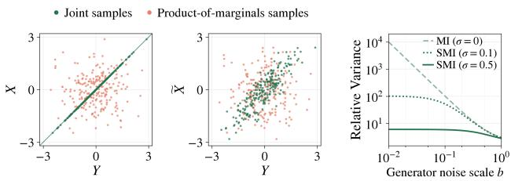  
Figure 1: Gaussian spreading near a singular limit. Left pair: Joint and product-of-marginals samples at $b = 0$ , before (leftmost) and after (middle) spreading with $\sigma = 0 . 5$ . Right: Relative variance of the pathwise estimator of $\partial _ { a } I ( \widetilde { X } ; Y )$ using exact scores.

In practice, we aggregate SMI across multiple noise levels, with the noise distribution and weighting determining the scales at which dependence is measured.

## 3.1 Gradients of SMI

For an implicit generator $g _ { \theta } ( y , z )$ and a fixed transition kernel k, we optimise $I _ { \theta } ( { \tilde { X } } ; Y )$ through its gradient with respect to the generator parameters θ.

Proposition 3.3 (SMI gradient, informal). Let ${ \tilde { X } } =$ $h ( g _ { \theta } ( Y , Z ) , \epsilon )$ be the output of a generator followed by a fixed, reparameterizable spreading channel. Under suitable regularity conditions,

$$
\begin{array} { r l r } {  { \nabla _ { \theta } I _ { \theta } \big ( \tilde { X } ; Y \big ) = \mathbb { E } \bigg [ \bigg ( \frac { \partial \tilde { X } } { \partial \theta } \bigg ) ^ { \top } } } \\ & { } & { \ ( \nabla _ { \tilde { x } } \log \tilde { p } _ { \theta } ( \tilde { x } \mid y ) - \nabla _ { \tilde { x } } \log \tilde { p } _ { \theta } ( \tilde { x } ) ) \bigg | _ { \tilde { x } = \tilde { X } } \bigg ] , } \end{array}\tag{3.8}
$$

The formal statement appears in Prop. B.1.

The model in Fig. 1 illustrates how Gaussian spreading regularises score-based gradient estimation near singular generator outputs. In particular, we consider $X = a Y + b Z$ and $\tilde { X } = X + \sigma \epsilon$ , with $a = 1$ and independent standard Gaussian $Y , Z , \epsilon . { \mathrm { ~ A t ~ } } b = 0$ $X \mid Y$ is a point mass, so its score is undefined and $I ( X ; Y ) = \infty$ . Any $\sigma > 0$ yields smooth, positive conditional and marginal densities, making the score diference in Eq. (3.8) well-defined. More generally, for $a > 0$ and $b ^ { 2 } + \sigma ^ { 2 } > 0$ , the single-sample pathwise estimator $G _ { \sigma }$ of $\partial _ { a } I ( \widetilde { X } ; Y )$ in Eq. (3.8), evaluated using exact scores, satisfies

$$
{ \frac { \operatorname { V a r } ( G _ { \sigma } ) } { ( \mathbb { E } G _ { \sigma } ) ^ { 2 } } } = 2 + { \frac { a ^ { 2 } } { b ^ { 2 } + \sigma ^ { 2 } } } .\tag{3.9}
$$

Without spreading $( \sigma ~ = ~ 0 )$ , the relative variance Eq. (3.9) diverges as $b  0 .$ , whereas for any fixed $\sigma > 0$ it remains bounded by $2 + a ^ { 2 } / \sigma ^ { 2 }$ . This reveals an advantage of SMI in highly correlated settings:

Gaussian spreading preserves well-defined scores and bounded relative gradient variance near the deterministic limit, where the unspread law becomes singular and MI diverges.

## 3.2 Estimating SMI gradients through density ratios

The main challenge in estimating $\nabla _ { \theta } I _ { \theta } ( \tilde { X } ; Y )$ using Eq. (3.8) is estimating the score diference:

$$
\nabla _ { \tilde { x } } \log \tilde { p } _ { \theta } ( \tilde { x } \mid y ) - \nabla _ { \tilde { x } } \log \tilde { p } _ { \theta } ( \tilde { x } ) = \nabla _ { \tilde { x } } \log \frac { \tilde { p } _ { \theta } ( \tilde { x } \mid y ) } { \tilde { p } _ { \theta } ( \tilde { x } ) } .\tag{3.10}
$$

Following Chen et al. (2025), we estimate this field by diferentiating a learned log density ratio. Let $c _ { \phi } ( \tilde { x } , y ) \in ( 0 , 1 )$ predict whether a pair is drawn from the joint distribution (label 1) or the product of its marginals (label 0). With θ fixed, minimise the balanced cross-entropy objective

$$
\begin{array} { r l } & { \mathcal { L } _ { \mathrm { c l f } } ( \phi ) = - \mathbb { E } [ \log c _ { \phi } ( \tilde { X } , Y ) ] } \\ & { \qquad - \mathbb { E } [ \log ( 1 - c _ { \phi } ( \tilde { X } , \bar { Y } ) ) ] , } \end{array}\tag{3.11}
$$

where $\bar { Y } \sim p _ { Y }$ is independent of $( { \tilde { X } } , Y )$ . When the spread densities are positive, as for Gaussian spreading, the population objective over all measurable classifiers is minimised by

$$
c _ { \phi } ^ { * } ( \tilde { x } , y ) = \frac { \tilde { p } _ { \theta } ( \tilde { x } \mid y ) } { \tilde { p } _ { \theta } ( \tilde { x } \mid y ) + \tilde { p } _ { \theta } ( \tilde { x } ) } ,\tag{3.12}
$$

uniquely up to null sets (Gutmann and Hyv¨arinen, 2010). The score diference can be estimated through

$$
\nabla _ { \tilde { x } } \log \frac { \tilde { p } _ { \theta } ( \tilde { x } \mid y ) } { \tilde { p } _ { \theta } ( \tilde { x } ) } = \nabla _ { \tilde { x } } \log \frac { c _ { \phi } ^ { * } ( \tilde { x } , y ) } { 1 - c _ { \phi } ^ { * } ( \tilde { x } , y ) } .\tag{3.13}
$$

## 3.3 SMI with difusion kernels

We use Gaussian noising kernels of the form employed in difusion models (Song et al., 2021; Ho et al., 2020). Write $X _ { 0 } : = g _ { \theta } ( Y , Z )$ and let $X _ { t }$ denote the corresponding spread variable at noise level t:

$$
k _ { t } ( x _ { t } \mid x _ { 0 } ) = \mathcal { N } ( x _ { t } ; \alpha _ { t } x _ { 0 } , \sigma _ { t } ^ { 2 } I _ { d } ) .\tag{3.14}
$$

The corresponding reparameterization is

$$
X _ { t } = h _ { t } ( X _ { 0 } , \epsilon ) = \alpha _ { t } X _ { 0 } + \sigma _ { t } \epsilon , \epsilon \sim \mathcal { N } ( 0 , I _ { d } ) .\tag{3.15}
$$

The schedule is fixed with respect to θ. We assume $\mathbb { E } \| X _ { 0 } \| ^ { 2 } < \infty$ and use $\alpha _ { t } , \sigma _ { t } > 0$ at the sampled training levels. Positive noise gives smooth, positive conditional and marginal densities, denoted by $p _ { \theta } ( x _ { t } \mid y )$ and $p _ { \theta } ( x _ { t } )$ , respectively. The parameter-gradient identity additionally requires the diferentiability and integrability assumptions of Prop. 3.3.

Since $I _ { \theta } ( X _ { t } ; Y ) = I _ { \theta } ( X _ { 0 } + \sqrt { \tau _ { t } } \epsilon ; Y )$ (see $\mathrm { A p p . ~ B . 1 } )$ , the efective noise variance is $\tau _ { t } = \sigma _ { t } ^ { 2 } / \alpha _ { t } ^ { 2 }$ . Increasing $\tau _ { t }$ reduces the information about $Y ,$ , whereas $\tau _ { t } \to 0$ recovers the unspread MI, as established in Thm. B.7. Small efective noise variances retain fine-scale dependence, while larger variances measure dependence that persists under stronger perturbations. To control dependence across these scales, we average over $t \sim p _ { t } .$ , with the sampling distribution $p _ { t }$ and nonnegative weights wSMI(t) determining the contribution of each scale:

$$
\mathcal { L } _ { \mathrm { S M I } } ( \theta ) = \mathbb { E } _ { t } [ w _ { \mathrm { S M I } } ( t ) I _ { \theta } ( X _ { t } ; Y ) ] .\tag{3.16}
$$

The time-dependent classifier is trained with

$$
\begin{array} { r l } & { \mathcal { L } _ { \mathrm { c l f } } ( \phi ; t ) = - \mathbb { E } [ \log c _ { \phi } ( X _ { t } , Y , t ) ] } \\ & { \qquad - \mathbb { E } [ \log ( 1 - c _ { \phi } ( X _ { t } , \bar { Y } , t ) ) ] , } \end{array}\tag{3.17}
$$

$$
\mathcal { L } _ { \mathrm { c l f } } ( \phi ) = \mathbb { E } _ { t } [ w _ { \mathrm { c l f } } ( t ) \mathcal { L } _ { \mathrm { c l f } } ( \phi ; t ) ] ,\tag{3.18}
$$

where $\bar { Y } \sim p _ { Y }$ is independent of $( Y , Z , \epsilon , t )$ . The distribution $p _ { t }$ and positive weights w , w are fixed with respect to $\theta$ and chosen so that the SMI objective is finite. A suficient choice is to sample a compact time interval on which the scales and weights are bounded and $\sigma _ { t }$ is bounded away from zero. We assume that the classifier loss is finite at the fitted parameters and that diferentiation of SMI can be interchanged with the time expectation. Let

$$
v _ { t } ( x _ { t } , y ) \equiv \nabla _ { x _ { t } } \log \frac { p _ { \theta } ( x _ { t } \mid y ) } { p _ { \theta } ( x _ { t } ) } ,\tag{3.19}
$$

then Prop. 3.3 gives

$$
\begin{array} { r l } & { \nabla _ { \boldsymbol { \theta } } \mathcal { L } _ { \mathrm { S M I } } ( \boldsymbol { \theta } ) } \\ & { = \mathbb { E } \left[ w _ { \mathrm { S M I } } ( t ) \alpha _ { t } \left( \frac { \partial g _ { \boldsymbol { \theta } } ( \boldsymbol { y } , \boldsymbol { z } ) } { \partial \boldsymbol { \theta } } \right) ^ { \top } \boldsymbol { v } _ { t } ( \boldsymbol { x } _ { t } , \boldsymbol { y } ) \right] . } \end{array}\tag{3.20}
$$

where $v _ { t } ( x , y )$ is estimated through the classifier $c _ { \phi }$ as Eq. (3.13). The efect of estimation error in $v _ { t }$ is analysed in Prop. 4.2.

## 3.4 Optimising SMI in practice

SMI controls dependence but does not determine the output distribution; for example, a constant generator achieves zero SMI. We therefore use it as a regulariser alongside a task-specific loss, such as a distributionmatching, reconstruction, or prediction loss. We therefore use it as a regulariser alongside a task-specific objective. It could alternatively be imposed as an explicit dependence constraint. Specifically, we optimise

$$
\operatorname* { m i n } _ { \theta } \mathcal { L } _ { \mathrm { t a s k } } ( \theta ) + \beta \mathcal { L } _ { \mathrm { S M I } } ( \theta ) .\tag{3.21}
$$

Algorithm 1: Dependence control with SMI   
Inputs: Generator $g _ { \boldsymbol { \theta } } ;$ classifier $c _ { \phi } ;$ batch size $\overline { { B ; } }$   
classifier updates $N _ { \mathrm { c l f } } ;$ SMI strength $\beta ;$   
learning rates $\eta _ { \theta } , \eta _ { \phi }$   
1 while the stopping criterion is not met do   
// Classifier updates: hold θ fixed   
2 for $j = 1 , \ldots , \ l { N _ { \mathrm { c l f } } }$ do   
3 $y _ { i } , \bar { y } _ { i } \sim p _ { Y } , z _ { i } \sim q z , t _ { i } \sim p _ { t }$ , and $\epsilon _ { i } \sim \mathcal { N } ( 0 , I _ { d } )$   
4 $x _ { i } \gets \mathrm { E q . ~ } ( 3 . 1 5 )$   
5 $\widehat { \mathcal { L } } _ { \mathrm { c l f } }  \mathrm { E q . ~ } ( 3 . 1 8 )$   
6 $\phi  \phi - \eta _ { \phi } \nabla _ { \phi } \widehat { \mathcal { L } } _ { \mathrm { c l f } }$   
// Generator update: hold ϕ fixed   
7 $y _ { i } \sim p _ { Y } , z _ { i } \sim q z , t _ { i } \sim p _ { t }$ , and $\boldsymbol { \dot { \epsilon } } _ { i } \sim \mathcal { N } ( \boldsymbol { 0 } , \boldsymbol { I } _ { d } )$   
8 $x _ { i } \gets \mathrm { E q . ~ ( 3 . 1 5 ) }$   
9 $v _ { i } \gets \mathrm { E q . ~ } ( 3 . 1 3 )$   
10 $\nabla _ { \boldsymbol { \theta } } \widehat { \mathcal { L } } _ { \mathrm { S M I } } \gets \mathrm { E q . ~ } ( 3 . 2 0 )$   
11 Compute a minibatch task loss $\widehat { \mathcal { L } } _ { \mathrm { t a s k } }$   
12 $\theta \gets \theta - \eta _ { \theta } \left( \nabla _ { \theta } \widehat { \mathcal { L } } _ { \mathrm { t a s k } } + \beta \nabla _ { \theta } \widehat { \mathcal { L } } _ { \mathrm { S M I } } \right)$

Here, $\beta ~ > ~ 0$ encourages dependence minimisation, $\beta < 0$ encourages maximisation, and |β| controls its strength. Alg. 1 summarises the training procedure.

## 4 THEORETICAL ANALYSIS

We analyse SMI under the Gaussian spreading model introduced in Sec. 3.3, focusing on regularity and bounds on gradient sampling and estimation errors. All proofs and supplementary results are provided in App. B. The appendix additionally compares the relative variance of exact-score SMI and standard-MI gradient estimators in a binary Gaussian model (App. A.1) and characterizes information dissipation, limiting behavior, and scale sensitivity across noise levels (App. A.2).

## 4.1 Regularity and gradient moments

Gaussian spreading gives the conditional and marginal distributions smooth, positive densities with common support $\mathbb { R } ^ { d }$ and finite SMI, even when $X _ { 0 }$ has no density (Thm. B.2). For $\alpha _ { t } \neq 0 ,$ , it also preserves the equivalence between zero SMI and independence. Parameter diferentiability still requires the assumptions of Prop. 3.3. Additional bounds on spatial derivatives and a suficient condition for strong log-concavity under bounded generator outputs are given in Thm. B.4.

By Prop. 3.3, a single-sample estimator of the fixedlevel SMI gradient is

$$
G _ { t } = \alpha _ { t } \left( \frac { \partial g _ { \theta } ( Y , Z ) } { \partial \theta } \right) ^ { \top } v _ { t } ( X _ { t } , Y ) .\tag{4.1}
$$

Here $G _ { t }$ is a random vector whose dependence on $( Y , Z , \epsilon )$ is suppressed for brevity. Singular unspread laws may lack ambient-space densities, so the scores appearing in the MI-gradient identity need not exist (Song and Ermon, 2019). Controlling the second moment of stochastic gradient estimates is standard in convergence analyses of stochastic gradient methods (Bottou et al., 2018). The following result shows that, at every fixed positive noise level, Gaussian spreading yields an exact-score SMI gradient estimator with finite second moment under a bounded generator Jacobian, without requiring bounded generator outputs. Consequently, averaging B independent samples gives an $O ( B ^ { - 1 } )$ mean-squared sampling-error bound.

Proposition 4.1 (Second-moment bounds for SMI gradients). Assume the regularity conditions of Prop. 3.3 and, for some $M < \infty$

$$
\left\| \frac { \partial g _ { \theta } ( Y , Z ) } { \partial \theta } \right\| _ { \mathrm { o p } } \leq M \qquad a l m o s t ~ s u r e l y .\tag{4.2}
$$

Then $\mathbb { E } [ G _ { t } ] = \nabla _ { \boldsymbol { \theta } } I _ { \boldsymbol { \theta } } ( X _ { t } ; Y )$ and

$$
\mathbb { E } \Vert v _ { t } ( X _ { t } , Y ) \Vert ^ { 2 } \leq \frac { d } { \sigma _ { t } ^ { 2 } } , ~ ( 4 . 3 ) \qquad \mathbb { E } \Vert G _ { t } \Vert ^ { 2 } \leq \frac { M ^ { 2 } d \alpha _ { t } ^ { 2 } } { \sigma _ { t } ^ { 2 } } .\tag{4.4}
$$

For B independent draws $o f \left( T , Y , Z , \epsilon \right)$ , the weighted estimator satisfies

$$
\begin{array} { r l r } {  { \mathbb { E } \| \frac { 1 } { B } \sum _ { i = 1 } ^ { B } w _ { \mathrm { S M I } } ( t _ { i } ) G _ { t _ { i } , i } - \nabla _ { \theta } \mathcal { L } _ { \mathrm { S M I } } \| ^ { 2 } } } \\ & { } & { \leq \frac { M ^ { 2 } d } { B } \mathbb { E } _ { t } [ w _ { \mathrm { S M I } } ( t ) ^ { 2 } \frac { \alpha _ { t } ^ { 2 } } { \sigma _ { t } ^ { 2 } } ] , } \end{array}\tag{4.5}
$$

provided the RHS is finite and diferentiation can be interchanged with the time expectation in Eq. (3.16).

Prop. 4.1 demonstrates that the gradient secondmoment bound scales linearly with the signal-to-noise ratio $\alpha _ { t } ^ { 2 } / \sigma _ { t } ^ { 2 }$ , yielding quantitative control of minibatch sampling error. For estimation across noise levels, the integrability criterion guides the choice of time distribution and weights, particularly near zero noise. The proof is given in App. B.7.

## 4.2 Efect of classifier estimation error

In practice, diferentiating the classifier’s log-odds gives an approximation $\widehat { v } _ { t }$ to the score diference $v _ { t }$ . The following result quantifies how its error $\delta _ { t }$ propagates to gradient bias and minibatch sampling error.

Proposition 4.2 (Efect of classifier estimation error). Under the assumptions of Prop. 4.1, fix a diferentiable classifier $c _ { \phi }$ taking values in (0, 1) and define

$$
\widehat { v } _ { t } ( x _ { t } , y ) = \nabla _ { x _ { t } } \log \frac { c _ { \phi } ( x _ { t } , y , t ) } { 1 - c _ { \phi } ( x _ { t } , y , t ) } ,\tag{4.6}
$$

$$
\delta _ { t } ^ { 2 } = \mathbb { E } \| \widehat { v } _ { t } ( X _ { t } , Y ) - v _ { t } ( X _ { t } , Y ) \| ^ { 2 } < \infty .\tag{4.7}
$$

Let $\begin{array} { r } { \widehat { G } _ { t } = \alpha _ { t } \left( \frac { \partial g _ { \theta } ( Y , Z ) } { \partial \theta } \right) ^ { \top } \widehat { v } _ { t } ( X _ { t } , Y ) } \end{array}$ , then

$$
\| \mathbb { E } \widehat { G } _ { t } - \nabla _ { \theta } I _ { \theta } ( X _ { t } ; Y ) \| \le M \alpha _ { t } \delta _ { t } .\tag{4.8}
$$

For B independent samples,

$$
\begin{array} { r l r } {  { \mathbb { E } \| \frac { 1 } { B } \sum _ { i = 1 } ^ { B } \widehat { G } _ { t , i } - \nabla _ { \theta } I _ { \theta } ( X _ { t } ; Y ) \| ^ { 2 } } } \\ & { } & { \leq \frac { 2 M ^ { 2 } \alpha _ { t } ^ { 2 } } { B } ( \frac { d } { \sigma _ { t } ^ { 2 } } + \delta _ { t } ^ { 2 } ) + M ^ { 2 } \alpha _ { t } ^ { 2 } \delta _ { t } ^ { 2 } . } \end{array}\tag{4.9}
$$

For a randomly fitted classifier and generator, the statements hold conditionally on their fitted state, using fresh evaluation samples.

The bound separates $O ( B ^ { - 1 } )$ sampling error from a squared-bias term controlled by $\delta _ { t } ^ { 2 }$ . Gaussian spreading increases overlap between the joint and product-ofmarginals distributions, which can ease density-ratio estimation by mitigating near-separation (Gutmann and Hyv¨arinen, 2010; Rhodes et al., 2020). Together with derivative control (Prop. B.6), such as Sobolev regularization (Xie et al., 2026), this provides a rationale for more reliable score-diference estimation. The proof and weighted extension are in App. B.9 and Cor. B.5.

## 5 EXPERIMENTS

We evaluate SMI on synthetic and real-world tasks spanning dependence minimisation and maximisation. We compare against MI-based methods and, where appropriate, task-specific baselines. Within each task, MI-based methods share the same generator or representation architecture. See App. C for implementation details and additional results.

## 5.1 Synthetic Experiments

Support geometry. Let $X _ { a } = ( Z , a Y )$ , with independent $Z \sim \mathcal { N } ( 0 , 1 )$ and $Y \sim \mathrm { U n i f } \{ - 1 , + 1 \}$ . The conditional supports are parallel lines separated by 2a (Fig. 2a). Independence occurs at $a ~ = ~ 0$ , but $I ( X _ { a } ; Y ) = \log 2$ for every $a > 0$ , so its gradient cannot guide their contraction. Gaussian spreading makes the objective sensitive to this separation. SMI reaches $2 a < 0 . 1$ in all ten runs, versus four of ten without spreading, although those four reach the target sooner.

Gradient accuracy. Following Chen et al. (2025), we compare SMI with subtracting conditional and marginal scores fitted separately by denoising score matching (DSM) (Vincent, 2011), using fixed Gaussiansmoothed discrete distributions. With errors pooled over noise levels, SMI has lower mean relative errors for both score diferences and parameter gradients (Tab. 1).

Table 1: Gradient accuracy. Relative errors (↓), mean ± SD over ten seeds.
<table><tr><td>Estimator</td><td>Score difference</td><td>Parameter gradient</td></tr><tr><td>SMI</td><td> $\mathbf { 0 . 4 0 8 \pm 0 . 0 3 0 }$ </td><td> $\mathbf { 0 . 2 7 5 \pm 0 . 0 3 1 }$ </td></tr><tr><td>DSM scores</td><td> $2 . 6 0 8 \pm 0 . 3 7 6$ </td><td> $6 . 2 2 5 \pm 1 . 8 3 4$ </td></tr></table>

MI optimisation. We optimise correlations between d-dimensional Gaussian vectors under invertible transformations, using up to 5,000 generator updates (Fig. 2b,c). SMI samples $\sigma \sim \mathrm { L o g U n i f o r m } ( 0 . 0 1 , 1 )$ ; evaluation uses analytic MI before spreading. Starting from 10 nats, SMI keeps MI below $1 0 ^ { - 3 }$ throughout the final 1,000 updates in all minimisation runs. At $d = 1 0 0$ and 200, the best baseline attains this criterion in only 50% and 48% of runs, respectively. Starting from 0.5 nats, SMI, CLUB (Cheng et al., 2020), KNIFE (Pichler et al., 2022) and MIGE (Wen et al., 2020) reach the 50-nat maximisation target in every run without numerical failure.

Computational costs. SMI uses a single densityratio network and has time and memory costs that scale linearly with minibatch size for a fixed architecture. Empirically, its per-iteration cost is comparable to other classifier-based MI-control methods, while using substantially less memory than MIGE. See App. C.5 for detailed results and complexity analysis.

## 5.2 Missing Data Imputation

Following Liu et al. (2024); Yu et al. (2025), we reduce dependence between the completed data and the missingness mask while keeping observed entries fixed:

$$
\begin{array} { r l } & { \underset { \theta } { \operatorname* { m i n } } I ( X _ { \theta } ; M ) , \quad \mathrm { ~ w h e r e ~ } } \\ & { X _ { \theta } = M \odot X + ( 1 - M ) \odot g _ { \theta } ( M \odot X , M , Z ) . } \end{array}\tag{5.1}
$$

Here, $M _ { j } = 1$ denotes an observed entry and Z provides imputation randomness. SMI instead minimises $\mathbb { E } _ { \sigma } I ( X _ { \theta } + \sigma \epsilon ; M )$ , with σ ∼ LogUniform(0.01, 1).

We impute numerical features from ten TabArena datasets (Erickson et al., 2025), with entries missing completely at random (MCAR) (Rubin, 1976) at rates of 30%, 60%, and 80%. We repeat masking and training over three seeds, sharing masks across methods and fitting preprocessing only to observed entries. MIcontrol methods share a residual MLP imputer without reconstruction penalties. Established imputers, including the MI-based WGF (Liu et al., 2024) and MIRI (Yu et al., 2025), retain their task-specific procedures.

Tab. 2 ranks methods by masked-entry RMSE and squared maximum mean discrepancy $\mathrm { ( M M D ^ { 2 } ) }$ between completed and reference rows (Gretton et al., 2012).

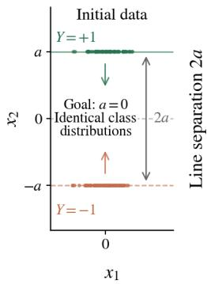

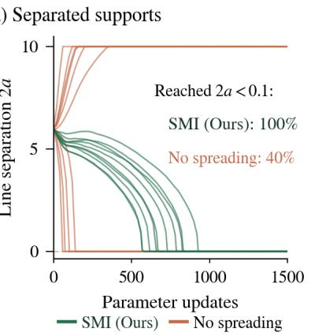

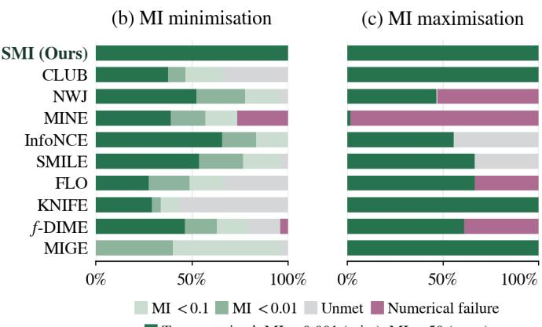

Figure 2: Synthetic experiments. (a) Conditional supports $x _ { 2 } = \pm a$ and optimisation of their separation 2a. $^ { ( \mathrm { b , c } ) }$ MI minimisation and maximisation results, pooled over Gaussian, cubic, asinh, signed-power and spiral data; $d \in \{ 2 0 , 1 0 0 , 2 0 0 \}$ ; a shared correlation coeficient or one per latent coordinate pair; and ten seeds.  
  
Figure 3: Waterbirds. Training examples from the four bird–background groups.

SMI achieves the lowest mean $\mathrm { M M D ^ { 2 } }$ rank among matched MI methods at every missingness rate and among all methods at 80%, with no numerical failures. HyperImpute (Jarrett et al., 2022) and MissForest (Stekhoven and B¨uhlmann, 2012) achieve better mean RMSE ranks, consistent with their iterative columnwise prediction objectives, which are more directly aligned with pointwise reconstruction.

## 5.3 Nuisance Suppression on Waterbirds

On Waterbirds (Sagawa et al., 2020), 95% of training examples pair landbirds with land or waterbirds with water $\left( { \mathrm { F i g . ~ 3 } } \right)$ . We learn a 64-dimensional representation $R _ { \theta }$ from frozen ResNet-50 features (He et al., 2016), combining bird-class cross-entropy with classconditional background suppression (App. C.3).

Worst-group accuracy is the minimum test accuracy across four bird–background groups. Background leakage is measured using separately fitted linear and MLP probes, as the class-averaged absolute deviation of ROC AUC from 0.5, in percentage points (Tab. 3). Probe scores measure predictability rather than MI. SMI attains the lowest mean leakage among MI-based methods under both probes, the lowest mean MLP leakage overall, and mean worst-group accuracy comparable to FLO (Guo et al., 2022). Among alternative dependence-control methods, HSIC (Gretton et al.,

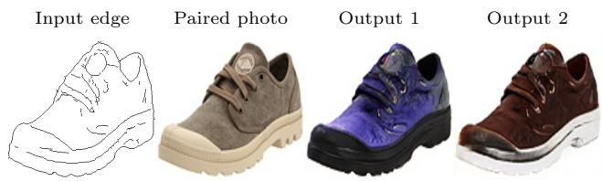  
Figure 4: Edges-to-photos translation. Input, paired photo and two SMI outputs (diferent latents).

2005) attains higher mean worst-group accuracy and lower linear leakage, but higher MLP leakage than SMI; conditional adversarial training (Edwards and Storkey, 2016; Louppe et al., 2017) attains higher worst-group accuracy but higher leakage under both probes.

## 5.4 Edges-to-Photos Translation

We encourage a conditional generator to retain information about its latent code:

$$
\operatorname* { m i n } _ { \theta } \mathcal { L } _ { \mathrm { t a s k } } ( \theta ) + \beta I ( H _ { \theta } ; Z ) , \ H _ { \theta } = \Phi ( G _ { \theta } ( C , Z ) ) ,\tag{5.2}
$$

where $\beta < 0 , C$ is an edge map, $Z \sim { \mathcal { N } } ( 0 , I _ { 8 } )$ is independent of $C _ { i }$ and Φ extracts frozen AlexNet features (Krizhevsky et al., 2012), followed by PCA whitening to 256 dimensions. The MI is computed marginally over C. SMI replaces it with $\mathbb { E } _ { \sigma } I ( H _ { \theta } + \sigma \epsilon ; Z )$ , where $\epsilon \sim \mathcal { N } ( 0 , I )$ and σ ∼ LogUniform(0.01, 1).

On Edges2Shoes (Yu and Grauman, 2014; Isola et al., 2017), all trained methods fine-tune the same pretrained BicycleGAN generator and encoder (Zhu et al., 2017) for 20,000 generator updates, sharing the adversarial, image-reconstruction, and KL losses. Additional baselines augment this shared objective with either latent $\ell _ { 1 }$ reconstruction or DSGAN’s diversity-sensitive regularisation (Yang et al., 2019).

Table 2: Missing data imputation. Ranks across all methods (↓), averaged over ten datasets at each missingness rate; mean ± SD over three seeds. Failed runs rank last.
<table><tr><td rowspan="2">Method</td><td colspan="2">(a) 30% MCAR</td><td colspan="2">(b) 60% MCAR</td><td colspan="2">(c) 80% MCAR</td></tr><tr><td> $\mathrm { M M D ^ { 2 } \ r a n k }$ </td><td>RMSE rank</td><td> $\mathrm { M M D ^ { 2 } \ r a n k }$ </td><td>RMSE rank</td><td> $\mathrm { M M D ^ { 2 } \ r a n k }$ </td><td>RMSE rank</td></tr><tr><td colspan="7">MI-based methods</td></tr><tr><td>SMI(Ours)</td><td> ${ \bf 5 . 4 3 \pm 0 . 3 1 }$  </td><td> ${ \bf 7 . 6 3 \pm 0 . 1 5 }$ </td><td> ${ \bf 4 . 1 0 \pm 0 . 1 0 }$ </td><td> $7 . 6 3 \pm 0 . 0 6$ </td><td> ${ \bf 2 . 8 7 \pm 0 . 2 1 }$  </td><td> $\underline { { 7 . 3 3 \pm 0 . 3 5 } }$  1</td></tr><tr><td>CLUB</td><td> $1 2 . 3 0 \pm 0 . 6 6$ </td><td> $9 . 9 3 \pm 0 . 2 1$ </td><td> $1 1 . 9 7 \pm 0 . 2 1$ </td><td> ${ \bf 7 . 3 7 \pm 0 . 1 2 }$ </td><td> $1 1 . 0 0 \pm 0 . 2 0$ </td><td> $\mathbf { 5 . 3 3 \pm 0 . 1 2 }$ </td></tr><tr><td>NWJ</td><td> $1 1 . 9 0 \pm 0 . 2 0$ </td><td> $1 3 . 6 3 \pm 0 . 2 3$ </td><td> $8 . 4 3 \pm 0 . 4 0$ </td><td> $1 1 . 8 0 \pm 0 . 2 0$ </td><td> $6 . 4 7 \pm 0 . 8 3$ </td><td> $1 0 . 5 3 \pm 0 . 9 5$ </td></tr><tr><td>MINE</td><td> $1 0 . 3 3 \pm 0 . 8 3$ </td><td> $1 2 . 9 0 \pm 0 . 4 0$ </td><td> $7 . 4 3 \pm 0 . 3 2$ </td><td> $1 1 . 2 7 \pm 0 . 1 5$ </td><td> $7 . 4 0 \pm 0 . 6 6$ </td><td> $1 0 . 4 0 \pm 0 . 5 3$ </td></tr><tr><td>InfoNCE</td><td> $1 1 . 6 7 \pm 0 . 1 2$ </td><td> $1 3 . 5 0 \pm 0 . 1 7$ </td><td> $9 . 2 0 \pm 0 . 2 0$ </td><td> $1 1 . 2 0 \pm 0 . 1 7$ </td><td> $7 . 5 3 \pm 0 . 2 9$ </td><td> $9 . 2 0 \pm 0 . 3 0$ </td></tr><tr><td>SMILE</td><td> $1 0 . 2 3 \pm 0 . 4 0$ </td><td> $1 2 . 0 3 \pm 0 . 0 6$ </td><td> $7 . 8 0 \pm 0 . 3 6$ </td><td> $1 0 . 5 0 \pm 0 . 1 7$ </td><td> $6 . 8 3 \pm 0 . 2 1$ </td><td> $8 . 1 3 \pm 0 . 1 2$ </td></tr><tr><td>FLO</td><td> $1 1 . 7 3 \pm 0 . 2 5$ </td><td> $1 2 . 9 7 \pm 0 . 2 5$ </td><td> $8 . 9 3 \pm 0 . 5 5$ </td><td> $1 3 . 3 0 \pm 0 . 4 0$ </td><td> $7 . 3 3 \pm 0 . 2 1$ </td><td> $1 2 . 5 0 \pm 0 . 1 7$ </td></tr><tr><td>KNIFE</td><td> $6 . 1 0 \pm 0 . 2 0$ </td><td> $8 . 1 7 \pm 0 . 0 6$ </td><td> ${ \underline { { 5 . 4 7 } } } \pm 1 . 0 7$ </td><td> $\underline { { 7 . 6 0 \pm 0 . 3 0 } }$ </td><td> $4 . 4 0 \pm 0 . 8 7$ </td><td> $7 . 6 3 \pm 0 . 3 5$ </td></tr><tr><td>f-DIME</td><td> $\overline { { 9 . 1 3 \pm 0 . 6 8 } }$ </td><td> $1 1 . 4 0 \pm 0 . 4 6$ </td><td> $1 0 . 4 3 \pm 1 . 1 4$ </td><td> $1 2 . 9 3 \pm 0 . 7 1$ </td><td> $\bar { 1 1 . 6 7 \pm 0 . 9 7 }$ </td><td> $1 3 . 3 0 \pm 1 . 0 5$ </td></tr><tr><td>MIGE</td><td> $7 . 2 3 \pm 0 . 6 4$ </td><td> $9 . 8 7 \pm 0 . 0 6$ </td><td> $1 0 . 8 0 \pm 0 . 3 6$ </td><td> $1 5 . 1 0 \pm 0 . 1 0$ </td><td> $9 . 6 7 \pm 0 . 0 6$ </td><td> $1 4 . 3 3 \pm 0 . 2 1$ </td></tr><tr><td colspan="7">Established imputers</td></tr><tr><td>GAIN</td><td> $1 2 . 8 3 \pm 1 . 6 5$ </td><td> $4 . 4 0 \pm 0 . 4 4$ </td><td> $1 5 . 4 0 \pm 0 . 1 0$ </td><td> $3 . 8 3 \pm 0 . 2 5$ </td><td> $1 5 . 2 7 \pm 0 . 2 1$ </td><td> $7 . 9 7 \pm 1 . 8 8$ </td></tr><tr><td>MIWAE</td><td> $6 . 1 7 \pm 0 . 5 1$ </td><td> $4 . 5 3 \pm 0 . 1 2$ </td><td> $9 . 6 3 \pm 0 . 4 5$ </td><td> $4 . 2 0 \pm 0 . 1 7$ </td><td> $1 0 . 7 3 \pm 0 . 2 1$ </td><td> $3 . 2 7 \pm 0 . 5 7$ </td></tr><tr><td>MIRI</td><td> $\underline { { 3 . 3 0 \pm 0 . 3 0 } }$ </td><td> $6 . 9 0 \pm 0 . 5 2$ </td><td> ${ \bf 3 . 2 0 \pm 0 . 6 1 }$ </td><td> $9 . 7 0 \pm 0 . 9 5$ </td><td> ${ \bf 6 . 2 7 \pm 0 . 4 0 }$ </td><td> $1 1 . 7 7 \pm 0 . 5 1$ </td></tr><tr><td>WGF</td><td> $\mathbf { 2 . 3 3 \pm 0 . 4 9 }$ </td><td> $5 . 0 3 \pm 0 . 0 6$ </td><td> $3 . 9 0 \pm 0 . 1 0$ </td><td> $6 . 0 7 \pm 0 . 5 7$ </td><td> ${ \underline { { 7 . 7 7 } } } \pm 1 . 2 1 $ </td><td> $8 . 7 3 \pm 1 . 2 2$ </td></tr><tr><td>HyperImpute</td><td> $3 . 7 7 \pm 0 . 0 6$ </td><td> ${ \bf 1 . 1 7 \pm 0 . 0 6 }$ </td><td> $\overline { { 7 . 4 3 \pm 0 . 6 4 } }$ </td><td> $\underline { { 1 . 8 7 \pm 0 . 0 6 } }$ </td><td> $\overline { { 9 . 1 3 \pm 0 . 8 7 } }$ </td><td> $2 . 9 7 \pm 0 . 5 5$ </td></tr><tr><td>MissForest</td><td> $1 1 . 5 3 \pm 0 . 5 9$ </td><td> $\underline { { 1 . 9 3 \pm 0 . 0 6 } }$ </td><td> $1 1 . 8 7 \pm 0 . 0 6$ </td><td> $\mathbf { 1 . 6 3 \pm 0 . 2 3 }$ </td><td> $1 1 . 7 3 \pm 0 . 2 1$ </td><td> $\mathbf { 2 . 6 7 \pm 0 . 5 9 }$ </td></tr></table>

Table 3: Waterbirds. Test results; $\mathrm { m e a n } \pm \mathrm { S D }$ over five training seeds.
<table><tr><td colspan="2" rowspan="2">Worst-group Method accuracy  $( \% , \uparrow )$ </td><td colspan="2">Leakage (points, ↓)</td></tr><tr><td>Linear</td><td>MLP</td></tr><tr><td colspan="4">MI-based methods</td></tr><tr><td colspan="4">SMI (Ours)  $\mathbf { 7 1 . 6 8 \pm 1 . 3 3 }$   ${ \bf 1 8 . 1 9 \pm 5 . 3 5 }$ </td></tr><tr><td>MINE</td><td> $7 0 . 8 7 \pm 1 . 1 6$ </td><td> $2 6 . 2 1 \pm 2 . 4 2$ </td><td> ${ \bf 9 . 2 0 \pm 5 . 4 9 }$   $2 2 . 2 3 \pm 4 . 0 0$ </td></tr><tr><td>SMILE</td><td> $7 1 . 4 3 \pm 1 . 8 3$ </td><td> $2 5 . 3 4 \pm 3 . 1 5$ </td><td> $1 7 . 6 9 \pm 1 . 7 6$ </td></tr><tr><td>InfoNCE</td><td> $7 1 . 4 3 \pm 1 . 4 0$ </td><td> $2 5 . 5 9 \pm 3 . 1 4$ </td><td> $1 8 . 1 2 \pm 4 . 0 9$ </td></tr><tr><td>CLUB</td><td> $7 0 . 6 2 \pm 1 . 3 2$ </td><td> $2 4 . 8 2 \pm 1 . 7 8$ </td><td> $2 0 . 9 5 \pm 2 . 6 2$ </td></tr><tr><td>NWJ</td><td> $7 0 . 3 4 \pm 1 . 0 9$ </td><td> $2 7 . 1 8 \pm 4 . 5 9$ </td><td> $1 8 . 8 2 \pm 2 . 3 2$ </td></tr><tr><td>FLO</td><td> ${ \underline { { 7 1 . 5 9 } } } \pm 0 . 9 5$ </td><td> $2 0 . 9 4 \pm 3 . 0 8$ </td><td> $\underline { { 1 4 . 3 9 \pm 2 . 3 6 } }$ </td></tr><tr><td>KNIFE</td><td> $\overline { { 6 5 . 7 9 \pm 1 . 9 1 } }$ </td><td> $\overline { { 2 5 . 7 0 \pm 5 . 6 0 } }$ </td><td> $\overline { { 2 1 . 6 7 \pm 4 . 7 8 } }$ </td></tr><tr><td>f-DIME</td><td> $7 1 . 3 7 \pm 1 . 0 1$ </td><td> $3 3 . 6 9 \pm 4 . 2 4$ </td><td> $3 4 . 5 0 \pm 3 . 6 5$ </td></tr><tr><td>MIGE</td><td> $6 7 . 1 6 \pm 1 . 5 0$ </td><td> $3 0 . 5 5 \pm 2 . 2 1$ </td><td> $3 0 . 3 4 \pm 2 . 5 5$ </td></tr><tr><td colspan="4">Other methods</td></tr><tr><td>Adversarial</td><td> $7 2 . 3 1 \pm 0 . 8 0$ </td><td> $2 0 . 5 0 \pm 6 . 4 9$ </td><td> ${ \bf 1 2 . 2 2 \pm 3 . 6 5 }$ </td></tr><tr><td>HSIC</td><td> $\mathbf { 7 3 . 0 5 \pm 0 . 8 7 }$ </td><td> $\mathbf { 1 6 . 1 2 \pm 1 . 7 7 }$ </td><td> $1 5 . 4 1 \pm 2 . 1 5$ </td></tr><tr><td>ERM</td><td> $6 8 . 5 7 \pm 1 . 4 1$ </td><td> $3 6 . 4 0 \pm 8 . 8 8$ </td><td> $3 7 . 4 0 \pm 7 . 6 3$ </td></tr><tr><td>GroupDRO</td><td> $6 5 . 9 5 \pm 1 . 5 5$ </td><td> $2 1 . 1 5 \pm 6 . 2 9$ </td><td> $\underline { { 1 3 . 1 2 } } \pm 8 . 6 3$ </td></tr><tr><td></td><td></td><td></td><td></td></tr><tr><td>DFR</td><td> $6 8 . 2 7 \pm 4 . 2 1$ </td><td> $3 2 . 9 1 \pm 6 . 0 4$ </td><td> $\overline { { 3 0 . 2 3 \pm 3 . 3 7 } }$ </td></tr></table>

Table 4: Edges2Shoes. Latent-code prediction $R ^ { 2 }$ (↑); mean ± SD over three training seeds.

We fit MLP regressors to predict Z from frozen DI-NOv2 features (Oquab et al., 2024) of generated images; Tab. 4 reports ${ \dot { R } } ^ { 2 }$ averaged over latent coordinates. Regressors trained on unperturbed outputs are reused after JPEG compression (quality 75) and resizing to half resolution and back. SMI achieves the highest mean $R ^ { 2 }$ among MI-based methods in all settings and among all methods under both perturbations. Its higher kernel Inception distance (KID) (Bi´nkowski et al., 2018) indicates a trade-of with photo-distribution matching. See App. C.4 for additional results.

<table><tr><td></td><td colspan="3">Latent-code prediction  $R ^ { 2 } \left( \uparrow \right)$ </td></tr><tr><td>Method</td><td>Unperturbed</td><td>JPEG (75)</td><td>Resize</td></tr><tr><td colspan="4">MI-based methods</td></tr><tr><td colspan="4">SMI (Ours)  $\mathbf { 0 . 7 9 8 \pm 0 . 0 0 8 }$   $\mathbf { 0 . 6 2 3 \pm 0 . 0 4 5 }$   $\mathbf { 0 . 7 2 6 \pm 0 . 0 3 2 }$ </td></tr><tr><td>InfoNCE</td><td> $0 . 7 5 7 { \scriptstyle \pm 0 . 0 0 4 }$ </td><td> $0 . 5 8 8 { \pm } 0 . 0 3 2$ </td><td> $0 . 6 2 3 { \pm } 0 . 0 7 1$ </td></tr><tr><td>NWJ</td><td> $\underline { { 0 . 7 8 8 \pm 0 . 0 0 8 } }$ </td><td> $0 . 5 9 6 { \pm } 0 . 0 4 7$ </td><td> $\underline { { 0 . 6 8 2 \pm 0 . 0 3 3 } }$ </td></tr><tr><td>FLO</td><td> $\overline { { 0 . 7 2 5 \pm 0 . 0 0 1 } }$ </td><td> $\overline { { 0 . 5 0 3 \pm 0 . 0 2 8 } }$ </td><td> $\overline { { 0 . 6 1 9 \pm 0 . 0 2 5 } }$ </td></tr><tr><td>KNIFE</td><td> $0 . 7 6 5 { \scriptstyle \pm 0 . 0 0 7 }$ </td><td> $0 . 5 8 9 { \pm } 0 . 0 6 5$ </td><td> $0 . 6 7 8 { \pm } 0 . 0 2 2$ </td></tr><tr><td>MIGE</td><td> $0 . 7 4 2 { \scriptstyle \pm 0 . 0 0 1 }$ </td><td> $0 . 5 2 6 \pm 0 . 0 3 5$ </td><td> $0 . 6 3 2 { \pm } 0 . 0 3 1$ </td></tr><tr><td colspan="4">Other methods and reference</td></tr><tr><td>Task only</td><td> $0 . 7 2 5 { \pm } 0 . 0 0 8$ </td><td> $0 . 4 9 5 { \pm } 0 . 0 3 5$ </td><td> $0 . 6 2 6 \pm 0 . 0 1 5$ </td></tr><tr><td>Latent  $\ell _ { 1 }$ </td><td> $\mathbf { 0 . 7 9 8 \pm 0 . 0 0 1 }$ </td><td> $\underline { { 0 . 5 8 4 } } \pm 0 . 0 4 4$ </td><td> $\mathbf { 0 . 6 8 6 \pm 0 . 0 4 3 }$ </td></tr><tr><td> $\mathrm { D S G A N }$  Pretrained</td><td> $\underline { { 0 . 7 3 5 \pm 0 . 0 0 5 } }$  0.732</td><td> $\mathbf { 0 . 5 9 4 } \pm \mathbf { 0 . 0 2 6 }$  0.431</td><td> $\underline { { 0 . 6 8 2 \pm 0 . 0 1 4 } }$  0.655</td></tr></table>

## 6 CONCLUSION

We introduced SMI to mitigate singularity and poor overlap in MI optimisation. Our analysis establishes regularity and gradient-error bounds, while experiments show strong synthetic optimisation and competitive real-world performance. Under injective spreading, SMI vanishes exactly at independence, although small SMI need not imply small MI. Moreover, accurate classification need not yield accurate gradients, and improved dependence control need not translate into better task performance. Future work includes principled noise selection, derivative-aware classifier training, and task-specific trade-ofs.

## AI use statement

In this work, we used generative AI tools for assist in the writing of proofs, formulate mathematical claims, provide critical ingredients for proving mathematical claims, design or provide feedback on research methodology or experiments, implement methods, and interpret results. We have not used generative AI tools for help develop theoretical models or conceptual frameworks, propose or refine hypotheses, and clean and reformat dataset, and generate synthetic data sets, assist with translation, and support qualitative and thematic data analysis are not applicable to this work. Additionally, we used generative AI tools for sourcing/searching for information. We have reviewed all AI-assisted work. We checked all LLM-generated proofs, verified and tested LLM-generated code for correctness. We take responsibility for the final content of this work, including text, claims or artifacts produced with the aid of generative AI.

## Acknowledgements

JMHL acknowledges funding from the AI Hub in Generative Models under grant EP/Y028805/1. RKOY acknowledges funding from the UK Engineering and Physical Sciences Research Council (EPSRC) under grant EP/L016516/1 for the University of Cambridge Centre for Doctoral Training, the Cambridge Centre for Analysis.

## References

Alemi, A. A., Fischer, I., Dillon, J. V., and Murphy, K. (2017). Deep Variational Information Bottleneck. In International Conference on Learning Representations.

Babaie-Zadeh, M., Jutten, C., and Nayebi, K. (2004). Diferential of the mutual information. IEEE Signal Processing Letters, 11(1):48–51.

Belghazi, M. I., Baratin, A., Rajeshwar, S., Ozair, S., Bengio, Y., Courville, A., and Hjelm, D. (2018). Mutual Information Neural Estimation. In Proceedings of the 35th International Conference on Machine Learning, pages 531–540.

Bi´nkowski, M., Sutherland, D. J., Arbel, M., and Gretton, A. (2018). Demystifying MMD GANs. In International Conference on Learning Representations.

Bottou, L., Curtis, F. E., and Nocedal, J. (2018). Optimization Methods for Large-Scale Machine Learning. SIAM Review, 60(2):223–311.

Chen, W., Zhang, M., He, J., Ou, Z., Hern´andez-Lobato, J. M., Sch¨olkopf, B., and Barber, D. (2025). DifRatio: Training One-Step Difusion Mod-

els Without Teacher Supervision. arXiv preprint arXiv:2502.08005 [cs].

Chen, X., Duan, Y., Houthooft, R., Schulman, J., Sutskever, I., and Abbeel, P. (2016). InfoGAN: Interpretable Representation Learning by Information Maximizing Generative Adversarial Nets. In Advances in Neural Information Processing Systems, volume 29.

Cheng, P., Hao, W., Dai, S., Liu, J., Gan, Z., and Carin, L. (2020). CLUB: A Contrastive Log-ratio Upper Bound of Mutual Information. In Proceedings of the 37th International Conference on Machine Learning, pages 1779–1788.

Darcet, T., Oquab, M., Mairal, J., and Bojanowski, P. (2024). Vision Transformers Need Registers. In International Conference on Learning Representations, pages 2632–2652.

Edwards, H. and Storkey, A. (2016). Censoring Representations with an Adversary. In International Conference on Learning Representations.

Erickson, N., Purucker, L., Tschalzev, A., Holzm¨uller, D., Desai, P., Salinas, D., and Hutter, F. (2025). TabArena: A Living Benchmark for Machine Learning on Tabular Data. In Advances in Neural Information Processing Systems, volume 38, Main Conference.

Franzese, G., Bounoua, M., and Michiardi, P. (2024). Minde: Mutual information neural difusion estimation.

Gaudi, S., Sreekumar, G., and Boddeti, V. (2025). CoInD: Enabling Logical Compositions in Difusion Models. In International Conference on Learning Representations, pages 32159–32191.

Gretton, A., Borgwardt, K. M., Rasch, M. J., Sch¨olkopf, B., and Smola, A. (2012). A Kernel Two-Sample Test. Journal of Machine Learning Research, 13(25):723– 773.

Gretton, A., Bousquet, O., Smola, A., and Sch¨olkopf, B. (2005). Measuring Statistical Dependence with Hilbert-Schmidt Norms. In Jain, S., Simon, H. U., and Tomita, E., editors, Algorithmic Learning Theory, pages 63–77, Berlin, Heidelberg.

Guo, D., Shamai, S., and Verdu, S. (2005). Mutual information and minimum mean-square error in Gaussian channels. IEEE Transactions on Information Theory, 51(4):1261–1282.

Guo, Q., Chen, J., Wang, D., Yang, Y., Deng, X., Huang, J., Carin, L., Li, F., and Tao, C. (2022). Tight Mutual Information Estimation With Contrastive Fenchel-Legendre Optimization. In Advances in Neural Information Processing Systems, volume 35, pages 28319–28334.

Gutmann, M. and Hyv¨arinen, A. (2010). Noisecontrastive estimation: A new estimation principle for unnormalized statistical models. In Proceedings of the Thirteenth International Conference on Artificial Intelligence and Statistics, pages 297–304.

He, J., Chen, W., Zhang, M., Barber, D., and Hern´andez-Lobato, J. M. (2025). Training Neural Samplers with Reverse Difusive KL Divergence. In Proceedings of The 28th International Conference on Artificial Intelligence and Statistics, pages 5167– 5175.

He, K., Zhang, X., Ren, S., and Sun, J. (2016). Deep Residual Learning for Image Recognition. In Proceedings of the IEEE Conference on Computer Vision and Pattern Recognition, pages 770–778.

Ho, J., Jain, A., and Abbeel, P. (2020). Denoising Diffusion Probabilistic Models. In Advances in Neural Information Processing Systems, volume 33, pages 6840–6851.

Isola, P., Zhu, J.-Y., Zhou, T., and Efros, A. A. (2017). Image-To-Image Translation With Conditional Adversarial Networks. In Proceedings of the IEEE Conference on Computer Vision and Pattern Recognition, pages 1125–1134.

Jarrett, D., Cebere, B. C., Liu, T., Curth, A., and van der Schaar, M. (2022). HyperImpute: Generalized Iterative Imputation with Automatic Model Selection. In Proceedings of the 39th International Conference on Machine Learning, pages 9916–9937.

Kirichenko, P., Izmailov, P., and Wilson, A. G. (2023). Last Layer Re-Training is Suficient for Robustness to Spurious Correlations. In The Eleventh International Conference on Learning Representations.

Krizhevsky, A., Sutskever, I., and Hinton, G. E. (2012). ImageNet Classification with Deep Convolutional Neural Networks. In Advances in Neural Information Processing Systems, volume 25.

Letizia, N. A., Novello, N., and Tonello, A. M. (2024). Mutual Information Estimation via f-Divergence and Data Derangements. In Advances in Neural Information Processing Systems, volume 37, pages 105114– 105150.

Liu, S., Yu, J., Simons, J., Yi, M., and Beaumont, M. (2024). Minimizing f-Divergences by Interpolating Velocity Fields. In Proceedings of the 41st International Conference on Machine Learning, pages 32308–32331.

Liu, X., Gong, C., and Liu, Q. (2023). Flow Straight and Fast: Learning to Generate and Transfer Data with Rectified Flow. In The Eleventh International Conference on Learning Representations.

Louppe, G., Kagan, M., and Cranmer, K. (2017). Learning to Pivot with Adversarial Networks. In Advances in Neural Information Processing Systems, volume 30.

Mattei, P.-A. and Frellsen, J. (2019). MIWAE: Deep Generative Modelling and Imputation of Incomplete Data Sets. In Proceedings of the 36th International Conference on Machine Learning, pages 4413–4423.

Mohamed, S. and Lakshminarayanan, B. (2016). Learning in Implicit Generative Models. arXiv preprint arXiv:1610.03483 [stat].

Nguyen, X., Wainwright, M. J., and Jordan, M. I. (2010). Estimating Divergence Functionals and the Likelihood Ratio by Convex Risk Minimization. IEEE Transactions on Information Theory, 56(11):5847–5861.

Oquab, M., Darcet, T., Moutakanni, T., Vo, H. V., Szafraniec, M., Khalidov, V., Fernandez, P., Haziza, D., Massa, F., El-Nouby, A., Assran, M., Ballas, N., Galuba, W., Howes, R., Huang, P.-Y., Li, S.-W., Misra, I., Rabbat, M., Sharma, V., Synnaeve, G., Xu, H., Jegou, H., Mairal, J., Labatut, P., Joulin, A., and Bojanowski, P. (2024). DINOv2: Learning Robust Visual Features without Supervision. Transactions on Machine Learning Research.

Pichler, G., Colombo, P. J. A., Boudiaf, M., Koliander, G., and Piantanida, P. (2022). A Diferential Entropy Estimator for Training Neural Networks. In Proceedings of the 39th International Conference on Machine Learning, pages 17691–17715.

Rhodes, B., Xu, K., and Gutmann, M. (2020). Telescoping Density-Ratio Estimation. In Advances in Neural Information Processing Systems, volume 33, pages 4905–4916.

Rubin, D. B. (1976). Inference and missing data. Biometrika, 63(3):581–592.

Sagawa, S., Koh, P. W., Hashimoto, T. B., and Liang, P. (2020). Distributionally Robust Neural Networks. In International Conference on Learning Representations.

Song, J. and Ermon, S. (2020). Understanding the Limitations of Variational Mutual Information Estimators. In International Conference on Learning Representations.

Song, Y. and Ermon, S. (2019). Generative Modeling by Estimating Gradients of the Data Distribution. In Advances in Neural Information Processing Systems, volume 32.

Song, Y., Sohl-Dickstein, J., Kingma, D. P., Kumar, A., Ermon, S., and Poole, B. (2021). Score-Based Generative Modeling through Stochastic Diferential Equations. In International Conference on Learning Representations.

Stekhoven, D. J. and B¨uhlmann, P. (2012). MissForest— Non-Parametric Missing Value Imputation for Mixed-Type Data. Bioinformatics, 28(1):112–118.

Tishby, N., Pereira, F. C., and Bialek, W. (2000). The information bottleneck method. arXiv preprint arXiv:physics/0004057.

van den Oord, A., Li, Y., and Vinyals, O. (2018). Representation Learning with Contrastive Predictive Coding. arXiv preprint arXiv:1807.03748 [cs.LG].

Vincent, P. (2011). A Connection Between Score Matching and Denoising Autoencoders. Neural Computation, 23(7):1661–1674.

Wang, C., Franzese, G., Finamore, A., Gallo, M., and Michiardi, P. (2025). Information Theoretic Text-to-Image Alignment. In International Conference on Learning Representations, pages 50574–50610.

Wen, L., Zhou, Y., He, L., Zhou, M., and Xu, Z. (2020). Mutual Information Gradient Estimation for Representation Learning. In International Conference on Learning Representations.

Wibisono, A. and Jog, V. (2018). Convexity of mutual information along the heat flow.

Xie, C., Blanchet, J., and Xu, R. (2026). Sobolev Regularized Score Diference Estimation in Difusion Models. In Proceedings of the 43rd International Conference on Machine Learning, pages 139166–139217.

Xie, S. and Tu, Z. (2015). Holistically-Nested Edge Detection. In Proceedings of the IEEE International Conference on Computer Vision, pages 1395–1403.

Yang, D., Hong, S., Jang, Y., Zhao, T., and Lee, H. (2019). Diversity-Sensitive Conditional Generative Adversarial Networks. In International Conference on Learning Representations.

Yoon, J., Jordon, J., and van der Schaar, M. (2018). GAIN: Missing Data Imputation using Generative Adversarial Nets. In Proceedings of the 35th International Conference on Machine Learning, pages 5689–5698.

Yu, A. and Grauman, K. (2014). Fine-Grained Visual Comparisons with Local Learning. In Proceedings of the IEEE Conference on Computer Vision and Pattern Recognition, pages 192–199.

Yu, J., Ying, Q., Wang, L., Jiang, Z., and Liu, S. (2025). Missing Data Imputation by Reducing Mutual Information with Rectified Flows. In Advances in Neural Information Processing Systems, volume 38, Main Conference, pages 80324–80352.

Yu, X., Bai, C., He, H., Wang, C., and Li, X. (2024). Regularized Conditional Difusion Model for Multi-Task Preference Alignment. In Advances in Neural Information Processing Systems, volume 37, pages 139968–139996.

Zhang, M., Bi, K., Chen, W., Chen, Q., Guo, J., and Cheng, X. (2024). CausalDif: Causality-Inspired Disentanglement via Difusion Model for Adversarial Defense. In Advances in Neural Information Processing Systems, volume 37, pages 124791–124819.

Zhang, M., Hayes, P., Bird, T., Habib, R., and Barber, D. (2020). Spread Divergence. In Proceedings of the 37th International Conference on Machine Learning, pages 11106–11116.

Zhu, J.-Y., Zhang, R., Pathak, D., Darrell, T., Efros, A., Wang, O., and Shechtman, E. (2017). Toward Multimodal Image-to-Image Translation. In Advances in Neural Information Processing Systems, volume 30.

# Controlling Dependence in Implicit Generative Models via Spread Mutual Information: Supplementary Materials

## CONTENTS

A Additional Theoretical Analysis 12   
A.1 A comparison with standard MI 12   
A.2 Information across noise levels 13   
B Proofs 13   
B.1 Proof of the efective noise variance 13   
B.2 Proof of the data processing and identifiability 14   
B.3 Proof of the pathwise SMI gradient . 14   
B.4 Classifier optimum and product-pair sampling . 15   
B.5 Smooth densities and finite SMI 15   
B.6 Posterior identities and spatial regularity 16   
B.7 Proof of the gradient moment bounds 17   
B.8 Proof of the binary Gaussian comparison 18   
B.9 Proofs for classifier estimation error 18   
B.10 Information dissipation and limiting behavior 20   
B.11 Independence and the scale dependence of weighted SMI . 21   
C Experimental Details 22   
C.1 Synthetic Experiments 22   
C.2 Missing Data Imputation 27   
C.3 Nuisance Suppression on Waterbirds 29   
C.4 Edges-to-Photos Translation 33   
C.5 Computational Costs 36

## A ADDITIONAL THEORETICAL ANALYSIS

We use $X _ { t } = \alpha _ { t } X _ { 0 } + \sigma _ { t } \epsilon .$ , where $\epsilon \sim \mathcal { N } ( 0 , I _ { d } )$ is independent of $( X _ { 0 } , Y )$ and $\alpha _ { t } , \sigma _ { t } > 0$ are fixed with respect to the generator parameters. Write $\tau _ { t } = \sigma _ { t } ^ { 2 } / \alpha _ { t } ^ { 2 }$ for the efective noise variance and $v _ { t } ( x , y ) = \nabla _ { x } \log [ p _ { \theta } ( x \mid y ) / p _ { \theta } ( x ) ]$ for the exact score diference of the spread distributions.

## A.1 A comparison with standard MI

A direct comparison is possible in a binary Gaussian model, using the posterior mean of a binary input to a Gaussian channel (Guo et al., 2005).

Proposition A.1 (Relative gradient error in a binary Gaussian model). Let Y be uniform on $\{ - 1 , + 1 \}$ and let $Z , \epsilon$ be independent standard Gaussian variables. Consider $X _ { 0 } = a Y + b Z$ , with parameter $\theta = a > 0$ and fixed $b > 0$ . Define $\tau _ { t } = \sigma _ { t } ^ { 2 } / \alpha _ { t } ^ { 2 }$ and let

$$
m _ { t } = \operatorname { \mathbb { E } } \left[ ( Y - \operatorname { \mathbb { E } } [ Y \mid X _ { t } ] ) ^ { 2 } \right] = \operatorname { \mathbb { E } } \left[ \operatorname { V a r } ( Y \mid X _ { t } ) \right]\tag{A.1}
$$

measures the uncertainty about Y remaining after observing $X _ { t }$ . The exact estimator in $E q . \ ( 4 . 1 )$ satisfies

$$
\mathbb { E } G _ { t } = \frac { a } { b ^ { 2 } + \tau _ { t } } m _ { t } , \qquad \frac { \mathrm { V a r } ( G _ { t } ) } { ( \mathbb { E } G _ { t } ) ^ { 2 } } = \frac { 1 } { m _ { t } } - 1 .\tag{A.2}
$$

Its relative variance is nonincreasing in $\tau _ { t }$ and is no larger than that of the standard-MI estimator, obtained at $\tau _ { t } = 0$ . The relative mean-square error of the average of B independent copies is $( 1 / m _ { t } - 1 ) / B$

As the efective noise $\tau _ { t }$ increases, predicting Y from $X _ { t }$ becomes harder, so the minimum mean-square prediction error $m _ { t }$ increases. Proposition 4.2 shows that this increase reduces the relative gradient variance $1 / m _ { t } - 1$ and, for a minibatch of B independent samples, the relative mean-square error $( 1 / m _ { t } - 1 ) / B$ . Thus, at a fixed minibatch size, spreading improves the relative precision of gradient estimates in this model. This improvement accompanies a change from standard MI to the smoothed objective $I ( X _ { t } ; Y )$ , whose gradient is estimated withou bias when using exact scores. The explicit estimator and proof are in App. B.8.

## A.2 Information across noise levels

Prop. 3.2 establishes that injective spreading preserves identifiability: zero SMI is equivalent to independence. For Gaussian spreading, we can further characterize how information changes with the noise level. Assume $\mathbb { E } \| X _ { 0 } \| ^ { 2 } < \infty$ , fix the generator, and let $\alpha _ { t } , \sigma _ { t } > 0$ be continuously diferentiable. The Gaussian-channel I–MMSE identity (Guo et al., 2005) yields

$$
\frac { \mathrm { d } } { \mathrm { d } t } I _ { \theta } ( X _ { t } ; Y ) = - \frac { \alpha _ { t } ^ { 2 } } { 2 } \frac { \mathrm { d } } { \mathrm { d } t } \left( \frac { \sigma _ { t } ^ { 2 } } { \alpha _ { t } ^ { 2 } } \right) \mathbb { E } \| v _ { t } ( X _ { t } , Y ) \| ^ { 2 } .\tag{A.3}
$$

Thus, SMI is nonincreasing as the efective noise variance $\tau _ { t } = \sigma _ { t } ^ { 2 } / \alpha _ { t } ^ { 2 }$ increases, and the same score diference used in the generator update determines the rate of information dissipation. As $\tau _ { t }  0$ , SMI approaches $I _ { \theta } ( X _ { 0 } ; Y )$ including when this limit is infinite; as $\tau _ { t } \to \infty$ , SMI approaches zero. The complete statement, proof, and integrated identity are in Thm. B.7.

This scale sensitivity provides a useful optimisation signal. For Y uniform on $\{ - 1 , + 1 \}$ and $X _ { 0 } = a Y$ , standard MI is constant for $a > 0$ , whereas SMI decreases smoothly as $a \to 0$ at any fixed positive noise level. SMI therefore provides a gradient for reducing the separation between conditional outputs, with the noise schedule determining the scale at which they are distinguished.

See App. C.1.4 for empirical results.

## B PROOFS

We first prove the method’s two propositions and justify the classifier construction. We then establish Gaussian regularity, prove the three main theoretical results, and give additional results on classifier error and information dissipation. Unless stated otherwise, the Gaussian results use the standing assumptions of Sec. 4: $\mathbb { E } \| X _ { 0 } \| ^ { 2 } < \infty$ $\alpha _ { t } , \sigma _ { t } > 0$ , and independent standard Gaussian noise. Results involving parameter gradients additionally require the regularity assumptions of Prop. 3.3. For brevity in the proofs, write $J _ { \theta } = \partial g _ { \theta } ( Y , Z ) / \partial \theta$

## B.1 Proof of the efective noise variance

Proof. Fix t with $\alpha _ { t } > 0$ and $\sigma _ { t } \geq 0$ , and define $\tau _ { t } = \sigma _ { t } ^ { 2 } / \alpha _ { t } ^ { 2 }$ . Assume $Z \sim { \mathcal { N } } ( 0 , I )$ is independent of $( X _ { 0 } , Y )$ Setting $\epsilon = Z$ , we have

$$
U _ { t } : = \frac { X _ { t } } { \alpha _ { t } } = X _ { 0 } + \frac { \sigma _ { t } } { \alpha _ { t } } Z = X _ { 0 } + \sqrt { \tau _ { t } } \epsilon .
$$

Since $U _ { t }$ is a deterministic function of $X _ { t }$ and, conversely, $X _ { t } = \alpha _ { t } U _ { t }$ , the data-processing inequality gives

$$
I _ { \theta } ( U _ { t } ; Y ) \le I _ { \theta } ( X _ { t } ; Y ) \le I _ { \theta } ( U _ { t } ; Y ) .
$$

Therefore,

$$
I _ { \theta } ( X _ { t } ; Y ) = I _ { \theta } ( X _ { 0 } + \sqrt { \tau _ { t } } \epsilon ; Y ) .
$$

## B.2 Proof of the data processing and identifiability

Proof of Prop. 3.2. Nonnegativity follows from that of mutual information. Since the channel acts only on X, the variables form the Markov chain $Y  X  { \tilde { X } }$ . The data-processing inequality gives

$$
0 \leq I _ { k } ( X ; Y ) = I ( { \tilde { X } } ; Y ) \leq I ( X ; Y ) ,\tag{B.1}
$$

with the upper bound understood in the extended real sense. If $X \perp Y$ , this inequality implies $I _ { k } ( X ; Y ) = 0$ Conversely, suppose $I _ { k } ( X ; Y ) = 0$ . Then $\tilde { X } \perp Y$ , so

$$
P _ { X | Y = y } * k = P _ { X } * k \qquad { \mathrm { f o r ~ } } p _ { Y } { \mathrm { - a l m o s t ~ e v e r y ~ } } y .\tag{B.2}
$$

Here the conditional distributions exist because the variables take values in standard Borel spaces. Injectivity of the spreading operation yields $P _ { X | Y = y } = P _ { X }$ for pY-almost every y, which is equivalent to $X \perp Y$ □

## B.3 Proof of the pathwise SMI gradient

Proposition B.1 (Gradient of Spread Mutual Information). Let $\theta \in \Theta \subseteq \mathbb { R } ^ { m }$ , where Θ is open, and let $Y \sim p _ { Y }$ $Z \sim q _ { Z }$ , and $\epsilon \sim q _ { \epsilon }$ be mutually independent with θ-independent distributions. Define

$$
X = g _ { \theta } ( Y , Z ) , \qquad \tilde { X } = h ( X , \epsilon ) ,\tag{B.3}
$$

where h is independent of θ and $h ( x , \epsilon ) \sim k ( \cdot \mid x )$ for a fixed transition kernel k.

Assume that:

1. $g _ { \boldsymbol { \theta } } ( y , z )$ is continuously diferentiable in θ and $h ( x , \epsilon )$ is continuously diferentiable in $x ,$ for almost every realization of the base variables.

2. The induced conditional and marginal densities $\tilde { p } _ { \boldsymbol { \theta } } ( \tilde { x } \mid \boldsymbol { y } )$ and $\tilde { p } _ { \boldsymbol { \theta } } ( \tilde { { x } } )$ are positive and continuously diferentiable in (θ, x˜) on a common open, θ-independent support, for $p _ { Y }$ -almost every y.

3. Writing

$$
\ell _ { \theta } ( \tilde { x } , y ) = \log \frac { \tilde { p } _ { \theta } ( \tilde { x } \mid y ) } { \tilde { p } _ { \theta } ( \tilde { x } ) } ,\tag{B.4}
$$

the quantities

$$
\ell _ { \boldsymbol { \theta } } ( \boldsymbol { \tilde { X } } , \boldsymbol { Y } ) , \qquad ( \nabla _ { \boldsymbol { \theta } } \ell _ { \boldsymbol { \theta } } ) ( \boldsymbol { \tilde { X } } , \boldsymbol { Y } ) , \qquad \left( \frac { \partial \boldsymbol { \tilde { X } } } { \partial \boldsymbol { \theta } } \right) ^ { \top } \nabla _ { \boldsymbol { \tilde { x } } } \ell _ { \boldsymbol { \theta } } ( \boldsymbol { \tilde { X } } , \boldsymbol { Y } )\tag{B.5}
$$

are integrable, where $\nabla _ { \boldsymbol { \theta } } \ell _ { \boldsymbol { \theta } }$ holds $( { \tilde { x } } , y )$ fixed. Diferentiation may be interchanged with the expectation defining SMI and with the integrals normalizing the conditional and marginal densities.

Then

$$
\nabla _ { \theta } I _ { \theta } ( \tilde { X } ; Y ) = \mathbb { E } \left[ \left( \frac { \partial \tilde { X } } { \partial \theta } \right) ^ { \top } \nabla _ { \tilde { x } } \log \frac { \tilde { p } _ { \theta } ( \tilde { x } \mid Y ) } { \tilde { p } _ { \theta } ( \tilde { x } ) } \Bigg | _ { \tilde { x } = \tilde { X } } \right] ,\tag{B.6}
$$

where the expectation is over $( Y , Z , \epsilon ) \sim p _ { Y } q _ { Z } q _ { \epsilon }$

Proof of Prop. 3.3. Write

$$
\ell _ { \theta } ( u , y ) = \log \frac { \tilde { p } _ { \theta } ( u \mid y ) } { \tilde { p } _ { \theta } ( u ) } , \qquad \tilde { X } = h ( g _ { \theta } ( Y , Z ) , \epsilon ) .\tag{B.7}
$$

The distribution of $( Y , Z , \epsilon )$ does not depend on $\theta .$ The assumed interchange of diferentiation and expectation therefore gives the chain rule

$$
\nabla _ { \boldsymbol { \theta } } I _ { \boldsymbol { \theta } } \big ( \tilde { X } ; Y \big ) = \mathbb { E } \left[ \left( \frac { \partial \tilde { X } } { \partial \boldsymbol { \theta } } \right) ^ { \top } \nabla _ { \boldsymbol { u } } \ell _ { \boldsymbol { \theta } } \big ( \tilde { X } , Y \big ) \right] + \mathbb { E } \big [ \partial _ { \boldsymbol { \theta } } \ell _ { \boldsymbol { \theta } } ( \boldsymbol { u } , Y ) \big | _ { \boldsymbol { u = \tilde { X } } } \big ] .\tag{B.8}
$$

The partial derivative in the second expectation holds the density argument u fixed. Its two terms vanish separately. Indeed, by the common, parameter-independent support and normalization,

$$
{ \mathbb E } [ \partial _ { \theta } \log \tilde { p } _ { \theta } ( u \mid Y ) | _ { u = \tilde { X } } ] = { \mathbb E } _ { Y } \left[ \int \partial _ { \theta } \tilde { p } _ { \theta } ( u \mid Y ) \mathrm { d } u \right] = 0 ,\tag{B.9}
$$

and, using the marginal law of $\tilde { X }$

$$
\mathbb { E } [ \partial _ { \theta } \log \tilde { p } _ { \theta } ( u ) | _ { u = \tilde { X } } ] = \int \partial _ { \theta } \tilde { p } _ { \theta } ( u ) \mathrm { d } u = 0 .\tag{B.10}
$$

Substituting these identities into $\operatorname { E q } .$ (B.8) proves $\operatorname { E q . }$ (3.8). For Gaussian spreading, $\partial X _ { t } / \partial \theta = \alpha _ { t } J _ { \theta } ;$ ; interchanging the time expectation and diferentiation gives Eq. (3.20) under the method’s stated assumptions. 口

## B.4 Classifier optimum and product-pair sampling

Fix θ and a spreading kernel for which the conditional and marginal densities are positive. Relative to the common measure du $p _ { Y } ( \mathrm { d } y )$ , the joint and product densities are $a ( u , y ) = \tilde { p } _ { \theta } ( u \mid y )$ and $b ( u , y ) = \tilde { p } _ { \theta } ( u )$ . The balanced population cross-entropy is the integral of

$$
- a ( u , y ) \log c ( u , y ) - b ( u , y ) \log ( 1 - c ( u , y ) ) .\tag{B.11}
$$

For each $( u , y )$ with $a , b > 0$ , this expression is strictly convex in $c \in ( 0 , 1 )$ . Setting its derivative to zero gives

$$
- \frac { a } { c } + \frac { b } { 1 - c } = 0 , \qquad c _ { \theta } ^ { * } ( u , y ) = \frac { a } { a + b } .\tag{B.12}
$$

Thus the optimal classifier is unique up to null sets and $\log [ c _ { \theta } ^ { * } / ( 1 - c _ { \theta } ^ { * } ) ] = \log ( a / b )$ . This proves the population identity used in $\mathrm { E q . ~ ( 3 . 1 8 ) }$ . Its smooth representative has the required input gradient. The argument also applies at each time $t ;$ multiplying both class losses by the same positive time weight preserves the unrestricted pointwise optimum. It does not assert attainability within a finite neural-network class.

If $\bar { Y } \sim p _ { Y }$ is independent of $( { \tilde { X } } , Y )$ , the pair $( { \tilde { X } } , { \bar { Y } } )$ has the product law $P _ { \tilde { X } } \otimes P _ { Y }$ , whereas $( { \tilde { X } } , Y )$ has the joint law. Reusing the same $\tilde { X }$ in these two pairs does not change either marginal expectation in the classifier loss. At sampled noise levels, the same argument holds conditionally on $T = t .$ . For generator updates, the fitted classifier is held fixed and its input gradient replaces the exact field in Eq. (3.20).

## B.5 Smooth densities and finite SMI

Theorem B.2 (Smooth densities and finite SMI). For every t with $\sigma _ { t } > 0 ,$ , the density $p _ { \theta } ( x _ { t } )$ is strictly positive and infinitely diferentiable in $x _ { t }$ . The same holds for $p _ { \theta } ( x _ { t } \mid y )$ for pY-almost every y. Moreover,

$$
0 \leq I _ { \theta } ( X _ { t } ; Y ) \leq \frac { d } { 2 } \log \left( 1 + \frac { \alpha _ { t } ^ { 2 } \mathbb { E } \| X _ { 0 } - \mathbb { E } X _ { 0 } \| ^ { 2 } } { d \sigma _ { t } ^ { 2 } } \right) < \infty .\tag{B.13}
$$

If $\alpha _ { t } \neq 0$ , Gaussian spreading is injective and $I _ { \theta } ( X _ { t } ; Y ) = 0 \ i f$ and only if $X _ { 0 } \perp Y$ . These conclusions do not require a density for $X _ { 0 }$ . At $\alpha _ { t } = 0 , X _ { t }$ is pure noise and SMI is zero for every generator.

Proof. The marginal density is the mixture

$$
p _ { \theta } ( u ) = \mathbb { E } \left[ ( 2 \pi \sigma _ { t } ^ { 2 } ) ^ { - d / 2 } \exp \left( - \frac { \| u - \alpha _ { t } X _ { 0 } \| ^ { 2 } } { 2 \sigma _ { t } ^ { 2 } } \right) \right] .\tag{B.14}
$$

It integrates to one by Tonelli’s theorem and is strictly positive for every u. Each spatial derivative of the Gaussian kernel is a polynomial times that kernel and is bounded as a function of its argument. Diferentiation of every order can therefore be passed through the expectation by dominated convergence. The same argument applies to the regular conditional law of $X _ { 0 }$ given $Y = y$ . This proves the density and smoothness claims.

Let $\mu = \mathbb { E } X _ { 0 } , \Sigma = \operatorname { C o v } ( X _ { 0 } )$ , and $Q _ { t } = \mathcal { N } ( \alpha _ { t } \mu , \sigma _ { t } ^ { 2 } I _ { d } + \alpha _ { t } ^ { 2 } \Sigma )$ . The expected conditional Gaussian KL is finite and equals

$$
\mathbb { E } \big [ D _ { \mathrm { K L } } \big ( \mathcal { N } ( \alpha _ { t } X _ { 0 } , \sigma _ { t } ^ { 2 } I _ { d } ) \| Q _ { t } \big ) \big ] = \frac { 1 } { 2 } \log \operatorname* { d e t } \biggl ( I _ { d } + \frac { \alpha _ { t } ^ { 2 } } { \sigma _ { t } ^ { 2 } } \Sigma \biggr ) .\tag{B.15}
$$

The KL chain rule identifies the left-hand side with $I ( X _ { 0 } ; X _ { t } ) + D _ { \mathrm { K L } } ( P _ { X _ { t } } | | Q _ { t } )$ . Nonnegativity, data processing for $Y  X _ { 0 }  X _ { t }$ , and concavity of the logarithm therefore give

$$
\begin{array} { r l r } {  { I ( X _ { t } ; Y ) \leq I ( X _ { t } ; X _ { 0 } ) } } \\ & { } & { \leq \frac { 1 } { 2 } \log \operatorname* { d e t } ( I _ { d } + \frac { \alpha _ { t } ^ { 2 } } { \sigma _ { t } ^ { 2 } } \Sigma ) } \\ & { } & { \leq \displaystyle \frac { d } { 2 } \log ( 1 + \frac { \alpha _ { t } ^ { 2 } \operatorname { t r } { \Sigma } } { d \sigma _ { t } ^ { 2 } } ) . } \end{array}\tag{B.16}
$$

This proves Eq. (B.13) without requiring diferential entropy or a density for the input.

For any input law, its characteristic function after spreading is

$$
\varphi _ { X _ { t } } ( u ) = \varphi _ { X _ { 0 } } ( \alpha _ { t } u ) \exp ( - \sigma _ { t } ^ { 2 } \| u \| ^ { 2 } / 2 ) .\tag{B.17}
$$

The Gaussian factor never vanishes. If $\alpha _ { t } \neq 0 ,$ equality of two output characteristic functions therefore implies equality of the input characteristic functions, and hence of the input laws. The independence equivalence follows from Prop. 3.2. The pure-noise case is immediate from the channel definition. □

## B.6 Posterior identities and spatial regularity

The next identities provide a common basis for the spatial bounds, gradient moment bounds, and informationdissipation formula. They follow from diferentiation of Gaussian mixtures; related posterior-covariance identities appear in Wibisono and Jog (2018).

Lemma B.3 (Posterior representations of the score diference). Define

$$
\begin{array} { r } { \mu _ { t } ( x , y ) = \mathbb { E } [ X _ { 0 } \mid X _ { t } = x , Y = y ] , \qquad \quad \bar { \mu } _ { t } ( x ) = \mathbb { E } [ X _ { 0 } \mid X _ { t } = x ] , } \end{array}\tag{B.18}
$$

$$
C _ { t } ( x , y ) = \operatorname { C o v } ( X _ { 0 } \mid X _ { t } = x , Y = y ) , \qquad { \bar { C } } _ { t } ( x ) = \operatorname { C o v } ( X _ { 0 } \mid X _ { t } = x ) .\tag{B.19}
$$

For every x and pY-almost every y, using the Gaussian-mixture versions of these conditional moments,

$$
v _ { t } ( x , y ) = \frac { \alpha _ { t } } { \sigma _ { t } ^ { 2 } } \bigl ( \mu _ { t } ( x , y ) - \bar { \mu } _ { t } ( x ) \bigr ) ,\tag{B.20}
$$

$$
\nabla _ { x } v _ { t } ( x , y ) = \frac { \alpha _ { t } ^ { 2 } } { \sigma _ { t } ^ { 4 } } \big ( C _ { t } ( x , y ) - \bar { C } _ { t } ( x ) \big ) .\tag{B.21}
$$

Furthermore,

$$
v _ { t } ( X _ { t } , Y ) = - \frac { 1 } { \sigma _ { t } } \bigl ( \mathbb { E } [ \epsilon \mid X _ { t } , Y ] - \mathbb { E } [ \epsilon \mid X _ { t } ] \bigr ) .\tag{B.22}
$$

Proof. Diferentiating the Gaussian-mixture density and dividing by its positive value gives

$$
\nabla _ { x } \log p _ { \theta } ( x \mid y ) = - \frac { x - \alpha _ { t } \mu _ { t } ( x , y ) } { \sigma _ { t } ^ { 2 } } .\tag{B.23}
$$

The corresponding marginal identity replaces $\mu _ { t }$ by $\bar { \mu } _ { t }$ . Their diference proves Eq. (B.20). Diferentiating the normalized posterior mean componentwise yields

$$
\partial _ { x _ { j } } ( \mu _ { t } ( x , y ) ) _ { i } = \frac { \alpha _ { t } } { \sigma _ { t } ^ { 2 } } ( C _ { t } ( x , y ) ) _ { i j } .\tag{B.24}
$$

The analogous marginal identity proves Eq. (B.21). These diferentiations are valid for the canonical Gaussianmixture versions: the denominators are positive, and on compact sets of x the polynomial factors in the numerators are dominated by Gaussian tails. In particular,

$$
\nabla _ { x } ^ { 2 } \log p _ { \theta } ( x \mid y ) = - \frac { 1 } { \sigma _ { t } ^ { 2 } } I _ { d } + \frac { \alpha _ { t } ^ { 2 } } { \sigma _ { t } ^ { 4 } } C _ { t } ( x , y ) ,\tag{B.25}
$$

with the corresponding marginal formula. Finally, $\epsilon = ( X _ { t } - \alpha _ { t } X _ { 0 } ) / \sigma _ { t }$ . Taking conditional expectations and subtracting proves Eq. (B.22). □

Theorem B.4 (Regularity of the score diference). Suppose additionally that $\| X _ { 0 } \| \le R$ almost surely. For every $\boldsymbol { x } _ { t } \in \mathbb { R } ^ { d }$ and $p _ { Y }$ -almost every y,

$$
\| v _ { t } ( x _ { t } , y ) \| \leq \frac { 2 \alpha _ { t } R } { \sigma _ { t } ^ { 2 } } , \qquad \| \nabla _ { x _ { t } } v _ { t } ( x _ { t } , y ) \| _ { \mathrm { o p } } \leq \frac { \alpha _ { t } ^ { 2 } R ^ { 2 } } { \sigma _ { t } ^ { 4 } } .\tag{B.26}
$$

$I f \sigma _ { t } ^ { 2 } > \alpha _ { t } ^ { 2 } R ^ { 2 }$ , the conditional and marginal spread densities are strongly log-concave, with parameter at least

$$
\frac { \sigma _ { t } ^ { 2 } - \alpha _ { t } ^ { 2 } R ^ { 2 } } { \sigma _ { t } ^ { 4 } } .\tag{B.27}
$$

Proof. Every posterior distribution is supported in the ball of radius R. Its mean has norm at most $R ,$ so Eq. (B.20) gives the magnitude bound. For any unit vector u and any such posterior law, $\mathrm { V a r } ( u ^ { \top } X _ { 0 } ) \leq \bar { \mathbb { E } } ( u ^ { \top } X _ { 0 } ) ^ { 2 } \leq R ^ { 2 }$ Thus $0 \preceq C _ { t } ( x , y ) , \bar { C } _ { t } ( x ) \preceq R ^ { 2 } I _ { d }$ and

$$
- R ^ { 2 } I _ { d } \preceq C _ { t } ( x , y ) - \bar { C } _ { t } ( x ) \preceq R ^ { 2 } I _ { d } .\tag{B.28}
$$

The operator-norm bound follows from Eq. (B.21). Finally, Eq. (B.25) gives

$$
- \nabla _ { x } ^ { 2 } \log p _ { \theta } ( x \mid y ) \succeq \frac { \sigma _ { t } ^ { 2 } - \alpha _ { t } ^ { 2 } R ^ { 2 } } { \sigma _ { t } ^ { 4 } } I _ { d } ,\tag{B.29}
$$

and the same inequality holds for the marginal density. This is the claimed strong log-concavity bound. □

Strong log-concavity gives a unique mode for each spread density. These spatial statements require bounded outputs and do not imply convexity of the training objective in θ.

## B.7 Proof of the gradient moment bounds

Proof of Prop. 4.1. Set $A _ { t } = \mathbb { E } [ \epsilon \ | \ X _ { t } , Y ]$ and $B _ { t } = \mathbb { E } [ \epsilon \mid X _ { t } ]$ . The tower property gives $\mathbb { E } [ A _ { t } \ | \ X _ { t } ] = B _ { t }$ Orthogonality of conditional expectations and conditional Jensen’s inequality imply

$$
\begin{array} { r } { \mathbb { E } \| A _ { t } - B _ { t } \| ^ { 2 } = \mathbb { E } \| A _ { t } \| ^ { 2 } - \mathbb { E } \| B _ { t } \| ^ { 2 } \leq \mathbb { E } \| \epsilon \| ^ { 2 } = d . } \end{array}\tag{B.30}
$$

Equation (B.22) therefore yields $\mathbb { E } \| v _ { t } ( X _ { t } , Y ) \| ^ { 2 } \leq d / \sigma _ { t } ^ { 2 }$ . Since $\| J _ { \theta } \| _ { \mathrm { o p } } \leq M$ almost surely,

$$
\mathbb { E } \| G _ { t } \| ^ { 2 } \leq \alpha _ { t } ^ { 2 } M ^ { 2 } \mathbb { E } \| v _ { t } ( X _ { t } , Y ) \| ^ { 2 } \leq \frac { M ^ { 2 } d \alpha _ { t } ^ { 2 } } { \sigma _ { t } ^ { 2 } } .\tag{B.31}
$$

Unbiasedness follows from Prop. 3.3.

For independent copies, the cross terms of the centered sum vanish. Consequently, the fixed-noise minibatch bound is

$$
\mathbb { E } \left\| \frac { 1 } { B } \sum _ { i = 1 } ^ { B } G _ { t , i } - \nabla _ { \theta } I _ { \theta } ( X _ { t } ; Y ) \right\| ^ { 2 } = \frac { 1 } { B } \mathbb { E } \| G _ { t } - \mathbb { E } G _ { t } \| ^ { 2 } \leq \frac { M ^ { 2 } d \alpha _ { t } ^ { 2 } } { B \sigma _ { t } ^ { 2 } } .\tag{B.32}
$$

For random noise levels, let $H = w _ { \mathrm { S M I } } ( T ) G _ { T }$ . The assumed interchange of the time expectation and diferentiation gives $\mathbb { E } H = \nabla _ { \theta } \mathcal { L } _ { \mathrm { S M I } }$ , and

$$
\mathbb { E } \Vert H \Vert ^ { 2 } \leq M ^ { 2 } d \mathbb { E } _ { T } \bigg [ w _ { \mathrm { S M I } } ( T ) ^ { 2 } \frac { \alpha _ { T } ^ { 2 } } { \sigma _ { T } ^ { 2 } } \bigg ] < \infty .\tag{B.33}
$$

Applying the same centered-sum identity to independent copies of H proves Eq. (4.5).

## B.8 Proof of the binary Gaussian comparison

Proof of Prop. A.1. Let $s _ { t } ^ { 2 } = \alpha _ { t } ^ { 2 } b ^ { 2 } + \sigma _ { t } ^ { 2 }$ . Conditional on $Y = y , X _ { t } \sim \mathcal { N } ( \alpha _ { t } a y , s _ { t } ^ { 2 } )$ . Bayes’ rule with equal class probabilities gives

$$
u _ { t } ( x ) : = \mathbb { E } [ Y \mid X _ { t } = x ] = \operatorname { t a n h } \left( { \frac { \alpha _ { t } a x } { s _ { t } ^ { 2 } } } \right) .\tag{B.34}
$$

The conditional and marginal scores are

$$
\nabla _ { \boldsymbol { x } } \log p _ { \theta } ( { \boldsymbol { x } } \mid { \boldsymbol { y } } ) = { \frac { - { \boldsymbol { x } } + \alpha _ { t } a { \boldsymbol { y } } } { s _ { t } ^ { 2 } } } , \qquad \nabla _ { \boldsymbol { x } } \log p _ { \theta } ( { \boldsymbol { x } } ) = { \frac { - { \boldsymbol { x } } + \alpha _ { t } a u _ { t } ( { \boldsymbol { x } } ) } { s _ { t } ^ { 2 } } } .\tag{B.35}
$$

Since $\partial g _ { a } ( Y , Z ) / \partial a = Y$ , the pathwise estimator is

$$
G _ { t } = \frac { \alpha _ { t } ^ { 2 } a } { s _ { t } ^ { 2 } } \left[ 1 - Y \operatorname { t a n h } \left( \frac { \alpha _ { t } a X _ { t } } { s _ { t } ^ { 2 } } \right) \right] .\tag{B.36}
$$

The Gaussian mixture has smooth parameter-dependent densities for $b > 0$ , and diferentiation under the expectation is justified locally in a by Gaussian-tail bounds. Thus the pathwise identity applies also at the unspread endpoint $\alpha _ { 0 } = 1 , \sigma _ { 0 } = 0$

Write $U = u _ { t } ( X _ { t } )$ and $A = 1 - Y U$ . The tower property implies $\mathbb { E } [ Y U ] = \mathbb { E } [ U ^ { 2 } ]$ . Since $Y ^ { 2 } = 1$ ，

$$
m _ { t } = \mathbb { E } ( Y - U ) ^ { 2 } = 1 - \mathbb { E } U ^ { 2 } ,\tag{B.37}
$$

$$
\begin{array} { r } { \mathbb { E } A = m _ { t } , \qquad \mathbb { E } A ^ { 2 } = 1 - 2 \mathbb { E } [ Y U ] + \mathbb { E } U ^ { 2 } = m _ { t } . } \end{array}\tag{B.38}
$$

Both class-conditional Gaussian densities are positive, so $m _ { t } > 0$ . With $\kappa _ { t } = \alpha _ { t } ^ { 2 } a / s _ { t } ^ { 2 } = a / ( b ^ { 2 } + \tau _ { t } )$ 2

$$
\mathbb { E } G _ { t } = \kappa _ { t } m _ { t } , \qquad \mathrm { V a r } ( G _ { t } ) = \kappa _ { t } ^ { 2 } m _ { t } ( 1 - m _ { t } ) .\tag{B.39}
$$

These equalities prove Eq. (A.2).

To prove monotonicity, divide the observation by $\alpha _ { t }$ . Its law is that of $a Y + \sqrt { b ^ { 2 } + \tau _ { t } } N$ , with N an independent standard Gaussian. For $\tau _ { 2 } > \tau _ { 1 }$ , choose a coupling $W _ { 2 } = W _ { 1 } + \sqrt { \tau _ { 2 } - \tau _ { 1 } } N ^ { \prime }$ , where $W _ { 1 } = a Y + \sqrt { b ^ { 2 } + \tau _ { 1 } } N$ and $N ^ { \prime }$ is independent. Then $Y  W _ { 1 }  W _ { 2 }$ and

$$
{ \mathbb E } \big [ { \mathbb E } [ Y \mid W _ { 2 } ] ^ { 2 } \big ] \le { \mathbb E } \big [ { \mathbb E } [ Y \mid W _ { 1 } ] ^ { 2 } \big ]\tag{B.40}
$$

by the tower property and conditional Jensen’s inequality. Hence $m _ { t }$ is nondecreasing in $\tau _ { t } .$ , and $1 / m _ { t } - 1$ is nonincreasing. Comparing with $\tau = 0$ gives the standard-MI comparison. Independent averaging divides the variance by $B ,$ proving the relative MSE formula. Finally, $0 < \mathbb { E } G _ { t } \leq a / ( b ^ { 2 } + \tau _ { t } ) \to 0$ as $\tau _ { t } \to \infty .$ □

## B.9 Proofs for classifier estimation error

Proof of Prop. 4.2. Condition on the fitted classifier and current generator, and let $\Delta _ { t } = \widehat { v } _ { t } ( X _ { t } , Y ) - v _ { t } ( X _ { t } , Y )$ The update error is $\widehat { G } _ { t } - G _ { t } = \alpha _ { t } J _ { \theta } ^ { \top } \Delta _ { t }$ . Consequently,

$$
\begin{array} { r } { \| \mathbb { E } \widehat { G } _ { t } - \nabla _ { \theta } I _ { \theta } ( X _ { t } ; Y ) \| \le \alpha _ { t } M \mathbb { E } \| \Delta _ { t } \| \le \alpha _ { t } M \delta _ { t } . } \end{array}\tag{B.41}
$$

Using $\Vert u + v \Vert ^ { 2 } \leq 2 \Vert u \Vert ^ { 2 } + 2 \Vert v \Vert ^ { 2 }$ and Eq. (4.3),

$$
\mathbb { E } \Vert \widehat { G } _ { t } \Vert ^ { 2 } \leq 2 M ^ { 2 } \alpha _ { t } ^ { 2 } \left( \frac { d } { \sigma _ { t } ^ { 2 } } + \delta _ { t } ^ { 2 } \right) .\tag{B.42}
$$

For fresh independent copies, the bias–variance decomposition is

$$
\mathbb { E } \left\| \frac { 1 } { B } \sum _ { i = 1 } ^ { B } \widehat { G } _ { t , i } - \nabla _ { \theta } I _ { \theta } ( X _ { t } ; Y ) \right\| ^ { 2 } = \frac { 1 } { B } \mathbb { E } \| \widehat { G } _ { t } - \mathbb { E } \widehat { G } _ { t } \| ^ { 2 } + \| \mathbb { E } \widehat { G } _ { t } - \nabla _ { \theta } I _ { \theta } ( X _ { t } ; Y ) \| ^ { 2 } .\tag{B.43}
$$

Bounding the variance by the second moment and substituting the bias bound proves Eq. (4.9).

Corollary B.5 (Classifier error for the weighted objective). Under the assumptions of Prop. $4 . 2$ at pT-almost every noise level, let $w = w _ { \mathrm { S M I } }$ and assume

$$
\mathbb { E } _ { T } \left[ w ( T ) ^ { 2 } \alpha _ { T } ^ { 2 } \left( \frac { d } { \sigma _ { T } ^ { 2 } } + \delta _ { T } ^ { 2 } \right) \right] < \infty .\tag{B.44}
$$

Suppose the weighted objective is finite and $d i f f$ erentiation can be interchanged with the time expectation. For B fresh, independent draws of $( T , Y , Z , \epsilon )$ , define

$$
\widehat { G } _ { B } = \frac { 1 } { B } \sum _ { i = 1 } ^ { B } w ( T _ { i } ) \widehat { G } _ { T _ { i } , i } .\tag{B.45}
$$

Conditionally on the fitted state,

$$
\begin{array} { r } { \| \mathbb { E } \widehat { G } _ { B } - \nabla _ { \theta } \mathcal { L } _ { \mathrm { S M I } } \| \leq M \mathbb { E } _ { T } [ w ( T ) \alpha _ { T } \delta _ { T } ] , } \end{array}\tag{B.46}
$$

$$
\mathbb { E } \| \widehat { G } _ { B } - \nabla _ { \theta } \mathcal { L } _ { \mathrm { S M I } } \| ^ { 2 } \leq M ^ { 2 } \big ( \mathbb { E } _ { T } [ w ( T ) \alpha _ { T } \delta _ { T } ] \big ) ^ { 2 } + \frac { 2 M ^ { 2 } } { B } \mathbb { E } _ { T } \bigg [ w ( T ) ^ { 2 } \alpha _ { T } ^ { 2 } \left( \frac { d } { \sigma _ { T } ^ { 2 } } + \delta _ { T } ^ { 2 } \right) \bigg ] .\tag{B.47}
$$

Proof. Let $\widehat { H } = w ( T ) \widehat { G } _ { T }$ and $H = w ( T ) G _ { T }$ . The assumptions imply finite second moments and $\mathbb { E } H = \nabla _ { \theta } \mathcal { L } _ { \mathrm { S M I } }$ Conditioning on $T$ and applying the fixed-level bias bound gives

$$
\| \mathbb { E } ( \widehat { H } - H ) \| \leq M \mathbb { E } _ { T } [ w ( T ) \alpha _ { T } \delta _ { T } ] .\tag{B.48}
$$

The latter expectation is finite by Cauchy–Schwarz and the stated second-moment condition. Likewise,

$$
\mathbb { E } \Vert \widehat { H } \Vert ^ { 2 } \leq 2 M ^ { 2 } \mathbb { E } _ { T } \left[ w ( T ) ^ { 2 } \alpha _ { T } ^ { 2 } \left( \frac { d } { \sigma _ { T } ^ { 2 } } + \delta _ { T } ^ { 2 } \right) \right] .\tag{B.49}
$$

The bias–variance decomposition for the mean of B independent copies of $\widehat { H }$ proves the result.

Proposition B.6 (Classification risk does not control derivative error). There exist smooth classifiers whose excess population cross-entropy risk tends to zero while their mean-square error in the input gradient of the log odds diverges, even when the joint and product distributions coincide and have smooth positive densities in the observation variable.

Proof. Let $X _ { t } \sim \mathcal { N } ( 0 , 1 )$ be independent of Y . This is compatible with Gaussian spreading, for example by taking $X _ { 0 } \sim \mathcal { N } ( 0 , 1 / 2 )$ independently of $Y , \alpha _ { t } = 1$ , and $\sigma _ { t } ^ { 2 } = 1 / 2$ . The optimal classifier is $c ^ { * } = 1 / 2$ and the exact field is zero. For positive integers $n ,$ define

$$
c _ { n } ( x , y ) = \left( 1 + \exp \left[ - n ^ { - 1 } \sin ( n ^ { 2 } x ) \right] \right) ^ { - 1 } .\tag{B.50}
$$

For the sum of the two class expectations used in the method, the excess risk is

$$
2 \mathbb { E } \log \cosh \biggr ( \frac { \sin \bigl ( n ^ { 2 } X _ { t } \bigr ) } { 2 n } \biggr ) \leq \frac { 1 } { 4 n ^ { 2 } } \longrightarrow 0 ,\tag{B.51}
$$

where log cosh $u \le u ^ { 2 } / 2$ . In contrast,

$$
\partial _ { x } \log \frac { c _ { n } ( x , y ) } { 1 - c _ { n } ( x , y ) } = n \cos ( n ^ { 2 } x ) .\tag{B.52}
$$

The Gaussian characteristic function therefore gives

$$
\mathbb { E } \left| \partial _ { x } \log \frac { c _ { n } ( X _ { t } , Y ) } { 1 - c _ { n } ( X _ { t } , Y ) } \right| ^ { 2 } = \frac { n ^ { 2 } } { 2 } \left( 1 + e ^ { - 2 n ^ { 4 } } \right) \longrightarrow \infty .\tag{B.53}
$$

## B.10 Information dissipation and limiting behavior

The following result gives the full statement behind Eq. (A.3). The proof applies the Gaussian-channel I–MMSE identity (Guo et al., 2005) to both conditional and marginal channels. Integrated score-diference representations are also used for MI estimation in Franzese et al. (2024).

Theorem B.7 (Information dissipation and limiting behavior). Fix θ and suppose $\alpha _ { t } , \sigma _ { t }$ are positive and continuously diferentiable on an interval. Then Eq. (A.3) holds. In particular, $I _ { \theta } ( X _ { t } ; Y )$ is nonincreasing whenever $\tau _ { t } = \sigma _ { t } ^ { 2 } / \alpha _ { t } ^ { 2 }$ is nondecreasing. If $X _ { 0 }$ and Y are dependent, the derivative is strictly negative wherever $\tau _ { t } ^ { \prime } > 0$

For any positive-noise levels along which the corresponding ratio has the stated limit,

$$
\begin{array} { r l r l } & { I _ { \theta } ( X _ { t } ; Y ) \longrightarrow I _ { \theta } ( X _ { 0 } ; Y ) \qquad } & & { a s \tau _ { t } \longrightarrow 0 , } \\ & { I _ { \theta } ( X _ { t } ; Y ) \longrightarrow 0 \qquad } & & { a s \tau _ { t } \longrightarrow \infty . } \end{array}\tag{B.54}
$$

(B.55)

The first limit holds in the extended real sense, including when $I _ { \theta } ( X _ { 0 } ; Y ) = \infty . \ I f \ I _ { \theta } ( X _ { 0 } ; Y ) < \infty$ , then

$$
I _ { \theta } ( X _ { 0 } ; Y ) - I _ { \theta } ( X _ { t } ; Y ) = I _ { \theta } ( X _ { 0 } ; Y \mid X _ { t } ) .\tag{B.56}
$$

For $t _ { 1 } < t _ { 2 }$ in the interval,

$$
I _ { \theta } ( X _ { t _ { 1 } } ; Y ) - I _ { \theta } ( X _ { t _ { 2 } } ; Y ) = \frac { 1 } { 2 } \int _ { t _ { 1 } } ^ { t _ { 2 } } \alpha _ { t } ^ { 2 } \frac { \mathrm { d } } { \mathrm { d } t } \left( \frac { \sigma _ { t } ^ { 2 } } { \alpha _ { t } ^ { 2 } } \right) \cdot \mathbb { E } \| v _ { t } ( X _ { t } , Y ) \| ^ { 2 } \mathrm { d } t .\tag{B.57}
$$

The two limits and the information-gap identity do not require diferentiability of the schedule.

Proof. We suppress $\theta ,$ which is fixed throughout. For $\gamma > 0$ , set $V _ { \gamma } = \sqrt { \gamma } X _ { 0 } + \epsilon$ and define

$$
M ( \gamma ) = \mathbb { E } \| X _ { 0 } - \mathbb { E } [ X _ { 0 } \mid V _ { \gamma } ] \| ^ { 2 } ,\tag{B.58}
$$

$$
M _ { Y } ( \gamma ) = \mathbb { E } \| X _ { 0 } - \mathbb { E } [ X _ { 0 } \mid V _ { \gamma } , Y ] \| ^ { 2 } .\tag{B.59}
$$

The Gaussian-channel information quantities are finite by the finite second moment. The Markov chain $Y $ $X _ { 0 }  V _ { \gamma }$ and the chain rule give

$$
I ( V _ { \gamma } ; Y ) = I ( V _ { \gamma } ; X _ { 0 } ) - I ( V _ { \gamma } ; X _ { 0 } \mid Y ) .\tag{B.60}
$$

The vector I–MMSE identity applies to the first term and, for $p _ { Y }$ -almost every $y ,$ to the channel conditional on $Y = y .$ . The conditional derivative is bounded by $\mathbb { E } [ \| X _ { 0 } \| ^ { 2 } \ | \ Y = y ] / 2$ , an integrable function of $y .$ The same bound controls diference quotients, so diferentiation may be passed through the expectation over Y. Thus

$$
\frac { \mathrm { d } } { \mathrm { d } \gamma } I ( V _ { \gamma } ; Y ) = \frac { 1 } { 2 } \big ( M ( \gamma ) - M _ { Y } ( \gamma ) \big ) .\tag{B.61}
$$

Orthogonality of nested conditional expectations yields

$$
M ( \gamma ) - M _ { Y } ( \gamma ) = \operatorname { \mathbb { E } } \left\| \operatorname { \mathbb { E } } [ X _ { 0 } \mid V _ { \gamma } , Y ] - \operatorname { \mathbb { E } } [ X _ { 0 } \mid V _ { \gamma } ] \right\| ^ { 2 } .\tag{B.62}
$$

At $\gamma _ { t } = \alpha _ { t } ^ { 2 } / \sigma _ { t } ^ { 2 }$ , we have $X _ { t } = \sigma _ { t } V _ { \gamma _ { t } }$ . Multiplication by the positive constant $\sigma _ { t }$ preserves the conditioning information and MI. By Eq. (B.20),

$$
M ( \gamma _ { t } ) - M _ { Y } ( \gamma _ { t } ) = \frac { \sigma _ { t } ^ { 4 } } { \alpha _ { t } ^ { 2 } } \mathbb { E } \| v _ { t } ( X _ { t } , Y ) \| ^ { 2 } .\tag{B.63}
$$

Since $\gamma _ { t } = 1 / \tau _ { t }$

$$
\gamma _ { t } ^ { \prime } \frac { \sigma _ { t } ^ { 4 } } { 2 \alpha _ { t } ^ { 2 } } = - \frac { \alpha _ { t } ^ { 2 } } { 2 } \tau _ { t } ^ { \prime } .\tag{B.64}
$$

Combining this equality with Eq. (B.61) proves Eq. (A.3) and its monotonicity conclusion. The MMSE bound also makes the information functions locally Lipschitz in $\gamma .$ Their composition with a continuously diferentiable schedule is absolutely continuous on compact subintervals. Integrating the derivative proves Eq. (B.57).

To prove strictness, suppose $\mathbb { E } \| v _ { t } ( X _ { t } , Y ) \| ^ { 2 } = 0$ at a positive-noise level. Then for $p _ { Y }$ -almost every y, $v _ { t } ( x , y ) = 0$ for $p _ { \theta } ( x \mid y )$ dx-almost every x. The conditional density is everywhere positive and $v _ { t }$ is continuous in $x ,$ so $v _ { t } ( x , y ) = 0$ for every x for those y. The log density ratio therefore has zero gradient on the connected space $\mathbb { R } ^ { d }$ and is constant in x. Normalization implies $p _ { \theta } ( x \mid y ) = p _ { \theta } ( x )$ . Thus $X _ { t } \perp Y$ , and Gaussian injectivity gives $X _ { 0 } \perp Y$ . Taking the contrapositive proves strict negativity when $X _ { 0 } , Y$ are dependent and $\tau _ { t } ^ { \prime } > 0$

For the limits, let $U _ { \tau } = X _ { 0 } + \sqrt { \tau } \epsilon$ . For every finite positive $\tau _ { t } , I ( X _ { t } ; Y ) = I ( U _ { \tau _ { t } } ; Y )$ . The bound in Eq. (B.13) becomes

$$
I ( U _ { \tau } ; Y ) \leq \frac { d } { 2 } \log \left( 1 + \frac { \mathbb { E } \| X _ { 0 } - \mathbb { E } X _ { 0 } \| ^ { 2 } } { d \tau } \right) ,\tag{B.65}
$$

which tends to zero as $\tau  \infty$

To handle $\tau  0 .$ , equip the standard Borel space of Y with a compatible Polish topology. Under the coupling that uses the same $( X _ { 0 } , Y , \epsilon )$ for every $\tau , ( U _ { \tau } , Y )$ converges almost surely, and hence weakly, to $( X _ { 0 } , Y )$ . The product laws $P _ { U _ { \tau } } \otimes P _ { Y }$ also converge weakly to $P _ { X _ { 0 } } \otimes P _ { Y }$ . Joint lower semicontinuity of relative entropy gives

$$
I ( X _ { 0 } ; Y ) \leq \operatorname* { l i m } _ { \tau \to 0 } I ( U _ { \tau } ; Y ) .\tag{B.66}
$$

For completeness, this lower semicontinuity follows from the variational formula

$$
D _ { \mathrm { K L } } ( P \Vert Q ) = \operatorname* { s u p } _ { \psi \in C _ { b } } \left\{ \int \psi \mathrm { d } P - \log \int e ^ { \psi } \mathrm { d } Q \right\}\tag{B.67}
$$

on Polish spaces, as each expression inside the supremum is continuous under weak convergence of both measures. Data processing gives $I ( U _ { \tau } ; Y ) \le I ( X _ { 0 } ; Y )$ . Together these inequalities establish convergence when the limit is finite; when it is infinite, the lower-limit inequality alone forces divergence to infinity.

Finally, the Markov property gives

$$
I ( Y ; ( X _ { 0 } , X _ { t } ) ) = I ( Y ; X _ { 0 } ) + I ( Y ; X _ { t } \mid X _ { 0 } ) = I ( Y ; X _ { 0 } ) ,\tag{B.68}
$$

$$
I ( Y ; ( X _ { 0 } , X _ { t } ) ) = I ( Y ; X _ { t } ) + I ( Y ; X _ { 0 } \mid X _ { t } ) .\tag{B.69}
$$

When $I ( Y ; X _ { 0 } ) < \infty$ , subtraction is legitimate and proves Eq. (B.56).

## B.11 Independence and the scale dependence of weighted SMI

Proposition B.8 (Zero weighted SMI and its quantitative limitation). Let $w _ { \mathrm { S M I } } \geq 0$ , let $\sigma _ { t } > 0$ at pT-almost every level, and suppose

$$
p _ { T } \big ( \{ t : w _ { \mathrm { S M I } } ( t ) > 0 , \ \alpha _ { t } \neq 0 \} \big ) > 0 .\tag{B.70}
$$

For the weighted objective in $E q . \ ( 3 . 1 6 )$ ，

$$
{ \mathcal { L } } _ { \mathrm { S M I } } ( \theta ) = 0 \quad \Longleftrightarrow \quad X _ { 0 } \perp Y .\tag{B.71}
$$

However, small SMI does not uniformly imply small standard MI. For Y uniform on $\{ - 1 , + 1 \}$ and $X _ { 0 } = a Y$ with $a > 0 , I ( X _ { 0 } ; Y ) = \log 2$ , while at every fixed positive-noise level, $I ( X _ { t } ; Y )  0$ as $a \to 0$ . If additionally ${ \mathbb E } _ { T } [ w _ { \mathrm { S M I } } ( T ) ] < \infty$ , the weighted objective also tends to zero for this family.

Proof. If $X _ { 0 } \perp Y$ , every spread variable is independent of $Y _ { z }$ , so the objective is zero. Conversely, nonnegativity implies that a zero objective has $w _ { \operatorname { S M I } } ( t ) I ( X _ { t } ; Y ) = 0$ for p -almost every t. On the positive-measure set of levels with positive weight and $\alpha _ { t } \neq 0$ , this gives $I ( X _ { t } ; Y ) = 0$ . The independence equivalence of Thm. B.2 at any such level yields $X _ { 0 } \perp Y$

For the binary family, Y is determined by $X _ { 0 } = a Y$ whenever $a > 0$ , so $I ( X _ { 0 } ; Y ) = H ( Y ) = \log 2$ . The finite-SMI bound gives

$$
I ( X _ { t } ; Y ) \leq \frac { 1 } { 2 } \log \biggl ( 1 + \frac { \alpha _ { t } ^ { 2 } a ^ { 2 } } { \sigma _ { t } ^ { 2 } } \biggr ) \longrightarrow 0 .\tag{B.72}
$$

For the weighted claim, use the additional uniform bound $I ( X _ { t } ; Y ) \leq H ( Y ) = \log 2$ . The integrable function $w _ { \mathrm { S M I } } ( t )$ log 2 then permits dominated convergence. □

## C EXPERIMENTAL DETAILS

Unless stated otherwise, we report means and standard deviations (SDs) over independent training runs. Within each task, matched MI methods share the same generator or representation architecture and update budget, difering only in their estimator heads and gradient construction. Estimator updates use detached model outputs; model updates freeze estimator parameters while retaining gradients through their inputs. MIGE recomputes spectral scores at each update.

Implementation sources. We adapt CLUB from https://github.com/Linear95/CLUB; NWJ, MINE, InfoNCE and SMILE from https://github.com/ermongroup/smile-mi-estimator; FLO from https: //github.com/qingguo666/FLO; KNIFE from https://github.com/g-pichler/knife; f-DIME from https://github.com/nicolaNovello/fDIME; and MIGE from https://github.com/zhouyiji/MIGE. GAIN, MIWAE, HyperImpute and MissForest use HyperImpute 0.1.17, https://github.com/vanderschaarlab /hyperimpute; MIRI and WGF are adapted from https://github.com/yujhml/MIRI-Imputation and https://github.com/anewgithubname/gradest2, respectively.

For Waterbirds, the GroupDRO and DFR adaptations follow https://github.com/kohpangwei/group\_DRO and https://github.com/PolinaKirichenko/deep\_feature\_reweighting. The image-translation model and latent $\ell _ { 1 }$ baseline are adapted from BicycleGAN, https://github.com/junyanz/BicycleGAN, and the diversity regulariser from DSGAN, https://github.com/maga33/DSGAN. DSM, ERM, HSIC and class-conditional adversarial training are implemented locally from their stated objectives. Task-specific architectures and training schedules are specified below.

Hardware. Experiments use NVIDIA GeForce RTX 2080 Ti, 3080 Ti, 3090, 4090 and 5080 GPUs. All computational-cost measurements use an isolated RTX 3090 exclusively (App. C.5).

Data access and use. Synthetic data are generated as specified below; external dataset links and licences or usage terms are provided in Tab. 6 and Apps. C.3 and C.4. We reuse existing benchmark releases and collect no new participant data. Blood and Maternal contain health-related attributes, and the housing datasets retain geographic coordinates; we use these data solely for methodological evaluation. The linked source records do not establish participant-level consent for all reused datasets.

## C.1 Synthetic Experiments

## C.1.1 Support Geometry

Data and objective. Let $X _ { a } = ( Z , a Y )$ , where $Z \sim \mathcal { N } ( 0 , 1 )$ and $Y \sim \mathrm { U n i f } \{ - 1 , + 1 \}$ are independent. The conditional supports are parallel lines separated by 2a. Independence occurs at $a = 0$ , whereas $I ( X _ { a } ; Y ) = \log 2$ for every $a > 0$ . We minimise dependence by optimising $^ { a , }$ comparing SMI with an otherwise matched no-spreading ablation.

Methods and training. Both methods fit joint-versus-product log density ratios using classifiers with three width-128 SiLU hidden layers. We use Adam with learning rate $1 0 ^ { - 3 }$ , batch size 4,096, and five auxiliary updates per parameter update. SMI samples σ ∼ LogUniform(0.05, 3) and uses the stop-gradient surrogate, while the ablation leaves $X _ { a }$ unperturbed. Across ten runs, we initialise $a = 3$ and perform 2,000 projected gradient updates on [0, 5] with learning rate $5 \times 1 0 ^ { - 2 }$

Evaluation. We use $2 a < 0 . 1$ as the success criterion, measuring support separation. Fig. 2a shows the first 1,500 updates.

## C.1.2 Gradient Accuracy

Data and objective. Following Chen et al. (2025), the unperturbed distribution has 40 support points $\mu _ { m }$ on a jittered $5 \times 8$ grid in $[ - 4 , 4 ] ^ { 2 }$ . For $Y \sim \mathrm { U n i f } \{ - 1 , + 1 \}$ , the conditional probability assigned to support point $\mu _ { m }$ is proportional to $\exp ( 2 Y b _ { m } )$ , where $b _ { m }$ standardises sin $( 2 \mu _ { m , 1 } ) + \cos ( 2 \mu _ { m , 2 } )$ . After Gaussian spreading, the

analytic score diference is

$$
\nabla _ { x } \log \frac { p _ { \sigma } ( x \mid y ) } { p _ { \sigma } ( x ) } = \sigma ^ { - 2 } \sum _ { m } \big [ \gamma _ { m \mid y } ( x ) - \gamma _ { m } ( x ) \big ] \mu _ { m } ,\tag{C.1}
$$

where $\gamma _ { m \mid y }$ and $\gamma _ { m }$ denote the conditional and marginal posterior probabilities associated with support point $\mu _ { m }$ Parameter gradients are obtained by averaging the corresponding contributions with respect to the support-point locations.

Methods and training. SMI diferentiates a single scale-conditioned log density ratio. The comparator subtracts conditional and marginal scores fitted separately by denoising score matching (DSM) (Vincent, 2011), using direct score outputs and a $\sigma ^ { 2 } \mathrm { - w e i g h t e d }$ squared-error loss. All networks have four width-256 SiLU hidden layers. We use Adam with learning rate $1 0 ^ { - 3 }$ , batch size 2,048, and 20,000 fitting updates, with σ ∼ LogUniform(0.05, 2). Across ten runs, each estimator is trained on independently sampled batches.

Evaluation. Each run evaluates both estimators on the same 16,384 held-out noisy samples. Relative score errors use pooled root-mean-square normalisation, while parameter-gradient errors use Euclidean normalisation against Monte Carlo averages of the analytic field. Tab. 1 reports errors pooled over noise levels.

## C.1.3 MI Optimisation

Data and objective. For independent $U , V \sim \mathcal { N } ( 0 , I _ { d } )$ , define

$$
X = Q _ { X } \left( \rho \odot U + \sqrt { 1 - \rho ^ { 2 } } \odot V \right) , \quad Y = Q _ { Y } U , \quad I ( X ; Y ) = - \frac { 1 } { 2 } \sum _ { j = 1 } ^ { r } \log ( 1 - \rho _ { j } ^ { 2 } ) .\tag{C.2}
$$

The orthogonal matrices $Q _ { X } , Q _ { Y }$ are fixed within each run. The first r latent coordinate pairs have trainable correlations, while the remainder have zero correlation. We optimise either a shared correlation parameter or one parameter per coordinate pair. The coordinatewise parameterisation is initialised with unequal MI contributions and alternating correlation signs. We use $r = d \in \{ 2 0 , 1 0 0 , 2 0 0 \}$

We either leave Y Gaussian or apply the coordinatewise transforms $y ^ { 3 }$ , asinh(y), or $\mathrm { s i g n } ( y ) | y | ^ { 3 / 2 }$ . For the spiral transformation, the first two coordinates are rotated by angle $\| y \| ^ { 2 } / d .$ . All transformations are invertible and therefore preserve MI. Transformed Y is divided by its root-mean-square magnitude, estimated from 16,384 calibration samples and fixed during training.

MI-based methods. SMI spreads only X, sampling σ ∼ LogUniform(0.01, 1) with $\alpha _ { t } = w _ { \mathrm { S M I } } ( t ) = 1$ . Binary cross-entropy fits the scale-conditioned log density ratio, and the generator uses its stopped input gradient. Joint and product examples share simulator residuals and noise draws in this experiment. All nine baselines use unperturbed inputs. CLUB (Cheng et al., 2020) uses a sampled diagonal-Gaussian conditional contrast; NWJ (Nguyen et al., 2010), MINE (Belghazi et al., 2018), InfoNCE (van den Oord et al., 2018), and SMILE (Song and Ermon, 2020) use all-pairs scores. MINE uses moving-normaliser momentum 0.9, while SMILE uses its Jensen–Shannon backward rule without clipping. FLO (Guo et al., 2022) learns a temperature initialised at one. KNIFE (Pichler et al., 2022) uses eight-component full-covariance marginal and conditional mixtures. The KL variant of f-DIME (Letizia et al., 2024) uses α = 1. MIGE (Wen et al., 2020) uses joint and marginal spectral scores, median-distance bandwidth, eigen-energy threshold 0.99, and no Gram regularisation. App. C.5.1 summarises the estimator costs of these implementations.

Training. We use ten runs with fixed hyperparameters across data families and dimensions. Neural estimators have two width-256 SiLU hidden layers with method-specific heads. Adam uses default moments, batch size 256, generator learning rate $5 \times 1 0 ^ { - 3 }$ , and estimator learning rate $1 0 ^ { - 3 }$ , with five auxiliary updates per generator update and no initial estimator fitting. Estimator gradients are clipped to norm 10; generator gradients are unclipped. Training lasts at most 5,000 generator updates. Correlations use a hyperbolic-tangent parameterisation and are clipped to [−0.9995, 0.9995].

Evaluation. We evaluate analytic MI before spreading. Minimisation starts at 10 nats and uses the full budget; maximisation starts at 0.5 nats and stops upon first reaching 50 nats or exhausting the budget. Both terminate on numerical failure (NaN or infinity). For minimisation, numerical summaries average the fina

Table 5: Gaussian MI optimisation. Shared correlation $( r = d )$ ; mean ± SD in nats over ten runs. n.f.: at least one numerical failure.
<table><tr><td rowspan="2">Method</td><td colspan="3">Minimisation ↓</td><td colspan="3">Maximisation (target: 50)</td></tr><tr><td> $d = 2 0$ </td><td> $d = 1 0 0$ </td><td> $d = 2 0 0$ </td><td> $d = 2 0$ </td><td> $d = 1 0 0$ </td><td> $d = 2 0 0$ </td></tr><tr><td>SMI (Ours)</td><td> $\mathbf { ( 1 . 3 6 { \pm } 0 . 3 6 6 ) } { \times } 1 0 ^ { - 8 }$ </td><td> $( \mathbf { 7 . 8 3 \pm 1 1 . 6 } ) \times 1 0 ^ { - 8 }$ </td><td> $\mathbf { ( 1 . 0 0 { \pm 2 . 7 4 } ) } { \times 1 0 ^ { - 6 } }$ </td><td> $5 0 . 0 0 7 { \scriptstyle \pm 0 . 0 0 6 }$ </td><td></td><td>50.205±0.111 50.230±0.197</td></tr><tr><td>CLUB</td><td> $( 1 . 1 2 { \pm } 0 . 3 7 3 ) { \times } 1 0 ^ { - 5 }$ </td><td> $( 1 . 2 0 { \pm } 0 . 3 6 2 ) { \times } 1 0 ^ { - 4 }$ </td><td> $0 . 9 7 3 { \scriptstyle \pm 0 . 0 2 5 }$ </td><td>50.006±0.003 50.268±0.057 50.095±0.058</td><td></td><td></td></tr><tr><td>NWJ</td><td> $\overline { { ( 2 . 4 4 \pm 1 . 5 6 ) \times 1 0 ^ { - 5 } } }$ </td><td> $( 6 . 5 9 \pm 4 . 8 5 ) \times 1 0 ^ { - 5 }$ </td><td> $( 4 . 8 4 \pm 3 . 0 8 ) \times 1 0 ^ { - 4 }$ </td><td>n.f.</td><td>n.f.</td><td>50.430±0.316</td></tr><tr><td>MINE</td><td>n.f.</td><td> $( 6 . 5 5 { \pm } 7 . 4 1 ) { \times } 1 0 ^ { - 5 }$ </td><td> $( 1 . 0 0 { \pm } 0 . 8 2 7 ) { \times } 1 0 ^ { - 4 }$ </td><td>n.f.</td><td>n.f.</td><td>n.f.</td></tr><tr><td>InfoNCE</td><td> $( 1 . 9 0 { \pm } 0 . 9 9 1 ) { \times } 1 0 ^ { - 5 }$ </td><td> $( 6 . 2 6 \pm 5 . 4 0 ) \times 1 0 ^ { - 5 }$ </td><td> $( 6 . 9 0 { \pm } 4 . 3 4 ) ^ { \cdot } { \times } 1 0 ^ { - 5 }$ </td><td> $2 1 . 3 9 1 { \scriptstyle \pm 0 . 2 4 6 }$ </td><td>49.526±0.55650.009±0.007</td><td></td></tr><tr><td>SMILE</td><td> $( 9 . 2 0 { \pm } 9 . 9 8 ) { \times } 1 0 ^ { - 3 }$ </td><td> $\overline { { ( 9 . 7 6 \pm 7 . 5 0 ) \times 1 0 ^ { - 5 } } }$ </td><td> $\overline { { ( 2 . 7 2 \pm 2 . 8 2 ) \times 1 0 ^ { - 4 } } }$ </td><td> $2 4 . 5 4 0 { \scriptstyle \pm 0 . 3 0 3 }$ </td><td> $5 0 . 0 3 2 { \scriptstyle \pm 0 . 0 3 6 }$ </td><td>50.029±0.021</td></tr><tr><td>FLO</td><td> $( 6 . 1 2 { \pm } 5 . 6 8 ) { \times } 1 0 ^ { - 5 }$ </td><td> $( 1 . 7 9 \pm 1 . 0 7 ) \times 1 0 ^ { - 4 }$ </td><td> $( 1 . 0 5 { \pm } 1 . 3 6 ) { \times } 1 0 ^ { - 3 }$ </td><td>n.f.</td><td> $5 0 . 2 9 0 { \scriptstyle \pm 0 . 1 5 2 }$ </td><td>50.316±0.335</td></tr><tr><td>KNIFE</td><td> $( \dot { 1 } . 2 8 { \pm } 0 . 3 3 \dot { 6 } ) { \times } 1 0 ^ { - 5 }$ </td><td>0.100±0.071</td><td>0.027±0.018</td><td>50.052±0.02550.304±0.23450.850±0.312</td><td></td><td></td></tr><tr><td>f-DIME</td><td> $( 5 . 8 2 \pm 1 . 7 4 ) \times 1 0 ^ { - 5 }$ </td><td> $( 2 . 4 0 { \pm } 1 . 3 8 ) { \times } 1 0 ^ { - 4 }$ </td><td> $( 1 . 0 1 { \pm } 0 . 7 6 5 ) { \times } 1 0 ^ { - 3 }$ </td><td>n.f.</td><td>n.f.</td><td>50.298±0.143</td></tr><tr><td>MIGE</td><td> $( 2 . 6 6 { \pm } 0 . 3 8 5 ) { \times } 1 0 ^ { - 4 }$ </td><td> $( 1 . 0 7 { \pm } 0 . 1 1 7 ) { \times } 1 0 ^ { - 3 }$ </td><td> $( 4 . 0 5 { \pm } 0 . 6 6 1 ) { \times } 1 0 ^ { - 3 }$ </td><td>50.005±0.00450.242±0.14350.349±0.210</td><td></td><td></td></tr></table>

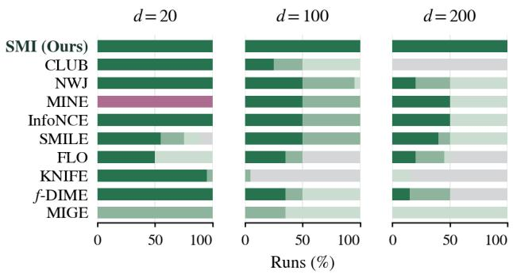  
MI < 0.1  MI < 0.01 MI < 0.001 Unmet  
(a) MI minimisation.

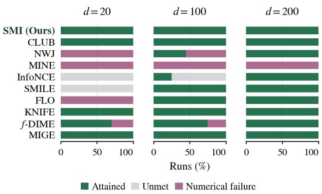  
(b) MI maximisation.  
Figure 5: Gaussian data. Outcomes by dimension, pooled over one shared correlation parameter or one per coordinate pair (ten runs each).

1,000 updates, while attainment requires MI to remain below the stated tolerance throughout this window. For maximisation, summaries report MI at stopping. Finite runs that miss a target are marked unmet, and failures remain in all outcome denominators. The main figure equally weights five data families, three dimensions, two parameterisations, and ten runs.

Additional results. Figs. 5 to 9 report results by data family and dimension.

## C.1.4 Information Across Noise Levels

Data and objective. We evaluate population quantities underlying App. A.2. Let $Z , \epsilon \sim \mathcal { N } ( 0 , 1 )$ be mutually independent and independent of Y. Before spreading, we consider

$$
\mathrm { N o i s e l e s s \ b i n a r y : } \qquad Y \sim \mathrm { U n i f } \{ - 1 , + 1 \} , \qquad X _ { 0 } = Y ,\tag{C.3}
$$

$$
\mathrm { B i n a r y - i n p u t ~ G a u s s i a n : } \qquad Y \sim \mathrm { U n i f } \{ - 1 , + 1 \} , \qquad X _ { 0 } = Y + 0 . 5 Z ,\tag{C.4}
$$

$$
\mathrm { C o r r e l a t e d ~ G a u s s i a n : } \qquad Y \sim \mathcal { N } ( 0 , 1 ) , \qquad X _ { 0 } = 0 . 8 Y + 0 . 6 Z ,\tag{C.5}
$$

$$
\mathrm { P e r f e c t l y ~ c o r r e l a t e d ~ G a u s s i a n } \mathrm { : } \quad \quad Y \sim \mathcal { N } ( 0 , 1 ) , \eqno { X } _ { 0 } = Y .\tag{C.6}
$$

The binary-input Gaussian model satisfies $X _ { 0 } \mid Y = y \sim \mathcal { N } ( y , 0 . 2 5 )$ . The two Gaussian pairs have correlations $\rho = 0 . 8$ and $\rho = 1$ , with the latter having a singular joint distribution. In the order above, the unperturbed MI values are log 2, approximately 0.63272, − log 0.6, and +∞. Independent controls use $X _ { 0 } = Z$ for both choices of Y .

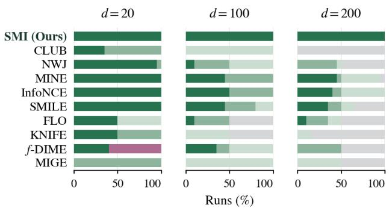  
MI < 0.1  MI < 0.01 MI < 0.001 Unmet  
(a) MI minimisation.

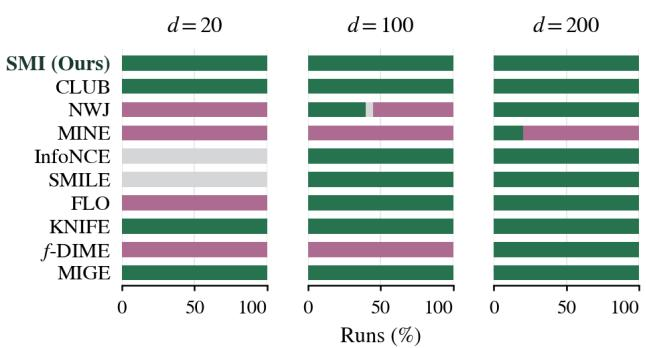  
AttainedUnmetNumerical failure  
(b) MI maximisation.

Figure 6: Cubic data. Outcomes by dimension, pooled over one shared correlation parameter or one per coordinate pair (ten runs each).  
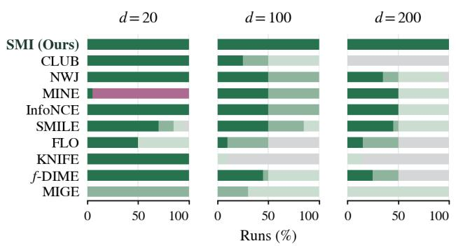  
MI < 0.1  MI < 0.01  MI < 0.001  Unmet  
(a) MI minimisation.

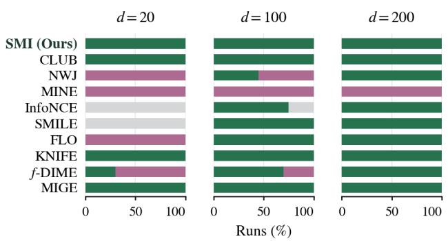  
AttainedUnmetNumerical failure  
(b) MI maximisation.

Figure 7: Asinh data. Outcomes by dimension, pooled over one shared correlation parameter or one per coordinate pair (ten runs each).  
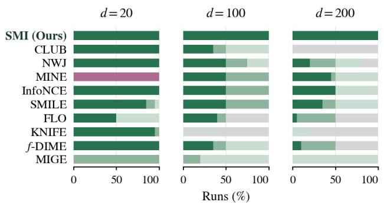  
MI < 0.1  MI < 0.01  MI < 0.001  Unmet  
(a) MI minimisation.

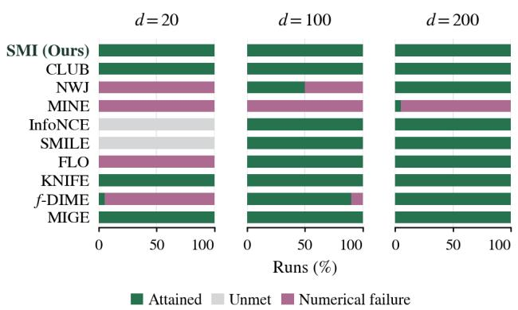  
(b) MI maximisation.  
Figure 8: Signed-power data. Outcomes by dimension, pooled over one shared correlation parameter or one per coordinate pair (ten runs each).

Evaluation. Write $X _ { 0 } = a Y + b Z$ and spread only $X _ { 0 } { \mathrm { : } }$

$$
U _ { \tau } = X _ { 0 } + \sqrt { \tau } \epsilon , \qquad \tau = \sigma ^ { 2 } > 0 , \qquad q = b ^ { 2 } + \tau .\tag{C.7}
$$

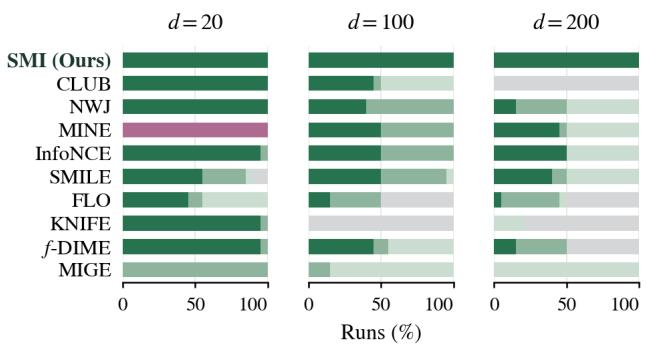  
MI < 0.1  MI < 0.01  MI < 0.001Unmet  
(a) MI minimisation.

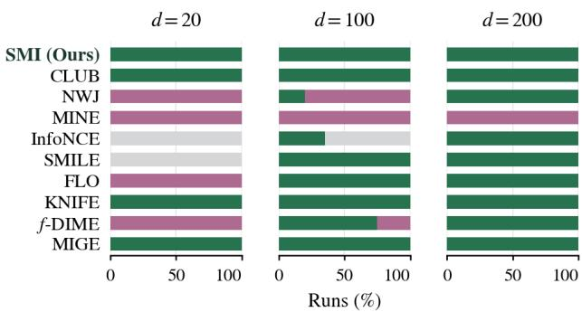  
AttainedUnmetNumerical failure  
(b) MI maximisation.

Figure 9: Spiral data. Outcomes by dimension, pooled over one shared correlation parameter or one per coordinate pair (ten runs each).  
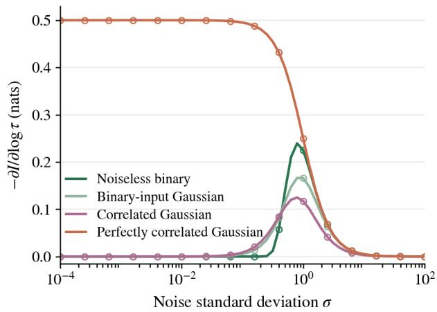  
(a) Information dissipation.

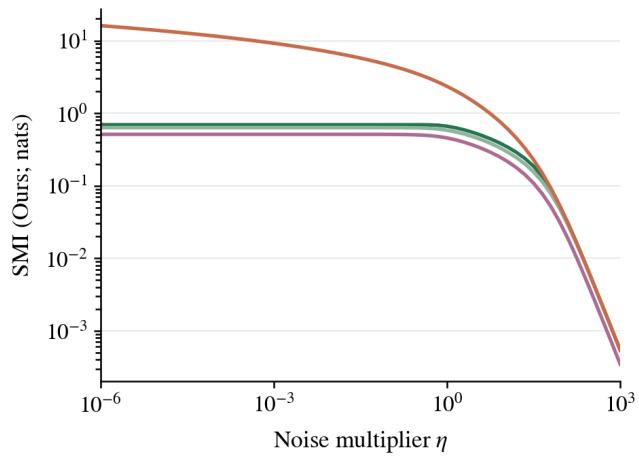  
(b) Rescaling the noise distribution.  
Figure 10: Information across noise levels. Exact-density evaluations. (a) $\frac { \tau } { 2 } \mathbb { E } [ v _ { \tau } ^ { 2 } ]$ (lines) and $- \partial I / \partial$ log τ (markers), with $\tau = \sigma ^ { 2 }$ . (b) Multiscale SMI for $\sigma \sim$ LogUniform(0.01η, η).

Define $v _ { \tau } ( u , y ) = \partial _ { u } \log [ p _ { \tau } ( u \mid y ) / p _ { \tau } ( u ) ]$ . For binary Y , Gaussian-channel identities (Guo et al., 2005) give

$$
I ( U _ { \tau } ; Y ) = \log 2 - \mathbb { E } \log \Bigl ( 1 + e ^ { - 2 a Y U _ { \tau } / q } \Bigr ) , \qquad v _ { \tau } ( u , y ) = \frac { a } { q } \left[ y - \operatorname { t a n h } \Bigl ( \frac { a u } { q } \Bigr ) \right] .\tag{C.8}
$$

For Gaussian Y ,

$$
I ( U _ { \tau } ; Y ) = \frac { 1 } { 2 } \log \left( 1 + \frac { a ^ { 2 } } { q } \right) , \qquad v _ { \tau } ( u , y ) = - \frac { u - a y } { q } + \frac { u } { a ^ { 2 } + q } .\tag{C.9}
$$

We compute expectations by quadrature and compare five-point finite diferences with $- \partial I / \partial$ log $\begin{array} { r } { \tau = \frac { \tau } { 2 } \mathbb { E } [ v _ { \tau } ^ { 2 } ] } \end{array}$ at 61 log-spaced values of $\sqrt { \tau } \in [ 1 0 ^ { - 4 } , 1 0 ^ { 2 } ]$ . We also verify the integrated identity, the schedule $\alpha _ { t } = e ^ { - t / 2 }$ $\sigma _ { t } ^ { 2 } = 1 - e ^ { - t }$ , and the generator derivative $\partial _ { a } I = \mathbb { E } [ Y v _ { \tau } ]$ . To examine the zero-noise limit, we fix the generator and use unit weights with $\sigma \sim \mathrm { L o g U n i f o r m } ( 0 . 0 1 \eta , \eta )$ for $\mathsf { \bar { \eta } } \eta \in [ 1 0 ^ { - 6 } , 1 0 ^ { 3 } ]$

Additional results. All tested diferential and integrated identities agree to absolute error below $1 0 ^ { - 7 }$ , while the independent controls have zero MI and score energy. As the noise distribution contracts towards zero, the weighted SMI approaches the finite unperturbed MI when finite and diverges for the perfectly correlated Gaussian case (Fig. 10).

Table 6: TabArena datasets. All rows; numerical feature counts exclude targets. Licences follow the linked OpenML records.
<table><tr><td>Dataset</td><td>Source</td><td>Rows</td><td>Features</td><td>Licence</td></tr><tr><td>Blood</td><td> $\mathrm { h t t p s } : / / \mathrm { w u w u } . \mathrm { o p e n m 1 } . \mathrm { o r g } / \mathrm { d } / 4 6 9 1 3$ </td><td>748</td><td>4</td><td>CC BY 4.0</td></tr><tr><td>Concrete</td><td> $\mathrm { h t t p s : / / w u w u . o p e n m 1 . o r g / d / 4 6 9 1 7 }$ </td><td>1,030</td><td>8</td><td>CC BY 4.0</td></tr><tr><td>Fish</td><td> $\mathrm { h t t p s : / / w u v w . o p e n m l . o r g / d / 4 6 9 5 4 }$ </td><td>907</td><td>6</td><td>CC BY 4.0</td></tr><tr><td>Hazelnut</td><td> $\mathrm { h t t p s : / / w u w u . o p e n m l . o r g / d / 4 6 9 3 0 }$ </td><td>2,400</td><td>30</td><td>CC BY-SA</td></tr><tr><td>Houses</td><td> $\mathrm { h t t p s : / / w u w u . o p e n m l . o r g / d / 4 6 9 3 4 }$ </td><td>20,640</td><td>8</td><td>Public</td></tr><tr><td>Maternal</td><td> $\mathrm { h t t p s : / / w u w a . o p e n m l . o r g / d / 4 6 9 4 1 }$ </td><td>1,014</td><td>6</td><td>CC BY 4.0</td></tr><tr><td>Protein</td><td> $\mathrm { h t t p s : / / w u w u . o p e n m 1 . o r g / d / 4 6 9 4 9 }$ </td><td>45,730</td><td>9</td><td>CC BY 4.0</td></tr><tr><td>Airfoil</td><td> $\mathrm { h t t p s : / / w u w u . o p e n m 1 . o r g / d / 4 6 9 0 4 }$ </td><td>1,503</td><td>5</td><td>CC BY 4.0</td></tr><tr><td>Wine</td><td> $\mathrm { h t t p s : / / w u v w . o p e n m l . o r g / d / 4 6 9 6 4 }$ </td><td>6,497</td><td>11</td><td>CC BY 4.0</td></tr><tr><td></td><td>Miami Housing https://www.openml.org/d/46942</td><td>13,776</td><td>14</td><td>CC BY-NC-SA</td></tr></table>

OpenML specifies no licence version for Hazelnut or Miami Housing; “Public” for Houses does not identify a standard licence.

## C.2 Missing Data Imputation

Data and objective. We use all rows from ten TabArena datasets (Erickson et al., 2025), retaining numerical features and excluding targets (Tab. 6). For Airfoil, angle of attack is represented in degrees; Wine retains both red and white wines but excludes the colour indicator; Miami Housing excludes the categorical feature avno60plus. We perform transductive imputation without a train/test split, retaining duplicate and entirely masked rows.

Three runs independently repeat masking, initialisation, and fitting. Within each run, uniform draws for each cell define nested 30%, 60%, and 80% MCAR masks, which are fixed and shared across methods. Masking precedes preprocessing: each feature is standardised using its observed mean and population standard deviation, with zero scales replaced by one. Masked values are used only for evaluation. The initial seven datasets were selected after reviewing an eight-dataset study; Airfoil, Wine, and Miami Housing were selected before their results were available. All fits on the ten reported datasets are included.

For observed-entry mask M, we minimise dependence between the completed data and the mask:

$$
\operatorname* { m i n } _ { \theta } I ( X _ { \theta } ; M ) , \qquad X _ { \theta } = M \odot X + ( 1 - M ) \odot g _ { \theta } ( M \odot X , M , Z ) .\tag{C.10}
$$

This is the MI objective underlying WGF and MIRI, described below, with observed entries held fixed.

MI-based methods. The ten matched methods share the residual imputer

$$
g _ { \theta } ( M \odot X , M , Z ) = Z + h _ { \theta } ( M \odot X , M , Z ) ,\tag{C.11}
$$

where the coordinates of $Z$ are sampled independently from the observed feature marginals. SMI adds Gaussian noise, and after restoring observed entries, it targets

$$
\mathbb { E } _ { \sigma \sim \mathrm { L o g U n i f o r m } ( 0 . 0 1 , 1 ) } \big [ I ( X _ { \theta } + \sigma \epsilon ; M ) \big ] .\tag{C.12}
$$

Here $\epsilon \sim \mathcal { N } ( 0 , I _ { d } )$ is independent across examples and between joint and product draws; masks are left unchanged. Binary cross-entropy fits the scale-conditioned logit $f _ { \phi } ( T , M , \log \sigma )$ , where $T = X _ { \theta } + \sigma \epsilon$ . The imputer minimises the stop-gradient surrogate

$$
\mathbb { E } \Big [ \mathrm { s t o p g r a d } ( \nabla _ { T } f _ { \phi } ( T , M , \log \sigma ) ) ^ { \top } T \Big ] .\tag{C.13}
$$

CLUB (Cheng et al., 2020) uses a sampled diagonal-Gaussian $q ( X \mid M )$ with a tanh log-variance head. KNIFE (Pichler et al., 2022) fits eight-component full-covariance marginal and conditional mixtures. NWJ (Nguyen et al., 2010), MINE (Belghazi et al., 2018), InfoNCE (van den Oord et al., 2018), and SMILE (Song and Ermon, 2020) retain their released all-pairs objectives, including MINE’s moving-normaliser backward rule and SMILE’s Jensen–Shannon backward gradient with clipping threshold five. FLO (Guo et al., 2022) uses normalised embeddings, fixed inverse temperature one, and an auxiliary variational head. The KL variant of f-DIME (Letizia et al., 2024) uses a Softplus ratio, deranged product pairs, and $\alpha = 1$ , without a log stabiliser. MIGE (Wen et al., 2020) uses the joint-minus-marginal spectral score field with Gaussian median-distance bandwidth, eigen-energy threshold 0.99, and no Gram regularisation; only completion-coordinate gradients are used.

Other methods. The six established imputers retain their imputation-specific procedures.

GAIN (Yoon et al., 2018) and MIWAE (Mattei and Frellsen, 2019) use the HyperImpute 0.1.17 implementations. GAIN retains sigmoid heads, observed min–max normalisation, hint probability 0.9, reconstruction weight 10, uniform [0, 0.01] missing-input noise, and separate discriminator and generator minibatches. This input noise is distinct from SMI’s spreading of completed rows. MIWAE uses a Gaussian proposal, Student-t likelihood, 20 training and ten prediction importance samples, and weighted sampled-value prediction; its latent dimension equals the feature count.

MIRI (Yu et al., 2025) uses rectified flow (Liu et al., 2023), missing-coordinate velocity loss, and coupled augmented-state Euler integration. Its ideal proximal objective satisfies

$$
\begin{array} { r } { \mathrm { K L } ( Q ^ { X , M } \| Q _ { t - 1 } ^ { X } \otimes P _ { M } ) = I _ { Q } ( X ; M ) + \mathrm { K L } ( Q ^ { X } \| Q _ { t - 1 } ^ { X } ) . } \end{array}\tag{C.14}
$$

WGF (Liu et al., 2024) uses the local-linear quadratic dual, a product of Gaussian-data and linear-mask kernels, independent Bernoulli product masks, and unit particle steps on missing entries. Its bandwidth is the square root of half the lower median of ordered squared distances, with all rows contributing to the kernel calculation.

HyperImpute (Jarrett et al., 2022) and MissForest (Stekhoven and B¨uhlmann, 2012) use HyperImpute 0.1.17 plugins. HyperImpute selects among random forests, linear/logistic models, XGBoost, CatBoost, and neural networks, using simple optimisation, per-column/per-iteration selection, patience five, lazy selection, and at most 40 inner iterations. MissForest retains its native defaults and stopping rule, with at most 100 iterations.

Training. The matched imputer has three width-256 SiLU hidden layers and a zero-initialised output layer. Adam uses default moments, no weight decay, batch size 256, and 10,000 imputer updates. The learning rate is $1 0 ^ { - 5 }$ for the first 2,000 updates, then cosine-decayed to $1 0 ^ { - 6 }$ . Applicable estimator networks use the same hidden-layer architecture with method-specific heads; they receive 5,000 initial fitting updates and 20 updates per imputer step at learning rate $3 \times 1 0 ^ { - 4 }$ . MIGE has no learned auxiliary optimiser. Losses retain their native units without normalisation by feature count. We use no reconstruction or remasking loss, moment penalty, output clipping, external tuning, or metric-based early stopping.

GAIN and MIWAE use three width-256 SiLU hidden layers and 10,000 Adam updates with nominal batch size 256. Their generator learning rates are $3 \times 1 0 ^ { - 4 }$ for the first 2,000 updates, then cosine-decayed to $3 \times 1 0 ^ { - 5 }$ GAIN’s discriminator remains at $3 \times 1 0 ^ { - 4 }$ . MIRI uses the same hidden-layer architecture, ten fresh-network rounds of 1,000 Adam updates at constant learning rate $3 \times 1 0 ^ { - 4 }$ , batch size 256, and 100 Euler steps. WGF uses 500 outer iterations, each with 101 RMSprop updates at learning rate $1 0 ^ { - 3 }$ $\alpha = 0 . 9 $ and $\epsilon = 1 0 ^ { - 6 }$

Evaluation. For missing cells $\Omega = \{ ( i , j ) : M _ { i j } = 0 \}$ , pointwise error is

$$
\mathrm { R M S E } = \sqrt { | \Omega | ^ { - 1 } \sum _ { ( i , j ) \in \Omega } \left( \hat { x } _ { i j } - x _ { i j } \right) ^ { 2 } } .\tag{C.15}
$$

Distributional error is the biased empirical squared maximum mean discrepancy (Gretton et al., 2012) between complete rows:

$$
\widehat { \mathrm { M M D } } ^ { 2 } = \frac { 1 } { n ^ { 2 } } \sum _ { i , j = 1 } ^ { n } \left[ k _ { h } ( x _ { i } , x _ { j } ) + k _ { h } ( \hat { x } _ { i } , \hat { x } _ { j } ) - 2 k _ { h } ( x _ { i } , \hat { x } _ { j } ) \right] , \qquad k _ { h } ( u , v ) = e ^ { - \| u - v \| ^ { 2 } / ( 2 h ^ { 2 } ) } .\tag{C.16}
$$

The bandwidth is $h = { \mathrm { m e d i a n } } _ { i , j } \parallel x _ { i } - { \hat { x } } _ { j } \parallel$ , including diagonal pairs, and is computed separately for each fit. Both metrics use one unperturbed completion in observed-only standardised coordinates, with observed entries restored exactly. MMD evaluation uses all rows.

Within each dataset–rate–run block, all 16 methods are ranked jointly. Finite ties receive average ranks, while failed fits receive rank 16. Ranks are averaged equally across datasets for each rate and run, and the main table reports the mean and SD across the three run-level averages. No block is omitted. There are 43 numerical failures and one reproducible HyperImpute implementation error on Wine at 80% missingness, caused by a singleton batch in upstream BatchNorm.

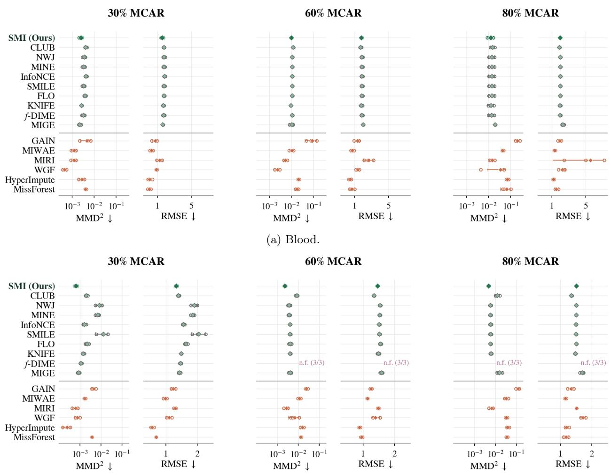  
(b) Concrete.  
Figure 11: Missing data imputation. $\mathrm { M M D ^ { 2 } }$ and RMSE at 30%, 60% and 80% MCAR; individual runs and mean ± SD for groups with three successful fits.

Additional results. Fig. 11 reports every method, dataset, and missingness rate. Circles denote individual runs; diamonds with SD whiskers are shown only when all three runs succeed. Incomplete groups retain finite runs without a mean and mark numerical failures as n.f. $( k / 3 )$ or implementation errors as err. $( k / 3 )$ . Logarithmic axis limits are shared across missingness rates within each dataset and metric.

## C.3 Nuisance Suppression on Waterbirds

Data and objective. Waterbirds (Sagawa et al., 2020) contains 4,795 training, 1,199 validation, and 5,794 test images. The release is linked at https://github.com/kohpangwei/group\_DRO#waterbirds. Its CUB-200-2011 bird images (https://www.vision.caltech.edu/datasets/cub\_200\_2011/) are restricted to non-commercial research and education; Places backgrounds (http://places2.csail.mit.edu/) are provided for academic research and education. Image copyrights remain with their owners. We split the validation set into 598 tuning and 601 development-reporting examples; both are used during development. From frozen ResNet-50 features, an adapter produces a 64-dimensional representation $R _ { \theta }$ for bird classification. MI-based methods minimise

$$
\mathcal { L } _ { \mathrm { C E } } ( \theta ) + \beta I ( R _ { \theta } ; A \mid L ) ,\tag{C.17}
$$

30%MCAR  
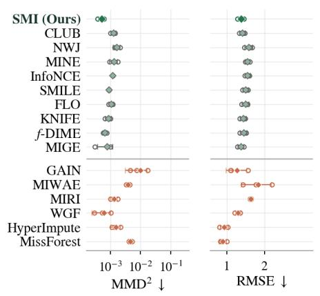

60%MCAR  
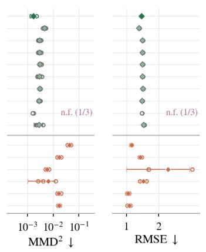  
(c) Fish.

80%MCAR  
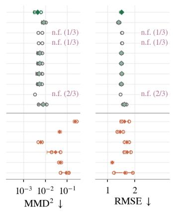

30%MCAR  
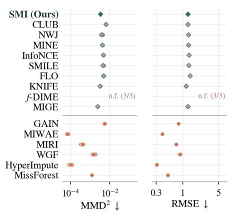  
30%MCAR

60%MCAR  
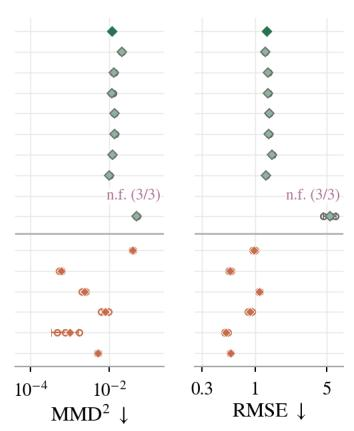  
(d) Hazelnut.

80%MCAR  
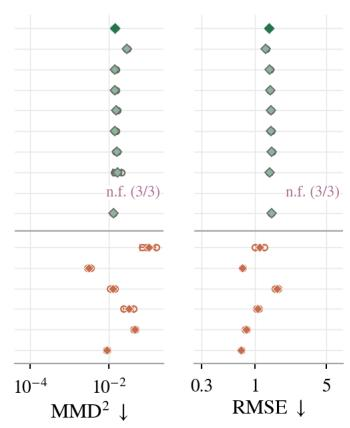  
80%MCAR

60%MCAR  
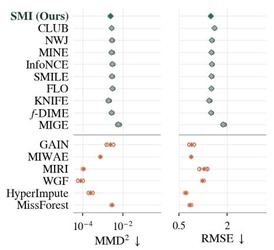

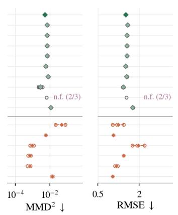  
(e) Houses.  
Figure 11: Missing data imputation (continued).

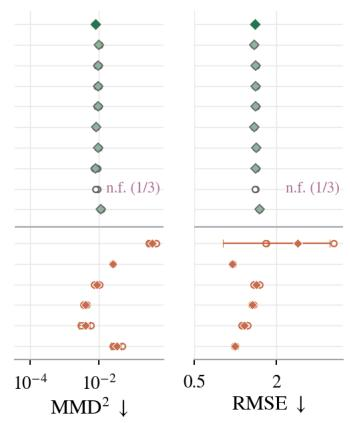

where A denotes background and L bird class; SMI replaces the MI term with its multiscale spread counterpart. Test data are not used to fit models, probes, or standardisers. Test results informed baseline and probe-protoco development.

30%MCAR  
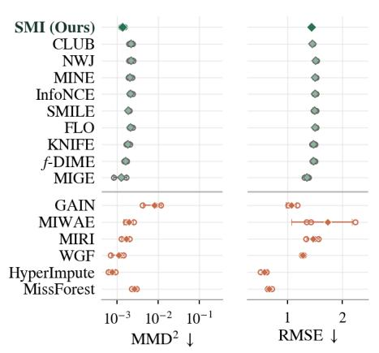

60%MCAR  
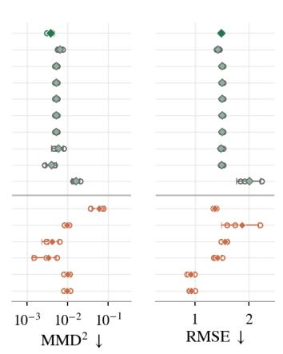

80%MCAR  
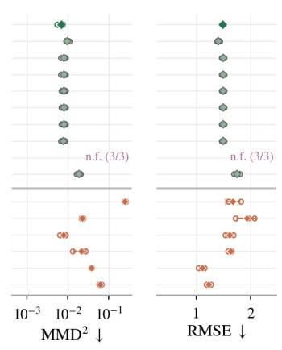

30%MCAR  
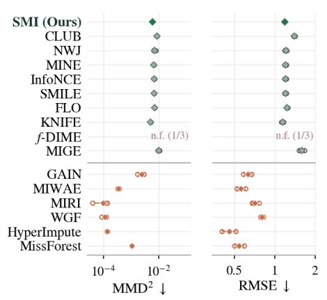

(f) Maternal.  
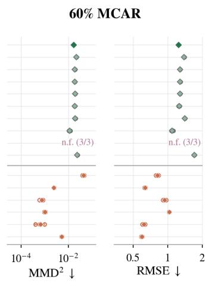

80%MCAR  
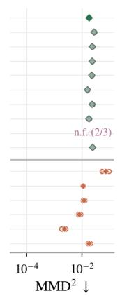

30%MCAR  
(g) Protein.  
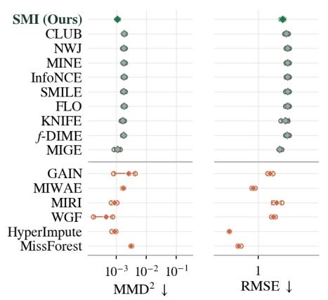

80% MCAR  
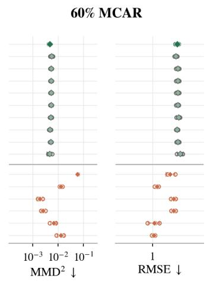  
(h) Airfoil.  
Figure 11: Missing data imputation (continued).

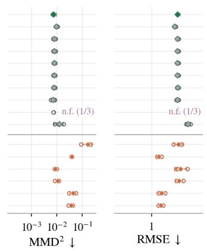

MI-based methods. All ten methods use regularisation coeficients $\beta \in \{ 0 . 2 , 1 , 5 \}$ . SMI uses $\widetilde { R } = R _ { \theta } + \sigma \epsilon$ with independent Gaussian ϵ and σ ∼ LogUniform(0.5, 2); labels are unchanged. The critic receives $\widetilde { R } / \sqrt { 1 + \sigma ^ { 2 } }$

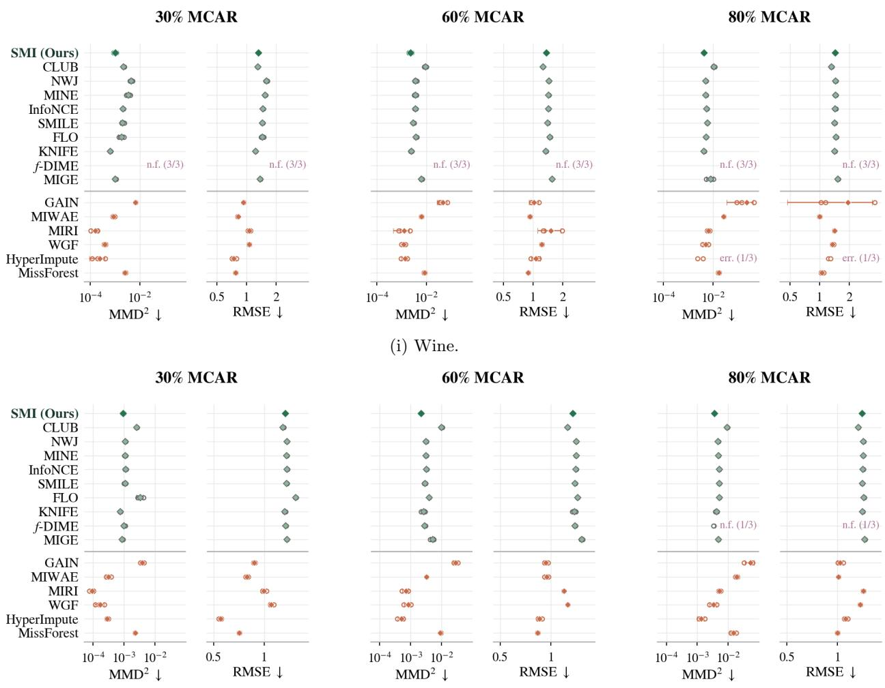  
(j) Miami Housing.  
Figure 11: Missing data imputation (continued).

retaining gradients through this rescaling. Class-conditional softmax posteriors parameterise the log density ratio:

$$
T _ { \psi } ( \widetilde { r } , a , l , \sigma ) = \log q _ { \psi } ( a \mid \widetilde { r } , l , \sigma ) - \log \pi _ { \mathrm { t r a i n } } ( a \mid l ) , \qquad \sum _ { a } \pi _ { \mathrm { t r a i n } } ( a \mid l ) e ^ { T _ { \psi } ( \widetilde { r } , a , l , \sigma ) } = 1 .\tag{C.18}
$$

At the exact posterior, this recovers the conditional log density ratio. SMI fits joint-versus-product binary cross-entropy and uses the stopped input gradient to update the representation. Joint and product samples use independent noise draws from the same distribution. Product representations are sampled with replacement within bird class, and group-balanced estimator samples are reweighted to the empirical training distribution.

The other MI methods use unperturbed, class-conditioned features. MINE (Belghazi et al., 2018) retains its moving-normaliser gradient with decay 0.9 and floor $1 0 ^ { - 4 }$ ; SMILE (Song and Ermon, 2020) uses clipping threshold five and its Jensen–Shannon backward rule. InfoNCE (van den Oord et al., 2018) draws nuisance candidates independently within class, allowing repeated labels, with 256 candidates for estimator updates and 64 for representation updates. CLUB (Cheng et al., 2020) fits a binary posterior by likelihood and minimises the joint-minus-product log-posterior contrast. NWJ (Nguyen et al., 2010) and KL f-DIME (Letizia et al., 2024) use independent within-class product draws. FLO (Guo et al., 2022) uses within-class IID batches, normalised embeddings, and inverse temperature one. KNIFE (Pichler et al., 2022) fits eight-component full-covariance mixtures $p ( R \mid A , L )$ and forms

$$
p ( R \mid L ) = \sum _ { a } \pi _ { \mathrm { t r a i n } } ( a \mid L ) p ( R \mid a , L ) .\tag{C.19}
$$

MIGE (Wen et al., 2020) uses conditional-minus-marginal spectral scores, independent reference batches of 512, median-distance bandwidth, and eigen-energy threshold 0.99. For KNIFE and MIGE, orthonormal coordinates remove the exact zero-sum constraint induced by LayerNorm without information loss; prediction and probes stil use the original 64-dimensional representation.

Other methods. Class-conditional adversarial training (Edwards and Storkey, 2016; Louppe et al., 2017) reverses the representation gradient of nuisance cross-entropy, with $\lambda \in \{ 0 . 2 , 1 , 5 \}$ . HSIC (Gretton et al., 2005) uses class-weighted within-class estimates, an RBF representation kernel with squared bandwidth 64, a nuisance equality kernel, and $\lambda \in \{ 3 , 1 0 , 3 0 \}$ . ERM and GroupDRO (Sagawa et al., 2020) use weight decay in $\{ 0 , 0 . 0 0 1 , 0 . 0 1 \}$ GroupDRO uses group-balanced batches and exponentiated group-weight updates with step size 0.01. DFR (Kirichenko et al., 2023) fits ℓ1-regularised logistic heads on a frozen adapter trained without dependence or weight-decay penalties. It uses $C \in \{ 0 . 0 1 , 0 . 1 , 1 \}$ and averages coeficients from ten independently sampled, equally sized four-group training subsets, limited by the smallest group. DFR uses LIBLINEAR, while logistic probes use LBFGS.

Training. We use five independent training runs. Frozen ResNet-50 (He et al., 2016) uses ImageNet-1K V2 weights, a shorter-side resize to 232 pixels and a $2 2 4 \times 2 2 4$ centre crop. Training means and sample SDs standardise its 2,048 pooled features. The adapter has one width-256 SiLU hidden layer, a linear 64-dimensional projection and non-afine LayerNorm, followed by a linear two-class head.

Dependence-penalised methods receive 600 task-only updates at $5 \times 1 0 ^ { - 4 }$ , then 800 updates at $1 0 ^ { - 4 }$ with a fresh Adam optimiser. Task batches contain 128 examples; Adam uses default moments. ERM and GroupDRO share adapter initialisations and receive 1,400 updates, with their objectives and weight decay active throughout. Applicable estimator networks have two width-128 SiLU hidden layers, learning rate $3 \times 1 0 ^ { - 4 }$ and batch size 512, with 2,000 initial fitting updates and 20 auxiliary updates per representation update.

Evaluation. Worst-group accuracy is the minimum test accuracy over the four bird–background groups. Separate probes fit training examples using within-class training standardisation. Linear leakage uses one balanced $\ell _ { 2 }$ logistic probe per bird class with $C = 1$ . The MLP probe takes the representation and one-hot bird class, with one width-128 SiLU hidden layer. Three probe fits use Adam at $1 0 ^ { - 3 }$ , no weight decay and four-group-balanced batches of 128, with checkpoints at 800 and 1,600 updates.

Leakage is the mean classwise departure of nuisance-prediction ROC AUC from chance:

$$
D _ { \mathrm { p r o b e } } = { \frac { 1 0 0 } { 2 } } \sum _ { l \in \{ 0 , 1 \} } \left| \operatorname { A U C } ( s ( R ) , A \mid L = l ) - { \frac { 1 } { 2 } } \right| .\tag{C.20}
$$

This probe-discrimination metric ranges from 0 to 50 percentage points. MLP leakage averages the three probe fits before summarising across five training runs.

Additional results. Tab. 7 adds overall accuracy to the main comparison.

## C.4 Edges-to-Photos Translation

Data and objective. Edges2Shoes is distributed through https: $/ / \mathrm { g i }$ thub.com/junyanz/pytorch-CycleGA N-and-pix2pix/blob/master/docs/datasets.md. It derives from UT Zappos50K (https://vision.cs.utex as.edu/projects/finegrained/utzap50k/), which restricts the dataset to academic, non-commercial use. On Edges2Shoes (Yu and Grauman, 2014; Isola et al., 2017), we adapt a common pretrained BicycleGAN to retain information about an independent latent code:

$$
\operatorname* { m i n } _ { \theta } \ \mathcal { L } _ { \mathrm { t a s k } } ( \theta ) - \lambda I ( H _ { \theta } ; Z ) , \qquad H _ { \theta } = \Phi ( G _ { \theta } ( C , Z ) ) , \qquad Z \sim \mathcal { N } ( 0 , I _ { 8 } ) ,\tag{C.21}
$$

where C is an edge map and Φ is a frozen image-feature map. The MI objective is marginal over $C ;$ when finite, $I ( Z ; H _ { \theta } \mid C ) = \bar { I ( Z ; H _ { \theta } ) } + I ( Z ; C \mid H _ { \theta } )$ . With deterministic generation and continuous codes, unperturbed MI need not be finite. We therefore evaluate latent predictability and image-distribution matching separately.

Of 49,825 oficial training pairs, a fixed random permutation reserves 512 for development and 49,313 for adaptation. Disjoint adaptation subsets contain 4,096 pairs for regressor fitting, 1,024 for regressor selection,

Table 7: Waterbirds. Test accuracy and background leakage; mean ± SD over five training runs.
<table><tr><td></td><td colspan="2">Accuracy  $( \% , \uparrow )$ </td><td colspan="2">Leakage (points, ↓)</td></tr><tr><td>Method</td><td>Overall</td><td>Worst group</td><td>Linear</td><td>MLP</td></tr><tr><td colspan="5">MI-based methods</td></tr><tr><td>SMI (Ours)</td><td> $8 9 . 9 6 \pm 0 . 3 2 $  </td><td> $\mathbf { 7 1 . 6 8 \pm 1 . 3 3 }$ </td><td> ${ \bf 1 8 . 1 9 \pm 5 . 3 5 }$ </td><td> ${ \bf 9 . 2 0 \pm 5 . 4 9 }$  </td></tr><tr><td>MINE</td><td> $9 0 . 6 8 \pm 0 . 3 2$ </td><td> $7 0 . 8 7 \pm 1 . 1 6$ </td><td> $2 6 . 2 1 \pm 2 . 4 2$ </td><td> $2 2 . 2 3 \pm 4 . 0 0$ </td></tr><tr><td>SMILE</td><td> $9 0 . 6 2 \pm 0 . 3 6$ </td><td> $7 1 . 4 3 \pm 1 . 8 3$ </td><td> $2 5 . 3 4 \pm 3 . 1 5$ </td><td> $1 7 . 6 9 \pm 1 . 7 6$ </td></tr><tr><td>InfoNCE</td><td> $9 0 . 7 5 \pm 0 . 2 2 $ </td><td> $7 1 . 4 3 \pm 1 . 4 0$ </td><td> $2 5 . 5 9 \pm 3 . 1 4$ </td><td> $1 8 . 1 2 \pm 4 . 0 9$ </td></tr><tr><td>CLUB</td><td> $\overline { { 9 0 . 2 2 \pm 0 . 2 4 } }$ </td><td> $7 0 . 6 2 \pm 1 . 3 2$ </td><td> $2 4 . 8 2 \pm 1 . 7 8$ </td><td> $2 0 . 9 5 \pm 2 . 6 2$ </td></tr><tr><td>NWJ</td><td> $9 0 . 4 6 \pm 0 . 2 3$ </td><td> $7 0 . 3 4 \pm 1 . 0 9$ </td><td> $2 7 . 1 8 \pm 4 . 5 9$ </td><td> $1 8 . 8 2 \pm 2 . 3 2$ </td></tr><tr><td>FLO</td><td> ${ \bf 9 0 . 7 9 \pm 0 . 1 5 }$ </td><td> $7 1 . 5 9 \pm 0 . 9 5$ </td><td> $2 0 . 9 4 \pm 3 . 0 8$ </td><td> $\underline { { 1 4 . 3 9 \pm 2 . 3 6 } }$ </td></tr><tr><td>KNIFE</td><td> $8 7 . 7 6 \pm 1 . 3 2$ </td><td> $\overline { { 6 5 . 7 9 \pm 1 . 9 1 } }$ </td><td> $2 5 . 7 0 \pm 5 . 6 0$ </td><td> $\overline { { 2 1 . 6 7 \pm 4 . 7 8 } }$ </td></tr><tr><td>f-DIME</td><td> $8 9 . 8 4 \pm 0 . 4 2 $ </td><td> $7 1 . 3 7 \pm 1 . 0 1$ </td><td> $3 3 . 6 9 \pm 4 . 2 4$ </td><td> $3 4 . 5 0 \pm 3 . 6 5$ </td></tr><tr><td>MIGE</td><td> $8 3 . 3 8 \pm 1 . 1 7$ </td><td> $6 7 . 1 6 \pm 1 . 5 0$ </td><td> $3 0 . 5 5 \pm 2 . 2 1$ </td><td> $3 0 . 3 4 \pm 2 . 5 5$ </td></tr><tr><td colspan="5">Other methods</td></tr><tr><td>Adversarial</td><td> ${ \bf 9 0 . 5 6 \pm 0 . 3 6 }$ </td><td> $7 2 . 3 1 \pm 0 . 8 0$ </td><td> $2 0 . 5 0 \pm 6 . 4 9$ </td><td> ${ \bf 1 2 . 2 2 \pm 3 . 6 5 }$ </td></tr><tr><td>HSIC</td><td> $8 9 . 6 7 \pm 0 . 2 7$ </td><td> $\mathbf { 7 3 . 0 5 \pm 0 . 8 7 }$ </td><td> $\mathbf { i 6 . 1 2 \pm 1 . 7 7 }$ </td><td> $1 5 . 4 1 \pm 2 . 1 5$ </td></tr><tr><td>ERM</td><td> $\overline { { 8 5 . 5 7 \pm 0 . 9 2 } }$ </td><td> $6 8 . 5 7 \pm 1 . 4 1$ </td><td> $3 6 . 4 0 \pm 8 . 8 8$ </td><td> $3 7 . 4 0 \pm 7 . 6 3$ </td></tr><tr><td>GroupDRO</td><td> $8 4 . 7 2 \pm 0 . 5 1$ </td><td> $6 5 . 9 5 \pm 1 . 5 5$ </td><td> $2 1 . 1 5 \pm 6 . 2 9$ </td><td> $\underline { { 1 3 . 1 2 } } \pm 8 . 6 3$ </td></tr><tr><td>DFR</td><td> $8 3 . 0 7 \pm 1 . 5 9$ </td><td> $6 8 . 2 7 \pm 4 . 2 1$ </td><td> $3 2 . 9 1 \pm 6 . 0 4$ </td><td> $\overline { { 3 0 . 2 3 \pm 3 . 3 7 } }$ </td></tr></table>

43,681 for estimator fitting and 512 reserved for diagnostics. All adaptation pairs remain eligible for generator updates. The regressor-fitting photos also fit the training feature projection; their first 512 calibrate the edge detector. Development pairs are excluded from adaptation but may have appeared in public pretraining. The 200 oficial validation pairs informed earlier exploration and are treated as a reporting set. Three training runs use the same data splits and evaluation latent codes.

Each pair is split into edge/photo halves, resized bicubically to $2 5 6 \times 2 5 6$ , converted to a grayscale edge map and RGB photo, and scaled to $[ - 1 , 1 ]$ . No random flips or other training augmentation are used.

MI-based methods. SMI spreads only the generated feature vector:

$$
{ \mathcal { T } } _ { \mathrm { S M I } } ( \theta ) = \int _ { 0 . 0 1 } ^ { 1 } I ( H _ { \theta } + \sigma \epsilon ; Z ) { \frac { \mathrm { d } \sigma } { \sigma \log 1 0 0 } } , \qquad \epsilon \sim { \mathcal { N } } ( 0 , I _ { 2 5 6 } ) .\tag{C.22}
$$

Each example independently samples a scale at each update. Joint pairs are $( H _ { \theta } ( C , Z ) + \sigma \epsilon , Z ) ;$ ; product pairs are $( H _ { \theta } ( C ^ { \prime } , Z ^ { \prime } ) + \sigma \epsilon ^ { \prime } , Z )$ with independent $( C ^ { \prime } , Z ^ { \prime } )$ and $\epsilon { ' } .$ Paired joint/product examples share the conditioning scale and use independent Gaussian noise. Balanced binary cross-entropy fits the scale-conditioned logit $T _ { \eta } \mathrm { : \quad }$

$$
\begin{array} { r } { \mathcal { L } _ { \mathrm { a u x } } = \frac { 1 } { 2 } \mathbb { E } _ { J , \sigma } \mathrm { s o f t p l u s } ( - T _ { \eta } ) + \frac { 1 } { 2 } \mathbb { E } _ { P , \sigma } \mathrm { s o f t p l u s } ( T _ { \eta } ) . } \end{array}\tag{C.23}
$$

Writing $\widetilde { H } = H _ { \theta } + \sigma \epsilon ,$ generator minimisation uses

$$
\begin{array} { r } { \mathcal { L } _ { \mathrm { S M I } , G } = - \mathbb { E } \bigg [ \mathrm { s t o p g r a d } \Big ( \nabla _ { \widetilde { H } } T _ { \eta } ( \widetilde { H } , Z , \log \sigma ) \Big ) ^ { \top } H _ { \theta } \bigg ] . } \end{array}\tag{C.24}
$$

The minus sign gives MI maximisation; the surrogate value is not an MI estimate.

Other MI methods use unperturbed features and codes. InfoNCE (van den Oord et al., 2018) and NWJ (Nguyen et al., 2010) use concatenated-input MLP critics and the released all-pairs objectives. InfoNCE uses 256 in-batch candidates, including the positive, without feature normalisation. NWJ uses all of-diagonal product pairs and $\exp ( T - 1 )$ without clipping; negative pairs retain generator gradients. FLO (Guo et al., 2022) uses normalised width-256 bilinear embeddings, an auxiliary scalar head, 255 negatives and a trainable temperature initialised at one. KNIFE (Pichler et al., 2022) fits 128-component full-covariance Gaussian mixtures for $p ( Z )$ and $p ( Z \mid H )$ with Tanh log-variance heads. It diferentiates the fitted marginal-minus-conditional entropy through H. MIGE (Wen et al., 2020) uses joint-minus-marginal spectral scores, support size 256, Gaussian median-distance bandwidth and eigen-energy threshold 0.99. Only generated-feature coordinates enter its gradient.

Other methods. Task only minimises $\mathcal { L } _ { \mathrm { t a s k } }$ . Latent $\ell _ { 1 }$ (Zhu et al., 2017) uses BicycleGAN’s latent reconstruction with weight 0.5 on four prior-branch outputs; the encoder posterior mean predicts the code. Encoder parameters are frozen for this loss while retaining input gradients and encoder gradients from the common task. DSGAN (Yang et al., 2019) uses eight independently sampled edge maps and two independent codes per map:

$$
\mathcal { L } _ { \mathrm { D S G A N } } = - 8 \mathbb { E } \left[ \frac { d _ { 1 } ( G _ { \theta } ( C , Z ) , \mathrm { s t o p g r a d } ( G _ { \theta } ( C , Z ^ { \prime } ) ) ) } { d _ { 1 } ( Z , Z ^ { \prime } ) + 1 0 ^ { - 5 } } \right] ,\tag{C.25}
$$

where $d _ { 1 }$ is mean absolute coordinate diference. The second image is detached, as in the release; no margin is enabled. These regularisers act on unperturbed RGB outputs. Pretrained is the single common generator before adaptation and has no training-run SD.

Training. Generator and encoder weights come from the public BicycleGAN Shoes checkpoint. The generator is a width-64 U-Net with instance normalisation, ReLU and eight latent coordinates injected at every encoder level. Dropout is disabled during adaptation. The encoder is the released width-64 residual architecture for $2 5 6 \times 2 5 6$ images. Each run freshly initialises two two-scale RGB PatchGAN discriminators, paired across methods.

A task minibatch contains eight real pairs; its first four edge maps are used for both encoded-posterior and independent-prior branches. The common generator and encoder loss is

$$
\mathcal { L } _ { \mathrm { t a s k } } = \mathcal { L } _ { \mathrm { L S G A N } } ^ { \mathrm { e n c o d e d } } + \mathcal { L } _ { \mathrm { L S G A N } } ^ { \mathrm { p r i o r } } + 1 0 \mathcal { L } _ { \mathrm { i m a g e } - \ell _ { 1 } } + 0 . 0 1 \mathcal { L } _ { \mathrm { K L } } .\tag{C.26}
$$

Image reconstruction uses the encoded branch; KL sums latent coordinates and averages examples; adversarial losses sum discriminator scales. Public pretraining includes latent reconstruction, but adaptation adds it only for the latent $\ell _ { 1 }$ comparator.

The frozen training representation uses ImageNet AlexNet (Krizhevsky et al., 2012), 224 × 224 antialiased bilinear resizing and ImageNet channel normalisation. Adaptive $2 \times 2$ pooling yields 1,024 features; PCA retains and whitens 256 components using adaptation photos. The feature extractor and PCA projection remain fixed.

Discriminators receive 100 initial updates with generator/encoder fixed, using Adam at $2 \times 1 0 ^ { - 4 }$ and moments (0.5, 0.999). Fresh optimisers then take 20,000 generator updates, with Adam moments (0.5, 0.999) and no weigh decay. The learning rate is $1 0 ^ { - 5 }$ for 4,000 updates, then cosine-decayed to $1 0 ^ { - 6 }$ . No gradient clipping is used; every run completes the fixed budget.

Neural estimators have two width-256 SiLU hidden layers and method-specific output layers. Adam uses learning rate $3 \times 1 0 ^ { - 4 }$ , batch size 256 and no weight decay, with moments (0.9, 0.999) except KNIFE’s (0.5, 0.999). Each estimator receives 10,000 initial fitting updates on 32,768 stored feature–code pairs from the common starting generator, with equal joint and independent-feature halves sampled with replacement. Thereafter, eight estimator updates use fresh generator samples per generator update; MIGE has no fitting stage. MI generator batches contain 256 examples, implemented by deterministic forward caching and backward replay in microbatches of eight, retaining full-batch negative-sample gradients. Task-loss and estimator minibatches are sampled independently. These shared architectures and schedules are benchmark adaptations.

After initial estimator fitting, λ is fixed per method and run to match 30% of the task-gradient norm, using median norms over 16 calibration batches. Reporting-set metrics select neither λ nor generator checkpoints.

Evaluation. We report results only for the final generators after 20,000 updates, fitting a separate MLP regressor to predict latent codes for each method and run. The primary representation concatenates the 1,024- dimensional CLS and mean patch tokens of DINOv2 (Oquab et al., 2024; Darcet et al., 2024), using the ViT-L/14 model with four register tokens. ImageNet ResNet-50 (He et al., 2016) supplies a second 2,048-dimensional representation to assess sensitivity to the evaluation features. Both use 224 × 224 antialiased bilinear resizing and ImageNet normalisation, with no evaluation PCA. Feature means and standard deviations are fitted only on the regressor-training set.

Each edge map uses eight independent Gaussian codes; the codes for each data split and regressor initialisations are shared across methods. The MLP has two width-256 SiLU hidden layers and eight outputs, using AdamW with default moments, batch size 512 and at most 200 epochs. Selection-set MSE, evaluated every five epochs, chooses the regressor checkpoint and one of four learning-rate/weight-decay pairs in $\{ 3 \times 1 0 ^ { - 4 } , 1 0 ^ { - 3 } \} \times \{ 1 0 ^ { - 4 } , 1 0 ^ { - 3 } \}$

Table 8: Edges2Shoes additional results. Reporting-set metrics at 20,000 generator updates; mean $\pm \ \mathrm { S D }$ over three training runs.
<table><tr><td>Method</td><td>KID (↓)</td><td>Edge F1 (↑)</td><td> $\mathrm { R e s N e t - 5 0 ~ M L P ~ } R ^ { 2 } ~ ( \uparrow )$ </td></tr><tr><td colspan="4">MI-based methods</td></tr><tr><td>SMI (Ours)</td><td> $( 1 . 5 8 7 \pm 0 . 1 4 5 ) \times 1 0 ^ { - 2 }$  </td><td> $0 . 6 7 9 \pm 0 . 0 0 4$ </td><td> $\mathbf { 0 . 5 8 4 \pm 0 . 0 0 8 }$ </td></tr><tr><td>InfoNCE</td><td> $( 1 . 2 9 3 \pm 0 . 0 8 4 ) \times 1 0 ^ { - 2 }$ </td><td> $0 . 6 8 5 \pm 0 . 0 0 3$ </td><td> $0 . 5 2 3 \pm 0 . 0 0 7$ </td></tr><tr><td>NWJ</td><td> $\overline { { ( 1 . 4 8 1 \pm 0 . 0 6 4 ) \times 1 0 ^ { - 2 } } }$ </td><td> $0 . 6 7 9 \pm 0 . 0 0 2$ </td><td> $\underline { { 0 . 5 7 3 } } \pm 0 . 0 1 6$ </td></tr><tr><td>FLO</td><td> $\mathbf { ( 1 . 1 7 7 \pm 0 . 0 1 4 ) \times 1 0 ^ { - 2 } }$ </td><td> $\mathbf { 0 . 6 9 0 \pm 0 . 0 0 2 }$ </td><td> $0 . 4 7 0 \pm 0 . 0 0 5$ </td></tr><tr><td>KNIFE</td><td> $( 1 . 4 5 1 \pm 0 . 1 5 4 ) \times 1 0 ^ { - 2 }$ </td><td> $0 . 6 8 4 \pm 0 . 0 0 2$ </td><td> $0 . 5 3 3 \pm 0 . 0 1 1$ </td></tr><tr><td>MIGE</td><td> $( 1 . 4 2 0 \pm 0 . 1 4 8 ) \times 1 0 ^ { - 2 }$ </td><td> $\underline { { 0 . 6 8 9 \pm 0 . 0 0 4 } }$ </td><td> $0 . 5 2 0 \pm 0 . 0 0 9$ </td></tr><tr><td colspan="4">Other methods and reference</td></tr><tr><td>Task only</td><td> $( 1 . 1 8 \dot { 7 } \pm 0 . 0 4 5 ) \times 1 0 ^ { - 2 }$ </td><td> $\mathbf { 0 . 6 9 0 \pm 0 . 0 0 2 }$ </td><td> $0 . 4 7 0 \pm 0 . 0 0 4$ </td></tr><tr><td>Latent  $\ell _ { 1 }$ </td><td> $( 1 . 4 9 9 \pm 0 . 0 5 4 ) \times 1 0 ^ { - 2 }$ </td><td> $\underline { { 0 . 6 7 5 } } \pm 0 . 0 0 2$ </td><td> $\underline { { 0 . 5 7 0 \pm 0 . 0 0 5 } }$ </td></tr><tr><td>DSGAN</td><td> $\left( 7 . 6 6 6 \pm 3 . 3 2 4 \right) \times 1 0 ^ { - 2 }$ </td><td> $0 . 5 3 9 \pm 0 . 0 4 0$ </td><td> $\mathbf { 0 . 6 2 6 \pm 0 . 0 1 8 }$ </td></tr><tr><td>Pretrained</td><td> $\mathbf { 1 . 0 1 9 \times 1 0 ^ { - 2 } }$ </td><td> $0 . 6 7 2$ </td><td> $0 . 4 6 3$ </td></tr></table>

Development and reporting pairs enter neither regressor fitting nor selection. For n reporting edge maps and $K = 8$ codes per map, $N = n K$ generated images give

$$
R ^ { 2 } = \frac { 1 } { 8 } \sum _ { j = 1 } ^ { 8 } \left( 1 - \frac { \sum _ { a = 1 } ^ { N } ( z _ { a j } - \widehat { z } _ { a j } ) ^ { 2 } } { \sum _ { a = 1 } ^ { N } ( z _ { a j } - \bar { z } _ { j } ) ^ { 2 } } \right) ,\tag{C.27}
$$

where $\bar { z } _ { j }$ is the reporting-set coordinate mean. The reporting set has 200 edge maps and 1,600 outputs. This coeficient of determination measures latent predictability.

The unperturbed condition applies no additional image processing. JPEG (75) encodes and decodes 8-bit RGB at quality 75. Resize downsamples to $1 2 8 \times 1 2 8$ and upsamples to $2 5 6 \times 2 5 6$ using bilinear interpolation, with antialiasing on downsampling. Both use the fixed DINOv2 regressor and standardiser fitted on unperturbed images.

Distribution matching uses KID (Bi´nkowski et al., 2018) on unperturbed outputs, with 2,048-dimensional FIDcompatible Inception features, bilinear resizing to 299 × 299 and kernel $k ( u , v ) = ( u ^ { \mathsf { T } } v / 2 0 4 8 + 1 ) ^ { 3 }$ . For paired real features $r _ { i }$ and generated features $f _ { i k }$ , we use

$$
A _ { i j } = k ( r _ { i } , r _ { j } ) + \frac { 1 } { K } \sum _ { k = 1 } ^ { K } \left[ k ( f _ { i k } , f _ { j k } ) - k ( r _ { i } , f _ { j k } ) - k ( f _ { i k } , r _ { j } ) \right] ,\tag{C.28}
$$

$$
{ \widehat { \mathrm { K I D } } } = { \frac { 1 } { n ( n - 1 ) } } \sum _ { i \neq j } A _ { i j } .\tag{C.29}
$$

This U-statistic averages over code indices, excluding pairs sharing an edge map from every term. Values are reported in raw units.

Edge F1 measures agreement between HED (Xie and $\mathrm { T u }$ , 2015) detections on unperturbed outputs and the input edge map. A threshold calibrated on 512 real adaptation pairs is fixed at 0.6. Matching uses a two-pixel circular tolerance, excludes a two-pixel border and permits multiple nearby matches. F1 is computed per image and then averaged. Tables report mean and sample SD across three training runs; the pretrained reference is evaluated once.

Additional results. Tab. 8 reports KID, edge F1 and latent-code prediction using ResNet-50 features.

## C.5 Computational Costs

Measurement protocol. We time Gaussian MI minimisation with one shared correlation parameter on an isolated RTX 3090. An iteration includes fresh sampling, $N _ { \mathrm { a u x } } = 5$ estimator updates and one generator update; MIGE uses $N _ { \mathrm { a u x } } = 0$ . Each trial uses one pinned CPU thread, $N _ { \mathrm { w a r m } } = 1 0 0$ warm-up iterations and $N _ { \mathrm { i t e r } } = 1 0 0$

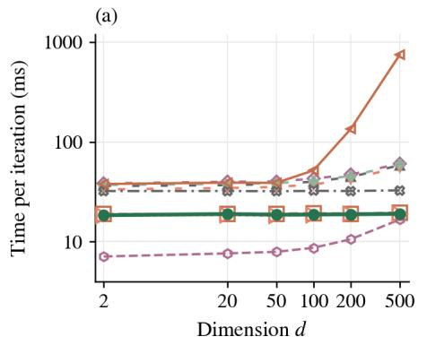

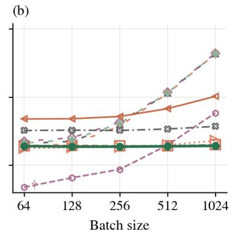

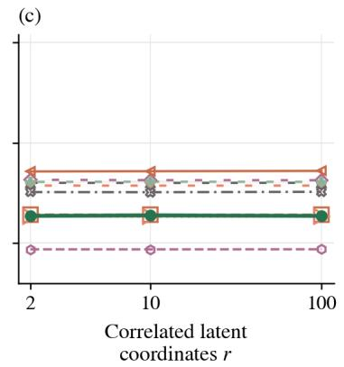

(d)  
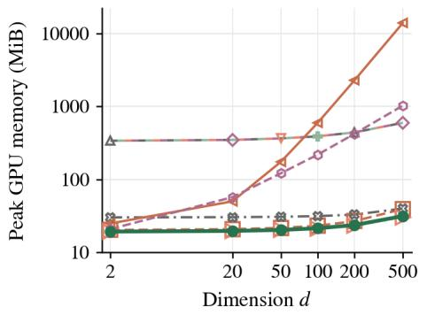

(e)  
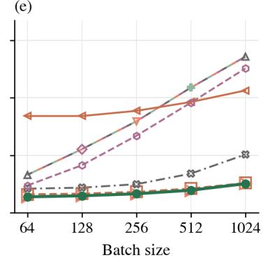

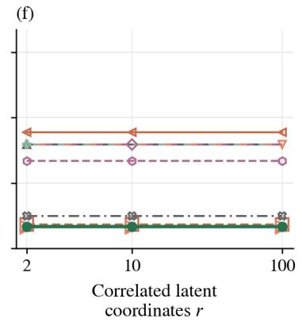  
Figure 12: Computational costs. Iteration time and peak allocated GPU memory across dimension, minibatch size and correlated coordinates; median and range over three repetitions.

timed iterations, with CUDA synchronisation around measurements. Initialisation and input-scale calibration are excluded. We report the median and range of mean iteration times over $N _ { \mathrm { r e p } } = 3$ repetitions. Memory is peak allocated GPU tensor memory during timing, including model and optimiser state.

The sweeps vary dimension d, minibatch size B and number of correlated coordinates r, fixing $( r , B ) = ( 2 , 2 5 6 )$ $( d , r ) = ( 1 0 0 , 2 )$ and $( d , B ) = ( 1 0 0 , 2 5 6 )$ , respectively. A dagger marks any setting where a repetition’s mean over the final 20 iterations difers by more than 10% from its first 20; no measurements are excluded.

Results. Fig. 12 reports iteration time and peak memory across the three sweeps. These iteration costs are hardware- and implementation-specific.

## C.5.1 Analytical Costs

Scope and notation. The bounds in Tab. 9 concern the evaluated unconditional synthetic implementations, with X, $Y \in \mathbb { R } ^ { d }$ . As in Alg. 1, B denotes minibatch size. Let $N _ { \mathrm { a u x } }$ be the number of estimator updates per generator update; for SMI, $N _ { \mathrm { a u x } } = N _ { \mathrm { c l f } }$ . Write $N _ { \ell } \geq 2$ for the number of hidden layers, $N _ { \mathrm { m i x } }$ for mixture components and h for hidden width. Timing uses h = 256, $N _ { \ell } = 2 , N _ { \mathrm { a u x } } = 5$ and $N _ { \mathrm { m i x } } = 8$ , except that MIGE has no estimator optimiser. A dense MLP with $O ( d )$ inputs and scalar or $O ( d + h )$ outputs has $O ( d h + N _ { \ell } h ^ { 2 } )$ parameters and work per example, retaining $O ( d + N _ { \ell } h )$ activations.

We count dense arithmetic and reverse-mode diferentiation without checkpointing. Peak memory includes parameters, gradients, optimiser state, activations and temporary tensors in scalar words. Sequential estimator updates increase runtime while reusing memory. Analytical bounds exclude generators, sampling and dataset storage; measured iterations include sampling and generator backpropagation.

Table 9: MI control methods and computational costs. Estimator costs per generator update for the evaluated synthetic implementations.
<table><tr><td>Method</td><td>Objective or gradient</td><td>Time O(·)</td><td>Peak memory O(·)</td></tr><tr><td></td><td>SMI (Ours) Spread log-ratio gradient</td><td> $( N _ { \mathrm { a u x } } + 1 ) B ( d h + N _ { \ell } h ^ { 2 } )$ </td><td> $d h + N _ { \ell } h ^ { 2 } + B ( d + N _ { \ell } h )$ </td></tr><tr><td>CLUB</td><td>Sampled Gaussian contrast</td><td> $( N _ { \mathrm { a u x } } + 1 ) B ( d h + N _ { \ell } h ^ { 2 } )$ </td><td> $d h + N _ { \ell } h ^ { 2 } + B ( d + N _ { \ell } h )$ </td></tr><tr><td>NWJ</td><td>Variational KL bound</td><td> $( N _ { \mathrm { a u x } } + 1 ) B ^ { 2 } ( d h + N _ { \ell } h ^ { 2 } )$ </td><td> $d h + N _ { \ell } h ^ { 2 } + B ^ { 2 } ( d + N _ { \ell } h )$ </td></tr><tr><td>MINE</td><td> $\mathrm { D V } ;$  moving normaliser</td><td> $( N _ { \mathrm { a u x } } + 1 ) B ^ { 2 } ( d h + N _ { \ell } h ^ { 2 } )$ </td><td> $d h + N _ { \ell } h ^ { 2 } + B ^ { 2 } \dot { ( d + N _ { \ell } h ) }$ </td></tr><tr><td>InfoNCE</td><td>Contrastive bound</td><td> $( N _ { \mathrm { a u x } } + 1 ) B ^ { 2 } ( d h + N _ { \ell } h ^ { 2 } )$ </td><td> $d h + N _ { \ell } h ^ { 2 } + B ^ { 2 } ( d + N _ { \ell } h )$ </td></tr><tr><td>SMILE</td><td>JS gradient; DV readout</td><td> $( N _ { \mathrm { a u x } } + 1 ) B ^ { 2 } ( d h + N _ { \ell } h ^ { 2 } )$ </td><td> $d h + N _ { \ell } h ^ { 2 } + B ^ { 2 } ( d + N _ { \ell } h )$ </td></tr><tr><td>FLO</td><td>Bilinear Fenchel-Legendre bound</td><td> $( N _ { \mathrm { a u x } } + 1 ) \big [ B ( d h + N _ { \ell } h ^ { 2 } )$   $+ B ^ { 2 } h ]$ </td><td> $d h + N _ { \ell } h ^ { 2 }$ </td></tr><tr><td>KNIFE</td><td>Full-covariance mixture entropies</td><td> $( N _ { \mathrm { a u x } } + 1 ) B$ </td><td> $+ B ( d + N _ { \ell } h ) + B ^ { 2 }$   $d h + N _ { \ell } h ^ { 2 } + N _ { \mathrm { m i x } } h d ^ { 2 }$ </td></tr><tr><td>f-DIME</td><td>KL density ratio; deranged pairs</td><td> $( N _ { \mathrm { a u x } } + 1 ) B ( d h + N _ { \ell } h ^ { 2 } ) ^ { \dagger } ~ d h + N _ { \ell } h ^ { 2 } + B ( d + N _ { \ell } h )$ </td><td> $\begin{array} { r l } { \times \left( d h + N _ { \ell } h ^ { 2 } + N _ { \mathrm { m i x } } h d ^ { 2 } \right) } & { { } ~ + B ( d + N _ { \ell } h + N _ { \mathrm { m i x } } d ^ { 2 } ) } \end{array}$ </td></tr><tr><td>MIGE</td><td>Spectral score difference</td><td> $B ^ { 3 } + B ^ { 2 } d$ </td><td> $B ^ { 2 } d$ </td></tr></table>

†Expected time for rejection-sampled derangements. Bounds refer to the evaluated implementations and exclude generator and data-sampling costs. DV: Donsker–Varadhan; JS: Jensen–Shannon.

SMI. One ratio network processes $O ( B )$ spread joint/product pairs. Noise generation costs $O ( B d )$ ; each fitting update costs $O ( B ( d h + N _ { \ell } h ^ { 2 } ) )$ . The classifier logit is $T _ { \phi } ( x _ { t } , y , t ) = \log [ c _ { \phi } ( x _ { t } , y , t ) / ( 1 - c _ { \phi } ( x _ { t } , y , t ) ) ]$ ], giving the estimated score diference $\widehat { v } _ { t } = \nabla _ { x _ { t } } T _ { \phi }$ . For the evaluated $\alpha _ { t } = 1$ kernel, the surrogate is

$$
\widehat { \mathcal { L } } _ { \mathrm { s u r } } = \frac { 1 } { B } \sum _ { i = 1 } ^ { B } w _ { \mathrm { S M I } } ( t _ { i } ) \ \mathrm { s t o p g r a d } [ \widehat { v } _ { t _ { i } } ( x _ { t _ { i } , i } , y _ { i } ) ] ^ { \top } \ x _ { t _ { i } , i } .\tag{C.30}
$$

One reverse pass obtains all input gradients at the same order of work. Stopping them avoids higher-order diferentiation; the generator uses a vector–Jacobian product. Sampling one scale per example introduces no factor for a discretised noise schedule. Thus $N _ { \mathrm { a u x } }$ fitting updates and one generator update require $O ( ( N _ { \mathrm { a u x } } +$ $1 ) B ( d h + N _ { \ell } h ^ { 2 } ) )$ estimator work. Network and optimiser state occupy $O ( d h + N _ { \ell } h ^ { 2 } )$ memory, and a batch retains $O ( B ( d + N _ { \ell } h ) )$ activations and score vectors. Their sum gives SMI’s peak-memory bound in Tab. 9.