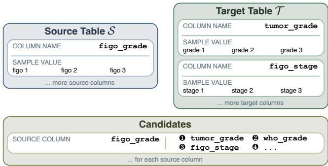
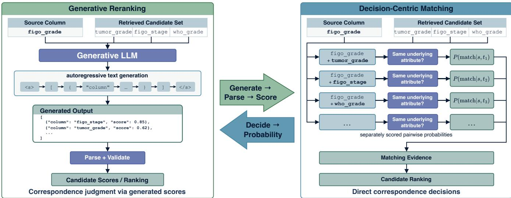
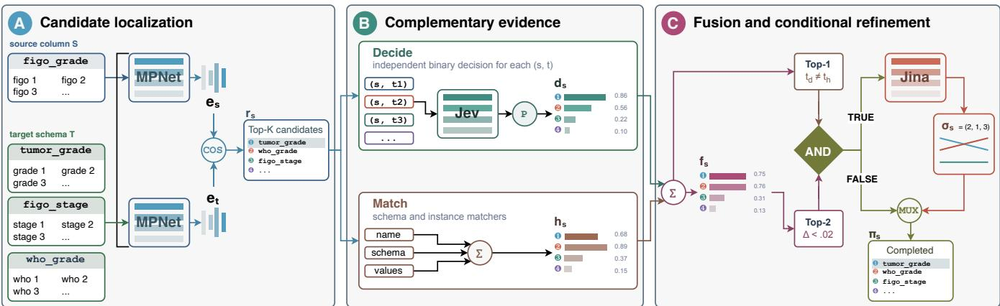
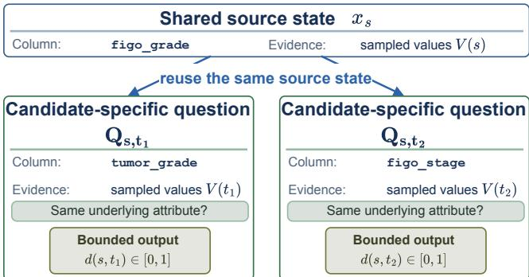
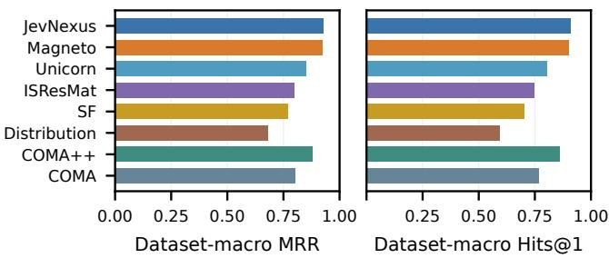
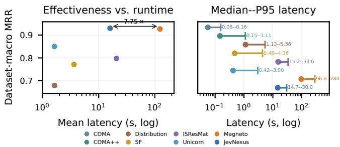
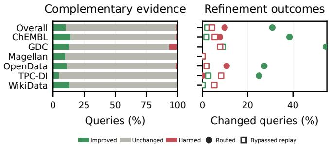
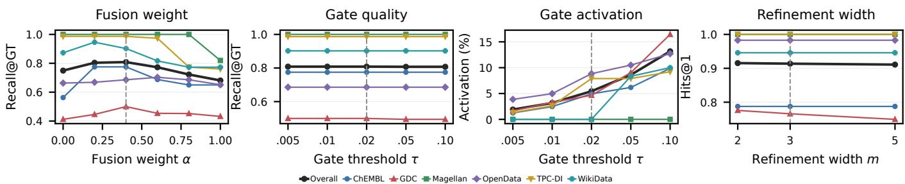
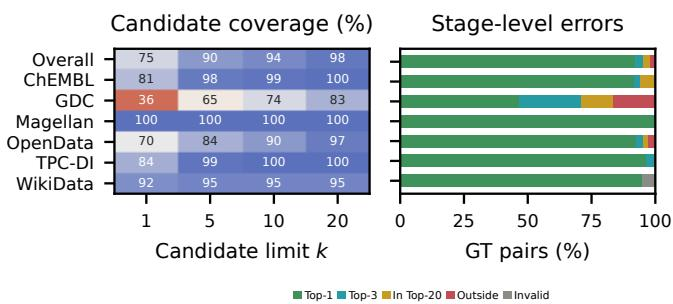

# Correspondences as Decisions: JevNexus for Decision-Centric Schema Matching

Runze Li University of New South Wales Sydney, Australia runze.li1@unsw.edu.au

Ying Zhang University of Technology Sydney Sydney, Australia ying.zhang@uts.edu.au

## ABSTRACT

Schema matching increasingly uses generative language models to rerank retrieved column candidates, although the underlying task is a bounded correspondence decision. We present JevNexus, which combines typed pairwise decisions with schema/instance evidence and invokes listwise refinement only when the evidence disagrees and the fused margin is small. The evaluation covers 561 cases from six benchmark families. JevNexus obtains dataset macro MRR and Hits@1 of 0.930 and 0.909, compared with 0.926 and 0.903 for Magneto, while reducing mean latency from 123.452 to 15.929 seconds (7.750×). Paired analysis finds no statistically significant diference in either MRR or Hits@1. The gate invokes listwise refinement for only 5.665% of source columns and avoids the degradation caused by unconditional refinement. Code and experimental artifacts are available at https://github.com/RazeenLI/ JevNexus.

## 1 INTRODUCTION

The continuing growth of structured data in scientific repositories, enterprise platforms, and public data ecosystems creates substantial opportunities for cross-source analytics, scientific discovery, and data-driven decision making [1, 7, 11, 14, 15]. Realizing these opportunities, however, often requires independently developed datasets to be integrated before they can be queried or analyzed together. For example, cancer consortia harmonize genomic, proteomic, and clinical data to support pan-cancer studies [15]; enterprise discovery systems expose relationships among tables distributed across organizational data repositories [11]; and Web- and data-lake-scale systems identify tables that can be joined or unioned for downstream analysis [1, 7]. These workflows depend on schema matching, the task of identifying attributes in heterogeneous schemas that represent the same underlying concepts [8, 18, 25].

Formally, given a source schema � and a target schema�, schema matching seeks a set of valid correspondences � ⊆ � × � and, in ranking-oriented settings, places the valid targets for each source attribute early in the resulting order. When � is large, a localiza tion stage can first restrict the search to a bounded candidate set �(�) ⊆ � for each � ∈ �. Once these candidates have been identified, the fundamental operation is a collection of constrained questions: for each � ∈ �(�), do � and � represent the same underlying schema attribute? This operation is naturally expressed as a bounded correspondence decision, with each pair assessed on its own meritsfi fi

Hanchen Wang University of Technology Sydney Sydney, Australia hanchen.wang@uts.edu.au

Wenjie Zhang University of New South Wales Sydney, Australia wenjie.zhang@unsw.edu.au

  
Figure 1: A schema-matching example with conflicting evidence.

and multiple or no candidates allowed to match, rather than as an open-ended generation task. Recent LLM-based matchers instead approximate the operation by asking a generative model to emit candidate names together with textual or JSON-encoded similarity scores [17]. Although such generation can produce efective rankings, it represents the underlying judgments indirectly through autoregressive decoding, output parsing, and generated numeric values. We therefore investigate a decision-centric formulation in which localized candidates are primarily evaluated through separately scored, non-exclusive correspondence decisions.

Figure 1 illustrates the distinction using a source column named figo\_grade and two plausible target columns, tumor\_grade and figo\_stage, following the type of ambiguity found in the GDC schema-matching setting [17]. The token figo provides evidence for figo\_stage, whereas the attribute type expressed by grade provides evidence for tumor\_grade, and the sampled values may not fully eliminate this ambiguity. The correspondence therefore cannot be resolved reliably from a single surface-similarity signal. Evaluating the two pairs separately makes the plausibility of each correspondence explicit, while comparing the candidates remains useful when their evidence is closely balanced. The example separates three operations that a matching system must coordinate: judging individual correspondences, integrating complementary evidence, and comparing unresolved candidates.

Classical schema matchers combine lexical, structural, and instancelevel signals, reflecting the long-standing observation that no single

form of evidence is reliable across all schema pairs [8, 18, 19, 25]. Although these methods preserve complementary evidence, manually designed similarities often struggle with correspondences that require broader semantic understanding. Pretrained language models extend this semantic coverage by learning representations or matching functions for schema elements [9, 34, 38]. More recently, retrieve–rerank systems such as Magneto use an eficient semantic model to localize candidates and a generative LLM to produce their final scores or ordering [17]. This progression improves semantic matching and makes LLM reasoning feasible over wide schemas, but it leaves three gaps. First, the final correspondence judgment is expressed indirectly through generated output rather than through an explicit matching decision. Second, the move toward a single semantic reranker does not explicitly preserve the complementary roles of semantic, schema-level, and instance-level evidence. Third, uniformly reranking every localized candidate set does not distinguish cases that require joint comparison from those for which the available evidence already supports a clear ordering.

These gaps lead directly to three challenges for decision-centric schema matching. The first is to represent the plausibility of every localized pair directly, without autoregressive score generation or normalization across candidates. The second is to integrate semantic judgments with complementary schema and instance evidence when diferent signals provide diferent views of a candidate, as in Figure 1. The third is to retain joint candidate comparison for genuine residual ambiguities without allowing a listwise model to reconsider every otherwise confident ranking. Meeting these challenges requires pairwise judgment, evidence integration, and cross-candidate comparison to remain distinct but coordinated op erations.

We introduce JevNexus, a progressive schema-matching architecture built around this separation. The pipeline begins by localizing a bounded candidate set for each source attribute, separating candidate recall from final correspondence judgment. A typed de cision operator assigns every localized pair a separately scored, non-exclusive probability that the two columns represent the same underlying attribute. These semantic decisions are combined with schema- and instance-level scores so that the default ranking reflects complementary evidence rather than a single model output. When the evidence sources prefer diferent candidates and the highest fused scores remain close, an evidence-aware gate sends only the leading alternatives to a compact listwise reranker. Otherwise, the fused ranking bypasses listwise refinement and remains unchanged. In this way, JevNexus uses pairwise decisions to establish correspondence plausibility, heterogeneous evidence to form the default order, and joint reasoning only to resolve remaining local ambiguities.

We evaluate JevNexus on 561 schema-matching cases from GDC-SM and five Valentine benchmark families, covering 13,522 source columns and 8,944 ground-truth correspondences. Across the six benchmark families, JevNexus achieves the highest dataset-macro MRR and Hits@1 among the evaluated methods and is statistically comparable to the strongest generative method over all 561 cases. It obtains the highest or tied-highest MRR on GDC, Magellan, and WikiData and remains competitive on the other benchmark families. More importantly, JevNexus reduces mean online runtime from 123.452 to 15.929 seconds per case, yielding a 7.750× speedup over generative reranking. Ablations show that complementary schema and instance evidence provides the largest efectiveness gain, while unconditional listwise refinement is less efective than the proposed selective strategy. The evidence-aware gate produces the strongest aggregate JevNexus variant while activating for only 5.665% of source columns, showing that most localized decisions do not require joint reranking.

We make the following contributions:

• Decision-centric formulation. We formulate localized schema matching as explicit, separately scored, and nonexclusive correspondence decisions rather than autoregressive similarity-score generation.

• Evidence-aware progressive architecture. We develop JevNexus, which combines typed semantic decisions with complementary schema and instance evidence and invokes listwise comparison only under simultaneous evidence disagreement and fused-ranking uncertainty.

• Controlled full-benchmark evaluation. We compare JevNexus with traditional, pretrained-neural, and generative schema matchers across 561 cases and analyze ranking efectiveness, eficiency, component contributions, routing behavior, dataset heterogeneity, and remaining failure modes.

## 2 PROBLEM FORMULATION AND MOTIVATION

## 2.1 Schema Matching and Ranked Output

Let a source table � have schema $\boldsymbol { S } = \{ s _ { 1 } , \ldots , s _ { m } \}$ and a target table � have schema $T = \{ t _ { 1 } , \ldots , t _ { n } \}$ . For a column $c \in S \cup T ,$ , let �(�) denote its name and �(�) the available sample of observed non-null values, which may be empty. We write the observable column evidence as

$$
\phi ( c ) = { \bigl ( } N ( c ) , V ( c ) { \bigr ) } .
$$

A schema correspondence is a pair $( s , t ) \in S \times T$ whose columns represent the same underlying attribute according to the benchmark semantics [17, 25]. The ground-truth correspondence relation is denoted by $G \subseteq S \times T$ , and the valid targets for a source column � are

$$
G ( s ) = \{ t \in T \mid ( s , t ) \in G \} .
$$

This relation does not impose a one-to-one constraint: depending on the matching setting, �(�) may contain zero, one, or multiple target columns.

Following ranking-oriented schema matching [13, 17], a matcher produces for every source column � ∈ � a complete ordering

$$
\pi _ { s } = \langle t _ { ( 1 ) } , t _ { ( 2 ) } , \ldots , t _ { ( n ) } \rangle
$$

of the target columns. The ranking may later be thresholded or transformed into a discrete mapping, but our primary objective is to place the members of �(�) as early as possible in $\pi _ { s } .$ . This ranking formulation separates the quality of correspondence evidence from any application-specific threshold used to accept or reject matches.

## 2.2 Candidate-Localized Matching

When the target schema is wide, applying an expensive semantic operator to every pair in �� is unnecessary. A localization operator

  
Figure 2: Generative and decision-centric inference over the same localized candidates.

L therefore returns at most � candidate targets for each source column:

$$
C _ { k } ( s ) = { \mathcal { L } } ( s , T ) , \qquad | C _ { k } ( s ) | \leq k .
$$

Localization and correspondence judgment nevertheless solve different problems: $\mathcal { L }$ identifies a high-recall neighborhood, whereas the subsequent matcher must discriminate among the candidates in that neighborhood. If $\cdot _ { G ( s ) } \cap C _ { k } ( s ) = \emptyset$ , no downstream deci sion or reranking operator restricted to $C _ { k } ( s )$ can recover a valid target at the head of the ranking. Candidate localization therefore determines a recall ceiling, while the quality of the ordering within $C _ { k } ( s )$ determines how efectively the available correspondences are surfaced.

## 2.3 Generated versus Decision-Based Evidence

Once $C _ { k } ( s )$ has been obtained, generative reranking and decisioncentric matching receive the same source column, candidate columns, and observable column evidence, and both ultimately support an ordering over the candidates. They difer in how the correspondence evidence underlying that ordering is represented and obtained, as illustrated in Figure 2. In generative reranking, a model jointly inspects the source and candidate set and autoregressively emits candidate identifiers together with textual or JSON-encoded scores. The matching system then parses and validates the generated artifact before converting it into candidate scores and a ranking. Although this procedure can produce efective rankings, its correspondence judgments are represented indirectly through generated tokens.

A decision-centric formulation instead poses the bounded matching question directly for each localized pair: do � and � represent the same underlying attribute? The resulting answer is expressed as bounded pairwise evidence and can be consumed without generating or parsing a textual score. These direct judgments provide semantic evidence for constructing the candidate ranking and, when useful, for combination with other matching signals.

## 2.4 Decision-Centric Matching Objective

For each localized pair (�, �) with $t \in C _ { k } ( s )$ , define the correspondence label

$$
y _ { s , t } = 1 { \big [ } ( s , t ) \in G { \big ] } .
$$

A decision-centric matcher seeks bounded semantic evidence

$$
q ( s , t ) \in [ 0 , 1 ]
$$

whose magnitude reflects the plausibility that $y _ { s , t } = 1$ given $\phi ( s )$ and $\phi ( t )$ . Each $q ( s , t )$ is obtained as a separately scored correspondence judgment rather than as one component of a multiclass distribution over $C _ { k } ( s )$ . Consequently, the values $\{ q ( s , t ) : t \in C _ { k } ( s ) \}$ are not constrained to sum to one: multiple candidates may receive strong correspondence evidence, and all candidates may receive weak evidence.

The values $q ( s , t )$ represent semantic decision evidence rather than prescribing the complete matching algorithm or its final score. A matcher may combine them with complementary schema- or instance-level evidence before producing $\pi _ { s } .$ . The resulting problem is to rank valid targets early while bounding expensive inference to the localized candidate sets. Section 3 presents JevNexus, which realizes this formulation through typed correspondence decisions, complementary evidence integration, and selectively invoked crosscandidate refinement.

## 3 JEVNEXUS

## 3.1 Architecture Overview

JevNexus is a progressive schema-matching architecture that separates candidate localization, direct correspondence judgment, complementary evidence integration, and residual cross-candidate comparison. For each source column $s ,$ the pipeline first localizes a bounded candidate neighborhood $C _ { k } ( s )$ and then assigns every localized pair two functionally distinct signals: typed semantic decision evidence $d ( s , t )$ and complementary schema/instance evidence $h ( s , t )$ . The two signals are integrated into a default score $f ( s , t )$ , and a routing criterion determines whether the fused head is suficiently ambiguous to justify local listwise comparison. The resulting localized order is finally combined with the untouched target-schema tail to produce the complete ranking $\pi _ { s }$

  
Figure 3: Overview of the JevNexus matching pipeline.

Figure 3 summarizes this information flow. Localization is responsible for candidate recall, typed decisions express pairwise semantic correspondence, complementary evidence captures lexical and value regularities, and listwise refinement is restricted to residual local ambiguities. This decomposition makes the contribution of each evidence source and the efect of selective routing directly observable.

## 3.2 Candidate Localization

Candidate localization instantiates the operator L introduced in Section 2. Each column is represented using its normalized name and a deterministic sample of observed non-null values. The representation is serialized into a compact text sequence and encoded in a shared semantic space [27, 32]. For a source column � and target column �, the retrieval score is cosine similarity,

$$
r ( s , t ) = \cos ( e ( s ) , e ( t ) ) ,
$$

where � (·) denotes the resulting column embedding.

The localizer supplements semantic retrieval with exact normalized name matches, removes pairs below the configured similarity threshold, orders the surviving targets by retrieval evidence, and retains at most � candidates. Exact-name evidence prevents simple but important correspondences from being lost because of representation noise. All ordering operations use deterministic tie breaking.

The retrieval score $r ( s , t )$ determines membership and initial order in $C _ { k } ( s )$ but is not treated as final correspondence evidence by the subsequent decision and fusion stages. The localizer also retains the target columns outside $C _ { k } ( s )$ in target-schema order so that the pipeline can later construct a complete ranking.

## 3.3 Typed Correspondence Decisions

The typed decision operator realizes the direct correspondence semantics established in Section 2. Rather than requesting a serialized list of candidate scores, it presents each localized source–target pair as a bounded binary question whose positive outcome denotes that the two columns represent the same underlying attribute.

  
Figure 4: Typed correspondence decisions for two localized candidates.

3.3.1 State–Question Construction. For a source column �, JevNexus constructs a source state

$$
x _ { s } = \mathrm { s e r i a l i z e } \left( N ( s ) , V ( s ) \right) .
$$

For every $t \in C _ { k } ( s )$ , it constructs a candidate-specific typed question

$$
Q _ { s , t } = \mathrm { q u e s t i o n } \big ( N ( t ) , V ( t ) \big )
$$

that asks whether the candidate represents the same underlying attribute as the source. The positive criterion permits diferent surface forms when the real-world attribute is equivalent, whereas the negative criterion covers distinct attributes despite lexical or value-level similarity.

Figure 4 instantiates this interface with the running example from Figure 1. The source profile is shared, but each candidate supplies a separate question and receives its own bounded match value. The state and questions contain only observable column evidence: they exclude retrieval scores and ranks, dataset identifiers, benchmark metadata, and ground truth. Candidate identifiers serve only to associate returned values with questions and carry no semantic or ranking information.

All questions for a source column can be submitted in one batched decision request while retaining candidate-specific contexts. The source state is therefore encoded once, and each question exposes only the evidence of its own candidate rather than the complete candidate list. This organization preserves separately scored pairwise semantics without issuing one external request per pair.

3.3.2 Bounded Decision Inference. For every localized pair, the decision operator returns

$$
d ( s , t ) = P _ { \theta } \left( y _ { s , t } = 1 \mid x _ { s } , Q _ { s , t } \right) \in [ 0 , 1 ] .
$$

The value is obtained directly from the typed binary decision interface rather than generated as a numeric string, candidate list, or explanation. Consequently, the matching pipeline does not need autoregressive answer decoding or score extraction from free-form text.

Candidates are evaluated as separate questions and are not normalized with a softmax over $C _ { k } ( s )$ . The values $\{ d ( s , t ) : t \in C _ { k } ( s ) \}$ are therefore not constrained to sum to one: multiple candidates may receive strong evidence, and all candidates may receive weak evidence.

The output contract requires exactly one finite value in [0, 1] for every submitted candidate identifier. Missing identifiers, unexpected identifiers, duplicate fields, and out-of-range values are treated as invalid outputs rather than silently converted into correspondence scores.

## 3.4 Complementary Schema and Instance Evidence

Direct semantic decisions do not exhaust the evidence available for schema matching. Column names can exhibit useful lexical regularities, and observed values can reveal correspondences that remain ambiguous from language-level semantics alone. JevNexus therefore computes a second score $h ( s , t )$ with a non-generative matching operator that combines schema- and instance-level sig nals, following the classical principle of composing heterogeneous match functions [8, 10].

3.4.1 Schema-Level Evidence. For each source–target pair, the schemalevel branch compares normalized column names with charactertrigram and token-based similarities. The two measures are complementary: trigram overlap captures local spelling variation, while token similarity is more robust to separators, reordered fragments, and multiword names. Their maximum forms the name score

$$
h ^ { \mathrm { n a m e } } ( s , t ) = \operatorname* { m a x } \left\{ h ^ { \mathrm { t r i } } ( s , t ) , h ^ { \mathrm { t o k } } ( s , t ) \right\} .
$$

Because the evaluated inputs are flat relational tables, this branch uses column-level name evidence rather than introducing artificial hierarchy or neighborhood structure.

3.4.2 Instance-Level Evidence. The instance-level branch operates on deterministically sampled table rows. For each table pair, it builds a shared TF–IDF corpus from the sampled values of all source and target columns and compares the value documents associated with each column pair. The resulting score $h ^ { \mathrm { i n s t } } ( s , t ) \in [ 0 , 1 ]$ captures value-level overlap while down-weighting values that occur broadly across columns. If a table contains more rows than the configured sample budget, sampling uses a fixed seed so that the evidence is reproducible.

3.4.3 Evidence Aggregation and Selection. The enabled name and instance signals are combined by a fixed weighted average,

$$
\widetilde { h } ( s , t ) = \frac { w _ { \mathrm { n a m e } } h ^ { \mathrm { n a m e } } ( s , t ) + w _ { \mathrm { i n s t } } h ^ { \mathrm { i n s t } } ( s , t ) } { w _ { \mathrm { n a m e } } + w _ { \mathrm { i n s t } } } .
$$

The canonical configuration assigns equal internal weight to the two branches.

The operator computes $\widetilde { h }$ over the table pair and then applies bidirectional multiple selection. A pair is retained only if its score satisfies the configured Top-�, relative-to-best, and absolute-threshold conditions from both the source and target directions. The selected score defines

$$
h ( s , t ) = \widetilde { h } ( s , t ) ,
$$

whereas a localized pair not selected by the complementary operator receives $h ( s , t ) = 0$ . Here, zero indicates that the selection procedure retained no positive complementary evidence for the pair. The complementary operator supplies scores only and never adds candidates to or removes candidates from $C _ { k } ( s )$

## 3.5 Evidence Integration

Decision evidence captures semantic correspondence, whereas the complementary score captures lexical and value regularities; neither signal is uniformly suficient across heterogeneous schema pairs. JevNexus combines them into the integrated score

$$
f ( s , t ) = \alpha d ( s , t ) + ( 1 - \alpha ) h ( s , t ) , \qquad 0 \leq \alpha \leq 1 .\tag{1}
$$

The coeficient � controls the relative contribution of the two signals. Because $h ( s , t )$ is a matching score rather than a probability, the fused value $f ( s , t )$ is used for ranking rather than interpreted as a match probability.

Sorting the localized candidates by $f ( s , t )$ produces the default fused order

$$
\pi _ { s } ^ { f } = { \mathrm { s o r t } } _ { t \in C _ { k } ( s ) } f ( s , t ) .
$$

This order is returned directly unless the routing criterion in Section 3.6 invokes listwise refinement.

## 3.6 Evidence-Aware Selective Refinement

Pairwise and complementary evidence resolve most localized rankings, but a subset retains both conflicting signals and closely balanced leading candidates. JevNexus reserves cross-candidate reasoning for this residual ambiguity instead of applying a listwise operator to every source column.

3.6.1 Routing Criterion. Let

$$
t _ { d } ( s ) = \operatorname * { a r g m a x } _ { t \in C _ { k } ( s ) } d ( s , t ) \quad { \mathrm { a n d } } \quad t _ { h } ( s ) = \operatorname * { a r g m a x } _ { t \in C _ { k } ( s ) } h ( s , t )
$$

denote the candidates preferred by the two evidence sources. All argmax and sorting operations use retrieval order as a deterministic tie breaker. If $h ( s , t ) = 0$ for every localized candidate, the complementary operator has expressed no positive preference and $t _ { h } ( s )$ is treated as unavailable.

Evidence disagreement is defined as

$$
D ( s ) = \mathbf { 1 } \left[ t _ { h } ( s ) { \mathrm { ~ i s ~ a v a i l a b l e ~ } } \land { \mathit { \ t } } _ { d } ( s ) \neq t _ { h } ( s ) \right] .
$$

Disagreement alone does not trigger refinement because fusion may still establish a decisive order.

Let $f _ { ( 1 ) } ( s ) \geq f _ { ( 2 ) } ( s )$ be the two largest fused scores and define their margin

$$
\Delta _ { f } ( s ) = f _ { ( 1 ) } ( s ) - f _ { ( 2 ) } ( s ) .
$$

A small margin indicates that the leading fused alternatives remain dificult to distinguish. The routing decision is therefore

$$
g ( s ) = 1 \bigl [ D ( s ) = 1 \ \land \ \Delta _ { f } ( s ) < \tau \bigr ] ,\tag{2}
$$

where � is a fixed uncertainty threshold. For an empty or singleton candidate set, $\Delta _ { f } ( s )$ is undefined and $g ( s )$ is set to zero.

3.6.2 Local Listwise Refinement. When $g ( s ) = 1$ , JevNexus selects the $m _ { s }$ highest-scoring fused candidates,

$$
A _ { m _ { s } } ( s ) = \mathrm { T o p } { \cal M } _ { t \in C _ { k } ( s ) } f ( s , t ) , \qquad m _ { s } = \mathrm { m i n } \bigl ( m , | C _ { k } ( s ) | \bigr ) .
$$

The local refiner receives the source profile as its query and the profiles of $A _ { m _ { s } } ( s )$ as candidate documents. Each candidate document also includes its decision, complementary, and fused evidence values so that the refiner can compare the alternatives in the context of the signals that produced the default order.

The refiner returns a permutation $\rho _ { s }$ of $A _ { m _ { s } } ( s )$ rather than a replacement score scale. To preserve the scale and distribution of the integrated evidence, let

$$
u _ { 1 } \geq u _ { 2 } \geq \cdot \cdot \cdot \geq u _ { m _ { s } }
$$

be the fused score slots occupied by the selected candidates. If $\rho _ { s }$ places candidate � at refined position $r ,$ the final localized score of � is set to $u _ { r } .$ Candidates outside $A _ { m _ { s } } ( s )$ retain their fused scores.

When $g ( s ) = 0$ , the fused order bypasses the refiner unchanged. When the gate opens but the returned permutation agrees with the fused order, the ranking also remains unchanged. Thus, the refinement stage can modify only the local head of a routed source and cannot change candidate membership or the overall fused score distribution.

## 3.7 Complete Ranking

After optional refinement, the candidates in $C _ { k } ( s )$ are sorted by their resulting scores to form the localized head. Target columns outside $C _ { k } ( s )$ are appended in their retained target-schema order, yielding the complete ranking $\pi _ { s }$ over � . This construction avoids inventing decision or complementary scores for pairs that the corresponding operators did not evaluate.

Score ties in the localized head are resolved by retrieval order, while the untouched tail preserves target-schema order. An empty candidate set therefore returns the untouched target order, and a singleton set bypasses listwise refinement by construction. A ground-truth target outside $C _ { k } ( s )$ remains in the tail and cannot be recovered by downstream decision, integration, or refinement.

## 3.8 End-to-End Procedure

Given �, �, the candidate bound �, fusion coeficient �, refinement width �, and margin threshold �, JevNexus executes the following procedure for every source column $s \in S { : }$

(1) Localize at most � candidates $C _ { k } ( s )$ and retain the remain ing targets as an ordered tail.

(2) Submit one typed correspondence question for every $t \in$ $C _ { k } ( s )$ and collect the decision evidence $d ( s , t )$

(3) Look up the complementary schema/instance evidence $h ( s , t )$ and compute the integrated score $f ( s , t )$ using Equation 1.

(4) Compute the evidence-disagreement indicator and fused Top-2 margin, and evaluate the routing rule in Equation 2.

(5) If the gate opens, obtain a local permutation of the fused Top-� and reassign their fused score slots; otherwise, retain the fused order.

(6) Sort the localized candidates, append the untouched tail, and return the complete ranking $\pi _ { s }$

The complementary score matrix is computed once per table pair, whereas localization, decision questions, routing, and optional refinement are organized per source column. All neural and nonneural operators remain fixed during online matching, and the procedure performs no online parameter updates.

3.8.1 Running Example. Consider again the schematic figo\_grade example from Figure 1. Localization first places tumor\_grade and figo\_stage in $C _ { k } ( s )$ together with any other retrieved candidates. The typed decision operator asks a separate correspondence question for each candidate, as shown in Figure 4. In this schematic example, suppose that attribute semantics yield

$$
d ( s , \mathsf { t u m o r \_ g r a d e } ) > d ( s , \mathsf { f i g o \_ s t a g e } ) ,
$$

while the shared token $\mathsf { f i }$ go makes the complementary evidence prefer the opposite candidate,

$$
h ( s , \mathsf { t u m o r \_ g r a d e } ) < h ( s , \mathsf { f i g o \_ s t a g e } ) .
$$

After integration, suppose that the two candidates occupy the leading fused positions and satisfy $\Delta _ { f } ( s ) < \tau$ . Because their evidencespecific Top-1 candidates disagree, $D ( s ) = 1$ and the conjunction in Equation 2 opens the refinement gate. In the illustrated path, the local refiner compares only the fused Top-� alternatives and places tumor\_grade ahead of figo\_stage by permuting their fused score slots. The remaining localized candidates keep their fused scores, and all targets outside $C _ { k } ( s )$ are appended in their retained targetschema order. If either evidence agreement or a decisive fused margin had been present instead, the same example would have bypassed refinement and returned the fused order directly.

## 3.9 Inference Cost

Localization bounds expensive semantic judgment to at most � candidates per source rather than applying it to all |�| target columns. Across a schema pair, the number of typed questions is at most

$$
\sum _ { s \in S } | C _ { k } ( s ) | \leq | S | k .
$$

Because the questions for a source are batched into one decision request, the normal request count is proportional to |� | rather than to $| S | k .$ The decision interface returns bounded values directly and does not incur autoregressive generation of candidate identifiers, JSON syntax, or numeric score strings.

The complementary operator computes its table-pair score matrix once and exposes the selected entries needed for localized fusion. Its scores are obtained without generative inference, and lookup during fusion is constant time per localized pair.

Table 1: Dataset statistics.
<table><tr><td>Dataset</td><td></td><td></td><td>Cases Source cols. Source width</td><td>Target width</td><td>GT pairs</td><td>GT/case</td></tr><tr><td>ChEMBL</td><td>180</td><td>3,060</td><td>12-23</td><td>12-23</td><td>2,052</td><td>11.4</td></tr><tr><td>GDC</td><td>10</td><td>569</td><td>16-179</td><td>736</td><td>259</td><td>25.9</td></tr><tr><td>Magellan</td><td>7</td><td>41</td><td>4-9</td><td>4-9</td><td>41</td><td>5.9</td></tr><tr><td>OpenData</td><td>180</td><td>6,876</td><td>26-51</td><td>26-51</td><td>4,572</td><td>25.4</td></tr><tr><td>TPC-DI</td><td>180</td><td>2,916</td><td>11-22</td><td>12-22</td><td>1,980</td><td>11.0</td></tr><tr><td>WikiData</td><td>4</td><td>60</td><td>13-20</td><td>13-20</td><td>40</td><td>10.0</td></tr><tr><td>Total</td><td>561</td><td>13,522</td><td>一</td><td>1</td><td>8,944</td><td>15.9</td></tr></table>

Listwise refinement adds exactly

$$
\sum _ { s \in S } g ( s )
$$

model requests, each over at most � candidates. An unconditional design would issue one such request for every eligible source column, whereas JevNexus pays this additional cost only when evidence disagreement coincides with a small fused margin. The canonical values of �, �, �, and �, together with the concrete operator implementations, are reported in Section 4.1.

## 4 EXPERIMENTAL EVALUATION

We evaluate JevNexus along four dimensions: end-to-end efec tiveness, inference eficiency, component contributions, and the behavior of selective refinement. We additionally study hyperparameter sensitivity and decompose residual errors into candidatelocalization and downstream-ranking failures.

## 4.1 Experimental Setup

Datasets. We use GDC-SM [17] and five datasets distributed with Valentine [13]. Table 1 summarizes the benchmark. It contains 561 cases, 13,522 source columns, and 8,944 ground-truth pairs. GDC is particularly challenging because each case maps into a common target schema with 736 columns.

Compared methods. We compare against COMA [8], COMA++ [10], a distribution-based matcher, Similarity Flooding [19], ISResMat [9], Unicorn [34], and Magneto [17]. We run the oficial Magneto implementation and instantiate its replaceable LLM reranker with Qwen3.5-9B [24]. Magneto and JevNexus receive the same localized candidate sets and use the same candidate limit, isolating the quality and cost of downstream matching from candidate recall. The ablations retain only typed decision evidence, add complementary schema/instance evidence, apply listwise refinement unconditionally, or use the complete selective pipeline.

Metrics and protocol. MRR is our primary ranking metric, Hits@1 measures whether a valid target is ranked first, and Recall@GT follows the Valentine and Magneto protocol: all pairs in a case are pooled by score, the top |�| are retained, and recall is computed against the ground truth. Recall@GT therefore also depends on score comparability across source columns.

We report two aggregate views. Case-macro averages all cases equally; therefore ChEMBL, OpenData, and TPC-DI, with 180 cases each, receive more weight. Dataset-macro first averages cases within each dataset and then gives each dataset equal weight. JevNexus and all ablations complete all 561 cases. Magneto times out on one

  
Figure 5: Overall matching efectiveness.

OpenData case, and Distribution does not complete the ten GDC cases. Main efectiveness results cover all 561 expected cases and assign zero efectiveness to each execution failure; completed-case counts are reported explicitly.

Configuration. The candidate limit is $k = 2 0$ . The complementary matcher uses $n = 2 0 { \mathrm { : } }$ , a relative-to-best tolerance of 0.15, an absolute threshold of 0, equal schema and instance weights, and an instance sample size of 500. Decision inference uses Open-Jev-9B with maximum length 4096 and batch size 20 [2]. Fusion uses $\alpha = 0 . 4 0 0$ , and refinement uses $m = 3 , \tau = 0 . 0 2 0$ , and Jina-Rerankerv3.5 [21]. The same fusion and routing configuration is used for every dataset without per-dataset fitting. Magneto uses Qwen3.5- 9B with temperature zero, at most 1,024 generated tokens, and disabled thinking. We retain its original benchmark serialization defaults but use the zero-shot retriever rather than the GDC-specific fine-tuned variant. Neural methods run on the same RTX PRO 6000 host; timing excludes model startup and includes representation, retrieval, matching or reranking, and final ranking. All system-level latency summaries include the elapsed time of a failed run. All metrics are computed from saved rankings with the same evaluator. Exact model revisions, prompts, software versions, and commands are provided in the artifact. Code and experimental artifacts are available at https://github.com/RazeenLI/JevNexus.

## 4.2 End-to-End Efectiveness

Figure 5 summarizes performance across all six benchmark families. JevNexus obtains the highest dataset-macro MRR and Hits@1, followed by Magneto, while Magneto obtains the highest Recall@GT. The remaining methods trail both on aggregate ranking quality, although their relative positions vary by dataset.

Table 2 provides the per-dataset results; each dataset block reports MRR, Hits@1, and Recall@GT, with the best values in bold. JevNexus achieves the highest MRR and Hits@1 on GDC, ties for the best ranking results on Magellan and WikiData, and is close to the leading method on OpenData and TPC-DI. ChEMBL is the only family on which its MRR trails Magneto by more than two points, although it remains stronger than every other baseline. No method dominates every setting: Unicorn leads MRR and Hits@1 on OpenData, while Magneto leads on ChEMBL and narrowly on TPC-DI. Recall@GT gives a diferent view, with Magneto strongest on four datasets and JevNexus strongest on WikiData.

Comparison with generative reranking. Because Magneto is the strongest generative method and the closest overall competitor, we additionally bootstrap paired case diferences within each dataset before averaging the six dataset means. The analysis includes all 561 cases and assigns zero efectiveness to the timed-out Magneto case. The MRR diference (JevNexus−Magneto) is 0.004 with a 95% confidence interval of [−0.005, 0.012]; the Hits@1 diference is 0.006 with interval [−0.007, 0.020]. Both intervals contain zero. The Recall@GT diference is −0.046 with interval [−0.061, −0.032] (� < 0.001). Thus, their dataset-macro MRR and Hits@1 are statistically comparable, whereas Magneto retains higher pooled correspondence recall.

Table 2: Per-dataset matching efectiveness.
<table><tr><td></td><td colspan="3">ChEMBL</td><td colspan="3">GDC</td><td colspan="3">Magellan</td><td colspan="3">OpenData</td><td colspan="3">TPC-DI</td><td colspan="3">WikiData</td></tr><tr><td>Method</td><td>MRR</td><td>H@1</td><td>R@GT</td><td>MRR</td><td>H@1</td><td>R@GT</td><td>MRR</td><td>H@1</td><td>R@GT</td><td>MRR</td><td>H@1</td><td>R@GT</td><td>MRR</td><td>H@1</td><td>R@GT</td><td>MRR</td><td>H@1</td><td>R@GT</td></tr><tr><td>COMA</td><td>0.790</td><td>0.715</td><td>0.599</td><td>0.521</td><td>0.481</td><td>0.314</td><td>1.000</td><td>1.000</td><td>1.000</td><td>0.814</td><td>0.781</td><td>0.641</td><td>0.903</td><td>0.881</td><td>0.876</td><td>0.784</td><td>0.748</td><td>0.665</td></tr><tr><td>COMA++</td><td>0.896</td><td>0.847</td><td>0.747</td><td>0.561</td><td>0.507</td><td>0.366</td><td>1.000</td><td>1.000</td><td>1.000</td><td>0.911</td><td>0.891</td><td>0.514</td><td>0.972</td><td>0.963</td><td>0.870</td><td>0.946</td><td>0.946</td><td>0.873</td></tr><tr><td>Distribution</td><td>0.549</td><td>0.438</td><td>0.451</td><td>0.000</td><td>0.000</td><td>0.000</td><td>0.686</td><td>0.561</td><td>0.561</td><td>0.563</td><td>0.482</td><td>0.282</td><td>0.790</td><td>0.722</td><td>0.584</td><td>0.808</td><td>0.773</td><td>0.644</td></tr><tr><td>Similarity Flooding</td><td>0.793</td><td>0.659</td><td>0.447</td><td>0.544</td><td>0.467</td><td>0.280</td><td>1.000</td><td>1.000</td><td>1.000</td><td>0.650</td><td>0.554</td><td>0.420</td><td>0.877</td><td>0.825</td><td>0.665</td><td>0.766</td><td>0.710</td><td>0.646</td></tr><tr><td>ISResMat</td><td>0.838</td><td>0.782</td><td>0.733</td><td>0.448</td><td>0.379</td><td>0.258</td><td>1.000</td><td>1.000</td><td>1.000</td><td>0.686</td><td>0.587</td><td>0.514</td><td>0.868</td><td>0.794</td><td>0.767</td><td>0.946</td><td>0.946</td><td>0.873</td></tr><tr><td>Unicorn</td><td>0.814</td><td>0.736</td><td>0.684</td><td>0.578</td><td>0.494</td><td>0.319</td><td>0.963</td><td>0.944</td><td>0.920</td><td>0.971</td><td>0.955</td><td>0.793</td><td>0.872</td><td>0.817</td><td>0.651</td><td>0.900</td><td>0.877</td><td>0.817</td></tr><tr><td>MAGNETO</td><td>0.965</td><td>0.944</td><td>0.883</td><td>0.738</td><td>0.657</td><td>0.461</td><td>1.000</td><td>1.000</td><td>1.000</td><td>0.932</td><td>0.912</td><td>0.753</td><td>0.983</td><td>0.968</td><td>0.945</td><td>0.940</td><td>0.933</td><td>0.890</td></tr><tr><td>JevNexus</td><td>0.907</td><td>0.878</td><td>0.783</td><td>0.794</td><td>0.725</td><td>0.456</td><td>1.000</td><td>1.000</td><td>1.000</td><td>0.952</td><td>0.939</td><td>0.648</td><td>0.980</td><td>0.964</td><td>0.865</td><td>0.946</td><td>0.946</td><td>0.902</td></tr></table>

  
Figure 6: Matching efectiveness and inference eficiency.

## 4.3 Eficiency

The left panel of Figure 6 places JevNexus in the efectiveness– runtime landscape of methods evaluated across all six benchmark families, while the right panel compares median and tail latency for all methods. Traditional matchers are faster but substantially less accurate, while JevNexus combines the highest dataset-macro MRR with much lower latency than Magneto and ISResMat. Including the timed-out run, JevNexus requires 15.929 seconds per case compared with 123.452 seconds for Magneto, a 7.750× speedup.

Median and 95th-percentile latency are 14.694 and 30.029 seconds for JevNexus, versus 96.639 and 284.221 seconds for Magneto. The decision pipeline processes more input context but emits no autoregressive score tokens, whereas the completed Magneto runs emit 5.31 million recorded output tokens. The bounded output interface removes autoregressive score generation, and the latency advantage persists across both typical and tail cases.

## 4.4 Component Ablation

Table 3 uses the same three metrics as the main table. Adding complementary schema/instance evidence to typed decisions produces the largest consistent gain. Unconditional refinement is harmful on ChEMBL, TPC-DI, and WikiData. Selective refinement avoids this instability and produces the strongest aggregate variant, although its improvement over the unrefined fusion is deliberately modest.

  
Figure 7: Efects of evidence integration and selective refine- ment.

Case-macro MRR for removing both components, removing complementary evidence, removing selective refinement, always refining, and JevNexus is 0.900, 0.918, 0.942, 0.928, and 0.944, respectively. Corresponding Hits@1 is 0.856, 0.888, 0.921, 0.896, and 0.925; Recall@GT is 0.668, 0.674, 0.763, 0.744, and 0.764. Selective refinement is therefore a targeted repair mechanism, not the primary source of accuracy.

## 4.5 Selective Routing

Table 4 reports the online gate rather than an ofline replay. It opens for 766 of 13,522 source columns (5.665%), avoiding 94.335% of the listwise calls made by unconditional refinement. OpenData and GDC contain the highest proportions of conflicted, low-margin decisions; the gate never opens on Magellan or WikiData.

Figure 7 tests whether the two mechanisms change the right queries. Complementary evidence improves the reciprocal rank of 10.262% of ground-truth-bearing queries and harms 0.995%. Among the 204 routed source columns with at least one ground-truth correspondence, refinement improves the ranking for 30.882% and degrades it for 9.804%. Conversely, replaying unconditional refinement on bypassed queries harms 4.257% but improves only 2.175%. The gate therefore concentrates refinement where it is more likely to help while protecting comparatively stable rankings.

The avoided calls are not the primary source of the speedup over Magneto; the overall comparison contrasts typed decision inference with autoregressive generation. Within JevNexus, unconditional refinement takes 16.242 seconds per case and selective refinement takes 15.929 seconds. The gate’s main empirical role is therefore ranking control, with a smaller secondary runtime benefit.

Table 3: Component ablation by dataset.
<table><tr><td></td><td colspan="3">ChEMBL</td><td colspan="3">GDC</td><td colspan="3">Magellan</td><td colspan="3">OpenData</td><td colspan="3">TPC-DI</td><td colspan="3">WikiData</td></tr><tr><td>Variant</td><td>MRR</td><td>H@1</td><td>R@GT</td><td>MRR</td><td>H@1</td><td>R@GT</td><td>MRR</td><td>H@1</td><td>R@GT</td><td>MRR</td><td>H@1</td><td>R@GT</td><td>MRR</td><td>H@1</td><td>R@GT</td><td>MRR</td><td>H@1</td><td>R@GT</td></tr><tr><td>w/o Both</td><td>0.830</td><td>0.766</td><td>0.616</td><td>0.739</td><td>0.642</td><td>0.376</td><td>0.944</td><td>0.895</td><td>0.855</td><td>0.918</td><td>0.882</td><td>0.620</td><td>0.961</td><td>0.931</td><td>0.774</td><td>0.868</td><td>0.817</td><td>0.773</td></tr><tr><td>w/o Complement</td><td>0.869</td><td>0.832</td><td>0.638</td><td>0.797</td><td>0.751</td><td>0.400</td><td>0.990</td><td>0.980</td><td>0.911</td><td>0.948</td><td>0.935</td><td>0.626</td><td>0.941</td><td>0.903</td><td>0.762</td><td>0.889</td><td>0.858</td><td>0.773</td></tr><tr><td>w/o Refinement</td><td>0.904</td><td>0.873</td><td>0.783</td><td>0.781</td><td>0.703</td><td>0.456</td><td>1.000</td><td>1.000</td><td>1.000</td><td>0.950</td><td>0.935</td><td>0.647</td><td>0.980</td><td>0.963</td><td>0.865</td><td>0.946</td><td>0.946</td><td>0.902</td></tr><tr><td>Always Refine</td><td>0.901</td><td>0.865</td><td>0.762</td><td>0.798</td><td>0.730</td><td>0.454</td><td>1.000</td><td>1.000</td><td>1.000</td><td>0.952</td><td>0.939</td><td>0.645</td><td>0.935</td><td>0.889</td><td>0.829</td><td>0.924</td><td>0.902</td><td>0.902</td></tr><tr><td>JevNexus</td><td>0.907</td><td>0.878</td><td>0.783</td><td>0.794</td><td>0.725</td><td>0.456</td><td>1.000</td><td>1.000</td><td>1.000</td><td>0.952</td><td>0.939</td><td>0.648</td><td>0.980</td><td>0.964</td><td>0.865</td><td>0.946</td><td>0.946</td><td>0.902</td></tr></table>

Table 4: Observed online routing by dataset.
<table><tr><td>Dataset</td><td>Sources</td><td>Disagree</td><td>Low margin</td><td>Calls</td><td>Avoided</td><td>Activation (%)</td></tr><tr><td>ChEMBL</td><td>3,060</td><td>711</td><td>717</td><td>111</td><td>2,949</td><td>3.627</td></tr><tr><td>GDC</td><td>569</td><td>179</td><td>189</td><td>38</td><td>531</td><td>6.678</td></tr><tr><td>Magellan</td><td>41</td><td>4</td><td>0</td><td>0</td><td>41</td><td>0.000</td></tr><tr><td>OpenData</td><td>6,876</td><td>1,596</td><td>1,515</td><td>521</td><td>6,355</td><td>7.577</td></tr><tr><td>TPC-DI</td><td>2,916</td><td>338</td><td>786</td><td>96</td><td>2,820</td><td>3.292</td></tr><tr><td>WikiData</td><td>60</td><td>9</td><td>7</td><td>0</td><td>60</td><td>0.000</td></tr><tr><td>Overall</td><td>13,522</td><td>2,837</td><td>3,214</td><td>766</td><td>12,756</td><td>5.665</td></tr></table>

## 4.6 Sensitivity Analysis

Figure 8 reports one-factor-at-a-time diagnostic sweeps on the fixed 29-case development subset. Overall denotes the dataset-macro average; the sweeps characterize, rather than select, the reported setting.

Fusion and gate. Overall Recall@GT rises from 0.749 at � = 0.000 to 0.808 at � = 0.400, then declines. The per-dataset curves show that no single weight dominates: GDC peaks at 0.400, whereas OpenData peaks at 0.600. Increasing � from 0.020 to 0.100 raises activation from 5.443% to 13.165%, but does not improve Overall Recall@GT (0.808 versus 0.807).

Refinement width. For � = 2, 3, 5, Overall Hits@1 is 0.915, 0.914, and 0.911. Only GDC changes visibly (0.776, 0.766, and 0.749); the other datasets are unchanged. Thus the canonical � = 0.400, � = 0.020, and $m \ = \ 3$ is a fixed low-routing operating point, not a sharply tuned optimum.

## 4.7 Error Analysis

Figure 9 separates candidate coverage from downstream ordering. Candidate coverage rises from 74.832% at � = 1 to 98.032% at � = 20. At the reported operating point, 92.039% of ground-truth pairs are ranked first, 3.321% reach the final Top-3 but not rank one, 2.661% enter the candidate Top-20 but remain below the final Top-3, and 1.957% fall outside the candidate set. The remaining 0.022% are the two WikiData pairs whose target column is absent from the raw target table.

GDC is the most dificult benchmark for nearly all evaluated methods because each source table is matched against a common 736-column target schema. Nevertheless, JevNexus achieves the highest GDC MRR and Hits@1 among the compared methods and nearly matches the best Recall@GT. We therefore examine the errors that remain at this comparatively strong operating point. On GDC, 46.718% of its ground-truth pairs are ranked first, 24.324% are in the final Top-3 but below rank one, 12.355% are in the candidate Top-20 but below the final Top-3, and 16.602% never enter the candidate set. Its 736-column target schema exposes both a localization ceiling and a local-ordering problem. By contrast, Magellan is saturated, and TPC-DI has no Top-20 localization misses.

The decomposition does not by itself explain the Recall@GT diference. Strong MRR and Hits@1 can coexist with weaker Recall@GT because the latter pools scores across source columns. The observed pattern is consistent with a cross-query score-comparability issue, but establishing calibration as its cause requires a dedicated calibration experiment; we therefore leave that claim to further analysis rather than infer it from ranking metrics alone.

## 5 RELATED WORK

Traditional and Composite Schema Matching. Classical schema matching derives correspondences from names, constraints, schema structure, and data instances. Rahm and Bernstein organize this design space along schema- versus instance-level, element- versus structure-level, and linguistic versus constraint-based evidence [25]. Cupid combines linguistic and structural similarity [18], COMA provides an extensible architecture for composing multiple matchers [8], and Similarity Flooding propagates evidence through graph structure [19]. COMA++ and later evaluation in Valentine further demonstrate the value of combining heterogeneous signals and the sensitivity of classical matchers to data and workload characteristics [10, 13]. JevNexus retains this central insight—matching evidence is complementary—but combines it with neural semantic judgments and separates evidence fusion from optional crosscandidate reasoning.

Learned Schema Matching. Learning-based methods replace or adjust hand-designed similarities using representations learned from data. EmbDI constructs local relational embeddings for schema matching and entity resolution [4], whereas ADnEV learns to adjust and evaluate similarity matrices produced by existing matchers across domains [31]. More recent systems use pretrained language models: LSM combines a fine-tuned encoder with active learning for data-free matching against large target schemas [38]; Unicorn trains a unified model across multiple data-matching tasks [34]; and ISRes-Mat adapts a pretrained encoder in situ using schema and instance evidence [9]. These systems principally improve representations, training, or transfer. JevNexus instead studies the inference architecture after candidate localization: how semantic correspondence should be represented, combined with complementary evidence, and selectively compared.

Figure 8: Hyperparameter sensitivity on the development subset.  
  
Figure 9: Candidate coverage and stage-wise error decompo-sition.

LLM-Based Schema Matching. Foundation models have been prompted for a range of data cleaning and integration tasks, establishing their potential for semantic matching without task-specific architectures [5, 20, 29, 30, 37]. For schema matching, Parciak et al. study how prompt scope and available context afect generated correspondences, decisiveness, and complementarity with lexical similarity [23]. Magneto introduces the closest retrieve–rerank architecture: an eficient semantic model localizes candidate columns before a generative LLM assigns scores and reranks the localized set [17]. JevNexus adopts candidate localization as a computational abstraction, but changes the main inference interface from generated scores to bounded pairwise decisions, explicitly fuses complementary evidence, and reserves joint listwise comparison for ambiguous candidate sets.

Decision-Oriented and Selective Reranking. Related matching systems commonly cast correspondence as a bounded classification problem; for example, Ditto formulates entity matching as sequencepair classification with pretrained language models [16], while Unicorn applies a shared matching interface across heterogeneous data-matching tasks [34]. Ranking research further distinguishes independent scoring from joint listwise comparison [3, 35]. RankT5 directly produces ranking scores under pairwise or listwise losses [39], whereas RankGPT and ListT5 use language models to order candidates jointly [33, 36]. FIRST reduces the autoregressive cost of listwise LLM reranking by deriving an ordering from the logits of a single generated identifier [26]. More broadly, RouteLLM learns to invoke a stronger model selectively to balance quality and inference cost [6, 12, 22, 28]. JevNexus brings these concerns together for schema matching: it uses direct bounded decisions on the main path and an evidence-based, training-free gate to invoke local listwise refinement only when candidate-level comparison is warranted.

## 6 DISCUSSION AND LIMITATIONS

Efectiveness–eficiency trade-of. Decision-centric matching retains competitive ranking efectiveness while substantially reducing the cost of semantic inference. Under a shared candidate generator, JevNexus is statistically comparable to the strongest tested generative method in dataset-macro MRR and Hits@1, while reducing mean online runtime by 7.750×. The ablations indicate that complementary schema and instance evidence contributes the main consistent gain, confirming that semantic representations do not subsume all useful matching signals. Listwise reasoning has a narrower role: applying it uniformly can degrade the ranking, whereas selective refinement is useful when evidence conflicts and the leading candidates remain close. The resulting separation makes pairwise decisions the eficient default and reserves joint comparison for unresolved cross-candidate ambiguities.

Localization and score comparability. The bounded candidate set remains a hard limit on downstream matching. If a ground-truth target is absent from $C _ { k } ( s )$ , neither pairwise decisions nor listwise refinement can recover it. Simply increasing � may improve coverage, but also increases inference cost and exposes the matcher to more distractors. An important direction is therefore adaptive localization that expands the candidate set only when the available evidence indicates that the initial set is insuficient. A separate limitation concerns the use of decision and fused scores across source queries. The strong query-level ranking results show that these scores are efective for ordering candidates for the same source, but their weaker pooled correspondence recall suggests limited comparability across source queries, motivating direct evaluation and calibration of cross-query scores.

Transferability offusion and routing. The current system uses fixed values for the fusion coeficient, refinement width, and routing margin. Sensitivity analysis identifies a stable, low-routing operating point, but also shows that no single setting dominates across all benchmark families. This variation is expected because datasets difer in the informativeness of column names and values, the density of plausible candidates, and the width of their target schemas. The shared configuration provides a stable operating point across datasets, while learning evidence weights, adapting candidate and refinement widths per query, and routing from the full pattern of evidence remain promising directions.

Evaluation and system scope. The evaluation spans six heterogeneous benchmark families, but it does not cover every schemamatching regime. In particular, several families contain relatively few cases, and the experiments use one decision backbone and one listwise refinement model. Broader evaluation across unseen domains, model families, and substantially larger target schemas is therefore needed to establish how far the observed trade-of transfers. Absolute latency depends on hardware, serving infrastructure, and batching; our measurements therefore characterize relative eficiency under a shared experimental environment.

## 7 CONCLUSION

We presented JevNexus, a decision-centric approach to schema matching that combines typed pairwise judgments with complementary schema and instance evidence, and invokes listwise reasoning only for uncertain cases. This design preserves localized correspondence evidence while avoiding the cost and occasional degradation associated with unconditional generative reranking.

Across six benchmark families, JevNexus achieves MRR and Hits@1 statistically comparable to those of Magneto while reducing mean online runtime by 7.750×, although Magneto attains higher Recall@GT. The experiments further show that evidence fusion provides a consistent benefit and that selective refinement is most useful when the evidence sources disagree and the resulting ranking remains uncertain. Retrieval coverage remains the principal limitation: refinement cannot recover a correct correspondence absent from the candidate set. Future work will therefore investigate adaptive candidate expansion and calibration across source queries, together with broader evaluation across domains and execution environments.

## REFERENCES

[1] Michael J. Cafarella, Alon Halevy, Daisy Zhe Wang, Eugene Wu, and Yang Zhang. 2008. WebTables: Exploring the Power of Tables on the Web. Proceedings ofthe VLDB Endowment 1, 1 (2008), 538–549. https://doi.org/10.14778/1453856.1453916

[2] Zefan Cai. 2026. Open-Jev-9B. Hugging Face model repository. https: //huggingface.co/ZefanCai/Open-Jev-9B Accessed 2026-09-26.

[3] Zhe Cao, Tao Qin, Tie-Yan Liu, Ming-Feng Tsai, and Hang Li. 2007. Learning to Rank: From Pairwise Approach to Listwise Approach. In Proceedings ofthe 24th International Conference on Machine Learning (ICML). 129–136. https: //doi.org/10.1145/1273496.1273513

[4] Riccardo Cappuzzo, Paolo Papotti, and Saravanan Thirumuruganathan. 2020. Creating Embeddings of Heterogeneous Relational Datasets for Data Integration Tasks. In Proceedings of the 2020 ACM SIGMOD International Conference on Management ofData. 1335–1349. https://doi.org/10.1145/3318464.3389742

[5] Houming Chen, Zhe Zhang, and H. V. Jagadish. 2026. ConStruM: A Structure Guided LLM Framework for Context-Aware Schema Matching. arXiv preprint arXiv:2601.20482 (2026). https://doi.org/10.48550/arXiv.2601.20482

[6] Jasper Dekoninck, Maximilian Baader, and Martin Vechev. 2025. A Unified Approach to Routing and Cascading for LLMs. In Proceedings of the 42nd International Conference on Machine Learning (ICML) (Proceedings of Machine Learning Research), Vol. 267. 12987–13010.

[7] Yuhao Deng, Chengliang Chai, Lei Cao, Qin Yuan, Siyuan Chen, Yanrui Yu, Zhaoze Sun, Junyi Wang, Jiajun Li, Ziqi Cao, Kaisen Jin, Chi Zhang, Yuqing Jiang, Yuanfang Zhang, Yuping Wang, Ye Yuan, Guoren Wang, and Nan Tang. 2024. LakeBench: A Benchmark for Discovering Joinable and Unionable Tables in Data Lakes. Proceedings ofthe VLDB Endowment 17, 8 (2024), 1925–1938. https://doi.org/10.14778/3659437.3659448

[8] Hong-Hai Do and Erhard Rahm. 2002. COMA – A System for Flexible Combina tion ofSchema Matching Approaches. In Proceedings ofthe 28th International Conference on Very Large Databases (VLDB). 610–621. https://doi.org/10.1016/B978-

155860869-6/50060-3

[9] Xingyu Du, Gongsheng Yuan, Sai Wu, Gang Chen, and Peng Lu. 2024. In Situ Neural Relational Schema Matcher. In Proceedings ofthe 40th IEEE International Conference on Data Engineering (ICDE). 138–150. https://doi.org/10.1109/ICDE60146. 2024.00018

[10] Daniel Engmann and Sabine Massmann. 2007. Instance Matching with COMA++. In BTW Workshops, Vol. 7. 28–37.

[11] Raul Castro Fernandez, Ziawasch Abedjan, Famien Koko, Gina Yuan, Samuel Madden, and Michael Stonebraker. 2018. Aurum: A Data Discovery System. In Proceedings of the 34th IEEE International Conference on Data Engineering (ICDE). 1001–1012. https://doi.org/10.1109/ICDE.2018.00094

[12] Neha Gupta, Harikrishna Narasimhan, Wittawat Jitkrittum, Ankit Singh Rawat, Aditya Krishna Menon, and Sanjiv Kumar. 2024. Language Model Cascades: Token-Level Uncertainty and Beyond. In International Conference on Learning Representations (ICLR).

[13] Christos Koutras, George Siachamis, Andra Ionescu, Kyriakos Psarakis, Jerry Brons, Marios Fragkoulis, Christoph Lofi, Angela Bonifati, and Asterios Katsifodi mos. 2021. Valentine: Evaluating Matching Techniques for Dataset Discovery. In Proceedings ofthe 37th IEEE International Conference on Data Engineering (ICDE). 468–479.

[14] Runze Li, Hanchen Wang, Wenjie Zhang, Binghao Li, Yu Zhang, Xuemin Lin, and Ying Zhang. 2025. FADTI: Fourier and Attention Driven Difusion for Multivariate Time Series Imputation. arXiv preprint arXiv:2512.15116 (2025). https://doi.org/10.48550/arXiv.2512.15116

[15] Yize Li, Yongchao Dou, Felipe da Veiga Leprevost, Yifat Gefen, Anna P. Calinawan, François Aguet, et al. 2023. Proteogenomic Data and Resources for Pan-Cancer Analysis. Cancer Cell 41, 8 (2023), 1397–1406. https://doi.org/10. 1016/j.ccell.2023.06.009

[16] Yuliang Li,Jinfeng Li, Yoshihiko Suhara, AnHai Doan, and Wang-Chiew Tan. 2020. Deep Entity Matching with Pre-Trained Language Models. Proceedings of the VLDB Endowment 14, 1 (2020), 50–60. https://doi.org/10.14778/3421424.3421431

[17] Yurong Liu, Eduardo H. M. Pena, Aécio S. R. Santos, Eden Wu, and Juliana Freire. 2025. Magneto: Combining Small and Large Language Models for Schema Matching. Proceedings of the VLDB Endowment 18, 8 (2025), 2681–2694. https: //doi.org/10.14778/3742728.3742757

[18] Jayant Madhavan, Philip A. Bernstein, and Erhard Rahm. 2001. Generic Schema Matching with Cupid. In Proceedings ofthe 27th International Conference on Very Large Data Bases (VLDB). 49–58.

[19] Sergey Melnik, Hector Garcia-Molina, and Erhard Rahm. 2002. Similarity Flooding: A Versatile Graph Matching Algorithm and Its Application to Schema Matching. In Proceedings of the 18th IEEE International Conference on Data Engineering (ICDE). 117–128. https://doi.org/10.1109/ICDE.2002.994702

[20] Avanika Narayan, Ines Chami, Laurel Orr, and Christopher Ré. 2022. Can Foundation Models Wrangle Your Data? Proceedings ofthe VLDB Endowment 16, 4 (2022), 738–746. https://doi.org/10.14778/3574245.3574258

[21] Christina Nasika, Feng Wang, Antonis Minas Krasakis, and Han Xiao. 2026. jina-reranker-v3.5: An Eficient Listwise Reranker with Hybrid Attention and Self-Distillation. arXiv preprint arXiv:2607.18152 (2026).

[22] Isaac Ong, Amjad Almahairi, Vincent Wu, Wei-Lin Chiang, Tianhao Wu, Joseph E. Gonzalez, M. Waleed Kadous, and Ion Stoica. 2025. RouteLLM: Learning to Route LLMs with Preference Data. In Proceedings ofthe 13th International Conference on Learning Representations (ICLR).

[23] Marcel Parciak, Brecht Vandevoort, Frank Neven, Liesbet M. Peeters, and Stijn Vansummeren. 2024. Schema Matching with Large Language Models: An Experi mental Study. In Proceedings ofthe VLDB 2024 Workshop on Tabular Data Analysis (TaDA). https://www.vldb.org/workshops/2024/proceedings/TaDA/TaDA.8.pdf

[24] Qwen Team. 2026. Qwen3.5-9B. Hugging Face model repository. https:// huggingface.co/Qwen/Qwen3.5-9B Accessed 2026-09-26.

[25] Erhard Rahm and Philip A. Bernstein. 2001. A Survey ofApproaches to Automatic Schema Matching. The VLDB Journal 10, 4 (2001), 334–350. https://doi.org/10. 1007/s007780100057

[26] Revanth Gangi Reddy, JaeHyeok Doo, Yifei Xu, Md Arafat Sultan, Deevya Swain, Avirup Sil, and Heng Ji. 2024. FIRST: Faster Improved Listwise Reranking with Single Token Decoding. In Proceedings of the 2024 Conference on Empirical Methods in Natural Language Processing. 8642–8652. https://doi.org/10.18653/v1/2024. emnlp-main.491

[27] Nils Reimers and Iryna Gurevych. 2019. Sentence-BERT: Sentence Embeddings using Siamese BERT-Networks. Proceedings ofEMNLP-IJCNLP (2019), 3982–3992.

[28] Tal Schuster, Adam Fisch, Jai Prakash Gupta, Mostafa Dehghani, Dara Bahri, Vinh Q. Tran, Yi Tay, and Donald Metzler. 2022. Confident Adaptive Language Modeling. In Advances in Neural Information Processing Systems, Vol. 35.

[29] Nabeel Seedat and Mihaela van der Schaar. 2024. Matchmaker: Self-Improving Large Language Model Programs for Schema Matching. In Generative AI and Health Workshop at NeurIPS. https://arxiv.org/abs/2410.24105

[30] Eitam Sheetrit, Menachem Brief, Moshik Mishaeli, and Oren Elisha. 2024. Re-Match: Retrieval Enhanced Schema Matching with LLMs. arXiv preprint arXiv:2403.01567 (2024). https://doi.org/10.48550/arXiv.2403.01567

[31] Roee Shraga, Avigdor Gal, and Haggai Roitman. 2020. ADnEV: Cross-Domain Schema Matching using Deep Similarity Matrix Adjustment and Evaluation. Proceedings ofthe VLDB Endowment 13, 9 (2020), 1401–1415. https://doi.org/10. 14778/3397230.3397237

[32] Kaitao Song, Xu Tan, Tao Qin, Jianfeng Lu, and Tie-Yan Liu. 2020. MPNet: Masked and Permuted Pre-training for Language Understanding. In Advances in Neural Information Processing Systems, Vol. 33. 16857–16867.

[33] Weiwei Sun, Lingyong Yan, Xinyu Ma, Shuaiqiang Wang, Pengjie Ren, Zhumin Chen, Dawei Yin, and Zhaochun Ren. 2023. Is ChatGPT Good at Search? Investi gating Large Language Models as Re-Ranking Agents. In Proceedings ofthe 2023 Conference on Empirical Methods in Natural Language Processing. 14918–14937. https://doi.org/10.18653/v1/2023.emnlp-main.923

[34] Jianhong Tu, Ju Fan, Nan Tang, Peng Wang, Guoliang Li, Xiaoyong Du, Xiaofeng Jia, and Song Gao. 2023. Unicorn: A Unified Multi-tasking Model for Supporting Matching Tasks in Data Integration. Proceedings of the ACM on Management of Data 1, 1 (2023), 84:1–84:26. https://doi.org/10.1145/3588938

[35] Fen Xia, Tie-Yan Liu, Jue Wang, Wensheng Zhang, and Hang Li. 2008. Listwise Approach to Learning to Rank: Theory and Algorithm. In Proceedings ofthe 25th International Conference on Machine Learning (ICML). 1192–1199. https: //doi.org/10.1145/1390156.1390306

[36] Soyoung Yoon, Eunbi Choi, Jiyeon Kim, Hyeongu Yun, Yireun Kim, and Seung won Hwang. 2024. ListT5: Listwise Reranking with Fusion-in-Decoder Improves Zero-shot Retrieval. In Proceedings ofthe 62nd Annual Meeting ofthe Association for Computational Linguistics. 2287–2308. https://doi.org/10.18653/v1/2024.acllong.125

[37] Haochen Zhang, Yuyang Dong, Chuan Xiao, and Masafumi Oyamada. 2024. Jellyfish: Instruction-Tuning Local Large Language Models for Data Preprocessing. In Proceedings ofthe 2024 Conference on Empirical Methods in Natural Language Processing (EMNLP). 8754–8782. https://doi.org/10.18653/v1/2024.emnlp-main.497

[38] Yunjia Zhang, Avrilia Floratou, Joyce Cahoon, Subru Krishnan, Andreas C. Müller, Dalitso Banda, Fotis Psallidas, and Jignesh M. Patel. 2023. Schema Matching using Pre-Trained Language Models. In Proceedings of the 39th IEEE International Conference on Data Engineering (ICDE). 1558–1571. https://doi.org/10.1109/ ICDE55515.2023.00123

[39] Honglei Zhuang, Zhen Qin, Rolf Jagerman, Kai Hui, Ji Ma, Jing Lu, Jianmo Ni, Xuanhui Wang, and Michael Bendersky. 2023. RankT5: Fine-Tuning T5 for Text Ranking with Ranking Losses. In Proceedings ofthe 46th International ACM SIGIR Conference on Research and Development in Information Retrieval. 2308–2313. https://doi.org/10.1145/3539618.3592047