# DUAL-QK: SHARP QUERIES AND FLAT KEYS FOR PRUNABLE 2-BIT KV CACHES

Sunjoo Whang1 Jungjun Oh1 Minsung Kim1 Dongho Seo2 Jisu Shin2 Gregory Kielian3 Hoi-Jun Yoo1 Sangjin Kim2,† 1KAIST 2GIST 3Google Research

## ABSTRACT

Long inputs and extended generation increase the storage and access costs of the key-value (KV) cache. Low-bit quantization reduces storage and memory traffic, while query-channel pruning can further reduce key-cache reads. Rotationbased quantization redistributes the energy of key outliers across channels. To maintain computational invariance, the same orthogonal transform must be applied to queries, preserving query-key dot products. However, this rotation can disperse query energy, weakening the separation between a few large components to retain and many small ones to prune. We introduce Dual-QK, which uses paired nonorthogonal query and key transforms to address this conflict. Using calibrated query and key statistics, Dual-QK combines partial key whitening with a queryaligned basis to balance key scales for INT2 quantization and concentrate query energy for dynamic channel pruning. Channel-0 protection and bucket-relative RoPE support low-bit accuracy over long contexts. Experiments on four models across five generative benchmarks and long-context retrieval tasks show improved accuracy over OSCAR on most tasks at 40% query-channel sparsity. At a 128K context, Dual-QK provides 6.8× KV-cache compression and an estimated 8.3× reduction in KV read volume relative to unpruned BF16. Under the evaluated configurations, our SGLang implementation achieves up to 3.75× the decoding throughput of unpruned BF16.

## 1 INTRODUCTION

Large language models are expanding from understanding long documents and code repositories to multistep reasoning and tool use. Long inputs require substantial context before generation begins, while reasoning traces and accumulated tool outputs extend the history during generation. Autoregressive decoding stores this history in the key–value (KV) cache, and dense attention revisits accumulated keys and values for every token. As the context grows, storing and repeatedly accessing this cache places increasing demands on memory capacity and bandwidth. Efficient long-context inference therefore requires reducing both cache storage and access costs during decoding.

KV quantization reduces both storage and memory traffic by lowering the number of bits per element (Liu et al., 2024; Hooper et al., 2024; Zhou et al., 2026). Dynamic sparse attention can further reduce reads by selecting tokens or channels for each query while retaining the cached history (Tang et al., 2024; Ribar et al., 2024). Each query–key (QK) dot product is a sum of channel contributions, so omitting channels with small contributions reduces the key components needed to compute attention scores. Combining query-channel sparsity with low-precision keys allows fewer channels to be read at fewer bits, preserving the storage benefits of quantization while further reducing key accesses. Realizing both benefits requires a representation that supports accurate key quantization and effective channel selection.

However, key quantization and query-channel pruning favor different channel distributions, as illustrated in Figure 1 (a) and (b). For key quantization, outliers widen the shared quantization range and reduce the resolution available to other values, favoring a flatter distribution. Querychannel pruning instead benefits from a sharp distribution that separates a few important channels from many small ones. Rotation-based quantization redistributes the energy of key outliers across channels (Ashkboos et al., 2024; Liu et al., 2025; Zhou et al., 2026). To maintain computational invariance, the same orthogonal transform is applied to queries, preserving query–key dot products before quantization. However, this shared transform can also disperse query energy, weakening the concentration exploited by pruning. Conversely, query principal component analysis (Q-PCA) uses the eigenvectors of query second moments as a shared rotation basis for queries and keys. This concentrates query energy in a few channels but does not explicitly control key outliers that affect quantization error. These contrasting requirements motivate a joint design of query and key representations.

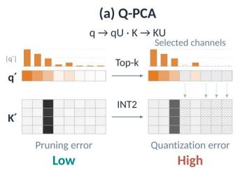

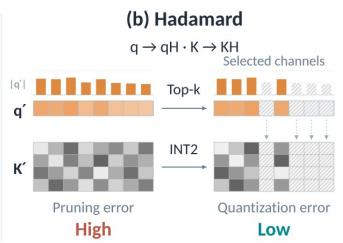

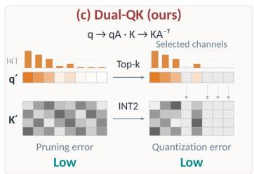  
Figure 1: Conceptual comparison at the same bit width and retained-channel budget. (a) Q-PCA concentrates query energy, whereas (b) Hadamard rotation mitigates key outliers. (c) Dual-QK targets both properties using reciprocal Q/K transforms. Hatched channels are omitted from the dot product.

We propose Dual-QK, which uses paired non-orthogonal query and key transforms to address this conflict. Pairing an invertible query transform with its inverse transpose on keys preserves query–key dot products before quantization and pruning. This extends the shared orthogonal rotations used in prior work, allowing the query and key distributions to be shaped differently. Dual-QK uses this freedom to balance key scales while concentrating query energy in a few channels. These transforms support 2-bit key quantization and dynamic channel selection based on current query magnitudes.

Specifically, Dual-QK combines partial key whitening with a query-aligned basis derived from calibrated query and key statistics to balance key scales and concentrate query energy. Large query magnitudes make attention scores sensitive to quantization error in the leading key channel (channel-0). We therefore retain this channel in BF16 and exclude it from range estimation to narrow the quantization range of the remaining INT2 channels. Bucket-relative RoPE represents each stored key relative to its bucket anchor, keeping stored-key positional offsets within the calibration window. The corresponding query adjustment preserves attention scores before quantization and pruning.

Our contributions are as follows:

• We analyze the conflicting distributional requirements of key quantization and query-channel pruning and introduce Dual-QK, a paired transformation that constructs flat keys and sharp queries while preserving attention scores before compression.

• We exploit these distributions to combine dynamic query-channel selection with INT2 key quantization, using leading-channel protection and bucket-relative RoPE to maintain accuracy across context positions.

• We evaluate Dual-QK on four models for generative accuracy, long-context retrieval, and decoding throughput. At 40% query-channel sparsity, Dual-QK improves accuracy over OSCAR on most tasks. At a 128K context, it provides 6.8× KV-cache compression and an estimated 8.3× reduction in KV read volume relative to unpruned BF16.

## 2 RELATED WORK

## 2.1 KV CACHE QUANTIZATION

KV cache quantization reduces storage and memory traffic by storing keys and values at lower precision. Quantization accuracy depends on how values share a quantization range and how outliers are handled. Mixed precision, fine-grained grouping, and channel rescaling address these issues in LLM quantization (Dettmers et al., 2022; Zhao et al., 2024; Lin et al., 2025b). For KV caches, KIVI (Liu et al., 2024) quantizes keys per channel and values per token. KVQuant (Hooper et al.,

2024) combines per-channel key quantization before rotary position embedding (RoPE) with nonuniform quantization and separate outlier storage. Other approaches improve low-bit KV compression through channel reordering and group-wise clipping (Duanmu et al., 2024), or estimate query–key inner products using sign-quantized random projections (Zandieh et al., 2025).

Rotation-based methods have achieved state-of-the-art results in 4-bit LLM quantization by redistributing outliers through orthogonal transforms (Ashkboos et al., 2024; Liu et al., 2025), with outlier-aware variants targeting KV caches (Su et al., 2025). TurboQuant (Zandieh et al., 2026) combines random rotations with non-uniform scalar quantization for KV-cache compression. OS-CAR (Zhou et al., 2026) combines calibrated spectral bases with Hadamard mixing for INT2 KV quantization. Serving-oriented methods integrate KV quantization with efficient attention kernels (Lin et al., 2025b; Jia et al., 2026).

## 2.2 SPARSE ATTENTION

KV cache eviction reduces both storage and read traffic but may discard information needed by future queries. Query-aware sparse attention methods retain the full cache and select relevant entries for each query, reducing read traffic while keeping unselected information available for later queries (Ribar et al., 2024; Tang et al., 2024). This flexibility can better preserve accuracy as token importance changes across queries (Tang et al., 2024).

Token-level sparsity. Token-based methods retain or evict cached tokens using attention statistics and positional heuristics (Zhang et al., 2023; Xiao et al., 2024; Li et al., 2024; Cai et al., 2025). Query-aware access selects KV pages using key statistics (Tang et al., 2024) or predicts upcoming attention to prefetch relevant entries from host memory (Lee et al., 2024). LServe (Yang et al., 2025b) combines KV quantization with static streaming attention and dynamic page selection.

Channel-level sparsity. Channel-based methods select dimensions of query–key dot products. ThinK (Xu et al., 2025) uses prompt query–key statistics to remove low-importance channels from older keys and reuses the mask during decoding. SparQ Attention, Double Sparsity, and Loki use selected channels or low-dimensional key representations to approximate token importance before attending to retrieved tokens (Ribar et al., 2024; Yang et al., 2024; Singhania et al., 2024). Related approaches reduce dimensionality through low-rank projections (Saxena et al., 2024; Chang et al., 2024; Lin et al., 2025a), which can be combined with quantization (Chang et al., 2024; Lin et al., 2025a). Dual-QK jointly designs Q/K coordinates for low-bit key quantization while keeping all transformed key channels available for dynamic selection based on current query magnitudes.

## 3 METHOD

## 3.1 DUAL TRANSFORMS

We use row-vector notation and denote queries and keys after RoPE by Q and K, with head dimension d. Transforming keys changes their dot products unless queries receive a compensating transform. For any invertible matrix $A ,$ , choosing $B { = } A ^ { - \mathsf { T } }$ gives

$$
( Q A ) ( K B ) ^ { \mathsf { T } } = Q K ^ { \mathsf { T } } .\tag{1}
$$

When A is orthogonal, $B = A .$ , recovering a shared rotation for queries and keys. Dual-QK allows the two transforms to differ, so key scales can be adjusted without forcing the same adjustment onto queries. This identity preserves the original scores before quantization and pruning.

For each layer and KV head, we estimate the uncentered second moments $C _ { Q } = \mathbb { E } [ q ^ { \mathsf { T } } q ]$ and $C _ { K } = \mathbb { E } [ k ^ { \mathsf { T } } k ]$ from calibration data. Query statistics are pooled over heads sharing the KV head. We first reduce scale differences across key directions using partial whitening. With $G = C _ { K } + \epsilon I$ and $\epsilon > 0$ , keys are multiplied by $G ^ { - \alpha / 2 }$ and queries by its inverse, $G ^ { \alpha / 2 }$ . The parameter $\alpha \in [ 0 , 1 ]$ controls whitening strength; regularization limits amplification along directions with little calibration energy.

Whitening alone does not arrange query energy for pruning. We therefore rotate the compensated queries into their principal directions:

$$
G ^ { \alpha / 2 } C _ { Q } G ^ { \alpha / 2 } = U \Lambda U ^ { \mathsf { T } } ,\tag{2}
$$

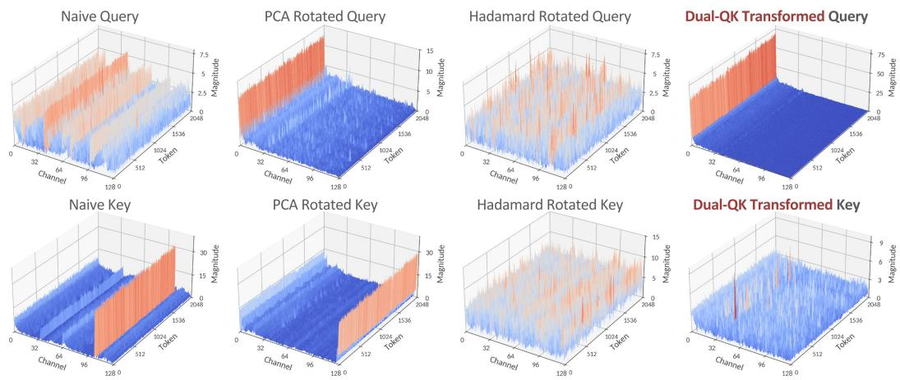  
Figure 2: Query (top) and key (bottom) magnitudes from Llama-3.1-8B-Instruct (layer 29, KV group $^ { 6 , }$ query head 26) in the original, Q-PCA, Hadamard, and Dual-QK coordinates. Q-PCA concentrates queries but leaves key imbalance. Hadamard spreads both, whereas Dual-QK concentrates queries while reducing key imbalance. Magnitude axes are scaled independently across panels.

where the diagonal entries of Λ are ordered from largest to smallest. Applying the same orthogonal matrix $U$ to queries and keys gives the base transforms

$$
A _ { 0 } = G ^ { \alpha / 2 } U , \qquad B _ { 0 } = G ^ { - \alpha / 2 } U .\tag{3}
$$

The transformed query moment is $A _ { 0 } ^ { \mathsf { T } } C _ { Q } A _ { 0 } = \Lambda \colon$ leading channels capture the dominant calibrated query energy. Meanwhile, partial whitening compresses the scale differences in the regularized key moment. $\operatorname { A t } \alpha = 0 ,$ , the pair reduces to Q-PCA; at $\alpha = 1$ , the base transform whitens the regularized key moment. Increasing whitening strength also changes the query spectrum through the reciprocal scaling. Partial whitening controls how much the two distributions are reshaped, balancing key scale reduction with query-energy concentration. Figure 2 illustrates the resulting distributions. These moment properties describe average channel energy on the calibration distribution; dynamic selection accounts for variation across individual queries.

We choose α once per model and reuse the transforms across benchmarks and context lengths. The matrix decompositions are performed offline. During inference, each layer and KV head uses a fixed transform pair, while the channel mask adapts to the current queries. The moment identities and calibration procedure are given in Appendices C.1 and B.2.

## 3.2 DYNAMIC QUERY-CHANNEL PRUNING

The calibrated ordering identifies channels that are important on average, but their importance changes with each query. We therefore select channels dynamically. Query magnitude is a useful proxy when key channels have comparable scales: otherwise, a small query component can still multiply a large key component. Key flattening makes this proxy more appropriate, although it does not make query energy an exact measure of attention-score error.

In grouped-query attention (GQA) (Ainslie et al., 2023), g query heads share one KV head. Let $q _ { h } ^ { \prime } = q _ { h } A _ { 0 }$ be the base transformed query of head h. For each channel $j ,$ , we compute the L2 norm across the group:

$$
e _ { j } = \sqrt { \sum _ { h = 1 } ^ { g } ( q _ { h , j } ^ { \prime } ) ^ { 2 } } .\tag{4}
$$

We retain the $m$ channels with the largest $e _ { j }$ and apply the same mask to all query heads in the group. This maximizes the retained query energy for the chosen channel budget. Multi-head attention (MHA) is the case $g = 1$ , where selection reduces to query magnitude.

Attention dot products use the retained channels and keep the original normalization by ${ \sqrt { d } } .$ All key channels remain stored, allowing a channel skipped by one query to be used by the next. With the

channel-major layout in Section 3.3, the shared mask lets the kernel load only selected key channels. Quantization reduces bits per element, while pruning reduces the key elements read. Values and metadata are still read.

## 3.3 INT2 KV QUANTIZATION

In the base coordinates, a key error $\delta k _ { j } ^ { \prime }$ on a retained channel contributes $q _ { h , j } ^ { \prime } \delta k _ { j } ^ { \prime } / \sqrt { d }$ to head h’s attention logit. The leading base query coordinate has the largest calibrated expected energy, making errors in its corresponding key coordinate especially consequential for attention scores. We therefore retain key channel 0 in BF16 and exclude it from the quantization range of the remaining channels. Those channels use one asymmetric INT2 grid per token and KV head. Removing channel 0 from range estimation also prevents its magnitude from reducing the resolution available to the other channels. Precision protection does not force channel 0 into every dot product; it remains subject to the dynamic mask.

Second moments do not fully describe the ranges used by a low-bit quantizer. We further refine channel scales with a positive diagonal matrix $\mathit { \check { D } }$ , using $\dot { A } = A _ { 0 } D$ and $B = B _ { 0 } D ^ { - 1 }$ . Inspired by reciprocal channel scaling (Lin et al., 2025b), we calibrate D to reduce the attention-score error caused by key quantization and fix its channel-0 entry to one. The two scale factors cancel in each channel. Thus, rescaling preserves both the full dot product and the contribution of any fixed channel set in the base dual coordinates before quantization. The refinement is folded into the transforms before inference. Channel selection still uses the base queries $q _ { h } A _ { 0 } ;$ retained dot products use the final scaled queries and keys.

For values, we follow OSCAR’s calibrated rotation, clipping, and INT2 quantization recipe (Zhou et al., 2026), reversing the value rotation after aggregation. We retain the first 64 and most recent 256 tokens in BF16 for both keys and values. These tokens use the same query-channel mask. Quantization details appear in appendix.

Within each 128-token page, INT2 keys are stored channel-major for each KV head, with one channel occupying a contiguous 32-byte row. The decode kernel issues asynchronous copies only for rows selected by the shared query mask. Values are stored token-major, with separate buffers for quantization metadata and BF16-protected entries.

## 3.4 BUCKET-RELATIVE ROPE

The dual basis is calibrated over a finite positional window. At longer positions, RoPE changes the channel statistics presented to this fixed basis. We address this mismatch by expressing stored keys relative to local bucket anchors. This changes their positional frame without recalibrating the transforms.

We divide positions into buckets of width w, with bucket b starting at $a _ { b } = b w$ . Let $T _ { b }$ undo the RoPE rotation at this anchor. A key $k _ { n }$ in the bucket and a current query q are represented as

$$
z _ { n } = k _ { n } T _ { b } B , \qquad \widetilde { q } _ { b } = q T _ { b } A .\tag{5}
$$

Because $T _ { b }$ is orthogonal and the dual transforms cancel, their uncompressed dot product is unchanged:

$$
\widetilde { q } _ { b } z _ { n } ^ { \mathsf { T } } = q k _ { n } ^ { \mathsf { T } } .\tag{6}
$$

The stored key’s residual position is $n - a _ { b } \in [ 0 , w )$ . We use $w = 2 0 4 8$ , matching the calibration window, and reuse the same dual pair for every bucket. This bounds the positional offsets of stored keys; the query’s relative position can still exceed the window. The anchor adjustment precedes the dual transform so that the calibrated basis acts on bucket-relative coordinates. General channel transforms do not commute with RoPE, so reversing this order changes the representation used for quantization and channel selection.

During decoding, each new key is transformed in its bucket frame and stored. For each bucket, the current query heads receive the corresponding anchor adjustment, and Equation 4 is applied to their base coordinates $q _ { h } T _ { b } A _ { 0 }$ . Thus, channel masks can differ across buckets. The selected channels produce attention scores using the final scaled coordinates. Scores from all buckets and precision tiers share one global softmax, followed by value aggregation and the inverse value rotation.

Table 1: Generative accuracy (%) with 40% query-channel sparsity for quantized methods. BF16 is unpruned. Scores report mean ± standard deviation over five seeds (three for Ministral-3). Capacity and bandwidth are effective bits per KV element at 128K context. Bold marks the highest mean among quantized methods within each model.
<table><tr><td rowspan="2">Model</td><td rowspan="2">Method</td><td colspan="2">KV bits per element |</td><td colspan="4">Benchmark score (%)</td></tr><tr><td>Capacity Bandwidth|GPQA-Diamond HumanEval</td><td></td><td></td><td>LCB v6</td><td>MATH-500</td><td>AIME25</td></tr><tr><td rowspan="5">Llama-3.1-8B -Instruct</td><td>BF16</td><td>16 16</td><td>26.2 ± 1.5</td><td>66.7 ± 2.5</td><td>16.5 ± 1.4</td><td>49.4 ± 1.5</td><td>1.3 ± 1.8</td></tr><tr><td>TurboQuant</td><td>3.13 2.53</td><td>17.7 ± 2.4</td><td>24.3 ± 1.4</td><td>3.8 ± 0.5</td><td>13.8 ± 1.1</td><td>0.7 ± 1.5</td></tr><tr><td>KIVI</td><td>3.01 2.41</td><td>19.2 ± 2.7</td><td>55.2 ± 4.3</td><td>9.8 ± 2.6</td><td>28.9 ± 1.4</td><td>0.7 ± 1.5</td></tr><tr><td>OSCAR</td><td>2.28 1.88</td><td>16.4 ± 3.0</td><td>28.2 ± 2.2</td><td>3.2 ± 1.0</td><td>16.4 ± 0.4</td><td>1.3 ± 1.8</td></tr><tr><td>Dual-QK (ours)</td><td>2.34 1.93</td><td>23.2±1.9</td><td>64.3 ± 2.9</td><td>14.2±1.3</td><td>43.0 ± 2.0</td><td>0.7 ±1.5</td></tr><tr><td rowspan="5">Qwen3-4B -Thinking-2507</td><td>BF16</td><td>16 16</td><td>65.6 ± 1.9</td><td>96.2 ± 0.7</td><td>54.0 ± 1.6</td><td>98.0 ± 0.3</td><td>74.7 ± 3.8</td></tr><tr><td>TurboQuant</td><td>3.13 2.53</td><td>3.5 ± 1.6</td><td>0.0 ± 0.0</td><td>0.0 ± 0.0</td><td>0.2 ± 0.2</td><td>0.0 ± 0.0</td></tr><tr><td>KIVI</td><td>3.01 2.41</td><td>54.3 ± 2.8</td><td>88.4 ± 1.8</td><td>31.6 ± 2.1</td><td>92.5 ± 1.0</td><td>42.0 ± 6.9</td></tr><tr><td>OSCAR</td><td>2.28 1.88</td><td>23.1 ± 2.1</td><td>33.9 ± 1.7</td><td>2.1 ± 1.1</td><td>51.8 ± 1.6</td><td>6.0 ± 1.5</td></tr><tr><td>Dual-QK (ours)</td><td>2.34 1.93</td><td>60.8 ± 2.2</td><td>95.0 ± 0.8</td><td>38.8±2.3</td><td>94.3 ± 0.4</td><td>48.0±5.6</td></tr><tr><td rowspan="5">Qwen3-8B</td><td>BF16</td><td>16 16</td><td>56.1 ± 2.2</td><td>90.1 ± 1.3</td><td>50.2 ± 2.9</td><td>96.4 ± 0.3</td><td>65.3 ± 3.0</td></tr><tr><td>TurboQuant</td><td>3.13</td><td>2.53 19.8 ± 2.9</td><td>16.0 ± 1.2</td><td>2.4 ± 0.8</td><td>31.7 ± 1.7</td><td>0.0 ± 0.0</td></tr><tr><td>KIVI</td><td>3.01 2.41</td><td>49.0 ± 3.2</td><td>87.3 ± 1.8</td><td>32.4 ± 2.9</td><td>92.0 ± 1.0</td><td>47.3 ± 4.9</td></tr><tr><td>OSCAR</td><td>2.28 1.88</td><td>38.1 ± 3.2</td><td>66.1 ± 4.3</td><td>14.8 ± 2.4</td><td>80.3 ± 0.8</td><td>13.3 ± 4.1</td></tr><tr><td>Dual-QK (ours)</td><td>2.34 1.93</td><td>55.7±1.9</td><td></td><td>90.6±2.0 36.2±1.2</td><td>95.0 ± 0.3</td><td>53.3 ± 2.4</td></tr><tr><td rowspan="5">Ministral-3-14B -Reasoning-2512</td><td>BF16 TurboQuant</td><td>16 16</td><td>53.7 ± 1.1</td><td>96.3 ± 1.2</td><td>55.7 ± 0.8</td><td>95.4 ± 0.7</td><td>43.3 ± 5.8</td></tr><tr><td>KIVI</td><td>3.13</td><td>2.53 44.8 ± 4.9</td><td>93.3 ± 2.7</td><td>40.7 ± 2.2</td><td>85.4 ± 0.9</td><td>23.3 ± 0.0</td></tr><tr><td>OSCAR</td><td>3.01 2.41 2.28</td><td>45.1 ± 0.8</td><td>92.3 ± 1.8 91.5 ± 0.6</td><td>41.5 ± 1.2 37.2 ± 1.2</td><td>86.4 ± 0.2</td><td>27.8 ± 6.9</td></tr><tr><td>Dual-QK (ours)</td><td>1.88 2.34</td><td>37.4 ± 2.5</td><td></td><td></td><td>85.5 ± 0.8</td><td>25.6 ± 1.9</td></tr><tr><td></td><td>1.93</td><td>50.2±3.2</td><td>96.3 ± 0.6</td><td></td><td></td><td>47.6±3.6 92.7±0.4 37.8±1.9</td></tr></table>

## 4 EXPERIMENTS

## 4.1 EXPERIMENTAL SETTINGS

Models and benchmarks. We evaluate Dual-QK on Llama-3.1-8B-Instruct (Grattafiori et al., 2024), Qwen3-4B-Thinking-2507, Qwen3-8B (Yang et al., 2025a), and Ministral-3-14B-Reasoning-2512 (Liu et al., 2026). Generative benchmarks cover knowledge reasoning with GPQA-Diamond, code generation with HumanEval and LiveCodeBench v6, and mathematical reasoning with MATH-500 and AIME25 (Rein et al., 2023; Chen et al., 2021; Jain et al., 2025; Hendrycks et al., 2021; Zhang & Math-AI, 2025). We report pass@1 for code generation and accuracy for reasoning tasks. Long-context retrieval is evaluated on the needle-in-a-haystack (NIAH) tasks of RULER (Hsieh et al., 2024), with context lengths from 4K to 128K. All methods use the same prompts, sampling parameters, generation limits, and scoring procedure within each model–benchmark pair. Repetition counts are specified in the corresponding table and figure captions.

Baselines and comparison protocol. We compare Dual-QK with KIVI (Liu et al., 2024) and two rotation-based quantization methods, TurboQuant (Zandieh et al., 2026) and OSCAR (Zhou et al., 2026). All model weights remain in BF16. For the main accuracy comparison, we apply the same query-channel pruning policy at 40% sparsity to all quantized methods and use unpruned BF16 as the reference. Following OSCAR, Dual-QK retains the KV entries of the first 64 and most recent 256 tokens in BF16. At 128K context, we report format-based estimates of KV storage and read volume as effective bits per KV element (BPE). Capacity BPE describes the stored cache, while bandwidth BPE estimates the KV data read per decoding step with channel selection. Both account for quantization metadata and high-precision entries, including the protected sink and recent tokens.

Calibration and implementation. Dual-QK is calibrated on 128 sequences of 2,048 tokens from the WikiText-2 training set (Merity et al., 2016) and we select α using separate 8K and 32K inputs. We collect post-RoPE query and key second moments for each layer and KV head, pooling query statistics across heads that share the same KV head. The transforms are constructed offline without retraining model weights and reused across benchmarks and context lengths. We implement Dual-QK in SGLang (Zheng et al., 2024). We evaluate accuracy on NVIDIA H200 GPUs and decoding throughput on a single NVIDIA RTX PRO 6000 Blackwell GPU with 96 GB of memory.

Table 2: RULER NIAH accuracy (%) across context lengths with 40% query-channel sparsity for quantized methods. BF16 is the unpruned reference. Entries report mean ± sample standard deviation across three NIAH data draws, each containing 25 examples per subtask across eight subtasks. Capacity and bandwidth are effective bits per KV element at a 128K context. Bold denotes the highest mean among quantized methods.
<table><tr><td rowspan="2">Model</td><td rowspan="2">Method</td><td colspan="2">KV bits per element</td><td colspan="6">Context length</td></tr><tr><td>Capacity Bandwidth</td><td></td><td>4K</td><td>8K</td><td>16K</td><td>32K</td><td>64K</td><td>128K</td></tr><tr><td rowspan="3">Llama-3.1- 8B-Instruct</td><td>BF16</td><td>16</td><td>16</td><td>100.0 ± 0.1</td><td>99.9 ± 0.0 100.0 ± 0.1 100.0 ± 0.1</td><td></td><td></td><td></td><td>99.3 ± 0.3 94.8 ± 0.4</td></tr><tr><td>OSCAR</td><td>2.28</td><td>1.88</td><td>65.0 ± 1.0</td><td>53.6 ± 1.6</td><td>51.3 ± 0.4</td><td>42.9 ± 1.7</td><td></td><td>39.5 ± 1.8 25.2 ± 0.6</td></tr><tr><td>Dual-QK (ours)</td><td>2.34</td><td>1.93</td><td>92.4 ± 0.4</td><td>92.5 ± 0.8</td><td>89.0 ± 0.2 83.7 ± 0.7</td><td></td><td></td><td>78.9 ± 0.6 58.9 ±1.5</td></tr><tr><td rowspan="3">Qwen3-4B -Thinking -2507</td><td>BF16</td><td>16</td><td>16</td><td>100.0 ± 0.0</td><td>99.0 ± 0.1</td><td>98.3 ± 0.4</td><td>96.8 ± 0.4</td><td></td><td>96.7 ± 0.6 94.0 ± 0.1</td></tr><tr><td>OSCAR</td><td>2.28</td><td>1.88</td><td>78.4 ± 0.8</td><td>72.0 ± 0.4</td><td>61.2 ± 0.4</td><td>55.0 ± 0.8</td><td>32.7 ± 1.6 2.0 ± 0.0</td><td></td></tr><tr><td>Dual-QK (ours)</td><td>2.34</td><td>1.93</td><td>94.0 ± 0.3</td><td>92.3 ± 0.1 88.8 ± 0.2</td><td></td><td>84.8± 0.4</td><td></td><td>81.5 ± 0.7 64.4 ± 0.2</td></tr><tr><td rowspan="3">Qwen3-8B</td><td>BF16</td><td>16</td><td>16</td><td></td><td></td><td></td><td></td><td></td><td></td></tr><tr><td>OSCAR</td><td>2.28</td><td>1.88</td><td>99.9 ± 0.1 87.1 ± 0.2</td><td>99.8 ± 0.0 80.0 ± 0.9</td><td>100.0 ± 0.1 74.0 ± 0.9</td><td>99.0 ± 0.1 55.1 ± 1.6</td><td></td><td>86.7 ± 0.2 76.5 ± 1.3</td></tr><tr><td>Dual-QK (ours)</td><td>2.34</td><td>1.93</td><td>95.6 ± 0.3 </td><td>95.4 ± 0.1 91.9 ± 0.1</td><td></td><td>83.5 ± 0.7</td><td>68.4± 0.7 57.0 ±1.4</td><td>43.0 ± 0.9 10.8 ± 0.5</td></tr><tr><td rowspan="3">Ministral-3- 14B-Reasoning OSCAR</td><td></td><td>16</td><td></td><td></td><td></td><td></td><td></td><td></td><td></td></tr><tr><td>BF16</td><td>2.28</td><td>16 1.88</td><td>99.7 ± 0.1 93.3 ± 0.5</td><td>97.8 ± 0.1 89.8 ± 0.5 85.8 ± 0.3 76.3 ± 1.0</td><td>98.6 ± 0.2</td><td>91.3 ± 0.6</td><td></td><td>92.1 ± 0.7 82.9 ± 0.9</td></tr><tr><td>Dual-QK (ours)</td><td>2.34</td><td>1.93</td><td>95.2 ± 0.3 90.4 ± 0.5 83.2 ± 0.3 78.7 ± 0.4 77.8 ±1.0 71.1 ±1.2</td><td></td><td></td><td></td><td></td><td>73.1 ± 0.3 65.6 ± 1.2</td></tr></table>

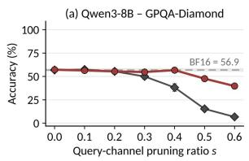

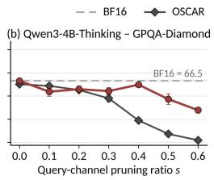

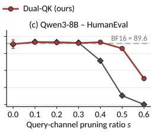

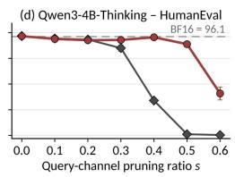  
Figure 3: Accuracy on GPQA-Diamond and HumanEval as query-channel pruning increases for Qwen3-8B and Qwen3-4B-Thinking-2507. Dashed lines indicate the unpruned BF16 references. Solid curves show OSCAR and Dual-QK with quantized KV caches, including at zero pruning. Error bars indicate standard deviation over three seeds.

## 4.2 MAIN RESULTS

Generative benchmarks. Table 1 shows that Dual-QK maintains higher generative accuracy under 40% query-channel pruning at a storage cost comparable to OSCAR. Dual-QK uses 2.34 capacity BPE, compared with 2.28 for OSCAR, while improving accuracy on most knowledge, coding, and mathematical reasoning tasks. On Qwen3-4B-Thinking-2507, HumanEval pass@1 reaches 95.0%, compared with 33.9% for OSCAR and 96.2% for unpruned BF16. Dual-QK also achieves higher mean accuracy than KIVI on most tasks while using 2.34 rather than 3.01 capacity BPE. Among the evaluated quantized methods, Dual-QK generally remains closest to the BF16 reference.

Long-context retrieval. Table 2 reports NIAH retrieval accuracy from 4K to 128K context lengths. Dual-QK improves over OSCAR at most lengths across all four models, with particularly large gains on Llama and the two Qwen models. At 64K, Llama-3.1-8B-Instruct and Qwen3-4B-Thinking-2507 reach 78.9% and 81.5%, compared with 39.5% and 32.7% for OSCAR. The advantage extends to 128K, where Dual-QK retains 57.0∼64.4% accuracy across Llama and the two Qwen models, compared with 2.0–25.2% for OSCAR. Ministral shows smaller improvements at most lengths, although OSCAR remains higher at 16K. These gains use the same 40% query-channel sparsity and comparable KV storage and read budgets. The selected transforms remain fixed throughout the context-length sweep.

## 4.3 ABLATION STUDIES

Sensitivity to channel pruning. Figure 3 varies the query-channel pruning ratio from 0% to 60% on GPQA-Diamond and HumanEval for Qwen3-8B and Qwen3-4B-Thinking-2507. Dual-QK and OSCAR perform similarly at low sparsity, but the accuracy gap widens as more channels are removed. At 40%, Dual-QK retains most of its accuracy without pruning on both tasks, while OSCAR declines substantially. Dual-QK remains ahead on both tasks and models at 50%. At 60%, its HumanEval accuracy also drops sharply. These results show that accuracy under quantization alone does not guarantee robustness to channel pruning.

Table 3: Component ablation of Dual-QK on Qwen3-8B with INT2 KV quantization and 40% query-channel sparsity. BF16 is unpruned. Entries report mean ± standard deviation. BF16 and Full Dual-QK reuse the five-seed results from Table 1. The remaining configurations use three seeds.
<table><tr><td>Configuration</td><td></td><td>GPQA-D HumanEval LCB v6 MATH-500 AIME25</td><td></td><td></td><td></td></tr><tr><td>BF16 reference</td><td> $5 6 . 1 \pm { } _ { 2 . 2 }$ </td><td> $9 0 . 1 \pm { } 1 . 3$ </td><td> $5 0 . 2 \pm { } _ { 2 . 9 }$ </td><td> $9 6 . 4 \pm 0 . 3$ </td><td> $6 5 . 3 \pm { 3 . 0 }$ </td></tr><tr><td>Full Dual-QK  $( \alpha = 0 . 5 )$ </td><td> $5 5 . 7 \pm { } _ { 1 . 9 }$ </td><td> $9 0 . 6 \pm 2 . 0$ </td><td> $3 6 . 2 \pm { } 1 . 2$ </td><td> $9 5 . 0 \pm { 0 . 3 }$ </td><td> $5 3 . 3 \pm { 2 . 4 }$ </td></tr><tr><td>w/o channel-0 protection</td><td> $4 6 . 5 \pm { } 4 . 5$ </td><td> $7 1 . 5 \pm { } 1 . 9$ </td><td> $1 6 . 5 \pm { } 1 . 2$ </td><td> $8 7 . 3 \pm { } 1 . 0$ </td><td> $2 4 . 4 \pm { } 1 . 9$ </td></tr><tr><td>w/o bucket-relative RoPE</td><td> $3 3 . 2 \pm { 0 . 3 }$ </td><td> $5 1 . 4 \pm { } _ { 2 . 5 }$ </td><td> $8 . 4 \pm { } 0 . 8$ </td><td> $5 1 . 1 \pm { } 1 . 1$ </td><td> $2 . 2 \pm { } 1 . 9$ </td></tr><tr><td>w/o diagonal refinement  $( D = I )$ </td><td> $5 2 . 5 \pm { } _ { 4 . 8 }$ </td><td> $8 7 . 6 \pm 2 . 8$ </td><td> $3 5 . 4 \pm { } _ { 1 . 9 }$ </td><td> $8 9 . 5 \pm { 5 . 4 }$ </td><td> $5 1 . 1 \pm { \ : } 9 . 6$ </td></tr><tr><td> $\mathbf { Q } \mathbf { - } \mathbf { P } \mathbf { C } \mathbf { A }$  base  $( \alpha = 0 )$ </td><td> $4 5 . 3 \pm { 3 . 8 }$ </td><td> $7 5 . 2 \pm { } 3 . 9$ </td><td> $1 5 . 3 \pm { } 1 . 3$ </td><td> $7 8 . 7 \pm { 1 1 . 6 }$ </td><td> $1 7 . 8 \pm { } 1 . 9$ </td></tr><tr><td>Hadamard base (H)</td><td> $7 . 9 \pm 1 . 1$ </td><td> $4 . 5 \pm 2 . 1$ </td><td> $0 . 3 \pm { 0 . 4 }$ </td><td> $9 . 8 \pm 2 . 6$ </td><td> $0 . 0 \pm \ : 0 . 0$ </td></tr></table>

Table 4: Generative accuracy (%) without query-channel pruning. Benchmark entries report mean ± standard deviation over five seeds. BF16 is the unquantized reference. Bold denotes the highest score among quantized methods within each model.
<table><tr><td>Model</td><td>Method</td><td></td><td>GPQA-D HumanEval LCB v6</td><td></td><td>MATH-500 AIME25</td><td></td><td>Mean</td></tr><tr><td rowspan="4">Llama-3.1- 8B-Instruct</td><td>BF16</td><td> $2 6 . 2 \pm { } 1 . 5$ </td><td> $6 6 . 7 \pm 2 . 5$ </td><td> $1 6 . 5 \pm { } 1 . 4$ </td><td> $4 9 . 4 \pm { } 1 . 5$ </td><td> $1 . 3 \pm { } 1 . 8$ </td><td>32.0</td></tr><tr><td>TurboQuant</td><td> ${ \bf 2 6 . 8 \pm _ { 3 . 1 } }$ </td><td> $5 9 . 3 \pm { } _ { 2 . 9 }$ </td><td> $1 2 . 5 \pm { } 1 . 3$ </td><td> $3 9 . 9 \pm { 1 . 1 }$ </td><td> $0 . 0 \pm \ : 0 . 0$ </td><td>27.7</td></tr><tr><td>OSCAR</td><td> $2 4 . 3 \pm { } 1 . 7$ </td><td> $6 5 . 6 \pm { 3 . 0 }$ </td><td> $1 5 . 3 \pm { 0 . 9 }$ </td><td> $5 0 . 8 \pm { \ : 0 . 5 }$ </td><td> ${ \bf 2 . 0 \pm _ { 1 . 8 } }$ </td><td>31.6</td></tr><tr><td>Dual-QK (ours)</td><td> $2 6 . 4 \pm { } 1 . 9$ </td><td> ${ \bf 6 6 . 0 \pm { \bf _ { 1 . 7 } } }$ </td><td> ${ \bf 1 6 . 5 \pm { \bf 0 . 7 } }$ </td><td> ${ \bf 5 0 . 9 \pm 0 . 6 }$ </td><td> $1 . 3 \pm { } 3 . 0$ </td><td>32.2</td></tr><tr><td rowspan="4">Qwen3-8B</td><td>BF16</td><td> $5 6 . 1 \pm { } _ { 2 . 2 }$ </td><td> $9 0 . 1 \pm { 1 . 3 }$ </td><td> $5 0 . 2 \pm { } _ { 2 . 9 }$ </td><td> $9 6 . 4 \pm 0 . 3$ </td><td> $6 5 . 3 \pm { 3 . 0 }$ </td><td>71.6</td></tr><tr><td>TurboQuant</td><td> $4 7 . 1 \pm 2 . 2$ </td><td> $7 5 . 7 \pm { } 1 . 6$ </td><td> $2 4 . 7 \pm { } 1 . 7$ </td><td> $9 2 . 4 \pm { 0 . 6 }$ </td><td> $5 0 . 7 \pm { } 2 . 8$ </td><td>58.1</td></tr><tr><td>OSCAR</td><td> ${ \bf 5 6 . 6 \pm 1 . 2 }$ </td><td> ${ \bf 9 2 . 2 \pm 1 . 1 }$ </td><td> ${ \bf 4 6 . 1 \pm { \bf 1 . 6 } }$ </td><td> ${ \bf 9 5 . 8 \pm 0 . 5 }$ </td><td> ${ \bf 6 1 . 3 \pm 1 . 8 }$ </td><td>70.4</td></tr><tr><td>Dual-QK (ours)</td><td> $5 5 . 9 \pm 2 . 2$ </td><td> $9 2 . 0 \pm { 0 . 9 }$  一</td><td> $4 3 . 2 \pm { 2 . 4 }$ </td><td> $9 5 . 2 \pm { 0 . 4 }$  </td><td> ${ \bf 6 1 . 3 \pm 3 . 0 }$ </td><td>69.5</td></tr></table>

Component ablation. Table 3 compares component removals and alternative Q/K bases on Qwen3- 8B at 40% query-channel sparsity. Q-PCA (α = 0) lowers LiveCodeBench accuracy from 36.2% to 15.3% and AIME25 from 53.3% to 17.8%. These results indicate that concentrating query energy alone is insufficient for joint quantization and pruning. The Hadamard base yields larger accuracy losses. Removing channel-0 protection or bucket-relative RoPE lowers HumanEval accuracy from 90.6% to 71.5% and 51.4%, respectively. Removing diagonal refinement lowers the mean accuracy on all five benchmarks, although variability across seeds is substantial on MATH-500 and AIME25.

Accuracy without channel pruning. Table 4 evaluates quantization accuracy without pruning. Dual-QK achieves a mean accuracy across the five benchmarks of 32.2% on Llama-3.1-8B-Instruct and 69.5% on Qwen3-8B, compared with 31.6% and 70.4% for OSCAR, respectively. The means differ by less than one percentage point on each model. OSCAR achieves a higher mean on Qwen3-8B, with the largest gap on LiveCodeBench. Together with Figure 3, these results show that Dual-QK maintains competitive accuracy without pruning while supporting higher channel pruning ratios.

Calibration-domain sensitivity. Table 5 compares WikiText-2, MMLU, and GPQA-Diamond calibration on Qwen3-4B-Thinking-2507 at 0% and 40% query-channel sparsity. At 40%, the spread across calibration datasets is 0.5 percentage points on MATH-500, 2.0 on HumanEval, and 2.1 on LiveCodeBench. GPQA-Diamond calibration does not yield a higher GPQA-Diamond mean than WikiText-2 at either sparsity. AIME25 shows a larger spread of 12.2 points without pruning and 5.6 points at 40%. WikiText-2 calibration is competitive on most tasks, while AIME25 is more sensitive to the calibration source.

## 4.4 THROUGHPUT

Decoding Speedup. Figure 4 compares BF16, OSCAR, and Dual-QK across all four models. At batch size 1, Dual-QK achieves higher throughput than both baselines at every tested input length under the evaluated configurations. Its relative advantage over OSCAR grows with input length as accessing the KV cache becomes more costly. On Qwen3-4B-Thinking-2507 at 90K, Dual-QK reaches 90 tokens/s compared with 24 tokens/s for BF16, giving a 3.75× speedup. These measurements include transformations and cache operations during decoding.

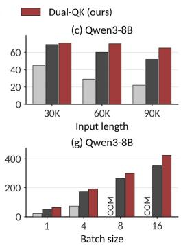

Table 5: Calibration-domain ablation of Dual-QK on Qwen3-4B-Thinking-2507. Results are reported as mean ± standard deviation over three seeds. Sparsity denotes query-channel sparsity. BF16 is the unpruned reference. Bold highlights WikiText, our default calibration dataset, and its results.
<table><tr><td>Method</td><td></td><td>Sparsity Calibration GPQA-D</td><td></td><td>HumanEval</td><td>LCB v6</td><td>MATH-500</td><td>AIME25</td></tr><tr><td>BF16</td><td></td><td></td><td> $6 3 . 0 \pm 2 . 4$ </td><td> $9 5 . 5 \pm { 0 . 9 }$ </td><td> $5 1 . 7 \pm { 0 . 4 }$ </td><td> $9 7 . 5 \pm 0 . 3$ </td><td> $7 2 . 2 \pm { 3 . 8 }$ </td></tr><tr><td rowspan="4">Dual-QK (ours)</td><td rowspan="2">0%</td><td>WikiText</td><td> ${ \bf 6 2 . 3 \pm 1 . 6 }$ </td><td> ${ \bf 9 4 . 9 \pm 0 . 4 }$ </td><td> ${ \bf 4 4 . 5 \pm 0 . 9 }$ </td><td> ${ \bf 9 6 . 1 \pm 0 . 2 }$ </td><td> ${ \bf 4 7 . 8 \pm 1 . 9 }$ </td></tr><tr><td>MMLU</td><td> $6 1 . 3 \pm { } 2 . 8$ </td><td> $9 4 . 7 \pm { 0 . 7 }$ </td><td> $4 5 . 3 \pm { } _ { 2 . 9 }$ </td><td> $9 5 . 7 \pm { 0 . 4 }$ </td><td> $5 7 . 8 \pm { } 1 . 9$ </td></tr><tr><td rowspan="2"></td><td>GPQA-D</td><td> $6 2 . 3 \pm { 1 . 8 }$ </td><td> $9 4 . 9 \pm { 0 . 9 }$ </td><td> $4 5 . 0 \pm { } 1 . 5$ </td><td> $9 6 . 7 \pm { 0 . 8 }$ </td><td> $6 0 . 0 \pm { 5 . 8 }$ </td></tr><tr><td>WikiText</td><td> ${ \bf 5 8 . 1 \pm 1 . 3 }$ </td><td> ${ \bf 9 2 . 9 \pm 1 . 8 }$ </td><td> ${ \bf 3 8 . 9 \pm 2 . 3 }$ </td><td> ${ \bf 9 3 . 9 \pm 0 . 8 }$ </td><td> ${ \bf 5 1 . 1 \pm 1 . 9 }$ </td></tr><tr><td rowspan="2"></td><td rowspan="2">40%</td><td> $\mathbf { M M L U }$ </td><td> $5 6 . 6 \pm { } 1 . 5$ </td><td> $9 4 . 7 \pm { 0 . 4 }$ </td><td> $3 9 . 4 \pm { } 1 . 6$ </td><td> $9 3 . 7 \pm { 1 . 0 }$ </td><td> $5 0 . 0 \pm { 0 . 0 }$ </td></tr><tr><td> $\mathrm { G P Q A ^ { - } D }$ </td><td> $5 7 . 7 \pm { 1 . 1 }$ </td><td> $9 4 . 9 \pm 2 . 1$ </td><td> $4 1 . 0 \pm { 1 . 6 }$ </td><td> $9 4 . 2 \pm { 0 . 4 }$ </td><td> $5 5 . 6 \pm { } _ { 1 . 9 }$ </td></tr></table>

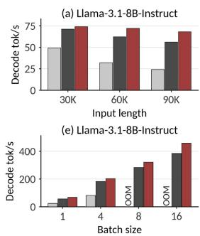

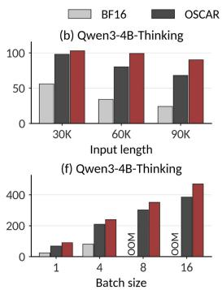

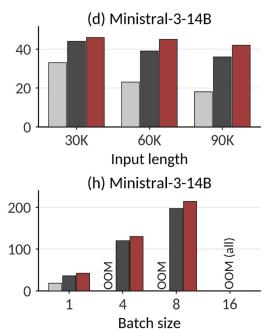  
Figure 4: Decoding throughput excluding prefill. Top: throughput versus input length @ batch size = 1. Bottom: throughput versus batch size @ input length = 90K. BF16/OSCAR are unpruned; Dual-QK uses 40% query-channel sparsity. OOM indicates insufficient GPU memory.

Effect of Batch Size. The batch sweep shows how cache compression increases serving capacity within the same GPU memory budget. At 90K, BF16 runs out of memory at batch sizes 8 and 16 on Llama and both Qwen models, while OSCAR and Dual-QK support batch size 16. On Ministral, BF16 runs out of memory starting at the tested batch size of 4, while both quantized methods support batch size 8. All three methods run out of memory at batch size 16. Across the feasible batch sizes shown, Dual-QK maintains higher aggregate throughput than OSCAR.

## 5 DISCUSSION

Practical use. KV-cache quantization enables larger batches on a single GPU. As weight accesses are amortized across more requests, KV-cache reads can become the bottleneck. Channel pruning can then provide additional decoding speedup.

Limitations. The additional speedup from pruning is limited at small batch sizes, where selection overhead can offset the savings from skipped key reads. Its benefit grows when KV-cache access accounts for more of the decode step, as in larger batches and longer contexts. Accuracy gaps to BF16 remain at long contexts. Bucket-relative RoPE bounds stored-key offsets, but query offsets relative to older buckets can exceed the 2K calibration window. We leave calibration over broader positional ranges to future work.

## 6 CONCLUSION

We introduce Dual-QK, a paired query–key transformation for combining low-bit KV quantization with dynamic query-channel pruning. Partial key whitening and query-energy ordering construct a representation that balances key scales and concentrates query energy while preserving attention scores before compression. Experiments show improved accuracy under INT2 quantization and channel pruning, together with higher decoding throughput in the evaluated decoding configurations. The results demonstrate the value of designing query and key coordinates for quantization and channel selection together.

## REFERENCES

Joshua Ainslie, James Lee-Thorp, Michiel De Jong, Yury Zemlyanskiy, Federico Lebron, and Sumit´ Sanghai. Gqa: Training generalized multi-query transformer models from multi-head checkpoints. In Proceedings of the 2023 conference on empirical methods in natural language processing, pp. 4895–4901, 2023.

Saleh Ashkboos, Amirkeivan Mohtashami, Maximilian L. Croci, Bo Li, Pashmina Cameron, Martin Jaggi, Dan Alistarh, Torsten Hoefler, and James Hensman. Quarot: Outlier-free 4- bit inference in rotated llms. In A. Globerson, L. Mackey, D. Belgrave, A. Fan, U. Paquet, J. Tomczak, and C. Zhang (eds.), Advances in Neural Information Processing Systems, volume 37, pp. 100213–100240. Curran Associates, Inc., 2024. doi: 10.52202/ 079017-3180. URL https://proceedings.neurips.cc/paper\_files/paper/ 2024/file/b5b939436789f76f08b9d0da5e81af7c-Paper-Conference.pdf.

Yushi Bai, Xin Lv, Jiajie Zhang, Hongchang Lyu, Jiankai Tang, Zhidian Huang, Zhengxiao Du, Xiao Liu, Aohan Zeng, Lei Hou, Yuxiao Dong, Jie Tang, and Juanzi Li. LongBench: A bilingual, multitask benchmark for long context understanding. In Lun-Wei Ku, Andre Martins, and Vivek Srikumar (eds.), Proceedings of the 62nd Annual Meeting of the Association for Computational Linguistics (Volume 1: Long Papers), pp. 3119–3137, Bangkok, Thailand, August 2024. Association for Computational Linguistics. doi: 10.18653/v1/2024.acl-long.172. URL https://aclanthology.org/2024.acl-long.172/.

Priyansh Bhatnagar, Ashkan Moradifirouzabadi, Se-Hyun Yang, SeungJae Lee, Jungwook Choi, and Mingu Kang. STAR-KV: Low-rank KV cache compression via soft thresholding for adaptive rank control. In Forty-third International Conference on Machine Learning, 2026. URL https: //openreview.net/forum?id=lJjH1q6RwY.

Zefan Cai, Yichi Zhang, Bofei Gao, Yuliang Liu, Yucheng Li, Tianyu Liu, Keming Lu, Wayne Xiong, Yue Dong, Junjie Hu, and Wen Xiao. PyramidKV: Dynamic KV cache compression based on pyramidal information funneling. In Second Conference on Language Modeling, 2025. URL https://openreview.net/forum?id=ayi7qezU87.

Chi-Chih Chang, Wei-Cheng Lin, Chien-Yu Lin, Chong-Yan Chen, Yu-Fang Hu, Pei-Shuo Wang, Ning-Chi Huang, Luis Ceze, Mohamed S Abdelfattah, and Kai-Chiang Wu. Palu: Compressing kv-cache with low-rank projection. arXiv preprint arXiv:2407.21118, 2024.

Mark Chen, Jerry Tworek, Heewoo Jun, Qiming Yuan, Henrique Ponde De Oliveira Pinto, Jared Kaplan, Harri Edwards, Yuri Burda, Nicholas Joseph, Greg Brockman, et al. Evaluating large language models trained on code. arXiv preprint arXiv:2107.03374, 2021.

Tim Dettmers, Mike Lewis, Younes Belkada, and Luke Zettlemoyer. Gpt3. int8 (): 8-bit matrix multiplication for transformers at scale. Advances in neural information processing systems, 35: 30318–30332, 2022.

Haojie Duanmu, Zhihang Yuan, Xiuhong Li, Jiangfei Duan, Xingcheng Zhang, and Dahua Lin. Skvq: Sliding-window key and value cache quantization for large language models. arXiv preprint arXiv:2405.06219, 2024.

Samuel Fernandez-Mendui´ na, Amir Ziashahabi, Eduardo Pavez, Antonio Ortega, and Salman Aves-˜ timehr. Spend bits where queries look: Kv cache vector quantization with attention-preserving transforms. arXiv preprint arXiv:2608.04074, 2026.

Aaron Grattafiori, Abhimanyu Dubey, Abhinav Jauhri, Abhinav Pandey, Abhishek Kadian, Ahmad Al-Dahle, Aiesha Letman, Akhil Mathur, Alan Schelten, Alex Vaughan, et al. The llama 3 herd of models. arXiv preprint arXiv:2407.21783, 2024.

Dan Hendrycks, Collin Burns, Saurav Kadavath, Akul Arora, Steven Basart, Eric Tang, Dawn Song, and Jacob Steinhardt. Measuring mathematical problem solving with the math dataset. NeurIPS, 2021.

Coleman Hooper, Sehoon Kim, Hiva Mohammadzadeh, Michael W. Mahoney, Yakun Sophia Shao, Kurt Keutzer, and Amir Gholami. Kvquant: Towards 10 million context length llm inference with kv cache quantization. In A. Globerson, L. Mackey, D. Belgrave, A. Fan, U. Paquet, J. Tomczak, and C. Zhang (eds.), Advances in Neural Information Processing Systems, volume 37, pp. 1270–1303. Curran Associates, Inc., 2024. doi: 10.52202/ 079017-0040. URL https://proceedings.neurips.cc/paper\_files/paper/ 2024/file/028fcbcf85435d39a40c4d61b42c99a4-Paper-Conference.pdf.

Cheng-Ping Hsieh, Simeng Sun, Samuel Kriman, Shantanu Acharya, Dima Rekesh, Fei Jia, Yang Zhang, and Boris Ginsburg. Ruler: What’s the real context size of your long-context language models? arXiv preprint arXiv:2404.06654, 2024.

Naman Jain, King Han, Alex Gu, Wen-Ding Li, Fanjia Yan, Tianjun Zhang, Sida Wang, Armando Solar-Lezama, Koushik Sen, and Ion Stoica. Livecodebench: Holistic and contamination free eval uation of large language models for code. In The Thirteenth International Conference on Learning Representations, 2025. URL https://openreview.net/forum?id=chfJJYC3iL.

Simon Jegou and Maximilian Jeblick. Kvzap: Fast, adaptive, and faithful kv cache pruning. arXiv preprint arXiv:2601.07891, 2026.

Jinda Jia, Jisen Li, Zhongzhu Zhou, Jung Hwan Heo, Jue Wang, Tri Dao, Shuaiwen Leon Song, Ben Athiwaratkun, Chenfeng Xu, Tianyi Zhang, et al. Saw-int4: System-aware 4-bit kv-cache quantization for real-world llm serving. arXiv preprint arXiv:2604.19157, 2026.

Hao Kang, Qingru Zhang, Souvik Kundu, Geonhwa Jeong, Zaoxing Liu, Tushar Krishna, and Tuo Zhao. Gear: An efficient kv cache compression recipe for near-lossless generative inference of llm. arXiv preprint arXiv:2403.05527, 2024.

Wonbeom Lee, Jungi Lee, Junghwan Seo, and Jaewoong Sim. InfiniGen: Efficient generative inference of large language models with dynamic KV cache management. In 18th USENIX symposium on operating systems design and implementation (OSDI 24), pp. 155–172, 2024.

Junyan Li, Yang Zhang, Muhammad Yusuf Hassan, Talha Chafekar, Tianle Cai, Zhile Ren, Pengsheng Guo, Foroozan Karimzadeh, Colorado Reed, Chong Wang, and Chuang Gan. CommVQ: Commutative vector quantization for KV cache compression. In Forty-second International Conference on Machine Learning, 2025. URL https://openreview.net/forum?id=sbbyCB39HN.

Yuhong Li, Yingbing Huang, Bowen Yang, Bharat Venkitesh, Acyr Locatelli, Hanchen Ye, Tianle Cai, Patrick Lewis, and Deming Chen. Snapkv: Llm knows what you are looking for before generation. Advances in Neural Information Processing Systems, 37:22947–22970, 2024.

Huanxuan Liao, Yixing Xu, Shizhu He, Guanchen Li, Xuanwu Yin, Dong Li, Emad Barsoum, Jun Zhao, and Kang Liu. Spark: Query-aware unstructured sparsity with recoverable kv cache channel pruning. In Proceedings of the AAAI Conference on Artificial Intelligence, volume 40, pp. 31961–31969, 2026.

Bokai Lin, Zihao Zeng, Zipeng Xiao, Siqi Kou, Tianqi Hou, Xiaofeng Gao, Hao Zhang, and Zhijie Deng. Matryoshkakv: Adaptive kv compression via trainable orthogonal projection. In International Conference on Learning Representations, volume 2025, pp. 86669–86690, 2025a.

Yujun Lin, Haotian Tang, Shang Yang, Zhekai Zhang, Guangxuan Xiao, Chuang Gan, and Song Han. Qserve: W4a8kv4 quantization and system co-design for efficient llm serving. Proceedings of Machine Learning and Systems, 7, 2025b.

Alexander H Liu, Kartik Khandelwal, Sandeep Subramanian, Victor Jouault, Abhinav Rastogi, Adrien Sade, Alan Jeffares, Albert Jiang, Alexandre Cahill, Alexandre Gavaudan, et al. Ministral 3.´ arXiv preprint arXiv:2601.08584, 2026.

Zechun Liu, Changsheng Zhao, Igor Fedorov, Bilge Soran, Dhruv Choudhary, Raghuraman Krishnamoorthi, Vikas Chandra, Yuandong Tian, and Tijmen Blankevoort. Spinquant: LLM quantization with learned rotations. In The Thirteenth International Conference on Learning Representations, 2025. URL https://openreview.net/forum?id=ogO6DGE6FZ.

Zirui Liu, Jiayi Yuan, Hongye Jin, Shaochen Zhong, Zhaozhuo Xu, Vladimir Braverman, Beidi Chen, and Xia Hu. KIVI: A tuning-free asymmetric 2bit quantization for KV cache. In Forty-first International Conference on Machine Learning, 2024. URL https://openreview.net/ forum?id=L057s2Rq8O.

Stephen Merity, Caiming Xiong, James Bradbury, and Richard Socher. Pointer sentinel mixture models, 2016.

David Rein, Betty Li Hou, Asa Cooper Stickland, Jackson Petty, Richard Yuanzhe Pang, Julien Dirani, Julian Michael, and Samuel R. Bowman. Gpqa: A graduate-level google-proof q&a benchmark, 2023.

Luka Ribar, Ivan Chelombiev, Luke Hudlass-Galley, Charlie Blake, Carlo Luschi, and Douglas Orr. SparQ attention: Bandwidth-efficient LLM inference. In Ruslan Salakhutdinov, Zico Kolter, Katherine Heller, Adrian Weller, Nuria Oliver, Jonathan Scarlett, and Felix Berkenkamp (eds.), Proceedings of the 41st International Conference on Machine Learning, volume 235 of Proceedings ofMachine Learning Research, pp. 42558–42583. PMLR, 21–27 Jul 2024. URL https://proceedings.mlr.press/v235/ribar24a.html.

Utkarsh Saxena, Gobinda Saha, Sakshi Choudhary, and Kaushik Roy. Eigen attention: Attention in low-rank space for kv cache compression. In Findings of the Association for Computational Linguistics: EMNLP 2024, pp. 15332–15344, 2024.

Prajwal Singhania, Siddharth Singh, Shwai He, Soheil Feizi, and Abhinav Bhatele. Loki: Lowrank keys for efficient sparse attention. Advances in Neural Information Processing Systems, 37: 16692–16723, 2024.

Zunhai Su, Hanyu Wei, Zhe Chen, Wang Shen, Linge Li, Huangqi Yu, and Kehong Yuan. Rotatekv: Accurate and robust 2-bit kv cache quantization for llms via outlier-aware adaptive rotations. In James Kwok (ed.), Proceedings ofthe Thirty-Fourth International Joint Conference on Artificial Intelligence, IJCAI-25, pp. 6200–6208. International Joint Conferences on Artificial Intelligence Organization, 8 2025. doi: 10.24963/ijcai.2025/690. URL https://doi.org/10.24963/ ijcai.2025/690. Main Track.

Jiaming Tang, Yilong Zhao, Kan Zhu, Guangxuan Xiao, Baris Kasikci, and Song Han. Quest: queryaware sparsity for efficient long-context llm inference. In Proceedings ofthe 41st International Conference on Machine Learning, ICML’24. JMLR.org, 2024.

Guangxuan Xiao, Yuandong Tian, Beidi Chen, Song Han, and Mike Lewis. Efficient streaming language models with attention sinks. In International Conference on Learning Representations, volume 2024, pp. 21875–21895, 2024.

Yuhui Xu, Zhanming Jie, Hanze Dong, Lei Wang, Xudong Lu, Aojun Zhou, Amrita Saha, Caiming Xiong, and Doyen Sahoo. Think: Thinner key cache by query-driven pruning. In The Thirteenth International Conference on Learning Representations, 2025. URL https://openreview. net/forum?id=n0OtGl6VGb.

An Yang, Anfeng Li, Baosong Yang, Beichen Zhang, Binyuan Hui, Bo Zheng, Bowen Yu, Chang Gao, Chengen Huang, Chenxu Lv, et al. Qwen3 technical report. arXiv preprint arXiv:2505.09388, 2025a.

Shang Yang, Junxian Guo, Haotian Tang, Qinghao Hu, Guangxuan Xiao, Jiaming Tang, Yujun Lin, Zhijian Liu, Yao Lu, and Song Han. Lserve: Efficient long-sequence llm serving with unified sparse attention. Proceedings of Machine Learning and Systems, 7, 2025b.

Shuo Yang, Ying Sheng, Joseph E Gonzalez, Ion Stoica, and Lianmin Zheng. Post-training sparse attention with double sparsity. arXiv preprint arXiv:2408.07092, 2024.

Amir Zandieh, Majid Daliri, and Insu Han. Qjl: 1-bit quantized jl transform for kv cache quantization with zero overhead. In Proceedings of the AAAI Conference on Artificial Intelligence, volume 39, pp. 25805–25813, 2025.

Amir Zandieh, Majid Daliri, Majid Hadian, and Vahab Mirrokni. Turboquant: Online vector quantization with near-optimal distortion rate. In The Fourteenth International Conference on Learning Representations, 2026. URL https://openreview.net/forum?id=tO3ASKZlok.

Yifan Zhang and Team Math-AI. American invitational mathematics examination (aime) 2025, 2025.

Yike Zhang, Zhiyuan He, Huiqiang Jiang, Chengruidong Zhang, Yuqing Yang, Jianyong Wang, and Lili Qiu. Leank: Learnable k cache channel pruning for efficient decoding. In Proceedings ofthe 2025 Conference on Empirical Methods in Natural Language Processing, pp. 31122–31137, 2025.

Zhenyu Zhang, Ying Sheng, Tianyi Zhou, Tianlong Chen, Lianmin Zheng, Ruisi Cai, Zhao Song, Yuandong Tian, Christopher Re, Clark Barrett, et al. H2o: Heavy-hitter oracle for efficient´ generative inference of large language models. Advances in neural information processing systems, 36:34661–34710, 2023.

Yilong Zhao, Chien-Yu Lin, Kan Zhu, Zihao Ye, Lequn Chen, Size Zheng, Luis Ceze, Arvind Krishnamurthy, Tianqi Chen, and Baris Kasikci. Atom: Low-bit quantization for efficient and accurate llm serving. Proceedings ofMachine Learning and Systems, 6:196–209, 2024.

Lianmin Zheng, Liangsheng Yin, Zhiqiang Xie, Chuyue Sun, Jeff Huang, Cody H Yu, Shiyi Cao, Christos Kozyrakis, Ion Stoica, Joseph E Gonzalez, et al. Sglang: Efficient execution of structured language model programs. Advances in neural information processing systems, 37:62557–62583, 2024.

Zhongzhu Zhou, Donglin Zhuang, Jisen Li, Ziyan Chen, Shuaiwen Leon Song, Ben Athiwaratkun, and Xiaoxia Wu. Oscar: Offline spectral covariance-aware rotation for 2-bit kv cache quantization. arXiv preprint arXiv:2605.17757, 2026.

## A ADDITIONAL RELATED WORK

Vector quantization. CommVQ (Li et al., 2025) uses additive vector quantization with codebooks designed to commute with RoPE, allowing reconstruction to be integrated into attention. NOVA-KV (Fernandez-Mendui´ na et al., 2026) derives non-orthogonal key transforms under an attention-˜ weighted distortion criterion. Its transform maps query-weighted key error to Euclidean error, and it applies vector quantization to groups of transformed coordinates. Both NOVA-KV and Dual-QK use query statistics to guide key compression. Dual-QK designs the coordinates for scalar INT2 quantization and dynamic channel selection, with query energy concentrated in a small subset of channels.

Quantization and low-rank compression. GEAR (Kang et al., 2024) combines low-bit quantization with low-rank correction of quantization residuals and sparse storage of outliers. STAR-KV (Bhatnagar et al., 2026) learns ranks at attention-head and block levels through differentiable soft thresholding, and combines low-rank representations with mixed-precision quantization. Dual-QK retains the full transformed channel dimension in storage. Its channel mask controls which key coordinates are read for the current query, so unselected coordinates remain available at later steps.

Channel pruning. LeanK (Zhang et al., 2025) learns static key-channel masks in two stages, first estimating channel importance and then fitting masks under sparsity and hardware-alignment constraints. SparK (Liao et al., 2026) uses query-aware unstructured channel pruning and approximates omitted key entries during attention using statistics collected at prefill. These approaches reduce the stored key representation. Dual-QK instead stores every transformed key channel at low precision and computes a shared read mask from the current GQA queries for each bucket.

Learned token eviction. KVzap (Jegou & Jeblick, 2026) trains lightweight predictors on hidden states to estimate per-head token importance. It uses score thresholds and a protected recent window to prune KV entries during prefill and decoding. This adapts the stored token budget to the input. Dual-QK keeps all token positions and reduces the precision and number of key channels read at each step. Combining it with token eviction would additionally require deciding which positions to retain.

## B EXPERIMENTAL DETAILS

## B.1 MODELS AND EVALUATION

Tables 6 and 7 summarize the models, generation settings, and evaluation datasets. Each generative run samples one response per problem. Main generative results report mean ± standard deviation over five runs for Llama and Qwen3, and three for Ministral-3.

We evaluate eight RULER NIAH subtasks (Hsieh et al., 2024) through lm-evaluation-harness, with 25 examples each at context lengths from 4K to 128K. We use greedy decoding with a 128-token limit and average scores equally across subtasks. Results report mean ± standard deviation over three independently generated datasets. LongBench uses greedy decoding and one run per configuration, following Appendix D.2.

## B.2 CALIBRATION

Data and statistics. We use the first 128 non-overlapping 2,048-token windows from WikiText-2 training data (Merity et al., 2016), totaling 262,144 tokens. Data are tokenized separately for each model, with the two Qwen3 models sharing a token stream. BF16 forward passes collect post-RoPE queries and keys, after QK normalization for Qwen3. We accumulate second moments in FP64 per layer and KV head, pooling query heads within each GQA group. Transforms are computed in FP32 with $\epsilon = 1 0 ^ { - 5 } \mathrm { t r } ( \bar { C _ { K } } ) / d$

Table 6: Models and generation settings. Max. tokens is the generation limit per problem. A dash indicates no top-p or top-k filtering.
<table><tr><td>Model</td><td>α</td><td>Temp.</td><td></td><td></td><td>Top-p Top-k Max. tokens</td></tr><tr><td>Llama-3.1-8B-Instruct</td><td>0.75</td><td>0.6</td><td>0.9</td><td></td><td>16,384</td></tr><tr><td>Qwen3-4B-Thinking-2507</td><td>0.5</td><td>0.6</td><td>0.95</td><td>20</td><td>32,768</td></tr><tr><td>Qwen3-8B</td><td>0.5</td><td>0.6</td><td>0.95</td><td>20</td><td>32,768</td></tr><tr><td>Ministral-3-14B-Reasoning-2512</td><td>0.375</td><td>1.0</td><td></td><td></td><td>65,536</td></tr></table>

Diagonal refinement. We fit D per layer and KV head to minimize the query-weighted key error in Equation 9, keeping $\delta _ { 0 } = 1$ . In base coordinates, we sample 2,048 fitting keys and 2,048 validation keys from a Gaussian with the calibrated key mean and covariance. We first optimize the logarithm of the uniform-noise approximation for 400 Adam steps at learning rate 0.06. We then optimize sampled INT2 error for 300 steps at learning rate 0.02, using a straight-through estimator for rounding. The free scales are normalized to unit geometric mean. We retain D only if it reduces validation error relative to $D = I$ , then fold the final scales into A and B.

Whitening strength. We select α from $\{ 0 , 1 / 8 , \ldots , 1 \}$ once per model, fitting D for each candidate. Selection uses 64 inputs not used for calibration. At each of 8K and 32K tokens, these comprise 16 WikiText-2 windows and 16 synthetic documents containing four passkeys. We minimize relative squared error of the final decoder hidden states against BF16, averaged over inputs and equally over 0% and 40% sparsity. Table 8 reports the criterion. The selected transforms are reused across benchmarks and context lengths.

Value quantization. We use OSCAR’s calibrated value rotation composed with a Hadamard transform (Zhou et al., 2026), fitted on the first 32 calibration windows. Values use per-token asymmetric INT2 with a clipping ratio of 0.92. Dual-QK keys are not clipped.

Calibration-domain ablation. For Table 5, we refit all calibrated components with $\alpha = 0 . 5$ and 2,048-token windows. MMLU uses 1,531 validation prompts across all subjects, forming 98 windows. For GPQA-Diamond, each prompt contains a question and its four answer choices. The 198 prompts form 25 windows. These reuse the GPQA evaluation questions, whereas the default calibration uses WikiText-2. The ablation and its BF16 reference use three runs on one RTX PRO 6000 Blackwell Server Edition GPU.

## C ADDITIONAL ANALYSIS

We analyze the channel statistics and quantization errors in Figure 5. Moment statistics use the calibration data. Channel-error measurements use four 2,048-token WikiText-2 test windows and evaluate each layer separately, without BF16 sink or recent tokens and without propagating errors across layers.

## C.1 DUAL TRANSFORMS

For the base pair in Equation 3, the transformed second moments satisfy

$$
A _ { 0 } ^ { \mathsf { T } } C _ { Q } A _ { 0 } = \Lambda , \qquad B _ { 0 } ^ { \mathsf { T } } C _ { K } B _ { 0 } = U ^ { \mathsf { T } } \bigl ( G ^ { 1 - \alpha } - \epsilon G ^ { - \alpha } \bigr ) U .\tag{7}
$$

The first identity follows from the eigendecomposition defining U. The second uses $C _ { K } = G - \epsilon I .$ A key-moment eigenvalue $\mu _ { i }$ therefore becomes $\mu _ { i } ( \mu _ { i } + \epsilon ) ^ { - \alpha }$ , which approaches $\mu _ { i } ^ { 1 - \alpha }$ when $\mu _ { i } \gg \epsilon .$ Partial whitening reduces the spread of key energies, while U orders the compensated query energy. These identities use uncentered moments and do not require zero-mean queries.

Figure 5(a∼h) shows the key and query profiles across models. Stronger whitening makes the key energies more uniform but also changes query scaling. We select α using the hidden-state error in Appendix B.2 to account for the combined effect of quantization and pruning.

Table 7: Evaluation datasets. LiveCodeBench v6 uses the February∼May 2025 subset. LongBench includes eight tasks.
<table><tr><td>Benchmark</td><td>Examples Metric</td></tr><tr><td>GPQA-Diamond HumanEval LiveCodeBench v6 MATH-500 AIME25</td><td>198 Accuracy 164 Pass@1 131 Pass@1 500 Accuracy 30 Accuracy</td></tr></table>

Table 8: Relative hidden-state error (%) for selecting α, averaged equally over 0% and 40% sparsity. Lower is better. Bold marks the selected value for each model.
<table><tr><td>α</td><td>Llama-3.1-8B</td><td>Qwen3-4B</td><td>Qwen3-8B</td><td>Ministral-3-14B</td></tr><tr><td>0</td><td>12.35</td><td>23.71</td><td>46.10</td><td>4.07</td></tr><tr><td>0.125</td><td>9.80</td><td>12.76</td><td>30.70</td><td>3.84</td></tr><tr><td>0.25</td><td>9.62</td><td>13.98</td><td>19.11</td><td>3.71</td></tr><tr><td>0.375</td><td>9.84</td><td>11.57</td><td>11.12</td><td>3.64</td></tr><tr><td>0.5</td><td>10.44</td><td>7.68</td><td>8.66</td><td>3.89</td></tr><tr><td>0.625</td><td>9.32</td><td>10.80</td><td>13.46</td><td>4.10</td></tr><tr><td>0.75</td><td>9.27</td><td>15.22</td><td>16.42</td><td>4.41</td></tr><tr><td>0.875</td><td>10.13</td><td>15.55</td><td>27.24</td><td>4.65</td></tr><tr><td>1</td><td>10.07</td><td>21.31</td><td>47.81</td><td>5.79</td></tr></table>

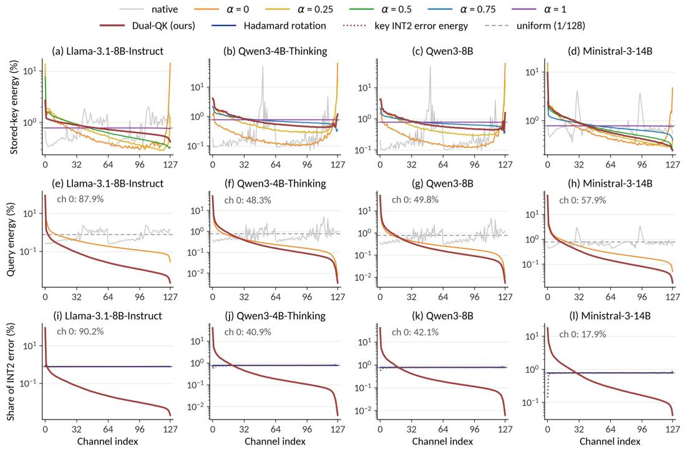  
Figure 5: Channel profiles across four models. (a∼d) Base key energy at different α. (e∼h) Query energy in the original, Q-PCA, and deployed dual coordinates. (i∼l) Channel-wise shares of key reconstruction error (dotted) and query-weighted error terms (solid), before channel-0 protection, including a Hadamard control. The first two rows use calibration moments and the last uses WikiText 2 test activations. Error shares are pooled across layers and KV heads.

## C.2 CHANNEL SELECTION

The group-L2 rule retains the most query energy for a fixed channel budget. When the centered key covariance in the selection basis is $\bar { \sigma } ^ { 2 } I$ , the variance of the omitted dot-product contribution for a fixed query is

$$
\operatorname { V a r } _ { k } \left[ \sum _ { j \notin \mathcal { M } } q _ { j } k _ { j } \right] = \sigma ^ { 2 } \sum _ { j \notin \mathcal { M } } q _ { j } ^ { 2 } ,\tag{8}
$$

where M is the retained channel set. Summing over the query heads in a GQA group gives the group-L2 criterion. Partial whitening of uncentered moments does not guarantee this covariance condition, so query energy serves as a proxy for pruning error in Dual-QK.

Selection uses $q T _ { b } A _ { 0 }$ , before diagonal refinement. Scaling query channel $j$ by $\delta _ { j }$ and its key channel by $1 / \delta _ { j }$ leaves their product unchanged. Computing the mask in base coordinates therefore makes selection independent of the scaling used to refine quantization.

Table 9: Generative accuracy (%) without query-channel pruning. Scores report mean ± standard deviation over five seeds. Capacity and bandwidth are effective bits per KV element at 128K context. Bold marks the highest mean among quantized methods within each model.
<table><tr><td rowspan="2">Model</td><td rowspan="2">Method</td><td colspan="3">KV bits per element |</td><td colspan="4">Benchmark score (%)</td></tr><tr><td>Capacity Bandwidth|GPQA-Diamond HumanEval</td><td></td><td></td><td></td><td>1 LCB v6</td><td>MATH-500</td><td>AIME25</td></tr><tr><td rowspan="5">Llama-3.1-8B -Instruct</td><td>BF16</td><td>16</td><td>16</td><td> $2 6 . 2 \pm { } 1 . 5$ </td><td> $6 6 . 7 \pm 2 . 5$ </td><td> $1 6 . 5 \pm { } 1 . 4$ </td><td> $4 9 . 4 \pm { } 1 . 5$ </td><td> $1 . 3 \pm { } 1 . 8$ </td></tr><tr><td>TurboQuant</td><td>3.13</td><td>3.13</td><td> ${ \bf 2 6 . 8 \pm _ { 3 . 1 } }$ </td><td> $5 9 . 3 \pm { } _ { 2 . 9 }$ </td><td> $1 2 . 5 \pm { } 1 . 3$ </td><td> $3 9 . 9 \pm { 1 . 1 }$ </td><td> $0 . 0 \pm { } 0 . 0$ </td></tr><tr><td>KIVI-2</td><td>3.01</td><td>3.01</td><td> $2 3 . 8 \pm { } 2 . 8$ </td><td> $6 1 . 7 \pm { } 1 . 7$ </td><td> $1 4 . 8 \pm { } 1 . 8$ </td><td> $4 3 . 6 \pm { } 1 . 0$ </td><td> $0 . 0 \pm { } 0 . 0$ </td></tr><tr><td>OSCAR</td><td>2.28</td><td>2.28</td><td> $2 4 . 3 \pm { 1 . 7 }$ </td><td> $6 5 . 6 \pm { 3 . 0 }$ </td><td> $1 5 . 3 \pm { 0 . 9 }$ </td><td> $5 0 . 8 \pm { \ : } 0 . 5$ </td><td> ${ \bf 2 . 0 \pm 1 . 8 }$ </td></tr><tr><td>Dual-QK (ours)</td><td>2.34</td><td>2.34</td><td> $2 6 . 4 \pm { } 1 . 9$ </td><td> ${ \bf 6 6 . 0 \pm { \bf _ { 1 . 7 } } }$ </td><td> ${ \bf 1 6 . 5 \pm { \bf 0 . 7 } }$ </td><td> ${ \bf 5 0 . 9 \pm 0 . 6 }$ </td><td> $1 . 3 \pm { } 3 . 0$ </td></tr><tr><td rowspan="5">Qwen3-4B -Thinking-2507</td><td>BF16</td><td>16</td><td>16</td><td> $6 5 . 6 \pm { } 1 . 9$ </td><td> $9 6 . 2 \pm { 0 . 7 }$ </td><td> $5 4 . 0 \pm { } 1 . 6$ </td><td> $9 8 . 0 \pm 0 . 3$ </td><td> $7 4 . 7 \pm { 3 . 8 }$ </td></tr><tr><td>TurboQuant</td><td>3.13</td><td>3.13</td><td> $2 8 . 7 \pm { } 1 . 9$ </td><td> $1 5 . 9 \pm { } _ { 2 . 0 }$ </td><td> $0 . 2 \pm { } 0 . 3$ </td><td> $3 6 . 2 \pm { } _ { 2 . 0 }$ </td><td> $1 . 3 \pm { } 1 . 8$ </td></tr><tr><td>KIVI-2</td><td>3.01</td><td>3.01</td><td> $6 2 . 5 \pm { } 1 . 3$ </td><td> $9 3 . 4 \pm { } 1 . 2$ </td><td> ${ \bf 4 7 . 8 \pm 1 . 8 }$ </td><td> ${ \bf 9 6 . 8 \pm 0 . 4 }$ </td><td>64.7 ± 5.1</td></tr><tr><td>OSCAR</td><td>2.28</td><td>2.28</td><td> $6 3 . 5 \pm { { 1 . 6 } }$ </td><td> ${ \bf 9 6 . 1 \pm 1 . 0 }$ </td><td> $4 6 . 7 \pm { } 1 . 3$ </td><td> $9 6 . 4 \pm 0 . 5$ </td><td>64.7 ± 3.8</td></tr><tr><td>Dual-QK (ours)</td><td>2.34</td><td>2.34</td><td> ${ \bf 6 5 . 8 \pm 1 . 4 }$ </td><td> $9 5 . 9 \pm { 1 . 1 }$ </td><td> $4 2 . 9 \pm { 1 . 0 }$ </td><td> $9 5 . 8 \pm { 0 . 3 }$ </td><td> $5 4 . 0 \pm { } _ { 4 . 9 }$ </td></tr><tr><td rowspan="5">Qwen3-8B</td><td>BF16</td><td>16</td><td>16</td><td> $5 6 . 1 \pm 2 . 2$ </td><td> $9 0 . 1 \pm { } 1 . 3$ </td><td></td><td>50.2 ± 2.9 96.4 ± 0.3 65.3 ± 3.0</td><td></td></tr><tr><td>TurboQuant</td><td>3.13</td><td>3.13</td><td> $4 7 . 1 \pm 2 . 2$ </td><td> $7 5 . 7 \pm { } 1 . 6$ </td><td></td><td>24.7 ± 1.7 92.4 ± 0.6</td><td> $5 0 . 7 \pm { } 2 . 8$ </td></tr><tr><td>KIVI-2</td><td>3.01</td><td>3.01</td><td> $5 4 . 2 \pm { } _ { 1 . 9 }$ </td><td> $9 1 . 8 \pm { 0 . 9 }$ </td><td></td><td></td><td>46.6 ± 1.4 95.9 ± 0.3 64.0 ± 6.4</td></tr><tr><td>OSCAR</td><td>2.28</td><td>2.28</td><td> ${ \bf 5 6 . 6 \pm 1 . 2 }$ </td><td> ${ \bf 9 2 . 2 \pm 1 . 1 }$ </td><td> $4 6 . 1 \pm { 1 . 6 }$ </td><td>95.8 ± 0.5</td><td> $6 1 . 3 \pm { } 1 . 8$ </td></tr><tr><td>Dual-QK (ours)</td><td>2.34</td><td>2.34</td><td> $5 5 . 9 \pm 2 . 2$ </td><td> $9 2 . 0 \pm { 0 . 9 }$ </td><td> $4 3 . 2 \pm { 2 . 4 }$ </td><td>95.2 ± 0.4</td><td> $6 1 . 3 \pm { } 3 . 0$ </td></tr></table>

## C.3 KEY QUANTIZATION ERROR

Let ξ be key quantization error in the stored coordinates. Under the calibration model in which ξ is independent of the query, $A ^ { \mathsf { T } } C _ { Q } A = D \Lambda D$ gives

$$
\mathbb { E } \big [ ( \boldsymbol { q } \boldsymbol { A } \boldsymbol { \xi } ^ { \mathsf { T } } ) ^ { 2 } \big ] = \sum _ { j } \lambda _ { j } \delta _ { j } ^ { 2 } \mathbb { E } [ \xi _ { j } ^ { 2 } ] .\tag{9}
$$

Squared attention-logit error includes an additional factor of $1 / d .$ This expression motivates the calibration objective. It does not model error propagation during autoregressive decoding.

Figure 5(i∼l) compares reconstruction error with its query-weighted channel contributions. A channel can have modest reconstruction error but a large contribution to score error when its query energy is high. Retaining key channel-0 in BF16 reduces this contribution. Excluding it from range estimation also narrows the INT2 range when it determines a row extremum. Diagonal refinement adjusts the remaining scales to reduce the same query-weighted error. The effect on downstream accuracy is evaluated in Table 3.

## C.4 BUCKET-RELATIVE ROPE

For a key at position n in bucket b, removing the anchor rotation leaves position $n - a _ { b }$ . Applying the same adjustment to the current query preserves their relative position and uncompressed score (Equation 6). The adjustment precedes the dual transform because a general channel transform does not commute with RoPE.

With $w = 2 0 4 8 ,$ stored-key offsets remain within the calibration window. This bounds their positional offsets but does not guarantee matching activation statistics. Query offsets relative to older buckets can still exceed the window. Anchor adjustments use each checkpoint’s rotary frequencies, including YaRN for Qwen3-8B beyond 32K and for Ministral. Table 3 evaluates the effect of removing bucket-relative RoPE.

## D ADDITIONAL RESULTS

## D.1 RESULTS WITHOUT CHANNEL PRUNING

Table 9 reports the full results at 0% query-channel sparsity, extending Table 4 with KIVI-2 and Qwen3-4B-Thinking-2507. Dual-QK maintains competitive accuracy without pruning, with fivebenchmark averages within one percentage point of OSCAR on Llama-3.1-8B-Instruct and Qwen3- 8B. On Qwen3-4B-Thinking-2507, Dual-QK also remains close to BF16 on GPQA-Diamond and HumanEval, although larger gaps remain on LiveCodeBench and AIME25.

Table 10: LongBench scores with 40% query-channel sparsity for quantized methods. BF16 is unpruned. Mean averages the eight task scores. Bold marks the highest score among quantized methods within each model.
<table><tr><td></td><td></td><td></td><td></td><td>Multi</td><td></td><td>Trivia</td><td></td><td></td><td>Repo</td><td></td></tr><tr><td>Model</td><td>Method</td><td>Qasper</td><td>QMSum</td><td>News</td><td>TREC</td><td>QA</td><td>SAMSum</td><td>LCC</td><td>Bench-P</td><td>Mean</td></tr><tr><td rowspan="4">Llama-3.1-8B -Instruct</td><td>BF16</td><td>39.59</td><td>23.79</td><td>24.87</td><td>56.00</td><td>80.44</td><td>33.84</td><td>35.94</td><td>30.01</td><td>40.56</td></tr><tr><td>TurboQuant</td><td>14.30</td><td>18.66</td><td>12.99</td><td>46.50</td><td>54.04</td><td>20.86</td><td>18.36</td><td>17.99</td><td>25.46</td></tr><tr><td>OSCAR</td><td>18.03</td><td>18.29</td><td>15.45</td><td>49.50</td><td>57.49</td><td>24.26</td><td>18.13</td><td>19.62</td><td>27.60</td></tr><tr><td>Dual-QK (ours)</td><td>38.97</td><td>22.99</td><td>24.31</td><td>54.00</td><td>75.00</td><td>33.60</td><td>26.95</td><td>25.65</td><td>37.68</td></tr><tr><td rowspan="4">Qwen3-8B</td><td>BF16</td><td>46.72</td><td>23.80</td><td>23.86</td><td>58.63</td><td>89.13</td><td>41.04</td><td>25.98</td><td>23.51</td><td>41.58</td></tr><tr><td>TurboQuant</td><td>2.50</td><td>6.72</td><td>11.74</td><td>23.50</td><td>0.04</td><td>1.23</td><td>14.48</td><td>12.69</td><td>9.11</td></tr><tr><td>OSCAR</td><td>34.15</td><td>20.28</td><td>22.76</td><td>65.50</td><td>81.36</td><td>36.11</td><td>15.03</td><td>15.15</td><td>36.29</td></tr><tr><td>Dual-QK (ours)</td><td>40.78</td><td>22.34</td><td>23.56</td><td>61.00</td><td>87.07</td><td>38.45</td><td>21.76</td><td>20.27</td><td>39.41</td></tr></table>

Table 11: LongBench scores without query-channel pruning. Mean averages the eight task scores. Bold marks the highest score among quantized methods within each model.
<table><tr><td>Model</td><td>Method</td><td>Qasper</td><td>QMSum</td><td>Multi News</td><td>TREC</td><td>Trivia QA</td><td>SAMSum</td><td>LCC</td><td>Repo Bench-P</td><td>Mean</td></tr><tr><td rowspan="4">Llama-3.1-8B</td><td></td><td></td><td></td><td></td><td></td><td></td><td></td><td></td><td></td><td></td></tr><tr><td>BF16</td><td>39.59 39.21</td><td>23.79 22.60</td><td>24.87 22.94</td><td>56.00 55.25</td><td>80.44 75.95</td><td>33.84</td><td>35.94 27.67</td><td>30.01 25.68</td><td>40.56</td></tr><tr><td>TurboQuant OSCAR</td><td>36.91</td><td>22.67</td><td>23.99</td><td>53.50</td><td>76.53</td><td>30.26 34.10</td><td>35.33</td><td>28.31</td><td>37.44 38.92</td></tr><tr><td>Dual-QK (ours)</td><td>36.06</td><td>22.65</td><td>24.67</td><td>56.50</td><td>77.32</td><td>33.87</td><td>34.28</td><td>28.38</td><td>39.22</td></tr><tr><td rowspan="4">Qwen3-8B</td><td>BF16</td><td>46.72</td><td>23.80</td><td>23.86</td><td>58.63</td><td>89.13</td><td>41.04</td><td>25.98</td><td>23.51</td><td>41.58</td></tr><tr><td>TurboQuant</td><td>37.08</td><td>20.96</td><td>23.99</td><td>66.50</td><td>73.78</td><td>36.17</td><td>20.99</td><td>19.88</td><td>37.42</td></tr><tr><td>OSCAR</td><td>43.73</td><td>23.07</td><td>23.53</td><td>55.43</td><td>89.78</td><td>40.23</td><td>24.80</td><td>22.51</td><td>40.38</td></tr><tr><td>Dual-QK (ours)</td><td>41.34</td><td>23.23</td><td>23.71</td><td>61.70</td><td>88.77</td><td>40.62</td><td>24.89</td><td>20.79</td><td>40.63</td></tr></table>

## D.2 LONGBENCH RESULTS

We evaluate the full test sets of eight LongBench (Bai et al., 2024) tasks using greedy decoding and task-specific generation limits. Inputs exceeding 31.5K tokens are truncated in the middle. We apply chat templates to Qasper, QMSum, and MultiNews, and disable thinking for Qwen3-8B. For TREC, prompts end with the answer prefix and the first output line is scored following the official evaluator.

Tables 10 and 11 compare accuracy with and without query-channel pruning. At 40% sparsity, Dual-QK achieves mean scores of 37.68 and 39.41 on Llama-3.1-8B-Instruct and Qwen3-8B, exceeding OSCAR by 10.08 and 3.12 points, respectively. Increasing sparsity from 0% to 40% reduces the Dual-QK mean by only 1.54 and 1.22 points, compared with 11.32 and 4.09 for OSCAR. Without pruning, Dual-QK also achieves the highest mean among the quantized methods on both models.

## D.3 COMPARISON WITH THINK

We compare Dual-QK with KIVI-2 and OSCAR combined with ThinK (Xu et al., 2025) at 40% channel sparsity. ThinK removes key channels using a prompt-derived mask while keeping recent tokens unpruned. Dual-QK retains all key channels and selects the channels to read for each query. We report both capacity and bandwidth costs to account for this difference.

On LongBench (Table 12), Dual-QK exceeds OSCAR + ThinK by 5.56 and 6.58 mean-score points on the two models. Its means are within 0.53 points of KIVI-2 + ThinK, with lower bandwidth cost at 1.93 versus 2.41 bits per KV element. On the generative benchmarks (Table 13), Dual-QK achieves higher mean GPQA-Diamond and HumanEval accuracy than both ThinK combinations on both models.

Table 12: LongBench scores with ThinK and Dual-QK at 40% channel sparsity. BF16 is unpruned. Capacity and bandwidth are effective bits per KV element at 128K context. Mean averages the eight task scores. Bold marks the highest score among compressed methods within each model.
<table><tr><td rowspan="3">Model</td><td rowspan="3">Method</td><td colspan="2">KV bits per element</td><td colspan="8">LongBench score</td></tr><tr><td colspan="2"></td><td colspan="2"></td><td colspan="2">Multi</td><td colspan="2">Trivia</td><td colspan="2">Repo</td></tr><tr><td>Capacity Bandwidth</td><td></td><td>Qasper QMSum</td><td></td><td>News</td><td>TREC</td><td>QA</td><td></td><td>SAMSum LCC Bench-P</td><td>Mean</td></tr><tr><td rowspan="4">Llama-3.1-8B -Instruct</td><td>BF16</td><td>16</td><td>16</td><td>39.59</td><td>23.79</td><td>24.87</td><td>56.00</td><td>80.44</td><td>33.84</td><td>35.94 30.01</td><td>40.56</td></tr><tr><td>KIVI-2 + ThinK</td><td>2.41</td><td>2.41</td><td>38.00</td><td>23.58 21.67</td><td>54.54</td><td>78.83</td><td>30.59</td><td>31.98</td><td>26.48</td><td>38.21</td></tr><tr><td>OSCAR + ThinK</td><td>1.89</td><td>1.89</td><td>19.74</td><td>20.98</td><td>17.49</td><td>33.00 70.12</td><td>34.68</td><td>32.64</td><td>28.32</td><td>32.12</td></tr><tr><td>Dual-QK (ours)</td><td>2.34</td><td>1.93</td><td>38.97</td><td>22.99</td><td>24.31</td><td>54.00 75.00</td><td>33.60</td><td>26.95</td><td>25.65</td><td>37.68</td></tr><tr><td rowspan="4">Qwen3-8B</td><td>BF16</td><td>16</td><td>16</td><td>46.72</td><td>23.80</td><td>23.86</td><td>58.63</td><td>89.13</td><td>41.04</td><td>25.98 23.51</td><td>41.58</td></tr><tr><td>KIVI-2 + ThinK</td><td>2.41</td><td>2.41</td><td>42.71</td><td>23.24</td><td>23.54 54.82</td><td>87.18</td><td>40.05</td><td>24.43</td><td>21.99</td><td>39.74</td></tr><tr><td>OSCAR + ThinK</td><td>1.89</td><td>1.89</td><td>26.82</td><td>20.33</td><td>16.46</td><td>30.75</td><td>84.87</td><td>37.25 24.46</td><td>21.72</td><td>32.83</td></tr><tr><td>Dual-QK (ours)</td><td>2.34</td><td>1.93</td><td>40.78</td><td>22.34</td><td>23.56</td><td>61.00</td><td>87.07</td><td>38.45 21.76</td><td>20.27</td><td>39.41</td></tr></table>

Table 13: Generative accuracy (%) with ThinK and Dual-QK at 40% channel sparsity. BF16 is unpruned. Scores report mean ± standard deviation over three seeds. Bold marks the highest mean among compressed methods within each model.
<table><tr><td rowspan="2">Model</td><td rowspan="2">Method</td><td colspan="2">Benchmark score (%)</td></tr><tr><td>GPQA-Diamond</td><td>HumanEval</td></tr><tr><td rowspan="4">Llama-3.1-8B -Instruct</td><td>BF16</td><td> $2 6 . 8 \pm { } 1 . 5$ </td><td> $6 7 . 7 \pm 2 . 4$ </td></tr><tr><td> $\mathrm { K I V I } { - } 2 + \mathrm { T h i n } \mathrm { K }$ </td><td> $2 2 . 2 \pm { } 2 . 3$ </td><td> $5 7 . 7 \pm { } 1 . 8$ </td></tr><tr><td> $\mathrm { O S C A R } + \mathrm { T h i n K }$ </td><td> $1 4 . 5 \pm { } 1 . 5$ </td><td> $6 2 . 8 \pm { \ : } 0 . 6$ </td></tr><tr><td>Dual-QK (ours)</td><td> ${ \bf 2 4 . 2 \pm 1 . 5 }$ </td><td> ${ \bf 6 5 . 2 \pm 3 . 4 }$ </td></tr><tr><td rowspan="4">Qwen3-8B</td><td>BF16</td><td> $5 6 . 9 \pm { } 1 . 9$ </td><td> $8 9 . 2 \pm \mathrm { ~ 0 . 3 ~ }$ </td></tr><tr><td>KIVI-2 + ThinK</td><td> $5 5 . 7 \pm { } 2 . 0$ </td><td> $8 8 . 2 \pm \mathrm { { 0 . 4 } }$ </td></tr><tr><td> $\mathrm { O S C A R } + \mathrm { T h i n K }$ </td><td> $2 . 0 \pm \ : 0 . 9$ </td><td> $3 5 . 6 \pm \ : 0 . 4$ </td></tr><tr><td>Dual-QK (ours)</td><td> ${ \bf 5 6 . 7 \pm { \bf 1 . 8 } }$ </td><td> ${ \bf 9 1 . 9 \pm 0 . 9 }$ </td></tr></table>