# Data Reuse in Non-Stationary Learning

Tomer Gafni Columbia University

Garud Iyengar Columbia University

Assaf Zeevi Columbia University

## Abstract

We consider online learning in non-stationary environments, where the goal is to track an unknown parameter that switches abruptly between a finite set of recurring values. Recurrence opens the possibility of judiciously reusing past observations to improve algorithm performance. However, the changing nature of the underlying signal and lack of information on these dynamics may limit the ability to “safely” reuse data. In this paper we quantify some of the fundamental tradeoffs in this class of problems, and show that they bear a certain resemblance to the classical bias-variance dilemma. Specifically, we propose a class of anytime algorithms, dubbed Exposure-Capped Reuse (ECR), that combine online change detection, compatibility testing, and “contamination” control. We characterize the regime in which ECR’s regret scales with the number of distinct values rather than the number of changes, and derive a novel information-theoretic lower bound that establishes the near-minimax optimality of ECR. This provides rigorous quantification of the statistical “value” of data reuse.

## 1. Introduction

## 1.1. Background and Overview

Many learning systems operate in non-stationary environments in which the data-generating distribution may change and later recur (Katakis et al., 2010; Alippi et al., 2013). For example, computational demand in cloud systems may change abruptly as workload groups connect or disconnect, with previously observed demand patterns recurring when similar configurations return. Often, the cause of a change is hidden from the learner and not known a priori (Tsymbal, 2004). This setting is closely related to learning under distribution shift, including statistical transfer learning (Wang & Yu, 2025) and concept drift adaptation (Gama et al., 2014). When a previously observed concept reappears, past information may become useful again, circumventing the need to learn it from scratch (Suarez-Cetrulo et al.´ , 2023). Exploiting this recurrence, however, requires the learner to continuously monitor and detect regime changes and concurrently determine which historica data can be “safely” reused. To wit, the data needs to be classified in an online manner and attributed with high enough confidence to the correct underlying statistical source to ensure that it can be reused effectively. As will be articulated in what follows, addressing these salient ingredients in a synergistic fashion presents interesting new challenges.

The online data reuse problem. To flesh out the fundamental statistical trade-offs embedded in recurrent structured non-stationary environments, we consider a canonical online mean-tracking problem. The problem captures key salient features yet maintains a clean enough structure that lends itself to elucidating the main learning theoretic insights. The setup we consider is one where the learner sequentially observes noisy sub-Gaussian samples $\{ X _ { t } \} _ { t = 1 } ^ { \bar { T } } ,$ whose mean $\mu _ { t }$ evolves in a piecewise-constant manner over a horizon $T ,$ with S changes among M distinct values (Fig. 3). We refer to these values as classes. Before observing $X _ { t }$ , the learner predicts $\widehat { \mu } _ { t }$ , and performance is measured by the expected cumulative $L _ { 1 }$ error E $\left\lceil \sum _ { t = 2 } ^ { T } \left. \widehat { \mu } _ { t } - \mu _ { t } \right. \right\rceil$ , corresponding to dynamic regret with respect to the time-varying mean sequence. We study it under a minimax criterion, namely, when nature is allowed to deploy the worst case patterns of the changing mean.

The primary regime of interest is when $M \ll S ,$ , i.e., the environment changes frequently but repeatedly revisits a small set of classes. The change points, the means for each class, the active class at the current decision epoch, as well as T, S, and $M ,$ are all unknown to the learner. Our formulation differs from existing recurrent-learning settings in that it is fully online and anytime, requires no prior knowledge of the parameters except for the noise proxy σ, and imposes no assumptions on a minimum spacing between changes.

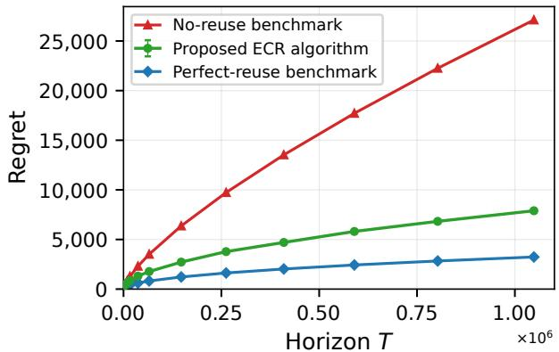

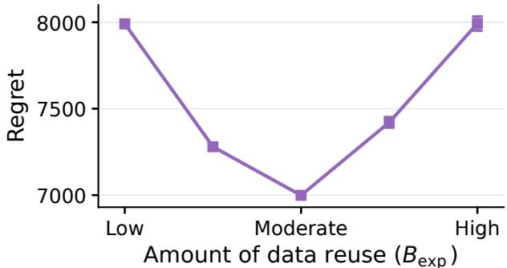  
Figure 1. The value of recurrence. The setup is one where $S \asymp \sqrt { T }$ and $M = 4$ . The widening regret gap between the noreuse and perfect-reuse benchmarks illustrates the growing benefit $( ^ { 6 6 } { \mathrm { v a l u e } } ^ { , 9 } )$ of ideal data reuse. Our proposed ECR algorithm is able to exploit this benefit without knowing the change points or class identities (Th. 4.1).  
Figure 2. More reuse is not necessarily better. A plot exhibiting regret as a function of the amount of data reuse (controlled by the exposure budget $B _ { \mathrm { e x p } } )$ . Increasing reuse means more data can be used to reduce estimation variance. But this can result in “contamination” due to misclassification of past data, which increases bias. Regret is, therefore, minimized at an intermediate level of data reuse.

The value of recurrence. Consider a policy that knows the change points and predicts $\widehat { \mu } _ { t }$ by estimating the mean after each change from scratch, without reusing observations from previous segments. Its regret, measured by the criterion above, scales as $O ( \sigma { \sqrt { S T } } )$ ). (To see this, imagine the change points are equi-spaced, so there are $S$ segments each of length $T / S . )$ We refer to this policy as the no-reuse benchmark. If the recurrent class identities are also known, the policy can form each prediction $\widehat { \mu } _ { t }$ by pooling past observations from different occurrences of the current class. This increases the effective sample size and reduces estimation variance, resulting in $O ( \sigma { \sqrt { M T } } )$ regret. (To see this, simply imagine allocating $T / M$ data points to each class.) We refer to this policy as the perfect-reuse benchmark. Thus, recurrence can be leveraged to replace the dependence on the number of changes $S$ with the number of classes $M \ll S$ . In long-horizon settings where the number of changes grows with T while the number of classes remains finite, as is natural in many applications, the “value” of data reuse, reflected in the ratio of the two benchmark regret rates, grows without bound (see Fig. 1).

The price of non-stationarity. The central challenge in designing an anytime online algorithm with regret that scales with the number of classes, $O ( \sigma { \sqrt { M T } } )$ , is that the learner must detect changes online and determine whether the current statistical regime is identified (with high confidence) with a previously observed class (if any). Each change necessarily incurs a detection delay, and sufficiently short segments may be missed altogether (Gafni et al., 2026). Consequently, observations collected before a change is detected, or when it is missed, contaminate the stored historical data. In other words, reusing past data that is incorrectly “labeled” can introduce bias into the estimator. This creates a fundamental tradeoff: reusing more historical data reduces estimation variance, but also increases the bias created by contaminated observations.

## 1.2. Main contributions

Exploiting recurrence despite non-stationarity. We propose Exposure-Capped Reuse (ECR) (Alg. 1), an anytime algorithm that realizes the statistical benefit of recurrence through judicious data reuse. We prove a non-asymptotic regret upper bound accounting for both estimation variance and contamination bias. In particular, when $S = \widetilde { \cal O } ( \sqrt { T } )$ , ECR attains $\widetilde { \cal O } ( \sigma \sqrt { M T } )$ regret, matching the perfect-reuse benchmark up to polylogarithmic factors (Th. 4.1).

ECR operates without knowing the horizon, the change points, or the recurrent parameters. It combines: (i) Online segmentation: a change detector that partitions the observation history into reusable blocks despite potentially unavoidable missed changes (Prop. 3.1); (ii) Compatibility testing: a statistical test that guarantees reuse of sufficiently “clean” blocks from the same recurrent class while rejecting blocks associated with different classes (Prop. 3.2); and (iii) Exposure control: a mechanism that limits the cumulative influence of each historical block (Sec. 3.4), as elaborated below.

Controlling bias from repeated reuse. We show that the main difficulty in exploiting recurrence in non-stationary settings is bias accumulation under repeated reuse. Since the problem proceeds in an online fashion, the contamination effects may build up and compound downstream errors, accumulating beyond the ideal scale of $O ( \sigma { \sqrt { M T } } )$ , signaling the possible pitfalls and subtleties of exploiting recurrence. (See Prop. E.1.)

To control this accumulation, we introduce an exposure budget $B _ { \mathrm { e x p } }$ that limits each historical block’s cumulative bias influence while preserving sufficient reuse to reduce variance, thereby balancing the bias-variance tradeoff by effectively identifying the “sweet spot” of data reuse. Fig. 2 illustrates this point graphically: a larger budget initially improves performance through greater reuse, but eventually increases regret by repeatedly propagating residual contamination.

Lower bound and minimax optimality. We establish a novel information-theoretic lower bound (Th. 4.3) of order $\begin{array} { r } { \Omega ( \operatorname* { m a x } \{ \frac { \sigma ^ { 2 } } { \Delta _ { \operatorname* { m i n } } } S \log \left( \frac { T } { S } \right) , \sigma \sqrt { M T } \} ) } \end{array}$ , where $\Delta _ { \mathrm { m i n } }$ denotes the minimum separation between distinct parameters. The lower bound shows that the condition $S = \widetilde { \cal O } ( \sqrt { T } )$ required to attain the ideal recurrent rate is necessary up to logarithmic factors (Cor. 4.4). ECR attains this rate under the same condition and essentially matches the lower bound, thereby crisply identifying the minimax complexity of the data reuse problem.

We validate the theory with experiments on both synthetic and real data (Sec. 5). Our formulation arises in a wide range of applications, including load prediction in cloud computing systems (Maghakian et al., 2019), temporal changes in user preferences (Tsymbal, 2004), and online source coding (Milan et al., 2016). We provide a concrete illustrative example in Section 2.

## 1.3. Related literature

We discuss related work from two research areas; an extended discussion appears in App. A.

Online learning with memory. In adversarial prediction with expert advice, long-term-memory methods exploit comparator sequences that may switch frequently while repeatedly returning to a much smaller set of experts (Bousquet & Warmuth, 2002; Zheng et al., 2019; Herbster et al., 2020; Robinson & Herbster, 2021). In our formulation, both the recurring numerical parameters and their identities must be inferred from noisy observations, and the reused observations may themselves be contaminated. In the stochastic bandit setting, Re et al. (2021) combine change detection, recurrence testing, and data reuse in a recurrent piecewise-stationary formulation. However, their theoretical guarantee remains change-dependent and does not quantify the resulting gains from recurrence. Li et al. (2021) study contextual bandits with a finite collection of recurring parameters, using homogeneity tests for change detection and historical-model aggregation. However, their analysis relies on detectability assumptions and, more importantly, does not account for unavoidable bias in stored blocks. While our model and learning objective differ, we explicitly account for this contamination and show that even a small residual bias can accumulate into substantial error under repeated reuse.

Learning under distribution shift. Existing approaches differ in how they identify and reuse relevant information. In recurrent concept drift (Suarez-Cetrulo et al.´ , 2023), some recognize returning concepts and retrieve past observations or classifiers (Katakis et al., 2010; Alippi et al., 2013; Anderson et al., 2019; Chiu & Minku, 2018), while others weight historical predictors by their performance on current data (Sun et al., 2018; Zhao et al., 2020; Yang et al., 2022). Most are evaluated empirically; Zhao et al. (2020) establish a local benefit when a past model matches the current concept, but their global guarantee uses a known variation budget. In statistical transfer learning (Hanneke & Kpotufe, 2019; Cai & Wei, 2021), Wang & Yu (2025) combine informative-source selection with penalized estimation for offline piecewise-constant means, obtaining minimax rates that depend on source frequencies and source-target discrepancy. Our analysis accounts for contamination from imperfect online segmentation and establishes provable gains from recurrence under an anytime algorithm.

## 2. Problem formulation

We consider an online learning problem in a recurrent piecewise-stationary environment. The learner observes a sequence of real-valued random variables $\{ X _ { 1 } , \ldots , X _ { T } \}$ whose means satisfy

$$
\mu _ { t } : = \mathbb { E } [ X _ { t } ] \in \Theta = \{ \theta ^ { ( 1 ) } , \dots , \theta ^ { ( M ) } \} \subset \mathbb { R } .
$$

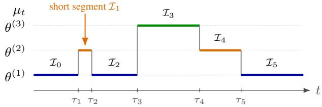  
Figure 3. A recurrent environment. The mean undergoes $S = 5$ changes across $M = 3$ classes. Returns to previously visited classes create opportunities for data reuse. However, if the short segment $\mathcal { T } _ { 1 }$ goes undetected, its observations can become mixed with those from the surrounding $\theta ^ { ( 1 ) }$ segments. Reusing this mixed history when $\theta ^ { ( 1 \bar { ) } }$ returns can introduce bias.

We refer to the M values in Θ as classes. The mean $\mu _ { t }$ is piecewise constant in time, and switches abruptly at an unknown deterministic sequence of S change points:

$$
1 = \tau _ { 0 } < \tau _ { 1 } < \cdot \cdot \cdot < \tau _ { S } < \tau _ { S + 1 } = T + 1 .
$$

The mean is constant on each $\mathscr { T } _ { j } \triangleq [ \tau _ { j } , \tau _ { j + 1 } )$ , and the observations satisfy

$$
X _ { t } = \mu _ { t } + \varepsilon _ { t } ,\tag{1}
$$

where $\{ \varepsilon _ { t } \} _ { t \geq 1 }$ are i.i.d., zero-mean, and sub-Gaussian with known variance proxy $\sigma ^ { 2 }$ . We require that $\mu _ { \tau _ { j } } \neq \mu _ { \tau _ { j } - 1 }$ for $j = 1 , \dots , S$ . We impose no minimum spacing between change points. We assume that ma $\begin{array} { r } { \mathrm { x } _ { m , m ^ { \prime } } | \theta ^ { ( m ) } - \theta ^ { ( m ^ { \prime } ) } | \leq \Delta _ { \mathrm { m a x } } , } \end{array}$ min $_ { \cdot m \neq m ^ { \prime } } | \theta ^ { ( m ) } - \theta ^ { ( m ^ { \prime } ) } | \geq \Delta _ { \mathrm { m i n } } ,$ , where $0 < ( M - 1 ) \Delta _ { \operatorname* { m i n } } < \Delta _ { \operatorname* { m a x } } < \infty$ . Figure 3 illustrates an example environment Let $\mathcal { E } : = \mathcal { E } _ { T , S , M } ( \Delta _ { \operatorname* { m i n } } , \Delta _ { \operatorname* { m a x } } , \sigma )$ denote the class of all data-generating processes satisfying the conditions above. The learner knows only the noise proxy $\sigma ;$ it does not know $T , S , M , \Theta , \Delta _ { \mathrm { m i n } } , \Delta _ { \mathrm { m a x } } .$ , the change points, or the ordered segment labels. Let $\mathcal { F } _ { t } = \sigma ( X _ { 1 } , \ldots , X _ { t } )$ be the natural filtration, and let Π be the class of (possibly randomized) adapted policies. In every round $t \geq 2 ,$ , a policy $\pi \in$ Π outputs a prediction $\widehat { \mu } _ { t } ^ { \pi }$ measurable with respect to $\mathcal { F } _ { t - 1 }$ and its internal randomness. We evaluate π in environment $\nu \in { \mathcal { E } }$ by its expected cumulative $L _ { 1 }$ error (regret)

$$
R _ { T } ( \pi ; \nu ) : = \mathbb { E } _ { \pi , \nu } \left[ \sum _ { t = 2 } ^ { T } | \widehat { \mu } _ { t } ^ { \pi } - \mu _ { t } | \right] .\tag{2}
$$

The expectation is over the observation noise and the policy ${ \bf \ddot { s } }$ internal randomness. The minimax regret over $\mathcal { E }$ is

$$
R _ { T } ^ { \star } ( \mathcal { E } ) : = \operatorname* { i n f } _ { \pi \in \Pi } \operatorname* { s u p } _ { \nu \in \mathcal { E } } R _ { T } ( \pi ; \nu ) .\tag{3}
$$

The supremum ranges over the change-point locations, recurrent parameter values, ordered segment labels, and admissible noise laws.

Illustrative example (recurrent cloud demand). Cloud platforms forecast incoming computational demand before provisioning resources (Maghakian et al., 2019). Let $D _ { t }$ denote demand and $m ( z _ { t } )$ a baseline forecast based on available information $z _ { t } .$ Suppose the system serves several workload groups, with the subset currently active defining a workload configuration $c _ { t }$ that corresponds to the classes in our model. As groups connect or disconnect, the configuration can change abruptly and may later recur. We model demand as

$$
D _ { t } = m ( z _ { t } ) + \theta ^ { ( c _ { t } ) } + \varepsilon _ { t } , \qquad c _ { t } \in [ { \cal M } ] ,
$$

where $\theta ^ { ( c _ { t } ) }$ is the additive forecast offset associated with the current configuration and $\varepsilon _ { t }$ is noise. When the baseline predictor $m ( z _ { t } )$ has already been learned, the remaining task is to estimate the recurrent offset $\theta ^ { ( c _ { t } ) }$ . Forming the forecas residual, $X _ { t } : = D _ { t } - m ( z _ { t } ) = \theta ^ { ( c _ { t } ) } + \varepsilon _ { t }$ , reduces the problem to the recurrence formulation considered in this paper.

## 3. The Exposure-Capped Reuse (ECR) Algorithm

In this section we present ECR, an anytime online algorithm that requires only knowledge of the noise proxy σ. We first introduce a decision/estimation split (Sec. 3.1) and a change detector that partitions the horizon into blocks online (Sec. 3.2). We then develop a compatibility test for identifying reusable historical blocks (Sec. 3.3), followed by an exposure mechanism (Sec. 3.4).

## 3.1. Decision/estimation split

We split the horizon into decision and estimation streams, $\mathcal { S } ^ { \mathsf { D } }$ and ${ \mathcal { S } } ^ { \mathsf { E } }$ , respectively:

$$
\mathcal { S } ^ { \mathsf { D } } : = \{ t \in [ T ] : t \mathrm { ~ i s ~ o d d } \} , \mathcal { S } ^ { \mathsf { E } } : = \{ t \in [ T ] : t \mathrm { ~ i s ~ e v e n } \} .
$$

The decision stream is used for change detection and compatibility decisions, while the estimation stream is used for prediction. This separation makes the selected estimation samples conditionally independent of the selection decisions, at the cost of only a constant factor in the regret. For an interval $I \subseteq [ T ]$ and $a \in \{ \mathsf { D } , \mathsf { E } \}$ , let $N _ { I } ^ { a } : = | I \cap S ^ { a } |$ and $\begin{array} { r } { \bar { X } _ { I } ^ { a } : = \frac { 1 } { N _ { r } ^ { a } } \sum _ { u \in I \cap { \mathcal S } ^ { a } } X _ { u } , \quad \bar { \mu } _ { I } ^ { a } : = \frac { 1 } { N _ { r } ^ { a } } \sum _ { u \in I \cap { \mathcal S } ^ { a } } \mu _ { u } } \end{array}$ . To lighten notation, we suppress stream superscripts whenever the relevant stream is clear from context. The appendix uses explicit stream notation.

## 3.2. Change detection test

Detection statistic and blocks. At time t, the learner has access to observations up to time $t - 1$ and keeps track of the most recent restart time $r < t .$ The immediate goal is to detect whether there was a change point $\tau \in ( r , t )$ . To test for a change, we split the observations at each candidate change point k with $r < k < t$ and define

$$
\widehat { D } _ { k , t } ^ { r } : = \frac { 1 } { \sigma } \sqrt { \frac { N _ { [ r , k ) } N _ { [ k , t ) } } { N _ { [ r , t ) } } } \left| \bar { X } _ { [ r , k ) } - \bar { X } _ { [ k , t ) } \right| .\tag{4}
$$

The scan statistic $C _ { t } ^ { r }$ and the alarm time (stopping time) $N _ { G } ^ { r }$ are

$$
C _ { t } ^ { r } : = \operatorname* { m a x } _ { r < k < t } \widehat { D } _ { k , t } ^ { r } , \quad N _ { G } ^ { r } : = \operatorname* { i n f } \{ t > r : C _ { t } ^ { r } \geq \gamma _ { t } ^ { r } \} ,\tag{5}
$$

with the time-varying threshold

$$
\gamma _ { t } ^ { r } : = \sqrt { 6 \log ( t - r ) + 2 \log ( 1 / \alpha _ { r } ) + 2 \log ( \pi ^ { 2 } / 3 ) } ,\tag{6}
$$

where $\begin{array} { r } { \alpha _ { r } : = \frac { 6 } { \pi ^ { 2 } } \frac { \alpha } { r ^ { 2 } } , \alpha \in ( 0 , 1 ) } \end{array}$ is a fixed tuning parameter, and $C _ { t } ^ { r } = 0$ when no admissible split exists. Thus, $C _ { t } ^ { r }$ searches over all candidate splits since the last restart for the strongest evidence of a change, and an alarm is raised when it exceed the threshold.

Whenever the detector raises an alarm, the interval $[ r , N _ { G } ^ { r } - 1 )$ is declared a completed block, and the restart time is updated to $r  N _ { G } ^ { r } - 1$ . Let $K$ denote the total number of blocks, and let $r _ { 0 } = 1 < r _ { 1 } < \cdot \cdot \cdot < r _ { K - 1 } < r _ { K } = T$ be the restart times induced by the detector. The resulting blocks are

$$
\begin{array} { r } { \boldsymbol { { \mathcal { B } } } _ { b } : = [ r _ { b } , r _ { b + 1 } ) , \qquad b = 0 , \ldots , K - 1 . } \end{array}
$$

For block-level statistics, we use the shorthand $N _ { b } ^ { a } : = N _ { B _ { b } } ^ { a } , \bar { X } _ { b } ^ { a } : = \bar { X } _ { B _ { h } } ^ { a }$ aB , and $\bar { \mu } _ { b } ^ { a } : = \bar { \mu } _ { B _ { b } } ^ { a }$

Endogenous confounding. Detecting a mean shift of size $\Delta$ with failure probability at most $\delta$ requires on the order of $( \sigma ^ { 2 } / \bar { \Delta ^ { 2 } } ) \log ( 1 / \delta )$ observations (Lai, 1998). Since we impose no minimum spacing between change points, some changes may be missed, and when that happens, the reference samples on the left side of the split in Eq. (4) may contain a mixture of classes, which confounds the detection of subsequent changes (Gafni et al., 2026). In order to state our detection guarantees in the presence of such confounding, we define the identification scale

$$
\ell _ { \mathrm { i d } } : = \left\lceil C _ { \mathrm { i d } } \frac { \sigma ^ { 2 } } { \Delta _ { \mathrm { m i n } } ^ { 2 } } \log \frac { T } { \alpha } \right\rceil ,\tag{7}
$$

where $C _ { \mathrm { i d } }$ is a sufficiently large constant to be determined later. Note that $\ell _ { \mathrm { i d } }$ is only used for analysis and is not used by the ECR algorithm. We call an interval I long if $N _ { I } \geq \ell _ { \mathrm { i d } }$ , and short otherwise.

Proposition 3.1 (Anchor segmentation). If block b contains a long class-m interval, then, with probability at least $1 - \alpha$

$$
| \bar { \mu } _ { b } - \theta ^ { ( m ) } | \leq \Delta _ { \operatorname* { m i n } } / 4 .\tag{8}
$$

Eq. (8) uniquely associates block b with class m; we call such a block anchored at class m. Prop. 3.1 shows that the detector partitions the horizon into blocks with well-separated anchors (see Fig. 4).

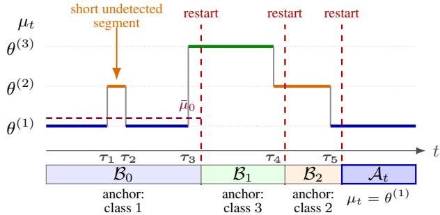  
Figure 4. Schematic ECR segmentation. Red dashed lines delimit blocks created by detector alarms. Missed changes and detection delays introduce contamination, yet block $\scriptstyle B _ { 0 }$ remains anchored at class 1.

## 3.3. Compatibility test

Compatibility rule. After the detector update at round t, let $b _ { t }$ denote the index of the current block, namely the unique index satisfying $r _ { b _ { t } } < t \leq r _ { b _ { t } + 1 }$ , and define the active prefix $\mathcal { A } _ { t } : = [ r _ { b _ { t } } , t )$ . We compare each completed block $b < b _ { t }$ with $\boldsymbol { A } _ { t }$ using the compatibility statistic

$$
\widehat { Q } _ { b } ( t ) : = \frac { 1 } { \sigma } \sqrt { \frac { N _ { A _ { t } } N _ { b } } { N _ { A _ { t } } + N _ { b } } } \left| \bar { X } _ { A _ { t } } - \bar { X } _ { b } \right| .\tag{9}
$$

Smaller values of $\widehat { Q } _ { b } ( t )$ indicate greater compatibility. Let $\lambda _ { t } ^ { b } : = \sqrt { 1 2 \log t + 2 \log ( 1 / \alpha _ { b } ) + 2 \log ( \pi ^ { 2 } / 3 ) }$ with $\alpha _ { b } : =$ $\frac { 6 } { \pi ^ { 2 } } \frac { \alpha } { ( b + 1 ) ^ { 2 } }$ . The compatibility set of blocks declared compatible for reuse at round t is

$$
\mathcal { C } _ { t } : = \Big \{ b < b _ { t } : \widehat { Q } _ { b } ( t ) < 4 \lambda _ { t } ^ { b } \Big \} .\tag{10}
$$

Statistical safety. The compatibility test may reject a same-anchor block if its contamination is large. To characterize which blocks are guaranteed to be reused, we introduce the following definition. We call a completed block b anchored at class m safe if

$$
\left| \bar { \mu } _ { b } - \theta ^ { ( m ) } \right| \leq \sqrt { \sigma ^ { 2 } / N _ { b } } .\tag{11}
$$

Equivalently, the block mean lies within a confidence-scale neighborhood of its anchor and is therefore statistically indistinguishable from it. Safety is an analysis-only notion: the learner does not know which completed blocks are safe since it does not know $\theta ^ { ( m ) }$

Proposition 3.2 (Compatibility guarantees). With probability at least $1 - 2 \alpha$ , thefollowing statements holdfor every round t and class m:

(i) Acceptance: ${ \cal I } f { \cal A } _ { t }$ is safefor class m, then every safe block $b < b _ { t }$ anchored at m is compatible.

(ii) Rejection: ${ \cal I } f { \cal A } _ { t }$ contains a long class-m interval, then no block anchored at a different class is compatible.

The acceptance guarantee enables variance reduction. However, an accepted block b may still be contaminated, i.e., $\bar { \mu } _ { b } \neq \theta ^ { ( m ) }$ . Repeated reuse of such blocks can accumulate residual bias, motivating the exposure mechanism introduced next.

## 3.4. Exposure-capped reuse

For each completed block b, define its exposure parameter at the beginning of round t as

$$
H _ { b } ( t ) : = \sum _ { n < t : b \in \mathcal { U } _ { n } } \frac { 1 } { W _ { n } } ,\tag{12}
$$

and define the reuse set

$$
\mathcal { U } _ { t } : = \{ b \in \mathcal { C } _ { t } : H _ { b } ( t ) < B _ { \exp } \} ,\tag{13}
$$

Algorithm 1 Exposure-Capped Reuse (ECR)   
1: Input: known proxy σ; fix $\alpha \in ( 0 , 1 ) , B _ { \mathrm { e x p } } > 2$   
2: Observe $X _ { 1 } ; \sec r \gets 1$ and $b \gets 0$   
3: for $t = 2 , 3 , \ldots$ do   
4: Compute $C _ { t } ^ { r }$ and $\gamma _ { t } ^ { r }$ (Eqs. 5–6)   
5: if $C _ { t } ^ { r } \geq \gamma _ { t } ^ { r }$ then   
6: Store $B _ { b } \gets [ r , t - 1 )$ ; set $H _ { b } \gets 0$   
7: $b \gets b + 1 ; r \gets t - 1$   
8: end if   
9: Set $\boldsymbol { \mathcal { A } } _ { t } \gets [ \boldsymbol { r } , t ) ;$ ; form $\mathcal { C } _ { t } , \mathcal { U } _ { t } .$ , and $W _ { t }$ using Eqs. 10, 13, and 14   
10: predict using Eq. 15 if $W _ { t } > 0 ;$ otherwise use the most recent past estimation observation   
11: If $W _ { t } > 0 ,$ set $H _ { j } \gets H _ { j } + 1 / W _ { t } , \quad \forall j \in \mathcal { U } _ { t }$   
12: Observe $X _ { t }$ and update its parity-defined stream   
13: end for

where $B _ { \mathrm { e x p } } > 2$ is the exposure budget. The resulting effective sample size, i.e., the number of observations used to form the prediction, is

$$
W _ { t } : = N _ { \boldsymbol { \mathcal { A } } _ { t } } + \sum _ { b \in \mathcal { U } _ { t } } N _ { b } .\tag{14}
$$

These quantities are defined recursively: $H _ { b } ( t )$ depends only on reuse decisions and effective sample sizes from rounds $n < t ;$ it determines $\mathcal { U } _ { t }$ , which in turn determines $W _ { t } .$ . The exposure control in Eq. (13) is necessary for ECR: Prop. E.1 gives a construction in which uncapped ECR incurs $\Omega \big ( T ^ { 5 / 8 } / \bar { ( } \log T ) ^ { 1 / 4 } \big )$ regret, exceeding the perfect-reuse benchmark scale of $O ( \sqrt { T } )$ .

Output estimator. ECR outputs the average of the active prefix together with all currently reusable completed blocks:

$$
\widehat { \mu } _ { t } : = \frac { \displaystyle \sum _ { n \in \mathcal { A } _ { t } } X _ { n } + \sum _ { b \in \mathcal { U } _ { t } } \sum _ { n \in \mathcal { B } _ { b } } X _ { n } } { W _ { t } } .\tag{15}
$$

We next explain how the exposure mechanism balances the bias-variance tradeoff.

Limiting bias. When the anchor of block b agrees with the active class, say class m, its population bias is $\left| \bar { \mu } _ { b } - \theta ^ { ( m ) } \right|$ . Its cumulative bias is therefore at most

$$
N _ { b } \left| \bar { \mu } _ { b } - \theta ^ { ( m ) } \right| \sum _ { t : b \in \mathcal { U } _ { t } } \frac { 1 } { W _ { t } } = N _ { b } \left| \bar { \mu } _ { b } - \theta ^ { ( m ) } \right| H _ { b } ( T + 1 ) .
$$

Since $H _ { b } ( T + 1 ) \le B _ { \mathrm { e x p } } + 1$ , a fixed block’s cumulative bias contribution remains bounded.

Reducing variance. Retiring blocks limits the accumulation of contamination bias, but may also reduce the effective sample size available for reuse. The key design principle is that retired blocks are gradually replaced by newly formed blocks from recurrent occurrences of the same class. This replenishes the sample mass available for reuse. Our analysis shows that this mechanism preserves variance reduction. Figure 2 illustrates this tradeoff.

Computational complexity. Let $K _ { t }$ be the number of completed blocks and $d _ { t } \ = \ t - r$ the length of the current block. Each split and each compatibility check costs $O ( 1 )$ . ECR therefore uses $O ( d _ { t } + K _ { t } ) = O ( t )$ time per round and $O ( d _ { t } + K _ { t } ) = O ( t )$ memory. Restricting the detector to a geometric multiscale grid (Lai & Xing, 2010) reduces the number of splits to $O ( \log d _ { t } )$ , giving $O ( \log d _ { t } + K _ { t } )$ time per round (App. B.5).

## 4. Regret analysis

## 4.1. Upper bound

Theorem 4.1 (Regret of ECR). Fix $\alpha \in ( 0 , 1 ) , B _ { \mathrm { e x p } } = 4 .$ For every $\nu \in { \mathcal { E } } ,$

$$
\begin{array} { r l } & { R _ { T } ( \mathrm { E C R } ; \nu ) \leq C \sigma \sqrt { M T } } \\ & { \qquad + C \sigma ( 1 + \sqrt { M } ) \left( ( S + 1 ) \sqrt { \ell _ { \mathrm { i d } } } + \alpha L _ { T } \right) } \\ & { \qquad + C \Delta _ { \mathrm { m a x } } ( L _ { T } + \sqrt { M } ) \left( ( S + 1 ) \ell _ { \mathrm { i d } } + \alpha L _ { T } \right) , } \end{array}\tag{16}
$$

where C is a universal constant and $\begin{array} { r } { L _ { T } : = 1 + \log ( \frac { T } { \alpha } ) } \end{array}$

The first term in Eq. (16) is the recurrent estimation rate. The remaining terms account for the costs of identifying the active class and controlling contamination in the reused data. For fixed $\sigma , \Delta _ { \mathrm { m i n } } , \Delta _ { \mathrm { m a x } }$ , the bound simplifies to $R _ { T } ( \mathrm { E C R } ; \nu ) = \widetilde { O } ( \sqrt { M T } + \widetilde { S } \widetilde { \sqrt { M } } )$ , yielding the following corollary.

Corollary 4.2 (Exploiting recurrence). Fix $\sigma , \Delta _ { \mathrm { m i n } } , \Delta _ { \mathrm { m a x } } .$ . If

$$
S = \widetilde { \cal O } ( \sqrt { T } ) ,\tag{17}
$$

then, for every $\nu \in \mathcal { E } , R _ { T } ( \mathrm { E C R } ; \nu ) = \widetilde { O } ( \sigma \sqrt { M T } )$

Eq. (17) characterizes the regime in which the regret of ECR scales with the number of classes M, rather than the number of changes S. Intuitively, this condition captures the “price of non-stationarity”: the perfect-reuse rate can be attained only when changes are not too frequent, since every change induces an unavoidable detection cost. Note that at the highest admissible switching frequency, $S \asymp \sqrt { T }$ , and for fixed M, the no-reuse benchmark regret rate is $O ( \sqrt { S T } ) \asymp T ^ { 3 / 4 }$ , while that of ECR is ${ \cal \tilde { O } } ( T ^ { 1 / 2 } )$ . The lower bound below shows that the condition in Eq. (17) is necessary up to logarithmic factors, establishing that it is an inherent limitation characteristic of online recurrent learning.

Proof sketch. The proof is given in Appendix C; we summarize the main ideas.

Step 1: Regret decomposition. Conditioning on the decision stream freezes the adaptive sample selection and centers the selected estimation noise. Lemma C.1 decomposes the regret into stochastic-estimation and population-bias terms.

Step 2: Segmentation and compatibility. On the detector concentration event (App. C.3), Prop. 3.1 shows that a block containing a sufficiently long regime has a unique anchor. Lemma C.5 shows that the total off-anchor and unanchored mass is $O ( S \ell _ { \mathrm { i d } } )$ . Prop. 3.2 then ensures that only compatible blocks are reused.

Step 3: Bounding the population bias. For a completed block b anchored at class $m ,$ its cumulative bias contribution on same-class reuse rounds is at most $N _ { b } \left| \bar { \mu } _ { b } - \theta ^ { ( m ) } \right| H _ { b } ( T + 1 )$ (see Sec. 3.4). The exposure cap prevents the same residual contamination from being charged indefinitely. The global contamination bound from Step 2 then controls the total contribution from same-anchor blocks.

Step 4: Recurrent variance reduction. For each class m, Lemma C.10 constructs a capacity counter $x _ { m } ( t )$ that combines observations in the active block with the remaining exposure capacity of completed same-class blocks, and satisfies $W _ { t } \gtrsim x _ { m } ( t )$ . The capacity gained from new observations dominates the capacity spent on reuse. A square-root telescoping argument across all returns to class m then shows that the estimation error scales with M rather than S. Capacity spent during bad intervals appears as leakage and is controlled separately.

Step 5: Detector deviations. The preceding arguments hold on the detector and compatibility concentration events. Lemma C.15 removes this conditioning: detector deviations are localized to block prefixes with expected total length at most α $L _ { T }$ . Compatibility deviations contribute only $O ( \alpha )$ additional rounds, while Lemma C.3 gives $\mathbb { E } [ K ] \le S + 1 + \alpha$ Substituting the resulting bias and variance bounds into Lemma C.1 completes the proof.

## 4.2. Lower bound

Theorem 4.3 (Minimax lower bound). Write $\rho : = \Delta _ { \operatorname* { m a x } } - ( M - 1 ) \Delta _ { \operatorname* { m i n } }$ , and assume $2 \leq M \leq S + 1$ . There exist universal constants $c , C > 0$ such that, if

$$
T \geq C \left( S + \frac { \sigma ^ { 2 } M ^ { 3 } } { \rho ^ { 2 } } \right) , \sigma ^ { 2 } \log ( T / S ) \leq c \Delta _ { \mathrm { m i n } } ^ { 2 } \sqrt { T / S } ,\tag{18}
$$

then

$$
R _ { T } ^ { \star } ( \mathcal { E } ) \gtrsim \operatorname* { m a x } \left\{ \frac { \sigma ^ { 2 } } { \Delta _ { \operatorname* { m i n } } } S \log ( T / S ) , \sigma \sqrt { M T } \right\} .\tag{19}
$$

The first term in Eq. (19) captures the unavoidable cost of adapting to unknown change points, while the second is the recurrent estimation cost. For fixed $M , \sigma , \Delta _ { \mathrm { m i n } } .$ , and $\Delta _ { \mathrm { m a x } }$ , the conditions in Eq. (18) hold for all sufficiently large $T$ whenever $T / S \to \infty$

Corollary 4.4 (Change-frequency condition). Fix M, $\sigma , \Delta _ { \mathrm { m i n } }$ , and $\Delta _ { \mathrm { m a x } }$ , and suppose that $T / S  \infty . \ I f S = \widetilde { \omega } ( \sqrt { T } )$ ， then $R _ { T } ^ { \star } ( \mathcal { E } ) = \widetilde { \omega } ( \sigma \sqrt { M T } )$ .

Corollary 4.4 shows that the condition $S = \widetilde { \cal O } ( \sqrt { T } )$ in Eq. (17) is necessary, up to logarithmic factors, for attaining the recurrent rate $\widetilde { \cal O } ( \sigma \sqrt { M T } )$ . The proof of Theorem 4.3 is given in App. D.

Proof sketch. We consider two oracle-aided Gaussian subclasses; revealing information can only help the learner. For the change-detection term, we reveal the class means, ordered class labels, and S disjoint macroblocks of length $\asymp T / S$ , leaving one change location per macroblock unknown. Comparing early and late change environments creates a tradeoff between false alarms and detection delay. Gaussian change of measure over disjoint windows gives $\Omega ( ( \sigma ^ { 2 } / \Delta _ { \operatorname* { m i n } } ) \log ( T / S ) )$ loss per macroblock. Summing over the S macroblocks gives the first term.

For the recurrent-mean term, we reveal all change points and class labels and allocate $n \asymp T / M$ observations to each class. We independently perturb each of the M separated class means by $\pm \xi ,$ where $\xi \asymp \sigma / \sqrt { n }$ . The stated conditions ensure that this family preserves the required separation and diameter. A coordinate-wise Le Cam argument yields $\Omega ( n \xi ) = \Omega ( \sigma \sqrt { n } )$ loss per class, and hence $\Omega ( \sigma \sqrt { M T } )$ overall. Taking the maximum of the two oracles proves the theorem.

## 4.3. Discussion and extensions

Retrospective segmentation refinement cannot guarantee exact change-point recovery, leaving contamination near estimated boundaries (alarms); see App. F. Other reuse strategies, such as downweighting older observations, face a related biasvariance tradeoff.

For $L _ { p }$ loss with $1 < p < 2$ , we derive the benefit of recurrent pooling over the no-reuse benchmark: the estimation scale improves from $\sigma ^ { p } ( { \tilde { S _ { \mathrm { ~ + ~ } 1 } } } ) ^ { p / 2 } T ^ { 1 - p / 2 } \mathrm { ~ t o ~ } \sigma ^ { p } M ^ { p / 2 } T ^ { 1 - p / 2 } ;$ ; see App. G. Establishing a corresponding regret guarantee for ECR remains open. For vector-valued observations under Euclidean loss, we outline an extension of ECR with dimensiondependent confidence thresholds and a recurrent estimation term $O ( \sigma { \sqrt { d M T } } )$ . For fixed dimension, the resulting bound retains the recurrent rate under the same sparsity regime $S = \widetilde { O } ( \sqrt { T } )$ ; see App. H.

## 5. Numerical results

We evaluate ECR on synthetic and real data; additional experiments and implementation details appear in App. B.

Synthetic experiments. Figure 5(a) provides empirical support for the regret scaling in Th. 4.1 using $M = 4$ Gaussian means $\{ - 9 , - 3 , 3 , 9 \}$ across $S + 1 = \sqrt { T } / 4$ segments. The no-reuse baseline (Gafni et al., 2026) uses the same change detector as ECR but estimates the current mean afresh after each alarm. For $S \asymp \sqrt { T }$ and fixed M, the theoretical rates of the no-reuse and perfect-reuse benchmarks scale as $T ^ { 3 / 4 }$ and $T ^ { 1 / 2 }$ , respectively. The empirical slopes of the no-reuse algorithm (0.725) and perfect-reuse benchmark (0.490) are close to these exponents. ECR’s slope (0.540) is close to that of perfect reuse, consistent with the recurrence-dependent rate in Cor. 4.2.

Contamination and exposure control. Figure 5(b) compares exposure budgets at different contamination levels in stored data (controlled by the duration of short, mostly undetected segments). With clean history (green curve), regret decreases as more reuse is allowed. With more contaminated history, the curves become U-shaped: additional reuse initially helps, but eventually increases regret. The best-performing budgets therefore become smaller as contamination increases, illustrating the balance between the statistical benefit of reuse and repeated contamination bias. Implementation details appear in App. B.6.

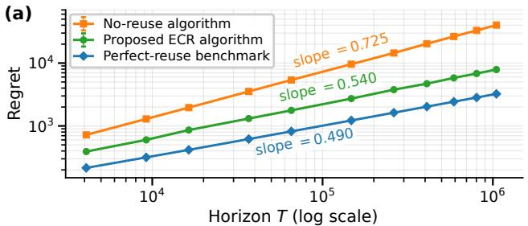

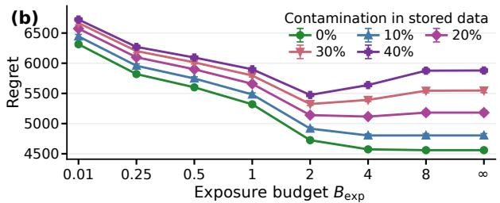

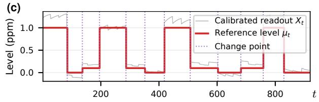

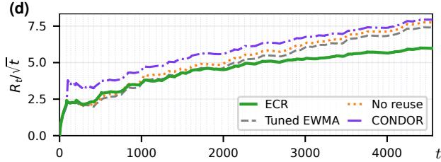  
Round tFigure 5. Numerical results. (a) Synthetic regret on log–log axes. (b) Exposure-budget tradeoff at different levels of source contamination. (c) Electronic-nose readouts and reference levels for the first 12 segments. (d) Regret over the full replay, normalized by ${ \sqrt { t } } .$ . Error bars in (a) and (b) show 95% Monte Carlo intervals.

Real-world data: electronic-nose assay. We use recorded sensor readings at three nominal diacetyl levels (0, 0.1, 1) ppm from the year-long dataset of Worner et al.¨ (2025b). Randomizing condition order and block durations within each of 21 held-out days gives noncyclic replays with 63 segments. We also include an adaptation of CONDOR (Zhao et al., 2020) to scalar regression, using ECR’s change detector. Calibration and online parameters are selected on earlier days; class labels and change points are unknown during evaluation. Figure 5(d) shows that ECR benefits from recurrence and outperforms all three baselines. ECR selectively reuses compatible history from earlier recurrences, whereas an exponentially weighted moving average (EWMA) discounts observations by age and no reuse starts afresh after each alarm. CONDOR periodically assigns equal weights to its stored models, including those from other classes, which can increase bias. ECR uses compatibility testing to limit such mixing.

## 6. Conclusions

We characterize the statistical complexity of online data reuse under recurrent non-stationarity. We develop ECR, a nearly minimax-optimal algorithm that realizes the statistical benefit of recurrence. We believe that the principles developed here, particularly those concerning repeated bias accumulation, may be useful beyond the specific formulation studied in this paper. An important direction for future work is to extend these ideas to sequential decision-making settings, where contaminated reuse interacts with exploration and action-dependent observations.

## References

Alippi, C., Boracchi, G., and Roveri, M. Just-in-time classifiers for recurrent concepts. IEEE Transactions on Neural Networks and Learning Systems, 24(4):620–634, 2013.

Anderson, R., Koh, Y. S., Dobbie, G., and Bifet, A. Recurring concept meta-learning for evolving data streams. Exper Systems with Applications, 138:112832, 2019.

Bousquet, O. and Warmuth, M. K. Tracking a small set of experts by mixing past posteriors. Journal of Machine Learning Research, 3(Nov):363–396, 2002.

Cai, T. T. and Wei, H. Transfer learning for nonparametric classification: minimax rate and adaptive classifier. The Annals ofStatistics, 49(1):100–128, 2021.

Chen, A., Owen, A. B., and Shi, M. Data enriched linear regression. Electronic Journal of Statistics, 9(1):1078–1112, 2015.

Cheung, W. C. and Lyu, L. Leveraging (biased) information: Multi-armed bandits with offline data. In ICML, pp. 8286–8309, 2024.

Chiu, C. W. and Minku, L. L. Diversity-based pool of models for dealing with recurring concepts. In 2018 Internationa Joint Conference on Neural Networks (IJCNN), pp. 1–8. IEEE, 2018.

Gafni, T., Iyengar, G., and Zeevi, A. The cost of learning under multiple change points. In Forty-third International Conference on Machine Learning, 2026.

Gama, J., Zliobait ˇ e, I., Bifet, A., Pechenizkiy, M., and Bouchachia, A. A survey on concept drift adaptation. ˙ ACM Computing Surveys (CSUR), 46(4):1–37, 2014.

Hanneke, S. and Kpotufe, S. On the value of target data in transfer learning. Advances in Neural Information Processing Systems, 32, 2019.

Herbster, M., Pasteris, S., and Tse, L. Online multitask learning with long-term memory. Advances in Neural Information Processing Systems, 33:17779–17791, 2020.

Katakis, I., Tsoumakas, G., and Vlahavas, I. Tracking recurring contexts using ensemble classifiers: an application to email filtering. Knowledge and Information Systems, 22(3):371–391, 2010.

Kuzborskij, I. and Orabona, F. Fast rates by transferring from auxiliary hypotheses. Machine Learning, 106(2):171–195, 2017.

Lai, T. L. Information bounds and quick detection of parameter changes in stochastic systems. IEEE Transactions on Information Theory, 44(7):2917–2929, 1998.

Lai, T. L. and Xing, H. Sequential change-point detection when the pre- and post-change parameters are unknown. Sequential Analysis, 29(2):162–175, 2010.

Lavin, A. and Ahmad, S. Evaluating real-time anomaly detection algorithms–the Numenta anomaly benchmark. In 2015 IEEE 14th International Conference on Machine Learning and Applications (ICMLA), pp. 38–44. IEEE, 2015.

Li, C., Wu, Q., and Wang, H. Unifying clustered and non-stationary bandits. In International Conference on Artificial Intelligence and Statistics, pp. 1063–1071. PMLR, 2021.

Maghakian, J., Comden, J., and Liu, Z. Online optimization in the non-stationary cloud: Change point detection for resource provisioning. In 2019 53rd Annual Conference on Information Sciences and Systems (CISS), pp. 1–6. IEEE, 2019.

Mazhar, O., Rojas, C., Fischione, C., and Hesamzadeh, M. R. Bayesian model selection for change point detection and clustering. In International Conference on Machine Learning, pp. 3433–3442. PMLR, 2018.

Milan, K., Veness, J., Kirkpatrick, J., Bowling, M., Koop, A., and Hassabis, D. The forget-me-not process. Advances in Neural Information Processing Systems, 29, 2016.

Re, G., Chiusano, F., Trovo, F., Carrera, D., Boracchi, G., and Restelli, M. Exploiting history data for nonstationary\` multi-armed bandit. In Joint European Conference on Machine Learning and Knowledge Discovery in Databases, pp. 51–66. Springer, 2021.

Robinson, J. and Herbster, M. Improved regret bounds for tracking experts with memory. Advances in Neural Information Processing Systems, 34:7625–7636, 2021.

Saber, H., Saci, L., Maillard, O.-A., and Durand, A. Routine bandits: Minimizing regret on recurring problems. In Joint European Conference on Machine Learning and Knowledge Discovery in Databases, pp. 3–18. Springer, 2021.

Shah, M. K. A., Lisawadi, S., and Ahmed, S. E. Merging data from multiple sources: pretest and shrinkage perspectives. Journal ofStatistical Computation and Simulation, 87(8):1577–1592, 2017.

Shamir, G. I. and Costello, D. J. Universal lossless coding for sources with repeating statistics. IEEE Transactions on Information Theory, 50(8):1620–1635, 2004.

Suarez-Cetrulo, A. L., Quintana, D., and Cervantes, A. A survey on machine learning for recurring concept drifting data´ streams. Expert Systems with Applications, 213:118934, 2023.

Sun, Y., Tang, K., Zhu, Z., and Yao, X. Concept drift adaptation by exploiting historical knowledge. IEEE Transactions on Neural Networks and Learning Systems, 29(10):4822–4832, 2018.

Tsymbal, A. The problem of concept drift: definitions and related work. Technical Report TCD-CS-2004-15, Department of Computer Science, Trinity College Dublin, 2004.

Wang, F. and Yu, Y. Transfer learning for piecewise-constant mean estimation: optimality, $\ell _ { 1 }$ and ℓ0 penalization. Biometrika, 112(3):asaf018, 2025.

Worner, J., Eimler, J., and Pein-Hackelbusch, M. Long-term drift behavior of electronic nose. Zenodo, June 2025a. URL¨ https://doi.org/10.5281/zenodo.15681119. Dataset, Creative Commons Attribution 4.0 International.

Worner, J., Eimler, J., and Pein-Hackelbusch, M. Long-term drift behavior in metal oxide gas sensor arrays: a one-year ¨ dataset from an electronic nose. Scientific Data, 12(1):1628, 2025b.

Yang, C., Cheung, Y.-m., Ding, J., and Tan, K. C. Concept drift-tolerant transfer learning in dynamic environments. IEEE Transactions on Neural Networks and Learning Systems, 33(8):3857–3871, 2022.

Zhao, P., Cai, L.-W., and Zhou, Z.-H. Handling concept drift via model reuse. Machine Learning, 109(3):533–568, 2020.

Zheng, K., Luo, H., Diakonikolas, I., and Wang, L. Equipping experts/bandits with long-term memory. Advances in Neural Information Processing Systems, 32, 2019.

## A. Extended related literature

Recurrence in sequential prediction. Long-term-memory prediction distinguishes the number of switches from the number of distinct predictors used by a comparator (Bousquet & Warmuth, 2002; Robinson & Herbster, 2021). For bounded losses with full-information feedback, Zheng et al. (2019) obtain expected regret $O ( \sqrt { T ( ( S + 1 ) \log T + M \log K ) } )$ against a comparator that switches S times among M of K available experts, with parameters tuned to T, S, M. They also provide a variant that adapts to S, M, replacing M log K by M log(K log T). Recurrence reduces the expert-identification cost while retaining a switch-dependent term. Herbster et al. (2020) extend long-term memory to multitask prediction and RKHS hypothesis classes. In our formulation, the learner must estimate the recurrent means themselves from noisy observations and determine which potentially contaminated historical data to reuse.

For probabilistic sequence prediction, the Forget-me-not Process averages over binary temporal partitions and mixtures of fresh and stored model states (Milan et al., 2016). With a base-model redundancy of $O ( \log ( n + 1 ) )$ on n stationary observations, its stated log-loss regret for S changes is $O ( ( S + 1 ) \log ^ { 2 } T )$ . This bound does not improve when sources repeat, although recurrence yields empirical gains. Shamir & Costello (2004) establish asymptotically matching coding bounds that separate learning distinct source states, locating transitions, and assigning segments to states. These results concern comparator regret or coding redundancy; our objective instead measures cumulative $L _ { 1 }$ error in an unobserved recurrent mean.

Recurrent bandits and data reuse. Routine Bandits pools data across recurring Gaussian bandit instances with known, equal-length period boundaries (Saber et al., 2021). For a fixed number of periods, its asymptotically optimal regret constant sums once over each distinct instance. Known boundaries avoid the segmentation-induced contamination arising in our setting from detection delays and missed changes. With unknown changes, Re et al. (2021) combine detection, retrospective localization, and recurrence testing under jump and phase-length conditions. Their guarantee remains change-dependent while recurrence gains are demonstrated empirically. For Gaussian linear bandits, DyClu uses homogeneity tests for change detection and historical-model aggregation (Li et al., 2021). Its stated high-probability regret bound has the form $\begin{array} { r } { O ( \sigma d \sqrt { T } \log T \sum _ { k = 1 } ^ { M } \sqrt { p _ { k } } + C \Gamma _ { T } ) } \end{array}$ , where d is the feature dimension, $p _ { k }$ is the fraction of interactions governed by recurrent parameter k, M counts distinct parameters, $\Gamma _ { T }$ counts stationary periods across users, and C depends on problem and testing parameters. Since $\textstyle \sum _ { k } { \sqrt { p _ { k } } } \leq { \sqrt { M } }$ , the leading term already benefits from recurrence. The analysis assumes detectability, parameter separation, and regular contexts, with additional period-length conditions. Although incoming observations are tested for homogeneity, false negatives can contaminate an archived history. The proof does not account for this residual bias or its amplification under repeated reuse.

Learning under recurring concept drift. Concept-drift methods recognize returning concepts or weight historical predictors by their performance on current data (Suarez-Cetrulo et al.´ , 2023). CONDOR reuses stored predictors through exponential weight updates based on their losses in the current epoch, rather than testing historical blocks for compatibility (Zhao et al., 2020). Their weighted combination also regularizes new models. For convex losses in [0, 1], suitable learning-rate tuning gives local cumulative regret $O ( \sqrt { L _ { k } ^ { \star } \log K } + \log K )$ , where K bounds the model-pool size and $L _ { k } ^ { \star }$ is the best stored predictor’s cumulative loss in epoch k. Recurrence improves this guarantee when a retained model predicts the returning concept well. The global proof instead uses the worst-case local bound, yielding $O ( V _ { T } ^ { 1 / 3 } T ^ { 2 / 3 } )$ dynamic regret against the best model at each round, with logarithmic dependence on K suppressed. The update period is chosen using the function variation $V _ { T }$ or a known upper bound. This global guarantee does not distinguish returning concepts from new ones. Our analysis quantifies a recurrence-dependent cumulative tracking rate without knowledge of the non-stationarity parameters.

Statistical borrowing and offline estimation. Statistical borrowing methods balance variance reduction against the bias introduced by combining populations that may differ. Examples include preliminary testing and shrinkage (Shah et al., 2017), penalties on differences between regression coefficients (Chen et al., 2015), and regularization toward auxiliary hypotheses (Kuzborskij & Orabona, 2017). Wang & Yu (2025) derive minimax rates for offline piecewise-constant mean estimation that depend on source frequencies and source-target discrepancy, and develop informative-source selection. For online bandits, Cheung & Lyu (2024) establish tight regret guarantees using a known bound on offline-online mismatch; without a nontrivial bound, offline data need not improve the minimax rate. Our additional difficulty is that historical blocks are generated through imperfect online segmentation and reused across many later predictions. Consequently, even exact parameter recurrence can leave residual contamination in stored data. Compatibility testing assesses whether reuse is supported by current observations, while exposure control separately bounds each block’s cumulative influence on future predictions. In offline mean estimation, Mazhar et al. (2018) jointly estimate change points and shared levels, deriving an oracle inequality under squared loss for the global penalized estimator. They use the complete sequence, whereas our predictions are causal.

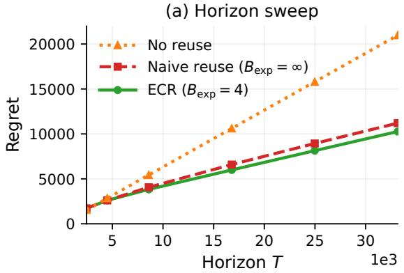

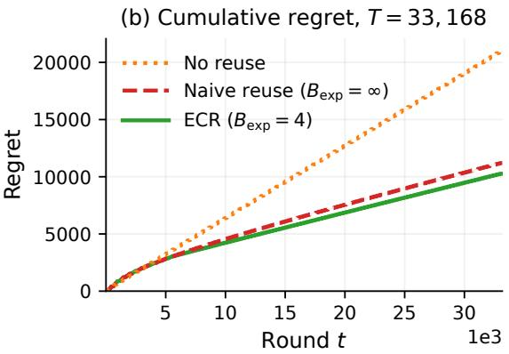  
Figure 6. Exposure capping under persistent contamination. (a) Terminal cumulative L1 regret as the subsequent recurrent sequence grows. (b) Cumulative regret at T = 33, 168. Results average 100 paired paths.

## B. Extended simulations

We first study how contamination accumulates under repeated reuse, followed by experiments with CPU traces, vector-valued observations, and different loss powers. We then examine the effect of reducing the number of candidate splits in the detector. Implementation details for the main-paper experiments in Section 5 appear at the end of this section. Unless stated otherwise, synthetic observations have independent Gaussian noise, methods are compared on the same observation paths, and error bars denote pointwise 95% Monte Carlo intervals.

Code and data are available at https://anonymous.4open.science/r/ecr-reproducibility-9F1B/.

## B.1. Exposure capping under persistent contamination

The main-paper exposure experiment varies how much historical reuse is allowed. Here, we fix the exposure budget and extend the subsequent recurrent sequence to examine how the cost of contaminated reuse accumulates over time. We construct a prefix with rapid, unresolved changes that enters the repository as a mixed block. ECR and uncapped reuse initially coincide, but once this block reaches its exposure limit, ECR retires it while uncapped reuse continues to propagate its bias. Figure 6 shows the resulting gap in cumulative regret as further recurrences are added. This experiment illustrates the cost of repeatedly reusing contaminated observations; Proposition E.1 establishes the necessity of the cap for ECR through an asymptotic counterexample. In the benign version of the exposure experiment described in Appendix B.6, additional reuse remains beneficial because stored observations contain little contamination.

Implementation details. We use σ = 1. During the first 400 rounds, the mean equals 2 for four rounds and 0 for one round, repeating this five-round pattern. On all simulated paths, the detector misses all 159 rapid changes, and the prefix is stored as one mixed block with population mean 1.6. The subsequent sequence alternates between mean-64 and mean-zero segments of length 256. We vary the number of recurrent pairs from 4 to 64, giving horizons from 2, 448 to 33, 168, and average over 100 paired paths. All methods use the same detector and compatibility rule with their unscaled thresholds. ECR sets $B _ { \mathrm { e x p } } = 4 _ { \cdot }$ , naive reuse removes the cap, and no reuse sets $B _ { \mathrm { e x p } } = 0$

## B.2. Trace-driven NAB replay

We next examine whether the benefit of reuse persists with noise from a recorded, temporally dependent trace and irregular returns to previous classes. We use an AWS CPU-utilization series from the Numenta Anomaly Benchmark (NAB) (Lavin & Ahmad, 2015), with the learner predicting the current mean utilization. Since NAB does not provide ground-truth recurrent workload labels, we impose the recurrence schedule and use residuals from approximately constant-mean intervals of the trace to generate the observations. Figure 7 shows one replay and the average regret over 100 evaluation paths. ECR’s mean terminal regret is 16.9% lower than without reuse, and its terminal regret is lower than EWMA’s on all 100 evaluation paths.

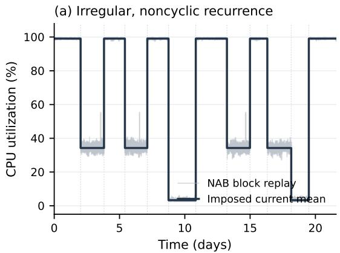

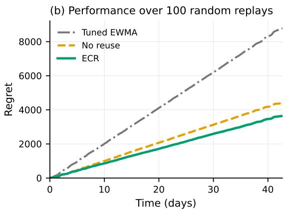  
Figure 7. Trace-driven NAB replay. (a) The first 12 segments of one irregular, noncyclic replay. (b) Mean cumulative $L _ { 1 }$ regret over 100 randomized replays.  
(b) Online benefit under $L _ { p }$ loss

(a) Vector-valued recurrence  
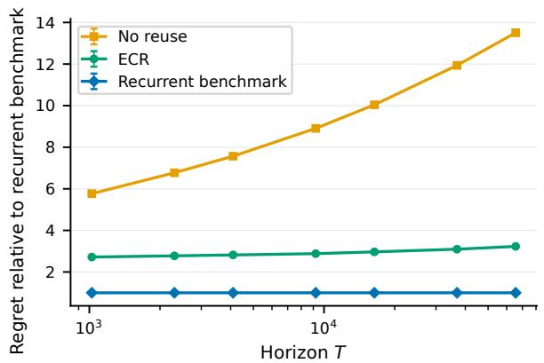

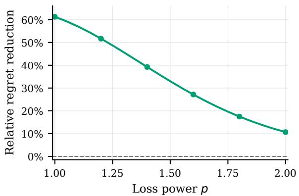  
Figure 8. (a) Vector-valued recurrence. Euclidean regret relative to the recurrent benchmark for $d = 5 ,$ , M = 4, and $S + 1 = \sqrt { T }$ averaged over 40 paired paths. (b) Online benefit under $L _ { p }$ loss. Relative regret reduction of ECR over no reuse at $T = 2 6 2 , 1 4 4$ averaged over 30 paired paths.

Implementation details. We use the intervals with low, middle, and high mean utilization identified by Gafni et al. (2026), excluding observations near the source boundaries. Their empirical means are approximately (3.3, 34.2, 99.1). We center the residuals within each interval and replay consecutive observations in circular blocks of length 12, preserving their loca order. Each replay has T = 12, 288, M = 3, and $S = 2 3$ . The initial class is drawn uniformly, and each subsequent class is chosen uniformly from the two inactive classes. Segment durations are randomized around 512 observations and rescaled to sum to T. The detector uses the empirical noise proxy $\widehat { \sigma } = 2 . 0 9 4$ , the largest within-class standard deviation. ECR uses $\alpha = 0 . 0 5 , B _ { \mathrm { e x p } } = 4$ , and compatibility multiplier 1; no reuse uses the same detector with $B _ { \mathrm { e x p } } = 0$ . The EWMA update rate $\eta = 0 . 4$ is selected on 100 separate replay paths, and evaluation uses 100 new paired replays.

## B.3. Vector-valued recurrence

We compare ECR, no reuse, and the perfect-reuse benchmark in a synthetic Gaussian environment with $M = 4$ recurring mean vectors in $\mathbb { R } ^ { 5 }$ , using Euclidean loss. We vary T from 1,024 to 65,536, with $S + 1 = \sqrt { T }$ equal-length segments. In Figure 8(a), ECR’s regret remains close to a fixed multiple of the recurrent benchmark’s loss as the horizon grows, while the ratio without reuse increases more quickly. The fitted log–log slopes of normalized regret are 0.040 for ECR and 0.204 without reuse. Thus, the benefit observed in the scalar experiment persists in this vector-valued setting.

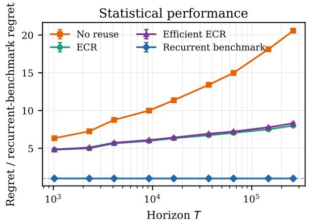

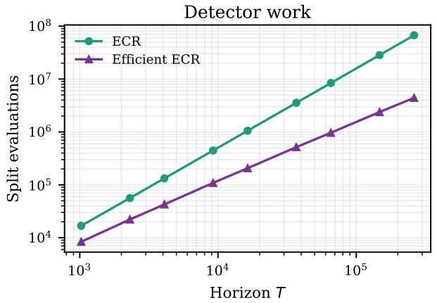  
Figure 9. Geometric-grid ECR. (a) Regret relative to the recurrent benchmark’s Monte Carlo mean. (b) Total split evaluations. Results average 40 paired paths.

Implementation details. We use class vectors separated by 12 in Euclidean norm, with independent $\mathcal { N } ( 0 , I _ { 5 } )$ noise. The fifth coordinate contains only noise. The class sequence follows a balanced cyclic path. Detection and compatibility testing use Euclidean norms and the dimension-dependent confidence radii of Appendix H. The detector and compatibility multipliers are 0.55 and 0.125, as in the scalar comparison. We compare ECR, the same detector without reuse, and the recurrent benchmark over 40 paired paths, normalizing regret by the exact Gaussian expectation for the recurrent benchmark.

## B.4. Dependence on the loss power

Increasing the loss power gives greater weight to large prediction errors, including those following a change. To examine its effect on the benefit of reuse, we generate each prediction path once and evaluate it under $\begin{array} { r } { \sum _ { t = 2 } ^ { T } | \widehat { \mu } _ { t } - \mu _ { t } | ^ { p } } \end{array}$ for $p \in [ 1 , 2 ]$ Figure 8(b) reports the relative improvement $1 - R _ { T } ^ { ( p ) } ( \mathrm { E C R } ) / R _ { T } ^ { ( p ) }$ (no reuse). In this experiment, the improvement decreases monotonically as $p$ increases from 1 to 2. This is consistent with the discussion in Appendix G: the cost of adapting to unknown changes can limit the gain from recurrent estimation as p increases. A finite-horizon benefit remains at $p = 2 .$

Implementation details. We use M = 4 Gaussian means $( - 6 , - 2 , 2 , 6 ) , \sigma = 1$ , and a reflected class path, so each change has magnitude 4. The horizon is $T = 2 6 2$ , 144, with $S + 1 = 5 1 2 = { \sqrt { T } }$ equal-length segments. ECR and no reuse receive the same observations and use the same data-dependent detector; neither knows the change points or class labels. Their only difference is the exposure budget, $B _ { \mathrm { e x p } } = 4$ for ECR and $B _ { \mathrm { e x p } } = 0$ for no reuse. We use $\alpha = 0 . 0 5$ , detector multiplier 0.55, and compatibility multiplier 0.125, and average over 30 paired paths

## B.5. Computationally efficient ECR

Scanning fewer candidate splits reduces detection complexity, but may delay an alarm. Figure 9 compares this tradeoff for exhaustive ECR and a detector using a geometric grid. At $T = 2 6 2 , 1 4 4$ , the grid reduces the number of evaluated splits per path from 67.2 million to 4.41 million, a factor of 15.2, while increasing regret by 3.84%. The two ECR implementations have similar normalized regret curves across the tested horizons.

The exhaustive detector evaluates every split in the current block. Following the multiscale construction of Lai & Xing (2010), we instead test splits at $r + u$ and t − u for offsets $u \in \{ 1 , 2 , 4 , . . . \}$ , together with the midpoint. This reduces the number of candidates per round from $O ( t - r ) { \mathrm { t o } } O ( \log ( t - r ) )$ . The threshold, decision/estimation split, compatibility test, exposure cap, and prediction rule are unchanged, as is the $O ( K _ { t } )$ scan over the $K _ { t }$ completed blocks. The computational gain reported here therefore concerns the detector’s split evaluations.

Implementation details. We use $M = 4$ reflected Gaussian classes with means $( - 6 , - 2 , 2 , 6 ) , \sigma = 1$ , and $S + 1 = \sqrt { T }$ with horizons from 1, 024 to 262, 144. Exhaustive and efficient ECR, no reuse, and the recurrent benchmark are compared over 40 paired paths. We set $\alpha = 0 . 0 5 , B _ { \mathrm { e x p } } = 4$ , detector multiplier 0.55, compatibility multiplier 0.125, and geometric base 2. Regret is normalized by the recurrent benchmark’s Monte Carlo mean.

## B.6. Implementation details for the main-paper experiments

All numerical experiments were run on local CPUs.

Benchmark comparison and online recovery. The benchmark comparison in Figure 1 and the online comparison in Figure 5(a) use $M = 4$ class means $( - 9 , - 3 , 3 , 9 )$ with $\sigma = 1$ and $S + 1 = \sqrt { T } / 4$ equal-length segments. The class sequence visits these values in ascending and then descending order, with a uniformly drawn starting phase. The displayed horizons range from 4, 096 to 1, 048, 576.

In Figure 1, the no-reuse benchmark knows the change points and estimates each segment from scratch; the perfect-reuse benchmark also knows the active class and pools all previous observations from that class. Figure 5(a) compares ECR, the otherwise identical algorithm without reuse, and the perfect-reuse benchmark. ECR and the no-reuse algorithm use 60 paired paths per horizon through $T = 2 6 2$ , 144 and 80 paired paths at each larger horizon. Both figures show unnormalized regret. The benchmark regrets are computed exactly under Gaussian noise and averaged over the six starting phases. The empirical slopes in Figure 5(a) are obtained by regressing log mean regret on log horizon over all eleven displayed horizons.

The online comparisons use $\alpha = 0 . 0 5 , B _ { \mathrm { e x p } } = 4 .$ , and detector and compatibility multipliers of 0.55 and 0.125, respectively. Throughout the experiments, the detector multiplier scales $\gamma _ { t } ^ { r }$ directly, while the compatibility multiplier $c _ { \mathrm { c m p } }$ appears in the squared rule $\widehat { Q } _ { b } ^ { 2 } ( t ) < c _ { \mathrm { c m p } } ( \lambda _ { t } ^ { b } ) ^ { 2 }$ . The theoretical values are therefore 1 and 16, respectively. The multipliers for the online comparisons were selected on separate pilot simulations and then fixed for evaluation to improve finite-horizon performance.

Exposure-control experiment. The experiment in Figure 2 examines the effect of the exposure budget when stored observations contain different amounts of contamination. We use $T = 1 6$ , 784 and $\sigma = 1$ . A 400-round prefix consists primarily of mean-zero observations, with either two or twenty one-round shifts to mean 16. These shifts lie on the estimation stream and are missed by the detector, giving the benign and hard environments, respectively. The subsequent sequence contains 32 pairs of mean-64 and mean-zero segments, each of length 256. We compare $B _ { \mathrm { e x p } } \in \{ 0 . 0 1 , 1 , 2 , 4 , 8 \}$ over 100 paired paths using the unscaled detector and compatibility thresholds specified by the algorithm. Figure 2 shows mean cumulative regret in the hard environment, with error bars of ±1.96 standard errors. The horizontal axis orders these settings from less to more allowed reuse.

Contamination and exposure budget. Figure 5(b) varies contamination while keeping $\sigma = 1$ and T = 16, 864 fixed. The first 480 rounds contain twelve 40-round cycles. Each cycle starts at mean zero, moves to mean 2 after 20 rounds for $h \in \{ 0 , 2 , 4 , 8 , 1 2 , 1 6 \}$ rounds, and then returns to zero. The remaining sequence contains 32 pairs of mean-64 and mean-zero segments, each of length 256. For positive h, there are three classes and 88 changes; the clean control $h = 0$ has two classes and 64 changes. The excursions occur in both observation streams.

Source contamination is the percentage of stored source observations whose true mean differs from their block’s most frequent source class, computed on the estimation stream and restricted to the initial 480 rounds. All stored source portions are predominantly zero, and the percentages shown in the figure are 0, 10, 20, 30, 40% on every path. Between 98.9% and 100% of the short excursions are missed, while every later large change is detected.

We use $\alpha = 0 . 0 5$ and the unscaled detector and compatibility thresholds. The plotted regrets are averaged over 80 paired Gaussian paths. The same standardized noise is used across durations and budgets, so the subsequent observations are identical within each repetition. The figure shows $B _ { \mathrm { e x p } } \in \{ 0 . 0 1 , 0 . 2 5 , 0 . 5 , 1 , 2 , 4 , 8 , \infty \}$ ; the no-reuse control is retained in the accompanying experiment results. The percentages label measured source contamination, and budgets are shown as ordered settings. The excursion amplitude was selected using a separate detector-only pilot, without inspecting regret.

For clean history, $B _ { \mathrm { e x p } } = 8$ and uncapped reuse give identical predictions. At 30% and 40% contamination, $B _ { \mathrm { e x p } } = 2$ has the lowest mean regret among the tested settings. The prespecified cap $B _ { \mathrm { e x p } } = 4$ increases regret by 13.6 with clean history but reduces it by 241.0 at 40% contamination, with a paired 95% Monte Carlo interval of [218.4, 263.6] for the latter reduction. Evaluating only the common subsequent sequence gives essentially the same contrast. On the latter half of each subsequent zero segment, active prefixes are clean and population prediction error comes entirely from the mixed source history, confirming the role of repeated contamination.

Electronic-nose replay. For Figure $5 ( \mathrm { c } , \mathrm { d } )$ , we construct scalar observations from the 62-sensor electronic-nose dataset of Worner et al.¨ (2025b;a). We form log exposure-to-baseline responses and center them using the initial blank assays from the same day. A ridge regression maps each sensor response to a scalar concentration readout. The online methods receive these readouts; absolute prediction error is measured against the nominal added-diacetyl level. The regression is trained on Days 1–8, the next eight complete days are used to select the online parameters, and the remaining 21 complete days are held out.

Each held-out day contributes one segment for each nominal level, 0, 0.1, and 1 ppm. We retain the order of days and randomize the within-day class order, requiring a class change at day boundaries. Segment lengths are drawn around 72 observations and constrained to lie between 24 and 120. The sensor vectors come from recorded data, while the recurrence order and retained durations are semi-synthetic. ECR uses $\alpha = 0 . 0 5 , B _ { \mathrm { e x p } } = 4$ , detector multiplier 0.3, and compatibility multiplier 0.4; EWMA uses the separately selected update rate 0.9441.

We adapt CONDOR (Zhao et al., 2020) to scalar regression using ECR’s calibrated change detector. Each stored mode predicts a constant $m ,$ and predictions are normalized weighted averages of these models. After observing $X _ { t } ,$ , each model’s weight is multiplied by exp $\{ - \eta ( m - X _ { t } ) ^ { 2 } / { \widehat { \sigma } } ^ { 2 } \}$ , where $\bar { \widehat { \sigma } } = 0 . 0 9 6 8 \bar { 5 }$ is the training residual standard deviation. At global multiples of an update period $p ,$ or upon a detector alarm, we add a model $( \bar { X } + \lambda m _ { \mathrm { p r i o r } } ) / ( 1 + \lambda )$ . Here, $\bar { X }$ averages the observations since the previous model update, and $m _ { \mathrm { p r i o r } }$ is the weighted model mean after the latest weight update. This is the scalar form of CONDOR’s squared-loss fit regularized toward the model pool. We retain the latest K models and reset their weights uniformly after each model addition, as in the original algorithm. The first model is initialized at $X _ { 1 }$ Model and weight updates use all readouts, while the detector retains ECR’s decision stream. Each replay starts afresh, and evaluation begins at $t = 2$

We select CONDOR’s parameters by minimizing mean absolute error on the same eight validation days, holding the detector fixed. For the reported regularized variant, the search uses $p \in \{ 5 , 1 0 , 2 5 , 5 0 , 1 0 0 , 2 0 0 \} , K \in \{ 1 0 , 2 5 , 1 0 0 , 4 0 0 \}$ , $\eta \in \{ 0 . 0 0 1 , 0 . 0 1 , 0 . 1 , 0 . 7 5 \}$ , and $\lambda \in \{ 0 . 0 0 5 , 0 . 1 , 1 , 1 0 \}$ . The selected values are $p = 2 5 , K = 1 0 0 , \eta = 0 . 1$ , and $\lambda = 0 . 0 0 5$ , and remain fixed across all held-out replays.

The displayed replay was selected from 500 randomized schedules using only segment durations and class-transition counts, without reference to sensor observations or algorithmic losses. It has $M = 3$ , 63 segments, 62 changes, and horizon $T = 4 , 5 5 5$ . Across these 500 schedules of the same held-out days, the mean absolute errors averaged over schedules are 0.091 ppm for ECR, 0.112 ppm for EWMA, 0.117 ppm without reuse, and 0.1185 ppm for CONDOR.

## C. Proof of the upper bound

## C.1. Proof outline

The proof proceeds in several steps. First, in Section C.2 we establish a regret decomposition, reducing the analysis to bounding the estimation noise contribution, the population-bias term, and an initialization term. Sections C.3 and C.4 establish the required detection, segmentation, and compatibility properties. The exposure calculation is incorporated directly into the population-bias argument in Section C.5. To present the main argument cleanly, Section C.5 and Section C.6 first bound the population bias and estimation terms, respectively, on the detector good event $\mathcal { G } _ { \mathrm { d e t } }$ . Section C.7 uses a localization argument to bound the contribution of the prefixes affected by detector deviations and removes this conditioning. Finally, Section C.8 combines the resulting unconditional bounds to yield the desired regret guarantee in terms of $T , S , M , \Delta _ { \mathrm { m i n } } , \Delta _ { \mathrm { m a x } } , \sigma$ , and α.

Boundary convention. The observations stored in block b have indices $[ r _ { b } , r _ { b + 1 } )$ , whereas the corresponding predictions occur on $\left( r _ { b } , r _ { b + 1 } \right]$ . These intervals differ only at $r _ { b }$ and $r _ { b + 1 }$ . Consequently, moving between the two indexing conventions changes a contamination count by at most one per block and a population-bias sum by at most $\Delta _ { \mathrm { m a x } }$ per block. Summed over all blocks, these corrections are at most $K$ and $\Delta _ { \operatorname* { m a x } } K$ , respectively. We absorb them into the subsequent bounds. Similarly, considering the decision and estimation streams, on every contiguous interval $I , | N _ { I } ^ { \mathsf { D } } - N _ { I } ^ { \mathsf { E } } | \leq 1$ . Thus, conversions between the two stream counts contribute at most $O ( K )$ across all detector blocks. Since $\ell _ { \mathrm { i d } } \geq 1$ , count corrections are absorbed into $O ( ( S + K ) \ell _ { \mathrm { i d } } )$ , while population-bias corrections are absorbed into $O ( \Delta _ { \mathrm { m a x } } ( S + K ) \ell _ { \mathrm { i d } } )$

## C.2. Regret decomposition

Fix an environment $\nu \in { \mathcal { E } }$ and abbreviate $\mathbb { E } _ { \boldsymbol \nu } : = \mathbb { E } _ { \mathrm { E C R } , \boldsymbol \nu \cdot } \mathbf { B y } \mathrm { E q . } \left( 2 \right)$

$$
R _ { T } ( \mathrm { E C R } ; \nu ) = \mathbb { E } _ { \nu } \left[ \sum _ { t = 2 } ^ { T } | \widehat { \mu } _ { t } - \mu _ { t } | \right] .
$$

Let

$$
\mathcal { T } _ { + } : = \{ t \in \{ 2 , \ldots , T \} : W _ { t } > 0 \} , \qquad N _ { 0 } : = T - 1 - | \mathcal { T } _ { + } | .
$$

For $t \in \tau _ { + }$ , define the population counterpart of the ECR estimator by

$$
\sum _ { \widetilde { \mu } _ { t } : = } \sum _ { u \in \mathcal { A } _ { t } \cap \mathcal { S } ^ { \mathsf { E } } } \mu _ { u } + \sum _ { b \in \mathcal { U } _ { t } } \sum _ { u \in \mathcal { B } _ { b } \cap \mathcal { S } ^ { \mathsf { E } } } \mu _ { u }\tag{20}
$$

It is also useful to introduce

$$
V _ { T } : = \sum _ { t \in \mathcal { T } _ { + } } \frac { 1 } { \sqrt { W _ { t } } } , \qquad P _ { T } : = \sum _ { t \in \mathcal { T } _ { + } } | \widetilde { \mu } _ { t } - \mu _ { t } | .\tag{21}
$$

Lemma C.1 (Regret decomposition). For every $\nu \in { \mathcal { E } } ,$

$$
R _ { T } ( \mathrm { E C R } ; \nu ) \leq \sigma \mathbb { E } _ { \nu } [ V _ { T } ] + \mathbb { E } _ { \nu } [ P _ { T } ] + ( \sigma + \Delta _ { \operatorname* { m a x } } ) \mathbb { E } _ { \nu } [ K ] .\tag{22}
$$

Proof. Let $\mathcal { G } _ { T } ^ { \sf D } : = \sigma ( X _ { u } : u \in \mathcal { S } ^ { \sf D } )$ be the full decision-stream sigma-field. Because the decision and estimation streams form a deterministic partition of the observation indices and the noises are independent across time, the estimation-stream noises are independent of $\mathcal { G } _ { T } ^ { \mathsf { D } }$ . Conditioning on this sigma-field freezes the adaptive sample-selection mechanism while leaving the estimation-stream noise centered and independent. All detector boundaries and compatibility decisions are $\mathcal { G } _ { T } ^ { \mathsf { D } }$ -measurable. The same is true of the exposure counters, reuse sets $\mathcal { U } _ { t } ,$ and denominators $W _ { t }$ , by induction over time: their updates use only earlier reuse decisions and sample counts.

For $t \in \tau _ { + }$ , the active prefix and completed blocks are disjoint, so the estimator uses exactly $W _ { t }$ distinct estimation-stream observations. Consequently,

$$
Z _ { t } : = \widehat { \mu } _ { t } - \widetilde { \mu } _ { t } = \frac { 1 } { W _ { t } } \left( \sum _ { u \in \mathcal { A } _ { t } \cap \mathcal { S } ^ { \sharp } } \varepsilon _ { u } + \sum _ { b \in \mathcal { U } _ { t } } \sum _ { u \in \mathcal { B } _ { b } \cap \mathcal { S } ^ { \sharp } } \varepsilon _ { u } \right)
$$

is, conditionally on $\mathcal { G } _ { T } ^ { \mathsf { D } }$ , centered and sub-Gaussian with variance proxy $\sigma ^ { 2 } / W _ { t }$ . Hence

$$
\mathbb { E } _ { \boldsymbol { \nu } } [ | Z _ { t } | \mid \mathcal { G } _ { T } ^ { \mathsf { D } } ] \leq \frac { \sigma } { \sqrt { W _ { t } } } .\tag{23}
$$

Using $\widehat { \mu } _ { t } - \mu _ { t } = Z _ { t } + \left( \widetilde { \mu } _ { t } - \mu _ { t } \right)$ , the triangle inequality, Eq. (23), and the tower property gives

$$
\mathbb { E } _ { \nu } \left[ \sum _ { { t } \in \mathcal { T } _ { + } } \left| \widehat { \mu } _ { t } - \mu _ { t } \right| \right] \leq \sigma \mathbb { E } _ { \nu } [ V _ { T } ] + \mathbb { E } _ { \nu } [ P _ { T } ] .\tag{24}
$$

It remains to account for rounds with $W _ { t } = 0$ . Because detection uses only decision-stream observations and its threshold is nondecreasing between them, alarms (and hence restarts) can occur only after a decision-stream observation. After each restart, there is therefore at most one prediction before the next estimation-stream observation arrives. Hence

$$
N _ { 0 } \leq K .\tag{25}
$$

On such rounds with $t > 2$ , ECR uses the most recent estimation-stream observation $X _ { \rho ( t ) }$ , where $\rho ( t )$ denotes its index; at the deterministic initial round $t = 2$ , it uses $X _ { 1 }$ . For $t > 2$ , the event $\{ W _ { t } = 0 \}$ belongs to $\mathcal { G } _ { T } ^ { \mathsf { D } }$ and is therefore independent of the corresponding estimation noise. Consequently,

$$
\mathbb { E } _ { \nu } \left[ \sum _ { \mathfrak { t } \notin \mathcal { T } _ { + } } | \widehat { \mu } _ { \mathfrak { t } } - \mu _ { \mathfrak { t } } | \right] \leq ( \Delta _ { \operatorname* { m a x } } + \sigma ) \mathbb { E } _ { \nu } [ N _ { 0 } ] \leq ( \Delta _ { \operatorname* { m a x } } + \sigma ) \mathbb { E } _ { \nu } [ K ] ,
$$

where we used $| \mu _ { \rho ( t ) } - \mu _ { t } | \leq \Delta _ { \mathrm { m a x } }$ and $\mathbb { E } | \varepsilon _ { \rho ( t ) } | \leq \sigma$ ; the same bound holds for $X _ { 1 }$ at $t = 2$ . Combining this estimate with Eq. (24) proves Eq. (22). □

Lemma C.1 reduces the proof to bounding $\mathbb { E } _ { \nu } [ V _ { T } ] , \mathbb { E } _ { \nu } [ P _ { T } ]$ , and $\mathbb { E } _ { \nu } [ K ]$ . The remainder of the proof establishes bounds on these three quantities.

## C.3. Detection and segmentation

Because the formulation imposes no minimum segment length, the detector cannot be expected to detect every change point or produce pure blocks (Gafni et al., 2026). We instead establish the three properties of its segmentation that are needed in the regret analysis. First, false alarms are summably rare, so the expected number of blocks remains of order S. Second, every block contains a long interval from at most one class, and a block containing a stationary interval of order $\ell _ { \mathrm { i d } }$ is anchored at that run’s class. These anchors make the compatibility test meaningful and allow the variance analysis to group useful historical blocks by the M recurrent classes. Third, the total off-anchor mass in anchored blocks, together with the mass of unanchored blocks, is of order $( S + K ) \ell _ { \mathrm { i d } }$ . Combined with the exposure cap, this last property controls the bias caused by reusing contaminated blocks.

We begin with a uniform concentration bound for the detector. It controls false alarms and implies that, whenever no alarm is raised, every population CUSUM remains below twice the detection threshold. We then use this implication to prove anchor formation and separation, followed by the resulting structural contamination bound. For an anchored block $b ,$ denote its anchor by ${ \mathfrak { a } } ( b )$

## Step 1 - Detector concentration

For a split $r < k < t$ with $N _ { [ r , k ) } ^ { \mathsf { D } } > 0$ and $N _ { [ k , t ) } ^ { \mathsf { D } } > 0$ , which we call a valid split, define the population counterpart of the CUSUM statistic by

$$
D _ { k , t } ^ { r } : = \frac { 1 } { \sigma } \sqrt { \frac { N _ { [ r , k ) } ^ { \mathrm { D } } N _ { [ k , t ) } ^ { \mathrm { D } } } { N _ { [ r , t ) } ^ { \mathrm { D } } } } \left| \bar { \mu } _ { [ r , k ) } ^ { \mathrm { D } } - \bar { \mu } _ { [ k , t ) } ^ { \mathrm { D } } \right| .\tag{26}
$$

For deterministic $r < t ,$ let

$$
\mathcal { D } _ { r , t } ^ { \mathrm { d e t } } : = \left\{ \exists \mathrm { ~ v a l i d ~ } k : | \widehat { D } _ { k , t } ^ { r } - D _ { k , t } ^ { r } | \geq \gamma _ { t } ^ { r } \right\} .\tag{27}
$$

Lemma C.2 (Local detector concentration). For every deterministic $1 \leq r < t \leq T ,$

$$
\mathbb { P } ( \mathcal { D } _ { r , t } ^ { \mathrm { d e t } } ) \leq \frac { 6 } { \pi ^ { 2 } } \frac { \alpha _ { r } } { ( t - r ) ^ { 2 } } .\tag{28}
$$

Consequently, the event

$$
\mathcal { G } _ { \mathrm { d e t } } : = \bigcap _ { 1 \leq r < t \leq T } ( \mathcal { D } _ { r , t } ^ { \mathrm { d e t } } ) ^ { c }\tag{29}
$$

satisfies $\mathbb { P } ( \mathcal { G } _ { \mathrm { d e t } } ) \ge 1 - \alpha .$

Let $r ( t )$ denote the most recent restart time before round t. The same bounds give

$$
\mathbb { E } \left[ \sum _ { t = 2 } ^ { T } \mathbf { 1 } \{ \mathcal { D } _ { r ( t ) , t } ^ { \mathrm { d e t } } \} \right] \leq \alpha ,\tag{30}
$$

$$
\mathbb { E } \left[ \sum _ { t = 2 } ^ { T } ( t - r ( t ) ) \mathbf { 1 } \{ \mathcal { D } _ { r ( t ) , t } ^ { \mathrm { d e t } } \} \right] \leq \alpha ( 1 + \log T ) .\tag{31}
$$

Proof. For a fixed valid triple $( r , k , t )$ , the reverse triangle inequality bounds $| \widehat { D } _ { k , t } ^ { r } - D _ { k , t } ^ { r } |$ by the absolute value of a normalized centered linear combination of independent noises. This linear combination is 1-sub-Gaussian by the noise assumption; see also (Gafni et al., 2026). Writing $n = t - r ,$ , its tail probability at $\gamma _ { t } ^ { r }$ is at most

$$
2 e ^ { - ( \gamma _ { t } ^ { r } ) ^ { 2 } / 2 } = \frac { 6 \alpha _ { r } } { \pi ^ { 2 } n ^ { 3 } } .
$$

There are at most n valid splits, which proves Eq. (28). Summing first over $t > r$ and then over r gives

$$
\mathbb { P } ( \mathcal { G } _ { \mathrm { d e t } } ^ { c } ) \le \sum _ { r \ge 1 } \alpha _ { r } \le \alpha .
$$

For the realized boundary $r ( t )$ , pathwise

$$
\mathbf { 1 } \{ \mathcal { D } _ { r ( t ) , t } ^ { \mathrm { d e t } } \} \leq \sum _ { r < t } \mathbf { 1 } \{ \mathcal { D } _ { r , t } ^ { \mathrm { d e t } } \} .
$$

Tonelli’s theorem and Eq. (28) prove Eq. (30). The analogous weighted inequality is

$$
( t - r ( t ) ) \mathbf { 1 } \{ { \mathcal { D } } _ { r ( t ) , t } ^ { \mathrm { d e t } } \} \leq \sum _ { r < t } ( t - r ) \mathbf { 1 } \{ { \mathcal { D } } _ { r , t } ^ { \mathrm { d e t } } \} .
$$

Applying Tonelli again and using $\begin{array} { r } { \sum _ { n = 1 } ^ { T } n ^ { - 1 } \leq 1 + \log T } \end{array}$ proves Eq. (31).

On $\mathcal { G } _ { \mathrm { d e t } }$ , if no alarm occurs at round t, then, for every valid split k,

$$
D _ { k , t } ^ { r } < 2 \gamma _ { t } ^ { r } .\tag{32}
$$

Indeed, both $\widehat { D } _ { k , t } ^ { r } < \gamma _ { t } ^ { r }$ and $| \widehat { D } _ { k , t } ^ { r } - D _ { k , t } ^ { r } | < \gamma _ { t } ^ { r }$ . Thus, on the good event, failure to raise an alarm implies that every population CUSUM statistic is below twice the detection threshold.

## Step 2 - Total number of blocks

We use the concentration bound to control unnecessary restarts.

Lemma C.3 (False alarms and number of blocks). Let

$$
\tau ^ { + } ( r ) : = \operatorname* { m i n } \big ( \{ \tau _ { j } : \tau _ { j } > r \} \cup \{ T + 1 \} \big ) ,
$$

denote the first change point after a restart time $^ { r , }$ with the convention $\tau ^ { + } ( r ) = T + 1$ ifno such change exists. We call an alarmfrom r false $i f N _ { G } ^ { r } \le \operatorname* { m i n } \{ \tau ^ { + } ( r ) , T \}$ }. Let $N _ { \mathrm { F A } }$ be the number offalse alarms, and recall that K is the total number ofblocks. Then

$$
\mathbb { E } [ N _ { \mathrm { F A } } ] \leq \alpha , \qquad \mathbb { E } [ K ] \leq S + 1 + \alpha .\tag{33}
$$

Proof. For every $t \leq \tau ^ { + } ( r )$ , the population mean is constant on $[ r , t )$ , so $D _ { k , t } ^ { r } = 0$ for every valid split k. Hence the event $\{ N _ { G } ^ { r } \leq \operatorname* { m i n } \{ \tau ^ { + } ( r ) , T \} \}$ is contained in $\textstyle \bigcup _ { r < t \leq T } { \mathcal { D } } _ { r , t } ^ { \mathrm { d e t } }$ and has probability at most $\alpha _ { r } .$ . Since the restart times are strictly increasing, each integer r can be used at most once, and therefore

$$
\mathbb { E } [ N _ { \mathrm { F A } } ] \leq \sum _ { r = 1 } ^ { T } \mathbb { P } ( N _ { G } ^ { r } \leq \operatorname* { m i n } \{ \tau ^ { + } ( r ) , T \} ) \leq \sum _ { r = 1 } ^ { T } \alpha _ { r } \leq \alpha .
$$

Each non-false alarm is associated with a distinct change point. Hence the number of non-false alarms is at most S. Therefore,

$$
K \leq S + 1 + N _ { \mathrm { F A } } ,
$$

where the additional 1 accounts for the initial block.

## Step 3 - Proof of Proposition 3.1: anchor segmentation

We next prove Proposition 3.1. We first isolate the local anchoring properties that will also be used later in the analysis. Recall the analysis-only identification scale $\ell _ { \mathrm { i d } }$ from Eq. (7). The threshold in Eq. (6) satisfies $( \gamma _ { t } ^ { r } ) ^ { 2 } \leq C _ { \gamma } \log ( T / \alpha )$ for all $1 \leq r < t \leq T$ , where $C _ { \gamma }$ is a universal constant.

Lemma C.4 (Anchor formation, preservation, and separation). Work on $\mathcal { G } _ { \mathrm { d e t } }$ , with $C _ { \mathrm { i d } }$ in $E q .$ . (7) sufficiently large, and suppose the active observation prefix starts at r.

(i) Ifa no-alarm prefix contains $\ell _ { \mathrm { i d } }$ decision-stream observations from a pure class-m interval, then at the end of that interval its population decision-stream mean is within $\Delta _ { \mathrm { m i n } } / 8 o f \theta ^ { ( m ) }$

(ii) Once this occurs, the population decision-stream mean remains within $\Delta _ { \operatorname* { m i n } } / 4 o f \theta ^ { ( m ) }$ at every later no-alarm round before thefirst alarm.

(iii) After such an anchor hasformed, a pure intervalfrom a class m′ $\neq$ m causes an alarm before $\ell _ { \mathrm { i d } }$ ofits decision-stream observations can be stored in the old block

Proof. For (i), let $[ u , v )$ be the pure class-m interval, let $h = N _ { [ u , v ) } ^ { \mathsf { D } }$ , and let $p = N _ { [ r , u ) } ^ { \mathrm { D } } . \mathrm { I f } p = 0$ , the claim is immediate. Otherwise the split $k = u$ and Eq. (32) give

$$
\frac { p h } { p + h } \frac { ( \bar { \mu } _ { [ r , u ) } ^ { \mathsf { D } } - \theta ^ { ( m ) } ) ^ { 2 } } { \sigma ^ { 2 } } \leq 4 ( \gamma _ { v } ^ { r } ) ^ { 2 } .
$$

Moreover,

$$
\bar { \mu } _ { [ r , v ) } ^ { \mathsf { D } } - \theta ^ { ( m ) } = \frac { p } { p + h } ( \bar { \mu } _ { [ r , u ) } ^ { \mathsf { D } } - \theta ^ { ( m ) } ) ,
$$

and hence

$$
| \bar { \mu } _ { [ r , v ) } ^ { \mathsf { D } } - \theta ^ { ( m ) } | \leq \frac { 2 \sigma \gamma _ { v } ^ { r } } { \sqrt { h } } \leq \frac { \Delta _ { \operatorname* { m i n } } } { 8 } .
$$

The last inequality follows from Eq. (7) when $C _ { \mathrm { i d } }$ is sufficiently large.

For (ii), let $v _ { 0 }$ be an anchor-formation time, set $a = N _ { [ r , v _ { 0 } ) } ^ { \mathsf { D } }$ , and consider a later no-alarm time t. If $d = N _ { [ v _ { 0 } , t ) } ^ { \mathsf { D } } = 0$ , the claim is immediate. Otherwise, the split $k = v _ { 0 }$ gives

$$
\frac { a d } { a + d } \frac { ( \bar { \mu } _ { [ r , v _ { 0 } ) } ^ { \mathsf { D } } - \bar { \mu } _ { [ v _ { 0 } , t ) } ^ { \mathsf { D } } ) ^ { 2 } } { \sigma ^ { 2 } } \leq 4 ( \gamma _ { t } ^ { r } ) ^ { 2 } .
$$

Using the convex-combination identity for $\bar { \mu } _ { [ r , t ) } ^ { \mathsf { D } }$

$$
| \bar { \mu } _ { [ r , t ) } ^ { \mathsf { D } } - \theta ^ { ( m ) } | \leq \frac { 2 \sigma \gamma _ { t } ^ { r } } { \sqrt { a } } + \frac { \Delta _ { \operatorname* { m i n } } } { 8 } \leq \frac { \Delta _ { \operatorname* { m i n } } } { 4 } .
$$

For (iii), suppose the active-prefix population mean immediately before a later interval is within $\Delta _ { \mathrm { m i n } } / 4$ of $\theta ^ { ( m ) }$ , and let that interval be pure class-m′, $m ^ { \prime } \neq m$ . If the two sides of the corresponding split have decision-stream sizes a and $d ,$ respectively, then

$$
( D _ { k , t } ^ { r } ) ^ { 2 } \geq \frac { 9 } { 1 6 } \frac { a d } { a + d } \frac { \Delta _ { \operatorname* { m i n } } ^ { 2 } } { \sigma ^ { 2 } } .
$$

The anchor-forming prefix has $a \geq \ell _ { \mathrm { i d } }$ . Once also d $\ge \ell _ { \mathrm { i d } }$ , the preceding display is larger than $4 ( \gamma _ { t } ^ { r } ) ^ { 2 }$ for a sufficiently large $C _ { \mathrm { i d } }$ . On $\mathcal { G } _ { \mathrm { d e t } } .$ , this implies $\widehat { D } _ { k , t } ^ { r } > \gamma _ { t } ^ { r }$ , so an alarm must already have occurred. At the first crossing, its triggering decisionstream observation is assigned to the new block. The old block therefore contains strictly fewer than $\ell _ { \mathrm { i d } }$ decision-stream observations from the competing long interval. □

Proof of Proposition 3.1. Lemma C.4 shows that the first long pure interval forms an anchor and that a second class cannot contribute another long pure interval before an alarm. This proves uniqueness.

It remains to verify the mean of the stored block. Let $q = r _ { b + 1 }$ . If b is closed by an alarm, that alarm occurs at round $q + 1$ At the preceding round $q ,$

$$
\begin{array} { r } { A _ { q } = [ r _ { b } , q ) = B _ { b } . } \end{array}
$$

The first two parts of Lemma C.4 therefore apply with one small distinction: if q is the anchor-formation endpoint, part (i) applies directly; otherwise part (ii), applied at the no-alarm round $q ,$ gives $| \bar { \mu } _ { b } ^ { \bar { \mathrm { D } } } - \theta ^ { ( m ) } | \leq \Delta _ { \mathrm { m i n } } / 4$ . The terminal block satisfies the same conclusion at round $T .$ . This proves Eq. (8). □

## Step 4 - Aggregate contamination control

Let ${ \mathfrak { B } } _ { \mathrm { a n c } }$ and ${ \mathfrak { B } } _ { \mathrm { u n } }$ denote the sets of anchored and unanchored blocks, respectively. For every anchored block b and $a \in \{ \mathsf { D } , \mathsf { E } \}$ , let

$$
c _ { b } ^ { a } : = \sum _ { u \in \mathcal { B } _ { b } \cap \mathcal { S } ^ { a } } \mathbf { 1 } \Big \{ \mu _ { u } \neq \theta ^ { ( \mathfrak { a } ( b ) ) } \Big \} .
$$

Define $\delta _ { b } ^ { a } : = | \bar { \mu } _ { b } ^ { a } - \theta ^ { ( \mathfrak { a } ( b ) ) }$ when $N _ { b } ^ { a } > 0$ , and set $\delta _ { b } ^ { a } = 0$ otherwise.

Lemma C.5 (Aggregate segmentation and block-bias budget). On $\mathcal { G } _ { \mathrm { d e t } }$ , simultaneously for both streams,

$$
\sum _ { b \in \mathfrak { B } _ { \mathrm { a n c } } } N _ { b } ^ { a } \delta _ { b } ^ { a } + \Delta _ { \operatorname* { m a x } } \sum _ { b \in \mathfrak { B } _ { \mathrm { u n } } } N _ { b } ^ { a } \le \Delta _ { \operatorname* { m a x } } \left( \sum _ { b \in \mathfrak { B } _ { \mathrm { a n c } } } c _ { b } ^ { a } + \sum _ { b \in \mathfrak { B } _ { \mathrm { u n } } } N _ { b } ^ { a } \right) \le C _ { \mathrm { s e g } } ^ { \prime } \Delta _ { \operatorname* { m a x } } ( S + 1 ) \ell _ { \mathrm { i d } } .\tag{34}
$$

ProofofLemma C.5. Contamination can occur only on intersections of true segments with detector blocks. Each charged intersection contains fewer than $\ell _ { \mathrm { i d } }$ decision-stream observations: otherwise an unanchored block would become anchored, or an anchored block would trigger an alarm. There are at most $S + K + 1$ such intersections. By the alternating-stream part of the boundary convention and $\ell _ { \mathrm { i d } } \geq 1$ , for both $a \in \{ \mathsf { D } , \mathsf { E } \}$

$$
\sum _ { b \in \mathfrak { B } _ { \mathrm { a n c } } } c _ { b } ^ { a } + \sum _ { b \in \mathfrak { B } _ { \mathrm { u n } } } N _ { b } ^ { a } \leq C _ { \mathrm { s e g } } ( S + K ) \ell _ { \mathrm { i d } } .
$$

On $\mathcal { G } _ { \mathrm { d e t } }$ there are no false alarms, so the argument of Lemma C.3 gives $K \leq S + 1$ . Absorbing the resulting factor of two into a universal constant $C _ { \mathrm { s e g } } ^ { \prime }$ and using $N _ { b } ^ { a } \delta _ { b } ^ { a } \leq \Delta _ { \operatorname* { m a x } } c _ { b } ^ { a }$ proves Eq. (34). □

## C.4. Compatibility guarantees

The segmentation result assigns a population anchor to every block containing a sufficiently long stationary interval. Building on this structure, the compatibility test provides two key guarantees. First, a long active prefix centered within $\Delta _ { \mathrm { m i n } } / 4$ of class m rejects every block with a different anchor, preventing substantial cross-class contamination. Second, an active prefix safe for m makes every safe same-anchor block compatible, supporting the recurrent estimation bound. Actual reuse still depends on the exposure budget.

Zero-count convention. The displayed definitions of $\mathcal { C } _ { t }$ and $\mathcal { U } _ { t }$ suppress positivity conditions for readability. Formally, $\widehat { Q } _ { b } ( t )$ is evaluated only when $N _ { A _ { t } } ^ { \mathsf { D } } > \mathsf { \bar { 0 } }$ and $N _ { b } ^ { \mathsf { D } } > 0 ;$ otherwise b is not included in $\mathcal { C } _ { t }$ . A block with $N _ { b } ^ { \mathsf { E } } = 0$ contributes neither to the estimator numerator nor to $W _ { t }$ and may therefore be omitted from $\mathcal { U } _ { t }$ without changing any prediction. Accordingly, exposure bounds are stated only for blocks with $N _ { b } ^ { \mathsf { E } } > 0 ;$ rounds with $W _ { t } = 0$ are handled by the fallback rule in Lemma C.1.

## Step 1 - Compatibility concentration

For deterministic intervals $I , J \subseteq [ 1 , t )$ with positive decision-stream counts, define

$$
\widehat { Q } ( I , J ) : = \frac { 1 } { \sigma } \sqrt { \frac { N _ { I } ^ { \mathrm { D } } N _ { J } ^ { \mathrm { D } } } { N _ { I } ^ { \mathrm { D } } + N _ { J } ^ { \mathrm { D } } } } | \bar { X } _ { I } ^ { \mathrm { D } } - \bar { X } _ { J } ^ { \mathrm { D } } | , \qquad Q ( I , J ) : = \frac { 1 } { \sigma } \sqrt { \frac { N _ { I } ^ { \mathrm { D } } N _ { J } ^ { \mathrm { D } } } { N _ { I } ^ { \mathrm { D } } + N _ { J } ^ { \mathrm { D } } } } | \bar { \mu } _ { I } ^ { \mathrm { D } } - \bar { \mu } _ { J } ^ { \mathrm { D } } | .
$$

Thus $\widehat { Q } _ { b } ( t ) = \widehat { Q } ( A _ { t } , B _ { b } )$ , and we write

$$
Q _ { b } ( t ) : = Q ( \mathcal { A } _ { t } , \mathcal { B } _ { b } )\tag{35}
$$

for its population counterpart. Let $\mathcal { E } _ { t } ^ { \mathrm { c m p } }$ be the event that, for some completed block evaluated at round t,

$$
| \widehat { Q } _ { b } ( t ) - Q _ { b } ( t ) | \geq \lambda _ { t } ^ { b } ,\tag{36}
$$

and set

$$
\mathcal { G } _ { \mathrm { c m p } } : = \bigcap _ { t = 2 } ^ { T } ( \mathcal { E } _ { t } ^ { \mathrm { c m p } } ) ^ { c } .\tag{37}
$$

Lemma C.6 (Compatibility concentration). For every $t \leq T$

$$
\mathbb { P } ( \mathcal { E } _ { t } ^ { \mathrm { c m p } } ) \leq \frac { 6 } { \pi ^ { 2 } } \frac { \alpha } { t ^ { 2 } } .\tag{38}
$$

Consequently,

$$
\mathbb { P } ( \mathscr { G } _ { \mathrm { c m p } } ) \geq 1 - \alpha , \qquad \mathbb { E } \left[ \sum _ { t = 2 } ^ { T } \mathbf { 1 } \{ \mathscr { E } _ { t } ^ { \mathrm { c m p } } \} \right] \leq \alpha .\tag{39}
$$

Proof. For fixed deterministic $I , J ,$ , the reverse triangle inequality bounds $| \widehat { Q } ( I , J ) - Q ( I , J ) |$ by the absolute value of a normalized centered linear combination of the decision-stream noises (as in the detector concentration argument). This quantity is 1-sub-Gaussian. Therefore, for a fixed block index b and a fixed ordered pair $( I , J )$

$$
\mathbb { P } \big ( | \widehat { Q } ( I , J ) - Q ( I , J ) | \geq \lambda _ { t } ^ { b } \big ) \leq 2 e ^ { - ( \lambda _ { t } ^ { b } ) ^ { 2 } / 2 } = \frac { 6 \alpha _ { b } } { \pi ^ { 2 } t ^ { 6 } } .
$$

Let $\Im _ { t }$ denote the collection of intervals contained in $[ 1 , t )$ . Since $| \Im _ { t } | \le t ^ { 2 }$ , there are at most $t ^ { 4 }$ ordered interval pairs. Taking a union bound over these pairs and all possible indices $b < t$ gives

$$
\begin{array} { r l } & { \mathbb { P } ( \mathcal { E } _ { t } ^ { \mathrm { c m p } } ) \leq \displaystyle \sum _ { b < t } \displaystyle \sum _ { ( I , J ) \in \mathfrak { I } _ { t } ^ { 2 } } \mathbb { P } \Big ( | \widehat { Q } ( I , J ) - Q ( I , J ) | \geq \lambda _ { t } ^ { b } \Big ) } \\ & { \quad \leq \displaystyle \sum _ { b < t } t ^ { 4 } \frac { 6 \alpha _ { b } } { \pi ^ { 2 } t ^ { 6 } } \leq \frac { 6 } { \pi ^ { 2 } t ^ { 2 } } \displaystyle \sum _ { b \geq 0 } \alpha _ { b } \leq \frac { 6 } { \pi ^ { 2 } } \frac { \alpha } { t ^ { 2 } } . } \end{array}
$$

This deterministic union also covers the data-dependent active prefix and completed blocks. Summing over t proves both claims in Eq. (39). □

Outside $\mathcal { E } _ { t } ^ { \mathrm { c m p } }$

$$
\begin{array} { r } { Q _ { b } ( t ) \leq 2 \lambda _ { t } ^ { b } \implies b \in \mathcal { C } _ { t } , \qquad b \in \mathcal { C } _ { t } \implies Q _ { b } ( t ) < 5 \lambda _ { t } ^ { b } . } \end{array}\tag{40}
$$

These two implications are the properties of the empirical test needed below.

## Step 2 - Proof of Proposition 3.2

Recall the long/short definition from Section 3.2 and the safety definition from Section 3.3. For later use, we say that the active prefix is centered at class m when

$$
\big | \bar { \mu } _ { \mathcal { A } _ { t } } ^ { \mathsf { D } } - \theta ^ { ( m ) } \big | \leq \Delta _ { \operatorname* { m i n } } / 4 .\tag{41}
$$

A prefix that has acquired anchor m is long and, on $\mathcal { G } _ { \mathrm { d e t } }$ , satisfies Eq. (41) by Lemma C.4. A long-safe active prefix also satisfies Eq. (41) when $C _ { \mathrm { i d } } > 2 4$ , because $\sigma / \sqrt { \ell _ { \mathrm { i d } } } \le \Delta _ { \mathrm { m i n } } / 4$ . A long-unsafe prefix may or may not satisfy it, and the distinction is used below.

ProofofProposition 3.2. Work on $\mathcal { G } _ { \mathrm { d e t } }$ , fix a round t, and suppose that $\mathscr { E } _ { t } ^ { \mathrm { c m p } }$ does not occur.

Acceptance. Suppose that the active prefix is safe for class m, and let $b < b _ { t }$ be safe and anchored at m. The triangle inequality around $\theta ^ { ( m ) }$ and the two safety inequalities give, with $n = N _ { \mathcal { A } _ { t } } ^ { \mathsf { D } }$ and $q = N _ { b } ^ { \mathsf { D } }$

$$
Q _ { b } ^ { 2 } ( t ) \leq \frac { n q } { n + q } \left( \frac { 1 } { \sqrt { n } } + \frac { 1 } { \sqrt { q } } \right) ^ { 2 } = \frac { ( \sqrt { n } + \sqrt { q } ) ^ { 2 } } { n + q } \leq 2 .
$$

The explicit threshold definition gives $\lambda _ { t } ^ { b } \geq 1 , \operatorname { s o } Q _ { b } ( t ) \leq \sqrt { 2 } \leq 2 \lambda _ { t } ^ { b }$ and the first implication in Eq. (40) proves that $b \in \mathcal { C } _ { t }$

Rejection. Suppose that the active prefix has acquired anchor m. It is then long, and Lemma C.4 gives Eq. (41). Let b be anchored at $m ^ { \prime } \neq m$ . By Proposition 3.1 and class separation, the triangle inequality gives $| \bar { \mu } _ { b } ^ { \mathsf { D } } - \theta ^ { ( \mathsf { \bar { m } } ) } | \geq | \boldsymbol { \dot { \theta } } ^ { ( \mathsf { \bar { m } ^ { \prime } } ) } - \theta ^ { ( { m } ) } | -$ $\Delta _ { \operatorname* { m i n } } / 4 \geq 3 \Delta _ { \operatorname* { m i n } } / 4$ . Therefore,

$$
\lvert \bar { \mu } _ { \mathcal { A } _ { t } } ^ { \mathrm { D } } - \bar { \mu } _ { b } ^ { \mathrm { D } } \rvert \geq \lvert \bar { \mu } _ { b } ^ { \mathrm { D } } - \theta ^ { ( m ) } \rvert - \lvert \bar { \mu } _ { \mathcal { A } _ { t } } ^ { \mathrm { D } } - \theta ^ { ( m ) } \rvert \geq \Delta _ { \operatorname* { m i n } } / 2 .
$$

Moreover, $( \lambda _ { t } ^ { b } ) ^ { 2 } \leq C _ { \lambda } \log ( T / \alpha )$ for all $b < t \leq T$ and a universal constant $C _ { \lambda \cdot } \operatorname { I f } b \in { \mathcal { C } } _ { t }$ , the second implication in Eq. (40) therefore yields

$$
\frac { N _ { A _ { t } } ^ { \mathrm { D } } N _ { b } ^ { \mathrm { D } } } { N _ { A _ { t } } ^ { \mathrm { D } } + N _ { b } ^ { \mathrm { D } } } \leq C _ { 0 } \frac { \sigma ^ { 2 } } { \Delta _ { \mathrm { m i n } } ^ { 2 } } \log \frac { T } { \alpha } \leq \frac { C _ { 0 } } { C _ { \mathrm { i d } } } \ell _ { \mathrm { i d } } ,
$$

where $C _ { 0 }$ is universal. Since $x y / ( x + y ) \geq \textstyle { \frac { 1 } { 2 } } \operatorname* { m i n } \{ x , y \}$ , both the active prefix and every anchored block are long, so the left-hand side is at least $\ell _ { \mathrm { i d } } / 2$ . Choosing $C _ { \mathrm { i d } } > 2 C _ { 0 }$ in Eq. (7) gives a contradiction. Thus $b \notin \mathcal { C } _ { t }$

The argument above is local in t: it requires only that $\mathcal { E } _ { t } ^ { \mathrm { c m p } }$ does not occur. On $\mathcal { G } _ { \mathrm { d e t } } \cap \mathcal { G } _ { \mathrm { c m p } }$ it therefore applies simultaneously at every round. The union bound and Lemmas C.2 and C.6 show that this event has probability at least $1 - 2 \alpha$ , proving the proposition. □

## C.5. Control of the population bias

We now bound $P _ { T }$ , the error of the population version of the ECR estimator. Let

$$
N _ { \mathrm { c m p } } : = \sum _ { t = 2 } ^ { T } \mathbf { 1 } \{ \mathcal { E } _ { t } ^ { \mathrm { c m p } } \}
$$

denote the number of local compatibility deviations.

Lemma C.7 (Population-bias bound). Let $C _ { \mathrm { p o p } }$ and C be universal positive constants. On $\mathcal { G } _ { \mathrm { d e t } }$

$$
P _ { T } \leq C _ { \mathrm { p o p } } \Delta _ { \mathrm { m a x } } ( S + K ) \ell _ { \mathrm { i d } } \big ( B _ { \mathrm { e x p } } + \log ( e T ) + 1 \big ) + \Delta _ { \mathrm { m a x } } N _ { \mathrm { c m p } } .\tag{42}
$$

Consequently,

$$
\begin{array} { r } { \mathbb { E } \big [ P _ { T } \mathbf { 1 } \{ \mathcal { G } _ { \mathrm { d e t } } \} \big ] \leq C \Delta _ { \mathrm { m a x } } ( S + 1 ) \ell _ { \mathrm { i d } } \big ( B _ { \mathrm { e x p } } + \log ( e T ) + 1 \big ) + \Delta _ { \mathrm { m a x } } \alpha . } \end{array}\tag{43}
$$

The proof is given using the steps below.

At a high level, there are two sources of bias. First, the current block may contain samples from regimes preceding the current one. Second, a reused block may be internally contaminated or may have an anchor different from the current class. The current-block contribution is controlled by a harmonic charging argument. For reused blocks, internal contamination and unanchored blocks are controlled by exposure, while a wrong-anchor block can be reused only before the active prefix is long and within $\Delta _ { \mathrm { m i n } } / 4$ of the current class, or at a round when the compatibility statistic deviates from its population counterpart.

Write the current-block and reused-block contributions as

$$
P _ { T } ^ { \mathrm { c u r } } : = \sum _ { t \in \mathcal { T } _ { + } } \frac { 1 } { W _ { t } } \left. \sum _ { \boldsymbol { u } \in \mathcal { A } _ { t } \cap \mathcal { S } ^ { \mathsf { E } } } \left( \boldsymbol { \mu } _ { \boldsymbol { u } } - \boldsymbol { \mu } _ { t } \right) \right. ,\tag{44}
$$

$$
P _ { T } ^ { \mathrm { r e u s e } } : = \sum _ { t \in \mathcal { T } _ { + } } \sum _ { b \in \mathcal { U } _ { t } } \frac { N _ { b } ^ { \sf E } } { W _ { t } } \left| \bar { \mu } _ { b } ^ { \sf E } - \mu _ { t } \right| .\tag{45}
$$

The triangle inequality in Eq. (20) yields

$$
P _ { T } \leq P _ { T } ^ { \mathrm { c u r } } + P _ { T } ^ { \mathrm { r e u s e } } .\tag{46}
$$

## Step 1 - Current-block bias

We first control the contribution of the current detector block. Its sources of bias are detection-delay samples and short missed regimes.

Lemma C.8 (Current-block bias). On $\mathcal { G } _ { \mathrm { d e t } }$ ，

$$
P _ { T } ^ { \mathrm { c u r } } \leq C _ { \mathrm { c u r } } \Delta _ { \mathrm { m a x } } ( S + K ) \ell _ { \mathrm { i d } } \bigl ( 1 + \log ( e T ) \bigr ) .\tag{47}
$$

Proof. Consider first an anchored block b. At a prediction round, let

$$
c _ { b , t } ^ { \mathsf { E } } : = \sum _ { u \in A _ { t } \cap { \cal S } ^ { \mathsf { E } } } { \bf 1 } \{ \mu _ { u } \neq \theta ^ { ( \mathfrak { a } ( b ) ) } \} , \qquad n _ { t } : = N _ { \mathcal { A } _ { t } } ^ { \mathsf { E } } .
$$

When $n _ { t } > 0 , W _ { t } \ge n _ { t }$ and the diameter bound give

$$
\frac { 1 } { W _ { t } } \left| \sum _ { u \in \mathcal { A } _ { t } \cap \mathcal { S } ^ { \varepsilon } } ( \mu _ { u } - \mu _ { t } ) \right| \le \Delta _ { \operatorname* { m a x } } \frac { c _ { b , t } ^ { \varepsilon } } { n _ { t } } + \Delta _ { \operatorname* { m a x } } \mathbf { 1 } \{ \mu _ { t } \neq \theta ^ { ( \mathfrak { a } ( b ) ) } \} .\tag{48}
$$

If $n _ { t } = 0$ , the left-hand side is zero.

For the first term in Eq. (48), note that $c _ { b , t } ^ { \mathsf { E } } \leq c _ { b } ^ { \mathsf { E } }$ throughout the block. Moreover, under the alternating split, the prefix count $n _ { t }$ takes each positive value at most twice. Since $N _ { b } ^ { \mathsf { E } } \leq T$

$$
\sum _ { r _ { b } < t \leq r _ { b + 1 } \colon \atop n _ { t } > 0 } \frac { c _ { b , t } ^ { \mathsf { E } } } { n _ { t } } \leq 2 c _ { b } ^ { \mathsf { E } } \sum _ { n = 1 } ^ { N _ { b } ^ { \mathsf { E } } } \frac { 1 } { n } \leq 2 \big ( 1 + \log T \big ) c _ { b } ^ { \mathsf { E } } .\tag{49}
$$

Thus the fixed contamination accumulated in the current block is diluted as the prefix grows, producing the harmonic factor. Summing over the anchored blocks,

$$
\sum _ { b \in \mathfrak { B } _ { \mathrm { a n c } } } \sum _ { r _ { b } < t \leq r _ { b + 1 } } \mathbf { 1 } \{ \mu _ { t } \neq \theta ^ { ( \mathfrak { a } ( b ) ) } \} \leq \sum _ { b \in \mathfrak { B } _ { \mathrm { a n c } } } \left( c _ { b } ^ { \mathrm { D } } + c _ { b } ^ { \mathrm { E } } \right) + K .\tag{50}
$$

If b is unanchored, its current-block contribution is at most $\Delta _ { \mathrm { m a x } }$ per round, and the number of prediction rounds in its cycle is $N _ { b } ^ { \mathsf { D } } + N _ { b } ^ { \mathsf { E } }$ . Since the detector cycles partition the prediction rounds and $\mathcal { T } _ { + } \subseteq \{ 2 , \dots , T \}$ , summing first over the rounds in each cycle and then over blocks gives

$$
\begin{array} { r l } & { P _ { T } ^ { \mathrm { c u r } } \leq \displaystyle \Delta _ { \operatorname* { m a x } } \sum _ { b \in \mathfrak { P } _ { \mathrm { a n c } } } \left( \sum _ { r _ { b } < t \leq r _ { b + 1 } } \frac { c _ { b , t } ^ { \sharp } } { n _ { t } } + \sum _ { r _ { b } < t \leq r _ { b + 1 } } \mathbf { 1 } \{ \mu _ { t } \neq \theta ^ { ( \mathfrak { a } ( b ) ) } \} \right) + \displaystyle \Delta _ { \operatorname* { m a x } } \sum _ { b \in \mathfrak { P } _ { \mathrm { u n } } } \left( N _ { b } ^ { \mathrm { D } } + N _ { b } ^ { \mathrm { E } } \right) } \\ & { \leq \displaystyle \Delta _ { \operatorname* { m a x } } \left[ 2 ( 1 + \log T ) \sum _ { b \in \mathfrak { P } _ { \mathrm { a n c } } } c _ { b } ^ { \sharp } + \sum _ { b \in \mathfrak { P } _ { \mathrm { a n c } } } \left( c _ { b } ^ { \mathrm { D } } + c _ { b } ^ { \sharp } \right) + K + \sum _ { b \in \mathfrak { P } _ { \mathrm { a n } } } \left( N _ { b } ^ { \mathrm { D } } + N _ { b } ^ { \mathrm { E } } \right) \right] } \\ & { \leq C _ { \mathrm { c u r } } \Delta _ { \operatorname* { m a x } } ( S + K ) \ell _ { \mathrm { i d } } \big ( 1 + \log ( e T ) \big ) . } \end{array}\tag{51}
$$

The last inequality follows from Lemma C.5, applied to both streams, and the boundary convention above.

## Step 2 - Reused blocks’ bias

We next upper bound the bias due to the reused blocks.

Lemma C.9 (Bias from reused blocks). On $\mathcal { G } _ { \mathrm { d e t } }$

$$
P _ { T } ^ { \mathrm { r e u s e } } \leq C _ { \mathrm { r e u s e } } \Delta _ { \mathrm { m a x } } ( S + K ) \ell _ { \mathrm { i d } } \bigl ( B _ { \mathrm { e x p } } + 1 \bigr ) + \Delta _ { \mathrm { m a x } } N _ { \mathrm { c m p } } .\tag{52}
$$

where $C _ { \mathrm { r e u s e } } > 0$ is a universal constant.

Proof. At each reuse round, we partition the historical blocks into correct-anchor, unanchored, and wrong-anchor blocks.   
Here an anchored block is correct-anchor at round t if $\theta ^ { ( \mathfrak { a } ( b ) ) } = \mu _ { t }$ , and wrong-anchor otherwise.

Correct-anchor blocks. We start with a pathwise consequence of the exposure rule. Fix a completed block b with $N _ { b } ^ { \mathsf { E } } > 0$ If it is never reused, then $H _ { b } ( T + 1 ) = 0$ . Otherwise, let $u _ { \star }$ be its final reuse round. Immediately before that reuse, $H _ { b } ( u _ { \star } ) < B _ { \mathrm { e x p } }$ , while $W _ { u _ { \star } } \geq N _ { b } ^ { \sf E }$ . Hence

$$
H _ { b } ( T + 1 ) = H _ { b } ( u _ { \star } ) + \frac { 1 } { W _ { u _ { \star } } } \leq B _ { \exp } + \frac { 1 } { N _ { b } ^ { \sf E } } \leq B _ { \exp } + 1 .\tag{53}
$$

Thus the cap controls cumulative per-sample influence regardless of how many times the block is reused.

Next, every reused block has passed compatibility because $\mathcal { U } _ { t } \subseteq \mathcal { C } _ { t }$ . If an anchored block is correct-anchor at round t, then $\mu _ { t } = \theta ^ { ( \mathfrak { a } ( \bar { b } ) ) }$ . Its bias is therefore entirely due to within-block contamination, and

$$
N _ { b } ^ { \mathsf { E } } | \bar { \mu } _ { b } ^ { \mathsf { E } } - \theta ^ { ( \mathfrak { a } ( b ) ) } | \leq \Delta _ { \operatorname* { m a x } } c _ { b } ^ { \mathsf { E } } .\tag{54}
$$

Reordering the finite sums and using $\mu _ { t } = \theta ^ { ( \mathfrak { a } ( b ) ) }$ on correct-anchor rounds gives

$$
\begin{array} { r l } & { \displaystyle \sum _ { t \in \mathcal { T } _ { + } } \displaystyle \sum _ { b \in \mathcal { U } _ { t } \cap \mathfrak { H } _ { \mathrm { a n c } } } \frac { N _ { b } ^ { \mathrm { E } } } { W _ { t } } | \bar { \mu } _ { b } ^ { \mathrm { E } } - \mu _ { t } | \mathbf { 1 } \{ \theta ^ { ( \mathfrak { a } ( b ) ) } = \mu _ { t } \} = \displaystyle \sum _ { b \in \mathfrak { P } _ { \mathrm { a n c } } } N _ { b } ^ { \mathrm { E } } | \bar { \mu } _ { b } ^ { \mathrm { E } } - \theta ^ { ( \mathfrak { a } ( b ) ) } | \displaystyle \sum _ { b \in \mathcal { T } _ { + } } \frac { \mathbf { 1 } \{ \theta ^ { ( \mathfrak { a } ( b ) ) } = \mu _ { t } \} } { W _ { t } } } \\ & { \qquad \overset { \mathrm { ( a ) } } { \le } \displaystyle \sum _ { b \in \mathfrak { P } _ { \mathrm { a n c } } } N _ { b } ^ { \mathrm { E } } | \bar { \mu } _ { b } ^ { \mathrm { E } } - \theta ^ { ( \mathfrak { a } ( b ) ) } | H _ { b } ( T + 1 ) \le \Delta _ { \operatorname* { m a x } } \displaystyle \sum _ { b \in \mathfrak { P } _ { \mathrm { a n c } } } c _ { b } ^ { \mathrm { E } } H _ { b } ( T + 1 ) } \\ & { \ \le \Delta _ { \operatorname* { m a x } } \bigl ( B _ { \mathrm { e x p } } + 1 \bigr ) \displaystyle \sum _ { b \in \mathfrak { P } _ { \mathrm { a n c } } } c _ { b } ^ { \mathrm { E } } \le C _ { \mathrm { s e g } } \Delta _ { \operatorname* { m a x } } \bigl ( B _ { \mathrm { e x p } } + 1 \bigr ) ( S + K ) \ell _ { \mathrm { i d } } , } \end{array}\tag{55}
$$

(56)

The equality exchanges the time and block sums. In step (a), dropping the correct-anchor indicator enlarges the nonnegative inner sum to all reuse rounds, which is exactly $H _ { b } ( T + 1 )$ by Eq. (12). Thus the repeated bias of block b is reduced to its fixed contamination bias times its cumulative per-sample exposure. The remaining inequalities use Eq. (54), Eq. (53), and Lemma C.5.

Unanchored blocks. For an unanchored block, the diameter assumption gives $| \bar { \mu } _ { b } ^ { \mathsf { E } } - \mu _ { t } | \leq \Delta _ { \operatorname* { m a x } }$ . Reversing the two sums and using Eq. (53) therefore gives

$$
\begin{array} { r l } & { \displaystyle \sum _ { t \in \mathcal { T } _ { + } } \displaystyle \sum _ { b \in \mathcal { U } _ { t } \cap \mathfrak { P } _ { \mathrm { M n } } } \frac { N _ { b } ^ { \mathbb { E } } } { W _ { t } } \left| \bar { \mu } _ { b } ^ { \mathbb { E } } - \mu _ { t } \right| \leq \Delta _ { \operatorname* { m a x } } \displaystyle \sum _ { b \in \mathfrak { P } _ { \mathrm { M n } } } N _ { b } ^ { \mathbb { E } } \sum _ { t : b \in \mathcal { U } _ { t } } \frac { 1 } { W _ { t } } } \\ & { \quad \quad \quad = \Delta _ { \operatorname* { m a x } } \displaystyle \sum _ { b \in \mathfrak { P } _ { \mathrm { M n } } } N _ { b } ^ { \mathbb { E } } H _ { b } ( T + 1 ) \leq \Delta _ { \operatorname* { m a x } } \big ( B _ { \mathrm { e x p } } + 1 \big ) \displaystyle \sum _ { b \in \mathfrak { P } _ { \mathrm { M n } } } N _ { b } ^ { \mathbb { E } } \leq C _ { \mathrm { s e g } } \Delta _ { \operatorname* { m a x } } \big ( B _ { \mathrm { e x p } } + 1 \big ) ( S + K ) \ell _ { \mathrm { i d } } . } \end{array}\tag{57}
$$

Again, the last inequality follows from Lemma C.5.

Wrong-anchor bias. For a wrong-anchor block, compatibility rejection becomes effective only after the active prefix is long and centered at the current class. We start proving the following bound that controls the rounds before this occurs.

On $\mathcal { G } _ { \mathrm { d e t } }$ ,

$$
\begin{array} { r } { \displaystyle \sum _ { t = 2 } ^ { T } \mathbf { 1 } \big \{ N _ { \mathcal { A } _ { t } } ^ { \mathrm { D } } < \ell _ { \mathrm { i d } } \mathrm { o r } | \bar { \mu } _ { \mathcal { A } _ { t } } ^ { \mathrm { D } } - \mu _ { t } | > \frac { \Delta _ { \operatorname* { m i n } } } { 4 } \big \} \leq C _ { \mathrm { l c } } ( S + K ) \ell _ { \mathrm { i d } } , } \end{array}\tag{58}
$$

where $C _ { \mathrm { l c } }$ is a sufficiently large numerical constant.

Equation 58 holds due to the following. Consider the partition induced jointly by the true segments and the detector blocks $\left( r _ { b } , r _ { b + 1 } \right]$ . It consists of at most $S + K + 1$ nonempty intervals. Each interval begins whenever either the true mean changes or the detector restarts. Fix a round t in such an interval, and let $q$ be its left endpoint. The detector has not restarted on $( q , t ]$ and the mean is constant there, so $[ q , t ) \subseteq A _ { t }$ is a pure suffix with mean $\mu _ { t }$

Once this suffix contains $\ell _ { \mathrm { i d } }$ decision-stream observations, $\boldsymbol { A } _ { t }$ is long. Moreover, since it is a no-alarm prefix of the current detector cycle, Lemma C.4(i) gives $| \bar { \mu } _ { \mathcal { A } _ { t } } ^ { \mathsf { D } } - \mu _ { t } | \leq \Delta _ { \operatorname* { m i n } } / 8$ . Thus only the rounds before the pure suffix accumulates $\ell _ { \mathrm { i d } }$ decision-stream samples can make the indicator in Eq. (58) nonzero. The alternating split leaves at most $2 \ell _ { \mathrm { i d } } + 1$ such rounds per interval. Summing over at most $S + K + 1$ intervals and using $\ell _ { \mathrm { i d } } \geq 1$ proves the result after enlarging $C _ { \mathrm { l c } }$

Next, we use Eq. (58) to upper bound the wrong-anchor blocks’ bias. Suppose $b \in \mathfrak { B } _ { \mathrm { a n c } }$ has an anchor different from the current mean $\mu _ { t }$ . If $N _ { A _ { t } } ^ { \bar { \mathsf { D } } } \geq \ell _ { \mathrm { i d } } , | \bar { \mu } _ { A _ { t } } ^ { \mathsf { D } } - \mu _ { t } | \leq \Delta _ { \operatorname* { m i n } } / 4$ , and $\mathcal { E } _ { t } ^ { \mathrm { c m p } }$ does not occur, the rejection argument in the proof of Proposition 3.2 applies at this round and gives $b \notin \mathcal { C } _ { t } .$ , and hence $b \notin \mathcal { U } _ { t }$ . Thus a wrong-anchor block can be reused only when the active prefix is short, when its population mean is farther than $\Delta _ { \mathrm { m i n } } / 4$ from the current class, or at a compatibility-deviation round. Since the total historical weight at any round is at most one,

$$
\begin{array} { r l } & { \displaystyle \sum _ { t \in { \mathcal T } _ { + } } \displaystyle \sum _ { b \in { \mathcal U } _ { \mathrm { f } } \cap \mathfrak { s } _ { \mathrm { a n c } } } \frac { N _ { b } ^ { \mathrm { E } } } { W _ { t } } | \bar { \mu } _ { b } ^ { \mathrm { E } } - \mu _ { t } | \leq \Delta _ { \operatorname* { m a x } } \displaystyle \sum _ { t = 2 } ^ { T } \mathbf { 1 } \big \{ N _ { A _ { t } } ^ { \mathrm { D } } < \ell _ { \mathrm { i d } } \mathrm { o r } | \bar { \mu } _ { A _ { t } } ^ { \mathrm { D } } - \mu _ { t } | > \frac { \Delta _ { \operatorname* { m i n } } } { 4 } \big \} + \Delta _ { \operatorname* { m a x } } N _ { \mathrm { c m p } } } \\ & { \leq C \Delta _ { \operatorname* { m a x } } ( S + K ) \ell _ { \mathrm { i d } } + \Delta _ { \operatorname* { m a x } } N _ { \mathrm { c m p } } , } \end{array}\tag{59}
$$

where the last inequality uses Eq. (58).

Combining Eq. (56), Eq. (57), and Eq. (59) proves Lemma C.9.

Combining Lemma C.8 and Lemma C.9 proves Lemma C.7.

## C.6. Upper bound of the variance term

We next upper bound $\begin{array} { r } { V _ { T } = \sum _ { t \in \mathcal { T } _ { + } } W _ { t } ^ { - 1 / 2 } } \end{array}$ on the detector good event $\mathcal { G } _ { \mathrm { d e t } }$ . This first isolates the main recurrent-class argument from the rare detector deviations treated in Appendix C.7. We show that anchored long-safe completed blocks preserve statistical progress across different occurrences of the same class, yielding the leading scale $\sqrt { M T }$

Lemma C.10 (Variance upper bound). For a universal constant C,

$$
\begin{array} { r l } & { \mathbb { E } [ V _ { T } { \bf 1 } \{ \mathcal { G } _ { \mathrm { d e t } } \} ] \leq C \sqrt { M T } + C ( 1 + \sqrt { M } ) ( S + 1 + \alpha ) \sqrt { \ell _ { \mathrm { i d } } } } \\ & { \quad + C ( 1 + \sqrt { M } ) \frac { \Delta _ { \mathrm { m a x } } } { \sigma } ( S + 1 + \alpha ) \ell _ { \mathrm { i d } } + C ( 1 + \sqrt { M } ) \alpha . } \end{array}\tag{60}
$$

Proof. The proof proceeds in four steps. We first work pathwise on $\mathcal { G } _ { \mathrm { d e t } }$ and take expectations at the end.

## Step 1 - Decomposition into three types of rounds

For each class m, let

$$
\mathfrak { B } _ { m } ^ { \mathrm { L S } } : = \{ b \in \mathfrak { B } _ { \mathrm { a n c } } : \mathfrak { a } ( b ) = m , | \bar { \mu } _ { b } ^ { \mathrm { D } } - \theta ^ { ( m ) } | \leq \sigma / \sqrt { N _ { b } ^ { \mathrm { D } } } \} .
$$

Here LS stands for long-safe. Thus $\mathfrak { B } _ { m } ^ { \mathrm { L S } }$ is the collection of anchored safe class-m blocks; these blocks are automatically long by the definition of an anchor.

The recurrent variance gain is first established when the current block $b _ { t }$ is anchored long-safe at the current class and the active prefix is also long-safe. Define

$$
b _ { t } \in \mathfrak { B } _ { m } ^ { \mathrm { L S } } , \qquad \mu _ { t } = \theta ^ { ( m ) } , \qquad N _ { { A _ { t } } } ^ { \mathrm { D } } \geq \ell _ { \mathrm { i d } } , \qquad | \bar { \mu } _ { { A _ { t } } } ^ { \mathrm { D } } - \theta ^ { ( m ) } | \leq \frac { \sigma } { \sqrt { N _ { { A _ { t } } } ^ { \mathrm { D } } } } , \qquad ( \mathcal { E } _ { t } ^ { \mathrm { c m p } } ) ^ { c } \mathrm { ~ o c c u r s . }\tag{61}
$$

Being in $\mathfrak { B } _ { m } ^ { \mathrm { L S } }$ (for the current block $b _ { t } )$ is retrospective and is used only in the analysis, not by the algorithm. Let $\mathcal { T } _ { \mathrm { L S } , m }$ denote the rounds satisfying Eq. (61). The centering and length conditions imply Eq. (41) when $C _ { \mathrm { i d } }$ is sufficiently large.

The second type has the same anchored long-safe current block, while the active prefix is long-unsafe but remains within $\Delta _ { \mathrm { m i n } } / 4$ of the current class. Define

$$
\begin{array} { r l } & { b _ { t } \in \mathfrak { B } _ { m } ^ { \mathrm { L S } } , \qquad \mu _ { t } = \theta ^ { ( m ) } , \qquad N _ { \mathcal { A } _ { t } } ^ { \mathrm { D } } \geq \ell _ { \mathrm { i d } } , \qquad | \bar { \mu } _ { \mathcal { A } _ { t } } ^ { \mathrm { D } } - \theta ^ { ( m ) } | > \sigma / \sqrt { N _ { \mathcal { A } _ { t } } ^ { \mathrm { D } } } , } \\ & { | \bar { \mu } _ { \mathcal { A } _ { t } } ^ { \mathrm { D } } - \theta ^ { ( m ) } | \leq \Delta _ { \operatorname* { m i n } } / 4 , \qquad ( \mathcal { E } _ { t } ^ { \mathrm { c m p } } ) ^ { c } \mathrm { o c c u r s } . } \end{array}\tag{62}
$$

Let ${ \mathcal { T } } _ { \mathrm { L U } , m }$ denote the rounds satisfying Eq. (62); the suffix LU indicates the long-unsafe active prefix.

All prediction rounds outside $\cup _ { m } ( \mathcal { T } _ { \mathrm { L S } , m } \cup \mathcal { T } _ { \mathrm { L U } , m } )$ are called bad. Split them at detector-block boundaries into maximal consecutive intervals and denote the resulting collection by $\mathcal { T } _ { \mathrm { b a d } }$ . The three types give the exact decomposition

$$
V _ { T } = \sum _ { m = 1 } ^ { M } \sum _ { \substack { t \in \mathcal { T } _ { \mathrm { L S } , m } \cap \mathcal { T } _ { + } } } \frac { 1 } { \sqrt { W _ { t } } } + \sum _ { m = 1 } ^ { M } \sum _ { \substack { t \in \mathcal { T } _ { \mathrm { L U } , m } \cap \mathcal { T } _ { + } } } \frac { 1 } { \sqrt { W _ { t } } } + \sum _ { \substack { J \in \mathcal { T } _ { \mathrm { b a d } } } } \sum _ { t \in J \cap \mathcal { T } _ { + } } \frac { 1 } { \sqrt { W _ { t } } } .\tag{63}
$$

We first bound the $\mathcal { T } _ { \mathrm { L U } , m }$ contribution, then control the $\mathcal { T } _ { \mathrm { L S } , m }$ contribution through the recurrent-capacity argument, and finally bound the bad-interval contribution.

Step 2 - Long-unsafe, $\Delta _ { \mathrm { m i n } } / 4$ -centered active prefixes

Define

$$
\Gamma _ { \mathrm { L U } } : = \sum _ { m = 1 } ^ { M } \sum _ { t \in \mathcal { T } _ { \mathrm { L U } , m } \cap \mathcal { T } _ { + } } \frac { 1 } { \sqrt { W _ { t } } } .\tag{64}
$$

Lemma C.11 (Variance with a long-unsafe active prefix). On $\mathcal { G } _ { \mathrm { d e t } }$ t,

$$
\Gamma _ { \mathrm { L U } } \leq C K + C \frac { \Delta _ { \operatorname* { m a x } } } { \sigma } ( S + K ) \ell _ { \mathrm { i d } } .\tag{65}
$$

Proof. Fix an anchored long-safe block $b \in \Re _ { m } ^ { \mathrm { L S } }$ , and write $n = N _ { \mathcal { A } _ { 1 } } ^ { \mathsf { D } }$ . At any round $t \in \mathcal { T } _ { \mathrm { L U } , m }$ with $b _ { t } = b _ { \cdot }$

$$
\left| \sum _ { u \in \mathcal { A } _ { t } \cap \mathcal { S } ^ { \mathsf { D } } } ( \mu _ { u } - \theta ^ { ( m ) } ) \right| > \sigma \sqrt { n } .
$$

Because $\boldsymbol { A } _ { t } \subseteq \boldsymbol { B } _ { b }$ and $\mu _ { t } = \theta ^ { ( m ) }$ , its off-anchor decision-stream mass is at most $c _ { b } ^ { \mathsf { D } }$ ; hence the absolute value of the inner sum is at most $\Delta _ { \mathrm { m a x } } c _ { b } ^ { \mathrm { D } }$ . Every such round in block b therefore satisfies

$$
n < \frac { \Delta _ { \mathrm { m a x } } ^ { 2 } ( c _ { b } ^ { \mathsf { D } } ) ^ { 2 } } { \sigma ^ { 2 } } .\tag{66}
$$

Moreover, $W _ { t } \geq N _ { A _ { t } } ^ { \mathsf { E } }$ , the two active-stream counts differ by at most one, and each value of n occurs on at most two prediction rounds. Consequently,

$$
\sum _ { \substack { t \in \mathcal { T } _ { \mathrm { L U } , m } \cap \mathcal { T } _ { + } : } } \frac { 1 } { \sqrt { W _ { t } } } \leq C + C \sum _ { n = 1 } ^ { \lceil L _ { b } \rceil } \frac { 1 } { \sqrt { n } } \leq C + C \frac { \Delta _ { \operatorname* { m a x } } } { \sigma } c _ { b } ^ { \mathrm { D } } ,
$$

where $L _ { b }$ is the right-hand side of Eq. (66). Summing over blocks and applying Lemma C.5 proves the claim. □

## Step 3 - Long-safe active prefixes and recurrent capacity

We now control the first term in Eq. (63). Throughout this step, we fix a class m and consider the rounds t in $\mathcal { T } _ { \mathrm { L S } , m } .$ At such rounds, the pointwise acceptance argument in Proposition 3.2 declares every same-class long-safe completed block compatible.

Step 3.1: Guaranteed class-relevant mass. The denominator $W _ { t }$ may contain blocks of several types. We consider only the completed blocks guaranteed to be reused at a round in $\mathcal { T } _ { \mathrm { L S } , m }$ , as these are the blocks that can provide the monotonicity argument below. Their total mass gives a lower bound on $W _ { t }$ and hence a valid upper bound on the variance term. Define the “live” repository

$$
\mathcal { S } _ { m } ( t ) : = \{ b \in \mathfrak { B } _ { m } ^ { \mathrm { L S } } : b < b _ { t } , \ H _ { b } ( t ) < B _ { \mathrm { e x p } } \}\tag{67}
$$

and the active class-m estimation mass

$$
A _ { m } ( t ) : = N _ { A _ { t } } ^ { \mathsf { E } } \mathbf { 1 } \{ b _ { t } \in \mathfrak { B } _ { m } ^ { \mathrm { L S } } \} .\tag{68}
$$

On $\mathcal { G } _ { \mathrm { d e t } }$ , at every round in $\mathcal { T } _ { \mathrm { L S } , m }$ ,

$$
S _ { m } ( t ) \subseteq \mathcal { U } _ { t } , \qquad W _ { t } \geq A _ { m } ( t ) + \sum _ { b \in { \cal S } _ { m } ( t ) } N _ { b } ^ { \sf E } .\tag{69}
$$

Indeed, at a round in $\mathcal { T } _ { \mathrm { L S } , m } , A _ { m } ( t ) = N _ { A _ { i } } ^ { \mathsf { E } }$ . Moreover, the active prefix is safe for $m .$ , while every block in $S _ { m } ( t )$ is safe and anchored at m. By Proposition 3.2 each such block is in $\mathcal { C } _ { t } .$ Since $H _ { b } ( t ) < B _ { \mathrm { e x p } }$ , it is also in $\mathcal { U } _ { t }$ . Keeping only these blocks in the definition of $W _ { t }$ proves the bound.

Step 3.2: Persistent capacity. The live sample mass in Eq. (69) may decrease when a block $b \in S _ { m } ( t )$ reaches the budget $B _ { \mathrm { e x p } }$ . We therefore track how much reusable “capacity” remains. Define

$$
\Phi _ { m } ( t ) : = \sum _ { b \in \mathfrak { B } _ { m } ^ { \mathrm { L S } } : b < b _ { t } } N _ { b } ^ { \mathsf { E } } \big ( B _ { \mathrm { e x p } } - H _ { b } ( t ) \big ) _ { + } = \sum _ { b \in { \cal S } _ { m } ( t ) } N _ { b } ^ { \mathsf { E } } \big ( { \cal B } _ { \mathrm { e x p } } - H _ { b } ( t ) \big )\tag{70}
$$

and

$$
Y _ { m } ( t ) : = B _ { \mathrm { e x p } } A _ { m } ( t ) + \Phi _ { m } ( t ) , \qquad x _ { m } ( t ) : = \frac { Y _ { m } ( t ) } { B _ { \mathrm { e x p } } - 2 } .\tag{71}
$$

$\Phi _ { m } ( t )$ denotes the remaining reusable capacity. It measures how much future reuse budget remains available in the completed long-safe repository $S _ { m } ( t ) . Y _ { m } ( t )$ denotes the total reusable capacity. It combines the capacity contributed by the active block with the remaining capacity of the stored repository. $x _ { m } ( t )$ denotes the normalized capacity counter.

At a round in $\mathcal { T } _ { \mathrm { L S } , m } , \mathrm { E q } .$ (69) and $0 < B _ { \mathrm { e x p } } - H _ { b } ( t ) \leq B _ { \mathrm { e x p } }$ give

$$
W _ { t } \ge A _ { m } ( t ) + \sum _ { b \in { \cal S } _ { m } ( t ) } N _ { b } ^ { \mathsf { E } } \ge A _ { m } ( t ) + \frac { \Phi _ { m } ( t ) } { B _ { \mathrm { e x p } } } = \frac { Y _ { m } ( t ) } { B _ { \mathrm { e x p } } } = c _ { B } x _ { m } ( t ) ,\tag{72}
$$

where $\begin{array} { r } { c _ { B } : = \frac { B _ { \mathrm { e x p } } - 2 } { B _ { \mathrm { e x p } } } } \end{array}$ . Since $c _ { B } x _ { m } ( t )$ is a lower bound on $W _ { t } ,$ growth of $x _ { m } ( t )$ yields an upper bound on the variance term. Therefore, our main goal is to show the growth of $x _ { m } ( t )$

First, a class-m LS/LU interval is a maximal consecutive interval contained in $\mathcal { T } _ { \mathrm { L S } , m } \cup \mathcal { T } _ { \mathrm { L U } , m }$ . Between two consecutive estimation-stream observations becoming available to the predictor, the alternating split allows at most two predictions. We use $B _ { \mathrm { e x p } } > 2 ;$ ; factors depending only on this fixed numerical choice are absorbed into universal constants.

When an alarm completes an anchored long-safe class-m block b, the term $B _ { \exp } N _ { b } ^ { \mathsf { E } }$ disappears from $B _ { \exp } A _ { m }$ and the same term enters $\Phi _ { m }$ , because the newly completed block has exposure zero. Thus block completion preserves $Y _ { m }$ exactly2. This is summarized in the following lemma.

For $W _ { t } > 0$ , define the class-m capacity usage

$$
g _ { m } ( t ) : = \sum _ { b \in { \cal S } _ { m } ( t ) \cap { \cal U } _ { t } } \frac { N _ { b } ^ { \sf E } } { W _ { t } } .\tag{73}
$$

Lemma C.12 (Capacity growth). Consider a complete pair ofprediction rounds $\{ 2 v + 1 , 2 v + 2 \}$ contained in the same class-m LS/LU interval. Let $\Delta$ denote the changefrom immediately before $X _ { 2 v }$ becomes available to immediately after the exposure update at round $2 v + 2 ,$ , before $X _ { 2 v + 2 }$ becomes available, including any block-completion transfers. Then

$$
\Delta Y _ { m } \ge B _ { \mathrm { e x p } } - 2 , \qquad \Delta x _ { m } \ge 1 .\tag{74}
$$

Proof. When a block $b \in \mathcal { S } _ { m } ( t ) \cap \mathcal { U } _ { t }$ is reused, its residual capacity decreases by at most

$$
N _ { b } ^ { \mathsf { E } } \big ( B _ { \mathrm { e x p } } - H _ { b } ( t ) \big ) _ { + } \ - N _ { b } ^ { \mathsf { E } } \left( B _ { \mathrm { e x p } } - H _ { b } ( t ) - \frac { 1 } { W _ { t } } \right) _ { + } \leq \frac { N _ { b } ^ { \mathsf { E } } } { W _ { t } } .
$$

This also covers the round on which the block crosses $B _ { \mathrm { e x p } }$ . Since the reused long-safe repositories are disjoint across classes and their reused mass is part of $W _ { t }$

$$
\sum _ { m = 1 } ^ { M } g _ { m } ( t ) \leq 1 .\tag{75}
$$

Observation $X _ { 2 v }$ adds $B _ { \mathrm { e x p } }$ to $Y _ { m } .$ Any block completion preserves $Y _ { m }$ by the exact transfer above, while Eq. (75) bounds the total capacity consumed by the two prediction updates by 2. Thus, after $X _ { 2 v }$ becomes available and through the final exposure update, $Y _ { m }$ remains at least $\boldsymbol { B } _ { \mathrm { e x p } } - 2$ above its initial value. Dividing by $B _ { \mathrm { e x p } } - 2$ proves the stated growth of $x _ { m } .$ including at both prediction rounds. □

Step 3.3: The ideal recurrent telescope. We first derive the upper bound on the variance term in the ideal case with no “leakage”, meaning that no capacity is spent on sample reuse during bad intervals. Let $I _ { m , 1 } , \ldots , I _ { m , E _ { m } }$ be obtained from the maximal consecutive intervals contained in $\mathcal { T } _ { \mathrm { L S } , m } \cup \mathcal { T } _ { \mathrm { L U } , m }$ by omitting at most four endpoint prediction rounds from each. The estimation observation $X _ { 2 v }$ becomes available for predictions at $2 v + 1$ and $2 v + 2 ;$ trimming the endpoints leaves only complete pairs of these prediction rounds. Since $W _ { t } \geq 1$ on $\tau _ { + }$ , the omitted rounds contribute at most $4 E _ { m }$ which is restored in Step 3.4.

Let $q _ { m , j }$ be the number of estimation observations whose following prediction interval is fully contained in $I _ { m , j }$ , and let $x _ { m , j }$ be the counter immediately before the first such observation becomes available. If trimming leaves an empty interval, retain its index, set $q _ { m , j } = 0$ , and take both $x _ { m , j }$ and its terminal counter to be the counter immediately before the firs prediction of the original interval. When $E _ { m } = 0 ,$ , set $x _ { m , \mathrm { f i n a l } } = 0$ and omit the class from the telescope.

First suppose that no class-m capacity is spent between two consecutive intervals $I _ { m , j }$ or during the omitted endpoint predictions. Iterating Eq. (74) then gives the ideal recurrence

$$
x _ { m , j + 1 } \geq x _ { m , j } + q _ { m , j } .\tag{76}
$$

For the final interval, set $x _ { m , E _ { m } + 1 } = x _ { m , \mathrm { { f i n a l } } }$ equal to the counter at the end of its trimmed interval, before the omitted endpoint predictions. If the trimmed interval is empty, use the terminal counter specified above. After the ith counted observation becomes available, the counter remains at least $x _ { m , j } + i$ until the next estimation observation. Since at most two predictions occur between consecutive estimation-stream observations, Eq. (72) gives

$$
\begin{array} { r l r } {  { \sum _ { j = 1 } ^ { E _ { m } } \sum _ { \ell \in I _ { m , j } \cap \mathcal { T } _ { \mathrm { L S } , m } } \frac { 1 } { \sqrt { W _ { \ell } } } \le \frac { 2 } { \sqrt { c _ { B } } } \sum _ { j = 1 } ^ { E _ { m } } \sum _ { i = 1 } ^ { j } \frac { 1 } { \sqrt { x _ { m , j } + i } } \le \frac { 4 } { \sqrt { c _ { B } } } \sum _ { j = 1 } ^ { E _ { m } } \big ( \sqrt { x _ { m , j } + q _ { m , j } } - \sqrt { x _ { m , j } } \big ) } } \\ & { } & { \stackrel { \mathrm { E q . } \atop \le } \frac { 4 } { \sqrt { c _ { B } } } \sum _ { j = 1 } ^ { E _ { m } } \big ( \sqrt { x _ { m , j + 1 } } - \sqrt { x _ { m , j } } \big ) = \frac { 4 } { \sqrt { c _ { B } } } \big ( \sqrt { x _ { m , E _ { m } + 1 } } - \sqrt { x _ { m , 1 } } \big ) \le \frac { 4 } { \sqrt { c _ { B } } } \sqrt { x _ { m , \mathrm { f i n a l } } } . } \end{array}\tag{77}
$$

The active and completed blocks represented in $Y _ { m } ( t )$ are disjoint, and the retrospective set $\mathfrak { B } _ { m } ^ { \mathrm { L S } }$ includes the eventual current anchored long-safe block. Since each such sample provides at most $B _ { \mathrm { e x p } }$ capacity,

$$
x _ { m } ( t ) \leq \frac { B _ { \mathrm { e x p } } } { B _ { \mathrm { e x p } } - 2 } \sum _ { b \in \mathfrak { B } _ { m } ^ { \mathrm { L S } } } N _ { b } ^ { \sf E } \qquad \mathrm { f o r ~ e v e r y ~ } t .\tag{78}
$$

The long-safe repositories are disjoint across classes. Consequently,

$$
\sum _ { m = 1 } ^ { M } x _ { m , \mathrm { f n a l } } \leq \frac { B _ { \mathrm { e x p } } } { B _ { \mathrm { e x p } } - 2 } \sum _ { m = 1 } ^ { M } \sum _ { b \in \mathfrak { B } _ { m } ^ { \mathrm { L S } } } N _ { b } ^ { \mathsf { E } } \leq \frac { T } { c _ { B } } .
$$

Thus, in the ideal comparison,

$$
\sum _ { m = 1 } ^ { M } \sum _ { \substack { j = 1 } } ^ { E _ { m } } \sum _ { \substack { t \in I _ { m , j } \cap T _ { \mathrm { L S } , m } } } \frac { 1 } { \sqrt { W _ { t } } } \leq \frac { 4 } { \sqrt { c _ { B } } } \sum _ { m = 1 } ^ { M } \sqrt { x _ { m , \mathrm { f i n a l } } } \leq \frac { 4 } { \sqrt { c _ { B } } } \sqrt { M \sum _ { m = 1 } ^ { M } x _ { m , \mathrm { f i n a l } } } \leq C \sqrt { M T } ,\tag{79}
$$

where C is universal.

Thus the dependence on the number of changes S disappears: every occurrence of class m advances the same counter rather than restarting the denominator. Multiplying Eq. (79) by σ gives the target $O ( \sigma { \sqrt { M T } } )$ variance scale before the leakage correction.

Step 3.4: Adding leakage to the telescope. Capacity can leak across bad intervals, but not during an LS/LU round of another class, due to the rejection argument in the proof of Proposition 3.2. This changes the recurrence between intervals; the growth within each $I _ { m , j }$ remains as in Step 3.3.

For a bad interval $J \in \mathcal { I } _ { \mathrm { b a d } }$ , define its normalized class-m leakage by

$$
d _ { m , J } : = \frac { 1 } { B _ { \mathrm { e x p } } - 2 } \sum _ { t \in J \cap \mathcal { T } _ { + } } g _ { m } ( t ) .\tag{80}
$$

Let $J ^ { - }$ and $J ^ { + }$ denote the instants immediately before and after, respectively, all updates associated with J. On $\mathcal { G } _ { \mathrm { d e t } }$ class-m capacity can decrease across J only through exposure spent on reused class-m blocks. Hence

$$
x _ { m } ( J ^ { + } ) \geq \left( x _ { m } ( J ^ { - } ) - d _ { m , J } \right) _ { + } .\tag{81}
$$

Moreover, since $\textstyle \sum _ { m } g _ { m } ( t ) \leq 1$ , summing over $t \in J$ gives

$$
\sum _ { m } d _ { m , J } \leq | J | / ( B _ { \mathrm { e x p } } - 2 ) .\tag{82}
$$

Return now to the intervals $I _ { m , j }$ defined in the zero-leakage comparison. For $j < E _ { m }$ , let $\mathcal { I } _ { m , j }$ be the bad intervals between $I _ { m , j }$ and $I _ { m , j + 1 }$ , and set

$$
d _ { m , j } : = \sum _ { J \in \mathcal { J } _ { m , j } } d _ { m , J } .\tag{83}
$$

Combining the growth bound from Step 3.3 with the intervening leakage gives, for $j < E _ { m }$ and a universal constant C,

$$
x _ { m , j + 1 } \geq \left( x _ { m , j } + q _ { m , j } - d _ { m , j } - C \right) _ { + } .\tag{84}
$$

Here C accounts for capacity spent during the omitted endpoint predictions.

Lemma C.13 (Leaky square-root telescope). On $\mathcal { G } _ { \mathrm { d e t } }$ t

$$
\sum _ { t \in { \mathcal { T } } _ { \mathrm { L S } , m } \cap { \mathcal { T } } _ { + } } { \frac { 1 } { \sqrt { W _ { t } } } } \leq C { \sqrt { x _ { m , \mathrm { f i n a l } } } } + C \sum _ { J \in { \mathcal { T } } _ { \mathrm { b a d } } } { \sqrt { d _ { m , J } } } + C E _ { m } .\tag{85}
$$

Proof. The first two inequalities in Eq. (77) apply unchanged within each trimmed interval. Only the recurrence used to telescope across intervals changes. For $j < E _ { m } , \mathrm { E q } .$ (84) implies $x _ { m , j } + q _ { m , j } \leq x _ { m , j + 1 } + d _ { m , j } + C$ . Hence

$$
\sqrt { x _ { m , j } + q _ { m , j } } \leq \sqrt { x _ { m , j + 1 } } + \sqrt { d _ { m , j } } + C .
$$

For the final interval, $x _ { m , E _ { m } } + q _ { m , E _ { m } } \leq x _ { m , \mathrm { f i n a l } }$ as in Step 3.3. The same telescope therefore gives the terminal-capacity term, together with a correction of at most $\begin{array} { r } { C \sum _ { j < E _ { m } } \sqrt { d _ { m , j } } + C E _ { m } } \end{array}$ . Each bad interval belongs to at most one gap between consecutive class-m intervals, so subadditivity of the square root gives

$$
\sum _ { j < E _ { m } } \sqrt { d _ { m , j } } = \sum _ { j < E _ { m } } \sqrt { \sum _ { J \in \mathcal { I } _ { m , j } } d _ { m , J } } \leq \sum _ { J \in \mathcal { I } _ { \mathrm { b a d } } } \sqrt { d _ { m , J } } .
$$

Restoring the omitted endpoint predictions, whose contribution is at most $C E _ { m } ,$ , proves Eq. (85).

It remains to aggregate the leakage across classes. For every bad interval J, Cauchy–Schwarz and Eq. (82) yield

$$
\sum _ { m = 1 } ^ { M } \sqrt { d _ { m , J } } \leq \sqrt { M \sum _ { m = 1 } ^ { M } d _ { m , J } } \leq \sqrt { \frac { M | J | } { B _ { \exp } - 2 } } .
$$

The terminal-capacity calculation in Eq. (79) gives $\begin{array} { r } { \sum _ { m } \sqrt { x _ { m , \mathrm { f i n a l } } } \leq C \sqrt { M T } } \end{array}$ . Summing Eq. (85) over m therefore gives

$$
\sum _ { m = 1 } ^ { M } \sum _ { \substack { t \in \mathcal { T } _ { \mathrm { L S } , m } \cap \mathcal { T } _ { \mathrm { + } } } } \frac { 1 } { \sqrt { W _ { t } } } \leq C \sqrt { M T } + C \sqrt { \frac { M } { B _ { \mathrm { e x p } } - 2 } } \sum _ { J \in \mathcal { J } _ { \mathrm { b a d } } } \sqrt { | J | } + C \sum _ { m = 1 } ^ { M } E _ { m } .\tag{86}
$$

The two remaining quantities depend only on the bad intervals and are controlled in Step 4.

## Step 4 - Bad rounds

We finally control the contribution of the bad intervals. Their square-root complexity governs both the third term in Eq. (63) and the leakage correction in Eq. (86); it will also control the number of intervals $I _ { m , j }$ . We first bound the direct variance on each bad interval and then use the segmentation and contamination structure to bound their total complexity.

A bad interval J does not cross a detector-block boundary. Hence $N _ { \mathcal { A } _ { t } } ^ { \mathsf { E } }$ increases once every two rounds, while each positive count occurs on at most two prediction rounds. Since $W _ { t } \geq N _ { A _ { t } } ^ { \mathsf { E } }$ , treating the initial zero-count predictions separately and summing $n ^ { - 1 / 2 }$ gives

$$
\sum _ { J \in \mathcal { J } _ { \mathrm { b a d } } } \sum _ { t \in J \cap \mathcal { T } _ { + } } \frac { 1 } { \sqrt { W _ { t } } } \leq C \sum _ { J \in \mathcal { T } _ { \mathrm { b a d } } } \sqrt { | J | } = : C \Xi _ { \mathrm { b a d } } .\tag{87}
$$

It remains to bound $\Xi _ { \mathrm { b a d } }$ . On $\mathcal { G } _ { \mathrm { d e t } }$ , the bad rounds consist of rounds in unanchored or unsafe blocks, rounds in anchored long-safe blocks outside the two displayed classes, and compatibility-deviation rounds.

Lemma C.14 (Bad-interval upper bound). On $\mathcal { G } _ { \mathrm { d e } 1 }$

$$
\Xi _ { \mathrm { b a d } } \leq C ( S + K ) \sqrt { \ell _ { \mathrm { i d } } } + C N _ { \mathrm { c m p } } + C \frac { \Delta _ { \mathrm { m a x } } } { \sigma } ( S + K ) \ell _ { \mathrm { i d } } .\tag{88}
$$

Proof. We bound each type of bad interval separately. When intervals of different types overlap, assign each round to the first applicable type. Splitting an interval can only increase the resulting upper bound because ${ \sqrt { x + y } } \leq { \sqrt { x } } + { \sqrt { y } }$ . We repeatedly use the elementary bound

$$
\sum _ { J \in \mathcal { F } } \sqrt { | J | } \leq \sqrt { | \mathcal { F } | \sum _ { J \in \mathcal { F } } | J | }\tag{89}
$$

for each type $\mathcal { F }$ of bad intervals.

Unanchored blocks. As in Appendix C.5, the true segments and detector blocks produce $O ( S + K )$ stationary intervals.   
Every interval in an unanchored block contains $O ( \ell _ { \mathrm { i d } } )$ observations. Hence these intervals contribute $O ( ( S + K ) \sqrt { \ell _ { \mathrm { i d } } } )$ .

Unsafe blocks. Let ${ \mathfrak { B } } _ { \mathrm { u n s a f e } }$ denote the anchored unsafe blocks. For an anchored block,

$$
\left| \bar { \mu } _ { b } ^ { \mathsf { D } } - \theta ^ { ( \mathfrak { a } ( b ) ) } \right| \leq \Delta _ { \operatorname* { m a x } } \frac { c _ { b } ^ { \mathsf { D } } } { N _ { b } ^ { \mathsf { D } } } .
$$

If the block is unsafe, combining this inequality with $| \bar { \mu } _ { b } ^ { \mathsf { D } } - \theta ^ { ( { \mathfrak { a } } ( b ) ) } | > \sigma / \sqrt { N _ { b } ^ { \mathsf { D } } }$ gives

$$
N _ { b } ^ { \mathsf { D } } < \frac { \Delta _ { \mathrm { m a x } } ^ { 2 } ( c _ { b } ^ { \mathsf { D } } ) ^ { 2 } } { \sigma ^ { 2 } } .\tag{90}
$$

Using the alternating-stream part of the boundary convention, taking square roots and summing shows that the contribution of unsafe blocks is at most

$$
C \frac { \Delta _ { \mathrm { m a x } } } { \sigma } \sum _ { b \in \mathfrak { B } _ { \mathrm { u n s a f e } } } c _ { b } ^ { \mathsf { D } } .\tag{91}
$$

The unsafe blocks are a subset of the anchored blocks. Therefore Lemma C.5 together with Eq. (91) implies the third term in Eq. (88).

Initial and mismatched intervals of anchored long-safe blocks. As in Appendix C.5, the rounds before the current pure suffix accumulates $\ell _ { \mathrm { i d } }$ decision-stream observations form an interval of length $O ( \ell _ { \mathrm { i d } } ) ;$ afterward, the no-alarm argument makes the active prefix long and ensures $| \bar { \mu } _ { \mathcal { A } _ { t } } ^ { \mathsf { D } } - \mu _ { t } | \leq \Delta _ { \operatorname* { m i n } } / 4$ . Within a same-anchor stationary interval in a fixed detector block, the cumulative population deviation from the anchor stays fixed while the prefix count grows. The length and centering conditions therefore persist once satisfied. Apart from compatibility deviations, the bad rounds thus form a single possibly empty, initial interval. A class-anchor mismatch interval is an off-anchor stationary interval and also has length $O ( \ell _ { \mathrm { i d } } )$ by anchor uniqueness (Proposition 3.1). There are $O ( S + K )$ intervals in total, so these contribute $O ( ( S + K ) \sqrt { \ell _ { \mathrm { i d } } } )$

Compatibility deviations. Finally, the total contribution of rounds in $\mathcal { E } _ { t } ^ { \mathrm { c m p } }$ is at most $N _ { \mathrm { c m p } }$ . This proves Lemma C.14.

To complete the proof of Lemma C.10, order all intervals $I _ { m , j }$ chronologically, over every m and j. Within a detector block its anchor is fixed, so consecutive good intervals in that block are separated by a nonempty bad interval. Allowing one initial good interval per block gives

$$
\sum _ { m } E _ { m } \leq K + | { \mathcal { I } } _ { \mathrm { b a d } } | \leq K + \Xi _ { \mathrm { b a d } } .
$$

Substituting this inequality and $\sum _ { J \in { \mathcal { J } } _ { \mathrm { b a d } } } { \sqrt { | J | } } = \Xi _ { \mathrm { b a d } }$ into Eq. (86) bounds the $\mathcal { T } _ { \mathrm { L S } , m }$ contribution by

$$
C \sqrt { M T } + C \left( 1 + \sqrt { \frac { M } { B _ { \mathrm { e x p } } - 2 } } \right) \Xi _ { \mathrm { b a d } } + C K .
$$

Adding the $\mathcal { T } _ { \mathrm { L U } , m }$ contribution $\Gamma _ { \mathrm { L U } }$ and the direct bad-round bound Eq. (87) gives, on $\mathcal { G } _ { \mathrm { d e t } }$

$$
\begin{array} { r } { V _ { T } \le C \sqrt { M T } + C \Gamma _ { \mathrm { L U } } + C ( 1 + \sqrt { M } ) \Xi _ { \mathrm { b a d } } + C K . } \end{array}
$$

Substitute Eq. (65) and Eq. (88). Since $\ell _ { \mathrm { i d } } \geq 1$ , the extra $C K$ is absorbed by the $( S + K ) \sqrt { \ell _ { \mathrm { i d } } }$ term. Multiplying by $\mathbf { 1 } \{ \mathcal { G } _ { \mathrm { d e t } } \}$ , taking expectations, and using $K \leq S + 1$ on $\mathcal { G } _ { \mathrm { d e t } } , \mathbb { E } [ N _ { \mathrm { c m p } } ] \leq \alpha$ , and $\ell _ { \mathrm { i d } } \geq 1$ proves Eq. (60). □

## C.7. Localization of detector deviations

The preceding bias and variance bounds use $\mathcal { G } _ { \mathrm { d e t } }$ to identify anchors, control contamination, and ensure that the active prefix is long and within $\Delta _ { \mathrm { m i n } } / 4$ of the current mean outside a controlled number of rounds. We now allow detector deviations. In each block, we charge the prefix through the last deviation by its length, then recover the required properties on the suffix that follows it.

The main proof idea is the following. If this suffix contains no sufficiently long stationary interval, we treat the block as unanchored and charge the short stationary intervals in the suffix as before. Otherwise, a long class-m interval either triggers an alarm or makes the population mean of the full prefix close to $\theta ^ { ( m ) }$ . In the absence of an alarm, this interval therefore establishes an anchor. A later long interval from another class would trigger an alarm, so the same suffix cannot contain long intervals from two distinct classes. A long interval that lies mostly before the last deviation may leave too few observations in the suffix to establish an anchor; these observations are covered by the same prefix and short-interval charges. We first formalize this structure and then return to the bias and variance bounds.

## Step 1 - Post-deviation structure

Let

$$
e _ { t } ^ { \mathrm { { d e t } } } : = \mathbf { 1 } \{ \mathcal { D } _ { r ( t ) , t } ^ { \mathrm { { d e t } } } \} , \qquad \Xi _ { \mathrm { { d e t } } } : = \sum _ { t = 2 } ^ { T } ( t - r ( t ) ) e _ { t } ^ { \mathrm { { d e t } } } .\tag{92}
$$

For a detector block $\boldsymbol { B } _ { b } = [ r _ { b } , q _ { b } )$ , where $q _ { b } : = r _ { b + 1 }$ , let $t _ { b } ^ { \star }$ be the last round $t \in \{ 2 , \ldots , T \}$ for which $r ( t ) = r _ { b }$ and $e _ { t } ^ { \mathrm { d e t } } = 1$ , with $t _ { b } ^ { \star } = r _ { b }$ if no such round exists. Truncate this time at the block’s right boundary:

$$
s _ { b } : = \operatorname* { m i n } \{ q _ { b } , t _ { b } ^ { \star } \} .\tag{93}
$$

We call

$$
\mathcal { R } _ { b } : = [ s _ { b } , q _ { b } )\tag{94}
$$

the deviation-free suffix. We use this suffix only to identify an anchor. All means, counts, exposures, and capacity terms stil refer to the full stored block $B _ { b } ;$ the affected prefix $[ r _ { b } , s _ { b } )$ remains in the estimator, and its cost is accounted for by $\Xi _ { \mathrm { d e t } }$

A block is locally anchored if its deviation-free suffix contains a pure interval with at least $\ell _ { \mathrm { i d } }$ decision-stream observations. The corresponding class, shown below to be unique, is denoted by ${ \mathfrak { a } } _ { \mathrm { l o c } } ( b )$ . All other blocks are called locally unanchored; write $\mathfrak { B } _ { \mathrm { a n c } } ^ { \mathrm { l o c } }$ and $\mathfrak { B } _ { \mathrm { u n } } ^ { \mathrm { l o c } }$ for the two collections. For a locally anchored block and each stream $a \in \{ \mathsf { D } , \mathsf { E } \}$ , define

$$
c _ { b , \mathrm { l o c } } ^ { a } : = \sum _ { u \in \mathcal { B } _ { b } \cap \mathcal { S } ^ { a } } \mathbf { 1 } \{ \mu _ { u } \neq \theta ^ { ( \mathfrak { a } _ { \mathrm { l o c } } ( b ) ) } \} .\tag{95}
$$

Call a locally anchored block b locally safe if

$$
| \bar { \mu } _ { b } ^ { \mathsf { D } } - \theta ^ { ( { \mathsf { a } } _ { \mathrm { l o c } } ( b ) ) } | \leq \frac { \sigma } { \sqrt { N _ { b } ^ { \mathsf { D } } } } ,
$$

and locally unsafe otherwise. Every locally anchored block is long, since its suffix contains at least $\ell _ { \mathrm { i d } }$ decision-stream observations. The next lemma extends the anchor and contamination guarantees of Lemmas C.4 and C.5 to this local definition.

Lemma C.15 (Localized detector structure). On every sample path,

$$
\sum _ { b = 0 } ^ { K - 1 } ( s _ { b } - r _ { b } ) \leq \Xi _ { \mathrm { d e t } } .\tag{96}
$$

Each deviation-free suffix contains a long intervalfrom at most one class. Ifb is locally anchored at class $m ,$ its full stored block satisfies

$$
| \bar { \mu } _ { b } ^ { \mathsf { D } } - \theta ^ { ( m ) } | \leq \Delta _ { \operatorname* { m i n } } / 4 .\tag{97}
$$

Moreover, for $a \in \{ \mathsf { D } , \mathsf { E } \}$

$$
\sum _ { b \in \mathfrak { B } _ { \mathrm { a n c } } ^ { \mathrm { l o c } } } c _ { b , \mathrm { l o c } } ^ { a } + \sum _ { b \in \mathfrak { B } _ { \mathrm { u n } } ^ { \mathrm { l o c } } } N _ { b } ^ { a } \le C \bigl ( ( S + K ) \ell _ { \mathrm { i d } } + \Xi _ { \mathrm { d e t } } \bigr ) .\tag{98}
$$

The number of rounds with a short active prefix or a population mean farther than $\Delta _ { \mathrm { m i n } } / 4$ from $\mu _ { t }$ satisfies

$$
\sum _ { t = 2 } ^ { T } \mathbf { 1 } \big \{ N _ { A _ { t } } ^ { \mathrm { D } } < \ell _ { \mathrm { i d } } ~ o r \left| \bar { \mu } _ { A _ { t } } ^ { \mathrm { D } } - \mu _ { t } \right| > \Delta _ { \mathrm { m i n } } / 4 \big \} \leq C \big ( ( S + K ) \ell _ { \mathrm { i d } } + \Xi _ { \mathrm { d e t } } \big ) .\tag{99}
$$

Finally, outside $\mathcal { E } _ { t } ^ { \mathrm { c m p } }$ the local argument in the proofofProposition 3.2 applies with local anchors: a locally safe block is accepted when the active prefix is safefor the same class, while no block with a different local anchor is accepted when the active prefix is long and its population mean lies within $\Delta _ { \mathrm { m i n } } / 4$ ofthe corresponding class mean.

Proof. If $s _ { b } > r _ { b }$ , Eq. (93) gives

$$
s _ { b } - r _ { b } \leq ( t _ { b } ^ { \star } - r _ { b } ) e _ { t _ { b } ^ { \star } } ^ { \mathrm { d e t } } .
$$

The selected times are distinct across detector cycles. Summing this inequality proves Eq. (96).

If $s _ { b } < q _ { b }$ , every relevant detector evaluation after $s _ { b }$ is deviation-free. Hence every subsequent no-alarm round satisfies

$$
D _ { k , t } ^ { r _ { b } } < 2 \gamma _ { t } ^ { r _ { b } } \qquad \mathrm { ~ f o r ~ e v e r y ~ v a l i d ~ s p l i t } \ k ,\tag{100}
$$

as in Eq. (32). To see how a pure interval in the suffix anchors the full prefix, let $[ u , v ) \subseteq \mathcal { R } _ { b }$ be a pure class-m interval, and write $p = N _ { [ r _ { b } , u ) } ^ { \mathsf { D } }$ and $h = N _ { [ u , v ) } ^ { \mathrm { D } } . \mathrm { I f } p = 0$ , the full prefix is pure. Otherwise, applying the preceding display at the split u gives, as in the proof of Lemma C.4,

$$
\frac { p h } { p + h } \frac { \Big ( \bar { \mu } _ { [ r _ { b } , u ) } ^ { \mathsf { D } } - \theta ^ { ( m ) } \Big ) ^ { 2 } } { \sigma ^ { 2 } } < 4 ( \gamma _ { v } ^ { r _ { b } } ) ^ { 2 } .\tag{101}
$$

The full-prefix mean is a weighted average of the preceding mean and $\theta ^ { ( m ) }$ , so

$$
\left| \bar { \mu } _ { [ r _ { b } , v ) } ^ { \mathrm { D } } - \theta ^ { ( m ) } \right| = \frac { p } { p + h } \left| \bar { \mu } _ { [ r _ { b } , u ) } ^ { \mathrm { D } } - \theta ^ { ( m ) } \right| \leq \frac { 2 \sigma \gamma _ { v } ^ { r _ { b } } } { \sqrt { h } } \sqrt { \frac { p } { p + h } } \leq \frac { 2 \sigma \gamma _ { v } ^ { r _ { b } } } { \sqrt { h } } .\tag{102}
$$

For $h \geq \ell _ { \mathrm { i d } }$ , the last term is at most $\Delta _ { \mathrm { m i n } } / 8$ by Eq. (7). Thus the full prefix, including observations before $s _ { b } ,$ is anchored at this class. Lemma C.4, applied to later deviation-free evaluations, keeps its mean within $\Delta _ { \mathrm { m i n } } / 4$ of this class mean and rules out a second anchor. At $\boldsymbol { A } _ { \boldsymbol { q } _ { b } } = \boldsymbol { B } _ { b }$ , use the bound above if the pure interval first reaches $\ell _ { \mathrm { i d } }$ decision-stream observations at $q _ { b } .$ , and the bound for subsequent prefixes otherwise. This proves Eq. (97). A detector deviation at the closing evaluation gives $s _ { b } = q _ { b }$ , so no local anchor is assigned.

It remains to account for the observations not addressed by the local anchor. Charge each affected prefix $[ r _ { b } , s _ { b } )$ by Eq. (96). The true changes, detector boundaries, and suffix boundaries determine $O ( S + K )$ stationary intervals. Every off-anchor interval in a locally anchored suffix, and every interval in a locally unanchored suffix, contains $O ( \ell _ { \mathrm { i d } } )$ decision-stream observations and hence $O ( \ell _ { \mathrm { i d } } )$ observations; otherwise it would form, respectively, a competing local anchor or a local anchor. This proves Eq. (98).

For Eq. (99), first charge all prediction rounds through $s _ { b }$ by Eq. (96). On the remaining deviation-free suffix, refine the block at the true changes and charge the first $O ( \ell _ { \mathrm { i d } } )$ rounds of each stationary interval. Thereafter the current pure suffix contains at least $\ell _ { \mathrm { i d } }$ decision-stream observations. If the evaluation at $t > s _ { b }$ does not raise an alarm, it is deviation-free and Eq. (102) makes $\boldsymbol { A } _ { t }$ long and gives $| \bar { \mu } _ { \mathcal { A } _ { t } } ^ { \mathsf { D } } - \mu _ { t } | \leq \Delta _ { \operatorname* { m i n } } / 4$ . If it raises an alarm, the post-update prediction belongs to the new detector cycle and is instead charged among that cycle’s initial $O ( \ell _ { \mathrm { i d } } )$ rounds. This proves the claimed bound.

Finally, compatibility depends only on the aggregate active-prefix and full-block means. Active-prefix safety and local block safety give the same-anchor implication exactly as before. For different anchors, Eq. (97) and the corresponding bound on the active mean give the same $\Delta _ { \mathrm { m i n } } / 2$ separation used in the rejection argument of Proposition 3.2. The same sample-size argument then excludes every block with a different local anchor. □

## Step 2 - Returning to the bias and variance bounds

Lemma C.15 recovers the properties of $\mathcal { G } _ { \mathrm { d e t } }$ used in the preceding proofs, with an additional cost controlled by $\Xi _ { \mathrm { d e t } }$ . We can therefore apply the same exposure and capacity arguments with this enlarged cost.

Lemma C.16 (Removing the detector conditioning). For a universal constant $C ,$ on every sample path,

$$
\begin{array} { r } { P _ { T } \leq C \Delta _ { \operatorname* { m a x } } \big ( ( S + K ) \ell _ { \mathrm { i d } } + \Xi _ { \mathrm { d e t } } \big ) \times \big ( B _ { \mathrm { e x p } } + \log ( e T ) + 1 \big ) + \Delta _ { \operatorname* { m a x } } N _ { \mathrm { c m p } } . } \end{array}\tag{103}
$$

Moreover,

$$
\begin{array} { r l } & { V _ { T } \leq C \sqrt { M T } + C ( 1 + \sqrt { M } ) ( S + K ) \sqrt { \ell _ { \mathrm { i d } } } + C ( 1 + \sqrt { M } ) ( \Xi _ { \mathrm { d e t } } + N _ { \mathrm { c m p } } ) } \\ & { \qquad + C ( 1 + \sqrt { M } ) \frac { \Delta _ { \operatorname* { m a x } } } { \sigma } ( S + K ) \ell _ { \mathrm { i d } } + C ( 1 + \sqrt { M } ) \frac { \Delta _ { \operatorname* { m a x } } } { \sigma } \Xi _ { \mathrm { d e t } } . } \end{array}\tag{104}
$$

Consequently,

$$
\mathbb { E } [ P _ { T } ] \le C \Delta _ { \operatorname* { m a x } } \big ( B _ { \mathrm { e x p } } + \log ( e T ) + 1 \big ) \times \big ( ( S + 1 + \alpha ) \ell _ { \mathrm { i d } } + \alpha ( 1 + \log T ) \big ) + \Delta _ { \operatorname* { m a x } } \alpha ,\tag{105}
$$

and

$$
\begin{array} { r l } & { \mathbb { E } [ V _ { T } ] \leq C \sqrt { M T } + C ( 1 + \sqrt { M } ) ( S + 1 + \alpha ) \sqrt { \ell _ { \mathrm { i d } } } + C ( 1 + \sqrt { M } ) \alpha ( 2 + \log T ) } \\ & { \qquad + C ( 1 + \sqrt { M } ) \displaystyle \frac { \Delta _ { \operatorname* { m a x } } } { \sigma } ( S + 1 + \alpha ) \ell _ { \mathrm { i d } } + C ( 1 + \sqrt { M } ) \displaystyle \frac { \Delta _ { \operatorname* { m a x } } } { \sigma } \alpha ( 1 + \log T ) . } \end{array}\tag{106}
$$

Proof. For the bias, repeat Eq. (46) with local anchors. The current-block harmonic argument and the exchange of the time and block sums in Eq. (55) are unchanged. Correct-anchor contamination and locally unanchored blocks are controlled by Eq. (98) and the pathwise exposure bound Eq. (53). The final compatibility statement of Lemma C.15 implies that a wrong-anchor block can be reused only when the active prefix is short, its population mean is farther than $\Delta _ { \mathrm { m i n } } / 4$ from the current class mean, or the compatibility statistic deviates. Using Eq. (99) gives Eq. (103) by the arguments of Lemmas C.8 and C.9.

For the variance, repeat the three-way decomposition of Appendix C.6 with locally anchored long-safe blocks. The first type has a long-safe active prefix; the second has a long-unsafe active prefix whose population mean is within $\Delta _ { \mathrm { m i n } } / 4$ of the current mean. Both types require $t > s _ { b _ { t } }$ . In the first type, every live locally anchored long-safe class-m block is compatible; since $H _ { b } ( t ) < B _ { \mathrm { e x p } } ,$ the reuse rule places it in $\mathcal { U } _ { t }$ . In both types, a locally anchored long-safe block with another anchor is long and is therefore excluded by the same localized compatibility conclusion. These are the only detection-dependent facts used in the capacity proof. Apply the same counter construction to the locally anchored long-safe repositories; every block entering one of them retains its full stored count and exposure. The block-completion transfer, unit capacity growth, and leaky square-root telescope therefore remain unchanged.

If an earlier long interval lies before $s _ { b } .$ , the block may lose its local anchor. It is then omitted from the guaranteed historical repository, while all prediction rounds in that locally unanchored detector block are assigned to the local bad set. This cannot invalidate the lower bound on $W _ { t } ;$ any actual reuse only increases $W _ { t }$ , while capacity spent from other repositories is covered by bad-interval leakage. The only new pieces in the bad-interval derivations are the affected prefixes, whose complexity satisfies

$$
\sum _ { b } { \sqrt { s _ { b } - r _ { b } } } \leq \sum _ { b } ( s _ { b } - r _ { b } ) \leq \varXi _ { \mathrm { d e t } } .
$$

Every stationary interval in the remaining suffix of a locally unanchored block has length $O ( \ell _ { \mathrm { i d } } )$ . Thus the long-unsafe calculation and the capacity, leakage, and bad-interval arguments of Appendix C.6 apply with Eq. (98), yielding Eq. (104). Finally, take expectations and use Eq. (33), Eq. (31), and Eq. (39). This proves Eq. (105) and Eq. (106). □

## C.8. Combining the bounds

We now substitute the population-bias and effective-sample-size bounds into the regret decomposition. Recall $L _ { T }$ from Section 4.1 and $\ell _ { \mathrm { i d } }$ from Eq. (7). Since $B _ { \mathrm { e x p } } = 4$

$$
B _ { \mathrm { e x p } } + \log ( e T ) + 1 \leq C L _ { T } ,\tag{107}
$$

where C is a universal constant.

Proof of Theorem 4.1. Fix $\nu \in { \mathcal { E } }$ . Multiplying Eq. (106) by σ and using Eq. (107) gives

$$
\sigma \mathbb { E } _ { \nu } [ V _ { T } ] \leq C \sigma \sqrt { M T } + C \sigma ( 1 + \sqrt { M } ) \left( ( S + 1 ) \sqrt { \ell _ { \mathrm { i d } } } + \alpha L _ { T } \right) + C \Delta _ { \operatorname* { m a x } } ( 1 + \sqrt { M } ) \left( ( S + 1 ) \ell _ { \mathrm { i d } } + \alpha L _ { T } \right) .\tag{108}
$$

Similarly, Eq. (105) yields

$$
\begin{array} { r } { \mathbb { E } _ { \nu } [ P _ { T } ] \le C \Delta _ { \operatorname* { m a x } } L _ { T } \left( ( S + 1 ) \ell _ { \mathrm { i d } } + \alpha L _ { T } \right) . } \end{array}\tag{109}
$$

Finally, Eq. (33) implies

$$
( \sigma + \Delta _ { \mathrm { m a x } } ) \mathbb { E } _ { \nu } [ K ] \leq ( \sigma + \Delta _ { \mathrm { m a x } } ) ( S + 1 + \alpha ) .
$$

Because $L _ { T } , \ell _ { \mathrm { i d } } \geq 1$ , this initialization term is absorbed by the second and third terms of Eq. (108). Substituting these bounds into Lemma C.1 proves Eq. (16). Since ν was arbitrary and the constants are uniform, this proves Theorem 4.1.

For fixed $\sigma , \Delta _ { \mathrm { m i n } } , \Delta _ { \mathrm { m a x } }$ , and α, Eq. (16) implies, uniformly over $\nu \in { \mathcal { E } }$

$$
R _ { T } ( \mathrm { E C R } ; \nu ) = \widetilde O \Big ( \sigma \sqrt { M T } + ( S + 1 ) ( 1 + \sqrt { M } ) \Big ) .
$$

Under Eq. (17), the second term is $\widetilde { O } ( \sqrt { M T } )$ , which proves Corollary 4.2.

## D. Proof of the lower bound

We isolate two unavoidable sources of regret through two oracle-aided problems. First, even when the recurrent means and class labels are known, the learner must locate the changes. Second, even when the change points and class labels are known, the recurrent means must be estimated. Since each oracle only helps the learner, either oracle lower bound also lower-bounds $R _ { T } ^ { \star } ( \mathcal { E } )$ ; we then take their maximum. Throughout, $\Delta _ { \mathrm { m i n } }$ and $\Delta _ { \mathrm { m a x } }$ are fixed parameters of the environment class, with $\Delta _ { \operatorname* { m a x } } > ( M - 1 ) \Delta _ { \operatorname* { m i n } }$

## D.1. Cost of unknown change points

We reveal the class means, the ordered class labels, and a macroblock containing each change. The only remaining uncertainty is the change point location within each macroblock.

Proposition D.1 (Lower bound due to unknown change times). There exist universal constants $c , c _ { 0 } , C _ { 0 } > 0$ such that, if

$$
\frac { T } { S } \geq C _ { 0 } , \qquad \frac { \sigma ^ { 2 } } { \Delta _ { \operatorname* { m i n } } ^ { 2 } } \log \left( \frac { T } { S } \right) \leq c _ { 0 } \sqrt { \frac { T } { S } } ,\tag{110}
$$

then

$$
R _ { T } ^ { \star } ( { \mathcal { E } } ) \geq c \frac { \sigma ^ { 2 } } { \Delta _ { \mathrm { m i n } } } S \log \left( \frac { T } { S } \right) .\tag{111}
$$

Proof. The argument follows the same broad steps as the change-point lower bound of (Gafni et al., 2026). For completeness, and because the present setting requires several adaptations, notably, $\Delta _ { \mathrm { m i n } }$ is fixed while the constructed class-mean diameter

$( M - 1 ) \Delta _ { \operatorname* { m i n } }$ depends on $M$ , we give a self-contained proof. We first treat one macroblock and then embed this local problem into a recurrent environment with S changes.

## Step 1 - Cost of a single macroblock.

We use local time within the macroblock, so local round 1 denotes its first prediction round. For the lower bound, we restrict attention to independent Gaussian observations with variance $\sigma ^ { 2 }$ . Let $I = \{ 1 , \ldots , H \}$ be a macroblock of length $H ,$ and let $\theta ^ { ( 0 ) } \neq \theta ^ { ( 1 ) }$ be two known means with $\Delta : = | \theta ^ { ( 0 ) } - \theta ^ { ( 1 ) } |$ . The learner knows that I contains a single change from $\theta ^ { ( 0 ) }$ to $\theta ^ { ( 1 ) }$ , but not its location, denoted by τ. For $\tau \in I ,$ define

$$
\mu _ { t } ^ { ( \tau ) } = \left\{ \begin{array} { l l } { \theta ^ { ( 0 ) } , } & { t < \tau , } \\ { \theta ^ { ( 1 ) } , } & { t \geq \tau . } \end{array} \right.
$$

For a fixed policy, let $\mathbb { P } _ { \tau }$ and E denote the corresponding probability law and expectation, including the policy’s internal randomness, when the change occurs at time τ. The same argument applies after any prior history whose law is common to all candidate change locations, since such history contributes no relative entropy (Gafni et al., 2026).

Lemma D.2 (One-macroblock change cost). Suppose

$$
H \geq 6 4 , \qquad { \frac { \sigma ^ { 2 } } { \Delta ^ { 2 } } } \log H \leq \sqrt { H } .\tag{112}
$$

Then every possibly randomized online policy π satisfies

$$
\operatorname* { s u p } _ { \tau \in I } \mathbb { E } _ { \pi , \tau } \left[ \sum _ { t \in I } | \widehat { \mu } _ { t } ^ { \pi } - \mu _ { t } ^ { ( \tau ) } | \right] \geq c _ { \mathrm { t i m e } } \frac { \sigma ^ { 2 } } { \Delta } \log H ,\tag{113}
$$

where $c _ { \mathrm { t i m e } } > 0$ is universal.

Proof. We compare one late change point with several early candidates. If a policy anticipates the change too often, it incurs large loss under the late candidate. Otherwise, it is stable on some window, and an information-theoretic bound prevents it from adapting quickly enough when the change instead occurs at the start of that window. Fix a policy π and suppress it from the probability notation.

Step 1.1 - Candidate change locations. Fix $1 \leq \ell \leq ( H - 1 ) / 2$ , to be chosen later, and set $m : = \lfloor ( H - 1 ) / \ell \rfloor$ . We place m disjoint windows of length ℓ in the first $H - 1$ rounds. Their start times are the candidate early change points, which we compare with a late candidate at time H. Specifically, for $i = 1 , \ldots , m$ , define

$$
W _ { i } : = \{ n _ { i } , \ldots , n _ { i } + \ell - 1 \} , \qquad n _ { i } : = 1 + ( i - 1 ) \ell .
$$

By reflecting the observations and predictions if necessary, suppose without loss of generality that $\theta ^ { ( 1 ) } > \theta ^ { ( 0 ) }$ . Define

$$
A _ { i } : = \left\{ \# \{ t \in W _ { i } : \widehat { \mu } _ { t } > \frac { \theta ^ { ( 0 ) } + \theta ^ { ( 1 ) } } { 2 } \} \geq \ell / 2 \right\} .
$$

Thus the event $A _ { i }$ means that at least half of the predictions in $W _ { i }$ lie on the post-change side of the midpoint. Under $\tau = H$ every window contains only observations with mean $\theta ^ { ( 0 ) }$ ; under $\tau = n _ { i }$ , the window $W _ { i }$ contains only observations with mean $\theta ^ { ( 1 ) }$ . The late candidate therefore gives

$$
\sum _ { t \in W _ { i } } | \widehat { \mu } _ { t } - \theta ^ { ( 0 ) } | \geq \frac { \ell \Delta } { 4 } \mathbf { 1 } \{ A _ { i } \} ,\tag{114}
$$

whereas the early candidate gives

$$
\sum _ { t \in W _ { i } } | \widehat { \mu } _ { t } - \theta ^ { ( 1 ) } | \geq \frac { \ell \Delta } { 4 } \mathbf { 1 } \{ A _ { i } ^ { c } \} .\tag{115}
$$

Late candidate: We first show that if the policy makes a window error with non-negligible probability in every window under the late-change instance, then it already suffers large regret. Let $q _ { i } : = \mathbb { P } _ { H } ( A _ { i } )$ denote this error probability on $W _ { i }$ . If $q _ { i } > 1 / ( 4 m )$ for every i, then the disjointness of the windows and Eq. (114) give

$$
\mathbb { E } _ { H } \left[ \sum _ { t \in I } \big | \widehat { \mu } _ { t } - \mu _ { t } ^ { ( H ) } \big | \right] \geq \frac { \ell \Delta } { 4 } \sum _ { i = 1 } ^ { m } q _ { i } > \frac { \ell \Delta } { 1 6 } .
$$

With the choice $\ell \asymp 1 + ( \sigma ^ { 2 } / \Delta ^ { 2 } )$ log $H ,$ , whose admissibility is verified below, the preceding display already gives the desired regret lower bound. We may therefore restrict attention to the complementary case, in which some $W _ { j }$ satisfies $q _ { j } \leq 1 / ( 4 m )$ . Since no change has yet occurred in $W _ { j }$ under $\mathbb { P } _ { H }$ , a small $q _ { j }$ quantifies the stability of the policy on this window.

Early candidate: Now consider a change at $n _ { j } ,$ , and let $p _ { j } : = \mathbb { P } _ { n _ { j } } ( A _ { j } )$ . The event $A _ { j }$ depends only on the policy randomness and observations available before the last prediction in $W _ { j }$ . Hence its early- and late-change laws differ through at most $\ell - 1$ Gaussian observations, and data processing gives

$$
\mathrm { k l } ( p _ { j } , q _ { j } ) \leq \frac { ( \ell - 1 ) \Delta ^ { 2 } } { 2 \sigma ^ { 2 } } ,\tag{116}
$$

where kl denotes binary relative entropy.

If $q _ { j } = 0$ , finiteness of the relative entropy forces $p _ { j } = 0$ . Otherwise, $\operatorname { i f } p _ { j } \geq 1 / 2$ , monotonicity of binary relative entropy in its first argument above $q _ { j }$ gives

$$
\mathrm { k l } ( p _ { j } , q _ { j } ) \geq \mathrm { k l } ( 1 / 2 , q _ { j } ) = \frac { 1 } { 2 } \log \frac { 1 } { 4 q _ { j } ( 1 - q _ { j } ) } \geq \frac { 1 } { 2 } \log m .
$$

Consequently, whenever

$$
\frac { ( \ell - 1 ) \Delta ^ { 2 } } { 2 \sigma ^ { 2 } } < \frac { 1 } { 2 } \log m ,\tag{117}
$$

Eq. (116) forces $p _ { j } < 1 / 2$ . Then Eq. (115) yields

$$
\mathbb { E } _ { n _ { j } } \left[ \sum _ { t \in I } \big | \widehat { \mu } _ { t } - \mu _ { t } ^ { ( n _ { j } ) } \big | \right] \geq ( 1 - p _ { j } ) \frac { \ell \Delta } { 4 } \geq \frac { \ell \Delta } { 8 } .
$$

Together with the late-candidate case, this shows that, for every ℓ satisfying Eq. (117), some change location incurs at least $\ell \Delta / 1 6$ regret.

Step 1.2 - Choice of the window length. The preceding lower bound increases with $\ell ,$ while Eq. (117) limits how much information can be accumulated within one window. Choose

$$
\ell : = 1 + \left\lfloor \frac { \sigma ^ { 2 } } { 8 \Delta ^ { 2 } } \log H \right\rfloor .
$$

Eq. (112) gives $\ell \leq \sqrt { H } / 4$ and hence $m \geq \sqrt { H }$ . Moreover,

$$
\frac { ( \ell - 1 ) \Delta ^ { 2 } } { 2 \sigma ^ { 2 } } \leq \frac 1 { 1 6 } \log H < \frac 1 2 \log m ,
$$

so Eq. (117) holds. Finally, $\ell \geq ( \sigma ^ { 2 } / ( 8 \Delta ^ { 2 } ) )$ log $H ,$ , and therefore $\ell \Delta / 1 6 \geq c _ { \mathrm { t i m e } } ( \sigma ^ { 2 } / \Delta )$ log H for a universal $c _ { \mathrm { t i m e } } > 0$ This proves Eq. (113). □

## Step 2 - A hard recurrent environment.

We now embed the single-macroblock problem into an oracle-aided Gaussian family with $S$ changes. The class means, class sequence, and macroblocks are revealed; only the change location inside each macroblock remains unknown. Set

$$
H : = \left\lfloor { \frac { T - 1 } { S } } \right\rfloor .
$$

For $C _ { 0 }$ sufficiently large and $c _ { 0 }$ sufficiently small, Eq. (110) implies Eq. (112) with $\Delta = \Delta _ { \operatorname* { m i n } }$

Fix the class means

$$
\theta ^ { ( m ) } : = ( m - 1 ) \Delta _ { \mathrm { m i n } } , \qquad m = 1 , \ldots , M .
$$

We construct the sequence of class labels so that every class is visited while every transition has magnitude $\Delta _ { \mathrm { m i n } }$ . To this end, let $z _ { 0 } , \ldots , z _ { S }$ be the first S + 1 terms of the reflected sequence

$$
1 , 2 , \ldots , M , M - 1 , \ldots , 2 , 1 , 2 , \ldots .
$$

Associate one change with each of the S disjoint macroblocks

$$
I _ { s } : = \{ 2 + ( s - 1 ) H , \ldots , 1 + s H \} , \qquad s = 1 , \ldots , S ,
$$

and allow its location to range over the rounds in that macroblock. The adversarial location will be selected below using Lemma D.2. The transition in $I _ { s }$ is from $\theta ^ { \left( z _ { s - 1 } \right) }                      0 \theta ^ { \left( z _ { s } \right) }$ . Set the mean at round 1 to $\theta ^ { ( z _ { 0 } ) }$ , and keep the mean at $\theta ^ { ( z _ { S } ) }$ on any rounds left after $I _ { S } .$ . Let $\mathcal { E } _ { \mathrm { t i m e } }$ be the resulting family over all choices of the $S$ change locations, with independent Gaussian noise of variance $\sigma ^ { 2 }$ . Every environment in $\mathcal { E } _ { \mathrm { t i m e } }$ has exactly $S$ changes and uses all M classes. Moreover, its class-mean diameter is $( M - 1 ) \Delta _ { \mathrm { m i n } } < \Delta _ { \mathrm { m a x } } , \mathrm { s o } \mathcal { E } _ { \mathrm { t i m e } } \subseteq \mathcal { E }$

Fix any oracle policy π and choose the change points successively. Once the change points in $I _ { 1 } , \ldots , I _ { s - 1 }$ have been fixed, all candidate change points in $I _ { s }$ induce the same prior-history law. Viewing $I _ { s }$ in the local rounds of Lemma D.2 and taking $\Delta = \Delta _ { \operatorname* { m i n } }$ , the lemma gives a change point in $I _ { s }$ whose expected loss is at least

$$
c _ { \mathrm { t i m e } } \frac { \sigma ^ { 2 } } { \Delta _ { \operatorname* { m i n } } } \log H .
$$

This change location may depend on the policy and its induced law, but not on the realized observations. Every candidate completes the transition to class $z _ { s }$ by the end of $I _ { s }$ , so the same argument can be continued in $I _ { s + 1 }$ . By causality, later choices do not affect the losses already incurred.

The successive choices produce one environment in $\mathcal { E } _ { \mathrm { t i m e } }$ for which summing over the disjoint macroblocks gives

$$
\operatorname* { s u p } _ { \nu \in \mathcal { E } _ { \mathrm { t i m e } } } \mathbb { E } _ { \pi , \nu } \left[ \sum _ { t = 2 } ^ { T } | \widehat { \mu } _ { t } ^ { \pi } - \mu _ { t } | \right] \geq c _ { \mathrm { t i m e } } \frac { \sigma ^ { 2 } } { \Delta _ { \mathrm { m i n } } } S \log H .
$$

Since the policy was arbitrary, the same lower bound holds for the oracle minimax regret. Finally, $H = \lfloor ( T - 1 ) / S \rfloor$ and $H \geq 6 4$ imply log $H \asymp \log ( T / S )$ . This proves Eq. (111). □

## D.2. Cost of unknown class means

We now reveal all change points and class labels, leaving only the recurrent means unknown. We first reduce this oracle problem to one binary estimation problem for each class, solve the binary problem using Le Cam’s method, and then sum the resulting costs. Define

$$
\bar { \Delta } : = \Delta _ { \operatorname* { m a x } } - ( M - 1 ) \Delta _ { \operatorname* { m i n } } > 0 .
$$

Proposition D.3 (Cost of unknown class means). There exist universal constants $c , C > 0$ such that, for

$$
\begin{array} { c } { { T \geq C \operatorname* { m a x } \left\{ M , \displaystyle \frac { \sigma ^ { 2 } M ^ { 3 } } { { \bar { \Delta } } ^ { 2 } } \right\} , } } \\ { { R _ { T } ^ { \star } ( \mathscr { E } ) \geq c \sigma \sqrt { M T } . } } \end{array}\tag{118}
$$

Proof. The proof follows the steps below.

## Step 1 - Reduction to coordinate-wise two-point problems

Assume for simplicity that $( T - 1 ) / M$ is an integer; the general case changes only universal constants. Assign the $S + 1$ segment labels cyclically as

$$
1 , 2 , \ldots , M , 1 , 2 , \ldots ,
$$

truncated after $S + 1$ labels, and choose their lengths so that every class appears on $T _ { m }$ of these rounds, where

$$
T _ { m } = { \frac { T - 1 } { M } } .\tag{119}
$$

We next make a further reduction by allowing only two possible values for the mean of each class. These values lie at distance $\delta _ { m }$ from a class-dependent center $a _ { m }$ and are therefore separated by $2 \delta _ { m } .$ Formally, set

$$
a _ { m } : = ( m - 1 ) \left( \Delta _ { \operatorname* { m i n } } + \frac { \bar { \Delta } } { 2 M } \right) , \qquad \delta _ { m } : = \operatorname* { m i n } \left\{ \frac { \sigma } { 4 \sqrt { T _ { m } } } , \frac { \bar { \Delta } } { 4 M } \right\} .
$$

For a sign vector $v = ( v _ { 1 } , \ldots , v _ { M } ) \in \{ - 1 , + 1 \} ^ { M }$ , define

$$
\theta _ { v } ^ { ( m ) } : = a _ { m } + v _ { m } \delta _ { m } , \qquad m = 1 , \ldots , M ,\tag{120}
$$

and take independent Gaussian noise with variance $\sigma ^ { 2 }$ . Every member of this family belongs to $\varepsilon .$ Indeed, adjacent class means satisfy

$$
\theta _ { v } ^ { ( m + 1 ) } - \theta _ { v } ^ { ( m ) } \geq \Delta _ { \operatorname* { m i n } } + \frac { \bar { \Delta } } { 2 M } - \delta _ { m } - \delta _ { m + 1 } \geq \Delta _ { \operatorname* { m i n } } ,
$$

whereas the diameter is at most

$$
( M - 1 ) \left( \Delta _ { \mathrm { m i n } } + \frac { \bar { \Delta } } { 2 M } \right) + \frac { \bar { \Delta } } { 2 M } = ( M - 1 ) \Delta _ { \mathrm { m i n } } + \frac { \bar { \Delta } } { 2 } < \Delta _ { \mathrm { m a x } } .
$$

Restrict attention to this finite Gaussian subclass. We reveal the change points, class labels, and the two candidate means for each class, so that only the sign vector v remains unknown to the learner. For any such policy π, define

$$
R ( \pi , v ) : = \mathbb { E } _ { v } \left[ \sum _ { { t = 2 } } ^ { T } \vert \widehat { \mu } _ { t } ^ { \pi } - \mu _ { t } \vert \right] , \qquad R _ { m } ( \pi , v ) : = \mathbb { E } _ { v } \left[ \sum _ { 2 \leq t \leq T : \atop \mu _ { t } = \theta _ { v } ^ { ( m ) } } \vert \widehat { \mu } _ { t } ^ { \pi } - \theta _ { v } ^ { ( m ) } \vert \right] .
$$

Then $\begin{array} { r } { R ( \pi , v ) = \sum _ { m = 1 } ^ { M } R _ { m } ( \pi , v ) } \end{array}$ , and the oracle reduction gives

$$
R _ { T } ^ { \star } ( \mathcal { E } ) \geq \operatorname* { i n f } _ { \pi } \operatorname* { m a x } _ { v \in \{ - 1 , + 1 \} ^ { M } } R ( \pi , v ) .\tag{121}
$$

Let $V = \left( V _ { 1 } , \dots , V _ { M } \right)$ have the uniform product distribution on $\{ - 1 , + 1 \} ^ { M }$ . Here $\mathbb { E } _ { V }$ averages only over this artificial sign prior, since $R ( \pi , v )$ already includes the observation and policy randomness. For every fixed policy,

$$
\operatorname* { m a x } _ { v } R ( \pi , v ) \geq \mathbb { E } _ { V } [ R ( \pi , V ) ] = \sum _ { m = 1 } ^ { M } \mathbb { E } _ { V } [ R _ { m } ( \pi , V ) ] .\tag{122}
$$

We finally reduce this M-coordinate problem to M binary problems by considering one class at a time and conditioning on the remaining signs. For a fixed class m, let $V _ { - m } = ( V _ { 1 } , \ldots , V _ { m - 1 } , V _ { m + 1 } , \ldots , V _ { M } )$ denote the signs of all classes other than m. The product structure gives

$$
\operatorname { \mathbb { E } } _ { V } [ R _ { m } ( \pi , V ) ] = \operatorname { \mathbb { E } } _ { V _ { - m } } \left[ \operatorname { \mathbb { E } } [ R _ { m } ( \pi , V ) \mid V _ { - m } ] \right] ,\tag{123}
$$

where the inner conditional expectation averages over the two possible values of $V _ { m }$ . It is therefore a two-point estimation problem for the mean of class m.

## Step 2 - Solving the two-point problem

We use the following sequential form of Le Cam’s two-point bound.

Lemma D.4 (Sequential two-point estimation cost). Fix a revealed class-label sequence, and suppose a given class is active on a set $\mathcal { T } \subseteq \{ 2 , \ldots , T \}$ of n $, \geq 2$ rounds, $i . e . , | \mathcal { T } | = n$ . Consider two Gaussian environments that differ only in whether the mean ofthis class is

$$
\theta ^ { ( 0 ) } : = a - \delta \qquad o r \qquad \theta ^ { ( 1 ) } : = a + \delta ,
$$

where $\delta \leq \sigma / ( 4 { \sqrt { n } } )$ . Then every online policy satisfies

$$
\frac { 1 } { 2 } \sum _ { u \in \{ 0 , 1 \} } \mathbb { E } _ { u } \left[ \sum _ { t \in \mathbb { Z } } \left. \widehat { \mu } _ { t } - \theta ^ { ( u ) } \right. \right] \geq \frac { 3 } { 8 } n \delta .\tag{124}
$$

Proof. We use the same two candidate means throughout all n appearances of the class. Fix $t \in { \mathcal { Z } } ,$ , and let $\mathbb { P } _ { t } ^ { ( 1 ) }$ and $\mathbb { P } _ { t } ^ { ( 0 ) }$ be the laws of the learner’s full pre-t observation history together with its internal random seed. At most n observations from this class have appeared before round t, while all other observations have the same law under the two alternatives. Hence additivity of KL divergence for independent Gaussian observations gives

$$
D _ { \mathrm { K L } } ( \mathbb { P } _ { t } ^ { ( 1 ) } \Vert \mathbb { P } _ { t } ^ { ( 0 ) } ) \leq \frac { n ( 2 \delta ) ^ { 2 } } { 2 \sigma ^ { 2 } } \leq \frac { 1 } { 8 } ,\tag{125}
$$

where the last inequality follows from $\delta \leq \sigma / ( 4 { \sqrt { n } } )$ . Pinsker’s inequality yields

$$
\left. \mathbb { P } _ { t } ^ { ( 1 ) } - \mathbb { P } _ { t } ^ { ( 0 ) } \right. _ { \mathrm { T V } } \leq \sqrt { \frac { 1 } { 2 } D _ { \mathrm { K L } } \Big ( \mathbb { P } _ { t } ^ { ( 1 ) } \Big \Vert \mathbb { P } _ { t } ^ { ( 0 ) } \Big ) } \leq \frac { 1 } { 4 } .\tag{126}
$$

We next translate this testing difficulty into estimation loss. An estimate on the wrong side of a is at least δ away from the true mean, so

$$
\begin{array} { r } { \mathbb { E } _ { 1 } | \widehat { \mu } _ { t } - \theta ^ { ( 1 ) } | \geq \delta \mathbb { P } _ { 1 } ( \widehat { \mu } _ { t } < a ) , \qquad \mathbb { E } _ { 0 } | \widehat { \mu } _ { t } - \theta ^ { ( 0 ) } | \geq \delta \mathbb { P } _ { 0 } ( \widehat { \mu } _ { t } \geq a ) . } \end{array}
$$

Le Cam’s testing inequality gives

$$
\mathbb { P } _ { 1 } ( \widehat { \mu } _ { t } < a ) + \mathbb { P } _ { 0 } ( \widehat { \mu } _ { t } \geq a ) \geq 1 - \left. \mathbb { P } _ { t } ^ { ( 1 ) } - \mathbb { P } _ { t } ^ { ( 0 ) } \right. _ { \mathrm { T V } } \geq \frac { 3 } { 4 } ,
$$

where the last inequality is due to Eq. (126). Adding the two inequalities, dividing by two, and applying the preceding bound gives

$$
\frac { 1 } { 2 } \Big ( \mathbb { E } _ { 1 } | \widehat { \mu } _ { t } - \theta ^ { ( 1 ) } | + \mathbb { E } _ { 0 } | \widehat { \mu } _ { t } - \theta ^ { ( 0 ) } | \Big ) \geq \frac { 3 \delta } { 8 } .\tag{127}
$$

Summing Eq. (127) over the n rounds in I proves Eq. (124). In particular, choosing $\delta = \sigma / ( 4 { \sqrt { n } } )$ gives a cumulative cost of order $\sigma { \sqrt { n } }$ □

Return now to Eq. (123). Conditional on $V _ { - m } ,$ , the two hypotheses differ only in whether the class-m mean is $a _ { m } - \delta _ { m }$ or $a _ { m } + \delta _ { m }$ . Since $\delta _ { m } \leq \sigma / ( 4 \sqrt { T _ { m } } )$ , Lemma D.4 gives

$$
\mathbb { E } [ R _ { m } ( \pi , V ) \mid V _ { - m } ] \geq \frac { 3 } { 8 } T _ { m } \delta _ { m } .
$$

Averaging over $V _ { - m }$ and summing over the classes therefore gives, for every such policy π,

$$
\mathbb { E } _ { V } [ R ( \pi , V ) ] \geq \frac { 3 } { 8 } \sum _ { m = 1 } ^ { M } T _ { m } \delta _ { m } .\tag{128}
$$

## Step 3 - The final rate.

Since $T - 1 \geq T / 2$ , Eq. (119) gives the following bound up to universal constants:

$$
\sum _ { m = 1 } ^ { M } T _ { m } \delta _ { m } = \frac { 1 } { 4 } \operatorname* { m i n } \left\{ \sigma \sqrt { M ( T - 1 ) } , \frac { \bar { \Delta } } { M } ( T - 1 ) \right\} \geq c \operatorname* { m i n } \left\{ \sigma \sqrt { M T } , \frac { \bar { \Delta } } { M } T \right\} .\tag{129}
$$

Combining Eq. (121), Eq. (122), Eq. (128), and Eq. (129), and then taking the infimum over all policies with access to the revealed information, gives

$$
R _ { T } ^ { \star } ( \mathcal { E } ) \geq c \operatorname* { m i n } \left\{ \sigma \sqrt { M T } , \frac { \bar { \Delta } } { M } T \right\} .\tag{130}
$$

Under the assumed condition on T, the first term is the minimum in Eq. (130), proving Eq. (118). For fixed $M , \sigma , \Delta _ { \mathrm { m i n } } .$ and $\Delta _ { \mathrm { m a x } }$ , this condition holds for all sufficiently large T.

Combining Propositions D.1 and D.3 proves Eq. (19) whenever Eq. (110) and the condition of Proposition D.3 hold.

## E. Necessity of the exposure cap for ECR

We first create short intervals that alternate between means 0 and 1. The detector misses their internal changes and turns each interval into an unanchored source block with a positive mean. We then create long, mostly-zero reuse intervals whose detected blocks are anchored at class 0 but unsafe. During the reuse intervals, the compatibility test accepts all of the source blocks but rejects the blocks from earlier reuse intervals. The same positive historical mass is therefore reused repeatedly without a growing historical denominator.

Let $\mathrm { E C R } _ { \infty }$ denote Algorithm 1 with $B _ { \mathrm { e x p } } = \infty$ . Thus every compatible completed block is reused and $\mathcal { U } _ { t } = \mathcal { C } _ { t }$

Proposition E.1 (Failure of uncapped reuse). Fix $\alpha \in ( 0 , 1 / 4 )$ . There exist numerical constants $A , c , C > 0$ such that,for every sufficiently large T, there is a Gaussian environmen $\nu \in \mathcal { E } _ { T , S , 3 } ( 1 , A , 1 )$ with $\Theta = \{ 0 , 1 , A \}$ and $c { \sqrt { T } } \leq S \leq C { \sqrt { T } }$ for which

$$
R _ { T } ( \mathrm { E C R } _ { \infty } ; \nu ) \geq c \frac { T ^ { 5 / 8 } } { ( \log T ) ^ { 1 / 4 } } .
$$

Proof. For ease of presentation, we use conservative constants and state the intermediate bounds for sufficiently large $T ;$ tighter constants and estimates can reduce the required horizon.

Group rounds $2 v - 1$ and 2v into cell v. A cell labeled $a \in \{ 0 , 1 , A \}$ means $\mu _ { 2 v - 1 } = \mu _ { 2 v } = a$ , so it gives the decision and estimation streams the same population mean. Let $X _ { t } = \mu _ { t } + \varepsilon _ { t }$ , where $\varepsilon _ { t } \stackrel { \mathrm { i . i . d . } } { \sim } \mathcal { N } ( 0 , 1 )$ . We reserve segment for a true constant-mean segment, use interval for each constructed zero/one stretch, and use block for rounds between consecutive detector alarms.

Take $A : = 1 0 2 4$ and set

$$
q : = \lceil \log T \rceil \asymp \log T , \qquad L : = \lfloor \sqrt T \rfloor \asymp T ^ { 1 / 2 } ,
$$

$$
N : = \lfloor L / q \rfloor \asymp \frac { T ^ { 1 / 2 } } { \log T } , \qquad \eta : = 2 5 6 \sqrt { \frac { \log T } { L } } \asymp \frac { ( \log T ) ^ { 1 / 2 } } { T ^ { 1 / 4 } } ,
$$

$$
J : = \lfloor \eta ^ { - 1 / 2 } \rfloor \asymp \frac { T ^ { 1 / 8 } } { ( \log T ) ^ { 1 / 4 } } , \qquad p _ { j } : = j \eta \asymp \frac { j ( \log T ) ^ { 1 / 2 } } { T ^ { 1 / 4 } } , \qquad 1 \leq j \leq J .
$$

Then $N q \asymp L$ and $p _ { J } \asymp \sqrt { \eta } \asymp ( \log T ) ^ { 1 / 4 } / T ^ { 1 / 8 }$ ; in particular, for large $T , p _ { j } \le p _ { J } \le \sqrt { \eta } \le 1 / 4$

Step 1 - Construction. Initialization. Let $m _ { 0 } : = \lfloor T / 4 \rfloor \asymp T$ and begin with one class-A segment of $m _ { 0 }$ cells.

Source intervals. For each $n = 1 , \ldots , N .$ , append the q-cell interval $( 0 , 1 , 0 , 1 , \ldots )$ , followed by a class-A segment of q cells. The logarithmic choice of q keeps the resulting blocks small enough for acceptance during reuse intervals, yet leaves enough observations to detect boundaries with the adjacent class-A segments, where the mean gap is at least $A - 1$

Reuse intervals. For each $j = 1 , \dots , J ,$ append an L-cell interval containing $\lfloor L p _ { j } \rfloor$ one-cells and zeros elsewhere, followed by a class-A segment of L cells. Spread the one-cells evenly: for example, proportions $1 / 8$ and $1 / 4$ repeat $( 0 , 0 , 0 , 0 , 0 , 0 , 0 , 1 )$ and $( 0 , 0 , 0 , 1 )$ , respectively. Formally, the first v cells contain $\lfloor v p _ { j } \rfloor$ ones, so every r consecutive cells contain either $\lfloor r p _ { j } \rfloor { \bf o r } \lceil r p _ { j } \rceil$ ones. The interval mean is therefore $\lfloor { L p _ { j } } \rfloor / L$ . Fill all remaining rounds with mean A.

Fig. 10 depicts the constructed zero/one intervals, the intervening class-A segments, and the resulting detector blocks; alarm delays are suppressed.

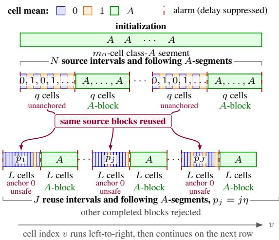  
Figure 10. Environment illustration. Each cell represents two rounds. Each source interval is followed by a q-cell A-segment and produces an unanchored source block. Each reuse interval is followed by an L-cell A-segment and produces an unsafe block anchored at 0; the constant-A segments produce class-A blocks. During the latter half of each reuse interval, the same source blocks are accepted and reused, while all other completed blocks are rejected. The illustration is schematic and not to scale; alarm delays are suppressed.

Step 2 - Horizon and number of changes. The displayed construction uses $2 m _ { 0 } + 4 N q + 4 J L = T / 2 + o ( T )$ rounds, so the final class-A segment fills the remaining horizon. The source intervals contribute $N ( q - 1 ) = \Theta ( L )$ changes, while the reuse intervals contribute at most

$$
2 \sum _ { j = 1 } ^ { J } \lfloor L p _ { j } \rfloor \leq L \eta J ( J + 1 ) = O ( L ) .
$$

The boundaries with the class-A segments add only $O ( N + J )$ changes. Consequently, $S = \Theta ( L ) = \Theta ( \sqrt { T } )$

Step 3 - Source intervals. We bound the number of observations and the population mean of each source block. These bounds will establish that the compatibility test accepts the source blocks during the latter half of each subsequent reuse interval. We restrict attention to the latter half to ensure enough observations for rejecting blocks from earlier reuse intervals, while retaining order L zero-mean prediction rounds for bias accumulation.

We begin with an upper bound on the detection delay at the boundaries between the source intervals and the adjacent class-A segments.

Delay upper bound: Denote the population mean on the 0 − 1 side by $0 \le \bar { \mu } _ { L } \le 1$ and the A mean by $\bar { \mu } _ { R } = A$ . The difference satisfies $\left| \bar { \mu } _ { L } - \bar { \mu } _ { R } \right| \geq A - 1$ . We work on $\mathcal { G } _ { \mathrm { d e t } }$ and the event with no internal alarms described below. Al sample counts here are per-stream counts, with one observation per cell. Next, consider the split point k of the statistic at the boundary between the 0 − 1 and A intervals, and let $d \leq q / 4$ be a candidate upper bound on the delay, measured in cells. We argue inductively over the boundaries, starting with the initial long A-segment. If the preceding boundary was detected within d cells, then the number of pre-change samples satisfies $N _ { L } \geq q - d \geq d$ . Suppose no alarm has occurred after d incoming cells. The statistic at this split point is

$$
D ^ { 2 } = \frac { N _ { L } \cdot d } { N _ { L } + d } ( \bar { \mu } _ { L } - \bar { \mu } _ { R } ) ^ { 2 } \geq \frac { d } { 2 } ( A - 1 ) ^ { 2 } .
$$

Since the threshold of the change detector test satisfies (for large $T ) ( \gamma _ { t } ^ { r } ) ^ { 2 } \leq 1 2 \log T$ , and under the good detector event $D ^ { 2 } > 4 ( \gamma _ { t } ^ { r } ) ^ { 2 }$ guarantees an alarm, a sufficient condition for detection by d cells is

$$
{ \frac { d } { 2 } } ( A - 1 ) ^ { 2 } > 4 8 \log T \Longleftrightarrow d > { \frac { 9 6 \log T } { ( A - 1 ) ^ { 2 } } } .
$$

We therefore choose

$$
d : = \left\lceil 1 2 8 \log T / ( A - 1 ) ^ { 2 } \right\rceil .\tag{131}
$$

Since $A = 1 0 2 4$ , this choice also satisfies $d \leq q / 4$ for sufficiently large T. An alarm must therefore occur within d cells.   
The same argument applies with the zero/one and A sides reversed, completing the induction.

No internal alarms: For a scan whose samples lie within one source or reuse interval, even spacing gives $D _ { k , t } ^ { r } \ \leq$ $\sqrt { 1 / n _ { 1 } + 1 / n _ { 2 } } \leq \sqrt { 2 }$ , where $n _ { 1 } , n _ { 2 }$ are its two decision-stream counts. Within a class-A segment, $D _ { k , t } ^ { r } = 0 .$ . For each deterministic valid triple, Gaussian tails therefore bound the alarm probability by

$$
2 e ^ { - ( \gamma _ { t } ^ { r } - \sqrt { 2 } ) ^ { 2 } / 2 } \leq C e ^ { \sqrt { 2 4 \log T } } \frac { \alpha _ { r } } { ( t - r ) ^ { 3 } } .
$$

There are at most $t - r$ splits for each $r , t .$ Summing over all such scans with $r \geq T / 3$ shows that the probability of any internal alarm is at most

$$
C e ^ { \sqrt { 2 4 \log T } } \sum _ { r \geq T / 3 } \alpha _ { r } = o ( 1 ) .
$$

On $\mathcal { G } _ { \mathrm { d e t } }$ , there is no alarm inside the initial class-A segment, so every subsequent restart is after $T / 3 .$ . Together with the delay bound and induction above, this gives exactly one alarm within d cells after each boundary between a source or reuse interval and a class-A segment, and no other alarms, with probability at least $1 - \alpha - o ( 1 )$ . Alarms occur at even rounds and restart at the preceding odd round, so blocks closed by alarms consist of whole cells. Their sample counts and population means are therefore identical in the two streams.

block length: We next use the above result to obtain a lower and upper bound on the number of samples in a source block, denoted here by $N _ { b } = N _ { b } ^ { \mathsf { D } } = N _ { b } ^ { \mathsf { E } }$ . Since the source intervals have length $q ,$ we may “lose” at most d samples per stream due to the alarm starting the block, and retain at most $d + 1$ samples per stream after the end of the interval, including the endpoint allowance. The entry and exit delays need not be equal. We have $q - d \leq N _ { b } \leq q + d + 1$ ; therefore

$$
\frac { 3 q } { 4 } \leq N _ { b } \leq 2 q .\tag{132}
$$

Each source block contains only one-cell class-0 and class-1 segments and at most $d + 1 < \ell _ { \mathrm { i d } }$ class-A cells, so it is unanchored for sufficiently large $T .$

block bias: We next obtain a lower bound (for the bias contribution) and an upper bound (for the acceptance guarantee) on the block mean. For the upper bound, note that we have at most $\lfloor q / 2 \rfloor$ one-cells and at most d + 1 A-cells; therefore

$$
\bar { \mu } _ { b } \leq \frac { \lfloor q / 2 \rfloor + A ( d + 1 ) } { N _ { b } } \leq 1 + \frac { A ( d + 1 ) } { q - d } \leq 2 ,
$$

where the last inequality holds for sufficiently large T by plugging in $q ,$ d and using $A = 1 0 2 4$

For the lower bound, note that we have $\lfloor q / 2 \rfloor$ one-cells in the interval. We may lose at most d of these due to the late entry alarm, while any retained A-cells contribute nonnegative mass. Therefore, for sufficiently large $T .$

$$
\bar { \mu } _ { b } \ge \frac { \lfloor q / 2 \rfloor - d } { N _ { b } } \ge \frac { q / 4 - 1 } { N _ { b } } \ge \frac { q / 8 } { N _ { b } } .
$$

We therefore conclude

$$
\frac { q / 8 } { N _ { b } } \leq \bar { \mu } _ { b } \leq 2 .\tag{133}
$$

Acceptance guarantee: We now show that the compatibility test accepts these source blocks during the latter half of each later reuse interval. Consider the active prefix $\boldsymbol { A } _ { t }$ during this part of the interval. It starts after the entry alarm and contains no A-cells, so $0 \leq \bar { \mu } _ { \mathcal { A } _ { t } } \leq 1$ . Therefore $| \bar { \mu } _ { \mathcal { A } _ { t } } - \bar { \mu } _ { b } | \leq 2$ . All counts and population means in this comparison use the decision stream. The population compatibility statistic satisfies

$$
Q _ { b } ^ { 2 } ( t ) = \frac { N _ { A _ { t } } N _ { b } } { N _ { A _ { t } } + N _ { b } } ( \bar { \mu } _ { \mathcal { A } _ { t } } - \bar { \mu } _ { b } ) ^ { 2 } \leq 4 N _ { b } \leq 8 q .
$$

Since $t \geq T / 3$ , the compatibility threshold satisfies $( \lambda _ { t } ^ { b } ) ^ { 2 } \geq 1 0 \log T$ for sufficiently large T. Together with $q \leq 2$ log $T _ { \ast }$ this gives $Q _ { b } ^ { 2 } ( t ) \leq 1 6 \log T < 4 ( \lambda _ { t } ^ { b } ) ^ { 2 }$ . On the good compatibility event $\mathcal { G } _ { \mathrm { c m p } }$ , we therefore have $\widehat { Q } _ { b } ( t ) < Q _ { b } ( t ) + \lambda _ { t } ^ { b } <$ $3 \lambda _ { t } ^ { b } < 4 \lambda _ { t } ^ { b }$ , so block b is accepted.

Step 4 - Blocks from reuse intervals. We now need to show two things: rejection of blocks from earlier reuse intervals during later reuse intervals, and accumulation of repeated bias beyond the recurrent benchmark scale. As in Step 3, we first derive bounds on the number of samples and on the mean differences. All counts and means in the compatibility comparisons below use the decision stream; we suppress its superscript.

Block length: Each reuse interval contains L cells. We may lose at most d samples per stream due to the entry alarm and retain at most $d + 1$ additional samples per stream due to the exit alarm. Recall that $d < \log T$ and $L = \lfloor { \sqrt { T } } \rfloor$ . For sufficiently large $T _ { \ast }$ , we have 6 log $T \leq L ,$ so $d \leq L / 6 .$ . Thus, for a completed block b of this type,

$$
L - d \leq N _ { b } \leq L + d + 1 \implies \frac { L } { 3 } \leq N _ { b } \leq 2 L .\tag{134}
$$

During the latter half of the reuse interval, the active prefix contains at least $L / 2 - d$ samples and at most L samples, since it starts after the entry alarm and remains inside the interval. Therefore,

$$
\frac { L } { 3 } \leq N _ { A _ { t } } \leq L .\tag{135}
$$

The completed-block count bounds hold in both streams, and the active estimation count also satisfies $N _ { { \mathcal { A } } _ { t } } ^ { \mathsf { E } } \leq L$ . We will charge the bias on zero-mean rounds in this latter half.

Bounding the population mean: We start by bounding the mean of the active prefix in reuse interval $j .$ It contains $n = N _ { A _ { i } }$ consecutive zero/one cells and no A-cells. By even spacing, the number of ones is either $\lfloor n p _ { j } \rfloor { \mathrm { ~ o r ~ } } \lceil n p _ { j } \rceil$ , and therefore

$$
| \bar { \mu } _ { \mathcal { A } _ { t } } - p _ { j } | \leq \frac 1 n \leq \frac 3 L \leq \frac \eta 4 ,\tag{136}
$$

where the last inequality follows from the definition of $\eta$ for sufficiently large $T .$

Next, let $b _ { i }$ be the completed block from an earlier reuse interval $i < j$ . Its retained zero/one cells form a consecutive portion of the pattern. By even spacing, their number of ones differs from $p _ { i }$ times their number of cells by at most one. Each of the at most $d + 1$ retained A-cells contributes $A - p _ { i } \leq A$ to the deviation from $p _ { i }$ . Therefore,

$$
\left| \bar { \mu } _ { b _ { i } } - p _ { i } \right| \leq \frac { 1 + A ( d + 1 ) } { N _ { b _ { i } } } \leq \frac { 3 [ 1 + A ( d + 1 ) ] } { L } .
$$

Since $d + 1 \leq 2 \log T$ for log $T \geq 2 .$ , we have

$$
| \bar { \mu } _ { b _ { i } } - p _ { i } | \leq \frac { 3 ( 1 + 2 A ) \log T } { L } = \frac { 6 1 4 7 } { 6 5 5 3 6 } \eta ^ { 2 } \leq \frac { \eta } { 4 } ,\tag{137}
$$

where we used $A = 1 0 2 4$ and the definition of $\eta .$ The last inequality holds for $\eta \leq 1$ , as ensured by the construction.

These blocks are anchored at class 0. Indeed, even spacing leaves interior zero segments of length at least $( 2 p _ { J } ) ^ { - 1 } \gg \ell _ { \mathrm { i d } } ;$ since $L p _ { 1 } \to \infty$ and $d = o ( L )$ , at least one survives the entry delay. Proposition 3.1 therefore gives the anchor. The mean bound also gives $\bar { \mu } _ { b _ { i } } \geq p _ { i } - \eta / 4 \geq 3 \eta / 4 \gg N _ { b _ { i } } ^ { - 1 / 2 }$ , so each such block is unsafe. The same argument applies to every completed block from a reuse interval, and the two streams have identical population means and counts.

Mutual rejection: We next lower-bound the compatibility statistic between the active prefix in reuse interval $j$ and the earlier completed block $b _ { i } .$ . First,

$$
\left| \bar { \mu } _ { \mathcal { A } _ { t } } - \bar { \mu } _ { b _ { i } } \right| \geq \left| p _ { j } - p _ { i } \right| - \frac { \eta } { 4 } - \frac { \eta } { 4 } \geq \frac { \eta } { 2 } ,\tag{138}
$$

where the last inequality follows from $p _ { j } - p _ { i } = ( j - i ) \eta \ge \eta$ . The sample-count lower bounds give $N _ { A _ { t } } N _ { b _ { i } } / ( N _ { A _ { t } } + N _ { b _ { i } } ) \geq$ $L / 6$ . Together with the mean separation, this yields

$$
Q _ { b _ { i } } ^ { 2 } ( t ) \geq \frac { L } { 6 } \left( \frac { \eta } { 2 } \right) ^ { 2 } = \frac { 2 5 6 ^ { 2 } } { 2 4 } \log T > 5 0 0 \log T .\tag{139}
$$

For sufficiently large T, the threshold satisfies $( \lambda _ { t } ^ { b _ { i } } ) ^ { 2 } \leq$ 20 log $T ,$ so

$$
Q _ { b _ { i } } ^ { 2 } ( t ) > 2 5 ( \lambda _ { t } ^ { b _ { i } } ) ^ { 2 } ,
$$

and hence $Q _ { b _ { i } } ( t ) > 5 \lambda _ { t } ^ { b _ { i } }$ . On the good compatibility event $\mathcal { G } _ { \mathrm { c m p } }$

$$
\widehat { Q } _ { b _ { i } } ( t ) > Q _ { b _ { i } } ( t ) - \lambda _ { t } ^ { b _ { i } } > 4 \lambda _ { t } ^ { b _ { i } } ,
$$

so every block from an earlier reuse interval is rejected during the latter half of reuse interval $j .$

Rejection of the A-blocks: Let $b _ { A }$ be a completed block from an A-segment of $m \geq q$ cells. This covers the q-cell and L-cell A-segments, as well as the initial A-segment. The block loses at most d A-cells at entry and retains at most $d + 1$ zero/one cells at exit. Therefore,

$$
\begin{array} { r } { N _ { b _ { A } } \geq m - d \geq q / 2 , } \end{array}
$$

and, since the added cells have nonnegative means,

$$
\bar { \mu } _ { b _ { A } } \geq A \frac { m - d } { m + d + 1 } \geq \frac { A } { 2 } ,
$$

where the last inequality follows from $m \geq q \geq 4 d$ and $d \geq 1$ . The active prefix in the current reuse interval contains only zeros and ones, so $0 \leq \bar { \mu } _ { \mathcal { A } _ { t } } \leq 1$ . Hence,

$$
| \bar { \mu } _ { \mathcal { A } _ { t } } - \bar { \mu } _ { b _ { A } } | \geq A / 2 - 1 .
$$

During the latter half of this interval, $N _ { A _ { t } } \geq L / 3 \geq q / 2$ . Thus both sample counts are at least $q / 2 ,$ , giving

$$
Q _ { b _ { A } } ^ { 2 } ( t ) \geq \frac { q } { 4 } ( A / 2 - 1 ) ^ { 2 } .
$$

With $A = 1 0 2 4 , q \geq \log T$ , and $( \lambda _ { t } ^ { b _ { A } } ) ^ { 2 } \leq 2 0 \log T$ for sufficiently large $T ,$ we obtain

$$
Q _ { b _ { A } } ^ { 2 } ( t ) > 5 0 0 \log T \geq 2 5 ( \lambda _ { t } ^ { b _ { A } } ) ^ { 2 } .\tag{140}
$$

On the good compatibility event $\mathcal { G } _ { \mathrm { c m p } } .$ , this implies $\widehat { Q } _ { b _ { A } } ( t ) > Q _ { b _ { A } } ( t ) - \lambda _ { t } ^ { b _ { A } } > 4 \lambda _ { t } ^ { b _ { A } }$ , so every completed A-block is rejected during the latter half of the interval.

Step 5 - Repeated bias accumulation. Finally, we lower-bound the regret caused by repeated bias accumulation. As before, we consider the latter half of each reuse interval. We work on $\mathcal { G } _ { 0 }$ , the intersection of $\mathcal { G } _ { \mathrm { d e t } }$ , the event with no internal alarms, and $\mathcal { G } _ { \mathrm { c m p } }$ . All counts and population means below refer to the estimation stream, and sums over b run over the N source blocks. We first upper-bound the number of samples used by the estimator, since they may dilute the bias.

Number ofsamples: Recall that the test accepts all source blocks and rejects all other completed blocks. Each source block contains at most 2q samples, and the active prefix in the latter half of reuse interval j contains at most L. Since $N q \leq L$

$$
W _ { t } = N _ { A _ { t } } + \sum _ { b } N _ { b } \leq L + 2 N q \leq 3 L \leq 4 L .\tag{141}
$$

Bias mass: From Eq. (133), we have $N _ { b } \bar { \mu } _ { b } \ge q / 8$ for each source block. Also,

$$
N q \ge L - q \ge L / 2
$$

for sufficiently large T. Therefore,

$$
\sum _ { b } N _ { b } \bar { \mu } _ { b } \geq \frac { N q } { 8 } \geq \frac { L } { 1 6 } .\tag{142}
$$

Let $\widetilde { \mu } _ { t }$ denote the population estimate obtained by replacing the observations in the prediction average with their means, while keeping the selected samples fixed. Consider a zero-mean prediction round in the latter half of a reuse interval. Since all population means in the construction are nonnegative, the active prefix cannot cancel the source blocks’ positive contribution. Thus,

$$
| \widetilde { \mu } _ { t } - \mu _ { t } | = \widetilde { \mu } _ { t } \ge \frac { \sum _ { b } N _ { b } \bar { \mu } _ { b } } { W _ { t } } \ge \frac { L / 1 6 } { 4 L } = \frac { 1 } { 6 4 } .
$$

Repeated accumulation: Since $p _ { j } \leq 1 / 4$ , even spacing ensures that the latter half of reuse interval j contains at least

$$
3 L / 8 - 2 \ge L / 8
$$

zero-cells for sufficiently large T. Indeed, this half contains $\lfloor L / 2 \rfloor$ cells and at most $p _ { j } \lfloor L / 2 \rfloor + 1$ ones. Its number of zero-cells is therefore at least $\begin{array} { r } { \frac { 3 } { 4 } \lfloor L / 2 \rfloor - 1 \geq 3 L / 8 - 2 ; } \end{array}$ the subtraction of 2 allows for rounding.

Each zero-cell contributes one even prediction round with population error at least $1 / 6 4$ . The same argument applies to all J reuse intervals, giving

$$
\sum _ { t \in \mathcal { T } _ { + } } \left. \widetilde { \mu } _ { t } - \mu _ { t } \right. \geq \frac { J L } { 5 1 2 } \asymp \frac { T ^ { 5 / 8 } } { ( \log T ) ^ { 1 / 4 } } ,\tag{143}
$$

on $\mathcal { G } _ { 0 }$ , where $\mathcal { T } _ { + } = \{ t \in \{ 2 , . . . , T \} : W _ { t } > 0 \}$ . Since $M = 3$ , this exceeds the recurrent benchmark scale $\sqrt { M T }$ by a factor of order $\dot { T } ^ { 1 / 8 } / \dot { ( \log T ) } ^ { 1 / 4 }$

Conditioning on the decision samples fixes the block ${ \bf \nabla } ( { \bf S } ,$ reuse decisions, and weights, while the estimation noises remain centered. Thus the conditional mean of $\widehat { \mu } _ { t } \mathrm { ~ i s ~ } \widetilde { \mu } _ { t }$ whenever $W _ { t } > 0$ , and Jensen’s inequality gives

$$
\mathbb { E } \big [ \vert \widehat { \mu } _ { t } - \mu _ { t } \vert \vert \mathrm { d e c i s i o n ~ s a m p l e s } \big ] \ge \vert \widetilde { \mu } _ { t } - \mu _ { t } \vert .
$$

Since $\mathcal { G } _ { 0 }$ depends only on the decision samples and has probability at least $1 - 2 \alpha - o ( 1 )$ ), the population lower bound on this event yields

$$
R _ { T } ( \mathrm { E C R } _ { \infty } ; \nu ) \geq \mathbb { P } ( \mathcal { G } _ { 0 } ) \frac { J L } { 5 1 2 } \gtrsim J L .
$$

This proves the proposition.

Effect of the exposure cap. The exposure cap changes neither the detector blocks nor the compatibility decisions. On G0, Eq. (53) gives $H _ { b } ( T + 1 ) \le B _ { \mathrm { e x p } } + 1$ . Moreover, the per-block bounds above imply $\begin{array} { r } { \sum _ { b } N _ { b } ^ { \mathsf { E } } \bar { \mu } _ { b } ^ { \bar { \mathsf { E } } } \leq 4 N \bar { q } \leq 4 L } \end{array}$ , where the sum runs over the source blocks. Their contribution on zero-mean rounds is therefore at most

$$
\sum _ { b } N _ { b } ^ { \mathsf { E } } \bar { \mu } _ { b } ^ { \mathsf { E } } H _ { b } ( T + 1 ) \leq 4 L ( B _ { \mathrm { e x p } } + 1 ) .
$$

For $B _ { \mathrm { e x p } } = 4$ , Theorem 4.1 gives

$$
R _ { T } ( \mathrm { E C R } ; \nu ) = O \Big ( \sqrt { T } ( \log T ) ^ { 2 } \Big ) .
$$

Thus only uncapped reuse accumulates the additional factor $J .$

## F. Retrospective limits

Lemma F.1 (Retrospective localization uncertainty). Fix two known means $\theta ^ { ( 0 ) } \neq \theta ^ { ( 1 ) }$ and let $\Delta : = | \theta ^ { ( 1 ) } - \theta ^ { ( 0 ) } |$ . Consider the Gaussian subclass

$$
X _ { t } \sim \left\{ \begin{array} { l l } { \displaystyle { \cal N } ( \theta ^ { ( 0 ) } , \sigma ^ { 2 } ) , } & { t < \eta , } \\ { \displaystyle { \cal N } ( \theta ^ { ( 1 ) } , \sigma ^ { 2 } ) , } & { t \geq \eta , } \end{array} \right.
$$

independently across t, where the change point η is unknown. Let τ be any possibly randomized estimator based on the entire sample $X _ { 1 : T }$ . Then,for every integer $h \geq 1$ and every τ such that $\tau + 2 h \leq T$

$$
\operatorname* { m a x } _ { \eta \in \{ \tau , \tau + 2 h \} } \mathbb { P } _ { \eta } ( | \widehat { \tau } - \eta | \geq h ) \geq \frac { 1 } { 4 } \exp \left( - \frac { h \Delta ^ { 2 } } { \sigma ^ { 2 } } \right) .\tag{144}
$$

Consequently,for such h, iffor some $\delta \in ( 0 , 1 / 4 )$

$$
\operatorname* { s u p } _ { \eta } \mathbb { P } _ { \eta } ( | \widehat { \tau } - \eta | \geq h ) \leq \delta ,
$$

then necessarily

$$
h \geq \frac { \sigma ^ { 2 } } { \Delta ^ { 2 } } \log \frac { 1 } { 4 \delta } .\tag{145}
$$

Proof. The proof constructs two environments that are different enough: their change points are separated by 2h samples, so that confusing them causes a localization error of at least $h ,$ , while remaining similar enough in KL divergence that no estimator can reliably distinguish between them. Let

$$
A : = \{ \widehat { \tau } \geq \tau + h \} .
$$

The event $A$ corresponds to placing the estimated change point on or to the right of the midpoint between the two possible change locations. Under a change at $\tau ,$ , the event A implies

$$
| { \widehat { \tau } } - \tau | \geq h ,
$$

whereas under a change at $\tau + 2 h$ , the event $A ^ { c }$ implies

$$
| { \widehat { \tau } } - ( \tau + 2 h ) | \geq h .
$$

Therefore, the sum of the localization-error probabilities under the two environments satisfies

$$
\begin{array} { r } { \mathbb { P } _ { \tau } \big ( | \widehat { \tau } - \tau | \geq h \big ) + \mathbb { P } _ { \tau + 2 h } \big ( | \widehat { \tau } - ( \tau + 2 h ) | \geq h \big ) \geq \mathbb { P } _ { \tau } ( A ) + \mathbb { P } _ { \tau + 2 h } \big ( A ^ { c } \big ) . } \end{array}
$$

By the Bretagnolle–Huber inequality,

$$
\mathbb { P } _ { \tau } ( A ) + \mathbb { P } _ { \tau + 2 h } ( A ^ { c } ) \geq \frac { 1 } { 2 } \exp ( { - \mathrm { K L } ( \mathbb { P } _ { \tau } \| \mathbb { P } _ { \tau + 2 h } ) } ) .
$$

It remains to compute the KL divergence between the two observation laws. They differ only on the 2h indices $t =$ $\tau , \ldots , \tau + 2 h - 1$ . Hence,

$$
\mathrm { K L } ( \mathbb { P } _ { \tau } \parallel \mathbb { P } _ { \tau + 2 h } ) = 2 h \mathrm { K L } \Big ( \mathcal { N } ( \theta ^ { ( 1 ) } , \sigma ^ { 2 } ) \left\| \mathcal { N } ( \theta ^ { ( 0 ) } , \sigma ^ { 2 } ) \right) = 2 h \frac { \Delta ^ { 2 } } { 2 \sigma ^ { 2 } } = \frac { h \Delta ^ { 2 } } { \sigma ^ { 2 } } .
$$

Substituting this expression into the Bretagnolle–Huber inequality gives

$$
\mathbb { P } _ { \tau } ( A ) + \mathbb { P } _ { \tau + 2 h } ( A ^ { c } ) \geq \frac { 1 } { 2 } \exp \left( - \frac { h \Delta ^ { 2 } } { \sigma ^ { 2 } } \right) .
$$

Consequently, at least one of the two localization-error probabilities is at least one half of the right-hand side. Therefore,

$$
\operatorname* { m a x } _ { \eta \in \{ \tau , \tau + 2 h \} } \mathbb { P } _ { \eta } ( | \widehat { \tau } - \eta | \geq h ) \geq \frac { 1 } { 4 } \exp \left( - \frac { h \Delta ^ { 2 } } { \sigma ^ { 2 } } \right) ,
$$

which proves Eq. (144). If both localization-error probabilities are at most $\delta ,$ then

$$
\delta \ge \frac { 1 } { 4 } \exp \left( - \frac { h \Delta ^ { 2 } } { \sigma ^ { 2 } } \right) ,
$$

which rearranges to

$$
h \geq \frac { \sigma ^ { 2 } } { \Delta ^ { 2 } } \log \frac { 1 } { 4 \delta } .
$$

This proves Eq. (145).

Remark F.2. The lower bound gives the estimator the two mean values adjacent to the change and the entire observation sequence $X _ { 1 : T }$ , leaving only the change location unknown. It therefore also applies to any online detector followed by arbitrary retrospective post-processing. If the history is split at $\widehat { \tau }$ when the true change point is $\eta ,$ then exactly $| \widehat { \tau } - \eta |$ observations are assigned to the wrong neighboring block. For a jump of size $\Delta = \Delta _ { \operatorname* { m i n } }$ with $\sigma ^ { 2 } / \Delta _ { \operatorname* { m i n } } ^ { 2 } \ge \mathrm { ~ 1 ~ }$ , take $h = \lceil \sigma ^ { 2 } / \Delta _ { \operatorname* { m i n } } ^ { 2 } \rceil$ and assume $T \geq 2 h + 2$ . Lemma F.1 then shows that, for any hard split, some change location yields at least h misassigned observations with probability at least $e ^ { - 2 } / 4$ . This two-point argument does not establish an additional logarithmic dependence on $T ;$ obtaining such a dependence is beyond the scope of this paper.

## G. Extension to $L _ { p }$

For a fixed $p > 0 _ { : }$ , consider replacing the absolute loss by the cumulative p-power loss

$$
\mathbb { E } \left[ \sum _ { t = 2 } ^ { T } | \widehat { \mu } _ { t } - \mu _ { t } | ^ { p } \right] .\tag{146}
$$

The corresponding per-environment error and minimax criterion are defined analogously. This section gives only a high-level discussion; we do not claim an $L _ { p }$ regret guarantee for ECR.

The value of recurrence. We first isolate the stochastic estimation term under Gaussian noise. If $\widehat { \mu } _ { n }$ is the sample mean of n independent observations from ${ \mathcal { N } } ( \mu , \sigma ^ { 2 } )$ , then

$$
\widehat { \mu } _ { n } - \mu \sim { \mathcal N } ( 0 , \sigma ^ { 2 } / n ) , \qquad { \mathbb E } | \widehat { \mu } _ { n } - \mu | ^ { p } = c _ { p } \sigma ^ { p } n ^ { - p / 2 } ,
$$

where $c _ { p } : = \mathbb { E } | Z | ^ { p }$ for $Z \sim { \mathcal { N } } ( 0 , 1 )$ . Consequently,

$$
\sum _ { n = 1 } ^ { N } \mathbb { E } | \widehat { \mu } _ { n } - \mu | ^ { p } \asymp \sigma ^ { p } \left\{ \begin{array} { l l } { N ^ { 1 - p / 2 } , } & { 0 < p < 2 , } \\ { \log ( e N ) , } & { p = 2 , } \\ { 1 , } & { p > 2 . } \end{array} \right.
$$

For the sub-Gaussian model of this paper, the corresponding right-hand sides remain upper bounds up to a constant depending on $p .$

Consider equal-length segments and balanced total occupancy across the M classes, ignoring rounding and first-prediction initialization costs. A no-reuse benchmark that relearns each of the $S + 1$ segments and a recurrent benchmark that pools all observations from the same recurrent class have the respective stochastic-loss scales

$$
\begin{array} { r l r } {  { 0 < p < 2  \begin{array} { c } { \mathrm { N o ~ r e u s e } } \end{array}   \mathrm { R e c u r r e n t ~ p o o l i n g } } } \\ & { } & { p = 2 \begin{array} { c } { \sigma ^ { p } ( S + 1 ) ^ { p / 2 } T ^ { 1 - p / 2 } } \\ { \sigma ^ { 2 } ( S + 1 ) \log ( \displaystyle \frac { e T } { S + 1 } )  \sigma ^ { 2 } M \log ( \displaystyle \frac { e T } { M } ) } \end{array}  } \\ & { } & { p > 2 \sigma ^ { p } ( S + 1 ) \sigma ^ { p } M . } \end{array}
$$

Thus, whenever $M < S + 1$ , the recurrent benchmark improves upon the no-reuse benchmark for every fixed $p > 0 .$ . For $p < 2$ , the improvement factor is of order $( ( S + 1 ) / M ) ^ { p / 2 } ; \mathrm { a t } p = 1$ this recovers the improvement from σ $\cdot \sqrt { ( S + 1 ) T }$ to $\sigma { \sqrt { M T } }$

The cost of unknown change times. The testing argument underlying the change-time lower bound gives the following heuristic for p-power loss. A jump of size $\Delta$ requires a localization window of order $\stackrel { - } { \sigma } ^ { 2 } \Delta ^ { - 2 } \log ( T / S )$ , while each inaccurate prediction in that window incurs loss of order $\Delta ^ { p }$ . Repeating this argument over $S$ changes suggests the unavoidable scale

$$
\sigma ^ { 2 } \Delta _ { \mathrm { m i n } } ^ { p - 2 } S \log \left( \frac { T } { S } \right) ,
$$

under resolution conditions analogous to Eq. (110). For $p = 2 ,$ , this agrees with the single-change lower bound of (Gafni et al., 2026). For $p > 2$ , larger admissible jumps may produce a stronger worst-case dependence than the display based on $\Delta _ { \mathrm { m i n } }$

Implications for the minimax rate. For $1 \leq p < 2$ , adapting the two oracle lower-bound arguments suggests the schematic minimax benchmark

$$
\operatorname* { m a x } \Biggl \{ \sigma ^ { p } M ^ { p / 2 } T ^ { 1 - p / 2 } , \sigma ^ { 2 } \Delta _ { \mathrm { m i n } } ^ { p - 2 } S \log \left( \frac { T } { S } \right) \Biggr \} .
$$

A corresponding algorithmic target would contain the sum of these two terms, up to logarithmic factors and additiona parameter-dependent contamination terms.

The recurrent estimation term can dominate the change-time term only if

$$
S \log \left( \frac { T } { S } \right) \lesssim \left( \frac { \Delta _ { \operatorname* { m i n } } } { \sigma } \right) ^ { 2 - p } M ^ { p / 2 } T ^ { 1 - p / 2 } .
$$

For fixed $p , M , \sigma ,$ , and $\Delta _ { \mathrm { m i n } } .$ , this reduces, up to logarithmic factors, to

$$
S = \widetilde O \Big ( T ^ { 1 - p / 2 } \Big ) .
$$

For example, the resulting powers are $1 / 2$ for $p = 1 , 1 / 4 \mathrm { f o r } p = 3 / 2$ , and 0.1 for $p = 1 . 8$ . Hence the admissible growth of S becomes more restrictive as $p$ approaches 2.

The point $p = 2$ is the summability transition: stationary estimation loss is polynomial in the segment or class occupancy for $p < 2 .$ , logarithmic for $p = 2$ , and bounded for $p > 2 . { \mathrm { A t } } p = 2$ , class estimation and change localization are both logarithmic in the horizon, but they scale with M and $S ,$ respectively, and therefore need not be of the same overall order. For $0 < p < 1$ , small residual biases are amplified relative to $L _ { 1 }$ , so the linear exposure accounting does not directly apply.

## H. Extension to vector-valued observations

We outline the modifications to the proof of Theorem 4.1 for vector-valued observations. Dimension enters through concentration and the Euclidean estimation error of a sample mean. The compatibility, exposure, and recurrent-capacity arguments retain their scalar structure.

Model and regret. Let

$$
X _ { t } = \mu _ { t } + \varepsilon _ { t } , \qquad \mu _ { t } = \theta ^ { ( c _ { t } ) } , \qquad \theta ^ { ( m ) } \in \mathbb { R } ^ { d } ,
$$

where $c _ { t } \in [ M ]$ is piecewise constant on the same unknown segmentation as in Section 2. Assume that the noises are independent, centered, and satisfy

$$
\mathbb { E } \left[ \exp \{ \lambda u ^ { \top } \varepsilon _ { t } \} \right] \leq \exp \left( \frac { \sigma ^ { 2 } \lambda ^ { 2 } } { 2 } \right)
$$

for every $\lambda \in \mathbb { R }$ and every unit vector $u \in \mathbb { R } ^ { d }$ . The class parameters satisfy

$$
\operatorname* { m i n } _ { m \neq m ^ { \prime } } \| \theta ^ { ( m ) } - \theta ^ { ( m ^ { \prime } ) } \| _ { 2 } \geq \Delta _ { \operatorname* { m i n } } \qquad \operatorname* { m a x } _ { m , m ^ { \prime } } \| \theta ^ { ( m ) } - \theta ^ { ( m ^ { \prime } ) } \| _ { 2 } \leq \Delta _ { \operatorname* { m a x } } .
$$

We assume that these geometric conditions define a nonempty parameter class. The regret is

$$
R _ { T } ^ { ( d ) } : = \mathbb { E } \left[ \sum _ { t = 2 } ^ { T } \| \widehat { \mu } _ { t } - \mu _ { t } \| _ { 2 } \right] .
$$

The decision/estimation split, block definitions, exposure counters $H _ { b } ( t )$ , reuse sets $\mathcal { U } _ { t }$ , and effective sample sizes $W _ { t }$ are unchanged.

Vector detector. For a valid split $r < k < t ,$ define

$$
\widehat { D } _ { k , t } ^ { r } : = \frac { 1 } { \sigma } \sqrt { \frac { N _ { [ r , k ) } ^ { D } N _ { [ k , t ) } ^ { D } } { N _ { [ r , t ) } ^ { D } } \left\| \overline { { X } } _ { [ r , k ) } ^ { D } - \overline { { X } } _ { [ k , t ) } ^ { D } \right\| _ { 2 } } , \qquad C _ { t } ^ { r } : = \operatorname* { m a x } _ { r < k < t } \widehat { D } _ { k , t } ^ { r } ,
$$

with the usual convention when no valid split exists. The alarm rule remains

$$
N _ { G } ^ { r } : = \operatorname* { i n f } \left\{ t > r : C _ { t } ^ { r } \geq \widetilde { \gamma } _ { t } ^ { r } \right\} ,
$$

where $\widetilde { \gamma } _ { t } ^ { r }$ is specified below. Its population counterpart $D _ { k , t } ^ { r }$ is obtained by replacing the sample means by the corresponding population means.

Let $A _ { k , t } ^ { r }$ denote the normalized centered two-sample difference. Every one-dimensional projection of $A _ { k , t } ^ { r }$ is 1-sub-Gaussian. Let $\mathcal { N }$ be a $1 / 2 \cdot$ -net of the unit sphere with $| \mathcal { N } | \leq 5 ^ { d }$ . For every vector z, some $u \in \mathcal N$ satisfies $u ^ { \top } z \geq \| z \| _ { 2 } / 2$ Consequently, for every $x \geq 0$

$$
\begin{array} { r } { \mathbb { P } \left( \| A _ { k , t } ^ { r } \| _ { 2 } \geq 2 \sqrt { 2 \left( d \log 5 + x \right) } \right) \leq e ^ { - x } . } \end{array}
$$

The reverse triangle inequality gives

$$
\left| \widehat { D } _ { k , t } ^ { r } - D _ { k , t } ^ { r } \right| \leq \| A _ { k , t } ^ { r } \| _ { 2 } .
$$

Thus, with $\alpha _ { r } = 6 \alpha / ( \pi ^ { 2 } r ^ { 2 } )$ , one valid anytime threshold is

$$
\widetilde { \gamma } _ { t } ^ { r } : = 2 \sqrt { 2 \bigg ( d \log 5 + 3 \log ( t - r ) + \log \frac { \pi ^ { 2 } } { 6 \alpha _ { r } } \bigg ) } .
$$

Indeed, for a fixed triple $( r , k , t )$ the preceding tail is at mos $6 \alpha _ { r } / [ \pi ^ { 2 } ( t - r ) ^ { 3 } ]$ . A union bound over at most $t - r$ candidate split points and then over all $t > r$ gives

$$
\begin{array} { r } { \mathbb { P } \left( \exists r < k < t \leq T : \left| \widehat { D } _ { k , t } ^ { r } - D _ { k , t } ^ { r } \right| \geq \widetilde { \gamma } _ { t } ^ { r } \right) \leq \alpha _ { r } . } \end{array}
$$

The deterministic-restart summation used in the scalar proof therefore still gives $\mathbb { E } [ N _ { \mathrm { F A } } ] \leq \alpha$ and $\mathbb { E } [ K ] \le S + 1 + \alpha$ Each detector candidate and each completed-block compatibility comparison now costs $O ( d )$ operations, so vectorization multiplies the scalar arithmetic cost by a factor of order d.

Vector compatibility statistic. For an active prefix $\boldsymbol { A } _ { t }$ and a completed block $b ,$ define

$$
\widehat { Q } _ { b } ( t ) : = \frac { 1 } { \sigma } \sqrt { \frac { N _ { A _ { t } } ^ { D } N _ { b } ^ { D } } { N _ { A _ { t } } ^ { D } + N _ { b } ^ { D } } } \left\| \overline { { \boldsymbol X } } _ { A _ { t } } ^ { D } - \overline { { \boldsymbol X } } _ { b } ^ { D } \right\| _ { 2 } ,
$$

and let $Q _ { b } ( t )$ be its population counterpart. With $\alpha _ { b } = 6 \alpha / [ \pi ^ { 2 } ( b + 1 ) ^ { 2 } ]$ , define

$$
\widetilde { \lambda } _ { b , t } : = \sqrt { 8 \left( d \log { 5 } + 6 \log { t } + \log { \frac { \pi ^ { 2 } } { 6 \alpha _ { b } } } \right) } ,
$$

and use the compatibility rule

$$
\mathcal { C } _ { t } ^ { ( d ) } : = \left\{ b < b _ { t } : \widehat { Q } _ { b } ( t ) < 4 \widetilde { \lambda } _ { b , t } \right\} .
$$

The same net argument gives, for every fixed pair of deterministic intervals,

$$
\mathbb { P } \left( \Big | \widehat { Q } _ { b } ( t ) - Q _ { b } ( t ) \Big | \geq \widetilde { \lambda } _ { b , t } \right) \leq \frac { 6 \alpha _ { b } } { \pi ^ { 2 } t ^ { 6 } } .
$$

The deterministic union over interval pairs and block indices used in the proof of Lemma C.6 then yields a summable compatibility-deviation probability. Outside such a deviation event,

$$
Q _ { b } ( t ) \leq 2 \widetilde { \lambda } _ { b , t } \quad \Longrightarrow \quad b \in \mathcal { C } _ { t } ^ { ( d ) } , \qquad b \in \mathcal { C } _ { t } ^ { ( d ) } \quad \Longrightarrow \quad Q _ { b } ( t ) < 5 \widetilde { \lambda } _ { b , t } .
$$

The numerical constants are not optimized.

Identification scale and anchor segmentation. For all indices not exceeding T, the two confidence levels above satisfy

$$
( \widetilde { \gamma } _ { t } ^ { r } ) ^ { 2 } \leq C _ { \gamma } \left( d + \log \frac { T } { \alpha } \right) , \qquad \left( \widetilde { \lambda } _ { b , t } \right) ^ { 2 } \leq C _ { \lambda } \left( d + \log \frac { T } { \alpha } \right) ,
$$

for universal constants $C _ { \gamma } , C _ { \lambda }$ . It is therefore sufficient to replace the scalar identification scale by

$$
\ell _ { \mathrm { i d } } ^ { ( d ) } : = \left\lceil C _ { \mathrm { i d } } \frac { \sigma ^ { 2 } } { \Delta _ { \mathrm { m i n } } ^ { 2 } } \left( d + \log \frac { T } { \alpha } \right) \right\rceil ,
$$

where $C _ { \mathrm { i d } }$ is chosen sufficiently large.

The anchor arguments then carry over with Euclidean norms. To see the key step, suppose that a no-alarm prefix beginning at r contains a pure class-m interval $[ u , v )$ with $h = N _ { [ u , v ) } ^ { D }$ observations, and let $p = N _ { [ r , u ) } ^ { D } .$ . At the split $k = u$

$$
\left( D _ { u , v } ^ { r } \right) ^ { 2 } = \frac { 1 } { \sigma ^ { 2 } } \frac { p h } { p + h } \left. \overline { { \mu } } _ { [ r , u ) } ^ { D } - \theta ^ { ( m ) } \right. _ { 2 } ^ { 2 } .
$$

On the detector good event, no alarm implies $D _ { u , v } ^ { r } < 2 \widetilde { \gamma } _ { v } ^ { r }$ . Using the convex-combination identity for the full-prefix mean gives

$$
\left. \overline { { \mu } } _ { [ r , v ) } ^ { D } - \theta ^ { ( m ) } \right. _ { 2 } = \frac { p } { p + h } \left. \overline { { \mu } } _ { [ r , u ) } ^ { D } - \theta ^ { ( m ) } \right. _ { 2 } \leq \frac { 2 \sigma \widetilde { \gamma } _ { v } ^ { r } } { \sqrt { h } } .
$$

Hence $h \geq \ell _ { \mathrm { i d } } ^ { ( d ) }$ makes the full-prefix mean lie within $\Delta _ { \mathrm { m i n } } / 8$ of $\theta ^ { ( m ) }$ . The preservation argument is identical: once a prefix of size at least $\ell _ { \mathrm { i d } } ^ { ( d ) }$ is within $\Delta _ { \mathrm { m i n } } / 8$ of its anchor, a later no-alarm prefix remains within $\Delta _ { \mathrm { m i n } } / 4$ , by applying the same CUSUM bound to the split at the anchor-formation time and using the Euclidean triangle inequality.

If a later pure interval belongs to a different class $m ^ { \prime } ,$ , then the distance between its mean and the anchored prefix is at least $3 \Delta _ { \mathrm { m i n } } / 4$ . Once both sides of the split contain $\ell _ { \mathrm { i d } } ^ { ( d ) }$ decision-stream observations,

$$
\left( D _ { k , t } ^ { r } \right) ^ { 2 } \geq \frac { 9 } { 1 6 \sigma ^ { 2 } } \frac { N _ { [ r , k ) } ^ { D } N _ { [ k , t ) } ^ { D } } { N _ { [ r , t ) } ^ { D } } \Delta _ { \operatorname* { m i n } } ^ { 2 } \geq \frac { 9 } { 3 2 } \frac { \ell _ { \mathrm { i d } } ^ { ( d ) } \Delta _ { \operatorname* { m i n } } ^ { 2 } } { \sigma ^ { 2 } } ,
$$

which exceeds the no-alarm level for a sufficiently large $C _ { \mathrm { i d } }$ . Thus the anchor-formation, preservation, and separation conclusions of Lemma C.4 remain valid after replacing $\ell _ { \mathrm { i d } }$ by $\ell _ { \mathrm { i d } } ^ { ( d ) }$ . By the same argument as in Lemma C.5, the aggregate count of off-anchor observations in anchored blocks plus observations in unanchored blocks remains

$$
O \left( ( S + K ) \ell _ { \mathrm { i d } } ^ { ( d ) } \right) .
$$

The localization argument used to remove the detector good event also carries over, because it uses only the uniform detector bound, convex combinations, and the triangle inequality.

Vector safety and compatibility guarantees. The natural vector analogue of safety is

$$
\left. \overline { { \mu } } _ { b } ^ { D } - \theta ^ { \left( \mathfrak { a } ( b ) \right) } \right. _ { 2 } \leq \sigma \sqrt { \frac { d } { N _ { b } ^ { D } } } ,
$$

with the analogous definition for the active prefix. This choice reduces to the scalar definition when $d = 1$ and matches the Euclidean estimation scale of a d-dimensional sample mean.

For acceptance, let $n = N _ { A _ { t } } ^ { D }$ and $q = N _ { b } ^ { D }$ . If both the active prefix and block b are safe for class $m ,$ then

$$
Q _ { b } ^ { 2 } ( t ) \leq \frac { n q } { n + q } \left( \sqrt { \frac { d } { n } } + \sqrt { \frac { d } { q } } \right) ^ { 2 } = d \frac { ( \sqrt { n } + \sqrt { q } ) ^ { 2 } } { n + q } \leq 2 d .
$$

Since $\left( \widetilde { \lambda } _ { b , t } \right) ^ { 2 }$ is at least a constant multiple of $d ,$ the first compatibility implication above guarantees acceptance.

For rejection, suppose that the active prefix has anchor m and block b has a different anchor $m ^ { \prime } .$ . Anchor separation gives

$$
\left\| \overline { { \mu } } _ { A _ { t } } ^ { D } - \overline { { \mu } } _ { b } ^ { D } \right\| _ { 2 } \geq \frac { \Delta _ { \operatorname* { m i n } } } { 2 } .
$$

If both objects are long, then

$$
Q _ { b } ^ { 2 } ( t ) \geq \frac { N _ { A _ { t } } ^ { D } N _ { b } ^ { D } } { N _ { A _ { t } } ^ { D } + N _ { b } ^ { D } } \frac { \Delta _ { \operatorname* { m i n } } ^ { 2 } } { 4 \sigma ^ { 2 } } \geq \frac { \ell _ { \mathrm { i d } } ^ { ( d ) } \Delta _ { \operatorname* { m i n } } ^ { 2 } } { 8 \sigma ^ { 2 } } .
$$

For a sufficiently large $C _ { \mathrm { i d } }$ , this is larger than 25 $\left( \widetilde { \lambda } _ { b , t } \right) ^ { 2 }$ , contradicting compatibility. Thus the acceptance and rejection guarantees continue to hold with the vector safety definition.

Population bias and exposure. For a round with $W _ { t } > 0$ , define the population counterpart of the ECR estimator by

$$
\widetilde { \mu } _ { t } : = \frac { \sum _ { u \in \mathcal { A } _ { t } \cap \mathcal { S } ^ { E } } \mu _ { u } + \sum _ { b \in \mathcal { U } _ { t } } N _ { b } ^ { E } \overline { { \mu } } _ { b } ^ { E } } { W _ { t } } , \qquad P _ { T } ^ { ( d ) } : = \sum _ { t : W _ { t } > 0 } \| \widetilde { \mu } _ { t } - \mu _ { t } \| _ { 2 } .
$$

The scalar decomposition into current-block and reused-block bias remains valid by the Euclidean triangle inequality. The exposure calculation is also unchanged. For an anchored block b used while its anchor is the active class, write

$$
\beta _ { b } : = \overline { { \mu } } _ { b } ^ { E } - \theta ^ { \left( \mathfrak { a } \left( b \right) \right) } .
$$

Its cumulative contribution is bounded by

$$
\sum _ { t : b \in \mathcal { U } _ { t } } \frac { N _ { b } ^ { E } } { W _ { t } } \| \beta _ { b } \| _ { 2 } \leq N _ { b } ^ { E } \| \beta _ { b } \| _ { 2 } H _ { b } ( T + 1 ) .
$$

As in the scalar proof, $H _ { b } ( T + 1 ) \le B _ { \mathrm { e x p } } + 1$ . Moreover, if $c _ { b } ^ { E }$ denotes the number of off-anchor estimation observations in block $b ,$ then

$$
N _ { b } ^ { E } \| \beta _ { b } \| _ { 2 } = \left\| \sum _ { \boldsymbol { u } \in \boldsymbol { B } _ { b } \cap \boldsymbol { S } ^ { E } } \left( \boldsymbol { \mu } _ { \boldsymbol { u } } - \boldsymbol { \theta } ^ { ( \boldsymbol { \mathfrak { a } } ( b ) ) } \right) \right\| _ { 2 } \leq \Delta _ { \operatorname* { m a x } } c _ { b } ^ { E } .
$$

Thus the repeated bias of a block is controlled by its fixed contamination mass times its exposure, exactly as in the scalar argument.

The current-block harmonic argument, the treatment of unanchored blocks, and the exclusion of wrong-anchor blocks after the active prefix becomes long and centered all use only the diameter bound and the triangle inequality. Thus the arguments of Lemmas C.8 and C.9 carry over. Applying the localization steps of Lemmas C.15 and C.16 then gives

$$
\mathbb { E } [ P _ { T } ^ { ( d ) } ] \lesssim \Delta _ { \operatorname* { m a x } } \left[ ( S + 1 ) \ell _ { \mathrm { i d } } ^ { ( d ) } + \alpha L _ { T } \right] ( B _ { \mathrm { e x p } } + L _ { T } + 1 ) + \Delta _ { \operatorname* { m a x } } \alpha , \qquad L _ { T } : = 1 + \log \frac { T } { \alpha } .
$$

Stochastic estimation under Euclidean loss. Condition on the full decision stream, as in Lemma C.1. This freezes all selected estimation indices, while the selected estimation noises remain independent and centered. If $Z _ { t } : = \widehat { \mu } _ { t } - \widetilde { \mu } _ { t }$ , then every projection of $Z _ { t }$ is sub-Gaussian with variance proxy $\sigma ^ { 2 } / W _ { t }$ . For an orthonormal basis $e _ { 1 } , \ldots , e _ { d } ,$

$$
\mathbb { E } \left[ \Vert Z _ { t } \Vert _ { 2 } ^ { 2 } \left. \mathcal { G } _ { T } ^ { D } \right. \right] = \sum _ { j = 1 } ^ { d } \mathbb { E } \left[ ( e _ { j } ^ { \top } Z _ { t } ) ^ { 2 } \left. \mathcal { G } _ { T } ^ { D } \right. \right] \leq \frac { d \sigma ^ { 2 } } { W _ { t } } .
$$

Jensen’s inequality therefore gives

$$
\mathbb { E } \left[ \lVert Z _ { t } \rVert _ { 2 } \left. \mathcal { G } _ { T } ^ { D } \right. \leq \sigma \sqrt { \frac { d } { W _ { t } } } . \right.
$$

Consequently, with

$$
V _ { T } : = \sum _ { t : W _ { t } > 0 } \frac { 1 } { \sqrt { W _ { t } } } ,
$$

the vector regret decomposition becomes

$$
R _ { T } ^ { ( d ) } \leq \sigma \sqrt { d } \mathbb { E } [ V _ { T } ] + \mathbb { E } [ P _ { T } ^ { ( d ) } ] + ( \sigma \sqrt { d } + \Delta _ { \operatorname* { m a x } } ) \mathbb { E } [ K ] .
$$

The last term accounts for the same fallback rounds as in Lemma C.1, using $\mathbb { E } \| \varepsilon _ { t } \| _ { 2 } \leq \sigma { \sqrt { d } } .$

Recurrent capacity and the role of M. The capacity arguments in Eq. (69) and Lemmas C.12–C.13 are unchanged because they depend only on sample counts, exposure usage, and compatibility guarantees. Let $B _ { m } ^ { \mathrm { L S } }$ denote the anchored class-m blocks satisfying the vector safety condition. At a round at which the active prefix is also long and safe for class m, every live block in $B _ { m } ^ { \mathrm { { \bar { L S } } } }$ is compatible. Define

$$
\Phi _ { m } ( t ) : = \sum _ { b \in B _ { m } ^ { \mathrm { L S } } } N _ { b } ^ { E } \big ( B _ { \mathrm { e x p } } - H _ { b } ( t ) \big ) _ { + } , \qquad Y _ { m } ( t ) : = B _ { \mathrm { e x p } } A _ { m } ( t ) + \Phi _ { m } ( t ) , \qquad x _ { m } ( t ) : = \frac { Y _ { m } ( t ) } { B _ { \mathrm { e x p } } - 2 } ;
$$

where $A _ { m } ( t )$ is the active class-m estimation mass. On such a round,

$$
W _ { t } \geq A _ { m } ( t ) + \sum _ { \begin{array} { c } { b \in \mathcal { B } _ { m } ^ { \mathrm { L S } } , b < b _ { t } } \\ { H _ { b } ( t ) < B _ { \mathrm { e x p } } } \end{array} } N _ { b } ^ { E } \geq \frac { Y _ { m } ( t ) } { B _ { \mathrm { e x p } } } = \frac { B _ { \mathrm { e x p } } - 2 } { B _ { \mathrm { e x p } } } x _ { m } ( t ) .
$$

When a class-m estimation observation arrives, it adds $B _ { \mathrm { e x p } }$ units to the active capacity, while at most two prediction updates occur before the next estimation observation and consume at most two units of total capacity. Thus $x _ { m }$ increases by at least one. When an anchored long-safe block is completed, its active capacity is transferred to the repository at exposure zero, so $Y _ { m }$ is preserved exactly. Therefore different occurrences of the same class advance the same counter instead of restarting it.

Ignoring leakage during bad intervals, the integral comparison gives

$$
\sum _ { t \in \mathcal { T } _ { \mathrm { L S } , m } } \frac { 1 } { \sqrt { W _ { t } } } \lesssim \sqrt { x _ { m } ^ { \mathrm { f i n a l } } } .
$$

The terminal capacities satisfy

$$
\sum _ { m = 1 } ^ { M } x _ { m } ^ { \mathrm { f i n a l } } \lesssim T ,
$$

so Cauchy–Schwarz yields

$$
\sum _ { m = 1 } ^ { M } \sqrt { x _ { m } ^ { \mathrm { f n a l } } } \leq \sqrt { M \sum _ { m = 1 } ^ { M } x _ { m } ^ { \mathrm { f n a l } } } \lesssim \sqrt { M T } .
$$

Dimension does not modify this telescope.

The bad-interval and leakage bounds require one modification due to the vector safety radius. If an active prefix with n observations is unsafe for its anchor, then

$$
\left. \sum _ { u \in A _ { t } \cap S ^ { D } } \left( \mu _ { u } - \theta ^ { ( m ) } \right) \right. _ { 2 } > \sigma \sqrt { d n } .
$$

If c of these observations are off-anchor, the left-hand side is at most $\Delta _ { \mathrm { m a x } } c ,$ and therefore

$$
{ \sqrt { n } } < { \frac { \Delta _ { \operatorname* { m a x } } } { \sigma { \sqrt { d } } } } c .
$$

The same inequality holds for an unsafe completed block. Combining Lemmas C.11 and C.14 with this estimate gives the bound

$$
\mathbb { E } [ V _ { T } ] \lesssim \sqrt { M T } + \left( 1 + \sqrt { M } \right) \left( ( S + 1 ) \sqrt { \ell _ { \mathrm { i d } } ^ { ( d ) } } + \alpha L _ { T } + \frac { \Delta _ { \operatorname* { m a x } } } { \sigma \sqrt { d } } \left[ ( S + 1 ) \ell _ { \mathrm { i d } } ^ { ( d ) } + \alpha L _ { T } \right] \right) .
$$

In the contamination terms, the factor $1 / ( \sigma { \sqrt { d } } )$ cancels when the preceding bound is multiplied by $\sigma { \sqrt { d } }$ in the regret decomposition.

Resulting regret bound. The preceding modifications give the following vector analogue, up to universal numerica constants:

$$
\begin{array} { r l } & { R _ { T } ^ { ( d ) } ( \mathrm { E C R } ; \nu ) \lesssim \sigma \sqrt { d M T } + \sigma \sqrt { d } \left( 1 + \sqrt { M } \right) \times \left[ ( S + 1 ) \sqrt { \ell _ { \mathrm { i d } } ^ { ( d ) } } + \alpha L _ { T } \right] } \\ & { \qquad + \Delta _ { \mathrm { m a x } } ( L _ { T } + \sqrt { M } ) \times \left[ ( S + 1 ) \ell _ { \mathrm { i d } } ^ { ( d ) } + \alpha L _ { T } \right] . } \end{array}
$$

A formal theorem would require restating and checking the constants in Lemmas C.2–C.16.

The leading statistical term is therefore

$$
O \left( \sigma { \sqrt { d M T } } \right) .
$$

For comparison, relearning independently on every segment gives the no-reuse benchmark’s estimation scale

$$
\sigma \sqrt { d } \sum _ { j = 0 } ^ { S } \sqrt { | { \mathcal { T } } _ { j } | } \leq \sigma \sqrt { d ( S + 1 ) T } ,
$$

whereas pooling all occurrences of each recurrent class gives

$$
\sigma \sqrt { d } \sum _ { m = 1 } ^ { M } \sqrt { N _ { m } } \leq \sigma \sqrt { d M T } .
$$

Thus recurrence yields the same improvement factor as in the scalar case; dimension multiplies both benchmark scales through ${ \sqrt { d } } .$

A sufficient condition for the recurrent term to dominate the two displayed change-dependent terms is that

$$
S + 1 \lesssim \frac { \sqrt { M T } } { ( 1 + \sqrt { M } ) \sqrt { \ell _ { \mathrm { i d } } ^ { ( d ) } } } , \qquad S + 1 \lesssim \frac { \sigma \sqrt { d M T } } { \Delta _ { \mathrm { m a x } } ( L _ { T } + \sqrt { M } ) \ell _ { \mathrm { i d } } ^ { ( d ) } } ,
$$

up to the lower-order α terms. For fixed $d , M , \sigma , \Delta _ { \mathrm { m i n } }$ , and $\Delta _ { \mathrm { m a x } }$ , this reduces, up to logarithmic factors, to the same condition $S = \widetilde { \cal O } ( \sqrt { T } )$ as in the scalar paper, and then

$$
{ \cal R } _ { T } ^ { ( d ) } ( \mathrm { E C R } ; \nu ) = \widetilde { \cal O } \left( \sigma \sqrt { d M T } \right) .
$$

Finally, if $\Delta _ { \operatorname* { m a x } } \geq ( M - 1 ) \Delta _ { \operatorname* { m i n } }$ , the scalar change-time construction embeds in one coordinate of $\mathbb { R } ^ { d }$ and yields the same lower bound under the conditions of Proposition D.1. Establishing a matching $\Omega ( \sigma \sqrt { d M T } )$ recurrent-estimation lower bound would require a separate d-dimensional packing argument and sufficient geometric slack under the separation and diameter constraints.