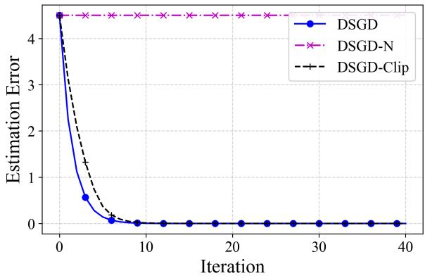
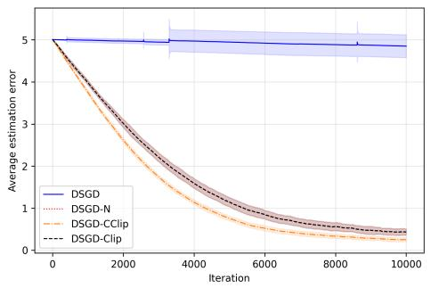
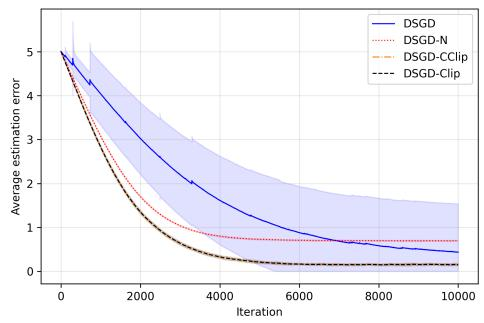
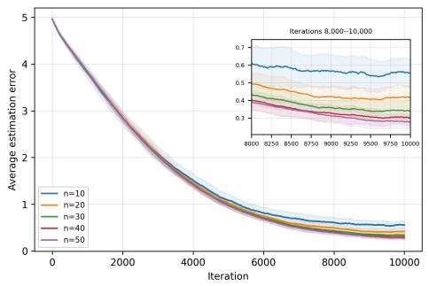
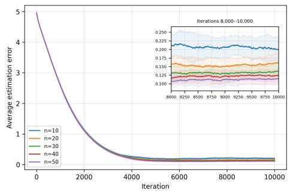
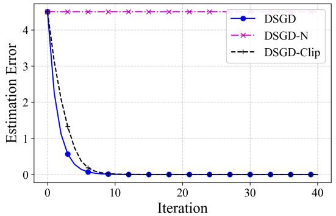
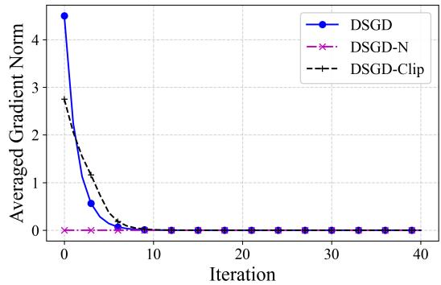
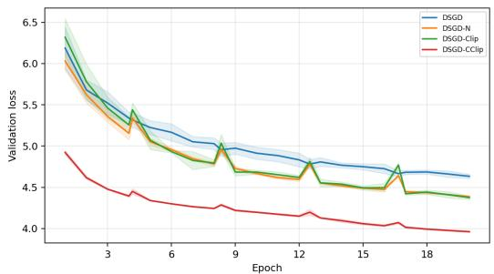
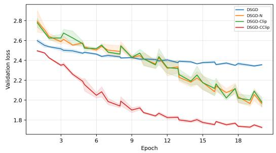

# Decentralized SGD under Heavy-Tailed Noise: Optimal Convergence Rates and the Role of Gradient Clipping

Aleksandar Armacki, Haoyuan Cai, Ali H. Sayed

Ecole Polytechnique F´ed´erale de Lausanne, Lausanne, Switzerland,´ {aleksandar.armacki, haoyuan.cai, ali.sayed}@epfl.ch

## Abstract

Heavy-tailed noise has been widely observed in modern machine learning, motivating the use of methods like gradient clipping and normalization. While these methods are well understood in centralized settings, much less is known in decentralized ones, where applying a nonlinearity to local gradients afects both optimization and consensus. Recent works on decentralized non-convex optimization have studied both clipping and normalization under heavy-tailed noise, with clipping yielding suboptimal rates and normalization needing local momentum or mini-batches to converge. This raises the question: can a baseline decentralized method using a nonlinearity achieve optimal convergence rates under heavy-tailed noise? We answer afirmatively with clipped decentralized SGD (DSGD). For smooth non-convex costs under bounded p-th moment noise, $p \in ( 1 , 2 ]$ , we show that clipped DSGD achieves order-optimal rates both with high probability and in expectation. Moreover, we establish a linear speed-up in the number of agents, which, to our knowledge, has not been shown for decentralized methods with clipping. The key technical ingredient is a sharp analysis of the consensus gap that exploits the structure of clipping, relegating network efects to higher-order terms. Our results highlight an important distinction between clipping and normalization in decentralized settings: while normalized DSGD can fail to converge, clipping retains magnitude information, enabling DSGD to be convergent and order-optimal. Numerical experiments validate our theory.

## 1 Introduction

Modern learning systems, fueled by an abundance of data, often incur huge computation and storage costs. This naturally gives rise to distributed training, a paradigm where n agents jointly train a model, storing and processing their data locally, only exchanging model or gradient parameters (Sayed, 2014; McMahan et al., 2017; Vlaski et al., 2023). Two wellknown instances are the client-server and the decentralized setup, difering mainly in the communication is performed: in the client-server setup agents communicate with a centra server, while in the decentralized one agents communicate with each other. Noting that the client-server setup is mathematically equivalent to the decentralized one over a fully connected network, we focus on the more general decentralized setup.

Another issue hampering modern learning systems is the emergence of heavy-tailed noise. First observed by Zhang et al. (2020) during training of the BERT model, the efects of heavy-tailed noise have been extensively studied in centralized settings, e.g., (Simsekli et al.,

Table 1: Comparison of decentralized methods using gradient nonlinearities. “Algorithm” refers to the underlying algorithmic dynamics, $\mathrm { e . g . , \Omega ^ { \ast } G T ~ + ~ m i n i - b . ^ { \prime } }$ indicates gradient tracking and mini-batch gradients. “Nonlinearity” specifies the nonlinear map applied to the gradient estimator. “Noise Moment” gives the moment assumption, with $p = 2$ implying bounded variance and $p < 2$ allowing heavier tails. “Guarantees” indicates high-probability (HP) or in-expectation (IE) results. “Oracle Comp.” gives the per-agent number of SFO calls needed to reach an ϵ-stationary point.§ “Lin. Speed-up” indicates whether linear speed-up in the number of agents is achieved.
<table><tr><td>WORK</td><td>ALGORITHM</td><td>NONLINEARITY</td><td>NOISE MOMENT</td><td>GUARANTEES</td><td>ORACLE CoMP.</td><td>LIN. SPEED-UP</td></tr><tr><td>YANG ET AL. (2025)</td><td>DSGD</td><td>CLIPPING</td><td> $p \in ( 1 , 2 ]$ </td><td>HP</td><td> $\widetilde { \mathcal { O } } \left( \epsilon ^ { \frac { 4 p } { 1 - p } } \right)$ </td><td>x</td></tr><tr><td>LI AND CHI (2025)†</td><td>GT + MINI-B. + COMPR. + EF</td><td>SMOOTH CLIPPING</td><td> $p = 2$ </td><td>IE</td><td> ${ \mathcal O } \left( \epsilon ^ { - 4 } \right)$ </td><td>X</td></tr><tr><td>YU ET AL. (2026B)</td><td> $\mathrm { G T } \ + \ \mathrm { L O C A L }$  MOMENTUM</td><td>NORMALIZATION</td><td> $p \in ( 1 , 2 ]$ </td><td>IE</td><td> $\mathcal { O } \left( \epsilon ^ { \frac { 3 p - 2 } { 1 - p } } \right)$ </td><td>x</td></tr><tr><td>WANG ET AL. (2026)‡</td><td> $\mathrm { G T } + \mathrm { M I N I { - B } } .$   $+ \ \mathrm { A C C } .$  GOSSIP</td><td>NORMALIZATION</td><td> $p \in ( 1 , 2 ]$ </td><td>IE</td><td> $\mathcal { O } \left( \epsilon ^ { \frac { 3 p - 2 } { 1 - p } } / n \right)$ </td><td>L</td></tr><tr><td>THIS WORK</td><td>DSGD</td><td>CLIPPING</td><td> $p \in ( 1 , 2 ]$ </td><td>HP &amp; IE</td><td> $\widetilde { \mathcal { O } } \left( \epsilon ^ { \frac { 3 p - 2 } { 1 - p } } / n \right)$ </td><td>√</td></tr></table>

§ Because prior works use diferent stationarity metrics, we compare oracle complexities using target criteria based on both network-averaged iterates and agent-averaged local iterates, i.e., mint∈[T] $\| \nabla f ( \bar { \overline { { x } } } ^ { t } ) \| ^ { q } \leq \epsilon ^ { q }$ and $\begin{array} { r } { \operatorname* { m i n } _ { t \in [ T ] } \left[ \frac { 1 } { n } \sum _ { i \in [ n ] } \| \nabla f ( x _ { i } ^ { t } ) \| ^ { q } \right] \leq \epsilon ^ { q } , q \in \{ 1 , 2 \} } \end{array}$  
† Li and Chi (2025) use communication compression and error-feedback (EF) techniques, with mini-batch gradients of size $b \propto \epsilon ^ { - 2 }$ . The smooth clipping operator is defined as $\begin{array} { r } { \varphi ( x ) = \frac { \tau } { \tau + \| x \| } \boldsymbol { x } , } \end{array}$ for a user-specified $\tau > 0$  
‡ To mitigate network efects and achieve linear speed-up, Wang et al. (2026) use mini-batches of size $b \propto \epsilon ^ { \frac { p } { 1 - p } } / n$ and, for undirected graphs, perform $\widetilde { \Theta } ( 1 / \sqrt { 1 - \lambda } )$ communication rounds per iteration, where 1 − λ is the network spectral gap (see Section 3 for definition).

2019; Gurbuzbalaban et al., 2021; Barsbey et al., 2021; Nair et al., 2022; Battash et al., 2024), with nonlinear methods like clipping, normalization and sign widely used to deal with heavy tails. Recently, G¨urb¨uzbalaban et al. (2025) showed that heavy-tailed noise arises naturally in decentralized settings, with decentralized SGD (DSGD) in some cases exhibiting heavier tails than its centralized counterpart. However, as we discuss next, convergence under heavytailed noise and the role of nonlinear methods are yet to be fully understood in decentralized settings.

## 1.1 Related Literature

We next review convergence results under heavy-tailed noise, focusing on non-convex costs.   
For further literature, including convex results, see Supplement A.

Centralized Settings. Moment assumptions on the stochastic first-order oracle (SFO) including heavy-tailed regimes with only a finite p-th moment, $p > 1 ,$ go back to Nemirovski˘ı and Yudin (1983). More recently, Zhang et al. (2020) noticed that the gradient noise during training of attention models resembles Levy α-stable noise and proposed the use of the bounded p-th moment condition. They establish an in-expectation (IE) lower bound $\Omega \left( \epsilon ^ { \frac { 3 p - 2 } { 1 - p } } \right)$ on the oracle complexity,1 and show it is achieved by clipped SGD. Cutkosky and Mehta (2021) complement this in the high-probability (HP) sense, for clipped + normalized momentum SGD. Sadiev et al. (2023); Nguyen et al. (2023) then establish HP guarantees for clipped SGD, with Nguyen et al. (2023) showing the optimal HP oracle complexity, while the same is established for normalization in (Liu and Zhou, 2025; H¨ubler et al., 2025) and sign SGD in (Kornilov et al., 2025). Liu et al. (2023b) show an accelerated rate and improved complexity, using a STORM-like method (Cutkosky and Orabona, 2019) with clipping + normalization, while Armacki et al. (2026a) demonstrate order of magnitude faster tail decay of clipped SGD. A related line of work studies symmetric heavy-tailed noise, dating back to Polyak and Tsypkin (1979). Among them, Bernstein et al. (2019); Chen et al. (2020) analyze IE guarantees of sign and clipped SGD, showing $\mathcal { O } ( \epsilon ^ { - 4 } )$ oracle complexity, while Armacki et al. (2025, 2026d,b) study a nonlinear SGD framework that includes sign, normalization and clipping, among other results establishing $\mathcal { O } ( \epsilon ^ { - 4 } )$ IE and HP oracle complexity. Finally, a recent line of work shows that vanilla SGD can converge under heavy-tailed noise without any nonlinear methods, $\mathrm { e . g . }$ , (Fatkhullin et al., 2025; Liu, 2026).

Decentralized Settings. Nonlinear methods have a long history of use in decentralized settings, including applications such as estimation, adversarial learning and diferential privacy, e.g., (Kar et al., 2012; Chen et al., 2019; Yu and Kar, 2023; Zhu et al., 2025). However, only a few works study convergence of nonlinear decentralized methods under heavy-tailed noise. In particular, Yang et al. (2025) study HP convergence of clipped DSGD in online dynamic optimization under p-th moment noise, requiring bounded gradients and achieving $\widetilde { \mathcal { O } } \left( \epsilon ^ { \frac { 4 p ^ { - } } { 1 - p } } \right)$ per-agent oracle complexity.2 Li and Chi (2025) study communication-eficient learning under bounded variance noise $( p = 2 )$ , requiring a strong heterogeneity bound (see Subsection 3.1 and Footnote 5 ahead) and using a complex method (see Table 1) to achieve $\mathcal { O } ( \epsilon ^ { - 4 } )$ IE oracle complexity. Yu et al. (2026b) study convergence of gradient tracking (GT) with normalization and local momentum under $p -$ th moment noise, achieving $\mathcal { O } \left( \epsilon ^ { \frac { 3 p - 2 } { 1 - p } } \right)$ IE oracle complexity, while Wang et al. (2026) similarly study GT with normalization, using large mini-batches and accelerated gossip (i.e., multiple communication rounds per iteration) to achieve the optimal ${ \mathcal O } \left( \epsilon ^ { \frac { 3 p - 2 } { 1 - p } } / n \right)$ per-agent IE oracle complexity.3 All of the said works require either strong heterogeneity bounds, or algorithmic modifications like local-momentum, mini-batches and accelerated gossip, with only (Wang et al., 2026) achieving the optimal complexity and linear speed-up in the number of agents.4 The need for algorithmic modifications when using nonlinear methods is further supported in (Yu et al., 2026b, Proposition 1), where it is shown that normalized DSGD with noiseless gradients can fail to converge even on a simple quadratic cost. These observations naturally led us to ask:

Can a standard decentralized method with a nonlinear map achieve optimal complexity under heavy-tailed noise, without further algorithmic modification?

To answer this question, we revisit the guarantees of DSGD using gradient clipping. In Figure 1 we show that clipping indeed fixes the non-convergence induced by normalization, while Table 1 provides a detailed comparison of nonlinear decentralized methods that converge to stationarity, giving a positive answer to the question above, in the form of clipped DSGD.

  
Figure 1: Convergence of vanilla, normalized and clipped DSGD on a quadratic cost. While normalization gets stuck at the initial point and fails to converge, both vanilla and clipped DSGD converge to the true minima. For more details, see Supplement C.

## 1.2 Contributions

Our full contributions can be summarized as follows.

• We study convergence of decentralized methods using a nonlinearity under heavy-tailed noise, showing that baseline DSGD with gradient clipping achieves optimal oracle complexity and linear speed-up, under standard assumptions (see Subsection 3.1) and without any additional algorithmic modifications.

• Compared to results on clipping in decentralized settings, we relax the strong heterogeneity bounds and, to our knowledge, show the first linear speed-up result for clipped DSGD. Compared to works using normalization, we show that a simple decentralized method can achieve optimal complexity with an appropriately chosen nonlinearity, establishing important insights on the efects of clipping and normalization in decentralized settings (see Subsection 3.2).

• We extensively test our theory on several problems, including decentralized transformer training on real data, showing that: (i) clipping improves performance under heavy tails, (ii) clipped DSGD achieves linear speed-up; (iii) clipped DSGD regularly performs on par with or outperforms normalized DSGD.

Novelty. Our results are facilitated by several novelties and improvements. First, we relax the strong heterogeneity bounds in prior works via a sharp analysis and careful choice of clipping radius. Next, a novel consensus bound in Lemma 4 and a novel coupling of stepsize and clipping radius (see Subsection 3.2) ensure that the network only afects higher-order terms. Finally, we achieve linear speed-up by combining these results, an improved analysis, improved choice of step-size and clipping radius, and Lemma 1, which shows that averaging clipped vectors reduces the variance.

Paper Organization. The rest of the paper is organized as follows. Section 2 gives the preliminaries, Section 3 states the main results, Section 4 presents experiments, while Section

5 concludes the paper. Supplement contains results omitted from the main body. The rest of this section introduces some notation.

Notation. N, R and $\mathbb { R } ^ { d }$ denote positive integers, real numbers and d-dimensional vectors. For $m \in \mathbb { N }$ , [m] denotes positive integers up to and including $m . \quad \langle \cdot , \cdot \rangle$ is the Euclidean inner product, while $\| \cdot \|$ is the induced vector/matrix norm. Subscripts denote agents and superscripts denote the iteration, $\mathrm { e . g . } , x _ { i } ^ { t }$ refers to agent i’s model in iteration t. The “big $\mathrm { O ^ { 5 } }$ notation $\mathcal { O } ( \cdot )$ hides global constants, while $\widetilde { \mathcal { O } } ( \cdot )$ additionally hides poly-logarithmic factors, unless stated otherwise.

## 2 Preliminaries

In this section we outline the preliminaries. Subsection 2.1 introduces the problem, while Subsection 2.2 presents the clipped DSGD method.

## 2.1 Problem Setup

Formally, the problem we aim to solve is given by

$$
\underset { x \in \mathbb { R } ^ { d } } { \arg \operatorname* { m i n } } \bigg \{ f ( x ) = \frac { 1 } { n } \sum _ { i \in [ n ] } f _ { i } ( x ) \bigg \} ,\tag{1}
$$

where $\boldsymbol { x } \in \mathbb { R } ^ { d }$ represents model parameters, $n \geq 2$ is the number of agents, while $f _ { i } : \mathbb { R } ^ { d } \mapsto \mathbb { \Lambda }$ R is the cost of agent i. The communication network is modeled via a connected graph $G = ( V , E )$ ， where $V = [ n ]$ is the set of agents, while $E \subseteq V \times V$ is the set of communication links. The graph G induces a weight matrix $W \in \mathbb { R } ^ { n \times n }$ , whose $( i , j ) \ – \mathrm { t h }$ entry $[ W ] _ { i j } = w _ { i j }$ is strictly positive if $\{ i , j \} \in E$ , otherwise $w _ { i j } = 0$

As discussed in the introduction, the goal is to solve (1) in the presence of heavy-tailed gradient noise. To that end, we assume that agents have access to a Stochastic First-order Oracle (SFO), which, when queried by agent $i \in [ n ]$ with input $\boldsymbol { x } \in \mathbb { R } ^ { d }$ , returns $g _ { i } \in \mathbb { R } ^ { d }$ , an unbiased estimator of $\nabla f _ { i } ( x )$ . The $\boldsymbol { s } \boldsymbol { \mathcal { F } } \boldsymbol { \mathcal { O } }$ model is widely used and subsumes both batch (i.e., ofline) and streaming (i.e., online) learning settings.

## 2.2 Proposed Method

To solve (1) under heavy-tailed noise, we use the clipped DSGD method, which consists of the following steps. At the beginning agents choose a fixed step-size $\alpha > 0$ and clipping radius $\gamma > 0$ , and initial models $x _ { i } ^ { 1 } \in \mathbb { R } ^ { d } , i \in [ n ]$ . In iteration $t \geq 1$ , each agent $i \in [ n ]$ queries the $s F \mathcal { O }$ with their current model $\boldsymbol { x } _ { i } ^ { t }$ and receives $g _ { i } ^ { t }$ . Agents then clip their local stochastic gradient and update the local model via the rule

$$
\boldsymbol { x } _ { i } ^ { t + 1 } = \sum _ { j \in \mathcal { N } _ { i } } \boldsymbol { w } _ { i j } \big ( \boldsymbol { x } _ { j } ^ { t } - \alpha \widetilde { \boldsymbol { g } } _ { j } ^ { t } \big ) ,\tag{2}
$$

where ${ \mathcal { N } } _ { i } : = \{ j \in V : \{ i , j \} \in E \} \cup \{ i \}$ are the agents that can communicate with agent i (itself included), while $\begin{array} { r } { \widetilde { g } _ { j } ^ { t } = \mathtt { c l i p } ( g _ { j } ^ { t } ) = \operatorname* { m i n } \Big \{ 1 , \frac { \gamma } { \lVert g _ { j } ^ { t } \rVert } \Big \} g _ { j } ^ { t } } \end{array}$ is the clipped estimator. The procedure is summarized in Algorithm 1. The variant of clipped DSGD studied in our work uses the adapt-then-combine (i.e., difusion) approach, e.g., (Lopes and Sayed, 2008; Chen and Sayed, 2012) and difers from the version in Yang et al. (2025), which uses the combine-then-adapt approach, e.g., (Nedi´c and Ozdaglar, 2009; Kar and Moura, 2013).

Algorithm 1 Clipped DSGD   
Require: Model initialization $x _ { i } ^ { 1 } \in \mathbb { R } ^ { d } ,$ , step-size $\alpha > 0$ and clipping radius $\gamma > 0 ;$   
1: for $t = 1 , 2 , . . . ,$ each agent $i \in [ n ]$ in parallel do   
2: Query the $\boldsymbol { s } \boldsymbol { \mathcal { F } } \boldsymbol { \mathcal { O } }$ with $\ v x _ { i } ^ { t }$ to obtain $g _ { i } ^ { t } ;$   
3: Perform clipping: $\widetilde { g } _ { i } ^ { t } =$ min $\left\{ 1 , \frac { \gamma } { \lVert g _ { i } ^ { t } \rVert } \right\} g _ { i } ^ { t } ;$   
4: Update the model: $\begin{array} { r } { \boldsymbol { x } _ { i } ^ { t + 1 } = \dot { \sum } _ { j \in \mathcal { N } _ { i } } \boldsymbol { \tilde { w } } _ { i j } \left( \boldsymbol { x } _ { j } ^ { t } - \alpha \boldsymbol { \widetilde { g } } _ { j } ^ { t } \right) } \end{array}$ ;   
5: end for

## 3 Main Results

In this section we provide the main results. Subsection 3.1 states the assumptions, while Subsection 3.2 presents the guarantees and discusses the results.

## 3.1 Assumptions

We start with the assumption on the weight matrix.

Assumption 1. The weight matrix $W \in \mathbb { R } ^ { n \times n }$ is primitive, doubly stochastic, and it holds that $\begin{array} { r } { \| W - \frac { 1 } { n } \mathbf { 1 } _ { n } \mathbf { 1 } _ { n } ^ { \top } \| < 1 } \end{array}$ , where $\mathbf { 1 } _ { n } \in \mathbb { R } ^ { n }$ is the vector of all ones.

Assumption 1 covers weight matrices induced by undirected graphs and a class of stronglyconnected digraphs with doubly stochastic weights, e.g., Xin et al. (2020). Denote by $\lambda : =$ $\lVert W - J \rVert$ , where $J : = \frac { 1 } { n } { \bf 1 } _ { n } { \bf 1 } _ { n } ^ { \top } \in \mathbb { R } ^ { n \times n }$ is the ideal communication matrix. Assumption 1 implies that $\lambda \in [ 0 , 1 )$ , e.g., Horn and Johnson (2012), and the quantity $1 - \lambda$ is known as the network spectral gap. Next, we make a technical assumption.

Assumption 2. Agents’ initial models $x _ { i } ^ { 1 } \in \mathbb { R } ^ { d } , i \in [ n ]$ , are deterministic quantities. Moreover, agents share the initialization, i.e., $x _ { i } ^ { 1 } = x _ { j } ^ { 1 }$ , for all $i , j \in [ n ]$

Assumption 2 allows agents to initialize their model at any deterministic and jointly selected vector. The requirement for shared initialization is made to simplify the analysis and can be realized, e.g., by running a consensus algorithm before the start of training. The next assumption states the conditions on the cost functions.

Assumption 3. The global cost is bounded from below and agents’ costs have L-Lipschitz gradients, $\begin{array} { r } { i . e . , f ^ { \star } : = \operatorname* { i n f } _ { x \in \mathbb { R } ^ { d } } f ( x ) > - \infty } \end{array}$ and for all $i \in [ n ]$ and x, $\boldsymbol { y } \in \mathbb { R } ^ { d }$ , we have $\parallel \nabla f _ { i } ( x ) -$ $\nabla f _ { i } ( y ) \| \leq L \| x - y \|$

Assumption 3 is standard for non-convex costs, e.g., Ghadimi and Lan (2013). Further, it is known that DSGD requires a heterogeneity bound to ensure convergence under non-convex cos $\mathrm { t s } , \mathrm { e . g . }$ ., Lian et al. (2017); Koloskova et al. (2020); Vlaski and Sayed $\mathrm { ( 2 0 2 1 a , b ) }$ . To that end, we introduce the following condition.

Assumption 4. There exist constants A, $B \geq 0$ (with at least one strictly positive), such that for all $\boldsymbol { x } \in \mathbb { R } ^ { d }$ and $i \in [ n ]$ , we have $\| \nabla f _ { i } ( x ) \| ^ { 2 } \leq A ^ { 2 } + B ^ { 2 } \| \nabla f ( x ) \| ^ { 2 }$

Assumption 4 is a standard heterogeneity condition, $\mathrm { e . g . }$ , (Vlaski and Sayed, 2021a,b; Armacki and Sayed, 2026). It is strictly weaker than the heterogeneity bounds used in other works on decentralized clipping methods, $\mathrm { e . g . }$ ., Yang et al. (2025); Li and Chi (2025),5 however, slightly stronger than the averaged heterogeneity condition used in, $\mathrm { e . g . }$ , (Koloskova et al., 2020). For a discussion on the necessity of this condition, see Supplement D. Prior to stating the noise assumption, denote by $z _ { i } ^ { t } : = g _ { i } ^ { t } - \nabla f _ { i } ( x _ { i } ^ { t } )$ the gradient noise of agent i at time t, and let $\mathcal { F } _ { t } : = \sigma \big ( \{ \{ x _ { i } ^ { 1 } \} _ { i \in [ n ] } , \dots , \{ x _ { i } ^ { t } \} _ { i \in [ n ] } \} \big )$ be the σ-algebra induced by agents’ models up to t.

Assumption 5. At any time $t \geq 1$ , the stochastic quantities satisfy the following.

1. The random samples $\{ \xi _ { i } ^ { k } \} _ { i \in [ n ] , k \in [ t ] }$ are independent across agents and iterations.

2. The noise at each agent is conditionally zero-mean, i $\dot { \bf \Phi } . e . , { \mathbb E } [ z _ { i } ^ { t } \mid { \mathcal F } _ { t } ] = 0 .$ , for all $i \in [ n ]$

3. The noise at each agent has bounded p-th moment, $p \in ( 1 , 2 ] , \ i . e . , \ \mathbb { E } \left[ \| z _ { i } ^ { t } \| ^ { p } \mid \mathcal { F } _ { t } \right] \leq \sigma _ { i } ^ { p }$ , for all $i \in [ n ]$

The first two conditions in Assumption 5 are standard, while the third requires the noise to have a bounded p-th moment for some $p \in ( 1 , 2 ]$ , and is widely used when studying heavytailed noise, e.g., (Zhang et al., 2020; Sadiev et al., 2023; H¨ubler et al., 2025).

## 3.2 Theoretical Guarantees

We start by defining some useful notation. Let $\begin{array} { r } { \overline { { \nabla } } f ^ { t } : = \frac { 1 } { n } \sum _ { i \in [ n ] } \nabla f _ { i } ( x _ { i } ^ { t } ) } \end{array}$ and $\begin{array} { r } { \overline { { g } } ^ { t } : = \frac { 1 } { n } \sum _ { i \in [ n ] } g _ { i } ^ { t } } \end{array}$ denote the averaged gradient and stochastic gradient, respectively, and let $\overline { { z } } ^ { t } : = \overline { { g } } ^ { t } - \overline { { \nabla } } \overline { { f } } ^ { t } =$ $\textstyle { \frac { 1 } { n } } \sum _ { i \in [ n ] } z _ { i } ^ { t }$ be the averaged noise. Next, denote by $\begin{array} { r } { \widehat { g } ^ { t } : = \frac { 1 } { n } \sum _ { i \in [ n ] } \widetilde { g } _ { i } ^ { t } } \end{array}$ the averaged clipped estimator, and define the averaged unbiased and biased components stemming from clipping as $\widehat { g } _ { u } ^ { t } : = \widehat { g } ^ { t } - \mathbb { E } [ \widehat { g } ^ { t } \mid \mathcal { F } _ { t } ]$ and $\widehat { g } _ { b } ^ { t } : = \mathbb { E } [ \widehat { g } ^ { t } \mid \mathcal { F } _ { t } ] - \overline { { \nabla } } f ^ { t }$ . Similarly, let $\widetilde { g } _ { i , u } ^ { t } : = \widetilde { g } _ { i } ^ { t } - \mathbb { E } [ \widetilde { g } _ { i } ^ { t } \ : | \ : \mathcal { F } _ { t } ]$ and $\widetilde { g } _ { i , b } ^ { t } = \mathbb { E } [ \widetilde { g } _ { i } ^ { t } \mid \mathcal { F } _ { t } ] - \nabla f _ { i } ( x _ { i } ^ { t } )$ be the local unbiased and biased components. It can be seen that $\widehat { g } ^ { t } - \overline { { \nabla } } f ^ { t } = \widehat { g } _ { u } ^ { t } + \widehat { g } _ { b } ^ { t }$ and $\widetilde { g } _ { i } ^ { t } - \nabla f _ { i } ( x _ { i } ^ { t } ) = \widetilde { g } _ { i , u } ^ { t } + \widetilde { g } _ { i , b } ^ { t } , i \in [ n ]$ . We next state an important result.

Lemma 1. Let $X _ { 1 } , \ldots , X _ { n } \in \mathbb { R } ^ { d }$ be independent random vectors and let $\widetilde { X } _ { i } = c \iota i p ( X _ { i } ) , i \in$ [n], with $\begin{array} { r } { \widetilde X = \frac { 1 } { n } \sum _ { i \in [ n ] } \widetilde X _ { i \cdot } ~ I f f o r } \end{array}$ some $p \in ( 1 , 2 ]$ and all $i \in [ n ]$ we have $\mathbb { E } \| X _ { i } - \mathbb { E } [ X _ { i } ] \| ^ { p } \leq \sigma _ { i } ^ { p }$ and $\| \mathbb { E } [ X _ { i } ] \| \leq \gamma / 2$ , then

$$
\mathbb { E } \Vert \widetilde { X } - \mathbb { E } [ \widetilde { X } ] \Vert ^ { 2 } \leq \frac { 1 8 \gamma ^ { 2 - p } } { n ^ { 2 } } \sum _ { i \in [ n ] } \sigma _ { i } ^ { p } .
$$

Denoting by $\begin{array} { r } { \sigma ^ { p } : = \frac { 1 } { n } \sum _ { i \in [ n ] } \sigma _ { i } ^ { p } } \end{array}$ , Lemma 1 tells us that the variance of the averaged clipped estimator scales as $\textstyle { \mathcal { O } } ( { \frac { \sigma ^ { p } } { n } } )$ , and is crucial in establishing linear speed-up. A similar result appeared in the client-server setup in (Gorbunov et al., 2024, Lemma B.3), provided for illustrative purposes while using a diferent approach to show linear speed-up. On the other hand, Lemma 1 is a key result for achieving linear speed-up in our work. In Supplement B we provide an extended version of Lemma 1. Next, define the averaged model $\begin{array} { r } { \overline { { x } } ^ { t } : = \frac { 1 } { n } \sum _ { i \in [ n ] } x _ { i } ^ { t } } \end{array}$ We then have the following descent inequality.

Lemma 2. If Assumption 3 holds and $\begin{array} { r } { \alpha \leq \frac { 1 } { 2 L } } \end{array}$ , then for any $t \geq 1$

$$
\begin{array} { l } { f ( \overline { { \boldsymbol { x } } } ^ { t + 1 } ) \leq f ( \overline { { \boldsymbol { x } } } ^ { t } ) - \displaystyle \frac { \alpha } { 4 } \| \nabla f ( \overline { { \boldsymbol { x } } } ^ { t } ) \| ^ { 2 } - \alpha \langle \nabla f ( \overline { { \boldsymbol { x } } } ^ { t } ) , \widehat { \boldsymbol { g } } _ { u } ^ { t } \rangle } \\ { \displaystyle \quad + 2 \alpha ^ { 2 } L \| \widehat { \boldsymbol { g } } _ { u } ^ { t } \| ^ { 2 } + 2 \alpha \| \widehat { \boldsymbol { g } } _ { b } ^ { t } \| ^ { 2 } + \displaystyle \frac { \alpha L ^ { 2 } } { 2 n } \sum _ { i \in [ n ] } \| \boldsymbol { x } _ { i } ^ { t } - \overline { { \boldsymbol { x } } } ^ { t } \| ^ { 2 } . } \end{array}
$$

Lemma 2 is the starting point in our analysis. In addition to the standard terms appearing in centralized clipping analysis, e.g., (Sadiev et al., 2023; Nguyen et al., 2023), the inequality contains the consensus gap term, which we aim to bound next. We start with a simple but useful bound on the consensus gap.

Lemma 3. If Assumptions 1 and 2 hold, then for all $i \in [ n ]$ and any $t \geq 1$

$$
\| x _ { i } ^ { t + 1 } - \overline { { x } } ^ { t + 1 } \| \leq \frac { \alpha \gamma \lambda \sqrt { n } } { 1 - \lambda } .
$$

Lemma 3 provides an initial deterministic bound on the consensus gap and is useful since it indicates that, for a suficiently small step-size, the consensus gap can be controlled by the clipping radius. However, only using Lemma 3 would propagate the network efect to the leading term and result in the loss of linear speed-up in the final bound (see Remark 1 in Supplement B for details). To fix this issue, we next provide an additional refined bound on the consensus gap.

Lemma 4. If Assumptions 1-4 hold, then for all $t \geq 1$

$$
\begin{array} { l } { \displaystyle \frac { 1 } { n } \sum _ { i \in [ n ] } \| x _ { i } ^ { t + 1 } - \overline { { x } } ^ { t + 1 } \| ^ { 2 } \leq \frac { 8 \alpha ^ { 2 } \lambda ^ { 2 } A ^ { 2 } } { ( 1 - \lambda ^ { 2 } ) } \displaystyle \sum _ { k = 1 } ^ { t } \left( \frac { 1 + \lambda ^ { 2 } } { 2 } \right) ^ { t - k } } \\ { \displaystyle + \frac { 8 \alpha ^ { 2 } \lambda ^ { 2 } B ^ { 2 } } { n ( 1 - \lambda ^ { 2 } ) } \sum _ { k = 1 } ^ { t } \left( \frac { 1 + \lambda ^ { 2 } } { 2 } \right) ^ { t - k } \sum _ { i \in [ n ] } \| \nabla f ( x _ { i } ^ { k } ) \| ^ { 2 } } \\ { \displaystyle + \frac { 8 \alpha ^ { 2 } \lambda ^ { 2 } } { n ( 1 - \lambda ^ { 2 } ) } \sum _ { k = 1 } ^ { t } \left( \frac { 1 + \lambda ^ { 2 } } { 2 } \right) ^ { t - k } \sum _ { i \in [ n ] } \left( \| \tilde { g } _ { i , b } ^ { k } \| ^ { 2 } + \| \tilde { g } _ { i , u } ^ { k } \| ^ { 2 } \right) . } \end{array}
$$

Lemma 4 establishes a more fine-grained result on the average consensus gap, capturing the efects of heterogeneity, network connectivity and local clipping. Lemmas 1-4 together are crucial in achieving our main results, stated next. We start with HP convergence.

Theorem 1. Let Assumptions 1-5 hold. If for any $T \geq 1$ and $\delta \in ( 0 , 1 )$ , the clipping radius and the step-size are chosen as $\begin{array} { r } { \gamma = \operatorname* { m a x } \left\{ 2 A + 4 B \sqrt { L \Delta _ { 1 } } + \frac { 2 \lambda L \sqrt { n } } { 1 - \lambda } , ( n T ) ^ { \frac { 1 } { 3 p - 2 } } \right\} } \end{array}$ and $\alpha =$ min $\left\{ \begin{array} { l l } { \frac { 1 } { 2 L } , \frac { 1 - \lambda ^ { 2 } } { 8 \lambda L B \sqrt { 3 } } , \frac { 1 - \lambda ^ { 2 } } { \lambda L \sqrt { 6 } } , \frac { ( 1 - \lambda ^ { 2 } ) ^ { 2 } } { 6 \lambda ^ { 2 } L } , \frac { ( 1 - \lambda ^ { 2 } ) ^ { 2 / 3 } \Delta _ { 1 } ^ { 1 / 3 } } { 2 ( \lambda L A ) ^ { 2 / 3 } T ^ { 1 / 3 } \sqrt [ 4 ] { 2 } } , \frac { C _ { 1 } } { \gamma } , \frac { C _ { 2 } } { \gamma } n ^ { \frac { 2 p - 1 } { 3 p - 2 } } T ^ { \frac { 1 - p } { 3 p - 2 } } , \frac { C _ { 3 } } { \gamma ^ { 2 / 3 } } n ^ { \frac { p } { 3 ( 3 p - 2 ) } } T ^ { \frac { 2 ( 1 - p ) } { 3 ( 3 p - 2 ) } } \right\} } \end{array}$ , with $\begin{array} { r } { C _ { 1 } = \operatorname* { m i n } \left\{ 1 , \frac { 3 \sqrt { \Delta _ { 1 } / 2 L } } { 6 4 \log \left( \frac { 6 T } { \delta } \right) } \right\} , C _ { 2 } = \operatorname* { m i n } \left\{ \frac { \Delta _ { 1 } } { 6 4 \sigma ^ { 2 p } } , \frac { \sqrt { \Delta _ { 1 } / 2 L } } { 1 9 2 \log \left( \frac { 6 T } { \delta } \right) \sigma ^ { p / 2 } } \right\} } \end{array}$ and $\begin{array} { r } { C _ { 3 } = \frac { \Delta _ { 1 } ^ { 1 / 3 } ( 1 - \lambda ^ { 2 } ) ^ { 2 / 3 } } { 1 2 \sigma ^ { p / 3 } \lambda ^ { 2 / 3 } L ^ { 2 / 3 } } } \end{array}$ , then with probability at least $1 - \delta$

$$
\frac { 1 } { n T } \sum _ { t \in [ T ] } \sum _ { i \in [ n ] } \| \nabla f ( x _ { i } ^ { t } ) \| ^ { 2 } = \widetilde { \mathcal { O } } \bigg ( ( n T ) ^ { \frac { 2 ( 1 - p ) } { 3 p - 2 } } \bigg ) ,
$$

where $\widetilde { \mathcal { O } } ( \cdot )$ hides terms of higher-order in $T$

The next result establishes the IE convergence bound.

Theorem 2. Let Assumptions 1-5 hold. If for any $T \geq 2$ the clipping radius and the step-size   
are chosen as $\begin{array} { r } { \gamma = \operatorname* { m a x } \left\{ 2 A + 4 B \sqrt { L \Delta _ { 1 } } + \frac { 2 \lambda L \sqrt { n } } { 1 - \lambda } , ( n T ) ^ { \frac { 1 } { 3 p - 2 } } \right\} } \end{array}$ and $\begin{array} { r } { \alpha = \operatorname* { m i n } \bigg \{ \frac { 1 } { 2 L } , \frac { 1 - \lambda ^ { 2 } } { 8 \lambda L B \sqrt { 3 } } , \frac { 1 - \lambda ^ { 2 } } { \lambda L \sqrt { 6 } } . } \end{array}$   
$\frac { ( 1 - \lambda ^ { 2 } ) ^ { 2 } } { 6 \lambda ^ { 2 } L } , \frac { ( 1 - \lambda ^ { 2 } ) ^ { 2 / 3 } \Delta _ { 1 } ^ { 1 / 3 } } { 2 ( \lambda L A ) ^ { 2 / 3 } T ^ { 1 / 3 } } , \frac { C _ { 1 } } { \gamma } , \frac { C _ { 2 } } { \gamma } \frac { 2 \frac { 2 p - 1 } { 2 } } { n ^ { 3 p - 2 } } T ^ { \frac { 1 - p } { 3 p - 2 } } , \frac { \Delta _ { 1 } ^ { 1 / 3 } ( 1 - \lambda ^ { 2 } ) ^ { 2 / 3 } } { 1 2 \sigma ^ { p / 3 } \gamma ^ { 2 / 3 } \lambda ^ { 2 / 3 } L ^ { 2 / 3 } } n ^ { \frac { p } { 3 ( 3 p - 2 ) } } T ^ { \frac { 2 ( 1 - p ) } { 3 ( 3 p - 2 ) } } \biggr \}$ , where $\begin{array} { r l } { C _ { 1 } } & { { } = } \end{array}$   
min $\left\{ 1 , \frac { 3 \sqrt { \Delta _ { 1 } / 2 L } } { 6 4 \log ( 6 n ^ { 4 } T ^ { 5 } ) } \right\}$ and $\begin{array} { r } { C _ { 2 } = \operatorname* { m i n } \left\{ \frac { \Delta _ { 1 } } { 6 4 \sigma ^ { 2 p } } , \frac { \sqrt { \Delta _ { 1 } / 2 L } } { 1 9 2 \log ( 6 n ^ { 4 } T ^ { 5 } ) \sigma ^ { p / 2 } } \right\} } \end{array}$ , it then holds that 1 X X E∥∇f(xti)∥2 = Oe(nT) 2(1−p)3p−2 3p−2 nT t∈[T] i∈[n]

where $\widetilde { \mathcal { O } } ( \cdot )$ hides terms of higher-order in $T$

We next discuss several aspects of our results.

Convergence Rates. Theorems 1 and 2 respectively establish HP and IE convergence of clipped DSGD under heavy-tailed noise. In both cases, the leading term with respect to $T$ is of the order ${ \widetilde { \mathcal { O } } } { \left( { \left( n T \right) ^ { \frac { 2 \left( 1 - p \right) } { 3 p - 2 } } } \right) }$ , which has three important implications. First, the rate in T matches the optimal rate achieved in centralized settings (Zhang et al., 2020; Nguyen et al., 2023). Second, linear speed-up in the number of agents n is achieved, exhibiting the same exponent with respect to p. Third, the leading term has no network dependence, with the spectral gap only afecting higher-order terms. For full rates, which contain several higher-order terms, the reader is referred to Supplement B.

Clipping Radius. The clipping radius in our work is of the form $\gamma = \operatorname* { m a x } \left\{ C _ { d } , ( n T ) ^ { \frac { 1 } { 3 p - 2 } } \right\}$ ， where $C _ { d } > 0$ is a problem-related constant. Compared to centralized works (Zhang et al., 2020; Nguyen et al., 2023), where the clipping radius is also of the form $\gamma = \operatorname* { m a x } \left\{ C _ { c } , T ^ { \frac { 1 } { 3 p - 2 } } \right\}$ we note a few things. First, both clipping radii have the same structure, i.e., a maximum of a problem-related constant and a term growing with T. Second, our clipping radius increases with higher heterogeneity (via A, B) and worse network connectivity (via the spectral gap), which is expected, as these quantities reflect the dificulty of the decentralized problem. Third, our radius also increases with n, which is again expected in the multi-agent setting, and is consistent with Gorbunov et al. (2024), who similarly use a clipping radius that increases with n.

Step-size. The step-size is of the form α = min $\left\{ S _ { d } , \frac { C _ { 1 } } { \gamma } , \frac { C _ { 2 } } { \gamma } n ^ { \frac { 2 p - 1 } { 3 p - 2 } } T ^ { \frac { 1 - p } { 3 p - 2 } } , \frac { C _ { 3 } } { \gamma ^ { 2 / 3 } } n ^ { \frac { p } { 3 ( 3 p - 2 ) } } T ^ { \frac { 2 ( 1 - p ) } { 3 ( 3 p - 2 ) } } \right\}$ where $S _ { d } > 0$ is a problem-related constant, corresponding to standard conditions on the stepsize for vanilla DSGD, e.g., (Armacki and Sayed, 2026), while the remaining terms stem from the use of clipping. The first two, scaling as $\propto \gamma ^ { - 1 }$ , are consistent with the step-size choice in Zhang et al. (2020); Nguyen et al. (2023) (up to n factors), while the third term, scaling as $\propto \gamma ^ { - 2 / 3 }$ , is novel and specific to our decentralized settings, used to optimize the network dependence and transient time.

Transient Time. Using our rates, one can derive the transient time for clipped DSGD, i.e., the time needed to achieve a global, network-independent $\mathcal { O } \Big ( ( n T ) ^ { \frac { 2 ( 1 - p ) } { 3 p - 2 } } \Big )$ rate. Focusing on the efects of the number of agents and the spectral gap, our transient time is of the order $\begin{array} { r } { \widetilde { \mathcal { O } } \Big ( \operatorname* { m a x } \Big \{ n ^ { \frac { 2 p - 1 } { p - 1 } } , \frac { n ^ { \frac { 3 p - 4 } { 2 } } } { ( 1 - \lambda ) ^ { 3 p - 2 } } , \frac { n ^ { \frac { 8 ( p - 1 ) } { 2 + p } } } { ( 1 - \lambda ) ^ { \frac { 4 ( 3 p - 2 ) } { 2 + p } } } , \frac { n ^ { \frac { 5 p - 4 } { p } } } { ( 1 - \lambda ) ^ { \frac { 2 ( 3 p - 2 ) } { p } } } , \frac { n ^ { 3 ( p - 1 ) } } { ( 1 - \lambda ) ^ { 3 p - 2 } } , \frac { n ^ { \frac { 2 ( p - 1 ) } { p } } } { ( 1 - \lambda ) ^ { \frac { 2 ( 3 p - 2 ) } { p } } } , \frac { \frac { 7 p - 6 } { 2 p } } { ( 1 - \lambda ) ^ { \frac { 2 ( 3 p - 2 ) } { p } } } \Big \} \Big ) } \end{array}$ . For $p =$ 2 (i.e., bounded variance), it evaluates to $\begin{array} { r } { { \mathcal O } \left( \frac { n ^ { 3 } } { ( 1 - \lambda ) ^ { 4 } } \right) } \end{array}$ , matching the transient time of vanilla

  
Figure 2: Convergence of decentralized methods under heavy-tailed gradient noise. Left: Student’s t noise; right: L´evy α-stable noise. Solid curves show the mean estimation error, while shaded regions indicate one standard deviation.

DSGD under bounded variance/sub-Gaussian noise, e.g., (Koloskova et al., 2020; Alghunaim and Yuan, 2022; Armacki and Sayed, 2026). For further discussion, see Supplement E.

Comparison with Existing Works. Compared to Yang et al. (2025), who study a variant of clipped DSGD, we relax the bounded gradients condition and achieve improved oracle complexity. Compared to Li and Chi (2025), who study clipped GT with compression, EF and mini-batches under bounded variance noise, we consider a much simpler algorithm under more general noise and heterogeneity conditions, and achieve improved oracle complexity. Compared to Yu et al. (2026b), who study normalized GT with local momentum, we use the baseline clipped DSGD, achieving better oracle complexity. Finally, compared to Wang et al. (2026), who study normalized GT with large mini-batches and multiple communication rounds per iteration, we achieve the same optimal oracle complexity while using a significantly simpler algorithm, with only one stochastic gradient evaluation and one communication round per iteration. We note that the GT mechanism allows Yu et al. (2026b); Wang et al. (2026) to remove the heterogeneity bound, which is not the case in (Li and Chi, 2025) despite the use of GT, or in our work and (Yang et al., 2025), where DSGD necessitates a heterogeneity bound to ensure convergence. Compared to all of the said works, which provide either HP or IE results, we show both HP and IE results.

Insights. As discussed in the introduction and shown in Figure 1, normalized DSGD can fail to converge even with full gradients on a simple quadratic cost. On the other hand, our work demonstrates that clipped DSGD achieves optimal convergence rates with linear speedup under heavy-tailed noise, highlighting a clear gap between these two nonlinearities in decentralized settings. Intuitively, the gap stems from the fact that, while normalization always modifies the gradient direction, clipping keeps it unchanged when the gradient norm is below a threshold, maintaining full magnitude information. As such, normalization always biases the network-averaged gradient, while clipping can preserve the true network-averaged gradient, allowing clipped DSGD to achieve order-optimal complexity with linear speed-up, without needing mechanisms like GT, accelerated gossip and local momentum/mini-batches.

## 4 Numerical Results

In this section we present numerical experiments. We refer the reader to Supplement C for full details on experimental setup and additional results.

  
Figure 3: Convergence of DSGD-Clip under heavy-tailed noise for networks of size $n \in \{ 1 0 , 2 0 , 3 0 , 4 0 , 5 0 \}$ Left: Student’s t noise; right: L´evy α-stable noise. We can see that DSGD-Clip accelerates with network size, achieving linear speed-up.

Linear Regression on Synthetic Data. We consider the problem of robust linear regression to evaluate two main aspects of our results: convergence and linear speed-up under heavy-tailed noise. We compare the performance of vanilla DSGD to nonlinear variants using: clipping (DSGD-Clip), component-wise clipping (DSGD-CClip) and normalization (DSGD-N), with hyperparameters selected through extensive grid search. To evaluate convergence under heavy-tailed noise, we consider a network of $n = 2 0$ agents communicating over a ring graph. Each agent is assigned a dataset of 50 feature-response pairs $( A , b ) \in \mathbb { R } ^ { 2 0 } \times \mathbb { R }$ , where each feature component of A is sampled independently from a Bernoulli(q) distribution, where $q = 0 . 9$ for the first two, $q = 0 . 5$ for the next two, and $q = 0 . 1$ for the remaining components, the ground truth model $x ^ { \star }$ is drawn from $\mathcal { N } ( 0 , I _ { 2 0 } )$ , while the responses satisfy $b = \langle A , x ^ { \star } \rangle$ Agents’ local costs correspond to Tukey’s biweight loss and local gradients are perturbed by Student’s t (degrees of freedom 1.5, scale 1.0) and L´evy α-stable noise (stability 1.5, skewness 0.5, scale 1.0), with local models initialized at the zero vector. We measure performance via the average estimation error $\begin{array} { r } { \mathcal { E } _ { t } = \frac { 1 } { n } \sum _ { i = 1 } ^ { n } \left\| w _ { i } ^ { t } - w ^ { \star } \right\| _ { 2 } , } \end{array}$ evaluated over 30 independent runs. The results are presented in Figure 2. We can observe that nonlinear methods stabilize and accelerate the convergence of DSGD, highlighting the importance of nonlinear methods under heavy-tailed noise, and that both DSGD-Clip and ${ \mathsf { D S G D - C C 1 i p } }$ perform on par with or better than DSGD-N.

To evaluate the linear speed-up of DSGD-Clip under heavy tailed noise, we consider five networks of $n \in \{ 1 0 , 2 0 , 3 0 , 4 0 , 5 0 \}$ agents communicating over an undirected Erd˝os–R´enyi graph. To better isolate the linear speed-up efect, we set the edge probability of the graph at 0.6 while ensuring that $\lambda = 0 . 8$ across every network size, thus fixing the network spectral gap. We generate a total of 1200 feature-response pairs using the same rules as in the previous experiments and spread them evenly among agents. We again inject Student’s t and L´evy α-stable noise to agents’ local gradients, using the same Tukey loss, model initialization and performance measure. The results are presented in Figure 3. We can see that DSGD-Clip consistently converges faster as the network size increases, confirming that linear speed-up is achieved.

Transformer Training on Real Data. Finally, we test the performance of nonlinear decentralized methods on the problem of decentralized training of a decoder-only transformer with real data. The simulations are conducted using antup and additional some additional results A100 NVIDIA GPU. We consider an undirected ring network of $n = 8$ agents, trained on the “Multi30k” and “Tiny Shakespeare” datasets. “Multi30k” contains 29,000 training sentences, yielding approximately 378,000 word tokens after tokenization, while “Tiny Shakespeare” contains about 1 million training characters. We use two-layer decoder-only transformers with hidden dimension 128, four attention heads, feedforward dimension 512, and dropout 0.1. The models are trained using a batch size of 64 sequences per agent, with context length 64 and stride 32. The training data are partitioned into equally sized contiguous shards, and all agents are initialized with the same random model. We again consider DSGD, DSGD-N, DSGD-Clip, and DSGD-CClip methods and measure the performance via the log-perplexity achieved on a validation set. Table 2 reports the final validation loss averaged over five independent runs. We can see that DSGD-CClip achieves the lowest validation loss on both datasets, while DSGD-Clip and DSGD-N perform on par with one another. Importantly, all three methods improve over vanilla DSGD.

Table 2: Validation loss after 20 epochs on “Multi30k” and “Tiny Shakespeare” datasets. We report the mean and standard deviation over five independent runs.
<table><tr><td rowspan=1 colspan=1>Algorithms</td><td rowspan=1 colspan=1>“Multi30k&quot;</td><td rowspan=1 colspan=1>“Tiny Shakespeare&quot;</td></tr><tr><td rowspan=1 colspan=1>DSGD</td><td rowspan=1 colspan=1>4.634±0.026</td><td rowspan=1 colspan=1>2.357±0.006</td></tr><tr><td rowspan=1 colspan=1>DSGD-N</td><td rowspan=1 colspan=1>4.386±0.016</td><td rowspan=1 colspan=1>1.966±0.035</td></tr><tr><td rowspan=1 colspan=1>DSGD-Clip</td><td rowspan=1 colspan=1>4.375±0.021</td><td rowspan=1 colspan=1>1.980±0.050</td></tr><tr><td rowspan=1 colspan=1>DSGD-CClip</td><td rowspan=1 colspan=1>3.962±0.008</td><td rowspan=1 colspan=1>1.725±0.010</td></tr></table>

## 5 Conclusion

In this work, we studied whether a baseline decentralized algorithm with a local nonlinear gradient transformation can attain order-optimal rates under heavy-tailed noise, without further mechanisms like mini-batches or accelerated gossip. We answered afirmatively with clipped DSGD, establishing order-optimal convergence rates and linear speed-up for smooth non-convex costs. Our results also highlighted an important distinction between clipping and normalization in decentralized settings, raising broader questions about the efects of nonlinearities in decentralized optimization. Are some nonlinearities better suited to decentralized settings, and if so, can we establish a hierarchy across diferent regimes? Another important direction is whether baseline GT with clipping can simultaneously eliminate the bounded heterogeneity condition and retain order-optimal convergence rates. This, in turn, raises a further design question: should clipping be applied to local gradients or to the tracker variable, and what are the consequences of each choice?

## Acknowledgements

The authors would like to thank Shuhua Yu (Meta FAIR) for helpful discussions.

## References

Sulaiman A. Alghunaim and Kun Yuan. A Unified and Refined Convergence Analysis for Non-Convex Decentralized Learning. IEEE Transactions on Signal Processing, 70:3264–3279, 2022. doi: 10.1109/TSP.2022.3184770. (Cited on pages 10 and 36.)

Aleksandar Armacki and Ali H. Sayed. High-Probability Convergence Guarantees of Decentralized SGD. In Forty-third International Conference on Machine Learning, 2026. URL https://openreview.net/forum?id=xSYhEkiyp5. (Cited on pages 6, 9, 10, 21, 35, and 36.)

Aleksandar Armacki, Shuhua Yu, Pranay Sharma, Gauri Joshi, Dragana Bajovi´c, Duˇsan Jakoveti´c, and Soummya Kar. High-probability Convergence Bounds for Online Nonlinear Stochastic Gradient Descent under Heavy-tailed Noise. In Proceedings of The 28th International Conference on Artificial Intelligence and Statistics, volume 258 of Proceedings of Machine Learning Research, pages 1774–1782. PMLR, 2025. URL https: //proceedings.mlr.press/v258/armacki25a.html. (Cited on page 3.)

Aleksandar Armacki, Dragana Bajovi´c, Duˇsan Jakoveti´c, Soummya Kar, and Ali H Sayed. Tight Long-Term Tail Decay of (Clipped) SGD in Non-Convex Optimization. In Proceedings of Thirty Ninth Conference on Learning Theory, volume 336 of Proceedings of Machine Learning Research, pages 337–370. PMLR, 2026a. URL https://proceedings. mlr.press/v336/armacki26a.html. (Cited on page 3.)

Aleksandar Armacki, Dragana Bajovi´c, Duˇsan Jakoveti´c, and Soummya Kar. Sharp High-Probability Rates for Nonlinear SGD Under Heavy-Tailed Noise via Symmetrization. IEEE Transactions on Information Theory, 72(8):6071–6092, 2026b. doi: 10.1109/TIT.2026. 3682577. (Cited on page 3.)

Aleksandar Armacki, Haoyuan Cai, and Ali H Sayed. High-Probability Convergence in Decentralized Stochastic Optimization with Gradient Tracking. arXiv preprint, 2026c. (Cited on page 21.)

Aleksandar Armacki, Shuhua Yu, Dragana Bajovi´c, Duˇsan Jakoveti´c, and Soummya Kar. Large Deviation Upper Bounds and Improved MSE Rates of Nonlinear SGD: Heavy-Tailed Noise and Power of Symmetry. SIAM Journal on Optimization, 36(1):32–59, 2026d. doi: 10.1137/24M1704154. URL https://doi.org/10.1137/24M1704154. (Cited on pages 3 and 32.)

Dragana Bajovi´c, Duˇsan Jakoveti´c, and Soummya Kar. Large deviations rates for stochastic gradient descent with strongly convex functions. In Proceedings of The 26th International Conference on Artificial Intelligence and Statistics, volume 206 of Proceedings of Machine Learning Research, pages 10095–10111. PMLR, 2023. URL https://proceedings.mlr. press/v206/bajovic23a.html. (Cited on page 20.)

Melih Barsbey, Milad Sefidgaran, Murat A Erdogdu, Ga¨el Richard, and Umut Simsekli. Heavy Tails in SGD and Compressibility of Overparametrized Neural Networks. In Advances in Neural Information Processing Systems, volume 34, pages 29364–29378. Curran Associates, Inc., 2021. URL https://proceedings.neurips.cc/paper\_files/paper/2021/ file/f5c3dd7514bf620a1b85450d2ae374b1-Paper.pdf. (Cited on page 2.)

Barak Battash, Lior Wolf, and Ofir Lindenbaum. Revisiting the Noise Model of Stochastic Gradient Descent. In Proceedings of The 27th International Conference on Artificial Intelligence and Statistics, volume 238 of Proceedings of Machine Learning Research, pages 4780– 4788. PMLR, 2024. URL https://proceedings.mlr.press/v238/battash24a.html. (Cited on page 2.)

Jeremy Bernstein, Jiawei Zhao, Kamyar Azizzadenesheli, and Anima Anandkumar. signSGD with Majority Vote is Communication Eficient and Fault Tolerant. In International Conference on Learning Representations, 2019. URL https://openreview.net/forum?id= BJxhijAcY7. (Cited on page 3.)

Jianshu Chen and Ali H. Sayed. Difusion Adaptation Strategies for Distributed Optimization and Learning Over Networks. IEEE Transactions on Signal Processing, 60(8):4289–4305, 2012. doi: 10.1109/TSP.2012.2198470. (Cited on page 5.)

Xiangyi Chen, Steven Z. Wu, and Mingyi Hong. Understanding Gradient Clipping in Private SGD: A Geometric Perspective. In Advances in Neural Information Processing Systems, volume 33, pages 13773–13782. Curran Associates, Inc., 2020. URL https://proceedings.neurips.cc/paper\_files/paper/2020/file/ 9ecff5455677b38d19f49ce658ef0608-Paper.pdf. (Cited on page 3.)

Yuan Chen, Soummya Kar, and Jos´e M. F. Moura. Resilient Distributed Estimation: Sensor Attacks. IEEE Transactions on Automatic Control, 64(9):3772–3779, 2019. doi: 10.1109/ TAC.2018.2882168. (Cited on page 3.)

Savelii Chezhegov, Daniela Angela Parletta, Andrea Paudice, and Eduard Gorbunov. High-Probability Bounds for the Last Iterate of Clipped SGD. In International Conference on Learning Representations, volume 2026, pages 1280– 1310, 2026. URL https://proceedings.iclr.cc/paper\_files/paper/2026/file/ 03382840834c7fbdc1e882fac11904d6-Paper-Conference.pdf. (Cited on page 32.)

Ashok Cutkosky and Harsh Mehta. High-probability Bounds for Non-Convex Stochastic Optimization with Heavy Tails. In Advances in Neural Information Processing Systems, volume 34, pages 4883–4895. Curran Associates, Inc., 2021. URL https://proceedings.neurips.cc/paper\_files/paper/2021/file/ 26901debb30ea03f0aa833c9de6b81e9-Paper.pdf. (Cited on page 2.)

Ashok Cutkosky and Francesco Orabona. Momentum-Based Variance Reduction in Non-Convex SGD. In Advances in Neural Information Processing Systems, volume 32. Curran Associates, Inc., 2019. URL https://proceedings.neurips.cc/paper\_files/paper/ 2019/file/b8002139cdde66b87638f7f91d169d96-Paper.pdf. (Cited on page 3.)

Ilyas Fatkhullin, Florian H¨ubler, and Guanghui Lan. Can SGD Handle Heavy-Tailed Noise? In OPT 2025: Optimization for Machine Learning, 2025. URL https://openreview.net/ forum?id=raN3EfA42K. (Cited on page 3.)

Saeed Ghadimi and Guanghui Lan. Stochastic First- and Zeroth-Order Methods for Nonconvex Stochastic Programming. SIAM Journal on Optimization, 23(4):2341–2368, 2013. doi: 10.1137/120880811. URL https://doi.org/10.1137/120880811. (Cited on pages 6 and 20.)

Eduard Gorbunov, Marina Danilova, and Alexander Gasnikov. Stochastic Optimization with Heavy-Tailed Noise via Accelerated Gradient Clipping. 33:15042– 15053, 2020. URL https://proceedings.neurips.cc/paper\_files/paper/2020/file/ abd1c782880cc59759f4112fda0b8f98-Paper.pdf. (Cited on page 20.)

Eduard Gorbunov, Abdurakhmon Sadiev, Marina Danilova, Samuel Horv´ath, Gauthier Gidel, Pavel Dvurechensky, Alexander Gasnikov, and Peter Richt´arik. High-Probability Convergence for Composite and Distributed Stochastic Minimization and Variational Inequalities with Heavy-Tailed Noise. In Proceedings of the 41st International Conference on Machine Learning, volume 235 of Proceedings of Machine Learning Research, pages 15951–16070. PMLR, 2024. URL https://proceedings.mlr.press/v235/gorbunov24a.html. (Cited on pages 7 and 9.)

Mert Gurbuzbalaban, Umut Simsekli, and Lingjiong Zhu. The Heavy-Tail Phenomenon in SGD. In Proceedings of the 38th International Conference on Machine Learning, volume 139 of Proceedings of Machine Learning Research, pages 3964–3975. PMLR, 2021. URL https://proceedings.mlr.press/v139/gurbuzbalaban21a.html. (Cited on page 2.)

Mert G¨urb¨uzbalaban, Yuanhan Hu, Umut S¸im¸sekli, Kun Yuan, and Lingjiong Zhu. Heavytail phenomenon in decentralized sgd. IISE Transactions, 57(7):788–802, 2025. doi: 10. 1080/24725854.2024.2413888. URL https://doi.org/10.1080/24725854.2024.2413888. (Cited on page 2.)

Nicholas J. A. Harvey, Christopher Liaw, Yaniv Plan, and Sikander Randhawa. Tight analyses for non-smooth stochastic gradient descent. In Proceedings of the Thirty-Second Conference on Learning Theory, volume 99 of Proceedings of Machine Learning Research, pages 1579– 1613. PMLR, 2019. URL https://proceedings.mlr.press/v99/harvey19a.html. (Cited on page 20.)

Roger A. Horn and Charles R. Johnson. Matrix Analysis. Cambridge University Press, 2 edition, 2012. (Cited on page 6.)

Florian H¨ubler, Ilyas Fatkhullin, and Niao He. From Gradient Clipping to Normalization for Heavy Tailed SGD. In Proceedings of The 28th International Conference on Artificial Intelligence and Statistics, volume 258 of Proceedings of Machine Learning Research, pages 2413–2421. PMLR, 03–05 May 2025. URL https://proceedings.mlr.press/v258/ hubler25a.html. (Cited on pages 3 and 7.)

Duˇsan Jakoveti´c, Dragana Bajovi´c, Anit Kumar Sahu, and Soummya Kar. Convergence Rates for Distributed Stochastic Optimization Over Random Networks. In 2018 IEEE Conference on Decision and Control (CDC), pages 4238–4245, 2018. doi: 10.1109/CDC.2018.8619228. (Cited on page 21.)

Duˇsan Jakoveti´c, Dragana Bajovi´c, Anit Kumar Sahu, Soummya Kar, Nemanja Miloˇsevi´c, and Duˇsan Stamenkovi´c. Nonlinear Gradient Mappings and Stochastic Optimization: A General Framework with Applications to Heavy-Tail Noise. SIAM Journal on Optimization, 33(2): 394–423, 2023. doi: 10.1137/21M145896X. URL https://doi.org/10.1137/21M145896X. (Cited on page 20.)

Soummya Kar and Jose M.F. Moura. Consensus + innovations distributed inference over networks: cooperation and sensing in networked systems. IEEE Signal Processing Magazine, 30(3):99–109, 2013. doi: 10.1109/MSP.2012.2235193. (Cited on page 5.)

Soummya Kar, Jos´e M. F. Moura, and Kavita Ramanan. Distributed Parameter Estimation in Sensor Networks: Nonlinear Observation Models and Imperfect Communication.

IEEE Transactions on Information Theory, 58(6):3575–3605, 2012. doi: 10.1109/TIT. 2012.2191450. (Cited on page 3.)

Anastasia Koloskova, Nicolas Loizou, Sadra Boreiri, Martin Jaggi, and Sebastian Stich. A Unified Theory of Decentralized SGD with Changing Topology and Local Updates. In Proceedings of the 37th International Conference on Machine Learning, volume 119 of Proceedings of Machine Learning Research, pages 5381–5393. PMLR, 2020. URL https://proceedings.mlr.press/v119/koloskova20a.html. (Cited on pages 6, 7, 10, 21, 35, and 36.)

Anastasia Koloskova, Hadrien Hendrikx, and Sebastian U Stich. Revisiting Gradient Clipping: Stochastic bias and tight convergence guarantees. In Proceedings of the 40th International Conference on Machine Learning, volume 202 of Proceedings of Machine Learning Research, pages 17343–17363. PMLR, 2023. URL https://proceedings.mlr.press/v202/ koloskova23a.html. (Cited on page 20.)

Nikita Kornilov, Philip Zmushko, Andrei Semenov, Alexander Gasnikov, and Alexander Beznosikov. Sign Operator for Coping with Heavy-Tailed Noise in Non-Convex Optimization: High Probability Bounds Under $( L _ { 0 } , L _ { 1 } )$ -Smoothness. arXiv preprint, 2025. (Cited on page 3.)

Boyue Li and Yuejie Chi. Convergence and Privacy of Decentralized Nonconvex Optimization With Gradient Clipping and Communication Compression. IEEE Journal of Selected Topics in Signal Processing, 19(1):273–282, 2025. doi: 10.1109/JSTSP.2025.3526081. (Cited on pages 2, 3, 7, and 10.)

Xiaoyu Li and Francesco Orabona. A high probability analysis of adaptive sgd with momentum. Workshop on “Beyond first-order methods in ML systems”, 37th International Conference on Machine Learning, 2020. (Cited on page 20.)

Xiangru Lian, Ce Zhang, Huan Zhang, Cho-Jui Hsieh, Wei Zhang, and Ji Liu. Can Decentralized Algorithms Outperform Centralized Algorithms? A Case Study for Decentralized Parallel Stochastic Gradient Descent. In Advances in Neural Information Processing Systems, volume 30. Curran Associates, Inc., 2017. URL https://proceedings.neurips. cc/paper\_files/paper/2017/file/f75526659f31040afeb61cb7133e4e6d-Paper.pdf. (Cited on pages 6 and 35.)

Zijian Liu. In-Expectation Convergence of Stochastic Gradient Methods under Heavy-Tailed Noise. arXiv preprint, 2026. (Cited on page 3.)

Zijian Liu and Zhengyuan Zhou. Revisiting the Last-Iterate Convergence of Stochastic Gradient Methods. In The Twelfth International Conference on Learning Representations, 2024. URL https://openreview.net/forum?id=xxaEhwC1I4. (Cited on page 20.)

Zijian Liu and Zhengyuan Zhou. Nonconvex Stochastic Optimization under Heavy-Tailed Noises: Optimal Convergence without Gradient Clipping. In The Thirteenth International Conference on Learning Representations, 2025. URL https://openreview.net/forum? id=NKotdPUc3L. (Cited on page 3.)

Zijian Liu, Ta Duy Nguyen, Thien Hang Nguyen, Alina Ene, and Huy Nguyen. High Probability Convergence of Stochastic Gradient Methods. In Proceedings of the 40th International Conference on Machine Learning, volume 202 of Proceedings of Machine Learning Research, pages 21884–21914. PMLR, 2023a. URL https://proceedings.mlr.press/v202/ liu23aa.html. (Cited on page 20.)

Zijian Liu, Jiawei Zhang, and Zhengyuan Zhou. Breaking the Lower Bound with (Little) Structure: Acceleration in Non-Convex Stochastic Optimization with Heavy-Tailed Noise. In Proceedings of Thirty Sixth Conference on Learning Theory, volume 195 of Proceedings of Machine Learning Research, pages 2266–2290. PMLR, 2023b. URL https://proceedings. mlr.press/v195/liu23c.html. (Cited on page 3.)

Cassio G. Lopes and Ali H. Sayed. Difusion Least-Mean Squares Over Adaptive Networks: Formulation and Performance Analysis. IEEE Transactions on Signal Processing, 56(7): 3122–3136, 2008. doi: 10.1109/TSP.2008.917383. (Cited on page 5.)

Paolo Di Lorenzo and Gesualdo Scutari. NEXT: In-Network Nonconvex Optimization. IEEE Transactions on Signal and Information Processing over Networks, 2(2):120–136, 2016. doi: 10.1109/TSIPN.2016.2524588. (Cited on page 21.)

Liam Madden, Emiliano Dall’Anese, and Stephen Becker. High Probability Convergence Bounds for Non-convex Stochastic Gradient Descent with Sub-Weibull Noise. Journal of Machine Learning Research, 25(241):1–36, 2024. URL http://jmlr.org/papers/v25/ 23-0466.html. (Cited on page 20.)

Brendan McMahan, Eider Moore, Daniel Ramage, Seth Hampson, and Blaise Aguera y Arcas. Communication-Eficient Learning of Deep Networks from Decentralized Data. In Proceedings of the 20th International Conference on Artificial Intelligence and Statistics, volume 54 of Proceedings of Machine Learning Research, pages 1273–1282. PMLR, 2017. URL https://proceedings.mlr.press/v54/mcmahan17a.html. (Cited on page 1.)

Jayakrishnan Nair, Adam Wierman, and Bert Zwart. The Fundamentals of Heavy Tails: Properties, Emergence, and Estimation. Cambridge Series in Statistical and Probabilistic Mathematics. Cambridge University Press, 2022. (Cited on page 2.)

Angelia Nedi´c and Asuman Ozdaglar. Distributed Subgradient Methods for Multi-Agent Optimization. IEEE Transactions on Automatic Control, 54(1):48–61, 2009. doi: 10.1109/ TAC.2008.2009515. (Cited on page 5.)

Angelia Nedi´c, Alex Olshevsky, and Wei Shi. Achieving Geometric Convergence for Distributed Optimization Over Time-Varying Graphs. SIAM Journal on Optimization, 27(4):2597–2633, 2017. doi: 10.1137/16M1084316. URL https://doi.org/10.1137/ 16M1084316. (Cited on page 21.)

Arkadi Nemirovski˘ı, Anatoli Juditsky, Guanghui Lan, and Alexander Shapiro. Robust Stochastic Approximation Approach to Stochastic Programming. SIAM Journal on Optimization, 19(4):1574–1609, 2009. doi: 10.1137/070704277. URL https://doi.org/10. 1137/070704277. (Cited on page 20.)

Arkadii Semenovich Nemirovski˘ı and David Borisovich Yudin. Problem Complexity and Method Eficiency in Optimization. Wiley-Interscience. John Wiley & Sons, 1983. ISBN 9780471103455. (Cited on page 2.)

Ta Duy Nguyen, Thien H Nguyen, Alina Ene, and Huy Nguyen. Improved Convergence in High Probability of Clipped Gradient Methods with Heavy Tailed Noise. In Advances in Neural Information Processing Systems, volume 36, pages 24191–24222. Curran Associates, Inc., 2023. URL https://proceedings.neurips.cc/paper\_files/paper/2023/ file/4c454d34f3a4c8d6b4ca85a918e5d7ba-Paper-Conference.pdf. (Cited on pages 3, 8, 9, and 24.)

Daniela Angela Parletta, Andrea Paudice, Massimiliano Pontil, and Saverio Salzo. High probability bounds for stochastic subgradient schemes with heavy tailed noise. SIAM Journal on Mathematics of Data Science, 6(4):953–977, 2024. doi: 10.1137/22M1536558. URL https://doi.org/10.1137/22M1536558. (Cited on page 20.)

Boris Polyak and Yakov Zalmanovich Tsypkin. Adaptive Estimation Algorithms: Convergence, Optimality, Stability. Automation and Remote Control, 40:378–389, 1979. (Cited on page 3.)

Shi Pu and Angelia Nedi´c. Distributed stochastic gradient tracking methods. Mathematical Programming, 187(1):409–457, May 2021. ISSN 1436-4646. doi: 10.1007/ s10107-020-01487-0. URL https://doi.org/10.1007/s10107-020-01487-0. (Cited on page 21.)

Nikita Puchkin, Eduard Gorbunov, Nickolay Kutuzov, and Alexander Gasnikov. Breaking the Heavy-Tailed Noise Barrier in Stochastic Optimization Problems. In Proceedings of The 27th International Conference on Artificial Intelligence and Statistics, volume 238 of Proceedings of Machine Learning Research, pages 856–864. PMLR, 2024. URL https: //proceedings.mlr.press/v238/puchkin24a.html. (Cited on page 21.)

Yanfu Qin, Kaihong Lu, Hang Xu, and Xiangyong Chen. High Probability Convergence of Clipped Distributed Dual Averaging With Heavy-Tailed Noises. IEEE Transactions on Systems, Man, and Cybernetics: Systems, 55(4):2624–2632, 2025. doi: 10.1109/TSMC. 2024.3525011. (Cited on page 21.)

Guannan Qu and Na Li. Harnessing Smoothness to Accelerate Distributed Optimization. IEEE Transactions on Control of Network Systems, 5(3):1245–1260, 2018. doi: 10.1109/ TCNS.2017.2698261. (Cited on page 21.)

Abdurakhmon Sadiev, Marina Danilova, Eduard Gorbunov, Samuel Horv´ath, Gauthier Gidel, Pavel Dvurechensky, Alexander Gasnikov, and Peter Richt´arik. High-Probability Bounds for Stochastic Optimization and Variational Inequalities: the Case of Unbounded Variance. In Proceedings of the 40th International Conference on Machine Learning, volume 202 of Proceedings of Machine Learning Research, pages 29563–29648. PMLR, 2023. URL https://proceedings.mlr.press/v202/sadiev23a.html. (Cited on pages 3, 7, 8, 21, and 24.)

Ali H. Sayed. Adaptive Networks. Proceedings of the IEEE, 102(4):460–497, 2014. doi: 10.1109/JPROC.2014.2306253. (Cited on page 1.)

Umut Simsekli, Levent Sagun, and Mert Gurbuzbalaban. A Tail-Index Analysis of Stochastic Gradient Noise in Deep Neural Networks. In Proceedings of the 36th International Conference on Machine Learning, volume 97 of Proceedings of Machine Learning Research, pages 5827–5837. PMLR, 2019. URL https://proceedings.mlr.press/v97/ simsekli19a.html. (Cited on page 1.)

Stefan Vlaski and Ali H. Sayed. Distributed Learning in Non-Convex Environments—Part I: Agreement at a Linear Rate. IEEE Transactions on Signal Processing, 69:1242–1256, 2021a. doi: 10.1109/TSP.2021.3050858. (Cited on pages 6, 21, and 35.)

Stefan Vlaski and Ali H. Sayed. Distributed Learning in Non-Convex Environments— Part II: Polynomial Escape From Saddle-Points. IEEE Transactions on Signal Processing, 69: 1257–1270, 2021b. doi: 10.1109/TSP.2021.3050840. (Cited on pages 6, 21, and 35.)

Stefan Vlaski, Soummya Kar, Ali H. Sayed, and Jos´e M.F. Moura. Networked Signal and Information Processing: Learning by multiagent systems. IEEE Signal Processing Magazine, 40(5):92–105, 2023. doi: 10.1109/MSP.2023.3267896. (Cited on page 1.)

Menglian Wang, Zhuanghua Liu, and Luo Luo. Near-Optimal Decentralized Stochastic Nonconvex Optimization with Heavy-Tailed Noise. arXiv preprint, 2026. (Cited on pages 2, 3, and 10.)

Ran Xin, Usman A. Khan, and Soummya Kar. Variance-Reduced Decentralized Stochastic Optimization With Accelerated Convergence. IEEE Transactions on Signal Processing, 68: 6255–6271, 2020. doi: 10.1109/TSP.2020.3031071. (Cited on page 6.)

Ran Xin, Usman A. Khan, and Soummya Kar. An Improved Convergence Analysis for Decentralized Online Stochastic Non-Convex Optimization. IEEE Transactions on Signal Processing, 69:1842–1858, 2021. (Cited on page 21.)

Yuchen Yang, Kaihong Lu, and Long Wang. Online distributed optimization with clipped stochastic gradients: High probability bound of regrets. Automatica, 182:112525, 2025. ISSN 0005-1098. doi: https://doi.org/10.1016/j.automatica.2025.112525. URL https:// www.sciencedirect.com/science/article/pii/S0005109825004200. (Cited on pages 2, 3, 5, 7, and 10.)

Yuchen Yang, Kaihong Lu, and Long Wang. High Probability Convergence of Distributed Clipped Stochastic Gradient Descent with Heavy-tailed Noise. Systems & Control Letters, 209:106358, 2026. ISSN 0167-6911. doi: https://doi.org/10.1016/j. sysconle.2026.106358. URL https://www.sciencedirect.com/science/article/pii/ S0167691126000174. (Cited on page 21.)

Shuhua Yu and Soummya Kar. Secure Distributed Optimization Under Gradient Attacks. IEEE Transactions on Signal Processing, 71:1802–1816, 2023. doi: 10.1109/TSP.2023. 3277211. (Cited on page 3.)

Shuhua Yu, Duˇsan Jakoveti´c, and Soummya Kar. Smoothed Gradient Clipping and Error Feedback for Decentralized Optimization under Symmetric Heavy-Tailed Noise. SIAM Journal on Optimization, 36(2):703–728, 2026a. doi: 10.1137/24M170747X. URL https: //doi.org/10.1137/24M170747X. (Cited on page 21.)

Shuhua Yu, Duˇsan Jakoveti´c, and Soummya Kar. Decentralized Nonconvex Optimization under Heavy-Tailed Noise: Normalization and Optimal Convergence. In 14th International Conference on Learning Representations, pages 8319– 8332, 2026b. URL https://proceedings.iclr.cc/paper\_files/paper/2026/file/ 0e3bb0a5aa310c95b5b6d4136530797b-Paper-Conference.pdf. (Cited on pages 2, 3, 10, and 33.)

Jingzhao Zhang, Sai Praneeth Karimireddy, Andreas Veit, Seungyeon Kim, Sashank Reddi, Sanjiv Kumar, and Suvrit Sra. Why are Adaptive Methods Good for Attention Models? In Advances in Neural Information Processing Systems, volume 33, pages 15383–15393. Curran Associates, Inc., 2020. URL https://proceedings.neurips.cc/paper\_files/ paper/2020/file/b05b57f6add810d3b7490866d74c0053-Paper.pdf. (Cited on pages 1, 2, 7, and 9.)

Zehan Zhu, Yan Huang, Xin Wang, Shouling Ji, and Jinming Xu. Dyn-D2P: Dynamic Differentially Private Decentralized Learning with Provable Utility Guarantee. In Proceedings of the Thirty-Fourth International Joint Conference on Artificial Intelligence, IJCAI-25, pages 7272–7281. International Joint Conferences on Artificial Intelligence Organization, 2025. doi: 10.24963/ijcai.2025/809. URL https://doi.org/10.24963/ijcai.2025/809. Main Track. (Cited on page 3.)

## Supplement

The supplement contains results omitted from the main body. Section A reviews some further literature, Section B provides technical results and proofs, Section C details the experimental setup and contains additional results, Section D discusses the heterogeneity condition, while Section E discusses the transient time.

## A Additional Literature

In this section we provide some additional related literature.

Centralized Results. Nemirovski˘ı et al. (2009) establish optimal HP convergence rates of SGD for convex costs under light-tailed stochastic gradients. Ghadimi and Lan (2013) establish, among other results, the optimal IE and HP convergence rate of SGD for non-convex costs under light-tailed noise, while Li and Orabona (2020) show the same for momentum SGD. Harvey et al. (2019) and Bajovi´c et al. (2023) respectively provide optimal HP convergence rates for the last iterate of SGD for non-smooth and smooth strongly convex costs, while Liu and Zhou (2024) establish unified IE and HP convergence guarantees for smooth and nonsmooth convex and strongly convex costs. Liu et al. (2023a) generalize the previous works on non-convex and convex costs, providing unified HP guarantees for several algorithms, including SGD and AdaGrad for smooth and non-smooth costs. Madden et al. (2024) establish HP convergence of SGD under sub-Weibull noise. Gorbunov et al. (2020) propose an accelerated method with gradient clipping for smooth convex costs, while Parletta et al. (2024) study HP convergence of sub-gradient methods for non-smooth convex costs. Koloskova et al. (2023) show that clipped SGD fails to converge for any fixed constant value of the clipping threshold γ. Jakoveti´c et al. (2023) study convergence of a unified nonlinear SGD framework under symmetric heavy-tailed noise and strongly convex costs. Finally, Puchkin et al. (2024) show that it is possible to achieve the optimal HP convergence rate for convex costs using the median-of-means gradient estimator.

Decentralized Results. Jakoveti´c et al. (2018) show that DSGD converges at an optimal IE rate for strongly convex costs, while Pu and Nedi´c (2021) show that DSGD with a fixed step-size and the gradient tracking (GT) mechanism, e.g., Lorenzo and Scutari (2016); Nedi´c et al. (2017); Qu and Li (2018), converges IE to a neighborhood of the optimal solution. Vlaski and Sayed $\left( 2 0 2 1 \mathrm { a } , \mathrm { b } \right)$ study IE guarantees of DSGD for non-convex costs and show that it escapes saddle points with high probability. Koloskova et al. (2020) provide unified IE guarantees for DSGD with local updates and changing network topology, with optimal rates and linear speed-up in the number of users for non-convex and (strongly) convex costs. Xin et al. (2021) establish optimal IE rates of DSGD with GT and linear speed-up in the number of users for non-convex costs and costs satisfying the Polyak- Lojasiewicz (PL) condition. Qin et al. (2025); Yang et al. (2026) study HP convergence of decentralized algorithms with clipping, for convex costs under heavy-tailed noise. Yu et al. (2026a) study convergence of DSGD using smooth clipping under symmetric heavy-tailed noise and strongly convex costs. Finally, a recent line of works show HP convergence with linear speed-up of vanilla DSGD and GT (Armacki and Sayed, 2026; Armacki et al., 2026c).

## B Missing Proofs

In this section we provide several technical results and proofs omitted from the main body. Subsection B.1 provides general results, Subsection B.2 provides proofs for HP results, while Subsection B.3 provides proofs for IE results.

## B.1 General Results

In this subsection we prove Lemmas 1-4. We start by stating a useful lemma from Sadiev et al. (2023).

Lemma 5 (Lemma 5.1 in Sadiev et al. (2023)). Let $X \in \mathbb { R } ^ { d }$ be a random vector and let $x = \mathbb { E } [ X ]$ and $\widetilde { X } = c l i p ( X )$ be its expectation and clipped version. If for some $\sigma > 0$ and $p \in ( 1 , 2 ]$ we have $\mathbb { E } \| X - x \| ^ { p } \leq \sigma ^ { p }$ and $\| x \| \leq \gamma / 2$ , then

$$
\| \mathbb { E } [ \widetilde { X } ] - x \| \leq \frac { 4 \sigma ^ { p } } { \gamma ^ { p - 1 } } ,\tag{3}
$$

$$
\begin{array} { r } { \mathbb { E } \| \widetilde { X } - \mathbb { E } [ \widetilde { X } ] \| ^ { 2 } \leq 1 8 \gamma ^ { 2 - p } \sigma ^ { p } . } \end{array}\tag{4}
$$

We next state and prove an extended version of Lemma 1.

Lemma 1. Let $X _ { 1 } , \ldots , X _ { n } \in \mathbb { R } ^ { d }$ be independent random vectors and let $x _ { i } = \mathbb { E } [ X _ { i } ]$ and $\widetilde { X } _ { i } \ = \ c l i p ( X _ { i } ) , \ i \in \ [ n ]$ be the expectation and clipped version, with $\begin{array} { r } { \overline { { x } } = \frac { 1 } { n } \sum _ { i \in [ n ] } x _ { i } } \end{array}$ and $\begin{array} { r } { \widetilde X \ = \ \frac { 1 } { n } \sum _ { i \in [ n ] } \widetilde X _ { i } } \end{array}$ being the averaged values. If for some $\sigma _ { i } > 0$ and $p \in \left( 1 , 2 \right]$ we have $\mathbb { E } \Vert X _ { i } - x _ { i } \Vert ^ { p } \dot { \leq } \sigma _ { i } ^ { p }$ and $\| x _ { i } \| \le \gamma / 2$ , then

$$
\| \mathbb { E } [ \widetilde { X } ] - \overline { { x } } \| \leq \frac { 4 \sigma ^ { p } } { \gamma ^ { p - 1 } } ,
$$

$$
\mathbb { E } \Vert \widetilde { X } - \mathbb { E } [ \widetilde { X } ] \Vert ^ { 2 } \leq \frac { 1 8 \gamma ^ { 2 - p } \sigma ^ { p } } { n } ,
$$

where $\begin{array} { r } { \sigma ^ { p } = \frac { 1 } { n } \sum _ { i \in [ n ] } \sigma _ { i } ^ { p } . } \end{array}$

Proof. Using Jensen’s inequality and (3), we then get

$$
\big \| \mathbb { E } [ \widetilde { X } ] - \overline { { x } } \big \| \leq \frac { 1 } { n } \sum _ { i \in [ n ] } \big \| \mathbb { E } [ \widetilde { X } _ { i } ] - \overline { { x } } \big \| \leq \frac { 1 } { n } \sum _ { i \in [ n ] } \frac { 4 \sigma _ { i } ^ { p } } { \gamma ^ { p - 1 } } = \frac { 4 \sigma ^ { p } } { \gamma ^ { p - 1 } } ,
$$

proving the first claim. Next, using the fact that $X _ { i } { } ^ { \ ' } \mathrm { s }$ are independent, we have

$$
\begin{array} { r l r } & { } & { \mathbb { E } \| \widetilde { X } - \mathbb { E } [ \widetilde { X } ] \| ^ { 2 } = \displaystyle \frac { 1 } { n ^ { 2 } } \sum _ { i \in [ n ] } \mathbb { E } \| \widetilde { X } _ { i } - \mathbb { E } [ \widetilde { X } _ { i } ] \| ^ { 2 } + \displaystyle \frac { 1 } { n ^ { 2 } } \sum _ { j \neq i } \mathbb { E } \langle \widetilde { X } _ { i } - \mathbb { E } [ \widetilde { X } _ { i } ] , \widetilde { X } _ { j } - \mathbb { E } [ \widetilde { X } _ { j } ] \rangle } \\ & { } & { \quad \quad \quad \quad \quad \quad \quad \quad \quad \quad \quad \quad \quad \quad \quad \quad \quad \quad \quad \quad \quad \quad \quad \quad \quad \quad \quad \quad \quad } \\ & { } & { \quad \quad \quad \quad \quad \quad \quad \quad \quad \quad \quad \quad \quad \quad \quad \quad \quad \quad \quad \quad \quad \quad \quad \quad \quad \quad \quad \frac { 1 } { n ^ { 2 } } \displaystyle \sum _ { i \in [ n ] } \mathbb { E } \| \widetilde { X } _ { i } - \mathbb { E } [ \widetilde { X } _ { i } ] \| ^ { 2 } \leq \displaystyle \frac { 1 } { n ^ { 2 } } \displaystyle \sum _ { i \in [ n ] } 1 8 \gamma ^ { 2 - p } \sigma _ { i } ^ { p } = \frac { 1 8 \gamma ^ { 2 - p } \sigma ^ { p } } { n } , } \end{array}
$$

where the inequality follows from (4), completing the proof.

We continue by proving Lemma 2.

Proof of Lemma 2. Starting from the standard descent lemma for smooth costs, we get

$$
\begin{array} { l } { f ( { \overline { { x } } } ^ { t + 1 } ) \leq f ( { \overline { { x } } } ^ { t } ) - { \alpha } \langle \nabla f ( { \overline { { x } } } ^ { t } ) , { \widehat { g } } ^ { t } \rangle + \displaystyle \frac { { \alpha } ^ { 2 } L } { 2 } \| { \widehat { g } } ^ { t } \| ^ { 2 } } \\ { = f ( { \overline { { x } } } ^ { t } ) - { \alpha } \langle \nabla f ( { \overline { { x } } } ^ { t } ) , { \overline { { \nabla } } } f ^ { t } \rangle - { \alpha } \langle \nabla f ( { \overline { { x } } } ^ { t } ) , { \widehat { g } } _ { u } ^ { t } + { \widehat { g } } _ { b } ^ { t } \rangle + \displaystyle \frac { { \alpha } ^ { 2 } L } { 2 } \| { \widehat { g } } ^ { t } \| ^ { 2 } } \\ { \overset { ( i ) } { \leq } f ( { \overline { { x } } } ^ { t } ) - { \alpha } \langle \nabla f ( { \overline { { x } } } ^ { t } ) , { \overline { { \nabla } } } f ^ { t } \rangle - { \alpha } \langle \nabla f ( { \overline { { x } } } ^ { t } ) , { \widehat { g } } _ { u } ^ { t } + { \widehat { g } } _ { b } ^ { t } \rangle + { \alpha } ^ { 2 } L \big ( \| { \widehat { g } } _ { u } ^ { t } + { \widehat { g } } _ { b } ^ { t } \| ^ { 2 } + \| { \overline { { \nabla } } } f ^ { t } \| ^ { 2 } \big ) , } \\  \overset { ( i i ) } { \leq } f ( { \overline { { x } } } ^ { t } ) - \displaystyle \frac { \alpha } { 4 } \| \nabla f ( { \overline { { x } } } ^ { t } ) \| ^ { 2 } - \displaystyle \frac { \alpha } { 2 } \big ( 1 - 2 { \alpha } L \big ) \| { \overline { { \nabla } } } f ^ { t } \| ^ { 2 } + \displaystyle \frac { \alpha } { 2 } \| \nabla f ( { \overline { { x } } } ^ { t } ) - { \overline { { \nabla } } } f ^ { t } \| ^  \end{array}
$$

where in (i) we used $\| \widehat { g } ^ { t } \| ^ { 2 } \leq 2 \| \widehat { g } _ { u } ^ { t } + \widehat { g } _ { b } ^ { t } \| ^ { 2 } + 2 \| \overline { { \nabla } } f ^ { t } \| ^ { 2 }$ , while in (ii) we applied the identities $\begin{array} { r } { \langle a , b \rangle = \frac { 1 } { 2 } \big ( \| a \| ^ { 2 } + \| b \| ^ { 2 } - \| a - b \| ^ { 2 } \big ) } \end{array}$ and $\begin{array} { r } { \langle a , b \rangle \leq \frac { \| a \| ^ { 2 } } { 4 } + \| b \| ^ { 2 } } \end{array}$ , respectively to $\langle \nabla f ( { \overline { { x } } } ^ { t } ) , { \overline { { \nabla } } } f ^ { t } \rangle$ and $\langle \nabla f ( \overline { { x } } ^ { t } ) , \overline { { g } } _ { u } ^ { t } + \widehat { g } _ { b } ^ { t } \rangle$ . Choosing $\begin{array} { r } { \alpha \leq \frac { 1 } { 2 L } } \end{array}$ implies $1 - 2 \alpha L \geq 0$ , which, combined with smoothness of $f ,$ gives

$$
f ( \overline { { x } } ^ { t + 1 } ) \leq f ( \overline { { x } } ^ { t } ) - \frac { \alpha } { 4 } \| \nabla f ( \overline { { x } } ^ { t } ) \| ^ { 2 } - \alpha \langle \nabla f ( \overline { { x } } ^ { t } ) , \widehat { g } _ { u } ^ { t } \rangle + 2 \alpha ^ { 2 } L \| \widehat { g } _ { u } ^ { t } \| ^ { 2 } + 2 \alpha \| \widehat { g } _ { b } ^ { t } \| ^ { 2 } + \frac { \alpha L ^ { 2 } } { 2 n } \sum _ { i \in [ n ] } \| x _ { i } ^ { t } - \overline { { x } } ^ { t } \| ^ { 2 } .
$$

For ease of notation, define the vectorized, stacked notation $\mathbf { x } ^ { t } : = \mathrm { c o l } ( x _ { 1 } ^ { t } , \ldots , x _ { n } ^ { t } ) \in \mathbb { R } ^ { n d }$ $\widetilde { \mathbf { g } } ^ { t } : = \mathrm { c o l } ( \widetilde { g } _ { 1 } ^ { t } , \ldots , \widetilde { g } _ { n } ^ { t } ) \in \mathbb { R } ^ { n d }$ and $\overline { { \mathbf { x } } } ^ { t } : = \mathbf { 1 } _ { n } \otimes \overline { { x } } ^ { t } \in \mathbb { R } ^ { n d }$ and let $\textbf { W } : = \boldsymbol { W } \otimes \boldsymbol { I _ { d } } \in \mathbb { R } ^ { n d \times n d }$ $\mathbf { J } : = J \otimes I _ { d } \in \mathbb { R } ^ { n d \times n d }$ , where $\otimes$ denotes the Kronecker product. We next prove Lemma 3.

Proof of Lemma 3. Starting from the update rule (2), it then follows that

$$
\begin{array} { r l } & { \| { \bf x } ^ { t + 1 } - \overline { { { \bf x } } } ^ { t + 1 } \| = \| ( { \bf W } - { \bf J } ) ( { \bf x } ^ { t } - \alpha \widetilde { { \bf g } } ^ { t } ) \| = \| ( { \bf W } - { \bf J } ) ( { \bf x } ^ { t } - \overline { { { \bf x } } } ^ { t } - \alpha \widetilde { { \bf g } } ^ { t } ) \| } \\ & { \quad \quad \quad \leq \lambda \| { \bf x } ^ { t } - \overline { { { \bf x } } } ^ { t } - \alpha \widetilde { { \bf g } } ^ { t } \| \leq \lambda \| { \bf x } ^ { t } - \overline { { { \bf x } } } ^ { t } \| + \alpha \lambda \| \widetilde { { \bf g } } ^ { t } \| \leq \lambda \| { \bf x } ^ { t } - \overline { { { \bf x } } } ^ { t } \| + \alpha \gamma \lambda \sqrt { n } , } \end{array}
$$

where the last inequality follows from the fact that $\| \widetilde { \mathbf g } ^ { t } \| \le \gamma \sqrt { n }$ . Iterating the inequality recursively, we get

$$
\| { \bf x } ^ { t + 1 } - \overline { { { \bf x } } } ^ { t + 1 } \| \leq \lambda ^ { t } \| { \bf x } ^ { 1 } - \overline { { { \bf x } } } ^ { 1 } \| + \alpha \gamma \sqrt { n } \sum _ { k = 1 } ^ { t - 1 } \lambda ^ { t - k } \overset { ( i ) } { = } \alpha \gamma \lambda \sqrt { n } \sum _ { k = 1 } ^ { t - 1 } \lambda ^ { t - 1 - k } \leq \frac { \alpha \gamma \lambda \sqrt { n } } { 1 - \lambda } ,
$$

with (i) following from the shared initialization. Next, noting that $\begin{array} { r } { \| { \boldsymbol x } _ { i } ^ { t } - \overline { { { \boldsymbol x } } } ^ { t } \| ^ { 2 } \leq \sum _ { i \in [ n ] } \| { \boldsymbol x } _ { i } ^ { t } - } \end{array}$ $\overline { { x } } ^ { t } \| ^ { 2 } = \| \mathbf { x } ^ { t } - \overline { { \mathbf { x } } } ^ { t } \| ^ { 2 }$ , it then follows that, for any $i \in [ n ]$ and $t \geq 1$ , we have

$$
\| x _ { i } ^ { t + 1 } - \overline { { x } } ^ { t + 1 } \| \leq \| { \bf x } ^ { t + 1 } - \overline { { { \bf x } } } ^ { t + 1 } \| \leq \frac { \alpha \gamma \lambda \sqrt { n } } { 1 - \lambda } ,
$$

completing the proof.

Let $\nabla \mathbf { f } ^ { t } : = \mathrm { c o l } ( \nabla f _ { 1 } ( x _ { 1 } ^ { t } ) , \dots , \nabla f _ { n } ( x _ { n } ^ { t } ) )$ be the column stacking of agents’ full gradients evaluated at their local models at time t. We are now ready to prove Lemma 4.

Proof of Lemma $\it 4 .$ Starting from the update rule (2) and defining $X ^ { t } : = \frac { \| \mathbf { x } ^ { t } - \overline { { \mathbf { x } } } ^ { t } \| ^ { 2 } } { n }$ , it follows that for any $t \geq 1$ , we have

$$
X ^ { t + 1 } \leq \frac { 1 + \lambda ^ { 2 } } { 2 } X ^ { t } + \frac { 2 \alpha ^ { 2 } \lambda ^ { 2 } } { n ( 1 - \lambda ^ { 2 } ) } \| \tilde { \mathbf { g } } ^ { t } \| ^ { 2 } \leq \frac { 1 + \lambda ^ { 2 } } { 2 } X ^ { t } + \frac { 4 \alpha ^ { 2 } \lambda ^ { 2 } } { n ( 1 - \lambda ^ { 2 } ) } \big ( \| \tilde { \mathbf { g } } ^ { t } - \nabla \mathbf { f } ^ { t } \| ^ { 2 } + \| \nabla \mathbf { f } ^ { t } \| ^ { 2 } \big ) ,
$$

where (i) follows from Young’s inequality, i.e., $\ l ( a + b ) ^ { 2 } \leq ( 1 + \theta ) a ^ { 2 } + ( 1 + \theta ^ { - 1 } ) b ^ { 2 }$ with $\begin{array} { r } { \theta = \frac { 1 - \lambda ^ { 2 } } { 2 \lambda ^ { 2 } } } \end{array}$ while in (ii) we again used Young’s inequality with $\theta = 1$ . Iterating the inequality recursively, denoting by $Y ^ { t } : = \Vert \widetilde { \mathbf { g } } ^ { t } - \nabla \mathbf { f } ^ { t } \Vert ^ { 2 } + \Vert \nabla \mathbf { f } ^ { t } \Vert ^ { 2 }$ and noting that $X ^ { 1 } = 0$ , we get

$$
X ^ { t + 1 } \leq \frac { 4 \alpha ^ { 2 } \lambda ^ { 2 } } { n ( 1 - \lambda ^ { 2 } ) } \sum _ { k = 1 } ^ { t } \bigg ( \frac { 1 + \lambda ^ { 2 } } { 2 } \bigg ) ^ { t - k } Y ^ { k } .\tag{5}
$$

We next proceed to bound $Y ^ { k }$ . To that end, we have

$$
\begin{array} { l } { { \displaystyle Y ^ { k } = \| \tilde { \mathbf { g } } ^ { k } - \nabla { \mathbf { f } } ^ { k } \| ^ { 2 } + \| \nabla { \mathbf { f } } ^ { k } \| ^ { 2 } = \displaystyle \sum _ { i \in [ n ] } \left( \| \tilde { g } _ { i } ^ { k } - \nabla f _ { i } ( x _ { i } ^ { k } ) \| ^ { 2 } + \| \nabla f _ { i } ( x _ { i } ^ { k } ) \| ^ { 2 } \right) } } \\ { { \displaystyle \quad = \sum _ { i \in [ n ] } \left( \| \tilde { g } _ { i , b } ^ { k } + \tilde { g } _ { i , u } ^ { k } \| ^ { 2 } + \| \nabla f _ { i } ( x _ { i } ^ { k } ) \| ^ { 2 } \right) \le 2 \sum _ { i \in [ n ] } \left( \| \tilde { g } _ { i , b } ^ { k } \| ^ { 2 } + \| \tilde { g } _ { i , u } ^ { k } \| ^ { 2 } + A ^ { 2 } + B ^ { 2 } \| \nabla f ( x _ { i } ^ { k } ) \| ^ { 2 } \right) , } } \end{array}
$$

where the last inequality follows from Assumption 4. Plugging the above bound into (5) completes the proof. □

Remark 1. Note that Lemma 3 implies the following bound on the average consensus gap

$$
\frac { 1 } { n } \sum _ { i \in [ n ] } \| x _ { i } ^ { t } - \overline { { x } } ^ { t } \| ^ { 2 } \leq \frac { \alpha ^ { 2 } \gamma ^ { 2 } \lambda ^ { 2 } n } { ( 1 - \lambda ) ^ { 2 } } .
$$

While nice and simple, the main issue in this bound stems from the coupling of the step-size and clipping radius of the same order, namely $\alpha ^ { 2 } \gamma ^ { 2 }$ . From the choice of the step-size in

Theorem 1, specifically $\begin{array} { r } { \alpha \leq \frac { C _ { 2 } } { \gamma } n ^ { \frac { 2 p - 1 } { 3 p - 2 } } T ^ { \frac { 1 - p } { 3 p - 2 } } } \end{array}$ for a problem-related constant $C _ { 2 } > 0$ , it follows that

$$
\frac { \alpha ^ { 2 } \gamma ^ { 2 } \lambda ^ { 2 } n } { ( 1 - \lambda ) ^ { 2 } } = \mathcal { O } \left( \frac { n ^ { \frac { 7 p - 4 } { 3 p - 2 } } T ^ { \frac { 2 ( 1 - p ) } { 3 p - 2 } } } { ( 1 - \lambda ) ^ { 2 } } \right) .
$$

While the above quantity on the right-hand side matches the decay of the leading term in Theorem 1 with respect to T, it strictly grows in n. As such, naively using the bound from Lemma 3 in the rest of the analysis would result in a term which matches the leading one in T but increases in $n ,$ destroying the linear speed-up, and propagating the network efect to the leading term (via $( 1 - \lambda ) ^ { - 2 } )$ . On the other hand, ignoring some terms for simplicity, Lemma $\it 4$ results in the following bound

$$
\frac { 1 } { n } \sum _ { i \in [ n ] } \| x _ { i } ^ { t } - \overline { { x } } ^ { t } \| ^ { 2 } = \ O \bigg ( \frac { \alpha ^ { 2 } } { n } \sum _ { i \in [ n ] } \big ( \| \widetilde { g } _ { i , b } ^ { k } \| ^ { 2 } + \| \widetilde { g } _ { i , u } ^ { k } \| ^ { 2 } \big ) \bigg ) .
$$

When agents’ gradients are suficiently small, i. $e . ,$ when $\begin{array} { r } { \| \nabla f _ { i } ( x _ { i } ^ { t } ) \| \leq \frac { \gamma } { 2 } } \end{array}$ , we can use Lemma 5 to get

$$
\frac { 1 } { n } \sum _ { i \in [ n ] } \| x _ { i } ^ { t } - \overline { { x } } ^ { t } \| ^ { 2 } = \ O \Big ( \alpha ^ { 2 } \gamma ^ { 2 - p } + \alpha ^ { 2 } \gamma ^ { 2 ( 1 - p ) } \Big ) = \ O \Big ( \alpha ^ { 2 } \gamma ^ { 2 - p } \Big ) .
$$

The above bound again couples the step-size and the clipping radius, however, this time the step-size decays at a strictly faster rate, ensuring that the consensus gap decays at a strictly faster rate than the leading term. As such, Lemma 4 provides a more fine-grained control of the consensus gap and is crucial to achieving improved rates. However, Lemma 3 is still useful, see, e.g., the proof of Lemma 9 ahead.

## B.2 High-Probability Results

In this subsection we establish the HP convergence of clipped DSGD. In particular, a standard approach in the centralized setting is to construct a desirable event which holds with high probability and on which $\begin{array} { r } { \| \nabla f ( x ^ { t } ) \| \le \frac { \gamma } { 2 } } \end{array}$ , for all $t \in [ T ]$ , e.g., (Sadiev et al., 2023; Nguyen et al., 2023). However, in the decentralized setting we need a slightly stronger condition, namely that $\begin{array} { r } { \| \nabla f _ { i } ( x _ { i } ^ { t } ) \| \le \frac { \gamma } { 2 } } \end{array}$ , for all $i \in [ n ]$ and all $t \in [ T ]$ . Constructing a desirable event, using the heterogeneity bound and Lemma 3, we will show that such condition indeed holds with high probability. We begin by first stating the celebrated Freedman’s inequality for martingales.

Lemma 7. Let $\{ X _ { t } \} _ { t \in \mathbb { N } }$ be a martingale diference sequence such that for some $a > 0$ and all $t \in \mathbb N$ we have $| X _ { t } | \le a$ almost surely, and let $\sigma _ { t } ^ { 2 } = \mathbb { E } [ X _ { t } ^ { 2 } \mid X _ { 1 } , \ldots , X _ { t - 1 } ]$ . Then for any $b , c > 0$ and $T \geq 1$

$$
\mathbb { P } \Big ( \Big | \sum _ { t \in [ T ] } X _ { t } \Big | > b \ a n d \ \sum _ { t \in [ T ] } \sigma _ { t } ^ { 2 } \leq c \Big ) \leq 2 \exp \bigg ( - \frac { b ^ { 2 } } { 2 c + 2 a b / 3 } \bigg ) .
$$

Next, define $\Delta _ { t } : = f ( \overline { { x } } ^ { t } ) - f ^ { \star }$ . Prior to constructing the desirable event, we provide another useful intermediary result, building on Lemmas 2 and 4.

Lemma 8. Let Assumptions 1-4 hold. If the step-size satisfies $\begin{array} { r } { \alpha \leq \operatorname* { m i n } \left\{ \frac { 1 } { 2 L } , \frac { 1 - \lambda ^ { 2 } } { 8 \lambda L B \sqrt { 3 } } \right\} } \end{array}$ , then for any $T \geq 1$ , we have

$$
\begin{array} { r l r } & { } & { \displaystyle \frac { \alpha } { 1 6 n } \sum _ { t \in [ T ] } \sum _ { i \in [ n ] } \| \nabla f ( x _ { i } ^ { t } ) \| ^ { 2 } \leq \Delta _ { 1 } - \Delta _ { T + 1 } - \alpha \sum _ { t \in [ T ] } \langle \nabla f ( \overline { { x } } ^ { t } ) , \widehat g _ { u } ^ { t } \rangle + 2 \alpha ^ { 2 } L \sum _ { t \in [ T ] } \| \widehat g _ { u } ^ { t } \| ^ { 2 } } \\ & { } & { \displaystyle + 2 \alpha \sum _ { t \in [ T ] } \| \widehat g _ { b } ^ { t } \| ^ { 2 } + \frac { 1 2 \alpha ^ { 3 } \lambda ^ { 2 } L ^ { 2 } A ^ { 2 } T } { ( 1 - \lambda ^ { 2 } ) ^ { 2 } } + \frac { 1 2 \alpha ^ { 3 } \lambda ^ { 2 } L ^ { 2 } } { n ( 1 - \lambda ^ { 2 } ) ^ { 2 } } \sum _ { t \in [ T ] } \sum _ { i \in [ n ] } \big ( \| \widetilde g _ { i , b } ^ { t } \| ^ { 2 } + \| \widetilde g _ { i , u } ^ { t } \| ^ { 2 } \big ) , } \end{array}
$$

Proof. Starting from Lemma 2, rearranging and summing up to time T, we get

$$
\begin{array} { r l r } {  { \frac { \alpha } { 4 } \sum _ { t \in [ T ] } \| \nabla f ( \overline { { x } } ^ { t } ) \| ^ { 2 } \leq \Delta _ { 1 } - \Delta _ { T + 1 } - \alpha \sum _ { t \in [ T ] } \langle \nabla f ( \overline { { x } } ^ { t } ) , \widehat { g } _ { u } ^ { t } \rangle } } \\ & { } & { \quad + 2 \alpha ^ { 2 } L \sum _ { t \in [ T ] } \| \widehat { g } _ { u } ^ { t } \| ^ { 2 } + 2 \alpha \sum _ { t \in [ T ] } \| \widehat { g } _ { b } ^ { t } \| ^ { 2 } + \frac { \alpha L ^ { 2 } } { 2 n } \sum _ { t \in [ T ] } \| { \bf x } ^ { t } - \overline { { { \bf x } } } ^ { t } \| ^ { 2 } . } \end{array}
$$

Next, using the fact that $\begin{array} { r } { \| \nabla f ( \overline { { x } } ^ { t } ) \| ^ { 2 } \geq \frac { 1 } { 2 n } \sum _ { i \in [ n ] } \| \nabla f ( x _ { i } ^ { t } ) \| ^ { 2 } - \frac { L ^ { 2 } } { n } \| \mathbf { x } ^ { t } - \overline { { \mathbf { x } } } ^ { t } \| ^ { 2 } } \end{array}$ , it follows that

$$
\begin{array} { r l r } {  { \frac { \alpha } { 8 n } \sum _ { t \in [ T ] } \sum _ { i \in [ n ] } \| \nabla f ( x _ { i } ^ { t } ) \| ^ { 2 } \leq \Delta _ { 1 } - \Delta _ { T + 1 } - \alpha \sum _ { t \in [ T ] } \langle \nabla f ( \overline { { x } } ^ { t } ) , \widehat { g } _ { u } ^ { t } \rangle } } \\ & { } & { + \ 2 \alpha ^ { 2 } L \sum _ { t \in [ T ] } \| \widehat { g } _ { u } ^ { t } \| ^ { 2 } + 2 \alpha \sum _ { t \in [ T ] } \| \widehat { g } _ { b } ^ { t } \| ^ { 2 } + \frac { 3 \alpha L ^ { 2 } } { 4 n } \sum _ { t \in [ T ] } \| { \mathbf { x } } ^ { t } - \overline { { \mathbf { x } } } ^ { t } \| ^ { 2 } . } \end{array}
$$

Applying Lemma 4, we have

$$
\begin{array} { r l } & { \displaystyle \frac { \alpha } { 8 n } \sum _ { t \in [ T ] } \sum _ { i \in [ n ] } \| \nabla f ( x _ { i } ^ { t } ) \| ^ { 2 } \leq \Delta _ { 1 } - \Delta _ { T + 1 } - \alpha \sum _ { t \in [ T ] } \langle \nabla f ( \bar { x } ^ { t } ) , \hat { g } _ { u } ^ { t } \rangle + 2 \alpha ^ { 2 } L \sum _ { t \in [ T ] } \| \hat { g } _ { u } ^ { t } \| ^ { 2 } + 2 \alpha \sum _ { t \in [ T ] } \| \hat { g } _ { b } ^ { t } \| ^ { 2 } } \\ & { \qquad + \displaystyle \frac { 6 \alpha ^ { 3 } \lambda ^ { 2 } L ^ { 2 } } { n ( 1 - \lambda ^ { 2 } ) } \sum _ { t \in [ T ] } \sum _ { k = 1 } ^ { t } \left( \frac { 1 + \lambda ^ { 2 } } { 2 } \right) ^ { t - k } \sum _ { i \in [ n ] } \big ( \| \widetilde { g } _ { i , b } ^ { k } \| ^ { 2 } + \| \widetilde { g } _ { i , u } ^ { k } \| ^ { 2 } + A ^ { 2 } + B ^ { 2 } \| \nabla f ( x _ { i } ^ { k } ) \| ^ { 2 } \big ) } \\ & { \qquad \leq \Delta _ { 1 } - \Delta _ { T + 1 } - \alpha \sum _ { t \in [ T ] } \langle \nabla f ( \bar { x } ^ { t } ) , \hat { g } _ { u } ^ { t } \rangle + 2 \alpha ^ { 2 } L \sum _ { t \in [ T ] } \| \hat { g } _ { u } ^ { t } \| ^ { 2 } + 2 \alpha \sum _ { t \in [ T ] } \| \hat { g } _ { b } ^ { t } \| ^ { 2 } } \\ &  \qquad + \displaystyle \frac { 1 2 \alpha ^ { 3 } \lambda ^ { 2 } L ^ { 2 } } { n ( 1 - \lambda ^ { 2 } ) ^ { 2 } } \sum _ { i \in [ n ] } \big ( \| \widetilde { g } _ { i , b } ^ { t } \| ^ { 2 } + \| \widetilde { g } _ { i , u } ^ { t } \| ^ { 2 } + A ^ { 2 } + B ^ { 2 } \| \nabla f ( x _  \end{array}
$$

where in the second inequality we used the fact that for any non-negative sequence $\{ a _ { t } \} _ { t \in \mathbb { N } }$ and $\lambda \in [ 0 , 1 )$

$$
\sum _ { t \in \left[ T \right] } \sum _ { k \in \left[ t \right] } a _ { k } \lambda ^ { t - k } = \sum _ { t \in \left[ T \right] } a _ { t } \sum _ { k \in \left[ t \right] } \lambda ^ { t - k } \leq \frac { 1 } { 1 - \lambda } \sum _ { t \in \left[ T \right] } a _ { t } .
$$

Rearranging the terms and noting that $\begin{array} { r } { \alpha \le \frac { 1 - \lambda ^ { 2 } } { 8 \lambda L B \sqrt { 3 } } } \end{array}$ implies $\begin{array} { r } { \frac { \alpha } { 8 } - \frac { 1 2 \alpha ^ { 3 } \lambda ^ { 2 } L ^ { 2 } } { ( 1 - \lambda ^ { 2 } ) ^ { 2 } } \geq \frac { \alpha } { 1 6 } } \end{array}$ , we then get

$$
\begin{array} { r l r } & { } & { \displaystyle \frac { \alpha } { 1 6 n } \sum _ { t \in [ T ] } \sum _ { i \in [ n ] } \| \nabla f ( x _ { i } ^ { t } ) \| ^ { 2 } \leq \Delta _ { 1 } - \Delta _ { T + 1 } - \alpha \sum _ { t \in [ T ] } \langle \nabla f ( \overline { { x } } ^ { t } ) , \widehat g _ { u } ^ { t } \rangle + 2 \alpha ^ { 2 } L \sum _ { t \in [ T ] } \| \widehat g _ { u } ^ { t } \| ^ { 2 } } \\ & { } & { \displaystyle + 2 \alpha \sum _ { t \in [ T ] } \| \widehat g _ { b } ^ { t } \| ^ { 2 } + \frac { 1 2 \alpha ^ { 3 } \lambda ^ { 2 } L ^ { 2 } A ^ { 2 } T } { ( 1 - \lambda ^ { 2 } ) ^ { 2 } } + \frac { 1 2 \alpha ^ { 3 } \lambda ^ { 2 } L ^ { 2 } } { n ( 1 - \lambda ^ { 2 } ) ^ { 2 } } \sum _ { i \in [ n ] } \sum _ { t \in [ T ] } \big ( \| \widetilde g _ { i , b } ^ { t } \| ^ { 2 } + \| \widetilde g _ { i , u } ^ { t } \| ^ { 2 } \big ) , } \end{array}
$$

which completes the proof.

Lemma 8 provides a descent inequality which combines the network-averaged clipped quantities, as well as the strictly local ones. We are now ready to construct the desirable event and show that it holds with high probability.

Lemma 9. Let Assumptions 1-5 hold and let the step-size and clipping threshold be chosen as $\begin{array} { r } { \gamma = \operatorname* { m a x } \left\{ 2 A + 4 B \sqrt { L \Delta _ { 1 } } + \frac { 2 \lambda L \sqrt { n } } { 1 - \lambda } , ( n T ) ^ { \frac { 1 } { 3 p - 2 } } \right\} } \end{array}$ and $\begin{array} { r } { \alpha = \operatorname* { m i n } \left\{ \frac { 1 } { 2 L } , \frac { 1 - \lambda ^ { 2 } } { 8 \lambda L B \sqrt { 3 } } , \frac { 1 - \lambda ^ { 2 } } { \lambda L \sqrt { 6 } } , \frac { ( 1 - \lambda ^ { 2 } ) ^ { 2 } } { 6 \lambda ^ { 2 } L } \right. } \end{array}$ $\begin{array} { r } { \frac { ( 1 - \lambda ^ { 2 } ) ^ { 2 / 3 } \Delta _ { 1 } ^ { 1 / 3 } } { 2 ( \lambda L A ) ^ { 2 / 3 } T ^ { 1 / 3 } \sqrt [ 3 ] { 1 2 } } , \frac { C _ { 1 } } { \gamma } n ^ { \frac { 2 p - 1 } { 3 p - 2 } } T ^ { \frac { 1 - p } { 3 p - 2 } } , \frac { C _ { 2 } } { \gamma ^ { 2 / 3 } } n ^ { \frac { p } { 3 ( 3 p - 2 ) } } T ^ { \frac { 2 ( 1 - p ) } { 3 ( 3 p - 2 ) } } , \frac { C _ { 3 } } { \gamma } \biggr \} } \end{array}$ , where $\begin{array} { r l } { C _ { 1 } } & { { } = } \end{array}$ min $\left\{ { \frac { \Delta _ { 1 } } { 6 4 \sigma ^ { 2 p } } } \right.$ $\begin{array} { r l r } & { } & { \frac { \sqrt { \Delta _ { 1 } } } { 1 9 2 \log \big ( \frac { 6 T } { \delta } \big ) \sigma ^ { p / 2 } \sqrt { 2 L } } \Big \} , ~ C _ { 2 } \leq \frac { \Delta _ { 1 } ^ { 1 / 3 } ( 1 - \lambda ^ { 2 } ) ^ { 2 / 3 } } { 1 2 \sigma ^ { p / 3 } \lambda ^ { 2 / 3 } L ^ { 2 / 3 } } } \end{array}$ and C3 = min $\left\{ 1 , \frac { 3 \sqrt { \Delta _ { 1 } } } { 6 4 \log { \left( \frac { 6 T } { \delta } \right) } \sqrt { 2 L } } \right\}$ , for $\delta \in \mathsf { \Gamma } ( 0 , 1 )$ For any $\dot { N } \in [ T + 1 ]$ , let $\Gamma _ { N }$ be the event that, for all $t \in [ N ]$

$$
\begin{array} { l } { \displaystyle - \alpha \sum _ { k \in [ t - 1 ] } \langle \nabla f ( \overline { { x } } ^ { k } ) , \widehat g _ { u } ^ { k } \rangle + 2 \alpha ^ { 2 } L \displaystyle \sum _ { k \in [ t - 1 ] } \| \widehat g _ { u } ^ { k } \| ^ { 2 } + 2 \alpha \displaystyle \sum _ { k \in [ t - 1 ] } \| \widehat g _ { b } ^ { k } \| ^ { 2 } } \\ { \displaystyle + \frac { 1 2 \alpha ^ { 3 } \lambda ^ { 2 } L ^ { 2 } A ^ { 2 } T } { ( 1 - \lambda ^ { 2 } ) ^ { 2 } } + \frac { 1 2 \alpha ^ { 3 } \lambda ^ { 2 } L ^ { 2 } } { n ( 1 - \lambda ^ { 2 } ) ^ { 2 } } \displaystyle \sum _ { k \in [ t - 1 ] } \displaystyle \sum _ { i \in [ n ] } \big ( \| \widetilde g _ { i , b } ^ { k } \| ^ { 2 } + \| \widetilde g _ { i , u } ^ { k } \| ^ { 2 } \big ) \leq \Delta _ { 1 } . } \end{array}
$$

It then holds that $\begin{array} { r } { \mathbb { P } ( \Gamma _ { N } ) \ge 1 - \frac { ( N - 1 ) \delta } { T } } \end{array}$ . Moreover, on the event $\Gamma _ { N }$ we have $\begin{array} { r } { \| \nabla f _ { i } ( x _ { i } ^ { t } ) \| \leq \frac { \gamma } { 2 } } \end{array}$ for all $i \in [ n ]$ and $t \in [ N ]$

Proof. We prove the result by induction on N. For $N = 1$ we have $\Delta _ { 1 } \geq 0$ , which holds trivially. Next, assume that for some $N \in [ T ]$ , we have $\begin{array} { r } { \mathbb { P } ( \Gamma _ { N } ) \ge 1 - \frac { ( N - 1 ) \delta } { T } } \end{array}$ . Using Lemma 8 and rearranging, it follows that under $\Gamma _ { N }$ , we have for any $t \in [ N ]$

$$
\begin{array} { r l } & { \Delta _ { t } \leq \Delta _ { 1 } - \alpha \displaystyle \sum _ { k \in [ t - 1 ] } \langle \nabla f ( \overline { { x } } ^ { k } ) , \widehat g _ { u } ^ { k } \rangle + 2 \alpha ^ { 2 } L \displaystyle \sum _ { k \in [ t - 1 ] } \| \widehat g _ { u } ^ { k } \| ^ { 2 } + 2 \alpha \displaystyle \sum _ { k \in [ t - 1 ] } \| \widehat g _ { b } ^ { k } \| ^ { 2 } } \\ & { \quad + \displaystyle \frac { 1 2 \alpha ^ { 3 } \lambda ^ { 2 } L ^ { 2 } A ^ { 2 } T } { ( 1 - \lambda ^ { 2 } ) ^ { 2 } } + \frac { 1 2 \alpha ^ { 3 } \lambda ^ { 2 } L ^ { 2 } } { n ( 1 - \lambda ^ { 2 } ) ^ { 2 } } \displaystyle \sum _ { k \in [ t - 1 ] } \displaystyle \sum _ { i \in [ n ] } \big ( \| \widetilde g _ { i , b } ^ { k } \| ^ { 2 } + \| \widetilde g _ { i , u } ^ { k } \| ^ { 2 } \big ) \leq 2 \Delta _ { 1 } . } \end{array}\tag{6}
$$

From the smoothness of f and (6), it follows that for all $t \in [ N ]$ on $\Gamma _ { N }$ we have

$$
\| \nabla f ( \overline { { x } } ^ { t } ) \| \leq \sqrt { 2 L \Delta _ { t } } \leq 2 \sqrt { L \Delta _ { 1 } } .\tag{7}
$$

Using the heterogeneity bound, it can then be seen that for any $i \in [ n ]$ and $t \in [ N ]$

$$
\begin{array} { r l } & { \| \nabla f _ { i } ( x _ { i } ^ { t } ) \| \leq L \| x _ { i } ^ { t } - \overline { { x } } ^ { t } \| + \| \nabla f _ { i } ( \overline { { x } } ^ { t } ) \| \leq L \| { \bf x } ^ { t } - \overline { { { \bf x } } } ^ { t } \| + A + B \| \nabla f ( \overline { { x } } ^ { t } ) \| } \\ & { \qquad \overset { ( i ) } { \leq } \displaystyle \frac { \alpha \gamma \lambda L \sqrt { n } } { 1 - \lambda } + A + 2 B \sqrt { L \Delta _ { 1 } } \overset { ( i i ) } { \leq } \displaystyle \frac { \lambda L \sqrt { n } } { 1 - \lambda } + A + 2 B \sqrt { L \Delta _ { 1 } } \overset { ( i i i ) } { \leq } \displaystyle \frac { \gamma } { 2 } , } \end{array}\tag{8}
$$

where (i) follows from Lemma 3, (ii) follows from the choice of step-size, while (iii) follows from the choice of clipping threshold. We will now show that $\Gamma _ { N + 1 }$ holds with probability at least $1 - \frac { N \delta } { T }$ . In particular, we will show that $\Gamma _ { N } \cap A \subseteq \Gamma _ { N + 1 }$ for some event $A ,$ allowing us to focus on the part of the probability space where $\Gamma _ { N }$ holds. Using the bound in Lemma 8 with $T = N$ and the fact that the left-hand side is non-negative, we get

$$
\begin{array} { c } { { \displaystyle \Delta _ { N + 1 } \leq \Delta _ { 1 } - \alpha \displaystyle \sum _ { t \in [ N ] } \langle \nabla f ( \overline { { x } } ^ { t } ) , \widehat { g } _ { u } ^ { t } \rangle + 2 \alpha ^ { 2 } L \displaystyle \sum _ { t \in [ N ] } \| \widehat { g } _ { u } ^ { t } \| ^ { 2 } + 2 \alpha \displaystyle \sum _ { t \in [ N ] } \| \widehat { g } _ { b } ^ { t } \| ^ { 2 } } } \\ { { + \displaystyle \frac { 1 2 \alpha ^ { 3 } \lambda ^ { 2 } L ^ { 2 } A ^ { 2 } T } { ( 1 - \lambda ^ { 2 } ) ^ { 2 } } + \displaystyle \frac { 1 2 \alpha ^ { 3 } \lambda ^ { 2 } L ^ { 2 } } { n ( 1 - \lambda ^ { 2 } ) ^ { 2 } } \displaystyle \sum _ { t \in [ N ] } \displaystyle \sum _ { i \in [ n ] } \| \widehat { g } _ { i , b } ^ { t } \| ^ { 2 } + \displaystyle \frac { 1 2 \alpha ^ { 3 } \lambda ^ { 2 } L ^ { 2 } } { n ( 1 - \lambda ^ { 2 } ) ^ { 2 } } \displaystyle \sum _ { t \in [ N ] } \displaystyle \sum _ { i \in [ n ] } \| \widehat { g } _ { i , u } ^ { t } \| ^ { 2 } . } } \end{array}
$$

Next, we construct martingale diference sequences by adding and subtracting $\mathbb { E } _ { t } \Vert \widehat { g } _ { u } ^ { t } \Vert ^ { 2 }$ and $\mathbb { E } _ { t } \Vert \widetilde { g } _ { i , u } ^ { t } \Vert ^ { 2 }$ . For ease of notation, define $\theta ^ { t } : = \|  { \mathbf { \widehat { g } } } _ { u } ^ { t } \| ^ { 2 } - \mathbb { E } _ { t } \|  { \mathbf { \widehat { g } } } _ { u } ^ { t } \| ^ { 2 }$ and $\eta _ { i } ^ { t } : = \Vert \widetilde { g } _ { i , u } ^ { t } \Vert ^ { 2 } - \mathbb { E } _ { t } \Vert \widetilde { g } _ { i , u } ^ { t } \Vert ^ { 2 }$ . We then have

$$
\begin{array} { l } { \displaystyle \Delta _ { N + 1 } \leq \Delta _ { 1 } - \alpha \sum _ { t \in [ N ] } \langle \nabla f ( \overline { { x } } ^ { t } ) , \widehat { g } _ { u } ^ { t } \rangle + 2 \alpha ^ { 2 } L \sum _ { t \in [ N ] } \theta ^ { t } + 2 \alpha ^ { 2 } L \sum _ { t \in [ N ] } \mathbb { E } _ { t } \| \widehat { g } _ { u } ^ { t } \| ^ { 2 } + 2 \alpha \sum _ { t \in [ N ] } \| \widehat { g } _ { b } ^ { t } \| ^ { 2 } } \\ { \displaystyle + \frac { 1 2 \alpha ^ { 3 } \lambda ^ { 2 } L ^ { 2 } A ^ { 2 } T } { ( 1 - \lambda ^ { 2 } ) ^ { 2 } } + \frac { 1 2 \alpha ^ { 3 } \lambda ^ { 2 } L ^ { 2 } } { n ( 1 - \lambda ^ { 2 } ) ^ { 2 } } \sum _ { t \in [ N ] } \displaystyle \sum _ { i \in [ n ] } \| \widehat { g } _ { i , b } ^ { t } \| ^ { 2 } + \frac { 1 2 \alpha ^ { 3 } \lambda ^ { 2 } L ^ { 2 } } { n ( 1 - \lambda ^ { 2 } ) ^ { 2 } } \sum _ { t \in [ N ] } \sum _ { i \in [ n ] } \big ( \eta _ { i } ^ { t } + \mathbb { E } _ { t } \| \widehat { g } _ { i , u } ^ { t } \| ^ { 2 } \big ) . } \end{array}\tag{9}
$$

Recalling that we are focused on the event where $\Gamma _ { N }$ holds and using (8), we can then apply Lemmas 1 and 5 to bound some of the terms in (9), as follows

$$
\| \widetilde { g } _ { i , b } ^ { t } \| ^ { 2 } \leq \frac { 4 \sigma ^ { 2 p } } { \gamma ^ { 2 ( p - 1 ) } } , \ \| \widehat { g } _ { b } ^ { t } \| ^ { 2 } \leq \frac { 4 \sigma ^ { 2 p } } { \gamma ^ { 2 ( p - 1 ) } } , \ \mathbb { E } _ { t } \| \widetilde { g } _ { i , u } ^ { t } \| ^ { 2 } \leq 1 8 \gamma ^ { 2 - p } \sigma ^ { p } \mathrm { a n d } \mathbb { E } _ { t } \| \widehat { g } _ { u } ^ { t } \| ^ { 2 } \leq \frac { 1 8 \gamma ^ { 2 - p } \sigma ^ { p } } { n } .
$$

Plugging back into (9) and recalling that $N \leq T$ , we get

$$
\begin{array} { l } { \displaystyle \Delta _ { N + 1 } \leq \Delta _ { 1 } - \alpha \sum _ { t \in [ N ] } \langle \nabla f ( \overline { { x } } ^ { t } ) , \widehat { g } _ { u } ^ { t } \rangle + 2 \alpha ^ { 2 } L \displaystyle \sum _ { t \in [ N ] } \theta ^ { t } + \frac { 3 6 \alpha ^ { 2 } \gamma ^ { 2 - p } \sigma ^ { p } L T } { n } + \frac { 8 \alpha \sigma ^ { 2 p } T } { \gamma ^ { 2 ( p - 1 ) } } } \\ { \displaystyle + \frac { 1 2 \alpha ^ { 3 } \lambda ^ { 2 } L ^ { 2 } A ^ { 2 } T } { ( 1 - \lambda ^ { 2 } ) ^ { 2 } } + \frac { 4 8 \alpha ^ { 3 } \sigma ^ { 2 p } \lambda ^ { 2 } L ^ { 2 } T } { ( 1 - \lambda ^ { 2 } ) ^ { 2 } \gamma ^ { 2 ( p - 1 ) } } + \frac { 2 1 6 \alpha ^ { 3 } \gamma ^ { 2 - p } \sigma ^ { p } \lambda ^ { 2 } L ^ { 2 } T } { ( 1 - \lambda ^ { 2 } ) ^ { 2 } } + \frac { 1 2 \alpha ^ { 3 } \lambda ^ { 2 } L ^ { 2 } } { n ( 1 - \lambda ^ { 2 } ) ^ { 2 } } \displaystyle \sum _ { t \in [ N ] } \sum _ { i \in [ n ] } \eta _ { i } ^ { t } . } \end{array}\tag{10}
$$

We now focus on bounding the remaining three terms in (10), i.e., $\begin{array} { r } { B _ { 1 } = \alpha \sum _ { t \in [ N ] } \langle \nabla f ( \overline { { x } } ^ { t } ) , \widehat { g } _ { u } ^ { t } \rangle } \end{array}$ ， $\begin{array} { r } { B _ { 2 } = 2 \alpha ^ { 2 } L \sum _ { t \in [ N ] } \theta ^ { t } \mathrm { ~ a n d ~ } B _ { 3 } = \frac { 1 2 \alpha ^ { 3 } \lambda ^ { 2 } L ^ { 2 } } { n ( 1 - \lambda ^ { 2 } ) ^ { 2 } } \sum _ { t \in [ N ] } \sum _ { i \in [ n ] } \eta _ { i } ^ { t } . } \end{array}$

Bounding $B _ { 1 }$ . We define the variable $Z ^ { t } = { \left\{ \begin{array} { l l } { \nabla f ( { \overline { { x } } } ^ { t } ) , } & { { \mathrm { i f ~ } } \Delta _ { t } \leq 2 \Delta _ { 1 } } \\ { 0 , } & { { \mathrm { o t h e r w i s e } } } \end{array} \right. }$ . From the definition of $Z ^ { t }$ it follows that $\| Z ^ { t } \| \le 2 \sqrt { L \Delta _ { 1 } }$ , while from the definition of $\widehat { g } _ { u } ^ { t }$ it follows that $\| \widehat { g } _ { u } ^ { t } \| \leq 2 \gamma$ therefore $\langle Z ^ { t } , { \widehat { g } } _ { u } ^ { t } \rangle \leq 4 \gamma \sqrt { L \Delta _ { 1 } }$ , almost surely. Further, it can be seen that $\mathbb { E } _ { t } \langle Z ^ { t } , \widehat { { g } } _ { u } ^ { t } \rangle = 0$ making $\langle Z ^ { t } , \widehat { g } _ { u } ^ { t } \rangle$ ⟩ a bounded martingale diference sequence. Applying Lemma 7, we get

$$
\mathbb { P } \Big ( \Big | \sum _ { t \in [ N ] } \alpha \langle Z ^ { t } , \widehat { g } _ { u } ^ { t } \rangle \Big | > b \mathrm { ~ a n d ~ } \sum _ { t \in [ N ] } \alpha ^ { 2 } \mathbb { E } _ { t } \big [ \langle Z ^ { t } , \widehat { g } _ { u } ^ { t } \rangle ^ { 2 } \big ] \leq c \Big ) \leq 2 \exp \bigg ( - \frac { b ^ { 2 } } { 2 c + 8 \alpha \gamma b \sqrt { L \Delta _ { 1 } } / 3 } \bigg ) ,
$$

for any $b , c > 0$ . Choosing $\begin{array} { r } { c = C \log \left( \frac { 6 T } { \delta } \right) } \end{array}$ for some $C > 0$ (to be specified later) and

$$
b = \log { \left( \frac { 6 T } { \delta } \right) } \left( \frac { 4 } { 3 } \alpha \gamma \sqrt { L \Delta _ { 1 } } + \sqrt { \frac { 1 6 } { 9 } \alpha ^ { 2 } \gamma ^ { 2 } L \Delta _ { 1 } + 2 C } \right) ,\tag{11}
$$

results in

$$
2 \exp \bigg ( - \frac { b ^ { 2 } } { 2 c + 8 \alpha \gamma b \sqrt { L \Delta _ { 1 } } / 3 } \bigg ) = \frac { \delta } { 3 T } .\tag{12}
$$

Next, recalling (6), it follows that $Z ^ { t } = \nabla f ( { \overline { { x } } } ^ { t } )$ for all $t \in [ N ]$ on $\Gamma _ { N }$ , therefore $B _ { 1 } =$ α $\textstyle \sum _ { t \in [ N ] } \langle - Z ^ { t } , { \widehat { g } } _ { u } ^ { t } \rangle$ on $\Gamma _ { N }$ . Further, under $\Gamma _ { N }$ , it holds that

$$
\begin{array} { r l } & { \displaystyle \sum _ { t \in [ N ] } \alpha ^ { 2 } \mathbb { E } _ { t } \big [ \langle - Z ^ { t } , \widehat { g } _ { u } ^ { t } \rangle ^ { 2 } \big ] \leq \displaystyle \sum _ { t \in [ N ] } \alpha ^ { 2 } \mathbb { E } _ { t } \| Z ^ { t } \| ^ { 2 } \| \widehat { g } _ { u } ^ { t } \| ^ { 2 } \leq 4 \alpha ^ { 2 } L \Delta _ { 1 } \displaystyle \sum _ { t \in [ N ] } \mathbb { E } _ { t } \| \widehat { g } _ { u } ^ { t } \| ^ { 2 } } \\ & { \qquad \leq \displaystyle \frac { ( i ) } { n } \frac { 7 2 \alpha ^ { 2 } \gamma ^ { 2 - p } \sigma ^ { p } L \Delta _ { 1 } N } { n } \leq \frac { 7 2 \alpha ^ { 2 } \gamma ^ { 2 - p } \sigma ^ { p } L \Delta _ { 1 } T } { n } , } \end{array}\tag{13}
$$

where (i) follows from Lemma 1. Therefore, choosing $\begin{array} { r } { C = \frac { 7 2 \alpha ^ { 2 } \gamma ^ { 2 - p } \sigma ^ { p } L \Delta _ { 1 } T } { n } } \end{array}$ and defining the event $\Xi _ { 1 } = \{ \omega : B _ { 1 } ( \omega ) \leq b \}$ , where b is given in (11), it follows that

$$
\begin{array} { r l } & { \mathbb { P } \big ( \Gamma _ { N } \cap \Xi _ { 1 } \big ) = \mathbb { P } \Big ( \Gamma _ { N } \cap \Big \{ \displaystyle \sum _ { t \in [ N ] } \alpha \big \langle - Z ^ { t } , \hat { g } _ { u } ^ { t } \big \rangle \leq b \Big \} \Big ) } \\ & { \qquad \stackrel { ( a ) } { = } \mathbb { P } \bigg ( \Gamma _ { N } \cap \Big \{ \displaystyle \sum _ { t \in [ N ] } \alpha \big \langle - Z ^ { t } , \hat { g } _ { u } ^ { t } \big \rangle \leq b \mathrm { ~ o r ~ } \displaystyle \sum _ { t \in [ N ] } \alpha ^ { 2 } \big \langle - Z ^ { t } , \hat { g } _ { u } ^ { t } \big \rangle ^ { 2 } > C \log \Big ( \frac { 6 T } { \delta } \Big ) \Big \} \bigg ) } \\ & { \qquad \stackrel { ( b ) } { \geq } 1 - \mathbb { P } \big ( \Gamma _ { N } ^ { c } \big ) - \mathbb { P } \bigg ( \displaystyle \sum _ { t \in [ N ] } \alpha \big \langle - Z ^ { t } , \hat { g } _ { u } ^ { t } \big \rangle > b \mathrm { ~ a n d ~ } \displaystyle \sum _ { t \in [ N ] } \alpha ^ { 2 } \big \langle - Z ^ { t } , \hat { g } _ { u } ^ { t } \big \rangle ^ { 2 } \leq C \log \Big ( \frac { 6 T } { \delta } \Big ) \Big \} \bigg ) } \\ & { \qquad \stackrel { ( c ) } { \geq } 1 - \displaystyle \frac { ( N - 1 ) \delta } { T } - \frac { \delta } { 3 T } = 1 - \frac { \big ( N - 2 / 3 \big ) \delta } { T } . } \end{array}
$$

where (a) follows from (13) and the choice of $C ,$ in (b) we used $\mathbb { P } ( A \cap B ) \geq 1 - \mathbb { P } ( A ^ { c } ) - \mathbb { P } ( B ^ { c } )$ while (c) follows from (12) and the induction hypothesis.

Bounding $B _ { 2 }$ . Recall that $\begin{array} { r } { B _ { 2 } = 2 \alpha ^ { 2 } L \sum _ { t \in [ N ] } \theta ^ { t } } \end{array}$ , where $\theta ^ { t } = \lVert \widehat { g } _ { u } ^ { t } \rVert ^ { 2 } - \mathbb { E } _ { t } \lVert \widehat { g } _ { u } ^ { t } \rVert ^ { 2 }$ . By definition, we know that $\mathbb { E } _ { t } [ \theta ^ { t } ] = 0$ and $| 2 \alpha ^ { 2 } L \theta ^ { t } | \leq 1 6 \alpha ^ { \dot { 2 } } \gamma ^ { \dot { 2 } } L$ , hence we can apply Lemma 7, to get

$$
\mathbb { P } \Big ( \big | B _ { 2 } \big | > d \mathrm { ~ a n d ~ } \sum _ { t \in [ N ] } 4 \alpha ^ { 4 } L ^ { 2 } \mathbb { E } _ { t } \big [ ( \theta ^ { t } ) ^ { 2 } \big ] \le e \Big ) \le 2 \exp \bigg ( - \frac { d ^ { 2 } } { 2 e + 3 2 \alpha ^ { 2 } \gamma ^ { 2 } L d / 3 } \bigg ) ,
$$

for any $d , e > 0$ . Choosing $e = E$ log $\left( \frac { 6 T } { \delta } \right)$ for some $E > 0$ (to be specified later) and

$$
d = \log { \left( \frac { 6 T } { \delta } \right) } \left( \frac { 1 6 } { 3 } \alpha ^ { 2 } \gamma ^ { 2 } L + \sqrt { \frac { 2 5 6 } { 9 } \alpha ^ { 4 } \gamma ^ { 4 } L ^ { 2 } + 2 E } \right) ,\tag{14}
$$

results in 2 exp $\begin{array} { r } { \bigg ( - \frac { d ^ { 2 } } { 2 e + 3 2 \alpha ^ { 2 } \gamma ^ { 2 } L d / 3 } \bigg ) = \frac { \delta } { 3 T } } \end{array}$ . Further, under $\Gamma _ { N }$ , it holds that

$$
\begin{array} { r l r } {  { \sum _ { t \in [ N ] } \mathbb { E } _ { t } \big [ ( 2 \alpha ^ { 2 } L \theta ^ { t } ) ^ { 2 } \big ] \stackrel { ( i ) } { \leq } 1 6 \alpha ^ { 2 } \gamma ^ { 2 } L \sum _ { t \in [ N ] } \mathbb { E } _ { t } \vert 2 \alpha ^ { 2 } L \theta ^ { t } \vert \stackrel { ( i i ) } { \leq } 3 2 \alpha ^ { 4 } \gamma ^ { 2 } L ^ { 2 } \sum _ { t \in [ N ] } \mathbb { E } _ { t } \Vert \widehat { g } _ { u } ^ { t } \Vert ^ { 2 } } } \\ & { } & { \ \leq \frac { 5 7 6 \alpha ^ { 4 } \gamma ^ { 4 - p } \sigma ^ { p } L ^ { 2 } N } { n } \leq \frac { 5 7 6 \alpha ^ { 4 } \gamma ^ { 4 - p } \sigma ^ { p } L ^ { 2 } T } { n } , } \end{array}
$$

where (i) follows from $| 2 \alpha ^ { 2 } L \theta ^ { t } | \ \leq \ 1 6 \alpha ^ { 2 } \gamma ^ { 2 } L$ , in (ii) we used $\mathbb { E } | X - \mathbb { E } X | \ \leq \ 2 \mathbb { E } X$ for a non-negative random variable, while $( i i i )$ follows from Lemma 1. Therefore, choosing $E =$ $\frac { 5 7 6 \alpha ^ { 4 } \gamma ^ { 4 - p } \sigma ^ { p } L ^ { 2 } T } { n }$ , defining the event $\Xi _ { 2 } = \{ \omega : B _ { 2 } ( \omega ) \leq d \}$ where d is given in (14) and following similar steps as in the previous case, it can be shown that $\begin{array} { r } { \mathbb { P } ( \Gamma _ { N } \cap \Xi _ { 1 } \cap \Xi _ { 2 } ) \geq 1 - \frac { ( N - 1 / 3 ) \delta } { T } } \end{array}$

Bounding $B _ { 3 }$ . Finally, consider the term $\begin{array} { r } { B _ { 3 } \ = \ \frac { 1 2 \alpha ^ { 3 } \lambda ^ { 2 } L ^ { 2 } } { n ( 1 - \lambda ^ { 2 } ) ^ { 2 } } \sum _ { t \in [ N ] } \sum _ { i \in [ n ] } \eta _ { i } ^ { t } } \end{array}$ , where $\eta _ { i } ^ { t } ~ =$ $\Vert \widetilde { g } _ { i , u } ^ { t } \Vert ^ { 2 } - \mathbb { E } _ { t } \Vert \widetilde { g } _ { i , u } ^ { t } \Vert ^ { 2 }$ . By definition, we know that $\mathbb { E } _ { t } [ \eta _ { i } ^ { t } ] = 0$ and $\begin{array} { r } { \left| \frac { 1 2 \alpha ^ { 3 } \lambda ^ { 2 } L ^ { 2 } } { n ( 1 - \lambda ^ { 2 } ) ^ { 2 } } \eta _ { i } ^ { t } \right| \le \frac { 9 6 \alpha ^ { 3 } \gamma ^ { 2 } \lambda ^ { 2 } L ^ { 2 } } { n ( 1 - \lambda ^ { 2 } ) ^ { 2 } } } \end{array}$ hence we can apply Lemma $^ { 7 , }$ to get

$$
\mathbb { P } \bigg ( \Big | B _ { 3 } \Big | > g \mathrm { ~ a n d ~ } \sum _ { t \in [ N ] } \mathbb { E } _ { t } \bigg ( \frac { 1 2 \alpha ^ { 3 } \lambda ^ { 2 } L ^ { 2 } } { n ( 1 - \lambda ^ { 2 } ) ^ { 2 } } \sum _ { i \in [ n ] } \eta _ { i } ^ { t } \bigg ) ^ { 2 } \leq h \bigg ) \leq 2 \exp \bigg ( - \frac { g ^ { 2 } } { 2 h + 1 9 2 \alpha ^ { 3 } \gamma ^ { 2 } \lambda ^ { 2 } L ^ { 2 } g / 3 n ( 1 - \lambda ^ { 2 } ) ^ { 2 } } \bigg ) ,
$$

for any $g , h > 0$ . Moreover, from Assumption 5 we can conclude that $\{ \eta _ { i } ^ { t } \} _ { i \in [ n ] }$ are independent conditioned on $\mathcal { F } _ { t }$ . Combined with $\mathbb { E } _ { t } [ \eta _ { i } ^ { t } ] = 0$ , it follows that on $\Gamma _ { N }$

$$
\begin{array} { r l } & { \displaystyle \sum _ { t \in [ N ] } \mathbb { E } _ { t } \bigg ( \frac { 1 2 \alpha ^ { 3 } \lambda ^ { 2 } L ^ { 2 } } { n ( 1 - \lambda ^ { 2 } ) ^ { 2 } } \sum _ { i \in [ n ] } \eta _ { i } ^ { t } \bigg ) ^ { 2 } = \frac { 1 4 4 \alpha ^ { 6 } \lambda ^ { 4 } L ^ { 4 } } { n ^ { 2 } ( 1 - \lambda ^ { 2 } ) ^ { 4 } } \sum _ { t \in [ N ] } \sum _ { i \in [ n ] } \mathbb { E } _ { t } \big [ ( \eta _ { i } ^ { t } ) ^ { 2 } \big ] } \\ & { \stackrel { ( i ) } { \le } \frac { 1 1 5 2 \alpha ^ { 6 } \gamma ^ { 2 } \lambda ^ { 4 } L ^ { 4 } } { n ^ { 2 } ( 1 - \lambda ^ { 2 } ) ^ { 4 } } \displaystyle \sum _ { t \in [ N ] } \sum _ { i \in [ n ] } \mathbb { E } _ { t } \big [ | \eta _ { i } ^ { t } | \big ] \stackrel { ( i i ) } { \le } \frac { 2 3 0 4 \alpha ^ { 6 } \gamma ^ { 2 } \lambda ^ { 4 } L ^ { 4 } } { n ^ { 2 } ( 1 - \lambda ^ { 2 } ) ^ { 4 } } \displaystyle \sum _ { t \in [ N ] } \sum _ { i \in [ n ] } \mathbb { E } _ { t } \| \tilde { g } _ { i , u } ^ { t } \| ^ { 2 } } \\ & { \qquad \stackrel { ( i i i ) } { \le } \frac { 4 1 4 7 2 \alpha ^ { 6 } \gamma ^ { 4 - p } \sigma ^ { p } \lambda ^ { 4 } L ^ { 4 } N } { n ( 1 - \lambda ^ { 2 } ) ^ { 4 } } \le \frac { 4 1 4 7 2 \alpha ^ { 6 } \gamma ^ { 4 - p } \sigma ^ { p } \lambda ^ { 4 } L ^ { 4 } T } { n ( 1 - \lambda ^ { 2 } ) ^ { 4 } } , } \end{array}
$$

where in (i) we used the fact that $| \eta _ { i } ^ { t } | \leq 8 \gamma ^ { 2 } , ( i i )$ follows from $\mathbb { E } | X - \mathbb { E } X | \leq 2 \mathbb { E } X$ for $X \geq 0$ while in (iii) we used Lemma 5. Following the same reasoning as in the previous two cases, it can be seen that choosing $\begin{array} { r } { h = H \log \left( \frac { 6 T } { \delta } \right) } \end{array}$ , where $\begin{array} { r } { H = \frac { 4 1 4 7 2 \breve { \alpha } ^ { 6 } \gamma ^ { 4 - p } \sigma ^ { p } \lambda ^ { 4 } L ^ { 4 } \bar { T } } { n ( 1 - \lambda ^ { 2 } ) ^ { 4 } } } \end{array}$ and

$$
g = \log { \left( \frac { 6 T } { \delta } \right) } \left( \frac { 3 2 \alpha ^ { 3 } \gamma ^ { 2 } \lambda ^ { 2 } L ^ { 2 } } { n ( 1 - \lambda ^ { 2 } ) ^ { 2 } } + \sqrt { \frac { 1 0 2 4 \alpha ^ { 6 } \gamma ^ { 4 } \lambda ^ { 4 } L ^ { 4 } } { n ^ { 2 } ( 1 - \lambda ^ { 2 } ) ^ { 4 } } + 2 H } \right) ,\tag{15}
$$

results in 2 exp $\begin{array} { r } { \left( - \frac { g ^ { 2 } } { 2 h + 1 9 2 \alpha ^ { 3 } \gamma ^ { 2 } \lambda ^ { 2 } L ^ { 2 } g / 3 n ( 1 - \lambda ^ { 2 } ) ^ { 2 } } \right) = \frac { \delta } { 3 T } } \end{array}$ . Therefore, defining $\Xi _ { 3 } = \{ \omega : B _ { 3 } ( \omega ) \leq g \}$ and following similar reasoning as before, it can be concluded that

$$
\mathbb { P } ( \Gamma _ { N } \cap \Xi _ { 1 } \cap \Xi _ { 2 } \cap \Xi _ { 3 } ) \geq 1 - \frac { N \delta } { T } .\tag{16}
$$

Completing the induction. Consider the event $\Gamma _ { N } \cap \Xi _ { 1 } \cap \Xi _ { 2 } \cap \Xi _ { 3 }$ . From (16) we know that $\begin{array} { r } { \mathbb { P } ( \Gamma _ { N } \cap \Xi _ { 1 } \cap \Xi _ { 2 } \cap \Xi _ { 3 } ) \geq 1 - \frac { N \delta } { T } } \end{array}$ , while from (10) we know that on this event

$$
\begin{array} { l } { { \Delta _ { N + 1 } \leq \Delta _ { 1 } + b + d + g + \frac { 3 6 \alpha ^ { 2 } \gamma ^ { 2 - p } \sigma ^ { p } L T } { n } + \frac { 8 \alpha \sigma ^ { 2 p } T } { \gamma ^ { 2 ( p - 1 ) } } } } \\ { { + \frac { 1 2 \alpha ^ { 3 } \lambda ^ { 2 } L ^ { 2 } A ^ { 2 } T } { ( 1 - \lambda ^ { 2 } ) ^ { 2 } } + \frac { 4 8 \alpha ^ { 3 } \sigma ^ { 2 p } \lambda ^ { 2 } L ^ { 2 } T } { ( 1 - \lambda ^ { 2 } ) ^ { 2 } \gamma ^ { 2 ( p - 1 ) } } + \frac { 2 1 6 \alpha ^ { 3 } \gamma ^ { 2 - p } \sigma ^ { p } \lambda ^ { 2 } L ^ { 2 } T } { ( 1 - \lambda ^ { 2 } ) ^ { 2 } } , } } \end{array}\tag{17}
$$

where $b , d , g$ are given in (11), (14) and (15). Note that if we can choose $\alpha$ and $\gamma$ such that the right-hand side in (17) is less than or equal to $2 \Delta _ { 1 }$ , it would then follow that on $\Gamma _ { N } \cap \Xi _ { 1 } \cap \Xi _ { 2 } \cap \Xi _ { 3 }$ we have $\Delta _ { N + 1 } \leq 2 \Delta _ { 1 }$ , hence $\Gamma _ { N } \cap \Xi _ { 1 } \cap \Xi _ { 2 } \cap \Xi _ { 3 } \subseteq \Gamma _ { N + 1 }$ and $\mathbb { P } ( \Gamma _ { N + 1 } ) \ge$ $\begin{array} { r } { \mathbb { P } ( \Gamma _ { N } \cap \Xi _ { 1 } \cap \Xi _ { 2 } \cap \Xi _ { 3 } ) \geq 1 - \frac { N \delta } { T } } \end{array}$ , completing the induction. Therefore, our aim is to show that there exist $\alpha , \gamma$ such that

$$
\begin{array} { r l } & { b + d + g + \displaystyle \frac { 3 6 \alpha ^ { 2 } \gamma ^ { 2 - p } \sigma ^ { p } L T } { n } + \displaystyle \frac { 8 \alpha \sigma ^ { 2 p } T } { \gamma ^ { 2 ( p - 1 ) } } + \displaystyle \frac { 1 2 \alpha ^ { 3 } \lambda ^ { 2 } L ^ { 2 } A ^ { 2 } T } { ( 1 - \lambda ^ { 2 } ) ^ { 2 } } } \\ & { + \displaystyle \frac { 4 8 \alpha ^ { 3 } \sigma ^ { 2 p } \lambda ^ { 2 } L ^ { 2 } T } { ( 1 - \lambda ^ { 2 } ) ^ { 2 } \gamma ^ { 2 ( p - 1 ) } } + \displaystyle \frac { 2 1 6 \alpha ^ { 3 } \gamma ^ { 2 - p } \sigma ^ { p } \lambda ^ { 2 } L ^ { 2 } T } { ( 1 - \lambda ^ { 2 } ) ^ { 2 } } \le \Delta _ { 1 } , } \end{array}\tag{18}
$$

where $b , d , g$ are given in (11), (14) and (15). Let the clipping threshold and step-size satisfy $\gamma \geq$ max $\begin{array} { r } { \left\{ 2 A + 4 B \sqrt { L \Delta _ { 1 } } + \frac { 2 \lambda L \sqrt { n } } { 1 - \lambda } , ( n T ) ^ { \frac { 1 } { 3 p - 2 } } \right\} } \end{array}$ and

$$
\alpha \leq \operatorname* { m i n } \bigg \{ C _ { 1 } n ^ { \frac { 2 p - 1 } { 3 p - 2 } } T ^ { \frac { 1 - p } { 3 p - 2 } } \gamma ^ { - 1 } , C _ { 2 } n ^ { \frac { p } { 3 ( 3 p - 2 ) } } T ^ { \frac { 2 ( 1 - p ) } { 3 ( 3 p - 2 ) } } \gamma ^ { - \frac { 2 } { 3 } } , \frac { 1 } { 2 L } , \frac { 1 - \lambda ^ { 2 } } { 8 \lambda L B \sqrt { 3 } } \bigg \} ,
$$

for some $C _ { 1 } , C _ { 2 } > 0$ . It can then be verified that $\alpha ^ { 2 } \gamma ^ { 2 - p } \leq n C _ { 1 } ^ { 2 } T ^ { - 1 } , \alpha \gamma ^ { 2 ( 1 - p ) } \leq C _ { 1 } T ^ { - 1 }$ and $\alpha ^ { 3 } \gamma ^ { 2 - p } \leq C _ { 2 } ^ { 3 } T ^ { - 1 }$ , hence choosing $\begin{array} { r } { C _ { 1 } \le \operatorname* { m i n } \Big \{ \frac { \sqrt { \Delta _ { 1 } } } { 1 2 \sigma ^ { p / 2 } \sqrt { 2 L } } , \frac { \Delta _ { 1 } } { 6 4 \sigma ^ { 2 p } } \Big \} , C _ { 2 } \le \frac { \Delta _ { 1 } ^ { 1 / 3 } ( 1 - \lambda ^ { 2 } ) ^ { 2 / 3 } } { 1 2 \sigma ^ { p / 3 } \lambda ^ { 2 / 3 } L ^ { 2 / 3 } } } \end{array}$ and $\alpha \leq$ min $\left\{ \begin{array} { l l } { \sqrt [ 3 ] { \frac { ( 1 - \lambda ^ { 2 } ) ^ { 2 } \Delta _ { 1 } } { 9 6 \lambda ^ { 2 } L ^ { 2 } A ^ { 2 } T } } , \frac { 1 - \lambda ^ { 2 } } { \lambda L \sqrt { 6 } } } \end{array} \right\}$ , it can be verified that (18) becomes $\begin{array} { r } { b + d + g \le \frac { 3 \Delta _ { 1 } } { 8 } } \end{array}$ . We now bound each of these terms. First, recall that

$$
b = \log { \left( \frac { 6 T } { \delta } \right) } \left( \frac { 4 } { 3 } \alpha \gamma \sqrt { L \Delta _ { 1 } } + \sqrt { \frac { 1 6 } { 9 } \alpha ^ { 2 } \gamma ^ { 2 } L \Delta _ { 1 } + 2 C } \right) ,
$$

where $\begin{array} { r } { C = \frac { 7 2 \alpha ^ { 2 } \gamma ^ { 2 - p } \sigma ^ { p } L \Delta _ { 1 } T } { n } \leq 7 2 C _ { 1 } ^ { 2 } \sigma ^ { p } L \Delta _ { 1 } } \end{array}$ . Further, if $\alpha \leq C _ { 3 } \gamma ^ { - 1 }$ , where $\begin{array} { r } { C _ { 3 } \le \frac { 3 \sqrt { \Delta _ { 1 } } } { 6 4 \log ( \frac { 6 T } { \delta } ) \sqrt { 2 L } } } \end{array}$ and $\begin{array} { r } { C _ { 1 } \le \frac { \sqrt { \Delta _ { 1 } } } { 1 9 2 \log ( \frac { 6 T } { \delta } ) \sigma ^ { p / 2 } \sqrt { 2 L } } . } \end{array}$ , it follows that

$$
b \leq \log \left( \frac { 6 T } { \delta } \right) \left( \frac { 4 } { 3 } C _ { 3 } \sqrt { L \Delta _ { 1 } } + \sqrt { \frac { 1 6 } { 9 } C _ { 3 } ^ { 2 } L \Delta _ { 1 } + 1 4 4 C _ { 1 } ^ { 2 } \sigma ^ { p } L \Delta _ { 1 } } \right) \leq \frac { \Delta _ { 1 } } { 8 } .\tag{19}
$$

Next, recall that

$$
d = \log { \left( \frac { 6 T } { \delta } \right) } \left( \frac { 1 6 } { 3 } \alpha ^ { 2 } \gamma ^ { 2 } L + \sqrt { \frac { 2 5 6 } { 9 } \alpha ^ { 4 } \gamma ^ { 4 } L ^ { 2 } + 2 E } \right) ,
$$

where $\begin{array} { r } { E = \frac { 5 7 6 \alpha ^ { 4 } \gamma ^ { 4 - p } \sigma ^ { p } L ^ { 2 } T } { n } \leq 5 7 6 C _ { 1 } ^ { 2 } C _ { 3 } ^ { 2 } \sigma ^ { p } L ^ { 2 } \leq \frac { 2 8 8 C _ { 3 } ^ { 2 } L \Delta _ { 1 } } { 1 9 2 ^ { 2 } \log ^ { 2 } ( \frac { 6 T } { \delta } ) } } \end{array}$ . From the previous choice of $C _ { 3 }$ , it can be verified that

$$
d \leq \log \left( \frac { 6 T } { \delta } \right) \left( \frac { 1 6 } { 3 } C _ { 3 } ^ { 2 } L + \sqrt { \frac { 2 5 6 } { 9 } C _ { 3 } ^ { 4 } L ^ { 2 } + \frac { C _ { 3 } ^ { 2 } L \Delta _ { 1 } } { 6 4 \log ^ { 2 } ( \frac { 6 T } { \delta } ) } } \right) \leq \frac { \Delta _ { 1 } } { 8 } .\tag{20}
$$

Finally, recall that

$$
g = \log { \left( \frac { 6 T } { \delta } \right) } \left( \frac { 3 2 \alpha ^ { 3 } \gamma ^ { 2 } \lambda ^ { 2 } L ^ { 2 } } { n ( 1 - \lambda ^ { 2 } ) ^ { 2 } } + \sqrt { \frac { 1 0 2 4 \alpha ^ { 6 } \gamma ^ { 4 } \lambda ^ { 4 } L ^ { 4 } } { n ^ { 2 } ( 1 - \lambda ^ { 2 } ) ^ { 4 } } + 2 H } \right) ,
$$

where $\begin{array} { r } { H = \frac { 4 1 4 7 2 \alpha ^ { 6 } \gamma ^ { 4 - p } \sigma ^ { p } \lambda ^ { 4 } L ^ { 4 } T } { n ( 1 - \lambda ^ { 2 } ) ^ { 4 } } \le \frac { 4 1 4 7 2 \alpha ^ { 2 } C _ { 1 } ^ { 2 } C _ { 3 } ^ { 2 } \sigma ^ { p } \lambda ^ { 4 } L ^ { 4 } } { ( 1 - \lambda ^ { 2 } ) ^ { 4 } } \le \frac { 9 \Delta _ { 1 } \alpha ^ { 2 } C _ { 3 } ^ { 2 } \lambda ^ { 4 } L ^ { 3 } } { 1 6 ( 1 - \lambda ^ { 2 } ) ^ { 4 } \log ^ { 2 } ( \frac { 6 T } { \delta } ) } \le \frac { \Delta _ { 1 } C _ { 3 } ^ { 2 } L } { 6 4 \log ^ { 2 } ( \frac { 6 T } { \delta } ) } } \end{array}$ , where the last inequality follows from $\begin{array} { r } { \alpha \le \frac { ( 1 - \lambda ^ { 2 } ) ^ { 2 } } { 6 \lambda ^ { 2 } L } } \end{array}$ . Using the same step-size condition, we then have

$$
g \leq \log \left( \frac { 6 T } { \delta } \right) \left( \frac { 1 6 C _ { 3 } ^ { 2 } L } { 3 } + \sqrt { \frac { 2 5 6 } { 9 } C _ { 3 } ^ { 4 } L ^ { 2 } + \frac { C _ { 3 } ^ { 2 } L \Delta _ { 1 } } { 3 2 \log ^ { 2 } ( \frac { 6 T } { \delta } ) } } \right) \leq \frac { \Delta _ { 1 } } { 8 } .\tag{21}
$$

Combining (19), (20) and (21), we finally get $\begin{array} { r } { b + d + g \le \frac { 3 \Delta _ { 1 } } { 8 } } \end{array}$ , completing the proof. □

We are now ready to prove Theorem 1. Prior to that, we state the full version, including the higher-order terms omitted in the main body.

Theorem 1. Let Assumptions 1-5 hold. If for any $T \geq 1$ and $\delta \in ( 0 , 1 )$ , the clipping threshold and the step-size are chosen as $\begin{array} { r } { \gamma = \operatorname* { m a x } \left\{ 2 A + 4 B \sqrt { L \Delta _ { 1 } } + \frac { 2 \lambda L \sqrt { n } } { 1 - \lambda } , ( n T ) ^ { \frac { 1 } { 3 p - 2 } } \right\} } \end{array}$ and $\alpha =$ min $\left\{ \frac { 1 } { 2 L } , \frac { 1 - \lambda ^ { 2 } } { 8 \lambda L B \sqrt { 3 } } , \frac { 1 - \lambda ^ { 2 } } { \lambda L \sqrt { 6 } } , \frac { ( 1 - \lambda ^ { 2 } ) ^ { 2 } } { 6 \lambda ^ { 2 } L } , \frac { ( 1 - \lambda ^ { 2 } ) ^ { 2 / 3 } \Delta _ { 1 } ^ { 1 / 3 } } { 2 ( \lambda L A ) ^ { 2 / 3 } T ^ { 1 / 3 } \sqrt [ 3 ] { 1 2 } } , \frac { C _ { 1 } } { \gamma } n ^ { \frac { 2 p - 1 } { 3 p - 2 } } T ^ { \frac { 1 - p } { 3 p - 2 } } , \frac { C _ { 2 } } { \gamma ^ { 2 / 3 } } n ^ { \frac { p } { 3 ( 3 p - 2 ) } } T ^ { \frac { 2 ( 1 - p ) } { 3 ( 3 p - 2 ) } } , \frac { C _ { 3 } } { \gamma } \right\}$ , where

$$
\begin{array} { r l } & { C _ { 1 } = \operatorname* { m i n } \left\{ \frac { \Delta _ { 1 } } { 6 4 \sigma ^ { 2 p } } , \frac { \sqrt { \Delta _ { 1 } } } { 1 9 2 \log \left( \frac { 6 T } { \delta } \right) \sigma ^ { p / 2 } \sqrt { 2 L } } \right\} , C _ { 2 } = \frac { \Delta _ { 1 } ^ { 1 / 3 } ( 1 - \lambda ^ { 2 } ) ^ { 2 / 3 } } { 1 2 \sigma ^ { p / 3 } \lambda ^ { 2 / 3 } L ^ { 2 / 3 } } \ a n d \ C _ { 3 } = \operatorname* { m i n } \left\{ 1 , \frac { 3 \sqrt { \Delta _ { 1 } } } { 6 4 \log \left( \frac { 6 T } { \delta } \right) \sqrt { 2 L } } \right\} , } \\ & { t h e n \ w i t h \ p r o b a b i l i t y \ a t \ l e a s t \ 1 - \delta } \end{array}
$$

$$
\begin{array} { r } { \frac { 1 } { n T } \displaystyle \sum _ { t \in [ T ] } \sum _ { i \in [ n ] } \| \nabla f ( x _ { i } ^ { t } ) \| ^ { 2 } = \widetilde { \mathcal { O } } \bigg ( \operatorname* { m a x } \bigg \{ ( n T ) ^ { \frac { 2 ( 1 - p ) } { 3 p - 2 } } , \frac { n ^ { \frac { 1 } { 3 p - 2 } } } { T ^ { \frac { 3 ( p - 1 ) } { 3 p - 2 } } } , \frac { n ^ { \frac { - p } { 6 p - 4 } } T ^ { \frac { 1 - 2 p } { 3 p - 2 } } } { ( 1 - \lambda ) } , } \\ { \frac { n ^ { \frac { 2 ( p - 1 ) } { 3 ( 3 p - 2 ) } } } { ( 1 - \lambda ) ^ { \frac { 4 } { 3 } } T ^ { \frac { 7 p - 4 } { 3 ( 3 p - 2 ) } } } , \frac { n ^ { \frac { 2 - p } { 3 ( 3 p - 2 ) } } } { ( 1 - \lambda ^ { 2 } ) ^ { \frac { 2 } { 3 } } T ^ { \frac { 7 p - 6 } { 3 ( 3 p - 2 ) } } } , \frac { T ^ { - 2 / 3 } } { ( 1 - \lambda ^ { 2 } ) ^ { 2 / 3 } } , \frac { T ^ { - 1 } } { ( 1 - \lambda ^ { 2 } ) ^ { 2 } } , \frac { \sqrt { n } T ^ { - 1 } } { 1 - \lambda } \bigg \} \bigg ) . } \end{array}
$$

Proof. Starting from Lemma 8, we have

$$
\begin{array} { r l r } & { } & { \displaystyle \frac { \alpha } { 1 6 n } \sum _ { t \in [ T ] } \sum _ { i \in [ n ] } \| \nabla f ( x _ { i } ^ { t } ) \| ^ { 2 } \leq \Delta _ { 1 } - \Delta _ { T + 1 } - \alpha \sum _ { t \in [ T ] } \langle \nabla f ( \overline { { x } } ^ { t } ) , \widehat g _ { u } ^ { t } \rangle + 2 \alpha ^ { 2 } L \sum _ { t \in [ T ] } \| \widehat g _ { u } ^ { t } \| ^ { 2 } } \\ & { } & { \displaystyle + 2 \alpha \sum _ { t \in [ T ] } \| \widehat g _ { b } ^ { t } \| ^ { 2 } + \frac { 1 2 \alpha ^ { 3 } \lambda ^ { 2 } L ^ { 2 } A ^ { 2 } T } { ( 1 - \lambda ^ { 2 } ) ^ { 2 } } + \frac { 1 2 \alpha ^ { 3 } \lambda ^ { 2 } L ^ { 2 } } { n ( 1 - \lambda ^ { 2 } ) ^ { 2 } } \sum _ { i \in [ n ] } \sum _ { t \in [ T ] } \big ( \| \widetilde g _ { i , b } ^ { t } \| ^ { 2 } + \| \widetilde g _ { i , u } ^ { t } \| ^ { 2 } \big ) . } \end{array}
$$

Using Lemma 9, we know that, with probability at least $1 - \delta$

$$
\begin{array} { r l } & { \displaystyle \frac { \alpha } { 1 6 n } \sum _ { t \in [ T ] } \sum _ { i \in [ n ] } \| \nabla f ( x _ { i } ^ { t } ) \| ^ { 2 } \leq \Delta _ { 1 } - \Delta _ { T + 1 } - \alpha \sum _ { t \in [ T ] } \langle \nabla f ( \overline { { x } } ^ { t } ) , \widehat g _ { u } ^ { t } \rangle + 2 \alpha ^ { 2 } L \sum _ { t \in [ T ] } \| \widehat g _ { u } ^ { t } \| ^ { 2 } } \\ & { \displaystyle + 2 \alpha \sum _ { t \in [ T ] } \| \widehat g _ { b } ^ { t } \| ^ { 2 } + \frac { 1 2 \alpha ^ { 3 } \lambda ^ { 2 } L ^ { 2 } A ^ { 2 } T } { ( 1 - \lambda ^ { 2 } ) ^ { 2 } } + \frac { 1 2 \alpha ^ { 3 } \lambda ^ { 2 } L ^ { 2 } } { n ( 1 - \lambda ^ { 2 } ) ^ { 2 } } \sum _ { i \in [ n ] } \sum _ { t \in [ T ] } \big ( \| \widehat g _ { i , b } ^ { t } \| ^ { 2 } + \| \widehat g _ { i , u } ^ { t } \| ^ { 2 } \big ) \leq 2 \Delta _ { 1 } . } \end{array}
$$

Dividing both sides by $\frac { \alpha T } { 1 6 }$ , we get that, with probability at least $1 - \delta$

$$
\frac { 1 } { n T } \sum _ { t \in [ T ] } \sum _ { i \in [ n ] } \| \nabla f ( x _ { i } ^ { t } ) \| ^ { 2 } \leq \frac { 3 2 \Delta _ { 1 } } { \alpha T } .
$$

We now consider the diferent conditions on the step-size and clipping threshold. First, if $\alpha = c o n s t a n t ,$ the above bound evaluates to (in the worst-case with respect to n and $1 - \lambda )$

$$
\frac { 1 } { n T } \sum _ { t \in [ T ] } \sum _ { i \in [ n ] } \| \nabla f ( x _ { i } ^ { t } ) \| ^ { 2 } = \mathcal { O } \bigg ( \frac { 1 } { ( 1 - \lambda ^ { 2 } ) ^ { 2 } T } \bigg ) .\tag{22}
$$

Next, if $\begin{array} { r } { \alpha = \frac { ( 1 - \lambda ^ { 2 } ) ^ { 2 / 3 } \Delta _ { 1 } ^ { 1 / 3 } } { 2 ( \lambda L A ) ^ { 2 / 3 } T ^ { 1 / 3 } \sqrt [ 3 ] { 1 2 } } } \end{array}$ , then

$$
\frac { 1 } { n T } \sum _ { t \in [ T ] } \sum _ { i \in [ n ] } \| \nabla f ( x _ { i } ^ { t } ) \| ^ { 2 } = \mathcal { O } \biggl ( \frac { 1 } { ( 1 - \lambda ^ { 2 } ) ^ { 2 / 3 } T ^ { 2 / 3 } } \biggr ) .\tag{23}
$$

Third, if $\alpha = C _ { 1 } n ^ { \frac { 2 p - 1 } { 3 p - 2 } } T ^ { \frac { 1 - p } { 3 p - 2 } } \gamma ^ { - 1 }$ , then

$$
\frac { 1 } { n T } \sum _ { t \in [ T ] } \sum _ { i \in [ n ] } \| \nabla f ( x _ { i } ^ { t } ) \| ^ { 2 } = \widetilde { \mathcal { O } } \left( \operatorname* { m a x } \left\{ \frac { 1 } { ( 1 - \lambda ) n ^ { \frac { p } { 6 p - 4 } } T ^ { \frac { 2 p - 1 } { 3 p - 2 } } } , \frac { 1 } { ( n T ) ^ { \frac { 2 ( p - 1 ) } { 3 p - 2 } } } \right\} \right) .\tag{24}
$$

Fourth, if $\alpha = C _ { 2 } n ^ { \frac { p } { 3 \left( 3 p - 2 \right) } } T ^ { \frac { 2 \left( 1 - p \right) } { 3 \left( 3 p - 2 \right) } } \gamma ^ { - 2 / 3 }$ , then

$$
\frac { 1 } { n T } \sum _ { t \in [ T ] } \sum _ { i \in [ n ] } \| \nabla f ( x _ { i } ^ { t } ) \| ^ { 2 } = \widetilde { \mathcal { O } } \left( \operatorname* { m a x } \left\{ \frac { n ^ { \frac { 2 ( p - 1 ) } { 3 ( 3 p - 2 ) } } } { ( 1 - \lambda ) ^ { \frac { 4 } { 3 } } T ^ { \frac { 7 p - 4 } { 3 ( 3 p - 2 ) } } } , \frac { n ^ { \frac { 2 - p } { 3 ( 3 p - 2 ) } } } { ( 1 - \lambda ^ { 2 } ) ^ { \frac { 2 } { 3 } } T ^ { \frac { 7 p - 6 } { 3 ( 3 p - 2 ) } } } \right\} \right) .\tag{25}
$$

Finally, the only remaining case is that of $\alpha = C _ { 3 } \gamma ^ { - 1 }$ , where we get

$$
\frac { 1 } { n T } \sum _ { t \in [ T ] } \sum _ { i \in [ n ] } \| \nabla f ( x _ { i } ^ { t } ) \| ^ { 2 } = \widetilde { \mathcal { O } } \left( \operatorname* { m a x } \left\{ \frac { \sqrt { n } } { ( 1 - \lambda ) T } , \frac { n ^ { \frac { 1 } { 3 p - 2 } } } { T ^ { \frac { 3 ( p - 1 ) } { 3 p - 2 } } } \right\} \right) .\tag{26}
$$

The proof is completed by combining (22)-(26).

## B.3 In-Expectation Results

To prove the Theorem 2, we build on the HP convergence result using the fact that clipped methods generate sequences with bounded increments, an idea previously used in, e.g., (Armacki et al., 2026d; Chezhegov et al., 2026). Let $\nabla _ { 1 } : = \| \nabla f ( \overline { { x } } ^ { 1 } ) \| ^ { 2 }$ . We then have the following result.

Theorem 2. Let Assumptions 1-5 hold. If for any $T \geq 2$ , the clipping threshold and the stepsize are chosen as $\gamma = \operatorname* { m a x } \left\{ 2 A + 4 B \sqrt { L \Delta _ { 1 } } + \frac { 2 \lambda L \sqrt { n } } { 1 - \lambda } , ( n T ) ^ { \frac { 1 } { 3 p - 2 } } \right\}$ and $\begin{array} { r } { \alpha = \operatorname* { m i n } \left\{ \frac { 1 } { 2 L } , \frac { 1 - \lambda ^ { 2 } } { 8 \lambda L B \sqrt { 3 } } , \frac { 1 - \lambda ^ { 2 } } { \lambda L \sqrt { 6 } } \right. } \end{array}$ $\begin{array} { c c c } { \frac { ( 1 - \lambda ^ { 2 } ) ^ { 2 } } { 6 \lambda ^ { 2 } L } , \frac { ( 1 - \lambda ^ { 2 } ) ^ { 2 / 3 } \Delta _ { 1 } ^ { 1 / 3 } } { 2 ( \lambda L A ) ^ { 2 / 3 } T ^ { 1 / 3 } \sqrt [ 3 ] { 1 2 } } , \frac { C _ { 1 } } { \gamma } n ^ { \frac { 2 p - 1 } { 3 p - 2 } } T ^ { \frac { 1 - p } { 3 p - 2 } } , \frac { C _ { 2 } } { \gamma ^ { 2 / 3 } } n ^ { \frac { p } { 3 ( 3 p - 2 ) } } T ^ { \frac { 2 ( 1 - p ) } { 3 ( 3 p - 2 ) } } , \frac { C _ { 3 } } { \gamma } \Bigg \} } \end{array}$ , where $\begin{array} { r } { C _ { 1 } ~ = ~ \operatorname* { m i n } \left\{ \frac { \Delta _ { 1 } } { 6 4 \sigma ^ { 2 p } } \right. } \end{array}$ $\begin{array} { r } { \frac { \sqrt { \Delta _ { 1 } } } { 1 9 2 \log ( 6 n ^ { 4 } T ^ { 5 } ) \sigma ^ { p / 2 } \sqrt { 2 L } } \biggr \} , C _ { 2 } = \frac { \Delta _ { 1 } ^ { 1 / 3 } ( 1 - \lambda ^ { 2 } ) ^ { 2 / 3 } } { 1 2 \sigma ^ { p / 3 } \lambda ^ { 2 / 3 } L ^ { 2 / 3 } } \ a n d \ C _ { 3 } = \operatorname* { m i n } \bigg \{ 1 , \frac { 3 \sqrt { \Delta _ { 1 } } } { 6 4 \log ( 6 n ^ { 4 } T ^ { 5 } ) \sqrt { 2 L } } \bigg \} . } \end{array}$ , then

$$
\begin{array} { r } { \frac { 1 } { n T } \displaystyle \sum _ { t \in [ T ] } \sum _ { i \in [ n ] } \mathbb { E } \| \nabla f ( x _ { i } ^ { t } ) \| ^ { 2 } = \widetilde { \mathcal { O } } \Bigg ( \operatorname* { m a x } \Bigg \{ ( n T ) ^ { \frac { 2 ( 1 - p ) } { 3 p - 2 } } , \frac { n ^ { \frac { 1 } { 3 p - 2 } } } { T ^ { \frac { 3 ( p - 1 ) } { 3 p - 2 } } } , \frac { n ^ { \frac { - p } { 6 p - 4 } } T ^ { \frac { 1 - 2 p } { 3 p - 2 } } } { ( 1 - \lambda ) } , } \\ { \frac { n ^ { \frac { 2 ( p - 1 ) } { 3 ( 3 p - 2 ) } } } { ( 1 - \lambda ) ^ { \frac { 4 } { 3 } } T ^ { \frac { 7 p - 4 } { 3 ( 3 p - 2 ) } } } , \frac { n ^ { \frac { 2 - p } { 3 ( 3 p - 2 ) } } } { ( 1 - \lambda ^ { 2 } ) ^ { \frac { 2 } { 3 } } T ^ { \frac { 7 p - 6 } { 3 ( 3 p - 2 ) } } } , \frac { T ^ { - 2 / 3 } } { ( 1 - \lambda ^ { 2 } ) ^ { 2 / 3 } } , \frac { T ^ { - 1 } } { ( 1 - \lambda ^ { 2 } ) ^ { 2 } } , \frac { \sqrt { n } T ^ { - 1 } } { 1 - \lambda } \Bigg \} \Bigg ) \Bigg ) . } \end{array}
$$

Proof. For any $T \geq 2$ and $\delta \in ( 0 , 1 )$ , denote by $\begin{array} { r } { G _ { \delta } ^ { T } : = \frac { 1 } { n T } \sum _ { t \in [ T ] } \sum _ { i \in [ n ] } \| \nabla f ( x _ { i } ^ { t } ( \delta ) ) \| ^ { 2 } } \end{array}$ and let $M _ { \delta } ^ { T } = \widetilde { \mathcal { O } } \Big ( \operatorname* { m a x } \Big \{ ( n T ) ^ { \frac { 2 ( 1 - p ) } { 3 p - 2 } } , \frac { n ^ { \frac { 1 } { 3 p - 2 } } } { T ^ { \frac { 3 ( p - 1 ) } { 3 p - 2 } } } , \frac { n ^ { \frac { - p } { 6 p - 4 } } T ^ { \frac { 1 - 2 p } { 3 p - 2 } } } { ( 1 - \lambda ) } , \frac { n ^ { \frac { 2 ( p - 1 ) } { 3 ( 3 p - 2 ) } } } { ( 1 - \lambda ) ^ { \frac { 4 } { 3 } } T ^ { \frac { 7 p - 4 } { ( 3 p - 2 ) } } } , \frac { n ^ { \frac { 2 - p } { 3 ( 3 p - 2 ) } } } { ( 1 - \lambda ^ { 2 } ) ^ { \frac { 2 } { 3 } } T ^ { \frac { 7 p - 6 } { ( 3 p - 2 ) } } } , \frac { T ^ { - 2 / 3 } } { ( 1 - \lambda ^ { 2 } ) ^ { 2 / 3 } } , \frac { 1 - 2 / 3 } { ( 1 - \lambda ^ { 2 } ) ^ { \frac { 4 } { 3 } } T ^ { \frac { 7 ( 3 p - 2 ) } { 3 } } } \Big \}$ $\left. { \frac { T ^ { - 1 } } { ( 1 - \lambda ^ { 2 } ) ^ { 2 } } } , { \frac { \sqrt { n } T ^ { - 1 } } { 1 - \lambda } } \right\} \biggr )$ , noting that, for any $\delta \in ( 0 , 1 )$ , we have

$$
\begin{array} { r } { \mathbb { E } [ G _ { \delta } ^ { T } ] = \mathbb { E } \big [ G _ { \delta } ^ { T } \big ( \mathbb { I } _ { \{ G _ { \delta } ^ { T } \leq M _ { \delta } ^ { T } \} } + \mathbb { I } _ { \{ G _ { \delta } ^ { T } > M _ { \delta } ^ { T } \} } \big ) \big ] \stackrel { ( i ) } { \leq } \mathbb { E } \big [ M _ { \delta } ^ { T } \mathbb { I } _ { \{ G _ { \delta } ^ { T } \leq M _ { \delta } ^ { T } \} } \big ] + \sqrt { \mathbb { E } \big [ \big ( G _ { \delta } ^ { T } \big ) ^ { 2 } \big ] \mathbb { E } \big [ \mathbb { I } _ { \{ G _ { \delta } ^ { T } > M _ { \delta } ^ { T } \} } ^ { 2 } \big ] } } \\ { = M _ { \delta } ^ { T } \mathbb { P } \big ( G _ { \delta } ^ { T } \leq M _ { \delta } ^ { T } \big ) + \sqrt { \mathbb { E } \big [ \big ( G _ { \delta } ^ { T } \big ) ^ { 2 } \big ] \mathbb { P } \big ( G _ { \delta } ^ { T } > M _ { \delta } ^ { T } \big ) } \stackrel { ( i i ) } { \leq } M _ { \delta } ^ { T } + \sqrt { \delta \mathbb { E } \big [ \big ( G _ { \delta } ^ { T } \big ) ^ { 2 } \big ] } , \qquad ( 2 \pi - \delta ) M _ { \delta } ^ { T } } \end{array}\tag{7}
$$

where (i) follows from H¨older’s inequality, while (ii) follows from Theorem 1. We now proceed to bound the term $G _ { \delta } ^ { T }$ . To that end, first note that for any $t \geq 1$ , it holds that

$$
\begin{array} { r } { \| \mathbf { x } ^ { t } - \mathbf { x } ^ { 1 } \| = \| \mathbf { W } ( \mathbf { x } ^ { t - 1 } - \mathbf { x } ^ { 1 } - \alpha \widetilde { \mathbf { g } } ^ { t } ) \| \leq \| \mathbf { W } ( \mathbf { x } ^ { t - 1 } - \mathbf { x } ^ { 1 } ) \| + \alpha \| \mathbf { W } \widetilde { \mathbf { g } } ^ { t } \| } \\ { \leq \| \mathbf { x } ^ { t - 1 } - \mathbf { x } ^ { 1 } \| + \alpha \gamma \sqrt { n } \leq \ldots \leq \alpha \gamma ( t - 1 ) \sqrt { n } \leq \alpha \gamma t \sqrt { n } , } \end{array}\tag{28}
$$

where the second inequality follows from $\| \mathbf { W } \| \leq 1$ and $\| \widetilde { \mathbf { g } } ^ { t } \| \leq \gamma \sqrt { n }$ . From the definition of $G _ { \delta } ^ { T }$ , we then get

$$
G _ { \delta } ^ { T } \leq \frac { 2 } { n } \sum _ { i \in [ n ] } \| \nabla f ( x _ { i } ^ { 1 } ) \| ^ { 2 } + \frac { 2 L ^ { 2 } } { n T } \sum _ { t \in [ T ] } \| { \bf x } ^ { t } - { \bf x } ^ { 1 } \| ^ { 2 } \leq 2 \nabla _ { 1 } + \frac { 2 \alpha ^ { 2 } \gamma ^ { 2 } L ^ { 2 } } { T } \sum _ { t \in [ T ] } t ^ { 2 } \leq 2 \nabla _ { 1 } + 2 \alpha ^ { 2 } \gamma ^ { 2 } L ^ { 2 } T ^ { 2 } ,
$$

where the second inequality follows from (28) and the fact that agents have an identical initialization. Plugging this into (27), we get

$$
\begin{array} { r } { \mathbb { E } \big [ G _ { \delta } ^ { T } \big ] \leq M _ { \delta } ^ { T } + 2 ( \nabla _ { 1 } + \alpha ^ { 2 } \gamma ^ { 2 } L ^ { 2 } T ^ { 2 } ) \delta ^ { 1 / 2 } \leq M _ { \delta } ^ { T } + 2 \bigg ( \nabla _ { 1 } + C _ { 1 } ^ { 2 } L ^ { 2 } ( n T ) ^ { \frac { 2 ( 2 p - 1 ) } { 3 p - 2 } } \bigg ) \delta ^ { 1 / 2 } , } \end{array}\tag{29}
$$

where the second inequality follows from the choice of α and $\gamma .$ . Choosing $\delta = ( n T ) ^ { - 4 } \in ( 0 , 1 )$ 2 it follows that

$$
\mathbb { E } \big [ G _ { \delta } ^ { T } \big ] \leq M _ { \delta } ^ { T } + \frac { 2 \nabla _ { 1 } } { n ^ { 2 } T ^ { 2 } } + \frac { C _ { 1 } ^ { 2 } L ^ { 2 } } { ( n T ) ^ { \frac { 2 ( p - 1 ) } { 3 p - 2 } } } = \widetilde { \mathcal { O } } \big ( M _ { \delta } ^ { T } \big ) .
$$

## C Experiment Details

In this section we provide details of the experimental setup and some additional results, following similar setups as the ones considered in (Yu et al., 2026b). Subsection C.1 details the quadratic example, Subsection C.2 details the robust regression experiments, while Subsection C.3 details the experiment on distributed training of transformers.

## C.1 Convergence on a Quadratic Cost

As mentioned in the main body, Yu et al. (2026b) provide a simple quadratic example for which DSGD with normalization fails to converge, even with noiseless gradients. We verify numerically that the non-convergence is fixed when using gradient clipping with an appropriately chosen clipping radius. In particular, we consider a network with $n = 2 0$ agents communicating over a fully connected graph. Each agent has access to a local quadratic cost $\begin{array} { r } { f _ { i } ( x ) = \frac { 1 } { 2 } ( x - a _ { i } ) ^ { 2 } } \end{array}$ , where $a _ { i } = 0$ for agents $i \in [ 1 0 ]$ , while $a _ { i } = 1 0$ for the rest. As such, it can be readily verified that Assumption 4 is satisfied, $\mathrm { e . g . }$ , with $A = 5 { \sqrt { 2 } }$ and $B = { \sqrt { 2 } } . ^ { 6 }$ All agents are initialized at $x _ { i } ^ { 1 } = 0 . 5$ , while the global cost is minimized at $x ^ { \star } = 5$ . We compare vanilla DSGD with normalized (DSGD-N) and clipped DSGD (DSGD-Clip), with all three methods having access to noiseless gradients and using the constant step-size $\alpha = 0 . 5$ , and clipped DSGD using the clipping radius $\gamma = 6$ . Convergence of all three methods is presented in Figure 1 in the main body, while in Figure 4 we additionally show the magnitude of the efective gradient, $\begin{array} { r } { \mathrm { i . e . , } \ \left| \frac { 1 } { n } \sum _ { i = 1 } ^ { n } \widetilde { g } _ { i } ^ { t } \right| } \end{array}$ , where $\widetilde { g } _ { i } ^ { t }$ denotes the vanilla, normalized or clipped gradient used in the update. DSGD-N cancels out the efective gradient (Figure 4, right) and remains stuck at initialization, while DSGD-Clip preserves an efective direction, even when clipping is active in the first few iterations, gradually converging to the optimum.

  
Figure 4: Convergence of vanilla, normalized and clipped DSGD on a quadratic example.

## C.2 Decentralized Linear Regression

Agents have access to a local dataset $\{ ( A _ { i , k } , b _ { i , k } ) \} _ { k = 1 } ^ { N _ { i } }$ and the local cost is given by $f _ { i } ( x ) =$ $\begin{array} { r } { \frac { 1 } { N _ { i } } \sum _ { k = 1 } ^ { N _ { i } } \ell \big ( b _ { i , k } - \langle A _ { i , k } , x \rangle \big ) } \end{array}$ , where ℓ is the Tukey biweight loss, defined as

$$
\ell ( r ) = \left\{ \begin{array} { l l } { \displaystyle \frac { c ^ { 2 } } { 6 } \left[ 1 - \left( 1 - \frac { r ^ { 2 } } { c ^ { 2 } } \right) ^ { 3 } \right] , } & { | r | \leq c , } \\ { \displaystyle \frac { c ^ { 2 } } { 6 } , } & { | r | > c . } \end{array} \right.\tag{30}
$$

We choose the constant $c = 4 . 6 8 5 1$ . We tune every method (i.e., vanilla, normalized, clipped and component-wise clipped DSGD) separately for each noise distribution. All methods choose their step-size α over the grid

$$
\alpha \in \{ 1 0 ^ { - 5 } , 5 \times 1 0 ^ { - 5 } , 1 0 ^ { - 4 } , 5 \times 1 0 ^ { - 4 } , 1 0 ^ { - 3 } , 5 \times 1 0 ^ { - 3 } , 1 0 ^ { - 2 } , 5 \times 1 0 ^ { - 2 } , 1 0 ^ { - 1 } , 5 \times 1 0 ^ { - 1 } , 1 , 5 , 1 0 \} .
$$

For DSGD-Clip and DSGD-CClip, we further chose the clipping radius γ over the grid

$$
\gamma \in \{ 1 0 ^ { - 3 } , 5 \times 1 0 ^ { - 3 } , 1 0 ^ { - 2 } , 5 \times 1 0 ^ { - 2 } , 1 0 ^ { - 1 } , 5 \times 1 0 ^ { - 1 } , 1 , 5 , 1 0 , 2 0 , 5 0 , 1 0 0 , 5 0 0 \} .
$$

For linear speed-up experiments, we use the best step-size and clipping radius selected in the preceding experiment, and repeat the experiment over 30 runs with independently sampled graphs and gradient noise in each run.

## C.3 Decentralized Training of Transformers

For each method and dataset, we chose the step-size from the grid

$$
\alpha \in \{ 1 0 ^ { - 4 } , 5 \times 1 0 ^ { - 4 } , 1 0 ^ { - 3 } , 5 \times 1 0 ^ { - 3 } , 1 0 ^ { - 2 } , 5 \times 1 0 ^ { - 2 } , 0 . 1 , 0 . 5 , 0 . 8 , 1 , 2 , 5 , 1 0 , 2 0 , 5 0 , 1 0 0 \} ,
$$

while for DSGD-Clip and DSGD-CClip, we additionally chose the clipping radius via a grid search over

$$
\gamma \in \{ 1 0 ^ { - 4 } , 1 0 ^ { - 3 } , 1 0 ^ { - 2 } , 0 . 0 5 , 0 . 1 , 0 . 5 , 1 , 5 , 1 0 , 1 0 0 , 5 0 0 \} .
$$

The best hyperparameter combination is selected based on the final validation loss, measured as log-perplexity. We then run each method independently five times and report the average validation performance.

  
Figure 5: Validation loss versus training epoch for decentralized transformer training. Left: “Multi30k”; right: “Tiny Shakespeare” dataset.

Figure 5 shows the full learning curves corresponding to the results in Table 2 in the main body. We can see that DSGD-CClip consistently achieves the lowest validation loss on both datasets, while DSGD-N and DSGD-Clip perform similarly and substantially improve over vanilla DSGD.

## D On the Heterogeneity Condition

As discussed in the main body, even the vanilla DSGD method requires a heterogeneity condition to ensure convergence under non-convex costs. Assumption 4 was previously used for vanilla DSGD in works including (Vlaski and Sayed, 2021a,b; Armacki and Sayed, 2026). However, convergence of vanilla DSGD has been shown under a slightly weaker notion of heterogeneity, namely the average heterogeneity, i.e.,

$$
\frac { 1 } { n } \sum _ { i \in [ n ] } \| \nabla f _ { i } ( x ) \| ^ { 2 } \leq A ^ { 2 } + B ^ { 2 } \| \nabla f ( x ) \| ^ { 2 } ,\tag{31}
$$

see, e.g., (Lian et al., 2017; Koloskova et al., 2020). In our work, control of gradients of each agent is needed to show that gradients of agents fall below the clipping threshold with high probability. This is achieved by using the heterogeneity condition in Assumption 4 and controlling the global gradient and the consensus gap, i.e., through the bound

$$
\| \nabla f _ { i } ( x _ { i } ^ { t } ) \| \leq L \| x _ { i } ^ { t } - { \overline { { x } } } ^ { t } \| + \| \nabla f _ { i } ( { \overline { { x } } } ^ { t } ) \| \leq L \| x _ { i } ^ { t } - { \overline { { x } } } ^ { t } \| + A + B \| \nabla f ( { \overline { { x } } } ^ { t } ) \| .
$$

While it is possible to incorporate the averaged heterogeneity condition in our work through the bound

$$
\operatorname* { m a x } _ { i \in [ n ] } \| \nabla f _ { i } ( x ) \| ^ { 2 } \leq \sum _ { i \in [ n ] } \| \nabla f _ { i } ( x ) \| ^ { 2 } \overset { ( 3 1 ) } { \leq } n A ^ { 2 } + n B ^ { 2 } \| \nabla f ( x ) \| ^ { 2 } ,
$$

we note that it incurs a factor of $\sqrt { n }$ in both A and B compared to Assumption 4, due to the loose bound in the first inequality. Seeing that both A and B in our results appear as conditions on the step-size, this loose bound would not result in the loss of linear speed-up and would only afect the transient time needed to achieve the global network independent rate ${ \tilde { \mathcal { O } } } \left( ( n T ) ^ { \frac { 2 ( { \bar { 1 } } - p ) } { 3 p - 2 } } \right)$ , resulting in slightly larger transient time.

## E On the Transient Time

In this section we provide details on the transient time resulting from our bounds. Noting that the bounds in Theorems 1 and 2 are already worst-case with respect to n and $1 - \lambda$ , we can directly inspect the bound, which is given by

$$
\begin{array} { r l r } & { } & { \tilde { \mathcal { O } } \Bigg ( \operatorname* { m a x } \left\{ ( n T ) ^ { \frac { 2 ( 1 - p ) } { 3 p - 2 } } , \frac { n ^ { \frac { 1 } { 3 p - 2 } } } { T ^ { \frac { 3 ( p - 1 ) } { 3 p - 2 } } } , \frac { n ^ { \frac { - p } { 6 p - 4 } } T ^ { \frac { 1 - 2 p } { 3 p - 2 } } } { ( 1 - \lambda ) } , \frac { n ^ { \frac { 2 ( p - 1 ) } { 3 ( 3 p - 2 ) } } } { ( 1 - \lambda ) ^ { \frac { 4 } { 3 } } T ^ { \frac { 7 p - 4 } { 3 ( 3 p - 2 ) } } } , \right. } \\ & { } & { \frac { n ^ { \frac { 2 - p } { 3 ( 3 p - 2 ) } } } { ( 1 - \lambda ^ { 2 } ) ^ { \frac { 2 } { 3 } } T ^ { \frac { 7 p - 6 } { 3 ( 3 p - 2 ) } } } , \frac { T ^ { - 2 / 3 } } { ( 1 - \lambda ^ { 2 } ) ^ { 2 / 3 } } , \frac { T ^ { - 1 } } { ( 1 - \lambda ^ { 2 } ) ^ { 2 } } , \frac { \sqrt { n } T ^ { - 1 } } { 1 - \lambda } \Bigg \} \Bigg ) . } \end{array}\tag{32}
$$

Since our goal is to find the smallest $T$ such that the bound in (32) becomes ${ \widetilde { \mathcal { O } } } \left( ( n T ) ^ { \frac { 2 ( 1 - p ) } { 3 p - 2 } } \right)$ 2 it can be readily verified that this is the case for

$$
\begin{array} { c } { { T = \widetilde { \mathcal { O } } \Bigg ( \operatorname* { m a x } \Bigg \{ n ^ { \frac { 2 p - 1 } { p - 1 } } , \frac { n ^ { \frac { 3 p - 4 } { 2 } } } { ( 1 - \lambda ) ^ { 3 p - 2 } } , \frac { n ^ { \frac { 8 ( p - 1 ) } { 2 + p } } } { ( 1 - \lambda ) ^ { \frac { 4 ( 3 p - 2 ) } { 2 + p } } } , } } \\ { { \frac { n ^ { \frac { 5 p - 4 } { p } } } { ( 1 - \lambda ) ^ { \frac { 2 ( 3 p - 2 ) } { p } } } , \frac { n ^ { 3 ( p - 1 ) } } { ( 1 - \lambda ) ^ { 3 p - 2 } } , \frac { n ^ { \frac { 2 ( p - 1 ) } { p } } } { ( 1 - \lambda ) ^ { \frac { 2 ( 3 p - 2 ) } { p } } } , \frac { n ^ { \frac { 7 p - 6 } { 2 p } } } { ( 1 - \lambda ) ^ { \frac { 3 p - 2 } { p } } } \Bigg \} \Bigg ) . } } \end{array}\tag{33}
$$

We note two things. First, as $p  1$ , the term n $\frac { 2 p - 1 } { p - 1 }$ dominates and the transient time becomes independent of network connectivity, only depending on the number of agents. Second, in the special case when $p = 2$ , the transient time in (33) evaluates to $\displaystyle \widetilde { \mathcal { O } } \left( \frac { n ^ { 3 } } { ( 1 - \lambda ) ^ { 4 } } \right)$ , matching the transient time of vanilla DSGD under bounded variance/sub-Gaussian noise in (Koloskova et al., 2020; Alghunaim and Yuan, 2022; Armacki and Sayed, 2026).