# Derivative Gaussian Processes on a Two-Direction Budget

Hyunseok Seung University of Wisconsin–Madison

Matthias Katzfuss University of Wisconsin–Madison

## Abstract

Gradient observations promise more accurate Gaussian process (GP) surrogates, but the cost of incorporating them has long stood in the way of realizing that promise. We propose a derivative GP with a budget of just two directions per observed gradient. One direction focuses on each gradient’s direct contribution to target prediction, while the other aggregates its indirect contributions through correlations with the conditioning function values. Within a Vecchia approximation, where each prediction conditions on m nearby inputs in d dimensions, this construction represents their md gradient coordinates using at most 2m directional derivatives, giving $\mathcal { O } ( m ^ { 3 } )$ dense factorization cost per prediction target. For general conditioning sets, we bound the posterior approximation error relative to using full gradients and characterize when the error is small or the approximation is exact. In simulations, our method matches the accuracy of a leading exact gradient-reduction method at equal conditioning set size. Because its cost grows much more slowly with that size, it can use conditioning sets well beyond the memory limit of the exact method, reaching lower prediction error with a small fraction of the time and memory. Notably, our method can exploit gradient observations while requiring less computation time or memory than function-only GP baselines. Code is available at https://github.com/hseung88/lite.

## 1 INTRODUCTION

Gradient observations can improve the predictive accuracy of Gaussian process (GP) surrogates (Solak et al., 2002; Rasmussen and Williams, 2005), but incorporating full gradients substantially increases the computational and memory costs of inference. Existing scalable derivative GP methods address this problem through kernel interpolation (Eriksson et al., 2018; Huang, 2026), inducing derivative variables (Padidar et al., 2021), random feature approximations (Hung and Chien, 2021), and structured covariance decompositions (de Roos et al., 2021). Within a Vecchia approximation (Vecchia, 1988; Stein et al., 2004; Datta et al., 2016; Katzfuss and Guinness, 2021), TERA (Seung and Katzfuss, 2026) recently showed that the md gradient coordinates of m conditioning inputs in d dimensions can be replaced by m2 directional derivatives selected for each prediction target, without changing the target’s conditional distribution under a stationary kernel and its gradient noise model. This removes d from the dense linear algebra, but the reduced covariance matrix still requires $\mathcal { O } ( m ^ { 6 } )$ factorization cost and $\mathcal { O } ( m ^ { 4 } )$ memory per target. Since the accuracy of a Vecchia approximation improves with the size of its conditioning sets (Katzfuss and Guinness, 2021; Guinness, 2018), these costs cap the attainable accuracy, and the memory requirement limits how many targets can be processed simultaneously on an accelerator.

A fixed budget of directions per observed gradient would alleviate both limitations, provided the selected directions carry the information needed for accurate prediction. In this paper, we propose LITE for lightweight derivative GP inference with two directional derivatives per observed gradient. The covariance between each gradient and the target identifies a direction toward the target input; conditioning on the function values introduces a correction that aggregates the directions toward the remaining conditioning inputs. These two components of the conditional covariance determine our two directions, which therefore preserve each gradient’s conditional covariance with the target. This gives at most 2m directional derivatives per Vecchia conditional, $\mathcal { O } ( m ^ { 3 } )$ factorization cost, and $\mathcal { O } ( m ^ { 2 } )$ covariance storage. For example, with $m = 1 5 0$ , TERA’s 22,650 × 22,650 matrix requires about 4 GB per target, whereas LITE’s 450 × 450 matrix requires under 2 MB in double precision, so thousands of targets can be factorized in one batch on a single GPU. We construct the reduced covariance matrix directly from the selected directions.

The two directions preserve each gradient’s conditional covariance with the target, but omitted derivatives can still inform the target through their correlations with the retained ones, so the target posterior is not automatically preserved. We show that the reduction is exact when the conditioning geometry is compoundsymmetric, the limiting case of distance concentration in high dimensions, and we express the expected KL divergence from the posterior using full gradients in the same conditioning set exactly through interpretable variance ratios, with a two-sided bound and a necessary and suficient condition for exact recovery.

We evaluate predictive accuracy in controlled GP simulations and on a molecular dynamics dataset. We also evaluate optimization performance in Bayesian optimization (BO) tasks, including a real-world hyperparameter optimization benchmark. We compare computation time and memory usage with those of derivative and function-only GP baselines. Across regression benchmarks, LITE achieves the lowest runtime and memory usage among all tested baselines. In high-dimensional BO tasks with up to 800 dimensions, it outperforms leading function-only methods while requiring less runtime or memory.

Our contributions are summarized below.

• We derive two directions per observed gradient from its conditional covariance with the prediction target, giving a Vecchia derivative GP with $\mathcal { O } ( m ^ { 3 } )$ factorization cost and $\mathcal { O } ( m ^ { 2 } )$ covariance memory per target, which enables batched factorization across thousands of targets.

• We prove that the two directions are exact under compound symmetry and, for general conditioning sets, express the expected KL divergence from the posterior using full gradients exactly, with a twosided bound and a necessary and suficient condition for exact recovery.

• In simulations, LITE matches TERA’s accuracy at equal m and reaches lower error with conditioning sets beyond TERA’s GPU memory limit, using a small fraction of the time and memory. In GP regression and BO, it also outperforms function-only GP baselines with runtime or memory savings.

## 2 RELATED WORK

DDSVGP (Padidar et al., 2021) learns directions at inducing points to construct a sparse variational GP, with the number of directions chosen independently of the input dimension. TERA (Seung and Katzfuss, 2026) selects directional derivatives of observed gradients for each prediction target, preserving its conditional distribution under the assumed kernel and gradient noise model. In contrast to DDSVGP, our two directions per observed gradient are available in closed form for each target and introduce no additional parameters to optimize. Relative to standard derivative GP inference, approximation error arises from restricting conditioning sets through Vecchia and from replacing full gradients with the selected directional derivatives within each set. Relative to TERA, only the second source remains, and Theorem 1 characterizes it.

Another approach reduces computational cost by exploiting structure in derivative covariance matrices or approximating them. D-SKI (Eriksson et al., 2018) differentiates the approximate kernel from structured kernel interpolation, enabling fast matrix-vector products for iterative solvers. DSoftKI (Huang, 2026) approximates the kernel through softmax interpolation and diferentiates the interpolation weights to obtain covariance blocks for full gradient observations. de Roos et al. (2021) exploit algebraic structure in derivative covariance matrices for exact inference with cost linear in the input dimension, particularly when the number of observation locations is much smaller than the input dimension.

## 3 PRELIMINARIES

## 3.1 Derivative Gaussian Processes

Let $f : \mathcal { D }  \mathbb { R }$ , where $\mathcal { D } \subset \mathbb { R } ^ { d }$ , have prior $f ( \cdot ) \sim$ $\mathcal { G P } ( \mu _ { \pmb \theta } ( \cdot ) , k _ { \pmb \theta } ( \cdot , \cdot ) )$ . We assume a diferentiable $\mu _ { \pmb { \theta } }$ and a twice continuously diferentiable $k _ { \theta }$ . At each training input $\mathbf { x } _ { j }$ , the observations consist of a function value and its gradient with noise $y _ { j } = f ( \mathbf { x } _ { j } ) +$ $\epsilon _ { j } ^ { y } , \ \mathbf { g } _ { j } = \nabla _ { \mathbf { x } } f ( \mathbf { x } _ { j } ) + \epsilon _ { j } ^ { g }$ , where $\epsilon _ { j } ^ { y } \sim \bar { \mathcal { N } } ( 0 , \sigma _ { y } ^ { 2 } )$ and $\epsilon _ { j } ^ { g } \sim \mathcal { N } ( \mathbf { 0 } , \sigma _ { g } ^ { 2 } \mathbf { \Lambda } _ { \theta } )$ , independently across observations and independently of $f .$ . Here $\Lambda _ { \theta }$ is the inverse squared lengthscale matrix in (1) below, so the gradient noise is isotropic in the scaled coordinates of Section 4.1; exact gradients correspond to $\sigma _ { g } ^ { 2 } = 0$ . We consider stationary kernels parameterized as

$$
k _ { \pmb \theta } ( \mathbf { x } , \mathbf { x } ^ { \prime } ) = \kappa _ { \pmb \theta } \left( ( \mathbf { x } - \mathbf { x } ^ { \prime } ) ^ { \top } \pmb \Lambda _ { \pmb \theta } ( \mathbf { x } - \mathbf { x } ^ { \prime } ) \right) ,\tag{1}
$$

where κ defines the covariance function and $\mathbf { \delta } \mathbf { \Lambda } \Lambda _ { \theta } \mathbf { \delta } =$ $d i a g ( \ell _ { 1 } ^ { - 2 } , \dots , \ell _ { d } ^ { - 2 } )$ is a diagonal matrix representing inverse squared lengthscales, allowing isotropic or ARD kernels (Rasmussen and Williams, 2005).

For $\mathbf { y } = ( y _ { 1 } , \ldots , y _ { n } ) ^ { \top }$ and $\mathbf { g } = ( \mathbf { g } _ { 1 } ^ { \top } , \ldots , \mathbf { g } _ { n } ^ { \top } ) ^ { \top }$ , the joint distribution is

$$
\left[ \mathbf { y } \right] \sim \mathcal { N } \left( \left[ \pmb { \mu _ { y } } \right] , \left[ \mathbf { K } _ { y y } \quad \mathbf { K } _ { y g } \right] \right) ,
$$

where $[ \mathbf { K } _ { y y } ] _ { j j ^ { \prime } } = k _ { \pmb { \theta } } ( \mathbf { x } _ { j } , \mathbf { x } _ { j ^ { \prime } } ) + \mathbb { 1 } \{ j = j ^ { \prime } \} \sigma _ { y } ^ { 2 }$ . Let $\delta _ { j j ^ { \prime } } =$ $\mathbf { x } _ { j } - \mathbf { x } _ { j ^ { \prime } }$ and $r _ { j j ^ { \prime } } = \delta _ { j j ^ { \prime } } ^ { \top } \Lambda _ { \theta } \delta _ { j j ^ { \prime } }$ . Diferentiation gives

the cross-covariance

$$
\begin{array} { r l } & { \mathbf { C o v } ( \mathbf { g } _ { j } , y _ { j ^ { \prime } } ) = \nabla _ { \mathbf { x } _ { j } } k _ { \theta } ( \mathbf { x } _ { j } , \mathbf { x } _ { j ^ { \prime } } ) } \\ & { \quad \quad \quad = 2 \kappa _ { \theta } ^ { \prime } ( r _ { j j ^ { \prime } } ) \Lambda _ { \theta } \delta _ { j j ^ { \prime } } , } \end{array}\tag{2}
$$

and the gradient block $\mathbf { C o v } ( \mathbf { g } _ { j } , \mathbf { g } _ { j ^ { \prime } } )$ is given in (16) in Appendix B.

## 3.2 Conditioning Sets and Prediction

For a target observation $y _ { i }$ at $\mathbf { x } _ { i } .$ , let $c = \{ j _ { 1 } , \hdots , j _ { m } \}$ index the conditioning observations, with $i \not \in c .$ . Denote the corresponding function values and gradients by $\mathbf { y } _ { c } = ( y _ { j _ { 1 } } , \dots , y _ { j _ { m } } ) ^ { \top }$ and $\mathbf { g } _ { c } = ( \mathbf { g } _ { j _ { 1 } } ^ { \top } , \ldots , \mathbf { g } _ { j _ { m } } ^ { \top } ) ^ { \top }$ . We predict $y _ { i }$ given the observations $\mathbf { z } _ { c } \overset { \cdot } { = } ( \mathbf { y } _ { c } ^ { \top } , \mathbf { g } _ { c } ^ { \top } ) ^ { \top }$ . The posterior predictive distribution of y given $\mathbf { z } _ { c }$ is Gaussian with mean and variance

$$
\begin{array} { r l } & { \mu _ { y _ { i } | \mathbf { z } _ { c } } = \mu _ { y _ { i } } + \mathbf { k } _ { y _ { i } \mathbf { z } _ { c } } \mathbf { K } _ { \mathbf { z } _ { c } \mathbf { z } _ { c } } ^ { - 1 } ( \mathbf { z } _ { c } - \pmb { \mu } _ { \mathbf { z } _ { c } } ) , } \\ & { \sigma _ { y _ { i } | \mathbf { z } _ { c } } ^ { 2 } = \sigma _ { y _ { i } } ^ { 2 } - \mathbf { k } _ { y _ { i } \mathbf { z } _ { c } } \mathbf { K } _ { \mathbf { z } _ { c } \mathbf { z } _ { c } } ^ { - 1 } \mathbf { k } _ { \mathbf { z } _ { c } y _ { i } } , } \end{array}\tag{3}
$$

where $\mathbf { K } _ { \mathbf { z } _ { c } \mathbf { z } _ { c } }$ is assumed positive definite.

Vecchia approximation. Restricting the size of conditioning sets allows eficient approximation of the joint distribution. For function observations alone, the Vecchia approximation takes the form

$$
p _ { \pmb \theta } (  \mathbf { y } ) = \prod _ { i = 1 } ^ { n } p _ { \pmb \theta } ( y _ { i } \mid  \mathbf { y } _ { < i } ) \approx \prod _ { i = 1 } ^ { n } p _ { \pmb \theta } ( y _ { i } \mid  \mathbf { y } _ { c ( i ) } ) ,
$$

where $\mathbf { y } _ { < i } = ( y _ { 1 } , \dots , y _ { i - 1 } ) ^ { \top }$ and $c ( i ) \subset \{ 1 , \ldots , i - 1 \}$ contains at most m preceding indices under a maximin ordering.

## 3.3 Exact Gradient Reduction

For a target input $\mathbf { x } _ { i }$ and conditioning set $c ,$ TERA defines

$$
\begin{array} { r l } & { \mathbf { D } _ { i } = [ \mathbf { x } _ { j _ { 1 } } - \mathbf { x } _ { i } , \ldots , \mathbf { x } _ { j _ { m } } - \mathbf { x } _ { i } ] , } \\ & { \mathbf { q } _ { c } = ( \mathbf { I } _ { m } \otimes \mathbf { D } _ { i } ^ { \top } ) \mathbf { g } _ { c } \in \mathbb { R } ^ { m ^ { 2 } } . } \end{array}
$$

This replaces an md gradient with at most $m ^ { 2 }$ directional derivatives along the columns of $\mathbf { D } _ { i }$ . For stationary kernels of the form (1), the following equality holds under this gradient noise model, including exact gradients when $\sigma _ { g } ^ { 2 } = 0 \colon$

$$
p _ { \pmb { \theta } } ( y _ { i } \mid \mathbf { y } _ { c } , \mathbf { g } _ { c } ) = p _ { \pmb { \theta } } ( y _ { i } \mid \mathbf { y } _ { c } , \mathbf { q } _ { c } ) .
$$

For ordered conditioning sets $c ( i ) \subset \{ 1 , \ldots , i - 1 \}$ TERA uses these exact reductions within a Vecchia approximation:

$$
\tilde { p } _ { \pmb { \theta } } ( \mathbf { y } \mid \mathbf { g } ) = \prod _ { i = 1 } ^ { n } p _ { \pmb { \theta } } ( y _ { i } \mid \mathbf { y } _ { c ( i ) } , \mathbf { q } _ { c ( i ) } ) .\tag{4}
$$

For $| c ( i ) | \le m$ , dense factorization of the reduced covariance matrix costs $\mathcal { O } ( m ^ { 6 } )$ per Vecchia factor.

## 4 METHODS

We approximate each conditional factor in (4) by keeping at most two directions per observed gradient.

## 4.1 Selecting Two Directions per Gradient

We define scaled inputs and corresponding gradients, $\tilde { \mathbf { x } } _ { j } = \mathbf { \Lambda } _ { \theta } ^ { 1 / 2 } \mathbf { x } _ { j } , \tilde { \mathbf { g } } _ { j } = \mathbf { \Lambda } _ { \theta } ^ { - 1 / 2 } \mathbf { g } _ { j }$ , where the gradient transformation follows from the chain rule. We omit the tildes on the scaled inputs and gradients throughout Section 4 for notational simplicity.

Fix $\theta ,$ a target $y _ { i } ,$ , and a conditioning set $c =$ $\{ j _ { 1 } , \ldots , j _ { m } \}$ . To understand how the two directions contribute to prediction, consider the posterior updates:

$$
\begin{array} { r l } & { \mu _ { y _ { i } | \mathbf { y } _ { c } , \mathbf { g } _ { c } } = \mu _ { y _ { i } | \mathbf { y } _ { c } } + \mathbf { k } _ { y _ { i } \mathbf { g } _ { c } | \mathbf { y } _ { c } } \mathbf { K } _ { \mathbf { g } _ { c } \mathbf { g } _ { c } | \mathbf { y } _ { c } } ^ { - 1 } ( \mathbf { g } _ { c } - \mu _ { \mathbf { g } _ { c } | \mathbf { y } _ { c } } ) , } \\ & { \sigma _ { y _ { i } | \mathbf { y } _ { c } , \mathbf { g } _ { c } } ^ { 2 } = \sigma _ { y _ { i } | \mathbf { y } _ { c } } ^ { 2 } - \mathbf { k } _ { y _ { i } \mathbf { g } _ { c } | \mathbf { y } _ { c } } \mathbf { K } _ { \mathbf { g } _ { c } \mathbf { g } _ { c } | \mathbf { y } _ { c } } ^ { - 1 } \mathbf { k } _ { \mathbf { g } _ { c } y _ { i } | \mathbf { y } _ { c } } . } \end{array}\tag{5}
$$

We examine $\mathbf { k } _ { \mathbf { g } _ { j } y _ { i } | \mathbf { y } _ { c } } = \mathbf { C o v } ( \mathbf { g } _ { j } , y _ { i } \mid \mathbf { y } _ { c } )$ for each $j \in c ,$ which describes the dependence between the target and each gradient after conditioning on the function values. Define

$$
\begin{array} { r l } & { \mathbf { w } _ { i } = \mathbf { V a r } ( \mathbf { y } _ { c } ) ^ { - 1 } \mathbf { C o v } ( \mathbf { y } _ { c } , y _ { i } ) , } \\ & { \eta _ { j j ^ { \prime } } = - 2 \kappa _ { \pmb { \theta } } ^ { \prime } \big ( \| \mathbf { x } _ { j } - \mathbf { x } _ { j ^ { \prime } } \| ^ { 2 } \big ) . } \end{array}
$$

In the scaled coordinates, (2) gives ${ \bf C o v } ( { \bf g } _ { j } , y _ { j ^ { \prime } } ) = { \bf \Phi }$ $\eta _ { j j ^ { \prime } } ( \mathbf { x } _ { j ^ { \prime } } - \mathbf { x } _ { j } )$ . Gaussian conditioning then decomposes the cross-covariance into two components:

$$
\begin{array} { r l r } {  { \mathbf { C o v } ( \mathbf { g } _ { j } , y _ { i } \mid \mathbf { y } _ { c } ) = \mathbf { C o v } ( \mathbf { g } _ { j } , y _ { i } ) - \mathbf { C o v } ( \mathbf { g } _ { j } , \mathbf { y } _ { c } ) \mathbf { w } _ { i } } } \\ & { } & { = \underbrace { \eta _ { j i } ( \mathbf { x } _ { i } - \mathbf { x } _ { j } ) } _ { \mathbf { u } _ { i j } } } \\ & { } & { - \underbrace { \sum _ { a = 1 } ^ { m } [ \mathbf { w } _ { i } ] _ { a } \eta _ { j j _ { a } } ( \mathbf { x } _ { j _ { a } } - \mathbf { x } _ { j } ) } _ { \mathbf { v } _ { i j } } . } \end{array}\tag{6}
$$

The first component is target-directed, while the second is a weighted aggregate of neighbor-directed directions. We retain the corresponding two directional derivatives at each conditioning input:

$$
\begin{array} { r } { \boxed { \mathbf { s } _ { i j } = \left[ \mathbf { u } _ { i j } ^ { \top } \mathbf { g } _ { j } \right] } \in \mathbb { R } ^ { 2 } . } \end{array}
$$

Stacking these pairs gives the reduced statistic

$$
\mathbf { s } _ { c } = \left( \mathbf { s } _ { i j _ { 1 } } ^ { \top } , \ldots , \mathbf { s } _ { i j _ { m } } ^ { \top } \right) ^ { \top } \in \mathbb { R } ^ { 2 m } .
$$

Consequently, we approximate each Vecchia conditional factor by

$$
p _ { \pmb \theta } ( y _ { i } \mid \mathbf { y } _ { c } , \mathbf { g } _ { c } ) \approx p _ { \pmb \theta } ( y _ { i } \mid \mathbf { y } _ { c } , \mathbf { s } _ { c } ) .
$$

For numerical stability, we normalize each nonzero direction to unit Euclidean norm. Figure 1 provides

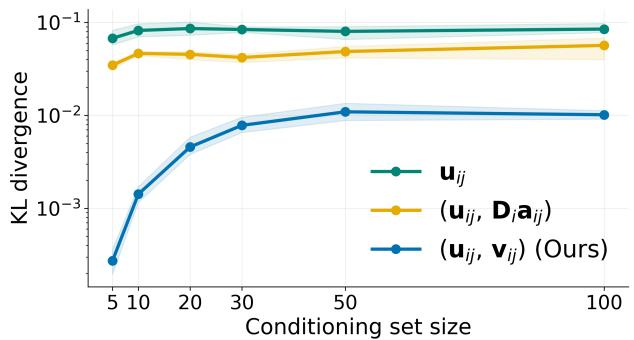  
Figure 1: Posterior fidelity under diferent directionalderivative choices as m increases for a Matérn-5/2 GP in $d = 5 0$ . We compare LITE with methods using $\mathbf { u } _ { i j }$ or $\mathbf { u } _ { i j }$ paired with a random direction in col $( \mathbf { D } _ { i } )$ KL divergence between the TERA and approximate posteriors is averaged over prediction inputs, with all methods using the same conditioning inputs.

empirical support for our direction choice, which yields the lowest KL divergence among the directions compared.

Relation to TERA. TERA’s directional derivatives $\mathbf { D } _ { i } ^ { \top } \mathbf { g } _ { j }$ can be equivalently expressed as target-directed and neighbor-directed derivatives. For each $j _ { a } \in c .$

$$
( \mathbf { x } _ { j _ { a } } - \mathbf { x } _ { i } ) ^ { \top } \mathbf { g } _ { j } = \underbrace { ( \mathbf { x } _ { j _ { a } } - \mathbf { x } _ { j } ) ^ { \top } \mathbf { g } _ { j } } _ { \mathrm { n e i g h b o r - d i r e c t e d } } - \underbrace { ( \mathbf { x } _ { i } - \mathbf { x } _ { j } ) ^ { \top } \mathbf { g } _ { j } } _ { \mathrm { t a r g e t - d i r e c t e d } } .
$$

The entry with $j _ { a } = j$ recovers the target-directed derivative. Our construction retains the target-directed component and replaces the neighbor-directed derivatives with the weighted aggregate identified by (6). As in TERA, the gradient noise covariance is $\sigma _ { g } ^ { 2 } \mathbf { I } _ { d }$ in the scaled coordinates.

## 4.2 Exactness and Approximation Error

We compare conditioning on sc with conditioning on $\mathbf { g } _ { c } ,$ holding the conditioning set c fixed. We first establish exactness under a symmetry condition and then analyze the error for general conditioning sets.

Exactness under compound symmetry. In high dimensions, pairwise distances among a fixed number of independently sampled inputs become approximately equal after rescaling under suitable distributional assumptions (Beyer et al., 1999; Hall et al., 2005; Ahn et al., 2007). We consider the limiting case in which the conditioning inputs are equally distant from the target and from each other in scaled coordinates, so that the Gram matrix $\mathbf { D } _ { i } ^ { \top } \mathbf { D } _ { i }$ has compound symmetry.

Proposition 1 (Exactness under compound symmetry). Let $m \geq 2$ and let $\mathbf { D } _ { i }$ contain the target-centered diferences in scaled coordinates. Suppose that, for some a, $b \in \mathbb { R }$

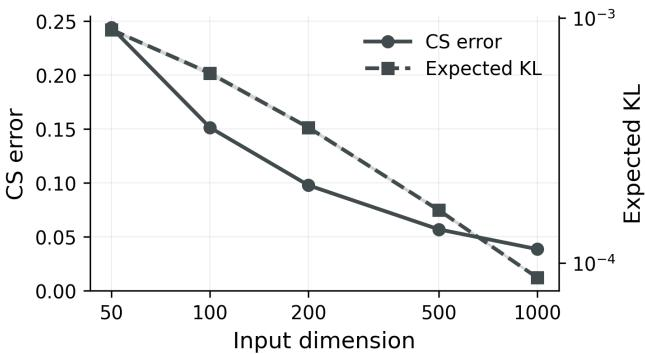  
Figure 2: Relative compound symmetry (CS) error (solid) and expected KL divergence from the fullgradient posterior to LITE’s (dashed) as d increases. We use an isotropic $\mathrm { M a t e r n { - } 5 / 2 }$ kernel, $n = 1 0 2 4$ uniform inputs in $[ 0 , 1 ] ^ { d }$ , 200 targets, maximin ordering, and $m = 3 0$ nearest preceding inputs.

$$
\mathbf { D } _ { i } ^ { \top } \mathbf { D } _ { i } = a \mathbf { I } _ { m } + b \mathbf { 1 } \mathbf { 1 } ^ { \top } .
$$

Under the assumed gradient noise model, assume that the joint covariance of $\left( y _ { i } , \mathbf { y } _ { c } , \mathbf { g } _ { c } \right)$ is positive definite and that $\mathbf { u } _ { i j }$ and $\mathbf { v } _ { i j }$ are linearly independent for each $j \in c$ . Then

$$
p _ { \pmb { \theta } } ( y _ { i } \mid \mathbf { y } _ { c } , \mathbf { g } _ { c } ) = p _ { \pmb { \theta } } ( y _ { i } \mid \mathbf { y } _ { c } , \mathbf { s } _ { c } ) .
$$

Under the stated assumptions, each gradient block of $\mathbf { K } _ { \mathbf { g } _ { c } \mathbf { g } _ { c } | \mathbf { y } _ { c } } ^ { - 1 } \mathbf { k } _ { \mathbf { g } _ { c } y _ { i } | \mathbf { y } _ { c } }$ lies in $\mathrm { s p a n } \{ \mathbf { u } _ { i j } , \mathbf { v } _ { i j } \}$ . Consequently, $\mathbf { s } _ { c }$ contains all the gradient information needed to recover the posterior mean and variance in (5). The proof is given in Appendix A.1, which also shows that the assumptions force $\mathbf { D } _ { i } ^ { \top } \mathbf { D } _ { i }$ to be positive definite, so the proposition requires $m \leq d .$

Vecchia conditioning sets can move toward this geometry. Selecting the nearest inputs makes their distances to the target more nearly equal than for independently sampled inputs, and a maximin ordering (Guinness, 2018; Schäfer et al., 2021) further equalizes the distances among the conditioning inputs of the likelihood factors. Such an ordering places each input greedily as far as possible from all preceding inputs, so the inputs preceding a target are spread as evenly as the greedy construction allows, and no two of its conditioning inputs are closer to each other than the target is to its nearest one. Compound symmetry nevertheless holds only approximately; Figure 2 empirically shows that these conditioning sets approach compound symmetry as the input dimension increases, while the expected KL divergence from the full-gradient conditional distribution to LITE’s in (7) decreases. We quantify the deviation from compound symmetry by the Frobenius distance of $\mathbf { D } _ { i } ^ { \top } \mathbf { D } _ { i }$ from its closest compound-symmetry matrix, normalized by $\| \mathbf { D } _ { i } ^ { \top } \mathbf { D } _ { i } \| _ { F }$

Posterior approximation error. For a general conditioning set, replacing $\mathbf { g } _ { c }$ with ${ \bf s } _ { c }$ can change the posterior distribution of $y _ { i }$ . Let

$$
p _ { i } ^ { F } = p _ { \pmb { \theta } } ( y _ { i } \mid \mathbf { y } _ { c } , \mathbf { g } _ { c } ) , \qquad p _ { i } ^ { R } = p _ { \pmb { \theta } } ( y _ { i } \mid \mathbf { y } _ { c } , \mathbf { s } _ { c } ) ,
$$

with posterior means $\mu _ { i } ^ { F } , \mu _ { i } ^ { R }$ and variances $V _ { i } ^ { F } , V _ { i } ^ { R }$ ， respectively. In this analysis, we assume that the inputs, conditioning set, and covariance parameters are fixed, and the joint covariance of $\left( y _ { i } , \mathbf { y } _ { c } , \mathbf { g } _ { c } \right)$ is positive definite.

Let $\mathbf { o } _ { c }$ collect the directional derivatives along an orthonormal basis for the orthogonal complement of span $\{ \mathbf { u } _ { i j } , \mathbf { v } _ { i j } \}$ at each conditioning input. After redundant entries of ${ \bf s } _ { c }$ are removed, the map from $\mathbf { g } _ { c }$ to $\left( \mathbf { s } _ { c } , \mathbf { o } _ { c } \right)$ is invertible, so the pair contains the same information as $\mathbf { g } _ { c }$ . By the definition of $\mathbf { o } _ { c }$ and (6), $\mathbf { C o v } ( \mathbf { o } _ { c } , y _ { i } \mid \mathbf { y } _ { c } ) = \mathbf { 0 }$ . Under the Gaussian model, $\mathbf { o } _ { c }$ and $y _ { i }$ are therefore conditionally independent given $\mathbf { y } _ { c }$ . This independence need not hold after conditioning additionally on $\mathbf { s } _ { c } ,$ so omitting $\mathbf { o } _ { c }$ can change the target posterior.

Given $\left( \mathbf { y } _ { c } , \mathbf { s } _ { c } \right)$ , the reduced posterior is fixed, whereas the full posterior additionally depends on $\mathbf { o } _ { c } .$ . We therefore quantify the information lost by omitting $\mathbf { o } _ { c }$ through the expected KL divergence, where the expectation is over $\mathbf { o } _ { c } \mid \mathbf { y } _ { c } , \mathbf { s } _ { c }$ . Under the Gaussian model,

$$
\mathbb { E } \left[ D _ { \mathrm { K L } } ( p _ { i } ^ { F } \| p _ { i } ^ { R } ) \mid \mathbf { y } _ { c } , \mathbf { s } _ { c } \right] = \frac { 1 } { 2 } \log \frac { V _ { i } ^ { R } } { V _ { i } ^ { F } } .\tag{7}
$$

Because LITE computes $V _ { i } ^ { R }$ anyway, this error can be evaluated exactly on a subsample of targets by computing $V _ { i } ^ { F }$ with TERA when $m \leq d ,$ or with full gradients otherwise.

To interpret the error, define

$$
\begin{array} { r l } & { \nu _ { i } ^ { y } = 1 - \frac { V _ { i } ^ { R } } { \mathbf { V } \mathbf { a r } ( y _ { i } \mid \mathbf { y } _ { c } ) } , } \\ & { \nu _ { i } ^ { \mu } = 1 - \frac { \mathbf { V a r } ( \mu _ { i } ^ { R } \mid \mathbf { y } _ { c } , y _ { i } , \mathbf { 0 } _ { c } ) } { \mathbf { V a r } ( \mu _ { i } ^ { R } \mid \mathbf { y } _ { c } , y _ { i } ) } , } \\ & { \nu _ { i } ^ { \perp } = 1 - \frac { \mathbf { V a r } ( \mu _ { i } ^ { R } \mid \mathbf { y } _ { c } , y _ { i } , \mathbf { s } _ { c } ^ { \perp } , \mathbf { 0 } _ { c } ) } { \mathbf { V a r } ( \mu _ { i } ^ { R } \mid \mathbf { y } _ { c } , y _ { i } ) } , } \\ & { \nu _ { i } ^ { \mathrm { m a x } } = \underset { \omega \neq 0 } { \operatorname* { s u p } } \left\{ 1 - \frac { \mathbf { V a r } ( \omega ^ { \top } \mathbf { s } _ { c } \mid \mathbf { y } _ { c } , y _ { i } , \mathbf { 0 } _ { c } ) } { \mathbf { V a r } ( \omega ^ { \top } \mathbf { s } _ { c } \mid \mathbf { y } _ { c } , y _ { i } ) } \right\} , } \end{array}\tag{8}
$$

where ω has the same dimension as $\mathbf { s } _ { c } .$ and ${ \bf s } _ { c } ^ { \perp } \ = \ $ $\mathbf { s } _ { c } - \mathbf { C o v } ( \mathbf { s } _ { c } , \mu _ { i } ^ { R } \mid \mathbf { y } _ { c } ) \mu _ { i } ^ { R } / \mathbf { V a r } ( \mu _ { i } ^ { R } \mid \mathbf { y } _ { c } )$ is the part of ${ \bf s } _ { c }$ that is uncorrelated with both $\mu _ { i } ^ { R }$ and yi given $\mathbf { y } _ { c } .$ Here $0 \leq \nu _ { i } ^ { y } < 1$ measures how informative ${ \bf s } _ { c }$ is about the target beyond $\mathbf { y } _ { c } .$ , and $\nu _ { i } ^ { \operatorname* { m a x } } < 1$ . The quantities $\nu _ { i } ^ { \mu }$ and $\nu _ { i } ^ { \perp }$ are defined for $\nu _ { i } ^ { y } > 0$ and measure how informative $\mathbf { o } _ { c }$ is about the reduced posterior mean $\mu _ { i } ^ { R }$ given $\left( \mathbf { y } _ { c } , y _ { i } \right)$ , without and with knowledge of ${ \bf s } _ { c } ^ { \perp }$ , while $\nu _ { i } ^ { \mathrm { m a x } }$ is the largest such measure over linear combinations $\omega ^ { \top } \mathbf { s } _ { c }$ . These quantities require $\mathbf { o } _ { c } ,$ at $\mathcal { O } ( ( m d ) ^ { 3 } )$ cost per target, so they serve as diagnostics rather than routine computations.

Theorem 1 (Posterior approximation error). Under the assumptions above, $i f \nu _ { i } ^ { y } = 0$ , then $p _ { i } ^ { F } = \stackrel { \cdot } { p _ { i } ^ { R } }$ for all values $o f \left( \mathbf { y } _ { c } , \mathbf { g } _ { c } \right) . \ I f \nu _ { i } ^ { y } > \bar { 0 }$ , then $0 \leq \nu _ { i } ^ { \perp } < 1$ and

$$
\mathbb { E } \left[ D _ { \mathrm { K L } } ( p _ { i } ^ { F } \Vert p _ { i } ^ { R } ) \mid \mathbf { y } _ { c } , \mathbf { s } _ { c } \right] = \frac { 1 } { 2 } \log \left( 1 + \frac { \nu _ { i } ^ { y } \nu _ { i } ^ { \perp } } { 1 - \nu _ { i } ^ { \perp } } \right)\tag{9}
$$

In this case, $p _ { i } ^ { F } = p _ { i } ^ { R }$ for all values of $\left( \mathbf { y } _ { c } , \mathbf { g } _ { c } \right)$ if and only $i f \nu _ { i } ^ { \mu } = 0$ , which is equivalent to $\nu _ { i } ^ { \perp } = 0$

Corollary 1 (Two-sided bound). $I f \nu _ { i } ^ { y } > 0$ , then $\nu _ { i } ^ { \mu } \leq$ $\nu _ { i } ^ { \perp }$ and $\nu _ { i } ^ { \perp } / ( 1 - \nu _ { i } ^ { \perp } ) \leq \nu _ { i } ^ { \mu } / ( 1 - \nu _ { i } ^ { \operatorname* { m a x } } )$ . Consequently,

$$
\begin{array} { r } { \frac { 1 } { 2 } \log \left( 1 + \frac { \nu _ { i } ^ { y } \nu _ { i } ^ { \mu } } { 1 - \nu _ { i } ^ { \mu } } \right) \leq \mathbb { E } \left[ D _ { \mathrm { K L } } ( p _ { i } ^ { F } \| p _ { i } ^ { R } ) \mid \mathbf { y } _ { c } , \mathbf { s } _ { c } \right] } \\ { \leq \displaystyle \frac { 1 } { 2 } \log \left( 1 + \frac { \nu _ { i } ^ { y } \nu _ { i } ^ { \mu } } { 1 - \nu _ { i } ^ { \mathrm { m a x } } } \right) . } \end{array}\tag{10}
$$

The identity (9) separates the error into how informative ${ \bf s } _ { c }$ is about the target, $\nu _ { i } ^ { y }$ , and how much of the remaining variation in the reduced posterior mean the omitted derivatives explain, $\nu _ { i } ^ { \perp }$ . If $\nu _ { i } ^ { \mathrm { m a x } } \leq 1 - \epsilon$ for some $\epsilon > 0$ , the upper bound in $( 1 0 )$ is at most $\frac { 1 } { 2 } \log ( 1 + \nu _ { i } ^ { \mu } / \epsilon ) \leq \nu _ { i } ^ { \mu } / ( 2 \epsilon )$ , so $\nu _ { i } ^ { \mu } \ll \epsilon$ guarantees a small error even when ${ \bf s } _ { c }$ explains most of the target variance given $\mathbf { y } _ { c }$ . The approximation is exact if and only if Cov $\left( \mathbf { o } _ { c } , \mu _ { i } ^ { R } \mid \mathbf { y } _ { c } \right) = \mathbf { 0 }$ , which, for $\nu _ { i } ^ { y } > 0$ , is equivalent to $\nu _ { i } ^ { \mu } = 0$ because Cov $\begin{array} { r } { \mathbf { \nabla } [ \mathbf { o } _ { c } , y _ { i } \ \mid \ \mathbf { y } _ { c } ) = \mathbf { 0 } ; } \end{array}$ compound symmetry (Proposition 1) is one such setting. Conversely, the lower bound implies a large error when $\nu _ { i } ^ { y }$ is substantial and $\nu _ { i } ^ { \mu }$ is close to one. The proofs are given in Appendix A.2.

## 4.3 Parameter Learning and Prediction

Conditional likelihood. We estimate the covariance parameters by using the conditional log-likelihood

$$
\tilde { \ell } _ { n } ( \pmb { \theta } ) = \sum _ { i = 1 } ^ { n } \log p _ { \pmb { \theta } } \big ( y _ { i } \mid \mathbf { y } _ { c ( i ) } , \mathbf { s } _ { c ( i ) } \big ) .\tag{11}
$$

We use stochastic updates based on minibatches of conditional factors (Cao et al., 2022; Jimenez and Katzfuss, 2023). For each sampled target, we recompute the two directions at the current covariance parameters then hold them fixed in the original coordinates during differentiation. The covariance blocks remain functions of $\theta ,$ while the ordering and conditioning sets are held fixed during each update (Katzfuss et al., 2020). With the directions fixed, each update diferentiates a welldefined Gaussian likelihood of fixed linear statistics of the gradients, just as fixing the ordering and conditioning sets gives a fixed Vecchia approximation within each update.

Table 1: Per-target cost of one Vecchia conditional factor with m conditioning inputs in d dimensions. TERA’s entries assume $m \leq d ;$ when $m > d ,$ the fullgradient factor is smaller.
<table><tr><td></td><td>Factor size</td><td>Time</td><td>Memory</td></tr><tr><td>Full grad</td><td> $m ( d + 1 )$ </td><td> $\mathcal { O } ( m ^ { 3 } d ^ { 3 } )$ </td><td> $\mathcal { O } ( m ^ { 2 } d ^ { 2 } )$ </td></tr><tr><td>TERA</td><td> $m ^ { 2 } + m$ </td><td> $\mathcal { O } ( d \dot { m } ^ { 2 } + \dot { m } ^ { 6 } )$ </td><td> $\mathcal { O } ( d \dot { m } ^ { 2 } + \dot { m } ^ { 4 } )$ </td></tr><tr><td>LITE</td><td>3m</td><td> $\mathcal { O } ( d m ^ { 2 } + m ^ { 3 } )$ </td><td> $\mathcal { O } ( d m + m ^ { 2 } )$ </td></tr></table>

Batched inference. For each prediction input $\mathbf { x } _ { \star }$ we select $c ( \star )$ using the fitted input metric and construct the two directions. Let

$$
\begin{array} { r } { \mathbf { z } _ { \star } ^ { R } = \left( \mathbf { y } _ { c ( \star ) } \right) , \quad \mathbf { K } _ { \star } = \mathbf { C o v } ( \mathbf { z } _ { \star } ^ { R } ) , \quad \mathbf { k } _ { \star } = \mathbf { C o v } ( \mathbf { z } _ { \star } ^ { R } , f _ { \star } ) , } \end{array}
$$

where all moments are evaluated at $\hat { \pmb \theta } .$ Both directions lie in the column space of $\mathbf { D } _ { \star } ,$ so K and ${ \bf k } _ { \star }$ can be assembled directly from $\mathbf { H } _ { \star } = \mathbf { D } _ { \star } ^ { \top } \mathbf { D } ,$ .

For a batch B of B targets, each with m conditioning inputs, we stack the B matrices $\mathbf { K } _ { \star }$ of order 3m. Batched Cholesky factorizations and triangular solves then give all predictive means and variances in (3) at once. Thus, covariance assembly and prediction can be parallelized across targets using matrices of order 3m, allowing larger prediction batches within a fixed memory budget. The covariance construction and batched formulas are given in Appendix B.

Computational complexity. For each target, constructing the Gram matrix and computing the directional derivatives cost $\mathcal { O } ( d m ^ { 2 } )$ , while direction coefficient computation, covariance assembly, and factorization cost $\mathcal { O } ( m ^ { 3 } )$ ). A batch of B targets therefore requires

$$
\mathcal { O } \big ( B ( d m ^ { 2 } + m ^ { 3 } ) \big ) \mathrm { t i m e } , \mathcal { O } \big ( B ( d m + m ^ { 2 } ) \big ) \mathrm { m e m o r y } .
$$

Summed over the n factors of (11), one likelihood evaluation costs $\mathcal { O } ( n ( d m ^ { 2 } + m ^ { 3 } ) )$ ), and the $d m ^ { 2 }$ assembly term dominates when $d > m$ . These costs exclude full dataset storage, ordering, and conditioning set construction. Table 1 compares them with TERA and with full gradients.

## 5 EXPERIMENTS

We evaluate whether two directions per gradient retain useful predictive information at reduced cost, and whether these savings allow larger conditioning sets to improve the accuracy-cost tradeof. We assess prediction under a known GP, regression on molecular data, and high-dimensional BO. We consider settings where gradient observations are available in existing datasets (Chmiela et al., 2017) or obtained by diferentiating the underlying models (Baydin et al., 2015; Bertrand et al., 2020). Our implementation uses Py-Torch (Paszke et al., 2019), with GPyTorch (Gardner et al., 2018) and BoTorch (Balandat et al., 2020) where applicable. All experiments run on a single NVIDIA H100 GPU. We use double precision for all methods except DSoftKI, which uses single precision. To compare algorithmic costs under a common batching strategy, we replace TERA’s target-wise sequential computations with batched training and prediction, using the same batch sizes as LITE. Unless otherwise specified, they share the same experimental settings. Experimental details and additional results are provided in Appendices C and D, respectively.

## 5.1 Scaling to Larger Conditioning Sets and Batch Sizes

We first examine whether the lower cost of LITE lets larger conditioning sets improve accuracy. We evaluate prediction under an ARD Matérn-5/2 GP with $n = 1 0 0 , 0 0 0$ inputs in $[ 0 , 1 ] ^ { 5 0 0 }$ and substantial function and gradient observation noise. This noise weakens the screening efect of nearby observations, allowing predictive accuracy to continue improving as m grows. With covariance parameters fixed, we compute the RMSE analytically over 256 targets, avoiding joint sampling at this scale. We vary $m \in \{ 2 0 , 4 0 , 8 0 , 1 6 0 , 3 2 0 \}$ . Evaluating prediction error under the assumed GP with fixed covariance parameters isolates the efect of the conditioning set size from model misspecification and parameter estimation.

Larger conditioning sets at a fraction of the cost. At equal conditioning set size, LITE matches the accuracy of TERA (top panels of Figure 3), so the two-direction budget costs little accuracy in this setting. The error of LITE keeps decreasing up to $m = 3 2 0$ whereas TERA exceeds the GPU memory for $m \geq 1 6 0$ at the tested batch size of 32. At $m = 3 2 0$ , LITE attains a lower RMSE than TERA at $m = 8 0$ , approximately 0.39 versus 0.49, while running 58× faster and using only 4.3% of its memory. Thus, when additional conditioning inputs improve prediction, LITE’s lower cost allows larger conditioning sets to outweigh the information lost by the reduction. Both derivative methods also achieve lower error than the function-only Vecchia GP at equal m, showing that gradients remain informative in this noisy setting.

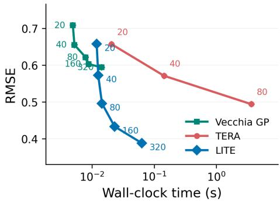

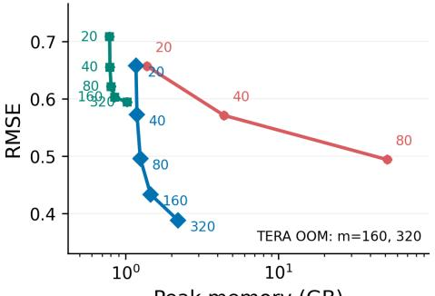  
Peak memory (GB)

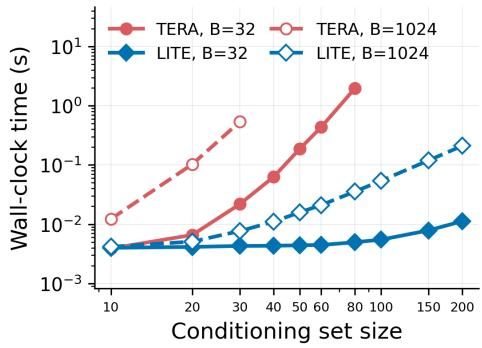

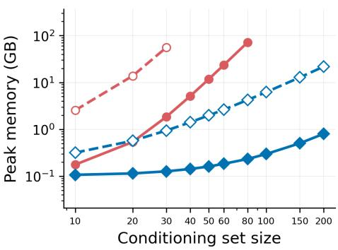  
Figure 3: RMSE under the assumed GP against total prediction time for 256 targets and peak GPU memory (top). Wall-clock time and peak GPU memory of one training step against m on the Buckyball-catcher dataset (bottom). Point labels in the top panels indicate m. Prediction uses $B = 3 2$ , while the bottom panels use $B = 3 2$ and $B = 1 , 0 2 4$ . TERA exceeds the 80 GB GPU memory for $m \geq 1 6 0$ in prediction; missing TERA points in the bottom panels exceed the GPU memory.

Cost per training step. The bottom panels of Figure 3 show the cost of one training step on the MD22 Buckyball-catcher dataset. With batches of 32 targets, the step time of LITE stays nearly constant up to $m = 1 0 0$ because fixed per-step costs dominate its small factorizations, whereas the step time of TERA grows steeply as its $\mathcal { O } ( m ^ { 6 } )$ factorization takes over, and TERA exceeds the GPU memory for $m \geq 1 0 0$ . With batches of 1,024 targets, LITE is about 70× faster than TERA already at $m = 3 0$ , and TERA exceeds the GPU memory for larger m. These fixed per-step costs also explain the moderate speedups at $m = 3 0$ with batches of 32 in the experiments below.

## 5.2 Large-Scale GP Regression

For GP regression, we use six MD22 molecular benchmarks (Chmiela et al., 2023), with up to 69,753 samples and 1,110 input dimensions. We predict heldout molecular energies from atomic configurations, using observed forces as gradient information. We compare LITE with three derivative GP methods, TERA,

DDSVGP, DSoftKI, and a function-only Standard GP. Figure 4 compares test RMSE per atom, wall-clock time, and peak GPU memory.

Competitive accuracy with lowest computational costs. LITE achieves substantially lower RMSE than DDSVGP and DSoftKI and outperforms the function-only Standard GP on every benchmark. Across all six benchmarks, it achieves the lowest runtime and peak GPU memory usage. These savings also extend to the function-only Standard GP, showing that incorporating gradient information need not increase computational cost. Despite retaining only two directions per gradient, it achieves predictive accuracy slightly lower than TERA on several benchmarks. The comparison with TERA illustrates the tradeof between exact gradient reduction and a fixed two-direction budget. Appendix D.1 examines whether shared covariance parameters, larger conditioning sets, or further training resolve this accuracy gap.

## 5.3 High-Dimensional Bayesian Optimization

We evaluate BO on Ackley and Levy in 500 and 800 dimensions, respectively, and on the real-world LassoDNA (Šehić et al., 2022) hyperparameter optimization task in 180 dimensions. We compare LITE with the derivative GP method TERA and the function-only methods VBO (Hvarfner et al., 2024) and TuRBO-1 (Eriksson et al., 2019). Figure 5 compares optimization performance.

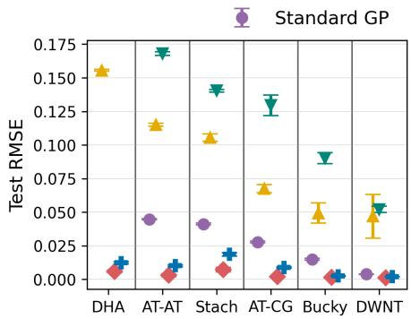

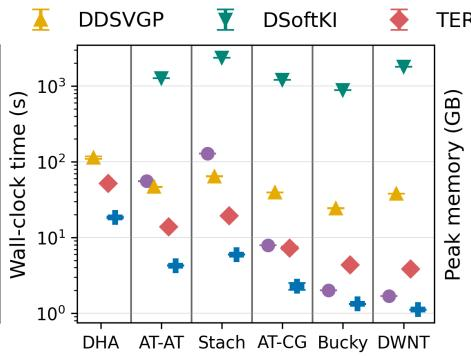

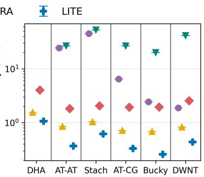  
Figure 4: Test RMSE per atom, wall-clock time, and peak GPU memory on six MD22 molecular datasets. LITE achieves the lowest runtime and memory usage on every benchmark, running 2.8–3.5× faster than TERA while using only 13.3–30.2% of its memory. Its RMSE is higher than TERA’s but lower than that of the other methods. Standard GP and DSoftKI run out of memory on an 80 GB GPU when applied to DHA, whereas LITE requires only 1.06 GB. Results are averaged over five independent runs, with error bars indicating standard errors.

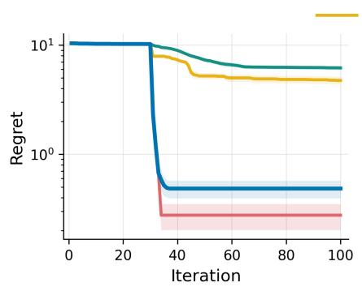

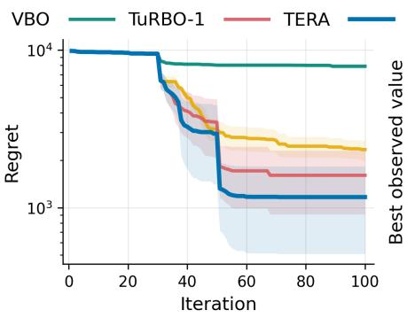

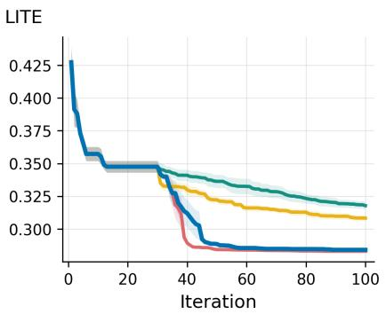  
Figure 5: Simple regret on Ackley (500D, left), Levy (800D, center), and best observed value on LassoDNA (180D, right) versus iteration. With only two directions per gradient, LITE substantially outperforms the function-only baselines, VBO and TuRBO-1, on all three tasks. It achieves the lowest final regret on Levy and a final value comparable to TERA on LassoDNA, while TERA attains lower regret on Ackley. Curves average five independent runs, with shaded bands indicating standard errors.

Efective optimization with two directions. On both synthetic tasks, LITE achieves substantially lower regret than the function-only baselines. It attains the lowest final regret on Levy, while TERA achieves lower regret on Ackley. On LassoDNA, LITE reaches a final objective value comparable to TERA and substantially lower than both function-only baselines. The advantage over function-only baselines thus extends beyond synthetic objectives to a real-world optimization task. These results show that two directions per gradient preserve useful information for efective optimization in the tested 180–800-dimensional tasks. Runtime and memory comparisons are provided in Appendix D.2.

## 6 CONCLUSIONS

We proposed LITE, a derivative GP that retains two directional derivatives per observed gradient. Within a Vecchia approximation, this reduces the per-target factorization cost to $\mathcal { O } ( m ^ { 3 } )$ and the covariance memory to $\mathcal { O } ( m ^ { 2 } )$ , which permits much larger conditioning sets and batched prediction over many targets. The reduction is exact under compound symmetry, and for general conditioning sets we characterized the expected KL divergence from the posterior using full gradients through interpretable variance ratios. Empirically, LITE matches the accuracy of TERA at equal conditioning set size in simulations and, with larger conditioning sets beyond TERA’s memory limit, reaches lower error at a small fraction of TERA’s time and memory. On the GP regression and high-dimensional BO benchmarks, it remains competitive while using substantially less memory.

## References

Jeongyoun Ahn, J. S. Marron, K. Muller, and Yueh-Yun Chi. The high-dimension, low-sample-size geometric representation holds under mild conditions. Biometrika, 94:760–766, 2007.

Sebastian Ament, Sam Daulton, David Eriksson, Maximilian Balandat, and Eytan Bakshy. Unexpected improvements to expected improvement for bayesian optimization. In Advances in Neural Information Processing Systems, 2023.

Maximilian Balandat, Brian Karrer, Daniel R. Jiang, Sam Daulton, Benjamin Letham, Andrew Gordon Wilson, and Eytan Bakshy. Botorch: Programmable bayesian optimization in pytorch. In Advances in Neural Information Processing Systems, 2020.

Atilim Gunes Baydin, Barak A. Pearlmutter, Alexey Radul, and Jefrey Mark Siskind. Automatic diferentiation in machine learning: a survey. Journal of Machine Learning Research, 18:153:1–153:43, 2015.

Quentin Bertrand, Quentin Klopfenstein, Mathieu Blondel, Samuel Vaiter, Alexandre Gramfort, and Joseph Salmon. Implicit diferentiation of lasso-type models for hyperparameter optimization. In International Conference on Machine Learning, 2020.

Kevin S. Beyer, Jonathan Goldstein, Raghu Ramakrishnan, and Uri Shaft. When is ”nearest neighbor” meaningful? In International Conference on Database Theory, 1999.

Jian Cao, Joseph Guinness, Marc G. Genton, and Matthias Katzfuss. Scalable gaussian-process regression and variable selection using vecchia approximations. Journal of Machine Learning Research, 23: 348:1–348:30, 2022.

Stefan Chmiela, Alexandre Tkatchenko, Huziel E. Sauceda, Igor Poltavsky, Kristof T. Schütt, and Klaus-Robert Müller. Machine learning of accurate energy-conserving molecular force fields. Science Advances, 3, 2017.

Stefan Chmiela, Valentin Vassilev-Galindo, Oliver T. Unke, Adil Kabylda, Huziel E. Sauceda, Alexandre Tkatchenko, and Klaus-Robert Müller. Accurate global machine learning force fields for molecules with hundreds of atoms. Science Advances, 9, 2023.

Abhirup Datta, Sudipto Banerjee, Andrew O. Finley, and Alan E. Gelfand. Hierarchical nearestneighbor Gaussian process models for large geostatistical datasets. Journal of the American Statistical Association, 111(514):800–812, 2016. ISSN 0162- 1459. doi: 10.1080/01621459.2015.1044091.

Filip de Roos, Alexandra Gessner, and Philipp Hennig. High-dimensional gaussian process inference with

derivatives. In International Conference on Machine Learning, 2021.

David Eriksson, Kun Dong, Eric Hans Lee, David S. Bindel, and Andrew Gordon Wilson. Scaling gaussian process regression with derivatives. In Advances in Neural Information Processing Systems, 2018.

David Eriksson, Michael Pearce, Jacob R. Gardner, Ryan D. Turner, and Matthias Poloczek. Scalable global optimization via local bayesian optimization. In Advances in Neural Information Processing Systems, 2019.

Jacob R. Gardner, Geof Pleiss, David S. Bindel, Kilian Q. Weinberger, and Andrew Gordon Wilson. Gpytorch: Blackbox matrix-matrix gaussian process inference with gpu acceleration. In Advances in Neural Information Processing Systems, 2018.

Joseph Guinness. Permutation and grouping methods for sharpening gaussian process approximations. Technometrics, 60:415 – 429, 2018.

Peter Hall, J. S. Marron, and Amnon Neeman. Geometric representation of high dimension, low sample size data. Journal of the Royal Statistical Society: Series B (Statistical Methodology), 67, 2005.

Daniel Huang. Scaling gaussian process regression with full derivative observations. Transactions on Machine Learning Research, 2026.

Tzu-Hsiang Hung and Peter Chien. A random fourier feature method for emulating computer models with gradient information. Technometrics, 63:500 – 509, 2021.

Carl Hvarfner, Erik Orm Hellsten, and Luigi Nardi. Vanilla bayesian optimization performs great in high dimensions. In International Conference on Machine Learning, 2024.

Felix Jimenez and Matthias Katzfuss. Scalable bayesian optimization using vecchia approximations of gaussian processes. In International Conference on Artificial Intelligence and Statistics, 2023.

Matthias Katzfuss and Joseph Guinness. A general framework for vecchia approximations of gaussian processes. Statistical Science, 2021.

Matthias Katzfuss, Joseph Guinness, and Earl Christopher Lawrence. Scaled vecchia approximation for fast computer-model emulation. SIAM/ASA Journal on Uncertainty Quantification, 10:537–554, 2020.

Misha Padidar, Xinran Zhu, Leo Huang, Jacob R. Gardner, and David S. Bindel. Scaling gaussian processes with derivative information using variational inference. In Advances in Neural Information Processing Systems, 2021.

Adam Paszke, Sam Gross, Francisco Massa, Adam Lerer, James Bradbury, Gregory Chanan, Trevor

Killeen, Zeming Lin, Natalia Gimelshein, Luca Antiga, Alban Desmaison, Andreas Köpf, Edward Yang, Zachary DeVito, Martin Raison, Alykhan Tejani, Sasank Chilamkurthy, Benoit Steiner, Lu Fang, Junjie Bai, and Soumith Chintala. Pytorch: An imperative style, high-performance deep learning library. In Advances in Neural Information Processing Systems, 2019.

Carl E. Rasmussen and Christopher K. I. Williams. Gaussian Processes for Machine Learning. The MIT Press, 2005.

Florian Schäfer, Matthias Katzfuss, and Houman Owhadi. Sparse Cholesky factorization by Kullback-Leibler minimization. SIAM Journal on Scientific Computing, 43(3):A2019–A2046, 2021. doi: 10.1137/20M1336254.

Kenan Šehić, Alexandre Gramfort, Joseph Salmon, and Luigi Nardi. LassoBench: A high-dimensional hyperparameter optimization benchmark suite for Lasso. In International Conference on Automated Machine Learning, 2022.

Hyunseok Seung and Matthias Katzfuss. Scalable derivative gaussian processes via exact gradient reduction. In Advances in Neural Information Processing Systems, 2026.

Ercan Solak, Roderick Murray-Smith, William E. Leithead, Douglas J. Leith, and Carl Edward Rasmussen. Derivative observations in gaussian process models of dynamic systems. In Advances in Neural Information Processing Systems, 2002.

Michael L. Stein, Zhiyi Chi, and L.J. Welty. Approximating likelihoods for large spatial data sets. Journal of the Royal Statistical Society: Series B, 66(2):275– 296, 2004.

William R. Thompson. On the likelihood that one unknown probability exceeds another in view of the evidence of two samples. Biometrika, 25:285–294, 1933.

Aldo V. Vecchia. Estimation and model identification for continuous spatial processes. Journal of the royal statistical society series b-methodological, 50:297–312, 1988.

## Appendix

## A PROOFS FOR SECTION 4

## A.1 Proof of Proposition 1

Proof. Recall that

$$
\mathbf { D } _ { i } = [ \mathbf { x } _ { j _ { 1 } } - \mathbf { x } _ { i } , \dots , \mathbf { x } _ { j _ { m } } - \mathbf { x } _ { i } ] .
$$

In the original coordinates, the Gram condition is

$$
\mathbf { D } _ { i } ^ { \top } \mathbf { \Lambda } \mathbf { \Lambda } \mathbf { \Lambda } _ { \theta } \mathbf { D } _ { i } = a \mathbf { I } _ { m } + b \mathbf { 1 } \mathbf { 1 } ^ { \top } .
$$

The transformation $\tilde { \mathbf { x } } _ { j } = \mathbf { \Lambda } _ { \theta } ^ { 1 / 2 } \mathbf { x } _ { j }$ and $\tilde { \bf g } _ { j } = { \bf A } _ { \pmb { \theta } } ^ { - 1 / 2 } { \bf g } _ { j }$ is invertible and leaves the directional derivative statistics unchanged. It therefore sufices to prove the result in scaled coordinates, where the Gram condition becomes $\tilde { \mathbf { D } } _ { i } ^ { \top } \tilde { \mathbf { D } } _ { i } = a \mathbf { I } _ { m } + b \mathbf { 1 } \mathbf { 1 } ^ { \top }$ . As in Section 4.1, we omit the tildes here for notational simplicity.

We will show that each gradient block of

$$
\mathbf { K } _ { \mathbf { g } _ { c } \mathbf { g } _ { c } | \mathbf { y } _ { c } } ^ { - 1 } \mathbf { k } _ { \mathbf { g } _ { c } y _ { i } | \mathbf { y } _ { c } }
$$

lies in span $\{ \mathbf { u } _ { i j } , \mathbf { v } _ { i j } \}$ . By (5), this implies that the full conditional mean depends on the gradients only through ${ \bf s } _ { c }$

The assumed identity $\mathbf { D } _ { i } ^ { \top } \mathbf { D } _ { i } = a \mathbf { I } _ { m } + b \mathbf { 1 1 } ^ { \top }$ implies that

$$
\begin{array} { r l } & { \| \mathbf { x } _ { j } - \mathbf { x } _ { i } \| ^ { 2 } = a + b , \quad j \in c , } \\ & { \| \mathbf { x } _ { j } - \mathbf { x } _ { j ^ { \prime } } \| ^ { 2 } = 2 a , \qquad j , j ^ { \prime } \in c , \quad j \neq j ^ { \prime } , } \end{array}\tag{12}
$$

where the second equality follows from

$$
\begin{array} { r l } & { \| \mathbf { x } _ { j } - \mathbf { x } _ { j ^ { \prime } } \| ^ { 2 } = \| ( \mathbf { x } _ { j } - \mathbf { x } _ { i } ) - ( \mathbf { x } _ { j ^ { \prime } } - \mathbf { x } _ { i } ) \| ^ { 2 } } \\ & { \qquad = \| \mathbf { x } _ { j } - \mathbf { x } _ { i } \| ^ { 2 } + \| \mathbf { x } _ { j ^ { \prime } } - \mathbf { x } _ { i } \| ^ { 2 } - 2 ( \mathbf { x } _ { j } - \mathbf { x } _ { i } ) ^ { \top } ( \mathbf { x } _ { j ^ { \prime } } - \mathbf { x } _ { i } ) } \\ & { \qquad = ( a + b ) + ( a + b ) - 2 b = 2 a . } \end{array}
$$

Thus all conditioning inputs have the same distance to the target, and all distinct conditioning inputs have the same distance to one another.

Let $\begin{array} { r } { \bar { \mathbf { x } } _ { c } = m ^ { - 1 } \sum _ { j \in c } \mathbf { x } _ { j } } \end{array}$ . By definition,

$$
\sum _ { j \in c } ( \mathbf { x } _ { j } - \bar { \mathbf { x } } _ { c } ) = \sum _ { j \in c } \mathbf { x } _ { j } - m \bar { \mathbf { x } } _ { c } = \mathbf { 0 } .
$$

The Gram condition gives

$$
( \mathbf { x } _ { j } - \mathbf { x } _ { i } ) ^ { \top } ( \mathbf { x } _ { j ^ { \prime } } - \mathbf { x } _ { i } ) = a \mathbb { 1 } \left\{ j = j ^ { \prime } \right\} + b .
$$

Averaging over $j ^ { \prime } \in c$ yields

$$
\begin{array} { l } { ( { \displaystyle { \bf x } _ { j } - { \bf x } _ { i } } ) ^ { \top } ( \bar { \bf x } _ { c } - { \bf x } _ { i } ) = \displaystyle { \frac { 1 } { m } \sum _ { j ^ { \prime } \in c } ( { \bf x } _ { j } - { \bf x } _ { i } ) ^ { \top } ( { \bf x } _ { j ^ { \prime } } - { \bf x } _ { i } ) } } \\ { = \displaystyle { \frac { a + m b } { m } } = \displaystyle { \frac { a } { m } + b } . } \end{array}
$$

Since this holds for every $j \in c ,$ averaging again over $j$ gives

$$
\begin{array} { l } { \displaystyle \| \bar { \mathbf x } _ { c } - { \mathbf x } _ { i } \| ^ { 2 } = \frac { 1 } { m } \sum _ { j \in c } ( { \mathbf x } _ { j } - { \mathbf x } _ { i } ) ^ { \top } \big ( \bar { \mathbf x } _ { c } - { \mathbf x } _ { i } \big ) } \\ { = \displaystyle \frac { a } { m } + b . } \end{array}
$$

We now use ${ \bf x } _ { j } - \bar { \bf x } _ { c } = ( { \bf x } _ { j } - { \bf x } _ { i } ) - \left( \bar { \bf x } _ { c } - { \bf x } _ { i } \right)$ to compute the inner products after centering. For any $j , j ^ { \prime } \in c ,$

$$
\begin{array} { r l } & { \left( \mathbf { x } _ { j } - \bar { \mathbf { x } } _ { c } \right) ^ { \top } ( \mathbf { x } _ { j ^ { \prime } } - \bar { \mathbf { x } } _ { c } ) = \left( \mathbf { x } _ { j } - \mathbf { x } _ { i } \right) ^ { \top } \left( \mathbf { x } _ { j ^ { \prime } } - \mathbf { x } _ { i } \right) - \left( \mathbf { x } _ { j } - \mathbf { x } _ { i } \right) ^ { \top } \left( \bar { \mathbf { x } } _ { c } - \mathbf { x } _ { i } \right) - \left( \bar { \mathbf { x } } _ { c } - \mathbf { x } _ { i } \right) ^ { \top } \left( \mathbf { x } _ { j ^ { \prime } } - \mathbf { x } _ { i } \right) + \left\| \bar { \mathbf { x } } _ { c } - \mathbf { x } _ { i } \right\| ^ { 2 } } \\ & { \qquad = a { \mathbb { 1 } \{ j = j ^ { \prime } \} } + b - 2 \left( \frac { a } { m } + b \right) + \left( \frac { a } { m } + b \right) } \\ & { \qquad = a \left( { \mathbb { 1 } \{ j = j ^ { \prime } \} } - \frac { 1 } { m } \right) . } \end{array}
$$

Similarly,

$$
\begin{array} { l } { ( { \bf x } _ { j } - \bar { \bf x } _ { c } ) ^ { \top } ( \bar { \bf x } _ { c } - { \bf x } _ { i } ) = ( { \bf x } _ { j } - { \bf x } _ { i } ) ^ { \top } ( \bar { \bf x } _ { c } - { \bf x } _ { i } ) - \| \bar { \bf x } _ { c } - { \bf x } _ { i } \| ^ { 2 } } \\ { \quad \quad \quad \quad = \left( \displaystyle \frac { a } { m } + b \right) - \left( \displaystyle \frac { a } { m } + b \right) = 0 . } \end{array}
$$

Thus

$$
\begin{array} { l } { { \displaystyle ( { \bf x } _ { j } - \bar { \bf x } _ { c } ) ^ { \top } ( { \bf x } _ { j ^ { \prime } } - \bar { \bf x } _ { c } ) = a \left( \mathbb { 1 } \{ j = j ^ { \prime } \} - \frac { 1 } { m } \right) , } } \\ { { \displaystyle ( { \bf x } _ { j } - \bar { \bf x } _ { c } ) ^ { \top } ( \bar { \bf x } _ { c } - { \bf x } _ { i } ) = 0 . } } \end{array}\tag{13}
$$

In particular, each centered input diference is orthogonal to the vector from the target to the mean of the conditioning inputs.

Under the independent observation noise model,

$$
\begin{array} { r } { \mathbf { C o v } ( y _ { j } , y _ { j ^ { \prime } } ) = \kappa _ { \pmb \theta } \big ( \| \mathbf { x } _ { j } - \mathbf { x } _ { j ^ { \prime } } \| ^ { 2 } \big ) + \sigma _ { y } ^ { 2 } \mathbb { 1 } \{ j = j ^ { \prime } \} . } \end{array}
$$

Since $i \notin c , ( 1 2 )$ gives

$$
\mathbf { C o v } ( y _ { j } , y _ { i } ) = \kappa _ { \pmb { \theta } } \big ( \| \mathbf { x } _ { j } - \mathbf { x } _ { i } \| ^ { 2 } \big ) = \kappa _ { \pmb { \theta } } ( a + b ) , \qquad j \in c .
$$

Stacking these identical entries yields

$$
\mathbf { C o v } ( \mathbf { y } _ { c } , y _ { i } ) = \kappa _ { \pmb { \theta } } ( a + b ) \mathbf { 1 } .
$$

Similarly, for $j , j ^ { \prime } \in c ,$

$$
\begin{array} { r } { \mathbf { C o v } ( y _ { j } , y _ { j ^ { \prime } } ) = \left\{ { \kappa _ { \theta } } ( 0 ) + \sigma _ { y } ^ { 2 } , \quad j = j ^ { \prime } , \right. } \\ { \left. { \kappa _ { \theta } } ( 2 a ) , \qquad j \neq j ^ { \prime } . \right. } \end{array}
$$

Thus $\mathbf { V a r } ( \mathbf { y } _ { c } )$ can be written as

$$
\mathbf { V a r } ( \mathbf { y } _ { c } ) = \left[ \kappa _ { \pmb { \theta } } ( 0 ) + \sigma _ { y } ^ { 2 } - \kappa _ { \pmb { \theta } } ( 2 a ) \right] \mathbf { I } _ { m } + \kappa _ { \pmb { \theta } } ( 2 a ) \mathbf { 1 } \mathbf { 1 } ^ { \top } .
$$

Applying the Sherman-Morrison formula gives

$$
\begin{array} { r } { \mathbf { V a r } ( \mathbf { y } _ { c } ) ^ { - 1 } = \frac { 1 } { \kappa _ { \pmb { \theta } } ( 0 ) + \sigma _ { y } ^ { 2 } - \kappa _ { \pmb { \theta } } ( 2 a ) } \qquad } \\ { \times \left[ \mathbf { I } _ { m } - \frac { \kappa _ { \pmb { \theta } } ( 2 a ) \mathbf { 1 } \mathbf { 1 } ^ { \top } } { \kappa _ { \pmb { \theta } } ( 0 ) + \sigma _ { y } ^ { 2 } + ( m - 1 ) \kappa _ { \pmb { \theta } } ( 2 a ) } \right] . } \end{array}\tag{14}
$$

Therefore, we obtain

$$
\begin{array} { l } { { { \bf w } _ { i } = { \bf V a r } ( { { \bf y } } _ { c } ) ^ { - 1 } { \bf C o v } ( { { \bf y } } _ { c } , y _ { i } ) } } \\ { { \mathrm { } = \frac { \kappa _ { \theta } ( a + b ) } { \kappa _ { \theta } ( 0 ) + \sigma _ { y } ^ { 2 } - \kappa _ { \theta } ( 2 a ) } \left[ 1 - \frac { m \kappa _ { \theta } ( 2 a ) } { \kappa _ { \theta } ( 0 ) + \sigma _ { y } ^ { 2 } + ( m - 1 ) \kappa _ { \theta } ( 2 a ) } \right] { \bf 1 } } } \\ { { \mathrm { } = \frac { \kappa _ { \theta } ( a + b ) } { \kappa _ { \theta } ( 0 ) + \sigma _ { y } ^ { 2 } + ( m - 1 ) \kappa _ { \theta } ( 2 a ) } { \bf 1 } . } } \end{array}
$$

Since $\eta _ { j i } = - 2 \kappa _ { \pmb { \theta } } ^ { \prime } ( a + b )$ for every $j \in c ,$ the first direction is

$$
\begin{array} { r } { \mathbf { u } _ { i j } = - 2 \kappa _ { \pmb { \theta } } ^ { \prime } ( a + b ) ( \mathbf { x } _ { i } - \mathbf { x } _ { j } ) . } \end{array}
$$

For the second direction, all entries of $\mathbf { w } _ { i }$ are equal and $\eta _ { j j ^ { \prime } } = - 2 \kappa _ { \theta } ^ { \prime } ( 2 a )$ whenever $j \neq j ^ { \prime }$ . The term with $j ^ { \prime } = j$ vanishes, so

$$
\begin{array} { l } { { \displaystyle { \bf v } _ { i j } = - 2 [ { \bf w } _ { i } ] _ { 1 } \kappa _ { \pmb \theta } ^ { \prime } ( 2 a ) \sum _ { j ^ { \prime } \in c } ( { \bf x } _ { j ^ { \prime } } - { \bf x } _ { j } ) } } \\ { { \displaystyle ~ } } \\ { { \bf \quad \quad = - 2 m [ { \bf w } _ { i } ] _ { 1 } \kappa _ { \pmb \theta } ^ { \prime } ( 2 a ) ( \bar { \bf x } _ { c } - { \bf x } _ { j } ) } . } \end{array}
$$

The expressions for the two directions and their assumed linear independence imply

$$
\mathrm { s p a n } \{ \mathbf { u } _ { i j } , \mathbf { v } _ { i j } \} = \mathrm { s p a n } \{ \mathbf { x } _ { j } - \bar { \mathbf { x } } _ { c } , \bar { \mathbf { x } } _ { c } - \mathbf { x } _ { i } \} ,
$$

because ${ \bf x } _ { i } - { \bf x } _ { j } = - ( { \bf x } _ { j } - \bar { \bf x } _ { c } ) - \left( \bar { \bf x } _ { c } - { \bf x } _ { i } \right)$

Accordingly, let $s$ be the space of stacked vectors $\mathbf { h } = ( \mathbf { h } _ { j _ { 1 } } ^ { \top } , \ldots , \mathbf { h } _ { j _ { m } } ^ { \top } ) ^ { \top }$ whose blocks satisfy

$$
\mathbf { h } _ { j } = \alpha ( \mathbf { x } _ { j } - \bar { \mathbf { x } } _ { c } ) + \beta ( \bar { \mathbf { x } } _ { c } - \mathbf { x } _ { i } ) , \qquad j \in c ,
$$

for common coeficients $\alpha , \beta \in \mathbb { R }$ . Every block of a vector in $s$ thus belongs to the corresponding span of the two directions.

We will verify that

$$
\mathbf { k } _ { \mathbf { g } _ { c } y _ { i } | \mathbf { y } _ { c } } \in S , \qquad \mathbf { K } _ { \mathbf { g } _ { c } \mathbf { g } _ { c } | \mathbf { y } _ { c } } \mathbf { h } \in S \quad { \mathrm { f o r ~ e v e r y ~ } } \mathbf { h } \in S .\tag{15}
$$

The second property, together with positive definiteness, ensures that the inverse conditional covariance also maps $s$ into itself. The two properties therefore place the required coeficient vector in ${ \mathcal { S } } .$

The expressions for the two directions, together with $\mathbf { C o v } ( \mathbf { g } _ { j } , y _ { i } \mid \mathbf { y } _ { c } ) = \mathbf { u } _ { i j } - \mathbf { v } _ { i j }$ in (6), give

$$
\mathbf { k } _ { \mathbf { g } _ { c } y _ { i } | \mathbf { y } _ { c } } \in S .
$$

For the second property, write

$$
{ \bf K } _ { { \bf g } _ { c } { \bf g } _ { c } | { \bf y } _ { c } } = { \bf K } _ { { \bf g } _ { c } { \bf g } _ { c } } - { \bf K } _ { { \bf g } _ { c } { \bf y } _ { c } } { \bf K } _ { { \bf y } _ { c } { \bf y } _ { c } } ^ { - 1 } { \bf K } _ { { \bf y } _ { c } { \bf g } _ { c } } .
$$

We show that both terms on the right map S into itself. Take $\mathbf { h } \in S .$ . For $j \neq j ^ { \prime } , ( 1 3 )$ gives

$$
\begin{array} { r l } { \displaystyle ( \mathbf { x } _ { j } - \mathbf { x } _ { j ^ { \prime } } ) ^ { \top } \mathbf { h } _ { j ^ { \prime } } = \alpha ( \mathbf { x } _ { j } - \mathbf { x } _ { j ^ { \prime } } ) ^ { \top } ( \mathbf { x } _ { j ^ { \prime } } - \bar { \mathbf { x } } _ { c } ) } & { } \\ { + \beta ( \mathbf { x } _ { j } - \mathbf { x } _ { j ^ { \prime } } ) ^ { \top } ( \bar { \mathbf { x } } _ { c } - \mathbf { x } _ { i } ) } & { } \\ { = \alpha \left[ ( \mathbf { x } _ { j } - \bar { \mathbf { x } } _ { c } ) ^ { \top } ( \mathbf { x } _ { j ^ { \prime } } - \bar { \mathbf { x } } _ { c } ) - \| \mathbf { x } _ { j ^ { \prime } } - \bar { \mathbf { x } } _ { c } \| ^ { 2 } \right] } & { } \\ { + \beta \left[ ( \mathbf { x } _ { j } - \bar { \mathbf { x } } _ { c } ) ^ { \top } ( \bar { \mathbf { x } } _ { c } - \mathbf { x } _ { i } ) - ( \mathbf { x } _ { j ^ { \prime } } - \bar { \mathbf { x } } _ { c } ) ^ { \top } ( \bar { \mathbf { x } } _ { c } - \mathbf { x } _ { i } ) \right] } & { } \\ { = \alpha \left[ - \displaystyle \frac { a } { m } - a \left( 1 - \displaystyle \frac { 1 } { m } \right) \right] + \beta ( 0 - 0 ) } & { } \\ { = - \alpha a . } \end{array}
$$

Also,

$$
\begin{array} { l } { { \displaystyle \sum _ { j ^ { \prime } \in c } { \bf h } _ { j ^ { \prime } } = \alpha \sum _ { j ^ { \prime } \in c } ( { \bf x } _ { j ^ { \prime } } - \bar { \bf x } _ { c } ) + ( m - 1 ) \beta ( \bar { \bf x } _ { c } - { \bf x } _ { i } ) } } \\ { { \displaystyle ~ j ^ { \prime } \ne j ~ } } \\ { { \displaystyle ~ = \alpha \left[ \sum _ { j ^ { \prime } \in c } ( { \bf x } _ { j ^ { \prime } } - \bar { \bf x } _ { c } ) - ( { \bf x } _ { j } - \bar { \bf x } _ { c } ) \right] + ( m - 1 ) \beta ( \bar { \bf x } _ { c } - { \bf x } _ { i } ) } } \\ { ~ } \\ { { \displaystyle ~ = - \alpha ( { \bf x } _ { j } - \bar { \bf x } _ { c } ) + ( m - 1 ) \beta ( \bar { \bf x } _ { c } - { \bf x } _ { i } ) } , } \end{array}
$$

$$
\sum _ { j ^ { \prime } \in c } ( \mathbf { x } _ { j } - \mathbf { x } _ { j ^ { \prime } } ) = m ( \mathbf { x } _ { j } - \hat { \mathbf { x } } _ { c } ) .
$$

Substituting these identities into (16) yields

$$
\begin{array} { r } { \displaystyle \sum _ { j ^ { \prime } \in c } \mathbf { C o v } ( \mathbf { g } _ { j } , \mathbf { g } _ { j ^ { \prime } } ) \mathbf { h } _ { j ^ { \prime } } = \alpha \big [ - 2 \kappa _ { \pmb { \theta } } ^ { \prime } ( 0 ) + \sigma _ { g } ^ { 2 } + 2 \kappa _ { \pmb { \theta } } ^ { \prime } ( 2 a ) + 4 m a \kappa _ { \pmb { \theta } } ^ { \prime \prime } ( 2 a ) \big ] ( \mathbf { x } _ { j } - \bar { \mathbf { x } } _ { c } ) } \\ { + \beta \big [ - 2 \kappa _ { \pmb { \theta } } ^ { \prime } ( 0 ) + \sigma _ { g } ^ { 2 } - 2 ( m - 1 ) \kappa _ { \pmb { \theta } } ^ { \prime } ( 2 a ) \big ] ( \bar { \mathbf { x } } _ { c } - \mathbf { x } _ { i } ) . } \end{array}
$$

The coeficients are again independent of $j ,$ so $\mathbf { K } _ { \mathbf { g } _ { c } \mathbf { g } _ { c } } \mathbf { h } \in \mathcal { S }$

It remains to show that the conditioning adjustment

$$
\mathbf { K } _ { \mathbf { g } _ { c } \mathbf { y } _ { c } } \mathbf { K } _ { \mathbf { y } _ { c } \mathbf { y } _ { c } } ^ { - 1 } \mathbf { K } _ { \mathbf { y } _ { c } \mathbf { g } _ { c } } \mathbf { h }
$$

belongs to ${ \mathcal { S } } .$ . Each entry corresponding to $y _ { j }$ in $\mathbf { K } _ { \mathbf { y } _ { c } \mathbf { g } _ { c } }$ h is

$$
\begin{array} { r l } { \displaystyle \sum _ { j ^ { \prime } \in c } \mathbf { C o v } ( y _ { j } , \mathbf { g } _ { j ^ { \prime } } ) \mathbf { h } _ { j ^ { \prime } } = - 2 \kappa _ { \pmb { \theta } } ^ { \prime } ( 2 a ) \sum _ { j ^ { \prime } \in c } ( \mathbf { x } _ { j } - \mathbf { x } _ { j ^ { \prime } } ) ^ { \top } \mathbf { h } _ { j ^ { \prime } } } & { } \\ { \quad } & { \quad \quad j ^ { \prime } \not \in c } \\ & { = 2 \alpha a ( m - 1 ) \kappa _ { \pmb { \theta } } ^ { \prime } ( 2 a ) . } \end{array}
$$

Thus $\mathbf { K } _ { \mathbf { y } _ { c } \mathbf { g } _ { c } } \mathbf { h }$ is proportional to 1. The Sherman-Morrison expression in (14) shows that $\mathbf { K } _ { \mathbf { y } _ { c } \mathbf { y } _ { c } } ^ { - 1 } \mathbf { 1 }$ is also proportional to 1.

Finally, each gradient block of ${ \bf K } _ { { \bf g } _ { c } { \bf y } _ { c } } \mathbf { 1 }$ is

$$
\begin{array} { r l r } {  { \sum _ { j ^ { \prime } \in c } \mathbf { C o v } ( \mathbf { g } _ { j } , y _ { j ^ { \prime } } ) = - 2 \kappa _ { \pmb { \theta } } ^ { \prime } ( 2 a ) \sum _ { j ^ { \prime } \in c } ( \mathbf { x } _ { j ^ { \prime } } - \mathbf { x } _ { j } ) } } \\ & { } & \\ & { } & { = 2 m \kappa _ { \pmb { \theta } } ^ { \prime } ( 2 a ) ( \mathbf { x } _ { j } - \bar { \mathbf { x } } _ { c } ) , } \end{array}
$$

where the term with $j ^ { \prime } = j$ vanishes. Combining these expressions shows that each block of ${ \bf K } _ { { \bf g } _ { c } { \bf y } _ { c } } { \bf K } _ { { \bf y } _ { c } { \bf y } _ { c } } ^ { - 1 } { \bf K } _ { { \bf y } _ { c } { \bf g } _ { c } }$ h is a common scalar multiple of $\mathbf { x } _ { j } - \bar { \mathbf { x } } _ { c }$ . Thus this vector belongs to S. Together with $\mathbf { K } _ { \mathbf { g } _ { c } \mathbf { g } _ { c } } \mathbf { h } \in \mathcal { S }$ , this proves (15). By (15) and assumed positive definiteness,

$$
\mathbf { K } _ { \mathbf { g } _ { c } \mathbf { g } _ { c } | \mathbf { y } _ { c } } ^ { - 1 } \mathbf { k } _ { \mathbf { g } _ { c } y _ { i } | \mathbf { y } _ { c } } \in S .
$$

Hence its block corresponding to $\mathbf { g } _ { j }$ lies in span $\{ \mathbf { u } _ { i j } , \mathbf { v } _ { i j } \}$ . Each gradient then enters the conditional mean only through $\mathbf { u } _ { i j } ^ { \top } \mathbf { g } _ { j }$ and $\mathbf { v } _ { i j } ^ { \top } \mathbf { g } _ { j }$ , with the centering terms determined by $\mathbf { y } _ { c }$

Thus the full conditional mean $\mu _ { y _ { i } | \mathbf { y } _ { c } , \mathbf { g } _ { c } }$ is a function of $\left( \mathbf { y } _ { c } , \mathbf { s } _ { c } \right)$ only. Since $\mathbf { s } _ { c }$ is a function of $\mathbf { g } _ { c } .$ , the tower property gives

$$
\mu _ { y _ { i } | \mathbf { y } _ { c } , \mathbf { s } _ { c } } = \mathbb { E } \left[ \mu _ { y _ { i } | \mathbf { y } _ { c } , \mathbf { g } _ { c } } \mid \mathbf { y } _ { c } , \mathbf { s } _ { c } \right] = \mu _ { y _ { i } | \mathbf { y } _ { c } , \mathbf { g } _ { c } } .
$$

The full conditional variance $\sigma _ { y _ { i } | \mathbf { y } _ { c } , \mathbf { g } _ { c } } ^ { 2 }$ does not depend on the observed values, so the law of total variance gives

$$
\sigma _ { y _ { i } | \mathbf y _ { c } , \mathbf s _ { c } } ^ { 2 } = \mathbb { E } \big [ \sigma _ { y _ { i } | \mathbf y _ { c } , \mathbf g _ { c } } ^ { 2 } \mid \mathbf y _ { c } , \mathbf s _ { c } \big ] + \mathbf { V a r } \big ( \mu _ { y _ { i } | \mathbf y _ { c } , \mathbf g _ { c } } \mid \mathbf y _ { c } , \mathbf s _ { c } \big ) = \sigma _ { y _ { i } | \mathbf y _ { c } , \mathbf g _ { c } } ^ { 2 } .
$$

Therefore, replacing $\mathbf { g } _ { c }$ with ${ \bf s } _ { c }$ preserves both the conditional mean and variance updates in (5). Both $p _ { \pmb { \theta } } ( y _ { i } \mid \mathbf { y } _ { c } , \mathbf { g } _ { c } )$ and $p _ { \pmb { \theta } } ( y _ { i } \mid \mathbf { y } _ { c } , \mathbf { s } _ { c } )$ are Gaussian, so equality of their means and variances proves the result. □

Positive definiteness of the Gram matrix. The assumptions of Proposition 1 imply that $\mathbf { D } _ { i } ^ { \top } \mathbf { D } _ { i } = a \mathbf { I } _ { m } + b \mathbf { 1 1 } ^ { \top }$ is positive definite, and hence that $m \leq d .$ Its eigenvalues are $^ { a , }$ with multiplicity $m - 1$ , and $a + m b .$ , and both are nonnegative because $\mathbf { D } _ { i } ^ { \top } \mathbf { D } _ { i }$ is a Gram matrix. If $a = 0 .$ , then (12) gives $\mathbf { x } _ { j } = \mathbf { x } _ { j ^ { \prime } }$ for all $j , j ^ { \prime } \in c ,$ so $\mathbf { x } _ { j } = \bar { \mathbf { x } } _ { c }$ and the expression for $\mathbf { v } _ { i j }$ in the proof gives $\mathbf { v } _ { i j } = \mathbf { 0 }$ . If $a + m b = 0$ , then $\| \bar { \mathbf { x } } _ { c } - \mathbf { x } _ { i } \| ^ { 2 } = a / m + b = 0 .$ , so $\mathbf { x } _ { i } = \bar { \mathbf { x } } _ { c } ,$ and $\mathbf { u } _ { i j }$ and $\mathbf { v } _ { i j }$ are both multiples of $\mathbf { x } _ { j } - \bar { \mathbf { x } } _ { c } .$ . Either case contradicts the linear independence of $\mathbf { u } _ { i j }$ and ${ \bf v } _ { i j } .$ so both eigenvalues are positive. A positive definite $m \times m$ Gram matrix of vectors in $\mathbb { R } ^ { d }$ requires m $\leq d .$

## A.2 Proof of Theorem 1 and Corollary 1

Proof. Throughout the proof, the inputs, conditioning set, and covariance parameters are fixed. We remove redundant entries of $\mathbf { s } _ { c } ,$ so that the transformation from $\mathbf { g } _ { c } \ \mathrm { t o } \ \left( \mathbf { s } _ { c } , \mathbf { o } _ { c } \right)$ is invertible. The joint covariance of $\left( y _ { i } , \mathbf { y } _ { c } , \mathbf { s } _ { c } , \mathbf { o } _ { c } \right)$ is therefore positive definite.

By (6),

$$
\mathbf { C o v } ( \mathbf { g } _ { j } , y _ { i } \mid \mathbf { y } _ { c } ) = \mathbf { u } _ { i j } - \mathbf { v } _ { i j } .
$$

Each omitted direction at input $\mathbf { x } _ { j }$ is orthogonal to both $\mathbf { u } _ { i j }$ and $\mathbf { v } _ { i j }$ . Hence

$$
\mathbf { C o v } ( \mathbf { o } _ { c } , y _ { i } \mid \mathbf { y } _ { c } ) = \mathbf { 0 } .
$$

If $\nu _ { i } ^ { y } = 0$ , the Gaussian conditional variance formula gives

$$
0 = \mathbf { V a r } ( y _ { i } \mid \mathbf { y } _ { c } ) - V _ { i } ^ { R } = \mathbf { k } _ { \mathbf { s } _ { c } y _ { i } | \mathbf { y } _ { c } } ^ { \top } \mathbf { K } _ { \mathbf { s } _ { c } \mathbf { s } _ { c } | \mathbf { y } _ { c } } ^ { - 1 } \mathbf { k } _ { \mathbf { s } _ { c } y _ { i } | \mathbf { y } _ { c } } .
$$

Since ${ \bf K } _ { { \bf s } _ { c } { \bf s } _ { c } | { \bf y } _ { c } }$ is positive definite, this implies $\mathbf { C o v } ( \mathbf { s } _ { c } , y _ { i } \mid \mathbf { y } _ { c } ) = \mathbf { 0 }$ . Thus $y _ { i }$ is conditionally independent of $\left( \mathbf { s } _ { c } , \mathbf { o } _ { c } \right)$ given $\mathbf { y } _ { c } .$ and $p _ { i } ^ { F } = p _ { i } ^ { R }$ for all values of $\left( \mathbf { y } _ { c } , \mathbf { g } _ { c } \right)$ . If there are no omitted directions, then $p _ { i } ^ { \dot { F } } = p _ { i } ^ { R }$ and $\nu _ { i } ^ { \mu } = \nu _ { i } ^ { \perp } = \nu _ { i } ^ { \mathrm { { m a x } } } = 0 .$ , so all claims hold. We henceforth assume $\nu _ { i } ^ { y } > 0$ and that $\mathbf { o } _ { c }$ is nonempty.

All remaining moments are conditional on $\mathbf { y } _ { c } ,$ which we suppress from the notation; for example, $\mathbf { V a r } ( y _ { i } )$ stands for $\mathbf { V a r } ( y _ { i } \mid \mathbf { y } _ { c } )$ . Write $V _ { 0 } = \mathbf { V a r } ( y _ { i } ) , \mathbf { K } _ { s s } = \mathbf { V a r } ( \mathbf { s } _ { c } ) , \mathbf { k } _ { s } = \mathbf { C o v } ( \mathbf { s } _ { c } , y _ { i } ) , \boldsymbol { \beta } = \mathbf { K } _ { s s } ^ { - 1 } \mathbf { k } _ { s }$ , and $\mu = \mu _ { i } ^ { R }$ , so that $\mu = \mathbb { E } [ y _ { i } ] + \beta ^ { \top } ( \mathbf { s } _ { c } - \mathbb { E } [ \mathbf { s } _ { c } ] )$ and $V _ { i } ^ { R } = V _ { 0 } - \mathbf { k } _ { s } ^ { \top } { \boldsymbol { \beta } } .$

Step 1: moments of the reduced mean. We have $\mathbf { V a r } ( \mu ) = \beta ^ { \top } \mathbf { K } _ { s s } \beta = \mathbf { k } _ { s } ^ { \top } \beta = V _ { 0 } - V _ { i } ^ { R } = \nu _ { i } ^ { y } V _ { 0 } > 0$ and $\mathbf { C o v } ( \mu , y _ { i } ) = \beta ^ { \top } \mathbf { k } _ { s } = \mathbf { V a r } ( \mu )$ . Hence

$$
\mathbf { V a r } ( \mu \mid y _ { i } ) = \mathbf { V a r } ( \mu ) - { \frac { \mathbf { V a r } ( \mu ) ^ { 2 } } { V _ { 0 } } } = \nu _ { i } ^ { y } ( 1 - \nu _ { i } ^ { y } ) V _ { 0 } .
$$

Step 2: decomposition of ${ \bf s } _ { c }$ . Let A be a matrix whose rows form a basis of the orthogonal complement of $\mathbf { k } _ { s } .$ , and let $\mathbf { t } = \mathbf { A } \mathbf { s } _ { c } ; \mathrm { i f } \ \mathbf { s } _ { c }$ has a single entry, t is empty and the statements involving t below hold trivially. Then $\mathbf { C o v } ( \mathbf { t } , \mu ) = \mathbf { A } \mathbf { K } _ { s s } \beta = \mathbf { A } \mathbf { k } _ { s } = \mathbf { 0 }$ and $\mathbf { C o v } ( \mathbf { t } , y _ { i } ) = \mathbf { A } \mathbf { k } _ { s } = \mathbf { 0 }$ . Because $\beta ^ { \top } \mathbf k _ { s } = \mathbf { V a r } ( \mu ) > 0$ , the vector $\beta$ is not orthogonal to $\mathbf { k } _ { s } , \mathrm { s o } \left( \mu , \mathbf { t } \right)$ is an invertible afine function of $\mathbf { s } _ { c } ,$ and conditioning on sc is equivalent to conditioning on $( \mu , \mathbf { t } )$ . The vector ${ \bf s } _ { c } ^ { \perp }$ in (8) is an afine function of ${ \bf s } _ { c }$ with linear part $\mathbf { I } - \mathbf { k } _ { s } \beta ^ { \top } / \mathbf { V } \mathbf { a r } ( \mu )$ , whose null space is spanned by $\mathbf { k } _ { s } .$ , so its row space equals that of A, and conditioning on ${ \bf s } _ { c } ^ { \perp }$ is equivalent to conditioning on t. Since t and $\mathbf { o } _ { c }$ are uncorrelated with $y _ { i } .$ , conditioning on $y _ { i }$ leaves $\mathbf { V a r ( t ) } , \mathbf { V a r ( o } _ { c } ) , \mathbf { C o v ( o } _ { c } , \mathbf { t } )$ , and $\mathbf { C o v } ( \mathbf { o } _ { c } , \mu )$ unchanged.

Step 3: the variance gap. Let $\gamma = \mathbf { C o v } ( \mathbf { o } _ { c } , \mu ) = \mathbf { C o v } ( \mathbf { o } _ { c } , \mathbf { s } _ { c } ) \beta$ and $\mathbf { P } = \mathbf { V a r } ( \mathbf { o } _ { c } \mid \mathbf { t } )$ , which is positive definite. Since Cov $( \mathbf { o } _ { c } , y _ { i } ) = \mathbf { 0 }$ , we have Cov $\begin{array} { r } { \tau ( \mathbf { o } _ { c } , y _ { i } \mid \mathbf { s } _ { c } ) = - \mathbf { C o v } ( \mathbf { o } _ { c } , \mathbf { s } _ { c } ) \beta = - \gamma , } \end{array}$ so

$$
V _ { i } ^ { R } - V _ { i } ^ { F } = \gamma ^ { \top } \mathbf { V a r } ( \mathbf { o } _ { c } \mid \mathbf { s } _ { c } ) ^ { - 1 } \gamma .
$$

Because $\mathbf { C o v } ( \mu , \mathbf { t } ) = \mathbf { 0 }$ , we have $\mathbf { C o v } ( \mathbf { o } _ { c } , \mu \mid \mathbf { t } ) = \boldsymbol { \gamma }$ and $\mathbf { V a r } ( \mu \mid \mathbf { t } ) = \mathbf { V a r } ( \mu )$ , so that $\mathbf { V a r } ( \mathbf { o } _ { c } \mid \mathbf { s } _ { c } ) = \mathbf { V a r } ( \mathbf { o } _ { c } \mid$ $\boldsymbol { \mu } , \mathbf { t } ) = \mathbf { P } - \gamma \gamma ^ { \top } / \mathbf { V } \mathbf { a r } ( \boldsymbol { \mu } )$ . Let $\zeta = \gamma ^ { \top } { \bf P } ^ { - 1 } \gamma$ . Positive definiteness of Var $\left( \mathbf { o } _ { c } \mid \mathbf { s } _ { c } \right)$ gives $\zeta < \mathbf { V a r } ( \mu )$ , and the Sherman-Morrison formula gives

$$
V _ { i } ^ { R } - V _ { i } ^ { F } = \zeta + \frac { \zeta ^ { 2 } } { \mathbf { V a r } ( \mu ) - \zeta } = \frac { \zeta \mathbf { V a r } ( \mu ) } { \mathbf { V a r } ( \mu ) - \zeta } .
$$

Step 4: the identity. By Step 2, $\mathbf { V a r } ( \mu \mid y _ { i } , \mathbf { t } ) = \mathbf { V a r } ( \mu \mid y _ { i } )$ $\mathbf { C o v } ( \mu , \mathbf { o } _ { c } \mid y _ { i } , \mathbf { t } ) = \gamma ^ { \top }$ , and $\mathbf { V a r } ( \mathbf { o } _ { c } \mid y _ { i } , \mathbf { t } ) = \mathbf { P }$ so $\mathbf { V a r } ( \mu \mid y _ { i } , \mathbf { t } , \mathbf { o } _ { c } ) = \mathbf { V a r } ( \mu \mid y _ { i } ) - \zeta$ . Since conditioning on ${ \bf s } _ { c } ^ { \perp }$ is equivalent to conditioning on t, the definition of $\nu _ { i } ^ { \perp }$ and Step 1 give

$$
\nu _ { i } ^ { \perp } = \frac { \zeta } { \mathbf { V a r } ( \mu \mid y _ { i } ) } = \frac { \zeta } { \nu _ { i } ^ { y } ( 1 - \nu _ { i } ^ { y } ) V _ { 0 } } ,
$$

and $\nu _ { i } ^ { \perp } < 1$ because $\mathbf { V a r } ( \mu \mid y _ { i } , \mathbf { t } , \mathbf { o } _ { c } ) > 0$ . Substituting $\zeta = \nu _ { i } ^ { \perp } \nu _ { i } ^ { y } ( 1 - \nu _ { i } ^ { y } ) V _ { 0 } , \mathbf { V a r } ( \mu ) = \nu _ { i } ^ { y } V _ { 0 }$ , and $V _ { i } ^ { R } = ( 1 - \nu _ { i } ^ { y } ) V _ { 0 }$ into Step 3 gives

$$
V _ { i } ^ { R } - V _ { i } ^ { F } = \frac { \nu _ { i } ^ { \perp } \nu _ { i } ^ { y } ( 1 - \nu _ { i } ^ { y } ) V _ { 0 } } { 1 - \nu _ { i } ^ { \perp } ( 1 - \nu _ { i } ^ { y } ) } , \qquad V _ { i } ^ { F } = \frac { ( 1 - \nu _ { i } ^ { y } ) ( 1 - \nu _ { i } ^ { \perp } ) V _ { 0 } } { 1 - \nu _ { i } ^ { \perp } ( 1 - \nu _ { i } ^ { y } ) } ,
$$

and hence

$$
\frac { V _ { i } ^ { R } } { V _ { i } ^ { F } } = \frac { 1 - \nu _ { i } ^ { \perp } ( 1 - \nu _ { i } ^ { y } ) } { 1 - \nu _ { i } ^ { \perp } } = 1 + \frac { \nu _ { i } ^ { y } \nu _ { i } ^ { \perp } } { 1 - \nu _ { i } ^ { \perp } } .
$$

The identity (9) now follows from (7).

Step 5: exact recovery. Since $\mathbf { V a r } ( \mathbf { o } _ { c } \mid y _ { i } ) = \mathbf { V a r } ( \mathbf { o } _ { c } )$ and $\mathbf { C o v } ( \mu , \mathbf { o } _ { c } \mid y _ { i } ) = \gamma ^ { \top }$

$$
\nu _ { i } ^ { \mu } = \frac { \gamma ^ { \top } \mathbf { V a r } ( \mathbf { o } _ { c } ) ^ { - 1 } \gamma } { \mathbf { V a r } ( \mu \mid y _ { i } ) } ,
$$

so both $\nu _ { i } ^ { \mu }$ and $\nu _ { i } ^ { \perp }$ vanish if and only if $\gamma = \mathbf { 0 } . \mathrm { ~ H ~ } \gamma = \mathbf { 0 } .$ , then $\zeta = 0$ and Step 3 gives $V _ { i } ^ { F } = V _ { i } ^ { R }$ . By the law of total variance, $\mathbf { \dot { V a r } } ( \mu _ { i } ^ { F } - \mu _ { i } ^ { R } ) = \mathbf { V a r } ( \mu _ { i } ^ { F } \mid \mathbf { s } _ { c } ) = V _ { i } ^ { R } - V _ { i } ^ { F } = 0 $ . Since $\mu _ { i } ^ { F } - \bar { \mu } _ { i } ^ { R }$ is an afine function of $\left( \mathbf { s } _ { c } , \mathbf { o } _ { c } \right)$ with zero mean and zero variance, and $\left( \mathbf { s } _ { c } , \mathbf { o } _ { c } \right)$ has a positive definite covariance matrix, $\mu _ { i } ^ { F } = \mu _ { i } ^ { R }$ for all values of $( \mathbf { y } _ { c } , \mathbf { g } _ { c } )$ , and hence $p _ { i } ^ { F } = p _ { i } ^ { R }$ . Conversely, if $p _ { i } ^ { F } = p _ { i } ^ { R }$ for all values of $( \mathbf { y } _ { c } , \mathbf { g } _ { c } )$ , then $V _ { i } ^ { F } = \dot { V } _ { i } ^ { R }$ , so $\zeta = 0$ by Step 3 and $\gamma = 0$ . This completes the proof of Theorem 1.

Step 6: proof of Corollary 1. Conditioning additionally on t cannot increase a conditional variance, so $\mathbf { V a r } ( \mu \mid y _ { i } , \mathbf { t } , \mathbf { o } _ { c } ) \leq \mathbf { V a r } ( \mu \mid y _ { i } , \mathbf { o } _ { c } )$ and $\nu _ { i } ^ { \mu } \leq \nu _ { i } ^ { \perp }$ . Since $x \mapsto x / ( 1 - x )$ is increasing on [0, 1), (9) gives the lower bound in (10).

For the upper bound, let $\Sigma _ { o } = \mathbf { V a r } ( \mathbf { o } _ { c } ) = \mathbf { V a r } ( \mathbf { o } _ { c } \mid y _ { i } )$ and

$$
\boldsymbol { \xi } = \frac { \boldsymbol { \Sigma } _ { o } ^ { - 1 / 2 } \gamma } { \mathbf { V a r } ( \mu \mid y _ { i } ) ^ { 1 / 2 } } , \qquad \mathbf { M } = \boldsymbol { \Sigma } _ { o } ^ { - 1 / 2 } \mathbf { C o v ( } \mathbf { o } _ { c } , \mathbf { t } ) \mathbf { V a r ( t ) } ^ { - 1 } \mathbf { C o v ( } \mathbf { t } , \mathbf { o } _ { c } ) \boldsymbol { \Sigma } _ { o } ^ { - 1 / 2 } .
$$

Then $\boldsymbol { \mathbf { P } } = \boldsymbol { \Sigma } _ { o } ^ { 1 / 2 } ( \boldsymbol { \mathbf { I } } - \boldsymbol { \mathbf { M } } ) \boldsymbol { \Sigma } _ { o } ^ { 1 / 2 }$ , so M is positive semidefinite with I − M positive definite, and Steps 4 and 5 give $\nu _ { i } ^ { \mu } = \| \pmb { \xi } \| ^ { 2 }$ and $\nu _ { i } ^ { \perp } = \pmb { \xi } ^ { \top } ( \mathbf { I } - \mathbf { M } ) ^ { - 1 } \pmb { \xi }$ . By its definition, $\nu _ { i } ^ { \mathrm { m a x } }$ is the largest generalized eigenvalue of $\mathbf { C o v } ( \mathbf { s } _ { c } , \mathbf { o } _ { c } \mid y _ { i } ) \pmb { \Sigma } _ { o } ^ { - 1 } \mathbf { C o v } ( \mathbf { o } _ { c } , \mathbf { s } _ { c } \mid y _ { i } )$ relative to $\mathbf { V a r } ( \mathbf { s } _ { c } \mid y _ { i } )$ , which is also the largest eigenvalue of

$$
\Sigma _ { o } ^ { - 1 / 2 } \mathbf { C o v } ( \mathbf { o } _ { c } , \mathbf { s } _ { c } \mid y _ { i } ) \mathbf { V a r } ( \mathbf { s } _ { c } \mid y _ { i } ) ^ { - 1 } \mathbf { C o v } ( \mathbf { s } _ { c } , \mathbf { o } _ { c } \mid y _ { i } ) \Sigma _ { o } ^ { - 1 / 2 } .
$$

This matrix does not change when $\mathbf { s } _ { c }$ is replaced by the invertible afine function $( \mu , \mathbf { t } )$ . Given yi, the covariance matrix of $( \mu , \mathbf { t } )$ is block diagonal with blocks $\mathbf { V a r } ( \mu \mid y _ { i } )$ and $\mathbf { V a r ( t ) }$ , and Cov $( \mathbf { o } _ { c } , ( \mu , \mathbf { t } ) \mid y _ { i } ) = [ \gamma , \mathbf { C o v ( } \mathbf { o } _ { c } , \mathbf { t } ) ]$ ， so the matrix equals $\pmb { \xi } \pmb { \xi } ^ { \top } + \mathbf { M }$ . Moreover, ${ \bf I } - \xi \pmb { \xi } ^ { \top } - { \bf M } = \Sigma _ { o } ^ { - 1 / 2 } { \bf V a r } ( \mathbf { o } _ { c } \mid y _ { i } , \mathbf { s } _ { c } ) \Sigma _ { o } ^ { - 1 / 2 }$ is positive definite, so $\nu _ { i } ^ { \operatorname* { m a x } } = \lambda _ { \operatorname* { m a x } } ( \xi \xi ^ { \top } + \mathbf { M } ) < 1$

If $\nu _ { i } ^ { \perp } = 0$ , then $\nu _ { i } ^ { \mu } = 0$ by Step 5, and both bounds hold with equality. Otherwise, let $\boldsymbol { \phi } = ( \mathbf { I } - \mathbf { M } ) ^ { - 1 } \boldsymbol { \xi }$ , so that $\mathbf { M } \phi = \phi - \xi$ and $\pmb { \xi } ^ { \top } \phi = \nu _ { i } ^ { \bot }$ . The Rayleigh quotient at ϕ gives

$$
\nu _ { i } ^ { \operatorname* { m a x } } \geq \frac { ( \xi ^ { \top } \phi ) ^ { 2 } + \phi ^ { \top } \mathbf { M } \phi } { \| \phi \| ^ { 2 } } = \frac { ( \nu _ { i } ^ { \bot } ) ^ { 2 } + \| \phi \| ^ { 2 } - \nu _ { i } ^ { \bot } } { \| \phi \| ^ { 2 } } = 1 - \frac { \nu _ { i } ^ { \bot } ( 1 - \nu _ { i } ^ { \bot } ) } { \| \phi \| ^ { 2 } } .
$$

By the Cauchy-Schwarz inequality, $\nu _ { i } ^ { \perp } = \xi ^ { \top } \phi \leq \| \xi \| \| \phi \| , \operatorname { s o } \| \phi \| ^ { 2 } \geq ( \nu _ { i } ^ { \perp } ) ^ { 2 } / \nu _ { i } ^ { \mu }$ and

$$
1 - \nu _ { i } ^ { \operatorname* { m a x } } \leq \frac { \nu _ { i } ^ { \bot } ( 1 - \nu _ { i } ^ { \bot } ) } { \| \phi \| ^ { 2 } } \leq \frac { \nu _ { i } ^ { \mu } ( 1 - \nu _ { i } ^ { \bot } ) } { \nu _ { i } ^ { \bot } } ,
$$

which is equivalent to $\nu _ { i } ^ { \perp } / ( 1 - \nu _ { i } ^ { \perp } ) \leq \nu _ { i } ^ { \mu } / ( 1 - \nu _ { i } ^ { \operatorname* { m a x } } )$ . Together with (9), this gives the upper bound in (10).

## B CONSTRUCTION OF COVARIANCE BLOCKS

The gradient covariance block omitted from Section 3.1 follows by diferentiating the kernel twice:

$$
\begin{array} { r l } & { \mathbf { C o v } ( \mathbf { g } _ { j } , \mathbf { g } _ { j ^ { \prime } } ) = \nabla _ { \mathbf { x } _ { j } } \nabla _ { \mathbf { x } _ { j ^ { \prime } } } ^ { \top } k _ { \theta } ( \mathbf { x } _ { j } , \mathbf { x } _ { j ^ { \prime } } ) + \mathbb { 1 } \{ j = j ^ { \prime } \} \sigma _ { g } ^ { 2 } \Lambda _ { \theta } } \\ & { \quad \quad \quad = - 2 \kappa _ { \theta } ^ { \prime } ( r _ { j j ^ { \prime } } ) \Lambda _ { \theta } - 4 \kappa _ { \theta } ^ { \prime \prime } ( r _ { j j ^ { \prime } } ) \Lambda _ { \theta } \delta _ { j j ^ { \prime } } \delta _ { j j ^ { \prime } } ^ { \top } \Lambda _ { \theta } + \mathbb { 1 } \{ j = j ^ { \prime } \} \sigma _ { g } ^ { 2 } \Lambda _ { \theta } . } \end{array}\tag{16}
$$

In the scaled coordinates of Section 4.1, $\pmb { \Lambda _ { \theta } } = \mathbf { I } _ { d }$

Fix a target input xi and a conditioning set $c = \{ j _ { 1 } , \dots , j _ { m } \}$ . As in Section 4.1, we work in scaled coordinates and omit the tildes. Both retained directions lie in the column space of D . We use this representation to construct the reduced covariance blocks directly from the Gram matrix $\mathbf { H } _ { i } = \mathbf { D } _ { i } ^ { \top } \mathbf { D } _ { i }$ , as in TERA.

Recall that

$$
\mathbf { D } _ { i } = [ \mathbf { x } _ { j _ { 1 } } - \mathbf { x } _ { i } , \dots , \mathbf { x } _ { j _ { m } } - \mathbf { x } _ { i } ] .
$$

Let ${ \bf e } _ { a }$ denote the ath coordinate vector in $\mathbb { R } ^ { m }$ . Then

$$
\mathbf { x } _ { i } - \mathbf { x } _ { j _ { a } } = - \mathbf { D } _ { i } \mathbf { e } _ { a } , \qquad \mathbf { x } _ { j _ { b } } - \mathbf { x } _ { j _ { a } } = \mathbf { D } _ { i } ( \mathbf { e } _ { b } - \mathbf { e } _ { a } ) .
$$

The squared distances in scaled coordinates are

$$
r _ { j _ { a } i } = [ \mathbf { H } _ { i } ] _ { a a } , \qquad r _ { j _ { a } j _ { b } } = [ \mathbf { H } _ { i } ] _ { a a } + [ \mathbf { H } _ { i } ] _ { b b } - 2 [ \mathbf { H } _ { i } ] _ { a b } .
$$

Thus the function covariance and target cross-covariance are

$$
[ \mathbf { K } _ { \mathbf { y } _ { c } \mathbf { y } _ { c } } ] _ { a b } = \kappa _ { \pmb \theta } ( r _ { j _ { a } j _ { b } } ) + \sigma _ { y } ^ { 2 } \mathbb { 1 } \{ a = b \} , \qquad [ \mathbf { k } _ { \mathbf { y } _ { c } y _ { i } } ] _ { a } = \kappa _ { \pmb \theta } ( r _ { j _ { a } i } ) ,
$$

and $\mathbf { w } _ { i }$ is obtained by solving $\mathbf { K } _ { \mathbf { y } _ { c } \mathbf { y } _ { c } \mathbf { w } _ { i } } = \mathbf { k } _ { \mathbf { y } _ { c } y _ { i } }$

For each $a = 1 , \ldots , m$ , define

$$
\mathbf { C } _ { i j _ { a } } = \left[ - \eta _ { j _ { a } i } \mathbf { e } _ { a } , \quad \sum _ { b = 1 } ^ { m } [ \mathbf { w } _ { i } ] _ { b } \eta _ { j _ { a } j _ { b } } ( \mathbf { e } _ { b } - \mathbf { e } _ { a } ) \right] \in \mathbb { R } ^ { m \times 2 } .
$$

By (6),

$$
\begin{array} { r } { [ { \bf u } _ { i j _ { a } } , { \bf v } _ { i j _ { a } } ] = { \bf D } _ { i } { \bf C } _ { i j _ { a } } , \qquad { \bf s } _ { i j _ { a } } = { \bf C } _ { i j _ { a } } ^ { \top } { \bf D } _ { i } ^ { \top } { \bf g } _ { j _ { a } } . } \end{array}\tag{17}
$$

The reduced observations can therefore be computed from $\mathbf { D } _ { i } ^ { \top } [ \mathbf { g } _ { j _ { 1 } } , \ldots , \mathbf { g } _ { j _ { m } } ]$ without explicitly forming the direction vectors.

To express the covariance blocks, write

$$
\mathbf { h } _ { a b } = \mathbf { H } _ { i } ( \mathbf { e } _ { b } - \mathbf { e } _ { a } ) .
$$

Applying (2) and (16) to (17), with gradient noise covariance $\sigma _ { g } ^ { 2 } \mathbf { I } _ { d }$ in scaled coordinates, gives

$$
\begin{array} { r } { \mathbf { C o v } ( \mathbf { s } _ { i j _ { a } } , y _ { j _ { b } } ) = \eta _ { j _ { a } j _ { b } } \mathbf { C } _ { i j _ { a } } ^ { \top } \mathbf { h } _ { a b } \in \mathbb { R } ^ { 2 } , } \end{array}
$$

$$
\mathbf { C o v } ( \mathbf { s } _ { i j _ { a } } , y _ { i } ) = - \eta _ { j _ { a } i } \mathbf { C } _ { i j _ { a } } ^ { \top } \mathbf { H } _ { i } \mathbf { e } _ { a } \in \mathbb { R } ^ { 2 } ,
$$

$$
\begin{array} { r } { \mathbf { C o v } ( \mathbf { s } _ { i j _ { a } } , \mathbf { s } _ { i j _ { b } } ) = \left[ \eta _ { j _ { a } j _ { b } } + \sigma _ { g } ^ { 2 } { \mathbb { 1 } { \left\{ { a = b } \right\} } } \right] \mathbf { C } _ { i j _ { a } } ^ { \top } \mathbf { H } _ { i } \mathbf { C } _ { i j _ { b } } - 4 \kappa _ { \theta } ^ { \prime \prime } ( r _ { j _ { a } j _ { b } } ) \big ( \mathbf { C } _ { i j _ { a } } ^ { \top } \mathbf { h } _ { a b } \big ) \big ( \mathbf { C } _ { i j _ { b } } ^ { \top } \mathbf { h } _ { a b } \big ) ^ { \top } \in \mathbb { R } ^ { 2 \times 2 } . } \end{array}
$$

Stacking these blocks gives ${ \bf K } _ { { \bf s } _ { c } { \bf y } _ { c } } \in \mathbb { R } ^ { 2 m \times m } , { \bf k } _ { { \bf s } _ { c } y _ { i } } \in \mathbb { R } ^ { 2 m }$ , and ${ \bf K _ { s } } _ { c } { \bf s } _ { c } \in \mathbb { R } ^ { 2 m \times 2 m }$

Batched training and prediction. For a batch B of B prediction targets, we stack the reduced covariance matrices of Section 4.3 as

$$
\begin{array} { r } { \mathcal { K } = \mathrm { s t a c k } _ { \star \in \mathcal { B } } ( \mathbf { K } _ { \star } ) \in \mathbb { R } ^ { B \times 3 m \times 3 m } . } \end{array}
$$

Batched Cholesky factorizations and triangular solves compute

$$
\begin{array} { r l } { \mathbf { L } _ { \star } \mathbf { L } _ { \star } ^ { \top } = \mathbf { K } _ { \star } , } & { } \\ { \mathbf { L } _ { \star } \left[ \alpha _ { \star } \quad \beta _ { \star } \right] = \left[ \mathbf { z } _ { \star } ^ { R } - \mathbb { E } [ \mathbf { z } _ { \star } ^ { R } ] \quad \mathbf { k } _ { \star } \right] , } & { \quad \star \in \mathcal { B } . } \end{array}
$$

By (3), the predictive means and variances then follow from

$$
\mu _ { \star } ^ { R } = \mathbb { E } [ f _ { \star } ] + \alpha _ { \star } ^ { \top } \beta _ { \star } ,
$$

$$
V _ { \star } ^ { R } = \mathbf { V a r } ( f _ { \star } ) - \beta _ { \star } ^ { \top } \beta _ { \star } .
$$

## C EXPERIMENTAL SETTINGS

## C.1 Scaling Conditioning Sets and Batch Sizes

We evaluate conditioning set scaling under an ARD Matérn-5/2 GP and m scaling with B = 32 and B = 1,024 on the MD22 Buckyball-catcher dataset. The GP experiment examines how predictive accuracy changes with the conditioning set size when covariance parameters are fixed. The MD22 experiment separately measures how conditioning set and batch sizes afect the computational cost of training. Table 2 summarizes the settings. All methods use identical inputs, conditioning sets, and batch sizes. For the MD22 experiment, we use the initia covariance parameters in Table 3.

Table 2: Settings for conditioning set and batch size scaling.
<table><tr><td>Setting</td><td>Value</td></tr><tr><td>GP prediction</td><td></td></tr><tr><td>Training/test inputs</td><td>100,000 /256</td></tr><tr><td>Input dimension</td><td>d = 500</td></tr><tr><td>Input design</td><td>Sobol in  $[ 0 , 1 ] ^ { d }$ </td></tr><tr><td>Kernel</td><td>ARD Matérn-  ${ \cdot } 5 / 2$ </td></tr><tr><td>Signal variance</td><td>1</td></tr><tr><td>Lengthscales Function-noise variance</td><td>Logarithmically spaced; 5.82–23.27 4</td></tr><tr><td>Gradient-noise variance</td><td>0.36 per coordinate</td></tr><tr><td>Conditioning set sizes</td><td>20, 40, 80, 160, 320</td></tr><tr><td>Prediction batch size</td><td>32</td></tr><tr><td>Repeats</td><td>5</td></tr><tr><td>Covariance parameters</td><td>Fixed at their true values</td></tr><tr><td>MD22 training step</td><td></td></tr><tr><td>Dataset</td><td></td></tr><tr><td>Train/test split</td><td>Buckyball-catcher</td></tr><tr><td></td><td>90/10</td></tr><tr><td>Repeats</td><td>5</td></tr><tr><td>Kernel Conditioning set sizes</td><td>Isotropic SE</td></tr><tr><td>Batch sizes</td><td>10, 20, 30, 40, 50, 60, 80, 100, 150, 200</td></tr><tr><td></td><td>32, 1, 024</td></tr><tr><td>Measured computation</td><td>One forward and backward pass</td></tr><tr><td>Covariance parameters</td><td>Fixed at their initial values</td></tr></table>

Dense joint sampling is infeasible at this scale. Instead, we evaluate prediction error analytically under the assumed GP. For each target $f _ { \star }$ , let $\mathbf { z } _ { \star }$ collect the observations retained by the method, with

$$
\mathbf { K } _ { \star } = \mathbf { C o v } ( \mathbf { z } _ { \star } ) , \qquad \mathbf { k } _ { \star } = \mathbf { C o v } ( \mathbf { z } _ { \star } , f _ { \star } ) , \qquad k _ { \star \star } = \mathbf { V a r } ( f _ { \star } ) .
$$

The observation covariance $\mathbf { K } _ { \star }$ includes both function and gradient noise. Under the zero-mean GP, the predictor is $\hat { f } _ { \star } = \alpha _ { \star } ^ { \top } { \mathbf z } _ { \star }$ , where $\begin{array} { r } { \pmb { \alpha } _ { \star } = \mathbf { K } _ { \star } ^ { - 1 } \mathbf { k } , } \end{array}$ . With inputs and covariance parameters fixed,

$$
\begin{array} { r l } & { \mathbb { E } \Big [ ( f _ { \star } - \hat { f } _ { \star } ) ^ { 2 } \Big ] = \mathbb { E } [ f _ { \star } ^ { 2 } ] - 2 \boldsymbol { \alpha } _ { \star } ^ { \top } \mathbb { E } [ \mathbf { z } _ { \star } f _ { \star } ] + \boldsymbol { \alpha } _ { \star } ^ { \top } \mathbb { E } [ \mathbf { z } _ { \star } \mathbf { z } _ { \star } ^ { \top } ] \boldsymbol { \alpha } _ { \star } } \\ & { \phantom { = } = k _ { \star \star } - 2 \boldsymbol { \alpha } _ { \star } ^ { \top } \mathbf { k } _ { \star } + \boldsymbol { \alpha } _ { \star } ^ { \top } \mathbf { K } _ { \star } \boldsymbol { \alpha } _ { \star } . } \end{array}
$$

Thus, we have

$$
\mathrm { R M S E } = \left[ \frac { 1 } { n _ { \star } } \sum _ { \star = 1 } ^ { n _ { \star } } \left( k _ { \star \star } - 2 \alpha _ { \star } ^ { \top } \mathbf { k } _ { \star } + \alpha _ { \star } ^ { \top } \mathbf { K } _ { \star } \alpha _ { \star } \right) \right] ^ { 1 / 2 } .
$$

GP runtime covers prediction over all 256 targets, including covariance assembly, Cholesky factorization, and triangular solves. MD22 runtime covers one forward and backward pass, excluding preprocessing, conditioning-set construction, and optimizer updates.

## C.2 MD22 Regression

We use six MD22 benchmarks, DHA $( n = 6 9 , 7 5 3 , d = 1 6 8 )$ , AT-AT $( n = 2 0 , 0 0 1 , d = 1 8 0 )$ , Stachyose $( n = 2 7 , 2 7 2$ $d = 2 6 1 )$ , AT-AT-CG-CG (n = 10, 153, d = 354), Buckyball-catcher $( n = 6 1 0 2 , d = 4 4 4 )$ , and Double-walled nanotube (n = 5032, d = 1110). Table 3 summarizes the experimental settings adapted from Huang (2026); Seung and Katzfuss (2026). For LITE, we use the same settings as TERA, including conditioning set size, learning rate, parameter update step, and batch size. We use $m = 3 0$ and batches of 32 targets to compare the methods in a regime where TERA’s exact reduction remains computationally afordable. This comparison evaluates the accuracy and cost of LITE’s two-direction approximation at a common conditioning set size. Its ability to accommodate larger conditioning sets and batches is evaluated separately in the scaling experiments.

Table 3: Settings for MD22 regression.
<table><tr><td>Setting</td><td>Value</td></tr><tr><td>Train/test split</td><td>90/10</td></tr><tr><td>Seeds</td><td>1,27,42,86,99</td></tr><tr><td>Kernel</td><td>isotropic SE</td></tr><tr><td>Initial lengthscale</td><td>1.0</td></tr><tr><td>Initial signal variance</td><td>1.0</td></tr><tr><td>Initial value-noise variance</td><td> $1 0 ^ { - 3 }$ </td></tr><tr><td>Initial gradient-noise variance</td><td> $1 0 ^ { - 3 } d$  for DSoftKI,  $1 0 ^ { - 3 }$  otherwise</td></tr><tr><td>Conditioning set size Optimizer</td><td> $m = 3 0$  Adam; learning rates below</td></tr><tr><td></td><td></td></tr><tr><td>Standard  $\mathrm { G P }$ </td><td>50 updates; lr 0.01, or 0.005 for nanotube</td></tr><tr><td>TERA</td><td>1 epoch; lr 0.01, batch size 32</td></tr><tr><td>LITE DDSVGP</td><td>1 epoch; lr 0.01, batch size 32</td></tr><tr><td>DSoftKI</td><td>50 epochs, 512 inducing inputs; 2 directions 50 epochs, 512 interpolation points, float32</td></tr><tr><td></td><td></td></tr><tr><td colspan="2">DDSVGP and DSoftKI training schedule</td></tr><tr><td> $d < 1 8 0$ </td><td>batch 1024; lr 0.012 / 0.008</td></tr><tr><td> $1 8 0 \leq d < 3 0 0$ </td><td>batch 512; lr 0.006 / 0.004</td></tr><tr><td> $3 0 0 \leq d < 1 0 0 0$ </td><td>batch 256; lr 0.003 / 0.002</td></tr><tr><td> $d \geq 1 0 0 0$ </td><td>batch 128; lr 0.0015 / 0.001</td></tr></table>

## C.3 Bayesian Optimization

We evaluate Ackley, Levy, and LassoDNA using the settings in Table 4, adapted from Seung and Katzfuss (2026). The synthetic objectives test optimization performance in hundreds of dimensions, while LassoDNA evaluates gradient-informed BO on a real-world hyperparameter optimization task. The function-only methods use objective values, whereas TERA and LITE additionally use gradients at the evaluated inputs. All methods share the initial Sobol design within each run, and objective values are standardized before surrogate fitting. TuRBO-1 uses LogEI (Ament et al., 2023) on the synthetic objectives and Thompson sampling (Thompson, 1933) on LassoDNA. TERA and LITE use the same conditioning set size and acquisition optimization settings. Wall-clock time includes surrogate fitting, acquisition optimization, and objective evaluation, including hypergradient computation for TERA and LITE.

Table 4: Settings for BO synthetic objectives and LassoDNA benchmark.
<table><tr><td>Benchmarks Domain Iterations / initial design</td><td colspan="4">Ackley (d = 500), Levy (d = 800), LassoDNA (d = 180) [0, 1]d 100 iterations / 30 Sobol points 1, 27, 42, 86, 99</td></tr><tr><td>Seeds Noise parameters</td><td colspan="4">10−3, fixed on synthetic tasks; initialized at 10−3 and learned on LassoDNA</td></tr><tr><td></td><td>VBO</td><td>TuRBO-1</td><td>TERA</td><td>LITE</td></tr><tr><td>Kernel Conditioning-set size</td><td>SE</td><td>Matérn-5/2</td><td>Matérn-5/2 30</td><td>Matérn-5/2 30</td></tr><tr><td>Parameter estimation Lengthscale prior</td><td>MAP</td><td>Adam</td><td>Adam</td><td>Adam</td></tr><tr><td></td><td>Dimension-scaled</td><td></td><td></td><td></td></tr><tr><td>Initial Adam updates</td><td></td><td>50</td><td>50</td><td>50</td></tr><tr><td>Adam updates per refit</td><td></td><td>50</td><td>10</td><td>10</td></tr><tr><td>Refit interval</td><td>Every iteration</td><td>Every iteration</td><td>20 iterations</td><td>20 iterations</td></tr><tr><td>Acquisition on synthetic tasks</td><td>LogEI</td><td>LogEI</td><td>LogEI</td><td>LogEI</td></tr><tr><td>Acquisition on LassoDNA</td><td>LogEI</td><td>TS</td><td>LogEI</td><td>LogEI</td></tr><tr><td>Raw candidates</td><td>512</td><td>512</td><td>256</td><td>256</td></tr><tr><td>Restarts</td><td>4</td><td>4</td><td>4</td><td>4</td></tr><tr><td>Maximum L-BFGS iterations</td><td>300</td><td>300</td><td>30</td><td>30</td></tr></table>

LassoDNA is a hyperparameter optimization task in which BO selects 180 regularization weights for a weighted Lasso model, searching on a logarithmic scale. The objective is the mean validation MSE across cross-validation folds. TERA and LITE compute derivatives of the validation loss with respect to these weights by implicitly diferentiating the fitted Lasso optimality condition (Bertrand et al., 2020). We apply the chain rule to express these derivatives in the BO coordinates and average them across folds.

## D ADDITIONAL RESULTS

## D.1 Examining the Accuracy Gap on MD22

We examine whether the accuracy gap between LITE and TERA on MD22 is removed by sharing covariance parameters, increasing the conditioning set size, or further training.

Prediction with shared covariance parameters. For each dataset and seed, we train TERA at $m = 2 0$ for one epoch and freeze its learned covariance parameters. Using these parameters for all methods, we evaluate LITE and a function-only Vecchia GP at $m \in \{ 2 0 , 4 0 , 6 0 , 8 0 , 1 6 0 , 3 2 0 \}$ , and TERA at $m \in \{ 2 0 , 4 0 , 6 0 \}$ . The function-only Vecchia GP uses the same conditioning inputs but retains only the energy (function value) observations. This baseline is distinct from the Standard GP used in the main MD22 comparison.

Figure 6 shows that LITE’s RMSE remains higher than TERA’s at matched conditioning set sizes, even when both methods use the same covariance parameters. Increasing m provides little improvement for LITE or the function-only Vecchia GP. Under these TERA-estimated parameters, LITE has lower RMSE than the function-only Vecchia GP on AT-AT and Buckyball-catcher, but higher RMSE on the other four datasets. Thus, using common covariance parameters and larger conditioning sets does not remove the accuracy gap in these comparisons.

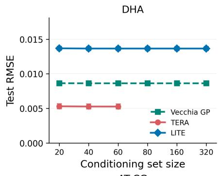

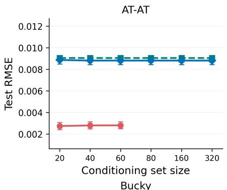

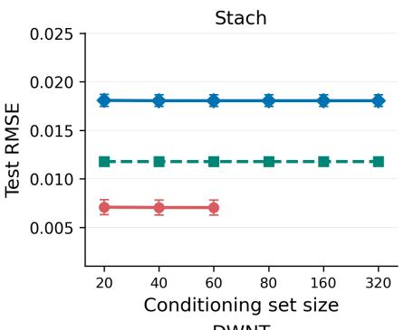

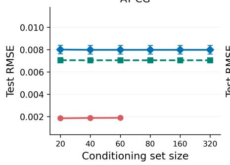

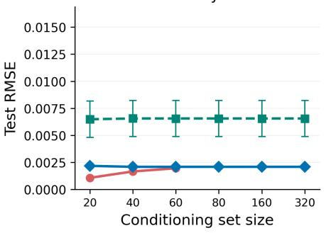

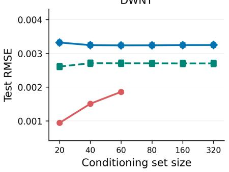  
Figure 6: Test RMSE versus conditioning set size on six MD22 datasets, with all methods using the covariance parameters learned by TERA at $m = 2 0$ after one epoch. Parameters remain fixed throughout prediction. Increasing m provides little improvement for LITE and the function-only Vecchia GP, and LITE’s RMSE remains higher than TERA’s at matched m.

Further training from shared parameters. We next initialize LITE with the same TERA estimates and independently train it for one additional epoch at each conditioning set size. TERA’s parameters remain fixed. Figure 7 compares these results with prediction using the frozen parameters.

Further training substantially reduces LITE’s RMSE on DHA, AT-AT, Stachyose, and Double-walled nanotube, but changes little on AT-AT-CG-CG and increases RMSE on Buckyball-catcher. The efect of further parameter estimation is therefore dataset dependent, and increasing m again provides little additional improvement

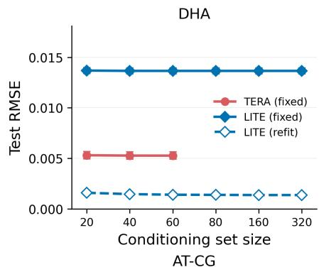

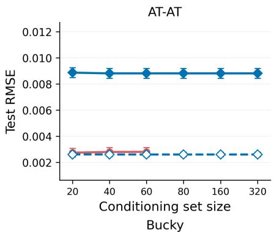

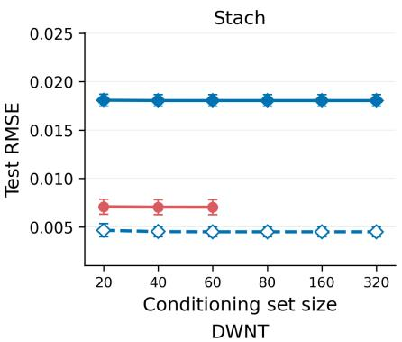

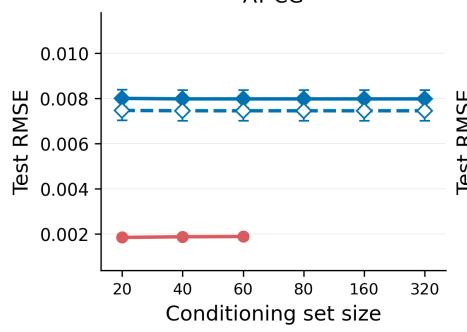

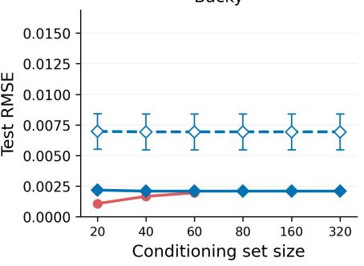

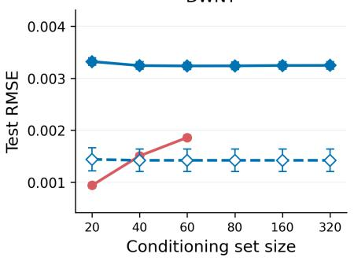  
Figure 7: Test RMSE versus conditioning set size on six MD22 datasets, using the same TERA estimates as in Figure 6. Solid curves keep these parameters fixed; the dashed curve trains LITE for one additional epoch at each $m ,$ starting independently from the same estimates. Further training improves LITE on four datasets, changes little on AT-AT-CG-CG, and worsens prediction on Buckyball-catcher.

Learning curves from a common initialization. In a separate experiment, we train TERA and LITE from the same initial covariance parameters for five epochs at $m = 2 0$ , using training and prediction batches of 32 targets. This experiment examines how additional training afects test error without initializing either method from the other’s parameter estimates.

Figure 8 shows that test RMSE does not decrease monotonically with training. On several datasets, it increases after an early minimum, and later improvements vary across datasets. These learning curves complement the shared-parameter comparisons by showing that additional training does not uniformly improve predictive accuracy.

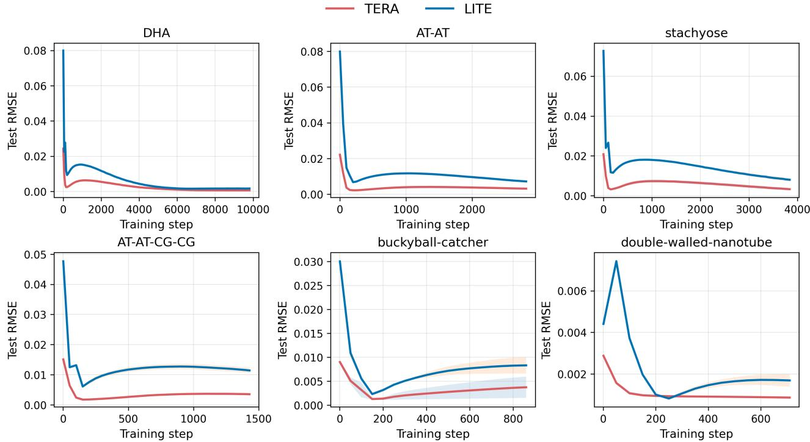  
Figure 8: Test RMSE versus training step on six MD22 datasets. Both methods use m = 20, training and prediction batch sizes of 32, and five training epochs. Additional updates do not uniformly improve predictive accuracy, with RMSE increasing after early minima on some datasets. Curves average five independent runs.

Summary of the diagnostics. These diagnostics show that common covariance parameters do not by themselves remove the accuracy gap, while the efect of further training varies across datasets. On MD22, all three Vecchia methods show little improvement from larger conditioning sets over the tested ranges. The main MD22 comparison demonstrates an accuracy-cost tradeof, with LITE achieving substantial runtime and memory savings at the cost of higher RMSE than TERA. The GP simulation in Section 5.1 demonstrates the predictive benefit of larger conditioning sets. In that setting, LITE uses sets beyond TERA’s memory limit to achieve lower error at substantially lower computational and memory cost.

## D.2 Computational Cost of Bayesian Optimization

Figure 9 complements the optimization curves in Figure 5 by comparing wall-clock time and peak GPU memory for the same BO runs. Across all three tasks, LITE uses only approximately 13–23% of TERA’s peak GPU memory. Its resource advantages also extend to function-only baselines. On Levy, LITE runs 2.7× faster than VBO and uses only 35% of TuRBO-1’s peak GPU memory. On LassoDNA, it uses only 12% of TuRBO-1’s memory and requires less wall-clock time than VBO, including the cost of hypergradient computation. These savings accompany the efective optimization shown in the main text.

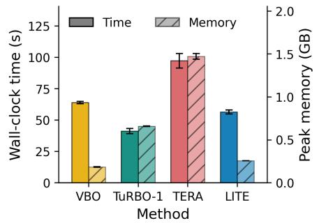

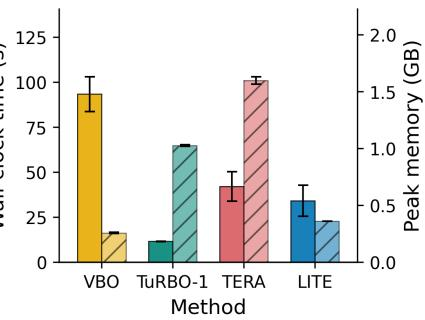

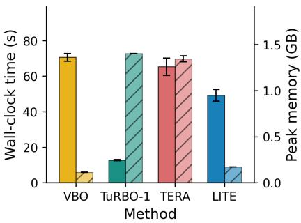  
Figure 9: Wall-clock time and peak GPU memory on Ackley (500D, left), Levy (800D, center), and LassoDNA (180D, right). Time includes objective evaluations and gradient computation where used, including hypergradient computation on LassoDNA. Bars average five independent runs, with error bars indicating standard errors.