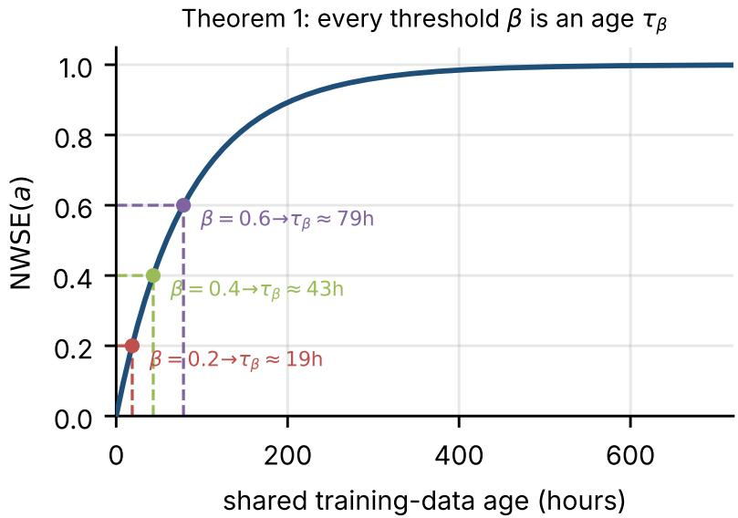
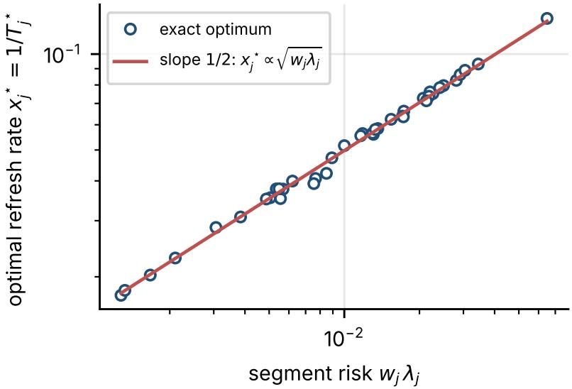
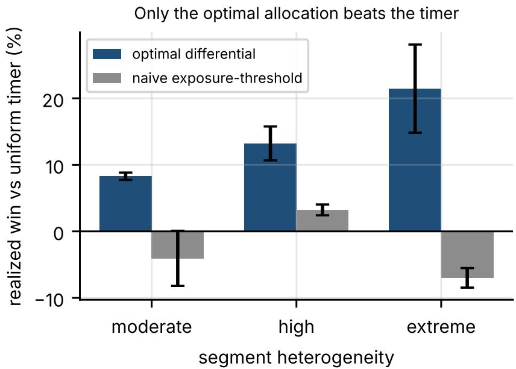

# Diferential Refresh Policies for Models Trained on Lagging Data Snapshots

From a Single-Age Equivalence Limit to an Optimal Per-Segment Allocation

Amit Rajula Independent Researcher, Phoenix, AZ, USA ORCID: 0009-0006-8025-6867 amit.rajula@gmail.com

October 8, 2026

Preprint. Submitted to Distributed and Parallel Databases (Springer).

## Abstract

Production machine-learning models are derived artifacts of time-bounded training snapshots: a deployed model is a materialized view over a training cut that ages the instant it is built. A common response is to replace the fixed retraining cadence with an adaptive trigger—a weighted staleness score that retrains when accumulated source risk crosses a threshold. We show this is the wrong lever, and identify the right one. First, an equivalence limit: any refresh trigger that is a static, strictly monotone function of a single shared global training-data age is operationally equivalent to a calibrated uniform age timer, so a global staleness budget—however elaborate its weighting of segments, sources, and sensitivities—carries no scheduling information a clock does not. The limit also says how to escape it: refresh segments diferentially, giving each its own age and refresh interval, which is meaningful exactly when refresh cost is separable across segments (incremental training or per-segment models). We then solve the resulting budget-allocation problem. The optimal policy has a clean form—in the frequent-refresh regime each segment’s refresh rate is proportional to the square root of its risk wjλj (weight times change rate)— and it never costs more than the uniform timer, beating it by a closed-form Cauchy–Schwarz “price of uniformity” that is zero for homogeneous workloads and grows with heterogeneity. In a discrete-event simulation with real Poisson change events, the optimal policy lowers realized weighted stale exposure by 8–29% relative to the uniform timer at matched refresh budget, winning on 86–100% of seeds; a naive exposure-threshold policy does not, establishing that the allocation—not merely the decision to go diferential—is what helps; and the advantage survives 50% multiplicative rate-estimation noise. The design rule is simple: the leverage in model refresh is not a better score but a better action—allocate a fixed refresh budget across segments by the square root of their risk. Results are simulation-based and stated for the model’s assumptions.

Keywords: training-data freshness, model refresh, diferential refresh, derived state, materializedview maintenance, data currency, Age of Information

## 1 Introduction

Production machine-learning (ML) systems retrain models on fixed daily, weekly, or monthly schedules even though the deployed model depends on continuously evolving source data, labels, features, and segment composition. This makes model freshness a derived-state problem and not only a concept-drift problem: the served model is a materialized view over a training snapshot that ages the moment it is built, exactly as a cached query result or a data-warehouse view ages against its changing base relations [1, 3, 4]. A natural response is to replace the wall-clock cadence with an adaptive trigger—a weighted staleness score that fires a retrain when accumulated source risk crosses a threshold—in the hope of refreshing more when the world moves faster and less when it is calm.

This paper asks, and answers, two linked questions: when can such a trigger do anything a clock cannot, and when it can, what is the optimal refresh policy? The first answer is a sharp limit; the second is a constructive policy that the limit itself points to.

The limit. Our starting observation is negative and clarifying. Any refresh trigger that is a static, strictly monotone function of a single shared global training-data age is operationally equivalent to a calibrated age timer (Theorem 1). Thresholding such a score is thresholding age in diferent units: for every score threshold there is an age at which it fires, so the two induce the same schedule (Figure 1). A weighted staleness budget, under global all-or-nothing refresh with shared lag and static parameters, is exactly such a function—so however elaborate its weighting of segments, sources, and sensitivities, it cannot place a refresh at a time a calibrated timer could not. The sophistication buys nothing while the model is refreshed as one aged snapshot.

The policy. The limit also says precisely how to escape it. The equivalence holds because, under global refresh, every segment shares one age; the trigger reacts to a single scalar. The escape is therefore to enlarge the state: refresh segments diferentially, so each carries its own age and its own refresh interval. Once refresh is separable across segments—the regime in which “incremental refresh cost” is a meaningful quantity, realized by incremental training or by per-segment / pertenant models—the question becomes a budget-allocation problem: given a fixed total refresh rate, how often should each segment be refreshed? We solve it. The optimal allocation has a clean form: in the frequent-refresh regime each segment’s refresh rate is proportional to the square root of its risk $w _ { j } \lambda _ { j }$ , the product of its weight and its change rate (Theorem 2, Figure 2). The uniform timer—the policy the limit collapses to—is the special case that ignores this structure, and the gap between them is a closed-form “price of uniformity”: a Cauchy–Schwarz dispersion of $\sqrt { w _ { j } \lambda _ { j } }$ that is zero exactly when segments are homogeneous and grows with heterogeneity (Theorem 3).

What it buys, honestly. We validate the policy, not just the formula. In a discrete-event simulation with real Poisson change events, the optimal diferential policy lowers realized weighted stale exposure by 8–29% relative to the uniform timer at matched refresh count, across moderateto-extreme heterogeneity, winning on 86–100% of seeds (Section 7). Two findings keep the claim honest. First, the win is a property of the optimal allocation specifically: a naive policy that simply thresholds each segment’s exposure—the obvious way to “go diferential”—is near break-even or worse, losing to the uniform timer in the moderate and extreme regimes. Second, the advantage requires heterogeneity; at low heterogeneity the uniform timer is already optimal, recovering Theorem 1 as a boundary case. The policy is also robust: it retains almost all of its benefit when the per-segment rates are estimated with 50% multiplicative noise.

## Contributions.

1. A derived-state formulation of model refresh as a per-segment freshness budget, with an explicit separable-cost model that makes diferential refresh meaningful (Section 3).

2. An equivalence limit (Theorem 1): any static strictly monotone function of one shared global age is a calibrated timer, with weighted stale exposure as a corollary (Section 4).

3. An optimal diferential-refresh policy (Theorem 2): a KKT characterization of the costminimizing per-segment intervals under a refresh budget, with a closed-form square-root allocation in the frequent-refresh regime (Section 5).

4. A dominance result with a closed-form gap (Theorem 3): the optimal policy never costs more than the uniform timer, and in the frequent regime the relative saving is a Cauchy–Schwarz dispersion of $\sqrt { w _ { j } \lambda _ { j } }$ , zero if segments are homogeneous (Section 5).

5. A simulation study with real change events validating the policy at matched refresh budget (8–29% realized savings), showing that a naive exposure-threshold does not sufice, and demonstrating robustness to rate-estimation noise (Section 7).

The practical message is a design rule. Before building an adaptive scheduler on a global staleness score, check whether the trigger can see anything a clock cannot; under global refresh it cannot, and the simpler timer is the same policy in disguise. The leverage is not a better score but a better action: refresh diferentially, and allocate the refresh budget by segment risk.

## 2 Related Work

Derived state and materialized-view maintenance. The closest systems lineage is materializedview maintenance, which studies how derived relational state is refreshed as base relations change [1, 2]. Deferred and periodic maintenance trade view currency for update cost. Our setting is the same shape—a model is a view over a training cut—but the maintenance action is a global recompute (a retrain), which is precisely the regime in which the equivalence limit bites; the constructive contribution is to make the maintenance action partial.

Data currency and freshness-aware systems. A substantial database literature treats freshness as a schedulable quantity. Labrinidis and Roussopoulos balance performance against data freshness in web database servers by scheduling view updates [3]; Guo et al. formalize relaxed currency and consistency [4]; Röhm et al. build freshness-sensitive routing across replicated OLAP components [5]; and Olston and Widom study best-efort cache synchronization under a precision/freshness tradeof [6]. Most directly, Cho and Garcia-Molina analyze how to schedule refreshes of a local copy to maximize freshness against sources that change at heterogeneous rates, and obtain the celebrated, counterintuitive result that for a pure-freshness objective uniform refresh is often optimal, and that one may even refresh slow-changing items more [7]. Our objective is diferent—a weight- and sensitivity-weighted stale-exposure functional rather than the fraction of time up to date—and under it the optimal allocation moves in the intuitive direction (refresh highrisk segments more), with a clean square-root law. The relationship is discussed in Section 8; our equivalence limit is the model-refresh analogue of their uniform-is-hard-to-beat phenomenon, and our dominance result quantifies exactly when and how much a non-uniform policy helps.

Caching, TTL, and Age of Information. Time-to-live expiration and web-cache freshness policies are the operational ancestors of the staleness budget [8]: a TTL is a single age threshold, and a weighted score is meant to generalize it. The limit says that under global refresh this generalization collapses back to a (recalibrated) TTL. Age-of-Information provides a vocabulary and optimization results for the age of information at a consumer [9]; our exposure functional is in that spirit, and our focus is when an age-derived control variable carries scheduling information beyond age itself.

Concept drift and ML systems. Concept-drift research studies changing predictive distributions and adaptation mechanisms [10]; production ML platforms and validation systems make data quality and train/serve consistency explicit operational concerns [11, 12, 13]; and data-cascade work documents how upstream data failures propagate into deployed systems [14]. This paper is orthogonal to drift detection: it does not ask when the world changed, but how to allocate a fixed retraining budget across heterogeneous parts of a model.

## 3 Model

## 3.1 Per-Segment Stale Exposure

Partition the training population into segments $j = 1 , \dotsc , n$ . Segment $j$ has importance weight $\pi _ { j } \ \geq \ 0$ , sensitivity $s _ { j } \ \geq \ 0 ;$ , and a Poisson source-change rate $\lambda _ { j } \ \geq \ 0 ;$ write $w _ { j } ~ = ~ \pi _ { j } s _ { j }$ for its combined weight. Interpreting $1 - e ^ { - \lambda _ { j } a }$ as the probability that segment j has experienced at least one source change in time a since its training cut (a standard Poisson-exposure model, consistent with AoI and cache-staleness analyses), the long-run average weighted stale exposure of a segment refreshed periodically with interval $T _ { j }$ is

$$
E _ { j } ( T _ { j } ) ~ = ~ { \frac { w _ { j } } { T _ { j } } } \int _ { 0 } ^ { T _ { j } } \bigl ( 1 - e ^ { - \lambda _ { j } a } \bigr ) d a ~ = ~ w _ { j } \left[ 1 - { \frac { 1 - e ^ { - \lambda _ { j } T _ { j } } } { \lambda _ { j } T _ { j } } } \right] .\tag{1}
$$

The system cost is the total weighted exposure $\begin{array} { r } { C = \sum _ { j } E _ { j } ( T _ { j } ) } \end{array}$ , which we report normalized by $\textstyle \sum _ { j } w _ { j }$

## 3.2 Refresh Budget and the Separable-Cost Assumption

Each refresh of a segment consumes resources; we charge one unit per segment-refresh and constrain the total refresh rate

$$
R = \sum _ { j = 1 } ^ { n } { \frac { 1 } { T _ { j } } } \quad { \mathrm { ( s e g m e n t - r e f r e s h e s ~ p e r ~ u n i t ~ t i m e ) } } .\tag{2}
$$

This budget model assumes refresh cost is separable across segments: the cost of refreshing a subset of segments is the sum of their individual costs. Two common production architectures satisfy it—incremental / online training, where the model is updated on the changed segment’s new data, and per-segment models (per-tenant, per-region, mixture-of-experts), where only some sub-models are retrained. Under an all-or-nothing full retrain the assumption fails: refreshing any subset still costs a full retrain, and diferential refresh ofers no saving. We state this boundary explicitly; the constructive results below hold exactly when “incremental refresh cost” is a meaningful metric.

## 4 The Single-Age Equivalence Limit

A global refresh sets one common source cutof for every segment, so after a refresh all segments share the same age $a ( t )$ , and a staleness score is a function of that single scalar.

  
Figure 1: The equivalence limit (Theorem 1). NWSE(a) for a heterogeneous six-segment set is strictly monotone in the shared age, so each budget $\beta$ maps through $F ^ { - 1 }$ to a unique age $\tau _ { \beta } \colon$ thresholding the score is thresholding age in diferent units.

Theorem 1 (Single-age equivalence). Let a refresh trigger fire when $G ( a ( t ) ) \geq \theta$ , where $a ( t )$ is a single shared global training-data age and G is static and strictly monotone increasing on the attainable age interval. Then for every threshold θ in the attainable range of G there is a unique age $\tau _ { \theta } = G ^ { - 1 } ( \theta )$ such that the trigger fires if and only if $a ( t ) \geq \tau _ { \theta }$ . The trigger therefore induces the same refresh schedule as a calibrated uniform age timer of period $\tau _ { \theta }$

Proof. G strictly increasing admits a well-defined inverse on its attainable range, and $G ( a ) \geq \theta \iff$ $a \geq G ^ { - 1 } ( \theta )$ . Under global refresh $a ( t )$ resets to 0 at each refresh and otherwise increases at unit rate, so the first crossing of $a \geq \tau _ { \theta }$ recurs with period $\tau _ { \theta }$ □

Corollary 1 (A global staleness budget is a timer). Normalized weighted stale exposure $F ( a ) =$ $\sum _ { j } w _ { j } ( 1 - e ^ { - \lambda _ { j } a } ) / \sum _ { j } w _ { j }$ evaluated at a shared age is static and strictly monotone in $^ { a , }$ since $\begin{array} { r } { F ^ { \prime } ( a ) = \sum _ { j } w _ { j } \lambda _ { j } e ^ { - \lambda _ { j } a } / \sum _ { j } w _ { j } > 0 } \end{array}$ whenever some $w _ { j } \lambda _ { j } > 0$ . By Theorem 1, thresholding it at $\beta$ is a uniform timer of period $\begin{array} { r } { \tau _ { \beta } = F ^ { - 1 } ( \beta ) } \end{array}$

Figure 1 is the geometric content: the strictly monotone F carries each budget $\beta$ to a unique age τ , so a horizontal threshold and a vertical age cut are the same line read on two axes. The limit is the motivation for everything that follows: to beat the timer one must leave the single-age regime, which under our model means refreshing segments diferentially.

## 5 Optimal Diferential Refresh

## 5.1 The Allocation Problem

Allow each segment its own interval $T _ { j }$ (equivalently, rate $x _ { j } = 1 / T _ { j } )$ . The design problem is to minimize total weighted exposure subject to the refresh budget:

$$
\operatorname* { m i n } _ { T _ { 1 } , . . . , T _ { n } > 0 } \sum _ { j } E _ { j } ( T _ { j } ) \qquad { \mathrm { s . t . } } \qquad \sum _ { j } { \frac { 1 } { T _ { j } } } = R .\tag{3}
$$

The uniform timer is the feasible point $T _ { j } = n / R$ for all $j ;$ it is the policy the limit of Section 4 collapses to. We characterize the optimum and compare.

## 5.2 The Optimal Allocation

Theorem 2 (Optimal diferential allocation). Problem (3) has optimal intervals $T _ { j } ^ { \star } = u _ { j } ^ { \star } / \lambda _ { j }$ , where each $u _ { j } ^ { \star } > 0$ solves the stationarity condition

$$
\frac { w _ { j } } { \lambda _ { j } } \big ( 1 - e ^ { - u _ { j } } ( 1 + u _ { j } ) \big ) \ = \ \mu \qquad ( j = 1 , \ldots , n ) ,\tag{4}
$$

with a single multiplier $\mu > 0$ fixed by the budget $\begin{array} { r } { \sum _ { j } \lambda _ { j } / u _ { j } ^ { \star } = R } \end{array}$ . In the frequent-refresh regime $u _ { j } \to 0$ this reduces to the closed form

$$
x _ { j } ^ { \star } = \frac { 1 } { T _ { j } ^ { \star } } = R \frac { \sqrt { w _ { j } \lambda _ { j } } } { \sum _ { k } \sqrt { w _ { k } \lambda _ { k } } } , \qquad i . e . \quad x _ { j } ^ { \star } \propto \sqrt { w _ { j } \lambda _ { j } } .\tag{5}
$$

Proof. The Lagrangian of (3) is $\begin{array} { r } { \sum _ { j } E _ { j } ( T _ { j } ) + \mu ( \sum _ { j } 1 / T _ { j } - R ) } \end{array}$ . Setting $\partial / \partial T _ { j } = 0$ gives $E _ { i } ^ { \prime } ( T _ { j } ) =$ $\mu / T _ { j } ^ { 2 }$ . Diferentiating (1), with $\begin{array} { r } { u \stackrel { } { = } \lambda _ { j } T _ { j } , E _ { j } ^ { \prime } ( T _ { j } ) \stackrel { } { = } w _ { j } \lambda _ { j } \big ( 1 - e ^ { - u } ( 1 + u ) \big ) / u ^ { 2 } > 0 } \end{array}$ , so $T _ { j } ^ { 2 } { \dot { E _ { j } ^ { \prime } } } ( T _ { j } ) =$ $( w _ { j } / \lambda _ { j } ) \big ( 1 - e ^ { - u _ { j } } ( 1 + u _ { j } ) \big ) = \mu$ , which is (4); the left side is increasing in $u _ { j }$ , so each $u _ { j } ^ { \star }$ is unique given $\mu _ { : }$ , and $\mu$ is set by the budget. As $u  0 , 1 - e ^ { - u } ( 1 + u ) = u ^ { 2 } / 2 + O ( u ^ { 3 } )$ , so (4) becomes $w _ { j } \lambda _ { j } T _ { j } ^ { 2 } / 2 = \mu$ , giving $T _ { j } ^ { \star } = \sqrt { 2 \mu / ( w _ { j } \lambda _ { j } ) }$ and hence $x _ { j } ^ { \star } \propto \sqrt { w _ { j } \lambda _ { j } }$ ; normalizing to the budget yields (5). □

The square-root law is the design heuristic: a segment’s refresh rate should scale with the square root of its risk $w _ { j } \lambda _ { j }$ , not with the risk itself. Figure 2 confirms that the exact numerical optimum follows (5) tightly in the frequent regime (log–log slope $1 / 2 { \mathrm { . } }$ , correlation 0.998 in the shown profile). Outside that regime the closed form degrades gracefully and the numerical solution of (4) should be used (Section 7).

## 5.3 Dominance and the Price of Uniformity

Theorem 3 (Dominance with a closed-form gap). The optimal diferential policy never costs more than the uniform timer at the same budget. In the frequent-refresh regime the relative saving is

$$
1 - \frac { C ^ { \star } } { C _ { \mathrm { u n i f } } } = 1 - \frac { \left( \sum _ { j } \sqrt { w _ { j } \lambda _ { j } } \right) ^ { 2 } } { n \sum _ { j } w _ { j } \lambda _ { j } } ,\tag{6}
$$

which lies in $[ 0 , 1 )$ , equals 0 if and only if $w _ { j } \lambda _ { j }$ is the same for all $j _ { ; }$ , and increases with the dispersion of $\sqrt { w _ { j } \lambda _ { j } }$

  
Figure 2: The optimal allocation (Theorem 2). In the frequent-refresh regime the exact numerical optimum obeys the closed-form square-root law $x _ { j } ^ { \star } \propto \sqrt { w _ { j } \lambda _ { j } }$ (log–log slope $1 / 2 )$ ; shown for a 40-segment moderate heterogeneity profile.

Proof. Optimality gives $C ^ { \star } \leq C _ { \mathrm { u n i f } }$ since the uniform allocation is feasible. In the frequent regime $E _ { j } ( T _ { j } ) \approx w _ { j } \lambda _ { j } T _ { j } / 2 .$ , so with $a _ { j } : = w _ { j } \lambda _ { j }$ the uniform cost is $\begin{array} { r } { C _ { \mathrm { u n i f } } = ( n / 2 R ) \sum _ { j } a _ { j } } \end{array}$ and, substituting (5), the optimal cost is $\begin{array} { r } { C ^ { \star } = \left( 1 / 2 R \right) \left( \sum _ { j } \sqrt { a _ { j } } \right) ^ { 2 } } \end{array}$ . Their ratio is $\textstyle \left( \sum _ { j } { \sqrt { a _ { j } } } \right) ^ { 2 } / ( n \sum _ { j } a _ { j } )$ , which by the Cauchy–Schwarz inequality is at most 1, with equality if all $a _ { j }$ are equal. □

Equation (6) is a “price of uniformity”: the fractional cost a global timer pays for ignoring segment risk is exactly a normalized dispersion of $\sqrt { w _ { j } \lambda _ { j } }$ . It is zero for homogeneous workloads—recovering the equivalence limit, under which diferential refresh cannot help—and grows with heterogeneity, which is what the experiments quantify.

## 5.4 An Implementable Policy, and a Caution

Theorem 2 yields a directly implementable policy: estimate $w _ { j } , \lambda _ { j }$ , solve (4) (or use (5)) for the target intervals $T _ { j } ^ { \star }$ , and refresh each segment on its own timer. It is tempting to replace this with a simpler “adaptive” rule—refresh segment j whenever its own exposure $w _ { j } ( 1 - e ^ { - \lambda _ { j } a _ { j } } )$ crosses a common threshold—which needs no allocation step. This naive policy is not optimal: its intervals scale as $1 / ( w _ { j } \lambda _ { j } )$ rather than $1 / \sqrt { w _ { j } \lambda _ { j } }$ , over-concentrating refreshes on high-risk segments. Section 7 shows it is near break-even or worse than the uniform timer, so the allocation—not merely the decision to go diferential—is the contribution.

## 6 Experimental Setup

We evaluate on synthetic segmented workloads with $n = 8$ segments and four heterogeneity profiles (low, moderate, high, extreme) controlling the spread of $\lambda _ { j }$ and $w _ { j }$ ; extreme spans two decades of change rate. Analytical results solve (3) numerically (SLSQP) and in closed form (5), over 50 random profiles per cell with the uniform timer as baseline at the identical budget. The simulation uses a discrete-event harness over a 4320-hour (180-day) horizon on a 6-hour decision grid, drawing actual Poisson change events per segment; a segment is stale at a step if at least one unincorporated change has occurred. Each policy’s realized weighted stale exposure is integrated over the horizon, and all policies are compared on the same change-event stream and at matched total refresh count. Fifty seeds; means and standard deviations reported. The robustness study recomputes the allocation from multiplicative log-normal noisy estimates of $\lambda _ { j }$ while charging cost against the true rates.

Table 1: Analytical cost saving of optimal diferential refresh over the uniform timer (mean over 50 profiles, %). Uniform is optimal at low heterogeneity; the gap grows with dispersion of segment risk.
<table><tr><td>Heterogeneity</td><td>Sparse</td><td>Moderate</td><td>Frequent</td></tr><tr><td>Low</td><td>0.2</td><td>0.2</td><td>0.3</td></tr><tr><td>Moderate</td><td>7.5</td><td>7.1</td><td>8.4</td></tr><tr><td>High</td><td>11.4</td><td>12.9</td><td>14.0</td></tr><tr><td>Extreme</td><td>21.0</td><td>24.1</td><td>29.5</td></tr></table>

## 7 Results

## 7.1 The Analytical Win Grows with Heterogeneity

Table 1 reports the relative cost saving of the exact optimal allocation over the uniform timer. It is essentially zero for near-homogeneous workloads—where Theorem 3 predicts no gain and the uniform timer is already optimal—and rises monotonically with heterogeneity and with refresh frequency, reaching 29.5% for extreme heterogeneity at the frequent budget. The optimizer never produced a point worse than uniform across all 600 profiles, consistent with the dominance guarantee.

## 7.2 The Closed Form Is Exact in the Frequent Regime

The square-root law (5) is an asymptote. In the frequent-refresh regime it is highly accurate: its cost exceeds the exact optimum by at most 0.35% at moderate heterogeneity, and the optimal and closed-form refresh rates correlate at 0.98 (log scale). In the sparse regime it degrades—cost excess up to 22% at extreme heterogeneity, where many segments saturate $( \lambda _ { j } T _ { j } \gg 1 )$ and the quadratic expansion underlying (5) no longer holds—so the numerical solution of (4) should be used there. This is the expected boundary of a frequent-regime closed form, not a failure of the characterization.

## 7.3 The Policy Wins in Simulation at Matched Budget

Table 2 is the central empirical result. In a discrete-event simulation with real Poisson events, the optimal diferential policy lowers realized weighted stale exposure by 7.7–28.8% relative to the uniform timer at matched refresh count, winning on 86–100% of seeds. The advantage grows with heterogeneity and, within a profile, with refresh budget. The naive exposure-threshold policy, by contrast, hovers near break-even and is frequently worse than the uniform timer (down to −8.7%): going diferential helps only when the budget is allocated by the square-root law, not by raw exposure. Figure 3 summarizes.

Table 2: Realized weighted stale exposure saving over the uniform timer in the discrete-event simulation, at matched refresh count (50 seeds). K is the uniform timer’s number of full refreshes. $^ { 6 } \mathrm { O p t }$ . win” is the optimal diferential policy; “Naive” is the exposure-threshold policy; “seeds” is the fraction on which the optimal policy wins.
<table><tr><td>Heterogeneity</td><td>K</td><td>Opt. win (%)</td><td>Naive (%)</td><td>Opt. seeds s (%)</td></tr><tr><td>Moderate</td><td>10</td><td>8.6</td><td>0.2</td><td>98</td></tr><tr><td>Moderate</td><td>20</td><td>7.7</td><td>-4.3</td><td>86</td></tr><tr><td>Moderate</td><td>40</td><td>8.6</td><td>-8.1</td><td>94</td></tr><tr><td>High</td><td>10</td><td>11.0</td><td>4.1</td><td>100</td></tr><tr><td>High</td><td>20</td><td>12.7</td><td>3.0</td><td>100</td></tr><tr><td>High</td><td>40</td><td>16.0</td><td>2.5</td><td>100</td></tr><tr><td>Extreme</td><td>10</td><td>15.9</td><td>-5.9</td><td>96</td></tr><tr><td>Extreme</td><td>20</td><td>19.6</td><td>-8.7</td><td>98</td></tr><tr><td>Extreme</td><td>40</td><td>28.8</td><td>-6.4</td><td>98</td></tr></table>

Table 3: Analytical win (%) under multiplicative λ-estimation noise at the moderate budget (50 profiles, mean).
<table><tr><td>Heterogeneity</td><td>noise 0.00</td><td>0.10 0.25</td><td>0.50</td></tr><tr><td>Moderate</td><td>7.0</td><td>7.0 6.6</td><td>5.5</td></tr><tr><td>High</td><td>13.0</td><td>12.9 12.6</td><td>11.3</td></tr><tr><td>Extreme</td><td>24.3</td><td>24.3 24.0</td><td>23.2</td></tr></table>

## 7.4 Robust to Rate-Estimation Noise

The policy needs per-segment rate estimates. Table 3 recomputes the allocation from multiplicative log-normal noisy $\lambda _ { j }$ while charging cost against the true rates. The win is strikingly stable: even at 50% noise it retains 5.5% of 7.0% (moderate), 11.3% of 13.0% (high), and 23.2% of 24.3% (extreme). Because the allocation depends on $\sqrt { \lambda _ { j } }$ , rate errors are damped, and mis-ranking two segments of similar risk costs little. The policy does not need precise rate estimates to help.

## 8 Discussion

Why the square root, and the contrast with Cho–Garcia-Molina. The intuitive guess is to refresh each segment in proportion to its risk $w _ { j } \lambda _ { j } ;$ the optimum instead scales with its square root. The extra concavity comes from the budget being a sum of rates $1 / T _ { j }$ while cost is (to first order) linear in the intervals $T _ { j }$ : equalizing marginal cost per unit rate yields the square-root rule. This is why the naive exposure-threshold, whose intervals scale as $1 / ( w _ { j } \lambda _ { j } )$ , over-serves high-risk segments and loses. Cho and Garcia-Molina famously found that for a pure-freshness objective uniform refresh is often optimal and non-uniformity can even invert intuition [7]; our objective weights exposure by importance and sensitivity, and under it non-uniformity helps in the intuitive direction. The two results are consistent: both say that whether—and how—to deviate from uniform depends delicately on the objective, and both identify homogeneity as the point where uniform is optimal.

  
Figure 3: Realized saving over the uniform timer at matched refresh count (mean over the three budgets of Table 2, error bars $\pm \ : \mathrm { s . d . } )$ . The optimal diferential policy wins and grows with heterogeneity; the naive exposure-threshold policy is near break-even or worse.

When diferential refresh does not help. Three conditions neutralize the policy, and we state them plainly. If the workload is homogeneous $( w _ { j } \lambda _ { j }$ nearly constant), the price of uniformity (6) is near zero. If refresh cost is not separable—an all-or-nothing full retrain (Section 3.2)—the budget model (2) does not apply and there is nothing to allocate. And if rate estimates are so poor as to be uninformative, the allocation reverts toward uniform; our noise study shows this degradation is slow, but it exists.

Relation to the limit. The constructive result and the limit are two halves of one statement. Theorem 1 says a global staleness budget is a timer; Theorem 3 says that the only way to beat that timer is to enlarge the state via diferential refresh, and gives the exact value of doing so. The sophistication that does not help (a cleverer global score) and the simplicity that does (a square-root allocation of a refresh budget) are separated cleanly.

## 9 Limitations and Future Work

The study is simulation-based and does not use production retraining traces. The exposure model is a Poisson single-change abstraction; richer change processes (bursty, seasonal) and non-exponential staleness-to-error couplings are future work, though the allocation framework is agnostic to the exact $E _ { j }$ as long as it is convex and increasing in $T _ { j }$ . The budget model charges one unit per segment-refresh; heterogeneous per-segment refresh costs $c _ { j }$ are a direct extension (replace $\sum 1 / T _ { j }$ by $\sum c _ { j } / T _ { j }$ , which rescales the square-root law to $x _ { j } ^ { \star } \propto \sqrt { w _ { j } \lambda _ { j } / c _ { j } } )$ . Online estimation of $\lambda _ { j }$ under drift, and joint optimization of refresh with model-partition granularity, are the natural next steps.

## 10 Conclusion

Model refresh is derived-state maintenance, and a freshness budget is only as powerful as the action it drives. Under global refresh of one aged snapshot, a weighted staleness score—however elaborate—is a uniform timer in disguise (Theorem 1). The leverage is not a better score but a better action: refresh segments diferentially and allocate the refresh budget by the square root of segment risk (Theorem 2), which never costs more than the uniform timer and saves a closed-form Cauchy–Schwarz dispersion that grows with heterogeneity (Theorem 3). In simulation with real change events the policy lowers realized stale exposure by 8–29% at matched refresh budget, a naive exposure-threshold does not, and the advantage survives heavy rate-estimation noise. The design rule is simple: check whether your trigger can see anything a clock cannot—and if the win you want is real, buy it with diferential refresh, not a more intricate score.

## Statements and Declarations

Funding. The author received no funding for this work.

Competing interests. The author declares no competing interests.

Data and code availability. The simulation harness and the scripts that generate every table and figure in this paper are available from the author on reasonable request; all reported numbers are reproducible from that code with the random seeds stated in the text.

## References

[1] A. Gupta and I. S. Mumick, “Maintenance of materialized views: Problems, techniques, and applications,” IEEE Data Eng. Bull., vol. 18, no. 2, pp. 3–18, 1995.

[2] S. Ceri and J. Widom, “Deriving production rules for incremental view maintenance,” in Proc. VLDB, 1991, pp. 577–589.

[3] A. Labrinidis and N. Roussopoulos, “Balancing performance and data freshness in web database servers,” in Proc. VLDB, 2003, pp. 393–404.

[4] H. Guo, P.-Å. Larson, R. Ramakrishnan, and J. Goldstein, “Relaxed currency and consistency: How to say ‘good enough’ in SQL,” in Proc. ACM SIGMOD, 2004, pp. 815–826.

[5] U. Röhm, K. Böhm, H.-J. Schek, and H. Schuldt, “FAS—a freshness-sensitive coordination middleware for a cluster of OLAP components,” in Proc. VLDB, 2002, pp. 754–765.

[6] C. Olston and J. Widom, “Best-efort cache synchronization with source cooperation,” in Proc. ACM SIGMOD, 2002, pp. 73–84.

[7] J. Cho and H. Garcia-Molina, “Synchronizing a database to improve freshness,” in Proc. ACM SIGMOD, 2000, pp. 117–128.

[8] P. Cao and S. Irani, “Cost-aware WWW proxy caching algorithms,” in Proc. USENIX Symp. Internet Technologies and Systems, 1997, pp. 193–206.

[9] R. D. Yates, Y. Sun, D. R. Brown III, S. K. Kaul, E. Modiano, and S. Ulukus, “Age of Information: An introduction and survey,” IEEE J. Sel. Areas Commun., vol. 39, no. 5, pp. 1183–1210, 2021.

[10] J. Gama, I. Žliobait˙e, A. Bifet, M. Pechenizkiy, and A. Bouchachia, “A survey on concept drift adaptation,” ACM Comput. Surv., vol. 46, no. 4, pp. 1–37, 2014.

[11] D. Sculley et al., “Hidden technical debt in machine learning systems,” in Proc. NeurIPS, 2015, pp. 2503–2511.

[12] D. Baylor et al., “TFX: A TensorFlow-based production-scale machine learning platform,” in Proc. ACM KDD, 2017, pp. 1387–1395.

[13] E. Breck, N. Polyzotis, S. Roy, S. Whang, and M. Zinkevich, “Data validation for machine learning,” in Proc. MLSys, 2019.

[14] N. Sambasivan et al., “Everyone wants to do the model work, not the data work: Data cascades in high-stakes AI,” in Proc. ACM CHI, 2021, pp. 1–15.