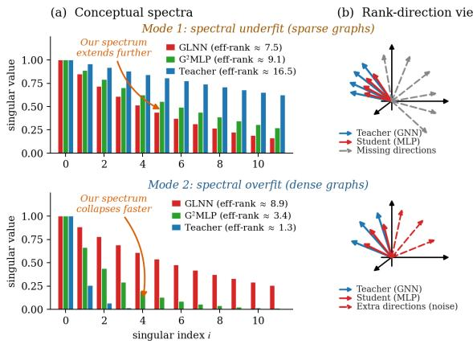
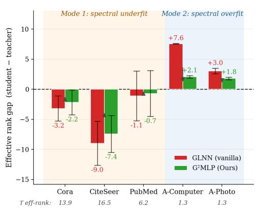
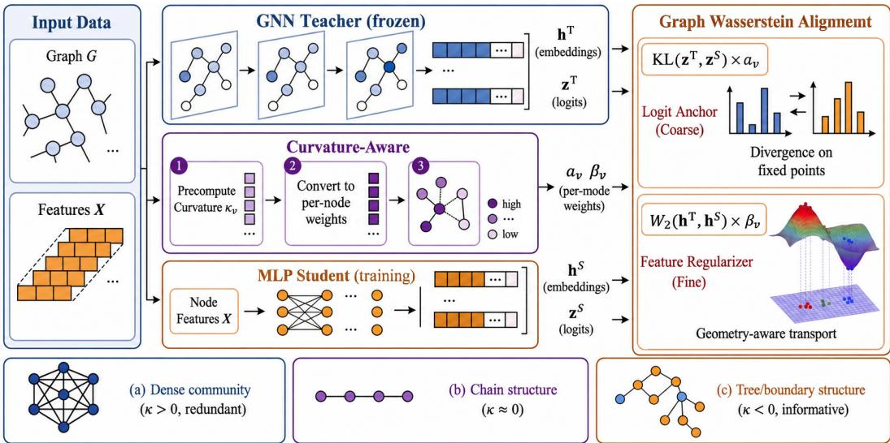
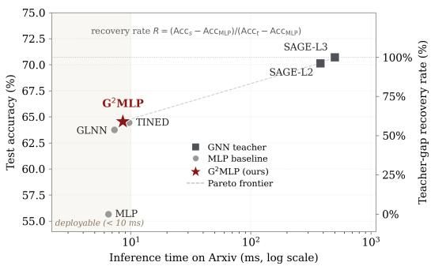

# Distilling Graph Geometry: Knowledge Gap from GNNs to MLPs

Zhewei Chen1 Hao Zhu2 Jiaojiao Jiang3 Ahad N. Zehmakan1

1Australian National University 2Data61, CSIRO 3University of New South Wales

{zhewei.chen, ahadn.zehmakan}@anu.edu.au

allen.zhu@data61.csiro.au jiaojiao.jiang@unsw.edu.au

## Abstract

GNN-to-MLP distillation aims to retain the predictive accuracy of a messagepassing teacher while deploying a graph-free MLP at inference. Existing methods mainly transfer node-wise predictions or use confidence-based reweighting, but they do not specify where the student should preserve the teacher’s graph-induced geometry. We show that this omission leads to two spectral failure modes in the student’s representation space. On sparse graphs, the student suffers from spectral underfit, missing high-energy teacher directions concentrated near boundary regions. On dense graphs, it suffers from spectral overfit, retaining spurious directions that the teacher has collapsed through aggregation. Motivated by an energy-weighted teacher–student alignment objective, we propose Graph Geometry-aware MLP (G2MLP), a training-time distillation framework guided by Ollivier–Ricci curvature. Curvature identifies where the two spectral errors concentrate and is used to allocate supervision between prediction-level and representation-level alignment. The deployed model remains a standard MLP and requires no graph access at inference. Across node-classification benchmarks, G2MLP consistently improves over graph-free distillation baselines, reduces the teacher–student rank gap in both regimes, and transfers without architectural changes to Graph Transformer teachers and link prediction.

## 1 Introduction

Graph Neural Networks (GNNs) [Gilmer et al., 2017] are the standard tool for learning on graphs, but their reliance on message passing makes inference slow in latency-sensitive applications such as fraud detection [Wang et al., 2021]. A growing line of work distils GNN knowledge into a structure-free Multi-Layer Perceptron (MLP), enabling fast graph-free inference [Zhang et al., 2022, Guo et al., 2023, Tian et al., 2023]. Most methods follow GLNN [Zhang et al., 2022] and match teacher logits with a KL loss, sometimes injecting structural priors through positional encodings [Tian et al., 2023, Wang et al., 2023], codebooks [Yang et al., 2024], or neighborhood alignment cues [Hu et al., 2021, Wu et al., 2023a]. These methods improve the student’s information source, but they usually treat graph structure as uniformly useful: every node receives the same type of distillation pressure regardless of its topological role.

We argue that this uniform view misses an important source of teacher–student mismatch. Message passing changes representations differently across graph regions. Boundary nodes often contain graph-induced directions that are hard to infer from features alone, while dense interior nodes are often smoothed toward class-level prototypes. As shown in Figure 1, this produces two spectral failure modes in GNN-to-MLP distillation. On sparse graphs, the student has lower effective rank than the teacher, which we call spectral underfit. On dense graphs, the teacher may collapse to a low-rank geometry, while the feature-only student retains unsupported variation, which we call spectral overfit.

  
Figure 1: Two spectral failure modes of GNN-to-MLP distillation. (a) Singular-value spectra: GLNN exhibits spectral underfit on sparse graphs and spectral overfit on dense graphs. (b) Rankdirection sketch. (c) Per-dataset rank gap.

Our analysis in Section 3 formalizes this phenomenon through the mismatch between the GNN kernel and the MLP kernel. The resulting energy-weighted alignment objective $\mathcal { L } ^ { \ast }$ explains why pointwise KL distillation is insufficient: two students can match the same logits while inducing different representation geometries. It also suggests that a practical surrogate should allocate supervision according to where the spectral error concentrates. Ollivier–Ricci curvature (ORC) provides such a local signal: low-curvature edges mark boundary regions where random-walk neighborhoods disagree, while high-curvature edges mark dense regions where aggregation strongly smooths representations.

We instantiate this principle in Graph Geometry-aware MLP $( \mathbf { G } ^ { 2 } \mathbf { M L P } )$ ${ \bf G } ^ { 2 } { \bf M } { \bf L } { \bf P }$ uses ORC to approximate this principled alignment: low-curvature nodes receive stronger prediction-level supervision to correct spectral underfit, while high-curvature nodes receive stronger representationlevel neighborhood alignment to reduce spectral overfit. The representation term uses a closed-form diagonal Gaussian $\mathcal { W } _ { 2 }$ surrogate. All graph-dependent quantities are used only during training, so the deployed model remains a vanilla MLP. Our contributions are:

• We identify spectral underfit and spectral overfit as two failure modes of GNN-to-MLP distillation, and connect them to boundary and interior graph regions.

• We derive an energy-weighted alignment objective $\mathcal { L } ^ { \ast }$ that characterizes teacher–student geometric mismatch and motivates curvature-dependent allocation of distillation supervision.

• We propose ${ \mathrm { \bf G } } ^ { 2 } { \mathrm { \bf M L P } } ,$ a curvature-guided distillation framework that combines prediction- and representation-level alignment while preserving graph-free MLP inference.

## 2 Related Work

GNN-to-MLP knowledge distillation. GLNN [Zhang et al., 2022] established the paradigm of distilling a GNN teacher into an MLP student through soft-label KL [Hinton et al., 2015], eliminating graph access at inference. Follow-up work enriches the student’s input or supervision target: positional encodings (NOSMOG [Tian et al., 2023]), structural codebooks (VQGraph [Yang et al., 2024]), neighborhood alignment (FF-G2M [Wu et al., 2023a]), and hardness-aware reweighting (KRD [Wu et al., 2023b], HGMD [Wu et al., 2024], AdaGMLP [Lu et al., 2024], MSN-GDM [Dong et al., 2025]). SimMLP [Wang et al., 2025] swaps the supervision target for a self-supervised contrastive objective. These methods either treat nodes uniformly or derive node weights from teacher confidence; none ties reweighting to a graph-topology quantity or to a named failure mode of uniform KD.

Optimal transport for distillation. WCoRD [Chen et al., 2021] and EMD+IPOT [Lohit and Jones, 2022] transfer knowledge via discrete Wasserstein distances at the penultimate layer, but rely on cross-instance matching that does not exploit class structure. WKD [Lv et al., 2024] introduces continuous Gaussian $\bar { \mathcal { W } } _ { 2 }$ as a Riemannian metric for feature distillation, sharper than geometryunaware KL [Peyré and Cuturi, 2019]. We extend WKD’s Gaussian- $\cdot \mathcal { W } _ { 2 }$ template to the graph setting, fitting it per node over neighborhood representations and weighting it by curvature.

Curvature on graphs. Ollivier–Ricci curvature (ORC) [Ollivier, 2009] measures the W distance between neighborhood walks of adjacent nodes, and has been used for community detection [Sia et al., 2019] and information-flow analysis [Topping et al., 2022]. In GNNs, Nguyen et al. [2023] link positive curvature to over-smoothing and negative curvature to over-squashing, motivating rewiring (BORF) and dropout (CurvDrop [Liu et al., 2023]) schemes; Hevapathige et al. [2025] adapt depth via learnable Bakry–Émery curvature. These works treat curvature as a structural signal for modifying the GNN itself; we instead use it to stratify distillation pressure between teacher and student.

## 3 Why Uniform Distillation Fails under Curvature Heterogeneity

We develop a kernel-motivated analysis of GNN-to-MLP distillation. Our goal is not to derive an exact computable form of the GNTK, but to identify which parts of the teacher geometry a graph-free student tends to miss and how graph curvature can guide a tractable surrogate. The argument proceeds in three steps: the teacher kernel contains graph-dependent aggregation terms absent from the MLP kernel; this mismatch appears as two opposite spectral failure modes; and ORC provides a local graph signal for allocating supervision where these modes concentrate. The result is an energy-weighted target objective $\mathcal { L } ^ { * }$ and a curvature-guided approximation developed in Section 4.

Teacher and Student Kernel Mismatch. NTK theory [Jacot et al., 2018] characterizes infinitely wide networks trained by gradient flow: at convergence, the network output lies in the function space induced by a fixed kernel, the network’s NTK. For a K-layer GNN with feature aggregation A and activation σ, the GNTK ${ \bf K } ^ { ( K ) }$ admits a recursion of the schematic form

$$
{ { \bf K } } ^ { ( k ) } ( v , u ) = \underbrace { \mathcal { A } \Bigl [ \Sigma ^ { ( k - 1 ) } \Bigr ] ( v , u ) } _ { \mathrm { a g g r e g a t i o n ~ o v e r ~ } ( \mathcal { N } ( v ) , \mathcal { N } ( u ) ) } + \dot { \Sigma } ^ { ( k ) } ( v , u ) { \bf K } ^ { ( k - 1 ) } ( v , u ) ,\tag{1}
$$

where $\Sigma ^ { ( k ) }$ is the post-activation covariance and $\dot { \Sigma } ^ { ( k ) }$ its derivative kernel; the full recursion follows Du et al. [2019] and is given in Appendix B. Here G denotes the input graph, X the node feature matrix, and $\mathcal { N } ( v )$ the 1-hop neighborhood of v. The aggregation term sums covariance over neighborhood pairs, so ${ \bf K } ^ { ( K ) }$ depends jointly on $( \mathbf { X } , { \mathcal { G } } )$ . The MLP student’s NTK ${ \bf K } ^ { \mathrm { M L P } }$ is the aggregation-free counterpart and depends only on X. Thus $\Delta ^ { ( K ) } = { \bf K } ^ { ( K ) } - { \bf K } ^ { \mathrm { M L P } }$ captures the graph-dependent component introduced by message passing. The following statement is used qualitatively to motivate local surrogates; we do not claim that the full GNTK is sparse or that curvature exactly estimates its eigenspectrum.

Lemma 3.1 (Aggregation Locality). For a K-layer message-passing GNN with Lipschitz activation, the graph-dependent aggregation component of $\mathbf { \ddot { K } } ^ { ( K ) }$ is generated through paths contained in K-hop receptivefields. Hence the graph-induced contribution associated with a node pair $( v , u )$ depends on the overlap andfeature similarity oftheir K-hop neighborhoods. Thefull kernel need not be sparse, sincefeature covariance may remain nonzerofor distant nodes.

## 3.1 Two Failure Modes and the Ideal Distillation Objective

Spectral distortion. We characterize the student’s coverage of the teacher’s geometry in the teacher’s eigenbasis. Let $\begin{array} { r } { { \bf K } ^ { ( K ) } = \sum _ { i } \lambda _ { i } ^ { K } { \bf u } _ { i } { \bf u } _ { i } ^ { \top } } \end{array}$ , with $\lambda _ { 1 } ^ { K } \ge \cdots \ge \overset {  } { \lambda _ { N } ^ { K } } \ge 0$ . For each direction with ${ \lambda } _ { i } ^ { K } > 0$ define

$$
\rho _ { i } = \frac { \mathbf { u } _ { i } ^ { \top } \mathbf { K } ^ { \mathrm { M L P } } \mathbf { u } _ { i } } { \lambda _ { i } ^ { K } } .\tag{2}
$$

When $\rho _ { i } < 1$ , the student has insufficient energy along a teacher direction, which we call spectral underfit; when $\rho _ { i } > 1$ , the student retains energy in directions that the teacher kernel weakly supports, which we call spectral overfit. We summarize the diagonal mismatch in the teacher eigenbasis by

$$
\mathcal { D } = \sum _ { i } ( \rho _ { i } - 1 ) ^ { 2 } \lambda _ { i } ^ { K } .\tag{3}
$$

This quantity does not compare all off-diagonal kernel entries. It measures how much MLP energy differs from teacher energy along teacher eigendirections, with high-energy teacher directions receiving larger weight. Understanding where these discrepancies arise is therefore key to allocating distillation effort.

Define Ollivier–Ricci curvature as $\kappa ( i , j ) = 1 - W _ { 1 } ( \mu _ { i } , \mu _ { j } )$ , where $\mu _ { v }$ is the lazy random-walk distribution on the closed neighborhood $\mathcal { N } ^ { + } ( v )$ . Let $\bar { \kappa } _ { v }$ average $\kappa ( \boldsymbol { v } , \boldsymbol { u } )$ over $u \in \mathcal { N } ( v )$ , and let $\widetilde { \kappa } _ { v } ~ = ~ ( \bar { \kappa } _ { v } - \mu _ { \kappa } ) / \sigma _ { \kappa } .$ . For a Lipschitz feature map ϕ, define the neighborhood embedding $\begin{array} { r } { \bar { \mathbf { x } } _ { v } = \sum _ { u } \mu _ { v } ( u ) \phi ( \mathbf { x } _ { u } ) } \end{array}$ . The following proposition links ORC to local aggregation disagreement under explicit metric assumptions.

Proposition 3.2 (ORC as a Local Mismatch Proxy). Suppose ϕ is L-Lipschitz with respect to the ground metric used in $W _ { 1 }$ . Then for any edge $( i , j )$

$$
\| \bar { \mathbf { x } } _ { i } - \bar { \mathbf { x } } _ { j } \| _ { 2 } \leq L W _ { 1 } ( \mu _ { i } , \mu _ { j } ) = L ( 1 - \kappa ( i , j ) ) .\tag{4}
$$

Thus low-curvature edges correspond to pairs whose local random-walk neighborhoods are difficult to align, while high-curvature edges correspond to locally coherent neighborhoods.

Therefore, ORC is a locally computable proxy for where graph-dependent teacher information is likely to matter, without requiring construction or diagonalization of $\Delta ^ { ( K ) }$ . This motivates the curvature-stratified weights in Section 4.3.

Why pointwise KL is insufficient. The standard distillation loss $\begin{array} { r } { \mathcal { L } _ { \mathrm { K D } } = \frac { 1 } { | \mathcal { V } | } \sum _ { v } D _ { \mathrm { K L } } \big ( \hat { \mathbf { y } } _ { v } ^ { T } \| \hat { \mathbf { y } } _ { v } ^ { S } \big ) } \end{array}$ sums node-wise divergences that depend on the teacher’s marginal predictive distribution. Two students may match the same teacher logits while inducing different neighborhood geometries in hidden space. Consequently, pointwise KL does not directly control the graph-induced representation geometry encoded by ${ \bf K } ^ { ( \bar { K } ) }$ . Reducing spectral distortion therefore requires an additional objective sensitive to neighborhood-level teacher-student alignment.

The target alignment loss. A natural energy-weighted target is

$$
\mathcal { L } ^ { * } = \| \mathbf { f } ^ { T } - \mathbf { f } ^ { S } \| _ { \mathbf { K } ^ { ( K ) } } ^ { 2 } = \sum _ { i } \lambda _ { i } ^ { K } \Big ( \hat { f } _ { i } ^ { T } - \hat { f } _ { i } ^ { S } \Big ) ^ { 2 } ,\tag{5}
$$

where $\hat { f } _ { i } ^ { T } = \mathbf { u } _ { i } ^ { \top } \mathbf { f } ^ { T }$ and $\| \mathbf { f } \| _ { \mathbf { K } ^ { ( K ) } } ^ { 2 } = \mathbf { f } ^ { \top } \mathbf { K } ^ { ( K ) } \mathbf { f }$ denotes the finite-dimensional teacher-kernel energy form, not the RKHS norm. The weights $\lambda _ { i } ^ { K }$ emphasize teacher directions with high functional energy. In spectral underfit, this prioritizes teacher directions that the MLP does not recover; in spectral overfit, it downweights near-null teacher directions where the student retains unsupported variation. Directly using $\mathcal { L } ^ { \ast }$ is impractical because it requires storing and diagonalizing the full teacher kernel. We therefore use it as a principled target and approximate it with local, curvature-guided alignment in Section 4.

## 3.2 Curvature Stratifies the Failure Modes

Mode-conditional failure structure. Proposition 3.2 indicates that curvature separates locally incoherent boundary neighborhoods from coherent interior neighborhoods. $\operatorname { L e t } \mathbf { H } ^ { T } , \mathbf { H } ^ { S } \in \mathbb { R } ^ { N \times d _ { h } }$ denote penultimate-layer representations, and define the demeaned effective rank erank(H) = $\begin{array} { r } { \exp ( - { \bar { \sum _ { i } } } p _ { i } \log p _ { i } ) } \end{array}$ , where $\dot { p } _ { i } \propto \sigma _ { i } ^ { 2 } ( \mathbf { H } - \bar { \mathbf { H } } )$ . The rank gap $\Delta r = \mathrm { e r a n k } ( \mathbf { H } ^ { S } ) - \mathrm { e r a n k } ( \mathbf { \dot { H } } ^ { T } )$ is used as an observable diagnostic of representation geometry, not as an exact estimator of the teacher-kernel spectrum.

• Spectral underfit $( \Delta r < 0 )$ . On sparse graphs with heterogeneous curvature, aggregation can create boundary-sensitive teacher directions that the feature-only student does not recover. These directions have large boundary variation $\begin{array} { r } { \mathrm { B V } ( \mathbf { u } _ { i } ) \ = \ \mathbf { \bar { \Sigma } } \mathbf { \Sigma } } \end{array}$ $\kappa ( v , u ) ) ( [ \mathbf { u } _ { i } ] _ { v } - [ \mathbf { u } _ { i } ] _ { u } ) ^ { 2 }$ , and are therefore associated with low-curvature edges.

• Spectral overfit $( \Delta r > 0 )$ . On dense graphs with relatively homogeneous curvature, aggregation can collapse teacher representations toward low-rank class prototypes, while the feature-only student retains variation in directions weakly supported by the teacher. This excess variation is most visible in high-curvature interior subgraphs where local neighborhoods are already strongly smoothed.

Implication for the loss design. The two modes concentrate at different parts of the curvature spectrum: spectral underfit appears mainly in low-κ boundary regions, whereas spectral overfit appears mainly in high-κ interior subgraphs. A uniformly weighted loss does not explicitly distinguish these regimes. Increasing pressure on boundary-discriminative directions also increases pressure on already-smoothed interior regions, and the converse is also true. This motivates a curvature-stratified objective in which prediction-side and representation-side alignment receive opposite curvaturedependent emphasis, as developed in Section 4.

  
Figure 2: Overview of $\mathbf { G } ^ { 2 } \mathbf { M } \mathbf { L } \mathbf { P } . \mathrm { A }$ frozen GNN teacher and an MLP student produce embeddings and logits; precomputed Ollivier–Ricci curvature yields per-node weights $\alpha _ { v }$ and $\beta _ { v }$ that allocate prediction-level and representation-level alignment during training.

The target objective $\mathcal { L } ^ { \ast }$ in Eq. (5) is computationally intractable because it requires the full teacher kernel spectrum. We approximate it through three practical relaxations: global kernel alignment is replaced by local neighborhood distribution matching, discrete optimal transport is replaced by a diagonal Gaussian $\mathcal { W } _ { 2 }$ surrogate, and uniform node weighting is replaced by ORC-dependent weighting. These steps are not exact equivalences; they are tractable approximations designed to preserve the graph-dependent teacher geometry most relevant to spectral underfit and spectral overfit.

## 4.1 From Global Alignment to Local Neighborhood Measures

The first source of intractability is the global scope of ${ \bf K } ^ { ( K ) }$ . By Lemma 3.1, the graph-dependent part of the teacher kernel is generated through message-passing neighborhoods, even though the full kernel may also contain nonlocal feature covariance. We therefore approximate the energy-weighted alignment in $\mathcal { L } ^ { \ast }$ by matching local teacher and student representation distributions.

For each node v, let $\mu _ { v }$ be the lazy random walk distribution over $\mathcal { N } ^ { + } ( v )$ , defined as $\mu _ { v } ( u ) =$ $\textstyle { \frac { 1 } { 2 } } { \mathbf { 1 } } \{ u = v \} + { \frac { 1 } { 2 | { \mathcal { N } } ( v ) | } } { \mathbf { \dot { 1 } } } \{ u \in { \mathcal { N } } ( v ) \} $ , and define the local representation measures

$$
\nu _ { v } ^ { T } = \sum _ { u \in \mathcal { V } } \mu _ { v } ( u ) \delta _ { \mathbf { r } _ { u } ^ { T } } , \qquad \nu _ { v } ^ { S } = \sum _ { u \in \mathcal { V } } \mu _ { v } ( u ) \delta _ { \mathbf { r } _ { u } ^ { S } } ,\tag{6}
$$

where $\delta _ { \mathbf { x } }$ denotes the Dirac measure at point x and $\mathbf { r } _ { \underset { m } { u } } = [ \mathbf { h } _ { u _ { \ast } } ^ { \top } , \mathbf { z } _ { u } ^ { \top } ] ^ { \top }$ concatenates the penultimate hidden features and output logits of node u. Matching $\nu _ { v } ^ { T }$ and $\nu _ { v } ^ { S }$ in Wasserstein-2 distance encourages agreement in both local means and local dispersion. Aggregating over nodes gives the Graph Wasserstein objective

$$
\mathcal { L } _ { \mathrm { G W } } = \frac { 1 } { | \mathcal { V } | } \sum _ { v \in \mathcal { V } } \mathcal { W } _ { 2 } ^ { 2 } \big ( \nu _ { v } ^ { T } , \nu _ { v } ^ { S } \big ) .\tag{7}
$$

Unlike pointwise $\mathrm { K L }$ , this term depends on neighborhood representation geometry: students with identical nodewise predictions can receive different gradients if their local representation distributions differ. In practice, we use the uniform one-hop proxy $q _ { v } ( u ) = | \mathcal { N } ^ { + } ( v ) | ^ { - 1 } \mathbf { 1 } \{ u \in \mathcal { N } ^ { + } ( v ) \}$ for computational simplicity, and write $\widetilde { \nu } _ { v }$ for the resulting empirical measure.

## 4.2 Efficient Neighborhood Alignment via Moment Matching

Each $\mathcal { W } _ { 2 } ^ { 2 } ( \widetilde { \nu } _ { v } ^ { T } , \widetilde { \nu } _ { v } ^ { S } )$ is an optimal transport problem over $\left| \mathcal { N } ^ { + } ( v ) \right|$ atoms, costing $O ( | \mathcal { N } ^ { + } ( v ) | ^ { 3 } )$ per node. To obtain a scalable surrogate, we match the first two marginal moments of the teacher and student neighborhood measures. This approximation is most reliable in high-curvature neighborhoods, where adjacent nodes have large structural overlap and the local representation distribution is often concentrated. We use the diagonal Gaussian approximation

$$
\widetilde { \nu } _ { v } ^ { T } \approx \mathcal { N } ( \mathbf { m } _ { v } ^ { T } , \mathrm { d i a g } ( \pmb { \sigma } _ { v } ^ { T } ) ) , \quad \widetilde { \nu } _ { v } ^ { S } \approx \mathcal { N } ( \mathbf { m } _ { v } ^ { S } , \mathrm { d i a g } ( \pmb { \sigma } _ { v } ^ { S } ) ) ,\tag{8}
$$

where $\begin{array} { r } { \mathbf { m } _ { v } = \sum _ { u \in \mathcal { N } ^ { + } ( v ) } q _ { v } ( u ) \mathbf { r } _ { u } } \end{array}$ and $\begin{array} { r } { \pmb { \sigma } _ { v } = \sum _ { u \in \mathcal { N } ^ { + } ( v ) } q _ { v } ( u ) ( \mathbf { r } _ { u } - \mathbf { m } _ { v } ) ^ { 2 } } \end{array}$ denotes the coordinatewise variance. The resulting closed-form distance is

$$
\mathcal { W } _ { 2 , \mathrm { d i a g } } ^ { 2 } ( \widetilde { \nu } _ { v } ^ { T } , \widetilde { \nu } _ { v } ^ { S } ) = \| \mathbf { m } _ { v } ^ { T } - \mathbf { m } _ { v } ^ { S } \| _ { 2 } ^ { 2 } + \| \sqrt { \pmb { \sigma } _ { v } ^ { T } + \epsilon } - \sqrt { \pmb { \sigma } _ { v } ^ { S } + \epsilon } \| _ { 2 } ^ { 2 } .\tag{9}
$$

This reduces the per-node cost to $O ( d )$ The diagonal covariance follows standard practice in Gaussian- $\cdot \mathcal { W } _ { 2 }$ distillation [Lv et al., 2024]; it avoids the $O ( d ^ { 2 } )$ cost of full covariances while retaining coordinate-wise dispersion. The surrogate may be less accurate for multimodal or strongly heterophilic neighborhoods, which we treat as a limitation. Since $\mathbf { r } _ { u } = [ \mathbf { h } _ { u } ^ { \top } , \mathbf { z } _ { u } ^ { \top } ] ^ { \top }$ , the distance in Eq. (9) splits additively into a feature-side term over h and a logit-side term over $\mathbf { z } ,$ enabling the curvature-dependent weighting in Section 4.3. We denote this objective $\mathcal { L } _ { \mathrm { d i a g } }$

## 4.3 Curvature-Adaptive Weighting

The remaining gap between $\mathcal { L } _ { \mathrm { d i a g } }$ and $\mathcal { L } ^ { \ast }$ is that ${ \mathcal { L } } _ { \mathrm { d i a g } }$ weights every node uniformly, while $\mathcal { L } ^ { \ast }$ emphasizes high-energy teacher directions. Section 3.2 suggests that these directions are associated with different curvature regimes in the two failure modes: low-curvature boundary regions are important for recovering missing decision-relevant teacher directions, whereas high-curvature interior regions are important for suppressing unsupported student variation after teacher smoothing. We therefore use ORC as a local proxy for allocating the alignment budget, rather than as an exact estimator of kernel eigenvalues.

We instantiate this proxy with opposite monotone weights for the logit and feature components:

$$
\alpha _ { v } = \frac { \exp ( - \gamma _ { z } \widetilde { \kappa } _ { v } ) } { \frac { 1 } { | \mathcal { V } | } \sum _ { u } \exp ( - \gamma _ { z } \widetilde { \kappa } _ { u } ) } , \qquad \beta _ { v } = \frac { \exp ( + \gamma _ { h } \widetilde { \kappa } _ { v } ) } { \frac { 1 } { | \mathcal { V } | } \sum _ { u } \exp ( + \gamma _ { h } \widetilde { \kappa } _ { u } ) } ,\tag{10}
$$

where $\alpha _ { v }$ upweights prediction-side alignment at low-curvature boundary nodes and $\beta _ { v }$ upweights representation-side alignment at high-curvature interior nodes. The normalization enforces $\begin{array} { r } { \frac { 1 } { | \mathcal { V } | } \sum _ { v } \alpha _ { v } \dot { = } \frac { 1 } { | \mathcal { V } | } \sum _ { v } \beta _ { v } = 1 } \end{array}$ , so curvature redistributes emphasis without changing the overall loss scale. Hyperparameters $\gamma _ { z } , \gamma _ { h } > 0$ control the strength of stratification.

Let $\widetilde { \nu } _ { h , v }$ and $\widetilde { \nu } _ { z , v }$ denote the hidden and logit marginals of $\widetilde { \nu } _ { v }$ . The resulting Curvature-Adaptive Wasserstein objective is

$$
\mathcal { L } _ { \mathrm { C A W } } = \frac { 1 } { \left| \mathcal { V } \right| } \sum _ { v \in \mathcal { V } } \left[ \beta _ { v } \mathcal { W } _ { 2 , \mathrm { d i a g } } ^ { 2 } ( \widetilde { \nu } _ { h , v } ^ { T } , \widetilde { \nu } _ { h , v } ^ { S } ) + \alpha _ { v } \mathcal { W } _ { 2 , \mathrm { d i a g } } ^ { 2 } ( \widetilde { \nu } _ { z , v } ^ { T } , \widetilde { \nu } _ { z , v } ^ { S } ) \right] ,\tag{11}
$$

which is computable in $O ( ( | \mathcal { V } | + | \mathcal { E } | ) \cdot d )$ per iteration. This construction keeps the approximation aligned with the two regimes: low-curvature nodes receive stronger prediction-level correction, while high-curvature nodes receive stronger neighborhood representation matching where the Gaussian moment surrogate is most appropriate.

Objective Function. The full G2MLP training objective is

$$
\mathcal { L } = \lambda _ { \mathrm { C E } } \mathcal { L } _ { \mathrm { C E } } + \lambda _ { \mathrm { K D } } \mathcal { L } _ { \mathrm { K D } } + \lambda _ { \mathrm { C A W } } \frac { \mathcal { L } _ { \mathrm { C A W } } } { \mathrm { s g } ( \mathcal { L } _ { \mathrm { C A W } } ) + \epsilon _ { \mathrm { s g } } } ,\tag{12}
$$

where $\begin{array} { r } { \mathcal { L } _ { \mathrm { K D } } = \frac { 1 } { | \mathcal { V } | } \sum _ { v } D _ { \mathrm { K L } } \big ( \hat { \mathbf { y } } _ { v } ^ { T } \big | \big | \hat { \mathbf { y } } _ { v } ^ { S } \big ) } \end{array}$ and $\mathcal { L } _ { \mathrm { C E } }$ is cross-entropy on labeled nodes $\mathcal { V } ^ { L }$ , with $\lambda _ { \mathrm { C E } } = 0$ in all node-classification and Graph Transformer experiments. The stop-gradient normalization rescales the CAW gradient by a batch-level constant without changing its direction, making its magnitude comparable to entropy-scaled losses. The KL term preserves probability-simplex calibration, while ${ \mathcal { L } } _ { \mathrm { C A W } }$ aligns local teacher-student geometry.

## 5 Experiments

## 5.1 Experimental Setup

Datasets. We evaluate on six node classification benchmarks: three citation networks (Cora, Citeseer, Pubmed), two Amazon co-purchase graphs (A-Computer, A-Photo) [Shchur et al., 2018], and the large-scale OGB graph ogbn-Arxiv [Hu et al., 2020]. The first five follow the CPF setting [Yang et al., 2021]; ogbn-Arxiv follows the standard OGB split. Dataset statistics are given in Appendix E.

Settings. We follow the protocol of GLNN [Zhang et al., 2022], evaluating the result in two regimes: transductive, where all nodes are visible during training but test labels are hidden; and inductive, where a disjoint set of test nodes (and their incident edges) is held out from training. The interpolated production score prod = 0.2×ind + 0.8×tran [Tian et al., 2023] summarizes a realistic deployment mix of seen and unseen nodes.

Baselines. We focus on the canonical GNN-to-MLP distillation setup: a frozen pretrained GNN teacher distilled into an MLP student that consumes only the original node features at training and inference. The GNN teacher is GraphSAGE [Hamilton et al., 2017] throughout, following GLNN, NOSMOG. We compare against: vanilla MLP; GLNN [Zhang et al., 2022], soft-label KL distillation; KRD [Wu et al., 2023b], reliability-based sample reweighting; FF-G2M [Wu et al., 2023a], lowand high-frequency distillation. We do not compare against positional-encoding augmented variants (e.g., NOSMOG [Tian et al., 2023]), which augment the student’s input with precomputed structural features, or codebook-augmented variants (e.g., VQGraph [Yang et al., 2024]), which jointly train the teacher with auxiliary codebooks. Both depart from setup, precluding fair comparison.

Implementation. We use a 2-layer GraphSAGE teacher and a 2-layer MLP student with matched hidden dimension, following standard practice [Zhang et al., 2022]; ogbn-Arxiv uses the OGBstandard 3-layer architecture for both teacher and student. All models are trained with Adam [Kingma and Ba, 2015] and early stopping on validation accuracy. Student learning rate, weight decay, and dropout follow the GLNN-released configurations and are not tuned; our loss-balance hyperparameters are set per dataset. Hyperparameter ranges and per-dataset optimizer settings are in Appendix E. We report mean accuracy ± standard deviation over 10 unique random seeds.

## 5.2 Main Results

Table 1: Node classification accuracy (%) under the transductive setting. Best student is in bold.
<table><tr><td rowspan="2">Dataset</td><td>Teacher 一</td><td colspan="5">Graph-free students</td></tr><tr><td>SAGE</td><td>MLP</td><td>GLNN</td><td>KRD</td><td>FF-G2M</td><td> $\mathbf { G } ^ { 2 } \mathbf { M L P }$ </td></tr><tr><td>Citeseer</td><td> $7 0 . 4 9 { \pm } 1 . 5 3 $ </td><td> $5 8 . 5 0 { \pm } 1 . 8 6 $ </td><td> $7 1 . 2 2 { \pm } 1 . 5 0 $ </td><td> $7 2 . 8 4 { \pm } 1 . 7 0 $ </td><td> $7 2 . 8 5 { \pm } 1 . 5 9 $ </td><td> ${ \bf 7 4 . 5 1 \pm 2 . 3 5 }$ </td></tr><tr><td>Pubmed</td><td> $7 5 . 5 6 { \pm } 2 . 0 6$ </td><td> $6 8 . 3 9 { \pm } 3 . 0 9$ </td><td> $7 5 . 5 9 { \pm 2 . 4 6 }$ </td><td> $7 7 . 0 1 { \pm } 3 . 1 1 $ </td><td> $7 6 . 5 6 { \pm } 3 . 4 1$ </td><td> ${ \bf 7 8 . 1 7 \pm 2 . 7 5 }$ </td></tr><tr><td>Cora</td><td> $8 0 . 6 4 { \pm } 1 . 5 7$ </td><td> $5 9 . 1 8 { \pm } 1 . 6 0$ </td><td> $8 0 . 2 6 { \pm } 1 . 6 6$ </td><td> $8 2 . 2 7 { \pm } 1 . 3 1 $ </td><td> $8 2 . 3 8 { \pm } 1 . 4 1 $ </td><td> $\mathbf { 8 } 2 . 5 4 \pm \mathbf { 1 . 8 7 }$ </td></tr><tr><td>A-computer</td><td> $8 2 . 8 2 { \pm } 1 . 3 7 $ </td><td> $6 7 . 6 2 { \pm } 2 . 2 1 $ </td><td> $8 2 . 7 1 { \pm } 1 . 1 8$ </td><td> $8 2 . 8 7 { \pm } 0 . 8 7 $ </td><td> $8 3 . 6 7 { \pm } 1 . 0 4 $ </td><td> $\mathbf { 8 3 . 8 7 \pm 1 . 0 9 }$ </td></tr><tr><td>A-photo</td><td> $9 0 . 8 5 { \pm } 0 . 8 7$ </td><td> $7 7 . 2 9 { \pm } 1 . 7 9$ </td><td> $9 1 . 9 5 { \pm } 1 . 0 4 $ </td><td> $9 1 . 9 5 { \pm } 1 . 4 4 $ </td><td> $9 2 . 5 1 { \pm } 0 . 5 6 $ </td><td> $\mathbf { 9 2 . 8 5 { \pm 0 . 7 8 } }$ </td></tr><tr><td>Arxiv</td><td> $7 0 . 7 3 { \pm } 0 . 3 5$ </td><td> $5 5 . 6 7 { \scriptstyle \pm 0 . 2 4 }$ </td><td> $6 3 . 7 5 { \pm } 0 . 4 8$ </td><td> $5 9 . 2 6 { \pm } 0 . 5 1 $ </td><td> $5 8 . 5 1 { \pm } 0 . 3 5 $ </td><td> $\mathbf { 6 4 . 5 7 \pm 0 . 3 1 }$ </td></tr></table>

Transductive Setting. ${ \bf G } ^ { 2 } { \bf M } { \bf L } { \bf P }$ achieves the best graph-free accuracy on all six datasets, improving over the strongest baseline (FF-G2M, KRD, or GLNN depending on the dataset) by 0.16 to 1.66 pp. ${ \bf G } ^ { 2 } { \bf M L P }$ further surpasses the GraphSAGE teacher on five of the six datasets, with gains up to 4.02 pp on Citeseer; only on ogbn-Arxiv does the student fall short of the teacher (-6.16 pp), reflecting the known difficulty of feature-only inference on this large-scale graph [Zhang et al., 2022]. Component ablation (Appendix E.4) confirms that gains arise from curvature stratification.

Inductive and Production Settings. ${ \bf G } ^ { 2 } { \bf M } { \bf L } { \bf P }$ achieves the best graph-free production accuracy on 5/6 datasets, with gains of 0.16–1.60 pp over the strongest baseline. The advantage is most pronounced in the inductive regime, where ${ \bf G } ^ { 2 } { \bf M } { \bf L } { \bf P }$ improves by 2.07–2.69 pp on Cora, Citeseer, Pubmed, and A-computer—substantially larger than under transductive evaluation, suggesting curvature-stratified alignment transfers better to unseen nodes than nodewise distillation. On A-computer (ind), ${ \bf G } ^ { 2 } { \bf M } { \bf L } { \bf P }$ reaches 82.67%, essentially matching the SAGE teacher (82.83%) without graph access; on Citeseer and Pubmed (prod), ${ \bf G } ^ { 2 } { \bf M } { \bf \bar { L } } { \bf P }$ surpasses the teacher by 3.61 and 2.68 pp respectively.

Table 2: Node classification accuracy (%) under the production setting.
<table><tr><td rowspan="2">Dataset</td><td rowspan="2">Eval</td><td>Teacher</td><td colspan="5">Graph-free students</td></tr><tr><td>SAGE</td><td>MLP</td><td>GLNN</td><td>KRD</td><td>FF-G2M</td><td> $\mathbf { G } ^ { 2 } \mathbf { M L P }$ </td></tr><tr><td rowspan="3">Citeseer</td><td>prod</td><td>68.06</td><td>58.49</td><td>69.08</td><td>71.38</td><td>71.89</td><td>71.67</td></tr><tr><td>ind</td><td>69.14±2.99</td><td> $5 9 . 3 1 { \pm } 4 . 5 6 $ </td><td>68.48±2.38</td><td>69.78±3.04</td><td>69.75±3.16</td><td> ${ \bf 7 1 . 8 5 \pm 2 . 2 7 }$ </td></tr><tr><td>tran</td><td>67.79±2.80</td><td>58.29±1.94</td><td>69.23±2.39</td><td>71.77±2.81</td><td>72.12±2.69</td><td> $7 1 . 6 2 { \pm } 1 . 3 1 $ </td></tr><tr><td rowspan="3">Pubmed</td><td>prod</td><td>74.77</td><td>68.39</td><td>74.67</td><td>76.00</td><td>73.98</td><td>77.45</td></tr><tr><td>ind</td><td>75.07±2.89</td><td>68.28±3.25</td><td>74.52±2.95</td><td>75.17±3.11</td><td> $7 3 . 4 9 { \pm } 7 . 9 1 $ </td><td> ${ 7 7 . 3 0 { \pm } 1 . 4 8 }$ </td></tr><tr><td>tran</td><td>74.70±2.33</td><td>68.42±3.06</td><td>74.70±2.75</td><td> $7 6 . 2 0 { \scriptstyle \pm 3 . 0 0 }$ </td><td> $7 4 . 1 0 { \pm } 7 . 7 8 $ </td><td> ${ \bf 7 7 . 4 9 { \pm } 1 . 2 5 }$ </td></tr><tr><td rowspan="3">Cora</td><td>prod</td><td>79.53</td><td>59.18</td><td>77.82</td><td>75.74</td><td>78.60</td><td>79.73</td></tr><tr><td>ind</td><td>81.03±1.71</td><td>59.44±3.36</td><td> $7 3 . 2 1 { \pm } 1 . 5 0 $ </td><td> $7 0 . 2 6 { \pm } 1 . 9 4$ </td><td> $7 2 . 0 2 { \pm } 1 . 4 3$ </td><td> ${ \bf 7 5 . 9 0 { \pm } 1 . 8 7 }$ </td></tr><tr><td>tran</td><td>79.16±1.60</td><td>59.12±1.49</td><td> $7 8 . 9 7 { \pm } 1 . 5 6 $ </td><td> $7 7 . 1 1 \pm 1 . 4 4$ </td><td> $8 0 . 0 1 { \pm } 1 . 4 1 $ </td><td> $\mathbf { 8 0 . 6 9 } \pm \mathbf { 0 . 7 3 }$ </td></tr><tr><td rowspan="3">A-computer</td><td>prod</td><td>82.73</td><td>67.62</td><td>82.10</td><td>81.17</td><td>82.69</td><td>84.29</td></tr><tr><td>ind</td><td>82.83±1.51</td><td>67.69±2.20</td><td> $8 0 . 2 7 { \pm } 2 . 1 1 $ </td><td> $7 9 . 1 5 { \pm } 1 . 8 2 $ </td><td> $8 0 . 5 2 { \pm } 1 . 5 6 $ </td><td> $\mathbf { 8 } 2 . 6 7 { \pm } \mathbf { 0 . 9 3 }$ </td></tr><tr><td>tran</td><td>82.70±1.34</td><td>67.60±2.23</td><td>82.56±1.80</td><td> $8 1 . 6 7 { \pm } 1 . 9 2 $ </td><td> $8 3 . 2 3 { \pm } 1 . 3 6 $ </td><td>84.69±0.85</td></tr><tr><td rowspan="3">A-photo</td><td>prod</td><td>90.45</td><td>77.29</td><td>91.34</td><td>91.84</td><td>92.35</td><td>92.51</td></tr><tr><td>ind</td><td>90.56±1.47</td><td>77.44±1.50</td><td>89.50±1.12</td><td> $9 0 . 0 4 { \pm } 1 . 1 2 $ </td><td> $\mathbf { 9 0 . 7 0 { \scriptstyle \pm 0 . 7 6 } }$ </td><td> $9 0 . 6 1 { \pm } 0 . 5 0 $ </td></tr><tr><td>tran</td><td>90.42±0.68</td><td>77.25±1.90</td><td>91.80±0.49</td><td> $9 2 . 2 9 { \pm } 0 . 6 3 $ </td><td>92.77±0.24</td><td> $\mathbf { 9 2 . 9 8 { \pm } 0 . 5 1 }$ </td></tr><tr><td rowspan="3">Arxiv</td><td>prod</td><td>70.69</td><td>55.35</td><td>63.50</td><td>59.32</td><td>59.60</td><td>63.90</td></tr><tr><td>ind</td><td>70.69±0.58</td><td>55.29±0.63</td><td>59.04±0.46</td><td>57.32±0.31</td><td> $5 7 . 0 2 { \pm } 0 . 4 3 $ </td><td>59.82±0.42</td></tr><tr><td>tran</td><td>70.69±0.39</td><td>55.36±0.34</td><td>64.61±0.15</td><td>59.82±0.27</td><td> $6 0 . 2 4 { \pm } 0 . 2 3 $ </td><td> $\mathbf { 6 4 . 9 2 } \pm \mathbf { 0 . 2 6 }$ </td></tr></table>

## 5.3 GT-to-MLP Distillation

Graph Transformers (GTs) incur quadratic attention cost at inference, making distillation to MLP students particularly attractive. We evaluate three GT teachers: GT [Dwivedi and Bresson, 2020] with local masked attention, GraphGPS [Rampášek et al., 2022] with hybrid MPNN+global attention, and NAGphormer [Chen et al., 2023] with per-node hop-token attention. Experiments use the same five datasets as Section 5.2 except ogbn-Arxiv, which exceeds GraphGPS dense-attention memory. The student is the same MLP used throughout.

Table 3: Transformer-teacher to MLP distillation. T: teacher; S: GLNN student; $S ^ { \dagger } { : \mathrm { G ^ { 2 } M L P } }$ student. Bold: student value ≥ teacher. Underline: $S ^ { \dagger } > S$
<table><tr><td></td><td colspan="3">GT</td><td colspan="3">GraphGPS</td><td colspan="3">NAGphormer</td></tr><tr><td>Dataset</td><td> $T$ </td><td>S</td><td>S†</td><td>T</td><td>S</td><td>S†</td><td>T</td><td>S</td><td> $S ^ { \dagger }$ </td></tr><tr><td>Citeseer</td><td>71.16±2.31</td><td>71.85±2.45</td><td> ${ \bf 7 2 . 3 5 { \pm } 1 . 8 5 }$ </td><td> $6 8 . 0 7 { \scriptstyle \pm 2 . 6 2 }$ </td><td>69.38±2.30</td><td> $\underline { { { \bf 6 9 . 6 8 \pm 2 . 0 5 } } }$ </td><td> $7 0 . 0 9 { \pm } 1 . 8 1 $ </td><td>71.24±1.64</td><td> $\underline { { 7 1 . 8 2 \pm 1 . 2 9 } }$ </td></tr><tr><td>Pubmed</td><td>74.09±2.48</td><td> $\mathbf { 7 4 . 6 1 } { \pm } \mathbf { 2 . 4 8 }$ </td><td> $\overline { { 7 4 . 7 6 { \pm } 2 . 8 3 } }$ </td><td> $7 1 . 7 7 { \pm } 2 . 8 1 $ </td><td> $7 1 . 6 8 { \pm } 2 . 6 1 $ </td><td> $\overline { { 7 2 . 0 3 \pm 2 . 5 8 } }$ </td><td> $7 6 . 1 9 { \scriptstyle \pm 2 . 8 6 }$ </td><td> $\mathbf { 7 6 . 8 5 \pm 3 . 3 4 }$ </td><td> $\overline { { 7 7 . 0 6 \pm 3 . 4 9 } }$ </td></tr><tr><td>Cora</td><td> $7 8 . 5 3 { \pm } 2 . 0 8$ </td><td> $\mathbf { 7 8 . 9 8 { \pm } 1 . 9 0 }$ </td><td> $\overline { { 7 9 . 2 1 \pm 2 . 0 9 } }$ </td><td> $7 6 . 2 1 { \pm } 1 . 9 1 $ </td><td> $7 6 . 0 6 { \pm } 1 . 9 9$ </td><td> $\overline { { 7 6 . 7 7 \pm 1 . 9 7 } }$ </td><td> $8 0 . 8 8 { \pm } 1 . 7 7 $ </td><td> $\mathbf { 8 1 . 0 0 \pm 1 . 4 5 }$ </td><td> $\overline { { 8 1 . 4 8 \pm 1 . 5 3 } }$ </td></tr><tr><td>A-computer</td><td> $8 3 . 8 9 { \pm } 1 . 5 9 $ </td><td> $\mathbf { 8 4 . 5 3 \pm 1 . 4 2 }$ </td><td> $\overline { { 8 4 . 7 2 \pm 1 . 3 2 } }$ </td><td> $7 8 . 3 0 { \pm } 1 . 7 0 $ </td><td> ${ \bf 7 8 . 9 9 { \pm } 1 . 7 3 }$ </td><td> $\overline { { 8 0 . 1 2 \pm 1 . 5 5 } }$ </td><td> $8 2 . 7 8 { \pm } 1 . 9 2$ </td><td> $\mathbf { 8 3 . 0 2 \pm 1 . 8 7 }$ </td><td>83.31±1.77</td></tr><tr><td>A-photo</td><td>90.94±0.87</td><td> $\mathbf { 9 1 . 9 0 { \pm } 0 . 5 6 }$ </td><td> $\underline { { \mathbf { 0 2 . 0 6 } \pm \mathbf { 0 . 8 2 } } }$ </td><td> $9 0 . 4 1 { \pm } 1 . 1 0 $ </td><td> $\mathbf { 9 1 . 0 3 } \pm \mathbf { 0 . 9 5 }$ </td><td> $\mathbf { \underline { { 9 1 . 3 2 \pm 0 . 9 3 } } }$ </td><td> $9 1 . 4 5 { \pm } 0 . 8 2 $ </td><td> $\mathbf { 9 2 . 0 7 } \pm \mathbf { 0 . 7 4 }$ </td><td>92.49±0.65</td></tr></table>

Results. The MLP student meets or exceeds its transformer teacher on $1 3 / 1 5$ cells $( S \geq T ;$ GT 5/5, GraphGPS 3/5, NAGphormer 5/5), and ${ \bf G } ^ { 2 } { \bf M } { \bf L } { \bf P }$ further improves over the vanilla-KL GLNN baseline on every cell $( S ^ { \dagger } > S$ on 15/15) without changing the student architecture or inference cost. Detailed teacher configurations, the $\vert S \ge T$ reversal mechanism, per-cell hyperparameter patterns, and GraphGPS dense-vs-sparse comparison are in Appendix F.

## 5.4 Extension to Link Prediction

So far we have evaluated the GNN-to-MLP distillation paradigm on node classification. To probe whether the framework generalizes beyond label-fitting, we test it on link prediction (LP), where supervision lives on edges and the student must produce embeddings whose inner product reproduces the teacher’s edge ranking. We follow the standard 85/5/10 RandomLinkSplit protocol with 1:1 negative sampling, score edges by $s ( u , v ) = \langle \mathbf { e } _ { u } , \mathbf { e } _ { v } \rangle$ , train all models for up to 500 epochs with best-validation-AUC checkpointing, and report mean±std of test AUC / AP over 10 seeds. The student is trained with both an embedding-MSE distillation term and an edge-BCE supervision term (the multi-task regime; ablating either is deferred to Appendix G).

Table 4: Link prediction (multi-task regime). SAGE row: teacher reference. Bold: best graph-free student per column. Underline: exceeds the teacher.
<table><tr><td rowspan="2">Method</td><td colspan="2">Cora</td><td colspan="2">Citeseer</td><td colspan="2">Pubmed</td></tr><tr><td>AUC</td><td> $\mathbf { A P }$ </td><td>AUC</td><td>AP</td><td>AUC</td><td> $\mathbf { A P }$ </td></tr><tr><td>SAGE (teacher, ref)</td><td> $8 1 . 2 9 { \pm } 1 . 9 9$ </td><td> $8 0 . 5 4 \pm 2 . 6 9$ </td><td> $8 1 . 2 1 { \pm } 3 . 1 5$ </td><td> $8 1 . 8 0 { \pm } 3 . 8 7$ </td><td> $8 8 . 3 6 { \pm } 1 . 6 5 $ </td><td> $8 6 . 8 3 { \pm } 1 . 5 4 $ </td></tr><tr><td>MLP</td><td> $7 7 . 9 2 { \pm } 1 . 7 8 $ </td><td> $7 6 . 2 3 { \pm } 2 . 0 1$ </td><td> $7 6 . 4 7 { \scriptstyle \pm 2 . 0 8 }$ </td><td> $7 6 . 1 3 { \pm } 2 . 7 4$ </td><td> $9 0 . 2 9 { \pm } 0 . 3 8 $ </td><td> $8 9 . 3 4 { \pm } 0 . 4 4$ </td></tr><tr><td>GLNN</td><td> $7 8 . 6 1 { \pm } 1 . 6 8$ </td><td> $7 7 . 0 5 { \pm } 1 . 7 6 $ </td><td> $\underline { { 8 3 . 3 2 } } \pm 2 . 3 4 $ </td><td> $\underline { { 8 3 . 7 1 \pm 2 . 5 3 } }$ </td><td> $9 0 . 0 3 { \pm } 0 . 3 8 $ </td><td> $\overline { { 8 9 . 1 2 \pm 0 . 3 2 } }$ </td></tr><tr><td>KRD</td><td> $7 9 . 2 0 { \pm } 1 . 6 5 $ </td><td> $7 7 . 8 9 { \pm 2 . 3 1 }$ </td><td> $8 3 . 3 1 \pm 2 . 2 3$ </td><td> $8 3 . 8 1 \pm 2 . 4 2$ </td><td> $9 0 . 3 2 { \pm } 0 . 4 2$ </td><td> $8 9 . 3 8 { \pm } 0 . 5 1 $ </td></tr><tr><td>G2MLP (Ours)</td><td> $\underline { { { \bf 8 3 . 9 0 2 1 . 1 0 } } }$ </td><td> $\mathbf { 8 3 . 3 6 \pm 0 . 9 9 }$ </td><td> $\overline { { 8 3 . 6 2 \pm 2 . 3 3 } }$ </td><td> $\overline { 8 4 . 3 2 \pm 2 . 4 3 }$ </td><td> $\pm { \bf 0 . 3 6 \pm 1 . 2 9 }$ </td><td> $\stackrel { \mathbf { 8 9 . 9 6 \pm 1 . 0 7 } } { \mathbf { 8 } }$ </td></tr></table>

Result. ${ \bf G } ^ { 2 } { \bf M } { \bf L } { \bf P }$ wins on all three datasets in both AUC and AP, with the largest gain on Cora (+4.70 AUC over KRD, +5.47 AP) and narrow margins on Citeseer $( + 0 . 3 0 / + 0 . 5 1 )$ and Pubmed (+0.04 $/ + 0 . 5 8 )$ . All three $\mathbf { G } ^ { 2 } \mathbf { M L P }$ rows exceed the SAGE teacher (Cora +2.61, Citeseer +2.41, Pubmed +2.00 AUC). On Cora and Citeseer, where the plain MLP stays below the teacher, this shows that the graph-free student preserves and extends the teacher’s edge-ranking knowledge without graph access at inference. The plain MLP is competitive only where node features alone carry the LP signal (Pubmed); on Citeseer it loses 7 AUC to GLNN, confirming that the embedding-distillation term contributes structural information the edge-BCE term alone cannot recover. The largest gain over KRD concentrates on Cora; on Citeseer and Pubmed, where KRD already exceeds the teacher, the margin over KRD is smaller but remains positive in both AUC and AP.

## 5.5 Inference Efficiency

G2MLP shares the same MLP architecture as GLNN: curvature reweighting is applied entirely at training time, so deployment reduces to a feature-vector → logit forward pass with no neighborhood fetching, sampling, or graph traversal. As Figure 3 shows, this yields a 58× speedup over the 3-layer GraphSAGE teacher under standard layer-wise full inference (8.6 vs. 499.7 ms). In accuracy, ${ \bf G } ^ { 2 } { \bf M } { \bf L } { \bf P }$ recovers 59.1% of the teacher’s gain over a vanilla MLP, ahead of GLNN (53.7%, same student architecture) and matching the non-canonical TINED [Zhou et al., 2025] (58.2%, with a deeper student), placing G2MLP on the speed–accuracy Pareto frontier alongside the GNN teachers.

  
Figure 3: Inference time on Arxiv (∼170K nodes).

Curvature precomputation cost. Exact Ollivier–Ricci curvature requires solving $O ( | \mathcal { E } | \cdot \bar { d } ^ { 3 } )$ optimaltransport problems, where ¯d is the average degree. Precomputation is feasible for small and medium graphs but scales poorly to very large graphs. For graphs where exact ORC becomes prohibitive, two well-studied alternatives apply: Sinkhorn-regularized optimal transport [Cuturi, 2013] reduces per-edge cost to $O ( \bar { d } ^ { 2 } )$ while preserving the ORC formulation, and Forman–Ricci curvature [Sreejith et al., 2016], a combinatorial O(1) surrogate, can substitute for ORC in our weighting scheme since both encode local connectivity strength similarly on homophilic graphs. Curvature is computed once per graph as preprocessing, so this overhead amortizes across all training runs and the deployment.

## 6 Conclusion

We presented Graph Geometry-aware MLP $( \mathrm { { G ^ { 2 } M L P } ) , }$ a distillation framework that intervenes against spectral misalignment: the failure mode in which uniform KD either misses class-discriminative directions at low-curvature boundary nodes (spectral underfit) or retains spurious diversity at highcurvature interior nodes (spectral overfit). ${ \bf G } ^ { 2 } { \bf M } { \bf L } { \bf P }$ combines curvature-stratified reweighting with graph Wasserstein alignment and modifies only training. Across multiple node classification benchmarks, G2MLP closes the embedding rank gap in both regimes and consistently outperforms graphfree baselines while preserving the inference speed of a vanilla MLP. The same recipe transfers to Graph Transformer teachers and to link prediction without modification.

## References

Jinsong Chen, Kaiyuan Gao, Gaichao Li, and Kun He. NAGphormer: A tokenized graph transformer for node classification in large graphs. In International Conference on Learning Representations (ICLR), 2023.

Liqun Chen, Dong Wang, Zhe Gan, Jingjing Liu, Ricardo Henao, and Lawrence Carin. Wasserstein contrastive representation distillation. In CVPR, pages 16296–16305, 2021.

Youngmin Cho and Lawrence Saul. Kernel methods for deep learning. Advances in neural information processing systems, 22, 2009.

Marco Cuturi. Sinkhorn distances: Lightspeed computation of optimal transport. In NeurIPS, 2013.

Rui Dong, Jiaxing Li, Weihuang Zheng, and Youyong Kong. Suit the node pair to the case: A multiscale node pair grouping strategy for graph-mlp distillation. In Proceedings ofthe Thirty-Fourth International Joint Conference on Artificial Intelligence, pages 2775–2783, 2025.

Simon S Du, Kangcheng Hou, Russ R Salakhutdinov, Barnabas Poczos, Ruosong Wang, and Keyulu Xu. Graph neural tangent kernel: Fusing graph neural networks with graph kernels. Advances in neural information processing systems, 32, 2019.

Vijay Prakash Dwivedi and Xavier Bresson. A generalization of transformer networks to graphs. CoRR, abs/2012.09699, 2020. URL https://arxiv.org/abs/2012.09699.

Tommaso Furlanello, Zachary Lipton, Michael Tschannen, Laurent Itti, and Anima Anandkumar. Born again neural networks. In International conference on machine learning, pages 1607–1616. PMLR, 2018.

Justin Gilmer, Samuel S Schoenholz, Patrick F Riley, Oriol Vinyals, and George E Dahl. Neural message passing for quantum chemistry. In ICML, 2017.

Zhichun Guo, William Shiao, Shichang Zhang, Yozen Liu, Nitesh V Chawla, Neil Shah, and Tong Zhao. Linkless link prediction via relational distillation. In ICML, 2023.

Will Hamilton, Zhitao Ying, and Jure Leskovec. Inductive representation learning on large graphs. In NeurIPS, 2017.

Asela Hevapathige, Ahad N Zehmakan, and Qing Wang. Depth-adaptive graph neural networks via learnable Bakry–Émery curvature. In KDD, 2025.

Geoffrey Hinton, Oriol Vinyals, and Jeff Dean. Distilling the knowledge in a neural network. arXiv, 2015.

Weihua Hu, Matthias Fey, Marinka Zitnik, Yuxiao Dong, Hongyu Ren, Bowen Liu, Michele Catasta, and Jure Leskovec. Open graph benchmark: Datasets for machine learning on graphs. In NeurIPS, 2020.

Yang Hu, Haoxuan You, Zhecan Wang, Zhicheng Wang, Erjin Zhou, and Yue Gao. Graph-mlp: Node classification without message passing in graph. arXiv, 2021.

Arthur Jacot, Franck Gabriel, and Clément Hongler. Neural tangent kernel: Convergence and generalization in neural networks. Advances in neural information processing systems, 31, 2018.

Diederik P. Kingma and Jimmy Ba. Adam: A method for stochastic optimization. In International Conference on Learning Representations (ICLR), 2015.

Yang Liu, Chuan Zhou, Shirui Pan, Jia Wu, Zhao Li, Hongyang Chen, and Peng Zhang. CurvDrop: A Ricci curvature based approach to prevent graph neural networks from over-smoothing and over-squashing. In Proceedings of the ACM Web Conference 2023, pages 221–230, 2023.

Suhas Lohit and Michael Jones. Model compression using optimal transport. In WACV, pages 2764–2773, 2022.

Weigang Lu, Ziyu Guan, Wei Zhao, and Yaming Yang. AdaGMLP: AdaBoosting GNN-to-MLP knowledge distillation. In Proceedings of the 30th ACM SIGKDD Conference on Knowledge Discovery and Data Mining (KDD ’24), pages 2060–2071, 2024. doi: 10.1145/3637528.3671699.

Jiaming Lv, Haoyuan Yang, and Peihua Li. Wasserstein distance rivals Kullback-Leibler divergence for knowledge distillation. In NeurIPS, 2024.

Khang Nguyen, Nong Minh Hieu, Vinh Duc Nguyen, Nhat Ho, Stanley Osher, and Tan Minh Nguyen. Revisiting over-smoothing and over-squashing using Ollivier–Ricci curvature. In ICML, pages 25956–25979, 2023.

Chien-Chun Ni, Yu-Yao Lin, Feng Luo, and Jie Gao. Community detection on networks with Ricci flow. Scientific Reports, 9(1):1–12, 2019.

Yann Ollivier. Ricci curvature of Markov chains on metric spaces. Journal ofFunctional Analysis, 256(3):810–864, 2009.

Gabriel Peyré and Marco Cuturi. Computational optimal transport with applications to data sciences. Foundations and Trends in Machine Learning, 11(5-6):355–607, 2019.

Ladislav Rampášek, Michael Galkin, Vijay Prakash Dwivedi, Anh Tuan Luu, Guy Wolf, and Dominique Beaini. Recipe for a general, powerful, scalable graph transformer. In Advances in Neural Information Processing Systems 35, 2022.

Oleksandr Shchur, Maximilian Mumme, Aleksandar Bojchevski, and Stephan Günnemann. Pitfalls of graph neural network evaluation. arXiv, 2018.

Jayson Sia, Edmond Jonckheere, and Paul Bogdan. Ollivier–Ricci curvature-based method to community detection in complex networks. Scientific Reports, 9(1):1–12, 2019.

RP Sreejith, Karthikeyan Mohanraj, Jürgen Jost, Emil Saucan, and Areejit Samal. Forman curvature for complex networks. Journal ofStatistical Mechanics, 2016.

Yijun Tian, Chuxu Zhang, Zhichun Guo, Xiangliang Zhang, and Nitesh Chawla. Learning MLPs on graphs: A unified view of effectiveness, robustness, and efficiency. In ICLR, 2023.

Jake Topping, Francesco Di Giovanni, Benjamin Paul Chamberlain, Xiaowen Dong, and Michael M Bronstein. Understanding over-squashing and bottlenecks on graphs via curvature. In ICLR, 2022.

Xuhong Wang, Ding Lyu, Mengjian Li, Yang Xia, Qi Yang, Xinwen Wang, Xinguang Wang, Ping Cui, Yupu Yang, Bowen Sun, and Zhenyu Guo. APAN: Asynchronous propagation attention network for real-time temporal graph embedding. In Proceedings ofthe 2021 International Conference on Management of Data, pages 2628–2638, 2021.

Yiwei Wang, Bryan Hooi, Yozen Liu, and Neil Shah. Graph explicit neural networks: Explicitly encoding graphs for efficient and accurate inference. In WSDM, 2023.

Zehong Wang, Zheyuan Zhang, Chuxu Zhang, and Yanfang Ye. Training mlps on graphs without supervision. In Proceedings of the Eighteenth ACM International Conference on Web Search and Data Mining, pages 697–706, 2025.

Lirong Wu, Haitao Lin, Yufei Huang, Tianyu Fan, and Stan Z Li. Extracting low-/high-frequency knowledge from graph neural networks and injecting it into mlps: An effective gnn-to-mlp distillation framework. In Proceedings ofthe AAAI Conference on Artificial Intelligence, volume 37, pages 10351–10360, 2023a.

Lirong Wu, Haitao Lin, Yufei Huang, and Stan Z. Li. Quantifying the knowledge in GNNs for reliable distillation into MLPs. In ICML, 2023b.

Lirong Wu, Yunfan Liu, Haitao Lin, Yufei Huang, and Stan Z. Li. Teach harder, learn poorer: Rethinking hard sample distillation for GNN-to-MLP knowledge distillation. In CIKM, pages 2554–2563, 2024.

Cheng Yang, Jiawei Liu, and Chuan Shi. Extract the knowledge of graph neural networks and go beyond it: An effective knowledge distillation framework. In Proceedings of the web conference 2021, pages 1227–1237, 2021.

Ling Yang, Ye Tian, Minkai Xu, Zhongyi Liu, Shenda Hong, Wei Qu, Wentao Zhang, Bin CUI, Muhan Zhang, and Jure Leskovec. VQGraph: Rethinking graph representation space for bridging GNNs and MLPs. In ICLR, 2024.

Zhilin Yang, William Cohen, and Ruslan Salakhutdinov. Revisiting semi-supervised learning with graph embeddings. In ICML, 2016.

Shichang Zhang, Yozen Liu, Yizhou Sun, and Neil Shah. Graph-less neural networks: Teaching old MLPs new tricks via distillation. In ICLR, 2022.

Ziang Zhou, Zhihao Ding, Jieming Shi, Qing Li, and Shiqi Shen. Tined: Gnns-to-mlps by teacher injection and dirichlet energy distillation. In International Conference on Machine Learning, pages 78616–78632. PMLR, 2025.

## A Notation and Preliminaries

## Graph and feature notation. We use throughout:

$\mathcal { G } = ( \nu , \mathcal { E } )$ undirected; $d _ { \mathcal { G } }$ the shortest-path metric on $\nu .$

• For w ∈ V: feature $\mathbf { x } _ { w } \in \mathbb { R } ^ { F }$ , hidden state $\mathbf { h } _ { w } \in \mathbb { R } ^ { H }$ , pre-softmax logits $\mathbf { z } _ { w } \in \mathbb { R } ^ { C }$ , and degree $| \mathcal { N } ( w ) |$

• Closed k-hop neighborhood: $\mathcal { N } _ { k } ^ { + } ( v ) : = \{ w \in \mathcal { V } : d _ { \mathcal { G } } ( v , w ) \leq k \}$ , with $\mathcal { N } ^ { + } ( v ) : = \mathcal { N } _ { 1 } ^ { + } ( v ) =$ $\{ v \} \cup \mathcal { N } ( v )$

• Lazy random-walk distribution with laziness $\begin{array} { r } { \alpha = 1 / 2 \colon \mu _ { v } : = \frac 1 2 \delta _ { v } + \frac { 1 } { 2 | \mathcal { N } ( v ) | } \sum _ { u \in \mathcal { N } ( v ) } \delta _ { u } } \end{array}$

• Mean aggregation (under any feature map ϕ): $\bar { \mathbf { x } } _ { v } : = \mathbb { E } _ { u \sim \mu _ { v } } [ \phi ( \mathbf { x } _ { u } ) ]$

• Ollivier–Ricci curvature on edge $( u , v ) \in \mathcal { E } \colon \kappa ( u , v ) : = 1 - W _ { 1 } ^ { d _ { \mathcal { G } } } ( \mu _ { u } , \mu _ { v } )$

Kantorovich–Rubinstein duality. For any probability measures $\nu _ { 1 } , \nu _ { 2 }$ on $( \nu , d _ { \mathcal { G } } )$

$$
W _ { 1 } ^ { d _ { \mathcal { G } } } ( \nu _ { 1 } , \nu _ { 2 } ) ~ = ~ \operatorname* { s u p } _ { \mathrm { L i p } _ { d _ { \mathcal { G } } } ( f ) \leq 1 } \big [ \mathbb { E } _ { \nu _ { 2 } } [ f ] - \mathbb { E } _ { \nu _ { 1 } } [ f ] \big ] ,\tag{13}
$$

where $\mathrm { L i p } _ { d _ { \mathcal { G } } } ( f ) : = \operatorname* { s u p } _ { a \neq b } | f ( a ) - f ( b ) | / d _ { \mathcal { G } } ( a , b )$

Standing assumption. Throughout the proofs we assume $\mathbf { \Pi } ( \mathbf { A 1 } )$ : the feature map $w \mapsto \mathbf { x } _ { w } \ ( \mathrm { o r } ,$ , more generally, a Lipschitz embedding ϕ of node features) is L-Lipschitz with respect to $d _ { \mathcal { G } } \colon \| \phi ( \mathbf { x } _ { a } ) -$ $\phi ( \mathbf { x } _ { b } ) \| _ { 2 } \leq L \cdot d _ { \mathcal { G } } ( a , b )$ for all $a , b \in \nu$

## B Full GNTK Recursion and Proofs

## B.1 Full GNTK Recursion

For an infinitely wide K-layer GNN, the full GNTK recursion following Du et al. [2019] is as follows. Initialize $\Sigma ^ { ( 0 ) } ( v , u ) = \mathbf { x } _ { v } ^ { \top } \mathbf { x } _ { u } / F$ and $\Theta ^ { ( 0 ) } ( v , u ) = \Sigma ^ { ( 0 ) } ( v , u )$ . For each layer $k = 1 , \ldots , K$

$$
\Sigma ^ { ( k ) } ( v , u ) = \frac { 1 } { | \mathcal { N } ^ { + } ( v ) | | \mathcal { N } ^ { + } ( u ) | } \sum _ { v ^ { \prime } \in \mathcal { N } ^ { + } ( v ) } \sum _ { u ^ { \prime } \in \mathcal { N } ^ { + } ( u ) } \dot { \Sigma } ^ { ( k - 1 ) } ( v ^ { \prime } , u ^ { \prime } ) ,\tag{14}
$$

$$
\Theta ^ { ( k ) } ( v , u ) = \Sigma ^ { ( k ) } ( v , u ) + \dot { \Sigma } ^ { ( k ) } ( v , u ) \cdot \Theta ^ { ( k - 1 ) } ( v , u ) ,\tag{15}
$$

where $\dot { \Sigma } ^ { ( k ) } ( v , u ) = \mathbb { E } _ { f \sim \mathcal { N } ( 0 , \Sigma ^ { ( k ) } ) } [ \sigma ^ { \prime } ( f ( v ) ) \sigma ^ { \prime } ( f ( u ) ) ]$ is the arc-cosine derivative kernel [Cho and Saul, 2009]. The MLP NTK ${ \bf \dot { K } } ^ { \mathrm { M L P } }$ is the special case in which the double sum in Eq. (14) is replaced by the identity, so $\mathbf { K } ^ { \mathrm { M L P } } ( v , u )$ depends only on $\mathbf { x } _ { v } , \mathbf { x } _ { u }$

## B.2 Proof of Lemma 3.1 (Aggregation Locality)

We make precise the structural claim of Lemma 3.1: the GNTK entry $\Theta ^ { ( K ) } ( v , u )$ depends on node features only through the K-hop closed neighborhoods of v and u, while the MLP NTK $\mathbf { K } ^ { \mathrm { M L P } } ( v , u )$ depends only on $\mathbf { x } _ { v }$ and $\mathbf { x } _ { u }$ themselves. Their difference $\Delta ^ { ( K ) } ( v , u ) : = \Theta ^ { ( K ) } ( v , u ) - \mathbf { K } ^ { \mathrm { M L P } } ( v , u )$ is therefore the graph-induced contribution generated by paths in the K-hop receptive fields of v and $u .$ The kernel need not be sparse, since the input covariance $\Sigma ^ { ( 0 ) }$ is generically nonzero for any pair.

Proof. We prove the support claim by induction on the layer index k:

$\Sigma ^ { ( k ) } ( v , u )$ and $\Theta ^ { ( k ) } ( v , u )$ depend on features only through $\{ \mathbf { x } _ { w } : w \in \mathcal { N } _ { k } ^ { + } ( v ) \cup \mathcal { N } _ { k } ^ { + } ( u ) \}$

Base case $( k = 0 ) . \ \Sigma ^ { ( 0 ) } ( v , u ) = { \bf x } _ { v } ^ { \top } { \bf x } _ { u } / F$ is a function of $\mathbf { x } _ { v }$ and $\mathbf { x } _ { u }$ alone, i.e. of features in $\mathcal { N } _ { 0 } ^ { + } ( v ) \cup \mathcal { N } _ { 0 } ^ { + } ( u ) = \{ v , u \}$ . The same holds for $\boldsymbol { \Theta } ^ { ( 0 ) } = \boldsymbol { \Sigma } ^ { ( 0 ) }$

Inductive step. Suppose the claim holds at layer $k - 1$ . Fix any pair $( v , u )$ . By the recursion Eq. (14),

$$
\Sigma ^ { ( k ) } ( v , u ) \ = \ \frac { 1 } { | \mathcal { N } ^ { + } ( v ) | | \mathcal { N } ^ { + } ( u ) | } \sum _ { v ^ { \prime } \in \mathcal { N } ^ { + } ( v ) } \sum _ { u ^ { \prime } \in \mathcal { N } ^ { + } ( u ) } \dot { \Sigma } ^ { ( k - 1 ) } ( v ^ { \prime } , u ^ { \prime } ) .
$$

The arc-cosine derivative kernel $\dot { \Sigma } ^ { ( k - 1 ) } ( v ^ { \prime } , u ^ { \prime } )$ is a deterministic function of the three entries $\Sigma ^ { ( k - 1 ) } ( v ^ { \prime } , v ^ { \prime } ) , \Sigma ^ { ( k - 1 ) } ( v ^ { \prime } , u ^ { \prime } )$ , and $\Sigma ^ { ( k - 1 ) } ( u ^ { \prime } , u ^ { \prime } )$ [Cho and Saul, 2009]. By the inductive hypothesis, each of these depends on features only through $\mathcal { N } _ { k - 1 } ^ { + } ( v ^ { \prime } ) \cup \mathcal { N } _ { k - 1 } ^ { + } ( u ^ { \prime } )$ . Since $v ^ { \prime } \in \mathcal { N } ^ { + } ( v )$ implies $d _ { \mathcal { G } } ( v , v ^ { \prime } ) ~ \leq ~ 1$ , the triangle inequality gives $\mathcal { N } _ { k - 1 } ^ { + } ( v ^ { \prime } ) \subseteq \mathcal { N } _ { k } ^ { + } ( v )$ , and analogously $\mathcal { N } _ { k - 1 } ^ { + } ( u ^ { \prime } ) \subseteq \mathcal { N } _ { k } ^ { + } ( u )$ . Summing over $( v ^ { \prime } , u ^ { \prime } ) \in \mathcal { N } ^ { + } ( v ) \times \mathcal { N } ^ { + } ( u )$ thus yields a function of features in $\mathcal { N } _ { k } ^ { + } ( v ) \cup \mathcal { N } _ { k } ^ { + } ( u )$ , proving the claim for $\Sigma ^ { ( k ) } ( v , u )$

For $\Theta ^ { ( k ) } ( v , u )$ , the recursion Eq. (15) combines $\Sigma ^ { ( k ) } ( v , u ) , \dot { \Sigma } ^ { ( k ) } ( v , u )$ , and $\Theta ^ { ( k - 1 ) } ( v , u )$ . The first two depend on features in $\mathcal { N } _ { k } ^ { + } ( v ) \cup \mathcal { N } _ { k } ^ { + } ( u )$ by the argument above; the third depends, by the inductive hypothesis, on features in $\mathcal { N } _ { k - 1 } ^ { + } ( v ) \cup \mathcal { N } _ { k - 1 } ^ { + } ( u ) \subseteq \mathcal { N } _ { k } ^ { + } ( v ) \cup \mathcal { N } _ { k } ^ { + } ( u )$

MLP comparison. Replacing the double sum in Eq. (14) by the identity gives the MLP recursion, in which $\Sigma _ { \mathrm { M L P } } ^ { ( k ) } ( v , u )$ depends only on the previous-layer entry at the same pair $( v , u )$ . Iterating yields ${ \bf K } ^ { \mathrm { M L P } } ( v , u ) = \Theta _ { \mathrm { M L P } } ^ { ( K ) } ( v , u )$ as a function of $\mathbf { x } _ { v } , \mathbf { x } _ { u }$ alone.

The Lemma follows on identifying $\Theta ^ { ( K ) } ( v , u ) = [ { \bf K } ^ { ( K ) } ] _ { v u }$ and $\Delta ^ { ( K ) } ( v , u ) = \Theta ^ { ( K ) } ( v , u ) -$ $\mathbf { K } ^ { \mathrm { M L P } } ( v , u ) \colon \Delta ^ { ( K ) }$ is determined by features in $\mathcal { N } _ { K } ^ { + } ( v ) \cup \mathcal { N } _ { K } ^ { + } ( u )$ but not, in general, by those at $\{ v , u \}$ alone — unlike ${ \bf K } ^ { \mathrm { M L P } }$ □

## B.3 Proof of Proposition 3.2 (ORC as a Local Mismatch Proxy)

Proof. Fix an edge $( i , j ) \in \mathcal { E }$ . By definition, $\bar { \mathbf { x } } _ { i } = \mathbb { E } _ { X \sim \mu _ { i } } [ \phi ( \mathbf { x } _ { X } ) ]$ and $\bar { \mathbf { x } } _ { j } = \mathbb { E } _ { Y \sim \mu _ { i } } [ \phi ( \mathbf { x } _ { Y } ) ]$

Step 1 (Coupling lift). Let π be any coupling of $( \mu _ { i } , \mu _ { j } )$ , i.e. a joint distribution on $\nu \times \nu$ with marginals $\mu _ { i }$ and $\mu _ { j }$ . Linearity of expectation gives

$$
\bar { \bf x } _ { i } - \bar { \bf x } _ { j } ~ = ~ \mathbb { E } _ { ( X , Y ) \sim \pi } [ \phi ( { \bf x } _ { X } ) - \phi ( { \bf x } _ { Y } ) ] .
$$

Step 2 (Jensen + Lipschitz). Applying the triangle inequality for the Bochner integral (Jensen for the convex norm $\Vert \cdot \Vert _ { 2 } )$

$$
\begin{array} { r } { \| \bar { \mathbf { x } } _ { i } - \bar { \mathbf { x } } _ { j } \| _ { 2 } \ \leq \ \mathbb { E } _ { ( X , Y ) \sim \pi } [ \| \phi ( { \mathbf { x } } _ { X } ) - \phi ( { \mathbf { x } } _ { Y } ) \| _ { 2 } ] \ \leq \ L \cdot \mathbb { E } _ { ( X , Y ) \sim \pi } [ d _ { \mathcal { G } } ( X , Y ) ] , } \end{array}
$$

where the second inequality uses (A1).

Step 3 (Wasserstein and ORC substitution). Taking the infimum over couplings $\pi \in \Pi ( \mu _ { i } , \mu _ { j } )$

$$
\| \bar { \mathbf { x } } _ { i } - \bar { \mathbf { x } } _ { j } \| _ { 2 } \leq L \cdot \operatorname* { i n f } _ { \pi \in \Pi ( \mu _ { i } , \mu _ { j } ) } \mathbb { E } _ { \pi } [ d _ { \mathcal { G } } ( X , Y ) ] \ = \ L \cdot W _ { 1 } ^ { d _ { \mathcal { G } } } ( \mu _ { i } , \mu _ { j } ) .
$$

Substituting ORC definition $W _ { 1 } ^ { d _ { \mathcal { G } } } ( \mu _ { i } , \mu _ { j } ) = 1 - \kappa ( i , j )$ for adjacent $( i , j )$ yields the stated bound.

## C Derivation of the Multi-Granularity Decomposition

We derive the closed-form decomposition that justifies separating the joint Gaussian ${ \mathcal W } _ { 2 } ^ { 2 }$ alignment in Eq. (9) into independent feature-side and logit-side terms, and that motivates the curvature-stratified weighting Eq. (10).

Joint Gaussian model. For each node v and neighbor $u \in \mathcal { N } ^ { + } ( v )$ , stack the hidden representation and pre-softmax logits: $\mathbf { r } _ { u } = ( \mathbf { h } _ { u } ^ { \top } , \mathbf { z } _ { u } ^ { \top } ) ^ { \top } \in \mathbb { R } ^ { H + C }$ . Fit a Gaussian $\mathcal { N } ( \pmb { \mu } _ { v } , \pmb { \Sigma } _ { v } ) \mathrm { t o } \left. \mathbf { r } _ { u } : u \in \mathcal { N } ^ { + } ( v ) \right.$ from empirical moments, with block-form covariance

$$
\begin{array} { r } { \Sigma _ { v } \ = \ \left( \begin{array} { c c } { \Sigma _ { v } ^ { h h } } & { \Sigma _ { v } ^ { h z } } \\ { \Sigma _ { v } ^ { z h } } & { \Sigma _ { v } ^ { z z } } \end{array} \right) . } \end{array}\tag{16}
$$

Assumption D1 (Negligible cross-covariance). We model $\Sigma _ { v } ^ { h z } \approx \mathbf { 0 }$ . This is a modeling simplification rather than an empirical fact: the logits are computed from the hidden representations, so the exact cross-covariance is not zero in general. The simplification is consistent with the diagonal surrogate of Eq. (9), which drops all off-diagonal entries, and it is what allows the two blocks to be weighted separately.

Assumption D2 (Diagonal within blocks). Following WKD [Lv et al., 2024], we assume $\boldsymbol { \Sigma } _ { v } ^ { h h }$ and $\Sigma _ { v } ^ { z z }$ are diagonal. This reduces the $( H + C ) \times ( H + \check { C } )$ matrix square root from cost $O ( ( H + C ) ^ { 3 } )$ per node to coordinate-wise square roots in cost $O ( H + C )$

Decomposition. Under $( \mathrm { D } 1 ) \substack { + ( \mathrm { D } 2 ) }$ , the closed-form $\mathcal { W } _ { 2 } ^ { 2 }$ between two joint Gaussians on $\mathbb { R } ^ { H + C }$ [Lv et al., 2024] factorizes additively along the hidden / logit blocks:

$$
\begin{array} { r } { \mathcal { W } _ { 2 } ^ { 2 } ( \mathcal { N } _ { T } ( v ) , \mathcal { N } _ { S } ( v ) ) \ = \ \underbrace { \mathcal { W } _ { 2 } ^ { 2 } \big ( \mathcal { N } _ { T } ^ { h } ( v ) , \mathcal { N } _ { S } ^ { h } ( v ) \big ) } _ { \mathrm { f e a t u r e - s i d e } } + \underbrace { \mathcal { W } _ { 2 } ^ { 2 } ( \mathcal { N } _ { T } ^ { z } ( v ) , \mathcal { N } _ { S } ^ { z } ( v ) ) } _ { \mathrm { l o g i t - s i d e } } , } \end{array}\tag{17}
$$

where each diagonal-Gaussian term reduces to $\| { \pmb \mu } _ { T } - { \pmb \mu } _ { S } \| _ { 2 } ^ { 2 } + \| \sqrt { \pmb \sigma _ { T } } - \sqrt { \pmb \sigma _ { S } } \| _ { 2 } ^ { 2 }$ . This is the additive structure exploited in Eq. (9) of the main body and consumed in the curvature-adaptive objective Eq. (11).

Implementation note. Decomposition Eq. (17) separates the two blocks but does not by itself prescribe their relative weighting. The curvature-adaptive weights $\alpha _ { v } , \beta _ { v }$ in Eq. (10) apply a signopposite stratification of the two terms $( \beta _ { v } \propto e ^ { + \gamma _ { h } \widetilde { \kappa } _ { v } ^ { \ast } }$ emphasizes feature-side alignment at highcurvature interior nodes; $\alpha _ { v } \propto e ^ { - \gamma _ { z } \widetilde { \kappa } _ { v } }$ emphasizes logit-side alignment at low-curvature boundary nodes), mirroring the two failure-mode regimes characterized in Section 3.2. The sign convention is therefore fixed by the theoretical analysis for node classification rather than tuned, and the only curvature-temperature hyperparameters introduced here are $\gamma _ { h } , \gamma _ { z }$

## D Training Algorithm

Algorithm 1 summarizes the two-stage ${ \bf G } ^ { 2 } { \bf M } { \bf L } { \bf P }$ training pipeline. Stage 1 trains a standard GNN teacher and precomputes node-level Ollivier–Ricci curvature once as a graph-level preprocessing step. Stage 2 trains the MLP student under the curvature-adaptive objective. At inference time, only the student MLP is deployed; no graph access, neighborhood fetching, or sampling is required.

The stop-gradient normalization $\mathrm { s g } ( \mathcal { L } _ { \mathrm { C A W } } ) + \epsilon _ { \mathrm { s g } }$ in line 10 keeps the CAW gradient direction unchanged but rescales its magnitude to match entropy-scaled losses, stabilizing the loss scale across datasets with different feature norms and reducing the sensitivity of $\lambda _ { \mathrm { C A W } }$ selection. The constant $\epsilon _ { \mathrm { s g } } = 1 0 ^ { - 8 }$ is fixed across all experiments.

## E Datasets, Baselines, and Implementation Details

## E.1 Datasets and Splits

We evaluate on the six node-classification benchmarks summarized in Table 5. Statistics for the citation networks (Cora, Citeseer, Pubmed) follow Yang et al. [2016]; the Amazon co-purchase graphs

Algorithm 1 ${ \bf G } ^ { 2 } { \bf M } { \bf L } { \bf P }$ Training Pipeline   
Require: Graph $\begin{array} { r c l } { \mathcal { G } } & { = } & { ( \mathcal { V } , \mathcal { E } , \mathbf { X } ) } \end{array}$ , teacher GNN T, student MLP $S _ { \phi } .$ joint-loss weights   
$\lambda _ { \mathrm { C E } } , \lambda _ { \mathrm { K D } } , \lambda _ { \mathrm { C A W } }$ , curvature temperatures $\gamma _ { h } , \gamma _ { z }$   
1: Stage 1: Teacher pre-training and graph preprocessing   
2: Train teacher T with cross-entropy until validation convergence   
3: Precompute node-level ORC $\{ \kappa _ { v } \} _ { v \in \mathcal { V } }$ (once, with lazy-walk parameter $\alpha = 0 . 5 ;$ cached to disk)   
4: Cache teacher soft labels $\{ \hat { \mathbf { y } } _ { v } ^ { T } \}$ and hidden representations $\{ \mathbf { h } _ { v } ^ { T } \}$   
5: Stage 2: Student training   
6: for epoch = 1, . . . , E do   
7: Forward student: $\mathbf { h } _ { v } ^ { S } = S _ { \phi } ( \mathbf { x } _ { v } ) , \mathbf { z } _ { v } ^ { S } = \mathrm { c l a s s i f i e r } \mathrm { h e a d } ( \mathbf { h } _ { v } ^ { S } )$   
8: Compute curvature-adaptive weights: $\beta _ { v } \propto e ^ { + \gamma _ { h } \widetilde { \kappa } _ { v } } , \alpha _ { v } \propto e ^ { - \gamma _ { z } \widetilde { \kappa } _ { v } } \left( \mathrm { E q . } \left( 1 0 \right) \right)$   
9: Compute curvature-adaptive Wasserstein loss ${ \mathcal { L } } _ { \mathrm { C A W } }$ (Eq. (11))   
10: Compute full objective ${ \mathcal { L } } = \lambda _ { \mathrm { C E } } { \mathcal { L } } _ { \mathrm { C E } } + \lambda _ { \mathrm { K D } } { \mathcal { L } } _ { \mathrm { K D } } + \lambda _ { \mathrm { C A W } } \cdot { \mathcal { L } } _ { \mathrm { C A W } } / ( \mathrm { s g } ( { \mathcal { L } } _ { \mathrm { C A W } } ) + \epsilon _ { \mathrm { s g } } )$   
(Eq. (12))   
11: Update ϕ by minimizing $\mathcal { L }$ with Adam   
12: end for   
13: Inference: deploy $S _ { \phi }$ only (no graph access required)   
(A-computer, A-photo) follow Shchur et al. [2018]; the OGB graph follows the standard release of Hu   
et al. [2020]. The homophily ratio h is the edge-level fraction $\dot { h } = | \{ ( u , v ) \in \mathcal { E } : y _ { u } = y _ { v } \} | / | \mathcal { E } |$

Table 5: Benchmark statistics of the full graphs as published. $\bar { d }$ is the mean degree; h is edge homophily. Following CPF, node-classification experiments on the five CPF datasets use the largest connected component (Cora 2,485, Citeseer 2,110, Pubmed 19,717, A-computer 13,381, A-photo 7,487 nodes).
<table><tr><td>Dataset</td><td>#Nodes</td><td>#Edges</td><td>#Feat.</td><td>#Cls.</td><td>d</td><td> $h$ </td></tr><tr><td>Cora</td><td>2,708</td><td>5,429</td><td>1,433</td><td>7</td><td>3.9</td><td>0.81</td></tr><tr><td>Citeseer</td><td>3,327</td><td>4,732</td><td>3,703</td><td>6</td><td>2.7</td><td>0.74</td></tr><tr><td>Pubmed</td><td>19,717</td><td>44,338</td><td>500</td><td>3</td><td>4.5</td><td>0.80</td></tr><tr><td>A-computer</td><td>13,752</td><td>245,861</td><td>767</td><td>10</td><td>35.8</td><td>0.78</td></tr><tr><td>A-photo</td><td>7,650</td><td>119,081</td><td>745</td><td>8</td><td>31.1</td><td>0.83</td></tr><tr><td>ogbn-arxiv</td><td>169,343</td><td>1,166,243</td><td>128</td><td>40</td><td>13.7</td><td>0.65</td></tr></table>

The benchmarks differ in their curvature profiles. Under exact ORC with lazy-walk parameter $\alpha = 0 . 5 $ , the mean edge curvature is negative on all five CPF graphs: most strongly on the citation graphs Pubmed (−0.29) and Cora (−0.17), and closest to zero on the dense co-purchase graph A-photo (−0.02, with about half of its edges positively curved); Citeseer (−0.09) and A-computer (−0.08) lie in between.

Splits and evaluation protocol. For Cora, Citeseer, Pubmed, A-computer, and A-photo, we use the CPF split protocol of Yang et al. [2021]: 10 random splits per dataset with the standard CPF train/validation/test ratios; we report mean±std over the 10 splits. For ogbn-arxiv, we use the canonical OGB time-based split [Hu et al., 2020] (training on papers published until 2017, validation on 2018, and test on 2019 onward) and vary 10 seeds for model initialization and dropout.

## E.2 Baselines

We compare against the canonical GNN-to-MLP distillation baselines grouped by inference-time graph access. For all baselines we use the standard student configurations released by the original authors and refrain from inference-time tricks such as enlarged hidden dimensions or increased depth.

Vanilla baseline. MLP: a 2-layer MLP (3-layer on ogbn-arxiv) with hidden dimension matched to the teacher and identical optimization (no distillation signal).

Graph-free distillation students. GLNN [Zhang et al., 2022]: soft-label KL distillation with no architectural change to the student. KRD [Wu et al., 2023b]: adds reliability-based per-node sample weighting on top of GLNN; reliability $r _ { v } = 1 - \delta _ { v } ^ { p }$ is estimated from the teacher’s noise sensitivity following the released protocol. FF-G2M [Wu et al., 2023a]: distillation of the low- and high-frequency components of the teacher’s knowledge.

Excluded. We do not include positional-encoding (PE) augmented variants such as NOSMOG. PE augmentation departs from the standard graph-free distillation setup, introduces additional preprocessing cost, and modifies the model’s input representation in ways that make a like-for-like architectural comparison infeasible. Stacking $\mathrm { G ^ { 2 } M L P }$ with PE-style augmentations is orthogonal to our contribution and is left to future work.

The teacher is a GraphSAGE network with the GCN aggregator (2 layers; 3 layers on ogbn-arxiv) in all non-transformer experiments, with the same hidden dimension as the student.

## E.3 G2MLP Implementation and Hyperparameters

Teacher and student architectures. The GraphSAGE teacher uses the GCN aggregator. On Cora, Citeseer, Pubmed, A-computer, and A-photo it has 2 layers (learning rate $1 0 ^ { - 2 }$ , weight-decay $5 \times 1 0 ^ { - 4 }$ , dropout 0, fan-out 5,5 for neighbor sampling); on ogbn-arxiv it follows the OGB-standard 3-layer configuration (hidden dimension 256, dropout 0.2, weight-decay 0, batch normalization, fan-out 5,10,15). It is trained for 200 epochs with early stopping on validation accuracy (patience 50). The MLP student has the same depth and hidden dimension as the teacher (2 layers and 128 on the five CPF datasets, 3 layers and 256 on ogbn-arxiv); it is trained for 500 epochs with Adam under the combined objective in Eq. (12), with early stopping on validation accuracy (patience 50). Perdataset student optimizer settings (learning rate η, weight-decay, dropout) follow the GLNN-released configurations (Table 6); these are held fixed across all our $\mathbf { G } ^ { \mathrm { 2 } } \mathbf { M L P }$ runs and are not retuned.

Table 6: Student MLP optimizer hyperparameters.
<table><tr><td>Dataset</td><td>η</td><td>weight-decay</td><td>dropout</td></tr><tr><td>Cora</td><td> $1 0 ^ { - 2 }$ </td><td> $5 \times 1 0 ^ { - 3 }$ </td><td>0.6</td></tr><tr><td>Citeseer</td><td> $1 0 ^ { - 2 }$ </td><td> $1 0 ^ { - 3 }$ </td><td>0.1</td></tr><tr><td>Pubmed</td><td> $5 \times 1 0 ^ { - 3 }$ </td><td>0</td><td>0.4</td></tr><tr><td>A-computer</td><td> $1 0 ^ { - 3 }$ </td><td> $2 \times 1 0 ^ { - 3 }$ </td><td>0.3</td></tr><tr><td>A-photo</td><td> $5 \times 1 0 ^ { - 3 }$ </td><td> $2 \times 1 0 ^ { - 3 }$ </td><td>0.3</td></tr><tr><td>ogbn-arxiv</td><td> $1 0 ^ { - 2 }$ </td><td>0</td><td>0.2</td></tr></table>

Hyperparameter search. The only ${ \bf G } ^ { 2 } { \bf M } { \bf L } { \bf P } .$ -specific knobs we sweep are

$$
\lambda _ { \mathrm { C A W } } \in \{ 1 0 ^ { - 2 } , 1 0 ^ { - 1 } , 5 \times 1 0 ^ { - 1 } \} ,
$$

$$
\mathrm { C A W \_ T R A N S F O R M } \in \{ \mathrm { N O N E , ~ S T U D E N T , ~ B O T H } \} ,
$$

set per dataset. All remaining knobs are fixed across all datasets: $\lambda _ { \mathrm { K D } } = 1 , \lambda _ { \mathrm { C E } } = 0$ (pure distillation), $\gamma _ { h } = \gamma _ { z } = 1$ , temperature $\tau = 1$ . ORC is computed with lazy-walk parameter $\alpha = 0 . 5$ and the detach-normalized $L _ { \mathrm { C A W } }$ uses $\epsilon _ { \mathrm { s g } } = 1 0 ^ { - 8 }$

Per-dataset implementation note. We additionally apply a small learnable projection (Linear + ReLU, hidden-dim preserving) on the student-side $\mathbf { h } _ { v } ^ { \overline { { S } } }$ before the $\mathbf { W } ^ { 2 }$ term, jointly trained with the student. This is an architectural detail that absorbs teacher-student feature-scale mismatch on amazonstyle graphs and is not part of the $L _ { \mathrm { C A W } }$ formulation; it can be safely omitted on the Planetoid graphs (Cora, Citeseer, Pubmed). The exact configuration per dataset will be released with the code.

## E.4 Component Ablation

We ablate ${ \bf G } ^ { 2 } { \bf M } { \bf L } { \bf P }$ along two axes: (i) $W _ { 2 }$ alignment vs. KL distillation under uniform weights, and (ii) which side of the representation is curvature-stratified. All variants share the same MLP architecture, optimizer, and 10-seed protocol as the main results.

$W _ { 2 }$ alignment alone is neutral relative to GLNN; single-side curvature stratification yields most of the improvement (+1.5 to +2.8 over GLNN); the two sides are complementary, validating the sign-opposite stratification predicted by Section 3.2.

Table 7: Component ablation on transductive node classification. Baseline reproduced from Table 1.
<table><tr><td>Variant</td><td>Cora</td><td>Citeseer</td><td>Pubmed</td></tr><tr><td>GLNN baseline</td><td>80.26±1.66</td><td>71.22±1.50</td><td>75.59±2.46</td></tr><tr><td> $+ \ W _ { 2 }$  uniform (no curvature)</td><td>80.86±2.30</td><td>71.07±2.19</td><td>75.22±2.15</td></tr><tr><td>+ curvature, logit-side only</td><td> $8 1 . 7 8 { \pm } 1 . 5 5$ </td><td> $7 3 . 8 7 { \pm } 2 . 0 9$ </td><td>77.27±2.92</td></tr><tr><td>+ curvature, feature-side only</td><td> $8 1 . 3 4 { \pm } 1 . 8 8 $ </td><td> $7 3 . 9 9 { \pm } 2 . 0 2$ </td><td> $7 7 . 1 4 \pm 2 . 9 3 $ </td></tr><tr><td>Full  $\mathbf { G } ^ { 2 } \mathbf { M L P }$  (both sides)</td><td> $\mathbf { 8 } 2 . 5 4 \pm \mathbf { 1 . 8 7 }$ </td><td> ${ \bf 7 4 . 5 1 \pm 2 . 3 5 }$ </td><td> ${ \bf 7 8 . 1 7 \pm 2 . 7 5 }$ </td></tr></table>

ORC computation. We use the GraphRicciCurvature library [Ni et al., 2019] to compute exact Ollivier–Ricci curvature on all benchmarks except ogbn-arxiv, where we use an approximate variant from the same library. ORC is computed once per graph as preprocessing and cached.

## E.5 Compute Environment

Hardware. All node-classification, Graph Transformer, and link-prediction experiments run on a single NVIDIA GeForce RTX 3090 (24 GB GDDR6X, Ampere) on a shared SLURM cluster, with an Intel Xeon Gold 6136 host (3.0 GHz, dual-socket) and 256 GB system RAM. The 24 GB GPU memory is sufficient for full-batch inference on all six benchmarks (no neighborhood sampling is required for ogbn-arxiv at our hidden dimensions).

Software. Ubuntu 24.04 LTS (kernel 6.8); CUDA 12.4 / cuDNN 9.1; Python 3.10.20; PyTorch 2.6.0;   
DGL 2.5.0. The GraphRicciCurvature [Ni et al., 2019] library is used for ORC precomputation.

Wall-clock cost. Total wall-clock cost across all reported runs is approximately: ≈80 GPU-hours for the node-classification experiments (6 datasets × 2 settings × 5 methods × 10 seeds); ≈40 GPU-hours for the Graph Transformer experiments (see Appendix F); ≈15 GPU-hours for the linkprediction experiments (see Appendix G). Inference-latency measurements (Figure 3) follow the standard layer-wise full-inference protocol on the same hardware.

## F Graph Transformer Teacher Experiments

This appendix consolidates implementation and analysis details for the Graph Transformer (GT) to MLP distillation experiments in Section 5.3. All experiments use the hardware and software stack described in Appendix E.5.

## F.1 GT Architectures and Configurations

Teachers. We evaluate three GT architectures as teachers, matching the columns of Table 3 in the main body: vanilla GT [Dwivedi and Bresson, 2020], GraphGPS [Rampášek et al., 2022], and NAGphormer [Chen et al., 2023]. Each teacher is trained for 500 epochs with Adam $( \ln 5 \times 1 0 ^ { - 4 }$ weight decay $5 \times 1 0 ^ { - 4 } )$ . Per-dataset hidden dimensions and head counts follow each method’s released defaults; exact configurations will be released with the code. The GraphGPS teacher uses dense $N \times N$ attention as its canonical default; we additionally analyze a sparse edge-softmax variant in Appendix F.4.

Students and hyperparameter selection. Across all GT teachers, the student is a 2-layer MLP with hidden dimension matched to the teacher. For each (teacher, dataset) cell we tune the CAW weight $\lambda _ { \mathrm { C A W } }$ and the learning rate on the validation split, with grids matched to the main experiments $( \lambda _ { \mathrm { C A W } } \in \{ 0 . 1 , 0 . 5 , 1 . 0 , 2 . 0 , \tilde { 5 } . 0 \} , \mathrm { l r } \in \{ 1 \mathrm { e } - 3 , 5 \mathrm { e } - 3 \tilde { \} } )$ ). Per-cell selected values are released with the code. We observe no systematic interaction between $\lambda _ { \mathrm { C A W } }$ and teacher choice: the validation-best $\lambda _ { \mathrm { C A W } }$ depends primarily on graph size, with smaller graphs favoring larger values (∼ 2.0) and the denser A-computer/A-photo graphs favoring smaller values (∼ 0.5).

## F.2 Why Students Can Exceed Their GT Teachers

Table 3 shows that the MLP student meets or exceeds its GT teacher on $1 3 / 1 5$ cells. This $S \geq T$ reversal arises because GTs at the dataset sizes considered (2K–20K nodes) are difficult to train well: the small label budget (140 / 120 / 60 nodes on Cora / Citeseer / Pubmed) provides limited supervision for $O ( N ^ { 2 } )$ attention parameters, so randomly initialized full attention often produces near-uniform patterns that the 500-epoch training schedule does not escape. Distillation acts as a regularizer in this regime: the student inherits the teacher’s prediction targets while shedding the teacher’s overfit attention noise, with the curvature-adaptive weighting in $\mathbf { \bar { G } ^ { 2 } M L P }$ further focusing the alignment budget on neighborhoods where the teacher’s geometry is reliable. The same phenomenon has been observed for “born-again” distillation in vision under analogous data-scarce regimes [Furlanello et al., 2018]; our contribution is showing that it persists with GT teachers and that the gain extends to MLP-only inference.

## F.3 Why NAGphormer Is Often the Strongest GT Teacher

NAGphormer is the strongest teacher on $3 / 5$ benchmarks (Cora, Pubmed, A-photo; vanilla GT leads on Citeseer and A-computer) because its hop-token embedding produces a permutation-invariant summary at every hop distance, which (i) regularizes the attention pattern when the training signal is small, and (ii) injects graph structure into the token sequence rather than relying on attention alone to recover it.

## F.4 GraphGPS: Sparse vs. Dense Attention

GraphGPS canonically uses dense $N \times N$ attention; sparse edge-softmax is a common alternative that restricts attention to graph edges. On the dataset sizes considered $( N \in [ 2 , 0 0 0 , 2 0 , 0 0 0 ] )$ ), both variants fit comfortably in 24 GB GPU memory and converge in 500 epochs. The dense vs. sparse comparison in Table 8 is therefore not a memory tradeoff but an inductive-bias one: edge-softmax acts as an explicit locality prior, while dense attention must learn locality from scratch.

Table 8: ${ \bf G } ^ { 2 } { \bf M } { \bf L } { \bf P }$ vs. GLNN with the GraphGPS teacher under both canonical dense $( N \times N )$ and sparse (edge-softmax) attention. Conventions as in Table 3: T teacher, S GLNN student, $S ^ { \dagger } \mathrm { G ^ { 2 } M L P }$ student. Bold: student value $\geq$ teacher. Underline: $S ^ { \dagger } > S .$
<table><tr><td rowspan="2">Dataset</td><td colspan="3">GraphGPS (dense, canonical)</td><td colspan="3">GraphGPS (sparse, edge-softmax)</td></tr><tr><td>T</td><td>S</td><td> $S ^ { \dagger }$ </td><td>T</td><td>S</td><td> $S ^ { \dagger }$ </td></tr><tr><td>Cora</td><td>76.21±1.91</td><td> $7 6 . 0 6 { \pm } 1 . 9 9$ </td><td> ${ \bf 7 6 . 7 7 \pm 1 . 9 7 }$ </td><td> $7 8 . 1 2 { \pm } 2 . 1 2$ </td><td> $7 7 . 8 6 { \pm } 2 . 0 9$ </td><td> ${ \bf 7 8 . 7 4 \pm 1 . 8 7 }$ </td></tr><tr><td>Citeseer</td><td> $6 8 . 0 7 { \pm } 2 . 6 2 $ </td><td> $\mathbf { 6 9 . 3 8 { \pm } 2 . 3 0 }$ </td><td> $\overline { { { 6 9 . 6 8 \pm 2 . 0 5 } } }$ </td><td> $6 8 . 8 8 { \pm } 2 . 2 5 $ </td><td> ${ \bf 7 0 . 2 9 } { \pm } 2 . 1 3$ </td><td> $\overline { { 7 0 . 4 4 \pm 2 . 1 3 } }$ </td></tr><tr><td>Pubmed</td><td> $7 1 . 7 7 { \pm } 2 . 8 1 $ </td><td> $7 1 . 6 8 { \pm } 2 . 6 1 $ </td><td> $\overline { { 7 2 . 0 3 \pm 2 . 5 8 } }$ </td><td> $7 5 . 6 1 \pm 2 . 1 3$ </td><td> ${ \bf 7 6 . 0 8 } { \pm 2 . 3 4 }$ </td><td> $\overline { { 7 5 . 9 7 { \pm } 2 . 2 1 } }$ </td></tr><tr><td>A-computer</td><td> $7 8 . 3 0 { \pm } 1 . 7 0 $ </td><td> ${ \bf 7 8 . 9 9 { \pm } 1 . 7 3 }$ </td><td> $\overline { { 8 0 . 1 2 \pm 1 . 5 5 } }$ </td><td> $8 1 . 8 4 { \pm } 0 . 8 8 $ </td><td> ${ \bf 8 2 . 0 5 { \pm } 1 . 1 8 }$ </td><td> $\mathbf { 8 2 . 5 5 { \pm 0 . 8 6 } }$ </td></tr><tr><td>A-photo</td><td> $9 0 . 4 1 { \pm } 1 . 1 0 $ </td><td> $\mathbf { 9 1 . 0 3 } \pm \mathbf { 0 . 9 5 }$ </td><td> $\overline { { 9 1 . 3 2 \pm 0 . 9 3 } }$ </td><td> $9 0 . 3 4 { \pm } 1 . 2 1 $ </td><td> $\mathbf { 9 1 . 1 2 \pm 1 . 0 4 }$ </td><td> $\pm \pm 1 . 0 2$ </td></tr></table>

Discussion. The dense GraphGPS teacher is intrinsically weaker than vanilla GT or NAGphormer on small citation graphs: with random Q/K initialization, the softmax over all N nodes produces near-uniform attention, and the small label budget (140 / 120 / 60 nodes on Cora / Citeseer / Pubmed) plus 500-epoch schedule does not escape this basin — the MPNN branch of GraphGPS carries most of the model’s capacity. Even so, with the dense teacher $\mathbf { G } ^ { 2 } \mathbf { M L P }$ improves over GLNN and surpasses the teacher on all five datasets; with the sparse teacher it surpasses the teacher on all five and improves over GLNN on four (Pubmed: $- 0 . 1 1 \mathsf { p p } )$ . The sparse variant is a stronger teacher than dense on four of the five graphs (e.g. A-computer $T = 8 1 . 8 4$ vs. 78.30; Cora $T = 7 8 . 1 2$ vs. 76.21; A-photo is a tie, 90.34 vs. 90.41), because the edge-restriction acts as a built-in locality prior that random-init dense attention lacks at small scale. The ${ \bf G } ^ { 2 } { \bf M } { \bf L } { \bf P }$ gains over GLNN hold in nine of the ten cells across the two attention modalities.

## G Link Prediction: Pure-Distillation Ablation

This appendix accompanies Section 5.4 of the main body, which reports only the multi-task regime (KD + edge-BCE). Here we ablate the edge-BCE term to isolate the contribution of embedding distillation alone, and analyze the resulting cross-regime gap. All experiments use the hardware and software stack described in Appendix E.5.

Setup. We use the LCC-standardized CPF graphs (Cora 2,485, Citeseer 2,110, Pubmed 19,717 nodes after removing isolated components) to remain comparable with the node-classification tables. The teacher is a 2-layer GraphSAGE (hidden 128, GCN-style aggregator) trained end-to-end with binary cross-entropy on training edges. The student is a vanilla 2-layer MLP with hidden dimension 128. Per-dataset MLP optimizer settings: Cora $\eta = 1 0 ^ { - 2 }$ , weight-decay $5 \times 1 0 ^ { - 3 }$ , dropout 0.6; Citeseer $\eta = 1 0 ^ { - 2 }$ , weight-decay $1 0 ^ { - 3 }$ , dropout 0.1; Pubmed $\eta = \overline { { 5 } } \times 1 0 ^ { - 3 }$ , weight-decay 0, dropout 0.4. KRD’s reliability weights $r _ { v } = 1 - \delta _ { v } ^ { p }$ are estimated from the teacher’s noise sensitivity (10 noise realizations of magnitude 1.0, bin count 50, momentum 0.99) following the released protocol of Wu et al. [2023b]. The teacher is trained once per seed and shared across both regimes.

G2MLP-LP hyperparameter search. G2MLP-LP introduces three task-specific hyperparameters in addition to the curvature temperatures $\gamma _ { h } , \gamma _ { z }$ shared with node classification: the KD weight λ , the CAW weight λ , and the sign of $\gamma _ { h }$ in the feature-side weight $\beta _ { v }$ of Eq. (10). The node-classification analysis (Section 3.2) fixes the $\beta _ { v } \propto e ^ { + \gamma _ { h } \widetilde { \kappa } _ { v } }$ convention for label-fitting tasks; link prediction is governed by a different inductive signal (inner-product edge ranking), so we treat the sign as task-specific and validate it per dataset. We refer to the two choices as the community direction $( \beta _ { v } ^ { \phantom { \dagger } } \propto e ^ { + \gamma _ { h } \widetilde { \kappa } _ { \tau } }$ , emphasizing high-curvature interior nodes) and the bridge direction $( \beta _ { v } \propto e ^ { - \gamma _ { h } \widetilde { \kappa } _ { v } }$ , emphasizing low-curvature boundary nodes). The logit-side direction $\alpha _ { v }$ is held fixed at its node-classification convention $( \alpha _ { v } ~ \propto ~ e ^ { - \gamma _ { z } \widetilde { \kappa } _ { v } }$ , emphasizing boundary nodes) for all LP experiments. We select per dataset from a 72-config grid by mean validation AUC on the multi-task split: $\lambda _ { \mathrm { K D } } \in \{ 0 . 0 \bar { 5 } , 0 . 1 , 0 . 2 , 0 . 5 , 1 , 2 \}$ $\lambda _ { \mathrm { C A W } } \in \{ 1 0 ^ { - 3 } , 1 0 ^ { - 2 } , 1 0 ^ { - 1 } \} , \gamma _ { h } \in \{ 1 , 1 0 \} , \beta _ { v }$ direction ∈ {community, bridge}. Other settings are held fixed at the validated configuration from node-classification (Appendix E.3). Selected values:

<table><tr><td>Dataset</td><td> $\lambda _ { \mathrm { K D } }$ </td><td>λCAW</td><td> $\gamma _ { h }$ </td><td> $\beta _ { v }$  direction</td></tr><tr><td>Cora</td><td>0.20</td><td> $1 0 ^ { - 2 }$ </td><td>10</td><td>bridge</td></tr><tr><td>Citeseer</td><td>0.05</td><td> $1 0 ^ { - 3 }$ </td><td>10</td><td>community</td></tr><tr><td>Pubmed</td><td>0.05</td><td> $1 0 ^ { - 2 }$ </td><td>1</td><td>community</td></tr></table>

The dataset-dependent shape is informative. Cora prefers a strong distillation weight $( \lambda _ { \mathrm { K D } } = 0 . 2 )$ and the bridge direction, consistent with its sparse, high-curvature-variance structure where bridge nodes carry disproportionate LP-relevant information. Citeseer and Pubmed prefer weaker distillation and the community direction, where neighborhood Gaussians are denser and statistically more reliable, and LP supervision benefits from interior alignment. Baselines (MLP, GLNN, KRD) use a single global hyperparameter set; ${ \bf G } ^ { 2 } { \bf M } { \bf L } { \bf P - } { \bf L } { \bf P } ^ { \prime } { \bf s }$ per-dataset selection mirrors KRD’s own per-dataset p-power tuning in the original paper [Wu et al., 2023b].

Pure regime: ablating the edge-BCE term. In the pure-distillation regime the student sees only the teacher’s frozen embeddings (MSE loss); no edge labels are available. On Citeseer and Pubmed the GLNN / KRD pure-KD students already exceed the teacher, clearly on Citeseer (84.26 AUC vs. 81.21) and marginally on Pubmed (88.63 vs. 88.36), showing that the teacher’s embeddings carry essentially sufficient LP information; the edge-BCE term in the multi-task default changes Citeseer AUC by less than one point and adds 1.4–1.7 AUC on Pubmed. On Cora, however, the GLNN / KRD pure students collapse to 56–57 AUC, a ≈25-point drop from the teacher’s 81.29: the teacher’s embeddings encode label-discriminative directions but lose the geometric anisotropy needed for inner-product LP scoring on this small, sparse graph. $G ^ { 2 } M L P { \cdot } L P$ eliminates this collapse: with curvature-adaptive reweighting and neighborhood Gaussian $\mathcal { W } _ { 2 }$ alignment, the pure student recovers to 81.77 AUC on Cora (+24.5 over KRD; matches the teacher), and stays competitive with KRD on the other two graphs. This is direct evidence that curvature-aware geometry transfers more LP-relevant structure than uniform or reliability-weighted MSE.

Table 9: Link prediction (pure-distillation regime, no edge-BCE). Conventions as in Table 4.
<table><tr><td></td><td colspan="2">Cora</td><td colspan="2">Citeseer</td><td colspan="2">Pubmed</td></tr><tr><td>Method</td><td>AUC</td><td>AP</td><td>AUC</td><td>AP</td><td>AUC</td><td>AP</td></tr><tr><td>SAGE (teacher, ref)</td><td> $8 1 . 2 9 { \pm } 1 . 9 9$ </td><td> $8 0 . 5 4 \pm 2 . 6 9$ </td><td> $8 1 . 2 1 { \pm } 3 . 1 5$ </td><td> $8 1 . 8 0 { \pm } 3 . 8 7$ </td><td> $8 8 . 3 6 { \pm } 1 . 6 5 $ </td><td> $8 6 . 8 3 { \pm } 1 . 5 4 $ </td></tr><tr><td>GLNN</td><td>56.18±5.79</td><td> $5 6 . 8 1 { \pm } 4 . 5 5$ </td><td> $8 3 . 9 9 { \pm } 2 . 0 3 $ </td><td> $\underline { { 8 4 . 2 3 \pm 2 . 1 6 } }$ </td><td> $8 8 . 6 2 { \pm } 1 . 5 7 \ $ </td><td> $8 7 . 1 7 { \pm } 1 . 5 8 $ </td></tr><tr><td>KRD</td><td>57.23±5.53</td><td> $5 7 . 4 1 { \pm } 5 . 0 2 $ </td><td> $\underline { { \mathbf { 8 4 . 2 6 \pm 2 . 5 6 } } }$ </td><td> $\underline { { { \bf 8 4 . 4 6 \pm 2 . 5 9 } } }$ </td><td> $\underline { { 8 8 . 6 3 \pm 1 . 5 6 } }$ </td><td> $\underline { { 8 7 . 1 8 \pm 1 . 5 7 } }$ </td></tr><tr><td> $\mathbf { G } ^ { 2 } \mathbf { M L P }$  (Ours)</td><td> $\underline { { 8 1 . 7 7 } } \pm 2 . 2 5$ </td><td> $\mathbf { 8 0 . 2 8 { \scriptstyle \pm 2 . 8 4 } }$ </td><td> $\underline { { 8 2 . 8 9 } } \pm 3 . 6 1 $ </td><td> $\underline { { 8 3 . 1 5 \pm 4 . 3 9 } }$ </td><td> $\underline { { { 8 8 . 8 2 \pm 1 . 4 6 } } }$ </td><td> $\underline { { { \bf 8 7 . 4 3 \pm 1 . 3 5 } } }$ </td></tr></table>

Cross-regime gap. Subtracting the pure-regime AUC (Table 9) from the multi-task AUC (Table 4) on the same teacher and split yields, for GLNN: +22.4 on $\mathrm { C o r a } , - 0 . 7$ on Citeseer, +1.4 on Pubmed; KRD is almost identical $( + 2 2 . 0 / - 1 . 0 / + 1 . 7 )$ . Where the gap is large and positive (Cora), the edge-BCE term is doing genuine work for the uniform-MSE baselines. $\mathbf { \bar { G } ^ { 2 } M L P - L P }$ closes most of the Cora gap on its own (pure 81.77 vs. multi 83.90; gap +2.1), confirming that curvature-aware geometry already encodes the structural signal that uniform MSE needs the BCE term to supply.

## H Limitations and Future Directions

We discuss three limitations of ${ \bf G } ^ { 2 } { \bf M } { \bf L } { \bf P }$ and the directions they suggest.

Diagonal Gaussian neighborhood surrogate. The CAW objective in Eq. (11) approximates each neighborhood’s hidden-feature distribution by a diagonal Gaussian via moment matching (Section 4.2, Assumption D2 in Appendix C). This surrogate is exact only when the underlying neighborhood distribution is itself Gaussian with diagonal covariance. For neighborhoods exhibiting strong multimodality — for example, heterophilic graphs with mixed community membership, or nodes on the boundary between two well-separated label groups — the surrogate may under-represent the true alignment cost by collapsing multiple modes onto a single mean and per-coordinate variance. Empirically the diagonal approximation is sufficient on every benchmark we evaluate (Tables 1, 2), but extensions to mixture-of-Gaussian or full-covariance surrogates remain open. The full-covariance variant would require a per-node $O ( ( H + C ) ^ { 3 } )$ matrix square root and is unlikely to be competitive with $ { \mathbf { G } } ^ { 2 }  { \mathbf { M } }  { \mathbf { L } }  { \mathbf { P } } ^ { \prime }  { \mathbf { s } }$ current $O ( H + C )$ per-node cost; a low-rank covariance approximation is the more promising direction.

Upper-bound nature of the theoretical results. Lemma 3.1 (kernel locality) and Proposition 3.2 (ORC as a local mismatch proxy) are upper bounds and structural statements: they show that the GNN-MLP kernel gap is contained in K-hop receptive fields and that ORC provides a locally computable proxy for where this gap concentrates. We do not establish matching lower bounds, and in particular do not prove that the curvature-stratified regimes (Section 3.2) are necessary for closing the spectral mismatch — only that they are theoretically well-motivated and empirically effective. A complete characterization of which graphs and which teacher kernels demand curvature-adaptive treatment (rather than uniform alignment) is an open theoretical question.

Limited heterophilic evaluation. Our empirical evaluation is restricted to homophilic nodeclassification benchmarks (Cora, Citeseer, Pubmed, A-computer, A-photo, ogbn-arxiv) where neighborhood Gaussians are statistically reliable and the diagonal moment surrogate is well-justified. On strongly heterophilic graphs (e.g., Texas, Wisconsin, Chameleon, Squirrel) where neighborhood distributions are multimodal and label-mixed, the diagonal Gaussian surrogate may underrepresent the true alignment cost, and the curvature-stratified weighting may require sign-flipped variants (analogous to the bridge direction in our LP experiments). A systematic heterophilic evaluation, potentially with mixture-of-Gaussian surrogates and learned sign convention, is left to future work.