# EFFICIENT BEST-OF-N POLICY EVALUATION FOR INFERENCE-TIME ALIGNMENT

Jonas Schweisthal1,∗ Yuxin Wang1,∗ Athiya Deviyani2

Stefan Feuerriegel1 Dennis Frauen3

correspondence to: jonas.schweisthal@lmu.de, yuxin.wang1@lmu.de

## ABSTRACT

Best-of-N (BoN) is a common inference-time alignment method that selects the highest-scoring response among N samples from a reference model. Evaluating BoN policies from logged data is challenging under sample-only access because standard off-policy estimators require density ratios that depend on unavailable response likelihoods. In this paper, we propose a sample-only framework for evaluating and selecting BoN policies without access to these likelihoods. We show that the order-statistic structure of BoN allows the required density ratios to be expressed through score-rank probabilities that are estimable from samples alone. We then develop a doubly robust estimator of the BoN policy value (BoN-DR) that efficiently reuses a shared auxiliary sample pool across candidate budgets. We establish valid asymptotic inference even under reward estimator misspecification and prove the efficiency of our BoN-DR estimator. Since larger budgets can amplify errors in the score function and lead to reward overoptimization, we derive two selection rules: (i) maximizing the estimated policy value and (ii) maximizing a lower confidence bound on the improvement over the reference policy, which accounts for estimation uncertainty and provides a no-harm guarantee. Across synthetic experiments and GSM8K with multiple reference and reward models, our framework accurately estimates BoN policy values and selects effective sampling budgets.

## 1 INTRODUCTION

In inference-time alignment, the aim is to improve the behavior of a given generative model using sampled outputs and an auxiliary reward or preference signal, but without updating or accessing the model parameters (Huang et al., 2025; Khalaf et al., 2025). This is relevant in practice, where one often interacts with a model through a restricted interface and cannot modify the underlying parameters. For example, many large companies want to adapt frontier LLMs with API-only access to their own preferences and needs (Kosmas et al., 2025), such as a car manufacturer using collected user feedback to improve a third-party in-car assistant.

A widely used approach is Best-of-N (BoN) sampling (Nakano et al., 2021; Beirami et al., 2025), which has two steps: (1) for a prompt x, the reference model (e.g., the LLM) generates N candidate responses; and (2) a score function s (e.g., an externally pre-trained reward model or an LLM judge) selects the highest-scoring response (Nakano et al., 2021; Beirami et al., 2025). Importantly, BoN requires only samples and no modification of the reference model. However, deploying BoN in practice is subject to two challenges:

Challenge 1 : Evaluating BoN policies under sample-only access. Practitioners need to know whether and, in particular, how much a BoN policy actually improves the true downstream reward (and not only the score) over the reference model. From logged responses and rewards, this is an off-policy evaluation (OPE) problem. Yet, standard OPE estimators (e.g., importance-weighted and doubly robust estimators) are not applicable. The reason is that these estimators require the density ratio between the target policy and the policy that generated the logged data (Dudik et al., 2011). Under sample-only access, however, the probabilities assigned to complete responses, i.e., the response likelihoods, are unavailable. ⇒ We therefore need an estimator that evaluates BoN policies without evaluating the response likelihoods.

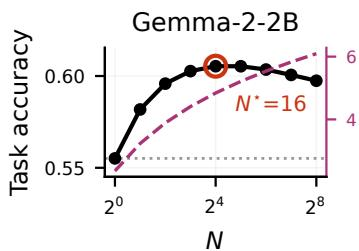

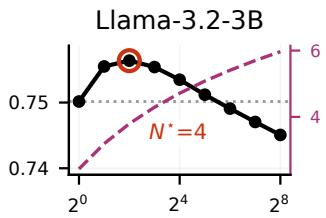  
N

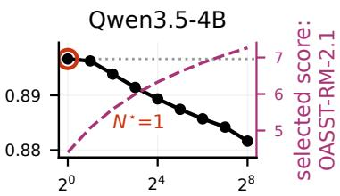  
N  
Figure 1: The score function does not reveal the optimal inference-time budget. Best-of-N on GSM8K (Cobbe et al., 2021) for three reference models using OASST-RM-2.1 as the score model. Black solid: task accuracy computed from 512 stored responses for each of the 1,319 held-out test prompts. Magenta dashed: mean selected-response score (right axis). Grey dotted: referencemodel accuracy $( N = 1 )$ . Red circles mark the accuracy-optimal budget N⋆. ⇒ Takeaway: The proxy score increases with N, but accuracy peaks and then falls, showing that the score function alone cannot determine the best sampling budget.

Challenge 2 : Selecting the sampling budget N. The sampling budget N controls how strongly BoN optimizes the score: a small N limits the potential benefit, while a large N concentrates the policy on low-probability, high-scoring responses. When the score function is an imperfect proxy for the downstream reward, this can amplify its errors and reduce downstream performance. This issue is often known as reward overoptimization (Gao et al., 2023; Coste et al., 2024). Figure 1 illustrates the issue on GSM8K: the score function of the selected response increases with N, while the downstream accuracy can peak and then decline. The score function alone therefore does not reveal which N should be deployed; instead, this requires estimating the policy value of each candidate budget. However, even unbiased value estimates are noisy in finite samples, especially for large N, where the BoN policy concentrates on responses that are rarely observed in the logged data. Directly maximizing them can thus lead to harmful budget choices. ⇒ We therefore need a selection rule that accountsfor uncertainty when comparing candidate budgets and guards against harmful departures from the reference policy.

In this paper, we address both challenges by developing a sample-only framework for evaluating BoN policies and selecting the inference-time sampling budget N. We proceed in two steps:

1 Estimation (→ Section 4): To develop an estimator, we exploit a statistical property of BoN: the underlying order-statistic structure makes the otherwise unavailable density ratio between the BoN policy and the reference model expressible through the probabilities that a fresh reference-model sample scores below or at a given response, which can be estimated from samples alone. Building on this, we construct a doubly robust estimator of the BoN policy value (called BoN-DR) without access to response likelihoods. Here, BoN-DR separates the score used to select responses from the reward estimator used to evaluate them. Further, it reuses a shared auxiliary sample pool across candidate budgets and is unbiased for any finite pool size. We show that our BoN-DR yields asymptotically valid inference even when the reward estimator is misspecified, and that it attains the efficiency of an exact-ratio DR estimator as the pool grows and the reward estimator is consistent.

2 Selecting N (→ Section 5): To select the sampling budget N, we develop two selection rules: (i) Value Maximization chooses the budget with the largest estimated policy value; and (ii) Safe Improvement chooses the budget with the largest lower confidence bound (LCB) on the improvement over the reference policy, with a fallback to N = 1 if no LCB is positive. We show that both rules asymptotically attain the best policy value on the candidate grid, while Safe Improvement additionally provides an asymptotic no-harm guarantee relative to the reference policy with high probability. To compute the LCB, we further construct simultaneous confidence bounds across candidate budgets. Unlike pointwise intervals, these bounds account for searching over the candidate grid and remain asymptotically valid after N is selected from the same data.

Our contributions are fourfold:1 (1) We develop BoN-DR, a novel, unbiased doubly robust estimator for evaluating BoN policies from logged data, which requires only sample access to the reference model. (2) We prove statistical guarantees for BoN-DR, including robustness to reward estimator misspecification, asymptotic normality, and efficiency. (3) We propose two principled selection rules for N (i.e., Value Maximization and Safe Improvement) with consistency and a no-harm guarantee. (4) We evaluate our methods in synthetic experiments and on GSM8K across multiple reference and score models.

## 2 RELATED WORK2.

BoN for inference-time alignment. BoN is widely used for inference-time alignment with reward or preference models (Stiennon et al., 2020; Nakano et al., 2021). Prior work studies the induced policy, its divergence to the reference policy, and the theoretical and empirical scaling behavior (e.g., Gui et al., 2024; Yang et al., 2024; Mroueh & Nitsure, 2025; Beirami et al., 2025; Sriraman & Block, 2026). Larger budgets can amplify proxy errors and cause reward overoptimization, motivating methods that modify the score, selection rule, or underlying model (Gao et al., 2023; Coste et al., 2024; Huang et al., 2025; Jinnai et al., 2025). We instead keep standard BoN fixed and study how to evaluate its downstream value and select its budget from logged data. Khalaf et al. (2025) consider a closely related problem, where they tune the BoN budget using proxy and true rewards of sampled responses. However, their method requires true rewards for all sampled candidates and does not provide uncertainty quantification. In contrast, we select N from logged data with only one observed reward per prompt and provide statistical guarantees.

Off-policy evaluation (OPE). Classical OPE estimates a target policy’s value from data collected under a behavior policy using replay, importance weighting, or doubly robust estimation. (Li et al., 2011; Horvitz & Thompson, 1952; Strehl et al., 2010; Dudik et al., 2011). High-confidence OPE and safe policy improvement further use lower confidence bounds to guard against underperforming a baseline (Thomas et al., 2015a;b; Laroche et al., 2019). These methods cannot be directly applied to BoN under sample-only access because the required target-to-behavior density ratio depends on unavailable response likelihoods. We later exploit the order-statistic structure in BoN to express thi ratio through score-rank probabilities, thereby enabling policy value estimation and uncertainty-aware budget selection from sampled responses and logged rewards.

## 3 PROBLEM SETUP

We consider a context $X \in { \mathcal { X } }$ , an action $A \in A .$ , and a scalar reward $Y \in \mathcal { V }$ . We call any (possibly stochastic) decision rule π mapping a context to an action a policy. We assume that the observed action A is generated by a behavior or reference policy $\pi _ { b } ( a \mid x ) = \mathbb { P } ( A = a | X = x )$ . For example, in the LLM setting, $\pi _ { b }$ is induced by a reference model that generates a text A given a prompt X, based on which we obtain downstream signal $Y \ { \mathrm { ( e . g . } }$ ., task success, human preference, click-through rate, etc.). We denote the reward function as $\mu ( x , a ) = \mathbb { E } [ Y | X = x , A = a ]$ , and we observe an i.i.d. logged dataset $\mathcal { D } = \{ ( x _ { i } , a _ { i } , y _ { i } ) \} _ { i = 1 } ^ { n }$ from the population $\dot { Z } = ( X , A , Y ) \overset { \cdot } { \sim } \mathbb { P }$

Inference-time alignment. We assume that we can sample from $\pi _ { b } ( \cdot \mid x )$ for any context $x ,$ but can neither access the model weights nor evaluate the response likelihood $\pi _ { b } ( a \mid x )$ . This is typical for API-based models, which return sampled responses but no token-level probabilities. Our goal is to improve the deployed policy using only such samples and the logged data D.

BoN policies. A well-established method for inference-time alignment is best-of-N sampling (BoN) (Nakano et al., 2021; Beirami et al., 2025). Here, a score function $s ( x , a )$ first ranks actions a for each context x. For example, s(x, a) could be an LLM judge (Zheng et al., 2023) or an estimator of the reward function $\mu ( x , a )$ . Then, for a fixed context $x _ { i } ~ \in ~ { \mathcal { X } }$ , BoN samples N i.i.d. actions $a _ { i 1 } , \dots , a _ { i N } \ \sim \ \pi _ { b } ( \cdot \ | \ x _ { i } )$ from the API and chooses the one with the largest score $a _ { N } ^ { \star , s } ( x _ { i } ) \ \in$ arg max $\scriptstyle \ j \leq N \ S ( x _ { i } , a _ { i , j } )$ . The induced BoN policy is defined as $\pi _ { N } ^ { s } ( a \mid x _ { i } ) : = \mathbb { P } \big ( a _ { N } ^ { \star , s } ( x _ { i } ) = a \mid X = x _ { i } \big )$ . In particular, $\pi _ { 1 } ^ { s } = \pi _ { b }$ , whereas increasing N progressively concentrates the policy on actions receiving high scores under s.

Policy evaluation. Our paper primarily focuses on the evaluation of the BoN policy $\pi _ { N } ^ { s }$ . For example, we might be interested in the performance of $\pi _ { N } ^ { s }$ for a specific N, or whether $\pi _ { N } ^ { s }$ for $N > 1$ improves over the base model πb. A principled way to evaluate a policy π is via its policy value $\begin{array} { r } { V ( \pi ) = \mathbb { E } \Big [ \sum _ { a \in \mathcal { A } } \pi ( a \mid X ) \mu ( X , a ) \Big ] } \end{array}$ , which quantifies the expected reward under policy π (Kallus, 2018).

The choice of N. Evaluating $V ( \pi _ { N } ^ { s } )$ is directly tied to the choice of $N ,$ which controls how far π $\stackrel { - s } { N }$ departs from $\pi _ { b } \colon$ a small N yields only marginal gains, while a large $N$ concentrates the policy on high-scoring actions that are rare under $\pi _ { b }$ and thus weakly represented in D. As a result, errors in the score function can be amplified, which can lead to reward overoptimization (Gao et al., 2023).

In this paper, we address two core challenges:

1 Off-policy evaluation (→ Section 4): How can we efficiently estimate the value $V ( \pi _ { N } ^ { s } )$ of a BoN policy from data D generated by $\pi _ { b }$ when the reference model can only be sampled? 2 Selecting N (→ Section 5): How can we use these estimates to select the sampling budget N with statistical guarantees?

## 4 EFFICIENT OFF-POLICY EVALUATION FOR BON

In this section, we develop an estimator for the value of the BoN policy $V ( \pi _ { N } ^ { s } )$ . A natural starting point is the doubly robust (DR) estimator, which is widely used for off-policy evaluation due to its favorable statistical properties (Robins et al., 1994; Dudik et al., 2011). For a fixed BoN policy $\pi _ { N } ^ { s }$ the DR estimator is

$$
\hat { V } _ { \mathrm { D R } } ( \pi _ { N } ^ { s } ) = \frac { 1 } { n } \sum _ { i = 1 } ^ { n } \psi _ { N } ( z _ { i } ) , \psi _ { N } ( z _ { i } ) = \sum _ { a \in A } \pi _ { N } ^ { s } ( a \mid x _ { i } ) \hat { \mu } ( x _ { i } , a ) + \frac { \pi _ { N } ^ { s } ( a _ { i } \mid x _ { i } ) } { \pi _ { b } ( a _ { i } \mid x _ { i } ) } \big ( y _ { i } - \hat { \mu } ( x _ { i } , a _ { i } ) \big ) ,\tag{1}
$$

where $z _ { i } = ( x _ { i } , a _ { i } , y _ { i } )$ and $\hat { \mu }$ is an estimator of the reward function $\mu .$ . The plug-in term (first term in the sum) evaluates the target policy under the estimated reward function, while the correction term (second term) uses the observed outcome to correct for errors in the estimated reward function, weighted by the density ratio between the BoN and behavior policies.

Why the standard DR estimator is not applicable. Direct application of the DR estimator in the form of (1) is not possible in the inference-time alignment setting due to two main challenges: (i) both terms require knowledge of $\pi _ { N } ^ { s } ( a \mid x _ { i } )$ , but the induced BoN probabilities are not available from a black-box sampler. Attempting to estimate $\pi _ { N } ^ { s } ( a \mid x _ { i } )$ from the data is extremely challenging in the enormous and sparse text action space A. (ii) The correction term requires the density ratio $\begin{array} { r } { w _ { N } ( x , a ) : = \frac { \pi _ { N } ^ { s } ( a | x ) } { \pi _ { b } ( a | x ) } } \end{array}$ . Because the action space $\mathcal { A }$ consists of high-dimensional text sequences, individual sequence probabilities can be extremely small, and density-ratio estimation can suffer from high variance and numerical instability.

To address this, we first establish an alternative representation of the DR score for the inference-time alignment setting (Section 4.1). We then construct a pooled estimator that reuses auxiliary samples across candidate budgets (Section 4.2) and establish theoretical guarantees (Section 4.3).

## 4.1 INFERENCE-TIME DR SCORE

Our key observation is that the target policy is not arbitrary: $\pi _ { N } ^ { s }$ is obtained by applying a known Best-of-N selection rule to samples from $\pi _ { b }$ . We can therefore exploit two pieces of structure jointly: (i) although $\pi _ { b }$ cannot be evaluated, we can sample from $\pi _ { b } ( \cdot \mid x )$ at inference time, and (ii) the construction of the BoN policy imposes a particular relationship between $\pi _ { N } ^ { s }$ and $\pi _ { b }$

In the following, we show that DR score admits a specific representation only in terms of onedimensional score ranks under the behavior policy. For fixed x and action a, we define the strict and weak cumulative density functions (CDFs) of the score via

$$
F _ { x } ^ { - } ( a ) = \mathbb { P } _ { A \sim \pi _ { b } ( \cdot \vert x ) } \left( s ( x , A ) < s ( x , a ) \right) { \mathrm { ~ a n d ~ } } F _ { x } ( a ) = \mathbb { P } _ { A \sim \pi _ { b } ( \cdot \vert x ) } \left( s ( x , A ) \leq s ( x , a ) \right) .\tag{2}
$$

Thus, $F _ { x } ^ { - } ( a )$ and $F _ { x } ( a )$ describe the rank of a according to the score s among actions sampled from the behavior policy. Importantly, both quantities are probabilities of simple comparison events and can therefore be estimated using samples from $\pi _ { b } ( \cdot \mid x )$ without evaluating any sequence likelihoods.

The following proposition shows that these rank probabilities are sufficient to express the entire DR score for a BoN policy (which we call BoN-DR score).

Proposition 4.1 (BoN-DR score). Suppose that distinct actions have distinct scores, $i . e . , s ( x , a ) =$ $s ( x , \bar { a } ^ { \prime } ) \quad \implies \quad a = a ^ { \prime } .$ , for any $a , \acute { a } ^ { \prime } \in \mathcal { A } .$ Define $\begin{array} { r } { g _ { N } ( u , v ) = \sum _ { \ell = 0 } ^ { N - 1 } u ^ { N - 1 - \ell } v ^ { \ell } } \end{array}$ . Then, for $z = ( x , a , y )$ with $\pi _ { b } ( a \mid x ) > 0$ , the DR score for the BoN policy can be written as

$$
\psi _ { N } ( z ) = \mathbb { E } _ { A ^ { \prime } \sim \pi _ { b } ( \cdot \vert x ) } \left[ g _ { N } \left( F _ { x } ( A ^ { \prime } ) , F _ { x } ^ { - } ( A ^ { \prime } ) \right) \widehat { \mu } ( x , A ^ { \prime } ) \right] + g _ { N } \left( F _ { x } ( a ) , F _ { x } ^ { - } ( a ) \right) \left( y - \widehat { \mu } ( x , a ) \right) .\tag{3}
$$

Proof. This follows by combining the BoN order-statistic identity in Beirami et al. (2025) with the DR score formula in Eq. (1). We refer to Appendix B for details. □

Proposition 4.1 resolves the two computational obstacles that we identified above: (i) it eliminates the need to evaluate either $\pi _ { b } ( a \mid x )$ or $\pi _ { N } ^ { s } ( a \mid x )$ ; and (ii) the density ratio is replaced by $g _ { N } ( F _ { x } ( a ) , F _ { x } ^ { - } ( a ) )$ , which depends only on the relative rank of a under the score distribution induced by the behavior policy. Consequently, apart from evaluating the score function s and outcome model $\hat { \mu } ,$ every quantity in Eq. (3) can be approximated using only samples from the behavior policy. In particular, $F _ { x } ( a )$ and $F _ { x } ^ { - } ( a )$ are expectations of bounded indicator variables, e.g., $F _ { x } ( a ) = { \overset { \cdot } { \mathbb { E } } } _ { A ^ { \prime } \sim \pi _ { b } ( \cdot | x ) } \left[ \mathbf { 1 } \{ s ( x , A ^ { \prime } ) \leq s ( x , { \bar { a } } ) \} \right] $ , thus turning the original high-dimensional densityratio evaluation problem into the estimation of simple rank probabilities.

The remaining challenge is therefore how we should estimate the expectations and score-rank functionals in Eq. (3) given a finite number of auxiliary samples from $\pi _ { b } \mathbf { \bar { ( } } \cdot \mathbf { \nabla } \vert x ) \mathbf { \bar { \alpha } }$ . In the next section, we show that their particular polynomial structure admits natural unbiased U-statistic estimators.

## 4.2 POOLED BON-DR ESTIMATOR

We now construct an estimator of the DR score in Eq. (1) using a finite, reusable pool of samples from the behavior policy. Proposition 4.1 shows that the DR score can be estimated using only samples from the behavior policy. A direct Monte Carlo implementation of Eq. (3) could draw fresh samples from the behavior policy each time an expectation or score rank needs to be estimated, and repeat this procedure separately for every candidate value of N. For generative models, however, sampling may be computationally costly.

Instead, we propose to draw a single reusable pool of samples for each context and use it to estimate both components of the DR score (i.e., the plug-in term and the correction term), as well as the values of other BoN policies with different N. For each context $x _ { i }$ , we draw one pool of behavior-policy samples $\tilde { a } _ { i } = ( \tilde { a } _ { i 1 } , \dots , \tilde { a } _ { i M } ) \overset { \mathrm { i i d } } { \sim } \pi _ { b } ( \cdot \mid x _ { i } )$ , where M is a user-chosen computational budget, and let us denote $\bar { a } _ { i } = ( a _ { i } , \tilde { a } _ { i 1 } , \dots , \tilde { a } _ { i M } ) \in \mathcal { A } ^ { M + 1 }$ the vector of Monte Carlo samples and behavior actions.

To derive our BoN-DR estimator, we leverage U-statistics (van der Vaart, 1998), which estimate a quantity defined as an expectation over r i.i.d. draws via a single larger pool of M draws. The basic idea is to estimate the quantity by averaging the same quantity over all size-r subsets of the pool. Each subset has the correct distribution, so the resulting estimator is unbiased while reusing all available samples. Below, we apply this construction separately to (i) the plug-in term and (ii) correction term of the DR score and then combine the two into our pooled BoN-DR estimator.

Estimator for the plug-in term. By Proposition 4.1, the plug-in term can be written as

$$
v _ { N } ^ { s } ( x _ { i } ) = \mathbb { E } _ { A \sim \pi _ { N } ^ { s } ( \cdot \mid x _ { i } ) } \left[ \hat { \mu } ( x _ { i } , A ) \right] = \mathbb { E } \left[ \hat { \mu } ( x _ { i } , A _ { N } ^ { \star , s } ) \mid X _ { i } = x _ { i } \right] ,\tag{4}
$$

where $A _ { N } ^ { \star , s }$ is the action selected from N i.i.d. draws from $\pi _ { b } ( \cdot \mid x _ { i } )$ according to the score s. Since $\bar { a } _ { i }$ contains $M + 1$ such draws, we estimate $v _ { i , N } ^ { s }$ by averaging the fitted reward of the BoN winner over all size-N subsets:

$$
\hat { v } _ { i , N } ^ { s , M + 1 } = \binom { M + 1 } { N } ^ { - 1 } \sum _ { \substack { J \subseteq \{ 0 , \dots , M \} , | J | = N } } \hat { \mu } \left( x _ { i } , \bar { a } _ { i , J } ^ { \star , s } \right) .\tag{5}
$$

This estimator can be evaluated without enumerating all subsets. Let $\mathcal { G } _ { i }$ index the unique actions appearing in $\bar { a } _ { i } .$ , and let $\bar { a } _ { i g }$ denote the corresponding action. We define

$$
L _ { i g } = \sum _ { m = 0 } ^ { M } \mathbf { 1 } \left\{ s ( x _ { i } , \bar { a } _ { i m } ) < s ( x _ { i } , \bar { a } _ { i g } ) \right\} { \mathrm { ~ a n d ~ } } E _ { i g } = \sum _ { m = 0 } ^ { M } \mathbf { 1 } \left\{ s ( x _ { i } , \bar { a } _ { i m } ) \leq s ( x _ { i } , \bar { a } _ { i g } ) \right\} .\tag{6}
$$

Then, an alternative estimator is

$$
\hat { v } _ { i , N } ^ { s , M + 1 } ( x _ { i } , \bar { a } _ { i } ) = \sum _ { g \in \mathcal { G } _ { i } } \hat { \mu } ( x _ { i } , \bar { a } _ { i g } ) \frac { \binom { E _ { i g } } { N } - \binom { L _ { i g } } { N } } { \binom { M + 1 } { N } } .\tag{7}
$$

Indeed, the numerator counts exactly the size-N subsets for which $\bar { a } _ { i g }$ is the highest-scoring action. We use the convention $\binom { u } { N } = 0 \mathrm { f o r } u < N$

Estimator for the correction term. For the correction term, we treat the logged action $a _ { i }$ as fixed and use the M auxiliary samples to estimate $v _ { N } ^ { s } ( x _ { i } , a _ { i } ) = g _ { N } ( F _ { x _ { i } } ( a _ { i } ) , F _ { x _ { i } } ^ { - } ( \overline { { a _ { i } } } ) )$ ). We define

$$
L _ { i } = \sum _ { m = 1 } ^ { M } \mathbf { 1 } \left\{ s ( x _ { i } , \tilde { a } _ { i m } ) < s ( x _ { i } , a _ { i } ) \right\} , \mathrm { ~ a n d ~ } E _ { i } = \sum _ { m = 1 } ^ { M } \mathbf { 1 } \left\{ s ( x _ { i } , \tilde { a } _ { i m } ) \leq s ( x _ { i } , a _ { i } ) \right\} .\tag{8}
$$

Under a no-score-ties assumption, $E _ { i } - L _ { i }$ counts the number of auxiliary draws equal to $a _ { i }$ . By averaging over all size- $( N - \bar { 1 } )$ subsets of the auxiliary pool, we yield the estimator

$$
\hat { w } _ { i , N } ^ { s , M } ( x _ { i } , \bar { a } _ { i } ) = N \sum _ { t = 0 } ^ { \operatorname* { m i n } \{ E _ { i } - L _ { i } , N - 1 \} } \frac { 1 } { t + 1 } \frac { \binom { E _ { i } - L _ { i } } { t } \binom { L _ { i } } { N - 1 - t } } { \binom { M } { N - 1 } } .\tag{9}
$$

Here, t denotes the number of additional copies of $a _ { i }$ among the $N - 1$ sampled competitors, while the factor $1 / ( t + 1 )$ accounts for the $t + 1$ identical occurrences of the winning action.

Pooled BoN-DR estimator. We define our pooled BoN-DR estimator as

$$
\psi _ { N } ^ { M } ( z _ { i } , \tilde { a } _ { i } ) = \hat { v } _ { i , N } ^ { s , M + 1 } ( x _ { i } , \bar { a } _ { i } ) + \hat { w } _ { i , N } ^ { s , M } ( x _ { i } , \bar { a } _ { i } ) \left( y _ { i } - \hat { \mu } ( x _ { i } , a _ { i } ) \right) ,\tag{10}
$$

$$
\hat { V } _ { \mathrm { D R } } ^ { M } ( \pi _ { N } ^ { s } ) = \frac { 1 } { n } \sum _ { i = 1 } ^ { n } \psi _ { N } ^ { M } ( z _ { i } , \tilde { a } _ { i } ) .\tag{11}
$$

Thus, a single pool of M additional generations per context is sufficient to estimate both components of the DR score. Moreover, the same pool can be reused across different values of $N$ , which is particularly important for the policy-selection problem considered in the following section.

## 4.3 THEORETICAL GUARANTEES

We now establish asymptotic guarantees for our pooled BoN-DR estimator, including valid inference and efficiency. For this, we assume that s and $\hat { \mu }$ are constructed independently of D (e.g., external models or a sample split), together with standard sampling and moment conditions (Assumption B.1).

Theorem 4.2 (Validity and efficiency of the pooled BoN-DR estimator). Fix $N$ and condition on the training sample used to construct s and $\hat { \mu } .$

(a) Finite-M validity. For anyfixed $M \geq N - 1 , \sqrt { n } ( \hat { V } _ { \mathrm { D R } } ^ { M } ( \pi _ { N } ^ { s } ) - V ( \pi _ { N } ^ { s } ) )  \mathcal { N } ( 0 , \sigma _ { N , M } ^ { 2 } )$ , where $\sigma _ { N , M } ^ { 2 } = \mathrm { V a r } \left( \psi _ { N } ^ { M } ( Z , \tilde { A } ) \right)$ . This result does not require $\hat { \mu }$ to be a consistent estimator of µ.

(b) Infinite-M efficiency. Suppose additionally that $M = M _ { n }  \infty$ and that the reward function estimator µˆ is consistentfor the true rewardfunction $\mu$ in $L _ { 2 } .$ . Then $\sqrt { n } ( \hat { V } _ { \mathrm { D R } } ^ { M _ { n } } ( \pi _ { N } ^ { s } ) - V ( \pi _ { N } ^ { s } ) ) $ $\mathcal { N } ( 0 , \sigma _ { N , \mathrm { e f f } } ^ { 2 } )$ , where $\sigma _ { N , \mathrm { e f f } } ^ { 2 }$ is the variance of the efficient influence function $\begin{array} { r } { \phi _ { N } ^ { \mathrm { e f f } } ( Z ) = \sum _ { a \in \mathcal { A } } \pi _ { N } ^ { s } ( a \mid } \end{array}$ $X ) \mu ( X , a ) + w _ { N } ^ { s } ( X , A ) \big ( Y - \mu ( X , A ) \big ) - V ( \pi _ { N } ^ { s } )$

Thus, conditional on the learned policy and behavior sampler, the proposed estimator attains the same first-order efficiency bound as an oracle DR estimator with access to the exact BoN density ratio. See Appendix B for the proof.

Part (a) is particularly important for inference-time alignment. Valid inference does not require the reward estimator to approximate the true conditional mean. For example, s and $\hat { \mu }$ may be given by an LLM judge that is useful for ranking responses but is not a statistically consistent model of $\mathbf { \dot { E } } [ Y \mid X , A ]$ . The DR correction still yields a consistent, root-n estimator of the value of the resulting BoN policy. Part (b) adds that, if $\hat { \mu }$ is additionally consistent, the BoN-DR estimator attains the corresponding first-order efficiency bound.

We next clarify how the auxiliary sampling budget M affects the estimator. Because the pooled estimators are unbiased for every finite M, increasing M removes Monte Carlo variance rather than a first-order bias. For fixed N, under the boundedness conditions above, it is sufficient that $M _ { n } \to \infty ;$ no particular rate of growth relative to n is required.

## 5 SELECTING THE OPTIMAL SAMPLING BUDGET N FOR BON

Our goal is now to select the optimal sampling budget $N _ { j }$ from a candidate grid $\mathcal { N } = \{ N _ { 1 } , \ldots , N _ { J } \}$ In the following, we introduce two selection rules: (i) Value Maximization, which selects the budget with the largest estimated policy value, and (ii) Safe Improvement, which selects the budget with the largest lower confidence bound (LCB) on improvement over the reference policy and falls back to $N = 1$ when no positive improvement is supported by the data. The latter thus guarantees improvement over the base model with high probability.

## 5.1 VALUE MAXIMIZATION

Value Maximization selects the budget with the largest estimated policy value:

$$
\hat { N } _ { \mathrm { v a l u e } } \in \arg \operatorname* { m a x } _ { N \in \mathcal { N } } \hat { V } _ { \mathrm { D R } } ^ { M } ( \pi _ { N } ^ { s } ) .\tag{12}
$$

The following corollary shows that, over a fixed candidate grid, this rule asymptotically recovers the best policy value in the class.

Corollary 5.1 (Oracle consistency of Value Maximization). Suppose that the conditions of Theorem $4 . 2 ( a )$ hold uniformly over thefinite candidate grid N. Then, conditional on the training sample, $\begin{array} { r } { V ( \pi _ { \hat { N } _ { \mathrm { v a l u e } } } ^ { s } ) \xrightarrow [ ] { p } \operatorname* { m a x } _ { N \in \mathcal { N } } V ( \pi _ { N } ^ { s } ) } \end{array}$ . The proofis in Appendix B.

Importantly, this conclusion inherits the robustness of the BoN-DR estimator: it does not require $\hat { \mu }$ to consistently estimate the true reward function. However, the result is an oracle optimality guarantee, and, in finite samples, estimation noise can still cause $\hat { N } _ { \mathrm { v a l u e } }$ to select a policy for which the value is below $V ( \pi _ { b } )$ . This motivates our selection rule for safe improvement next.

## 5.2 SAFE IMPROVEMENT

To obtain a no-harm guarantee relative to the behavior policy, we now formulate the selection rule directly in terms of improvement over the behavior policy. To do so, we define

$$
\Delta _ { N } : = V ( \pi _ { N } ^ { s } ) - V ( \pi _ { 1 } ^ { s } ) = V ( \pi _ { N } ^ { s } ) - V ( \pi _ { b } )\tag{13}
$$

for each $N \in \mathcal { N } \backslash \{ 1 \}$ . Safe Improvement then selects a candidate $N > 1$ only when its simultaneous lower confidence bound for $\Delta _ { N }$ is positive; otherwise, we fall back to $N = 1$ . We use simultaneous rather than pointwise bounds because N is selected adaptively from the same candidate grid.

• To construct the LCB, we estimate each candidate policy’s improvement over the reference policy and its sampling variability. To do so, for each $N \in \hat { \mathcal { N } } \backslash \{ 1 \}$ , we define the doubly robust improvement score $D _ { i , N } ^ { M } : = \psi _ { N } ^ { M } ( z _ { i } , \tilde { a } _ { i } ) - \psi _ { 1 } ^ { M } ( z _ { i } , \tilde { a } _ { i } )$ , and the corresponding estimator $\begin{array} { r } { \hat { \Delta } _ { N } ^ { M } : = \frac { 1 } { n } \sum _ { i = 1 } ^ { n } D _ { i , N } ^ { M } = } \end{array}$ $\hat { V } _ { \mathrm { D R } } ^ { M } ( \pi _ { N } ^ { s } ) - \hat { V } _ { \mathrm { D R } } ^ { M } ( \pi _ { 1 } ^ { s } )$ . The corresponding variance is estimated by $\begin{array} { r } { \hat { \tau } _ { N , M } ^ { 2 } : = \frac { 1 } { n } \sum _ { i = 1 } ^ { n } \left( D _ { i , N } ^ { M } - \hat { \Delta } _ { N } ^ { M } \right) ^ { 2 } } \end{array}$

• To obtain simultaneous LCBs across candidate budgets, we need to account for the dependence induced by reusing the same evaluation data and auxiliary samples pools across all $N \in \dot { \mathcal { N } }$ . We do so by using a joint multiplier bootstrap (Chernozhukov et al., 2013). Conditional on the sample, we thus draw independent multipliers $\xi _ { i }$ satisfying $\mathbb { E } [ \xi _ { i } ] = 0$ and $\mathbb { E } [ \xi _ { i } ^ { 2 } ] = 1$ , such as standard Gaussian variables. Formally, we de

$$
\begin{array} { r } { \mathbf { \Pi } ^ { \mathrm { e f f n n e } } = \underset { N \in \mathcal { N } \setminus \{ 1 \} } { \operatorname* { m a x } } \frac { n ^ { - 1 / 2 } \sum _ { i = 1 } ^ { n } \xi _ { i } \left( D _ { i , N } ^ { M } - \hat { \Delta } _ { N } ^ { M } \right) } { \hat { \tau } _ { N , M } } . } \end{array}\tag{14}
$$

Let $\hat { c } _ { 1 - \alpha } ^ { \Delta , + }$ denote the conditional $( 1 - \alpha )$ -quantile of $T _ { \Delta } ^ { * , + }$ . Thus, simultaneous LCB is given by

$$
\begin{array} { r } { \widehat { \mathrm { L C B } } _ { \Delta } ( N ) : = \hat { \Delta } _ { N } ^ { M } - \hat { c } _ { 1 - \alpha } ^ { \Delta , + } \frac { \tau _ { N , M } } { \sqrt { n } } , \qquad N \in \mathcal { N } \setminus \{ 1 \} . } \end{array}\tag{15}
$$

Safe Improvement selects the candidate with the strongest LCB on improvement over the reference policy and falls back to $N = 1$ when no candidate has a positive LCB:

$$
\hat { N } _ { \mathrm { L C B } } : = \left\{ \begin{array} { l l } { \arg \displaystyle \operatorname* { m a x } _ { N \in \mathcal { N } \backslash \{ 1 \} } \widehat { \mathrm { L C B } } _ { \Delta } ( N ) , } & { \displaystyle \operatorname* { m a x } _ { N \in \mathcal { N } \backslash \{ 1 \} } \widehat { \mathrm { L C B } } _ { \Delta } ( N ) > 0 , } \\ { 1 , } & { \mathrm { o t h e r w i s e } . } \end{array} \right.\tag{16}
$$

Theorem 5.2 (Safe Improvement (“no-harm guarantee”)). Suppose that the conditions of Theorem 4.2(a) hold uniformly over the finite candidate grid N and that the variances $\tau _ { N , M } ^ { 2 }$ are uniformly bounded away from zero. Conditional on the training sample, it follows that $V ( \pi _ { \hat { N } _ { \mathrm { L C B } } } ^ { s } ) \xrightarrow [ ] { p }$ $\operatorname* { m a x } _ { N \in \mathcal { N } } V \big ( \pi _ { N } ^ { s } \big )$ and P $\left( V ( \pi _ { \hat { N } _ { \mathrm { L C B } } } ^ { s } ) \geq V ( \pi _ { b } ) \right) \geq 1 - \alpha - o ( 1 )$ . Proofin Appendix B.

Theorem 5.2 formalizes the no-harm property of the Safe Improvement selection rule. A candidate N > 1 is selected only when the improvement over the behavior policy is supported by the simultaneous LCB; otherwise, the rule defaults to $N = 1$ . The guarantee combines asymptotic no-harm with consistency; i.e., as the sample size grows, the conservatism induced by the LCB vanishes, and Safe Improvement recovers the best policy value over the fixed candidate grid. In finite samples, Safe Improvement may select smaller budgets than Value Maximization because it explicitly accounts for estimation uncertainty.

## 6 EXPERIMENTS

The purpose of our experiments is primarily to verify our theoretical properties. RQ1 We use synthetic experiments to test whether our BoN-DR estimator remains robust to reward estimator misspecification while benefiting from informative reward predictions. RQ2 We assess whether the estimators accurately recover BoN policy values across different reference models and score function regimes in realistic LLM settings. RQ3 We test whether Safe Improvement reduces harmful choices of N under reward overoptimization and thus leads to safe inference-time budget selection.

Settings. We consider two settings: (1) Synthetic experiments with known ground truth, following standard practice in the OPE literature (Dudik et al., 2011; Saito & Joachims, 2022). Here, the score function errors and reward estimator errors can be varied independently through parameters γ (which increases the scores of rarely sampled, low-quality actions and thereby changes the induced BoN policy) and δ (which introduces errors in the predicted rewards without changing the induced policy). Appendix C.1 provides details. (2) Realistic LLM evaluation setting using GSM8K (Cobbe et al., 2021), with three reference models (i.e., Gemma-2-2B-IT (Team et al., 2024), Llama-3.2- 3B-Instruct (Grattafiori et al., 2024), and Qwen3.5-4B) and two external reward models as score functions (i.e., OASST-RM-2.1-Pythia-1.4B (Köpf et al., 2023) and Skywork-Reward-V2-Qwen3- 1.7B). Details are in Appendix C.2. The true reward is the exact-match correctness (see Appendix C.5). Each prompt has a stored pool of 512 responses. In each evaluation, one response is treated as the logged observation where the reward is revealed, while the remaining responses form the auxiliary pool (see Appendix D.3).

Baselines.3 To our knowledge, there are no existing baselines that directly address OPE estimation for BoN policies from logged data. Instead, we compare three estimators based on Eq. (11): (i) Plug-in averages predictions of reward estimator under the target policy; (ii) BoN-IPW weights logged rewards using estimated rank probabilities; and (iii) BoN-DR uses an additional doubly robust correction. All estimators use the same logged data and auxiliary samples. For selection, we use the rules from Section 5; i.e., Value Maximization and Safe Improvement.

Performance metrics. We measure bias, RMSE, interval width, and coverage of nominal 95% pointwise confidence intervals. Selection is assessed by mean gain over N = 1 and harm rate, the fraction of repetitions with negative gain.

RQ1 Robustness to reward estimator misspecification. We evaluate robustness to reward estimator misspecification by varying δ, which introduces errors in the reward estimator without changing the induced policy. We compare Plug-in, BoN-IPW, and BoN-DR in terms of absolute bias, CI coverage, and policy value gain over N = 1. Results are in Figure 2. Plug-in becomes biased as the errors in the reward prediction are increased. In contrast, BoN-DR and BoN-IPW remain nearly unbiased as δ increases. Further, they maintain CI coverage close to the nominal 95% level across the considered levels of misspecification. ⇒ As suggested by our theory, BoN-DR remains robust to reward model misspecification while supporting valid CIs.

We next examine whether these results persist across different BoN budgets by comparing $N = 8$ and N = 256 in Table 1. ⇒ The results again show that the benefits ofBoN-DR are robust.

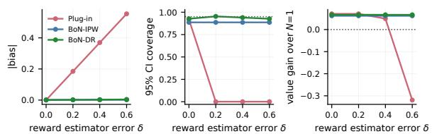

Figure 2: Robust to reward estimator misspecification. Estimated BoN policy value at $N = 2 5 6$ . We fix $\gamma =$ 0.65 and vary δ from 0 to 0.6 to increase the reward estimator error. Shown: (a) Absolute bias of policy value estimation. (b) Empirical coverage of the nominal 95% pointwise CI, the dotted line shows the nominal level. (c) Gain of the budget selected by Safe Improvement, where the dotted line indicates no improvement over $N = 1$
<table><tr><td>N</td><td>Estimator</td><td>IBiasl</td><td>CI width</td><td>Coverage</td></tr><tr><td rowspan="3">8</td><td>Plug-in</td><td>0.049</td><td>0.003</td><td>0.000</td></tr><tr><td>BoN-IPW</td><td>0.002</td><td>0.097</td><td>0.940</td></tr><tr><td>BoN-DR</td><td>0.001</td><td>0.052</td><td>0.947</td></tr><tr><td rowspan="3">256</td><td>Plug-in</td><td>0.369</td><td>0.004</td><td>0.000</td></tr><tr><td>BoN-IPW</td><td>0.002</td><td>0.377</td><td>0.887</td></tr><tr><td>BoN-DR</td><td>0.003</td><td>0.455</td><td>0.940</td></tr></table>

CI width and empirical coverage are computed for nominal 95% pointwise CIs.  
Table 1: Sensitivity to sampling budget N. Here: $\gamma = 0 . 6 5 , \delta = 0 . 4$ . Bold shows the lowest absolute bias and the coverage closest to 95% for each N.

In Appendix D.2–D.3, we provide additional sensitivity analyses on the size of the validation set and the Monte Carlo pool. We study how the amount of validation data affects downstream policy value estimation and budget selection, and show that increasing the Monte Carlo pool reduces the additional Monte Carlo variance of BoN-DR and brings it closer to the efficiency bound under a correctly specified reward estimator.

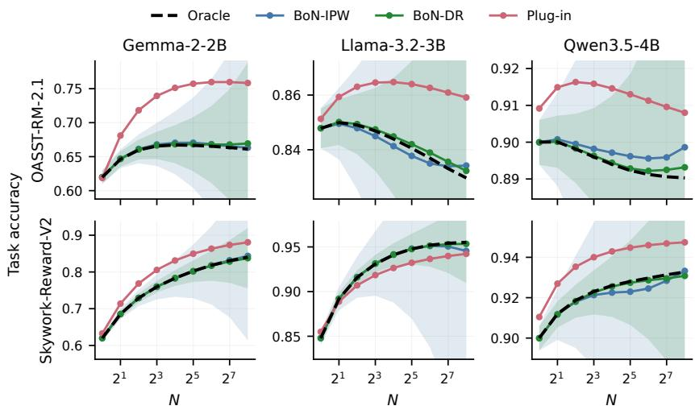  
Figure 3: BoN policy value estimation for realistic LLM setting on GSM8K. Rows are external reward models used as score functions, and columns are reference models. Black dashed: oracle benchmark policy value. Lines: mean estimated policy value across repetitions. Shaded: 80% pointwise CI. Plug-in CIs are not faithful wrt. nominal coverage and thus omitted.

RQ2 Performance in recovering BoN policy values in realistic LLM settings. Figure 3 compares the estimated policy values from Plug-in, BoN-IPW, and BoN-DR with the oracle policy values under different configurations. BoN-DR shows the most accurate estimates. Moreover, at $\dot { N } = 2 5 6$ BoN-DR yields substantially narrower CIs, with BoN-IPW intervals being 1.7–5.5× wider. Notably, the Plug-in estimator remains biased even though the score function ranks responses accurately in the Skywork setting. This illustrates that effective ranking does not necessarily translate into accurate policy value estimation. $\Rightarrow B o N { - } D R$ accurately recovers BoN policy values in real-world settings while providing substantially more precise estimates than BoN-IPW.

We provide additional results for CI coverage, error decomposition, overlap at large budgets, and robustness to alternative reward predictors in Appendices D.4–D.7.

RQ3 Safe inference-time budget selection (“no-harm guarantee”). We study whether Safe Improvement, which explicitly accounts for estimation uncertainty, helps avoid harmful choices of N, i.e., budgets that reduce policy value relative to the reference policy. This is particularly important under reward overoptimization with a strong reference model, where larger budgets achieve higher scores but can lower downstream performance. For comparison, we also report a Naïve approach here (which chooses the response with the highest score at a fixed budget).

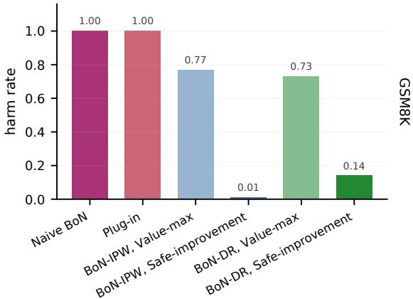  
Figure 4: Comparison of budget selection rules for Qwen3.5-4B with OASST-RM-2.1. Here, the harm rate is defined as the fraction of evaluations with negative gain relative to $N = 1$ . Lower is better. Plug-in uses Value Maximization, and Naïve BoN selects $\tilde { N } _ { \mathrm { m a x } } = 2 5 6$

We have two main findings (see Figure 4). First, both Naïve BoN and Plug-in perform poorly overall and often lead to harmful selections. In contrast, our proposed selection rules (Value Maximization and Safe Improvement) are substantially better. Second, Safe Improvement leads to fewer harmful selections than Value Maximization. Appendix E reports detailed results across various configurations. ⇒ Thanks to the uncertainty-aware approach, Safe Improvement can reduce harmful selections compared to Value Maximization, which is in line with our no-harm guarantee.

Conclusion. We present, to our knowledge, the first framework for evaluating and selecting BoN policies under sample-only access, with valid inference and a no-harm guarantee. As a limitation, it requires logged data and loses precision at large budgets. Future work could use our per-prompt scores to learn prompt-specific budgets and extend likelihood-free evaluation to other inference-time methods built on black-box models.

## REFERENCES

Gholamali Aminian, Idan Shenfeld, Amir Reza Asadi, Ahmad Beirami, and Youssef Mroueh. Bestof-n through the smoothing lens: Kl divergence and regret analysis. In International Conference on Learning Representations, volume 2026, pp. 105057–105090, 2026.

Ahmad Beirami, Alekh Agarwal, Jonathan Berant, Alexander D’Amour, Jacob Eisenstein, Chirag Nagpal, and Ananda Theertha Suresh. Theoretical guarantees on the best-of-n alignment policy. In Proceedings of the 42nd International Conference on Machine Learning, volume 267 of Proceedings ofMachine Learning Research, pp. 3580–3602. PMLR, 13–19 Jul 2025.

Aniruddha Bhargava, Lalit Jain, Branislav Kveton, Ge Liu, and Subhojyoti Mukherjee. Off-policy evaluation from logged human feedback. arXiv preprint arXiv:2406.10030, 2024.

Bradley Brown, Jordan Juravsky, Ryan Ehrlich, Ronald Clark, Quoc V Le, Christopher Ré, and Azalia Mirhoseini. Large language monkeys: Scaling inference compute with repeated sampling. arXiv preprint arXiv:2407.21787, 2024.

Mark Chen, Jerry Tworek, Heewoo Jun, Qiming Yuan, Henrique Ponde De Oliveira Pinto, Jared Kaplan, Harri Edwards, Yuri Burda, Nicholas Joseph, Greg Brockman, et al. Evaluating large language models trained on code. arXiv preprint arXiv:2107.03374, 2021.

Victor Chernozhukov, Denis Chetverikov, and Kengo Kato. Gaussian approximations and multiplier bootstrap for maxima of sums of high-dimensional random vectors. The Annals ofStatistics, pp. 2786–2819, 2013.

Yinlam Chow, Guy Tennenholtz, Izzeddin Gur, Vincent Zhuang, Bo Dai, Aviral Kumar, Rishabh Agarwal, Sridhar Thiagarajan, Craig Boutilier, and Aleksandra Faust. Inference-aware finetuning for best-of-n sampling in large language models. In International Conference on Learning Representations, volume 2025, pp. 78936–78959, 2025.

Karl Cobbe, Vineet Kosaraju, Mohammad Bavarian, Mark Chen, Heewoo Jun, Lukasz Kaiser, Matthias Plappert, Jerry Tworek, Jacob Hilton, Reiichiro Nakano, et al. Training verifiers to solve math word problems. arXiv preprint arXiv:2110.14168, 2021.

Thomas Coste, Usman Anwar, Robert Kirk, and David Krueger. Reward model ensembles help mitigate overoptimization. In International Conference on Learning Representations, volume 2024, pp. 50905–50931, 2024.

Miroslav Dudik, John Langford, and Lihong Li. Doubly robust policy evaluation and learning. In ICML, 2011.

Dennis Frauen, Athiya Deviyani, Mihaela van der Schaar, and Stefan Feuerriegel. Nonparametric llm evaluation from preference data. In International Conference on Machine Learning, 2026.

Leo Gao, John Schulman, and Jacob Hilton. Scaling laws for reward model overoptimization. In International Conference on Machine Learning, pp. 10835–10866. PMLR, 2023.

Aaron Grattafiori, Abhimanyu Dubey, Abhinav Jauhri, Abhinav Pandey, Abhishek Kadian, Ahmad Al-Dahle, Aiesha Letman, Akhil Mathur, Alan Schelten, Alex Vaughan, et al. The llama 3 herd of models. arXiv preprint arXiv:2407.21783, 2024.

Lin Gui, Cristina Gârbacea, and Victor Veitch. Bonbon alignment for large language models and the sweetness of best-of-n sampling. Advances in Neural Information Processing Systems, 37: 2851–2885, 2024.

Tobias Hatt, Daniel Tschernutter, and Stefan Feuerriegel. Generalizing off-policy learning under sample selection bias. In UAI, 2022.

Konstantin Hess, Dennis Frauen, Valentyn Melnychuk, and Stefan Feuerriegel. Efficient and sharp off-policy learning under unobserved confounding. In International Conference on Learning Representations, volume 2026, pp. 57552–57587, 2026.

Daniel G Horvitz and Donovan J Thompson. A generalization of sampling without replacement from a finite universe. Journal ofthe American statistical Association, 47(260):663–685, 1952.

Audrey Huang, Adam Block, Qinghua Liu, Nan Jiang, Akshay Krishnamurthy, and Dylan J Foster. Is best-of-n the best of them? coverage, scaling, and optimality in inference-time alignment. In International Conference on Machine Learning, pp. 25075–25126. PMLR, 2025.

Ying Jin, Zhimei Ren, Zhuoran Yang, and Zhaoran Wang. Policy learning “without” overlap: Pessimism and generalized empirical bernstein’s inequality. The Annals of Statistics, 53(4): 1483–1512, 2025.

Yuu Jinnai, Tetsuro Morimura, Kaito Ariu, and Kenshi Abe. Regularized best-of-n sampling with minimum bayes risk objective for language model alignment. In Proceedings ofthe 2025 Conference of the Nations of the Americas Chapter of the Association for Computational Linguistics: Human Language Technologies (Volume 1: Long Papers), pp. 9321–9347, 2025.

Nathan Kallus. Balanced policy evaluation and learning. In NeurIPS, 2018.

Nathan Kallus. More efficient policy learning via optimal retargeting. Journal of the American Statistical Association, 116(534):646–658, 2021. doi: 10.1080/01621459.2020.1788948.

Nathan Kallus and Masatoshi Uehara. Double reinforcement learning for efficient off-policy evaluation in markov decision processes. Journal ofMachine Learning Research, 21:1–63, 2020.

Nikos Karampatziakis, Paul Mineiro, and Aaditya Ramdas. Off-policy confidence sequences. In International Conference on Machine Learning, pp. 5301–5310. PMLR, 2021.

Hadi Khalaf, Claudio Mayrink Verdun, Alex Oesterling, Himabindu Lakkaraju, and Flavio Calmon. Inference-time reward hacking in large language models. In The Thirty-ninth Annual Conference on Neural Information Processing Systems, 2025.

Andreas Köpf, Yannic Kilcher, Dimitri Von Rütte, Sotiris Anagnostidis, Zhi Rui Tam, Keith Stevens, Abdullah Barhoum, Duc Nguyen, Oliver Stanley, Richárd Nagyfi, et al. Openassistant conversations-democratizing large language model alignment. Advances in neural information processing systems, 36:47669–47681, 2023.

Manuel Kosmas, Anne-Sophie Mayer, Stefan Feuerriegel, and Frank Bodendorf. From code to culture: Aligning large language models with corporate values. Available at SSRN 5615933, 2025.

Ilja Kuzborskij, Claire Vernade, Andras Gyorgy, and Csaba Szepesvári. Confident off-policy evaluation and selection through self-normalized importance weighting. In International Conference on Artificial Intelligence and Statistics, pp. 640–648. PMLR, 2021.

Romain Laroche, Paul Trichelair, and Remi Tachet Des Combes. Safe policy improvement with baseline bootstrapping. In International conference on machine learning, pp. 3652–3661. PMLR, 2019.

Lihong Li, Wei Chu, John Langford, and Xuanhui Wang. Unbiased offline evaluation of contextualbandit-based news article recommendation algorithms. In Proceedings ofthefourth ACM interna tional conference on Web search and data mining, pp. 297–306, 2011.

Zihao Li, Xiang Ji, Minshuo Chen, and Mengdi Wang. Policy evaluation for reinforcement learning from human feedback: A sample complexity analysis. In International Conference on Artificial Intelligence and Statistics, pp. 2737–2745. PMLR, 2024.

Youssef Mroueh and Apoorva Nitsure. Information theoretic guarantees for policy alignment in large language models. Transactions on Machine Learning Research, 2025.

Reiichiro Nakano, Jacob Hilton, Suchir Balaji, Jeff Wu, Long Ouyang, Christina Kim, Christopher Hesse, Shantanu Jain, Vineet Kosaraju, William Saunders, et al. Webgpt: Browser-assisted question-answering with human feedback. arXiv preprint arXiv:2112.09332, 2021.

Yusuke Narita, Shota Yasui, and Kohei Yata. Efficient counterfactual learning from bandit feedback. In Proceedings of the AAAI Conference on Artificial Intelligence, volume 33(01), pp. 4634–4641, 2019.

Vinod Raman, Hilal Asi, and Satyen Kale. Adabon: Adaptive best-of-n alignment. arXiv preprint arXiv:2505.12050, 2025.

James M. Robins, Andrea Rotnitzky, and Lue Ping Zhao. Estimation of regression coefficients when some regressors are not always observed. Journal ofthe American Statistical Association, 89(427): 846–866, 1994.

J Jon Ryu, Jeongyeol Kwon, Benjamin Koppe, and Kwang-Sung Jun. Improved offline contextual bandits with second-order bounds: Betting and freezing. arXiv preprint arXiv:2502.10826, 2025.

Yuta Saito and Thorsten Joachims. Off-policy evaluation for large action spaces via embeddings. In International Conference on Machine Learning (ICML), 2022.

Jonas Schweisthal, Dennis Frauen, Valentyn Melnychuk, and Stefan Feuerriegel. Reliable off-policy learning for dosage combinations. In NeurIPS, 2023.

Pier Giuseppe Sessa, Robert Dadashi, Léonard Hussenot-Desenonges, Johan Ferret, Nino Vieillard, Alexandre Ramé, Bobak Shahriari, Sarah Perrin, Abram Friesen, Geoffrey Cideron, et al. Bond: Aligning llms with best-of-n distillation. In International Conference on Learning Representations, volume 2025, pp. 59040–59060, 2025.

Charlie Snell, Jaehoon Lee, Kelvin Xu, and Aviral Kumar. Scaling llm test-time compute optimally can be more effective than scaling model parameters. arXiv preprint arXiv:2408.03314, 2024.

Ved Sriraman and Adam Block. Revisiting the (sub) optimality of best-of-n for inference-time alignment. arXiv preprint arXiv:2603.05739, 2026.

Nisan Stiennon, Long Ouyang, Jeffrey Wu, Daniel Ziegler, Ryan Lowe, Chelsea Voss, Alec Radford, Dario Amodei, and Paul F Christiano. Learning to summarize with human feedback. Advances in neural information processing systems, 33:3008–3021, 2020.

Alex Strehl, John Langford, Lihong Li, and Sham M Kakade. Learning from logged implicit exploration data. Advances in neural information processing systems, 23, 2010.

Gemma Team, Morgane Riviere, Shreya Pathak, Pier Giuseppe Sessa, Cassidy Hardin, Surya Bhupatiraju, Léonard Hussenot, Thomas Mesnard, Bobak Shahriari, Alexandre Ramé, et al. Gemma 2: Improving open language models at a practical size. arXiv preprint arXiv:2408.00118, 2024.

Philip Thomas, Georgios Theocharous, and Mohammad Ghavamzadeh. High-confidence off-policy evaluation. In Proceedings of the AAAI Conference on Artificial Intelligence, volume 29(01), 2015a.

Philip Thomas, Georgios Theocharous, and Mohammad Ghavamzadeh. High confidence policy improvement. In International Conference on Machine Learning, pp. 2380–2388. PMLR, 2015b.

Aart van der Vaart. Asymptotic statistics. Cambridge University Press, Cambridge, 1998. ISBN 0521496039.

Claudio Mayrink Verdun, Alex Oesterling, Himabindu Lakkaraju, and Flavio P Calmon. Soft best-ofn sampling for model alignment. In 2025 IEEE International Symposium on Information Theory (ISIT), pp. 1–6. IEEE, 2025.

Yu-Xiang Wang, Alekh Agarwal, and Miroslav Dudık. Optimal and adaptive off-policy evaluation in contextual bandits. In International Conference on Machine Learning, pp. 3589–3597. PMLR, 2017.

Joy Qiping Yang, Salman Salamatian, Ziteng Sun, Ananda Theertha Suresh, and Ahmad Beirami. Asymptotics of language model alignment. In 2024 IEEE International Symposium on Information Theory (ISIT), pp. 2027–2032. IEEE, 2024.

Zhuohao Yu, Zhiwei Steven Wu, and Adam Block. From curiosity to caution: Mitigating reward hacking for best-of-n with pessimism. arXiv preprint arXiv:2604.04648, 2026.

Lianmin Zheng, Wei-Lin Chiang, Ying Sheng, Siyuan Zhuang, Zhanghao Wu, Yonghao Zhuang, Zi Lin, Zhuohan Li, Dacheng Li, Eric Xing, et al. Judging llm-as-a-judge with mt-bench and chatbot arena. Advances in neural information processing systems, 36:46595–46623, 2023.

## A EXTENDED RELATED WORK

BoN and inference-time compute. Theoretical work characterizes the BoN policy, its KL divergence to the reference policy, and its optimality and scaling behavior (Gui et al., 2024; Yang et al., 2024; Mroueh & Nitsure, 2025; Beirami et al., 2025; Huang et al., 2025; Sriraman & Block, 2026). More broadly, repeated sampling with a verifier or reward model is a central way to scale inference-time compute (Brown et al., 2024; Snell et al., 2024), where best-of-k performance is commonly estimated via the unbiased pass@k estimator (Chen et al., 2021). Our plug-in term (Eq. (5)) follows the same U-statistic principle, but such estimators require the reward of every sampled response. In our setting, rewards are observed only for logged responses, which is why BoN-DR needs its correction term.

Mitigating reward overoptimization. Existing mitigations change the deployed policy by modifying (i) the score, e.g., via reward-model ensembles (Coste et al., 2024) or uncertainty penalties (Yu et al., 2026); (ii) the selection rule, e.g., via regularized, pessimistic, or soft BoN (Jinnai et al., 2025; Huang et al., 2025; Verdun et al., 2025; Aminian et al., 2026); or (iii) the model, via fine-tuning or distillation (Gui et al., 2024; Sessa et al., 2025; Chow et al., 2025). Some of these additionally require response likelihoods or model weights. Our work is complementary: we keep standard BoN fixed and evaluate it and select its budget from logged data.

Selecting inference-time parameters. Closest to our work, Khalaf et al. (2025) tune the BoN budget via the peak of the true reward. Their method is sample-only but requires true rewards for all sampled responses and provides no uncertainty quantification. Raman et al. (2025) instead allocate a given budget adaptively across prompts. In contrast, we select N from logged data with simultaneous confidence bounds and a no-harm guarantee.

Off-policy evaluation. Beyond the classical estimators (Li et al., 2011; Horvitz & Thompson, 1952; Strehl et al., 2010; Dudik et al., 2011), OPE has been extended to improve efficiency (Wang et al., 2017; Narita et al., 2019; Kallus & Uehara, 2020), handle limited overlap or distribution shift (Kallus, 2018; 2021; Schweisthal et al., 2023; Hatt et al., 2022; Hess et al., 2026), and large action spaces via embeddings (Saito & Joachims, 2022), as well as to human-feedback and preference data (L et al., 2024; Bhargava et al., 2024; Frauen et al., 2026). All of these require the action probabilities of the behavior policy, which are unavailable for free-form text under sample-only access. We instead exploit the known BoN selection mechanism, which expresses the density ratio through rank probabilities.

Uncertainty-aware policy selection. High-confidence OPE and safe policy improvement use lower confidence bounds to avoid underperforming a baseline (Thomas et al., 2015a;b; Laroche et al., 2019), with related confidence-based selection methods for contextual bandits (Kuzborskij et al., 2021; Karampatziakis et al., 2021; Ryu et al., 2025; Jin et al., 2025). Safe Improvement applies this principle to BoN, with simultaneous bounds across budgets that share the same logged data and auxiliary samples.

## B PROOFS

## B.1 REGULARITY CONDITIONS

We first make precise the regularity conditions used in the asymptotic results. For the efficiency result, let $s _ { n }$ and $\hat { \mu } _ { n }$ denote the fitted score and reward functions at sample size $n ;$ the main text suppresses this dependence on n. These functions may coincide.

Let $\mathcal { T } _ { n }$ denote the data used to fit $( s _ { n } , \hat { \mu } _ { n } )$

Assumption B.1 (Regularity conditions). The following conditions hold.

(i) Sampling. The evaluation observations

$$
Z _ { i } = ( X _ { i } , A _ { i } , Y _ { i } ) , \qquad i = 1 , \ldots , n ,
$$

are i.i.d., with

$$
A _ { i } \mid X _ { i } = x \sim \pi _ { b } ( \cdot \mid x ) , \qquad \mathbb { E } [ Y _ { i } \mid X _ { i } = x , A _ { i } = a ] = \mu ( x , a ) .
$$

The action space $\mathcal { A }$ is finite or countable. The training data $\mathcal { T } _ { n }$ are independent of the evaluation sample.

Conditional on $X _ { i }$ , the auxiliary actions

$$
\tilde { A } _ { i 1 } , \ldots , \tilde { A } _ { i M } \stackrel { \mathrm { i . i . d . } } { \sim } \pi _ { b } ( \cdot \mid X _ { i } )
$$

are independent of $( A _ { i } , Y _ { i } )$ , and auxiliary pools are independent across $i .$

(ii) Budgets. The BoN budget N is fixed as $n \to \infty$ . For the finite-pool result, $M \geq N - 1$ is fixed. For the efficiency result, $M = M _ { n }  \infty$

(iii) Moments. For finite-M validity,

$$
\begin{array} { r } { \mathbb { E } [ Y ^ { 2 } ] < \infty , \qquad \mathbb { E } [ \hat { \mu } _ { n } ( X , A ) ^ { 2 } ] < \infty , } \end{array}
$$

where $A \sim \pi _ { b } ( \cdot \mid X )$ . For the efficiency result, for some $\delta > 0 ,$

$$
\mathbb { E } [ | Y | ^ { 2 + \delta } ] < \infty , \qquad \operatorname* { s u p } _ { n } \mathbb { E } [ | \hat { \mu } _ { n } ( X , A ) | ^ { 2 + \delta } ] < \infty .
$$

(iv) reward function consistency. For the efficiency result,

$$
\| \hat { \mu } _ { n } - \mu \| _ { L _ { 2 } ( P _ { X , A } ) } = o _ { p } ( 1 ) ,
$$

where $P _ { X , A }$ is induced by $X \sim P _ { X }$ and $A \sim \pi _ { b } ( \cdot \mid X )$

(v) Nondegenerate limiting variance. Define

$$
\phi _ { N , n } ^ { \mathrm { e f f } } ( Z ) = \sum _ { a \in \mathcal { A } } \pi _ { N } ^ { s _ { n } } ( a \mid X ) \mu ( X , a ) + w _ { N } ^ { s _ { n } } ( X , A ) \{ Y - \mu ( X , A ) \} - V ( \pi _ { N } ^ { s _ { n } } ) .
$$

We assume

$$
{ \cal V } a r ( \phi _ { N , n } ^ { \mathrm { e f f } } ( Z ) ) \longrightarrow \sigma _ { N , \mathrm { e f f } } ^ { 2 } \in ( 0 , \infty ) .
$$

The finite-M variances appearing in Theorem 4.2(a) are also assumed positive and finite.

The efficiency statement treats the behavior sampler $\pi _ { b } ( \cdot \mid x )$ and, conditional on the training sample, the induced BoN policy as fixed. Thus the unknown components relevant to the efficiency bound are the context distribution and conditional reward distribution.

Unlike generic doubly robust estimators with two learned nuisance functions, no product-rate condition such as

$$
\| \hat { \mu } - \mu \| _ { 2 } \| \hat { w } - w \| _ { 2 } = o _ { p } \bigl ( n ^ { - 1 / 2 } \bigr )
$$

is required. The pooled weight estimator is conditionally unbiased for the exact BoN density ratio, so finite auxiliary sampling introduces mean-zero Monte Carlo variation rather than nuisance-estimation bias. The independent training sample also avoids Donsker or entropy conditions on the fitted model classes.

## B.2 PROOF OF PROPOSITION 4.1

Proof. Fix x and a with $\pi _ { b } ( a \mid x ) > 0$ , and write

$$
F ^ { - } : = F _ { x } ^ { - } ( a ) , \qquad F : = F _ { x } ( a ) , \qquad q : = F - F ^ { - } .
$$

Here q is the probability that an independent behavior-policy draw has the same score as $^ { a , }$ so $q \geq \pi _ { b } ( a \mid x ) > 0$

Condition on one of the N BoN candidates being equal to a. If exactly t of the other $N - 1$ candidates have equal score and the remaining $N - 1 - t$ have smaller score, this occurrence of a is selected with probability $1 / ( t + 1 )$ ). By exchangeability of the candidate positions,

$$
w _ { N } ^ { s } ( x , a ) = N \sum _ { t = 0 } ^ { N - 1 } \binom { N - 1 } { t } q ^ { t } ( F ^ { - } ) ^ { N - 1 - t } \frac { 1 } { t + 1 }\tag{17}
$$

$$
= \sum _ { k = 1 } ^ { N } { \binom { N } { k } } q ^ { k - 1 } ( F ^ { - } ) ^ { N - k }\tag{18}
$$

$$
= { \frac { F ^ { N } - ( F ^ { - } ) ^ { N } } { F - F ^ { - } } } .\tag{19}
$$

Using

$$
{ \frac { u ^ { N } - v ^ { N } } { u - v } } = \sum _ { \ell = 0 } ^ { N - 1 } u ^ { N - 1 - \ell } v ^ { \ell }
$$

gives

$$
w _ { N } ^ { s } ( x , a ) = g _ { N } ( F _ { x } ( a ) , F _ { x } ^ { - } ( a ) ) .
$$

This representation also implies

$$
0 \leq w _ { N } ^ { s } ( x , a ) \leq N ,\tag{20}
$$

because $g _ { N }$ is a sum of N terms in [0, 1].

Finally,

$$
\sum _ { a } \pi _ { N } ^ { s } ( a \mid x ) \hat { \mu } ( x , a ) = \sum _ { a } \pi _ { b } ( a \mid x ) w _ { N } ^ { s } ( x , a ) \hat { \mu } ( x , a )\tag{21}
$$

$$
= \mathbb { E } _ { A ^ { \prime } \sim \pi _ { b } ( \cdot | x ) } \left[ g _ { N } ( F _ { x } ( A ^ { \prime } ) , F _ { x } ^ { - } ( A ^ { \prime } ) ) \hat { \mu } ( x , A ^ { \prime } ) \right] ,\tag{22}
$$

where actions outside the support of $\pi _ { b }$ have zero probability under BoN. Substituting the same expression for the density ratio in the correction term gives (3). □

## B.3 FINITE-POOL UNBIASEDNESS

For a function $f ,$ define

$$
m _ { N , f } ( x ) : = \mathbb { E } _ { A \sim \pi _ { N } ^ { s } ( \cdot | x ) } [ f ( x , A ) ] .
$$

Lemma B.2. For every $M \geq N - 1$

$$
\mathbb { E } [ \hat { v } _ { i , N } ^ { s , M + 1 } \mid X _ { i } ] = m _ { N , \hat { \mu } } ( X _ { i } ) ,\tag{23}
$$

$$
\mathbb { E } [ \hat { w } _ { i , N } ^ { s , M } \mid X _ { i } , A _ { i } ] = w _ { N } ^ { s } ( X _ { i } , A _ { i } ) .\tag{24}
$$

Moreover,

$$
0 \leq \hat { w } _ { i , N } ^ { s , M } \leq N .
$$

Proof. Conditional on $X _ { i } = x .$ , the stacked actions

$$
A _ { i } , \tilde { A } _ { i 1 } , \dotsc , \tilde { A } _ { i M }
$$

are $M + 1$ independent draws from $\pi _ { b } ( \cdot \mid x )$ . Hence every size-N subset in (5) has the distribution of N fresh BoN candidates. The kernel $h _ { i , J }$ analytically averages over uniform tie-breaking, so

$$
\mathbb { E } [ h _ { i , J } \mid X _ { i } = x ] = m _ { N , \hat { \mu } } ( x ) .
$$

Averaging over subsets proves (23).

For completeness, an N-subset has maximum score $r _ { i g }$ exactly when it is contained among the $E _ { i g }$ observations with score at most $r _ { i g }$ but not among the $L _ { i g }$ observations with strictly smaller score. There are therefore

$$
\binom { E _ { i g } } { N } - \binom { L _ { i g } } { N }
$$

such subsets. Symmetry across the tied maximizing occurrences gives their average prediction $\bar { \mu } _ { i g }$ yielding (7).

For the weight estimator, fix $( X _ { i } , A _ { i } ) = ( x , a )$ and a subset J of $N - 1$ auxiliary observations. Define

$$
Q _ { J } = N \frac { \mathbf { 1 } \{ s ( x , \tilde { A } _ { i j } ) \leq s ( x , a ) \mathrm { ~ f o r ~ a l l ~ } j \in J \} } { 1 + \sum _ { j \in J } \mathbf { 1 } \{ s ( x , \tilde { A } _ { i j } ) = s ( x , a ) \} } .
$$

The quantity $Q _ { J } / N$ is exactly the probability that the distinguished logged occurrence a is selected when it is combined with the $\dot { N } - \dot { 1 }$ candidates in J. The argument in Proposition 4.1 therefore gives

$$
\mathbb { E } [ Q _ { J } \mid X _ { i } = x , A _ { i } = a ] = w _ { N } ^ { s } ( x , a ) .
$$

Averaging over all such subsets proves (24). Grouping subsets according to the number t of equalscore competitors gives exactly (9). Since $0 \le Q _ { J } \le N$ , the same bound holds fo $\hat { w } _ { i , N } ^ { s , M }$ □

Lemma B.3. For every $M \geq N - 1$

$$
\mathbb { E } [ \psi _ { N } ^ { M } ( Z _ { i } , \tilde { A } _ { i } ) ] = V ( \pi _ { N } ^ { s } ) ,
$$

for anyfixed rewardfunction satisfying the required moment conditions.

Proof. Lemma B.2 gives

$$
\mathbb { E } [ \hat { v } _ { i , N } ^ { s , M + 1 } \mid X _ { i } ] = m _ { N , \hat { \mu } } ( X _ { i } ) .
$$

Also, conditional on $( X _ { i } , A _ { i } )$ , the auxiliary pool is independent of $Y _ { i } .$ , so

$$
\begin{array} { r l } & { \mathbb { E } \left[ \hat { w } _ { i , N } ^ { s , M } \{ Y _ { i } - \hat { \mu } ( X _ { i } , A _ { i } ) \} \mid X _ { i } , A _ { i } \right] } \\ & { \quad \quad = w _ { N } ^ { s } ( X _ { i } , A _ { i } ) \{ \mu ( X _ { i } , A _ { i } ) - \hat { \mu } ( X _ { i } , A _ { i } ) \} . } \end{array}\tag{25}
$$

(26)

Averaging over $A _ { i } \sim \pi _ { b } ( \cdot \mid X _ { i } )$ gives

$$
m _ { N , \mu } ( X _ { i } ) - m _ { N , \hat { \mu } } ( X _ { i } ) .
$$

Thus

$$
\mathbb { E } [ \psi _ { N } ^ { M } ( Z _ { i } , \tilde { A } _ { i } ) \mid X _ { i } ] = m _ { N , \mu } ( X _ { i } ) ,
$$

and taking expectation over $X _ { i }$ proves the result.

## B.4 PROOF OF THEOREM 4.2

Proof. For fixed M, conditional on the fitted functions, $( Z _ { i } , \tilde { A } _ { i } )$ are i.i.d. By Lemma B.3,

$$
\mathbb { E } [ \psi _ { N } ^ { M } ( Z _ { i } , \tilde { A } _ { i } ) ] = V ( \pi _ { N } ^ { s } ) .
$$

The finite-second-moment assumption and the ordinary central limit theorem therefore give

$$
\sqrt { n } ( \hat { V } _ { \mathrm { D R } } ^ { M } ( \pi _ { N } ^ { s } ) - V ( \pi _ { N } ^ { s } ) )  \mathcal { N } ( 0 , \sigma _ { N , M } ^ { 2 } ) ,
$$

proving part (a). No consistency of $\hat { \mu }$ is used.

For part (b), define the exact-ratio DR score

$$
\psi _ { N , n } ^ { \infty } ( Z ) = m _ { N , \hat { \mu } _ { n } } ( X ) + w _ { N } ^ { s _ { n } } ( X , A ) \{ Y - \hat { \mu } _ { n } ( X , A ) \} .
$$

A fixed-order U-statistic with a square-integrable kernel converges in $L _ { 2 }$ to its expectation as the pool size increases; more precisely, its variance is $O ( M ^ { - 1 } )$ for fixed kernel order. Applying this to the plug-in and weight kernels, using $0 \leq \hat { w } _ { N } ^ { s _ { n } , M } , w _ { N } ^ { s _ { n } } \leq N$ , yields

$$
\left| \left| \psi _ { N } ^ { M _ { n } } ( Z , \tilde { A } ; \hat { \mu } _ { n } ) - \psi _ { N , n } ^ { \infty } ( Z ) \right| \right| _ { 2 } = o _ { p } ( 1 ) .\tag{27}
$$

The moment conditions in Assumption B.1 ensure the corresponding U-statistic second moments are uniformly bounded.

Let

$$
\delta _ { n } ( x , a ) = { \hat { \mu } } _ { n } ( x , a ) - \mu ( x , a ) .
$$

Since $w _ { N } ^ { s _ { n } } \leq N$

$$
\mathbb { E } [ m _ { N , \delta _ { n } } ( X ) ^ { 2 } ] \leq \mathbb { E } _ { X , A \sim \pi _ { N } ^ { s _ { n } } } [ \delta _ { n } ( X , A ) ^ { 2 } ]\tag{28}
$$

$$
= \mathbb { E } _ { X , A \sim \pi _ { b } } [ w _ { N } ^ { s _ { n } } ( X , A ) \delta _ { n } ( X , A ) ^ { 2 } ]\tag{29}
$$

$$
\leq N \Vert \delta _ { n } \Vert _ { 2 } ^ { 2 } .\tag{30}
$$

Hence

$$
\left\| \psi _ { N , n } ^ { \infty } ( Z ) - [ m _ { N , \mu } ( X ) + w _ { N } ^ { s _ { n } } ( X , A ) \{ Y - \mu ( X , A ) \} ] \right\| _ { 2 }\tag{31}
$$

$$
\begin{array} { r } { \leq ( \sqrt { N } + N ) \| \hat { \mu } _ { n } - \mu \| _ { 2 } = o _ { p } ( 1 ) . } \end{array}\tag{32}
$$

Combining (27) and (32),

$$
\left\| \psi _ { N } ^ { M _ { n } } ( Z , \tilde { A } ; \hat { \mu } _ { n } ) - \left[ V ( \pi _ { N } ^ { s _ { n } } ) + \phi _ { N , n } ^ { \mathrm { e f f } } ( Z ) \right] \right\| _ { 2 } = o _ { p } ( 1 ) .
$$

Both scores have expectation $V ( \pi _ { N } ^ { s _ { n } } )$ . Therefore, if $R _ { i , n }$ denotes their difference,

$$
\mathbb { E } [ R _ { i , n } ] = 0 , \qquad \mathbb { E } [ R _ { i , n } ^ { 2 } ] = o _ { p } ( 1 ) ,
$$

and independence across evaluation observations gives

$$
{ \frac { 1 } { \sqrt { n } } } \sum _ { i = 1 } ^ { n } R _ { i , n } = o _ { p } ( 1 ) .
$$

Consequently,

$$
\sqrt { n } \left( \hat { V } _ { \mathrm { D R } } ^ { M _ { n } } ( \pi _ { N } ^ { s _ { n } } ) - V ( \pi _ { N } ^ { s _ { n } } ) \right) = \frac { 1 } { \sqrt { n } } \sum _ { i = 1 } ^ { n } \phi _ { N , n } ^ { \mathrm { e f f } } ( Z _ { i } ) + o _ { p } ( 1 ) .\tag{33}
$$

The $( 2 + \delta )$ moment condition implies the Lindeberg condition, and the assumed variance convergence therefore yields

$$
\frac { 1 } { \sqrt { n } } \sum _ { i = 1 } ^ { n } \phi _ { N , n } ^ { \mathrm { e f f } } ( Z _ { i } )  \mathcal { N } ( 0 , \sigma _ { N , \mathrm { e f f } } ^ { 2 } ) .
$$

Slutsky’s theorem proves part (b).

Finally, conditional on the behavior sampler and fitted score, π $\mathbf { \Pi } _ { N } ^ { s _ { n } }$ is a fixed target policy. The standard AIPW influence function for its value is

$$
m _ { N , \mu } ( X ) - V ( \pi _ { N } ^ { s _ { n } } ) + w _ { N } ^ { s _ { n } } ( X , A ) \{ Y - \mu ( X , A ) \} .
$$

Indeed, perturbing the context distribution produces the first term, while perturbing the conditional reward distribution produces the second; because $\pi _ { b }$ is treated as fixed, there is no additional behaviorpolicy term. Thus $\stackrel { \mathrm { { \scriptsize ~ \cdot ~ } } } { \phi _ { N , n } ^ { \mathrm { e f f } } }$ is the efficient influence function in this model, and (33) establishes the claimed efficiency.

The argument also shows why no rate condition between $M _ { n }$ and $n$ is required: the finite-pool approximation is mean zero for every $M _ { n } .$ , so it is enough that its per-observation variance vanish as $M _ { n } \to \infty$ □

## B.5 PROOF OF COROLLARY 5.1

Proof. Write

$$
V _ { \cal N } = V ( \pi _ { \cal N } ^ { s } ) , \qquad \hat { V } _ { \cal N } = \hat { V } _ { \mathrm { D R } } ^ { M } ( \pi _ { \cal N } ^ { s } ) .
$$

By Theorem 4.2(a) and finiteness of $\mathcal { N }$

$$
\epsilon _ { n } : = \operatorname* { m a x } _ { N \in \mathcal { N } } | \hat { V } _ { N } - V _ { N } | = o _ { p } ( 1 ) .
$$

Let $N ^ { \star } \in$ argmax $N \in \mathcal { N } ^ { V _ { N } }$ . Since $\hat { N } _ { \mathrm { v a l u e } }$ maximizes $\hat { V } _ { N }$

$$
\begin{array} { r } { V _ { N ^ { \star } } \leq \hat { V } _ { N ^ { \star } } + \epsilon _ { n } \leq \hat { V } _ { \hat { N } _ { \mathrm { v a l u e } } } + \epsilon _ { n } \leq V _ { \hat { N } _ { \mathrm { v a l u e } } } + 2 \epsilon _ { n } . } \end{array}
$$

Therefore

$$
0 \le \operatorname* { m a x } _ { N \in \mathcal { N } } V _ { N } - V _ { \hat { N } _ { \mathrm { v a l u e } } } \le 2 \epsilon _ { n } = o _ { p } ( 1 ) ,
$$

which proves the result. Uniqueness of the maximizing budget is not required because the conclusion concerns policy value rather than the selected index. □

## B.6 PROOF OF THEOREM 5.2

Proof. Let

$$
{ \mathcal { N } } _ { + } = { \mathcal { N } } \backslash \{ 1 \} ,
$$

and collect the improvement scores into

$$
D _ { i } = ( D _ { i , N } ^ { M } : N \in \mathcal { N } _ { + } ) , \qquad \Delta = ( \Delta _ { N } : N \in \mathcal { N } _ { + } ) .
$$

By Lemma B.3,

$$
\mathbb { E } [ D _ { i , N } ^ { M } ] = \Delta _ { N } .
$$

Since $\mathcal { N }$ is fixed and finite, the multivariate central limit theorem gives

$$
\sqrt { n } ( \hat { \Delta } ^ { M } - \Delta )  \Delta , \qquad \Sigma = V a r ( D _ { i } ) ,
$$

and the empirical covariance matrix converges in probability to $\Sigma$

Conditional on the data,

$$
{ \frac { 1 } { \sqrt { n } } } \sum _ { i = 1 } ^ { n } \xi _ { i } ( D _ { i } - \hat { \Delta } ^ { M } )
$$

is exactly Gaussian with the empirical covariance matrix. Hence the multiplier bootstrap consistently estimates the distribution of the maximum standardized estimation error. Therefore

$$
\begin{array} { r } { \mathbb { P } \left( \Delta _ { N } \geq \widehat { \mathrm { L C B } } _ { \Delta } ( N ) \mathrm { f o r e v e r y ~ } N \in \mathcal { N } _ { + } \right) = 1 - \alpha + o ( 1 ) . } \end{array}\tag{34}
$$

On the event in (34), if $\hat { N } _ { \mathrm { L C B } } = 1$ then the selected value equals $V ( \pi _ { b } )$ . Otherwise,

$$
\widehat { \mathrm { L C B } } _ { \Delta } ( \hat { N } _ { \mathrm { L C B } } ) > 0 ,
$$

so simultaneous coverage implies

$$
\Delta _ { \hat { N } _ { \mathrm { L C B } } } > 0 .
$$

Thus

$$
\begin{array} { r } { \mathbb { P } \left( V ( \pi _ { \hat { N } _ { \mathrm { L C B } } } ^ { s } ) \geq V ( \pi _ { b } ) \right) \geq 1 - \alpha - o ( 1 ) . } \end{array}
$$

For oracle consistency, finiteness of the grid gives

$$
\operatorname* { m a x } _ { N \in \mathcal { N } _ { + } } | \hat { \Delta } _ { N } ^ { M } - \Delta _ { N } | = o _ { p } ( 1 ) .
$$

The bootstrap critical value and estimated standard deviations are $O _ { p } ( 1 )$ , so the confidence penalties are $o _ { p } ( 1 )$ and therefore

$$
\operatorname* { m a x } _ { N \in \mathcal { N } _ { + } } \left| \widehat { \mathrm { L C B } } _ { \Delta } ( N ) - \Delta _ { N } \right| = o _ { p } ( 1 ) .
$$

Let

$$
\Delta ^ { \star } = \operatorname* { m a x } _ { N \in \mathcal { N } _ { + } } \Delta _ { N } .
$$

If $\Delta ^ { \star } > 0 .$ , the positivity threshold is eventually passed and the finite-grid argmax argument implies that the selected improvement converges to $\Delta ^ { \star } . \bar { \mathrm { I f } } \Delta ^ { \star } < 0$ , all lower bounds are eventually negative and the procedure selects $N = 1 . \mathrm { ~ I f ~ } \Delta ^ { \star } = 0$ , either the baseline is selected or a budget whose population improvement converges to zero is selected. In all cases,

$$
V ( \pi _ { \hat { N } _ { \mathrm { L C B } } } ^ { s } ) \stackrel { p } { \longrightarrow } V ( \pi _ { b } ) + \operatorname * { m a x } \{ 0 , \Delta ^ { \star } \} = \operatorname * { m a x } _ { N \in \mathcal { N } } V ( \pi _ { N } ^ { s } ) .
$$

## C EXPERIMENTAL DETAILS

## C.1 SYNTHETIC EXPERIMENTS

Generative model. Let X be uniform on $\{ - 1 , + 1 \}$ . The action space contains 16 main actions and eight tail actions,

$$
\mathcal { A } = \mathcal { A } _ { \operatorname* { m a i n } } \cup \mathcal { A } _ { \mathrm { t a i l } } .
$$

Their base qualities are

$$
q _ { 0 } ( a _ { j } ) = 0 . 5 5 + { \frac { 0 . 3 0 ( j - 1 ) } { 1 5 } } , \quad j = 1 , \ldots , 1 6 , \qquad q _ { 0 } ( b _ { k } ) = 0 . 0 5 + { \frac { 0 . 2 0 ( k - 1 ) } { 7 } } , \quad k = 1 , \ldots , 8 .
$$

The behavior policy is independent of context:

$$
\pi _ { b } ( a \mid x ) = { \left\{ \begin{array} { l l } { 0 . 9 6 / 1 6 , } & { a \in { \mathcal { A } } _ { \operatorname* { m a i n } } , } \\ { 0 . 0 4 / 8 , } & { a \in { \mathcal { A } } _ { \operatorname { t a i l } } . } \end{array} \right. }
$$

Conditional rewards satisfy

$$
Y \mid X = x , A = a \sim { \mathrm { B e r n o u l l i } } ( \mu ( x , a ) ) , \qquad \mu ( x , a ) = q _ { 0 } ( a ) + 0 . 0 4 x .
$$

Independent error controls. We specify the score function and reward function as

$$
\begin{array} { c } { { s _ { \gamma } ( x , a ) = \mu ( x , a ) + \gamma { \bf 1 } \{ a \in \mathcal { A } _ { \mathrm { t a i l } } \} , } } \\ { { { \hat { \mu } } _ { \delta } ( x , a ) = \mathrm { c l i p } ( \mu ( x , a ) + \delta { \bf 1 } \{ a \in \mathcal { A } _ { \mathrm { t a i l } } \} , 0 , 1 ) . } } \end{array}
$$

Thus, γ changes the ranking of tail actions and hence the target policy $\pi _ { N } ^ { s _ { \gamma } }$ . In contrast, δ changes the reward function predictions while leaving the target policy fixed. $\mathbf { A } \mathbf { t } \ { \boldsymbol { \delta } } ^ { \cdot } = 0 .$ , the reward function is correct. The default configuration is $\gamma = 0 . 6 5 , \delta = 0 . 4$ . The selection comparison in Figure 4 uses $\delta = 0 . 6$ , and the efficiency experiment in Appendix D.3 uses $\delta = 0$

Sampling and evaluation. Each repetition contains n independent logged observations and M independent auxiliary behavior-policy draws per logged context. The main experiments use $n =$ 4,096, 300 repetitions, and the candidate grid $\dot { \mathcal { N } } = \tilde { \{ 1 , 2 , 4 , . . . , 2 5 6 \} }$ }, with $M \subseteq N _ { \operatorname* { m a x } } .$ , satisfying the shared-pool requirement $M \ge N _ { \mathrm { m a x } } - 1$ . Sample-size and auxiliary-pool sweeps vary the corresponding quantity. Shared random streams pair the data across estimators and error settings.

We compute the population policy value exactly:

$$
V _ { N } ( \gamma ) = \frac { 1 } { 2 } \sum _ { x \in \{ - 1 , + 1 \} } \sum _ { a \in \mathcal { A } } \pi _ { N } ^ { s _ { \gamma } } ( a \mid x ) \mu ( x , a ) .
$$

The oracle budget is the smallest maximizer of $V _ { N } ( \gamma )$ over ${ \mathcal { N } } .$ Population values and infinite-pool variance benchmarks are used only for evaluation. The estimators receive sampled observations, score evaluations, and reward function predictions. Experimental regimes were fixed using population quantities before running the repetitions.

## C.2 GSM8K ENVIRONMENT

GSM8K provides 7,473 training and 1,319 test questions. We split the training questions deterministically into 3,500 prompts for fitting the reward function and $^ { 3 , 9 7 3 }$ validation prompts for off-policy evaluation and selection, and reserve the official test set for the exact evaluation of selected policies. For each prompt we store 512 independently sampled responses with their exact-match rewards and their scores under both reward models. We use $\mathcal { N } = \dot { \{ 1 , 2 , 4 , . . . , 2 5 6 \} }$ as the candidate grid, with $M \geq N _ { \operatorname* { m a x } }$

Each validation repetition reveals the reward of one uniformly drawn response per prompt; the remaining responses of that prompt form the auxiliary pool used to estimate rank probabilities. This mimics the logged-data setting in which one response per prompt received feedback. We use 500 logging repetitions for estimation and pointwise inference, and 100 repetitions for policy selection.

The reward function is a cubic-spline calibration of the reward model score with six quantile knots, a logistic link, fixed $L _ { 2 }$ regularization, and constant extrapolation beyond the observed score range. It is fit once on the 3,500 training prompts and held fixed across repetitions, budgets, and selection rules. This is a deliberately favorable choice for the Plug-in estimator: the reward function is a calibration of the same score that defines the target policy, so any bias we report is not caused by an unrelated or weak nuisance. Appendix D.7 confirms the conclusion with two independently trained reward functions.

## C.3 BASELINE ESTIMATORS

We consider two baseline estimators corresponding to the two components of the pooled BoN-DR estimator in Eq. (11): BoN-IPW and Plug-in. The Plug-in estimator retains only the plug-in term, whereas BoN-IPW uses the estimated BoN density ratio appearing in the correction term.

Pooled BoN-IPW estimator. BoN-IPW uses the estimated BoN density ratio from the correction term of Eq. (11). We define the pooled BoN-IPW estimator as

$$
\hat { V } _ { \mathrm { I P W } } ^ { M } ( \pi _ { N } ^ { s } ) = \frac { 1 } { n } \sum _ { i = 1 } ^ { n } \hat { w } _ { i , N } ^ { s , M } ( x _ { i } , \bar { a } _ { i } ) y _ { i }\tag{35}
$$

Thus, BoN-IPW relies on the logged rewards together with the estimated BoN density ratio, without using the plug-in term of BoN-DR.

Plug-in estimator. The Plug-in estimator corresponds directly to the plug-in term of the pooled BoN-DR estimator in Eq. (11). We define the Plug-in estimator as

$$
\hat { V } _ { \mathrm { P l u g - i n } } ^ { M } ( \pi _ { N } ^ { s } ) = \frac { 1 } { n } \sum _ { i = 1 } ^ { n } \hat { v } _ { i , N } ^ { s , M + 1 } ( x _ { i } , \bar { a } _ { i } )\tag{36}
$$

The Plug-in estimator therefore evaluates the target BoN policy using the estimated reward function alone, without the correction based on the logged reward. Consequently, errors in the estimated reward function are not corrected by the Plug-in estimator.

## C.4 CONFIDENCE STATEMENTS

For DR, $\hat { \sigma } _ { N , M }$ is the empirical standard deviation of the scores $\psi _ { N } ^ { M } ( z _ { i } , \tilde { a } _ { i } )$ ; the other estimators use their corresponding scores. Pointwise confidence intervals use the Wald form $\hat { V } _ { \mathrm { D R } } ^ { M } ( \pi _ { N } ^ { s } ) \pm$ $z _ { 1 - \alpha / 2 } \hat { \sigma } _ { N , M } / \sqrt { n } .$ . Simultaneous bounds over a candidate grid use the Gaussian multiplier bootstrap of Section 5 with 2,000 draws and $\alpha = 0 . 0 5$ , with the critical value recomputed for each grid prefix rather than reused from the full grid. Multiplier draws are shared across budgets so that the dependence between value estimates is preserved.

## C.5 METRIC DEFINITIONS

Bias is the mean estimate minus the exact value; RMSE is the square root of the mean squared error; the empirical dispersion uses ddof = 1; interval width is the upper minus the lower limit. Coverage is the fraction of repetitions whose interval contains the exact value, counted once per repetition. Simultaneous coverage counts one event per repetition and grid, never one event per budget.

For selection, gain is the exact value of the selected policy minus the exact value at $N = 1$ . On GSM8K, estimation and coverage are evaluated against the exact benchmark induced by the stored validation responses, while selected budgets are evaluated independently on the held-out test set. The reported GSM8K harm rate is therefore an empirical analogue of the theoretical no-harm criterion. In the Synthetic experiments, selected policies are evaluated on the exact population. The harm rate is the fraction of repetitions whose gain is negative beyond a numerical tolerance of $1 0 ^ { - 1 2 }$ ; it is not the fraction of individually harmed prompts. Exact ties in a selection objective resolve to the smallest budget. The Safe Improvement rule includes a zero bound at $N = 1$ , so it returns $N = 1$ whenever no budget has a strictly positive improvement bound. Monte Carlo uncertainty is binomial for coverage and harm, and the between-repetition standard deviation divided by the square root of the number of repetitions for bias and gain. To keep the tables readable these standard errors are not printed; they are retained for every reported cell in the result files described in Appendix C.6. At 300 repetitions a coverage of 0.95 has a Monte Carlo standard error of 0.013, and at 100 repetitions a harm rate of 0.14 has one of 0.035.

## C.6 REPRODUCIBILITY

All numbers in this paper are computed from a single frozen result set, which is fixed before any figure or table is produced. It contains 5,100 per-repetition records for the Synthetic experiments and 3,600 for GSM8K, covering every combination of environment, estimator, budget, and selection rule reported here and in the appendix. Random number generation uses named streams seeded per repetition, so contexts, logged actions, rewards, and auxiliary draws are shared across estimators and across misspecification settings. Any two estimators are therefore compared on identical data, and differences between them are not attributable to sampling variation in the inputs.

## D ADDITIONAL RESULTS FOR OFF-POLICY EVALUATION

## D.1 REWARD OVEROPTIMIZATION UNDER SCORE FUNCTION MISSPECIFICATION

We further study how misspecification of the score function affects the induced BoN policy. In the Synthetic experiments, the parameter γ increases the scores of a small set of low-quality actions that are rarely sampled under the behavior policy. As γ increases, these actions are more likely to be selected by BoN, particularly at larger sampling budgets N. Consequently, the induced BoN policy places increasing mass on actions with low probability under the behavior policy, leading to weaker overlap and larger density ratios. Figure 5 illustrates the resulting reward overoptimization: while the expected selected score continues to increase with N, the true policy value can peak and subsequently decline when the score function is sufficiently misspecified. Throughout this experiment, we fix the reward function error at $\delta = 0 . 4$ and vary only the score-function error γ.

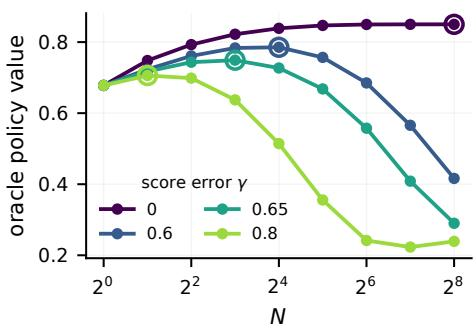

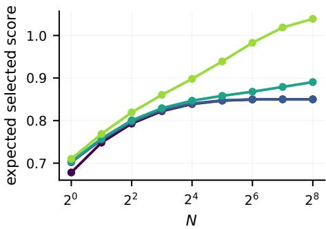  
Figure 5: Robust to score function misspecification (δ = 0.4). Left: exact policy value $V ( \pi _ { N } ^ { s } ) \ d s$ circles show the optimal budget N⋆. Right: expected score of the selected action. Colors show the score error γ.

## D.2 SENSITIVITY TO VALIDATION-SET SIZE

To assess the sensitivity of downstream policy evaluation and budget selection to the amount of validation data, we vary the size of the logged validation set while keeping the remaining experimental setup fixed. Figure 6 reports policy-value estimation at N = 256 and Value Maximization selection over the candidate budget grid. As the validation size increases, the RMSE of BoN-DR and BoN-IPW decreases and their confidence-interval coverage approaches the nominal 95% level, whereas the bias of the Plug-in estimator persists. The improved estimation accuracy also translates into more reliable budget selection: the probability of selecting the oracle-optimal budget $N ^ { \star }$ increases with the validation size, with BoN-DR reaching high selection accuracy more quickly than BoN-IPW. Overall, the results show that the downstream evaluation and selection procedure becomes increasingly stable as more logged validation data are available.

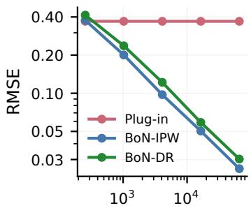  
validation size n

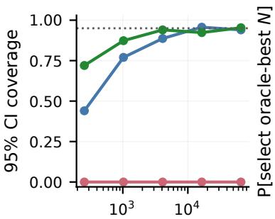  
validation size n

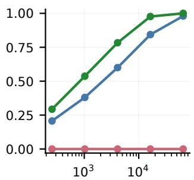  
validation size n  
Figure 6: Estimated BoN policy value at $N = 2 5 6$ as logged sample size grows. (a) RMSE at log scale. (b) Coverage of the nominal 95% pointwise confidence interval. The dotted line marks the nominal level. (c) Probability of selecting the optimal budget $N ^ { \star }$ under Value Maximization selection.

## D.3 FINITE-M EFFICIENCY

Figure 7 isolates the cost of the finite auxiliary pool in the Synthetic experiments with a correctly specified reward function $( \delta = 0 )$ . The paired ratio between the finite-M and the infinite-M DR variance falls from 1.335 at $M = 2 5 6$ to 1.019 at $M = 4 0 9 6$ at $N = 2 5 6$ , so the Monte Carlo cost of the pool vanishes as M grows, as Theorem 4.2 (b) predicts. The right panel compares the realized variance with the semiparametric efficiency bound: DR attains the bound closely, whereas IPW exceeds it by up to a factor of 4.9.

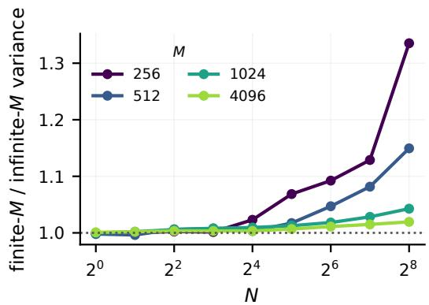

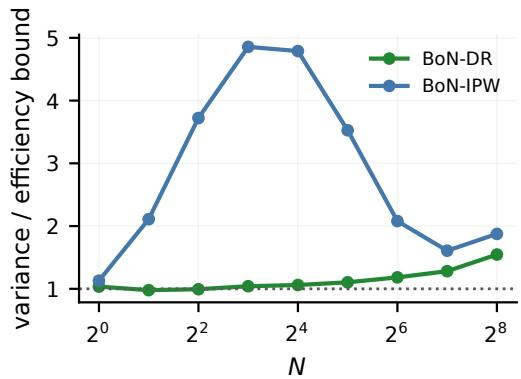  
Figure 7: Finite-M cost and efficiency in the synthetic experiments. Correctly specified reward function $( \delta = 0 ) , \gamma = 0 . 6 5 , n = 4 , 0 9 6 .$ , 300 repetitions. Left: ratio of the finite-M DR variance to the paired infinite-M oracle variance. Right: ratio of the realized variance to the efficiency bound at $M = 2 5 6$ . The dotted line marks a ratio of one.

## D.4 REAL COVERAGE

Figure 8 examines interval calibration over the full budget grid on GSM8K. Across both OASST and Skywork, BoN-DR and BoN-IPW achieve coverage close to the nominal 95% level over most budgets, despite the different BoN policies induced by the two score functions. BoN-DR coverage deteriorates at the largest budgets, where rank-weight overlap becomes weak, while BoN-IPW remains better calibrated at these endpoints. This undercoverage is consistent with a finite-sample limitation under increasingly extreme BoN reweighting. In contrast, Plug-in coverage drops to zero from $N = 4$ onward in all six configurations. Overall, the results suggest that BoN-DR and BoN-IPW provide reasonably well-calibrated uncertainty quantification across both score-function regimes, with the main deviations occurring at the largest budgets.

N

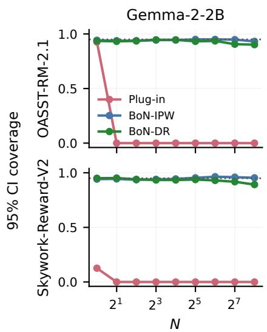

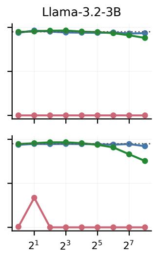

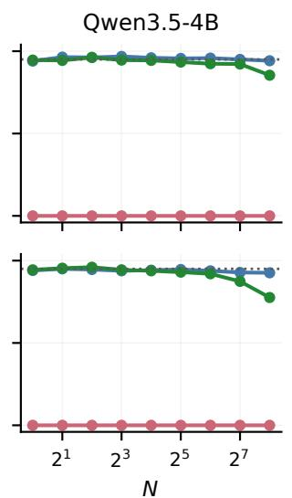  
Figure 8: Interval validity across budgets on GSM8K. Empirical coverage of the nominal 95% pointwise confidence interval over 500 repetitions. The dotted line marks the nominal level. Rows are external reward models used as score functions, and columns are reference models. The Plug-in estimator never covers from $N = 4 \mathrm { o n }$ . DR declines at the largest budgets, where overlap deteriorates.

## D.5 ERROR DECOMPOSITION OVER THE BUDGET GRID

Figure 9 decomposes the estimation error on GSM8K across all budgets, which a single-budget table cannot show. The Plug-in bias is large and nearly constant in N, whereas DR and IPW are essentially unbiased at every budget and their dispersion grows as overlap deteriorates. The Plug-in estimator therefore becomes competitive in RMSE only at the largest budgets, and only by trading a constant bias against negligible variance. Table 2 gives the per-configuration numbers at $N = 2 5 6$

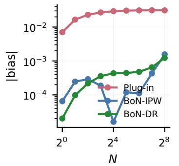

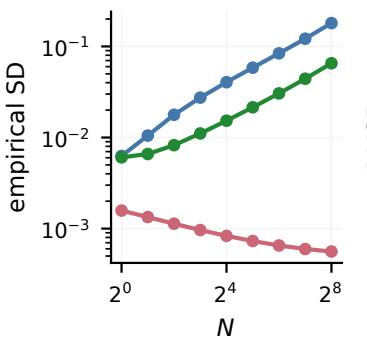

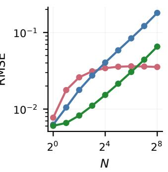  
Figure 9: Absolute bias, dispersion, and RMSE on GSM8K over the budget grid. Each quantity is averaged over the six configurations, 500 repetitions, log scale.

Table 2: Estimation on GSM8K at $N = 2 5 6 .$ 500 repetitions with $n = 3 { , } 9 7 3$ logged prompts. Coverage is that of the nominal 95% pointwise confidence interval. Bold marks the lowest RMSE and the coverage closest to 0.95 within each configuration.
<table><tr><td>Reward model</td><td>Estimator</td><td>Bias</td><td>RMSE</td><td>CI width</td><td>Coverage</td></tr><tr><td colspan="6">OASST-RM-2.1, reference model Gemma-2-2B</td></tr><tr><td></td><td>Plug-in</td><td>0.097</td><td>0.097</td><td>0.002</td><td>0.000</td></tr><tr><td></td><td>BoN-IPW</td><td>0.002</td><td>0.156</td><td>0.625</td><td>0.932</td></tr><tr><td></td><td>BoN-DR</td><td>0.008</td><td>0.102</td><td>0.364</td><td>0.902</td></tr><tr><td colspan="6">OASST-RM-2.1, reference model Llama-3.2-3B</td></tr><tr><td></td><td>Plug-in</td><td>0.029</td><td>0.029</td><td>0.001</td><td>0.000</td></tr><tr><td></td><td>BoN-IPW</td><td>0.005</td><td>0.179</td><td>0.703</td><td>0.934</td></tr><tr><td></td><td>BoN-DR</td><td>0.003</td><td>0.079</td><td>0.280</td><td>0.880</td></tr><tr><td colspan="6">OASST-RM-2.1, reference model Qwen3.5-4B</td></tr><tr><td></td><td>Plug-in</td><td>0.018</td><td>0.018</td><td>0.001</td><td>0.000</td></tr><tr><td></td><td>BoN-IPW</td><td>0.008</td><td>0.187</td><td>0.726</td><td>0.942</td></tr><tr><td></td><td>BoN-DR</td><td>0.003</td><td>0.058</td><td>0.225</td><td>0.854</td></tr><tr><td colspan="6">Skywork-Reward-V2, reference model Gemma-2-2B</td></tr><tr><td></td><td>Plug-in</td><td>0.041</td><td>0.041</td><td>0.007</td><td>0.000</td></tr><tr><td></td><td>BoN-IPW</td><td>0.004</td><td>0.172</td><td>0.704</td><td>0.954</td></tr><tr><td></td><td>BoN-DR</td><td>-0.003</td><td>0.064</td><td>0.252</td><td>0.892</td></tr><tr><td colspan="6">Skywork-Reward-V2, reference model Llama-3.2-3B</td></tr><tr><td></td><td>Plug-in</td><td>-0.013</td><td>0.013</td><td>0.002</td><td>0.000</td></tr><tr><td></td><td>BoN-IPW</td><td>-0.010</td><td>0.198</td><td>0.737</td><td>0.922</td></tr><tr><td></td><td>BoN-DR</td><td>-0.002</td><td>0.040</td><td>0.134</td><td>0.754</td></tr><tr><td colspan="6">Skywork-Reward-V2, reference model Qwen3.5-4B</td></tr><tr><td></td><td>Plug-in</td><td>0.015</td><td>0.015</td><td>0.001</td><td>0.000</td></tr><tr><td></td><td>BoN-IPW</td><td>0.001</td><td>0.190</td><td>0.727</td><td>0.926</td></tr><tr><td></td><td>BoN-DR</td><td>-0.002</td><td>0.048</td><td>0.168</td><td>0.776</td></tr></table>

## D.6 OVERLAP DIAGNOSTICS

Figure 10 reports the effective sample size of the rank weights on GSM8K. It falls from 3,973 prompts at $N = 1$ to about 25 at $N = 2 5 6$ and about 10 at $N \stackrel { \cdot } { = } 5 1 2$ , where only 0.5% of prompts carry non-zero weight. The endpoint $N = 5 1 2$ uses all $M + 1 = 5 1 2$ stored responses and satisfies the boundary condition $M = N - 1$ in Theorem 4.2. We report it only as an overlap stress test and restrict the main text to $N \leq 2 5 6$ . Extending the grid to $\dot { N } _ { \mathrm { m a x } } = 5 1 \dot { 2 }$ roughly doubles the residual harm of DR under Safe Improvement selection, from 0.12 to 0.24 on Llama with OASST and from 0.14 to 0.33 on Qwen with OASST, while IPW is unaffected at 0.00 and 0.01.

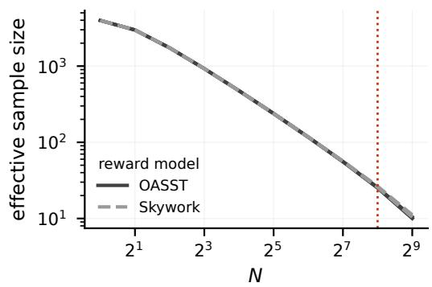

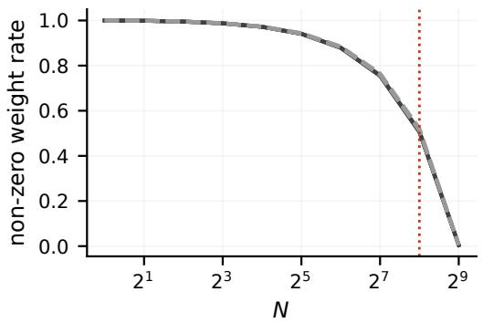  
Figure 10: Overlap of the rank weights on GSM8K. Left: effective sample size, log scale, out of 3,973 validation prompts. Right: fraction of prompts receiving non-zero weight. Solid lines are OASST, dashed lines are Skywork; the vertical line marks the largest budget used in the main text.

## D.7 ROBUSTNESS TO THE REWARD FUNCTION

Table 3 repeats the GSM8K comparison with two reward functions trained independently of the score function, a TF–IDF logistic regression and an embedding-based LightGBM model. Plug-in coverage is zero for both, so the failure reported in RQ2 is a property of the estimator under misspecification and not an artifact of the score-calibration spline used in the main text.

Table 3: Estimation on GSM8K at $N = 2 5 6$ with independently trained reward functions. OASST score function. Coverage is that of the nominal $9 5 \%$ pointwise confidence interval. Bold marks the lowest RMSE within each reference model and reward function.
<table><tr><td>Reward estimator</td><td>Estimator</td><td>Bias</td><td>RMSE</td><td>Coverage</td></tr><tr><td colspan="5">Reference model Gemma-2-2B</td></tr><tr><td>Embedding LightGBM</td><td>Plug-in BoN-IPW</td><td>0.040 0.008</td><td>0.040 0.167</td><td>0.000 0.880</td></tr><tr><td>TF-IDF logistic</td><td>BoN-DR Plug-in BoN-IPW BoN-DR</td><td>-0.015 0.022 0.008 -0.011</td><td>0.093 0.022 0.167 0.101</td><td>0.970 0.000 0.880 0.940</td></tr><tr><td colspan="5">Reference model Llama-3.2-3B</td></tr><tr><td>Embedding LightGBM TF-IDF logistic</td><td>Plug-in BoN-IPW BoN-DR Plug-in BoN-IPW</td><td>0.023 -0.011 0.005 0.024 -0.011</td><td>0.023 0.194 0.090 0.024 0.194</td><td>0.000 0.920 0.800 0.000 0.920</td></tr><tr><td colspan="5">BoN-DR 0.006 0.084 Reference model Qwen3.5-4B</td></tr><tr><td>Embedding LightGBM</td><td>Plug-in BoN-IPW</td><td>0.018 0.013</td><td>0.018 0.185</td><td>0.000 0.940</td></tr><tr><td>TF-IDF logistic</td><td>BoN-DR Plug-in</td><td>0.003 0.014</td><td>0.061 0.014</td><td>0.830 0.000</td></tr><tr><td></td><td>BoN-IPW</td><td>0.013</td><td>0.185</td><td>0.940</td></tr><tr><td></td><td></td><td></td><td></td><td></td></tr><tr><td></td><td></td><td></td><td></td><td></td></tr><tr><td></td><td></td><td></td><td></td><td></td></tr><tr><td></td><td></td><td></td><td></td><td></td></tr><tr><td></td><td>BoN-DR</td><td>0.002</td><td>0.058</td><td>0.830</td></tr><tr><td></td><td></td><td></td><td></td><td></td></tr></table>

## E ADDITIONAL RESULTS FOR SELECTION

Table 4 gives the numerical results and median selected budgets for Figure 4. The following subsections report the complete comparisons across configurations.

Table 4: Selecting N under challenging conditions. Synthetic experiments: score error $\gamma = 0 . 6 5$ reward function error $\delta = 0 . 6 , n = 4 , 0 9 \bar { 6 } , 3 0 0$ repetitions; gain in policy value. GSM8K: Qwen3.5- 4B with OASST, $n = 3 { , } 9 7 3 .$ , 100 logging repetitions; gain in accuracy points. Gain is measured against $N = 1$ and higher is better; harm is the fraction of repetitions with negative gain and lower is better; $\widetilde N$ is the median selected budget. $N _ { \mathrm { m a x } } = 2 5 6$ . Bold marks the best value per column among the selection methods. The last row gives the best attainable gain on the grid.
<table><tr><td rowspan="2">Selection method</td><td colspan="3">Synthetic exp (misspecified)</td><td colspan="3">GSM8K: Qwen3.5-4B / OASST</td></tr><tr><td>Gain</td><td>Harm</td><td>N</td><td>Gain (pp)</td><td>Harm</td><td>N</td></tr><tr><td>Naive BoN</td><td>-0.388</td><td>1.00</td><td>256</td><td>-1.50</td><td>1.00</td><td>256</td></tr><tr><td>Plug-in</td><td>-0.380</td><td>1.00</td><td>256</td><td>-0.28</td><td>1.00</td><td>4</td></tr><tr><td>BoN-IPW, Value-max</td><td>0.068</td><td>0.00</td><td>8</td><td>-0.84</td><td>0.77</td><td>32</td></tr><tr><td>BoN-IPW, Safe-improvement</td><td>0.062</td><td>0.00</td><td>4</td><td>0.00</td><td>0.01</td><td>1</td></tr><tr><td>BoN-DR, Value-max</td><td>0.069</td><td>0.00</td><td>8</td><td>-0.82</td><td>0.73</td><td>64</td></tr><tr><td>BoN-DR, Safe-improvement</td><td>0.067</td><td>0.00</td><td>4</td><td>-0.19</td><td>0.14</td><td>1</td></tr><tr><td>Oracle-best budget</td><td>0.071</td><td>0.00</td><td>8</td><td>0.00</td><td>0.00</td><td>1</td></tr></table>

## E.1 SAFE IMPROVEMENT REDUCES HARMFUL BUDGET CHOICES.

Figure 4 expands the selection analysis in Figure 11 by reporting both the achieved gain and the harm rate in two challenging regimes. The Synthetic experiments with $\gamma = 0 . 6 5$ and $\bar { \delta } = 0 . 6$ has an interior optimal budget, $N ^ { \star } = 8 ,$ , so successful selection must exploit the benefit of increasing N without overoptimizing at larger budgets. In contrast, for Qwen3.5-4B with OASST on GSM8K, $N ^ { \star } = 1$ , so any departure from the reference policy is harmful. These two regimes therefore separate the ability to capture a beneficial nontrivial budget from the ability to avoid unnecessary increases in inference-time compute.

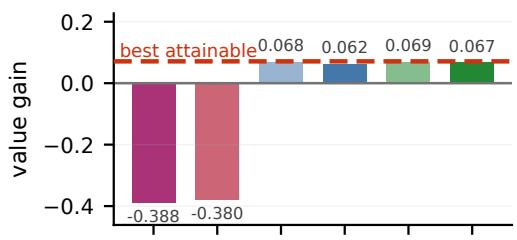

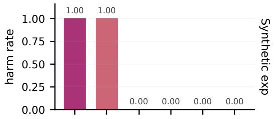

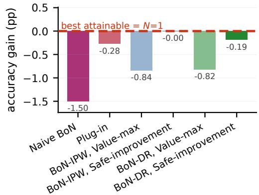

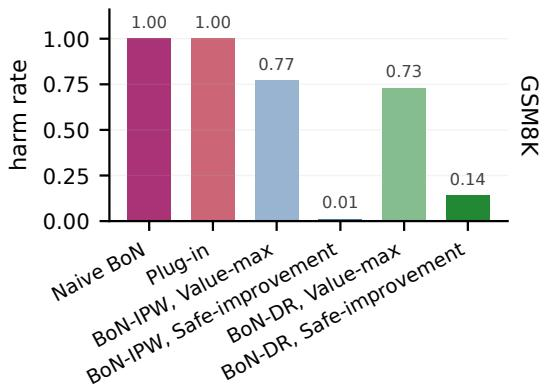  
Figure 11: Safe Improvement reduces harmful budget choices. Top: Synthetic experiments with $\gamma = 0 . 6 5 , \delta = 0 . 6 , n = 4 , 0 9 6$ , and 300 repetitions. Bottom: Qwen3.5-4B with OASST on GSM8K, with 3,973 validation prompts and 100 logging repetitions. Left: mean gain over $N = 1$ , measured in policy value for the Synthetic experiments and accuracy percentage points for GSM8K. Higher is better. The dashed red line marks the best attainable gain on the grid. Right: harm rate. Lower is better. Light and solid bars show Value-max and Safe-improvement, respectively. Plug-in uses Value Maximization, and Naive BoN selects $N _ { \mathrm { m a x } } = 2 5 6$ . Labels report numerical values.

In the Synthetic experiments, Value Maximization selection with BoN-IPW and BoN-DR recovers nearly all of the attainable gain and incurs no observed harm, whereas Naive BoN and Plug-in are harmful in every repetition. Safe Improvement is slightly more conservative, but retains most of the gain while likewise avoiding harmful selections. Thus, when the policy-value estimates are sufficiently accurate, both direct value maximization and uncertainty-aware selection identify useful nontrivial budgets.

The GSM8K regime is more challenging because the reference policy itself is optimal, so the best attainable gain over $N = 1$ is zero. Value Maximization selection nevertheless frequently chooses larger, harmful budgets: BoN-IPW and BoN-DR lose 0.84 and 0.82 accuracy percentage points on average, with harm rates of 77% and 73%, respectively. Safe Improvement substantially reduces these losses and lowers the harm rates to 1% for BoN-IPW and 14% for BoN-DR. The remaining BoN-DR harm is consistent with its finite-sample undercoverage at the largest budgets discussed in Appendix D.4. Thus, accounting for uncertainty is particularly useful when maximization over noisy value estimates would otherwise favor unnecessarily large budgets.

## E.2 COMPLETE RESULTS ON GSM8K

Table 5 reports every estimator with Value Maximization and Safe Improvement for all six configurations, including the aligned ones omitted from RQ3 . Two patterns hold throughout. Under the aligned Skywork reward model, no rule incurs harm, and Safe Improvement reduces gain without reducing the observed harm rate, most visibly for IPW. Under OASST, Safe Improvement reduces the harm incurred by Value Maximization selection with DR and IPW. Residual harm remains for DR on Llama and Qwen.

Table 5: Complete selection results on GSM8K. $N _ { \mathrm { m a x } } = 2 5 6$ , 100 logging repetitions. Gain is measured in accuracy points against N = 1 and higher is better; harm is the fraction of repetitions with negative gain and lower is better. Naive BoN does not depend on the selection rule and is reported once per configuration.
<table><tr><td colspan="2">Naive BoN</td><td></td><td colspan="2">Plug-in</td><td colspan="2">BoN-IPW</td><td colspan="2">BoN-DR</td></tr><tr><td>Gain</td><td>Harm</td><td>Rule</td><td>Gain</td><td>Harm</td><td>Gain</td><td>Harm</td><td>Gain</td><td>Harm</td></tr><tr><td colspan="9">OASST-RM-2.1, reference model Gemma-2-2B</td></tr><tr><td>4.23</td><td>0.00</td><td>Value-max</td><td>4.84</td><td>0.00</td><td>4.45</td><td>0.00</td><td>4.51</td><td>0.00</td></tr><tr><td></td><td></td><td>Safe-improvement</td><td>4.84</td><td>0.00</td><td>3.25</td><td>0.00</td><td>3.98</td><td>0.00</td></tr><tr><td colspan="9">OASST-RM-2.1, reference model Llama-3.2-3B</td></tr><tr><td>-0.51</td><td>1.00</td><td>Value-max</td><td>0.33</td><td>0.00</td><td>-0.03</td><td>0.44</td><td>-0.09</td><td>0.53</td></tr><tr><td></td><td></td><td>Safe-improvement</td><td>0.33</td><td>0.00</td><td>0.01</td><td>0.00</td><td>-0.05</td><td>0.12</td></tr><tr><td colspan="9">OASST-RM-2.1, reference model Qwen3.5-4B</td></tr><tr><td>-1.50</td><td>1.00</td><td>Value-max</td><td>-0.28</td><td>1.00</td><td>-0.84</td><td>0.77</td><td>-0.82</td><td>0.73</td></tr><tr><td></td><td></td><td>Safe-improvement</td><td>-0.28</td><td>1.00</td><td>0.00</td><td>0.01</td><td>-0.19</td><td>0.14</td></tr><tr><td colspan="9">Skywork-Reward-V2, reference model Gemma-2-2B</td></tr><tr><td>23.71</td><td>0.00</td><td>Value-max</td><td>23.71</td><td>0.00</td><td>21.86</td><td>0.00</td><td>22.91</td><td>0.00</td></tr><tr><td></td><td></td><td>Safe-improvement</td><td>23.71</td><td>0.00</td><td>16.17</td><td>0.00</td><td>20.57</td><td>0.00</td></tr><tr><td colspan="9">Skywork-Reward-V2, reference model Llama-3.2-3B</td></tr><tr><td>15.92</td><td>0.00</td><td>Value-max</td><td>15.92</td><td>0.00</td><td>13.95</td><td>0.00</td><td>15.07</td><td>0.00</td></tr><tr><td></td><td></td><td>Safe-improvement</td><td>15.92</td><td>0.00</td><td>8.86</td><td>0.00</td><td>14.12</td><td>0.00</td></tr><tr><td colspan="9">Skywork-Reward-V2, reference model Qwen3.5-4B</td></tr><tr><td>3.11</td><td>0.00</td><td>Value-max</td><td>3.11</td><td>0.00</td><td>2.57</td><td>0.00</td><td>2.91</td><td>0.00</td></tr><tr><td></td><td></td><td>Safe-improvement</td><td>3.11</td><td>0.00</td><td>0.38</td><td>0.00</td><td>2.23</td><td>0.00</td></tr></table>

## E.3 COMPLETE RESULTS IN THE SYNTHETIC EXPERIMENTS

Table 6 sweeps the reward function error at a fixed overoptimized score function. It shows why RQ1 reports $\delta = 0 . 6 \colon$ all estimator-based selection rules have zero observed harm up to $\delta = 0 . 4$ because the Plug-in bias is not yet large enough to move its selected budget past the point at which the policy value falls below the value at $N = \bar { 1 } . \mathrm { A t } \delta = 0 . 6$ the Plug-in budget jumps to $N _ { \mathrm { m a x } }$ and harms in every repetition, while DR and IPW retain positive gains with zero observed harm across the tested values of δ. This also shows that a biased estimator can still select a safe budget, which is why estimation quality and selection quality are evaluated separately in RQ1

Table 6: Complete selection results in the Synthetic experiments. Score error $\gamma = 0 . 6 5 , n = 4 , 0 9 6 .$ $N _ { \mathrm { m a x } } = 2 5 6$ , 300 repetitions. Gain is measured in policy value against N = 1 and higher is better; harm is the fraction of repetitions with negative gain and lower is better. Naive BoN does not depend on the selection rule and is reported once per value of δ.
<table><tr><td colspan="2">Naive BoN</td><td></td><td colspan="2">Plug-in</td><td colspan="2">BoN-IPW</td><td colspan="2">BoN-DR</td></tr><tr><td>Gain</td><td>Harm</td><td>Rule</td><td>Gain</td><td>Harm</td><td>Gain</td><td>Harm</td><td>Gain</td><td>Harm</td></tr><tr><td colspan="9">Reward estimator error  $\delta = - 0 . 2$ </td></tr><tr><td>-0.388</td><td>1.00</td><td>Value-max</td><td>0.065</td><td>0.00</td><td>0.068</td><td>0.00</td><td>0.070</td><td>0.00</td></tr><tr><td></td><td></td><td>Safe-improvement</td><td>0.065</td><td>0.00</td><td>0.062</td><td>0.00</td><td>0.067</td><td>0.00</td></tr><tr><td colspan="9">Reward estimator error δ = 0</td></tr><tr><td>-0.388</td><td>1.00</td><td>Value-max</td><td>0.071</td><td>0.00</td><td>0.068</td><td>0.00</td><td>0.070</td><td>0.00</td></tr><tr><td></td><td></td><td>Safe-improvement</td><td>0.071</td><td>0.00</td><td>0.062</td><td>0.00</td><td>0.067</td><td>0.00</td></tr><tr><td colspan="9">Reward estimator error  $\delta = 0 . 2$ </td></tr><tr><td>-0.388</td><td></td><td>Value-max</td><td>0.071</td><td>0.00</td><td>0.068</td><td>0.00</td><td>0.070</td><td>0.00</td></tr><tr><td></td><td>1.00</td><td>Safe-improvement</td><td>0.071</td><td>0.00</td><td>0.062</td><td>0.00</td><td>0.067</td><td>0.00</td></tr><tr><td colspan="9">Reward estimator error δ = 0.4</td></tr><tr><td>-0.388</td><td>1.00</td><td>Value-max</td><td>0.049</td><td>0.00</td><td>0.068</td><td>0.00</td><td>0.070</td><td>0.00</td></tr><tr><td></td><td></td><td>Safe-improvement</td><td>0.049</td><td>0.00</td><td>0.062</td><td>0.00</td><td>0.067</td><td>0.00</td></tr><tr><td colspan="9">Reward estimator error δ = 0.6</td></tr><tr><td>-0.388</td><td>1.00</td><td>Value-max</td><td>-0.380</td><td>1.00</td><td>0.068</td><td>0.00</td><td>0.069</td><td>0.00</td></tr><tr><td></td><td></td><td>Safe-improvement</td><td>-0.319</td><td>1.00</td><td>0.062</td><td>0.00</td><td>0.067</td><td>0.00</td></tr></table>

## E.4 SELECTION ACROSS THE RANGE OF SCORE ERROR

Figure 12 varies the score error at a fixed reward function. Naive BoN is optimal while the score function is aligned and collapses as soon as it is exploitable, whereas every estimator-based rule has nonnegative mean gain across the tested range. DR attains the lowest regret against the optimal budget.

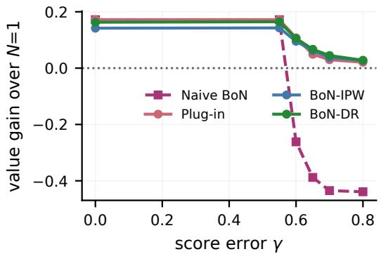

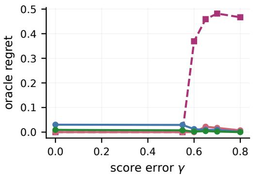  
Figure 12: Selection across the range of score error in the Synthetic experiments. Safe Improvement rule, $\delta = 0 . 4 , n = 4 , 0 9 6 , N _ { \mathrm { m a x } } = 2 5 6 ,$ , 300 repetitions. Left: gain over $N = 1$ . Right: regret against the optimal budget on the grid, lower is better.

## F EXTENSION TO PREFERENCE REWARDS

Our BoN evaluation framework extends to settings in which the scalar reward encodes a pairwise preference between two model responses, as in AI alignment and RLHF. For a prompt or context X, let

$$
A = \left( A _ { 1 } , A _ { 2 } \right)
$$

denote a pair of candidate responses and let

$$
Y \in \{ 0 , 1 \}
$$

be the observed reward indicating whether the first response is preferred to the second response. Thus, $Y = 1$ means that $A _ { 1 }$ is preferred to $A _ { 2 }$

We assume that the behavior comparison policy factorizes as

$$
\pi _ { b } ( a _ { 1 } , a _ { 2 } \mid x ) = \pi _ { b , 1 } ( a _ { 1 } \mid x ) \pi _ { b , 2 } ( a _ { 2 } \mid x ) .
$$

Here, $\pi _ { b , 1 }$ denotes the policy from which the first candidate response is sampled, and $\pi _ { b , 2 }$ denotes the policy from which the second, reference candidate response is sampled. In an RLHF application, $\pi _ { b , 1 }$ could be the base, supervised fine-tuned, or previous model from which BoN samples are drawn. The policy $\pi _ { b , 2 }$ is the opponent or reference policy used in the comparison. Often, the two policies are the same, so that

$$
\pi _ { b , 1 } = \pi _ { b , 2 } = \pi _ { \mathrm { r e f } } ,
$$

corresponding to the common design in which both candidate responses are sampled independently from the same reference model. More generally, however, the two marginals may differ, for example if the first response is sampled from a current model and the second response from a fixed baseline model.

Let $s ( x , a )$ denote the score function used for BoN selection. Given a prompt x, the BoN policy induced by $\pi _ { b , 1 }$ samples

$$
\widetilde { A } _ { 1 } , \dots , \widetilde { A } _ { N } \overset { \mathrm { i i d } } { \sim } \pi _ { b , 1 } ( \cdot \mid x )
$$

and returns

$$
J _ { N } ( x ) : = \underset { 1 \leq j \leq N } { \mathrm { a r g m a x } } s ( x , \widetilde { A } _ { j } ) ,
$$

$$
I _ { N } ( x ) \mid { \widetilde A } _ { 1 } , \ldots , { \widetilde A } _ { N } \sim \mathrm { U n i f o r m } ( J _ { N } ( x ) ) , \qquad A _ { N } ^ { \star } : = { \widetilde A } _ { I _ { N } ( x ) } .
$$

Ties are thus broken uniformly among maximizing sampled occurrences, including repeated responses. We denote the resulting policy by $q _ { N } ( \cdot \mid x )$

## F.1 PAIRWISE WIN-RATE OBJECTIVE

In the preference-learning setting, a natural target estimand is the pairwise win rate of the BoN policy against a reference policy $\rho \colon$

$$
W _ { N } ( \rho ) = \mathbb { E } _ { X } \mathbb { E } _ { A \sim q _ { N } ( \cdot \vert X ) , B \sim \rho ( \cdot \vert X ) } \left[ \mu ( X , A , B ) \right] ,
$$

where

$$
\mu ( x , a , b ) = \mathbb { P } ( Y = 1 \mid X = x , A _ { 1 } = a , A _ { 2 } = b )
$$

is the conditional mean reward function, here the probability that response a is preferred to response $b .$

The reference policy ρ specifies the opponent against which the BoN policy is evaluated. A particularly convenient and practically relevant choice is

$$
\rho = \pi _ { b , 2 } .
$$

In this case, the target asks how often a BoN response sampled from the first behavior marginal beats a response sampled from the same reference distribution that generated the second response in the logged preference data. When

$$
\pi _ { b , 1 } = \pi _ { b , 2 } = \rho = \pi _ { \mathrm { r e f } } ,
$$

the estimand is the probability that a BoN response beats an ordinary response sampled from the same reference model.

A common modeling assumption in preference learning is the Bradley–Terry model, under which there exists a latent reward function $r _ { 0 } ( x , a )$ such that

$$
\mu ( x , a , b ) = \sigma \{ r _ { 0 } ( x , a ) - r _ { 0 } ( x , b ) \} ,
$$

where $\sigma ( u ) = ( 1 + \exp ( - u ) ) ^ { - 1 }$ is the logistic function. Given a sample $\{ ( X _ { i } , A _ { i 1 } , A _ { i 2 } , Y _ { i } ) \} _ { i = 1 } ^ { n } ,$ a reward model $r _ { \theta }$ can be estimated by minimizing the negative log-likelihood

$$
\begin{array} { l } { { \displaystyle { \mathcal L } _ { \mathrm { B T } } ( \theta ) = - \frac { 1 } { n } \sum _ { i = 1 } ^ { n } \Bigl [ Y _ { i } \log \sigma \{ r _ { \theta } ( X _ { i } , A _ { i 1 } ) - r _ { \theta } ( X _ { i } , A _ { i 2 } ) \} \quad } } \\ { { \displaystyle \qquad + ( 1 - Y _ { i } ) \log \sigma \{ r _ { \theta } ( X _ { i } , A _ { i 2 } ) - r _ { \theta } ( X _ { i } , A _ { i 1 } ) \} \Bigl ] . } } \end{array}
$$

The corresponding reward function is

$$
\widehat { \mu } ( x , a , b ) = \sigma \{ \widehat { r } ( x , a ) - \widehat { r } ( x , b ) \} .
$$

As in Section 4.3, fitted functions are constructed independently of the evaluation data and auxiliary draws. The Bradley–Terry model is useful because it connects pairwise preferences to the reward modeling perspective common in RLHF. However, the pairwise win-rate estimand does not require the Bradley–Terry model for identification. It is identified as long as the conditional preference regression $\mu ( \boldsymbol { x } , a , b )$ is identified on the relevant support.

## F.2 DOUBLY ROBUST ESTIMATION

The target pair distribution for the win-rate estimand is

$$
q _ { N } ^ { \mathrm { p a i r } } ( a , b \mid x ) = q _ { N } ( a \mid x ) \rho ( b \mid x ) ,
$$

whereas the behavior pair distribution is

$$
\pi _ { b } ( a , b \mid x ) = \pi _ { b , 1 } ( a \mid x ) \pi _ { b , 2 } ( b \mid x ) .
$$

Therefore, the pairwise density ratio is

$$
w _ { N } ( x , a , b ) = \frac { q _ { N } ( a \mid x ) \rho ( b \mid x ) } { \pi _ { b , 1 } ( a \mid x ) \pi _ { b , 2 } ( b \mid x ) } .
$$

Define

$$
m _ { N } ( x ; \rho ) = \operatorname { \mathbb { E } } _ { A \sim q _ { N } ( \cdot \vert x ) , B \sim \rho ( \cdot \vert x ) } \left[ \mu ( x , A , B ) \right] .
$$

Then the efficient influence function for $W _ { N } ( \rho )$ in the nonparametric model for $\mu$ is

$$
\phi _ { N } ( { \cal O } ) = m _ { N } ( X ; \rho ) - W _ { N } ( \rho ) + w _ { N } ( X , { \cal A } _ { 1 } , { \cal A } _ { 2 } ) \{ Y - \mu ( X , { \cal A } _ { 1 } , { \cal A } _ { 2 } ) \} .
$$

This yields the doubly robust estimator

$$
\widehat { W } _ { N } ( \rho ) = \frac { 1 } { n } \sum _ { i = 1 } ^ { n } \left[ \widehat { m } _ { N } ( X _ { i } ; \rho ) + \widehat { w } _ { N } ( X _ { i } , A _ { i 1 } , A _ { i 2 } ) \{ Y _ { i } - \widehat { \mu } ( X _ { i } , A _ { i 1 } , A _ { i 2 } ) \} \right] .
$$

The plug-in component can be estimated by Monte Carlo:

$$
\widehat { m } _ { N } ( x ; \rho ) = \frac { 1 } { M } \sum _ { m = 1 } ^ { M } \widehat { \mu } ( x , \widetilde { A } _ { m , N } ^ { \star } , \widetilde { B } _ { m } ) ,
$$

where

$$
\widetilde { A } _ { m , N } ^ { \star } = \widetilde { A } _ { m , I _ { m , N } } , \qquad \widetilde { A } _ { m j } \stackrel { \mathrm { i i d } } { \sim } \pi _ { b , 1 } ( \cdot \mid x ) , \qquad \widetilde { B } _ { m } \sim \rho ( \cdot \mid x ) .
$$

Here, conditional on the sampled candidates, $I _ { m , N }$ is drawn uniformly from $\operatorname { a r g m a x } _ { 1 \leq j \leq N } s ( x , \widetilde { A } _ { m j } )$ The M terms above are independent Monte Carlo replicates, each using $\bar { N }$ candidate draws and an independent opponent draw; this is a direct Monte Carlo construction rather than the pooled estimator of Section 4.2.

## F.3 BON DENSITY RATIOS

The density ratio can be simplified using the structure of the BoN policy. Suppose $q _ { N }$ is induced by sampling $\dot { N }$ candidates independently from $\pi _ { b , 1 } ( \cdot \mid x )$ and selecting the response with the largest score $s ( x , a )$ . Define

$$
\begin{array} { r l } & { F _ { x , 1 } ^ { - } ( a ) = \mathbb { P } _ { A \sim \pi _ { b , 1 } ( \cdot \vert x ) } \{ s ( x , A ) < s ( x , a ) \} , } \\ & { F _ { x , 1 } ( a ) = \mathbb { P } _ { A \sim \pi _ { b , 1 } ( \cdot \vert x ) } \{ s ( x , A ) \leq s ( x , a ) \} . } \end{array}
$$

Proposition 4.1 gives, for $\pi _ { b , 1 } ( a \mid x ) > 0 .$

$$
\frac { q _ { N } ( a \mid x ) } { \pi _ { b , 1 } ( a \mid x ) } = g _ { N } \big ( F _ { x , 1 } ( a ) , F _ { x , 1 } ^ { - } ( a ) \big ) .
$$

Thus,

$$
w _ { N } ( x , a , b ) = g _ { N } { \big ( } F _ { x , 1 } ( a ) , F _ { x , 1 } ^ { - } ( a ) { \big ) } \cdot { \frac { \rho ( b \mid x ) } { \pi _ { b , 2 } ( b \mid x ) } } .
$$

The strict and weak score probabilities can be estimated by Monte Carlo sampling from the first behavior marginal. Given samples

$$
\bar { A } _ { 1 } , \ldots , \bar { A } _ { L } \stackrel { \mathrm { i i d } } { \sim } \pi _ { b , 1 } ( \cdot \mid x ) ,
$$

we estimate

$$
\widehat { F } _ { x , 1 } ^ { - } ( a ) = \frac { 1 } { L } \sum _ { \ell = 1 } ^ { L } \mathbf { 1 } \{ s ( x , \bar { A } _ { \ell } ) < s ( x , a ) \} ,
$$

$$
\widehat { F } _ { x , 1 } ( a ) = \frac { 1 } { L } \sum _ { \ell = 1 } ^ { L } \mathbf { 1 } \{ s ( x , \bar { A } _ { \ell } ) \leq s ( x , a ) \} .
$$

This gives the plug-in estimate of the BoN ratio

$$
\widehat { R } _ { N } ( x , a ) = g _ { N } \Big ( \widehat { F } _ { x , 1 } ( a ) , \widehat { F } _ { x , 1 } ^ { - } ( a ) \Big ) .
$$

This plug-in ratio estimate is generally biased at finite L. The unbiased alternative is Eq. (9), applied to the first behavior marginal with ${ \dot { M } } = L \geq N - 1 ;$ ; the plug-in ratio estimate does not inherit its finite-pool unbiasedness. The resulting pairwise weight estimate is

$$
\widehat w _ { N } ( x , a , b ) = \widehat R _ { N } ( x , a ) \cdot \frac { \rho ( b \mid x ) } { \pi _ { b , 2 } ( b \mid x ) } .
$$

A particularly important special case is

$$
\rho = \pi _ { b , 2 } .
$$

Then the second density ratio cancels and

$$
w _ { N } ( x , a , b ) = \frac { q _ { N } ( a \mid x ) } { \pi _ { b , 1 } ( a \mid x ) } = g _ { N } \left( F _ { x , 1 } ( a ) , F _ { x , 1 } ^ { - } ( a ) \right) .
$$

Hence the doubly robust estimator becomes

$$
\widehat { W } _ { N } ( \pi _ { b , 2 } ) = \frac { 1 } { n } \sum _ { i = 1 } ^ { n } \left[ \widehat { m } _ { N } ( X _ { i } ; \pi _ { b , 2 } ) + \widehat { R } _ { N } ( X _ { i } , A _ { i 1 } ) \{ Y _ { i } - \widehat { \mu } ( X _ { i } , A _ { i 1 } , A _ { i 2 } ) \} \right] .
$$

If, additionally,

$$
\pi _ { b , 1 } = \pi _ { b , 2 } = \rho = \pi _ { \mathrm { r e f } } ,
$$

then both logged responses are independent samples from the same reference model, the BoN policy is obtained by reranking samples from that same model, and the target value is

$$
W _ { N } \big ( \pi _ { \mathrm { r e f } } \big ) = \mathbb { E } _ { X , A \sim q _ { N } ( \cdot \vert X ) , B \sim \pi _ { \mathrm { r e f } } ( \cdot \vert X ) } \left[ \mu ( X , A , B ) \right] .
$$

In words, $W _ { N } ( \pi _ { \mathrm { r e f } } )$ is the probability that a BoN response beats a standard response from the reference model. In this common case, the only density ratio required for debiasing is the BoN ratio

$$
R _ { N } ( x , a ) = g _ { N } \big ( F _ { x , 1 } ( a ) , F _ { x , 1 } ^ { - } ( a ) \big ) ,
$$

which can be estimated using samples from the reference model alone.

This extension shows that the proposed BoN evaluation approach carries over naturally to preferencelearning settings. The key requirement is that the logged comparison policy factorizes, and that the first behavior marginal is the policy from which BoN candidates are sampled. If the behavior pair distribution does not factorize, then the required density ratio generally depends on the full joint distribution of $( A _ { 1 } , A _ { 2 } )$ and cannot be recovered from samples from the marginal policies alone.