# EXECUTING CAUSAL STRUCTURE LEARNING WITH LINEAR-ATTENTION TRANSFORMERS

Amartya Roy   
School of Interdisciplinary Research   
Indian Institute of Technology Delhi srz248670@iitd.ac.in

Sayar Karmakar University of Florida sayarkarmakar@ufl.edu

## ABSTRACT

Transformers can execute algorithms on data given in their input. We ask whether they can do the same for causal discovery. We study a standard continuous method that repeatedly updates a candidate causal graph while enforcing acyclicity. We explicitly construct a fixed-weight transformer whose forward pass exactly reproduces one update of this method, so repeated blocks reproduce its optimization trajectory. The transformer carries the current graph and the algorithm’s multiplier between updates. We show that retaining the multiplier is essential for exact execution, since different multiplier values can lead to different next updates. We also give conditions under which, within a fixed stage, the number of updates needed to reach a target accuracy can be computed in advance and rounding errors stay bounded as depth grows. Experiments show that the constructed block agrees with a reference update to floating-point precision, while arithmetic replay on synthetic data and seven published benchmark network topologies inherits the reference solver’s successes and failures. This separates accurate algorithm execution from accurate causal recovery. In contrast, the ordinary attention models tested under our training budgets do not reliably execute the update or transfer to larger graphs. Whether gradient training can learn an executor in the architecture class of the construction remains open.

Keywords Transformers · Causal discovery · Algorithm execution · Linear attention · Continuous DAG learning · Augmented Lagrangian.

## 1 Introduction

Can a transformer carry out causal discovery by executing a known solver, with weights fixed before seeing the data? The question grows out of a line of work on what transformers can compute from their prompt. Constructive studies of in-context learning show how a transformer can compute on examples it is shown (Garg et al., 2022) and even implement gradient descent in its forward pass (Akyürek et al., 2022; von Oswald et al., 2022; Ahn et al., 2023). Later constructions go further, building networks that carry out proximal updates, looped programs and graph algorithms (Bai et al., 2023; Giannou et al., 2023). What these results share is that the weights are specified rather than fitted, so the forward pass is a known computation and one can say exactly what it computes, how deep it must be and where it loses precision.

Causal discovery looks like a natural next test, and a harder one. A weighted directed graph over p variables is a causal graph only if it contains no directed cycle, and this global requirement couples every edge to every other. Continuous formulations turn the requirement into a smooth constraint: NOTEARS replaces the combinatorial search over acyclic graphs by an equality constraint on the weighted adjacency matrix (Zheng et al., 2018), and polynomial variants have the same acyclic zeros (Yu et al., 2019; Wei et al., 2020). The resulting solvers alternate between a gradient-and-threshold step on the edge weights and an update of a multiplier that tightens the acyclicity penalty. A transformer that is to execute such a solver must do more than evaluate a gradient. It must evaluate a matrix-power constraint, apply a sparse proximal step, respect an allowed-edge mask, and keep a second piece of state, the multiplier, available for the next update.

This is the problem we take on. We study the complete update of a continuous DAG solver, which combines a<sup>(a)</sup> least-squares gradient, a polynomial acyclicity penalty, a sparse proximal step and a multiplier update. Each ingredient is established; the question is how to execute their composition in a transformer and retain the state the next update needs. The state is the crux. The next update depends on both the weighted adjacency matrix W and the multiplier α, so we encode this complete state in the prompt and build a fixed-weight block that maps it to the next state, leaving the penalty schedule and stopping rule external. Figure 1 shows the resulting correspondence between the solver and transformer trajectories.

(a)  
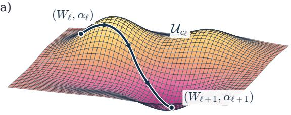

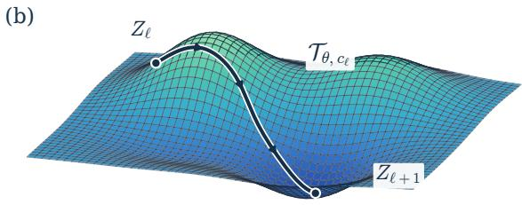  
(b)Figure 1: One update, run two ways. The solver carries the edge matrix $W _ { \ell }$ and multiplier $\alpha _ { \ell } ;$ the fixed-weight transformer carries the same state in $Z _ { \ell } .$ With identical controls, the two transitions agree exactly (Theorem 4.1). The surfaces are schematic.

Our answer is an explicit construction. A single set of weights, shared by all graphs with up to $p _ { \mathrm { m a x } }$ variables, executes one update exactly with depth $O ( \log p _ { \operatorname* { m a x } } )$ and width $O ( p _ { \operatorname* { m a x } } )$ , and we prove a matching depth order for linear attention with bilinear/ReLU sublayers and affine encoding and readout (Section 4). Because the multiplier is carried from one block to the next rather than recomputed, it is the quantity most easily lost, and we show that losing it changes the next update; we also bound the error this causes and explain why constraint evaluations need care as the graph approaches acyclicity (Section 5). Within a fixed penalty stage we give conditions under which the number of updates needed for a target accuracy can be computed in advance (Section 6), and we relate the solver’s output to the true graph (Section 7).

The experiments then ask whether this works in practice.<sup>1</sup> The constructed block agrees with an independent reference implementation of the update to floating-point precision, and repeated blocks reproduce the solver’s trajectory. Replaying the updates on synthetic data and on seven published benchmark network topologies gives the same graphs as the reference solver, including its mistakes: reproducing the solver’s updates also reproduces its statistical and optimization errors, so accurate execution should not be confused with accurate causal recovery (Section 8). Ordinary attention models trained under our budgets, by contrast, do not reliably execute the update or transfer to larger graphs, and whether gradient training can find an executor in the architecture class of the construction remains open. We stress the scope of the claim. The block executes the Poly-prox update for supplied controls; it does not choose the schedule, run line searches or decide when to stop, and the reference solver serves as a well-defined target rather than a state-of-the-art estimator.

The rest of the paper follows this story. Section 2 reviews related work and Section 3 states the solver and its reference update. Section 4 builds the block, and Sections 5–7 study what is lost through the multiplier, the constraint and finite precision, and how exact execution relates to recovery. Section 8 reports the experiments and Section 9 concludes. Proofs and experimental details are in the appendices.

## 2 Related Work

Algorithm execution by transformers. Constructed transformers implement gradient and second-order updates (Akyürek et al., 2022; von Oswald et al., 2022; Ahn et al., 2023; Chen et al., 2023), proximal methods (Bai et al., 2023) and optimal-transport iterations (Daneshmand, 2026); looped models emulate programs and graph algorithms (Giannou et al., 2023; de Luca and Fountoulakis, 2024). We construct the complete Poly-prox update and determine the depth, stored information and numerical accuracy it requires. Learning latent causal structure (Nichani et al., 2024) and amortized graph prediction (Ke et al., 2022; Lorch et al., 2022; Wang et al., 2026) address different targets from executing a specified numerical update.

Continuous DAG learning. NOTEARS uses a matrix-exponential constraint (Zheng et al., 2018); polynomial constraints have the same acyclic zeros (Yu et al., 2019; Wei et al., 2020). TMPI exploits repeated squaring (Zhang et al., 2022); DAGMA, GOLEM and SDCD offer alternative formulations (Bello et al., 2022; Ng et al., 2020a; Nazaret et al., 2023). Exact execution still inherits the solver’s statistical and optimization limitations, including those discussed in Appendix F.4.

## 3 The Causal-Discovery Algorithm

Let $\ b X \in \mathbb { R } ^ { m \times p }$ hold m i.i.d. centered observations of a mean-zero $x \in \mathbb { R } ^ { p }$ generated by a linear SEM ${ x } _ { j } = { }$ $\begin{array} { r } { \sum _ { i } W _ { i j } ^ { \dagger } x _ { i } + \epsilon _ { j } } \end{array}$ with acyclic $W ^ { \dagger }$ and independent, mean-zero noise with finite positive variances. With equal noise variances $W ^ { \dagger }$ uniquely minimizes the population least-squares loss over acyclic supports (Peters and Buhlmann, 2012; Loh and Bühlmann, 2013; Chen et al., 2018); Section 7 relates the solver’s finite-sample output to it.

For $\Sigma = X ^ { \top } X / m$ , we study

$$
\begin{array} { r l } { \underset { W \in \mathcal { W } _ { M } } { \operatorname* { m i n } } } & { F ( W ) = \underset { \mathcal { L } ( W ) } { \underbrace { \frac { 1 } { 2 m } \| X - X W \| _ { F } ^ { 2 } } } + \lambda \| W \| _ { 1 } } \\ { \mathrm { s . t . } } & { h ( W ) = 0 , } \end{array}\tag{1}
$$

where $\mathcal { W } _ { M } = \{ W : W = M \odot W \}$ restricts W to a binary zero-diagonal allowed-edge mask $M \ ( M _ { i j } = { \bf 1 } \{ i \neq j \}$ with no domain knowledge), $W _ { i j }$ is the weight of edge $i  j$ , and

$$
\begin{array} { r } { h ( W ) = \mathrm { t r } \left[ \left( I + \frac { W \odot W } { N } \right) ^ { N } \right] - p , \qquad N = 2 ^ { s } , \quad s = \lceil \log _ { 2 } p _ { \mathrm { m a x } } \rceil . } \end{array}\tag{2}
$$

With $N \geq p , h ( W ) = 0$ exactly on matrices whose support graph G(W) is acyclic (Yu et al., 2019; Wei et al., 2020); we fix one N for every $p \le p _ { \mathrm { m a x } }$ . We solve (1) by a NOTEARS-style augmented Lagrangian $\mathcal { I } _ { \rho , \alpha } ( W ) =$ $\begin{array} { r } { \mathcal { L } ( W ) + \alpha h ( W ) + \frac { \rho } { 2 } h ( W ) ^ { 2 } } \end{array}$ with a proximal-gradient primal step (Daubechies et al., 2003; Beck and Teboulle, 2009):

$$
W _ { \ell + 1 } = M \odot \mathrm { s o f t } _ { \gamma _ { \ell } \lambda } \left( W _ { \ell } - \gamma _ { \ell } \nabla \mathcal { I } _ { \rho _ { \ell } , \alpha _ { \ell } } ( W _ { \ell } ) \right) ,\tag{3}
$$

$$
\alpha _ { \ell + 1 } = \alpha _ { \ell } + b _ { \ell } \rho _ { \ell } h ( W _ { \ell + 1 } ) ,\tag{4}
$$

Throughout, $\lambda ~ \ge ~ 0 , ~ \rho _ { \ell } ~ \ge ~ 0$ and $\gamma _ { \ell } \ > \ 0 ;$ the schedule controls are externally supplied. Here $\mathrm { s o f t } _ { \tau } ( t ) ~ =$ sign(t) max $\{ | t | - \tau , 0 \}$ , the step size is $\gamma _ { \ell } ,$ and $b \ell \in \{ 0 , 1 \}$ allows several primal steps per multiplier update. Algorithm 1 collects one iteration of (3)–(4), and we call this reference implementation Poly-prox. The solver itself is standard; our contribution is a transformer with analytically fixed weights that executes it (Section 4). We choose Poly-prox because its fixed step consists of matrix products, scalar products and ReLU soft-thresholding, allowing a finite exact construction. Line searches and alternative optimizers are not implemented by this fixed block.

Proposition A.1 (Appendix A.1) gives, with $B = W \odot W$ and $Y = I + B / N , \nabla { \mathcal { L } } ( W ) = \Sigma ( W - I )$ and $\nabla h ( W ) =$ $2 W \odot ( Y ^ { N - 1 } ) ^ { \top }$ , both built from the same matrix powers that compute h itself; the Lasso proximal map is entrywise soft-thresholding restricted to the allowed edges, $\grave { M } \odot \mathrm { s o f t } _ { \gamma \lambda } ( W )$ ).

A well-known feature of this constraint, shared by the matrix-exponential version (Wei et al., 2020), is that its gradient vanishes on the entire feasible set: $[ \boldsymbol { \nabla } h ( \boldsymbol { W } ) ] _ { i j }$ is a sum over weighted directed walks that would close a cycle through $i  j$ , so it is nonzero exactly on edges that lie on a cycle and ${ \check { \nabla } } h ( W ) = 0$ as soon as G(W) is acyclic (Lemma $\mathrm { A . } 2 .$ Appendix A.2).

At every feasible point, then, the usual regularity condition for the equality constraint fails, and a feasible point is a KKT point exactly when it also minimizes the convex masked Lasso problem (Appendix A.2); Section 5 turns the same fact into a statement about what an executor must retain.

## 4 How the Transformer Executes an Update

We now construct a block that exactly executes one iteration of Algorithm 1. The prompt and the block are designed together: the prompt is a numerical encoding of the solver’s current state, one row token per variable plus a single control token holding the scalar controls and α. A register is a designated group of coordinates in the residual stream; a persistent one carries its value from one iteration to the next (here W and α), a scratch one is reset after each update.

The encoded state has width $1 3 p _ { \operatorname* { m a x } } + 1 8$ . Set $q = 9 p _ { \mathrm { m a x } } + 1 8$ and let $v = ( \mathrm { 0 } _ { 9 p _ { \mathrm { m a x } } } , 1 , 0 , 0 _ { 1 6 } )$ contain the variable-token flag and zero scratch. The control row uses $\omega _ { \ell } = ( \mathbb { 0 } _ { 9 p _ { \mathrm { m a x } } } , 0 , 1 , \lambda , \alpha _ { \ell } , \rho _ { \ell } , \gamma _ { \ell } , \bar { b _ { \ell } } , 0 _ { 1 1 } )$ . For variable rows $i \leq p ,$ with all

```tcl
Algorithm 1 Poly-prox causal-discovery update Algorithm 2 Fixed-weight transformer execution
Require: Current state $( W _ { \ell } , \alpha _ { \ell } )$ , covariance $\Sigma = X ^ { \top } X / m ,$ Require: Encoded state $Z _ { \ell }$ from Eq. (5)
mask M, and $\lambda , \rho _ { \ell } , \gamma _ { \ell } , b _ { \ell }$ Ensure: Encoded state $Z _ { \ell + 1 }$
Ensure: Updated state $\left( W _ { \ell + 1 } , \alpha _ { \ell + 1 } \right)$ 1: Read $( \Sigma , M , W _ { \ell } , \alpha _ { \ell } )$ and controls from $Z _ { \ell } .$
1: $B _ { \ell } \gets \hat { W } _ { \ell } \odot W _ { \ell } , \ \dot { Y _ { \ell } } \gets \dot { I } + \dot { B _ { \ell } } / N$ 2: Form $\dot { B } _ { \ell } = \dot { W } _ { \ell } \odot \dot { W } _ { \ell }$ in the scratch registers.
2: $h _ { \ell } \gets \mathrm { t r } ( Y _ { \ell } ^ { N } ) - p$ 3: Use the repeated-squaring stages to obtain $h ( W _ { \ell } )$ and
3: $H _ { \ell } \gets 2 \dot { W _ { \ell } } \odot ( \bar { Y _ { \ell } ^ { N - 1 } } ) ^ { \top }$ $\nabla h ( W _ { \ell } ) .$
4: $G _ { \ell } \gets \Sigma ( W _ { \ell } - \dot { I } ) + ( \alpha _ { \ell } + \rho _ { \ell } h _ { \ell } ) H _ { \ell }$ 4: Assemble the augmented gradient $G _ { \ell }$ from $\Sigma ( W _ { \ell } - I )$ and
5: $W _ { \ell + 1 } \gets M \odot \mathrm { s o f t } _ { \gamma _ { \ell } \lambda } ( W _ { \ell } - \gamma _ { \ell } G _ { \ell } )$ the acyclicity term.
6: α<sub>ℓ+1</sub> $ \alpha _ { \ell } + b _ { \ell } \rho _ { \ell } h ( W _ { \ell + 1 } )$ <sup>5:</sup> <sup>Apply</sup> <sup>m</sup>6: Compute U soft-thresholding to obt<sub>and update the multiplier</sub> $W _ { \ell + 1 }$
$h ( W _ { \ell + 1 } )$ $\alpha \ell { + 1 } \cdot$
$\left( W _ { \ell + 1 } , \alpha _ { \ell + 1 } \right)$
7: Write $\left( W _ { \ell + 1 } , \alpha _ { \ell + 1 } \right)$ to the persistent registers, reset scratch
space, and return $Z _ { \ell + 1 }$
```  
Figure 2: One update, two implementations. Left: one Poly-prox iteration. Right: the same iteration as the fixed-weight transformer carries it out on the encoded state $Z _ { \ell }$ of (5), line for line; blue is linear attention, orange bilinear/ReLU, green persistent state. Theorem 4.1 shows both return the same $\left( W _ { \ell + 1 } , \alpha _ { \ell + 1 } \right)$ .

matrix rows padded to $p _ { \mathrm { m a x } }$

$$
Z _ { \ell } = \left[ \begin{array} { c c c c c } { e _ { i } } & { \Sigma _ { i , : } } & { M _ { i , : } } & { ( W _ { \ell } ) _ { i , : } } & { v } \\ { 0 _ { p _ { \operatorname* { m a x } } } } & { 0 _ { p _ { \operatorname* { m a x } } } } & { 0 _ { p _ { \operatorname* { m a x } } } } & { 0 _ { p _ { \operatorname* { m a x } } } } & { \omega _ { \ell } } \end{array} \right] .\tag{5}
$$

The last block contains nine wide scratch registers and eighteen scalar coordinates for flags, controls and scratch. Appendix B.1 indexes these coordinates; Appendices B.2, B.3, B.4 and B.5 give the selector maps, schedule, invariants and cost. We use residual, unnormalized linear heads ${ \cal O } ( Z ) = ( Z \Theta _ { Q } ) \bar { ( } Z \Theta _ { K } ) ^ { \top } Z \Theta _ { V }$ , without softmax or layer normalization, and feedforward sublayers

$$
\mathrm { F F } ( Z ) = \mathrm { R e L U } ( Z U _ { 1 } ) U _ { 2 } + [ ( Z G _ { 1 } ) \odot ( Z G _ { 2 } ) ] G _ { 3 } ,\tag{6}
$$

the second term bilinear, as in gated feedforward units (Shazeer, 2020). Soft-thresholding is exact with two ReLUs per coordinate,

$$
\mathrm { s o f t } _ { \tau } ( t ) = \mathrm { R e L U } ( t - \tau ) - \mathrm { R e L U } ( - t - \tau ) , \qquad \tau \geq 0 ,\tag{7}
$$

and the update inherits the mask from its inputs, so the thresholded output is already supported on the allowed edges (Appendix B). Figure 2 sets the solver and transformer updates side by side.

Theorem 4.1 (Exact execution of one Poly-prox update)   
Informal statement: there is a block of $2 \lceil \log _ { 2 } p _ { \mathrm { m a x } } \rceil + 8 = O ( \log p _ { \mathrm { m a x } } )$ linear-attention and bilinear/ReLU layers,   
one weight set for every $p \leq p _ { \operatorname* { m a x } } ,$ , such that, for every valid encoded state $Z _ { \ell } ,$ the block executes Algorithm 2   
exactly and therefore produces the same $\left( W _ { \ell + 1 } , \alpha _ { \ell + 1 } \right)$ as one iteration of Algorithm 1, in exact real arithmetic, for   
every problem size up to $p _ { \mathrm { m a x } }$ at once.

Appendix A contains the proofs; Appendix A.3 states the construction theorem in full. The block has width $1 3 p _ { \operatorname* { m a x } } + 1 8 .$ at most four heads per layer, and nonzero weight magnitudes in $\{ 1 / N , 1 , 2 \}$

How the block evaluates the constraint. The block computes two matrix sequences together. Starting from $S _ { 0 } = B / N$ and $Q _ { 0 } = 0 ,$ , set

$$
S _ { j + 1 } = 2 S _ { j } + S _ { j } ^ { 2 } , \qquad Q _ { j + 1 } = Q _ { j } + S _ { j } + Q _ { j } S _ { j } .
$$

After s doublings, $S _ { s } = Y ^ { N } { - } I$ and $Q _ { s } = Y ^ { N - 1 } - I$ exactly (Appendix A.3), so $h ( W ) = \operatorname { t r } S _ { s }$ and, since diag $W = 0 ;$ $\nabla h ( W ) = 2 W \odot Q _ { s } ^ { \top }$ . The constraint and its gradient therefore share the same s doubling stages. Each doubling is one attention layer: with one token per row, an unnormalized head whose query reads S, whose key reads the identity register and whose value reads $S$ writes $S ^ { \acute { 2 } }$ row by row, and a second head writes $\it Q S$ the same way. The rest of the update — the least-squares gradient $\Sigma ( W - I )$ , the soft-threshold, and a second squaring pass for $h ( W _ { \ell + 1 } ) - \operatorname { u s e s } \mathrm { a }$ fixed number of layers (Appendix B).

Corollary 4.2 (Exact execution over repeated updates). Let $Z _ { 0 }$ encode $( W _ { 0 } , \alpha _ { 0 } )$ with thefixed data $( \Sigma , M , \lambda )$ , and at each iteration let an outside schedule write only that iteration’s controls $\left( \rho _ { \ell } , \gamma _ { \ell } , b _ { \ell } \right)$ into the control token. Stacking L blocks then reproduces thefirst L iterations ofAlgorithm 1 exactly in real arithmetic, at depth $L ( 2 s + 8 )$ : each copy computes $\alpha _ { \ell + 1 }$ and the next one reads it, so the multiplier never leaves the network.

Why logarithmic depth is necessary. Any exact implementation using these operations and affine encoding and readout also needs logarithmic depth. Here one layer consists of an attention sublayer followed by a feedforward sublayer.

Theorem 4.3 (Minimum depth for exact execution)   
Fix $p _ { \operatorname* { m a x } } \ge 2$ and $N = 2 ^ { \lceil \log _ { 2 } ^ { - } p _ { \operatorname* { m a x } } \rceil }$ . A D-layer block of this type, with parameters fixed independently of its input,   
any finite width and head count, and a token count fixed at each problem size, that computes the Poly-prox primal   
update exactly for every valid state satisfies   
D ≥ ⌈log (4N − 1)⌉ ; (8)   
if it computes the full state $( W ^ { + } , \alpha ^ { + } )$ exactly, then   
D ≥ log<sub>6</sub>2N(4N − 1) . (9)   
Appendix C gives the proof.

Together with Theorem 4.1, our results yield $\Theta ( \log p _ { \mathrm { m a x } } )$ as the least depth order for uniform exact execution of the full fixed-N update in this primitive class with affine encoding/readout. This bound concerns the specified exponent-N recurrence; it is not a lower bound for every DAG solver.

## 5 Memory and Numerical Accuracy

The block retains $( W , \alpha )$ and recomputes the constraint in scratch space. We now quantify the consequences of errors in this computation. Write $z = ( \bar { W _ { \cdot } } \alpha ) , \| z \| _ { * } = \operatorname* { m a x } \{ \| W \| _ { F } , | \alpha | \}$ , and let $\Psi _ { \ell }$ denote the exact update. A decoded transition is the state returned by an implementation.

Theorem 5.1 (Accumulation of update errors)   
Informal statement: if the decoded transition is $\varepsilon _ { \ell } -$ close to the exact update $\Psi _ { \ell }$ at every step, and $\Psi _ { \ell }$ is $\kappa _ { \ell } { - } \mathrm { L }$ ipschitz,   
then, writing $e _ { 0 } = \| \widehat { z } _ { 0 } - z _ { 0 } \| ,$ for the initial state error,   
$\Vert \widehat { z } _ { L } - z _ { L } \Vert _ { * } \leq e _ { 0 } \prod _ { u = 0 } ^ { L - 1 } \kappa _ { u } + \sum _ { t = 0 } ^ { L - 1 } \varepsilon _ { t } \prod _ { u = t + 1 } ^ { L - 1 } \kappa _ { u } .$   
The proof is in Appendix A.4.

Remark 5.2 (Undamped multiplier error). By Lemma $\mathrm { A } . 2 , \nabla h ( W ) = 0$ whenever W is acyclic, so $\Psi _ { \ell } ( W , \alpha _ { 1 } ) \ : - \ :$ $\Psi _ { \ell } ( W , \alpha _ { 2 } ) = ( 0 , \alpha _ { 1 } { \stackrel { . } { - } } \alpha _ { 2 } )$ there and $\kappa _ { \ell } \geq 1$ . Taking $W _ { 0 } = 0$ and $\lambda \geq \operatorname* { m a x } _ { i \neq j } | \Sigma _ { i j }$ | keeps the exact trajectory at the origin, while a decoder that adds ε to α at each step still meets the local-error bound yet ends at $\| \widehat { z } _ { L } - \varkappa _ { L } \| _ { * } = L \varepsilon$ What accumulates is state error, not graph error: near an acyclic state nothing pulls α back, so an error made there is carried forward, and whether it reaches W depends on the next stage.

Lemma A.3 (Appendix A.5) shows that if $[ \boldsymbol { \nabla } h ( \boldsymbol { W } ) ] _ { i j } \neq 0$ and, for one of two multiplier values $\alpha _ { 1 } \neq \alpha _ { 2 }$ , the prethreshold entry $V _ { i j }$ lies outside the dead zone $[ - \gamma \lambda , \gamma \bar { \lambda } ]$ of the soft-threshold, then the augmented gradients differ and so do the updates; hence any deterministic executor that returns $W ^ { + }$ exactly must retain information distinguishing $\alpha _ { 1 }$ from $\alpha _ { 2 }$

Near a stationary point, a small constraint gradient may need a large multiplier to balance the loss gradient. The coefficient multiplying $\nabla h$ in the augmented gradient is the effective multiplier $c _ { k } = \alpha _ { k } + \rho _ { k } h ( W _ { k } )$ , which need not have the same magnitude as $\alpha _ { k }$ alone. All stationarity residuals are taken inside the linear subspace $\mathcal { W } _ { M }$ . Write $d _ { M } ( W )$ for the stationarity residual of the convex masked Lasso problem, with acyclicity dropped, and call $W _ { k } \ \eta _ { k }$ -stationary when the augmented residual with coefficient $c _ { k }$ is at most $\eta _ { k }$ . Appendix A.6 defines both residuals and proves the following result.

Proposition 5.3 (Growth of the effective multiplier)   
Informal statement: suppose a trajectory $W _ { k }  \bar { W }$ is $\eta _ { k }$ -stationary for the augmented objective at every step with $\eta _ { k }  0$ , and W<sup>¯</sup> is feasible but not a solution of the masked Lasso problem. Then its effective multiplier $c _ { k } = \alpha _ { k } + \rho _ { k } h ( W _ { k } )$ must diverge in magnitude, at rate

$$
| c _ { k } | \ge { \frac { d _ { * } } { 4 L _ { H } \| W _ { k } - \bar { W } \| _ { F } } } \longrightarrow \infty ,
$$

where $d _ { * } > 0$ is the Lasso stationarity gap at $\bar { W }$ and $L _ { H }$ is a local Lipschitz constant for $\nabla h$ on a neighbourhood of W<sup>¯</sup> .

Under these assumptions, $\left| c _ { k } \right|$ grows as the constraint gradient shrinks. It also multiplies any error in that gradient; error in h affects $c _ { k }$ through $\rho _ { k }$ . The next result shows when relative accuracy keeps the resulting error bounded.

Corollary 5.4 (Relative cycle accuracy at stage-stationary states). Let $C _ { k } = \| M \odot \nabla \mathcal L ( W _ { k } ) \| _ { F } + \lambda \| M \| _ { F } + \eta _ { k }$ as in the formal Proposition 5.3 ofAppendix $A . 6 ,$ and assume the covariance is exact and that the computed effective multiplier and constraint gradient satisfy the relative bounds $| \widetilde { c } _ { k } - c _ { k } | \le \nu | c _ { k } |$ and $\| \widetilde { H } - \nabla h \| _ { F } \leq \nu \| \nabla h \| _ { F }$ for some $\nu \in [ 0 , 1 )$ ${ \cal I } f W _ { k }$ is $\eta _ { k }$ -stationary as above, then the assembled gradient error obeys $\| \widetilde { g } - g \| _ { F } \le ( 2 \nu + \nu ^ { 2 } ) \dot { C } _ { k }$ , so these assumed relative errors in $c _ { k }$ and $\nabla h$ stay controlled by $C _ { k }$ even as $| c _ { k } | \to \infty$ . The relative bounds are a hypothesis about the implementation: Theorem 4.1 supplies $\nu = 0$ in real arithmetic, andfloating point is measured in Section 8.

Appendix A.7 proves the corollary and contrasts relative and absolute perturbations. The two-node family in $\mathsf { A p - }$ pendix A.6 has $\bar { c } _ { t } \asymp t ^ { - 3 }$ , showing that the general growth bound need not be tight. Figure 7 illustrates the relative-error bound and absolute-error amplification (Appendix F.7). Figure 8 shows finite-trajectory stationarity diagnostics; these do not establish the proposition’s asymptotic premises (Appendix F.8).

Bounding rounding errors. We follow rounding errors through every operation in the block, including the second constraint evaluation and the replacement of stored values.

Fix the selector weights and layer schedule of Appendix B, the matrix-product kernels, accumulation order and casts. Under the scalar arithmetic model (46), with exactly represented weights, flags and mask and finite intermediates, propagating the nonnegative rules $( 4 9 ) \mathrm { - } ( 5 1 )$ through every operation in both squaring passes yields

$$
\| \widehat W ^ { + } - W ^ { + } \| _ { F } \le \varepsilon _ { W } , \qquad | \widehat \alpha ^ { + } - \alpha ^ { + } | \le \varepsilon _ { \alpha } ,
$$

with the right sides in (52). Uniform input bounds give a uniform block bound, and for fixed input bounds both enclosures tend to zero with the arithmetic and conversion errors (Appendix E).

Appendix E.1 states the arithmetic assumptions, Appendix E.2 proves the enclosure, and Appendix E.3 bounds residual overwrites. The latter matter because subtracting an old scratch value can lose relative accuracy even with finite intermediates. These bounds are implementation-specific.

How accurately must the multiplier be stored? Lemma A.3 shows why the multiplier matters. We now bound the error from storing it imprecisely. Fix the data, W and the controls, and vary only α; its encoding can use many coordinates.

```latex
Proposition 5.6 (Error from losing multiplier information)
Let $H = \nabla h ( W )$ and $I = [ a , a + A ] , A > 0$ . Suppose a nonempty set J of allowed entries stays on fixed active
soft-threshold branches throughout I, and $g _ { J } = \gamma \Vert H _ { J } \Vert _ { F } > 0$ , with $H _ { J }$ equal to H on J and zero elsewhere. If a
deterministic encoder merges $\alpha _ { 1 } , \alpha _ { 2 } \in I _ { \mathrm { { 2 } } }$ , some decoded primal prediction errs by at least $g _ { J } | \alpha _ { 1 } - \alpha _ { 2 } | / 2$ . If the
encoding takes at most $K \geq 1$ values on I and the decoded primal error is uniformly at most ε, then $\varepsilon \geq g _ { J } A / ( 2 K )$
a B-bit encoding needs $\varepsilon \stackrel { - } { \geq } g _ { J } A / 2 ^ { B + 1 }$ . For an $L _ { D } \mathrm { - I }$ Lipschitz decoder, $g _ { J } | \alpha _ { 1 } - \dot { \alpha _ { 2 } } | \le 2 \varepsilon + L _ { D } \| E ( \alpha _ { 1 } \bar { ) } - \dot { E } ( \alpha _ { 2 } ) \|$
(Appendix D).
```

Discarding α is the case $K = 1$ . The bound concerns information, not a unique register layout. Appendix D proves the result and gives a matching midpoint-quantization bound.

## 6 How Many Updates Are Enough?

We now ask how many updates suffice to reach a target accuracy while the multiplier, penalty and step size stay fixed. The bound requires contraction, a region the updates cannot leave, and a rounding-error bound valid throughout that

region. Fix finite $\alpha , \rho \ge 0 , \gamma > 0 .$ set $b = 0$ , and write $\mathcal { P } ( W ) = M \odot \operatorname { s o f t } _ { \gamma \lambda } ( W - \gamma \nabla \mathcal { I } _ { \rho , \alpha } ( W ) )$ for the primal map.   
This describes one penalty stage, before the controller changes its settings.

When each update reduces the error. Let $\mathsf { K } _ { M } ( W )$ denote the Hessian of $\mathcal { I } _ { \rho , \alpha }$ restricted to the allowed-edge subspace. With $H = \nabla h$ and $c = \alpha + \rho h$ , its quadratic form is

$$
\begin{array} { r } { \langle D , \mathsf { K } _ { M } ( W ) D \rangle = \operatorname { t r } ( D ^ { \top } \Sigma D ) + c \langle D , \nabla ^ { 2 } h ( W ) [ D ] \rangle } \\ { + \rho \langle H ( W ) , D \rangle ^ { 2 } , \qquad D \in \mathcal { W } _ { M } . } \end{array}\tag{10}
$$

Its last term is positive semidefinite. If $\mu I \preceq \mathsf { K } _ { M } ( W ) \preceq L _ { J } I$ uniformly on a convex region, $\mu > 0$ , then for $0 < \gamma < 2 / L .$ <sub>J</sub> the primal map contracts with

$$
q = \operatorname* { m a x } \{ | 1 - \gamma \mu | , | 1 - \gamma L _ { J } | \} < 1 .\tag{11}
$$

The choice $\gamma = 2 / ( L _ { J } + \mu )$ gives $q = ( L _ { J } - \mu ) / ( L _ { J } + \mu )$

Checking the curvature bounds. For $\mathcal { C } = \{ W \in \mathcal { W } _ { M } : \| W - U \| _ { F } \leq r \} , \mathsf { p u t } R = \| U \| _ { F } + r$ . Lemma A.5 gives finite-N constants $c _ { h } ( R ) , c _ { H } ( R ) , { \cal L } _ { H } ( R ) , T _ { H } ( R )$ with $c _ { h } = O ( R ^ { 4 } ) , c _ { H } = O ( R ^ { 3 } ) , L _ { H } = O ( R ^ { 2 } )$ and $T _ { H } = O ( R )$ as R ↓ 0. A global sufficient lower bound is

$$
\mu _ { \mathrm { g } } = \lambda _ { M } ( \Sigma ) - ( | \alpha | + \rho c _ { h } ( R ) ) L _ { H } ( R ) ,\tag{12}
$$

where $\lambda _ { M }$ is the least eigenvalue of the loss Hessian on nonempty allowed columns. Alternatively, compute the actual masked Hessian at $U$ , with extreme eigenvalues $m _ { U } , L _ { U }$ , and set

$$
\begin{array} { c } { { \delta _ { K } ( r ) = r \big ( | \alpha + \rho h ( U ) | T _ { H } ( R ) + 3 \rho c _ { H } ( R ) L _ { H } ( R ) \big ) , } } \\ { { \mu _ { \mathrm { l o c } } = m _ { U } - \delta _ { K } ( r ) , \qquad L _ { \mathrm { l o c } } = L _ { U } + \delta _ { K } ( r ) . } } \end{array}\tag{13}
$$

I $\mathrm { f } \ \mu _ { \mathrm { l o c } } > 0 .$ these are uniform Hessian bounds on C (Theorem A.7). A two-node example in Appendix A.10 passes this local test even when the global bound fails. Proposition A.9 gives a third test using interval arithmetic. Appendix A.10 proves all three.

g Informal statement: suppose $\mathcal { P }$ is q-Lipschitz, $0 \leq q < 1$ , on ${ \mathcal { C } } ,$ and every decoded transition stays in $\mathcal { W } _ { M }$ and differs from $\mathcal { P }$ by at most ε uniformly on C. If $d + \varepsilon \leq ( 1 - q ) r$ , where $d = \dot { \lVert } \mathcal { P } ( U ) - U \rVert _ { F }$ , then exact and decoded trajectories starting in C stay there. The exact primal map has a unique fixed point $W _ { \star }$ in ${ \mathcal { C } } ,$ and after L updates,

$$
\Vert \widehat { W } _ { L } - W _ { \star } \Vert _ { F } \leq q ^ { L } B _ { 0 } + \frac { \varepsilon ( 1 - q ^ { L } ) } { 1 - q } ,
$$

where $B _ { 0 } = \Vert \widehat { W } _ { 0 } - U \Vert _ { F } + d / ( 1 - q ) .$

For $0 < q < 1$ , target tol $> \varepsilon / ( 1 - q )$ , and $B _ { 0 } > 0$ , a sufficient number of updates is

$$
L _ { \mathrm { t o l } } = \operatorname* { m a x } \left\{ 0 , \left\lceil \frac { \log \left( B _ { 0 } / ( \mathrm { t o l } - \varepsilon / ( 1 - q ) ) \right) } { \log ( 1 / q ) } \right\rceil \right\} .\tag{14}
$$

Each update is one constructed block of $D _ { \mathrm { b l k } } = 2 \lceil \log _ { 2 } p _ { \mathrm { m a x } } \rceil + 8$ layers. Thus the execution depth is $D _ { \mathrm { b l k } } L _ { \mathrm { t o l } } .$ , with any initial encoding cost separate.

Appendix A.8 proves the invariant-ball and residual bounds, including the $q = 0$ and $B _ { 0 } = 0$ cases. Corollary E.2 in Appendix E.4 shows how to choose precision so the updates stay in the region and reach the target accuracy.

When the bound applies in practice. The bound controls distance to a fixed point, which may still contain cycles. None of the three tests passes on 270 balls around 90 saved states. After further optimizing each fixed objective, the interval test passes at $4 6 / 9 0$ centres with the recorded step size; 25 saved stage endpoints lie in these balls. The update bound excludes the earlier iterations and this additional optimization. Appendix F.3 gives the coverage protocol (Table 1) and the subsequent tests with repeated transformer blocks.

## 7 When Accurate Updates Recover the Graph

So far, we have measured agreement with Algorithm 1. Recovering the true graph also requires the solver itself to be accurate. The next result separates error from computation, optimization and finite data.

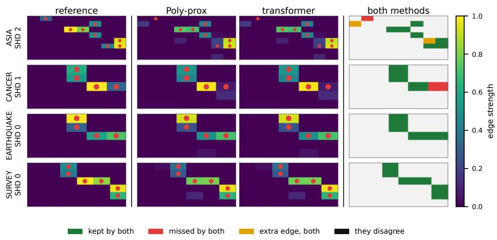

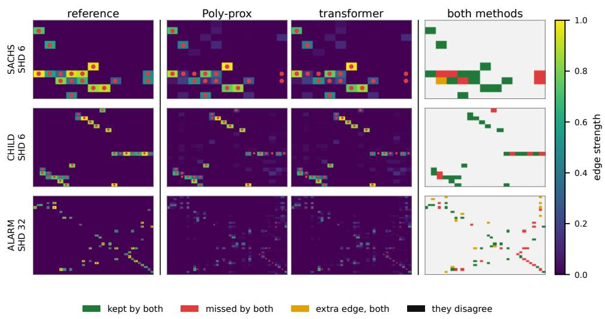  
Figure 3: Benchmark topologies (top: ASIA, CANCER, EARTHQUAKE, SURVEY; bottom: SACHS, CHILD, ALARM). Median-SHD draw at $m = 1 0 ^ { 4 }$ , SHD beside each name; red dots are true edges; the column labelled “transformer” shows the direct arithmetic replay of the block. Last column, thresholded at 0.3: green kept by both, red missed by both, gold added by both; the black disagreement category is empty on every row.

Proposition 7.1 (Graph recovery from an error bound)   
Informal statement: if the total error $\delta = \Delta _ { L } + a _ { L } + \zeta _ { m } -$ computation, optimization, and statistical — satisfies $\delta < \beta _ { \mathrm { m i n } } / 2$ , where $\beta _ { \mathrm { m i n } }$ is the weakest edge weight of a nonempty true graph, then thresholding the transformer’s output $\hat { W } _ { L }$ at any $\tau \in [ \delta , \beta _ { \operatorname* { m i n } } - \delta )$ — keeping the entries with $| \widehat { W } _ { i j } | > \tau ,$ , so that the endpoint $\tau = \delta$ is admissible — recovers the true edge set G(W<sup>†</sup>) exactly.

The computation error $\Delta _ { L }$ is what Theorem 5.1 controls; $a _ { L }$ is optimization error against the chosen reference and $\zeta _ { m }$ is statistical error including regularization bias, which can persist even with infinite data. Exact execution sets the first term to zero, which is why Section 8 keeps the solver’s own output $W _ { \mathrm { r e f } }$ apart from the true graph $W ^ { \dagger }$

Appendix A.9 defines the three errors and proves the threshold claim, including its certified-stage specialization.

## 8 Experiments

We ask how well the solver recovers graphs, whether the transformer reproduces its updates, whether training learns those updates, and whether replaying them yields the same graphs. In the solver comparison, Poly-prox, Poly-LBFGS and NOTEARS use $\lambda = 0 . 1$ and read-off threshold 0.3; edge weights come from $\pm [ 0 . 5 , 2 ]$ . Appendix F gives the protocols, metrics and failure counts.

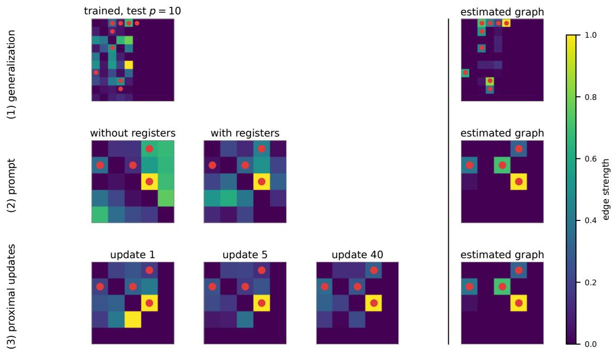  
Figure 4: What the trained models produce. Red dots mark true edges. (1) A softmax model trained at $p = 5$ and applied at $p = 1 0$ after 12 updates. $( 2 ) \operatorname { A t } p = 5 ,$ , a collapsed-input linear model withholds $W , \alpha ,$ while a softmax model receives them; this illustration changes both architecture and state access. Table 4 separately tests write-back with identical inputs and architectures. (3) Reference-solver updates 1, 5 and 40. The right column is the solver’s returned estimate. Colour shows $| W |$ , scaled within each panel; the rows use two illustrative problem instances.

How well does the reference solver recover graphs? On linear SEMs up to 20 variables, continuous solvers and sort-regress have lower structural Hamming distance (SHD) than PC and GES on raw data. Poly-prox reaches median cycle constraint $7 \cdot 1 0 ^ { - 6 }$ , versus $1 0 ^ { - 8 }$ for L-BFGS, with slightly higher SHD but acyclic thresholded outputs throughout the raw grid (Figure 6). This establishes a useful reference, not a leading estimator (Appendix F.4).

Does the transformer reproduce the solver update? We instantiate weights from $p _ { \mathrm { m a x } }$ alone and compare literal attention/FF execution with an independent matrix-power implementation. Across 254 finite-reference cases with p<sub>max</sub> $\in \{ 4 , 8 , 1 6 , 3 2 \}$ , all sizes $p \leq p _ { \mathrm { m a x } } ,$ random masks and varied controls, the maximum relative discrepancy is $3 . 0 \cdot 1 0 ^ { - 1 5 }$ in W and $1 . 1 \cdot 1 0 ^ { - 1 \tilde { 3 } }$ in α. One additional reference case overflows. These tests encode each input anew. To test repeated execution, we also pass the construction’s full output directly through three blocks: 150 comparisons on 50 inputs have maximum Frobenius $W$ error $1 . 3 7 \cdot 1 0 ^ { - 1 6 }$ . Appendix F.1 distinguishes these tests and documents a scratch-reset defect in the earlier implementation. Agreement on one update does not ensure correct reuse of the state.

The rounding bounds stay within the representable range in 129/135 serial-arithmetic tests. In six float16 cases, the bounds exceed that range even though the sampled outputs remain finite (Appendix F.2). Six float64 runs with fixed controls pass the full state between blocks, stay inside the verified regions and reach the $1 0 ^ { - 6 }$ distance target within the predicted number of updates (Table 2). These runs test the bound within a stage; convergence of the outer controlle remains a separate question.

Can training learn the same update? We train width-64 attention blocks with four tied repeats at $p = 5 ,$ using five seeds: 2460 transitions over 12 epochs or 24600 over 30. The loss is mean squared error in $W ^ { + }$ plus 0.05 times that in $\alpha ^ { + }$ . Appendix F.6 gives the data, optimizer and treatment of failed runs.

One-step error is $\| \widehat { W } ^ { + } - W ^ { + } \| _ { F } / ( \| W ^ { + } - W \| _ { F } + 1 0 ^ { - 8 } )$ , so copying scores approximately 1. The 12-step metric is an unnormalized Frobenius distance, for which copying scores 0.86. With the smaller corpus, state-input softmax and linear attention score $0 . 9 4 \pm 0 . 0 0$ and $0 . 9 8 \pm 0 . 0 1$ on one step. With the larger corpus, softmax reaches $0 . 6 7 \pm 0 . 0 1$ and a learned-threshold map (Gregor and LeCun, 2010) reaches $0 . 7 2 \pm 0 . 0 \bar { 1 }$ ; their trajectory errors improve to 0.40

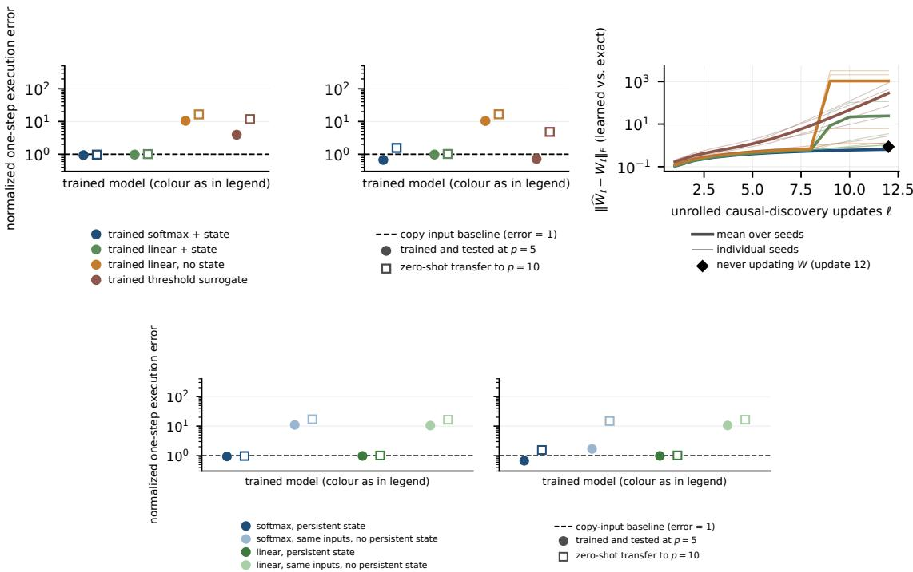  
Figure 5: How close small trained transformers get to the exact update. One-step error is normalized so copying scores 1 (dashed line). Circles: trained and tested at $p = 5 ;$ squares: transfer to $p = 1 0$ . Top: smaller- and larger-corpus one-step errors, then smaller-corpus rollout distances. Bottom: identical state inputs with residual write-back or prediction from scratch; the latter stays above copying. Five training runs are attempted per condition; means and standard errors use finite run summaries (failure counts in Tables 3 and 4).

and 0.41. Transfer to $p = 1 0$ fails: one-step errors rise to $1 . 5 6 \pm 0 . 0 2$ and $4 . 8 \pm 0 . 4$ , respectively (Figure 5, Table 3).   
Figure 4(1) shows how a plausible edge pattern can still have inaccurate weights.

Holding state inputs fixed, predicting the next state from scratch instead of adding a residual update raises the smallercorpus errors to $\mathbf { \bar { 1 0 . 4 4 } \pm 0 . \bar { 0 5 } }$ (linear) and $1 0 . 9 8 \pm 0 . 3 8$ (softmax). Figure 5 (bottom) and Table 4 isolate write-back; Figure 4(2) separately illustrates a model whose state inputs are withheld. These models have fewer layers and lack the construction’s bilinear sublayers. Whether training can learn the update using the full architecture remains open.

Does the transformer recover the same graphs? Arithmetic replay uses the reference controls on ASIA, CANCER, EARTHQUAKE, SURVEY, SACHS, CHILD and ALARM (Spiegelhalter and Cowell, 1992; Beinlich et al., 1989). Ten Gaussian noise draws per sample size yield 220 datasets, with one fixed weighting per topology (Appendix F.5). Replay and Poly-prox agree exactly in float64 on final weights, multipliers and thresholded graphs across all datasets. Both recover EARTHQUAKE and SURVEY perfectly and make identical mistakes on SACHS, CHILD and ALARM (Figure 3). Mean SHD on CHILD and ALARM is about 6.3 and 32, versus 5 and 21 for NOTEARS. Replaying the updates also reproduces the solver’s estimation errors.

## 9 Discussion and Conclusion

A fixed-weight transformer executes the complete Poly-prox transition in logarithmic depth, carrying the graph and multiplier between blocks. The depth, information and rounding bounds specify its requirements; experiments distinguish exact construction from partial learning by ordinary attention models.

The guarantees apply to the stated update rule. The bound on the number of updates requires contraction, a region the iterates cannot leave, and a verified error bound. It excludes the adaptive controller and does not by itself ensure acyclicity or graph recovery. A learned executor should therefore be tested against the reference transition on identical states and controls, then with its full output fed back across updates. Graph accuracy alone cannot establish execution: an exact executor also inherits the solver’s mistakes. Learning within the full constructed architecture remains open; initialization at the constructed weights is one concrete direction.

## References

Ahn, K., Cheng, X., Daneshmand, H., and Sra, S. (2023). Transformers learn to implement preconditioned gradient descent for in-context learning. ArXiv, abs/2306.00297.

Akyürek, E., Schuurmans, D., Andreas, J., Ma, T.-Y., and Zhou, D. (2022). What learning algorithm is in-context learning? investigations with linear models. ArXiv, abs/2211.15661.

Aragam, B., Amini, A. A., and Zhou, Q. (2019). Globally optimal score-based learning of directed acyclic graphs in high-dimensions. In Neural Information Processing Systems.

Bai, Y., Chen, F., Wang, H., Xiong, C.-M., and Mei, S. (2023). Transformers as statisticians: Provable in-context learning with in-context algorithm selection. ArXiv, abs/2306.04637.

Beck, A. and Teboulle, M. (2009). A fast iterative shrinkage-thresholding algorithm for linear inverse problems. SIAM J. Imaging Sci., 2:183–202.

Beinlich, I. A., Suermondt, H. J., Chavez, R. M., and Cooper, G. F. (1989). The alarm monitoring system: A case study with two probabilistic inference techniques for belief networks. In Conference on Artificial Intelligence in Medicine in Europe.

Bello, K., Aragam, B., and Ravikumar, P. K. (2022). Dagma: Learning dags via m-matrices and a log-determinant acyclicity characterization. ArXiv, abs/2209.08037.

Chen, T., Fu, D., Jia, R., and Sharan, V. (2023). Transformers learn to achieve second-order convergence rates for in-context linear regression. Advances in Neural Information Processing Systems 37.

Chen, W., Drton, M., and Wang, Y. S. (2018). On causal discovery with an equal-variance assumption. Biometrika.

Chickering, D. M. (2002). Optimal structure identification with greedy search. J. Mach. Learn. Res., 3:507–554.

Colombo, D. and Maathuis, M. H. (2012). Order-independent constraint-based causal structure learning. J. Mach. Learn. Res., 15:3741–3782.

Daneshmand, H. (2026). In-context learning for discrete optimal transport: Can transformers sort? In The 29th International Conference on Artificial Intelligence and Statistics.

Daubechies, I., Defrise, M., and Mol, C. D. (2003). An iterative thresholding algorithm for linear inverse problems with a sparsity constraint. Communications on Pure and Applied Mathematics, 57.

de Luca, A. B. and Fountoulakis, K. (2024). Simulation of graph algorithms with looped transformers. ArXiv, abs/2402.01107.

Deng, C., Bello, K., Aragam, B., and Ravikumar, P. K. (2023). Optimizing notears objectives via topological swaps. In International Conference on Machine Learning.

Garg, S., Tsipras, D., Liang, P., and Valiant, G. (2022). What can transformers learn in-context? a case study of simple function classes. ArXiv, abs/2208.01066.

Giannou, A., Rajput, S., yong Sohn, J., Lee, K., Lee, J. D., and Papailiopoulos, D. (2023). Looped transformers as programmable computers. ArXiv, abs/2301.13196.

Gregor, K. and LeCun, Y. (2010). Learning fast approximations of sparse coding. In International Conference on Machine Learning.

Jin, K., Ng, I., Zhang, K., and Huang, B. (2024). Revisiting differentiable structure learning: Inconsistency of ℓ1 penalty and beyond. ArXiv, abs/2410.18396.

Kaiser, M. and Sipos, M. (2021). Unsuitability of notears for causal graph discovery when dealing with dimensional quantities. Neural Processing Letters, 54:1587 – 1595.

Ke, N. R., Chiappa, S., Wang, J. X., Bornschein, J., Goyal, A., Rey, M., Weber, T., Botvinick, M. M., Mozer, M. C., and Rezende, D. J. (2022). Learning to induce causal structure. ArXiv, abs/2204.04875.

Loh, P.-L. and Bühlmann, P. (2013). High-dimensional learning of linear causal networks via inverse covariance estimation. J. Mach. Learn. Res., 15:3065–3105.

Lorch, L., Sussex, S., Rothfuss, J., Krause, A., and Schölkopf, B. (2022). Amortized inference for causal structure learning. ArXiv, abs/2205.12934.

Monga, V., Li, Y., and Eldar, Y. C. (2019). Algorithm unrolling: Interpretable, efficient deep learning for signal and image processing. IEEE Signal Processing Magazine, 38:18–44.

Nazaret, A., Hong, J., Azizi, E., and Blei, D. M. (2023). Stable differentiable causal discovery. ArXiv, abs/2311.10263.

Ng, I., Ghassami, A., and Zhang, K. (2020a). On the role of sparsity and dag constraints for learning linear dags. ArXiv, abs/2006.10201.

Ng, I., Huang, B., and Zhang, K. (2023). Structure learning with continuous optimization: A sober look and beyond. In CLEaR.

Ng, I., Lachapelle, S., Ke, N. R., Lacoste-Julien, S., and Zhang, K. (2020b). On the convergence of continuous constrained optimization for structure learning. In International Conference on Artificial Intelligence and Statistics.

Nichani, E., Damian, A., and Lee, J. D. (2024). How transformers learn causal structure with gradient descent. ArXiv, abs/2402.14735.

Peters, J. and Buhlmann, P. (2012). Identifiability of gaussian structural equation models with equal error variances. Biometrika, 101:219–228.

Peters, J. and Bühlmann, P. (2015). Structural intervention distance for evaluating causal graphs. Neural Computation, 27:771–799.

Reisach, A. G., Seiler, C., and Weichwald, S. (2021). Beware of the simulated dag! causal discovery benchmarks may be easy to game. In Neural Information Processing Systems.

Reisach, A. G., Tami, M., Seiler, C., Chambaz, A., and Weichwald, S. (2023). A scale-invariant sorting criterion to find a causal order in additive noise models. Advances in Neural Information Processing Systems 36.

Sachs, K., Perez, O. D., Pe’er, D., Lauffenburger, D. A., and Nolan, G. P. (2005). Causal protein-signaling networks derived from multiparameter single-cell data. Science, 308:523 – 529.

Seng, J., Zecevic, M., Dhami, D. S., and Kersting, K. (2024). Learning large dags is harder than you think: Many losses are minimal for the wrong dag. In International Conference on Learning Representations.

Shazeer, N. (2020). Glu variants improve transformer. ArXiv, abs/2002.05202.

Shimizu, S., Hoyer, P. O., Hyvärinen, A., and Kerminen, A. J. (2006). A linear non-gaussian acyclic model for causal discovery. J. Mach. Learn. Res., 7:2003–2030.

Spiegelhalter, D. J. and Cowell, R. G. (1992). Learning in probabilistic expert systems. In Bernardo, J. M., Berger, J. O., Dawid, P., Smith, A. F. M., Bernardo, J. M., Berger, J. O., Dawid, P., and Smith, A. F. M., editors, Bayesian Statistics 4: Proceedings of the Fourth Valencia International Meeting, Dedicated to the memory of Morris H. DeGroot, 1931–1989. Oxford University Press.

van de Geer, S. A. and Bühlmann, P. (2012). ℓ<sub>0</sub>-penalized maximum likelihood for sparse directed acyclic graphs. arXiv: Statistics Theory.

von Oswald, J., Niklasson, E., Randazzo, E., Sacramento, J., Mordvintsev, A., Zhmoginov, A., and Vladymyrov, M. (2022). Transformers learn in-context by gradient descent. In International Conference on Machine Learning.

Wang, X.-Y., Wang, S., and Huang, B.-W. (2026). Transformer is inherently a causal learner. ArXiv, abs/2601.05647.

Wei, D., Gao, T., and Yu, Y. (2020). Dags with no fears: A closer look at continuous optimization for learning bayesian networks. ArXiv, abs/2010.09133.

Yu, Y., Chen, J., Gao, T., and Yu, M. (2019). Dag-gnn: Dag structure learning with graph neural networks. ArXiv, abs/1904.10098.

Zhang, Z., Ng, I., Gong, D., Liu, Y., Abbasnejad, E., Gong, M.-M., Zhang, K., and Shi, J. Q. (2022). Truncated matrix power iteration for differentiable dag learning. ArXiv, abs/2208.14571.

Zheng, X., Aragam, B., Ravikumar, P. K., and Xing, E. P. (2018). Dags with no tears: Continuous optimization for structure learning. In Neural Information Processing Systems.

# Supplementary Materials

## A Proofs and Derivative Bounds

This appendix proves the gradient, execution, state-error, conditioning, update-count and graph-recovery results used in the main paper.

## A.1 Proof of Proposition A.1

Proposition A.1 (Update gradients). $\nabla \mathcal { L } ( W ) = \Sigma ( W - I )$ , and with $B = W \odot W , Y = I + B / N$

$$
\begin{array} { r l } & { \qquad \nabla h ( W ) = 2 W \odot ( Y ^ { N - 1 } ) ^ { \top } , } \\ & { \qquad \nabla { \mathcal { J } } _ { \rho , \alpha } ( W ) = \Sigma ( W - I ) + \big ( \alpha + \rho h ( W ) \big ) \nabla h ( W ) . } \end{array}\tag{15}
$$

The proximal map of $\gamma \lambda \| W \| _ { 1 } + \iota _ { \mathcal { W } _ { M } } ( W )$ , where $\iota _ { \mathcal { W } _ { M } }$ is the convex indicator (0 on $\mathcal { W } _ { M }$ and +∞ off it, not the $0 / 1$ indicator 1 used for the mask), is $M \odot \operatorname { s o f t } _ { \gamma \lambda } ( W )$

Proof. $\nabla \mathcal { L } ( W ) = \Sigma ( W - I )$ since $\begin{array} { r } { \mathcal { L } ( W ) = \frac { 1 } { 2 } \operatorname { t r } [ ( I - W ) ^ { \top } \Sigma ( I - W ) ] } \end{array}$ and Σ is symmetric. For h: $d \mathrm { t r } ( Y ^ { N } ) =$ $N \mathrm { t r } ( Y ^ { N - 1 } d Y )$ by cyclicity of the trace, and $d Y = 2 ( W \odot d W ) / N$ , so $d h = \langle 2 W \odot ( Y ^ { N - 1 } ) ^ { \top } , d W \rangle$ . The chain rule gives the third identity; the proximal claim separates over entries of $\mathcal { W } _ { M }$ □

## A.2 Proof of Lemma A.2

Lemma A.2 (The constraint’s gradient vanishes exactly on DAGs). For $i \neq j ,$

$$
[ \nabla h ( W ) ] _ { i j } = 2 W _ { i j } \sum _ { k = 1 } ^ { N - 1 } { \binom { N - 1 } { k } } N ^ { - k } [ B ^ { k } ] _ { j i } .\tag{16}
$$

Hence $[ \nabla h ( W ) ] _ { i j } \neq 0 \mathrm { i f f } W _ { i j } \neq 0$ and the edge $i  j$ lies on a directed cycle of $G ( W )$ of length at most $N .$ Consequently $\nabla \bar { h ( W ) } = 0$ iff ${ \dot { h } } ( W ) = 0 , { \mathrm { i . e } }$ . iff G(W) is acyclic.

Proof. Expand $\begin{array} { r } { Y ^ { N - 1 } = \sum _ { k = 0 } ^ { N - 1 } { \binom { N - 1 } { k } } N ^ { - k } B ^ { k } } \end{array}$ in (15); the $k = 0$ term is I, which vanishes off the diagonal, giving (16). Since $B = W \odot W \ge 0$ entrywise, every $B ^ { k }$ is entrywise non-negative and every coefficient $\binom { N - 1 } { k } N ^ { - k }$ is positive, so the sum in (16) vanishes exactly when every one of its terms does; walks of different lengths cannot cancel. A nonzero $[ \boldsymbol { B } ^ { k } ] _ { j i }$ is a weighted directed walk of length k from j to i using edges of $G ( W )$ (since $B _ { a b } \neq 0$ iff edge $a \to b$ is present); together with the edge $i  j$ this closes a cycle of length $\mathbf { \bar { \boldsymbol { k } } } + \mathbf { \bar { \boldsymbol { 1 } } } \leq N$ through $i  j ,$ and conversely every such cycle contributes such a walk. Since every simple cycle has length at most $p \leq \bar { N }$ , this range of k detects every cycle in G(W). □

Feasibility and KKT stationarity. At a feasible W, Lemma A.2 removes the constraint term from the finite-multiplier KKT equation. On $\mathcal { W } _ { M }$ this leaves $0 \in M \odot \nabla \mathcal { L } ( W ) + \partial _ { M } \psi _ { M } ( W )$ , which is equivalent to masked-Lasso optimality by convexity. For example, take $p = N = 2$ , both off-diagonal entries allowed, $\bar { \Sigma } = \left( { 1 r \atop r 1 } \right)$ with $0 \leq \lambda < r < 1$ , and $W = 0$ . Then $h ( W ) = 0$ and $\nabla h ( W ) = 0$ , but both allowed least-squares gradient entries are −r; no subgradient in $[ - \lambda , \lambda ]$ cancels them. This feasible point is nonregular and is not a KKT point. The stage-stationary family in Appendix A.6 approaches precisely such a non-Lasso-stationary feasible limit by letting the effective multiplier diverge.

## A.3 Proof of Theorem 4.1

Theorem 4.1 (Exact execution of one Poly-prox update). Fix $p _ { \operatorname* { m a x } } \geq 1 , s = \lceil \log _ { 2 } p _ { \operatorname* { m a x } } \rceil , N = 2 ^ { s }$ . There is a block of $2 s + 8$ layers, at most four linear heads per layer of key dimension at most $p _ { \mathrm { m a x } } ,$ embedding width $1 3 p _ { \mathrm { m a x } } + 1 8$ and at most $2 6 p _ { \mathrm { m a x } } + 3 6$ ReLU units and max $\{ p _ { \mathrm { m a x } } + 4 , 2 p _ { \mathrm { m a x } } + 1 \}$ } bilinear units per feedforward sublayer, such that for every $p \leq p _ { \mathrm { m a x } } ,$ every symmetric $\Sigma ,$ , binary zero-diagona $M , W \in \mathcal { W } _ { M } , \alpha \in \bar { \mathbb { R } } , \rho , \gamma , \lambda \geq 0 ,$ , and $b \in \{ 0 , 1 \}$ the block computes $W ^ { + } , \alpha ^ { + }$ exactly as in $( 3 ) - ( 4 )$ . The weights are the same for every $p \leq p _ { \mathrm { m a x } }$ and every input, with nonzero magnitudes in $\{ 1 / N , 1 , 2 \}$ ; they depend on $p _ { \mathrm { m a x } } ,$ not the data.

Proof. Put $Y = I + ( W \odot W ) / N$ and define

$$
S _ { 0 } = Y - I , \quad Q _ { 0 } = 0 , \qquad S _ { j + 1 } = 2 S _ { j } + S _ { j } ^ { 2 } , \quad Q _ { j + 1 } = Q _ { j } + S _ { j } + Q _ { j } S _ { j } .\tag{17}
$$

Induction gives $I + S _ { j } = Y ^ { 2 ^ { j } }$ and $I + Q _ { j } = Y ^ { 2 ^ { j } - 1 }$ : the first recurrence squares $I + S _ { j }$ , and the second multiplies $I + Q _ { j } \ \mathsf { b y } \ I + S _ { j }$ . Thus $h ( W ) = \operatorname { t r } S _ { s }$ and $\nabla h ( \boldsymbol { W } ) = 2 \boldsymbol { W } \odot \boldsymbol { Q } _ { s } ^ { \top }$ , since $W$ has zero diagonal. The three-head doubling layer and the eight preparation, threshold, trace and write-back layers are specified coordinate by coordinate in Appendix B. They compute the least-squares gradient, assemble the masked pre-threshold state, apply the exact ReLU identity, then repeat the squaring pass on $W ^ { + }$ to update α. Two s-layer passes and eight other layers give depth $2 s + 8$

The selector formulas in that appendix realize every matrix product, transpose, sum and broadcast with at most four heads. Their feedforward maps use signed ReLU pairs for linear writes and one bilinear unit per coordinate product, giving the stated resource bounds. Forbidden primal entries and padded columns remain zero, while the final layer clears scratch exactly. Hence the same weights serve every $p \leq p _ { \mathrm { m a x } }$ , and the output encoding is a valid input to the next block. Induction on stacked blocks proves Corollary 4.2. □

## A.4 Proof of Theorem 5.1

Theorem 5.1 (Accumulation of update errors). If $\Psi _ { \ell }$ is κ<sub>ℓ</sub>-Lipschitz in $\lVert \cdot \rVert$ <sub>∗</sub> on a set $\kappa$ containing $z _ { \ell } , \widehat { z } _ { \ell } .$ , and the decoded transition satisfies $\| \widehat { z } _ { \ell + 1 } - \widehat { \Psi } _ { \ell } ( \widehat { z } _ { \ell } ) \| _ { * } \leq \varepsilon _ { \ell }$ , then with $e _ { 0 } = \| \widehat { z } _ { 0 } - z _ { 0 } \| ,$ <sub>∗</sub>,

$$
\Vert \widehat { z } _ { L } - z _ { L } \Vert _ { * } \leq e _ { 0 } \prod _ { u = 0 } ^ { L - 1 } \kappa _ { u } + \sum _ { t = 0 } ^ { L - 1 } \varepsilon _ { t } \prod _ { u = t + 1 } ^ { L - 1 } \kappa _ { u } .\tag{18}
$$

Proof. Writing $e _ { \ell } = \| \widehat { z } _ { \ell } - z _ { \ell } \| _ { * }$ , the triangle inequality gives $e _ { \ell + 1 } \leq \varepsilon _ { \ell } + \kappa _ { \ell } e _ { \ell }$ . Unrolling this scalar recurrence proves (18), with empty products equal to one and empty sums equal to zero. □

## A.5 Proof of Lemma A.3

Lemma A.3 (Multiplier information must be retained). Fix Σ, M, $W \in \mathcal { W } _ { M } , \lambda , \rho ,$ b and $\gamma > 0 ;$ , let $\alpha _ { 1 } \neq \alpha _ { 2 }$ , and write $V ( \alpha ) = W - \gamma \nabla \hat { \mathcal { I } } _ { \rho , \alpha } ( W ) . \ I f [ \nabla h ( W ) ] _ { i j } \neq 0 f o r$ some $( i , j )$ , and at least one of $V _ { i j } ( \alpha _ { 1 } ) , V _ { i j } ( \alpha _ { 2 } )$ lies outside the dead zone $[ - \gamma \lambda , \gamma \lambda ]$ ofthe soft-threshold, then the augmented gradients differ and so do the updates, $W ^ { + } ( \alpha _ { 1 } ) \neq W ^ { + } ( \alpha _ { 2 } )$ Hence any deterministic executor that returns $W ^ { + }$ exactly must retain information distinguishing α<sub>1</sub> from $\alpha _ { 2 }$

Proof. By (15) the least-squares term and $\rho h ( W )$ do not depend on $\alpha ,$ so $\nabla \mathcal { I } _ { \rho , \alpha _ { 1 } } ( W ) - \nabla \mathcal { I } _ { \rho , \alpha _ { 2 } } ( W ) = ( \alpha _ { 1 } -$ $\alpha _ { 2 } ) { \dot { \nabla } } h ( { \dot { W } } )$ , which is nonzero at $( i , j )$ ; hence $\dot { V } _ { i j } ( \alpha _ { 1 } ) - V _ { i j } ( \bar { \alpha } _ { 2 } ) = - \gamma ( \alpha _ { 1 } - \alpha _ { 2 } ) [ \hat { \nabla } h ( W ) ] _ { i j } \neq 0$ . By Lemma $_ { \mathrm { A } . 2 }$ $[ \nabla h ( W ) ] _ { i j } ~ \neq ~ 0$ forces $W _ { i j } \neq 0$ , so $M _ { i j } = 1$ and $W _ { i j } ^ { + } ( \alpha ) = \mathrm { s o f t } _ { \tau } ( V _ { i j } ( \alpha ) ) \ \mathrm { w i t h } \ \tau = \gamma \lambda .$ The map soft is nondecreasing, strictly increasing outside $[ - \tau , \tau ]$ , and zero on it; so for a $\neq b , \mathrm { s o f t } _ { \tau } ( a ) = \mathrm { s o f t } _ { \tau } ( b )$ only if both lie in $[ - \tau , \tau ]$ , which the hypothesis excludes. Thus $W _ { i j } ^ { + } ( \alpha _ { 1 } ) \neq W _ { i j } ^ { + } ( \alpha _ { 2 } )$ . A deterministic executor given identical encodings for the two multiplier values would return identical outputs, so its encodings of $\alpha _ { 1 }$ and $\alpha _ { 2 }$ must differ. □

## A.6 Proof of Proposition 5.3

Masked stationarity. The effective multiplier $c _ { k } = \alpha _ { k } + \rho _ { k } h ( W _ { k } )$ need not have the same magnitude as $\alpha _ { k }$ alone. All stationarity residuals are taken inside the linear subspace $\mathcal { W } _ { M }$ . Let $\Pi _ { M } A = M \odot A$ and $G _ { M } ( { \bf \bar { W } } ) = \Pi _ { M } \nabla { \mathcal { L } } ( W )$ Define $\psi _ { M } : \dot { \mathcal { W } } _ { M } \to \mathbb { R }$ by $\psi _ { M } ( W ) = \lambda \| W \| _ { 1 }$ , with subspace subdifferential

$$
\begin{array} { c } { { \partial _ { M } \psi _ { M } ( W ) = \{ \xi \in \mathcal { W } _ { M } : \xi _ { i j } = \lambda \mathrm { s i g n } ( W _ { i j } ) ( W _ { i j } \neq 0 ) , } } \\ { { | \xi _ { i j } | \leq \lambda ( M _ { i j } = 1 , W _ { i j } = 0 ) \} . } } \end{array}\tag{19}
$$

Every $\xi$ is zero on forbidden entries and has norm at most $\lambda \lVert M \rVert _ { F }$ . Set

$$
d _ { M } ( W ) = \operatorname* { m i n } _ { \substack { \xi \in \partial _ { M } \psi _ { M } ( W ) } } \| G _ { M } ( W ) + \xi \| _ { F } ,\tag{20}
$$

the stationarity residual of the convex masked Lasso problem with acyclicity dropped, so $d _ { M } ( W ) = 0$ exactly at its minimizers. For $\eta _ { k } \ge 0 , W _ { k }$ is $\eta _ { k }$ -stationary if some $\xi \in \partial _ { M } \psi _ { M } ( W _ { k } )$ satisfies

$$
\begin{array} { r } { \| G _ { M } ( W _ { k } ) + c _ { k } \nabla h ( W _ { k } ) + \xi \| _ { F } \leq \eta _ { k } . } \end{array}\tag{21}
$$

We use the subspace subgradient rather than the unbounded full-space normal cone of an indicator of $\mathcal { W } _ { M } \ ( \boldsymbol { \mathrm { A p } } \cdot \boldsymbol { \mathrm { A p } } ) \ \qquad $ pendix A.6).

Throughout this proof, $\psi _ { M } , \partial _ { M } \psi _ { M }$ and $d _ { M }$ are the subspace quantities in $( 1 9 ) ‐ ( 2 0 )$ . Their subgradients are bounded by $\lambda \| \overline { { M } } \| _ { F } ;$ no full-space normal-cone term is included. Since $W \in \partial / . \nabla h ( W )$ is itself supported on $M$ Proposition 5.3 (Growth of the effective multiplier). Let $W _ { k } \in \mathcal { W } _ { M }$ and $c _ { k } = \alpha _ { k } + \rho _ { k } h ( W _ { k } ) \in \mathbb { R }$ , with no sign assumed, and suppose $W _ { k }$ is η<sub>k</sub>-stationary for the augmented objective: there is $\xi _ { k } \in \partial _ { M } \psi _ { M } ( W _ { k } )$ with

$$
\| M \odot \nabla { \mathcal { L } } ( W _ { k } ) + c _ { k } \nabla h ( W _ { k } ) + \xi _ { k } \| _ { F } \leq \eta _ { k } .\tag{22}
$$

$$
\mathrm { ~ : ~ } C _ { k } = \| M \odot \nabla \mathcal { L } ( W _ { k } ) \| _ { F } + \lambda \| M \| _ { F } + \eta _ { k } . \ \mathrm { T h e n }
$$

$$
d _ { M } ( W _ { k } ) - \eta _ { k } \leq | c _ { k } | \| \nabla h ( W _ { k } ) \| _ { F } \leq C _ { k } .\tag{23}
$$

If $W _ { k }  \bar { W }$ with $h ( \bar { W } ) = 0 , \eta _ { k } \to 0$ , and $\bar { W }$ is not a masked-Lasso minimizer (so $d _ { * } : = d _ { M } ( \bar { W } ) > 0 )$ , then for any Lipschitz bound $L _ { H }$ of ∇h near W<sup>¯</sup> ,

$$
| c _ { k } | \ge { \frac { d _ { * } } { 4 L _ { H } \| W _ { k } - \bar { W } \| _ { F } } } \longrightarrow \infty\tag{24}
$$

for all large k; in particular $W _ { k } \neq \bar { W }$ for large k.

Proof. Since $\xi _ { k } \in \partial _ { M } \psi _ { M } ( W _ { k } )$ , the residual $d _ { M } ( W _ { k } )$ is at most $\lVert M \odot \nabla \mathcal { L } ( W _ { k } ) + \xi _ { k } \rVert _ { F }$ . Inserting $c _ { k } \nabla h ( W _ { k } )$ and splitting it off, then using (22) on what remains,

$$
d _ { M } ( W _ { k } ) \leq \eta _ { k } + | c _ { k } | \| \nabla h ( W _ { k } ) \| _ { F } .
$$

In the other direction, $\lvert c _ { k } \rvert \lVert \nabla h ( W _ { k } ) \rVert _ { F } = \lVert c _ { k } \nabla h ( W _ { k } ) \rVert _ { F } \leq \eta _ { k } + \lVert M \odot \nabla \mathcal { L } ( W _ { k } ) \rVert _ { F } + \lVert \xi _ { k } \rVert _ { F } \leq C _ { k }$ , because every element of $\partial _ { M } \psi _ { M }$ has Frobenius norm at most $\lambda \| M \| _ { F }$ . This is (23); only |c<sub>k</sub>| enters, so the sign of c<sub>k</sub> plays no role.

The minimum in (20) is attained on a nonempty compact subgradient set. To see lower semicontinuity, take any convergent sequence and a subsequence realizing the liminf of $d _ { M } ;$ ; choose a minimizing subgradient at each point. Their common norm bound gives a further convergent subsequence, and the closed graph of $\partial _ { M } \psi _ { M }$ places its limit in the subgradient set at the limit point. Continuity of $G _ { M }$ then shows that the liminf is at least the limiting point’s residual. Thus $d _ { * } > 0$ gives $d _ { M } ( \dot { W } _ { k } ) \geq d _ { * } / 2$ for large k, and with $\eta _ { k } \leq d _ { * } / 4$ eventually, the left half of (23) gives $| c _ { k } | \| \nabla h ( W _ { k } ) \| _ { F } \geq d _ { * } \bar { / } 4 > 0$ . In particular $\nabla h ( W _ { k } ) \ne 0$ . Since $\nabla h ( \bar { W } ) = 0 ($ (Lemma $\mathrm { A } . 2 )$ and $\nabla h$ is $L _ { H } .$ -Lipschitz near $\bar { W } , \| \nabla \bar { h } ( \bar { W } _ { k } ) \| _ { F } = \| \nabla h ( \dot { W _ { k } } ) - \nabla h ( \bar { W } ) \| _ { F } \overset {  } { \le } \dot { L } _ { H } \| W _ { k } - \bar { W } \| _ { F }$ for $W _ { k }$ near $\bar { W } .$ , so

$$
| c _ { k } | \ge \frac { d _ { * } / 4 } { \| \nabla h ( W _ { k } ) \| _ { F } } \ge \frac { d _ { * } } { 4 L _ { H } \| W _ { k } - \bar { W } \| _ { F } } ,
$$

which is (24). The right side is finite only if $W _ { k } \neq \bar { W }$ , which the previous step already guarantees, and it is unbounded as $W _ { k } \to \bar { W } , \mathsf { s o } | c _ { k } | \bar { \mathbf { \xi } } \to \infty$ □

A two-node example with faster multiplier growth. Take $\begin{array} { r } { p = N = 2 , M _ { 1 2 } = M _ { 2 1 } = 1 , \Sigma = \binom { 1 ~ r } { r ~ 1 } , 0 < \lambda < r < } \end{array}$ 1, and $W _ { t } = \left( \begin{array} { l } { 0 \ t } \\ { t \ 0 } \end{array} \right)$ . Then $h ( W _ { t } ) = t ^ { 4 } / 2$ , both allowed entries of $\nabla h ( W _ { t } )$ equal $t ^ { 3 }$ , and setting $c _ { t } = ( r - \lambda - t ) / t ^ { 3 }$ makes every allowed stationarity equation exact for small $t > 0$ . We see that $c _ { t } \asymp t ^ { - 3 }$ as $W _ { t } \to 0$ , faster than the general 1/dist rate above, so that rate is a lower bound rather than the exact order everywhere. This example realizes the proposition’s stationarity hypothesis exactly.

## A.7 Proof of Corollary 5.4

Corollary 5.4 (Relative cycle accuracy). Under the hypotheses stated there, $\| \widetilde { g } - g \| _ { F } \le ( 2 \nu + \nu ^ { 2 } ) C _ { k }$

Proof. Write $g = M \odot \nabla { \mathcal { L } } ( W _ { k } ) + c _ { k } \nabla h ( W _ { k } )$ for the assembled gradient and $\widetilde { g } = M \odot \nabla \mathcal { L } ( W _ { k } ) + \widetilde { c } _ { k } \widetilde { H }$ for the computed one; the covariance is exact by hypothesis, so the least-squares term cancels and

$$
\widetilde { g } - g = ( \widetilde { c } _ { k } - c _ { k } ) \nabla h ( W _ { k } ) + \widetilde { c } _ { k } \big ( \widetilde { H } - \nabla h ( W _ { k } ) \big ) .
$$

The first term has norm at most $\nu | c _ { k } | \| \nabla h ( W _ { k } ) \| _ { F }$ . For the second, $| \widetilde c _ { k } | \le ( 1 + \nu ) | c _ { k } |$ , so its norm is at most $( 1 + \nu ) | c _ { k } | \cdot \nu | | \nabla h ( W _ { k } ) | | _ { F }$ . Adding,

$$
\| \widetilde { g } - g \| _ { F } \leq \nu ( 2 + \nu ) \left| c _ { k } \right| \| \nabla h ( W _ { k } ) \| _ { F } .
$$

The right half of (23), which uses only η -stationarity (22) and no sign of $c _ { k }$ , bounds $| c _ { k } | \| \nabla h ( W _ { k } ) \| _ { F }$ by C<sub>k</sub> $C _ { k }$ , which is the claim. □

Relative accuracy of h alone does not imply relative accuracy of $c = \alpha + \rho h$ , because the sum may cancel for signed α. For exact c and absolute gradient error at most ϵ, the bound is instead $| c | \epsilon$ , which permits amplification as |c| grows. Neither model forces a particular realized error. The literal block’s operation-level absolute enclosure is given in Appendix E.

## A.8 Proof of Theorem 6.1

Theorem 6.1 (Convergence within a fixed stage). Let $\mathcal { C } = \{ W \in \mathcal { W } _ { M } : \| W - U \| _ { F } \leq r \}$ , suppose $\mathcal { P }$ is q-Lipschitz on C with $0 \leq q < 1$ , let $d = \lVert \mathcal { P } ( U ) - U \rVert _ { F }$ , and suppose every approximate transition stays in $\mathcal { W } _ { M }$ and is within ε of P on C. If $d + \varepsilon \leq ( 1 - q ) r$ , both exact and approximate iterations from C stay in $\mathcal { C } ; \mathcal { P }$ has a unique fixed point $W _ { \star } \in { \mathcal { C } } ;$ and, writing $B _ { 0 } = \Vert \widehat { W } _ { 0 } - U \Vert _ { F } + d / ( 1 - q )$

$$
\Vert \widehat { W } _ { L } - W _ { \star } \Vert _ { F } \leq q ^ { L } B _ { 0 } + \frac { \varepsilon ( 1 - q ^ { L } ) } { 1 - q } .\tag{25}
$$

For any $W \in \mathcal { C } , \| W - W _ { \star } \| _ { F } \leq \| W - \mathcal { P } ( W ) \| _ { F } / ( 1 - q )$ . If only a decoded next state ${ \widehat { \mathcal { P } } } ( W )$ is available, the bound is $\big ( \lVert W - \widehat { \mathcal { P } } ( W ) \rVert _ { F } + \varepsilon \big ) / ( 1 - q )$ : the local error is added in the numerator.

Proof. For $W \in \mathcal { C } , \| \widehat { \mathcal { P } } ( W ) - U \| _ { F } \leq \varepsilon + q r + d \leq r ;$ setting $\varepsilon = 0$ proves exact invariance too. Banach’s theorem gives a unique fixed point of P in this closed ball, with $\lVert W _ { \star } - \bar { U } \rVert _ { F } \leq q \bar { \lVert } W _ { \star } - U \rVert _ { F } + d _ { \star }$ , hence $\| W _ { \star } - U \| _ { F } \leq d / ( 1 - q )$ The one-step error satisfies $e _ { \ell + 1 } \leq \varepsilon + q e _ { \ell }$ for $e _ { \ell } = \| \widehat { W } _ { \ell } - W _ { \star } \| _ { F } .$ Summing the geometric series and using $e _ { 0 } \leq B _ { 0 }$ proves (25). Finally, $\| W - W _ { \star } \| _ { F } \leq \| \hat { W } - \mathcal { P } ( W ) \| _ { F } ^ { \star } + q \| W - W _ { \star } \| _ { F }$ gives the residual certificate. Replacing ${ \mathcal { P } } ( W )$ by its approximate value adds at most ε to the numerator. □

If $B _ { 0 } = 0$ , zero updates suffice. If $\dot { \mathbf { \zeta } } q = 0 .$ , one update has error at most ε, unless the initial bound already meets the target. The fixed point may be cyclic; the update bound assumes fixed controls.

## A.9 Proof of Proposition 7.1

Proposition 7.1 (Graph recovery from an error bound). Let $W ^ { \circ }$ be any reference matrix (e.g. an empirical minimizer or the numerical limit) with $\| W _ { L } - W ^ { \circ } \| _ { \operatorname* { m a x } } \leq a _ { L }$ and $\| W ^ { \circ } - \mathbf { \bar { W } } ^ { \dag } \| _ { \operatorname* { m a x } } \le \zeta _ { m }$ . Under Theorem 5.1, $\| \widehat { W } _ { L } - W ^ { \dagger } \| _ { \operatorname* { m a x } } \leq \Delta _ { L } + a _ { L } + \zeta _ { m } = : \delta ,$ , where $\Delta _ { L }$ bounds $\| \widehat { W } _ { L } - W _ { L } \| _ { F }$ . If the true graph is nonempty with $\beta _ { \mathrm { m i n } } = \mathrm { m i n } _ { W _ { i j } ^ { \dagger } \neq 0 } | W _ { i j } ^ { \dagger } |$ and $\delta < \beta _ { \mathrm { m i n } } / 2$ , every threshold $\delta \leq \tau < \beta _ { \mathrm { m i n } } - \delta$ recovers the exact support under the strict rule $\widehat { G } = \{ ( i , j ) : | \widehat { W } _ { L , i j } | > \tau \}$ , and hence the acyclic graph $G ( W ^ { \dagger } )$ . The rule must be strict at the left endpoint: a true zero can attain $| \widehat { W } _ { L , i j } | = \delta$ , so an inclusive test would keep it when $\tau = \delta .$

Proof. By the triangle inequality and $\| \widehat { W } _ { L } - W _ { L } \| _ { \operatorname* { m a x } } \leq \| \widehat { W } _ { L } - W _ { L } \| _ { F } \leq \Delta _ { L }$ , every true zero is estimated within $\delta \leq \tau$ and every true edge within at least $\beta _ { \mathrm { m i n } } - \delta > \tau .$ □

Corollary A.4 (Graph recovery within a verified stage). Suppose Theorem 6.1 holds with error ε, contraction $q < 1$ andfixed point $W _ { \star } .$ . Assume the true graph is nonempty and there is a reference $W ^ { \circ }$ with $\| W _ { \star } - W ^ { \circ } \| _ { \operatorname* { m a x } } \leq a _ { \star }$ and $\| W ^ { \circ } - W ^ { \dagger } \| _ { \operatorname* { m a x } } \le \zeta _ { m } . \ I f \varepsilon / ( 1 - q ) + a _ { \star } + \zeta _ { m } < \beta _ { \operatorname* { m i n } } / 2 ,$ , choose any $\varepsilon / ( 1 - q ) < \mathrm { t o l } < \beta _ { \mathrm { m i n } } / 2 - a _ { \star } - \zeta _ { m }$ and use the update bound (14), with the stated $q = 0$ and $B _ { 0 } = 0$ conventions. Then thresholding $\widehat { W } _ { L }$ at any $\tau \in [ \delta , \beta _ { \operatorname* { m i n } } - \delta )$ where $\delta = \mathrm { t o l } + a _ { \star } + \zeta _ { m } ,$ recovers the exact support under the strict rule $| \widehat { W } _ { L , i j } | > \tau$

Proof. The stage bound gives $\| \widehat { W } _ { L } - W _ { \star } \| _ { F } \leq \mathrm { t o l }$ . Add the two reference errors and apply Proposition 7.1. For an empty true graph, any strict threshold $\tau \geq \delta$ removes all entries. The reference-error bounds remain assumptions.

## A.10 Derivative Bounds and Convergence Within a Stage

All derivatives in this subsection act on $\mathcal { W } _ { M }$ , with its Frobenius inner product, and M is binary and zero-diagonal. Let $B _ { R } ^ { M } = \{ W \in \mathcal { W } _ { M } : \| W \| _ { F } \leq R \}$ . Assume at least one edge is allowed, hence $p \geq 2$ and $N \geq 2 ;$ if none is allowed,

the primal state space is {0} and its dynamics are trivial. For $R \geq 0 ,$ , set $x = R ^ { 2 } / N$ and define

$$
c _ { h } ( R ) = ( 1 + x ) ^ { N } - 1 - R ^ { 2 } ,\tag{26}
$$

$$
a _ { N } ( R ) = ( 1 + x ) ^ { N - 1 } - 1 , \qquad b _ { N } ( R ) = \frac { N - 1 } { N } ( 1 + x ) ^ { N - 2 } ,\tag{27}
$$

$$
d _ { N } ( R ) = \left\{ \begin{array} { l l } { 0 , } & { N = 2 , } \\ { \frac { ( N - 1 ) ( N - 2 ) } { N ^ { 2 } } ( 1 + x ) ^ { N - 3 } , } & { N \ge 3 , } \end{array} \right.\tag{28}
$$

$$
c _ { H } ( R ) = 2 R a _ { N } ( R ) , \qquad L _ { H } ( R ) = 2 a _ { N } ( R ) + 4 R ^ { 2 } b _ { N } ( R ) ,\tag{29}
$$

$$
T _ { H } ( R ) = 1 2 R b _ { N } ( R ) + 8 R ^ { 3 } d _ { N } ( R ) .\tag{30}
$$

The powers are polynomial bounds, so at $R = 0$ these formulas are interpreted directly. The quantities $\nabla _ { M } ^ { 2 } h$ and $D _ { M } ^ { 2 } H$ below are the derivatives of $H = \nabla h$ along allowed directions, with the output projected to $\mathcal { W } _ { M }$ if needed.

Lemma A.5 (Zero-diagonal derivative bounds). For $W , V \in B _ { R } ^ { M }$ and $D , E \in \mathcal { W } _ { M }$

$$
0 \leq h ( W ) \leq c _ { h } ( R ) , \qquad \| H ( W ) \| _ { F } \leq c _ { H } ( R ) ,\tag{31}
$$

$$
\begin{array} { r } { \| \nabla _ { M } ^ { 2 } h ( W ) \| _ { \mathrm { o p } } \leq L _ { H } ( R ) , \qquad \| D _ { M } ^ { 2 } H ( W ) [ D , E ] \| _ { F } \leq T _ { H } ( R ) \| D \| _ { F } \| E \| _ { F } , } \end{array}\tag{32}
$$

$$
\| H ( W ) - H ( V ) \| _ { F } \leq L _ { H } ( R ) \| W - V \| _ { F } ,\tag{33}
$$

$$
\| \nabla _ { M } ^ { 2 } h ( W ) - \nabla _ { M } ^ { 2 } h ( V ) \| _ { \mathrm { o p } } \leq T _ { H } ( R ) \| W - V \| _ { F } .\tag{34}
$$

Consequently,forfixed $\alpha \in \mathbb { R }$ and $\rho \geq 0 ,$ , the masked gradient of $\mathcal { I } _ { \rho , \alpha }$ is Lipschitz on $B _ { R } ^ { M }$ with

$$
L _ { J } ( R ) = \| \Sigma \| _ { 2 } + ( | \alpha | + \rho c _ { h } ( R ) ) L _ { H } ( R ) + \rho c _ { H } ( R ) ^ { 2 } .\tag{35}
$$

The constants are no larger than the simpler, N-independent bounds

$$
\begin{array} { c c c } { { c _ { h } ( R ) \leq e ^ { R ^ { 2 } } - 1 - R ^ { 2 } , } } & { { \qquad } } & { { c _ { H } ( R ) \leq 2 R ( e ^ { R ^ { 2 } } - 1 ) , } } \\ { { { } } } & { { { } } } & { { { } } } \\ { { L _ { H } ( R ) \leq 2 ( e ^ { R ^ { 2 } } - 1 ) + 4 R ^ { 2 } e ^ { R ^ { 2 } } , ~ } } & { { ~ T _ { H } ( R ) \leq ( 1 2 R + 8 R ^ { 3 } ) e ^ { R ^ { 2 } } . } } \end{array}
$$

In particular their orders at the origin are $R ^ { 4 } , R ^ { 3 } , R ^ { 2 }$ , R, respectively, uniformly in $N \geq 2$ on bounded ranges of R.

Proof. Put $B = W \odot W$ and $A ( B ) = ( I + B / N ) ^ { N - 1 } - I .$ Since $\| B \| _ { 2 } \le \| B \| _ { F } \le R ^ { 2 }$ and tr $B = 0$

$$
h ( W ) = \sum _ { k = 2 } ^ { N } { \binom { N } { k } } N ^ { - k } \operatorname { t r } ( B ^ { k } ) .
$$

All traces are nonnegative because B is entrywise nonnegative. For $k \geq 2$ , the Frobenius trace inequality and submultiplicativity give $| \operatorname { t r } ( B ^ { k } ) | \leq \| B \| _ { F } \| B ^ { \dot { k } - 1 } \| _ { F } \leq \| B \| _ { F } ^ { 2 } \| B \| _ { 2 } ^ { k - 2 } \leq R ^ { 2 k }$ . Summing gives (26). The linear term disappears because the diagonal is zero; on unrestricted matrices a bound of this order can fail.

Write $n = N - 1$ . Expansion and the induced matrix norm give $\| A ( B ) \| _ { 2 } \le a _ { N } ( R )$ . Because $W \odot I = 0$ on $\mathcal { W } _ { M }$ , the exact gradient is $H ( W ) = 2 W \odot A ( B ) ^ { \top }$ , and hence $\| H ( W ) \| _ { F } \le 2 R a _ { N } ( R )$ , using $\| C \odot F \| _ { F } \le \| C \| _ { F } \| F \| _ { 2 }$ . The identity cancellation is valid along every allowed direction.

For arbitrary matrix directions $F , G ,$ , differentiate the finite power without assuming commutativity. There are n placements of its first derivative and $n ( n - 1 )$ ) ordered placements of its second derivative. With $\dot { Y } = \dot { I } + B / N$ and $\bar { \| } Y \| _ { 2 } \leq 1 + x .$ , this gives

$$
\begin{array} { r l } & { \quad \| D A ( B ) [ F ] \| _ { F } \leq b _ { N } ( R ) \| F \| _ { F } , } \\ & { \quad \| D ^ { 2 } A ( B ) [ F , G ] \| _ { F } \leq d _ { N } ( R ) \| F \| _ { F } \| _ { F } \| G \| _ { F } . } \end{array}
$$

For $N = 2$ the second derivative is zero. The directions of $B ( W )$ are $D B ( W ) [ D ] = 2 W \odot D$ and $D ^ { 2 } B ( W ) [ D , E ] =$ $2 D \odot E$ , so their norms are bounded by $2 R \| D \| _ { F }$ and $2 \| D \| _ { F } \| E \| _ { F }$ , respectively. Thus

$$
D H ( W ) [ D ] = 2 D \odot A ^ { \top } + 2 W \odot D A ( B ) [ D B ( W ) [ D ] ] ^ { \top }
$$

has norm at most $L _ { H } ( R ) \Vert D \Vert _ { F }$ . Differentiating again yields

$$
\begin{array} { r l } & { D ^ { 2 } H ( W ) [ D , E ] = 2 D \odot D A ( B ) [ D B ( W ) [ E ] ] ^ { \top } } \\ & { \phantom { D } + 2 E \odot D A ( B ) [ D B ( W ) [ D ] ] ^ { \top } } \\ & { \phantom { D } + 2 W \odot \left( D ^ { 2 } A ( B ) [ D B ( W ) [ D ] , D B ( W ) [ E ] ] + D A ( B ) [ D ^ { 2 } B ( W ) [ D , E ] ] \right) ^ { \top } . } \end{array}
$$

The first two terms contribute $8 R b _ { N } ( R )$ to the bilinear operator bound, and the last contributes $8 R ^ { 3 } d _ { N } ( R ) + 4 R b _ { N } ( R )$ This proves the bound $T _ { H } ( R )$ . Projection to allowed coordinates is nonexpansive. Integration along the line segment between $W$ and V in the convex ball proves the two Lipschitz inequalities.

For completeness, the full smooth Hessian, restricted after taking directions in $\mathcal { W } _ { M } .$ , is

$$
\mathsf { K } _ { M } ( W ) = \mathsf { S } _ { M } + ( \alpha + \rho h ( W ) ) \nabla _ { M } ^ { 2 } h ( W ) + \rho H ( W ) \otimes H ( W ) ,\tag{36}
$$

where $\mathsf { S } _ { M } D = \Pi _ { M } ( \Sigma D )$ and $( H \otimes H ) D = \langle H , D \rangle$ H. Its norm is bounded by (35), proving the masked-gradient Lipschitz claim. Finally, the binomial bounds $( 1 + R ^ { 2 } / N ) ^ { N } \leq e ^ { R ^ { 2 } }$ and $\binom { N } { k } N ^ { - k } \leq 1 / k !$ give the exponential bounds, and their Taylor expansions give the stated orders. No finite-precision assumption is used in these derivative bounds.

Corollary A.6 (Stage contraction and global sufficient curvature). Fix $\alpha \in \mathbb { R } , \rho \geq 0 , \lambda \geq 0$ and $b = 0 .$ If a convex ${ \mathcal { C } } \subseteq { \mathcal { W } } _ { M }$ has masked strong-monotonicity constant $\mu > 0$ and masked-gradient Lipschitz constant $L _ { J } ,$ , then $0 < \gamma < 2 \mu / L _ { J } ^ { 2 }$ gives contraction with $q = ( 1 - \dot { 2 } \gamma \mu + \gamma ^ { 2 } \dot { L } _ { J } ^ { 2 } ) ^ { 1 / 2 } < 1$ . If, more specifically, $\mu I \preceq \mathsf { K } _ { M } ( W ) \preceq L _ { J } I$ on ${ \mathcal { C } } ,$ then every $0 < \gamma < 2 / L _ { J }$ gives the sharper spectralfactor $q = \operatorname* { m a x } \{ | 1 - \gamma \mu | , | 1 - \gamma L _ { J } | \} < 1$ . For ${ \mathcal { C } } \subseteq B _ { R } ^ { M }$ sufficient Hessian bounds are $L _ { J } = L _ { J } ( R )$ and

$$
\mu _ { \mathrm { g } } = \lambda _ { M } ( \Sigma ) - ( | \alpha | + \rho c _ { h } ( R ) ) L _ { H } ( R ) , \qquad \lambda _ { M } ( \Sigma ) = \operatorname* { m i n } _ { j : \pi j \neq \mathcal { O } } \lambda _ { \mathrm { m i n } } ( \Sigma _ { \pi j } \pi _ { j } ) , \quad \pi _ { j } = \{ i : M _ { i j } = 1 \} ,\tag{37}
$$

whenever $\mu _ { \mathrm { g } } > 0 .$ . Empty allowed columns are omitted.

Proof. The allowed-edge proximal map is nonexpansive in the Frobenius norm. For $D = W - V$ and $\Delta G =$ $\Pi _ { M } \big ( \bigtriangledown \mathcal { I } ( W ) - \nabla \mathcal { I } ( V ) \big )$ , strong monotonicity and Lipschitzness imply

$$
\begin{array} { r } { \| \mathcal { P } ( W ) - \mathcal { P } ( V ) \| _ { F } ^ { 2 } \leq \| D - \gamma \Delta G \| _ { F } ^ { 2 } \leq ( 1 - 2 \gamma \mu + \gamma ^ { 2 } L _ { J } ^ { 2 } ) \| D \| _ { F } ^ { 2 } . } \end{array}
$$

Under uniform Hessian bounds, instead write $\Delta G = \overline { { \mathsf { K } } } D$ , with $\begin{array} { r } { \overline { { \mathsf { K } } } = \int _ { 0 } ^ { 1 } \mathsf { K } _ { M } ( V + t D ) d t } \end{array}$ . This symmetric operator has spectrum in $[ \mu , L _ { J } ]$ $L _ { J } ] , \mathsf { s o } \parallel I - \gamma \overline { { \mathsf { K } } } \parallel _ { \mathsf { o p } } \leq \operatorname* { m a x } \{ | 1 - \gamma \mu | , | 1 - \gamma L _ { J } | \}$ . The argument holds on every branch of the soft-threshold map.

For (37), the loss quadratic form obeys $\mathrm { t r } ( D ^ { \top } \Sigma D ) \geq \lambda _ { M } ( \Sigma ) \| D \| _ { F } ^ { 2 }$ . In $( 3 6 ) , \rho \langle H , D \rangle ^ { 2 } \geq 0$ is explicitly dropped only from the lower bound, while $| ( \alpha + \rho h ) \langle D , \nabla _ { M } ^ { 2 } h [ D ] \rangle | \leq ( | \alpha | + \rho c _ { h } ) L _ { H } \| D \| _ { F } ^ { 2 }$ . The upper bound retains the rank-one term through $\rho c _ { H } ^ { 2 }$ □

For this global sufficient test, positivity requires positive definiteness of each nonempty $\Sigma _ { \pi _ { j } \pi _ { j } }$ , and therefore $m \geq$ $\operatorname* { m a x } _ { j } | \pi _ { j } |$ . The local stage Hessian also carries penalty curvature, so this requirement belongs to the global test alone. For fixed finite $\alpha , \rho , \mu _ { \mathrm { g } }$ tends to $\lambda _ { M } ( \Sigma )$ as $R \downarrow 0$ . The unsharpened bound $2 e ^ { R ^ { 2 } } ( 1 + 2 R ^ { 2 } )$ imposes the radius-independent restriction $| { \widetilde { \boldsymbol { \alpha } } } | < \lambda _ { M } ( { \boldsymbol { \Sigma } } ) / 2 ;$ the sharpened $L _ { H } ( R )$ removes it. A suitable radius around a given nonzero stage centre still has to be checked.

Theorem A.7 (Uniform local Hessian certificate). Let $U \in \mathcal { W } _ { M } , r > 0 , \mathcal { C } = \{ W \in \mathcal { W } _ { M } : \| W - U \| _ { F } \leq r \}$ and $R = \| U \| _ { F } + r .$ . Let $m _ { U }$ and $L _ { U }$ be the least and greatest eigenvalues ofthe actual masked Hessian $\mathsf { K } _ { M } ( U )$ , including its rank-one penalty term. Put $c _ { U } = \alpha + \rho h ( U )$ and

$$
\delta _ { K } = r \big ( | c _ { U } | T _ { H } ( R ) + 3 \rho c _ { H } ( R ) L _ { H } ( R ) \big ) .\tag{38}
$$

Then for every $W \in { \mathcal { C } } _ { : }$

$$
\| \mathsf { K } _ { M } ( W ) - \mathsf { K } _ { M } ( U ) \| _ { \mathrm { o p } } \leq \delta _ { K } , \qquad ( m _ { U } - \delta _ { K } ) I \preceq { \mathsf { K } _ { M } ( W ) } \preceq ( L _ { U } + \delta _ { K } ) I .\tag{39}
$$

$I f \mu _ { \mathrm { l o c } } = m _ { U } - \delta _ { K } > 0 ,$ , set ${ \cal L } _ { \mathrm { l o c } } = { \cal L } _ { U } + \delta _ { K }$ and choose $0 < \gamma < 2 / L _ { \mathrm { l o c } } .$ . The primal map contracts $o n \mathcal { C }$ with the spectral factor from Corollary $A . 6 .$ If in addition a decoded block has uniform error at most ε on C and $\| \mathcal { P } ( U ) - \bar { U } \| _ { F } + \bar { \varepsilon } \leq ( \dot { 1 } - q ) r$ , then all conclusions ofTheorem 6.1 apply, with total depth $( 2 \lceil \log _ { 2 } { p _ { \mathrm { m a x } } } \rceil + 8 ) L _ { \mathrm { t o l } }$

Proof. The loss Hessian is constant. Write $K _ { h } = \nabla _ { M } ^ { 2 } h$ and $c ( W ) = \alpha + \rho h ( W )$ . The Hessian difference in (36) is

$$
c _ { U } \big ( K _ { h } ( W ) - K _ { h } ( U ) \big ) + \rho \big ( h ( W ) - h ( U ) \big ) K _ { h } ( W ) + \rho \big ( H ( W ) \otimes H ( W ) - H ( U ) \otimes H ( U ) \big ) .
$$

Every segment from U to $W \in { \mathcal { C } }$ is inside $B _ { R } ^ { M }$ . The first term is bounded by $| c _ { U } | T _ { H } ( R ) \| W - U \| _ { F }$ . For the second, the mean value bound $| h ( W ) - h ( U ) | \leq c _ { H } \binom { \cdot \cdot } { R } \| W - U \| _ { F } \operatorname { g i v e s } \rho c _ { H } ( R ) L _ { H } ^ { \cdot } \binom { \cdot } { R } \| \bar { W } - \dot { U } \| _ { F }$ . The rank-one difference has norm at most $( \lVert \dot { H } ( W ) \rVert _ { F } + \lVert \dot { H } ( U ) \rVert _ { F } ) \lVert \ddot { H } ( W ) - \ddot { H } ( \mathbf { \bar {  { U } } } ) \rVert _ { F } .$ , hence at most $2 c _ { H } ( R ) L _ { H } ( R ) \lVert W - U \rVert _ { F }$ before multiplication by $\rho .$ Adding proves the operator norm bound. Applying it to unit allowed directions proves both spectral bounds. The contraction corollary and the separate invariance hypothesis then give the remaining conclusions. □

Remark A.8 (Point curvature and numerically computed Hessians). The local test uses the centre eigenvalues and the variation radius $\delta _ { K }$ . Invariance of the chosen ball is a separate condition from a positive eigenvalue at $\breve { U }$ . If the computed symmetric masked Hessian ${ \widehat { \mathsf { K } } } _ { M } ( U )$ has certified operator error at most $\eta _ { U }$ , one may use $m _ { U } \geq \lambda _ { \operatorname* { m i n } } ( \widehat { \mathsf { K } } _ { M } ( U ) ) - \eta _ { U }$ and $L _ { U } \leq \lambda _ { \operatorname* { m a x } } ( \widehat { \mathsf { K } } _ { M } ( U ) ) + \eta _ { U }$ . Certified upper bounds for the other constants and for $\| { \mathcal { P } } ( U ) - U \| _ { F }$ are also needed for a numerical certificate. Merely evaluating these quantities in floating point without error enclosures is an empirica diagnostic.

Proposition A.9 (Verified interval Hessian certificate). Fix finite stage controls $\alpha \in \mathbb { R } , \rho , \lambda \geq 0 , \gamma > 0$ and $b = 0$ Let $\bar { U } \in \mathcal { W } _ { M } , r > 0$ , and $\mathcal { C } = \{ W \in \mathcal { W } _ { M } : \| W - U \| _ { F } \leq \dot { r } \}$ . Assume the number $d _ { M }$ ofallowed entries is positive and use one coordinate per allowed entry. $L e { \ddot { t } } [ K ^ { - } , K ^ { + } ]$ be afinite entrywise enclosure ofthe actual masked Hessian $\mathsf { K } _ { M } ( W )$ for every W in the coordinate box $| W _ { i j } - U _ { i j } | \leq r$ on allowed entries, withforbidden entriesfixed at zero. Let $Q \in \mathbb { R } ^ { d _ { M } \times d _ { M } }$ be any recorded matrix with finite entries for which a verified bound gives $\| Q ^ { \top } Q - I \| _ { 2 } \leq e , 0 \leq e < 1$ Enclose every $Q ^ { \top } K Q , K \in [ K ^ { - } , K ^ { + } ]$ , entrywise by a finite interval matrix $[ B ^ { - } , B ^ { + } ]$ , and set

$$
\underline { { b } } = \operatorname* { m i n } _ { i } \left( B _ { i i } ^ { - } - \sum _ { j \neq i } \operatorname* { m a x } \{ | B _ { i j } ^ { - } | , | B _ { i j } ^ { + } | \} \right) ,
$$

$$
\bar { b } = \operatorname* { m a x } _ { i } \left( B _ { i i } ^ { + } + \sum _ { j \neq i } \operatorname* { m a x } \{ | B _ { i j } ^ { - } | , | B _ { i j } ^ { + } | \} \right) .
$$

$H \underline { { b } } > 0 ,$ , the bounds

$$
\mu = \frac { \frac { b } { } } { 1 + e } , \qquad L _ { J } = \frac { \bar { b } } { 1 - e }
$$

give $\mu I \preceq \mathsf { K } _ { M } ( W ) \preceq L _ { J } I$ uniformly on C. Thus the contraction and update bounds ofTheorem 6.1 apply whenever the recorded step size gives $q = \operatorname* { m a x } \{ | 1 - \gamma \mu | , | 1 - \gamma L _ { J } | \} < 1$ , a verified centre displacement ${ \overline { { d } } } \geq \| { \mathcal { P } } ( U ) - U \| _ { F }$ and a uniform primal block error $\varepsilon _ { W }$ satisfy $\overline { { d } } + \varepsilon _ { W } \leq ( 1 - q ) r$ , and the implementation preserves the mask and valid persistent encoding. For the literal block, the latter error and encoding hypotheses are supplied under the kernel and range assumptions ofTheorem 5.5 and Corollary E.2. An approximate eigenvector matrix may be used as $Q ;$ no unverified eigenvalue is used in this conclusion.

Proof. The Frobenius ball is contained in the stated coordinate box. Each actual masked Hessian is symmetric, so $\dot { B } ( W ) = Q ^ { \top } { \sf K } _ { M } ( W ) Q$ is symmetric. Its entries lie in $[ B ^ { - } , B ^ { + } ]$ , and Gershgorin’s theorem therefore gives $\underline { { b } } I \preceq B ( W ) \preceq \bar { b } I$ . The Gram bound implies $( 1 - e ) I \preceq Q ^ { \top } Q \preceq ( 1 + e ) I$ , hence $Q$ is invertible. For $v = Q x$ compare $v ^ { \top } \mathsf { K } _ { M } ( W ) v = x ^ { \top } B ( W ) x$ with $\| \boldsymbol { v } \| ^ { 2 } = \boldsymbol { x } ^ { \top } \boldsymbol { Q } ^ { \top } \boldsymbol { Q x }$ . Positivity of b gives the lower ratio $\underline { { b } } / ( 1 + e )$ and the upper ratio $\bar { b } / ( 1 - e )$ , proving the claimed Hessian bounds. Corollary $_ { \mathrm { A } . 6 }$ and the separate displacement, error and invariance tests give the remaining conclusions. □

Obtaining the interval matrix. For the finite polynomial constraint, put $Y = I + ( W \odot W ) / N$ . For allowed entries $( i , j )$ and $\bar { ( } a , b )$ , the exact derivative formulas are

$$
\begin{array} { c } { { \displaystyle H _ { i j } = 2 W _ { i j } ( Y ^ { N - 1 } ) _ { j i } , } } \\ { { ( K _ { h } ) _ { i j , a b } = 2 \mathbf { 1 } _ { ( i , j ) = ( a , b ) } ( Y ^ { N - 1 } ) _ { j i } } } \\ { { + \displaystyle \frac { 4 W _ { i j } W _ { a b } } { N } \displaystyle \sum _ { \ell = 0 } ^ { N - 2 } ( Y ^ { \ell } ) _ { j a } ( Y ^ { N - 2 - \ell } ) _ { b i } . } } \end{array}
$$

The trace derivative gives the first identity. Differentiating it with $\partial Y / \partial W _ { a b } = ( 2 W _ { a b } / N ) E _ { a b }$ and the product rule for $Y ^ { N - 1 }$ gives the second. The constant loss Hessian has entries $( { \sf S } _ { M } ) _ { i j , a b } = { \bf 1 } _ { j = b } { \ o { \Sigma } } _ { i a }$ . Evaluating these finite sums, products and powers with outward interval arithmetic, then using

$$
{ \sf K } _ { M } = { \sf S } _ { M } + ( \alpha + \rho h ) { \cal K } _ { h } + \rho H \otimes H ,
$$

gives the required entrywise enclosure. The value h can be enclosed without subtracting nearly equal traces by starting $\dot { S } _ { 0 } = ( W \odot W ) / N$ , repeatedly setting $S _ { k + 1 } = 2 S _ { k } + S _ { k } ^ { 2 }$ , and taking $h = \operatorname { t r } S _ { s }$ for ${ \bf \bar { \cal N } } = 2 ^ { s }$ . The verification must record operation order, outward arithmetic and finite endpoints; evaluating these formulas in ordinary floating point alone is not an interval certificate.

For the spectral step, an outward maximum absolute row-sum bound on the symmetric matrix $Q ^ { \top } Q - I$ supplies $e .$ The formulas for $\underline { { b } } , \overline { { b } } , \mu , L _ { J }$ and $q$ must also be enclosed outward in a numerical implementation. For the centre displacement, exact rational evaluation of the nominal binary inputs and the soft-threshold branch, followed by an outward square-root bound, supplies ${ \overline { { d } } } .$ These computations concern the recorded finite-sample covariance and fixed controls, not the population graph or the changing controller. If there are no allowed entries, the primal space is a singleton and the spectral test is unnecessary.

For example, with $p \ = \ N \ = \ 2 , \lambda \ = \ 0 , \alpha \ = \ 1 0 , \rho \ = \ 1 , U _ { 1 2 } \ = \ U _ { 2 1 } \ = \ 1 / 5$ and $\Sigma _ { 1 2 } = \Sigma _ { 2 1 } = 0 . 2 8 0 0 0 6 4 .$ $\Sigma _ { 1 1 } = \Sigma _ { 2 2 } = 1$ , the centre is a fixed point. Its masked Hessian eigenvalues are 0.599968 and 2.200224. At radius $0 . 0 1 , \delta _ { K } < 0 . 1 7 7$ , so $\mu = 0 . 4 2 , L _ { J } = 2 . 3 8$ and $\gamma = 5 / 7 \mathrm { \ g i v e \ } q = 0 . 7$ . The centre displacement is zero and the error allowance is 0.003. The global test is negative even with the sharper constants. This illustrates a certified neighborhood of a cyclic fixed point; it supplies no graph-recovery guarantee.

## B Transformer Construction and Computational Cost

This appendix gives the weights and state layout used in Figure 2 and Theorem 4.1, including how temporary values are cleared before the next update.

## B.1 Where the State Is Stored

Put $P = p _ { \mathrm { m a x } }$ and $d = 1 3 P + 1 8$ . Use zero-based coordinate indices. For $r = 0 , \ldots , 1 2$ , the wide register $A _ { r }$ occupies $r P , \ldots , ( r + 1 ) P - 1$ , in the order

$$
\begin{array} { r } { ( A _ { 0 } , \ldots , A _ { 1 2 } ) = ( \mathsf { i d } , \Sigma , M , W , B , Q , S , S W , S \mathsf { T } , \mathsf { H S } , X , V , W ^ { \mathrm { n } } ) . } \end{array}\tag{40}
$$

Scalar coordinate $1 3 P + j , j = 0 , \dotsc , 1 7$ , has the following meaning:

<table><tr><td>j</td><td>Register</td><td>j</td><td>Register</td></tr><tr><td>0</td><td> $\iota _ { \mathrm { v a r } }$ </td><td>9</td><td> $r _ { \gamma } = \gamma \rho$ </td></tr><tr><td>1</td><td> $\iota _ { \mathrm { c t l } }$ </td><td>10</td><td> $r _ { b } = b \rho$ </td></tr><tr><td>2</td><td>λ</td><td>11</td><td> $d _ { i }$ </td></tr><tr><td>3</td><td>α</td><td>12</td><td>h</td></tr><tr><td>4</td><td>ρ</td><td>13</td><td>S</td></tr><tr><td>5</td><td>γ</td><td>14</td><td> $h ^ { + }$ </td></tr><tr><td>6</td><td>b</td><td>15</td><td>γ</td></tr><tr><td>7</td><td> $\tau = \gamma \lambda$ </td><td>16</td><td>ī</td></tr><tr><td>8</td><td> $a _ { \gamma } = \gamma \alpha$ </td><td>17</td><td>IS</td></tr></table>

The flags and five input controls occupy the first seven scalar coordinates. All eleven remaining scalar coordinates and all nine wide scratch registers start at zero. Variable row i has $\iota _ { \mathrm { v a r } } = 1 , \iota _ { \mathrm { c t l } } = 0$ , identity $e _ { i } { \mathrm { . } }$ , and padded rows of Σ, M, W. The control row has the reverse flags, the five controls, and zero wide registers. The barred scalars are broadcasts on variable rows, separate from the corresponding control-row quantities; this prevents a reset from deleting an input control.

## B.2 Attention and Feedforward Weights

For a wide register $A ,$ let $P _ { A } \in \mathbb { R } ^ { d \times P }$ select its columns, and $E _ { A } = P _ { A } ^ { \top }$ . For a scalar register $r ,$ let $p _ { r }$ be its d-dimensional selector column, and $e _ { r } = p _ { r } ^ { \top }$ . Use the following fixed heads, all read from the same pre-attention residual stream within a layer:

$$
\begin{array} { r } { \mathcal { H } ( A , B ; C \to T ) : \quad \Theta _ { Q } = P _ { A } , \quad \Theta _ { K } = P _ { B } , \quad \Theta _ { V } = P _ { C } E _ { T } , } \end{array}\tag{41}
$$

$$
\begin{array} { r } { S ( r  t ) : \quad \Theta _ { Q } = p _ { \mathrm { c t l } } , \quad \Theta _ { K } = p _ { \mathrm { v a r } } , \quad \Theta _ { V } = p _ { r } e _ { t } , } \end{array}\tag{42}
$$

$$
\mathcal { B } ( r _ { 1 } , \dots \to t _ { 1 } , \dots ) : \quad \Theta _ { Q } = p _ { \mathrm { v a r } } , \quad \Theta _ { K } = p _ { \mathrm { c t l } } , \quad \Theta _ { V } = \sum _ { k } p _ { r _ { k } } e _ { t _ { k } } .\tag{43}
$$

A value map may route to several target registers; for example $P _ { S } ( E _ { S } + E _ { Q } )$ copies $S$ into both S and $Q .$ . The first pattern adds $A B ^ { \top } C$ . Thus $B = \mathsf { i d }$ gives $A C ,$ , and $A = C =$ id gives $B ^ { \top }$ . Control-row identity is zero, and $\mathrm { i d } _ { \mathrm { v a r } }$ is the padded identity. The other two patterns sum a per-variable scalar into the control row and broadcast control scalars onto variable rows, respectively.

To add a fixed linear residual increment $Z L .$ , use the ReLU branch

$$
U _ { 1 } = [ L , - L ] , \qquad U _ { 2 } = [ I _ { d } ; - I _ { d } ] , \qquad \mathrm { R e L U } ( Z U _ { 1 } ) U _ { 2 } = Z L .\tag{44}
$$

Zero target columns can be omitted, so this needs at most 2d ReLU units. For a product of source coordinates $u , v ,$ use one bilinear unit with $G _ { 1 } = p _ { u } , G _ { 2 } = p _ { v }$ . Its row in $G _ { 3 }$ is the desired fixed output routing vector. In particular one square unit can write both $\bar { B _ { k } } = W _ { k } ^ { 2 }$ and $S _ { k } = W _ { k } ^ { 2 } / N$ . Several products concatenate their selector columns. A residual overwrite $T \gets f$ includes the linear increment −T and the routed expression $f ,$ evaluated from the same pre-FF stream. Soft-thresholding uses the two preactivations $V _ { k } - \bar { \tau }$ and $- V _ { k } - \bar { \tau }$ , routed to $W _ { k } ^ { \mathrm { n } }$ with coefficients $\bar { 1 } , - 1$ . Here $W ^ { \mathrm { n } }$ is still zero on entry to the threshold layer.

## B.3 What Each Layer Computes

The following list specifies every head and every product. Linear resets and assignments use (44); unlisted registers are preserved. Attention precedes FF in each complete layer.

1. Initialize $B , S , Q$ and the four scalar products. There is no attention. The FF products are $W _ { k } W _ { k } \left( P \right.$ units), routed to $B _ { k } , S _ { k }$ with coefficients $1 , 1 { \bar { / } } N _ { \bar { } }$ , and $\gamma \lambda , \gamma \alpha , \gamma \rho ,$ bρ (four units), routed $\mathrm { t o } \tau , a _ { \gamma } , r _ { \gamma } , r _ { b }$ . Reset $Q = 0$

2. Repeat s times, with no FF: heads $\mathcal { H } ( S , \mathsf { i d } ; S \to S ) , \mathcal { H } ( Q , \mathsf { i d } ; S \to Q )$ , and H(id, id; $S \to S , Q )$ add $S ^ { 2 ^ { \bullet } } , Q S , S$ to their specified targets. With the existing residuals this is exactly $S \stackrel { \cdot } {  } 2 S + S ^ { 2 }$ and ${ \cal Q } $ $Q + S + Q S$ . All three heads read the old $S , Q$

3. With no attention, overwrite $d _ { i }$ by $\textstyle \sum _ { k = 1 } ^ { P } \operatorname { i d } _ { i k } S _ { i k }$ , using P bilinear units. The control-row result is zero.

4. Use four heads: $S ( d  h )$ , H(id, Q; id → ST), H(Σ, id; W → SW), and $B ( \gamma , \tau  \bar { \gamma } , \bar { \tau } )$ . Their initially zero targets receive $h = \operatorname { t r } S , Q ^ { \top } , \Sigma W$ and the two broadcasts. The following FF has $2 P + 1$ products: $M _ { k } ( \mathsf { S W } _ { k } - \Sigma _ { k } )$ into $X _ { k } , W _ { k } S \top _ { k }$ into ${ \mathsf { H S } } _ { k }$ , and $r _ { \gamma } h$ into ς, with the linear addition $a _ { \gamma }$ . Thus $\varsigma = \gamma \alpha + \gamma \rho h$ is formed in the control row only after the sum head has supplied h.

5. Use $B ( \varsigma  \bar { \varsigma } )$ , then the FF overwrite $V = W - \bar { \gamma } X - 2 \bar { \varsigma } \mathsf { H } S$ . It uses $2 P$ products. The multiplier-weighted assembly follows the previous layer’s computation of ς.

6. With no attention or bilinear units, write $W ^ { \mathrm { n } } = \mathrm { R e L U } ( V - \bar { \tau } ) - \mathrm { R e L U } ( - V - \bar { \tau } )$ , using $2 P$ ReLU units.

7. With no attention, overwrite $B , S$ with the square products of $W ^ { \mathrm { n } }$ , routed with coefficients $1 , 1 / N$ , and reset $Q = 0$ . This uses $P$ bilinear units. Old $B , S , \bar { Q }$ are removed by their linear residual increments.

8. Repeat the same s three-head layers on these new $S , Q$

9. Overwrite d by the new diagonal readout, again with $P$ bilinear units. This reset removes the first pass’s old d.

10. Use $S ( d  h ^ { + } )$ , followed by one product $r _ { b } h ^ { + }$ into $\alpha .$ In the same FF sublayer add $W ^ { \mathrm { n } } - W$ to the primal register and erase all nine wide and eleven scalar scratch registers. The product reads $r _ { b } , h ^ { + }$ before they are erased, so the control row becomes $\alpha + b \rho h ( W ^ { \mathrm { n } } )$ .

There are eight single layers and two s-layer passes. This list proves that every input to an operation has already been formed; there is no sequential computation hidden within one FF branch.

## B.4 State Preservation, Width and Depth

Only variable rows carry the wide matrices. Wide control-row scratch remains zero, and only the designated scalar broadcasts are nonzero on variable rows. Every padded matrix column remains zero: the identity, data, mask and initial primal state have this property, and row products, transposes and coordinate products preserve it. The allowed-edge mask is required only for the persistent primal register and the masked registers $B , \mathsf { H S } , \dot { X } , { V } , { W } ^ { \mathrm { n } }$ . It is not imposed on S, Q, SW, ST; those scratch matrices may contain nonzero entries at forbidden primal positions.

At the threshold layer, X is masked by its explicit product with M, HS is masked by its product with W, and hence V is masked. Since $\bar { \tau } \geq 0$ on variable rows, soft-thresholding preserves those zeros, including all padding. The final layer clears scratch exactly in real arithmetic, keeps Σ, M, id, flags and controls fixed, and writes $W ^ { \bar { + } } , \alpha ^ { + }$ to persistent coordinates. It therefore establishes the clean-input invariant for the next block. In floating point, resets and overwrite errors are analyzed by Appendix E, rather than assumed absent.

The indexed schedule has at most four heads per layer, key dimension at most $P , 2 d = 2 6 P + 3 6 \mathrm { R e L U }$ units, and

$$
B _ { \operatorname* { m a x } } ( P ) = \operatorname* { m a x } \{ P + 4 , 2 P + 1 \}\tag{45}
$$

bilinear units per FF sublayer. The first layer needs $P + 4$ products; the gradient-preparation layer needs $2 P + 1$ . The other counts are $P , 2 P , 0 , \mathrm { \tilde { \cal P } } , P , 1$ 1 as listed above. Consequently the bound $2 P + 1$ holds for ${ \dot { P } } \geq 3$ , and the general literal schedule needs 5 and 6 products at $P = 1 , 2$ , where $2 P + 1$ would give 3 and 5. The count is an upper count

for this schedule; the single-variable primal problem itself is trivial. The depth, embedding width, head bound and asymptotic resource orders are unchanged.

Every selector entry, sign, reset coefficient and routing coefficient has magnitude 1 or $2 ,$ , except the square-to-S coefficient $1 / N _ { ☉ }$ . The ReLU linear realization copies these magnitudes and signs. Thus all nonzero parameters have magnitudes in $\{ 1 / N , 1 , 2 \}$ and depend on $P$ alone, including the unused padded selector coordinates.

## B.5 Arithmetic Cost and Parameter Storage

For $p \leq P ;$ , there are $p + 1$ active tokens and $d = O ( P )$ coordinates. Each complete layer has a constant number of $O ( P ) { \mathrm { - w i d e } }$ projections and at most four heads. Dense projection/product kernels use at most $O ( P ^ { 3 } )$ operations at the largest served size, giving $O ( P ^ { 3 } \log P )$ per update for $P \geq 2$ . Working activations can be streamed with $O ( P ^ { 2 } )$ storage; retaining every layer’s activations would instead use $O ( P ^ { 2 } \log P )$

Dense untied parameter matrices occupy $O ( P ^ { 2 } \log P )$ numbers. The explicit selector representation has $O ( P )$ nonzero coefficients per layer, and hence $O ( P \log { P } )$ in the full stored schedule. The identical doubling layers can also share one parameter template. An $O ( P ^ { 2 } )$ working-memory statement therefore does not include materializing separate dense parameters or saving all activations. These counts are arithmetic/number-storage bounds, not finite-bit precision bounds. For $P = 1$ the counts are constant.

## C Why Exact Execution Needs Logarithmic Depth

One counted layer is a residual linear-attention sublayer followed by a residual bilinear/ReLU sublayer as in (6). All heads within a sublayer read the same input. Width, head count and token count are finite and fixed along the scalar input family below; parameters are independent of that input. Fixed affine biases or output projections are allowed. Encoding and readout are affine, with no external writes inside the block. Softmax, normalization and division by a variable are outside this class.

How polynomial degree grows with depth. If the input coordinates are polynomials of degree at most $d ,$ the queries, keys and values have degree at most d, and each attention output has degree at most 3d. On an interval where all ReLU signs are fixed, the ReLU branch does not raise this degree, while the bilinear branch raises it to at most 6d. Residual sums and affine maps do not increase these bounds. Each nonzero polynomial preactivation has finitely many roots; identically zero ones add no boundaries. A finite network therefore has a finite partition into open intervals and boundary points, with polynomial output degree at most $6 ^ { D }$ on each open interval for affine input. Increasing finite width or head count changes the partition, but not the degree bound.

Inputs that require high-degree outputs. Let $\begin{array} { r } { p = 2 , A = \binom { 0 1 } { 1 0 } , M = A , W ( t ) = t A , \Sigma = I _ { 2 } } \end{array}$ , and $\alpha = 0$ $\rho = \gamma = b = 1$ , with any fixed $\lambda \geq 0$ . The exponent $N = 2 ^ { \lceil \log _ { 2 } p _ { \mathrm { m a x } } \rceil }$ is even for $p _ { \operatorname* { m a x } } \ge 2$ . With $a = t ^ { 2 } / N$ , the eigenvalues of $Y = I _ { 2 } + { \overset { \cdot } { a } } A$ are $1 + a$ and $1 - a$ . Thus

$$
\psi _ { N } ( t ) : = h ( W ( t ) ) = ( 1 + a ) ^ { N } + ( 1 - a ) ^ { N } - 2 , \qquad \kappa _ { N } ( t ) : = H _ { 1 2 } ( W ( t ) ) = H _ { 2 1 } ( W ( t ) ) = t \big [ ( 1 + a ) ^ { N - 1 } - ( 1 - a ) ^ { N - 1 } \big ] .
$$

Their degrees are $2 N$ and $2 N - 1$ , with leading coefficients $2 / N ^ { N }$ and $2 / N ^ { N - 1 }$ . Hence $q _ { N } = \psi _ { N } \kappa _ { N }$ has degree $4 N - 1$ , positive leading coefficient $4 / N ^ { 2 N - 1 }$ and tends to infinity as $t \to + \infty$ . Choose an open interval with $q _ { N } ( t ) > \lambda$ . The allowed loss-gradient entries are t, so the pre-threshold entries are $- q _ { N } ( t )$ , on the negative active branch. Therefore

$$
W ^ { + } ( t ) = w _ { N } ( t ) A , \quad w _ { N } ( t ) = \lambda - q _ { N } ( t ) , \qquad \alpha ^ { + } ( t ) = \psi _ { N } ( w _ { N } ( t ) ) .
$$

The primal degree is $4 N - 1$ with nonzero leading coefficient $- 4 / N ^ { 2 N - 1 }$ . The multiplier degree is $2 N ( 4 N - 1 )$ with leading coefficient $2 4 ^ { 2 N } / N ^ { N ( 4 N - 1 ) } > 0$ . Lower-degree terms cannot cancel either coefficient.

ProofofTheorem 4.3. On a nonempty open subinterval of the active family, the network’s affine readout is polynomial of degree at most $6 ^ { D }$ . Exactness on that interval implies polynomial identity with $w _ { N }$ for the primal output, and with $\psi _ { N } \circ w _ { N }$ for the multiplier. Thus $6 ^ { D } \geq 4 N - 1$ for primal execution and $6 ^ { \mathbf { \hat { D } } } \geq 2 N \mathbf { \hat { ( } } 4 N - 1 )$ ) for full-state execution, proving the integer bounds. Since $p _ { \operatorname* { m a x } } \le N < 2 p _ { \operatorname* { m a x } } .$ , the upper construction and lower bound both have order log p<sub>max</sub>. □

The hard family has two variables but uses the specified exponent N; this is not a lower bound for every two-variable DAG solver. Uncounted nonlinear preprocessing or readout can change the degree argument. Approximation, exactness on a finite test set, and normalized attention are not covered. For $N = 2 , \lambda = 0$ , the outputs reduce to $w _ { 2 } = - t ^ { 7 } / 2$ and $\alpha ^ { + } = t ^ { 2 8 } / 3 2$ , verifying both degrees directly.

## D Error from Losing Multiplier Information

Fix the data, mask, primal state and controls, and let $T ( \alpha ) = W ^ { + } ( \alpha )$ and $H = \nabla h ( W )$ . On every fixed active branch in J, soft-thresholding subtracts a constant signed threshold. Thus its output difference on $J \ \mathrm { i s } \ - \gamma H _ { J } ( \alpha _ { 1 } \ : - \ : \alpha _ { 2 } )$ Nonexpansiveness of the mask and soft-threshold gives the complementary upper bound:

$$
\begin{array} { r } { g _ { J } | \alpha _ { 1 } - \alpha _ { 2 } | \le \| T ( \alpha _ { 1 } ) - T ( \alpha _ { 2 } ) \| _ { F } \le \gamma \| H \| _ { F } | \alpha _ { 1 } - \alpha _ { 2 } | . } \end{array}
$$

The lower bound needs the active-branch hypothesis; the upper bound holds for every pair of multipliers.

ProofofProposition 5.6. If the encoder merges two multipliers, their common prediction cannot be within less than half their output separation of both targets. This proves the paired-state claim. If a decoder is L -Lipschitz and each prediction has error at most ε, the triangle inequality through both predictions gives

$$
g _ { J } | \alpha _ { 1 } - \alpha _ { 2 } | \le 2 \varepsilon + L _ { D } \| E ( \alpha _ { 1 } ) - E ( \alpha _ { 2 } ) \| .
$$

For an encoder taking at most $K$ values, each nonempty fibre therefore has diameter at most $2 \varepsilon / g _ { J }$ . Its closed interval hull has that length, and at most K such hulls cover I of length A. Consequently $A \le 2 K \varepsilon / g _ { J }$ . This requires neither measurable nor contiguous fibres. Substituting $K = 2 ^ { B }$ gives the bit bound. □

When the lower bound is attained. Partition I into K equal bins and decode each bin to the exact update at its midpoint. The upper separation bound gives uniform error at most $\gamma \| H \| _ { F } A / ( 2 K )$ . When all nonzero-gradient entries remain on fixed active branches, $g _ { J } = \gamma \Vert H \Vert _ { F } .$ , so this attains the lower bound. For instance, at $p = N = 2$ $\begin{array} { r } { W = t \binom { 0 } { 1 } , \Sigma = I , \gamma = \rho = 1 , \lambda = 0 } \end{array}$ and $\alpha \in [ 0 , A ] , T ( \alpha ) = - ( \alpha + t ^ { 4 } / 2 ) t ^ { 3 } ( \stackrel { 0 } { _ 1 } _ { 0 } )$ for $t > 0$ . Both branches are active and $g _ { J } = \sqrt { 2 } t ^ { 3 }$ . The bits count the whole multiplier-dependent code; the claim does not prescribe a register layout or an average-case learning rate.

## E Rounding Bounds for the Constructed Block

We bound rounding errors through the operations in Appendix B, including both constraint evaluations and all changes to the stored state. The bound is computed from the weights and input bounds, so it applies beyond the sampled executions. It may be conservative and depends on the specified arithmetic implementation with fixed controls. Section 6 uses it to bound the number of updates needed for a target accuracy.

## E.1 Arithmetic and inputs

Let u be the unit roundoff. For each scalar addition, subtraction and multiplication assume

$$
\begin{array} { r } { \mathrm { H } ( a \circ b ) = ( a \circ b ) ( 1 + \delta ) + \eta , \qquad | \delta | \leq u , \quad | \eta | \leq \omega , } \end{array}\tag{46}
$$

with finite intermediates, exact negation, and exact zero operations (zero products/results and addition of zero). Stored controls satisfy $\lambda , \rho \ge 0 , \gamma > 0$ , and the stored threshold is nonnegative. The allowance $\omega \geq 0$ covers a specified underflow mode; setting $\omega = 0$ requires the relative model to hold for every nonzero intermediate. A flush-to-zero kernel needs its own valid ω. ReLU is exact on stored values. Matrix products are classical dot products in the recorded order, or kernels with the same proved bound. Unmodeled casts, reduced-precision products, or reassociation require a new graph or a replacement kernel bound. No softmax or normalization is part of this architecture. The dyadic weights $0 , \bar { \pm 1 } / N , \pm \bar { 1 } , \pm 2$ , identity, flags, mask, and b are exactly represented; otherwise their conversion errors must be included as inputs.

For a dot product of length k, define

$$
\Gamma _ { k } = \frac { k u } { 1 - k u } , \qquad \zeta _ { k } = 2 k ( 1 + u ) ^ { k } \omega , \qquad k u < 1 .\tag{47}
$$

Entrywise absolute values and inequalities are used below. A classical matrix product obeys

$$
| \mathrm { H } ( A B ) - A B | \leq \Gamma _ { k } | A | | B | + \zeta _ { k } \mathbf { 1 } ,\tag{48}
$$

where $k$ is its inner dimension and 1 has its output shape. Products on the right are exact nonnegative matrix products. The usual relative dot-product proof bounds the product of at most k rounding factors by $\Gamma _ { k } .$ . There are at most $2 k - 1$ additive rounding noises from products and sums, each amplified by at most $( 1 + u ) ^ { k }$ ; this proves the stated, slightly loose, underflow allowance. Exactly zero or monomial selector products may instead be treated as exact when that fact follows from their operands and the kernel.

The nominal state is $z = ( W , \alpha )$ with the fixed covariance and controls of the intended real-arithmetic update. The encoded input has clean scratch. Input bounds include covariance/control conversion when the intended values differ from the stored ones. To compare one update at its current decoded floating-point W, that $W$ is the nominal input, so its input error is zero; the difference from an earlier exact trajectory is handled by Theorem 5.1, not counted again as a new conversion error.

## E.2 Bounding the Error in Each Layer

For a nominal graph node A and its computed value ${ \widehat { A } } ,$ carry two nonnegative arrays

$$
| A | \leq B _ { A } , \qquad | { \widehat { A } } - A | \leq E _ { A } .
$$

Constants have $B _ { A } = | A | , E _ { A } = 0$ when exact. Given valid input bounds, the following rules propagate them. Write

$$
T _ { A B } = B _ { A } E _ { B } + E _ { A } B _ { B } + E _ { A } E _ { B } ,
$$

$$
U _ { A B } = ( B _ { A } + E _ { A } ) ( B _ { B } + E _ { B } ) .
$$

For a matrix product $C = A B$ of inner dimension k, use

$$
B _ { C } = B _ { A } B _ { B } , \qquad E _ { C } = T _ { A B } + \Gamma _ { k } U _ { A B } + \zeta _ { k } { \bf 1 } .\tag{49}
$$

For $C = A \pm B _ { \mathrm { { \scriptsize { i } } } }$ , use

$$
B _ { C } = B _ { A } + B _ { B } ,\tag{50}
$$

$$
E _ { C } = E _ { A } + E _ { B } + u ( B _ { A } + B _ { B } + E _ { A } + E _ { B } ) + \omega \mathbf { 1 } .
$$

For an entrywise product $C = A \odot B ,$ , use

$$
\begin{array} { l } { E _ { C } = B _ { A } \odot E _ { B } + E _ { A } \odot B _ { B } + E _ { A } \odot E _ { B } } \\ { \qquad + u ( B _ { A } + E _ { A } ) \odot ( B _ { B } + E _ { B } ) + \omega \mathbf { 1 } . } \end{array}\tag{51}
$$

ReLU permits $B _ { C } = B _ { A } , E _ { C } = E _ { A }$ , since it is 1-Lipschitz. Transpose, exact copy, and exact negation permute or retain these bounds. A cast with parameters $u _ { c } , \omega _ { c }$ permits $B _ { C } = B _ { A }$ and $E _ { C } = E _ { A } ^ { - } + u _ { c } ( B _ { A } + E _ { A } ^ { - } ) + \omega _ { c } \mathbf { 1 }$ . Use the actual signs and exact-zero structure to tighten these rules where justified, rather than replacing a literal operation by an algebraically different solver replay.

Expanding each layer into arithmetic operations. For each head expand

$$
A _ { Q } = Z \Theta _ { Q } , \quad A _ { K } = Z \Theta _ { K } , \quad A _ { V } = Z \Theta _ { V } , \qquad O = ( A _ { Q } A _ { K } ^ { \top } ) A _ { V } .
$$

Bound the three projections, the score product and the value product in that order. Sum the heads and add the residual in the recorded order. From that attended state bound $Z U _ { 1 }$ , its ReLU, and the product with $U _ { 2 } ;$ separately bound $Z G _ { 1 }$ $Z G _ { 2 }$ , their entrywise product and its product with $G _ { 3 }$ . Sum the two feedforward branches and add the residual in the recorded order. These are precisely the linear-attention and bilinear/ReLU layers of Section 4. The same rules cover both squaring passes, the loss product ΣW, scalar assembly and broadcasts, the two threshold preactivations, the old-to-new scratch overwrites, and the final W, α writeback. Inner dimensions are read from these products; in particular, a dense projection’s dimension must not be silently replaced by $p .$

ProofofTheorem 5.5. For multiplication, ${ \widehat { A } } { \widehat { B } } - A B = A ( { \widehat { B } } - B ) + ( { \widehat { A } } - A ) B + ( { \widehat { A } } - A ) ( { \widehat { B } } - B )$ . Taking entrywise absolute values gives $T _ { A B }$ . Equation (48) bounds the arithmetic error at the computed operands by $\begin{array} { r } { \dot { \Gamma } _ { k } U _ { A B } + \zeta _ { k } \mathbf { 1 } . } \end{array}$ . The scalar arithmetic model proves the sum and entrywise-product rules. ReLU’s Lipschitz property proves its rule even at a threshold crossing. Induction over the finite directed computation graph proves every enclosure, including all residual additions. Extracting the output coordinates gives

$$
\varepsilon _ { W } = \| E _ { W , \mathrm { o u t } } \| _ { F } , \qquad \varepsilon _ { \alpha } = E _ { \alpha , \mathrm { o u t } } , \qquad \varepsilon _ { * } = \operatorname* { m a x } \{ \varepsilon _ { W } , \varepsilon _ { \alpha } \} .\tag{52}
$$

Thus the decoded state error in the product norm of Section 5 is at most $\varepsilon _ { * } .$

For a uniform certificate on a specified region, choose uniform input $B , E$ and apply these monotone nonnegative rules once. For example, on $\mathcal { C } ^ { \bullet } = \{ W \in \mathcal { W } _ { M } : \| W - U \| _ { F } \leq \dot { r } \}$ one may use $\mathbf { \bar { \mathit { B } } } _ { W } = | U | + r M$ , or the looser $B _ { W } = ( \| U \| _ { F } + r ) M$ , with fixed covariance and controls bounded explicitly. This bounds all representable decoded inputs in $\mathcal { C } ;$ include input rounding if the implementation first converts arbitrary real inputs. Compute the bounds exactly or with outward rounding. A rounded estimate of an enclosure is not itself a certified upper bound.

With fixed finite input bounds, each E tends to zero as $u , \omega$ and the input/weight error bounds tend to zero: this follows by induction from the formulas, $\Gamma _ { k }  0 .$ , and $\zeta _ { k } \to 0$ . This continuity assertion presumes an admissible arithmetic family with sufficient range. To justify the finite-intermediate hypothesis, also check the range of products and partial sums inside each kernel, using absolute-sum majorants or the scalar-expanded graph. Bounded mathematical inputs alone do not exclude implementation overflow. □

Passing the state to the next block. Immutable input columns, identity, flags and mask receive no writes and are preserved exactly by the selector construction. Forbidden entries of $W$ remain exactly zero: the loss term is multiplied by M, the cycle term is multiplied by $W$ , their pre-threshold combination is zero there, and the two ReLU branches give soft $( 0 ) = 0$ for the stored $\tau \geq 0 .$ Zero padding is preserved for the same reason. Choose the final scratch clears as pure coordinate negations followed by the residual addition: $\mathrm { H } ( x + ( - x ) ) = 0$ for finite stored x. They are exact, so the next block starts with clean scratch. $\mathbf { A } \mathbf { t } \ \boldsymbol { b } = 0$ , the multiplier increment is exactly zero and α stays fixed. All these statements require finite operands; in particular the second pass still runs when $b = 0$ , and 0 · Inf cannot be used as a zero increment. If a different implementation perturbs supposedly immutable columns or does not clear scratch exactly, enclose and carry those extra state coordinates between blocks instead of claiming the two-register state invariant.

## E.3 Replacing Stored Values and Recomputing the Constraint

A new value in a residual stream is generally written by subtracting the old one and adding the residual. This is not an exact assignment in floating point and must appear in the graph enclosure.

Lemma E.1 (Residual writeback). For a finite stored vector $x ,$ a target $y ,$ and a computed target $\widehat { y }$ with $\| { \widehat { y } } - y \| _ { F } \leq e ,$ suppose the writeback is ${ \widehat { y } } _ { \mathrm { o u t } } = \mathrm { f l } ( x + \mathrm { f l } ( { \widehat { y } } - x ) )$ . For m written coordinates under (46),

$$
\begin{array} { r l } & { \| \widehat { y } _ { \mathrm { o u t } } - y \| _ { F } \leq ( 1 + u ) ^ { 2 } e + u ( 1 + u ) \| y - x \| _ { F } } \\ & { \qquad + u \| y \| _ { F } + ( 2 + u ) \sqrt { m } \omega . } \end{array}\tag{53}
$$

Proof. Let $t = \mathrm { { f } } ( { \widehat { y } } - x )$ . Componentwise, $| t - ( { \widehat { y } } - x ) | \leq u | { \widehat { y } } - x | + \omega \mathbf { 1 }$ . The next addition then gives $| \widehat { y } _ { \mathrm { o u t } } - \widehat { y } | \leq$ $u ( 1 + u ) | \widehat { y } - x | + u | \widehat { y } | + ( 2 + u ) \omega { \bf 1 }$ . Use $| { \widehat { y } } - x | \leq | y - x | + | { \widehat { y } } - y |$ and $| \widehat { y } | \leq | y | + | \widehat { y } - y |$ , and take Frobenius norms. The coefficient of e is $1 + u ( 1 + u ) + u = ( 1 + u ) ^ { 2 }$ □

For example, binary32 round-to-nearest with $x = 1 , y = 2 ^ { - 3 0 }$ gives $\operatorname { f l } ( y - x ) = - 1$ and $\mathrm { H } ( x - 1 ) = 0$ . Binary64 has the same example with $y = 2 ^ { - 6 0 }$ . The intermediates are normal and finite. Thus a relative-error bound depending only on the new value cannot cover general residual writeback.

In the block, this applies to $W  W ^ { \mathrm { n } }$ , to the second initialization $S \gets ( W ^ { \mathrm { n } } \odot W ^ { \mathrm { n } } ) / N$ , and to overwritten diagonal scratch. The old S is the first-pass polynomial value and need not be small relative to the new $S _ { 0 }$ . The first-pass relative model therefore cannot simply be restarted. Use its actual absolute initialization error and the full graph rules $( 4 9 ) \mathrm { - } ( 5 1 )$ through the second pass, trace, multiplier increment and final writeback. Clearing $Q$ alone does not remove these other errors. These terms are why Theorem 5.5 analyzes the literal residual layers rather than replacing the reset and assignment by exact operations in an arithmetic replay.

## E.4 Choosing Precision for a Target Accuracy

Corollary E.2 (Precision needed for a target accuracy). Fix the stage controls with $b = 0$ and a ball C with uniform curvature and contractionfactor $q < 1$ from Section 6. Obtain $\varepsilon _ { W } ( u , \omega )$ from Theorem 5.5 using uniform input bounds on ${ \mathcal { C } } ,$ including any covariance and control conversion errors, and verify the range of all operations in both passes. Use the exact mask, padding and scratch invariants ofAppendix E. With $\dot { d } = \| \mathcal { P } ( \bar { U } ) - \mathrm { \bar { \it U } } \| _ { F }$ , a sufficient precision test for an invariant ball and target tol is

$$
\varepsilon _ { W } ( u , \omega ) \leq ( 1 - q ) r - d , \qquad \varepsilon _ { W } ( u , \omega ) < ( 1 - q ) \mathrm { t o l } .\tag{54}
$$

Then Theorem 6.1 and (14) apply with $\varepsilon = \varepsilon _ { W } .$ : the error floor is $\varepsilon _ { W } / ( 1 - q )$ and each update uses $2 \lceil \log _ { 2 } p _ { \mathrm { m a x } } \rceil + 8$ transformer layers. Ifthe invariance slack is strictly positive and conversion errors tend to zero, sufficiently accurate members of an arithmetic family with adequate range meet this test. No fixed dtype is asserted to work for every input or stage.

Proof of Corollary E.2. The uniform input enclosure on ${ \mathcal { C } } ,$ with the stated kernel and range checks, supplies a bound ε<sub>W</sub> for every implemented transition at a representable decoded input in that ball. The exact-zero properties above give the mask and clean-scratch invariants; $b = 0$ preserves the fixed multiplier exactly. The radius argument of Theorem 6.1 is $\| \widehat { \mathcal { P } } ( W ) - U \| _ { F } \leq \varepsilon _ { W } + q \| W - U \| _ { F } + d \leq r$ . It therefore applies at each decoded iterate. The error recurrence and sufficient update count follow from that theorem with $\varepsilon = \varepsilon _ { W }$

If $d < ( 1 - q ) r$ and the target tolerance is positive, there is a positive error allowance satisfying both inequalities in (54). The enclosure tends to zero with arithmetic and conversion errors for fixed finite bounds. An admissible family with sufficient range therefore has sufficiently accurate members meeting that allowance. The corollary is an existence statement together with a computable selection test, and each dtype and kernel still needs its own range audit. A small u cannot compensate for an insufficient exponent range, and changes made by the outer controller lie outside the certificate. □

## F Experimental Details and Additional Results

This appendix gives the protocols and additional results for Section 8. Measurements from repeated blocks, snapshots and different radii are dependent. We count nonfinite results as failures and state when averages exclude them.

## F.1 Single Updates and Repeated Execution

The 254 finite-reference checks use the legacy executor.run wrapper, which freshly encodes each input, executes attention/FF layers, and decodes $( W ^ { + } , \alpha ^ { + } )$ . Capacities are 4, 8, 16, 32, with all $p \leq p _ { \mathrm { m a x } }$ , three mask densities, varied scalar controls and both values of b. The independent reference uses matrix powers. Maximum relative errors are $3 . 0 \cdot 1 0 ^ { - 1 5 }$ in $W$ and $1 . 1 \cdot 1 0 ^ { - 1 3 }$ in α. One additional reference case overflows in the second constraint evaluation: a large step sends a finite input to $\| W ^ { + } \| _ { \operatorname* { m a x } } \approx 3 . 4 \cdot 1 0 ^ { 6 } \mathrm { a t } N = 3 2$

The indexed construction in Appendix B is checked separately at capacities 1, 2, 4, 8, 16, ten input seeds each. Its 50 one-block comparisons have maximum Frobenius W error $9 . 5 \dot { 6 } \cdot 1 0 ^ { - \dot { 1 } 7 }$ and zero multiplier error. Three-block reuse of the full output encoding gives 150 comparisons, with maximum W error $1 . 3 7 \cdot 1 0 ^ { - 1 6 }$ and multiplier error $2 . 7 8 \cdot 1 0 ^ { - 1 7 }$ the maximum discrepancy from a clean encoding is $5 . 5 6 \cdot 1 0 ^ { - 1 7 }$ . These are sampled float64 checks, not uniform certificates.

Why repeated execution needs a separate test. Direct reuse of the legacy implementation’s full residual stream leaves scratch scalars that contaminate later blocks. A three-block audit has maximum errors $1 . 4 3 \cdot 1 0 ^ { - 4 }$ in W and 0.101 in α; an explicit final-scratch reset reduces them to $1 . 5 2 \cdot 1 0 ^ { - 1 6 }$ and $1 . 5 3 \cdot 1 0 ^ { - 1 4 }$ . The indexed specification includes these clears. The historical 180-case bridge to arithmetic replay reports finite full states in 178 cases and two failures on re-audit. We therefore use indexed full-stream comparisons and the verified serial continuations below as persistence evidence. Fresh-encoding agreement and arithmetic replay alone do not establish that property.

## F.2 Rounding Errors at Different Precisions

The grid uses $( p , p _ { \mathrm { { m a x } } } ) \ = \ ( 2 , 2 ) , ( 3 , 4 ) , ( 5 , 8 )$ , five input seeds, input scales 0.01, 0.1, 0.5, radius 0.01, and float16/32/64: 135 cases in total. Evaluation is serial, unfused and left-to-right; exact rational arithmetic at the nominal binary64 inputs supplies the reference. Point and uniform-ball enclosures include input conversion. All sampled executions are finite and below their point-error envelopes. Maximum W errors are $7 . 0 \dot { 3 } \cdot 1 0 ^ { - 4 } , 1 . 6 8 \cdot 1 0 ^ { - 7 }$ and $\dot { 2 } . 1 4 \cdot 1 0 ^ { - 1 6 }$ for float16/32/64, respectively; multiplier maxima are $8 . 3 9 \cdot 1 0 ^ { - 4 } , 2 . 5 2 \cdot 1 0 ^ { - 7 }$ and $3 . 1 4 \cdot 1 0 ^ { - 1 6 }$

The uniform range test passes $1 2 9 / 1 3 5$ cases. The six failures are float16 at scale 0.5: $( p , p _ { \mathrm { m a x } } ) = ( 3 , 4 )$ with seed 4, and (5, 8) with seeds 0–4. Their sampled intermediates remain finite, but uniform majorants exceed 65504. All reset/immutable-coordinate discrepancies are zero. Median point-bound/error ratios are approximately 6960, 6270 and 8270 by dtype, so these sufficient bounds are conservative. Neither sampled containment nor this serial arithmetic certificate supplies a uniform guarantee for an unspecified kernel.

## F.3 Testing the Update Bound with Repeated Blocks

The captured corpus has 30 Gaussian linear-SEM instances: $p = 3 , 5 , 1 0$ , ten seeds per dimension, $m = 5 0 0$ , Erdos–˝ Rényi graphs of expected degree two, and $\lambda = 0 . 1$ . Three snapshots per trajectory give 90 centres. Freezing recorded $\alpha , \rho , \gamma$ with $b = 0$ , neither the sharp-global nor local-Hessian test certifies a ball at radii 0.001, 0.01, 0.1; the verified interval retest also gives $0 / 2 7 0$ . Six two-node control balls pass the analytic tests. Snapshots and radius attempts are dependent measurements, not independent instances.

For each snapshot, take the last saved state V with matching $\alpha , \rho ,$ and polish that fixed objective by L-BFGS-B on split positive/negative variables for at most 1500 iterations. This proposes centre U; the update bound excludes these prelimi nary optimization steps. Test radii $0 . 1 , 0 . 0 3 , 0 . 0 1 , 0 . 0 0 3 , 0 . 0 0 1 , 0 . 0 0 0 3 , 0 . 0 0 0 1 , 0 . 0 0 0 0 3 , 0 . 0 0 0 0 3 , 0 . 0 0 0 0 9$ .00001, 0.000003, 0.000001 in descending order. One policy retains recorded γ; the other chooses a binary64 value near $2 / ( \mu + L _ { J } )$ , which defines a new fixed map. Stop at the first passing radius and retain failed attempts in the denominator

Outward binary64 interval products enclose the Hessian and basis Gram error; Gershgorin gives uniform curvature. Rational evaluation of the nominal proximal map bounds the centre displacement d. The literal serial graph gives $\varepsilon _ { W }$

and range bounds. Acceptance requires $\mu > 0 , q < 1$ , finite enclosures, $\overline { { d } } + \varepsilon _ { W } \leq ( 1 - q ) r$ , and $\varepsilon _ { W } / ( 1 - q ) < 1 0 ^ { - 6 }$ The update counts are verified using outward-rounded bounds on $q ^ { L }$ . Table 1 reports coverage.
<table><tr><td></td><td>Radius attempts</td><td>Passing snapshots</td><td></td><td></td><td></td><td>Saved  $V$ </td></tr><tr><td>Protocol</td><td></td><td></td><td> $p = 3$ </td><td> $p = 5$ </td><td> $p = 1 0$ </td><td>inside</td></tr><tr><td>Original centres, recorded  $\gamma$ </td><td>270 725</td><td>0/90 46/90</td><td>0 21</td><td>0 12</td><td>0 13</td><td>0 25</td></tr><tr><td>Polished centres, recorded  $\gamma$ </td><td>636</td><td>67/90</td><td>30</td><td>20</td><td>17</td><td>27</td></tr><tr><td>Polished centres, new γ</td><td></td><td></td><td></td><td></td><td></td><td></td></tr></table>

Table 1: Verified interval fixed-stage tests. Each dimension has 30 snapshots from ten SEM instances; snapshots and radius attempts are not independent experimental units. The polished policies retain one passing ball per successful snapshot. The last column counts saved matching-control endpoints in that policy’s passing ball, not automatically successful continuations of the original adaptive controller. Only 2 and 4 original snapshot states, respectively, lie in the polished passing balls.

For starts at half the ball radius, the sufficient number of updates ranges from 43 to 379087 with the recorded step size, and from 24 to 269405 with the new one. The largest passing error floors are $8 . 6 0 \cdot 1 0 ^ { - 8 }$ and $6 . 1 7 \cdot 1 0 ^ { - 8 }$ , respectively. Passing the test can therefore still require many updates. Failing it does not establish that the map is noncontractive.
<table><tr><td>Starting policy</td><td>p</td><td>Seed</td><td>Snapshot</td><td>Certified updates</td><td>Final verified distance bound</td></tr><tr><td>Seeded half-radius perturbation</td><td>3</td><td>5</td><td>0</td><td>134</td><td> $7 . 4 1 \cdot 1 0 ^ { - 1 6 }$ </td></tr><tr><td>Seeded half-radius perturbation</td><td>5</td><td>0</td><td>0</td><td>43</td><td> $6 . 5 4 \cdot 1 0 ^ { - 1 4 }$ </td></tr><tr><td>Seeded half-radius perturbation</td><td>10</td><td>3</td><td>0</td><td>978</td><td> $1 . 8 3 \cdot 1 0 ^ { - 1 2 }$ </td></tr><tr><td>Saved matching-control endpoint</td><td>3</td><td>8</td><td>0</td><td>186</td><td> $3 . 4 3 \cdot 1 0 ^ { - 1 2 }$ </td></tr><tr><td>Saved matching-control endpoint</td><td>5</td><td>9</td><td>0</td><td>426</td><td> $5 . 9 7 \cdot 1 0 ^ { - 1 1 }$ </td></tr><tr><td>Saved matching-control endpoint</td><td>10</td><td>3</td><td>0</td><td>546</td><td> $2 . 5 1 \cdot 1 0 ^ { - 1 1 }$ </td></tr></table>

Table 2: Repeated execution of the constructed block in serial float64 arithmetic. All use the recorded step size and $b = 0 ,$ , with controls fixed throughout. Within each starting policy and dimension, the selector prefers the recorded-step policy and selects the smallest positive predicted update count, up to 5000. All six trajectories remain finite, stay inside their verified balls, retain exactly clean scratch/immutable coordinates, and meet the $1 0 ^ { - 6 }$ fixed-point distance target by the predicted update count. Final bounds use exact rational a posteriori residuals divided by $1 - q .$ , or the verified triangle bound through the centre, whichever is smaller.

Each continuation feeds back the full residual stream and checks ball membership and clean encoding at every transition. Perturbation starts use a seeded masked direction at half-radius; endpoint starts encode V once. Both use $B _ { 0 } = \Vert W _ { 0 } - U \Vert _ { F } + \overline { { d } } / ( 1 - q )$ . These six runs reach their targets within the predicted update counts. They test these specific fixed-control cases; they do not validate all passing balls or the adaptive controller. Their targets are stage fixed points, which need not be acyclic or statistically correct.

## F.4 Additional diagnostics for the reference solver

We compare Poly-prox, the direct implementation of Algorithm 1, with Poly-LBFGS (same polynomial constraint, L-BFGS optimizer) and NOTEARS (L-BFGS, matrix-exponential constraint), which separate the effect of the constraint from that of the optimizer, and with sort-regress, PC and GES. The grid covers Erdos–Rényi and scale-free linear SEMs˝ with expected degree 1, 2 and 4, Gaussian and Laplace noise, $p \leq 2 0$ and m $\in \{ 1 0 ^ { 2 } , 1 0 ^ { 3 } \}$ , each on raw data and after rescaling columns to unit variance; $m = 1 0 ^ { 4 }$ is used only at expected degree 2, Gaussian noise and $p \in \{ 5 , 1 0 \}$

Each grid cell has three input seeds; raw and standardized versions share a data draw. Poly-prox starts at $W = 0 , \alpha = 0 ,$ $\rho = 1$ , uses at most 12 outer stages and 400 proximal steps per stage, with acyclicity tolerance $1 0 ^ { - 8 }$ and stationarity tolerance $1 0 ^ { - 6 }$ . The reference L-BFGS methods allow 40 outer stages and 200 inner iterations, with acyclicity tolerance $1 0 ^ { - 8 }$ . All three use $\lambda = 0 . 1$ and threshold 0.3. PC uses stable Fisher-z tests at level 0.05; GES uses the BIC score. Sort-regress regresses each variable on those with smaller marginal variance. The implementations are solver.py and baselines.py; the grid runner is run\_reference.py. Greedy score search provides a classical alternative (Chickering, 2002). Continuous constraints can create optimization difficulties (Kaiser and Sipos, 2021; Seng et al., 2024); convergence of augmented-Lagrangian methods requires separate hypotheses (Ng et al., 2020b). Raw-scale performance can reflect variance ordering (Reisach et al., 2021, 2023), and comparisons depend on optimization and evaluation choices (Ng et al., 2023). Regularized DAG scores can fail to recover the target even at the population level (Jin et al., 2024). Published biological networks provide another evaluation setting (Sachs et al., 2005); our retained recovery experiment uses synthetic observations on fixed benchmark topologies.

Figure 6 gives the mean SHD at $m = 1 0 ^ { 3 }$ . On raw data varsortability averages 0.96 and the continuous solvers and sort-regress stay ahead of PC and GES; rescaling each column to unit variance drops it to 0.52 and makes sort-regress the worst method at $p = 2 0$ , while PC and GES, unaffected by column scaling, do not move. Poly-prox pays a small price for its optimizer, reaching a median constraint value near $\mathrm { \dot { 7 } \cdot 1 0 ^ { - 6 } }$ against the $1 0 ^ { - 8 }$ tolerance both L-BFGS solvers meet, so its SHD sits a little above theirs, though its thresholded output is acyclic in every raw simulation.

raw  
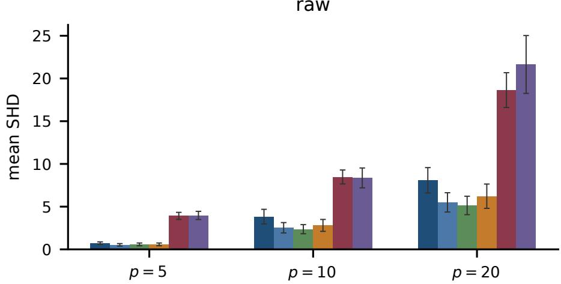

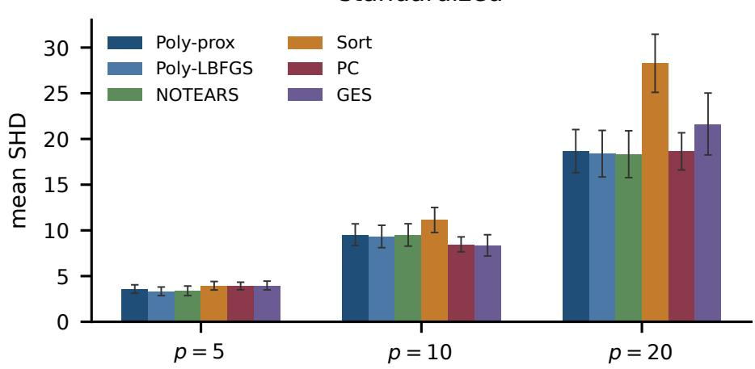  
Figure 6: Accuracy of graph recovery. Lower structural Hamming distance (SHD) means fewer edge mistakes. Each bar averages 36 simulations with 1000 observations; error bars show standard errors. On raw data, the continuous solvers and sort-regress outperform PC and GES. Rescaling each variable to unit variance makes sort-regress the worst method at 20 variables. PC and GES are unchanged by this rescaling.

## F.5 Benchmark topology protocol

The recovery experiment keeps each benchmark’s directed support and uses one fixed weighted linear Gaussian SEM per topology, with edge magnitudes in [0.5, 2] and random signs. Sample sizes are $m \in \{ 1 \bar { 0 } 0 0 , 5 0 0 0 , 1 0 0 0 0 \}$ on every topology, plus m = 500 on CHILD. Noise is Gaussian with variance one; columns are centered without standardization. The fixed topology order is ASIA, CANCER, EARTHQUAKE, SURVEY, SACHS, CHILD, ALARM. For zero-based topology index i, weight and data seeds are SeedSequence([1000+i,1]) and SeedSequence([2000+i,m,draw]). Ten draws per sample size produce repeated observations of each fixed graph, not independent graph weightings. The experiment uses direct arithmetic replay under the reference solver’s accepted controls and multiplier events; it does not run the attention/FF residual graph for all datasets.

Across 220 datasets, the final Frobenius and largest-entry weight gaps, multiplier gap and thresholded graph disagreement are exactly zero in float64. Figure 3 displays the median-SHD draw at $m = 1 0 ^ { 4 }$ . SHD is computed after thresholding at 0.3. The agreement establishes inheritance of these reference computations; it does not certify recovery of the underlying graph or transfer to other weightings of the same topology.

## F.6 Training Models with and without State Updates

We train ordinary tied-weight attention models on Poly-prox transition labels, with five independent training runs per reported condition, and compare their decoded outputs with the reference update. These models use four tied attention/ReLU repeats; they do not instantiate the full-depth bilinear architecture of Theorem 4.1. The experiments measure output agreement for these architectures and budgets, rather than learnability of the guaranteed construction. Table 3 includes a collapsed-input model that withholds W, α, whereas Table 4 holds state access fixed and changes residual write-back.

How we summarize runs and report failures. For one-step error, each training run is summarized by its median test error, and tables report the mean and standard error of finite run summaries. The trajectory metric is the unnormalized 12-update Frobenius error and is aggregated separately. All conditions have five attempted training runs. A bracketed [k] marks k nonfinite run summaries excluded from that cell’s mean; “non-finite $\left( \mathrm { a l l } \right) ^ { \ast }$ means all five failed, and standard errors require at least two finite summaries. Finite-only means are conditional summaries, not a success rate or an unconditional expected error.

Objective and data. The independently drawn random-transition component uses a random DAG on p nodes, Erdos–˝ Rényi or scale-free with equal probability and expected degree from $\{ 1 , \dot { 2 } , 4 \} ; m \in \{ 2 0 0 , 5 0 0 , 1 0 0 0 \}$ observations from the linear SEM of Section 3 with Gaussian or Laplace noise, each with probability ${ \frac { 1 } { 2 } } ,$ , and column standardization applied with probability $\textstyle { \frac { 1 } { 2 } } ; \mathbf { a }$ state W with i.i.d. $\mathcal { N } ( 0 , 0 . 2 ^ { 2 } )$ off-diagonal entries; and controls $\alpha \sim \mathrm { U } [ 0 , 2 ] , \rho \in \{ 0 . 1 , 1 , 1 0 \}$ $\gamma \sim \mathrm { { \bar { U } } } [ 0 . 0 2 , 0 . \dot { 2 } ] { \AA } / \| \Sigma \| _ { 2 }$ . The label is the exact Poly-prox update of that state. Each corpus also contains states the solver actually visits: twelve evenly spaced iterates from each of several short proximal runs, labelled the same way, which is 960 of the 2460 transitions and 9600 of the 24600. States from a shared solver run are dependent observations. Random-transition labels use $b = 1$ , while solver-derived primal labels use $b = 0 ,$ . The ordinary models receive no explicit b input, so their multiplier supervision mixes two update policies. This does not alter the primal target, but the shared training loss can still affect fitted parameters; these experiments do not isolate why primal learning fails. The loss is the mean squared error in the entries of $\widehat { W } _ { \ell + 1 }$ plus 0.05 times the mean squared error in $\widehat { \alpha } _ { \ell + 1 } ,$ minimized with AdamW at learning rate $3 \cdot 1 0 ^ { - 4 } $ , batch size 64 and gradient-norm clipping at 1. Models are trained at $p = 5$ with rows padded to $p _ { \operatorname* { m a x } } = 1 0$ and evaluated at $p = 1 0$ without retraining. The five-seed runner is experiments/run\_train\_seeds.py, using models from run\_train.py. Held-out tests are fixed across training seeds: 200 random transitions at $p = 5$ (input seed 1), 120 at $p = 1 0$ (seed 2), and 24 twelve-step trajectories at $p = 5$ (seed 3). Training seeds vary initialization, training data and minibatch order; the test corpus is shared.

Figure 4 uses plot\_heatmaps.py: a five-node instance with seed 22 and a ten-node instance with seed 83, both with 800 Gaussian observations, expected degree two and raw scale. The displayed model outputs follow 12 updates. The right column is the reference solver’s returned estimate, while red dots mark true edges. These examples are illustrative, not averages.
<table><tr><td>Model</td><td> $\scriptstyle p = 5 { \mathrm { ~ e r r o r } }$ </td><td>p=10 error (zero-shot)</td><td>trajectory error, 12 updates</td></tr><tr><td>paper-size corpus</td><td></td><td></td><td></td></tr><tr><td>softmax, with memory</td><td> $0 . 9 4 \pm 0 . 0 0$ </td><td> $0 . 9 7 \pm 0 . 0 0$ </td><td> $0 . 6 4 \pm 0 . 0 1$ </td></tr><tr><td>linear, with memory</td><td> $0 . 9 8 \pm 0 . 0 1$ </td><td> $1 . 0 1 \pm 0 . 0 1$ </td><td> $2 4 . 2 4 \pm 2 2 . 5 0$ </td></tr><tr><td>linear, no memory (collapsed input)</td><td> $1 0 . 4 8 \pm 0 . 0 4$ </td><td> $1 6 . 4 8 \pm 0 . 0 5$ </td><td> $1 . 1 \times 1 0 ^ { 3 } \pm { 0 . 7 \times 1 0 ^ { 3 } }$ </td></tr><tr><td>learned-threshold unroll</td><td> $3 . 9 4 \pm 0 . 0 6$ </td><td> $1 1 . 8 1 \pm 0 . 2 5$ </td><td> $2 . 8 \times 1 0 ^ { 2 } \pm { 1 . 7 \times 1 0 ^ { 2 } }$ </td></tr><tr><td> ${ \sim } I O \times$  corpus, 2.5× epochs</td><td></td><td></td><td></td></tr><tr><td>softmax, with memory</td><td> $0 . 6 7 \pm 0 . 0 1$ </td><td> $1 . 5 6 \pm 0 . 0 2$ </td><td> $0 . 4 0 \pm 0 . 0 1$ </td></tr><tr><td>linear, with memory</td><td> $0 . 9 8 \pm 0 . 0 1$ </td><td> $1 . 0 2 \pm 0 . 0 2$ </td><td> $1 . 2 6 \pm 0 . 2 3 [ 2 ]$ </td></tr><tr><td>linear, no memory (collapsed input)</td><td> $1 0 . 4 0 \pm 0 . 0 7 [ 1 ]$ </td><td> $1 6 . 6 2 \pm 0 . 0 7 [ 1 ]$ </td><td> $2 . 3 \times 1 0 ^ { 2 2 } \pm 2 . 3 \times 1 0 ^ { 2 2 } [ 1 ]$ </td></tr><tr><td>learned-threshold unroll</td><td> $0 . 7 2 \pm 0 . 0 1$ </td><td> $4 . 8 2 \pm 0 . 3 6$ </td><td> $0 . 4 1 \pm 0 . 0 1$ </td></tr></table>

Table 3: Trained update executors, mean ± standard error over five attempted training runs. Step error is normalized so that copying the input scores 1; the median over test cases is taken within a seed. A bracketed count gives the seeds whose value was non-finite, which are excluded from that mean; trajectory means are dominated by a few divergent seeds.

Updating the current state or predicting it from scratch. The collapsed-input model in Table 3 withholds $W , \alpha$ and predicts the next state from scratch. Its inputs do not determine the target update. Table 4 therefore holds state access, architecture, parameter count and training recipe fixed, changing only whether the model predicts a residual update or the whole next state. At the smaller corpus, removing write-back raises one-step errors from 0.98 to 10.44 for linear attention and from 0.94 to 10.98 for softmax. At the larger corpus, softmax closes part of this gap at $p = 5$ (1.70 versus 0.67), but not at $p = 1 0 ( 1 4 . 8 2$ versus 1.56). Because step error is normalized by a potentially small true update, imperfectly reconstructing the incoming $W$ can incur a large score. The comparison supports residual parameterization under this recipe; it does not establish necessity of a particular state encoding.
<table><tr><td>Attention</td><td>Residual write-back</td><td> $p { = } 5 \ \mathrm { e r r o r }$ </td><td> $p { = } 1 0 \ \mathrm { e r r o r }$ </td><td>trajectory error</td></tr><tr><td>softmax (paper-size) softmax (paper-size)</td><td>persistent  $( \widehat { W } = W + \delta )$  absent (output from scratch)</td><td> $0 . 9 4 \pm 0 . 0 0$   $1 0 . 9 8 \pm 0 . 3 8$ </td><td> $0 . 9 7 \pm 0 . 0 0$   $1 7 . 0 1 \pm 0 . 3 9$ </td><td> $0 . 6 4 \pm 0 . 0 1$   $1 . 1 2 \pm 0 . 1 2$ </td></tr><tr><td>linear (paper-size) linear (paper-size)</td><td>persistent  $( \widehat { W } = W + \delta )$  absent (output from scratch)</td><td> $0 . 9 8 \pm 0 . 0 1$   $1 0 . 4 4 \pm 0 . 0 5$ </td><td> $1 . 0 1 \pm 0 . 0 1$   $1 6 . 4 9 \pm 0 . 0 3$ </td><td> $2 4 . 2 4 \pm 2 2 . 5 0$   $1 . 3 7 \pm 0 . 2 2$ </td></tr><tr><td></td><td></td><td></td><td></td><td></td></tr><tr><td>softmax (large corpus)</td><td>persistent  $( \widehat { W } = W + \delta )$ </td><td> $0 . 6 7 \pm 0 . 0 1$ </td><td> $1 . 5 6 \pm 0 . 0 2$ </td><td> $0 . 4 0 \pm 0 . 0 1$ </td></tr><tr><td>softmax (large corpus)</td><td>absent (output from scratch)</td><td> $1 . 7 0 \pm 0 . 1 3$ </td><td></td><td></td></tr><tr><td></td><td></td><td></td><td> $1 4 . 8 2 \pm 0 . 2 1$ </td><td> $0 . 6 5 \pm 0 . 0 3$ </td></tr><tr><td>linear (large corpus)</td><td>persistent  $( \widehat { W } = W + \delta )$ </td><td> $0 . 9 8 \pm 0 . 0 1$ </td><td> $1 . 0 2 \pm 0 . 0 2$ </td><td> $1 . 2 6 \pm 0 . 2 3 [ 2 ]$ </td></tr><tr><td>linear (large corpus)</td><td>absent (output from scratch)</td><td> $1 0 . 5 3 \pm 0 . 0 2$ </td><td> $1 6 . 4 8 \pm 0 . 0 6$ </td><td> $3 . 1 6 \pm 1 . 2 3 [ 3 ]$ </td></tr></table>

Table 4: Residual write-back with identical inputs, five training runs. “Persistent” writes the update back into the state registers, ${ \widehat { W } } = W + \delta ;$ “absent” gives the model the same inputs and the same parameter count but produces $\widehat { W }$ and αb from scratch. One-step errors are normalized so that copying scores 1; the trajectory column is the unnormalized $\| \widehat { W } _ { 1 2 } - W _ { 1 2 } \| _ { F }$ after twelve unrolled updates. A bracketed count gives the seeds whose value was non-finite, excluded from that mean. These are the numbers quoted in Section 8.

## F.7 Checking the Relative-Error Bound

Figure 7 connects the conditioning results to numerical examples. Panel (1) compares direct arithmetic replay with an independent matrix-power update on eight states per $p \in \{ 3 , \bar { 5 } , 1 0 , 2 0 \}$ , at capacity $p _ { \operatorname* { m a x } } = 2 0$ and $N = { \bar { 3 } } 2 .$ . This is a replay check, separate from the literal attention/FF tests in Appendix F.1. Panels $( 2 ) { - } ( 3 )$ use the stationary two-node family in Appendix $_ { \mathrm { A . 6 , } }$ with $r = 0 . 6 , \lambda = 0 . 2 , \rho = 0$ and exact $c = \alpha = ( r - \lambda - t ) / t ^ { 3 }$ . Multiplying ∇h by $1 + \nu ,$ with $\nu = 0 . 1$ , keeps the assembled gradient error below $( 2 \nu + \nu ^ { 2 } ) C _ { k }$ as in Corollary 5.4. Because $\rho = 0 ;$ , perturbing h has no effect in this example: it tests relative gradient accuracy with an exact coefficient. Adding $1 0 ^ { - 4 }$ to each off-diagonal gradient entry instead amplifies the error from 0.0035 to 6.7 as c grows from 25 to $4 . 7 5 \cdot 1 0 ^ { 4 }$ . Panel (4) adds $1 \bar { 0 } ^ { - 3 }$ to the multiplier after each update at the origin, realizing the undamped drift in Remark 5.2. The protocol and saved values are in experiments/run\_exact.py and experiments/results/exact\_execution.json.

(1) one update  
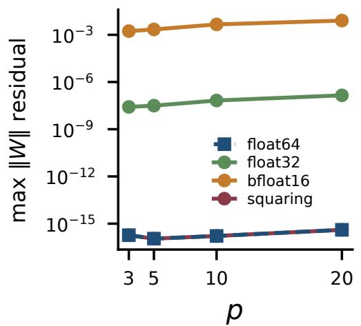

(2) multiplier  
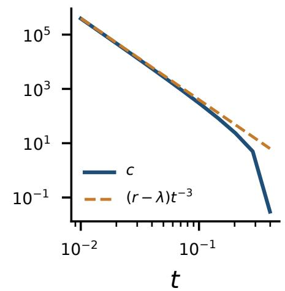  
(4) drift at the origin

(3) gradient error  
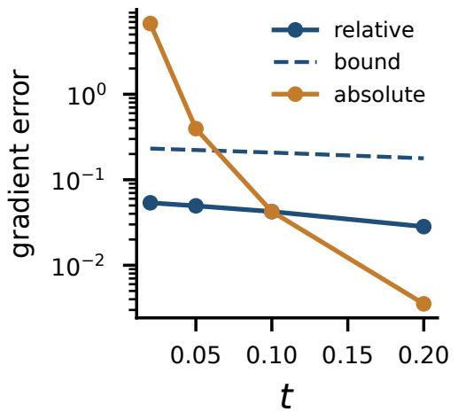

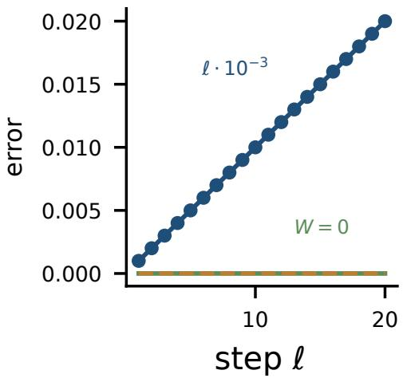  
Figure 7: Arithmetic replay and conditioning checks. (1) One-update replay error across eight states per dimension. (2) Effective multiplier growth in the two-node stationary family. (3) Relative gradient perturbations remain below the bound of Corollary 5.4; fixed absolute perturbations are amplified as c grows. (4) Undamped multiplier error accumulates as $\ell \cdot 1 0 ^ { - 3 }$ while $W = 0 ,$

## F.8 How Stationarity Changes During Optimization

Figure 8 summarizes 30 saved Gaussian linear-SEM trajectories: ten input seeds for each $p \in \{ 3 , 5 , 1 0 \}$ , with $m = 5 0 0$ $\lambda = 0 . 1$ and polynomial exponents $N = 4 , 8 , 1 6$ , respectively. There are 44508, 46590 and 47282 accepted primal outputs by dimension (138380 total). These are arithmetic-replay states, not literal-transformer activations. Each output uses its own recorded pre-controller $\alpha , \rho , \gamma ;$ later controller changes can alter $c = \alpha + \rho h$ and the augmented residual without changing W.

The masked-Lasso residual $d _ { M }$ and the smallest augmented residual $\eta _ { \mathrm { m i n } }$ use the definitions in Appendix A.6. For the relevant smooth gradient $^ { g , }$ each allowed nonzero entry has residua $g _ { i j } + \lambda \mathrm { s i g n } ( W _ { i j } )$ ; at an exactly zero entry it is $\mathrm { s i g n } ( g _ { i j } ) ( | g _ { i j } | - \lambda ) _ { + }$ . Forbidden entries are excluded, and the Frobenius norm gives the residual. No support threshold replaces exact zeros. At the last primal output, median $\eta _ { \mathrm { m i n } } / d _ { M }$ is 0.00338, 0.00661 and 0.0136 by dimension. None of these endpoints has $\eta _ { \mathrm { m i n } } ~ \le ~ \mathrm { i } 0 ^ { - 6 }$ in absolute norm. The plots show finite compensation of the Lasso residual by the cycle term, while changing controls can increase the augmented residual. They do not demonstrate $\eta _ { k } \to 0 .$ convergence to an acyclic non-Lasso limit, or multiplier divergence, and do not certify the adaptive outer controller.

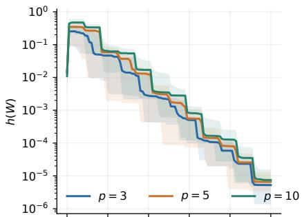

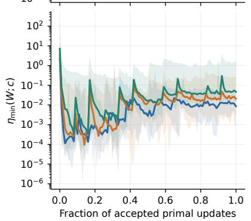

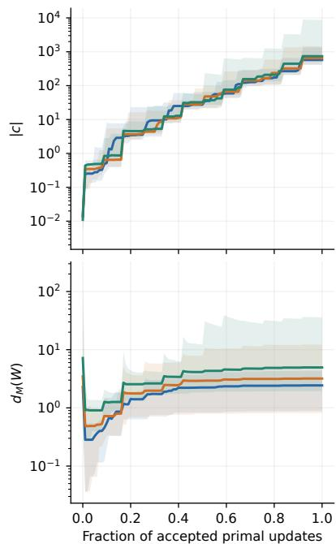

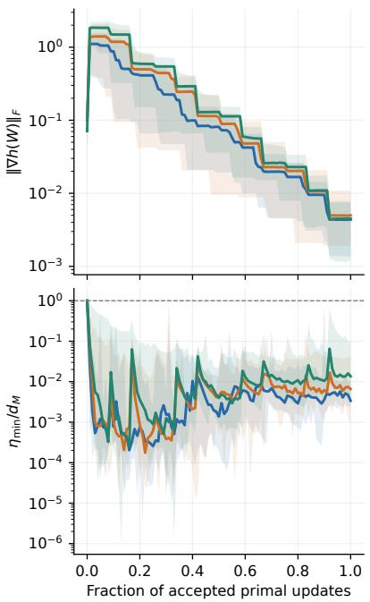  
Figure 8: Stationarity along saved accepted primal outputs, using each update’s pre-controller controls. At each of 101 normalized progress fractions $f ,$ trajectory j contributes its saved index $\lfloor f ( n _ { j } - 1 ) \rfloor$ . Lines are medians and bands are minima/maxima over ten input-seed trajectories per dimension, not confidence intervals. The horizontal axes do not align outer-stage boundaries. The plotted first point is the first primal output; at the separately recorded initial $W = 0 , h = \nabla h = c = 0$ and $\eta _ { \mathrm { m i n } } = d _ { M }$ . Finite control changes can increase the augmented residual as the constraint and its gradient decrease.