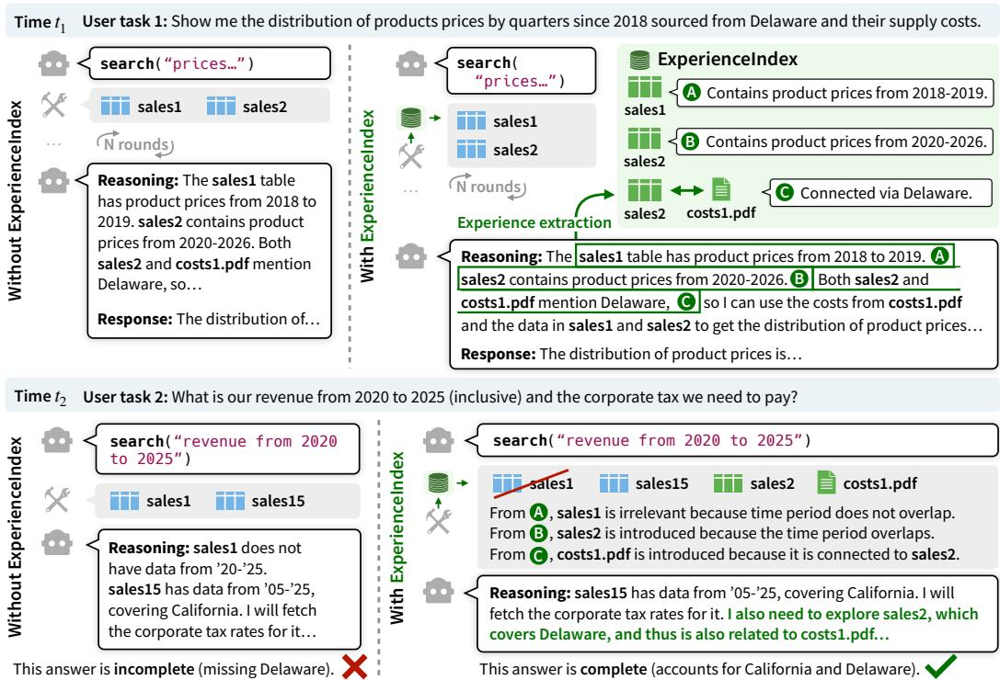
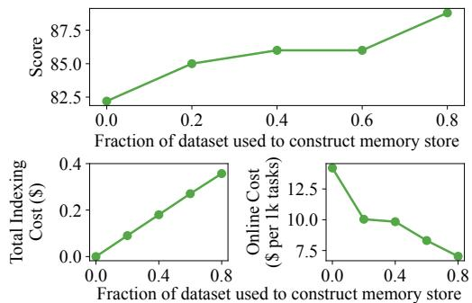
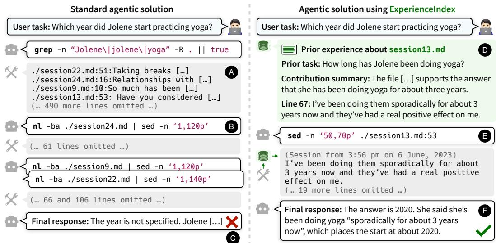
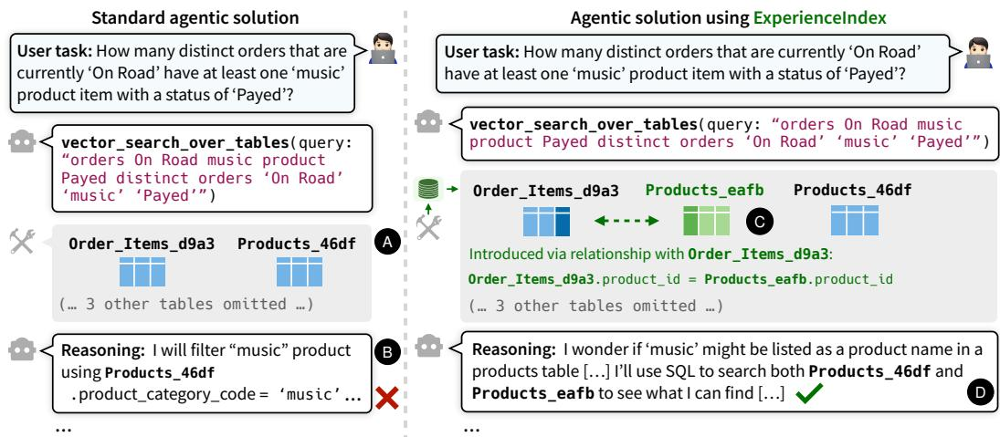
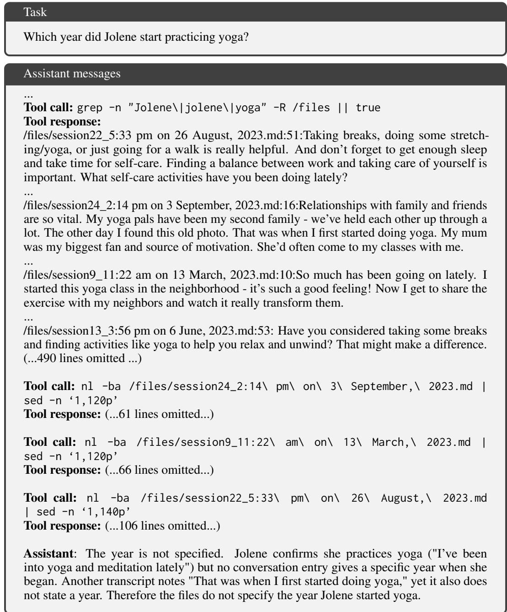
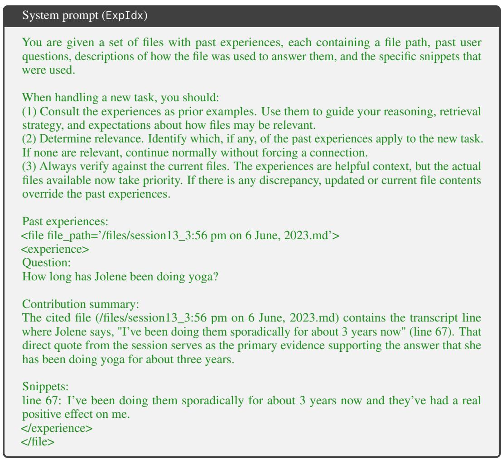
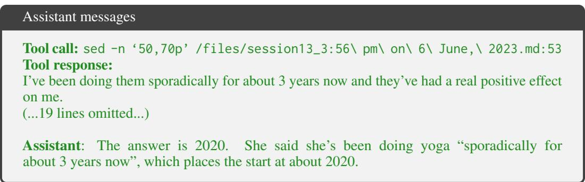
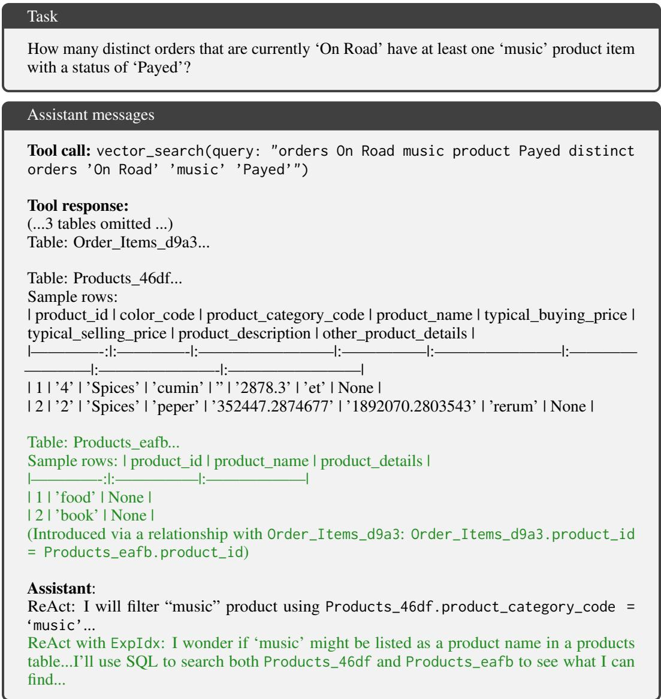

# EXPERIENCEINDEX: ARTIFACT-GROUNDED MEMORY

Peter Baile Chen1 Geoffrey X. Yu1 Xinming Liu2 Samuel Madden1 Dan Roth3 Jacob Andreas1 Doug Downey4 Michael Cafarella1 1MIT 2McKinsey & Company 3Oracle AI & UPenn 4AI2 Correspondence: peterbc@mit.edu

## ABSTRACT

Knowledge-intensive tasks in domains like law, science, and technology require answering many questions by reasoning about a shared corpus of artifacts (e.g. court cases, scientific literature, or software libraries). As humans interact with these corpora, they naturally accumulate experiential knowledge about artifacts, enabling them to quickly identify the complete set of relevant artifacts for each new task. However, existing AI agents lack appropriate memory solutions to build or reuse such artifact-grounded experience, leading to lower answer quality and higher online cost. Existing memory solutions extract and reuse information from prior task-solving traces, but they primarily focus on user preferences, factual attributes, or abstract reasoning patterns rather than persistent artifact-specific knowledge. We introduce ExperienceIndex, a novel experience layer for AI agents that captures and reuses knowledge about artifacts based on prior reasoning traces. ExpIdx stores two complementary forms of experience: (i) single-artifact experiences that summarize an artifact’s contribution to prior tasks and (ii) artifact-pair experiences that encode structural relationships discovered during past reasoning. Integrated as lightweight middleware, ExpIdx uses an experience retrieval mechanism to guide agents toward the complete set of relevant artifacts for new tasks, improving both answer quality and efficiency. Across diverse corpora and agentic solutions with different search frameworks, ExpIdx delivers consistent gains, raising answer quality by up to 11.0 points and reducing online dollar cost by up to 50.5%. We further demonstrate two benefits: (i) cross-task generalization, where experiences accumulated from text-to-SQL tasks transfer to factoid QA tasks over the same artifact corpus, and (ii) teacher-student learning, where experiences from a stronger model enable a weaker model to reach comparable performance. These results highlight ExpIdx as a general, modular approach for enabling agents to build and leverage persistent, artifact-grounded experience.

## 1 INTRODUCTION

Knowledge-intensive fields, such as law, consulting, technology, and science, require humans to solve many different tasks using a shared corpus of artifacts, including documents, tables, files, and codebases. For humans, repeated interaction with this corpus does more than resolve each individual task: it gradually builds familiarity with the corpus itself. The first encounter is slow and labor-intensive, involving extensive reading and tracing cross-references to figure out which artifact matter. Over time, however, repeated interactions leave behind conceptual anchors tied to specific artifacts: mental notes or literal sticky notes like “this table contains revenue from 2015–2025” or “ignore that tax document; it does not mention Delaware.” When new tasks appear, humans draw on this accumulated artifact-grounded experience to quickly identify the complete set of relevant information, improving both answer quality and efficiency.

While humans naturally accumulate experiential knowledge about artifacts that they have previously examined, today’s agentic systems rely on external memory mechanisms to achieve statefulness across tasks and sessions. However, existing memory mechanisms are limited: they store user preferences or facts (OpenAI; Chhikara et al., 2025) or rely on ad-hoc scratchpad mechanisms (Anthropic). Several abstracted-memory mechanisms have also been proposed (Suzgun et al., 2026; Chen et al., 2025b; Ouyang et al., 2025), focusing primarily on extracting and reusing generalizable reasoning patterns.

  
Figure 1: ExpIdx (green) and its integration into an agentic solution as middleware. Without ExpIdx, an agentic solution iteratively explores the artifact corpus for each user task using search tools, possibly in many rounds, to gather the complete information needed to solve the task (an error-prone and inefficient process). ExpIdx optimizes this process by giving the agent the full set of relevant artifacts derived from past experiences, improving answer quality while reducing execution cost.

For example, Suzgun et al. (2026) extracts key solution strategies from reasoning traces of past math problems to improve accuracy: “1. State problem requirement clearly 2. List key [...] theorems applicable...”. Similarly, Ouyang et al. (2025) extracts key web navigation strategies from past reasoning traces to improve efficiency: “Use filter buttons instead of scrolling to navigate to products ofcertain categories”. However, these approaches still do not address the challenge of retaining and reusing artifact-specific knowledge.

’ ’We introduce ExperienceIndex (abbreviated as ExpIdx), a novel experience layer for AI agents that accumulates analysis from prior tasks (task 1 in the example illustrated in Figure 1) and grounds these experiences in the specific artifacts involved (sales1, sales2, costs1.pdf). Concretely, experiences are represented through (i) single-artifact experiences that capture how specific artifacts contribute to solving prior tasks ( A and B ) and (ii) artifact-pair experiences that encode previously discovered structural connections between artifacts ( C ). ExpIdx then acts as a middleware between past experiences and model context that aims to use experience retrieval to filter out irrelevant artifacts (sales1) and identify the full set of relevant ones (sales2 and costs1.pdf) for future tasks (task 2), improving answer quality while reducing computational cost.

Extending from the example in Figure 1, we highlight two key dimensions of ExpIdx’s generality. First, ExpIdx stores experiences over single artifacts or artifact pairs, independent of modality, which allows it to support a wide range of real-world workloads operating over a shared corpus, including conversation logs, code repositories, scientific literature, and relational tables. Second, ExpIdx functions as a lightweight middleware layer, enabling it to integrate with diverse search frameworks across different solutions, such as pipelined retrieval components, retriever-based tools, or file-system-based agentic search. To validate this generality, we evaluated ExpIdx across a broad suite of knowledge-intensive tasks and heterogeneous search frameworks (Table 1). Across all settings, relative to existing agentic solutions, ExpIdx consistently improves answer quality by up to 11.0 points while reducing online cost by up to 50.5% (Table 2). We further observe additional benefits of our solution: (i) cross-task generalization where experiences populated by ExpIdx from text-to-SQL tasks can also benefit factoid QA tasks over the same table corpus (Table 2), and (ii) teacher-student learning where experiences from a stronger model allow a weaker model to reach comparable performance (Table 4).

## 2 RELATED WORK

Long-term memory for AI agents. Existing long-term memory solutions store information that can be retrieved to support reasoning on future tasks. Broadly, they fall into two categories: profile-based memory and abstracted memory. Profile-based memory solutions (OpenAI; Chhikara et al., 2025) use the user profile as the anchor, storing preferences (e.g., seat choices, writing style), conversation history, and factual attributes (e.g., birthday, address). Shu et al. (2026) extends this by structuring user information along a temporal axis. However, these solutions primarily target tasks over conversation history (Maharana et al., 2024). In contrast, ExpIdx treats artifacts, not users, as anchors, and stores experience grounded in those artifacts, making it applicable not only to conversation logs, but also to a wide range of workloads involving a shared corpus. A second line of work focuses on abstracted memory (Suzgun et al., 2026; Chen et al., 2025b; Ouyang et al., 2025), introduced in Section 1, which targets tasks that share underlying reasoning patterns or computations. ExpIdx, by contrast, targets tasks that share knowledge about artifacts. Rather than extracting general logic, it captures analyses, contributions, and relationships among artifacts from prior reasoning traces. We view our work and abstracted memory as complementary components needed for solving complex tasks.

Offline corpus enrichment. Prior work (Chen et al., 2025a; Edge et al., 2024; Gospodinov et al., 2023; Gutiérrez et al., 2024) has explored enriching corpus artifacts offline to enhance retrieval quality. These approaches augment artifacts with annotations, such as layperson summaries, synthetic question-answer pairs, or graph-structured representations. But these methods have limitations: (i) the annotations are generated without visibility into downstream tasks, so their benefit for real retrieval needs may be limited; (ii) they incur substantial up-front cost, since every artifact (or combinations of artifacts) must be processed in advance; and (iii) they assume access to the entire corpus during offline indexing (often unrealistic, e.g., for open-web content). In contrast, ExpIdx updates its memory store continually and incrementally, based solely on artifacts that appear in the prior reasoning traces of executed tasks. This design allows ExpIdx to (i) evolve in response to real task demands, (ii) avoid up-front cost, and (iii) operate without assuming global corpus visibility.

## 3 EXPERIENCEINDEX

This work focuses on tasks involving reasoning over a shared corpus of artifacts, structured as pairs of <artifact\_id, artifact\_content> along with optional metadata (with artifact\_id autopopulated when absent). Today’s AI agents typically approach such tasks using a ReAct loop (Yao et al., 2022) built on top of a solver model M and a search framework R comprising tools (e.g., vector\_search, bash). The agent iteratively explores the corpus to retrieve information needed to solve the task (see Figure 1, left half). However, as discussed in Sections 1 and 2, existing memory solutions fail to capture and reuse experiential knowledge about artifacts the agent has previously examined. As a result, they miss opportunities to accelerate and improve retrieval and reasoning on future tasks. To address this gap, we introduce ExpIdx, which treats artifacts as anchors for persistent memory.

Algorithm 1 illustrates how ExpIdx integrates with the agentic setup described earlier. At its core is a memory store that accumulates experiences extracted from past reasoning traces, which are indexed by artifact\_ids. When a new task arrives, ExpIdx acts as middleware between the memory store and the model context: it retrieves relevant past experiences based on the task description (line 4) or on the set of artifact\_ids (line 10) returned by the search framework (line 9), and injects them into the model context (lines 5 and 11). After the agent completes its reasoning, ExpIdx extracts and stores experiences about the artifacts used in the reasoning trace (line 13). Because ExpIdx derives knowledge about artifacts from the model’s reasoning traces, the types of artifacts it supports align with M’s modalities. If M is text-only, ExpIdx supports text-based artifacts (e.g., text documents, code files) or artifacts that can be transcribed into text. If M is multi-modal and supports images or other modalities, ExpIdx can likewise support artifacts in those formats. Additionally, ExpIdx is compatible with different search frameworks R whose outputs include artifact\_ids (line 9), enabling retrieval of relevant past experiences as detailed above.

To enable the above process over diverse corpora, ExpIdx must (i) store experiences in a domainagnostic representation (Section 3.1), (ii) retrieve experiences relevant to a new task (Section 3.2), (iii) inject them into the model context (Section 3.3), and (iv) extract and index new experiences from the model’s reasoning traces (Section A.2).

Algorithm 1 ExpIdx integrated into a standard agentic solution with a solver model M, and a search framework R (e.g., vector\_search) over a corpus C of artifacts A (A refers to the artifact\_ids). Green text shows additions introduced by ExpIdx. Green text shows additions introduced by ExpIdx

Require: Solver model M, search tool R, corpus C, system prompt P, memory store S   
1: Input: Input task t, Output: An answer   
2: function RETRIEVEEXPERIENCE(S: Memory store, q: Query, AID: Artifact IDs)   
3: Returns relevant experiences and associated artifacts ▷ See Section 3.2.   
4: AP ← RETRIEVEEXPERIENCE(S, t, {}) ▷ Fetch artifacts with experiences relevant to task t   
5: Inject AP into system prompt P ▷ See Section 3.3.   
6: H ← Initialize message history with system prompt and other metadata (e.g., tool definitions)   
7: y ← M(H)   
8: while y is not the final response do   
9: AID, A ← R(q, C) ▷ Returns artifacts and their IDs relevant to model-generated query q   
10: A′ ← RETRIEVEEXPERIENCE(S, q, AID) ▷ Refine searched artifacts based on past experiences   
11: Append refined tool output A′ to H ▷ See Section 3.3.   
12: $y \gets \mathcal { M } ( \mathcal { H } )$   
13: Enqueue update to S using reasoning trace extracted from H ▷ See Section A.2.   
14: output Model response y

## 3.1 EXPERIENCE REPRESENTATION

A model’s success on tasks that require artifact-corpus search depends on two aspects: relevance and completeness of searched artifacts. Consequently, ExpIdx’s experience representation centers around artifacts. This design (i) ensures that past experiences about specific artifacts can be used to improve both aspects in future tasks, thereby enhancing answer quality, and (ii) allows models to reference prior analyses about artifacts instead of repeatedly performing extensive reasoning from scratch, reducing computational cost. To this end, we introduce a domain-agnostic representation of experience at two complementary levels: single-artifact experience and artifact-pair experience. Single-artifact experience captures learnings about how individual artifacts helped solve previous tasks (e.g., A and B in the example illustrated in Figure 1). It is drawn on to assess the relevance of an artifact for a future task. Artifact-pair experience records previously observed meaningful relationships between artifacts (e.g., C ), helping surface related artifacts that the model might otherwise miss and thereby improve the completeness of information.

Single-artifact experience. For each artifact used in prior tasks (e.g., sales1, sales2), ExpIdx records (i) a task description, which captures the descriptions of past tasks in which the artifact was used; (ii) a contribution summary, which provides a concise explanation of how the artifact contributed to solving each task (e.g., “sales1 contains product prices from 2018-2019” from A ), and (iii) snippets, which contain the specific portions of the artifact that were used during task solving, optionally augmented with location metadata such as line numbers or offsets to help models quickly locate relevant information. These three domain-agnostic attributes capture how an artifact was used in past tasks. They provide signals about an artifact’s potential relevance (or irrelevance) for future tasks. Furthermore, snippets capture only the most pertinent content, which helps models avoid reprocessing large amounts of irrelevant material from the same artifact.

Artifact-pair experience. ExpIdx represents artifact-pair experiences using relationships, which describe structural connections between pairs of artifacts. For example, relationships between a document and another document or table may be defined by overlapping entities (e.g., “sales2 and costs1.pdf are connected via Delaware” from C ), while relationships between two tables may be defined by joinable columns. This design allows ExpIdx to capture meaningful co-occurrences between artifacts so that models can be proactively introduced to the neighbors of relevant artifacts. These are neighboring artifacts that might otherwise be missed or require multiple rounds of retrieval and reasoning to discover.

## 3.2 EXPERIENCE RETRIEVAL

We can now look at ExpIdx’s experience retrieval mechanism (RETRIEVEEXPERIENCE $( \cal S , q , \cal A _ { \mathrm { I D } } )$ in Algorithm 1), which identifies relevant experiences and their associated artifacts to guide a model’s retrieval and reasoning behavior in a new task. A natural retrieval strategy is to use lexical or semantic similarity between the input queries and past experiences (e.g., descriptions of new and past tasks). However, we also observe that models are increasingly leveraging file-system-based search tools (Wang et al., 2024; 2025) to inspect artifacts when solving tasks. This behavior creates an opportunity to also search over past experiences about artifacts involved with such tools. Accordingly, our experience retrieval process takes as input a text query $q$ and, optionally, a set of artifact\_ids ${ \mathcal { A } } _ { \mathrm { I D } }$ . To return information that is both relevant and complete, the retrieval process proceeds as follows. We first retrieve a set of candidate artifacts by consulting single-artifact experience. We then employ an off-the-shelf LLM to assess the relevance of each candidate artifact to $q .$ For candidate artifacts deemed relevant, we further consult artifact-pair experience to introduce their neighboring artifacts.

Candidate artifacts. Taking the set of all single-artifact experiences $E ,$ , we embed the input text query q using an off-the-shelf embedding model and retrieve the top-k most relevant experiences from $E$ along with their associated artifact. We compute relevance using a combined similarity between the query embedding and the embeddings of each past experience’s task description and contribution summary. If a set of artifact\_ids ${ \mathcal { A } } _ { \mathrm { I D } }$ is provided, we additionally perform artifact-conditioned retrieval. For each $a _ { \mathrm { I D } } \in \mathcal { A } _ { \mathrm { I D } }$ , we consider only the single-artifact experiences associated with $a _ { \mathrm { I D } }$ , denoted $E _ { a }$ , and select the top-k experiences from $E _ { a }$ based on the same combined similarity between the query embedding and the embeddings of the past task descriptions and contribution summaries. We then union the artifacts retrieved through q and ${ \mathcal { A } } _ { \mathrm { I D } }$ (if available) to form a set of candidate artifacts.

Artifact relevance analysis. To ensure that the candidate set only contains relevant artifacts and experiences, we apply an off-the-shelf LLM (GPT-5-Mini by default) to classify each candidate artifact, based on its associated experiences, as relevant, irrelevant, or inconclusive for the input query q. If an artifact is deemed relevant, the LLM also identifies which specific experiences are relevant. We then prune the artifacts and experiences deemed irrelevant. We provide detailed prompts in Section B.1. As shown in the example in Figure 1, sales1 is determined irrelevant because from experience A , its time period does not overlap with the required period of 2020-2025, while sales2 is determined relevant because from experience B , its time period overlaps.

Neighboring artifacts. To improve completeness, we consult the artifact-pair experience, which captures co-occurrence patterns and relationships between artifacts. For each candidate artifact deemed relevant, we fetch its neighboring artifacts and apply the relevance analysis described above. We retain only the neighbors classified as relevant. For instance, costs1.pdf is retrieved as a neighboring artifact of sales2 via the connecting entity “Delaware” shown in C .

## 3.3 EXPERIENCE INJECTION

Once relevant artifacts and associated experiences are retrieved, they are used to guide the model’s behavior. Under a typical agentic setting shown in Algorithm 1 with a predefined search framework, we identify two primary non-parametric components that influence model behavior and remain mutable at runtime: (i) the outputs of search frameworks, and (ii) the model prompt context. However, both components, by default, operate without awareness of prior experiences. To bridge this gap, ExpIdx provides a unified middleware layer that injects retrieved experiences (Section 3.2) by enriching both searched artifacts and the model prompt before they reach the model. Because of the lightweight and non-invasive nature of middleware, ExpIdx can be easily integrated with common search frameworks, such as retrieve-then-rerank pipelines in traditional retrieval-augmented generation systems (Lewis et al., 2020), retrieval tools invoked within agentic systems (Yao et al., 2022), and agentic search with file system tools (Wang et al., 2025).

Search framework output. A standard search framework takes a query $q$ as input and returns a set of artifacts A together with their IDs ${ \mathcal { A } } _ { \mathrm { I D } }$ (line 9 in Algorithm 1) to the model. Our middleware enriches this output by intercepting A before it reaches the model: it performs experience retrieval using $q$ and ${ \mathcal { A } } _ { \mathrm { I D } }$ , and then modifies the tool output based on the retrieved experience. In the example shown in Figure 1, for task 2 without ExpIdx, the search tool returns ${ \mathcal { A } } ,$ which includes sales1 and sales15, introducing irrelevant artifacts and incomplete information. With ExpIdx, A is refined: sales1 is pruned, and sales2 and costs1.pdf are introduced before passed to the model. We give the details of our tool-response modification mechanism in Section A.1.

Model prompt. Our middleware also enriches the model prompt to complement tool response enrichment. Given the task t, we perform experience retrieval based on t and inject the relevant experiences directly into the system prompt using the formatting described in Section B.2. Placing relevant experiences in the initial system prompt exposes the agent to useful prior knowledge before it performs extensive reasoning and issues tool calls, enabling earlier guidance and reducing the risk of suboptimal reasoning caused by delayed access to helpful experiences.

Lightweight reflection. The prompt also includes a lightweight reflection step that instructs the agent to (1) assess the relevance of the retrieved experience and artifacts and disregard irrelevant ones, and (2) verify experiences against the current artifacts, giving them priority over past experiences in the event of discrepancies caused by hallucinations, errors, or outdated information.

## 4 EXPERIMENTS

## 4.1 SETUP

Table 1: Details on datasets and baseline solutions.
<table><tr><td>Dataset</td><td>Domain</td><td>Modality</td><td>Task type</td><td>Baseline solution</td><td>Search frameworks</td></tr><tr><td>Locomo (Maharana et al., 2024)</td><td>General</td><td>Files</td><td>Conversational QA</td><td>ReAct (Yao et al., 2022)</td><td>File-system search (e.g., bash)</td></tr><tr><td>SWE-bench-ver. (Jimenez et al., 2023)</td><td>Tech</td><td>Files</td><td>Bug fixes</td><td>ReAct</td><td>File-system search</td></tr><tr><td>SQA (Bragg et al., 2025)</td><td>Science</td><td>Documents</td><td>Long-form generation</td><td>ScholarQA (Singh et al., 2025)</td><td>Custom retrieve-and-rerank to Semantic Scholar</td></tr><tr><td>Freshstack (Thakur et al., 2025)</td><td>Technical doc.</td><td>Documents</td><td>Long-form generation</td><td>ReAct</td><td>Vector search tool (Qwen3-0.6B-Embedding)</td></tr><tr><td>Musique (Trivedi et al., 2022)</td><td>General</td><td>Documents</td><td>Multi-hop QA</td><td>ReAct</td><td>Vector search tool (Qwen3-8B-Embedding)</td></tr><tr><td>Spider (Yu et al., 2018)</td><td>Misc.</td><td>DB Tables</td><td>Text-to-SQL</td><td>ReAct</td><td>Vector search tool (Q8B-Embed), SQL execution tool</td></tr><tr><td>MMQA (Wu et al., 2025)</td><td>Misc.</td><td>DB Tables</td><td>Factoid QA</td><td>ReAct</td><td>Vector search tool (Q8B-Embed), SQL execution tool</td></tr></table>

Datasets and baseline solutions. As discussed in Section 1, ExpIdx is designed with two forms of generality: it supports a broad spectrum of workloads that operate over a shared corpus of artifacts, and it integrates with diverse search frameworks used across different solutions. To evaluate this generality, we selected a suite of knowledge-intensive tasks spanning multiple domains, modalities, and task types. As the baseline solution, we use the state-of-the-art ScholarQA (Singh et al., 2025) for the SQA dataset, and ReAct (Yao et al., 2022) for all remaining datasets, as it represents the standard agentic approach. Our ReAct implementation is augmented with the commonly adopted set of search tools described in Chang et al. (2026). Table 1 shows a summary of these datasets and baselines (details in Section D).

Baselines. We compare against two baselines, one from each category of related work discussed in Section 2: long-term memory and offline enrichment. Like ExpIdx, both generalize across a wide range of datasets.

• Memory baseline. We adopt ReasoningBank (Ouyang et al., 2025) as a representative abstracted memory baseline, which extracts reasoning patterns from previous tasks and reuses them on new ones. Given past reasoning traces, ReasoningBank extracts generalizable insights into discrete memory items and stores them in a memory store. When a new task arrives, it retrieves the memory items linked to semantically similar prior tasks and appends them to the system prompt to guide the model’s reasoning.

• Offline enrichment baseline. We adopt EnrichIndex (Chen et al., 2025a) as a representative offline enrichment approach. In an offline phase, it uses an LLM to enrich each artifact in the corpus (e.g., a document, table, or code file) with three additional labels: a content summary, a description of the artifact’s purpose, and a set of potential QA pairs. During online task-solving, artifacts are retrieved using both their original content and these labels, and are then provided to the agent in the same manner as in ExpIdx (Section 3.3). As noted in Section 2, this approach requires access to the entire corpus in advance, which is impractical for SQA, where queries are issued online against Semantic Scholar’s corpus of over 238 million papers. We therefore do not report EnrichIndex results on SQA.

Evaluation with and without memory. For each memory solution (ReasoningBank and ExpIdx), we build a memory store by splitting the dataset into experience tasks and evaluation tasks. By default, experience tasks contain 80% of the dataset (we also vary this proportion in Figure 2) and evaluation tasks include the rest. We first run the baseline solution on all experience tasks (model used here is denoted as the experience model), and collect generated reasoning traces. Each memory solution then extracts reusable experience and insights from these traces and indexes them into its memory store. We then evaluate the baseline solution on the evaluation tasks (model used here is denoted as the evaluation model), both with and without memory. We use a static memory store instead of updating it continuously (e.g., after every N tasks) to enable controlled comparisons, particularly to study how performance depends on the number of stored experiences and on the experience model (Section 5).

Metrics. We measure performance and resource usage in two phases. The online phase covers solving the evaluation tasks, and the indexing phase covers building the additional indexes each method uses, i.e., constructing the memory store from experience-task traces (ReasoningBank and ExpIdx) or enriching the corpus offline (EnrichIndex). All dollar costs are computed by tracking input and output token usage and applying the corresponding API pricing.

• Online metrics. For the online phase, we report the average answer score and the average online cost. The answer score is computed by comparing the predicted answer to the groundtruth answer (details in Section D). The online cost includes all runtime expenses incurred while solving the evaluation tasks, including any charges for retrieving from the memory store or enriched index, and is reported in dollars per thousand tasks.

• Indexing metrics. For the indexing phase, we report the indexing cost and the storage footprint. The indexing cost is the expense of extracting information from experiencetask traces and populating the memory store, or of enriching the corpus offline (details in Section A.2). The storage footprint is the size of the additional indexes each method maintains beyond the original corpus. The baseline solution builds no additional indexes, so it incurs no indexing cost and has no storage footprint.

## 4.2 RESULTS

Table 2 presents the answer scores and online costs of all methods across all datasets and models. Two key findings emerge: (i) ExpIdx achieves the highest average score at the lowest average online cost. Averaged across both evaluation models, ExpIdx attains the highest answer score, a relative improvement of 3.9% over the strongest baseline, EnrichIndex. It also has the lowest online cost, reducing cost by 20.8% relative to the baseline solutions. These results underscore the benefits of artifact-grounded memory over no memory, abstracted memory, and offline enrichment. (ii) Results on Spider and MMQA demonstrate cross-task generalization. MMQA (a factoid QA dataset) and Spider (a text-to-SQL dataset) share the same table corpus, and the MMQA memory store is built entirely from Spider’s reasoning traces. The fact that ExpIdx can leverage this memory to improve accuracy and reduce cost shows that experiences grounded in a shared corpus transfer effectively across task types.

Furthermore, Table 3 shows that ExpIdx reduces average indexing cost by 115.0× and storage footprint by 73.0× relative to the strongest baseline, EnrichIndex. This is because EnrichIndex requires scanning every document, causing both financial cost and storage footprint to scale directly with corpus size. This makes it inefficient for large corpora or scenarios where full-corpus access is impractical, as with the live Semantic Scholar corpus in SQA. In contrast, ExpIdx’s costs scale primarily with the number of tasks for which experiences are stored, not with corpus size. Compared with ReasoningBank, ExpIdx has a comparable indexing cost and a storage footprint of the same order of magnitude, while Table 2 shows that it improves the average answer score by 5.01% and reduces average online cost by 19.8%.

Table 2: Performance on files, codebases, documents, and tables. We report cost in dollars per thousand tasks. To compute cost, we track the number of input and output tokens and apply the appropriate API pricing. Base stands for the baseline solutions, Base+X stands for augmenting the baseline solutions with X. RB stands for ReasoningBank (Ouyang et al., 2025). EI stands for EnrichIndex (Chen et al., 2025a). EXP stands for our method, ExpIdx. Higher scores are better and lower costs are better. †EnrichIndex is not evaluated on SQA, since it requires offline access to the full corpus, whereas SQA queries Semantic Scholar’s 238M+ papers online. \*Cross-task generalization between text-to-SQL tasks and factoid QA over a shared database. MMQA is evaluated using a memory store constructed from the reasoning traces of Spider tasks.
<table><tr><td></td><td colspan="2">Locomo</td><td colspan="2">SWE-bench-ver.</td><td colspan="2">SQA</td><td colspan="2">Freshstack</td><td colspan="2">Musique</td><td colspan="4">Spider (Text-to-SQL) MMQA* (Factoid QA)</td></tr><tr><td></td><td>Score Cost ($)</td><td>Score</td><td></td><td>Cost</td><td>Score</td><td>Cost</td><td>Score</td><td>Cost</td><td>Score</td><td>Cost Score</td><td></td><td>Cost</td><td>Score</td><td>Cost</td></tr><tr><td colspan="9">Gemini-3-Flash (experience and evaluation model)</td><td></td><td></td><td></td><td></td><td></td></tr><tr><td>Base</td><td>88.8</td><td>155.2</td><td>76.5</td><td>990.9</td><td>88.7</td><td>21.6</td><td>73.0</td><td>40.1</td><td>67.0</td><td>91.2</td><td>71.0</td><td>37.1</td><td>91.0</td><td>61.3</td></tr><tr><td>Base+RB</td><td>87.9</td><td>125.6</td><td>76.5</td><td>883.3</td><td>87.1</td><td>22.5</td><td>70.1</td><td>38.3</td><td>74.0</td><td>115.4</td><td>70.0</td><td>41.4</td><td>92.0</td><td>54.8</td></tr><tr><td>Base+EI</td><td>86.0</td><td>105.3</td><td>78.6</td><td>919.8</td><td>-†</td><td></td><td>74.0</td><td>42.9</td><td>70.0</td><td>40.9</td><td>72.0</td><td>35.6</td><td>90.0</td><td>42.6</td></tr><tr><td>Base+EXP</td><td>92.5</td><td>93.4</td><td>81.6</td><td>782.0</td><td>90.6</td><td>21.0</td><td>73.3</td><td>33.8</td><td>78.0</td><td>66.5</td><td>75.0</td><td>22.0</td><td>92.0</td><td>32.3</td></tr><tr><td colspan="9">GPT-5-Mini (experience and evaluation model)</td><td></td><td></td><td></td><td></td><td></td><td>3.47</td></tr><tr><td>Base</td><td>82.2</td><td>14.2</td><td>58.2</td><td>27.9</td><td>81.8</td><td>45.0</td><td>66.6</td><td>23.6</td><td>62.0</td><td>8.45</td><td>57.0</td><td>2.27</td><td>84.0</td><td></td></tr><tr><td>Base+RB</td><td>83.2</td><td>13.4</td><td>59.2</td><td>29.6</td><td>80.0</td><td>58.3</td><td>67.5</td><td>23.6</td><td>67.0</td><td>9.54</td><td>57.0</td><td>3.86</td><td>85.0</td><td>4.80</td></tr><tr><td>Base+EI</td><td>88.8</td><td>7.66</td><td>61.2</td><td>26.9</td><td>—†</td><td>—†</td><td>67.9</td><td>19.2</td><td>63.0</td><td>7.70</td><td>60.0</td><td>1.91</td><td>87.0</td><td>2.96</td></tr><tr><td>Base+EXP</td><td>88.8</td><td>7.03</td><td>60.2</td><td>22.1</td><td>85.0</td><td>45.5</td><td>70.2</td><td>22.1</td><td>68.0</td><td>8.91</td><td>65.0</td><td>2.88</td><td>89.0</td><td>3.69</td></tr></table>

<table><tr><td></td><td>Experience model</td><td>Evaluation model</td><td>Score</td><td>Online Cost ($)</td></tr><tr><td>Base</td><td></td><td>GPT-5- Mini</td><td>82.2</td><td>14.2</td></tr><tr><td>Base</td><td></td><td>Gemini-3- Flash</td><td>88.8</td><td>155.18</td></tr><tr><td>Base+EXP</td><td>GPT-5- Mini</td><td>GPT-5- Mini</td><td>88.8</td><td>7.03</td></tr><tr><td>Base+EXP</td><td>Gemini-3- Flash</td><td>Gemini-3- Flash</td><td>92.5</td><td>93.4</td></tr><tr><td>Base+EXP</td><td>Gemini-3- Flash</td><td>GPT-5- Mini</td><td>92.5</td><td>7.50</td></tr></table>

Table 4: Experience as teacher-student learning. Experiences from a stronger model (Gemini-3-Flash) enable a weaker model (GPT-5-Mini) to reach comparable performance.  
  
Figure 2: ExpIdx improves accuracy and decreases online cost as more tasks are indexed.

Table 3: Indexing cost (\$) and storage footprint (MB) of each method, averaged across datasets.
<table><tr><td></td><td colspan="2">Base+RB</td><td colspan="2">Base+EI</td><td colspan="2">Base+EXP</td></tr><tr><td></td><td>Cost</td><td>Storage</td><td>Cost</td><td>Storage</td><td>Cost</td><td>Storage</td></tr><tr><td>Gemini-3-Flash</td><td>0.503</td><td>4.20</td><td>93.4</td><td>1108.7</td><td>0.628</td><td>15.5</td></tr><tr><td>GPT-5-Mini</td><td>0.398</td><td>4.19</td><td>34.2</td><td>1110.7</td><td>0.421</td><td>14.9</td></tr></table>

Qualitative examples. We manually reviewed the agents’ task-solving traces and selected representative examples illustrating how ExpIdx benefits the base agent through both singleartifact and artifact-pair experiences (Section 3.1). Details are provided in Section C.

## 5 ANALYSIS

Section 4 demonstrates that ExpIdx outperforms the baseline solutions, abstracted memory, and offline enrichment. This advantage comes from ExpIdx’s ability to reuse artifact knowledge captured from prior tasks. Such prior experience depends on two factors: (i) the experience model that originally produced the reasoning traces that are later extracted and indexed as experiences, and (ii) the number of experiences in the memory store. In this section, we analyze ExpIdx’s performance along both dimensions using the Locomo dataset. We also analyze sensitivity to the model used for artifact relevance analysis (Section 3.2), and perform an ablation that removes the lightweight reflection step (Section 3.3).

Experience as teacher-student learning. In Section 4, the experience model used to solve the experience tasks is the same as the evaluation model used to solve the evaluation tasks. Table 4 examines a different setting: a stronger experience model (Gemini-3-Flash) paired with a weaker evaluation model (GPT-5-Mini). We observe that, for the same evaluation model, performance improves as the experience model improves. Remarkably, the weaker evaluation model paired with the stronger experience model reaches performance comparable to the stronger evaluation model, but at substantially lower cost. This result shows that experiences serve as a mechanism for teacher-student learning, enabling a weaker model to benefit from experiences of a stronger model.

Performance varying size of memory store. Experiments in Section 4 used 80% of the dataset to construct the memory store S. To test the robustness of ExpIdx to different sizes of S, we vary the proportion of the dataset to 20%, 40%, and 60%. Figure 2 summarizes the results. Two patterns emerge: (i) Performance at all sizes of S outperforms the 0% setting (i.e., the baseline solution without memory), indicating that ExpIdx is robust and consistently benefits from experience. (ii) As the size of S increases, both answer quality and cost efficiency improve, showing that ExpIdx effectively leverages larger experience pools to deliver better outcomes.

Table 5: Score using different relevance models.
<table><tr><td></td><td>GPT-5-Mini</td><td>Nemotron-3-Ultra</td><td>Mimo-V2.5</td></tr><tr><td>Gemini-3-Flash</td><td>92.5</td><td>92.5</td><td>91.6</td></tr><tr><td>GPT-5-Mini</td><td>88.8</td><td>89.7</td><td>88.8</td></tr></table>

Sensitivity to the artifact-relevance model. As mentioned in Section 3.2, we utilized GPT-5-Mini for artifact relevance analysis and presented its results in Section 4. To demonstrate robustness, we evaluated two highly popular open-source alternatives based on usage rankings from OpenRouter:

Nemotron-3-Ultra (Blakeman et al., 2026) and Mimo-V2.5 (Team et al., 2026). Table 5 shows that both alternative models achieve performance comparable to GPT-5-Mini.

Table 6: Score with and without reflection.
<table><tr><td></td><td>With reflection</td><td>Without reflection</td></tr><tr><td>Gemini-3-Flash</td><td>92.5</td><td>91.6</td></tr><tr><td>GPT-5-Mini</td><td>88.8</td><td>85.0</td></tr></table>

Ablation of lightweight reflection. As mentioned in Section 3.3, ExpIdx uses a lightweight reflection step that prompts the task-solving model to (1) assess the relevance of the retrieved experience and artifacts and disregard irrelevant ones, and (2) verify experiences against the current artifacts, giving them priority over past ex-

periences in the event of discrepancies caused by hallucinations, errors, or outdated information. Table 6 shows that removing this reflection step leads to a drop in answer score, indicating that reflection helps mitigate noise and errors.

## 6 CONCLUSION

Memory systems aim to give agentic AI the statefulness needed to learn from prior tasks. Although existing work explores many forms of “memory,” such as user preferences, factual attributes, and general reasoning patterns, these approaches fall short for a common and highly impactful scenario: knowledge-intensive tasks over a shared corpus of artifacts, where humans naturally accumulate experiential knowledge about those artifacts through repeated task solving. ExpIdx addresses this gap by introducing artifact-grounded memory, a framework that captures and reuses knowledge about artifacts derived from past reasoning traces. It represents experience at two levels: single-artifact experience, which records how an artifact contributed to earlier tasks, and artifact-pair experience, which captures structural relationships between artifacts. When a new task arrives, ExpIdx retrieves these experiences, aiming to rapidly surface the full set of relevant artifacts. Across a wide range of tasks and corpora, including scientific literature, conversational histories, and codebases, our method consistently improves answer quality while reducing computational cost. We further observe that artifact-grounded experience supports cross-task generalization and enables effective teacher-student learning, underscoring its broader utility. We hope this work encourages a shift from non-grounded memory designs toward memory representations that are explicitly tied to artifacts.

## AI USE STATEMENT

In this work, we used generative AI tools for proofreading the paper and to assist in implementing parts of the ExpIdx prototype. We have not used generative AI tools for any other tasks with required disclosure. We have reviewed all AI-assisted work. We checked and manually integrated all LLMsuggested proofreading changes. Additionally, we manually reviewed all LLM generated code and tested it for correctness by manually checking the program’s output on the datasets used in this paper.

## REFERENCES

Anthropic. Memory tool. https://platform.claude.com/docs/en/agents-and-tools/ tool-use/memory-tool. Accessed: 2026-04-28.

Aaron Blakeman, Aaron Thomas, Aastha Jhunjhunwala, Abhibha Gupta, Abhinav Khattar, Adam Rajfer, Adi Renduchintala, Adil Asif, Aditya Vavre, Adriana Flores Miranda, et al. Nemotron 3 ultra: Open, efficient mixture-of-experts hybrid mamba-transformer model for agentic reasoning. arXiv preprint arXiv:2606.15007, 2026.

Jonathan Bragg, Mike D’Arcy, Nishant Balepur, Dan Bareket, Bhavana Dalvi, Sergey Feldman, Dany Haddad, Jena D Hwang, Peter Jansen, Varsha Kishore, et al. Astabench: Rigorous benchmarking of ai agents with a scientific research suite. arXiv preprint arXiv:2510.21652, 2025.

Jonathan D Chang, Andrew Drozdov, Shubham Toshniwal, Owen Oertell, Alexander Trott, Jacob Portes, Abhay Gupta, Pallavi Koppol, Ashutosh Baheti, Sean Kulinski, et al. Karl: Knowledge agents via reinforcement learning. arXiv preprint arXiv:2603.05218, 2026.

Peter Baile Chen, Tomer Wolfson, Michael Cafarella, and Dan Roth. Enrichindex: Using llms to enrich retrieval indices offline. arXiv preprint arXiv:2504.03598, 2025a.

Peter Baile Chen, Yi Zhang, Dan Roth, Samuel Madden, Jacob Andreas, and Michael Cafarella. Log-augmented generation: Scaling test-time reasoning with reusable computation. arXiv preprint arXiv:2505.14398, 2025b.

Prateek Chhikara, Dev Khant, Saket Aryan, Taranjeet Singh, and Deshraj Yadav. Mem0: Building production-ready ai agents with scalable long-term memory. arXiv preprint arXiv:2504.19413, 2025.

Darren Edge, Ha Trinh, Newman Cheng, Joshua Bradley, Alex Chao, Apurva Mody, Steven Truitt, Dasha Metropolitansky, Robert Osazuwa Ness, and Jonathan Larson. From local to global: A graph rag approach to query-focused summarization. arXiv preprint arXiv:2404.16130, 2024.

Mitko Gospodinov, Sean MacAvaney, and Craig Macdonald. Doc2query–: when less is more. In European Conference on Information Retrieval, pp. 414–422. Springer, 2023.

Bernal J Gutiérrez, Yiheng Shu, Yu Gu, Michihiro Yasunaga, and Yu Su. Hipporag: Neurobiologically inspired long-term memory for large language models. Advances in neural information processing systems, 37:59532–59569, 2024.

Aaron Jaech, Adam Kalai, Adam Lerer, Adam Richardson, Ahmed El-Kishky, Aiden Low, Alec Helyar, Aleksander Madry, Alex Beutel, Alex Carney, et al. Openai o1 system card. arXiv preprint arXiv:2412.16720, 2024.

Carlos E Jimenez, John Yang, Alexander Wettig, Shunyu Yao, Kexin Pei, Ofir Press, and Karthik Narasimhan. Swe-bench: Can language models resolve real-world github issues? arXiv preprint arXiv:2310.06770, 2023.

Patrick Lewis, Ethan Perez, Aleksandra Piktus, Fabio Petroni, Vladimir Karpukhin, Naman Goyal, Heinrich Küttler, Mike Lewis, Wen-tau Yih, Tim Rocktäschel, et al. Retrieval-augmented generation for knowledge-intensive nlp tasks. Advances in neural information processing systems, 33: 9459–9474, 2020.

Xingyu Li, Rongguang Wang, Yuying Wang, Mengqing Guo, Chenyang Li, Tao Sheng, Sujith Ravi, and Dan Roth. PAR2-RAG: Planned Active Retrieval and Reasoning for Multi-Hop Question Answering. arXiv preprint arXiv:2603.29085, 2026.

Adyasha Maharana, Dong-Ho Lee, Sergey Tulyakov, Mohit Bansal, Francesco Barbieri, and Yuwei Fang. Evaluating very long-term conversational memory of llm agents. In Proceedings of the 62nd Annual Meeting of the Association for Computational Linguistics (Volume 1: Long Papers), pp. 13851–13870, 2024.

OpenAI. Memory faq. https://help.openai.com/en/articles/8590148-memory-faq. Accessed: 2026-04-28.

Siru Ouyang, Jun Yan, I Hsu, Yanfei Chen, Ke Jiang, Zifeng Wang, Rujun Han, Long T Le, Samira Daruki, Xiangru Tang, et al. Reasoningbank: Scaling agent self-evolving with reasoning memory. arXiv preprint arXiv:2509.25140, 2025.

Mark Raasveldt and Hannes Mühleisen. DuckDB: an Embeddable Analytical Database. In Proceed ings of the 2019 International Conference on Management of Data, SIGMOD ’19, pp. 1981–1984, 2019.

Yiheng Shu, Saisri Padmaja Jonnalagedda, Xiang Gao, Bernal Jiménez Gutiérrez, Weijian Qi, Kamalika Das, Huan Sun, and Yu Su. Remem: Reasoning with episodic memory in language agent. arXiv preprint arXiv:2602.13530, 2026.

Amanpreet Singh, Joseph Chee Chang, Dany Haddad, Aakanksha Naik, Jena D Hwang, Rodney Kinney, Daniel S Weld, Doug Downey, and Sergey Feldman. Ai2 scholar qa: Organized literature synthesis with attribution. In Proceedings of the 63rd Annual Meeting of the Association for Computational Linguistics (Volume 3: System Demonstrations), pp. 513–523, 2025.

Mirac Suzgun, Mert Yuksekgonul, Federico Bianchi, Dan Jurafsky, and James Zou. Dynamic cheatsheet: Test-time learning with adaptive memory. In Proceedings of the 19th Conference of the European Chapter of the Association for Computational Linguistics (Volume 1: Long Papers), pp. 7080–7106, 2026.

Xiaomi MiMo Team, Anqi Liu, Aoxin Ma, Bo Chen, Bo Yang, Chen Wang, Chen Zhang, Chengda Tang, Chengwei Wang, Chiheng Lou, et al. Full-pipeline inference optimization for mimo-v2. 5 series: Pushing hybrid swa efficiency to the limit. arXiv preprint arXiv:2607.13095, 2026.

Nandan Thakur, Jimmy Lin, Sam Havens, Michael Carbin, Omar Khattab, and Andrew Drozdov. Freshstack: Building realistic benchmarks for evaluating retrieval on technical documents. arXiv preprint arXiv:2504.13128, 2025.

Harsh Trivedi, Niranjan Balasubramanian, Tushar Khot, and Ashish Sabharwal. Musique: Multihop questions via single-hop question composition. Transactions of the Association for Computational Linguistics, 10:539–554, 2022.

Xingyao Wang, Yangyi Chen, Lifan Yuan, Yizhe Zhang, Yunzhu Li, Hao Peng, and Heng Ji. Executable Code Actions Elicit Better LLM Agents. In Forty-first International Conference on Machine Learning, ICML ’24, 2024. URL https://openreview.net/forum?id=jJ9BoXAfFa.

Xingyao Wang, Boxuan Li, Yufan Song, Frank F. Xu, Xiangru Tang, Mingchen Zhuge, Jiayi Pan, Yueqi Song, Bowen Li, Jaskirat Singh, Hoang H. Tran, Fuqiang Li, Ren Ma, Mingzhang Zheng, Bill Qian, Yanjun Shao, Niklas Muennighoff, Yizhe Zhang, Binyuan Hui, Junyang Lin, Robert Brennan, Hao Peng, Heng Ji, and Graham Neubig. OpenHands: An Open Platform for AI Software Developers as Generalist Agents. In The Thirteenth International Conference on Learning Representations, ICLR ’25, 2025. URL https://openreview.net/forum?id=OJd3ayDDoF.

Jian Wu, Linyi Yang, Dongyuan Li, Yuliang Ji, Manabu Okumura, and Yue Zhang. Mmqa: Evaluating llms with multi-table multi-hop complex questions. In The thirteenth international conference on learning representations, 2025.

Shunyu Yao, Jeffrey Zhao, Dian Yu, Nan Du, Izhak Shafran, Karthik R Narasimhan, and Yuan Cao. React: Synergizing reasoning and acting in language models. In The eleventh international conference on learning representations, 2022.

Tao Yu, Rui Zhang, Kai Yang, Michihiro Yasunaga, Dongxu Wang, Zifan Li, James Ma, Irene Li, Qingning Yao, Shanelle Roman, et al. Spider: A large-scale human-labeled dataset for complex and cross-domain semantic parsing and text-to-sql task. In Proceedings ofthe 2018 conference on empirical methods in natural language processing, pp. 3911–3921, 2018.

Yanzhao Zhang, Mingxin Li, Dingkun Long, Xin Zhang, Huan Lin, Baosong Yang, Pengjun Xie, An Yang, Dayiheng Liu, Junyang Lin, et al. Qwen3 embedding: Advancing text embedding and reranking through foundation models. arXiv preprint arXiv:2506.05176, 2025.

## A IMPLEMENTATION DETAILS OF ExpIdx

## A.1 EXPERIENCE INJECTION

As described in Section 3.3, a standard search framework takes a query q as input and returns a set of artifacts A along with their IDs $\scriptstyle A _ { \mathrm { I D } }$ . Using q and AID, we perform experience retrieval to obtain artifacts $\mathcal { A } _ { \mathrm { e x p } }$ with associated past experiences signals. For each artifact\_id, these signals include its classification as relevant, irrelevant, or inconclusive, as well as associated experience snippets (Section 3.1). We then modify the original set of artifacts A to become $\mathbf { \mathcal { A } ^ { \prime } }$ as follows:

• Artifacts in $\mathcal { A } _ { \mathrm { e x p } }$ classified as irrelevant are removed if they were in A

• Artifacts classified as relevant are either retained (if already in A) or introduced (if not originally in A), and their content enriched with relevant experience snippets

• Artifacts classified as inconclusive remain unchanged if they were in A

The model then receives $\mathbf { \mathcal { A } ^ { \prime } }$ instead of the original A.

## A.2 EXPERIENCE INDEXING

Here, we look at how ExpIdx extracts experiences from past reasoning traces and indexes them into a persistent memory store, which enables it to accumulate experience over time.

Extraction from reasoning traces. We extract both single-artifact and artifact-pair experience from the reasoning traces generated during past task solving. Concretely, we construct a complete reasoning trace by concatenating all rounds of the model’s internal reasoning (Jaech et al., 2024), explicit thinking traces (Yao et al., 2022), and final answers, including any citations to artifacts (Singh et al., 2025). From this full trace, we process each mentioned artifact by prompting an off-the-shelf LLM (GPT-5-Mini by default) to generate its contribution summary and to extract snippets based on the cited content. Using the set of all artifacts referenced in the trace, we then prompt the same LLM to infer relationships between artifact pairs. We provide full prompt details in Section B.3. In the running example in Figure 1, the reasoning trace for task 1 mentions artifacts sales1, sales2, costs1.pdf. An LLM then extracts from the trace single-artifact experiences such as A and B , as well as artifact-pair experiences such as C .

Indexing. We store single-artifact and artifact-pair experiences in a database (DuckDB (Raasveldt & Mühleisen, 2019) in our case). After a batch of tasks completes, we apply the extraction process described above to the reasoning traces of every completed task, producing a set of single-artifact and artifact-pair experiences. To support retrieval (Section 3.2), we compute embeddings of the task descriptions and contribution summaries using an off-the-shelf text embedding model (Qwen3-8B-Embedding (Zhang et al., 2025)) and then insert these experiences and embeddings into the database.

## B PROMPTS

## B.1 PROMPT FOR ARTIFACT RELEVANCE ANALYSIS

We provide the prompt we use to analyze artifact relevance in Table 7.

Table 7: Prompt for analyzing artifact relevance.

## Artifact relevance analysis Artifact relevance analysis

Given a question and a set of artifacts, each including a list of prior experiences (where each   
experience consists of a contribution summary, and associated snippets from the artifact),   
your task is to evaluate, for each artifact, whether its prior experience is (1) relevant to the   
provided question; (2) irrelevant to the provided question; or (3) inconclusive.   
For each artifact, you should also evaluate its relevance based on its relationships   
with previously identified useful artifacts: <artifact\_ids>   
Your output should be a JSON list containing, for each artifact, the artifact ID, your   
judgment ("relevant", "irrelevant", or "inconclusive"), and, when applicable, the IDs of the   
relevant experience.   
Question:   
<question>   
Artifacts:   
<artifacts>

## B.2 PROMPT FOR INJECTING EXPERIENCES IN MODEL SYSTEM PROMPT

We provide the system prompt we use when injecting retrieved experiences in Table 8.

Table 8: System prompt for injecting retrieved experiences.  
System message   
You are given a set of artifacts with past experiences, each containing an artifact ID, past user   
questions, descriptions of how the artifact was used to answer them, and the specific snippets   
that were used.   
When handling a new task, you should:   
(1) Consult the experiences as prior examples. Use them to guide your reasoning, retrieva   
strategy, and expectations about how artifacts may be relevant.   
(2) Determine relevance. Identify which, if any, of the past experiences apply to the new task.   
If none are relevant, continue normally without forcing a connection.   
(3) Always verify against the current artifacts. The experiences are helpful context, but the   
actual artifacts available now take priority. If there is any discrepancy, updated or current file   
contents override the past experiences.   
Past experiences:   
<artifact id=‘...’>   
<experience>   
Question: ...   
Contribution summary: ...   
Snippets: ...   
</experience>   
<experience>   
</experience>   
</artifact>

## B.3 PROMPT FOR EXTRACTING EXPERIENCES FROM REASONING TRACES

We provide the prompt we use to generate contribution summaries and relationships in Table 9.

Table 9: Prompt for generating contribution summary and relationships.

## Single-artifact experience

Given a question and its corresponding response, summarize how each artifact in <artifact IDs> contributes to addressing the question. For each artifact, include its artifact\_id and a concise description of its contribution in a few sentences.

Question:

<question>

Response:

<response>

## Artifact-pair experience

Given a question and its corresponding response, identify direct relationships between pairs of artifacts mentioned in the response. Do not include pairs of artifacts with no direct relationships.

Question:

<question>

Response:

<response>

## C QUALITATIVE EXAMPLES

## C.1 OVERVIEW

To show how ExpIdx works and the benefits of our experience representation in Section 3.1, we conduct a brief qualitative analysis with concrete examples.

  
Figure 3: An example Locomo task where ExpIdx surfaces files and snippets from relevant prior single-artifact experiences, which helps the agent efficiently reach the correct answer.

  
Figure 4: An example MMQA task where ExpIdx surfaces a table the vector search missed (Products\_eafb), which ultimately helps the agent reach the correct answer.

Single-artifact experience filters irrelevant information. Figure 3 presents a Locomo example illustrating how current agentic solutions become incorrect and inefficient when handling long conversation histories (stored as files) without ExpIdx. Without knowing which files matter, the model resorts to a generic keyword search that returns both the relevant files and many superficially matching but irrelevant ones, driving up computational cost. Overwhelmed by this noise A , the model inspects only a subset of relevant files B , ultimately failing to find the correct answer C . In contrast, ExpIdx surfaces only the specific files and snippets that matter based on prior experience D . The model simply checks whether these files contain the necessary information E , and then produces the answer F . Here, leveraging single-artifact experience improves answer quality by reducing context load and making task-solving more efficient. The full example appears in Tables 10 and 11.

Artifact-pair experience improves information coverage. Figure 4 shows an example from MMQA, showing how factoid QA over structured tables can fail when prior experience is not reused. Without knowing which tables matter, the model relies on a retrieval tool that returns only a subset of the relevant tables A . Believing this partial set to be complete, the model proceeds with incomplete evidence and produces an incorrect answer B . With ExpIdx, even when the retriever alone cannot gather all necessary tables, ExpIdx introduces neighbor artifacts to surface the full set of relevant tables C , enabling the model to answer correctly D . Table 12 shows the detailed example.

## C.2 SINGLE-ARTIFACT EXPERIENCE

Table 10 shows a standard agentic solution on a Locomo task. Table 11 shows the solution when ExpIdx is used on the same task.

Table 10: Standard agentic soluton on an example Locomo task.  

Table 11: ExpIdx on the same Locomo example as Table 10. Green text refers to changes due to ExpIdx.  

## C.3 ARTIFACT-PAIR EXPERIENCE

Table 12 illustrates an example where ExpIdx leverages artifact-pair experience.

Table 12: On MMQA, the result becomes correct once the new tables introduced through edge connections by ExpIdx are incorporated. Green text refers to changes due to ExpIdx.  

## D EVALUATION DETAILS

For each dataset, we sample evaluation tasks from the full collection to include a set of roughly 100 tasks.

For Swebench-verified, we report the answer score as the percentage of issues successfully resolved, following the evaluation protocol in Jimenez et al. (2023).

For Spider, we use execution accuracy (Yu et al., 2018), assigning a score of 1 when the predicted SQL query yields the same output as the ground-truth query and 0 otherwise.

For MMQA, Musique, and Locomo, the answer score is based on LLM-judged correctness, comparing the predicted answer with the ground-truth answer. For MMQA and Musique, we adopt the judge prompt from Li et al. (2026). For Locomo, we use the prompt from Chhikara et al. (2025).

For SQA and Freshstack, we compute the answer score using an LLM-judged rubric-based score (normalized to the range 0-1), comparing the predicted answer with human-designed rubrics. For SQA, we use the prompt from Bragg et al. (2025). For Freshstack, we use the prompt from Chang et al. (2026).

Following the setup in Bragg et al. (2025), we use Gemini-2.5-Flash as the judge LLM for all datasets requiring LLM-judge-based scoring.