# Eigenvalues of the Hessian in Deep Learning: The Origin of Symmetry and Its Breaking

Yossi Arjevani

yossi.arjevani@gmail.com

## Abstract

Hessian spectra at trained models in deep learning exhibit a persistent pattern: eigenvalues organize into distinct clusters, including a large bulk near zero and a few isolated outliers. This paper shows that a natural account of these spectral phenomena emerges when the original setting is understood as a departure from a nearby, otherwise hidden, highly symmetric reference. Modifications, including changes to the architecture, data distribution, or parameter metric, expose a nearby reference configuration whose Hessian exhibits rich invariances—ones not accounted for by weight symmetries. There, symmetry enables a precise description of the spectra, forcing highdimensional kernels and eigenvalues of large multiplicity. Returning to the original configuration breaks the Hessian symmetry and thereby produces the observed hierarchy of clusters and outliers. The framework is developed in some generality, with a detailed analysis of three-layer ReLU networks and applications to convolutional, graph, and transformer models, as well as to the NTK. The same mechanism is further shown to yield analogous spectral structures in layerwise Hessians and the Gauss–Newton matrix.

## Contents

1 Introduction 4   
1.1 Phenomenology . . 4   
1.2 Previous attempts to identify an underlying mechanism 6   
1.3 Overview: origins of symmetry 9   
1.4 Overview: symmetry breaking 17   
2 Deep Symmetry Breaking 24   
2.1 AlexNet . 25   
2.2 GNNs on Erdős–Rényi graphs . 30   
2.3 Transformers: In-context learning . 32   
2.4 Neural collapse, UFM, and spectral refraction 33   
2.5 Neural registration: ResNet-18 35   
2.6 Can One Hear the Symmetry of a Critical Point? 37   
3 Concepts and Methods 38   
3.1 Architectural, structural, and distributional symmetries 38   
3.2 The failure of weight symmetries 40   
3.3 Flat directions and symmetry 42   
3.4 Generalized derivatives and higher-order symmetry groups . 45   
3.5 Gauss–Newton regularity and well specification 46   
3.6 Invariance of the Averaged Hessian and the Spectrum of a Random Hessian 47   
4 Spectral Analysis 48   
4.1 The world is (quite) flat 48   
4.2 Regression 50   
4.3 Analysis by layer and on manifolds: spontaneous SB 52   
4.4 Two Gaussians: resolutive SB . 54   
4.5 The Spectrum of a Random Hessian 55   
4.6 k Gaussians: distributional SB 57   
5 Further Concepts and Proofs 59   
5.1 Generalized derivatives . 59   
5.2 Presheaves of symmetry groups . . 61   
5.3 Quantitative analysis via the GN form 63   
5.4 Characterization of global minimizers for two Gaussians 65   
6 Concluding Remarks 66   
6.1 Optimization 67   
6.2 Symmetry and spectral structure of invariant tensors 68   
6.3 Equivariance 68   
A Algebra 69   
A.1 Bilinear forms . 69   
A.2 Group theory and permutation groups 69   
A.3 Representation theory 69   
B Geometry 69   
B.1 Diferential geometry and topology 69   
B.2 Real algebraic and tame geometry 70   
B.3 Variational geometry . 70   
B.4 Geometric measure theory . 70   
B.5 Algebraic geometry, schemes, and intersection theory 70   
C Analysis 70   
C.1 Measure theory . 70   
C.2 Functional analysis and distribution theory 70   
C.3 Matrix spectral theory 71   
D Statistical Learning 71

A recurring phenomenon in deep learning (DL) is the distinctive structure of the Hessian spectrum at trained networks. Empirical investigations LeCun et al. (1998); Dauphin et al. (2014); Sagun et al. (2016, 2018) found that the spectrum typically exhibits several clusters, including a bulk concentrated near zero, alongside a set of outlier eigenvalues separated from these clusters. Far from being isolated observations, similar spectral features have since been reported across a wide range of architectures and datasets Ghorbani et al. (2019), and for related quantities such as the Gauss–Newton (GN) matrices Papyan (2018), neural tangent kernel (NTK) matrices Fan and Wang (2020), gradient covariance matrices Jastrzebski et al. (2020), second-moment gradient matrices Li et al. (2020), and network Jacobians Oymak et al. (2019), as well as in layerwise analyses of the Hessian Sankar et al. (2021).

Subsequent work sought to explain these spectral phenomena. Sagun et al. (2018) observed that the number of outlier eigenvalues closely matches the number of classes and, in overparameterized settings, related part of the near-zero bulk to rank deficiency of the empirical GN term. Later work further developed this use of the GN matrix Fort and Ganguli (2019); Papyan (2018) to provide a more refined account of the observed Hessian spectrum, including through connections with the NTK Jacot et al. (2020). A parallel line of work has drawn on random matrix theory (RMT), often under asymptotic or idealized assumptions. These analyses have captured several spectral features, but

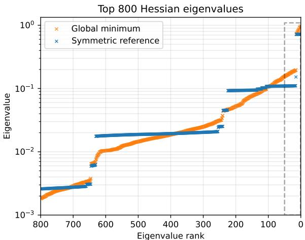

Top 50 Hessian eigenvalues  
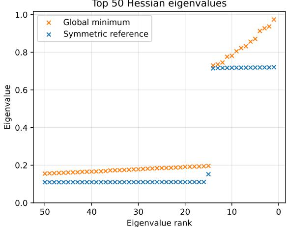

Spectrum at the symmetric reference
<table><tr><td>scale of eigenvalues</td><td>multiplicities forced by symmetry</td><td>total out of  $\overline { { 8 k ^ { 2 } } }$ </td></tr><tr><td>0</td><td>one eigenvalue with multiplicity  $\overline { { 4 k ^ { 2 } + 4 k } }$ </td><td> $\overline { { 4 k ^ { 2 } + 4 k } }$ </td></tr><tr><td rowspan="4"> $O ( 1 / k )$ </td><td>3 simple eigenvalues</td><td> $\overline { { 4 k ^ { 2 } - 6 k + 1 } }$ </td></tr><tr><td>6 eigenvalues of multiplicity  $k - 1$ </td><td></td></tr><tr><td>4 eigenvalues of multiplicity  $\underline { { k ( k - 3 ) } }$ </td><td></td></tr><tr><td> $\frac { ( k - 1 ) ( k - 2 ) } { 2 }$  4 eigenvalues of multiplicity</td><td></td></tr><tr><td rowspan="2">Θ(1)</td><td>one simple eigenvalue</td><td> $2 k - 1$ </td></tr><tr><td>2 eigenvalues of multiplicity k – 1</td><td></td></tr></table>

Figure 1: Hessian spectra of a three-layer network on a mixture of $k = 1 5$ Gaussians with random centers: at a global minimum of the original setting (orange) and at a reference configuration (blue), close to the original yet highly symmetric.

At the symmetric reference. The spectral structure falls into place. Symmetry forces the large kernel and the multiplicities in the table, and identifies invariant subspaces of directions weakly aligned with the data. For the family of global minima considered here, this results in only $2 k - 1$ eigenvalues remaining bounded away from zero.

Symmetry breaking. Returning to the original configuration breaks exact symmetry in a controlled manner. The resulting clusters arise as perturbative remnants of the degenerate reference eigenvalues (left).

Spectral multiplets. A reference eigenvalue of multiplicity k − 1 splits into $k - 1$ simple outliers (right), providing a mechanism for the empirically observed scaling of the outlier count with the number of classes Sagun et al. (2016, 2018). With the parameter-space geometry taken into account, the spectra of a network trained on MNIST reveal the same organizing principle (Figure 8).

their scope remains limited Pennington and Bahri (2017); Granziol et al. (2022); Couto et al. (2025). Taken together, these approaches provide valuable insight, but the question of the origin and nature of these spectral phenomena has remained open.

In this work, we propose symmetry and its breaking as an organizing principle for explaining the observed structure of Hessian spectra. Our analysis traces the spectral clusters to the splitting of Hessian eigenvalues whose large multiplicities are forced by symmetry at reference configurations. This mechanism, illustrated in Figure 1, is established directly for the Hessian at fixed finite layer sizes. A central challenge is to identify the relevant Hessian invariances at these configurations, since they are generally not captured by weight symmetries. We develop the theoretical framework in some generality, while centering the detailed analysis on the settings studied empirically in Sagun et al. (2016, 2018). The title was chosen in reference to these works, reflecting our aim to explain how exact symmetries and their subsequent breaking produce the empirical phenomena reported there. Despite their apparent simplicity, these settings already reveal the rich structure of the underlying symmetry breaking (SB) phenomena.

This extended version also considers applications beyond this core setting. Once the framework is in place, it can be applied to deeper networks, for example, convolutional networks, graph neural networks, and transformers. We include brief sketches of a few such settings in Section 2. Detailed accounts are in preparation as separate publications, to be incorporated later into a broader treatment Arjevani (2027a). Beyond the spectral phenomena studied here, SB appears more broadly across DL, bearing on optimization Arjevani (2026). We briefly discuss this connection in Section 6.

## 1 Introduction

We begin by reviewing the relevant phenomenology and the limitations of existing attempts to explain it. The main part of the introduction then gives a high-level overview of the framework and demonstrates how SB accounts for the observed spectral structure. The overview also serves as a guide to the organization of the paper, with forward references to the sections where each part of the framework is developed.

To avoid a lengthy preliminary section that could obscure the role of the core ideas, we have sought to keep formal preliminaries in the introduction to a minimum. The full formal development begins in Section 3, while selected background references are collected in the Appendix. Accordingly, some arguments are presented at an informal level, with footnotes providing immediate technical clarifications. This expository choice, toccata $\textit { e f u g a }$ , is intended to isolate the mechanism from the technical framework that supports it, before the subsequent sections return to develop that framework in full detail.

## 1.1 Phenomenology

The first step in studying the Hessian and its spectrum is, in principle, their explicit computation. However, exact computation remains prohibitively dificult for full-scale architectures because of their large number of parameters. The settings considered in Sagun et al. (2016, 2018) were therefore chosen to permit precise and tractable computations and are described below.

We take inputs in $X = \mathbb { R } ^ { d }$ and outputs in $Y = \mathbb { R } ^ { k }$ , with d input coordinates and k classes. The parameter space is denoted by Θ, with $p = \dim \Theta$ . On these spaces, we define the fully connected three-layer ReLU network $N ^ { 3 } : X \times \Theta  Y$ by

$$
N ^ { 3 } ( { \bf x } ; W ) = W _ { 3 } \sigma ( W _ { 2 } \sigma ( W _ { 1 } { \bf x } + { \bf b } _ { 1 } ) + { \bf b } _ { 2 } ) + { \bf b } _ { 3 } ,\tag{1.1}
$$

where σ denotes the ReLU activation function, applied coordinatewise, and the parameter space Θ consists of tuples $W = ( W _ { 1 } , \mathbf { b } _ { 1 } , W _ { 2 }$ , b2, $W _ { 3 } , { \bf b } _ { 3 } )$ with $W _ { 1 } \in { \cal M } ( h , d ) , { \bf b } _ { 1 } \in \mathbb { R } ^ { h } , \ : W _ { 2 } \in { \cal M } ( h , h )$ $ { \mathbf { b } } _ { 2 } \in \mathbb { R } ^ { h } , W _ { 3 } \in M ( k , h )$ , and $\mathbf { b } _ { 3 } \in \mathbb { R } ^ { k }$ . Here $M ( a , b )$ is the vector space of real $a \times b$ matrices, and h is the number of neurons in the hidden layers.

In developing the framework, we also introduce intermediate architectures, which we call diminished architectures, to construct symmetric reference configurations at which the relevant symmetries hold exactly. These architectures also provide simpler models in which to present the main ideas. We write $N ^ { L } ( { \bf x } ; W )$ for the L-layer version of $N ^ { 3 }$ in (1.1), and define $N ^ { L + \bar { 1 } / 2 } ( { \bf x } ; W ) = N ^ { L + 1 } ( { \bf x } ; ( W , { \bf 1 } ^ { \top } , 0 ) )$ with $k = 1$ and 1 being the all-ones vector. A superscript ◦ indicates that all bias terms are removed, ∅ indicates that only the final-layer bias is removed, and indicates that the final-layer bias is restricted

to be a scalar multiple of 1. Thus,

$$
N ^ { 2 ^ { 1 / 2 , 0 } } ( { \bf x } ; W ) = { \bf 1 } ^ { \top } \sigma ( W _ { 2 } \sigma ( W _ { 1 } { \bf x } ) ) , \qquad \quad N ^ { 3 , \circ } ( { \bf x } ; W ) = W _ { 3 } \sigma ( W _ { 2 } \sigma ( W _ { 1 } { \bf x } ) ) ,\tag{1.2}
$$

$$
N ^ { 3 , s } ( \mathbf { x } ; W ) = W _ { 3 } \sigma ( W _ { 2 } \sigma ( W _ { 1 } \mathbf { x } + \mathbf { b } _ { 1 } ) + \mathbf { b } _ { 2 } ) , \quad N ^ { 3 , s } ( \mathbf { x } ; W ) = W _ { 3 } \sigma ( W _ { 2 } \sigma ( W _ { 1 } \mathbf { x } + \mathbf { b } _ { 1 } ) + \mathbf { b } _ { 2 } ) + b _ { 3 } \mathbf { 1 } .
$$

Define the pointwise loss associated with architecture N and loss function $\ell ^ { * } : Y \times Y \to [ 0 , \infty )$ by

$$
\kappa : = \kappa _ { N } ^ { * } ( \mathbf { x } , \mathbf { y } ; W ) = \ell ^ { * } ( N ( \mathbf { x } ; W ) , \mathbf { y } ) .\tag{1.3}
$$

Throughout, $\ell ^ { * }$ is taken to be either the cross entropy loss $\ell ^ { \mathsf { c e } }$ or the squared loss $\ell ^ { \mathsf { s q } } ,$ . The expected loss is defined by

$$
\begin{array} { r } { \mathcal { L } : = \mathcal { L } _ { N , \mu } ^ { * } ( W ) = \mathbb { E } _ { ( \mathbf { x } , \mathbf { y } ) \sim \mu } [ \kappa _ { N } ^ { * } ( \mathbf { x } , \mathbf { y } ; W ) ] , } \end{array}\tag{1.4}
$$

where $\mu$ denotes the data distribution.1 In general, the expected loss (1.4) and the objective function to be minimized may difer, for instance when the latter includes regularization. Moreover, some objectives are not naturally given as expected losses, such as the tensor decomposition problem in (1.42). Accordingly, unless the distinction matters, we usually use the term objective function.

The datasets considered in Sagun et al. (2016, 2018) are MNIST and mixtures of Gaussians. We focus on the latter, for which the relevant symmetries are explicit and exact (see Figure 8 for results on MNIST).

Learning problem 1 (Mixture of Gaussians) The data distribution on $( X , Y ) \in \mathbb { R } ^ { d } \times \{ 1 , \dots , k \}$ is given $b y$

$$
\mathbb { P } ( Y = j ) = \frac { 1 } { k } , \qquad X \mid Y = j \sim \mathcal { N } ( \mathbf { c } _ { j } , \tau ^ { 2 } I _ { d } ) , \qquad j = 1 , \dots , k ,\tag{1.5}
$$

where N denotes the Gaussian distribution, $\mathbf { c } _ { 1 } , \ldots , \mathbf { c } _ { k } \in \mathbb { R } ^ { d }$ are the class centers, $I _ { d }$ is the $d \times d$ identity matrix, and $\tau > 0$ . We use the cross-entropy loss $\ell ^ { \mathsf { c e } }$ unless otherwise stated. Following Sagun et al. (2016), we also consider the squared loss $\ell ^ { \mathsf { s q } }$ , identifying each class label j with its one-hot representation $\mathbf { e } _ { j } \in \mathbb { R } ^ { k }$ . The same work considers the case $k = 2$ , with $\mathbf { c } _ { 1 } = ( - 1 , - 1 )$ and $\mathbf { c } _ { 2 } = ( 1 , 1 )$ . We denote the corresponding distribution by $\mathcal { N } _ { \pm }$ . In Sagun et al. (2018), the centers are drawn randomly.

We use He initialization He et al. (2015) and the Adam optimizer Kingma and Ba (2015), which partially adapts to local curvature. Training begins with batch sizes of 128, which are increased toward the end. Consistent with the findings of Sagun et al. (2016), Figure 2 shows that after training, a large bulk of eigenvalues is concentrated near zero, together with a small set of positive eigenvalues separated from this bulk. Moreover, the Hessian itself exhibits a distinctive pattern reflecting a sparse, low-dimensional structure (shown here for $N ^ { 3 , \circ } )$ . As further illustrated in the figure, increasing the dimension does not change this qualitative picture. The same behavior was reported when using the squared loss and when increasing the Gaussian variance. The phenomenon persists beyond the two-Gaussian case: for mixtures of k Gaussians, Sagun et al. (2018) observed a similar spectral structure, with the number of outlier eigenvalues scaling with the number of labels (see Figure 1).

This spectral structure is not restricted to classification and appears equally in regression. We include the following setting in this extended version.

Learning problem 2 The inputs are drawn from $\mathcal { N } ( 0 , I _ { d } )$ and labeled by $\mathbf { x } \mapsto \mathbf { 1 } ^ { \top } \boldsymbol { \sigma } ( \mathbf { x } )$ . The loss is the squared loss $\ell ^ { \mathsf { s q } }$

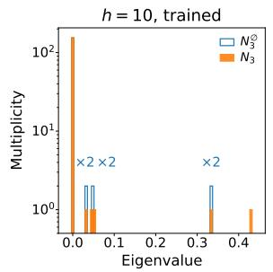

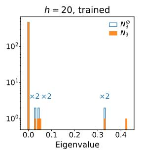

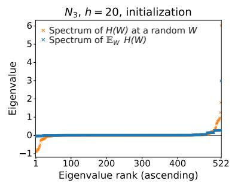

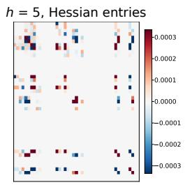  
Figure 2: Hessian spectra (left and center) for the three-layer networks $N ^ { 3 }$ and $N ^ { 3 , \do d }$ (the latter obtained by removing the final-layer bias), and Hessian structure for the bias-free $N ^ { 3 , \circ }$ $( \mathrm { r i g h t } )$ , on the two-Gaussian mixture in Learning Problem 1. At trained models, their Hessian spectra (left) exhibit a large near-zero bulk and a few outliers, consistent with Sagun et al. (2016). The spectrum at a single random draw, likewise examined in that work, is compared with that of the averaged Hessian (center).

At the symmetric reference. Despite weight symmetries being generically trivial, the argument illustrated in (1.19) yields a $D _ { 4 } \times C _ { 2 }$ Hessian invariance. This invariance, richer than its $k = 2$ counterpart in Figure 1, forces all nonzero eigenvalues to have multiplicity two (left, blue). The large kernels reflect symmetry-induced parameter degeneracy.

Symmetry breaking. Restoring the final-layer bias breaks the symmetry and splits two reference doublets, with the leading one producing two isolated outliers (left, orange), while retaining the large reference kernel. This explains the reported bulk-outlier pattern. The detailed spectral description, including the full Cauchy interlacing argument, is given in Table 3.

Random initialization. We show that the averaged Hessian has a rich invariance that forces a small positive eigenvalue of multiplicity quadratic in h (center, blue), which in turn yields, with probability tending to one as $h \to \infty$ , a near-zero bulk containing a $\cdot 1 - o ( 1 )$ fraction of the spectrum at a random draw (center, orange).

This learning problem has been studied for $N ^ { 1 1 / 2 , \circ }$ and related variants in the statistical-physics literature Saad and Solla (1995); Goldt et al. (2019) and in the DL literature Tian (2017); Du et al. (2018b); Safran et al. (2021); Xu and Du (2023); Simsek et al. (2023); Huang et al. (2026); Arjevani and Field (2019). Here we study the same problem with $N ^ { 3 }$ . Our framework extends to arbitrary depth, thereby resolving the five- and six-layer architectures considered in the latter work. As in the mixture of Gaussians, the spectra in Figure 3 (right) show eigenvalue clusters together with separated outliers, whose number here is of order d. Importantly, some of these clusters lie close to zero but remain positive. We return to this spectral structure below as a constraint on candidate explanations.

## 1.2 Previous attempts to identify an underlying mechanism

We review representative approaches proposed to explain these spectral structures, assess their limitations in light of the numerical results above, and collect some of the main gaps in a list below.

Random matrix theory. A prominent line of work uses random matrix theory (RMT) to model Hessians and related curvature matrices, drawing in part on spin-glass models of high-dimensional loss landscapes. Representative examples include Choromanska et al. (2015a); Pennington and Bahri (2017); Liao and Mahoney (2021); Baskerville et al. (2022); Granziol et al. (2022); Couto et al. (2025). These approaches can reproduce broad bulk and outlier features, including through spiked models. At the same time, the resulting theoretical picture does not fully capture the observed spectral structure,

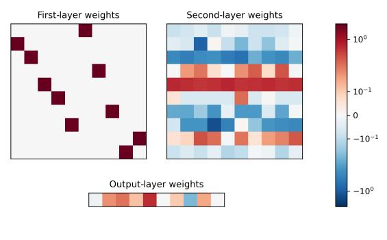

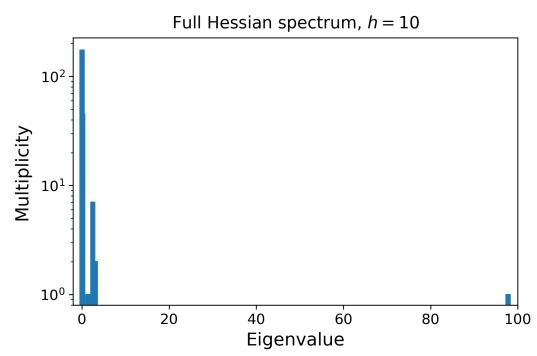

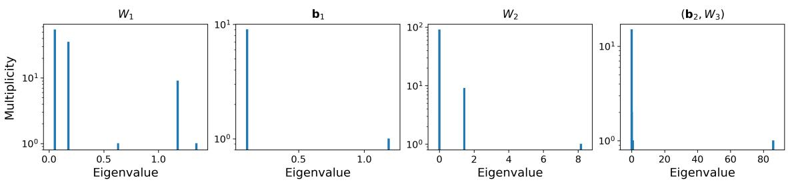

Spectrum of $N ^ { 3 }$ at the symmetric reference
<table><tr><td rowspan=1 colspan=1>scale of eigenvalues</td><td rowspan=1 colspan=1>multiplicities forced by symmetry</td><td rowspan=1 colspan=1>total out of $\overline { { 2 d ^ { 2 } } }$ + 3d + 1</td></tr><tr><td rowspan=1 colspan=1>0</td><td rowspan=1 colspan=1>one zero eigenvalue with multiplicity $d ( d + 2 )$ </td><td rowspan=1 colspan=1> $d ( d + 2 )$ </td></tr><tr><td rowspan=1 colspan=1>Θ(1)</td><td rowspan=1 colspan=1>one eigenvalue with multiplicity $\underline { { \overline { { d ( d - 3 ) } } } }$ one eigenvalue with multiplicity $\frac { ( d ^ { \displaystyle 2 } 1 ) ( d - 2 ) } { 2 }$ two eigenvalues, each with multiplicity $d - 1$ one simple eigenvalue</td><td rowspan=1 colspan=1> $d ( d - 1 )$ </td></tr><tr><td rowspan=1 colspan=1> $\Theta ( d )$ </td><td rowspan=1 colspan=1>two eigenvalues, each with multiplicity $d - 1$ two simple eigenvalues</td><td rowspan=1 colspan=1>2d</td></tr><tr><td rowspan=1 colspan=1> $\overline { { \Theta ( d ^ { 2 } ) } }$ </td><td rowspan=1 colspan=1>one simple eigenvalue</td><td rowspan=1 colspan=1>1</td></tr></table>

Figure 3: Weights and Hessian spectra of $N ^ { 3 }$ with $d = h \ge 4$ , trained on Learning Problem 2. Top. At the trained model, the Hessian has a rich invariance structure and nontrivial eigenvalue multiplicities—despite the learned weights having only trivial symmetry under the standard rescaling and permutation symmetries. Our framework instead traces these invariances to symmetries of the diferential of $N ^ { 3 }$ . The same obstruction appears for Learning Problem 1 and for general L-layer fully connected networks in Arjevani and Field (2019). Bottom. Nontrivial multiplicities also occur in the layerwise Hessian spectra. The limitation of weight symmetries is even more pronounced layerwise, since transformations coupling adjacent layers need not survive restriction to a single layer. Nevertheless, the framework captures the layerwise Hessian invariances and the resulting multiplicities recorded in Table 1.

with major discrepancies reported, for example, in Granziol (2020). Some modeling assumptions motivated by studies of glassy systems have also been criticized Baity-Jesi et al. (2018), and developing more suitable random matrix models or exploring alternative assumptions Choromanska et al. (2015b) remains an active research direction.

Set against the phenomenology above, the cited RMT analyses leave several important gaps, summarized below, of which we highlight two here. First, the same spectral organization already occurs in very small networks, calling for an explanation that applies at finite dimensions. Second, these analyses provide generative accounts by positing random matrix ensembles or deriving them from probabilistic models, leaving open what determines the organization of the Hessian spectrum at a given critical point in the settings considered here, where this structure is clearly observed.

Gauss–Newton decomposition. Another line of work uses the GN decomposition of the Hessian. As noted earlier, rank deficiency of the empirical GN matrix was used in Sagun et al. (2018) to account for some of the zero eigenvalues in the overparameterized regime. Consider a network N with k outputs, and suppose that the pointwise loss is twice diferentiable in W at the point considered. Write $J _ { W } N ( { \bf x } , W )$ for the parameter Jacobian of $N ( \mathbf { x } ; W )$ . Diferentiating twice gives

$$
\nabla _ { W } ^ { 2 } \kappa _ { N } ^ { * } ( \mathbf { x } , \mathbf { y } ; W ) = J _ { W } N ( \mathbf { x } , W ) ^ { \top } \nabla _ { 1 } ^ { 2 } \ell ^ { * } ( N ( \mathbf { x } ; W ) , \mathbf { y } ) J _ { W } N ( \mathbf { x } , W ) + \sum _ { a = 1 } ^ { k } \partial _ { 1 , a } \ell ^ { * } ( N ( \mathbf { x } ; W ) , \mathbf { y } ) \nabla _ { W } ^ { 2 } N _ { a } ( \mathbf { x } ; W ) .\tag{1.6}
$$

The first term is the pointwise GN matrix. Averaging it over the training samples gives the empirical GN matrix. In the scalar-output case, for example, each pointwise GN matrix has rank at most one, so the empirical GN matrix has kernel dimension at least the number of parameters minus the number of samples. This rank argument, however, does not satisfactorily explain the observed Hessian structure. The large near-zero bulk persists when the number of samples far exceeds the number of parameters and also after passing to the expected loss, where the finite-sample rank bound no longer applies. Moreover, large Hessian kernels are observed even when the second term in (1.6) is nonnegligible; see Table 1. Similar considerations apply to the NTK matrix in Jacot et al. (2020).

Another feature of the GN matrix is that its structure permits decompositions into contributions from class-dependent gradient means and a residual measuring their spread. In Fort and Gangul (2019), the residual is assumed to follow a prescribed random law, whereas Papyan (2020) proposes a more refined decomposition and estimates its components directly from data to explain observed spectral features.

Taken together, these approaches provide valuable insight but do not account for the full range of spectral phenomena displayed above. We now summarize some of the principal gaps.

• Spectral clusters. Beyond the large cluster near zero and the outliers, the spectrum exhibits a finer structure, with clusters that remain separated from zero. The number of these clusters is fixed and does not depend on the number of labels.

• Spectral structure in small dimensions. Even if a random matrix model can be modified to capture the overall spectral shape more faithfully, approaches based on such models typically operate in high-dimensional or asymptotic regimes and therefore do not by themselves explain why the same spectral structures already appear in very small dimensions.

• Large Hessian kernel at large sample sizes. At the other end of the scale, the large Hessian kernel is not an artifact of the small sample size. It persists when the sample size exceeds the number of parameters and also in the Hessian of the expected loss. In these regimes, bounds based on rank deficiency of the empirical GN matrix are vacuous.

• Dependence on the GN decomposition. A limitation of the rank argument, shared by related approaches, is its dependence on the GN matrix. This misses regimes in which the second term in (1.6), involving second-order derivatives of the model, is significant, including at nonglobal loca minima and even on large sets of noncritical points (see Table 1).

• Other curvature matrices. Related structures have been reported for other curvature matrices, as discussed at the beginning of the introduction. This suggests that these phenomena may be diferent manifestations of a common underlying mechanism rather than consequences of a particular choice of curvature matrix.

• Layerwise spectra. The spectral cluster structure is not specific to the full Hessian. Related structures are also observed in layerwise restrictions of the Hessian.

• Regression. The spectral cluster structure is not specific to classification. Some explanations tie the existence and number of outliers to the network’s output dimension and thereby, in classification, to the number of labels. This does not account for the regression setting, where there is only one output but the number of outliers scales as $\Theta ( d )$ ; see Table 1.

• Mechanism. A final limitation is that existing approaches mainly encode spectral structure through a random model or prescribed ansatz. Thus, they either fit the observed spectrum through a generative model or decompose the empirical spectrum post hoc, without fully clarifying whether a common mechanism explains why these structures arise and how they depend on the underlying learning problem.

In the next section, we explain how symmetry and its breaking provide a natural account of the observed spectral structure and, in particular, address the gaps identified above.

## 1.3 Overview: origins of symmetry

A central principle of the framework is to understand spectral structure through Hessian invariances, either directly or relative to nearby configurations with richer invariances. By a configuration, we mean the collection of choices determining the Hessian under consideration, including the architecture, loss, data distribution, parameter point, parameter-space inner product, and, where relevant, the subspace to which the Hessian is restricted. In some cases, multiple configurations may be simultaneously relevant, for example along an optimization trajectory. Carrying out this program requires some preliminary work. We therefore begin with a high-level overview of the main ingredients of the framework and of the spectral analysis, referring along the way to the sections where they are developed in detail.

We first make the notion of Hessian invariance precise. Let GL(Θ) denote the group of invertible linear transformations of Θ, and write $\mathrm { G L } _ { p } = \mathrm { G L } ( \mathbb { R } ^ { p } )$ . Identify Θ with $\mathbb { R } ^ { p }$ and equip it with the standard Euclidean inner product. We define the invariance group of the Hessian $\nabla ^ { 2 } { \mathcal { L } } ( W )$ at $W$ as the set of all $g \in { \mathrm { G L } } _ { p }$ satisfying

$$
\begin{array} { r } { g ^ { \top } \nabla ^ { 2 } \mathcal { L } ( W ) g = \nabla ^ { 2 } \mathcal { L } ( W ) , } \end{array}\tag{1.7}
$$

where $g ^ { \top }$ denotes the usual transpose. When the Hessian is restricted to a subspace $V \subseteq \Theta$ , the same definition is applied with V in place of Θ.

Intrinsic and metric-dependent quantities. We distinguish between properties that are intrinsic and those that depend on the choice of inner product or coordinates. This distinction motivates the formulation used later.

The matrix $\nabla ^ { 2 } { \mathcal { L } } ( W )$ represents the self-adjoint operator associated with the second diferential $d _ { W } ^ { 2 } { \mathcal { L } } ( W )$ for the standard Euclidean inner product (using coordinates fixed by the identification of Θ with Rp). The relation (1.7) in fact expresses invariance of the second diferential itself, meaning tha

$$
d _ { W } ^ { 2 } \mathcal { L } ( W ) [ g \delta W , g \delta W ^ { \prime } ] = d _ { W } ^ { 2 } \mathcal { L } ( W ) [ \delta W , \delta W ^ { \prime } ] , \quad \delta W , \delta W ^ { \prime } \in T _ { W } \Theta .\tag{1.8}
$$

Here $T _ { W } \Theta \simeq \Theta$ canonically. Thus invariance is intrinsic in that it does not depend on the choice of inner product or coordinates. The spectrum, by contrast, is metric-dependent, meaning that it depends on the inner product used to define the associated self-adjoint operator. This metric dependence is not merely a formal matter. Rather, it is one of the mechanisms behind the formation of spectral clusters (see Figure 8 and Table 5). We shall refer to this as spectral refraction (see Remark 15). Coordinates serve a separate purpose, allowing us to express the diferential directly or represent the operator by a matrix.

Another intrinsic feature is the kernel of the associated Hessian operator. For every choice of inner product, the operator has the same kernel, namely the radical of $d _ { W } ^ { 2 } { \mathcal { L } } ( W )$ (see the Appendix for background references on these and other notions used throughout this work). The null cone of $d _ { W } ^ { 2 } { \mathcal { L } } ( W )$ , which will also be of interest later, is intrinsic by definition. Riemannian settings are considered in Section 4.3.

At suitable reference configurations, the Hessian matrix admits large invariance groups. When these actions are orthogonal, standard group-theoretic constraints force a rigid spectral structure with only a few distinct eigenvalues, some necessarily of large multiplicity (see Section 3.2). The spectral clusters at the original configuration are then analyzed as deviations from this reference structure induced by controlled SB efects (see Figure 4 below).

A symmetric reference. With these preliminaries in place, we turn to a simple setting to make the framework concrete. Consider the mixture of two Gaussians specified in Learning Problem 1, with $\tau = 1$ and the network $N ^ { 3 }$ . The associated class of model functions $\mathbf { x } \mapsto N ^ { 3 } ( \mathbf { x } ; W )$ contains Bayes-optimal predictors. A simple family of weights realizing such a predictor is

$$
\mathcal { T } _ { \star } = \{  ( W _ { 1 } ^ { \star } , 0 , W _ { 2 } ^ { \star } , 0 , W _ { 3 } ^ { \star } , 0 ) \middle | W _ { 1 } ^ { \star } = ( \begin{array} { c c } { 1 } & { 1 } \\ { - 1 } & { - 1 } \end{array} ) , \quad W _ { 2 } ^ { \star } = ( \begin{array} { c c } { 1 } & { - a _ { 1 , 2 } } \\ { - a _ { 2 , 1 } } & { 1 } \end{array} ) , \quad W _ { 3 } ^ { \star } = ( \begin{array} { c c } { - 1 } & { 1 } \\ { 1 } & { - 1 } \end{array} ) , \} .\tag{1.9}
$$

The weights in $\tau _ { \star }$ also give global minima for each of the diminished architectures $N ^ { 3 , \circ } , N ^ { 3 , \circ }$ , and $N ^ { 3 , \otimes }$ , with the absent bias terms omitted. It turns out that these architectural restrictions yield richer Hessian invariance groups. We later construct, at each $W ^ { \star } \in \mathcal T _ { \star }$ , the following invariance subgroups acting orthogonally with respect to the standard Euclidean inner product

$$
\frac { \mathrm { A r c h i t e c t u r e } } { N ^ { 3 , \circ } , \ N ^ { 3 , \infty } , \ N ^ { 3 , \otimes } } \left| \begin{array} { c } { { \mathrm { G r o u p } } } \\ { { D _ { 4 } \times C _ { 2 } } } \\ { { C _ { 2 } ^ { 2 } } } \end{array} \right. .\tag{1.10}
$$

Here $D _ { 4 }$ denotes the dihedral group of order eight and $C _ { 2 }$ the cyclic group of order two. In the present setting, we construct symmetric references by restricting the architecture in this way. For all three diminished architectures, the $D _ { 4 } \times C _ { 2 }$ symmetry forces the nonzero eigenvalues to occur in pairs. For $N ^ { 3 , \do x }$ , the reference used in Figure 2, there are three such pairs of eigenvalues. Returning from $N ^ { 3 , \do x }$ to $N ^ { 3 }$ results in what we refer to as a resolutive form of SB, in which the splitting is constrained by the reference spectrum, as illustrated in the same figure and further discussed in Section 1.4 below. The full set of global minima for $N ^ { 3 , \circ }$ is characterized in (4.145), with related spectral efects analyzed in Section 4.4.

Remark 1 A modified $D _ { 4 } \times C _ { 2 }$ action nevertheless preserves $d _ { W } ^ { 2 } { \mathcal { L } } ( W ^ { \star } )$ for $N ^ { 3 }$ , but is no longer orthogonal with respect to the standard Euclidean parameter geometry; see Remark 15.

The failure of weight symmetries. Establishing the Hessian invariances in (1.10) is an important component of the analysis and draws on several parts of the framework; spectral constraints then follow directly from standard representation theory. The reason is that the standard route proceeds by looking for global symmetries of the objective that fix the parameter point $W ^ { \star } \in \mathcal T _ { \star }$ . In many areas of mathematics and physics, this approach has long served as a central and highly efective organizing principle Golubitsky et al. (1988). However, this fails already in the present example. For generic choices of $_ { a _ { 1 , 2 } }$ and $a _ { 2 , 1 }$ in (1.9), the subgroup fixing $W ^ { \star }$ among the standard positive rescaling and permutation symmetries of the hidden units is trivial, and hence so is the subgroup of Hessian invariances it accounts for, whereas the full Hessian invariance group is nontrivial. This limitation is sharper layerwise, since these global symmetries couple adjacent layers and therefore need not survive restriction to a single layer. Even so, in Section 4.3 we establish a rich invariance structure for the restricted Hessians, illustrated in Figure 3, and determine their exact eigenvalue multiplicities, reported in Table 1. These results provide an analytical counterpart to the empirical layerwise spectral structure reported in Sankar et al. (2021). We return to the failure of the weight-symmetry approach in Section 3.2, where we examine it in more detail.

Remark 2 (Identifiability) The global minima in (1.9), and still more clearly those in (4.132) for Learning Problem 2 (as illustrated in Figure 3), reveal a basic limitation of identifiability. Even modulo the global symmetries of the objective, the sets of global minimizers remain positivedimensional, reflecting substantial local degrees of freedom; see Section 4.2. Nevertheless, the Hessian invariances and the relevant spectral phenomena persist. Thus, both weight symmetries and exact identifiability reflect a view of the loss landscape that is too fine-grained, asking us to look at it too closely.

Generalized functions and presheaves of symmetry groups. The failure of the weightsymmetry approach discussed above requires us to establish Hessian invariance directly. When the pointwise loss is $C ^ { 2 }$ , suitable moment conditions ensure, for example via dominated convergence Folland (1999), that the Hessian exists and is given by the expectation of the Hessian of the pointwise loss. For ReLU networks, an additional complication arises from nonsmooth activation boundaries, which can contribute singular terms that are absent from the classical pointwise Hessian. Consequently, in our setting one generally has

$$
\nabla ^ { 2 } { \mathcal { L } } ( W ) \neq \mathbb { E } _ { ( \mathbf { x } , \mathbf { y } ) \sim \mu } [ \nabla _ { W } ^ { 2 } \kappa ( \mathbf { x } , \mathbf { y } ; W ) ] \quad { \mathrm { c l a s s i c a l l y } } .\tag{1.11}
$$

The correct identity may be recovered in the sense of generalized functions 2 by including the singular contributions identified by the Gauss–Green formula, giving

$$
\nabla ^ { 2 } { \mathcal { L } } = \mathbb { E } { \left[ \nabla _ { W } ^ { 2 } \kappa \right] } \quad { \mathrm { ~ a s ~ g e n e r a l i z e d ~ f u n c t i o n s } } .\tag{1.12}
$$

This formulation, discussed in Section 3.4, lets us establish invariances of the generalized Hessian on open sets, which are then generally inherited by the classical Hessian wherever it exists. It also leads naturally to presheaves of symmetry groups, the subject of Section 5.2. Readers unfamiliar with generalized functions may interpret the remainder of this section as referring to the classical Hessian.

Remark 3 The generalized Hessian has practical significance beyond its role in the invariance analysis. In direct or automatic diferentiation, the pointwise Hessian captures only the regular part of the generalized Hessian. For example, let $X \sim \mathcal { N } ( 0 , 1 )$ , write $\stackrel { } { \phi ( x ) = ( 2 \pi ) ^ { - 1 / 2 } } e ^ { - x ^ { 2 } / 2 }$ and $f ( x ; w ) = \sigma ( x - w )$ , and set $F ( w ) = \mathbb { E } [ f ( X ; w ) ]$ ]. First diferentiation commutes with expectation and gives $\begin{array} { r } { F ^ { \prime } ( w ) = \mathbb { E } [ \partial _ { w } f ( X ; w ) ] = - \int _ { w } ^ { \infty } \phi ( x ) } \end{array}$ dx. Classically, however, $\partial _ { w } ^ { 2 } f ( X ; w ) = 0$ almost surely, so automatic diferentiation gives zero after averaging. The one-dimensional Gauss–Green formula instead gives

$$
F ^ { \prime \prime } ( w ) = \frac { d } { d w } F ^ { \prime } ( w ) = - ( - \phi ( w ) ) + \int _ { w } ^ { \infty } \partial _ { w } ( - \phi ( x ) ) d x = \phi ( w ) = \frac { 1 } { \sqrt { 2 \pi } } e ^ { - w ^ { 2 } / 2 } .
$$

Consequently, the sample-averaged Hessians commonly computed in empirical studies need not be consistent estimators of the classical Hessian of the expected loss. In this work, calculations involving the singular terms were validated numerically using finite diferences and Monte Carlo estimates of the corresponding surface integrals obtained with mollifiers.

Diferentials and layer coordinates. The interchange of expectation and diferentiation reduces the analysis of Hessian invariance to pointwise quantities. Writing out the pointwise Hessian matrix in flattened coordinates makes its invariances dificult to read of. Instead, we work with the pointwise diferentials themselves, while writing them in the natural block coordinates of the layers. For instance, for the diminished architecture $N ^ { 3 , \circ }$ , the first diferential evaluated on a tangent vector $\delta W$ , namely $d _ { W } N ^ { 3 , \circ } ( { \bf x } ; W ) [ \delta W ]$ , is given in layer coordinates by

$$
\delta W _ { 3 } \sigma ( W _ { 2 } \sigma ( W _ { 1 } { \mathbf x } ) ) + W _ { 3 } D _ { 2 } \delta W _ { 2 } \sigma ( W _ { 1 } { \mathbf x } ) + W _ { 3 } D _ { 2 } W _ { 2 } D _ { 1 } \delta W _ { 1 } { \mathbf x } ,\tag{1.13}
$$

where $D _ { 1 } ( { \bf x } ; W ) = D \sigma ( W _ { 1 } { \bf x } )$ and $D _ { 2 } ( { \bf x } ; W ) = D \sigma ( W _ { 2 } \sigma ( W _ { 1 } { \bf x } ) ) . ^ 3$ If vec denotes row-wise stacking, then in flattened coordinates, the same diferential is given by

$$
( I _ { k } \otimes \sigma ( W _ { 2 } \sigma ( W _ { 1 } \mathbf { x } ) ) ^ { \top } ) \operatorname { v e c } ( \delta W _ { 3 } ) + \left( W _ { 3 } D _ { 2 } \otimes \sigma ( W _ { 1 } \mathbf { x } ) ^ { \top } \right) \operatorname { v e c } ( \delta W _ { 2 } ) + \left( W _ { 3 } D _ { 2 } W _ { 2 } D _ { 1 } \otimes \mathbf { x } ^ { \top } \right) \operatorname { v e c } ( \delta W _ { 1 } ) .
$$

This comparison shows the advantage of layer coordinates: they preserve the ordered compositional structure and make explicit how each perturbation enters between the surrounding layerwise fac tors. This allows one to read of the diferential’s invariances, much as permutation and rescaling symmetries can be read of from the expression defining the network architecture. For the second diferential $d _ { W } ^ { 2 } N ^ { 3 , \circ }$ , this loss of structure is more severe and becomes still more pronounced for deeper architectures; see Section 2.

The Gauss–Newton and Fisher information forms. In general, the regular and singular terms of the pointwise second diferential $d _ { W } ^ { 2 }$ κ are analyzed directly (see Table 18 for their expressions). A natural route to establishing the Hessian invariances of $\mathcal { L }$ would therefore start from those of $d _ { W } ^ { 2 } \kappa .$ For $W ^ { \star } \in \mathcal T _ { \star }$ and $N ^ { 3 , \circ }$ , however, the condition later formalized in Section 3.5 as well specification 4 holds. By Proposition 40, this implies the identity

$$
\begin{array} { r } { d _ { W } ^ { 2 } \mathcal { L } ( W ^ { \star } ) = \mathbb { E } _ { ( \mathbf { x } , \mathbf { y } ) \sim \mathcal { N } _ { \pm } } \left[ d _ { W } ^ { \mathrm { G N } } \kappa ( \mathbf { x } , \mathbf { y } ; W ^ { \star } ) \right] , } \end{array}\tag{1.14}
$$

where, for a general network $N _ { \ast }$ , the pointwise Gauss–Newton (GN) form on the right is given by

$$
\begin{array} { r } { d _ { W } ^ { \mathrm { G N } } \kappa ( \mathbf x , \mathbf y ; W ^ { \star } ) [ \delta W ] : = d _ { 1 } ^ { 2 } \ell ( N ( \mathbf x ; W ^ { \star } ) , \mathbf y ) [ d _ { W } N ( \mathbf x ; W ^ { \star } ) [ \delta W ] ] . } \end{array}\tag{1.15}
$$

Here and throughout, a single argument denotes diagonal evaluation of an r-linear form $A ,$ i.e., $A [ \mathbf { v } ] : = A [ \mathbf { v } , \ldots , \mathbf { v } ]$ , with v repeated r times. The (expected) GN form is closely related to the Fisher information (FI) form. For a conditional model $p _ { W } ( \mathbf { y } \mid \mathbf { x } )$ , the FI form is defined by

$$
d _ { W } ^ { \mathrm { F I } } ( W ) [ \delta W ] : = \mathbb { E } _ { \mathbf { x } } \mathbb { E } _ { \mathbf { y } \sim p _ { W } ( \cdot | \mathbf { x } ) } \left[ d _ { W } \log p _ { W } ( \mathbf { y } \mid \mathbf { x } ) [ \delta W ] ^ { 2 } \right] .\tag{1.16}
$$

For the likelihood models considered here, with matching normalization, $d _ { 1 } ^ { 2 } { \boldsymbol { \ell } } ( { \mathbf { z } } , { \mathbf { y } } )$ is independent of y, so the GN and FI forms coincide Pascanu and Bengio (2014); Martens (2020).

Beyond its role as an analytic simplification, the GN form also plays an important role in optimization. It underlies classical and stochastic methods that seek more eficient ways to exploit curvature Nocedal and Wright (2006); Sra et al. (2011); Tran-Dinh et al. (2020), including methods developed for deep learning Martens (2010); Vinyals and Povey (2012); Botev et al. (2017); Gargiani et al. (2020); Korbit et al. (2025). The FI form likewise underlies natural gradient descent, where it captures the local curvature of KL divergence and supports tractable implementations Amari (1998); Desjardins et al. (2015); Martens and Grosse (2015); Martens (2020). These roles make the GN and FI forms important objects of study in their own right, independently of their relation to the Hessian. The framework and methods introduced in this paper apply directly and show that their spectra exhibit the same qualitative organization as the Hessian spectrum, with the underlying invariance mechanism illustrated next.

Structural and distributional symmetries. With (1.14) in hand, we can see how Hessian invariances arise from symmetries of the network, the loss, and the data distribution. We distinguish between structural symmetries, coming from the pointwise loss, and distributional symmetries, which come from the data distribution. For $N ^ { 3 , \circ }$ , a direct substitution into (1.13) verifies that, for every $W ^ { \star } \in \mathcal { T } _ { \star } , \ d _ { W } N ^ { 3 , \circ }$ is invariant under the transformation below, and hence so is the associated pointwise GN form (1.15):

$$
\mathrm { S t r u c t u r a l \ s y m m e t r y } \ \delta \mathbf { a } : \qquad ( \mathbf { x } , \delta W _ { 1 } ) \mapsto ( P _ { ( 1 , 2 ) } \mathbf { x } , \delta W _ { 1 } P _ { ( 1 , 2 ) } ) ,\tag{1.17}
$$

where $P _ { ( 1 , 2 ) }$ exchanges the first two input coordinates. In addition, for the $k = 2$ instance of Learning Problem 1, the data distribution $\mathcal { N } _ { \pm }$ is invariant under

$$
\mathrm { D i s t r i b u t i o n a l ~ s y m m e t r y ~ } \mathsf { d ^ { s } } \colon \mathbf { x } \mapsto P _ { ( 1 , 2 ) } \mathbf { x } .\tag{1.18}
$$

The structural and distributional symmetries now combine to produce a Hessian invariance at every $W ^ { \star } \in \mathcal T _ { \star }$ , as the following chain of identities shows

$$
\begin{array} { r l } { d _ { W } ^ { 2 } \mathcal { L } ( W ^ { \star } ) [ \delta W ] = \mathbb { E } _ { N _ { \pm } } \left[ d _ { W } ^ { \mathrm { G N } } \kappa ( \mathbf { x } , \mathbf { y } ; W ^ { \star } ) [ \delta W ] \right] } & { \xrightarrow [ ] { \mathrm { [ W e l l . s p e c i f i c a t i o n ~ i d e n t i t y ~ ( 1 . 1 4 ) } } ] { \mathrm { [ W e l l . s p e c i f i c a t i o n ~ i d e n t i t y ~ ( 1 . 1 4 ) } } ] } \\ { = \mathbb { E } _ { N _ { \pm } } \left[ d _ { W } ^ { \mathrm { G N } } \kappa ( P _ { ( 1 , 2 ) } \mathbf { x } , \mathbf { y } ; W ^ { \star } ) [ \delta W _ { 1 } P _ { ( 1 , 2 ) } , \delta W _ { 2 } , \delta W _ { 3 } ] \right] } & { \xrightarrow [ ] { \mathrm { [ S t r u c t u r a l ~ s y m m e t r y ~ } \delta a ~ o f ~ d _ { W } ^ { \mathrm { G N } } \kappa } ] } \\ { = \mathbb { E } _ { N _ { \pm } } \left[ d _ { W } ^ { \mathrm { G N } } \kappa ( \mathbf { x } , \mathbf { y } ; W ^ { \star } ) [ \delta W _ { 1 } P _ { ( 1 , 2 ) } , \delta W _ { 2 } , \delta W _ { 3 } ] \right] } & { \xrightarrow [ ] { \mathrm { [ D i s t r i b u t i o n a l ~ s y m m e t r y ~ } d ^ { \star } ] } } \\ { = d _ { W } ^ { 2 } \mathcal { L } ( W ^ { \star } ) [ \delta W _ { 1 } P _ { ( 1 , 2 ) } , \delta W _ { 2 } , \delta W _ { 3 } ] . } \end{array}\tag{1.19}
$$

The resulting invariance is an example of what we call a composite symmetry,

$$
\mathrm { C o m p o s i t e ~ s y m m e t r y ~ } \mathsf { c } _ { 1 } : \qquad \delta W _ { 1 } \mapsto \delta W _ { 1 } P _ { ( 1 , 2 ) } . \quad \left| \mathrm { I n v a r i a n c e ~ o f ~ } d _ { W } ^ { 2 } \mathcal { L } ( W ^ { \star } ) \right| ^ { 2 } ,\tag{1.20}
$$

This generates a subgroup of the invariance group of $\nabla ^ { 2 } { \mathcal { L } } ( W ^ { \star } )$ isomorphic to $C _ { 2 }$ . The remaining composite invariances in (1.10), now acting simultaneously on several perturbation variables, are derived similarly. Thus, we find that combining structural symmetries derived directly from the network diferential with distributional symmetries allows us to establish rich Hessian invariances even when the weight symmetries are trivial, as is generically the case here. The general principle behind this construction is formalized in Theorem 43.

Remark 4 (Hidden-feature symmetries) The same argument applies after an intermediate layer, with the joint hidden feature–label law replacing µ for the downstream network. Symmetries of this law, paired with compatible structural symmetries of the downstream network’s pointwise diferential form, yield composite invariances as above. This extension is of interest, for example, when approximate symmetries emerge in the hidden feature–label laws of trained networks, a phenomenon we call neural registration (Section 2.5).

Symmetries of the initialization law can likewise produce invariances of the averaged Hessian through the composite invariance argument in (1.19). Here symmetry forces an eigenvalue of multiplicity at least $( h - 1 ) ^ { 2 }$ , whose magnitude we bound by $\mathcal { O } \big ( h ^ { - 1 } \big )$ . We use this to establish, with high probability, a near-zero bulk in the spectrum of a random Hessian; see Figure 2 (center) and Theorem 33.

Remark 5 (Random labels) The experiments with random labels in Zhang et al. (2017) motivate a related application of the framework. Uniform labels independent of the inputs give a distributional symmetry under class permutations. Pairing this with the structural symmetry that simultaneously permutes the output-layer weights gives invariance of the expected loss under the corresponding parameter action, by the composite invariance argument in (1.19).

Flat directions and the Hessian kernel. Symmetry also provides mechanisms, ranging in complexity, that force the Hessian kernel to be nontrivial and, in our settings, often large. The most elementary and well-known mechanism occurs at critical points: every vector tangent to an orbit of global continuous symmetries lies in the Hessian kernel.5 In the settings considered in this work, such vectors generally account for only a vanishing fraction of the Hessian kernel, although at points in $\tau _ { \star }$ they account for most of it. For the positive rescaling symmetries between adjacent layers in $N ^ { 3 , \circ }$ , these include the following four vectors:

$$
\begin{array} { r } { ( E _ { i i } W _ { 1 } ^ { \star } , - W _ { 2 } ^ { \star } E _ { i i } , 0 ) , \qquad i = 1 , 2 , \qquad \mathrm { a n d } \qquad ( 0 , E _ { j j } W _ { 2 } ^ { \star } , - W _ { 3 } ^ { \star } E _ { j j } ) , \qquad j = 1 , 2 , } \end{array}\tag{1.21}
$$

where $E _ { i j }$ denotes the matrix with a single nonzero entry in position $( i , j )$ . These are examples of what we call flat vectors, roughly speaking, vectors tangent to curves along which the objective is constant. Such vectors form a cone.6 We shall also consider a relaxed notion of flatness, in which the function diference is required only to vanish to higher order along a curve. When the curve is an orbit of continuous symmetries of the objective, as in (1.21), we call the corresponding flat vector an orbit vector. Two further orbit vectors arise from the shift invariance of the logits,

$$
( 0 , 0 , \mathbf { 1 e } _ { j } ^ { \top } ) , \qquad j = 1 , 2 ,\tag{1.22}
$$

where $\mathbf { e } _ { j }$ denotes the j-th standard basis vector.

Remark 6 Under cross-entropy loss, logit-shift symmetry forces at least h zero Hessian eigenvalues at all points—critical or not—for any network with a fully connected final layer; see Theorem 20.

Flat vectors transverse to the orbit vectors are called transverse $f l a t$ vectors. In the present setting, there are two, obtained by perturbing $W _ { 2 }$ along $E _ { 1 2 }$ and $E _ { 2 1 }$ . These directions yield Hessian kernel vectors by a similar mechanism and are summarized in Table 3, together with the associated eigenvalue multiplicities forced by the invariance groups in (1.10), using the notation introduced below.

Definition 7 (Multiplicity structure) We record an eigenvalue multiplicity structure using the multiset notation $\{ \{ m _ { 1 } ^ { [ q _ { 1 } ] } , \ldots , m _ { r } ^ { [ q _ { r } ] } \} \}$ , meaning that multiplicity $m _ { i }$ occurs $q _ { i }$ times. Coincidences are allowed, in which case the corresponding multiplicities add. When clear from context, we omit the double braces. Moreover, we suppress the exponent when $q _ { i } = 1$ . For $s \leq q _ { ; }$ , the notation $m ^ { [ q ] } | _ { \alpha _ { 1 } , \dots , \alpha _ { s } }$ means that s of the q eigenvalues have values $\alpha _ { 1 } , \ldots , \alpha _ { s }$

The mechanisms enforcing large Hessian kernels are more varied than this brief discussion can convey. The two cases in Table 1 illustrate distinct mechanisms, both reflecting local degrees of freedom rather than finite-sample efects. In the first, symmetry forces large Hessian kernels throughout open regions (whose points are generally noncritical) as established in Theorem 27. In the second, well specification implies that ker $d _ { W } N ^ { 3 }$ is contained in the Hessian kernel, accounting for roughly half of the spectrum, as shown in Section 4.2.

Remark 8 (The flat minima conjecture) The notion used above should be distinguished from the flat minima conjecture. This literature investigates whether optimization tends to favor flatter regions of the loss landscape Hochreiter and Schmidhuber (1997); Keskar et al. (2017); Jastrzebski et al. (2018); Chaudhari et al. (2019); Simsekli et al. (2019). Our notion of flatness is instead intended to capture the local degrees of freedom responsible for Hessian degeneracy and is invariant under invertible linear changes of coordinates.

<table><tr><td>Parameter set</td><td>Dimension of the Hessian kernel</td><td colspan="2">Multiplicity structure</td></tr><tr><td>A.e. point with  $W _ { 2 } , { \bf b } _ { 2 } > 0 ,$  critical or not</td><td> $d ( d - 1 ) { \mathrm { ~ ( a l l ~ t r a n s v e r s e ) } }$ </td><td colspan="2"> $d ( d - 1 ) | _ { 0 } , 1 ^ { [ d ^ { 2 } + 4 d + 1 ] }$ </td></tr><tr><td>Global minimizers</td><td> $d ( d + 2 ) { \bf \Gamma } ( d ^ { 2 }$  transverse)</td><td colspan="2"> $d ( d + 2 ) | _ { 0 } ,$   ${ \textstyle \frac { ( d - 1 ) ( d - 2 ) } { 2 } } , { \textstyle \frac { d ( d - 3 ) } { 2 } } , ( d - 1 ) ^ { [ 4 ] } , 1 ^ { [ 4 ] }$ </td></tr><tr><td></td><td></td><td> $W _ { 1 }$ </td><td> $\textstyle { \overline { { \frac { ( d - 1 ) ( d - 2 ) } { 2 } } } } , { \frac { d ( d - 3 ) } { 2 } } , ( d - 1 ) ^ { [ 3 ] } , 1 ^ { [ 2 ] }$ </td></tr><tr><td></td><td></td><td> $\mathbf { b } _ { 1 }$   $d - 1 , 1$ </td></tr><tr><td></td><td> $W _ { 2 }$ </td><td> $d ( d - 1 ) | _ { 0 } , d - 1 , 1$ </td></tr><tr><td></td><td></td><td> $( d - 1 ) | _ { 0 } , d - 1 , 1 ^ { [ 2 ] }$ </td></tr><tr><td></td><td> $( \mathbf { b } _ { 2 } , W _ { 3 } )$   ${ \bf b } _ { 3 }$ </td><td>1</td></tr></table>

Table 1: Lower bounds on Hessian kernel dimensions for $N ^ { 3 }$ under Learning Problem 2, together with multiplicity structures for $d = h \geq 4$ . Top. Throughout an open region, points are typically noncritical, yet the Hessian kernel is large and generically consists only of directions transverse to the orbits of global symmetries (see Table 13). The proof uses generalized functions. Replacing ReLU by GELU removes these transverse directions from the kernel (see Figure 11). Bottom. At the global minimizers in (4.132), the kernel dimension is larger and, under an invariant inner product, the Hessian has large eigenvalue multiplicities, established in Theorem 30, as do the corresponding layerwise restrictions (see Table 14).

Alignment with the data. So far, we have emphasized one visible spectral consequence of Hessian invariance, namely that the spectrum contains only a few distinct eigenvalues, some necessarily with large multiplicity. This visible structure reflects a sharper representation-theoretic constraint encoded by the so-called isotypic decomposition Fulton and Harris (1991), recalled briefly in Section 3.2. This decomposition also identifies parameter subspaces preserved by the Hessian. For the groups considered here, a basis adapted to this decomposition puts the Hessian in the block form

$$
\left( \begin{array} { c c c } { { B ^ { ( 1 ) } \otimes I _ { d _ { 1 } } } } & { { } } & { { } } \\ { { } } & { { \cdot _ { \cdot } } } & { { } } \\ { { } } & { { } } & { { B ^ { ( r ) } \otimes I _ { d _ { r } } } } \end{array} \right) ,\tag{1.23}
$$

where each $B ^ { ( i ) }$ is a symmetric $m _ { i } \times m _ { i }$ matrix. Thus, each eigenvalue of $B ^ { ( i ) }$ is repeated $d _ { i }$ times in its block. The restriction of the Hessian to each corresponding subspace can then be analyzed separately, with its eigenvalue scales estimated from alignment with the data. We illustrate this procedure here, with detailed estimates in Section 5.3. In layer coordinates, the second diferential has the schematic form

$$
d _ { W } ^ { 2 } { \mathcal { L } } ( W ) [ \delta W ] = \sum \mathbb { E } _ { \mathbf { z } } \left[ \mathrm { L e f t } _ { i } ( \mathbf { z } ) \delta W _ { i } \mathrm { C e n t e r } _ { i j } ( \mathbf { z } ) \delta W _ { j } \mathrm { R i g h t } _ { j } ( \mathbf { z } ) \right] ,\tag{1.24}
$$

where Left ${ \bf \nabla } : ( \mathbf { z } )$ , Center ${ \bf \rho } _ { i j } ( { \bf z } )$ , and $\mathrm { R i g h t } _ { j } ( { \bf z } )$ encode the data-dependent transformations associated with the network layers. For $N ^ { 3 , \circ }$ at the well-specified points $W ^ { \star } \in \mathcal T _ { \star }$ , (1.24) specializes to

$$
c _ { 1 } \left\| \mathrm { d i a g } ( \mathbf { e } _ { 1 } - \mathbf { e } _ { 2 } ) \left( ( \delta W _ { 3 } ) ^ { \top } ( \mathbf { e } _ { 1 } - \mathbf { e } _ { 2 } ) - \delta W _ { 1 } \mathbf { 1 } \right) - 2 \mathrm { d i a g } ( \delta W _ { 2 } ) \right\| _ { 2 } ^ { 2 } + c _ { 2 } \| \delta W _ { 1 } ( \mathbf { e } _ { 1 } - \mathbf { e } _ { 2 } ) \| _ { 2 } ^ { 2 } ,\tag{1.25}
$$

where $c _ { 1 } , c _ { 2 } > 0$ are explicit coeficients. One Hessian-invariant subspace identified by the $D _ { 4 } \times C _ { 2 }$ action is $\{ ( \delta W _ { 1 } , 0 , 0 ) \mid \delta W _ { 1 } \mathbf { 1 } = 0 \}$ . On this subspace, the quadratic form reduces to $c _ { 2 } \| \delta W _ { 1 } ( \mathbf { e } _ { 1 } - \mathbf { e } _ { 2 } ) \| _ { 2 } ^ { 2 }$ and yields the smaller nonzero doublet.

The underlying structure is already nontrivial in this example and becomes considerably more intricate in general. For instance, in Learning Problem 2, at the global minima with $W _ { 1 } ^ { \star } = I _ { d } .$ $U _ { 3 } ^ { \star } = \mathbf { 1 } ^ { \top }$ , and $W _ { 2 } ^ { \star }$ any positive left-stochastic matrix, one finds

$$
\begin{array} { l } { { d _ { W } ^ { 2 } \mathscr { L } ( W ^ { \star } ) [ \delta W ] = \displaystyle \frac 1 2 \| \delta W _ { 1 } \| _ { F } ^ { 2 } + \displaystyle \frac 1 2 \| { \mathbf 1 } ^ { \top } \delta W _ { 1 } \| _ { 2 } ^ { 2 } + \displaystyle \frac 1 \pi \left( ( \operatorname { t r } \delta W _ { 1 } ) ^ { 2 } + \operatorname { t r } ( ( \delta W _ { 1 } ) ^ { 2 } ) - 2 \| \operatorname { d i a g } ( \delta W _ { 1 } ) \| _ { 2 } ^ { 2 } \right) } \qquad ( \operatorname { t r } \delta W _ { 1 } ) ^ { 2 } }  \\ { { \displaystyle \qquad + \mathbf { q } ^ { \top } \left[ ( \delta W _ { 1 } ) ^ { \top } \mathbf 1 + \left( 1 - \displaystyle \frac 2 \pi \right) \operatorname { d i a g } ( \delta W _ { 1 } ) + \displaystyle \frac { 2 \operatorname { t r } ( \delta W _ { 1 } ) } \pi \mathbf 1 \right] + \mathbf { q } ^ { \top } \left[ \left( 1 - \displaystyle \frac 1 \pi \right) I _ { d } + \displaystyle \frac 1 \pi \mathbf { 1 } \mathbf { 1 } ^ { \top } \right] \mathbf { q } , } } \end{array}\tag{1.26}
$$

where $\mathbf { q } = ( \delta W _ { 2 } ) ^ { \top } \mathbf { 1 } + ( W _ { 2 } ^ { \star } ) ^ { \top } \delta W _ { 3 } ^ { \top }$ . In Section 4.2, we show how symmetry exposes the structure hidden in this expression by decomposing it into a sum of simple tensor-product forms (see (1.23)). This perspective underlies the estimates reported in Figure 1 and Figure 3, based on Proposition 44 and Proposition $^ { 4 5 , }$ respectively.

NTK and Gram forms. The network map N induces the map $\widetilde { N } : \Theta \to L ^ { 2 } ( X , \mu _ { X } ; Y )$ , where $\mu _ { X }$ is the input marginal of $\mu ,$ by $\widetilde { N } ( W ) ( { \mathbf { x } } ) = N ( { \mathbf { x } } ; W )$ . For $f \in L ^ { 2 } ( X , \mu _ { X } ; Y )$ , the NTK form Jacot et al. (2018) is defined by

$$
d _ { W } ^ { \mathrm { N T K } } N [ f ] : = \lVert ( d _ { W } \widetilde { N } ) ^ { * } f \rVert _ { T _ { W } \Theta } ^ { 2 } ,\tag{1.27}
$$

where the adjoint is taken with respect to the Euclidean inner product on $T _ { W } \Theta$ and the standard $L ^ { 2 }$ inner product. We similarly define the network Gram form and the loss Gram form by, respectively,

$$
\| d _ { W } \widetilde { N } [ \delta W ] \| _ { L ^ { 2 } ( X , \mu _ { X } ; Y ) } ^ { 2 } , \qquad \| d _ { W } \kappa ( \cdot , \cdot ; W ) [ \delta W ] \| _ { L ^ { 2 } ( \mu ) } ^ { 2 } .\tag{1.28}
$$

The operators associated with these forms, and related matrices, have been linked to optimization and generalization Oymak et al. (2019); Cohen et al. (2021); Jastrzebski et al. (2020); Li et al. (2020).

We illustrate the framework for the network Gram form and the NTK form, taking $N ^ { 3 }$ under Learning Problem 1 with $d = k = 2 , \mu = \mathcal { N } _ { \pm }$ , and $\tau = 1$ . The pointwise diferential $d _ { W } N ^ { 3 } ( { \bf x } ; W ) [ \delta W ]$ admits the architectural symmetry $\bar { \delta } \mathsf { a } _ { 0 } ( R )$ , acting by $( \mathbf { x } , W _ { 1 } , \delta W _ { 1 } ) \mapsto ( R \mathbf { x } , W _ { 1 } R ^ { - 1 } , \delta W _ { 1 } R ^ { - 1 } )$ , leaving the biases and their perturbations unchanged (the argument is the same as in the bias-free case, where the symmetry can be read of directly from $\left( 1 . 1 3 \right) )$ ). For the pointwise form $\| d _ { W } N ^ { 3 } ( \mathbf { x } ; W ) [ \delta W ] \| ^ { 2 }$ we have the additional symmetry $( W _ { 3 } , \mathbf { b } _ { 3 } , \delta W _ { 3 } , \delta \mathbf { b } _ { 3 } ) \mapsto ( Q W _ { 3 } , Q \mathbf { b } _ { 3 } , Q \delta W _ { 3 } , Q \delta \mathbf { b } _ { 3 } )$ . Together, these yield the structural symmetry

$$
\begin{array} { r } { \delta \mathfrak { s } \colon ( \mathbf { x } , W _ { 1 } , W _ { 3 } , \mathbf { b } _ { 3 } , \delta W _ { 1 } , \delta W _ { 3 } , \delta \mathbf { b } _ { 3 } ) \mapsto ( R \mathbf { x } , W _ { 1 } R ^ { - 1 } , Q W _ { 3 } , Q \mathbf { b } _ { 3 } , \delta W _ { 1 } R ^ { - 1 } , Q \delta W _ { 3 } , Q \delta \mathbf { b } _ { 3 } ) , } \end{array}\tag{1.29}
$$

Here $R \in \operatorname { G L } _ { 2 } ( \mathbb { R } )$ and $Q \in { \mathrm { O } } ( 2 )$ . Unlike the action in (1.19), this action transforms $W$ along with the data and tangent perturbations. Write $\bar { \delta } _ { \Theta } \mathsf { s }$ for the parameter action and $\bar { \delta } _ { T _ { W } \Theta } s$ for its tangent action. By the definitions and orthogonality of $Q$ , the pointwise network Gram and NTK forms satisfy, respectively,

$$
\begin{array} { r } { \left\| ( d _ { \bar { \delta } _ { \Theta } \mathrm { s } W } \widetilde { N } [ \bar { \delta } _ { T _ { W } \Theta } \mathrm { s } \delta W ] ) ( R \mathbf { x } ) \right\| ^ { 2 } = \left\| ( d _ { W } \widetilde { N } [ \delta W ] ) ( \mathbf { x } ) \right\| ^ { 2 } , } \end{array}\tag{1.30}
$$

$$
\begin{array} { r } { \left\| ( ( d _ { \widetilde { \delta } _ { \Theta } \mathbb { S } W } \widetilde { N } ) ( R \mathbf { x } ) ) ^ { * } [ Q \mathbf { v } ] \right\| ^ { 2 } = \left\| ( ( d _ { W } \widetilde { N } ) ( \mathbf { x } ) ) ^ { * } \mathbf { v } \right\| ^ { 2 } , } \end{array}\tag{1.31}
$$

for $\textbf { v } \in \mathbb { R } ^ { 2 }$ . The second identity additionally requires R to be orthogonal. In addition to the distributional symmetry ${ \mathsf { d } } ^ { \mathsf { s } }$ in (1.18), we use $\mathsf { d } ^ { \mathsf { r } } : ( \mathbf { x } , \mathbf { y } ) \mapsto ( - \mathbf { x } , P _ { ( 1 , 2 ) } \mathbf { y } )$ (see Table 9). Their input components generate $\langle P _ { ( 1 , 2 ) } , - \dot { I } _ { 2 } \rangle$ , preserving the input marginal µX of $\mu = \mathcal { N } _ { \pm }$ . Restrict $R$ to this group. The induced action on $f \in L ^ { 2 } ( X , \mu _ { X } ; Y )$ is $( \bar { \delta } \mathsf { s } f ) ( \mathbf { x } ) : = Q f ( R \mathbf { x } )$ . Applying the same composite argument as in (1.19) to the diferential and its adjoint, we obtain

$$
\| d _ { \bar { \delta } _ { \Theta } s W } \widetilde { N } [ \bar { \delta } _ { T _ { W } \Theta } s \delta W ] \| _ { L ^ { 2 } } ^ { 2 } = \| d _ { W } \widetilde { N } [ \delta W ] \| _ { L ^ { 2 } } ^ { 2 } , \qquad d _ { \bar { \delta } _ { \Theta } s W } ^ { \mathrm { N T K } } N ^ { 3 } [ \bar { \delta } s f ] = d _ { W } ^ { \mathrm { N T K } } N ^ { 3 } [ f ] .\tag{1.32}
$$

For the He initialization law $\nu ^ { \mathrm { H e } }$ (explicitly given in Section 4.5), we also have that $\bar { \delta } _ { \Theta } \mathsf { s }$ preserves the initialization law (see the initialization group in Table 12). Averaging, we find that

$$
\mathbb { E } _ { W \sim \nu ^ { \mathrm { H e } } } \lVert d _ { W } \widetilde { N } [ \bar { \delta } _ { T _ { W } \ominus 5 } \delta W ] \rVert _ { L ^ { 2 } } ^ { 2 } = \mathbb { E } _ { W \sim \nu ^ { \mathrm { H e } } } \lVert d _ { W } \widetilde { N } [ \delta W ] \rVert _ { L ^ { 2 } } ^ { 2 } ,\tag{1.33}
$$

$$
\mathbb { E } _ { W \sim \nu ^ { \mathrm { H e } } } d _ { W } ^ { \mathrm { N T K } } N ^ { 3 } [ \bar { \delta } \mathfrak { s } f ] = \mathbb { E } _ { W \sim \nu ^ { \mathrm { H e } } } d _ { W } ^ { \mathrm { N T K } } N ^ { 3 } [ f ] .\tag{1.34}
$$

The resulting composite invariance group is isomorphic to $\mathrm { O ( 2 ) } \times C _ { 2 } ^ { 2 }$ . For the initialization-averaged network Gram form, the hidden-unit permutations enlarge this group to $S _ { h } ^ { 2 } \times \mathrm { O } ( 2 ) \times C _ { 2 } ^ { 2 }$

The same composite argument applies to a deterministic infinite-width limit. Let $W _ { h }$ have the He initialization law at width $h ,$ and suppose that, for deterministic scaling factors $a _ { h } > 0$

$$
a _ { h } d _ { W _ { h } } ^ { \mathrm { N T K } } N ^ { 3 } [ f ] \stackrel { \mathbb P }  d _ { \infty } ^ { \mathrm { N T K } } [ f ] \qquad \mathrm { f o r } \mathrm { e v e r y } f \in L ^ { 2 } ( X , \mu _ { X } ; \mathbb R ^ { 2 } ) ,\tag{1.35}
$$

where $d _ { \infty } ^ { \mathrm { N T K } }$ is a deterministic limiting form. The same identity and initialization symmetry give

$$
a _ { h } d _ { W _ { h } } ^ { \mathrm { N T K } } N ^ { 3 } [ \bar { \delta } { \mathsf { s } } f ] \overset { d } { = } a _ { h } d _ { \bar { \delta } _ { \Theta } \mathrm { s } W _ { h } } ^ { \mathrm { N T K } } N ^ { 3 } [ \bar { \delta } { \mathsf { s } } f ] = a _ { h } d _ { W _ { h } } ^ { \mathrm { N T K } } N ^ { 3 } [ f ] .\tag{1.36}
$$

Equality in law implies equality of the deterministic limits:

$$
d _ { \infty } ^ { \mathrm { N T K } } [ \bar { \delta } \mathsf { s } f ] = d _ { \infty } ^ { \mathrm { N T K } } [ f ] .\tag{1.37}
$$

Thus, averaging and passage to a deterministic limit yield invariance under the same composite action. The corresponding isotypic decomposition and spectral properties are summarized in Table 2.

<table><tr><td>Invariance analysis</td><td>Isotypic decomposition on  $( \ker K _ { \infty } ) ^ { \perp }$ </td><td>Positive eigenvalue decay</td></tr><tr><td>Output invariance only  $\mathrm { O } ( 2 )$ </td><td> $\mathrm { s t d } _ { \mathrm { O ( 2 ) } } ^ { \oplus \infty }$ </td><td> $\lambda _ { j } = \Theta ( j ^ { - 2 } )$ </td></tr><tr><td>Full composite invariance  $\mathrm { O ( 2 ) } \times C _ { 2 } ^ { 2 }$ </td><td> $\bigoplus { ( \mathrm { s t d } _ { \mathrm { O ( 2 ) } } \otimes \chi ) } ^ { \oplus \infty }$   $\boldsymbol { x } { \in } \widehat { C _ { 2 } ^ { 2 } }$ </td><td> $\lambda _ { \mathcal { X } , j } = \Theta ( j ^ { - 2 } )$ </td></tr></table>

Table 2: Spectral analysis of the nonzero bounded operator $K _ { \infty }$ associated with $d _ { \infty } ^ { \mathrm { N T K } }$ . Incorporating distributional symmetries adds the $C _ { 2 } ^ { 2 }$ input factor, refining the isotypic decomposition into four character sectors. Here $\widehat { C _ { 2 } ^ { 2 } }$ is the set of four characters of $C _ { 2 } ^ { 2 } .$ , and $\mathrm { s t d } _ { \mathrm { O ( 2 ) } }$ is the standard two-dimensional representation. Additional kernel analysis for the two-Gaussian law establishes $\Theta ( j ^ { - 2 } )$ decay of the positive eigenvalues in each sector and the multiplicity structure $\{ \{ \aleph _ { 0 } | _ { 0 } , 2 | _ { \lambda _ { \mathrm { m a x } } } , 2 ^ { [ \aleph _ { 0 } ] } \} \}$

In related work, Maiti et al. (2021) derive the output symmetries relevant to the first row of Table 2, with eigenvalue decay results due to Bietti and Bach (2021). Here, the composite invariance mechanism yields the additional $C _ { 2 } ^ { 2 }$ input factor in the second row, refining the isotypic decompositions of both the initialization-averaged and limiting NTK operators and imposing stronger spectral constraints. We defer to Arjevani (2027b) the complete analysis, results analogous in purpose to Theorem 33, further examples, and a fuller treatment of the random-label application in Remark 5.

## 1.4 Overview: symmetry breaking

We have shown how structural and distributional symmetries expose rich Hessian invariances at suitable reference configurations, so far obtained by passing to diminished architectures, and thereby impose a rigid spectral structure. The spectral structure in the original settings, here for $N ^ { 3 }$ , is then recovered through distinct local and nonlocal SB mechanisms (see Figure 4). We now discuss further ways to construct symmetric references and outline how SB accounts for the phenomena in Section 1.1. The discussion follows representative classes of critical points, distinguishing mechanisms that may act simultaneously.

Exact symmetry. A symmetric reference configuration is constructed by modifying the setting. There, structural symmetries identified directly from derivatives of the pointwise loss combine with symmetries of the data distribution to produce Hessian invariances, even when weight symmetries are trivial. The large Hessian kernel, the high eigenvalue multiplicities, and the diferent eigenvalue scales now become transparent through the resulting rich symmetry structure.  
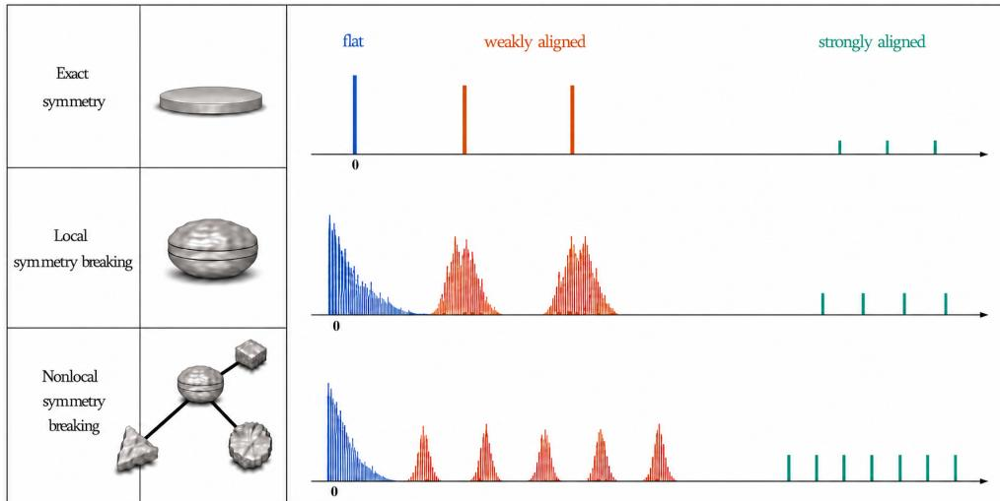  
Figure 4: Schematic illustration of the SB mechanisms developed in this work.

Local SB. The spectra of the original models unfold as controlled SB splits these degeneracies into the observed hierarchy of clusters and outliers.

Nonlocal SB. Depending on the initialization and algorithm, optimization may select critical points of lower symmetry, producing a more refined spectrum.

Mixture of two Gaussians: resolutive SB. Recall that, properly embedded, $\tau _ { \star }$ in (1.9) consists of global minima for Learning Problem 1 with $k = 2$ and $\tau = 1$ for each of the networks $N ^ { 3 , \circ }$ $N ^ { 3 , \do x }$ , and $N ^ { 3 , \emptyset }$ in (1.2). We demonstrated how symmetries of the network, loss function, and data distribution combine to produce the orthogonal Hessian invariance subgroup $D _ { 4 } \times C _ { 2 }$ recorded in (1.10), thereby forcing all nonzero eigenvalues to have multiplicity two. Varying $\tau > 0$ in Learning Problem 1, with the realizing weights adjusted accordingly, preserves these Hessian invariances and the kernel dimension (see Table 19). For $N ^ { 3 }$ , however, adding a full final-layer bias breaks the orthogonal realization of the $D _ { 4 } \times C _ { 2 }$ action on the full parameter space. This is the resolutive form of SB introduced earlier. Consequently, some multiplicity-two eigenvalues split into simple eigenvalues, whose displacements are generally controlled by perturbation theory. Beyond this perturbative control, the resolutive mechanism imposes additional algebraic constraints on the splitting, as shown in Table 3 below. In particular, these constraints bring the splitting within the scope of Cauchy’s interlacing theorem. The full technical analysis, including the kernel and invariant-subspace structure, is given in Section 4.4. At random initialization in the same setting, we also establish a rich invariance group for the averaged Hessian that explains the macroscopic near-zero bulk at a single draw; see Figure 2 and Theorem 33.

We now consider the global minima outside $\tau _ { \star }$ . In Section 4.4, we give a complete characterization of the global minimizers of $N ^ { 3 , \circ }$ when $d = h = 2$ . For these other minima, the spectrum again follows from resolutive SB, although with respect to a diferent subspace (see Table 15). Our focus on $\tau _ { \star }$ is motivated by the empirical observation that Adam consistently converges to this subset. A distinguishing feature of $\tau _ { \star }$ is its substantially smaller curvature transverse to the kernel, indicating a concrete instance of an implicit bias of Adam (for studies of implicit bias in other settings, see Safran et al. (2022); Soudry et al. (2018)).

<table><tr><td></td><td>Subarchitecture Orthogonal symmetries of H</td><td></td><td>dim ker H Nonzero multiplicities Schematic spectrum</td><td></td></tr><tr><td> $N ^ { 2 , \circ }$ </td><td> $D _ { 4 } \times C _ { 2 }$ </td><td>4</td><td> $2 ^ { [ 2 ] }$ </td><td></td></tr><tr><td></td><td></td><td>:</td><td></td><td></td></tr><tr><td> $N ^ { 3 , \circ }$ </td><td> $D _ { 4 } \times C _ { 2 }$ </td><td>8</td><td> $2 ^ { [ 2 ] }$ </td><td>1</td></tr><tr><td></td><td></td><td>.</td><td></td><td></td></tr><tr><td> $N ^ { 3 , \emptyset }$ </td><td> $D _ { 4 } \times C _ { 2 }$ </td><td>10</td><td> $2 ^ { [ 3 ] }$ </td><td> $1 1 1$ </td></tr><tr><td> $N ^ { 3 , \otimes }$ </td><td> $D _ { 4 } \times C _ { 2 }$ </td><td>11</td><td> $2 ^ { [ 3 ] }$ </td><td> $1 1 1$ </td></tr><tr><td> $N ^ { 3 }$ </td><td>broken; but retained under a</td><td>12</td><td> $2 , 1 ^ { [ 4 ] }$ </td><td>一</td></tr></table>

Nested subspaces: $\begin{array} { r } { \Theta _ { 1 } = \Theta _ { N ^ { 2 , \circ } } \subseteq \cdots \subseteq \Theta _ { N ^ { 3 , \sigma } } \subseteq \Theta _ { N ^ { 3 , \sigma } } \subseteq \Theta _ { N ^ { 3 } } = \Theta _ { r } , \ \dim ( \Theta _ { i + 1 } / \Theta _ { i } ) = 1 _ { r } } \end{array}$  
Table 3: Hessian spectra on $\tau _ { \star }$ along nested subarchitectures of $N ^ { 3 } .$ , viewed as subspaces in its parameter space. In the symmetric cases, $D _ { 4 } \times C _ { 2 } \mathrm { - i n v a r i a n c e }$ forces the nonzero eigenvalues to have multiplicity two. Passing to $N ^ { 3 }$ splits the reference eigenvalues, with the splitting constrained by Cauchy interlacing. This multiplicity structure is observed in Figure 2. Successive applications of Cauchy interlacing along the full chain give a sharper localization of the $N ^ { 3 }$ eigenvalues, now relative to the spectra of the subarchitectures.

The same behavior persists when h is increased, with Adam converging to embedded copies of $\tau _ { \star } .$ . This empirical observation is in line with a general principle followed throughout the paper. We first carry out the analysis in a small ambient parameter space that is nevertheless suficiently large to realize the relevant Bayes-optimal predictors. Passing to a larger ambient parameter space then embeds this model into a larger network, where the additional degrees of freedom account for extra flat directions. For more detailed treatments of such embeddings, higher-order flatness and implicit bias, see Arjevani (2027a).

Mixture of k Gaussians: distributional SB. We now turn to mixtures of k Gaussians described in Learning Problem 1. We take the Gaussian centers to be drawn uniformly on the sphere. Related choices lead to the same qualitative results. Unlike in the preceding two-Gaussian setting, these centers are almost surely in general position. To isolate SB arising from the data distribution from the resolutive efects discussed above, we work with the bias-free model $N ^ { 3 , \circ }$ . We take $d = k$ and $h = 2 k$ and work throughout with an explicit realization of the Bayes-optimal predictor within $N ^ { 3 , \circ }$ Full details are given in Section 4.6.

In this setting, a natural symmetric reference is constructed by solving the orthogonal Procrustes problem in operator norm. Organize the k centers as the rows of a matrix $C \in \mathbb { R } ^ { k \times k }$ , and let U be a nearest orthogonal matrix to $C .$ In our construction, we use the orthogonal factor obtained from a singular value decomposition:

$$
\begin{array} { r } { C = P D _ { C } Q ^ { \top } , \qquad U = P Q ^ { \top } . } \end{array}\tag{1.38}
$$

The rows of U are then used as the centers of the reference Gaussian mixture, and the analysis proceeds through this symmetric case. The exact isotypic decomposition, provided in Section 4.6, identifies invariant subspaces of total dimension $\Theta ( k ^ { 2 } )$ which consist of directions weakly aligned with the data. On these subspaces, (1.24) yields the corresponding small-eigenvalue scales (see Theorem 37). The resulting eigenvalue multiplicities and scales at the symmetric reference are summarized in Figure 1. The spectral estimates then transfer to the original setting through standard perturbation theory (the reference decomposition can also be used directly).

Spontaneous SB. The SB mechanisms presented above were local in nature. An asymmetric configuration was analyzed by passing to a nearby symmetric configuration. We now turn to a nonlocal SB mechanism in which the problem parameters remain fixed, but the optimization dynamics selects points whose symmetric references have lower Hessian symmetry. The resulting spectrum is more refined and can be understood relative to these references (Figure 4). The corresponding symmetry types are encoded by stabilizers under the invariance group Γ of the objective.

Given a point W in the weight space Θ, its stabilizer is

$$
{ \mathrm { S t a b } } _ { \Gamma } ( W ) : = \{ \gamma \in \Gamma : \gamma W = W \} .\tag{1.39}
$$

The same terminology applies to arbitrary group actions, including linear actions on vector spaces such as spaces of symmetric matrices, tensors, linear functionals, or distributions, as well as actions on sets, such as the action of a permutation group on pairs of indices. When referring specifically to a parameter, we may also use the terms point stabilizer or isotropy group and sometimes write $\Gamma _ { W }$

Given a Γ-invariant objective, a central question is which symmetries in Γ are retained by its local minima and, more generally, by its critical points. This belongs to a classical theme in mathematics and physics concerning how the isotropy groups of solutions relate to the symmetries of the governing equations. Here, the relevant equation is the gradient equation $\nabla { \mathcal { L } } ( W ) = 0$ . A critical point is called SB if its isotropy group is a proper subgroup of Γ. We say that spontaneous SB occurs when such a point has been selected by optimization. Our primary interest lies in cases in which the residual symmetry remains substantial.

We illustrate this with $N ^ { 3 , \circ }$ under Learning Problem 2. As in the earlier analyses, structural and distributional symmetries combine to produce composite invariances, now at the level of the objective itself rather than of its diferential. The resulting invariance subgroup is $S _ { h } ^ { 2 } \times S _ { d }$ , with the explicit actions of its factors given in Section 3.1. At the level of the objective, the composite invariance argument in (5.177) follows the same underlying reasoning as that used for $N ^ { 1 1 / 2 }$ in (Arjevani and Field, 2019, Section 4.1), with the conceptual ingredients abstracted and formalized. As noted earlier, when used to identify Hessian invariances, the point-stabilizer approach employed there fails for the deeper networks already considered in that work, whose Hessians retain rich invariances despite trivial weight stabilizers (see Table 20).

When $h = d ,$ fix $0 < \beta < 1 / d$ and set $\alpha = 1 - d \beta$ . Then the global minimizer

$$
\boldsymbol { W } ^ { \star } = ( I _ { d } , \alpha I _ { d } + \beta \mathbf { 1 1 } ^ { \top } , \mathbf { 1 } ^ { \top } )\tag{1.40}
$$

is not fixed by the full group $S _ { h } ^ { 2 } \times S _ { d }$ , but still retains substantial symmetry. Its stabilizer contains $\Delta S _ { d } : = \{ ( \pi , \pi , \pi ) : \pi \in S _ { d } \}$ , the diagonal embedding of $S _ { d }$ in $S _ { d } ^ { 3 }$ . Thus, $W ^ { \star }$ is an SB global minimizer. We note in passing that even a substantial point stabilizer under the invariance group Γ need not recover the full Hessian invariance group, which may be strictly larger.

Goursat’s lemma and O’Nan–Scott. We next discuss tools for examining possible isotropy groups under the $S _ { h } ^ { 2 } \times S _ { d }$ -action.

Although some mechanisms can force or explain critical points with particular stabilizers, Γ- invariance alone imposes no general lower bound on the stabilizers of critical points.7 As discussed above in connection with the failure of weight symmetries (Section 3.2), our settings provide many such instances in which degrees of freedom transverse to Γ-orbits reduce point stabilizers without necessarily reducing the Hessian invariance group. Indeed, it was precisely this limitation that required us to develop a diferent route to establishing Hessian invariance. Nevertheless, the stabilizer lattice remains useful for an eficient organization of an otherwise highly complex set of critical points through the possible symmetry types (taking into consideration transverse flat directions), with the subgroup lattice serving as a tractable proxy when needed. Here, we limit ourselves to a high-level discussion of some general considerations rather than carrying out a systematic analysis, and refer to Arjevani (2024) for a fuller treatment.

A convenient tool for understanding subgroups of $S _ { h } ^ { 2 } \times S _ { d } ,$ a direct product, is Goursat’s lemma. Informally, it describes them through subgroups of the factors and possible couplings between their quotients. In the example in (1.40), the same subgroup $S _ { d }$ occurs in each factor, with the three copies coupled diagonally. Representative subgroup types of $S _ { d }$ are shown in Figure 5, with the primitive case further organized by the O’Nan–Scott theorem. These seemingly far-removed grouptheoretic considerations organize the symmetry types of lower-symmetry minima found by standard optimization methods (see Figure 7 and Remark 9). Some of the isotropy groups are realized by minima with dead neurons, as discussed in Section 4.2.

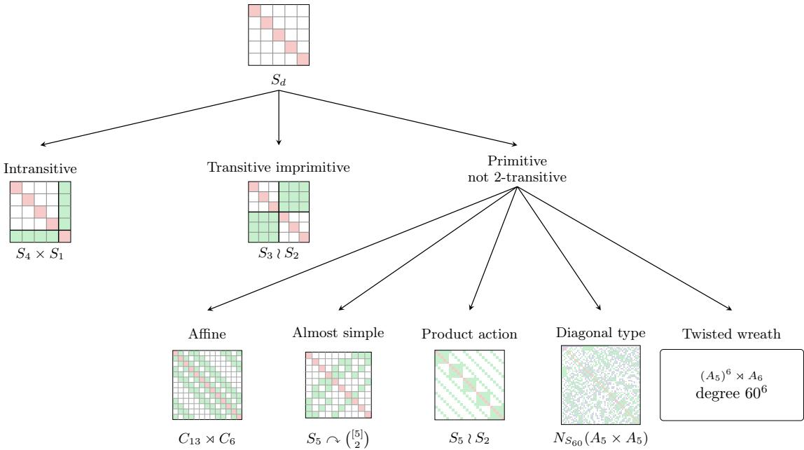  
Figure 5: Schematic overview of the subgroup structure relevant to nonlocal SB under the diagonal action of $S _ { d }$ on $M ( d , d )$ , together with representative examples. The top node represents the full $S _ { d }$ symmetry, while the lower nodes organize the possible symmetry types of SB points. The first level distinguishes the standard cases of intransitive, transitive imprimitive, and primitive subgroups. The primitive case is further organized according to the O’Nan– Scott theorem.

Symmetric tensor decomposition: tangency arcs and parameterized families of functions. Symmetry of critical points may also be understood comparatively, relative to a given reference point. We conclude this section by describing a nonlocal SB mechanism, developed in Arjevani (2024), which explains how nearby critical points may retain a substantial part of the reference point’s symmetry. To keep the manuscript focused, we do not develop the full theory but instead provide a very brief, high-level overview and representative examples.

Let $f : \mathbb { R } ^ { d } $ R be a $C ^ { 1 }$ function, and let $\mathbf { c } \in \mathbb { R } ^ { d }$ be a critical point of $f .$ The tangency set of f at c is defined8 by

$$
\mathfrak { U } _ { \mathbf { c } } ( f ) : = \{ \mathbf { x } \in \mathbb { R } ^ { d } \ | \ D _ { i } f ( \mathbf { x } ) ( \mathbf { x } - \mathbf { c } ) _ { j } = D _ { j } f ( \mathbf { x } ) ( \mathbf { x } - \mathbf { c } ) _ { i } , \ i , j \in [ d ] \} .\tag{1.41}
$$

In particular, every critical point of $f$ belongs to $\operatorname { \mathrm { \boldsymbol { U } } } _ { \mathbf { c } } ( f )$ . Arcs contained in this set and emanating from c are called tangency arcs.9 Such arcs, generically finitely many under mild regularity, may retain a substantial part of the symmetry of c, and critical points reached along them inherit this symmetry. Another quantity preserved along each arc is its index, which allows conclusions to be drawn about the extremal character of such critical points on spheres centered at c. For maxima isotropy subgroups (see Figure 5), the existence of such arcs is guaranteed, while arcs with submaximal isotropy often appear as well. Applied iteratively at newly identified critical points, this construction reveals aspects of the broader symmetry structure of the landscape.

Remark 9 The admissible isotropy types of tangency arcs for the restriction to $M ( d , d )$ of the diagonal $S _ { d }$ -action retained by $W ^ { \star }$ in (1.40) are analyzed in Arjevani (2024). Some occur generically, including $S _ { q } \times S _ { d - q } , S _ { q } \wr S _ { 2 }$ when $d = 2 q$ , and $\textstyle \prod _ { i = 1 } ^ { 3 } S _ { n _ { i } }$ for positive block sizes or $( S _ { n } ^ { 3 } ) \rtimes C _ { 3 }$ instead when the three blocks have equal size n. Generically occurring types occupy diferent positions in the subgroup and isotropy lattices, as illustrated in the table below.
<table><tr><td>Isotropy type</td><td>Position</td></tr><tr><td> $S _ { d - 1 } \times S _ { 1 }$  (d = 5 instance in Figure 5)</td><td>Maximal subgroup and maximal isotropy subgroup</td></tr><tr><td> $D _ { 5 } , d = 5$  (bottom panel of Figure 7)</td><td>Maximal isotropy subgroup, but not maximal subgroup</td></tr><tr><td> $C _ { 3 } \times S _ { 2 } , d = 5$  (middle panel of Figure 7)</td><td>Submaximal isotropy subgroup</td></tr></table>

Here $D _ { 5 }$ is the order-10 dihedral group. Stable occurrence need not, however, be universal, as illustrated at $d = 5$ by ⟨(123)⟩. This latter type is submaximal even within its irreducible summand, providing another counterexample to the maximal-isotropy conjecture Golubitsky (1983) $( c f .$ its formulation for minima Michel (1980)).

If f is definable in an o-minimal structure, the arcs can be constructed definably Arjevani (2023). Moreover, they always contain enough information to determine whether a critical point is a local minimum, local maximum, or saddle. Analogous conclusions hold generically for smooth functions in the equivariant category. To illustrate the construction in the semialgebraic case, consider the problem of decomposing a real symmetric tensor into a sum of rank-one terms Arjevani et al. (2021, 2026). Standard approaches involve solving the following nonconvex optimization problem associated with an order-n symmetric tensor A on $\mathbb { R } ^ { d }$

$$
\operatorname* { m i n } _ { W \in M ( k , d ) , \left\| \mathbf { \epsilon } _ { i = 1 } ^ { k } \right.}  \mathopen { } \mathclose \bgroup \left\| \sum _ { i = 1 } ^ { k } \alpha _ { i } \mathbf { w } _ { i } ^ { \otimes n } - A \aftergroup \egroup \right\| ^ { 2 } .\tag{1.42}
$$

For $k = d$ and $n = 3$ , we absorb each $\alpha _ { i }$ into $\mathbf { w } _ { i }$ and set $\alpha = 1$ . Taking $\textstyle A : = \sum _ { i = 1 } ^ { d } \mathbf { e } _ { i } ^ { \otimes 3 }$ then gives an $S _ { d } ^ { 2 } .$ -invariance, corresponding to independent permutations of the rows and columns of $W$ . Explicit constructions of real-analytic tangency arcs are given in Table 4 below. A point on a numerically traced tangency arc for Learning Problem 2 is shown in Figure $^ { 7 . }$

As a concrete low-dimensional illustration of how tangency arcs organize critical points by symmetry type, consider the following simple B -invariant function, with $B _ { n }$ generally denoting the hyperoctahedral group (Weyl group of type $B )$

$$
h ( x , y ) = x ^ { 4 } + x ^ { 2 } y ^ { 2 } + y ^ { 4 } - 2 x ^ { 2 } - 2 y ^ { 2 } .\tag{1.43}
$$

<table><tr><td rowspan=1 colspan=4>Tangency arc</td><td rowspan=1 colspan=3>Source</td><td rowspan=1 colspan=5>Target</td></tr><tr><td rowspan=1 colspan=1></td><td rowspan=1 colspan=2> $\boxed { \begin{array} { c } { 0 _ { 2 , d } } \\ { \pmb { t 1 } _ { d - 2 } \pmb { 1 } _ { d } ^ { \top } } \end{array} }$ </td><td rowspan=1 colspan=1></td><td rowspan=1 colspan=1>0</td><td rowspan=1 colspan=1>Saddle</td><td rowspan=1 colspan=1> $S _ { d } \times S _ { d }$ </td><td rowspan=1 colspan=1></td><td rowspan=1 colspan=1>O2 d $\Theta \big ( d ^ { - 1 } \big ) \mathbf { 1 } _ { d - 2 } \mathbf { 1 } _ { d } ^ { \top }$ </td><td rowspan=1 colspan=1></td><td rowspan=1 colspan=1>Saddle</td><td rowspan=1 colspan=1> $( S _ { 2 } \times S _ { d - 2 } ) \times S _ { d }$ </td></tr><tr><td rowspan=1 colspan=4> $t I _ { d }$ </td><td rowspan=1 colspan=1>0</td><td rowspan=1 colspan=1>Saddle</td><td rowspan=1 colspan=1> $S _ { d } \times S _ { d }$ </td><td rowspan=1 colspan=3> $I _ { d }$ </td><td rowspan=1 colspan=1>Globalminimum</td><td rowspan=1 colspan=1> $\Delta S _ { d }$ </td></tr><tr><td rowspan=1 colspan=4> $\overline { { t { { \cal I } _ { d - 1 } } \oplus [ 0 ] } }$ </td><td rowspan=1 colspan=1>0</td><td rowspan=1 colspan=1>Saddle</td><td rowspan=1 colspan=1> $\overline { { S _ { d } \times S _ { d } } }$ </td><td rowspan=1 colspan=3> $\overline { { I _ { d - 1 } \oplus [ 0 ] } }$ </td><td rowspan=1 colspan=1>Saddle</td><td rowspan=1 colspan=1> $\Delta S _ { d - 1 }$ </td></tr><tr><td rowspan=1 colspan=4> $I _ { d - 1 } \oplus [ t ]$ </td><td rowspan=1 colspan=1> ${ \cal I } _ { d - 1 } \oplus [ 0 ]$ </td><td rowspan=1 colspan=1>Saddle</td><td rowspan=1 colspan=1> $\Delta S _ { d - 1 }$ </td><td rowspan=1 colspan=3> $I _ { d }$ </td><td rowspan=1 colspan=1>Globalminimum</td><td rowspan=1 colspan=1> $\Delta S _ { d }$ </td></tr><tr><td rowspan=1 colspan=2> $\overline { { { { \cal I } _ { d - 2 } \oplus \left[ \begin{array} {<eq>\begin{array} { r } { a ( t ) = \sum _ { m = 0 } ^ { \infty } \binom { \tilde { 1 }</td><td rowspan=1 colspan=2>c c } { { a ( t ) } } \\ { { t } } \end{array} 0 \right] , } } }$ / \tilde { 3 } } { m } ( \stackrel { - } { - } 1 ) ^ { m } t ^ { 3 m } } \end{array}</eq></td><td rowspan=1 colspan=1> ${ \cal I } _ { d - 1 } \oplus [ 0 ]$ </td><td rowspan=1 colspan=1>Saddle</td><td rowspan=1 colspan=1> $\Delta S _ { d - 1 }$ </td><td rowspan=1 colspan=3> ${ \cal I } _ { d - 2 } \oplus \left[ \begin{array} { l l } { { 0 } } & { { 0 } } \\ { { 1 } } & { { 0 } } \end{array} \right]$ </td><td rowspan=1 colspan=1>Saddle</td><td rowspan=1 colspan=1> $\Delta S _ { d - 1 }$ </td></tr></table>

Table 4: Tangency arcs for the symmetric tensor decomposition problem (1.42). Isotropy groups are listed up to conjugacy. The examples illustrate recursive application of the construction, leading to critical points with maximal and submaximal isotropy groups for the $S _ { d } ^ { 2 } .$ -action. These are related, via Goursat’s lemma, to the corresponding subgroup structures in the $S _ { d }$ factors, as illustrated in Figure 5.

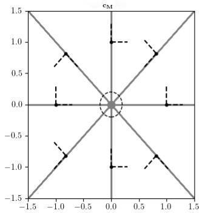

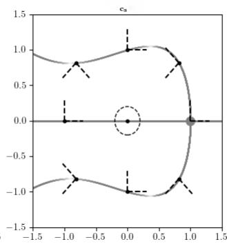

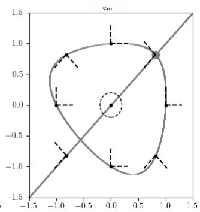  
Figure 6: Tangency sets of h in (1.43) relative to diferent critical points. The tangency arcs may break the symmetry of the reference critical point. Any critical point lying on an arc has at least the symmetry of that arc.

The function h is invariant under $( x , y ) \mapsto ( y , x ) , ~ x ~ \mapsto ~ - x$ and $y \mapsto - y$ , hence $B _ { 2 }$ -invariant. Computing, we find that h has nine critical points: $\mathbf { c } _ { M } = ( 0 , 0 )$ (a maximum), $\mathbf { c } _ { s } = ( 1 , 0 )$ giving four critical points (saddles) in total owing to its orbit $B _ { 2 } ( 1 , 0 ) = \{ g ( 1 , 0 ) \ | \ g \in B _ { 2 } \}$ , and $\mathbf { c } _ { m } =$ $( { \sqrt { 2 / 3 } } , { \sqrt { 2 / 3 } } )$ (a minimum) again yielding $| B _ { 2 } ( \sqrt { 2 / 3 } , \sqrt { 2 / 3 } ) | = 4$ critical points. By equivariance, it sufices to compute the tangency set for the orbit representatives $\mathbf { c } _ { M } , \mathbf { c } _ { s }$ and $\mathbf { c } _ { m }$ . Although in this case the tangency set can be described by simple algebraic expressions, our interest lies rather in the geometric situation. Referring to Figure 6, the isotropy groups of tangency arcs are either the full point stabilizer $( B _ { 2 } ) _ { { \bf c } _ { \times } }$ or its maximal proper isotropy subgroups, $\times \in \{ M , m , s \}$ . In addition, we find that $\mathbb { U } _ { { \mathbf { c } } _ { M } } ( h ) \setminus \{ { \mathbf { c } } _ { M } \}$ has eight tangency arcs passing through the eight critical points away from the origin. Iterating the analysis of the tangency set at these saddles reveals tangency arcs of index zero which connect to $\mathbf { c } _ { m }$

Tangency arcs can also be viewed as paths of critical points of the family of functions $f ( \mathbf { x } ) -$ $\lambda / 2 \| \mathbf { x } - \mathbf { c } \| ^ { 2 }$ . Similarly, depending on the phenomenon one wants to investigate, one can consider other parameterized families of objectives and track the corresponding variation in local geometry. For example, one may vary the input dimension and hidden-layer widths, as in Sagun et al. (2016, 2018) and in the present work, or replace ReLU with leaky ReLU and vary the leakiness parameter continuously, as studied in Arjevani and Field (2021a) (see also Liu (2025)). Layer widths can likewise be varied to track transitions from saddles to minima and vice versa Arjevani and Field (2021b,

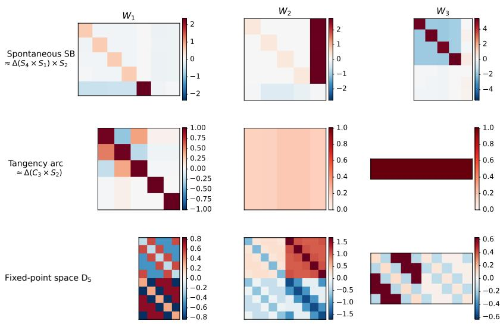  
Figure 7: Weight matrices illustrating three forms of SB. Top. Weights of a trained $N ^ { 3 , \circ }$ network with $d = k = 7$ and $h = 5$ , learned on the mixture of seven Gaussians in Learning Problem 1. The observed symmetry breaking is from $S _ { 7 } \times S _ { 5 } ^ { 2 }$ to approximately $\Delta ( S _ { 4 } \times S _ { 1 } ) \times S _ { 2 }$ Middle. A point on a tangency arc emanating from $W ^ { \star }$ in (1.40), with approximate isotropy $\Delta ( C _ { 3 } \times S _ { 2 } )$ (see Remark 9). Bottom. Weight matrices in the fixed-point space of $D _ { 5 } \leq \mathrm { A G L } ( 1 , 5 ) \leq S _ { 5 }$ , illustrating forced SB. Although $D _ { 5 }$ is not maximal as a subgroup of $S _ { 5 }$ , it is a maximal isotropy group for the diagonal action on $M ( 5 , 5 )$ . Indeed, AGL(1, 5) is 2-transitive, so its fixed-point space in $M ( 5 , 5 )$ coincides with the $S _ { 5 }$ -fixed-point space. Similar phenomena also occur on parameter manifolds, as illustrated in Section 4.3 for parameters constrained to lie on a sphere.

2022) (cf. Simsek et al. (2025)). Other parameterized families of objective functions may arise from variations in the data distribution, such as changing the number of classes or the cluster variances (see Table 19). Further continuous deformations include taking $D _ { C } ( t ) = ( 1 - t ) D _ { C } + t I$ in (1.38).

## 2 Deep Symmetry Breaking

Although the main analysis of this paper concerns three-layer networks, the framework itself is formulated in some generality. This extended version illustrates its application to selected deeper architectures and benchmark datasets. Detailed accounts of these applications are in preparation as separate publications, to be collected later in a broader treatment Arjevani (2027a).

We begin with a brief extension to deep fully connected networks and then analyze AlexNet in greater detail, illustrating resolutive SB and spectral refraction (Section 2.1). GNNs exhibit depth-dependent eigenvalue scales (Section 2.2), while a minimal Transformer example illustrates Hessian invariance in in-context learning (Section 2.3). The unconstrained features model connects neural collapse with the orthogonal realization of composite Hessian invariance (Section 2.4). Hidden feature–label laws of trained networks can themselves develop approximate symmetries, a phenomenon we refer to as neural registration and examine in $N ^ { 5 }$ and ResNet-18 (Section 2.5). These emerging symmetries provide a further source of composite invariance, illustrated for $N ^ { 3 }$ trained on MNIST in Figure 8. Finally, we ask what eigenvalue multiplicities reveal about the symmetries that force them (Section 2.6). Apart from AlexNet, these applications are presented as very brief previews.

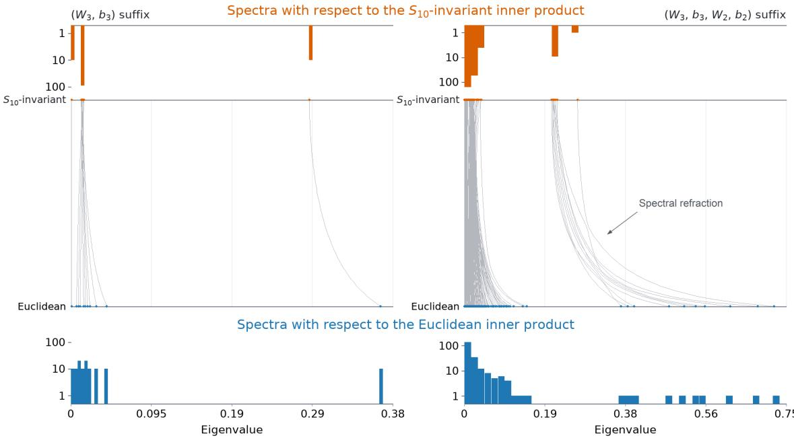  
Figure 8: When Hessian invariances are compatible with the parameter-space geometry, they force large eigenvalue multiplicities. Here we follow the empirical spectra for $N ^ { 3 }$ trained on MNIST as the parameter-space inner product varies from an $S _ { 1 0 ^ { - } \mathrm { i n v a r i a n t } }$ one to Euclidean. Top. Approximate invariance produces narrow bands at the invariant endpoint. Bottom. The action is incompatible with the Euclidean parameter-space geometry, and the bands refract into spectral clusters (Remark 15). The left and right panels concern the sufixes $\left( W _ { 3 } , { \bf b } _ { 3 } \right)$ and $\left( W _ { 3 } , \mathbf { b } _ { 3 } , W _ { 2 } , \mathbf { b } _ { 2 } \right)$ , respectively. The approximate invariance arises from a phenomenon we refer to as neural registration, whereby approximate symmetries emerge in hidden feature–label laws. The construction and analysis are given in Section 2.5.

## 2.1 AlexNet

The first extension changes depth, not the learning problem: in Learning Problem 2, $N ^ { 3 }$ is replaced by a fully connected network $N ^ { L }$ . The construction of Hessian invariances in Section 4.2 carries over, mutatis mutandis. This yields sharp asymptotic estimates for the Hessian spectrum as width and depth vary. Spectral refraction takes a more involved form. In this case, the relevant permutations act on the full parameter space. The AlexNet analysis below shows how this picture changes: restoring convolutional directions restricts this permutation action on the full quotient to $D _ { 4 }$ , producing resolutive SB.

Assume henceforth that $d \geq 3 .$ . To demonstrate the core mechanism, we consider an AlexNet variant with a single channel in each convolutional layer and without normalization, dropout, or biases. The first convolutional layer uses a $3 \times 3$ kernel, unit stride, and zero padding. These choices keep the analysis transparent and allow the delta kernel to realize the target. When this layer has a single channel, the absence of downsampling is essential. A stride larger than one makes the linear map defined by this layer noninjective, while $\mathbf { 1 } _ { d ^ { 2 } } ^ { \top } \sigma ( \mathrm { v e c } ( \mathbf { x } ) )$ is not constant on its fibers. More general choices for the size of the kernel, the padding, and the stride may be accommodated by introducing suficiently many channels in the first layer Arjevani (2027a). Let $L _ { c }$ and $L _ { f }$ denote the numbers of convolutional and fully connected layers, respectively, with the final readout included in $L _ { f }$ . The dimensions of the remaining layers are arbitrary. Set $L = L _ { c } + L _ { f }$ and $n = d ^ { 2 }$

Throughout the analysis, $\mathbf { h } _ { i }$ denotes the vectorization of the output of layer $i ,$ while $A _ { i }$ denotes the corresponding linear map, with

$$
A _ { i } = \left\{ \begin{array} { l l } { \Xi ( K _ { i } ) , } & { 1 \le i \le L _ { c } , } \\ { W _ { i } , } & { L _ { c } + 1 \le i \le L . } \end{array} \right.\tag{2.44}
$$

Here $K _ { i }$ denotes the convolutional kernel and $W _ { i }$ the weight matrix, with $K _ { 1 } \in \mathbb { R } ^ { 3 \times 3 }$ , and by a slight abuse of notation, we use $\Xi$ for the map induced by convolution in every convolutional layer, with its domain, codomain, stride, padding, and number of channels understood from context. The network is then given by

$$
\mathbf { h } _ { 0 } = \mathrm { v e c } ( \mathbf { x } ) , \qquad \mathbf { h } _ { i } = \sigma ( A _ { i } \mathbf { h } _ { i - 1 } ) , \quad 1 \leq i \leq L - 1 , \qquad N ^ { \mathrm { A l e x N e t , } \circ } ( \mathbf { x } ; W ) = A _ { L } \mathbf { h } _ { L - 1 } .\tag{2.45}
$$

Let

$$
\Omega ^ { + } = \left\{ W \mid K _ { 2 } , \ldots , K _ { L _ { c } } > 0 , \quad W _ { L _ { c } + 1 } , \ldots , W _ { L - 1 } > 0 \right\} ,\tag{2.46}
$$

with the readout unrestricted. Define the tail map $A _ { L : 2 } = A _ { L } \cdot \cdot \cdot A _ { 2 }$ . We consider the following set of well-specified global minima at which $d A _ { L : 2 }$ is surjective,10

$$
\mathcal { G } _ { \mathrm { a l e c a n e t } } ^ { + } = \left\{ W \in \Omega ^ { + } \ \middle \vert \ K _ { 1 } = s K _ { \delta } , , \quad A _ { L : 2 } = s ^ { - 1 } \mathbf { 1 } _ { n } ^ { \intercal } \mathrm { ~ f o r ~ s o m e ~ } s > 0 , \quad \mathrm { r a n k } d A _ { L : 2 } = n \quad \right\}\tag{2.47}
$$

For any $W ^ { + } \in \mathcal { G } _ { \mathrm { a l e x n e t } } ^ { + }$ , all nonlinearities after the first act linearly, and

$$
N ^ { \mathrm { A l e x N e t , o } } ( { \bf x } ; W ^ { + } ) = A _ { L : 2 } \sigma ( \Xi ( K _ { 1 } ) { \bf h } _ { 0 } ) .\tag{2.48}
$$

Hence,

$$
d _ { W } N ^ { \mathrm { A l e x N e t , o } } ( { \bf x } ; W ^ { + } ) [ \delta W ] = s d A _ { L ; 2 } [ \delta W ] \sigma ( { \bf h } _ { 0 } ) + s ^ { - 1 } { \bf 1 } _ { n } ^ { \top } \mathrm { d i a g } ( { \bf 1 } _ { { \bf h } _ { 0 } > 0 } ) \Xi ( \delta K _ { 1 } ) { \bf h } _ { 0 } .\tag{2.49}
$$

The flat vectors coincide with the kernel of the model diferential,

$$
\ker d _ { W } N ^ { \mathrm { A l e x N e t } , \circ } ( \cdot ; W ^ { + } ) = \left\{ \delta W \mid \delta K _ { 1 } = \alpha K _ { 1 } , \quad d A _ { L : 2 } [ \delta W ] = - \alpha A _ { L : 2 } , \quad \alpha \in \mathbb { R } \right\} .\tag{2.50}
$$

The surjectivity of $d A _ { L : 2 }$ implies that

$$
\Phi { : } T _ { W ^ { + } } \Theta \longrightarrow \mathbb { R } ^ { 3 \times 3 } \oplus \mathbb { R } ^ { 1 \times n } , \qquad \Phi ( \delta W ) = ( \delta K _ { 1 } , d A _ { L : 2 } [ \delta W ] )\tag{2.51}
$$

is surjective and induces the isomorphism

$$
\frac { T _ { W ^ { + } } \Theta } { \ker d _ { W } N ^ { \mathrm { A l e x N e t , o } } ( \cdot ; W ^ { + } ) } \cong \frac { \mathbb { R } ^ { 3 \times 3 } \oplus \mathbb { R } ^ { 1 \times n } } { \operatorname { s p a n } \{ ( K _ { 1 } , - A _ { L : 2 } ) \} } .\tag{2.52}
$$

Under this identification, the model diferential descends to

$$
\overline { { d _ { W } N } } _ { \mathbf { x } } [ ( \delta K _ { 1 } , \mathbf { u } ^ { \top } ) ] = s \mathbf { u } ^ { \top } \boldsymbol { \sigma } ( \mathbf { h } _ { 0 } ) + s ^ { - 1 } \mathbf { 1 } _ { n } ^ { \top } \operatorname { d i a g } ( \mathbf { 1 } _ { \mathbf { h } _ { 0 } > 0 } ) \boldsymbol { \Xi } ( \delta K _ { 1 } ) \mathbf { h } _ { 0 } ,\tag{2.53}
$$

where $\mathbf { u } ^ { \top } = d A _ { L : 2 } [ \delta W ]$ . The numerator on the right side of (2.52) has dimension $n + 9 .$ , and the quotient removes the one-dimensional subspace span $\{ ( K _ { 1 } , - A _ { L : 2 } ) \}$ . The parameter quotient therefore has dimension $n + 8 .$ For the squared loss, well specification and the full support of the Gaussian distribution imply that the kernels of the second diferential, the GN form, and the model diferentia coincide. Hence, the second diferential descends to a nondegenerate bilinear form on the quotient in (2.52).

Symmetries. In addition to the structural symmetries of the fully connected layers, we have

$$
g \sigma ( K * { \mathbf x } ) = \sigma ( ( g K ) * ( g { \mathbf x } ) ) , \qquad { \mathbf \equiv ( } g K ) = P _ { g } { \mathbf \Xi } \mathbf { \Xi } \mathbf { \Xi } \mathbf { \Xi } , \qquad g \in D _ { 4 } ,\tag{2.54}
$$

where $P _ { g }$ is the induced permutation of the spatial coordinates. With several channels, this action operates diagonally on the channels, while permutations of channels can be compensated in adjacent layers. On the subspace of the quotient represented by $( 0 , \mathbf { u } ^ { \top } )$ , (2.53) admits the architectural symmetry

$$
( \mathbf { h } _ { 0 } , [ ( 0 , \mathbf { u } ^ { \top } ) ] ) \mapsto ( P \mathbf { h } _ { 0 } , [ ( 0 , \mathbf { u } ^ { \top } P ^ { \top } ) ] ) , \qquad P \in S _ { n } .\tag{2.55}
$$

$\mathrm { O n }$ the entire quotient, convolutional equivariance restricts this action to

$$
\begin{array} { r } { ( \mathbf { x } , [ ( \delta K _ { 1 } , \mathbf { u } ^ { \top } ) ] ) \mapsto ( g \mathbf { x } , [ ( g \delta K _ { 1 } , \mathbf { u } ^ { \top } P _ { g } ^ { \top } ) ] ) , \qquad g \in D _ { 4 } . } \end{array}\tag{2.56}
$$

The distribution of $\mathbf { h } _ { 0 }$ is invariant under $S _ { n } .$ , while the Gaussian input distribution is invariant under $D _ { 4 }$ . Canceling the corresponding actions on the input therefore gives the composite actions

$$
\begin{array} { r l r } & { } & { [ ( 0 , \mathbf { u } ^ { \top } ) ] \mapsto [ ( 0 , \mathbf { u } ^ { \top } P ^ { \top } ) ] , \qquad P \in S _ { n } , } \\ & { } & { [ ( \delta K _ { 1 } , \mathbf { u } ^ { \top } ) ] \mapsto [ ( g \delta K _ { 1 } , \mathbf { u } ^ { \top } P _ { g } ^ { \top } ) ] , \qquad g \in D _ { 4 } . } \end{array}\tag{2.57}
$$

The first preserves the restrictions of the Hessian and the GN form to the subspace represented by $( 0 , \mathbf { u } ^ { \top } )$ , while the second preserves both forms on the entire quotient. Both transformations arise from orthogonal actions on $\mathbb { R } ^ { 3 \times 3 } \oplus \mathbb { R } ^ { 1 \times n }$ equipped with the standard Euclidean inner product and preserve span $\{ ( K _ { 1 } , - A _ { L : 2 } ) \}$ . Hence, they descend to orthogonal actions on the quotient.

Resolutive structure. A Gaussian moment calculation as in (1.26) gives the second diferential in the quotient coordinates as

$$
\begin{array} { r l } { d _ { W } ^ { 2 } \mathscr { L } ( W ^ { + } ) [ ( \delta K _ { 1 } , \mathbf { u } ^ { \top } ) ] = \displaystyle \frac { 1 } { 2 s ^ { 2 } } \left( \| \Xi ( \delta K _ { 1 } ) \| _ { F } ^ { 2 } + \| \mathbf { 1 } _ { n } ^ { \top } \Xi ( \delta K _ { 1 } ) \| _ { 2 } ^ { 2 } \right) } & { } \\ { \displaystyle ~ + \frac { 1 } { \pi s ^ { 2 } } \left( \mathrm { t r } \big ( \Xi ( \delta K _ { 1 } ) ^ { 2 } \big ) - 2 \| \mathrm { d i a g } ( \Xi ( \delta K _ { 1 } ) ) \| _ { 2 } ^ { 2 } + \big ( \mathrm { t r } ( \Xi ( \delta K _ { 1 } ) ) \big ) ^ { 2 } \right) } & { } \\ { \displaystyle ~ + 2 \mathbf { u } ^ { \top } \left[ \frac { 1 } { 2 } \Xi ( \delta K _ { 1 } ) ^ { \top } \mathbf { 1 } _ { n } + \left( \frac { 1 } { 2 } - \frac { 1 } { \pi } \right) \mathrm { d i a g } ( \Xi ( \delta K _ { 1 } ) ) + \frac { \mathrm { t r } \big ( \Xi ( \delta K _ { 1 } ) \big ) } { \pi } \mathbf { 1 } _ { n } \right] } & { } \\ { \displaystyle ~ + s ^ { 2 } \left( 1 - \frac { 1 } { \pi } \right) \| \mathbf { u } \| _ { 2 } ^ { 2 } + \frac { s ^ { 2 } } { \pi } \left( \mathbf { u } ^ { \top } \mathbf { 1 } _ { n } \right) ^ { 2 } . } & { } \end{array}\tag{2.58}
$$

On the subspace represented by $( 0 , \mathbf { u } ^ { \top } )$ , this reduces to

$$
d _ { W } ^ { 2 } \mathscr { L } ( W ^ { + } ) [ ( 0 , { \mathbf { u } } ^ { \top } ) ] = s ^ { 2 } \left( 1 - \frac { 1 } { \pi } \right) \| { \mathbf { u } } \| _ { 2 } ^ { 2 } + \frac { s ^ { 2 } } { \pi } \left( { \mathbf { u } } ^ { \top } { \mathbf { 1 } } _ { n } \right) ^ { 2 } .\tag{2.59}
$$

Under the first action in (2.57), ${ \mathbb R } ^ { n } = \operatorname { s p a n } \{ \mathbf { 1 } _ { n } \} \oplus \mathbf { 1 } _ { n } ^ { \scriptscriptstyle \perp }$ is the decomposition into the trivial and standard representations of $S _ { n }$ . The preceding display gives the corresponding eigenvalues

$$
\lambda _ { \mathrm { t r i v } } = \left( s ^ { 2 } + { \frac { n } { s ^ { 2 } } } \right) \left( 1 + { \frac { n - 1 } { \pi } } \right) , \quad \lambda _ { \mathrm { s t d } } = s ^ { 2 } \left( 1 - { \frac { 1 } { \pi } } \right) .\tag{2.60}
$$

Restoring $\delta K _ { 1 }$ enlarges the quotient by only eight dimensions. Cauchy interlacing, see Table $3 ,$ therefore implies that $\lambda _ { \mathrm { s t d } }$ retains multiplicity at least $( n - 1 ) - 8 = n - 9 = d ^ { 2 } - 9$ . The pinned eigenspace can be identified explicitly. Define the subspace of $\mathbb { R } ^ { n }$ coupled to first-layer perturbations,

$$
U _ { c } = \left\{ \frac { 1 } { 2 } \Xi ( \delta K _ { 1 } ) ^ { \top } \mathbf { 1 } _ { n } + \left( \frac { 1 } { 2 } - \frac { 1 } { \pi } \right) \mathrm { d i a g } ( \Xi ( \delta K _ { 1 } ) ) + \frac { \mathrm { t r } ( \Xi ( \delta K _ { 1 } ) ) } { \pi } \mathbf { 1 } _ { n } \ \Bigg | \ \delta K _ { 1 } \in \mathbb { R } ^ { 3 \times 3 } \right\} .\tag{2.61}
$$

For the zero-padded $3 \times 3$ convolution and $d \geq 3 .$ , this space has dimension nine and contains ${ \bf 1 } _ { n }$ . The mixed term in (2.58) vanishes on $U _ { c } ^ { \perp }$ , which is also orthogonal to ${ \bf 1 } _ { n }$ . Consequently, every vector in $U _ { c } ^ { \perp }$ is an eigenvector with eigenvalue $\lambda _ { \mathrm { s t d } }$ , and dim $U _ { c } ^ { \bot } = n - 9$ . The full quotient therefore splits as

$$
U _ { c } ^ { \perp } \oplus \frac { \mathbb { R } ^ { 3 \times 3 } \oplus U _ { c } } { \operatorname { s p a n } \{ ( K _ { 1 } , - A _ { L : 2 } ) \} } .\tag{2.62}
$$

We now pass from the restricted $S _ { n }$ structure to the D4-isotypic decomposition of the full quotient. Using the standard irreducible representations $\mathrm { A _ { 1 } , A _ { 2 } , B _ { 1 } , B _ { 2 } }$ , E of $D _ { 4 }$ Mulliken (1955), the character $\chi _ { d }$ of its permutation representation on $\mathbb { R } ^ { n }$ decomposes as

$$
\begin{array} { r l } & { \chi _ { d } = \displaystyle \frac { ( d + 1 ) ( d + 3 ) } { 8 } \chi _ { \mathrm { A } _ { 1 } } + \frac { ( d - 1 ) ( d - 3 ) } { 8 } \chi _ { \mathrm { A } _ { 2 } } + \frac { d ^ { 2 } - 1 } { 8 } \left( \chi _ { \mathrm { B } _ { 1 } } + \chi _ { \mathrm { B } _ { 2 } } \right) + \frac { d ^ { 2 } - 1 } { 4 } \chi _ { \mathrm { E } } , \qquad d \mathrm { o d d } , } \\ & { \chi _ { d } = \displaystyle \frac { d ( d + 2 ) } { 8 } \chi _ { \mathrm { A } _ { 1 } } + \frac { d ( d - 2 ) } { 8 } \chi _ { \mathrm { A } _ { 2 } } + \frac { d ( d - 2 ) } { 8 } \chi _ { \mathrm { B } _ { 1 } } + \frac { d ( d + 2 ) } { 8 } \chi _ { \mathrm { B } _ { 2 } } + \frac { d ^ { 2 } } { 4 } \chi _ { \mathrm { E } } , \qquad d \mathrm { o d d } . } \end{array}\tag{2.63}
$$

The character of the action on the perturbations of the kernel in the first convolutional layer is

$$
\chi _ { 3 } = ( 9 , 1 , 1 , 3 , 3 ) = 3 \chi _ { \mathrm { A _ { 1 } } } + \chi _ { \mathrm { B _ { 1 } } } + \chi _ { \mathrm { B _ { 2 } } } + 2 \chi _ { \mathrm { E } } .\tag{2.64}
$$

The quotient in (2.52) removes one copy of $\mathrm { A } _ { 1 }$ . Consequently, its isotypic decomposition is

$$
\left\{ \begin{array} { l l } { \displaystyle \frac { d ^ { 2 } + 4 d + 1 9 } { 8 } \mathbf { A } _ { 1 } \oplus \displaystyle \frac { d ^ { 2 } - 4 d + 3 } { 8 } \mathbf { A } _ { 2 } \oplus \displaystyle \frac { d ^ { 2 } + 7 } { 8 } ( \mathbf { B } _ { 1 } \oplus \mathbf { B } _ { 2 } ) \oplus \displaystyle \frac { d ^ { 2 } + 7 } { 4 } \mathbf { E } , } & { d \mathrm { ~ o d d } , } \\ { \displaystyle \frac { d ^ { 2 } + 2 d + 1 6 } { 8 } \mathbf { A } _ { 1 } \oplus \displaystyle \frac { d ^ { 2 } - 2 d } { 8 } \mathbf { A } _ { 2 } \oplus \displaystyle \frac { d ^ { 2 } - 2 d + 8 } { 8 } \mathbf { B } _ { 1 } \oplus \displaystyle \frac { d ^ { 2 } + 2 d + 8 } { 8 } \mathbf { B } _ { 2 } \oplus \displaystyle \frac { d ^ { 2 } + 8 } { 4 } \mathbf { E } , } & { d \mathrm { ~ e v e n } . } \end{array} \right.\tag{2.65}
$$

To describe the resolutive structure within the full D4-isotypic decomposition, we determine how the pinned eigenspace $U _ { c } ^ { \perp }$ and the remaining summand decompose. The map defining $U _ { c }$ is $D _ { 4 }$ equivariant and, since dim $U _ { c } = 9$ , injective. Hence, $U _ { c } \cong 3 \mathrm { A } _ { 1 } \oplus \mathrm { B } _ { 1 } \oplus \mathrm { B } _ { 2 }$ ⊕ 2E. Consequently, the remaining summand in (2.62) has dimension seventeen and decomposes as

$$
\frac { \mathbb { R } ^ { 3 \times 3 } \oplus U _ { c } } { \mathrm { s p a n } \{ ( K _ { 1 } , - A _ { L : 2 } ) \} } \cong 5 \mathrm { A } _ { 1 } \oplus 2 \mathrm { B } _ { 1 } \oplus 2 \mathrm { B } _ { 2 } \oplus 4 \mathrm { E } .\tag{2.66}
$$

Comparing this decomposition with $\left( 2 . 6 5 \right)$ shows that $U _ { c } ^ { \perp }$ contains all but five copies of $\mathrm { A } _ { 1 }$ , every copy of $\mathrm { A _ { 2 } } .$ , all but two copies of each of $\mathrm { B _ { 1 } }$ and $\mathrm { B _ { 2 } }$ , and all but four copies of E. All these copies carry the common eigenvalue $\lambda _ { \mathrm { s t d } }$ . The generic multiplicity structures obtained from $D _ { 4 }$ alone and after taking the resolutive structure into account are

$$
\frac { D _ { 4 } , \ d \ o d d } { 2 ^ { \left[ \frac { d ^ { 2 } + 7 } { 4 } \right] } , 1 ^ { \left[ \frac { d ^ { 2 } + 9 } { 2 } \right] } } \ \left. \ 2 ^ { \left[ \frac { d ^ { 2 } + 8 } { 4 } \right] } , 1 ^ { \left[ \frac { d ^ { 2 } + 8 } { 2 } \right] } \ \right. \ \stackrel { D _ { 4 } \ \mathrm { w i t h ~ t h e ~ r e s o l u t i v e ~ s t r u c t u r e } } { n - 9 , 2 ^ { \left[ 4 \right] } , 1 ^ { \left[ 9 \right] } } .\tag{2.67}
$$

Thus, $D _ { 4 }$ alone permits order $d ^ { 2 }$ distinct eigenvalues, whereas the resolutive structure permits at most fourteen. When $d = 3$ , the multiplicity $n - 9$ is absent, leaving at most thirteen distinct eigenvalues. The restricted $S _ { n }$ spectrum also locates the remaining eigenvalues relative to $\lambda _ { \mathrm { s t d } }$ and $\lambda _ { \mathrm { t r i v } }$ . For the $\mathrm { B _ { 1 } }$ and $\mathrm { B _ { 2 } }$ components, Cauchy interlacing gives

$$
\mu _ { \mathrm { B } _ { 1 } } ^ { - } \leq \lambda _ { \mathrm { s t d } } \leq \mu _ { \mathrm { B } _ { 1 } } ^ { + } ,
$$

$$
\mu _ { \mathrm { B } _ { 2 } } ^ { - } \leq \lambda _ { \mathrm { s t d } } \leq \mu _ { \mathrm { B } _ { 2 } } ^ { + } .\tag{2.68}
$$

If $\mu _ { 1 } ^ { \mathrm { E } } \leq \dots \leq \mu _ { 4 } ^ { \mathrm { E } }$ are the four eigenvalues of type $\mathrm { E } ,$ each occurring with multiplicity two, then

$$
\mu _ { 1 } ^ { \mathrm { E } } \leq \mu _ { 2 } ^ { \mathrm { E } } \leq \lambda _ { \mathrm { s t d } } \leq \mu _ { 3 } ^ { \mathrm { E } } \leq \mu _ { 4 } ^ { \mathrm { E } } .\tag{2.69}
$$

Finally, if $\mu _ { 1 } ^ { \mathrm { A } _ { 1 } } \leq \cdots \leq \mu _ { 5 } ^ { \mathrm { A } _ { 1 } }$ are the eigenvalues of type $\mathrm { A } _ { 1 }$ , then

$$
\mu _ { 1 } ^ { \mathrm { A } _ { 1 } } \leq \lambda _ { \mathrm { s t d } } \leq \mu _ { 3 } ^ { \mathrm { A } _ { 1 } } , \qquad \mu _ { 2 } ^ { \mathrm { A } _ { 1 } } \leq \lambda _ { \mathrm { s t d } } \leq \mu _ { 4 } ^ { \mathrm { A } _ { 1 } } , \qquad \mu _ { 3 } ^ { \mathrm { A } _ { 1 } } \leq \lambda _ { \mathrm { t r i v } } \leq \mu _ { 5 } ^ { \mathrm { A } _ { 1 } } .\tag{2.70}
$$

Asymptotic structure on the quotient. The asymptotic orders follow directly from (2.58). Assume throughout that $s = \Theta ( 1 )$ and consider the seventeen-dimensional summand in $_ { ( 2 . 6 2 ) }$ with respect to the invariant Euclidean metric on the quotient. The subspace span $\{ ( K _ { \delta } , 0 ) , ( 0 , \mathbf { 1 } _ { n } ^ { \top } ) \}$ is contained in the $\mathrm { A } _ { 1 }$ -isotypic component. Before quotienting, the compression of the representing operator to this subspace, relative to the ordered basis $( K _ { \delta } , 0 )$ and $( 0 , \bar { n } ^ { - 1 / 2 } \mathbf { 1 } _ { n } ^ { \top } )$ , is

$$
\left( 1 + \frac { n - 1 } { \pi } \right) { \binom { n / s ^ { 2 } } { \sqrt { n } } } \quad \textstyle { \binom { n } { s ^ { 2 } } } .\tag{2.71}
$$

In this ordered basis, the kernel is spanned by the coordinate vector $( s , - { \sqrt { n } } / s ) ^ { \top }$ and corresponds to the scaling direction removed in (2.52). Its orthogonal complement within the two-dimensional subspace projects onto the line spanned by the unit vector

$$
\mathbf { v } _ { 0 } = \frac { \left( \sqrt { n } s ^ { - 1 } K _ { \delta } , s n ^ { - 1 / 2 } \mathbf { 1 } _ { n } ^ { \top } \right) } { \sqrt { n / s ^ { 2 } + s ^ { 2 } } } .\tag{2.72}
$$

On this unit vector, the second diferential takes the value

$$
d _ { W } ^ { 2 } \mathcal { L } ( W ^ { + } ) [ \mathbf { v } _ { 0 } ] = \left( 1 + \frac { n - 1 } { \pi } \right) \Big ( \frac { n } { s ^ { 2 } } + s ^ { 2 } \Big ) = \Theta ( n ^ { 2 } ) = \Theta ( d ^ { 4 } ) .\tag{2.73}
$$

This gives a lower bound of order $n ^ { 2 }$ for the largest eigenvalue on the seventeen-dimensional summand. To determine the number of eigenvalues at this scale and the scales of the remaining eigenvalues, we estimate the restriction to span $\{ \mathbf { v } _ { 0 } \} ^ { \perp }$ within this summand and its mixed terms with span $\left\{ \mathbf { v } _ { 0 } \right\}$

The seventeen-dimensional summand is the orthogonal direct sum of span $\left\{ \mathbf { v } _ { 0 } \right\}$ , the classes $[ ( \delta K _ { 1 } , 0 ) ]$ with $\delta K _ { 1 } \perp K _ { \delta }$ , and the classes $[ ( 0 , \mathbf { u } ^ { \top } ) ]$ with $\mathbf { u } \in U _ { c } \cap \mathbf { 1 } _ { n } ^ { \perp }$ . These three summands have dimensions $1 , 8 ,$ and $8 ,$ respectively. The first carries $\mathrm { A } _ { 1 }$ , while each of the other two carries $2 \mathrm { A } _ { 1 } \oplus \mathrm { B } _ { 1 } \oplus \mathrm { B } _ { 2 } \oplus 2 \mathrm { E }$

If $\delta K _ { 1 } \perp K _ { \delta } $ , then $\mathrm { t r } ( \Xi ( \delta K _ { 1 } ) ) = 0$ , d $\mathrm { i a g } ( \Xi ( \delta K _ { 1 } ) ) = 0$ , and $\lvert \mathrm { t r } ( \Xi ( \delta K _ { 1 } ) ^ { 2 } ) \rvert \le \lVert \Xi ( \delta K _ { 1 } ) \rVert _ { F } ^ { 2 }$ . Index the kernel coeficients by ofsets $\mathbf { a } = ( a _ { 1 } , a _ { 2 } ) \in \{ - 1 , 0 , 1 \} ^ { 2 }$ . The coeficient at ofset a occurs in exactly $( d - | a _ { 1 } | ) ( d - | a _ { 2 } | )$ entries of the convolution matrix, and the sets of entries associated with distinct ofsets are disjoint. Moreover, each entry of $\mathbf { 1 } _ { n } ^ { \top } \Xi ( \delta K _ { 1 } )$ is a sum of at most eight kernel coeficients. Consequently,

$$
\frac { n } 4 \| \delta K _ { 1 } \| _ { F } ^ { 2 } \le \| \Xi ( \delta K _ { 1 } ) \| _ { F } ^ { 2 } \le n \| \delta K _ { 1 } \| _ { F } ^ { 2 } , \qquad \left\| \mathbf { 1 } _ { n } ^ { \top } \Xi ( \delta K _ { 1 } ) \right\| _ { 2 } ^ { 2 } \le 8 n \| \delta K _ { 1 } \| _ { F } ^ { 2 } .\tag{2.74}
$$

Since $1 / 2 - 1 / \pi > 0$ , there are constants $c _ { K } , C _ { K } > 0$ , independent of $d ,$ such that

$$
\begin{array} { r } { c _ { K } n \| \delta K _ { 1 } \| _ { F } ^ { 2 } \leq d _ { W } ^ { 2 } \mathcal { L } ( W ^ { + } ) [ ( \delta K _ { 1 } , 0 ) ] \leq C _ { K } n \| \delta K _ { 1 } \| _ { F } ^ { 2 } . } \end{array}\tag{2.75}
$$

The restriction to the second eight-dimensional summand satisfies

$$
\begin{array} { r } { d _ { W } ^ { 2 } \mathscr { L } ( W ^ { + } ) [ ( 0 , { \mathbf u } ^ { \top } ) ] = \lambda _ { \mathrm { s t d } } \| { \mathbf u } \| _ { 2 } ^ { 2 } , \qquad { \mathbf u } \in U _ { c } \cap { \mathbf 1 } _ { n } ^ { \bot } . } \end{array}\tag{2.76}
$$

The mixed term between the two eight-dimensional summands is $\begin{array} { r } { \frac 1 2 \mathbf { u } ^ { \top } \Xi ( \delta K _ { 1 } ) ^ { \top } \mathbf { 1 } _ { n } } \end{array}$ . For every coordinate $( i , j )$ with $2 \leq i , j \leq d - 1$ , the corresponding entry of $\Xi ( \delta K _ { 1 } \bar { ) } ^ { \top } \mathbf { 1 } _ { n }$ equals the sum of the kernel coeficients. Subtracting this value from every coordinate does not change its inner product with $\mathbf { u } ,$ since u $\perp \mathbf { 1 } _ { n }$ . The resulting vector is supported on the coordinates satisfying $i \in \{ 1 , d \}$ or $j \in \{ 1 , d \}$ , of which there are $4 d - 4$ , and its entries are $O ( \lVert \delta K _ { 1 } \rVert _ { F } )$ . Hence, for some constant $C _ { \mathrm { m i x } } > 0$ independent of $d ,$

$$
\left| d _ { W } ^ { 2 } \mathcal { L } ( W ^ { + } ) \left[ ( \delta K _ { 1 } , 0 ) , ( 0 , \mathbf { u } ^ { \top } ) \right] \right| \leq C _ { \operatorname* { m i x } } \sqrt { d } \| \delta K _ { 1 } \| _ { F } \| \mathbf { u } \| _ { 2 } = C _ { \operatorname* { m i x } } n ^ { 1 / 4 } \| \delta K _ { 1 } \| _ { F } \| \mathbf { u } \| _ { 2 } .\tag{2.77}
$$

For $\mathbf { v } \in \operatorname { s p a n } \{ \mathbf { v } _ { 0 } \}$ and $\mathbf { u } \in U _ { c } \cap \mathbf { 1 } _ { n } ^ { \perp } , d _ { W } ^ { 2 } \mathcal { L } ( W ^ { + } ) [ \mathbf { v } , ( 0 , \mathbf { u } ^ { \top } ) ] = 0$ . By (2.58), (2.74), and the Cauchy– Schwarz inequality, the mixed term between span $\left\{ \mathbf { v } _ { 0 } \right\}$ and the first eight-dimensional summand satisfies, for some constant $C _ { 0 } > 0$ independent of $d ,$

$$
\big | d _ { W } ^ { 2 } \mathscr { L } ( W ^ { + } ) [ \mathbf { v } , ( \delta K _ { 1 } , 0 ) ] \big | \leq C _ { 0 } n \| \mathbf { v } \| _ { 2 } \| \delta K _ { 1 } \| _ { F } , \qquad \mathbf { v } \in \mathrm { s p a n } \{ \mathbf { v } _ { 0 } \} .\tag{2.78}
$$

Relative to the diagonal quadratic form $n ^ { 2 } \| \mathbf { v } \| _ { 2 } ^ { 2 } + n \| \delta K _ { 1 } \| _ { F } ^ { 2 } + \| \mathbf { u } \| _ { 2 } ^ { 2 }$ , the normalized mixed terms in (2.77) and (2.78) have orders $O ( n ^ { - 1 / 4 } )$ and $O ( n ^ { - 1 / 2 } )$ , respectively. Young’s inequality therefore gives constants $c _ { \mathrm { r e s } } , C _ { \mathrm { r e s } } > 0$ , independent of $d ,$ such that, for all suficiently large $d ,$

$$
\begin{array} { r l } & { c _ { \mathrm { r e s } } \left( n ^ { 2 } \| \mathbf { v } \| _ { 2 } ^ { 2 } + n \| \delta K _ { 1 } \| _ { F } ^ { 2 } + \| \mathbf { u } \| _ { 2 } ^ { 2 } \right) \leq d _ { W } ^ { 2 } \mathcal { L } ( W ^ { + } ) \left[ \mathbf { v } + [ ( \delta K _ { 1 } , \mathbf { u } ^ { \top } ) ] \right] } \\ & { \qquad \leq C _ { \mathrm { r e s } } \left( n ^ { 2 } \| \mathbf { v } \| _ { 2 } ^ { 2 } + n \| \delta K _ { 1 } \| _ { F } ^ { 2 } + \| \mathbf { u } \| _ { 2 } ^ { 2 } \right) , } \end{array}\tag{2.79}
$$

for $\mathbf { v } \in \mathrm { s p a n } \{ \mathbf { v } _ { 0 } \} , \delta K _ { 1 } \perp K _ { \delta }$ , and $ { \mathbf { u } } \in U _ { c } \cap \mathbf { 1 } _ { n } ^ { \perp }$ . With respect to the invariant Euclidean metric on the quotient, the min–max principle applied to the preceding two-sided comparison gives the asymptotic spectral structure summarized in Table 5. Since the operator representing the second diferential and the comparison matrix diag $\cdot ( n ^ { 2 } , n I _ { 8 } , I _ { 8 } )$ both preserve the $D _ { 4 }$ -isotypic components, the same argument on each component gives the multiplicity structure in the table.

Let $H _ { \mathrm { q u o } }$ denote the operator representing the descended second diferential with respect to the invariant Euclidean metric on the quotient. Realize the parameter quotient as ker $d _ { W } { \cal N } ^ { \mathrm { A l e x N e t , o } } ( \cdot ; W ^ { + } ) ^ { \perp }$ and denote the isomorphism induced by Φ on this subspace by $\widehat { \Phi } .$ . The restriction H of the ordinary Euclidean Hessian then satisfies $H = \widehat { \Phi } ^ { * } H _ { \mathrm { q u o } } \widehat { \Phi }$ , and the parameter metric transported to the quotient is represented by $( \widehat { \Phi } \widehat { \Phi } ^ { * } ) ^ { - 1 }$

Before quotienting, the parameter perturbations split orthogonally into $\delta K _ { 1 }$ and the perturbations of the remaining layers. Relative to this decomposition, $\Phi = I _ { 9 } \oplus d A _ { L : 2 }$ and $\Phi \Phi ^ { * } = I _ { 9 } \oplus d A _ { L : 2 } d A _ { L : 2 } ^ { * } .$ Since $I _ { 9 }$ commutes with the action on $\mathbb { R } ^ { 3 \times 3 }$ , the condition $P _ { g } ^ { \top } d A _ { L : 2 } d A _ { L : 2 } ^ { * } P _ { g } = d A _ { L : 2 } d A _ { L : 2 } ^ { * }$ for every $g \in D _ { 4 }$ is suficient for the transported metric to be $D _ { 4 }$ invariant. Surjectivity of $d A _ { L : 2 }$ implies that $d A _ { L : 2 } d A _ { L : 2 } ^ { * }$ is positive definite, but does not imply this invariance. For example, when $L = 3 .$ , take $A _ { 3 : 2 } = A _ { 3 } A _ { 2 }$ , where $A _ { 2 } > 0$ is an invertible square fully connected map and $A _ { 3 } = s ^ { - 1 } \mathbf { 1 } _ { n } ^ { \top } A _ { 2 } ^ { - 1 }$ Then $d A _ { 3 : 2 } d A _ { 3 : 2 } ^ { * } = A _ { 2 } ^ { \top } A _ { 2 } + \| A _ { 3 } \| _ { F } ^ { 2 } I _ { n }$ , which does not commute with some $P _ { g }$ for generic $A _ { 2 }$ . Thus, $D _ { 4 }$ invariance of the transported metric is not guaranteed, and neither is the preservation of the $D _ { 4 }$ -isotypic components by H. Regardless, the min–max principle gives, for $1 \leq j \leq n + 8$

$$
\sigma _ { \operatorname* { m i n } } ( \widehat \Phi ) ^ { 2 } \lambda _ { j } ( H _ { \mathrm { q u o } } ) \leq \lambda _ { j } ( H ) \leq \sigma _ { \operatorname* { m a x } } ( \widehat \Phi ) ^ { 2 } \lambda _ { j } ( H _ { \mathrm { q u o } } ) .\tag{2.80}
$$

For every $W ^ { + } \in \mathcal { G } _ { \mathrm { a l e x n e t } } ^ { + }$ , the ordinary Euclidean Hessian has kernel dimension $p - n - 8$ and $n + 8$ positive eigenvalues. Membership in $\mathcal { G } _ { \mathrm { a l e x n e t } } ^ { + }$ makes $\widehat { \Phi }$ invertible for each fixed $d ,$ but does not control its singular values uniformly in d. Since $\Phi = I _ { 9 } \oplus d A _ { L : 2 }$ before quotienting, it sufices that the largest and smallest nonzero singular values of $d A _ { L : 2 }$ be bounded above and away from zero, respectively, uniformly in d. Under this condition, (2.80) gives the same asymptotic orders in parameter space.

## 2.2 GNNs on Erdős–Rényi graphs

We next consider a thin version of the Erdős–Rényi GNN setting of Yehudai et al. (2021). For simplicity, we omit biases and the fully connected sufix layers, and set the graph size, feature dimension, and hidden width equal. The corresponding full analysis, including the additional architectural components and the more involved spectral calculations, is given in Arjevani (2027a), which also treats the broader formulation within the standard message-passing framework of Gilmer et al. (2017); Battaglia et al. (2018).

Fix $n \geq 3 ,$ , a depth $L \geq 1$ , and an edge probability $\rho \in ( 0 , 1 )$ . Let $A \sim \mu ^ { \mathrm { E R } } = G ( n , \rho )$ be the adjacency matrix of an Erdős–Rényi graph. We take the student and teacher to have common width and choose features and teacher weights that preserve simultaneous relabeling of vertices and feature coordinates. For $0 < \beta < 1$ , define $X _ { 0 } = ( 1 - \beta ) I _ { n } + \beta \mathbf { 1 } _ { n } \mathbf { 1 } _ { n } ^ { \top }$ , and

Spectrum on the parameter quotient
<table><tr><td rowspan=1 colspan=1>scale of eigenvalues</td><td rowspan=1 colspan=1>multiplicities forced by symmetry</td><td rowspan=1 colspan=1>total out of $n + 8$ </td></tr><tr><td rowspan=1 colspan=1>Θ(1)</td><td rowspan=1 colspan=1>one eigenvalue of multiplicity $n - 9$ two eigenvalues of multiplicity 2four simple eigenvalues</td><td rowspan=1 colspan=1> $n - 1$ </td></tr><tr><td rowspan=1 colspan=1> $\overline { { \Theta ( d ^ { 2 } ) } }$ </td><td rowspan=1 colspan=1>two eigenvalues of multiplicity 2four simple eigenvalues</td><td rowspan=1 colspan=1>8</td></tr><tr><td rowspan=1 colspan=1> $\Theta ( d ^ { 4 } )$ </td><td rowspan=1 colspan=1>one simple eigenvalue</td><td rowspan=1 colspan=1>1</td></tr></table>

The kernel in parameter space has dimension $p - n - 8 .$

Table 5: Asymptotic spectral structure on the parameter quotient.  
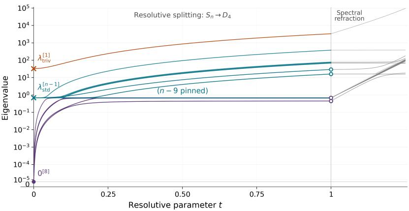  
Figure 9: Distinct eigenvalue branches of the Hessian on the parameter quotient at a global minimum of a thin AlexNet, shown for $d = 1 0 , n = d ^ { 2 } = 1 0 0$ , and $s = 1$ . The parameter $t \in [ 0 , 1 ]$ rescales $\delta K _ { 1 } \mapsto t \delta K _ { 1 }$ . At each $t ,$ the spectrum is computed modulo span $\{ ( K _ { \delta } , - t \mathbf { 1 } _ { n } ^ { \top } ) \}$ $\mathrm { A t                     } t = 0 $ , the positive spectrum is $\lambda _ { \mathrm { s t d } } ^ { [ n - 1 ] } \oplus \lambda _ { \mathrm { t r i v } }$ , with $\begin{array} { r } { \lambda _ { \mathrm { s t d } } = 1 - \frac { 1 } { \pi } } \end{array}$ and $\begin{array} { r } { \lambda _ { \mathrm { t r i v } } = 1 - \frac { 1 } { \pi } + \frac { n } { \pi } } \end{array}$ Eight branches emanate from zero, eight split from $\lambda _ { \mathrm { s t d } }$ , and the branch from $\lambda _ { \mathrm { t r i v } }$ evolves into the largest eigenvalue, while $n - 9 = 9 1$ eigenvalues remain exactly pinned at $\lambda _ { \mathrm { s t d } }$ The right-hand region shows spectral refraction as the $D _ { 4 ^ { - } } \mathrm { c o m p a t i b l e }$ quotient metric is deformed to the parameter-induced metric. Hollow circles mark the four $D _ { 4 } .$ -forced multiplicity-two eigenvalues. Their subsequent splitting is below the scale in the figure.

$$
X _ { \ell } = \mathrm { R e L U } \left( X _ { \ell - 1 } W _ { \ell , \mathrm { s e l f } } + A X _ { \ell - 1 } W _ { \ell , \mathrm { n b r } } \right) , \quad \ell = 1 , \dots , L , \qquad N ^ { \mathrm { G N N , \circ } } ( A ; W ) = \mathbf { 1 } _ { n } ^ { \top } X _ { L } \mathbf { q } .\tag{2.81}
$$

Since $X _ { 0 }$ is fixed throughout, we suppress it from the notation $N ^ { \mathrm { G N N } , \circ } ( A ; W )$ . Here $W _ { \ell , \mathrm { s e l f } } , W _ { \ell , \mathrm { n b r } } \in$ $\mathbb { R } ^ { n \times n }$ and $\mathbf { q } \in \mathbb { R } ^ { n }$ , so dim $\Theta = 2 L n ^ { 2 } + n$ . We take

$$
W _ { \ell , \mathrm { s e l f } } ^ { \star } = W _ { \ell , \mathrm { n b r } } ^ { \star } = I _ { n } , \qquad \ell = 1 , \ldots , L , \qquad \mathbf { q } ^ { \star } = n ^ { - 1 } \mathbf { 1 } _ { n } .\tag{2.82}
$$

The resulting teacher satisfies

$$
N ^ { \mathrm { G N N , } \circ } ( A ; W ^ { \star } ) = \frac { 1 } { n } \mathbf { 1 } _ { n } ^ { \top } ( I _ { n } + A ) ^ { L } X _ { 0 } \mathbf { 1 } _ { n } = \frac { 1 + ( n - 1 ) \beta } { n } \mathbf { 1 } _ { n } ^ { \top } ( I _ { n } + A ) ^ { L } \mathbf { 1 } _ { n } .\tag{2.83}
$$

The expected squared loss is then

$$
\begin{array} { r } { \mathcal { L } ( W ) = \mathbb { E } _ { A \sim \mu ^ { \mathrm { E R } } } \left[ \left( N ^ { \mathrm { G N N } , \circ } ( A ; W ) - N ^ { \mathrm { G N N } , \circ } ( A ; W ^ { \star } ) \right) ^ { 2 } \right] . } \end{array}\tag{2.84}
$$

At $W ^ { \star } , { \mathcal { L } }$ is locally $C ^ { 2 }$ , and its second diferential equals the GN form.

Symmetries, kernel and spectrum. For every permutation matrix $P ,$ consider the (noninternal) structural symmetry $\mathsf { s } ^ { \mathrm { G N N } } ( \bar { P } ) = ( \mathsf { s } _ { Z } ^ { \mathrm { G N N } } ( P ) , \mathsf { s } _ { \Theta } ^ { \mathrm { G N N } } ( \bar { P } ) )$ given by

$$
\begin{array} { r l } & { \mathsf { s } _ { Z } ^ { \mathrm { G N N } } ( P ) ( A , X _ { 0 } , y ) = ( P A P ^ { \top } , P X _ { 0 } P ^ { \top } , y ) , } \\ & { \qquad \mathsf { s } _ { \Theta } ^ { \mathrm { G N N } } ( P ) W = \left( ( P W _ { \ell , \mathrm { s e l f } } P ^ { \top } , P W _ { \ell , \mathrm { n b r } } P ^ { \top } ) _ { \ell = 1 } ^ { L } , P \mathbf { q } \right) . } \end{array}\tag{2.85}
$$

For the labels generated by the teacher above, the joint data law has the distributional symmetry

$$
\begin{array} { r } { \mathbf { d } ^ { \mathrm { E R } } ( P ) : ( A , X _ { 0 } , y ) \mapsto ( P A P ^ { \top } , P X _ { 0 } P ^ { \top } , y ) , } \end{array}\tag{2.86}
$$

since $A \triangleq P A P ^ { \top } , P X _ { 0 } P ^ { \top } = X _ { 0 }$ , and the teacher output in (2.83) is unchanged by $A \mapsto P A P ^ { \top }$ . Together, these yield the composite invariance of the objective ${ \mathsf { c } } ^ { \mathrm { G N N } } ( { \dot { P } } ) : = { \mathsf { s } } _ { \Theta } ^ { \mathrm { G N N } } { \bar { ( P ) } }$ , so $\mathcal { L } ( \mathsf { c } ^ { \mathrm { G N N } } ( P ) W ) =$ $\mathcal { L } ( W )$ . The teacher weights $W ^ { \star }$ are stabilized by $\langle \mathsf { c } ^ { \mathrm { G N N } } ( P ) : P \in S _ { n } \rangle \cong \breve { S } _ { n }$ . Consequently, $d _ { W } ^ { 2 } { \mathcal { L } } ( W ^ { \star } )$ is invariant under this $S _ { n }$ action.

Remark 10 The same composite invariance holds for random features whenever the joint law of $( A , X _ { 0 } )$ is invariant under the $S _ { n }$ action in (2.85).

For a perturbation δW, set

$$
\delta \boldsymbol { \xi } = \frac { 1 } { n } \left( \sum _ { \ell = 1 } ^ { L } \delta W _ { \ell , \mathrm { s e l f } } - \sum _ { \ell = 1 } ^ { L } \delta W _ { \ell , \mathrm { n b r } } \right) \mathbf { 1 } _ { n } , \qquad \delta \eta = \frac { 1 } { n } \left( \sum _ { \ell = 1 } ^ { L } \delta W _ { \ell , \mathrm { n b r } } \right) \mathbf { 1 } _ { n } + \delta \mathbf { q } .\tag{2.87}
$$

A direct calculation gives

$$
d _ { W } N ^ { \mathrm { G N N , o } } ( A ; W ^ { \star } ) [ \delta W ] = ( X _ { 0 } ( I _ { n } + A ) ^ { L - 1 } \mathbf { 1 } _ { n } ) ^ { \top } \delta \pmb { \xi } + ( X _ { 0 } ( I _ { n } + A ) ^ { L } \mathbf { 1 } _ { n } ) ^ { \top } \delta \eta .\tag{2.88}
$$

The map $\delta W \mapsto ( \delta \pmb { \xi } , \delta \pmb { \eta } )$ is surjective onto the efective coordinate space $\mathbb { R } ^ { n } \oplus \mathbb { R } ^ { n }$ . The composite $S _ { n }$ action induces the diagonal permutation action on this space, whose isotypic decomposition is

$$
\mathbb { R } ^ { n } \oplus \mathbb { R } ^ { n } \cong 2 \mathfrak { s } _ { ( n ) } \oplus 2 \mathfrak { s } _ { ( n - 1 , 1 ) } .\tag{2.89}
$$

Quotienting the efective coordinate space by the kernel of the descended GN form gives the Hessian quotient. The resulting kernel, symmetry-forced multiplicities, and asymptotic scales are summarized in Table 6. For a balanced stochastic block model with even $n ,$ the same analysis applies mutatis mutandis after replacing the $S _ { n }$ symmetry by the wreath product $S _ { n / 2 } \wr S _ { 2 }$

## 2.3 Transformers: In-context learning

As noted above, the same framework extends to general message-passing architectures, with the analysis applied to their message, aggregation, and update operators. We next apply this perspective to in-context learning in transformers. Following Garg et al. (2022), we consider prompts comprising in-context examples followed by a query input. For a minimal illustration, we choose a function class exactly realizable by a single-head causal Transformer block with a residual connection.

Fix $K \geq 1$ . Draw a uniformly from {−1, 1} and $x _ { 1 } , \ldots , x _ { K + 1 }$ independently from $\operatorname { U n i f } [ - 1 , 1 ]$ 2 independently of a. Set $f _ { a } ( x ) = a + x$ and $y _ { i } = f _ { a } ( x _ { i } )$ . For $1 \leq k \leq K$ , the prompt is $\mathcal { P } _ { k } =$ $\left( x _ { 1 } , y _ { 1 } , \dots , x _ { k } , y _ { k } , x _ { k + 1 } \right)$ , and the target is $y _ { k + 1 }$ . Fix $h \geq 6$ and orthonormal vectors ${ \mathbf u } _ { \mathrm { x } } , { \mathbf u } _ { \mathrm { c } } , { \mathbf u } _ { \mathrm { y } } \in { \mathbf { 1 } } _ { h } ^ { \perp }$ Encode each in-context example as an input token and an output token by

<table><tr><td>Depth</td><td>Multiplicity pattern</td><td> ${ \mathfrak { s } } _ { ( n ) }$ </td><td> $\mathfrak { s } _ { ( n - 1 , 1 ) }$ </td><td> $\mathrm { d i m } \ker d _ { W } ^ { 2 } { \mathcal { L } }$ </td></tr><tr><td> $L = 1$ </td><td> $( 2 n ^ { 2 } - 1 ) | \mathrm { { o } } , \ ( n - 1 ) , \ 1 ^ { [ 2 ] }$ </td><td> $\Theta ( n ^ { 5 } ) , \Theta ( 1 )$ </td><td> $\Theta ( n )$ </td><td> $2 n ^ { 2 } - 1$ </td></tr><tr><td> $L = 2$ </td><td> $( \dot { 4 } n ^ { 2 } - n ) \ddot { | } _ { 0 } , ( \dot { n } - 1 ) ^ { \dot { [ 2 ] } } , 1 ^ { [ 2 ] }$ </td><td> $\Theta ( n ^ { 7 } ) , \Theta ( n ^ { 2 } )$ </td><td> $\Theta ( n ^ { 3 } ) , \Theta ( n ^ { - 1 } )$ </td><td> $4 n ^ { 2 } - n$ </td></tr><tr><td> $L \geq 3$ </td><td> $( { 2 L n ^ { 2 } - n } ) | _ { 0 } , ( n - 1 ) ^ { [ 2 ] } , 1 ^ { [ 2 ] }$ </td><td> $\Theta ( n ^ { 2 L + 3 } ) , \Theta \dot { ( } n ^ { 2 L - 2 } )$ </td><td> $\Theta ( n ^ { 2 \dot { L } - \dot { 1 } } ) , \ \Theta ( n ^ { 2 \dot { L } - 6 } )$ </td><td> $2 L n ^ { 2 } - n$ </td></tr></table>

Table 6: Asymptotic spectrum of the Euclidean Hessian at $W ^ { \star }$ for fixed $\rho , \beta \in ( 0 , 1 )$ and fixed depth L as $n \to \infty$ . Each $\mathfrak { s } _ { ( n ) }$ branch is simple, while each $\mathfrak { s } _ { ( n - 1 , 1 ) }$ branch has multiplicity $n - 1$ The reference point $\dot { W } ^ { \star }$ belongs to a larger local family of global minima, similarly to the AlexNet setting above.

$$
\mathbf { h } _ { 2 i - 1 } = x _ { i } \mathbf { u } _ { \mathrm { x } } + \sqrt { 1 - x _ { i } ^ { 2 } } \mathbf { u } _ { \mathrm { c } } ,
$$

$$
\mathbf { h } _ { 2 i } = \frac { y _ { i } } { 2 } \mathbf { u } _ { \mathrm { y } } + \sqrt { 1 - \frac { y _ { i } ^ { 2 } } { 4 } } \mathbf { u } _ { \mathrm { c } } ,\tag{2.90}
$$

and encode the query input using the input-token formula with $x _ { i }$ replaced by $x _ { k + 1 }$ . Every token is centered and has unit norm, so layer normalization with fixed $\epsilon > 0$ multiplies it by $c = ( h ^ { - \bar { 1 } } + \epsilon ) ^ { - 1 / 2 }$ With a residual connection and fixed output projection and readout, the model output and a realizing parameter choice are given by

$$
N _ { k } ( \mathcal { P } _ { k } ; W ) = x _ { k + 1 } + \sum _ { j = 1 } ^ { 2 k } \alpha _ { j } ( W ) { \mathbf { v } } ^ { \top } ( c { \mathbf { h } } _ { j } ) , \qquad W ^ { \star } = \left( 0 , 0 , \frac { 2 } { c } ( - { \mathbf { u } } _ { \mathbf { x } } + 2 { \mathbf { u } } _ { \mathbf { y } } ) \right) ,\tag{2.91}
$$

where $W = ( \mathbf { q } , \mathbf { k } , \mathbf { v } )$ and $\alpha _ { j } ( W )$ are the softmax weights obtained from the scalar query and the keys of the preceding 2k tokens. At $W ^ { \star }$ , the model realizes $y _ { k + 1 }$ exactly for every prompt. Every $R \in O ( h )$ fixing span $\left\{ \mathbf { 1 } _ { h } , \mathbf { u } _ { \mathrm { x } } , \mathbf { u } _ { \mathrm { c } } , \mathbf { u } _ { \mathrm { y } } \right\}$ pointwise acts simultaneously on $\mathbf { q } , \mathbf { k } , \mathbf { v } ,$ preserves the loss, and fixes $W ^ { \star }$ . Together with joint sign reversal of q and k, this gives an orthogonal Hessian-invariance subgroup $C _ { 2 } \times O ( h - 4 )$ . The expected squared loss vanishes at $W ^ { \star }$ , and so its Hessian there equals the GN form. A direct calculation gives the multiplicity structure $\{ \{ ( 3 h - 3 ) | _ { 0 } , 1 ^ { [ 3 ] } \} \}$

## 2.4 Neural collapse, UFM, and spectral refraction

We now turn from architectures used in practice to the symmetries and invariances of a theoretical model motivated by neural collapse (NC) Papyan et al. (2020). Concretely, we consider a bias-free version of the unregularized unconstrained features model (UFM) of Mixon et al. (2022). We recast the setting in an equivalent form that brings the SB framework naturally into view and makes the composite invariance argument transparent.

The unconstrained features model. Let $k \geq 2 .$ , let $k \mid m$ , and put $q = m / k$ . Assume $k \leq h < m$ Let $\Theta : = { \cal M } ( k , h ) \times { \cal M } ( h , m )$ be the weight space, with its standard Euclidean inner product. The network and data distribution are given by

$$
N ^ { \mathrm { U F M } } ( \mathbf { x } ; W , F ) : = W F \mathbf { x } , \qquad ( W , F ) \in \Theta , \qquad \mu ^ { \mathrm { U F M } } : = \frac { 1 } { m } \sum _ { c = 1 } ^ { k } \sum _ { j = 1 } ^ { q } \delta _ { ( \mathbf { e } _ { ( c - 1 ) q + j } , \mathbf { e } _ { c } ) } .\tag{2.92}
$$

Put $\mathbf { Y } : = I _ { k } \otimes \mathbf { 1 } _ { q } ^ { \top }$ . The expected squared loss is

$$
\mathcal { L } ^ { \mathrm { U F M } } ( W , F ) : = \mathbb { E } _ { ( \mathbf { x } , \mathbf { y } ) \sim \mu ^ { \mathrm { U F M } } } \| N ^ { \mathrm { U F M } } ( \mathbf { x } ; W , F ) - \mathbf { y } \| ^ { 2 } = \frac { 1 } { m } \| W F - \mathbf { Y } \| _ { F } ^ { 2 } .\tag{2.93}
$$

Its global minimizers are exactly the pairs satisfying $W F = \mathbf { Y }$ . In particular, every global minimizer interpolates and has $\mathrm { r k } W = k$

To describe the symmetries, let $\pmb { \tau } = ( \tau _ { 1 } , \dots , \tau _ { k } ) \in S _ { q } ^ { k }$ and $\pi \in S _ { k }$ , and set $P _ { \tau } : = \mathrm { d i a g } ( P _ { \tau _ { 1 } } , \dots , P _ { \tau _ { k } } )$ and $P _ { \pi } ^ { ( m ) } : = P _ { \pi } \otimes I _ { q }$ . Write $P _ { \omega } ( \tau , \pi ) : = P _ { \pi } ^ { ( m ) } P _ { \tau }$ , abbreviated to $P _ { \omega }$ when the pair is clear. These matrices realize the standard imprimitive action of $S _ { q } \ : { \wr } \ : S _ { k } = S _ { q } ^ { k } \rtimes S _ { k }$ on the m samples (see Figure 5). Table 7 records the relevant architectural, structural, and distributional symmetries, with the relevant general symmetries in Table 9 repeated for convenience.
<table><tr><td> $\#$ </td><td>Symmetry type Definition</td><td></td><td>Isomorphism class Invariance of</td><td> $\mathcal { L } ^ { \mathrm { U F M } }$ </td></tr><tr><td> $\mathsf { a } _ { 0 } ^ { \mathrm { U F M } } ( M _ { 0 } )$ </td><td>Architectural</td><td> $( F M _ { 0 } ^ { - 1 } , M _ { 0 } \mathbf { x } )$ </td><td> $\mathrm { G L } _ { m }$ </td><td>No</td></tr><tr><td> $\mathsf { a } _ { 1 } ^ { \mathrm { U F M } } ( M _ { 1 } )$ </td><td>Architectural</td><td> $( W M _ { 1 } ^ { - 1 } , M _ { 1 } F )$ </td><td> $\mathrm { G L } _ { h }$ </td><td>Yes</td></tr><tr><td> $\mathsf { \mathsf { S } } ^ { \mathrm { U F M } } ( U )$ </td><td>Structural</td><td> $( U W , U \mathbf { y } )$ </td><td>O(k)</td><td>No</td></tr><tr><td> ${ \mathsf { d } } _ { \mathrm { w i t h i n } } ^ { \mathrm { U F M } } ( \tau )$ </td><td>Distributional</td><td> $P _ { \tau \mathbf { x } }$ </td><td> $S _ { q } ^ { k }$ </td><td>No</td></tr><tr><td> ${ \mathsf { d } } _ { \mathrm { b e t w e e n } } ^ { \mathrm { U F M } } ( \pi )$ </td><td>Distributional</td><td> $( P _ { \pi } ^ { ( m ) } \mathbf { x } , P _ { \pi } \mathbf { y } )$ </td><td> $S _ { k }$ </td><td>No</td></tr><tr><td> ${ \mathsf { c } } ^ { \mathrm { U F M } }$ </td><td>Composite</td><td> $( P _ { \pi } W M _ { 1 } ^ { - 1 } , M _ { 1 } F P _ { \omega } ^ { \top } )$ </td><td> $\mathrm { { G L } } _ { h } \times ( S _ { q } \wr S _ { k } )$ </td><td>Yes</td></tr></table>

Table 7: Architectural, structural, and distributional symmetries of the UFM and the resulting composite invariance. Here $M _ { 0 } \in \mathrm { G L } _ { m } , M _ { 1 } \in \mathrm { G L } _ { h }$ , and $U \in O ( k )$

Following Section 3.2, we study Hessian invariance at global minima directly through composite invariances rather than point stabilizers. The pointwise GN form is

$$
\begin{array} { r } { d _ { ( W , F ) } ^ { \mathrm { G N } } \kappa ^ { \mathrm { U F M } } ( \mathbf { x } , \mathbf { y } ; W , F ) [ \delta W , \delta F ] = 2 \| ( \delta W F + W \delta F ) \mathbf { x } \| ^ { 2 } . } \end{array}\tag{2.94}
$$

At every global minimizer, the Hessian equals the expected GN form, and we have

$$
d _ { ( W , F ) } ^ { 2 } \mathcal { L } ^ { \mathrm { U F M } } [ \delta W , \delta F ] = \frac { 2 } { m } \| \delta W F + W \delta F \| _ { F } ^ { 2 } , \quad \ker d _ { ( W , F ) } ^ { 2 } \mathcal { L } ^ { \mathrm { U F M } } = \{ ( \delta W , \delta F ) : \delta W F + W \delta F = 0 \} .
$$

In particular, the kernel has dimension $h ( k + m ) - k m$ , the number of independent flat directions along the manifold $W F = \mathbf { Y }$ of global minimizers.

Although the Hessian here admits a direct analysis, this setting is deliberately chosen to bring the SB framework into focus. The structural symmetries of the pointwise GN form compatible with the distribution group in Table 7 have a complete description. For $( \tau , \pi ) \in S _ { q } \mathrm { ~ } \backslash S _ { k }$ , every such symmetry induces on the quotient by the kernel an action of the form

$$
\delta W F + W \delta F \mapsto Q ( \delta W F + W \delta F ) P _ { \omega } ( \tau , \pi ) ^ { \top } , \qquad Q \in O ( k ) .\tag{2.95}
$$

The choice $Q = I _ { k }$ yields a composite invariance subgroup of $\Gamma _ { ( W , F ) } ^ { [ \mathrm { G N } ] }$ isomorphic to $S _ { q } \wr S _ { k }$ . Under the Euclidean parameter metric, the largest subgroup whose action can be chosen orthogonal is

$$
\{ ( \pmb { \tau } , \pi ) \in S _ { q } \wr S _ { k } : P _ { \omega } \boldsymbol { F } ^ { \top } \boldsymbol { F } P _ { \omega } ^ { \top } = \boldsymbol { F } ^ { \top } \boldsymbol { F } \} .\tag{2.96}
$$

When this condition fails for some $( \tau , \pi ) \in S _ { q } \wr S _ { k }$ , spectral refraction may split the symmetry-forced multiplicities in the Euclidean Hessian spectrum.

Neural collapse and spectral refraction. The distinction between orthogonal and nonorthogonal actions of this Hessian invariance has a precise interpretation in terms of NC1 and NC2. To state

their exact forms, define

$$
\begin{array} { l l } { { \displaystyle { \boldsymbol { \mu } } _ { c } : = \mathbb { E } _ { \mu ^ { \mathrm { U F M } } } [ F { \mathbf { x } } \mid \mathbf { y } = { \mathbf { e } } _ { c } ] } } & { { ~ \bar { \boldsymbol { \mu } } : = \frac { 1 } { k } \displaystyle { \sum _ { c = 1 } ^ { k } } { \boldsymbol { \mu } } _ { c } , } } \\ { { \displaystyle \Sigma _ { W } : = \frac { 1 } { k } \sum _ { c = 1 } ^ { k } \mathbb { E } _ { \mu ^ { \mathrm { U F M } } } [ ( F { \mathbf { x } } - { \boldsymbol { \mu } } _ { c } ) ( F { \mathbf { x } } - { \boldsymbol { \mu } } _ { c } ) ^ { \top } \mid \mathbf { y } = { \mathbf { e } } _ { c } ] } , } & { { ~ \Sigma _ { B } : = \displaystyle \frac { 1 } { k } \sum _ { c = 1 } ^ { k } ( { \boldsymbol { \mu } } _ { c } - \bar { \boldsymbol { \mu } } ) ( { \boldsymbol { \mu } } _ { c } - \bar { \boldsymbol { \mu } } ) ^ { \top } . } } \end{array}\tag{2.97}
$$

NC1 is exact within-class collapse, that is, $\Sigma _ { W } = 0$ . NC2 says that the centered class means form a simplex equiangular tight frame (ETF), equivalently

$$
\Sigma _ { B } = \frac { { \mathrm { T r } } { \left( \Sigma _ { B } \right) } } { k - 1 } \Pi _ { \mathrm { s p a n } \{ \mu _ { c } - \bar { \mu } : c \in [ k ] \} } , \quad \mathrm { r k } \Sigma _ { B } = k - 1 ,\tag{2.98}
$$

where $\Pi _ { V }$ generally denotes orthogonal projection onto a subspace V. For $k \leq h < m$ , the full $S _ { q } \wr S _ { k }$ distribution group gives orthogonal composite GN invariances if and only if the subgroup in (2.96) is the full group. This occurs precisely when NC1 and NC2 hold and the class means have equal norms.

This gives a natural hierarchy. Composite GN invariance under the full wreath group is universal across the global minima. NC1, a proper restriction on global minima when $h > k ,$ already makes the within-class factor $S _ { q } ^ { k }$ act orthogonally, since $F P _ { \tau } = F$ for every $\tau \in S _ { q } ^ { k }$ . Adding NC2 and equal norms extends this orthogonal realization to the between-class factor and hence to the full wreath group.

At the NC1 level, restricting the representation in the second row of Table 8 to $S _ { q } ^ { k }$ splits each of its k induced copies into k within-class standard components, one per class and each of dimension $q - 1$ The remaining kt ⊕ $k \mathfrak { s } _ { k - 1 , : }$ 1 restricts to $k ^ { 2 } \mathrm { t }$ . When the between-class factor also acts orthogonally, the k within-class components in each copy form an induced representation of dimension $m - k ,$ , as in the second row.

At the minimal width $h = k .$ , if the subgroup in (2.96) is the full wreath group, then

$$
\begin{array} { r } { W W ^ { \top } = \alpha \Pi _ { \mathrm { s p a n } \{ \mathbf { 1 } _ { k } \} } + \beta \Pi _ { \mathbf { 1 } _ { k } ^ { \bot } } , \qquad \alpha , \beta > 0 . } \end{array}\tag{2.99}
$$

This permits an additional orthogonal $O ( k - 1 )$ action on the GN form. For $h > k , ( 2 . 9 9 )$ is no longer automatic. If the subgroup in (2.96) is the full wreath group and (2.99) holds, the same enlarged group $\operatorname { O } ( k - 1 ) \times ( S _ { q } \wr S _ { k } )$ acts. The third row records its quotient decomposition and multiplicity structure in either case.

The same analysis extends mutatis mutandis to deep linear UFMs. A fuller treatment of this setting and nonlinear UFM models, including the implications of neural collapse for Hessian invariance and questions of optimization and convergence, is deferred to Arjevani (2027a).

## 2.5 Neural registration: ResNet-18

So far, the applications have used symmetries of the data distribution. Here we bring into focus a phenomenon we call neural registration, in which symmetries emerge in the joint hidden feature–label law. Paired with structural symmetries of a network sufix, these symmetries of the feature law yield composite invariances. As these symmetries emerge across layers, the quality of registration is reflected in the resulting composite invariance, which we use to understand the structure of the original spectrum. The fuller treatment, including that of the layers preceding registration, is deferred to Arjevani (2027a).

Under mild conditions, approximate NC1, discussed in Section 2.4, gives rise to approximate registration. A ResNet-18 trained on MNIST illustrates this connection: registration strengthens as the NC1 diagnostic, defined in (2.104), decreases toward the final blocks (left panel of Figure 10). Registration is broader than collapse, however. At an explicit five-layer global minimizer in Learning

<table><tr><td>Space</td><td>Isotypic decomposition</td><td>Multiplicity structure</td></tr><tr><td> $T _ { ( W , F ) } \Theta$ </td><td> $( h ( k + m ) - k m + k ) \mathrm { t } \oplus k \mathfrak { s } _ { k - 1 , 1 }$   $\oplus k \operatorname { I n d } _ { S _ { q } ^ { k } \times S _ { k - 1 } } ^ { S _ { q } \ i S _ { k } } \mathfrak { s } _ { q - 1 , 1 }$ </td><td> $( h ( k + m ) - k m ) | _ { 0 } ,$   $1 ^ { [ k ] } , \quad ( k - 1 ) ^ { [ k ] } , \quad ( m - k ) ^ { [ k ] }$ </td></tr><tr><td> $T _ { ( W , F ) } \Theta$   $\overline { { \ker d ^ { 2 } \mathcal { L } ^ { \mathrm { U F M } } } }$ </td><td> $k \mathrm { t } \oplus k \mathfrak { s } _ { k - 1 , 1 } \oplus k \operatorname { I n d } _ { S _ { q } ^ { k } \rtimes S _ { k - 1 } } ^ { S _ { q } \wr S _ { k } } \mathfrak { s } _ { q - 1 , 1 }$ </td><td> $1 ^ { [ k ] } , \quad ( k - 1 ) ^ { [ k ] } , ( m - k ) ^ { [ k ] }$ </td></tr><tr><td>Quotient under  $\operatorname { O } ( k - 1 ) \times ( S _ { q } \wr S _ { k } )$ </td><td> $\left( \mathbf { t } \oplus \mathbf { s t d } _ { O ( k - 1 ) } \right)$   $\otimes \left( \mathbf { t } \oplus \pmb { \mathfrak { s } } _ { k - 1 , 1 } \oplus \operatorname { I n d } _ { S _ { q } ^ { k } \times S _ { k - 1 } } ^ { S _ { q } \wr S _ { k } } \pmb { \mathfrak { s } } _ { q - 1 , 1 } \right)$ </td><td> $1 , \quad ( k - 1 ) ^ { [ 2 ] } , \quad ( k - 1 ) ^ { 2 } ,$   $m - k , \quad ( k - 1 ) ( m - k )$ </td></tr></table>

Table 8: Isotypic decompositions at global minima under the full composite $S _ { q } \wr S _ { k }$ action and, in the third row where (2.99) holds, its $O ( k - 1 )$ enlargement. Here ${ \mathrm { s t d } } _ { O ( k - 1 ) }$ is the standard representation of $O ( k - 1 )$ , and $\mathfrak { s } _ { \lambda }$ denotes irreducible representations of symmetric groups as in Section 3.2. The first row uses a lift acting trivially on the Hessian kernel. In the induced representations, $\mathfrak { s } _ { q - 1 , 1 }$ acts through the first $S _ { q }$ factor, with the other $S _ { q }$ factors and $S _ { k - 1 }$ acting trivially. The resulting multiplicity structures use the notation of Definition 7. When the subgroup in (2.96) equals $S _ { q } \wr S _ { k }$ , the stated multiplicities apply to the Euclidean Hessian; otherwise, spectral refraction may split them.

Problem 1 with $k = 5$ , the registration diagnostic decreases across hidden layers while the NC1 diagnostic remains high (right panel of Figure 10).

We begin with some notation. For a network N composed of L modules with parameter blocks $W _ { 1 } , \dots , W _ { L }$ , and for $1 \leq i \leq j \leq L$ , write $N _ { j : i } ( \cdot ; W _ { j : i } )$ for the composition of modules $i , \dots , j ,$ where $W _ { j : i } = ( W _ { i } , \ldots , W _ { j } )$ . Write $N _ { i : }$ for the composition of modules $1 , \ldots , i$ and $N _ { : i }$ for the composition of modules $i , \ldots , L .$ . Empty compositions are identity maps. For $i < j ,$

$$
N ( \cdot ; W ) = N _ { : j + 1 } ( \cdot ; W _ { : j + 1 } ) \circ N _ { j } ( \cdot ; W _ { j } ) \circ N _ { j - 1 : i + 1 } ( \cdot ; W _ { j - 1 : i + 1 } ) \circ N _ { i } ( \cdot ; W _ { i } ) \circ N _ { i - 1 : i } ( \cdot ; W _ { i - 1 : i } ) .
$$

Let $X _ { 0 } : = X$ , and for $1 \leq i \leq L$ let $X _ { i } : = \mathbb { R } ^ { d _ { i } }$ be the output space of module i. Write $\mathbf { h } _ { 0 } ( \mathbf { x } ) = \mathbf { x }$ and $\mathbf { h } _ { i } ( \mathbf { x } ) = N _ { i : } ( \mathbf { x } ; W _ { i : } ) \in X _ { i }$ for $1 \leq i \leq L$ . For $0 \leq i < L$ , we have $N ( \mathbf { x } ; W ) = N _ { : i + 1 } ( \mathbf { h } _ { i } ( \mathbf { x } ) ; W _ { : i + 1 } )$ If perturbations are confined to the parameters of modules $i + 1 , \dots , L$ , the pointwise loss and its parameter diferentials depend on $\displaystyle ( \mathbf { x } , \mathbf { y } )$ only through $( \mathbf { h } _ { i } ( \mathbf { x } ) , \mathbf { y } )$

Definition 11 (Registration group) Write

$$
\operatorname { L a w } ( \mathbf { h } _ { i } , \mathbf { y } ) : = ( N _ { i : } ( \mathbf { \nabla } \cdot ; W _ { i : } ) , \operatorname { i d } _ { Y } ) _ { * } \mu
$$

for the joint law $o f \left( \mathbf { h } _ { i } ( \mathbf { x } ) , \mathbf { y } \right)$ . Set $\operatorname { A u t } ( X _ { i } \times Y ) : = \operatorname { A u t } ( X _ { i } ) \times \operatorname { A u t } ( Y )$ , with the usual identification of tuples of automorphisms with their componentwise actions. The registration group at i is defined $b y$

$$
\mathsf { R } _ { i } : = \mathsf { D } ( \mathrm { L a w } (  { \mathbf { h } } _ { i } ,  { \mathbf { y } } ) ) \leq \mathrm { A u t } ( X _ { i } \times Y ) .\tag{2.100}
$$

The composite invariance argument in (1.19) applies to the sufix $N _ { : i + 1 }$ , with $\mathsf { R } _ { i }$ as the distribution group of its inputs and labels. For GN invariance, for example, we need R -compatible structural symmetries of the pointwise GN form. We demonstrate this on an $N ^ { 3 }$ network trained on MNIST with squared loss (Figure 8). At a hidden layer of dimension $d ,$ let $M = ( { \widehat { \pmb \mu } } _ { 1 } , \dots , { \widehat { \pmb \mu } } _ { k } )$ collect the empirical class means and define

$$
\rho ( \pi ) = I _ { d } + ( M P _ { \pi } - M ) M ^ { \dagger } , \qquad \pi \in S _ { k } .\tag{2.101}
$$

These maps form an exact representation whenever $P _ { \pi }$ ker $M = \ker M$ for every permutation in the chosen group. This holds automatically for full column rank, but also allows dependent means,

including centered simplex means. Write $\rho _ { j } ( \pi )$ for the action at hidden layer $j$ and set $\rho _ { 3 } ( \pi ) = P _ { \pi }$ at the output. The baseline layerwise action is

$$
\delta W _ { j } \mapsto \rho _ { j } ( \pi ) \delta W _ { j } \rho _ { j - 1 } ( \pi ) ^ { - 1 } , \qquad \delta \mathbf { b } _ { j } \mapsto \rho _ { j } ( \pi ) \delta \mathbf { b } _ { j } , \qquad i < j \leq 3 .\tag{2.102}
$$

For $N _ { : 3 }$ , we use this action directly. For $N _ { : 2 } .$ , we conjugate the representation by a fitted common change of coordinates to improve its pointwise GN compatibility while preserving the group law. The figure illustrates the resulting approximate composite invariance and spectral refraction.

Collapse and registration. To quantify registration, here, we use the squared sliced 2-Wasserstein distance, which averages squared one-dimensional 2-Wasserstein distances uniformly over unit directions Bonneel et al. (2015), for its computational tractability and its direct connection to NC1. Assume balanced classes and finite second moments. At feature cut i, take a finite group $G \leq \mathrm { A u t } ( X _ { i } \times Y )$ whose label actions permute the class encodings, and write $\mathsf { r } = \left( \mathsf { r } _ { X _ { i } } , \mathsf { r } _ { Y } \right) \in G$ Write $\mathbf { h } = \mathbf { h } _ { i }$ and use the class-mean and covariance notation $\mu _ { a } , \bar { \mu } , \Sigma _ { W }$ , and $\Sigma _ { B }$ from Section 2.4. For $\mathrm { T r } ( \Sigma _ { B } ) > 0$ , define

$$
\mathrm { R e g } _ { G } ^ { \mathrm { c l a s s } } ( \mathrm { L a w } ( \mathbf h , \mathbf y ) ) : = \frac { ( k - 1 ) \dim X _ { i } } { 2 k ^ { 2 } | G | \mathrm { T r } ( \Sigma _ { B } ) } \sum _ { r \in G } \sum _ { a = 1 } ^ { k } \mathrm { S W } _ { 2 } ^ { 2 } \big ( ( r _ { X _ { i } } ) _ { * } \mathrm { L a w } ( \mathbf h \mid \mathbf y = \mathbf e _ { a } ) , \mathrm { L a w } ( \mathbf h \mid \mathbf y = r _ { Y } \mathbf e _ { a } ) \big ) .\tag{2.103}
$$

The normalization uses the mean squared distance between distinct class means, $2 k \mathrm { T r } ( \Sigma _ { B } ) / ( k - 1 )$

NC1 is also generally approximate. For intermediate features, rather than the original diagnostic of Papyan et al. (2020), we follow the trace normalization of Rangamani et al. (2023)

$$
\overline { { \mathrm { N C 1 } } } ( \mathbf { h } ) : = \frac { \mathrm { T r } ( \Sigma _ { W } ) } { \mathrm { T r } ( \Sigma _ { W } + \Sigma _ { B } ) } .\tag{2.104}
$$

For linear feature actions satisfying $\mathsf { r } _ { X _ { i } } \pmb { \mu } _ { a } = \pmb { \mu } _ { b }$ whenever $\boldsymbol { \mathsf { r } } _ { Y } \mathbf { e } _ { a } = \mathbf { e } _ { b }$ , we have

$$
\mathrm { R e g } _ { G } ^ { \mathrm { c l a s s } } ( \mathrm { L a w } ( \mathbf { h } , \mathbf { y } ) ) \leq \frac { k - 1 } { 2 k } \left( \frac { 1 } { | G | } \sum _ { r \in G } ( \| r _ { X _ { i } } \| _ { \mathrm { o p } } ^ { 2 } + 1 ) \right) \frac { \overline { { \mathrm { N C 1 } } } ( \mathbf { h } ) } { 1 - \overline { { \mathrm { N C 1 } } } ( \mathbf { h } ) } .\tag{2.105}
$$

Thus vanishing NC1 gives vanishing registration defect when the average squared operator norm remains bounded. Figure 10 places these two diagnostics side by side across hidden layers of a five-layer ReLU network on five Gaussians and a ResNet-18 trained on MNIST. The ResNet-18 checkpoint comes from Papyan (2019). We use the maps in (2.101). The sliced discrepancies are averaged over adjacent class transpositions, using 16 projection directions per transposition. In the Gaussian case, the registration diagnostic decreases across layers while NC1 remains high, separating registration from collapse.

## 2.6 Can One Hear the Symmetry of a Critical Point?

The preceding applications lead from symmetries to spectral structure. Specifically, they show how architectural, structural, and distributional symmetries force large Hessian eigenvalue multiplicities. Inspired by Mark Kac’s celebrated question “Can One Hear the Shape of a Drum” Kac (1966), we now turn to the inverse problem:

## What do eigenvalue multiplicities reveal about the symmetries that force them?

This question requires several qualifications before it can be approached. For example, one should specify the ambient group in which to look, here obtained by projecting the relevant structure group onto its parameter component. Genericity is another qualification. For the natural action of $S _ { d }$ on $\mathbb { R } ^ { d }$ by coordinate permutations, a fairly detailed account can be given (cf. Table 11), provided there are no eigenvalue coincidences beyond those forced by symmetry.

Trace-normalized NC1 Mean-fitted registration diagnostic

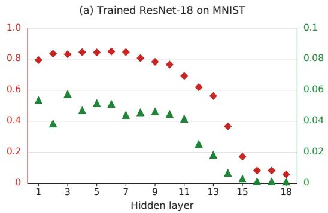

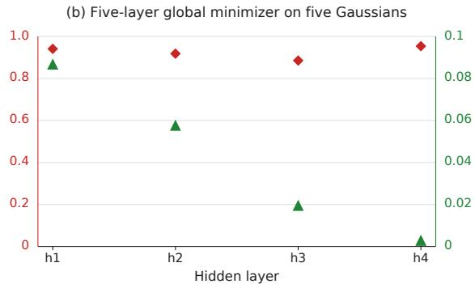  
Figure 10: Registration and neural collapse across hidden layers. Red shows NC1 from (2.104), and green the normalized empirical registration diagnostic. The left uses 6,313 MNIST images per class for a trained ResNet-18 (indices denote feature cuts before successive parameter blocks). Both diagnostics decrease toward its final blocks. The right uses 10,000 independent samples per class from $\textbf { x } | \textbf { y } = \mathbf { e } _ { c } \sim \mathcal { N } ( \mathbf { e } _ { c } , I _ { 5 } )$ at the explicit $N ^ { 5 }$ global minimizer. Registration improves while the NC1 diagnostic remains high.

## 3 Concepts and Methods

We now give a formal account of the overview, intentionally retaining some overlap with the earlier discussion for continuity. Selected proof sketches are included here to illuminate the sources of the phenomena considered, with the remaining proofs and technical details given in Section 5. The sketches may be omitted without interrupting the exposition.

## 3.1 Architectural, structural, and distributional symmetries

The overview demonstrated the central role of Hessian invariance properties in constraining the spectrum, in particular through the invariant subspaces and eigenvalue degeneracies they impose. This leads to the basic question of how to identify the Hessian invariances responsible for these spectral features.

The point-stabilizer approach. The standard approach to establishing such invariance proceeds as follows. Let Γ act linearly on $V _ { : }$ , and let $f \colon V \to$ R be twice diferentiable and Γ-invariant, meaning

$$
f ( g \mathbf { v } ) = f ( \mathbf { v } ) \qquad { \mathrm { f o r ~ a l l ~ } } g \in \Gamma , \ \mathbf { v } \in V .\tag{3.106}
$$

The action of Γ on V induces an action on the space of symmetric matrices by $H \mapsto g ^ { - \top } H g ^ { - 1 }$ Accordingly, we may consider the corresponding stabilizer $\operatorname { S t a b } _ { \Gamma } ( H )$ of a symmetric matrix H (see (1.39) for the stabilizer notation). Diferentiating the identity (3.106) twice at v gives $\begin{array} { r l r } {  { g ^ { \top } \nabla ^ { 2 } f ( { \bf v } ) { \bf \bar { g } } = } } \end{array}$ $\nabla ^ { 2 } f ( \mathbf { v } )$ for every $g \in \operatorname { S t a b } _ { \Gamma } ( \mathbf { v } )$ . Therefore,

$$
\operatorname { S t a b } _ { \Gamma } ( \mathbf { v } ) \leq \operatorname { S t a b } _ { \Gamma } ( \nabla ^ { 2 } f ( \mathbf { v } ) ) \leq \operatorname { S t a b } _ { \operatorname { G L } ( V ) } ( \nabla ^ { 2 } f ( \mathbf { v } ) ) .\tag{3.107}
$$

The inclusions in (3.107) therefore place the point stabilizer inside the Hessian stabilizer. Thus, identifying the loss invariance group Γ provides a route to identifying a subgroup of the Hessian invariance group. As we will see shortly, this route generally fails to capture the relevant Hessian invariances in our setting.

In many cases, the relevant invariances are apparent from the form of the objective, or are built into the construction. For example, for the n-variate quadratic polynomial

$$
q ( { \bf v } ) = \sum _ { i < j } v _ { i } v _ { j } ,\tag{3.108}
$$

it is immediate that permuting the coordinates of v leaves q unchanged. Thus, q is invariant under the standard action of $S _ { n }$ by coordinate permutations. In our setting, where the objective comes from fitting neural networks (1.4), structural symmetries are likewise apparent in layer coordinates. Composite symmetries, however, arise from a subtler interaction between structural and distributional symmetries, as in (1.19). We now formally introduce the concepts and methods developed to analyze these invariances.

Symmetry groups of a learning problem. We define the data space and the joint space by

$$
Z : = X \times Y , \qquad \mathbb { A } : = Z \times \Theta .\tag{3.109}
$$

The joint space is the natural domain of the pointwise loss (1.3). Models such as $N ^ { 3 }$ are viewed on it through their dependence on $( \mathbf { x } , W )$ . By symmetries we mean elements of the automorphism groups of $Z$ and $\mathbb { A } .$ defined to be $\operatorname { A u t } ( Z ) : = \operatorname { A u t } ( X ) \times \operatorname { A u t } ( Y )$ and $\operatorname { A u t } ( \mathbb { A } ) : = \operatorname { A u t } ( Z ) \times \operatorname { A u t } ( \Theta )$ respectively, with the usual identification of tuples of automorphisms with their componentwise actions. The factors consist of admissible invertible transformations in the chosen category. In this work, unless otherwise stated, these transformations are afine. Once fixed, these groups induce natural actions on the relevant objects. For $g \in \operatorname { A u t } ( \mathbb { A } )$ , functions and maps $f$ on A transform by pullback, $g ^ { \ast } f : = f \circ g$ . The action is likewise defined for $g \in \operatorname { A u t } ( \Theta )$ . For $g \in \operatorname { A u t } ( Z )$ , distributions transform by pushforward, $g _ { * } \mu : = \mu \circ g ^ { - 1 }$ . We write $g f : = ( g ^ { - 1 } ) ^ { * } f$ and $g \mu : = g _ { * } \mu$ , with the intended domain, codomain, and meaning determined by the object.

Definition 12 (Internal and compatible symmetries) We define the architecture (or model) group, the structure group, and the distribution group, respectively, by

$$
\begin{array} { r } { \mathrm { L } ( N ) : = \mathrm { S t a b } _ { \mathrm { A u t ( A ) } } ( N \times \mathrm { i d } _ { Y } ) , \quad \mathrm { S } ( N , \ell ) : = \mathrm { S t a b } _ { \mathrm { A u t ( \mathbb { A } ) } } ( \kappa ) , \quad \mathsf { D } ( \mu ) : = \mathrm { S t a b } _ { \mathrm { A u t } ( Z ) } ( \mu ) . } \end{array}\tag{3.110}
$$

Elements of these groups are called architectural (or model), structural, and distributional symmetries, respectively. For $g \in \mathrm { A u t } ( \mathbb { A } )$ , we write g and g for its components in Aut(Z) and Aut(Θ). A transformation $g \in \operatorname { A u t } ( \mathbb { A } )$ is internal $i f g _ { Z } = \operatorname { i d } _ { Z }$ and is µ-compatible if $g _ { Z } \in \mathsf { D } ( \mu )$

When clear from context, we suppress the arguments of symmetry groups and of the invariance groups introduced below. Since every architectural symmetry is structural, we often use the latter term for both. Examples of symmetries and groups defined in Definition 12 appear in Table 9 and Table 10, respectively.

Proposition 13 If $g \in \mathsf { S }$ is µ-compatible, then the objective L is invariant under gΘ. In particular, $i f g$ is internal, this invariance holds independently of the data distribution. In each case, the transformations satisfying the corresponding condition form a group.

This proposition gives a basic mechanism for deriving invariance properties of the objective, as illustrated in Table 9. Its formulation extracts the conceptual ingredients of the argument in (Arjevani and Field, 2019, Section 4.1), and the proof, provided in Section 5.2, adapts it to the present setting.

Definition 14 (Invariance groups) We define the architectural (or model), structural, and $\mu -$ composite invariance groups of the objective, respectively, by

$$
\begin{array} { r l } & { \qquad \Lambda ( N ) : = \{ g _ { \Theta } : g \in \mathsf { L } ( N ) \ i s \ i n t e r n a l \} = \pi _ { \Theta } ( \mathsf { L } ( N ) \cap ( \mathrm { i d } _ { Z } \times \mathrm { A u t } ( \Theta ) ) ) , } \\ & { \qquad \Sigma ( N , \ell ) : = \{ g _ { \Theta } : g \in \mathsf { S } ( N , \ell ) \ i s \ i n t e r n a l \} = \pi _ { \Theta } ( \mathsf { S } ( N , \ell ) \cap ( \mathrm { i d } _ { Z } \times \mathrm { A u t } ( \Theta ) ) ) , } \\ & { \qquad \Gamma ( N , \ell , \mu ) : = \{ g _ { \Theta } : g \in \mathsf { S } ( N , \ell ) \ i s \ \mu - c o m p a t i b l e \} = \pi _ { \Theta } ( \mathsf { S } ( N , \ell ) \cap ( \mathsf { D } ( \mu ) \times \mathrm { A u t } ( \Theta ) ) ) . } \end{array}\tag{3.111}
$$

<table><tr><td> $\#$ </td><td>Symmetry type</td><td>Action</td><td>Invariance of L</td></tr><tr><td> ${ \sf a } _ { 0 } ( M )$ </td><td>Architectural</td><td> $( W _ { 1 } , { \mathbf { x } } ) \mapsto ( W _ { 1 } M ^ { - 1 } , M { \mathbf { x } } )$ </td><td>No</td></tr><tr><td> $\mathsf { a } _ { i } ^ { \pi } ( P _ { \pi } )$ </td><td>Architectural</td><td> $( W _ { i } , W _ { i + 1 } ) \mapsto ( P _ { \pi } W _ { i } , W _ { i + 1 } { P } _ { \pi } ^ { - 1 } )$ </td><td>Yes</td></tr><tr><td> $\mathsf { a } _ { i } ^ { \lambda } ( \lambda )$ </td><td>Architectural</td><td> $( W _ { i } , W _ { i + 1 } ) \mapsto ( \mathrm { d i a g } _ { \lambda } W _ { i } , W _ { i + 1 } \mathrm { d i a g } _ { \lambda } ^ { - 1 } )$ </td><td>Yes</td></tr><tr><td> $\mathsf { s } _ { 1 } ^ { \mathsf { c e } } ( \mathbf { v } )$ </td><td>Structural</td><td> $W _ { 3 } \mapsto W _ { 3 } + \mathbf { 1 v } ^ { \top }$ </td><td>Yes</td></tr><tr><td> $\mathsf { S } _ { 2 } ^ { \mathsf { c e } }$ </td><td>Structural</td><td> $( W _ { 3 } , { \bf y } ) \mapsto ( P _ { ( 1 , 2 ) } W _ { 3 } , P _ { ( 1 , 2 ) } { \bf y } )$ </td><td>No</td></tr><tr><td> $\mathsf { s } _ { 3 } ^ { \mathsf { c e } }$ </td><td>Structural</td><td> $W _ { 3 } \mapsto - P _ { ( 1 , 2 ) } W _ { 3 }$ </td><td>Yes</td></tr><tr><td> ${ \mathsf { d } } ^ { \mathsf { s } }$ </td><td>Distributional</td><td> $\mathbf { x } \mapsto P _ { ( 1 , 2 ) } \mathbf { x }$ </td><td>No</td></tr><tr><td> ${ \mathsf { d } } ^ { \mathsf { r } }$ </td><td>Distributional</td><td> $( \mathbf { x } , \mathbf { y } ) \mapsto ( - \mathbf { x } , P _ { ( 1 , 2 ) } \mathbf { y } )$ </td><td>No</td></tr><tr><td> $c ^ { s }$ </td><td>Composite</td><td> $\mathsf { a } _ { 0 } \circ \mathsf { d } ^ { \mathsf { s } } : W _ { 1 } \mapsto W _ { 1 } P _ { ( 1 , 2 ) }$ </td><td>Yes</td></tr><tr><td> ${ \mathsf { c } } ^ { \mathsf { r } }$ </td><td>Composite</td><td> $\mathbf { s } _ { 2 } ^ { \mathsf { c e } } \circ \mathbf { s } _ { 3 } ^ { \mathsf { c e } } \circ \mathsf { a } _ { 2 } ^ { \pi } \circ \mathsf { a } _ { 1 } ^ { \pi } \circ \mathsf { a } _ { 0 } \circ \mathsf { d } ^ { r } :$   $( W _ { 1 } , W _ { 2 } , W _ { 3 } ) \mapsto ( - P _ { ( 1 , 2 ) } W _ { 1 } , P _ { ( 1 , 2 ) } W _ { 2 } P _ { ( 1 , 2 ) } , - W _ { 3 } P _ { ( 1 , 2 ) } )$ </td><td>Yes</td></tr></table>

Table 9: Examples of architectural symmetries of $N ^ { 3 , \circ }$ , structural symmetries under the cross-entropy loss, and distributional symmetries of the mixture of two Gaussians in Learning Problem 1, together with the resulting composite invariances. The final column indicates whether each symmetry is an invariance of the expected loss ${ \mathcal { L } } ,$ as determined by Proposition 13. Here $M \in \operatorname { G L } _ { d } , P _ { \pi }$ denotes the permutation matrix associated with π, $\lambda \in \mathbb { R } _ { > 0 } ^ { h } ,$ and $\mathbf { v } \in \mathbb { R } ^ { h }$

We omit the modifier µ from compatible and composite when clear from context. Moreover, we generally reserve symmetry group for groups preserving the model, pointwise loss, pointwise forms, or data distribution, and invariance group for those preserving the objective or expected forms derived from it.

For $N ^ { 3 }$ , the symmetry groups and their internal subgroups are given in Table 10. The factor ${ \mathrm { A f f } } ( d ) = \mathbb { R } ^ { d } \rtimes { \mathrm { G L } } _ { d }$ represents afine input changes compensated in the first layer, while ${ \mathbb R } _ { > 0 } \wr S _ { h }$ represents the usual positive rescalings (see, e.g., Freeman and Bruna (2017)) and permutations between adjacent layers.11 The remaining factors arise from the loss. For squared loss, $\mathbb { R } \rtimes C _ { 2 }$ acts by simultaneous translations of the scalar output and label, and by simultaneous sign changes. For binary cross-entropy, the loss depends on the final-layer parameters only through the diference between the two rows of $[ W _ { 3 } , { \bf b } _ { 3 } ]$ . The average of the two rows may therefore be transformed afinely, with its translation depending linearly on the remaining $p - h - 1$ parameter coordinates. These transformations form a group isomorphic to $\mathbb { R } ^ { ( h + 1 ) ( p - h ) } \rtimes \mathrm { G L } _ { h + 1 }$ . The architecture groups and the $C _ { 2 }$ factor that exchanges the labels preserve this group under conjugation, producing the remaining semidirect products in the table.

Proving that a given set of structural symmetries is exhaustive is tractable in many cases, with the proof usually straightforward, if lengthy. As this is not needed below, we leave the issue outside the scope of the present work and defer its treatment to future work.

## 3.2 The failure of weight symmetries

The inclusion in (3.107) identifies StabΓ(v) as a subgroup of the Hessian invariance group. In the settings considered here, however, this point stabilizer fails to capture the relevant Hessian invariances,

<table><tr><td colspan="2">Symmetry group</td><td colspan="2">Internal subgroup</td></tr><tr><td> $\mathsf { L } ( N ^ { 3 } )$ </td><td> $( \mathbb { R } _ { > 0 } \wr S _ { h } ) ^ { 2 } \times \mathrm { A f f } ( d )$ </td><td> $\Lambda ( N ^ { 3 } )$ </td><td> $( \mathbb { R } _ { > 0 } \wr S _ { h } ) ^ { 2 }$ </td></tr><tr><td> $\mathsf { S } ( N ^ { 3 } , \ell ^ { \mathtt { s q } } )$ </td><td> $( \mathbb { R } \rtimes C _ { 2 } ) \times \mathsf { L } ( N ^ { 3 } )$ </td><td> $\Sigma ( N ^ { 3 } , \ell ^ { \mathsf { s q } } )$ </td><td> $\Lambda ( N ^ { 3 } )$ </td></tr><tr><td> $\mathsf { S } ( N ^ { 3 } , \ell ^ { \mathsf { c e } } )$ </td><td> $( \mathbb { R } ^ { ( h + 1 ) ( p - h ) } \rtimes \mathrm { G L } _ { h + 1 } ) \rtimes [ C _ { 2 } \times \mathsf { L } ( N ^ { 3 } ) ]$ </td><td></td><td> $\begin{array} { r l } { \Sigma ( N ^ { 3 } , \ell ^ { \mathsf { c e } } ) } & { { } ( \mathbb { R } ^ { ( h + 1 ) ( p - h ) } \rtimes \mathrm { G L } _ { h + 1 } ) \rtimes \Lambda ( N ^ { 3 } ) } \end{array}$ </td></tr></table>

Table 10: Architecture and structure groups of $N ^ { 3 }$ , together with their internal subgroups. The squared-loss row concerns scalar regression $( k = 1 )$ , whereas the cross-entropy row concerns binary classification $\left( k = 2 \right)$ . The internal subgroups induce objective invariances independently of the data distribution. For cross-entropy, the internal structure group strictly extends the internal architecture group.

as illustrated by Figure 3. To see why these missing symmetries matter, we first recall how symmetry constrains the spectrum of a Hessian.

A representation of a group $G$ on a Euclidean vector space $V$ is a homomorphism $G \to { \mathrm { G L } } ( V )$ We sometimes say instead that G acts linearly on $V ,$ and when the homomorphism is clear from context, we write the action of $g \in G$ on $\mathbf { v } \in V$ as gv. A subspace $V ^ { \prime } \subseteq V$ is called G-invariant if

$$
g V ^ { \prime } = V ^ { \prime } \qquad { \mathrm { f o r ~ a l l ~ } } g \in G .\tag{3.112}
$$

A G-invariant subspace, equipped with the restricted action, is itself a representation of $G ,$ called a G-subrepresentation of $V$ . A G-subrepresentation is irreducible if it contains no proper nonzero G-subrepresentations. Assume that V is a finite direct sum of irreducible G-subrepresentations. Let $\mathfrak { v } _ { 1 } , \ldots , \mathfrak { v } _ { m }$ be a complete list of pairwise nonisomorphic irreducible summands,12 and let $r _ { i }$ denote the multiplicity of the isomorphism class represented by ${ \mathfrak { v } } _ { i }$ . For each $i ,$ let $V _ { i }$ be the sum of all irreducible subrepresentations of V isomorphic to ${ \mathfrak { v } } _ { i }$ . Then

$$
V = V _ { 1 } \oplus \cdots \oplus V _ { m } , \quad V _ { i } \cong r _ { i } \mathfrak { v } _ { i } .\tag{3.113}
$$

Here $r _ { i } { \mathfrak { v } } _ { i }$ denotes the direct sum of $r _ { i }$ copies of ${ \mathfrak { v } } _ { i }$ . The subspaces $V _ { i }$ are called the isotypic components, and the displayed direct sum is called the isotypic decomposition. A decomposition into irreducible subrepresentations need not exist or be unique, but when it exists, the isotypic components and the isotypic decomposition are uniquely determined.

Let H be self-adjoint and commute with the G-action, meaning

$$
H g = g H \qquad { \mathrm { f o r ~ a l l ~ } } g \in G .\tag{3.114}
$$

Fact 1 If V has the isotypic decomposition (3.113) and H is as above, each isotypic component $V _ { i }$ is invariant under H, that is, $H V _ { i } \subseteq V _ { i }$ . The restriction of H to $V _ { i }$ has real eigenvalues, each with multiplicity a multiple of dim(v ). Finally, ker H is a G-invariant subspace.

Let $V = T _ { W } \Theta$ , equipped with its Euclidean inner product, and let $\nabla _ { W } ^ { 2 } { \mathcal { L } } ( W )$ denote the Hessian matrix representing $d ^ { 2 } { \mathcal { L } } ( W )$ in the standard coordinates on Θ. For orthogonal representations,13 namely representations whose image lies in O(V), the group of orthogonal transformations of $V ,$ the congruence relation (1.7) is equivalent to $g H = H g$ , and Fact 1 applies. This is the representationtheoretic origin of the eigenvalue multiplicities and of the less visible but equally rigid invariant structure of the Hessian (see the block form (1.23)).

<table><tr><td></td><td>0</td><td>ei</td><td>Generic point</td></tr><tr><td> $\overline { { \mathrm { S t a b } _ { S _ { n } } ( { \bf x } ) } }$ </td><td>Sn</td><td>Sn-1</td><td>S1</td></tr><tr><td>Stabilizer multiplicity structure</td><td>1, n − 1</td><td>1[2], n − 2</td><td> $1 ^ { [ n ] }$ </td></tr><tr><td>Hessian multiplicity structure</td><td>1, n − 1</td><td>1, n − 1</td><td>1, n − 1</td></tr></table>

Table 11: Point stabilizers and multiplicity structure (Definition 7) for the natural action of $S _ { n }$ on $\mathbb { R } ^ { n }$ . The quadratic example $q$ in (3.108) illustrates one limitation of the point-stabilizer approach: its Hessian is constant, so the same spectral structure persists even at points with trivial stabilizer (see also Section 2.6). In the ReLU settings considered here, the Hessian need not be constant, yet weight stabilizers fail to recover the rich invariance structure that forces its nontrivial eigenvalue multiplicities.

For $q$ in (3.108), both q and its Hessian are $S _ { n }$ -invariant. At the origin, $\mathrm { S t a b } _ { S _ { n } } ( \mathbf { 0 } ) = S _ { n }$ , so the point stabilizer exactly recovers the multiplicity structure of the Hessian spectrum, made explicit below. At a generic point of $\mathbb { R } ^ { n }$ , the Hessian retains its rich $S _ { n }$ -invariance and the multiplicity structure it forces. However, the point stabilizer collapses to the trivial group. The point-stabilizer approach then becomes entirely silent, imposing no nontrivial representation-theoretic constraints on the Hessian.

Before turning to an alternative route to identifying Hessian invariances, we spell out the representation-theoretic details of this example. As a representation of Stab ${ \bf \Gamma } _ { S _ { n } } ( \mathbf { 0 } ) = S _ { n } , T _ { 0 } \mathbb { R } ^ { n } \cong \mathbb { R } ^ { n }$ decomposes isotypically as $\mathbb { R } ^ { n } = \mathbb { R } \mathbf { 1 } _ { n } \oplus \mathbf { 1 } _ { n } ^ { \perp }$ . Both summands are irreducible representations of $S _ { n }$ In the general theory Fulton and Harris (1991), the irreducible representations of $S _ { n }$ correspond to partitions $\lambda$ of $n _ { \mathrm { : } }$ , here (n) and $( n - 1 , 1 )$ , respectively, and are denoted by ${ \mathfrak { s } } _ { \lambda } .$ , with t reserved for the trivial representation of the relevant symmetric group. Fact 1 now forces the Hessian to preserve these two components and to have one eigenvalue on each, with multiplicities 1 and $n - 1$ respectively (see Table 11). Note that the derivation uses only symmetry, and therefore applies to any Hessian with the same invariance. In this example, the families of irreducible representations that appear, and their multiplicities, stabilize for $n \geq 2$ . This is a general phenomenon for standard constructions involving representations of $S _ { d }$ , see Arjevani (2024).

The same failure of the point-stabilizer approach arises in our setting, albeit for diferent reasons. For example, for generic $W \in \mathcal { T } _ { \star }$ in (1.9), the composite transformation ${ \mathsf { C } } ^ { \mathsf { r } }$ interchanges $_ { a _ { 1 , 2 } }$ and $a _ { 2 , 1 }$ and therefore does not fix W. Nevertheless, the Hessian at W has the $D _ { 4 } \times C _ { 2 }$ invariance. This discrepancy is not specific to $\tau _ { \star }$ but extends to the full set of global minimizers in (4.145) and, more broadly, arises in all settings considered in this work.

Remark 15 (Spectral refraction) Applying Fact 1 to Hessian invariance hinges on the action being orthogonal with respect to the chosen inner product. As noted in Section 1.3, the second diferential and its invariance group are intrinsic, but its realization as a self-adjoint operator, and hence its spectrum, depends on the chosen inner product. For a nonorthogonal representation, the congruence relation (1.7) need not imply the commutation relation (3.114). Thus, although the invariance group of $d ^ { 2 } { \mathcal { L } }$ is unafected by the choice of inner product—and may still be large—the ordinary Euclidean Hessian need not exhibit the multiplicities in Fact 1. We refer to this phenomenon as spectral refraction. This viewpoint enters only briefly in Section 4.2, but plays a substantial role in the applications in Section 2.

## 3.3 Flat directions and symmetry

Structural invariances of the objective have the advantage of explicitness: they can be read directly from the network architecture and the loss, without reference to the data distribution. Even at this level of generality, they have significant implications for the Hessian kernel.

Definition 16 (Flat directions) Let f be a real-valued function and let p be a point in its domain. The tangent cone $T _ { \mathbf { p } } ( f ^ { - 1 } ( f ( \mathbf { p } ) ) )$ to the level set $f ^ { - 1 } ( f ( \mathbf { p } ) )$ at p is called the level-set cone. Its elements are called flat vectors. Unit-length flat vectors are called flat directions. If f is invariant under a group action, flat vectors tangent to the group orbit are called orbit flat vectors, and otherwise transverse.

Flat directions help explain the geometric origins of large Hessian kernels. Flatness alone, however, does not imply membership in the Hessian kernel. Identifying conditions under which flat directions lie in the Hessian kernel, particularly those imposed by symmetry, is a central theme of this work.

We illustrate the basic relationship between flat directions and the Hessian kernel through smooth curves. This covers the constructions considered in this work. A parallel argument applies to directions defined through the sequential characterization of the tangent cone Arjevani (2027a). Let $f : V $ R be smooth, let $\mathbf { p } \in V$ , and let $\gamma : [ 0 , 1 ) \to V$ be a smooth curve satisfying ${ \boldsymbol \gamma } ( 0 ) = \mathbf p$ and $f ( \gamma ( t ) ) = f ( \mathbf { p } )$ for all $t \in [ 0 , 1 )$ . Then ${ \dot { \gamma } } ( 0 )$ is a flat vector. Diferentiating, we find that $\langle \nabla f ( \gamma ( t ) ) , \dot { \gamma } ( t ) \rangle = 0$ . Diferentiating once more yields

$$
\langle \nabla ^ { 2 } f ( \gamma ( t ) ) \dot { \gamma } ( t ) , \dot { \gamma } ( t ) \rangle + \langle \nabla f ( \gamma ( t ) ) , \ddot { \gamma } ( t ) \rangle = 0 .\tag{3.115}
$$

In particular, if p is a critical point or if $\ddot { \gamma } ( 0 ) = 0 , { } ^ { 1 4 }$ this reduces to

$$
\langle \nabla ^ { 2 } f ( \mathbf { p } ) \dot { \gamma } ( 0 ) , \dot { \gamma } ( 0 ) \rangle = 0 .\tag{3.116}
$$

Thus, ${ \dot { \gamma } } ( 0 )$ lies in the null cone of $\nabla ^ { 2 } f ( \mathbf { p } )$ , i.e., the set of all v such that $\langle \nabla ^ { 2 } f ( \mathbf { p } ) \mathbf { v } , \mathbf { v } \rangle = 0$ . Although the Hessian kernel is always contained in the null cone, the inclusion may be strict. For example, if $f ( \xi , \zeta ) = \xi ^ { 2 } - \zeta ^ { 2 }$ , then at the origin both the level-set cone and the null cone consist of the lines $\xi = \pm \zeta$ , whereas the Hessian kernel is trivial. In general, the null cone equals the Hessian kernel if and only if the Hessian is positive or negative semidefinite.

Flatness at critical points and local extrema. A suficient condition for a flat direction to give a kernel vector is its realization through a curve of critical points. This applies in particular to group orbits through critical points, since for a Γ-invariant $f ,$ all points on a given orbit are simultaneously critical or noncritical. If Γ is a Lie group acting smoothly, then both the isotropy group $\Gamma _ { \mathbf { p } }$ and the orbit Γp are manifolds,15 and their dimensions satisfy

$$
\dim \Gamma = \dim \Gamma _ { \mathbf { p } } + \dim \Gamma \mathbf { p } .\tag{3.117}
$$

The following summarizes the discussion so far.

Proposition 17 (Notation as above) Assume the relevant derivatives exist.

(i) Any flat direction lies in the kernel of the first diferential.

(ii) At a critical point p, all orbit flat directions lie in the Hessian kernel, spanning a (dim $\Gamma - \mathrm { d i m } \Gamma _ { \mathbf { p } } )$ dimensional subspace.

(iii) At a local extremum, all flat directions, whether orbit or transverse, lie in the Hessian kernel.

The inclusion $\mathsf { L } ( N ) \leq \mathsf { S } ( N , \ell )$ implies that $\Lambda ( N ) \leq \Sigma ( N , \ell ) \leq \Gamma ( N , \ell , \mu )$ . Therefore, for any W,

$$
T _ { W } ( \Lambda ( N ) \cdot W ) \subseteq T _ { W } ( \Sigma ( N , \ell ) \cdot W ) \subseteq T _ { W } ( \Gamma ( N , \ell , \mu ) \cdot W ) .\tag{3.118}
$$

For the internal groups of $N ^ { 3 }$ in Table 10, these inclusions and Proposition 17 give the following.

Corollary 18 (i) Irrespective of the data distribution, loss, or weight point W, the kernel of the GN matrix of the objective (1.4) contains $T _ { W } ( \Lambda ( N ^ { 3 } ) \cdot W )$ , which has dimension 2h for generic W and is described in Table 13. At critical points, the same inclusion holds for the Hessian.

(ii) Under the cross-entropy loss, independently of the data distribution, the same holds with $T _ { W } ( \Sigma ( N ^ { 3 } , \mathsf { c e } ) \cdot W )$ , which has dimension $3 h + 1$ for generic W.

In Section 4.1, transverse flat directions yield subspaces of the kernel whose dimension grows quadratically, rather than only linearly.

Flatness at noncritical points. At noncritical points, symmetry can identify flat directions annihilated by the Hessian by restricting its action to individual isotypic components. The general argument is as follows. Let $E \subseteq V \subseteq \mathbb { R } ^ { d }$ be subspaces such that (i) E is contained in the null cone of $\nabla ^ { 2 } f ( \mathbf { x } )$ and (ii) is invariant under the Hessian of $f | _ { \mathbf { x } + V }$ at x. Although a vector $\mathbf { v } \in E$ need not itself lie in ker $\nabla ^ { 2 } f ( \mathbf { x } )$ , the vector $\nabla ^ { 2 } f ( \mathbf { x } ) \mathbf { v }$ is orthogonal to E. Indeed, let $\mathbf { w } \in E$ . Then, since $\langle \nabla ^ { 2 } f ( \mathbf { x } ) \mathbf { u } , \mathbf { u } \rangle = 0$ for $\mathbf { \sigma } _ { 1 } \in \{ \mathbf { v } , \mathbf { w } , \mathbf { v } + \mathbf { w } \}$ , we ge $\mathrm { t } ^ { 1 6 } \ \langle \nabla ^ { 2 } f ( \mathbf { x } ) \mathbf { v } , \mathbf { w } \rangle = 0$ . Hence $\nabla ^ { 2 } f ( \mathbf { x } ) E \subseteq E ^ { \bot }$

Proposition 19 With V and E as above, $\nabla ^ { 2 } f ( \mathbf { x } ) E \subseteq V ^ { \bot }$ , and hence

$$
\dim ( \ker \nabla ^ { 2 } f ( \mathbf { x } ) \cap E ) \geq \operatorname* { m a x } \{ \dim E - \operatorname { c o d i m } V , 0 \} .\tag{3.119}
$$

Both hypotheses are satisfied under the following conditions.

(i) The level set of f through x contains a neighborhood of x within ${ \bf x } + E . ^ { 1 7 }$ (ii) E is a sum of isotypic components for an orthogonal subgroup of the invariance group of the Hessian of $f | _ { \mathbf { x } + V }$

Although the following result admits a more direct proof, we give a representation-theoretic argument to illustrate how, through Proposition 19, symmetry and flat directions jointly enforce zero eigenvalues at noncritical points under the cross-entropy loss, independently of the data and, this time, also independently of the architecture. Denote the weights and biases of the last layer at a point W by $W _ { \mathrm { l a s t } } \in \mathbb { R } ^ { 2 \times h }$ and $\mathbf { b } _ { \mathrm { l a s t } } \in \mathbb { R } ^ { 2 }$ , and recall that $\mathsf { s } _ { 1 } ^ { \mathsf { c e } }$ and $\mathsf { S } _ { 3 } ^ { \mathsf { c e } }$ in Table 9 are invariances of the objective (here extended to $[ W _ { \mathrm { l a s t } } , \mathbf { b } _ { \mathrm { l a s t } } ] )$ . Since the common-logit shift sce leaves the Hessian unchanged, we may assume that $[ W _ { \mathrm { l a s t } } , \mathbf { b } _ { \mathrm { l a s t } } ] = ( 1 , - 1 ) ^ { \top } \mathbf { c }$ for some $\mathbf { c } \in \mathbb { R } ^ { h + 1 }$ . Then, $\langle \mathsf { s } _ { 3 } ^ { \mathsf { c e } } \rangle \leq \mathrm { S t a b } _ { \Sigma } ( W ) \leq \mathrm { S t a b } _ { \Gamma } ( W ) \leq$ $\mathrm { S t a b } _ { \Gamma } ( \nabla ^ { 2 } \mathcal { L } ( \dot { W } ) )$ ), the last inclusion by (3.107). The isotypic decomposition of Θ under $\left. s _ { 3 } ^ { \mathsf { c e } } \right.$ consists of a trivial component of codimension h + 1 and a sign component of dimension $h + 1$ , namely the subspace E of perturbations supported in the final layer and satisfying $\left[ \delta W _ { \mathrm { l a s t } } , \delta \mathbf { b } _ { \mathrm { l a s t } } \right] = ( 1 , 1 ) ^ { \top } \mathbf { v } ^ { \top }$ for $\mathbf { v } \in \mathbb { R } ^ { h + 1 }$ , which also coincides with the space of orbit flat directions $T _ { W } \big ( \langle \mathsf { s } _ { 1 } ^ { \mathsf { c e } } \rangle \cdot W \big )$ . Taking $V = T _ { W } \Theta$ , Proposition 19 shows that E is an $( h + 1 )$ -dimensional subspace of the Hessian kernel.

Theorem 20 Under the cross-entropy loss, for any network whose final layer is fully connected with two outputs, the Hessian has at least $h + 1$ zero eigenvalues (resp. h without a final-layer bias), where h is the width of the last hidden layer, at any point where the Hessian exists, critical or not.

The theorem above concerns orbit flat directions, as does Corollary 18. In Section 4.1, after introducing higher-order structure groups, we turn to transverse flat directions.

Remark 21 In the example above, an isotypic component coincides with the space of orbit flat directions. This illustrates the general phenomenon whereby the invariance group of the objective acts on level-set cones, providing a representation-theoretic description of both orbit and transverse flat vectors Arjevani (2027a). The same work also studies flatness using the functional formulation underlying (1.28).

## 3.4 Generalized derivatives and higher-order symmetry groups

In Section 3.2 and Section 3.3, we derived results on Hessian invariance and the Hessian kernel, respectively, directly from the objective function. We found, however, that this approach may capture too little to explain the observed spectra. In the sequel, we therefore turn to a direct analysis of the Hessian. The discussion can be followed without familiarity with the theory of generalized functions by taking the identities below as given. Their derivation and the more rigorous development of the underlying theory in our setting are deferred to Section 5.

Since expectation and diferentiation cannot be interchanged naively, as indicated in (1.11), we interpret derivatives as generalized functions. Then the generalized Hessian $D _ { W } ^ { 2 } \kappa$ splits into a regular part, which agrees with $\nabla _ { W } ^ { 2 } \kappa$ on every open set where the pointwise loss is $\ddot { C } ^ { 2 }$ , and a singular part supported outside the $C ^ { 2 }$ region. While singular terms may be highly irregular in general, they are more structured for ReLU DAGs, namely networks represented by directed acyclic graphs with ReLU activations, a special case of the definable DAG networks in Definition 41. For such networks, standard results from geometric measure theory show that the singular part is a Radon measure concentrated on the codimension-one interfaces between activation regions, with no Cantor part. More precisely, it admits a density with respect to Hausdorf measure restricted to these interfaces. Together, the regular and singular terms give the identity (1.12) of generalized functions.

Proposition 22 (Informal) Assume that N is a ReLU DAG network and that the loss is either the squared loss or the cross-entropy loss. Then, as generalized functions,

$$
\begin{array} { r } { \partial _ { W } ^ { \alpha } \mathcal { L } = \mathbb { E } _ { \mathbf { z } \sim \mu } [ \partial _ { W } ^ { \alpha } \kappa ( \mathbf { z } ; \cdot ) ] , } \end{array}\tag{3.120}
$$

for any multiindex α. Moreover, the first derivatives of κ and N are regular.18

In this formulation, once invariance is established on an invariant open set, it transfers to the classica Hessian almost everywhere, and everywhere when the objective function is $C ^ { 2 }$ . To make this precise, we now define the action of $\operatorname { A u t } ( \mathbb { A } )$ formally. Since Θ is Euclidean, we may identify $T _ { W } \Theta \simeq \Theta$ , and use the induced linear action on perturbations:19

$$
g \cdot ( { \mathbf { z } } , W , \delta W ) = ( g { \mathbf { z } } , W , g \delta W ) , \qquad \delta W \in T _ { W } \Theta .\tag{3.121}
$$

If κ is smooth on $Z \times \Theta$ , then $d _ { W } ^ { k } \kappa$ is a section of $\operatorname { S y m } ^ { k } ( T ^ { * } \Theta )$ . The action on functions is by pullback, while the action on $d _ { W } ^ { k }$ κ is the induced dual action on symmetric covariant k-tensors. For example, for the first diferential and any $g \in \operatorname { A u t } ( \mathbb { A } )$ 2

$$
( g \cdot d _ { W } \kappa ) ( { \bf z } , W ) [ \delta W ] = d _ { W } \kappa ( g ^ { - 1 } { \bf z } , W ) [ g ^ { - 1 } \delta W ] .\tag{3.122}
$$

The same description applies to generalized derivatives in the parameter variables.20 The extended actions yield the natural higher-order extensions of the symmetry groups in Definition 12 and Definition 14, as detailed in Table 12. The analogue of Proposition 13 follows from Proposition 22, with higher-order structural and composite invariances implying invariance of the corresponding higher-order diferentials.

<table><tr><td></td><td>Notation Definition</td><td></td></tr><tr><td>Local automorphism group</td><td> $\operatorname { A u t } _ { W } \Theta$ </td><td> $\mathrm { A u t } ( T _ { W } \Theta )$ </td></tr><tr><td>Weight-component projection</td><td> $\pi _ { W }$ </td><td> $\operatorname { P r o j e c t i o n \ o n t o \ A u t } _ { W } \Theta$ </td></tr><tr><td>Joint local automorphism group</td><td> $\operatorname { A u t } _ { W } \mathbb { A }$ </td><td> $\operatorname { A u t } ( Z ) \times \operatorname { A u t } _ { W } \Theta$ </td></tr><tr><td>Distribution group</td><td> $\mathsf { D } ( \mu )$ </td><td> $\operatorname { S t a b } _ { \operatorname { A u t } ( Z ) } \mu$ </td></tr><tr><td>Initialization group</td><td> $\mathsf { I } ( \nu )$ </td><td> $\operatorname { S t a b } _ { \mathrm { A u t } ( \Theta ) } \nu$ </td></tr><tr><td colspan="3">Symmetry groups of pointwise quantities</td></tr><tr><td>Order-r model/architecture</td><td> $\mathsf { L } _ { W } ^ { [ r ] }$ </td><td> $\mathrm { S t a b } _ { \mathrm { A u t } _ { W } \mathbb { A } } ( d _ { W } ^ { r } ( N \times \mathrm { i d } _ { Y } ) )$ </td></tr><tr><td>Order-r structure</td><td> $\mathsf { S } _ { W } ^ { [ r ] }$ </td><td> $\mathrm { S t a b } _ { \mathrm { A u t } _ { W } \mathbb { A } } ( d _ { W } ^ { r } \kappa )$ </td></tr><tr><td>GN structure</td><td> $\mathsf { S } _ { W } ^ { [ \mathrm { G N } ] }$ </td><td> $\mathrm { S t a b } _ { \mathrm { A u t } _ { W } \mathbb { A } } \big ( d _ { W } ^ { \mathrm { G N } } \kappa \big )$ </td></tr><tr><td>Invariance groups of the objective</td><td></td><td></td></tr><tr><td colspan="3"></td></tr><tr><td>Order-r model/architectural invariances</td><td> $\Lambda _ { W } ^ { [ r ] }$ </td><td> $\pi _ { W } ( \mathsf { L } _ { W _ { \bullet } } ^ { [ r ] } \cap ( \mathrm { i d } _ { Z } \times \mathsf { A u t } _ { W } \Theta ) )$ </td></tr><tr><td>Order-r structural invariances</td><td> $\Sigma _ { W } ^ { [ r ] }$ </td><td> $\pi _ { W } ( \mathsf { S } _ { W } ^ { \lfloor r \rfloor } \cap ( \mathrm { i d } _ { Z } \times \mathrm { A u t } _ { W } \Theta ) )$ </td></tr><tr><td>Order-r µ-composite invariances</td><td> $\Gamma _ { W } ^ { [ r ] }$ </td><td> $\pi _ { W } ( \mathsf { S } _ { W } ^ { \lfloor r \rfloor } \cap ( \mathsf { D } ( \mu ) \times \mathrm { A u t } _ { W } \Theta ) )$ </td></tr><tr><td>GN structural invariances</td><td> $\boldsymbol { \Sigma } _ { \boldsymbol { i } \mathrm { ~ r ~ r ~ } } ^ { [ \mathrm { \dot { G } N } ] }$ </td><td> $\pi _ { W } ( \mathsf { S } _ { W } ^ { \lfloor \mathrm { G N } \rfloor } \cap ( \mathrm { i d } _ { Z } \times \mathrm { A u t } _ { W } \Theta ) )$ </td></tr><tr><td>GN µ-composite invariances</td><td> $\Gamma _ { W } ^ { [ \mathrm { \bf { \bar { G } } N } ] }$ </td><td> $\pi _ { W } ( \mathsf { S } _ { W } ^ { [ \mathrm { G N } ] } \cap ( \mathsf { D } ( \mu ) \times \mathsf { A u t } _ { W } \Theta ) )$ </td></tr><tr><td colspan="3">Invariance groups of averaged quantities</td></tr><tr><td>Order-r model/architectural invariances</td><td> $\overline { { \Lambda } } ^ { [ r ] }$ </td><td> $\pi _ { W } \Big ( \mathsf { L } ^ { [ r ] } \cap \big ( \mathrm { i d } _ { Z } \times \mathsf { I } ( \nu ) \big ) \Big )$ </td></tr><tr><td>Order-r structural invariances</td><td> $\overline { { \Sigma } } ^ { [ r ] }$ </td><td> $\pi _ { W } \Big ( 5 ^ { [ r ] } \cap \big ( \mathrm { i d } _ { Z } \times \mathsf { I } ( \nu ) \big ) \Big )$ </td></tr><tr><td>Order-r (µ, ν)-composite invariances</td><td> $\overline { { \Gamma } } ^ { [ r ] }$ </td><td> $\pi _ { W } \Big ( \mathsf { S } ^ { [ r ] } \cap ( \mathsf { D } ( \mu ) \times \mathsf { I } ( \nu ) ) \Big )$ </td></tr><tr><td>GN structural invariances</td><td> $\overline { { \Sigma } } ^ { [ \mathrm { G N } ] }$ </td><td> $\pi _ { W } \Bigl ( \mathsf { S } ^ { [ \mathrm { G N } ] } \cap ( \mathrm { i d } _ { Z } \times \mathsf { I } ( \nu ) ) \Bigr )$ </td></tr><tr><td>GN  $( \mu , \nu )$  -composite invariances</td><td> $\overline { { \Gamma } } ^ { [ \mathrm { G N } ] }$ </td><td> $\pi _ { W } \Bigl ( \mathsf { S } ^ { [ \mathrm { G N } ] } \cap ( \mathsf { D } ( \mu ) \times \mathsf { I } ( \nu ) ) \Bigr )$ </td></tr></table>

Table 12: Definitions of local automorphism groups and of symmetry and invariance groups for higher derivatives and the GN form, extending Definition 12 and Definition 14. At fixed $W ,$ each classical pointwise derivative is viewed as a partially defined map on $Z$ with values in symmetric multilinear forms, and its stabilizer is taken under the induced action. For generalized derivatives, the corresponding groups are defined on open sets; see Section 5.2. Here $\operatorname { A u t } _ { W } ( \Theta ) = \operatorname { A u t } ( T _ { W } \Theta )$ , whereas $\mathrm { A u t } ( \Theta ) _ { W }$ is the stabilizer of $W$ in $\operatorname { A u t } ( \Theta )$ . Without a subscript $\dot { W } , \mathsf { L } ^ { [ r ] } , \mathsf { S } ^ { [ r ] }$ , and $\mathsf { S } ^ { [ \mathrm { G N } ] }$ denote the corresponding global stabilizers under the induced action $g \cdot ( \mathbf { z } , W , \delta W ) = ( g \mathbf { z } , g W , g \delta W )$ . In the barred rows, πW extracts the induced linear action on perturbations, while the intersections impose compatibility with ν and, in the composite case, with $\mu .$ These groups preserve the corresponding initialization averages.

## 3.5 Gauss–Newton regularity and well specification

The identity (3.120) can be refined at second order, separating the Gauss–Newton (GN) term, always regular, from a second-order model term that carries all singularities. This corresponds to the second-order chain rule applied to $\kappa ( \mathbf { x } , \mathbf { y } ; W ) = \ell ( N ( \mathbf { x } ; W ) , \mathbf { y } )$ , which gives the coordinate-free

version of (1.6)

$$
d _ { W } ^ { 2 } \kappa ( \mathbf { x } , \mathbf { y } ; W ) [ \delta W ] = d _ { 1 } ^ { 2 } \ell ( N ( \mathbf { x } ; W ) , \mathbf { y } ) [ d _ { W } N ( \mathbf { x } ; W ) [ \delta W ] ] + d _ { 1 } \ell ( N ( \mathbf { x } ; W ) , \mathbf { y } ) d _ { W } ^ { 2 } N ( \mathbf { x } ; W ) [ \delta W ] .\tag{3.123}
$$

The first term is the pointwise GN form, which we denote by $d _ { W } ^ { \mathrm { G N } } \kappa .$ . The (expected) GN form is obtained as the pushforward of the pointwise GN form, $d _ { W } ^ { \mathrm { G N } } { \mathcal { L } } = \mathbb { E } _ { \mu } d _ { W } ^ { \mathrm { G N } } \kappa$ . The symmetry groups $\mathsf { S } _ { W } ^ { [ \mathrm { G N } ] }$ $\Sigma _ { W } ^ { [ \mathrm { G N } ] }$ , and $\Gamma _ { W } ^ { [ \mathrm { G N } ] }$ are defined analogously and are listed in Table 12. The coeficient $d _ { 1 } \ell ( N ( { \mathbf x } ; W ) , { \mathbf y } )$ in the second-order model term isolates a natural condition under which the Hessian reduces to the GN term.

Definition 23 (Well-specified model) Set $\mu _ { X } : = ( \pi _ { \mathbf { x } } ) _ { * } \mu$ . A model N is well-specified at $W ^ { \star }  { i f }$

$$
\mathbb { E } _ { ( \mathbf { x } , \mathbf { y } ) \sim \mu } [ d _ { 1 } \ell ( N ( \mathbf { x } ; W ^ { \star } ) , \mathbf { y } ) \mid \mathbf { x } ] = 0 \quad f o r \mu _ { X } { - a l m o s t e v e r y } \mathbf { x } .\tag{3.124}
$$

Proposition 24 (informal) (i) The pointwise GN form and the GN form are regular.

(ii) If the objective is twice diferentiable at $W ^ { \star }$ and the model is well-specified, then

$$
d _ { W ^ { \star } } ^ { \mathrm { G N } } { \mathcal { L } } = d _ { W ^ { \star } } ^ { 2 } { \mathcal { L } } .\tag{3.125}
$$

In this work, all global minima considered are well-specified. Nonglobal local minima and noncritical points, such as those treated in Section 4.1, need not be, and often are not.

## 3.6 Invariance of the Averaged Hessian and the Spectrum of a Random Hessian

The barred groups introduced above record symmetries preserved by averaging over initialization. We now apply them to the regular second diferential, as considered in Sagun et al. (2016). We first give general results for its average and for the spectrum of a random Hessian. Their application to $N ^ { 3 }$ appears in Section 4.5.

Structural invariances of the averaged second diferential. Using the canonical identification $T _ { W } \Theta \simeq \Theta$ , let ν be the initialization law. We assume that the expectations below exist and that the pointwise loss may be diferentiated twice in the indicated regular sense for $\mu \otimes$ ν-almost every $( \mathbf { z } , W )$ , excluding the singular terms described in Proposition 22. All averages are iterated, first over the data and then over the initialization. Whether the resulting form also equals $\mathbb { E } _ { W } d _ { W , \mathrm { r e g } } ^ { 2 } \mathcal { L } ( W )$ is a separate identification and is not assumed in the argument.

Proposition 25 We have

$$
\begin{array} { r } { \overline { { \Sigma } } ^ { [ 2 ] } ( N , \ell , \nu ) \leq \overline { { \Gamma } } ^ { [ 2 ] } ( N , \ell , \mu , \nu ) \leq \mathrm { S t a b } _ { \mathrm { A u t } _ { W } ( \Theta ) } \left( \mathbb { E } _ { W \sim \nu } \mathbb { E } _ { \mathbf { z } \sim \mu } d _ { W , \mathrm { r e g } } ^ { 2 } \kappa ( \mathbf { z } ; W ) \right) . } \end{array}\tag{3.126}
$$

The proof is the standard composite invariance argument, applied first to $\mu$ and then to $\nu .$

Equip Θ with its Euclidean inner product, let H(W) be the self-adjoint operator representing $\mathbb { E } _ { \mathbf { z } \sim \mu } d _ { W , \mathrm { r e g } } ^ { 2 } \kappa ( \mathbf { z } ; W )$ , and set $M = \mathbb { E } _ { W \sim \nu } H ( W )$ Fact 1 applies after restricting the groups in Proposition 25 to their orthogonal elements, facilitating the analysis of the averaged Hessian through the associated isotypic components and the resulting constraints on eigenvalue multiplicities. We now ask what transfers to a random Hessian $H ( W )$

We give here a general spectral count. For a subspace $E \subseteq \Theta$ , let $\Pi _ { E }$ denote the orthogonal projection onto E. For a self-adjoint operator A and an interval I, let $n _ { - } ( A )$ denote its negative inertia and let $N _ { A } ( I )$ count its eigenvalues in I, with multiplicity.

Proposition 26 Let $H = Q + R$ be a random self-adjoint operator on the Euclidean space Θ. Suppose $U , B \subseteq \Theta$ are fixed orthogonal subspaces such that, almost surely, $Q \succeq 0 , U \subseteq$ ker $Q \cap$ ker $R _ { i }$ , and $\Pi _ { B } R \Pi _ { B } = 0$ . Fix a nonzero subspace $E \subseteq B$ and assume $\mathbb { E } \mathrm { T r } ( \Pi _ { E } Q \Pi _ { E } ) < \infty$ . Then, almost surely,

$$
n _ { - } ( H ) \leq \mathrm { c o d i m } ( U \oplus B ) .\tag{3.127}
$$

For every $T > 0$ and $\delta \in ( 0 , 1 )$ , with probability at least $1 - \delta$

$$
N _ { H } ( [ 0 , T ] ) \geq \dim ( U \oplus E ) - \operatorname { c o d i m } ( U \oplus B ) - { \frac { \mathbb { E } \mathrm { T r } ( \Pi _ { E } Q \Pi _ { E } ) } { \delta T } } .\tag{3.128}
$$

Proof $\Pi _ { U \oplus B } H \Pi _ { U \oplus B } = \Pi _ { U \oplus B } Q \Pi _ { U \oplus B } \succeq 0 .$ . Interlacing gives $n _ { - } ( H ) \leq \operatorname { c o d i m } ( U \oplus B )$ . For the spectral count, $\Pi _ { U \oplus E } H \Pi _ { U \oplus E } = \Pi _ { E } Q \Pi _ { E } \succeq 0 .$ . Markov’s inequality gives $\mathrm { T r } ( \Pi _ { E } Q \Pi _ { E } ) \leq \mathbb { E } \mathrm { T r } ( \Pi _ { E } Q \Pi _ { E } ) / \delta$ with probability at least $1 - \delta .$ . On this event, at most ET $\mathrm { r } ( \Pi _ { E } Q \Pi _ { E } ) / ( \delta T )$ eigenvalues of this compression exceed T. Hence at least dim $U +$ dim $E - \mathbb { E } \mathrm { T r } ( \Pi _ { E } Q \Pi _ { E } ) / ( \delta T )$ of its eigenvalues lie in $[ 0 , T ]$ . Interlacing gives at least as many eigenvalues of H below or equal to T. At most codim $( U \oplus B )$ of them are negative. Since $U \perp E$ , we have dim $U + \dim E = \dim ( U \oplus E )$ , which gives (3.128).

## 4 Spectral Analysis

We now turn to analyzing the Hessian spectra for Learning Problem 1 and Learning Problem 2. Our general strategy is to construct a symmetric reference when needed, identify the relevant structural and distributional symmetries, and determine the induced composite invariance groups. We then derive the spectral structure forced by symmetry and show how it gives rise to the spectra of the original trained models through SB. Some of the results are purely structural, as the next subsection demonstrates.

## 4.1 The world is (quite) $\mathbf { \hat { H } a t ^ { 2 1 } }$

Both Corollary 18 and Theorem 20 guarantee Ω(h) zero eigenvalues under fairly general conditions by identifying orbit flat directions. The former applies to $N ^ { 3 }$ at critical points, independently of the data distribution, and the latter, under cross-entropy loss, at arbitrary points of networks regardless of activation. This generality comes at a price. By accounting only for the efects of global symmetries of the loss, these results miss important local degrees of freedom and therefore fall short of the quadratic growth in kernel dimension observed in Figure 1 and Figure 3. Using the higher-order symmetry groups (Section 3.4), we now show that transverse flat directions recover the missing degeneracy, yielding $\Omega ( h ^ { 2 } )$ zero eigenvalues. Throughout this subsection, we set $h = d$ and assume $k = 1$ for simplicity.

Theorem 27 Under these standing assumptions, at $W _ { 2 } , { \bf b } _ { 2 } > 0 \quad$ , independently of the loss function and data distribution, the numbers of zero eigenvalues contributed by flat directions are almost everywhere given by

$$
\begin{array} { r l } & { \frac { 1 } { \mathrm { k e r } \mathrm { G N } } \frac { N ^ { 2 1 / 2 , \circ } } { h ^ { 2 } } \frac { N ^ { 3 , \circ } } { h ( h + 1 ) } \frac { N ^ { 3 } } { h ( h + 2 ) } } \\ & { \mathrm { k e r } \mathrm { H e s s i a n } \left| \begin{array} { c c c } { h ( h - 1 ) } & { ( h - 1 ) ^ { 2 } } & { h ( h - 1 ) } \\ { 2 h ^ { 2 } } & { h ( 2 h + 1 ) } & { ( 2 h + 1 ) ( h + 1 ) } \end{array} \right. . } \end{array}
$$

For the GN matrix of $N ^ { 3 }$ , the constituent subspaces of the kernel are described in Table 13. Similar descriptions hold for the other cases.

For the GN matrix, part (i) of Proposition 17 sufices to establish the above through the relevant flat directions in Table 13. The points considered in Theorem 27, however, are generally not critical, so Proposition 17 does not yield the corresponding conclusions for the Hessian. Nevertheless, symmetry forces Hessian kernels of dimension $\Omega ( h ^ { \bar { 2 } } )$ at these points. A visual indication that rich symmetry is indeed present is given in Figure 11. The next lemma makes this precise.

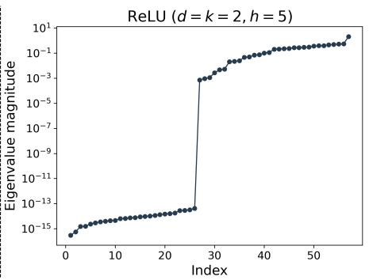

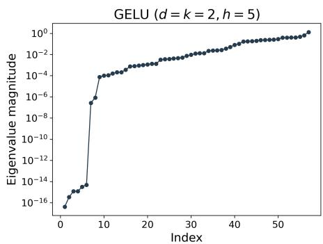  
Figure 11: Left. For the network $N ^ { 2 1 / 2 , \circ }$ in (1.2), consider any point W at which all second-layer weights are positive. One finds that the δW -component of $\nabla ^ { 2 } \mathcal { L } ( W ) \delta W$ always has identical rows. This reflects a rich Hessian invariance group (Lemma 28), present despite W generically having trivial symmetry. Middle. Under the conditions of Theorem 27, the Hessian of $N ^ { 3 } \ ( 1 . 1 )$ with ReLU has $\Theta ( h ^ { 2 } )$ zero eigenvalues—independently of the data distribution. The result extends directly to the setting shown here, namely $d = k = 2$ $h = 5$ for $\mathcal { N } _ { \pm }$ in Learning Problem 1. Right. If ReLU is replaced by GELU, this result no longer holds, but Theorem 20, which holds regardless of the activation, still applies and guarantees $\Omega ( h )$ zero eigenvalues. The distinct “knee” locations in spectra evaluated at the same weights are numerically consistent with the corresponding lower bounds.

Lemma 28 Let $W \in \Theta$ with $W _ { 2 } , { \bf b } _ { 2 } > 0$ . Then, $d _ { W } N ^ { 2 1 / 2 , \circ } , d _ { W } N ^ { 3 , \circ }$ and $d _ { W } N ^ { 3 }$ are invariant under

$$
\delta \mathsf { s } _ { 1 } ( M _ { 1 } , M _ { 2 } ) : \quad ( \delta W _ { 2 } , \delta \mathbf { b } _ { 2 } ) \mapsto ( M _ { 1 } \delta W _ { 2 } , M _ { 2 } \delta \mathbf { b } _ { 2 } ) , \qquad M _ { 1 } , M _ { 2 } \in \mathrm { S t a b } _ { \mathrm { G L } ( M ( 1 , d ) ) } ( W _ { 3 } ) ,\tag{4.129}
$$

with $W _ { 3 } = \mathbf { 1 } _ { h } ^ { \top }$ for $N ^ { 2 1 / 2 , \circ }$ . Thus $\delta \mathsf { s } _ { 1 } \in \Lambda _ { W } ^ { [ 1 ] } ( N ) , N \in \{ N ^ { 2 1 / 2 , \circ } , N ^ { 3 , \circ } , N ^ { 3 } \}$ . We also have $\delta { \sf s } _ { 1 } ~ \in$ $\Lambda _ { W } ^ { [ 2 ] } ( N ^ { 2 ^ { 1 / 2 } , \circ } )$ . However, for $N \in \{ N ^ { 3 , \circ } , N ^ { 3 } \}$ , this invariance holds only for perturbations satisfying $\delta W _ { 3 } \parallel W _ { 3 }$

We treat $\Lambda _ { W } ^ { [ 1 ] } ( N ^ { 3 } )$ . The remaining cases follow similarly. As noted in the overview, the argument becomes transparent when working in layer coordinates. For $N ^ { 3 }$ , a direct computation gives

$$
\begin{array} { r l } & { d _ { W } N ^ { 3 } ( \mathbf { x } ; W ) [ \delta W ] = W _ { 3 } D _ { 2 } \Big ( \delta W _ { 2 } \sigma ( W _ { 1 } \mathbf { x } + \mathbf { b } _ { 1 } ) + W _ { 2 } D _ { 1 } ( \delta W _ { 1 } \mathbf { x } + \delta \mathbf { b } _ { 1 } ) + \delta \mathbf { b } _ { 2 } \Big ) } \\ & { \qquad + \delta W _ { 3 } \sigma ( W _ { 2 } \sigma ( W _ { 1 } \mathbf { x } + \mathbf { b } _ { 1 } ) + \mathbf { b } _ { 2 } ) + \delta \mathbf { b } _ { 3 } , } \end{array}\tag{4.130}
$$

where $D _ { 1 } : = D \sigma ( W _ { 1 } \mathbf { x } + \mathbf { b } _ { 1 } )$ and $D _ { 2 } : = D \sigma ( W _ { 2 } \sigma ( W _ { 1 } \mathbf { x } + \mathbf { b } _ { 1 } ) + \mathbf { b } _ { 2 } )$ , with their dependence on x suppressed in the notation. Under the assumption of Lemma 28, we have $D _ { 2 } = I _ { d }$ . Inspection of (4.130) then readily shows that $d _ { W } N ^ { 3 }$ is invariant under (4.129). For $\Lambda _ { W } ^ { [ 2 ] }$ , one must also take into account singular terms, see Section 5.2.

The directions listed in Table 13 lie in ker $d _ { W } N ^ { 3 }$ . Since the GN form factors through $d _ { W } N ^ { 3 }$ , they lie in its kernel and give the $N ^ { 3 }$ GN bound in Theorem 27. The other GN bounds follow similarly. For the Hessian of $N ^ { 3 }$ , let $V = \{ \delta W : \delta W _ { 3 } \parallel W _ { 3 } \}$ . By Lemma $2 8$ , the orthogonal transformations in (4.129) preserve the Hessian of ${ \mathcal { L } } | _ { W + V }$ . Writing $\mathrm { s t d } _ { O _ { W _ { 3 } } }$ for the standard representation of $\operatorname { S t a b } _ { O ( M ( 1 , d ) ) } ( W _ { 3 } )$ on $W _ { 3 } ^ { \perp }$ , the action on V has the isotypic decomposition

$$
{ \cal V } \cong ( h ^ { 2 } + 2 h + 3 ) ( { \bf t } , { \bf t } ) \oplus h ( \mathrm { s t d } _ { O _ { W _ { 3 } } } , { \bf t } ) \oplus ( { \bf t } , \mathrm { s t d } _ { O _ { W _ { 3 } } } ) .\tag{4.131}
$$

Proof [Theorem 27, Sketch]. Let $E \subset V$ be the sum of the two nontrivial isotypic components in (4.131), so dim $E = h ^ { 2 } - 1$ . On E, $W _ { 3 } \delta W _ { 2 } = W _ { 3 } \delta { \bf b } _ { 2 } = 0$ . Since $W _ { 2 } , { \bf b } _ { 2 } > 0$ , the network,

and hence ${ \mathcal { L } } ,$ is locally constant along $W + E$ . Both hypotheses of Proposition 19 therefore hold. As codim $V = h - 1$ , (3.119) gives dim(ker $\nabla ^ { 2 } { \mathcal { L } } ( W ) \cap E ) \geq h ( h - 1 )$ . The other architectures follow similarly. ✷
<table><tr><td>Type</td><td>Space</td><td>Dimension</td><td>Description</td></tr><tr><td>Transverse</td><td> $\overline { { ( \mathrm { s t d } _ { O _ { W _ { 3 } } } , \mathrm { t } ) \mathrm { - i s o t y p i c } } }$  component</td><td> $\overline { { h ( h - 1 ) } }$ </td><td> $\overline { { \delta W _ { 2 } } }$  with columns orthogonal to  $\overline { { W _ { 3 } } }$ </td></tr><tr><td>Transverse</td><td> $( \mathrm { t } , \mathrm { s t d } _ { O _ { W _ { 3 } } }$  )-isotypic component</td><td> $h - 1$ </td><td>δb2 orthogonal to  $W _ { 3 } ^ { \top }$ </td></tr><tr><td>Transverse</td><td>in the (t, t)-isotypic component</td><td>1</td><td> $\delta \mathbf { b } _ { 2 } \in \mathrm { S p a n } ( W _ { 3 } ^ { \top } )$  and  $W _ { 3 } \delta { \bf b } _ { 2 } = - \delta { \bf b } _ { 3 }$ </td></tr><tr><td>Orbit</td><td> $T _ { W } ( \Lambda ( N ^ { 3 } ) W )$ </td><td>2h</td><td> $\delta W = ( A W _ { 1 } , \check { A } { \mathbf b } _ { 1 } , B W _ { 2 } - W _ { 2 } A , B { \mathbf b } _ { 2 } , - W _ { 3 } B , 0 )$ </td></tr><tr><td>Total</td><td colspan="3"> $\overline { { h ( h + 2 ) } }$ </td></tr></table>

Table 13: Subspaces of ker $d _ { W } N ^ { 3 }$ yielding the GN bound in Theorem 27, with A, B diagonal. Orbit flat directions contribute only $\Theta ( h )$ zero eigenvalues, compared with $\Theta ( h ^ { 2 } )$ from transverse directions. The two nontrivial isotypic components contain all but one transverse direction and, through Proposition 19, yield the Hessian kernel bound.

## 4.2 Regression

The preceding analysis uses only structural Hessian invariances, hence holds independently of the data distribution. When present, distributional symmetries may combine with them to form composite invariances (see Definition 14), yielding the richer invariance group needed for a faithful account of the observed spectra. Throughout this subsection and the next, we assume $h = d \geq 4$ to avoid separate treatment of low-dimensional cases.

The labeling function in Learning Problem 2 is realizable within the $N ^ { 3 }$ model class, for example by any point in the following set of global minima,

$$
\mathcal { G } _ { 0 } = \left\{ W \left| \begin{array} { l } { W _ { 1 } = P _ { \pi , \mathrm { s } } \mathrm { ~ f o r ~ } \pi \in S _ { d } , \mathbf { s } \in \mathbb { R } _ { > 0 } ^ { d } , } \\ { W _ { 2 } \in \mathrm { G L } _ { d } \mathrm { ~ a n d ~ } \mathbf { b } _ { 2 } \in \mathbb { R } ^ { d } \mathrm { ~ h a v e ~ s t r i c t l y ~ p o s i t i v e ~ e n t r i e s } , } \\ { W _ { 3 } W _ { 2 } W _ { 1 } = \mathbf { 1 } ^ { \top } , \quad \mathbf { b } _ { 1 } = \mathbf { 0 } , \quad W _ { 3 } \mathbf { b } _ { 2 } = - \mathbf { b } _ { 3 } } \end{array} \right. \right\} ,\tag{4.132}
$$

where $P _ { \pi , \mathbf { s } } : = \mathrm { d i a g } ( \mathbf { s } ) P _ { \pi }$ is a positive monomial matrix, consisting of exactly one positive entry in each row and column. Arguments similar to those in the proof of Proposition 46 apply in this setting. Since the pointwise loss vanishes identically at every $W \in \mathcal { G } _ { 0 }$ , the GN form coincides with the second diferential by Proposition 24. Therefore, for the squared loss used here, compatible symmetries of $d _ { W } N ^ { 3 }$ sufice to establish the Hessian invariances considered below.

Although the inputs in Learning Problem 2 follow a Gaussian distribution, the distributional symmetries are not given by all orthogonal transformations, since the labels must also be taken into account. The relevant distribution group is therefore

$$
\mathsf { d } _ { 3 } ( P _ { \pi } ) : \quad \mathbf { x } \mapsto P _ { \pi } \mathbf { x } , \quad \mathrm { f o r } \ \pi \in S _ { d } .\tag{4.133}
$$

We can ofset the input change through the architectural symmetry a0 in Table 9. For illustration, take $N ^ { 3 , \circ }$ with $W _ { 1 } = I _ { d } , W _ { 2 } \in \mathrm { G L } _ { d }$ entrywise positive and $W _ { 3 } W _ { 2 } = \mathbf { 1 } ^ { \top }$ . The identities

$$
\sigma ( P _ { \pi } \mathbf { u } ) = P _ { \pi } \sigma ( \mathbf { u } ) , \qquad D \sigma ( P _ { \pi } \mathbf { u } ) = P _ { \pi } D \sigma ( \mathbf { u } ) P _ { \pi } ^ { \top }\tag{4.134}
$$

(where the derivatives exist) yield the structural symmetry

$$
\delta \mathfrak { s } _ { 2 } ( P _ { \pi } ) : ( \mathbf { x } , \delta W _ { 1 } , \delta W _ { 2 } , \delta W _ { 3 } ) \mapsto ( P _ { \pi } \mathbf { x } , P _ { \pi } \delta W _ { 1 } P _ { \pi } ^ { \top } , \delta W _ { 2 } P _ { \pi } ^ { \top } , \delta W _ { 3 } W _ { 2 } P _ { \pi } ^ { \top } W _ { 2 } ^ { - 1 } )\tag{4.135}
$$

of $d _ { W } N ^ { 3 , \circ }$ . Thus, $\delta \mathsf { s } _ { 2 } \in \mathsf { L } _ { W } ^ { [ 1 ] } ( N ^ { 3 , \circ } )$ is not internal but is compatible with the data distribution $( \mathrm { i d } , \mathbf { 1 } ^ { \top } { \boldsymbol { \sigma } } ) _ { * } { \mathcal { N } }$ , since its data component is given by (4.133). It therefore induces composite invariance of the GN form at these global minima (Theorem 43). The following lemma gives the corresponding invariance for $N ^ { 3 }$ , including the bias correction.

Lemma 29 On $\mathcal { G } _ { 0 } , d _ { W } N ^ { 3 }$ admits the structural symmetry $\delta \mathsf { s } _ { 1 }$ in (4.129), and the GN form admits the following composite invariance:

$$
\begin{array} { r l r } { \delta \mathsf { c } _ { 1 } ( P _ { \pi } ) : } & { ( \delta W _ { 1 } , \delta \mathbf { b } _ { 1 } , \delta W _ { 2 } , \delta \mathbf { b } _ { 2 } , \delta W _ { 3 } ) \mapsto ( W _ { 1 } P _ { \pi } W _ { 1 } ^ { - 1 } \delta W _ { 1 } P _ { \pi } ^ { \top } , ~ W _ { 1 } P _ { \pi } W _ { 1 } ^ { - 1 } \delta \mathbf { b } _ { 1 } , } & { ( } & \\ & { } & { \delta W _ { 2 } W _ { 1 } P _ { \pi } ^ { \top } W _ { 1 } ^ { - 1 } , ~ \delta \mathbf { b } _ { 2 } - \delta W _ { 3 } A ^ { - 1 } ( I - A ) \mathbf { b } _ { 2 } \frac { W _ { 3 } ^ { \top } } { W _ { 3 } W _ { 3 } ^ { \top } } , ~ \delta W _ { 3 } W _ { 2 } W _ { 1 } P _ { \pi } ^ { \top } W _ { 1 } ^ { - 1 } W _ { 2 } ^ { - 1 } ) , } \end{array}\tag{4.136}
$$

where $\pi \in S _ { d }$ and $A : = W _ { 2 } W _ { 1 } P _ { \pi } W _ { 1 } ^ { - 1 } W _ { 2 } ^ { - 1 }$ . For every $W \in \mathcal { G } _ { 0 }$

$$
\langle \delta \mathsf { s } _ { 1 } , \delta \mathsf { c } _ { 1 } \rangle \leq \Gamma _ { W } ^ { [ \mathrm { G N } ] } ( N ^ { 3 } , \ell ^ { \mathrm { s q } } , ( \mathrm { i d } , \mathbf { 1 } ^ { \top } \sigma ) _ { * } { \mathcal N } ) \leq \mathrm { S t a b } _ { \mathrm { A u t } ( T _ { W } \ominus ) } ( d _ { W } ^ { 2 } { \mathcal L } ) .\tag{4.137}
$$

We find in particular that, at global minima $W \in \mathcal { G } _ { 0 }$ , the Hessian has rich invariances that the point stabilizer generally fails to capture (see Remark 2).

Dead neurons are often encountered in practice (see Figure 3) and give rise to a distinct class of global minima at which the composite action above may no longer preserve the Hessian. This occurs for example when e rows of $W _ { 2 }$ , together with the corresponding entries of $\mathbf { b } _ { 2 } .$ , are strictly negative, while the remaining rows of $W _ { 2 }$ and entries of $\mathbf { b } _ { 2 }$ are strictly positive, and the first and last lines of (4.132) hold with $W _ { 2 }$ and b replaced by $D _ { 2 } W _ { 2 }$ and $D _ { 2 } \mathbf { b } _ { 2 }$ . Denote this set by $\mathcal { G } _ { e }$ . In this regime, $\delta \mathsf { s } _ { 1 }$ persists, with $W _ { 3 }$ now replaced by $W _ { 3 } D _ { 2 }$ in Lemma 28, whereas $\delta \mathsf { c } _ { 1 }$ fails. Nevertheless, for every $W \in \mathcal G _ { e }$ , the image of $d _ { W } N ^ { 3 }$ is isomorphic, as an $S _ { d } .$ -module, to the corresponding image on $\mathcal { G } _ { 0 }$ $\mathrm { E x p l i c i t l y } ,$ it is spanned by $\mathbf { 1 } _ { \{ ( W _ { 1 } \mathbf { x } ) _ { i } > 0 \} } x _ { j } , \mathbf { 1 } _ { \{ ( W _ { 1 } \mathbf { x } ) _ { i } > 0 \} }$ , and 1. Consequently, rank $d _ { W } N ^ { 3 } = d ^ { 2 } + d + 1$ the Hessian kernel has dimension $d ( d + 2 )$ , and the quotient by the kernel has the same isotypic decomposition as for $\mathcal { G } _ { 0 }$ . Thus, under a group-invariant inner product, the same multiplicities are forced in the nonzero spectrum.

We next state the isotypic decomposition for the subgroup of $\langle \delta \mathsf { s } _ { 1 } , \delta \mathsf { c } _ { 1 } \rangle$ obtained by restricting $M _ { 1 } , M _ { 2 }$ in (4.129) to $\operatorname { S t a b } _ { O ( M ( 1 , d ) ) } ( W _ { 3 } )$ . In Section 3.2, we encountered t, of degree 1, and ${ \mathfrak { s } } _ { ( d - 1 , 1 ) } ,$ of degree $d - 1$ . Here, we also need $\mathfrak { s } _ { ( d - 2 , 2 ) }$ , of degree $\frac { d ( d - 3 ) } { 2 }$ , and $\mathfrak { s } _ { ( d - 2 , 1 , 1 ) }$ , of degree $\frac { ( d - \mathrm { i } ) ( d - 2 ) } { 2 }$ Since $\delta \mathsf { c } _ { 1 }$ mixes $\delta \mathbf { b } _ { 2 }$ with $\delta W _ { 3 } ,$ set $\delta  { \mathbf { \widetilde { b } } } _ { 2 } : = \delta  { \mathbf { b } } _ { 2 } + ( \delta W _ { 3 }  { \mathbf { b } } _ { 2 } ) W _ { 3 } ^ { \top } / ( W _ { 3 } W _ { 3 } ^ { \top } )$ . In these coordinates, the blocks carry the following representations

$$
\begin{array} { r l r } & { \delta W _ { 1 } \cong 2 ( \mathfrak { t } , \mathfrak { t } , \mathfrak { t } ) \oplus 3 ( \mathfrak { t } , \mathfrak { t } , \mathfrak { s } _ { d - 1 , 1 } ) \oplus ( \mathfrak { t } , \mathfrak { t } , \mathfrak { s } _ { d - 2 , 2 } ) \oplus ( \mathfrak { t } , \mathfrak { t } , \mathfrak { s } _ { d - 2 , 1 , 1 } ) , } & { \delta \mathbf { b } _ { 1 } \cong ( \mathfrak { t } , \mathfrak { t } , \mathfrak { t } ) \oplus ( \mathfrak { t } , \mathfrak { t } , \mathfrak { s } _ { d - 1 , 1 } ) , } \\ & { \delta W _ { 2 } \cong ( \mathfrak { t } , \mathfrak { t } , \mathfrak { t } ) \oplus ( \mathfrak { t } , \mathfrak { t } , \mathfrak { s } _ { d - 1 , 1 } ) \oplus ( \operatorname { s t d } _ { O _ { W _ { 3 } } } , \mathfrak { t } , \mathfrak { t } ) \oplus ( \operatorname { s t d } _ { O _ { W _ { 3 } } } , \mathfrak { t } , \mathfrak { s } _ { d - 1 , 1 } ) , } & { \delta \mathbf { \tilde { b } } _ { 2 } \cong ( \mathfrak { t } , \mathfrak { t } , \mathfrak { t } ) \oplus ( \mathfrak { t } , \operatorname { s t d } _ { O _ { W _ { 3 } } } , \mathfrak { t } ) , } \\ & { \delta W _ { 3 } \cong ( \mathfrak { t } , \mathfrak { t } , \mathfrak { t } ) \oplus ( \mathfrak { t } , \mathfrak { t } , \mathfrak { s } _ { d - 1 , 1 } ) , } & { \delta \mathbf { b } _ { 3 } \cong ( \mathfrak { t } , \mathfrak { t } , \mathfrak { t } ) . } \end{array}
$$

The three entries refer, in order, to the orthogonal factors acting through $M _ { 1 }$ and $M _ { 2 } ,$ and the permutation factor $S _ { d }$ . The decomposition follows from standard tensor product constructions Fulton and Harris (1991) (see also Thiede et al. (2020) for related constructions in the context of equivariant network theory, with further discussion in Section 6.3). An explicit description of the isotypic components is readily obtained by adapting the analysis of Learning Problem 1 in Section 4.6.

## Theorem 30 In the setting of Learning Problem 2,

(i) For any $W \in \mathcal G _ { 0 } ,$ the Hessian is invariant under $\langle \delta \mathsf { s } _ { 1 } , \delta \mathsf { c } _ { 1 } \rangle$ . The corresponding isotypic decomposition of $T _ { W } \Theta \ \left( 4 . 1 3 8 \right)$ and the $d ( d + 2 )$ -dimensional subspace of zero eigenvectors arising from flat directions (Theorem 27) give

$$
T _ { W } \Theta \cong \ 7 ( \mathfrak { t } , \mathfrak { t } , \mathfrak { t } ) \oplus \mathfrak { b } ( \mathfrak { t } , \mathfrak { t } , \mathfrak { s } _ { d - 1 , 1 } ) \oplus ( \mathfrak { t } , \mathfrak { t } , \mathfrak { s } _ { d - 2 , 2 } ) \oplus ( \mathfrak { t } , \mathfrak { t } , \mathfrak { s } _ { d - 2 , 1 , 1 } ) \oplus ( \mathrm { s t d } _ { \mathcal { O } _ { W _ { 3 } } } , \mathfrak { t } , \mathfrak { t } ) \oplus ( \mathrm { s t d } _ { \mathcal { O } _ { W _ { 3 } } } , \mathfrak { t } , \mathfrak { s } _ { d - 1 , 1 } ) \oplus ( \mathfrak { t } , \mathrm { s t d } _ { \mathcal { O } _ { W _ { 3 } } } , \mathfrak { t } ) ,\tag{4.139}
$$

The multiplicity pattern corresponding to this isotypic decomposition is given in Table 1.

(ii) For any $W \in \mathcal G _ { e }$ with $1 \leq e \leq d - 1$ , the Hessian kernel has dimension $d ( d \small { + } 2 )$ , and the quotient by this kernel has the same isotypic decomposition, and hence the same symmetry-forced nonzero multiplicity structure under an invariant inner product, as in part $( i )$

For simplicity, we restrict the discussion to the normalized realization of $\mathcal { G } _ { 0 }$ in (1.26) by the bias-free network $N ^ { 3 , \circ }$ . Removing the bias parameters and quotienting by the $d ( d + 1 )$ )-dimensional Hessian kernel gives

$$
2 ( \mathbf { t } , \mathbf { t } , \mathbf { t } ) \oplus 3 ( \mathbf { t } , \mathbf { t } , \mathbf { s } _ { d - 1 , 1 } ) \oplus ( \mathbf { t } , \mathbf { t } , \mathbf { s } _ { d - 2 , 2 } ) \oplus ( \mathbf { t } , \mathbf { t } , \mathbf { s } _ { d - 2 , 1 , 1 } ) ,\tag{4.140}
$$

of dimension $d ^ { 2 }$ (as for $N ^ { 1 1 / 2 , \circ }$ , reflecting the same S -representation on $M ( d , d ) ;$ this quotient viewpoint is developed further in Section 2.1). At the normalized realization, the action on the blocks corresponding to $\delta W _ { 1 }$ and $\delta W _ { 2 }$ is orthogonal with respect to the Euclidean inner product. In particular, the last two components, each of dimension $\Theta ( d ^ { \bar { 2 } } )$ , are supported in $\delta W _ { 1 }$ , so the metric induced on the quotient is invariant on them and they consequently retain their exact multiplicities, while Proposition 45 shows that their eigenvalues remain uniformly bounded.

The complementary $2 ( \mathfrak { t } , \mathfrak { t } , \mathfrak { t } ) \oplus 3 ( \mathfrak { t } , \mathfrak { t } , \mathfrak { s } _ { d - 1 , 1 } )$ subspace has dimension $3 d - 1$ and is preserved as a whole, although the Euclidean realization of the Hessian may mix its isotypic components and split their forced multiplicities. Identifying the quotient with $\mathbb { R } ^ { d \times d }$ , we use the invariant inner product that agrees with the Frobenius inner product of the diagonal and weights the diagonal subspace by $( d + 1 ) ^ { - 1 }$ . This metric is uniformly equivalent within a factor of two to the metric induced by the Euclidean inner product on parameter space, so the min–max principle gives the same comparison for the ordered eigenvalues and preserves their asymptotic scales. A refinement of Proposition 45 gives one $\Theta ( d ^ { 2 } )$ outlier and places all other unbounded eigenvalues at order $\Theta ( d )$ . This is an instance of spectral refraction confined to $3 d - 1 = O ( d )$ directions.

## 4.3 Analysis by layer and on manifolds: spontaneous SB

In the sequel, we discuss how the framework adapts to restrictions of the Hessian. Such restrictions are relevant to several applications, as illustrated below.

Let $H : V \times V \to \mathbb { R }$ be a symmetric bilinear form invariant under a group $G \leq \operatorname { A u t } ( V )$ . For $E \leq V$ , define

$$
G | _ { E } : = \{ g | _ { E } \mid g \in G , \ g E = E \} .\tag{4.141}
$$

Then $G | _ { E } { \le } \operatorname { S t a b } _ { \operatorname { A u t } ( E ) } ( H | _ { E \times E } )$ . In the present setting, let $E \le T _ { W } \Theta$ . There are two natural ways to extract symmetries on E that induce composite invariances: first restrict the pointwise diferential to $E$ and then retain only those whose Z component lies in D, or reverse the order. Write $\mathsf { S } _ { W ; E } ^ { [ r ] } ( N , \ell )$ for the stabilizer of $d _ { W } ^ { r } \kappa | _ { E ^ { r } }$ in $\operatorname { A u t } ( Z ) \times \operatorname { A u t } ( E )$ . In the notation of Table 12, these correspond, respectively, to

$$
\begin{array} { r l } & { \Gamma _ { W ; E } ^ { [ r ] } ( N , \ell , \mu ) : = \pi _ { E } \left( \mathsf { S } _ { W ; E } ^ { [ r ] } ( N , \ell ) \cap \left( \mathsf { D } ( \mu ) \times \mathrm { A u t } ( E ) \right) \right) , } \\ & { \Gamma _ { W } ^ { [ r ] } ( N , \ell , \mu ) | _ { E } : = \pi _ { E } \left( ( \mathsf { S } _ { W } ^ { [ r ] } ( N , \ell ) \cap \left( \mathsf { D } ( \mu ) \times \mathrm { A u t } _ { W } ( \Theta ) \right) ) | _ { Z \times E } \right) , } \end{array}
$$

where $\pi _ { E } \colon \operatorname { A u t } ( Z ) \times \operatorname { A u t } ( E ) \to \operatorname { A u t } ( E )$ denotes the projection onto the second factor. Whenever the relevant expectation identity holds at W, the order-2 composite invariances satisfy

$$
\Gamma _ { W } ^ { [ 2 ] } | _ { E } \leq \Gamma _ { W ; E } ^ { [ 2 ] } \leq \mathrm { S t a b } _ { \mathrm { A u t } ( E ) } \big ( \big ( d _ { W } ^ { 2 } \mathcal { L } \big ) | _ { E \times E } \big ) ,\tag{4.142}
$$

and both inclusions can be strict. The remaining symmetry groups are defined likewise, and the corresponding relations generalize directly.

Layerwise analysis. We now apply the preceding framework to the layerwise Hessian spectra using the symmetries inherited from $\langle \delta \mathsf { s } _ { 1 } , \delta \mathsf { c } _ { 1 } \rangle \leq \Gamma _ { W } ^ { [ \mathrm { G N } ] }$ at $W \in \mathcal { G } _ { 0 }$ . Since Θ is Euclidean, we identify each $T _ { W _ { i } } \Theta _ { i }$ with its canonical image in $T _ { W } \Theta$ . Thus, for example, $T _ { W _ { 1 } } \Theta _ { 1 } = \{ ( \delta W _ { 1 } , 0 , 0 , 0 , 0 , 0 ) \} \le$ $T _ { W } \Theta$ . The composite symmetry $\delta { \sf c } _ { 1 } ( P _ { \pi } )$ sends $( \delta W _ { 1 } , 0 , 0 , 0 , 0 , 0 )$ to $( W _ { 1 } P _ { \pi } W _ { 1 } ^ { - 1 } \delta W _ { 1 } P _ { \pi } ^ { \top } , 0 , 0 , 0 , 0 , 0 )$ Therefore $\delta \mathsf { c } _ { 1 } ( P _ { \pi } ) T _ { W _ { 1 } } \Theta = T _ { W _ { 1 } } \Theta$ and δc1 $\big | _ { T _ { W _ { 1 } } \Theta } \in \Gamma _ { W } ^ { [ \mathrm { G N } ] } \ \big | _ { T _ { W _ { 1 } } \Theta }$ . The full analysis of the layerwise Hessian is summarized in Table 14.

<table><tr><td rowspan=1 colspan=1></td><td rowspan=1 colspan=1> $\overline { { T _ { W _ { 1 } } \Theta } }$ </td><td rowspan=1 colspan=1> $\overline { { T _ { \mathbf { b } _ { 1 } } \Theta } }$ </td><td rowspan=1 colspan=1> $\overline { { T _ { W _ { 2 } } \Theta } }$ </td><td rowspan=1 colspan=1> $T _ { \mathbf { b } _ { 2 } , W _ { 3 } } \Theta$ </td><td rowspan=1 colspan=1> $\overline { { T _ { \mathbf { b } _ { 3 } } \Theta } }$ </td></tr><tr><td rowspan=1 colspan=1> $\overline { { \delta \mathsf { s } _ { 1 } } }$  $\delta \mathsf { c } _ { 1 }$ </td><td rowspan=1 colspan=1> $\overline { { \mathrm { \ t r i v i a l } } }$  $B _ { \pi } \delta W _ { 1 } P _ { \pi } ^ { \top }$ </td><td rowspan=1 colspan=1>trivial $B _ { \pi } \delta \mathbf { b } _ { 1 }$ </td><td rowspan=1 colspan=1> $\overline { { M _ { 1 } \delta W _ { 2 } } }$  $\delta W _ { 2 } C _ { \pi }$ </td><td rowspan=1 colspan=1> $\overline { { ( M _ { 2 } \delta \mathbf { b } _ { 2 } , \delta W _ { 3 } ) } }$  $\Phi _ { \pi }$ </td><td rowspan=1 colspan=1>trivialtrivial</td></tr><tr><td rowspan=1 colspan=1> $\overline { { \langle \delta \mathsf { s } _ { 1 } , \delta \mathsf { c } _ { 1 } \rangle | _ { E } } }$ </td><td rowspan=1 colspan=1> $\overline { { S _ { d } } }$ </td><td rowspan=1 colspan=1> $\overline { { S _ { d } } }$ </td><td rowspan=1 colspan=1> $\overline { { \operatorname { S t a b } _ { O ( M ( 1 , d ) ) } ( W _ { 3 } ) \times S _ { d } } }$ </td><td rowspan=1 colspan=1> $\overline { { \operatorname { S t a b } _ { O ( M ( 1 , d ) ) } ( W _ { 3 } ) \times S _ { d } } }$ </td><td rowspan=1 colspan=1>trivial</td></tr><tr><td rowspan=1 colspan=1>Isotypicdec.</td><td rowspan=1 colspan=1> $\overline { { 2 \mathfrak { t } \oplus 3 \mathfrak { s } _ { d - 1 , 1 } } }$  $\oplus \mathfrak { s } _ { d - 2 , 2 } \oplus \mathfrak { s } _ { d - 2 , 1 , 1 }$ </td><td rowspan=1 colspan=1> $\mathbf { t } \oplus \mathfrak { s } _ { d - 1 , 1 }$ </td><td rowspan=1 colspan=1> $\overline { { ( \mathrm { t } , \mathrm { t } ) \oplus ( \mathrm { t } , \mathfrak { s } _ { d - 1 , 1 } ) } }$  $\oplus ( { \mathrm { s t d } } _ { O _ { W _ { 3 } } } , \mathbf { t } ) \oplus ( { \mathrm { s t d } } _ { O _ { W _ { 3 } } } , \mathbf { \hat { s } } _ { d - 1 , 1 } )$ </td><td rowspan=1 colspan=1> $\overline { { { 2 ( \mathrm { t } , \mathrm { t } ) \oplus ( \mathrm { s t d } _ { O _ { W _ { 3 } } } , \mathrm { t } ) } } }$  $\Phi \left( { \mathfrak { t } } , { \mathfrak { s } } _ { d - 1 , 1 } \right)$ </td><td rowspan=1 colspan=1>t</td></tr><tr><td rowspan=1 colspan=1>Multi.structure</td><td rowspan=1 colspan=1> $\overline { { \{ \{ 1 ^ { [ 2 ] } , ( d - 1 ) ^ { [ 3 ] } \} } } $  $\textstyle { \frac { \ddot { d } ( d - 3 ) } { 2 } } , { \frac { ( d - 1 ^ { ' } ) ( d - 2 ) } { 2 } } \} \}$ </td><td rowspan=1 colspan=1> $\overline { { \{ \{ 1 , d - 1 \} \} } }$ </td><td rowspan=1 colspan=1> $\overline { { \{ \{ 1 , ( d - 1 ) ^ { [ 2 ] } , ( d - 1 ) ^ { 2 } \} \} } }$ </td><td rowspan=1 colspan=1> $\overline { { \{ \{ 1 ^ { [ 2 ] } , ( d - 1 ) ^ { [ 2 ] } \} \} } }$ </td><td rowspan=1 colspan=1>{{1}</td></tr></table>

Table 14: Restrictions of $\delta \mathsf { s } _ { 1 }$ and $\delta \mathsf { c } _ { 1 }$ to the relevant parameter subspaces, together with the corresponding restricted invariance groups, isotypic decompositions, and multiplicity structures. Here $B _ { \pi } : = W _ { 1 } P _ { \pi } W _ { 1 } ^ { - 1 ^ { \circ } } , C _ { \pi } : = W _ { 1 } P _ { \pi } ^ { \top } W _ { 1 } ^ { - 1 } , \tilde { R } _ { \pi } : = W _ { 2 } W _ { 1 } P _ { \pi } ^ { \top } W _ { 1 } ^ { - 1 } W _ { 2 } ^ { - 1 }$ $A _ { \pi } : = W _ { 2 } W _ { 1 } P _ { \pi } W _ { 1 } ^ { - 1 } W _ { 2 } ^ { - 1 }$ , and $\begin{array} { r } { \Phi _ { \pi } ( \delta \mathbf { b } _ { 2 } , \delta W _ { 3 } ) : = ( \delta \mathbf { b } _ { 2 } - \delta W _ { 3 } A _ { \pi } ^ { - 1 } ( I - A _ { \pi } ) \mathbf { b } _ { 2 } \frac { W _ { 3 } ^ { \prime } } { W _ { 3 } W _ { 2 } ^ { \top } } , \delta W _ { 3 } R _ { \pi } ) } \end{array}$ The two $\operatorname { S t a b } _ { O ( M ( 1 , d ) ) } ( W _ { 3 } )$ factors in $\delta { \sf s } _ { 1 } ( M _ { 1 } , M _ { 2 } )$ correspond, respectively, to $M _ { 1 }$ and $M _ { 2 }$ Trivial factors are suppressed in the displayed product groups and isotypic decompositions where no confusion results. Since $\delta \mathsf { c } _ { 1 }$ maps a $W _ { 3 }$ variation to one with a $\mathbf { b } _ { 2 }$ component, the natural invariant block is $T _ { \mathbf { b } _ { 2 } , W _ { 3 } } \Theta$ rather than $T _ { W _ { 3 } } \Theta$

SB on the sphere. The framework developed in this work extends naturally to settings in which the weights are constrained to a manifold. As a simple example, consider Learning Problem 2 with the model $N ^ { 1 1 / 2 , \circ }$ (Section 1.1), with parameter space given by the Frobenius sphere in $M ( d , d )$

$$
\Theta : = \mathbb { S } ( \rho ) = \{ W _ { 1 } \in M ( d , d ) : \| W _ { 1 } \| _ { F } = \rho \} , \qquad \rho : = \| I _ { d } \| _ { F } = \sqrt { d } .\tag{4.143}
$$

We find that $I _ { d } \in \Theta$ remains a global minimizer. Set $E : = T _ { I _ { d } } \mathbb { S } ( \rho )$ , the space of trace-zero matrices. We consider the composite invariances $\Gamma _ { I _ { d } ; E } ^ { [ 2 ] } ( N ^ { 1 1 / 2 , \circ } , \ell ^ { \mathsf { s q } } , \mu )$ of the Hessian restricted to $E .$ Since $I _ { d }$ is also an ambient critical point, the Hessian of $\mathcal { L } | _ { \mathbb { S } ( \rho ) }$ at $I _ { d }$ is the restriction of the ambient Hessian to $T _ { I _ { d } } \mathbb { S } ( \rho ) . ^ { 2 2 }$ Consequently, we may obtain invariances of the spherical Hessian by restricting ambient composite invariances that preserve $E .$

The invariance properties of $N ^ { 1 1 / 2 , \circ }$ on $M ( d , d )$ were first studied in (Arjevani and Field, 2019, Section 4.1), where the objective was shown to be $S _ { d } \times S _ { d }  – \mathrm { i n v a r i a n t }$ , with the two factors independently permuting the rows and columns of $W _ { 1 }$ . Although the point-stabilizer approach generally yields only trivial invariances in our settings, here it gives a diagonal copy of $S _ { d }$ in $\mathrm { ~ \bar { ~ } r _ { { I _ { d } } } ^ { [ 2 ] } ~ }$ , acting by $\delta W _ { 1 } \mapsto P _ { \pi } \delta W _ { 1 } P _ { \pi } ^ { \top }$ . This action preserves $T _ { I _ { d } } \mathbb { S } ( \boldsymbol { \rho } )$ since $\mathrm { T r } ( P _ { \pi } \delta W _ { 1 } P _ { \pi } ^ { \top } ) = \mathrm { T r } ( \delta W _ { 1 } )$ . Estimates of the Hessian spectrum were obtained in Arjevani and Field (2020); Arjevani (2023), and later for $N ^ { 2 , \circ } ( { \bf x } ; W _ { 1 } , { \bf w } _ { 2 } )$ in Arjevani and Field (2021b). Although analogous estimates are possible, our focus here is on Hessian invariances. The S -representation on $M ( d , d )$ agrees with that on the $\delta W _ { 1 }$ component in (4.138). Since $T _ { I _ { d } } \mathbb { S } ( \rho ) = ( \mathbb { R } I _ { d } ) ^ { \perp }$ , its isotypic decomposition is obtained by removing one trivial copy, yielding the following decomposition and multiplicity structure for $d \geq 4 \mathrm { : }$

$$
T _ { I _ { d } } \mathbb { S } ( \rho ) \cong \{ \oplus 3 \mathfrak { s } _ { d - 1 , 1 } \oplus \mathfrak { s } _ { d - 2 , 2 } \oplus \mathfrak { s } _ { d - 2 , 1 , 1 } \mathrm { a n d } \left\{ \left\{ 1 , ( d - 1 ) ^ { [ 3 ] } , \frac { d ( d - 3 ) } { 2 } , \frac { ( d - 1 ) ( d - 2 ) } { 2 } \right\} \right\} .\tag{4.144}
$$

This multiplicity structure is illustrated numerically in the top row of Figure 12. The bottom row shows a spontaneous SB point, whose spectrum is likewise constrained by its stabilizer $\Delta ( S _ { d - 2 } \times S _ { 2 } )$

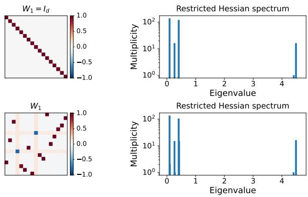  
Figure 12: Weights $W _ { 1 }$ and corresponding spectra of the Hessian of $\mathcal { L } | _ { \mathbb { S } ( \rho ) }$ for $N ^ { 1 1 / 2 , \circ }$ . The top row corresponds to the global minimum $W _ { 1 } = I _ { d }$ , whose observed eigenvalue multiplicities agree with those predicted by (4.144), up to the numerical coalescence of nearby eigenvalues. The bottom row shows a trained SB point with stabilizer $\Delta ( S _ { d - 2 } \times S _ { 2 } )$ .

## 4.4 Two Gaussians: resolutive SB

We next study global minima in the $k = 2$ case of Learning Problem 1, taking $\tau = 1$ for the explicit formulas, and allowing d and h to vary independently. The Bayes-optimal risk is the conditional entropy of the labels given the input, ${ \mathbb E } [ h _ { \mathrm { b i n } } ( { \mathbb P } ( Y = 1 \mid X ) ) ] \approx 0 . 1 9 3$ , where $h _ { \mathrm { b i n } } ( u ) =$ −u log $u - ( 1 - u ) \log ( 1 - u )$ . This value is attained by predictors whose two outputs difer by $2 ( x _ { 1 } + x _ { 2 } )$ The symmetry arguments apply for every $\tau > 0$ , with the Bayes-optimal logit diference scaled by $\tau ^ { - 2 }$ . Here, as throughout this work, the Bayes-optimal predictor is characterized by semialgebraic conditions on the network output. Since ReLU networks (Definition 41) are semialgebraic in $( \mathbf { x } , W )$ the set of weights satisfying these conditions for all x is semialgebraic.

Referring to the symmetries in Table 9, if $d = h = 2$ , modulo the rescaling symmetries $\mathsf { a } _ { i } ^ { \lambda }$ permutation symmetries $\mathsf { a } _ { i } ^ { \pi } \left( i = 1 , 2 \right)$ , and common-logit shifts $\mathsf { s } _ { 1 } ^ { \mathsf { c e } }$ , every global minimum implemented by $N ^ { 3 , \circ }$ is of the form

$$
T = \left\{ ( W _ { 1 } , W _ { 2 } , W _ { 3 } ) ~ \middle | ~ W _ { 1 } = \left( \begin{array} { c c } { 1 } & { 1 } \\ { - 1 } & { - 1 } \end{array} \right) , ~ \sigma ( W _ { 2 } ) \in \mathrm { G L } _ { 2 } , ~ W _ { 3 } = \left( \begin{array} { c c } { - 1 } & { 1 } \\ { 1 } & { - 1 } \end{array} \right) \sigma ( W _ { 2 } ) ^ { - 1 } \right\} .\tag{4.145}
$$

The characterization is proved in Proposition 46. At $W ^ { \star } \in \mathcal T$ where the relevant classical derivatives exist, well specification gives equality of the Hessian and GN matrix. In particular, all flat directions lie in the kernel of the Hessian by Proposition 17. To identify the orbit directions $T _ { W ^ { \star } } ( \Gamma \cdot W ^ { \star } )$ ), observe from Table 10 that for the bias-free model the two rescaling families contribute 2h directions and the common-logit transformations contribute h. Thus, $T _ { W ^ { \star } } ( \Sigma \cdot W ^ { \star } )$ has dimension $3 h = 6$ and equals $T _ { W ^ { \star } } ( \Gamma \cdot W ^ { \star } )$ in the present case. There are two additional transverse flat directions at $W ^ { \star }$ , characterized by $\delta W _ { 1 } = 0 , d \sigma ( \mathbf u _ { j } ) [ \delta \mathbf u _ { j } ] \in \mathrm { s p a n } \{ ( 1 , 1 ) ^ { \top } \} , j = 1 , 2$ , and $\delta W _ { 3 } = - W _ { 3 } d \sigma ( W _ { 2 } ) [ \delta W _ { 2 } ] \sigma ( W _ { 2 } ) ^ { - 1 }$ where $\mathbf { u } _ { j }$ and $\delta \mathbf { u } _ { j }$ are the jth columns of $W _ { 2 }$ and $\delta W _ { 2 }$ , respectively. Together, these yield 8 zero eigenvalues out of 12 total eigenvalues.

To analyze the 4-dimensional complement of the flat-direction space described above, we now take into account the relevant composite symmetries: ${ \mathsf { C } } ^ { \mathsf { S } }$ and ${ \mathsf { C } } ^ { \mathsf { r } } .$ . Note that $\mathsf { c } ^ { \mathsf { s } } \in \mathrm { S t a b } _ { \Gamma } ( W ^ { \star } )$ for all $W ^ { \star } \in { \mathcal { T } }$ , hence ${ \mathsf { c } } ^ { \mathsf { s } } \in \Gamma _ { W ^ { \star } } ^ { [ \mathrm { G N } ] }$ ]. Its sign component, denoted by $C ^ { ( - 1 ) }$ , is $\delta W _ { 1 } = ( a , b ) ^ { \top } ( 1 , - 1 ) , a , b \in \mathbb { R }$ which realizes the $\mathfrak { s } _ { ( 1 , 1 ) }$ representation of $S _ { 2 } \cong \langle { \mathsf { c } } ^ { \mathsf { s } } \rangle$ . This yields a 2-dimensional invariant subspace orthogonal to the flat directions. The symmetry ${ \mathsf { C } } ^ { \mathsf { r } }$ preserves the GN form on $C ^ { ( - 1 ) }$ , but not on all of $T _ { W ^ { \star } } \Theta$ . Inspection of $d _ { W } N ^ { 3 , \circ }$ gives another structural symmetry of the pointwise GN form:

$$
\delta \mathsf { s } _ { 2 } : ( \delta W _ { 1 } , \delta W _ { 2 } , \delta W _ { 3 } ) \mapsto ( \mathrm { d i a g } ( 1 , - 1 ) \delta W _ { 1 } , \delta W _ { 2 } \mathrm { d i a g } ( 1 , - 1 ) , \delta W _ { 3 } \sigma ( W _ { 2 } ) \mathrm { d i a g } ( 1 , - 1 ) \sigma ( W _ { 2 } ) ^ { - 1 } ) .\tag{4.146}
$$

It satisfies

$$
d _ { W } N ^ { 3 , \circ } ( { \bf x } ; W ^ { \star } ) [ \delta { \bf s } _ { 2 } \delta W ] = \mathrm { s g n } ( x _ { 1 } + x _ { 2 } ) d _ { W } N ^ { 3 , \circ } ( { \bf x } ; W ^ { \star } ) [ \delta W ] .\tag{4.147}
$$

Hence, $\delta \mathsf { s } _ { 2 }$ preserves the pointwise GN form, giving

$$
\mathsf { c } ^ { \mathsf { s } } , \delta \mathsf { s } _ { 2 } \in \Gamma _ { W ^ { \star } } ^ { [ \mathrm { G N } ] } ( N ^ { 3 , \circ } , \ell ^ { \mathsf { c e } } , \mathcal { N } _ { \pm } ) \quad \mathrm { ~ a n d ~ } \quad \mathsf { c } ^ { \mathsf { r } } \in \Gamma _ { W ^ { \star } ; C ^ { ( - 1 ) } } ^ { [ \mathrm { G N } ] } ( N ^ { 3 , \circ } , \ell ^ { \mathsf { c e } } , \mathcal { N } _ { \pm } ) .\tag{4.148}
$$

The restricted generators yield an irreducible two-dimensional representation on $C ^ { ( - 1 ) }$ , with image isomorphic to $D _ { 4 }$ . In our experiments, Adam consistently converges to the subfamily $\smash { \mathcal { T } _ { \star } \subseteq \mathcal { T } }$ described in $( 1 . 9 )$ . At these points, ${ \mathsf { C } } ^ { \mathsf { r } }$ extends to the full tangent space, and $\delta \mathsf { s } _ { 2 }$ extends to $N ^ { 3 , \ d _ { * } }$ by also sending $\left( \delta \mathbf { b } _ { 1 } , \delta \mathbf { b } _ { 2 } \right)$ to $( \mathrm { d i a g } ( 1 , - 1 ) \delta { \bf b } _ { 1 } , \mathrm { d i a g } ( 1 , - 1 ) \delta { \bf b } _ { 2 } )$ . The corresponding GN invariance extends to $N ^ { 3 , \otimes }$ as well.

<table><tr><td></td><td>Points</td><td>dim Flat</td><td>codim Flat</td><td> ${ \mathsf { C } } ^ { \mathsf { S } }$ </td><td> ${ \mathsf { C } } ^ { \mathsf { r } }$ </td><td> $\delta \mathsf { s } _ { 2 }$ </td><td>isotypic decomposition of  $T _ { W } \Theta / \mathrm { F l a t }$ </td></tr><tr><td> $\overline { { N ^ { 3 , \circ } } }$ </td><td>T</td><td>8</td><td>4</td><td> $\overline { { { T _ { W } \Theta } } }$ </td><td> $\overline { { C ^ { ( - 1 ) } } }$ </td><td> $T _ { W } \Theta$ </td><td> $\left( \mathfrak { s } _ { ( 2 ) } \oplus \mathfrak { s } _ { ( 1 , 1 ) } \right) _ { \mathfrak { c } ^ { \mathrm { s } } } \otimes \left( \mathfrak { s } _ { ( 2 ) } \oplus \mathfrak { s } _ { ( 1 , 1 ) } \right) _ { \delta \mathfrak { s } _ { 2 } }$ </td></tr><tr><td> $N ^ { 3 , \circ }$ </td><td> $\tau _ { \star }$ </td><td>8</td><td>4</td><td> $T _ { W } \Theta$ </td><td> $T _ { W } \Theta$ </td><td> $T _ { W } \Theta$ </td><td> $\big ( { \mathfrak { s } } _ { ( 2 ) } \oplus { \mathfrak { s } } _ { ( 1 , 1 ) } \big ) _ { { \mathfrak { c } } ^ { \mathrm { s } } } \otimes \mathrm { S t d } _ { D _ { 4 } }$ </td></tr><tr><td> $N ^ { 3 , \ d _ { * } }$ </td><td> $\tau _ { \star }$ </td><td>10</td><td>6</td><td> $T _ { W } \Theta$ </td><td> $T _ { W } \Theta$ </td><td> $T _ { W } \Theta$ </td><td> $\left( \mathfrak { s } _ { ( 1 , 1 ) } \oplus 2 \mathfrak { s } _ { ( 2 ) } \right) _ { \mathfrak { c } ^ { \mathsf { s } } } \otimes \mathrm { S t d } _ { D 4 }$ </td></tr><tr><td> $N ^ { 3 , \emptyset }$ </td><td> $\tau _ { \star }$ </td><td>11</td><td>6</td><td> $T _ { W } \Theta$ </td><td> $T _ { W } \Theta$ </td><td> $T _ { W } \Theta$ </td><td> $\left( \mathfrak { s } _ { ( 1 , 1 ) } \oplus 2 \mathfrak { s } _ { ( 2 ) } \right) _ { \mathfrak { c } ^ { \mathsf { s } } } \otimes \mathrm { S t d } _ { D _ { 4 } }$ </td></tr><tr><td> $N ^ { 3 }$ </td><td> $\tau _ { \star }$ </td><td>12</td><td>6</td><td> $T _ { W } \Theta$ </td><td> $T _ { W } \Theta$ </td><td> $\delta \mathbf { b } _ { 3 } \| \mathbf { 1 }$ </td><td> $\left( \mathfrak { s } _ { ( 1 , 1 ) } \oplus 2 \mathfrak { s } _ { ( 2 ) } \right) _ { \mathfrak { c } ^ { \mathrm { s } } } \otimes \left( \mathfrak { s } _ { ( 2 ) } \oplus \mathfrak { s } _ { ( 1 , 1 ) } \right) _ { \mathfrak { c } ^ { \mathrm { r } } }$ </td></tr></table>

Table 15: Isotypic decompositions of $T _ { W } \Theta / \mathrm { F l a }$ t for the indicated models under Learning Problem 1 with $k = 2$ , where Flat is the space of flat directions. The table also gives the dimension and codimension of Flat and the subspaces on which ${ \mathsf { c } } ^ { \mathsf { s } } , { \mathsf { c } } ^ { \mathsf { r } } ;$ , and $\delta \mathsf { s } _ { 2 }$ act.

For $N ^ { 3 }$ , the Euclidean-orthogonal realization of the action on the full space reduces from $C _ { 2 } \times D _ { 4 }$ to $\langle \mathsf { c } ^ { \mathsf { s } } , \mathsf { c } ^ { \mathsf { r } } \rangle \cong C _ { 2 } ^ { 2 }$ . However, on $\delta \mathbf { b } _ { 3 } \| \mathbf { 1 }$ , the full Euclidean-orthogonal action is recovered. Since this subspace has codimension one, Cauchy interlacing constrains the resulting eigenvalue splitting, see Table 3. Moreover, spectral displacement can be bounded by standard perturbation-theoretic estimates in terms of $\lVert \bar { D } _ { W ^ { * } } ^ { \mathrm { G N } } \mathcal { L } - ( D _ { W ^ { * } } ^ { \mathrm { G N } } \mathcal { L } | _ { \delta \mathbf { b } _ { 3 } \parallel \mathbf { 1 } } \oplus 0 ) \rVert _ { 2 }$ . The doublet on $C ^ { ( - 1 ) }$ remains intact. The splitting of the largest eigenvalue of $N ^ { 3 , \otimes }$ provides a structural mechanism for the two isolated eigenvalues observed in Sagun et al. (2016). The Hessian matrix in Figure 2 is shaped by the flat directions described earlier and by its restriction to $\delta \mathbf { b } _ { 3 } \| \mathbf { 1 }$ lying in the commutant algebra of $D _ { 4 } \times C _ { 2 }$ The same qualitative picture persists for diferent values of the variance parameter and for squared loss; see Table 19.

## 4.5 The Spectrum of a Random Hessian

We now use the results of Section 3.6 to study the Hessian spectrum of the full architecture $N ^ { 3 } \ ( 1 . 1 )$ for $h \geq 2$ and $k = 2$ under cross-entropy loss at He initialization,

$$
( W _ { 1 } ) _ { i \alpha } \sim { \mathcal { N } } ( 0 , 2 / d ) , \qquad ( W _ { 2 } ) _ { j i } \sim { \mathcal { N } } ( 0 , 2 / h ) , \qquad ( W _ { 3 } ) _ { a j } \sim { \mathcal { N } } ( 0 , 2 / h ) ,\tag{4.149}
$$

with all weight entries sampled independently and $\mathbf { b } _ { 1 } = \mathbf { b } _ { 2 } = \mathbf { b } _ { 3 } = 0$ . Denote this initialization law by $\nu ^ { \mathrm { H e } }$ . Let $H ( W )$ denote the regular Hessian as considered in that section, and set $M : = \mathbb { E } _ { W \sim \nu ^ { \mathrm { H e } } } H ( W )$ All expectations in this subsection are assumed to be finite. For $\pi _ { 1 } , \pi _ { 2 } \in S _ { h }$ , let

$$
\begin{array} { r l } & { \mathrm { i } ^ { \mathrm { H e } } ( P _ { \pi _ { 1 } } , P _ { \pi _ { 2 } } ) ( W _ { 1 } , { \bf b } _ { 1 } , W _ { 2 } , { \bf b } _ { 2 } , W _ { 3 } , { \bf b } _ { 3 } ) : = ( { \mathfrak { a } } _ { 2 } ^ { \pi } ( P _ { \pi _ { 2 } } ^ { \top } ) \circ { \mathfrak { a } } _ { 1 } ^ { \pi } ( P _ { \pi _ { 1 } } ^ { \top } ) ) ( W _ { 1 } , { \bf b } _ { 1 } , W _ { 2 } , { \bf b } _ { 2 } , W _ { 3 } , { \bf b } _ { 3 } ) } \\ & { \phantom { \mathrm { i } ^ { \mathrm { H e } } ( P _ { \pi _ { 1 } } ^ { \top } , { \bf b } _ { 1 } , P _ { \pi _ { 2 } } ^ { \top } ) ( W _ { 1 } , { \bf b } _ { 1 } , W _ { 2 } , { \bf b } _ { 2 } , W _ { 3 } , { \bf b } _ { 3 } ) : = } ( P _ { \pi _ { 1 } } ^ { \top } W _ { 1 } , P _ { \pi _ { 1 } } ^ { \top } { \bf b } _ { 1 } , P _ { \pi _ { 2 } } ^ { \top } W _ { 2 } , P _ { \pi _ { 1 } } , P _ { \pi _ { 2 } } ^ { \top } { \bf b } _ { 2 } , W _ { 3 } P _ { \pi _ { 2 } } , { \bf b } _ { 3 } ) . } \end{array}\tag{4.150}
$$

Lemma 31 Regardless of the data distribution $\mu ,$

$$
\langle { \mathrm { i } } ^ { \mathrm { H e } } ( P _ { \pi _ { 1 } } , P _ { \pi _ { 2 } } ) : \pi _ { 1 } , \pi _ { 2 } \in S _ { h } \rangle \leq { \overline { { \Sigma } } } ^ { [ 2 ] } ( N ^ { 3 } , \ell , \nu ^ { \mathrm { H e } } ) .\tag{4.151}
$$

For the mixture of two Gaussians $\mathcal { N } _ { \pm }$ from Learning Problem $^ { 1 , }$ the composite symmetries ${ \mathsf { C } } ^ { \mathsf { S } }$ and ${ \mathsf { C } } ^ { \mathsf { r } }$ join the structural symmetries above in $\overline { { \Gamma } } ^ { [ 2 ] } ( N ^ { 3 } , \ell , \mathcal { N } _ { \pm } , \nu ^ { \mathrm { H e } } )$

The argument below uses only the structural invariance. The representation on $\Theta$ of the structure group in the lemma contains a unique copy of $\mathfrak { s } _ { ( h - 1 , 1 ) } \boxtimes \mathfrak { s } _ { ( h - 1 , 1 ) }$ , namely

$$
B : = \{ ( 0 , 0 , Z , 0 , 0 , 0 ) : Z \in M ( h , h ) , \ Z { \bf 1 } = 0 , \ Z ^ { \top } { \bf 1 } = 0 \} .\tag{4.152}
$$

The subspace B has codimension ${ \mathcal { O } } ( h )$ in Θ for fixed d.

Proposition 32 The averaged Hessian satisfies $M | _ { B } = ~ \lambda _ { B } I _ { B }$ for some scalar $\lambda _ { B }$ . If $m _ { 2 } : =$ $\mathbb { E } _ { ( \mathbf { x } , \mathbf { y } ) \sim \mu } \| \mathbf { x } \| ^ { 2 } < \infty$ , then

$$
\lambda _ { B } \leq \frac { m _ { 2 } } { 2 d h } \left( 1 - \frac { 1 } { \pi } \right) .\tag{4.153}
$$

Proof The subspace B is irreducible and occurs with multiplicity one in $\Theta _ { ; }$ so Lemma 31 and Fact 1 give $M | _ { B } = \lambda _ { B } I _ { B }$ . Set $\epsilon : = ( 1 , - 1 ) ^ { \top } \in \mathbb { R } ^ { 2 } , { \mathbf { u } } : = ( 1 , - 1 , 0 , \dots , 0 ) ^ { \top } / \sqrt { 2 } \in \mathbb { R } ^ { h }$ , and $Z _ { \star } : = \mathbf { u } \mathbf { u } ^ { \top }$ . The embedding of $Z _ { \star }$ in the $W _ { 2 }$ coordinate is a unit vector in $B .$ . The network is afine in $W _ { 2 }$ on each ReLU region, so $\nabla _ { W _ { 2 } } ^ { 2 } N ^ { 3 } ( { \bf x } ; W ) = 0$ . For binary cross entropy,

$$
\nabla _ { 1 } ^ { 2 } \ell ( N ^ { 3 } ( \mathbf { x } ; W ) , \mathbf { y } ) = [ \mathrm { s o f t m a x } ( N ^ { 3 } ( \mathbf { x } ; W ) ) ] _ { 1 } [ \mathrm { s o f t m a x } ( N ^ { 3 } ( \mathbf { x } ; W ) ) ] _ { 2 } \epsilon \epsilon ^ { \top } .\tag{4.154}
$$

Evaluating the regular chain rule on the unit direction $Z _ { \star }$ therefore gives

$$
\lambda _ { B } = \mathbb { E } _ { ( \mathbf { x } , \mathbf { y } ) \sim \mu , W \sim \nu ^ { \mathrm { H e } } } \left[ [ \mathrm { s o f t m a x } ( N ^ { 3 } ( \mathbf { x } ; W ) ) ] _ { 1 } [ \mathrm { s o f t m a x } ( N ^ { 3 } ( \mathbf { x } ; W ) ) ] _ { 2 } \left| \epsilon ^ { \top } d _ { W _ { 2 } } N ^ { 3 } ( \mathbf { x } ; W ) [ Z _ { \star } ] \right| ^ { 2 } \right] .\tag{4.155}
$$

Under He initialization, averaging successively over $W _ { 3 } , W _ { 2 }$ , and $W _ { 1 }$ gives

$$
\mathbb { E } _ { W } \left| { \boldsymbol { \epsilon } } ^ { \top } d _ { W _ { 2 } } N ^ { 3 } ( \mathbf { x } ; W ) [ Z _ { \star } ] \right| ^ { 2 } = { \frac { 2 \| \mathbf { x } \| ^ { 2 } } { d h } } \left( 1 - { \frac { 1 } { \pi } } \right) .\tag{4.156}
$$

Since the product of the two softmax probabilities is at most $1 / 4$ , this proves (4.153).

As $\mathrm { T r } ( \Pi _ { B } { \cal M } \Pi _ { B } ) = ( h - 1 ) ^ { 2 } \lambda _ { B }$ , this estimate supplies the trace bound required by Proposition 26.

Theorem 33 Assume m2 $< \infty$ . For $W \sim \nu ^ { \mathrm { H e } }$ , we have $n _ { - } ( H ( W ) ) \leq ( d + 5 ) h$ almost surely. For every $T > 0$ and every $\delta \in ( 0 , 1 )$ ), the following bound holds without any symmetry assumption on $\mu ,$

$$
\mathbb { P } \left\{ N _ { H ( W ) } ( [ 0 , T ] ) \geq h ^ { 2 } - ( d + 6 ) h + 2 - \frac { ( h - 1 ) ^ { 2 } m _ { 2 } } { 2 d h \delta T } \left( 1 - \frac { 1 } { \pi } \right) \right\} \geq 1 - \delta .\tag{4.157}
$$

Proof Let U be the $( h + 1 )$ )-dimensional subspace of perturbations with all coordinates zero except $( \delta W _ { 3 } , \delta \mathbf { b } _ { 3 } ) = ( \mathbf { 1 } _ { 2 } \mathbf { a } ^ { \top } , c \mathbf { 1 } _ { 2 } )$ , where $\mathbf { a } \in \mathbb { R } ^ { h }$ and $c \in \mathbb { R }$ . Then $U \perp B$ and codim $( U \oplus B ) = ( d + 5 ) h$ Moreover, dim(U ⊕ B) − codim $( U \oplus B ) = h ^ { 2 } - ( d + 6 ) h + 2 $ The decomposition (1.6) gives $\begin{array} { r } { H ( W ) = Q ( W ) + R ( W ) } \end{array}$ , where $Q ( W )$ is the GN matrix and $Q ( W ) \succeq 0$ . The common logit shift symmetry $\mathsf { s } _ { 1 } ^ { \mathsf { c e } }$ in Table 9 gives $U \subseteq$ ker $Q ( W )$ ∩ ker R(W). On each fixed ReLU region, (4.130) shows that $N ^ { 3 }$ is afine in $W _ { 2 } ,$ and hence $\Pi _ { B } R ( W ) \Pi _ { B } = 0$ . Therefore, by Proposition $3 2 .$

$$
\mathbb { E } _ { W } \mathrm { T r } ( \Pi _ { B } Q ( W ) \Pi _ { B } ) = \mathrm { T r } ( \Pi _ { B } M \Pi _ { B } ) = ( h - 1 ) ^ { 2 } \lambda _ { B } .\tag{4.158}
$$

Applying Proposition 26 with $E = B$ , followed by (4.153), proves the probability bound.

Symmetry guides the proof by identifying the quadratic component B and reducing its expected trace per dimension to $\lambda _ { B }$ . The bound is asymptotically sharp in its leading term, although its lower-order constants can be improved. A generalization to additional architectures and data distributions is developed in Arjevani (2027a).

Remark 34 (Spherical initialization) Also relevant to the experiments in Sagun et al. $( 2 0 1 6 )$ is the following initialization scheme. Let $\nu _ { r _ { h } } ^ { \mathrm { s p h } }$ be the uniform law on the sphere of radius $r _ { h }$ in Θ and set $M _ { \mathrm { s p h } } : = \mathbb { E } _ { W \sim \nu _ { r _ { h } } ^ { \mathrm { s p h } } } H ( W )$ . Its permutation invariance gives $M _ { \mathrm { s p h } } | _ { B } = \lambda _ { B } ^ { \mathrm { s p h } } I _ { B }$ , and a similar derivation gives

$$
0 \leq \lambda _ { B } ^ { \mathrm { s p h } } \leq \frac { 2 r _ { h } ^ { 4 } ( m _ { 2 } + 1 ) } { \dim \Theta ( \dim \Theta + 2 ) } .\tag{4.159}
$$

Thus fixed $r _ { h }$ gives $\lambda _ { B } ^ { \mathrm { s p h } } = \mathcal { O } \left( h ^ { - 4 } \right)$

## 4.6 k Gaussians: distributional SB

We next consider the mixture of k Gaussians from Learning Problem 1, with equal priors, common covariance $I _ { d } ,$ , and centers $\{ \mathbf { c } _ { i } \} _ { i = 1 } ^ { k } \subset \mathbb { R } ^ { k }$ drawn uniformly on the sphere. The corresponding Bayes logit map is $\mathbf { x } \mapsto C \mathbf { x }$ , where $C \in \mathbb { R } ^ { k \times k }$ has rows $\mathbf { c } _ { i } ^ { \top }$ . This map can therefore be implemented without a bias term. For simplicity, we restrict to $N ^ { 3 , \circ }$ and the Bayes-optimal realization $\bar { W } ^ { ( k ) }$ , well-specified, where

$$
\begin{array} { r } { W _ { 1 } ^ { ( k ) } ( C ) = C \otimes \binom { 1 } { - 1 } , \qquad W _ { 2 } ^ { ( k ) } = I _ { k } \otimes \binom { 1 } { - 1 } , \qquad W _ { 3 } ^ { ( k ) } = I _ { k } \otimes \big ( 1 \quad - 1 \big ) . } \end{array}\tag{4.160}
$$

As in the earlier $k = 2$ case, the of-diagonal entries of the second factor in $W _ { 2 } ^ { ( k ) }$ may be chosen arbitrarily negative without changing the Hessian invariances, again demonstrating that the pointstabilizer approach is insuficient to explain the observed spectra. The symmetric reference is constructed as in (1.38) with the orthogonal center matrix $U .$ The construction extends to unequal priors and common nonidentity covariance matrices, though the symmetry conclusions may weaken accordingly. With $C = U$ , the mixture admits an $S _ { k } { \mathrm { - s y } }$ mmetry,

$$
( \mathbf { x } , \mathbf { y } ) \mapsto ( U ^ { \top } P _ { \pi } U \mathbf { x } , \pi ( \mathbf { y } ) ) , \qquad \ \pi \in S _ { k } .\tag{4.161}
$$

Here $U ^ { \top } P _ { \pi } U$ is orthogonal and satisfies $U ^ { \top } P _ { \pi } U { \bf c } _ { i } = { \bf c } _ { \pi ( i ) }$ . Combining this distributional symmetry with the structural symmetries of $N ^ { 3 , \circ }$ (Table 9) gives the composite invariance below.

Lemma 35 Let ${ \mathsf { c } } ^ { \pi }$ be the (linear) action of $S _ { k }$ defined as follows. For every $\pi \in S _ { k }$

$$
\mathsf { c } ^ { \pi } ( P _ { \pi } ) : ( \delta W _ { 1 } , \delta W _ { 2 } , \delta W _ { 3 } ) \mapsto ( ( P _ { \pi } \otimes I _ { 2 } ) \delta W _ { 1 } ( U ^ { \top } P _ { \pi } U ) ^ { - 1 } , ( P _ { \pi } \otimes I _ { 2 } ) \delta W _ { 2 } ( P _ { \pi } ^ { \top } \otimes I _ { 2 } ) , P _ { \pi } \delta W _ { 3 } ( P _ { \pi } ^ { \top } \otimes I _ { 2 } ) ) .\tag{4.162}
$$

Then $\mathsf { c } ^ { \pi } \leq \mathrm { S t a b } _ { \Gamma } ( W ^ { ( k ) } )$

We now describe the corresponding isotypic decomposition. For simplicity, we work with $U = I _ { k }$ The general orthogonal case follows by conjugation. We first split δW into eight ${ \mathsf { c } } ^ { \pi }$ -invariant subspaces, each naturally identified with $\mathrm { M a t } _ { k } : = M ( k , k )$ . Let $S _ { + } = I _ { k } \otimes { \mathbf e } _ { 1 }$ and $S _ { - } = I _ { k } \otimes$ $\mathbf { e } _ { 2 }$ . The first layer splits as $\delta W _ { 1 } = \delta W _ { 1 } ^ { + } \oplus \delta W _ { 1 } ^ { - }$ . The second layer splits into the four blocks $\delta W _ { 2 } ^ { + + } , \delta W _ { 2 } ^ { + - } , \delta W _ { 2 } ^ { - + } , \delta W _ { 2 } ^ { -- }$ . The third layer splits as $\delta W _ { 3 } = \delta W _ { 3 } ^ { + } \oplus \delta W _ { 3 } ^ { - }$ . In these coordinates,

$$
\delta W _ { 1 } ^ { \epsilon } = S _ { \epsilon } A _ { 1 } ^ { \epsilon } , \qquad \delta W _ { 2 } ^ { \epsilon \epsilon ^ { \prime } } = S _ { \epsilon } A _ { 2 } ^ { \epsilon \epsilon ^ { \prime } } S _ { \epsilon ^ { \prime } } ^ { \top } , \qquad \delta W _ { 3 } ^ { \epsilon } = A _ { 3 } ^ { \epsilon } S _ { \epsilon } ^ { \top } , \qquad \epsilon , \epsilon ^ { \prime } \in \lbrace - , + \rbrace .\tag{4.163}
$$

Here $A _ { 1 } ^ { \epsilon } , A _ { 2 } ^ { \epsilon \epsilon ^ { \prime } } , A _ { 3 } ^ { \epsilon } \in \mathrm { M a t } _ { k }$ are the corresponding block coordinate matrices. Thus $\delta W = \delta W _ { 1 } \oplus \delta W _ { 2 }$ ⊕ $\delta W _ { 3 } \cong 8 \mathrm { M a t } _ { k }$ . Each of the eight copies of $\mathrm { M a t } _ { k }$ is invariant under the action of $S _ { k }$ , and on each

copy the induced action is $A \mapsto P _ { \pi } A P _ { \pi } ^ { \intercal }$ . It therefore remains to decompose a single copy of $\mathrm { M a t } _ { k }$ under this action. Let $\begin{array} { r } { \Pi _ { 1 } = \frac { 1 } { k } { \bf 1 1 } ^ { \top } } \end{array}$ and $\Pi _ { 0 } = I _ { k } - \Pi _ { 1 }$ , the projections onto R1 and $\mathbf { \bar { \rho } _ { 1 ^ { \perp } } }$ , respectively. For $k \geq 4 , \mathrm { M a t } _ { k }$ decomposes as

$$
\mathrm { M a t } _ { k } = \mathbb { R } \Pi _ { 1 } \oplus \mathbb { R } \Pi _ { 0 } \oplus \Re \oplus \mathfrak { C } \oplus \mathfrak { D } \oplus \mathfrak { S } \oplus \mathfrak { A } ,\tag{4.164}
$$

where

$$
\begin{array} { r c l r c l } { \mathfrak { R } } & { = } & { \{ \mathbf { 1 v } ^ { \top } : \mathbf { v } ^ { \top } \mathbf { 1 } = 0 \} , } & { \textnormal { \texttt { C } } = } & { \{ \mathbf { v 1 } ^ { \top } : \mathbf { v } ^ { \top } \mathbf { 1 } = 0 \} , } \\ { \mathfrak { S } } & { = } & { \{ A \in \operatorname { M a t } _ { k } : A ^ { \top } = A , A \mathbf { 1 } = 0 , \operatorname { d i a g } ( A ) = 0 \} , } & { \textnormal { \texttt { A } } = } & { \{ A \in \operatorname { M a t } _ { k } : A ^ { \top } = - A , A \mathbf { 1 } = 0 \} , } \\ { \mathfrak { D } } & { = } & { \{ \operatorname { d i a g } ( \mathbf { v } ) - \frac { 1 } { k } \left( \mathbf { v 1 } ^ { \top } + \mathbf { 1 v } ^ { \top } \right) : \mathbf { v } ^ { \top } \mathbf { 1 } = 0 \} . } \end{array}\tag{4.165}
$$

The two spaces RΠ and RΠ are trivial representations. The three spaces R, C, and D are copies of $\mathfrak { s } _ { ( k - 1 , 1 ) }$ . The spaces S and A realize $\mathfrak { s } _ { ( k - 2 , 2 ) }$ and $\mathfrak { s } _ { ( k - 2 , 1 , 1 ) }$ , respectively. Hence

$$
\mathrm { M a t } _ { k } \cong 2 \mathfrak { s } _ { ( k ) } \oplus 3 \mathfrak { s } _ { ( k - 1 , 1 ) } \oplus \mathfrak { s } _ { ( k - 2 , 2 ) } \oplus \mathfrak { s } _ { ( k - 2 , 1 , 1 ) } .\tag{4.166}
$$

The isotypic components of $\delta W$ are obtained by grouping, across the eight $\mathrm { M a t } _ { k }$ -blocks, all copies of the same irreducible representation, as summarized in Table 16. As for the kernel of the GN form, a perturbation satisfies $\delta W \in$ ker $d _ { W } ^ { [ \mathrm { G N ] } } \mathcal { L }$ precisely when $d _ { W } N ^ { 3 , \circ } ( { \bf x } ; W ^ { ( k ) } ) [ \delta W ] \in \mathbb { R } { \bf 1 }$ for a.e. x. Consequently, dim ker $d _ { W } ^ { [ \mathrm { G N } ] } \mathcal { L } = 4 k ^ { 2 } + 4 \ddot { k }$ , and the quotient representation $T _ { W ^ { ( k ) } } { \Theta } / { \ker { d _ { W } ^ { [ \mathrm { { G N } } ] } } } \mathcal { L }$ has dimension $4 k ^ { 2 } - 4 k$ and decomposes as

$$
\begin{array} { r } { T _ { W ^ { ( k ) } } \Theta / \mathrm { k e r } d _ { W } ^ { [ \mathrm { G N } ] } \mathcal { L } \cong \left\{ \begin{array} { l l } { 4 \mathfrak { s } _ { ( 2 ) } \oplus 4 \mathfrak { s } _ { ( 1 , 1 ) } , } & { k = 2 , } \\ { 4 \mathfrak { s } _ { ( 3 ) } \oplus 8 \mathfrak { s } _ { ( 2 , 1 ) } \oplus 4 \mathfrak { s } _ { ( 1 , 1 , 1 ) } , } & { k = 3 , } \\ { 4 \mathfrak { s } _ { ( k ) } \oplus 8 \mathfrak { s } _ { ( k - 1 , 1 ) } \oplus 4 \mathfrak { s } _ { ( k - 2 , 2 ) } \oplus 4 \mathfrak { s } _ { ( k - 2 , 1 , 1 ) } , } & { k \geq 4 . } \end{array} \right. } \end{array}\tag{4.167}
$$

Computing, one finds that the large $\Theta ( k ^ { 2 } )$ components corresponding to $\mathfrak { S }$ and A carry only small eigenvalues. Their common structural feature, visible from (4.165), is that the associated block matrices have zero row sum. The decomposition in (1.24) permits a blockwise analysis and shows that the zero-row-sum condition itself, independently of the isotypic component, forces small eigenvalues.

Proposition 36 Let $k \geq 2$ . At $W ^ { ( k ) }$

$$
d _ { W } ^ { [ \mathrm { G N } ] } \mathcal { L } ( W ^ { ( k ) } ) [ \delta W ] \leq \left( 1 6 + \frac { 3 2 } { k } \right) \| \delta W \| _ { F } ^ { 2 } .\tag{4.168}
$$

On the subspace $3 \phantom { 0 }$ of perturbations for which all block matrices in (4.163) have zero row sum, one has

$$
d _ { W } ^ { [ \mathrm { G N } ] } \mathcal { L } ( W ^ { ( k ) } ) [ \delta W ] \leq \frac { 3 2 } { k } \| \delta W \| _ { F } ^ { 2 } .\tag{4.169}
$$

In particular, eigenvectors in $3 \phantom { 0 }$ have eigenvalues $O ( 1 / k )$ , whereas the general bound is $O ( 1 )$

The estimates are proved in Proposition 44. The method is quite general and applies readily to the other networks considered here and to Learning Problem 2.

The isotypic decomposition of the remaining quotient $T _ { W ^ { ( k ) } } \Theta / ( 3 \mathrm { 0 } + \ker d _ { W } ^ { \mathrm { [ G N ] } } )$ follows directly. In each copy of $\mathrm { M a t } _ { k }$ , the condition $A \mathbf { 1 } = 0$ excludes $\mathbb { R } \Pi _ { 1 }$ and C from ${ \bf 3 } _ { 0 } ,$ while retaining $\mathbb { R } \Pi _ { 0 } , \Re , \mathfrak { D }$ ${ \mathfrak { S } } ,$ and A. The resulting decompositions are summarized in Table 16. A further calculation gives the remaining eigenvalue bounds in the trivial and standard isotypic components. We leave the details to the reader. Together with the preceding decomposition, these bounds yield the following result.

Theorem 37 For $k \geq 4$ and $U = I _ { k }$ , the Hessian spectrum at $W ^ { ( k ) }$ for the symmetric reference is given in the table of Figure 1.

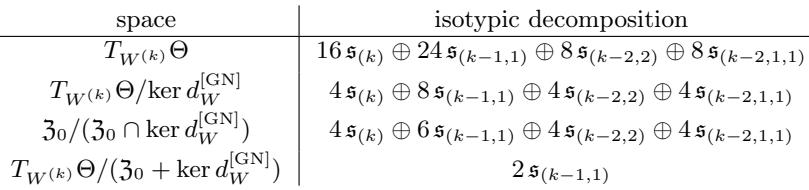  
Table 16: Isotypic decompositions for the k-class Gaussian mixture with $k \geq 4 .$

## 5 Further Concepts and Proofs

We now develop in detail several concepts and results used in the preceding spectral analyses, restating definitions where a more precise formulation is needed.

## 5.1 Generalized derivatives

To analyze Hessian symmetries for nonsmooth models, we regard the pointwise and expected losses as generalized functions in the parameter variables.

The notation $V ^ { \prime }$ denotes the continuous dual of a topological vector space V. Following standard convention, when V is equipped with an inner product, we write $V ^ { * }$ for this dual. The definitions below apply to open sets and have local analogues on manifolds. We state them in Euclidean form for simplicity. Relevant definitions and notation are collected in Table 17.

<table><tr><td>Name</td><td>Notation</td><td>Definition</td></tr><tr><td>Lebesgue space</td><td> $L _ { \mathrm { l o c } } ^ { p } ( \Omega ; Y ) , 1 \le p \le \infty$ </td><td> $\{ u : \Omega \to Y$  measurable  $\displaystyle \left| \begin{array} { l } { \| u \| _ { L ^ { p } ( K ; Y ) } < \infty } \end{array} \right.$  for all  $K \Subset \Omega \}$ </td></tr><tr><td>Sobolev space</td><td> $W _ { \mathrm { l o c } } ^ { k , p } ( \Omega ; Y )$ </td><td> $\left\{ u \in L _ { \mathrm { l o c } } ^ { p } ( \Omega ; Y ) \mid D ^ { \alpha } u \in L _ { \mathrm { l o c } } ^ { p } ( \Omega ; Y ) , \mid \alpha \mid \leq k \right\}$ </td></tr><tr><td>Radon measures</td><td> $\mathscr { M } _ { \mathrm { l o c } } ( \Omega ; Y )$ </td><td>locally finite Y-valued Radon measures on Ω</td></tr><tr><td>Bounded variation</td><td> $B V _ { \mathrm { l o c } } ( \Omega ; Y )$ </td><td> $\left\{ u \in L _ { \mathrm { l o c } } ^ { 1 } ( \Omega ; Y ) \ \middle \vert \ D u \in \mathcal { M } _ { \mathrm { l o c } } ( \Omega ; Y \otimes E ^ { * } ) \right\}$ </td></tr><tr><td>Special bounded variation</td><td> $S B V _ { \mathrm { l o c } } ( \Omega ; Y )$ </td><td> $\{ u \in B V _ { \mathrm { l o c } } ( \Omega ; Y ) \mid D ^ { c } u = 0 \}$ </td></tr><tr><td>Bounded Hessian</td><td> $B H _ { \mathrm { l o c } } ( \Omega ; Y )$ </td><td> $\{ u \in W _ { \mathrm { l o c } } ^ { 1 , 1 } ( \Omega ; Y ) \mid D ^ { 2 } u \in \mathcal { M } _ { \mathrm { l o c } } ( \Omega ; Y \otimes \mathrm { S y m } ^ { 2 } ( E ^ { * } ) ) \}$ </td></tr><tr><td>Special bounded Hessian</td><td> $S B H _ { \mathrm { l o c } } ( \Omega ; Y )$ </td><td> $\left\{ u \in B H _ { \mathrm { l o c } } ( \Omega ; Y ) \ \middle | \ ( D ^ { 2 } u ) ^ { c } = 0 \right\}$ </td></tr><tr><td>Test functions</td><td> $C _ { c } ^ { \infty } ( \Omega ; Y )$ </td><td> $\{ \varphi \in C ^ { \infty } ( \Omega ; Y ) \mid \operatorname { s u p p } ( \varphi ) \Subset \Omega \}$ </td></tr><tr><td>Distributions</td><td> $\mathcal { D } ^ { \prime } ( \Omega ; Y )$ </td><td> $( C _ { c } ^ { \infty } ( \Omega ; Y ^ { * } ) ) ^ { \prime }$ </td></tr></table>

Table 17: Definitions from functional analysis, the theory of generalized functions, and geometric measure theory used in this section. Here E and $Y$ are Euclidean spaces, $\Omega \subseteq E$ is open, and the superscript c denotes the Cantor part.

We take the input, output, and parameter spaces to be Euclidean spaces, equipped with their standard inner products and Borel σ-algebras. As usual, we write d = dim X, $p = \dim \Theta$ , and $k = \dim Y$ . The data distribution $\mu$ is a Radon probability measure on $Z = X \times Y$ , allowing, in particular, empirical distributions on finite samples, and Θ carries Lebesgue measure dW. The joint space is $\mathbb { A } = Z \times \Theta$ , equipped with the product Borel structure and the product Radon measure $\mu \otimes d W$ . Let the model $N : X \times \Theta \to Y$ and the loss function $\ell : Y \times Y \to [ 0 , \infty )$ be Borel measurable and locally bounded,23 and let the pointwise loss κ be defined as in (1.3). Then κ is nonnegative and belongs to $L _ { \mathrm { l o c } } ^ { 1 } ( \mathbb { A } , \mu \otimes d W )$ . By abuse of notation, we identify κ with the distribution of order zero induced by the Radon measure $\kappa \left( \mu \otimes d W \right)$ on A. Assume further that the expected loss $\mathcal { L }$ in (1.4) belongs to $L _ { \mathrm { l o c } } ^ { 1 } ( \Theta )$ . We adopt the same convention for ${ \mathcal { L } } ,$ identifying it with the Radon measure ${ \mathcal { L } } ( W ) d W = ( { \bar { \pi } } _ { W } ) _ { * } ( \kappa ( \mathbf { z } , W ) ( \mu \otimes d W ) )$

Proposition 38 (Distributional diferentiation under expectation) For every multiindex $\alpha ,$ the distribution $\partial _ { W } ^ { \alpha } \mathcal { L } \in \mathcal { D } ^ { \prime } ( \Theta )$ is well defined and satisfies

$$
\partial _ { W } ^ { \alpha } { \mathcal { L } } = \int _ { Z } \partial _ { W } ^ { \alpha } \kappa ( \mathbf { z } , \cdot ) d \mu ( \mathbf { z } ) \quad i n \mathcal { D } ^ { \prime } ( \Theta ) .\tag{5.170}
$$

Proof [Sketch] Test against $\varphi \in C _ { c } ^ { \infty } ( \Theta )$ and use Fubini, justified by local integrability.

The preceding identity requires only local integrability. The GN term contains products of first derivatives and therefore requires additional regularity.

Proposition 39 (GN decomposition of the pointwise loss) Assume that $\ell \in C ^ { 2 } ( Y \times Y )$ and that N, as a map on $\mathbb { A } = Z \times \Theta$ , is $S B H _ { \mathrm { l o c } } \cap \bar { W } _ { \mathrm { l o c } } ^ { 1 , \infty }$ in the W-variables.24 Then κ is $S B H _ { \mathrm { l o c } }$ in the W-variables, the pointwise GN form in (1.15) induces a regular $\mathrm { S y m } ^ { 2 } ( T ^ { * } \Theta )$ -valued distribution on A, denoted (by the usual abuse of notation) by $d _ { W } ^ { \mathrm { G N } } \kappa$ , and, as locally finite $\mathrm { S y m } ^ { 2 } ( T ^ { * } \Theta )$ -valued distributions on $\mathbb { A }$

$$
d _ { W } ^ { 2 } \kappa = d _ { W } ^ { \mathrm { G N } } \kappa + \sum _ { a = 1 } ^ { k } \partial _ { 1 , a } \ell ( N , { \mathbf y } ) d _ { W } ^ { 2 } N _ { a } .\tag{5.171}
$$

Proof [Sketch] The Sobolev chain rule gives $\begin{array} { r } { d _ { W } \kappa = \sum _ { a } \partial _ { 1 , a } \ell ( N , \mathbf { y } ) d _ { W } N _ { a } } \end{array}$ in the W-variables. Since $d _ { W } N _ { a } \in B V _ { \mathrm { l o c } }$ and $\partial _ { 1 , a } \ell ( N , { \mathbf y } )$ is locally Lipschitz, the BV product rule gives the stated identity. The corresponding $S B V _ { \mathrm { l o c } }$ conclusion follows since $D _ { W } ^ { 2 } N$ has no Cantor part.

The preceding decomposition is an identity of generalized functions. At a fixed parameter, the classical Hessian can be identified with the GN form under a separate set of local assumptions.

Proposition 40 (GN identity at a well-specified point) Let $W ^ { \ast } \in \Theta$ . Assume that $\ell \in C ^ { 2 } ( Y \times$ Y ) and that $d _ { 1 } ^ { 2 } { \boldsymbol { \ell } }$ is bounded. Assume further that $\mathcal { L }$ is twice Fréchet diferentiable at $W ^ { * }$ and that $N ( \mathbf { x } ; \cdot )$ is diferentiable at $W ^ { * }$ for $\mu _ { X } - a l m o s t$ every x. Suppose that there are a neighborhood U of $W ^ { * }$ and a function $\lambda \in L ^ { 2 } ( \mu _ { X } )$ such that

$$
\| N ( \mathbf { x } ; W ) - N ( \mathbf { x } ; W ^ { * } ) \| \leq \lambda ( \mathbf { x } ) \| W - W ^ { * } \|\tag{5.172}
$$

for all $W \in U$ and for $\mu _ { X }$ -almost every x. If the model is well specified at $W ^ { * }$ , then

$$
\nabla _ { W } ^ { 2 } \mathcal { L } ( W ^ { * } ) = \mathbb { E } _ { ( \mathbf { x } , \mathbf { y } ) \sim \mu } [ D _ { W } ^ { \mathrm { G N } } ( \mathbf { x } , W ^ { * } , \mathbf { y } ) ] .\tag{5.173}
$$

Proof [Sketch] Taylor’s formula in the first argument of ℓ gives a linear term and a quadratic remainder. Well specification eliminates the linear term. The rest follows by standard domination.

DAG networks. We now verify that the networks considered in this work satisfy the regularity hypotheses of Proposition 39. We begin by specifying the class of networks under consideration.

Definition 41 (Definable DAG networks) Fix an o-minimal expansion of R. Let $\left( V _ { N } , E _ { N } \right)$ be a directed acyclic graph with sets of input and output nodes $V _ { \mathrm { i n } } , V _ { \mathrm { o u t } } \subseteq V _ { N }$ . Associate with each node $v \in V _ { N }$ a Euclidean feature space $\mathcal { Z } _ { v . }$ , with $\begin{array} { r } { \prod _ { v \in V _ { \mathrm { o u t } } } \mathcal { Z } _ { v } = Y } \end{array}$ . Each non-input node v is assigned a locally bounded definable map $\begin{array} { r } { \Psi _ { v } : \left( \prod _ { u \mid ( u , v ) \in E _ { N } } \mathcal { Z } _ { u } \right) \times \Theta \longrightarrow \mathcal { Z } _ { v } } \end{array}$ . For $\mathbf { x } = ( x _ { v } ) _ { v \in V _ { \mathrm { i n } } } \in X$ and $\theta \in \Theta$ , set $z _ { v } ( \mathbf { x } ; \boldsymbol { \theta } ) : = x _ { v }$ for $v \in V _ { \mathrm { i n } }$ , and define recursively

$$
z _ { v } ( \mathbf { x } ; \boldsymbol { \theta } ) = \Psi _ { v } \left( \left( z _ { u } ( \mathbf { x } ; \boldsymbol { \theta } ) \right) _ { u \mid ( u , v ) \in E _ { N } } , \boldsymbol { \theta } \right) ,
$$

$$
v \in V _ { N } \setminus V _ { \mathrm { i n } } .\tag{5.174}
$$

The associated realization map is $N ( \mathbf { x } ; \theta ) = \left( z _ { v } ( \mathbf { x } ; \theta ) \right) _ { v \in V _ { \mathrm { o u t } } } .$ A DAG network satisfying the preceding conditions is called definable. It is called locally DC if, in addition, every node map is componentwise locally DC, meaning that each component is locally the diference of two convex functions.

Induction along a topological ordering of the DAG shows that N is definable, in particular Borel measurable, and locally bounded. If every node map is componentwise locally DC, then so is N. The definable class encompasses fully connected, convolutional, and message-passing architectures (including attention layers), together with skip connections, parameter sharing, average and max pooling, and locally bounded definable readout maps. It also allows locally bounded definable activations and operations, including ReLU, Heaviside, GELU, and absolute value. Discontinuous node maps may invalidate the GN decomposition used extensively in this work. Accordingly, for the remainder of this discussion, we additionally require every node map to be componentwise locally DC. This excludes Heaviside but retains all architectures considered in this work.

First-order derivatives. Since N is componentwise locally DC, it is locally Lipschitz in $( \mathbf { x } , W )$ and hence $N \in W _ { \mathrm { l o c } } ^ { 1 , \infty } ( X \times \Theta ; Y )$ . Consequently, every first-order distributional derivative of $N .$ including those with respect to the W-variables, is a regular distribution.

Second-order derivatives. Since N is componentwise locally DC, $\partial _ { \theta } N \in B V _ { \mathrm { l o c } }$ for every θ. Hence, $D _ { \eta } D _ { \theta } N \in \mathcal { M } _ { \mathrm { l o c } } ( X \times \Theta ; Y )$ for every pair $\eta , \theta$ . Fix a common finite definable $C ^ { 2 }$ stratification adapted to N and its first derivatives such that $N$ is $C ^ { 2 }$ on each full-dimensional stratum. Then $\partial _ { \theta } N$ is $C ^ { 1 }$ there, so the singular part of $D ( \partial _ { \theta } N )$ is supported on the lower-dimensional strata. These strata are locally $\mathcal { H } ^ { d + p - 1 }$ -finite by definability Fornasiero and Vasquez Rifo (2012). Hence, the Cantor part of $D ( \partial _ { \theta } N )$ vanishes Ambrosio et al. (2000). The one-sided traces of $\partial _ { \theta } N$ exist $\mathcal { H } ^ { d + p - 1 }$ -almost everywhere on each codimension-one stratum. For each codimension-one stratum $\mathcal { T } _ { : }$ , choose a unit normal $\nu _ { \tau }$ oriented from the minus side to the plus side, and write $[ [ \partial _ { \theta } N ] ] _ { \mathcal { T } } = ( \partial _ { \theta } N ) ^ { + } | _ { \mathcal { T } } - ( \partial _ { \theta } N ) ^ { - } | _ { \mathcal { T } } .$ Therefore

$$
D _ { \eta } D _ { \theta } N = \partial _ { \eta } \partial _ { \theta } N d { \bf x } d W + \sum _ { \mathcal { T } } [ \partial _ { \theta } N ] _ { \mathcal { T } } ( \nu _ { \mathcal { T } } \cdot { \bf e } _ { \eta } ) \mathcal { H } ^ { d + p - 1 } \uparrow \mathcal { T } .\tag{5.175}
$$

Together with the conclusion above, this yields $N \in S B H _ { \mathrm { l o c } } ( X \times \Theta ; Y ) \cap W _ { \mathrm { l o c } } ^ { 1 , \infty } ( X \times \Theta ; Y )$

Interface delta representation. Let $\Omega \subseteq \mathbb { R } ^ { n }$ be open, let $g \in C ^ { 1 } ( \Omega )$ , and assume that $\nabla g \neq 0$ on $\{ g = 0 \}$ . We denote by $\delta ( g )$ the Radon measure on Ω defined by

$$
\langle \delta ( g ) , \psi \rangle = \int _ { \{ g = 0 \} } \frac { \psi ( \pmb { \xi } ) } { | \nabla g ( \pmb { \xi } ) | } d \mathcal { H } ^ { n - 1 } ( \pmb { \xi } ) , \qquad \psi \in C _ { c } ^ { \infty } ( \Omega ) .\tag{5.176}
$$

By the coarea formula, $\left| \nabla g \right| \delta ( g ) = \mathcal { H } ^ { n - 1 } \ u { \ u { \ u { y } } } \left\{ g = 0 \right\}$ . Table 18 gives the distributional second-variation formulas for $N ^ { 3 , \circ } ( { \bf x } ; W ) = W _ { 3 } \sigma ( W _ { 2 } \sigma ( W _ { 1 } { \bf x } ) )$

## 5.2 Presheaves of symmetry groups

We first prove Proposition 13 and then formulate its higher-order analogues.

The zeroth-order statement does not require distributional derivatives. Let $g \in \mathsf { S } ( N , \ell )$ be µ-compatible. Then $\kappa \circ ( \mathrm { i d } _ { Z } , g _ { \Theta } ) = ( \kappa \circ g ) \circ ( g _ { Z } ^ { - 1 } , \mathrm { i d } _ { \Theta } ) = \kappa \circ ( g _ { Z } ^ { - 1 } , \mathrm { i d } _ { \Theta } )$ . Therefore,

$$
\mathcal { L } \circ g _ { \Theta } = \mathbb { E } _ { \mu } \big [ \kappa \circ ( \mathrm { i d } _ { Z } , g _ { \Theta } ) \big ] = \mathbb { E } _ { \mu } \big [ \kappa \circ ( g _ { Z } ^ { - 1 } , \mathrm { i d } _ { \Theta } ) \big ] = \mathbb { E } _ { \mu } \big [ \kappa \big ] = \mathcal { L } ,\tag{5.177}
$$

where the penultimate equality follows because $g _ { Z } ^ { - 1 } \in \mathsf { D } ( \mu )$ and hence $\mathbb { E } _ { \mu } [ \phi ] = \mathbb { E } _ { \mu } [ \phi \circ g _ { Z } ^ { - 1 } ]$ for every µ-integrable measurable $\phi : Z \to \mathbb { R }$ . This proves the invariance assertion in Proposition 13. The group assertions follow because the set of µ-compatible structural symmetries is precisely ${ \mathsf { S } } ( N , \ell ) \cap ( { \mathsf { D } } ( \mu ) \times { \mathrm { A u t } } ( \Theta ) )$ , which is a subgroup of $\operatorname { A u t } ( \mathbb { A } )$ . The internal case is analogous.

<table><tr><td>quantity</td><td>expression</td></tr><tr><td></td><td> $\mathbf { z } _ { 1 } = W _ { 1 } \mathbf { x } , \quad \mathbf { r } _ { 1 } = \sigma ( \mathbf { z } _ { 1 } ) , \quad \mathbf { z } _ { 2 } = W _ { 2 } \mathbf { r } _ { 1 } , \quad \mathbf { r } _ { 2 } = \sigma ( \mathbf { z } _ { 2 } ) , \quad \mathbf { u } = W _ { 3 } \mathbf { r } _ { 2 }$ </td></tr><tr><td>ReLU masks</td><td> $D _ { 1 } = \mathrm { d i a g } ( { \bf 1 _ { z } } _ { 1 } > 0 ) , \qquad D _ { 2 } = \mathrm { d i a g } ( { \bf 1 _ { z } } _ { 2 } > 0 )$ </td></tr><tr><td>preactivation variations</td><td> $\delta \mathbf { z } _ { 1 } = \delta W _ { 1 } \mathbf { x } , \qquad \delta \mathbf { z } _ { 2 } = \delta W _ { 2 } \mathbf { r } _ { 1 } + W _ { 2 } D _ { 1 } \delta \mathbf { z } _ { 1 }$ </td></tr><tr><td>first variation of logits</td><td> $\delta { \bf u } = \delta W _ { 3 } { \bf r } _ { 2 } + W _ { 3 } D _ { 2 } \delta { \bf z } _ { 2 }$   $\delta ^ { 2 } \mathbf { u } _ { \mathrm { a c } } = 2 \delta W _ { 3 } D _ { 2 } \delta \mathbf { z } _ { 2 } + 2 W _ { 3 } D _ { 2 } \delta W _ { 2 } D _ { 1 } \delta \mathbf { z } _ { 1 }$ </td></tr><tr><td>absolutely continuous second variation</td><td> $= 2 { \Big ( } \delta W _ { 3 } D _ { 2 } \delta W _ { 2 } \mathbf { r } _ { 1 } + \delta W _ { 3 } D _ { 2 } W _ { 2 } D _ { 1 } \delta \mathbf { z } _ { 1 } + W _ { 3 } D _ { 2 } \delta W _ { 2 } D _ { 1 } \delta \mathbf { z } _ { 1 } { \Big ) }$ </td></tr><tr><td>layer-one singular second variation</td><td> $\delta ^ { 2 } \mathbf { u } _ { \mathrm { s i n g } , 1 } = W _ { 3 } D _ { 2 } W _ { 2 } \mathrm { d i a g } ( \delta ( \mathbf { z } _ { 1 } ) ) ( \delta \mathbf { z } _ { 1 } \odot \delta \mathbf { z } _ { 1 } )$ </td></tr><tr><td>layer-two singular second variation</td><td> $\delta ^ { 2 } \mathbf { u } _ { \mathrm { s i n g } , 2 } = W _ { 3 } \mathrm { d i a g } ( \delta ( \mathbf { z } _ { 2 } ) ) ( \delta \mathbf { z } _ { 2 } \odot \delta \mathbf { z } _ { 2 } )$ </td></tr><tr><td>cross-entropy quantities</td><td> ${ \bf p } = \mathrm { s o f t m a x } ( { \bf u } ) , \qquad { \bf g } = { \bf p } - { \bf e _ { y } } ,$ </td></tr><tr><td>generalized Hessian of the loss</td><td> $\delta ^ { 2 } \kappa = ( \delta \mathbf { u } ) ^ { \top } ( \mathrm { d i a g } ( \mathbf { p } ) - \mathbf { p } \mathbf { p } ^ { \top } ) ( \delta \mathbf { u } ) + \mathbf { g } ^ { \top } \delta ^ { 2 } \mathbf { u } _ { \mathrm { a c } } + \mathbf { g } ^ { \top } ( \delta ^ { 2 } \mathbf { u } _ { \mathrm { s i n g } , 1 } + \delta ^ { 2 } \mathbf { u } _ { \mathrm { s i n g } , 2 } )$ </td></tr></table>

Table 18: Distributional second-variation formulas for $N ^ { 3 , \circ }$ . The singular terms are interpreted through the interface-jump formula (5.175).

The extension to higher derivatives is as follows. Let $\Omega \ : = \ : \Omega _ { Z } \times \Omega _ { \Theta } \subset \ : \mathbb { A }$ be open, write $\begin{array} { r } { \mathcal { L } : = \mathcal { L } _ { \Omega } ( W ) = \int _ { \Omega _ { \tau } } \kappa ( \mathbf { z } , W ) d \mu ( \mathbf { z } ) } \end{array}$ , and define $\mathrm { A u t } _ { \Omega } : = \mathrm { A u t } ( \Omega _ { Z } ) \times \mathrm { A u t } ( T \Omega _ { \Theta } )$ , where the second factor is a chosen group of admissible vector bundle automorphisms of $T \Omega _ { \Theta }$ covering $\mathrm { i d } _ { \Omega _ { \Theta } }$ . In the Euclidean setting considered, each admissible afine transformation gΘ induces the constant bundle automorphism gbΘ given by $\widehat { g } _ { \Theta } ( W , \delta W ) = ( W , d g _ { \Theta } \delta W )$ . Let $r \geq 1$ and let V be a Euclidean space. For a family $\\\Phi = ( \Phi _ { \mathbf { z } } ) _ { \mathbf { z } \in \Omega _ { Z } }$ of distributions

$$
\Phi _ { \mathbf { z } } \in { \mathcal { D } } ^ { \prime } ( \Omega _ { \Theta } ; V \otimes \mathrm { S y m } ^ { r } ( T ^ { * } \Omega _ { \Theta } ) )
$$

and $g = ( g _ { Z } , A ) \in \operatorname { A u t } _ { \Omega }$ , define

$$
( g \cdot \Phi ) _ { \mathbf { z } } : = ( \mathrm { i d } _ { V } \otimes ( A ^ { - 1 } ) ^ { * } ) \Phi _ { g _ { Z } ^ { - 1 } \mathbf { z } }
$$

(see Footnote 20). Here, taking $A = { \widehat { g } } _ { \Theta }$ gives, equivalently,

$$
( g \cdot \Phi ) _ { \mathbf { z } } ( \varphi ) [ \delta _ { 1 } , \ldots , \delta _ { r } ] = \Phi _ { g _ { z } ^ { - 1 } \mathbf { z } } ( \varphi ) [ ( d g _ { \Theta } ) ^ { - 1 } \delta _ { 1 } , \ldots , ( d g _ { \Theta } ) ^ { - 1 } \delta _ { r } ] ,\tag{5.178}
$$

where $\varphi \in C _ { c } ^ { \infty } ( \Omega _ { \Theta } )$ and $\delta _ { 1 } , \ldots , \delta _ { r } \in \Theta$ , using the canonical identification $T _ { W } \Theta \simeq \Theta$ for every $W \in \Omega _ { \Theta }$ . For example, taking $V = Y$ gives the action on $d _ { W } ^ { r } N$ , while taking $V = \mathbb { R }$ gives the actions on $d _ { W } ^ { r } \kappa$ and, for $r = 2$ , on $d _ { W } ^ { \mathsf { \tilde { G } N } }$ . The same definition applies to the other forms considered in this work. The action is defined so that distributional invariance on open sets can pass to pointwise invariance. We define the corresponding symmetry groups on product open subsets of A as stabilizers under this action, with ambient group $\mathrm { A u t } _ { \Omega }$ . We denote them by replacing the pointwise subscript W with Ω, as in $\mathsf { L } _ { W } ^ { [ r ] } ( N )$ and $\mathsf { L } _ { \Omega } ^ { [ r ] } ( { N } )$ . Fix an open set $\Omega _ { Z } \subseteq Z$ . As $\Omega _ { \Theta } \subseteq \Theta$ varies, these assignments on $\Omega _ { Z } \times \Omega _ { \Theta }$ form presheaves of groups over Θ under restriction in the parameter variable.

Remark 42 When Z is a manifold, one may allow $\mathsf { D } ( \mu , \Omega _ { Z } )$ to vary with $\Omega _ { Z }$ , potentially leading to nontrivial local-to-global phenomena Arjevani (2027b).

We now turn to completing the proof of Proposition 13 at higher orders.

Theorem 43 For $\alpha \in \{ 0 , 1 , 2 , \ldots \} \cup \{ \mathrm { G N } \}$ ，

(i) $\Gamma _ { \Omega } ^ { [ \alpha ] }$ is a group and $d _ { W } ^ { \alpha } \mathcal { L }$ is $\Gamma _ { \Omega } ^ { [ \alpha ] }$ -invariant on $\Omega$

(ii) Whenever the relevant expectation identity holds pointwise at $W , d _ { W } ^ { \alpha } { \mathcal { L } } ( W )$ is $\Gamma _ { W } ^ { [ \alpha ] } { - } i n v a r i a n t .$

(iii) If $g _ { \Theta } \in \Gamma _ { W }$ , then $d g _ { \Theta } \in \Gamma _ { W } ^ { [ r ] }$ for every $r \in \mathbb { N }$ . If $\because \boldsymbol { g } \in \mathsf { L } _ { W } ^ { [ 1 ] } ( N )$ is $\mu \cdot$ -compatible and $g _ { Z }$ stabilizes $\mathbf { z } \mapsto d _ { 1 } ^ { 2 } \ell ( N ( \mathbf { x } ; W ) , \mathbf { y } )$ , then $g _ { \Theta } \in \Gamma _ { W } ^ { [ \mathrm { G N } ] }$

(iv) If $d _ { W } ^ { \alpha } { \mathcal { L } }$ admits a locally integrable representative, then every $g _ { \Theta } \in \Gamma _ { \Omega } ^ { [ \alpha ] }$ stabilizes $d _ { W } ^ { \alpha } { \mathcal { L } } ( W )$ for almost every $W \in \Omega _ { \Theta }$ (fiberwise when $\alpha \neq 0 )$ , and for every $W$ if the representative is continuous.

The GN assertions assume that $\mathbb { E } _ { \mu } [ d _ { W } ^ { \mathrm { G N } } \kappa ]$ exists in $\mathcal { D } ^ { \prime } ( \Omega _ { \Theta } )$ and, where used pointwise, is finite.

Proof Item (i). By definition, $\Gamma _ { \Omega } ^ { [ \alpha ] }$ is the image under $\pi _ { \Omega _ { \Theta } }$ of the subgroup

$$
{ \mathsf S } _ { \Omega } ^ { [ \alpha ] } \cap ( { \mathsf D } ( \mu ) \times \mathrm { A u t } ( T \Omega _ { \Theta } ) )\tag{5.179}
$$

of $\mathrm { A u t } _ { \Omega }$ , and is therefore a group. For $\alpha = 0$ , invariance is exactly (5.177). For $\alpha = r \in \mathbb { N } ,$ , the same argument applies, with Proposition 38 providing (3.120) on Ω. The case $\alpha = \mathrm { G N }$ is analogous. Item $( i i )$ . The same argument applies pointwise at $W$ , with the relevant expectation identity replacing Proposition 38. Item $( i i i )$ . Let $g _ { \Theta } \in \operatorname { S t a b } _ { \Gamma } ( W )$ . By definition, there exists $h \in \mathsf { D } ( \mu )$ such that $g = ( h , g _ { \Theta } ) \in \mathsf { S } ( N , \ell )$ and $g _ { \Theta } ( W ) = W$ . Since $g _ { \Theta }$ is afine, diferentiating on this domain gives

$$
d _ { W } ^ { r } \kappa ( \mathbf { z } , W ) [ d g _ { \Theta } \delta _ { 1 } , \ldots , d g _ { \Theta } \delta _ { r } ] = d _ { W } ^ { r } \kappa ( h ^ { - 1 } \mathbf { z } , W ) [ \delta _ { 1 } , \ldots , \delta _ { r } ] .\tag{5.180}
$$

Hence $( h , d g _ { \Theta } ) \in \mathsf { S } _ { W } ^ { [ r ] }$ , and therefore $d g _ { \Theta } \in \Gamma _ { W } ^ { [ r ] }$ . Now let $g \in \mathsf { L } _ { W } ^ { [ 1 ] } ( N )$ be µ-compatible, and suppose that $g _ { Z }$ stabilizes $\mathbf { z } \mapsto d _ { 1 } ^ { 2 } \ell ( N ( \mathbf { x } ; W ) , \mathbf { y } )$ . This gives

$$
d _ { W } ^ { \mathrm { G N } } ( \mathbf { z } ) [ g _ { \Theta } \delta _ { 1 } , g _ { \Theta } \delta _ { 2 } ] = d _ { W } ^ { \mathrm { G N } } ( g _ { Z } ^ { - 1 } \mathbf { z } ) [ \delta _ { 1 } , \delta _ { 2 } ]\tag{5.181}
$$

wherever the GN form is defined. Hence $g \in \mathsf { S } _ { W } ^ { [ \mathrm { G N } ] }$ , and µ-compatibility yields $g _ { \Theta } \in \Gamma _ { W } ^ { [ \mathrm { G N } ] }$ . Item $( i v )$ By item (i), every $g _ { \Theta } \in \Gamma _ { \Omega } ^ { [ \alpha ] }$ satisfies $g _ { \Theta } \cdot d _ { W } ^ { \alpha } { \mathcal { L } } = d _ { W } ^ { \alpha } { \mathcal { L } }$ on $\Omega _ { \Theta }$ . Their locally integrable representatives agree almost everywhere, and everywhere if they are continuous, giving the pointwise conclusion.

By the preceding theorem, Lemma 28 reduces to verifying the corresponding model symmetries on the relevant open region, which follows directly from the formulas in Table 18.

## 5.3 Quantitative analysis via the GN form

The favorable structure of the GN form provides direct quantitative control on the spectrum. We derive uniform and $O ( k ^ { - 1 } )$ bounds in Learning Problem 1 and corresponding bounds in Learning Problem 2. Sharper estimates are possible, but those below sufice for our purposes.

Proposition 44 In Learning Problem 1, take $d = k , \tau = 1$ , and centers given by the rows of $I _ { k }$ . At $W ^ { ( k ) }$ defined in (4.160) for $N ^ { 3 , \circ }$ ，

$$
d _ { W } ^ { \mathrm { G N } } \mathcal { L } ( W ^ { ( k ) } ) [ \delta W , \delta W ] \leq \left( 1 6 + \frac { 3 2 } { k } \right) \| \delta W \| _ { F } ^ { 2 } .\tag{5.182}
$$

On the subspace where the rows of the block matrices in (4.163) have zero sum,

$$
d _ { W } ^ { \mathrm { G N } } \mathcal { L } ( W ^ { ( k ) } ) [ \delta W , \delta W ] \leq \frac { 3 2 } { k } \| \delta W \| _ { F } ^ { 2 } .\tag{5.183}
$$

Proof With $S _ { + } = I _ { k } \otimes { \mathbf e } _ { 1 }$ and $S _ { - } = I _ { k } \otimes \mathbf { e } _ { 2 }$ , define the eight block maps by

$$
\Phi _ { 1 , \epsilon } ( A ) ( { \bf x } ) = W _ { 3 } ^ { * } D _ { 2 } ( { \bf x } ) W _ { 2 } ^ { * } D _ { 1 } ( { \bf x } ) S _ { \epsilon } A { \bf x } ,\tag{5.184}
$$

$$
\Phi _ { 2 , \epsilon , \epsilon ^ { \prime } } ( A ) ( { \bf x } ) = W _ { 3 } ^ { * } D _ { 2 } ( { \bf x } ) S _ { \epsilon } A S _ { \epsilon ^ { \prime } } ^ { \top } \sigma ( W _ { 1 } ^ { * } { \bf x } ) ,\tag{5.185}
$$

$$
\Phi _ { 3 , \epsilon } ( A ) ( { \bf x } ) = A S _ { \epsilon } ^ { \top } \sigma ( W _ { 2 } ^ { * } \sigma ( W _ { 1 } ^ { * } { \bf x } ) ) ,\tag{5.186}
$$

where $\epsilon , \epsilon ^ { \prime } \in \{ \pm 1 \}$ . We index these blocks by $\mathcal { B } = \{ ( 1 , \epsilon ) : \epsilon \in \{ \pm 1 \} \} \cup \{ ( 2 , \epsilon , \epsilon ^ { \prime } ) : \epsilon , \epsilon ^ { \prime } \in \{ \pm 1 \} \} \cup \{ ( 3 , \epsilon )$ $\epsilon \in \{ \pm 1 \} \}$ . Writing $A _ { B }$ for the perturbation in block $B ,$ the definitions of $\Phi _ { B }$ give

$$
d _ { W } N ^ { 3 , \circ } ( { \bf x } ; W ^ { * } ) [ \delta W ] = \sum _ { B \in B } \Phi _ { B } ( A _ { B } ) ( { \bf x } ) .\tag{5.187}
$$

Each block map has the form $\Phi _ { B } ( A ) ( \mathbf { x } ) = s _ { B } R _ { B } ( \mathbf { x } ) A \mathbf { v } _ { B } ( \mathbf { x } )$ , where $s _ { B } \in \{ \pm 1 \} , R _ { B } ( \mathbf { x } )$ is diagonal with entries in $\{ 0 , \pm 1 \}$ , and $\mathbf { v } _ { B } ( \mathbf { x } ) \in \{ \mathbf { x } , \sigma ( \mathbf { x } ) , \sigma ( - \mathbf { x } ) \}$ . Set

$$
\begin{array} { r } { C _ { p } ( \mathbf { x } ) = \mathrm { d i a g } ( p ( \mathbf { x } ) ) - p ( \mathbf { x } ) p ( \mathbf { x } ) ^ { \top } . } \end{array}\tag{5.188}
$$

Since $C _ { p } ( { \mathbf x } ) \preceq \mathrm { d i a g } ( p ( { \mathbf x } ) ) , R _ { B } ( { \mathbf x } ) ^ { \top } C _ { p } ( { \mathbf x } ) R _ { B } ( { \mathbf x } ) \preceq \mathrm { d i a g } ( p ( { \mathbf x } ) ) . \mathrm { I f ~ } { \mathbf a } _ { i } ^ { \top }$ is the i-th row of $A ,$ , then

$$
\Phi _ { B } ( A ) ( \mathbf { x } ) ^ { \top } C _ { p } ( \mathbf { x } ) \Phi _ { B } ( A ) ( \mathbf { x } ) = \left( A \mathbf { v } _ { B } ( \mathbf { x } ) \right) ^ { \top } R _ { B } ( \mathbf { x } ) ^ { \top } C _ { p } ( \mathbf { x } ) R _ { B } ( \mathbf { x } ) ( A \mathbf { v } _ { B } ( \mathbf { x } ) ) \leq \sum _ { i = 1 } ^ { k } p _ { i } ( \mathbf { x } ) ( \mathbf { a } _ { i } ^ { \top } \mathbf { v } _ { B } ( \mathbf { x } ) ) ^ { 2 } .
$$

By well specification, $p _ { i } ( \mathbf { x } ) = \mathbb { P } ( Y = i \mid \mathbf { x } )$ . Hence, for every nonnegative measurable $h , \mathbb { E } _ { \mathbf { x } } [ p _ { i } ( \mathbf { x } ) h ( \mathbf { x } ) ] =$ $k ^ { - 1 } \mathbb { E } _ { \mathbf { x } | Y = i } [ h ( \mathbf { x } ) ]$ ]. Therefore

$$
\mathbb { E } _ { \mathbf { x } } [ \Phi _ { B } ( A ) ( \mathbf { x } ) ^ { \top } C _ { p } ( \mathbf { x } ) \Phi _ { B } ( A ) ( \mathbf { x } ) ] \leq \frac { 1 } { k } \sum _ { i = 1 } ^ { k } \mathbb { E } _ { \mathbf { x } \mid Y = i } [ ( \mathbf { a } _ { i } ^ { \top } \mathbf { v } _ { B } ( \mathbf { x } ) ) ^ { 2 } ] .\tag{5.189}
$$

Given $\mathbf { v } _ { B } \in \{ \mathbf { x } , \sigma ( \mathbf { x } ) , \sigma ( - \mathbf { x } ) \}$ , set $\mathbf { v } = \mathbf { v } _ { B } ( \mathbf { x } )$ . Define $m _ { 0 1 } , m _ { 1 1 } , m _ { 0 2 } , m _ { 1 2 }$ by

$$
\mathbb { E } _ { { \mathbf { x } } | Y = i } [ v _ { j } ] = m _ { 0 1 } , \qquad \mathbb { E } _ { { \mathbf { x } } | Y = i } [ v _ { i } ] = m _ { 1 1 } , \qquad \mathbb { E } _ { { \mathbf { x } } | Y = i } [ v _ { j } ^ { 2 } ] = m _ { 0 2 } , \qquad \mathbb { E } _ { { \mathbf { x } } | Y = i } [ v _ { i } ^ { 2 } ] = m _ { 1 2 } .\tag{5.190}
$$

for $j \neq i .$ . In all cases, m02 $\leq 1$ $m _ { 1 2 } \leq 2 , | m _ { 0 1 } | \leq 1$ , and $| m _ { 1 1 } - m _ { 0 1 } | \leq 1$ . By independence of $v _ { 1 } , \ldots , v _ { k }$ conditioned on $Y = i$

$$
\begin{array} { r l r } {  { \mathbb { E } _ { { \mathbf { x } } | Y = i } [ ( { \mathbf { a } } _ { i } ^ { \top } { \mathbf { v } } ) ^ { 2 } ] = ( m _ { 0 2 } - m _ { 0 1 } ^ { 2 } ) \sum _ { j \ne i } a _ { i j } ^ { 2 } + ( m _ { 1 2 } - m _ { 1 1 } ^ { 2 } ) a _ { i i } ^ { 2 } + \big ( m _ { 0 1 } { \mathbf { a } } _ { i } ^ { \top } { \mathbf { 1 } } + ( m _ { 1 1 } - m _ { 0 1 } ) a _ { i i } \big ) ^ { 2 } } } \\ & { } & \\ & { } & { \leq 4 \| { \mathbf { a } } _ { i } \| ^ { 2 } + 2 ( { \mathbf { a } } _ { i } ^ { \top } { \mathbf { 1 } } ) ^ { 2 } . \qquad ( } \end{array}\tag{5.191}
$$

Therefore

$$
\mathbb { E } _ { { \mathbf { x } } } [ \Phi _ { B } ( A ) ( { \mathbf { x } } ) ^ { \top } C _ { p } ( { \mathbf { x } } ) \Phi _ { B } ( A ) ( { \mathbf { x } } ) ] \leq { \frac { 4 } { k } } \| A \| _ { F } ^ { 2 } + { \frac { 2 } { k } } \| A { \mathbf { 1 } } \| ^ { 2 } .\tag{5.192}
$$

Passing from single blocks to the full quadratic form (see (1.24)) yields

$$
\begin{array} { r l } & { d _ { W } ^ { \mathrm { G N } } ( W ^ { * } ) [ \delta W , \delta W ] = \mathbb { E } _ { \mathbf { x } } \left[ \left( \displaystyle \sum _ { B \in \mathcal { B } } \Phi _ { B } ( A _ { B } ) ( \mathbf { x } ) \right) ^ { \top } C _ { p } ( \mathbf { x } ) \left( \displaystyle \sum _ { B \in \mathcal { B } } \Phi _ { B } ( A _ { B } ) ( \mathbf { x } ) \right) \right] } \\ & { \qquad \leq \left( \displaystyle \sum _ { B \in \mathcal { B } } \sqrt { \mathbb { E } _ { \mathbf { x } } [ \Phi _ { B } ( A _ { B } ) ( \mathbf { x } ) ^ { \top } C _ { p } ( \mathbf { x } ) \Phi _ { B } ( A _ { B } ) ( \mathbf { x } ) ] } \right) ^ { 2 } . } \end{array}\tag{5.193}
$$

On the subspace $A _ { B } \mathbf { 1 } = 0$ , we find by (5.192) that

$$
d _ { W } ^ { \mathrm { G N } } ( W ^ { * } ) [ \delta W , \delta W ] \leq \left( \sum _ { B \in B } \sqrt { \frac { 4 } { k } } \| A _ { B } \| _ { F } \right) ^ { 2 } \leq \left( \sum _ { B \in B } \frac { 4 } { k } \right) \left( \sum _ { B \in B } \| A _ { B } \| _ { F } ^ { 2 } \right) = \frac { 3 2 } { k } \sum _ { B \in B } \| A _ { B } \| _ { F } ^ { 2 } = \frac { 3 2 } { k } \| \delta W \| _ { F } ^ { 2 } .\tag{5.194}
$$

On the full space, using $\| A _ { B } \mathbf { 1 } \| ^ { 2 } \leq k \| A _ { B } \| _ { F } ^ { 2 }$ , (5.192) gives

$$
d _ { W } ^ { \mathrm { G N } } ( W ^ { * } ) [ \delta W , \delta W ] \leq \left( \sum _ { B \in \cal { B } } \sqrt { 2 + \frac { 4 } { k } } \| A _ { B } \| _ { { \cal F } } \right) ^ { 2 } \leq \left( \sum _ { B \in \cal { B } } \left( 2 + \frac { 4 } { k } \right) \right) \left( \sum _ { B \in \cal { B } } \| A _ { B } \| _ { { \cal F } } ^ { 2 } \right) = \left( 1 6 + \frac { 3 2 } { k } \right) \| \delta W \| _ { { \cal F } } ^ { 2 } .\tag{5.195}
$$

The same methods apply to Learning Problem 2.

Proposition 45 In Learning Problem 2, for $N ^ { 3 , \circ }$ , let $W ^ { \star }$ and q be as in (1.26). Then (1.26) holds. In particular, $i f \mathbf { 1 } ^ { \top } \delta W _ { 1 } = 0$ , tr $\delta W _ { 1 } = 0$ , and $\mathbf q = 0$ , then

$$
d _ { W } ^ { \mathrm { G N } } ( W ^ { \star } ) [ \delta W ] \leq \left( \frac { 1 } { 2 } + \frac { 1 } { \pi } \right) \lVert \delta W _ { 1 } \rVert _ { F } ^ { 2 } .\tag{5.196}
$$

For arbitrary $\delta W$ , one has $d _ { W } ^ { \mathrm { G N } } ( W ^ { \star } ) [ \delta W ] \leq 4 d ^ { 2 } \lVert \delta W \rVert _ { F } ^ { 2 }$ , and the order $d ^ { 2 }$ is asymptotically sharp.

Proof Substituting the expression for $d _ { W } N ^ { 3 , \circ } ( W ^ { \star } )$ from (1.13) into (1.15) and expanding, we find

$$
\begin{array} { r } { d _ { W } ^ { \mathrm { G N } } ( W ^ { \star } ) [ \delta W ] = 2 \mathbb { E } [ u ^ { 2 } ] + 4 \mathbb { E } [ u v ] + 2 \mathbb { E } [ v ^ { 2 } ] , \quad u = \mathbf { 1 } ^ { \top } D \sigma ( \mathbf { x } ) \delta W _ { 1 } \mathbf { x } , \qquad v = \mathbf { q } ^ { \top } \sigma ( \mathbf { x } ) . } \end{array}\tag{5.197}
$$

Computing, we find that

$$
\begin{array} { l l l } & { \displaystyle \mathbb { E } [ u ^ { 2 } ] = \frac { 1 } { 4 } \| \delta W _ { 1 } \| _ { F } ^ { 2 } + \frac { 1 } { 4 } \| { \mathbf 1 } ^ { \top } \delta W _ { 1 } \| _ { 2 } ^ { 2 } + \displaystyle \frac { 1 } { 2 \pi } \left( ( \mathrm { t r } \delta W _ { 1 } ) ^ { 2 } + \mathrm { t r } ( ( \delta W _ { 1 } ) ^ { 2 } ) - 2 \| \mathrm { d i a g } ( \delta W _ { 1 } ) \| _ { 2 } ^ { 2 } \right) , } \\ & { \displaystyle \mathbb { E } [ u v ] = { \mathbf q } ^ { \top } \mathbb { E } [ \sigma ( { \mathbf x } ) { \mathbf 1 } ^ { \top } D \sigma ( { \mathbf x } ) \delta W _ { 1 } { \mathbf x } ] = { \mathbf q } ^ { \top } \left( \frac { 1 } { 4 } ( \delta W _ { 1 } ) ^ { \top } { \mathbf 1 } + \left( \frac { 1 } { 4 } - \frac { 1 } { 2 \pi } \right) \mathrm { d i a g } ( \delta W _ { 1 } ) + \displaystyle \frac { \mathrm { t r } ( \delta W _ { 1 } ) } { 2 \pi } { \mathbf 1 } \right) , } \\ & { \displaystyle \mathbb { E } [ v ^ { 2 } ] = { \mathbf q } ^ { \top } \mathbb { E } [ \sigma ( { \mathbf x } ) \sigma ( { \mathbf x } ) ^ { \top } ] { \mathbf q } , \quad \mathrm { a n d } \quad \mathbb { E } [ \sigma ( { \mathbf x } ) \sigma ( { \mathbf x } ) ^ { \top } ] = \left( \frac { 1 } { 2 } - \frac { 1 } { 2 \pi } \right) I _ { d } + \frac { 1 } { 2 \pi } { \mathbf 1 } { \mathbf 1 } ^ { \top } , } \end{array}
$$

giving the displayed expression. The general bound follows from (1.26) by applying the Cauchy– Schwarz inequality to the terms involving q, together with $\lVert \mathbf { 1 } ^ { \top } \delta W _ { 1 } \rVert _ { 2 } ^ { 2 } \leq d \lVert \delta W _ { 1 } \rVert _ { F } ^ { 2 } , ( \operatorname { t r } \delta W _ { 1 } ) ^ { 2 } \leq$ $d \lVert \delta W _ { 1 } \rVert _ { F } ^ { 2 }$ , and $\lVert \mathbf { q } \rVert _ { 2 } ^ { 2 } \leq 2 d ( \lVert \delta W _ { 2 } \rVert _ { F } ^ { 2 } + \lVert \delta W _ { 3 } \rVert _ { 2 } ^ { 2 } )$ . The tangent vector $\delta W = ( 0 , d ^ { - 1 } { \bf 1 1 } ^ { \top } , 0 )$ shows that the order $d ^ { 2 }$ is asymptotically sharp. On the restricted subspace, substituting the constraints into (1.26) and using tr $\cdot ( ( \delta W _ { 1 } ) ^ { 2 } ) - 2 \| \mathrm { d i a g } ( \delta W _ { 1 } ) \| _ { 2 } ^ { 2 } \leq \| \delta W _ { 1 } \| _ { F } ^ { 2 }$ gives the claimed bound.

## 5.4 Characterization of global minimizers for two Gaussians

We now characterize the global minimizers of $N ^ { 3 , \circ }$ under Learning Problem 1 with $d = h = k = 2$ Since the Gaussian input law has full support and the network is continuous, the Bayes identity may be imposed for every input.

Proposition 46 Suppose that Bayes optimality is equivalent to

$$
\mathbf { m } ^ { \top } N ^ { 3 , \circ } ( \mathbf { x } ; W ) = \lambda \mathbf { 1 } ^ { \top } \mathbf { x } \qquad f o r \ a l l \ \mathbf { x } \in \mathbb { R } ^ { 2 } ,\tag{5.198}
$$

where $\mathbf { m } = ( - 1 , 1 ) ^ { \top }$ and $\lambda > 0 . \ U p$ to permutation and positive rescaling, the global minimizers are precisely those satisfying W = −m1 $^ { \top } , \sigma ( W _ { 2 } ) \in { \mathrm { G L } } _ { 2 } ( \mathbb { R } )$ , and $\begin{array} { r } { W _ { 3 } = - \frac { \lambda } { 2 } \mathbf { m } \mathbf { m } ^ { \top } \boldsymbol { \sigma } ( W _ { 2 } ) ^ { - 1 } + \mathbf { 1 } \mathbf { c } ^ { \top } , \mathbf { c } \in \mathbb { R } ^ { 2 } } \end{array}$

Proof Write the rows of $W _ { 1 }$ as $\mathbf { w } _ { 1 } ^ { \top } , \mathbf { w } _ { 2 } ^ { \top }$ and the columns of $W _ { 2 }$ as $\mathbf { u } _ { 1 } , \mathbf { u } _ { 2 }$ . Suppose first that $W _ { 1 }$ is invertible. On the nonempty open cone where only the first unit of the first layer is active, $N ^ { 3 , \circ } ( { \bf x } ; W ) = W _ { 3 } \sigma ( { \bf u } _ { 1 } ) { \bf w } _ { 1 } ^ { \top } { \bf x }$ . Thus (5.198) implies $( \mathbf { m } ^ { \top } W _ { 3 } \sigma ( \mathbf { u } _ { 1 } ) ) \mathbf { w } _ { 1 } ^ { \top } = \lambda \mathbf { 1 } ^ { \top }$ , and hence $\mathbf { w } _ { 1 } ~ \in$ span(1). The analogous argument for the second unit gives $\mathbf { w } _ { 2 } \in \mathrm { s p a n } ( { \bf 1 } )$ , contradicting invertibility. Since $W _ { 1 } = 0$ would make the network identically zero, rank $W _ { 1 } = 1$ . If h ∈ ker $W _ { 1 } .$ , then $N ^ { 3 , \circ } ( { \bf x } +$ $t \mathbf { h } ; W ) = N ^ { 3 , \circ } ( \mathbf { x } ; W )$ , so (5.198) gives $\mathbf { 1 } ^ { \top } \mathbf { h } = 0$ . Hence ker $W _ { 1 } = \ker \mathbf { 1 } ^ { \top }$ , and therefore $\mathbf { w } _ { i } ^ { \top } = \hat { \alpha _ { i } } \mathbf { 1 } ^ { \top }$ for some $\alpha _ { i } \in \mathbb { R }$ . The coeficients $\alpha _ { 1 }$ and $\alpha _ { 2 }$ are nonzero and have opposite signs, since otherwise the network vanishes on one of the half spaces $\mathbf { 1 } ^ { \top } \mathbf { x } > 0$ and $\mathbf { 1 } ^ { \top } \mathbf { x } < 0$ . After permuting and positively rescaling the units, we may thus assume that $W _ { 1 } = - \mathbf { m } \mathbf { 1 } ^ { \top }$ . Set $s = \mathbf { 1 } ^ { \top } \mathbf { x }$ . Evaluating (5.198) on the half spaces $s > 0$ and $s < 0$ gives $\mathbf { m } ^ { \top } W _ { 3 } \sigma ( W _ { 2 } ) = \lambda ( 1 , - 1 )$ . In particular, both columns of $\sigma ( W _ { 2 } )$ are nonzero. If $\sigma ( W _ { 2 } )$ were singular, its nonnegative columns would be positive scalar multiples of one another, contradicting this identity. Hence $\sigma ( W _ { 2 } ) \in \operatorname { G L } _ { 2 } ( \mathbb { R } )$ . Multiplying the identity on the right by $\sigma ( W _ { 2 } ) ^ { - 1 }$ and using $( 1 , - 1 ) = - \mathbf { m } ^ { \top }$ and $\mathbf { m } ^ { \top } \mathbf { m } = 2$ gives m $\begin{array} { r } { { \mathbb { T } } ( \tilde { W _ { 3 } } + \frac { \bar { \lambda } } { 2 } \mathbf { m } \mathbf { m } ^ { \top } \sigma ( W _ { 2 } ) ^ { - 1 } ) = 0 } \end{array}$

Since ker $\mathbf { m } ^ { \top } = \operatorname { s p a n } ( \mathbf { 1 } )$ , this is equivalent to $\begin{array} { r } { W _ { 3 } = - \frac { \lambda } { 2 } \mathbf { m } \mathbf { m } ^ { \top } \boldsymbol { \sigma } ( W _ { 2 } ) ^ { - 1 } + \mathbf { 1 } \mathbf { c } ^ { \top } } \end{array}$ for some $\mathbf { c } \in \mathbb { R } ^ { 2 }$ . The converse follows by direct substitution. ■

The argument also extends to other settings considered in this work, with some additional technical details. We defer these extensions to Arjevani (2027a).

## 6 Concluding Remarks

In this work, we proposed symmetry and its breaking as an organizing principle for the spectral structure of the Hessian. The theoretical framework was developed in some generality, while our concrete applications focused on the empirical observations described in the introduction, largely following the settings studied in Sagun et al. (2016, 2018). The formulations and proofs of the main results require constructing nearby symmetric reference configurations, identifying the invariance groups of the Hessian and the GN form produced by structural and distributional symmetries, handling nonsmoothness through generalized functions, decomposing the parameter space into isotypic components, determining how the resulting structure constrains the multiplicity and scale of the eigenvalues, and finally analyzing how SB transfers this structure back to the original models. In Table 19 and Table 20, we summarize how the SB framework explains some of these empirical observations and applies to several related settings. The concepts, methods, and results point toward further extensions, briefly previewed in Section 2. These extensions are being developed in separate publications, to be incorporated later into broader treatments Arjevani (2027a,b). We close with remarks on optimization, invariant tensors, and equivariance, also covered by these works.

<table><tr><td colspan="2">Learning Problem 1</td></tr><tr><td>Phenomenon</td><td>Explanation within the framework</td></tr><tr><td>Large Hessian kernels at • orbit directions account for convergence.</td><td> $O ( h )$  • transverse directions (for ReLU, but not GELU, see Figure 11) account for  $\Omega ( h ^ { 2 } )$ </td></tr><tr><td>Clusters and outliers.</td><td>The rich Hessian invariance group forces eigenvalues with multiplicities of order 1, k, and  $k ^ { 2 }$  , unfolding into clusters and outliers under symmetry breaking.</td></tr><tr><td>Outlier count roughly matches the number of classes.</td><td>A leading eigenvalue of multiplicity  $k - 1$  at the symmetric reference splits under distributional SB into  $k - 1$  simple outliers (see Figure 1).</td></tr><tr><td>(k = 2).</td><td>Structure of the Hessian Symmetry identifies local degrees of freedom that account for the large kernel. On a codimension-one subspace, the Hessian lies in the associated commutant algebra.</td></tr><tr><td>across different variances depend on the variance. (k = 2).</td><td>Same qualitative picture The composite Hessian invariance group and the kernel dimension do not</td></tr><tr><td>for squared loss (k = 2). from the architecture, not the choice of the loss.</td><td>Same qualitative picture The composite Hessian invariances and local degrees of freedom mainly arise</td></tr><tr><td>Near-zero bulk at random initialization (k = 2).</td><td>The averaged Hessian has a rich invariance that forces an eigenvalue of multiplicity  $( h - 1 ) ^ { 2 }$  , whose scale is  $O ( h ^ { - 1 } )$  . This yields, with high probability  $h \to \infty$  , a near-zero bulk containing a  $1 - o ( 1 )$  fraction of the Hessian spectrum at a random initialization.</td></tr><tr><td>Setting</td><td>Explanation within the framework</td></tr><tr><td>Trivial weight symmetries (Figure 3).</td><td>The point-stabilizer approach generally fails to detect the relevant Hessian invariances. The composite invariance mechanism makes them explicit by combining structural symmetries of the network differential with distributional</td></tr><tr><td>L-layer fully connected</td><td>symmetries. The general  $N ^ { L }$  case was considered in Arjevani and Field (2019). There, the lack of weight symmetry was also identified as a major obstruction. The composite invariance mechanism overcomes it, detecting Hessian invariances</td></tr><tr><td>Residual connections</td><td>that force multiplicities of orders Θ(1), 1  $\Theta ( d )$  , and  $\Theta ( d ^ { 2 } )$  Residual connections can remove the transverse flat directions, allowing weight</td></tr><tr><td>Diagonal networks</td><td>symmetries to capture the relevant Hessian invariances Arjevani (2026). For the diagonal linear networks (see Pesme and Flammarion (2023)),  $N ^ { 3 , \odot } ( { \bf x } ; { \bf a } , \bar { \bf b } , { \bf c } ) = { \bf 1 } ^ { \top }$  (a b  $( \cdot ) \mathbf { c } ( \cdot ) \mathbf { x } )$  with  $y ( \mathbf { x } ) = \mathbf { 1 } ^ { \top } \mathbf { x } ,$  the global minima are precisely a  b  c = 1, where dim ker  $\nabla _ { W } ^ { 2 } { \mathcal { L } } ( W ^ { \star } ) = 2 d$  and  $T _ { W ^ { \star } } ( \mathbb { R } ^ { d } ) ^ { 3 } / \mathrm { k e r } \nabla _ { W } ^ { 2 } \mathcal { L } ( W ^ { \star } ) \cong \mathfrak { t } \oplus \mathfrak { s } _ { d - 1 , 1 }$  (and see algorithmic symmetries</td></tr></table>

Table 20

## 6.1 Optimization

The analysis in this work mainly concerns static properties of the loss landscape. SB also plays a role in optimization and generalization. We briefly review several such connections here.

Conservation laws Lie group actions can give vectors in the Hessian kernel, which we referred to as orbit flat directions. Beyond this local efect, they also have global consequences, including conservation laws for gradient flow, in the spirit of Noether’s theorem. These laws give rise, for example, to the auto-balancing property Du et al. (2018a), as established in (Arjevani and Field, 2019, Section 3). More general conservation laws are studied in Kunin et al. (2021); Marcotte et al. (2024). While conservation laws clarify some aspects of optimization, they do not explain quantities that do change substantially along the trajectory.

Gradient descent takes place in a tiny subspace. It has been observed Gur-Ari et al. (2018); Ghorbani et al. (2019) that the gradient concentrates in low-dimensional subspaces early in training. These subspaces have been empirically identified with the leading eigenspaces of the Hessian. Attempts to account for this concentration Gur-Ari et al. (2018); Ghorbani et al. (2019) have remained limited. In the three-layer networks with residual connections Arjevani (2026), the SB framework gives this observation a natural interpretation. There, gradient dynamics converge to fixed-point subspaces and evolve predominantly tangentially to them. The isotypic decomposition organizes the remaining directions.

Algorithmic symmetries. The above phenomenon may be examined more finely through gradient equivariance: modulo finite-precision efects, the symmetry of successive gradient descent iterates can only increase Arjevani and Field (2019), suggesting a form of incremental learning (see Nakkiran et al. (2019); Pesme and Flammarion (2023)). Other gradient-based algorithms, such as Adam, may exhibit diferent equivariances and biases depending on the structure of their update rules, as can already be observed in the settings considered in this work. Moreover, during optimization, a trajectory may pass near several symmetric reference critical points, leaving traces of their properties in the spectrum, with efects of structural symmetries generally more visible than those of distributional symmetries.

## 6.2 Symmetry and spectral structure of invariant tensors

Tensor eigenpairs are computable in principle, but existing methods rapidly become impractica as the ambient dimension and tensor order grow. In the same way that symmetry imposes strong structure on Hessian spectra, it also constrains tensor eigenspectra. Consider the homogenized Motzkin polynomial

$$
p ( x , y , z ) = z ^ { 6 } + x ^ { 4 } y ^ { 2 } + x ^ { 2 } y ^ { 4 } - 3 x ^ { 2 } y ^ { 2 } z ^ { 2 } .\tag{6.199}
$$

The polynomial is invariant under coordinate sign changes and the swap $x  y ,$ , and these symmetries already determine much of the structure of its tensor Z-eigenpairs (see Qi (2005)) as illustrated below.

<table><tr><td>Eigenvalue</td><td>0</td><td>0</td><td>1</td><td>1/64</td><td>1/4</td></tr><tr><td>(x, y, z)</td><td>1 1 1 √3 √3， √3</td><td>(1,0,0)</td><td>(0,0, 1)</td><td>√(3+ √6)/8,√(3 −√6)/8,1/2</td><td>1 1 , 0) (√2， √2</td></tr><tr><td>Multiplicity</td><td>1</td><td>5</td><td>1</td><td>1</td><td>1</td></tr><tr><td>Isotropy group size</td><td>2</td><td>4</td><td>8</td><td>1</td><td>4</td></tr><tr><td>Orbit size</td><td>8</td><td>4</td><td>2</td><td>16</td><td>4</td></tr></table>

Tensor eigenvalue equations may be interpreted as tangency equations of the associated homogeneous polynomial at the origin, and this viewpoint extends to more general notions of tensor spectra. Symmetric eigenvectors can be computed from polynomial systems of much smaller dimension, sometimes independently of the ambient tensor dimension. Moreover, once a single generic tensor in an invariant space is solved, linear homotopy continuation transfers the computation to other generic tensors in the same class while tracing only paths compatible with the symmetry. Relaxation methods provide tractable bounds on extremal eigenvalues when exact computation is infeasible. This framework applies broadly to tensors invariant under actions of the symmetric and hyperoctahedral groups or afine and projective groups over finite fields, as well as to tensors associated with hypergraphs, including the examples in (Li et al., 2013, Example 6.4) and (Xie and Chang, 2013, Example 2), to mention only a few.

More formally, let V be a finite-dimensional complex vector space, let $m , m ^ { \prime }$ be positive integers, and let $\mathcal { A } \in ( V ^ { * } ) ^ { \otimes ( m - 1 ) } \otimes V$ and $B \in ( V ^ { * } ) ^ { \otimes ( m ^ { \prime } - 1 ) } \otimes V$ . Consider $\mathbf { v } \neq 0$ such that

$$
\mathbf { \mathcal { A } } \mathbf { v } ^ { m - 1 } = \lambda B \mathbf { v } ^ { m ^ { \prime } - 1 } .\tag{6.200}
$$

If the solution scheme on $\mathbf { v } \neq 0$ is of pure dimension one, its irreducible components correspond to equivalence classes of eigenpairs under $( { \bf v } , \lambda ) \sim ( t { \bf v } , t ^ { m - m ^ { \prime } } \lambda )$ for $t \neq 0$ . The eigencount is the number of these classes counted with their scheme-theoretic multiplicities, equivalently, the number of isolated solutions counted with multiplicity after imposing a generic afine normalization on v. If higher-dimensional families of solutions occur, the eigencount is declared infinite. More generally, if $E \subseteq ( V ^ { * } ) ^ { \otimes m - 1 } \otimes V$ is a linear subspace and there exists a nonempty Zariski-open subset of E on which the eigencount is finite and constant, then this value is called the generic eigencount of E. The scheme-theoretic formulation is required here since multiplicities are encoded intrinsically by the nonreduced structure of the solution scheme, while the equivalence with the augmented formulation follows from standard intersection-theoretic arguments, see Eisenbud and Harris (2016).

## 6.3 Equivariance

At the global minima considered in both Learning Problem 1 and Learning Problem 2, the predictor is equivariant under the symmetries of the data distribution in the following sense. Write $\dot { \overline { N } }$ for the predictor, equal to N under squared loss and to softmax ◦N under cross-entropy. If $\mathfrak { t } \in \mathsf { D } ( \mu )$ acts by $\mathbf { t } ( \mathbf { x } , \mathbf { y } ) = ( \mathbf { t _ { x } } \mathbf { x } , \mathbf { t _ { y } } \mathbf { y } )$ , then

$$
\begin{array} { r } { \overline { N } ( \mathbf { t } _ { \mathbf { x } } \mathbf { x } ; W ) = \mathbf { t } _ { \mathbf { y } } \overline { N } ( \mathbf { x } ; W ) , \qquad \mathrm { f o r ~ a l l ~ \mathbf { x } . } } \end{array}\tag{6.201}
$$

The broader interest in equivariance is motivated by the fact that encoding known symmetries can, in particular, improve generalization while retaining expressivity within the relevant equivariant function class (see, e.g., Elesedy and Zaidi (2021); Maron et al. (2019)). A large literature is devoted to architectures that enforce equivariance Cohen and Welling (2016); Zaheer et al. (2017); Navon et al. (2023); Satorras et al. (2021); Agrawal and Ostrowski (2022). The framework introduced here applies unchanged to equivariant networks, as illustrated by the GNN example in Section 2, and accommodates restrictions of the parameter space as in Section 4.3.

## Selected background references

The following guide lists some references on the mathematical background relevant to this work and is not intended to be exhaustive.

## Appendix A. Algebra

## A.1 Bilinear forms

The second diferential of a loss is a symmetric bilinear form, while a choice of inner product on parameter space represents it as a self-adjoint operator. The spectrum and its eigenvalue multiplicities may vary with this choice, whereas the form and its invariance group remain fixed (Remark 15). The radical of the form, which is the kernel of every such operator, is likewise independent of the inner product. The null cone consists of directions on which the quadratic form vanishes and is strictly larger than the radical when the form is indefinite, a distinction used when comparing flat directions with directions in the Hessian kernel. For background on inner-product spaces and symmetric bilinear, sesquilinear, and quadratic forms, see Greub (1975); Bourbaki (2007).

## A.2 Group theory and permutation groups

The transformations of networks and data laws considered in this paper lead to group actions, stabilizers, direct and semidirect products, and permutation groups. Subgroups of direct products help organize the possible stabilizers. Dummit and Foote (2004) provide the general algebraic background. Cameron (1999) and Dixon and Mortimer (1996) treat permutation groups and their subgroup structure. For Goursat’s lemma and subgroups of direct products, see Schmidt (1994, Section 1.6).

## A.3 Representation theory

When a Hessian invariance group acts orthogonally on parameter perturbations, isotypic components organize invariant Hessian blocks and constrain eigenvalue multiplicities. Some of the representation theory needed here is developed in the main text. Serre (1977) gives a concise introduction to finite group representations, while Fulton and Harris (1991) provide a broader treatment, including irreducible representations of symmetric groups.

## Appendix B. Geometry

## B.1 Diferential geometry and topology

Smooth group orbits supply manifold directions along which an invariant objective is constant. We use their tangent spaces to identify some flat directions and use constrained Hessians when parameters lie on a sphere. Warner (1983) covers diferentiable manifolds and Lie groups. Lee (2018); Boumal (2023) provide background on Riemannian metrics, submanifold geometry, and Hessians of functions restricted to smooth manifolds. For the broader relation between group actions and symmetry breaking, see Golubitsky et al. (1988). Diferential topology also enters the analysis of tangency arcs through genericity and stability results Arjevani (2024).

## B.2 Real algebraic and tame geometry

ReLU networks and their activation regions admit semialgebraic descriptions. The more general setting of definable networks uses an o-minimal structure to obtain finite stratifications on which the relevant maps are $C ^ { 2 }$ . This geometry supports the treatment of activation interfaces. Benedett and Risler (1990) introduce real algebraic and semialgebraic sets. Van den Dries (1998) covers o-minimal geometry.

## B.3 Variational geometry

At a point of a level set, its tangent cone may contain directions not generated by a group orbit and need not be a linear space. This is the geometric language behind the paper’s distinction between orbit and transverse flat directions. For tangent and normal constructions in variational and nonsmooth analysis, see Rockafellar and Wets (1998); Clarke et al. (1998).

## B.4 Geometric measure theory

For the locally DC definable networks considered in this paper, the singular part of a network’s second distributional derivative is carried by lower-dimensional activation interfaces. Hausdorf measure, the coarea formula, and the jump part of the derivative of a function of bounded variation explain the interface measure in the resulting Hessian formulas. Ambrosio et al. (2000) provide the principal textbook treatment of these tools. For locally finite Hausdorf measure in the definable setting, see Fornasiero and Vasquez Rifo (2012).

## B.5 Algebraic geometry, schemes, and intersection theory

The concluding discussion of invariant tensors considers polynomial eigenpair equations up to scaling and counts their solutions with scheme-theoretic multiplicity. Algebraic geometry also enters the analysis of tangency arcs. After reduction to finite jets and complexification, questions of genericity are formulated in terms of polynomial systems. Mumford (1976) provides background on projective varieties, and Eisenbud and Harris (2016) develop the intersection-theoretic viewpoint needed for multiplicity counts.

## Appendix C. Analysis

## C.1 Measure theory

The data law is treated as a Radon probability measure, and the expected loss is obtained by integrating the pointwise loss over data. Product measures, pushforwards, and Fubini’s theorem give the basic language for this passage and for averaging over initialization. Folland (1999) develops these measure-theoretic foundations.

## C.2 Functional analysis and distribution theory

Treating the pointwise loss as a distribution allows diferentiation in the parameter variables where its classical Hessian does not exist, even when the expected loss has a classical Hessian. This formulation permits diferentiation under expectation and supports our direct analysis of invariances. For distributions and their operations, see Hörmander (1983). Evans and Gariepy (2015) cover the Sobolev and BV regularity used in the analysis of network derivatives.

## C.3 Matrix spectral theory

After a symmetric reference has identified invariant subspaces, the min–max principle and Cauchy interlacing compare its Hessian spectrum with spectra obtained by restriction or by adding parameter blocks. Inertia bounds and eigenvalue perturbation then help describe how large multiplicities may split into clusters. Horn and Johnson (2012) give the underlying self-adjoint matrix theory.

## Appendix D. Statistical Learning

The objectives studied here are expected losses under specified data laws, including empirical laws. For squared loss and cross-entropy, their Bayes predictors are determined by conditional means and conditional class probabilities, respectively. This also explains the well-specification condition used to identify a Hessian with its GN form. For background on statistical risk and Bayes prediction, see Hastie et al. (2009).

## References

Devanshu Agrawal and James Ostrowski. A classification of g-invariant shallow neural networks. In Advances in Neural Information Processing Systems, volume 35, pages 13679–13690, 2022.

Shun-Ichi Amari. Natural gradient works eficiently in learning. Neural computation, 10(2):251–276, 1998.

Luigi Ambrosio, Nicola Fusco, and Diego Pallara. Functions of Bounded Variation and Free Discontinuity Problems. Oxford Mathematical Monographs. Oxford University Press, Oxford, 2000. ISBN 9780198502456. doi: 10.1093/oso/9780198502456.001.0001.

Yossi Arjevani. Hidden minima in two-layer ReLU networks. arXiv preprint arXiv:2312.16819, 2023.

Yossi Arjevani. Symmetry & critical points. arXiv preprint arXiv:2408.14445, 2024.

Yossi Arjevani. Geometry & optimization of three-layer networks: Symmetry breaking as a unifying principle, 2026. Unpublished manuscript.

Yossi Arjevani. Deep symmetry breaking: Theory and applications. Book in preparation, 2027a.

Yossi Arjevani. Optimization & symmetry. Book in preparation, 2027b.

Yossi Arjevani and Michael Field. On the principle of least symmetry breaking in shallow ReLU models. arXiv preprint arXiv:1912.11939, 2019.

Yossi Arjevani and Michael Field. Analytic characterization of the Hessian in shallow ReLU models: A tale of symmetry. In Advances in Neural Information Processing Systems, volume 33, pages 5441–5452, 2020.

Yossi Arjevani and Michael Field. Symmetry & critical points for a model shallow neural network. Physica D: Nonlinear Phenomena, 427:133014, 2021a.

Yossi Arjevani and Michael Field. Analytic study of families of spurious minima in two-layer ReLU neural networks: A tale of symmetry ii. In Advances in Neural Information Processing Systems, volume 34, 2021b.

Yossi Arjevani and Michael Field. Annihilation of spurious minima in two-layer ReLU networks. In Advances in Neural Information Processing Systems, volume 35, pages 37510–37523, 2022.

Yossi Arjevani, Joan Bruna, Michael Field, Joe Kileel, Matthew Trager, and Francis Williams. Symmetry breaking in symmetric tensor decomposition. arXiv preprint arXiv:2103.06234, 2021.

Yossi Arjevani, Joan Bruna, Joe Kileel, Elzbieta Polak, and Matthew Trager. Geometry and optimization of shallow polynomial networks. SIAM Journal on Applied Algebra and Geometry, 10 (2):174–209, 2026.

Marco Baity-Jesi, Levent Sagun, Mario Geiger, Stefano Spigler, Gérard Ben Arous, Chiara Cammarota, Yann LeCun, Matthieu Wyart, and Giulio Biroli. Comparing dynamics: Deep neural networks versus glassy systems. In International Conference on Machine Learning, pages 314–323. PMLR, 2018.

Nicholas P. Baskerville, Jonathan P. Keating, Francesco Mezzadri, Joseph Najnudel, and Diego Granziol. Universal characteristics of deep neural network loss surfaces from random matrix theory. Journal of Physics A: Mathematical and Theoretical, 55(49):494002, 2022. doi: 10.1088/1751-8121 aca7f5. URL https://doi.org/10.1088/1751-8121/aca7f5.

Peter W. Battaglia, Jessica B. Hamrick, Victor Bapst, Alvaro Sanchez-Gonzalez, Vinicius Zambaldi, Mateusz Malinowski, Andrea Tacchetti, David Raposo, Adam Santoro, Ryan Faulkner, Caglar Gulcehre, Francis Song, Andrew Ballard, Justin Gilmer, George Dahl, Ashish Vaswani, Kelsey Allen, Charles Nash, Victoria Langston, Chris Dyer, Nicolas Heess, Daan Wierstra, Pushmeet Kohli, Matthew Botvinick, Oriol Vinyals, Yujia Li, and Razvan Pascanu. Relational inductive biases, deep learning, and graph networks. arXiv preprint arXiv:1806.01261, 2018. doi: 10.48550 arXiv.1806.01261.

Riccardo Benedetti and Jean-Jacques Risler. Real algebraic and semialgebraic sets. Hermann, 1990.

Alberto Bietti and Francis Bach. Deep equals shallow for ReLU networks in kernel regimes. In International Conference on Learning Representations, 2021. URL https://openreview.net/ forum?id=aDjoksTpXOP.

Nicolas Bonneel, Julien Rabin, Gabriel Peyré, and Hanspeter Pfister. Sliced and Radon Wasserstein barycenters of measures. Journal of Mathematical Imaging and Vision, 51(1):22–45, 2015. doi: 10.1007/s10851-014-0506-3.

Aleksandar Botev, Hippolyt Ritter, and David Barber. Practical gauss-newton optimisation for deep learning. In International Conference on Machine Learning, pages 557–565. PMLR, 2017.

Nicolas Boumal. An introduction to optimization on smooth manifolds. Cambridge University Press, 2023.

Nicolas Bourbaki. Algèbre. Chapitre 9: Formes sesquilinéaires et formes quadratiques. Springer, Berlin, Heidelberg, 2007. doi: 10.1007/978-3-540-35339-3. Reprint of the 1959 edition.

Peter Bürgisser, Cole Franks, Ankit Garg, Rafael Oliveira, Michael Walter, and Avi Wigderson. Towards a theory of non-commutative optimization: Geodesic first and second order methods for moment maps and polytopes. In 2019 IEEE 60th Annual Symposium on Foundations of Computer Science (FOCS), pages 845–861, 2019. doi: 10.1109/FOCS.2019.00055.

Peter J Cameron. Permutation groups. Number 45 in London Mathematical Society Student Texts. Cambridge University Press, 1999.

Pratik Chaudhari, Anna Choromanska, Stefano Soatto, Yann LeCun, Carlo Baldassi, Christian Borgs, Jennifer Chayes, Levent Sagun, and Riccardo Zecchina. Entropy-SGD: Biasing gradient descent into wide valleys. Journal of Statistical Mechanics: Theory and Experiment, 2019(12):124018, 2019.

Youngmin Cho and Lawrence Saul. Kernel methods for deep learning. In Advances in neural information processing systems, volume 22, 2009.

Anna Choromanska, Mikael Henaf, Michael Mathieu, Gérard Ben Arous, and Yann LeCun. The loss surfaces of multilayer networks. In Artificial intelligence and statistics, pages 192–204. PMLR, 2015a.

Anna Choromanska, Yann LeCun, and Gérard Ben Arous. Open problem: The landscape of the loss surfaces of multilayer networks. In Conference on Learning Theory, pages 1756–1760. PMLR, 2015b.

Frank H Clarke, Yu S Ledyaev, Ronald J Stern, and Peter R. Wolenski. Nonsmooth analysis and control theory. Springer, 1998.

Jeremy M Cohen, Simran Kaur, Yuanzhi Li, J Zico Kolter, and Ameet Talwalkar. Gradient descent on neural networks typically occurs at the edge of stability. In International Conference on Learning Representations, 2021. URL https://openreview.net/forum?id=jh-rTtvkGeM.

Taco Cohen and Max Welling. Group equivariant convolutional networks. In International conference on machine learning, pages 2990–2999. PMLR, 2016.

Carlos Couto, José Mourão, Mário A. T. Figueiredo, and Pedro Ribeiro. A teacher-student perspective on the dynamics of learning near the optimal point. arXiv preprint arXiv:2512.15606, 2025. URL https://arxiv.org/abs/2512.15606.

Yann N Dauphin, Razvan Pascanu, Caglar Gulcehre, Kyunghyun Cho, Surya Ganguli, and Yoshua Bengio. Identifying and attacking the saddle point problem in high-dimensional non-convex optimization. In Advances in neural information processing systems, pages 2933–2941, 2014.

Guillaume Desjardins, Karen Simonyan, Razvan Pascanu, and Koray Kavukcuoglu. Natural neural networks. In Advances in neural information processing systems, volume 28, 2015.

John D Dixon and Brian Mortimer. Permutation groups, volume 163. Springer Science & Business Media, 1996.

Simon S Du, Wei Hu, and Jason D Lee. Algorithmic regularization in learning deep homogeneous models: Layers are automatically balanced. In Advances in Neural Information Processing Systems, pages 384–395, 2018a.

Simon S. Du, Jason D. Lee, Yuandong Tian, Barnabás Póczos, and Aarti Singh. Gradient descent learns one-hidden-layer CNN: Don’t be afraid of spurious local minima. In Proceedings of the 35th International Conference on Machine Learning, volume 80 of Proceedings of Machine Learning Research, pages 1339–1348. PMLR, 2018b.

David Steven Dummit and Richard M Foote. Abstract algebra. Wiley, 3 edition, 2004.

David Eisenbud and Joe Harris. 3264 and all that: A second course in algebraic geometry. Cambridge University Press, 2016.

Bryn Elesedy and Sheheryar Zaidi. Provably strict generalisation benefit for equivariant models. In International conference on machine learning, pages 2959–2969. PMLR, 2021.

Lawrence C. Evans and Ronald F. Gariepy. Measure Theory and Fine Properties of Functions. Textbooks in Mathematics. CRC Press, revised edition, 2015. ISBN 9781482242386.

Zhou Fan and Zhichao Wang. Spectra of the conjugate kernel and neural tangent kernel for linearwidth neural networks. In Advances in neural information processing systems, volume 33, pages 7710–7721, 2020.

Gerald B Folland. Real analysis: modern techniques and their applications. John Wiley & Sons, 2 edition, 1999.

Antongiulio Fornasiero and Elisa Vasquez Rifo. Hausdorf measure on o-minimal structures. The Journal of Symbolic Logic, 77(2):631–648, 2012. doi: 10.2178/jsl/1333566642.

Stanislav Fort and Surya Ganguli. Emergent properties of the local geometry of neural loss landscapes. arXiv preprint arXiv:1910.05929, 2019.

C. Daniel Freeman and Joan Bruna. Topology and geometry of half-rectified network optimization. In International Conference on Learning Representations, 2017. URL https://openreview.net/ forum?id=Bk0FWVcgx.

William Fulton and Joe Harris. Representation Theory: A First Course, volume 129 of Graduate Texts in Mathematics. Springer, 1991.

Shivam Garg, Dimitris Tsipras, Percy Liang, and Gregory Valiant. What can transformers learn in-context? a case study of simple function classes. In Advances in neural information processing systems, volume 35, pages 30583–30598, 2022.

Matilde Gargiani, Andrea Zanelli, Moritz Diehl, and Frank Hutter. On the promise of the stochastic generalized gauss-newton method for training dnns. arXiv preprint arXiv:2006.02409, 2020.

Behrooz Ghorbani, Shankar Krishnan, and Ying Xiao. An investigation into neural net optimization via hessian eigenvalue density. In Kamalika Chaudhuri and Ruslan Salakhutdinov, editors, Proceedings of the 36th International Conference on Machine Learning, ICML 2019, 9-15 June 2019, Long Beach, California, USA, volume 97 of Proceedings of Machine Learning Research, pages 2232–2241. PMLR, 2019.

Justin Gilmer, Samuel S. Schoenholz, Patrick F. Riley, Oriol Vinyals, and George E. Dahl. Neural message passing for quantum chemistry. In Proceedings of the 34th International Conference on Machine Learning, volume 70 of Proceedings of Machine Learning Research, pages 1263–1272. PMLR, 2017. URL https://proceedings.mlr.press/v70/gilmer17a.html.

Sebastian Goldt, Madhu Advani, Andrew M. Saxe, Florent Krzakala, and Lenka Zdeborová. Dynamics of stochastic gradient descent for two-layer neural networks in the teacher–student setup. In Advances in Neural Information Processing Systems, volume 32, 2019.

Martin Golubitsky. The bénard problem, symmetry and the lattice of isotropy subgroups. In C. P. Bruter, A. Aragnol, and André Lichnerowicz, editors, Bifurcation Theory, Mechanics and Physics, pages 225–256. D. Reidel, Dordrecht, 1983.

Martin Golubitsky, Ian Stewart, and David G. Schaefer. Singularities and Groups in Bifurcation Theory. Volume II. Springer, 1988.

Diego Granziol. Beyond random matrix theory for deep networks. arXiv preprint arXiv:2006.07721, 2020.

Diego Granziol, Stefan Zohren, and Stephen Roberts. Learning rates as a function of batch size: A random matrix theory approach to neural network training. Journal of Machine Learning Research, 23(173):1–65, 2022.

Werner Greub. Linear Algebra. Number 23 in Graduate Texts in Mathematics. Springer, New York, 4 edition, 1975. doi: 10.1007/978-1-4684-9446-4.

Guy Gur-Ari, Daniel A Roberts, and Ethan Dyer. Gradient descent happens in a tiny subspace. arXiv preprint arXiv:1812.04754, 2018.

Trevor Hastie, Robert Tibshirani, and Jerome Friedman. The Elements of Statistical Learning: Data Mining, Inference, and Prediction. Springer Series in Statistics. Springer, New York, 2 edition, 2009. doi: 10.1007/978-0-387-84858-7.

Kaiming He, Xiangyu Zhang, Shaoqing Ren, and Jian Sun. Delving deep into rectifiers: Surpassing human-level performance on ImageNet classification. In Proceedings of the IEEE International Conference on Computer Vision, pages 1026–1034, 2015.

Sepp Hochreiter and Jürgen Schmidhuber. Flat minima. Neural Computation, 9(1):1–42, 1997.

Roger A Horn and Charles R Johnson. Matrix analysis. Cambridge university press, 2 edition, 2012.

Jie Huang, Bruno Loureiro, and Stefano Sarao Mannelli. Sharp description of local minima in the loss landscape of high-dimensional two-layer ReLU neural networks. arXiv preprint arXiv:2604.09412, 2026. URL https://arxiv.org/abs/2604.09412. Accepted at ICML 2026.

Lars Hörmander. The Analysis of Linear Partial Diferential Operators I: Distribution Theory and Fourier Analysis, volume 256 of Grundlehren der mathematischen Wissenschaften. Springer, Berlin, 1983.

Arthur Jacot, Franck Gabriel, and Clément Hongler. Neural tangent kernel: Convergence and generalization in neural networks. In Advances in neural information processing systems, volume 31, 2018.

Arthur Jacot, Franck Gabriel, and Clément Hongler. The asymptotic spectrum of the hessian of DNN throughout training. In International Conference on Learning Representations, 2020. URL https://iclr.cc/virtual\_2020/poster\_SkgscaNYPS.html.

Stanislaw Jastrzebski, Zachary Kenton, Devansh Arpit, Nicolas Ballas, Asja Fischer, Yoshua Bengio, and Amos Storkey. Width of minima reached by stochastic gradient descent is influenced by learning rate to batch size ratio. In Artificial Neural Networks and Machine Learning – ICANN 2018, volume 11141 of Lecture Notes in Computer Science, pages 392–402. Springer, 2018. doi: 10.1007/978-3-030-01424-7\_39. URL https://link.springer.com/chapter/10. 1007/978-3-030-01424-7\_39.

Stanislaw Jastrzebski, Maciej Szymczak, Stanislav Fort, Devansh Arpit, Jacek Tabor, Kyunghyun Cho, and Krzysztof Geras. The break-even point on optimization trajectories of deep neural networks. In International Conference on Learning Representations, 2020. URL https://openreview.net/ forum?id=r1g87C4KwB.

Mark Kac. Can one hear the shape of a drum? The American Mathematical Monthly, 73(4P2):1–23, 1966.

Nitish Shirish Keskar, Dheevatsa Mudigere, Jorge Nocedal, Mikhail Smelyanskiy, and Ping Tak Peter Tang. On large-batch training for deep learning: Generalization gap and sharp minima. In International Conference on Learning Representations, 2017. URL https://openreview.net/ forum?id=H1oyRlYgg.

Diederik P. Kingma and Jimmy Ba. Adam: A method for stochastic optimization. In International Conference on Learning Representations (ICLR), 2015.

Mikalai Korbit, Adeyemi D Adeoye, Alberto Bemporad, and Mario Zanon. Exact Gauss–Newton optimization for training deep neural networks. Neurocomputing, 658:131738, 2025. doi: 10.1016/j. neucom.2025.131738.

Daniel Kunin, Javier Sagastuy-Brena, Surya Ganguli, Daniel LK Yamins, and Hidenori Tanaka. Neural mechanics: Symmetry and broken conservation laws in deep learning dynamics. In International Conference on Learning Representations, 2021. URL https://openreview.net/ forum?id=q8qLAbQBupm.

Itay Lavie and Zohar Ringel. Demystifying spectral bias on real-world data. arXiv preprint arXiv:2406.02663, 2025. URL https://arxiv.org/abs/2406.02663v2. Version 2. First posted in 2024.

Yann LeCun, Léon Bottou, Genevieve B. Orr, and Klaus-Robert Müller. Eficient backprop. In Genevieve B. Orr and Klaus-Robert Müller, editors, Neural Networks: Tricks of the Trade, volume 1524 of Lecture Notes in Computer Science, pages 9–50. Springer, 1998. doi: 10.1007/ 3-540-49430-8\_2.

John M Lee. Introduction to Riemannian manifolds, volume 176 of Graduate Texts in Mathematics. Springer, 2 edition, 2018.

Guoyin Li, Liqun Qi, and Gaohang Yu. The z-eigenvalues of a symmetric tensor and its application to spectral hypergraph theory. Numerical Linear Algebra with Applications, 20(6):1001–1029, 2013.

Xinyan Li, Qilong Gu, Yingxue Zhou, Tiancong Chen, and Arindam Banerjee. Hessian based analysis of SGD for deep nets: Dynamics and generalization. In Proceedings of the 2020 SIAM International Conference on Data Mining, pages 190–198. SIAM, 2020.

Zhenyu Liao and Michael W. Mahoney. Hessian eigenspectra of more realistic nonlinear models. In Advances in Neural Information Processing Systems, volume 34, pages 20104–20117. Curran Associates, Inc., 2021.

Jingzhou Liu. Nonlinear dynamics in optimization landscape of shallow neural networks with tunable leaky ReLU. arXiv preprint arXiv:2510.25060, 2025. URL https://arxiv.org/abs/2510.25060. Version 2, revised 2026.

Anindita Maiti, Keegan Stoner, and James Halverson. Symmetry-via-duality: Invariant neural network densities from parameter-space correlators. arXiv preprint arXiv:2106.00694, 2021. URL https://arxiv.org/abs/2106.00694.

Sibylle Marcotte, Rémi Gribonval, and Gabriel Peyré. Keep the momentum: Conservation laws beyond euclidean gradient flows. In Proceedings of the 41st International Conference on Machine Learning, volume 235 of Proceedings of Machine Learning Research, pages 34790–34821. PMLR, 2024. URL https://proceedings.mlr.press/v235/marcotte24a.html.

Haggai Maron, Ethan Fetaya, Nimrod Segol, and Yaron Lipman. On the universality of invariant networks. In International conference on machine learning, pages 4363–4371. PMLR, 2019.

James Martens. Deep learning via hessian-free optimization. In Proceedings of the 27th International Conference on Machine Learning, pages 735–742, 2010.

James Martens. New insights and perspectives on the natural gradient method. Journal of Machine Learning Research, 21(146):1–76, 2020.

James Martens and Roger Grosse. Optimizing neural networks with Kronecker-factored approximate curvature. In International conference on machine learning, pages 2408–2417. PMLR, 2015.

Louis Michel. Minima of Higgs–Landau polynomials. In Regards sur la physique contemporaine, pages 157–203. Éditions du CNRS, Paris, 1980. URL https://www.ihes.fr/\~vergne/LouisMichel/ publications/RegPhysCont.1979\_157.pdf.

Dustin G. Mixon, Hans Parshall, and Jianzong Pi. Neural collapse with unconstrained features. Sampling Theory, Signal Processing, and Data Analysis, 20(2):11, 2022. doi: 10.1007/ s43670-022-00027-5.

Robert S. Mulliken. Report on notation for the spectra of polyatomic molecules. The Journal of Chemical Physics, 23(11):1997–2011, 1955. doi: 10.1063/1.1740655.

David Mumford. Algebraic geometry I: complex projective varieties, volume 221. Springer, 1976.

Preetum Nakkiran, Gal Kaplun, Dimitris Kalimeris, Tristan Yang, Benjamin L. Edelman, Fred Zhang, and Boaz Barak. SGD on neural networks learns functions of increasing complexity. In Advances in neural information processing systems, volume 32, 2019.

Aviv Navon, Aviv Shamsian, Idan Achituve, Ethan Fetaya, Gal Chechik, and Haggai Maron. Equivariant architectures for learning in deep weight spaces. In International Conference on Machine Learning, pages 25790–25816. PMLR, 2023.

Jorge Nocedal and Stephen J Wright. Numerical optimization. Springer, 2006.

Samet Oymak, Zalan Fabian, Mingchen Li, and Mahdi Soltanolkotabi. Generalization guarantees for neural networks via harnessing the low-rank structure of the jacobian. arXiv preprint arXiv:1906.05392, 2019.

Vardan Papyan. The full spectrum of deepnet hessians at scale: Dynamics with sgd training and sample size. arXiv preprint arXiv:1811.07062, 2018.

Vardan Papyan. Measurements of three-level hierarchical structure in the outliers in the spectrum of deepnet hessians. In Proceedings of the 36th International Conference on Machine Learning, volume 97 of Proceedings of Machine Learning Research, pages 5012–5021. PMLR, 2019. URL https://proceedings.mlr.press/v97/papyan19a.html.

Vardan Papyan. Traces of class/cross-class structure pervade deep learning spectra. Journal of Machine Learning Research, 21(252):1–64, 2020.

Vardan Papyan, X. Y. Han, and David L. Donoho. Prevalence of neural collapse during the terminal phase of deep learning training. Proceedings of the National Academy of Sciences, 117(40): 24652–24663, 2020. doi: 10.1073/pnas.2015509117.

Razvan Pascanu and Yoshua Bengio. Revisiting natural gradient for deep networks. In International Conference on Learning Representations, 2014. URL https://iclr.cc/archive/2014/ conference-proceedings/.

Jefrey Pennington and Yasaman Bahri. Geometry of neural network loss surfaces via random matrix theory. In International conference on machine learning, pages 2798–2806. PMLR, 2017.

Andrea Perin and Stéphane Deny. On the ability of deep networks to learn symmetries from data: A neural kernel theory. Journal of Machine Learning Research, 26(145):1–70, 2025. URL https://jmlr.org/papers/v26/24-2175.html.

Scott Pesme and Nicolas Flammarion. Saddle-to-saddle dynamics in diagonal linear networks. In Advances in Neural Information Processing Systems, volume 36, pages 7475–7505, 2023.

Liqun Qi. Eigenvalues of a real supersymmetric tensor. Journal of symbolic computation, 40(6): 1302–1324, 2005.

Paul H Rabinowitz. Some global results for nonlinear eigenvalue problems. Journal of functional analysis, 7(3):487–513, 1971.

Akshay Rangamani, Marius Lindegaard, Tomer Galanti, and Tomaso A. Poggio. Feature learning in deep classifiers through intermediate neural collapse. In Proceedings of the 40th International Conference on Machine Learning, volume 202 of Proceedings of Machine Learning Research, pages 28729–28745. PMLR, 2023. URL https://proceedings.mlr.press/v202/rangamani23a.html.

R Tyrrell Rockafellar and Roger JB Wets. Variational analysis. Springer, 1998.

David Saad and Sara A. Solla. On-line learning in soft committee machines. Physical Review E, 52 (4):4225–4243, 1995. doi: 10.1103/PhysRevE.52.4225.

Itay Safran, Gal Vardi, and Jason D. Lee. On the efective number of linear regions in shallow univariate ReLU networks: Convergence guarantees and implicit bias. In Advances in Neural Information Processing Systems, volume 35, 2022. doi: 10. 52202/068431-2367. URL https://proceedings.neurips.cc/paper\_files/paper/2022/hash/ d2dc4d6c7b102d05f111c02a32e7c6bc-Abstract.html.

Itay M. Safran, Gilad Yehudai, and Ohad Shamir. The efects of mild over-parameterization on the optimization landscape of shallow ReLU neural networks. In Proceedings of Thirty Fourth Conference on Learning Theory, volume 134 of Proceedings of Machine Learning Research, pages 3889–3934. PMLR, 2021. URL https://proceedings.mlr.press/v134/safran21a.html.

Levent Sagun, Leon Bottou, and Yann LeCun. Eigenvalues of the hessian in deep learning: Singularity and beyond. arXiv preprint arXiv:1611.07476, 2016.

Levent Sagun, Utku Evci, Veli Ugur Guney, Yann Dauphin, and Leon Bottou. Empirical analysis of the hessian of over-parametrized neural networks. In International Conference on Learning Representations, Workshop Track, 2018. URL https://iclr.cc/virtual/2018/workshop/563.

Adepu Ravi Sankar, Yash Khasbage, Rahul Vigneswaran, and Vineeth N Balasubramanian. A deeper look at the hessian eigenspectrum of deep neural networks and its applications to regularization. Proceedings of the AAAI Conference on Artificial Intelligence, 35(11):9481–9488, 2021.

Víctor Garcia Satorras, Emiel Hoogeboom, and Max Welling. E(n) equivariant graph neural networks. In International conference on machine learning, pages 9323–9332. PMLR, 2021.

Roland Schmidt. Subgroup Lattices of Groups, volume 14 of De Gruyter Expositions in Mathematics. Walter de Gruyter, Berlin and New York, 1994. doi: 10.1515/9783110868647.

Jean-Pierre Serre. Linear Representations of Finite Groups, volume 42 of Graduate Texts in Mathematics. Springer, New York, 1977.

Berfin Simsek, Amire Bendjeddou, Wulfram Gerstner, and Johanni Brea. Should under-parameterized student networks copy or average teacher weights? In Advances in Neural Information Processing Systems, volume 36, 2023. URL https://proceedings.neurips.cc/paper\_files/paper/2023/ hash/f5ccb3ab757131a93586ef61ec701533-Abstract-Conference.html.

Berfin Simsek, Amire Bendjeddou, and Daniel Hsu. Learning Gaussian multi-index models with gradient flow: Time complexity and directional convergence. In Proceedings of the 28th International Conference on Artificial Intelligence and Statistics, volume 258 of Proceedings of Machine Learning Research, pages 4204–4212. PMLR, 2025. URL https://proceedings.mlr.press/v258/ simsek25a.html.

Umut Simsekli, Levent Sagun, and Mert Gurbuzbalaban. A tail-index analysis of stochastic gradient noise in deep neural networks. In International Conference on Machine Learning, pages 5827–5837. PMLR, 2019.

Daniel Soudry, Elad Hofer, Mor Shpigel Nacson, Suriya Gunasekar, and Nathan Srebro. The implicit bias of gradient descent on separable data. Journal of Machine Learning Research, 19(70):1–57, 2018. URL https://jmlr.org/papers/v19/18-188.html.

Suvrit Sra, Sebastian Nowozin, and Stephen J. Wright, editors. Optimization for Machine Learning. Neural Information Processing Series. MIT Press, 2011. ISBN 9780262016469.

Erik Henning Thiede, Truong Son Hy, and Risi Kondor. The general theory of permutation equivariant neural networks and higher order graph variational encoders. arXiv preprint arXiv:2004.03990, 2020.

Yuandong Tian. An analytical formula of population gradient for two-layered ReLU network and its applications in convergence and critical point analysis. In Proceedings of the 34th International Conference on Machine Learning, volume 70 of Proceedings of Machine Learning Research, pages 3404–3413. PMLR, 2017.

Quoc Tran-Dinh, Nhan Pham, and Lam Nguyen. Stochastic gauss-newton algorithms for nonconvex compositional optimization. In International Conference on Machine Learning, pages 9572–9582. PMLR, 2020.

Lou Van den Dries. Tame topology and o-minimal structures, volume 248. Cambridge University Press, 1998.

Oriol Vinyals and Daniel Povey. Krylov subspace descent for deep learning. In Artificial intelligence and statistics, pages 1261–1268. PMLR, 2012.

Frank W Warner. Foundations of diferentiable manifolds and Lie groups, volume 94. Springer Science & Business Media, 1983.

Jinshan Xie and An Chang. On the z-eigenvalues of the signless laplacian tensor for an even uniform hypergraph. Numerical Linear Algebra with Applications, 20(6):1030–1045, 2013.

Weihang Xu and Simon S. Du. Over-parameterization exponentially slows down gradient descent for learning a single neuron. In Proceedings of Thirty Sixth Conference on Learning Theory, volume 195 of Proceedings of Machine Learning Research, pages 1155–1198. PMLR, 2023. URL https://proceedings.mlr.press/v195/xu23a.html.

Gilad Yehudai, Ethan Fetaya, Eli Meirom, Gal Chechik, and Haggai Maron. From local structures to size generalization in graph neural networks. In Proceedings of the 38th International Conference on Machine Learning, volume 139 of Proceedings of Machine Learning Research, pages 11975–11986. PMLR, 2021. URL https://proceedings.mlr.press/v139/yehudai21a.html.

Manzil Zaheer, Satwik Kottur, Siamak Ravanbakhsh, Barnabas Poczos, Ruslan Salakhutdinov, and Alexander J Smola. Deep sets. In Advances in neural information processing systems, volume 30, 2017.

Chiyuan Zhang, Samy Bengio, Moritz Hardt, Benjamin Recht, and Oriol Vinyals. Understanding deep learning requires rethinking generalization. In International Conference on Learning Representations, 2017. URL https://openreview.net/forum?id=Sy8gdB9xx.