# Energy-Efficient Gait Adaptation via Hierarchical Reinforcement Learning for Quadrupedal Locomotion Across Diverse Terrains

Ammar Issa∗ Anubhav Singh∗ Anton Tsaritsin∗ Sergey Kolyubin

Abstract— While energy efficiency is a critical objective for legged-robot locomotion control, achieving low energy consumption while maintaining robust performance across different velocity ranges and terrain conditions remains a key challenge. This is particularly true for end-to-end RL policies, where gait generation, motion execution, and energy optimization are tightly coupled, leading to high sensitivity to reward design. In this work, we propose a hierarchical reinforcement learning (HRL) framework that separates a high-frequency policy for stable and robust joint-level motion execution from low-frequency gait adaptation that explicitly minimizes the cost of transport (CoT). The three-stage Isaacbased training procedure enables zero-shot sim-to-real transfer with improved tracking accuracy, robustness, and energy efficiency. The learned hierarchy exhibits automatic speeddependent gait adaptation, transitioning from pacing at low speeds to trotting at higher speeds. We validate the proposed approach in simulation against representative singlepolicy and hierarchical locomotion baselines, demonstrating reduced CoT over a broad range of commanded velocities, while maintaining robust locomotion across flat, uneven rough, and inclined terrains. We further demonstrate its practical feasibility through zero-shot deployment on a physical Unitree AlienGo quadruped.

Index Terms—Hierarchical reinforcement learning, quadruped locomotion, energy-efficient locomotion, gait adaptation, legged robots, cost of transport.

## I. INTRODUCTION

Energy efficiency is essential for quadruped robots operating in long-duration and energy-constrained tasks. Their nonlinear dynamics, intermittent contacts, and speed-dependent gait energetics make it difficult to achieve both stable locomotion and low energy consumption. Biological studies show that different gaits become energetically favorable at different speeds [1], motivating controllers that adapt gait rather than rely on a single locomotion pattern.

Model-based methods use model predictive control (MPC), trajectory optimization, and quadratic programming (QP)-based control to generate dynamically feasible and energy-conscious motions [2]–[5]. Bio-inspired approaches exploit passive dynamics or central pattern generators (CPGs) to obtain interpretable gait structures [6], [7], with recent methods using reinforcement learning (RL) to adapt oscillator parameters and generate multiple gaits and transitions [8]–[10]. However, these approaches often depend on accurate models, predefined motion structures, or hand designed oscillator representations.

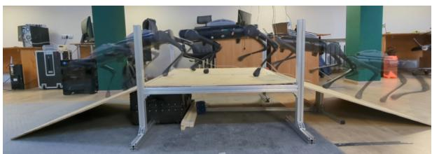

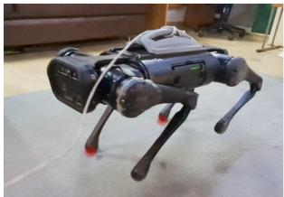  
Pacing at low speed

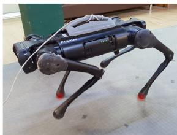  
Trotting at high speed  
Fig. 1: Stable locomotion and slope traversal, with speeddependent gait modulation from pacing at lower speeds to trotting at higher speeds.

RL has enabled robust quadrupedal locomotion without explicit dynamics models [11], [12]. Such policies are typically trained using algorithms such as proximal policy optimization (PPO) [13], with tracking, stability, imitation, and energy objectives combined through reward design [14], [15]. Energy-aware methods penalize power or CoT and can produce efficient, speed-dependent gait transitions [16]– [19]. Nevertheless, end-to-end policies jointly optimize gait generation, stabilization, tracking, and energy efficiency, making them sensitive to reward weighting and reducing interpretability.

Hierarchical methods address this coupling by separating gait-level decisions from low-level motor control [20]. Existing approaches generate CPG-based gait commands [21], combine learned gait parameters with MPC [22], or switch between pretrained energy-efficient gait policies [23]. While effective, many still rely on discrete switching, predefined gait libraries, or model-based low-level controllers.

In this work, we propose a fully learning-based hierarchical reinforcement learning framework for energy-efficient quadruped locomotion across different speeds and terrains. A high-frequency low-level policy performs velocity tracking and stabilization, while a slower high-level policy continuously modulates interpretable gait parameters. Energy efficiency is incorporated directly into the high-level objective through CoT-related optimization, enabling adaptive gait modulation without predefined gait libraries or manually designed transition rules. Representative locomotion behaviors, including flat-ground walking, slope traversal, and speeddependent gait modulation, are shown in Fig. 1.

The main contributions of this work are:

• A hierarchical RL framework that separates lowfrequency gait adaptation from high-frequency velocity tracking and stabilization, followed by post-training finetuning.

• A high-level objective that explicitly incorporates CoT-related energy optimization for continuous gaitparameter modulation.

• Evaluation of tracking and CoT across different speeds and terrains, together with zero-shot deployment on a physical Unitree AlienGo.

## II. HIERARCHICAL REINFORCEMENT LEARNING FRAMEWORK

## A. Problem Formulation

Quadruped locomotion is formulated as a Markov decision process (MDP) defined by the tuple (S, A, P, r), representing the state space, action space, transition dynamics, and reward function, respectively. To account for different temporal scales of gait adaptation and joint-level control, the policy is decomposed into a low-frequency high-level (HL) policy πHL and a high-frequency low-level (LL) policy $\pi _ { L L }$

Let H denote the decimation factor between the HL and LL policies, i.e. for each HL command $g _ { k }$ , the LL controller executes H consecutive control steps:

$$
\begin{array} { r } { \mathbf { a } _ { t } = \pi _ { L L } ( o _ { t } ^ { L L } , g _ { k } ; \phi _ { l l } ) , \quad t \in \{ k H , \ldots , ( k { + } 1 ) H { - } 1 \} , } \end{array}\tag{1}
$$

where $o _ { t } ^ { L L }$ denotes the LL observation at time step t, which includes joint states, base orientation information, and phasebased timing signals, and ϕll represents the parameters of the LL policy network.

## B. Hierarchical Control Architecture

The proposed architecture consists of a HL gait generation policy and a LL locomotion controller operating at different temporal scales, as illustrated in Fig. 2. The HL policy is evaluated at a lower frequency and outputs a structured gait parameter vector $g _ { k }$ . The LL controller operates at a higher frequency and computes joint-level commands according to Eq. (1).

At each HL decision step, the gait parameters remain fixed for H low-level control steps, defining a control horizon over which locomotion behavior unfolds. After this execution window, aggregated locomotion statistics are computed and used to update the HL policy.

The LL policy is trained independently for robust velocity tracking and dynamic stabilization and is kept frozen during HL training. This design isolates contact-rich dynamics within the LL controller and allows the HL policy to focus on long-horizon gait modulation and energy optimization.

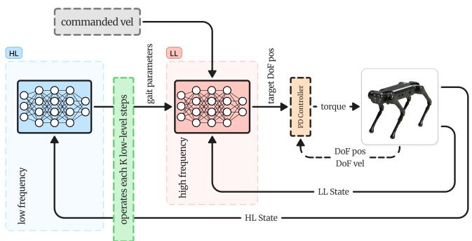  
Fig. 2: Overview of the hierarchical locomotion control framework. The high-level policy operates at a lower frequency to modulate gait parameters, while the low-level controller performs high-frequency motion execution.

## C. High-Level Gait Parameterization

Formally, the HL policy is defined as a stochastic policy

$$
g _ { k } \sim \pi _ { H L } ( \cdot \mid s _ { k } ^ { H L } ; \phi _ { h l } ) ,\tag{2}
$$

where $g _ { k } \in \mathbb { R } ^ { d }$ denotes the gait command at HL timestep k, $s _ { k } ^ { H L }$ is the HL state, and $\phi _ { h l }$ represents the parameters of the HL policy network. Each HL action remains fixed for H consecutive LL control steps and is provided as a conditioning input to the LL controller.

a) High-Level State Space: The high-level state at decision step k is defined as

$$
\mathbf { s } _ { k } ^ { H L } = [ \bar { v } _ { x , k } , \bar { v } _ { y , k } , \bar { \omega } _ { z , k } , \mathbf { g } _ { \mathrm { p r o j } , k } ] \in \mathbb { R } ^ { 6 } .\tag{3}
$$

where $\bar { v } _ { x , k }$ and $\bar { v } _ { y , k }$ are the body-frame linear-velocity components averaged over the LL execution window associated with HL step k, $\bar { \omega } _ { z , k }$ is the yaw angular velocity averaged over the same window, and $\mathbf { g } _ { \mathrm { p r o j } , k } \in \mathbb { R } ^ { 3 }$ is the instantaneous gravity vector expressed in the body frame at the end of that window. By summarizing motion over the LL control horizon associated with each HL action, the HL policy reasons over aggregated locomotion behavior rather than instantaneous joint-level states. This temporal abstraction enables long-horizon gait adaptation, while shortterm stabilization is handled by the LL controller.

Commanded velocities are not explicitly included in $s _ { k } ^ { H L }$ Instead, the HL policy adapts gait parameters based on realized motion feedback, encouraging modulation according to actual locomotion performance rather than desired commands. Meanwhile, an asymmetric actor-critic architecture was employed [24], where the commanded gait parameters are provided only to the critic network to enable better value estimation, since the HL state alone is insufficient for accurately estimating CoT-related signals. By operating on aggregated global motion and orientation signals, the HL policy focuses on long-horizon gait adaptation and energy regulation, while short-term stabilization and jointlevel tracking are handled by the LL control policy.

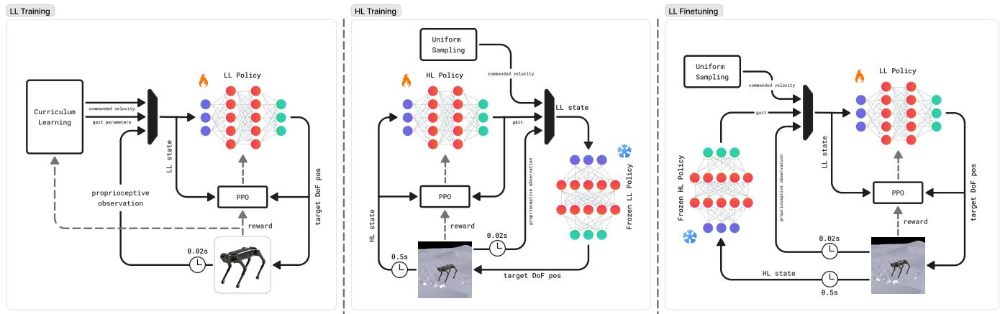  
Fig. 3: Three-stage training pipeline: LL policy pretraining, energy-aware HL policy training with the LL policy frozen, and LL policy finetuning with the HL policy frozen.

b) High-Level Action Space: The HL action $g _ { k } \in \mathbb { R } ^ { 1 1 }$ parametrizes the gait executed by the LL controller and is defined as

$$
g _ { k } = [ \theta _ { 1 } , \theta _ { 2 } , \theta _ { 3 } , f _ { \mathrm { g a i t } } , h _ { z } , \theta _ { x } , \theta _ { y } , s _ { x } , s _ { y } , h _ { f , z } , d ] ,\tag{4}
$$

where $( \theta _ { 1 } , \theta _ { 2 } , \theta _ { 3 } )$ are inter-leg timing offsets that determine the phase relationships among the four legs, $f _ { \mathrm { g a i t } }$ is the stepping frequency, $h _ { z }$ is the body height, $\theta _ { x }$ and $\theta _ { y }$ are the body roll and pitch, respectively, $s _ { x }$ and $s _ { y }$ are the stance length and width, $h _ { f , z }$ is the foot-swing height, and d is the stance duration.

These parameters define the behavioral reference used by the LL policy, modulating gait structure without directly altering joint-level motion execution. In particular, the timing offsets implicitly encode canonical quadruped gaits such as pronking, trotting, pacing, or bounding, while allowing smooth interpolation through continuous modulation.

By restricting the HL policy to operate on structured gait parameters and reusing a pretrained LL control policy for joint-based execution, the hierarchical formulation decouples long-horizon energy optimization from short-horizon dynamic stabilization. This design enables adaptive and energyaware gait modulation while preserving robust locomotion performance across varying operating conditions.

c) High-Level Reward: The HL reward combines energy efficiency, gait smoothness, and accumulated LL performance:

$$
r _ { k } ^ { H L } = r _ { \mathrm { e n e r g y } } - 0 . 1 \| g _ { k } - g _ { k - 1 } \| ^ { 2 } + 0 . 0 0 2 \sum _ { t = k H } ^ { ( k + 1 ) H - 1 } r _ { t } ^ { L L } .\tag{5}
$$

The energy term is inspired by [18], and defined as:

$$
r _ { \mathrm { e n e r g y } } = \exp \left( - \frac { \sum _ { t = k H } ^ { ( k + 1 ) H - 1 } \sum _ { i = 1 } ^ { 1 2 } | P _ { t } ^ { i } | } { \sigma _ { \mathrm { e n } , x } | \bar { v } _ { x } | + \sigma _ { \mathrm { e n } , z } | \bar { \omega } _ { z } | } \right) ,\tag{6}
$$

where $P _ { t } ^ { i } = \tau _ { t } ^ { i } \dot { q } _ { t } ^ { i }$ is the mechanical power of joint i. The LL reward prevents energy minimization through unstable or poorly tracked motion, such as crouching behavior, while the smoothness term penalizes abrupt changes in gait commands.

With $\Delta t _ { L L } = 0 . 0 2 \mathrm { s }$ and $\Delta t _ { H L } = 0 . 5 \mathrm { s } ,$ each HL reward is accumulated over $H = 2 5$ LL steps.

## D. Low-Level Locomotion Policy

a) Low-Level State Space: The LL observation is

$$
\begin{array} { r } { s _ { t } ^ { L L } = [ \mathbf { g } _ { \mathrm { p r o j } , t } , \mathbf { c } _ { t } , \mathbf { q } _ { t } - \mathbf { q } ^ { 0 } , \dot { \mathbf { q } } _ { t } , \mathbf { a } _ { t - 1 } , \mathbf { c } \mathbf { l } \mathbf { k } _ { t } ] \in \mathbb { R } ^ { 5 8 } , } \end{array}\tag{7}
$$

where $\mathbf { c } _ { t }$ contains the commanded base velocities and gait parameters, $\mathbf { q } _ { t } - \mathbf { q } ^ { 0 }$ and $\dot { \mathbf { q } } _ { t }$ are the joint position offsets and velocities, and $\mathbf { c l k } _ { t }$ contains four phase-clock signals. The policy receives a history of $H _ { h } = 5$ observations, $h _ { t } ^ { L L } =$ $\overline { { [ } } s _ { t - H _ { b } + 1 } ^ { L L } , \ldots , s _ { t } ^ { L L } ]$

Figure 4 illustrates how the commanded gait parameters are incorporated into the LL policy. The timing parameters define leg-wise phase indices, which are warped using the stance duration parameter and transformed into sinusoidal clock inputs. These clock inputs, together with the gait command vector and robot-state observations, condition the LL policy. The desired contact states are phase-derived soft stance/swing targets used only for reward shaping during training; they are not policy inputs and do not directly prescribe Cartesian foot trajectories. During LL pretraining, the gait-command vector g is sampled by the curriculum, whereas after introduction of the hierarchical controller it is generated by the HL policy.

b) Low-Level Action Space: The LL action ${ \bf a } _ { t } \in \mathbb { R } ^ { 1 2 }$ contains desired joint positions tracked by a joint-level PD controller.

c) Low-Level Reward: The LL reward follows the formulation used in [15]. It is divided into three groups: (i) task reward for velocity tracking, (ii) augmented auxiliary rewards that enforce the commanded gait behavior, and (iii) fixed auxiliary rewards that encourage stable and smooth locomotion. The augmented auxiliary reward explicitly associate the gait parameters with the desired locomotion behavior. Body roll $\theta _ { x }$ and pitch $\theta _ { y }$ are enforced through an orientation-tracking term $r _ { \mathrm { o r i } }$ , foot-swing height $h _ { f , . }$ z through $r _ { \mathrm { c l e a r a n c e } } ,$ and body height hz through $r _ { \mathrm { j u m p } } .$ . The timing offsets $( \theta _ { 1 } , \theta _ { 2 } , \theta _ { 3 } )$ stepping frequency $f _ { \mathrm { g a i t } }$ , and stance duration d define the desired per-foot contact schedule, which is enforced through the contact-force and contact-velocity terms rcontact force and rcontact velocity. Finally, a Raibert-style foot-placement term rraibert encourages foothold placement consistent with the commanded gait and stance geometry [25]. The augmented auxiliary rewards are summarized in Table I, while the remaining reward terms follow [15]. No additional energyspecific shaping is introduced at the LL stage.

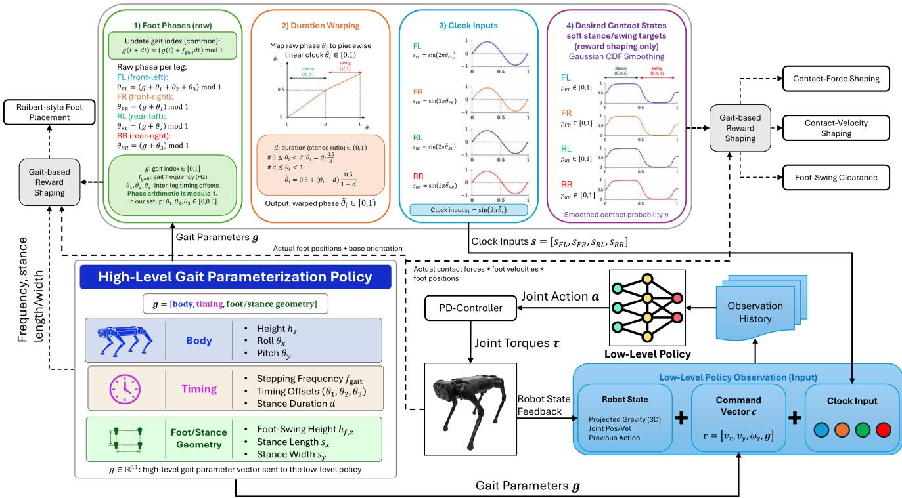  
Fig. 4: Processing of commanded gait parameters into leg-wise phases, clock inputs, and training-time contact targets.

TABLE I: Augmented auxiliary rewards used to enforce the commanded gait parameters in the LL policy.
<table><tr><td>Reward</td><td>Primary gait parameter Formulation</td><td></td></tr><tr><td> $r _ { \mathrm { o r i } }$ </td><td> $\theta _ { x } , \theta _ { y }$ </td><td> $\left\| \mathbf { g } _ { \mathrm { p r o j } , \{ x , y \} } ^ { \mathrm { c m d } } - \mathbf { g } _ { \mathrm { p r o j } , \{ x , y \} } \right\| ^ { 2 }$ </td></tr><tr><td>rclearance</td><td> $h _ { f , z }$ </td><td> $\sum _ { . } ^ { ^ { \mathrm { 4 } } } \left( h _ { f , z } ^ { i } - h _ { f , z } ^ { \mathrm { t a r g e t } , i } \right) ^ { 2 }$ </td></tr><tr><td>rjump</td><td> $h _ { z }$ </td><td> $\left| h _ { z } ^ { \mathrm { c m d } } - h _ { z } ^ { \mathrm { b o d y } } + h _ { z } ^ { \mathrm { r e f } } \right|$ </td></tr><tr><td>rcontact_force</td><td> $d$ </td><td> $\sum _ { i = 1 } ^ { 4 } ( 1 - d ^ { i } ) \left[ 1 - \exp \left( - \frac { F _ { i } ^ { 2 } } { \sigma _ { F } } \right) \right]$ </td></tr><tr><td>rcontact_velocity d</td><td></td><td> $\sum _ { i = 1 } ^ { 4 } d ^ { i } \left[ 1 - \exp \left( - \frac { v _ { i } ^ { 2 } } { \sigma _ { v } } \right) \right]$ </td></tr><tr><td>rraibert</td><td> $\theta _ { 1 } , \theta _ { 2 } , \theta _ { 3 } , f _ { \mathrm { g a i t } } , s _ { x } , s _ { y }$ </td><td> $\sum _ { i = 1 } ^ { 4 } \left\| \mathbf { p } _ { \mathrm { f o o t } } ^ { \mathrm { d e s } , i } - \mathbf { p } _ { \mathrm { f o o t } } ^ { i } \right\| ^ { 2 }$ </td></tr></table>

Here, $\mathbf { g } _ { \mathrm { p r o j } , \{ x , y \} } ^ { \mathrm { c m d } }$ denotes the desired projected-gravity components obtained from the commanded body roll and pitch, while ${ \bf g } _ { \mathrm { p r o j } , \{ x , y \} }$ denotes the corresponding measured components. The desired foot-swing height $h _ { f , z } ^ { \mathrm { t a r g e t } , i }$ is a phase-dependent trajectory constructed from the commanded foot-swing height and gait cycle, while other timing parameters indirectly affect its temporal evolution through the gait phase. The body height reference $h _ { z } ^ { \mathrm { r e f } }$ is set to 0.51 m for AlienGo and 0.30 m for Go1.

For the contact-related terms, $F _ { i }$ and $v _ { i }$ denote the contactforce magnitude and foot-velocity magnitude of foot $i ,$ respectively, while $\sigma _ { F }$ and $\sigma _ { v }$ are scaling parameters controlling the corresponding exponential reward shaping. The desired foothold $\mathbf { p } _ { \mathrm { f o o t } } ^ { \mathrm { { d e s } , \it { i } } }$ is generated from the commanded gait parameters using the Raibert-style heuristic, whereas $\mathbf { p } _ { \mathrm { f o o t } } ^ { i }$ denotes the realized foot position. The detailed construction of the gait-phase, foot-swing, contact, and foothold references follows [15].

## E. Training Pipeline

Instead of joint gait adaptation and LL control policies training, we propose a three-stage HRL framework that allows to improve sample efficiency and stabilize training in simulation environment with further zero-shot transfer on a real quadrupedal robot. The full training pipeline is illustrated in Fig. 3.

## Stage 1: Low-Level Policy Training.

The LL policy $\pi _ { L L }$ is trained on flat terrain to achieve stable locomotion and accurate tracking of velocity and gait commands. This stage follows the multiplicity of behavior (MoB) framework [15], where the LL policy is implemented as a conditional policy that receives proprioceptive observations in addition to sampled external velocity and gait commands, and is optimized using RL with curriculum learning to improve robustness and generalization across different locomotion behaviors.

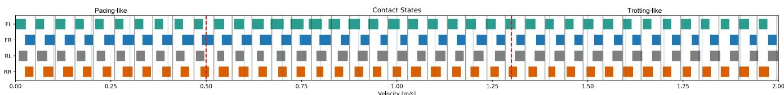  
Fig. 5: Foot contact state transitions under varying commanded velocities. The high-level policy autonomously and smoothly adapts the gait pattern, exhibiting pacing at low speeds (two-beat walking), a four-beat walking gait at moderate velocities, and trotting at higher speeds.

## Stage 2: High-Level Policy Training.

After convergence of $\pi _ { L L }$ , its parameters $\phi _ { l l }$ are frozen. The HL policy $\pi _ { H L }$ is then introduced and trained on complex terrain, including rough and inclined surfaces, to modulate gait parameters with consideration of energy efficiency. Since $\pi _ { L L }$ ensures stable motion execution across different commands, curriculum learning for velocity commands is disabled during this stage, and $\pi _ { H L }$ operates at a lower update frequency than the LL policy.

## Stage 3: Low-Level Policy Finetuning.

Finally, a short finetuning stage is applied to $\pi _ { L L }$ under the complex terrain while keeping the HL policy parameters $\phi _ { h l }$ frozen. This stage improves tracking robustness on the new terrain conditions without altering the energy optimization behavior learned at the second stage by the HL policy.

## III. EXPERIMENTAL RESULTS

## A. Experimental Setup

Experiments were primarily conducted on the real-world Unitree AlienGo quadruped platform to evaluate the proposed HRL framework across velocities and terrain conditions. AlienGo serves as the main experimental platform for both simulation training and real-world validation. To enable direct comparison with prior benchmarks, additional experiments are performed in simulation on the Unitree Go1 platform.

1) Simulation Environment and Training Details: All policies were trained in the NVIDIA Isaac Gym simulation environment [26] using the PPO algorithm [13]. 4096 GPUaccelerated parallel environments were employed to enable large-scale data collection and efficient policy optimization [12]. Terrains for the second and third stages of training are generated randomly and include the following types: (i) a flat surface, (ii) uneven rough terrain with heights uniformly sampled between 0 and 10 cm, and (iii) inclined slopes, both upward and downward, with angles randomly selected from 0.2, 0.3, or 0.36 rad.

The LL locomotion policy was trained following the procedure and hyper-parameters reported in [15]. No modifications were introduced at this stage in order to maintain consistency with prior work. The HL policy was subsequently trained on top of the frozen LL controller to learn energyaware gait parameter modulation.

2) Evaluation Protocol: Policies are evaluated over a range of commanded forward velocities, and performance metrics are computed after an initial transient period to exclude startup effects. Evaluation is conducted on three terrain categories: flat terrain, inclined slopes, and uneven rough terrain. On slopes, both uphill and downhill conditions are considered, and the robot was trained on inclinations up to $2 0 ^ { \circ }$ . All methods are evaluated under identical terrain configurations and command distributions to ensure a valid comparison. Energy efficiency is quantified using the CoT, defined as:

TABLE II: Robot falling rate in simulation across terrain types and commanded-velocity intervals. Each entry aggregates 500 runs with friction and restitution coefficients uniformly randomized in [0, 1].
<table><tr><td>Terrain</td><td>[0.0,0.5]</td><td>(0.5,1.0]</td><td>(1.0, 1.5]</td><td>(1.5, 2.0]</td></tr><tr><td>Flat terrain</td><td>0.0%</td><td>0.0%</td><td>0.0%</td><td>0.0%</td></tr><tr><td>Uneven rough terrain</td><td>0.0%</td><td>0.0%</td><td>0.0%</td><td>0.6%</td></tr><tr><td>Inclined slopes</td><td>2.4%</td><td>0.4%</td><td>0.0%</td><td>0.2%</td></tr></table>

$$
\mathrm { C o T } = \frac { \sum _ { i = 1 } ^ { 1 2 } \left| P ^ { i } \right| } { m g \left| v _ { x } \right| }\tag{8}
$$

where $P ^ { i } = \tau _ { i } { \dot { q } } _ { i }$ denotes the mechanical power at joint i, $\tau _ { i }$ and ${ \dot { q } } _ { i }$ denote joint torques and velocities respectively, m is the robot mass, g is gravitational acceleration, and $v _ { x }$ denotes the robot’s velocity. In addition to CoT, velocity tracking error is reported to assess locomotion accuracy and robustness.

Locomotion robustness was additionally evaluated over 500 simulation runs for each terrain and velocity interval, with friction and restitution coefficients uniformly randomized in [0, 1]. Aggregated falling rates are reported in Table II. The higher low-speed fall rate on slopes likely reflects reduced momentum and longer support phases, limiting recovery from perturbations.

## B. Experimental Evaluation

1) Gait Adaptation Behavior: To analyze the behavior of the HL policy, Fig. 5 illustrates the contact states across different commanded velocities. At low speeds, the policy converges to a pacing-like gait with extended stance durations. As velocity increases, the contact pattern gradually shifts toward a trotting gait. This transition emerges without explicit gait switching rules, indicating that the HL policy adapts gait structure as a function of velocity while preserving stable locomotion execution through the LL policy.

To complement the speed-dependent contact-timing analysis, Fig. 7 shows a set of realized geometrical gait parameters during a representative transition from flat terrain to a $2 0 ^ { \circ }$ uphill slope at a fixed commanded forward velocity of 1.0 m/s. The shaded interval denotes the transition phase, during which the robot first encounters the incline and adapts its locomotion. During slope traversal, the realized body height and stance length decrease, while the body pitch and stance width increase, after which the parameters settle around a different operating region.

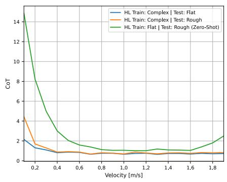

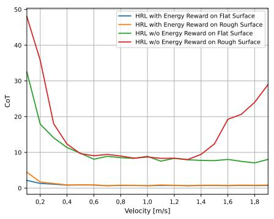

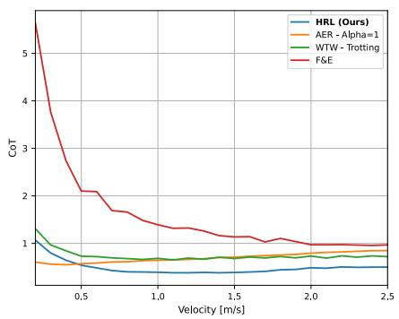  
(a) HRL CoT under different terrain-training (b) HRL CoT with and without the HL (c) Comparison of HRL CoT with existing and deployment conditions. energy reward across different deployment locomotion baselines. terrains.

Fig. 6: CoT evaluation of the proposed HRL framework. (a) Ablation study on the HL training terrain for the Unitree AlienGo, comparing deployment on flat and rough surfaces, including zero-shot deployment of the flat-trained HL policy on rough terrain. (b) Ablation study on the effect of the HL energy reward for the Unitree AlienGo, comparing CoT with and without the energy reward across different deployment terrains. (c) Comparison of the proposed HRL framework with existing locomotion baselines on the Unitree Go1.  
TABLE III: CoT comparison with existing locomotion baselines across commanded-velocity intervals. Values are reported as mean ± standard deviation over evaluation runs within each commanded-velocity interval.
<table><tr><td>Method  $/ \ v _ { x } ^ { \mathrm { c m d } }$  [m/s]</td><td>(0.0, 0.5]</td><td>(0.5,1.0]</td><td>(1.0, 1.5]</td><td>(1.5, 2.0]</td><td>(2.0, 2.5]</td></tr><tr><td>HRL (Ours)</td><td> $0 . 7 6 2 \pm 0 . 1 9 8$ </td><td> $\mathbf { 0 . 4 2 1 \pm 0 . 0 3 4 }$ </td><td> $\mathbf { 0 . 3 8 4 \pm 0 . 0 0 4 }$ </td><td> $\mathbf { 0 . 4 3 8 \pm 0 . 0 3 1 }$ </td><td> $\mathbf { 0 . 4 9 5 \pm 0 . 0 1 0 }$ </td></tr><tr><td>AER  $( \alpha = 1 )$ </td><td> $\mathbf { 0 . 5 7 2 \pm 0 . 0 2 1 }$ </td><td> $0 . 6 1 8 \pm 0 . 0 2 1$ </td><td> $0 . 6 8 1 \pm 0 . 0 2 2$ </td><td> $0 . 7 5 7 \pm 0 . 0 2 2$ </td><td> $0 . 8 3 1 \pm 0 . 0 1 4$ </td></tr><tr><td>WTW-Trotting</td><td> $0 . 9 6 2 \pm 0 . 2 1 6$ </td><td> $0 . 6 8 8 \pm 0 . 0 2 0$ </td><td> $0 . 6 8 0 \pm 0 . 0 1 9$ </td><td> $0 . 7 1 1 \pm 0 . 0 1 5$ </td><td> $0 . 7 1 9 \pm 0 . 0 1 7$ </td></tr><tr><td>F&amp;E</td><td> $3 . 5 6 0 \pm 1 . 3 3 8$ </td><td> $1 . 6 6 3 \pm 0 . 2 4 0$ </td><td> $1 . 2 4 0 \pm 0 . 0 7 8$ </td><td> $1 . 0 5 7 \pm 0 . 0 5 9$ </td><td> $0 . 9 6 6 \pm 0 . 0 0 6$ </td></tr></table>

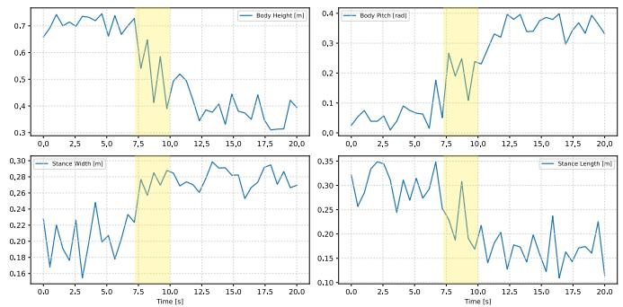  
Fig. 7: Realized geometrical gait parameters during a representative transition from flat terrain to a $2 0 ^ { \circ }$ uphill slope at a fixed commanded forward velocity. The shaded interval marks the terrain-transition phase.

Together, Figs. 5 and 7 demonstrate that the proposed hierarchy adapts the timing-related gait parameters—the stepping frequency $f _ { \mathrm { g a i t } }$ , inter-leg timing offsets $( \theta _ { 1 } , \theta _ { 2 } , \theta _ { 3 } )$ , and stance duration d—primarily with velocity, while adjusting the realized body posture and stance geometry in response to terrain changes.

2) Cost of Transport: Fig. 6(a) presents the CoT of Unitree AlienGo as a function of commanded forward velocity on flat and rough terrains in simulation. The proposed HRL framework achieves consistent energy efficiency across the evaluated velocity range. CoT decreases from low speeds toward moderate velocities and remains stable at higher speeds, reflecting efficient dynamic locomotion. Despite terrain-induced disturbances, the proposed HRL framework maintains stable locomotion with limited CoT variation, demonstrating robustness of the hierarchical structure.

In addition, a direct comparison with established benchmark methods is performed. Fig. 6(c) presents CoT results on flat terrain for the Unitree Go1 platform. The proposed HRL framework is compared against Walk These Ways (WTW) [15], following the fixed trotting gait reported therein as the best gait in terms of energy consumption, the end-toend approach Adaptive Energy Regularization (AER) [18] with α = 1, and the hierarchical approach Fast & Efficient (F&E) [22], under identical evaluation conditions. Across the mid-to-high velocity range, the proposed method achieves lower CoT compared to the three benchmarks. At lower speeds, performance remains better compared to both WTW and F&E, while AER exhibits lower energy consumption in this regime. The interval-wise CoT results are summarized in Table III.

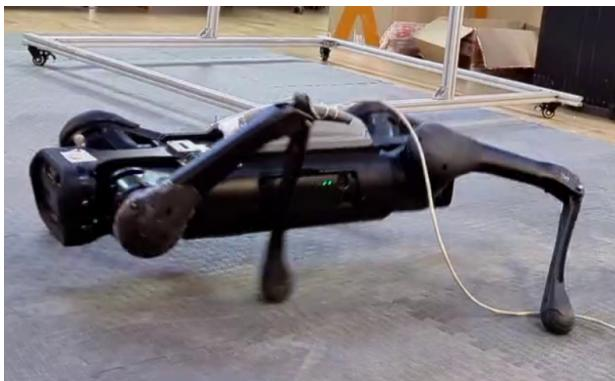  
Fig. 8: Qualitative reward-sensitivity case for an AER-style end-to-end policy on AlienGo with $\alpha \ = \ 0 . 5$ . Excessive reduction of joint effort resulted in a crouched and unstable posture.

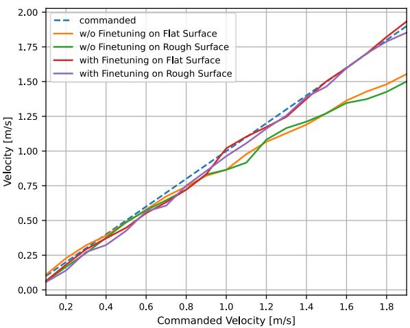  
Fig. 9: Velocity-tracking ablation for Unitree AlienGo. “w/o finetuning” denotes the LL policy obtained after Stage 2; “with finetuning” denotes the same policy after Stage 3. Both policies are evaluated on flat and rough terrain.

3) Real-World Deployment: The trained HRL framework was deployed zero-shot on the physical Unitree AlienGo platform using the Unitree SDK and joint-space PD control with gains $K _ { p } = 5 0$ and $K _ { d } = 2 _ { \mathrm { { \scriptsize ~ ; ~ } } }$ , without any additional finetuning on hardware. The gait transition–velocity relationship observed during deployment remained consistent with that in simulation, with smooth gait adaptation across commanded velocities. The robot also successfully traversed inclined terrain up to $2 0 ^ { \circ }$ , corresponding to the maximum training slope. In real-world robustness tests, the robot completed all 10 trials on flat, inclined, and uneven rough terrain without falls. Representative trials are shown in Fig. 10.

For qualitative comparison, we also deployed an AERstyle end-to-end policy on AlienGo, jointly optimizing the same locomotion and energy objectives used in our framework [18]. With the energy reward weight set to $\alpha = 0 . 5$ the policy reduced joint effort excessively, resulting in the crouched posture shown in Fig. 8, where the generated torques were insufficient to support the robot. While AER demonstrated stable behavior on the smaller Go1 platform with α up to 1.0, this result illustrates the sensitivity of end-to-end energy optimization to reward design and robot morphology. Our HL formulation instead confines energy optimization to interpretable gait parameters while preserving LL stabilization.

## C. Ablation Study

We evaluate the contributions of complex-terrain HL training, the HL energy objective, and the third-stage LL finetuning.

High-Level Training Terrain: As shown in Fig. 6(a) and Table IV, the HL policy trained on complex terrains maintains comparable CoT when deployed on flat and rough surfaces. In contrast, training the HL policy only on flat terrain increases CoT during zero-shot deployment on rough terrain, particularly in the (0, 0.5] m/s interval, where CoT increases from 1.846 to 5.029. This demonstrates that exposure to terrain variations during HL training improves the generalization of HL gait adaptation.

High-Level Energy Reward: Removing the energy term substantially increases CoT across all velocity intervals and both deployment terrains, as shown in Fig. 6(b) and Table IV. This confirms that the accumulated LL reward alone preserves locomotion but does not encourage energy-efficient gait selection, whereas the explicit HL energy objective is essential for reducing CoT.

Low-Level Finetuning: Fig. 9 shows that the third training stage improves velocity tracking on both flat and rough terrains. The overall RMSE decreases from 0.165 to 0.039 m/s on flat terrain and from 0.182 to 0.047 m/s on rough terrain. The improvement is most pronounced above 1.0 m/s. This improvement is not solely due to adaptation to rough terrain. During the first stage, the LL policy is trained using curriculum-sampled gait parameters, whereas during deployment it receives the narrower and correlated command distribution generated by the learned HL policy. In the third stage, the HL policy is frozen and the LL policy is optimized directly under these generated gait commands.

## IV. DISCUSSION AND CONCLUSION

This work presented an HRL framework that separates energy-aware gait adaptation from high-frequency tracking and stabilization. It reduces average CoT by 27.7%, 33.5%, and 70.5% compared with AER, WTW, and F&E, respectively. The learned hierarchy exhibits automatic speeddependent gait adaptation, transitioning from pacing at low speeds to trotting at higher speeds without predefined gait schedules or discrete switching, together with terraindependent adjustment of realized body posture and stance geometry. Simulation and real-world results demonstrate robust, energy-efficient locomotion across flat, rough, and inclined terrains. However, the framework remains limited by the low HL update frequency, which may reduce responsiveness to rapid terrain changes, and by the additional training cost and sensitivity to the decimation factor. Its performance also depends on the robustness of the LL controller, since execution and estimation errors may propagate through the hierarchy.

TABLE IV: AlienGo CoT ablation across commanded-velocity intervals.
<table><tr><td>Method</td><td>(0,0.5]</td><td>(0.5,1.0]</td><td>(1.0,1.5]</td><td>(1.5,2.0)</td></tr><tr><td>HL w/ Energy, Train: Complex, Test: Flat</td><td> $1 . 2 4 9 \pm 0 . 4 8 6$ </td><td> $0 . 7 3 4 \pm 0 . 0 6 9$ </td><td> $0 . 7 2 1 \pm 0 . 0 3 7$ </td><td> $0 . 7 1 4 \pm 0 . 0 2 4$ </td></tr><tr><td>HL w/ Energy, Train: Complex, Test: Rough</td><td> $1 . 8 4 6 \pm 1 . 3 3 3$ </td><td> $0 . 7 6 6 \pm 0 . 0 7 4$ </td><td> $0 . 7 9 2 \pm 0 . 0 5 4$ </td><td> $0 . 8 0 5 \pm 0 . 0 3 4$ </td></tr><tr><td>HL w/ Energy, Train: Flat, Test: Rough</td><td> $5 . 0 2 9 \pm 4 . 1 4 9$ </td><td> $1 . 0 3 6 \pm 0 . 1 7 8$ </td><td> $0 . 8 9 8 \pm 0 . 0 5 2$ </td><td> $0 . 9 4 2 \pm 0 . 1 8 2$ </td></tr><tr><td>HL w/o Energy, Train: Complex, Test: Flat</td><td> $1 7 . 1 1 8 \pm 8 . 1 7 9$ </td><td> $8 . 5 3 9 \pm 0 . 3 1 7$ </td><td> $7 . 8 4 4 \pm 0 . 2 7 7$ </td><td> $7 . 6 4 9 \pm 0 . 4 0 5$ </td></tr><tr><td>HL w/o Energy, Train: Complex, Test: Rough</td><td> $3 7 . 1 1 4 \pm 3 7 . 4 7 8$ </td><td> $8 . 9 0 6 \pm 0 . 3 4 8$ </td><td> $9 . 2 9 5 \pm 1 . 6 1 5$ </td><td> $1 4 . 7 9 1 \pm 5 . 1 9 3$ </td></tr></table>

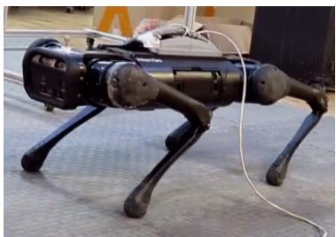

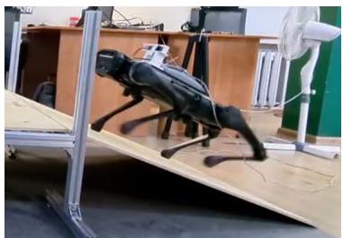

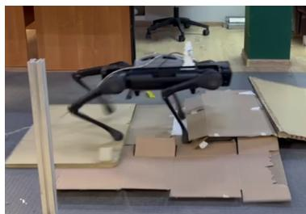  
Fig. 10: Representative real-world locomotion trials on flat terrain, inclined slope, and uneven rough terrain.

Future work will investigate adaptive HL update rates and decimation strategies, together with integrating vision-based perception into the proposed hierarchy. Exteroceptive terrain information may improve traversability in more challenging environments, including large irregular obstacles, stair-like structures, and steep slopes, by enabling the HL policy to exploit a broader portion of the gait-command space. However, expanding the scope of the HL policy may increase energy consumption. Therefore, an important objective is to determine whether visual terrain information can extend traversable environments while preserving the low CoT achieved by the current proprioceptive formulation.

## REFERENCES

[1] D. F. Hoyt and C. R. Taylor, “Gait and the energetics of locomotion in horses,” Nature, vol. 292, no. 5820, pp. 239–240, 1981.

[2] J. Di Carlo, P. M. Wensing, B. Katz, G. Bledt, and S. Kim, “Dynamic locomotion in the MIT cheetah 3 through convex model-predictive control,” in Proc. IEEE/RSJ Int. Conf. Intell. Robots Syst. (IROS), 2018, pp. 1–9.

[3] A. D. Shamraev and S. A. Kolyubin, “Bioinspired and energy-efficient convex model predictive control for a quadruped robot,” Russ. J. Nonlinear Dyn., vol. 18, no. 5, pp. 831–841, 2022.

[4] Y. G. Alqaham, J. Cheng, and Z. Gan, “Energy-optimal asymmetrical gait selection for quadrupedal robots,” IEEE Robotics and Automation Letters, 2024.

[5] ——, “16 ways to gallop: Energetics and body dynamics of high-speed quadrupedal gaits,” in 2025 IEEE/RSJ International Conference on Intelligent Robots and Systems (IROS). IEEE, 2025, p. 16168–16174.

[6] Y. Masuda, K. Naniwa, M. Ishikawa, and K. Osuka, “Brainless walking: Animal gaits emerge from an actuator characteristic,” Frontiers in Robotics and AI, vol. 8, p. 629679, 2021.

[7] P. Arena, L. Patane, and S. Taffara, “Energy efficiency of a quadruped\` robot with neuro-inspired control in complex environments,” Energies, vol. 14, no. 2, p. 433, 2021.

[8] G. Bellegarda and A. Ijspeert, “CPG-RL: Learning central pattern generators for quadruped locomotion,” IEEE Robotics and Automation Letters, vol. 7, no. 4, pp. 12 547–12 554, 2022.

[9] J. Humphreys and C. Zhou, “Learning to adapt: Bio-inspired gait strategies for versatile quadruped locomotion,” 2024, arXiv:2412.09440.

[10] G. Bellegarda, M. Shafiee, and A. Ijspeert, “Allgaits: Learning all quadruped gaits and transitions,” 2024. [Online]. Available: https://arxiv.org/abs/2411.04787

[11] J. Lee, J. Hwangbo, L. Wellhausen, V. Koltun, and M. Hutter, “Learning quadrupedal locomotion over challenging terrain,” Science Robotics, vol. 5, no. 47, p. eabc5986, 2020.

[12] N. Rudin, D. Hoeller, P. Reist, and M. Hutter, “Learning to walk in minutes using massively parallel deep reinforcement learning,” in Proc. Conf. Robot Learning (CoRL), 2022, pp. 91–100.

[13] J. Schulman, F. Wolski, P. Dhariwal, A. Radford, and O. Klimov, “Proximal policy optimization algorithms,” arXiv preprint arXiv:1707.06347, 2017.

[14] X. B. Peng, P. Abbeel, S. Levine, and M. Van de Panne, “Deepmimic: Example-guided deep reinforcement learning of physics-based character skills,” ACM Transactions On Graphics (TOG), vol. 37, no. 4, pp. 1–14, 2018.

[15] G. B. Margolis and P. Agrawal, “Walk these ways: Tuning robot control for generalization with multiplicity of behavior,” in Proc. Conf. Robot Learning (CoRL), 2023, pp. 22–31.

[16] T. Hao, D. Xu, and S. Yan, “Quadrupedal locomotion in an energyefficient way based on reinforcement learning,” International Journal of Control, Automation and Systems, vol. 22, no. 5, pp. 1613–1623, 2024.

[17] F. M. Santos, A. M. Correia, E. G. S. Nascimento, O. R. Pinheiro, and A. A. B. Santos, “Energy-efficient quadruped locomotion based on´ deep reinforcement learning,” in Proc. Brazilian Conf. Robot. (CROS), 2025, pp. 1–6.

[18] B. Liang, L. Sun, X. Zhu, B. Zhang, Z. Xiong, Y. Wang, C. Li, K. Sreenath, and M. Tomizuka, “Adaptive energy regularization for autonomous gait transition and energy-efficient quadruped locomotion,” in Proc. IEEE Int. Conf. Robot. Autom. (ICRA), 2025, pp. 5350–5356.

[19] Z. Wang, X. Zhao, M. Y. M. Chuah, Z. Li, J. Wu, and Q. Zhu, “Efficient learning of robust multigait quadruped locomotion for minimizing the cost of transport,” Frontiers of Information Technology and Electronic Engineering, vol. 26, no. 9, pp. 1679–1691, 2025.

[20] D. Jain, A. Iscen, and K. Caluwaerts, “Hierarchical reinforcement learning for quadruped locomotion,” in Proc. IEEE/RSJ Int. Conf. Intell. Robots Syst. (IROS), 2019, pp. 7551–7557.

[21] Y. Kim, B. Son, and D. Lee, “Learning multiple gaits of quadruped robot using hierarchical reinforcement learning,” CoRR, vol. abs/2112.04741, 2021.

[22] Y. Yang, T. Zhang, E. Coumans, J. Tan, and B. Boots, “Fast and efficient locomotion via learned gait transitions,” in Proc. Conf. Robot Learning (CoRL), 2022, pp. 773–783.

[23] M. Stamatopoulou, D. Tan, R. Bendikas, V. Modugno, Z. Li, and D. Kanoulas, “eGAIT: Multi-skilled policy for energy-efficient gait transitions,” IEEE Trans. Autom. Sci. Eng., 2025.

[24] L. Pinto, M. Andrychowicz, P. Welinder, W. Zaremba, and P. Abbeel, “Asymmetric actor critic for image-based robot learning,” arXiv preprint arXiv:1710.06542, 2017.

[26] V. Makoviychuk, L. Wawrzyniak, Y. Guo, M. Lu, K. Storey, M. Macklin, D. Hoeller, N. Rudin, A. Allshire, A. Handa et al., “Isaac gym: High performance gpu-based physics simulation for robot learning,” arXiv preprint arXiv:2108.10470, 2021.

[25] M. H. Raibert, Legged robots that balance. MIT press, 1986.