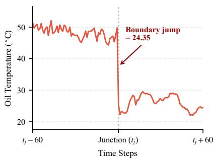
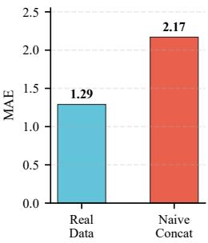
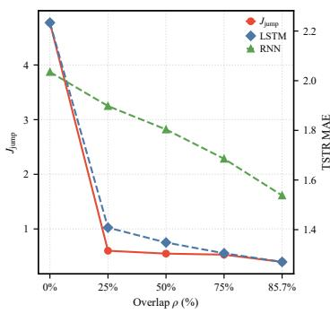
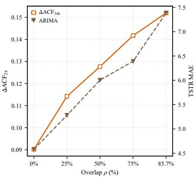
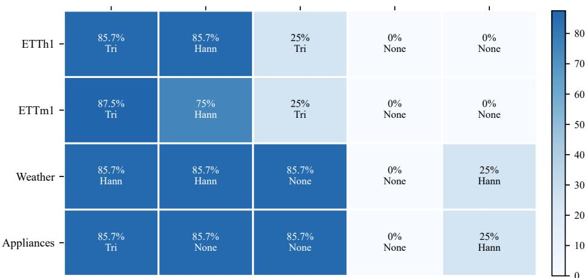
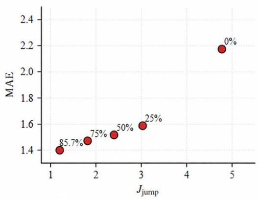
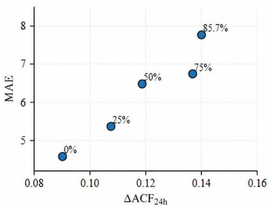

# Evaluating Sequence Assembly Strategies for Diferentially Private Synthetic Time-Series Forecasting

Guoxiong Longa, Huizhen Huanga, Qikun Caia, Tao Huanga,∗, Chen Houa,∗

aSchool of Computer and Big Data, Minjiang University, No. 200 Xiyuangong Road, Fuzhou, 350108, Fujian, China

## Abstract

Diferentially private time-series generators commonly produce fixed-length synthetic windows, whereas downstream forecasting models often require long continuous training sequences. How these windows are assembled after generation can therefore alter the efective synthetic data presented to a forecaster. We study this post-generation sequence assembly process by systematically varying overlap rates and window-weighting schemes and evaluating the resulting sequences in terms of boundary continuity, statistical and temporal fidelity, and Train-on-Synthetic-Test-on-Real (TSTR) forecasting utility. Across four public datasets and five forecasting models, the results reveal a clear forecaster-dependent assembly principle: downstream TSTR utility is jointly shaped by the forecaster, overlap rate, and window-weighting schemes, leading to distinct assembly preferences across forecasting models. Increased overlap generally improves boundary continuity, but improvements in continuity or individual fidelity diagnostics do not consistently reduce forecasting error, indicating that these diagnostics alone are insuficient for selecting assembly configurations. Complete five-forecaster assembly grids, together with matched Train-on-Real-Test-on-Real (TRTR) references, further characterize these regularities and quantify assembly-dependent utility relative to real-data training. We then validate the identified principles in a domain-specific operational electricity-load forecasting application, where forecaster-specific sensitivity to sequence assembly persists and provides

practical guidance for prioritizing candidate configurations for downstream evaluation. Overall, the findings establish post-generation sequence assembly as a forecaster-aware model-selection problem and provide actionable guidance for deploying diferentially private synthetic time series in forecasting systems.

Keywords: Diferential privacy, Synthetic time-series, Sequence assembly

## 1. Introduction

Diferentially private time-series generators, commonly trained with diferentially private stochastic gradient descent (DP-SGD), can produce synthetic data for downstream forecasting while providing formal privacy guarantees during model training (Dwork and Roth, 2014; Abadi et al., 2016; Jordon et al., 2019). Many generators emit fixed-length synthetic windows, whereas downstream forecasting models are typically trained on long, continuous sequences. The generated windows must therefore be combined after generation before they can serve as forecasting data. We refer to this operation as post-generation sequence assembly. Existing work on privacy-preserving synthetic time series has focused primarily on private generator training, statistical fidelity, and downstream utility (Frigerio et al., 2019; Dockhorn et al., 2023; Lamp et al., 2023; Jiang et al., 2024). The assembly stage has received much less systematic attention, even though diferent overlap rates and window-weighting schemes can change the efective training sequence presented to a downstream forecaster while the trained generator remains fixed.

Sequence assembly is therefore a consequential design stage rather than a formatting operation. Direct concatenation of independently generated windows can introduce discontinuities at segment junctions, whereas overlap and window weighting can reduce these local artifacts. At the same time, the assembly operation can alter marginal distributions, temporal dependence, and the temporal patterns available to a forecasting model. Consequently, the smoothest assembled sequence need not be the most useful one for forecasting. Figure 1 illustrates this issue on ETTh1: direct concatenation creates a visible boundary discontinuity, and a forecaster trained on the resulting synthetic sequence exhibits a diferent error level from its matched real-data training reference.

We evaluate sequence assembly along three complementary dimensions: boundary continuity, statistical and temporal fidelity, and downstream forecasting utility. Forecasting utility is measured with Train-on-Synthetic-Teston-Real (TSTR), in which a forecaster is trained on an assembled synthetic sequence and evaluated on held-out real observations. Matched Train-on-Real-Test-on-Real (TRTR) results provide the corresponding real-training reference. This joint view allows us to determine which properties of an assembled sequence are informative for downstream utility and which assembly choices should be prioritized for a specific forecaster.

  
Figure 1: Illustration of post-generation sequence assembly on ETTh1. Left: direct concatenation of independently generated windows creates a visible boundary discontinuity. Right: forecasting performance of the real-data training reference (blue) under Train-on Real-Test-on-Real (TRTR) evaluation and the naive-concatenation synthetic-data baseline (red) under Train-on-Synthetic-Test-on-Real (TSTR) evaluation.

Our study follows a discovery-to-application structure. We first systematically vary overlap rates and window-weighting schemes on ETTh1, ETTm1, Weather, and Appliances while holding generator checkpoints fixed. Complete assembly grids across LSTM, RNN, LightGBM, ARIMA, and Prophet reveal a stable forecaster-dependent regularity: recurrent models more often favor intermediate-to-high overlap, ARIMA and Prophet favor zero or low overlap, and LightGBM is more dataset dependent. Improvements in boundary continuity or an individual fidelity diagnostic do not consistently reduce TSTR error, so assembly candidates must be evaluated with the intended forecaster. We then validate these forecaster-dependent regularities in an operational electricity-load forecasting task, where the same broad forecaster-dependent assembly pattern persists.

The main contributions of this work are as follows:

• We formulate post-generation sequence assembly as an explicit design stage for diferentially private synthetic time-series forecasting and systematically evaluate the efects of overlap rates and window-weighting schemes while holding the trained generator fixed.

• Across four public datasets and five forecasters, we identify forecasterdependent assembly regularities and show that improvements in boundary continuity or individual fidelity diagnostics do not consistently translate into higher TSTR forecasting utility.

• We utilize matched TRTR references to contextualize forecasting utility relative to real-data training and validate the forecaster-dependent assembly regularities in an operational electricity-load application. Moreover, we provide practical guidance for candidate prioritization in downstream evaluation.

## 2. Related Work

## 2.1. Privacy-Preserving Time-Series Synthesis and Forecasting Utility

Diferential privacy provides a formal framework for learning from sensitive data while limiting the influence of individual records on the released model or output (Dwork and Roth, 2014). In private machine learning, diferentially private stochastic gradient descent (DP-SGD) and Rényi diferential privacy (RDP) accounting are widely used to train and analyze data-driven models (Abadi et al., 2016; Mironov, 2017). Earlier private synthetic-data methods include teacher–student and GAN-based mechanisms (Jordon et al., 2019; Frigerio et al., 2019), while diferentially private difusion training provides an alternative generative approach (Dockhorn et al., 2023). In parallel, difusion models have been applied to several time-series tasks, including imputation, forecasting, and generation (Tashiro et al., 2021; Yuan and Qiao, 2024; Fan et al., 2024; Kollovieh et al., 2023; Yang et al., 2026).

Recent studies have also considered downstream task utility when evaluating privacy-preserving synthetic time series. GlucoSynth develops a diferentially private generator for glucose traces and evaluates forecasting utility using the Train-on-Synthetic-Test-on-Real (TSTR) paradigm (Lamp et al., 2023). FedSTDG combines local diferential privacy with federated learning and a recurrent Wasserstein autoencoder, with utility assessed through downstream prediction tasks (Jiang et al., 2024). Bale et al. (2026) examine the relationship between privacy protection and forecasting accuracy across several protection mechanisms, including diferential privacy. Together, these studies illustrate that the evaluation of privacy-preserving time-series data involves not only privacy guarantees and statistical similarity, but also the extent to which protected or synthetic data remain useful for downstream forecasting.

Recent work has further broadened the design space for privacy-preserving time-series synthesis. PETS introduces an inference-time diferentially private synthesis approach in which private data guide synthetic-output selection at inference time (Luo et al., 2026). PrivLoad develops a difusion-based privacy-preserving method for synthesizing smart-grid load profiles (Yuan et al., 2025). These studies primarily intervene at the generator, training, or synthesis stage. Our study instead holds the trained private generator fixed and examines a subsequent stage: how independently generated synthetic windows are assembled into the continuous sequence supplied to a forecasting model.

The distinction between generator training and post-generation assembly is also relevant to the interpretation of privacy in temporal pipelines. Privacy guarantees depend on the protected unit and on how temporal observations are organized into training examples. Schuchardt et al. (2025) study structured temporal subsampling in forecasting pipelines and develop privacy analyses for event- and user-level guarantees under such sampling. Their analysis highlights the importance of explicitly defining the privacy unit when temporal records are derived from structured sequences. In our setting, the private generator operates on fixed-length temporal windows, whereas the continuous synthetic sequence used for downstream forecasting is assembled only after generation. Generator training and sequence assembly therefore occupy diferent stages of the privacy-preserving pipeline. We explicitly distinguish the privacy unit used for generator training from the subsequent assembly operations on released quantities, which constitute diferential-privacy post-processing.

## 2.2. Synthetic Time-Series Evaluation and Post-Generation Sequence Assembly

Synthetic time-series quality is commonly evaluated from multiple perspectives. Existing surveys emphasize that distributional, temporal, and task-based metrics capture diferent properties of synthetic data (Stenger et al., 2024). Recent benchmarking work has further emphasized multidimensional evaluation of time-series generators. ConTSG-Bench evaluates conditional time-series generation using complementary criteria including generation fidelity, condition adherence, and downstream task utility (Lan et al., 2026). Distributional measures such as Wasserstein distance (Peyré and Cuturi, 2019) quantify diferences between real and synthetic value distributions, while autocorrelation and related statistics characterize temporal dependence. Task-based evaluation adds a direct measure of whether synthetic data preserve information that is useful to a downstream model. In particular, TSTR trains a model on synthetic data and evaluates it on held-out real observations (Jordon et al., 2019; Yoon et al., 2019; Lamp et al., 2023).

These criteria describe complementary aspects of synthetic-data quality. A sequence-assembly configuration can alter local transitions, marginal distributions, temporal dependence, and the temporal structures available to a forecaster. Consequently, improvement under one diagnostic does not by itself imply higher downstream forecasting utility. This motivates evaluating post-generation sequence assembly jointly through local boundary continuity, statistical and temporal fidelity, and task-based forecasting utility.

The mechanics of sequence assembly are related to established signalprocessing methods. Overlap-add reconstruction and tapering windows such as Hann and triangular windows are commonly used when combining adjacent signal blocks (Oppenheim and Schafer, 2010). In the present setting, however, the input blocks are independently generated synthetic windows, and the objective is to construct a continuous synthetic training sequence for a downstream forecaster. We therefore use post-generation sequence assembly for the operation studied here, while retaining overlap-add reconstruction when referring to the established signal-processing technique. This distinction separates reconstruction of an underlying signal from construction of a synthetic sequence for downstream learning.

Taken together, prior work provides methods for privacy-preserving timeseries synthesis, multidimensional evaluation of synthetic data, and overlapbased signal combination, but the post-generation assembly stage remains comparatively underexplored in downstream forecasting pipelines. In particular, when the trained private generator is held fixed, it remains unclear how diferent overlap rates and window-weighting schemes alter the efective synthetic training sequence, whether improvements in continuity or individual fidelity diagnostics consistently correspond to improvements in forecasting utility, and whether preferred assembly configurations difer across downstream forecasters.

To address these questions, we systematically vary overlap rates and window-weighting schemes under fixed generator checkpoints and evaluate the resulting sequences in terms of boundary continuity, statistical and temporal fidelity, and TSTR forecasting utility. The multi-dataset, five-forecaster analysis is used to identify recurring forecaster-dependent assembly regularities. These regularities are then examined in an operational electricity-load forecasting application, while matched Train-on-Real-Test-on-Real (TRTR) references provide real-training context and a second generator architecture provides a separate cross-generator check.

## 3. Methodology

The methodology formalizes post-generation sequence assembly and links two analytical propositions to the joint evaluation of continuity, fidelity, and forecasting utility. We first define the synthesis-and-assembly pipeline and its privacy scope, then characterize the local transition mechanism and the sequence properties that a boundary diagnostic does not capture.

## 3.1. Problem Formulation and Evaluation Scope

## 3.1.1. Segmented Synthesis and Forecasting Tasks

Let $\mathcal { D } = \{ { z } _ { t } \} _ { t = 1 } ^ { T _ { \mathrm { t r a i n } } }$ denote the raw time-series observations in the training interval. Preprocessing P, including MinMax normalization fitted on this interval, produces $\mathcal { D } _ { \mathrm { n o r m } } = P ( \mathcal { D } )$ . A deterministic window-extraction map W then constructs the normalized window dataset

$$
\mathcal { D } _ { \mathrm { w i n } } = W ( \mathcal { D } _ { \mathrm { n o r m } } ) = \{ X _ { m } \} _ { m = 1 } ^ { N } , \qquad X _ { m } \in \mathbb { R } ^ { L \times d } ,\tag{1}
$$

where L is the window length and d is the number of modeled variables. The generator is trained on these normalized fixed-length window records. The extraction procedure is fixed throughout the study and is distinct from the placement stride k, which is varied only after generation. Normalization and window-extraction settings are reported in Appendix A. The main experiments evaluate one target channel per dataset; the corresponding targets and preprocessing protocols are specified in the experimental protocol.

A generative model is trained with DP-SGD on $\mathcal { D } _ { \mathrm { w i n } }$ and produces synthetic windows

$$
S _ { i } \in \mathbb { R } ^ { L \times d } , \qquad i = 0 , \dots , M - 1 .\tag{2}
$$

These windows are subsequently assembled into a continuous synthetic sequence by an assembly operator A,

$$
\tilde { S } = A ( S _ { 0 } , \ldots , S _ { M - 1 } ) .\tag{3}
$$

For placement stride k, window $S _ { i }$ is assigned to global ofset ik and covers the interval associated with that position on the target timeline. Calendar or positional conditioning variables are assigned consistently with this timeline. For M windows of common length L, the pre-crop assembled length is

$$
T _ { \mathrm { r a w } } = L + ( M - 1 ) k .\tag{4}
$$

The sequence-assembly stage therefore combines generated windows in their prescribed temporal order.

The assembled synthetic sequence is then used to train downstream forecasting models. Under the Train-on-Synthetic-Test-on-Real (TSTR) protocol, a forecaster is trained on the assembled synthetic data and evaluated on held-out real observations. Because assembly occurs after generator training, it can alter the efective training sequence seen by a forecaster while leaving the DP-SGD-trained generator unchanged.

## 3.1.2. Privacy Scope of the Synthesis-and-Assembly Pipeline

The primary generator is trained using DP-SGD with per-example gradient clipping and Gaussian noise injection (Abadi et al., 2016). Each normalized fixed-length window in $\mathcal { D } _ { \mathrm { w i n } }$ is treated as one DP-SGD example. Privacy loss is tracked using a Rényi Diferential Privacy (RDP) accountant (Mironov, 2017), yielding $( \epsilon _ { \mathrm { t r a i n } } , \delta _ { \mathrm { t r a i n } } ) = ( 9 , 1 0 ^ { - 5 } )$ ) under the window-record neighboring relation used for generator training.

A separate diferentially private calibration mechanism is applied to the original target observations under the fixed timestamp-grid observation adjacency, with $( \epsilon _ { \mathrm { c a l } } , \delta _ { \mathrm { c a l } } ) = ( 1 , 1 0 ^ { - 6 } )$ . The two mechanisms are reported under their respective privacy definitions.

Once the synthetic windows and noisy calibration statistics have been released, the sequence-assembly operations examined in this study—including calibration-based adjustment, smoothing of noisy calibration statistics, overlap averaging, and window weighting—depend only on released quantities and fixed hyperparameters. They therefore constitute diferential-privacy post-processing and introduce no additional privacy loss. Detailed privacyaccounting and calibration settings are provided in Appendix A and Appendix B.

## 3.1.3. Evaluation Objectives

The evaluation examines how assembly configurations afect boundary continuity, statistical and temporal fidelity, and downstream forecasting utility while the trained generator is held fixed. ETTh1, ETTm1, Weather, and Appliances form the public-data discovery set used to identify forecasterdependent assembly principles. Matched Train-on-Real-Test-on-Real (TRTR) references place the corresponding TSTR results on the real-training error scale. The operational electricity-load dataset is then used to apply and validate the public-dataset candidate priorities in a domain-specific forecasting task.

## 3.2. Conditional Boundary-Junction Reduction

For window length L and placement stride k, the overlap rate is

$$
\rho = ( L - k ) / L .\tag{5}
$$

Let $\hat { S } _ { i }$ denote the segment supplied to the assembly operator after any calibration used by the corresponding experimental configuration; when no calibration is applied, $\hat { S } _ { i } = S _ { i }$ . For global time index $t ,$ define the local index

$$
u _ { i } ( t ) = t - i k\tag{6}
$$

and the coverage indicator

$$
\begin{array} { r } { \mathbf { 1 } _ { i , t } = \mathbf { 1 } \{ 1 \le u _ { i } ( t ) \le L \} . } \end{array}\tag{7}
$$

The normalized overlap-add assembly is

$$
\tilde { S } ( t ) = \frac { \sum _ { i } \mathbf { 1 } _ { i , t } w ( u _ { i } ( t ) ) \hat { S } _ { i } ( u _ { i } ( t ) ) } { \operatorname* { m a x } \left\{ \sum _ { i } \mathbf { 1 } _ { i , t } w ( u _ { i } ( t ) ) , \eta \right\} } ,\tag{8}
$$

where $w ( \cdot )$ is a nonnegative window function and $\eta > 0$ prevents division by zero. Where the total window weight exceeds the numerical floor, normalization yields a weighted average of the contributing samples and avoids amplitude scaling from an unnormalized overlap sum.

For overlapping configurations without an explicit tapering window, the contributing samples are combined through normalized overlap averaging. Triangular and Hann configurations instead assign position-dependent weights within each segment.

Segmented generation introduces a boundary-junction risk because separately generated windows need not agree where consecutive segments are joined. We measure this local assembly artifact using

$$
J _ { \mathrm { j u m p } } = \frac { 1 } { | \mathcal { T } | } \sum _ { t _ { j } \in \mathcal { I } } \left. \tilde { S } ( t _ { j } ) - \tilde { S } ( t _ { j } - 1 ) \right. _ { 2 } ,\tag{9}
$$

where $\mathcal { I }$ denotes the set of assembly-junction indices. For a univariate series, the norm reduces to the absolute diference between adjacent values. Unlike a global smoothness measure, $J _ { \mathrm { j u m p } }$ specifically targets discontinuities at assembly junctions.

Proposition 1: Conditional boundary-junction reduction. Consider two windows A and B blended in an overlap region as $Y _ { r } = ( 1 - \lambda _ { r } ) A _ { k + r } + \lambda _ { r } B _ { r }$ with $0 \leq \lambda _ { r } \leq 1$ . Writing $\Delta A _ { r } = A _ { k + r + 1 } - A _ { k + r } , \Delta B _ { r } = B _ { r + 1 } - B _ { r }$ , and $\Delta \lambda _ { r } = \lambda _ { r + 1 } - \lambda _ { r }$ , the local transition satisfies

$$
\begin{array} { r } { \| Y _ { r + 1 } - Y _ { r } \| _ { 2 } \leq ( 1 - \lambda _ { r + 1 } ) \| \Delta A _ { r } \| _ { 2 } + \lambda _ { r + 1 } \| \Delta B _ { r } \| _ { 2 } + | \Delta \lambda _ { r } | \| B _ { r } - A _ { k + r } \| _ { 2 } . } \end{array}\tag{10}
$$

Thus, if within-window increments are bounded by a, cross-window mismatch by $b ,$ and weight increments by $c ,$ the blended transition is bounded by $a + b c$ It is smaller than a hard-concatenation jump of size H whenever $a + b c < H$

This bound identifies the mechanism behind boundary reduction: gradual weight changes limit the contribution of cross-window mismatch, while withinwindow variation remains part of the assembled signal. Within the twowindow overlap, the bound therefore explains how gradual weighting can moderate boundary transitions; $J _ { \mathrm { j u m p } }$ aggregates these transitions at the junctions defined by the assembly configuration. The derivation is provided in Appendix C.1.

## 3.3. Boundary Continuity and Temporal Utility

Proposition 2: Boundary continuity does not determine temporal fidelity. Let $\textstyle B = \bigcup _ { t _ { i } \in \mathcal { I } } \{ t _ { j } - 1 , t _ { j } \}$ contain the samples used by the junction diagnostic. For any perturbation h with $h _ { t } = 0$ on $B ,$ the sequences X and $X + h$ have identical $J _ { \mathrm { j u m p } }$ . When unmeasured positions remain, perturbations at those positions can change marginal and temporal statistics while preserving the boundary score.

The equality follows directly from the definition of $J _ { \mathrm { j u m p } }$ . A nonzero perturbation away from B can alter the value distribution, adjacent increments, and lagged products used to compute autocorrelation. Boundary continuity therefore leaves sequence properties relevant to forecasting unspecified. The resulting TSTR response depends on the forecaster and the target task; we examine that response through the TSTR evaluations described below. Appendix C.1 gives the supporting construction.

## 3.4. Joint Evaluation Design

Boundary continuity captures only one aspect of an assembled sequence. We therefore evaluate marginal distributional agreement and temporal fidelity alongside the junction diagnostic. Let $\hat { X } \in \mathbb { R } ^ { T \times d }$ denote an assembled synthetic sequence and let X denote the corresponding real reference sequence. Marginal distributional discrepancy is summarized using the Wasserstein distance.

Temporal dependence is assessed at a 24-hour physical lag. Let $\ell _ { 2 4 h }$ denote its sample count at the dataset resolution. We then compute

$$
\Delta \mathrm { A C F } _ { 2 4 h } = \Big | \mathrm { A C F } _ { \ell _ { 2 4 h } } ( \hat { X } ) - \mathrm { A C F } _ { \ell _ { 2 4 h } } ( X ) \Big | .\tag{11}
$$

These diagnostics deliberately capture diferent properties. A lower $J _ { \mathrm { j u m p } }$ indicates lower measured boundary discontinuity at junctions, whereas lower distributional or autocorrelation discrepancy indicates closer agreement under the corresponding statistical diagnostic. These diagnostics are interpreted as complementary descriptors of assembly quality and are evaluated alongside downstream forecasting error.

Downstream utility is evaluated primarily using the Train-on-Synthetic-Test-on-Real (TSTR) protocol. For an assembly configuration r, a forecasting model is trained on the corresponding assembled synthetic training sequence and evaluated on held-out real observations. We report mean absolute error (MAE), with lower values indicating lower forecasting error.

TSTR comparisons within an assembly grid reveal how assembly changes downstream utility while the synthesis pipeline is otherwise held fixed. Matched Train-on-Real-Test-on-Real (TRTR) references provide the corresponding real-training context for interpreting relative diferences among synthetic assembly settings.

A matched TRTR reference uses the same downstream forecasting task, evaluation target, error scale, and test protocol as the corresponding TSTR comparison, while replacing synthetic training data with the matched real training data. TRTR provides the corresponding real-training reference for absolute utility and places TSTR performance on the same error scale.

To summarize assembly-induced variation for each dataset and forecaster, we report the TSTR range over the evaluated grid:

$$
\boldsymbol { \mathcal { T } } _ { \mathrm { T S T R } } = \left[ \operatorname* { m i n } _ { r \in \mathcal { R } } \mathrm { M A E } _ { \mathrm { T S T R } } ( r ) , \operatorname* { m a x } _ { r \in \mathcal { R } } \mathrm { M A E } _ { \mathrm { T S T R } } ( r ) \right] .\tag{12}
$$

Here R denotes the evaluated set of assembly configurations, including naive concatenation. Each MAE (r) is the configuration-level mean under the aggregation protocol used for the reported results. The interval summarizes assembly-dependent variation in forecasting performance, with matched TRTR providing the corresponding real-training reference.

The lowest-MAE configurations in the grid identify candidate settings for the target forecasting task. Together, the two propositions motivate the three-part evaluation used throughout the experiments: boundary continuity characterizes local junction behavior, fidelity diagnostics characterize broader sequence properties, and TSTR measures task utility. Matched TRTR places that utility on the real-training error scale. The public-data regularities are subsequently examined in the operational dataset, while the second generator provides a separate cross-generator check of the forecaster-dependent assembly response.

## 4. Experimental Design and Results

The experiments use the public datasets ETTh1, ETTm1, Weather, and Appliances to identify forecaster-dependent sequence-assembly regularities through joint evaluation of boundary continuity, statistical and temporal fidelity, and downstream TSTR utility. We then examine whether these regularities persist in an operational electricity-load forecasting task and assess the key forecaster-dependent response under a second generator architecture.

## 4.1. Experimental Protocol

## 4.1.1. Datasets

The public-data analysis uses ETTh1, ETTm1, Weather, and Appliances to identify recurring assembly patterns across datasets and forecasters. These datasets cover electricity-transformer, environmental, and residential-energy time series at hourly, 15-minute, and 10-minute resolutions. An operational electricity-load dataset is subsequently used for domain-specific application and validation. All datasets use the target and preprocessing protocol associated with the reported experiments.

## 4.1.2. Sequence Assembly Settings

For the four public datasets, the primary generator is a DP-SGD-trained conditional 1D U-Net difusion model that produces fixed-length synthetic windows for subsequent sequence assembly. We evaluate assembly operators $A _ { \rho , w }$ , where $\rho$ is the overlap rate and w denotes the window-weighting schemes. The candidate settings include naive concatenation, overlap without tapering, triangular weighting, and Hann weighting. Generator checkpoints are held fixed within each seed across the corresponding assembly comparisons. The four public-dataset protocols use seven-day generated windows and 70-day synthetic training sequences. The corresponding $( L , T _ { \mathrm { f i n a l } } )$ settings are (168, 1680) for ETTh1, (672, 6720) for ETTm1, and (1008, 10080) for both Weather and Appliances; operational load uses its dataset-specific protocol.

Table 1: Summary of datasets used in the experimental evaluation.
<table><tr><td>Dataset</td><td>Domain</td><td>Resolution</td><td>Target</td><td>Role in study</td></tr><tr><td>ETTh1</td><td>Electricity transformer</td><td>Hourly</td><td>OT</td><td>Public-dataset regularity discovery</td></tr><tr><td>ETTm1</td><td>Electricity transformer</td><td>15 minutes</td><td>OT</td><td>Public-dataset regularity discovery</td></tr><tr><td>Weather</td><td>Environmental</td><td>10 minutes</td><td>OT</td><td>Public-dataset regularity discovery</td></tr><tr><td>Appliances</td><td>Residential energy</td><td>10 minutes</td><td>Appliances energy use</td><td>Public-dataset regularity discovery</td></tr><tr><td>Operational load</td><td>Electricity load</td><td>Hourly</td><td>Aggregate load</td><td>Operational application and validation</td></tr></table>

For each stride, the minimum number of generated windows is used to cover the target training length, and excess samples are deterministically cropped. Calibration, where used, precedes overlap-add assembly; its release protocol and privacy accounting are unchanged and described in Appendix B. Public-dataset TSTR assembly grids are provided in Appendix D, while matched TRTR references for all five forecasters are provided in Appendix $\mathrm { C } ;$ the operational grid is provided in Appendix E. The generated-window count is

$$
M = \left\lceil { \frac { T _ { \mathrm { f i n a l } } - L } { k } } \right\rceil + 1 ,\tag{13}
$$

with deterministic cropping to $T _ { \mathrm { f i n a l } }$ when needed.

## 4.1.3. Forecasting Models and Evaluation Metrics

The four public evaluation datasets and the operational-load case use LSTM, RNN, LightGBM, ARIMA, and Prophet. The detailed main-text endpoint and TRTR comparisons highlight LSTM and ARIMA, while Section 4.5 summarizes assembly principles across all five forecasters. Five-forecaster TSTR assembly grids for the public datasets are reported in Appendix D, while matched TRTR references for all five forecasters are reported in Appendix C. The operational assembly grid is reported in Appendix E, while the matched operational TRTR references are summarized in Section 4.6. TSTR trains each forecaster on assembled synthetic sequences and evaluates it on held-out real observations. Matched TRTR references provide the real-training reference for the evaluated public datasets and the operational comparison. We summarize boundary continuity with $J _ { \mathrm { j u m p } } ,$ fidelity with Wasserstein distance and the dataset-appropriate autocorrelation deviation, and forecasting utility with MAE. Three independently trained generator seeds and 20 independently sampled assembled-sequence replicas per seed are used in the difusion comparisons. Results are averaged first within generator seed over the 20 synthetic-sequence replicas and then across the three independently trained generator seeds. Detailed forecasting-task construction, including model-specific recursive or full-segment prediction procedures, is reported in Appendix A.6.

## 4.2. Sequence Assembly Efects on Boundary Continuity across Datasets

This experiment examines the boundary behavior motivated by Proposition 1 across the four public evaluation datasets. Table 2 summarizes the boundary-discontinuity reductions by comparing naive concatenation with the lowest high-overlap $J _ { \mathrm { j u m p } }$ value for each dataset.

Table 2: Boundary discontinuity reduction across datasets. Values are seed-averaged means; the assembly column reports the lowest $J _ { \mathrm { j u m p } }$ among the evaluated high-overlap settings.
<table><tr><td>Dataset</td><td>Naive  $J _ { \mathrm { j u m p } }$ </td><td>Evaluated assembly  $J _ { \mathrm { j u m p } }$ </td><td>Reduction</td></tr><tr><td>ETTh1</td><td>4.7745</td><td>0.3964</td><td>91.7%</td></tr><tr><td>ETTm1</td><td>4.1697</td><td>0.1412</td><td>96.6%</td></tr><tr><td>Weather</td><td>47.711</td><td>29.853</td><td>37.4%</td></tr><tr><td>Appliances</td><td>216.001</td><td>94.367</td><td>56.3%</td></tr></table>

Across the four datasets, the selected high-overlap configurations exhibit lower measured boundary discontinuity than naive concatenation.

## 4.3. Continuity–Fidelity–Utility Trade-ofs across Datasets

The four public evaluation datasets are compared under a common continuity–fidelity–utility protocol. Figure 2 uses ETTh1 to visualize the increasing-overlap triangular assembly path, while Table 3 summarizes the corresponding endpoint comparisons across ETTh1, ETTm1, Weather, and Appliances. The physical 24-hour autocorrelation lag is represented by 24 samples for ETTh1, 96 samples for ETTm1, and 144 samples for Weather and Appliances.

  
Figure 2: ETTh1 assembly path under triangular weighting. Boundary discontinuity decreases while the physical 24-hour autocorrelation deviation changes; LSTM and ARIMA TSTR MAE show diferent downstream responses. The corresponding endpoint comparisons across the four public evaluation datasets are reported in Table 3.

Table 3 compares naive concatenation with the high-overlap triangular candidate for all four public evaluation datasets. Lower values indicate lower measured error or deviation. The $\Delta \mathrm { A C F _ { 2 4 h } }$ column denotes the datasetspecific physical 24-hour lag described above.

Table 3: Continuity, fidelity, and forecasting utility for the endpoint comparison across the four public evaluation datasets. The $\Delta \mathrm { A C F _ { 2 4 h } }$ column uses the physical 24-hour lag: 24 samples for ETTh1, 96 for ETTm1, and 144 for Weather and Appliances. All values are seed-averaged means; lower values indicate lower measured error or deviation.
<table><tr><td rowspan="2">Dataset</td><td rowspan="2">Setting</td><td colspan="3">Diagnostics</td><td colspan="2">TSTR MAE</td></tr><tr><td> $J _ { \mathrm { j u m p } }$ </td><td>Wasserstein</td><td> $\Delta \mathrm { A C F _ { 2 4 h } }$ </td><td>LSTM</td><td>ARIMA</td></tr><tr><td>ETTh1</td><td>Naive</td><td>4.7745</td><td>1.7020</td><td>0.0902</td><td>2.175</td><td>4.578</td></tr><tr><td>ETTh1</td><td>High-overlap Triangular</td><td>0.3964</td><td>1.6805</td><td>0.1520</td><td>1.270</td><td>7.386</td></tr><tr><td>ETTm1</td><td>Naive</td><td>4.1697</td><td>1.6681</td><td>0.0363</td><td>3.998</td><td>1.513</td></tr><tr><td>ETTm1</td><td>High-overlap Triangular</td><td>0.1412</td><td>1.0624</td><td>0.0986</td><td>1.641</td><td>3.242</td></tr><tr><td>Weather</td><td>Naive</td><td>47.711</td><td>56.830</td><td>0.2312</td><td>11.518</td><td>15.767</td></tr><tr><td>Weather</td><td>High-overlap Triangular</td><td>29.853</td><td>56.803</td><td>0.3378</td><td>8.752</td><td>27.282</td></tr><tr><td>Appliances</td><td>Naive</td><td>216.001</td><td>29.729</td><td>0.0755</td><td>48.600</td><td>50.090</td></tr><tr><td>Appliances</td><td>High-overlap Triangular</td><td>94.367</td><td>33.598</td><td>0.0692</td><td>38.630</td><td>60.970</td></tr></table>

Across the four datasets, the evaluated high-overlap candidates have lower measured $J _ { \mathrm { j u m p } }$ than naive concatenation, while fidelity and forecasting responses vary by dataset and forecaster. On ETTh1, ETTm1, and Appliances, the high-overlap triangular candidate also has lower LSTM MAE, whereas its ARIMA MAE is higher than the naive configuration. Weather shows the same forecaster-dependent contrast in the endpoint comparison. The complete assembly grids in Appendix D further characterize the dataset- and forecaster-dependent relationships among continuity, fidelity, and forecasting utility.

## 4.4. Forecasting Utility Relative to Matched Real-Data Training

Table 4 places assembly-induced TSTR variation alongside matched realtraining references. For each public evaluation dataset, it reports matched TRTR, naive TSTR, and the minimum–maximum range of seed-averaged TSTR MAE for LSTM and ARIMA across the 13 evaluated assembly settings. Appendix D provides the five-forecaster TSTR assembly grids, while Appendix C provides the corresponding matched TRTR references. Generator training is fixed within each dataset and seed, so the range summarizes forecasting sensitivity to sequence assembly.

Table 4: Matched TRTR references and assembly-induced TSTR ranges on the four public evaluation datasets. All values are MAE. The table reports LSTM and ARIMA; matched TRTR references for all five forecasters are provided in Appendix C. The TSTR range spans the minimum and maximum mean MAE across all 13 assembly settings, including naive concatenation.
<table><tr><td>Dataset</td><td>Forecaster</td><td>Matched TRTR</td><td>Naive TSTR</td><td>TSTR range across assembly</td></tr><tr><td rowspan="2">ETTh1</td><td>LSTM</td><td>1.291</td><td>2.175</td><td>1.270-2.175</td></tr><tr><td>ARIMA</td><td>0.702</td><td>4.578</td><td>4.578-7.770</td></tr><tr><td rowspan="2">ETTm1</td><td>LSTM</td><td>0.768</td><td>3.998</td><td>1.641-3.998</td></tr><tr><td>ARIMA</td><td>0.704</td><td>1.513</td><td>1.513-3.372</td></tr><tr><td rowspan="2">Weather</td><td>LSTM</td><td>4.199</td><td>11.518</td><td>8.244-13.085</td></tr><tr><td>ARIMA</td><td>3.460</td><td>15.767</td><td>15.767–27.972</td></tr><tr><td rowspan="2">Appliances</td><td>LSTM</td><td>27.760</td><td>48.600</td><td>38.630-48.600</td></tr><tr><td>ARIMA</td><td>23.490</td><td>50.090</td><td>50.090-71.100</td></tr></table>

The ranges show model- and dataset-dependent assembly sensitivity. For example, ETTh1 LSTM spans 1.270–2.175 relative to a matched TRTR reference of 1.291, whereas ETTh1 ARIMA spans 4.578–7.770 relative to a TRTR reference of 0.702. The corresponding ETTm1, Weather, and Appliances results likewise place assembly-induced TSTR variation on the matched real-training error scale. Matched TRTR references for all five forecasters are reported in Appendix C.

## 4.5. Forecaster-Dependent Assembly Principles

Figure 3 summarizes the minimum-MAE assembly configuration for each dataset–forecaster pair across the four public datasets. Three forecasterdependent regularities emerge. First, LSTM and RNN generally favor intermediate-to-high overlap. Second, ARIMA attains its lowest reported MAE at zero overlap on all four public datasets, while Prophet similarly favors zero or low overlap. Third, LightGBM shows stronger dataset dependence across overlap and weighting choices.

These regularities provide a forecaster-aware basis for prioritizing assembly candidates. Intermediate-to-high overlap provides a natural starting region for recurrent models, whereas zero-to-low overlap provides a natural starting region for ARIMA and Prophet; LightGBM requires broader task-specific evaluation.

  
Figure 3: Minimum-MAE assembly configurations identified from the seed-averaged grids for the four public evaluation datasets. Each cell represents one dataset–forecaster pair. Color intensity represents overlap rate ρ; text labels denote Tri (Triangular weighting), Hann (Hann weighting), and None (no explicit windowing).

## 4.6. Operational Electricity-Load Application

We apply the public-dataset assembly principles to aggregate electricityload forecasting over a 24-hour real evaluation window using assembled synthetic hourly sequences. Short-term load forecasts can inform generation dispatch, electricity procurement, and demand-side load control. Table 5 reports matched TRTR MAE, naive TSTR MAE, and the TSTR range over all evaluated assembly settings. The full operational grid is provided in Appendix E.

Table 5: Operational electricity-load forecasting results. All entries are MAE; the TSTR range spans the evaluated assembly settings.
<table><tr><td>Forecaster</td><td>TRTR MAE</td><td>Naive TSTR MAE</td><td>TSTR range</td></tr><tr><td>LSTM</td><td>0.955</td><td>1.685</td><td>1.147-1.724</td></tr><tr><td>RNN</td><td>1.306</td><td>1.961</td><td>1.640-2.645</td></tr><tr><td>LightGBM</td><td>0.882</td><td>0.900</td><td>0.900-1.435</td></tr><tr><td>ARIMA</td><td>1.542</td><td>2.667</td><td>2.599-3.092</td></tr><tr><td>Prophet</td><td>1.399</td><td>2.220</td><td>2.220-3.148</td></tr></table>

The operational results exhibit the same broad forecaster-dependent tendency identified across the public datasets. LSTM and RNN achieve their lowest MAE at 75% and 85.7% overlap, respectively, consistent with the higher-overlap preference of recurrent forecasters. ARIMA and Prophet attain their minima at low or zero overlap, consistent with their public-dataset tendency, whereas LightGBM again shows task-specific behavior. These results provide domain-specific support for the forecaster-dependent assembly regularities and illustrate how the public-dataset findings can guide candidate prioritization for downstream evaluation.

## 4.7. Cross-generator Check with DP-ConvVAE

The DP-ConvVAE comparison examines whether the forecaster-dependent assembly response persists under a second generator architecture using ETTh1 and ETTm1. Three settings compare naive concatenation (C0), high-overlap equal weighting (C1), and Triangular weighting at the same overlap (C2); full metric results are reported in Appendix F.

Table 6: DP-ConvVAE results across three assembly settings. Values are means; entries are ordered C0 → C1 → C2.
<table><tr><td>Dataset</td><td> $J _ { \mathrm { j u m p } }$ </td><td>LSTM MAE ARIMA MAE</td></tr><tr><td> $0 . 6 8 9 2  0 . 1 2 3 3  0 . 0 5 4 9$ </td><td> $3 . 0 8 0  2 . 9 4 7  2 . 8 1 4$ </td><td> $2 . 9 5 2  3 . 2 1 5  4 . 1 5 4$ </td></tr><tr><td>ETTh1 ETTm1</td><td> $0 . 4 8 1 2  0 . 2 1 2 5  0 . 1 7 7 0$ </td><td></td></tr><tr><td></td><td> $2 . 8 4 8  2 . 8 2 2  2 . 7 7 6$ </td><td> $4 . 0 2 0  4 . 2 2 5  4 . 3 1 9$ </td></tr><tr><td></td><td></td><td></td></tr></table>

Across both datasets, lower $J _ { \mathrm { j u m p } }$ across the three assembly settings is accompanied by lower LSTM MAE and higher ARIMA MAE. This reproduces the contrasting forecaster responses to sequence assembly under a second generator architecture.

## 5. Discussion and Implications for Forecasting Systems

The experiments reveal a consistent system-level picture of post-generation sequence assembly. Overlap and window weighting strongly influence local junction continuity, but the same assembly change can afect temporal fidelity and TSTR utility diferently. Most importantly, the downstream response is forecaster dependent. This dependence turns sequence assembly from a generic preprocessing choice into a forecaster-aware model-selection problem.

## 5.1. Why Local Smoothness Is Insuficient for Assembly Selection

Proposition 1 explains why overlap and gradual weighting can reduce local junction transitions, and the public-dataset experiments confirm large reductions in $J _ { \mathrm { j u m p } }$ . Proposition 2 complements this mechanism by showing that a junction score leaves broader sequence properties unresolved. The empirical results connect these two observations: lower boundary discontinuity can coincide with either lower or higher forecasting error, depending on the forecaster, and individual fidelity diagnostics show the same lack of one-to-one correspondence with TSTR utility. Continuity and fidelity therefore function as complementary descriptors, while downstream utility remains the decisive criterion for assembly selection.

## 5.2. Forecaster-Dependent Assembly as a Model-Selection Problem

The complete five-forecaster grids expose structure that is hidden by any single forecasting model. Recurrent forecasters generally favor intermediateto-high overlap, where averaging and tapering can moderate local junction efects while preserving useful temporal patterns. ARIMA and Prophet favor zero or low overlap more often, indicating greater sensitivity to the temporal changes introduced by aggressive blending. LightGBM shows stronger dataset dependence across assembly settings. This behavior is consistent with its lag-feature-based prediction structure: rather than explicitly maintaining a recurrent temporal state, LightGBM operates on a fixed set of lagged observations and calendar features. Consequently, improvements in local junction continuity need not translate directly into improved predictive features, and its preferred assembly configuration can depend more strongly on the dataset-specific lag structure. These patterns provide a practical ordering of assembly configurations before target-task validation rather than a single globally optimal assembly rule.

## 5.3. From Public-Dataset Regularities to Operational Validation

The public datasets provide the discovery stage for forecaster-dependent assembly regularities, while the operational electricity-load experiment provides a domain-specific validation stage. The same broad model-specific tendencies persist: recurrent models favor higher overlap, ARIMA and Prophet favor lower overlap, and LightGBM remains more task dependent. This consistency shows how public-dataset regularities can inform the prioritization of assembly candidates in a domain-specific forecasting system.

In practice, these regularities can be used to prioritize a smaller set of assembly configurations for target-task evaluation with the intended forecaster. Downstream TSTR utility provides the basis for configuration selection, while continuity and fidelity diagnostics ofer complementary interpretation and matched TRTR provides the corresponding real-training reference.

## 6. Limitations

The experiments use a controlled assembly space defined by the evaluated overlap rates and window-weighting schemes, with generated-window length and final assembled training length fixed within each dataset protocol. Extending the design space to adaptive weighting, learned assembly operators, and alternative window lengths would broaden the range of sequence-construction behaviors covered by the framework.

The operational electricity-load application uses a 24-hour real evaluation window. Evaluation across multiple rolling windows and longer operational periods would further characterize the temporal stability of the forecasterdependent assembly patterns under changing load conditions.

## 7. Conclusion

This study formulated post-generation sequence assembly as an explicit design stage in forecasting pipelines based on diferentially private synthetic time series. By holding the trained generator fixed and varying overlap rates and window-weighting schemes, we isolated how assembly changes boundary continuity, statistical and temporal fidelity, and downstream TSTR forecasting utility.

Across ETTh1, ETTm1, Weather, and Appliances, increased overlap generally reduced junction discontinuity, but improvements in continuity or individual fidelity diagnostics did not consistently reduce forecasting error.

Complete five-forecaster assembly grids revealed a clear forecaster-dependent pattern: recurrent forecasters more often favored intermediate-to-high overlap, ARIMA and Prophet favored zero or low overlap, and LightGBM showed stronger dataset dependence. Matched TRTR references placed the resulting TSTR variation on the corresponding real-training error scale.

The public-dataset regularities were further examined in an operational electricity-load forecasting task, where the same broad forecaster-dependent assembly tendencies persisted. A DP-ConvVAE comparison further reproduced a forecaster-dependent assembly response under a second generator architecture. Together, these results establish sequence assembly as a forecaster-aware model-selection problem and show how multi-dataset regularities can inform domain-specific deployment of diferentially private synthetic time series.

## Appendix Roadmap

Appendix A reports reproducibility and implementation details for the four main public datasets and downstream forecasting protocols; Appendix B reports diferential-privacy and calibration details; Appendix C provides supporting methodological analyses and complete matched TRTR references; Appendix D reports the complete five-forecaster TSTR assembly grids for ETTh1, ETTm1, Weather, and Appliances; Appendix E reports the operational electricity-load application; and Appendix F reports the DP-ConvVAE cross-generator check.

## Appendix A. Reproducibility and Implementation Details

## Appendix A.1. Main Public Datasets and Chronological Splits

The main public evaluation uses four equal-status datasets: ETTh1, ETTm1, Weather, and Appliances. ETTh1 is hourly and ETTm1 is recorded at 15-minute resolution; Weather and Appliances are recorded at 10-minute resolution. Dataset-specific sources, targets, and settings are detailed in Appendix A.3.

Training-period normalization. The target series is normalized using a Min-MaxScaler fitted exclusively on the generator-training interval. Let xmin,train $x _ { \mathrm { m i n } }$ and $x _ { \mathrm { m a x , t r a i n } }$ denote the minimum and maximum estimated from this interval. The transformation is

$$
x _ { t } ^ { \prime } = \frac { x _ { t } - x _ { \mathrm { m i n , t r a i n } } } { x _ { \mathrm { m a x , t r a i n } } - x _ { \mathrm { m i n , t r a i n } } } .\tag{A.1}
$$

The held-out evaluation period is excluded from scaler fitting, preserving the separation between training and evaluation data. The fitted minimum and maximum are data-dependent preprocessing quantities and are not separately privatized. Accordingly, the formal DP-SGD guarantee in Section 3.1.2 is defined on the normalized extracted window dataset supplied to the training mechanism; MinMax parameter estimation lies outside that guarantee. Calibration statistics are estimated from clipped original target observations using the separate mechanism in Appendix B.

Generator-training window construction. Generator training uses fixed-length windows extracted from $\mathcal { D } _ { \mathrm { n o r m } }$ with $s _ { \mathrm { t r a i n } } = 1$ . Consequently, for a training sequence of length $T _ { \mathrm { t r a i n } }$ and window length $L ,$ the number of training records is

$$
N = T _ { \mathrm { t r a i n } } - L + 1 .\tag{A.2}
$$

These overlapping windows are treated as separate training records by the implemented DP-SGD accountant, so the corresponding guarantee is defined on this normalized window dataset. The extraction stride $s _ { \mathrm { t r a i n } }$ is distinct from the placement stride k used after generation.

Table Appendix A.1: Chronological data intervals for the four main public datasets.
<table><tr><td>Dataset (sampling)</td><td>Training source interval</td><td>Real test interval</td></tr><tr><td>ETTh1 (1 h)</td><td>2017-07-01 00:00-2017-09-08 23:00</td><td>2017-09-09 00:00–2017-09-09 23:00</td></tr><tr><td>ETTm1 (15 min)</td><td>2017-07-01 00:00–2017-09-08 23:45</td><td>2017-09-09 00:00–2017-09-09 23:45</td></tr><tr><td>Weather (10 min)</td><td>2020-07-01 00:00-2020-09-08 23:50</td><td>2020-09-09 00:00–2020-09-09 23:50</td></tr><tr><td>Appliances (10 min)</td><td>2016-01-11 17:00-2016-03-2116:50</td><td>2016-03-21 17:00–2016-03-22 16:50</td></tr></table>

Note: Scaler fitting uses the training source interval; the real test interval immediately follows and is excluded from generator training and scaler fitting.

## Appendix A.2. Sequence Assembly Protocols for the Main Public Datasets

The public-dataset protocols are matched by physical duration: generated windows span seven days and assembled downstream training sequences span 70 days. Sample counts therefore scale with sampling resolution. The corresponding $( L , T _ { \mathrm { f i n a l } } )$ settings are summarized in Table Appendix A.2. For each stride, M is the minimum generated-window count needed to cover $T _ { \mathrm { f i n a l } }$ according to Eq. 13, and $T _ { \mathrm { r a w } } = L + ( M - 1 ) k$ is the pre-crop length. The general crop rule retains the first $T _ { \mathrm { f i n a l } }$ samples whenever a configuration exceeds that length.

Table Appendix A.2: Sequence assembly protocols for the four main public datasets. Here k is the placement stride, $\rho$ is the overlap rate, M is the minimum generated-window count, and $T _ { \mathrm { f i n a l } }$ is the assembled downstream training length.
<table><tr><td>Dataset</td><td>Sampling</td><td>L</td><td>Placement strides k</td><td>ρ</td><td>Generated-window counts M</td><td> $T _ { \mathrm { f i n a l } }$ </td></tr><tr><td>ETTh1</td><td>1 h</td><td>168</td><td>{168, 126, 84, 42, 24}</td><td>{0%, 25%, 50%, 75%, 85.7%}</td><td>{10, 13, 19, 37, 64}</td><td>1680</td></tr><tr><td>ETTm1</td><td>15 min</td><td>672</td><td>{672, 504, 336, 168, 84}</td><td>{0%, 25%, 50%, 75%, 87.5%}</td><td>{10, 13, 19, 37, 73}</td><td>6720</td></tr><tr><td>Weather</td><td>10 min</td><td>1008</td><td>{1008, 756, 504, 252, 144}</td><td>{0%, 25%, 50%, 75%, 85.7%}</td><td>{10, 13, 19, 37, 64}</td><td>10080</td></tr><tr><td>Appliances</td><td>10 min</td><td>1008</td><td>{1008, 756, 504, 252, 144}</td><td>{0%, 25%, 50%, 75%, 85.7%}</td><td>{10, 13, 19, 37, 64}</td><td>10080</td></tr></table>

## Appendix A.3. Dataset-Specific Settings

ETT benchmarks. The ETT datasets are public benchmarks introduced by Zhou et al. (2021). The OT target is evaluated at hourly resolution for ETTh1 and 15-minute resolution for ETTm1.

Weather. The Weather series follows the Autoformer forecasting benchmark suite (Wu et al., 2021) and originates from measurements collected at the Max Planck Institute for Biogeochemistry in Jena, Germany. It uses the OT target at 10-minute resolution; the physical 24-hour diagnostic therefore corresponds to 144 samples. Within each seed, the generator checkpoint is fixed across the assembly sweep. The assembly design contains 13 valid configurations: the 0% None baseline and positive-overlap None, Triangular, and Hann settings. The complete sweep is reported in Appendix D.3.

Appliances. The Appliances experiment uses the UCI Appliances Energy Prediction dataset introduced by Candanedo et al. (2017). The target is Appliances energy use at 10-minute resolution, with a real evaluation window of 144 samples (24 hours), beginning at 2016-03-21 17:00:00. Each generator seed supplies 20 sequence replicas evaluated on the same fixed real test window. Dataset-specific DP-SGD and calibration parameters are reported in Appendix B. The complete sweep is reported in Appendix D.4.

## Appendix A.4. Difusion Architecture and DP-SGD Training

For the ETT, Weather, and Appliances experiments, the primary generator is a conditional 1D U-Net difusion model trained on fixed-length univariate target windows. The target is OT for ETT and Weather, and Appliances energy use for Appliances. The model uses a cosine difusion schedule with 1000 difusion steps. We use Group Normalization rather than Batch Normalization to avoid interactions between batch statistics and per-example gradient clipping. The conditional model uses categorical embeddings for granularity, user type, hour, day of week, day, month, and holiday indicators, with the dataset-specific target channel and calibration scale described above.

## Appendix A.5. Compute Resources

Generator training experiments were run on a single NVIDIA A100 GPU. The difusion generator was trained with DP-SGD with batch size 96 for 200 epochs, using the architecture and optimization settings reported in Table Appendix A.3. For each dataset and random seed, one generator training run was performed, and the resulting synthetic windows were reused across the assembly grid. Sequence assembly, diagnostic metric computation, and downstream forecasting evaluations were run after generator training and required substantially less compute than generator training.

A typical generator training run on one A100 GPU took approximately 10 hours for ETTh1 and 14 hours for ETTm1. All generator experiments use seeds 65, 66, and 67; each seed has one generator training run per dataset, and the resulting synthetic windows are reused across that dataset’s assembly grid. Downstream LSTM and RNN training used the settings in Appendix A.6; LightGBM, ARIMA, and Prophet were run on CPU.

Table Appendix A.3: Difusion architecture and DP-SGD training hyperparameters.
<table><tr><td>Hyperparameter</td><td>Value</td></tr><tr><td>Backbone</td><td>Conditional 1D U-Net</td></tr><tr><td>Input channels</td><td>1</td></tr><tr><td>Output channels</td><td>1</td></tr><tr><td>Base model channels</td><td>144</td></tr><tr><td>Channel multipliers</td><td>1,2, 3, 4</td></tr><tr><td>Number of residual blocks</td><td>2</td></tr><tr><td>Attention resolutions</td><td>2,3,4</td></tr><tr><td>Diffusion steps</td><td>1000</td></tr><tr><td>Noise schedule</td><td>Cosine</td></tr><tr><td>βmin, βmax</td><td>10−4, 0.02</td></tr><tr><td>Optimizer</td><td>Adam</td></tr><tr><td>Learning rate</td><td>5 × 10−5</td></tr><tr><td>Batch size</td><td>96</td></tr><tr><td>Training-window extraction stride strain</td><td>1</td></tr><tr><td>Training epochs</td><td>200</td></tr><tr><td>Outlier clipping quantile</td><td>0.999</td></tr><tr><td>Hardware</td><td>A100</td></tr></table>

## Appendix A.6. Downstream Model Configurations

Under TSTR, each downstream forecasting model is trained separately on each assembled-sequence replica and evaluated on the same fixed real test set. Each public-dataset assembled-sequence replica spans 70 days, corresponding to 1680 samples for ETTh1, 6720 samples for ETTm1, and 10080 samples for Weather and Appliances. The real evaluation window spans 24 hours: 24 samples for hourly data, 96 samples for 15-minute data, and 144 samples for 10-minute data. For every assembly setting and generator checkpoint, 20 sequence replicas are evaluated. All four public datasets use generator seeds 65, 66, and 67. Section 4.1.3 distinguishes replica-level evaluation from generator-seed summaries.

Forecasting-task construction. LSTM and RNN use the previous 168 observations as input for one-step-ahead prediction. LightGBM likewise uses 168 lagged target values for its one-step-ahead prediction. Because the datasets have diferent sampling resolutions, this fixed 168-observation input window corresponds to 168 h for ETTh1, 42 h for ETTm1, and 28 h for both Weather and Appliances. This fixed sample-count protocol is retained throughout the public-dataset downstream evaluation. During testing, each predicted target value is appended to the history and used to construct the next input window, so evaluation over the real segment is recursive. Their inputs also include sine/cosine encodings of hour and day of week, together with a weekend indicator. LightGBM likewise uses the corresponding calendar features; each prediction enters the lag history for the next step during recursive evaluation. ARIMA is fitted once to each training sequence and calls forecast(steps=test\_len) to generate the complete evaluation segment, without refitting at each test step. For ARIMA, the seasonal period follows the physical 24-hour cycle at the corresponding sampling resolution: 24 samples for hourly data, 96 samples for 15-minute data, and 144 samples for 10-minute data. Prophet is fitted once to the complete training sequence and predicts the timestamps of the entire real evaluation segment in one call; it does not use an explicit fixed lag window. For every forecaster, MAE is the mean of $| y _ { \mathrm { p r e d } } - y _ { \mathrm { t r u e } } |$ over all points in the real evaluation window. Under TSTR, MAE is first computed separately for each sequence replica and then aggregated using the seed/replica hierarchy described in Section 4.1.3.

Table Appendix A.4: Downstream forecasting model hyperparameters.
<table><tr><td>Model</td><td>Hyperparameters</td><td>Optimizer / Solver Epochs</td><td></td></tr><tr><td>LSTM</td><td>hidden size 64, 2 layers, dropout 0.1</td><td>Adam</td><td>80</td></tr><tr><td>RNN</td><td>hidden size 64, 1 layer, dropout 0.0</td><td>Adam</td><td>80</td></tr><tr><td></td><td>LightGBM 31 leaves, max depth -1, 200 estimators, learning rate 0.05, subsample 0.9, column</td><td>LightGBM</td><td></td></tr><tr><td>ARIMA</td><td>sample 0.9 order (2, 1, 2); seasonal order (1, 0, 1, s), with s = 24 for hourly data, s = 96 for 15-minute</td><td>L-BFGS-B</td><td></td></tr><tr><td>Prophet</td><td>data, and s = 144 for 10-minute data additive seasonality; changepoint prior scale Prophet default 0.05</td><td></td><td></td></tr></table>

## Appendix B. Diferential Privacy and Calibration Details

## Appendix B.1. DP-SGD Training

The difusion generator is trained using DP-SGD with per-example gradient clipping, where each example is one normalized fixed-length window record, and Gaussian noise injection. We use a clipping norm of $C = 1 . 0$ , a batch size of 96, 200 training epochs, and $\delta _ { \mathrm { t r a i n } } = 1 0 ^ { - 5 }$ , with target $\epsilon _ { \mathrm { t r a i n } } = 9$ The DP-SGD noise multiplier is calibrated separately for each dataset using the Opacus RDP accountant to satisfy the target $\left( \epsilon _ { \mathrm { t r a i n } } , \delta _ { \mathrm { t r a i n } } \right)$ guarantee under the corresponding training schedule on $\mathcal { D } _ { \mathrm { w i n } }$ . The data-dependent normalization preceding window extraction is described in Appendix A and is outside this accounting. The resulting dataset-specific noise multipliers are reported in Table Appendix B.1.

Table Appendix B.1: Dataset-specific DP-SGD noise multipliers used for generator training. The values are calibrated using Opacus to satisfy the target $\left( \epsilon _ { \mathrm { t r a i n } } , \delta _ { \mathrm { t r a i n } } \right)$ guarantee under the corresponding training schedule.
<table><tr><td>Dataset</td><td>Noise multiplier σ</td></tr><tr><td>ETTh1</td><td>2.019</td></tr><tr><td>ETTm1</td><td>2.078</td></tr><tr><td>Weather</td><td>2.024</td></tr><tr><td>Appliances</td><td>2.024</td></tr><tr><td>Operational load</td><td>2.041</td></tr></table>

Privacy loss is tracked using the same RDP accounting framework. The placement stride k, generated-window count M, and deterministic downstream crop are applied only after generation and do not change the DP-SGD training dataset.

## Appendix B.2. Calibration Releases

This section provides the implementation details for the calibration setting described in Section 3.1.2. The calibration code operates on the original target observations at fixed timestamps under the fixed-grid observation adjacency used by its bounded queries. A pair of neighboring inputs difers in one timestamped observation. Clipping is applied before the calibration statistics are computed. The raw clipping bound is dataset-specific: $B = 4 0 . 0$ for the ETT OT runs, $B = 5 5 0 . 0$ for Weather, $B = 1 1 0 0 . 0$ for Appliances, and $B = 6 \times 1 0 ^ { 7 }$ for the operational-load run. These bounds were selected a priori from typical value ranges in comparable public or external reference data and were fixed before applying the calibration mechanism to the corresponding records. The calibration release uses $\epsilon _ { \mathrm { c a l } } ~ = ~ 1$ and $\delta _ { \mathrm { c a l } } ~ = ~ 1 0 ^ { - 6 }$ These parameters describe the calibration mechanism separately from DP-SGD on normalized window records, consistent with Section 3.1.2.

The main calibration mode uses noisy per-hour mean estimates together with a noisy global second-moment estimate. Let $\mathcal { G } = \{ 0 , \ldots , 2 3 \}$ denote the 24 hour-of-day groups. For each group $g \in { \mathcal { G } }$ , we compute the clipped hourly sum and release a noisy sum using the Gaussian mechanism:

$$
\widetilde { s } _ { g } = \sum _ { t : h _ { t } = g } \mathrm { c l i p } ( x _ { t } ; 0 , B ) + { \cal N } ( 0 , \tau _ { \mu } ^ { 2 } ) .
$$

The noisy hourly mean is then

$$
\bar { \mu } _ { g } = \frac { \widetilde { s } _ { g } } { \operatorname* { m a x } \{ n _ { g } , 1 \} } ,
$$

where $n _ { g }$ is the number of observations in hour group $g .$ The timestamp grid and hour assignments are treated as fixed public design information, so $n _ { g }$ is not privately released. The per-contribution bound is $B ;$ the sensitivity used to calibrate the Gaussian mechanism is the sensitivity of the complete hourly-sum query under the fixed-grid observation relation. Division by the group count is post-processing.

For scale calibration, we release a noisy global second moment:

$$
\bar { q } = \frac { \sum _ { t } \mathrm { c l i p } ( x _ { t } ; 0 , B ) ^ { 2 } + \mathcal { N } ( 0 , \tau _ { q } ^ { 2 } ) } { \operatorname* { m a x } \{ n , 1 \} } .
$$

The corresponding noisy global standard deviation is computed as

$$
\bar { \sigma } = \sqrt { \operatorname* { m a x } \{ \bar { q } - \bar { \mu } _ { \mathrm { g l o b a l } } ^ { 2 } , \sigma _ { \operatorname* { m i n } } ^ { 2 } \} } .
$$

The global second-moment release uses the sensitivity of the complete secondmoment query under the same fixed-grid observation relation; $B ^ { 2 }$ is the per-contribution bound. The quantity $\bar { \mu } _ { \mathrm { g l o b a l } }$ is derived from the already noise-perturbed hourly mean statistics and the fixed group counts, so its use in the scale calculation does not introduce an additional query to the raw target values.

The calibration parameter is split between the hourly mean release and the global second-moment release:

$$
\epsilon _ { \mu } = \alpha \epsilon _ { \mathrm { c a l } } , \qquad \epsilon _ { q } = ( 1 - \alpha ) \epsilon _ { \mathrm { c a l } } ,
$$

and

$$
\delta _ { \mu } = { \frac { \delta _ { \mathrm { c a l } } } { 2 } } , \qquad \delta _ { q } = { \frac { \delta _ { \mathrm { c a l } } } { 2 } } .
$$

In the implementation, $\alpha = 0 . 7$ unless otherwise stated. Thus, $\epsilon _ { \mu } = 0 . 7$ and $\epsilon _ { q } ~ = ~ 0 . 3$ . The Gaussian noise scales τ and τ are calibrated from $\tau _ { \mu }$ $\tau _ { q }$ the corresponding fixed-grid observation sensitivities and these allocated calibration parameters.

The released noisy hourly means are optionally smoothed using fixed shrinkage and circular moving-average parameters. This smoothing uses only noisy DP estimates and fixed hyperparameters, and is therefore postprocessing. Calibration then applies a global scale adjustment using the noisy global standard deviation and a per-hour shift using the noisy smoothed hourly means.

Table Appendix B.2: Calibration release parameters used in the main sequence-assembly experiments.
<table><tr><td>Parameter</td><td>Value</td></tr><tr><td>Calibration mode</td><td>per-hour mean with global scale adjustment</td></tr><tr><td>Number of hour groups</td><td>24</td></tr><tr><td>Released group-wise statistics</td><td>noisy per-hour means</td></tr><tr><td>Released global statistics</td><td>noisy global second moment</td></tr><tr><td>Calibration parameter  $\epsilon _ { \mathrm { c a l } }$ </td><td>1.0</td></tr><tr><td>Calibration failure probability  $\delta _ { \mathrm { c a l } }$ </td><td> $1 0 ^ { - 6 }$ </td></tr><tr><td>Mean-budget fraction α</td><td>0.7</td></tr><tr><td>Second-moment budget fraction 1 - α</td><td>0.3</td></tr><tr><td>Mean release budget</td><td> $\epsilon _ { \mu } = 0 . 7 \epsilon _ { \mathrm { c a l } }$ </td></tr><tr><td>Second-moment release budget</td><td> $\epsilon _ { q } = 0 . 3 \epsilon _ { \mathrm { c a l } }$ </td></tr><tr><td>Mean release failure probability</td><td> $\delta _ { \mu } = \delta _ { \mathrm { c a l } } / 2$ </td></tr><tr><td>Second-moment release failure probability</td><td> $\delta _ { q } = \delta _ { \mathrm { c a l } } / 2$ </td></tr><tr><td>Raw clipping bound B</td><td>ETT: 40.0; Weather: 550.0; Appliances: 1100.0; operational load:  $6 \times 1 0 ^ { 7 }$ </td></tr><tr><td>Calibration seed</td><td>0</td></tr><tr><td>Smoothing parameter</td><td> $\kappa = 5$ </td></tr><tr><td>Smoothing window</td><td>3</td></tr><tr><td>Smoothing privacy cost</td><td>post-processing of noisy released means</td></tr><tr><td>Calibration mechanism</td><td>Gaussian mechanism</td></tr></table>

The main experiments treat assembly hyperparameters as prespecified evaluation choices.

## Appendix C. Supporting Methodological Analysis

Appendix C.1. Rationale for Diagnostic Propositions

Proposition 1. Using the notation in Section 3.2, subtraction and regrouping yield

$$
Y _ { r + 1 } - Y _ { r } = ( 1 - \lambda _ { r + 1 } ) \Delta A _ { r } + \lambda _ { r + 1 } \Delta B _ { r } + \Delta \lambda _ { r } ( B _ { r } - A _ { k + r } ) .
$$

The triangle inequality gives Eq. 10. With the stated bounds, the first two terms sum to at most a and the third is at most $b c .$ . Comparing this bound with H gives the suficient condition $a + b c < H$ for a smaller local transition.

Proposition 2. For fixed ${ \mathcal { I } } .$ take $q \notin B$ and set $h = \gamma e _ { q }$ , where $e _ { q }$ is the coordinate vector at $q$ and $\gamma \neq 0$ . Every measured junction pair is unchanged, so $J _ { \mathrm { j u m p } } ( X + h ) = J _ { \mathrm { j u m p } } ( X )$ . For example, starting with a constant sequence, this perturbation changes its sample marginal distribution and first diferences while leaving its junction score zero. For nonconstant sequences, perturbations can also change lagged covariance. The construction establishes that the junction score does not determine these sequence properties. Forecasting consequences are assessed by the TSTR comparisons in Section 4.

## Appendix C.2. Additional Diagnostic Relationship Analysis

Figure Appendix C.1 examines associations between assembly diagnostics and downstream forecasting errors along the ETTh1 triangular-window assembly path.

Along the evaluated ETTh1 Triangular assembly path, lower boundary discontinuity coincides with lower LSTM TSTR MAE, whereas ARIMA TSTR MAE increases with $\Delta \mathrm { A C F _ { 2 4 h } }$ . The two panels show that diferent forecasters respond to diferent assembly characteristics, supporting the joint interpretation of continuity, temporal fidelity, and downstream forecasting utility.

  
Figure Appendix C.1: Additional diagnostic relationship analysis. Left: relationship between boundary discontinuity $\left( J _ { \mathrm { j u m p } } \right)$ and TSTR MAE for LSTM. Right: relationship between 24-hour autocorrelation deviation $\left( \Delta \mathrm { A C F _ { 2 4 h } } \right)$ and TSTR MAE for ARIMA. Each point corresponds to one overlap configuration in the evaluated assembly path.

## Appendix C.3. Seed Variability Summary

To characterize variability across independently trained generator seeds, we report endpoint summaries for ETTh1 and ETTm1. Each generator-seedlevel value is the mean of 20 sequence replica evaluations. The reported values are mean ± sample standard deviation across the three seed-level averages (seeds 65, 66, and 67), following Section 4.1.3. Tri-high denotes the highest evaluated triangular-overlap setting: 85.7% on ETTh1 and 87.5% on ETTm1.

Table Appendix C.1: ETT endpoint variability. Values are mean ± sample standard deviation across three independently trained generator seeds, after averaging 20 sequence replicas within each seed.
<table><tr><td rowspan="2">Dataset</td><td rowspan="2">Setting</td><td colspan="2">Diagnostics</td><td colspan="2">TSTR MAE</td></tr><tr><td> $J _ { \mathrm { j u m p } }$ </td><td> $\Delta \mathrm { A C F _ { 2 4 h } }$ </td><td>LSTM</td><td>ARIMA</td></tr><tr><td>ETTh1</td><td>Naive</td><td> $4 . 7 7 4 5 \pm 0 . 2 9 6 1$ </td><td> $0 . 0 9 0 2 \pm 0 . 0 1 0 8$ </td><td> $2 . 1 7 5 \pm 0 . 1 4 8$ </td><td> $4 . 5 7 8 \pm 0 . 1 8 9$ </td></tr><tr><td>ETTh1</td><td>Tri-high</td><td> $0 . 3 9 6 4 \pm 0 . 0 1 2 4$ </td><td> $0 . 1 5 2 0 \pm 0 . 0 1 8 7$ </td><td> $1 . 2 7 0 \pm 0 . 0 4 2$ </td><td> $7 . 3 8 6 \pm 0 . 3 6 9$ </td></tr><tr><td>ETTm1</td><td>Naive</td><td> $4 . 1 6 9 7 \pm 0 . 1 8 2 4$ </td><td> $0 . 0 3 6 3 \pm 0 . 0 0 6 2$ </td><td> $3 . 9 9 8 \pm 0 . 1 9 9$ </td><td> $1 . 5 1 3 \pm 0 . 1 1 0$ </td></tr><tr><td>ETTm1</td><td>Tri-high</td><td> $0 . 1 4 1 2 \pm 0 . 0 0 5 8$ </td><td> $0 . 0 9 8 6 \pm 0 . 0 1 8 0$ </td><td> $1 . 6 4 1 \pm 0 . 1 2 4$ </td><td> $3 . 2 4 2 \pm 0 . 2 1 8$ </td></tr></table>

These seed-level summaries retain the contrast in the corresponding seedaveraged endpoint results: high-overlap triangular assembly has lower boundary discontinuity, while LSTM and ARIMA show diferent downstream responses.

## Appendix C.4. Complete Matched TRTR References

Table Appendix C.2 reports the matched Train-on-Real-Test-on-Real (TRTR) references for all five downstream forecasters across the four public evaluation datasets. These references use the corresponding real-data training protocol and the same target, error scale, and real test segment as the TSTR evaluations. Lower MAE is better.

Table Appendix C.2: Matched TRTR MAE for all five forecasters across the four public evaluation datasets. Values are the reported matched real-training reference MAE; lower is better.
<table><tr><td>Dataset</td><td>LSTM</td><td>RNN</td><td>LightGBM</td><td>ARIMA</td><td>Prophet</td></tr><tr><td>ETTh1</td><td>1.291</td><td>1.408</td><td>0.565</td><td>0.702</td><td>2.814</td></tr><tr><td>ETTm1</td><td>0.768</td><td>1.049</td><td>1.007</td><td>0.704</td><td>2.715</td></tr><tr><td>Weather</td><td>4.199</td><td>5.232</td><td>6.067</td><td>3.460</td><td>8.827</td></tr><tr><td>Appliances</td><td>27.760</td><td>29.940</td><td>30.270</td><td>23.490</td><td>32.010</td></tr></table>

## Appendix D. Complete Sequence Assembly Results for the Main Public Datasets

This section reports the full assembly grid with values averaged first over 20 replicas within each generator seed and then over the three seed-level means. Each setting is evaluated using 20 sequence replicas per checkpoint, with separate downstream training and the same fixed real test set; the reporting hierarchy is described in Section 4.1.3. All tables report the 24- hour diagnostic as $\Delta \mathrm { A C F _ { 2 4 h } }$ . The physical 24-hour lag corresponds to 24 samples for hourly ETTh1, 96 samples for 15-minute ETTm1, and 144 samples for 10-minute Weather and Appliances. For each dataset, we report all evaluated overlap rates, windowing choices, continuity metrics, fidelity metrics, and downstream TSTR MAE values averaged across random seeds. The seed-level summaries are reported in Table Appendix C.1. In the tables, None denotes no explicit windowing, while Triangular and Hann denote the corresponding window-weighting choices. The selected configurations in Figure 3 are computed from the seed-averaged downstream MAE values reported here. The 0% overlap setting corresponds to naive concatenation without explicit windowing. Consistent with the evaluated grid, the full-grid tables omit 0% Hann and 0% triangular settings.

Table Appendix D.1: Complete ETTh1 assembly sweep. Values are means across three generator seeds after within-seed replica averaging (Section 4.1.3). Lower is better for all reported quantities.
<table><tr><td rowspan="2">Window</td><td rowspan="2">Overlap</td><td colspan="3">Diagnostics</td><td colspan="5">TSTR MAE</td></tr><tr><td> $J _ { \mathrm { j u m p } }$ </td><td>Wasserstein</td><td> $\Delta \mathrm { A C F _ { 2 4 h } }$ </td><td>LSTM</td><td>RNN</td><td>LightGBM</td><td>ARIMA</td><td>Prophet</td></tr><tr><td>None</td><td>0%</td><td>4.7745</td><td>1.7020</td><td>0.0902</td><td>2.175</td><td>2.020</td><td>1.467</td><td>4.578</td><td>5.127</td></tr><tr><td>None</td><td>25%</td><td>3.0296</td><td>1.6621</td><td>0.1076</td><td>1.588</td><td>1.864</td><td>1.475</td><td>5.369</td><td>6.185</td></tr><tr><td>Triangular</td><td>25%</td><td>0.6007</td><td>1.6847</td><td>0.1142</td><td>1.408</td><td>1.898</td><td>1.211</td><td>5.282</td><td>5.784</td></tr><tr><td>Hann</td><td>25%</td><td>0.6030</td><td>1.6945</td><td>0.0962</td><td>1.445</td><td>1.914</td><td>1.262</td><td>5.307</td><td>5.832</td></tr><tr><td>None</td><td>50%</td><td>2.3990</td><td>1.6083</td><td>0.1188</td><td>1.516</td><td>1.982</td><td>1.344</td><td>6.485</td><td>6.397</td></tr><tr><td>Triangular</td><td>50%</td><td>0.5482</td><td>1.5892</td><td>0.1277</td><td>1.348</td><td>1.804</td><td>1.312</td><td>6.004</td><td>6.065</td></tr><tr><td>Hann</td><td>50%</td><td>0.5457</td><td>1.5911</td><td>0.1085</td><td>1.435</td><td>1.482</td><td>1.561</td><td>5.852</td><td>6.015</td></tr><tr><td>None</td><td>75%</td><td>1.8171</td><td>1.6642</td><td>0.1369</td><td>1.470</td><td>1.613</td><td>1.403</td><td>6.746</td><td>6.654</td></tr><tr><td>Triangular</td><td>75%</td><td>0.5289</td><td>1.5915</td><td>0.1417</td><td>1.305</td><td>1.686</td><td>1.414</td><td>6.391</td><td>6.377</td></tr><tr><td>Hann</td><td>75%</td><td>0.5302</td><td>1.5691</td><td>0.1274</td><td>1.391</td><td>1.631</td><td>1.373</td><td>6.239</td><td>6.254</td></tr><tr><td>None</td><td>85.7%</td><td>1.2056</td><td>1.7222</td><td>0.1401</td><td>1.399</td><td>1.694</td><td>1.607</td><td>7.770</td><td>6.797</td></tr><tr><td>Triangular</td><td>85.7%</td><td>0.3964</td><td>1.6805</td><td>0.1520</td><td>1.270</td><td>1.538</td><td>1.239</td><td>7.386</td><td>6.591</td></tr><tr><td>Hann</td><td>85.7%</td><td>0.4883</td><td>1.6464</td><td>0.1416</td><td>1.386</td><td>1.384</td><td>1.286</td><td>7.281</td><td>6.407</td></tr></table>

## Appendix D.2. ETTm1

Table Appendix D.2: Complete ETTm1 assembly sweep. Values are means across three generator seeds after within-seed replica averaging (Section 4.1.3). Lower is better for all reported quantities.
<table><tr><td rowspan="2">Window</td><td rowspan="2">Overlap</td><td colspan="3">Diagnostics</td><td colspan="5">TSTR MAE</td></tr><tr><td> $J _ { \mathrm { j u m p } }$ </td><td>Wasserstein</td><td> $\Delta \mathrm { A C F _ { 2 4 h } }$ </td><td>LSTM</td><td>RNN</td><td>LightGBM</td><td>ARIMA</td><td>Prophet</td></tr><tr><td>None</td><td>0%</td><td>4.1697</td><td>1.6681</td><td>0.0363</td><td>3.998</td><td>4.926</td><td>2.602</td><td>1.513</td><td>1.270</td></tr><tr><td>None</td><td>25%</td><td>2.4517</td><td>1.5843</td><td>0.0550</td><td>3.855</td><td>6.549</td><td>1.224</td><td>1.740</td><td>1.340</td></tr><tr><td>Triangular</td><td>25%</td><td>0.2766</td><td>1.6681</td><td>0.0793</td><td>3.209</td><td>7.521</td><td>0.889</td><td>1.801</td><td>1.369</td></tr><tr><td>Hann</td><td>25%</td><td>0.2699</td><td>1.7062</td><td>0.0702</td><td>2.636</td><td>5.768</td><td>0.958</td><td>1.755</td><td>1.366</td></tr><tr><td>None</td><td>50%</td><td>2.1813</td><td>1.4130</td><td>0.0503</td><td>3.351</td><td>6.344</td><td>1.566</td><td>1.884</td><td>1.763</td></tr><tr><td>Triangular</td><td>50%</td><td>0.2262</td><td>1.5305</td><td>0.0791</td><td>3.925</td><td>5.876</td><td>1.001</td><td>1.776</td><td>1.412</td></tr><tr><td>Hann</td><td>50%</td><td>0.2272</td><td>1.5907</td><td>0.0747</td><td>2.565</td><td>5.319</td><td>1.030</td><td>1.690</td><td>1.397</td></tr><tr><td>None</td><td>75%</td><td>1.2815</td><td>1.0852</td><td>0.0785</td><td>3.158</td><td>3.695</td><td>0.964</td><td>2.878</td><td>2.255</td></tr><tr><td>Triangular</td><td>75%</td><td>0.2274</td><td>1.1726</td><td>0.0927</td><td>2.986</td><td>4.785</td><td>0.918</td><td>2.704</td><td>2.256</td></tr><tr><td>Hann</td><td>75%</td><td>0.2259</td><td>1.2113</td><td>0.0900</td><td>3.028</td><td>3.227</td><td>0.952</td><td>2.591</td><td>2.217</td></tr><tr><td>None</td><td>87.5%</td><td>0.6912</td><td>1.0054</td><td>0.0915</td><td>2.409</td><td>4.814</td><td>1.011</td><td>3.372</td><td>2.448</td></tr><tr><td>Triangular</td><td>87.5%</td><td>0.1412</td><td>1.0624</td><td>0.0986</td><td>1.641</td><td>3.945</td><td>0.911</td><td>3.242</td><td>2.472</td></tr><tr><td>Hann</td><td>87.5%</td><td>0.1412</td><td>1.0838</td><td>0.0967</td><td>2.291</td><td>3.590</td><td>0.922</td><td>3.145</td><td>2.437</td></tr></table>

## Appendix D.3. Weather

Table Appendix D.3 reports the mean results for all 13 Weather assembly configurations: one zero-overlap None baseline and 12 positive-overlap settings. This sweep places the endpoint comparison in the main text within the full assembly grid and windowing choices. Results follow the aggregation protocol in Section 4.1.3, with a fixed difusion checkpoint within each generator seed.

Table Appendix D.3: Complete Weather assembly sweep. Values are means across three generator seeds after averaging 20 sequence replicas within each seed. Lower is better for all metrics.
<table><tr><td rowspan="2">Window</td><td rowspan="2">Overlap</td><td colspan="3">Diagnostics</td><td colspan="5">TSTR MAE</td></tr><tr><td> $J _ { \mathrm { j u m p } }$ </td><td>Wasserstein</td><td> $\Delta \mathrm { A C F _ { 2 4 h } }$ </td><td>LSTM</td><td>RNN</td><td>LightGBM</td><td>ARIMA</td><td>Prophet</td></tr><tr><td>None</td><td>0%</td><td>47.711</td><td>56.830</td><td>0.2312</td><td>11.518</td><td>20.095</td><td>9.397</td><td>15.767</td><td>17.462</td></tr><tr><td>None</td><td>25%</td><td>37.722</td><td>56.193</td><td>0.2733</td><td>10.124</td><td>18.811</td><td>11.728</td><td>17.644</td><td>17.500</td></tr><tr><td>Triangular</td><td>25%</td><td>39.253</td><td>56.197</td><td>0.2761</td><td>10.463</td><td>18.768</td><td>10.092</td><td>17.486</td><td>17.210</td></tr><tr><td>Hann</td><td>25%</td><td>38.940</td><td>56.187</td><td>0.2662</td><td>10.225</td><td>18.336</td><td>10.822</td><td>17.126</td><td>15.972</td></tr><tr><td>None</td><td>50%</td><td>34.463</td><td>58.700</td><td>0.2347</td><td>13.085</td><td>15.724</td><td>10.786</td><td>20.517</td><td>17.607</td></tr><tr><td>Triangular</td><td>50%</td><td>34.862</td><td>57.685</td><td>0.2482</td><td>9.471</td><td>17.824</td><td>11.014</td><td>19.164</td><td>17.365</td></tr><tr><td>Hann</td><td>50%</td><td>33.469</td><td>57.538</td><td>0.2443</td><td>8.530</td><td>16.887</td><td>10.898</td><td>18.457</td><td>16.237</td></tr><tr><td>None</td><td>75%</td><td>32.988</td><td>57.887</td><td>0.2734</td><td>9.672</td><td>16.517</td><td>9.868</td><td>25.531</td><td>19.658</td></tr><tr><td>Triangular</td><td>75%</td><td>31.523</td><td>57.601</td><td>0.2795</td><td>9.603</td><td>19.030</td><td>8.905</td><td>23.752</td><td>17.462</td></tr><tr><td>Hann</td><td>75%</td><td>31.087</td><td>57.402</td><td>0.2690</td><td>9.411</td><td>15.242</td><td>9.797</td><td>22.527</td><td>16.537</td></tr><tr><td>None</td><td>85.7%</td><td>31.541</td><td>55.514</td><td>0.3559</td><td>9.148</td><td>15.155</td><td>7.907</td><td>27.972</td><td>19.834</td></tr><tr><td>Triangular</td><td>85.7%</td><td>29.853</td><td>56.803</td><td>0.3378</td><td>8.752</td><td>14.613</td><td>9.657</td><td>27.282</td><td>17.541</td></tr><tr><td>Hann</td><td>85.7%</td><td>30.667</td><td>56.999</td><td>0.3144</td><td>8.244</td><td>14.540</td><td>10.575</td><td>26.228</td><td>16.610</td></tr></table>

The full sweep provides three main results. First, all valid positive-overlap settings have lower reported $J _ { \mathrm { j u m p } }$ than the zero-overlap baseline, and within each evaluated weighting family, $J _ { \mathrm { j u m p } }$ decreases as overlap increases. Second, LSTM MAE is non-monotonic and reaches its lowest reported mean at 85.7% Hann overlap (8.244), whereas the lowest reported $J _ { \mathrm { j u m p } }$ occurs at 85.7% triangular overlap (29.853). Third, every positive-overlap setting has higher reported $\Delta \mathrm { A C F _ { 2 4 h } }$ and higher ARIMA MAE than the zero-overlap baseline. The full Weather grid therefore extends the endpoint comparison across the evaluated overlap range.

## Appendix D.4. Appliances

Table Appendix D.4 reports the complete Appliances assembly sweep. Values use the same seed and replica aggregation as the Weather results and retain the dataset-specific 85.7% maximum overlap.

For Appliances, the lowest measured junction discontinuity and the lowest LSTM MAE both occur at the 85.7% triangular setting, whereas other forecasters favor diferent configurations, further illustrating forecaster-dependent assembly preferences.

Table Appendix D.4: Complete Appliances assembly sweep. Values are means across three generator seeds after averaging 20 sequence replicas within each seed.
<table><tr><td rowspan="2">Window</td><td rowspan="2">Overlap</td><td colspan="3">Diagnostics</td><td colspan="5">TSTR MAE</td></tr><tr><td> $J _ { \mathrm { j u m p } }$ </td><td>Wasserstein</td><td> $\Delta \mathrm { A C F _ { 2 4 h } }$ </td><td>LSTM</td><td>RNN</td><td>LightGBM</td><td>ARIMA</td><td>Prophet</td></tr><tr><td>None</td><td>0%</td><td>216.001</td><td>29.729</td><td>0.0755</td><td>48.600</td><td>53.050</td><td>52.060</td><td>50.090</td><td>45.060</td></tr><tr><td>None</td><td>25%</td><td>160.422</td><td>29.796</td><td>0.0692</td><td>43.600</td><td>50.940</td><td>49.900</td><td>56.910</td><td>45.810</td></tr><tr><td>Triangular</td><td>25%</td><td>109.579</td><td>29.427</td><td>0.0681</td><td>45.860</td><td>55.130</td><td>52.270</td><td>56.840</td><td>44.530</td></tr><tr><td>Hann</td><td>25%</td><td>106.337</td><td>29.277</td><td>0.0679</td><td>47.780</td><td>52.740</td><td>52.640</td><td>56.880</td><td>44.190</td></tr><tr><td>None</td><td>50%</td><td>142.913</td><td>32.194</td><td>0.0721</td><td>42.280</td><td>50.870</td><td>51.820</td><td>56.880</td><td>58.410</td></tr><tr><td>Triangular</td><td>50%</td><td>97.655</td><td>31.079</td><td>0.0705</td><td>42.970</td><td>55.650</td><td>51.350</td><td>53.090</td><td>59.310</td></tr><tr><td>Hann</td><td>50%</td><td>97.119</td><td>30.858</td><td>0.0700</td><td>42.940</td><td>54.700</td><td>52.030</td><td>52.130</td><td>58.930</td></tr><tr><td>None</td><td>75%</td><td>129.892</td><td>33.438</td><td>0.0651</td><td>40.580</td><td>50.500</td><td>49.580</td><td>71.100</td><td>75.640</td></tr><tr><td>Triangular</td><td>75%</td><td>95.634</td><td>32.052</td><td>0.0672</td><td>39.960</td><td>51.820</td><td>47.860</td><td>66.820</td><td>74.410</td></tr><tr><td>Hann</td><td>75%</td><td>95.572</td><td>31.776</td><td>0.0675</td><td>40.920</td><td>51.870</td><td>49.120</td><td>65.270</td><td>73.490</td></tr><tr><td>None</td><td>85.7%</td><td>120.096</td><td>34.819</td><td>0.0685</td><td>39.820</td><td>49.460</td><td>47.540</td><td>67.080</td><td>69.850</td></tr><tr><td>Triangular</td><td>85.7%</td><td>94.367</td><td>33.598</td><td>0.0692</td><td>38.630</td><td>50.790</td><td>48.500</td><td>60.970</td><td>69.010</td></tr><tr><td>Hann</td><td>85.7%</td><td>94.502</td><td>33.334</td><td>0.0698</td><td>39.770</td><td>50.180</td><td>51.050</td><td>60.430</td><td>67.970</td></tr></table>

## Appendix E. Operational Electricity-Load Application

## Appendix E.1. Operational Protocol

The operational-load series provides the domain-specific application and validation setting for the forecaster-dependent assembly regularities identified on the four public datasets. It uses hourly sampling and an aggregate-load target. The chronological training source interval is 2023-01-01 01:00–2023-03- 12 00:00 and the real test interval is 2023-03-12 01:00–2023-03-13 00:00, giving a 24-hour real evaluation window. The documented operational DP-SGD noise multiplier is σ = 2.041 and the calibration release uses raw clipping bound $B = 6 \times 1 0 ^ { 7 }$ with the calibration parameters in Appendix B (including $\epsilon _ { \mathrm { c a l } } = 1 , \delta _ { \mathrm { c a l } } = 1 0 ^ { - 6 } , \alpha = 0 . 7$ , seed 0, $\kappa = 5$ , and smoothing window 3). The seed and replica protocol is the same documented three generator seeds with 20 sequence replicas per seed.

## Appendix E.2. Complete Sequence Assembly Results

The table below reports all 13 valid assembly configurations for the operational electricity-load case. Values are means of three generator-seed-level averages, with 20 sequence replicas averaged within each seed. Bold values identify the minimum value within the evaluated grid for the corresponding diagnostic or forecaster.

Table Appendix E.1: Complete operational electricity-load assembly grid. Values are means across three generator-seed-level averages, with 20 sequence replicas averaged within each seed. Lower is better for all reported quantities.
<table><tr><td rowspan="2">Window</td><td rowspan="2">Overlap</td><td colspan="3">Diagnostics</td><td colspan="5">TSTR MAE</td></tr><tr><td> $J _ { \mathrm { j u m p } }$ </td><td>Wasserstein</td><td> $\Delta \mathrm { A C F _ { 2 4 h } }$ </td><td>LSTM</td><td>RNN</td><td>LightGBM</td><td>ARIMA</td><td>Prophet</td></tr><tr><td>None</td><td>0%</td><td>3.892</td><td>1.110</td><td>0.0439</td><td>1.685</td><td>1.961</td><td>0.900</td><td>2.667</td><td>2.220</td></tr><tr><td>None</td><td>25%</td><td>1.986</td><td>1.094</td><td>0.0658</td><td>1.573</td><td>1.812</td><td>0.959</td><td>2.611</td><td>2.353</td></tr><tr><td>Triangular</td><td>25%</td><td>1.207</td><td>1.157</td><td>0.0741</td><td>1.724</td><td>1.941</td><td>0.946</td><td>2.696</td><td>2.246</td></tr><tr><td>Hann</td><td>25%</td><td>1.072</td><td>1.193</td><td>0.0411</td><td>1.355</td><td>2.645</td><td>0.930</td><td>2.599</td><td>2.301</td></tr><tr><td>None</td><td>50%</td><td>1.528</td><td>0.656</td><td>0.0463</td><td>1.321</td><td>2.374</td><td>1.111</td><td>2.763</td><td>2.670</td></tr><tr><td>Triangular</td><td>50%</td><td>1.121</td><td>0.838</td><td>0.0670</td><td>1.551</td><td>2.152</td><td>1.036</td><td>2.763</td><td>2.355</td></tr><tr><td>Hann</td><td>50%</td><td>1.045</td><td>0.949</td><td>0.0408</td><td>1.314</td><td>2.303</td><td>1.204</td><td>2.921</td><td>2.319</td></tr><tr><td>None</td><td>75%</td><td>1.286</td><td>0.384</td><td>0.0676</td><td>1.147</td><td>2.499</td><td>1.435</td><td>2.900</td><td>2.765</td></tr><tr><td>Triangular</td><td>75%</td><td>0.862</td><td>0.488</td><td>0.0976</td><td>1.409</td><td>2.454</td><td>1.150</td><td>3.082</td><td>2.609</td></tr><tr><td>Hann</td><td>75%</td><td>0.816</td><td>0.561</td><td>0.0378</td><td>1.287</td><td>2.001</td><td>1.223</td><td>3.092</td><td>2.509</td></tr><tr><td>None</td><td>85.7%</td><td>0.996</td><td>0.372</td><td>0.0867</td><td>1.308</td><td>1.996</td><td>1.016</td><td>2.870</td><td>3.148</td></tr><tr><td>Triangular</td><td>85.7%</td><td>0.815</td><td>0.405</td><td>0.1167</td><td>1.365</td><td>1.640</td><td>0.963</td><td>2.835</td><td>2.811</td></tr><tr><td>Hann</td><td>85.7%</td><td>0.584</td><td>0.429</td><td>0.0346</td><td>1.366</td><td>1.960</td><td>0.979</td><td>2.858</td><td>2.799</td></tr></table>

## Appendix F. Cross-Generator Check with DP-ConvVAE

## Appendix F.1. Protocol and Sequence Assembly Settings

The DP-ConvVAE experiment retains the ETT target, preprocessing, privacy-budget scope, calibration, and downstream evaluation protocols. The target is OT. ETTh is sampled hourly and uses $( L , T _ { \mathrm { f i n a l } } ) \ = \ ( 1 6 8 , 1 6 8 0 )$ ; ETTm is sampled at 15-minute intervals and uses (672, 6720). Both families therefore use seven-day generated windows and 70-day assembled training sequences. The real evaluation window spans 24 hours, corresponding to 24 samples for ETTh and 96 samples for ETTm. Three generators are trained independently with diferent seeds for each dataset. Each generator supplies 20 sequence replicas per setting, constructed from independently sampled generated windows. LSTM and ARIMA are fitted separately to each replica and evaluated on the same fixed real test set. Within each dataset and generator seed, C0, C1, and C2 draw from a shared generated-window pool.

The training and calibration parameters are $\epsilon _ { \mathrm { t r a i n } } = 9 , \delta _ { \mathrm { t r a i n } } = 1 0 ^ { - 5 }$ and $\epsilon _ { \mathrm { c a l } } = 1 , \delta _ { \mathrm { c a l } } = 1 0 ^ { - 6 }$ , respectively, with the separate privacy units described in Section 3.1.2.

C0 directly concatenates generated windows. C1 averages their contributions in overlapping regions using normalized equal weights. C2 applies normalized triangular weights, reducing the contribution of window edges. The C1–C2 comparison evaluates weighting choices at a fixed overlap, while C0 supplies the zero-overlap reference.

Table Appendix F.1: DP-ConvVAE assembly settings with seven-day windows and 70-day training sequences. C1 and C2 share the same stride and overlap within each dataset family.
<table><tr><td>Dataset family</td><td>Setting</td><td>L</td><td> $T _ { \mathrm { f i n a l } }$ </td><td>Stride k</td><td>Overlap</td><td>Weighting</td></tr><tr><td>ETTh</td><td>CO</td><td>168</td><td>1680</td><td>168</td><td>0%</td><td>None (concatenation)</td></tr><tr><td>ETTh</td><td>C1</td><td>168</td><td>1680</td><td>24</td><td>85.7%</td><td>Equal weights</td></tr><tr><td>ETTh</td><td>C2</td><td>168</td><td>1680</td><td>24</td><td>85.7%</td><td>Triangular</td></tr><tr><td>ETTm</td><td>CO</td><td>672</td><td>6720</td><td>672</td><td>0%</td><td>None (concatenation)</td></tr><tr><td>ETTm</td><td>C1</td><td>672</td><td>6720</td><td>84</td><td>87.5%</td><td>Equal weights</td></tr><tr><td>ETTm</td><td>C2</td><td>672</td><td>6720</td><td>84</td><td>87.5%</td><td>Triangular</td></tr></table>

## Appendix F.2. Repetitions and Metric Aggregation

The five reported metrics are $J _ { \mathrm { j u m p } }$ , Wasserstein distance, 24-hour autocorrelation deviation, LSTM MAE, and ARIMA MAE, following the definitions in Sections 3.2 and 3.4. The 24-hour lag corresponds to 24 samples for ETTh and 96 for ETTm.

The aggregation hierarchy is identical to that of the primary difusiongenerator experiments. For each metric $q$ and assembly setting, let $q _ { g , r }$ denote the result for generator seed g and replica r. The seed-level mean and final reported mean are

$$
\bar { q } _ { g } = \frac { 1 } { 2 0 } \sum _ { r = 1 } ^ { 2 0 } q _ { g , r } , \qquad \bar { q } = \frac { 1 } { 3 } \sum _ { g = 1 } ^ { 3 } \bar { q } _ { g } .
$$

The reported sample standard deviation is computed across the three seedlevel means as

$$
s _ { q } = \sqrt { \frac { 1 } { 3 - 1 } \sum _ { g = 1 } ^ { 3 } ( \bar { q } _ { g } - \bar { q } ) ^ { 2 } } .
$$

Thus, each dataset, setting, and forecaster contributes 60 replica-level evaluations nested within three independently trained generators. The uncertainty summaries describe variation across the generator-seed-level averages.

## Appendix F.3. Five-Metric Results and Interpretation

Table Appendix F.2 organizes the two datasets and three settings in mean ± standard deviation form. Each cell summarizes three generator-seed-level averages, each computed from 20 sequence replicas.

Table Appendix F.2: DP-ConvVAE results across ETTh1 and ETTm1 and three assembly settings. For each generator seed, results are first averaged over 20 sequence replicas. Cells report mean ± sample standard deviation across the three seed-level means from independently trained generators. Lower is better for all five metrics.
<table><tr><td>Dataset Setting</td><td></td><td> $J _ { \mathrm { j u m p } }$ </td><td>Wasserstein</td><td> $\Delta \mathrm { A C F _ { 2 4 h } }$ </td><td></td><td>LSTM MAE ARIMA MAE</td></tr><tr><td>ETTh1</td><td>C0</td><td> $0 . 6 8 9 2 \pm 0 . 0 4 4 6$ </td><td> $2 . 7 1 0 1 \pm 0 . 1 4 3 3$ </td><td> $0 . 3 4 0 5 \pm 0 . 0 4 3 4$ </td><td> $3 . 0 8 0 \pm 0 . 2 4 2$ </td><td> $2 . 9 5 2 \pm 0 . 1 9 3$ </td></tr><tr><td>ETTh1</td><td>C1</td><td> $0 . 1 2 3 3 \pm 0 . 0 0 4 0$ </td><td> $2 . 8 8 8 0 \pm 0 . 1 8 0 4$ </td><td> $0 . 0 4 1 0 \pm 0 . 0 0 6 9$ </td><td> $2 . 9 4 7 \pm 0 . 0 9 6$ </td><td> $3 . 2 1 5 \pm 0 . 1 4 0$ </td></tr><tr><td>ETTh1</td><td>C2</td><td> $0 . 0 5 4 9 \pm 0 . 0 0 2 0$ </td><td> $2 . 8 7 1 6 \pm 0 . 1 2 0 8$ </td><td> $0 . 0 1 8 3 \pm 0 . 0 0 2 5$ </td><td> $2 . 8 1 4 \pm 0 . 2 0 1$ </td><td> $4 . 1 5 4 \pm 0 . 2 0 5$ </td></tr><tr><td>ETTm1</td><td>C0</td><td> $0 . 4 8 1 2 \pm 0 . 0 2 5 2$ </td><td> $1 . 6 2 1 7 \pm 0 . 1 0 5 7$ </td><td> $0 . 8 6 2 3 \pm 0 . 1 5 4 2$ </td><td> $2 . 8 4 8 \pm 0 . 2 2 7$ </td><td> $4 . 0 2 0 \pm 0 . 2 6 9$ </td></tr><tr><td>ETTm1</td><td>C1</td><td> $0 . 2 1 2 5 \pm 0 . 0 1 2 5$ </td><td> $1 . 7 5 6 1 \pm 0 . 0 8 6 4$ </td><td> $0 . 9 3 1 2 \pm 0 . 1 3 5 7$ </td><td> $2 . 8 2 2 \pm 0 . 1 4 0$ </td><td> $4 . 2 2 5 \pm 0 . 2 8 0$ </td></tr><tr><td>ETTm1</td><td>C2</td><td> $0 . 1 7 7 0 \pm 0 . 0 0 7 0$ </td><td> $1 . 7 4 7 5 \pm 0 . 1 1 4 1$ </td><td> $0 . 9 2 7 1 \pm 0 . 1 5 9 9$ </td><td> $2 . 7 7 6 \pm 0 . 1 9 6$ </td><td> $4 . 3 1 9 \pm 0 . 2 2 1$ </td></tr></table>

Across the two ETT datasets, the reported mean $J _ { \mathrm { j u m p } }$ decreases from C0 through C1 to C2, accompanied by decreasing LSTM MAE. ARIMA MAE increases across the three settings on ETTh1 and ETTm1. The second generator exhibits the same forecaster-dependent contrast between boundary continuity and downstream forecasting response.

Declaration of generative AI and AI-assisted technologies in the manuscript preparation process

During the preparation of this work, the authors used ChatGPT (OpenAI) for language editing and improving clarity. After using this tool, the authors reviewed and edited the content as needed and take full responsibility for the content of the publication.

## References

Abadi, M., Chu, A., Goodfellow, I., McMahan, H.B., Mironov, I., Talwar, K., Zhang, L., 2016. Deep learning with diferential privacy, in: Proceedings of the 2016 ACM SIGSAC Conference on Computer and Communications Security, pp. 308–318.

Bale, C.D., Schneider, M.J., Lee, J., 2026. Can we protect time series data while maintaining accurate forecasts? International Journal of Forecasting 42, 297–314.

Candanedo, L.M., Feldheim, V., Deramaix, D., 2017. Data driven prediction models of energy use of appliances in a low-energy house. Energy and Buildings 140, 81–97.

Dockhorn, T., Cao, T., Vahdat, A., Kreis, K., 2023. Diferentially private difusion models. Transactions on Machine Learning Research .

Dwork, C., Roth, A., 2014. The algorithmic foundations of diferential privacy. Foundations and Trends in Theoretical Computer Science 9, 211–407.

Fan, X., Wu, Y., Xu, C., Huang, Y.H., Liu, W., Bian, J., 2024. MG-TSD: Multi-granularity time series difusion models with guided learning process, in: International Conference on Learning Representations.

Frigerio, L., de Oliveira, A.S., Gomez, L., Duverger, P., 2019. Diferentially private generative adversarial networks for time series, continuous, and discrete open data, in: ICT Systems Security and Privacy Protection, Springer. pp. 151–164.

Jiang, X., Zhou, X., Grossklags, J., 2024. Distributed synthetic time-series data generation with local diferentially private federated learning. IEEE Access 12, 157067–157082.

Jordon, J., Yoon, J., van der Schaar, M., 2019. PATE-GAN: Generating synthetic data with diferential privacy guarantees, in: International Conference on Learning Representations.

Kollovieh, M., Ansari, A.F., Bohlke-Schneider, M., Zschiegner, J., Wang, H., Wang, Y.B., 2023. Predict, refine, synthesize: Self-guiding difusion models for probabilistic time series forecasting, in: Advances in Neural Information Processing Systems, pp. 28341–28364.

Lamp, J., Derdzinski, M., Hannemann, C., van der Linden, J., Feng, L., Wang, T., Evans, D., 2023. GlucoSynth: Generating diferentially-private synthetic glucose traces, in: Advances in Neural Information Processing Systems, pp. 3474–3496.

Lan, S., Gu, S., Xiong, Z., Ren, K., 2026. ConTSG-Bench: A unified benchmark for conditional time series generation, in: Proceedings of the 43rd International Conference on Machine Learning, PMLR. pp. 62454– 62493.

Luo, Y., Wu, H., Cornacchia, A., Liu, C., Canini, M., 2026. PETS: Inferencetime diferentially private synthetic time series generation, in: Proceedings

of the 1st ICLR Workshop on Time Series in the Age of Large Models (TSALM).

Mironov, I., 2017. Rényi diferential privacy, in: 2017 IEEE 30th Computer Security Foundations Symposium, IEEE. pp. 263–275.

Oppenheim, A.V., Schafer, R.W., 2010. Discrete-Time Signal Processing. 3 ed., Pearson.

Peyré, G., Cuturi, M., 2019. Computational optimal transport: With applications to data science. Foundations and Trends in Machine Learning 11, 355–607.

Schuchardt, J., Dalirrooyfard, M., Guzelkabaagac, J., Schneider, A., Nevmyvaka, Y., Günnemann, S., 2025. Privacy amplification by structured subsampling for deep diferentially private time series forecasting, in: Proceedings of the 42nd International Conference on Machine Learning, PMLR. pp. 53501–53556.

Stenger, M., Leppich, R., Foster, I., Kounev, S., Bauer, A., 2024. Evaluation is key: A survey on evaluation measures for synthetic time series. Journal of Big Data 11, 66.

Tashiro, Y., Song, J., Song, Y., Ermon, S., 2021. CSDI: Conditional scorebased difusion models for probabilistic time series imputation, in: Advances in Neural Information Processing Systems, pp. 24804–24816.

Wu, H., Xu, J., Wang, J., Long, M., 2021. Autoformer: Decomposition transformers with auto-correlation for long-term series forecasting, in: Advances in Neural Information Processing Systems, pp. 22419–22430.

Yang, Y., Jin, M., Wen, H., Zhang, C., Liang, Y., Ma, L., Wang, Y., Liu, C., Yang, B., Xu, Z., Pan, S., Wen, Q., 2026. A survey on difusion models for time series and spatio-temporal data. ACM Computing Surveys 58, 1–39.

Yoon, J., Jarrett, D., van der Schaar, M., 2019. Time-series generative adversarial networks, in: Advances in Neural Information Processing Systems, pp. 5508–5518.

Yuan, Q., Wu, H., He, S., Sun, M., 2025. PrivLoad: Privacy-preserving load profiles synthesis based on difusion models. IEEE Transactions on Smart Grid 16, 5628–5640.

Yuan, X., Qiao, Y., 2024. Difusion-TS: Interpretable difusion for general time series generation, in: International Conference on Learning Representations.

Zhou, H., Zhang, S., Peng, J., Zhang, S., Li, J., Xiong, H., Zhang, W., 2021. Informer: Beyond eficient transformer for long sequence timeseries forecasting, in: Proceedings of the AAAI Conference on Artificial Intelligence, pp. 11106–11115.