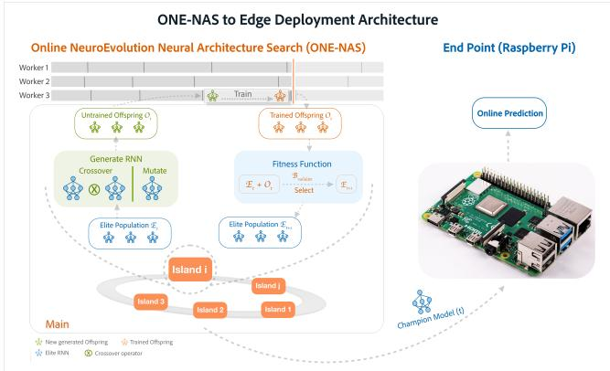
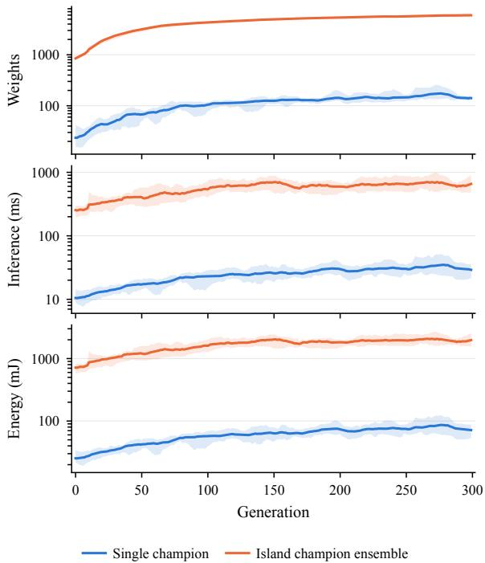
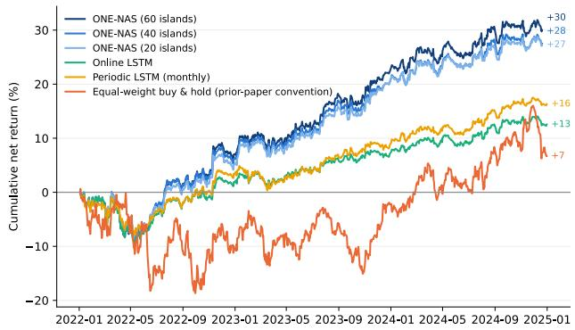
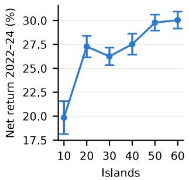
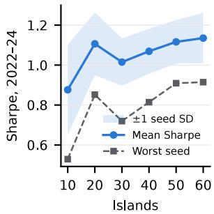

# Evolve on the Host, Predict on the Edge: Deploying Online Neuroevolutionary Architecture Search for Cross-sectional Stock Return Prediction

Jonathan Chang1, Zimeng Lyu2

1 Union County Magnet High School 2Department of Computer Science and Technology, Kean University jonathanbokeunchang@gmail.com, zimeng.lyu@kean.edu

## Abstract

Accurate forecasting models are usually large, expensive to update online, and fixed in architecture once trained. We apply ONE-NAS, an online neuroevolutionary architecture search that evolves a population of small recurrent networks as each window of data arrives, to daily cross-sectional stock return prediction, and pilot it on a host and endpoint pipeline: the host runs the search and ships each generation’s champion genomes over TCP/IP to a Raspberry Pi 4B, which predicts online. On the Pi a single champion predicts a 50-stock window in 24.6 ms and the ensemble of 40 island champions in 556 ms, far inside the daily decision cycle. On four panels of US mid- cap equities over 2022–2024, reading the population as a rank- mean ensemble of island champions returns +27.5% net of realised transaction costs, against +11.3 to +14.8% for online LSTM, online GRU and monthly-retrained LSTM baselines and +4.5% for the single best genome used in prior ONE-NAS work.

## 1 Introduction

Real-world time series forecasting tasks usually face data drift: a model fitted once on historical data degrades as the generating process drifts from its training sample. Online forecasting updates the model as new observations arrive (Pham et al. 2022; Wen et al. 2023; Zhao and Shen 2025), but accurate forecasting models are usually large (Das et al. 2023; Ansari et al. 2024; Woo et al. 2024): expensive to update at the cadence of the stream, expensive to serve where the data are produced, and fixed in architecture once trained, so only their weights can adapt.

The problem is acute in stock forecasting, where daily returns have a low signal-to-noise ratio and the feature-to- return relationship shifts with market regimes, so a model fitted to one period often fails in the next (Zhao, Kong, and Shen 2023). Deep stock models (Li et al. 2024) are refitted on a schedule, and incremental learning (Zhao, Kong, and Shen 2023) updates their weights between refits, but in both cases the architecture is fixed in advance.

We address adaptation with online neural architecture search. ONE-NAS (Lyu, Ororbia, and Desell 2023) extends evolutionary architecture search (Liu et al. 2021) to the online setting: a population of recurrent neural networks, or- ganised in islands, evolves as each window of data arrives, with ofspring trained briefly from inherited parent weights and survivors selected on the most recent data. Architectures and weights both adapt, so there is no ofline training phase to go stale. We apply ONE-NAS to daily cross-sectional stock return forecasting on CRSP (Center for Research in Security Prices) data, and show that the result depends on how the population is read: the single best genome of prior ONE- NAS work trails every neural baseline, while a rank-mean ensemble of the island champions outperforms them all.

An online neuroevolutionary NAS algorithm deploys as two workloads: the parallel and expensive search runs on a cloud service or a workstation, and the forecasting, cheap because the evolved networks are small, runs on an edge endpoint device (Figure 1). Each generation the host sends the champion genomes over TCP/IP to a Raspberry Pi, which forecasts as each day’s features arrive and keeps forecasting from the last received genomes if the host is unavailable. The Pi is a constrained target: inference that meets the daily cadence there does so on any hardware a practitioner owns.

The contributions of this paper are:

• A deployment workflow for stock forecasting and for trading on the forecasts, with ONE-NAS running the online neuroevolutionary NAS on a host and a Raspberry Pi endpoint running the online inference (Section 3.4).

• Measurements on the Pi showing that online inference with the single champion and with the ensemble of 40 island champions runs in real time, far inside the daily decision cycle, at low compute and energy cost (Section 5.1).

• Evidence that forecasting with a rank-mean ensemble of the island champions earns a much higher net return than forecasting with the single champion used in prior ONE- NAS work (Section 5.3).

## 2 Related Work

Machine learning for cross-sectional stock return prediction is established (Gu, Kelly, and Xiu 2020), and deep models such as MASTER (Li et al. 2024) and StockMixer (Fan and Shen 2024) set the current benchmarks for daily stock ranking (Olorunnimbe and Viktor 2023). They are trained on a fixed span and refitted on a schedule, so they degrade between refits as the market drifts. Incremental learning updates a fixed model each period with meta-learned adaptation of data and parameters (Zhao, Kong, and Shen 2023). Online time series forecasting addresses the same concept drift problem (Lu et al. 2018) for general streams: FSNet (Pham et al. 2022) adds fast and slow adaptation paths to a fixed backbone, OneNet (Wen et al. 2023) learns online combination weights over fixed backbones, and Proceed (Zhao and Shen 2025) adapts parameters before drifted data arrive. In all of these the architecture is fixed before the stream starts and only weights or mixture weights adapt.

Evolutionary NAS searches architectures with a popula- tion under selection (Stanley et al. 2019; Liu et al. 2021). EXAMM (Ororbia, ElSaid, and Desell 2019) evolves RNN topologies and cell types from a minimal seed genome with parent-to-ofspring weight inheritance, so each candidate needs only brief training; it has been applied to power plant forecasting (Lyu et al. 2021) and, ofline, to stock return prediction, where it matched or outperformed transformer and recurrent baselines with far fewer parameters and no GPU (Lyu et al. 2025). ONE-NAS (Lyu and Desell 2022; Lyu, Ororbia, and Desell 2023) moves this search online and outperformed online linear, LSTM, GRU and ARIMA baselines on wind turbine and stock index data, reading the population through its single best genome. Other NAS for financial forecasting searches fixed chain-structured spaces ofline (Levchenko et al. 2025). Reading an evolved population as an ensemble dates to early neuroevolution (Yao and Liu 1998), and neural ensemble search (Zaidi et al. 2021) showed that architecturally diverse ensembles are more ro- bust under dataset shift; neither idea has been combined with online architecture search.

Deployment on constrained hardware is usually handled on the model side. Hardware-aware NAS (Wan 2021; Lin et al. 2020) searches for networks that meet a latency or memory budget, and once-for-all training (Cai et al. 2019) extracts a subnetwork per device from one supernet; in both the search finishes before deployment. On-device learning (Ren, Anicic, and Runkler 2021) updates the weights of a fixed network on the device. End-edge-cloud collaborative computing (Wang et al. 2024) instead trains on a resourced host and infers on the device that receives the data, shipping the model between them. Our pipeline follows this pattern, except that the host runs a continuous architecture search and ships a new set of small networks each generation rather than new weights for one. Stock prediction models are eval- uated by backtest (Olorunnimbe and Viktor 2023); serving measurements on edge hardware are rarely reported, and this paper provides them for a Raspberry Pi pilot.

## 3 Method

Online NeuroEvolution-based Neural Architecture Search (ONE-NAS) (Lyu, Ororbia, and Desell 2023) is a neuroevolution algorithm for online time series forecasting: it main- tains a population of RNNs whose architectures and weights evolve continuously as new observations arrive, so the mod- els track a non-stationary stream without pre-training. This work applies ONE-NAS to stock return prediction, forecast- ing the forward return of every security in a portfolio on each trading day, with the search running on a host machine and the evolved networks predicting on a separate endpoint.

  
Figure 1: Deployment pipeline: ONE-NAS search on the host, online prediction on the Raspberry Pi endpoint.

## 3.1 Online Neuroevolution

ONE-NAS grows networks progressively rather than sam- pling from a fixed architecture space. An individual, a genome, is a directed graph encoding both an architecture and its weights, with hidden nodes drawn from a library of recurrent cell types and edges that are either feedforward or recurrent, a recurrent edge carrying a value forward in time. The search starts from a minimal seed genome holding only input-to-output connections, so depth, recurrent connectivity and cell composition are outcomes of the search.

Ofspring are produced by mutation (node and edge in-sertion or deletion, recurrent edge insertion, and cell type change) and by crossover between two parents. Weights are inherited for every retained component and randomly ini- tialised only for new ones, so each ofspring starts from a partially trained network and needs only a few backpropaga- tion epochs, which keeps the search within the data cadence. The search runs on N islands, sub-populations that evolve in parallel, each seeded independently with a minimal genome and growing as its ofspring accumulate. Islands exchange genetic material only through inter-island crossover at a low rate, so they become increasingly distinct over time, and a suficient number of islands is kept to preserve diversity in the evolutionary search.

A main process holds the islands, generates ofspring, and dispatches each one to the next available worker, which trains and evaluates it and returns it with its fitness; the main then places it back into its island and issues the next genome to that worker. Workers are not synchronised with one another, so a generation’s wall-clock cost depends on the number of workers rather than the population size.

At the end of each generation, every island ranks the genomes it holds and retains the best performing of them as parents for the next generation. The best genome on an island is its champion, and the champion of highest fitness across all islands is the global best genome. Champions are re-selected every generation, so the networks that forecast the next window are the current best of the search rather than a model fixed in advance (Section 3.3).

## 3.2 Online Protocol

The input stream is partitioned into consecutive windows of W trading days, with one generation per window (values in Section 4). At the start of generation t, the revealed history $\mathcal { H } _ { t }$ is split into a validation block (its V most recent windows) and a training pool (all earlier windows). Each island generates ofspring from its elites and trains them on sub- sequences of length L drawn from the training pool alone; all genomes are then scored by mean squared error on the validation block, each island keeps its top-ranked genomes as elites, and the genomes designated by the prediction rule (Section 3.3) predict window t+1 day by day as its features arrive. When window t+1 closes, its realised returns are ap-pended to form $\mathcal { H } _ { t + 1 }$ , the validation block slides forward one window, and generation t+1 begins. Training draws on the full history while fitness is measured on the most recent data, so the population tracks the current regime without discarding earlier ones.

Leakage is prevented by construction: a window is pre- dicted before its labels are revealed, enters the validation block only afterwards, and enters the training pool only after leaving it, so no genome is trained on data it is scored on or selected on data it later predicts. A master process generates genomes and workers train them asynchronously, so a gen- eration’s wall-clock cost depends on the number of workers rather than the population size.

## 3.3 Prediction Rules

Which genomes predict window t+1 is a scoring-time deci-sion that does not afect the search, so the two rules below are compared on the same runs and any diference between them is attributable to how the population is used rather than how it was built. Under the single champion rule, used in all prior ONE-NAS work, the global best genome alone predicts. Under the island-champion ensemble rule, the best elite of each island predicts, each predicted cross-section is converted to ranks, and the ranks are averaged across the N members. Ranks rather than raw outputs are averaged be- cause the members have non-comparable output scales and every trading rule used here reads only the ordering.

## 3.4 Deployment Architecture

Search and inference run on separate machines because pop- ulation training is parallel and expensive whereas evaluating the resulting networks is not (Figure 1). The search host is a cloud instance or workstation with enough cores to train a generation’s ofspring in parallel; it stores the price history, advances the window clock, and performs all evolutionary operations. The endpoint is a Raspberry Pi; it performs no training and stores only the last received genomes and the current day’s features. The Pi is a deliberately constrained target: meeting the data cadence there bounds the hardware required at the point of use.

After selection in generation t, the host serialises the genomes designated to predict window t+1 (the global best genome or the N island champions) into a binary encoding of graph structure, cell types and weights, and transmits it to the endpoint over TCP/IP. The endpoint deserialises the networks and predicts each day of window t+1 as its features arrive, applying rank aggregation when an ensemble is received, while the host trains generation t+1. Prediction and search thus overlap in time but are decoupled across hardware.

Inference cost scales only with N and the number of secu-rities, so a larger island count leaves the endpoint’s hardware requirement unchanged. The endpoint is also stateless with respect to the search: if the host is unavailable it keeps pre- dicting with the last received genomes and resumes at the next hand-of.

## 4 Dataset and Experimental Setup

The ONE-NAS implementation, the trading simulation, and the scripts that build the panels from CRSP are open source, and Appendix A gives the full experimental detail.

## 4.1 Dataset

The Center for Research in Security Prices (CRSP) database is the standard source of U.S. stock prices, returns and vol- umes in academic finance, because it is survivorship-bias free and adjusts returns for splits, dividends and delistings. From it we build four disjoint portfolios, V1 to V4, of 50 S&P 500 stocks each, drawn at random from the 203 con- stituents with market capitalisation between 2 and 50 billion USD and at least 20 years of history; each portfolio runs from early 2004 to the end of 2024.

Each model receives seven daily per-stock inputs, all stan- dard predictors computed from information available at or before the prediction day: the daily return and its cross- sectional rank, bid–ask spread, illiquidity, 20-day prior re- turn, turnover acceleration and 21-day volatility. The output is the next day’s return, rank-normalised across that day’s stocks. A rank is predicted rather than a raw return because raw returns are noisy and their scale drifts over two decades, whereas the trading rules act only on which stocks are ex- pected to do better than which. Feature definitions and the normalisation are given in Appendix A.1.

## 4.2 ONE-NAS Setup

ONE-NAS runs on a weekly clock: each window is $W = 5$ trading days, one generation is executed per window, fitness is MSE on the validation block, the $\bar { V _ { \mathbf { \theta } } } = 5 $ most recent windows, and ofspring train for 10 backpropagation epochs on subsequences of $\bar { L ^ { \prime } } = 4 0 ~ \mathrm { d a y s }$ . Unless stated otherwise, every experiment uses $N = 4 \mathrm { \dot { 0 } }$ islands and all six recur- rent cell types (simple, UGRNN, MGU, GRU, ∆-RNN and LSTM). The full configuration, how it was selected on the tuning span, and the fifteen single-axis variants trained are in Appendix A.2.

A ONE-NAS run is one uninterrupted online pass over the data: at every window the population learns from all history before that window (Section 3.2) and is not reset at span boundaries; the three spans difer only in what the predic- tions made along the way are used for. Burn-in (2004–2015) grows the population from the minimal genome and records no prediction. The tuning span (2016–2019) is where hyper-parameters were selected: candidate configurations, each an online run of this kind, were compared on their 2016–2019 predictions, and every configuration decision was made on this span alone. Runs with the selected configuration then continue through the evaluation span (2020–2024) with no configuration change, and results are reported on 2022–2024, the span of our prior study on these panels (Lyu et al. 2025). Each configuration is run with 10 seeds on each of the 4 panels, and all comparisons and t statistics are paired within (panel, seed) cells. Each search ran on one whole 128-core node of the Anvil cluster (NSF ACCESS) (Song et al. 2022); the inference endpoint is a Raspberry Pi 4B (Section 3.4).

## 4.3 Baselines

ONE-NAS is compared against four baselines that are also online models: an online LSTM and an online GRU that take one gradient step per trading day, a periodic LSTM retrained from scratch each month (the common batch-retraining practice), and an online first-order autoregressive model. All follow the same prequential rule as ONE-NAS (predict the next day, reveal the outcome, update) and use the same inputs, target, trading rules and costs. Each is a single model at the same scale as the networks ONE-NAS evolves, so the com- parison isolates architecture search and the population rather than model capacity. Architectures and training settings are in Appendix A.3.

## 4.4 Trading Rules and Metrics

Predictions are turned into positions by three trading rules, each reading only the ordering of the day’s predicted cross- section: Overlapping, which each day buys the 10 top-ranked stocks, sells short the 10 bottom-ranked, and holds the po- sition for 10 days (Eficiency 1993); Banded, which enters a stock when it reaches the top 10 and holds it until it falls past rank 35, so that small rank changes do not trigger trades (Novy-Marx and Velikov 2016); and Conditional long–short, the daily rebalancing rule of our prior study (Lyu et al. 2025). Transaction costs are charged per stock and per day from the CRSP bid–ask spread, and all reported returns are net of them. Position sizing, netting and the cost model are in Ap- pendix A.4.

Prediction quality is measured by the rank IC, the daily Spearman correlation between predicted and realised returns averaged over scored days; it measures how well the model orders the stocks each day, which is what the trading rules act on. Economic performance is measured by net return after costs, annualised Sharpe ratio and turnover, and by alpha and market beta from a Fama–French plus momentum regression (Fama and French 1993; Carhart 1997). Definitions are in Appendix A.5.

## 5 Results

All ONE-NAS hyperparameters were selected on the 2016– 2019 tuning span, disjoint from the evaluation span (Ap-pendix B.1; full configuration in Table 4). Unless stated otherwise, ONE-NAS figures are for the island-champion ensemble at N = 40 islands trading the Overlapping rule, averaged over the four panels V1–V4 and ten seeds (n = 40 cells) on the 2022–2024 evaluation span, and paired com-parisons run over the (panel, seed) cells the two arms share. Section 5.1 measures inference on the endpoint, Sections 5.2 and 5.3 show that the method works and where the gain comes from, Section 5.4 checks the trading rule, transaction costs and factor exposure, and Section 5.5 gives operating guidance for the pilot. Supporting tables are in Appendix B.

  
Figure 2: On-device cost per pass of the two deployment options, on log axes; the line is the mean over ten runs and the band the min–max envelope. The island-champion ensemble runs all 40 island champions, 39× the weights of the single champion.

## 5.1 On-Device Inference Cost

The champions evolved online at generation t are sent to the Raspberry Pi 4B endpoint of Section 3.4, which predicts the test window of generation t. Figure 2 shows time and energy per pass for the single champion and for the island-champion ensemble of all 40 island champions, as the mean and min– max envelope over ten repeated runs. Energy is whole-board energy measured with an INA219, with idle power metered at the start of each run; per-seed and per-quarter values are in Appendix B.2.

Inference is cheap for a single network: a pass over the 50-stock window takes 24.6 ms, and 88% of its energy is the board’s idle draw, so at this scale uptime rather than compute dominates. Cost is set by the architecture rather than the hardware: as the evolved networks grow over the campaign, time and energy grow with them while board power stays flat (Table 7). The ensemble deploys 39× the weights at 23× the time (556 ms per pass) and is more accurate: its MSE of 0.975 beats the single champion’s 1.031 and the average of its own members, so combining the island champions beats the genome the search would have shipped. Both options remain far inside a daily decision cycle on a \$50 board; the choice between them is an accuracy–energy trade rather than a feasibility one, and the size the search settles on governs both: size control is also energy control.

<table><tr><td></td><td>2022</td><td>2023 2024</td><td>2022-24</td><td> $t ^ { c }$ </td></tr><tr><td>ONE-NAS (N=60)</td><td>+6.9</td><td>+13.7 +7.0</td><td> $+ 3 0 . 1 \pm 0 . 9$ </td><td>-1.63</td></tr><tr><td>ONE-NAS (N=40)</td><td></td><td></td><td> $+ 6 . 1 \ + 1 2 . 4 \ + 6 . 3 \ + 2 7 . 5 \pm 1 . 1$ </td><td></td></tr><tr><td>ONE-NAS (N=20)</td><td>+5.1</td><td></td><td> $+ 1 3 . 3 \ + 6 . 3 \ + 2 7 . 4 \pm 1 . 1$ </td><td>0.10</td></tr><tr><td>Online LSTM</td><td>+1.2</td><td></td><td> $+ 4 . 5 ~ + 3 . 8 ~ + 1 1 . 3 \pm 1 . 8$ </td><td>7.32</td></tr><tr><td>Online GRU</td><td>+2.1</td><td></td><td> $+ 3 . 1 ~ + 5 . 0 ~ + 1 1 . 7 \pm 2 . 2$ </td><td>6.59</td></tr><tr><td>Periodic LSTM (mo.)</td><td>+1.4</td><td></td><td> $+ 3 . 9 ~ + 6 . 9 ~ + 1 4 . 8 \pm 1 . 0$ </td><td>6.66</td></tr><tr><td>Online ARª</td><td>-14.6</td><td> $+ 4 . 8 \ + 7 . 9$ </td><td> $- 3 . 3$ </td><td>2.22</td></tr><tr><td>Buy &amp; holdb</td><td>-10.1 +11.2 +6.8</td><td></td><td>+7.9</td><td>一</td></tr></table>

aDeterministic, one run per panel $( n { = } 4 ) .$ bPrior-study convention; totals the yearly cells, not seed-paired. cPaired t of the 40-island ensemble minus the row over shared (panel, seed) cells; positive favours the ensemble.  
Table 1: Net return (%) by trade year, mean over V1–V4 and seeds (10 for ONE-NAS; 48, 40 and 40 for the online LSTM, online GRU and periodic LSTM, Appendix A.3). The 2022– 24 column is one run over the window, not the sum of the yearly cells.

  
Figure 3: Cumulative net return, 2022–2024 (books restarted at window start). Buy and hold follows the prior-study bench-mark convention.  
Table 2: Prediction rule, within-run paired: single global-best genome vs. island-champion rank-mean ensemble from the same runs (Overlapping rule). Net % / Sharpe; ∆ = ensemble − single, paired t over seeds.

## 5.2 Net Return against Baselines

We trade the ensemble at 20, 40 and 60 islands, the four baselines of Section 4 and an equal-weight buy and hold of the same universe, every arm on the Overlapping rule under the same realised costs, so the comparison isolates the predictions (Table 1; cumulative paths in Figure 3).

At 40 islands the ensemble returns +27.5% against +11.3 to +14.8% for the three neural baselines, a paired margin of +12.7 to +16.2 points at $t > 6 . 5$ over 40 cells; 20 and

<table><tr><td>Fleet</td><td>Single</td><td>Ensemble</td><td>∆net (t)</td><td>∆Sharpe (t)</td></tr><tr><td>60 isl.</td><td></td><td></td><td>+1.0 / 0.09 +30.1 / 0.93 +29.1 (18.3) +0.84 (14.1)</td><td></td></tr><tr><td></td><td></td><td> $\begin{array} { r l } { 4 0 \ \mathrm { i s l . } } & { { } + 4 . 5 / \ 0 . 2 1 \ + 2 7 . 5 / \ 0 . 8 7 \ + 2 3 . 0 \ ( 1 8 . 2 ) \ + 0 . 6 6 \ ( 1 4 . 7 ) } \end{array}$ </td><td></td><td></td></tr><tr><td>20 isl.</td><td> $+ 4 . 7 / 0 . 2 5 + 2 7 . 4 / 0 . 8 7 + 2 2 . 6 ( 1 4 . 9 ) + 0 . 6 2 ( 1 4 . 9 )$ </td><td></td><td></td><td></td></tr><tr><td></td><td>40 isl.a +8.9 / 0.30 +36.7 / 1.22</td><td></td><td>+27.8 (7.5)</td><td>+0.92 (6.6)</td></tr></table>

aReplication on the 2016–2019 tuning-span fleets, at n=5 seeds; every other row is the 2022–2024 trading span at n=10.

60 islands are not separable from it. The margin is not the product of a single year: the ensemble leads every baseline in 2022 and 2023, and in 2024 the monthly-retrained LSTM draws level (+6.9 against +6.3) while the AR model, which loses money over the window, has its one good year (+7.9). Buy and hold returns +7.9% but is a market reference rather than a like-for-like competitor: it runs at a market beta of 0.80 and earns no alpha (Table 13).

## 5.3 Prediction Rule: Single Champion versus Island-Champion Ensemble

Prior ONE-NAS work reads the evolved population through its single global-best genome; the headline reads it as a rank- mean ensemble of island champions. Both are scoring-time readings of the same runs, so Table 2 compares them within- run, paired over seeds. Tables 10 and 11 ask where the gain comes from: the members’ rank IC and pairwise correlation, and the gain inside all 16 configurations of the tuning screen.

The single champion returns +4.5% at 40 islands at Sharpe 0.21, below every neural baseline in Table 1; the same runs read as an ensemble return +27.5% at Sharpe 0.87, a paired gain of +23.0 points (t = 18.2), and the tuning-span fleets replicate it (+8.9 against +36.7, t = 7.5). The search does not pay by finding one good architecture; it pays by producing a population. The size of the gain is what diversity implies: individual champions are weak (mean rank IC +0.0065 to +0.0068) and weakly correlated (mean pairwise Spearman ρ of 0.150 to 0.166), and the equicorrelated averaging prediction m $\sqrt { N / ( 1 + ( N - 1 ) \rho ) }$ matches the measured ensem- ble IC within 3%. The gain is also not specific to the tuned configuration: it is positive in 16 of 16 configurations of the tuning screen (mean +8.3 points; smaller because those cells run at the 8-island registered width).

## 5.4 Trading Rule, Transaction Costs and Factor Exposure

Three checks ask whether the headline depends on how the predictions are traded or on the cost assumption, and whether it is factor exposure in disguise: the Banded and Conditional long–short rules of Section 4 on the same 40-island predic- tions and costs (Table 12); the realised per-name cost scaled by $2 \times , 3 \times$ and 5× with its cross-sectional shape preserved (Table 3); and each arm’s pooled daily book return regressed on the Fama–French three factors plus momentum (Table 13).

<table><tr><td>Arm</td><td>1×  $2 \times$ </td><td>3×</td><td>5× B/Ea</td></tr><tr><td>ONE-NAS (N=60) +30.1 +27.2 +24.4 +18.8 11.6×</td><td></td><td></td><td></td></tr><tr><td>ONE-NAS (N=40) +27.5 +24.7</td><td></td><td> $+ 2 1 . 8 + 1 6 . 0$ </td><td>10.6×</td></tr><tr><td>ONE-NAS (N=20)</td><td> $+ 2 7 . 4 + 2 4 . 4$ </td><td> $+ 2 1 . 5 + 1 5 . 6$ </td><td>10.3×</td></tr><tr><td>Periodic LSTM</td><td> $+ 1 4 . 8 + 1 1 . 4$ </td><td> $+ 8 . 0 \ \ \ + 1 . 2$ </td><td>5.4×</td></tr><tr><td>Online GRU</td><td> $+ 1 1 . 7 \ \ \ + 8 . 3$ </td><td> $+ 4 . 9 \quad - 1 . 8 \quad$ </td><td>4.5×</td></tr><tr><td>Online LSTM</td><td>+11.3 +8.1</td><td> $+ 4 . 9 \quad - 1 . 5$ </td><td>4.5×  $- 8 . 8 - 1 4 . 2 $ </td></tr></table>

Scaling multiplies the realised per-name cost, so the cross-sectional shape of costs is preserved. The 1× column is the 2022–24 column of Table 1. aBreak-even: the cost multiple at which net return reaches zero.  
Table 3: Cost sensitivity: net return (%) on 2022–2024 as the realised per-name transaction cost is scaled by the stated multiple.

Banded returns +33.9% and Conditional long–short +25.0% against +27.5% for Overlapping, but Banded is uneven across years $( + 1 2 . 5 , + 1 4 . 6 , \overset { . } { + } \overset { . } { 3 } . 4 )$ with larger seed dispersion (SE 1.8 against 1.1) and Conditional long–short reduces to a plain daily rebalance on rank-normal predictions, so Overlapping is the rule used throughout. The ensemble stays profitable to 10–12× realistic costs against 4.5–5.4× for the neural baselines, and at 5× still returns +15.6 to +18.8% while the online LSTM and GRU are below zero; part of the margin is lower turnover, 0.12 of gross book per day against 0.13–0.14. After factor adjustment the three en-semble widths carry alphas of $+ 1 0 . { \overset { \cdot } { 0 } } { \mathrm { ~ t o ~ } } + 1 1 . 2 \%$ per year (t = 2.56 to 2.77, Newey–West lag 10) at market betas of 0.11–0.12, and only the monthly-retrained LSTM among the baselines reaches |t| = 2: the book is close to market-neutral and its return is not factor exposure.

## 5.5 Operating the Pilot

A deployment holds a single run and must decide when to start its population and how many islands to run. We compare a population evolving online since 2020-01 with one cold- started at 2022-01, both scored on 2022–2024 at the frozen 8-island registered configuration, and run island counts from 10 to 60 at ten seeds and four panels on the evaluation span (Figure 4).

The continuously evolving population returns +26.5% against +12.3% for the cold start: more than half of the return at this configuration comes from the two years of evo- lution before the evaluation span, so a deployed population should be started well ahead of the period it trades and never reset. Return and Sharpe rise steeply from 10 to about 20 islands and then flatten, and 20 to 60 islands are not separa- ble at ten seeds; over the same range the standard deviation of per-seed Sharpe falls from 0.227 to 0.11–0.13 and the worst seed rises from 0.53 to 0.91. Width buys consistency at least as much as expected return, at an inference cost on the endpoint that scales with N (Section 5.1). 50 and 60 islands score nominally above 40 on the trading period but are indistinguishable from it on the tuning span (Appendix B.1) and are not adopted.

  
Figure 4: Performance vs. island count on the evaluation span (2022–2024, Overlapping rule; 10 seeds × 4 panels at every width). Left: pooled net return (mean ± SE). Right: Sharpe, mean with ±1 seed-SD band, and the worst seed. The 40-island headline was fixed on the tuning span (Table 5, Appendix B.1) before this curve was measured.

## 6 Conclusion

This work proposed a host and endpoint pipeline that deploys online neuroevolutionary NAS for stock forecasting and for trading on the forecasts: ONE-NAS evolves the population on a search host and ships each generation’s champions to a Raspberry Pi, which forecasts online. Results on the Pi show that the deployment can be used in practice: the single champion predicts a 50-stock window in 24.6 ms and the ensemble of 40 island champions in 556 ms, far inside the daily cadence and at low energy.

This work also explored two ways of using the evolved population for prediction, the single champion of prior ONE- NAS work and the island-champion ensemble. Results show that the ensemble is far better: on four panels of US mid- cap equities over 2022–2024 it returns +27.5% net of costs against +4.5% for the single champion, a paired gain of +23.0 points (t = 18.2) at no search-time cost, positive in every configuration we trained, and it outperforms online LSTM, online GRU and monthly-retrained LSTM baselines, which return +11.3 to +14.8% under the same rule and costs (t > 6.5). Future work includes the full deployment: adding an execution layer and live measurement of realised costs, and having users in the industry run the pipeline and give feedback.

## References

Ansari, A. F.; Stella, L.; Turkmen, C.; Zhang, X.; Mercado, P.; Shen, H.; Shchur, O.; Rangapuram, S. S.; Arango, S. P.; Kapoor, S.; et al. 2024. Chronos: Learning the language of time series. arXiv preprint arXiv:2403.07815.

Cai, H.; Gan, C.; Wang, T.; Zhang, Z.; and Han, S. 2019. Once-for-all: Train one network and specialize it for eficient deployment. arXiv preprint arXiv:1908.09791.

Carhart, M. M. 1997. On persistence in mutual fund perfor- mance. The Journal offinance, 52(1): 57–82.

Das, A.; Kong, W.; Sen, R.; and Zhou, Y. 2023. A decoder- only foundation model for time-series forecasting. arXiv preprint arXiv:2310.10688.

Eficiency, S. M. 1993. Returns to buying winners and selling losers: Implications for. The Journal ofFinance, 48(1): 65– 91.

Fama, E. F.; and French, K. R. 1993. Common Risk Factors in the Returns on Stocks and Bonds. Journal of Financial Economics, 33(1): 3–56.

Fan, J.; and Shen, Y. 2024. StockMixer: a simple yet strong MLP-based architecture for stock price forecasting. In Proceedings of the AAAI conference on artificial intelligence, volume 38, 8389–8397.

Gu, S.; Kelly, B.; and Xiu, D. 2020. Empirical asset pricing via machine learning. The review offinancial studies, 33(5): 2223–2273.

Levchenko, D.; Rappos, E.; Ataee, S.; Nigro, B.; and Robert- Nicoud, S. 2025. Chain-structured neural architecture search for financial time series forecasting. International Journal ofData Science and Analytics, 20(4): 3727–3736.

Li, T.; Liu, Z.; Shen, Y.; Wang, X.; Chen, H.; and Huang, S. 2024. Master: Market-guided stock transformer for stock price forecasting. In Proceedings of the AAAI conference on artificial intelligence, volume 38, 162–170.

Lin, J.; Chen, W.-M.; Lin, Y.; Gan, C.; Han, S.; et al. 2020. Mcunet: Tiny deep learning on iot devices. Advances in neural information processing systems, 33: 11711–11722.

Liu, Y.; Sun, Y.; Xue, B.; Zhang, M.; Yen, G. G.; and Tan, K. C. 2021. A survey on evolutionary neural architecture search. IEEE transactions on neural networks and learning systems, 34(2): 550–570.

Lu, J.; Liu, A.; Dong, F.; Gu, F.; Gama, J.; and Zhang, G. 2018. Learning under concept drift: A review. IEEE transactions on knowledge and data engineering, 31(12): 2346– 2363.

Lyu, Z.; and Desell, T. 2022. ONE-NAS: an online neu- roevolution based neural architecture search for time series forecasting. In Proceedings ofthe Genetic and Evolutionary Computation Conference Companion, 659–662.

Lyu, Z.; Kar, D.; Simoni, M.; Nadeem, R.; Bhojanapalli, A.; Zhang, H.; and Desell, T. 2025. Evolving RNNs for Stock Forecasting: A Low Parameter Eficient Alternative to Transformers. In International Conference on the Applications of Evolutionary Computation (Part of EvoStar), 36–54. Springer.

Lyu, Z.; Ororbia, A.; and Desell, T. 2023. Online evo- lutionary neural architecture search for multivariate non- stationary time series forecasting. Applied Soft Computing, 145: 110522.

Lyu, Z.; Patwardhan, S.; Stadem, D.; Langfeld, J.; Benson, S.; Thoelke, S.; and Desell, T. 2021. Neuroevolution of recur- rent neural networks for time series forecasting of coal-fired power plant operating parameters. In Proceedings of the Genetic and Evolutionary Computation Conference Companion, 1735–1743.

Newey, W. K.; and West, K. D. 1986. A simple, positive semi-definite, heteroskedasticity and autocorrelationconsis- tent covariance matrix.

Novy-Marx, R.; and Velikov, M. 2016. A taxonomy of anomalies and their trading costs. The Review of Financial Studies, 29(1): 104–147.

Olorunnimbe, K.; and Viktor, H. 2023. Deep learning in the stock market—a systematic survey of practice, backtest- ing, and applications: K. Olorunnimbe, H. Viktor. Artificial Intelligence Review, 56(3): 2057–2109.

Ororbia, A.; ElSaid, A.; and Desell, T. 2019. Investigating Recurrent Neural Network Memory Structures Using Neuro- evolution. In Proceedings of the Genetic and Evolutionary Computation Conference, GECCO ’19, 446–455. New York, NY, USA: ACM. ISBN 978-1-4503-6111-8.

Pham, Q.; Liu, C.; Sahoo, D.; and Hoi, S. C. 2022. Learning fast and slow for online time series forecasting. arXivpreprint arXiv:2202.11672.

Ren, H.; Anicic, D.; and Runkler, T. A. 2021. Tinyol: Tinyml with online-learning on microcontrollers. In 2021 international joint conference on neural networks (IJCNN), 1–8. IEEE.

Song, X. C.; Smith, P.; Kalyanam, R.; Zhu, X.; Adams, E.; Colby, K.; Finnegan, P.; Gough, E.; Hillery, E.; Irvine, R.; Maji, A.; and St. John, J. 2022. Anvil - System Architecture and Experiences from Deployment and Early User Opera- tions. In Practice and Experience in Advanced Research Computing (PEARC ’22), 1–9. New York, NY, USA: Asso-ciation for Computing Machinery.

Stanley, K. O.; Clune, J.; Lehman, J.; and Miikkulainen, R. 2019. Designing neural networks through neuroevolution. Nature Machine Intelligence, 1(1): 24–35.

Wang, N. 2021. Hardware-aware neural architecture search: Survey and taxonomy. In Proceedings of the Thirtieth International Joint Conference on Artificial Intelligence.

Wang, Y.; Yang, C.; Lan, S.; Zhu, L.; and Zhang, Y. 2024. End-edge-cloud collaborative computing for deep learning: A comprehensive survey. IEEE Communications Surveys & Tutorials, 26(4): 2647–2683.

Wen, Q.; Chen, W.; Sun, L.; Zhang, Z.; Wang, L.; Jin, R.; Tan, T.; et al. 2023. Onenet: Enhancing time series fore- casting models under concept drift by online ensembling. Advances in Neural Information Processing Systems, 36: 69949–69980.

Woo, G.; Liu, C.; Kumar, A.; Xiong, C.; Savarese, S.; and Sahoo, D. 2024. Unified training of universal time series forecasting transformers. arXiv preprint arXiv:2402.02592.

Yao, X.; and Liu, Y. 1998. Making use of population in- formation in evolutionary artificial neural networks. IEEE Transactions on Systems, Man, and Cybernetics, Part B (Cybernetics), 28(3): 417–425.

Zaidi, S.; Zela, A.; Elsken, T.; Holmes, C. C.; Hutter, F.; and Teh, Y. 2021. Neural ensemble search for uncertainty estimation and dataset shift. Advances in Neural Information Processing Systems, 34: 7898–7911.

Zhao, L.; Kong, S.; and Shen, Y. 2023. Doubleadapt: A meta-learning approach to incremental learning for stock trend forecasting. In Proceedings of the 29th ACM SIGKDD conference on knowledge discovery and data mining, 3492– 3503.

Zhao, L.; and Shen, Y. 2025. Proactive model adapta- tion against concept drift for online time series forecasting. In Proceedings of the 31st ACM SIGKDD Conference on Knowledge Discovery and Data Mining V. 1, 2020–2031.

## A Experimental Details

This appendix gives the detail summarised in Section 4 and follows its order. Appendix A.1 describes the panels, features and target of Section 4.1; Appendix A.2 lists the ONE-NAS configuration of Section 4.2, the tuning-span screen behind it, and the pre-registration under which it was scored; Ap- pendix A.3 gives the baseline architectures; Appendix A.4 gives the position sizing, netting and cost model of the three trading rules, with the Conditional long–short rule as pseu- docode; and Appendix A.5 defines the metrics and the paired tests. Appendix B then reports the hyperparameter selection on the tuning span and the tables that support Section 5. The main text carries every number it relies on; this appendix documents how those numbers were produced.

## A.1 Dataset Construction

The universe is the set of S&P 500 constituents in the CRSP daily panel with current market capitalisation $2 \leq M _ { i } < 5 0$ billion USD and at least 20 years of continuous trading his- tory. Mid-cap stocks receive less analyst and institutional scrutiny than large-caps and are therefore less eficiently priced. The restriction leaves 203 names, from which 200 were drawn at random, shufled, and split evenly into V 1– V4, so no stock appears in more than one portfolio. Each portfolio is stored as one series per ticker with a panel-level date index carrying the aligned price and transaction-cost columns. All four end on 2024-12-31 and each begins once all 50 constituents have priced history: V1 from 2004-08-16, V2 from 2004-12-17, V3 from 2004-10-27 and V4 from 2004-02-09, giving 5,130, 5,043, 5,079 and 5,257 trading days. The difering lengths afect only burn-in; the tuning and evaluation spans are the same calendar spans for all four, so no method gains or loses scored days.

The seven features are computed causally, from informa- tion available at or before the day on which a position is formed. Three describe the stock’s recent price behaviour, three describe how easily and how heavily it trades, and one places it against the rest of the market that day. Liquidity and attention features are included because the target is short- horizon: over a single day, how expensive a stock is to trade and how much attention it is attracting carry more informa- tion about its next move than fundamentals do, and they also tell the model where a predicted edge would be eaten by trading costs. In the order of Section 4.1, the features are:

• RET: the raw daily return.

• RET\_CS\_IN: the cross-sectional rank-normal score of RET on the same day, $\Phi ^ { - 1 } \big ( ( \mathrm { r a n k } _ { t } ( i ) - 0 . 5 ) / N _ { t } \big )$ over the $N _ { t }$ names priced that day.

• BA\_SPREAD: the quoted bid–ask spread, the gap between the best buying and selling price, a proxy for how costly the stock is to trade.

• ILLIQUIDITY: Amihud illiquidity, absolute return over dollar volume, smoothed over 21 days and logged. It is large when a small amount of trading moves the price a lot.

• REV21\_1: the 20-day prior return, that is, the com-pounded return over the 20 days before the formation day, excluding it. Recent winners tend to give some of it back, so this is informative with a negative sign.

<table><tr><td>Setting</td><td>Value</td></tr><tr><td>Islands N</td><td>40 (headline); 8 (reg.)</td></tr><tr><td>Elites / island</td><td>8</td></tr><tr><td>Offspring / island / generation</td><td>5</td></tr><tr><td>Mut. / intra- / inter-island crossover 0.7 / 0.2 / 0.1</td><td></td></tr><tr><td>Repopulation</td><td>every 50 generations</td></tr><tr><td>Fitness</td><td>validation MSE</td></tr><tr><td>Prediction rule</td><td>island-champion ensemble</td></tr><tr><td>Target Seq. len. L / window W / val. V</td><td>next-day CS rank-normal</td></tr><tr><td>Train. subseq. / genome (NTS)</td><td>40 /5 / 5</td></tr><tr><td>BP epochs / genome</td><td>2000 10</td></tr><tr><td></td><td></td></tr><tr><td>Replay (PER) α, λ, €</td><td>0.6, 0.007, 10−8</td></tr><tr><td>Generations / window (rounds) Cell types</td><td>1 simple, UGRNN, MGU,</td></tr><tr><td></td><td>GRU, ∆-RNN, LSTM</td></tr><tr><td>Warm-up generations</td><td>50</td></tr></table>

Table 4: ONE-NAS configuration used in Section 5, in the notation of Sections 3.2 and 4.2, selected on the 2016–2019 tuning span (Appendix B.1). “reg.”: the registered 8-island configuration; abbreviations in parentheses as in Tables ?? and 11.

• TURN\_RATIO: turnover acceleration, the mean of log(1 + turnover) over the last 5 days minus the same mean over the last 63. It rises when a stock begins attract- ing unusual attention.

• VOL21: realised volatility, the standard deviation of RET over the trailing 21 days.

The last five are additionally mapped, per date, to their cross-sectional rank on [−1, 1]. Without this a feature would carry a level that drifts across two decades (spreads and volumes in 2004 are not comparable to 2024) and the model would spend capacity tracking that drift instead of the cross- section. The prediction target RET\_CS is the next day’s return, rank-normalised across the cross-section of that day by the same $\Phi ^ { - 1 }$ transform, which makes the target stationary by construction and matches how the predictions are con- sumed: every trading rule of Appendix A.4 reads only the ordering of the predicted cross-section. Realised returns used for scoring are CRSP RET, adjusted for splits and dividends; prices and per-name transaction costs enter only through the cost model of Appendix A.4.

## A.2 ONE-NAS Configuration and Hyperparameter Search

Table 4 lists every setting of the configuration used in Sec- tion 5; the prediction rule is the island-champion rank-mean ensemble of Section 3.3 and the target is RET\_CS of Ap- pendix A.1. Each of the N islands keeps an elite set of 8 genomes and generates 5 ofspring per generation, each ofspring by mutation with probability 0.7, by crossover be- tween two elites of the same island with probability 0.2, and by crossover with an elite of another island with probability

0.1. Every 50 generations the island whose best elite has the worst fitness is cleared and repopulated from the global best genome, which counters stagnation. Ofspring are trained for 10 backpropagation epochs on 2000 subsequences of length $L = 4 0$ days drawn from the training pool by prioritised ex- perience replay (PER) rather than uniformly: each window in the pool carries an error estimate updated from the elite pop- ulation’s validation MSE, its priority is $( \mathrm { M S E } + \epsilon ) ^ { - 1 } \dot { e } ^ { - \dot { \lambda } a }$ with a its age in generations, and windows are drawn with-out replacement with probability proportional to $\mathrm { p r i o r i t y } ^ { \alpha }$ so recent windows and windows the current elites fit well are drawn more often.

Fitness is MSE on the $V = 5$ validation windows, one generation (one round of ofspring generation, training and selection) runs per $W = 5 – \mathrm { d a y }$ window, and predictions are recorded only after 50 warm-up generations.

Pre-registration. The configuration to be scored, the eval-uation span, the trading rule and the metrics were committed to the repository before the evaluation span was scored; every later analysis ofevaluation-span data was declared in advance with its decision rule, and any configuration change required a dated amendment written before the changed configuration was scored. The configuration committed first, with $N = 8$ islands, is the registered configuration referred to in Section 5.5 and Table 11; the move to 40 islands was recorded as such an amendment on the tuning-span evidence of Ap- pendix B.1, before the evaluation span was scored. The reg- istered protocol, the full screen with per-cell outcomes, and all declared exploratory analyses are in the code release cited in Section 4.

Spans and warm-up. A run is one online pass from 2004 to the last scored day (Section 4.2). Burn-in (2004–2015) records no prediction; the tuning span (2016–2019) is scored to select the configuration; runs with the selected config- uration continue through the evaluation span (2020–2024) with no configuration change, so evolution is uninterrupted from 2004 to the last scored day, and 2020–2021 is scored but not reported so that the reported span matches the prior study on these panels. In both scored spans 50 warm-up gen- erations precede the first recorded prediction, so the scored population is never a cold start.

Compute. All searches ran on the Anvil cluster (NSF AC-CESS) named in Section 4.2. Each run occupied one node with two 64-core AMD EPYC 7763 processors (128 cores, 2.45 GHz) and 256 GB of memory, using 128 MPI ranks: one master maintaining the island populations and generat- ing ofspring, and 127 workers training and evaluating them. The island count is independent of the rank count, so the worker pool is identical across all reported configurations. Baselines are single-process and ran on the same hardware. The inference endpoint is the Raspberry Pi 4B (8 GB RAM) of Section 3.4, measured in Section 5.1.

## A.3 Baselines

All four baselines are evaluated on the same panels with the same prequential protocol, features, target, trading rules and transaction costs as ONE-NAS (Section 4). Each is a single model, and reported figures are means over independent runs rather than the return of an ensemble of those runs.

• Online LSTM. A single-layer LSTM with 8 hidden units and input sequence length 10, trained with Adam (learn-ing rate $1 0 ^ { - 3 } )$ , taking one gradient step per trading day on a minibatch drawn from a replay bufer of the most recent 1000 days. 48 seeds per panel.

• Online GRU. Identical to the online LSTM with a GRU cell and sequence length 5. 40 seeds per panel.

• Periodic LSTM. The same LSTM architecture, retrained from scratch at the start of each month for up to 4000 steps and held fixed between retrainings. 40 seeds per panel.

• Online AR. A first-order autoregressive model fitted by online gradient descent with learning rate $1 0 ^ { - 4 }$ . Deter- ministic, so one run per panel.

## A.4 Trading Rules

Every rule reads only the ordering of each day’s predicted cross-section, so all reported metrics are invariant to any strictly monotone transform of a model’s output. Overlap- ping is the rule used throughout Section 5; Banded and Conditional long–short are run on the same predictions in Section 5.4 (Table 12).

Overlapping. Following the overlapping-portfolio construction of Eficiency (1993), each day a new portfolio is formed that goes long the $k = 1 0$ highest-ranked names and short the 10 lowest-ranked, with equal notional per name, and is held for $H = 1 0$ trading days; the portfolio formed H days earlier is closed. Ten portfolios are therefore open at any time, each funded with $\overset { \cdot } { 1 } / H$ of the capital. Positions are netted across portfolios before trading, so a name that appears in several consecutive portfolios is held rather than repeatedly bought and sold, and transaction costs are charged only on the change in aggregate notional per name.

Banded. Following the buy/hold spread of Novy-Marx and Velikov (2016), a name is entered when its predicted rank reaches the top 10 and is held until its rank falls past 35. Names between the two thresholds are neither bought nor sold, which removes the churn caused by small day-to-day changes in rank near the boundary.

Conditional long–short. The daily long–short rule of the prior study on these panels (Lyu et al. 2025), given in full as Algorithm 1. $P$ is the panel (the predictions $\hat { y } _ { t } ,$ prices and per-name costs of every name on every day), $C _ { 0 }$ the initial capital, $C$ the cash held, and $T$ the last day of the test pe- riod. Each day t the names are sorted by predicted return in descending order, $S [ i ]$ denoting the i-th name from the top and $S [ - i ]$ the i-th from the bottom. If the $K _ { L }$ -th highest prediction is positive and the $K _ { S ^ { - } } \mathrm { t h }$ lowest is negative, all existing positions are closed and the capital is redeployed equally, $C / K _ { I }$ L long in each of the top $K _ { L }$ names and $\bar { C } / \bar { K } _ { S }$ short in each of the bottom $K _ { S } ,$ so that the short notional equals the capital; otherwise the current positions are held. Buy, Short and ClearHoldings trade at the previous close and charge the per-name cost below on the notional traded, and the final ClearHoldings marks the book to cash, so the value returned is the net return of Appendix A.5. The con- dition is a confidence gate that suspends rebalancing when the model does not separate the top and bottom of the cross- section by sign. On rank-normalised predictions the gate is satisfied every day, so the rule reduces to daily full rebalanc- ing, which is why it adds nothing over a plain daily rebalance in Section 5.4.

Algorithm 1: Conditional long–short rule, the daily long–   
short strategy of Lyu et al. (2025); $K _ { L } = K _ { S } = k \overset { \cdot } { = } 1 0$ in   
this paper   
1: function LongShortRetur $\mathsf { v } ( P , C _ { 0 } , K _ { L } , K _ { S } )$   
2: $C  C _ { 0 }$   
3: for t in $[ 1 , T ]$ do   
4: S ← SortByPrediction $( P , t )$ ▷ descending   
5: if $S [ K _ { L } ] . \hat { y } _ { t } > 0$ and $S [ - \dot { K } _ { S } ] . \hat { y } _ { t } < 0$ then   
6: $\dot { C }  \dot { C } + { \bf C }$ learHoldings $( P , t )$ ▷ close all   
7: $q _ { L }  C / K _ { L } , q _ { S }  C / K _ { S } ^ { \setminus }$   
8: for i in $[ \dot { 1 } , K _ { L } ] \mathbf { d o }$   
9: $S [ i ] . \mathrm { \bf \dot { B } U Y } ( \dot { q } _ { L } , t ) , \enspace C \gets C - q _ { L }$   
10: end for   
11: for i in $[ 1 , K _ { S } ]$ do   
12: $S [ - \dot { i } ]$ .Short $( q s , t )$ $C \gets C + q s$   
13: end for   
14: end if   
15: end for   
16: $C \gets C +  \sf  ( \rho $ ClearHoldings $( P , T )$   
17: return $( C - C _ { 0 } ) / C _ { 0 }$ ▷ net return   
18: end function

Capital and costs. Each rule is funded with \$100 of capital (C0 in Algorithm 1) and holds \$200 of gross notional when fully invested. Each stock has a per-share cost $c _ { i , t }$ in dollars, the TRAN\_COST column of the panel (Appendix A.1), which is the half bid–ask spread from CRSP: the cost of crossing the spread once, in one direction. Dividing by the share price converts it to a cost per dollar traded, applied to the notional actually traded at the previous close, so a trade of \$v in stock i pays

$$
\mathrm { c o s t } = v \cdot \frac { c _ { i , t } } { | P _ { i , t } | } ,
$$

a few basis points for the median name in these portfolios and considerably more for the least liquid ones. Costs are per-stock and time-varying rather than a single flat basis- point assumption, so illiquid names are penalised as they should be. All reported returns are net of these costs; the cost multiples of Table 3 scale $c _ { i , t }$ for every name and day by the stated factor.

## A.5 Metrics and Statistical Comparison

The rank information coeficient (rank IC) is the Spearman correlation between redicted and realised returns across the names on a given day, averaged over all scored days. Net return is the cumulative daily profit and loss after transac- tion costs as a fraction of initial capital, $( C - C _ { 0 } ) / C _ { 0 }$ in Algorithm 1. The annualised Sharpe ratio is the mean daily return divided by its standard deviation and scaled by $\sqrt { 2 5 2 }$ a measure of return per unit of risk. Turnover is the mean daily traded notional as a fraction of gross book size, which determines exposure to transaction costs. Maximum draw- down, reported for the tuning span in Table 5, is the largest peak-to-trough decline in cumulative net return over the pe- riod.

<table><tr><td>Islands n</td><td></td><td></td><td>rank IC Net% Sharpe MDD%</td></tr><tr><td></td><td> $8 \ 2 0 \ + 0 . 0 1 3 2 \ + 2 6 . 0$ </td><td>0.92</td><td>11.6</td></tr><tr><td></td><td> $1 6 ~ 2 0 ~ + 0 . 0 1 4 9 ~ + 3 1 . 5$ </td><td>1.11</td><td>10.2</td></tr><tr><td>20</td><td> $2 0 \ + 0 . 0 1 5 7 \ + 3 6 . 0$ </td><td>1.24</td><td>10.4</td></tr><tr><td>40</td><td> $4 0 \ + 0 . 0 1 6 9 \ + 3 6 . 2$ </td><td>1.21</td><td>10.4</td></tr><tr><td>50</td><td> $4 0 \ + 0 . 0 1 7 0 \ + 3 6 . 4$ </td><td>1.21</td><td>10.4</td></tr><tr><td></td><td>60 40 +0.0168 +35.7</td><td>1.19</td><td>10.8</td></tr></table>

n is ( anel, seed) cells; widths 8–20 were run at seeds 42–46 and 40–60 at 42–51. Restrictin ever width to the shared seeds 42–46 leaves the ordering unchanged.  
Table 5: Island count on the tuning span, 2016–2019, Over- lapping rule, island-champion ensemble: the span on which the headline width was chosen. The evaluation-span curve is Figure 4.

To test whether returns are explained by exposure to known sources of market risk, each arm’s pooled daily book return is regressed on the Fama–French three factors (Fama and French 1993) and the momentum factor (Carhart 1997). The intercept (alpha) is the return not attributable to those factors, and the market coeficient (beta) is the sensitivity to overall market movement. Standard errors are Newey–West (Newey and West 1986) with lag 10 to account for the autocorrelation induced by the 10-day holding period (Table 13).

The unit of replication is one (panel, seed) cell. Unless stated otherwise, each ONE-NAS configuration is run with 10 seeds on 4 panels, giving 40 cells; baselines were run at the higher replication stated in Appendix A.3 and their means are reported at that replication. Comparisons between arms are paired within (panel, seed) cells so that panel and seed efects cancel, and reported t statistics are paired t-tests over those cells. When two arms do not share a seed set, the pairing is restricted to their common cells and n is stated.

## B Additional Results

This appendix supports Section 5. Appendix B.1 reports the tuning-span screen on which the configuration of Table 4 was fixed, and Appendices B.2 to B.4 hold the tables behind Sections 5.1, 5.3 and 5.4, in that order.

## B.1 Hyperparameter Selection on the Tuning Span

Every ONE-NAS setting used in Section 5 was selected on the 2016–2019 tuning span, disjoint from the 2020–2024 evaluation span on which results are reported for 2022–2024. The full configuration is Table 4; the fifteen single-axis vari- ants trained around it, and the rule used to adopt or reject a change, are described in Appendix A.2, and their per-cell out- comes are in the code release. The one setting swept in detail is the island count N, because it sets two things at once: the parallelism of the search, and the size of the island-champion ensemble that predicts, since every island contributes one champion (Section 3.3). The sweep asks whether the tuning objective keeps improving with width and where the headline configuration should be set. Six widths were trained, 8, 16, 20, 40, 50 and 60 islands, each on all four panels; widths 8 to 20 were run at seeds 42–46 (20 cells) and widths 40 to 60 at seeds 42–51 (40 cells). Every cell trades the Overlapping rule under realised costs and is read through the island-champion ensemble, as in Section 5.

Table 5 reports the sweep. Rank IC rises from +0.0132 at 8 islands to +0.0149 at 16 and +0.0157 at 20, and is flat above that: the 40-, 50- and 60-island cells span +0.0168 to +0.0170 and are not separable from one another (paired against 40 islands, the largest |t| is 0.23). Net return and Sharpe follow the same shape, rising from +26.0% and 0.92 at 8 islands to +36.0% and 1.24 at 20, and then holding between +35.7 and +36.4% and between 1.19 and 1.24 from 20 to 60 islands. Maximum drawdown stays between 10.2 and 11.6% at every width and is largest at 8 islands, so the return gained from width is not bought with deeper drawdowns. Since the narrow and wide fleets were run at diferent seed counts, the comparison was repeated on the five seeds shared by every width, and the ordering is unchanged.

The 40-island headline therefore sits on the plateau of the tuning objective, and the 8-island setting of the original registration (Appendix A.2) is measurably below it, by 0.0037 in rank IC and 10.2 points of net return. The 50- and 60-island cells are not adopted: on the only span where a configuration choice can legitimately be made they are indistinguishable from 40 islands, and each additional island adds one network to the ensemble the endpoint has to evaluate (Section 3.4). The choice was made before the evaluation span was scored. The evaluation-span curve of Figure 4, on which 50 and 60 islands score nominally above 40, was measured afterwards and did not inform it (Section 5.5).

The other axes of the screen left the configuration un- changed. Replacing prioritised experience replay by uniform sampling shows no advantage on the tuning objective (∆IC −0.0024, t = −1.9), so prioritised replay is kept, and no other single-axis variant met the paired-improvement bar of Appendix A.2, so the control value of every remaining setting is the one reported. The ensembling gain inside each of these sixteen configurations is given in Table 11 (Appendix B.3).

## B.2 On-Device Measurements

Tables 6 to 9 give the measurements behind Figure 2 (Section 5.1), taken on the Raspberry Pi 4B endpoint of Section 3.4: per-seed and per-quarter values for the single champion (Tables 6 and 7), per-seed values for the islandchampion ensemble (Table 8), and the two deployment op- tions side by side (Table 9). A pass is one prediction of the 50-stock window; energy is whole-board energy over the me- tered window, and the bracketed figures are the marginal cost above the board’s idle draw, which is metered at the start of each run. The mean rows are the figures quoted in the main text: 24.6 ms and MSE 1.031 for the single champion, and MSE 0.975 for the ensemble.

The ensemble runs every island’s champion and averages their predictions, so its weight count and cost are totals over the 40 networks: 39× the weights of the single champion at

<table><tr><td>Seed</td><td>Gen. Weights Infer. Energy</td><td>(end)</td><td>(ms)</td><td>(mJ)</td><td>Power (mW)</td><td>Idle MSE (mW)</td></tr><tr><td>42</td><td>300</td><td>143</td><td>22.8</td><td>56.9</td><td>2507</td><td>21031.046</td></tr><tr><td>43</td><td>300</td><td>145</td><td>23.5</td><td>58.5</td><td>2498</td><td>21261.026</td></tr><tr><td>44</td><td>300</td><td>138</td><td>23.6</td><td>58.3</td><td>2495</td><td>2102 1.071</td></tr><tr><td>45</td><td>300</td><td>145</td><td>25.3</td><td>62.9</td><td>2501</td><td>2125 1.011</td></tr><tr><td>46</td><td>300</td><td>155</td><td>24.2</td><td>59.4</td><td>2479</td><td>2122 1.025</td></tr><tr><td>47</td><td>300</td><td>135</td><td>23.2</td><td>57.7</td><td>2495</td><td>21701.010</td></tr><tr><td>48</td><td>300</td><td>130</td><td>22.7</td><td>56.9</td><td>2525</td><td>21501.019</td></tr><tr><td>49</td><td>300</td><td>135</td><td>24.1</td><td>60.1</td><td>2509</td><td>21251.062</td></tr><tr><td>50</td><td>300</td><td>150</td><td>28.3</td><td>68.0</td><td>2401</td><td>22681.024</td></tr><tr><td>51</td><td>298</td><td>130</td><td>28.6</td><td>68.5</td><td>2395</td><td>23241.014</td></tr><tr><td>Mean (10)</td><td>一</td><td>141</td><td>24.6</td><td>60.7</td><td>2480</td><td>2162 1.031</td></tr><tr><td>s.d.</td><td>一</td><td>8</td><td>2.2</td><td>4.3</td><td>45</td><td>75 0.021</td></tr></table>

Table 6: On-device cost of the single champion (global-best genome), per seed. Each run streams 300 generations to the Raspberry Pi 4B, which evaluates the genome on that genera- tion’s 50-stock test window. Times and energies are per pass, averaged over the run; energy is whole-board energy, and idle power is metered at the start of each run (Section 5.1).
<table><tr><td>Generations Weights Infer. (ms) Energy (mJ) Power (mW)</td></tr><tr><td>0-74 57 15.2 37.1</td></tr><tr><td>2453 75-149 111 23.8 58.7 2484</td></tr><tr><td>150-224 135 28.0 69.2 2495</td></tr><tr><td>225-299 152 31.5 77.8 2490</td></tr><tr><td>Growth 2.7× 2.1× 2.1× 1.02×</td></tr></table>

Table 7: Single-champion cost against search progress, pooled over the ten runs of Table 6. Each row averages one quarter of the campaign. Inference time and energy grow with the evolved network; board power is flat, so the energy growth is time, not draw (Section 5.1).

23× the time and 27× the whole-board energy per pass, for an MSE of 0.975 against 1.031, lower than every member’s own (Table 8, last column). The growth row of Table 7 is the basis for the statement that inference cost is set by the evolved architecture rather than by the board. The marginal cost above idle is reported for completeness; the two campaigns ran on diferent power supplies, so the marginal ratio is not quoted.

## B.3 Source of the Ensembling Gain

Table 10 gives the quantities behind the equicorrelated- averaging check of Section 5.3: for each width, the mean rank IC m of an individual island champion, the mean pairwise Spearman correlation ρ between member cross-sections, the measured ensemble IC, and the prediction $m \sqrt { N / ( 1 + ( N - 1 ) \rho ) }$ , which is within $3 \%$ of the mea- surement at every width. Table 11 recomputes the ensemble- minus-champion diference inside all sixteen configurations of the tuning screen (Appendix A.2); it is positive in 16 of 16 cells with mean +8.3 points. Those cells run at the 8-island registered width, so their ensembles have 8 members rather than 40, which is why their gains are smaller than the +27.8 points of the 40-island tuning-span fleet in Table 2.

<table><tr><td>Seed</td><td></td><td>Gen. Weights Infer.</td><td>(ms)</td><td>Energy (mJ)</td><td>MSE (ens.)</td><td>MSE (memb.)</td></tr><tr><td>45</td><td>268</td><td>4,528</td><td>527</td><td>1,589 (371)</td><td>0.975</td><td>1.018</td></tr><tr><td>46</td><td>300</td><td>4,317</td><td>444</td><td>1,378 (371)</td><td>0.975</td><td>1.011</td></tr><tr><td>47</td><td>300</td><td>4,584</td><td>618</td><td>1,796 (411)</td><td>0.975</td><td>1.019</td></tr><tr><td>48</td><td>300</td><td>4,521</td><td>634</td><td>1,845 (223)</td><td>0.975</td><td>1.020</td></tr><tr><td>49</td><td>300</td><td>4,651</td><td>602</td><td>1,746 (213)</td><td>0.975</td><td>1.016</td></tr><tr><td>50</td><td>243</td><td>4,328</td><td>498</td><td>1,527 (396)</td><td>0.975</td><td>1.016</td></tr><tr><td>Mean (6)</td><td>一</td><td>4,488</td><td>554</td><td>1,647 (331)</td><td>0.975</td><td>1.016</td></tr><tr><td>s.d.</td><td>一</td><td>137</td><td>76</td><td>180 (89)</td><td>0.000</td><td>0.003</td></tr></table>

Table 8: On-device cost of the island-champion ensemble, per seed. A pass runs all 40 island champions and averages their predictions, so weights and costs are totals over those networks; energy is whole-board energy, with the marginal cost above idle in brackets. MSE (ens.) is the ensemble’s error and MSE (memb.) the mean error of its members. Seeds that stopped before generation 300 are averaged over the generations they completed (Section 5.1).
<table><tr><td>Option</td><td></td><td>Runs Weights Infer.</td><td>(ms)</td><td>Energy (mJ)</td><td>MSE</td></tr><tr><td>Single champion</td><td>10</td><td>114</td><td>24.6</td><td>61 (7)</td><td>1.031</td></tr><tr><td>Island-champion ens.</td><td>6</td><td></td><td>4,492 556.21</td><td>1,652 (328)</td><td>0.975</td></tr><tr><td>Ratio</td><td>一</td><td>39×</td><td>23×</td><td>27×(45×)0.946×</td><td></td></tr></table>

Table 9: Cost of one pass for the two deployment options, pooled over all generations of all runs; weights are averaged over the campaign (the per-quarter values of Table 7 average to 114). Energy is whole-board energy, with the marginal cost above idle in brackets (Section 5.1).

## B.4 Trading Rule and Factor Exposure

Table 12 runs the three rules of Appendix A.4 on the same 40-island predictions and costs, and Table 13 gives the factor regression of Appendix A.5 for every arm of Table 1; both are discussed in Section 5.4, and the cost-sensitivity table of that section is in the main text (Table 3).

<table><tr><td>Fleet N ρ</td><td colspan="3">Member m Ensemble Predicted</td></tr><tr><td>20 islands 20 0.166</td><td></td><td>+0.0068</td><td>+0.0145+0.0149</td></tr><tr><td>40 islands 40 0.150</td><td>+0.0065</td><td></td><td> $+ 0 . 0 1 5 3 ~ + 0 . 0 1 5 6$ </td></tr><tr><td>60 islands 60</td><td> $0 . 1 6 3 \mathrm { ~ \ } + 0 . 0 0 6 7$ </td><td>+0.0157</td><td> $+ 0 . 0 1 6 0$ </td></tr></table>

Table 10: Ensemble diversity mechanism (Section 5.3): member rank IC m, pairwise member prediction correlation $\rho ,$ measured ensemble rank IC, and the equicorrelated aver- aging prediction $m \sqrt { N / ( 1 + ( N - 1 ) \rho ) }$ , 2022–2024, Over- lapping rule.

<table><tr><td>Configuration</td><td>∆net</td><td>Configuration</td><td>∆net</td></tr><tr><td>CO (registered)</td><td>+3.9</td><td>NTS 600</td><td>+12.8</td></tr><tr><td>Select: IC-gated</td><td>+0.5</td><td>Rounds 2</td><td>+11.0</td></tr><tr><td>Select: IC</td><td>+2.8</td><td>PER α 0.4</td><td>+4.0</td></tr><tr><td>Target: 5-day CS</td><td>+4.5</td><td> $\mathrm { P E R } \ \alpha \ : 0 . 8$ </td><td>+11.7</td></tr><tr><td>5-day CS + IC-gated</td><td>+1.8</td><td> $\mathrm { P E R } \lambda { \times } 3$ </td><td>+20.6</td></tr><tr><td>Elite 5 / gen 10</td><td>+9.6</td><td>BP epochs 20</td><td>+12.5</td></tr><tr><td>Elite 5 / gen 15</td><td>+11.1</td><td>Repop. 25</td><td>+7.0</td></tr><tr><td>Repop. 100</td><td>+9.6</td><td>PER off (uniform)</td><td>+9.3</td></tr></table>

Mean +8.3; n=6 runs per cell (2 panels × 3 seeds), all at the 8-island registered width. Abbreviations as in Table 4.

Table 11: Ensembling gain (ensemble − single champion, within-run, net % on 2016–2019, Overlapping rule) inside every trained hyperparameter configuration of the tuning screen; positive in 16/16 cells (Section 5.3).
<table><tr><td>Rule</td><td>2022</td><td>2023</td><td>2024</td><td>2022-24</td></tr><tr><td>Overlapping</td><td> $+ 6 . 1 \pm 0 . 8 \ + 1 2 . 4 \pm 0 . 7$ </td><td></td><td> $+ 6 . 3 \pm 0 . 5$ </td><td> $+ 2 7 . 5 \pm 1 . 1$ </td></tr><tr><td>Bandedª</td><td>+12.5 ± 1.2</td><td> $+ 1 4 . 6 \pm 1 . 3$ </td><td> $+ 3 . 4 \pm 0 . 9$ </td><td> $+ 3 3 . 9 \pm { 1 . 8 }$ </td></tr><tr><td>Cond.  $\mathrm { L } / \mathrm { S } ^ { b }$ </td><td> $+ 1 . 3 \pm 1 . 6$ </td><td> $+ 1 2 . 8 \pm 1 . 0$ </td><td> $+ 1 0 . 8 \pm 1 . 2$ </td><td> $+ 2 5 . 0 \pm 1 . 8$ </td></tr></table>

aEnter at rank ≤10, exit past rank 35. bAlgorithm 1 with $k = 1 0 \colon$ rebalance only when the top-10 predictions are all positive and the bottom-10 all negative; on rank-normal predictions the gate fires daily.

Table 12: Trading rule: net return (%) of the ONE-NAS ensemble (40 islands) under the three rules on the same predictions and costs, mean over V1–V4, 10 seeds; the Overlapping row is the 40-island row of Table 1 (Section 5.4).
<table><tr><td>Arm</td><td>bps/day</td><td>%/yr NW t</td><td>Beta</td></tr><tr><td>ONE-NAS (N=60)</td><td></td><td>+4.43 +11.2 +2.73 +0.120</td><td></td></tr><tr><td>ONE-NAS (N=40)</td><td></td><td>+4.05 +10.2 +2.56 +0.109</td><td></td></tr><tr><td>ONE-NAS (N=20)</td><td></td><td>+3.99 +10.0 +2.77 +0.114</td><td></td></tr><tr><td>Periodic LSTM (monthly)</td><td>+2.39</td><td> $+ 6 . 0 ~ + 2 . 0 1 ~ + 0 . 0 4 6$ </td><td></td></tr><tr><td>Online LSTM</td><td>+1.93</td><td> $+ 4 . 9 \ + 1 . 6 1 \ + 0 . 0 6 9$ </td><td></td></tr><tr><td>Online GRU</td><td>+1.75</td><td> $+ 4 . 4 ~ + 1 . 9 1 ~ + 0 . 0 3 3$ </td><td></td></tr><tr><td>Online AR</td><td>-0.81</td><td> $- 2 . 1 \ - 0 . 6 4 \ + 0 . 0 4 5$ </td><td></td></tr><tr><td>Buy &amp; hold</td><td>-0.91</td><td>-2.3 -0.72 +0.802</td><td></td></tr></table>

Table 13: Factor-adjusted alphas: pooled daily book returns of each arm of Table 1 regressed on the Fama–French three factors plus momentum, 2022–2024, Overlapping rule, Newey–West t with lag 10 (Section 5.4).