# Extreme Binary Classification: Extreme Value Theory for Extreme Constraint on False Negative

Samuel Grufaz

Muhammad Fawad Tampere university, Finland

Jaakko Nevalainen

## Abstract

While binary classification is one of the most extensively studied problems in machine learning, the regime in which the goal is to learn a classifier with an almost zero false negative rate remains largely unexplored. In this paper, we introduce the Extreme Binary Classification problem, where the objective is to learn a classifier whose false negative rate α is constrained by $\epsilon _ { N _ { 1 } } = o _ { N _ { 1 }  \infty } ( 1 / N _ { 1 } )$ with $N _ { 1 }$ denoting the number of positive examples in the training set. To address this problem, we propose a threshold adaptation method theoretically grounded in guarantees derived from Extreme Value Theory, together with a feature selection procedure based on a permutation test applied to sample maxima. Experimental results on four real-world datasets of varying sizes demonstrate that our approach compares favorably with stateof-the-art methods. In addition, we illustrate its interpretability through an application to a cancer screening dataset.

## 1 INTRODUCTION

Binary classification is one of the most fundamental and widely studied problems in machine learning [13]. Its applications range from process automation and decision support to the analysis of the conditional distribution of a binary target variable $Y \in \{ 0 , 1 \}$ given feature vectors $X \in \mathcal { X } \subset \mathbb { R } ^ { d }$ . Before deploying a classifier in medical or industrial settings, it is crucial to assess and control the risks associated with misclassification [23, 20, 2, 3].

In many real-world applications, binary classification is imbalanced in two distinct ways [26]. First, one class $Y = 1$ may be severely underrepresented in the avail able data. Second, the cost of misclassifying this class can be substantially higher than that of misclassifying the majority class. Such situations arise because the positive events of interest are often already rare due to existing preventive or monitoring procedures. Examples include equipment failures in industrial systems, cancer diagnoses in healthcare, or, in the most critical scenarios, patient mortality. In these applications, the false negative rate must be minimized despite having only a limited number $N _ { 1 }$ of observations from the positive class $Y = 1$

Several approaches have been proposed to address this challenge, including data augmentation techniques [27], which oversample the minority class; costsensitive learning methods [4], which reweight the training objective to emphasize costly errors; and threshold adaptation methods [2, 22], which estimate a decision threshold τ to control the false negative rate through a classifier of the form $g ( X ) = \mathbb { 1 } ( f ( X ) > \tau )$ These methods are efective when the target false negative rate satisfies $\alpha \geq 1 / N _ { 1 }$ , corresponding to a setting in which at least one false negative can be tolerated within the positive training samples. However, when the desired constraint becomes more stringent, namely $\alpha < 1 / N _ { 1 }$ , existing approaches appear insufficient. Indeed, achieving such a level of reliability requires extending the decision boundary beyond the empirical support of the observed positive examples as depicted in Figure 1. The regime $\alpha < 1 / N _ { 1 }$ is particularly relevant in safety-critical applications, where even a single false negative may have severe consequences [5]. More broadly, it characterizes situations in which a positive prediction can be issued under extremely high confidence, which is also of independent interest in exploratory data analysis. In this work, we refer to this setting as Extreme Binary Classification.

Contributions In this paper, we address this gap by leveraging Extreme Value Theory (EVT) [11] to satisfy the extreme false negative constraint $\alpha = o ( 1 / N _ { 1 } )$ :

• We introduce Extreme Binary Classification and explain why EVT provides a natural framework for this problem (Section 2). Under mild assump tions on the tail behavior of the score $f ( X )$ , we show that the false negative rate can be controlled at the level $\alpha ~ = ~ o ( 1 / N _ { 1 } )$ with high probability using a tractable threshold estimator (Theorem 4) provided that an exponential concentration inequality for the empirical mean excess applies (Proposition 6).

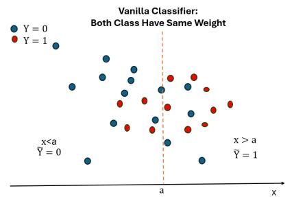

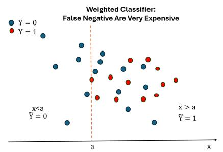

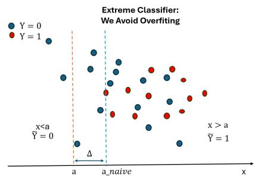  
Figure 1: Illustration of the progression from a standard classifier (left) to a cost-sensitive classifier (middle) and finally to our extreme classifier (right). As the cost of false negatives increases, the decision threshold is shifted to favor sensitivity. Our extreme classifier further adjusts the threshold to provide strong control over false negatives while mitigating overfitting.

• We develop a practical method inspired by Theorem 4 that can be applied either to a given score function f or directly to the feature space X in a decision-tree fashion, thereby improving interpretability. In particular, we introduce a feature selection mechanism based on a statistical permutation test having a closed form (Lemma 2) comparing the extrema of the empirical distributions of the positive and negative classes.

• We demonstrate the efectiveness of the proposed method on four real-world datasets, benchmarking it against state-of-the-art approaches [2, 22, 4, 27, 16]. We further illustrate its interpretability on a clinical cancer-screening dataset (Section 3), where false negatives may result in missed diagnoses with potentially severe consequences.

## 2 METHODOLOGY

First, we formulate the Extreme Binary Classification problem (Section 2.1). We then review the related literature and discuss the limitations of existing approaches in this setting (Section 2.2). Next, we revisit key results from Extreme Value Theory (Section 2.3) and establish conditions under which the Extreme Binary Classification problem admits a solution (Theorem 4, Proposition 6). Finally, we introduce a classification algorithm and a feature selection strategy derived from our theoretical findings (Section 2.4).

All proofs are postponed to appendix (Section E). For any $N \geq 1$ , we let $[ N ] = \{ 1 , \dots , N \}$ , and denote by 1

the indicator function.

## 2.1 Extreme Binary Classification

Consider a binary classification dataset $\begin{array} { r l } { \mathcal { D } } & { { } = } \end{array}$ $( x _ { i } , y _ { i } ) _ { i \in [ N ] } \in ( \mathbb { R } ^ { d } \times \{ 0 , 1 \} ) ^ { N }$ , where the observations are generated as i.i.d. samples from the random variables $( X , Y )$ . Let $N _ { 0 }$ and $N _ { 1 }$ denote the numbers of samples satisfying $y _ { i } = 0$ and $y _ { i } = 1$ , respectively. Our goal is to learn a classifier $g : \mathbb { R } ^ { d } \mapsto \{ 0 , 1 \}$ , with an almost zero false negative rate, ideally corresponding to at most one false negative in the worst of worstcase scenario. Formally, we seek to enforce the constraint $\mathbb { P } ( g ( X ) \neq Y \mid Y = 1 ) \le \alpha \ll 1 / N _ { 1 }$ Under this regime, if the classifier is applied to $N _ { 1 }$ new positive samples, the probability of observing at least one false negative is approximately $\nu _ { 1 } \ll 1$ The trivial classifier $g \equiv 1$ is not of interest, as our objective is also to minimize the number of false positives. Such stringent control of the false negative rate is highly desirable when the classifier is embedded within a decision-making system, where false negatives may lead to severe consequences. For example, in a clinical setting, a false negative prediction may prevent a patient from receiving appropriate treatment. Beyond safety-critical applications, this property is also valuable from an exploratory perspective. A classifier with an almost zero false negative rate identifies regions of the feature space that can be distinguished from the positive class with extremely high confidence, thereby revealing which characteristics reliably separate the distributions of X $Y = 0$ and $X \mid Y = 1$

One dimensional case As a first step, consider the one-dimensional setting $( d = 1 )$ and the classifier $g _ { a , b } ( x ) = \mathbb { 1 } ( x \in [ a , b ] )$ , where $( a , b ) \in \mathbb { R } ^ { 2 } \cup \{ - \infty , + \infty \}$ are two thresholds to be estimated. Although this family of decision functions is highly restrictive, it is also highly interpretable and can easily be integrated into human decision-making processes, such as clinical workflows. Moreover, when greater flexibility is required, the feature values can be defined as $x _ { i } = f ( z _ { i } )$ ， where f denotes the score produced by a pre-trained classifier. A natural approach consists of solving the following empirical risk minimization problem:

$$
\arg \operatorname* { m i n } _ { a , b : \sum _ { i : y _ { i } = 1 } \mathbb { 1 } ( g _ { a , b } ( x _ { i } ) \neq 1 ) = 0 } \frac { 1 } { N } \sum _ { i = 1 } ^ { N } \mathbb { 1 } ( g _ { a , b } ( x _ { i } ) \neq y _ { i } ) .\tag{1}
$$

Lemma 1. $a _ { n a i v e } \ = \ \operatorname* { m i n } \{ x _ { i } \ : \ y _ { i } \ = \ 1 \} , b _ { n a i v e } \ =$   
max $\{ x _ { i } : y _ { i } = 1 \}$ is a solution of (1).

While straightforward, the estimator defined in (1) may be overly optimistic when the training set is small, as it ignores the finite-sample uncertainty associated with the empirical extrema. Consequently, the resulting classifier may underestimate the true false negative rate on unseen data. To account for this finite-sample efect, confidence margins $\Delta _ { a } , \Delta _ { b } > 0$ should be introduced to ensure control of the false negative rate on the test set. Specifically, we consider the adjusted thresholds $a = a _ { \mathrm { n a i v e } } - \Delta _ { a } , \qquad b = b _ { \mathrm { n a i v e } } + \Delta _ { b }$ . To avoid the trivial solution $\Delta _ { a } = \Delta _ { b } = + \infty .$ , we ask $0 \leq \Delta _ { b } < \operatorname* { m a x } \{ x _ { i } : y _ { i } = 0 \} - \operatorname* { m a x } \{ x _ { i } : y _ { i } = 1 \} , 0 \leq$ $\Delta _ { a } < \mathrm { m i n } \{ x _ { i } : y _ { i } = 1 \} - \mathrm { m i n } \{ x _ { i } : y _ { i } = 0 \}$ as a feasibility condition. In our suggested method, we will apply a permutation test on the extrema of the distributions $x _ { i } : y _ { i } = 0 , 1$ to ensure that a solution $\left( \Delta _ { a } , \Delta _ { b } \right)$ exists. Since the estimation of $\Delta _ { a }$ is equivalent to that of $\Delta _ { b }$ after applying the transformation $x \mapsto - x$ to the sample (xi), we restrict our attention to $\Delta _ { b }$ in the following.

## 2.2 Related works

In the following, we review existing solution in the literature when $\alpha N = O ( 1 )$ and we show that they fail in the regime $\alpha N = o ( 1 )$

Data augmentation and cost-sensitive learning. Data augmentation methods, popularized by SMOTE [8], and cost-sensitive learning approaches [4], which increase the penalty associated with errors on the sensitive class, can be highly efective when the positive and negative classes are nearly separable. In the more realistic setting where the class distributions overlap, however, these methods primarily reduce false negatives on the empirical distribution. They provide no mechanism for estimating the safety margins $\Delta _ { a } , \Delta _ { b } > 0$ required to control false negatives outside the range of the observed positive samples.

Neyman-Pearson classification. More rigorously, Neyman–Pearson classification addresses the

following problem

$$
\operatorname* { m i n } _ { g \in { \mathcal { H } } : \mathbb { P } ( g ( X ) \neq Y | Y = 1 ) \leq \alpha } \mathbb { P } ( g ( X ) \neq Y \mid Y = 0 ) ,
$$

where H denotes a class of decision functions and $\alpha \ > \ 0$ is a prescribed upper bound on the false negative rate. When replacing the population quantity by its empirical counterpart, a common strategy is to enforce a slightly more conservative constraint $\alpha ^ { \prime } = \alpha - \epsilon / \sqrt { N _ { 1 } }$ , in order to account for finite-sample uncertainty [19]. Here, $\epsilon ( L , \delta ) = O ( 1 )$ is a constant depending on the regularity parameter L and the confidence level $1 - \delta .$ where $\delta > 0$ denotes the probability of violating the false negative constraint. This approach implicitly requires $\alpha \sqrt { N _ { 1 } } = \Omega ( 1 )$ , so that the correction term remains smaller than the target error level. However, this assumption is violated in our setting, where α ${ \cal N } _ { 1 } = o ( 1 )$ ).

Threshold adaptation. Most classfiers are expressed as $g ( X ) = \mathbb { 1 } ( \phi ( X ) \geq \eta )$ where ϕ is a scoring function and $\eta ~ > ~ 0$ is a threshold. Threshold adaptation methods suggest to control the false negative rate through a post-processing step rather than during training [22, 2, 6]. Methods, such as the Neyman–Pearson umbrella algorithm [22], use a validation set containing positive samples to calibrate $\eta ,$ ensuring $\mathbb { P } ( g ( X ) \neq Y \mid Y = 1 ) \leq \alpha$ with confidence 1 − δ without any parametric assumption. However, in the extreme regime $\alpha = o ( 1 / N _ { 1 } )$ , the resulting guarantees become vacuous since the confidence level $1 - \delta \sim _ { \alpha N _ { 1 }  0 } \alpha N _ { 1 }$ necessarily tends to zero. In particular, the Neyman–Pearson umbrella algorithm becomes equivalent to (1) in this regime as it relies on rank statistics, this is detailed in Section C.

This kind of post-processing step was generalized to other constraints by upper bounding the empirical risk, as suggested in conformal risk control [2] or in risk-controlling prediction sets [6], but the same bottleneck regarding the lower bound on δ or α applies.

Ensemble methods. Ensemble methods [16, 24] combine several of the aforementioned approaches and often aggregate predictions conservatively, for example by taking their maximum, in order to reduce the risk of false negatives. Although these methods tend to perform well in practice, they do not explicitly address the extreme regime considered in this work.

The limits of current methods seem to ask at least α $. N _ { 1 } \geq 1$ to keep assumption general. If we aim to go beyond this limitation, we have to be more specific on the assumptions.

## 2.3 Background on Extreme Value Theory

In the remainder of this section, $( U _ { i } ) _ { i \geq 0 }$ denotes a sequence of i.i.d. continuous random variables with distribution $U \sim \mathbb { P } ( \cdot \ | \ Y = 1 )$ , and $U _ { i , n }$ denotes the ith smallest observation among the sample $U _ { 1 } , \ldots , U _ { n }$ , for any $i \in [ n ]$ and $n \geq 1$ , such that $b _ { \mathrm { n a i v e } } ( N _ { 1 } ) = U _ { N _ { 1 } , N _ { 1 } }$ U is used instead of X to emphasize that we study the distribution of $X \mid Y = 1$ , rather than that of X. If we aim to construct a procedure that is more conservative than the naive solution of Lemma 1, we must make assumptions on the tail behaviour of the distribution of U in order to obtain a meaningful estimate of the confidence width $\Delta _ { b }$ . In this setting, extreme value theory (EVT) provides the natural framework [11, 7, 1]. Ideally, we would like to upper bound the maximum of the distribution with confidence level $1 - \delta .$ or at least an extreme quantile, so that for some sequence satisfying $\alpha _ { N _ { 1 } } = o ( 1 / N _ { 1 } )$ ,

$$
\begin{array} { r l } & { \mathbb { P } \big ( \alpha _ { N _ { 1 } } ^ { * } \le \alpha _ { N _ { 1 } } ( \delta ) \big ) \ge 1 - \delta , } \\ & { \alpha _ { N _ { 1 } } ^ { * } = \mathbb { P } \big ( U _ { N _ { 1 } + 1 } > b _ { \mathrm { n a i v e } } + \Delta _ { b } ( \delta ) \mid ( U _ { i } ) _ { i \in [ N _ { 1 } ] } \big ) . } \end{array}\tag{2}
$$

Here, $\alpha _ { N _ { 1 } } ^ { * }$ denotes the false negative rate of the classifier $g _ { - \infty , b _ { \mathrm { n a i v e } } + \Delta _ { b } }$ learned from $( U _ { i } ) _ { i \in [ N _ { 1 } ] }$ and $U _ { N _ { 1 } + 1 }$ models a new observation lying outside the training set. We note that EVT has recently been used to calibrate decision thresholds in medical testing [17]. Its application to classification can therefore be viewed as a natural generalization of these ideas.

An asymptotic theorem Extreme Value Theorem plays for empirical maxima the same role that the Central Limit Theorem (CLT) plays for empirical means: after an appropriate rescaling, both converge to universal limiting distributions that are largely independent of the underlying data-generating distribution.

Theorem 1. [7][Theorem 2.3] If there exist two sequences $( a _ { n } ) _ { n \geq 0 } , ( b _ { n } ) _ { n \geq 0 }$ such that the rescaled maximum $M _ { n } ^ { a , b } = \bar { ( } \bar { U } _ { n , n } - \bar { b _ { n } } ) / a _ { n }$ converge in distribution, there exist $( \xi , \mu , \sigma ) \in \mathbb { R } ^ { 2 } \times \mathbb { R } _ { > 0 }$ such that the CDF H of the limiting distribution is:

$$
H ( x ) = G ( \xi , \mu , \sigma ) ( x ) = \exp ( - ( 1 + \xi \frac { ( x - \mu ) } { \sigma } ) _ { + } ^ { - \frac { 1 } { \xi } } )
$$

using the limit lim $_ { 1 \xi  0 } \big ( 1 + \xi x \big ) _ { + } ^ { - \frac { 1 } { \xi } } = \exp ( - x )$ when $\xi =$ $0 . ~ G ( \xi , \mu , \sigma )$ is the CDF of what is called a Generalized Extreme Value distribution (GEV).

Remark 2. ξ is a parameter invariant under afine transformations of ${ \bar { M } } _ { n } ^ { a , b } .$ , which makes it intrinsic to $\mathbb { P } ( \cdot \mid Y = 1 )$ . The right end-point is $M _ { F } = \operatorname* { s u p } \{ x \in$ $\mathbb { R } : G ( \xi , \mu , \sigma ) ( x ) < 1 \} = \mu + \sigma / | \xi |$ when $\xi < 0$ and is infinite otherwise.

If $\xi > 0$ the tail are heavy such that $\Delta _ { b }$ might needed to be too high in practice to yields any true negative, so we assume that $\xi \le 0$ such that the maximum distribution has a light tail. These diferent behaviors are illustrated in Figure 2. Contrary to the Central Limit Theorem, establishing convergence in distribution for $( M _ { n } ^ { a , b } ) _ { n \geq 0 }$ is generally not straightforward. Nevertheless, such convergence holds for a wide range of commonly encountered distributions, including the normal, log-normal, and exponential distributions. In the remainder of this work, we therefore make the following mild assumption.

H1. There exist two sequences $\left( a _ { n } \right)$ and $\left( b _ { n } \right)$ such that $( b _ { n a i v e } ( N _ { 1 } ) - b _ { N _ { 1 } } ) / a _ { N _ { 1 } }$ converges in distribution, so that Theorem 1 applies with $\xi \le 0$

Estimating the parameter In order to establish (2) using an empirical estimator $\Delta _ { b } ,$ we must estimate the parameters $\xi , \mu _ { N _ { 1 } } , \sigma _ { N _ { 1 } } \in \mathbb { R } ^ { 2 } \times \mathbb { R } _ { > 0 }$ from the data so that $\begin{array} { r } { \mathbb { P } ( b _ { \mathrm { n a i v e } } ( N _ { 1 } ) \le x ) \approx G ( \xi , \mu _ { N _ { 1 } } , \sigma _ { N _ { 1 } } ) ( x ) } \end{array}$ . These parameters cannot be reliably estimated from a single realization of the maximum $b _ { \mathrm { n a i v e } }$ . Instead, we must exploit the information contained in the K largest observations, $\left( U _ { N _ { 1 } - K + i , N _ { 1 } } \right) _ { i \in [ K ] } ,$ in the hope of obtaining a consistent estimator. This idea is formalized by the following proposition, commonly known as the Peaks-Over-Threshold (POT) principle.

Proposition 3. [7][Proposition ${ \it 2 . 1 0 } \mathrm { \it ] }$ Assume $H 1 ,$ then there exists $\xi > 0 , \beta : \mathbb { R } \to \mathbb { R } _ { > 0 }$ such that the tails are well approximated by Generalized Pareto Distribution $G _ { \xi , \beta ( u ) }$

$$
\begin{array} { l } { { \displaystyle \operatorname* { l i m } _ { u \to M _ { F } } \operatorname* { s u p } _ { y \in [ 0 , x _ { f } - u ] } \vert F _ { u } ( y ) - G _ { \xi , \beta ( u ) } ( y ) \vert } , } \\ { { \displaystyle F _ { u } ( y ) = { \mathbb P } ( U - u \leq y \vert U \geq u ) , } } \\ { { \displaystyle 1 - G _ { \xi , \beta ( u ) } ( y ) = \left( 1 + \xi \frac { y } { \beta ( u ) } \right) ^ { - \frac { 1 } { \xi } } . } } \end{array}
$$

Moreover, the parameter ξ has the same value as in the GEV given Theorem 1 and $i f \xi < 0$ , the right end point of $G _ { \xi , \beta }$ is $M _ { G } = \beta / | \boldsymbol { \xi } |$ such that $M _ { F } \approx u + \beta / | \xi |$

Proposition 3 is illustrated in Figure 3. The choice of K is not straightforward in practice, although Proposition 3 guarantees the existence of a suitable value. Informally, the theorem states that, by choosing K suficiently large, the GEV shape parameter $\xi$ can be estimated by fitting a Generalized Pareto Distribution $G _ { \hat { \xi } , \hat { \beta } }$ to the samples $\left( U _ { N _ { 1 } - K + i , N _ { 1 } } \right) _ { i \in [ K ] }$ using $u = U _ { { N _ { 1 } } - K , { N _ { 1 } } }$ . Furthermore, when $\xi < 0$ , the upper endpoint can be estimated by $\hat { M } _ { F } = U _ { N _ { 1 } - K , N _ { 1 } } + \hat { \beta } / | \hat { \xi } |$ In the small-sample setting, however, the estimation of ξ may be unstable when $\xi < 0$ . To address this issue, [1] proposed the following endpoint estimator:

$$
\begin{array} { l } { { \displaystyle \hat { M } _ { F } = U _ { N _ { 1 } , N _ { 1 } } + \sum _ { i = 0 } ^ { K - 1 } a _ { i , K } ( U _ { N _ { 1 } - K , N _ { 1 } } - U _ { N _ { 1 } - K - i , N _ { 1 } } { \scriptstyle ( \mathfrak { A } ) } } ) } \\ { { \displaystyle a _ { i , K } = \log ( ( K + i + 1 ) / ( K + i ) ) / \log ( 2 ) } } \end{array}
$$

which is proved to converge towards $M _ { F }$ as long as $N _ { 1 } \to \infty , K \to \infty$ and $K / N _ { 1 }  0$ . As a rule of thumb, we verify the above condition by setting $K = \sqrt { N _ { 1 } } .$ In the case of $\xi = 0 , G _ { 0 , \beta } = 1 - \exp ( - \mathbf { \beta } \cdot \mathbf { \nabla } / \beta )$ is the exponential of parameter $1 / \beta$ and $\beta$ is estimated with the empirical mean excess,

$$
\hat { \beta } = \frac { 1 } { K } \sum _ { i = 1 } ^ { K } U _ { N _ { 1 } - K + i , N _ { 1 } } - U _ { N _ { 1 } - K , N _ { 1 } } .
$$

which is directly used when computing the quantile of the distribution $G _ { 0 , \hat { \beta } } ^ { - 1 } ( Q ) = - \hat { \beta } \log ( 1 - Q )$ . This will be used in the following to estimate $\Delta _ { b }$

## 2.4 Extreme classification

We now derive a reasonable estimator $\Delta _ { b }$ satisfying (2) under suitable assumptions.

Theorem 4. Assume H1 and that the Generalized Pareto approximation is converging fast, i.e. there exists $\epsilon _ { 0 } : \mathbb { R } _ { > 0 } \mapsto \mathbb { R } \ s . t .$ lim $\mathfrak { l } _ { u \to + \infty } \epsilon _ { 0 } ( u ) = 0$ and

$$
\operatorname* { s u p } _ { y \in [ 0 , x _ { f } - y ] } | F _ { u } ( y ) - G _ { \xi , \beta ( u ) } ( y ) | = \epsilon _ { 0 } ( u ) \mathbb { P } ( U \geq u ) ,\tag{4}
$$

moreover assume that we access an estimator $\Delta _ { b } \left( ( U _ { N _ { 1 } - K + i , N _ { 1 } } ) _ { i \in [ K ] } , \delta _ { e s t } \right)$ such that for $\begin{array} { r l } { K } & { { } = } \end{array}$ $\lfloor \sqrt { N _ { 1 } } \rfloor + 1 , Q _ { K } = o _ { K \to \infty } ( 1 / K )$ and any $\xi \ \le \ 0$ , we have

$$
\begin{array} { r } { \mathbb { P } \left( ( 1 - G _ { \xi , \beta ( U _ { N _ { 1 } - K , N _ { 1 } } ) } ) ( \Delta _ { b } ) \leq Q _ { K } \right) \geq 1 - \delta _ { e s t } } \end{array}\tag{5}
$$

then, there exists $\epsilon _ { 1 } ( N _ { 1 } ) ~ = ~ \sigma _ { N _ { 1 }  \infty } ( 1 / N _ { 1 } )$ , s.t for any $\delta _ { q u a n t } ~ > ~ 0 , \delta _ { e s t } ~ > ~ 0 $ , denoting by $\rho ( \delta _ { q u a n t } ) \ =$ $4 \Big ( 1 + \sqrt { \log ( 2 / \delta _ { q u a n t } ) / 2 } \Big ) ^ { 2 } ;$

$$
\begin{array} { r l } & { \mathbb { P } \left( \mathbb { P } ( U _ { N _ { 1 } + 1 } > b _ { n a i v e } + \Delta _ { b } | ( U _ { i } ) _ { i \in [ N _ { 1 } ] } ) \le \epsilon ( N _ { 1 } ) \rho ( \delta _ { q u a n t } ) \right) } \\ & { \ge 1 - \delta _ { q u a n t } - \delta _ { e s t } } \end{array}
$$

Assumptions H1 and (4) jointly imply that the tail of the positive-class distribution $\mathbb { P } ( \cdot \mid Y = 1 )$ is well approximated by a GPD. The assumption (4) is satisfied for GPD, or student distribution of parameter $\nu > 2$ but is not satisfied by certain distributions, such as the log-normal distribution, for which the convergence to the GPD limit is known to be slow. Consequently, the present analysis should be viewed as an optimistic scenario.

Remark 5. Note that the same result is obtained when using $U _ { N _ { 1 } - K , N _ { 1 } }$ instead of $b _ { n a i v e }$ We nevertheless chose to retain $b _ { n a i v e }$ for consistency with our experiments, which favor conservative threshold estimates.

In the following proposition, we show how to construct an estimator $\Delta _ { b }$ that verifies (5) under the assumption that only the mean of the generalized pareto distribution is exponentially well approximated as $K , N _ { 1 }  \infty$

Proposition 6. Let $K \geq 3$ . Assume that there exists $c > 0$ such that the samples $D _ { i } ^ { N _ { 1 } } = U _ { N _ { 1 } - K + i , N _ { 1 } } -$ $U _ { N _ { 1 } - K , N _ { 1 } }$ for any $i \in [ K ]$ verifies the following concentration inequality for any $K \geq \sqrt { N _ { 1 } }$ , denoting by $\theta _ { k } = c \sqrt { 2 \log ( 1 / \delta _ { e s t } ) / K }$

$$
\mathbb { P } \left( \mathbb { E } _ { D \sim G _ { \xi , \beta ( U _ { N _ { 1 } - K , N _ { 1 } } ) } } ( D ) - \sum _ { i = 1 } ^ { K } \frac { D _ { i } ^ { N _ { 1 } } } { K } \ge \theta _ { k } \right) \le \delta _ { e s t }\tag{6}
$$

then denoting by ηK = −(1 exp(−1)) log(1/(K log(K))),

$$
\Delta _ { b } = \left( \sum _ { i = 1 } ^ { K } \frac { D _ { i } ^ { N _ { 1 } } } { K } + \theta _ { k } \right) \eta _ { K }\tag{7}
$$

verifies assumption (5).

The interest of the previous proposition is to suggest an estimator independant of ξ and which has a closedformed. Such concentration inequality arises when $D _ { i } ^ { N _ { 1 } }$ is i.i.d given $U _ { N _ { 1 } - K , N _ { 1 } }$ with sub-exponential tails and $\vert \mathbb { E } ( D _ { i } ^ { N _ { 1 } } ) - \mathbb { E } _ { D \sim G _ { \xi , \beta ( U _ { N _ { 1 } - K , N _ { 1 } } ) } } ( D ) \vert \propto 1 / \sqrt { K }$ , which is very likely to be verified when K and $N _ { 1 }$ are large as rank statistics $\left( U _ { N _ { 1 } - K + i , N _ { 1 } } \right) _ { i \in [ K ] }$ are approximately independent and the mean of the GPD and $\mathbb { P } ( U | U \ge U _ { N _ { 1 } - K , N _ { 1 } } )$ are expected to match. The last insight remains quite challenging to prove rigorously, so we have preferred to use a concentration inequality that tackle the bottleneck of the estimation. In the idealized setting where $D _ { i } ^ { N _ { 1 } } \stackrel { \mathrm { i . i . d . } } { \sim } \ \mathrm { E x p } ( 1 / \beta )$ , the constant is given by $c = { \sqrt { 2 } } \beta .$ In practice, however, the constant c is generally unknown. In our numerical experiments, we use Proposition 6 as a rule of thumb and set $\begin{array} { r } { \Delta _ { b } = - \log ( Q ) \sum _ { i = 1 } ^ { K } D _ { i } ^ { N _ { 1 } } / N _ { 1 } } \end{array}$ , with Q chosen according to the desired trade-of between the true negative rate and the false negative rate.

We are now ready to state the practical algorithm.

One dimensional Algorithm. Since our entire reasoning becomes meaningless when max $\{ x _ { i } : y _ { i } =$ $1 \} \geq \operatorname* { m a x } \{ x _ { i } : y _ { i } = 0 \}$ , we first apply a permutation test [12] using $T = \operatorname* { m a x } \{ x _ { i } : y _ { i } = 0 \} - \operatorname* { m a x } \{ x _ { i } : y _ { i } = 1 \}$ as test statistic to assess whether $T > 0$ with $p < 0 . 0 5$ The null distribution of T is usually estimated by repeatedly permuting the class labels with Monte Carlo simulation, however we managed to derive a closedform for the p-values making the test extremely fast without approximation error, this is described in detail in Section D-(Lemma 2). If the maxima are not significantly diferent, we set $\Delta _ { b } = \infty$ . Otherwise, we apply the statistical test of [7][Theorem 6] to determine whether $H _ { 0 } : \xi = 0$ or $\bar { H } _ { 0 } : \xi < 0$ . If $\xi = 0$ , we set

$$
\Delta _ { b } = - \hat { \beta } \log ( 1 - Q _ { b } )\tag{8}
$$

using (6) and a confidence level $Q _ { b } \in ( 0 , 1 )$ . Otherwise, we set

$$
\Delta _ { b } = \hat { M } _ { F } - b _ { \mathrm { n a i v e } }
$$

using (3). The only parameter that must be specified is the confidence level $Q _ { b } \in ( 0 , 1 )$ . In practice, it can be selected by enforcing a minimum true negative rate Card $\{ x _ { i } \geq b _ { \mathrm { n a i v e } } + \Delta _ { b } : y _ { i } = 0 \} / ( N - N _ { 1 } ) \geq \lambda$ on the training set, or by following the rule of thumb provided in Proposition 6, namely,

$$
Q _ { b } \approx 1 - \frac { 1 } { K \log ( K ) } \approx 1 - \frac { 1 } { \sqrt { N _ { 1 } } \log ( \sqrt { N _ { 1 } } ) } ,
$$

so that $N _ { 1 } = 1 0 0$ yields $Q _ { b } \approx 0 . 9 5$ when aiming to achieve a false negative rate of order $o ( 1 / N _ { 1 } )$ . The construction of $\Delta _ { a }$ is entirely symmetric: it is obtained by applying the transformation $x \mapsto - x$ to the data and using a confidence level $Q _ { a } \in ( 0 , 1 )$

The previous algorithm doesn’t strictly follow (7), but yields similar results on synthetic experiments (Section B.1) and verify the false negative constraint $1 / ( N _ { 1 } \log ( N _ { 1 } ) )$ . We attribute this observation to the use of $b _ { \mathrm { n a i v e } }$ rather than $U _ { N _ { 1 } - K , N _ { 1 } }$ in the threshold estimation procedure (see Remark 5).

Since the assumptions of Theorem 4 are dificult, and in some cases impossible, to verify in practice, the theoretical results should be viewed primarily as motivation for the design of the algorithm rather than as prescriptions for every implementation detail. In particular, the requirement that the false negative rate scales as $o ( 1 / N _ { 1 } )$ is best interpreted as a guiding principle for selecting the classification procedure and its associated threshold, rather than as a precise quantitative target that must be achieved in practice. Choosing a target false negative rate of $o ( 1 / N _ { 1 } )$ encourages extrapolation beyond the training set through nonzero margins $\Delta _ { a }$ and $\Delta _ { b }$ as depicted in Figure 1, whereas achieving a rate of only $O ( 1 / N _ { 1 } )$ may be possible without any extrapolation, i.e., by taking $\Delta _ { a } = \Delta _ { b } = 0$

Multidimensional Algorithm. In the case of multidimensional features $X \ = \ ( X ^ { i } ) _ { i \in [ d ] }$ we repeat the previous process on each coordinate, this yields d classifiers, $g _ { a _ { 1 } , b _ { 1 } } , \dotsc , g _ { a _ { d } , b _ { d } }$ and we define $\begin{array} { r } {  { g } \triangleq \prod _ { i = 1 } ^ { d } g _ { a _ { i } , b _ { i } } } \end{array}$ . Note that the permutation test (Lemma 2) applied to each coordinates ofers a features selection mechanism revealing which features are interesting for a classification with an extreme constraint on false negative. The false negative rate is then at worst $\alpha d _ { \mathrm { s e l e c t } }$ (Section E.4) if $d _ { \mathrm { s e l e c t } }$ coordinates are efectively used and independent. In our experiments, we chose not to correct for this efect to avoid being overly conservative when the coordinates are correlated. We called our method Extreme thresholding.

Using our method, we consider the following variants in the experiments, which difer according to the choice of input features X:

• (Log) We fit a multivariate logistic regression on the training set and apply one-dimensional Extreme thresholding to the resulting logistic scores, i.e. $f ( x ) = \beta ^ { \top } x$ if $\beta \in \mathbb { R } ^ { d }$ is the logistic coeficient.

• (Mul) We apply multidimensional Extreme thresholding directly to the feature coordinates.

• (MulLog) We apply multidimensional Extreme thresholding to the feature coordinates augmented with the logistic regression score.

For each method, we use $Q _ { b } \in \{ 0 . 1 , 0 . 9 , 0 . 9 5 \}$ when defining $\Delta _ { b }$ in order to assess the impact of the confidence level. Since $2 5 \leq N _ { 1 } \leq 5 0 0$ , depending on the dataset, $Q _ { b }$ should theoretically lie in the interval $( 0 . 8 7 5 , 0 . 9 8 5 )$ to ensure that the false negative rate scales as $o ( 1 / N _ { 1 } )$ Consequently, $Q _ { b } ~ = ~ 0 . 9 0$ and $Q _ { b } ~ = ~ 0 . 9 5$ are reasonable choices. In contrast, $Q _ { b } = 0 . 1 0$ is included as a representative setting in which the false negative rate is not particularly stringent.

Complexity Thanks to our closed-form expression for the permutation test p-value (Section D) and the simplicity of the proposed procedure, the overall computational complexity is $O \big ( d ( N + N _ { 1 } \log N _ { 1 } ) \big )$ , which is lower than the training complexity of a decision tree, whose best-case scaling is $O ( d N$ log N). The term $d N _ { 1 }$ log $N _ { 1 }$ arises from the sorting of the feature values in the positive class, which is required to compute the thresholds introduced in Proposition 6. If a score function f is learned as well on the training set to preprocess the features, the complexity bottleneck is there, which is verified in our experiments training a logistic regression score as detailed in Section B.6.

## 3 EXPERIMENTS

In this section, we compare our method against stateof-the-art approaches on four real-world binary classification datasets. We evaluate performance in terms of the average number of false negatives (FN) and true negatives (TN) obtained on the test set from 5- fold cross-validation repeated with 10 diferent random seeds. We also report $\mathrm { R } ( c ) = \mathrm { T N } / \operatorname* { m a x } ( c , \mathrm { F N } )$ for $c \in \{ 0 . 1 , 1 \}$ , which provides a measure of the gain obtained relative to the number of missed positive cases. Note that TN and FN are averaged across the 5 folds to reduce the influence on $\mathrm { R } ( c = 0 . 1 )$ of an unusually low number of false negatives in any single fold. We use max(c, FN) to avoid singularity and to limit the interest of reducing FN in the case of c = 1. Finally, we illustrate the interpretability of our feature selection mechanism on our in-house dataset, ScreeningX arising from a cancer screening trial that remains unnamed for anonymity reasons, and compare it with the feature importance measures produced by Gradient Boosting and a shallow Decision Tree.

Datasets We consider two large and highly imbalanced datasets, Credit [10] $( N = 2 8 4 8 0 7 , N _ { 1 } = 4 9 2 .$ $d = 3 0 )$ and Corruption [25] $( N = 3 0 3 0 3 6 , N _ { 1 } = 4 2 8 .$ d = 14), as well as two smaller datasets: Breast Cancer Wisconsin [28] (N = 569, N1 = 217, d = 30), which is known to be relatively well separated, and ScreeningX $( N = 1 1 7 , N _ { 1 } = 2 5 , d = 1 2 )$ which isn’t well separated. For the Credit and Corruption datasets, the application context does not strongly penalize false negatives, and the classification task is primarily exploratory. In contrast, for Breast Cancer Wisconsin and ScreeningX, false negatives may have severe clinical consequences. Consequently, the Extreme Binary Classification framework is particularly relevant in these settings. Additional details on the datasets are provided in Section B.2.

Competitors We considered as broad a range of competitors as possible, prioritizing widely used methods with publicly available implementations and their recommended default hyperparameters, with one exception for SVC detailed in Section B.3.

Data augmentation methods: EasyEnsemble, Bal anced Random Forest, and Balanced Bagging from the imbalanced-learn package [14].

Cost-sensitive (CS) methods: Logistic Regression, XGBoost, and Support Vector Classifier (SVC) from scikit-learn and the XGBoost package [9]. For all cost-sensitive methods, we assign a weight of w = 1000 to class 1, as increasing the weight further did not afect the results.

Naive Threshold Adaptation (NTA): We select the decision threshold that maximizes Ratio on a validation set comprising 20% of the training data.

Risk-Controlled and Neyman–Pearson methods: Whenever applicable, we use Risk-Conformal threshold adaptation (RC) [2] implemented through MAPIE [21] using a confidence level of 0.7 to avoid excessive conservativeness while maintaining meaningful risk control, and the Neyman–Pearson umbrella algorithm (NP) [22] implemented through nproc [18], both applied to Logistic Regression and tree-based ensemble models, using a validation set comprising 20% of the training data. The target false-negative rate is chosen as the smallest value that yields at least one prediction diferent from class 1.

Conservative ensemble: An ensemble that returns the maximum prediction among a Decision Tree, a Logistic Regression model, and a Random Forest from scikit-learn, each calibrated using NTA.

Isolation Forest: The anomaly detection method proposed in [15], converted into a binary classifier through score thresholding. The threshold is set to the highest anomaly score observed among positive training examples.

Results Complete results are provided in Section B.4 and computation time in Section B.6. Runtime measurements were obtained on a CPU-only server with 4 GB of RAM. For the sake of brevity, we report in Table 1 only the top 5 method for each dataset considering the R(c), with c = 0.1 since it better represents the goal of the paper. The last column reports the ranking induced by the average rank over all datasets. The Breast Cancer dataset is included in the computation of the mean rank. Its results are not highlighted, as they are consistent with established findings showing that logistic regression based methods outperform the competing approaches. Note that, in Table 1, all of the top five methods achieve, on average, at most one false negative, with the exception of Conservative Ensemble on Credit, which yield more than one false negative on average.

Discussion. First, the results show that MulLog (Ours) achieves the best performance on average. The logistic regression score is particularly useful when the data classes might be linearly separated, as noticed on the Breast Cancer dataset. Conversely, on the ScreenX dataset, the logistic score is not needed, the vanilla Mul (Ours) approach performs better. Overall, the results suggest selecting $Q ~ \geq ~ 0 . 9$ when the objective is to achieve a high ratio while maintaining an almost negligible number of false negatives. In contrast, smaller values such as Q = 0.1 may be preferable when false negatives are less critical. Indeed, when considering the top five methods for R(c) with c = 1 in Table 2, MulLog-Q = 0.1 ranks first.

Table 1: Summary of Benchmark Results, ranking is performed by TN/ max(FN, 0.1)
<table><tr><td>Rank</td><td>ScreenX</td><td>Corruption</td><td>Credit</td><td>Mean Rank</td></tr><tr><td>1</td><td> $\mathrm { M u l – Q { = } 0 . 9 5 ~ ( O u r s ) }$ </td><td> $\mathrm { M u l L o g  – Q = 0 . 9 ~ ( O u r s ) }$ </td><td> $\mathrm { M u l – Q { = } 0 . 1 }$ </td><td> $\mathrm { M u l L o g  – Q = 0 . 9 ~ ( O u r s ) }$ </td></tr><tr><td>2</td><td> $\mathrm { M u l – Q { = } 0 . 9 ~ ( \dot { O } u r s ) } ^ { \dot { } }$ </td><td>MulLog-Q=0.95 (Ours)</td><td> $\mathrm { M u l – Q = 0 . 9 }$ </td><td> $\mathrm { M u l L o g – Q { = } 0 . 9 5 ~ ( O u r s ) }$ </td></tr><tr><td>3</td><td>Conservative Ensemble</td><td>MulLog-Q=0.1 (Ours)</td><td>Mul-Q=0.95</td><td>Conservative Ensemble</td></tr><tr><td>45</td><td>MulLog-Q=0.95 (Ours)</td><td>Mul-Q=0.9 (Ours)</td><td>MulLog-Q=0.9 (Ours)</td><td>Mul-  $\cdot \mathrm { Q { = } 0 . 9 ~ ( O u r s ) }$ </td></tr><tr><td></td><td>ČS-Logistic</td><td>Mul-Q=0.1 (Ours)</td><td> $\mathrm { M u l L o g – Q { = } 0 . 9 5 ~ ( O u r s ) }$ </td><td> $\mathrm { M u l - Q { = } 0 . 9 5 ~ ( O u r s ) }$ </td></tr></table>

Second, the Conservative Ensemble approach is Top 3 behind our methods. While competitive, this method is not interpretable compared with MulLog. In comparison, CS-NTA-Logistic and NP-Logistic constitute cheap and interpretable. However, a fundamental limitation of these methods is the lower bound imposed on α, which limits their interest when looking at $\mathrm { R } ( c = 0 . 1 )$

Interpretability of Feature Selection. We now study the impact of the diferent features on the predictions obtained on the ScreenX dataset.

Using 40 train-test splits, with 20% of the data reserved for testing, we compute and average: the feature importances provided by a decision tree, a random forest, and XGBoost; the coeficients of a logistic regression model; and the frequency with which our permutation-based extrema test detects a significant diference between classes at the 5% significance level.

This produces a table with six columns, one for each method, and 12 rows, one for each feature, as reported in Table 7 in the Appendix. We then compare the five largest absolute scores produced by each method, excluding ours, in order to assess whether the diferent approaches agree on the most relevant features. The results are presented in Table 8.

Our method identifies, with a frequency greater than 90%, the top five features selected by each competing method. In addition, it rejects 8 out of the 12 features in more than 80% of the 40 train-test splits.

Although feature importance scores are often dificult to interpret, our extrema-based test provides a direct assessment of whether extreme observations originate from class Y = 1. For instance, our feature-selection procedure reveals that X12, the most influential feature, tends to predict class $Y = 0$ only for large values. Indeed, $\operatorname* { m a x } \{ X 1 2 _ { i } : y _ { i } = 1 \} \ll \operatorname* { m a x } \{ X 1 2 _ { i } : y _ { i } = 0 \}$ while $m _ { 0 } = \mathrm { m i n } \{ X 1 2 _ { i } : y _ { i } = 0 \}$ ≈ min $\{ X 1 2 _ { i } : y _ { i } =$ $1 \} = m _ { 1 }$ . Logistic regression coeficient may also provide a partial answer to this question, but it does not capture the full picture when the relationship between the feature and the outcome is weak or non-linear. In our example, logistic regression indicates that X12 is negatively associated with Y, but it fails to reveal that $m _ { 0 } \approx m _ { 1 }$ . Consequently, one might incorrectly infer that the separation between the two classes occurs throughout the entire range of the feature, whereas the diference is primarily driven by the upper tail.

Finally, we verified that our method achieves a higher classification ratio on ScreenX than XGBoost while relying on only four feature-specific thresholds. This makes our decision rule applicable by practitioners even when the machine-learning classifier itself is unavailable. Such interpretability is particularly appealing in educational and clinical settings.

Limitations. Our approach has three main limitations: 1. When the original features do not provide a suitable representation for the classification task, a preprocessing step based on a scoring model becomes essential. In practice, even a simple logistic regression score can substantially improve performance. 2. Since the threshold is defined through a maximum operator, the method is sensitive to label noise and therefore requires relatively clean data. We investigated replacing the maximum with a quantile-based threshold to improve robustness. However, this modification increased the number of false negatives in noise-free settings. We therefore retained the maximum-based formulation for both empirical and theoretical reasons. 3. The structure of $g _ { a , b }$ implicitly assumes that the feature distribution is unimodal. As a result, the method may struggle on highly multimodal datasets. In such cases, clustering the data before applying our approach may be necessary. However, this limitation wasn’t particularly apparent in our experiments.

## 4 CONCLUSION

The proposed method proves efective at maximizing the ratio of true negatives to false negatives, a criterion that is particularly relevant in applications where false positives incur a relatively low cost compared with false negatives. In addition, our approach provides a simple and interpretable feature selection mechanism, which enhances transparency and facilitates its adoption in clinical settings.

## 5 AI USE STATEMENT

We used AI solely for drafting codes, rephrasing, grammar correction, and generating the dataset descriptions in Section B.2. Section B.2 was carefully reviewed and verified by the authors.

## References

[1] Isabel Fraga Alves, Cláudia Neves, and Pedro Rosário. A general estimator for the right end point. arXiv preprint arXiv:1412.3972, 2014.

[2] Anastasios Angelopoulos, Stephen Bates, Adam Fisch, Lihua Lei, and Tal Schuster. Conformal risk control. In International conference on learning representations, volume 2024, pages 55198– 55218, 2024.

[3] Anastasios N Angelopoulos and Stephen Bates. Conformal prediction: A gentle introduction. Foundations and Trends in Machine Learning, 16(4):494–591, 2023.

[4] Imane Araf, Ali Idri, and Ikram Chairi. Costsensitive learning for imbalanced medical data: a review: I. araf et al. Artificial Intelligence Review, 57(4):80, 2024.

[5] Saqib Ejaz Awan, Mohammed Bennamoun, Ferdous Sohel, Frank Mario Sanfilippo, and Girish Dwivedi. Machine learning-based prediction of heart failure readmission or death: implications of choosing the right model and the right metrics. ESC heart failure, 6(2):428–435, 2019.

[6] Stephen Bates, Anastasios Angelopoulos, Lihua Lei, Jitendra Malik, and Michael Jordan. Distribution-free, risk-controlling prediction sets. Journal of the ACM (JACM), 68(6):1–34, 2021.

[7] Myriam Charras-Garrido and Pascal Lezaud. Extreme value analysis: an introduction. Journal de la société française de statistique, 154(2):66–97, 2013.

[8] Nitesh V Chawla, Kevin W Bowyer, Lawrence O Hall, and W Philip Kegelmeyer. Smote: synthetic minority over-sampling technique. Journal of artificial intelligence research, 16:321–357, 2002.

[9] Tianqi Chen, Tong He, Michael Benesty, Vadim Khotilovich, Yuan Tang, Hyunsu Cho, Kailong Chen, Rory Mitchell, Ignacio Cano, Tianyi Zhou, Mu Li, Junyuan Xie, Min Lin, Yifeng Geng, Yutian Li, Jiaming Yuan, and David Cortes. xgboost: Extreme Gradient Boosting, 2026. R package version 3.5.0.0.

[10] Andrea Dal Pozzolo, Giacomo Boracchi, Olivier Caelen, Cesare Alippi, and Gianluca Bontempi. Credit card fraud detection: a realistic modeling and a novel learning strategy. IEEE transactions on neural networks and learning systems, 29(8):3784–3797, 2017.

[11] Laurens De Haan and Ana Ferreira. Extreme value theory: an introduction. Springer, 2006.

[12] Michael D Ernst. Permutation methods: a basis for exact inference. Statistical Science, pages 676– 685, 2004.

[13] Sotiris B Kotsiantis, Ioannis Zaharakis, P Pintelas, et al. Supervised machine learning: A review of classification techniques. Emerging artificial intelligence applications in computer engineering, 160(1):3–24, 2007.

[14] Guillaume LemaÃŽtre, Fernando Nogueira, and Christos K Aridas. Imbalanced-learn: A python toolbox to tackle the curse of imbalanced datasets in machine learning. Journal of machine learning research, 18(17):1–5, 2017.

[15] Fei Tony Liu, Kai Ming Ting, and Zhi-Hua Zhou. Isolation forest. In 2008 eighth ieee international conference on data mining, pages 413–422. Ieee, 2008.

[16] Tian-Yu Liu. Easyensemble and feature selection for imbalance data sets. In 2009 international joint conference on bioinformatics, systems biology and intelligent computing, pages 517–520. IEEE, 2009.

[17] Sierra Pugh, Bailey K Fosdick, Mary Nehring, Emily N Gallichotte, Sue VandeWoude, and Ander Wilson. Estimating cutof values for diagnostic tests to achieve target specificity using extreme value theory. BMC Medical Research Methodology, 24(1):30, 2024.

[18] Jingyi Jessica Li Richard Zhao, Yang Feng and Xin Tong. Neyman-pearson (np) classification algorithms and np receiver operating characteristic (np-roc) curves. 2021.

[19] Philippe Rigollet and Xin Tong. Neyman-pearson classification under a strict constraint. In Proceedings of the 24th Annual Conference on Learning Theory, pages 595–614. JMLR Workshop and Conference Proceedings, 2011.

[20] Christian Soize. Uncertainty quantification, volume 23. Springer, 2017.

[21] Vianney Taquet, Vincent Blot, Thomas Morzadec, Louis Lacombe, and Nicolas Brunel. Mapie: an open-source library for distributionfree uncertainty quantification. arXiv preprint arXiv:2207.12274, 2022.

[22] Xin Tong, Yang Feng, and Jingyi Jessica Li. Neyman-pearson classification algorithms and np receiver operating characteristics. Science advances, 4(2):eaao1659, 2018.

[23] Xin Tong, Yang Feng, and Anqi Zhao. A survey on neyman-pearson classification and suggestions for future research. Wiley Interdisciplinary Reviews: Computational Statistics, 8(2):64–81, 2016.

[24] Marcelo Vasconcelos and Luís Cavique. Mitigating false negatives in imbalanced datasets: An ensemble approach. Expert Systems with Applications, 262:125674, 2025.

[25] Marcelo Oliveira Vasconcelos and Luís Cavique. Dataset for corruption risk assessment in a public administration. Data in brief, 40:107768, 2021.

[26] Le Wang, Meng Han, Xiaojuan Li, Ni Zhang, and Haodong Cheng. Review of classification methods on unbalanced data sets. Ieee Access, 9:64606– 64628, 2021.

[27] Zaitian Wang, Pengfei Wang, Kunpeng Liu, Pengyang Wang, Yanjie Fu, Chang-Tien Lu, Charu C Aggarwal, Jian Pei, and Yuanchun Zhou. A comprehensive survey on data augmentation. IEEE Transactions on Knowledge and Data Engineering, 2025.

[28] William Wolberg, Olvi Mangasarian, Nick Street, and W Street. Breast Cancer Wisconsin (Diagnostic). 1993.

## CHECKLIST

1. For all models and algorithms presented, check if you include:

(a) A clear description of the mathematical setting, assumptions, algorithm, and/or model. Yes in Section 2.

(b) An analysis of the properties and complexity (time, space, sample size) of any algorithm. Yes at the end of Section 2.

(c) (Optional) Anonymized source code, with specification of all dependencies, including external libraries. Yes

2. For any theoretical claim, check if you include:

(a) Statements of the full set of assumptions of all theoretical results. Yes.

(b) Complete proofs of all theoretical results. Yes.

(c) Clear explanations of any assumptions. Yes.

3. For all figures and tables that present empirical results, check if you include:

(a) The code, data, and instructions needed to reproduce the main experimental results (either in the supplemental material or as a URL). Yes, except that ScreenX dataset is not given for anonymity.

(b) All the training details (e.g., data splits, hyperparameters, how they were chosen). Yes in Section 3 and Section B.3.

(c) A clear definition of the specific measure or statistics and error bars (e.g., with respect to the random seed after running experiments multiple times). Yes.

(d) A description of the computing infrastructure used. (e.g., type of GPUs, internal cluster, or cloud provider). Yes.

4. If you are using existing assets (e.g., code, data, models) or curating/releasing new assets, check if you include:

(a) Citations of the creator If your work uses existing assets. Yes.

(b) The license information of the assets, if applicable. Yes.

(c) New assets either in the supplemental material or as a URL, if applicable. [Not Applicable]

(d) Information about consent from data providers/curators. [Not Applicable]

(e) Discussion of sensible content if applicable, e.g., personally identifiable information or offensive content. [Not Applicable]

5. If you used crowdsourcing or conducted research with human subjects, check if you include:

(a) The full text of instructions given to participants and screenshots. [Not Applicable]

(b) Descriptions of potential participant risks, with links to Institutional Review Board (IRB) approvals if applicable. [Not Applicable]

(c) The estimated hourly wage paid to participants and the total amount spent on participant compensation. [Not Applicable]

## A ILLUSTRATION EVT THEORY

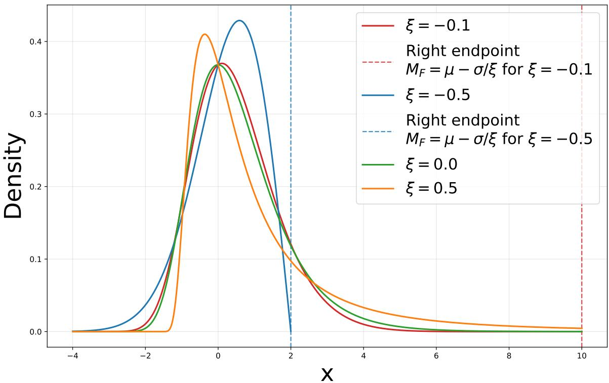  
Figure 2: Illustration of the Generalized Extreme Value (GEV) density for diferent values of the tail index $\xi .$

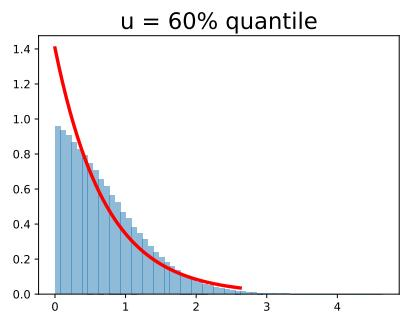

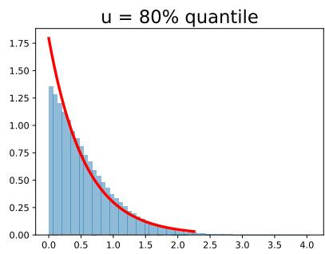

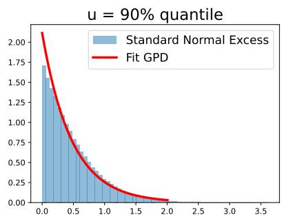  
Figure 3: Illustration of Proposition 3. The histogram of the excesses $E _ { k } = N _ { k } - Q _ { u } \mid N _ { k } > Q _ { u } , N _ { k } \sim$ $\mathcal { N } ( 0 , 1 )$ , above the u-quantile $Q _ { u }$ is well approximated by a GPD with $\xi = 0$ when u is suficiently large.

## B EXPERIMENTS

## B.1 Synthetic Experiments

In this section, we compare the performance of the theoretical estimator (7) for $\Delta _ { b }$ with the practical estimator (8) used throughout our experiments.

We consider a random variable $X _ { e }$ following either an exponential distribution $\mathrm { E x p } ( 5 )$ with scale parameter 5, or a generalized Pareto distribution $G _ { \xi , 1 }$ with tail index $\xi = - 1 0 ^ { - 5 }$ , generated using

$$
X _ { e } = \frac { ( 1 - U ) ^ { - \xi } - 1 } { \xi } , \qquad U \sim \operatorname { U n i f } ( [ 0 , 1 ] ) .
$$

Given a sample size $N _ { 1 }$ , we repeat the following procedure 10 000 times:

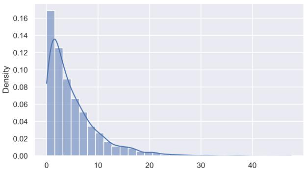  
(a) $X _ { e } \sim \mathrm { E x p } ( 5 )$

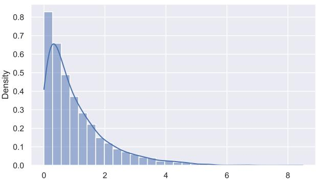  
(b) $X _ { e } \sim G _ { \xi , 1 }$ with $\xi = - 1 0 ^ { - 5 }$

Figure 4: Illustration of the distribution used in the synthetic experiments using their histograms on 3000 samples.  
  
(a) $N _ { 1 } = 2 5$

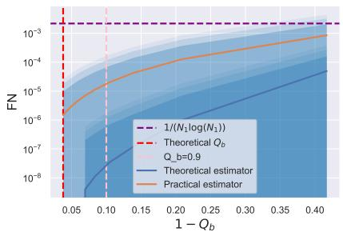  
(b) $N _ { 1 } = 1 0 0$

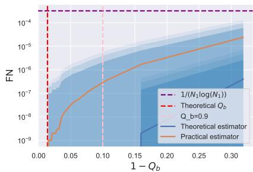  
(c) $N _ { 1 } = 5 0 0$  
Figure 5: Comparison of the false negative rate (FN) when $X _ { e } \sim \mathrm { E x p } ( 5 )$ . Notice that the practical estimator follows the same false negative constraint $1 / ( N _ { 1 } \log ( N _ { 1 } ) )$ as the theoretical one as long as $Q _ { b } \geq 0 . 9$ for any $N _ { 1 } \in \{ 2 5 , 1 0 0 , 5 0 0 \}$ . We report the variability across 10 000 repetitions using shaded bands corresponding to $\pm \sigma ,$ $\pm 2 \sigma$ , and ±3σ, where σ denotes the standard deviation of FN over the 10 000 repetitions.

• Using $N _ { 1 }$ i.i.d. samples from $X _ { e }$ , we estimate $B ( Q _ { b } ) = b _ { \mathrm { n a i v e } } + \Delta _ { b }$ according to either (7) or (8) for all

$$
1 - Q _ { b } \in \left\{ \frac { 1 } { K \log ( K ) } , \frac { 1 } { ( K - 1 ) \log ( K ) } , \cdots , \frac { 1 } { \log ( K ) } \right\} ,
$$

where $K = \lfloor \sqrt { N _ { 1 } } \rfloor + 1$

• Using 100 000 newly generated samples from $X _ { e } ,$ , we estimate the empirical probability

$$
\mathrm { F N } = P ( Q _ { b } ) = \mathbb { P } ( X _ { e } > B ( Q _ { b } ) ) ,
$$

where FN stands for false negative, to clarify the link with the manuscript.

Finally, for each $N _ { 1 } \in \{ 2 5 , 1 0 0 , 5 0 0 \}$ , we plot the estimated values of $P ( Q _ { b } )$ as a function of $Q _ { b }$ . We also report the variability across the 10 000 repetitions using shaded bands corresponding $\mathrm { t o } \pm \sigma , \pm 2 \sigma$ , and $\pm 3 \sigma$ , where σ denotes the standard deviation of $P ( Q _ { b } )$ over the 10 000 repetitions. The results are shown in Figures 5 and 6. The empirical densities of Exp(5) and $G _ { \xi , 1 }$ are displayed in Figure 4.

We also repeated the experiment with $X _ { e } \sim \mathrm { U n i f } ( [ 0 , 1 0 ] )$ and obtained $F N = 0$ in all repetitions, since $B ( Q _ { b } ) >$ 10 for every estimated threshold. Indeed, for bounded distributions with tail index $\xi < 0$ and $| \xi | < 0 . 5$ , the correction provided by (8) tends to be overly conservative. For this reason, in our suggested algorithm, we instead rely on the endpoint estimator (3) after applying the statistical test of [7][Theorem 6].

For both distribution the practical estimator follows the same false negative constraint $1 / ( N _ { 1 } \log ( N _ { 1 } ) )$ as the theoretical one as long as $Q _ { b } \geq 0 . 9$ for any $N _ { 1 } \in \{ 2 5 , 1 0 0 , 5 0 0 \}$

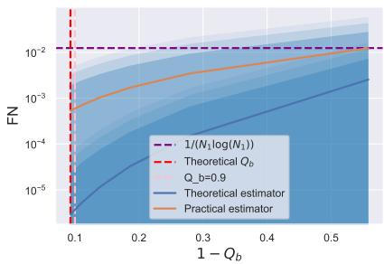  
(a) $N _ { 1 } = 2 5$

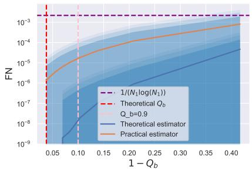  
(b) $N _ { 1 } = 1 0 0$

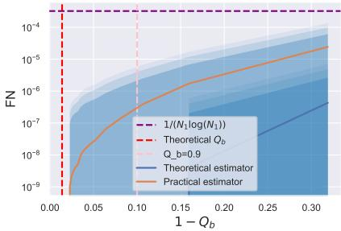  
(c) $N _ { 1 } = 5 0 0$  
Figure 6: Comparison of the false negative rate (FN) when $X _ { e } \sim G _ { \xi , 1 }$ 1 with $\xi = - 1 0 ^ { - 5 }$ . Notice that the practical estimator follows the same false negative constraint $1 / ( N _ { 1 } \log ( N _ { 1 } ) )$ as the theoretical one as long as $Q _ { b } \geq 0 . 9$ for any $N _ { 1 } \in \{ 2 5 , 1 0 0 , 5 0 0 \}$ . We report the variability across 10 000 repetitions using shaded bands corresponding to ±σ, ±2σ, and ±3σ, where σ denotes the standard deviation of FN over the 10 000 repetitions.

## B.2 Datasets

The ScreenX dataset considers a binary outcome Y indicating the presence of aggressive cancer. The classifier’s output is used to determine whether a biopsy should be performed based on preliminary diagnostic features X related to a blood sample. The objective is to avoid unnecessary biopsies, as they constitute an invasive and burdensome procedure for patients, while simultaneously maintaining a near-zero false negative rate. Indeed, failing to detect an aggressive cancer may delay treatment initiation and could ultimately lead to preventable mortality.

The Corruption dataset [25] was constructed by integrating data from eight information systems of the Brazilian federal government and the Federal District. To comply with GDPR requirements, all personally identifiable information relating to civil servants and military personnel was removed, resulting in a fully anonymized dataset. The available features include information on political appointments, salaries, the number of positions held, and indicators of financial investments for each employee. The dataset is is available at this link.

The Credit dataset [10], available on Kaggle at Kaggle, corresponds to the "Credit Card Fraud Detection" task, whose objective is to identify fraudulent transactions from transaction-level features collected over a two-day period. For confidentiality reasons, all variables are numerical and have been transformed using PCA, except for the Time and Amount features, which are provided in their original form.

The Breast Cancer Wisconsin (Diagnostic) dataset [28] is a widely used benchmark for binary classification in machine learning and statistics. It consists of $N = 5 6 9$ breast mass samples collected through fine needle aspiration (FNA), each labeled as either benign or malignant. The objective is to predict the diagnostic outcome from a set of quantitative descriptors extracted from digitized images of cell nuclei. The dataset contains 30 continuous features describing the morphology of cell nuclei. These features are derived from ten fundamental characteristics, namely radius, texture, perimeter, area, smoothness, compactness, concavity, concave points, symmetry, and fractal dimension. For each characteristic, the mean, standard error, and worst observed value are recorded, resulting in a total of 30 predictors. Among the 569 observations, 212 correspond to malignant tumors and 357 to benign tumors. Owing to its moderate size, low dimensionality, and strong predictive signal, the dataset has become a standard benchmark for evaluating classification algorithms. Many classical and modern methods achieve classification accuracies exceeding 95% and area under the ROC curve (AUC) values above 0.98.

## B.3 Details for competing methods

Training a standard SVC with an RBF kernel is computationally challenging on large datasets (N ≈ 300,000). To obtain a scalable approximation, we first mapped the input features into a 200-dimensional randomized feature space using the Random Fourier Features implementation RBFSampler(gamma="scale", n\_components=200, random\_state=seed). A linear SVC was then trained on these transformed features, yielding an eficient approximation of an RBF-kernel SVC while substantially reducing computational costs.

We set the maximum number of L-BFGS iterations for logistic regression to 1000 rather than the default value of 100 in order to ensure convergence to an optimal solution.

Note that, for the MulLog and Log methods, the logistic regression model is trained on the entire dataset. Similarly, the threshold on the logistic score coordinate is selected using the full dataset. Consequently, this threshold is expected to be slightly less conservative, as the logistic regression model is not estimated independently of the validation data. However, the test set, on which performance is ultimately evaluated, remains completely independent of this process, ensuring a fair comparison with the other methods. We chose not to introduce an additional data split in order to avoid further reducing the efective sample size. Moreover, standard logistic regression is known to be relatively robust to outliers. As a result, learning the decision threshold using EVT primarily exploits information contained in the tails of the distribution, which is largely complementary to the information driving the logistic regression model. In contrast, the Mul method is not afected by this issue, as it does not involve learning a regression score.

We also investigated using the full dataset both for classifier training and for threshold estimation in the RC methods. However, this had little impact on the results. Therefore, for consistency with the existing literature, we retained the recommended procedure of separating the training and validation sets.

We were unable to perform a similar analysis for the NP methods due to limitations of the available API in nproc, which does not provide a mechanism for separating the training and validation data during threshold estimation.

Table 2: Summary of Benchmark Results, ranking is performed by T N/ max(F N, 1) and not T N/ max(F N, 0.1).
<table><tr><td>Rank</td><td>ScreenX</td><td>Corruption</td><td>Credit</td><td>Mean Rank</td></tr><tr><td>1</td><td>Easy Ensemble</td><td>Conservative Ensemble</td><td>Conservative Ensemble</td><td> $\mathrm { M u l L o g  – Q { = } 0 . 1 ~ ( O u r s ) }$ </td></tr><tr><td>2</td><td>CS-NTA-XGBoost</td><td>CS-NTA-Logistic</td><td>CS-NTA-Logistic</td><td>CS-NTA-XGBoost</td></tr><tr><td>3</td><td>CS-XGBoost</td><td>Balanced Random Forest</td><td>NP-Logistic</td><td>Easy Ensemble</td></tr><tr><td>4</td><td>MulLog-Q=0.1 (Ours)</td><td>Easy Ensemble</td><td>CS-NTA-XGBoost</td><td>NP-Logistic</td></tr><tr><td>5</td><td> $\mathrm { M u l – Q { = } 0 . 1 \ ( O u r s ) }$ </td><td>CS-SVC-RBF</td><td> $\mathrm { M u l L o g  – Q { = } 0 . 1 ~ ( O u r s ) }$ </td><td>CS-NTA-Logistic</td></tr></table>

## B.4 Complete results

Table 3: ScreenX benchmark results. We report the mean ± one standard deviation, computed over 10 repetitions with diferent random seeds, where each repetition corresponds to the mean performance across a 5-fold crossvalidation.
<table><tr><td colspan="2">Dataset</td><td colspan="3">ScreenX</td></tr><tr><td>Method</td><td>FN</td><td>TN</td><td> $\mathrm { T N / m a x ( F N , 0 . 1 ) }$ </td><td> $\mathrm { T N / m a x ( F N , 1 ) }$ </td></tr><tr><td></td><td></td><td></td><td></td><td></td></tr><tr><td>Mul-Q=0.95 (Ours)</td><td> $0 . 3 \pm 0 . 2$ </td><td> $5 . 5 \pm 0 . 4$ </td><td> $2 6 . 9 \pm 1 6 . 1$ </td><td> $5 . 5 \pm 0 . 4$ </td></tr><tr><td>Mul-Q=0.9 (Ours)</td><td> $0 . 4 \pm 0 . 2$ </td><td> $6 . 8 \pm 0 . 5$ </td><td> $2 4 . 7 \pm 1 7 . 4$ </td><td> $6 . 8 \pm 0 . 5$ </td></tr><tr><td>Conservative Ensemble</td><td> $0 . 2 \pm 0 . 1$ </td><td> $3 . 5 \pm 0 . 6$ </td><td> $2 0 . 9 \pm 6 . 6$ </td><td> $3 . 5 \pm 0 . 6$ </td></tr><tr><td>MulLog-Q=0.95 (Ours)</td><td> $0 . 5 \pm 0 . 2$ </td><td> $5 . 6 \pm 0 . 3$ </td><td> $1 4 . 6 \pm 7 . 4$ </td><td> $5 . 6 \pm 0 . 3$ </td></tr><tr><td>CS-Logistic</td><td> $0 . 3 \pm 0 . 2$ </td><td> $4 . 0 \pm 0 . 4$ </td><td> $1 4 . 3 \pm 6 . 4$ </td><td> $4 . 0 \pm 0 . 4$ </td></tr><tr><td>MulLog-Q=0.9 (Ours)</td><td> $0 . 6 \pm 0 . 2$ </td><td> $7 . 0 \pm 0 . 6$ </td><td> $1 3 . 8 \pm 7 . 4$ </td><td> $7 . 0 \pm 0 . 6$ </td></tr><tr><td>NP-Random Forest</td><td> $0 . 3 \pm 0 . 2$ </td><td> $3 . 0 \pm 1 . 3$ </td><td> $1 3 . 3 \pm 8 . 9$ </td><td> $3 . 0 \pm 1 . 3$ </td></tr><tr><td>Easy Ensemble</td><td> $1 . 1 \pm 0 . 2$ </td><td> $1 2 . 9 \pm 0 . 6$ </td><td> $1 1 . 7 \pm 2 . 4$ </td><td> $1 1 . 1 \pm 1 . 4$ </td></tr><tr><td>CS-NTA-XGBoost</td><td> $1 . 2 \pm 0 . 4$ </td><td> $1 2 . 3 \pm 1 . 2$ </td><td> $1 1 . 2 \pm 5 . 1$ </td><td> $9 . 9 \pm 2 . 5$ </td></tr><tr><td>CS-NTA-Logistic</td><td> $0 . 5 \pm 0 . 2$ </td><td> $4 . 5 \pm 1 . 1$ </td><td> $1 0 . 9 \pm 4 . 5$ </td><td> $4 . 5 \pm 1 . 1$ </td></tr><tr><td>Log-Q=0.1 (Ours)</td><td> $0 . 5 \pm 0 . 2$ </td><td> $4 . 6 \pm 0 . 8$ </td><td> $1 0 . 5 \pm 1 . 8$ </td><td> $4 . 6 \pm 0 . 8$ </td></tr><tr><td>NP-Logistic CS-XGBoost</td><td> $0 . 7 \pm 0 . 4$ </td><td> $6 . 2 \pm 2 . 6$ </td><td> $1 0 . 2 \pm 4 . 3$ </td><td> $5 . 8 \pm 2 . 3$ </td></tr><tr><td></td><td> $1 . 6 \pm 0 . 2$ </td><td> $1 4 . 4 \pm 0 . 5$ </td><td> $9 . 1 \pm 1 . 3$ </td><td> $9 . 1 \pm 1 . 3$ </td></tr><tr><td>MulLog-Q=0.1 (Ours)</td><td> $1 . 3 \pm 0 . 3$ </td><td> $1 1 . 5 \pm 0 . 4$ </td><td> $9 . 0 \pm 1 . 6$ </td><td> $9 . 0 \pm 1 . 6$ </td></tr><tr><td>Mul-Q=0.1 (Ours)</td><td> $1 . 3 \pm 0 . 2$ </td><td> $1 0 . 7 \pm 0 . 4$ </td><td> $8 . 6 \pm 1 . 2$ </td><td> $8 . 6 \pm 1 . 2$ </td></tr><tr><td>Balanced Random Forest Naive</td><td> $1 . 8 \pm 0 . 3$ </td><td> $1 4 . 7 \pm 0 . 4$ </td><td> $8 . 2 \pm 1 . 4$ </td><td> $8 . 2 \pm 1 . 4$ </td></tr><tr><td></td><td> $1 . 6 \pm 0 . 2$ </td><td> $1 2 . 6 \pm 0 . 5$ </td><td> $8 . 1 \pm 1 . 0$ </td><td> $8 . 1 \pm 1 . 0$ </td></tr><tr><td>CS-SVC-RBF</td><td> $1 . 6 \pm 0 . 3$ </td><td> $1 1 . 7 \pm 0 . 7$ </td><td> $7 . 8 \pm 1 . 5$ </td><td> $7 . 8 \pm 1 . 5$ </td></tr><tr><td>Balanced Bagging Decision</td><td> $2 . 2 \pm 0 . 5$ </td><td> $1 5 . 0 \pm 0 . 7$ </td><td> $7 . 0 \pm 1 . 2$ </td><td> $7 . 0 \pm 1 . 2$ </td></tr><tr><td>RC-Logistic</td><td> $2 . 1 \pm 1 . 0$ </td><td> $1 2 . 9 \pm 3 . 6$ </td><td> $6 . 9 \pm 1 . 9$ </td><td> $6 . 5 \pm 1 . 7$ </td></tr><tr><td>CS-NTA-SVC-RBF</td><td> $2 . 1 \pm 0 . 8$ </td><td> $1 2 . 1 \pm 2 . 2$ </td><td> $6 . 2 \pm 1 . 6$ </td><td> $6 . 2 \pm 1 . 6$ </td></tr><tr><td>RC-XGBoost</td><td> $2 . 6 \pm 0 . 4$ </td><td> $1 5 . 3 \pm 1 . 2$ </td><td> $5 . 9 \pm 0 . 7$ </td><td> $5 . 9 \pm 0 . 7$ </td></tr><tr><td>Isolation Forest</td><td> $2 . 4 \pm 0 . 7$ </td><td> $1 2 . 4 \pm 1 . 8$ </td><td> $5 . 6 \pm 1 . 4$ </td><td> $5 . 6 \pm 1 . 4$ </td></tr><tr><td>Log-Q=0.9 (Ours)</td><td> $0 . 3 \pm 0 . 1$ </td><td> $1 . 2 \pm 0 . 8$ </td><td> $4 . 8 \pm 1 . 3$ </td><td> $1 . 2 \pm 0 . 8$ </td></tr><tr><td>Log-Q=0.95 (Ours)</td><td> $0 . 3 \pm 0 . 1$ </td><td> $0 . 8 \pm 0 . 7$ </td><td> $2 . 8 \pm 1 . 3$ </td><td> $0 . 8 \pm 0 . 7$ </td></tr></table>

Table 4: Corruption benchmark results. We report the mean ± one standard deviation, computed over 10 repetitions with diferent random seeds, where each repetition corresponds to the mean performance across a 5-fold cross-validation.
<table><tr><td rowspan="2">Dataset</td><td colspan="4">Corruption</td></tr><tr><td>FN</td><td>TN</td><td> $\mathrm { T N / m a x ( F N , 0 . 1 ) }$ </td><td> $\mathrm { T N / m a x ( F N , 1 ) }$ </td></tr><tr><td>Method</td><td></td><td></td><td></td><td></td></tr><tr><td>MulLog-Q=0.9 (Ours)</td><td> $0 . 0 \pm 0 . 0$ </td><td> $6 5 0 . 4 \pm 1 4 . 4$ </td><td> $6 5 0 3 . 8 \pm 1 4 4 . 0$ </td><td> $6 5 0 . 4 \pm 1 4 . 4$ </td></tr><tr><td> $\mathrm { M u l L o g – Q { = } 0 . 9 5 ~ ( O u r s ) }$ </td><td> $0 . 0 \pm 0 . 0$ </td><td> $5 8 8 . 0 \pm 1 2 . 5$ </td><td> $5 8 8 0 . 0 \pm 1 2 5 . 2$ </td><td> $5 8 8 . 0 \pm 1 2 . 5$ </td></tr><tr><td> $\mathrm { M u l L o g  – Q { = } 0 . 1 ~ ( O u r s ) }$ </td><td> $0 . 3 \pm 0 . 1$ </td><td> $1 2 0 8 . 9 \pm 4 0 . 3$ </td><td> $4 8 4 8 . 9 \pm 1 6 0 5 . 5$ </td><td> $1 2 0 8 . 9 \pm 4 0 . 3$ </td></tr><tr><td> $\mathrm { M u l – Q { = } 0 . 9 ~ ( O u r s ) }$ </td><td> $0 . 0 \pm 0 . 0$ </td><td> $4 3 8 . 2 \pm 0 . 0$ </td><td> $4 3 8 2 . 0 \pm 0 . 0$ </td><td> $4 3 8 . 2 \pm 0 . 0$ </td></tr><tr><td> $\mathrm { M u l – Q { = } 0 . 1 \ ( O u r s ) }$ </td><td> $0 . 0 \pm 0 . 0$ </td><td> $4 3 8 . 2 \pm 0 . 0$ </td><td> $4 3 8 2 . 0 \pm 0 . 0$ </td><td> $4 3 8 . 2 \pm 0 . 0$ </td></tr><tr><td> $\mathrm { M u l – Q { = } 0 . 9 5 ~ ( O u r s ) }$ </td><td> $0 . 0 \pm 0 . 0$ </td><td> $4 3 8 . 2 \pm 0 . 0$ </td><td> $4 3 8 2 . 0 \pm 0 . 0$ </td><td> $4 3 8 . 2 \pm 0 . 0$ </td></tr><tr><td> $\mathrm { L o g - Q { = } 0 . 1 \ ( O u r s ) }$ </td><td> $0 . 3 \pm 0 . 1$ </td><td> $7 7 0 . 7 \pm 4 0 . 3$ </td><td> $3 0 9 6 . 1 \pm 1 0 4 2 . 4$ </td><td> $7 7 0 . 7 \pm 4 0 . 3$ </td></tr><tr><td>Conservative Ensemble</td><td> $2 . 5 \pm 1 . 0$ </td><td> $5 3 4 3 . 1 \pm 1 4 3 9 . 6$ </td><td> $2 3 2 4 . 5 \pm 8 3 7 . 1$ </td><td> $2 3 2 4 . 5 \pm 8 3 7 . 1$ </td></tr><tr><td>Log-Q=0.9 (Ours)</td><td> $0 . 0 \pm 0 . 0$ </td><td> $2 1 2 . 2 \pm 1 4 . 4$ </td><td> $2 1 2 1 . 8 \pm 1 4 4 . 0$ </td><td> $2 1 2 . 2 \pm 1 4 . 4$ </td></tr><tr><td>NP-Logistic</td><td> $0 . 5 \pm 0 . 3$ </td><td> $7 8 2 . 7 \pm 2 2 7 . 8$ </td><td> $1 9 1 8 . 2 \pm 1 4 4 6 . 4$ </td><td> $7 8 2 . 7 \pm 2 2 7 . 8$ </td></tr><tr><td>CS-NTA-Logistic</td><td> $6 . 0 \pm 2 . 6$ </td><td> $9 3 7 4 . 2 \pm 2 7 8 2 . 3$ </td><td> $1 6 7 3 . 9 \pm 3 7 6 . 2$ </td><td> $1 6 7 3 . 9 \pm 3 7 6 . 2$ </td></tr><tr><td>Balanced Random Forest</td><td> $2 6 . 3 \pm 0 . 9$ </td><td> $4 1 5 6 6 . 7 \pm 2 3 7 . 9$ </td><td> $1 5 8 0 . 9 \pm 5 3 . 3$ </td><td> $1 5 8 0 . 9 \pm 5 3 . 3$ </td></tr><tr><td>Log-Q=0.95 (Ours)</td><td> $0 . 0 \pm 0 . 0$ </td><td> $1 4 9 . 8 \pm 1 2 . 5$ </td><td> $1 4 9 8 . 0 \pm 1 2 5 . 2$ </td><td> $1 4 9 . 8 \pm 1 2 . 5$ </td></tr><tr><td>Easy Ensemble</td><td> $3 1 . 0 \pm 1 . 5$ </td><td> $4 1 7 6 5 . 2 \pm 2 0 2 . 7$ </td><td> $1 3 5 1 . 6 \pm 6 0 . 9$ </td><td> $1 3 5 1 . 6 \pm 6 0 . 9$ </td></tr><tr><td>CS-SVC-RBF</td><td> $3 1 . 8 \pm 0 . 8$ </td><td> $4 1 4 6 9 . 2 \pm 4 6 5 . 7$ </td><td> $1 3 0 4 . 8 \pm 3 6 . 9$ </td><td> $1 3 0 4 . 8 \pm 3 6 . 9$ </td></tr><tr><td>CS-Logistic</td><td> $2 3 . 2 \pm 0 . 6$ </td><td> $2 9 9 1 8 . 4 \pm 3 4 9 . 8$ </td><td> $1 2 9 1 . 4 \pm 3 2 . 7$ </td><td> $1 2 9 1 . 4 \pm 3 2 . 7$ </td></tr><tr><td>Balanced Bagging Decision</td><td> $4 0 . 6 \pm 1 . 3$ </td><td> $5 0 7 1 1 . 5 \pm 1 7 6 . 0$ </td><td> $1 2 4 9 . 6 \pm 4 0 . 9$ </td><td> $1 2 4 9 . 6 \pm 4 0 . 9$ </td></tr><tr><td>CS-NTA-SVC-RBF</td><td> $1 7 . 2 \pm 6 . 0$ </td><td> $2 1 1 9 0 . 4 \pm 7 7 8 4 . 2$ </td><td> $1 2 2 7 . 5 \pm 1 0 7 . 8$ </td><td> $1 2 2 7 . 5 \pm 1 0 7 . 8$ </td></tr><tr><td>Naive</td><td> $1 . 6 \pm 0 . 5$ </td><td> $1 7 4 3 . 6 \pm 1 5 2 . 8$ </td><td> $1 2 2 0 . 9 \pm 4 7 2 . 7$ </td><td> $1 1 2 4 . 4 \pm 2 4 7 . 0$ </td></tr><tr><td>RC-XGBoost</td><td> $2 8 . 9 \pm 4 . 7$ </td><td> $3 4 6 2 7 . 0 \pm 4 9 4 2 . 9$ </td><td> $1 2 0 2 . 3 \pm 8 0 . 0$ </td><td> $1 2 0 2 . 3 \pm 8 0 . 0$ </td></tr><tr><td>CS-NTA-XGBoost</td><td> $2 4 . 1 \pm 5 . 6$ </td><td> $2 8 3 7 6 . 7 \pm 5 6 0 0 . 0$ </td><td> $1 1 9 1 . 2 \pm 1 0 3 . 5$ </td><td> $1 1 9 1 . 2 \pm 1 0 3 . 5$ </td></tr><tr><td>CS-XGBoost</td><td> $5 7 . 9 \pm 1 . 2$ </td><td> $5 8 1 3 4 . 2 \pm 6 0 . 8$ </td><td> $1 0 0 5 . 1 \pm 2 0 . 8$ </td><td> $1 0 0 5 . 1 \pm 2 0 . 8$ </td></tr><tr><td>NP-Random Forest</td><td> $6 9 . 5 \pm 1 . 4$ </td><td> $6 0 4 8 7 . 0 \pm 9 . 9$ </td><td> $8 7 0 . 1 \pm 1 7 . 9$ </td><td> $8 7 0 . 1 \pm 1 7 . 9$ </td></tr><tr><td>RC-Logistic</td><td> $8 4 . 0 \pm 0 . 1$ </td><td> $6 0 4 7 8 . 0 \pm 1 0 . 5$ </td><td> $7 1 9 . 6 \pm 1 . 0$ </td><td> $7 1 9 . 6 \pm 1 . 0$ </td></tr><tr><td>Isolation Forest</td><td> $1 5 . 3 \pm 1 2 . 9$ </td><td> $1 0 0 9 4 . 4 \pm 9 1 7 2 . 9$ </td><td> $6 0 2 . 6 \pm 9 3 . 5$ </td><td> $6 0 2 . 6 \pm 9 3 . 5$ </td></tr></table>

Table 5: Credit benchmark results. We report the mean ± one standard deviation, computed over 10 repetitions with diferent random seeds, where each repetition corresponds to the mean performance across a 5-fold crossvalidation.
<table><tr><td>Dataset</td><td>FN</td><td>TN</td><td>Credit  $\mathrm { T N / m a x ( F N , 0 . 1 ) }$ </td><td> $\mathrm { T N / m a x ( F N , 1 ) }$ </td></tr><tr><td>Method</td><td></td><td></td><td></td><td></td></tr><tr><td>Mul-Q=0.1 (Ours)</td><td> $0 . 2 \pm 0 . 1$ </td><td> $6 7 3 2 . 6 \pm 8 7 2 . 8$ </td><td> $3 8 8 5 2 . 9 \pm 1 6 5 9 6 . 4$ </td><td> $6 7 3 2 . 6 \pm 8 7 2 . 8$ </td></tr><tr><td>Mul-Q=0.9 (Ours)</td><td> $0 . 1 \pm 0 . 2$ </td><td> $4 3 7 7 . 2 \pm 7 2 6 . 5$ </td><td> $3 7 1 1 4 . 9 \pm 1 5 3 9 7 . 2$ </td><td> $4 3 7 7 . 2 \pm 7 2 6 . 5$ </td></tr><tr><td>Mul-Q=0.95 (Ours)</td><td> $0 . 1 \pm 0 . 2$ </td><td> $4 1 0 2 . 0 \pm 8 8 2 . 4$ </td><td> $3 4 9 1 3 . 9 \pm 1 5 5 8 5 . 8$ </td><td> $4 1 0 2 . 0 \pm 8 8 2 . 4$ </td></tr><tr><td> $\mathrm { M u l L o g  – Q { = } 0 . 9 ~ ( O u r s ) }$ </td><td> $0 . 3 \pm 0 . 1$ </td><td> $7 2 4 0 . 4 \pm 7 6 3 . 7$ </td><td> $3 0 6 3 3 . 0 \pm 1 1 4 9 0 . 8$ </td><td> $7 2 4 0 . 4 \pm 7 6 3 . 7$ </td></tr><tr><td> $\operatorname { M u l L o g - Q = } 0 . 9 5 ~ \mathrm { ( O u r s ) }$ </td><td> $0 . 3 \pm 0 . 1$ </td><td> $7 0 0 8 . 3 \pm 9 0 2 . 8$ </td><td> $2 9 7 5 2 . 3 \pm 1 1 5 6 8 . 2$ </td><td> $7 0 0 8 . 3 \pm 9 0 2 . 8$ </td></tr><tr><td> $\mathrm { M u l L o g  – Q { = } 0 . 1 ~ ( O u r s ) }$ </td><td> $0 . 4 \pm 0 . 1$ </td><td> $9 7 6 5 . 7 \pm 8 3 4 . 1$ </td><td> $2 9 6 9 3 . 5 \pm 1 2 4 5 7 . 9$ </td><td> $9 7 6 5 . 7 \pm 8 3 4 . 1$ </td></tr><tr><td>Log-Q=0.1 (Ours)</td><td> $0 . 2 \pm 0 . 1$ </td><td> $4 9 1 9 . 0 \pm 5 5 7 . 0$ </td><td> $2 5 3 5 8 . 5 \pm 7 0 0 5 . 5$ </td><td> $4 9 1 9 . 0 \pm 5 5 7 . 0$ </td></tr><tr><td>NP-Logistic</td><td> $0 . 7 \pm 0 . 4$ </td><td> $1 2 1 9 6 . 0 \pm 2 6 3 8 . 3$ </td><td> $2 2 2 4 9 . 4 \pm 1 1 4 5 9 . 9$ </td><td> $1 1 5 5 0 . 8 \pm 1 9 8 5 . 2$ </td></tr><tr><td>Log-Q=0.9 (Ours)</td><td> $0 . 2 \pm 0 . 1$ </td><td> $4 0 8 4 . 5 \pm 5 7 2 . 2$ </td><td> $2 0 9 9 4 . 3 \pm 5 6 3 7 . 0$ </td><td> $4 0 8 4 . 5 \pm 5 7 2 . 2$ </td></tr><tr><td>Log-Q=0.95 (Ours)</td><td> $0 . 2 \pm 0 . 1$ </td><td> $4 0 3 7 . 6 \pm 5 8 0 . 3$ </td><td> $2 0 7 5 2 . 3 \pm 5 5 9 8 . 3$ </td><td> $4 0 3 7 . 6 \pm 5 8 0 . 3$ </td></tr><tr><td>Conservative Ensemble</td><td> $1 . 7 \pm 0 . 4$ </td><td> $3 3 0 9 4 . 6 \pm 3 2 0 2 . 6$ </td><td> $2 0 0 7 6 . 2 \pm 3 8 0 1 . 2$ </td><td> $2 0 0 7 6 . 2 \pm 3 8 0 1 . 2$ </td></tr><tr><td>CS-NTA-Logistic</td><td> $2 . 8 \pm 0 . 9$ </td><td> $3 5 5 3 1 . 6 \pm 3 5 8 9 . 3$ </td><td> $1 3 5 7 6 . 9 \pm 3 2 4 7 . 8$ </td><td> $1 3 5 7 6 . 9 \pm 3 2 4 7 . 8$ </td></tr><tr><td>CS-NTA-XGBoost</td><td> $4 . 9 \pm 0 . 6$ </td><td> $4 9 8 6 0 . 0 \pm 1 9 8 . 7$ </td><td> $1 0 3 6 6 . 3 \pm 1 3 4 7 . 4$ </td><td> $1 0 3 6 6 . 3 \pm 1 3 4 7 . 4$ </td></tr><tr><td>CS-NTA-SVC-RBF</td><td> $2 . 8 \pm 0 . 9$ </td><td> $2 5 8 7 1 . 3 \pm 5 0 0 3 . 9$ </td><td> $9 7 2 0 . 9 \pm 2 2 1 5 . 5$ </td><td> $9 7 2 0 . 9 \pm 2 2 1 5 . 5$ </td></tr><tr><td>CS-Logistic</td><td> $7 . 9 \pm 0 . 3$ </td><td> $5 4 5 7 2 . 9 \pm 1 3 . 0$ </td><td> $6 9 5 0 . 4 \pm 2 3 8 . 6$ </td><td> $6 9 5 0 . 4 \pm 2 3 8 . 6$ </td></tr><tr><td>Naive</td><td> $6 . 7 \pm 0 . 3$ </td><td> $4 3 4 0 2 . 1 \pm 1 9 7 . 4$ </td><td> $6 4 7 0 . 2 \pm 2 8 9 . 3$ </td><td> $6 4 7 0 . 2 \pm 2 8 9 . 3$ </td></tr><tr><td>Easy Ensemble</td><td> $8 . 6 \pm 0 . 4$ </td><td> $5 4 9 9 2 . 1 \pm 5 5 . 8$ </td><td> $6 4 0 9 . 1 \pm 3 2 5 . 3$ </td><td> $6 4 0 9 . 1 \pm 3 2 5 . 3$ </td></tr><tr><td>Balanced Random Forest</td><td> $9 . 5 \pm 0 . 5$ </td><td> $5 5 5 2 9 . 0 \pm 5 4 . 6$ </td><td> $5 8 7 3 . 5 \pm 3 3 2 . 2$ </td><td> $5 8 7 3 . 5 \pm 3 3 2 . 2$ </td></tr><tr><td>Balanced Bagging Decision</td><td> $1 1 . 0 \pm 0 . 6$ </td><td> $5 5 7 3 1 . 8 \pm 5 6 . 3$ </td><td> $5 0 6 0 . 6 \pm 2 5 6 . 7$ </td><td> $5 0 6 0 . 6 \pm 2 5 6 . 7$ </td></tr><tr><td>CS-SVC-RBF</td><td> $1 3 . 2 \pm 1 . 2$ </td><td> $5 2 6 5 2 . 4 \pm 2 4 5 . 2$ </td><td> $4 0 2 3 . 1 \pm 3 5 7 . 5$ </td><td> $4 0 2 3 . 1 \pm 3 5 7 . 5$ </td></tr><tr><td>NP-Random Forest</td><td> $1 7 . 6 \pm 2 . 4$ </td><td> $5 6 7 1 3 . 9 \pm 1 6 1 . 9$ </td><td> $3 2 8 4 . 0 \pm 4 7 4 . 9$ </td><td> $3 2 8 4 . 0 \pm 4 7 4 . 9$ </td></tr><tr><td>CS-XGBoost</td><td> $1 7 . 8 \pm 0 . 4$ </td><td> $5 6 8 5 5 . 2 \pm 0 . 5$ </td><td> $3 1 9 9 . 0 \pm 6 8 . 8$ </td><td> $3 1 9 9 . 0 \pm 6 8 . 8$ </td></tr><tr><td>RC-XGBoost</td><td> $2 1 . 8 \pm 1 . 0$ </td><td> $5 6 8 5 8 . 0 \pm 2 . 4$ </td><td> $2 6 1 5 . 6 \pm 1 2 2 . 3$ </td><td> $2 6 1 5 . 6 \pm 1 2 2 . 3$ </td></tr><tr><td>RC-Logistic</td><td> $2 3 . 2 \pm 3 . 3$ </td><td> $5 6 8 2 9 . 8 \pm 1 5 . 4$ </td><td> $2 4 9 0 . 5 \pm 3 2 0 . 1$ </td><td> $2 4 9 0 . 5 \pm 3 2 0 . 1$ </td></tr><tr><td>Isolation Forest</td><td> $6 3 . 5 \pm 4 . 7$ </td><td> $4 7 9 9 3 . 2 \pm 3 4 2 0 . 8$ </td><td> $7 5 6 . 9 \pm 2 7 . 1$ </td><td> $7 5 6 . 9 \pm 2 7 . 1$ </td></tr></table>

Table 6: Breast Cancer benchmark results. We report the mean ± one standard deviation, computed over 10 repetitions with diferent random seeds, where each repetition corresponds to the mean performance across a 5-fold cross-validation.
<table><tr><td rowspan="2">Dataset</td><td colspan="4">Breast Cancer</td></tr><tr><td>FN</td><td>TN</td><td> $\mathrm { T N / m a x ( F N , 0 . 1 ) }$ </td><td> $\mathrm { T N / m a x ( F N , 1 ) }$ </td></tr><tr><td>Method</td><td></td><td></td><td></td><td></td></tr><tr><td>CS-Logistic</td><td> $0 . 0 \pm 0 . 0$ </td><td> $3 2 . 4 \pm 0 . 2$ </td><td> $3 2 3 . 8 \pm 1 . 8$ </td><td> $3 2 . 4 \pm 0 . 2$ </td></tr><tr><td>CS-NTA-Logistic</td><td> $0 . 0 \pm 0 . 0$ </td><td> $3 1 . 6 \pm 0 . 6$ </td><td> $3 1 6 . 4 \pm 6 . 2$ </td><td> $3 1 . 6 \pm 0 . 6$ </td></tr><tr><td>Conservative Ensemble</td><td> $0 . 0 \pm 0 . 0$ </td><td> $3 1 . 0 \pm 0 . 9$ </td><td> $3 0 9 . 6 \pm 9 . 2$ </td><td> $3 1 . 0 \pm 0 . 9$ </td></tr><tr><td>Log-Q=0.9 (Ours)</td><td> $0 . 1 \pm 0 . 3$ </td><td> $3 7 . 7 \pm 0 . 6$ </td><td> $2 9 6 . 0 \pm 1 3 2 . 8$ </td><td> $3 7 . 7 \pm 0 . 6$ </td></tr><tr><td>MulLog-Q=0.9 (Ours)</td><td> $0 . 1 \pm 0 . 3$ </td><td> $3 7 . 5 \pm 0 . 6$ </td><td> $2 9 4 . 4 \pm 1 3 2 . 1$ </td><td> $3 7 . 5 \pm 0 . 6$ </td></tr><tr><td>Log-Q=0.95 (Ours)</td><td> $0 . 1 \pm 0 . 3$ </td><td> $3 6 . 7 \pm 0 . 7$ </td><td> $2 8 8 . 8 \pm 1 2 9 . 6$ </td><td> $3 6 . 7 \pm 0 . 7$ </td></tr><tr><td>MulLog-Q=0.95 (Ours)</td><td> $0 . 1 \pm 0 . 3$ </td><td> $3 6 . 5 \pm 0 . 7$ </td><td> $2 8 7 . 2 \pm 1 2 8 . 9$ </td><td> $3 6 . 5 \pm 0 . 7$ </td></tr><tr><td>CS-NTA-XGBoost</td><td> $0 . 2 \pm 0 . 2$ </td><td> $3 6 . 5 \pm 0 . 9$ </td><td> $2 0 5 . 1 \pm 1 1 4 . 9$ </td><td> $3 6 . 5 \pm 0 . 9$ </td></tr><tr><td>CS-SVC-RBF NP-Logistic</td><td> $0 . 2 \pm 0 . 2$ </td><td> $3 4 . 3 \pm 0 . 8$ </td><td> $1 7 0 . 7 \pm 9 5 . 8$ </td><td> $3 4 . 3 \pm 0 . 8$ </td></tr><tr><td></td><td> $0 . 4 \pm 0 . 3$ </td><td> $3 8 . 8 \pm 0 . 3$ </td><td> $1 5 1 . 4 \pm 1 0 3 . 1$ </td><td> $3 8 . 8 \pm 0 . 3$ </td></tr><tr><td>Log-Q=0.1 (Ours)</td><td> $0 . 5 \pm 0 . 2$ </td><td> $4 0 . 2 \pm 0 . 3$ </td><td> $9 2 . 3 \pm 4 5 . 6$ </td><td> $4 0 . 2 \pm 0 . 3$ </td></tr><tr><td>MulLog-Q=0.1 (Ours) CS-XGBoost</td><td> $0 . 5 \pm 0 . 2$ </td><td> $4 0 . 1 \pm 0 . 3$ </td><td> $9 1 . 9 \pm 4 5 . 3$ </td><td> $4 0 . 1 \pm 0 . 3$ </td></tr><tr><td>NP-Random Forest</td><td> $0 . 5 \pm 0 . 2$ </td><td> $3 8 . 2 \pm 0 . 5$ </td><td> $8 2 . 7 \pm 4 1 . 9$ </td><td> $3 8 . 2 \pm 0 . 5$ </td></tr><tr><td>RC-Logistic</td><td> $0 . 6 \pm 0 . 2$ </td><td> $3 6 . 1 \pm 0 . 7$ </td><td> $6 3 . 2 \pm 2 0 . 0$ </td><td> $3 6 . 1 \pm 0 . 7$ </td></tr><tr><td>CS-NTA-SVC-RBF</td><td> $1 . 8 \pm 1 . 4$ </td><td> $4 0 . 3 \pm 0 . 8$ </td><td> $5 0 . 8 \pm 5 9 . 4$ </td><td> $2 6 . 2 \pm 1 1 . 4$ </td></tr><tr><td>RC-XGBoost</td><td> $1 . 4 \pm 0 . 7$ </td><td> $3 7 . 8 \pm 0 . 7$ </td><td> $3 3 . 7 \pm 1 7 . 2$ </td><td> $2 7 . 9 \pm 8 . 4$ </td></tr><tr><td>Easy Ensemble</td><td> $1 . 7 \pm 0 . 7$ </td><td> $3 8 . 9 \pm 0 . 7$ </td><td> $2 6 . 5 \pm 1 1 . 5$ </td><td> $2 5 . 5 \pm 9 . 8$ </td></tr><tr><td></td><td> $2 . 0 \pm 0 . 6$ </td><td> $4 0 . 5 \pm 0 . 3$ </td><td> $2 2 . 0 \pm 6 . 2$ </td><td> $2 2 . 0 \pm 6 . 2$ </td></tr><tr><td>Isolation Forest</td><td> $2 . 0 \pm 0 . 6$ </td><td> $2 7 . 7 \pm 2 . 4$ </td><td> $1 5 . 2 \pm 4 . 5$ </td><td> $1 5 . 2 \pm 4 . 5$ </td></tr><tr><td>Naive</td><td> $2 . 5 \pm 0 . 4$ </td><td> $3 4 . 5 \pm 0 . 3$ </td><td> $1 4 . 3 \pm 2 . 0$ </td><td> $1 4 . 3 \pm 2 . 0$ </td></tr><tr><td>Balanced Random Forest</td><td> $3 . 1 \pm 0 . 2$ </td><td> $4 0 . 6 \pm 0 . 3$ </td><td> $1 3 . 1 \pm 1 . 0$ </td><td> $1 3 . 1 \pm 1 . 0$ </td></tr><tr><td>Balanced Bagging Decision</td><td> $4 . 3 \pm 0 . 7$ </td><td> $4 0 . 5 \pm 0 . 4$ </td><td> $9 . 6 \pm 1 . 7$ </td><td> $9 . 6 \pm 1 . 7$ </td></tr><tr><td>Mul-Q=0.1 (Ours)</td><td> $0 . 2 \pm 0 . 0$ </td><td> $1 . 1 \pm 0 . 3$ </td><td> $5 . 5 \pm 1 . 4$ </td><td> $1 . 1 \pm 0 . 3$ </td></tr><tr><td> $\mathrm { M u l – Q { = } 0 . 9 5 ~ ( O u r s ) }$ </td><td> $0 . 0 \pm 0 . 0$ </td><td> $0 . 0 \pm 0 . 0$ </td><td> $0 . 0 \pm 0 . 0$ </td><td> $0 . 0 \pm 0 . 0$ </td></tr><tr><td> $\mathrm { M u l – Q { = } 0 . 9 ~ ( O u r s ) }$ </td><td> $0 . 0 \pm 0 . 0$ </td><td> $0 . 0 \pm 0 . 0$ </td><td> $0 . 0 \pm 0 . 0$ </td><td> $0 . 0 \pm 0 . 0$ </td></tr></table>

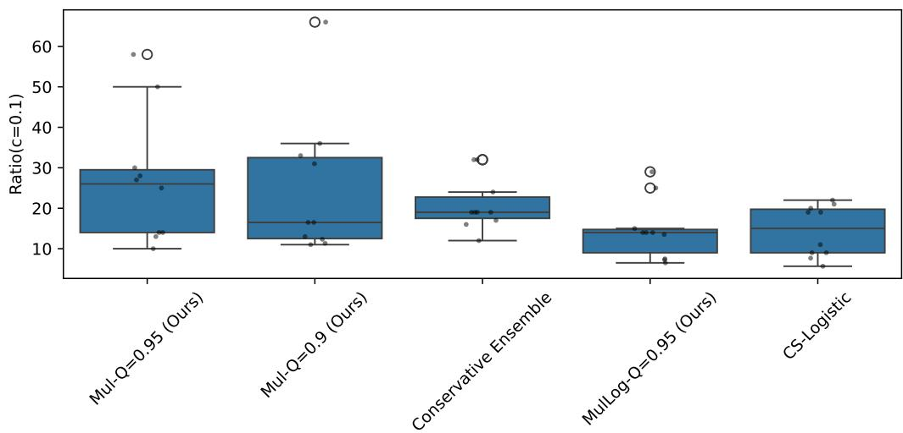  
Figure 7: Boxplot of Ratio(c = 0.1) for the Top 5 Method on the dataset ScreenX.

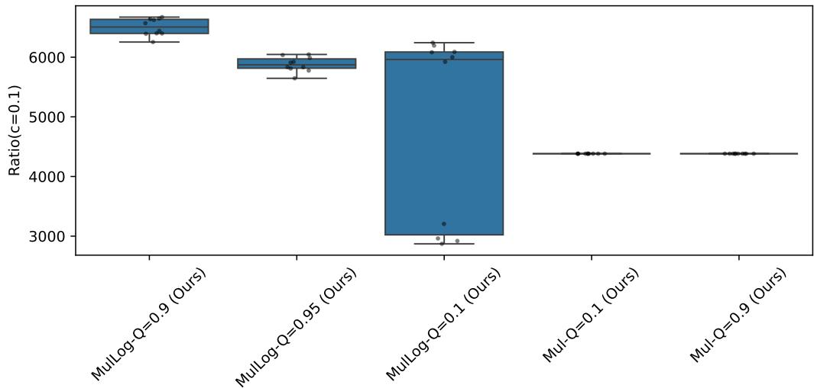  
Figure 8: Boxplot of $\mathrm { R a t i o } ( c = 0 . 1 )$ for the Top 5 Method on the dataset Corruption. The tiny box observed for Mul- $\mathrm { \cdot Q { = } 0 . 9 }$ and Mul- $\mathrm { \cdot Q { = } 0 . 9 5 }$ may appear unusual at first glance. However, we have carefully verified the results and confirmed that they are not due to an implementation error. The learning procedure is fully deterministic, with no source of randomness, and the diferent cross-validation seeds ultimately produce data splits that yield the same average performance across folds.

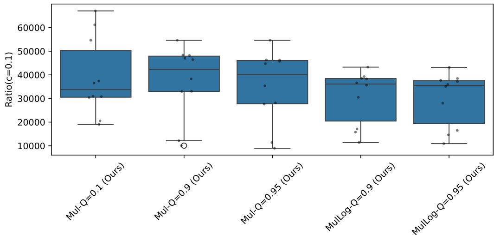

Figure 9: Boxplot of Ratio(c = 0.1) for the Top 5 Method on the dataset Credit.  
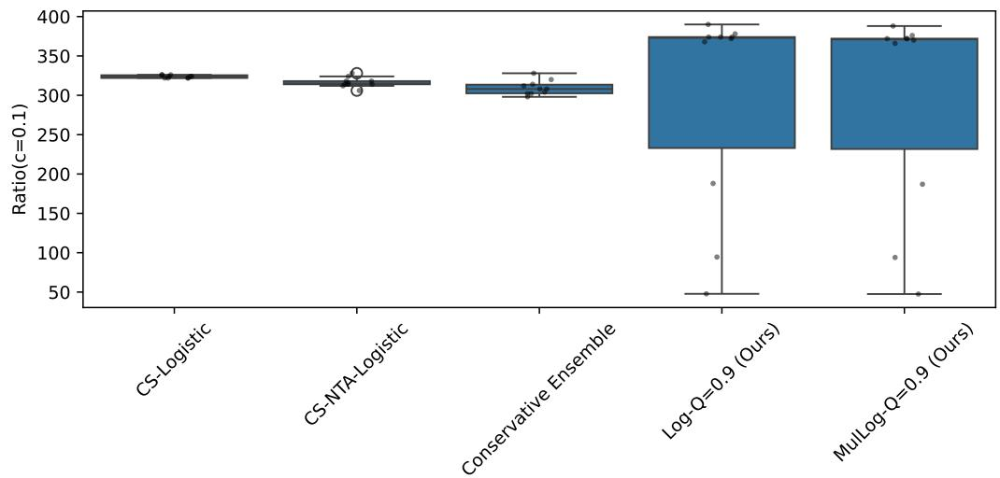  
Figure 10: Boxplot of Ratio(c = 0.1) for the Top 5 Method on the dataset Breast Cancer.

## B.5 Feature selection results

Table 7: Feature importance/coeficient summary across methods. EBC-Min records the frequency where the minimum of the negative sample distribution is significantly lower than the positive sample distribution across 40 train-test splits, same for EBC-Max after applying x 7→ −x to the data.
<table><tr><td>Feature</td><td>EBC-Max</td><td>EBC-Min</td><td>XGBoost</td><td>Logistic</td><td>Decision Tree</td><td>Random Forest</td></tr><tr><td>X1</td><td>0.000</td><td>1.000</td><td>0.0461</td><td>0.3135</td><td>0.0000</td><td>0.0084</td></tr><tr><td>X2</td><td>0.000</td><td>0.025</td><td>0.0241</td><td>-0.4158</td><td>0.0000</td><td>0.0383</td></tr><tr><td>X3</td><td>0.000</td><td>0.950</td><td>0.1074</td><td>0.4017</td><td>0.0933</td><td>0.1066</td></tr><tr><td>X4</td><td>0.000</td><td>1.000</td><td>0.1414</td><td>1.1880</td><td>0.2244</td><td>0.1531</td></tr><tr><td>X5</td><td>0.000</td><td>0.925</td><td>0.0468</td><td>0.6842</td><td>0.0220</td><td>0.0615</td></tr><tr><td>X6</td><td>0.000</td><td>0.075</td><td>0.0368</td><td>0.0228</td><td>0.0211</td><td>0.0558</td></tr><tr><td>X7</td><td>0.000</td><td>0.225</td><td>0.0579</td><td>-0.1574</td><td>0.0270</td><td>0.0685</td></tr><tr><td>X8</td><td>0.000</td><td>1.000</td><td>0.1062</td><td>0.7986</td><td>0.1067</td><td>0.1239</td></tr><tr><td>X9</td><td>0.000</td><td>0.000</td><td>0.0512</td><td>0.6883</td><td>0.0038</td><td>0.0251</td></tr><tr><td>X10</td><td>0.000</td><td>1.000</td><td>0.1585</td><td>0.5007</td><td>0.2398</td><td>0.1531</td></tr><tr><td>X11</td><td>0.000</td><td>0.150</td><td>0.0487</td><td>0.5017</td><td>0.0251</td><td>0.0720</td></tr><tr><td>X12</td><td>1.000</td><td>0.000</td><td>0.1749</td><td>-1.3769</td><td>0.2367</td><td>0.1338</td></tr></table>

<table><tr><td>Rank</td><td>XGBoost</td><td>Logistic</td><td>Decision Tree</td><td>Random Forest</td><td>Highest Frequency Summary</td></tr><tr><td>1</td><td>X12</td><td>X12</td><td>X10</td><td>x4</td><td>X12</td></tr><tr><td>2</td><td>X10</td><td>X4</td><td>X12</td><td>X10</td><td>X10</td></tr><tr><td>3</td><td>X4</td><td>X8</td><td>X4</td><td>X4</td><td>X4</td></tr><tr><td>4</td><td>X3</td><td>X5</td><td>X8</td><td>X12</td><td>X3,X5</td></tr><tr><td>5</td><td>X8</td><td>X9</td><td>X3</td><td>X8</td><td>x8</td></tr></table>

Table 8: Top 5 features ranked by absolute importance/coeficient for each method. In comparaison, the features always selected by our features selection mechanism are X1,X4,X8,X10,X12 and X3,X5 are selected more than 90% time of the 40 train-test split.

## B.6 Computation time

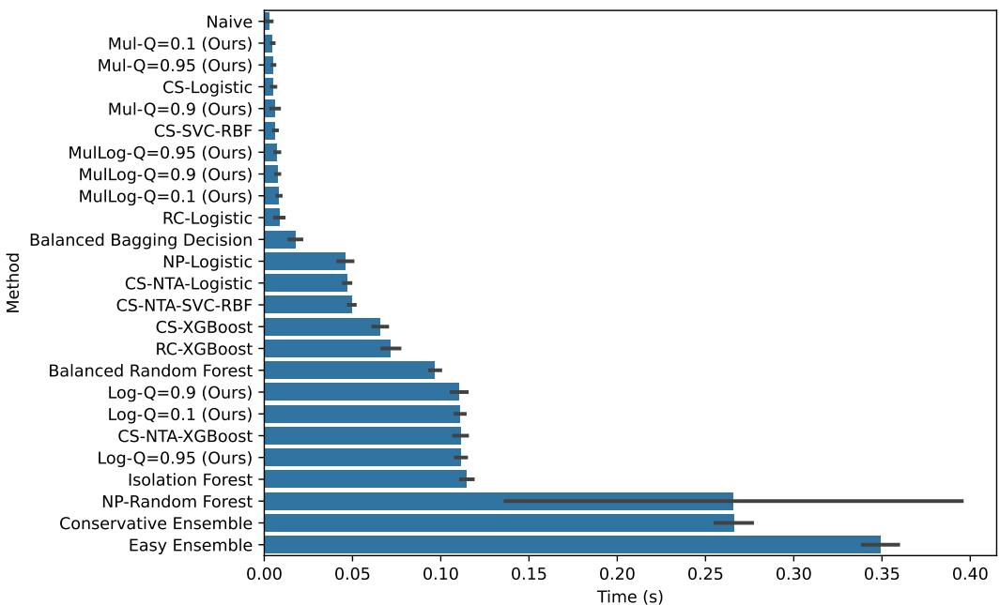  
Figure 11: Barplot of the training time for the diferent methods on the dataset ScreenX. Runtime measurements were obtained on a CPU-only server with 4 GB of RAM.

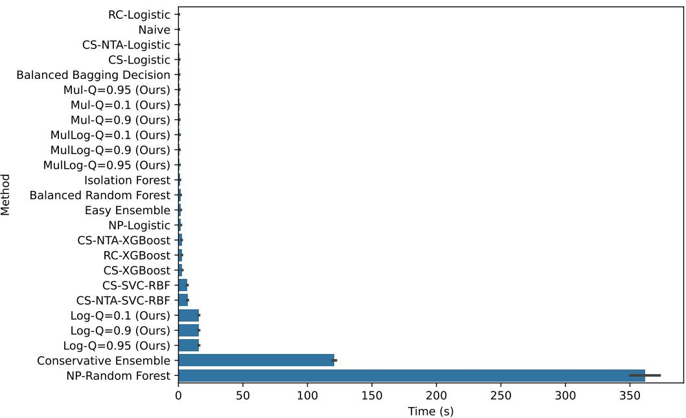  
Figure 12: Barplot of the training time for the diferent methods on the dataset Credit. Runtime measurements were obtained on a CPU-only server with 4 GB of RAM.

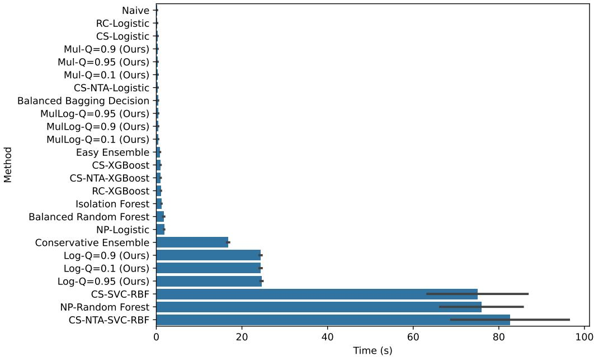  
Figure 13: Barplot of the training time for the diferent methods on the dataset Corruption. Runtime measurements were obtained on a CPU-only server with 4 GB of RAM.

## C DISCUSSION OF THE UMBRELLA NP ALGORITHM

In [22][Proposition 1], the idea is not to ensure the false negative constraint during the training, but to validate it with high probability using a post-processing step, by proceeding the following way:

1. Split the given dataset $\mathcal { D } = \mathcal { D } _ { \mathrm { v a l } } \cup \mathcal { D } _ { \mathrm { t r a i n } }$ in a validation set $\mathcal { D } _ { \mathrm { v a l } }$ and a train set $\mathcal { D } _ { \mathrm { t r a i n } }$ such that $\mathcal { D } _ { \mathrm { v a l } }$ contains only features $x _ { i }$ related to class $y _ { i } = 1$

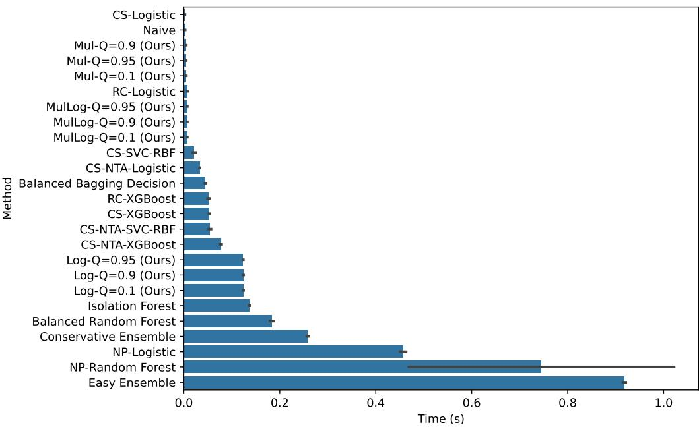  
Figure 14: Barplot of the training time for the diferent methods on the dataset Breast Cancer. Runtime measurements were obtained on a CPU-only server with 4 GB of RAM.

2. Train a scoring function ϕ on the train set such that $g ( X ) = 1 - \mathbb { 1 } ( \phi ( X ) > 0 )$ is the related classifier which predicts 0 when $\phi ( X ) > 0$ and assume that $\phi ( X )$ is continuous. ϕ can be a logistic regression score, or a support vector decision function for instance.

3. Then, consider $T _ { i } = \phi ( x _ { i } ^ { \mathrm { v a l } } )$ for any $x _ { i } ^ { \mathrm { v a l } } \in \mathcal { D } _ { \mathrm { v a l } }$ and rank it such that $T _ { ( i ) }$ is the i-th highest scores among $( T _ { i } ) _ { i \in [ N _ { 1 } ^ { \mathrm { v a l } } ] }$

4. Given an upper bound $\alpha > 0$ and a probability of violation $( 1 - \alpha ) ^ { N _ { 1 } ^ { \mathrm { v a l } } } \leq \delta$ , define

$$
k ^ { * } = \operatorname* { m i n } \left\{ i \in [ N _ { 1 } ^ { \mathrm { v a l } } ] : \sum _ { j = i } \binom { N _ { 1 } ^ { \mathrm { v a l } } } { j } \alpha ^ { N _ { 1 } ^ { \mathrm { v a l } } - j } ( 1 - \alpha ) ^ { j } \le \delta \right\}
$$

then the random classifier $g ( X ) = 1 - \mathbb { 1 } ( \phi ( X ) \geq T _ { ( k ^ { * } ) } )$ depending on the sample $T _ { ( k ^ { * } ) }$ satisfies $\mathbb { P } ( g ( X ) \neq$ $Y | Y = 1 ) \leq \alpha$ with probability (1 − δ).

Given the rank statistics $( T _ { \left( i \right) } ) _ { i \in [ N _ { 1 } ^ { \operatorname { v a l } } ] }$ , this post-processing step finds the smallest threshold that ensures that the false negative constraint is fulfilled with probability $( 1 - \delta )$ by only assuming that $\phi ( X )$ is a continuous random variable and i.i.d data generation. In this approach, false positive $\mathbb { P } ( g ( X ) \neq Y | Y = 0 )$ are not minimized explicitly and heavily depend on the scoring function $\phi .$ . Coming back to our case where $\alpha \approx 0$ , we have $( 1 - \alpha ) ^ { N _ { 1 } ^ { \mathrm { v a l } } } \approx 1 - N _ { 1 } ^ { \mathrm { v a l } } \alpha \leq \delta$ and thus $( 1 - \delta ) \approx N _ { 1 } ^ { \mathrm { v a l } } \alpha \leq N _ { 1 } \alpha \ll 1$ , meaning that with this method the best classifier is $g ( X ) = 1 - \mathbb { 1 } ( \phi ( X ) \geq T _ { ( N _ { 1 } ^ { \mathrm { v a l } } ) } )$ and it ensures the false negative constraint with a very low probability. Note that in dimension $d = 1$ , using $\phi ( X ) = X$ , there is no need for training set and thus $\mathcal { D } _ { \mathrm { v a l } } = \mathcal { D }$ , the postprocessing method thus yields $g = g _ { - \infty , b _ { \mathrm { n a i v e } } }$

## D PERMUATION TEST ON THE MAXIMUM

Let two independent samples $( W _ { i } ) \in [ n ] , ( V _ { i } ) _ { i \in [ m ] }$ such that $W _ { i } \stackrel { i . i . d } { \sim } P _ { 1 } , V _ { i } \stackrel { i . i . d } { \sim } P _ { 2 }$ then

$$
M _ { W } = \operatorname* { m a x } _ { i \in [ n ] } W _ { i } , \quad M _ { V } = \operatorname* { m a x } _ { i \in [ m ] } V _ { i }
$$

Define $T _ { o b s } = M _ { W } - M _ { V }$ . Then, under interchangeability assumption $H _ { 0 } ,$ the two samples are concatenated $( Z _ { i } ) _ { i \in [ n + m ] } = ( W _ { i } ) \cup ( V _ { i } )$ . Denoting by $\pi : [ n + m ] \mapsto [ n + m ]$ a random permutation, then define

$$
W _ { \pi } = ( Z _ { \pi ( i ) } ) _ { i \in [ n ] } , V _ { \pi } = ( Z _ { \pi ( n + i ) } ) _ { i \in [ m ] } , \quad T _ { \pi } = \operatorname* { m a x } W _ { \pi } - \operatorname* { m a x } V _ { \pi }
$$

the p value is defined as follows to test whether the maximum of $P _ { 1 }$ is higher than the maximum of $P _ { 2 }$ :

$$
p _ { \mathrm { p e r m } } = \frac { 1 + \sum _ { \pi : [ n + m ] \mapsto [ n + m ] } \mathbb { 1 } ( T _ { \pi } \geq T _ { o b s } ) } { 1 + k _ { p e r m } }
$$

where $k _ { p e r m }$ is the number of permutation. The test is exact

$$
\begin{array} { r } { \mathbb { P } ( p _ { \mathrm { p e r m } } \leq p | H _ { 0 } ) \leq p . } \end{array}
$$

Numerically, most often we only sample a $\tilde { k } \mathrm { - }$ -subset of permutation $\left( \pi _ { i } \right) _ { i \in [ \tilde { k } ] }$ and estimate,

$$
\hat { p } _ { \mathrm { p e r m } } = \frac { 1 + \sum _ { i = 1 } ^ { \tilde { k } } \mathbb { 1 } ( T _ { \pi _ { i } } \geq T _ { o b s } ) } { 1 + \tilde { N } }
$$

However, in our case, an explicit expression is tractable. Indeed, denoting by $\left( Z _ { i , n + m } \right)$ the sorted samples in $( Z _ { i } ) _ { i \in [ n + m ] } ;$ , the following Lemma yields a formula.

Lemma 2. Assuming that all values $\left( Z _ { i } \right)$ are distinct, under $H _ { 0 } ,$ for any $i \in [ n , n + m ] , j \in [ m , n + m ]$

$$
\mathbb { P } ( \operatorname* { m a x } W _ { \pi } \leq Z _ { j , n + m } , \operatorname* { m a x } V _ { \pi } = Z _ { n + m , n + m } ) = \frac { { \binom { j } { n } } } { { \binom { n + m - 1 } { n } } } \frac { m } { n + m }
$$

$$
\mathbb { P } ( \operatorname* { m a x } W _ { \pi } = Z _ { n + m , n + m } , \operatorname* { m a x } V _ { \pi } \leq Z _ { j , n + m } ) = \frac { { \binom { j } { m } } } { { \binom { n + m - 1 } { m } } } \frac { n } { n + m }
$$

$$
\mathbb { P } ( \operatorname* { m a x } W _ { \pi } \neq Z _ { n + m , n + m } , \operatorname* { m a x } V _ { \pi } \neq Z _ { n + m , n + m } ) = 0
$$

therefore, $i f T _ { o b s } > 0$ , and defining $n + m - l \geq m \ s . t \ Z _ { n + m , n + m } - Z _ { n + m - l , n + m } = T _ { o b s }$

$$
\mathbb { P } ( T _ { \pi } \geq T _ { o b s } ) = \sum _ { \substack { Z _ { n + m , n + m } - Z _ { j , n + m } > T _ { o b s } } } \mathbb { P } ( \operatorname* { m a x } W _ { \pi } = Z _ { n + m , n + m } , \operatorname* { m a x } V _ { \pi } = Z _ { j , n + m } )
$$

$$
\mathbb { P } ( T _ { \pi } \geq T _ { o b s } ) = \mathbb { P } ( \operatorname* { m a x } W _ { \pi } = Z _ { n + m , n + m } , \operatorname* { m a x } V _ { \pi } \leq Z _ { n + m - l , n + m } )
$$

$$
= \frac { n } { n + m } \prod _ { i = 2 } ^ { l } \frac { n - l - 1 + i } { n - l + m - 1 + i }
$$

Proof. First, note that

$$
\mathbb { P } ( \operatorname* { m a x } W _ { \pi } \neq Z _ { n + m , n + m } , \operatorname* { m a x } V _ { \pi } \neq Z _ { n + m , n + m } ) = 0
$$

because $\pi$ is surjective. Second,

$$
\mathbb { P } ( \operatorname* { m a x } W _ { \pi } = Z _ { n + m , n + m } ) = \mathbb { P } ( l ^ { * } \in \pi ( [ n ] ) , \mathrm { w h e r e } Z _ { n + m , n + m } = Z _ { l ^ { * } } ) = \frac { n } { n + m } .
$$

Indeed, we first select, among the elements of $[ n ]$ , the preimage of $l ^ { * }$ , yielding n possible choices. Once this choice is fixed, the permutation $\pi$ is completely determined by assigning the remaining $n + m - 1$ values, for which there are $( n + m - 1 ) !$ possibilities. Dividing by the total number of permutations of $[ n + m ]$ , namely $( n + m ) !$ !, gives the desired result.

Third, denoting by $V _ { \pi } ^ { 1 } , \ldots , V _ { \pi } ^ { m }$ the sorted values of $V _ { \pi }$ which define bijectively a subset $\{ i _ { v } ^ { 1 } , \ldots , i _ { v } ^ { m } \} \ \mathrm { o f } \ [ n + m ]$ ，

$$
\begin{array} { r l } & { \mathbb { P } ( \operatorname* { m a x } W _ { \pi } = Z _ { n + m , n + m } , \operatorname* { m a x } V _ { \pi } \leq Z _ { j , n + m } ) = \mathbb { P } ( \operatorname* { m a x } V _ { \pi } \leq Z _ { j , n + m } | \operatorname* { m a x } W _ { \pi } = Z _ { n + m , n + m } ) \frac { n } { n + m } } \\ & { = \mathbb { P } ( \{ i _ { \nu } ^ { 1 } , \dots , i _ { \nu } ^ { m } \} , \mathrm { s u b s e t ~ o f } [ j ] | \operatorname* { m a x } W _ { \pi } = Z _ { n + m , n + m } ) \frac { n } { n + m } } \\ & { = \frac { \binom { j } { m } } { \binom { n + m - 1 } { m } } \frac { n } { n + m } } \\ & { = \frac { j ! ( n - 1 ) ! } { ( n + m - 1 ) ! ( j - m ) ! } \frac { n } { n + m } } \end{array}
$$

Using $j = n + m - k$ , we have

$$
{ \frac { j ! ( n - 1 ) ! } { ( n + m - 1 ) ! ( j - m ) ! } } = \prod _ { i = 2 } ^ { k } { \frac { n - k - 1 + i } { n - k + m - 1 + i } } .
$$

The result are symmetric for max $V _ { \pi }$ , which concludes the proof.

For discrete data, observations are not necessarily distinct, and therefore the formula is no longer exact. In such cases, we still use the same expression as an approximation. More generally, our EVT-based approach is not well suited to discrete data, as the underlying assumptions of extreme value analysis are not naturally satisfied in this setting.

## E PROOFS

## E.1 Proof of Lemma 1

In (1), we have $\begin{array} { r } { a _ { \mathrm { n a i v e } } , b _ { \mathrm { n a i v e } } \in \{ ( a , b ) : \sum _ { i : y _ { i } = 1 } { \mathbb { 1 } } ( g _ { a , b } ( x _ { i } ) \neq 1 ) = 0 \} } \end{array}$ , this implies that for any $i \in [ N ]$ such that $y _ { i } = 1$

$$
a _ { \mathrm { n a i v e } } \leq x _ { i } , \quad b _ { \mathrm { n a i v e } } \geq x _ { i }
$$

thus $a _ { \mathrm { n a i v e } } \leq \operatorname* { m i n } \{ x _ { i } : y _ { i } = 1 \}$ and $b _ { \mathrm { n a i v e } } \geq \operatorname* { m a x } \{ x _ { i } : y _ { i } = 1 \}$ . Then, note that $\mathbb { 1 } \left( g _ { a _ { \mathrm { n a i v e } } , b _ { \mathrm { n a i v e } } } ( x _ { i } ) \neq y _ { i } \right) = 1$ as long as $b _ { \mathrm { n a i v e } } \geq x _ { i }$ and $a _ { \mathrm { n a i v e } } \leq x _ { i }$ for any $i \in [ N ]$ such that $y _ { i } = 0$ . Therefore, the solutions of (1) are ,

$$
\begin{array} { r } { \operatorname* { m a x } \{ x _ { i } : y _ { i } = 0 , x _ { i } < \operatorname* { m i n } \{ x _ { i } : y _ { i } = 1 \} \} < a _ { \mathrm { n a i v e } } \leq \operatorname* { m i n } \{ x _ { i } : y _ { i } = 1 \} } \\ { \operatorname* { m i n } \{ x _ { i } : y _ { i } = 0 , x _ { i } > \operatorname* { m a x } \{ x _ { i } : y _ { i } = 1 \} \} > b _ { \mathrm { n a i v e } } \geq \operatorname* { m a x } \{ x _ { i } : y _ { i } = 1 \} . } \end{array}
$$

$a _ { \mathrm { n a i v e } } , b _ { \mathrm { n a i v e } } = \operatorname* { m i n } \{ x _ { i } : y _ { i } = 1 \}$ , max $\{ x _ { i } : y _ { i } = 1 \}$ is always a valid solution.

## E.2 Proof of Theorem 4

Proof. Denote by

$$
\begin{array} { r l } & { P _ { \mathrm { t r u e } } = \mathbb P \big ( U _ { N _ { 1 } + 1 } > b _ { \mathrm { n a i v e } } + \Delta _ { b } \big | ( U _ { i } ) _ { i \in [ N _ { 1 } ] } \big ) } \\ & { = \mathbb P \big ( U _ { N _ { 1 } + 1 } > b _ { \mathrm { n a i v e } } + \Delta _ { b } \big | U _ { N _ { 1 } + 1 } \ge U _ { N _ { 1 } - K , N _ { 1 } } , ( U _ { i } ) _ { i \in [ N _ { 1 } ] } \big ) \mathbb P \big ( U _ { N _ { 1 } + 1 } \ge U _ { N _ { 1 } - K , N _ { 1 } } \big | ( U _ { i } ) _ { i \in [ N _ { 1 } ] } \big ) } \\ & { P _ { \mathrm { p a r e t o } } = \big ( 1 - G _ { \xi , \beta ( U _ { N _ { 1 } - K , N _ { 1 } } ) } \big ) \big ( b _ { \mathrm { n a i v e } } + \Delta _ { b } - U _ { N _ { 1 } - K , N _ { 1 } } \big ) \frac { K } { N _ { 1 } } \quad . } \end{array}
$$

We have

$$
\begin{array} { r l } & { \mathbb { P } ( P _ { \mathrm { t r u e } } \le \alpha ) \ge \mathbb { P } ( P _ { \mathrm { p a r e t o } } + | P _ { \mathrm { t r u e } } - P _ { \mathrm { p a r e t o } } | \le \alpha ) } \\ & { \ge 1 - \mathbb { P } ( ( P _ { \mathrm { p a r e t o } } \ge \alpha / 2 ) \cup | P _ { \mathrm { t r u e } } - P _ { \mathrm { p a r e t o } } | \ge \alpha / 2 ) } \end{array}
$$

Bounding $| P _ { \mathrm { t r u e } } - P _ { \mathrm { p a r e t o } } | ;$ : Denoting by

$$
L _ { \mathrm { q u a n t } } = \left| \frac { K } { N _ { 1 } } - \mathbb { P } \left( U _ { N _ { 1 } + 1 } \geq U _ { N _ { 1 } - K , N _ { 1 } } | ( U _ { i } ) _ { i \in [ N _ { 1 } ] } \right) \right|
$$

and by assumption

$$
\begin{array} { r } { L _ { \operatorname* { m i s } } = | ( 1 - G _ { \xi , \beta ( U _ { N _ { 1 } - K , N _ { 1 } } ) } ) ( b _ { \mathrm { n a i v e } } + \Delta _ { b } - U _ { N _ { 1 } - K , N _ { 1 } } ) - { \mathbb { P } } ( U _ { N _ { 1 } + 1 } > b _ { \mathrm { n a i v e } } } \\ { + \Delta _ { b } | U _ { N _ { 1 } + 1 } \ge U _ { N _ { 1 } - K , N _ { 1 } } , ( U _ { i } ) _ { i \in [ N _ { 1 } ] } ) | \le o _ { K \to \infty } ( { \mathbb { P } } ( U _ { N _ { 1 } + 1 } \ge U _ { N _ { 1 } - K , N _ { 1 } } | ( U _ { i } ) _ { i \in [ N _ { 1 } ] } ) ) } \end{array}
$$

By triangular inequality

$$
\big | P _ { \mathrm { t r u e } } - P _ { \mathrm { p a r e t o } } \big | \le L _ { \mathrm { q u a n t } } \big ( 1 - G _ { \xi , \beta ( U _ { N _ { 1 } - K , N _ { 1 } } ) } \big ) \big ( b _ { \mathrm { n u i v e } } + \Delta _ { b } ^ { * } - U _ { N _ { 1 } - K , N _ { 1 } } \big ) + o _ { K \to \infty } ( ( ( K / N _ { 1 } ) + L _ { \mathrm { q u a n t } } ) ^ { 2 } ) \big \}
$$

By Dvoretzky-Kiefer-Wolfowitz theorem using i.i.d assumption, using $\delta _ { \mathrm { q u a n t } } > 0$

$$
\mathbb { P } ( L _ { \mathrm { q u a n t } } > \sqrt { \frac { \log ( 2 / \delta _ { \mathrm { q u a n t } } ) } { 2 N _ { 1 } } } ) \le \delta _ { \mathrm { q u a n t } } .
$$

Since the cumulative distribution is non decreasing,

$$
\begin{array} { r } { \mathbb { P } \big ( ( 1 - G _ { \xi , \beta ( U _ { N _ { 1 } - K , N _ { 1 } } ) } ) \big ( b _ { \mathrm { n a i v e } } + \Delta _ { b } - U _ { N _ { 1 } - K , N _ { 1 } } \big ) \le Q _ { K } \big ) \ge \mathbb { P } \big ( ( 1 - G _ { \xi , \beta ( U _ { N _ { 1 } - K , N _ { 1 } } ) } ) \big ( \Delta _ { b } ) \le Q _ { K } \big ) } \end{array}
$$

and by assumption we have,

$$
\begin{array} { r } { \mathbb { P } \big ( \big ( 1 - G _ { \xi , \beta ( U _ { N _ { 1 } - K , N _ { 1 } } ) } \big ) \big ( \Delta _ { b } \big ) \big ) \leq Q _ { K } \geq 1 - \delta _ { \mathrm { e s t } } . } \end{array}
$$

Finally, using $K \geq \sqrt { N _ { 1 } }$ , we have with probability $1 - \delta _ { \mathrm { q u a n t } } - \delta _ { \mathrm { e s t } }$ 2

$$
| P _ { \mathrm { t r u e } } - P _ { \mathrm { p a r e t o } } | \leq \sqrt { \frac { \log ( 2 / \delta _ { \mathrm { q u a n t } } ) } { 2 N _ { 1 } } } Q _ { K } + o _ { K \to \infty } ( ( 1 + \sqrt { \frac { \log ( 2 / \delta _ { \mathrm { q u a n t } } ) } { 2 } } ) ^ { 2 } / N _ { 1 } ) .
$$

Using $Q _ { K } = o _ { K \to \infty } ( 1 / K )$ , we have with probability $1 - \delta _ { \mathrm { q u a n t } } - \delta _ { \mathrm { e s t } }$

$$
| P _ { \mathrm { t r u e } } - P _ { \mathrm { p a r e t o } } | \leq o _ { K  \infty } ( 2 ( 1 + \sqrt { \frac { \log ( 2 / \delta _ { \mathrm { q u a n t } } ) } { 2 } } ) ^ { 2 } / N _ { 1 } ) .
$$

Bounding $P _ { \mathrm { p a r e t o } } \mathrm { : }$

$$
\mathbb { P } ( P _ { \mathrm { p a r e t o } } \le Q _ { K } K / N _ { 1 } = o _ { K \to \infty } ( 1 / N _ { 1 } ) ) \ge 1 - \delta _ { \mathrm { e s t } }
$$

Conclusion: This yields,

$$
\mathbb { P } \big ( P _ { \mathrm { t r u e } } \le o _ { K \to \infty } ( 4 ( 1 + \sqrt { \frac { \log ( 2 / \delta _ { \mathrm { q u a n t } } ) } { 2 } } ) ^ { 2 } / N _ { 1 } ) ) \ge 1 - \delta _ { \mathrm { q u a n t } } - \delta _ { \mathrm { e s t } } \ .
$$

## E.3 Proof of Proposition 6

Proof. First, we prove the following Lemma.

Lemma 3. Assume that W follow a Generalized Pareto Distribution $G _ { \xi , \beta }$ with parameter $\xi \le 0$ and $\beta > 0$ , then $\mathbb { P } ( W \geq q _ { 1 - Q } ) \leq Q$ using $q _ { 1 - Q } = - \beta \log ( Q ) ( 1 + \exp ( - 1 ) ) / ( 1 - \xi )$ for any $0 < Q \leq \exp ( - 1 )$

Proof. Case $\xi = 0 : \quad G _ { \xi , \beta }$ is an Exponential distribution of parameter $1 / \beta ,$ , we have $\mathbb { E } ( W ) = \beta$ and $q _ { 1 - Q } =$ $- \beta \log ( Q )$ and $1 \leq 1 + \exp ( - 1 )$

Case $\xi < 0 :$ We have $\mathbb { E } ( W ) = \beta / ( 1 - \xi )$ and $q _ { 1 - Q } ^ { \xi } = \beta ( \exp ( - \xi \log ( Q ) ) - 1 ) / \xi$ is exactly the quantile of leve $Q .$ . We have to show

$$
- \log ( Q ) ( 1 + \exp ( - 1 ) ) / ( 1 - \xi ) \geq ( \exp ( - \xi \log ( Q ) ) - 1 ) / \xi
$$

Denoting $z = - \log ( Q ) \geq 0$ and $\gamma = - \xi \ge 0$ , and multiplying by $- \xi ( 1 - \xi )$ we study the function $h : \gamma \in \mathbb { R } _ { \geq 0 } \mapsto$ $\gamma ( 1 + \exp ( - 1 ) ) z - ( 1 + \gamma ) ( 1 - \exp ( - \gamma z ) )$ and aim to show $h ( \gamma ) \geq 0$ . We have

$$
\begin{array} { r l } & { h ^ { \prime } ( \gamma ) = ( 1 + \exp ( - 1 ) ) z - ( 1 - \exp ( - \gamma z ) ) - ( 1 + \gamma ) z \exp ( - \gamma z ) } \\ & { h ^ { \prime } ( \gamma ) = ( z - 1 ) ( 1 - \exp ( - \gamma z ) ) + z \exp ( - 1 ) - \gamma z \exp ( - \gamma z ) } \end{array}
$$

Noting that $| x \exp ( - x ) | \leq \exp ( - 1 )$ , we have $h ^ { \prime } ( \gamma ) \geq 0$ as long $\operatorname { a s } z \geq 1$ . Since $h ( 0 ) = 0$ , we have thus $h ( \gamma ) \geq 0$ J, which yields the inequality. 口

By Lemma 3, we have for any $\begin{array} { r } { \xi \le 0 , \Delta _ { b } ^ { * } = - \mathbb { E } _ { D \sim G _ { \xi , \beta ( U _ { N _ { 1 } - K , N _ { 1 } } ) } } ( D ) ( 1 + \exp ( - 1 ) ) \log ( 1 / ( K \log ( K ) ) ) } \end{array}$ verifies (5) with $\delta _ { \mathrm { { e s t } } } = 0$ since $\mathbb { E } _ { D \sim G _ { \xi , \beta ( U _ { N _ { 1 } - K , N _ { 1 } } ) } } ( D ) = \beta ( U _ { N _ { 1 } - K , N _ { 1 } } ) / ( 1 - \xi ) \ \mathrm { a n d } \ 1 / ( K \log ( K ) ) \le \exp ( - 1 )$ for $K \geq 3$ , then the results holds using (6). □

## E.4 Multidimensional case inflation

Assuming independence of coordinates

$$
\begin{array} { r l } & { \mathbb { P } ( g ( X ) \neq 1 | Y = 1 ) = \mathbb { P } ( \bigcup _ { i = 1 } ^ { d } ( g _ { a _ { i } , b _ { i } } ( X ^ { i } ) \neq 1 ) | Y = 1 ) = 1 - \prod _ { i = 1 } ^ { d } \mathbb { P } ( g _ { a _ { i } , b _ { i } } ( X ^ { i } ) = 1 | Y = 1 ) } \\ & { \leq 1 - ( 1 - \alpha ) ^ { d } \approx d \alpha } \end{array}
$$

Without assuming anything

$$
\mathbb { P } ( g ( X ) \neq 1 | Y = 1 ) = \mathbb { P } ( \bigcup _ { i = 1 } ^ { d } ( g _ { a _ { i } , b _ { i } } ( X ^ { i } ) \neq 1 ) | Y = 1 ) \quad \quad \leq \sum _ { i = 1 } ^ { d } \mathbb { P } ( ( g _ { a _ { i } , b _ { i } } ( X ^ { i } ) \neq 1 ) | Y = 1 ) \leq d _ { \mathrm { s e l e c t e d } } \alpha .
$$

where $d _ { \mathrm { s e l e c t e d } }$ is the number of dimensions where $g _ { a _ { i } , b _ { i } }$ is not constant.