# Few-Shot Learning for Personalised Automated Pain Assessment

Heinke Hihn1,\*, Ibrahim Eisawy1, Patrick Thiam2,3, Hans A. Kestler3, Friedhelm Schwenker2,

1 IU International University of Applied Sciences, Berlin, Germany

2 Institute of Neural Information Processing, Ulm University, Ulm, Germany   
3 Institute of Medical Systems Biology, Ulm University, Ulm, Germany

\* heinke.hihn@iu.org

## Abstract

Pain perception varies substantially across individuals, making it difficult for populationbased classifiers to generalise across all subjects in a dataset. One way to account for subject variability is to train personalised classifiers. In this work, we evaluate Few-Shot Learning, a sub-area of Meta-Learning, as an approach to personalisation in automated pain assessment. We re-interpret the shift from population-level to subjectlevel evaluation as a task-domain shift, where the observed classes remain fixed but the target subject changes. We evaluate our method on the BioVid Pain Database, the SenseEmotion Database, and the PainMonit Experimental Dataset (PMED), reaching 85.75% and 35.49% accuracy on BioVid and 82.37% and 41.88% on SenseEmotion in the binary and multi-class settings under a Leave-One-Subject-Out CV protocol respectively, and 90.47% on PMED, for which only a binary benchmark exists. Using samples to implement k-shot conditioning, the accuracies can be improved to 86.25%, 40.06%, 83.43%, 44.08%, and 91.25%, respectively. To further evaluate the effects and robustness of our method, we provide additional ablation experiments and investigate the personalisation effects. Our results suggest that support-conditioned few-shot adaptation can improve average performance under inter-subject variability.

## Author summary

This study investigates how Meta-Learning can be used to personalise population-level classifiers for Automated Pain Assessment to reduce inter-subject variance. This is still a major issue in subject-based data analysis. To this end, this study proposes a Few-Shot Learning mechanism that calibrates a model using a few labelled samples. The method is evaluated using three multimodal datasets and investigates personalisation benefits on a class level and on the subject level. The analysis revealed that not all classes and not all subjects benefit equally from personalisation: the intermediate classes, i.e., not the extreme no pain and highest pain, benefit the most from personalisation. The results of the study suggest that the Few-Shot Learning based approach offers an efficient way to build personalised classifiers.

## 1 Introduction

Pain is a highly personal, private, and subjective emotion [1] that is characterised by severity, location, duration, and intensity. In addition, the pain experience is modulated by several personal factors, including cognition, past experiences, and the current situation [1]. As a result, the same pain stimulus can cause different reactions, or no reaction at all. These factors make it difficult to reliably assess pain leading to self-reporting tools such as the Visual Analogue Scale (VAS) [2] being the most common method. In cases where the patient is not able to articulate their pain, caregivers rely on visible reactions of the body and bio-physical signals, if available. In such cases, automated systems could provide decision support to assist physicians in determining the pain level a patient is in, which can help improve patient well-being and recovery.

To advance towards such systems, researchers have collected data in controlled experiments, where healthy subjects were exposed to varying levels of pain stimuli and their bodily responses were recorded [3–5]. Such recordings range from bio-physical signals such as Electrodermal Activity (EDA), Electrocardiogram (ECG), and Electromyography (EMG) to video recordings of their facial expressions. These datasets have led to a set of automated pain assessment methods, ranging from hand-made features [6] to deep learning [7–9].

The highly subjective nature of pain leads to high inter-subject variability of classifiers trained on such generic population data, which is a widely documented challenge in automated pain systems [1, 10]. To overcome this challenge, automated pain assessment requires models that generalise across individuals, because pain expressions and physiological responses vary strongly between subjects. We group the approaches to this problem into four overlapping conceptual categories:

(i) Preprocessing-level personalisation: Inter-subject variability is handled before or during modelling by making physiological responses more comparable across subjects. Strategies include subject-specific feature standardisation, individual painthreshold calibration, and subject-aware normalisation [11–13].

(ii) Model-level personalisation: The model is explicitly adapted to the individual rather than assuming one universal pain-response pattern. Ideas include subject-dependent models, personalised feature fusion, dynamic attention, and personal pain sensitivity representations [12, 14].

(iii) Population-plus-individual modelling: Individual differences are not treated as noise but as meaningful structure that can be statistically or computationally modelled. Approaches include multi-task learning, person-specific outputs, subject profiles, clustering, and mixed-effects models [6, 15–17].

(iv) Generalisation-focused evaluation and adaptation: The central question is whether a model trained on source subjects generalises to a held-out subject. Strategies span transfer learning, uncertainty-guided personalisation, and Few-Shot-style adaptation [11, 13, 14, 17].

Several machine learning paradigms exist that aim to build adaptive classifiers, such as Meta-Learning [18–20], Continual Learning [21–24], and Self-Supervised Learning [25]. While Self-Supervised Learning has seen recent applications to pain assessment [26] and processing of bio-physical signals [27], as well as Continual Learning in affective computing [28], only a few studies have evaluated Meta-Learning for automated pain assessment.

To close this gap, we evaluate Meta-Learning as a candidate approach for devising personalised automated pain assessment systems to reduce inter-subject variability. In contrast to standard supervised learning, Meta-Learning aims to adapt the learning algorithm itself, so that instead of learning from scratch, it leverages previously acquired knowledge to adapt quickly to new problems. Specifically, we focus on Few-Shot Learning, which is designed for settings in which a model must adapt to a new task or individual from only a small number of labelled examples [19, 20, 29]. Considering that collecting data in pain assessment experiments is expensive and we typically have 8 [5] to 20 [3] samples per class and per subject, Few-Shot Learning matches the combination of subject variability and limited labelled data that characterises personalised automated pain assessment.

To systematically investigate Few-Shot Learning in the context of personalised automated pain assessment, we aim to answer the following research questions:

1. To what extent can personalisation improve automated pain assessment under inter-individual variability?

2. Do the benefits of personalisation vary across individuals?

3. Do the benefits of personalisation vary across pain levels?

To answer these research questions, this work makes the following contributions to automated pain assessment:

1. we propose an approach utilising Few-Shot Learning to build personalised classifiers,

2. we introduce a Cross Alignment Network allowing us to efficiently score samples against class-prototypes, and

3. we introduce a Zero-Shot extension of our method, allowing us to evaluate samples without requiring labelled support samples.

This article is structured as follows: first, we discuss related work in Section 2. We introduce our core method in Section 3, evaluate it in Section 4, and conclude with a discussion in Section 5.

## 2 Related Work

The method our work introduces is related to three sub-fields: methods that incorporate Few-Shot Learning into Leave-One-Subject-Out (LOSO) evaluation protocols, prototypebased methods for the automated assessment of pain, and personalisation in automated pain assessment. In the following, we discuss studies that fall into these categories.

## 2.1 Combining Few-Shot Learning with LOSO Evaluation

Few-shot learning has been combined with Leave-One-Subject-Out evaluation protocols in several cross-subject EEG [30], physiological signal [31], and human activity recognition studies [32]. In such settings, the model is typically trained or meta-trained on all source subjects, while one subject is held out as the target subject. During evaluation, a small labelled support set from the held-out subject is used for adaptation or calibration when the evaluation protocol includes target-subject support samples, and the remaining samples from the same subject form the query/test set. This differs from strict LOSO evaluation, where no target-subject samples are available during training or adaptation.

Few-shot learning has also been explored in automated pain assessment, with fewer published studies than in related areas such as EEG emotion recognition or human activity recognition. Existing work includes meta-learning approaches for facial-expression-based pain detection, such as Model Agnostic Meta-Learning-based adaptation on the UNBC-McMaster pain archive [33], as well as Few-Shot or prompt-based approaches for neonatal and infant pain assessment from visual or acoustic data [34–36]. These studies apply Few-Shot learning to pain-assessment settings with limited labelled data and inter-individual variability.

Closest to our work is the approach of Rathee et al. [33], where the authors utilise a modified Model-Agnostic Meta-Learning approach, which can learn to detect pain intensity from facial expressions. They evaluated the proposed model on the UNBC-McMaster pain archive database and report higher accuracy for 1-shot and 5-shot learning than their baselines.

In these studies, Few-Shot learning is used to address recurring challenges in pain assessment, especially limited labelled data, inter-individual variability, and the need for rapid adaptation to new subjects or patients. These studies motivate evaluating Few-Shot learning for automated pain assessment.

## 2.2 Prototype-Based Classification in Pain Assessment

Prototype-based methods represent each class or cluster using one or more representative reference points, known as prototypes, and classify new samples based on their similarity or distance to these prototypes. This paradigm has been applied to pain assessment across multiple data modalities, including fMRI-based pain decoding [37], clustering of chronic pain patient records [38], and knowledge transfer between phasic and tonic pain stimuli [39]. These methods provide interpretable and flexible prototypes that are learned directly from the data. The prototypes naturally capture the heterogeneity of patient populations, and can serve as representative anchors for transferring knowledge across related pain conditions.

Anter et al. [37] propose a model for decoding pain intensity from fMRI data. Their method uses both a reinforcement learning-enhanced whale optimisation algorithm (RLWOA) to identify discriminative pain-related fMRI features and a self-organizing fuzzy logic (SOFL) classifier to predict different pain intensities. The SOFL classifier automatically identifies data prototypes and constructs interpretable fuzzy rules without requiring predefined membership functions or assumptions about the underlying data distribution. The RLWOA-SOFL model also supports multi-class pain intensity classification, which is particularly relevant for clinical pain assessment, where pain is typically evaluated across up to 10 intensity levels.

Khan et al. [38] apply k-prototypes clustering as an unsupervised learning technique to analyse chronic pain patient data and identify clinically meaningful clusters. They adopt k-prototypes because it is a partitioning-based method well suited to mixed-type or heterogeneous data. Unlike k-means or k-modes, which are restricted to numerical or categorical variables respectively, k-prototypes can handle both types simultaneously. The algorithm defines a set of virtual points, or prototypes, as the centre of the clusters. For numerical variables, these prototypes are represented by their mean values, and for categorical variables, these prototypes are represented by mode values. The algorithm then measures dissimilarity between two mixed-type objects A and B by combining a squared Euclidean distance over numerical features with a simple matching count over categorical ones. In their study, these prototype-based clusters are used to examine whether patient-reported chronic pain data align with established nociceptive, neuropathic, and nociplastic pain mechanisms.

Ricken et al. [39] apply prototype-based knowledge transfer from short-term (phasic) to long-term (tonic) pain stimuli using physiological signals of the X-ITE Pain Database. A classification model is trained on the phasic domain, and class-specific prototypes (one for the no-pain and one for the pain class) are computed as feature-average samples of that domain. Each tonic sample is then partitioned into equally sized segments matching the length of the phasic samples, and the distance between every segment and each phasic prototype is measured. The segment with the smallest distance to the prototypes is selected and passed to the classifier to label the entire tonic sample. They evaluate a range of distance metrics for this segment selection, including Euclidean, City-Block, Chebyshev, Canberra, Bray–Curtis, and Wasserstein. The authors also compare this distance-based segment selection to a naive approach that feeds unmodified tonic stimuli to the phasic-trained model without adaptation. The distance-based selection of a single segment improves classification performance across most metrics; for example, on the trapezius signal (TRA) in the electric pain domain, it raised average accuracy from 66.0% to 68.0%, and on the electrodermal activity signal in the thermal domain, from 53.2% to 59.6%.

## 2.3 Personalisation in Automated Pain Assessment

Sharafi et al. [40] introduce the Disentangled Source-Free Domain Adaptation (DSFDA) method, which addresses inter-subject variability and the challenge of adapting models with missing target expression data by leveraging neutral control videos for end-to-end generation and adaptation. Their setting is subject-based: a source model is pre-trained on all classes from the source subjects, then adapted to each target subject individually using only a short neutral control video, while testing covers both neutral and pain expressions. To compensate for the missing classes, DSFDA learns to disentangle expression-related from identity-related features and generates the absent non-neutral images for the target subject, combining data generation and adaptation in a single endto-end stage. A self-supervision strategy further reconstructs target images preserving the same identity and source expression. The approach is evaluated on the BioVid and UNBC-McMaster pain assessment datasets, outperforming state-of-the-art source-free adaptation methods, which degrade sharply when only neutral target data is available for adaptation.

Jiang et al. [14] propose a personalised neural network for time-continuous pain detection. The model addresses the inter-subject variability in the data by combining personalised feature fusion based on pain sensitivity with a dynamic feature attention mechanism. Pain sensitivity accounts for individual differences in pain perception, while the dynamic feature attention mechanism enables the model to focus on the most informative physiological features over time and better capture varying pain response patterns. The approach is evaluated on both the authors’ SpaExp and the BioVid Heat Pain dataset. It demonstrates improved cross-dataset generalisation across different pain protocols and shows competitive performance in pain intensity classification.

Fang et al. [41] proposed the Adaptive Transfer Learning-based Pain Assessment System (ATLAS) to improve automatic pain assessment for new patients whose data are unlabelled and may differ from the data used to train the model. ATLAS applies Transfer Component Analysis (TCA) to reduce the distribution gap between the labelled source data and the new patient’s physiological signals, and adaptively combines the resulting personalised model with a general pretrained model. The framework was evaluated on the BioVid database using ECG, skin conductance, and electromyography signals. The results showed the approach outperformed three existing traditional machine learning-based approaches and achieved an average accuracy only 2% below that of supervised methods using labelled test data.

Thiam et al. [42] propose a personalised, participant-independent pain recognition system based on the video channel to improve automatic pain assessment for an unseen participant whose facial responses may differ from those of the participants used to train the model. Several complementary facial descriptors, including landmark distances, head pose, LBP-TOP, LGBP-TOP, and PHOG, are each classified by a separate Random Forest and combined through a two-stage hierarchical fusion scheme. Rather than training on the entire annotated dataset, the system uses the Hausdorff distance and two variants based on the average and median of the distances between the points of two sets to measure the similarity between the unseen participant’s data and that of each training participant, and trains the model only on the most similar subset. The framework is evaluated on data collected within the SenseEmotion project of 40 participants undergoing thermal pain stimulation, for the task of distinguishing no stimulation from maximum pain. The results show that selecting around 30 participants outperformed the baseline that used all available data. However, the gains were small on the two datasets corresponding to the left and right forearm stimulation sites (65.7% to 66.8% and 67.6% to 67.8%, respectively), with the modest overall accuracy attributed to participants who displayed little visible facial reaction to the stimuli.

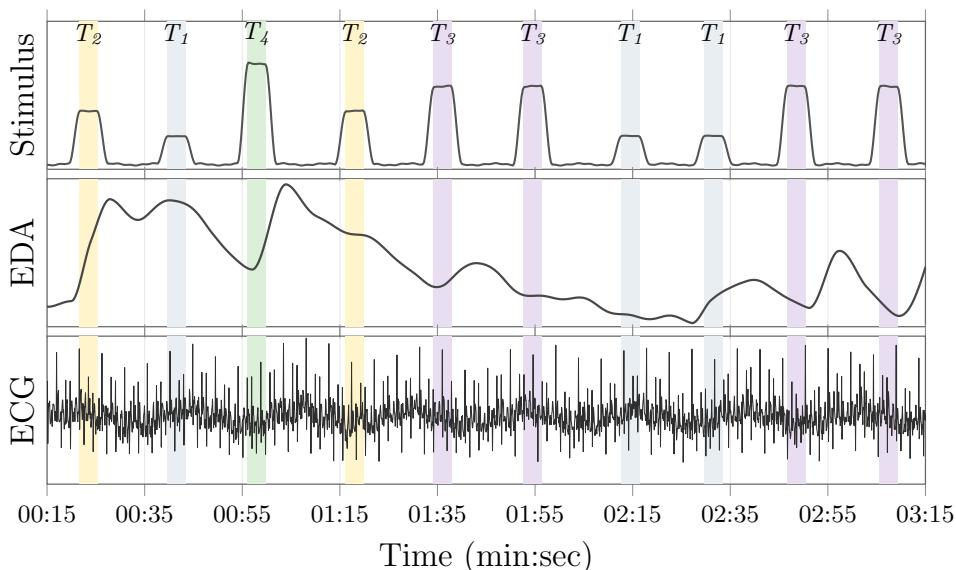  
Fig 1. The data in the experiments has been generated by subjecting subjects to various levels of pain (annotated as $T _ { i } )$ and a baseline of no pain and recording their bodily response by various bio-physical signals such as EDA, EMG, and ECG. This creates time series of signals annotated by the experienced pain level, thus enabling us to train models to predict the pain based on the signals.

## 3 Method

In the following, we will introduce the datasets we use for evaluation (Section 3.1) and the building blocks that comprise our method: (i) how we re-frame automated pain assessment as subject-as-a-task prototype-based Few-Shot learning (Section 3.2), (ii) how we apply cross-modal feature fusion to incorporate EDA and ECG signals (Section 3.3, (iii) our proposed cross-attention scoring network used to compare support prototypes with query inputs (Section 3.4), and (iv) how we propose to turn our method into a Zero-Shot classifier that does not require any labelled samples from the held-out subject (Section 3.5).

## 3.1 Datasets

## 3.1.1 The BioVid Pain Dataset

We evaluate our method using the BioVid Heat Pain Database (Part A) [3]. It consists of 87 participants who were exposed to four levels of increasing thermal pain, indicated as $T _ { 1 } , T _ { 2 } , T _ { 3 }$ , and $T _ { 4 }$ . During the experiment, video streams, EDA, ECG, and EMG signals were recorded for each participant, enabling us to map their bodily reactions to the pain stimulus. Each pain level was elicited 20 times in random order, where each elicitation lasted 4s and was followed by a recovery phase $( T _ { 0 }$ with 32°C) between 8 and 12s. Thus, in total the dataset consists of 20 × 5 × 87 = 8, 700 samples. We use the data augmentation described by Thiam et al. [7], which gives us 87, 000 samples in total.

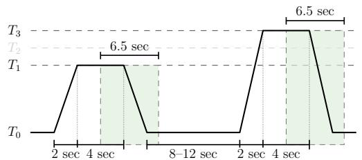

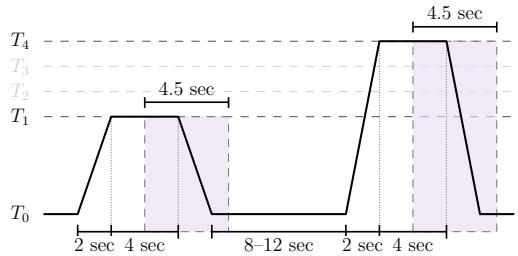  
Fig 2. The left figure shows the signal segmentation in the SenseEmotion Database [4], where experiments have been carried out on 6.5s windows with a 4s shift from the onset of the elicitation in four pain levels $T _ { 0 } , . . . , T _ { 3 }$ . On the right, we show how in the BioVid Database [3] the windows are of 4.5s with an 4s shift on five pain levels $T _ { 0 } , . . . , T _ { 4 }$ . Thus, on sampling rate of 256 Hz we have an input dimensionality 1, 664 of and 1, 152, respectively.

For our experiments, we rely only on the EDA and the ECG signals, following prior physiological pain-assessment work that emphasises EDA [43–49].

## 3.1.2 The SenseEmotion Dataset

Additionally, we assess our method on the SenseEmotion dataset [4]. The dataset consists of 45 healthy participants, each exposed to three increasing heat pain levels, indicated as T1, T2, T3. For this experiment, the signals (biopotentials: SCL/EDA, ECG, trapezius EMG, respiration), plus video (facial expressions, skeleton, head pose), were recorded. These signals enabled us to map body reactions to a certain pain level. Each pain level was applied 30 times for 4s in random order, with randomised pauses $( T _ { 0 }$ with $3 2 ^ { \circ } \mathrm { C } )$ of $8 - 1 3 s$ between stimuli. This dataset consists of $3 \times 3 0 \times 4 5 = 4 0 5 0$ pain-stimulus samples. For our experiments, we only use EDA and ECG signals for pain assessment, following prior physiological pain-assessment work [43–49].

## 3.1.3 The PainMonit Dataset

Next, we assess our method on the PainMonit Database (PMED). It consists of 52 healthy participants who were exposed to 5 levels of increasing thermal pain, denoted as NP, $P _ { 1 } , P _ { 2 } , P _ { 3 }$ , and $P _ { 4 }$ . During the experiment, EDA, ECG, EMG, BVP, Resp, Temp, and Grip signals were recorded for each participant. These signals allow us to map the patient’s body reactions to the pain stimulus. Each pain level was elicited 8 times for 10s in random order, with a recovery phase $( T _ { 0 }$ at $3 2 ^ { \circ } \mathrm { C } )$ of between 20 and 30s. Overall, the dataset consists of $6 \times \sim 8 \times 5 2 = 2 4 9 5$ . In our experiments, we consider only the EDA and the ECG signals for pain assessment, following the prior physiological pain-assessment work [43–49].

## 3.2 Few-Shot Task Construction

Few-shot learning [29] is an instance of meta-learning and describes a setting in which a model is expected to adapt to a new task, class, or domain using only a small number of labelled examples. Conceptually, the model first learns generalisable representations from a larger set of source data and then uses a limited support set to adjust its predictions for a new target case.

Formally, Few-Shot learning considers a distribution over tasks $\tau \sim p ( \tau )$ , where each task consists of a small labelled support set S and a query set Q. In an N-way K-shot classification setting with class set $\mathcal { C }$ and $| { \mathcal { C } } | = N$ , the support set contains K labelled examples for each class, i.e., we have

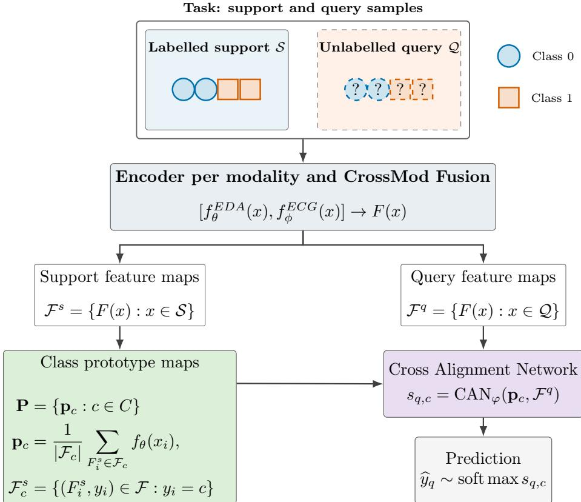  
Fig 3. Our approach for Subject-As-A-Task Few-Shot Pain Assessment. First, we sample a task, which is then passed into an encoder for each modality. These streams are combined using a modified Cross Modality Transformer as introduced by Farmani et al. [47], as described in Section 3.3. The resulting support feature maps are used to compute a prototype per class against which we classify the query feature maps using the Cross Alignment Network described in Section 3.4.

$$
\begin{array} { r } { \pmb { S } = \{ ( x _ { i } , y _ { i } ) \} _ { i = 1 } ^ { N _ { K } } , \qquad \pmb { Q } = \{ ( x _ { j } , y _ { j } ) \} _ { j = 1 } ^ { N _ { Q } } . } \end{array}\tag{1}
$$

The task is then to use the support samples to condition a model such that it can classify the query samples. In a special case where $k = 0$ known as Zero-Shot learning, the model must do so without any conditioning samples. Prototype-based Few-Shot learning solves this by representing each input x through a learned embedding function $f _ { \boldsymbol { \theta } } ( \boldsymbol { x } )$ with parameters θ and computes one prototype per class as an aggregated embedding of the corresponding support examples, as the mean of the support embeddings as

$$
\mathbf { p } _ { c } = \frac { 1 } { | S _ { c } | } \sum _ { ( x _ { i } , y _ { i } ) \in S _ { c } } f _ { \boldsymbol \theta } ( x _ { i } ) , \qquad S _ { c } = \{ ( x _ { i } , y _ { i } ) \in \mathcal { S } : y _ { i } = c \} ,\tag{2}
$$

where $\mathbf { p } _ { c }$ is the prototype for class c as defined by the labels $y _ { i } , \ S _ { c }$ is the support set for class $^ { c , }$ and $f _ { \boldsymbol { \theta } } ( \boldsymbol { x } _ { i } )$ is an embedding model that takes an input signal $x _ { i }$ and transforms it to a low dimensional embedding. A query example $x _ { j }$ is then classified using a k-nearest-neighbours scheme based on its distance to the class prototypes by using a softmax over a similarity measure between the embedding of $x _ { j }$ and the class

prototypes $\mathbf { p } _ { c }$ as

$$
p _ { \theta } ( y = c \mid x _ { j } , S ) = \frac { \exp { \bigl ( } d ( f _ { \theta } ( x _ { j } ) , \mathbf { p } _ { c } ) { \bigr ) } } { \sum _ { c ^ { \prime } \in \mathcal { C } } \exp { ( d ( f _ { \theta } ( x _ { j } ) , \mathbf { p } _ { c ^ { \prime } } ) ) } } ,\tag{3}
$$

where $p _ { \theta }$ is the conditional class probability given the input x and a set of support samples ${ \mathbf { } } S .$ , and $d$ is a function that computes the similarity between two embeddings. Here, we used the cosine similarity defined as

$$
d ( f _ { \boldsymbol { \theta } } ( x ) , \mathbf { p } ) = \frac { f _ { \boldsymbol { \theta } } ( x ) ^ { \top } \mathbf { p } } { \| f _ { \boldsymbol { \theta } } ( x ) \| _ { 2 } \| \mathbf { p } \| _ { 2 } } = \frac { \sum _ { i = 1 } ^ { n } f _ { \boldsymbol { \theta } } ( x ) _ { i } \mathbf { p } _ { i } } { \sqrt { \sum _ { i = 1 } ^ { n } f _ { \boldsymbol { \theta } } ( x ) _ { i } ^ { \top } } \sqrt { \sum _ { i = 1 } ^ { n } \mathbf { p } _ { i } ^ { 2 } } } .\tag{4}
$$

The embedding parameters $\theta$ are learned by minimising the query-set classification loss across tasks, where we use the support set to anchor the prediction as

$$
\mathcal { L } = \mathbb { E } _ { T \sim p ( T ) } \left[ - \sum _ { ( x _ { j } , y _ { j } ) \in \mathcal { Q } } \log p _ { \theta } ( y _ { j } \mid x _ { j } , S ) \right] ,\tag{5}
$$

where $\tau$ are task sets consisting of a query set $\mathcal { Q }$ and a support set $\boldsymbol { s }$

Thus, learning is not optimised directly for a fixed set of classes, but for the ability to form discriminative class prototypes from only a few labelled support examples and generalise to unseen query examples. Figure 3 visualises the described approach.

In the LOSO configuration, the held-out subject is not used to construct tasks during training and only serves as the task set during evaluation. We implement two evaluation schemes: Zero-Shot refers to using a prototype bank constructed from encoding all training subjects, while k-Shot refers to using a subset of the held-out subjects’ data to calibrate the model – see Subsection 3.5 for a more detailed explanation.

## 3.3 CrossMod Feature Fusion

Our approach implements a multimodal learning scheme, where we leverage two biophysical signal streams. To combine them, we implement a modified version of the CrossMod approach introduced by Farmani et al. [47] as a feature-map encoder for EDA and ECG signals. For each signal window of length $T$ given as $\lvert x _ { F } ^ { \mathrm { E D A } } , x _ { F } ^ { \mathrm { E C G } } \rvert \in \mathbb { R } ^ { T \times 2 }$ the two modalities are first processed by independent encoders, resulting in the modalityspecific feature maps $F _ { i } ^ { m } = \bar { f } _ { \ u \Theta } ^ { m } ( x _ { i } ) \in \bar { \mathbb { R } } ^ { T ^ { \prime } \times D _ { f } }$ , where m ∈ {EDA, ECG} is the modality, and $\Theta \in \{ \theta , \phi \}$ are the separate parameters of the encoders, and $T ^ { \prime } , D _ { f }$ are the dimensions of the feature maps. The two branches use the same configuration and therefore preserve a common temporal length $T ^ { \prime }$ . We process the resulting maps with separate prenormalised Transformer encoder stacks, yielding $Z ^ { \mathrm { E D A } }$ and $\bar { Z } ^ { \mathrm { E C G } }$ . This allows temporal dependencies to be modelled within each modality before information is exchanged between the two processing paths.

The fusion stage applies bidirectional multi-head cross-attention [50].Then the two directed feature maps are computed as

$$
C ^ { \mathrm { E D A } \to \mathrm { E C G } } = \mathrm { M H A } \left( Q = Z ^ { \mathrm { E D A } } , K = Z ^ { \mathrm { E C G } } , V = Z ^ { \mathrm { E C G } } \right) ,\tag{6}
$$

$$
C ^ { \mathrm { E C G } \to \mathrm { E D A } } = \mathrm { M H A } \left( Q = Z ^ { \mathrm { E C G } } , K = Z ^ { \mathrm { E D A } } , V = Z ^ { \mathrm { E D A } } \right) ,\tag{7}
$$

where MHA is a multi-head attention and Q, K, V are the query, key, and value inputs, respectively, producing the cross-attended map $C ^ { \mathrm { E D A } \to \mathrm { E C } \hat { \mathrm { G } } }$ between EDA and ECG, and $C ^ { \mathrm { E C G } \to \mathrm { E D A } }$ between ECG and EDA. Finally, the two cross-attended maps are concatenated along the feature dimension to obtain the single temporal feature map $F$ as

$$
\boldsymbol { F } = \left[ \boldsymbol { C } ^ { \mathrm { E D A } \to \mathrm { E C G } } , \boldsymbol { C } ^ { \mathrm { E C G } \to \mathrm { E D A } } \right] \in \mathbb { R } ^ { T ^ { \prime } \times 2 D _ { f } } .\tag{8}
$$

Thus, in the subsequent notation, $T = T ^ { \prime }$ and $D = 2 D _ { f }$ . No separate classifier is attached to this representation. The same encoder produces the support maps, which are averaged class-wise into $P _ { c }$ , which are then passed to the Cross Alignment Network described in Section 3.4.

## 3.4 Cross-Attention Network Scoring

To efficiently score the alignment of query feature maps with the prototypes and thus be able to classify them, we use the Cross Alignment Network (CAN), as originally proposed by Hou et al. [51] and recently applied to automated pain assessment by Gkikas et al. [9] and Li et al. [45]. To this end, we form a descriptor of a prototype-query pair. Let

$$
\mu _ { \mathbf { p } } = { \frac { 1 } { T _ { \mathbf { p } } } } \sum _ { i } \mathbf { p } _ { d , c } \quad { \mathrm { a n d } }\tag{9}
$$

$$
\mu _ { F } = \frac { 1 } { T _ { F } } \sum _ { j } F _ { j }\tag{10}
$$

denote the un-normalised temporal means of the prototypes p of class $^ { c , }$ and of the query feature maps F. Their concatenation as

$$
d _ { \mathbf { p } , F } ^ { \mathrm { p a i r } } = [ \mu _ { \mathbf { p } } , \mu _ { F } , | \mu _ { \mathbf { p } } - \mu _ { F } | , \mu _ { \mathbf { p } } \odot \mu _ { F } ] ,\tag{11}
$$

amended with an absolute difference, and an element-wise product defines the pair descriptor. A meta-kernel network maps this descriptor to normalised kernels over the opposite temporal axes, as

$$
f _ { \mathbf { p } , F } = \mathrm { R e L U } \left( d _ { \mathbf { p } , F } ^ { \mathrm { p a i r } } W _ { \mathrm { p a i r } } + b _ { \mathrm { p a i r } } \right) ,\tag{12}
$$

$$
k _ { \mathbf { p } } = \mathrm { s o f t m a x } \left( f _ { \mathbf { p } , F } W _ { \mathbf { p } } + b _ { \mathbf { p } } \right) ,\tag{13}
$$

$$
k _ { F } = \mathrm { s o f t m a x } \left( f _ { \mathbf { p } , F } W _ { F } + b _ { F } \right) ,\tag{14}
$$

where $f _ { { \bf p } , F }$ is the non-linear transformation of the pair-descriptor $d _ { \mathbf { p } , F } ^ { \mathrm { p a i r } } , k _ { \mathbf { p } } \in \mathbb { R } ^ { T _ { F } }$ weights query positions when computing prototype-side evidence, whereas $k _ { F } \in \mathbb { R } ^ { T _ { \mathbf { p } } }$ weights prototype positions when computing query-side evidence, and W and b denote the respective weights and biases of these transformations. Next, we aggregate the attention maps and scale them as

$$
u ^ { \mathbf { p } } = \sum _ { i } R _ { i , j } k _ { \mathbf { p } , i } ,
$$

$$
A _ { \mathbf { p } } = \mathrm { s o f t m a x } \left( u ^ { \mathbf { p } } / \tau \right) ,\tag{15}
$$

$$
u ^ { F } = \sum _ { j } R _ { i , j } k _ { F , j } ,
$$

$$
{ \cal A } _ { F } = \mathrm { s o f t m a x } \left( u ^ { F } / \tau \right) ,\tag{16}
$$

where $\tau > 0$ controls the concentration of both temporal attention distributions. The softmax in $A _ { \mathbf { p } }$ operates over $p ,$ and the softmax in A operates over r. $R _ { i , j }$ is the temporal correlation matrix, making $u ^ { \mathbf { p } }$ and $u ^ { F }$ marginals over the correlation matrix in their respective dimension. In the following, we explain how we compute $R _ { i , j }$ and how we interpret it in the context of CAN.

First, we normalise every temporal feature vector in the prototype map p and in the query map F along the respective temportal positions i and $j$ as

$$
\bar { \bf p } _ { i } = \frac { { \bf p } _ { i } } { \Vert { \bf p } _ { i } \Vert _ { 2 } } , \qquad \bar { F } _ { j } = \frac { F _ { j } } { \Vert F _ { j } \Vert _ { 2 } } ,\tag{17}
$$

and construct the temporal correlation matrix as

$$
R _ { i , j } = \left. \bar { \bf p } _ { i } , \bar { F } _ { j } \right. \in \mathbb { R } ^ { T _ { \bf p } \times T _ { F } } ,\tag{18}
$$

where $T _ { \mathbf { p } }$ and $T _ { F }$ are the temporal dimensions of the prototype map and the query map, respectively. Thus, each entry measures the cosine similarity between one prototype position d and one query position $r .$ This is the temporal analogue of the local correlation layer in the original image-based CAN [51].

Next, we compute an attention-weighted temporal summary for each branch as

$$
z _ { \mathbf { p } } = \sum _ { i } A _ { \mathbf { p } } \mathbf { p } _ { i } , \qquad z _ { F } = \sum _ { j } A _ { F , j } F _ { j } .\tag{19}
$$

To retain a stable global representation while allowing pair-conditioned attention to emphasise informative temporal positions, a learned scalar gate interpolates between each unweighted temporal mean and its attention-weighted summary. Specifically, with $g = \sigma ( \gamma ) \in ( 0 , 1 )$ , where $\gamma$ is a trainable parameter shared by the prototype and query branches, the final descriptors are

$$
v _ { \bf p } = ( 1 - g ) \mu _ { \bf p } + g z _ { \bf p } , \qquad v _ { F } = ( 1 - g ) \mu _ { F } + g z _ { F } .\tag{20}
$$

The CAN score is then the cosine similarity between these descriptors for prototype p and feature map $F _ { ; }$ , given as

$$
\rho _ { \mathbf { p } , F } = \left. \frac { v _ { \mathbf { p } } } { \lVert v _ { \mathbf { p } } \rVert _ { 2 } } , \frac { v _ { F } } { \lVert v _ { F } \rVert _ { 2 } } \right. .\tag{21}
$$

Repeating this computation for all classes yields one similarity score per query–class pair, which can then be used to compute the class-level similarity score as

$$
s _ { \mathbf { p } , F } = \log \left( \frac { 1 } { M _ { \mathrm { s l o t } } } \sum _ { m = 1 } ^ { M _ { \mathrm { s l o t } } } \exp ( \rho _ { \mathbf { p } _ { m } , F } ) \right) ,\tag{22}
$$

where $\mathbf { p } _ { m }$ are the M prototypes and $F$ is the feature maps of the query samples computed as described earlier.

## 3.5 Zero-Shot Classification via a Prototype Bank

So far, our method is only able to classify samples for the held-out subject if we already have at least one labelled sample. To enable Zero-Shot classification [52], i.e., requiring no previous samples, we introduce a prototype bank that acts as a substitute for the support samples by using persistent temporal prototype slots. Figure 4 visualizes the Zero-Shot and k-Shot inference modes.

The prototype bank Π contains $M _ { \mathrm { s l o t } }$ slots per class $c ,$

$$
\begin{array} { r } { \Pi \in \mathbb R ^ { | \mathcal { C } | \times M _ { \mathrm { s l o t } } \times T _ { \mathbf { p } } \times D } , \qquad \Pi _ { c , m } \in \mathbb R ^ { T _ { \mathbf { p } } \times D } , } \end{array}\tag{23}
$$

where $\mathcal { C }$ is the task class set and $m \in \{ 1 , \dots , M _ { \mathrm { s l o t } } \}$ indexes multiple learned prototypes for the same class. Multiple slots allow the bank to represent within-class heterogeneity instead of forcing each class into a single temporal template. The memory slots are computed by randomly drawing 258 samples per class (three samples per training subject, i.e., $3 \times 8 6 = 2 5 8 )$ and per slot without replacement over all training subjects, encoding them, and then averaging their feature maps. Class-level similarity is obtained with the same log-mean-exp slot aggregation as in the Few-Shot setting, as given by Eq. (22). When we refer to Zero-Shot in our experiments, the evaluation is using the prototype memory as a substitute for the support-based prototypes as described earlier.

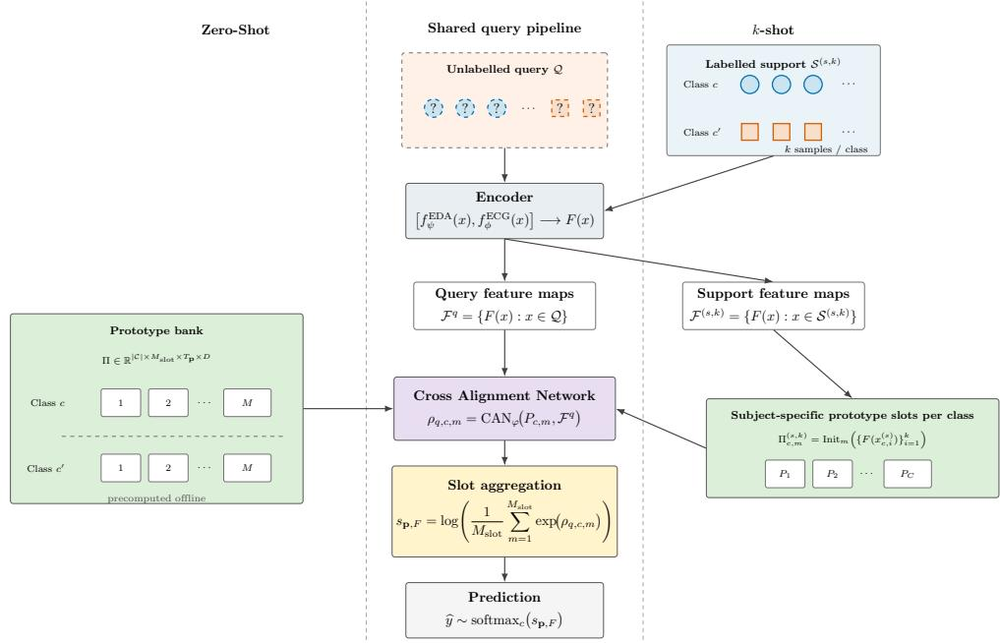  
Fig 4. Our method supports two modes of inference: in the Zero-Shot setting (left), we use a global precomputed bank to initialize the prototypes. Thus, this mode does not require any labelled samples from the subject. In the k-Shot case (right), we use a portion of the held-out subjects samples to initialize the prototypes (the support set) and classify the remainder (the query set). Thus, the Zero-Shot setup is the aggregated population level classifier and the k-Shot setup is the personalised individual classifier.

## 4 Results

We evaluated our method on the BioVid Heat Pain Database benchmark [3], on the SenseEmotion Dataset [4], and on the PainMonit Experimental Dataset (PMED) [5]. All experiments were designed with our three research questions in mind, namely (i) To what extent can personalisation improve automated pain assessment under interindividual variability?, (ii) Do the benefits of personalisation vary across individuals?, and (iii) Do the benefits of personalisation vary across pain levels? We report our results from a single Leave-one-Subject-out (LOSO) run averaged over the metrics computed on the held-out subject. Following Thiam et al. [7], we used the augmented data for training and the original, unaltered samples for evaluation – see Figure 2 for more details. Hyperparameters as reported in Table 7 were found by an Optuna [53] search on a reduced number of iterations.

## 4.1 Personalisation for Automated Pain Assessment

To answer the first research question (To what extent can personalisation improve automated pain assessment under inter-individual variability?), we provide results from the automated pain assessment benchmark in binary (no pain vs. high pain stimulus) and full multi-classification settings in Tables 1, 2, and 3. To avoid single dataset bias, we evaluate our method on three datasets and in several classification settings. This gives us an overview of our method’s performance compared to previously published models.

On the BioVid dataset and in the Zero-Shot case, our method reaches 85.75% binary accuracy and 35.49% multi-class accuracy; in the k-Shot case, it reaches 86.25% and

Table 1. Overview of reported pain recognition performance by algorithm/model on the SenseEmotion dataset. All values are reported for Leave-One-Subject-Out (LOSO) cross-validation. Accuracy is reported with standard deviation in parentheses where available. Bold indicates best Zero-Shot method and underlined indicates that the personalised k-Shot classifiers beats previous methods.
<table><tr><td>Method</td><td>Binary</td><td>Four Classes</td></tr><tr><td>Thiam et al. [54]</td><td>83.39%</td><td>43.89%</td></tr><tr><td>Thiam et al. [26]</td><td>81.05%</td><td>40.80%</td></tr><tr><td>Thiam et al. [49]</td><td>81.50%</td><td> $\mathrm { n / a }$ </td></tr><tr><td>Thiam et al. [55]</td><td>64.35%</td><td> $\mathrm { n / a }$ </td></tr><tr><td>Kessler et al. [56]</td><td>71.85%</td><td> $\mathrm { n / a }$ </td></tr><tr><td>Ours (Zero-Shot)</td><td>82.37% (±10.9)</td><td>41.88% (±6.6)</td></tr><tr><td>Ours (k-Shot)</td><td>83.43% (±11.2)</td><td>44.08% (±9.1)</td></tr></table>

Table 2. Overview of reported pain recognition performance by algorithm/model on the BioVid dataset. All values are reported for Leave-One-Subject-Out (LOSO) cross-validation. Accuracy is reported with standard deviation in parentheses where available. Bold indicates best Zero-Shot method and underlined indicates that the personalised k-Shot classifiers beats previous methods.
<table><tr><td>Method</td><td>Binary</td><td>Five Classes</td></tr><tr><td>Farmani et al. [47]</td><td>87.52% (±11.0)</td><td> $\mathrm { n / a }$ </td></tr><tr><td>Aslam et al. [48]</td><td>86.90%</td><td> $\mathrm { n / a }$ </td></tr><tr><td>Li et al. [45]</td><td>86.21%</td><td>38.03%</td></tr><tr><td>Lu et al. [43]</td><td>85.56%</td><td>34.46%</td></tr><tr><td>Thiam et al. [49]</td><td>85.32% (±13.7)</td><td> $\mathrm { n / a }$ </td></tr><tr><td>Jiang et al. [14]</td><td>84.58% (±13.3)</td><td>39.24% (±8.65)</td></tr><tr><td>Thiam et al. [8]</td><td>84.40% (±14.4)</td><td>36.54% (±8.55)</td></tr><tr><td>Thiam et al. [7]</td><td>84.20% (±13.7)</td><td>35.50% (±7.9)</td></tr><tr><td>Steuer &amp; Schwenker [57]</td><td>84.22% (±13.2)</td><td> $\mathrm { n / a }$ </td></tr><tr><td>Hihn &amp; Schwenker [58]</td><td>84.00% (±15.8)</td><td>36.20% (±9.7)</td></tr><tr><td>Ours (Zero-Shot)</td><td>85.75% (± 13.5)</td><td>35.49% (±7.00)</td></tr><tr><td>Ours (k-Shot)</td><td>86.25% (± 14.2)</td><td>40.06% (±12.1)</td></tr></table>

40.06%, respectively. On the SenseEmotion dataset, our method reaches 82.37% binary accuracy and 41.88% multi-class accuracy in the Zero-Shot case; in the k-Shot case, it reaches 83.43% and 44.08%, respectively. On PMED, our method reaches 90.47% binary accuracy in the Zero-Shot case and 91.25% in the k-Shot case; no multi-class benchmark has been reported for this dataset, so we evaluate it in the binary setting only. In the k-Shot adaptive case, the method uses labels from the held-out subject, so this setting is not directly comparable to Zero-Shot methods, which is why we compare methods directly only in the Zero-Shot setting and report k-Shot results to demonstrate the potential benefits of personalisation as we have introduced it in our work. The Zero-Shot performance of our method is comparable to previous methods. Under the present episodic evaluation protocol, k-Shot classification produced higher mean multi-class performance than state-of-the-art methods on the BioVid dataset (40.06% vs. 39.24%) and on the SenseEmotion dataset (44.08% vs. 43.89%), suggesting the largest benefit of personalisation is in the complex full-class setting. In the binary setting, our method yields comparable performance. We investigate the personalisation benefits across classes furhter in Section 4.3 and in Figure 6.

Table 3. Overview of reported pain recognition performance by algorithm/model on the PainMonit dataset. All values are reported for Leave-One-Subject-Out (LOSO) cross-validation. Accuracy is reported with standard deviation in parentheses where available. Bold indicates best Zero-Shot method and underlined indicates that the personalised k-Shot classifiers beats previous methods.
<table><tr><td>Method Binary</td></tr><tr><td>Luebke et al. [59] 93.62%</td></tr><tr><td>Gouverneur et al. [60] 93.26%</td></tr><tr><td>Gouverneur et al. [60] 89.79% (± 11.68)</td></tr><tr><td>Gouverneur et al. [61] 87.41% (±11.99)</td></tr><tr><td>Gouverneur et al. [60] 91.09% (±9.70)</td></tr><tr><td>Ours (Zero-Shot) 90.47% (± 9.23)</td></tr><tr><td>Ours (k-Shot) 91.25% (± 8.91)</td></tr></table>

In Table 4 we investigate additional binary classification settings. Our method shows benefits in the k-Shot setting in all classification problems and yields higher performance in the Zero-Shot setting for $T _ { 0 }$ vs. $T _ { 1 } , T _ { 0 }$ vs. $T _ { 2 }$ on BioVid and $T _ { 0 }$ vs. $T _ { 2 }$ on SenseEmotion compared to other methods. The setting $T _ { 0 }$ vs. $T _ { 1 }$ poses the most difficult classification problem, as the corresponding pain stimuli are closest and thus the bodily reactions are similar. In that setting, our method yields higher accuracy than previous methods on the BioVid dataset and comparable accuracy on the SenseEmotion dataset. Additionally, all personalised k-Shot classifiers outperform previous methods, except for the binary cass in BioVid, where Farmani et al. [47] report 87.52%, above our k-Shot 86.25%.

Overall, the benefits of personalisation as we have formalised it in our study vary between settings but are consistent in that it yields higher accuracy. In all settings and datasets, the increase in accuracy in the k-Shot setting indicates the benefit of personalisation, which we investigate further in the next sections.

## 4.2 Personalisation Benefits per Subject

To answer the second research question (Do the benefits of personalisation vary across individuals?), we analyse subject-level changes in classification performance on the BioVid dataset in Figure 5. The results in the 10-shot setting show that personalisation does not affect all held-out subjects equally: although almost all subjects improve, some experience lower macro-F1 in their respective LOSO runs, ranging from −0.03 to 0.33 with a mean of 0.097, median of 0.092, and a standard deviation of 0.06, as shown in Panel A of Figure 5. Panel D in Figure 5 further support the conclusion that 91% to 98% of subjects benefit from personalisation.

However, the improvement varies with the number of support samples available. At k = 1, each class contributes only one labelled sample to the support statistics. Noisy or atypical support windows can therefore produce unrepresentative prototypes, leading to the lowest benefit. Once we add five or more samples, the fraction of subjects that benefits increases, as other, more representative samples may counterbalance noisy samples.

The evaluation protocol introduces an additional source of variation. The Zero-Shot condition uses all held-out query samples once, whereas the k-Shot condition aggregates 500 sampled support/query episodes. It therefore estimates expected support-conditioned episodic performance rather than performance on the same fixed query set before and after adding support. Unfavourable support or query samples can lower a subject’s estimated k-Shot performance even when a different support set would be beneficial.

Table 4. Comparison of additional binary pain recognition results. Bold indicates best Zero-Shot method and underlined indicates that the personalised k-Shot classifiers beats previous methods.
<table><tr><td>BIOVID</td><td></td><td></td></tr><tr><td>Method</td><td> $\mathbf { T } _ { 0 }$  vs.  ${ \bf T } _ { 1 }$ </td><td> ${ \bf T } _ { 0 } \ { \bf v s . \ T } _ { 2 }$ </td></tr><tr><td>Thiam et al. [8]</td><td>61.15% (±12.20)</td><td>66.81% (±15.92)</td></tr><tr><td>Gkikas et al. [62]</td><td>52.38%</td><td>52.78%</td></tr><tr><td>Werner et al. [63]</td><td>48.70%</td><td>51.60%</td></tr><tr><td>Gkikas et al. [62]</td><td>62.82%</td><td>63.68%</td></tr><tr><td>Lopez &amp; Picard [64]</td><td>56.44%</td><td>59.40%</td></tr><tr><td>Ours (Zero-Shot)</td><td>61.26% (±13.02)</td><td>67.07% (±14.91)</td></tr><tr><td>Ours (k-Shot)</td><td>62.25% (±14.20)</td><td>68.06% (±16.56)</td></tr><tr><td>Method</td><td>T0 vs. T3</td><td>T1 vs. T4</td></tr><tr><td>Thiam et al. [8]</td><td>76.29% (±14.62)</td><td>76.72% (±15.02)</td></tr><tr><td>Gkikas et al. [62]</td><td>55.37%</td><td> $\mathrm { n / a }$ </td></tr><tr><td>Werner et al. [63]</td><td>56.50%</td><td> $\mathrm { n / a }$ </td></tr><tr><td>Gkikas et al. [62]</td><td>66.12%</td><td> $\mathrm { n / a }$ </td></tr><tr><td>Lopez et al. [64]</td><td>66.00%</td><td> $\mathrm { n / a }$ </td></tr><tr><td>Ours (Zero-Shot)</td><td>76.15% (±16.11)</td><td>76.67% (±15.33)</td></tr><tr><td>Ours (k-Shot)</td><td>77.01% (±14.34)</td><td>76.98% (±11.788)</td></tr><tr><td></td><td>SENSEEMOTION</td><td></td></tr><tr><td>Method</td><td>T0 vs.  ${ \bf T } _ { 1 }$ </td><td> $\mathbf { T } _ { 0 }$  vS.  $\mathbf { T } _ { 2 }$ </td></tr><tr><td>Thiam et al. [54]</td><td>52.74% (±7.64)</td><td>60.91% (±12.69)</td></tr><tr><td>Ours (Zero-Shot)</td><td>52.46%</td><td>62.44% (±9.66)</td></tr><tr><td>Ours (k-Shot)</td><td>53.86%</td><td>63.89% (±7.96)</td></tr></table>

In summary, personalisation improves mean macro-F1, but its benefit varies substantially across subjects. Persistent gain patterns and large random subject effects provide evidence of stable subject-level improvements, as supported by the analyses in Figure 5.

## 4.3 Personalisation Benefits per Class

To answer the third research question (Do the benefits of personalisation vary across pain levels?), we analysed the average gain in the F1 score on a per-class basis in Figure 6. Classes 1, 2, and 3 have mean F1 gains of 0.190, 0.183, and 0.174, respectively, whereas the baseline class 0 and the maximum pain level 4 have gains of −0.126 and 0.061, respectively. This class-wise pattern is consistent with inter-subject variation being concentrated in the intermediate pain levels rather than at the two extremes. The negative change in classes 0 and 4 indicates that the model is moving some of its descriptive power from the extremes to the intermediate classes, facilitating a trade-off in which class-0 F1 decreases while intermediate-class F1 increases.

In summary, the multi-class analyses show a consistent redistribution of performance across pain levels. Personalisation improves the hard intermediate classes but reduces F1 for class 0 across the inspected support sizes and, at small $k ,$ reduces F1 for the highest pain class.

A  
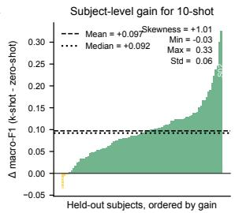

Gain heterogeneity across subjects and shot countsB C C  
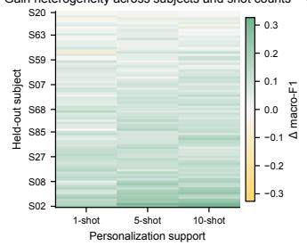

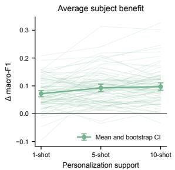

D  
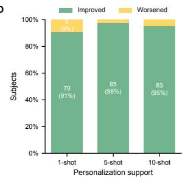

E  
Distribution of subject-level personalization benefit  
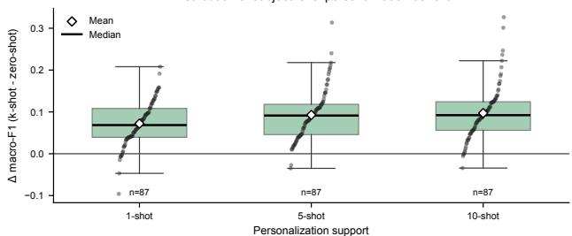  
Fig 5. Personalisation benefits per subject. A vast majority of $9 1 \%$ to 98% of subjects benefit from personalisation in the BioVid full classification setting, i.e., using part of their samples to initialize the prototypes (see Panels A, B, D). Panel A shows a mean improvement in macro F1 is +0.097. Panel E shows the distribution of the improvements in the different k settings.

## 4.4 Ablation Experiments

We have designed a set of ablation experiments to verify the stability and performance of our proposed method. We investigate the choice of signals used, and the number of support samples during evaluation and during training.

## 4.4.1 Training and Evaluation Task Setup

In Figure 9 we evaluate the number of support and query samples during training, indicated as $k _ { t }$ and $q _ { t } ,$ respectively in the personalised k-shot setting on the BioVid (9.A+9.B) and one the SenseEmotion (9.C+9.D) dataset. The mean accuracy and F1 score improve significantly up to $k _ { t } , q _ { t } = 5$ , and the gains are smaller beyond that point. These results suggest that increasing the number of support samples during training helps the model extract more robust feature spaces, but the effect hits a ceiling after 10 samples.

Figure 8 shows results of an ablation experiment on the SenseEmotion dataset that inspects the influence of the number of support samples used during evaluation. As expected, increasing the number of support samples improves average accuracy, but the effect occurs only on the personalised k-Shot settings – we will discuss this further in Figure 9. These results indicate that an increased number of support samples during the evaluation enables the model to find prototypes that are less noisy and more representative.

Additionally, we examined whether the support/query configuration used during training affected zero-shot and subject-adapted performance on BioVid – see Figure 9. In the binary task, the training configuration had virtually no effect on either zero-shot accuracy (Friedman test, Holm-adjusted $p = 1 . 0 0 0$ , Kendall’s $W = 0 . 0 0 6 )$ or macro-F1 $( p = 1 . 0 0 0 , W = 0 . 0 0 9 )$ . In contrast, k-shot performance varied significantly across the training and evaluation settings for both accuracy $( p < 0 . 0 0 1 , W = 0 . 3 3 6 )$ and macro-F1 $( p < 0 . 0 0 1 , W = 0 . 3 3 2 )$ . The corresponding phase-by-setting interactions were also significant $( p < 0 . 0 0 1 )$ , indicating that episodic task size primarily affected the benefit obtained from subject-specific support rather than the model’s zero-shot capability.

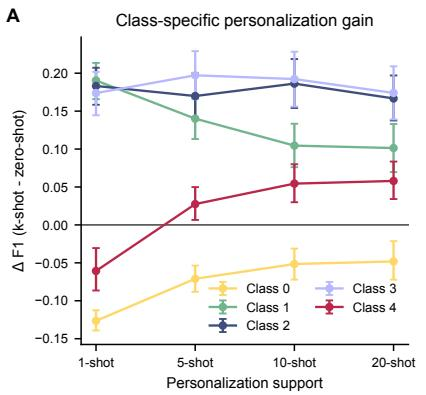

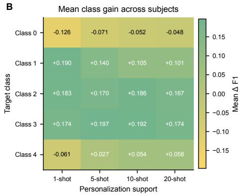

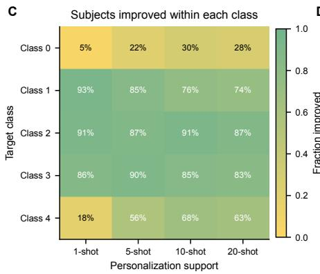  
D

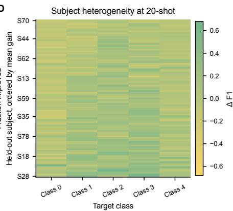  
Fig 6. Personalisation benefits per class on the BioVid dataset. Panels A and B show that the intermediate pain levels 1, 2, and 3 have the largest mean F1 gains from personalisation. Their respective F1 scores improve on average, indicating that personalisation contributes most for pain levels that vary only little in magnitude, compared with the extremes 0 and 4. Panels C and D show how subjects benefit on a per-class basis, indicating the same pattern of improvement in classes 1 to 3.

A similar, but more nuanced, pattern was observed in the five-class task. Zeroshot accuracy remained stable across training configurations $( p = 0 . 5 8 1 , W = 0 . 0 1 8 )$ ， whereas k-shot accuracy showed a large setting effect $( p < 0 . 0 0 1 , W = 0 . 6 0 9 )$ . Macro-F1 varied across settings in both phases, although the effect was considerably larger for k-shot performance $( p < 0 . 0 0 1 , W = 0 . 5 4 9 )$ than for zero-shot performance $( p < 0 . 0 0 1$ $W = 0 . 1 9 9 )$ . Overall, these results suggest that the choice of episodic k and q mainly determines how effectively the model exploits target-subject support, while its unadapted accuracy remains largely insensitive to this choice, wehreas the F1-score is significantly impacted by this choice.

## 4.4.2 Choice of Signal Channels

Previous studies argued that the EDA channel in combination with the ECG channel carries the most information about the perceived pain of a participant. Table 5 shows the results of all possible combinations of two modalities in the binary classification tasks of the BioVid and the SenseEmotion datasets. The results confirm our assumption, as the combination of EDA and ECG yields the highest performance. However, the difference is marginal and not statistically significant.

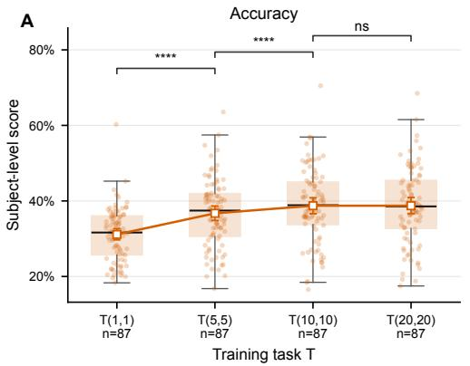

B  
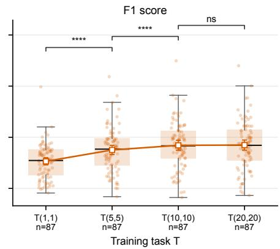

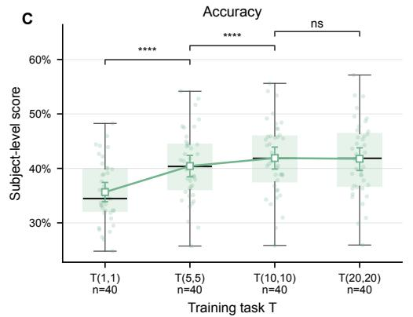  
D

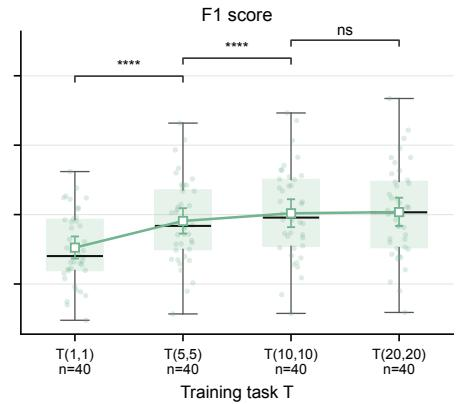  
Fig 7. Different settings of training for the BioVid (A+B) and the SenseEmotion (C+D) dataset. In all settings increasing the training task size $( k , q$ values) improves the results with a ceiling on k, q = 10 where we do not observe significantly higher results. All significant p-values $\mathrm { a r e } < 0 . 0 0 1$

In summary, these ablation experiments suggest that the Few-Shot Subject-as-a-Task setup we devised in this work is enabling the model to learn robust and transferable feature maps. To examine the effect of the support size $k ,$ more experiments are needed where we keep q fixed and vary only k.

## 4.5 Experimental Setup

We ran all our experiments on a single 16 GB consumer-grade GPU on Google Colab. We provide the hyper-parameters used for training and evaluation in Table 7 and describe our architecture in Table 6. The code for our implementation can be found under https://github.com/hhihn/FewShotPainAdaptation.

## 5 Discussion

This study investigated whether Few-Shot learning can support personalised automated pain assessment. With respect to the first research question, the Zero-Shot variant produced accuracies within the range of previously reported LOSO results, while the support-conditioned k-Shot variant produced higher mean accuracy than the Zero-Shot variant in every evaluated setting. The largest differences were observed in the multiclass tasks, for which the k-Shot model reached 40.06% accuracy on BioVid and 44.08% on SenseEmotion. These values were numerically higher than the best comparison values listed in Tables 1, 2, and 3, but they should not be interpreted as evidence of superiority over those methods. In contrast to the comparison methods, k-Shot inference uses labelled examples from the held-out subject, and the studies may also differ in preprocessing, model selection, and evaluation details. The results instead show the performance attainable when a small, balanced set of subject-specific labels is available. Additionally, any outperforming accuracy in the reported results in Tables 1, 2, and 3 should be treated with care as no previous study reports statistical tests results comparing their achievement with previous study and all differences are marginal compared to the reported standard deviation of the LOSO setting. Thus, we focus more an how the k-Shot personalisation affects subject- and class-based results compared to the Zero-Shot case.

D  
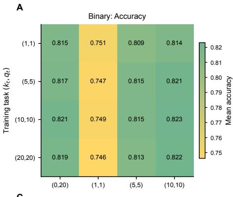

B  
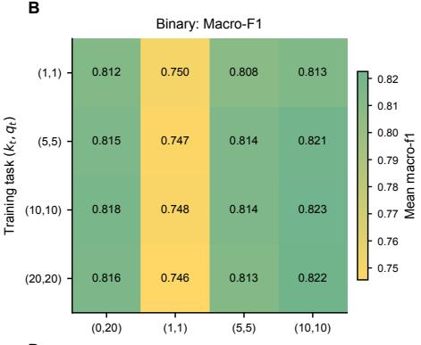

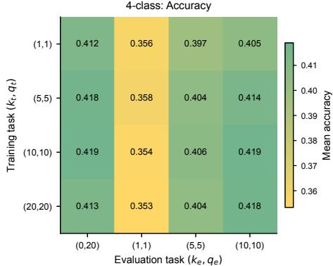

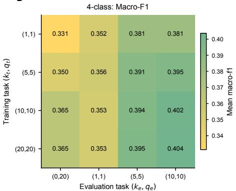  
Fig 8. Mean held-out performance across training and evaluation conditions for binary classification (top) and multi-class classification (bottom) on the SenseEmotion dataset. Columns show accuracy and macro-F1. The Zero-Shot condition $( k _ { e } , q _ { e } ) = ( 0 , 2 0 )$ uses learned prototype memory, whereas the remaining conditions use target-subject support.

The subject-level analysis answers the second research question by showing that the association between personalisation and performance is heterogeneous. Most held-out subjects had higher estimated macro-F1 in the k-Shot condition, and the mean difference was positive, but a minority had no benefit or lower performance. The dependence on support-set size is consistent with the hypothesis that a single atypical or noisy support window can yield an unrepresentative class prototype, whereas several support samples provide a more stable estimate. This mechanism was not measured directly, however, and the reported differences do not constitute fixed-query estimates of the causal effect of adding support: Zero-Shot performance was computed on the complete held-out query set, whereas k-Shot performance was averaged over episodes containing sampled support and query sets. A paired analysis using identical query samples before and after adaptation is needed to isolate the effect of personalisation at subject level.

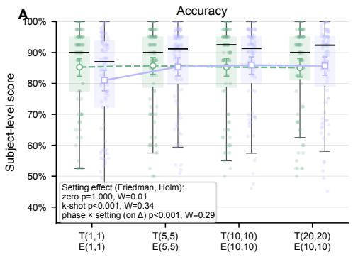  
B

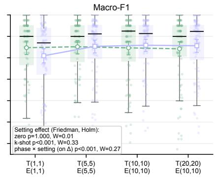

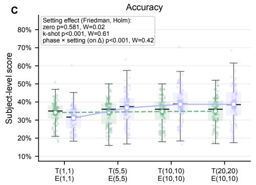  
D

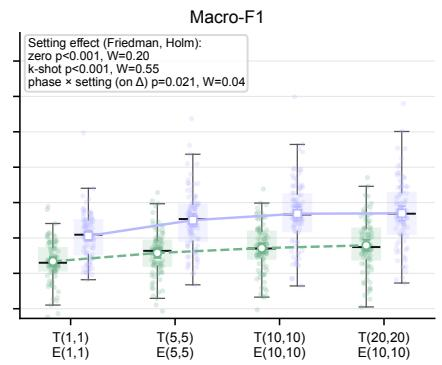  
Fig 9. Effect of training and evaluation task size on BioVid binary (A+B) and five-class (C+D) performance. Points represent held-out subjects, and boxes show the score distributions. Here, T and E denote the training and configured k-shot evaluation tasks, respectively.

<table><tr><td rowspan="2">Modalities</td><td colspan="2">BIOVID</td><td colspan="2">SENSEEMOTION</td></tr><tr><td>Zero-Shot</td><td>k-Shot</td><td>Zero-Shot</td><td>k-Shot</td></tr><tr><td>EMG+RSP</td><td>N/A</td><td>N/A</td><td>63.79% (±11.6)</td><td>64.71% (±11.7)</td></tr><tr><td>ECG+RSP</td><td>N/A</td><td>N/A</td><td>64.60% (±11.3)</td><td>67.51% (±12.2)</td></tr><tr><td>EDA+RSP</td><td>N/A</td><td>N/A</td><td>81.64% (±10.4)</td><td>82.44% (±10.7)</td></tr><tr><td>EDA+EMG</td><td>85.52% (±9.31)</td><td>85.68% (±9.31)</td><td>81.52% (±9.31)</td><td>81.99% (±10.7)</td></tr><tr><td>ECG+EMG</td><td>59.39% (±15.2)</td><td>65.14% (±16.0)</td><td>58.46% (±10.1)</td><td>63.34% (±11.8)</td></tr><tr><td>EDA+ECG</td><td>85.75% (±13.5)</td><td>86.25% (±14.2)</td><td>82.37% (±10.9)</td><td>83.43% (±11.2)</td></tr></table>

Table 5. Ablation study on the modalities used. In accordance with previous studies [43, 45], EDA+ECG achieves the highest classification accuracy in the binary $( T _ { 0 }$ vs. $T _ { 4 }$ and $T _ { 0 }$ vs. $T _ { 3 } ,$ respectively) LOSO setting. N/A indicates that the corresponding modality is not available in the dataset. We report accuracy and trained the models with $k , q = 1 0$

The class-wise findings address the third research question. Personalisation was associated with the largest F1 gains for the intermediate BioVid pain levels, while class-0 F1 decreased and the maximum pain class showed a smaller gain. Thus, the improvement in macro-F1 reflects a redistribution of errors rather than a uniform improvement across pain levels. One possible explanation is that physiological responses to intermediate stimuli exhibit greater between-subject variation or overlap more strongly than responses at the extremes, making subject-specific prototypes particularly useful for these classes. The current experiments do not directly test this explanation. Relating class-wise gains to within- and between-subject physiological variability, prototype dispersion, and changes in the confusion matrix would help determine whether the observed pattern reflects improved subject calibration or a shift in the model’s decision boundaries that disadvantages the no-pain class.

These findings extend earlier work on personalised pain assessment and Few-Shot adaptation. Prior approaches have used personalised physiological feature fusion and attention [14], source-free subject adaptation from neutral facial data [40], participant selection [42], and MAML-based adaptation of facial pain expressions [33]. The present results provide complementary evidence for a prototype-based approach using ECG and EDA, with each held-out subject treated as a new task. In particular, the prototype formulation permits adaptation without updating all model parameters. At the same time, the need for labelled examples from every target class makes the k-Shot setting more demanding than approaches that adapt from unlabelled data or from a neutral reference alone.

## 5.1 Limitations

Several limitations remain. First, the Zero-Shot path uses transductive normalisation: its statistics are computed jointly from all query samples of the held-out subject. This gives the model access to the distribution of the complete, although unlabelled, test batch and may not represent deployment in which samples must be classified individually or arrive sequentially. Second, k-Shot personalisation requires labelled target-subject examples for every class; its annotation cost therefore grows as N × K and may be substantial in clinical settings, particularly when balanced examples of multiple pain levels must be elicited. Third, the episodic estimates depend on randomly sampled support and query windows. Although results are aggregated across 500 episodes, sampling variance and the use of different query sets across conditions limit subject-level comparisons and prevent a fixed-query counterfactual interpretation. Fourth, training uses the tenfold augmentation procedure of Thiam et al. [7], but we did not evaluate the method without augmentation or with alternative augmentation schemes. The extent to which performance depends on this specific procedure is therefore unknown, and augmented observations should not be interpreted as independent participants. Fifth, the reported results do not quantify variation across independent training seeds, and the small numerical differences between methods in the benchmark tables were not tested within a common experimental pipeline. Finally, BioVid, SenseEmotion, and PainMonit Experimental Dataset comprise healthy participants exposed to controlled heat stimuli, and our experiments use only ECG and EDA. The labels therefore represent experimentally administered stimulus levels rather than clinical pain assessments or self-reported pain. Validation in clinical populations and under less controlled acquisition conditions is required before the findings can be generalised to other pain aetiologies, sensor configurations, or deployment environments.

Table 6. Compact architecture of the proposed CAN model.
<table><tr><td>Stage</td><td>Core configuration Output</td></tr><tr><td>Input</td><td>EDA and ECG windows with 1152 steps  $B \times 1 1 5 2 \times 2$ </td></tr><tr><td>Modality coders</td><td>en- Independent temporal convolutional fron-  $2 \times ( B \times 7 8 \times 1 6 )$  tends with pooling</td></tr><tr><td></td><td>CrossMod fusion Two 8-head self-attention layers followed  $B \times 7 8 \times 3 2$  by bidirectional cross-modal attention</td></tr><tr><td>Prototype mem- ory</td><td> $M _ { \mathrm { s l o t } } = 2$  learned temporal prototype slots  $B _ { t } \times | \mathcal { C } | M _ { \mathrm { s l o t } } \times 7 8 \times$  per class 32</td></tr><tr><td></td><td>Query encoding The same modality encoders and Cross-  $B _ { t } \times Q \times 7 8 \times 3 2$  Mod fusion are applied to each query</td></tr><tr><td></td><td>CAN alignment Pair-conditioned bidirectional temporal at-  $B _ { t } \times Q \times | \mathcal { C } | M _ { \mathrm { s l o t } }$  tention and attended cosine similarity,  $\tau =$  0.025</td></tr><tr><td>Classification</td><td>Log-mean-exp over slots followed by non-  $B _ { t } \times Q \times | \mathcal { C } |$  negative logit scaling</td></tr><tr><td>Total Params.</td><td>Binary 37.7K Five Classes 44.3K</td></tr></table>

## 5.2 Future Work

Future work should first evaluate personalisation with a paired, fixed-query protocol and repeated training seeds. The methodological contribution can then be isolated through comparisons of multiple prototype slots with one prototype per class, the learned prototype bank with a population-mean prototype, and support-based normalisation with fixed training-population normalisation. Prototype selection and weighting could also be learned through hierarchical information fusion [19], while continual-learning mechanisms could update subject prototypes as new labelled observations become available [22–24]. For practical deployment, future studies should reduce the requirement for balanced labels from every pain level, support sequential rather than transductive inference, and evaluate calibration, macro-F1, and clinically relevant error costs in addition to accuracy.

Table 7. Main hyperparameters used for the full LOSO experiment.
<table><tr><td>Hyperparameter</td><td>Setting</td></tr><tr><td>Temporal frontend</td><td>Filters 8/16; kernels 64/16</td></tr><tr><td>Pooling / dropout /  $L _ { 2 }$ </td><td>4,8 / 0.25  $/ ~ 1 0 ^ { - 4 }$ </td></tr><tr><td>CrossMod configuration CAN configuration</td><td>2 layers; 8 heads; hidden dim. 128 τ = 0.025; meta hidden dim. 32</td></tr><tr><td>CAN support source</td><td>Learned prototype memory</td></tr><tr><td>Prototype memory</td><td>2 slots/class; 256 init. samples/class</td></tr><tr><td>Learning rate / schedule</td><td> $6 \times 1 0 ^ { - 4 } ~ /$  cosine</td></tr><tr><td>Training budget</td><td>1 epoch; 20,000 tasks; batch size 16</td></tr><tr><td>Data augmentation</td><td>Gaussian noise 0.01; window shift</td></tr><tr><td>Validation / held-out tasks</td><td>50 / 500; checkpoint by F1</td></tr></table>

## 5.3 Conclusion

In summary, we introduced and evaluated subject-as-a-task Few-Shot learning for personalised classification of experimentally induced heat-pain levels. Under the present episodic protocol, subject-specific support was associated with higher mean performance, particularly in the multi-class tasks and for intermediate pain levels, but the benefit was not uniform across subjects or classes. The Zero-Shot variant requires no labelled target-subject samples, although its current transductive normalisation assumes access to an unlabelled batch from that subject. These findings support further investigation of prototype-based personalisation, but fixed-query comparisons and validation in clinical settings are needed before conclusions can be drawn about individualised pain monitoring in practice.

## Acknowledgements

This work was financially supported by funds under the IU Incubator programme TAPAS: Tailored Automated Pain Assessment Systems.

## Author Contributions

Conceptualization: Heinke Hihn

Formal Analysis: Heinke Hihn

Investigation: Heinke Hihn

Resources: Heinke Hihn

Software: Heinke Hihn, Ibrahim Eisawy

Supervision: Friedhelm Schwenker, Hans A. Kestler

Data curation: Heinke Hihn, Patrick Thiam

Visualization: Heinke Hihn

Funding acquisition: Heinke Hihn

Writing - original draft: Heinke Hihn

Writing - review and editing: Heinke Hihn, Ibrahim Eisawy, Patrick Thiam, Friedhelm Schwenker, Hans A. Kestler

## References

1. Werner P, Lopez-Martinez D, Walter S, Al-Hamadi A, Gruss S, Picard RW. Automatic recognition methods supporting pain assessment: A survey. IEEE

Transactions on Affective Computing. 2019;13(1):530–552.

2. Hawker GA, Mian S, Kendzerska T, French M. Measures of adult pain: Visual analog scale for pain (vas pain), numeric rating scale for pain (nrs pain), mcgill pain questionnaire (mpq), short-form mcgill pain questionnaire (sf-mpq), chronic pain grade scale (cpgs), short form-36 bodily pain scale (sf-36 bps), and measure of intermittent and constant osteoarthritis pain (icoap). Arthritis care & research. 2011;63(S11):S240–S252.

3. Walter S, Gruss S, Ehleiter H, Tan J, Traue HC, Crawcour S, et al. The biovid heat pain database: Data for the advancement and systematic validation of an automated pain recognition system. In: 2013 IEEE International Conference on Cybernetics (CYBCO); 2013. p. 128–131.

4. Velana M, Gruss S, Layher G, Thiam P, Zhang Y, Schork D, et al. The senseemotion database: A multimodal database for the development and systematic validation of an automatic pain-and emotion-recognition system. In: IAPR Workshop on Multimodal Pattern Recognition of Social Signals in Human-Computer Interaction. Springer; 2016. p. 127–139.

5. Gouverneur P, Badura A, Li F, Bie´nkowska M, Luebke L, Adamczyk WM, et al. An experimental and clinical physiological signal dataset for automated pain recognition. Scientific Data. 2024;11(1):1051.

6. K¨achele M, Thiam P, Amirian M, Schwenker F, Palm G. Methods for personcentered continuous pain intensity assessment from bio-physiological channels. IEEE Journal of Selected Topics in Signal Processing. 2016;10(5):854–864.

7. Thiam P, Hihn H, Braun DA, Kestler HA, Schwenker F. Multi-modal pain intensity assessment based on physiological signals: a deep learning perspective. Frontiers in Physiology. 2021;12:720464. doi:10.3389/fphys.2021.720464.

8. Thiam P, Bellmann P, Kestler HA, Schwenker F. Exploring deep physiological models for nociceptive pain recognition. Sensors. 2019;19(20):4503.

9. Gkikas S, Kyprakis I, Tsiknakis M. Efficient pain recognition via respiration signals: A single cross-attention transformer multi-window fusion pipeline. In: Companion Proceedings of the 27th International Conference on Multimodal Interaction; 2025. p. 70–79.

10. Khan MU, Chetty G, Goecke R, Fernandez-Rojas R. A Systematic Review of Multimodal Signal Fusion for Acute Pain Assessment Systems. ACM Computing Surveys. 2025;58(2):1–35.

11. Ji X, Chang X, Li W, Zomaya AY. Unraveling pain levels: A data-uncertainty guided approach for effective pain assessment. In: Proceedings of the AAAI Conference on Artificial Intelligence. vol. 38; 2024. p. 22167–22175.

12. Pouromran F, Radhakrishnan S, Kamarthi S. Exploration of physiological sensors, features, and machine learning models for pain intensity estimation. PLOS ONE. 2021;16(7):e0254108. doi:10.1371/journal.pone.0254108.

13. Werner P, Al-Hamadi A, Limbrecht-Ecklundt K, Walter S, Gruss S, Traue HC. Automatic pain assessment with facial activity descriptors. IEEE Transactions on Affective Computing. 2016;8(3):286–299.

14. Jiang M, Rosio R, Salanter¨a S, Rahmani AM, Liljeberg P, da Silva DS, et al. Personalized and adaptive neural networks for pain detection from multi-modal physiological features. Expert Systems with Applications. 2024;235:121082.

15. Bourou D, Pampouchidou A, Tsiknakis M, Marias K, Simos P. Video-based pain level assessment: feature selection and inter-subject variability modeling. In: 2018 41st International Conference on Telecommunications and Signal Processing (TSP). IEEE; 2018. p. 1–6.

16. Lopez-Martinez D, Picard R. Multi-task neural networks for personalized pain recognition from physiological signals. In: 2017 Seventh International Conference on Affective Computing and Intelligent Interaction Workshops and Demos (ACIIW). IEEE; 2017. p. 181–184.

17. Gozzi N, Preatoni G, Ciotti F, Hubli M, Schweinhardt P, Curt A, et al. Unraveling the physiological and psychosocial signatures of pain by machine learning. Med. 2024;5(12):1495–1509.

18. Hospedales T, Antoniou A, Micaelli P, Storkey A. Meta-learning in neural networks: A survey. IEEE transactions on pattern analysis and machine intelligence. 2021;44(9):5149–5169.

19. Hihn H, Braun DA. Hierarchical Expert Networks for Meta-Learning. In: 4th Lifelong Machine Learning Workshop at ICML 2020; 2020.

20. Hihn H, Braun DA. Specialization in hierarchical learning systems: A unified information-theoretic approach for supervised, unsupervised and reinforcement learning. Neural Processing Letters. 2020;52(3):2319–2352.

21. Wang L, Zhang X, Su H, Zhu J. A comprehensive survey of continual learning: Theory, method and application. IEEE transactions on pattern analysis and machine intelligence. 2024;46(8):5362–5383.

22. Hihn H, Braun DA. Mixture-of-Variational-Experts for Continual Learning. In: ICLR Workshop on Agent Learning in Open-Endedness; 2021.

23. Hihn H, Braun DA. Hierarchically structured task-agnostic continual learning. Machine Learning. 2023;112(2):655–686.

24. Hihn H, Braun DA. Online continual learning through unsupervised mutual information maximization. Neurocomputing. 2024;578:127422.

25. Gui J, Chen T, Zhang J, Cao Q, Sun Z, Luo H, et al. A survey on self-supervised learning: Algorithms, applications, and future trends. IEEE Transactions on Pattern Analysis and Machine Intelligence. 2024;46(12):9052–9071.

26. Thiam P, Hihn H, Braun DA, Kestler HA, Schwenker F. Multi-modal pain intensity assessment based on physiological signals: A deep learning perspective. Frontiers in Physiology. 2021;12:720464.

27. Del Pup F, Atzori M. Applications of self-supervised learning to biomedical signals: A survey. IEEE Access. 2023;11:144180–144203.

28. Thuseethan S, Rajasegarar S, Yearwood J. Deep continual learning for emerging emotion recognition. IEEE Transactions on Multimedia. 2021;24:4367–4380.

29. Wang Y, Yao Q, Kwok JT, Ni LM. Generalizing from a few examples: A survey on few-shot learning. ACM computing surveys (csur). 2020;53(3):1–34.

30. An S, Kim S, Chikontwe P, Park SH. Dual attention relation network with fine-tuning for few-shot EEG motor imagery classification. IEEE transactions on neural networks and learning systems. 2023;35(11):15479–15493.

31. Wang K, Zhang Y, Zhang Y, Zhang F, Shen J, Hu B. MSFSNet: Multi-Source Few-Shot Adaptation Network for Cross-Subject Depression Recognition from EEG Signals. IEEE Journal of Biomedical and Health Informatics. 2026;.

32. Belal M, Hassan T, Hassan A, Velayudhan D, Elhendawi N, Aljarah A, et al. FSID: a novel approach to human activity recognition using few-shot weight imprinting. Scientific Reports. 2025;15(1):20865.

33. Rathee N, Pahal S, Sheoran P. Pain detection from facial expressions using domain adaptation technique. Pattern Analysis and Applications. 2022;25(3):567–574.

34. Buzuti L, Giraldi G, Heiderich T, Barros M, Guinsburg R, Thomaz C. Generative AI for neonatal pain assessment: a sound approach to improve data-driven automatic recognition in intensive care unit. Available at SSRN 4994076. 2024;.

35. McCofie A, Kandiyana A, Mouton PR, Sun Y, Goldgof D. Few-Shot Prompting with Vision Language Model for Pain Classification in Infant Cry Sounds. In: 2025 IEEE 38th International Symposium on Computer-Based Medical Systems (CBMS). IEEE; 2025. p. 857–862.

36. El Othmani O, Naouali S. PANDIA: Personalized neuro-symbolic multimodal fusion for interpretable neonatal pain assessment. PLOS Digital Health. 2026;5(5):e0001442.

37. Anter AM, Zhang Z. RLWOA-SOFL: A new learning model-based reinforcement swarm intelligence and self-organizing deep fuzzy rules for fMRI pain decoding. IEEE Transactions on Affective Computing. 2023;15(2):644–656.

38. Khan MA, Koh RG, Kumbhare D, Doyle TE. Chronic Pain as a Continuum: Unsupervised Learning for Identification and Quantification of Coexisting Chronic Pain Mechanisms. IEEE Access. 2026;.

39. Ricken TB, Bellmann P, Walter S, Schwenker F. Pain Detection in Biophysiological Signals: Knowledge Transfer from Short-Term to Long-Term Stimuli Based on Distance-Specific Segment Selection. Computers. 2023;12(4). doi:10.3390/computers12040071.

40. Sharafi M, Ollivier E, Zeeshan MO, Belharbi S, Koerich AL, Pedersoli M, et al. Disentangled source-free personalization for facial expression recognition with neutral target data. In: 2025 IEEE 19th International Conference on Automatic Face and Gesture Recognition (FG). IEEE; 2025. p. 1–10.

41. Fang R, Zhang R, Hosseini E, Orooji M, Homayoun H, Hosseini SM, et al. Atlas: An adaptive transfer learning based pain assessment system: A real life unsupervised pain assessment solution. In: 2022 44th Annual International Conference of the IEEE Engineering in Medicine & Biology Society (EMBC). IEEE; 2022. p. 1331–1337.

42. Thiam P, Kessler V, Schwenker F. Hierarchical Combination of Video Features for Personalised Pain Level Recognition. In: ESANN; 2017. p. 465–470.

43. Lu Z, Ozek B, Kamarthi S. Transformer encoder with multiscale deep learning for pain classification using physiological signals. Frontiers in Physiology. 2023;14:1294577. doi:10.3389/fphys.2023.1294577.

44. Aziz S, Khan MU, Rojas RF. MDNet: A Lightweight Multidomain 1-D CNN for Embedded Pain Assessment Using EDA Signals. IEEE Sensors Journal. 2024;24(11):17637–17646. doi:10.1109/JSEN.2024.3385802.

45. Li J, Luo J, Wang Y, Jiang Y, Chen X, Quan Y. Automatic pain assessment based on physiological signals: Application of multi-scale networks and cross-attention cross-attention. In: Proceedings of the 2024 13th International Conference on Bioinformatics and Biomedical Science; 2024. p. 113–122.

46. Shi H, Chikhaoui B, Wang S. Tree-based models for pain detection from biomedical signals. In: International conference on smart homes and health telematics. Springer; 2022. p. 183–195.

47. Farmani J, Bargshady G, Gkikas S, Tsiknakis M, Rojas RF. CrossMod-Transformer: multi-modal pain detection through EDA and ECG fusion. Scientific Reports. 2025;15(1):29467. doi:10.1038/s41598-025-14238-y.

48. Aslam MH, Martinez C, Pedersoli M, Koerich AL, Etemad A, Granger E. Learning from stochastic teacher representations using student-guided knowledge distillation. In: Joint European Conference on Machine Learning and Knowledge Discovery in Databases. Springer; 2025. p. 235–253.

49. Thiam P, Schwenker F, Kestler HA. Dealing with Class Overlap Through Cluster-Based Sample Weighting. Computers. 2025;14(11):457.

50. Li J, Wang X, Tu Z, Lyu MR. On the diversity of multi-head attention. Neurocomputing. 2021;454:14–24.

51. Hou R, Chang H, Ma B, Shan S, Chen X. Cross attention network for few-shot classification. Advances in neural information processing systems. 2019;32.

52. Wang W, Zheng VW, Yu H, Miao C. A survey of zero-shot learning: Settings, methods, and applications. ACM Transactions on Intelligent Systems and Technology (TIST). 2019;10(2):1–37.

53. Akiba T, Sano S, Yanase T, Ohta T, Koyama M. Optuna: A Next-Generation Hyperparameter Optimization Framework. In: The 25th ACM SIGKDD International Conference on Knowledge Discovery & Data Mining; 2019. p. 2623–2631.

54. Thiam P, Kessler V, Amirian M, Bellmann P, Layher G, Zhang Y, et al. Multimodal pain intensity recognition based on the senseemotion database. IEEE Transactions on Affective Computing. 2019;12(3):743–760.

55. Thiam P, Kestler HA, Schwenker F. Two-stream attention network for pain recognition from video sequences. Sensors. 2020;20(3):839.

56. Kessler V, Thiam P, Amirian M, Schwenker F. Multimodal fusion including camera photoplethysmography for pain recognition. In: 2017 International Conference on Companion Technology (ICCT). IEEE; 2017. p. 1–4.

57. Steur NAK, Schwenker F. Multimodal Pain Recognition Based on Contrastive Adversarial Autoencoder Pretraining. Machine Learning and Knowledge Extraction. 2025;7:165. doi:10.3390/make7040165.

58. Hihn H, Schwenker F. Efficient Architecture Search under Leave-One-Subject-Out Evaluation. arXiv. 2026;.

59. Luebke L, Gouverneur P, Szikszay TM, Adamczyk WM, Luedtke K, Grzegorzek M. Objective measurement of subjective pain perception with autonomic body reactions in healthy subjects and chronic back pain patients: an experimental heat pain study. Sensors. 2023;23(19):8231.

60. Gouverneur P, Li F, Shirahama K, Luebke L, Adamczyk WM, Szikszay TM, et al. Explainable artificial intelligence (XAI) in pain research: understanding the role of electrodermal activity for automated pain recognition. Sensors. 2023;23(4):1959.

61. Gouverneur P, Li F, Adamczyk WM, Szikszay TM, Luedtke K, Grzegorzek M. Comparison of feature extraction methods for physiological signals for heat-based pain recognition. Sensors. 2021;21(14):4838.

62. Gkikas S, Chatzaki C, Tsiknakis M. Multi-task neural networks for pain intensity estimation using electrocardiogram and demographic factors. In: International Conference on Information and Communication Technologies for Ageing Well and e-Health. Springer; 2021. p. 324–337.

63. Werner P, Al-Hamadi A, Niese R, Walter S, Gruss S, Traue HC. Automatic pain recognition from video and biomedical signals. In: 2014 22nd international conference on pattern recognition. IEEE; 2014. p. 4582–4587.

64. Lopez-Martinez D, Picard R. Continuous pain intensity estimation from autonomic signals with recurrent neural networks. In: 2018 40th Annual International Conference of the IEEE Engineering in Medicine and Biology Society (EMBC). IEEE; 2018. p. 5624–5627.