# Finite-Sample Approximation of Hessian-Guided Perturbed Wasserstein Gradient Flows

Ryotaro Kawata1∗ Atsushi Nitanda2,3 Taiji Suzuki1,4

1 The University of Tokyo

2 Agency for Science, Technology and Research (A\*STAR) 3 Nanyang Technological University 4 RIKEN Center for Advanced Intelligence Project

## Abstract

Wasserstein gradient flow extends gradient descent to probability measures. Its Hessian-guided perturbed variant (PWGF) adds Gaussian perturbations to escape saddle points in nonconvex problems. We investigate when its approximation by finitely many interacting particles remains accurate over growing time horizons. Our analysis retains the curvature accumulated along the population-driven reference path: negative curvature can amplify approximation errors, while subsequent positive curvature can damp their influence. This captures favorable scenarios in which temporary instability is compatible with accurate tracking over growing horizons. Under regularity assumptions and a prescribed common perturbation schedule, we prove particle and objective-value tracking bounds on a high-probability event for reference paths satisfying explicit conditions on accumulated curvature. To handle state-dependent Gaussian jumps, we construct a population-first coupling that preserves the reference particles conditional independence and reduces jump errors to covariance comparison. We verify the conditions in a variance-plus-cosine model, where curvature recovery yields a growing-horizon tracking guarantee. We also establish local attraction, transverse descent, and positive second variation in two regions of a regularized matrix-factorization model, motivating a positive–negative–positive curvature pattern.

## 1 Introduction

We study finite-particle approximation for nonconvex optimization over probability measures,

$$
\operatorname* { m i n } _ { \mu \in \operatorname { d o m } F \subseteq { \mathcal { P } } _ { 2 } ( \mathbb { R } ^ { d } ) } F ( \mu ) ,\tag{1}
$$

where $\mathcal { P } _ { 2 } ( \mathbb { R } ^ { d } )$ denotes the set of Borel probability measures with finite second moment; the domain dom F for our moment models is specified in Definition A.3. The canonical first-order dynamics is the Wasserstein gradient flow

$$
\partial _ { t } \mu _ { t } + \nabla \cdot ( v _ { t } \mu _ { t } ) = 0 , \qquad v _ { t } ( x ) = - \nabla _ { W } F ( \mu _ { t } , x ) ,\tag{2}
$$

which is gradient descent in the 2-Wasserstein geometry. In mean-field models, (2) is the population equation used to describe interacting-particle dynamics in the infinite-particle limit. This viewpoint underlies generative modeling (Arbel et al., 2019; Chu et al., 2019), sampling (Jordan et al., 1998), and mean-field neural-network training (Chizat and Bach, 2018; Mei et al., 2018;

Nitanda et al., 2022a). Related particle variational methods include Stein variational gradient descent (Liu and Wang, 2016). In several convex, displacement-convex, and entropy-regularized settings, WGF and its particle approximations admit strong convergence and propagation-of-chaos (Sznitman, 1991) guarantees (Chen et al., 2025; Suzuki et al., 2023; Nitanda et al., 2025). Global convergence guarantees are also available for particle dual averaging in mean-field neural-network optimization (Nitanda et al., 2022b).

For nonconvex objectives, however, first-order stationarity does not rule out saddle points. Such second-order landscape structure already appears in mean-field models, including the attention model studied by Kim and Suzuki (2024). Inspired by perturbed gradient descent (Ge et al., 2015; Jin et al., 2018), Yamamoto et al. (2025) introduce Hessian-guided perturbed Wasserstein gradient flow (PWGF), which perturbs the population measure along Hessian-guided Gaussian vector fields to escape saddles. Their guarantees concern the population measure flow. A finite implementation replaces both the drift and the Hessian-guided jump covariance by empirical quantities, introducing errors along the flow and at each perturbation. The interacting particles are generally dependent, so standard sampling bounds for independent samples do not apply directly.

## We therefore ask:

When can a finite system of interacting particles accurately approximate population PWGF?

We answer this finite-sample question through the following contributions.

## Contributions.

1. Tracking and objective values. When the reference path satisfies a controlled-curvature path condition, we obtain particle and objective-value tracking bounds throughout [0, T] under regularity assumptions and a prescribed deterministic common jump schedule (Theorem 3.1). The bounds retain their T-dependence and weight ODE residuals and jump mismatches by separate curvature-response factors. By retaining the accumulated curvature, they capture how later positive curvature damps earlier errors. For fixed horizons, the ODE and jump prefactors are $N ^ { - 1 / 2 }$ and $N ^ { - 1 / 4 }$ , respectively, up to arbitrarily small powers of N. A variance-plus-cosine example gives a growing-horizon tracking guarantee (Example 3.1).

2. A population-first coupling for Gaussian jumps. At each jump, we construct a finitedimensional standard Gaussian vector that reproduces the population-field evaluations and drives the empirical update. This preserves the correct marginal dynamics and the reference particles’ conditional i.i.d. law given the population fields, while reducing the jump comparison to a covariance-factor mismatch (Sections 2.3 and 5.2).

3. Local geometry of matrix factorization. Matrix factorization provides a product model for the nonlinear-moment geometry arising in matrix and tensor decompositions. In a regularized product-measure model, we establish attraction along an anti-symmetric branch, descent transverse to that branch, and positive second variation in two regions under spherical product pushforward perturbations (Section 4). These local results motivate the positive– negative–positive curvature scenario.

Relation to prior work. Yamamoto et al. (2025) analyze population PWGF escape and convergence, but do not bound its population-to-empirical approximation error. Glasgow et al. (2025) track continuous projected neural-network dynamics using local particle curvature, without Hessian-induced Gaussian jumps. Reference-particle couplings and Gaussian covariance-factor alignment have precedents (Sznitman, 1991; Masarotto et al., 2019). Here the coupling must preserve the prescribed population fields, because the conditional reference-particle law given those fields is the input to concentration. We establish this compatibility and control the resulting jump covariance residual through weighted features, then propagate continuous and jump errors through the sampled curvature.

Scope. The population PWGF proposed by Yamamoto et al. (2025) selects perturbation times adaptively. Prescribed schedules provide a reference point for studying how adaptive timing afects finite-particle approximation. Our results quantify finite-particle approximation errors under a common prescribed schedule while retaining state-dependent drift and jump covariance. The tracking bound applies along reference paths satisfying the controlled-curvature path condition in Theorem 3.1, which bounds error propagation along those paths. The variance-plus-cosine example verifies this condition with high probability and gives a growing-horizon tracking guarantee with a single prescribed jump (Example 3.1). Extending this verification to broader models and synchronizing adaptive jump times remain open directions.

## 2 Coupled population and particle PWGF

We define the population and finite-particle dynamics and the coupling used to compare them along a prescribed population PWGF path.

## 2.1 Population WGF and Hessian-guided perturbations

Let F : dom $F $ R be the objective functional. Between perturbation times, the population curve $( \mu _ { t } ) _ { t \geq 0 }$ follows the Wasserstein gradient flow

$$
\partial _ { t } \mu _ { t } + \nabla \cdot ( v _ { t } \mu _ { t } ) = 0 , \qquad v _ { t } ( x ) : = - \nabla _ { W } F ( \mu _ { t } , x ) .\tag{3}
$$

The original population PWGF triggers perturbations adaptively when $\| \nabla _ { W } F ( \mu _ { t } ) \| _ { L ^ { 2 } ( \mu _ { t } ) }$ falls below a prescribed first-order threshold; our finite-sample comparison uses deterministic jump times $0 < t _ { 1 } < \cdots < t _ { L _ { \mathrm { i u m p } } } \leq T$ , fixed in advance and common to both systems. At each such time, Yamamoto et al. (2025) perturb the measure by pushing it forward along a Hessian-guided Gaussian vector field. The idea parallels perturbed gradient methods in Euclidean space (Ge et al., 2015; Jin et al., 2018): near a saddle, randomness should reach negative-curvature directions. In $\mathcal { P } _ { 2 } ( \mathbb { R } ^ { d } )$ , (i) the definition of such perturbations and (ii) their alignment with descent directions are both nontrivial, motivating the Hessian-induced covariance. In Wasserstein space, the second variation along the pushforward $( \operatorname { I d } + h v ) _ { \# } \mu$ is represented by $\mathcal { H } _ { \mu } = H _ { \mu } + H _ { \mu } ^ { \prime }$ , where

$$
( H _ { \mu } v ) ( x ) : = \int \nabla _ { W } ^ { 2 } F ( \mu ; x , y ) v ( y ) \mu ( d y ) , \qquad ( H _ { \mu } ^ { \prime } v ) ( x ) : = \nabla _ { x } \nabla _ { W } F ( \mu , x ) v ( x ) .
$$

For general Wasserstein gradient-flow background, see Ambrosio et al. (2005); the above secondvariation decomposition is given in Yamamoto et al. (2025, Propositions 3.2 and C.7). The perturbation studied here uses the squared integral Hessian $H _ { \mu } ^ { 2 }$ as covariance. The tracking curvature uses the full operator ${ \mathcal { H } } _ { \mu }$ ; first-order stationarity alone does not imply $H _ { \mu } ^ { \prime } = 0$ . The covariance kernel of $H _ { \mu } ^ { 2 }$ is

$$
K _ { \mu } ( x , y ) : = \int \nabla _ { W } ^ { 2 } F ( \mu ; x , z ) \nabla _ { W } ^ { 2 } F ( \mu ; z , y ) \mu ( \mathrm { d } z ) .
$$

This covariance preserves the eigenspaces of $H _ { \mu }$ and assigns variance proportional to its squared eigenvalues. Relating this covariance to descent directions of the full Hessian requires additional structural assumptions. The population jump is

$$
\mu _ { t _ { \ell } } = ( \mathrm { I d } + \eta _ { \ell } \xi _ { \mu _ { t _ { \ell } - } } ) _ { \# } \mu _ { t _ { \ell } - } , \qquad \xi _ { \mu _ { t _ { \ell } - } } \sim \mathrm { G P } ( 0 , K _ { \mu _ { t _ { \ell } - } } ) ,\tag{4}
$$

with perturbation size $\eta _ { \ell } > 0$

## 2.2 Empirical particle dynamics

For $\pmb { X } = ( X ^ { 1 } , \dots , X ^ { N } ) \in ( \mathbb { R } ^ { d } ) ^ { N }$ , write $\begin{array} { r } { \rho _ { X } : = \frac { 1 } { N } \sum _ { i = 1 } ^ { N } \delta _ { X ^ { i } } } \end{array}$ . The empirical PWGF evolves by the particle ODE

$$
\frac { \mathrm { d } } { \mathrm { d } t } X _ { t } ^ { i } = - \nabla _ { W } F ( \rho _ { { \bf X } _ { t } } , X _ { t } ^ { i } ) , \qquad i = 1 , \dots , N ,\tag{5}
$$

between jump times. At $t _ { \ell } ,$ the particles are updated by

$$
X _ { t _ { \ell } } ^ { i } = X _ { t _ { \ell } - } ^ { i } + \eta _ { \ell } \xi _ { \rho _ { { \bf X } _ { t _ { \ell } - } } } ( X _ { t _ { \ell } - } ^ { i } ) , \qquad i = 1 , \dots , N ,\tag{6}
$$

where $\xi _ { \rho \mathbf { x } _ { t _ { \rho } - } } \sim \mathrm { G P } ( 0 , K _ { \rho \mathbf { x } _ { t _ { \rho } - } } )$ is a Gaussian process induced by the empirical Hessian-guided kernel. The covariance of $\xi _ { \rho \mathbf { x } } ( X ^ { 1 } ) , \hdots , \xi _ { \rho \mathbf { x } } ( X ^ { N } )$ is a block matrix whose $( i , j )$ -block is $K _ { \rho \mathbf { x } } ( X ^ { i } , X ^ { j } )$ For a fixed configuration, this jump is finite dimensional: one applies an $N d \times N d$ covariance factor to a standard Gaussian vector in $\mathbb { R } ^ { N d }$ . It can therefore be simulated without access to the population path.

## 2.3 The auxiliary reference particles

The comparison is cleaner if we introduce a reference particle system $Y _ { t } ~ = ~ ( Y _ { t } ^ { 1 } , \ldots , Y _ { t } ^ { N } )$ Conditional on the population fields, $Y _ { t } ^ { 1 } , \dots , Y _ { t } ^ { N }$ are i.i.d. with law $\mu _ { t }$ . The reference particles start from the same initial positions as the empirical particles and evolve with the population drift and jump covariance. Their Gaussian increments are coupled to the empirical increments through the common Gaussian vector described below. Specifically, we set

$$
X _ { 0 } ^ { i } = Y _ { 0 } ^ { i } , \qquad Y _ { 0 } ^ { i } \overset { \mathrm { i . i . d . } } { \sim } \mu _ { 0 } .\tag{7}
$$

Between jumps,

$$
\frac { \mathrm { d } } { \mathrm { d } t } Y _ { t } ^ { i } = - \nabla _ { W } F ( \mu _ { t } , Y _ { t } ^ { i } ) , \qquad i = 1 , \dots , N .\tag{8}
$$

At $t _ { \ell } .$ , the reference jump is

$$
Y _ { t _ { \ell } } ^ { i } = Y _ { t _ { \ell } - } ^ { i } + \eta \varepsilon \xi _ { \mu _ { t _ { \ell } - } } ( Y _ { t _ { \ell } - } ^ { i } ) , \qquad i = 1 , \dots , N ,\tag{9}
$$

At each jump, the population Gaussian field is generated from a fresh innovation independent of the initial sample and the previous innovations. Conditional on these fields, the flow and jump maps are deterministic; applying their common composition to the independent initial positions preserves the reference particles’ conditional i.i.d. law (Lemma A.14 and $\mathrm { e q . ~ } ( 1 1 5 ) )$ For the comparison, Lemma A.14 constructs a common standard Gaussian vector $\mathbf { g } _ { \ell } ^ { \bar { N } } \in \mathbb { R } ^ { \bar { N }  d }$ from the given population-field evaluations and independent auxiliary Gaussian noise, leaving the population path unchanged. If $B _ { \mathrm { p o p } }$ denotes the aligned factor reproducing the population-field values at the reference particles and $M _ { X }$ denotes the empirical Hessian factor, then

$$
\left( \xi _ { \mu _ { t _ { \ell } } - } ( Y _ { t _ { \ell } - } ^ { i } ) \right) _ { i = 1 } ^ { N } = B _ { \mathrm { p o p } } \mathbf { g } _ { \ell } ^ { N } , \qquad \left( \xi _ { \rho \mathbf { x } _ { t _ { \ell } - } } ( X _ { t _ { \ell } - } ^ { i } ) \right) _ { i = 1 } ^ { N } = M _ { X } \mathbf { g } _ { \ell } ^ { N } .
$$

Both jumps have the prescribed conditional laws, and the Gaussian field-value vectors difer by $( M _ { X } - B _ { \mathrm { p o p } } ) \mathbf { g } _ { \ell } ^ { N }$ . The precise construction, including singular covariances, and the conditional i.i.d. law of the reference particles are given in Lemmas A.14 and A.19.

## 2.4 Tracking metric and decomposition

We measure the pathwise discrepancy by $\begin{array} { r } { r _ { t } : = \left( \frac { 1 } { N } \sum _ { i = 1 } ^ { N } \| X _ { t } ^ { i } - Y _ { t } ^ { i } \| ^ { 2 } \right) ^ { 1 / 2 } = \frac { 1 } { \sqrt { N } } \| X _ { t } - Y _ { t } \| _ { 2 } } \end{array}$ . Since the empirical coupling $N ^ { - 1 } \textstyle \sum _ { i } \delta _ { ( X _ { t } ^ { i } , Y _ { t } ^ { i } ) }$ is admissible, $W _ { 2 } ( \rho _ { \mathbf { X } _ { t } } , \rho _ { \mathbf { Y } _ { t } } ) \leq r _ { t }$ . To compare objective values with the population flow, we combine the paired-particle estimate with concentration of the reference cloud’s feature moments (Section A.7). The next section gives joint tracking and objective bounds under a prescribed common schedule.

## 3 Curvature-driven tracking theory

This section proves a finite-sample comparison theorem for perturbed WGF. The central object is the curvature propagator $G _ { \kappa } ^ { Y } ( t , s )$ , defined below. It transports an error created at time s to time t, discounting or amplifying it according to the curvature accumulated after its creation.

## 3.1 Curvature-response factors

Definition 3.1 (Curvature-response factors). Let $\mathrm { H } _ { t } ^ { Y }$ denote the empirical discretization of $\mathcal { H } _ { \mu _ { t } }$ along the reference particles, acting on the indexed particle space $( \mathbb { R } ^ { d } ) ^ { N }$

$$
\mathrm { H } _ { t } ^ { Y } : = \Big \{ \frac { 1 } { N } \nabla _ { W } ^ { 2 } F \Big ( \mu _ { t } , Y _ { t } ^ { i } , Y _ { t } ^ { j } \Big ) + \delta _ { i j } \nabla _ { x } \nabla _ { W } F \Big ( \mu _ { t } , Y _ { t } ^ { i } \Big ) \in \mathbb { R } ^ { d \times d } \Big \} _ { i , j = 1 } ^ { N } .\tag{10}
$$

We define the sampled curvature by

$$
\kappa _ { t } ^ { Y , N } : = \lambda _ { \operatorname* { m i n } } ( \mathrm { H } _ { t } ^ { Y } ) : = \operatorname* { i n f } _ { \mathbf { v } \in ( \mathbb { R } ^ { d } ) ^ { N } , \| \mathbf { v } \| _ { 2 } = 1 } \langle \mathbf { v } , \mathrm { H } _ { t } ^ { Y } \mathbf { v } \rangle\tag{11}
$$

Positive $\kappa _ { t } ^ { Y , N }$ corresponds to instantaneous contraction of the linearized discrepancy, while negative $\kappa _ { t } ^ { Y , N }$ corresponds to local expansion. This is the same role played by a local strong-convexity parameter in ordinary gradient descent, except that here the parameter may change sign along the trajectory. For example, $\begin{array} { r } { F ( \mu ) = \int \frac { \| x \| ^ { 2 } } { 2 } } \end{array}$ dµ implies $\mathrm { H } _ { t } ^ { Y } = \pmb { I } _ { d N }$ and $\kappa _ { t } ^ { Y , N } = 1 > 0$

On any reference path satisfying $\begin{array} { r } { \int _ { 0 } ^ { T } | \kappa _ { u } ^ { Y , N } | \mathrm { d } u < \infty } \end{array}$ , we define the continuous curvature-response factor

$$
\mathfrak { C } _ { t } ^ { Y } : = \int _ { 0 } ^ { t } G _ { \kappa } ^ { Y } ( t , s ) \mathrm { d } s , \quad G _ { \kappa } ^ { Y } ( t , s ) : = \exp \left\{ - \int _ { s } ^ { t } \kappa _ { u } ^ { Y , N } \mathrm { d } u \right\} , \qquad 0 \le s \le t
$$

and the jump curvature-response factor

$$
\mathfrak { I } _ { t } ^ { Y } : = \sum _ { \ell = 1 } ^ { L _ { t } } \eta _ { \ell } G _ { \kappa } ^ { Y } ( t , t _ { \ell } ) , \quad L _ { t } : = \# \{ \ell : t _ { \ell } \leq t \} .
$$

Remark 3.1 (Conditioning used below.). Let $\mathcal { G } _ { \mathrm { p o p } }$ be the sigma-field generated by the population Gaussian fields and the prescribed jump schedule. Conditional on $\mathcal { G } _ { \mathrm { p o p } }$ , the reference particles are i.i.d. with law $\mu _ { t }$ , while the finite-dimensional coupling vectors $\mathbf { g } _ { \boldsymbol { \ell } } ^ { N }$ are not included in this conditioning; see Section 2.3.

## 3.2 Main theorem

We now quantify how curvature controls the accumulation of drift fluctuations and jump mismatches over a growing horizon, under the following assumptions:

• a structured moment representation of F, with weighted smoothness controlling its drift and Hessian (Assumption 5.1);

• uniform particle moments, branchwise Lipschitz paths, and the stated non-spikiness bound for the paired errors (Assumption 5.2); and

• a prescribed deterministic common schedule and the population-first Gaussian coupling (Assumption 5.3).

Under these conditions, we obtain the following comparison, valid simultaneously for all $t \in [ 0 , T ]$

Theorem 3.1 (Particle and objective tracking along controlled-curvature paths). Assume Assumptions 5.1 to 5.3, with fixed structural parameters. Fix $v \geq 0 , \zeta > 0$ with $v + \zeta < 1 / 4$ , and constants $C _ { p } , C _ { 0 } , L _ { 0 } > 0$ . Let $T \le N ^ { 1 / 4 - v - \zeta } , p \in [ N ^ { - C _ { p } } , 1 )$ , and use a prescribed deterministic schedule with at most $L _ { 0 }$ jumps and amplitudes $0 \leq \eta _ { \ell } \leq C _ { 0 }$ . For brevity, write $\Xi _ { N , T , p } : =$ $N ( e + T ) / p$ . For each $N , T , p ,$ there is an event $\Omega _ { p } = \Omega _ { N , T , p } ,$ independent of ε, with probability at least $1 - p .$ . For every $\varepsilon > 0$ and all suficiently large $N _ { ; }$ the following holds on $\Omega _ { p }$ . Suppose that the realized reference path satisfies

$$
\int _ { 0 } ^ { T } | \kappa _ { t } ^ { Y , N } | \mathrm { d } t < \infty , \qquad \operatorname* { s u p } _ { t \leq T } \mathfrak { C } _ { t } ^ { Y } \leq C _ { 0 } N ^ { v } ( 1 + T ) , \qquad \operatorname* { s u p } _ { t \leq T } \mathfrak { I } _ { t } ^ { Y } \leq C _ { 0 } N ^ { v } .
$$

Then, with $r _ { t } = ( N ^ { - 1 } \sum _ { i = 1 } ^ { N } \Vert X _ { t } ^ { i } - Y _ { t } ^ { i } \Vert _ { \mathbb { R } ^ { d } } ^ { 2 } ) ^ { 1 / 2 }$ , simultaneously for $t \in [ 0 , T ]$ 2

$$
\begin{array} { r l } & { r _ { t } \vee | F ( \rho _ { { \mathbf { X } } _ { t } } ) - F ( \mu _ { t } ) | } \\ & { \quad \le C _ { \varepsilon } \Xi _ { N , T , p } ^ { \varepsilon } \left[ ( N ^ { - 1 / 2 } + T / N ) ( 1 + \mathfrak { C } _ { t } ^ { Y } ) + ( N ^ { - 1 / 4 } + \sqrt { T / N } ) \mathfrak { I } _ { t } ^ { Y } \right] . } \end{array}\tag{12}
$$

Here ∨ denotes the maximum. The constants may depend on the fixed parameters, including $v , \zeta , C _ { p } , C _ { 0 } , L _ { 0 }$

We also report numerical sanity checks of non-spikiness and adaptive PWGF in Section C.

Curvature determines how long finite-sample errors persist. The ODE residual has scale $N ^ { - 1 / 2 } + T / N$ , while the jump mismatch has scale $N ^ { - 1 / 4 } + \sqrt { T / N }$ , apart from the common subpolynomial factor $C _ { \varepsilon } \Xi _ { N , T , p } ^ { \varepsilon }$ . The $T / N$ and $\sqrt { T / N }$ terms arise from controlling the residuals over the entire interval $[ 0 , T ] ;$ under $T \le N ^ { 1 / 4 - v - \zeta } ,$ , they are dominated by $N ^ { - 1 / 2 }$ and $N ^ { - 1 / 4 }$ respectively. These scales are then weighted by the actual curvature propagator $G _ { \kappa } ^ { Y } : ~ \mathfrak { C } _ { t } ^ { Y }$ accumulates errors generated continuously, whereas $\Im _ { t } ^ { Y }$ propagates jump mismatches. Keeping this propagator avoids replacing the accumulated curvature by a worst-case bound that can grow exponentially in T. Positive curvature makes past errors decay, while negative curvature can preserve or amplify them (Figure 1). A jump mismatch may therefore dominate just after a perturbation and later be forgotten, whereas continuous errors are generated throughout the flow.

The following example makes this curvature-dependent tracking bound concrete.

Example 3.1 (Growing-horizon tracking in a variance-plus-cosine model). In dimension one, consider the model in Section A.8,

$$
F ( \mu ) = \frac { a } { 2 } \mathrm { V a r } ( \mu ) + \beta \cos ( \pi m _ { \mu } ) , \qquad m _ { \mu } = \int x \mu ( d x ) , \qquad a , \beta > 0 .
$$

Take a fixed bounded mean-zero initial law and one prescribed Gaussian jump at a fixed time $\tau > 0$ with fixed amplitude $\eta > 0$ , independently of N. Writing $m _ { t } = m _ { \mu _ { t } }$ and setting $T =$ $N ^ { 1 / 8 }$ , Proposition A.1 gives an event of probability at least $1 - N ^ { - 1 / 1 6 }$ on which Lemma A.35 and eqs. (202) and (204) give

$$
\kappa _ { t } ^ { Y , N } = \operatorname* { m i n } \{ a , - \beta \pi ^ { 2 } \cos ( \pi m _ { t } ) \} , \qquad \operatorname* { s u p } _ { 0 \leq t \leq T } ( \mathfrak { C } _ { t } ^ { Y } + \mathfrak { H } _ { t } ^ { Y } ) \leq C N ^ { 1 / 1 6 } .
$$

Theorem 3.1 then gives, on the same event,

$$
\operatorname* { s u p } _ { 0 \leq t \leq T } [ r _ { t } + | F ( \rho _ { { \mathbf { X } } _ { t } } ) - F ( \mu _ { t } ) | ] \leq C _ { \varepsilon } N ^ { - 3 / 1 6 + \varepsilon } .
$$

The bounds hold for each fixed $\varepsilon > 0$ and suficiently large N, with fixed model parameters.

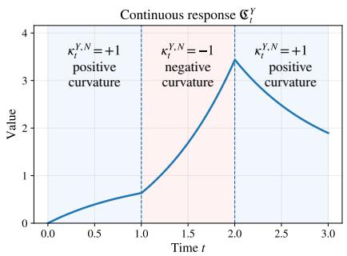

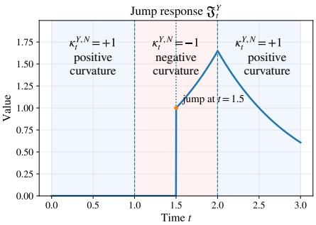  
Figure 1: Illustration of the curvature-response factors in the tracking bound. We assume that $\kappa _ { t } ^ { Y , N } = 1$ (positive curvature) if $t \in [ 0 , 1 ) \cup [ 2 , 3 ]$ and $\kappa _ { t } ^ { Y , N } = - 1$ (negative curvature) if $t \in [ 1 , 2 )$ . The factor $\mathfrak { C } _ { t } ^ { Y }$ measures the remaining efect of unit ODE forcing, while $\Im _ { t } ^ { Y }$ records a unit jump at $t = 1 . 5$ , followed by amplification under negative curvature and decay under positive curvature.

## 4 Motivating geometry in a matrix factorization model

Matrix factorization is a product model for nonlinear-moment geometry (Kolda and Bader, 2009; Sidiropoulos et al., 2017; Anandkumar et al., 2014). Following the motivating matrix-factorization application of Yamamoto et al. (2025), we study a regularized product-measure extension and prove attraction along the anti-symmetric branch, transverse descent, and positivity of the second variation along spherical product pushforwards on an annulus and near the teacher. These population statements motivate the positive–negative–positive curvature-response scenario, but do not construct a connecting PWGF trajectory, transfer the second variations to the sampled curvature $\kappa _ { t } ^ { Y , N }$ , or verify its controlled-curvature path condition.

## 4.1 Product-measure model

Let $\mu = \mu _ { 1 } \otimes \mu _ { 2 }$ have marginals on $\mathbb { S } ^ { d _ { w } - 1 }$ , and let $z \sim N ( 0 , I _ { d _ { w } } )$ . For a vector-valued activation $\sigma : \mathbb { R }  \mathbb { R } ^ { d _ { h } }$ , define the mean-field feature map $\begin{array} { r } { h _ { \nu } ( z ) : = \int \sigma ( w ^ { \top } z ) \nu ( \mathrm { d } w ) } \end{array}$ , which averages features over weights $w \sim \nu .$ . Given a teacher $\mu ^ { o } = \mu _ { 1 } ^ { o } \otimes \mu _ { 2 } ^ { o }$ , consider

$$
F ( \mu _ { 1 } \otimes \mu _ { 2 } ) : = \frac { 1 } { 2 } \mathbb { E } _ { z } \left[ \left\| h _ { \mu _ { 1 } ^ { o } } ( z ) h _ { \mu _ { 2 } ^ { o } } ( z ) ^ { \top } - h _ { \mu _ { 1 } } ( z ) h _ { \mu _ { 2 } } ( z ) ^ { \top } \right\| _ { \mathrm { F } } ^ { 2 } \right] + \frac { \lambda _ { \mathrm { r e g } } } { p _ { W } } Z _ { \pm } ( \mu _ { 1 } , \mu _ { 2 } ) ^ { p _ { W } / 2 } ,\tag{13}
$$

with $\lambda _ { \mathrm { { r e g } } } > 0$ $p _ { W } > 2 , \nu _ { \star } ^ { \pm } : = \textstyle { \frac { 1 } { 2 } } \delta _ { a _ { \star } } + \textstyle { \frac { 1 } { 2 } } \delta _ { - a _ { \star } }$ , and $Z _ { \pm } ( \mu ) : = Z _ { \pm } ( \mu _ { 1 } , \mu _ { 2 } ) : = \Sigma _ { i = 1 } ^ { 2 } W _ { 2 , 8 } ^ { 2 } ( \mu _ { i } , \nu _ { \star } ^ { \pm } )$ where $a _ { \star } \in \mathbb { S } ^ { d _ { w } - 1 }$ . The spherical distance convention is given in Section B.4.

## 4.2 Branches and standing conditions

For $0 < r _ { \mathrm { c a p } } < \pi / 2$ , let $\mathcal { P } _ { \pm } ( r _ { \mathrm { c a p } } )$ denote the class of probability measures whose closed supports lie inside the two open spherical caps of radius $r _ { \mathrm { c a p } }$ centered at $\pm a _ { \star }$ , with mass $1 / 2$ in each cap. Throughout this section, impose the following restrictions.

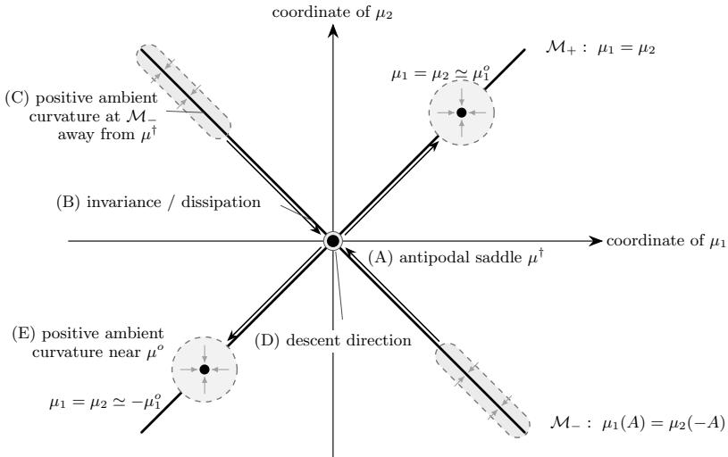  
Figure 2: Schematic local geometry in Proposition 4.1: (A)–(B) the stationary target and its local attracting branch (i); (C) annular positive curvature (ii); (D) transverse descent (iii); and (E) positive curvature near the teacher (iv). The diagram’s $- \mu _ { 1 } ^ { o }$ denotes the reflected measure $\mathrm { ( - I d ) } _ { \# } \mu _ { 1 } ^ { o }$ . Pale arrows depict curvature, not gradient-flow directions. The arrows do not assert a connecting trajectory.

Assumption 4.1 (Model restrictions; see Section B.4.3). (i) $\mu _ { i } , \mu _ { i } ^ { o } \in \mathcal { P } _ { \pm } ( r _ { \mathrm { c a p } } )$ for $i = 1 , 2$ . (ii) The nonzero Hermite coeficients of σ occur at a finite set O of odd degrees. (iii) $\mu _ { 1 } ^ { o } = \mu _ { 2 } ^ { o } = : \nu ^ { o }$

For transverse descent in Proposition 4.1(iii), we additionally require a consistent average bias orthogonal to $a _ { \star }$ across the two-sided latitude slices $| a _ { \star } ^ { \top } w |$ , with a positive margin away from the equator (Assumption B.3).

Using standard Gaussian-input moment coordinates (Ben Arous et al., 2021; Abbe et al., 2023; Bietti et al., 2022), set $\begin{array} { r } { T _ { i , n } : = \int w ^ { \otimes n } \mu _ { i } ( \mathrm { d } w ) , S _ { n } : = ( T _ { 1 , n } + T _ { 2 , n } ) / 2 } \end{array}$ , and $A _ { n } : = ( T _ { 1 , n } - T _ { 2 , n } ) / 2$ for $n \in \mathcal { O }$ . Define

$$
\mathcal { M } _ { - } : = \{ \mu _ { 1 } \otimes \mu _ { 2 } : \mu _ { 2 } = ( - \mathrm { I d } ) _ { \# } \mu _ { 1 } \} , \qquad \mathcal { M } _ { + } : = \{ \mu _ { 1 } \otimes \mu _ { 2 } : \mu _ { 1 } = \mu _ { 2 } \} .\tag{14}
$$

Membership in M− implies $S _ { n } = 0 .$ , and membership in $\mathcal { M } _ { + }$ implies $A _ { n } = 0 ;$ the converses are not assumed. The central target is $\mu ^ { \dagger } : = \nu _ { \star } ^ { \pm } \otimes \nu _ { \star } ^ { \pm }$

## 4.3 Local geometry

We use the spherical product pushforward second variation defined in Lemma B.6. Admissible fields are smooth product tangent fields preserving the caps for small perturbations; they need not be tangent to either branch. When the prescribed pushforward path is a product Wasserstein geodesic, this second variation is its usual geodesic second derivative.

Proposition 4.1 (Local geometry of the matrix factorization model). Under Assumption $4 . 1 ,$ with $\lambda _ { \mathrm { r e g } } > 0$ and $p _ { W } > 2$ , the following statements hold, each under the additional conditions stated in its item.

(i) Local attraction on the anti-symmetric branch (A–B). For $2 < p _ { W } < 3$ , every globally well-posed characteristic product WGF in the sense of Definition B.1 on M− that starts suficiently close to $\mu ^ { \dagger }$ within the cap class remains in that class and converges to $\mu ^ { \dagger }$ in product Wasserstein distance. The precise initialization conditions and rate are given in Proposition B.5.

(ii) Positive ambient curvature on an annulus $( C )$ . For every $\zeta _ { - } > 0 , i f \lambda _ { \mathrm { r e g } }$ is suficiently large, depending on $\zeta _ { - }$ and the fixed model parameters, then at every $\mu \in \mathcal { M } _ { - }$ with $Z _ { \pm } ( \mu ) \geq \zeta _ { - } ^ { 2 }$ , the spherical product pushforward second variation is positive in every nonzero admissible direction. The quantitative threshold and lower bound are given in Corollary B.2.

(iii) Transverse descent at the target (D). If $\mathcal { O } \neq \emptyset$ and the teacher satisfies Assumption B.3 at $a _ { \star }$ , ensuring a non-cancelling transverse teacher signal, there exists a same-density transverse perturbation µ from $\mu ^ { \dagger }$ such that, as $h \ \to \ 0 , \ F ( \mu _ { h } )$ = $F ( \mu ^ { \dagger } ) - \gamma _ { \mathrm { e s c } } h ^ { 2 } + o ( h ^ { 2 } )$ , with $\gamma _ { \mathrm { e s c } } ~ > ~ 0$ . Its construction is given in Proposition B.7. The regularizer contributes ${ \cal O } ( | h | ^ { p _ { W } } ) = o ( h ^ { 2 } )$

(iv) Positive ambient curvature near the teacher $( E ) . \ I f Z _ { \pm } ( \mu _ { + } ^ { o } ) > 0$ , where $\mu _ { + } ^ { o } : = \nu ^ { o } \otimes \nu ^ { o }$ the spherical product pushforward second variation has a positive uniform margin in a suficiently small product Wasserstein neighborhood of $\mu _ { + } ^ { o }$ , relative to the cap class. The existence of the margin and neighborhood is proved in Proposition B.9. The teacher need not be stationary for the regularized objective.

## 5 Technical assumptions and proof overview

## 5.1 Technical Assumptions

We state the conditions used in the main theorem and proof sketch; Section A.2 gives their full analytic formulation, and Table 1 records how each model section relates to the theorem’s assumptions and conclusions. The conditions below are verified for Example 3.1 in Lemma A.34.

Assumption 5.1 (Structured moment representation). The full conditions of Assumption A.1 hold. We use $F ( \rho ) = G ( M ( \rho ) )$ , with $\begin{array} { r } { M ( \rho ) : = ( \int \phi _ { m } d \rho ) _ { m \geq 1 } } \end{array}$ , as defined in Definition A.3. The features have controlled polynomial growth through third spatial derivatives, dominated by the decay of the moment weights $a _ { m } = e ^ { - c _ { a } m ^ { \kappa } \mathrm { d e c } }$ , with $c _ { a } > 0$ and $\kappa _ { \mathrm { d e c } } > 1$ ; see Equation (16) and assumption A.1. The functional G is $C ^ { 3 }$ on one open weighted-moment domain containing all finite-scale feasible moment regions, with a uniform weighted third-derivative bound. All structural parameters, including the anchor derivative norms and this uniform bound, are fixed independently of $N , T , p .$

The localized drift and Hessian bounds derived in Lemmas A.4 and A.6 may depend on the spatial localization radius D.

Assumption 5.2 (Regularity of the coupled particle systems). Fix $T > 0$ . The coupled particle systems $\mathbf { X } _ { t } = ( X _ { t } ^ { 1 } , \ldots , X _ { t } ^ { N } )$ and $\mathbf { Y } _ { t } = ( Y _ { t } ^ { 1 } , \ldots , Y _ { t } ^ { N } )$ satisfy the following conditions uniformly on [0, T]. The O(1) bounds below are uniform in N over the horizons considered in Theorem 3.1.

(i) Unconditional moment bound. For fixed $\alpha \in ( 0 , 2 ]$ supt≤T,q≥1 q−1/α max{(E∥X1t ∥q)1/q, (E∥Y1t ∥q)1/q} = O(1).

(ii) Temporal regularity. All particle paths are right-continuous with left limits at the jumps and share a deterministic O(1)-Lipschitz bound on every ODE branch, almost surely.

(iii) Non-spikiness of $r _ { t }$ . The coupling error $r _ { t }$ from Section $\it 2 . 4$ is assumed, almost surely, not to concentrate on a small number of particles: for some $\begin{array} { r } { A _ { \mathrm { s p } } = O ( 1 ) , \frac { 1 } { N } \sum _ { i = 1 } ^ { N } \| X _ { t } ^ { i } - Y _ { t } ^ { i } \| ^ { 3 } \leq } \end{array}$ $A _ { \mathrm { s p } } r _ { t } ^ { 3 } \ ( 0 \leq t \leq T )$ . This condition controls the cubic Taylor remainder in the particle positions by $O ( r _ { t } ^ { 3 } )$ ; see Lemma A.11 and eq. (86). In Example 3.1, all paired errors coincide, giving $A _ { \mathrm { s p } } = 1$ (Lemma $A . { \mathcal { 3 } } { \mathcal { 4 } } ( v ) )$

Assumption 5.3 (Prescribed schedule and population-first Gaussian jumps). The common times $( t _ { \ell } ) _ { \ell = 1 } ^ { L _ { \mathrm { j u m p } } }$ and amplitudes $\eta _ { \ell } \geq 0$ are deterministic, with $L _ { \mathrm { j u m p } } = O ( 1 )$ in Theorem 3.1. The initial law $\mu _ { 0 }$ is deterministic; the common initial positions $X _ { 0 } ^ { i } = Y _ { 0 } ^ { i } , i = 1 , \dots , N$ , are sampled independently from $\mu _ { 0 }$ . Population innovations are independent of that sample and fresh at each jump. The population Gaussian fields and the empirical transitions satisfy Assumption A.2.

## 5.2 Proof sketch

We explain how the ODE and jump comparisons produce the response factors in Definition 3.1. The calculations below are schematic: ≃ retains the leading linearized drift, and $\lesssim$ suppresses localized coeficients and Gaussian probability factors quantified in the appendix.

The reference particles are i.i.d. with law $\mu _ { t }$ conditional on $\mathcal { G } _ { \mathrm { p o p } }$ by Lemmas A.14 and A.19, enabling concentration (background: Sznitman (1991); Fournier and Guillin (2015)). We use $\Gamma _ { t } ^ { N }$ and $\widetilde { \Gamma } _ { t } ^ { N }$ from Section A.1 for drift/Hessian fluctuations and covariance-sampling error at jumps, respectively.

ODE intervals (Section A.3). Write $\Delta _ { t } : = \mathbf { X } _ { t } - \mathbf { Y } _ { t }$ , with particle blocks indexed by $i ,$ so that $r _ { t } = N ^ { - 1 / 2 } \| \Delta _ { t } \| _ { \mathbb { R } ^ { d N } }$ . For $r _ { t } > 0$ , the chain rule and the ODEs in eqs. (5) and (8) give the equalities below. After adding and subtracting the reference empirical drift, then linearizing and comparing Hessians (Lemmas A.7 and A.8), we informally have

$$
r _ { t } \dot { r } _ { t } = \frac { 1 } { 2 } \frac { \mathrm { d } } { \mathrm { d } t } r _ { t } ^ { 2 } = - \frac { 1 } { N } \sum _ { i = 1 } ^ { N } \langle \Delta _ { t } ^ { i } , \underbrace { \nabla _ { W } F ( \rho \mathbf { x } _ { t } , X _ { t } ^ { i } ) - \nabla _ { W } F ( \mu _ { t } , Y _ { t } ^ { i } ) } _ { \simeq ( \mathrm { H } _ { t } ^ { Y } \Delta _ { t } ) ^ { i } \ ( \mathrm { T a y l o r } ) } \rangle \simeq - \frac { 1 } { N } \Delta _ { t } ^ { \top } \mathrm { H } _ { t } ^ { Y } \Delta _ { t } .
$$

By Definition 3.1, the quadratic form is bounded above by $- \kappa _ { t } ^ { Y , N } r _ { t } ^ { 2 } ;$ ; dividing by $r _ { t }$ gives the curvature term $- \kappa _ { t } ^ { Y , N } \boldsymbol { r } _ { t }$ . Restoring the errors, on the localized good events and while $r _ { t } \le R$ Lemma A.12, (106), gives $\begin{array} { r } { \dot { r } _ { t } \le - \kappa _ { t } ^ { Y , N } r _ { t } + c _ { \cal D } R r _ { t } + \Gamma _ { t } ^ { N } ( 1 + r _ { t } ) } \end{array}$ . Here $c _ { D }$ is defined in (101); the same lemma also handles $r _ { t } = 0$

Jump times (Section A.4). Using the empirical and aligned population factors $M _ { X } , B _ { \mathrm { p o p } }$ and shared Gaussian vector $\mathbf { g } _ { \ell } ^ { N }$ from Section 2.3, we substitute the jump updates in eqs. (6) and (9) and apply the triangle inequality:

$$
r _ { t _ { \ell } } = \frac { 1 } { \sqrt { N } } \| \Delta _ { t _ { \ell ^ { - } } } + \eta _ { \ell } ( M _ { X } - B _ { \mathrm { p o p } } ) \mathbf { g } _ { \ell } ^ { N } \| _ { \mathbb { R } ^ { d N } } \leq r _ { t _ { \ell ^ { - } } } + \frac { \eta _ { \ell } } { \sqrt { N } } \| ( M _ { X } - B _ { \mathrm { p o p } } ) \mathbf { g } _ { \ell } ^ { N } \| _ { \mathbb { R } ^ { d N } } .
$$

Let $M _ { Y }$ be the empirical Hessian factor at the reference configuration just before the jump. We split $M _ { X } - B _ { \mathrm { p o p } } = ( M _ { X } - M _ { Y } ) + ( M _ { Y } - B _ { \mathrm { p o p } } )$ . Smoothness controls the contribution of the first diference by a multiple of $r _ { t _ { \ell } - }$ . For the remaining mismatch, Gaussian concentration and the aligned coupling give schematically, with all time-t quantities evaluated at $t _ { \ell } -$

$$
\frac { \| ( M _ { Y } - B _ { \mathrm { p o p } } ) \mathbf { g } _ { \ell } ^ { N } \| _ { \mathbb { R } ^ { d N } } } { \sqrt { N } } \lesssim \underbrace { \sqrt { \frac { 1 } { N } \| M _ { Y } ^ { 2 } - B _ { \mathrm { p o p } } B _ { \mathrm { p o p } } ^ { \top } \| _ { * ; \mathbb { R } ^ { d N } \to \mathbb { R } ^ { d N } } } } _ { \mathrm { s q u a r e ~ r o o t ~ o f ~ c o v a r i a n c e ~ m i s m a t c h } } \lesssim \sqrt { \Gamma _ { t } ^ { N } } + \sqrt { \tilde { \Gamma } _ { t } ^ { N } } .
$$

Here ∗ denotes the nuclear norm. The $( i , j )$ -block of the covariance mismatch is $K _ { \rho \mathbf { Y } _ { t } } ( Y _ { t } ^ { i } , Y _ { t } ^ { j } ) -$ $K _ { \mu _ { t } } ( Y _ { t } ^ { i } , Y _ { t } ^ { j } )$ . Using the kernel definition in Section 2.1, the diference $K _ { \rho \mathbf { Y } _ { t } } ( x , y ) - K _ { \mu { t } } ( x , y )$ consists schematically of

$$
\underbrace { \mathrm { H e s s i a n ~ a p p r o x i m a t i o n } } _ { \mathrm { a s ~ i n ~ t h e ~ O D E ~ s t e p } } + \int \nabla _ { W } ^ { 2 } F ( \mu _ { t } ; x , z ) \nabla _ { W } ^ { 2 } F ( \mu _ { t } ; z , y ) ( \rho _ { { \bf Y } _ { t } } - \mu _ { t } ) ( d z ) .
$$

Expanding the diference of the two Hessian products bounds the first term linearly in the Hessian approximation error, with localized coeficients suppressed. The second term is an empirical integration error. These comparisons are established in Lemmas A.13, A.16 and A.17. Combining the two contributions yields $r _ { t _ { \ell } } \lesssim ( 1 + \eta _ { \ell } ) r _ { t _ { \ell } - } + \eta _ { \ell } ( \sqrt { \Gamma _ { t _ { \ell } - } ^ { N } } + \sqrt { \tilde { \Gamma } _ { t _ { \ell } - } ^ { N } } )$ : a jump amplifies past error and adds a new error. The square-root dependence explains why an $N ^ { - 1 / 2 }$ covariancesampling bound contributes N −1/4 to the jump estimate. For background on Gaussian covariance alignment, see Masarotto et al. (2019).

From local errors to response factors. Between jumps, the homogeneous equation $\dot { r } _ { t } =$ $- \kappa _ { t } ^ { Y , N } r _ { t }$ has solution $r _ { t } = G _ { \kappa } ^ { Y } ( t , s ) r _ { s }$ , where $\begin{array} { r } { G _ { \kappa } ^ { Y } ( t , s ) = \exp \Bigl ( - \int _ { s } ^ { t } \kappa _ { u } ^ { Y , N } d u \Bigr ) } \end{array}$ . Hence an error created at time s receives this weight at time t. Starting from $r _ { 0 } = 0 .$ , integrating the continuous forcing and summing the jump forcing gives an integral and a sum, respectively. Taking uniform residual bounds outside them yields schematically

$$
\begin{array} { r } { r _ { t } \lesssim ( \operatorname* { s u p } _ { s \leq T } \Gamma _ { s } ^ { N } ) \underbrace { \int _ { 0 } ^ { t } G _ { \kappa } ^ { Y } ( t , s ) d s } _ { \mathfrak { C } _ { t } ^ { Y } } + ( \sqrt { \operatorname* { s u p } _ { s \leq T } \Gamma _ { s } ^ { N } } + \sqrt { \operatorname* { m a x } _ { \ell \leq L _ { \mathrm { j u m p } } } \tilde { \Gamma } _ { t _ { \ell } - } ^ { N } } ) \underbrace { \sum _ { \ell : t _ { \ell } \leq t } \eta _ { \ell } G _ { \kappa } ^ { Y } ( t , t _ { \ell } ) } _ { \mathfrak { V } _ { t } ^ { Y } } . } \end{array}
$$

The maximum is zero if there are no jumps. The recursive comparison in Lemma A.31, eqs. (166) and (184), retains the extra nonlinear amplification and the products of jump multipliers.

Residual bounds and closure. Conditioning only on $\mathcal { G } _ { \mathrm { p o p } }$ , moment localization and weightedfeature covariance concentration give, with probability at least $1 - p$ and $\Xi = \Xi _ { N , T , p }$ from Theorem 3.1,

$$
\operatorname* { s u p } _ { t \leq T } \Gamma _ { t } ^ { N } \leq C _ { \varepsilon } \Xi ^ { \varepsilon } ( N ^ { - 1 / 2 } + T / N ) , \qquad \operatorname* { m a x } _ { \ell \leq L _ { \mathrm { j u m p } } } \widetilde \Gamma _ { t _ { \ell } - } ^ { N } \leq C _ { \varepsilon } \Xi ^ { \varepsilon } N ^ { - 1 / 2 } ;
$$

see Lemma A.25 and corollary A.3. Under the theorem’s conditions, Theorem A.1 and corollary A.4 close the localized estimate and absorb the extra amplification into $C _ { \varepsilon } \Xi ^ { \varepsilon }$ . Lemma A.33 and eq. (190) give the objective bound.

## 6 Conclusion

We quantified finite-particle tracking for Hessian-guided PWGF under prescribed common jump schedules. The coupling reduces Gaussian jump error to covariance comparison, while sampled curvature propagates residuals into tracking and objective bounds.

Limitations & future directions. Beyond the variance-plus-cosine example (Section A.8), deriving the controlled-curvature path condition and non-spikiness from model primitives remains open, as does synchronizing adaptive jump times.

Formal verification and reproducibility. The accompanying Lean 4 development formalizes the stated fixed-schedule and growing-horizon tracking results, the variance-plus-cosine example, and the four local-geometry items in Proposition 4.1, under their explicit hypotheses. The build and axiom audit cover 4,274 registered declarations in 661 modules, including definitions and instances. Claim-by-claim correspondence and solution-class boundaries are documented separately from kernel checking. The formalization does not establish unconditional WGF well-posedness, a deterministic characteristic representation of arbitrary weak PDE solutions, or the numerical experiments. Pinned environments, verification commands, source hashes, and experiment records are provided in the public reproducibility repository: https://github.com/ ryotaro-kawata-wa/pwgf-finite-sample.

## Acknowledgments

RK was partially supported by JSPS KAKENHI (24K02905) and JST BOOST (JPMJBS2418).   
TS was partially supported by JST CREST (JPMJCR2115) and JSPS KAKENHI (25H01107).   
This work was partially supported by JST ERATO Grant Number JPMJER2601.

This research is supported by the National Research Foundation, Singapore and the Ministry of Digital Development and Information under the AI Visiting Professorship Programme (award number AIVP-2024-004). Any opinions, findings and conclusions or recommendations expressed in this material are those of the author(s) and do not reflect the views of National Research Foundation, Singapore and the Ministry of Digital Development and Information.

## AI use statement

ChatGPT models assisted with brainstorming, writing and editing, locating candidate references, and checking mathematical arguments. This included formulating and refining mathematical claims, detailed proof calculations, revising author-written drafts, supplementing incomplete derivations, exploring proof repairs, preparing LaTeX and verification materials, editing schematic figures, designing the experimental setup, developing code for the synthetic experiments, and creating experimental figures. Astra and 6 Pro also assisted with developing the Lean 4 implementation and running its compilation, kernel proof checking, and axiom audits. These models are not components of the optimization method studied in this paper. The authors have checked the proofs. Responsibility for the final statements and proofs remains with the authors.

## References

Emmanuel Abbe, Enric Boix-Adserà, and Theodor Misiakiewicz. Sgd learning on neural networks: leap complexity and saddle-to-saddle dynamics. In Gergely Neu and Lorenzo Rosasco, editors, Proceedings of Thirty Sixth Conference on Learning Theory, volume 195 of Proceedings of Machine Learning Research, pages 2552–2623. PMLR, 12–15 Jul 2023. URL https://proceedings.mlr.press/v195/abbe23a.html.

Luigi Ambrosio, Nicola Gigli, and Giuseppe Savaré. Gradient flows: in metric spaces and in the space of probability measures. Birkhäuser Basel, 2005. URL https://link.springer.com/ book/10.1007/b137080.

Animashree Anandkumar, Rong Ge, Daniel Hsu, Sham M. Kakade, and Matus Telgarsky. Tensor decompositions for learning latent variable models. Journal of Machine Learning Research, 15 (80):2773–2832, 2014. ISSN 1532-4435. URL https://jmlr.org/papers/v15/anandkumar14b. html.

Michael Arbel, Anna Korba, Adil SALIM, and Arthur Gretton. Maximum mean discrepancy gradient flow. In H. Wallach, H. Larochelle, A. Beygelzimer, F. d'Alché-Buc, E. Fox, and R. Garnett, editors, Advances in Neural Information Processing Systems, volume 32. Curran Associates, Inc., 2019. URL https://proceedings.neurips.cc/paper\_files/paper/2019/ file/944a5ae3483ed5c1e10bbccb7942a279-Paper.pdf.

Gerard Ben Arous, Reza Gheissari, and Aukosh Jagannath. Online stochastic gradient descent on non-convex losses from high-dimensional inference. Journal of Machine Learning Research, 22(106):1–51, 2021. URL https://jmlr.org/papers/v22/20-1288.html.

Srinadh Bhojanapalli, Behnam Neyshabur, and Nathan Srebro. Global optimality of local search for low rank matrix recovery. In Advances in Neural Information Processing Systems,

volume 29, pages 3880–3888, 2016. URL https://proceedings.neurips.cc/paper/2016/ file/b139e104214a08ae3f2ebcce149cdf6e-Paper.pdf.

Alberto Bietti, Joan Bruna, Clayton Sanford, and Min Jae Song. Learning single-index models with shallow neural networks. In S. Koyejo, S. Mohamed, A. Agarwal, D. Belgrave, K. Cho, and A. Oh, editors, Advances in Neural Information Processing Systems, volume 35, pages 9768–9783. Curran Associates, Inc., 2022. URL https://proceedings.neurips.cc/paper\_ files/paper/2022/file/3fb6c52aeb11e09053c16eabee74dd7b-Paper-Conference.pdf.

Stéphane Boucheron, Gábor Lugosi, and Pascal Massart. Concentration Inequalities: A Nonasymptotic Theory of Independence. Oxford University Press, Oxford, 2013. ISBN 978-0-19-953525-5. URL https://academic.oup.com/book/26549.

Fan Chen, Zhenjie Ren, and Songbo Wang. Uniform-in-time propagation of chaos for mean field Langevin dynamics. Annales de l’Institut Henri Poincaré (B) Probabilités et Statistiques, 61(4):2357–2404, November 2025. doi: 10.1214/24-AIHP1499. URL https://hal.science/ hal-05349896.

Yongxin Chen, Tryphon Georgiou, and Michele Pavon. Stochastic control, entropic interpolation and gradient flows on wasserstein product spaces, 2016. URL https://arxiv.org/abs/1601. 04891.

Lénaïc Chizat and Francis Bach. On the global convergence of gradient descent for overparameterized models using optimal transport. In S. Bengio, H. Wallach, H. Larochelle, K. Grauman, N. Cesa-Bianchi, and R. Garnett, editors, Advances in Neural Information Processing Systems, volume 31. Curran Associates, Inc., 2018. URL https://proceedings.neurips.cc/ paper\_files/paper/2018/file/a1afc58c6ca9540d057299ec3016d726-Paper.pdf.

Casey Chu, Jose Blanchet, and Peter Glynn. Probability functional descent: A unifying perspective on GANs, variational inference, and reinforcement learning. In Kamalika Chaudhuri and Ruslan Salakhutdinov, editors, Proceedings of the 36th International Conference on Machine Learning, volume 97 of Proceedings of Machine Learning Research, pages 1213–1222. PMLR, 09–15 Jun 2019. URL https://proceedings.mlr.press/v97/chu19a.html.

Lauren Conger, Franca Hofmann, Eric Mazumdar, and Lillian J. Ratlif. Coupled wasserstein gradient flows for min-max and cooperative games, 2025. URL https://arxiv.org/abs/ 2411.07403.

Amit Daniely, Roy Frostig, and Yoram Singer. Toward deeper understanding of neural networks: The power of initialization and a dual view on expressivity. In D. Lee, M. Sugiyama, U. Luxburg, I. Guyon, and R. Garnett, editors, Advances in Neural Information Processing Systems, volume 29. Curran Associates, Inc., 2016. URL https://proceedings.neurips.cc/paper\_ files/paper/2016/file/abea47ba24142ed16b7d8fbf2c740e0d-Paper.pdf.

Nicolas Fournier and Arnaud Guillin. On the rate of convergence in wasserstein distance of the empirical measure. Probability theory and related fields, 162(3–4):707–738, 2015. URL https://link.springer.com/article/10.1007/s00440-014-0583-7.

Rong Ge, Furong Huang, Chi Jin, and Yang Yuan. Escaping from saddle points—online stochastic gradient for tensor decomposition. In Proceedings of the Conference on Learning Theory, volume 40 of Proceedings of Machine Learning Research, pages 797–842, 2015. URL https://proceedings.mlr.press/v40/Ge15.html.

Rong Ge, Chi Jin, and Yi Zheng. No spurious local minima in nonconvex low rank problems: A unified geometric analysis. In Proceedings of the 34th International Conference on Machine

Learning, volume 70 of Proceedings of Machine Learning Research, pages 1233–1242, 2017. URL https://proceedings.mlr.press/v70/ge17a.html.

Valeria Giunta, Thomas Hillen, Mark A. Lewis, and Jonathan R. Potts. Weakly nonlinear analysis of a two-species non-local advection–difusion system. Nonlinear Analysis: Real World Applications, 78:104086, 2024. ISSN 1468-1218. doi: 10.1016/j.nonrwa.2024.104086. URL https://www.sciencedirect.com/science/article/pii/S1468121824000269.

Margalit Glasgow, Denny Wu, and Joan Bruna. Mean-field analysis of polynomial-width two-layer neural network beyond finite time horizon. In Proceedings of Thirty Eighth Conference on Learning Theory, volume 291 of Proceedings of Machine Learning Research, pages 2461–2539. PMLR, 2025. URL https://proceedings.mlr.press/v291/glasgow25a.html.

Wolfgang Hackbusch. Tensor Spaces and Numerical Tensor Calculus. Springer Berlin Heidelberg, Berlin, Heidelberg, 2012. doi: 10.1007/978-3-642-28027-6. URL https://link.springer. com/book/10.1007/978-3-642-28027-6.

Chi Jin, Praneeth Netrapalli, and Michael I. Jordan. Accelerated gradient descent escapes saddle points faster than gradient descent. In Sébastien Bubeck, Vianney Perchet, and Philippe Rigollet, editors, Proceedings of the 31st Conference On Learning Theory, volume 75 of Proceedings of Machine Learning Research, pages 1042–1085. PMLR, 06–09 Jul 2018. URL https://proceedings.mlr.press/v75/jin18a.html.

Richard Jordan, David Kinderlehrer, and Felix Otto. The variational formulation of the fokker– planck equation. SIAM Journal on Mathematical Analysis, 29(1):1–17, 1998. doi: 10.1137/ S0036141096303359. URL https://doi.org/10.1137/S0036141096303359.

Juno Kim and Taiji Suzuki. Transformers learn nonlinear features in context: Nonconvex mean-field dynamics on the attention landscape. In Ruslan Salakhutdinov, Zico Kolter, Katherine Heller, Adrian Weller, Nuria Oliver, Jonathan Scarlett, and Felix Berkenkamp, editors, Proceedings of the 41st International Conference on Machine Learning, volume 235 of Proceedings of Machine Learning Research, pages 24527–24561. PMLR, 21–27 Jul 2024. URL https://proceedings.mlr.press/v235/kim24af.html.

Tamara G. Kolda and Brett W. Bader. Tensor decompositions and applications. SIAM Review, 51(3):455–500, 2009. doi: 10.1137/07070111X. URL https://doi.org/10.1137/07070111X.

Qiang Liu and Dilin Wang. Stein variational gradient descent: A general purpose bayesian inference algorithm. In D. Lee, M. Sugiyama, U. Luxburg, I. Guyon, and R. Garnett, editors, Advances in Neural Information Processing Systems, volume 29. Curran Asso ciates, Inc., 2016. URL https://proceedings.neurips.cc/paper\_files/paper/2016/ file/b3ba8f1bee1238a2f37603d90b58898d-Paper.pdf.

Valentina Masarotto, Victor M. Panaretos, and Yoav Zemel. Procrustes metrics on covariance operators and optimal transportation of Gaussian processes. Sankhya A, 81(1):172–213, 2019. doi: 10.1007/s13171-018-0130-1. URL https://doi.org/10.1007/s13171-018-0130-1.

Song Mei, Andrea Montanari, and Phan-Minh Nguyen. A mean field view of the landscape of two-layer neural networks. Proceedings of the National Academy of Sciences, 115(33): E7665–E7671, 2018. doi: 10.1073/pnas.1806579115. URL https://www.pnas.org/doi/abs/ 10.1073/pnas.1806579115.

Michael Murray, Hui Jin, Benjamin Bowman, and Guido Montufar. Characterizing the spectrum of the NTK via a power series expansion. In The Eleventh International Conference on Learning Representations, 2023. URL https://arxiv.org/abs/2211.07844.

Atsushi Nitanda, Denny Wu, and Taiji Suzuki. Convex analysis of the mean field langevin dynamics. In Gustau Camps-Valls, Francisco J. R. Ruiz, and Isabel Valera, editors, Proceedings of The 25th International Conference on Artificial Intelligence and Statistics, volume 151 of Proceedings of Machine Learning Research, pages 9741–9757. PMLR, 28–30 Mar 2022a. URL https://proceedings.mlr.press/v151/nitanda22a.html.

Atsushi Nitanda, Denny Wu, and Taiji Suzuki. Particle dual averaging: optimization of mean field neural network with global convergence rate analysis. Journal of Statistical Mechanics: Theory and Experiment, 2022(11):114010, nov 2022b. doi: 10.1088/1742-5468/ac98a8. URL https://doi.org/10.1088/1742-5468/ac98a8.

Atsushi Nitanda, Anzelle Lee, Damian Tan Xing Kai, Mizuki Sakaguchi, and Taiji Suzuki. Propagation of chaos for mean-field Langevin dynamics and its application to model ensemble. In Aarti Singh, Maryam Fazel, Daniel Hsu, Simon Lacoste-Julien, Felix Berkenkamp, Tegan Maharaj, Kiri Wagstaf, and Jerry Zhu, editors, Proceedings of the 42nd International Conference on Machine Learning, volume 267 of Proceedings of Machine Learning Research, pages 46586–46610. PMLR, 13–19 Jul 2025. URL https://proceedings.mlr.press/v267/nitanda25a.html.

Giovanni Peccati and Murad S Taqqu. Wiener Chaos: Moments, Cumulants and Diagrams: A survey with computer implementation, volume 1. Springer Science & Business Media, 2011. URL https://link.springer.com/book/10.1007/978-88-470-1679-8.

Robert T. Powers and Erling Størmer. Free states of the canonical anticommutation relations. Communications in Mathematical Physics, 16(1):1–33, 1970. doi: 10.1007/BF01645492. URL https://doi.org/10.1007/BF01645492.

Nicholas D. Sidiropoulos, Lieven De Lathauwer, Xiao Fu, Kejun Huang, Evangelos E. Papalexakis, and Christos Faloutsos. Tensor decomposition for signal processing and machine learning. IEEE Transactions on Signal Processing, 65(13):3551–3582, July 2017. ISSN 1053-587X. doi: 10.1109/TSP.2017.2690524. URL https://doi.org/10.1109/TSP.2017.2690524.

Taiji Suzuki, Atsushi Nitanda, and Denny Wu. Uniform-in-time propagation of chaos for the mean-field gradient langevin dynamics. In The Eleventh International Conference on Learning Representations, 2023. URL https://openreview.net/forum?id=\_JScUk9TBUn.

Alain-Sol Sznitman. Topics in propagation of chaos. In Paul-Louis Hennequin, editor, Ecole d’Eté de Probabilités de Saint-Flour XIX — 1989, pages 165–251, Berlin, Heidelberg, 1991. Springer Berlin Heidelberg. ISBN 978-3-540-46319-1. URL https://link.springer.com/ chapter/10.1007/BFb0085169.

Naoya Yamamoto, Juno Kim, and Taiji Suzuki. Hessian-guided perturbed wasserstein gradient flows for escaping saddle points. In Advances in Neural Information Processing Systems, volume 38, Main Conference, pages 43347–43398. Curran Associates, Inc., 2025. doi: 10. 52202/085713-1442. URL https://proceedings.neurips.cc/paper\_files/paper/2025/ hash/3dca8a6a5422c2d5d22c6e9a26469d7e-Abstract-Conference.html.

## A A General Comparison Argument via the Auxiliary Particle System

Notations. For nonnegative quantities $a , b ,$ we write $a \lesssim b$ if $a \leq C b$ for a constant $C > 0$ independent of the main asymptotic parameters, such as the particle number N, horizon $T ,$ and failure probability $p .$ Equivalently, $a = O ( b )$ means $a \lesssim b$ . We write $a = o ( b )$ if $a / b  0$ in the prescribed asymptotic regime. Similarly, $a = \Omega ( b )$ means $b = O ( a )$ , and $a = \omega ( b )$ means $b = o ( a )$ We write $a = \Theta ( b )$ if both $a = O ( b )$ and $a = \Omega ( b )$ hold. Finally, $a = { \widetilde { O } } ( b )$ hides polylogarithmic factors in the main asymptotic parameters. The hidden constants may depend on fixed problem parameters, the dimension, and structural smoothness constants, but not on $N , T$ , or $p .$

For normed spaces $E , F , { \mathcal { L } } ( E ; F )$ denotes the space of bounded linear maps from E to $F$ , and $\mathcal { L } ( E _ { 1 } , \ldots , E _ { k } ; F )$ denotes the space of bounded k-linear maps from $E _ { 1 } \times \cdots \times E _ { k }$ to $F$ . When $E = F$ , we write $\mathcal { L } ( E )$ . For a linear map $A : \mathbb { R } ^ { d } \to \mathbb { R } ^ { d } , \left\| A \right\| _ { d \to d } : = \operatorname* { s u p } _ { \| v \| _ { \infty } = 1 } \left\| A v \right\| _ { 2 }$ denotes its Euclidean operator norm. We use $\lVert \cdot \rVert _ { \mathrm { H S } }$ for the Hilbert–Schmidt norm and $\left. \cdot \right. _ { \mathrm { F } }$ for the Frobenius norm; in finite-dimensional matrix spaces these coincide, but we reserve $\lVert \cdot \rVert _ { \mathrm { H S } }$ for Hilbert-space operators or tensor-valued feature maps, and $\lVert \cdot \rVert _ { \mathrm { F } }$ for ordinary finite matrices.

Vector fields, configurations, and empirical measures. For a measure $\mu \in \mathcal P _ { 2 } ( \mathbb { R } ^ { d } )$ and vector fields $v , w : \mathbb { R } ^ { d }  \mathbb { R } ^ { d }$ , define

$$
\| v \| _ { L ^ { 2 } ( \mu ) } ^ { 2 } : = \int \| v ( x ) \| ^ { 2 } \mu ( d x ) , \qquad \langle v , w \rangle _ { L ^ { 2 } ( \mu ) } : = \int \langle v ( x ) , w ( x ) \rangle \mu ( d x ) .
$$

For a configuration $\mathbf { x } = ( x ^ { 1 } , \ldots , x ^ { N } ) \in ( \mathbb { R } ^ { d } ) ^ { N }$ , set

$$
\| { \mathbf { x } } \| _ { N } ^ { 2 } : = \frac { 1 } { N } \sum _ { i = 1 } ^ { N } \| x ^ { i } \| ^ { 2 } , \qquad \rho _ { \mathbf { x } } : = \frac { 1 } { N } \sum _ { i = 1 } ^ { N } \delta _ { x ^ { i } } , \qquad \xi ^ { N } ( { \mathbf { x } } ) : = ( \xi ( x ^ { 1 } ) , \dots , \xi ( x ^ { N } ) ) .
$$

We abbreviate $\rho _ { X _ { t } } : = \rho _ { \mathbf { X } _ { i } }$ t and $\rho _ { Y _ { t } } : = \rho _ { \mathbf { Y } _ { t } }$ . The coupled discrepancy is

$$
\delta _ { t , i } : = X _ { t } ^ { i } - Y _ { t } ^ { i } , \qquad r _ { t } ^ { 2 } : = \frac { 1 } { N } \sum _ { i = 1 } ^ { N } \| \delta _ { t , i } \| ^ { 2 } = \| \mathbf { X } _ { t } - \mathbf { Y } _ { t } \| _ { N } ^ { 2 } .
$$

The normalized configuration inner product is

$$
\langle { \bf u } , { \bf v } \rangle _ { N } : = \frac { 1 } { N } \sum _ { i = 1 } ^ { N } \langle u ^ { i } , v ^ { i } \rangle .
$$

Gradient, Hessian, and jump covariance. The Wasserstein gradient is $\nabla _ { W } F ( \mu , x ) \in \mathbb { R } ^ { d }$ We distinguish its measure derivative from its spatial Jacobian:

$$
\begin{array} { r } { \nabla _ { W } ^ { 2 } F ( \mu ; x , y ) : = \nabla _ { W } ^ { 2 } F ( \mu ; x , y ) \in \mathbb { R } ^ { d \times d } , } \\ { \nabla _ { x } \nabla _ { W } F ( \mu , x ) : = \nabla _ { x } \nabla _ { W } F ( \mu , x ) \in \mathbb { R } ^ { d \times d } . } \end{array}
$$

Use the following operators on their natural domains in $L ^ { 2 } ( \mu ; \mathbb { R } ^ { d } )$

$$
\begin{array} { l l } { { ( H _ { \mu } v ) ( x ) : = \displaystyle \int \nabla _ { W } ^ { 2 } F ( \mu ; x , y ) v ( y ) \mu ( d y ) , } } \\ { { { } } } \\ { { ( H _ { \mu } ^ { \prime } v ) ( x ) : = \nabla _ { x } \nabla _ { W } F ( \mu , x ) v ( x ) , } } & { { ~ \mathcal { H } _ { \mu } : = H _ { \mu } + H _ { \mu } ^ { \prime } . } } \end{array}
$$

In particular, the spatial multiplication operator has domain

$$
\mathcal { D } ( H _ { \mu } ^ { \prime } ) : = \{ v \in L ^ { 2 } ( \mu ; \mathbb { R } ^ { d } ) : \nabla _ { x } \nabla _ { W } F ( \mu , \cdot ) v ( \cdot ) \in L ^ { 2 } ( \mu ; \mathbb { R } ^ { d } ) \} , \qquad \mathcal { D } ( \mathcal { H } _ { \mu } ) = \mathcal { D } ( H _ { \mu } ) \cap \mathcal { D } ( H _ { \mu } ^ { \prime } ) .
$$

Here $\mathcal { D } ( H _ { \mu } )$ consists of the fields for which the displayed kernel integral exists and defines an $L ^ { 2 } ( \mu )$ field. For $v \in \mathcal { D } ( \mathcal { H } _ { \mu } )$ for which the pushforward perturbation and the indicated derivatives are defined, the full second-variation identity is

$$
\frac { d ^ { 2 } } { d h ^ { 2 } } \Big | _ { h = 0 } F ( ( \mathrm { I d } + h v ) _ { \# } \mu ) = \langle v , \mathcal { H } _ { \mu } v \rangle _ { L ^ { 2 } ( \mu ) } .
$$

The tracking curvature retains both terms of $\mathcal { H } _ { \boldsymbol { \mu } } .$ . The additional spatial-Hessian bound in proposition A.2 makes $H _ { \mu } ^ { \prime }$ bounded; no such global bound is imposed here. In contrast, the Hessian-guided jump covariance uses the integral term:

$$
K _ { \mu } ( x , y ) : = \int \nabla _ { W } ^ { 2 } F ( \mu ; x , z ) \nabla _ { W } ^ { 2 } F ( \mu ; z , y ) \mu ( d z ) , \qquad \xi _ { \mu } \sim \mathrm { G P } ( 0 , K _ { \mu } ) .
$$

Here ${ \mathrm { G P } } ( 0 , K _ { \mu } )$ denotes a centered Gaussian process with covariance kernel $K _ { \mu }$ . The finite Gaussian coordinates used to compare two jumps are constructed from the population field in lemma A.14. For a matrix or trace-class operator $A ,$ we use the nuclear norm

$$
\| A \| _ { * } : = \operatorname { t r } ( ( A ^ { * } A ) ^ { 1 / 2 } ) ,
$$

where $A ^ { * }$ denotes the Hilbert adjoint and equals $A ^ { \top }$ for real matrices.

Conventions for the fixed-schedule comparison. The jump count is $L _ { \mathrm { j u m p } }$ . We take $0 < t _ { 1 } < \cdots < t _ { L _ { \mathrm { i u m o } } } \leq T$ , put $t _ { 0 } = 0$ and $t _ { L _ { \mathrm { i u m p } } + 1 } = T _ { \mathrm { : } }$ , and allow $L _ { \mathrm { j u m p } } = 0$ . Paths are right-continuous: $Z _ { t _ { \ell } }$ is the post-jump value and $\begin{array} { r } { Z _ { t _ { \ell } - } = \operatorname* { l i m } _ { s \uparrow t _ { \ell } } Z _ { s } } \end{array}$ is the pre-jump value. Jump covariances and jump residuals are evaluated at $t _ { \ell } -$ −. Empty sums and products are zero and one, respectively.

Population conditioning and comparison history. The population initial law and schedule are deterministic. Population Gaussian innovations are independent of the iid initial sample. Let $\mathcal { G } _ { \ell }$ be the sigma-field generated by the population fields through jump $\ell ,$ and let $\mathcal { G } _ { \mathrm { p o p } } = \mathcal { G } _ { L _ { \mathrm { j u m p } } }$ The population path satisfies $\mu _ { t } = \operatorname { L a w } ( Y _ { t } ^ { 1 } \mid { \mathcal { G } } _ { \mathrm { p o p } } )$ ; the conditional product law is proved in lemma A.19. The notation $\mathcal { H } _ { \ell - }$ denotes the full pre-jump history, including $X _ { t _ { \ell } - } , Y _ { t _ { \ell } - } , \mu _ { t _ { \ell } - } ,$ all previous population innovations and auxiliary normals, and the initial sample. It does not include the current or future innovations. Finite Gaussian comparison coordinates are standard Gaussian conditionally on this history; they are not the conditioning object in the product law for $Y$

## A.1 Overview of the finite-particle comparison

This appendix expands the proof architecture summarized in section 5, especially the fourstep sketch in section 5.2. The population PWGF mechanism itself is treated as the reference dynamics, in the sense of the Hessian-guided construction of Yamamoto et al. (2025). The purpose of the present appendix is the finite-particle empirical error analysis: we quantify how the implementable particle system tracks the prescribed mean-field PWGF path.

Classical globally Lipschitz propagation-of-chaos arguments close the reference-particle stability estimate by Gronwall with a worst-case Lipschitz constant (Sznitman, 1991). Here the same architecture is driven instead by the curvature propagator associated with the sampled curvature.

The comparison is organized through the auxiliary particle system $\pmb { Y } _ { t } = ( Y _ { t } ^ { 1 } , \ldots , Y _ { t } ^ { N } )$ :

$$
\rho _ { X _ { t } } \quad \longleftrightarrow \quad \rho _ { Y _ { t } } \quad \longleftrightarrow \quad \mu _ { t } .
$$

<table><tr><td>Condition or conclusion</td><td>General comparison</td><td>Variance-cosine example</td><td>Matrix-factorization case study</td></tr><tr><td>Moment structure and weighted smoothness</td><td>Assumed in assumption A.1</td><td>Verified in lemma A.34(i) Separate product-model</td><td>conditions in assumption 4.1</td></tr><tr><td>Gaussian jumps and Prescribed by schedule</td><td>assumption A.2</td><td>One prescribed common jump, verified in lemma A.34(ii)</td><td></td></tr><tr><td>Moment growth and Assumed in ODE regularity Non-spikiness</td><td>assumptions A.3 and A.4 lemma A.34(iii)−(iv) Assumed in assumption A.5</td><td>Verified in Verified with  $A _ { \mathrm { s p } } = 1$  in lemma A.34(v)</td><td></td></tr><tr><td>Curvature-response mechanism</td><td>Nonlinear stability in curvature-response bounds in corollary A.4</td><td>High-probability response Population-level local theorem A.1; N&#x27;-scaled bounds in lemma A.35; corollary A.4 applies with attraction, transverse  $v = \zeta = 1 / 1 6$ </td><td>geometry in proposition 4.1: descent, and positive spherical product pushforward second</td></tr><tr><td>Finite-particle conclusion</td><td>Conditional tracking and Growing-horizon objective comparison</td><td>conclusion in proposition A.1</td><td>variation in two regions Open</td></tr></table>

Table 1: Relation of the model sections to the comparison theory. The matrix-factorization column records a separate population curvature-response case study; — denotes items outside its scope, and $^ { 6 6 } \mathrm { O p e n } ^ { \prime \prime }$ denotes the bridge to finite-particle tracking.

Here $\pmb { X _ { t } } = ( X _ { t } ^ { 1 } , \ldots , X _ { t } ^ { N } )$ is the actual empirical system, whose drift and jump covariance are evaluated at $\rho _ { X , \dot { } } ; \mu _ { t }$ is the population PWGF path; and $\mathbf { } Y _ { t }$ starts from the same initial sample and uses the population drift and the original population Gaussian field along $\mu _ { t }$ . Procrustes/Wasserstein comparisons of covariance factors provide related mathematical background (Masarotto et al., 2019). The population-first conditional construction required here is proved in lemma A.14: it constructs the empirical Gaussian coordinates jointly with the field evaluations, preserving both marginal updates. The reference conditional product law conditions only on the population fields. Thus the comparison separates two efects: the pathwise stability of $X _ { t }$ relative to $\mathbf { } Y _ { t } ,$ and the concentration of the conditionally i.i.d. reference cloud $\mathbf { \nabla } _ { \mathbf { Y } _ { t } }$ around $\mu _ { t } .$

How this appendix matches the main proof sketch. The detailed proof follows the same four pieces as section 5.2. First, section A.2 defines the common initial coupling, the common-seed Gaussian jump construction, the moment-Lipschitz smoothness assumptions, and the localization event. Second, section A.3 proves the continuous-time contraction-versus-residual bound for

$$
r _ { t } : = \frac { 1 } { \sqrt { N } } \| \pmb { X } _ { t } - \pmb { Y } _ { t } \| _ { 2 } .
$$

Third, section A.4 controls the perturbation mismatch at prescribed jump times. Fourth, section A.5, together with section A.5.2 and section A.5.3, supplies the concentration estimates needed to close the deterministic inequality.

Core theorem: prescribed common jump schedule. The core result of this appendix is the fixed-schedule comparison in section A.6. In this layer the population and empirical systems are compared along a prescribed common jump schedule $0 = t _ { 0 } < t _ { 1 } < \cdot \cdot \cdot < t _ { L _ { \mathrm { j u m p } } } \leq T$

with $L _ { \mathrm { j u m p } } = O ( 1 )$ in Corollary A.4. On the population moment and sample localization events,

and under anti-spikiness, the ODE estimate is

$$
\dot { r } _ { t } \le - \kappa _ { t } ^ { Y , N } r _ { t } + c _ { D } r _ { t } ^ { 2 } + \Gamma _ { t } ^ { N } r _ { t } + \Gamma _ { t } ^ { N } .
$$

At each prescribed jump, the comparison uses only pre-jump residuals:

$$
r _ { t _ { \ell } } \leq ( 1 + a _ { \ell } ) r _ { t _ { \ell } - } + a _ { \ell } ( \sqrt { \Gamma _ { t _ { \ell } - } ^ { N } } + \sqrt { \tilde { \Gamma } _ { t _ { \ell } - } ^ { N } } ) , \qquad a _ { \ell } = c _ { J } ( D ) q _ { p } \eta _ { \ell } .
$$

The finite Gaussian coupling is constructed after generating the population field; the reference product law conditions only on the population fields. The exact result in Theorem A.1 retains the nonlinear condition $T ( \delta + c _ { D } R ) \leq 1 / 4$ . Its failure probability is bounded within that nonlinear stability event and the regularity event. The suficient horizon $T \le N ^ { 1 / 4 - \upsilon - \zeta }$ in corollary A.4 also specifies the curvature-response bounds and uniform structural constants it uses.

The two stochastic residuals. The continuous residual is

$$
\Gamma _ { t } ^ { N } : = \sum _ { m \geq 1 } \gamma _ { m } \Delta _ { m , t } ^ { N } , \qquad \Delta _ { m , t } ^ { N } : = \| M _ { m } ( \rho _ { Y _ { t } } ) - M _ { m } ( \mu _ { t } ) \| .
$$

It controls the population-to-reference empirical error in the drift, Hessian, and functional terms. The jump covariance residual is

$$
\widetilde { \Gamma } _ { t } ^ { N } : = \frac { 1 } { N } \left\| \int \mathbf { U } _ { t } ( z ) \mathbf { U } _ { t } ( z ) ^ { \top } ( \mu _ { t } - \rho _ { Y _ { t } } ) ( \mathrm { d } z ) \right\| _ { * } ,
$$

where

$$
\mathbf { U } _ { t } ( z ) : = \bigl ( \nabla _ { W } ^ { 2 } F ( \mu _ { t } ; Y _ { t } ^ { 1 } , z ) , \ldots , \nabla _ { W } ^ { 2 } F ( \mu _ { t } ; Y _ { t } ^ { N } , z ) \bigr ) ^ { \top } .
$$

The first residual enters additively along ODE intervals, whereas the second enters through a square-root covariance perturbation at jumps. Consequently, even when both residuals concentrate at nearly $N ^ { - 1 / 2 }$ scale, the jump contribution generally produces an $N ^ { - 1 / 4 }$ bottleneck. Section A.5.2 and section A.5.3 supply the concentration estimates for $\Gamma _ { t } ^ { N }$ and $\widetilde { \Gamma } _ { t } ^ { N }$ , respectively.

From particle tracking to functional error. After the fixed-schedule $r _ { t }$ estimate is proved, section A.7 converts the tracking bound into a bound on

$$
\left| F ( \rho _ { X _ { t } } ) - F ( \mu _ { t } ) \right| .
$$

The key point is that no new stochastic object is introduced: the functional gap is bounded by the same pair $( r _ { t } , \Gamma _ { t } ^ { N } )$ . The common weights

$$
\gamma _ { m } ( D ) = \mathrm { L } _ { K _ { \mathrm { p o p } } , D } a _ { m }
$$

from lemma A.6 control both the dynamical comparison and the functional comparison.

An example on a growing horizon. Proposition A.1 treats a variance-plus-cosine model with bounded mean-zero initialization and one prescribed Gaussian jump. Its proof computes the sampled curvature, bounds the probability of escape, and checks finite-N stability. After positive curvature returns, the jump curvature-response factor decays, yielding tracking and a bound on the objective gap to the minimum for C log $N \leq t \leq N ^ { 1 / 8 }$

Fixed-time supplements. Lemma A.36 compares $\begin{array} { r } { \mathcal G _ { t } = \int \| \nabla _ { W } F ( \mu _ { t } , x ) \| ^ { 2 } \mu _ { t } ( d x ) } \end{array}$ and $\mathcal { G } _ { t } ^ { N } =$ $\begin{array} { r } { N ^ { - 1 } \sum _ { i } \| \nabla _ { W } F ( \rho _ { { \bf X } _ { t } } , X _ { t } ^ { i } ) \| ^ { 2 } } \end{array}$ at one deterministic non-jump time. The margin condition (214) gives agreement of threshold decisions at that time. Separately, proposition A.2 transfers negative population curvature to the reference sample for finite-feature objectives under a spatial-Hessian condition. These results are not inputs to the tracking proof and do not control whole-path curvature-response factors or synchronize adaptive jump times.

## A.2 Settings and Assumptions

Before defining the estimates, we fix the coupled population-reference-empirical dynamics and the common jump schedule used throughout the comparison.

Definition A.1. Let $U _ { 1 } , \dots , U _ { N }$ be i.i.d. with deterministic law $\mu _ { 0 }$ , independently of the population innovations, and set $X _ { 0 } ^ { i } = Y _ { 0 } ^ { i } = U _ { i }$ . Fix deterministic jump times $0 < t _ { 1 } < \cdots <$ $t _ { L _ { \mathrm { j u m p } } } \leq T$ and amplitudes $\eta _ { \ell } \geq 0$ . Write $t _ { 0 } = 0$ and $t _ { L _ { \mathrm { j u m p } } + 1 } = T$ ; zero jumps are allowed. On each nonempty interval $( t _ { \ell } , t _ { \ell + 1 } ) , 0 \leq \ell \leq L _ { \mathrm { j u m p } }$ , let

$$
\partial _ { t } X _ { t } ^ { i } = - \nabla _ { W } F ( \rho _ { { \bf X } _ { t } } , X _ { t } ^ { i } ) , \qquad \partial _ { t } Y _ { t } ^ { i } = - \nabla _ { W } F ( \mu _ { t } , Y _ { t } ^ { i } ) , \qquad \partial _ { t } \mu _ { t } = \mathrm { d i v } ( \mu _ { t } \nabla _ { W } F ( \mu _ { t } ) ) .
$$

The paths are right-continuous, and $\mathbf { X } _ { t _ { \ell } - } , \mathbf { Y } _ { t _ { \ell } }$ − denote their actual left limits. At a jump,

$$
\mathbf { X } _ { t _ { \ell } } = \mathbf { X } _ { t _ { \ell } - } + \eta \varepsilon _ { \ell , X } ^ { N } ( \mathbf { X } _ { t _ { \ell } - } ) , \qquad \mathbf { Y } _ { t _ { \ell } } = \mathbf { Y } _ { t _ { \ell } - } + \eta \varepsilon \xi _ { \ell , Y } ^ { N } ( \mathbf { Y } _ { t _ { \ell } - } ) ,\tag{15}
$$

where $\xi _ { \ell , Y } ^ { N }$ evaluates the population field with covariance $K _ { \mu _ { t _ { \ell } - } }$ , and the empirical perturbation has the transition specified in Assumption A.2. The population law is pushed forward by the same population field. Fresh innovations are independent across jumps; the resulting fields can have covariances depending on earlier population randomness. Their finite coupling is constructed in Lemma A.14. We assume that the population path admits the following characteristic realization: conditional on the population innovations, the ODE and jump maps compose into a common measurable map $\mathcal { T } _ { t }$ (and the corresponding left-trace maps) such that

$$
Y _ { t } ^ { i } = { \mathcal { T } } _ { t } ( U _ { i } ) , \qquad \mu _ { t } = ( { \mathcal { T } } _ { t } ) _ { \# } \mu _ { 0 } .
$$

On each ODE branch, $\mathcal { T } _ { t }$ is generated by the population characteristic ODE; at a jump, it includes the population pushforward stated above. This is the realization used in lemmas $A . 1 \%$ and A.19.

## A.2.1 Assumptions

The following assumptions specify the moment representation, Gaussian perturbations, and pathwise regularity used in the comparison. The feature parameters and the anchor norms below are fixed independently of $N , T , p$ . The localization radius and conditional population scale will be chosen from $N , T , p ;$ their dependence remains in every local comparison coeficient.

Weighted moments and derivative norms. Fix $\alpha \in ( 0 , 2 ]$ . For Hilbert spaces $\mathsf { H } _ { m }$ and features $\phi _ { m } : \mathbb { R } ^ { d }  \mathsf { H } _ { m }$ , write

$$
\begin{array} { c } { { M _ { m } ( \nu ) : = \displaystyle \int \phi _ { m } ( x ) \nu ( d x ) \in \mathsf { H } _ { m } , \qquad M ( \nu ) : = ( M _ { m } ( \nu ) ) _ { m \geq 1 } , } } \\ { { a _ { m } : = e ^ { - c _ { a } m ^ { \kappa } \mathrm { d e c } } , \qquad \| h \| _ { \mathsf { H } _ { a } } ^ { 2 } : = \displaystyle \sum _ { m \geq 1 } a _ { m } ^ { 2 } \| h _ { m } \| _ { \mathsf { H } _ { m } } ^ { 2 } , \qquad \mathsf { H } _ { a } : = \{ h : \| h \| _ { \mathsf { H } _ { a } } < \infty \} , } } \end{array}\tag{16}
$$

where $c _ { a } > 0 , \kappa _ { \mathrm { d e c } } > 1$ , and each feature integral is a Bochner integral whenever it exists. Scalar features are included by taking $\mathsf { H } _ { m } = \mathbb { R }$ for every m. For finite $K > 0$ and $D \geq 1$ , set

$$
\begin{array} { r l } & { { \mathscr { P } } _ { \alpha , K } : = \left\{ \nu \in { \mathscr { P } } _ { 2 } ( { \mathbb { R } } ^ { d } ) : \operatorname* { s u p } _ { q \geq 1 } q ^ { - 1 / \alpha } \left( \displaystyle \int \| x \| _ { { \mathbb { R } } ^ { d } } ^ { q } \nu ( d x ) \right) ^ { 1 / q } \leq K \right\} , } \\ & { \quad { \mathscr { P } } _ { D } : = \{ \nu \in { \mathscr { P } } _ { 2 } ( { \mathbb { R } } ^ { d } ) : \nu ( \{ x : \| x \| _ { { \mathbb { R } } ^ { d } } \leq D \} ) = 1 \} . } \end{array}\tag{17}
$$

Here K is a variable class scale; $K _ { 0 }$ in assumption A.3 will bound unconditional particle moments.

Definition A.2 (Localized moment region). For finite $K > 0$ and $D \geq 1$ , the feasible moment region is

$$
\mathcal { V } _ { K , D } : = \mathrm { c o n v } \{ M ( \nu ) : \nu \in \mathcal { P } _ { \alpha , K } \cup \mathcal { P } _ { D } \} .\tag{18}
$$

The feature condition below makes these moment vectors elements of $\mathsf { \Pi } ^ { \ast } \mathsf { H } _ { a } ,$ , as shown in lemma $A . { \mathcal { Z } } ( i )$ The convex hull here consists of finite convex combinations.

For an r-linear map $A : E _ { 1 } \times \cdot \cdot \cdot \times E _ { r }  E$ , use the norm

$$
\| A \| _ { E _ { 1 } \times \dots \times E _ { r }  E } : = \operatorname* { s u p } _ { \| v _ { j } \| _ { E _ { j } \leq 1 , ~ 1 \leq j \leq r } } \| A [ v _ { 1 } , \dots , v _ { r } ] \| _ { E } .
$$

All Fréchet derivatives of G below are with respect to the weighted Hilbert norm in (16). If $\mathbf { e } _ { m } u$ inserts $u \in \mathsf { H } _ { m }$ in coordinate m and zero in the other coordinates, define the coordinate derivatives by

$$
\begin{array} { r } { \begin{array} { r l } & { \langle \partial _ { m } G ( \theta ) , u \rangle _ { \mathsf { H } _ { m } } : = \mathrm { D } G ( \theta ) [ \mathbf { e } _ { m } u ] , } \\ & { \langle u , \partial _ { m n } ^ { 2 } G ( \theta ) v \rangle _ { \mathsf { H } _ { m } } : = \mathrm { D } ^ { 2 } G ( \theta ) [ \mathbf { e } _ { m } u , \mathbf { e } _ { n } v ] . } \end{array} } \end{array}\tag{19}
$$

Thus $\partial _ { m } G ( \theta ) \in \mathsf { H } _ { m }$ and $\partial _ { m n } ^ { 2 } G ( \theta ) : \mathsf { H } _ { n } \to \mathsf { H } _ { m }$

Assumption A.1 (Structured moments and weighted smoothness). The following conditions hold, with fixed structural parameters independent of $N , T , p$

(i) Coordinate feature growth. There are $C _ { \phi } , c _ { \mathrm { g r } } > 0$ and $\kappa _ { \mathrm { g r } } \geq 0$ with $\kappa _ { \mathrm { d e c } } >$ max $\{ 1 , \kappa _ { \mathrm { g r } } \}$ Set $L _ { m } : = C _ { \phi } m \exp ( c _ { \mathrm { g r } } m ^ { \kappa _ { \mathrm { g r } } } )$ . Each $\phi _ { m }$ is $C ^ { 2 }$ , its third Fréchet derivative exists, and

$$
\begin{array} { r l } & { \| \phi _ { m } ( x ) \| _ { \mathsf { H } _ { m } } \leq L _ { m } ( 1 + \| x \| _ { \mathbb { R } ^ { d } } ^ { m } ) , } \\ & { \| \mathsf { D } ^ { r } \phi _ { m } ( x ) \| _ { ( \mathbb { R } ^ { d } ) ^ { r } \to \mathsf { H } _ { m } } \leq L _ { m } ( 1 + \| x \| _ { \mathbb { R } ^ { d } } ^ { ( m - r ) _ { + } } ) , \qquad r = 1 , 2 , 3 . } \end{array}\tag{20}
$$

Here $( m - r ) _ { + } : = \operatorname* { m a x } \{ m - r , 0 \}$ , and $\mathrm { D } ^ { 0 } \phi _ { m } = \phi _ { m }$ . For $r \geq 1$ the displayed norm is the multilinear operator norm. Continuity of $\mathrm { D } ^ { 3 } \phi _ { m }$ is not required.

(ii) Weighted smoothness of the moment functional. There is one deterministic open set $\mathcal { U } \subset \mathsf { H } _ { a }$ and one $G \in C ^ { 3 } ( \mathcal { U } ; \mathbb { R } )$ such that

$$
\bigcup _ { K > 0 , \ D \geq 1 } \mathcal { V } _ { K , D } \subset \mathcal { U } , \qquad \operatorname* { s u p } _ { \theta \in \mathcal { U } } \| \mathrm { D } ^ { 3 } G ( \theta ) \| _ { \mathsf { H } _ { a } \times \mathsf { H } _ { a } \times \mathsf { H } _ { a } \to \mathbb { R } } \leq C _ { 3 } < \infty .\tag{21}
$$

The set $u ,$ the functional $G ,$ and $C _ { 3 }$ do not vary with $K , D , N , T , p$ . Convexity of U is not required: the moment segments used below lie in $\nu _ { K , D }$

Definition A.3 (Objective induced by weighted moments). For $\nu \in \mathcal { P } _ { 2 } ( \mathbb { R } ^ { d } )$ whose feature integrals exist and whose moment vector belongs to $u ,$ define

$$
F ( \nu ) : = G ( M ( \nu ) ) .\tag{22}
$$

This domain includes every $\mathcal { P } _ { \alpha , K }$ with finite K and every $\mathcal { P } _ { D }$ by lemma $A . \mathcal { Z } ( i )$ and (21).

Local bounds on $\mathrm { D } G , \mathrm { D } ^ { 2 } G$ and their coordinate derivatives will follow from a fixed anchor and $C _ { 3 }$ in lemmas A.2 and $\mathrm { A . 4 } ;$ no uniform bound on these lower derivatives over all of U is imposed.

Jump notation. We use the population and empirical jump models in (4) and (6). Let $\mathcal { H } _ { \ell - }$ be the full pre-jump history and $\mathcal { G } _ { \mathrm { p o p } }$ the population-field sigma-field. For a law ν and a particle configuration Z, set

$$
\begin{array} { r l } & { \qquad K _ { \nu } ( x , y ) : = \displaystyle \int \nabla _ { W } ^ { 2 } F ( \nu ; x , z ) \nabla _ { W } ^ { 2 } F ( \nu ; z , y ) \nu ( d z ) , } \\ & { \qquad \mathbf { M } ^ { N } ( \rho _ { \mathbf { Z } } , \mathbf { Z } ) _ { i j } : = N ^ { - 1 / 2 } \nabla _ { W } ^ { 2 } F ( \rho _ { \mathbf { Z } } ; Z ^ { i } , Z ^ { j } ) . } \end{array}
$$

Assumption A.2 (Gaussian perturbation model). The population and empirical jumps follow the models specified above. At each prescribed jump, the population field is generated from a fresh innovation independent of the initial sample and all earlier innovations. Conditional on $\mathcal { H } _ { \ell } .$ it is centered Gaussian with covariance $K _ { \mu _ { t _ { \ell } - } }$ . For every population law $\mu _ { t }$ and empirical law $\rho _ { \mathbf { X } _ { t } } , \rho _ { \mathbf { Y } _ { t } }$ used in the comparison, including pre-jump laws, the Hessian kernel is symmetric under transposition of its two spatial slots, and the operator with kernel $K _ { \nu }$ on $L ^ { 2 } ( \nu ; \mathbb R ^ { d } )$ is positive and trace class. A jointly measurable version of the field is used in the population pushforward.

Finite representation and comparison coupling. Kernel symmetry gives the covariance identity

$$
[ K _ { \rho \mathbf { z } } ( Z ^ { i } , Z ^ { j } ) ] _ { i , j } = \mathbf { M } ^ { N } ( \rho \mathbf { z } , \mathbf { Z } ) \mathbf { M } ^ { N } ( \rho \mathbf { z } , \mathbf { Z } ) ^ { \top } .
$$

This is the finite representation of the prescribed empirical Gaussian transition. Lemma A.14 constructs a coordinate that is standard Gaussian conditional on $\mathcal { H } _ { \ell } .$ and realizes this transition together with the population evaluation vector. This is a construction, rather than an additional independence assumption on the coordinate and the reference system. Reference conditional independence is established under $\mathcal { G } _ { \mathrm { p o p } }$ in Lemma A.19. The covariance uses the integral Hessian term; the drift curvature uses the full Hessian.

The following tail condition ensures that the reference and empirical particles remain in a common sub-Weibull class throughout the fixed time horizon.

Assumption A.3 (Unconditional moment growth). There are deterministic $K _ { 0 } \ > \ 0$ and $\alpha \in ( 0 , 2 ]$ such that

$$
\operatorname* { s u p } _ { 0 \leq t \leq T } \operatorname* { s u p } _ { q \geq 1 } q ^ { - 1 / \alpha } \operatorname* { m a x } \{ ( \mathbb { E } \| X _ { t } ^ { 1 } \| _ { \mathbb { R } ^ { d } } ^ { q } ) ^ { 1 / q } , ( \mathbb { E } \| Y _ { t } ^ { 1 } \| _ { \mathbb { R } ^ { d } } ^ { q } ) ^ { 1 / q } \} \leq K _ { 0 } .
$$

Marginal and conditional bounds. The coupled construction is invariant under simultaneous particle permutations, as proved in Step 6 of lemma A.14; hence the same bound holds for every particle. Bounds at left limits follow by Fatou’s lemma. The class scale K in assumption A.1 ranges over all finite values, including $K _ { 0 }$ . Conditional bounds with a deterministic enlarged scale $K _ { \mathrm { p o p } }$ hold on the population-measurable event of Lemma A.20; they are not assumed almost surely with scale $K _ { 0 }$ . In asymptotic statements a uniform bound on $K _ { 0 }$ is specified explicitly.

We separately assume a common deterministic Lipschitz bound on each ODE branch. This pathwise condition is used for time-grid interpolation in lemma A.21 and for the statistics in section A.9; it is not a consequence of the moment assumption. The two traces at a jump belong to diferent branches, so the bound does not constrain the jump increment.

ODE intervals. For fixed $T > 0$ , write $I _ { \ell } = ( t _ { \ell } , t _ { \ell + 1 } )$ , with $t _ { 0 } = 0$ and $t _ { L _ { \mathrm { j u m p } } + 1 } = T$ . Empty intervals, including a terminal interval after a jump at T, impose no condition.

Assumption A.4 (Piecewise-Lipschitz flow). There is a deterministic constant $B \geq 0$ such that

$$
\operatorname* { s u p } _ { 1 \leq i \leq N 0 \leq \ell \leq L _ { \mathrm { j u m p } } } \operatorname* { s u p } _ { s , t \in I _ { \ell } } \operatorname* { m a x } \Big \{ \frac { \| Y _ { t } ^ { i } - Y _ { s } ^ { i } \| _ { \mathbb { R } ^ { d } } } { | t - s | } , \frac { \| X _ { t } ^ { i } - X _ { s } ^ { i } \| _ { \mathbb { R } ^ { d } } } { | t - s | } , \Big \} \leq B \qquad a . s .\tag{23}
$$

The final pathwise condition rules out the degenerate case where the coupling error is carried by only a few particles.

Discrepancy and the anti-spikiness event. For

$$
\delta _ { t , i } : = X _ { t } ^ { i } - Y _ { t } ^ { i } , \qquad r _ { t } ^ { 2 } : = \frac { 1 } { N } \sum _ { i = 1 } ^ { N } \| \delta _ { t , i } \| _ { \mathbb { R } ^ { d } } ^ { 2 } ,
$$

and a constant $A _ { \mathrm { s p } } \geq 1$ , define $\begin{array} { r } { E _ { T , \mathrm { s p } } ( A _ { \mathrm { s p } } ) : = \left\{ \operatorname* { s u p } _ { 0 \leq t \leq T : r _ { t } > 0 } \frac { \frac { 1 } { N } \sum _ { i = 1 } ^ { N } \| \delta _ { t , i } \| _ { \mathbb { R } ^ { d } } ^ { 3 } } { r _ { t } ^ { 3 } } \leq A _ { \mathrm { s p } } \right\} } \end{array}$

Assumption A.5 (Anti-spikiness on comparison paths). For a fixed $A _ { \mathrm { s p } } \geq 1$ , the pathwise comparison is restricted to $E _ { T , \mathrm { { s p } } } ( A _ { \mathrm { { s p } } } )$ . The almost-sure anti-spikiness condition in assumption 5.2 is the special case where this event has probability one; no such probability bound is asserted here.

If $r _ { t } = 0$ , every discrepancy is zero. Thus, including these times, the event is equivalently specified by

$$
\frac { 1 } { N } \sum _ { i = 1 } ^ { N } \left\| X _ { t } ^ { i } - Y _ { t } ^ { i } \right\| _ { \mathbb { R } ^ { d } } ^ { 3 } \leq A _ { \mathrm { s p } } r _ { t } ^ { 3 } \qquad ( 0 \leq t \leq T ) .\tag{24}
$$

## A.2.2 Local consequences used in the comparison

We first establish summability of the moment vectors and the integral formulas on the regions $\gamma _ { K , D }$ in definition A.2. These formulas then give one common envelope for the localized comparison.

A common weighted-series estimate. Define

$$
\chi ( u ) : = [ \log ( e + u ) ] ^ { \kappa _ { \mathrm { d e c } } / ( \kappa _ { \mathrm { d e c } } - 1 ) } \qquad ( u \geq 0 ) .\tag{25}
$$

Lemma A.1 (Weighted-series estimate). With $a _ { m } , L _ { m }$ from assumption $A . 1 ( i )$ , there is a constant C depending only on the fixed feature parameters and α such that, for $K > 0 , D \geq 1$ and $m \geq 1$ ，

$$
a _ { m } L _ { m } \{ 2 + D ^ { m } + K ^ { m } m ^ { m / \alpha } \} \leq C \exp \{ C \chi ( K + D ) - ( c _ { a } / 4 ) m ^ { \kappa _ { \mathrm { d e c } } } \} .\tag{26}
$$

In particular,

$$
\sum _ { m \geq 1 } a _ { m } L _ { m } \{ 2 + D ^ { m } + K ^ { m } m ^ { m / \alpha } \} \leq C e ^ { C \chi ( K + D ) } .\tag{27}
$$

For each fixed $c > 0$ there is also a constant $C _ { c }$ such that

$$
\chi ( c ( 1 + u ) + 1 ) \leq C _ { c } \chi ( u ) \qquad ( u \geq 0 ) .\tag{28}
$$

Proof. Write $\kappa = \kappa _ { \mathrm { d e c } }$ and $s = \kappa / ( \kappa - 1 )$ in this proof. For $u , v \geq 0$ and $\varepsilon > 0$ , Young’s inequality with conjugate exponents κ, s gives

$$
u v \leq \varepsilon u ^ { \kappa } + \frac { \kappa - 1 } { \kappa } ( \kappa \varepsilon ) ^ { - 1 / ( \kappa - 1 ) } v ^ { s } .\tag{29}
$$

Indeed, substitute $a = ( \kappa \varepsilon ) ^ { 1 / \kappa } u$ and $b = ( \kappa \varepsilon ) ^ { - 1 / \kappa } v$ into ab $\leq a ^ { \kappa } / \kappa + b ^ { s } / s$ . Taking $u = m$ $v = \log ( e + K + D )$ , and $\varepsilon = c _ { a } / 4$ yields

$$
\begin{array} { r } { m \log ( e + K + D ) \leq \frac { c _ { a } } { 4 } m ^ { \kappa } + C \chi ( K + D ) . } \end{array}
$$

The two remaining growth terms satisfy

$$
\begin{array} { r } { c _ { \mathrm { g r } } m ^ { \kappa _ { \mathrm { g r } } } \leq \frac { c _ { a } } { 4 } m ^ { \kappa } + C , \qquad ( m / \alpha ) \log m + \log ( 4 C _ { \phi } m ) \leq \frac { c _ { a } } { 4 } m ^ { \kappa } + C . } \end{array}
$$

These inequalities hold for all $m \geq 1$ after increasing the fixed $C { : }$ the ratios $m ^ { \kappa _ { \mathrm { g r } } } / m ^ { \kappa }$ and m log $m / m ^ { \kappa }$ tend to zero, and the finitely many remaining values have a finite maximum. Since $2 + D ^ { m } + K ^ { m } m ^ { m / \alpha } \leq 4 ( e + K + D ) ^ { m } m ^ { m / \alpha }$ , substitution of these three bounds gives

$$
\begin{array} { r l } & { \log \Bigl [ a _ { m } L _ { m } \{ 2 + D ^ { m } + K ^ { m } m ^ { m / \alpha } \} \Bigr ] } \\ & { \quad \le - c _ { a } m ^ { \kappa } + c _ { \mathrm { g r } } m ^ { \kappa _ { \mathrm { g r } } } + m \log ( e + K + D ) + ( m / \alpha ) \log m + \log ( 4 C _ { \phi } m ) } \\ & { \quad \le ( - c _ { a } + c _ { a } / 4 + c _ { a } / 4 + c _ { a } / 4 ) m ^ { \kappa } + C \chi ( K + D ) + C } \\ & { \quad = - ( c _ { a } / 4 ) m ^ { \kappa } + C \chi ( K + D ) + C . } \end{array}
$$

Exponentiating and absorbing the fixed factor $e ^ { C }$ yields (26).

Summing leaves $\textstyle \sum _ { m > 1 } e ^ { - ( c _ { a } / 4 ) m ^ { \kappa } } < \infty$ , proving (27). Finally,

$$
\log ( e + c ( 1 + u ) + 1 ) \leq \log ( c + 2 ) + \log ( e + u ) \leq ( 1 + \log ( c + 2 ) ) \log ( e + u ) .
$$

Raising to the power s proves (28). The constants here do not depend on the anchor norms or on $K , D , N , T , p$ □

Fixed anchor. Let $\delta _ { 0 }$ be the Dirac measure at the origin. Since $\delta _ { 0 } \in \mathcal { P } _ { D }$ , set

$$
\begin{array} { r l } & { \theta _ { 0 } : = M ( \delta _ { 0 } ) = ( \phi _ { m } ( 0 ) ) _ { m \geq 1 } \in \mathcal { V } _ { K , D } \subset \mathcal { U } , } \\ & { } \\ & { g _ { 0 } : = \| \mathrm { D } G ( \theta _ { 0 } ) \| _ { \mathsf { H } _ { a } \to \mathbb { R } } , \qquad h _ { 0 } : = \| \mathrm { D } ^ { 2 } G ( \theta _ { 0 } ) \| _ { \mathsf { H } _ { a } \times \mathsf { H } _ { a } \to \mathbb { R } } . } \end{array}\tag{30}
$$

Moment summability in the next lemma justifies $\theta _ { 0 } \in \mathsf { H } _ { a } .$ . The $C ^ { 3 }$ property in assumption A.1(ii) makes $g _ { 0 } , h _ { 0 }$ finite; they are fixed independently of $K , D , N , T , p .$

Lemma A.2 (Moment summability and integral formulas). Under assumption $A . 1 ,$ for finite $K > 0$ and $D \geq 1$ the following statements hold.

(i) Moment vectors. All feature integrals exist for $\nu \in \mathcal { P } _ { \alpha , K } \cup \mathcal { P } _ { D }$ , and

$$
\| M ( \nu ) \| _ { \mathsf { H } _ { a } } \leq \sum _ { m \geq 1 } a _ { m } L _ { m } ( 1 + K ^ { m } m ^ { m / \alpha } ) < \infty \quad ( \nu \in \mathcal { P } _ { \alpha , K } ) ,\tag{31}
$$

$$
\| M ( \nu ) \| _ { \mathsf { H } _ { a } } \leq \sum _ { m \geq 1 } a _ { m } L _ { m } ( 1 + D ^ { m } ) < \infty \qquad ( \nu \in \mathcal P _ { D } ) .
$$

(ii) Integral formulas. For $\theta , \vartheta \in \mathcal { V } _ { K , D _ { \varTheta } }$ , put $\Delta : = \vartheta - \theta$ and $\theta _ { s } : = ( 1 - s ) \theta + s \vartheta$ . Then

$$
G ( \vartheta ) - G ( \theta ) = \int _ { 0 } ^ { 1 } \mathrm { D } G ( \theta _ { s } ) [ \Delta ] d s ,\tag{32}
$$

$$
\mathrm { D } G ( \vartheta ) - \mathrm { D } G ( \theta ) = \int _ { 0 } ^ { 1 } \mathrm { D } ^ { 2 } G ( \theta _ { s } ) [ \Delta , \cdot ] d s ,\tag{33}
$$

$$
\begin{array} { r } { \| \mathrm { D } ^ { 2 } G ( \vartheta ) - \mathrm { D } ^ { 2 } G ( \theta ) \| _ { \mathsf { H } _ { a } \times \mathsf { H } _ { a } \to \mathbb { R } } \le C _ { 3 } \| \vartheta - \theta \| _ { \mathsf { H } _ { a } } . } \end{array}\tag{34}
$$

(iii) Bounds from the anchor. With $\theta _ { 0 } , g _ { 0 } , h _ { 0 }$ from (30), for $\theta \in \mathcal { V } _ { K , D }$

$$
\begin{array} { r } { \| \mathrm { D } ^ { 2 } G ( \theta ) \| _ { \mathsf { H } _ { a } \times \mathsf { H } _ { a } \to \mathbb { R } } \le h _ { 0 } + C _ { 3 } \| \theta - \theta _ { 0 } \| _ { \mathsf { H } _ { a } } , } \end{array}
$$

$$
\begin{array} { r } { \| \mathrm { D } G ( \theta ) \| _ { \mathsf { H } _ { a } \to \mathbb { R } } \le g _ { 0 } + h _ { 0 } \| \theta - \theta _ { 0 } \| _ { \mathsf { H } _ { a } } + \frac { 1 } { 2 } C _ { 3 } \| \theta - \theta _ { 0 } \| _ { \mathsf { H } _ { a } } ^ { 2 } . } \end{array}\tag{35}
$$

Proof. Step 1: sum the weighted coordinate moments. For $\nu \in \mathcal { P } _ { \alpha , K }$ , the $q = m$ case of (17) and the feature bound (20) give

$$
\int \| \phi _ { m } ( x ) \| _ { \mathsf { H } _ { m } } \nu ( d x ) \leq L _ { m } \left( 1 + \int \| x \| _ { \mathbb { R } ^ { d } } ^ { m } \nu ( d x ) \right) \leq L _ { m } ( 1 + K ^ { m } m ^ { m / \alpha } ) .
$$

Thus the Bochner integrals exist and obey the same bound in norm. For their sum, apply lemma A.1, (27), with $D = 1$ and the given K. For every integer n,

$$
\sum _ { m \leq n } a _ { m } ^ { 2 } \| M _ { m } ( \nu ) \| _ { \mathsf { H } _ { m } } ^ { 2 } \leq \left( \sum _ { m \leq n } a _ { m } \| M _ { m } ( \nu ) \| _ { \mathsf { H } _ { m } } \right) ^ { 2 } \leq \left( \sum _ { m \geq 1 } a _ { m } L _ { m } ( 1 + K ^ { m } m ^ { m / \alpha } ) \right) ^ { 2 } .
$$

Letting $n  \infty$ proves the first line of (31). For $\nu \in \mathcal P _ { D }$ , replace the moment bound by $\begin{array} { r } { \int \| x \| _ { \mathbb { R } ^ { d } } ^ { m } \nu ( d x ) \leq D ^ { m } } \end{array}$ ; apply (27) with $K = 1$ and the given D to get a finite weighted sum. The same finite-partial-sum inequality proves the second line of (31).

Step 2: integrate on a feasible moment segment. By definition A.2 and (21), $\theta _ { s } \in$ $\mathcal { V } _ { K , D } \subset \mathcal { U }$ for every $s \in [ 0 , 1 ]$ . Since $\dot { \theta } _ { s } = \Delta$ , the chain rule gives $\begin{array} { r } { \frac { d } { d s } G ( \theta _ { s } ) = \mathrm { D } G ( \dot { \theta _ { s } } ) [ \Delta ] } \end{array}$ and $\begin{array} { r } { \frac { d } { d s } \mathrm { D } G ( \theta _ { s } ) = \mathrm { D } ^ { 2 } G ( \theta _ { s } ) [ \Delta , \cdot ] } \end{array}$ . Integrating gives eqs. (32) and (33). For $u , v \in \mathsf { H } _ { a }$ , the same calculation and assumption (ii) give

$$
\begin{array} { r l r } & { } & { ( \mathrm { D } ^ { 2 } G ( \vartheta ) - \mathrm { D } ^ { 2 } G ( \theta ) ) [ u , v ] = \displaystyle \int _ { 0 } ^ { 1 } \mathrm { D } ^ { 3 } G ( \theta _ { s } ) [ \Delta , u , v ] d s , } \\ & { } & { \vert ( \mathrm { D } ^ { 2 } G ( \vartheta ) - \mathrm { D } ^ { 2 } G ( \theta ) ) [ u , v ] \vert \leq C _ { 3 } \| \Delta \| _ { \mathsf { H } _ { a } } \| u \| _ { \mathsf { H } _ { a } } \| v \| _ { \mathsf { H } _ { a } } . } \end{array}
$$

The supremum over unit $u , v$ is (34).

Step 3: integrate from the fixed anchor. Both $\theta _ { 0 }$ and θ lie in $\nu _ { K , D }$ . Equation (34) first gives $\begin{array} { r } { \| \mathrm { D } ^ { 2 } G ( \theta ) \| _ { \mathsf { H } _ { a } \times \mathsf { H } _ { a } \to \mathbb { R } } \le h _ { 0 } + C _ { 3 } \| \theta - \theta _ { 0 } \| _ { \mathsf { H } _ { a } } } \end{array}$ . Apply this bound at $\theta _ { 0 } + s ( \theta - \theta _ { 0 } )$ in (33):

$$
\begin{array} { r l } & { \| \mathrm { D } G ( \theta ) \| _ { \mathsf { H } _ { a } \to \mathbb { R } } \le g _ { 0 } + \| \theta - \theta _ { 0 } \| _ { \mathsf { H } _ { a } } \int _ { 0 } ^ { 1 } ( h _ { 0 } + C _ { 3 } s \| \theta - \theta _ { 0 } \| _ { \mathsf { H } _ { a } } ) d s } \\ & { \qquad = g _ { 0 } + h _ { 0 } \| \theta - \theta _ { 0 } \| _ { \mathsf { H } _ { a } } + \frac { 1 } { 2 } C _ { 3 } \| \theta - \theta _ { 0 } \| _ { \mathsf { H } _ { a } } ^ { 2 } . } \end{array}
$$

This proves (35).

Particle localization and the conditional population scale. For $D \geq 1$ , define

$$
E _ { T , D } : = \left\{ \underset { 1 \leq i \leq N } { \operatorname* { m a x } } \ \underset { 0 \leq t \leq T } { \operatorname* { s u p } } \left( \Vert X _ { t } ^ { i } \Vert _ { \mathbb { R } ^ { d } } \vee \Vert Y _ { t } ^ { i } \Vert _ { \mathbb { R } ^ { d } } \right) \leq D \right\} .\tag{36}
$$

The population quantities used next are supplied by lemma A.20:

$K _ { \mathrm { p o p } }$ is the deterministic conditional moment scale in (120). It depends on the probability budget and horizon, and need not equal the unconditional scale $K _ { 0 }$

$E _ { \mathrm { p o p } } \in \mathcal G _ { \mathrm { p o p } }$ is the population-measurable event constructed there. For a budget $p _ { 0 } \in ( 0 , 1 )$ it has probability at least $1 - p _ { 0 }$ , and (123) gives $\mu _ { t } \in \mathcal P _ { \alpha , K _ { \mathrm { p o p } } }$ on this event.

All time statements include pre-jump and post-jump values. The next lemma records how these conclusions place the comparison paths in the domain of G; the quantitative construction of $K _ { \mathrm { p o p } }$ and $E _ { \mathrm { p o p } }$ remains in lemma A.20.

Lemma A.3 (Moment points of the population, particle clouds, and interpolations). With $K = K _ { \mathrm { p o p } }$ in definition A.2:

(i) Population. On $E _ { \mathrm { p o p } } , f o r$ every $t \leq T$

$$
\operatorname* { s u p } _ { q \geq 1 } q ^ { - 1 / \alpha } \left( \int \| x \| _ { \mathbb { R } ^ { d } } ^ { q } \mu _ { t } ( d x ) \right) ^ { 1 / q } \leq K , \qquad \mu _ { t } \in \mathcal { P } _ { \alpha , K } .
$$

(ii) Empirical measures and particle interpolation. On $E _ { T , D . }$ , set $Z _ { t } ^ { ( s ) , i } : = ( 1 - s ) Y _ { t } ^ { i } + s X _ { t } ^ { i }$ Then

$$
\rho \mathbf { x } _ { t } , \quad \rho \mathbf { y } _ { t } , \quad \rho _ { \mathbf { Z } _ { \pm } ^ { ( s ) } } \in \mathcal { P } _ { D } \qquad ( t \leq T , \ 0 \leq s \leq 1 ) .
$$

(iii) Segments in moment space. On $E _ { \mathrm { p o p } } \cap E _ { T , D }$ , let $\rho , \nu$ be any two measures in

$$
\{ \mu _ { t } , \rho _ { \mathbf { X } _ { t } } , \rho _ { \mathbf { Y } _ { t } } \} \cup \{ \rho _ { \mathbf { Z } _ { t } ^ { ( s ) } } : 0 \leq s \leq 1 \} .
$$

For every $u \in [ 0 , 1 ]$

$$
( 1 - u ) M ( \rho ) + u M ( \nu ) \in \mathcal { V } _ { K , D } \subset \mathcal { U } .
$$

Thus the integral formulas and Hessian-diference bound in lemma A.2 apply on this segment.

Proof. For (i), use $\mu _ { t } = \operatorname { L a w } ( Y _ { t } ^ { 1 } \mid { \mathcal { G } } _ { \operatorname { p o p } } )$ and the conditional moment bound (123) of lemma A.20. For (ii), $E _ { T , D }$ gives

$$
\| Z _ { t } ^ { ( s ) , i } \| _ { \mathbb { R } ^ { d } } \leq ( 1 - s ) \| Y _ { t } ^ { i } \| _ { \mathbb { R } ^ { d } } + s \| X _ { t } ^ { i } \| _ { \mathbb { R } ^ { d } } \leq D .
$$

Each stated empirical measure is therefore supported in the closed ball. The same holds for left limits because that ball is closed. For (iii), each endpoint belongs to (18) by (i)–(ii), and

$$
( 1 - u ) M ( \rho ) + u M ( \nu ) = M ( ( 1 - u ) \rho + u \nu ) \in \mathcal { V } _ { K , D } .
$$

The inclusion $\mathcal { V } _ { K , D } \subset \mathcal { U }$ is exactly (21); no passage to a closure is needed. The particle interpolation in (ii) is handled by its support bound; it is not identified with the measure mixture in the last display. □

Definition A.4 (One local comparison envelope). For $K > 0 , D \geq 1$ , with $a _ { m } , L _ { m }$ from eqs. (16) and (20) and the anchor norms g0, h0 from (30), define

$$
\mathrm { L } _ { K , D } : = 4 ( 1 + g _ { 0 } + h _ { 0 } + C _ { 3 } ) \left[ 1 + \sum _ { m \ge 1 } a _ { m } L _ { m } \{ 2 + D ^ { m } + K ^ { m } m ^ { m / \alpha } \} \right] ^ { 3 } .\tag{37}
$$

In the localized comparison $K = K _ { \mathrm { p o p } }$ is deterministic, and we write $\mathrm { L } _ { D } : = \mathrm { L } _ { K _ { \mathrm { p o p } } , D }$ . This abbreviation retains the dependence of $K _ { \mathrm { p o p } }$ on $N , T , p ; \mathrm { L } _ { D }$ is not assumed O(1).

Lemma A.4 (Growth and derivative bounds for the local envelope). Assume assumption A.1. For $K > 0 , D \geq 1$ :

(i) Growth in the localization scales. There is a constant C depending only on the fixed feature parameters, $\alpha , g _ { 0 } , h _ { 0 } , C _ { 3 }$ , and the fixed dimension, such that

$$
\begin{array} { r } { 1 \leq \mathrm { L } _ { K , D } \leq C \exp \{ C \chi ( K + D ) \} . } \end{array}\tag{38}
$$

In particular C is independent of $K , D , N , T , p$

(ii) Moment derivatives on the feasible region. For $\theta \in \mathcal { V } _ { K , D }$

$$
\| \mathrm { D } G ( \theta ) \| _ { \mathsf { H } _ { a } \to \mathbb { R } } \vee \| \mathrm { D } ^ { 2 } G ( \theta ) \| _ { \mathsf { H } _ { a } \times \mathsf { H } _ { a } \to \mathbb { R } } \le \mathrm { L } _ { K , D } .\tag{39}
$$

Proof. Use the following quantities only within this proof:

$$
R : = 1 + \sum _ { m \geq 1 } a _ { m } L _ { m } \{ 2 + D ^ { m } + K ^ { m } m ^ { m / \alpha } \} , \qquad Q : = 1 + g _ { 0 } + h _ { 0 } + C _ { 3 } .
$$

Thus $\mathrm { L } _ { K , D } = 4 Q R ^ { 3 }$

Step 1: apply the common series estimate. By lemma A.1, (27), $R \le C e ^ { C \chi ( K + D ) }$ Substitution into (37) gives $\mathrm { L } _ { K , D } = 4 Q R ^ { 3 } \leq C e ^ { C \chi ( K + D ) }$ , with the fixed anchor factor absorbed into C. This proves (i) without changing the defined finite-sample coeficient $\mathrm { L } _ { K , D }$

Step 2: apply the anchor estimates on the specified region. By (20), $\| \phi _ { m } ( 0 ) \| _ { \mathsf { H } _ { m } } \leq L _ { m }$ For either class in (17),

$$
\begin{array} { r l r } { \| M _ { m } ( \nu ) - \phi _ { m } ( 0 ) \| _ { \mathsf { H } _ { m } } \leq \displaystyle \int \| \phi _ { m } ( x ) \| _ { \mathsf { H } _ { m } } \nu ( d x ) + \| \phi _ { m } ( 0 ) \| _ { \mathsf { H } _ { m } } } & \\ { \leq L _ { m } \Big ( 2 + \displaystyle \int \| x \| _ { \mathbb { R } ^ { d } } ^ { m } \nu ( d x ) \Big ) } & \\ { \leq \Big \{ L _ { m } ( 2 + D ^ { m } ) , \qquad \nu \in \mathcal { P } _ { D } , } & \\ { L _ { m } ( 2 + K ^ { m } m ^ { m / \alpha } ) , \quad \nu \in \mathcal { P } _ { \alpha , K } . } & \end{array}
$$

For $\theta \in \mathcal { V } _ { K , D }$ , the finite-convex-hull definition (18) gives $\begin{array} { r } { \theta = \sum _ { j = 1 } ^ { J } \lambda _ { j } M ( \nu _ { j } ) } \end{array}$ , where $\lambda _ { j } \geq 0$ $\textstyle \sum _ { j } \lambda _ { j } = 1$ , and $\nu _ { j } \in \mathcal { P } _ { \alpha , K } \cup \mathcal { P } _ { D }$ . Using the weighted $\ell ^ { 2 } \leq \ell ^ { 1 }$ estimate from lemma A.2(i), we get

$$
\begin{array} { r l } {  { \| \theta - \theta _ { 0 } \| _ { \mathsf { H } _ { a } } \le \sum _ { j = 1 } ^ { J } \lambda _ { j } \sum _ { m \ge 1 } a _ { m } \| M _ { m } ( \nu _ { j } ) - \phi _ { m } ( 0 ) \| _ { \mathsf { H } _ { m } } } } \\ & { \le \displaystyle \sum _ { j = 1 } ^ { J } \lambda _ { j } \sum _ { m \ge 1 } a _ { m } L _ { m } \{ 2 + D ^ { m } + K ^ { m } m ^ { m / \alpha } \} } \\ & { = R - 1 < R . } \end{array}
$$

Substitute this bound into (35). Since $R \geq 1$ $h _ { 0 } + C _ { 3 } R \leq ( h _ { 0 } + C _ { 3 } ) R \leq$ QR and $g _ { 0 } + h _ { 0 } R +$ $( C _ { 3 } / 2 ) R ^ { 2 } \leq ( g _ { 0 } + h _ { 0 } + C _ { 3 } ) R ^ { 2 } \leq Q R ^ { 2 }$ . Thus

$$
\begin{array} { r l } & { \underset { \theta \in \mathcal { V } _ { K , D } } { \operatorname* { s u p } } \Vert \mathrm { D } G ( \theta ) \Vert _ { \mathsf { H } _ { a } \to \mathbb { R } } \leq Q R ^ { 2 } , } \\ & { \underset { \theta \in \mathcal { V } _ { K , D } } { \operatorname* { s u p } } \Vert \mathrm { D } ^ { 2 } G ( \theta ) \Vert _ { \mathsf { H } _ { a } \times \mathsf { H } _ { a } \to \mathbb { R } } \leq Q R . } \end{array}\tag{40}
$$

Both are at most $4 Q R ^ { 3 } = \mathrm { L } _ { K , D }$ , proving (ii). To obtain coordinate decay, recall (19) and $\| \mathbf { e } _ { m } u \| _ { \mathsf { H } _ { a } } = a _ { m } \| u \| _ { \mathsf { H } _ { m } }$ . For unit $u \in { \mathsf { H } } _ { m } , v \in { \mathsf { H } } _ { n }$

$$
\begin{array} { r l } & { ~ | \langle \partial _ { m } G ( \theta ) , u \rangle | = | \mathrm { D } G ( \theta ) [ \mathbf { e } _ { m } u ] | \leq \mathrm { L } _ { K , D } a _ { m } , } \\ & { ~ | \langle u , \partial _ { m n } ^ { 2 } G ( \theta ) v \rangle | = | \mathrm { D } ^ { 2 } G ( \theta ) [ \mathbf { e } _ { m } u , \mathbf { e } _ { n } v ] | \leq \mathrm { L } _ { K , D } a _ { m } a _ { n } . } \end{array}
$$

Taking the unit suprema gives $\Vert \partial _ { m } G ( \theta ) \Vert _ { \mathsf { H } _ { m } } \leq \mathrm { L } _ { K , D } a _ { m }$ and $\begin{array} { r } { \| \partial _ { m n } ^ { 2 } G ( \theta ) \| _ { \mathsf { H } _ { n } \to \mathsf { H } _ { m } } \le \mathrm { L } _ { K , D } a _ { m } a _ { n } . } \end{array}$

Lemma A.5 (Weighted feature regularity from coordinate bounds). Under item (i) of assumption A.1, the map $J _ { 0 } ( x ) : = ( \phi _ { m } ( x ) ) _ { m \ge 1 }$ is a $C ^ { 2 }$ map from $\mathbb { R } ^ { d }$ to $\mathsf { H } _ { a }$ , with

$$
\begin{array} { r } { \mathrm { D } J _ { 0 } ( x ) [ h ] = ( \mathrm { D } \phi _ { m } ( x ) [ h ] ) _ { m \ge 1 } , \qquad \mathrm { D } ^ { 2 } J _ { 0 } ( x ) [ h , v ] = ( \mathrm { D } ^ { 2 } \phi _ { m } ( x ) [ h , v ] ) _ { m \ge 1 } . } \end{array}
$$

For $D \geq 1$

$$
\operatorname* { s u p } _ { \| \boldsymbol { x } \| _ { \mathbb { R } ^ { d } } \leq D } \| \boldsymbol { D } ^ { r } \boldsymbol { J } _ { 0 } ( \boldsymbol { x } ) \| _ { ( \mathbb { R } ^ { d } ) ^ { r } \to \mathbb { H } _ { a } } \leq \sum _ { m \geq 1 } a _ { m } L _ { m } ( 1 + D ^ { m } ) < \infty \quad ( r = 0 , 1 , 2 ) ,\tag{41}
$$

$$
\| \boldsymbol { \mathrm { D } } ^ { r } \boldsymbol { J _ { 0 } } ( \boldsymbol { x } ) - \boldsymbol { \mathrm { D } } ^ { r } \boldsymbol { J _ { 0 } } ( \boldsymbol { y } ) \| _ { ( \mathbb { R } ^ { d } ) ^ { r }  \mathbb { H } _ { a } } \le ( \sum _ { m \ge 1 } a _ { m } L _ { m } ( 1 + D ^ { m } ) ) \| \boldsymbol { x } - \boldsymbol { y } \| _ { \mathbb { R } ^ { d } } \quad ( r = 1 , 2 ) .\tag{42}
$$

The diference bound holds for $\| x \| _ { \mathbb { R } ^ { d } } , \| y \| _ { \mathbb { R } ^ { d } } \leq D$ . The $r = 0$ subscript denotes the $\mathsf { H } _ { a }$ norm; $f o r$ $r = 1 , 2$ it is the multilinear operator norm from $( \mathbb { R } ^ { d } ) ^ { r }$ to $\mathsf { H } _ { a }$

Proof. Step 1: bound the coordinate maps and their diferences. For fixed D, summability of $\begin{array} { r l } { ~ } & { { } \sum _ { m } a _ { m } L _ { m } \big ( 1 + D ^ { m } \big ) } \end{array}$ is (31) for bounded support. For $r = 0 , 1 , 2 , ( 2 0 )$ and $D \geq 1 { \mathrm { ~ g i v e } }$ , for unit directions,

$$
\| ( \mathrm { D } ^ { r } \phi _ { m } ( x ) [ v _ { 1 } , \ldots , v _ { r } ] ) _ { m } \| _ { \mathsf { H } _ { a } } \leq \left( \sum _ { m } a _ { m } ^ { 2 } L _ { m } ^ { 2 } ( 1 + D ^ { m } ) ^ { 2 } \right) ^ { 1 / 2 } \leq \sum _ { m } a _ { m } L _ { m } ( 1 + D ^ { m } ) .
$$

For $r = 0$ the left-hand side means $\| J _ { 0 } ( x ) \| _ { \mathsf { H } _ { a } }$ . Thus the first- and second-derivative candidate sequences define bounded linear and bilinear maps, respectively. If $\| x \| _ { \mathbb { R } ^ { d } } , \| y \| _ { \mathbb { R } ^ { d } } \leq D$ , then $\Vert ( 1 - s ) y + s x \Vert _ { \mathbb { R } ^ { d } } \leq ( 1 - s ) \Vert y \Vert _ { \mathbb { R } ^ { d } } + s \Vert x \Vert _ { \mathbb { R } ^ { d } } \leq D$ . The mean-value inequality, applied to $\mathrm { D } ^ { r } \phi _ { m }$ for $r = 1 , 2 , \mathrm { g i }$ ves

$$
\begin{array} { r l } & { \| \mathrm { D } ^ { r } \phi _ { m } ( x ) - \mathrm { D } ^ { r } \phi _ { m } ( y ) \| _ { { ( \mathbb R } ^ { d } ) ^ { r } \to \mathsf { H } _ { m } } \leq \underset { \| z \| _ { \mathbb { R } ^ { d } } \leq D } { \operatorname* { s u p } } \| \mathrm { D } ^ { r + 1 } \phi _ { m } ( z ) \| _ { { ( \mathbb R } ^ { d } ) ^ { r + 1 } \to \mathsf { H } _ { m } } \| x - y \| _ { \mathbb { R } ^ { d } } } \\ & { \qquad \leq L _ { m } ( 1 + D ^ { m } ) \| x - y \| _ { \mathbb { R } ^ { d } } . } \end{array}\tag{43}
$$

The norms here are from $( \mathbb { R } ^ { d } ) ^ { r }$ to $\mathsf { H } _ { m } .$ . To apply the scalar mean-value theorem, evaluate on unit directions and pair the output with a unit vector of $\mathsf { H } _ { m } ;$ then take the supremum. This uses the bound in (20), including $r = 3$ , but no continuity of $\mathrm { D } ^ { 3 } \phi _ { m }$

Step 2: sum the coordinate Taylor remainders. Fix $D > \operatorname* { m a x } \{ 1 , \| x \| _ { \mathbb { R } ^ { d } } \}$ and $\| h \| _ { \mathbb R ^ { d } } <$ $D - \| x \| _ { \mathbb { R } ^ { d } } ;$ the segment $x +$ sh is in the ball by the convexity calculation in Step 1. Coordinate-wise integration gives

$$
\begin{array} { c } { \displaystyle \phi _ { m } ( \boldsymbol { x } + h ) - \phi _ { m } ( \boldsymbol { x } ) - \mathrm { D } \phi _ { m } ( \boldsymbol { x } ) [ h ] = \int _ { 0 } ^ { 1 } \{ \mathrm { D } \phi _ { m } ( \boldsymbol { x } + \boldsymbol { s h } ) - \mathrm { D } \phi _ { m } ( \boldsymbol { x } ) \} [ h ] d s , } \\ { \{ \mathrm { D } \phi _ { m } ( \boldsymbol { x } + h ) - \mathrm { D } \phi _ { m } ( \boldsymbol { x } ) \} [ v ] - \mathrm { D } ^ { 2 } \phi _ { m } ( \boldsymbol { x } ) [ h , v ] = \int _ { 0 } ^ { 1 } \{ \mathrm { D } ^ { 2 } \phi _ { m } ( \boldsymbol { x } + \boldsymbol { s h } ) - \mathrm { D } ^ { 2 } \phi _ { m } ( \boldsymbol { x } ) \} [ h , v ] d s . } \end{array}
$$

Apply (43) with points $x + s h , x ,$ , whose distance is $s \| h \| _ { \mathbb R ^ { d } }$ . For unit $v ,$ each right-hand side has norm at most $\begin{array} { r } { L _ { m } ( 1 + D ^ { m } ) \| h \| _ { \mathbb { R } ^ { d } } ^ { 2 } \int _ { 0 } ^ { 1 } s d s = \frac { 1 } { 2 } L _ { m } ( 1 + D ^ { m } ) \| h \| _ { \mathbb { R } ^ { d } } ^ { 2 } } \end{array}$ . The weighted norm of a sequence is at most the weighted sum of its coordinate norms, by the finite-partial-sum inequality $\begin{array} { r } { ( \sum _ { m \leq n } b _ { m } ^ { 2 } ) ^ { 1 / 2 } \leq \sum _ { m \leq n } b _ { m } } \end{array}$ for $b _ { m } \geq 0$ and then $n \to \infty$ . Consequently,

$$
\begin{array} { r l r } {  { \| J _ { 0 } ( x + h ) - J _ { 0 } ( x ) - ( \mathrm { D } \phi _ { m } ( x ) [ h ] ) _ { m } \| _ { \mathsf { H } _ { a } } } } \\ & { } & { \leq \frac { 1 } { 2 } ( \sum _ { m } a _ { m } L _ { m } ( 1 + D ^ { m } ) ) \| h \| _ { \mathbb { R } ^ { d } } ^ { 2 } , } \\ & { } & { \underset { \| v \| _ { \mathbb { R } ^ { d } } \leq 1 } { \operatorname* { s u p } } \| ( \{ \mathrm { D } \phi _ { m } ( x + h ) - \mathrm { D } \phi _ { m } ( x ) \} [ v ] - \mathrm { D } ^ { 2 } \phi _ { m } ( x ) [ h , v ] ) _ { m } \| _ { \mathsf { H } _ { a } } } \\ & { } & { \leq \frac { 1 } { 2 } ( \sum _ { m } a _ { m } L _ { m } ( 1 + D ^ { m } ) ) \| h \| _ { \mathbb { R } ^ { d } } ^ { 2 } . } \end{array}
$$

Dividing by $\| h \| _ { \mathbb { R } ^ { d } }$ proves the two derivative identities. Summing (43) in the same weighted norm gives (42), so these derivatives are continuous and $J _ { 0 }$ is $C ^ { 2 }$ □

Lemma A.6 (Local comparison bounds with common moment weights). Assume assumption A.1. Fix $K > 0 , D \geq 1$ , and define

$$
\gamma _ { m } ( K , D ) : = \mathrm { L } _ { K , D } a _ { m } = \mathrm { L } _ { K , D } e ^ { - c _ { a } m ^ { \kappa } \mathrm { d e c } } .\tag{44}
$$

Let $\rho , \nu$ be in the domain of F in eq. (22), with $M ( \rho ) , M ( \nu ) \in \mathcal { V } _ { K , D }$ , and let $x , x ^ { \prime } , y , y ^ { \prime }$ be in the ball of radius $D$ . Write $\Delta _ { m } : = \lVert M _ { m } ( \rho ) - M _ { m } ( \nu ) \rVert _ { \mathsf { H } _ { m } }$

(i) Dependence on the measure.

$$
| F ( \rho ) - F ( \nu ) | \vee \| \nabla _ { W } F ( \rho , x ) - \nabla _ { W } F ( \nu , x ) \| _ { \mathbb { R } ^ { d } } \leq \sum _ { m } \gamma _ { m } ( K , D ) \Delta _ { m } ,\tag{45}
$$

$$
\begin{array} { r } { \operatorname* { m a x } \{ \| \nabla _ { x } \nabla _ { W } F ( \rho , x ) - \nabla _ { x } \nabla _ { W } F ( \nu , x ) \| _ { \mathbb { R } ^ { d }  \mathbb { R } ^ { d } } , } \end{array}
$$

$$
\| \nabla _ { W } ^ { 2 } F ( \rho ; x , y ) - \nabla _ { W } ^ { 2 } F ( \nu ; x , y ) \| _ { \mathbb { R } ^ { d } \to \mathbb { R } ^ { d } } \} \le \frac 1 2 \sum _ { m } \gamma _ { m } ( K , D ) \Delta _ { m } .\tag{46}
$$

In particular the sum of the two Hessian diferences in (46) is at most $\begin{array} { r } { \sum _ { m } \gamma _ { m } ( K , D ) \Delta _ { m } } \end{array}$

(ii) Magnitude and spatial dependence.

$$
\begin{array} { r } { \| \nabla _ { W } F ( \nu , x ) \| _ { \mathbb { R } ^ { d } } \vee \| \nabla _ { x } \nabla _ { W } F ( \nu , x ) \| _ { \mathbb { R } ^ { d }  \mathbb { R } ^ { d } } \vee \| \nabla _ { W } ^ { 2 } F ( \nu ; x , y ) \| _ { \mathbb { R } ^ { d }  \mathbb { R } ^ { d } } \leq \mathrm { L } _ { K , D } . } \end{array}\tag{47}
$$

The spatial diferences satisfy

$$
\| \nabla _ { W } F ( \nu , x ) - \nabla _ { W } F ( \nu , x ^ { \prime } ) \| _ { \mathbb { R } ^ { d } } \leq \mathrm { L } _ { K , D } \| x - x ^ { \prime } \| _ { \mathbb { R } ^ { d } } ,\tag{48}
$$

$$
\lVert \nabla _ { x } \nabla _ { W } F ( \nu , x ) - \nabla _ { x } \nabla _ { W } F ( \nu , x ^ { \prime } ) \rVert _ { \mathbb { R } ^ { d } \to \mathbb { R } ^ { d } } \leq \mathrm { L } _ { K , D } \lVert x - x ^ { \prime } \rVert _ { \mathbb { R } ^ { d } } ,\tag{49}
$$

$$
\begin{array} { r } { \| \nabla _ { W } ^ { 2 } F ( \nu ; x , y ) - \nabla _ { W } ^ { 2 } F ( \nu ; x ^ { \prime } , y ^ { \prime } ) \| _ { \mathbb { R } ^ { d } \to \mathbb { R } ^ { d } } \le \mathrm { L } _ { K , D } ( \| x - x ^ { \prime } \| _ { \mathbb { R } ^ { d } } + \| y - y ^ { \prime } \| _ { \mathbb { R } ^ { d } } ) . } \end{array}\tag{50}
$$

For the localized comparison we abbreviate $\gamma _ { m } ( D ) : = \gamma _ { m } ( K _ { \mathrm { p o p } } , D ) = \mathrm { L } _ { D } a _ { m }$

Proof. Step 1: recall the derivative representations and their bounds. Within this proof set

$$
Q : = 1 + g _ { 0 } + h _ { 0 } + C _ { 3 } , \qquad R : = 1 + \sum _ { m } a _ { m } L _ { m } \{ 2 + D ^ { m } + K ^ { m } m ^ { m / \alpha } \} , \qquad \mathrm { L } _ { K , D } = 4 Q R ^ { 3 } .
$$

On the stated moment and spatial regions, eqs. (40) and (41) give

$$
\begin{array} { r l } & { \| \mathrm { D } G \| _ { \mathsf { H } _ { a } \to \mathbb { R } } \le Q R ^ { 2 } , \qquad \| \mathrm { D } ^ { 2 } G \| _ { \mathsf { H } _ { a } \times \mathsf { H } _ { a } \to \mathbb { R } } \le Q R , } \\ & { \qquad \| \mathrm { D } ^ { r } J _ { 0 } ( x ) \| _ { ( \mathbb { R } ^ { d } ) ^ { r } \to \mathsf { H } _ { a } } \le R \qquad ( r = 1 , 2 ) . } \end{array}\tag{51}
$$

For $\theta _ { \nu } : = M ( \nu )$ and $u , v \in \mathbb { R } ^ { d }$ , the moment chain rule for eq. (22) is

$$
\begin{array} { r } { \langle \nabla _ { W } F ( \nu , x ) , v \rangle = \mathrm { D } G ( \theta _ { \nu } ) [ \mathrm { D } J _ { 0 } ( x ) v ] , } \end{array}\tag{52}
$$

$$
\langle u , \nabla _ { x } \nabla _ { W } F ( \nu , x ) v \rangle = \mathrm { D } G ( \theta _ { \nu } ) [ \mathrm { D } ^ { 2 } J _ { 0 } ( x ) [ u , v ] ] ,\tag{53}
$$

$$
\langle u , \nabla _ { W } ^ { 2 } F ( \nu ; x , y ) v \rangle = \mathrm { D } ^ { 2 } G ( \theta _ { \nu } ) [ \mathrm { D } J _ { 0 } ( x ) u , \mathrm { D } J _ { 0 } ( y ) v ] .\tag{54}
$$

These are the coordinate chain-rule sums, with the directions collected in $\mathsf { H } _ { a }$ . For example the first sum is $\begin{array} { r } { \sum _ { m } \langle \partial _ { m } G ( \theta _ { \nu } ) , \mathrm { D } \phi _ { m } ( x ) v \rangle } \end{array}$ . Finite coordinate sums converge to the displayed forms because the directions converge in $\mathsf { H } _ { a }$ by lemma $\mathrm { A . 5 }$ , and $\mathrm { D } G , \mathrm { D } ^ { 2 } G$ are bounded forms on $\mathsf { H } _ { a }$ by assumption A.1(ii).

Step 2: change the measure along its moment segment. Set $\begin{array} { r } { \theta _ { \rho } : = M ( \rho ) , \Delta : = \theta _ { \rho } - \theta _ { \nu } } \end{array}$ and $\theta _ { s } : = \theta _ { \nu } + s \Delta \in \mathcal { V } _ { K , D }$ . By eqs. (32), (33) and (51),

$$
\begin{array} { r } { | F ( \rho ) - F ( \nu ) | \le \displaystyle \int _ { 0 } ^ { 1 } Q R ^ { 2 } \| \Delta \| _ { { \mathsf H } _ { a } } d s = Q R ^ { 2 } \| \Delta \| _ { { \mathsf H } _ { a } } , } \\ { \| \mathrm D G ( \theta _ { \rho } ) - \mathrm D G ( \theta _ { \nu } ) \| _ { { \mathsf H } _ { a } \to \mathbb R } \le \displaystyle \int _ { 0 } ^ { 1 } Q R \| \Delta \| _ { { \mathsf H } _ { a } } d s = Q R \| \Delta \| _ { { \mathsf H } _ { a } } . } \end{array}
$$

Substituting the second inequality in eqs. (52) and (53) and taking suprema over unit directions gives

$$
\begin{array} { r } { \| \nabla _ { W } F ( \rho , x ) - \nabla _ { W } F ( \nu , x ) \| _ { \mathbb { R } ^ { d } } \leq Q R \| \Delta \| _ { \mathsf { H } _ { a } } \| \mathrm { D } J _ { 0 } ( x ) \| _ { \mathbb { R } ^ { d } \to \mathsf { H } _ { a } } \leq Q R ^ { 2 } \| \Delta \| _ { \mathsf { H } _ { a } } , } \end{array}
$$

$$
\begin{array} { r } { \| \nabla _ { x } \nabla _ { W } F ( \rho , x ) - \nabla _ { x } \nabla _ { W } F ( \nu , x ) \| _ { \mathbb { R } ^ { d } \to \mathbb { R } ^ { d } } \le Q R \| \Delta \| _ { \mathbb { H } _ { a } } \| \mathrm { D } ^ { 2 } J _ { 0 } ( x ) \| _ { \mathbb { R } ^ { d } \times \mathbb { R } ^ { d } \to \mathbb { H } _ { a } } \le Q R ^ { 2 } \| \Delta \| _ { \mathrm { H } _ { a } } . } \end{array}
$$

For the integral Hessian, use eqs. (34) and (54):

$$
\begin{array} { r l } & { \| \nabla _ { W } ^ { 2 } F ( \rho ; x , y ) - \nabla _ { W } ^ { 2 } F ( \nu ; x , y ) \| _ { \mathbb { R } ^ { d } \to \mathbb { R } ^ { d } } } \\ & { \quad \leq C _ { 3 } \| \Delta \| _ { \mathsf { H } _ { a } } \| \mathrm { D } J _ { 0 } ( x ) \| _ { \mathbb { R } ^ { d } \to \mathsf { H } _ { a } } \| \mathrm { D } J _ { 0 } ( y ) \| _ { \mathbb { R } ^ { d } \to \mathsf { H } _ { a } } \leq Q R ^ { 2 } \| \Delta \| _ { \mathsf { H } _ { a } } . } \end{array}
$$

Finally,

$$
\| \Delta \| _ { { \bf H } _ { a } } \le \sum _ { m } a _ { m } \Delta _ { m } , \qquad Q R ^ { 2 } \le { \textstyle \frac { 1 } { 2 } } \mathrm { L } _ { { \cal K } , D } \quad \mathrm { b e c a u s e ~ L } _ { { \cal K } , D } = 4 Q R ^ { 3 } , ~ R \ge 1 .
$$

This proves both inequalities in (i), with room to sum the two Hessian errors.

Step 3: change the spatial variables. The three representations and (51) give

$$
\begin{array} { r l r } & { } & { \| \nabla _ { W } F ( \nu , x ) \| _ { \mathbb { R } ^ { d } } \leq Q R ^ { 2 } R , } \\ & { } & { \| \nabla _ { x } \nabla _ { W } F ( \nu , x ) \| _ { \mathbb { R } ^ { d }  \mathbb { R } ^ { d } } \leq Q R ^ { 2 } R , } \\ & { } & { \| \nabla _ { W } ^ { 2 } F ( \nu ; x , y ) \| _ { \mathbb { R } ^ { d }  \mathbb { R } ^ { d } } \leq Q R R ^ { 2 } . } \end{array}
$$

All three are at most $Q R ^ { 3 } \ \leq \ \mathbf { L } _ { K , D }$ . Equation (42) gives $\| \mathrm { D } ^ { r } J _ { 0 } ( x ) - \mathrm { D } ^ { r } J _ { 0 } ( x ^ { \prime } ) \| _ { ( \mathbb { R } ^ { d } ) ^ { r }  \mathsf { H } _ { a } } \leq$ $R \| x - x ^ { \prime } \| _ { \mathbb { R } ^ { d } }$ for $r = 1 , 2$ . Inserting these bounds in the first two representations gives eqs. (48) and (49), since $Q R ^ { 2 } R \leq \mathrm { L } _ { K , D }$ . For the kernel, change one slot at a time:

$$
\begin{array} { r l } & { \mathrm { D } ^ { 2 } G ( \theta _ { \nu } ) [ \mathrm { D } J _ { 0 } ( x ) u , \mathrm { D } J _ { 0 } ( y ) v ] - \mathrm { D } ^ { 2 } G ( \theta _ { \nu } ) [ \mathrm { D } J _ { 0 } ( x ^ { \prime } ) u , \mathrm { D } J _ { 0 } ( y ^ { \prime } ) v ] } \\ & { \mathrm { ~ } = \mathrm { D } ^ { 2 } G ( \theta _ { \nu } ) [ ( \mathrm { D } J _ { 0 } ( x ) - \mathrm { D } J _ { 0 } ( x ^ { \prime } ) ) u , \mathrm { D } J _ { 0 } ( y ) v ] } \\ & { \mathrm { ~ } + \mathrm { D } ^ { 2 } G ( \theta _ { \nu } ) [ \mathrm { D } J _ { 0 } ( x ^ { \prime } ) u , ( \mathrm { D } J _ { 0 } ( y ) - \mathrm { D } J _ { 0 } ( y ^ { \prime } ) ) v ] . } \end{array}
$$

For unit $u , v ,$ its absolute value is at most $Q R \{ R ^ { 2 } \| x - x ^ { \prime } \| _ { \mathbb { R } ^ { d } } + R ^ { 2 } \| y - y ^ { \prime } \| _ { \mathbb { R } ^ { d } } \}$ . Taking the supremum proves (50). □

In the local comparison estimates below we work on $E _ { \mathrm { p o p } }$ and use the deterministic conditional moment scale and coeficient convention from the assumptions. Spatial localization and antispikiness are imposed where stated.

## A.3 Bound $\begin{array} { r } { r _ { t } = \frac { 1 } { \sqrt { N } } \| \boldsymbol { X } _ { t } - \boldsymbol { Y } _ { t } \| _ { 2 } } \end{array}$ between jumps

Throughout this subsection, use $\mathrm { L } _ { D } = \mathrm { L } _ { K _ { \mathrm { p o p } } , D }$ and $\gamma _ { m } ( D ) = \mathrm { L } _ { D } a _ { m }$ from lemma A.6. We suppress the argument $D$ of $\gamma _ { m }$ when the localization radius is fixed.

On each ODE interval, the discrepancy between $X _ { t }$ and $\mathbf { } Y _ { t }$ is read through the segment joining the two configurations.

For $s \in [ 0 , 1 ]$ , define the interpolating particle configuration

$$
\pmb { Z } _ { t } ^ { ( s ) } : = ( 1 - s ) \pmb { Y } _ { t } + s \pmb { X } _ { t } \in \mathbb { R } ^ { d N } , \quad ( \pmb { Z } _ { t } ^ { ( s ) } ) ^ { i } : = ( 1 - s ) \pmb { Y } _ { t } ^ { i } + s \pmb { X } _ { t } ^ { i }\tag{55}
$$

The linearization of the empirical vector field produces the following block Hessian matrix on $( \mathbb { R } ^ { d } ) ^ { N }$

For $\mu \in \mathcal P ( \mathbb { R } ^ { d } )$ and ${ \pmb v } \in ( \mathbb { R } ^ { d } ) ^ { N }$ , define a block matrix

$$
\mathrm { H } ( \mu , \boldsymbol { v } ) : = \Bigl \{ \frac { 1 } { N } \nabla _ { W } ^ { 2 } F ( \mu , v _ { i } , v _ { j } ) + \delta _ { i j } \nabla _ { x } \nabla _ { W } F ( \mu , v _ { i } ) \in \mathbb { R } ^ { d \times d } \Bigr \} _ { \boldsymbol { i } , \boldsymbol { j } = 1 } ^ { N } .\tag{56}
$$

For each $( t , s )$ , define a $\mathbb { R } ^ { d N } \times \mathbb { R } ^ { d N }$ block matrix

$$
\mathrm { H } _ { t } ^ { ( s ) } : = \mathrm { H } ( \rho _ { Z _ { t } ^ { ( s ) } } , Z _ { t } ^ { ( s ) } ) .\tag{57}
$$

For each $t \geq 0 ,$ define the population-sampled Hessian matrix along the coupled infinite-particle trajectory by

$$
\begin{array} { r } { \mathrm { H } _ { t } ^ { Y } : = \mathrm { H } ( \mu _ { t } , Y _ { t } ) . } \end{array}\tag{58}
$$

The smallest eigenvalue of the population-sampled block Hessian is the local curvature quantity that drives contraction or expansion of the coupling error.

Let

$$
\kappa _ { t } ^ { Y , N } : = \lambda _ { \operatorname* { m i n } } ( \mathrm { H } _ { t } ^ { Y } ) .\tag{59}
$$

Bound the deterministic dynamics The first lemma identifies the exact Jacobian of the empirical vector field, so that the particlewise diference can be expressed through a block Hessian.

Lemma A.7 (Mean-value theorem for the empirical vector field). Let $\begin{array} { r l } { V _ { N } ( \pmb { X } ) } & { { } : = } \end{array}$ $\begin{array} { r } { \big ( V ( \rho _ { X } , X _ { i } ) \big ) _ { i = 1 } ^ { N } , \rho _ { X } : = \frac { 1 } { N } \sum _ { k = 1 } ^ { N } \delta _ { X _ { k } } } \end{array}$ , where $V : \mathcal { P } _ { 2 } ( \mathbb { R } ^ { d } ) \times \mathbb { R } ^ { d } \to \mathbb { R } ^ { d }$ is $C ^ { 1 }$ in the spatial variable and Wasserstein diferentiable in the measure variable, with continuous derivatives $\nabla _ { x } V$ and $\nabla _ { \boldsymbol { W } } V$ . For $X _ { t } , Y _ { t } \in ( \mathbb { R } ^ { d } ) ^ { N }$ , define $\Delta _ { t } : = X _ { t } - Y _ { t } , Z _ { t } ^ { ( s ) } : = Y _ { t } + s \Delta _ { t }$ . Then

$$
V _ { N } ( \boldsymbol { X } _ { t } ) - V _ { N } ( \boldsymbol { Y } _ { t } ) = \int _ { 0 } ^ { 1 } D V _ { N } ( \boldsymbol { Z } _ { t } ^ { ( s ) } ) \Delta _ { t } \mathrm { d } s ,
$$

where $D V _ { N } ( Z ) \in \mathbb { R } ^ { N d \times N d }$ is the block matrix whose $( i , j )$ -block is given by

$$
\left[ D V _ { N } ( Z ) \right] _ { i j } = \delta _ { i j } \nabla _ { x } V ( \rho _ { Z } , Z _ { i } ) + \frac { 1 } { N } \nabla _ { W } V ( \rho _ { Z } , Z _ { i } ) ( Z _ { j } ) .
$$

For the moment objective F in definition A.3, the same mean-value identity holds for $V _ { N } ( \pmb { X } ) =$ $( - \nabla _ { W } F ( \rho _ { X } , X _ { i } ) ) _ { i = 1 } ^ { N }$ , with $\begin{array} { r } { \left[ D V _ { N } ( Z ) \right] _ { i j } = - \delta _ { i j } \nabla _ { x } \nabla _ { W } F ( \rho _ { Z } , Z _ { i } ) - \frac { 1 } { N } \nabla _ { W } ^ { 2 } F ( \rho _ { Z } , Z _ { i } , Z _ { j } ) } \end{array}$

Proof. Step 1: integrate the configuration derivative. Fix t and define $\Phi ( s ) : = V _ { N } ( Z _ { t } ^ { ( s ) } ) \in$ $( \mathbb { R } ^ { d } ) ^ { N }$ . Since $V _ { N }$ is $C ^ { 1 }$ on $( \mathbb { R } ^ { d } ) ^ { N }$ , the fundamental theorem of calculus gives

$$
V _ { N } ( \pmb { X } _ { t } ) - V _ { N } ( \pmb { Y } _ { t } ) = \Phi ( 1 ) - \Phi ( 0 ) = \int _ { 0 } ^ { 1 } \Phi ^ { \prime } ( s ) \mathrm { d } s = \int _ { 0 } ^ { 1 } D V _ { N } ( \pmb { Z } _ { t } ^ { ( s ) } ) \Delta _ { t } \mathrm { d } s .
$$

Step 2: compute the spatial and measure derivatives. It remains to identify the Jacobian $D V _ { N }$ . Assume that $V ( \mu , x )$ is $C ^ { 1 }$ in x and diferentiable in $\mu$ in the Wasserstein sense, with derivative denoted by $\nabla _ { W } V ( \mu , x ) ( \cdot )$ . Then, by the chain rule for empirical measures,

$$
\partial _ { X _ { j } } \big [ V ( \rho _ { X } , x ) \big ] = \frac { 1 } { N } \nabla _ { W } V ( \rho _ { X } , x ) ( X _ { j } ) .
$$

Applying the usual chain rule to $V ( \rho _ { X } , X _ { i } )$ yields

$$
\left[ D V _ { N } ( \pmb { X } ) \right] _ { i j } = \partial _ { X _ { j } } V ( \rho _ { \pmb { X } } , X _ { i } ) = \delta _ { i j } \nabla _ { \pmb { x } } V ( \rho _ { \pmb { X } } , X _ { i } ) + \frac { 1 } { N } \nabla _ { W } V ( \rho _ { \pmb { X } } , X _ { i } ) ( X _ { j } ) .
$$

Finally, if $V = - \nabla _ { W } F$ , then $\nabla _ { \boldsymbol { x } } V = - \nabla _ { \boldsymbol { x } } \nabla _ { \boldsymbol { W } } F , \nabla _ { \boldsymbol { W } } V = - \nabla _ { \boldsymbol { W } } ^ { 2 } F ,$ which yields the stated block formula. For the moment objective in definition A.3, every empirical law lies in its domain. The identity $\begin{array} { r } { M ( \rho _ { X } ) = N ^ { - 1 } \sum _ { k } J _ { 0 } ( X _ { k } ) } \end{array}$ , lemma A.5, and (52) give a $C ^ { 1 }$ empirical field $V _ { N }$ . Its block derivative follows directly as below. Moving only particle j in direction h gives

$$
\frac { d } { d \varepsilon } \bigg \vert _ { 0 } M _ { m } \left( \frac { 1 } { N } \sum _ { k \neq j } \delta _ { X _ { k } } + \frac { 1 } { N } \delta _ { X _ { j } + \varepsilon h } \right) = \frac { 1 } { N } \mathrm { D } \phi _ { m } ( X _ { j } ) h .
$$

In the weighted space, the corresponding derivative of $M ( \rho _ { X } )$ is $N ^ { - 1 } \mathrm { D } J _ { 0 } ( X _ { j } ) h$ by lemma A.5. Keep the evaluation point x fixed and pair with $v \in \mathbb { R } ^ { d }$ in (52):

$$
\begin{array} { r l } & { \partial _ { X _ { j } } \langle \nabla _ { W } F ( \rho _ { X } , x ) , v \rangle _ { \mathbb { R } ^ { d } } [ h ] = \mathrm { D } ^ { 2 } G ( M ( \rho _ { X } ) ) [ N ^ { - 1 } \mathrm { D } J _ { 0 } ( X _ { j } ) h , \mathrm { D } J _ { 0 } ( x ) v ] } \\ & { \qquad = N ^ { - 1 } \langle v , \nabla _ { W } ^ { 2 } F ( \rho _ { X } ; x , X _ { j } ) h \rangle _ { \mathbb { R } ^ { d } } . } \end{array}
$$

The last equality uses symmetry of $\mathrm { D } ^ { 2 } G$ and (54). Since v is arbitrary, set $x = X _ { i }$ to obtain the measure contribution $N ^ { - 1 } \nabla _ { W } ^ { 2 } F ( \rho _ { X } ; X _ { i } , X _ { j } ) h$ . Moving the evaluation point contributes $\delta _ { i j } \nabla _ { x } \nabla _ { W } F ( \rho { \bf x } , X _ { i } ) h$ . Both contributions change sign when $V = - \nabla _ { W } F$ □

Using this linearization, the next lemma isolates the three forces in the ODE error: sampled curvature, Hessian mismatch, and empirical drift residual.

Lemma A.8 (Upper bound of $\dot { r } _ { t }$ under the ODE flow given error terms $\iota _ { t } ^ { N }$ and $\varepsilon _ { t } ^ { N } . )$ . Let $V ( \mu , x ) : = - \nabla _ { W } F ( \mu , x )$ . Consider the coupled systems

$$
\frac { \mathrm { d } } { \mathrm { d } t } X _ { t } ^ { i } = V ( \rho _ { X _ { t } } , X _ { t } ^ { i } ) , \qquad \frac { \mathrm { d } } { \mathrm { d } t } Y _ { t } ^ { i } = V ( \mu _ { t } , Y _ { t } ^ { i } ) .\tag{60}
$$

Define

$$
\Delta _ { t } : = \boldsymbol { X } _ { t } - \boldsymbol { Y } _ { t } \in ( \mathbb { R } ^ { d } ) ^ { N } , \qquad r _ { t } : = \frac { 1 } { \sqrt { N } } \| \Delta _ { t } \| _ { 2 } ,\tag{61}
$$

$$
\iota _ { t } ^ { N } : = \frac { 1 } { N } \operatorname* { s u p } _ { s \in [ 0 , 1 ] } | \Delta _ { t } ^ { \top } ( \mathrm { H } _ { t } ^ { ( s ) } - \mathrm { H } _ { t } ^ { Y } ) \Delta _ { t } | , \quad \varepsilon _ { t } ^ { N } : = \left( \frac { 1 } { N } \sum _ { i = 1 } ^ { N } | V ( \rho _ { Y _ { t } } , Y _ { t } ^ { i } ) - V ( \mu _ { t } , Y _ { t } ^ { i } ) | ^ { 2 } \right) ^ { 1 / 2 } .\tag{62}
$$

Assume that the map $\pmb { x } \mapsto ( V ( \rho _ { \pmb { x } } , x ^ { i } ) ) _ { i = 1 } ^ { N }$ is diferentiable along the segment joining $X _ { t }$ and $\mathbf { } Y _ { t }$ Then, at non-jump times with $r _ { t } > 0$

$$
\dot { r } _ { t } \le - \kappa _ { t } ^ { Y , N } r _ { t } + r _ { t } ^ { - 1 } \iota _ { t } ^ { N } + \varepsilon _ { t } ^ { N } .\tag{63}
$$

Proof. Step 1: diferentiate and split the squared discrepancy.

First,

$$
\frac { 1 } { 2 } \frac { \mathrm { d } } { \mathrm { d } t } r _ { t } ^ { 2 } = \frac { 1 } { N } \left. \Delta _ { t } , V _ { N } ( \pmb { X } _ { t } ) - V _ { \infty } ( \pmb { Y } _ { t } ) \right. ,\tag{64}
$$

where

$$
V _ { N } ( \pmb { X } _ { t } ) : = \left( V ( \rho _ { \pmb { X } _ { t } } , X _ { t } ^ { i } ) \right) _ { i = 1 } ^ { N } , \qquad V _ { \infty } ( \pmb { Y } _ { t } ) : = \left( V ( \mu _ { t } , Y _ { t } ^ { i } ) \right) _ { i = 1 } ^ { N } .\tag{65}
$$

We decompose

$$
\frac { 1 } { 2 } \frac { \mathrm { d } } { \mathrm { d } t } r _ { t } ^ { 2 } = \underbrace { \frac { 1 } { N } \left. \Delta _ { t } , V _ { N } ( \pmb X _ { t } ) - V _ { N } ( \pmb Y _ { t } ) \right. } _ { \mathrm { ( A ) } } + \underbrace { \frac { 1 } { N } \left. \Delta _ { t } , V _ { N } ( \pmb Y _ { t } ) - V _ { \infty } ( \pmb Y _ { t } ) \right. } _ { \mathrm { ( B ) } } .\tag{66}
$$

Step 2: isolate sampled curvature and the Hessian error. For (A), by the mean-value theorem (lemma A.7),

$$
V _ { N } ( \boldsymbol { X } _ { t } ) - V _ { N } ( \boldsymbol { Y } _ { t } ) = - \int _ { 0 } ^ { 1 } \mathrm { H } _ { t } ^ { ( s ) } \Delta _ { t } \mathrm { d } s .\tag{67}
$$

Hence

$$
\begin{array} { r l } & { ( \mathrm { A } ) = - \displaystyle \int _ { 0 } ^ { 1 } \frac { 1 } { N } \Delta _ { t } ^ { \top } \mathrm { H } _ { t } ^ { ( s ) } \Delta _ { t } \mathrm { d } s } \\ & { \quad \quad = - \displaystyle \int _ { 0 } ^ { 1 } \frac { 1 } { N } \Delta _ { t } ^ { \top } \mathrm { H } _ { t } ^ { Y } \Delta _ { t } \mathrm { d } s - \displaystyle \int _ { 0 } ^ { 1 } \frac { 1 } { N } \Delta _ { t } ^ { \top } \big ( \mathrm { H } _ { t } ^ { ( s ) } - \mathrm { H } _ { t } ^ { Y } \big ) \Delta _ { t } \mathrm { d } s . } \end{array}\tag{68}
$$

(69)

By the definition of $\kappa _ { t }$ ,

$$
\begin{array} { r l } { - \displaystyle \frac 1 N \Delta _ { t } ^ { \top } \mathrm { H } _ { t } ^ { Y } \Delta _ { t } = - \left. \frac 1 { \sqrt N } \Delta _ { t } , \mathrm { H } _ { t } ^ { Y } \frac 1 { \sqrt N } \Delta _ { t } \right. _ { 2 } } & { } \\ { \leq - \displaystyle \kappa _ { t } ^ { Y , N } \left\| \frac 1 { \sqrt N } \Delta _ { t } \right\| _ { \mathbb R ^ { d N } } ^ { 2 } = - \kappa _ { t } ^ { Y , N } r _ { t } ^ { 2 } \quad } & { ( \forall s \in [ 0 , 1 ] ) , } \end{array}\tag{70}
$$

and

$$
\left| \frac { 1 } { N } \Delta _ { t } ^ { \top } \big ( \mathrm { H } _ { t } ^ { ( s ) } - \mathrm { H } _ { t } ^ { Y } \big ) \Delta _ { t } \right| \leq \iota _ { t } ^ { N } .\tag{71}
$$

Therefore,

$$
\begin{array} { r } { \mathrm { ( A ) } \le - \kappa _ { t } ^ { Y , N } r _ { t } ^ { 2 } + \iota _ { t } ^ { N } . } \end{array}\tag{72}
$$

Step 3: bound the drift residual and divide for positive error. For (B), by the Cauchy–Schwarz inequality,

$$
\mathrm { ( B ) } \leq \left( \frac { 1 } { N } \| \Delta t \| _ { 2 } ^ { 2 } \right) ^ { 1 / 2 } \left( \frac { 1 } { N } \sum _ { i = 1 } ^ { N } \bigl | V ( \rho _ { Y _ { t } } , Y _ { t } ^ { i } ) - V ( \mu _ { t } , Y _ { t } ^ { i } ) \bigr | ^ { 2 } \right) ^ { 1 / 2 }\tag{73}
$$

(74)

Combining the estimates for (A) and (B), we obtain

$$
\frac { 1 } { 2 } \frac { \mathrm { d } } { \mathrm { d } t } r _ { t } ^ { 2 } \leq - \kappa _ { t } ^ { Y , N } r _ { t } ^ { 2 } + \iota _ { t } ^ { N } + r _ { t } \varepsilon _ { t } ^ { N } .\tag{75}
$$

Hence, whenever $r _ { t } > 0$

$$
\dot { r } _ { t } \le - \kappa _ { t } ^ { Y , N } r _ { t } + \iota _ { t } ^ { N } r _ { t } ^ { - 1 } + \varepsilon _ { t } ^ { N } .\tag{76}
$$

At $r _ { t } = 0$ the quotient is not used; the norm derivative is treated directly in Lemma A.12.

Bound the error terms $\iota _ { t } ^ { N }$ and $\varepsilon _ { t } ^ { N }$ by moment errors. We will repeatedly convert block-operator estimates into scalar matrix estimates by bounding each block norm separately.

Lemma A.9 (operator norm bound of blocked matrices.). Let

$$
A = \left[ \begin{array} { c c c } { B _ { 1 , 1 } } & { \ldots } & { B _ { 1 , N } } \\ { \vdots } & { \ddots } & { \vdots } \\ { B _ { N , 1 } } & { \ldots } & { B _ { N , N } } \end{array} \right] , B _ { i , j } \in \mathbb { R } ^ { d \times d }\tag{77}
$$

be $a ~ \mathbb { R } ^ { d N } \times \mathbb { R } ^ { d N }$ block matrix and

$$
C = ( \| B _ { i , j } \| _ { \mathbb { R } ^ { d } \to \mathbb { R } ^ { d } } ) _ { i , j = 1 } ^ { N }\tag{78}
$$

be a corresponding $\mathbb { R } ^ { N } \times \mathbb { R } ^ { N }$ matrix. then,

$$
\| A \| _ { \mathbb { R } ^ { d N } \to \mathbb { R } ^ { d N } } \le \| C \| _ { \mathbb { R } ^ { N } \to \mathbb { R } ^ { N } }\tag{79}
$$

Proof. For any vector $x \in \mathbb { R } ^ { d N }$ such that $\| x \| _ { 2 } = 1$ , we write $x = ( x _ { 1 } , \ldots , x _ { N } ) , x _ { i } \in \mathbb { R } ^ { d }$ . First note that

$$
1 = \| x \| _ { 2 } ^ { 2 } = \sum _ { i } ( \sum _ { j } x _ { i , j } ^ { 2 } ) = \sum _ { i } z _ { i } ^ { 2 } = \| z \| _ { 2 } ^ { 2 } , \quad z : = ( \| x _ { 1 } \| _ { 2 } , \ldots , \| x _ { N } \| _ { 2 } ) \in \mathbb { R } ^ { N } .\tag{80}
$$

Next, we define $[ A x ] _ { i } : = ( ( A x ) _ { j } ) _ { i = ( i - 1 ) d + 1 } ^ { i d } , \ i = 1 , \dots , N$ . For all $\begin{array} { r } { i , [ A x ] _ { i } = \sum _ { j = 1 } ^ { N } B _ { i j } x _ { j } } \end{array}$ . The norm is bounded as $\begin{array} { r } { \| [ A x ] _ { i } \| _ { 2 } \leq \sum _ { j } \| B _ { i j } x _ { j } \| _ { \mathbb { R } ^ { d } } \leq \sum _ { j } \| B _ { i , j } \| _ { \mathbb { R } ^ { d } \to \mathbb { R } ^ { d } } \| x _ { j } \| _ { \mathbb { R } ^ { d } } } \end{array}$ . Therefore,

$$
\| A x \| _ { 2 } ^ { 2 } = \sum _ { i = 1 } ^ { N } \| [ A x ] _ { i } \| _ { 2 } ^ { 2 } \leq \sum _ { i = 1 } ^ { N } ( C z ) _ { i } ^ { 2 } = \| C z \| _ { 2 } ^ { 2 } \leq \| C \| _ { \mathbb { R } ^ { N } \to \mathbb { R } ^ { N } } ^ { 2 } \| z \| _ { 2 } ^ { 2 } = \| C \| _ { \mathbb { R } ^ { N } \to \mathbb { R } ^ { N } } ^ { 2 } \| x \| _ { 2 } ^ { 2 } .\tag{81}
$$

Taking square roots and then the supremum over x $\neq 0$ proves the claim.

The first Hessian mismatch comes from replacing the empirical measure ${ { \rho } _ { { { Z } _ { t } ^ { \left( s \right) } } } }$ by the population law $\mu _ { t }$ while keeping the particle locations fixed.

Lemma A.10 (Directional measure-slot error). Use the common weights $\gamma _ { m } ( D ) = \mathrm { L } _ { D } a _ { m }$ from lemma A.6, and define

$$
\begin{array} { r l } & { \quad \widetilde { \mathbf { H } } _ { t } ^ { ( s ) } : = \mathbf { H } ( \mu _ { t } , \pmb { Z } _ { t } ^ { ( s ) } ) , } \\ & { \quad \Delta _ { m , t } ^ { N } : = \| M _ { m } ( \rho _ { Y _ { t } } ) - M _ { m } ( \mu _ { t } ) \| _ { \mathsf { H } _ { m } } , } \\ & { \quad \Gamma _ { t } ^ { N } ( D ) : = \displaystyle \sum _ { m \ge 1 } \gamma _ { m } ( D ) \Delta _ { m , t } ^ { N } , \qquad \Lambda ( D ) : = \displaystyle \sum _ { m \ge 1 } \gamma _ { m } ( D ) L _ { m } ( 1 + 2 D ^ { m - 1 } ) . } \end{array}\tag{82}
$$

On $E _ { \mathrm { p o p } } \cap E _ { T , D }$ , for every $s \in [ 0 , 1 ]$

$$
\left| \frac { 1 } { N } \Delta _ { t } ^ { \top } ( \mathrm { H } _ { t } ^ { ( s ) } - \widetilde { \mathrm { H } } _ { t } ^ { ( s ) } ) \Delta _ { t } \right| \le \{ \Lambda ( D ) r _ { t } + \Gamma _ { t } ^ { N } ( D ) \} r _ { t } ^ { 2 } .\tag{83}
$$

Proof. Step 1: bound the Hessian diference by moment displacement. Fix $s \in [ 0 , 1 ]$ and abbreviate $z _ { i } : = Z _ { t } ^ { ( s ) , i } , y _ { i } : = Y _ { t } ^ { i }$ . Let $\begin{array} { r } { \begin{array} { r } { b _ { s } : = \sum _ { m } \gamma _ { m } ( D ) \| M _ { m } ( \rho _ { Z ^ { ( s ) } } ) - M _ { m } ( \mu _ { t } ) \| } \end{array} } \end{array}$ . The two Hessian bounds in eq. (46) give

$$
\begin{array} { r l } & { \| \nabla _ { W } ^ { 2 } F ( \rho _ { Z _ { t } ^ { ( s ) } } ; z _ { i } , z _ { j } ) - \nabla _ { W } ^ { 2 } F ( \mu _ { t } ; z _ { i } , z _ { j } ) \| _ { \mathbb { R } ^ { d } \to \mathbb { R } ^ { d } } \le b _ { s } / 2 , } \\ & { \| \nabla _ { x } \nabla _ { W } F ( \rho _ { Z _ { t } ^ { ( s ) } } , z _ { i } ) - \nabla _ { x } \nabla _ { W } F ( \mu _ { t } , z _ { i } ) \| _ { \mathbb { R } ^ { d } \to \mathbb { R } ^ { d } } \le b _ { s } / 2 . } \end{array}
$$

The first term of the block Hessian has the additional factor $1 / N ;$ ; the second is block diagonal. Applying lemma A.9 to each part therefore yields

$$
\lVert \Pi _ { t } ^ { ( s ) } - \widetilde { \mathrm { H } } _ { t } ^ { ( s ) } \rVert _ { \mathbb { R } ^ { d N } \to \mathbb { R } ^ { d N } } \le \left. \frac { b _ { s } } { 2 N } \mathbf { 1 } \mathbf { 1 } ^ { \top } \right. _ { \mathbb { R } ^ { N } \to \mathbb { R } ^ { N } } + \left. \frac { b _ { s } } { 2 } I _ { N } \right. _ { \mathbb { R } ^ { N } \to \mathbb { R } ^ { N } } = b _ { s } .
$$

Step 2: compare the empirical moments along the interpolation. For the moment displacement, integrate $\mathrm { D } \phi _ { m }$ on the segment joining $y _ { i }$ and $z _ { i } ,$ which stays in the ball of radius $D .$ . The feature bound in assumption A.1 and eq. (20) gives

$$
\begin{array} { r l r } {  { \| \phi _ { m } ( z _ { i } ) - \phi _ { m } ( y _ { i } ) \| _ { \mathsf H _ { m } } \leq \int _ { 0 } ^ { 1 } L _ { m } ( 1 + D ^ { ( m - 1 ) _ { + } } ) \| z _ { i } - y _ { i } \| _ { \mathbb R ^ { d } } d u } } \\ & { } & { \leq L _ { m } ( 1 + 2 D ^ { m - 1 } ) \| z _ { i } - y _ { i } \| _ { \mathbb R ^ { d } } . } \end{array}
$$

Since $z _ { i } - y _ { i } = s ( X _ { t } ^ { i } - Y _ { t } ^ { i } )$ , Cauchy–Schwarz gives

$$
\begin{array} { r l } & { \| M _ { m } ( \rho _ { { Z } _ { t } ^ { ( s ) } } ) - M _ { m } ( \rho _ { Y _ { t } } ) \| _ { \mathsf { H } _ { m } } \leq \cfrac { L _ { m } ( 1 + 2 D ^ { m - 1 } ) } { N } \displaystyle \sum _ { i } \| z _ { i } - y _ { i } \| _ { \mathbb { R } ^ { d } } } \\ & { \qquad \leq L _ { m } ( 1 + 2 D ^ { m - 1 } ) \left( \cfrac { 1 } { N } \displaystyle \sum _ { i } \| z _ { i } - y _ { i } \| _ { \mathbb { R } ^ { d } } ^ { 2 } \right) ^ { 1 / 2 } } \\ & { \qquad \leq L _ { m } ( 1 + 2 D ^ { m - 1 } ) r _ { t } . } \end{array}\tag{84}
$$

The triangle inequality, followed by summation with weights $\gamma _ { m } ( D )$ , now gives $b _ { s } \leq \Lambda ( D ) r _ { t } +$ $\Gamma _ { t } ^ { N } ( D )$ . Finally $N ^ { - 1 } \| \Delta _ { t } \| _ { \mathbb { R } ^ { d N } } ^ { 2 } = r _ { t } ^ { 2 }$ , so the bound on the block operator norm proves eq. (83).

The second Hessian mismatch comes from moving the particle locations from $\mathbf { } Y _ { t }$ to the interpolation $\boldsymbol { Z } _ { t } ^ { ( s ) }$ while keeping the population law fixed.

Lemma A.11 (Directional point-slot error under anti-spikiness). Let

$$
\delta _ { t , i } : = X _ { t } ^ { i } - Y _ { t } ^ { i } , \qquad r _ { t } ^ { 2 } : = \frac { 1 } { N } \sum _ { i = 1 } ^ { N } \| \delta _ { t , i } \| _ { \mathbb { R } ^ { d } } ^ { 2 } .
$$

Recall from lemma A.10 the population-measure Hessian

$$
\begin{array} { r } { \widetilde { \mathrm { H } } _ { t } ^ { ( s ) } : = \mathrm { H } ( \mu _ { t } , Z _ { t } ^ { ( s ) } ) . } \end{array}\tag{85}
$$

On the event $E _ { \mathrm { p o p } } \cap E _ { T , \mathrm { s p } } ( A _ { \mathrm { s p } } ) \cap E _ { T , D }$ , for every $s \in [ 0 , 1 ]$

$$
\left| \frac { 1 } { N } \Delta _ { t } ^ { \top } \big ( \widetilde { \mathrm { H } } _ { t } ^ { ( s ) } - \mathrm { H } _ { t } ^ { Y } \big ) \Delta _ { t } \right| \le \big ( ( 2 + A _ { \mathrm { s p } } ) \mathrm { L } _ { D } \big ) r _ { t } ^ { 3 } .\tag{86}
$$

Proof. Fix $s \in [ 0 , 1 ]$ , and write $z _ { i } : = Z _ { t , i } ^ { ( s ) } , y _ { i } : = Y _ { t } ^ { i }$ , and $\delta _ { i } : = X _ { t } ^ { i } - Y _ { t } ^ { i }$ . Since $z _ { i } - y _ { i } = s \delta _ { i }$ , we have $\| z _ { i } - y _ { i } \| _ { \mathbb { R } ^ { d } } \leq \| \delta _ { i } \| _ { \mathbb { R } ^ { d } }$

Step 1: bound the integral-Hessian contribution. Split the quadratic form into the integral-Hessian contribution $Q _ { \mathrm { o f f } }$ , whose sum includes $i = j$ , and the spatial-Jacobian contribution $Q _ { \mathrm { d i a g } }$ :

$$
Q _ { \mathrm { o f f } } : = \frac { 1 } { N ^ { 2 } } \sum _ { i , j = 1 } ^ { N } \left. \delta _ { i } , \big [ \nabla _ { W } ^ { 2 } F ( \mu _ { t } , z _ { i } , z _ { j } ) - \nabla _ { W } ^ { 2 } F ( \mu _ { t } , y _ { i } , y _ { j } ) \big ] \delta _ { j } \right. ,\tag{87}
$$

$$
Q _ { \mathrm { d i a g } } : = \frac { 1 } { N } \sum _ { i = 1 } ^ { N } \left. \delta _ { i } , \left[ \nabla _ { x } \nabla _ { W } F ( \mu _ { t } , z _ { i } ) - \nabla _ { x } \nabla _ { W } F ( \mu _ { t } , y _ { i } ) \right] \delta _ { i } \right. .\tag{88}
$$

The spatial Lipschitzness (lemma A.6) gives

$$
\begin{array} { r l } & { \left\| \nabla _ { W } ^ { 2 } F ( \mu _ { t } , z _ { i } , z _ { j } ) - \nabla _ { W } ^ { 2 } F ( \mu _ { t } , y _ { i } , y _ { j } ) \right\| _ { d \to d } \leq \mathrm { L } _ { D } \| z _ { i } - y _ { i } \| _ { \mathbb { R } ^ { d } } + \mathrm { L } _ { D } \| z _ { j } - y _ { j } \| _ { \mathbb { R } ^ { d } } } \\ & { \qquad \leq \mathrm { L } _ { D } \| \delta _ { i } \| _ { \mathbb { R } ^ { d } } + \mathrm { L } _ { D } \| \delta _ { j } \| _ { \mathbb { R } ^ { d } } . } \end{array}\tag{89}
$$

Hence

$$
\begin{array} { l } { \displaystyle | Q _ { \mathrm { o f f } } | \leq \frac { 1 } { N ^ { 2 } } \sum _ { i , j = 1 } ^ { N } \| \delta _ { i } \| _ { \mathbb { R } ^ { d } } \| \delta _ { j } \| _ { \mathbb { R } ^ { d } } \big ( \mathrm { L } _ { D } \| \delta _ { i } \| _ { \mathbb { R } ^ { d } } + \mathrm { L } _ { D } \| \delta _ { j } \| _ { \mathbb { R } ^ { d } } \big ) } \\ { \displaystyle \quad = \frac { \mathrm { L } _ { D } } { N ^ { 2 } } \left( \sum _ { i } \| \delta _ { i } \| _ { \mathbb { R } ^ { d } } ^ { 2 } \right) \left( \sum _ { j } \| \delta _ { j } \| _ { \mathbb { R } ^ { d } } \right) + \frac { \mathrm { L } _ { D } } { N ^ { 2 } } \left( \sum _ { i } \| \delta _ { i } \| _ { \mathbb { R } ^ { d } } \right) \left( \sum _ { j } \| \delta _ { j } \| _ { \mathbb { R } ^ { d } } ^ { 2 } \right) . } \end{array}\tag{90}
$$

(91)

By Cauchy–Schwarz,

$$
\sum _ { i } \| \delta _ { i } \| _ { \mathbb { R } ^ { d } } \leq \sqrt { N } \left( \sum _ { i } \| \delta _ { i } \| _ { \mathbb { R } ^ { d } } ^ { 2 } \right) ^ { 1 / 2 } = N r _ { t } , \qquad \sum _ { i } \| \delta _ { i } \| _ { \mathbb { R } ^ { d } } ^ { 2 } = N r _ { t } ^ { 2 } .
$$

Therefore

$$
| Q _ { \mathrm { o f f } } | \leq 2 \mathrm { L } _ { D } r _ { t } ^ { 3 } .\tag{92}
$$

Step 2: bound the spatial-Jacobian contribution. The spatial Lipschitzness (lemma A.6) gives

$$
\begin{array} { r } { \| \nabla _ { x } \nabla _ { W } F ( \mu _ { t } , z _ { i } ) - \nabla _ { x } \nabla _ { W } F ( \mu _ { t } , y _ { i } ) \| _ { d  d } \leq \mathrm { L } _ { D } \| z _ { i } - y _ { i } \| _ { \mathbb { R } ^ { d } } \leq \mathrm { L } _ { D } \| \delta _ { i } \| _ { \mathbb { R } ^ { d } } . } \end{array}\tag{93}
$$

Consequently,

$$
| Q _ { \mathrm { d i a g } } | \leq \frac { \mathrm { L } _ { D } } { N } \sum _ { i = 1 } ^ { N } \| \delta _ { i } \| _ { \mathbb { R } ^ { d } } ^ { 3 } \leq \mathrm { L } _ { D } A _ { \mathrm { s p } } r _ { t } ^ { 3 }\tag{94}
$$

on $E _ { T , \mathrm { { s p } } } ( A _ { \mathrm { { s p } } } )$ . Combining the two estimates proves eq. (86).

Combining the measure-slot and point-slot estimates gives the directional control of the Hessian mismatch that appears in the diferential inequality for • r t $r _ { t }$

Corollary A.1 (Combined directional bound for $ { \iota } _ { t } ^ { N } )$ . On $E _ { \mathrm { p o p } } \cap E _ { T , D } \cap E _ { T , \mathrm { s p } } ( A _ { \mathrm { s p } } )$ , with the population moment event of lemma A.20, sample localization (36), and anti-spikiness (24), it holds that

$$
\iota _ { t } ^ { N } \leq \Big ( \Lambda ( D ) + ( 2 + A _ { \mathrm { s p } } ) \mathrm { L } _ { D } \Big ) r _ { t } ^ { 3 } + \Gamma _ { t } ^ { N } r _ { t } ^ { 2 } .\tag{95}
$$

The same deterministic radius D is used in the event and all coeficients. Define $q _ { 4 , t } : =$ $\textstyle ( N ^ { - 1 } \sum _ { i } \| X _ { t } ^ { i } - Y _ { t } ^ { i } \| _ { \mathbb { R } ^ { d } } ^ { 4 } ) ^ { 1 / 4 }$ . In particular, if $q _ { 4 , t } \le A _ { 4 } r _ { t }$ for all $t ,$ with $A _ { 4 } \geq 1$ , then the same bound holds with $\bar { A _ { \mathrm { s p } } } = \bar { A _ { 4 } ^ { 2 } }$

Proof. The directional Hessian discrepancy, recalled from lemma A.8, (62), is $\begin{array} { r l } { \iota _ { t } ^ { N } } & { { } = } \end{array}$ $N ^ { - 1 } \operatorname* { s u p } _ { s \in [ 0 , 1 ] } | \Delta _ { t } ^ { \top } ( \mathrm { H } _ { t } ^ { ( s ) } - \mathrm { H } _ { t } ^ { Y } ) \Delta _ { t } | .$ where $\Delta _ { t } = \mathbf { X } _ { t } - \mathbf { Y } _ { t }$ . Step 1: combine the two Hessian contributions. For each $s \in [ 0 , 1 ]$ , decompose

$$
\boldsymbol { \mathrm { H } } _ { t } ^ { ( s ) } - \boldsymbol { \mathrm { H } } _ { t } ^ { Y } = \big ( \boldsymbol { \mathrm { H } } _ { t } ^ { ( s ) } - \widetilde { \boldsymbol { \mathrm { H } } } _ { t } ^ { ( s ) } \big ) + \big ( \widetilde { \boldsymbol { \mathrm { H } } } _ { t } ^ { ( s ) } - \boldsymbol { \mathrm { H } } _ { t } ^ { Y } \big ) .\tag{96}
$$

Taking the associated quadratic form against $\Delta _ { t }$ , dividing by N, and applying the triangle inequality gives

$$
\left| \frac { 1 } { N } \Delta _ { t } ^ { \top } \big ( \mathrm { H } _ { t } ^ { ( s ) } - \mathrm { H } _ { t } ^ { Y } \big ) \Delta _ { t } \right| \leq \left| \frac { 1 } { N } \Delta _ { t } ^ { \top } \big ( \mathrm { H } _ { t } ^ { ( s ) } - \widetilde { \mathrm { H } } _ { t } ^ { ( s ) } \big ) \Delta _ { t } \right|\tag{97}
$$

$$
+ \left| \frac { 1 } { N } \Delta _ { t } ^ { \top } ( \widetilde { \mathrm { H } } _ { t } ^ { ( s ) } - \mathrm { H } _ { t } ^ { Y } ) \Delta _ { t } \right| .\tag{98}
$$

The first term is bounded by lemma A.10 as $( \Lambda ( D ) r _ { t } + \Gamma _ { t } ^ { N } ) r _ { t } ^ { 2 }$ . The second term is bounded by lemma A.11 as $( ( 2 + A _ { \mathrm { s p } } ) \mathrm { L } _ { D } ) r _ { t } ^ { 3 }$ . Taking the supremum over $s \in [ 0 , 1 ]$ proves eq. (95).

Step 2: deduce anti-spikiness from the fourth moment. For $\delta _ { t , i } = X _ { t } ^ { i } - Y _ { t } ^ { i }$ , Cauchy– Schwarz gives

$$
\frac { 1 } { N } \sum _ { i } \| \delta _ { t , i } \| _ { \mathbb { R } ^ { d } } ^ { 3 } \leq \left( \frac { 1 } { N } \sum _ { i } \| \delta _ { t , i } \| _ { \mathbb { R } ^ { d } } ^ { 2 } \right) ^ { 1 / 2 } \left( \frac { 1 } { N } \sum _ { i } \| \delta _ { t , i } \| _ { \mathbb { R } ^ { d } } ^ { 4 } \right) ^ { 1 / 2 } = r _ { t } q _ { 4 , t } ^ { 2 } \leq A _ { 4 } ^ { 2 } r _ { t } ^ { 3 } .
$$

The calculation also holds for $r _ { t } = 0$ , when every $\delta _ { t , i } = 0$ . Thus (24) holds with $A _ { \mathrm { s p } } = A _ { 4 } ^ { 2 }$ □

Bound $r _ { t }$ by moment residual. The final ODE estimate packages all continuous-time residuals into the common moment fluctuation $\Gamma _ { t } ^ { N }$ , yielding the stopped curvature-response inequality used in the main theorem.

Lemma A.12 (Common empirical moment residual and directional diferential inequality for $r _ { t } )$ . Work on the population moment event of Lemma A.20, and on the events $E _ { T , \mathrm { { s p } } } ( A _ { \mathrm { { s p } } } )$ and $E _ { T , D }$ , and fix an open ODE interval $I _ { \ell } = \left( t _ { \ell } , t _ { \ell + 1 } \right)$ . Recall from eq. (82) the coordinate residuals and their weighted sum:

$$
\Delta _ { m , t } ^ { N } : = \| M _ { m } ( \rho _ { Y _ { t } } ) - M _ { m } ( \mu _ { t } ) \| _ { \mathsf { H } _ { m } } , \qquad \Gamma _ { t } ^ { N } ( D ) : = \sum _ { m \ge 1 } \gamma _ { m } ( D ) \Delta _ { m , t } ^ { N } .\tag{99}
$$

Here, as in eq. (44),

$$
\gamma _ { m } ( D ) : = \mathrm { L } _ { D } a _ { m } .\tag{100}
$$

Let

$$
c _ { D } : = \Lambda ( D ) + ( 2 + A _ { \mathrm { s p } } ) \mathrm { L } _ { D } .\tag{101}
$$

Then

$$
\varepsilon _ { t } ^ { N } \leq \Gamma _ { t } ^ { N } ,\tag{102}
$$

and, for a.e. $t \in I _ { \ell }$ with $r _ { t } > 0$

$$
\begin{array} { r } { \dot { r } _ { t } \leq - \kappa _ { t } ^ { Y , N } r _ { t } + c _ { D } r _ { t } ^ { 2 } + \Gamma _ { t } ^ { N } ( D ) r _ { t } + \Gamma _ { t } ^ { N } ( D ) . } \end{array}\tag{103}
$$

The right upper Dini derivative is

$$
\mathrm { D } ^ { + } r _ { t } : = \operatorname* { l i m } _ { h \downarrow 0 } \operatorname* { s u p } \frac { r _ { t + h } - r _ { t } } { h } , \qquad t , t + h \in I _ { \ell } .\tag{104}
$$

It agrees with $\dot { r } _ { t }$ where the ordinary derivative exists. The same upper bound holds with $\mathrm { D ^ { + } } r _ { t }$ including at $r _ { t } = 0$ as justified below. This definition is used within one ODE branch, not across a jump.

Moreover, for the pathwise first-exit time

$$
\tau _ { R } ^ { \ell } : = \operatorname* { i n f } \{ t \in I _ { \ell } : r _ { t } \geq R \} ,\tag{105}
$$

we have, for $t < \tau _ { R } ^ { \ell } ,$

$$
\dot { r } _ { t } \leq - \big ( \kappa _ { t } ^ { Y , N } - c _ { D } R - \Gamma _ { t } ^ { N } ( D ) \big ) r _ { t } + \Gamma _ { t } ^ { N } ( D ) .\tag{106}
$$

Proof. Step 1: control the residual and positive discrepancy. For each i, the gradient bound in eq. (45) gives

$$
\begin{array} { r l } { \Big \| { V } ( \rho _ { Y _ { t } } , Y _ { t } ^ { i } ) - { V } ( \mu _ { t } , Y _ { t } ^ { i } ) \Big \| _ { \mathbb { R } ^ { d } } = \Big \| \nabla _ { W } { F } ( \rho _ { Y _ { t } } , Y _ { t } ^ { i } ) - \nabla _ { W } { F } ( \mu _ { t } , Y _ { t } ^ { i } ) \Big \| _ { \mathbb { R } ^ { d } } } & { } \\ { \leq \displaystyle \sum _ { m \geq 1 } \gamma _ { m } ( D ) \Delta _ { m , t } ^ { N } = \Gamma _ { t } ^ { N } . } \end{array}\tag{107}
$$

Therefore

$$
\varepsilon _ { t } ^ { N } = \left( \frac { 1 } { N } \sum _ { i = 1 } ^ { N } \Big \| V ( \rho _ { Y _ { t } } , Y _ { t } ^ { i } ) - V ( \mu _ { t } , Y _ { t } ^ { i } ) \Big \| _ { \mathbb { R } ^ { d } } ^ { 2 } \right) ^ { 1 / 2 } \leq \Gamma _ { t } ^ { N } .\tag{108}
$$

Next, by corollary A.1,

$$
\begin{array} { r } { \iota _ { t } ^ { N } \leq c _ { D } r _ { t } ^ { 3 } + \Gamma _ { t } ^ { N } r _ { t } ^ { 2 } . } \end{array}\tag{109}
$$

Before applying lemma A.8, we verify its diferentiability premise. On $E _ { \mathrm { p o p } } \cap E _ { T , D }$ , convexity of the radius-D ball gives $Z _ { t } ^ { ( s ) , i } \in \overline { { B } } _ { D } ( 0 )$ for every $s \in [ 0 , 1 ]$ , and lemma A.3 gives ${ \cal M } ( \rho _ { _ Z _ { t } ^ { ( s ) } } ) \in$ $\mathcal { V } _ { K _ { \mathrm { p o p } } , D } \subset \mathcal { U }$ . The $C ^ { 2 }$ feature map of lemma A.5, the condition $G \in C ^ { 3 } ( \mathcal { U } )$ in assumption $\mathrm { A . 1 }$ and the derivative formulas eqs. (52) to (54) therefore make the empirical configuration field $C ^ { 1 }$ along this segment. Applying lemma A.8, for $r _ { t } > 0$

$$
\dot { r } _ { t } \le - \kappa _ { t } ^ { Y , N } r _ { t } + \frac { \iota _ { t } ^ { N } } { r _ { t } } + \varepsilon _ { t } ^ { N }\tag{110}
$$

$$
\leq - \kappa _ { t } ^ { Y , N } r _ { t } + c _ { D } r _ { t } ^ { 2 } + \Gamma _ { t } ^ { N } r _ { t } + \varepsilon _ { t } ^ { N }\tag{111}
$$

$$
\leq - \kappa _ { t } ^ { Y , N } r _ { t } + c _ { D } r _ { t } ^ { 2 } + \Gamma _ { t } ^ { N } r _ { t } + \Gamma _ { t } ^ { N } .\tag{112}
$$

Step 2: handle zero discrepancy without division. It remains to justify the inequality at $\boldsymbol { r } _ { t } = 0 ,$ , where division by $r _ { t }$ was not used. First take s, t on the same ODE branch. The pathwise bound $\| Y _ { t } ^ { 1 } - Y _ { s } ^ { 1 } \| _ { \mathbb { R } ^ { d } } \leq B | t - s |$ and the first-derivative bound in assumption A.1 give

$$
\begin{array} { r l } & { \| M _ { m } ( \mu _ { t } ) - M _ { m } ( \mu _ { s } ) \| _ { \mathsf { H } _ { m } } \leq \mathbb { E } g \| \phi _ { m } ( Y _ { t } ^ { 1 } ) - \phi _ { m } ( Y _ { s } ^ { 1 } ) \| _ { \mathsf { H } _ { m } } } \\ & { \qquad \leq B L _ { m } | t - s | \mathbb { E } g ( 1 + \| Y _ { t } ^ { 1 } \| _ { \mathbb { R } ^ { d } } ^ { m - 1 } + \| Y _ { s } ^ { 1 } \| _ { \mathbb { R } ^ { d } } ^ { m - 1 } ) } \\ & { \qquad \leq B L _ { m } | t - s | [ 1 + 2 \{ K _ { \mathrm { p o p } } m ^ { 1 / \alpha } \} ^ { m - 1 } ] . } \end{array}
$$

Here $\mathbb { E } _ { \mathcal { G } }$ means expectation conditional on the population fields; the conditional moment estimate is (123). Summing with weights $a _ { m }$ bounds the $\mathsf { H } _ { a }$ norm, since a nonnegative sequence has $\ell ^ { 2 }$ norm at most its $\ell ^ { 1 }$ norm:

$$
\| M ( \mu _ { t } ) - M ( \mu _ { s } ) \| _ { \mathsf { H } _ { a } } \leq B | t - s | \sum _ { m \geq 1 } a _ { m } L _ { m } [ 1 + 2 \{ K _ { \mathrm { p o p } } m ^ { 1 / \alpha } \} ^ { m - 1 } ] < \infty .
$$

Apply lemma A.1, (27), with $K = 1 + K _ { \mathrm { p o p } }$ and $D = 1 \colon \{ K _ { \mathrm { p o p } } m ^ { 1 / \alpha } \} ^ { m - 1 } \leq ( 1 + K _ { \mathrm { p o p } } ) ^ { m } m ^ { m / \alpha }$ so the series is finite. For either particle system $S = X$ or $S = Y$ , write $\mathbf { S } _ { t } = ( S _ { t } ^ { 1 } , \ldots , S _ { t } ^ { N } )$ . The event $E _ { T , D }$ , the branchwise B-Lipschitz bound, and convexity of the radius-D ball give

$$
\begin{array} { r l r } {  { \| M _ { m } ( \rho \mathbf { s } _ { t } ) - M _ { m } ( \rho \mathbf { s } _ { s } ) \| _ { \mathsf { H } _ { m } } \leq \frac { 1 } { N } \sum _ { i = 1 } ^ { N } \| \phi _ { m } ( S _ { t } ^ { i } ) - \phi _ { m } ( S _ { s } ^ { i } ) \| _ { \mathsf { H } _ { m } } } } \\ & { } & { \leq B L _ { m } ( 1 + D ^ { ( m - 1 ) _ { + } } ) | t - s | . } \end{array}
$$

Consequently, using $D \geq 1$ and the bounded-support summability in eq. (31),

$$
\| M ( \rho \mathbf { s } _ { t } ) - M ( \rho \mathbf { s } _ { s } ) \| _ { \mathsf { H } _ { a } } \leq B | t - s | \sum _ { m \geq 1 } a _ { m } L _ { m } ( 1 + D ^ { m } ) < \infty .
$$

Thus the population and both empirical moment paths are continuous. Together with continuity of $\mathrm { D } G , \mathrm { D } ^ { 2 } G$ on U from assumption $\mathrm { A . 1 } ( \mathrm { i i } )$ , the particle drifts in (52) are continuous on the branch. Recall $\Delta _ { t } = \mathbf { X } _ { t } - \mathbf { Y } _ { t }$ and $V ( \nu , x ) = - \nabla _ { W } F ( \nu , x )$ . If $r _ { t } = 0$ , then $\Delta _ { t } = 0$ and

$$
\begin{array} { r } { \dot { \Delta } _ { t } = ( V ( \rho _ { \mathbf { Y } _ { t } } , Y _ { t } ^ { i } ) - V ( \mu _ { t } , Y _ { t } ^ { i } ) ) _ { i = 1 } ^ { N } , \qquad \Delta _ { t + h } = h \dot { \Delta } _ { t } + o ( h ) . } \end{array}
$$

By the Dini definition (104),

$$
\mathrm { D } ^ { + } r _ { t } = \operatorname* { l i m } _ { h \downarrow 0 } \frac { \Vert \Delta _ { t + h } \Vert _ { 2 } } { \sqrt { N } h } = \frac { \Vert \dot { \Delta } _ { t } \Vert _ { 2 } } { \sqrt { N } } = \varepsilon _ { t } ^ { N } \leq \Gamma _ { t } ^ { N } .
$$

For positive $r _ { t } ,$ the preceding calculation gives the same upper Dini inequality (or its a.e. version under absolute continuity). This proves eq. (103). If $t < \tau _ { R } ^ { \ell } .$ , then $r _ { t } < R ,$ , so

$$
c _ { D } r _ { t } ^ { 2 } \leq c _ { D } R r _ { t } ,\tag{113}
$$

which yields eq. (106).

## A.4 Bound of $r _ { t }$ including jump errors

The jump analysis has one purpose: compare two Gaussian perturbation vectors using the same seed, so that the error is measured by covariance mismatch.

At a jump time $t _ { \ell } ,$ , the reference particles are defined by evaluating the population Gaussian field:

$$
Y _ { t _ { \ell } } ^ { i } = Y _ { t _ { \ell } - } ^ { i } + \eta _ { \ell } \xi _ { \mu _ { t _ { \ell } - } } ( Y _ { t _ { \ell } - } ^ { i } ) , \qquad \xi _ { \mu _ { t _ { \ell } - } } \sim G P ( 0 , K _ { \mu _ { t _ { \ell } - } } ) .
$$

Thus, conditional on the population Gaussian fields and the jump schedule, the reference particles are deterministic pushforwards of their i.i.d. initial particles and remain conditionally i.i.d. with common law $\mu _ { t }$

We now pass from the Gaussian field to its finite evaluation vector at the reference particles.

For the jump comparison only, we use the following finite-dimensional representation. Conditional on the full pre-jump history $\mathcal { H } _ { \ell - }$ , the vector

$$
( \xi _ { \mu _ { t _ { \ell } - } } ( Y _ { t _ { \ell } - } ^ { 1 } ) , \ldots , \xi _ { \mu _ { t _ { \ell } - } } ( Y _ { t _ { \ell } - } ^ { N } ) )
$$

is a centered Gaussian vector with covariance $C _ { \mu _ { t _ { \ell } - } } ( Y _ { t _ { \ell } - } )$ . Hence it can be represented as $B _ { \mu _ { t _ { \ell } - } } ( Y _ { t _ { \ell } - } ) g _ { \ell } ^ { N }$ , where $B _ { \mu _ { t _ { \ell } - } } ( Y _ { t _ { \ell } - } ) B _ { \mu _ { t _ { \ell } - } } ( Y _ { t _ { \ell } - } ) ^ { \top } = C _ { \mu _ { t _ { \ell } - } } ( Y _ { t _ { \ell } - } )$ . This representation is used only inside the covariance-mismatch estimate.

Covariance-factor couplings have a Procrustes/Wasserstein precedent in Masarotto et al. (2019). Here we choose a factor that preserves the population covariance and admits a direct square-root bound. We do not need to solve the Procrustes minimization problem.

Lemma A.13 (Aligned construction of the finite square root). Let µ be a law in the Gaussian perturbation model assumption A.2, and let $\mathbf { Y } = ( Y ^ { 1 } , \ldots , Y ^ { N } ) \in ( \mathbb { R } ^ { d } ) ^ { N }$ have finite covariance evaluations as in that model. Write $M : = \mathbf { M } ^ { N } ( \rho _ { \mathbf { Y } } ^ { N } , \mathbf { Y } ) \in \mathbb { R } ^ { N d \times N d }$ $\begin{array} { r } { M _ { i j } : = \frac { 1 } { \sqrt { N } } \nabla _ { W } ^ { 2 } F ( \rho _ { \mathbf { Y } } ^ { N } ; Y ^ { i } , Y ^ { j } ) } \end{array}$ as well as $C : = \left[ K _ { \mu } ( Y ^ { i } , Y ^ { j } ) \right] _ { i , j = 1 } ^ { N } \in \mathbb { R } ^ { N d \times N d }$ . Then M and C are symmetric, C is positive semidefinite, and there exists an orthogonal matrix $Q \in \mathbb { R } ^ { N d \times N d }$ such that

$$
M = | M | Q , \qquad | M | : = ( M ^ { 2 } ) ^ { 1 / 2 } .
$$

If we define

$$
B : = C ^ { 1 / 2 } Q ,
$$

then

$$
B B ^ { \mathsf { T } } = C ,
$$

and

$$
\| B - M \| _ { F ; \mathbb R ^ { d N } \to \mathbb R ^ { d N } } = \| C ^ { 1 / 2 } - | M | \| _ { F ; \mathbb R ^ { d N } \to \mathbb R ^ { d N } } .
$$

In particular,

$$
\| B - M \| _ { F ; \mathbb { R } ^ { d N } \to \mathbb { R } ^ { d N } } ^ { 2 } \le \| C - M ^ { 2 } \| _ { * ; \mathbb { R } ^ { d N } \to \mathbb { R } ^ { d N } } ,
$$

where ∥·∥ is the nuclear norm (sum of singular values).

Proof. Step 1: check symmetry and positivity. Since each block of M is given by

$$
M _ { i j } = { \frac { 1 } { \sqrt { N } } } \nabla _ { W } ^ { 2 } F ( \rho _ { { \bf Y } } ^ { N } ; Y ^ { i } , Y ^ { j } ) ,
$$

the assumed symmetry of $\nabla _ { W } ^ { 2 } F$ yields symmetry of M. Similarly, the kernel matrix C is also symmetric.

Moreover, for any $v = ( v _ { 1 } , \ldots , v _ { N } ) \in \mathbb { R } ^ { N d }$

$$
v ^ { \top } C v = \sum _ { i , j = 1 } ^ { N } v _ { i } ^ { \top } K _ { \mu } ( Y ^ { i } , Y ^ { j } ) v _ { j } .
$$

By the definition of $K _ { \mu }$

$$
\boldsymbol { v } ^ { \top } \boldsymbol { C } \boldsymbol { v } = \int \sum _ { i , j = 1 } ^ { N } v _ { i } ^ { \top } \nabla _ { W } ^ { 2 } F ( \mu ; Y ^ { i } , z ) \nabla _ { W } ^ { 2 } F ( \mu ; z , Y ^ { j } ) v _ { j } \mu ( d z ) .
$$

Since $\nabla _ { W } ^ { 2 } F ( \mu ; z , Y ^ { j } ) = \nabla _ { W } ^ { 2 } F ( \mu ; Y ^ { j } , z ) ^ { \top }$ , this becomes

$$
v ^ { \top } C v = \int \Big \| \sum _ { i = 1 } ^ { N } \nabla _ { W } ^ { 2 } F ( \mu ; Y ^ { i } , z ) ^ { \top } v _ { i } \Big \| _ { \mathbb R ^ { d } } ^ { 2 } \mu ( d z ) \geq 0 .
$$

Hence C is positive semidefinite.

Step 2: construct the aligned factor. For the spectral decomposition $M = U \mathrm { d i a g } ( \lambda _ { j } ) U ^ { \top }$ define

$$
\begin{array} { r } { Q : = U \mathrm { d i a g } ( \mathrm { s i g n } _ { + } ( \lambda _ { j } ) ) U ^ { \top } , \qquad \mathrm { s i g n } _ { + } ( a ) : = \left\{ \begin{array} { l l } { - 1 , } & { a < 0 , } \\ { 1 , } & { a \geq 0 . } \end{array} \right. } \end{array}
$$

Then $Q Q ^ { \top } = U \mathrm { d i a g } ( 1 ) U ^ { \top } = I .$ , including on the zero eigenspace, and

$$
\begin{array} { r } { | M | Q = U \mathrm { d i a g } ( | \lambda _ { j } | \operatorname { s i g n } _ { + } ( \lambda _ { j } ) ) U ^ { \top } = M . } \end{array}
$$

Define

$$
B : = C ^ { 1 / 2 } Q .
$$

Then

$$
B B ^ { \top } = C ^ { 1 / 2 } Q Q ^ { \top } C ^ { 1 / 2 } = C .
$$

On the other hand,

$$
B - M = C ^ { 1 / 2 } Q - | M | Q = ( C ^ { 1 / 2 } - | M | ) Q .
$$

Right orthogonal invariance follows from $\begin{array} { r l r } { \| ( C ^ { 1 / 2 } \ - \ | M | ) Q \| _ { F ; \mathbb { R } ^ { d N } \to \mathbb { R } ^ { d N } } ^ { 2 } } & { { } = } & { \mathrm { t r } ( ( C ^ { 1 / 2 } \ - \ } \end{array}$ $| M | ) Q Q ^ { \top } ( C ^ { 1 / 2 } - | M | ) ^ { \top } ) = \| C ^ { 1 / 2 } - | M | \| _ { F ; \mathbb { R } ^ { d N }  \mathbb { R } ^ { d N } } ^ { 2 }$ . Therefore

$$
\| B - M \| _ { F ; \mathbb R ^ { d N } \to \mathbb R ^ { d N } } = \| ( C ^ { 1 / 2 } - | M | ) Q \| _ { F ; \mathbb R ^ { d N } \to \mathbb R ^ { d N } } = \| C ^ { 1 / 2 } - | M | \| _ { F ; \mathbb R ^ { d N } \to \mathbb R ^ { d N } } .
$$

Step 3: bound the factor diference by the covariance diference. The estimate proved in this step is the finite-dimensional Powers–Størmer inequality (Powers and Størmer, 1970); we include the calculation to keep the norms and constants explicit. For completeness, set $S = C ^ { 1 / 2 } - | M |$ in the following calculation, and write $\begin{array} { r } { S = \sum _ { j } s _ { j } e _ { j } e _ { j } ^ { \top } } \end{array}$ in an orthonormal eigenbasis and define sig $\begin{array} { r } { \mathbf { \Phi } _ { 1 } ( S ) = \sum _ { j } \mathrm { s i g n } ( s _ { j } ) e _ { j } e _ { j } ^ { \top } } \end{array}$ , where $\mathrm { s i g n } ( a )$ is $1 , 0 , \mathrm { o r } - 1$ according as $a > 0$ $a = 0 , \mathrm { o r } a < 0$ . This difers from $\mathrm { s i g n } _ { + } ( 0 ) = 1$ used to make Q orthogonal. The product identity follows by cancellation:

$$
C ^ { 1 / 2 } S + S | M | = C - C ^ { 1 / 2 } | M | + C ^ { 1 / 2 } | M | - | M | ^ { 2 } = C - M ^ { 2 } .
$$

Thus

$$
\begin{array} { r } { C - M ^ { 2 } = C ^ { 1 / 2 } S + S | M | , \qquad \| \operatorname { s i g n } ( S ) \| _ { \mathbb { R } ^ { d N } \to \mathbb { R } ^ { d N } } \leq 1 , \qquad S \operatorname { s i g n } ( S ) = \operatorname { s i g n } ( S ) S = | S | . } \end{array}
$$

For any symmetric matrix $\begin{array} { r } { A = \sum _ { j } \lambda _ { j } e _ { j } e _ { j } ^ { \top } } \end{array}$ and any matrix J with $\| J \| _ { \mathbb { R } ^ { d N } \to \mathbb { R } ^ { d N } } \le 1 , \operatorname { t r } ( J A ) =$ $\begin{array} { r } { \sum _ { j } \lambda _ { j } \langle e _ { j } , J e _ { j } \rangle \leq \sum _ { j } | \lambda _ { j } | = \| A \| _ { * ; \mathbb { R } ^ { d N }  \mathbb { R } ^ { d N } } } \end{array}$ . Apply this fact to $A = C - M ^ { 2 }$ and $J = \mathrm { s i g n } ( S )$ then use cyclicity of the trace:

$$
\begin{array} { r l } { \| C - M ^ { 2 } \| _ { * ; \mathbb { R } ^ { d N } \to \mathbb { R } ^ { d N } } \ge \mathrm { t r } ( \mathrm { s i g n } ( S ) ( C ^ { 1 / 2 } S + S | M | ) ) } & { } \\ { = \mathrm { t r } ( S \mathrm { s i g n } ( S ) C ^ { 1 / 2 } ) + \mathrm { t r } ( \mathrm { s i g n } ( S ) S | M | ) } & { } \\ { = \mathrm { t r } ( | S | ( C ^ { 1 / 2 } + | M | ) ) . } \end{array}
$$

For each $e _ { j } ,$ both $\langle e _ { j } , C ^ { 1 / 2 } e _ { j } \rangle$ and $\langle e _ { j } , \lvert M \rvert e _ { j } \rangle$ are nonnegative. The scalar inequality $a + b \geq | a - b |$ for $a , b \geq 0$ therefore gives

$$
\langle e _ { j } , ( C ^ { 1 / 2 } + | M | ) e _ { j } \rangle \geq | \langle e _ { j } , ( C ^ { 1 / 2 } - | M | ) e _ { j } \rangle | = | s _ { j } | .
$$

Consequently,

$$
\begin{array} { l } { \displaystyle \| C - M ^ { 2 } \| _ { * ; \mathbb R ^ { d N } \to \mathbb R ^ { d N } } \geq \sum _ { j } | s _ { j } | \langle e _ { j } , ( C ^ { 1 / 2 } + | M | ) e _ { j } \rangle \geq \sum _ { j } | s _ { j } | ^ { 2 } } \\ { = \| C ^ { 1 / 2 } - | M | \| _ { F ; \mathbb R ^ { d N } \to \mathbb R ^ { d N } } ^ { 2 } = \| B - M \| _ { F ; \mathbb R ^ { d N } \to \mathbb R ^ { d N } } ^ { 2 } . } \end{array}
$$

No nonsingularity or optimality of the chosen factor is used.

Lemma A.14 (Population-first finite coupling). Fix a prescribed jump $t _ { \ell }$ in definition A.1 and assumption A.2. Recall that $\mathcal { H } _ { \ell - }$ is the pre-jump history: it includes the initial sample, previous population innovations, previous auxiliary normals, and the pre-jump states, but not the current or future innovations. Generate the prescribed population field and define

$$
v : = \left( \xi _ { \mu _ { t _ { \ell } - } } ( Y _ { t _ { \ell } - } ^ { i } ) \right) _ { i = 1 } ^ { N } , \qquad C : = \left[ K _ { \mu _ { t _ { \ell } - } } ( Y _ { t _ { \ell } - } ^ { i } , Y _ { t _ { \ell } - } ^ { j } ) \right] _ { i , j = 1 } ^ { N } .
$$

Thus $v \mid \mathcal { H } _ { \ell - } \sim N ( 0 , C )$ . Recall the Hessian factors:

$$
\begin{array} { c } { { ( M _ { Z } ) _ { i j } : = \displaystyle \frac { 1 } { \sqrt { N } } \nabla _ { W } ^ { 2 } F ( \rho _ { { \bf Z } _ { t _ { \ell } - } } ; Z _ { t _ { \ell } - } ^ { i } , Z _ { t _ { \ell } - } ^ { j } ) , \quad Z \in \{ X , Y \} , } } \\ { { Q : = \mathrm { s i g n } _ { + } ( M _ { Y } ) , \qquad B : = C ^ { 1 / 2 } Q . } } \end{array}
$$

This local factor B is denoted by $B _ { \mathrm { p o p } }$ in the main text. On an extension of the probability space, take $h _ { \ell } \sim N ( 0 , I _ { N d } )$ independent of the original population system, the initial sample, and all other auxiliary normals. Define

$$
\begin{array} { r } { \mathbf { g } _ { \ell } ^ { N } = B ^ { \dagger } \boldsymbol { v } + ( I - B ^ { \dagger } B ) h _ { \ell } , } \end{array}
$$

where $B ^ { \dagger }$ is the Moore–Penrose inverse, defined below. Then:

1. The finite coordinate is conditionally standard Gaussian and reproduces the original population evaluation:

$$
\mathbf { g } _ { \ell } ^ { N } \mid \mathcal { H } _ { \ell - } \sim N ( 0 , I _ { N d } ) , \qquad B \mathbf { g } _ { \ell } ^ { N } = v \quad a . s .
$$

2. The factor error satisfies

$$
\| B - M _ { Y } \| _ { F ; \mathbb { R } ^ { d N }  \mathbb { R } ^ { d N } } ^ { 2 } \le \| C - M _ { Y } ^ { 2 } \| _ { * ; \mathbb { R } ^ { d N }  \mathbb { R } ^ { d N } } .
$$

3. The perturbation $M _ { X } \mathbf { g } _ { \ell } ^ { N }$ has the prescribed empirical conditional covariance

$$
[ K _ { \rho \mathbf { x } _ { t _ { \ell } - } } ( X _ { t _ { \ell } - } ^ { i } , X _ { t _ { \ell } - } ^ { j } ) ] _ { i , j } .
$$

Repeating the construction with fresh $h _ { \ell }$ couples all prescribed jumps while retaining the original population path and the conditional product law for the reference particles.

Proof. Step 1: the pre-jump matrices and the inverse. The evaluation points and $\mu _ { t _ { \ell } - }$ are fixed after conditioning on $\mathcal { H } _ { \ell - }$ . The fresh field therefore has the asserted finite Gaussian law by assumption $\mathrm { A . 2 } ;$ joint measurability is part of that model. All matrices $C , M _ { X } , M _ { Y } , Q ,$ B are measurable before the jump. For $Q$ no measurable choice of eigenvectors is needed: the sign in lemma A.13 is the Borel map

$$
Q = I - 2 \operatorname * { l i m } _ { k  \infty } ( | M _ { Y } | - M _ { Y } ) ( | M _ { Y } | - M _ { Y } + k ^ { - 1 } I ) ^ { - 1 } .
$$

On an eigenvalue $\lambda ,$ the ratio tends to 1 if $\lambda < 0$ and to $0 { \mathrm { ~ i f ~ } } \lambda \geq 0$ . The positive square root is continuous.

For a singular-value decomposition $B = U \mathrm { d i a g } ( s _ { j } ) V ^ { \top }$ , with $U , V$ orthogonal and $s _ { j } \geq 0$ , define its Moore–Penrose inverse by replacing each positive $s _ { j }$ with $s _ { j } ^ { - 1 }$ and each zero $s _ { j }$ with zero:

$$
\begin{array} { r } { B ^ { \dagger } = V \mathrm { d i a g } ( s _ { j } ^ { - 1 } \mathbf { 1 } _ { \left\{ s _ { j } > 0 \right\} } ) U ^ { \top } , \qquad P _ { B } : = B ^ { \dagger } B = V \mathrm { d i a g } ( \mathbf { 1 } _ { \left\{ s _ { j } > 0 \right\} } ) V ^ { \top } . } \end{array}
$$

The displayed diagonal convention avoids evaluating $0 ^ { - 1 }$ . It gives $P _ { B } ^ { \top } = P _ { B }$ and

$$
\begin{array} { r l } & { P _ { B } ^ { 2 } = V \mathrm { d i a g } ( \mathbf { 1 } _ { \{ s _ { j } > 0 \} } ^ { 2 } ) V ^ { \top } = P _ { B } , \qquad B B ^ { \dagger } = U \mathrm { d i a g } ( \mathbf { 1 } _ { \{ s _ { j } > 0 \} } ) U ^ { \top } , } \\ & { B ( I - P _ { B } ) = U \mathrm { d i a g } ( s _ { j } \mathbf { 1 } _ { \{ s _ { j } = 0 \} } ) V ^ { \top } = 0 , \qquad ( I - B B ^ { \dagger } ) B = 0 . } \end{array}
$$

The last equality has the same diagonal entries $s _ { j } \mathbf { 1 } _ { \{ s _ { j } = 0 \} }$ . The inverse is Borel measurable even when the rank changes, because

$$
B ^ { \dagger } = \operatorname * { l i m } _ { k  \infty } ( B ^ { \top } B + k ^ { - 1 } I ) ^ { - 1 } B ^ { \top } ;
$$

the singular-value coeficient on the right is $s _ { j } / ( s _ { j } ^ { 2 } + k ^ { - 1 } )$

Step 2: the conditional standard Gaussian law. The preceding lemma gives $B B ^ { \top } = C$ Conditional on $\mathcal { H } _ { \ell - }$ , the terms $B ^ { \dagger } \boldsymbol { \imath }$ and $( I - P _ { B } ) h _ { \ell }$ are independent centered Gaussians, since $h _ { \ell }$ is independent of $\sigma ( \mathcal { H } _ { \ell - } , v )$ . Since both conditional means are zero, their covariance matrices are

$$
\begin{array} { r l } & { \mathbb { E } [ B ^ { \dagger } v v ^ { \top } ( B ^ { \dagger } ) ^ { \top } \mid { \mathcal H } _ { \ell - } ] = B ^ { \dagger } C ( B ^ { \dagger } ) ^ { \top } = ( B ^ { \dagger } B ) ( B ^ { \dagger } B ) ^ { \top } = P _ { B } , } \\ & { \mathbb { E } [ ( I - P _ { B } ) h _ { \ell } h _ { \ell } ^ { \top } ( I - P _ { B } ) ^ { \top } \mid { \mathcal H } _ { \ell - } ] = ( I - P _ { B } ) I ( I - P _ { B } ) ^ { \top } = I - 2 P _ { B } + P _ { B } ^ { 2 } = I - P _ { B } . } \end{array}\tag{114}
$$

Conditional independence makes the cross covariance zero, so the sum has covariance $P _ { B } + ( I -$ $P _ { B } ) = I$ . For every $\boldsymbol { \theta } \in \mathbb { R } ^ { N d }$ , their characteristic functions give

$$
\mathbb { E } [ e ^ { i \theta ^ { \top } \mathbf { g } _ { \ell } ^ { N } } \mid \mathcal { H } _ { \ell - } ] = e ^ { - \theta ^ { \top } P _ { B } \theta / 2 } e ^ { - \theta ^ { \top } ( I - P _ { B } ) \theta / 2 } = e ^ { - \| \theta \| _ { \mathbb { R } ^ { d N } } ^ { 2 } / 2 } .
$$

This proves the conditional $N ( 0 , I _ { N d } )$ law, including singular $C .$

Step 3: retain the original population update. Since $( I - B B ^ { \dagger } ) B = 0$ and $C = B B ^ { \top }$

$$
\begin{array} { r l } & { \mathbb { E } [ \| ( I - B B ^ { \dagger } ) v \| _ { \mathbb { R } ^ { d N } } ^ { 2 } \mid \mathcal { H } _ { \ell - } ] = \mathrm { t r } ( ( I - B B ^ { \dagger } ) B B ^ { \top } ( I - B B ^ { \dagger } ) ^ { \top } ) } \\ & { \qquad = \mathrm { t r } ( [ ( I - B B ^ { \dagger } ) B ] [ ( I - B B ^ { \dagger } ) B ] ^ { \top } ) = 0 . } \end{array}
$$

The squared norm is nonnegative, so $B B ^ { \dagger } v = v$ almost surely and

$$
B \mathbf { g } _ { \ell } ^ { N } = B B ^ { \dagger } v + B ( I - P _ { B } ) h _ { \ell } = v .
$$

If $C = 0$ , then $v = B = B ^ { \dagger } = 0$ and $\mathbf { g } _ { \ell } ^ { N } = h _ { \ell }$ , which verifies this case directly. The factor error is the bound in lemma A.13 with $M = M _ { Y }$

Step 4: the empirical transition. Since $M _ { X }$ is pre-jump measurable, $M _ { X } \mathbf { g } _ { \ell } ^ { N } \mid \mathcal { H } _ { \ell - } \sim$ $N ( 0 , M _ { X } M _ { X } ^ { \top } )$ . For this calculation write $X ^ { i } = X _ { t \rho } ^ { i }$ it − and $\begin{array} { r } { \rho _ { X } = N ^ { - 1 } \sum _ { k } \delta _ { X ^ { k } } } \end{array}$ . Kernel symmetry and the definition of $K _ { \nu }$ in assumption A.2 give

$$
\begin{array} { l } { { \displaystyle ( M _ { X } M _ { X } ^ { \top } ) _ { i j } = \frac { 1 } { N } \sum _ { k = 1 } ^ { N } \nabla _ { W } ^ { 2 } F ( \rho _ { X } ; X ^ { i } , X ^ { k } ) \nabla _ { W } ^ { 2 } F ( \rho _ { X } ; X ^ { j } , X ^ { k } ) ^ { \top } } } \\ { { \displaystyle \quad = \frac { 1 } { N } \sum _ { k = 1 } ^ { N } \nabla _ { W } ^ { 2 } F ( \rho _ { X } ; X ^ { i } , X ^ { k } ) \nabla _ { W } ^ { 2 } F ( \rho _ { X } ; X ^ { k } , X ^ { j } ) } } \\ { { \displaystyle \quad = \int \nabla _ { W } ^ { 2 } F ( \rho _ { X } ; X ^ { i } , z ) \nabla _ { W } ^ { 2 } F ( \rho _ { X } ; z , X ^ { j } ) \rho _ { X } ( d z ) = K _ { \rho _ { X } } ( X ^ { i } , X ^ { j } ) . } } \end{array}
$$

This is exactly the required empirical conditional law.

Step 5: iterate without changing the reference law. Keep the original population innovations and iid initial sample $U _ { 1 } , \dots , U _ { N } \sim \mu _ { 0 } .$ , and add independent $h _ { 1 } , \ldots , h _ { L _ { \mathrm { j u m p } } }$ . Suppose the two pre-jump configurations at $t _ { \ell }$ have been constructed from the initial sample and the first $\ell - 1$ innovations and auxiliary normals. Steps 1–4 give the next coordinate, update X by $\eta _ { \ell } M _ { X } \mathbf { g } _ { \ell } ^ { N }$ , and update $Y$ by its original field value $\eta _ { \ell } v$ . The ODEs then give configurations measurable with respect to the next pre-jump history. This is a finite induction over the prescribed schedule.

The conditional standard Gaussian law is constant in the history. For $A \in { \mathcal { H } } _ { \ell } .$ − and a Borel set $D \subset \mathbb { R } ^ { N d }$

$$
\mathbb { P } ( A \cap \{ \mathbf { g } _ { \ell } ^ { N } \in D \} ) = \mathbb { E } [ \mathbf { 1 } _ { A } \mathbb { P } ( \mathbf { g } _ { \ell } ^ { N } \in D \mid \mathcal { H } _ { \ell - } ) ] = \mathbb { P } ( A ) N ( 0 , I _ { N d } ) ( D ) .
$$

Thus each coordinate is independent of its pre-jump history, which includes previous coordinates. Independence of the current field or post-jump reference particles is not asserted. The population system is unaltered: conditional on its fields, the ODE and jump maps compose into a common map $\mathcal { T } _ { t }$ with

$$
Y _ { t } ^ { i } = \mathcal T _ { t } ( U _ { i } ) , \qquad \mu _ { t } = ( \mathcal T _ { t } ) _ { \# } \mu _ { 0 } .
$$

The initial sample is independent of all population innovations, so Law $( ( U _ { 1 } , \dots , U _ { N } ) \mid { \mathcal { G } } _ { \mathrm { p o p } } ) =$ $\mu _ { 0 } ^ { \otimes N }$ . For bounded measurable $f _ { 1 } , \ldots , f _ { N }$ , integration against this product law and the pushforward identity give

$$
\begin{array} { r l } & { \mathbb E \left[ \prod _ { i } f _ { i } ( Y _ { t } ^ { i } ) \Bigg | \mathcal G _ { \mathrm { p o p } } \right] = \int \prod _ { i } f _ { i } ( \mathcal T _ { t } ( u _ { i } ) ) \prod _ { i } \mu _ { 0 } ( d u _ { i } ) } \\ & { \qquad = \displaystyle \prod _ { i } \int f _ { i } ( \mathcal T _ { t } ( u _ { i } ) ) \mu _ { 0 } ( d u _ { i } ) = \prod _ { i } \int f _ { i } ( y ) \mu _ { t } ( d y ) . } \end{array}\tag{115}
$$

This is the product law used in lemma $\mathbf { A } . 1 9 ; \mathbf { g } _ { \ell } ^ { N }$ is not included in its conditioning sigma-field.

Step 6: preserve exchangeability of particle pairs. Let $P$ be the orthogonal matrix of any permutation of the $N$ particle blocks. Permute the initial sample and every auxiliary normal by $P ,$ so $h _ { \ell } ^ { \prime } = P h _ { \ell } \sim N ( 0 , P I P ^ { \top } ) = N ( 0 , I )$ . These transformed inputs have the same joint law, with the population innovations held fixed. Under simultaneous permutation of X, Y, the empirical measures are unchanged and the evaluation vector becomes $P v$ . The covariance and Hessian factors therefore transform as

$$
\begin{array} { c } { { C ^ { \prime } = P C P ^ { \top } , ~ M _ { Z } ^ { \prime } = P M _ { Z } P ^ { \top } , ~ Q ^ { \prime } = P Q P ^ { \top } , } } \\ { { B ^ { \prime } = P B P ^ { \top } , ~ ( B ^ { \prime } ) ^ { \dagger } = P B ^ { \dagger } P ^ { \top } . } } \end{array}
$$

For the square root, $( P C ^ { 1 / 2 } P ^ { \top } ) ^ { 2 } = P C P ^ { \top }$ and the first matrix is positive semidefinite; uniqueness of the positive square root gives the identity. The formulas for $Q$ and $B ^ { \dagger }$ in Step 1 give the other identities by conjugating each matrix and its inverse. Hence

$$
( B ^ { \prime } ) ^ { \dagger } P v + [ I - ( B ^ { \prime } ) ^ { \dagger } B ^ { \prime } ] P h _ { \ell } = P \{ B ^ { \dagger } v + ( I - B ^ { \dagger } B ) h _ { \ell } \} = P \mathbf { g } _ { \ell } ^ { N } .
$$

The empirical increment transforms to $P M _ { X } \mathbf { g } _ { \ell } ^ { N }$ , and the reference increment to $P v$ . The drift formulas also commute with P. The iid initial sample and independent standard normals have permutation-invariant joint law, with the population innovations unchanged. Induction over ODE intervals and jumps therefore shows that $( X _ { t } ^ { i } , Y _ { t } ^ { i } ) _ { i = 1 } ^ { N }$ is exchangeable. This gives identical one-particle moment bounds; it does not assert independence of the empirical particles. □

Lemma A.15 (Reduction to kernel mismatch). Recall $M = M _ { Y } = { \bf M } ^ { N } ( \rho _ { { \bf Y } } , { \bf Y } )$ and $B =$ $C ^ { 1 / 2 } \mathrm { s i g n } _ { + } ( M _ { Y } )$ from lemmas $A . 1 3$ and $A . 1 \not 4 ,$ where $\mathbf { Y } = \mathbf { Y } _ { t _ { \ell } - }$ . Let $\mathbf { g } ^ { N } \mid \mathcal { H } _ { \ell - } \sim N ( 0 , I _ { N d } )$ be the coordinate constructed above, with $B , M , C$ measurable before the jump. Then

$$
\mathbb { E } [ \| ( B - M ) \mathbf { g } ^ { N } \| _ { N } ^ { 2 } \mid \mathcal { H } _ { \ell - } ] = \frac { 1 } { N } \| B - M \| _ { F ; \mathbb { R } ^ { d N }  \mathbb { R } ^ { d N } } ^ { 2 } \leq \frac { 1 } { N } \| C - M ^ { 2 } \| _ { * ; \mathbb { R } ^ { d N }  \mathbb { R } ^ { d N } } ,
$$

where $\begin{array} { r } { \| \cdot \| _ { N } : = \frac { 1 } { \sqrt { N } } \| \cdot \| _ { \mathbb { R } ^ { d N } } } \end{array}$ . Equivalently,

$$
\mathbb { E } \big [ \| ( B - M ) \mathbf { g } ^ { N } \| _ { N } ^ { 2 } \mid \mathcal { H } _ { \ell - } \big ] \leq \frac { 1 } { N } \Big \| \big [ K _ { \mu } ( Y ^ { i } , Y ^ { j } ) - K _ { \rho _ { Y } ^ { N } } ( Y ^ { i } , Y ^ { j } ) \big ] _ { i , j = 1 } ^ { N } \Big \| _ { * ; \mathbb { R } ^ { d N }  \mathbb { R } ^ { d N } } .
$$

Proof. Writing $A = B - M$ in this calculation, conditional standard Gaussianity gives

$$
\begin{array} { r l r } {  { \mathbb { E } [ \| A \mathbf { g } ^ { N } \| _ { N } ^ { 2 } \mid \mathcal { H } _ { \ell - } ] = \frac { 1 } { N } \sum _ { a , b , c } A _ { a b } A _ { a c } \mathbb { E } [ g _ { b } ^ { N } g _ { c } ^ { N } \mid \mathcal { H } _ { \ell - } ] } } \\ & { } & { = \frac { 1 } { N } \sum _ { a , b , c } A _ { a b } A _ { a c } \delta _ { b c } = \frac { 1 } { N } \sum _ { a , b } A _ { a b } ^ { 2 } = \frac { 1 } { N } \| A \| _ { F ; \mathbb { R } ^ { d N } \to \mathbb { R } ^ { d N } } ^ { 2 } . } \end{array}
$$

Apply lemma A.13. The block identity

$$
( M ^ { 2 } ) _ { i j } = \frac { 1 } { N } \sum _ { k } \nabla _ { W } ^ { 2 } F ( \rho _ { \mathbf { Y } } ; Y ^ { i } , Y ^ { k } ) \nabla _ { W } ^ { 2 } F ( \rho _ { \mathbf { Y } } ; Y ^ { k } , Y ^ { j } ) = K _ { \rho _ { \mathbf { Y } } } ( Y ^ { i } , Y ^ { j } )
$$

then gives the stated kernel diference.

The kernel mismatch is split into a smooth measure-dependence term and the empirical covariance fluctuation of the reference cloud.

Lemma A.16 (Kernel mismatch bound). Write $H _ { \nu } ( x , y ) = \nabla _ { W } ^ { 2 } F ( \nu ; x , y )$ for the kernel in this lemma. Work on $E _ { \mathrm { p o p } } \cap E _ { T , D }$ from lemma A.20 and $~ e q . ~ ( 3 6 )$ , with $\mathrm { L } _ { D } = \mathrm { L } _ { K _ { \mathrm { p o p } } , D }$ from definition A.4. By lemma A.3, the moments of $\mu _ { t } , \rho \mathbf { { Y } } _ { t }$ and the segment between them lie in the reachable moment region. For $\| x \| _ { \mathbb { R } ^ { d } } , \| y \| _ { \mathbb { R } ^ { d } } \leq D$ and these measures, Lemma A.6 gives $\| H _ { \nu } ( x , y ) \| _ { \mathbb { R } ^ { d }  \mathbb { R } ^ { d } } \leq \mathrm { L } _ { D }$ . Then the block matrix

$$
\Delta K ^ { N } ( \mu , \mathbf { Y } ) : = \left[ K _ { \mu } ( Y ^ { i } , Y ^ { j } ) - K _ { \rho _ { \mathbf { Y } } ^ { N } } ( Y ^ { i } , Y ^ { j } ) \right] _ { i , j = 1 } ^ { N } \in \mathbb { R } ^ { N d \times N d }
$$

satisfies

$$
\frac 1 N \| \Delta K ^ { N } ( \mu _ { t } , \mathbf { Y } ) \| _ { * ; \mathbb { R } ^ { d N }  \mathbb { R } ^ { d N } } \le 2 d \mathrm { L } _ { D } \Gamma _ { t } ^ { N } ( D ) + \tilde { \Gamma } _ { t } ^ { N }
$$

where

$$
\mathbf { U } _ { \nu } ( z ) : = \binom { H _ { \nu } ( Y ^ { 1 } , z ) } { \vdots } \in \mathbb { R } ^ { N d \times d } ,
$$

$$
\widetilde { \Gamma } _ { t } ^ { N } : = \frac { 1 } { N } \| \int \mathbf { U } _ { \mu _ { t } } ( z ) \mathbf { U } _ { \mu _ { t } } ( z ) ^ { \top } ( \mu _ { t } - \rho \mathbf { v } _ { t } ) ( d z ) \| _ { * ; \mathbb { R } ^ { d N }  \mathbb { R } ^ { d N } }
$$

The explicit factor N cancels from the coeficient $2 d \mathrm { L } _ { D }$ . Dependence through $\mathrm { L } _ { D } = \mathrm { L } _ { K _ { \mathrm { p o p } } , D }$ is retained, as specified in definition A.4.

Proof. Step 1: separate the covariance and measure changes. Fix t and write $\mathbf { Y } = \mathbf { Y } _ { t }$ $\mu = \mu _ { t }$ , and ${ \boldsymbol { \rho } } = \rho \mathbf { v } _ { t }$ . Since

$$
H _ { \mu } ( Y ^ { i } , z ) ^ { \top } = H _ { \mu } ( z , Y ^ { i } ) ,
$$

we may write

$$
K _ { \mu } ( Y ^ { i } , Y ^ { j } ) = \int H _ { \mu } ( Y ^ { i } , z ) H _ { \mu } ( z , Y ^ { j } ) \mu ( d z ) = \int H _ { \mu } ( Y ^ { i } , z ) H _ { \mu } ( Y ^ { j } , z ) ^ { \top } \mu ( d z ) .
$$

Therefore, with

$$
{ \bf U } _ { \mu } ( z ) = \left( \begin{array} { c } { { H _ { \mu } ( Y ^ { 1 } , z ) } } \\ { { \vdots } } \\ { { H _ { \mu } ( Y ^ { N } , z ) } } \end{array} \right) \in \mathbb R ^ { N d \times d } ,
$$

we have the matrix identity

$$
\bigl [ K _ { \mu } ( Y ^ { i } , Y ^ { j } ) \bigr ] _ { i , j = 1 } ^ { N } = \int \mathbf { U } _ { \mu } ( z ) \mathbf { U } _ { \mu } ( z ) ^ { \top } \boldsymbol { \mu } ( d z ) .
$$

Hence

$$
\begin{array} { r l } & { \Delta K ^ { N } ( \mu , \mathbf { Y } ) = \displaystyle \int \mathbf { U } _ { \mu } ( z ) \mathbf { U } _ { \mu } ( z ) ^ { \top } ( \mu - \rho ) ( d z ) } \\ & { \qquad + \displaystyle \int \left( \mathbf { U } _ { \mu } ( z ) \mathbf { U } _ { \mu } ( z ) ^ { \top } - \mathbf { U } _ { \rho } ( z ) \mathbf { U } _ { \rho } ( z ) ^ { \top } \right) \rho ( d z ) . } \end{array}
$$

Thus, by the triangle inequality,

$$
\| \Delta K ^ { N } ( \mu , \mathbf { Y } ) \| _ { * ; \mathbb { R } ^ { d N }  \mathbb { R } ^ { d N } } \leq I _ { 1 } + I _ { 2 } ,
$$

where

$$
I _ { 1 } : = \int \| \mathbf { U } _ { \mu } ( z ) \mathbf { U } _ { \mu } ( z ) ^ { \top } - \mathbf { U } _ { \rho } ( z ) \mathbf { U } _ { \rho } ( z ) ^ { \top } \| _ { * ; \mathbb { R } ^ { d N }  \mathbb { R } ^ { d N } } \rho ( d z ) ,
$$

and

$$
I _ { 2 } : = \| \int \mathbf { U } _ { \mu } ( z ) \mathbf { U } _ { \mu } ( z ) ^ { \top } ( \mu - \rho ) ( d z ) \| _ { * ; \mathbb { R } ^ { d N }  \mathbb { R } ^ { d N } } .
$$

The two terms require diferent estimates. The measure in $I _ { 1 }$ is the radius-D empirical law $\rho ,$ so the localized kernel bounds apply to its integrand. The signed measure in $I _ { 2 }$ contains the unbounded population law $\mu ;$ it is retained as the covariance residual $\widetilde { \Gamma } _ { t } ^ { N }$ of eq. (150) and is controlled by the weighted-feature concentration argument.

Step 2: bound the sample-supported measure change. For $X , Y ~ \in ~ \mathbb { R } ^ { d N \times d }$ with columns $X = [ x _ { 1 } ~ \cdots ~ x _ { d } ] , Y = [ y _ { 1 } ~ \cdots ~ y _ { d } ]$ , the sole possible nonzero singular value of $x _ { k } y _ { k } ^ { \top }$ is $\| x _ { k } \| _ { \mathbb { R } ^ { d N } } \| y _ { k } \| _ { \mathbb { R } ^ { d N } }$ . The triangle and Cauchy–Schwarz inequalities give

$$
\begin{array} { r l r } {  { \| X Y ^ { \top } \| _ { * ; \mathbb R ^ { d N } \to \mathbb { R } ^ { d N } } = \| \displaystyle \sum _ { k = 1 } ^ { d } x _ { k } y _ { k } ^ { \top } \| _ { * ; \mathbb { R } ^ { d N } \to \mathbb { R } ^ { d N } } \leq \sum _ { k = 1 } ^ { d } \| x _ { k } \| _ { \mathbb { R } ^ { d N } } \| y _ { k } \| _ { \mathbb { R } ^ { d N } } } } \\ & { } & { \leq ( \sum _ { k } \| x _ { k } \| _ { \mathbb { R } ^ { d N } } ^ { 2 } ) ^ { 1 / 2 } ( \sum _ { k } \| y _ { k } \| _ { \mathbb { R } ^ { d N } } ^ { 2 } ) ^ { 1 / 2 } = \| X \| _ { F ; \mathbb { R } ^ { d } \to \mathbb { R } ^ { d N } } \| Y \| _ { F ; \mathbb { R } ^ { d } \to \mathbb { R } ^ { d N } } . } \end{array}\tag{116}
$$

The same argument works for any number of columns. For Hilbert–Schmidt maps $X , Y : E  F$ between Hilbert spaces, truncate the common input orthonormal basis. The nuclear norm of the omitted sum is at most the product of the two square-summable column tails, which tends to

zero. Thus $\| X Y ^ { * } \| _ { * ; F \to F } \le \| X \| _ { \mathrm { H S } ; E \to F } \| Y \| _ { \mathrm { H S } ; E \to F }$ also holds in that setting. For $I _ { 1 }$ , use this bound and $A A ^ { \top } - B B ^ { \top } = ( A - B ) A ^ { \top } + B ( A - B ) ^ { \top }$ . Hence

$$
\begin{array} { r l } & { \| \mathbf { U } _ { \mu } ( z ) \mathbf { U } _ { \mu } ( z ) ^ { \top } - \mathbf { U } _ { \rho } ( z ) \mathbf { U } _ { \rho } ( z ) ^ { \top } \| _ { * ; \mathbb { R } ^ { d N } \to \mathbb { R } ^ { d N } } } \\ & { \quad \leq \| \mathbf { U } _ { \mu } ( z ) - \mathbf { U } _ { \rho } ( z ) \| _ { F ; \mathbb { R } ^ { d } \to \mathbb { R } ^ { d N } } \| \mathbf { U } _ { \mu } ( z ) \| _ { F ; \mathbb { R } ^ { d } \to \mathbb { R } ^ { d N } } } \\ & { \quad \quad + \| \mathbf { U } _ { \rho } ( z ) \| _ { F ; \mathbb { R } ^ { d } \to \mathbb { R } ^ { d N } } \| \mathbf { U } _ { \mu } ( z ) - \mathbf { U } _ { \rho } ( z ) \| _ { F ; \mathbb { R } ^ { d } \to \mathbb { R } ^ { d N } } . } \end{array}
$$

For $\rho \mathrm { - }$ almost every $z ,$ (36) gives $\Vert z \Vert _ { \mathbb { R } ^ { d } } \leq D$ and $\| Y ^ { i } \| _ { \mathbb { R } ^ { d } } \leq D$ . The following local bounds therefore apply to the integrand of $I _ { 1 } \mathbf { : }$

$$
\| { \mathbf { U } _ { \eta } } ( z ) \| _ { F ; \mathbb { R } ^ { d } \to \mathbb { R } ^ { d N } } ^ { 2 } = \sum _ { i = 1 } ^ { N } \| H _ { \eta } ( Y ^ { i } , z ) \| _ { F ; \mathbb { R } ^ { d } \to \mathbb { R } ^ { d } } ^ { 2 } \le d \sum _ { i = 1 } ^ { N } \| H _ { \eta } ( Y ^ { i } , z ) \| _ { \mathbb { R } ^ { d } \to \mathbb { R } ^ { d } } ^ { 2 } \le N d \mathrm { L } _ { D } ^ { 2 } ,
$$

so

$$
\Vert \mathbf { U } _ { \eta } ( z ) \Vert _ { F ; \mathbb { R } ^ { d } \to \mathbb { R } ^ { d N } } \leq \sqrt { N d } \mathrm { L } _ { D } \qquad ( \eta \in \{ \mu , \rho \} ) .
$$

Moreover, eq. (46) gives the (weaker) bound

$$
\| H _ { \mu } ( Y ^ { i } , z ) - H _ { \rho } ( Y ^ { i } , z ) \| _ { \mathbb { R } ^ { d } \to \mathbb { R } ^ { d } } \leq \Gamma _ { t } ^ { N } ( D ) , \qquad \Gamma _ { t } ^ { N } ( D ) = \sum _ { m \geq 1 } \gamma _ { m } ( D ) \| M _ { m } ( \mu ) - M _ { m } ( \rho ) \| _ { \mathbb { H } _ { m } } ,
$$

where the residual is defined in (82); hence

$$
\lVert \mathbf { U } _ { \mu } ( z ) - \mathbf { U } _ { \rho } ( z ) \rVert _ { F ; \mathbb { R } ^ { d } \to \mathbb { R } ^ { d N } } ^ { 2 } \le d \sum _ { i = 1 } ^ { N } \lVert H _ { \mu } ( Y ^ { i } , z ) - H _ { \rho } ( Y ^ { i } , z ) \rVert _ { \mathbb { R } ^ { d } \to \mathbb { R } ^ { d } } ^ { 2 } \le N d \Gamma _ { t } ^ { N } ( D ) ^ { 2 } .
$$

Thus

$$
\Vert \mathbf { U } _ { \mu } ( z ) - \mathbf { U } _ { \rho } ( z ) \Vert _ { F ; \mathbb { R } ^ { d }  \mathbb { R } ^ { d N } } \leq \sqrt { N d } \Gamma _ { t } ^ { N } ( D ) .
$$

Combining the above bounds,

$$
\| \mathbf { U } _ { \mu } ( z ) \mathbf { U } _ { \mu } ( z ) ^ { \top } - \mathbf { U } _ { \rho } ( z ) \mathbf { U } _ { \rho } ( z ) ^ { \top } \| _ { * ; \mathbb { R } ^ { d N }  \mathbb { R } ^ { d N } } \leq 2 N d \mathrm { L } _ { D } \Gamma _ { t } ^ { N } ( D ) .
$$

Integrating in $z \textrm { y }$ ields

$$
I _ { 1 } \leq 2 N d \mathrm { L } _ { D } \Gamma _ { t } ^ { N } ( D ) .
$$

Dividing by N gives

$$
\begin{array} { r } { N ^ { - 1 } I _ { 1 } \leq 2 d \mathrm { L } _ { D } \Gamma _ { t } ^ { N } ( D ) . } \end{array}
$$

The remaining term is exactly $N ^ { - 1 } I _ { 2 } = \widetilde \Gamma _ { t } ^ { N }$ . Its integral includes the population law $\mu _ { t } ;$ no bound $\| z \| _ { \mathbb { R } ^ { d } } \leq D$ is applied to that integral. This proves the claim. □

We now combine the Lipschitz comparison of empirical perturbations with the covariance mismatch bound to obtain the jump recursion for $r _ { t }$

Lemma A.17 (One-jump comparison). Use the coupling of Lemma $A . 1 \%$ at $t _ { \ell } ,$ and let $u \in ( 0 , 1 )$ Define

$$
\Lambda ( D ) : = \sum _ { m \geq 1 } \gamma _ { m } ( D ) L _ { m } ( 1 + 2 D ^ { m - 1 } ) , \qquad q ( u ) : = 1 + \sqrt { 2 \log ( 2 / u ) } ,
$$

$$
c _ { J } ( D ) : = 1 + \sqrt { d } \{ \Lambda ( D ) + 2 \mathrm { L } _ { D } \} + \sqrt { 2 d \mathrm { L } _ { D } } .
$$

There is an event $\Omega _ { \ell , u } ^ { \mathrm { j u m p } }$ with $\mathbb { P } ( ( \Omega _ { \ell , u } ^ { \mathrm { j u m p } } ) ^ { c } \mid \mathcal { H } _ { \ell - } ) \le u$ such that, on this event intersected with the population moment and sample localization events,

$$
r _ { t _ { \ell } } \leq ( 1 + c _ { J } ( D ) q ( u ) \eta _ { \ell } ) r _ { t _ { \ell } - } + c _ { J } ( D ) q ( u ) \eta _ { \ell } ( \sqrt { \Gamma _ { t _ { \ell } - } ^ { N } ( D ) } + \sqrt { \tilde { \Gamma } _ { t _ { \ell } - } ^ { N } } ) .
$$

All residuals and kernel covariances in this statement are evaluated before the jump. Constants may depend on the deterministic population moment scale as specified in the localized-envelope convention.

Proof. Step 1: control the two conditional Gaussian errors. By eq. (15) and lemma A.14,

$$
{ \bf X } _ { t _ { \ell } } - { \bf Y } _ { t _ { \ell } } = { \bf X } _ { t _ { \ell } - } - { \bf Y } _ { t _ { \ell } - } + \eta _ { \ell } \{ ( M _ { X } - M _ { Y } ) + ( M _ { Y } - B ) \} { \bf g } _ { \ell } ^ { N } .
$$

Divide its triangle inequality by $\sqrt { N }$ to get

$$
r _ { t _ { \ell } } \leq r _ { t _ { \ell } - } + \frac { \eta _ { \ell } } { \sqrt { N } } \| ( M _ { X } - M _ { Y } ) \mathbf { g } _ { \ell } ^ { N } \| _ { \mathbb { R } ^ { d N } } + \frac { \eta _ { \ell } } { \sqrt { N } } \| ( M _ { Y } - B ) \mathbf { g } _ { \ell } ^ { N } \| _ { \mathbb { R } ^ { d N } } .\tag{117}
$$

For a pre-jump measurable matrix $A ,$ the conditional standard Gaussian law gives $\mathbb { E } [ \| A \mathbf { g } _ { \ell } ^ { N } \| _ { \mathbb { R } ^ { d N } } ^ { 2 } ]$ $\mathcal { H } _ { \ell - } ] = \| A \| _ { F ; \mathbb { R } ^ { d N }  \mathbb { R } ^ { d N } } ^ { 2 }$ as in lemma A.15. Hence its mean norm is at most $\| A \| _ { F ; \mathbb { R } ^ { d N }  \mathbb { R } ^ { d N } }$ by Cauchy–Schwarz. Also

$$
\begin{array} { r } { | \| A g \| _ { \mathbb { R } ^ { d N } } - \| A g ^ { \prime } \| _ { \mathbb { R } ^ { d N } } | \leq \| A ( g - g ^ { \prime } ) \| _ { \mathbb { R } ^ { d N } } \leq \| A \| _ { \mathbb { R } ^ { d N } \to \mathbb { R } ^ { d N } } \| g - g ^ { \prime } \| _ { \mathbb { R } ^ { d N } } . } \end{array}
$$

The Gaussian concentration inequality for a Lipschitz function (Boucheron et al., 2013), applied conditionally with deviation $\| A \| _ { \mathbb { R } ^ { d N } \to \mathbb { R } ^ { d N } } \sqrt { 2 \log ( 2 / u ) }$ , has failure probability $e ^ { - \log ( 2 / u ) } = u / 2$ Using $\| A \| _ { \mathbb { R } ^ { d N } \to \mathbb { R } ^ { d N } } \le \| A \| _ { F ; \mathbb { R } ^ { d N } \to \mathbb { R } ^ { d N } }$ gives

$$
\mathbb { P } \bigg ( \| A \mathbf { g } _ { \ell } ^ { N } \| _ { \mathbb { R } ^ { d N } } > ( 1 + \sqrt { 2 \log ( 2 / u ) } ) \| A \| _ { F ; \mathbb { R } ^ { d N } \to \mathbb { R } ^ { d N } } \bigg | \mathcal { H } _ { \ell - } \bigg ) \leq u / 2 .
$$

Apply this to the two matrices in (117) and take a union bound. These Gaussian events are defined before imposing any sample localization event, so no conditional independence after localization is used.

Step 2: compare the two empirical Hessian factors. Write $X ^ { i } = X _ { t _ { \ell } - } ^ { i } , Y ^ { i } = Y _ { t _ { \ell } - } ^ { i } ,$ $\rho _ { X } = \rho _ { \mathbf { X } _ { t _ { \ell } - } } , \rho _ { Y } = \rho _ { \mathbf { Y } _ { t _ { \ell } - } }$ , and $\delta _ { i } = X ^ { i } - Y ^ { i }$ . Use the paired empirical moment calculation (84) in lemma A.10, with $s = 1$ and the actual pre-jump configurations. On $E _ { \mathrm { p o p } } \cap E _ { T , D }$ it gives

$$
\sum _ { m } \gamma _ { m } ( D ) \| M _ { m } ( \rho _ { X } ) - M _ { m } ( \rho _ { Y } ) \| _ { \mathsf { H } _ { m } } \leq \sum _ { m } \gamma _ { m } ( D ) L _ { m } ( 1 + 2 D ^ { m - 1 } ) r _ { t _ { \ell } - } = \Lambda ( D ) r _ { t _ { \ell } - } ,
$$

using (82). Insert $\nabla _ { W } ^ { 2 } F ( \rho _ { Y } ; X ^ { i } , X ^ { j } )$ between $\nabla _ { W } ^ { 2 } F ( \rho _ { X } ; X ^ { i } , X ^ { j } )$ and $\nabla _ { W } ^ { 2 } F ( \rho _ { Y } ; Y ^ { i } , Y ^ { j } )$ . Apply (46) to the measure diference and (50) to the spatial diference. The two diferences are bounded by $ { \frac { 1 } { 2 } } \Lambda ( D ) r _ { t _ { \ell } - }$ and $\mathrm { L } _ { D } ( \| \delta _ { i } \| _ { \mathbb { R } ^ { d } } + \| \delta _ { j } \| _ { \mathbb { R } ^ { d } } )$ , respectively. Loosening $1 / 2$ to 1, for every $i , j$ this yields

$$
\begin{array} { r } { \| \nabla _ { W } ^ { 2 } F ( \rho _ { X } ; X ^ { i } , X ^ { j } ) - \nabla _ { W } ^ { 2 } F ( \rho _ { Y } ; Y ^ { i } , Y ^ { j } ) \| _ { \mathbb { R } ^ { d } \to \mathbb { R } ^ { d } } \le \Lambda ( D ) r _ { t _ { \ell } - } + \mathrm { L } _ { D } ( \| \delta _ { i } \| _ { \mathbb { R } ^ { d } } + \| \delta _ { j } \| _ { \mathbb { R } ^ { d } } ) . } \end{array}
$$

Here the same $\mathrm { L } _ { D }$ bounds each spatial slot, by eq. (50). The block Frobenius norm is at most $\sqrt { d }$ times its operator norm. The $N ^ { - 1 / 2 }$ in each block gives exactly

$$
\frac { 1 } { N } \| M _ { X } - M _ { Y } \| _ { F ; \mathbb { R } ^ { d N }  \mathbb { R } ^ { d N } } ^ { 2 } = \frac { 1 } { N ^ { 2 } } \sum _ { i , j } \| \nabla _ { W } ^ { 2 } F ( \rho _ { X } ; X ^ { i } , X ^ { j } ) - \nabla _ { W } ^ { 2 } F ( \rho _ { Y } ; Y ^ { i } , Y ^ { j } ) \| _ { F ; \mathbb { R } ^ { d }  \mathbb { R } ^ { d } } ^ { 2 } .
$$

Minkowski’s inequality for this normalized double sum gives

$$
\begin{array} { r l } {  { N ^ { - 1 / 2 } \| M _ { X } - M _ { Y } \| _ { F ; \mathbb { R } ^ { d N } \to \mathbb { R } ^ { d N } } \le \sqrt { d } [ \frac { 1 } { N ^ { 2 } } \sum _ { i , j } \{ \Lambda ( D ) r _ { t _ { t } - } + \mathrm { L } _ { D } \| \delta _ { i } \| _ { \mathbb { R } ^ { d } } + \mathrm { L } _ { D } \| \delta _ { j } \| _ { \mathbb { R } ^ { d } } \} ^ { 2 } ] ^ { 1 / 2 } } } \\ & { \le \sqrt { d } \Lambda ( D ) r _ { t _ { t } - } + \sqrt { d } \mathrm { L } _ { D } ( \frac { 1 } { N ^ { 2 } } \sum _ { i , j } \| \delta _ { i } \| _ { \mathbb { R } ^ { d } } ^ { 2 } ) ^ { 1 / 2 } } \\ & { \phantom { = } + \sqrt { d } \mathrm { L } _ { D } ( \frac { 1 } { N ^ { 2 } } \sum _ { i , j } \| \delta _ { j } \| _ { \mathbb { R } ^ { d } } ^ { 2 } ) ^ { 1 / 2 } } \\ & { = \sqrt { d } \{ \Lambda ( D ) + 2 \mathrm { L } _ { D } \} r _ { t _ { t } - } , } \end{array}
$$

since each squared double average equals N $\begin{array} { r } { \mathbb { \ } ^ { - 1 } \sum _ { i } \| \delta _ { i } \| _ { \mathbb { R } ^ { d } } ^ { 2 } = r _ { t _ { \ell } - } ^ { 2 } } \end{array}$

Step 3: use the population covariance residual. For the second matrix, the aligned square-root bound and the kernel mismatch lemma give

$$
\begin{array} { r l } & { N ^ { - 1 / 2 } \| M _ { Y } - B \| _ { F ; \mathbb { R } ^ { d N } \to \mathbb { R } ^ { d N } } \leq \sqrt { N ^ { - 1 } \| C - M _ { Y } ^ { 2 } \| _ { * ; \mathbb { R } ^ { d N } \to \mathbb { R } ^ { d N } } } } \\ & { \qquad \leq \sqrt { 2 d \mathrm { L } _ { D } \Gamma _ { t _ { \ell } - } ^ { N } ( D ) + \widetilde { \Gamma } _ { t _ { \ell } - } ^ { N } } } \\ & { \qquad \leq \sqrt { 2 d \mathrm { L } _ { D } } \sqrt { \Gamma _ { t _ { \ell } - } ^ { N } ( D ) } + \sqrt { \widetilde { \Gamma } _ { t _ { \ell } - } ^ { N } } . } \end{array}
$$

The middle inequality is lemma A.16; the last uses ${ \sqrt { a + b } } \leq { \sqrt { a } } + { \sqrt { b } } .$ . Substitute into (117) on the Gaussian event from Step 1:

$$
\begin{array} { r l } & { r _ { t _ { \ell } } \leq r _ { t _ { \ell } - } + \eta _ { \ell } q ( u ) \big [ \sqrt { d } \{ \Lambda ( D ) + 2 \mathrm { L } _ { D } \} r _ { t _ { \ell } - } } \\ & { ~ + \sqrt { 2 d \mathrm { L } _ { D } } \sqrt { \Gamma _ { t _ { \ell } - } ^ { N } ( D ) } + \sqrt { \widetilde { \Gamma } _ { t _ { \ell } - } ^ { N } } \big ] . } \end{array}
$$

The defined $c _ { J } ( D )$ bounds each of the three coeficients in brackets, which gives the asserted recursion. More explicitly, its leading 1 bounds the coeficient of $\sqrt { \widetilde { \Gamma } _ { t _ { \ell } - } ^ { N } }$ , while the other two summands bound the coeficients of $r _ { t _ { \ell } - }$ and $\sqrt { \Gamma _ { t _ { \ell } - } ^ { N } ( D ) }$ , respectively. □

Remark A.1. The aligned matrix and the whitening coordinate are used to compare the empirical transition with a finite evaluation of the population field. Conditional i.i.d. of the reference particles is a separate population pushforward statement, proved in Lemma A.19; it does not condition on $\mathbf { g } _ { \ell } ^ { N }$

## A.5 Concentration of the stochastic residuals $\Gamma _ { t } ^ { N }$ and $\widetilde { \Gamma } _ { t } ^ { N }$

We first record a bounded-diference inequality used to turn sensitivity bounds for empirical functionals into high-probability estimates.

## A.5.1 Preliminary

McDiarmid’s inequality will be applied conditionally on the population-level randomness, with the reference particles treated as independent inputs.

Lemma A.18 (McDiarmid’s inequality (textbook: Boucheron et al. (2013))). Let $X _ { 1 } , \ldots , X _ { N }$ be independent random variables taking values in measurable spaces $\mathcal { X } _ { 1 } , \ldots , \mathcal { X } _ { N }$ , and let $F$ : $\mathcal { X } _ { 1 } \times \dots \times \mathcal { X } _ { N } \to \mathbb { R }$ be measurable. Assume that there exist constants $c _ { 1 } , \ldots , c _ { N } \geq 0$ such that for every $i \in \{ 1 , \ldots , N \}$ ,

$$
| F ( x _ { 1 } , \dots , x _ { N } ) - F ( x _ { 1 } , \dots , x _ { i } ^ { \prime } , \dots , x _ { N } ) | \leq c _ { i }
$$

for all $x _ { j } , x _ { i } ^ { \prime }$ for which the two arguments difer only in the i-th coordinate. $I f \sum _ { i } c _ { i } ^ { 2 } > 0$ , then, for every $r > 0$

$$
\mathbb { P } ( F ( X _ { 1 } , \ldots , X _ { N } ) - \mathbb { E } [ F ( X _ { 1 } , \ldots , X _ { N } ) ] \geq r ) \leq \exp \left( - { \frac { 2 r ^ { 2 } } { \sum _ { i = 1 } ^ { N } c _ { i } ^ { 2 } } } \right) .
$$

In particular,

$$
\mathbb { P } ( | F ( X _ { 1 } , \ldots , X _ { N } ) - \mathbb { E } [ F ( X _ { 1 } , \ldots , X _ { N } ) ] | \ge r ) \le 2 \exp \left( - { \frac { 2 r ^ { 2 } } { \sum _ { i = 1 } ^ { N } c _ { i } ^ { 2 } } } \right) .
$$

If every $c _ { i } = 0$ , changing coordinates one at a time gives $\begin{array} { r } { | F ( x ) - F ( y ) | \le \sum _ { i } c _ { i } = 0 } \end{array}$ for any two inputs. Thus $F$ is constant and both displayed tail probabilities are zero for $r > 0$ . The parallel statement holds for the conditionally independent variables.

The jump covariance residual is controlled by a Hilbert–Schmidt second-moment estimate and McDiarmid’s inequality; see lemma A.30.

## A.5.2 Concentration of $\Gamma _ { t } ^ { N }$

We first control $\Gamma _ { t } ^ { N }$ , the weighted moment fluctuation of the reference empirical cloud. The key input is that, after conditioning on the common population-level jump randomness, the reference particles remain i.i.d. with law $\mu _ { t }$

## A formal proof of conditionally i.i.d. property.

We make the conditional i.i.d. structure explicit, since all concentration bounds below are applied after conditioning on the common jump randomness.

Definition A.5 (Conditional i.i.d. reference particles). For the population field histories $\mathcal { G } _ { \ell }$ fixed in the notation section, conditional i.i.d. means

$$
\operatorname { L a w } ( ( Y _ { t } ^ { 1 } , \dots , Y _ { t } ^ { N } ) \mid { \mathcal G } _ { \ell } ) = \mu _ { t } ^ { \otimes N } , \qquad t \in [ t _ { \ell } , t _ { \ell + 1 } ) ,
$$

with the pre-jump trace at $t _ { \ell + 1 } -$ . A terminal post-jump value at $T$ uses $\mathcal { G } _ { L _ { \mathrm { j u m p } } }$ . Conditioning instead on $\mathcal { G } _ { \mathrm { p o p } } = \mathcal { G } _ { L _ { \mathrm { j u m p } } }$ gives the same identity for every time and each of its relevant traces.

Lemma A.19 (The population GP jump scheme preserves conditional i.i.d.). The populationfirst construction in Definition A.1 and Assumption A.2 has the conditional i.i.d. property in Definition A.5.

Proof. Use the conditional product calculation (115) in lemma A.14: the common map $\mathcal { T } _ { t }$ satisfies $Y _ { t } ^ { i } = { \mathcal { T } } _ { t } ( U _ { i } )$ and $\mu _ { t } = ( T _ { t } ) _ { \# } \mu _ { 0 }$ , also at each left trace. On $[ t _ { \ell } , t _ { \ell + 1 } )$ and its final left trace, these maps and laws are already $\mathcal { G } _ { \ell } .$ -measurable. For bounded measurable $f _ { i }$ , the tower property gives

$$
\begin{array} { r l } {  { \mathbb { E } [ \prod _ { i } f _ { i } ( Y _ { t } ^ { i } ) \Bigg | \mathcal { G } _ { \ell } ] = \mathbb { E } [ \mathbb { E } [ \prod _ { i } f _ { i } ( Y _ { t } ^ { i } ) \Bigg | \mathcal { G } _ { \mathrm { p o p } } ] \Bigg | \mathcal { G } _ { \ell } ] } } \\ & { = \mathbb { E } [ \prod _ { i } \int f _ { i } ( y ) \mu _ { t } ( d y ) \Bigg | \mathcal { G } _ { \ell } ] = \prod _ { i } \int f _ { i } ( y ) \mu _ { t } ( d y ) . } \end{array}
$$

A terminal post-jump trace uses $\mathcal { G } _ { L _ { \mathrm { j u m p } } }$ . The finite Gaussian coordinate is included in neither conditioning field. □

Unconditional regularity and a conditional moment event. In the unconditional moment assumption, write $K _ { 0 }$ for the deterministic one-particle moment bound. Conditional moment bounds will be consequences on the event below, rather than almost-sure assumptions with the same $K _ { 0 }$ . The population sigma-field $\mathcal { G } _ { \mathrm { p o p } }$ is generated by the population fields in the population-first coupling. In particular, $\mu _ { t } = \operatorname { L a w } ( Y _ { t } ^ { 1 } \mid { \mathcal { G } } _ { \mathrm { p o p } } )$

Lemma A.20 (Conditional moments on a population-measurable event). Let $0 < t _ { 1 } < \cdots <$ $t _ { L _ { \mathrm { j u m p } } } \leq T$ be deterministic jump times. Suppose that the paths $X ^ { 1 } , Y ^ { 1 }$ have right values and left limits at these times and are B-Lipschitz on every intervening open interval, almost surely, with the continuous branch extensions and endpoint traces of definition A.1, where $B \geq 0$ is deterministic. Assume that, for $S \in \{ X , Y \}$ ,

$$
\operatorname* { s u p } _ { 0 \leq t \leq T } \operatorname* { s u p } _ { q \geq 1 } q ^ { - 1 / \alpha } \bigl ( \mathbb { E } \| S _ { t } ^ { 1 } \| _ { \mathbb { R } ^ { d } } ^ { q } \bigr ) ^ { 1 / q } \leq K _ { 0 } , \qquad 0 < \alpha \leq 2 .\tag{118}
$$

The same bounds at left limits are understood by Fatou’s lemma. For $p _ { 0 } \in ( 0 , 1 )$ , define

$$
Q = \lceil ( 1 + B ) T \rceil + 2 ( L _ { \mathrm { j u m p } } + 1 ) , \qquad b = \operatorname* { m a x } \{ 1 , K _ { 0 } \{ 2 e ( 1 + \alpha ) \} ^ { 1 / \alpha } \} , \qquad A _ { 0 } = \frac { 4 Q } { p _ { 0 } } .
$$

Here b is a deterministic exponential-moment scale, $Q$ bounds the number of grid time-side pairs, and $A _ { 0 }$ is the threshold allocating failure probability $p _ { 0 }$ to their conditional moments. Set $c _ { \alpha } = 2 ^ { ( \alpha - 1 ) } +$ and

$$
b _ { \mathrm { H o w } } = c _ { \alpha } ^ { 1 / \alpha } b , \qquad M _ { \mathrm { p o p } } = A _ { 0 } \exp ( b ^ { - \alpha } ) \leq \frac { 4 e Q } { p _ { 0 } } ,\tag{119}
$$

and define

$$
k _ { \mathrm { p o p } } ^ { \alpha } = \frac { c _ { \alpha } } { \log 2 } \{ b ^ { \alpha } \log A _ { 0 } + 1 \} , \qquad K _ { \mathrm { p o p } } = C _ { \alpha } k _ { \mathrm { p o p } } ,\tag{120}
$$

where $C _ { \alpha }$ depends only on α and can be chosen so that an exponential moment bound with scale k implies the moment bound $C _ { \alpha } k q ^ { 1 / \alpha }$ for all $q \geq 1$ . There is an event $E _ { \mathrm { p o p } } \in \mathcal { G } _ { \mathrm { p o p } }$ with $\mathbb { P } ( E _ { \mathrm { p o p } } ) \ge 1 - p _ { 0 }$ such that, simultaneously for $S \in \{ X , Y \}$ , all $t \in [ 0 , T ]$ , and both sides of every jump,

$$
\mathbb { E } [ \exp \{ \frac { \| S _ { t } ^ { 1 } \| _ { \mathbb { R } ^ { d } } ^ { \alpha } } { b _ { \mathrm { f l o w } } ^ { \alpha } } \} | \mathcal { G } _ { \mathrm { p o p } } ] \leq M _ { \mathrm { p o p } } ,\tag{121}
$$

as well as

$$
\mathbb { E } \left[ \exp \left\{ \frac { \| S _ { t } ^ { 1 } \| _ { \mathbb { R } ^ { d } } ^ { \alpha } } { k _ { \mathrm { p o p } } ^ { \alpha } } \right\} \bigg | \mathcal { G } _ { \mathrm { p o p } } \right] \leq 2 ,\tag{122}
$$

and hence

$$
\operatorname* { s u p } _ { q \geq 1 } q ^ { - 1 / \alpha } \big ( \mathbb { E } [ \| S _ { t } ^ { 1 } \| _ { \mathbb { R } ^ { d } } ^ { q } \ | \ { \mathcal G } _ { \mathrm { p o p } } ] \big ) ^ { 1 / q } \leq K _ { \mathrm { p o p } } .\tag{123}
$$

In particular $\mu _ { t } \in \mathcal P _ { \alpha , K _ { \mathrm { p o p } } }$ on this event. No conditional independence of the X particles is asserted or needed.

Proof. Step 1: an unconditional exponential moment. For $q < 1$ , Lyapunov’s inequality and the $q = 1$ case of (118) give $\mathbb { E } \| S _ { t } ^ { 1 } \| _ { \mathbb { R } ^ { d } } ^ { q } \leq K _ { 0 } ^ { q }$ . Consequently, for each integer $j \geq 1$ 2

$$
\begin{array} { r } { \mathbb { E } \| S _ { t } ^ { 1 } \| _ { \mathbb { R } ^ { d } } ^ { \alpha j } \leq K _ { 0 } ^ { \alpha j } \operatorname* { m a x } \{ 1 , \alpha j \} ^ { j } . } \end{array}
$$

Since $j ! \geq ( j / e ) ^ { j }$ , max $\{ 1 , \alpha j \} \le ( 1 + \alpha ) j$ , and $b ^ { \alpha } \geq 2 e ( 1 + \alpha ) K _ { 0 } ^ { \alpha }$ , we have

$$
\frac { \mathbb { E } \| S _ { t } ^ { 1 } \| _ { \mathbb { R } ^ { d } } ^ { \alpha j } } { j ! b ^ { \alpha j } } \leq \left( \frac { e K _ { 0 } ^ { \alpha } \operatorname* { m a x } \{ 1 , \alpha j \} } { j b ^ { \alpha } } \right) ^ { j } \leq \left( \frac { e K _ { 0 } ^ { \alpha } ( 1 + \alpha ) } { b ^ { \alpha } } \right) ^ { j } \leq 2 ^ { - j } .
$$

Monotone convergence for the nonnegative exponential series therefore gives

$$
\mathbb { E } \exp \{ \| S _ { t } ^ { 1 } \| _ { \mathbb { R } ^ { d } } ^ { \alpha } / b ^ { \alpha } \} \le 1 + \sum _ { j \ge 1 } 2 ^ { - j } = 2 .
$$

The same inequality holds at a left trace by Fatou’s lemma.

Step 2: one grid event and a common conditional path law. The deterministic branch speed B is used here to transfer moment bounds from a finite time grid to every time on each branch. It is fixed before the random sample-localization event $E _ { T , D }$ is introduced. Set $t _ { 0 } = 0$ and $t _ { L _ { \mathrm { j u m p } } + 1 } = T$ . On each nonempty ODE branch choose a deterministic grid of mesh at most $( 1 + B ) ^ { - 1 }$ , including the initial right value and final left trace. The number of entries on this branch is at most $\lceil ( 1 + B ) ( t _ { \ell + 1 } - t _ { \ell } ) \rceil + 1$ . At a jump the two traces are separate entries. If $t _ { L _ { \mathrm { j u m p } } } = T$ , the zero-length final branch contributes the single post-jump value at T. Thus the set T of time-side pairs satisfies

$$
\# \mathcal { T } \leq \sum _ { \ell = 0 } ^ { L _ { \mathrm { j u m p } } } \left( \lceil ( 1 + B ) ( t _ { \ell + 1 } - t _ { \ell } ) \rceil + 1 \right) \leq ( 1 + B ) T + 2 ( L _ { \mathrm { j u m p } } + 1 ) \leq Q .
$$

To make the branchwise Lipschitz inequalities hold simultaneously under the same conditional law at every grid point and time trace, use a regular conditional law of the pair of paths $( X ^ { 1 } , Y ^ { 1 } )$ given $\mathcal { G } _ { \mathrm { p o p } }$ . Equivalently, regard each path as its finitely many continuous branch extensions with the prescribed endpoint traces, together with any isolated terminal post-jump value. This is a standard Borel path space. All conditional expectations in this proof are evaluated using this one conditional path law. Define the countable intersection

$$
\mathcal { L } : = \bigcap _ { S \in \{ X , Y \} } \bigcap _ { \ell = 0 } ^ { L _ { \mathrm { j u m p } } } \bigcap _ { s , t \in \mathbb { Q } \cap ( t _ { \ell } , t _ { \ell + 1 } ) } \{ \Vert S _ { t } ^ { 1 } - S _ { s } ^ { 1 } \Vert _ { \mathbb { R } ^ { d } } \leq B | t - s | \} .
$$

The assumed branchwise Lipschitz property gives $\mathbb { P } ( \mathcal { L } ) = 1$ . The tower property implies

$$
\mathbb { E } [ \mathbb { P } ( \mathcal { L } ^ { c } \mid \mathcal { G } _ { \mathrm { p o p } } ) ] = \mathbb { P } ( \mathcal { L } ^ { c } ) = 0 .
$$

Since the conditional probability is nonnegative, it is zero almost surely. Continuity on each branch extends the rational-time inequalities to all time pairs and to that branch’s endpoint traces. Thus these inequalities hold simultaneously under the conditional path law outside one population-null set.

$$
\begin{array} { r l } & { \textup { r } s \in T , \operatorname { p u t } } \\ & { Z _ { s } ^ { S } : = \mathbb { E } [ \exp \{ \| S _ { s } ^ { 1 } \| _ { \mathbb { R } ^ { d } } ^ { \alpha } / b ^ { \alpha } \} \mid { \mathcal G } _ { \mathrm { p o p } } ] , \qquad E _ { \mathrm { p o p } } : = \{ \mathbb { P } ( \mathcal { L } \mid { \mathcal G } _ { \mathrm { p o p } } ) = 1 \} \cap \bigcap _ { S \in \{ X , Y \} } \bigcap _ { s \in T } \{ Z _ { s } ^ { S } \leq A _ { 0 } \} . } \end{array}
$$

The event is $\mathcal { G } _ { \mathrm { p o p } }$ -measurable. Step 1, the tower property, Markov’s inequality, and the finite union bound give

$$
\mathbb { P } ( E _ { \mathrm { p o p } } ^ { c } ) \le \sum _ { S \in \{ X , Y \} } \sum _ { s \in { \mathcal { T } } } { \frac { \mathbb { E } Z _ { s } ^ { S } } { A _ { 0 } } } \le ( 2 Q ) { \frac { 2 } { A _ { 0 } } } = p _ { 0 } .
$$

Step 3: extend both exponential bounds to all times. Fix a population realization in $E _ { \mathrm { p o p } }$ . For any time-side pair t on a nonempty branch, choose $s \in \mathcal T$ on that branch with $| t - s | \leq ( 1 + B ) ^ { - 1 }$ . Under the conditional path law,

$$
\begin{array} { r } { \| S _ { t } ^ { 1 } \| _ { \mathbb { R } ^ { d } } \leq \| S _ { s } ^ { 1 } \| _ { \mathbb { R } ^ { d } } + B | t - s | \leq \| S _ { s } ^ { 1 } \| _ { \mathbb { R } ^ { d } } + 1 . } \end{array}
$$

For an isolated terminal value, use $s = t .$ . The inequality $( u + v ) ^ { \alpha } \leq c _ { \alpha } ( u ^ { \alpha } + v ^ { \alpha } )$ and $b _ { \mathrm { f l o w } } ^ { \alpha } = c _ { \alpha } b ^ { \alpha }$ from (119) give

$$
\begin{array} { r } { \mathbb { E } [ \exp \{ \| S _ { t } ^ { 1 } \| _ { \mathbb { R } ^ { d } } ^ { \alpha } / b _ { \mathrm { f l o w } } ^ { \alpha } \} \mid \mathcal { G } _ { \mathrm { p o p } } ] \le e ^ { b ^ { - \alpha } } Z _ { s } ^ { S } \le e ^ { b ^ { - \alpha } } A _ { 0 } = M _ { \mathrm { p o p } } . } \end{array}
$$

This proves (121); its fixed scale will be retained when estimating the clipping bias.

For the normalized exponential bound, put $\eta = \log 2 / \log M _ { \mathrm { p o p } } \in ( 0 , 1 )$ . By eqs. (119) and (120), $k _ { \mathrm { p o p } } ^ { \alpha } = b _ { \mathrm { f l o w } } ^ { \alpha } / \eta$ . Apply conditional Jensen directly to the all-time estimate (121):

$$
\begin{array} { r l } & { \mathbb { E } \left[ e ^ { \| S _ { t } ^ { 1 } \| _ { \mathbb { R } ^ { d } } ^ { \alpha } / k _ { \mathrm { p o p } } ^ { \alpha } } \Big | \mathcal { G } _ { \mathrm { p o p } } \right] = \mathbb { E } \left[ \left( e ^ { \| S _ { t } ^ { 1 } \| _ { \mathbb { R } ^ { d } } ^ { \alpha } / b _ { \mathrm { f o w } } ^ { \alpha } } \right) ^ { \eta } \Big | \mathcal { G } _ { \mathrm { p o p } } \right] } \\ & { \qquad \leq \left( \mathbb { E } \left[ e ^ { \| S _ { t } ^ { 1 } \| _ { \mathbb { R } ^ { d } } ^ { \alpha } / b _ { \mathrm { f o w } } ^ { \alpha } } \Big | \mathcal { G } _ { \mathrm { p o p } } \right] \right) ^ { \eta } \leq M _ { \mathrm { p o p } } ^ { \eta } = 2 . } \end{array}
$$

The same conditional path law is used at all time traces, proving (122) simultaneously.

Step 4: obtain every ordinary conditional moment. Fix $q \geq 1$ . For $u > 0$

$$
\frac { d } { d u } \log \{ u ^ { q } e ^ { - ( u / k _ { \mathrm { p o p } } ) ^ { \alpha } } \} = \frac { q } { u } - \frac { \alpha u ^ { \alpha - 1 } } { k _ { \mathrm { p o p } } ^ { \alpha } } .
$$

This derivative is positive before $u = k _ { \mathrm { p o p } } ( q / \alpha ) ^ { 1 / \alpha }$ and negative after it. Evaluation at that maximum, also including $u = 0$ by continuity, gives

$$
u ^ { q } \leq k _ { \mathrm { p o p } } ^ { q } \left( \frac { q } { \alpha e } \right) ^ { q / \alpha } e ^ { ( u / k _ { \mathrm { p o p } } ) ^ { \alpha } } \qquad ( u \geq 0 ) .
$$

Integrate under the same conditional path law and use (122) to obtain

$$
\bigl ( \mathbb { E } [ \| S _ { t } ^ { 1 } \| _ { \mathbb { R } ^ { d } } ^ { q } \mid \mathcal { G } _ { \mathrm { p o p } } ] \bigr ) ^ { 1 / q } \le 2 ^ { 1 / q } k _ { \mathrm { p o p } } \left( \frac { q } { \alpha e } \right) ^ { 1 / \alpha } \le C _ { \alpha } k _ { \mathrm { p o p } } q ^ { 1 / \alpha } , \qquad C _ { \alpha } = 2 \operatorname* { m a x } \{ 1 , ( \alpha e ) ^ { - 1 / \alpha } \} .
$$

This proves (123) for every $q \geq 1$ and every time trace on $E _ { \mathrm { p o p } }$ . Finally, $\mu _ { t } = \operatorname { L a w } ( Y _ { t } ^ { 1 } \mid { \mathcal { G } } _ { \operatorname { p o p } } )$ implies $\mu _ { t } \in \mathcal P _ { \alpha , K _ { \mathrm { p o p } } }$ there. □

Probability bookkeeping. The event $E _ { \mathrm { p o p } }$ is measurable with respect to the sigma-field under which the reference samples are conditionally iid. Thus all conditional concentration arguments can be applied for each population realization in this event, with the deterministic scale $K _ { \mathrm { p o p } }$ . If their conditional failure probability is at most $p _ { 1 }$ , the unconditional failure probability, including $E _ { \mathrm { p o p } } ^ { \mathrm { c } } ,$ is at most $p _ { 0 } + p _ { 1 }$ Conditioning on a sample-localization event is not used to claim independence. If only the reference moment bound is needed, the $X$ constraints can be omitted and $A _ { 0 }$ replaced by $2 Q / p _ { 0 }$

## Conditional concentration of $\Gamma _ { t } ^ { N }$

We first prove a localized uniform-in-time bound: truncate the features, apply conditional McDiarmid at grid times, and then remove the truncation.

Throughout this subsection, the jump times are deterministic, with $0 = t _ { 0 } < t _ { 1 } < \cdot \cdot \cdot < t _ { L _ { \mathrm { j u m p } } } \leq T$ and $t _ { L _ { \mathrm { j u m p } } + 1 } = T$ . Every supremum and time grid includes both traces at each jump. More precisely, the closure of an ODE interval has its post-jump value at the left endpoint and its pre-jump value at the right endpoint. The last interval ends at $T .$ , and a jump at $T$ has an additional terminal post-jump value. An interval of zero length contributes that terminal value. We condition only on the full population randomness $\mathcal { G } _ { \mathrm { p o p } }$ . Conditional on it, the reference trajectories are independent copies of the same population trajectory and have marginal law $\mu _ { t }$

Let $E _ { \mathrm { p o p } } \in \mathcal { G } _ { \mathrm { p o p } }$ be the event supplied by the population-moment localization lemma. Retain both of its conclusions: on $E _ { \mathrm { p o p } }$ , for deterministic $K _ { \mathrm { p o p } } > 0 , K _ { 0 } > 0 , c _ { 0 } = ( K _ { 0 } / b _ { \mathrm { f o w } } ) ^ { \alpha } > 0$ , and $M _ { \mathrm { p o p } } \geq 1$

$$
\operatorname* { s u p } _ { t \leq T } \operatorname* { s u p } _ { r \geq 1 } r ^ { - 1 / \alpha } \left( \int \| y \| _ { \mathbb { R } ^ { d } } ^ { r } \mu _ { t } ( d y ) \right) ^ { 1 / r } \leq K _ { \mathrm { p o p } } ,\tag{124}
$$

$$
\operatorname* { s u p } _ { t \leq T } \int \exp \left( c _ { 0 } \left( { \frac { \| y \| _ { \mathbb { R } ^ { d } } } { K _ { 0 } } } \right) ^ { \alpha } \right) \mu _ { t } ( d y ) \leq M _ { \mathrm { p o p } } .
$$

Here $K _ { 0 }$ is the unconditional moment scale; $K _ { \mathrm { p o p } }$ and $M _ { \mathrm { p o p } }$ are deterministic functions of the probability budget and the time grid. In particular, they are not asserted to be bounded uniformly in the realized population Gaussian fields.

Fix $D \geq 1$ . The deterministic weights from eq. (44) are

$$
\gamma _ { m } = \gamma _ { m } ( K _ { \mathrm { p o p } } , D ) = \mathrm { L } _ { D } a _ { m } .
$$

Define the radial projection onto the radius-D ball by

$$
\Pi _ { D } ( y ) = y \operatorname* { m i n } \{ 1 , D / \Vert y \Vert _ { \mathbb { R } ^ { d } } \} \quad ( y \neq 0 ) , \qquad \Pi _ { D } ( 0 ) = 0 .
$$

As the metric projection onto a closed convex ball, $\| \Pi _ { D } x - \Pi _ { D } y \| _ { \mathbb { R } ^ { d } } \leq \| x - y \| _ { \mathbb { R } ^ { d } }$ . Let $\phi _ { m } ^ { ( D ) } = \mathbf { \vec { \tau } }$ $\phi _ { m } \circ \Pi _ { D }$ . The feature assumption assumption A.1(i), (20), gives $\Vert \phi _ { m } ^ { ( D ) } ( y ) \Vert _ { \mathsf { H } _ { m } } \leq L _ { m } ( 1 + D ^ { m } )$ This amplitude bounds the efect of replacing one sample in McDiarmid’s inequality. The spatial Lipschitz bound below is used separately for time interpolation. Define the respective envelopes

$$
A ( D , K _ { \mathrm { p o p } } ) = 2 \sum _ { m \ge 1 } \gamma _ { m } L _ { m } ( 1 + D ^ { m } ) , \qquad \Lambda ( D , K _ { \mathrm { p o p } } ) = \sum _ { m \ge 1 } \gamma _ { m } L _ { m } ( 1 + 2 D ^ { m - 1 } ) .\tag{125}
$$

For $\| u \| _ { \mathbb { R } ^ { d } } , \| v \| _ { \mathbb { R } ^ { d } } \leq D$ , the segment $\boldsymbol { v } + \boldsymbol { s } ( \boldsymbol { u } - \boldsymbol { v } )$ remains in the ball. Integrating the first derivative in (20) gives

$$
\| \phi _ { m } ( u ) - \phi _ { m } ( v ) \| _ { \mathsf { H } _ { m } } \leq \int _ { 0 } ^ { 1 } L _ { m } ( 1 + D ^ { m - 1 } ) \| u - v \| _ { \mathbb { R } ^ { d } } d s = L _ { m } ( 1 + D ^ { m - 1 } ) \| u - v \| _ { \mathbb { R } ^ { d } } .
$$

Apply this with $u \ : = \ : \Pi _ { D } x , \ : v \ : = \ : \Pi _ { D } y$ and use the 1-Lipschitz bound above. Thus $\phi _ { m } ^ { ( D ) }$ is globally Lipschitz with constant at most $L _ { m } ( 1 + D ^ { m - 1 } ) \leq L _ { m } ( 1 + 2 D ^ { m - 1 } )$ , as used in (125). Diferentiability of $\Pi _ { D }$ on the sphere is not needed. Define also

$$
S ( D , K _ { \mathrm { p o p } } ) = \sum _ { m \ge 1 } \gamma _ { m } L _ { m } \left[ 1 + \{ K _ { \mathrm { p o p } } ( 2 m ) ^ { 1 / \alpha } \} ^ { m } \right] ,\tag{126}
$$

$$
\overline { { { \beta } } } _ { T } ( D ) = 2 S ( D , K _ { \mathrm { p o p } } ) \sqrt { M _ { \mathrm { p o p } } } \exp \left[ - \frac { c _ { 0 } } { 2 } \left( \frac { D } { K _ { 0 } } \right) ^ { \alpha } \right] .
$$

Lemma A.21 (Localized uniform high-probability bound under the GP jump scheme). Assume the conditional $i . i . d .$ conclusion of lemma A.19, the feature bounds in assumption $A . 1 ( i )$ , and assumption A.4 with deterministic constant B. Assume (124) on $E _ { \mathrm { p o p } }$ , and assume the sums in (125) and (126) are finite. For $N \geq 2$ and $p _ { \Gamma } \in ( 0 , 1 )$ , set $Q _ { N } = ( L _ { \mathrm { j u m p } } + 1 ) ( N + 1 )$ and

$$
\delta _ { \Gamma } ( D ) = \overline { { { \beta } } } _ { T } ( D ) + \frac { A ( D , K _ { \mathrm { p o p } } ) } { \sqrt { N } } + A ( D , K _ { \mathrm { p o p } } ) \sqrt { \frac { \log ( Q _ { N } / p _ { \Gamma } ) } { 2 N } + \frac { 2 B T \Lambda ( D , K _ { \mathrm { p o p } } ) } { N } } .\tag{127}
$$

Then

$$
\mathbb { P } \left( E _ { \mathrm { p o p } } \cap E _ { T , D } \cap \left\{ \underset { t \leq T } { \operatorname* { s u p } } \Gamma _ { t } ^ { N } > \delta _ { \Gamma } ( D ) \right\} \right) \leq p _ { \Gamma } .\tag{128}
$$

Consequently, $i f \mathbb { P } ( E _ { \mathrm { p o p } } ^ { c } ) \le p _ { \mathrm { p o p } }$ and $\mathbb { P } ( E _ { T , D } ^ { c } ) \le p _ { \mathrm { r a d } }$ , then

$$
\mathbb { P } \left( E _ { \mathrm { p o p } } \cap E _ { T , D } \cap \left\{ \underset { t \leq T } { \operatorname* { s u p } } \Gamma _ { t } ^ { N } \leq \delta _ { \Gamma } ( D ) \right\} \right) \geq 1 - p _ { \mathrm { p o p } } - p _ { \mathrm { r a d } } - p _ { \Gamma } .
$$

Proof. Step 1: concentrate the clipped empirical moments. Condition on $\mathcal { G } _ { \mathrm { p o p } }$ , without conditioning on $E _ { T , D }$ , and write $\mathbb { E } _ { \mathcal { G } } [ Z ] = \mathbb { E } [ Z \mid \mathcal { G } _ { \mathrm { p o p } } ]$ . At a fixed time trace, let

$$
F _ { t } ^ { D } = \sum _ { m \geq 1 } \gamma _ { m } \left. \frac { 1 } { N } \sum _ { i = 1 } ^ { N } \phi _ { m } ^ { ( D ) } ( Y _ { t } ^ { i } ) - \int \phi _ { m } ^ { ( D ) } ( y ) \mu _ { t } ( d y ) \right. _ { \mathsf { H } _ { m } } .
$$

If a single sample y is replaced by $y ^ { \prime }$ , the reverse triangle inequality and $\| \phi _ { m } ^ { ( D ) } ( y ) \| _ { \mathsf { H } _ { m } } \leq L _ { m } ( 1 + D ^ { m } )$ give

$$
| F _ { t } ^ { D } ( y , Y ^ { 2 } , \ldots ) - F _ { t } ^ { D } ( y ^ { \prime } , Y ^ { 2 } , \ldots ) | \leq \frac { 1 } { N } \sum _ { m } \gamma _ { m } \| \phi _ { m } ^ { ( D ) } ( y ) - \phi _ { m } ^ { ( D ) } ( y ^ { \prime } ) \| _ { \mathsf { H } _ { m } } \leq \frac { A ( D , K _ { \mathrm { p o p } } ) } { N } .
$$

For each fixed $m ,$ conditional independence makes every of-diagonal term in the squared centered sample mean zero: for $i \neq j$ ,

$$
\begin{array} { r l } & { \mathbb { E } _ { \mathcal { G } } \left. \phi _ { m } ^ { ( D ) } ( Y _ { t } ^ { i } ) - \mathbb { E } _ { \mathcal { G } } \phi _ { m } ^ { ( D ) } ( Y _ { t } ^ { i } ) , \phi _ { m } ^ { ( D ) } ( Y _ { t } ^ { j } ) - \mathbb { E } _ { \mathcal { G } } \phi _ { m } ^ { ( D ) } ( Y _ { t } ^ { j } ) \right. } \\ & { \qquad = \left. \mathbb { E } _ { \mathcal { G } } ( \phi _ { m } ^ { ( D ) } ( Y _ { t } ^ { i } ) - \mathbb { E } _ { \mathcal { G } } \phi _ { m } ^ { ( D ) } ( Y _ { t } ^ { i } ) ) , \mathbb { E } _ { \mathcal { G } } ( \phi _ { m } ^ { ( D ) } ( Y _ { t } ^ { j } ) - \mathbb { E } _ { \mathcal { G } } \phi _ { m } ^ { ( D ) } ( Y _ { t } ^ { j } ) ) \right. = 0 . } \end{array}
$$

The remaining diagonal terms give

$$
\begin{array} { r l } & { \mathbb { E } _ { \mathcal { G } } \left\| \frac { 1 } { N } \sum _ { i } \phi _ { m } ^ { ( D ) } ( Y _ { t } ^ { i } ) - \mathbb { E } _ { \mathcal { G } } \phi _ { m } ^ { ( D ) } ( Y _ { t } ^ { 1 } ) \right\| _ { \mathsf { H } _ { m } } ^ { 2 } } \\ & { \quad = \frac { 1 } { N } \left( \mathbb { E } _ { \mathcal { G } } \| \phi _ { m } ^ { ( D ) } ( Y _ { t } ^ { 1 } ) \| _ { \mathsf { H } _ { m } } ^ { 2 } - \| \mathbb { E } _ { \mathcal { G } } \phi _ { m } ^ { ( D ) } ( Y _ { t } ^ { 1 } ) \| _ { \mathsf { H } _ { m } } ^ { 2 } \right) \leq \frac { L _ { m } ^ { 2 } ( 1 + D ^ { m } ) ^ { 2 } } { N } . } \end{array}
$$

Cauchy–Schwarz bounds the expected norm by the square root of this quantity. Summing with the nonnegative weights $\gamma _ { m }$ gives

$$
\mathbb { E } [ F _ { t } ^ { D } \mid \mathcal { G } _ { \mathrm { p o p } } ] \leq \frac { 1 } { \sqrt { N } } \sum _ { m } \gamma _ { m } L _ { m } ( 1 + D ^ { m } ) \leq \frac { A ( D , K _ { \mathrm { p o p } } ) } { \sqrt { N } } .
$$

Apply lemma A.18 with squared-diference sum $N \{ A ( D , K _ { \mathrm { p o p } } ) / N \} ^ { 2 } = A ( D , K _ { \mathrm { p o p } } ) ^ { 2 } / N$ . It gives, for every $u > 0$

$$
\mathbb { P } \left( F _ { t } ^ { D } > \frac { A ( D , K _ { \mathrm { p o p } } ) } { \sqrt { N } } + u \left| \mathcal { G } _ { \mathrm { p o p } } \right. \right) \leq \exp \left( - \frac { 2 N u ^ { 2 } } { A ( D , K _ { \mathrm { p o p } } ) ^ { 2 } } \right) .
$$

When $A = 0 ,$ , this conclusion is read as $F _ { t } ^ { D } = 0$ . These arguments apply first to finite partial sums and then to the infinite weighted sum by the finite envelope and monotone convergence.

Step 2: extend the estimate between grid points. Subdivide each closed ODE interval, with its correctly labelled endpoint traces, into N equal subintervals. The union has at most $Q _ { N }$ nodes. For s, t on the same ODE interval, use the clipped-feature Lipschitz bound from (125). The reverse triangle inequality separates the empirical and population changes as

$$
\begin{array} { l } { \displaystyle | F _ { t } ^ { D } - F _ { s } ^ { D } | \leq \sum _ { m } \gamma _ { m } L _ { m } ( 1 + 2 D ^ { m - 1 } ) \left( \frac { 1 } { N } \sum _ { i } \| Y _ { t } ^ { i } - Y _ { s } ^ { i } \| _ { \mathbb { R } ^ { d } } + \mathbb { E } _ { \mathcal { G } } \| Y _ { t } ^ { 1 } - Y _ { s } ^ { 1 } \| _ { \mathbb { R } ^ { d } } \right) } \\ { \leq 2 B \Lambda ( D , K _ { \mathrm { p o p } } ) | t - s | . } \end{array}
$$

At each grid node substitute $u = A ( D , K _ { \mathrm { p o p } } ) \sqrt { \log ( Q _ { N } / p _ { \Gamma } ) / ( 2 N ) }$ in the preceding concentration inequality. When $A > 0$ , the union over at most $Q _ { N }$ nodes costs

$$
Q _ { N } \exp \left( - \frac { 2 N } { A ( D , K _ { \mathrm { p o p } } ) ^ { 2 } } \frac { A ( D , K _ { \mathrm { p o p } } ) ^ { 2 } \log ( Q _ { N } / p _ { \Gamma } ) } { 2 N } \right) = p _ { \Gamma } .
$$

When $A = 0 , F _ { t } ^ { D } = 0$ directly. Every time trace lies within $T / N$ of a grid node on its own branch. The time Lipschitz estimate adds at most $2 B T \Lambda ( D , K _ { \mathrm { p o p } } ) / N$ . Consequently, for each population realization in $E _ { \mathrm { p o p } }$

$$
\mathbb { P } \left( \operatorname* { s u p } _ { t \leq T } F _ { t } ^ { D } > \delta _ { \Gamma } ( D ) - \overline { { \beta } } _ { T } ( D ) \bigg | \mathcal { G } _ { \mathrm { p o p } } \right) \leq p _ { \Gamma } .\tag{129}
$$

Averaging this conditional bound preserves its failure budget.

Step 3: remove clipping on the sample event. On $E _ { T , D }$ , the clipped and original empirical feature averages agree. For $\| y \| _ { \mathbb { R } ^ { d } } \leq D$ , the population integrand diference is zero; otherwise the feature growth bound and $D ^ { m } \leq \| y \| _ { \mathbb { R } ^ { d } } ^ { m }$ give

$$
\| \phi _ { m } ( y ) - \phi _ { m } ( \Pi _ { D } y ) \| _ { \mathsf { H } _ { m } } \leq L _ { m } ( 2 + \| y \| _ { \mathbb { R } ^ { d } } ^ { m } + D ^ { m } ) \leq 2 L _ { m } ( 1 + \| y \| _ { \mathbb { R } ^ { d } } ^ { m } ) .
$$

Thus the triangle inequality gives

$$
\Gamma _ { t } ^ { N } \leq F _ { t } ^ { D } + \beta _ { T } ^ { \mathcal { G } } ( D ) , \qquad \beta _ { T } ^ { \mathcal { G } } ( D ) = 2 \sum _ { m } \gamma _ { m } L _ { m } \operatorname* { s u p } _ { s \leq T } \int ( 1 + \| y \| _ { \mathbb { R } ^ { d } } ^ { m } ) \mathbf { 1 } _ { \{ \| y \| _ { \mathbb { R } ^ { d } } > D \} } \mu _ { s } ( d y ) .\tag{130}
$$

This is a conditional population integral, not the unconditional moment of a randomly selected population field. Lemma A.22, using only the population input (124), gives $\beta _ { T } ^ { \mathcal { G } } ( D ) \leq \overline { { \beta } } _ { T } ( D )$ on $E _ { \mathrm { p o p } }$ . Intersecting the event in (129) with $E _ { \mathrm { p o p } }$ and $E _ { T , D }$ proves (128) and the final probability bound. □

Lemma A.22 (Conditional population truncation bias). On $E _ { \mathrm { p o p . } }$ , the bias $\beta _ { T } ^ { \mathcal { G } } ( D )$ in (130) is bounded by $\overline { { \beta } } _ { T } ( D )$ in (126). If only the first, moment-bound part of (124) is retained, the valid alternative, for $D \geq e K _ { \mathrm { p o p } }$ , is

$$
\beta _ { T } ^ { \mathcal { G } } ( D ) \leq 2 S ( D , K _ { \mathrm { p o p } } ) \exp \left[ - \frac { 1 } { 2 } \left( \frac { D } { e K _ { \mathrm { p o p } } } \right) ^ { \alpha } \right] .\tag{131}
$$

Proof. Write $u = c _ { 0 } ( D / K _ { 0 } ) ^ { \alpha }$ . Conditional Markov, using the exponential-moment bound (121) of lemma A.20, and Cauchy–Schwarz give, uniformly over time traces,

$$
\mu _ { t } ( \| y \| _ { \mathbb { R } ^ { d } } > D ) \le \operatorname* { m i n } \{ 1 , M _ { \mathrm { p o p } } e ^ { - u } \} ,
$$

$$
\int ( 1 + \| y \| _ { \mathbb { R } ^ { d } } ^ { m } ) \mathbf { 1 } _ { \{ \| y \| _ { \mathbb { R } ^ { d } } > D \} } \mu _ { t } ( d y ) \leq \left[ 1 + \{ K _ { \mathrm { p o p } } ( 2 m ) ^ { 1 / \alpha } \} ^ { m } \right] \sqrt { M _ { \mathrm { p o p } } } e ^ { - u / 2 } .
$$

Indeed, Cauchy–Schwarz followed by the $L ^ { 2 }$ triangle inequality gives

$$
\begin{array} { r } { \int ( 1 + \| y \| _ { \mathbb { R } ^ { d } } ^ { m } ) \mathbf { 1 } _ { \{ \| y \| _ { \mathbb { R } ^ { d } } > D \} } \mu _ { t } ( d y ) \leq \left( \int ( 1 + \| y \| _ { \mathbb { R } ^ { d } } ^ { m } ) ^ { 2 } \mu _ { t } ( d y ) \right) ^ { 1 / 2 } \mu _ { t } ( \| y \| _ { \mathbb { R } ^ { d } } > D ) ^ { 1 / 2 } } \\ { \leq \left[ 1 + \left( \int \| y \| _ { \mathbb { R } ^ { d } } ^ { 2 m } \mu _ { t } ( d y ) \right) ^ { 1 / 2 } \right] \sqrt { \operatorname* { m i n } \{ 1 , M _ { \mathrm { p o p } } e ^ { - u } \} } . } \end{array}\tag{132}
$$

Now use (124) with $r = 2 m$ and $\sqrt { \operatorname* { m i n } \{ 1 , z \} } \leq \sqrt { z }$ , also when $z > 1$ . Summing with weights $2 \gamma _ { m } L _ { m }$ and recalling S in (126) gives $\beta _ { T } ^ { \mathcal { G } } ( D ) \leq 2 S ( D , K _ { \mathrm { p o p } } ) \sqrt { M _ { \mathrm { p o p } } } e ^ { - u / 2 } = \overline { { \beta } } _ { T } ( D )$ . For the moment-only version, set $r = ( D / ( e K _ { \mathrm { p o p } } ) ) ^ { \alpha } \geq 1$ . Markov’s inequality and the moment input give

$$
\mu _ { t } ( \| y \| _ { \mathbb { R } ^ { d } } > D ) \le D ^ { - r } \int \| y \| _ { \mathbb { R } ^ { d } } ^ { r } \mu _ { t } ( d y ) \le \left( \frac { K _ { \mathrm { p o p } } r ^ { 1 / \alpha } } { D } \right) ^ { r } = e ^ { - r } .\tag{133}
$$

Substitute this probability into (132) and sum as in (130):

$$
\beta _ { T } ^ { \mathcal { G } } ( D ) \leq 2 \sum _ { m } \gamma _ { m } L _ { m } [ 1 + \{ K _ { \mathrm { p o p } } ( 2 m ) ^ { 1 / \alpha } \} ^ { m } ] e ^ { - r / 2 } = 2 S ( D , K _ { \mathrm { p o p } } ) e ^ { - r / 2 } .
$$

This is (131).

Lemma A.23 (Concrete bounds for the amplitude, Lipschitz, and tail sums). Let $\kappa = \kappa _ { \mathrm { d e c } } >$ max $\{ 1 , \kappa _ { \mathrm { g r } } \}$ and $q = \kappa / ( \kappa - 1 )$ . Lemmas $A . \mathit { 4 }$ and A.6 give

$$
\gamma _ { m } ( K , D ) L _ { m } \le C \exp \left( C \{ ( \log ( e + D ) ) ^ { q } + ( \log ( e + K ) ) ^ { q } \} - c m ^ { \kappa } \right) ,\tag{134}
$$

with fixed $C , c > 0$ . In particular,

$$
A ( D , K ) \vee \Lambda ( D , K ) \vee S ( D , K ) \leq C \exp \left( C \{ ( \log ( e + D ) ) ^ { q } + ( \log ( e + K ) ) ^ { q } \} \right) .\tag{135}
$$

Here the constants do not depend on $D , K , N , T , p .$

Proof. By eqs. (38) and (44), $\gamma _ { m } ( K , D ) = \mathrm { L } _ { K , D } a _ { m }$ and $\mathrm { L } _ { K , D } \leq C e ^ { C \chi ( K + D ) }$ . Use lemma A.1, (26), first without the braces (which are at least one). Since

$$
\begin{array} { r } { \log ( e + K + D ) \leq \log ( e + K ) + \log ( e + D ) , \qquad \chi ( K + D ) \leq 2 ^ { q - 1 } \{ \chi ( K ) + \chi ( D ) \} , } \end{array}
$$

this proves (134), with $c = c _ { a } / 4$ allowed. For the three sums, substitute in (27) as follows:

$$
\begin{array} { l } { { \displaystyle { \cal A } ( D , K ) = 2 \mathrm { L } _ { K , D } \sum _ { m } a _ { m } { \cal L } _ { m } ( 1 + D ^ { m } ) \le C \mathrm { L } _ { K , D } e ^ { C \chi ( K + D ) } , } } \\ { { \displaystyle \Lambda ( D , K ) \le 2 \mathrm { L } _ { K , D } \sum _ { m } a _ { m } { \cal L } _ { m } ( 2 + D ^ { m } ) \le C \mathrm { L } _ { K , D } e ^ { C \chi ( K + D ) } , } } \\ { { \displaystyle \ S ( D , K ) = \mathrm { L } _ { K , D } \sum _ { m } a _ { m } { \cal L } _ { m } [ 1 + \{ 2 ^ { 1 / \alpha } K \} ^ { m } m ^ { m / \alpha } ] } } \\ { { \displaystyle \ \le C \mathrm { L } _ { K , D } e ^ { C \chi ( 2 ^ { 1 / \alpha } K + D ) } . } } \end{array}
$$

Here $D \geq 1$ gives $1 + 2 D ^ { m - 1 } \leq 2 ( 2 + D ^ { m } )$ . Use (28) to absorb the fixed rescaling of $K + D$ , then apply the displayed bound for $\chi ( K + D )$ . This proves (135). □

Lemma A.24 (Uniform radius bound for both particle clouds). Suppose each one-particle marginal in both clouds obeys the unconditional bound $\begin{array} { r } { \operatorname* { s u p } _ { t \leq T , r \geq 1 } r ^ { - 1 / \alpha } ( \mathbb { E } \| Z _ { t } ^ { i } \| _ { \mathbb { R } ^ { d } } ^ { r } ) ^ { 1 / r } \leq K _ { 0 } , } \end{array}$ where $Z = X , Y$ , and both clouds have deterministic ODE-interval Lipschitz bound B. For $D \geq 2 e K _ { 0 }$

$$
\mathbb { P } ( E _ { T , D } ^ { c } ) \le 2 N \left( 2 ( L _ { \mathrm { j u m p } } + 1 ) + \frac { 2 B T } { D } \right) \exp \left[ - \left( \frac { D } { 2 e K _ { 0 } } \right) ^ { \alpha } \right] .\tag{136}
$$

In particular, $\mathbb { P } ( E _ { T , D } ^ { c } ) \le p _ { \mathrm { r a d } }$ when

$$
D \geq 2 e K _ { 0 } \left[ 1 + \log \frac { 2 N \{ 2 ( L _ { \mathrm { j u m p } } + 1 ) + B T / ( e K _ { 0 } ) \} } { p _ { \mathrm { r a d } } } \right] ^ { 1 / \alpha } .\tag{137}
$$

Proof. Apply the Markov calculation (133) of lemma A.22 to the unconditional law of $Z _ { t } ^ { i }$ , with $K _ { \mathrm { p o p } }$ replaced by $K _ { 0 }$ and D by $v \geq e K _ { 0 } \colon \mathbb { P } ( \| Z _ { t } ^ { i } \| _ { \mathbb { R } ^ { d } } > v ) \leq \exp [ - ( v / ( e K _ { 0 } ) ) ^ { \alpha } ]$ . For $B > 0$ , choose a grid $\mathcal { T } _ { D }$ of mesh at most $D / ( 2 B )$ on each closed ODE branch, including both endpoint traces and any isolated terminal post-jump value. As in lemma A.20, $\# \mathcal { T } _ { D } \leq 2 ( L _ { \mathrm { j u m p } } + 1 ) + 2 B T / D$ If $\Vert Z _ { t } ^ { i } \Vert _ { \mathbb { R } ^ { d } } > D$ , choose a grid node s on the same branch with $| t - s | \leq D / ( 2 B )$ . Then

$$
\begin{array} { r l } & { \| Z _ { s } ^ { i } \| _ { \mathbb { R } ^ { d } } \geq \| Z _ { t } ^ { i } \| _ { \mathbb { R } ^ { d } } - B | t - s | > D - D / 2 = D / 2 , } \\ & { \quad \quad E _ { T , D } ^ { c } \subseteq \bigcup _ { Z \in \{ X , Y \} } \bigcup _ { i = 1 } ^ { N } \bigcup _ { s \in { \mathcal { T } } _ { D } } \{ \| Z _ { s } ^ { i } \| _ { \mathbb { R } ^ { d } } > D / 2 \} . } \end{array}
$$

For an isolated terminal value use $s = t$ . Substituting $v = D / 2 \geq e K _ { 0 }$ in the preceding tail bound and summing over this union gives (136); independence is not needed. For $B = 0 .$ , one node per constant segment sufices, and the displayed bound remains valid. Finally, $D \geq 2 e K _ { 0 }$ implies $2 B T / D \le B T / ( e K _ { 0 } )$ , and (137) implies that $( D / ( 2 e K _ { 0 } ) ) ^ { \alpha }$ exceeds the logarithm of the union factor divided by $p _ { \mathrm { r a d } }$ . This proves the final assertion. □

Lemma A.25 (Convenient uniform high-probability bound). Assume assumptions $A . 1 , \ A . 3$ and $A . \mathit { 4 }$ and the conditional product law of lemma A.19. Choose the population, radius, and concentration failure budgets each as $p / 3$ . Keep the deterministic schedule size explicit and set

$$
\Xi = \frac { 3 N ( e + T ) ( L _ { \mathrm { j u m p } } + 1 ) ( 1 + B ) } { p } .
$$

Suppose the population localization lemma gives

$$
\begin{array} { r } { \mathbb { P } ( E _ { \mathrm { p o p } } ^ { c } ) \leq p / 3 , \qquad M _ { \mathrm { p o p } } \leq C \Xi ^ { c _ { M } } , \qquad K _ { \mathrm { p o p } } \leq C ( 1 + \log \Xi ) ^ { b _ { K } } , } \end{array}
$$

where $C , c _ { M } , b _ { K }$ and $K _ { 0 } , c _ { 0 } , \alpha$ are fixed. For every $\varepsilon > 0$ , one can choose $C _ { D } , C _ { \varepsilon }$ ε depending only on the displayed structural constants and on ε such that, with

$$
D = C _ { D } ( 1 + \log \Xi ) ^ { 1 / \alpha } ,\tag{138}
$$

the following holds for all suficiently large $N .$

$$
\mathbb { P } \left( E _ { \mathrm { p o p } } \cap E _ { T , D } \cap \left\{ \operatorname* { s u p } _ { t \leq T } \Gamma _ { t } ^ { N } ( D , K _ { \mathrm { p o p } } ) \leq C _ { \varepsilon } \Xi ^ { \varepsilon } \left( N ^ { - 1 / 2 } + \frac { B T } { N } \right) \right\} \right) \geq 1 - p .
$$

For a uniformly bounded B, $B T / N$ may be replaced by $T / N$ after changing the constant. $I f$ $L _ { \mathrm { j u m p } }$ is also uniformly bounded, the factor $\Xi ^ { \varepsilon }$ is equivalent, up to constants, to $\{ N ( e + T ) / p \} ^ { \varepsilon }$

Proof. Step 1: choose the radius and control the bias. Increasing $C _ { D }$ first makes (137) hold with $p _ { \mathrm { r a d } } = p / 3$ . By (135),

$$
A ( D , K _ { \mathrm { p o p } } ) \vee \Lambda ( D , K _ { \mathrm { p o p } } ) \vee S ( D , K _ { \mathrm { p o p } } ) \leq C \exp \{ C ( 1 + \log \log ( e + \Xi ) ) ^ { q } \} .
$$

Consequently each of these quantities is bounded by $C _ { \eta } \Xi ^ { \eta }$ for every fixed $\eta > 0$ . The bias formula (126) gives

$$
\overline { { \beta } } _ { T } ( D ) \leq C S ( D , K _ { \mathrm { p o p } } ) \Xi ^ { c _ { M } / 2 } \exp \left[ - \frac { c _ { 0 } } { 2 } \left( \frac { C _ { D } } { K _ { 0 } } \right) ^ { \alpha } ( 1 + \log \Xi ) \right] .
$$

Choose $C _ { D }$ large enough that $( c _ { 0 } / 2 ) ( C _ { D } / K _ { 0 } ) ^ { \alpha } \ge c _ { M } / 2 + 3$ . Use the subpolynomial bound with exponent 1, so $S ( D , K _ { \mathrm { p o p } } ) \le C \Xi$ . It follows that

$$
\overline { { \beta } } _ { T } ( D ) \leq C \Xi ^ { 1 + c _ { M } / 2 - ( c _ { M } / 2 + 3 ) } = C \Xi ^ { - 2 } \leq N ^ { - 1 }
$$

for suficiently large N, since $\Xi \geq 3 e N$

Step 2: absorb the concentration logarithm and combine budgets. Finally, $Q _ { N } / ( p / 3 ) \leq$ CΞ and $\sqrt { \log ( C \Xi ) } \le C _ { \varepsilon } \Xi ^ { \varepsilon / 2 }$ . Use (135) with exponent $\varepsilon / 2$ for A and Λ. Substitution in lemma A.21, (127), gives

$$
\begin{array} { c l c r } { \delta _ { \Gamma } ( D ) \le N ^ { - 1 } + \displaystyle \frac { C \varepsilon \Xi ^ { \varepsilon / 2 } } { \sqrt { N } } ( 1 + \Xi ^ { \varepsilon / 2 } ) + \displaystyle \frac { C \varepsilon B T \Xi ^ { \varepsilon / 2 } } { N } } \\ { \le C _ { \varepsilon } \Xi ^ { \varepsilon } ( N ^ { - 1 / 2 } + B T / N ) . } \end{array}
$$

The population event, the radius bound (137), and concentration (128) each cost $p / 3$ . Their sum is $p .$ □

## A.5.3 Weighted-factorization control of $\widetilde { \Gamma } _ { t } ^ { N }$

We bound the full jump covariance residual directly in a Hilbert space of weighted features. The proof has three steps: factor the Hessian kernel, concentrate the feature covariance in Hilbert– Schmidt norm, and convert that estimate to the nuclear norm of the finite jump covariance matrix.

Throughout this subsection, fix a population realization in $E _ { \mathrm { p o p } }$ from lemma A.20, and write

$$
\mathbb { E } _ { \mathcal { G } } [ Z ] : = \mathbb { E } [ Z \mid \mathcal { G } _ { \mathrm { p o p } } ] , \qquad \mathbb { P } _ { \mathcal { G } } ( A ) : = \mathbb { P } ( A \mid \mathcal { G } _ { \mathrm { p o p } } ) .
$$

The conditional product law in lemma A.19 and the conditional moment bound (123) give, at every fixed time and its relevant trace,

$$
\operatorname { L a w } ( ( Y _ { t } ^ { 1 } , \dots , Y _ { t } ^ { N } ) \mid { \mathcal { G } } _ { \mathrm { p o p } } ) = \mu _ { t } ^ { \otimes N } , \qquad ( \mathbb { E } _ { \mathcal { G } } \| Y _ { t } ^ { 1 } \| _ { \mathbb { R } ^ { d } } ^ { r } ) ^ { 1 / r } \leq K _ { \mathrm { p o p } } r ^ { 1 / \alpha } \quad ( r \geq 1 ) .\tag{139}
$$

Here $K _ { \mathrm { p o p } }$ is the deterministic envelope chosen for this population event; it may depend on the horizon and its probability budget. We never condition further on the sample localization event. For the fixed deterministic radius $D \geq 1$ , recall $\mathrm { L } _ { D } = \mathrm { L } _ { K _ { \mathrm { p o p } } , D }$ from definition A.4. The population moment belongs to $\nu _ { K _ { \mathrm { p o p } } , D }$ on $E _ { \mathrm { p o p } }$ by lemma A.3. Thus the moment-Hessian bound (39) is available here without a bound on the realized sample positions. We retain $\mathrm { L } _ { D } ^ { 2 }$ explicitly.

Weighted features and the integral Hessian kernel. Recall $a _ { m } = e ^ { - c _ { a } m ^ { \kappa } \mathrm { d e c } }$ and $\| h \| _ { \mathsf { H } _ { a } } ^ { 2 } =$ $\begin{array} { r l } { ~ } & { { } \sum _ { m } a _ { m } ^ { 2 } \| h _ { m } \| _ { \mathsf { H } _ { m } } ^ { 2 } } \end{array}$ from assumption $\mathrm { A . 1 }$ . Also recall the feature map $J _ { 0 } : \mathbb { R } ^ { d }  \mathsf { H } _ { a } , J _ { 0 } ( x ) =$ $( \phi _ { m } ( x ) ) _ { m \geq 1 }$ , from lemma $\mathrm { A . 5 } .$ with $\mathrm { D } J _ { 0 } ( x ) b = ( \mathrm { D } \phi _ { m } ( x ) b ) _ { m \geq 1 }$ . Define

$$
\mathsf { E } : = \bigoplus _ { m \geq 1 } \mathsf { H } _ { m } , \qquad \mathsf { U } _ { a } : \mathsf { H } _ { a } \longrightarrow \mathsf { E } , \quad ( \mathsf { U } _ { a } h ) _ { m } = a _ { m } h _ { m } .
$$

The direct sum has its unweighted Hilbert norm, so $\| \mathsf { U } _ { a } h \| _ { \mathsf { E } } = \| h \| _ { \mathsf { H } _ { a } }$ , and $( \mathsf { U } _ { a } ^ { - 1 } u ) _ { m } = a _ { m } ^ { - 1 } u _ { m }$ satisfies $\begin{array} { r } { \| \mathsf { U } _ { a } ^ { - 1 } u \| _ { \mathsf { H } _ { a } } ^ { 2 } = \sum _ { m } \| u _ { m } \| _ { \mathsf { H } _ { m } } ^ { 2 } } \end{array}$ . Thus $\mathsf { U } _ { a }$ is an isometric isomorphism. Express the derivative of $J _ { 0 }$ in these unweighted coordinates by defining

$$
\begin{array} { r l } & { \Psi _ { \infty } ( x ) : = \mathsf { U } _ { a } \circ \mathsf { D } J _ { 0 } ( x ) : \mathbb { R } ^ { d } \to \mathsf { E } , } \\ & { \Psi _ { \infty } ( x ) b = \mathsf { U } _ { a } ( ( \mathsf { D } \phi _ { m } ( x ) b ) _ { m } ) = ( a _ { m } \mathsf { D } \phi _ { m } ( x ) b ) _ { m } . } \end{array}\tag{140}
$$

This map is Hilbert–Schmidt:

$$
\| \Psi _ { \infty } ( x ) \| _ { \mathrm { H S } ; \mathbb { R } ^ { d } \to \mathsf { E } } ^ { 2 } = \sum _ { m \ge 1 } a _ { m } ^ { 2 } \| \mathsf { D } \phi _ { m } ( x ) \| _ { \mathrm { H S } ; \mathbb { R } ^ { d } \to \mathsf { H } _ { m } } ^ { 2 } \le d \sum _ { m \ge 1 } a _ { m } ^ { 2 } L _ { m } ^ { 2 } ( 1 + \| x \| _ { \mathbb { R } ^ { d } } ^ { m - 1 } ) ^ { 2 } < \infty .\tag{141}
$$

The factor d follows by summing the squared operator bound over an orthonormal basis of $\mathbb { R } ^ { d }$ Finiteness follows by squaring lemma $\mathrm { A . 1 }$ , (26), with $K = 1$ and $D = 1 + \| x \| _ { \mathbb { R } ^ { d } }$ , and summing. The following factorization uses the full feature space E.

Lemma A.26 (Weighted Hessian factorization). For $M ( \mu ) \in \mathcal { V } _ { K _ { \mathrm { p o p } } , D }$ , there is a bounded self-adjoint operator $\overline { { A } } _ { \infty } ( \mu )$ on E such that

$$
\langle u , \overline { { { A } } } _ { \infty } ( \mu ) v \rangle = \mathrm { D } ^ { 2 } G ( M ( \mu ) ) [ \mathsf { U } _ { a } ^ { - 1 } u , \mathsf { U } _ { a } ^ { - 1 } v ] ,\tag{142}
$$

$$
\begin{array} { r } { \nabla _ { W } ^ { 2 } F ( \mu ; x , z ) = \Psi _ { \infty } ( x ) ^ { * } \overline { { A } } _ { \infty } ( \mu ) \Psi _ { \infty } ( z ) , \qquad \| \overline { { A } } _ { \infty } ( \mu ) \| _ { \mathrm { E  E } } \leq \mathrm { L } _ { D } . } \end{array}\tag{143}
$$

Proof. Step 1: represent the bounded moment bilinear form. By the isometry $\mathsf { U } _ { a }$ and (39),

$$
\begin{array} { r } { | \mathrm { D } ^ { 2 } G ( M ( \mu ) ) [ \mathsf { U } _ { a } ^ { - 1 } u , \mathsf { U } _ { a } ^ { - 1 } v ] | \leq \mathrm { L } _ { D } \| u \| _ { \mathsf { E } } \| v \| _ { \mathsf { E } } . } \end{array}
$$

For fixed $v \in \mathsf { E }$ , the map $u \mapsto \mathrm { D } ^ { 2 } G ( M ( \mu ) ) [ \mathsf { U } _ { a } ^ { - 1 } u , \mathsf { U } _ { a } ^ { - 1 } v ]$ is a continuous linear functional of norm at most $\mathrm { L } _ { D } \lVert v \rVert _ { \mathsf { E } }$ . Riesz representation gives its unique representing vector $\overline { { A } } _ { \infty } ( \mu ) v$ . Uniqueness and linearity in v make this a linear operator, with

$$
\| \overline { { A } } _ { \infty } ( \mu ) v \| _ { \mathsf { E } } = \operatorname* { s u p } _ { \| u \| _ { \mathsf { E } } = 1 } | \mathrm { D } ^ { 2 } G ( M ( \mu ) ) [ \mathsf { U } _ { a } ^ { - 1 } u , \mathsf { U } _ { a } ^ { - 1 } v ] | \leq \mathrm { L } _ { D } \| v \| _ { \mathsf { E } } .
$$

Symmetry of the second derivative gives $\langle u , \overline { { { A } } } _ { \infty } ( \mu ) v \rangle = \langle \overline { { { A } } } _ { \infty } ( \mu ) u , v \rangle$ , so this bounded operator is self-adjoint.

Step 2: identify the spatial Hessian kernel. For $b , c \in \mathbb { R } ^ { d }$ , eq. (140) gives $\cup _ { a } ^ { - 1 } \Psi _ { \infty } ( x ) b =$ $\mathrm Ḋ J Ḍ _ { 0 } ( x ) b$ and the corresponding identity at z. Substituting these identities into $\mathrm { e q . ~ } \left( 5 4 \right)$ and using eq. (142) gives

$$
\begin{array} { r l } & { \langle b , \nabla _ { W } ^ { 2 } F ( \mu ; x , z ) c \rangle _ { \mathbb { R } ^ { d } } = \mathrm { D } ^ { 2 } G ( M ( \mu ) ) [ \mathrm { D } J _ { 0 } ( x ) b , \mathrm { D } J _ { 0 } ( z ) c ] } \\ & { \qquad = \mathrm { D } ^ { 2 } G ( M ( \mu ) ) [ \mathrm { U } _ { a } ^ { - 1 } \Psi _ { \infty } ( x ) b , \mathrm { U } _ { a } ^ { - 1 } \Psi _ { \infty } ( z ) c ] } \\ & { \qquad = \langle \Psi _ { \infty } ( x ) b , \overline { { A } } _ { \infty } ( \mu ) \Psi _ { \infty } ( z ) c \rangle \mathrm { E } . } \end{array}
$$

Both argument sequences belong to $\mathsf { H } _ { a }$ by (141); finite partial sums converge there, so the displayed equality also identifies the infinite coordinate series. □

Lemma A.27 (Weighted feature bounds with explicit conditional moment dependence). Assume (139). Recall $\chi ( u ) = [ \log ( e + u ) ] ^ { \kappa _ { \mathrm { d e c } } / ( \kappa _ { \mathrm { d e c } } - 1 ) }$ from (25), and define the single fourth-moment envelope

$$
C _ { \Phi , 4 } ( K ) : = \left[ d \sum _ { m \ge 1 } a _ { m } ^ { 2 } L _ { m } ^ { 2 } \left\{ 1 + K ^ { m - 1 } ( 4 ( m - 1 ) \vee 1 ) ^ { ( m - 1 ) / \alpha } \right\} ^ { 2 } \right] ^ { 2 } .\tag{144}
$$

All constants C below depend only on the fixed feature parameters, $d ,$ and $\alpha _ { ; }$ , not on $K _ { \mathrm { p o p } } , N , t , D$ or any probability budget. The following assertions hold.

1. The full feature map satisfies

$$
\begin{array} { r } { \| \Psi _ { \infty } ( x ) \| _ { \mathrm { H S } ; \mathbb { R } ^ { d }  \mathsf { E } } ^ { 2 } \leq C \exp \{ C \chi ( \| x \| _ { \mathbb { R } ^ { d } } ) \} . } \end{array}\tag{145}
$$

The feature map is continuous in Hilbert–Schmidt norm and strongly measurable.

2. Uniformly in t,

$$
\begin{array} { r } { \mathbb { E } _ { \mathcal { G } } \| \Psi _ { \infty } ( Y _ { t } ^ { 1 } ) \| _ { \mathrm { H S } ; \mathbb { R } ^ { d }  \mathbb { E } } ^ { 4 } \le C _ { \Phi , 4 } ( K _ { \mathrm { p o p } } ) \le C e ^ { C \chi ( K _ { \mathrm { p o p } } ) } . } \end{array}\tag{146}
$$

3. $T h e$ Bochner integral $\Sigma _ { t } : = \mathbb { E } _ { \mathcal { G } } [ \Psi _ { \infty } ( Y _ { t } ^ { 1 } ) \Psi _ { \infty } ( Y _ { t } ^ { 1 } ) ^ { * } ]$ is a positive trace-class operator, and

$$
\Sigma _ { t } \preceq C _ { \Phi , 4 } ( K _ { \mathrm { p o p } } ) ^ { 1 / 2 } I _ { \mathsf { E } } .\tag{147}
$$

Proof. Step 1: continuity and the pointwise bound. For $R \geq 1$ and $\| x \| _ { \mathbb { R } ^ { d } } , \| y \| _ { \mathbb { R } ^ { d } } \leq R$ integrate $\mathrm { D } ^ { 2 } \phi _ { m }$ on the line segment from y to x. The derivative-growth assumption gives

$$
\| \mathrm { D } \phi _ { m } ( x ) - \mathrm { D } \phi _ { m } ( y ) \| _ { \mathrm { H S } ; \mathbb { R } ^ { d } \to \mathbb { H } _ { m } } \leq \sqrt { d } L _ { m } ( 1 + R ^ { ( m - 2 ) _ { + } } ) \| x - y \| _ { \mathbb { R } ^ { d } } .
$$

After summing squares with weights $a _ { m } ^ { 2 }$ , this yields

$$
\| \Psi _ { \infty } ( x ) - \Psi _ { \infty } ( y ) \| _ { \mathrm { H S ; } \mathbb R ^ { d } \to \mathsf { E } } ^ { 2 } \le d \| x - y \| _ { \mathbb { R } ^ { d } } ^ { 2 } \sum _ { m \ge 1 } a _ { m } ^ { 2 } L _ { m } ^ { 2 } ( 1 + R ^ { ( m - 2 ) _ { + } } ) ^ { 2 } .
$$

The coeficient is finite by squaring (26) with $K = 1 , D = R$ and summing. This proves continuity on every ball. Its image lies in a separable closed subspace, since $\mathbb { R } ^ { d }$ is separable and the map is continuous. Strong measurability means being an almost-sure norm limit of measurable simple functions. A continuous map from the separable space $\mathbb { R } ^ { d }$ has separable image, so this property holds for $\Psi _ { \infty } ( Y _ { t } ^ { 1 } )$ without assuming that the whole feature space is separable. For the pointwise bound, $1 + \| x \| _ { \mathbb { R } ^ { d } } ^ { m - 1 } \leq 2 + ( 1 + \| x \| _ { \mathbb { R } ^ { d } } ) ^ { m }$ . Apply lemma A.1, (26), with $K = 1$ and $D = 1 + \| x \| _ { \mathbb { R } ^ { d } } \colon$

$$
\| \Psi _ { \infty } ( x ) \| _ { \mathrm { H S } ; \mathbb { R } ^ { d } \to \mathsf { E } } ^ { 2 } \le d \sum _ { m } [ a _ { m } L _ { m } \{ 2 + ( 1 + \| x \| _ { \mathbb { R } ^ { d } } ) ^ { m } \} ] ^ { 2 } \le C e ^ { C \chi ( \| x \| _ { \mathbb { R } ^ { d } } ) } \sum _ { m } e ^ { - ( c _ { a } / 2 ) m ^ { \kappa _ { \mathrm { d e c } } } } .\tag{148}
$$

Here (28) with c = 1 absorbs $\chi ( 2 + \| x \| _ { \mathbb { R } ^ { d } } )$ . The finite sum proves (145).

Step 2: the fourth moment. For $m \geq 2 , ( 1 3 9 )$ with $r = 4 ( m - 1 )$ gives

$$
\| 1 + \| Y _ { t } ^ { 1 } \| _ { \mathbb { R } ^ { d } } ^ { m - 1 } \| _ { L ^ { 4 } ( \mathbb { P } _ { \mathcal { G } } ) } \leq 1 + ( \mathbb { E } _ { \mathcal { G } } \| Y _ { t } ^ { 1 } \| _ { \mathbb { R } ^ { d } } ^ { 4 ( m - 1 ) } ) ^ { 1 / 4 } \leq 1 + K _ { \mathrm { p o p } } ^ { m - 1 } ( 4 ( m - 1 ) ) ^ { ( m - 1 ) / \alpha } .
$$

For $m = 1$ the left side is 2, matching the convention in (144). Minkowski’s inequality for a finite sum in $L ^ { 2 } ( \mathbb { P } _ { \mathcal { G } } )$ now gives

$$
\left\| \sum _ { m = 1 } ^ { M } a _ { m } ^ { 2 } \| \mathrm { D } \phi _ { m } ( Y _ { t } ^ { 1 } ) \| _ { \mathrm { H S } ; \mathbb { R } ^ { d } \to \mathsf { H } _ { m } } ^ { 2 } \right\| _ { L ^ { 2 } ( \mathbb { P } _ { \mathcal { G } } ) } \le d \sum _ { m \le M } a _ { m } ^ { 2 } L _ { m } ^ { 2 } \| 1 + \| Y _ { t } ^ { 1 } \| _ { \mathbb { R } ^ { d } } ^ { m - 1 } \| _ { L ^ { 4 } ( \mathbb { P } _ { \mathcal { G } } ) } ^ { 2 }
$$

Squaring and applying monotone convergence gives the explicit connection between the finite sums and the full fourth moment:

$$
\begin{array} { r l } & { \displaystyle \mathbb { E } _ { \mathcal { G } } \| \Psi _ { \infty } ( Y _ { t } ^ { 1 } ) \| _ { \mathrm { H S } ; \mathbb { R } ^ { d } \to \mathsf { E } } ^ { 4 } = \operatorname* { l i m } _ { M \to \infty } \mathbb { E } _ { \mathcal { G } } \left[ \sum _ { m = 1 } ^ { M } a _ { m } ^ { 2 } \| \mathrm { D } \phi _ { m } ( Y _ { t } ^ { 1 } ) \| _ { \mathrm { H S } ; \mathbb { R } ^ { d } \to \mathsf { H } _ { m } } ^ { 2 } \right] ^ { 2 } } \\ & { \qquad \leq C _ { \Phi , 4 } ( K _ { \mathrm { p o p } } ) . } \end{array}\tag{149}
$$

For every $m \geq 1$ , including $m = 1$ , the braces in (144) satisfy

$$
1 + K ^ { m - 1 } ( 4 ( m - 1 ) \vee 1 ) ^ { ( m - 1 ) / \alpha } \leq 1 + \{ 4 ^ { 1 / \alpha } ( 1 + K ) \} ^ { m } m ^ { m / \alpha } .
$$

Use (26) with K replaced by $4 ^ { 1 / \alpha } ( 1 + K _ { \mathrm { p o p } } )$ and $D = 1$ . Squaring each summand, summing, and then squaring the sum in (144) yields

$$
C _ { \Phi , 4 } ( K _ { \mathrm { p o p } } ) \le \left[ C e ^ { C \chi ( K _ { \mathrm { p o p } } ) } \sum _ { m } e ^ { - ( c _ { a } / 2 ) m ^ { \kappa _ { \mathrm { d e c } } } } \right] ^ { 2 } \le C e ^ { C \chi ( K _ { \mathrm { p o p } } ) } ,
$$

where (28) absorbs the fixed rescaling. This proves (146).

Step 3: the covariance. For Hilbert–Schmidt maps $A , B : \mathbb { R } ^ { d }  \mathsf { E }$ , its singular values $s _ { j }$ give

$$
\operatorname { t r } ( A A ^ { * } ) = \sum _ { j } s _ { j } ^ { 2 } = \| A \| _ { \operatorname { H S } ; \mathbb { R } ^ { d }  \Xi } ^ { 2 } , \qquad \| A A ^ { * } \| _ { \operatorname { H S } ; \Xi  \Xi } = ( \sum _ { j } s _ { j } ^ { 4 } ) ^ { 1 / 2 } \leq \sum _ { j } s _ { j } ^ { 2 } .
$$

Moreover, $A A ^ { * } - B B ^ { * } = ( A - B ) A ^ { * } + B ( A - B ) ^ { * }$ gives

$$
\begin{array} { r } { \| A A ^ { * } - B B ^ { * } \| _ { * ; \mathsf { E } \to \mathsf { E } } \leq ( \| A \| _ { \mathrm { H S } ; \mathbb { R } ^ { d } \to \mathsf { E } } + \| B \| _ { \mathrm { H S } ; \mathbb { R } ^ { d } \to \mathsf { E } } ) \| A - B \| _ { \mathrm { H S } ; \mathbb { R } ^ { d } \to \mathsf { E } } . } \end{array}
$$

Thus $A \mapsto A A ^ { * }$ is continuous from Hilbert–Schmidt norm to trace norm, using (116). Composition with the strongly measurable feature map from Step 1 therefore gives strong measurability in trace norm. For integrability, positivity of $\Psi _ { \infty } ( Y _ { t } ^ { 1 } ) \Psi _ { \infty } ( Y _ { t } ^ { 1 } ) ^ { * }$ and Cauchy–Schwarz give

$$
\begin{array} { r l } & { \mathbb { E } _ { \mathcal { G } } \| \Psi _ { \infty } ( Y _ { t } ^ { 1 } ) \Psi _ { \infty } ( Y _ { t } ^ { 1 } ) ^ { * } \| _ { * ; \mathsf { E } \to \mathsf { E } } = \mathbb { E } _ { \mathcal { G } } \| \Psi _ { \infty } ( Y _ { t } ^ { 1 } ) \| _ { \mathrm { H S } ; \mathbb { R } ^ { d } \to \mathsf { E } } ^ { 2 } } \\ & { \qquad \le \big ( \mathbb { E } _ { \mathcal { G } } \| \Psi _ { \infty } ( Y _ { t } ^ { 1 } ) \| _ { \mathrm { H S } ; \mathbb { R } ^ { d } \to \mathsf { E } } ^ { 4 } \big ) ^ { 1 / 2 } \le C _ { \Phi , 4 } ( K _ { \mathrm { p o p } } ) ^ { 1 / 2 } < \infty . } \end{array}
$$

This establishes Bochner integrability in trace norm. For $u \in \mathsf { E }$ , Cauchy–Schwarz gives

$$
\begin{array} { r } { \langle \boldsymbol { u } , \boldsymbol { \Sigma } _ { t } \boldsymbol { u } \rangle = \mathbb { E } _ { \mathcal { G } } \| \boldsymbol { \Psi } _ { \infty } ( Y _ { t } ^ { 1 } ) ^ { * } \boldsymbol { u } \| _ { \mathbb { R } ^ { d } } ^ { 2 } \leq \| \boldsymbol { u } \| _ { \mathbb { E } } ^ { 2 } \mathbb { E } _ { \mathcal { G } } \| \boldsymbol { \Psi } _ { \infty } ( Y _ { t } ^ { 1 } ) \| _ { \mathrm { H S } ; \mathbb { R } ^ { d } \to \mathbb { E } } ^ { 2 } \leq C _ { \Phi , 4 } ( K _ { \mathrm { p o p } } ) ^ { 1 / 2 } \| \boldsymbol { u } \| _ { \mathbb { E } } ^ { 2 } . } \end{array}
$$

The full residual as a feature covariance error. Recall the kernel covariance residual from lemma A.16:

$$
U _ { t } ( \boldsymbol { z } ) : = [ \nabla _ { W } ^ { 2 } F ( \mu _ { t } ; Y _ { t } ^ { i } , \boldsymbol { z } ) ] _ { i = 1 } ^ { N } , \qquad \widetilde { \Gamma } _ { t } ^ { N } = \frac { 1 } { N }  \int U _ { t } ( \boldsymbol { z } ) U _ { t } ( \boldsymbol { z } ) ^ { \top } ( \mu _ { t } - \rho Y _ { t } ) ( d \boldsymbol { z } )  _ { \boldsymbol { * } ; \mathbb { R } ^ { d N }  \mathbb { R } ^ { d N } } .\tag{150}
$$

The matrix $U _ { t } ( z )$ has N block rows and d columns. Define

$$
\Psi _ { t } ^ { Y , N } ( v _ { 1 } , \dots , v _ { N } ) : = \sum _ { i = 1 } ^ { N } \Psi _ { \infty } ( Y _ { t } ^ { i } ) v _ { i } , \qquad \Psi _ { t } ^ { Y , N } : \mathbb { R } ^ { d N } \longrightarrow \mathsf { E } ,
$$

where the domain has the ordinary Euclidean inner product. Recall $\Sigma _ { t }$ from lemma $\mathrm { A . 2 7 }$ and define

$$
\widehat { \Sigma } _ { t } ^ { N } : = \frac { 1 } { N } \sum _ { i = 1 } ^ { N } \Psi _ { \infty } ( Y _ { t } ^ { i } ) \Psi _ { \infty } ( Y _ { t } ^ { i } ) ^ { * } = \frac { 1 } { N } \Psi _ { t } ^ { Y , N } ( \Psi _ { t } ^ { Y , N } ) ^ { * } .
$$

Lemma A.28 (Full covariance representation and nuclear-norm bound). The full residual satisfies

$$
\widetilde { \Gamma } _ { t } ^ { N } = \frac { 1 } { N }  ( \Psi _ { t } ^ { Y , N } ) ^ { * } \overline { { A } } _ { \infty } ( \mu _ { t } ) ( \Sigma _ { t } - \widehat { \Sigma } _ { t } ^ { N } ) \overline { { A } } _ { \infty } ( \mu _ { t } ) \Psi _ { t } ^ { Y , N }  _ { * ; \mathbb { R } ^ { d N }  \mathbb { R } ^ { d N } } ,\tag{151}
$$

$$
\widetilde { \Gamma } _ { t } ^ { N } \leq \mathrm { L } _ { D } ^ { 2 } \mathrm { t r } ( \widehat { \Sigma } _ { t } ^ { N } ) \| \widehat { \Sigma } _ { t } ^ { N } - \Sigma _ { t } \| _ { \mathrm { H S } ; \mathsf { E } \to \mathsf { E } } .\tag{152}
$$

Consequently,

$$
\mathbb { E } \varsigma \widetilde { \Gamma } _ { t } ^ { N } \leq \frac { \mathrm { L } _ { D } ^ { 2 } C _ { \Phi , 4 } ( K _ { \mathrm { p o p } } ) } { \sqrt { N } } .\tag{153}
$$

Proof. Step 1: factor and bound the covariance residual. By (143),

$$
U _ { t } ( z ) = ( \Psi _ { t } ^ { Y , N } ) ^ { * } \overline { { { A } } } _ { \infty } ( \mu _ { t } ) \Psi _ { \infty } ( z ) .
$$

Since $\overline { { A } } _ { \infty } ( \mu _ { t } )$ is self-adjoint, the product is

$$
U _ { t } ( z ) U _ { t } ( z ) ^ { \top } = ( \Psi _ { t } ^ { Y , N } ) ^ { \ast } \overline { { { A } } } _ { \infty } ( \mu _ { t } ) [ \Psi _ { \infty } ( z ) \Psi _ { \infty } ( z ) ^ { \ast } ] \overline { { { A } } } _ { \infty } ( \mu _ { t } ) \Psi _ { t } ^ { Y , N } .
$$

Only the bracketed factor depends on z. Integration of this factor $\Psi _ { \infty } ( z ) \Psi _ { \infty } ( z ) ^ { * }$ against $\mu _ { t }$ gives $\Sigma _ { t }$ , and integration against $\rho _ { Y _ { t } } = N ^ { - 1 } \Sigma _ { i } \delta _ { Y _ { t } ^ { i } }$ gives $\widehat { \Sigma } _ { t } ^ { N }$ . Subtracting proves (151). Apply the Hilbert–Schmidt product bound (116) to the two factors $( \Psi _ { t } ^ { Y , N } ) ^ { * } \overline { { A } } _ { \infty } ( \mu _ { t } )$ and $( \Sigma _ { t } -$ $\widehat { \Sigma } _ { t } ^ { N } ) \dot { \overline { { A } } } _ { \infty } ( \mu _ { t } ) \Psi _ { t } ^ { Y , N }$ . Then use submultiplicativity of the Hilbert–Schmidt norm with the operator norm, also after taking adjoints:

$$
\begin{array} { r l } & { \widetilde { \Gamma } _ { t } ^ { N } \leq \displaystyle \frac { 1 } { N } \| ( { \Psi } _ { t } ^ { Y , N } ) ^ { * } \overline { { A } } _ { \infty } ( \mu _ { t } ) \| _ { \mathrm { H S } ; \mathsf { E } \to \mathbb { R } ^ { d N } } \| \big ( \boldsymbol { \Sigma } _ { t } - \widehat { \boldsymbol { \Sigma } } _ { t } ^ { N } \big ) \overline { { A } } _ { \infty } ( \mu _ { t } ) { \Psi } _ { t } ^ { Y , N } \| _ { \mathrm { H S } ; \mathbb { R } ^ { d N } \to \mathsf { E } } } \\ & { \quad \leq \displaystyle \frac { 1 } { N } \| { \Psi } _ { t } ^ { Y , N } \| _ { \mathrm { H S } ; \mathbb { R } ^ { d N } \to \mathsf { E } } ^ { 2 } \| \overline { { A } } _ { \infty } ( \mu _ { t } ) \| _ { \mathsf { E } \to \mathsf { E } } ^ { 2 } \| \boldsymbol { \Sigma } _ { t } - \widehat { \boldsymbol { \Sigma } } _ { t } ^ { N } \| _ { \mathsf { E } \to \mathsf { E } } } \\ & { \quad \leq \mathrm { L } _ { D } ^ { 2 } \operatorname { t r } ( \widehat { \boldsymbol { \Sigma } } _ { t } ^ { N } ) \| \boldsymbol { \Sigma } _ { t } - \widehat { \boldsymbol { \Sigma } } _ { t } ^ { N } \| _ { \mathrm { H S } ; \mathsf { E } \to \mathsf { E } } . } \end{array}
$$

Here $\begin{array} { r } { N ^ { - 1 } \| \Psi _ { t } ^ { Y , N } \| _ { \mathrm { H S } ; \mathbb { R } ^ { d N }  \mathsf { E } } ^ { 2 } = N ^ { - 1 } \sum _ { i } \| \Psi _ { \infty } ( Y _ { t } ^ { i } ) \| _ { \mathrm { H S } ; \mathbb { R } ^ { d }  \mathsf { E } } ^ { 2 } = \mathrm { t r } ( \widehat \Sigma _ { t } ^ { N } ) . } \end{array}$

Step 2: bound its conditional expectation. For the expectation bound put $W _ { i } \ =$ $\Psi _ { \infty } ( Y _ { t } ^ { i } ) \Psi _ { \infty } ( Y _ { t } ^ { i } ) ^ { * }$ and $Z _ { i } = \Vert \Psi _ { \infty } ( Y _ { t } ^ { i } ) \Vert _ { \mathrm { H S } ; \mathbb { R } ^ { d }  \mathsf { E } } ^ { 2 } .$ Jensen’s inequality gives

$$
\mathbb { E } _ { \mathcal { G } } \left( \mathrm { t r } \widehat { \Sigma } _ { t } ^ { N } \right) ^ { 2 } = \mathbb { E } _ { \mathcal { G } } ( N ^ { - 1 } \sum _ { i } Z _ { i } ) ^ { 2 } \leq N ^ { - 1 } \sum _ { i } \mathbb { E } _ { \mathcal { G } } Z _ { i } ^ { 2 } \leq C _ { \Phi , 4 } ( K _ { \mathrm { p o p } } ) .
$$

In the Hilbert space $S _ { 2 } ( \mathsf { E } )$ , conditional independence and $\mathbb { E } _ { \mathcal { G } } ( W _ { i } - \Sigma _ { t } ) = 0$ imply, for $i \neq j$

$$
\begin{array} { r } { \mathbb { E } _ { \mathcal { G } } \langle W _ { i } - \Sigma _ { t } , W _ { j } - \Sigma _ { t } \rangle _ { \mathsf { H S } ; \mathsf { E } \to \mathsf { E } } = \langle \mathbb { E } _ { \mathcal { G } } ( W _ { i } - \Sigma _ { t } ) , \mathbb { E } _ { \mathcal { G } } ( W _ { j } - \Sigma _ { t } ) \rangle _ { \mathsf { H S } ; \mathsf { E } \to \mathsf { E } } = 0 . } \end{array}
$$

In particular, the singular-value calculation in lemma A.27 gives $\| W _ { 1 } \| _ { \mathrm { H S ; E  E } } ^ { 2 } \leq ( \mathrm { t r } W _ { 1 } ) ^ { 2 } = Z _ { 1 } ^ { 2 }$ with an inequality rather than equality in general. Expanding gives

$$
\begin{array} { r l } {  { \mathbb { E } _ { \mathcal { G } } \| \widehat { \Sigma } _ { t } ^ { N } - \Sigma _ { t } \| _ { \mathrm { H S } ; \mathsf { E } \to \mathsf { E } } ^ { 2 } = N ^ { - 2 } \sum _ { i , j } \mathbb { E } _ { \mathcal { G } } \langle W _ { i } - \Sigma _ { t } , W _ { j } - \Sigma _ { t } \rangle _ { \mathrm { H S } ; \mathsf { E } \to \mathsf { E } } } } \\ & { = N ^ { - 2 } \sum _ { i } \mathbb { E } _ { \mathcal { G } } \| W _ { i } - \Sigma _ { t } \| _ { \mathrm { H S } ; \mathsf { E } \to \mathsf { E } } ^ { 2 } } \\ & { = N ^ { - 1 } ( \mathbb { E } _ { \mathcal { G } } \| W _ { 1 } \| _ { \mathrm { H S } ; \mathsf { E } \to \mathsf { E } } ^ { 2 } - \| \Sigma _ { t } \| _ { \mathrm { H S } ; \mathsf { E } \to \mathsf { E } } ^ { 2 } ) } \\ & { \leq N ^ { - 1 } \mathbb { E } _ { \mathcal { G } } Z _ { 1 } ^ { 2 } \leq C _ { \Phi , 4 } ( K _ { \mathrm { p o p } } ) / N . } \end{array}\tag{154}
$$

Conditional Cauchy–Schwarz in (152) now gives

$$
\begin{array} { r l } & { \mathbb { E } _ { \mathcal { G } } \widetilde { \Gamma } _ { t } ^ { N } \le \mathrm { L } _ { D } ^ { 2 } [ \mathbb { E } _ { \mathcal { G } } ( \mathrm { t r } \widehat { \Sigma } _ { t } ^ { N } ) ^ { 2 } ] ^ { 1 / 2 } [ \mathbb { E } _ { \mathcal { G } } \| \widehat { \Sigma } _ { t } ^ { N } - \Sigma _ { t } \| _ { \mathrm { H S } ; \mathsf { E } \to \mathsf { E } } ^ { 2 } ] ^ { 1 / 2 } } \\ & { \qquad \le \mathrm { L } _ { D } ^ { 2 } C _ { \Phi , 4 } ( K _ { \mathrm { p o p } } ) ^ { 1 / 2 } [ C _ { \Phi , 4 } ( K _ { \mathrm { p o p } } ) / N ] ^ { 1 / 2 } . } \end{array}
$$

The two factors use the same sample; their independence is not needed.

Lemma A.29 (A deterministic envelope at the sampled particles). Fix a time trace $t , N \geq 2$ and $\delta \in ( 0 , 1 )$ . Define

$$
R _ { N , \delta } : = { \cal K } _ { \mathrm { p o p } } [ e ( \alpha \vee 1 ) \{ 1 + \log ( 8 N / \delta ) \} ] ^ { 1 / \alpha } ,
$$

$$
\tau _ { N , \delta } : = 1 \vee \left[ d \sum _ { m \geq 1 } a _ { m } ^ { 2 } L _ { m } ^ { 2 } ( 1 + R _ { N , \delta } ^ { m - 1 } ) ^ { 2 } \right] .\tag{155}
$$

Then

$$
\mathbb { P } _ { \mathcal { G } } \left( \operatorname* { m a x } _ { i \leq N } \Vert \Psi _ { \infty } ( Y _ { t } ^ { i } ) \Vert _ { \mathrm { H S } ; \mathbb { R } ^ { d } \to \mathsf { E } } ^ { 2 } > \tau _ { N , \delta } \right) \leq \delta / 8 ,\tag{156}
$$

and the individual-particle probability is at most $\delta / ( 8 N )$ . Moreover $\tau _ { N , \delta } \le C \exp \{ C \chi ( R _ { N , \delta } ) \}$ . If $\Xi \geq N / \delta$ and $K _ { \mathrm { p o p } } \leq C _ { K } ( \log \Xi ) ^ { s _ { K } }$ for fixed $C _ { K } , s _ { K }$ , then, for every $\varepsilon > 0$

$$
\tau _ { N , \delta } ^ { 2 } \sqrt { \log ( 8 / \delta ) } + C _ { \Phi , 4 } ( K _ { \mathrm { p o p } } ) \leq C _ { \varepsilon } \Xi ^ { \varepsilon } .\tag{157}
$$

Proof. Use the Markov calculation of lemma A.22, (133), with threshold $R _ { N , \delta }$ . In the moment input (139), take $r = ( \alpha \vee 1 ) \{ 1 + \log ( 8 N / \delta ) \} \geq 1$ . Then

$$
\mathbb { P } _ { \mathcal { G } } ( \| Y _ { t } ^ { i } \| _ { \mathbb { R } ^ { d } } > R _ { N , \delta } ) \le \left( \frac { K _ { \mathrm { p o p } } r ^ { 1 / \alpha } } { K _ { \mathrm { p o p } } ( e r ) ^ { 1 / \alpha } } \right) ^ { r } = e ^ { - r / \alpha } \le \frac { \delta } { 8 N } .
$$

By (141) and (155),

$$
\begin{array} { r } { \{ \| \Psi _ { \infty } ( Y _ { t } ^ { i } ) \| _ { \mathrm { H S } ; \mathbb { R } ^ { d }  \mathsf { E } } ^ { 2 } > \tau _ { N , \delta } \} \subseteq \{ \| Y _ { t } ^ { i } \| _ { \mathbb { R } ^ { d } } > R _ { N , \delta } \} . } \end{array}
$$

The union over N particles costs $N \delta / ( 8 N ) = \delta / 8$ , proving (156). The calculation (148) in lemma A.27, with $\| \boldsymbol { x } \| _ { \mathbb { R } ^ { d } }$ replaced by $R _ { N , \delta }$ , proves the growth bound. Since $\Xi \geq N / \delta \geq 2$ $\log ( 8 N / \delta ) \leq \log 8 +$ log $\Xi \le$ 4 log Ξ. Hence

$$
R _ { N , \delta } \leq C ( \log \Xi ) ^ { s _ { K } + 1 / \alpha } , \qquad \log ( e + R _ { N , \delta } ) \leq C + C \log \log \Xi .
$$

For the whole left-hand side of (157), these bounds and (146) give

$$
\begin{array} { r l } & { \log \{ \tau _ { N , \delta } ^ { 2 } \sqrt { \log ( 8 / \delta ) } + C _ { \Phi , 4 } ( K _ { \mathrm { p o p } } ) \} } \\ & { \quad \le C + C [ 1 + \log \log ( e + \Xi ) ] ^ { \kappa _ { \mathrm { d e c } } / ( \kappa _ { \mathrm { d e c } } - 1 ) } \le C _ { \varepsilon } + \varepsilon \log \Xi . } \end{array}
$$

The last inequality holds because any fixed power of log l $\log ( e + \Xi )$ is $o ( \log \Xi ) ;$ ; a fixed constant covers bounded $\Xi \geq 2$ . Exponentiation proves the claim. The constant may depend on $C _ { K } , s _ { K }$ and ε, but not on Ξ. □

Lemma A.30 (Full weighted covariance concentration in Hilbert–Schmidt norm). Fix a time trace t, $N \geq 2$ , and $\delta \in ( 0 , 1 )$ . Use the threshold $\tau _ { N , \delta }$ in (155). There is an event of conditional probability at least $1 - \delta$ on which

$$
\operatorname* { m a x } _ { i \leq N } \| \Psi _ { \infty } ( Y _ { t } ^ { i } ) \| _ { \mathrm { H S } ; \mathbb { R } ^ { d }  \mathsf { E } } ^ { 2 } \leq \tau _ { N , \delta } ,\tag{158}
$$

$$
\| \widehat { \boldsymbol { \Sigma } } _ { t } ^ { N } - \boldsymbol { \Sigma } _ { t } \| _ { \mathrm { H S } ; \mathsf { E } \to \mathsf { E } } \leq \frac { C _ { \Phi , 4 } ( K _ { \mathrm { p o p } } ) ^ { 1 / 2 } } { \sqrt { N } } ( 1 + \sqrt { \delta / 8 } ) + \tau _ { N , \delta } \sqrt { \frac { 2 \log ( 8 / \delta ) } { N } } .\tag{159}
$$

Proof. The repeated random objects needed in this proof are

$$
W _ { i } : = \Psi _ { \infty } ( Y _ { t } ^ { i } ) \Psi _ { \infty } ( Y _ { t } ^ { i } ) ^ { * } , \quad Z _ { i } : = \| \Psi _ { \infty } ( Y _ { t } ^ { i } ) \| _ { \mathrm { H S } ; \mathbb { R } ^ { d }  \mathsf { E } } ^ { 2 } , \quad W _ { i } ^ { ( \tau ) } : = W _ { i } \mathbf { 1 } _ { \{ Z _ { i } \leq \tau _ { N , \delta } \} } .
$$

The conditional mean of $W _ { i } ^ { ( \tau ) }$ is $\Sigma _ { t } ^ { ( \tau ) } : = \mathbb { E } _ { \mathcal { G } } W _ { 1 } ^ { ( \tau ) }$ . The sample mean of $W _ { i } ^ { ( \tau ) }$ is $\widehat { \Sigma } _ { t } ^ { N , ( \tau ) } : =$ $N ^ { - 1 } \sum _ { i } W _ { i } ^ { ( \tau ) }$ . Conditional on ${ \mathcal { G } } _ { \mathrm { p o p } } ,$ these clipped variables remain independent. We apply concentration before intersecting with $\{ \operatorname* { m a x } _ { i } Z _ { i } \leq \tau _ { N , \delta } \}$

Step 1: mean square and bounded diferences. The singular-value inequality in lemma A.27 gives $\| W _ { i } ^ { ( \tau ) } \| _ { \mathrm { H S } ; \mathsf { E } \to \mathsf { E } } \le Z _ { i } \mathbf { 1 } _ { \{ Z _ { i } \leq \tau _ { N , \delta } \} } \le \tau _ { N , \delta }$ . These operators are conditionally i.i.d. and square integrable. Apply the centered-sum calculation (154) of lemma A.28, replacing $W _ { i } , \Sigma _ { t }$ by $W _ { i } ^ { ( \tau ) } , \Sigma _ { t } ^ { ( \tau ) }$

$$
\begin{array} { r } { \mathbb { E } _ { \mathcal { G } } \| \widehat { \Sigma } _ { t } ^ { N , ( \tau ) } - \Sigma _ { t } ^ { ( \tau ) } \| _ { \mathrm { H S } ; \mathsf { E } \to \mathsf { E } } ^ { 2 } \le N ^ { - 1 } \mathbb { E } _ { \mathcal { G } } \| W _ { 1 } ^ { ( \tau ) } \| _ { \mathrm { H S } ; \mathsf { E } \to \mathsf { E } } ^ { 2 } \le N ^ { - 1 } \mathbb { E } _ { \mathcal { G } } Z _ { 1 } ^ { 2 } \le C _ { \Phi , 4 } ( K _ { \mathrm { p o p } } ) / N . } \end{array}
$$

Cauchy–Schwarz therefore bounds the mean norm by $\sqrt { C _ { \Phi , 4 } ( K _ { \mathrm { p o p } } ) / N }$ . If sample i is replaced, denote the new sample mean by $\widehat { \Sigma } _ { t } ^ { N , ( \tau ) \prime }$ and its changed summand by $W _ { i } ^ { ( \tau ) \prime }$ . The threshold and population mean are fixed, so

$$
\begin{array} { r l } & { \Big | \| \widehat { \boldsymbol { \Sigma } } _ { t } ^ { N , ( \tau ) } - { \boldsymbol { \Sigma } } _ { t } ^ { ( \tau ) } \| _ { \mathrm { H S } ; \mathsf { E } \to \mathsf { E } } - \| \widehat { \boldsymbol { \Sigma } } _ { t } ^ { N , ( \tau ) \prime } - { \boldsymbol { \Sigma } } _ { t } ^ { ( \tau ) } \| _ { \mathrm { H S } ; \mathsf { E } \to \mathsf { E } } \Big | } \\ & { \quad \leq \| \widehat { \boldsymbol { \Sigma } } _ { t } ^ { N , ( \tau ) } - \widehat { \boldsymbol { \Sigma } } _ { t } ^ { N , ( \tau ) \prime } \| _ { \mathrm { H S } ; \mathsf { E } \to \mathsf { E } } = N ^ { - 1 } \| W _ { i } ^ { ( \tau ) } - W _ { i } ^ { ( \tau ) \prime } \| _ { \mathrm { H S } ; \mathsf { E } \to \mathsf { E } } \leq 2 \tau _ { N , \delta } / N . } \end{array}
$$

In lemma A.18, the sum of squared diferences is $N ( 2 \tau _ { N , \delta } / N ) ^ { 2 } = 4 \tau _ { N , \delta } ^ { 2 } / N$ . Substituting $s =$ $\tau _ { N , \delta } \sqrt { 2 \log ( 8 / \delta ) / N }$ gives failure probability

$$
\exp \left( - \frac { 2 s ^ { 2 } } { 4 \tau _ { N , \delta } ^ { 2 } / N } \right) = \exp ( - \log ( 8 / \delta ) ) = \delta / 8 .
$$

Thus, except on that event,

$$
\begin{array} { r } { \| \widehat { \Sigma } _ { t } ^ { N , ( \tau ) } - \Sigma _ { t } ^ { ( \tau ) } \| _ { \mathrm { H S } ; \mathsf { E } \to \mathsf { E } } \leq \sqrt { C _ { \Phi , 4 } ( K _ { \mathrm { p o p } } ) / N } + \tau _ { N , \delta } \sqrt { 2 \log ( 8 / \delta ) / N } . } \end{array}
$$

Step 2: restore the conditional mean and the sample. The mean diference is $\begin{array} { r } { \Sigma _ { t } - \Sigma _ { t } ^ { ( \tau ) } = } \end{array}$ $\mathbb { E } _ { \mathcal { G } } [ W _ { 1 } \mathbf { 1 } _ { \{ Z _ { 1 } > \tau _ { N , \delta } \} } ]$ . The individual tail bound in lemma A.29 and Cauchy–Schwarz give

$$
\begin{array} { r l } & { \| \Sigma _ { t } - \Sigma _ { t } ^ { ( \tau ) } \| _ { \mathrm { H S } ; \mathsf { E } \to \mathsf { E } } \le \mathbb { E } _ { \mathcal { G } } [ \| W _ { 1 } \| _ { \mathrm { H S } ; \mathsf { E } \to \mathsf { E } } \mathbf { 1 } _ { \{ Z _ { 1 } > \tau _ { N , \delta } \} } ] } \\ & { \qquad \le ( \mathbb { E } _ { \mathcal { G } } Z _ { 1 } ^ { 2 } ) ^ { 1 / 2 } \mathbb { P } _ { \mathcal { G } } ( Z _ { 1 } > \tau _ { N , \delta } ) ^ { 1 / 2 } \le C _ { \Phi , 4 } ( K _ { \mathrm { p o p } } ) ^ { 1 / 2 } \sqrt { \delta / ( 8 N ) } . } \end{array}
$$

The bound (156) in lemma A.29 costs another $\delta / 8$ to ensure maxi $Z _ { i } \le \tau _ { N , \delta }$ and hence $\widehat { \Sigma } _ { t } ^ { N } =$ $\widehat { \Sigma } _ { t } ^ { N , ( \tau ) }$ . On the intersection,

$$
\begin{array} { r l r } & { } & { \| \widehat { \Sigma } _ { t } ^ { N } - \Sigma _ { t } \| _ { \mathrm { H S } ; \mathsf { E } \to \mathsf { E } } \leq \| \widehat { \Sigma } _ { t } ^ { N , ( \tau ) } - \Sigma _ { t } ^ { ( \tau ) } \| _ { \mathrm { H S } ; \mathsf { E } \to \mathsf { E } } + \| \Sigma _ { t } ^ { ( \tau ) } - \Sigma _ { t } \| _ { \mathrm { H S } ; \mathsf { E } \to \mathsf { E } } } \\ & { } & { \leq \frac { C _ { \Phi , 4 } ( K _ { \mathrm { p o p } } ) ^ { 1 / 2 } } { \sqrt { N } } ( 1 + \sqrt { \delta / 8 } ) + \tau _ { N , \delta } \sqrt { \frac { 2 \log ( 8 / \delta ) } { N } } . } \end{array}
$$

The population bias bound is deterministic after conditioning and costs no further probability. Thus the failure budget is $\delta / 8 + \delta / 8 \leq \delta$ , proving (159). □

Corollary A.2 (The full jump residual at a fixed time). For every fixed time trace t, $N \geq 2$ and $\delta \in ( 0 , 1 )$ , with conditional probability at least $1 - \delta$

$$
\widetilde \Gamma _ { t } ^ { N } \leq \frac { \mathrm { L } _ { D } ^ { 2 } \tau _ { N , \delta } } { \sqrt { N } } \left[ 2 C _ { \Phi , 4 } ( K _ { \mathrm { p o p } } ) ^ { 1 / 2 } + \tau _ { N , \delta } \sqrt { 2 \log ( 8 / \delta ) } \right] .\tag{160}
$$

Proof. On the joint event of lemma A.30,

$$
\mathrm { t r } ( \widehat { \Sigma } _ { t } ^ { N } ) = N ^ { - 1 } \sum _ { i } \| \Psi _ { \infty } ( Y _ { t } ^ { i } ) \| _ { \mathrm { H S } ; \mathbb { R } ^ { d }  \mathsf { E } } ^ { 2 } \leq \tau _ { N , \delta } .
$$

Substitute this and (159) into lemma A.28, (152):

$$
\widetilde \Gamma _ { t } ^ { N } \leq \mathrm { L } _ { D } ^ { 2 } \tau _ { N , \delta } \left[ \frac { C _ { \Phi , 4 } ( K _ { \mathrm { p o p } } ) ^ { 1 / 2 } } { \sqrt { N } } ( 1 + \sqrt { \delta / 8 } ) + \tau _ { N , \delta } \sqrt { \frac { 2 \log ( 8 / \delta ) } { N } } \right] .
$$

Use $1 + \sqrt { \delta / 8 } \le 2$ to obtain (160) on the same event.

Corollary A.3 (Union bound over prescribed jump times). Let $0 < t _ { 1 } < \cdots < t _ { L _ { \mathrm { j u m p } } } \leq T$ be deterministic, and set $q = p / ( L _ { \mathrm { j u m p } } + 1 )$ for $p \in ( 0 , 1 )$ . Define

$$
\widetilde { \delta } _ { N , T , p } ^ { \mathrm { H S } } : = \frac { \mathrm { L } _ { D } ^ { 2 } \tau _ { N , q } } { \sqrt { N } } \left[ 2 C _ { \Phi , 4 } ( K _ { \mathrm { p o p } } ) ^ { 1 / 2 } + \tau _ { N , q } \sqrt { 2 \log ( 8 / q ) } \right] .\tag{161}
$$

Then, with conditional probability at least $1 - p _ { i }$

$$
\operatorname* { m a x } _ { 1 \le \ell \le L _ { \mathrm { j u m p } } } \widetilde { \Gamma } _ { t \ell - } ^ { N } \le \widetilde { \delta } _ { N , T , p } ^ { \mathrm { H S } } .\tag{162}
$$

The maximum is zero when $L _ { \mathrm { j u m p } } = 0$ . The parameters $K _ { \mathrm { p o p } }$ and $\mathrm { L } _ { D }$ retain their horizon and population-confidence dependence. If $K _ { \mathrm { p o p } } , D$ grow at most as fixed powers of log $\cdot \Xi , \Xi \geq$ $N ( L _ { \mathrm { j u m p } } + 1 ) / p$ , and the structural parameters are fixed, then for every $\varepsilon > 0$

$$
\begin{array} { r } { \widetilde { \delta } _ { N , T , p } ^ { \mathrm { H S } } \leq C _ { \varepsilon } N ^ { - 1 / 2 } { \Xi } ^ { \varepsilon } . } \end{array}\tag{163}
$$

In particular the residual has rate $N ^ { - 1 / 2 + o ( 1 ) }$ when $\Xi$ is polynomial in $N ;$ its square root in the jump comparison has rate $N ^ { - 1 / 4 + o ( 1 ) }$

Proof. Step 1: combine the prescribed jump times. Apply corollary A.2 at each deterministic pre-jump trace with $\delta = q = p / ( L _ { \mathrm { j u m p } } + 1 )$ in (160). The union costs $L _ { \mathrm { j u m p } } q =$ $p L _ { \mathrm { j u m p } } / ( L _ { \mathrm { j u m p } } + 1 ) \leq p ;$ diferent times need not be independent.

Step 2: simplify the deterministic coeficient. For the rate, (38) bounds $\mathrm { ~ L ~ } _ { D } \ \leq$ $C e ^ { C \chi ( K _ { \mathrm { p o p } } + D ) }$ . For polylogarithmic $K _ { \mathrm { p o p } } , D$ , this is at most $C _ { \eta } \Xi ^ { \eta }$ for every $\eta > 0$ , by the logarithm calculation proving (157) in lemma A.29. Apply (157) with the same η. Since log $( 8 / q ) > 1$ , it implies

$$
\tau _ { N , q } \leq C _ { \eta } \Xi ^ { \eta / 2 } , \quad C _ { \Phi , 4 } ( K _ { \mathrm { p o p } } ) ^ { 1 / 2 } \leq C _ { \eta } \Xi ^ { \eta / 2 } , \quad \tau _ { N , q } ^ { 2 } \sqrt { \log ( 8 / q ) } \leq C _ { \eta } \Xi ^ { \eta } .
$$

The bracket after multiplication by $\tau _ { N , q }$ is therefore at most $C _ { \eta } \Xi ^ { \eta }$ . Together with $\mathrm { L } _ { D } ^ { 2 } \le C _ { \eta } \Xi ^ { 2 \eta }$ this gives (163) by taking $\eta = \varepsilon / 3$

Step 3: average the conditional failure probability. Finally, since $E _ { \mathrm { p o p } } \in \mathcal G _ { \mathrm { p o p } }$

$$
\begin{array} { r l } & { \mathbb { P } \left( E _ { \mathrm { p o p } } \cap \{ \operatorname* { m a x } _ { \ell } \widetilde { \Gamma } _ { t _ { \ell } - } ^ { N } > \widetilde { \delta } _ { N , T , p } ^ { \mathrm { H S } } \} \right) } \\ & { \quad = \mathbb { E } \left[ \mathbf { 1 } _ { E _ { \mathrm { p o p } } } \mathbb { P } _ { \mathcal { G } } \left( \operatorname* { m a x } _ { \ell } \widetilde { \Gamma } _ { t _ { \ell } - } ^ { N } > \widetilde { \delta } _ { N , T , p } ^ { \mathrm { H S } } \right) \right] \leq p . } \end{array}
$$

Adding $\mathbb { P } ( E _ { \mathrm { p o p } } ^ { c } )$ gives the unconditional failure budget when the population event is also required.

Remark A.2 (Why no feature cutof or nuclear-norm rank loss is needed). The finite $d N \times d N$ residual factors through the full Hilbert feature space E. The independent random operators are clipped by their norm before scalar bounded diferences is applied in $S _ { 2 } ( \mathsf { E } )$ . Neither argument uses the dimension of a feature space. The nuclear norm is bounded by the empirical feature trace times the Hilbert–Schmidt covariance error on one event. This proves the bound for $\widetilde { \Gamma } _ { t } ^ { N }$ directly.

## A.6 Fixed-schedule comparison with explicit high-probability rates

We assemble the deterministic ODE–jump comparison and the two stochastic concentration bounds into the final fixed-schedule tracking theorem.

This subsection packages the detailed estimates from lemma A.12, lemma A.17, lemma A.31, lemma A.25, corollary $\mathrm { A . 3 }$ into a single fixed-schedule statement.

We keep only the quantities that enter the final comparison bound.

• the pathwise comparison variable is

$$
r _ { t } = \frac { 1 } { \sqrt { N } } \| { \bf X } _ { t } - { \bf Y } _ { t } \| _ { 2 } ,
$$

• the continuous stochastic residual is

$$
\Gamma _ { t } ^ { N } = \sum _ { m \geq 1 } \operatorname { L } _ { D } a _ { m } \left\| { \frac { 1 } { N } } \sum _ { i = 1 } ^ { N } \phi _ { m } ( Y _ { t } ^ { i } ) - \int \phi _ { m } ( y ) \mu _ { t } ( d y ) \right\| _ { \mathsf { H } _ { m } } ,
$$

as in (82),

• the jump defect is controlled by $\bigcap _ { t _ { \ell } - } ^ { N }$ from (150) only at the prescribed jump times,

• curvature is retained through the propagator $\begin{array} { r } { G _ { \kappa } ^ { Y } ( t , s ) = \exp \Bigl ( - \int _ { s } ^ { t } \kappa _ { u } ^ { Y , N } d u \Bigr ) } \end{array}$ , using the sampled full Hessian curvature in (11).

The first lemma solves the deterministic comparison inequality across ODE intervals and multiplicative jump errors.

Lemma A.31 (Piecewise Grönwall estimate with recursive jump amplification). Fix $T > 0$ and jump times

$$
0 < t _ { 1 } < \cdot \cdot \cdot < t _ { L _ { \mathrm { j u m p } } } \leq T , \qquad t _ { 0 } : = 0 , \qquad t _ { L _ { \mathrm { j u m p } } + 1 } : = T .
$$

Assume that $\begin{array} { r } { r _ { t } : = \frac { 1 } { \sqrt { N } } \| \boldsymbol { X } _ { t } - \boldsymbol { Y } _ { t } \| _ { 2 } } \end{array}$ is absolutely continuous on each interval $( t _ { \ell } , t _ { \ell + 1 } ) , \ \ell \ =$ $0 , \ldots , L _ { \mathrm { j u m p } }$ . Assume right-continuity and absolute continuity up to each branch endpoint. Here $c _ { D }$ is a deterministic upper bound on the ODE quadratic coeficient, and $q ( p ) = 1 + \sqrt { 2 \log ( 2 / p ) }$ For a given pathwise radius $R > 0$ , define

$$
\tau _ { R } : = \operatorname* { i n f } \{ t \in [ 0 , T ] : r _ { t } \geq R \} ,
$$

with the convention inf $\varnothing = \infty$

Let

$$
\beta _ { t } : = \kappa _ { t } ^ { Y , N } - c _ { D } R - \Gamma _ { t } ^ { N } .
$$

Assume the following.

1. For every $\ell = 0 , \ldots , L _ { \mathrm { j u m p } }$ and for a.e. $t \in ( t _ { \ell } , t _ { \ell + 1 } ) \cap [ 0 , \tau _ { R } )$

$$
\begin{array} { r } { { \dot { r } } _ { t } \leq - \beta _ { t } r _ { t } + \Gamma _ { t } ^ { N } . } \end{array}\tag{164}
$$

(corresponding to the conclusion in lemma A.12)

2. For each jump time $t _ { \ell } \le \tau _ { R }$ , including a candidate first exit at that jump, $\ell = 1 , \ldots , L _ { \mathrm { j u m p } } ,$ the previous jump lemma yields

$$
r _ { t _ { \ell } } \leq ( 1 + a _ { \ell } ) r _ { t _ { \ell } - } + b _ { \ell } ,\tag{165}
$$

where

$$
a _ { \ell } ( \mathrm { D } _ { \mathrm { s u p } } , p ) : = c _ { J } ( D ) \eta _ { \ell } q ( p ) , \qquad b _ { \ell } : = a _ { \ell } \Bigl ( \sqrt { \Gamma _ { t _ { \ell } - } ^ { N } } + \sqrt { \widetilde { \Gamma } _ { t _ { \ell } - } ^ { N } } \Bigr ) .
$$

(corresponding to lemma A.17 on the event $E _ { T , \mathrm { D _ { \mathrm { s u p } } } } )$

Then, for every $t \in [ 0 , T ] \cap [ 0 , \tau _ { R } )$

$$
r _ { t } \le \int _ { 0 } ^ { t } \exp \Bigl ( - \int _ { s } ^ { t } \beta _ { u } d u \Bigr ) \prod _ { \ell : s < t _ { \ell } \le t } ( 1 + a _ { \ell } ) \Gamma _ { s } ^ { N } d s\tag{166}
$$

$$
+ \sum _ { \ell : t _ { \ell } \leq t } \exp \Bigl ( - \int _ { t _ { \ell } } ^ { t } \beta _ { u } d u \Bigr ) \prod _ { j : t _ { \ell } < t _ { j } \leq t } ( 1 + a _ { j } ) b _ { \ell }\tag{167}
$$

${ i f r _ { 0 } } = 0$ . The same bound holds at a finite candidate exit $\tau _ { R }$ , using the pre-jump or post-jump trace as appropriate. No adaptedness of R is required.

Proof. Step 1: integrate within one ODE interval. For $0 \leq s \leq t \leq T$ , define

$$
G ( t , s ) : = \exp \Bigl ( - \int _ { s } ^ { t } \beta _ { u } d u \Bigr ) .
$$

By the definition of $\beta ,$ this is $\begin{array} { r } { G ( t , s ) = G _ { \kappa } ^ { Y } ( t , s ) \exp \{ c _ { D } R ( t - s ) + \int _ { s } ^ { t } \Gamma _ { u } ^ { N } d u \} } \end{array}$ , with the curvature propagator of definition 3.1. On each continuity interval $\left( t _ { \ell } , t _ { \ell + 1 } \right)$ , the diferential inequality (164) implies

$$
r _ { t } \le G ( t , s ) r _ { s } + \int _ { s } ^ { t } G ( t , u ) \Gamma _ { u } ^ { N } d u , \qquad t _ { \ell } \le s \le t < t _ { \ell + 1 } , \quad t < \tau _ { R } .\tag{168}
$$

Indeed,

$$
\begin{array} { r } { \dot { r } _ { t } + \beta _ { t } r _ { t } \le \Gamma _ { t } ^ { N } , } \end{array}
$$

and multiplying by the integrating factor $\textstyle \exp \left( \int _ { s } ^ { t } { \beta _ { u } d u } \right)$ and integrating from s to t gives (168).

Step 2: propagate the bound through each jump and interval. We now prove (166) by induction over the jump intervals.

First, if $t \in [ 0 , t _ { 1 } ) \cap [ 0 , \tau _ { R } )$ , then there are no jumps before time t, hence (166) reduces exactly to (168) with $s = 0$

Next, let $m \in \{ 1 , \dots , L _ { \mathrm { j u m p } } \}$ and assume that (166) has been proved for all times in $[ 0 , t _ { m } )$ . Take $t \in [ t _ { m } , t _ { m + 1 } ) \cap [ 0 , \tau _ { R } )$ . Applying (168) on $[ t _ { m } , t ]$ yields

$$
r _ { t } \leq G ( t , t _ { m } ) r _ { t _ { m } } + \int _ { t _ { m } } ^ { t } G ( t , s ) \Gamma _ { s } ^ { N } d s .\tag{169}
$$

Using the jump recursion (165),

$$
r _ { t _ { m } } \leq ( 1 + a _ { m } ) r _ { t _ { m } - } + b _ { m } ,
$$

we obtain

$$
r _ { t } \leq G ( t , t _ { m } ) ( 1 + a _ { m } ) r _ { t _ { m } - } + G ( t , t _ { m } ) b _ { m } + \int _ { t _ { m } } ^ { t } G ( t , s ) \Gamma _ { s } ^ { N } d s .\tag{170}
$$

Now apply the induction hypothesis at time $t _ { m }$ −:

$$
\begin{array} { r l } & { r _ { t _ { m } - } \leq G ( t _ { m } , 0 ) \displaystyle { \prod _ { \ell = 1 } ^ { m - 1 } ( 1 + a _ { \ell } ) r _ { 0 } } \quad + \int _ { 0 } ^ { t _ { m } } G ( t _ { m } , s ) \displaystyle { \prod _ { \ell : s < t _ { \ell } < t _ { m } } ( 1 + a _ { \ell } ) \Gamma _ { s } ^ { N } d s } } \\ & { \qquad + \displaystyle { \sum _ { \ell = 1 } ^ { m - 1 } G ( t _ { m } , t _ { \ell } ) \prod _ { j : t _ { \ell } < t _ { j } < t _ { m } } ( 1 + a _ { j } ) b _ { \ell } } . } \end{array}\tag{171}
$$

(172)

Substituting (172) into (170), we get

$$
\begin{array} { l } { r _ { t } \leq G ( t , t _ { m } ) ( 1 + a _ { m } ) G ( t _ { m } , 0 ) \displaystyle \prod _ { \ell = 1 } ^ { m - 1 } ( 1 + a _ { \ell } ) r _ { 0 } } \\ { \quad \quad + G ( t , t _ { m } ) ( 1 + a _ { m } ) \displaystyle \int _ { 0 } ^ { t _ { m } } G ( t _ { m } , s ) \displaystyle \prod _ { \ell : s < t _ { \ell } < t _ { m } } ( 1 + a _ { \ell } ) \Gamma _ { s } ^ { N } d s } \\ { \quad \quad + G ( t , t _ { m } ) ( 1 + a _ { m } ) \displaystyle \sum _ { \ell = 1 } ^ { m - 1 } G ( t _ { m } , t _ { \ell } ) \displaystyle \prod _ { j : t _ { \ell } < t _ { j } < t _ { m } } ( 1 + a _ { j } ) b _ { \ell } } \\ { \quad \quad + G ( t , t _ { m } ) b _ { m } + \displaystyle \int _ { t _ { m } } ^ { t } G ( t , s ) \Gamma _ { s } ^ { N } d s . } \end{array}
$$

Using the semigroup property of G,

$$
G ( t , t _ { m } ) G ( t _ { m } , s ) = G ( t , s ) , \qquad 0 \leq s \leq t _ { m } \leq t ,
$$

we rewrite this as

$$
\begin{array} { l } { { \displaystyle r _ { t } \leq G ( t , 0 ) \prod _ { \ell = 1 } ^ { m } ( 1 + a _ { \ell } ) r _ { 0 } + \int _ { 0 } ^ { t _ { m } } G ( t , s ) \prod _ { \ell : s < t _ { \ell } \leq t _ { m } } ( 1 + a _ { \ell } ) \Gamma _ { s } ^ { N } d s } } \\ { { \displaystyle \qquad + \sum _ { \ell = 1 } ^ { m - 1 } G ( t , t _ { \ell } ) \prod _ { j : t _ { \ell } < t _ { j } \leq t _ { m } } ( 1 + a _ { j } ) b _ { \ell } + G ( t , t _ { m } ) b _ { m } + \int _ { t _ { m } } ^ { t } G ( t , s ) \Gamma _ { s } ^ { N } d s . } } \end{array}
$$

Since there is no jump in $( t _ { m } , t )$ , for $s \in ( t _ { m } , t )$ the product $\textstyle \prod _ { \ell : s < t _ { \ell } \leq t } ( 1 + a _ { \ell } )$ is empty and equals 1. Also, because $t \in [ t _ { m } , t _ { m + 1 } )$ , the sets

$$
\{ \ell : s < t _ { \ell } \leq t \} \quad { \mathrm { a n d } } \quad \{ \ell : s < t _ { \ell } \leq t _ { m } \}
$$

coincide when $s < t _ { m }$ , and similarly

$$
\{ j : t _ { \ell } < t _ { j } \leq t \} = \{ j : t _ { \ell } < t _ { j } \leq t _ { m } \} \qquad ( \ell \leq m - 1 ) ,
$$

while for $\ell = m$ the product over $j : t _ { m } < t _ { j } \leq t$ is empty and equals 1. Therefore,

$$
\begin{array} { r l } & { r _ { t } \le G ( t , 0 ) \prod _ { \ell : t _ { \ell } \le t } ( 1 + a _ { \ell } ) r _ { 0 } + \displaystyle \int _ { 0 } ^ { t } G ( t , s ) \prod _ { \ell : s < t _ { \ell } \le t } ( 1 + a _ { \ell } ) \Gamma _ { s } ^ { N } d s } \\ & { \quad + \sum _ { \ell : t _ { \ell } \le t } G ( t , t _ { \ell } ) \prod _ { j : t _ { \ell } < t _ { j } \le t } ( 1 + a _ { j } ) b _ { \ell } , } \end{array}
$$

which is exactly (166). This completes the induction. Taking the left limit gives the bound at a continuous candidate exit; at a candidate exit that is a jump, apply the assumed recursion at that jump itself. Empty sums and products cover the case of no jumps. □

The next lemma packages the local coeficients without discarding their dependence on the population moment scale or anti-spikiness.

Lemma A.32 (Explicit local comparison coeficients). Fix the deterministic population scale $K = K _ { \mathrm { p o p } }$ and radius $D \geq 1$ . Use $\mathrm { L } _ { D } , \gamma _ { m } ( D ) = \mathrm { L } _ { D } a _ { m }$ from lemma A.6 and put

$$
\Lambda ( D ) = \sum _ { m \geq 1 } \gamma _ { m } ( D ) L _ { m } ( 1 + 2 D ^ { m - 1 } ) , \qquad c _ { D } = \Lambda ( D ) + ( 2 + A _ { \mathrm { s p } } ) \mathrm { L } _ { D } ,
$$

$$
c _ { J } ( D ) = 1 + \sqrt { d } \{ \Lambda ( D ) + 2 \mathrm { L } _ { D } \} + \sqrt { 2 d \mathrm { L } _ { D } } .
$$

On $E _ { \mathrm { p o p } } \cap E _ { T , D } \cap E _ { T , \mathrm { s p } } ( A _ { \mathrm { s p } } ) , c _ { D }$ and $c _ { J } ( D )$ are the coeficients in lemmas A.12 and A.17. With $p _ { 0 } = p / 8$ , write $\Xi = 8 N ( e + T ) ( L _ { \mathrm { j u m p } } + 1 ) ( 1 + B ) / p$ and choose

$$
\mathrm { D } _ { \mathrm { s u p } } = D = C _ { D } ( 1 + \log \Xi ) ^ { 1 / \alpha } ,\tag{173}
$$

where the fixed $C _ { D }$ is suficiently large $f o r$ (137) with budget $p _ { 0 }$ and for the clipping-bias estimate in Lemma A.25. For fixed model parameters and uniformly bounded $K _ { 0 } , B , A _ { \mathrm { s p } }$ , for every $\varepsilon > 0$ there is $C _ { \varepsilon }$ such that

$$
1 + c _ { D } + c _ { J } ( D ) + \Lambda ( D ) \leq C _ { \varepsilon } \Xi ^ { \varepsilon } .\tag{174}
$$

The constants may depend on the fixed anchor derivatives and $C _ { 3 }$

Proof. The empirical moment displacement is $L _ { m } ( 1 + 2 D ^ { m - 1 } ) r _ { t }$ by lemma A.10, (84). The sum of the two Hessian measure errors is bounded with weights $\gamma _ { m } ( D )$ by eq. (46), so its coeficient is $\Lambda ( D )$ . The two spatial kernel slots contribute $2 \mathrm { L } _ { D }$ by eq. (50); the diagonal term contributes $A _ { \mathrm { s p } } \mathrm { L } _ { D }$ by eq. (49) and eq. (24). Thus the ODE coeficient is exactly $c _ { D }$ . The jump coeficient is exactly the one in Lemma A.17. For the common growth bound, $D \geq 1$ and (37) give

$$
\Lambda ( D ) \leq 2 \mathrm { L } _ { D } \sum _ { m } a _ { m } L _ { m } ( 2 + D ^ { m } + K _ { \mathrm { p o p } } ^ { m } m ^ { m / \alpha } ) \leq \mathrm { L } _ { D } ^ { 2 } .
$$

For the last inequality, use $2 u \leq 4 ( 1 + u ) ^ { 3 }$ for $u \geq 0$ and $1 + g _ { 0 } + h _ { 0 } + C _ { 3 } \geq 1$ in the definition of $\mathrm { L } _ { D }$ . Using $\mathrm { L } _ { D } \geq 1$ in the displayed definitions therefore yields

$$
1 + c _ { D } + c _ { J } ( D ) + \Lambda ( D ) \leq ( 6 + A _ { \mathrm { s p } } + 3 \sqrt { d } + \sqrt { 2 d } ) \mathrm { L } _ { D } ^ { 2 } .\tag{175}
$$

By lemma A.20, eqs. (119) and (120), the grid count is at most $C ( e + T ) ( L _ { \mathrm { j u m p } } + 1 ) ( 1 + B )$ , so log $A _ { 0 } \leq C + \log \Xi$ and $K _ { \mathrm { p o p } } \leq C ( 1 + \log \Xi ) ^ { 1 / \alpha }$ when $K _ { 0 } , B$ are bounded. Insert this and (173) into lemma A.4, (38):

$$
\begin{array} { r } { \mathrm { L } _ { D } ^ { 2 } \leq C \exp \{ C [ 1 + \log \log ( e + \Xi ) ] ^ { \kappa _ { \mathrm { d e c } } / ( \kappa _ { \mathrm { d e c } } - 1 ) } \} \leq C _ { \varepsilon } \Xi ^ { \varepsilon } . } \end{array}
$$

The last step uses $[ \log \log ( e + \Xi ) ] ^ { \kappa _ { \mathrm { d e c } } / ( \kappa _ { \mathrm { d e c } } - 1 ) } = o ( \log \Xi )$ . This proves (174).

Setup and curvature-response factors for the tracking theorem. Fix $N \ge 2 , p \in ( 0 , 1 )$ a deterministic schedule $0 < t _ { 1 } < \cdots < t _ { L _ { \mathrm { i u m p } } } \leq T$ with $\eta _ { \ell } \geq 0$ , and $A _ { \mathrm { s p } } \geq 1$ . Set $p _ { 0 } = p / 8$ and use the population constants of lemma A.20 with budget $p _ { 0 }$ . Choose D satisfying (137) with budget $p _ { 0 } ;$ (173) is one such choice. Use $c _ { D } , c _ { J }$ from lemma A.32. Define the actual deterministic residual envelopes by

$$
\delta _ { N , T , p } : = \delta _ { \Gamma } ( D ) \quad \mathrm { f r o m } ( 1 2 7 ) , \mathrm { w i t h } p _ { \Gamma } = p _ { 0 } ,\tag{176}
$$

$$
\begin{array} { r } { \widetilde { \delta } _ { N , T , p } : = \widetilde { \delta } _ { N , T , p _ { 0 } } ^ { \mathrm { H S } } \quad \mathrm { f r o m } ( 1 6 1 ) , } \end{array}\tag{177}
$$

For readability write $\delta = \delta _ { N , T , p }$ and $\widetilde { \delta } = \widetilde { \delta } _ { N , T , p }$ in the following statement and proof.

For the sampled full Hessian curvature $\kappa _ { t } ^ { Y , N }$ , on any path where $\begin{array} { r } { \int _ { 0 } ^ { T } | \kappa _ { t } ^ { Y , N } | d t < \infty } \end{array}$ , recall the curvature-response factors of definition 3.1:

$$
G _ { \kappa } ^ { Y } ( t , s ) = \exp \biggl ( - \int _ { s } ^ { t } \kappa _ { u } ^ { Y , N } d u \biggr ) , \qquad \mathfrak { C } _ { t } ^ { Y } = \int _ { 0 } ^ { t } G _ { \kappa } ^ { Y } ( t , s ) d s , \qquad \mathfrak { I } _ { t } ^ { Y } = \sum _ { \ell : t _ { s } < t } \eta _ { \ell } G _ { \kappa } ^ { Y } ( t , t _ { \ell } ) .\tag{178}
$$

Set

$$
q _ { p } = 1 + \sqrt { 2 \log ( 2 ( L _ { \mathrm { j u m p } } + 1 ) / p _ { 0 } ) } , \qquad a _ { \ell } = c _ { J } ( D ) q _ { p } \eta _ { \ell } ,
$$

$$
J _ { N , T , p } : = \prod _ { \ell = 1 } ^ { L _ { \mathrm { j u m p } } } ( 1 + a _ { \ell } ) ,\tag{179}
$$

$$
\mathfrak { B } _ { N , T , p } ( t ) : = \delta \mathfrak { E } _ { t } ^ { Y } + c _ { J } ( D ) q _ { p } ( \sqrt { \delta } + \sqrt { \delta } ) \mathfrak { J } _ { t } ^ { Y } , \qquad \mathfrak { B } _ { * } : = \operatorname* { s u p } _ { t \leq T } \mathfrak { B } _ { N , T , p } ( t ) .\tag{180}
$$

Empty sums and products are zero and one, respectively. The envelope B is generally random because the curvature-response factors are random. Let $R = 2 J _ { N , T , p } \mathfrak { B }$ 5\* and define the nonlinear stability event

$$
S _ { N , T , p } : = \{ T ( \delta + c _ { D } R ) \leq 1 / 4 \} .\tag{181}
$$

Which quantities are fixed. The following convention applies to the asymptotic corollary;   
the explicit theorem retains the actual deterministic envelopes.

Fixed structural bounds $d , \alpha$ , feature growth/decay parameters, $g _ { 0 } , h _ { 0 } , C _ { 3 }$ , and the initial population law.

Uniform regularity assumptions

$K _ { 0 } , B , A _ { \mathrm { s p } } ;$ ; these are assumptions along the growing horizon, not consequences of localization.

Deterministic growing quantities

$D , K _ { \mathrm { p o p } } , \delta _ { N , T , p } , \widetilde { \delta } _ { N , T , p } , c _ { D } , c _ { J } , \Lambda , q _ { p } , J _ { N , T , p } .$ The residual envelopes are defined in eqs. (176) and (177); their dependence on $N , T , p$ is retained.

Random reference quantities

$\kappa ^ { Y , N } , \bar { \mathfrak { C } } ^ { Y } , \mathfrak { J } ^ { Y } , \mathfrak { B } _ { * } , R$ and the nonlinear stability event. Their bounds are pathwise conditions.

Theorem A.1 (Fixed-schedule comparison on the nonlinear stability event). Assume assumptions A.1 to A.4 and use the deterministic schedule, $N \ge 2 , p \in ( 0 , 1 )$ , and radius specified above, with $r _ { 0 } = 0$ and integrable curvature on [0, T]. Use the residual envelopes eqs. (176) and (177), the amplification (179), the forcing (180), and the nonlinear stability event (181). There is an event $\Omega _ { p }$ with $\mathbb { P } ( \Omega _ { p } ) \geq 1 - p$ such that on $\Omega _ { p } \cap E _ { T , \mathrm { s p } } ( A _ { \mathrm { s p } } ) \cap S _ { N , T , p ; }$ , simultaneously at all times and left limits,

$$
\begin{array} { r } { r _ { t } \leq e ^ { 1 / 4 } J _ { N , T , p } \mathfrak { B } _ { N , T , p } ( t ) < \frac { 3 } { 2 } J _ { N , T , p } \mathfrak { B } _ { N , T , p } ( t ) \quad w h e n \ \mathfrak { B } _ { N , T , p } ( t ) > 0 , } \end{array}\tag{182}
$$

and $r _ { t } = 0$ if that envelope is zero. In particular,

$$
\begin{array} { r } { \mathbb { P } ( E _ { T , \mathrm { s p } } ( A _ { \mathrm { s p } } ) \cap \mathcal { S } _ { N , T , p } \cap \{ \exists t \leq T : r _ { t } > 2 J _ { N , T , p } \mathfrak { V } _ { N , T , p } ( t ) \} ) \leq p . } \end{array}
$$

This is a bound on failure within the stated events, not a bound on the conditional failure probability given $\mathcal { S } _ { N , T , p }$

Remark (Relation to the main-text growing-horizon theorem). The main-text result in Theorem 3.1 applies the preceding theorem on paths satisfying the controlled-curvature path condition $\mathcal { R } _ { N }$ and uses the simple suficient horizon $T \le N ^ { 1 / 4 - v - \zeta }$ . The integrable-curvature condition imposes no separate model assumption there: on the common good event used in the proof, Equation (183) gives $| \kappa _ { t } ^ { Y , N } | \leq 2 \mathrm { L } _ { D }$ , and hence

$$
\int _ { 0 } ^ { T } | \kappa _ { t } ^ { Y , N } | \mathrm { d } t \leq \int _ { 0 } ^ { T } 2 \mathrm { L } _ { D } \mathrm { d } t = 2 T \mathrm { L } _ { D } < \infty .
$$

The explicit stability requirement remains $T ( \delta _ { N , T , p } + c _ { D } R ) \le 1 / 4$ by Equation (181); it can also hold on longer stable trajectories. The strict margin $\zeta > 0$ in the main-text suficient regime absorbs the subpolynomial concentration and localization factors. Finally, the probability statement is a bound on failure within the controlled-curvature path condition and the nonlinear stability event. It neither lower-bounds $\mathbb { P } ( \mathcal { R } _ { N } )$ nor gives a conditional failure probability given that condition.

Proof. Step 1: a common good event. Recall $p _ { 0 } = p / 8$ and the residual envelopes (176)–(177). Define

$$
E _ { \Gamma } : = \{ \operatorname* { s u p } _ { t \leq T } \Gamma _ { t } ^ { N } \leq \delta \} , \qquad E _ { \widetilde { \Gamma } } : = \{ \operatorname* { m a x } _ { \ell \leq L _ { \mathrm { j u m p } } } \widetilde { \Gamma } _ { t _ { \ell } - } ^ { N } \leq \widetilde { \delta } \} .
$$

Every supremum includes the relevant left and right traces. Use the population and radius events with budgets $p _ { 0 }$ specified in the statement. For each jump, let $\Omega _ { \ell , p _ { 0 } / ( L _ { \mathrm { j u m p } } + 1 ) } ^ { \mathrm { j u m p } }$ be the Gaussian event in lemma A.17, and set

$$
\Omega _ { p } : = E _ { \mathrm { p o p } } \cap E _ { T , D } \cap E _ { \Gamma } \cap E _ { \widetilde { \Gamma } } \cap \bigcap _ { \ell = 1 } ^ { L _ { \mathrm { j u m p } } } \Omega _ { \ell , p _ { 0 } / ( L _ { \mathrm { j u m p } } + 1 ) } ^ { \mathrm { j u m p } } .
$$

The failure bounds and their sources are:

<table><tr><td>Failure event</td><td>Budget</td><td>Source</td></tr><tr><td> $E _ { \mathrm { p o p } } ^ { c }$ </td><td>po</td><td>lemma A.20</td></tr><tr><td> $E _ { T , D } ^ { c }$ </td><td>po</td><td>lemma A.24, (137)</td></tr><tr><td> $E _ { \mathrm { p o p } } \cap E _ { T , D } \cap E _ { \Gamma } ^ { c }$ </td><td>po</td><td>lemma A.21, (128)</td></tr><tr><td> $E _ { \mathrm { p o p } } \cap E _ { \widetilde { \Gamma } } ^ { c }$ </td><td> $p _ { 0 }$ </td><td>corollary A.3, (162)</td></tr><tr><td> $( \Omega _ { \ell , p _ { 0 } / ( L _ { \mathrm { j u m p } } + 1 ) } ^ { \mathrm { j u m p } } ) ^ { c }$ </td><td> $\frac { p _ { 0 } } { L _ { \mathrm { j u m p } } + 1 }$ </td><td>lemma A.17</td></tr></table>

The covariance estimate conditions on $\mathcal { G } _ { \mathrm { p o p } }$ , while the Gaussian jump estimate conditions on $\mathcal { H } _ { \ell - }$ . The tower property converts these bounds to unconditional ones:

$$
\mathbb { P } ( E _ { \mathrm { p o p } } \cap E _ { \widetilde { \Gamma } } ^ { c } ) = \mathbb { E } [ \mathbf { 1 } _ { E _ { \mathrm { p o p } } } \mathbb { P } ( E _ { \widetilde { \Gamma } } ^ { c } \mid \mathcal { G } _ { \mathrm { p o p } } ) ] \le p _ { 0 } ,
$$

$$
\mathbb { P } ( ( \Omega _ { \ell , p _ { 0 } / ( L _ { \mathrm { j u m p } } + 1 ) } ^ { \mathrm { j u m p } } ) ^ { c } ) = \mathbb { E } [ \mathbb { P } ( ( \Omega _ { \ell , p _ { 0 } / ( L _ { \mathrm { j u m p } } + 1 ) } ^ { \mathrm { j u m p } } ) ^ { c } \mid \mathcal { H } _ { \ell - } ) ] \leq p _ { 0 } / ( L _ { \mathrm { j u m p } } + 1 ) .
$$

Consequently,

$$
\begin{array} { r l } & { \mathbb { P } ( \Omega _ { p } ^ { c } ) \leq \mathbb { P } ( E _ { \mathrm { p o p } } ^ { c } ) + \mathbb { P } ( E _ { T , D } ^ { c } ) + \mathbb { P } ( E _ { \mathrm { p o p } } \cap E _ { T , D } \cap E _ { \Gamma } ^ { c } ) } \\ & { \qquad + \mathbb { P } ( E _ { \mathrm { p o p } } \cap E _ { \widetilde { \Gamma } } ^ { c } ) + \displaystyle \sum _ { \ell = 1 } ^ { L _ { \mathrm { j u m p } } } \mathbb { P } ( ( \Omega _ { \ell , p _ { 0 } / ( L _ { \mathrm { j u m p } } + 1 ) } ^ { \mathrm { j u m p } } ) ^ { c } ) } \\ & { \qquad \leq 4 p _ { 0 } + \displaystyle \frac { L _ { \mathrm { j u m p } } } { L _ { \mathrm { j u m p } } + 1 } p _ { 0 } < 5 p _ { 0 } < p . } \end{array}
$$

This union bound does not require independence. The sample event $E _ { T , D }$ is intersected after concentration; it is not part of the conditioning used to establish the reference product law.

Step 2: deterministic comparison on the good event. Fix a realization in $\Omega _ { p } \cap E _ { T , \mathrm { { s p } } } ( A _ { \mathrm { { s p } } } )$ The two deterministic inputs can now be tied to explicit parts of this event. On $E _ { \mathrm { p o p } } \cap E _ { T , D } \cap$ $E _ { T , \mathrm { s p } } ( A _ { \mathrm { s p } } ) \cap E _ { \Gamma }$ , lemma A.12 gives

$$
\dot { r } _ { t } \leq - \kappa _ { t } ^ { Y , N } r _ { t } + c _ { D } r _ { t } ^ { 2 } + \delta r _ { t } + \delta .
$$

On the other hand, on $E _ { \mathrm { p o p } } \cap E _ { T , D } \cap E _ { \Gamma } \cap E _ { \widetilde { \Gamma } } \cap \Omega _ { \ell , p _ { 0 } / ( L _ { \mathrm { j u m p } } + 1 ) } ^ { \mathrm { j u m p } }$ , lemma A.17 gives

$$
r _ { t _ { \ell } } \leq ( 1 + a _ { \ell } ) r _ { t _ { \ell } - } + a _ { \ell } ( \sqrt \delta + \sqrt \widetilde \delta ) .
$$

Before applying these two inputs, lemma A.6, (47), and the block estimate in lemma A.9 give

$$
| \kappa _ { t } ^ { Y , N } | \leq \| \mathrm { H } _ { t } ^ { Y } \| _ { \mathbb { R } ^ { d N }  \mathbb { R } ^ { d N } } \leq \| ( \mathrm { L } _ { D } / N ) \mathbf { 1 } \mathbf { 1 } ^ { \top } + \mathrm { L } _ { D } I _ { N } \| _ { \mathbb { R } ^ { N }  \mathbb { R } ^ { N } } = 2 \mathrm { L } _ { D } .\tag{183}
$$

Here $\mathbf { 1 } = ( 1 , \ldots , 1 ) ^ { \top } \in \mathbb { R } ^ { N }$ and $P = N ^ { - 1 } \mathbf { 1 1 } ^ { \top }$ satisfies $P ^ { \top } = P , P ^ { 2 } = P .$ and $P \mathbf { 1 } \ = \ \mathbf { 1 }$ Thus $\Vert P + I _ { N } \Vert _ { \mathbb { R } ^ { N }  \mathbb { R } ^ { N } } = 2$ . In particular $\begin{array} { r } { \int _ { 0 } ^ { T } | \kappa _ { t } ^ { Y , N } | d t \leq 2 T \mathrm { L } _ { D } < \infty } \end{array}$ on this good event, so the curvature-response factors in (178) are well-defined. The absolute-continuity premise of lemma A.31 is also automatic on each ODE branch. Indeed, the branchwise B-Lipschitz bounds in assumption A.4 give

$$
\begin{array} { l } { \displaystyle | \boldsymbol { r } _ { t } - \boldsymbol { r } _ { s } | \leq \frac { 1 } { \sqrt { N } } \| \Delta _ { t } - \Delta _ { s } \| _ { { \mathbb { R } } ^ { d } } } \\ { \displaystyle \leq \frac { 1 } { \sqrt { N } } \left[ \sum _ { i = 1 } ^ { N } ( \| X _ { t } ^ { i } - X _ { s } ^ { i } \| _ { { \mathbb { R } } ^ { d } } + \| Y _ { t } ^ { i } - Y _ { s } ^ { i } \| _ { { \mathbb { R } } ^ { d } } ) ^ { 2 } \right] ^ { 1 / 2 } \leq 2 B | t - s | . } \end{array}
$$

Suppose first $\Re _ { * } > 0$ , and recall $R = 2 J _ { N , T , p } \mathfrak { B }$ ∗ from the statement. Before a first exit from $r < R ,$ replace $c _ { D } r _ { t } ^ { 2 }$ by $c _ { D } R r _ { t }$ . The exponent in lemma A.31 satisfies

$$
\begin{array} { r l } & { \exp \left( - \displaystyle \int _ { s } ^ { t } \beta _ { u } d u \right) = G _ { \kappa } ^ { Y } ( t , s ) \exp \left( ( t - s ) c _ { D } R + \displaystyle \int _ { s } ^ { t } \Gamma _ { u } ^ { N } d u \right) } \\ & { \qquad \leq G _ { \kappa } ^ { Y } ( t , s ) e ^ { T ( c _ { D } R + \delta ) } . } \end{array}
$$

Every indicated subproduct of $( 1 + a _ { \ell } )$ is at most $\begin{array} { r } { J _ { N , T , p } = \prod _ { \ell = 1 } ^ { L _ { \mathrm { j u m p } } } ( 1 + a _ { \ell } ) } \end{array}$ , since $a _ { \ell } \geq 0$ . Apply lemma A.31, (166), retaining the two forcing terms:

$$
r _ { t } \leq J _ { N , T , p } e ^ { T ( c _ { D } R + \delta ) } \left[ \int _ { 0 } ^ { t } G _ { \kappa } ^ { Y } ( t , s ) \Gamma _ { s } ^ { N } d s + \sum _ { \ell : t _ { \ell } \leq t } G _ { \kappa } ^ { Y } ( t , t _ { \ell } ) b _ { \ell } \right] .\tag{184}
$$

The continuous and jump forcing terms satisfy

$$
\begin{array} { r l } & { \displaystyle \int _ { 0 } ^ { t } G _ { \kappa } ^ { Y } ( t , s ) \Gamma _ { s } ^ { N } d s \le \delta \mathfrak { E } _ { t } ^ { Y } , } \\ & { \displaystyle \sum _ { \ell : t _ { \ell } \le t } G _ { \kappa } ^ { Y } ( t , t _ { \ell } ) b _ { \ell } \le c _ { J } ( D ) q _ { p } ( \sqrt \delta + \sqrt { \widetilde { \delta } } ) \sum _ { \ell : t _ { \ell } \le t } \eta _ { \ell } G _ { \kappa } ^ { Y } ( t , t _ { \ell } ) } \\ & { \quad \quad \quad \quad = c _ { J } ( D ) q _ { p } ( \sqrt \delta + \sqrt { \widetilde { \delta } } ) \mathfrak { I } _ { t } ^ { Y } . } \end{array}
$$

Here $b _ { \ell }$ is the additive forcing in (165). The sum of the two right-hand sides is $\mathfrak { B } _ { N , T , p } ( t )$ from (180). Substitution into (184) gives

$$
\begin{array} { r } { r _ { t } \leq J _ { N , T , p } e ^ { T ( c _ { D } R + \delta ) } \mathfrak { B } _ { N , T , p } ( t ) . } \end{array}\tag{185}
$$

Step 3: exclude all first exits. The candidate-exit conclusion of lemma A.31, (166), applies at a continuous exit, a pre-jump trace, or a post-jump exit, including a jump at T. At a post-jump exit its partial products already include that jump. Thus the same bounds on the propagator, products, and forcing give eqs. (184) and (185) at the candidate exit itself; no extra factor $1 + a _ { \ell }$ is introduced. On the nonlinear stability event (181), the candidate value is therefore at most

$$
e ^ { 1 / 4 } J _ { N , T , p } \mathfrak { B } _ { * } = \frac { e ^ { 1 / 4 } } { 2 } R < R .
$$

There are finitely many branches and jumps, so this strict margin excludes an exit on [0, T]. The radius may depend on future reference curvature-response factors: the argument is pathwise and uses no stopping-time theorem.

If B = 0 and $T > 0$ , positivity of $G _ { \kappa } ^ { Y } ( t , s )$ implies $\delta = 0 ,$ , and every nonnegative jump forcing $a _ { \ell } ( \sqrt { \delta } + \sqrt { \widetilde { \delta } } )$ is zero. On a branch and below any fixed positive radius $R ^ { \prime }$ , the ODE inequality becomes $\dot { r } t \leq ( | \kappa _ { t } ^ { Y , N } | + c _ { D } R ^ { \prime } ) r _ { t }$ . Multiplication by the integrating factor, starting from $r = 0$ gives $r _ { t } \le 0$ on that branch. The jump recursion sends zero to zero. Induction proves $r \equiv 0 ;$ no zero radius is used in the first-exit lemma. For $T = 0$ , the conclusion is just $r _ { 0 } = 0$

Step 4: the failure event. The preceding argument proves the pathwise bound on $\Omega _ { p } \cap$ $E _ { T , \mathrm { s p } } ( A _ { \mathrm { s p } } ) \cap S _ { N , T , p }$ . Consequently any violation within the regularity event and the nonlinear stability event belongs to $\Omega _ { p } ^ { c } .$ , whose probability is at most $p .$ No conditional failure probability given the nonlinear stability event is asserted. □

Corollary A.4 (A simple suficient horizon and the curvature-dependent rate). Use the same model as N varies, with fixed structural and anchor bounds and uniform $K _ { 0 } , B , A _ { \mathrm { s p } }$ . Fix $v \geq 0$ $\zeta > 0$ with $v + \zeta < 1 / 4$ , and $C _ { p } , C _ { 0 } , L _ { 0 } > 0$ . Suppose

$$
T \le N ^ { 1 / 4 - v - \zeta } , \qquad p \ge N ^ { - C _ { p } } , \qquad L _ { \mathrm { j u m p } } \le L _ { 0 } , \qquad 0 \le \eta _ { \ell } \le C _ { 0 } ,
$$

and choose D as in (173). Define the controlled-curvature path condition $\mathcal { R } _ { N }$ by

$$
\mathcal { R } _ { N } : = \left\{ \int _ { 0 } ^ { T } | \kappa _ { t } ^ { Y , N } | d t < \infty , \quad \mathfrak { C } _ { * } ^ { Y } : = \operatorname* { s u p } _ { t \leq T } \mathfrak { C } _ { t } ^ { Y } \leq C _ { 0 } N ^ { v } ( 1 + T ) , \quad \widehat { \mathfrak { V } } _ { * } ^ { Y } : = \operatorname* { s u p } _ { t \leq T } \widehat { \mathfrak { V } } _ { t } ^ { Y } \leq C _ { 0 } N ^ { v } \right\} .\tag{186}
$$

For all suficiently large $N ,$ the condition $\mathcal { R } _ { N }$ implies the nonlinear stability event $\mathcal { S } _ { N , T , p }$ of (181). For every fixed $\varepsilon > 0$ , on $\Omega _ { p } \cap E _ { T , \mathrm { s p } } ( A _ { \mathrm { s p } } ) \cap \mathcal { R } _ { N } .$

$$
r _ { t } \le C _ { \varepsilon } \Xi ^ { \varepsilon } \left[ ( N ^ { - 1 / 2 } + T / N ) \mathfrak { C } _ { t } ^ { Y } + ( N ^ { - 1 / 4 } + \sqrt { T / N } ) \mathfrak { I } _ { t } ^ { Y } \right] , \qquad t \le T .\tag{187}
$$

Thus the same bound holds with failure probability at most p within $E _ { T , \mathrm { s p } } ( A _ { \mathrm { s p } } ) \cap \mathcal { R } _ { N }$

Proof. Step 1: recall the deterministic envelopes. In this proof, write $\delta = \delta _ { N , T , p }$ and $\widetilde { \delta } = \widetilde { \delta } _ { N , T , p }$ as defined in $\mathrm { e q s . } \ ( 1 7 6 )$ and (177). Use lemma A.25, (163), and (174). Uniform $K _ { 0 } , B , A _ { \mathrm { s p } }$ imply that $K _ { \mathrm { p o p } } , D$ are bounded by fixed powers of $\log \Xi .$ For lemma A.25, use total budget $3 p _ { 0 } = 3 p / 8 < 1$ . Its population, radius, and concentration budgets are then each $p _ { 0 }$ , and its scale agrees exactly with the present one:

$$
\frac { 3 N ( e + T ) ( L _ { \mathrm { j u m p } } + 1 ) ( 1 + B ) } { 3 p _ { 0 } } = \frac { N ( e + T ) ( L _ { \mathrm { j u m p } } + 1 ) ( 1 + B ) } { p _ { 0 } } = \Xi .
$$

The polynomial-amplitude premise of that lemma holds with $c _ { M } = 1$ . Indeed, eq. (119) and the grid bound in lemma A.20 give

$$
M _ { \mathrm { p o p } } \leq { \frac { 4 e Q } { p _ { 0 } } } \leq { \frac { C ( e + T ) ( L _ { \mathrm { j u m p } } + 1 ) ( 1 + B ) } { p _ { 0 } } } = { \frac { C \Xi } { N } } \leq C \Xi .
$$

For (163) with budget $p _ { 0 } = p / 8$ , the present $\Xi \geq N ( L _ { \mathrm { j u m p } } + 1 ) / p _ { 0 }$ satisfies its scale condition directly. For every $\theta > 0$ , the cited bounds give

$$
\begin{array} { c } { \delta \le C _ { \theta } \Xi ^ { \theta } ( N ^ { - 1 / 2 } + T / N ) , \tilde { \delta } \le C _ { \theta } \Xi ^ { \theta } N ^ { - 1 / 2 } , } \\ { c _ { D } + c _ { J } ( D ) q _ { p } + \Lambda ( D ) \le C _ { \theta } \Xi ^ { \theta } . } \end{array}\tag{188}
$$

For $c J q _ { p } ,$ apply the individual bounds with exponent $\theta / 2$ to each factor: $q _ { p } = 1 +$ $\sqrt { 2 \log ( 2 ( L _ { \mathrm { j u m p } } + 1 ) / p _ { 0 } ) }$ also satisfies $q _ { p } \leq C _ { \theta } \Xi ^ { \theta / 2 }$

Step 2: count the powers in the jump and curvature-response bounds. The amplitude bound $0 \leq \eta _ { \ell } \leq C _ { 0 }$ , (179), and $L _ { \mathrm { j u m p } } \leq L _ { 0 }$ imply

$$
J _ { N , T , p } \leq ( 1 + C _ { 0 } c _ { J } ( D ) q _ { p } ) ^ { L _ { 0 } } \leq C _ { \theta } \Xi ^ { L _ { 0 } \theta } .
$$

Using ${ \sqrt { a + b } } \leq { \sqrt { a } } + { \sqrt { b } }$ in (188),

$$
\sqrt { \delta } + \sqrt { \tilde { \delta } } \leq C _ { \theta } { \Xi } ^ { \theta / 2 } ( N ^ { - 1 / 4 } + \sqrt { T / N } ) .
$$

By (180) and the controlled-curvature path condition (186),

$$
\mathfrak { B } _ { * } \le \delta \mathfrak { C } _ { * } ^ { Y } + c _ { J } ( D ) q _ { p } ( \sqrt { \delta } + \sqrt { \widetilde { \delta } } ) \mathfrak { I } _ { * } ^ { Y } .
$$

Substitute the preceding estimates and $T / N \le N ^ { - 1 / 2 }$ to get

$$
\mathfrak { B } _ { * } \le C _ { \theta } \Xi ^ { \theta } N ^ { \upsilon } ( 1 + T ) N ^ { - 1 / 2 } + C _ { \theta } \Xi ^ { 3 \theta / 2 } N ^ { \upsilon } N ^ { - 1 / 4 } .
$$

Multiplying by $2 J _ { N , T , p }$ and using $\Xi \geq 1$ yields

$$
R \leq C _ { \theta } \Xi ^ { ( L _ { 0 } + 3 / 2 ) \theta } N ^ { \upsilon } \{ ( 1 + T ) N ^ { - 1 / 2 } + N ^ { - 1 / 4 } \} .
$$

Step 3: verify the nonlinear stability event. Recall $\Xi = 8 N ( e + T ) ( L _ { \mathrm { j u m p } } + 1 ) ( 1 + B ) / p$ The horizon and probability assumptions imply $\Xi \le C N ^ { 5 / 4 + C _ { p } }$ . For the desired $\varepsilon > 0$ , choose a fixed $\theta > 0$ suficiently small that

$$
( 5 / 4 + C _ { p } ) ( L _ { 0 } + 5 / 2 ) \theta \leq \zeta / 2 , \qquad ( L _ { 0 } + 3 / 2 ) \theta < \varepsilon .\tag{189}
$$

This choice depends only on the fixed parameters and $\varepsilon , \zeta .$ , not on $N , T , p .$ The preceding bounds and $N ^ { v } \geq 1$ give

$$
\begin{array} { r l r } {  { T ( \delta + c _ { D } R ) \le C _ { \theta } \Xi ^ { ( L _ { 0 } + 5 / 2 ) \theta } N ^ { \upsilon } \{ \frac { T ( 1 + T ) } { \sqrt { N } } + \frac { T } { N ^ { 1 / 4 } } \} } } \\ & { } & { \le C _ { \theta } N ^ { \zeta / 2 } ( N ^ { - 1 / 4 - \zeta } + N ^ { - \upsilon - 2 \zeta } + N ^ { - \zeta } ) \le 3 C _ { \theta } N ^ { - \zeta / 2 } \longrightarrow 0 . } \end{array}
$$

The second line substitutes $T \le N ^ { 1 / 4 - v - \zeta }$ into each term:

$$
N ^ { v } T / \sqrt { N } \le N ^ { - 1 / 4 - \zeta } , \qquad N ^ { v } T ^ { 2 } / \sqrt { N } \le N ^ { - v - 2 \zeta } , \qquad N ^ { v } T / N ^ { 1 / 4 } \le N ^ { - \zeta } .
$$

The choice (189) ensures $( 5 / 4 + C _ { p } ) ( L _ { 0 } + 5 / 2 ) \theta \leq \zeta / 2$ . For all suficiently large N, the last bound is at most $1 / 4$ , proving $\mathcal { R } _ { N } \subset S _ { N , T , p }$

Step 4: substitute into the tracking bound. The exact theorem and Steps 1–2 give

$$
r _ { t } \le C _ { \theta } \Xi ^ { ( L _ { 0 } + 3 / 2 ) \theta } \left[ ( N ^ { - 1 / 2 } + T / N ) \mathfrak { C } _ { t } ^ { Y } + ( N ^ { - 1 / 4 } + \sqrt { T / N } ) \mathfrak { I } _ { t } ^ { Y } \right] .
$$

Since $( L _ { 0 } + 3 / 2 ) \theta < \varepsilon$ , this proves (187). The exact theorem continues to apply at longer horizons on its nonlinear stability event (181). □

## A.7 Functional-value comparison

This subsection converts the particle tracking estimate into a functional-value estimate. The key point is that no new stochastic residual is needed.

We now turn the $r _ { t } .$ -comparison into the final estimate for

$$
\left| F ( \rho _ { X _ { t } } ) - F ( \mu _ { t } ) \right| .
$$

The comparison uses $\Gamma _ { t } ^ { N }$ for the empirical moment fluctuation of $\rho \mathbf { { v } } _ { t }$ and $r _ { t }$ for the discrepancy between the two particle systems.

No additional error term is introduced.

The next lemma is the deterministic conversion step: the functional gap is controlled by the pathwise particle discrepancy and the same moment residual $\Gamma _ { t } ^ { N }$

Lemma A.33 (Fixed-time functional discrepancy). In this subsection we use the convention

$$
\gamma _ { m } ( D ) = \mathrm { L } _ { D } a _ { m } f r o m e q . ( 4 4 ) .
$$

Fix the population scale and work on $E _ { \mathrm { p o p } }$ as in the tracking theorem. Then, on the localization event $E _ { T , \mathrm { D _ { s u p } } } , f o r$ every $t \in [ 0 , T ]$ 2

$$
\left| F ( \rho _ { X _ { t } } ) - F ( \mu _ { t } ) \right| \leq \Lambda ( \operatorname { D } _ { \operatorname { s u p } } ) r _ { t } + \Gamma _ { t } ^ { N } ,\tag{190}
$$

where

$$
\Lambda ( \mathrm { D } _ { \mathrm { s u p } } ) : = \sum _ { m \geq 1 } \gamma _ { m } ( \mathrm { D } _ { \mathrm { s u p } } ) L _ { m } ( 1 + 2 \mathrm { D } _ { \mathrm { s u p } } ^ { m - 1 } ) .
$$

Proof. Step 1: split the functional error through the reference sample. By the value bound in lemma A.6 and eq. (45),

$$
| F ( \rho _ { X _ { t } } ) - F ( \mu _ { t } ) | \leq \sum _ { m \geq 1 } \gamma _ { m } ( \mathrm { D } _ { \mathrm { s u p } } ) \| M _ { m } ( \rho _ { X _ { t } } ) - M _ { m } ( \mu _ { t } ) \| _ { \mathsf { H } _ { m } } .
$$

Split the diference as

$$
M _ { m } ( \rho _ { X _ { t } } ) - M _ { m } ( \mu _ { t } ) = \big ( M _ { m } ( \rho _ { X _ { t } } ) - M _ { m } ( \rho _ { Y _ { t } } ) \big ) + \big ( M _ { m } ( \rho _ { Y _ { t } } ) - M _ { m } ( \mu _ { t } ) \big ) .
$$

Step 2: bound the paired empirical moments and recall the residual. On $E _ { T , \mathrm { D _ { s u p } } } ,$ both configurations lie in the ball of radius $D = \mathrm { D } _ { \mathrm { s u p } }$ . Set $s = 1$ in the empirical-moment calculation eq. (84) in the proof of lemma A.10. Since $\begin{array} { r } { \mathbf { Z } _ { t } ^ { ( 1 ) } = \mathbf { X } _ { t } , } \end{array}$ it gives

$$
\begin{array} { r } { \| M _ { m } ( \rho _ { X _ { t } } ) - M _ { m } ( \rho _ { Y _ { t } } ) \| _ { \mathsf { H } _ { m } } \leq L _ { m } ( 1 + 2 D ^ { m - 1 } ) r _ { t } . } \end{array}
$$

For the population-to-reference diference, recall lemma A.10 and eq. (82):

$$
\sum _ { m } \gamma _ { m } ( D ) \| M _ { m } ( \rho \mathbf { v } _ { t } ) - M _ { m } ( \mu _ { t } ) \| _ { \mathsf { H } _ { m } } = \Gamma _ { t } ^ { N } .
$$

Summing the two comparisons with weights $\gamma _ { m } ( D )$ yields

$$
\left| F ( \rho _ { X _ { t } } ) - F ( \mu _ { t } ) \right| \leq \Lambda ( \mathrm { D } _ { \mathrm { s u p } } ) r _ { t } + \Gamma _ { t } ^ { N } .
$$

This is (190).

Combining this deterministic conversion with the fixed-schedule tracking theorem gives the final uniform functional-value comparison.

Theorem A.2 (Uniform functional comparison on the tracking event). Under Theorem A.1, on the same event $\Omega _ { p } \cap E _ { T , \mathrm { s p } } ( A _ { \mathrm { s p } } ) \cap { \cal S } _ { N , T , p }$

$$
| F ( \rho _ { { \bf X } _ { t } } ) - F ( \mu _ { t } ) | \leq 2 \Lambda ( D ) J _ { N , T , p } \mathfrak { B } _ { N , T , p } ( t ) + \delta _ { N , T , p } , \qquad t \leq T .
$$

Under all the assumptions of corollary A.4, for suficiently large N the following rate holds on $\Omega _ { p } \cap E _ { T , \mathrm { s p } } ( A _ { \mathrm { s p } } ) \cap \mathcal { R } _ { N }$ , where $\mathcal { R } _ { N }$ is the controlled-curvature path condition in eq. (186). The curvature-response factors are those of theorem A.1. On this event,

$$
| F ( \rho _ { { \mathbf { X } _ { t } } } ) - F ( \mu _ { t } ) | \leq C _ { \varepsilon } \Xi ^ { \varepsilon } \left[ ( N ^ { - 1 / 2 } + T / N ) ( 1 + \mathfrak { C } _ { t } ^ { Y } ) + ( N ^ { - 1 / 4 } + \sqrt { T / N } ) \mathfrak { I } _ { t } ^ { Y } \right] .\tag{191}
$$

More precisely, with the same $\Omega _ { p }$ and no additional event,

$$
\mathbb { P } \left( E _ { T , \mathrm { s p } } ( A _ { \mathrm { s p } } ) \cap \mathcal { R } _ { N } \cap \{ ( 1 9 1 ) \ f a i l s \ f o r \ s o m e \ t \leq T \} \right) \leq p .
$$

This is a joint failure bound within the indicated sets, not a conditional probability bound given those sets.

Proof. Step 1: apply the deterministic value comparison. On the event in the first assertion, theorem A.1 and eq. (182) gives $r _ { t } \le e ^ { 1 / 4 } J _ { N , T , p } \mathfrak { B } _ { N , T , p } ( t ) \le 2 J _ { N , T , p } \mathfrak { B } _ { N , T , p } ( t )$ . Also $\Gamma _ { t } ^ { N } \le \delta _ { N , T , p }$ by the construction of $\Omega _ { p }$ in that theorem. Substituting these two bounds into lemma A.33 and eq. (190) gives

$$
| F ( \rho _ { { \bf X } _ { t } } ) - F ( \mu _ { t } ) | \le \Lambda ( D ) r _ { t } + \Gamma _ { t } ^ { N } \le 2 \Lambda ( D ) J _ { N , T , p } \mathfrak { B } _ { N , T , p } ( t ) + \delta _ { N , T , p } .
$$

Step 2: substitute the envelopes for the suficient-horizon rate. Fix $\varepsilon > 0$ . Use exponent $\varepsilon / 2$ in the coeficient bound lemma A.32 and eq. (174) and the envelope bound corollary A.4 and eq. (188):

$$
\Lambda ( D ) \le C _ { \varepsilon } \Xi ^ { \varepsilon / 2 } , \qquad \delta _ { N , T , p } \le C _ { \varepsilon } \Xi ^ { \varepsilon / 2 } ( N ^ { - 1 / 2 } + T / N ) .
$$

Apply the tracking rate in corollary A.4 and eq. (187) with exponent $\varepsilon / 2$ as well. Multiplying that rate by $\Lambda ( D )$ and adding $\delta _ { N , T , p }$ yields

$$
\begin{array} { r l } & { \Lambda ( D ) r _ { t } + \delta _ { N , T , p } \leq C _ { \varepsilon } \Xi ^ { \varepsilon / 2 } \Xi ^ { \varepsilon / 2 } \left[ ( N ^ { - 1 / 2 } + T / N ) \mathfrak { E } _ { t } ^ { Y } + ( N ^ { - 1 / 4 } + \sqrt { T / N } ) \mathfrak { I } _ { t } ^ { Y } \right] } \\ & { \qquad + C _ { \varepsilon } \Xi ^ { \varepsilon / 2 } ( N ^ { - 1 / 2 } + T / N ) } \\ & { \qquad \leq C _ { \varepsilon } \Xi ^ { \varepsilon } \left[ ( N ^ { - 1 / 2 } + T / N ) ( 1 + \mathfrak { E } _ { t } ^ { Y } ) + ( N ^ { - 1 / 4 } + \sqrt { T / N } ) \mathfrak { I } _ { t } ^ { Y } \right] , } \end{array}
$$

where $C _ { \varepsilon }$ is enlarged as needed. The last step uses $\Xi ^ { \varepsilon / 2 } \Xi ^ { \varepsilon / 2 } = \Xi ^ { \varepsilon }$ and $\Xi \geq 1$ . Together with lemma A.33 and eq. (190) and $\Gamma _ { t } ^ { N } \le \delta _ { N , T , p }$ on the same $\Omega _ { p } .$ , this proves (191). □

## A.8 A growing-horizon example: escape and curvature recovery

This example follows a single Gaussian jump from a negative-curvature mean to a positivecurvature region. Two lemmas verify the comparison assumptions and bound the curvatureresponse factors; the proposition then applies the general comparison theorem on a growing horizon.

Model and fixed parameters. In dimension one, let

$$
F ( \mu ) = \frac { a } { 2 } \mathrm { V a r } ( \mu ) + \beta \cos ( \pi m _ { \mu } ) , \qquad m _ { \mu } : = \int x \mu ( d x ) , \qquad a > 0 , \quad \beta > 0 .\tag{192}
$$

Fix $R _ { 0 } \geq 0$ , a jump time $\tau > 0$ , and an amplitude $\eta > 0$ , independently of N and T. Let the deterministic initial law $\mu _ { 0 }$ be supported in $[ - R _ { 0 } , R _ { 0 } ]$ with $m _ { \mu _ { 0 } } = 0$ , and set $X _ { 0 } ^ { i } = Y _ { 0 } ^ { i } = U _ { i }$ for an i.i.d. sample $( U _ { i } ) _ { i = 1 } ^ { N }$ from $\mu _ { 0 }$ . Use the population-first coupling of lemma A.14, with exactly one prescribed jump at τ of amplitude $\eta ,$ and no later jumps. Write $m _ { t } = m _ { \mu _ { t } }$ and $b : = \beta \pi ^ { 2 }$ . Below, C depends only on $a , \beta , R _ { 0 } , \tau , \eta$ and may increase between inequalities; $C _ { \varepsilon }$ may also depend on $\varepsilon .$ The minimum of F over $\mathcal { P } _ { 2 } ( \mathbb { R } )$ is $- \beta :$ variance is nonnegative, cos $\geq - 1$ , and a Dirac mass at an odd integer attains equality.

Proposition A.1 (Tracking after escape on a growing horizon). For every fixed $\varepsilon > 0$ , there are $C _ { \varepsilon } < \infty$ and $N _ { 0 }$ , depending only on the fixed model parameters and $\varepsilon ,$ such that for $N \geq N _ { 0 }$ and $T = N ^ { 1 / 8 }$ , the following hold on the same event of probability at least $1 - N ^ { - 1 / 1 6 }$ . Here $r _ { t }$ is the discrepancy in (2.4), and $\begin{array} { r } { \rho _ { \mathbf { X } _ { t } } = N ^ { - 1 } \sum _ { i } \delta _ { X _ { t } ^ { i } } } \end{array}$

(i) Uniformly over the growing horizon,

$$
\operatorname* { s u p } _ { 0 \leq t \leq T } \left[ r _ { t } + | F ( \rho _ { { \bf X } _ { t } } ) - F ( \mu _ { t } ) | \right] \leq C _ { \varepsilon } N ^ { - 3 / 1 6 + \varepsilon } .\tag{193}
$$

(ii) After a time C log $N < T$

$$
\operatorname* { s u p } _ { C \log N \le t \le T } \left[ r _ { t } + | F ( \rho \mathbf { x } _ { t } ) - F ( \mu _ { t } ) | + F ( \rho \mathbf { x } _ { t } ) + \beta \right] \le C _ { \varepsilon } N ^ { - 1 / 2 + \varepsilon } .\tag{194}
$$

Lemma A.34 (Verification of the comparison assumptions). The model (192) with the initial law and single jump specified above satisfies:

(i) assumption A.1, with structural parameters independent of $N , T ,$ ;

(ii) assumption A.2, with a spatially constant Gaussian field;

(iii) assumption A.3, with $\alpha = 2$ and $K _ { 0 } \leq C ,$

(iv) assumption $A . 4 ,$ with $B \leq C _ { \mathrm { i } }$

(v) assumption A.5, with $A _ { \mathrm { s p } } = 1$ and $E _ { T , \mathrm { { s p } } } ( 1 )$ holding almost surely for every $T$

Proof. Step 1: moment structure and weighted smoothness, for (i). Use scalar feature spaces with $\phi _ { 1 } ( x ) = x , \phi _ { 2 } ( x ) = x ^ { 2 }$ , and $\phi _ { j } = 0$ for $j \geq 3$ , and set

$$
G ( \theta ) = \frac { a } { 2 } ( \theta _ { 2 } - \theta _ { 1 } ^ { 2 } ) + \beta \cos ( \pi \theta _ { 1 } ) .
$$

The nonzero features have derivative triples $\left( \phi _ { 1 } ^ { \prime } , \phi _ { 1 } ^ { \prime \prime } , \phi _ { 1 } ^ { \prime \prime \prime } \right) = \left( 1 , 0 , 0 \right)$ and $( \phi _ { 2 } ^ { \prime } , \phi _ { 2 } ^ { \prime \prime } , \phi _ { 2 } ^ { \prime \prime \prime } ) = ( 2 x , 2 , 0 )$ They satisfy (20) with $C _ { \phi } = c _ { \mathrm { g r } } = 1 , \kappa _ { \mathrm { g r } } = 0$ , and $L _ { j } = e j$ . Choose $a _ { j } = e ^ { - j ^ { 2 } }$ , so $c _ { a } = 1$ and $\kappa _ { \mathrm { d e c } } = 2$ . The weighted norm in (16) gives $| h _ { j } | \leq a _ { j } ^ { - 1 } \| h \| _ { \mathsf { H } _ { a } }$ ; hence each coordinate projection is continuous and the finite-coordinate composition $\check { G }$ is $C ^ { 3 }$ on $\mathcal { U } = \mathsf { H } _ { a }$ . Its derivatives are

$$
\begin{array} { c } { { \mathrm { D } G ( \theta ) [ h ] = ( - a \theta _ { 1 } - \beta \pi \sin ( \pi \theta _ { 1 } ) ) h _ { 1 } + \frac { a } { 2 } h _ { 2 } , } } \\ { { \mathrm { D } ^ { 2 } G ( \theta ) [ h , k ] = ( - a - b \cos ( \pi \theta _ { 1 } ) ) h _ { 1 } k _ { 1 } , } } \\ { { \mathrm { D } ^ { 3 } G ( \theta ) [ h , k , r ] = \beta \pi ^ { 3 } \sin ( \pi \theta _ { 1 } ) h _ { 1 } k _ { 1 } r _ { 1 } . } } \end{array}\tag{195}
$$

In particular,

$$
\begin{array} { r } { | \mathrm { D } ^ { 3 } G ( \theta ) [ h , k , r ] | \leq \beta \pi ^ { 3 } | h _ { 1 } k _ { 1 } r _ { 1 } | \leq \beta \pi ^ { 3 } a _ { 1 } ^ { - 3 } \| h \| _ { \mathsf { H } _ { a } } \| k \| _ { \mathsf { H } _ { a } } \| r \| _ { \mathsf { H } _ { a } } . } \end{array}
$$

Thus (21) holds with $C _ { 3 } = \beta \pi ^ { 3 } a _ { 1 } ^ { - 3 }$ ; the anchor $\theta _ { 0 } = M ( \delta _ { 0 } ) = 0$ in (30) gives $g _ { 0 } \leq a / ( 2 a _ { 2 } )$ and $h _ { 0 } \leq ( a + b ) / a _ { 1 } ^ { 2 }$ . For $\nu \in \mathcal { P } _ { 2 } ( \mathbb { R } )$ , the moment sequence has at most two nonzero coordinates and

$$
\begin{array} { l } { { \displaystyle \| { \cal M } ( \nu ) \| _ { { \sf H } _ { a } } ^ { 2 } = a _ { 1 } ^ { 2 } \left| \int x \nu ( d x ) \right| ^ { 2 } + a _ { 2 } ^ { 2 } \left| \int x ^ { 2 } \nu ( d x ) \right| ^ { 2 } < \infty , } } \\ { { \displaystyle { \cal G } ( { \cal M } ( \nu ) ) = \frac { a } { 2 } \mathrm { V a r } ( \nu ) + \beta \cos ( \pi m _ { \nu } ) . } } \end{array}
$$

This verifies the objective identity of definition A.3.

Step 2: Gaussian perturbations, for (ii). In the chain-rule formulas of lemma A.6 and eqs. (52) to (54), substitute (195) and the feature derivatives:

$$
\begin{array} { r l } & { \nabla _ { W } F ( \mu , x ) = ( - a m _ { \mu } - \beta \pi \sin ( \pi m _ { \mu } ) ) \cdot 1 + \frac { a } { 2 } \cdot 2 x , } \\ & { \nabla _ { x } \nabla _ { W } F ( \mu , x ) = \frac { a } { 2 } \cdot 2 , \qquad \nabla _ { W } ^ { 2 } F ( \mu ; x , y ) = ( - a - b \cos ( \pi m _ { \mu } ) ) \cdot 1 \cdot 1 . } \end{array}
$$

Consequently,

$$
\begin{array} { r l } & { \nabla _ { W } F ( \mu , x ) = a ( x - m _ { \mu } ) - \beta \pi \sin ( \pi m _ { \mu } ) , } \\ & { \nabla _ { x } \nabla _ { W } F ( \mu , x ) = a , \qquad \nabla _ { W } ^ { 2 } F ( \mu ; x , y ) = c ( m _ { \mu } ) , \qquad c ( u ) : = - a - b \cos ( \pi u ) . } \end{array}\tag{196}
$$

The Hessian kernel is symmetric and $| c ( u ) | \leq a + b .$ . Its covariance kernel is $K _ { \nu } ( x , y ) =$ $\begin{array} { r } { \int c ( m _ { \nu } ) ^ { 2 } \nu ( d z ) = c ( m _ { \nu } ) ^ { 2 } } \end{array}$ . The corresponding operator sends $f$ to $c ( m _ { \nu } ) ^ { 2 } \int f d \nu ;$ it has eigenvalue $c ( m _ { \nu } ) ^ { 2 }$ on the constant unit function and zero on its orthogonal complement, so is positive and trace class. Take a fresh $Z \sim N ( 0 , 1 )$ independent of the full pre-jump history $\mathcal { H } _ { \mathrm { 1 - } }$ of lemma A.14. The spatially constant field $\xi _ { 1 , \mu _ { \tau - } } ( x ) = c ( m _ { \tau - } ) Z$ is jointly measurable and has the required conditional covariance.

For $e _ { N } = N ^ { - 1 / 2 } \mathbf { 1 } \in \mathbb { R } ^ { N }$ and $\overline { { x } } = N ^ { - 1 } \textstyle \sum _ { i } x _ { i }$ , the finite factor is

$$
\mathbf { M } ^ { N } ( \rho _ { \mathbf { x } } , \mathbf { x } ) = \sqrt { N } c ( \overline { { x } } ) e _ { N } e _ { N } ^ { \top } , \qquad \mathbf { M } ^ { N } ( \rho _ { \mathbf { x } } , \mathbf { x } ) g = c ( \overline { { x } } ) \mathbf { 1 } ( e _ { N } ^ { \top } g ) .\tag{197}
$$

Here 1 has all entries equal to one. Use the coordinate $\mathbf { g } _ { 1 } ^ { N }$ constructed in lemma A.14 and eq. (114): conditional on $\mathcal { H } _ { 1 }$ it has law $N ( 0 , I _ { N } )$ . Thus $\zeta : = e _ { N } ^ { \top } \mathbf { g } _ { 1 } ^ { N }$ has conditional law $N ( 0 , 1 )$ , since $e _ { N } ^ { \top } e _ { N } = 1$ . Writing $\begin{array} { r } { \overline { { X } } _ { t } = N ^ { - 1 } \sum _ { i } X _ { t } ^ { i } } \end{array}$ , the jumps are

$$
Y _ { \tau } ^ { i } = Y _ { \tau - } ^ { i } + \eta c ( m _ { \tau - } ) Z , \qquad X _ { \tau } ^ { i } = X _ { \tau - } ^ { i } + \eta c ( \overline { { { X } } } _ { \tau - } ) \zeta .\tag{198}
$$

The population pushforward and conditional-i.i.d. property follow from lemma A.19 and lemma A.14 and eq. (115).

Step 3: trajectories and unconditional moments, for (iii). Averaging the negative gradient in (196) gives, on each ODE interval,

$$
\begin{array} { l l } { \displaystyle \dot { m } _ { t } = - a \int ( x - m _ { t } ) \mu _ { t } ( d x ) + \beta \pi \sin ( \pi m _ { t } ) = \beta \pi \sin ( \pi m _ { t } ) , } \\ { \displaystyle \dot { \overline { { X } } } _ { t } = - \frac { a } { N } \sum _ { i } ( X _ { t } ^ { i } - \overline { { X } } _ { t } ) + \beta \pi \sin \Bigl ( \pi \overline { { X } } _ { t } \Bigr ) = \beta \pi \sin \Bigl ( \pi \overline { { X } } _ { t } \Bigr ) . } \end{array}\tag{199}
$$

These scalar ODEs are globally Lipschitz. Since $m _ { 0 } = 0$ , uniqueness gives $m _ { t } = 0$ before the jump; hence (198) yields

$$
m _ { \tau } = - \eta ( a + b ) Z .\tag{200}
$$

Subtracting the mean equations from the particle equations gives

$$
\frac { d } { d t } ( Y _ { t } ^ { i } - m _ { t } ) = - a ( Y _ { t } ^ { i } - m _ { t } ) , \qquad \frac { d } { d t } ( X _ { t } ^ { i } - \overline { { X } } _ { t } ) = - a ( X _ { t } ^ { i } - \overline { { X } } _ { t } ) .
$$

Each translation in (198) also translates its mean, so $Y _ { \tau } ^ { i } - m _ { \tau } = Y _ { \tau - } ^ { i } - m _ { \tau }$ − and $X _ { \tau } ^ { i } - \overline { { X } } _ { \tau } =$ $X _ { \tau - } ^ { i } - \overline { { X } } _ { \tau - }$ . Solving the centered equations therefore gives global trajectories

$$
\begin{array} { c } { { Y _ { t } ^ { i } = m _ { t } + e ^ { - a t } U _ { i } , \qquad X _ { t } ^ { i } = \overline { { { X } } } _ { t } + e ^ { - a t } ( U _ { i } - \overline { { { X } } } _ { 0 } ) , } } \\ { { X _ { t } ^ { i } - Y _ { t } ^ { i } = \overline { { { X } } } _ { t } - m _ { t } - e ^ { - a t } \overline { { { X } } } _ { 0 } . } } \end{array}\tag{201}
$$

They hold also at both sides of the jump. For $\dot { u } = \beta \pi \sin ( \pi u )$ , the drift is positive on $( 2 k , 2 k + 1 )$ and negative on (2k − 1, 2k). Uniqueness prevents crossing an integer equilibrium, so a mean moves at most one unit on each ODE interval. There are two intervals and one jump. Using $| c | \leq a + b$ and $| U _ { i } | , | \overline { { X } } _ { 0 } | \leq R _ { 0 }$ gives

$$
\operatorname* { s u p } _ { t \geq 0 } | Y _ { t } ^ { i } | \leq 3 R _ { 0 } + 2 + \eta ( a + b ) | Z | , \qquad \operatorname* { s u p } _ { t \geq 0 } | X _ { t } ^ { i } | \leq 3 R _ { 0 } + 2 + \eta ( a + b ) | \zeta | .
$$

For a standard normal Z, integration by parts, with vanishing boundary term, gives

$$
\mathbb { E } Z ^ { 2 k } = - \frac { 1 } { \sqrt { 2 \pi } } \int z ^ { 2 k - 1 } \frac { d } { d z } e ^ { - z ^ { 2 } / 2 } d z = ( 2 k - 1 ) \mathbb { E } Z ^ { 2 k - 2 } = \prod _ { j = 1 } ^ { k } ( 2 j - 1 ) \le ( 2 k ) ^ { k } .
$$

Taking $k = \lceil q / 2 \rceil$ for $q \geq 1$ yields $\| Z \| _ { L ^ { q } } \leq \| Z \| _ { L ^ { 2 k } } \leq \sqrt { 2 k } \leq 2 \sqrt { q } ; \zeta$ has the same marginal bound. Minkowski’s inequality now gives

$$
\left\| \operatorname* { s u p } _ { t \geq 0 } | Y _ { t } ^ { i } | \right\| _ { L ^ { q } } \vee \left\| \operatorname* { s u p } _ { t \geq 0 } | X _ { t } ^ { i } | \right\| _ { L ^ { q } } \leq 3 R _ { 0 } + 2 + 2 \eta ( a + b ) \sqrt { q } \leq C \sqrt { q } .
$$

This proves (iii) with $\alpha = 2$ and a fixed $K _ { 0 } \leq C$

Step 4: piecewise Lipschitz regularity, for (iv). By (201), the centered coordinates have absolute value at most $2 R _ { 0 }$ . The gradient formula (196) gives $| \dot { X } _ { t } ^ { i } | \vee | \dot { Y } _ { t } ^ { i } | \le 2 a R _ { 0 } + \beta \pi$ . Integrating on an ODE interval gives $| X _ { t } ^ { i } - X _ { s } ^ { i } | \vee | Y _ { t } ^ { i } - Y _ { s } ^ { i } | \leq C ( t - s )$ . The continuous ODE branches and the translations supply the required traces.

Step 5: anti-spikiness, for (v). The diference in (201) is independent of i. Thus (2.4) gives $r _ { t } = | \overline { { X } } _ { t } - m _ { t } - e ^ { - a t } \overline { { X } } _ { 0 } |$ , and

$$
\frac { 1 } { N } \sum _ { i } | X _ { t } ^ { i } - Y _ { t } ^ { i } | ^ { 3 } = | \overline { { X } } _ { t } - m _ { t } - e ^ { - a t } \overline { { X } } _ { 0 } | ^ { 3 } = r _ { t } ^ { 3 } .
$$

This includes $r _ { t } = 0$ and both jump traces, proving (24) with $A _ { \mathrm { s p } } = 1$ almost surely.

Remark A.3 (Local intuition for the coupled jump). Recall $c ( u ) = - a - b \cos ( \pi u )$ from lemma A.34 and eq. (196) and write $\overline { { Y } } _ { t } = N ^ { - 1 } \sum _ { i } Y _ { t } ^ { i }$ . On the constant direction $e _ { N }$ in (197), the alignment in lemma A.14 gives

$$
\zeta = - \mathrm { s i g n } _ { + } ( c ( \overline { { { Y } } } _ { \tau - } ) ) Z , \qquad c ( u ) = - ( a + b ) + { \cal O } ( u ^ { 2 } ) \quad ( u  0 ) ,
$$

where $\mathrm { s i g n } _ { + } ( v ) = - 1 f o r v < 0$ and +1 otherwise. When both empirical means are suficiently near zero, $c ( \overline { { Y } } _ { \tau - } ) < 0 .$ , so $\zeta = Z$ and the jumps in (198) satisfy

$$
X _ { \tau } ^ { i } - X _ { \tau - } ^ { i } \simeq - \eta ( a + b ) Z = Y _ { \tau } ^ { i } - Y _ { \tau - } ^ { i } .
$$

This explains locally why the coupled translations agree to leading order; the comparison proof below uses the general theorem, not this approximation.

Lemma A.35 (Curvature-response and population-objective bounds after escape). For $N \geq 2$ suficiently large, there is a population-measurable event $E _ { N } ^ { \mathrm { e s c } }$ with $\begin{array} { r } { \mathbb { P } ( E _ { N } ^ { \mathrm { e s c } } ) \geq 1 - \frac { 1 } { 2 } N ^ { - 1 / 1 6 } } \end{array}$ on which the curvature-response factors in definition 3.1 and eq. (178) satisfy

$$
\begin{array} { r l } { \displaystyle } & { \displaystyle \operatorname* { s u p } _ { t \ge 0 } ( \mathfrak { E } _ { t } ^ { Y } + \mathfrak { I } _ { t } ^ { Y } ) \le C N ^ { 1 / 1 6 } , } \\ { \displaystyle } & { \quad \mathfrak { C } _ { t } ^ { Y } \le C , \qquad \mathfrak { I } _ { t } ^ { Y } \le C N ^ { - 1 / 4 } , \qquad 0 \le F ( \mu _ { t } ) + \beta \le C N ^ { - 1 / 2 } \quad ( t \ge C \log N ) . } \end{array}\tag{202}
$$

The constants depend only on the fixed model parameters.

Proof. Step 1: exclude landings close to unstable equilibria. By lemma A.34 and eq. (200), $m _ { \tau } = - \sigma Z$ with $\sigma = \eta ( a + b ) > 0$ . Its density is $f _ { \sigma } ( x ) \stackrel { - } { = } ( 2 \pi \sigma ^ { 2 } ) ^ { - 1 / 2 } { e ^ { - x ^ { 2 } / ( 2 \sigma ^ { 2 } ) } }$ . For $0 < \rho < 1 / 2$ symmetry and monotonicity on $[ 0 , \infty )$ give

$$
\begin{array} { r l } & { \mathbb { P } \{ \mathrm { d i s t } ( m _ { \tau } , 2 \mathbb { Z } ) < \rho \} = \displaystyle \sum _ { k \in \mathbb { Z } } \int _ { 2 k - \rho } ^ { 2 k + \rho } f _ { \sigma } ( x ) d x } \\ & { \qquad \leq 2 \rho f _ { \sigma } ( 0 ) + 4 \rho \displaystyle \sum _ { k \geq 1 } f _ { \sigma } ( 2 k - 1 ) \leq 2 \rho \{ f _ { \sigma } ( 0 ) + 1 \} . } \end{array}
$$

For the last inequality, $\begin{array} { r } { \sum _ { k > 1 } f _ { \sigma } ( 2 k - 1 ) \le \sum _ { k > 1 } \int _ { 2 k - 2 } ^ { 2 k - 1 } f _ { \sigma } ( x ) d x \le 1 / 2 } \end{array}$ . Here dist $( u , 2 \mathbb { Z } ) =$ in $\mathrm { f } _ { k \in \mathbb { Z } } \left| u - 2 k \right|$ . Choose $\rho _ { N }$ to be a suficiently small fixed positive multiple of $N ^ { - 1 / 1 6 }$ . Then

$$
\begin{array} { r } { E _ { N } ^ { \mathrm { e s c } } : = \{ \mathrm { d i s t } ( m _ { \tau } , 2 \mathbb { Z } ) \geq \rho _ { N } \} , \qquad \mathbb { P } ( ( E _ { N } ^ { \mathrm { e s c } } ) ^ { c } ) \leq \frac { 1 } { 2 } N ^ { - 1 / 1 6 } . } \end{array}\tag{203}
$$

This event depends only on the population jump. Work on it below.

Step 2: compute the curvature and its recovery time. Insert lemma A.34 and eq. (196) into the sampled full Hessian of definition 3.1 and eq. (11). With $e _ { N } = N ^ { - 1 / 2 } { \bf 1 }$ as in (197),

$$
\begin{array} { r l } & { \quad \mathrm H _ { t } ^ { Y } = a I _ { N } + c ( m _ { t } ) e _ { N } e _ { N } ^ { \top } , } \\ & { \quad \mathrm H _ { t } ^ { Y } e _ { N } = - b \cos ( \pi m _ { t } ) e _ { N } , \qquad \mathrm H _ { t } ^ { Y } v = a v \quad ( e _ { N } ^ { \top } v = 0 ) , } \\ & { \quad \kappa _ { t } ^ { Y , N } = \operatorname* { m i n } \{ a , - b \cos ( \pi m _ { t } ) \} \geq - b . } \end{array}\tag{204}
$$

The constant direction and its orthogonal complement are nontrivial since $N \ \geq \ 2$ Also $| \kappa _ { t } ^ { Y , N } | \leq \operatorname* { m a x } \{ a , b \}$ , so it is integrable on every finite horizon. Let $d _ { t } = \mathrm { d i s t } ( m _ { t } , 2 \mathbb { Z } ) \in [ 0 , 1 ]$ for $t \geq \tau$ . On either branch $m _ { t } = 2 k \pm d _ { t }$ , lemma A.34 and eq. (199) gives $\dot { d } _ { t } = \beta \pi \sin ( \pi d _ { t } ) \geq 0$ . If $d _ { \tau } = 1$ , the mean is an odd-integer equilibrium and remains there. Otherwise $0 < d _ { \tau } < 1$ on $E _ { N } ^ { \mathrm { e s c } }$ . We use the half-angle coordinate tan $( \pi d _ { t } / 2 )$ to turn the sine drift into a linear equation and obtain an explicit curvature-recovery time. Direct diferentiation gives

$$
\begin{array} { r l } & { \frac { d } { d t } \tan \frac { \pi d _ { t } } { 2 } = \frac { \pi } { 2 \cos ^ { 2 } ( \pi d _ { t } / 2 ) } \beta \pi \sin ( \pi d _ { t } ) = b \tan \frac { \pi d _ { t } } { 2 } , } \\ & { \quad \tan \frac { \pi d _ { t } } { 2 } = e ^ { b ( t - \tau ) } \tan \frac { \pi d _ { \tau } } { 2 } . } \end{array}\tag{205}
$$

Set $t _ { N } = \tau + b ^ { - 1 } \log ( 2 / \rho _ { N } )$ and $\lambda = \operatorname* { m i n } \{ a , b / 2 \} > 0$ . Since $\tan ( \pi \rho _ { N } / 2 ) \ge \rho _ { N }$ , tan $. ( \pi d _ { t _ { N } } / 2 ) \ge$ $( 2 / \rho _ { N } ) \rho _ { N } = 2 > \sqrt { 3 } = \tan ( \pi / 3 )$ . Hence $d _ { t } \geq 2 / 3$ for $t \geq t _ { N }$ , including the equilibrium case, and cos $( \pi m _ { t } ) = \cos ( \pi d _ { t } ) \leq - 1 / 2$ . Consequently (204) gives

$$
\kappa _ { t } ^ { Y , N } \geq \lambda \quad ( t \geq t _ { N } ) , \qquad e ^ { b t _ { N } } = 2 e ^ { b \tau } / \rho _ { N } \leq C N ^ { 1 / 1 6 } .\tag{206}
$$

Step 3: split the curvature-response factors at the recovery time. Recall from (178) that $\begin{array} { r } { G _ { \kappa } ^ { Y } ( t , s ) = e ^ { - \int _ { s } ^ { t } \kappa _ { u } ^ { Y , N } d u } , \mathfrak { C } _ { t } ^ { Y } = \int _ { 0 } ^ { t } G _ { \kappa } ^ { Y } ( t , s ) d s } \end{array}$ , and, for this one jump, $\Im _ { t } ^ { Y } = 0$ before τ and $\mathfrak { J } _ { t } ^ { Y } = \eta G _ { \kappa } ^ { Y } ( t , \tau )$ after it. For $t \leq t _ { N } ,$ eqs. (204) and (206) give

$$
\mathfrak { C } _ { t } ^ { Y } \le \int _ { 0 } ^ { t } e ^ { b ( t - s ) } d s = ( e ^ { b t } - 1 ) / b \le C / \rho _ { N } , \qquad \mathfrak { I } _ { t } ^ { Y } \le \eta e ^ { b ( t - \tau ) } \le C / \rho _ { N } \quad ( t \ge \tau ) .
$$

For $t \geq t _ { N }$ , split the integral and use $G _ { \kappa } ^ { Y } ( t , s ) = G _ { \kappa } ^ { Y } ( t , t _ { N } ) G _ { \kappa } ^ { Y } ( t _ { N } , s )$ when $s \leq t _ { N }$ . By (206),

$$
\begin{array} { r l } & { { \mathfrak { C } _ { t } ^ { Y } } = { G _ { \kappa } ^ { Y } } ( t , t _ { N } ) { \mathfrak { C } _ { t _ { N } } ^ { Y } } + \displaystyle \int _ { t _ { N } } ^ { t } { G _ { \kappa } ^ { Y } } ( t , s ) d s \leq ( C / \rho _ { N } ) e ^ { - \lambda ( t - t _ { N } ) } + \lambda ^ { - 1 } , } \\ & { { \mathfrak { I } _ { t } ^ { Y } } = { G _ { \kappa } ^ { Y } } ( t , t _ { N } ) { \mathfrak { I } _ { t _ { N } } ^ { Y } } \leq ( C / \rho _ { N } ) e ^ { - \lambda ( t - t _ { N } ) } . } \end{array}\tag{207}
$$

The integral over $[ t _ { N } , t ]$ satisfies

$$
\int _ { t _ { N } } ^ { t } G _ { \kappa } ^ { Y } ( t , s ) d s \leq \int _ { t _ { N } } ^ { t } e ^ { - \lambda ( t - s ) } d s = \frac { 1 - e ^ { - \lambda ( t - t _ { N } ) } } { \lambda } \leq \lambda ^ { - 1 } .
$$

These bounds imply the all-time estimate in (202). We choose the waiting time so that the exponential decay cancels the factor $\rho _ { N } ^ { - 1 }$ in the bound for $\Im _ { t } ^ { Y }$ in eq. (207), leaving a bound of order $N ^ { - 1 / 4 }$ :

$$
t \geq t _ { N } + \lambda ^ { - 1 } \log \left( \rho _ { N } ^ { - 1 } N ^ { 1 / 4 } \right) \quad \Longrightarrow \quad e ^ { - \lambda ( t - t _ { N } ) } \leq \rho _ { N } N ^ { - 1 / 4 } .\tag{208}
$$

The threshold on the left is at most C log N, because $\rho _ { N }$ is a fixed multiple of $N ^ { - 1 / 1 6 }$ . Substitution into (207) gives $\mathfrak { C } _ { t } ^ { Y } \le C N ^ { - 1 / 4 } + \lambda ^ { - 1 } \le C$ and $\mathfrak { J } _ { t } ^ { Y } \le C N ^ { - 1 / 4 }$ in this range.

Step 4: decay of the population objective. The population trajectory in lemma A.34 and eq. (201) is the pushforward $u \mapsto m _ { t } + e ^ { - a t } u .$ , so $\operatorname { V a r } ( \mu _ { t } ) = e ^ { - 2 a t } \operatorname { V a r } ( \mu _ { 0 } )$ . For $t \geq t _ { N }$

we have cos $_ { ( \pi m _ { t } ) } \leq - 1 / 2$ , whence $\sin ^ { 2 } ( \pi m _ { t } ) = ( 1 - \cos ( \pi m _ { t } ) ) ( 1 + \cos ( \pi m _ { t } ) ) \geq 1 + \cos ( \pi m _ { t } )$ Diferentiate (192) using (199), and recall $b = \beta \pi ^ { 2 }$

$$
\begin{array} { r l } & { \displaystyle \frac { d } { d t } [ F ( \mu _ { t } ) + \beta ] = \frac { a } { 2 } [ - 2 a \mathrm { V a r } ( \mu _ { t } ) ] - \beta \pi \sin ( \pi m _ { t } ) [ \beta \pi \sin ( \pi m _ { t } ) ] } \\ & { \quad \quad \quad = - a ^ { 2 } \mathrm { V a r } ( \mu _ { t } ) - b \beta \sin ^ { 2 } ( \pi m _ { t } ) } \\ & { \quad \quad \quad \leq - \lambda a \mathrm { V a r } ( \mu _ { t } ) - 2 \lambda \beta ( 1 + \cos ( \pi m _ { t } ) ) = - 2 \lambda [ F ( \mu _ { t } ) + \beta ] , } \end{array}
$$

where $\lambda \ \leq \ a$ and $2 \lambda \ \leq \ b$ . Multiplying by $e ^ { 2 \lambda ( t - t _ { N } ) }$ and integrating, with $F ( \mu _ { t _ { N } } ) + \beta \leq$ a ${ \mathrm { \Delta } R _ { 0 } ^ { 2 } } / 2 + 2 \beta \leq C$ , yields

$$
0 \le F ( \mu _ { t } ) + \beta \le C e ^ { - 2 \lambda ( t - t _ { N } ) } \le C \rho _ { N } ^ { 2 } N ^ { - 1 / 2 } \le C N ^ { - 1 / 2 } \qquad ( t \ge C \log N ) ,
$$

where the second inequality is (208) squared.

Proof of proposition A.1. Step 1: verify stability on the escape event. Lemma A.34 verifies all comparison assumptions with uniform constants. Take $T = N ^ { 1 / 8 }$ and $\begin{array} { r } { p = \frac { 1 } { 2 } N ^ { - 1 / 1 6 } } \end{array}$ , with N large enough that $T \geq \tau$ . For one jump, the scale in (173) satisfies

$$
\Xi = 1 6 ( 1 + B ) N ( e + T ) / p \le C N ^ { 1 + 1 / 8 + 1 / 1 6 } = C N ^ { 1 9 / 1 6 } .
$$

The three powers used here have separate roles. The choice $\rho _ { N } \asymp N ^ { - 1 / 1 6 }$ pays the escape failure probability in eq. (203); the recovery estimate eq. (206) then bounds the transient curvatureresponse factor growth by $\rho _ { N } ^ { - 1 } = O ( N ^ { 1 / 1 6 } ) ;$ and the horizon $T = N ^ { 1 / 8 }$ leaves a strictly negative power in the nonlinear stability check below. Use the residual and coeficient bounds in the proof of corollary $\mathrm { A . 4 , }$ specifically (188). Since $T / N = N ^ { - 7 / 8 } \le N ^ { - 1 / 2 }$ and those bounds hold for every positive exponent, applying them with exponent $1 6 \theta / 1 9$ gives, for any $\theta > 0$ 2

$$
\delta + \widetilde { \delta } \leq C _ { \theta } N ^ { - 1 / 2 + \theta } , \qquad \sqrt { \delta } + \sqrt { \widetilde { \delta } } \leq C _ { \theta } N ^ { - 1 / 4 + \theta } ,\tag{209}
$$

$$
1 + c _ { D } + c _ { J } ( D ) q _ { p } + \Lambda ( D ) + J _ { N , T , p } \leq C _ { \theta } N ^ { \theta } .
$$

Here the square-root bound uses $\sqrt { \delta } + \sqrt { \widetilde { \delta } } \leq \sqrt { 2 ( \delta + \widetilde { \delta } ) }$ and $N ^ { \theta / 2 } \leq N ^ { \theta }$ . The one-jump product in (179) is $J _ { N , T , p } = 1 + \eta c _ { J } ( D ) q _ { p }$ , which proves its bound with the same exponent. The other quantities retain the definitions in eqs. (173), (176) and (177).

Work on $E _ { N } ^ { \mathrm { e s c } }$ from lemma A.35 and eq. (203). Insert its all-time curvature-response bound (202) and (209) into the forcing (180) and radius $R = 2 J _ { N , T , p } \mathfrak { B } _ { * }$ :

$$
\begin{array} { r l } & { \mathfrak { B } _ { \ast } \le \delta \underset { t \leq T } { \operatorname* { s u p } } \mathfrak { C } _ { t } ^ { Y } + c _ { J } ( D ) q _ { p } ( \sqrt { \delta } + \sqrt { \tilde { \delta } } ) \underset { t \leq T } { \operatorname* { s u p } } \mathfrak { I } _ { t } ^ { Y } } \\ & { \qquad \le C _ { \theta } \left[ N ^ { - 1 / 2 + \theta + 1 / 1 6 } + N ^ { - 1 / 4 + 2 \theta + 1 / 1 6 } \right] \le C _ { \theta } N ^ { - 3 / 1 6 + 2 \theta } , } \\ & { \qquad R \le C _ { \theta } N ^ { \theta } N ^ { - 3 / 1 6 + 2 \theta } = C _ { \theta } N ^ { - 3 / 1 6 + 3 \theta } , } \\ & { T ( \delta + c _ { D } R ) \le C _ { \theta } \left[ N ^ { - 3 / 8 + \theta } + N ^ { - 1 / 1 6 + 4 \theta } \right] \le C _ { \theta } N ^ { - 1 / 1 6 + 4 \theta } . } \end{array}
$$

Fix $4 \theta < \mathrm { { m i n } } \{ 1 / 1 6 , \varepsilon \}$ . For suficiently large N, the last bound is at most $1 / 4 ,$ exactly as required by the nonlinear stability event (181). Thus $E _ { N } ^ { \mathrm { e s c } } \subset S _ { N , T , p }$

Step 2: apply comparison and prove (i). By lemma $\mathrm { A . 3 4 ( v ) }$ , anti-spikiness holds almost surely. Curvature integrability follows from lemma A.35 and eq. (204). Apply theorem A.1 with the above $p .$ . Its proof constructs $\Omega _ { p }$ so that $\mathrm { s u p } _ { t < T } \Gamma _ { t } ^ { N } \leq \delta$ and the population and localization events hold there. On $\Omega _ { p } \cap E _ { N } ^ { \mathrm { e s c } }$ , eqs. (180), (182) and (209) give

$$
\begin{array} { r l } & { r _ { t } \leq 2 J _ { N , T , p } [ \delta \mathfrak { C } _ { t } ^ { Y } + c _ { J } ( D ) q _ { p } ( \sqrt { \delta } + \sqrt { \tilde { \delta } } ) \mathfrak { I } _ { t } ^ { Y } ] } \\ & { \quad \leq C _ { \theta } N ^ { 3 \theta } [ N ^ { - 1 / 2 } \mathfrak { C } _ { t } ^ { Y } + N ^ { - 1 / 4 } \mathfrak { I } _ { t } ^ { Y } ] . } \end{array}
$$

Then lemma A.33 and eq. (190) implies

$$
\begin{array} { r l } & { r _ { t } + | F ( \rho _ { \mathbf { X } _ { t } } ) - F ( \mu _ { t } ) | \leq ( 1 + \Lambda ( D ) ) r _ { t } + \delta } \\ & { \qquad \leq C _ { \theta } N ^ { 4 \theta } [ N ^ { - 1 / 2 } ( 1 + \mathfrak { C } _ { t } ^ { Y } ) + N ^ { - 1 / 4 } \mathfrak { I } _ { t } ^ { Y } ] . } \end{array}\tag{210}
$$

The all-time bound in lemma A.35 and $\mathrm { e q . }$ . (202) makes the last line at most $C _ { \theta } N ^ { 4 \theta } [ N ^ { - 1 / 2 } ( 1 +$ $N ^ { 1 / 1 6 } ) + N ^ { - 1 / 4 + 1 / 1 6 } ] \leq C _ { \varepsilon } N ^ { - 3 / 1 6 + \varepsilon }$ , proving (i). A union bound gives $\mathbb { P } ( \Omega _ { p } \cap E _ { N } ^ { \mathrm { e s c } } ) \geq 1 - p -$ $\textstyle { \frac { 1 } { 2 } } N ^ { - 1 / 1 6 } = 1 - N ^ { - 1 / 1 6 }$

Step 3: substitute the late-time bounds to prove (ii). For $t \geq C$ log N, substitute $\mathfrak { C } _ { t } ^ { Y } \le C$ and $\mathfrak { J } _ { t } ^ { Y } \le C N ^ { - 1 / 4 }$ from lemma A.35 and eq. (202) into (210). Its right-hand side is at most $C _ { \theta } N ^ { 4 \check { \theta } } [ N ^ { - 1 / 2 } + N ^ { - 1 / 4 } N ^ { - 1 / 4 } ] \leq C _ { \varepsilon } N ^ { - 1 / 2 + \varepsilon }$ . Finally, on the same event,

$$
0 \leq F ( \rho _ { \mathbf { X } _ { t } } ) + \beta \leq | F ( \rho _ { \mathbf { X } _ { t } } ) - F ( \mu _ { t } ) | + F ( \mu _ { t } ) + \beta .
$$

The population bound in (202) is $C N ^ { - 1 / 2 }$ , so adding this inequality proves (ii), after increasing $C _ { \varepsilon }$ . Increase $N _ { 0 }$ if needed so that C log $N < N ^ { 1 / 8 }$ □

## A.9 A fixed-time comparison of squared gradients

We compare the squared-gradient statistics on paths already coupled under the prescribed common schedule of theorem A.1. The observation time is deterministic and lies inside an ODE interval. Define

$$
\begin{array} { r l } {  { \mathcal { G } _ { t } : = \int \| \nabla _ { W } F ( \mu _ { t } , x ) \| ^ { 2 } \mu _ { t } ( d x ) , } } \\ & { \mathcal { G } _ { t } ^ { N } : = \frac { 1 } { N } \displaystyle \sum _ { i = 1 } ^ { N } \| \nabla _ { W } F ( \rho _ { { \mathbf { X } } _ { t } } , X _ { t } ^ { i } ) \| ^ { 2 } . } \end{array}\tag{211}
$$

Recall of the comparison quantities. Let $E _ { \mathrm { p o p } } \in \mathcal G _ { \mathrm { p o p } }$ and $K _ { \mathrm { p o p } }$ be the population moment event and its deterministic moment scale from lemma A.20. Conditional on the population fields $\mathcal { G } _ { \mathrm { p o p } }$ , the variables $Y _ { t } ^ { i }$ are i.i.d. with law $\mu _ { t } ;$ see lemma A.19. For $D \geq 1$ , recall the sample localization event

$$
E _ { T , D } = \left\{ \underset { s \leq T } { \operatorname* { s u p } } \underset { i \leq N } { \operatorname* { m a x } } ( \Vert X _ { s } ^ { i } \Vert \vee \Vert Y _ { s } ^ { i } \Vert ) \leq D \right\}
$$

from eq. (36). The common local coeficients in eqs. (37) and (44) and the drift comparison are

$$
\mathrm { L } _ { D } = \mathrm { L } _ { K _ { \mathrm { p o p } } , D } , \qquad \gamma _ { m } ( D ) = \mathrm { L } _ { D } a _ { m } , \qquad \Lambda ( D ) = \sum _ { m \ge 1 } \gamma _ { m } ( D ) L _ { m } ( 1 + 2 D ^ { m - 1 } ) .
$$

Here $a _ { m }$ are the moment weights and $L _ { m }$ are the feature derivative bounds in assumption A.1. The existing discrepancy and moment residual are

$$
r _ { t } = \left( \frac { 1 } { N } \sum _ { i } \| X _ { t } ^ { i } - Y _ { t } ^ { i } \| ^ { 2 } \right) ^ { 1 / 2 } , \qquad \Gamma _ { t } ^ { N } = \sum _ { m \geq 1 } \gamma _ { m } ( D ) \left\| \frac { 1 } { N } \sum _ { i } \phi _ { m } ( Y _ { t } ^ { i } ) - \int \phi _ { m } d \mu _ { t } \right\| ;
$$

see section 2.4 and lemma A.10. Let B be the deterministic ODE velocity bound in assumption A.4.

Lemma A.36 (Fixed-time discrepancy of the squared-gradient statistic). Assume assumptions A.1 to A.4, with the prescribed-schedule coupling in definition A.1 and lemma A.14. The reference conditional product law is Law $( ( Y _ { t } ^ { i } ) _ { i } \mid { \mathcal G } _ { \mathrm { p o p } } ) = \mu _ { t } ^ { \otimes N }$ by lemma A.19. Conditional

moments are bounded on $E _ { \mathrm { p o p } }$ by (123); $E _ { T , D }$ is the sample event (36). The existing B-Lipschitz ODE condition holds almost surely. Fix a deterministic $t \in ( 0 , T ) \setminus \{ t _ { 1 } , \dots , t _ { L _ { \mathrm { j u m p } } } \}$ and $\delta \in ( 0 , 1 )$ Except on an event whose intersection with $E _ { \mathrm { p o p } } \cap E _ { T , D }$ has probability at most δ, one has

$$
| \mathcal { G } _ { t } ^ { N } - \mathcal { G } _ { t } | \leq 2 B \{ ( \Lambda ( D ) + \mathrm { L } _ { D } ) r _ { t } + \Gamma _ { t } ^ { N } \} + B ^ { 2 } \sqrt { \frac { \log ( 2 / \delta ) } { 2 N } } .\tag{212}
$$

Equivalently,

$$
\mathbb { P } \left( E _ { \mathrm { p o p } } \cap E _ { T , D } \cap \left\{ | \mathcal { G } _ { t } ^ { N } - \mathcal { G } _ { t } | > 2 B \{ ( \Lambda ( D ) + \mathrm { L } _ { D } ) r _ { t } + \Gamma _ { t } ^ { N } \} + B ^ { 2 } \sqrt { \frac { \log ( 2 / \delta ) } { 2 N } } \right\} \right) \leq \delta .
$$

Proof. Step 1: the velocity bound controls the actual gradients. We first work on $E _ { \mathrm { p o p } }$ without imposing $E _ { T , D }$ . Recall the ODE in definition A.1 and the population moment continuity calculation in the proof of lemma A.12. For two nearby times s, t in the same ODE interval, integrate $D \phi _ { m }$ along the segment joining the two particle positions. The first-derivative and conditional moment bounds give

$$
\sum _ { m } a _ { m } \big \| M _ { m } ( \mu _ { s } ) - M _ { m } ( \mu _ { t } ) \big \| \leq B | s - t | \sum _ { m } a _ { m } L _ { m } \{ 1 + 2 ( K _ { \mathrm { p o p } } m ^ { 1 / \alpha } ) ^ { m - 1 } \} \longrightarrow 0 .
$$

The series is finite by the decay estimate lemma A.4. Choose a finite $R \geq 1$ containing the finitely many continuous particle paths in a neighborhood of t. On $E _ { \mathrm { p o p } } , \mu _ { s } \in \mathcal { P } _ { \alpha , K _ { \mathrm { p o p } } }$ and $\rho _ { \mathbf { X } _ { s } } \in \mathcal { P } _ { R }$ , so their moment vectors belong to $\nu _ { K _ { \mathrm { p o p } } , R }$ by eq. (18). The local moment and spatial estimates eqs. (45) and (48) then imply

$$
\begin{array} { r l } & { \| \nabla _ { W } F ( \mu _ { s } , Y _ { s } ^ { i } ) - \nabla _ { W } F ( \mu _ { t } , Y _ { t } ^ { i } ) \| } \\ & { \quad \le \mathrm { L } _ { K _ { \mathrm { p o p } } , R } \left\{ \displaystyle \sum _ { m } a _ { m } \| M _ { m } ( \mu _ { s } ) - M _ { m } ( \mu _ { t } ) \| + \| Y _ { s } ^ { i } - Y _ { t } ^ { i } \| \right\} \longrightarrow 0 . } \end{array}
$$

For the empirical moments the corresponding estimate is

$$
\sum _ { m } a _ { m } \| M _ { m } ( \rho \mathbf { x } _ { s } ) - M _ { m } ( \rho \mathbf { x } _ { t } ) \| \leq D | s - t | \sum _ { m } a _ { m } L _ { m } ( 1 + 2 R ^ { m - 1 } ) \longrightarrow 0 .
$$

The same local estimates therefore give continuity of $\nabla _ { W } F ( \rho _ { { \bf X } _ { s } } , X _ { s } ^ { i } )$ at t. The radius R is used only to establish this local continuity; it imposes no additional sample event.

Using the integral form of the reference ODE, for $h \downarrow 0$

$$
\frac { Y _ { t + h } ^ { i } - Y _ { t } ^ { i } } { h } = - \frac { 1 } { h } \int _ { t } ^ { t + h } \nabla _ { W } F ( \mu _ { s } , Y _ { s } ^ { i } ) d s \longrightarrow - \nabla _ { W } F ( \mu _ { t } , Y _ { t } ^ { i } ) .
$$

Every diference quotient has norm at most $B ,$ so its limit does too. Applying the identical argument to X gives, on $E _ { \mathrm { p o p } }$

$$
\| \nabla _ { W } F ( \mu _ { t } , Y _ { t } ^ { i } ) \| \le B , \qquad \| \nabla _ { W } F ( \rho _ { { \bf X } _ { t } } , X _ { t } ^ { i } ) \| \le B .
$$

The population bound extends to $\mu _ { t }$ -almost every point. Indeed, conditional-i.i.d. sampling and $E _ { \mathrm { p o p } } \in \mathcal { G } _ { \mathrm { p o p } } \ \mathrm { g i v }$ e

$$
\begin{array} { r l } & { 0 = \mathbb { E } \Big [ \mathbf { 1 } _ { E _ { \mathrm { p o p } } } \mathbf { 1 } _ { \{ \| \nabla _ { W } F ( \mu _ { t } , Y _ { t } ^ { 1 } ) \| > B \} } \Big ] } \\ & { \quad = \mathbb { E } \Big [ \mathbf { 1 } _ { E _ { \mathrm { p o p } } } \int \mathbf { 1 } _ { \{ \| \nabla _ { W } F ( \mu _ { t } , x ) \| > B \} } \mu _ { t } ( d x ) \Big ] . } \end{array}
$$

The integrand is nonnegative. Its integral is therefore zero for almost every population realization in $E _ { \mathrm { p o p } }$ , proving $\| \nabla _ { W } F ( \mu _ { t } , x ) \| \leq B$ for $\mu _ { t } { \mathrm { - a l m o s t } }$ every x.

Step 2: compare the gradients at paired particles. On $E _ { \mathrm { p o p } } \cap E _ { T , D }$ , insert the reference empirical moments and use eqs. (45) and (48):

$$
\begin{array} { r l } & { \| \nabla _ { W } F ( \rho _ { { \mathbf { X } } _ { t } } , X _ { t } ^ { i } ) - \nabla _ { W } F ( \mu _ { t } , Y _ { t } ^ { i } ) \| } \\ & { \leq \displaystyle \sum _ { m } \gamma _ { m } ( D ) \left\| \frac { 1 } { N } \sum _ { j } \phi _ { m } ( X _ { t } ^ { j } ) - \int \phi _ { m } d \mu _ { t } \right\| + { \mathbf { L } _ { D } \| X _ { t } ^ { i } - Y _ { t } ^ { i } \| } } \\ & { \leq \displaystyle \sum _ { m } \gamma _ { m } ( D ) \frac { 1 } { N } \sum _ { j } \| \phi _ { m } ( X _ { t } ^ { j } ) - \phi _ { m } ( Y _ { t } ^ { j } ) \| + \Gamma _ { t } ^ { N } + { \mathbf { L } _ { D } \| X _ { t } ^ { i } - Y _ { t } ^ { i } \| } } \\ & { \leq \Lambda ( D ) r _ { t } + \Gamma _ { t } ^ { N } + { \mathbf { L } _ { D } \| X _ { t } ^ { i } - Y _ { t } ^ { i } \| } . } \end{array}
$$

For the last step, the line segment lies in the radius-D ball, so the first-derivative bound gives

$$
\begin{array} { r l } { \| \phi _ { m } ( X _ { t } ^ { j } ) - \phi _ { m } ( Y _ { t } ^ { j } ) \| \leq \displaystyle \int _ { 0 } ^ { 1 } \| D \phi _ { m } ( Y _ { t } ^ { j } + s ( X _ { t } ^ { j } - Y _ { t } ^ { j } ) ) \| \| X _ { t } ^ { j } - Y _ { t } ^ { j } \| d s } & { } \\ { \leq L _ { m } ( 1 + 2 D ^ { m - 1 } ) \| X _ { t } ^ { j } - Y _ { t } ^ { j } \| . } \end{array}
$$

Here $1 + D ^ { m - 1 } \leq 1 + 2 D ^ { m - 1 }$ allows reuse of $\Lambda ( D )$ . Cauchy–Schwarz gives

$$
\frac { 1 } { N } \sum _ { j } \| X _ { t } ^ { j } - Y _ { t } ^ { j } \| \leq \left( \frac { 1 } { N } \sum _ { j } \| X _ { t } ^ { j } - Y _ { t } ^ { j } \| ^ { 2 } \right) ^ { 1 / 2 } = r _ { t } .
$$

For two vectors of norm at most $B , | \| u \| ^ { 2 } - \| v \| ^ { 2 } | = | \langle u - v , u + v \rangle | \leq 2 B \| u - v \|$ . Apply this inequality to the two actual gradients bounded in Step 1 and average the preceding estimate:

$$
\left| \mathcal { G } _ { t } ^ { N } - \frac { 1 } { N } \sum _ { i } \| \nabla _ { W } F ( \mu _ { t } , Y _ { t } ^ { i } ) \| ^ { 2 } \right| \leq 2 B \{ ( \Lambda ( D ) + \mathrm { L } _ { D } ) r _ { t } + \Gamma _ { t } ^ { N } \} .\tag{213}
$$

No bound on a gradient evaluated at an intermediate measure–point pair is needed.

Step 3: concentration of the reference average. For almost every population realization in $E _ { \mathrm { p o p } }$ , the scalars $\| \nabla _ { W } F ( \mu _ { t } , Y _ { t } ^ { i } ) \| ^ { 2 }$ are conditionally i.i.d., lie in $[ 0 , B ^ { 2 } ]$ , and have conditional mean

$$
\mathbb { E } [ \| \nabla _ { W } F ( \mu _ { t } , Y _ { t } ^ { i } ) \| ^ { 2 } \mid \mathcal { G } _ { \mathrm { p o p } } ] = \int \| \nabla _ { W } F ( \mu _ { t } , x ) \| ^ { 2 } \mu _ { t } ( d x ) = \mathcal { G } _ { t } .
$$

For $B > 0$ , the bounded-diferences inequality lemma A.18 applied to their average has coordinate sensitivities $B ^ { 2 } / N$ . Consequently

$$
\mathbb { P } \left( \left| \frac { 1 } { N } \sum _ { i } \| \nabla _ { W } F ( \mu _ { t } , Y _ { t } ^ { i } ) \| ^ { 2 } - \mathcal { G } _ { t } \right| > B ^ { 2 } \sqrt { \frac { \log ( 2 / \delta ) } { 2 N } } \middle | \mathcal { G } _ { \mathrm { p o p } } \right)
$$

$$
\leq 2 \exp \left\{ - \frac { 2 N } { B ^ { 4 } } \left( B ^ { 2 } \sqrt { \frac { \log ( 2 / \delta ) } { 2 N } } \right) ^ { 2 } \right\} = \delta .
$$

For $B = 0$ , both statistics are zero on $E _ { \mathrm { p o p } }$ and the result holds directly. For $B > 0$ , the triangle inequality and (213) show that failure of (212) inside $E _ { \mathrm { p o p } } \cap E _ { T , D }$ requires failure of the reference-average bound. Thus its probability is at most

$$
\mathbb { E } [ \mathbf { 1 } _ { E _ { \mathrm { p o p } } } \mathbb { P } ( | \frac { 1 } { N } \sum _ { i } \| \nabla _ { W } F ( \mu _ { t } , Y _ { t } ^ { i } ) \| ^ { 2 } - \mathcal { G } _ { t } | > B ^ { 2 } \sqrt { \frac { \log ( 2 / \delta ) } { 2 N } } | \mathcal { G } _ { \mathrm { p o p } } ) ] \leq \delta \mathbb { P } ( E _ { \mathrm { p o p } } ) \leq \delta .
$$

The conditioning throughout is on the population fields, not on $E _ { T , D }$

Remark A.4 (A threshold decision at the same fixed time). Fix a deterministic threshold $\theta \ge 0$ Suppose that (212) holds and

$$
| \mathcal { G } _ { t } - \theta | > 2 B \{ ( \Lambda ( D ) + \mathrm { L } _ { D } ) r _ { t } + \Gamma _ { t } ^ { N } \} + B ^ { 2 } \sqrt { \frac { \log ( 2 / \delta ) } { 2 N } } .\tag{214}
$$

If $\mathcal { G } _ { t } > \theta$ , then $\mathcal { G } _ { t } ^ { N } \ge \mathcal { G } _ { t } - | \mathcal { G } _ { t } ^ { N } - \mathcal { G } _ { t } | > \theta$ $I f \mathcal { G } _ { t } < \theta$ , then $\mathcal { G } _ { t } ^ { N } \le \mathcal { G } _ { t } + | \mathcal { G } _ { t } ^ { N } - \mathcal { G } _ { t } | < \theta$ . The decisions agree at this prescribed observation time. This comparison does not identify or synchronize adaptive jump times.

## A.10 Finite-feature transfer of negative curvature at a fixed time

This fixed-time supplement is not an input to the tracking theorem, objective comparison, or fixed-time gradient comparison. Its finite-feature conclusion does not control whole-path curvature-response factors or adaptive jump times.

We give a suficient sample size for a negative population Hessian direction to remain negative in the reference sample. The statement uses an exact finite-feature representation and a spatial-Hessian condition. We first fix a deterministic law; the conditional interpretation for a fixed time of PWGF follows after the proof.

Finite features and the two Hessian terms. Consider the finite-feature case of assumption A.1: for admissible laws $\nu ,$

$$
F ( \nu ) = G \left( \int \phi d \nu \right) , \qquad \phi : \mathbb { R } ^ { d } \longrightarrow \mathbb { R } ^ { q } , \qquad q \in \mathbb { N } .\tag{215}
$$

The dimension $q$ is fixed independently of $N ;$ no feature cutof or approximation of $F$ is taken. $\mathrm { A t }$ the law $\mu$ under consideration, define

$$
\Phi ( x ) : = \mathrm { D } \phi ( x ) \in \mathbb { R } ^ { q \times d } , \qquad A : = \mathrm { D } ^ { 2 } G \left( \int \phi d \mu \right) = A ^ { \top } \in \mathbb { R } ^ { q \times q } .\tag{216}
$$

The moment chain rule in eq. (54) reduces to the finite sum

$$
\nabla _ { W } ^ { 2 } F ( \mu ; x , y ) = \sum _ { j , k = 1 } ^ { q } A _ { j k } \nabla \phi _ { j } ( x ) \nabla \phi _ { k } ( y ) ^ { \top } = \Phi ( x ) ^ { \top } A \Phi ( y ) .
$$

Recall the integral and spatial Hessian operators from section 2.1. On $L ^ { 2 } ( \mu ; \mathbb R ^ { d } )$ they are

$$
\begin{array} { l } { { ( H _ { \mu } v ) ( x ) : = \displaystyle \int \Phi ( x ) ^ { \top } A \Phi ( y ) v ( y ) \mu ( d y ) , } } \\ { { ( H _ { \mu } ^ { \prime } v ) ( x ) : = \nabla _ { x } \nabla _ { W } F ( \mu , x ) v ( x ) . } } \end{array}\tag{217}
$$

Their sum is the full operator $\mathcal { H } _ { \mu } = H _ { \mu } + H _ { \mu } ^ { \prime }$ . For independent $Y _ { 1 } , \dots , Y _ { N } \sim \mu$ its sampled full Hessian is

$$
\begin{array} { c l c r } { { \mathcal { H } ^ { Y , N } ( i , j ) : = \displaystyle \frac { 1 } { N } \Phi ( Y _ { i } ) ^ { \top } A \Phi ( Y _ { j } ) + \delta _ { i j } \nabla _ { x } \nabla _ { W } F ( \mu , Y _ { i } ) , } } \\ { { \kappa ^ { Y , N } : = \lambda _ { \operatorname* { m i n } } ( \mathcal { H } ^ { Y , N } ) . } } \end{array}\tag{218}
$$

The matrix acts on $( \mathbb { R } ^ { d } ) ^ { N }$ with its Euclidean inner product. At $\mu = \mu _ { t }$ , this is precisely the reference-sample curvature $\kappa _ { t } ^ { Y , N }$ of (11): derivatives are evaluated at $\mu _ { t }$ , not at the empirical measure.

Proposition A.2 (Transfer of negative curvature to the reference sample). Fix $\mu$ as above, and suppose that the following hold for deterministic constants $K \ge 1 , C _ { s } \ge 0 , \varepsilon \ge 0$ , and $\gamma > 0$

1. The coeficient and feature moments satisfy

$$
\begin{array} { r } { \| A \| _ { \mathbb { R } ^ { q } \to \mathbb { R } ^ { q } } \le K , \qquad \mathbb { E } \| \Phi ( Y _ { 1 } ) \| _ { F } ^ { 4 } \le K ^ { 4 } . } \end{array}\tag{219}
$$

Here $\| \cdot \| _ { F }$ is the Frobenius norm, the square root of the sum of squared entries.

2. The spatial Hessian is controlled by the population gradient:

$$
\begin{array} { r } { \underset { x \sim \mu } { \mathrm { e s s } \operatorname* { s u p } } \| \nabla _ { x } \nabla _ { W } F ( \mu , x ) \| _ { \mathbb { R } ^ { d }  \mathbb { R } ^ { d } } \leq C _ { s } \| \nabla _ { W } F ( \mu , \cdot ) \| _ { L ^ { 2 } ( \mu ; \mathbb { R } ^ { d } ) } . } \end{array}\tag{220}
$$

3. Near-stationarity and negative full curvature hold separately:

$$
\begin{array} { r l } & { \| \nabla _ { W } F ( \mu , \cdot ) \| _ { L ^ { 2 } ( \mu ; \mathbb { R } ^ { d } ) } \leq \varepsilon , \qquad C _ { s } \varepsilon \leq \gamma / 8 , } \\ & { \mathrm { i n f ~ } \mathrm { S p e c } ( H _ { \mu } + H _ { \mu } ^ { \prime } ) \leq - \gamma . } \end{array}\tag{221}
$$

Then, for every $\delta \in ( 0 , 1 )$

$$
N \geq \frac { 1 } { \delta } \operatorname* { m a x } \left\{ 1 , \frac { 1 2 ^ { 4 } K ^ { 1 2 } } { \gamma ^ { 4 } } \right\} \quad \Longrightarrow \quad \mathbb { P } ( \kappa ^ { Y , N } \leq - \gamma / 2 ) \geq 1 - \delta .\tag{222}
$$

Condition (220) has the form of Assumption 2, equation (8), in Yamamoto et al. (2025). That work imposes the condition for every law in its setting; here it is required only at the law in the proposition. It does not follow merely from finite features or from a small gradient.

Proof. Step 1: a single covariance event. Define the population and sample feature covariances

$$
\Sigma : = \mathbb { E } [ \Phi ( Y _ { 1 } ) \Phi ( Y _ { 1 } ) ^ { \top } ] , \qquad { \widehat { \Sigma } } : = { \frac { 1 } { N } } \sum _ { i = 1 } ^ { N } \Phi ( Y _ { i } ) \Phi ( Y _ { i } ) ^ { \top } .\tag{223}
$$

They are positive semidefinite $q \times q$ matrices. If $s _ { j }$ are the singular values of a matrix Φ, then

$$
\| \Phi \Phi ^ { \top } \| _ { F } ^ { 2 } = \sum _ { j } s _ { j } ^ { 4 } \leq \left( \sum _ { j } s _ { j } ^ { 2 } \right) ^ { 2 } = \| \Phi \| _ { F } ^ { 4 } .
$$

The centered matrices $Z _ { i } : = \Phi ( Y _ { i } ) \Phi ( Y _ { i } ) ^ { \top } - \Sigma$ are independent and have mean zero. Expanding the squared Frobenius norm gives

$$
\begin{array} { r } { \mathbb { E } \| Z _ { i } \| _ { F } ^ { 2 } = \mathbb { E } \big \| \Phi ( Y _ { i } ) \Phi ( Y _ { i } ) ^ { \top } \| _ { F } ^ { 2 } - \| \Sigma \| _ { F } ^ { 2 } \leq K ^ { 4 } . } \end{array}
$$

For $i \neq j$ , independence gives $\mathbb { E } \langle Z _ { i } , Z _ { j } \rangle _ { F } = \langle \mathbb { E } Z _ { i } , \mathbb { E } Z _ { j } \rangle _ { F } = 0$ . Consequently

$$
\begin{array} { r l } & { \mathbb { E } \| \widehat { \Sigma } - \Sigma \| _ { F } ^ { 2 } = \displaystyle \frac { 1 } { N ^ { 2 } } \sum _ { i , j } \mathbb { E } \langle Z _ { i } , Z _ { j } \rangle _ { F } } \\ & { \qquad = \displaystyle \frac { 1 } { N ^ { 2 } } \sum _ { i } \mathbb { E } \| Z _ { i } \| _ { F } ^ { 2 } \leq \displaystyle \frac { K ^ { 4 } } { N } . } \end{array}
$$

Markov’s inequality, applied to this squared norm, yields

$$
\mathbb { P } \left( \| \widehat { \Sigma } - \Sigma \| _ { F } > \frac { K ^ { 2 } } { \sqrt { N \delta } } \right) \le \frac { K ^ { 4 } / N } { K ^ { 4 } / ( N \delta ) } = \delta .
$$

Thus, with probability at least $1 - \delta$

$$
\| \widehat { \Sigma } - \Sigma \| _ { \mathbb { R } ^ { q }  \mathbb { R } ^ { q } } \leq \| \widehat { \Sigma } - \Sigma \| _ { F } \leq \frac { K ^ { 2 } } { \sqrt { N \delta } } .\tag{224}
$$

All subsequent sample calculations use (224). Since $\lVert \Phi \Phi ^ { \top } \rVert _ { \mathbb { R } ^ { q }  \mathbb { R } ^ { q } } \leq \lVert \Phi \rVert _ { F } ^ { 2 }$ 2

$$
\begin{array} { r } { \| \Sigma \| _ { \mathbb { R } ^ { q } \to \mathbb { R } ^ { q } } \le \mathbb { E } \| \Phi ( Y _ { 1 } ) \| _ { F } ^ { 2 } \le ( \mathbb { E } \| \Phi ( Y _ { 1 } ) \| _ { F } ^ { 4 } ) ^ { 1 / 2 } \le K ^ { 2 } . } \end{array}
$$

The sample-size condition gives $N \delta \geq 1$ , and hence, on (224),

$$
\| \widehat { \Sigma } \| _ { \mathbb { R } ^ { q }  \mathbb { R } ^ { q } } \leq \| \Sigma \| _ { \mathbb { R } ^ { q }  \mathbb { R } ^ { q } } + \| \widehat { \Sigma } - \Sigma \| _ { \mathbb { R } ^ { q }  \mathbb { R } ^ { q } } \leq K ^ { 2 } + \frac { K ^ { 2 } } { \sqrt { N \delta } } \leq 2 K ^ { 2 } .
$$

Step 2: compare the square roots and Hessian matrices. Continue on the covariance bound (224). Take a unit eigenvector v of the symmetric matrix $\widehat { \Sigma } ^ { 1 / 2 } - \Sigma ^ { 1 / 2 }$ with eigenvalue λ such that $| \lambda | = \| \widehat { \Sigma } ^ { 1 / 2 } - \Sigma ^ { 1 / 2 } \| _ { \mathbb { R } ^ { q }  \mathbb { R } ^ { q } }$ . Here each square root is the positive semidefinite square root. The identity

$$
\widehat { \Sigma } - \Sigma = \widehat { \Sigma } ^ { 1 / 2 } ( \widehat { \Sigma } ^ { 1 / 2 } - \Sigma ^ { 1 / 2 } ) + ( \widehat { \Sigma } ^ { 1 / 2 } - \Sigma ^ { 1 / 2 } ) \Sigma ^ { 1 / 2 }
$$

holds even when the two matrices do not commute. Positive semidefiniteness gives

$$
\begin{array} { r } { v ^ { \top } ( \widehat { \Sigma } ^ { 1 / 2 } + \Sigma ^ { 1 / 2 } ) v \geq | v ^ { \top } ( \widehat { \Sigma } ^ { 1 / 2 } - \Sigma ^ { 1 / 2 } ) v | = | \lambda | . } \end{array}
$$

Multiplying the preceding identity by $v ^ { \top }$ and $v ,$ and using the eigenvector equation on its two sides, gives

$$
\begin{array} { r l } & { \| \widehat { \Sigma } - \Sigma \| _ { \mathbb { R } ^ { q } \to \mathbb { R } ^ { q } } \geq | v ^ { \top } ( \widehat { \Sigma } - \Sigma ) v | } \\ & { \qquad = | \lambda | v ^ { \top } ( \widehat { \Sigma } ^ { 1 / 2 } + \Sigma ^ { 1 / 2 } ) v } \\ & { \qquad \geq | \lambda | ^ { 2 } = \| \widehat { \Sigma } ^ { 1 / 2 } - \Sigma ^ { 1 / 2 } \| _ { \mathbb { R } ^ { q } \to \mathbb { R } ^ { q } } ^ { 2 } . } \end{array}
$$

Thus Step 1 implies $\| \widehat { \Sigma } ^ { 1 / 2 } - \Sigma ^ { 1 / 2 } \| _ { \mathbb { R } ^ { q }  \mathbb { R } ^ { q } } \leq K ( N \delta ) ^ { - 1 / 4 }$ . Define the symmetric matrices reused in the eigenvalue comparison by

$$
\mathcal { T } : = \Sigma ^ { 1 / 2 } A \Sigma ^ { 1 / 2 } , \qquad \widehat { \mathcal { T } } : = \widehat { \Sigma } ^ { 1 / 2 } A \widehat { \Sigma } ^ { 1 / 2 } .
$$

Inserting and subtracting $\Sigma ^ { 1 / 2 } A \widehat { \Sigma } ^ { 1 / 2 }$ gives

$$
\begin{array} { r l } & { \qquad \hat { \mathcal { T } } - \mathcal { T } = \bigl ( \hat { \Sigma } ^ { 1 / 2 } - \Sigma ^ { 1 / 2 } \bigr ) A \hat { \Sigma } ^ { 1 / 2 } + \Sigma ^ { 1 / 2 } A \bigl ( \hat { \Sigma } ^ { 1 / 2 } - \Sigma ^ { 1 / 2 } \bigr ) , } \\ & { \| \hat { \mathcal { T } } - \mathcal { T } \| _ { \mathbb { R } ^ { q } \to \mathbb { R } ^ { q } } \leq K ( N \delta ) ^ { - 1 / 4 } K \left( \sqrt { 2 } K + K \right) } \\ & { \qquad \leq 3 K ^ { 3 } ( N \delta ) ^ { - 1 / 4 } \leq \gamma / 4 . } \end{array}
$$

The last inequality follows directly from $( N \delta ) ^ { 1 / 4 } \geq 1 2 K ^ { 3 } / \gamma$ in (222).

Step 3: identify the negative eigenvalues. Define the bounded feature operator and its adjoint by

$$
\begin{array} { r l r } & { \mathcal { B } : L ^ { 2 } ( \mu ; \mathbb { R } ^ { d } ) \to \mathbb { R } ^ { q } , } & { \mathcal { B } v = \displaystyle \int \Phi ( x ) v ( x ) \mu ( d x ) , } \\ & { \mathcal { B } ^ { * } : \mathbb { R } ^ { q } \to L ^ { 2 } ( \mu ; \mathbb { R } ^ { d } ) , } & { ( \mathcal { B } ^ { * } u ) ( x ) = \Phi ( x ) ^ { \top } u . } \end{array}
$$

Indeed, Cauchy–Schwarz gives

$$
\begin{array} { r l r } {  { \| { \boldsymbol B } \boldsymbol { v } \| _ { \mathbb { R } ^ { q } } } } \end{array}
$$

Moreover $\begin{array} { r } { \langle \mathcal { B } v , u \rangle _ { \mathbb { R } ^ { q } } = \int \langle v ( x ) , \Phi ( x ) ^ { \top } u \rangle _ { \mathbb { R } ^ { d } } \mu ( d x ) } \end{array}$ , which verifies the adjoint formula. By eqs. (217) and (223), for $u \in \mathbb { R } ^ { q }$ and $v \in L ^ { 2 } ( \mu ; \mathbb { R } ^ { d } )$ , substitution gives

$$
\begin{array} { c } { { \displaystyle B B ^ { * } u = \int \Phi ( \boldsymbol { x } ) \Phi ( \boldsymbol { x } ) ^ { \top } u \mu ( d \boldsymbol { x } ) = \Sigma u , } } \\ { { \displaystyle ( B ^ { * } A B v ) ( \boldsymbol { x } ) = \Phi ( \boldsymbol { x } ) ^ { \top } A \int \Phi ( \boldsymbol { y } ) v ( \boldsymbol { y } ) \mu ( d \boldsymbol { y } ) = ( H _ { \mu } v ) ( \boldsymbol { x } ) . } } \end{array}
$$

Thus $B B ^ { * } = \Sigma$ and $H _ { \mu } = B ^ { * } A B$ . In particular $H _ { \mu }$ is self-adjoint and has finite rank.

We use the following elementary eigenvector calculation for products of two bounded maps $U , V$ between two spaces. For $\lambda \neq 0$

$$
\begin{array} { r } { { U V x = \lambda x , \quad x \ne 0 \implies V x \ne 0 , \quad V U ( V x ) = \lambda V x , } } \\ { { V U y = \lambda y , \quad y \ne 0 \implies U y \ne 0 , \quad U V ( U y ) = \lambda U y . } } \end{array}
$$

For the first implication, $V x = 0$ would give $\lambda x = U V x = 0$ , a contradiction; the second is proved in the same way. Apply these identities first with $U = B ^ { * } , V = A B$ , then with $U = A \Sigma ^ { 1 / 2 }$ $V = \Sigma ^ { 1 / 2 }$ :

$$
B ^ { * } A B \ \longleftrightarrow \ A \Sigma \ \longleftrightarrow \ \Sigma ^ { 1 / 2 } A \Sigma ^ { 1 / 2 } = \mathcal { T } \mathrm { ~ f o r ~ n o n z e r o ~ e i g e n v a l u e s } .
$$

To check why only eigenvalues matter here, take $v \perp$ ran $H _ { \mu }$ . Self-adjointness implies, for every $w ,$

$$
\langle H _ { \mu } v , w \rangle _ { L ^ { 2 } ( \mu ; \mathbb { R } ^ { d } ) } = \langle v , H _ { \mu } w \rangle _ { L ^ { 2 } ( \mu ; \mathbb { R } ^ { d } ) } = 0 , \qquad \mathrm { h e n c e ~ } H _ { \mu } v = 0 .
$$

The range is finite-dimensional and thus closed, so

$$
L ^ { 2 } ( \mu ; \mathbb { R } ^ { d } ) = \mathrm { r a n } H _ { \mu } \oplus ( \mathrm { r a n } H _ { \mu } ) ^ { \perp } , \qquad H _ { \mu } = ( H _ { \mu } | _ { \mathrm { r a n } H _ { \mu } } ) \oplus 0 .
$$

The first restriction is a finite-dimensional self-adjoint matrix. Consequently any negative spectral bottom is one of its eigenvalues. This justifies using the displayed eigenvector correspondence for its spectral bottom whenever that bottom is negative.

For the sample, set ${ \cal P } = N ^ { - 1 / 2 } [ \Phi ( Y _ { 1 } ) \ \cdots \ \Phi ( Y _ { N } ) ] \in \mathbb { R } ^ { q \times d N }$ . Matrix multiplication gives

$$
P P ^ { \top } = \widehat { \Sigma } , \qquad ( P ^ { \top } A P ) ( i , j ) = N ^ { - 1 } \Phi ( Y _ { i } ) ^ { \top } A \Phi ( Y _ { j } ) .
$$

The same two product calculations, replacing B by P, show that the negative eigenvalues of $P ^ { \top } A P$ and $\hat { \tau }$ coincide. No assertion about the multiplicity of zero eigenvalues is needed.

Step 4: restore both spatial-Hessian terms. By eqs. (220) and (221),

$$
\begin{array} { r } { \| H _ { \mu } ^ { \prime } v \| _ { L ^ { 2 } ( \mu ; \mathbb { R } ^ { d } ) } ^ { 2 } \leq ( C _ { s } \varepsilon ) ^ { 2 } \| v \| _ { L ^ { 2 } ( \mu ; \mathbb { R } ^ { d } ) } ^ { 2 } , } \\ { \| H _ { \mu } ^ { \prime } \| _ { L ^ { 2 } ( \mu ; \mathbb { R } ^ { d } ) \to L ^ { 2 } ( \mu ; \mathbb { R } ^ { d } ) } \leq C _ { s } \varepsilon \leq \gamma / 8 . } \end{array}
$$

For every unit $v \in L ^ { 2 } ( \mu ; \mathbb { R } ^ { d } )$ , subtracting the spatial term gives

$$
\begin{array} { r l } & { \langle v , H _ { \mu } v \rangle _ { L ^ { 2 } ( \mu ; \mathbb { R } ^ { d } ) } = \langle v , ( H _ { \mu } + H _ { \mu } ^ { \prime } ) v \rangle _ { L ^ { 2 } ( \mu ; \mathbb { R } ^ { d } ) } - \langle v , H _ { \mu } ^ { \prime } v \rangle _ { L ^ { 2 } ( \mu ; \mathbb { R } ^ { d } ) } } \\ & { \quad \quad \quad \quad \leq \langle v , ( H _ { \mu } + H _ { \mu } ^ { \prime } ) v \rangle _ { L ^ { 2 } ( \mu ; \mathbb { R } ^ { d } ) } + \gamma / 8 . } \end{array}
$$

Taking infima of the Rayleigh quotients yields

$$
\operatorname* { i n f } \mathrm { S p e c } ( H _ { \mu } ) \leq \operatorname* { i n f } \mathrm { S p e c } ( H _ { \mu } + H _ { \mu } ^ { \prime } ) + \gamma / 8 \leq - 7 \gamma / 8 .
$$

The negative spectral bottom of $H _ { \mu }$ is an eigenvalue. Step 3 therefore gives $\lambda _ { \operatorname* { m i n } } ( \mathcal { T } ) \le - 7 \gamma / 8$ For a unit minimum-eigenvalue vector u of $\tau _ { \ast }$

$$
\lambda _ { \operatorname* { m i n } } ( \widehat { T } ) \leq u ^ { \top } \widehat { T } u \leq u ^ { \top } T u + \| \widehat { T } - { \mathcal { T } } \| _ { \mathbb { R } ^ { q } \to \mathbb { R } ^ { q } } \leq - 7 \gamma / 8 + \gamma / 4 = - 5 \gamma / 8 .
$$

Its negative eigenvalue corresponds to one of $P ^ { \top } A P$ by Step 3.

The essential bound in (220) holds at every $Y _ { i }$ almost surely, since a finite union of µ-null sets still has sampling probability zero. The block-diagonal spatial matrix has norm at most max $_ { i } \| \nabla _ { x } \nabla _ { W } F ( \mu , Y _ { i } ) \| _ { \mathbb { R } ^ { d } \to \mathbb { R } ^ { d } } \ \leq \ \gamma / 8$ . Evaluating the sampled full Hessian on a minimumeigenvalue vector of $P ^ { \top } A P$ now gives

$$
\kappa ^ { Y , N } \leq \lambda _ { \operatorname* { m i n } } ( P ^ { \top } A P ) + \operatorname* { m a x } _ { i } \| \nabla _ { x } \nabla _ { W } F ( \mu , Y _ { i } ) \| _ { \mathbb { R } ^ { d } \to \mathbb { R } ^ { d } } \leq - 5 \gamma / 8 + \gamma / 8 = - \gamma / 2 .
$$

The only event with nonzero failure probability is the failure of (224), with probability at most $\delta .$ □

Fixed-time conditional interpretation. At a deterministic time $t ,$ condition on the population fields $\mathcal { G } _ { \mathrm { p o p } }$ from lemma A.19 and put $\mu = \mu _ { t }$ . Let $E \in \mathcal { G } _ { \mathrm { p o p } }$ be any event on which eqs. (219) to (221) hold with the same deterministic $q , K , C _ { s } , \varepsilon , \gamma$ . Here $\Phi = \mathrm Ḋ \mathrm Ḋ \boldsymbol Ḋ \phi Ḍ Ḍ$ is measure-independent, while $A = \mathrm { D } ^ { 2 } G ( \int \phi d \mu _ { t } )$ and all Hessian terms are evaluated at the population law $\mu _ { t }$ . For $N$ as in (222), the conditional-i.i.d. property and the tower rule give

$$
\mathbb { P } ( E \cap \{ \kappa _ { t } ^ { Y , N } > - \gamma / 2 \} ) = \mathbb { E } \Big [ \mathbf { 1 } _ { E } \mathbb { P } ( \kappa _ { t } ^ { Y , N } > - \gamma / 2 \mid \mathcal { G } _ { \mathrm { p o p } } ) \Big ] \le \delta \mathbb { P } ( E ) \le \delta .
$$

This statement does not estimate $\mathbb { P } ( E )$ or a whole-path curvature-response factor, and it concerns the reference sample $Y$ , not the empirical dynamics X.

A simple instance of the assumptions. In (192), take $a = 0$ and a law of mean zero. The one-feature representation is $\phi ( x ) = x$ and $G ( z ) = \beta \cos ( \pi z )$ Thus $\Phi = 1 , A = - \beta \pi ^ { 2 }$ $\nabla _ { W } F ( \mu , x ) = 0$ , and $\nabla _ { x } \nabla _ { W } F ( \mu , x ) = 0$ . The constant unit function is an eigenvector of $H _ { \mu }$ with eigenvalue $- \beta \pi ^ { 2 }$ . Hence the conditions hold with $K = \mathrm { m a x } \{ 1 , \beta \pi ^ { 2 } \} , C _ { s } = \varepsilon = 0$ , and $\gamma = \beta \pi ^ { 2 }$ . This observation does not impose the additional spatial-Hessian condition on the variance-plus-cosine example with general $a .$

## B Product-measure WGF and Matrix Factorization

## B.1 Tensor notation and Hermite tensors

We collect the tensor conventions used below. They are standard; see, for example, Hackbusch (2012) for tensor spaces. For Hermite polynomials, Gaussian chaos, and the Wiener chaos product formula, see Peccati and Taqqu (2011, Chapter 1-7).

Tensor notation. For an integer $r \geq 0$ , write $( \mathbb { R } ^ { d } ) ^ { \otimes r }$ for order-r tensors, with $( \mathbb { R } ^ { d } ) ^ { \otimes 0 } = \mathbb { R }$ For vectors $u ^ { ( 1 ) } , \ldots , u ^ { ( r ) } \in \mathbb { R } ^ { d }$

$$
\big ( \boldsymbol { u } ^ { ( 1 ) } \otimes \cdots \cdot \cdot \otimes \boldsymbol { u } ^ { ( r ) } \big ) _ { i _ { 1 } \ldots i _ { r } } : = \prod _ { s = 1 } ^ { r } u _ { i _ { s } } ^ { ( s ) } , \qquad \boldsymbol { x } ^ { \otimes r } : = \boldsymbol { x } \otimes \cdots \otimes \boldsymbol { x } .
$$

For $A , B \in ( \mathbb { R } ^ { d } ) ^ { \otimes r }$ , the Frobenius inner product and norm are

$$
\langle A , B \rangle _ { \mathrm { H S } } : = \sum _ { i _ { 1 } , \dots , i _ { r } = 1 } ^ { d } A _ { i _ { 1 } \dots i _ { r } } B _ { i _ { 1 } \dots i _ { r } } , \qquad \| A \| _ { \mathrm { H S } } : = \sqrt { \langle A , A \rangle } .
$$

If $A \in ( \mathbb { R } ^ { d } ) ^ { \otimes p } , B \in ( \mathbb { R } ^ { d } ) ^ { \otimes q }$ , and $0 \leq a \leq \operatorname* { m i n } ( p , q )$ , we write $A \otimes _ { a } B \in ( \mathbb { R } ^ { d } ) ^ { \otimes ( p + q - 2 a ) }$ for contraction over a matched indices:

$$
\left( A \otimes _ { a } B \right) _ { i _ { 1 } . . . i _ { p - a } j _ { 1 } . . . j _ { q - a } } : = \sum _ { \ell _ { 1 } , . . . , \ell _ { a } = 1 } ^ { d } A _ { i _ { 1 } . . . i _ { p - a } \ell _ { 1 } . . . \ell _ { a } } B _ { \ell _ { 1 } . . . \ell _ { a } j _ { 1 } . . . j _ { q - a } } .
$$

The case $a = 0$ is the tensor product $A \otimes B ,$ , and a full contraction gives the Frobenius inner product. When A and $B$ are symmetric, the particular choice of contracted modes is immaterial after symmetrization.

Symmetrization. For $T \in ( \mathbb { R } ^ { d } ) ^ { \otimes r }$ , define

$$
\operatorname { S y m } ( T ) : = { \frac { 1 } { r ! } } \sum _ { \pi \in { \mathfrak { S } } _ { r } } T ^ { \pi } , \qquad ( T ^ { \pi } ) _ { i _ { 1 } \ldots i _ { r } } : = T _ { i _ { \pi ( 1 ) } \ldots i _ { \pi ( r ) } } .
$$

The symmetric subspace is

$$
\mathrm { S y m } ^ { r } ( \mathbb { R } ^ { d } ) : = \{ T \in ( \mathbb { R } ^ { d } ) ^ { \otimes r } : T ^ { \pi } = T \mathrm { ~ f o r ~ a l l ~ } \pi \in \mathfrak { S } _ { r } \} .
$$

The map $\operatorname { S y m }$ is the orthogonal projection onto $\mathrm { S y m } ^ { r } ( \mathbb { R } ^ { d } )$ under the Frobenius inner product. Since $x ^ { \otimes r }$ is symmetric,

$$
\left. T , x ^ { \otimes r } \right. = \left. \mathrm { S y m } ( T ) , x ^ { \otimes r } \right. .
$$

Normalized Hermite basis and moment tensors. Let $\mathrm { H e } _ { n }$ be the probabilists’ Hermite polynomial and set

$$
\psi _ { n } ( t ) : = { \frac { \mathrm { H e } _ { n } ( t ) } { \sqrt { n ! } } } , \qquad n \geq 0 .
$$

For $\sigma \in L ^ { 2 } ( \mathcal { N } ( 0 , 1 ) ; \mathbb { R } ^ { d _ { h } } )$ , we use the normalized Hermite expansion

$$
\sigma ( t ) = \sum _ { n \geq 0 } a _ { n } \psi _ { n } ( t ) , \qquad a _ { n } : = \mathbb { E } _ { g \sim \mathcal { N } ( 0 , 1 ) } [ \sigma ( g ) \psi _ { n } ( g ) ] \in \mathbb { R } ^ { d _ { h } } .
$$

When the weights are supported on the unit sphere, define

$$
T _ { i , n } : = \int w ^ { \otimes n } \mathrm { d } \mu _ { i } ( w ) \in \mathrm { S y m } ^ { n } ( \mathbb { R } ^ { d _ { w } } ) , \qquad T _ { i , n } ^ { o } : = \int w ^ { \otimes n } \mathrm { d } \mu _ { i } ^ { o } ( w ) , \qquad i = 1 , 2 .
$$

The unit-norm convention is important: $w ^ { \top } z$ is standard normal only when $z \sim \mathcal { N } ( 0 , I _ { d _ { w } } )$ and $\lVert \boldsymbol { w } \rVert = 1$

Hermite tensors. Let $\gamma _ { d } ( \boldsymbol { x } ) : = ( 2 \pi ) ^ { - d / 2 } \exp \bigl ( - \| \boldsymbol { x } \| ^ { 2 } / 2 \bigr )$ be the standard Gaussian density on $\mathbb { R } ^ { d }$ . We use the normalized order-r Hermite tensor

$$
\mathcal { H } _ { r } ( x ) : = \frac { 1 } { \sqrt { r ! } } ( - 1 ) ^ { r } \frac { \nabla ^ { \otimes r } \gamma _ { d } ( x ) } { \gamma _ { d } ( x ) } = \frac { 1 } { \sqrt { r ! } } \exp \Bigl ( \| x \| ^ { 2 } / 2 \Bigr ) ( - \nabla ) ^ { \otimes r } \exp \Bigl ( - \| x \| ^ { 2 } / 2 \Bigr ) \in \mathrm { S y m } ^ { r } ( \mathbb { R } ^ { d } ) .
$$

Thus

$$
\mathcal { H } _ { 0 } ( x ) = 1 , \qquad \mathcal { H } _ { 1 } ( x ) = x , \qquad \mathcal { H } _ { 2 } ( x ) = \frac { x ^ { \otimes 2 } - I _ { d } } { \sqrt { 2 } } .
$$

For $u \ne 0$

$$
\langle \mathcal { H } _ { r } ( x ) , u ^ { \otimes r } \rangle = \| u \| ^ { r } \psi _ { r } \left( \frac { u ^ { \top } x } { \| u \| } \right) = \frac { \| u \| ^ { r } } { \sqrt { r ! } } \mathrm { H e } _ { r } \left( \frac { u ^ { \top } x } { \| u \| } \right) .\tag{225}
$$

In particular, $\mathrm { i f ~ } \| u \| = 1$ , then

$$
\langle \mathcal { H } _ { r } ( x ) , u ^ { \otimes r } \rangle = \psi _ { r } ( u ^ { \top } x ) .
$$

Thus, under the unit-sphere convention,

$$
\int \sigma ( \boldsymbol { w } ^ { \top } \boldsymbol { z } ) \mathrm { d } \mu _ { i } ( \boldsymbol { w } ) = \sum _ { n > 0 } a _ { n } \left. \mathcal { H } _ { n } ( \boldsymbol { z } ) , T _ { i , n } \right. .\tag{226}
$$

If the weights are not constrained to the sphere, write $w = \rho w$ with $\rho = \| w \|$ and $\| \bar { w } \| = 1$ . Then

$$
\sigma ( w ^ { \top } z ) = \sum _ { n \geq 0 } a _ { n } ( \rho ) \left. \mathcal { H } _ { n } ( z ) , \bar { w } ^ { \otimes n } \right. , \qquad a _ { n } ( \rho ) : = \mathbb { E } _ { g \sim \mathcal { N } ( 0 , 1 ) } [ \sigma ( \rho g ) \psi _ { n } ( g ) ] .
$$

Equivalently, using $w ^ { \otimes n }$ directly introduces the factor $\rho ^ { - n } a _ { n } ( \rho )$

If $G \sim \mathcal { N } ( 0 , I _ { d } )$ , then for $A \in ( \mathbb { R } ^ { d } ) ^ { \otimes r }$ and $B \in ( \mathbb { R } ^ { d } ) ^ { \otimes s }$

$$
\mathbb { E } \left[ \left. A , \mathcal { H } _ { r } ( G ) \right. \left. B , \mathcal { H } _ { s } ( G ) \right. \right] = \mathbf { 1 } _ { \{ r = s \} } \left. \mathrm { S y m } ( A ) , \mathrm { S y m } ( B ) \right. .\tag{227}
$$

In particular, for symmetric $A \ \in \ \operatorname { S y m } ^ { r } ( \mathbb { R } ^ { d } )$ and $B \ \in \ \operatorname { S y m } ^ { s } ( \mathbb { R } ^ { d } )$ , the right-hand side is ${ \bf 1 } _ { \{ r = s \} } \left. A , B \right.$

Wiener chaos product formula. For symmetric tensors $\begin{array} { r l r } { A } & { { } \in } & { \mathrm { S y m } ^ { n } ( \mathbb { R } ^ { d _ { w } } ) } \end{array}$ and $B \in \mathrm { S y m } ^ { m } ( \mathbb { R } ^ { d _ { w } } )$ ，

$$
\langle \mathcal { H } _ { n } ( z ) , A \rangle \langle \mathcal { H } _ { m } ( z ) , B \rangle = \sum _ { r = 0 } ^ { \operatorname* { m i n } ( n , m ) } c _ { n , m , r } \langle \mathcal { H } _ { n + m - 2 r } ( z ) , \mathrm { s y m } \left( A \otimes _ { r } B \right) \rangle ,\tag{228}
$$

where

$$
c _ { n , m , r } : = r ! { \binom { n } { r } } { \binom { m } { r } } { \sqrt { \frac { ( n + m - 2 r ) ! } { n ! m ! } } } .\tag{229}
$$

The square-root factor in eq. (229) is exactly the conversion from the unnormalized Hermite tensors to the normalized ones. If $\widetilde { \mathcal { H } } _ { q } : = \sqrt { q ! } \mathcal { H } _ { q }$ is used for every order $q ,$ then the coeficient is $r ! { \binom { n } { r } } \left( { \binom { m } { r } } \right)$

Gaussian integration by parts gives the normalized tensor Stein identity

$$
\mathbb { E } \big [ f ( G ) \mathcal { H } _ { r } ( G ) \big ] = \frac { 1 } { \sqrt { r ! } } \mathbb { E } \big [ \nabla ^ { \otimes r } f ( G ) \big ] ,
$$

whenever the expectations are finite. Equivalently, the degree-r normalized Hermite coeficient tensor of $f \in L ^ { 2 } ( \gamma _ { d } )$ is

$$
\widehat { f } _ { r } : = \mathbb { E } \big [ f ( G ) \mathcal { H } _ { r } ( G ) \big ] \in \mathrm { S y m } ^ { r } ( \mathbb { R } ^ { d } ) .
$$

A useful special case for a one-dimensional activation σ is

$$
\mathbb { E } \big [ \sigma ( w ^ { \top } G ) \mathcal { H } _ { r } ( G ) \big ] = \frac { 1 } { \sqrt { r ! } } \mathbb { E } \big [ \sigma ^ { ( r ) } ( w ^ { \top } G ) \big ] w ^ { \otimes r } , \qquad w \in \mathbb { R } ^ { d } ,
$$

under the same integrability assumptions.

## B.2 Wasserstein gradient flow on product measures

Before analyzing the matrix-decomposition functional, we record a simple form of Wasserstein gradient flow restricted to product measures. This is useful when the optimization variable is constrained to remain factorized across parameter blocks, so that admissible perturbations move each marginal separately. Related Wasserstein product-space and multi-distribution gradient-flow structures are studied by Chen et al. (2016); Conger et al. (2025). For a two-species nonlocal PDE with symmetric interactions and an associated energy principle, see Giunta et al. (2024).

Product family and product metric. Let $\Omega _ { i } \subset \mathbb { R } ^ { d _ { i } }$ and $\Omega = \Pi _ { i = 1 } ^ { m } \Omega _ { i }$ . We consider the product family

$$
\mathcal { M } : = \left\{ \mu = \bigotimes _ { i = 1 } ^ { m } \mu _ { i } \Big | \ \mu _ { i } \in \mathcal { P } _ { 2 } ( \Omega _ { i } ) \right\} .\tag{230}
$$

For $\mu = \otimes _ { i } \mu _ { i }$ and $\nu = \otimes _ { i } \nu _ { i }$ , we equip M with the product Wasserstein metric

$$
W _ { 2 , \mathcal { M } } ( \mu , \nu ) ^ { 2 } : = \sum _ { i = 1 } ^ { m } W _ { 2 } ( \mu _ { i } , \nu _ { i } ) ^ { 2 } .\tag{231}
$$

An admissible tangent vector on M is a coordinate-wise vector field $v = ( v _ { 1 } , \dots , v _ { m } )$ with $v _ { i } \in L ^ { 2 } ( \mu _ { i } ; \mathbb { R } ^ { d _ { i } } )$ , identified with $v ( x ) = ( v _ { 1 } ( x _ { 1 } ) , \dots , v _ { m } ( x _ { m } ) )$ for $x = ( x _ { 1 } , \ldots , x _ { m } )$ . The product inner product is

$$
\langle { \boldsymbol u } , { \boldsymbol v } \rangle _ { \mu , \mathcal M } : = \sum _ { i = 1 } ^ { m } \int _ { \Omega _ { i } } \langle u _ { i } ( \boldsymbol x _ { i } ) , v _ { i } ( \boldsymbol x _ { i } ) \rangle \mu _ { i } ( \mathrm { d } \boldsymbol x _ { i } ) = \int _ { \Omega } \sum _ { i = 1 } ^ { m } \langle u _ { i } ( \boldsymbol x _ { i } ) , v _ { i } ( \boldsymbol x _ { i } ) \rangle \mu ( \mathrm { d } \boldsymbol x ) .\tag{232}
$$

The corresponding product perturbation keeps the measure in $\mathcal { M }$ :

$$
( \mathrm { I d } + h v ) _ { \sharp } \mu = \bigotimes _ { i = 1 } ^ { m } ( \mathrm { I d } _ { i } + h v _ { i } ) _ { \sharp } \mu _ { i } .\tag{233}
$$

Restricted Wasserstein gradient. Let $\overline { { F } } ( \mu _ { 1 } , \dots , \mu _ { m } ) : = F ( \otimes _ { i } \mu _ { i } )$ . For $\mu = \otimes _ { i } \mu _ { i }$ , write $\mu _ { - i } = \otimes _ { j \neq i } \mu _ { j }$ and $x _ { - i } = ( x _ { j } ) _ { j \neq i }$ . If $F$ admits a first variation, then the partial first variation of $\overline { F }$ with respect to $\mu _ { i }$ is, up to an additive constant,

$$
\frac { \delta \overline { { F } } } { \delta \mu _ { i } } ( \mu _ { 1 } , \ldots , \mu _ { m } ; x _ { i } ) = \int _ { \Omega _ { - i } } \frac { \delta F } { \delta \mu } ( \mu ; x _ { i } , x _ { - i } ) \mu _ { - i } ( { \mathrm { d } } x _ { - i } ) .\tag{234}
$$

Consequently, the product Wasserstein gradient is

$$
g _ { i } ^ { \mu } ( x _ { i } ) : = \nabla _ { x _ { i } } \frac { \delta \overline { { F } } } { \delta \mu _ { i } } ( \mu _ { 1 } , \ldots , \mu _ { m } ; x _ { i } ) = \int _ { \Omega _ { - i } } \left( \nabla _ { \mu } F ( \mu ; x _ { i } , x _ { - i } ) \right) _ { i } \mu _ { - i } ( \mathrm { d } x _ { - i } ) , \qquad i = 1 , \ldots , m ,\tag{235}
$$

whenever diferentiation and integration can be interchanged. Equivalently, $g ^ { \mu } = ( g _ { 1 } ^ { \mu } , \ldots , g _ { m } ^ { \mu } )$ is the orthogonal projection of the full Wasserstein gradient $\nabla _ { \mu } F ( \mu )$ onto coordinate-wise product tangent directions. Indeed, for every admissible $v = ( v _ { 1 } , \dots , v _ { m } )$

$$
\frac { \mathrm { d } } { \mathrm { d } h } \Big \vert _ { h = 0 } F \big ( ( \mathrm { I d } + h v ) _ { \sharp } \mu \big ) = \sum _ { i = 1 } ^ { m } \int _ { \Omega _ { i } } \langle g _ { i } ^ { \mu } ( x _ { i } ) , v _ { i } ( x _ { i } ) \rangle \mu _ { i } ( \mathrm { d } x _ { i } ) .\tag{236}
$$

Restricted WGF. The Wasserstein gradient flow of F restricted to M is the product curve $\mu _ { t } = \otimes _ { i } \mu _ { i , t }$ satisfying

$$
\partial _ { t } \mu _ { i , t } + \nabla _ { x _ { i } } \cdot ( \boldsymbol { v } _ { i , t } \mu _ { i , t } ) = 0 , \qquad \boldsymbol { v } _ { i , t } ( \boldsymbol { x } _ { i } ) = - g _ { i } ^ { \mu _ { t } } ( \boldsymbol { x } _ { i } ) , \qquad i = 1 , \dots , m .\tag{237}
$$

Equivalently, as a continuity equation on Ω, this reads

$$
\partial _ { t } \mu _ { t } + \sum _ { i = 1 } ^ { m } \nabla _ { x _ { i } } \cdot \left( v _ { i , t } ( x _ { i } ) \mu _ { t } \right) = 0 .\tag{238}
$$

Formally, the characteristic chain rule gives the dissipation identity

$$
\frac { \mathrm { d } } { \mathrm { d } t } F ( \mu _ { t } ) = - \sum _ { i = 1 } ^ { m } \int _ { \Omega _ { i } } \| g _ { i } ^ { \mu _ { t } } ( x _ { i } ) \| ^ { 2 } \mu _ { i , t } ( \mathrm { d } x _ { i } ) \leq 0 .\tag{239}
$$

In the local matrix-factorization result where this identity is used, its regularity premises are imposed on the characteristic solution and the identity is justified for almost every time in proposition B.5 and eq. (349).

## B.3 Overview of the nonlinear-moment landscape

Why matrix factorization is the testbed. The example in section 4 should be read as a compact matrix-factorization instance of a broader tensor-decomposition theme. Classical low-rank matrix models represent an object by a small number of latent factors, while tensor decompositions replace a two-way array by multiway rank-one components and their variants (Kolda and Bader, 2009; Sidiropoulos et al., 2017). Such tensor decompositions are not only algebraic objects: in latent-variable learning, observable second- and third-order moments often reduce parameter recovery to a structured symmetric tensor decomposition problem (Anandkumar et al., 2014). This makes matrix and tensor factorization a natural source of non-convex objectives whose geometry is simple enough to analyze but rich enough to contain saddles, symmetries, and multiple factor branches.

The same family of examples has also played a central role in non-convex optimization theory. Low-rank matrix recovery and matrix factorization provide canonical settings where, under appropriate measurement and rank assumptions, local minima are global or nearly global and saddle points carry negative curvature (Bhojanapalli et al., 2016; Ge et al., 2017). Orthogonal tensor decomposition gives a parallel strict-saddle model with many symmetry related optima and saddles (Ge et al., 2015). These works motivate looking not only at first-order stationarity, but also at the second-variation geometry that decides whether a stationary point is stable or escapable.

Our population model transfers this matrix/tensor-factorization geometry to a mean-field productmeasure setting. The two finite factor vectors are replaced by two mean-field feature maps

$$
h _ { \mu _ { i } } ( z ) = \int \sigma ( w ^ { \top } z ) \mathrm { d } \mu _ { i } ( w ) , \qquad i = 1 , 2 ,
$$

and the fitting term compares the matrix-valued products

$$
h _ { \mu _ { 1 } } ( z ) h _ { \mu _ { 2 } } ( z ) ^ { \top } \quad \mathrm { a n d } \quad h _ { \mu _ { 1 } ^ { o } } ( z ) h _ { \mu _ { 2 } ^ { o } } ( z ) ^ { \top } .
$$

Thus the non-convexity is not introduced by a finite-dimensional factor matrix, but by a nonlinear product map on probability measures. In the Gaussian-input spherical specialization, the Hermite expansion in lemma B.3 rewrites this product map in terms of moment tensors $\begin{array} { r } { T _ { i , n } = \int w ^ { \otimes n } \mathrm { d } \mu _ { i } ( w ) } \end{array}$ . The fitting loss becomes a squared residual system for the tensor blocks $\Delta \mathcal { M } _ { p } .$ while the metric regularizer controls the Wasserstein distance to the antipodal anchor. This is the precise sense in which the appendix studies a nonlinear moment landscape: the active coordinates are tensor moments, but the actual dynamics remain Wasserstein dynamics of the underlying measures.

This perspective is close to the mean-field two-layer neural-network viewpoint, where widenetwork training is described by the evolution of a parameter measure, often through Wasserstein gradient flow (Mei et al., 2018; Chizat and Bach, 2018; Nitanda et al., 2022a). It is also close to the matrix-decomposition example in Yamamoto et al. (2025), where a single mean-field feature map is used through the symmetric self-product $h _ { \mu } ( z ) h _ { \mu } ( z ) ^ { \top }$ The present product version separates the two factor measures and studies the product WGF on $\mu _ { 1 } \otimes \mu _ { 2 }$ . This separation is useful because the two natural branches

$$
\mathcal { M } _ { - } = \{ \mu _ { 2 } = ( - \mathrm { I d } ) _ { \# } \mu _ { 1 } \} , \qquad \mathcal { M } _ { + } = \{ \mu _ { 1 } = \mu _ { 2 } \}
$$

become visible in the active odd moments. For $n \in \mathcal { O }$ , where O is the finite set of active odd Hermite degrees, recall

$$
T _ { i , n } = \int w ^ { \otimes n } \mathrm { d } \mu _ { i } ( w ) , \qquad S _ { n } = \frac { T _ { 1 , n } + T _ { 2 , n } } { 2 } , \qquad A _ { n } = \frac { T _ { 1 , n } - T _ { 2 , n } } { 2 }
$$

from assumption B.2 and eq. (306). Thus membership in $\mathcal { M } _ { - }$ implies $\mathbf { S } = 0 .$ , while membership in $\mathcal { M } _ { + }$ implies $\mathbf { A } = 0 ,$ . These finite moment implications are not converses; see (308). The appendix establishes four local statements: attraction, transverse descent, and positive second variation in two separate regions. Each statement has its own hypotheses.

## B.3.1 Summary of the section

This subsection summarizes the separate population-level statements behind the diagram in section 4. The local incoming branch, transverse descent direction, and positive-curvature regions are proved below. A trajectory connecting these regions, or a finite-sample escape guarantee, is not established by these geometric statements. Two conventions apply throughout. First, throughout this appendix the dynamics are the product Wasserstein gradient flow, namely the WGF restricted to product measures and product tangent fields, as recorded in section B.2. This should not be read as a claim that the unrestricted WGF on all joint measures preserves product structure. Second, $D _ { W _ { 2 } } ^ { 2 } F ( \mu ) [ v , v ]$ is the spherical product pushforward second variation, defined as the full EXP-pushforward derivative. It equals the quadratic form of the full spherical product Hessian ${ \mathcal { H } } _ { \mathbb { S } , \mu }$ in lemma B.6 and eq. (301). This includes both the measure derivative and the spatial Hessian, also at stationary states. When the prescribed pushforward path is a product Wasserstein geodesic, this quantity is its geodesic second derivative; general admissible fields are not assumed to generate such a geodesic.

The model is fixed by the spherical product objective eq. (244). Under the cap and summability assumptions in assumption B.1, and the finite odd-block symmetric-teacher assumption in assumption B.2, the fitting term admits the Hermite tensor expansion of lemma B.3. Our Hermitebasis analysis follows a now-standard Gaussian-input toolkit in which activation coeficients directly parameterize optimization(Ben Arous et al., 2021; Abbe et al., 2023; Bietti et al., 2022) and kernel phenomena (Daniely et al., 2016; Murray et al., 2023), rather than merely serving as a formal expansion. The metric regularizer is

$$
{ \cal F } _ { \mathrm { r e g } } ( \mu _ { 1 } , \mu _ { 2 } ) = \frac { \lambda _ { \mathrm { r e g } } } { p _ { W } } Z _ { \pm } ( \mu _ { 1 } , \mu _ { 2 } ) ^ { p _ { W } / 2 } , \qquad p _ { W } = 2 + \delta _ { W } > 2 ,
$$

where $Z _ { \pm }$ is the squared product distance to the antipodal Dirac pair $\begin{array} { r } { \nu _ { \star } ^ { \pm } = \frac { 1 } { 2 } \delta _ { a _ { \star } } + \frac { 1 } { 2 } \delta _ { - a , } } \end{array}$ . The fixed-assignment geometry in lemma B.1 and definition B.3 is used locally on the two caps. The choice $p _ { W } > 2$ is deliberate: the regularizer gives positive curvature on metric annuli with $Z _ { \pm } > 0$ , but it is Hessian-flat at the antipodal Dirac target

$$
\mu ^ { \dagger } : = \mu _ { \star } ^ { \pm } = \nu _ { \star } ^ { \pm } \otimes \nu _ { \star } ^ { \pm } .
$$

Thus the quadratic saddle structure at $\mu ^ { \dagger }$ is governed by the fitting term.

The finite odd Hermite block gives the active coordinates used to describe the landscape; their full definition is in section B.6 and eq. (306). The measure-level anti-symmetric branch M implies $\mathbf { S } = 0$ on the active odd block, whereas the same-density branch $\mathcal { M } _ { + }$ implies $\mathbf A = 0$ These coordinates are diagnostic coordinates for the finite active fitting term, not a complete parametrization of the full metric-regularized objective. The antipodal target belongs to the active-origin intersection and is first-order stationary, as stated in proposition B.1. The same subsection also identifies the reference zero-fit teacher point on the same-density branch in proposition B.2.

Local attraction on the anti-symmetric branch. Reflection covariance of the full first variation, proved in lemma B.7, yields branch invariance up to cap exit in proposition B.3. The attraction proof in section B.7 then has three steps. Recall the assigned-pole cost c⋆(w) = $d _ { \mathbb { S } } ( w , \pi _ { \star } ( w ) ) ^ { 2 } / 2$ from eq. (252) and its outward gradient $q _ { \star } ( w ) = \nabla _ { \mathbb { S } } c _ { \star } ( w ) = - \mathrm { L O G } _ { w } \pi _ { \star } ( w )$ from eq. (256). The constants $C _ { \star }$ and $L _ { \mathrm { { f i t } } }$ below depend only on the fixed activation and teacher; they are defined immediately before the pole contraction lemma in eqs. (328) and (329).

1. An admissible pole contraction. Lemma B.8 uses the spherical transport eq. (332) to show

$$
D F _ { \mathrm { f i t } } ( \mu ) [ ( q _ { \star } , q _ { \star } ) ] \geq - C _ { \star } Z _ { \pm } ( \mu ) ^ { 2 } , \qquad \operatorname* { s u p } _ { w } \| g _ { i , \mathrm { f i t } } ( \mu , w ) \| \leq L _ { \mathrm { f i t } } \sqrt { Z _ { \pm } ( \mu ) } .
$$

Here $g _ { i , \mathrm { f i t } } = \nabla _ { \mathbb { S } } \left( \delta F _ { \mathrm { f i t } } / \delta \mu _ { i } \right)$ , as defined in eq. (326).

2. A local radial inequality. Adding the regularizer derivative gives

$$
D F ( \mu ) [ ( q _ { \star } , q _ { \star } ) ] \geq \lambda _ { \mathrm { r e g } } Z _ { \pm } ( \mu ) ^ { p _ { W } / 2 } - C _ { \star } Z _ { \pm } ( \mu ) ^ { 2 } .
$$

For $2 < p _ { W } < 4$ , if $C _ { \star } Z _ { \pm } ( \mu ) ^ { ( 4 - p _ { W } ) / 2 } \le \lambda _ { \mathrm { r e g } } / 2$ , then proposition B.4 and eq. (344) gives

$$
D F ( \mu ) [ ( q _ { \star } , q _ { \star } ) ] \geq \frac { \lambda _ { \mathrm { r e g } } } { 2 } Z _ { \pm } ( \mu ) ^ { p _ { W } / 2 } .
$$

The identity

$$
\frac { \mathrm { d } } { \mathrm { d } t } Z _ { \pm } ( \mu _ { t } ) = - 2 D F ( \mu _ { t } ) [ ( q _ { \star } , q _ { \star } ) ]
$$

then controls distance while $\mu _ { t } \in \mathcal { M } _ { - } \cap \mathcal { X } _ { \pm } ( r _ { \mathrm { c a p } } )$

3. Confinement and convergence from initial data. For $2 ~ < ~ p _ { W } ~ < ~ 3$ , choose $z _ { \star }$ by eq. (345). For every globally well-posed characteristic product WGF starting from $\mu _ { 0 } \in \mathcal { M } _ { - } \cap \mathcal { X } _ { \pm } ( r _ { \mathrm { c a p } } )$ with $Z _ { \pm } ( \mu _ { 0 } ) \le z _ { \star }$ , the mean-distance barrier and the pointwise fitting-field estimate give cap confinement, dissipation while away from the target, and $\mu _ { t } \to \mu ^ { \dagger }$ , by proposition B.5. Here globally well posed means existence for all times and uniqueness in the characteristic-solution class. The distance decay and support barrier are eqs. (347) and (348).

The stationary-state conclusion uses the same direct smallness condition in eq. (341). The distance and support comparisons do not require a density and apply equally to atomic initial measures.

Spherical product pushforward second variation at anti-symmetric states. The positive-curvature estimate is proved in section B.8. The fitting term may have negative curvature, but on an anti-symmetric active ball $\| \mathbf { A } \| _ { \mathcal { H } _ { \mathcal { O } } } \le R _ { \mathrm { a c t } }$ its negative second variation is uniformly bounded below by lemma B.9. The metric part gives the compensating positive curvature: lemma B.10 lower bounds the spherical Hessian of the fixed squared-distance cost on the caps, and lemma B.11 lifts this to the regularizer. Combining the fitting lower bound with the metric lower bound gives the ambient second-variation bound proposition B.6. Its branchwise specialization is corollary B.2. This is the appendix-level estimate underlying the annular label in the main-text diagram: at fixed-assignment states with $Z _ { \pm } ~ \ge ~ \zeta _ { \mathrm { m i n } } ^ { 2 }$ , every admissible product tangent field has positive spherical product pushforward second variation with an explicit domination condition

$$
\lambda _ { \mathrm { r e g } } \kappa _ { \mathrm { c a p } } \zeta _ { \mathrm { m i n } } ^ { \delta _ { W } } > C _ { \mathrm { f i t } } ^ { - } ( R _ { \mathrm { a c t } } ) .
$$

Here $C _ { \mathrm { { f i t } } } ^ { - }$ is defined in (363). The field may point outside $\mathcal { M } _ { - } ;$ global geodesic convexity of the annulus is not asserted.

The escape direction at the saddle. The escape direction at the antipodal saddle is constructed in section B.9. The teacher imbalance condition is formulated as a two-sided transverse moment condition in assumption B.3; the associated transverse moment measure is defined in definition B.2. The tangential visibility operator at an antipodal Dirac pair is introduced in definition B.6, and lemma B.13 turns the transverse teacher signal into a strictly positive escape coeficient. The resulting same-density perturbation is summarized in proposition B.7: for a suitable spherical pushforward path starting at $\mu ^ { \dagger } = \nu _ { \star } ^ { \pm } \otimes \nu _ { \star } ^ { \pm }$ at the fixed anchor $a = a _ { \star }$

$$
\frac { \mathrm { d } } { \mathrm { d } h } \bigg | _ { h = 0 } F ( \mu _ { h } ) = 0 , \qquad F ( \mu _ { h } ) = F ( \mu ^ { \dagger } ) - h ^ { 2 } \gamma _ { \mathrm { e s c } } + o ( h ^ { 2 } ) , \qquad \gamma _ { \mathrm { e s c } } > 0 .
$$

At the same time, because $Z _ { \pm } ( \mu _ { h } ) = O ( h ^ { 2 } )$ and $p _ { W } = 2 + \delta _ { W }$ , the metric regularizer contributes only $O ( h ^ { 2 + \delta _ { W } } ) = o ( h ^ { 2 } )$ . Hence the quadratic escape curvature is not masked by the regularizer. This verifies an available same-density escape direction, not that every perturbation necessarily follows it.

Our escape argument adapts the zero-output saddle mechanism of Yamamoto et al. (2025) to the product-spherical setting by replacing afine interpolation with a teacher-visible same-density tangent perturbation.

Ambient curvature near the same-density teacher. Finally, section B.10 proves the local teacher-side curvature estimate. The branch $\mathcal { M } _ { + }$ is invariant by exchange symmetry, as shown in proposition B.8. At the same-density teacher point $\mu _ { + } ^ { o } = \nu ^ { o } \otimes \nu ^ { o } .$ , the fitting residual vanishes and its second variation is a nonnegative square. If $Z _ { o } : = Z _ { \pm } ( \mu _ { + } ^ { o } ) > 0$ , the metric regularizer supplies a strictly positive margin. The proof of proposition B.9 keeps this margin positive in a suficiently small product Wasserstein neighborhood relative to the fixed-assignment cap class. Its key nearby-state estimate is

$$
D _ { W _ { 2 } } ^ { 2 } F ( \mu ) [ v , v ] \geq \left[ \lambda _ { \mathrm { r e g } } \kappa _ { \mathrm { c a p } } Z _ { \pm } ( \mu ) ^ { ( p _ { W } - 2 ) / 2 } - C \| h _ { \mu _ { 1 } } h _ { \mu _ { 2 } } ^ { \top } - h _ { \nu ^ { o } } h _ { \nu ^ { o } } ^ { \top } \| _ { L _ { z } ^ { 2 } ( \mathrm { F } ) } \right] \| v \| _ { L ^ { 2 } ( \mu ; \mathbb { R } ^ { d _ { w } } ) } ^ { 2 } ,
$$

where the proof-local $C < \infty$ depends only on the fixed activation. The result does not imply that the teacher is stationary for the regularized objective or that a trajectory escaping the saddle reaches this neighborhood.

## B.4 Product spherical model and Hermite coordinates

Role of this subsection. This subsection fixes the product-measure model and the coordinate system used in the geometry argument below. We restrict the dynamics to a product ansatz $\mu _ { t } = \mu _ { 1 , t } \otimes \mu _ { 2 , t }$ . Thus the flow considered here is the product Wasserstein gradient flow on the two marginals, rather than the unrestricted WGF on all couplings. This convention is natural for two interacting mean-field networks and keeps each marginal on the sphere.

## B.4.1 Product-measure objective and product WGF

We first define the product state space, the fitting loss, and the metric regularizer used in the curvature example.

We consider a product mean-field neural network whose two marginals live on the sphere. The fitting term compares the matrix-valued product of two mean-field neural networks, while a metric regularizer softly anchors each marginal to an antipodal Dirac pair.

The cap constraint fixes the mass split and makes the antipodal assignment unambiguous.

Define the cap class

$$
0 < r _ { \mathrm { c a p } } < \frac { \pi } { 2 } , \qquad K _ { \pm } ( r _ { \mathrm { c a p } } ) : = \{ w \in \mathbb { S } ^ { d _ { w } - 1 } : d _ { \mathbb { S } } ( w , \pm a _ { \star } ) < r _ { \mathrm { c a p } } \} ,\tag{240}
$$

$$
\mathcal { P } _ { \pm } ( r _ { \mathrm { c a p } } ) : = \left\{ \mu \in \mathcal { P } ( \mathbb { S } ^ { d _ { w } - 1 } ) : \operatorname* { s u p p } \mu \subset K _ { + } ( r _ { \mathrm { c a p } } ) \cup K _ { - } ( r _ { \mathrm { c a p } } ) , \mu ( K _ { + } ) = \mu ( K _ { - } ) = \frac { 1 } { 2 } \right\} .\tag{241}
$$

The product ansatz treats the two factor distributions as separate Wasserstein variables. Define the product state space:

$$
\mu = \mu _ { 1 } \otimes \mu _ { 2 } \in \mathcal { X } _ { \pm } ( r _ { \mathrm { c a p } } ) : = \mathcal { P } _ { \pm } ( r _ { \mathrm { c a p } } ) \times \mathcal { P } _ { \pm } ( r _ { \mathrm { c a p } } ) .\tag{242}
$$

We will use the above product measure space to define the objective.

Let $\sigma : \mathbb { R }  \mathbb { R } ^ { d _ { h } }$ be the activation, applied componentwise in the mean-field neural network

$$
h _ { \mu } ( z ) \ : = \ : \int \sigma ( w ^ { \top } z ) \mathrm { d } \mu ( w ) \in \mathbb { R } ^ { d _ { h } } .\tag{243}
$$

The regularizer is built from spherical Wasserstein distance to a fixed antipodal Dirac pair. Define $W _ { 2 }$ metric on the sphere as

$$
W _ { 2 , \mathbb { S } } ^ { 2 } ( \mu , \nu ) : = \operatorname* { i n f } _ { \gamma \in \Gamma ( \mu , \nu ) } \int d _ { \mathbb { S } } ( w , y ) ^ { 2 } { \mathrm { d } } \gamma ( w , y ) .
$$

Fix a unit vector $a _ { \star } \in \mathbb { S } ^ { d _ { w } - 1 }$ , and define the antipodal Dirac target

$$
\nu _ { \star } ^ { \pm } : = \frac { 1 } { 2 } \delta _ { a _ { \star } } + \frac { 1 } { 2 } \delta _ { - a _ { \star } } .
$$

Let $p _ { W } : = 2 + \delta _ { W } , \delta _ { W } > 0$ . For product measures $\mu = \mu _ { 1 } \otimes \mu _ { 2 } , \mu ^ { o } = \mu _ { 1 } ^ { o } \otimes \mu _ { 2 } ^ { o }$ , we set

$$
Z _ { \pm , i } ( \mu _ { i } ) : = W _ { 2 , \mathbb { S } } ^ { 2 } ( \mu _ { i } , \nu _ { \star } ^ { \pm } ) , \qquad Z _ { \pm } ( \mu _ { 1 } , \mu _ { 2 } ) : = Z _ { \pm , 1 } ( \mu _ { 1 } ) + Z _ { \pm , 2 } ( \mu _ { 2 } ) .
$$

The objective combines the matrix-factorization fitting loss with this metric regularizer:

$$
\begin{array} { r } { F ( \mu _ { 1 } \otimes \mu _ { 2 } ) : = F _ { \mathrm { f i t } } ( \mu _ { 1 } , \mu _ { 2 } ) + F _ { \mathrm { r e g } } ( \mu _ { 1 } , \mu _ { 2 } ) , } \end{array}\tag{244}
$$

$$
F _ { \mathrm { f t } } : = \frac { 1 } { 2 } \mathbb { E } _ { z } \Big [ \| h _ { \mu _ { 1 } ^ { o } } ( z ) h _ { \mu _ { 2 } ^ { o } } ( z ) ^ { \top } - h _ { \mu _ { 1 } } ( z ) h _ { \mu _ { 2 } } ( z ) ^ { \top } \| _ { \mathrm { F } } ^ { 2 } \Big ] ,\tag{245}
$$

$$
{ \cal F } _ { \mathrm { r e g } } : = \frac { \lambda _ { \mathrm { r e g } } } { p _ { W } } Z _ { \pm } ( \mu _ { 1 } , \mu _ { 2 } ) ^ { p _ { W } / 2 } .\tag{246}
$$

Because the regularizer is metric rather than density-based, it is well-defined at singular targets. In particular, at $\mu _ { \star } ^ { \pm } : = \nu _ { \star } ^ { \pm } \otimes \nu _ { \star } ^ { \pm }$ , one has $Z _ { \pm } = 0$ . Since $p _ { W } > 2$ , this regularizer is Hessian-flat at the antipodal Dirac target, so the local saddle curvature there comes from the fitting term.

Product WGF dynamics. When discussing dynamics, we use the product WGF associated with this objective. Namely, for a curve $\mu _ { t } = \mu _ { 1 , t } \otimes \mu _ { 2 , t }$ each marginal evolves on the sphere by

$$
\partial _ { t } \mu _ { i , t } + \nabla _ { \mathbb { S } } \cdot ( v _ { i , t } \mu _ { i , t } ) = 0 , \qquad v _ { i , t } ( w ) = - \nabla _ { \mathbb { S } } \frac { \delta F } { \delta \mu _ { i } } ( \mu _ { 1 , t } , \mu _ { 2 , t } ) ( w ) , \qquad i = 1 , 2 .\tag{247}
$$

Here ${ \bf v } _ { \mathbb { S } }$ denotes the spherical gradient, equivalently the Euclidean gradient projected by $I - w w ^ { \top }$ .Equivalently, infinitesimal steps are spherical pushforwards $\mu _ { i , t + h } \approx \left( \boldsymbol { w } \mapsto \nabla \right.$ $\mathrm { E X P } _ { w } ( h v _ { i , t } ( w ) ) ) _ { \# } \mu _ { i , t }$ . Thus the dynamics remain on the sphere by construction. This should be viewed as WGF on the product ansatz, not as a claim that the unrestricted WGF on all measures over the product space preserves product form. In discrete or perturbed steps we use spherical pushforwards $w \mapsto \mathrm { E X P } _ { w } ( \eta v _ { i } ( w ) )$ , so each marginal remains supported on $\mathbb { S } ^ { d _ { w } - 1 }$ . For a product tangent vector $\boldsymbol { v } = \left( v _ { 1 } , v _ { 2 } \right)$ , we use

$$
\| v \| _ { L ^ { 2 } ( \mu ) } ^ { 2 } : = \| v _ { 1 } \| _ { L ^ { 2 } ( \mu _ { 1 } ) } ^ { 2 } + \| v _ { 2 } \| _ { L ^ { 2 } ( \mu _ { 2 } ) } ^ { 2 } .
$$

We use product WGF, so each marginal follows its own spherical Wasserstein gradient flow.

Definition B.1 (Characteristic solution class). A characteristic solution consists of deterministic maps $\Phi _ { i } : [ 0 , \infty ) \times \mathbb { S } ^ { d _ { w } - 1 }  \mathbb { S } ^ { d _ { w } - 1 }$ and gradient representatives $g _ { i , t }$ , with

$$
\mu _ { i , t } = ( \Phi _ { i } ( t , \cdot ) ) _ { \# } \mu _ { i , 0 } , \qquad \Phi _ { i } ( 0 , w ) = w \quad ( w \in \mathrm { s u p p } \mu _ { i , 0 } ) .
$$

For each fixed $t \geq 0$ , the map $\Phi _ { i } ( t , \cdot )$ is Borel and continuous on supp $\mu _ { i , 0 }$ . The pullback $( t , w ) \mapsto g _ { i , t } ( \Phi _ { i } ( t , w ) )$ is jointly Borel. On every compact time interval, the ambient paths $t \mapsto \Phi _ { i } ( t , w )$ are absolutely continuous for $\mu _ { i , 0 }$ -almost every w, and

$$
\frac { d } { d t } \Phi _ { i } ( t , w ) = - g _ { i , t } ( \Phi _ { i } ( t , w ) )
$$

holds for $\mu _ { i , 0 }$ -almost every label and Lebesgue-almost every nonnegative time.

At almost every time, $g _ { i , t }$ is a Borel representative of a tangent $L ^ { 2 } ( \mu _ { i , t } )$ field representing the intrinsic first variation of the full objective. Specifically, if $F _ { i , t } ( \nu )$ denotes $F$ with its i-th marginal replaced by $\nu ,$ then, for every tangent $v \in L ^ { 2 } ( \mu _ { i , t } )$ 2

$$
\frac { d } { d h } \Big | _ { h = 0 } F _ { i , t } ( ( w \mapsto \mathrm { E X P } _ { w } ( h v ( w ) ) ) _ { \# } \mu _ { i , t } ) = \int \langle g _ { i , t } ( w ) , v ( w ) \rangle d \mu _ { i , t } ( w ) .
$$

The representatives are identified only $\mu _ { i , t }  – a l m o s t$ everywhere. Global well-posedness in this class means existence for all nonnegative times and uniqueness of the marginal laws among all global solutions in this class with the same initial laws.

## B.4.2 Hermite and moment coordinates

The Gaussian input allows us to rewrite the fitting term in orthogonal Hermite coordinates. Throughout, we use the normalized Hermite basis

$$
\psi _ { n } ( t ) : = \frac { \mathrm { H e } _ { n } ( t ) } { \sqrt { n ! } } , \qquad \sigma ( t ) = \sum _ { n > 0 } a _ { n } \psi _ { n } ( t ) , \qquad a _ { n } : = \mathbb { E } _ { g \sim \mathcal { N } ( 0 , 1 ) } [ \sigma ( g ) \psi _ { n } ( g ) ] \in \mathbb { R } ^ { d _ { h } } .\tag{248}
$$

We also define the moment tensors

$$
T _ { i , n } : = \int w ^ { \otimes n } \mathrm { d } \mu _ { i } ( w ) \in \mathrm { S y m } ^ { n } ( \mathbb { R } ^ { d _ { w } } ) , \qquad T _ { i , n } ^ { o } : = \int w ^ { \otimes n } \mathrm { d } \mu _ { i } ^ { o } ( w ) , \qquad i = 1 , 2 .\tag{249}
$$

For each $n \geq 0$ , we let $\mathcal { H } _ { n } ( z ) \in \mathrm { S y m } ^ { n } ( \mathbb { R } ^ { d _ { w } } )$ be the multivariate Hermite tensor.

The Hermite coordinates diagonalize the Gaussian-input $L ^ { 2 }$ geometry of the fitting term.

## B.4.3 Standing assumptions

We now list the model-specific assumptions used only for this geometric verification.

The first assumption keeps the Hermite expansion controlled and all measures in the fixed-cap regime.

Assumption B.1 (Product spherical cap class and Hermite summability). We assume:

1. The activation has fourth-order weighted square-summable Hermite coeficients:

$$
\sum _ { n \geq 0 } n ^ { 4 } \| a _ { n } \| _ { 2 } ^ { 2 } < \infty .
$$

2. For i = 1, 2, the student and teacher marginals satisfy

$$
\mu _ { i } , \mu _ { i } ^ { o } \in \mathcal P _ { \pm } ( r _ { \mathrm { c a p } } ) .
$$

The cap condition places the model in a fixed-assignment regime where spherical logarithm/exponential maps and the metric regularizer have explicit second variations. In the calculations below we also use the finite odd-block assumption, stated next, to justify diferentiating the polynomial Gaussian-input outputs and their products.

The second assumption isolates a finite odd Hermite block and imposes symmetry between the two teacher factors.

Assumption B.2 (Finite odd-block activation and symmetric teacher setting). There exists a finite set $\mathcal { O } \subset 2 \mathbb { Z } _ { \geq 0 } + 1$ such that

$$
a _ { n } \neq 0 \quad ( n \in \mathcal { O } ) , \qquad a _ { n } = 0 \quad ( n \notin \mathcal { O } ) .
$$

Moreover, the teacher is symmetric across the two factors:

$$
\mu _ { 1 } ^ { o } = \mu _ { 2 } ^ { o } = : \nu ^ { o } , \qquad T _ { n } ^ { o } : = T _ { 1 , n } ^ { o } = T _ { 2 , n } ^ { o } \quad ( n \in \mathcal { O } ) .
$$

The finite odd block is a simplifying active-coordinate assumption. Odd degrees separate the antisymmetric and same-density branches because antipodal reflection sends $T _ { n } ( \nu )$ to $( - 1 ) ^ { n } T _ { n } ( \nu )$ while the symmetric teacher assumption isolates the product symmetry responsible for the saddle mechanism.

The escape direction at the antipodal point is generated by a transverse first-order imbalance of the teacher. To express this imbalance without choosing one of the two poles $+ a { \mathrm { ~ o r ~ } } - a$ , we slice the sphere by the two-sided latitude variable

$$
r _ { a } ( w ) = | a ^ { \top } w | \in [ 0 , 1 ] .
$$

On each slice $\{ w : | a ^ { \top } w | = r \}$ , we measure the average transverse component $\Pi _ { a ^ { \perp } } w$ . The following vector-valued measure records these sliced transverse first moments.

Definition B.2 (Two-sided transverse teacher moment measure). Fix $a _ { \star } \in \mathbb { S } ^ { d _ { w } - 1 }$ , and let

$$
\begin{array} { r } { r _ { a _ { \star } } ( w ) : = | a _ { \star } ^ { \top } w | , \qquad \Pi _ { a _ { \star } ^ { \perp } } : = I - a _ { \star } a _ { \star } ^ { \top } . } \end{array}
$$

For every Borel set $E \subset [ 0 , 1 ]$ , define the $a _ { \star } ^ { \perp } .$ -valued finite measure

$$
\mathfrak { m } _ { a _ { \star } } ^ { o } ( E ) : = \int _ { \{ w : \ r _ { a _ { \star } } ( w ) \in E \} } \Pi _ { a _ { \star } ^ { \perp } } w \mathrm { d } \nu ^ { o } ( w ) \in a _ { \star } ^ { \perp } .
$$

We call $\mathfrak { m } _ { a _ { \star } } ^ { o }$ the two-sided transverse teacher moment measure around the antipodal axis $\{ \pm a _ { \star } \}$ Equivalently, if

$$
\bar { \nu } _ { a _ { \star } } ^ { o } : = ( r _ { a _ { \star } } ) _ { \# } \nu ^ { o }
$$

and

$$
\nu ^ { o } = \int _ { 0 } ^ { 1 } \nu _ { a _ { \star } , r } ^ { o } \mathrm { d } \bar { \nu } _ { a _ { \star } } ^ { o } ( r )
$$

is a disintegration over the two-sided latitude sets

$$
\Sigma _ { a _ { \star } } ^ { \pm } ( r ) : = \{ w \in \mathbb { S } ^ { d _ { w } - 1 } : | a _ { \star } ^ { \top } w | = r \} ,
$$

then

$$
\mathfrak { m } _ { a _ { \star } } ^ { o } ( E ) = \int _ { E } { m } _ { a _ { \star } } ^ { o } ( r ) \mathrm { d } \bar { \nu } _ { a _ { \star } } ^ { o } ( r ) ,
$$

where

$$
m _ { a _ { \star } } ^ { o } ( r ) : = \int _ { \Sigma _ { a _ { \star } } ^ { \pm } ( r ) } \Pi _ { a _ { \star } ^ { \bot } } w \mathrm { d } \nu _ { a _ { \star } , r } ^ { o } ( w ) \in a _ { \star } ^ { \bot } .
$$

Thus ${ \mathfrak { m } } _ { a _ { \star } } ^ { o } ( E )$ is the transverse barycenter of the teacher mass whose two-sided latitude lies in E. When $d _ { w } = 3 ,$ the sets $\{ | a _ { \star } ^ { \top } w | = r \}$ are pairs of latitude circles; in higher dimension they are two-sided latitude spheres. The measure ${ \mathfrak { m } } _ { a , } ^ { o }$ records whether, on these slices, the teacher has a coherent first-order bias in some direction orthogonal to the antipodal axis.

The final assumption is a nondegeneracy condition for the escape direction. It requires the sliced transverse teacher moment to have a coherent component along one visible direction $e _ { \star } \colon$ after projecting each two-sided latitude slice onto $a _ { \star } ^ { \perp }$ , the teacher signal does not cancel across slices and is quantitatively positive away from the equator. This positive transverse margin is what drives the same-density perturbation escaping the antipodal saddle.

Assumption B.3 (Two-sided transverse imbalance). Let $\nu ^ { o } : = \mu _ { 1 } ^ { o } = \mu _ { 2 } ^ { o }$ . There exist a unit vector $e _ { \star } \in { a _ { \star } } ^ { \perp }$ , a radius $r _ { \mathrm { v i s } } \in ( 0 , 1 )$ , and a constant $\gamma _ { \perp } > 0$ , such that the scalar signed measure

$$
\mathfrak { m } _ { a _ { \star } , e _ { \star } } ^ { o } ( E ) : = \langle e _ { \star } , \mathfrak { m } _ { a _ { \star } } ^ { o } ( E ) \rangle
$$

is a positive finite measure on [0, 1]. Equivalently,

$$
\left. e _ { \star } , \int _ { \{ w : \ | a _ { \star } ^ { \top } w | \in E \} } \Pi _ { a _ { \star } ^ { \bot } } w \mathrm { d } \nu ^ { o } ( w ) \right. \geq 0
$$

$f o r$ every Borel set $E \subset [ 0 , 1 ]$ . Moreover, the imbalance is quantitatively strict on the visible latitudes:

$$
\mathfrak { m } _ { a _ { \star } , e _ { \star } } ^ { o } ( [ r _ { \mathrm { v i s } } , 1 ] ) = \left. e _ { \star } , \int _ { \{ w : ~ | a _ { \star } } ^ { \tau } w | \in [ r _ { \mathrm { v i s } } , 1 ] \} \Pi _ { a _ { \star } \bot w } \mathrm { d } \nu ^ { o } ( w ) \right. \geq \gamma _ { \bot } .
$$

Remark B.1 (Interpretation of the transverse imbalance condition). The condition does not require pointwise asymmetry of the teacher density, but it requires $d _ { w } \ge 2$ and excludes global pointreflection symmetry. Indeed, if $\nu ^ { o } = ( - \mathrm { I d } ) _ { \# } \nu ^ { o }$ , then the integration domain is invariant under $w \mapsto - w$ , whereas $\Pi _ { a _ { \star } ^ { \perp } }$ w is odd, and hence ${ \mathfrak { m } } _ { a _ { \star } } ^ { o } ( E ) = 0$ for every Borel set $E \subset [ 0 , 1 ]$ , contradicting $\gamma _ { \perp } > 0$ . It only asks for a one-dimensional signed projection of the sliced transverse moment to be nonnegative across all two-sided latitudes and nonzero on a visible range. Equivalently, the transverse slice barycenters

$$
m _ { a _ { \star } } ^ { o } ( r ) = \int _ { \{ | a _ { \star } \top w | = r \} } \Pi _ { a _ { \star } \bot w } \mathrm { d } \nu _ { a _ { \star } , r } ^ { o } ( w )
$$

have a coherent component along $e _ { \star }$ . This prevents cancellations of the transverse teacher signal across latitudes and supplies the direction used later to construct a same-density escape perturbation from the antipodal saddle.

## B.4.4 Fixed-assignment metric geometry

We next record the local spherical geometry of the antipodal metric regularizer.

All fixed-assignment formulas below are used locally, along spherical pushforward perturbations whose supports remain in the same two caps.

The cap separation makes the optimal assignment to the two Dirac atoms fixed.

Lemma B.1 (Fixed-assignment formula for the antipodal Dirac target). Assumptions used.   
assumption B.1.

Let $\mu \in \mathcal P _ { \pm } ( r _ { \mathrm { c a p } } )$ . Then the optimal transport from $\mu$ to

$$
\nu _ { \star } ^ { \pm } = \frac { 1 } { 2 } \delta _ { a _ { \star } } + \frac { 1 } { 2 } \delta _ { - a _ { \star } }
$$

is the fixed map $\pi _ { \star }$ defined as

$$
\begin{array} { r } { \pi _ { \star } ( w ) : = \left\{ \begin{array} { l l } { a _ { \star } , } & { w \in K _ { + } ( r _ { \mathrm { c a p } } ) , } \\ { - a _ { \star } , } & { w \in K _ { - } ( r _ { \mathrm { c a p } } ) , } \end{array} \right. } \end{array}\tag{250}
$$

Consequently,

$$
W _ { 2 , \mathbb { S } } ^ { 2 } ( \mu , \nu _ { \star } ^ { \pm } ) = \int _ { \mathbb { S } } d \mathbb { s } ( w , \pi _ { \star } ( w ) ) ^ { 2 } \mathrm { d } \mu ( w ) = 2 \int _ { \mathbb { S } } c _ { \star } ( w ) \mathrm { d } \mu ( w ) ,\tag{251}
$$

where the fixed-assignment cost is

$$
c _ { \star } ( w ) : = \frac 1 2 d \mathbb { s } ( w , \pi _ { \star } ( w ) ) ^ { 2 } .\tag{252}
$$

The same identity remains valid for suficiently small smooth pushforward perturbations of $\mu$ whose support stays in the same two caps.

Proof. For $w \in K _ { + } ( r _ { \mathrm { c a p } } )$ , one has

$$
d _ { \mathbb S } ( w , a _ { \star } ) < r _ { \mathrm { c a p } } < \frac \pi 2 , \qquad d _ { \mathbb S } ( w , - a _ { \star } ) = \pi - d _ { \mathbb S } ( w , a _ { \star } ) > \frac \pi 2 .
$$

Thus every point in the positive cap is strictly closer to $a _ { \star }$ than to $- a _ { \star }$ . The analogous statement holds on the negative cap. Since the mass of each cap is $1 / 2$ , the fixed assignment sends exactly the correct mass to each atom. Any alternative assignment would move some positive-cap mass $\mathrm { t o } - a _ { \star } .$ or some negative-cap mass to $a _ { \star }$ , increasing the transport cost. This proves optimality and the displayed formula. □

The following notation describes geodesic contraction toward the assigned antipodal atom.

Definition B.3. The tangent space at $y \in \mathbb { S } ^ { d _ { w } - 1 }$ is $T _ { y } \mathbb { S } ^ { d _ { w } - 1 } = \{ \xi \in \mathbb { R } ^ { d _ { w } } : y ^ { \top } \xi = 0 \}$ . The logarithm encodes a shortest spherical arc as a tangent vector; the exponential follows the arc specified by a tangent vector. If $y , w \in \mathbb { S } ^ { d _ { w } - 1 }$ and $d _ { \mathbb { S } } ( y , w ) < \pi$ , we write

$$
\begin{array} { r } { \theta : = d _ { \mathbb { S } } ( y , w ) = \operatorname { a r c c o s } \big ( y ^ { \top } w \big ) , } \end{array}
$$

and define

$$
\operatorname { L O G } _ { y } w : = { \left\{ \begin{array} { l l } { \theta { \frac { w - \cos \theta y } { \sin \theta } } , } & { w \neq y , } \\ { 0 , } & { w = y . } \end{array} \right. }\tag{253}
$$

Conversely, for $\xi \in T _ { y } \mathbb { S } ^ { d _ { w } - 1 }$

$$
\operatorname { E X P } _ { y } ( \xi ) : = { \left\{ \begin{array} { l l } { \cos ( \| \xi \| ) y + \sin ( \| \xi \| ) { \frac { \xi } { \| \xi \| } } , } & { \xi \neq 0 , } \\ { ~ } \\ { y , } & { \xi = 0 . } \end{array} \right. }\tag{254}
$$

The vector $\mathrm { L O G } _ { y } w$ has length θ, and

$$
\begin{array} { r } { \operatorname { E X P } _ { y } ( \operatorname { L O G } _ { y } w ) = w \quad ( d _ { \mathbb { S } } ( y , w ) < \pi ) , \qquad \operatorname { L O G } _ { y } ( \operatorname { E X P } _ { y } \xi ) = \xi \quad ( \lVert \xi \rVert < \pi ) . } \end{array}
$$

At the antipode −y, there is no unique shortest direction, so the logarithm is not defined there. The exponential is defined for all tangent vectors, but the inverse identity just stated requires $\| \xi \| < \pi$ . Since $r _ { \mathrm { c a p } } < \pi / 2$ , for every w $\in K _ { + } ( r _ { \mathrm { c a p } } ) \cup K _ { - } ( r _ { \mathrm { c a p } } )$ , the vector

$$
\xi _ { \star } ( w ) : = \mathrm { L O G } _ { \pi _ { \star } ( w ) } w
$$

is uniquely defined and satisfies

$$
\lVert \xi _ { \star } ( w ) \rVert = d _ { \mathbb { S } } ( w , \pi _ { \star } ( w ) ) < r _ { \mathrm { c a p } } .
$$

We define the fixed-assignment spherical contraction toward the antipodal Dirac target by

$$
C _ { s } ( w ) : = \mathrm { E X P } _ { \pi _ { \star } ( w ) } \big ( s \xi _ { \star } ( w ) \big ) , \qquad 0 \leq s \leq 1 .
$$

Thus

$$
C _ { 1 } ( w ) = w , \qquad C _ { 0 } ( w ) = \pi _ { \star } ( w ) , \qquad d _ { \mathbb { S } } ( C _ { s } ( w ) , \pi _ { \star } ( w ) ) = s d _ { \mathbb { S } } ( w , \pi _ { \star } ( w ) ) .
$$

The corresponding tangent vector at the current point is

$$
q _ { \star } ( w ) : = \frac { \partial } { \partial s } \Big | _ { s = 1 } C _ { s } ( w ) \in T _ { w } \mathbb { S } ^ { d _ { w } - 1 } ,
$$

with

$$
\lVert q _ { \star } ( w ) \rVert = d _ { \mathbb { S } } ( w , \pi _ { \star } ( w ) ) .
$$

The direction $- q _ { \star }$ is the infinitesimal contraction toward the antipodal Dirac target. Moreover, because $\pi _ { \star } ( - w ) = - \pi _ { \star } ( w )$ , one has

$$
C _ { s } ( - w ) = - C _ { s } ( w ) , \qquad q _ { \star } ( - w ) = - q _ { \star } ( w ) .
$$

Lemma B.2 (Fixed-assignment contraction geometry). Let $w \in K _ { + } ( r _ { \mathrm { c a p } } ) \cup K _ { - } ( r _ { \mathrm { c a p } } )$ , set $y = \pi _ { \star } ( w )$ , and write $r = d _ { \mathbb { S } } ( w , y ) . \ I f r > 0$ , define

$$
u : = \frac { w - \cos r y } { \sin r } .
$$

Then $y ^ { \top } u = 0 , \| u \| _ { \mathbb { R } ^ { d _ { w } } } = 1$ , and $w = \cos r y + \sin r u$ . The contraction in definition B.3 satisfies

$$
\begin{array} { r l r } & { \boldsymbol { C } _ { s } ( \boldsymbol { w } ) = \cos ( s r ) \boldsymbol { y } + \sin ( s r ) \boldsymbol { u } , } & \\ & { \partial _ { s } \boldsymbol { C } _ { s } ( \boldsymbol { w } ) = r [ - \sin ( s r ) \boldsymbol { y } + \cos ( s r ) \boldsymbol { u } ] , } & { \| \partial _ { s } \boldsymbol { C } _ { s } ( \boldsymbol { w } ) \| _ { \mathbb { R } ^ { d _ { w } } } = r , } \\ & { \partial _ { s } ^ { 2 } \boldsymbol { C } _ { s } ( \boldsymbol { w } ) = - r ^ { 2 } \boldsymbol { C } _ { s } ( \boldsymbol { w } ) , } & { ( \boldsymbol { I } - \boldsymbol { C } _ { s } ( \boldsymbol { w } ) \boldsymbol { C } _ { s } ( \boldsymbol { w } ) ^ { \top } ) \partial _ { s } ^ { 2 } \boldsymbol { C } _ { s } ( \boldsymbol { w } ) = 0 . } \end{array}\tag{255}
$$

Moreover,

$$
q _ { \star } ( w ) = \nabla _ { \mathbb { S } } c _ { \star } ( w ) = - \mathrm { L O G } _ { w } \pi _ { \star } ( w ) ,\tag{256}
$$

and $q _ { \star } ( - w ) = - q _ { \star } ( w ) . ~ A t ~ r = 0 ~ $ , both sides of eq. (256) are zero, and the identity is understood by continuous extension.

Proof. For $r > 0$ , using $w ^ { \top } y = \cos r$ gives

$$
y ^ { \top } u = \frac { \cos r - \cos r } { \sin r } = 0 , \qquad \| u \| _ { \mathbb { R } ^ { d _ { w } } } ^ { 2 } = \frac { 1 - 2 \cos ^ { 2 } r + \cos ^ { 2 } r } { \sin ^ { 2 } r } = 1 .
$$

Thus $w = \cos r y +$ sin $r u$ . Substituting this decomposition into eqs. (253) and (254) yields the first line of eq. $( 2 5 5 ) \div$ ; diferentiating it gives the remaining lines. In particular, the ambient acceleration is $- r ^ { 2 } C _ { s } ( w )$ , whereas its tangent projection, the covariant acceleration on the sphere, is zero.

On either cap, $y = \pi _ { \star } ( w )$ is fixed and $r = \operatorname { a r c c o s } ( w ^ { \top } y )$ . Therefore

$$
\nabla _ { \mathbb { S } } r = - \frac { \left( I - w w ^ { \top } \right) y } { \sin r } = \frac { \cos r w - y } { \sin r } , \qquad \nabla _ { \mathbb { S } } c _ { \star } ( w ) = \frac { r } { \sin r } ( \cos r w - y ) .
$$

Substituting $w = \cos r y + \sin r u$ into the last expression gives

$$
{ \frac { r } { \sin r } } [ \cos r ( \cos r y + \sin r u ) - y ] = r [ - \sin r y + \cos r u ] = \partial _ { s } C _ { s } ( w ) | _ { s = 1 } .
$$

The formula for $\mathrm { L O G } _ { w } y$ in eq. (253) gives the same vector with the opposite sign, proving eq. (256). Finally, ${ \pi } _ { \star } ( - w ) = - { \pi } _ { \star } ( w )$ and the explicit formulas give $C _ { s } ( - w ) = - C _ { s } ( w )$ and $q _ { \star } ( - w ) = - q _ { \star } ( w )$ . If $r = 0$ , the contraction is constant, while the smooth squared-distance cost has zero gradient; no diferentiability of the unsquared distance at the pole is used. □

## B.4.5 Tensorized objective

We now rewrite the fitting loss as a sum of squared tensor residuals.

The sphere constraint gives a uniform bound on all moment tensors.

Remark B.2. Under assumption B.1, the sphere constraint implies

$$
\Vert T _ { i , n } \Vert _ { \mathrm { F } } \leq 1 , \qquad \Vert T _ { i , n } ^ { o } \Vert _ { \mathrm { F } } \leq 1 , \qquad i = 1 , 2 ,
$$

for every $n \geq 0$ . Under assumption B.2, the Hermite-moment expansions used below are finite sums.

The next lemma is the algebraic bridge from the neural-network fitting loss to finite tensor residuals.

Lemma B.3 (Hermite expansion of the metric-regularized objective). Assumptions used.   
assumptions B.1 and B.2.

Define

$$
\mathcal { M } _ { p } : = \sum _ { \stackrel { n , m \geq 0 } { p \leq r \leq \operatorname* { m i n } ( n , m ) } } c _ { n , m , r } ( a _ { n } a _ { m } ^ { \top } ) \otimes \operatorname { s y m } \left( T _ { 1 , n } \otimes _ { r } T _ { 2 , m } \right) ,\tag{257}
$$

$$
\mathcal { M } _ { p } ^ { o } : = \sum _ { \stackrel { n , m \geq 0 } { p \leq r \leq \operatorname* { m i n } ( n , m ) } } c _ { n , m , r } ( a _ { n } a _ { m } ^ { \top } ) \otimes \mathrm { s y m } \left( T _ { 1 , n } ^ { o } \otimes _ { r } T _ { 2 , m } ^ { o } \right) ,\tag{258}
$$

$$
c _ { n , m , r } : = r ! \binom { n } { r } \binom { m } { r } \sqrt { \frac { ( n + m - 2 r ) ! } { n ! m ! } } , \qquad \Delta { \mathcal { M } } _ { p } : = \mathcal { M } _ { p } - \mathcal { M } _ { p } ^ { o } .\tag{259}
$$

(a) Point tangent vector  
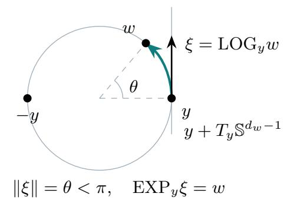

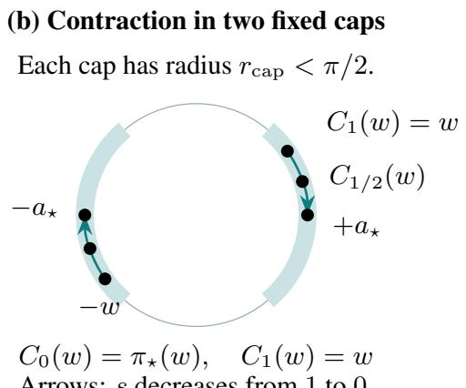

(c) Opposite tangent directions at the endpoint  
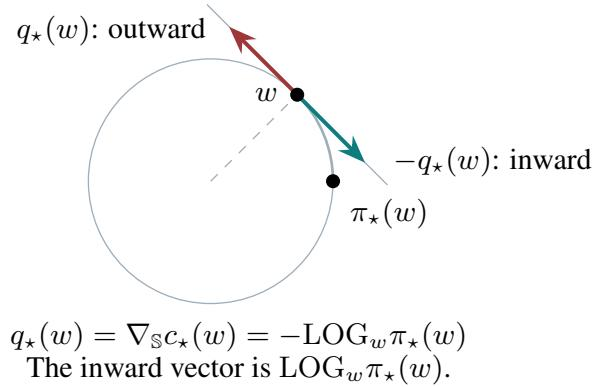  
Figure 3: Spherical logarithms, exponentials, and pole contraction (definition B.3 and lemma B.2). (a) A point w at distance $\theta < \pi$ from y corresponds to the tangent vector $\operatorname { L O G } _ { y } w$ of length θ; $\mathrm { E X P } _ { y }$ maps it back to w. Vectors are drawn with their tails at their base points. (b) Decreasing s from 1 to 0 in $C _ { s } ( w )$ moves each point to its assigned pole and preserves its cap. (c) At the endpoint w, $q _ { \star } ( w ) = \nabla _ { \mathbb { S } } c _ { \star } ( w ) = - \mathrm { L O G } _ { w } \pi _ { \star } ( w )$ points outward; its negative points toward the pole. The cost is $c _ { \star } ( w ) = d _ { \mathbb { S } } ( w , \pi _ { \star } ( w ) ) ^ { 2 } / 2$ . Each circle is a great-circle cross section of the unit sphere; these geometric paths do not represent a WGF trajectory.

These residuals have both output-matrix indices and spatial tensor indices: $\mathcal { M } _ { p } , \mathcal { M } _ { p } ^ { o } , \Delta \mathcal { M } _ { p } \in$ $\mathbb { R } ^ { d _ { h } \times d _ { h } } \otimes \mathrm { S y m } ^ { p } ( \mathbb { R } ^ { d _ { w } } )$ . For such a tensor $B ,$ write $B _ { \alpha \beta }$ for its spatial tensor at output indices $( \alpha , \beta )$ . For $U \in \mathrm { S y m } ^ { p } ( \mathbb { R } ^ { d _ { w } } )$ and $A \in \mathbb { R } ^ { d _ { h } \times d _ { h } }$ , the two partial pairings mean

$$
\langle U , B \rangle _ { \alpha \beta } : = \langle U , B _ { \alpha \beta } \rangle _ { \mathrm { H S } } , \qquad \langle U , B \rangle \in \mathbb { R } ^ { d _ { h } \times d _ { h } } ,
$$

$$
\langle B , A \rangle _ { \mathrm { F } } : = \sum _ { \alpha , \beta = 1 } ^ { d _ { h } } A _ { \alpha \beta } B _ { \alpha \beta } , \quad \langle B , A \rangle _ { \mathrm { F } } \in \mathrm { S y m } ^ { p } ( \mathbb { R } ^ { d _ { w } } ) ,\tag{260}
$$

$$
\| B \| _ { \mathrm { H S } } ^ { 2 } : = \sum _ { \alpha , \beta = 1 } ^ { d _ { h } } \| B _ { \alpha \beta } \| _ { \mathrm { H S } } ^ { 2 } .
$$

Thus pairing with $\mathcal { H } _ { p } ( z )$ contracts the spatial indices, whereas pairing with $a _ { n } a _ { m } ^ { \top }$ contracts the output indices. Then

$$
F ( \mu ) = \frac { 1 } { 2 } \sum _ { p \geq 0 } \| \Delta \mathcal M _ { p } \| _ { \mathrm { H S } } ^ { 2 } + \frac { \lambda _ { \mathrm { r e g } } } { p _ { W } } Z _ { \pm } ( \mu _ { 1 } , \mu _ { 2 } ) ^ { p _ { W } / 2 } .\tag{261}
$$

The first term is the Hermite expansion of the fitting loss, and the second term is the antipodal Dirac metric regularizer from (244).

Remark B.3. Under assumption B.2, this tensor residual system becomes finite dimensional. The sums defining $\mathcal { M } _ { p }$ and $\mathcal { M } _ { p } ^ { o }$ reduce to indices $n , m \in { \mathcal { O } }$

Proof. Step 1: multiply the finite Hermite expansions. Throughout the proof, all Hermite tensors are understood with the normalization used in eqs. (227) and (228), so that diferent homogeneous chaoses are orthogonal in $L ^ { 2 }$ under the law of $z .$

For $i = 1 , 2$ , the Hermite expansion of the feature map gives

$$
h _ { \mu _ { i } } ( z ) = \sum _ { n \geq 0 } a _ { n } \langle \mathcal { H } _ { n } ( z ) , T _ { i , n } \rangle , \qquad T _ { i , n } = \int _ { \mathbb { S } } w ^ { \otimes n } \mathrm { d } \mu _ { i } ( w ) .\tag{262}
$$

Hence the matrix-valued product can be written as

$$
h _ { \mu _ { 1 } } ( z ) h _ { \mu _ { 2 } } ( z ) ^ { \top } = \sum _ { n , m \geq 0 } a _ { n } a _ { m } ^ { \top } \langle \mathcal { H } _ { n } ( z ) , T _ { 1 , n } \rangle \langle \mathcal { H } _ { m } ( z ) , T _ { 2 , m } \rangle .\tag{263}
$$

We now apply the Wiener-chaos product formula. For symmetric tensors $A \in \left( \mathbb { R } ^ { d _ { w } } \right) ^ { \otimes n }$ and $B \in ( \mathbb { R } ^ { d _ { w } } ) ^ { \otimes m }$ , one has

$$
\langle \mathcal { H } _ { n } ( z ) , A \rangle \langle \mathcal { H } _ { m } ( z ) , B \rangle = \sum _ { r = 0 } ^ { \operatorname* { m i n } ( n , m ) } c _ { n , m , r } \Big \langle \mathcal { H } _ { n + m - 2 r } ( z ) , \mathrm { s y m } \left( A \otimes _ { r } B \right) \Big \rangle ,\tag{264}
$$

where

$$
c _ { n , m , r } = r ! \binom { n } { r } \binom { m } { r } \sqrt { \frac { ( n + m - 2 r ) ! } { n ! m ! } } .
$$

Substituting $A = T _ { 1 , n }$ and $B = T _ { 2 , m }$ , we obtain

$$
h _ { \mu _ { 1 } } ( z ) h _ { \mu _ { 2 } } ( z ) ^ { \top } = \sum _ { n , m \geq 0 } \sum _ { r = 0 } ^ { \operatorname* { m i n } ( n , m ) } c _ { n , m , r } ( a _ { n } a _ { m } ^ { \top } ) \Bigl \langle \mathcal { H } _ { n + m - 2 r } ( z ) , \mathrm { s y m } \left( T _ { 1 , n } \otimes _ { r } T _ { 2 , m } \right) \Bigr \rangle .\tag{265}
$$

Collecting all terms with the same Hermite degree $p = n + m - 2 r$ , we can rewrite this as

$$
h _ { \mu _ { 1 } } ( z ) h _ { \mu _ { 2 } } ( z ) ^ { \top } = \sum _ { p \geq 0 } \langle \mathcal { H } _ { p } ( z ) , \mathcal { M } _ { p } \rangle ,\tag{266}
$$

where the coeficient tensor is precisely

$$
\mathcal { M } _ { p } = \sum _ { \stackrel { n , m \geq 0 } { \underbrace { 0 \leq r \leq \operatorname* { m i n } ( n , m ) } } } c _ { n , m , r } ( a _ { n } a _ { m } ^ { \top } ) \otimes \operatorname { s y m } \left( T _ { 1 , n } \otimes _ { r } T _ { 2 , m } \right) .\tag{267}
$$

The same calculation applied to the teacher measures $\mathrm { g i }$ ves

$$
h _ { \mu _ { 1 } ^ { o } } ( z ) h _ { \mu _ { 2 } ^ { o } } ( z ) ^ { \top } = \sum _ { p \geq 0 } \langle \mathcal { H } _ { p } ( z ) , \mathcal { M } _ { p } ^ { o } \rangle ,\tag{268}
$$

with

$$
\mathcal { M } _ { p } ^ { o } = \sum _ { \stackrel { n , m \geq 0 } { \underbrace { 0 \leq r \leq \operatorname* { m i n } ( n , m ) } } } c _ { n , m , r } ( a _ { n } a _ { m } ^ { \top } ) \otimes \operatorname { s y m } \left( T _ { 1 , n } ^ { o } \otimes _ { r } T _ { 2 , m } ^ { o } \right) .\tag{269}
$$

Therefore

$$
h _ { \mu _ { 1 } } ( z ) h _ { \mu _ { 2 } } ( z ) ^ { \top } - h _ { \mu _ { 1 } ^ { o } } ( z ) h _ { \mu _ { 2 } ^ { o } } ( z ) ^ { \top } = \sum _ { p \geq 0 } \langle \mathcal { H } _ { p } ( z ) , \Delta \mathcal { M } _ { p } \rangle , \qquad \Delta \mathcal { M } _ { p } = \mathcal { M } _ { p } - \mathcal { M } _ { p } ^ { o } .\tag{270}
$$

Step 2: use orthogonality to sum the residual squares. We now take the $L ^ { 2 } .$ -norm in $z ,$ with Frobenius norm in the matrix output. Since distinct Hermite chaoses are orthogonal, all cross terms with $p \neq q$ vanish:

$$
\begin{array} { r l } & { \mathbb { E } _ { z } \Big [ \big \| h _ { \mu _ { 1 } } ( z ) h _ { \mu _ { 2 } } ( z ) ^ { \top } - h _ { \mu _ { 1 } ^ { o } } ( z ) h _ { \mu _ { 2 } ^ { o } } ( z ) ^ { \top } \big \| _ { \mathrm { F } } ^ { 2 } \Big ] } \\ & { \qquad = \displaystyle \sum _ { p , q \geq 0 } \mathbb { E } _ { z } \Big [ \Big \langle \langle \mathcal { H } _ { p } ( z ) , \Delta \mathcal { M } _ { p } \rangle , \langle \mathcal { H } _ { q } ( z ) , \Delta \mathcal { M } _ { q } \rangle \Big \rangle _ { \mathrm { F } } \Big ] } \\ & { \qquad = \displaystyle \sum _ { p \geq 0 } \| \Delta \mathcal { M } _ { p } \| _ { \mathrm { H S } } ^ { 2 } . } \end{array}\tag{271}
$$

Consequently,

$$
\frac 1 2 \mathbb { E } _ { z } \Big [ \big \| h _ { \mu _ { 1 } ^ { o } } ( z ) h _ { \mu _ { 2 } ^ { o } } ( z ) ^ { \top } - h _ { \mu _ { 1 } } ( z ) h _ { \mu _ { 2 } } ( z ) ^ { \top } \big \| _ { \mathrm { F } } ^ { 2 } \Big ] = \frac 1 2 \sum _ { p \geq 0 } \| \Delta \mathcal { M } _ { p } \| _ { \mathrm { H S } } ^ { 2 } .\tag{272}
$$

It remains only to identify the regularization term. By definition of $Z _ { \pm }$ , the metric regularization term in (244) is exactly

$$
\frac { \lambda _ { \mathrm { r e g } } } { p _ { W } } Z _ { \pm } ( \mu _ { 1 } , \mu _ { 2 } ) ^ { p _ { W } / 2 } .
$$

This proves (261).

Bridge to the geometry overview. This tensorized form is the coordinate system used in the curvature arguments below. Thus the model is reduced to a tensor residual system: the fitting loss is the squared Hilbert-Schmidt norm of the residuals $\Delta \mathcal { M } _ { p } .$ while the metric term controls distance to the antipodal pair. In the next subsection, the active odd moments are recombined into symmetric and anti-symmetric coordinates to describe the curvature transition.

## B.5 Ambient first-order formulas

This subsection records the first-order ambient formulas used to analyze branch invariance, descent directions, and spherical Wasserstein gradients.

We first diferentiate the tensorized fitting loss with respect to the active moment tensors.

Lemma B.4 (Moment derivatives of the fitting part and first variation of $F )$ . Assumptions used. assumptions B.1 and B.2.

Let $\Delta \mathcal { M } _ { p }$ be as in lemma B.3. The output contraction in (260) is the spatial tensor

$$
\langle \Delta \mathcal { M } _ { p } , a _ { n } a _ { m } ^ { \top } \rangle _ { \mathrm { F } } = \sum _ { \alpha , \beta = 1 } ^ { d _ { h } } ( a _ { n } ) _ { \alpha } ( a _ { m } ) _ { \beta } ( \Delta \mathcal { M } _ { p } ) _ { \alpha \beta } .
$$

Define the active fitting coeficients

$$
G _ { 1 , n } ^ { \mathrm { f i t } } : = \frac { \partial F _ { \mathrm { f t } } } { \partial T _ { 1 , n } } , \qquad G _ { 2 , m } ^ { \mathrm { f i t } } : = \frac { \partial F _ { \mathrm { f t } } } { \partial T _ { 2 , m } } ,\tag{273}
$$

where

$$
F _ { \mathrm { f i t } } : = \frac { 1 } { 2 } \sum _ { p \geq 0 } \Vert \Delta \mathcal { M } _ { p } \Vert _ { \mathrm { H S } } ^ { 2 } .\tag{274}
$$

Then

$$
G _ { 1 , n } ^ { \mathrm { f i t } } = \sum _ { m \geq 0 } \sum _ { r \leq \operatorname* { m i n } ( n , m ) } c _ { n , m , r } \mathrm { s y m } \left( \langle \Delta \mathcal M _ { n + m - 2 r } , a _ { n } a _ { m } ^ { \top } \rangle _ { \mathrm { F } } \otimes _ { m - r } T _ { 2 , m } \right) ,\tag{275}
$$

$$
G _ { 2 , m } ^ { \mathrm { f i t } } = \sum _ { n \geq 0 } \sum _ { r \leq \operatorname* { m i n } ( n , m ) } c _ { n , m , r } \mathrm { s y m } \left( \langle \Delta \mathcal { M } _ { n + m - 2 r } , a _ { n } a _ { m } ^ { \top } \rangle _ { \mathrm { F } } \otimes _ { n - r } T _ { 1 , n } \right) .\tag{276}
$$

The first variations of the fitting terms are

$$
\frac { \delta F _ { \mathrm { f i t } } } { \delta \mu _ { 1 } } ( w ) = \sum _ { n \ge 0 } \langle G _ { 1 , n } ^ { \mathrm { f i t } } , w ^ { \otimes n } \rangle ,\tag{277}
$$

$$
\frac { \delta F _ { \mathrm { f i t } } } { \delta \mu _ { 2 } } ( w ) = \sum _ { m \geq 0 } \langle G _ { 2 , m } ^ { \mathrm { f i t } } , w ^ { \otimes m } \rangle .\tag{278}
$$

Proof. Step 1: diferentiate the tensor residuals. For the data-fit term,

$$
F _ { \mathrm { f i t } } : = \frac { 1 } { 2 } \sum _ { p \geq 0 } \Vert \Delta \mathcal { M } _ { p } \Vert _ { \mathrm { H S } } ^ { 2 } ,\tag{279}
$$

we have

$$
\delta F _ { \mathrm { f i t } } = \sum _ { p \geq 0 } \langle \Delta \mathcal { M } _ { p } , \delta \mathcal { M } _ { p } \rangle _ { \mathrm { H S } } .\tag{280}
$$

If only $T _ { 1 , n }$ is varied, then

$$
\delta \mathcal { M } _ { p } = \sum _ { \stackrel { \sum _ { m \geq 0 } ^ { \sum _ { \prime } } } { p = n \cdot + m - 2 r } } c _ { n , m , r } ( a _ { n } a _ { m } ^ { \top } ) \otimes \mathrm { s y m } \left( \delta T _ { 1 , n } \otimes _ { r } T _ { 2 , m } \right) .\tag{281}
$$

Therefore

$$
\begin{array} { r l r } {  { \delta F _ { \mathrm { f i t } } = \sum _ { p = n , r } \hdots { c _ { n , m , r } } \Bigl \langle \Delta \mathcal { M } _ { p } , ( a _ { n } a _ { m } ^ { \top } ) \otimes \mathrm { s y m } ( \delta T _ { 1 , n } \otimes _ { r } T _ { 2 , m } ) \Bigr \rangle _ { \mathrm { H S } } } } \\ & { } & { = \sum _ { p = n + m - 2 r } ^ { \sum } { c _ { n , m , r } \Bigl \langle \langle \Delta \mathcal { M } _ { p } , a _ { n } a _ { m } ^ { \top } \rangle _ { \mathrm { F } } , \mathrm { s y m } ( \delta T _ { 1 , n } \otimes _ { r } T _ { 2 , m } ) \Bigr \rangle _ { \mathrm { H S } } } . } \\ & { } & \end{array}\tag{282}
$$

(283)

Step 2: contract the output and moment indices. Set

$$
B _ { p , n , m , r } : = \langle \Delta M _ { p } , a _ { n } a _ { m } ^ { \top } \rangle _ { \mathrm { F } } \in \mathrm { S y m } ^ { n + m - 2 r } ( \mathbb { R } ^ { d _ { w } } ) .\tag{284}
$$

Then, componentwise,

$$
\left. B _ { p , n , m , r } , \delta T _ { 1 , n } \otimes _ { r } T _ { 2 , m } \right. _ { \mathrm { H S } } = \sum _ { I , J , K } ( B _ { p , n , m , r } ) _ { I , J } ( \delta T _ { 1 , n } ) _ { I , K } ( T _ { 2 , m } ) _ { K , J }\tag{285}
$$

$$
\begin{array} { r } { \mathrm { ~  ~ \sigma ~ } = \left. B _ { p , n , m , r } \otimes _ { m - r } T _ { 2 , m } , \delta T _ { 1 , n } \right. _ { \mathrm { H S } } , } \end{array}\tag{286}
$$

where I has length $n - r ,$ J has length $m - r .$ , and K has length r. Since $\delta T _ { 1 , n }$ is symmetric, pairing against it only depends on the symmetric part of the tensor in the first slot, so

$$
\begin{array} { r l } & { \Bigl \langle B _ { p , n , m , r } , \mathrm { s y m } \left( \delta T _ { 1 , n } \otimes _ { r } T _ { 2 , m } \right) \Bigr \rangle _ { \mathrm { H S } } = \Bigl \langle \mathrm { s y m } \left( B _ { p , n , m , r } \otimes _ { m - r } T _ { 2 , m } \right) , \delta T _ { 1 , n } \Bigr \rangle _ { \mathrm { H S } } . } \end{array}\tag{287}
$$

Substituting this into the previous display yields

$$
\delta F _ { \mathrm { f t } } = \Bigg \langle \sum _ { m \geq 0 } \sum _ { r \leq \operatorname* { m i n } ( n , m ) } c _ { n , m , r } \mathrm { s y m } \left( \langle \Delta \mathcal M _ { n + m - 2 r } , a _ { n } a _ { m } ^ { \top } \rangle _ { \mathrm { F } } \otimes _ { m - r } T _ { 2 , m } \right) , \delta T _ { 1 , n } \Bigg \rangle _ { \mathrm { H S } } ,\tag{288}
$$

which is exactly the stated formula for the fit part of $G _ { 1 , n } ^ { \mathrm { f i t } }$ . The formula for $G _ { 2 , m } ^ { \mathrm { f i t } }$ follows by the same argument with the two factors exchanged.

Step 3: recover the first measure variations. For a signed marginal perturbation $\delta \mu _ { i }$ $\begin{array} { r } { \delta T _ { i , n } = \int w ^ { \otimes n } \delta \mu _ { i } ( d w ) } \end{array}$ , so

$$
\delta F _ { \mathrm { f i t } } = \sum _ { n } \langle { G } _ { i , n } ^ { \mathrm { f i t } } , \delta T _ { i , n } \rangle = \int \sum _ { n } \langle { G } _ { i , n } ^ { \mathrm { f i t } } , w ^ { \otimes n } \rangle \delta \mu _ { i } ( d w ) .
$$

This proves the stated first variations, up to constants that do not change the spherical gradients. □

The next corollary converts the moment derivatives into ambient and spherical particle-wise gradients.

Corollary B.1 (Ambient and spherical gradients). Assumptions used. assumptions B.1 and B.2.

Under the notation of lemma $B . 4 ,$ , the ambient gradients on the sphere are

$$
\nabla _ { w } \frac { \delta F _ { \mathrm { f i t } } } { \delta \mu _ { 1 } } ( w ) = \sum _ { n > 1 } n G _ { 1 , n } ^ { \mathrm { f i t } } \otimes _ { n - 1 } w ^ { \otimes ( n - 1 ) } ,\tag{289}
$$

$$
\nabla _ { w } \frac { \delta F _ { \mathrm { f i t } } } { \delta \mu _ { 2 } } ( w ) = \sum _ { m \ge 1 } m G _ { 2 , m } ^ { \mathrm { f i t } } \otimes _ { m - 1 } w ^ { \otimes ( m - 1 ) } .\tag{290}
$$

Their spherical projections are

$$
\nabla _ { \mathbb { S } } \frac { \delta F _ { \mathrm { f i t } } } { \delta \mu _ { 1 } } ( w ) = \sum _ { n \geq 1 } n \Big ( G _ { 1 , n } ^ { \mathrm { f i t } } \otimes _ { n - 1 } w ^ { \otimes ( n - 1 ) } - \big ( G _ { 1 , n } ^ { \mathrm { f i t } } \otimes _ { n } w ^ { \otimes n } \big ) w \Big )\tag{291}
$$

$$
\nabla _ { \mathrm { S } } \frac { \delta F _ { \mathrm { f i t } } } { \delta \mu _ { 2 } } ( w ) = \sum _ { m \ge 1 } m \Big ( G _ { 2 , m } ^ { \mathrm { f i t } } \otimes _ { m - 1 } w ^ { \otimes ( m - 1 ) } - \big ( G _ { 2 , m } ^ { \mathrm { f i t } } \otimes _ { m } w ^ { \otimes m } \big ) w \Big ) .\tag{292}
$$

Proof. For a symmetric tensor $G \in \mathrm { S y m } ^ { n } ( \mathbb { R } ^ { d _ { w } } )$ and direction $u ,$ the product rule and symmetry give

$$
\begin{array} { c l c r } { { \displaystyle { D _ { w } \langle G , w ^ { \otimes n } \rangle [ u ] = \sum _ { j = 1 } ^ { n } \langle G , w ^ { \otimes ( j - 1 ) } \otimes u \otimes w ^ { \otimes ( n - j ) } \rangle } } } \\ { { } } & { { } } \\ { { = n \langle G \otimes _ { n - 1 } w ^ { \otimes ( n - 1 ) } , u \rangle . } } \end{array}
$$

Moreover, $w ^ { \top } ( G \otimes _ { n - 1 } w ^ { \otimes ( n - 1 ) } ) = G \otimes _ { n } w ^ { \otimes n }$ . Apply these identities to each $G _ { i , n } ^ { \mathrm { f i t } }$ in lemma B.4, and project the ambient gradient with $I - w w ^ { \top }$ . This gives both displayed spherical formulas. The active sums are finite by assumption B.2. □

We then compute the first and second variations of the metric regularizer on the fixed-assignment cap class.

Lemma B.5 (First and second variations of the fixed-assignment metric regularizer). Assumptions used. assumption B.1.

Let

$$
F _ { \mathrm { r e g } } ( \mu _ { 1 } , \mu _ { 2 } ) = \frac { \lambda _ { \mathrm { r e g } } } { p _ { W } } Z _ { \pm } ( \mu _ { 1 } , \mu _ { 2 } ) ^ { p _ { W } / 2 } , \qquad p _ { W } = 2 + \delta _ { W } ,
$$

where

$$
Z _ { \pm } ( \mu _ { 1 } , \mu _ { 2 } ) = W _ { 2 } ^ { 2 } ( \mu _ { 1 } , \nu _ { \star } ^ { \pm } ) + W _ { 2 } ^ { 2 } ( \mu _ { 2 } , \nu _ { \star } ^ { \pm } ) .
$$

On the fixed-assignment class of lemma B.1, define

$$
c _ { \star } ( w ) = \frac { 1 } { 2 } d _ { \mathbb { S } } ( w , \pi _ { \star } ( w ) ) ^ { 2 } , \qquad D _ { \pm } ( \mu _ { 1 } , \mu _ { 2 } ) : = \sum _ { i = 1 } ^ { 2 } \int c _ { \star } ( w ) \mathrm { d } \mu _ { i } ( w ) .
$$

Then

$$
Z _ { \pm } = 2 D _ { \pm } .
$$

The first variation of $F _ { \mathrm { r e g } }$ , up to an irrelevant additive constant, is

$$
\frac { \delta F _ { \mathrm { r e g } } } { \delta \mu _ { i } } ( w ) = \lambda _ { \mathrm { r e g } } Z _ { \pm } ^ { p _ { W } / 2 - 1 } c _ { \star } ( w ) , \qquad i = 1 , 2 .\tag{293}
$$

Consequently, the Wasserstein gradient on the sphere is

$$
\nabla _ { \mathbb { S } } \frac { \delta F _ { \mathrm { r e g } } } { \delta \mu _ { i } } ( w ) = \lambda _ { \mathrm { r e g } } Z _ { \pm } ^ { p _ { W } / 2 - 1 } \nabla _ { \mathbb { S } } c _ { \star } ( w ) .\tag{294}
$$

The second variation formula below is the curvature contribution used in the pre-saddle and post-escape convexity arguments. For $Z _ { \pm } > 0$ and a smooth spherical pushforward path generated by tangent fields $\boldsymbol { v } = \left( v _ { 1 } , v _ { 2 } \right)$ , as long as the fixed assignment remains valid for small $| h |$

$$
\frac { \mathrm { d } ^ { 2 } } { \mathrm { d } h ^ { 2 } } \Big | _ { h = 0 } F _ { \mathrm { r e g } } ( \mu _ { 1 , h } , \mu _ { 2 , h } ) = \lambda _ { \mathrm { r e g } } Z _ { \pm } ^ { p _ { W } / 2 - 1 } \sum _ { i = 1 } ^ { 2 } \int \nabla _ { \mathbb { S } } ^ { 2 } c _ { \star } ( w ) [ v _ { i } ( w ) , v _ { i } ( w ) ] \mathrm { d } \mu _ { i } ( w )\tag{295}
$$

$$
+  \lambda _ { \mathrm { r e g } } ( p _ { W } - 2 ) Z _ { \pm } ^ { p _ { W } / 2 - 2 } ( \sum _ { i = 1 } ^ { 2 } \int \langle \nabla _ { \mathbb { S } } c _ { \star } ( w ) , v _ { i } ( w ) \rangle \mathrm { d } \mu _ { i } ( w ) ) ^ { 2 } ,\tag{296}
$$

where $\mu _ { i , h } = ( \Phi _ { i , h } ) _ { \# } \mu _ { i } , \ \Phi _ { i , h } ( w ) = \mathrm { E X P } _ { w } \big ( h v _ { i } ( w ) \big )$ ). The second term is nonnegative. $I f Z _ { \pm } = 0$ $i . e .$ at $\mu _ { 1 } = \mu _ { 2 } = \nu _ { \star } ^ { \pm }$ , then its EXP-pushforward second derivative exists and equals zero; the exact central calculation is (298).

Proof. Step 1: diferentiate the fixed-assignment cost. For a signed perturbation of $\mu _ { i }$ the variation of $Z _ { \pm }$ is

$$
\delta Z _ { \pm } = 2 \int c _ { \star } ( w ) \delta \mu _ { i } ( \mathrm { d } w ) .
$$

Therefore

$$
\frac { \delta F _ { \mathrm { r e g } } } { \delta \mu _ { i } } ( w ) = \lambda _ { \mathrm { r e g } } Z _ { \pm } ^ { p _ { W } / 2 - 1 } c _ { \star } ( w ) .
$$

Taking the spherical gradient in w gives

$$
\nabla _ { \mathbb { S } } \frac { \delta F _ { \mathrm { r e g } } } { \delta \mu _ { i } } ( w ) = \lambda _ { \mathrm { r e g } } Z _ { \pm } ^ { p _ { W } / 2 - 1 } \nabla _ { \mathbb { S } } c _ { \star } ( w ) .
$$

Step 2: compute the second derivative at positive distance. Let

$$
\mu _ { i , h } = ( \Phi _ { i , h } ) _ { \# } \mu _ { i } , \qquad \Phi _ { i , h } ( \boldsymbol { w } ) = \mathrm { E X P } _ { \boldsymbol { w } } ( h v _ { i } ( \boldsymbol { w } ) ) ,
$$

where $v _ { i } ( w ) \in T _ { w } \mathbb { S } ^ { d _ { w } - 1 }$ . By (254),

$$
\Phi _ { i , h } ( w ) = \cos ( h \| v _ { i } ( w ) \| ) w + \frac { \sin ( h \| v _ { i } ( w ) \| ) } { \| v _ { i } ( w ) \| } v _ { i } ( w ) .
$$

The quotient is interpreted by continuity at $v _ { i } ( w ) = 0$ . Diferentiating the sine and cosine gives

$$
\dot { \Phi } _ { i , 0 } ( w ) = v _ { i } ( w ) , \qquad \ddot { \Phi } _ { i , 0 } ( w ) = - \| v _ { i } ( w ) \| ^ { 2 } w , \qquad \nabla _ { h } \dot { \Phi } _ { i , h } ( w ) | _ { h = 0 } = ( I - w w ^ { \top } ) \ddot { \Phi } _ { i , 0 } ( w ) = 0 .\tag{297}
$$

Thus the covariant acceleration, namely the tangential part of the ambient acceleration, vanishes. Define

$$
D _ { \pm } ( h ) : = \sum _ { i = 1 } ^ { 2 } \int c _ { \star } ( \Phi _ { i , h } ( w ) ) \mathrm { d } \mu _ { i } ( w ) , \qquad Z _ { \pm } ( h ) = 2 D _ { \pm } ( h ) .
$$

By diferentiating under the integral,

$$
D _ { \pm } ^ { \prime } ( 0 ) = \sum _ { i = 1 } ^ { 2 } \int \langle \nabla \mathbb { s } c _ { \star } ( w ) , v _ { i } ( w ) \rangle \mathrm { d } \mu _ { i } ( w ) .
$$

Moreover, since the paths $h \mapsto \Phi _ { i , h } ( w )$ are geodesics,

$$
{ \frac { \mathrm { d } ^ { 2 } } { \mathrm { d } h ^ { 2 } } } \Big | _ { h = 0 } c _ { \star } ( \Phi _ { i , h } ( w ) ) = \nabla _ { \mathbb { S } } ^ { 2 } c _ { \star } ( w ) [ v _ { i } ( w ) , v _ { i } ( w ) ] .
$$

Thus

$$
D _ { \pm } ^ { \prime \prime } ( 0 ) = \sum _ { i = 1 } ^ { 2 } \int \nabla _ { \mathbb { S } } ^ { 2 } c _ { \star } ( w ) [ v _ { i } ( w ) , v _ { i } ( w ) ] \mathrm { d } \mu _ { i } ( w ) .
$$

Consequently, $Z _ { \pm } ^ { \prime } ( 0 ) = 2 D _ { \pm } ^ { \prime } ( 0 ) , \ Z _ { \pm } ^ { \prime \prime } ( 0 ) = 2 D _ { \pm } ^ { \prime \prime } ( 0 )$ . For $Z _ { \pm } > 0$ , diferentiate

$$
h \longmapsto F _ { \mathrm { r e g } } ( \mu _ { 1 , h } , \mu _ { 2 , h } ) = { \frac { \lambda _ { \mathrm { r e g } } } { p _ { W } } } Z _ { \pm } ( h ) ^ { p _ { W } / 2 } .
$$

The second derivative is

$$
\begin{array} { r l r } {  { \frac { \mathrm { d } ^ { 2 } } { \mathrm { d } h ^ { 2 } } \Big \vert _ { h = 0 } F _ { \mathrm { r e g } } ( \mu _ { 1 , h } , \mu _ { 2 , h } ) = \frac { \lambda _ { \mathrm { r e g } } } { 2 } Z _ { \pm } ^ { p _ { W } / 2 - 1 } Z _ { \pm } ^ { \prime \prime } ( 0 ) } } \\ & { } & { + \ \frac { \lambda _ { \mathrm { r e g } } } { 2 } ( \frac { p _ { W } } { 2 } - 1 ) Z _ { \pm } ^ { p _ { W } / 2 - 2 } \big ( Z _ { \pm } ^ { \prime } ( 0 ) \big ) ^ { 2 } . } \end{array}
$$

Substituting $Z _ { \pm } ^ { \prime } ( 0 ) = 2 D _ { \pm } ^ { \prime } ( 0 )$ and $Z _ { \pm } ^ { \prime \prime } ( 0 ) = 2 D _ { \pm } ^ { \prime \prime } ( 0 )$ , we obtain

$$
\begin{array} { l } { { \displaystyle \frac { \mathrm { d } ^ { 2 } } { \mathrm { d } h ^ { 2 } } \Big \vert _ { h = 0 } F _ { \mathrm { r e g } } ( \mu _ { 1 , h } , \mu _ { 2 , h } ) = \lambda _ { \mathrm { r e g } } Z _ { \pm } ^ { p _ { W } / 2 - 1 } D _ { \pm } ^ { \prime \prime } ( 0 ) } } \\ { { \displaystyle ~ + \lambda _ { \mathrm { r e g } } ( p _ { W } - 2 ) Z _ { \pm } ^ { p _ { W } / 2 - 2 } \big ( D _ { \pm } ^ { \prime } ( 0 ) \big ) ^ { 2 } } . } \end{array}
$$

Using the formulas for $D _ { \pm } ^ { \prime } ( 0 )$ and $D _ { \pm } ^ { \prime \prime } ( 0 )$ , this is exactly

$$
\begin{array} { r l } & { \displaystyle \frac { \mathrm { d } ^ { 2 } } { \mathrm { d } h ^ { 2 } } \Big | _ { h = 0 } F _ { \mathrm { r e g } } ( \mu _ { 1 , h } , \mu _ { 2 , h } ) = \lambda _ { \mathrm { r e g } } Z _ { \pm } ^ { p _ { W } / 2 - 1 } \sum _ { i = 1 } ^ { 2 } \int \nabla _ { \mathbb { S } ^ { C _ { \star } } } ^ { 2 } ( w ) [ v _ { i } ( w ) , v _ { i } ( w ) ] \mathrm { d } \mu _ { i } ( w ) } \\ & { \qquad + \lambda _ { \mathrm { r e g } } ( p _ { W } - 2 ) Z _ { \pm } ^ { p _ { W } / 2 - 2 } \left( \displaystyle \sum _ { i = 1 } ^ { 2 } \int \langle \nabla _ { \mathbb { S } ^ { C _ { \star } } } ( w ) , v _ { i } ( w ) \rangle \mathrm { d } \mu _ { i } ( w ) \right) ^ { 2 } . } \end{array}
$$

The second term is nonnegative because $p _ { W } = 2 + \delta _ { W } > 2 $

Step 3: diferentiate directly at the antipodal target. If $Z _ { \pm } = 0$ , then $\mu _ { 0 } = \nu _ { \star } ^ { \pm } \otimes \nu _ { \star } ^ { \pm }$ Each starting atom y is its own assigned pole. For suficiently small $| h |$ , eqs. (251) and (254) give, including zero velocities,

$$
d _ { \mathbb { S } } \big ( \mathrm { E X P } _ { y } ( h v _ { i } ( y ) ) , y \big ) ^ { 2 } = h ^ { 2 } \| v _ { i } ( y ) \| ^ { 2 } , \qquad Z _ { \pm } \big ( \mu _ { h } \big ) = h ^ { 2 } \sum _ { i } \int \| v _ { i } ( y ) \| ^ { 2 } d \mu _ { 0 , i } ( y ) .
$$

Thus, with the product norm $\begin{array} { r } { \| v \| _ { L ^ { 2 } ( \mu _ { 0 } ) } ^ { 2 } = \sum _ { i } \int \| v _ { i } \| ^ { 2 } d \mu _ { 0 , i } } \end{array}$ ，

$$
F _ { \mathrm { r e g } } ( \mu _ { h } ) = \frac { \lambda _ { \mathrm { r e g } } } { p _ { W } } | h | ^ { p _ { W } } \| v \| _ { L ^ { 2 } ( \mu _ { 0 } ) } ^ { p _ { W } } .\tag{298}
$$

For $h \neq 0$ , direct diferentiation yields

$$
\begin{array} { r l } & { \cfrac { d } { d h } F _ { \mathrm { r e g } } ( \mu _ { h } ) = \lambda _ { \mathrm { r e g } } \mathrm { s g n } ( h ) | h | ^ { p _ { W } - 1 } \| v \| _ { L ^ { 2 } ( \mu _ { 0 } ) } ^ { p _ { W } } , } \\ & { \cfrac { d ^ { 2 } } { d h ^ { 2 } } F _ { \mathrm { r e g } } ( \mu _ { h } ) = \lambda _ { \mathrm { r e g } } ( p _ { W } - 1 ) | h | ^ { p _ { W } - 2 } \| v \| _ { L ^ { 2 } ( \mu _ { 0 } ) } ^ { p _ { W } } . } \end{array}
$$

At $h = 0$ , the value diference quotient tends to zero. Dividing the first derivative at $h \neq 0$ by h gives $\lambda _ { \mathrm { r e g } } | h | ^ { p _ { W } - 2 } \| v \| _ { L ^ { 2 } ( \mu _ { 0 } ) } ^ { p _ { W } } \to 0$ . Therefore the second derivative exists at zero and equals zero, since $p _ { W } > 2 ;$ the second derivative displayed above is also continuous there. □

Lemma B.6 (Full spherical product Hessian and spherical product pushforward second variation). Assume assumptions B.1 and B.2. Let $\mu = \mu _ { 1 } \otimes \mu _ { 2 } \in \mathcal { X } _ { \pm } ( r _ { \mathrm { c a p } } )$ , and let $v = \left( v _ { 1 } , v _ { 2 } \right)$ be a smooth spherical product field. Use the product norm $\begin{array} { r } { \| v \| _ { L ^ { 2 } ( \mu ) } ^ { 2 } = \sum _ { i } \dot { \int } \| v _ { i } ( w ) \| ^ { 2 } d \mu _ { i } ( w ) } \end{array}$ . For suficiently small $| h |$ , require the paths

$$
\Phi _ { i , h } ( w ) = \mathrm { E X P } _ { w } ( h v _ { i } ( w ) ) , \qquad \mu _ { h } = \bigotimes _ { i = 1 } ^ { 2 } ( \Phi _ { i , h } ) _ { \# } \mu _ { i }
$$

to remain in the fixed-assignment caps of (242). The partial measure derivatives of $F _ { \mathrm { { f i t } } }$ are those of its finite polynomial in the moments. In terms of $G _ { i , n } ^ { \mathrm { f i t } } = \partial F _ { \mathrm { f i t } } / \partial T _ { i , n }$ from lemma $B . \phi _ { i }$ this means

$$
\frac { \delta ^ { 2 } F _ { \mathrm { f t } } } { \delta \mu _ { i } \delta \mu _ { j } } ( \mu ; w , u ) : = \sum _ { n , m \in \mathcal { O } } \left. D _ { T _ { j , m } } G _ { i , n } ^ { \mathrm { f i t } } [ u ^ { \otimes m } ] , w ^ { \otimes n } \right. _ { \mathrm { H S } } .\tag{299}
$$

For $Z _ { \pm } ( \mu ) > 0$ , define the full spherical product Hessian by

$$
\begin{array} { l } { { ( \mathcal { H } _ { \mathbb { S } , \mu } v ) _ { i } ( w ) = \nabla _ { \mathbb { S } } ^ { 2 } \frac { \displaystyle \delta F } { \displaystyle \delta \mu _ { i } } ( \mu ; w ) v _ { i } ( w ) } } \\ { { \displaystyle \qquad + \sum _ { j = 1 } ^ { 2 } \int \nabla _ { \mathbb { S } , w } \nabla _ { \mathbb { S } , u } \frac { \displaystyle \delta ^ { 2 } F } { \displaystyle \delta \mu _ { i } \delta \mu _ { j } } ( \mu ; w , u ) v _ { j } ( u ) d \mu _ { j } ( u ) . } } \end{array}\tag{300}
$$

The first term diferentiates the location with the measures fixed. The integral term diferentiates the measures; its mixed derivative maps $T _ { u } \mathbb { S }$ to $T _ { w } \mathbb { S } . \ A t \ Z _ { \pm } ( \mu ) = 0$ , the direct calculation eq. (298) shows that the regularizer has zero pushforward second variation. Hence the full operator there is $\mathcal { H } _ { \mathbb { S } , \mu } = \mathcal { H } _ { \mathbb { S } , \mu } ^ { \mathrm { f i t } }$ , obtained from eq. (300) by using $F _ { \mathrm { f i t } }$ in both terms. Then the spherical product pushforward second variation exists and satisfies

$$
\begin{array} { l } { { D _ { W _ { 2 } } ^ { 2 } F ( \mu ) [ v , v ] : = \displaystyle \frac { d ^ { 2 } } { d h ^ { 2 } } \Bigg | _ { 0 } F ( \mu _ { h } ) } } \\ { { \displaystyle \phantom { \sum _ { i = 1 } ^ { 2 } } = \sum _ { i = 1 } ^ { 2 } \int \langle v _ { i } ( w ) , ( \mathcal { H } _ { \mathbb { S } , \mu } v ) _ { i } ( w ) \rangle d \mu _ { i } ( w ) = \langle v , \mathcal { H } _ { \mathbb { S } , \mu } v \rangle _ { L ^ { 2 } ( \mu ) } . } } \end{array}\tag{301}
$$

This notation refers to the stated product pushforward; it does not require every such path to be an optimal Wasserstein geodesic. When the displayed pushforward path is a product Wasserstein geodesic, the same quantity is its usual geodesic second derivative. Thus the estimates below apply, in particular, along every admissible path of that form.

Proof. Step 1: diferentiate the fitting term in both its arguments. The explicit EXP calculation (297) gives $\dot { \Phi } _ { i , 0 } = v _ { i }$ and zero covariant acceleration. The product first-variation formula in section B.2 gives

$$
\frac { d } { d h } F _ { \mathrm { f i t } } ( \mu _ { h } ) = \sum _ { i } \int \left. \nabla _ { \mathrm { S } } \frac { \delta F _ { \mathrm { f i t } } } { \delta \mu _ { i } } ( \mu _ { h } ; \Phi _ { i , h } ( w ) ) , \dot { \Phi } _ { i , h } ( w ) \right. d \mu _ { i } ( w ) .
$$

The moment derivative along the path is the finite product rule

$$
\frac { d } { d h } \Big \vert _ { 0 } T _ { j , m } ( \mu _ { h } ) = \int \sum _ { \ell = 1 } ^ { m } u ^ { \otimes ( \ell - 1 ) } \otimes v _ { j } ( u ) \otimes u ^ { \otimes ( m - \ell ) } d \mu _ { j } ( u ) .
$$

Equivalently, the integrand is $D _ { u } ( u ^ { \otimes m } ) [ v _ { j } ( u ) ]$ . Hence the coeficient derivative is the finitedimensional chain rule

$$
\begin{array} { l } { \displaystyle \frac { d } { d h } \bigg | _ { 0 } G _ { i , n } ^ { \mathrm { f i t } } ( \mu _ { h } ) = \sum _ { j = 1 } ^ { 2 } \sum _ { m \in \mathcal { O } } D _ { T _ { j , m } } G _ { i , n } ^ { \mathrm { f i t } } \left[ \left. \frac { d } { d h } \right| _ { 0 } T _ { j , m } ( \mu _ { h } ) \right] } \\ { \displaystyle = \sum _ { j = 1 } ^ { 2 } \sum _ { m \in \mathcal { O } } \int D _ { T _ { j , m } } G _ { i , n } ^ { \mathrm { f i t } } \big [ D _ { u } \big ( u ^ { \otimes m } \big ) [ v _ { j } ( u ) ] \big ] , d \mu _ { j } ( u ) . } \end{array}\tag{302}
$$

Insert this into the derivative of $\scriptstyle \sum _ { n } \langle G _ { i , n } ^ { \mathrm { f i t } } , w ^ { \otimes n } \rangle$ from eq. (277). Pairing eq. (302) with $w ^ { \otimes n }$ summing over n, and diferentiating $u ^ { \otimes m }$ in the direction $v _ { j } ( u )$ is exactly the u-gradient of the kernel in eq. (299). Thus, for fixed $w .$

$$
\frac { d } { d h } \bigg \vert _ { 0 } \frac { \delta F _ { \mathrm { f t } } } { \delta \mu _ { i } } ( \mu _ { h } ; w ) = \sum _ { j } \int \left. \nabla _ { \mathbb { S } , u } \frac { \delta ^ { 2 } F _ { \mathrm { f t } } } { \delta \mu _ { i } \delta \mu _ { j } } ( \mu ; w , u ) , v _ { j } ( u ) \right. d \mu _ { j } ( u ) .
$$

All sums are finite by assumption B.2, so the sum–integral interchange in eq. (302) requires no limiting argument. This is the finite polynomial chain rule for the moments in lemmas B.3 and B.4. Taking its spherical gradient in w gives the integral term of (300) for $F _ { \mathrm { { f i t } } }$ . Diferentiating the evaluation point gives its spatial-Hessian term. The remaining derivative of $\dot { \Phi } _ { i , h }$ contributes $\langle \nabla _ { \mathbb { S } } ( \delta F _ { \mathrm { f i t } } / \delta \mu _ { i } ) , \nabla _ { h } \dot { \Phi } _ { i , h } \rangle = 0$ at $h = 0$ . Thus diferentiating the first display proves (301) for $F _ { \mathrm { { f i t } } }$ . All diferentiations under the integrals are valid for atomic as well as difuse measures: the Hermite sums are finite and the supports are compact subsets of the smooth cap region.

Step 2: identify the regularizer contribution. Recall $c _ { \star } ( w ) = d _ { \mathbb { S } } ( w , \pi _ { \star } ( w ) ) ^ { 2 } / 2$ from (252), and $\begin{array} { r } { Z _ { \pm } = 2 \sum _ { i } \int c _ { \star } d \mu _ { i } } \end{array}$ from (251). For $Z _ { \pm } > 0$ , diferentiating (293) gives

$$
\begin{array} { r l } & { \qquad \displaystyle \frac { \delta F _ { \mathrm { r e g } } } { \delta \mu _ { i } } ( \mu ; w ) = \lambda _ { \mathrm { r e g } } Z _ { \pm } ^ { ( p _ { W } - 2 ) / 2 } c _ { \star } ( w ) , } \\ & { \qquad \displaystyle \frac { \delta ^ { 2 } F _ { \mathrm { r e g } } } { \delta \mu _ { i } \delta \mu _ { j } } ( \mu ; w , u ) = \lambda _ { \mathrm { r e g } } ( p _ { W } - 2 ) Z _ { \pm } ^ { ( p _ { W } - 4 ) / 2 } c _ { \star } ( w ) c _ { \star } ( u ) . } \end{array}
$$

The factor $p _ { W } - 2$ is $2 \cdot ( p _ { W } - 2 ) / 2$ , since a variation of $\mu _ { j }$ changes $Z _ { \pm }$ by $\begin{array} { r } { 2 \int c _ { \star } d ( \delta \mu _ { j } ) } \end{array}$ . Their spatial derivatives in (300), paired with v, give

$$
\begin{array} { r l } & { \lambda _ { \mathrm { r e g } } Z _ { \pm } ^ { ( p _ { W } - 2 ) / 2 } \displaystyle \sum _ { i } \int \nabla _ { \mathbb { S } } ^ { 2 } c _ { \star } ( w ) [ v _ { i } ( w ) , v _ { i } ( w ) ] d \mu _ { i } ( w ) } \\ & { \quad + \lambda _ { \mathrm { r e g } } ( p _ { W } - 2 ) Z _ { \pm } ^ { ( p _ { W } - 4 ) / 2 } \left( \displaystyle \sum _ { i } \int \langle \nabla _ { \mathbb { S } } c _ { \star } ( w ) , v _ { i } ( w ) \rangle d \mu _ { i } ( w ) \right) ^ { 2 } . } \end{array}
$$

This equals the directly computed second derivative (295). For $Z _ { \pm } = 0$ , use (298) and its diference-quotient calculation instead: the second derivative is zero. No second measure variation of $Z _ { \pm } ^ { p _ { W } / 2 }$ at zero is used. Adding this contribution to Step 1 proves the identity. □

Remark B.4 (Relation to the full Hessian and the auxiliary comparison). The identity (301) is the spherical product counterpart of the full Hessian in section 2.1. Stationarity alone does not remove its spatial term. The normalized retractions used below have the same first and second derivatives as EXP at zero by (355); the finite-moment fitting chain rule therefore gives the same second variation. For the regularizer at the center, the corresponding direct calculation is (369). This suggests a possible finite-sample curvature comparison of the kind studied in section A.10. Such a transfer theorem for this spherical product model remains open in the present work: the hypotheses of that auxiliary result are not verified here. The central calculation is a second-variation identity, not an application of the general $C ^ { 3 }$ theorem at the MF target.

## B.6 Symmetric and Antisymmetric Sub-Manifolds

This subsection introduces the symmetric and antisymmetric coordinates that separate the teacher branch from the antipodal saddle branch.

We first collect the active odd moments into a single finite-dimensional tensor space.

Define the active odd raw-moment space

$$
\mathcal { H } _ { \mathcal { O } } : = \mathcal { H } _ { \mathcal { O } } ^ { \mathrm { r a w } } = \bigoplus _ { n \in \mathcal { O } } \mathrm { S y m } ^ { n } ( \mathbb { R } ^ { d _ { w } } ) , \qquad \| \mathbf { X } \| _ { \mathcal { H } _ { \mathcal { O } } } ^ { 2 } : = \| \mathbf { X } \| _ { \mathrm { r a w } } ^ { 2 } = \sum _ { n \in \mathcal { O } } \| X _ { n } \| _ { \mathrm { H S } } ^ { 2 } .\tag{303}
$$

The weighted norm records the size of active moments as seen through the activation coeficients:

$$
\| \mathbf { X } \| _ { a } ^ { 2 } : = \sum _ { n \in \mathcal { O } } \| a _ { n } \| _ { 2 } ^ { 2 } \| X _ { n } \| _ { \mathrm { H S } } ^ { 2 } .\tag{304}
$$

We now pass from the two raw moment sequences to symmetric and antisymmetric coordinates.

Definition B.4. Introduce the two active student blocks and the teacher block

$$
\mathbf { T } _ { i } : = ( T _ { i , n } ) _ { n \in \mathcal { O } } \in \mathcal { H } _ { \mathcal { O } } , \quad i = 1 , 2 , \quad \mathbf { T } ^ { o } : = ( T _ { n } ^ { o } ) _ { n \in \mathcal { O } } \in \mathcal { H } _ { \mathcal { O } } ,\tag{305}
$$

where $\begin{array} { r } { T _ { i , n } = \int w ^ { \otimes n } d \mu _ { i } ( w ) } \end{array}$ and $\begin{array} { r } { T _ { n } ^ { o } = \int w ^ { \otimes n } d \nu ^ { o } ( w ) } \end{array}$ as in assumption B.2. Recall the symmetric and antisymmetric blocks

$$
\mathbf { S } : = ( S _ { n } ) _ { n \in { \mathcal { O } } } , \qquad \mathbf { A } : = ( A _ { n } ) _ { n \in { \mathcal { O } } } .\tag{306}
$$

with $S _ { n } = ( T _ { 1 , n } + T _ { 2 , n } ) / 2$ and $A _ { n } = ( T _ { 1 , n } - T _ { 2 , n } ) / 2$ . Thus

$$
T _ { 1 , n } = S _ { n } + A _ { n } , \qquad T _ { 2 , n } = S _ { n } - A _ { n } , \qquad n \in \mathcal { O } .\tag{307}
$$

The finite active moment map used in the branch geometry is

$$
\Theta ( \mu _ { 1 } , \mu _ { 2 } ) : = \big ( \mathbf { S } ( \mu _ { 1 } , \mu _ { 2 } ) , \mathbf { A } ( \mu _ { 1 } , \mu _ { 2 } ) \big ) .\tag{308}
$$

Only the moments with $n \in \mathcal { O }$ enter Θ; it is not asserted to be an injective coordinate chart of probability measures.

For each $p \geq 0$ , we define the active ambient moment polynomial. In these coordinates, the active fitting residual becomes an ambient polynomial in (S, A).

$$
\widetilde { \mathcal { M } } _ { p } ( \mathbf { S } , \mathbf { A } ) : = \sum _ { \tiny \begin{array} { c } { 0 \leq r \leq m \displaystyle ( n , m ) } \\ { \frac { 0 \leq r \leq \operatorname* { m i n } ( n , m ) } { p = n + m - 2 r } } \end{array} } c _ { n , m , r } ( a _ { n } a _ { m } ^ { \top } ) \otimes \operatorname { s y m } \left( \left( S _ { n } + A _ { n } \right) \otimes _ { r } \left( S _ { m } - A _ { m } \right) \right) .\tag{309}
$$

The corresponding ambient active fitting functional is

$$
\widetilde { \mathcal { I } } _ { \mathrm { f t } } ( \mathbf { S } , \mathbf { A } ) : = \frac { 1 } { 2 } \sum _ { p \geq 0 } \big \| \widetilde { \mathcal { M } } _ { p } ( \mathbf { S } , \mathbf { A } ) - \mathcal { M } _ { p } ^ { o } \big \| _ { \mathrm { H S } } ^ { 2 } .\tag{310}
$$

Membership in either branch implies that its finite active moments lie on the corresponding coordinate axis.

Definition B.5. For any measurable set A, $l e t - A : = \{ - w \mid w \in A \}$ . Consider the following two branches:

1. Antisymmetric branch: The antisymmetric branch is the candidate path toward the antipodal saddle.

$$
\begin{array} { r } { \mathcal { M } _ { - } : = \left\{ \mu _ { 1 } \otimes \mu _ { 2 } \ | \ \mu _ { 1 } ( - A ) = \mu _ { 2 } ( A ) \ f o r \ e v e r y \ m e a s u r a b l e \ A \right\} , } \end{array}\tag{311}
$$

which is equivalent to

$$
T _ { 1 , n } = ( - 1 ) ^ { n } T _ { 2 , n } \qquad ( n \geq 0 )\tag{312}
$$

and this implies $\mathbf { S } = 0$

2. Symmetric branch: The symmetric branch contains the same-density teacher configuration.

$$
\mathcal { M } _ { + } : = \left\{ \mu _ { 1 } \otimes \mu _ { 2 } \vert \mu _ { 1 } = \mu _ { 2 } \right\} ,\tag{313}
$$

which is equivalent to

$$
T _ { 1 , n } = T _ { 2 , n } \qquad ( n \geq 0 )\tag{314}
$$

and this implies $\mathbf A = 0$

We write the fitting loss restricted to each branch as a one-coordinate functional.

$$
\mathcal { I } _ { + } ( \mathbf { S } ) : = \widetilde { \mathcal { I } } _ { \mathrm { f t } } ( \mathbf { S } , 0 ) , \quad \mathcal { I } _ { - } ( \mathbf { A } ) : = \widetilde { \mathcal { I } } _ { \mathrm { f t } } ( 0 , \mathbf { A } ) .\tag{315}
$$

The equivalences above use all raw orders $n \geq 0$ , not only $n \in \mathcal { O }$ . Here is the justification on the compact sphere. Equality of all tensor moments gives equality of every monomial integral and hence every polynomial integral. Restricted polynomials form an algebra containing constants

and separating points of the sphere. By Stone–Weierstrass, for each continuous $f$ and $\epsilon > 0$ there is a polynomial P with $\operatorname* { s u p } _ { \mathbb { S } } | f - P | < \epsilon$ . Thus, for two measures with the same raw moments,

$$
\left| \int f d \mu _ { 1 } - \int f d \mu _ { 2 } \right| \leq \int \left| f - P \right| d \mu _ { 1 } + \int \left| f - P \right| d \mu _ { 2 } < 2 \epsilon .
$$

Letting $\epsilon \downarrow 0$ gives equality of the measures. For reflection $\mathsf { R } ( w ) = - w$ , the identity

$$
T _ { n } ( \mathsf { R } _ { \# } \mu _ { 1 } ) = \int ( - w ) ^ { \otimes n } d \mu _ { 1 } ( w ) = ( - 1 ) ^ { n } T _ { n } ( \mu _ { 1 } )
$$

gives the antisymmetric equivalence by the same argument. Consequently $\mu \in \mathcal { M } _ { - }$ implies $\mathbf { S } = 0$ and $\mu \in \mathcal { M } _ { + }$ implies $\mathbf A = 0$ , but neither converse is inferred from the finite active blocks.

The first proposition identifies the distinguished active-origin point where the two branches meet.

Proposition B.1 (Active origin fiber and the distinguished Dirac saddle). Assumptions used.   
assumptions B.1 and B.2.

Define the active-coordinate zero fiber

$$
\mathcal { C } _ { 0 } : = \left\{ \mu _ { 1 } \otimes \mu _ { 2 } \ | \ \Theta ( \mu _ { 1 } , \mu _ { 2 } ) = ( 0 , 0 ) \right\} .\tag{316}
$$

Then

$$
\mu _ { \dagger } : = \nu _ { \star } ^ { \pm } \otimes \nu _ { \star } ^ { \pm } \in \mathcal { M } _ { + } \cap \mathcal { M } _ { - } \cap \mathcal { C } _ { 0 } .\tag{317}
$$

In addition, if

$$
\mu _ { 1 } = \mu _ { 2 } = \nu _ { \star } ^ { \pm } ,\tag{318}
$$

then the Wasserstein gradients vanish. In other words, $\mu _ { \uparrow } = \nu _ { \star } ^ { \pm } \otimes \nu _ { \star } ^ { \pm }$ is a first-order stationary point.

Proof. The proof only uses antipodal symmetry, oddness of the active moments, and the flatness of the metric regularizer at the antipodal target.

$\mu _ { \dagger }$ is antipodally symmetric, equal in both factors, and has zero odd moments; hence it belongs to the displayed intersection.

If $\mu \in \mathcal { C } _ { 0 }$ , then $T _ { 1 , n } = T _ { 2 , n } = 0$ for all $n \in \mathcal { O }$ . Therefore, on $\mathcal { C } _ { 0 }$ , the fitting first variation vanishes because of the definition of $G _ { i , n } ^ { \mathrm { f i t } }$

The full spherical gradient is only the regularization contribution

$$
\nabla \mathtt { g } \frac { \delta F } { \delta \mu _ { i } } = \lambda _ { \mathrm { r e g } } Z _ { \pm } ^ { p _ { W } / 2 - 1 } \nabla \mathtt { g } c _ { \star } ( w ) , \qquad i = 1 , 2 .\tag{319}
$$

If $\mu _ { 1 }$ and $\mu _ { 2 }$ are $\nu _ { \star } ^ { \pm }$ , then $Z _ { \pm } = 0$ and the spherical gradient vanishes.

The next proposition fixes the opposite endpoint of the cartoon: the exact-fit teacher lies on the same-density branch.

Proposition B.2 (The reference exact-fit point lies on the same-density branch). Assumptions used. assumptions B.1 and B.2.

The fitting part satisfies

$$
\widetilde { \mathcal { I } } _ { \mathrm { f i t } } ( \mathbf { T } ^ { o } , 0 ) = 0 = \operatorname* { i n f } _ { ( \mathbf { S } , \mathbf { A } ) \in \mathcal { H } _ { O } \times \mathcal { H } _ { O } } \widetilde { \mathcal { I } } _ { \mathrm { f i t } } ( \mathbf { S } , \mathbf { A } ) .\tag{320}
$$

Moreover, by the symmetric-teacher assumption, the reference teacher product measure belongs to the same-density branch:

$$
\boldsymbol { \mu } ^ { o } = \boldsymbol { \mu } _ { 1 } ^ { o } \otimes \boldsymbol { \mu } _ { 2 } ^ { o } \in \mathcal { M } _ { + } , \qquad \mathbf { S } ( \boldsymbol { \mu } ^ { o } ) = \mathbf { T } ^ { o } , \qquad \mathbf { A } ( \boldsymbol { \mu } ^ { o } ) = 0 .\tag{321}
$$

In particular, the distinguished zero-fit global minimum of the data term lies on $\mathcal { M } _ { + }$

Proof. By assumption B.2, the teacher is symmetric across the two factors, so $\mu _ { 1 } ^ { o } = \mu _ { 2 } ^ { o }$ and therefore $\mu ^ { o } \in \mathcal { M } _ { + }$ . In the active coordinates this is exactly the identity $\mathbf { S } ( \mu ^ { o } ) = \mathbf { T } ^ { o }$ and $\mathbf { A } ( \mu ^ { o } ) = 0$

Next, by the definition of $\mathcal { M } _ { p } ^ { o }$ and of the ambient moment map,

$$
\widetilde { \mathcal { M } } _ { p } ( \mathbf { T } ^ { o } , 0 ) = \mathcal { M } _ { p } ^ { o } \qquad \forall p \ge 0 .\tag{322}
$$

Hence $\mathcal { \tilde { I } } _ { \mathrm { f i t } } ( \mathbf { T } ^ { o } , 0 ) = 0$ . Since $\tilde { \mathcal { I } } _ { \mathrm { f i t } }$ is a sum of squared Hilbert norms, it is nonnegative everywhere.

## B.7 The anti-symmetric branch and descent towards the saddle

This subsection proves invariance of the anti-symmetric branch and, under a local initial condition, cap confinement and convergence to the antipodal Dirac target.

## B.7.1 Invariance of the anti-symmetric branch

We first show that the first variation respects the antipodal reflection symmetry.

Lemma B.7 (Reflection–exchange covariance of the full first variation). Assumptions used.   
assumptions B.1 and B.2.

Let $\mathsf { R } ( w ) = - w$ and define the reflection–exchange involution

$$
\Re ( \mu _ { 1 } , \mu _ { 2 } ) : = ( { \mathsf { R } } _ { \# } \mu _ { 2 } , { \mathsf { R } } _ { \# } \mu _ { 1 } ) .
$$

For every admissible product state $\mu = ( \mu _ { 1 } , \mu _ { 2 } )$ ，

$$
F ( { \mathfrak { R } } \mu ) = F ( \mu ) ,\tag{323}
$$

and its spherical gradient fields satisfy

$$
\begin{array} { r } { g _ { 1 } ( \mathfrak { R } \mu ; - w ) = - g _ { 2 } ( \mu ; w ) , } \\ { g _ { 2 } ( \mathfrak { R } \mu ; - w ) = - g _ { 1 } ( \mu ; w ) , } \end{array}\tag{324}
$$

where $g _ { i } = \nabla _ { \mathbb { S } } ( \delta F / \delta \mu _ { i } )$ . If $\mu \in \mathcal { M } _ { - }$ , then $\Re \mu = \mu$ , so

$$
\frac { \delta F } { \delta \mu _ { 2 } } ( - w ) = \frac { \delta F } { \delta \mu _ { 1 } } ( w ) + \mathrm { c o n s t } , \qquad g _ { 2 } ( \mu ; - w ) = - g _ { 1 } ( \mu ; w ) .\tag{325}
$$

Proof. Step 1: transform the objective at an arbitrary state. Oddness of the activation gives, for every marginal $\nu ,$

$$
h _ { \mathsf { R } _ { \# } \nu } ( z ) = \int \sigma ( ( - w ) ^ { \top } z ) d \nu ( w ) = - h _ { \nu } ( z ) .
$$

Consequently,

$$
\begin{array} { r } { h _ { \mathsf { R } _ { \# } \mu _ { 2 } } h _ { \mathsf { R } _ { \# } \mu _ { 1 } } ^ { \top } = h _ { \mu _ { 2 } } h _ { \mu _ { 1 } } ^ { \top } = \big ( h _ { \mu _ { 1 } } h _ { \mu _ { 2 } } ^ { \top } \big ) ^ { \top } . } \end{array}
$$

The teacher matrix $h _ { \nu ^ { o } } h _ { \nu ^ { o } } ^ { \top }$ is symmetric by assumption B.2, and the Frobenius norm is invariant under transposition. Thus the fitting loss is unchanged. Reflection is a spherical isometry and $\mathsf { R } _ { \# } \nu _ { \star } ^ { \pm } = \nu _ { \star } ^ { \pm }$ . Pushing any transport plan forward by (R, R), and then applying this involution once more, gives

$$
W _ { 2 } ( \mathsf { R } _ { \# } \nu , \nu _ { \star } ^ { \pm } ) = W _ { 2 } ( \nu , \nu _ { \star } ^ { \pm } ) .
$$

The reflection exchanges the two summands in $Z _ { \pm }$ , which proves eq. (323) for every admissible state.

Step 2: diferentiate the symmetry and specialize to the branch. Vary the second marginal of $\mu$ in eq. (323). The corresponding variation of the first marginal of $\Re \mu$ is reflected, and the first-variation identity is

$$
\frac { \delta F } { \delta \mu _ { 1 } } ( \Re \mu ; - w ) = \frac { \delta F } { \delta \mu _ { 2 } } ( \mu ; w ) + \mathrm { c o n s t } .
$$

Here the additive constant is immaterial because first-variation potentials are defined only up to constants. Since $D { \mathsf { R } } = - I$ , diferentiating this identity gives, for every $v \in T _ { w } \mathbb { S } ^ { d w - 1 }$ 2

$$
\begin{array} { r } { \langle g _ { 1 } ( \mathfrak { R } \mu ; - w ) , - v \rangle _ { \mathbb { R } ^ { d _ { w } } } = \langle g _ { 2 } ( \mu ; w ) , v \rangle _ { \mathbb { R } ^ { d _ { w } } } . } \end{array}
$$

Since this holds for every v, it proves the first identity in eq. (324); exchanging the factors proves the second. A state lies in $\mathcal { M } .$ − precisely when $\Re \mu = \mu ,$ , so the gradient and potential identities in $\mathrm { e q . }$ (325) follow. □

We prove branch invariance by applying reflection and factor exchange to an arbitrary admissible product state before using uniqueness.

Proposition B.3 (Invariance of $\mathcal { M } _ { - } )$ . Assume assumptions B.1 and B.2. Let $\mu _ { 0 } \in \mathcal { M } _ { - }$ . On every interval on which the characteristic product WGF is uniquely defined and remains in the fixed-assignment cap class $\mu _ { i , t } \in \mathcal { P } _ { \pm } ( r _ { \mathrm { c a p } } ) , i = 1 , 2$

$$
\mu _ { 2 , t } = ( - \mathrm { I d } ) _ { \# } \mu _ { 1 , t } , \qquad \mu _ { t } \in \mathcal { M } _ { - } .
$$

Proof. Let R be the reflection–exchange involution from lemma B.7. If $\Phi _ { i , t }$ are the original characteristics, define

$$
\widetilde { \Phi } _ { 1 , t } ( w ) : = - \Phi _ { 2 , t } ( - w ) , \qquad \widetilde { \Phi } _ { 2 , t } ( w ) : = - \Phi _ { 1 , t } ( - w ) .
$$

Using the characteristic equation $\dot { \Phi } _ { i , t } = - g _ { i } ( \mu _ { t } ; \Phi _ { i , t } )$ and the first identity in eq. (324),

$$
\begin{array} { r l r } {  { \frac { d } { d t } \widetilde { \Phi } _ { 1 , t } ( w ) = g _ { 2 } ( \mu _ { t } ; \Phi _ { 2 , t } ( - w ) ) } } \\ & { } & { = - g _ { 1 } ( \Re \mu _ { t } ; \widetilde { \Phi } _ { 1 , t } ( w ) ) . } \end{array}
$$

The second factor satisfies the analogous equation. Their marginal laws are $\Re \mu _ { t } \quad =$ $( \mathsf { R } _ { \# } \mu _ { 2 , t } , \mathsf { R } _ { \# } \mu _ { 1 , t } )$ , and reflection exchanges the two equal-mass caps, so the transformed pair remains in the same admissible class.

Since $\mu _ { 0 } \in { \mathcal { M } }$ −, one has $\Re \mu _ { 0 } = \mu _ { 0 }$ ; hence the transformed and original characteristic systems have the same initial state. Uniqueness on the stated interval gives $\Re \mu _ { t } = \mu _ { t }$ , or equivalently $\mu _ { 2 , t } = \mathsf { R } _ { \# } \mu _ { 1 , t }$ , throughout that interval. □

## B.7.2 Dissipation towards the antipodal saddle point on the anti-symmetric branch

We establish quantitative transport estimates and use them to prove local attraction to the antipodal target.

Fixed-assignment geometry and first variations. Recall the cap class $\mathcal { P } _ { \pm } ( r _ { \mathrm { c a p } } )$ and product class $\mathcal { X } _ { \pm } ( r _ { \mathrm { c a p } } ) = \mathcal { P } _ { \pm } ( r _ { \mathrm { c a p } } ) ^ { 2 }$ from eqs. (241) and (242): each marginal has mass $1 / 2$ in each of the two open caps. The assigned pole and its cost from eqs. (250) and (252) are

$$
\pi _ { \star } ( w ) = \left\{ \begin{array} { l l } { a _ { \star } , \quad } & { w \in K _ { + } ( r _ { \mathrm { c a p } } ) , } \\ { - a _ { \star } , } & { w \in K _ { - } ( r _ { \mathrm { c a p } } ) , } \end{array} \right. \quad \quad c _ { \star } ( w ) = \frac 1 2 r ( w ) ^ { 2 } , \qquad r ( w ) : = d _ { \mathbb { S } } ( w , \pi _ { \star } ( w ) ) .
$$

The endpoint vector $q _ { \star }$ of definition B.3 is illustrated in fig. 3. The fixed-assignment calculation in lemma B.2 and eqs. (255) and (256) shows that $C _ { s }$ is a constant-speed spherical geodesic with zero covariant acceleration and that

$$
q _ { \star } ( w ) = \nabla _ { \mathbb { S } } c _ { \star } ( w ) = - \mathrm { L O G } _ { w } \pi _ { \star } ( w ) .
$$

For subsequent derivative formulas define the gradient fields

$$
g _ { i } ( \mu , w ) : = \nabla _ { \mathbb { S } } \frac { \delta F } { \delta \mu _ { i } } ( \mu , w ) , \qquad g _ { i , \mathrm { f i t } } ( \mu , w ) : = \nabla _ { \mathbb { S } } \frac { \delta F _ { \mathrm { f i t } } } { \delta \mu _ { i } } ( \mu , w ) .\tag{326}
$$

By the fixed-assignment formula eq. (251),

$$
\begin{array} { c c } { \displaystyle { Z _ { \pm } ( \mu ) = \sum _ { i = 1 } ^ { 2 } \int r ( w ) ^ { 2 } \mathrm { d } \mu _ { i } ( w ) , } } & { \displaystyle { } } \\ { \displaystyle { \| ( q _ { \star } , q _ { \star } ) \| _ { L ^ { 2 } ( \mu ) } ^ { 2 } = Z _ { \pm } ( \mu ) , } } & { \nabla _ { W _ { 2 } } Z _ { \pm } ( \mu ) = 2 ( q _ { \star } , q _ { \star } ) . } \end{array}\tag{327}
$$

Here the product norm is $\begin{array} { r } { \| V \| _ { L ^ { 2 } ( \mu ) } ^ { 2 } = \sum _ { i = 1 } ^ { 2 } \int \| V _ { i } \| ^ { 2 } \mathrm { d } \mu _ { i } } \end{array}$ . For a smooth product field $V = ( V _ { 1 } , V _ { 2 } )$ write $\begin{array} { r } { D F ( \mu ) [ V ] : = \sum _ { i = 1 } ^ { 2 } \int \langle g _ { i } , V _ { i } \rangle \mathrm { d } \mu _ { i } ; } \end{array}$ the same convention applies to $F _ { \mathrm { { f i t } } }$

Constants for the local estimates. Under assumption B.2, write $b ( z ) : = h _ { \nu ^ { o } } ( z )$ . Let $G _ { 1 } , G _ { 2 }$ be independent standard real Gaussians. For a vector-valued random variable $X$ , use $\| X \| _ { L ^ { 4 } } : = ( \mathbb { E } \| X \| _ { 2 } ^ { 4 } ) ^ { 1 / 4 }$ , and define

$$
\begin{array} { r l r } & { M _ { 4 } : = \| \sigma ( G _ { 1 } ) \| _ { L ^ { 4 } } , } & { B _ { 4 } : = \| b ( z ) \| _ { L _ { z } ^ { 4 } } , } \\ & { K _ { 1 } : = \| \sigma ^ { \prime } ( G _ { 1 } ) G _ { 2 } \| _ { L ^ { 4 } } , } & { K _ { 2 } : = \| \sigma ^ { \prime \prime } ( G _ { 1 } ) G _ { 2 } ^ { 2 } - \sigma ^ { \prime } ( G _ { 1 } ) G _ { 1 } \| _ { L ^ { 4 } } . } \end{array}\tag{328}
$$

The constants in the branch estimates are

$$
C _ { \star } : = \frac { K _ { 2 } ^ { 2 } ( M _ { 4 } ^ { 2 } + B _ { 4 } ^ { 2 } ) } { 3 2 } , \qquad L _ { \mathrm { f t } } : = \frac { K _ { 1 } ^ { 2 } ( M _ { 4 } ^ { 2 } + B _ { 4 } ^ { 2 } ) } { \sqrt { 2 } } .\tag{329}
$$

All four Gaussian moments are finite because $\sigma$ is a finite polynomial. By Gaussian rotational invariance and Minkowski’s inequality,

$$
\| h _ { \nu } \| _ { L _ { z } ^ { 4 } } \leq M _ { 4 } \quad \mathrm { f o r ~ e v e r y ~ p r o b a b i l i t y ~ m e a s u r e } \nu \mathrm { ~ o n ~ } \mathbb { S } ^ { d _ { w } - 1 } , \qquad B _ { 4 } \leq M _ { 4 } .\tag{330}
$$

These constants depend only on the fixed activation and teacher, and not on time, the student initialization, or particle number. The parameters $p _ { W } , \lambda _ { \mathrm { r e g } } , r _ { \mathrm { c a p } }$ are fixed separately.

Lemma B.8 (Pole-contraction and fitting-field estimates). Assume assumptions B.1 and B.2. For every $\mu \in \mathcal { M } _ { - } \cap \mathcal { X } _ { \pm } ( r _ { \mathrm { c a p } } )$ , the following two bounds hold:

$$
\begin{array} { r l } & { \mathrm { ( i ) } \quad D F _ { \mathrm { f i t } } ( \mu ) [ ( q _ { \star } , q _ { \star } ) ] \geq - C _ { \star } Z _ { \pm } ( \mu ) ^ { 2 } , } \\ & { \mathrm { ( i i ) } \qquad \displaystyle \operatorname* { s u p } _ { w \in \mathbb S ^ { d _ { w } - 1 } } \| g _ { i , \mathrm { f i t } } ( \mu , w ) \| _ { \mathbb R ^ { d _ { w } } } \leq L _ { \mathrm { f i t } } \sqrt { Z _ { \pm } ( \mu ) } , \qquad i = 1 , 2 . } \end{array}\tag{331}
$$

The constants are those in eqs. (328) and (329). The simultaneous pole contraction is an admissible smooth transport perturbation at $\mu$

Proof. Within this proof only, write $Z = Z _ { \pm } ( \mu )$ and $h = h _ { \mu _ { 1 } } = - h _ { \mu _ { 2 } }$ . The teacher output is $\begin{array} { r } { h _ { \nu ^ { o } } ( z ) = \int \sigma ( w ^ { \top } z ) \mathrm { d } \nu ^ { o } ( w ) } \end{array}$ , where $\nu ^ { o } = \mu _ { 1 } ^ { o } = \mu _ { 2 } ^ { o }$ by assumption B.2.

Step 1: contraction, Gaussian derivatives, and the remainder. Recall the contraction from definition B.3 and define its output by

$$
\begin{array} { l } { { C _ { s } ( w ) = \mathrm { E X P } _ { \pi _ { \star } ( w ) } ( s { \mathrm { L O G } _ { \pi _ { \star } ( w ) } } w ) , \mu _ { i , s } = ( C _ { s } ) _ { \# } \mu _ { i } , } } \\ { { h _ { s } ( z ) = \displaystyle \int \sigma ( C _ { s } ( w ) ^ { \top } z ) \mathrm { d } \mu _ { 1 } ( w ) , 0 \le s \le 1 . } } \end{array}\tag{332}
$$

Since $C _ { s } ( - w ) = - C _ { s } ( w )$ , reflection of the first pushed-forward marginal equals the second. Each point stays in its assigned cap, with $r ( C _ { s } ( w ) ) = s r ( w )$ . The mass $1 / 2$ in each cap and oddness give $\begin{array} { r } { h _ { 0 } = \frac { 1 } { 2 } \sigma ( a _ { \star } ^ { \top } z ) + \frac { 1 } { 2 } \sigma ( - a _ { \star } ^ { \top } z ) = 0 } \end{array}$ . Reflection also gives $\begin{array} { r } { \int r ^ { 2 } \mathrm { d } \mu _ { 2 } = \int r ( - w ) ^ { 2 } \mathrm { d } \mu _ { 1 } = \int r ^ { 2 } \mathrm { d } \mu _ { 1 } } \end{array}$ Consequently,

$$
h _ { 0 } = 0 , \qquad h _ { 1 } = h , \qquad \int r ^ { 2 } \mathrm { d } \mu _ { 1 } = { \frac { Z } { 2 } } , \qquad Z _ { \pm } ( \mu _ { 1 , s } , \mu _ { 2 , s } ) = s ^ { 2 } Z .\tag{333}
$$

The closed supports are compact subsets of the open caps; hence $s r ( w ) < r _ { \mathrm { c a p } }$ uniformly for s in a small two-sided neighborhood of 1. This proves admissibility, with product velocity $( q _ { \star } , q _ { \star } )$ at $s = 1$

For $r ( w ) > 0$ , eq. (255) gives

$$
\| C _ { s } ( w ) \| _ { \mathbb { R } ^ { d _ { w } } } = 1 , \qquad \left\| \frac { \partial _ { s } C _ { s } ( w ) } { r ( w ) } \right\| _ { \mathbb { R } ^ { d _ { w } } } = 1 , \qquad \left. C _ { s } ( w ) , \frac { \partial _ { s } C _ { s } ( w ) } { r ( w ) } \right. _ { \mathbb { R } ^ { d _ { w } } } = 0 .\tag{334}
$$

Thus the geometry separates the first derivative’s factor $r ( w )$ from second-order terms carrying $r ( w ) ^ { 2 }$ . Only for the next calculation, set

$$
X _ { s } : = C _ { s } ( w ) ^ { \top } z , \qquad Y _ { s } : = \frac { \partial _ { s } C _ { s } ( w ) ^ { \top } z } { r ( w ) } .
$$

For $z \sim \mathcal { N } ( 0 , I _ { d _ { w } } )$ , eq. (334) gives

$$
\mathbb { E } _ { z } X _ { s } ^ { 2 } = 1 , \qquad \mathbb { E } _ { z } Y _ { s } ^ { 2 } = 1 , \qquad \mathbb { E } _ { z } [ X _ { s } Y _ { s } ] = 0 .
$$

The pair $( X _ { s } , Y _ { s } )$ is jointly Gaussian, so it has the law of independent standard normals $( G _ { 1 } , G _ { 2 } )$ Recall from eq. (328) that

$$
K _ { 1 } = \| \sigma ^ { \prime } ( G _ { 1 } ) G _ { 2 } \| _ { L ^ { 4 } } , \qquad K _ { 2 } = \| \sigma ^ { \prime \prime } ( G _ { 1 } ) G _ { 2 } ^ { 2 } - \sigma ^ { \prime } ( G _ { 1 } ) G _ { 1 } \| _ { L ^ { 4 } } .
$$

For $f _ { w } ( s , z ) : = \sigma ( C _ { s } ( w ) ^ { \top } z )$ , the chain rule and $\partial _ { s } ^ { 2 } C _ { s } = - r ( w ) ^ { 2 } C _ { s }$ from eq. (255) give

$$
\begin{array} { r l } & { \quad \partial _ { s } f _ { w } = r ( w ) \sigma ^ { \prime } ( X _ { s } ) Y _ { s } , } \\ & { \quad \partial _ { s } ^ { 2 } f _ { w } = r ( w ) ^ { 2 } [ \sigma ^ { \prime \prime } ( X _ { s } ) Y _ { s } ^ { 2 } - \sigma ^ { \prime } ( X _ { s } ) X _ { s } ] , } \\ & { \quad \| \partial _ { s } f _ { w } \| _ { L _ { z } ^ { 4 } } = r ( w ) \| \sigma ^ { \prime } ( G _ { 1 } ) G _ { 2 } \| _ { L ^ { 4 } } = K _ { 1 } r ( w ) , } \\ & { \| \partial _ { s } ^ { 2 } f _ { w } \| _ { L _ { z } ^ { 4 } } = r ( w ) ^ { 2 } \| \sigma ^ { \prime \prime } ( G _ { 1 } ) G _ { 2 } ^ { 2 } - \sigma ^ { \prime } ( G _ { 1 } ) G _ { 1 } \| _ { L ^ { 4 } } = K _ { 2 } r ( w ) ^ { 2 } . } \end{array}\tag{335}
$$

When $r ( w ) = 0 , C _ { s } ( w ) = w$ is constant, so both derivatives vanish and the same norm identities hold without defining $Y _ { s }$

The endpoint identities $h _ { 0 } = 0$ and $h _ { 1 } = h$ in $\mathrm { e q . }$ (333) show that a linear output path would satisfy $h _ { 1 } ^ { \prime } = h _ { 1 } - h _ { 0 } = h$ . We therefore measure the failure of this linearity by $e : = h _ { 1 } ^ { \prime } - h$ . Step 2 substitutes $h _ { 1 } ^ { \prime } = h + e$ into the fitting derivative, so the next calculation bounds $\| e \| _ { L _ { z } ^ { 4 } }$ . For each fixed $w , z ,$ , integration by parts gives

$$
\int _ { 0 } ^ { 1 } s f _ { w } ^ { \prime \prime } ( s ) \mathrm { d } s = [ s f _ { w } ^ { \prime } ( s ) ] _ { 0 } ^ { 1 } - \int _ { 0 } ^ { 1 } f _ { w } ^ { \prime } ( s ) \mathrm { d } s = f _ { w } ^ { \prime } ( 1 ) - f _ { w } ( 1 ) + f _ { w } ( 0 ) .
$$

Integrating this identity in w gives $\begin{array} { r } { \int f _ { w } ^ { \prime } ( 1 ) d \mu _ { 1 } = h _ { 1 } ^ { \prime } , \int f _ { w } ( 1 ) d \mu _ { 1 } = h _ { 1 } = h } \end{array}$ , and $\begin{array} { r } { \int f _ { w } ( 0 ) d \mu _ { 1 } = } \end{array}$ $h _ { 0 } = 0$ . Hence

$$
\begin{array} { r l r } {  { e : = h _ { 1 } ^ { \prime } - h = \int \int _ { 0 } ^ { 1 } s f _ { w } ^ { \prime \prime } ( s , \cdot ) \mathrm { d } s \mathrm { d } \mu _ { 1 } ( w ) , } } \\ & { } & { \| e \| _ { L _ { z } ^ { 4 } } \leq \int \int _ { 0 } ^ { 1 } s \| f _ { w } ^ { \prime \prime } ( s , \cdot ) \| _ { L _ { z } ^ { 4 } } \mathrm { d } s \mathrm { d } \mu _ { 1 } ( w ) } \\ & { } & { \leq K _ { 2 } ( \int _ { 0 } ^ { 1 } s \mathrm { d } s ) \int r ( w ) ^ { 2 } \mathrm { d } \mu _ { 1 } ( w ) } \\ & { } & { = \displaystyle \frac { K _ { 2 } } { 2 } \frac { Z } { 2 } = \frac { K _ { 2 } Z } { 4 } , \qquad h _ { 1 } ^ { \prime } = h + e , } \end{array}\tag{336}
$$

where the last equality uses eq. (333). The first inequality is Minkowski for the Bochner integral over s and w. The activation is a finite polynomial and the sphere is compact, so its Gaussian polynomial bounds justify these diferentiations and integrals.

Step 2: the fitting derivative. The product path in eq. (332) has endpoint velocity $( q _ { \star } , q _ { \star } )$ so by definition of the directional derivative,

$$
D F _ { \mathrm { f i t } } ( \mu ) [ ( q _ { \star } , q _ { \star } ) ] = \left. \frac { d } { d s } \right| _ { s = 1 } F _ { \mathrm { f i t } } ( \mu _ { 1 , s } , \mu _ { 2 , s } ) .\tag{337}
$$

Recall $M _ { 4 } = \| \sigma ( G _ { 1 } ) \| _ { L ^ { 4 } }$ and $B _ { 4 } = \| h _ { \nu ^ { o } } \| _ { L _ { \gamma } ^ { 4 } } \leq M _ { 4 }$ from eqs. (328) and (330). In particular, $\begin{array} { r } { \| h \| _ { L _ { z } ^ { 4 } } \leq \int \| \sigma ( w ^ { \top } z ) \| _ { L _ { z } ^ { 4 } } \mathrm { d } \mu _ { 1 } ( w ) = M _ { 4 } } \end{array}$ . On the anti-symmetric branch, $h _ { \mu _ { 1 } } = h$ and $h _ { \mu _ { 2 } } = - h$ , so the model output matrix is $- h h ^ { \top }$ . Hence

$$
F _ { \mathrm { f i t } } ( \mu ) = \frac { 1 } { 2 } \mathbb { E } _ { z } \Vert - h h ^ { \top } - h _ { \nu ^ { o } } h _ { \nu ^ { o } } ^ { \top } \Vert _ { \mathrm { F } } ^ { 2 } .
$$

The Frobenius identities $\| h h ^ { \top } \| _ { \mathrm { F } } ^ { 2 } = \| h \| _ { 2 } ^ { 4 }$ and $\langle h h ^ { \top } , h _ { \nu ^ { o } } h _ { \nu ^ { o } } ^ { \top } \rangle _ { \mathrm { F } } = \langle h , h _ { \nu ^ { o } } \rangle ^ { 2 }$ expand the branch objective as

$$
{ F } _ { \mathrm { f t } } ( \mu ) = \frac 1 2 { \mathbb { E } } _ { z } \| h \| _ { 2 } ^ { 4 } + { \mathbb { E } } _ { z } \langle h , h _ { \nu ^ { o } } \rangle ^ { 2 } + \frac 1 2 { \mathbb { E } } _ { z } \| h _ { \nu ^ { o } } \| _ { 2 } ^ { 4 } .\tag{338}
$$

For the first two summands, before evaluating at $s = 1$

$$
\frac { \mathrm { d } } { \mathrm { d } s } \frac { 1 } { 2 } \| h _ { s } \| _ { 2 } ^ { 4 } = 2 \| h _ { s } \| _ { 2 } ^ { 2 } \langle h _ { s } , h _ { s } ^ { \prime } \rangle , \qquad \frac { \mathrm { d } } { \mathrm { d } s } \langle h _ { s } , h _ { \nu ^ { o } } \rangle ^ { 2 } = 2 \langle h _ { s } , h _ { \nu ^ { o } } \rangle \langle h _ { s } ^ { \prime } , h _ { \nu ^ { o } } \rangle .
$$

The teacher term is constant. Evaluating at $s = 1$ , using $h _ { 1 } = h$ , and substituting $h _ { 1 } ^ { \prime } = h + e$ from eq. (336) into eq. (337) gives

$$
\begin{array} { r l } & { { D F } _ { \mathrm { f i t } } ( \mu ) [ ( q _ { \star } , q _ { \star } ) ] = 2 \mathbb { E } _ { z } \big [ \| h \| _ { 2 } ^ { 4 } + \| h \| _ { 2 } ^ { 2 } \langle h , e \rangle + \langle h , h _ { \nu ^ { o } } \rangle ^ { 2 } } \\ & { ~ + ~ \langle h , h _ { \nu ^ { o } } \rangle \langle e , h _ { \nu ^ { o } } \rangle \big ] . } \end{array}\tag{339}
$$

The two pointwise square completions are

$$
\begin{array} { r l r } & { } & { 2 \| h \| _ { 2 } ^ { 2 } ( \| h \| _ { 2 } ^ { 2 } + \langle h , e \rangle ) = 2 \| h \| _ { 2 } ^ { 2 } \| h + e / 2 \| _ { 2 } ^ { 2 } - \frac 1 2 \| h \| _ { 2 } ^ { 2 } \| e \| _ { 2 } ^ { 2 } , } \\ & { } & { 2 \langle h , h _ { \nu ^ { o } } \rangle ^ { 2 } + 2 \langle h , h _ { \nu ^ { o } } \rangle \langle e , h _ { \nu ^ { o } } \rangle = 2 ( \langle h , h _ { \nu ^ { o } } \rangle + \frac 1 2 \langle e , h _ { \nu ^ { o } } \rangle ) ^ { 2 } - \frac 1 2 \langle e , h _ { \nu ^ { o } } \rangle ^ { 2 } } \\ & { } & { \geq - \frac 1 2 \| e \| _ { 2 } ^ { 2 } \| h _ { \nu ^ { o } } \| _ { 2 } ^ { 2 } . \qquad } \end{array}
$$

Discarding the nonnegative squares and applying Hölder with exponents 2, 2 to each product of squared norms yields

$$
\begin{array} { r l } & { D F _ { \mathrm { f i t } } ( \mu ) [ ( q _ { \star } , q _ { \star } ) ] \geq - \frac { 1 } { 2 } \mathbb { E } _ { z } [ ( \| h \| _ { 2 } ^ { 2 } + \| h _ { \nu ^ { o } } \| _ { 2 } ^ { 2 } ) \| e \| _ { 2 } ^ { 2 } ] } \\ & { \qquad \geq - \frac { 1 } { 2 } ( \| h \| _ { L _ { z } ^ { 4 } } ^ { 2 } + \| h _ { \nu ^ { o } } \| _ { L _ { z } ^ { 4 } } ^ { 2 } ) \| e \| _ { L _ { z } ^ { 4 } } ^ { 2 } } \\ & { \qquad \geq - \frac { 1 } { 2 } ( M _ { 4 } ^ { 2 } + B _ { 4 } ^ { 2 } ) ( K _ { 2 } Z / 4 ) ^ { 2 } = - C _ { \star } Z ^ { 2 } , } \end{array}\tag{340}
$$

where $C _ { \star } = K _ { 2 } ^ { 2 } ( M _ { 4 } ^ { 2 } + B _ { 4 } ^ { 2 } ) / 3 2$ , exactly as in eq. (329).

Step 3: the pointwise fitting field and output norm. For vectors $x , y \in \mathbb { R } ^ { d _ { h } }$ and an increment a,

$$
\frac { \mathrm { d } } { \mathrm { d } t } \frac { 1 } { 2 } \| ( x + t a ) y ^ { \top } - h _ { \nu ^ { o } } h _ { \nu ^ { o } } ^ { \top } \| _ { \mathrm { F } } ^ { 2 } \bigg | _ { t = 0 } = \langle ( x y ^ { \top } - h _ { \nu ^ { o } } h _ { \nu ^ { o } } ^ { \top } ) y , a \rangle .
$$

Thus, at $( x , y ) = ( h , - h )$ , the first output gradient is $\| h \| _ { 2 } ^ { 2 } h + \langle h , h _ { \nu ^ { o } } \rangle h _ { \nu ^ { o } }$ ; the second is its negative. This diferentiates one output at a time, unlike Step 2, which moves both marginals. For a unit tangent $u \in T _ { w } \mathbb { S } ^ { d w - 1 }$ , the vectors $w ,$ u are orthogonal unit vectors. Hence $( w ^ { \top } z , u ^ { \top } z )$ has the law of the independent standard Gaussian pair $( G _ { 1 } , G _ { 2 } )$ , and $\| \sigma ^ { \prime } ( w ^ { \top } z ) ( u ^ { \top } z ) \| _ { L ^ { 4 } } = K _ { 1 }$ by eq. (328). Euclidean Cauchy–Schwarz, followed by Hölder with $1 / ( 4 / 3 ) + 1 / 4 = 1$ , gives

$$
\begin{array} { r l } & { | \langle g _ { i , \mathrm { f i t } } ( \mu , w ) , u \rangle | \leq { \mathbb E } _ { z } \Big [ \big \| \| h \| _ { 2 } ^ { 2 } h + \langle h , h _ { \nu ^ { o } } \rangle h _ { \nu ^ { o } } \big \| _ { 2 } \big \| \sigma ^ { \prime } ( w ^ { \top } z ) ( u ^ { \top } z ) \big \| _ { 2 } \Big ] } \\ & { \qquad \leq K _ { 1 } \big \| \| h \| _ { 2 } ^ { 2 } h + \langle h , h _ { \nu ^ { o } } \rangle h _ { \nu ^ { o } } \big \| _ { L _ { z } ^ { 4 / 3 } } } \\ & { \qquad \leq K _ { 1 } \big ( \| h \| _ { L _ { z } ^ { 4 } } ^ { 3 } + \| h \| _ { L _ { z } ^ { 4 } } \| h _ { \nu ^ { o } } \| _ { L _ { z } ^ { 4 } } ^ { 2 } \big ) . } \end{array}
$$

For the last line, the triangle inequality and

$$
\| \| h \| _ { 2 } ^ { 3 } \| _ { L _ { z } ^ { 4 / 3 } } = ( \mathbb { E } _ { z } \| h \| _ { 2 } ^ { 4 } ) ^ { 3 / 4 } = \| h \| _ { L _ { z } ^ { 4 } } ^ { 3 }
$$

handle the first term. For the second, pointwise Cauchy–Schwarz and Hölder with $1 / ( 4 / 3 ) =$ $1 / 4 + 1 / 2$ give

$$
\begin{array} { r } { \left\| | \langle h , h _ { \nu ^ { o } } \rangle | \| h _ { \nu ^ { o } } \| _ { 2 } \right\| _ { L _ { z } ^ { 4 / 3 } } \leq \| \| h \| _ { 2 } \| h _ { \nu ^ { o } } \| _ { 2 } ^ { 2 } \| _ { L _ { z } ^ { 4 / 3 } } \leq \| h \| _ { L _ { z } ^ { 4 } } \| h _ { \nu ^ { o } } \| _ { L _ { z } ^ { 4 } } ^ { 2 } . } \end{array}
$$

Taking the supremum over unit tangents gives the same bound for $\rVert g _ { i , \mathrm { f i t } } ( \mu , w ) \rVert _ { \mathbb { R } ^ { d _ { w } } }$ , because the fitting field belongs to $T _ { w } \mathbb { S } ^ { d _ { w } - 1 }$ . Finally, $h _ { 0 } = 0$ and the fundamental theorem of calculus give

$$
h ( z ) = \int \int _ { 0 } ^ { 1 } \sigma ^ { \prime } ( C _ { s } ( w ) ^ { \top } z ) ( \partial _ { s } C _ { s } ( w ) ^ { \top } z ) \mathrm { d } s \mathrm { d } \mu _ { 1 } ( w ) .
$$

Minkowski, eq. (335), and Cauchy–Schwarz against the probability measure $\mu _ { 1 }$ yield

$$
\begin{array} { l } { \displaystyle \| h \| _ { L _ { z } ^ { 4 } } \leq \int \int _ { 0 } ^ { 1 } K _ { 1 } r ( w ) \mathrm { d } s \mathrm { d } \mu _ { 1 } ( w ) } \\ { \leq \displaystyle K _ { 1 } \left( \int r ( w ) ^ { 2 } \mathrm { d } \mu _ { 1 } ( w ) \right) ^ { 1 / 2 } \left( \int 1 \mathrm { d } \mu _ { 1 } \right) ^ { 1 / 2 } = K _ { 1 } \sqrt { Z / 2 } . } \end{array}
$$

Combining this estimate with $\| h \| _ { L _ { z } ^ { 4 } } \leq M _ { 4 }$ proves

$$
\| g _ { i , \mathrm { f i t } } ( \mu , w ) \| _ { \mathbb { R } ^ { d _ { w } } } \leq K _ { 1 } ( M _ { 4 } ^ { 2 } + B _ { 4 } ^ { 2 } ) K _ { 1 } \sqrt { Z / 2 } = L _ { \mathrm { f i t } } \sqrt { Z } , \qquad L _ { \mathrm { f i t } } = \frac { K _ { 1 } ^ { 2 } ( M _ { 4 } ^ { 2 } + B _ { 4 } ^ { 2 } ) } { \sqrt { 2 } } ,
$$

which is the constant in eq. (329).

We now pass from the comparison transport to the gradient of the full objective and the actual product WGF.

Proposition B.4 (Quantitative radial dissipation near the target). Assume assumptions B.1 and B.2 and let $2 < p _ { W } < 4$ . Every state $\mu \in \mathcal { M } _ { - } \cap \mathcal { X } _ { \pm } ( r _ { \mathrm { c a p } } )$ satisfying

$$
0 < Z _ { \pm } ( \mu ) , \qquad C _ { \star } Z _ { \pm } ( \mu ) ^ { ( 4 - p _ { W } ) / 2 } \leq \frac { \lambda _ { \mathrm { r e g } } } { 2 }\tag{341}
$$

obeys

$$
\begin{array} { r } { D F ( \mu ) [ ( q _ { \star } , q _ { \star } ) ] \geq \frac { \lambda _ { \mathrm { r e g } } } { 2 } Z _ { \pm } ( \mu ) ^ { p _ { W } / 2 } , } \\ { \displaystyle \sum _ { i = 1 } ^ { 2 } \displaystyle \int \| g _ { i } ( \mu , w ) \| _ { \mathbb { R } ^ { d _ { w } } } ^ { 2 } \mathrm { d } \mu _ { i } ( w ) \geq \frac { \lambda _ { \mathrm { r e g } } ^ { 2 } } { 4 } Z _ { \pm } ( \mu ) ^ { p _ { W } - 1 } . } \end{array}\tag{342}
$$

Consequently, on every time interval on which the product WGF remains in $\mathcal M _ { - } \cap \mathcal X _ { \pm } ( r _ { \mathrm { c a p } } )$ , has positive distance, and satisfies the smallness condition in eq. (341),

$$
\frac { \mathrm { d } } { \mathrm { d } t } Z _ { \pm } ( \mu _ { t } ) = - 2 D F ( \mu _ { t } ) [ ( q _ { \star } , q _ { \star } ) ] \leq - \lambda _ { \mathrm { r e g } } Z _ { \pm } ( \mu _ { t } ) ^ { p _ { W } / 2 } .\tag{343}
$$

Among the states in $\mathcal M _ { - } \cap \mathcal X _ { \pm } ( r _ { \mathrm { c a p } } )$ satisfying the second inequality in $e q .$ (341), the only stationary state is $\mu ^ { \dagger } : = \nu _ { \star } ^ { \pm } \otimes \nu _ { \star } ^ { \pm }$

Proof. Step 1: fix the radial margin and bound the squared gradient. The contraction in $\mathrm { e q . }$ (332) has endpoint field $( q _ { \star } , q _ { \star } )$ . By eq. (333), its distance is $s ^ { 2 } Z _ { \pm } ( \mu )$ , so

$$
F _ { \mathrm { r e g } } ( \mu _ { s } ) = \frac { \lambda _ { \mathrm { r e g } } } { p _ { W } } s ^ { p _ { W } } Z _ { \pm } ( \mu ) ^ { p _ { W } / 2 } , \qquad \left. \frac { \mathrm { d } } { \mathrm { d } s } F _ { \mathrm { r e g } } ( \mu _ { s } ) \right| _ { s = 1 } = \lambda _ { \mathrm { r e g } } Z _ { \pm } ( \mu ) ^ { p _ { W } / 2 } .
$$

Adding the fitting bound in lemma B.8 and eq. (331) and using

$$
Z _ { \pm } ( \mu ) ^ { 2 } = Z _ { \pm } ( \mu ) ^ { ( 4 - p _ { W } ) / 2 } Z _ { \pm } ( \mu ) ^ { p _ { W } / 2 }
$$

gives

$$
\begin{array} { l } { { \displaystyle { \cal D } F ( \mu ) [ ( q _ { \star } , q _ { \star } ) ] \geq \lambda _ { \mathrm { r e g } } Z _ { \pm } ( \mu ) ^ { p _ { W } / 2 } - C _ { \star } Z _ { \pm } ( \mu ) ^ { 2 } } } \\ { { \displaystyle ~ = \left[ \lambda _ { \mathrm { r e g } } - C _ { \star } Z _ { \pm } ( \mu ) ^ { ( 4 - p _ { W } ) / 2 } \right] Z _ { \pm } ( \mu ) ^ { p _ { W } / 2 } } } \\ { { \displaystyle ~ \geq \frac { \lambda _ { \mathrm { r e g } } } { 2 } Z _ { \pm } ( \mu ) ^ { p _ { W } / 2 } . } } \end{array}\tag{344}
$$

The exponent $( 4 - p _ { W } ) / 2$ is positive because pW $< 4 ;$ hence the $O ( Z _ { \pm } ^ { p _ { W } / 2 } )$ regularizer term dominates the $O ( Z _ { \pm } ^ { 2 } )$ fitting remainder suficiently near the target.

Recall from eq. (327) that $\| ( q _ { \star } , q _ { \star } ) \| _ { L ^ { 2 } ( \mu ; \mathbb { R } ^ { d _ { w } } ) } = Z _ { \pm } ( \mu ) ^ { 1 / 2 }$ . Cauchy–Schwarz and eq. (344) therefore give

$$
\frac { \lambda _ { \mathrm { r e g } } } { 2 } Z _ { \pm } ( \mu ) ^ { p _ { W } / 2 } \leq D F ( \mu ) [ ( q _ { \star } , q _ { \star } ) ] \leq \left( \sum _ { i = 1 } ^ { 2 } \int \| g _ { i } ( \mu , w ) \| _ { \mathbb { R } ^ { d _ { w } } } ^ { 2 } \mathrm { d } \mu _ { i } ( w ) \right) ^ { 1 / 2 } Z _ { \pm } ( \mu ) ^ { 1 / 2 } .
$$

Since $Z _ { \pm } ( \mu ) > 0$ , division by its square root and then squaring yield the second inequality in eq. (342).

Step 2: diferentiate the distance along WGF. The WGF velocity is $- g _ { i }$ , whereas the outward cost gradient is $\nabla _ { \mathbb { S } } c _ { \star } = q _ { \star }$ by eqs. (252) and (256). Thus the fixed-assignment formula gives

$$
\frac { \mathrm { d } } { \mathrm { d } t } Z _ { \pm } ( \mu _ { t } ) = 2 \sum _ { i = 1 } ^ { 2 } \int \langle q _ { \star } ( w ) , - g _ { i } ( \mu _ { t } , w ) \rangle _ { \mathbb { R } ^ { d _ { w } } } \mathrm { d } \mu _ { i , t } ( w ) = - 2 D F ( \mu _ { t } ) [ ( q _ { \star } , q _ { \star } ) ] .
$$

Substitution of eq. (344) proves eq. (343). The minus sign explains why a positive outward directional derivative makes the negative gradient flow move toward the assigned poles.

Step 3: identify the stationary state. If $Z _ { \pm } ( \mu ) > 0$ , the squared-gradient lower bound in eq. (342) rules out stationarity. If $Z _ { \pm } ( \mu ) = 0$ , both marginals equal $\nu _ { \star } ^ { \pm }$ . Their output is

$$
\begin{array} { r } { \frac { 1 } { 2 } \sigma ( \boldsymbol { a } _ { \star } ^ { \top } \boldsymbol { z } ) + \frac { 1 } { 2 } \sigma ( ( - \boldsymbol { a } _ { \star } ) ^ { \top } \boldsymbol { z } ) = 0 } \end{array}
$$

by oddness of $\sigma ,$ so the fitting fields computed in Step 3 of lemma B.8 vanish. The regularization field $\lambda _ { \mathrm { r e g } } Z _ { \pm } ( \mu ) ^ { ( p _ { W } - 2 ) / 2 } q .$ ⋆ also vanishes by eq. (294). Hence $\mu ^ { \dagger }$ is stationary. □

Second-order behavior at the target. For every pW $> 2$ , a smooth atom transport from $\mu ^ { \dagger }$ satisfies $Z _ { \pm } ( \mu _ { h } ) = O ( h ^ { 2 } )$ . Consequently,

$$
F _ { \mathrm { r e g } } ( \mu _ { h } ) = \frac { \lambda _ { \mathrm { r e g } } } { p _ { W } } Z _ { \pm } ( \mu _ { h } ) ^ { p _ { W } / 2 } = O ( | h | ^ { p _ { W } } ) = o ( h ^ { 2 } ) .
$$

The regularizer has zero second variation at the target; the existence of this derivative for the normalized retractions is verified explicitly in eq. (369). The exponent condition here is $p _ { W } > 2 ;$ the next local-attraction result additionally requires $p _ { W } < 3$

Proposition B.5 (Cap confinement and convergence for a global characteristic flow). Assume assumptions B.1 and B.2. Fix $2 < p _ { W } < 3$ and $\lambda _ { \mathrm { r e g } } > 0$ . Choose $z _ { \star } > 0$ such that

$$
C _ { \star } z _ { \star } ^ { ( 4 - p _ { W } ) / 2 } \leq \frac { \lambda _ { \mathrm { r e g } } } { 2 } , \qquad \frac { L _ { \mathrm { f i t } } } { \lambda _ { \mathrm { r e g } } } z _ { \star } ^ { ( 3 - p _ { W } ) / 2 } \leq \frac { r _ { \mathrm { c a p } } } { 2 } .\tag{345}
$$

Let $\mu _ { 0 } \in \mathcal { M } _ { - } \cap \mathcal { X } _ { \pm } ( r _ { \mathrm { c a p } } )$ , and define

$$
Z _ { 0 } : = Z _ { \pm } ( \mu _ { 0 } ) , \qquad R _ { 0 } : = \operatorname* { m a x } _ { i = 1 , 2 } \operatorname* { s u p } _ { w \in \mathrm { s u p p } \mu _ { i , 0 } } r ( w ) < r _ { \mathrm { c a p } } .\tag{346}
$$

Let $( \mu _ { t } ) _ { t \geq 0 }$ be the globally well-posed characteristic product WGF of Definition B.1 starting from µ0: it exists for every $t \geq 0$ and is unique in the class of characteristic solutions. $H 0 \le Z _ { 0 } \le z _ { \star }$ then:

(i) The flow satisfies $\mu _ { t } \in \mathcal { M } _ { - } \cap \mathcal { X } _ { \pm } ( r _ { \mathrm { c a p } } )$ for all $t \geq 0$ , and

$$
0 \leq Z _ { \pm } ( \mu _ { t } ) \leq \frac { Z _ { 0 } } { \left[ 1 + \frac { \lambda _ { \mathrm { r e g } } ( p _ { W } - 2 ) } { 2 } Z _ { 0 } ^ { ( p _ { W } - 2 ) / 2 } t \right] ^ { 2 / ( p _ { W } - 2 ) } } \leq Z _ { 0 } .\tag{347}
$$

(ii) Its support satisfies

$$
\operatorname* { m a x } _ { i = 1 , 2 } \operatorname* { s u p } _ { w \in \mathrm { s u p p } \mu _ { i , t } } r ( w ) \leq \overline { { R } } : = \operatorname* { m a x } \left\{ R _ { 0 } , \frac { L _ { \mathrm { f i t } } } { \lambda _ { \mathrm { r e g } } } Z _ { 0 } ^ { ( 3 - p _ { W } ) / 2 } \right\} < r _ { \mathrm { c a p } } .\tag{348}
$$

(iii) For almost every $t \geq 0$

$$
\frac { \mathrm { d } } { \mathrm { d } t } F ( \mu _ { t } ) = - \sum _ { i = 1 } ^ { 2 } \int \| g _ { i } ( \mu _ { t } , w ) \| _ { \mathbb { R } ^ { d _ { w } } } ^ { 2 } \mathrm { d } \mu _ { i , t } ( w ) \leq - \frac { \lambda _ { \mathrm { r e g } } ^ { 2 } } { 4 } Z _ { \pm } ( \mu _ { t } ) ^ { p _ { W } - 1 } \leq 0 .\tag{349}
$$

The inequality is strict at every diferentiability time for which $Z _ { \pm } ( \mu _ { t } ) > 0$ . Moreover, $\mu _ { t } \to \mu ^ { \dagger }$ in product Wasserstein distance, $\mathbf { S } ( \mu _ { t } ) = 0$ , and $\mathbf { A } \left( \mu _ { t } \right) \to 0$

If $Z _ { 0 } = 0$ , the unique flow is the stationary target $\mu ^ { \dagger }$ . No density or lower bound on atom masses is required.

The strict initial support bound in eq. (346) follows from eq. (241): the closed support is compact and contained in the two open caps. Both exponents in eq. (345) are positive, so such a $z _ { \star } > 0$ exists for every fixed $\lambda _ { \mathrm { r e g } } > 0$ . Global well-posedness specifies the time domain and uniqueness of the trajectory; cap confinement in eq. (348) is a conclusion proved below.

Proof. Step 1: branch invariance and the mean-distance barrier. If $Z _ { 0 } = 0$ , then $\mu _ { 0 } = \mu ^ { \dagger }$ By proposition B.4, the full field vanishes there, so the constant curve is a characteristic product

WGF. The assumed uniqueness makes it the trajectory in the proposition, and all claims follow. Hence assume $0 < Z _ { 0 } \le z _ { \star }$

Let $\Phi _ { i , t }$ be the characteristic maps of the assumed global flow and define the first cap-exit time

$$
\tau _ { \mathrm { c a p } } : = \operatorname* { i n f } \left\{ t \geq 0 : \operatorname* { m a x } _ { i = 1 , 2 } \operatorname* { s u p } _ { w \in \mathrm { s u p p } \mu _ { i , 0 } } r ( \Phi _ { i , t } ( w ) ) \geq r _ { \mathrm { c a p } } \right\} , \qquad \operatorname* { i n f } \varnothing : = \infty .
$$

The strict initial support bound in eq. (346) and continuity of the characteristics give $\tau _ { \mathrm { c a p } } > 0$ Write $Z ( t ) = Z _ { \pm } ( \mu _ { t } ) . \mathrm { ~ O n ~ } [ 0 , \tau _ { \mathrm { c a p } } )$ , proposition B.3 gives $\mu _ { t } \in \mathcal { M } _ { - }$ . The fixed-assignment distance identity in eq. (343) shows that Z is continuously diferentiable there: the characteristic maps, the finitely many active moments, and both gradient fields are continuous in time. Whenever $0 < Z ( t ) \le Z _ { 0 }$ , the basin condition eq. (345) and eq. (343) give

$$
\begin{array} { r } { \dot { Z } ( t ) \le - \lambda _ { \mathrm { r e g } } Z ( t ) ^ { p _ { W } / 2 } \le 0 . } \end{array}\tag{350}
$$

In particular, $\dot { Z } ( 0 ) < 0$ . If Z later exceeded $Z _ { 0 }$ , continuity would give a first upward return time $s > 0$ with $Z ( s ) = Z _ { 0 }$ and $\dot { Z } ( s ) \geq 0$ . This contradicts $\dot { Z } ( s ) \le - \lambda _ { \mathrm { r e g } } Z _ { 0 } ^ { p _ { W } / 2 } < 0$ . Thus, up to a possible cap exit,

$$
Z ( t ) \leq Z _ { 0 } , \qquad \dot { Z } ( t ) \leq - \lambda _ { \mathrm { r e g } } Z ( t ) ^ { p _ { W } / 2 } \quad \mathrm { w h e n e v e r ~ } Z ( t ) > 0 .
$$

On every interval on which $Z ( t ) > 0$ , the chain rule gives

$$
\frac { \mathrm { d } } { \mathrm { d } t } Z ( t ) ^ { - ( p _ { W } - 2 ) / 2 } = - \frac { p _ { W } - 2 } { 2 } Z ( t ) ^ { - p _ { W } / 2 } \dot { Z } ( t ) \ge \frac { \lambda _ { \mathrm { r e g } } ( p _ { W } - 2 ) } { 2 } .
$$

Integrating from 0 to t, and then taking the negative power $- 2 / ( p _ { W } - 2 )$ , gives the first upper bound in eq. (347). If the distance reaches zero at a finite time, the state is $\mu ^ { \dagger }$ ; the stationary solution and the assumed uniqueness keep it there thereafter. Thus the same bound remains valid without substituting $Z = 0$ into the preceding negative power.

Step 2: pointwise support confinement. For a characteristic $w _ { i } ( t )$ , let $r _ { i } ( t ) \ =$ $d _ { \mathbb { S } } ( w _ { i } ( t ) , \pi _ { \star } ( w _ { i } ( t ) ) )$ . This is a pointwise pole distance, whereas $Z ( t )$ is the sum of the two mean squared distances. Recall from definition B.3, lemma B.2, and eq. (256) that, with $r ( w ) = d _ { \mathbb { S } } ( w , \pi _ { \star } ( w ) )$

$$
\begin{array} { r } { q _ { \star } ( w ) = \partial _ { s } C _ { s } ( w ) | _ { s = 1 } = \nabla _ { \mathbb { S } } c _ { \star } ( w ) = - \mathrm { L O G } _ { w } \pi _ { \star } ( w ) , \qquad \| q _ { \star } ( w ) \| _ { \mathbb { R } ^ { d _ { w } } } = r ( w ) . } \end{array}
$$

Since $c _ { \star } = r ^ { 2 } / 2$ , at every point with $r ( w ) > 0$

$$
q _ { \star } ( w ) = r ( w ) \nabla _ { \mathbb { S } } r ( w ) , \qquad \nabla _ { \mathbb { S } } r ( w ) = \frac { q _ { \star } ( w ) } { r ( w ) } , \qquad \left. \frac { q _ { \star } ( w ) } { r ( w ) } \right. _ { \mathbb { R } ^ { d _ { w } } } = 1 .
$$

Thus ${ q } _ { \star } / r$ is the outward unit radial tangent. By eqs. (256) and (294), the regularization field is

$$
g _ { i , \mathrm { r e g } } ( \mu , w ) = \lambda _ { \mathrm { r e g } } Z _ { \pm } ( \mu ) ^ { ( p _ { W } - 2 ) / 2 } q _ { \star } ( w ) .
$$

The fitting-field estimate in lemma B.8 and eq. (331) is uniform in the support point:

$$
\Vert g _ { i , \mathrm { f i t } } ( \mu _ { t } , w _ { i } ( t ) ) \Vert _ { \mathbb { R } ^ { d _ { w } } } \leq L _ { \mathrm { f i t } } \sqrt { Z ( t ) } .
$$

This is the aggregate output estimate proved in that lemma; it does not use the generally invalid pointwise comparison $r _ { i } ( t ) \leq \sqrt { Z ( t ) }$ . For $r _ { i } ( t ) > 0$ , the characteristic equation $\dot { w } _ { i } = - g _ { i , \mathrm { { f i t } } } - g _ { i , \mathrm { { r e g } } } ,$

the chain rule, and Cauchy–Schwarz therefore give

$$
\begin{array} { r l } & { \dot { r } _ { i } ( t ) = \left. \frac { q _ { \star } ( w _ { i } ( t ) ) } { r _ { i } ( t ) } , \dot { w } _ { i } ( t ) \right. _ { \mathbb { R } ^ { d _ { w } } } } \\ & { \quad \quad = - \left. \frac { q _ { \star } ( w _ { i } ( t ) ) } { r _ { i } ( t ) } , g _ { i , \mathrm { f i t } } ( \mu _ { t } , w _ { i } ( t ) ) \right. _ { \mathbb { R } ^ { d _ { w } } } - \lambda _ { \mathrm { r e g } } Z ( t ) ^ { ( p _ { W } - 2 ) / 2 } r _ { i } ( t ) } \\ & { \quad \le L _ { \mathrm { f i t } } \sqrt { Z ( t ) } - \lambda _ { \mathrm { r e g } } Z ( t ) ^ { ( p _ { W } - 2 ) / 2 } r _ { i } ( t ) } \\ & { \quad = \lambda _ { \mathrm { r e g } } Z ( t ) ^ { ( p _ { W } - 2 ) / 2 } \left[ \frac { L _ { \mathrm { f i t } } } { \lambda _ { \mathrm { r e g } } } Z ( t ) ^ { ( 3 - p _ { W } ) / 2 } - r _ { i } ( t ) \right] } \\ & { \quad \le \lambda _ { \mathrm { r e g } } Z ( t ) ^ { ( p _ { W } - 2 ) / 2 } ( \overline { { R } } - r _ { i } ( t ) ) . } \end{array}\tag{351}
$$

The last line uses $p _ { W } < 3 , Z ( t ) \leq Z _ { 0 }$ , and the definition of R in eq. (348). At a pole, the upper right derivative satisfies

$$
D ^ { + } r _ { i } ( t ) \leq \| \dot { w } _ { i } ( t ) \| _ { \mathbb { R } ^ { d _ { w } } } = \| g _ { i , \mathrm { f t } } ( \mu _ { t } , w _ { i } ( t ) ) \| _ { \mathbb { R } ^ { d _ { w } } } \leq L _ { \mathrm { f t } } \sqrt { Z ( t ) } ,
$$

because the regularizer field vanishes there; hence the same diferential bound holds. Multiplying by the integrating factor and using $r _ { i } ( 0 ) \le R _ { 0 } \le \overline { { R } }$ yields

$$
\begin{array} { l } { { r _ { i } ( t ) \le \overline { { { R } } } + ( r _ { i } ( 0 ) - \overline { { { R } } } ) \exp \left[ - \lambda _ { \mathrm { { r e g } } } \int _ { 0 } ^ { t } Z ( s ) ^ { ( p _ { W } - 2 ) / 2 } \mathrm { d } s \right] } } \\ { { \quad \le \overline { { { R } } } < r _ { \mathrm { { c a p } } } . } } \end{array}
$$

Here $\overline { { R } } < r _ { \mathrm { { c a p } } }$ follows from eqs. (345) and (346). The estimate is uniform over the compact initial supports for every $t < \tau _ { \mathrm { c a p } } . \mathrm { \textrm { H } } \tau _ { \mathrm { c a p } } < \infty$ , continuity of the characteristic maps and the preceding inequality, followed by $t \uparrow \tau _ { \mathrm { c a p } }$ , would give

$$
\operatorname* { m a x } _ { i = 1 , 2 } \operatorname* { s u p } _ { w \in \mathrm { s u p p } \mu _ { i , 0 } } r ( \Phi _ { i , \tau _ { \mathrm { c a p } } } ( w ) ) \leq \overline { { R } } < r _ { \mathrm { c a p } } ,
$$

contradicting the definition of $\tau _ { \mathrm { c a p } }$ . Hence $\tau _ { \mathrm { c a p } } = \infty$ . Since the characteristic flow is globally defined by assumption, proposition B.3 now gives branch invariance for all $t \geq 0$ , and the distance estimate from Step 1 also holds for all time.

Step 3: dissipation and convergence. For $Z ( t ) > 0$ , the basin condition and $Z ( t ) \leq Z _ { 0 } \leq z _ { \star }$ allow us to apply the squared-gradient estimate in eq. (342). The characteristic chain rule gives

$$
\begin{array} { l } { \displaystyle \frac { \mathrm { d } } { \mathrm { d } t } F ( \mu _ { t } ) = \sum _ { i = 1 } ^ { 2 } \int \langle g _ { i } ( \mu _ { t } , w ) , - g _ { i } ( \mu _ { t } , w ) \rangle _ { { \mathbb { R } ^ { d _ { w } } } } \mathrm { d } \mu _ { i , t } ( w ) } \\ { = - \displaystyle \sum _ { i = 1 } ^ { 2 } \int \| g _ { i } ( \mu _ { t } , w ) \| _ { { \mathbb { R } ^ { d _ { w } } } } ^ { 2 } \mathrm { d } \mu _ { i , t } ( w ) } \\ { \displaystyle ~ \leq - \frac { \lambda _ { \mathrm { r e g } } ^ { 2 } } { 4 } Z ( t ) ^ { p _ { W } - 1 } < 0 . } \end{array}
$$

If $Z ( t ) = 0$ , uniqueness keeps the flow at the stationary target, so the energy derivative is zero.   
This proves eq. (349) with the stated strictness.

The right-hand side of eq. (347) tends to zero, and the product Wasserstein distance from $\mu _ { t }$ to $\mu ^ { \dagger }$ is $\sqrt { Z ( t ) }$ . Hence $\mu _ { t } \to \mu ^ { \dagger }$ . Branch invariance gives $\mathbf { S } ( \mu _ { t } ) = 0$ . For each $n \in \mathcal { O }$ , continuity of $w \mapsto w ^ { \otimes n }$ on the compact sphere gives

$$
\begin{array} { r } { T _ { i , n } ( \mu _ { i , t } ) \longrightarrow \frac { 1 } { 2 } a _ { \star } ^ { \otimes n } + \frac { 1 } { 2 } ( - a _ { \star } ) ^ { \otimes n } = 0 . } \end{array}
$$

Since O is finite, $\mathbf { A } \left( \mu _ { t } \right) \to 0$

## B.8 Curvature away from the saddle on the antisymmetric branch

This subsection bounds the spherical product pushforward second variation at anti-symmetric branch points away from the antipodal target. On a fixed metric annulus, suficiently strong regularization dominates the fitting curvature.

We first note that the antipodal Dirac target lies exactly at the active odd-moment origin by proposition B.1:

$$
\begin{array} { r } { { \bf S } ( \mu _ { \star } ^ { \pm } ) = 0 , \qquad { \bf A } ( \mu _ { \star } ^ { \pm } ) = 0 . } \end{array}
$$

The fitting term may have negative curvature, but on bounded anti-symmetric active sets this negative part is uniformly controlled; no metric annulus is needed for the following fitting estimate.

Lemma B.9 (Fitting-curvature lower bound on anti-symmetric active balls). Assumptions used. assumptions B.1 and B.2, together with the finite active odd-block representation of the fitting term.

Fix $R _ { \mathrm { a c t } } < \infty$ . Consider anti-symmetric branch points

$$
\mu = \mu _ { 1 } \otimes \mu _ { 2 } \in \mathcal { M } _ { - } , \qquad \Theta ( \mu ) = ( 0 , \mathbf { A } ) , \qquad \| \mathbf { A } \| _ { \mathcal { H } _ { \mathcal { O } } } \leq R _ { \mathrm { a c t } } .
$$

This active-radius condition can always be met by taking $R _ { \mathrm { a c t } } = { \sqrt { | { \mathcal { O } } | } }$ . Indeed, $\Vert T _ { i , n } \Vert _ { \mathrm { H S } } \leq$ $\begin{array} { r } { \int \| w ^ { \otimes n } \| _ { \mathrm { H S } } \mathrm { d } \mu _ { i } ( w ) = 1 } \end{array}$ , so

$$
\| A _ { n } \| _ { \mathrm { H S } } \leq \frac { \| T _ { 1 , n } \| _ { \mathrm { H S } } + \| T _ { 2 , n } \| _ { \mathrm { H S } } } { 2 } \leq 1 , \qquad \| \mathbf { A } \| _ { \mathcal { H } _ { \mathcal { O } } } ^ { 2 } = \sum _ { n \in \mathcal { O } } \| A _ { n } \| _ { \mathrm { H S } } ^ { 2 } \leq | \mathcal { O } | .
$$

Let $\boldsymbol { v } = \left( v _ { 1 } , v _ { 2 } \right)$ be arbitrary smooth spherical tangent perturbations,

$$
v _ { i } ( w ) \in T _ { w } \mathbb { S } ^ { d _ { w } - 1 } , \qquad w \cdot v _ { i } ( w ) = 0 .
$$

The base point is on the anti-symmetric branch, but v is an arbitrary ambient product tangent field and need not be tangent to that branch. Let

$$
R _ { i , h } ( w ) : = \frac { w + h v _ { i } ( w ) } { \| w + h v _ { i } ( w ) \| } , \qquad \mu _ { i , h } : = ( R _ { i , h } ) _ { \# } \mu _ { i } , \qquad \mu _ { h } : = \mu _ { 1 , h } \otimes \mu _ { 2 , h } .
$$

Then there exists a constant

$$
C _ { \mathrm { f i t } } ^ { - } ( R _ { \mathrm { a c t } } ) < \infty
$$

depending only on $R _ { \mathrm { a c t } }$ , the finite active block ${ \mathcal { O } } ,$ the Hermite coeficients, and the teacher block, such that

$$
\frac { \mathrm { d } ^ { 2 } } { \mathrm { d } h ^ { 2 } } \Big \vert _ { h = 0 } F _ { \mathrm { f i t } } ( \mu _ { h } ) \ge - C _ { \mathrm { f i t } } ^ { - } ( R _ { \mathrm { a c t } } ) \| v \| _ { L ^ { 2 } ( \mu ) } ^ { 2 } ,\tag{352}
$$

where

$$
\| v \| _ { L ^ { 2 } ( \mu ) } ^ { 2 } : = \| v _ { 1 } \| _ { L ^ { 2 } ( \mu _ { 1 } ) } ^ { 2 } + \| v _ { 2 } \| _ { L ^ { 2 } ( \mu _ { 2 } ) } ^ { 2 } .
$$

Consequently, the abstract lower bound

$$
\frac { \mathrm { d } ^ { 2 } } { \mathrm { d } h ^ { 2 } } \Big | _ { h = 0 } F _ { \mathrm { f i t } } \big ( ( R _ { 1 , h } ) _ { \# } \mu _ { 1 } \otimes ( R _ { 2 , h } ) _ { \# } \mu _ { 2 } \big ) \geq - C _ { \mathrm { f i t } } \| v \| _ { L ^ { 2 } ( \mu ; \mathbb { R } ^ { d _ { w } } ) } ^ { 2 }
$$

holds on the anti-symmetric active ball $\| \mathbf { A } \| _ { \mathcal { H } _ { \mathcal { O } } } \le R _ { \mathrm { a c t } }$ , with

$$
C _ { \mathrm { f i t } } = C _ { \mathrm { f i t } } ^ { - } ( { R _ { \mathrm { a c t } } } ) .
$$

Proof. Step 1: write the finite-moment second-derivative formula. The proof reduces the second variation to a finite-dimensional chain rule in $\boldsymbol \Theta = ( { \bf S } , { \bf A } )$ . Recall the finite active moment map from eq. (308) and the ambient fitting polynomial from eq. (310). Since the fitting term is represented by the finite active odd block, we have

$$
F _ { \mathrm { f i t } } ( \mu _ { h } ) = \widetilde { \mathcal { I } } _ { \mathrm { f i t } } ( \Theta ( \mu _ { h } ) ) ,
$$

where

$$
\Theta ( \mu _ { h } ) = \left( { \bf S } ( h ) , { \bf A } ( h ) \right) \in \mathcal { H } _ { \mathcal { O } } \times \mathcal { H } _ { \mathcal { O } } .
$$

At $h = 0$ , since $\mu \in \mathcal { M } _ { - }$

$$
\Theta ( \mu ) = ( 0 , { \bf A } ) .
$$

For $h \neq 0$ , an ambient perturbation may leave the branch, so both components ${ \bf S } ( h )$ and $\mathbf { A } ( h )$ are retained. Set

$$
\dot { \Theta } [ v ] : = \frac { \mathrm { d } } { \mathrm { d } h } \Big \vert _ { h = 0 } \Theta ( \mu _ { h } ) , \qquad \ddot { \Theta } [ v ] : = \frac { \mathrm { d } ^ { 2 } } { \mathrm { d } h ^ { 2 } } \Big \vert _ { h = 0 } \Theta ( \mu _ { h } ) .
$$

The ordinary chain rule gives

$$
\frac { \mathrm { d } ^ { 2 } } { \mathrm { d } h ^ { 2 } } \Big \vert _ { h = 0 } F _ { \mathrm { f i t } } ( \mu _ { h } ) = D ^ { 2 } \widetilde { \mathcal { I } } _ { \mathrm { f i t } } ( 0 , \mathbf { A } ) [ \dot { \Theta } [ v ] , \dot { \Theta } [ v ] ]\tag{353}
$$

$$
+ \left. \nabla \widetilde { \mathcal { I } } _ { \mathrm { f i t } } ( 0 , \mathbf { A } ) , \ddot { \Theta } [ v ] \right. _ { \mathcal { H } _ { \mathcal { O } } \times \mathcal { H } _ { \mathcal { O } } } .\tag{354}
$$

The second term is required because the moment-coordinate path $h \mapsto \Theta ( \mu _ { h } )$ generally has the nonzero acceleration $\Ddot { \Theta } [ v ]$

Step 2: bound the first and second moment derivatives. The fields use the norms of $L ^ { 2 } ( \mu _ { i } ; \mathbb { R } ^ { d _ { w } } )$ ; moment tensors use their Hilbert–Schmidt norms; and $\dot { \Theta } , \ddot { \Theta }$ , and the fitting gradient use the product norm of $\mathcal { H } _ { \mathcal { O } } \times \mathcal { H } _ { \mathcal { O } }$ . For each $n \in \mathcal { O }$

$$
T _ { i , n } ( h ) = \int R _ { i , h } ( w ) ^ { \otimes n } \mathrm { d } \mu _ { i } ( w ) .
$$

Tangency $w ^ { \top } v _ { i } ( w ) = 0$ gives $\Vert w + h v _ { i } ( w ) \Vert ^ { 2 } = 1 + h ^ { 2 } \Vert v _ { i } ( w ) \Vert ^ { 2 }$ . Expanding its inverse square root in the normalized retraction yields

$$
\begin{array} { l } { \displaystyle R _ { i , h } ( w ) = \frac { w + h v _ { i } ( w ) } { \sqrt { 1 + h ^ { 2 } \| v _ { i } ( w ) \| ^ { 2 } } } = w + h v _ { i } ( w ) - \frac { 1 } { 2 } h ^ { 2 } \| v _ { i } ( w ) \| ^ { 2 } w + O ( h ^ { 3 } ) , } \\ { \displaystyle \dot { R } _ { i , 0 } ( w ) = v _ { i } ( w ) , \qquad \ddot { R } _ { i , 0 } ( w ) = - \| v _ { i } ( w ) \| ^ { 2 } w , \qquad ( I - w w ^ { \top } ) \ddot { R } _ { i , 0 } ( w ) = 0 . } \end{array}\tag{355}
$$

These derivatives agree with those of $h \mapsto \mathrm { E X P } _ { w } ( h v _ { i } ( w ) )$ from eq. (254); the two curves need not agree beyond second order. Applying the product rule to $R _ { i , h } ( w ) ^ { \otimes n }$ , we obtain

$$
\dot { T } _ { i , n } [ v _ { i } ] = n \int \mathrm { s y m } \left( w ^ { \otimes ( n - 1 ) } \otimes v _ { i } ( w ) \right) \mathrm { d } \mu _ { i } ( w ) ,\tag{356}
$$

$$
\ddot { T } _ { i , n } [ v _ { i } ] = n ( n - 1 ) \int \mathrm { s y m } \left( w ^ { \otimes ( n - 2 ) } \otimes v _ { i } ( w ) \otimes v _ { i } ( w ) \right) \mathrm { d } \mu _ { i } ( w )\tag{357}
$$

$$
- n \int \| v _ { i } ( w ) \| ^ { 2 } w ^ { \otimes n } \mathrm { d } \mu _ { i } ( w ) .\tag{358}
$$

The term containing $n ( n - 1 )$ is omitted when $n = 1$ . Because $\lVert \boldsymbol { w } \rVert = 1$ , Cauchy–Schwarz yields

$$
\| \dot { T } _ { i , n } [ v _ { i } ] \| _ { \mathrm { H S } } \leq n \| v _ { i } \| _ { L ^ { 2 } ( \mu _ { i } ) } ,\tag{359}
$$

and

$$
\| \ddot { T } _ { i , n } [ v _ { i } ] \| _ { \mathrm { H S } } \leq n ^ { 2 } \| v _ { i } \| _ { L ^ { 2 } ( \mu _ { i } ) } ^ { 2 } .\tag{360}
$$

Recall the active coordinates $\boldsymbol \Theta = ( { \bf S } , { \bf A } )$ , where $S _ { n } = ( T _ { 1 , n } + T _ { 2 , n } ) / 2$ and $A _ { n } = ( T _ { 1 , n } - T _ { 2 , n } ) / 2$ The parallelogram identity gives

$$
\| \dot { \Theta } \| ^ { 2 } = \frac { 1 } { 2 } \sum _ { n \in \mathcal { O } } ( \| \dot { T } _ { 1 , n } \| _ { \mathrm { H S } } ^ { 2 } + \| \dot { T } _ { 2 , n } \| _ { \mathrm { H S } } ^ { 2 } ) , \qquad \| \ddot { \Theta } \| ^ { 2 } = \frac { 1 } { 2 } \sum _ { n \in \mathcal { O } } ( \| \ddot { T } _ { 1 , n } \| _ { \mathrm { H S } } ^ { 2 } + \| \ddot { T } _ { 2 , n } \| _ { \mathrm { H S } } ^ { 2 } ) .
$$

Here both norms on $\Theta$ are in $\mathcal { H } _ { \mathcal { O } } \times \mathcal { H } _ { \mathcal { O } }$ . Using eqs. (359) and (360) and $a ^ { 2 } + b ^ { 2 } \leq ( a + b ) ^ { 2 }$ for nonnegative $a , b ,$ we obtain

$$
\| \dot { \Theta } [ v ] \| \leq \left( \sum _ { n \in \mathcal { O } } n ^ { 2 } \right) ^ { 1 / 2 } \| v \| _ { L ^ { 2 } ( \mu ) } ,\tag{361}
$$

$$
\| \ddot { \Theta } [ v ] \| \leq \left( \sum _ { n \in \mathcal { O } } n ^ { 4 } \right) ^ { 1 / 2 } \| v \| _ { L ^ { 2 } ( \mu ) } ^ { 2 } .\tag{362}
$$

For example, the square of the second left-hand side is at most $\begin{array} { r } { \frac { 1 } { 2 } \sum _ { n } n ^ { 4 } ( \| v _ { 1 } \| _ { L ^ { 2 } ( \mu _ { 1 } ) } ^ { 4 } + \| v _ { 2 } \| _ { L ^ { 2 } ( \mu _ { 2 } ) } ^ { 4 } ) } \end{array}$ which is at most $\begin{array} { r l } { \sum _ { n } n ^ { 4 } \| v \| _ { L ^ { 2 } ( \mu ) } ^ { 4 } } & { { } } \end{array}$

Step 3: choose the curvature bound and apply the chain rule. The set O is finite and each tensor block is finite-dimensional. Hence $\{ ( 0 , \mathbf { A } ) : \| \mathbf { A } \| _ { \mathcal { H } _ { \mathcal { O } } } \leq R _ { \mathrm { a c t } } \}$ is compact. The fitting functional $\tilde { \mathcal { I } } _ { \mathrm { f i t } }$ is a polynomial, so its first two derivatives are continuous and have finite suprema on this set. Define the fitting curvature constant directly by

$$
\begin{array} { r l r } & { } & { C _ { \mathrm { f i t } } ^ { - } ( R _ { \mathrm { a c t } } ) : = \left( \displaystyle \sum _ { n \in \mathcal { O } } n ^ { 2 } \right) \displaystyle \operatorname* { s u p } _ { \| { \bf A } \| \le R _ { \mathrm { a c t } } } \| D ^ { 2 } \widetilde { \mathcal { I } } _ { \mathrm { f i t } } ( 0 , { \bf A } ) \| _ { \mathrm { o p } } } \\ & { } & { + \left( \displaystyle \sum _ { n \in \mathcal { O } } n ^ { 4 } \right) ^ { 1 / 2 } \displaystyle \operatorname* { s u p } _ { \| { \bf A } \| \le R _ { \mathrm { a c t } } } \| \nabla \widetilde { \mathcal { I } } _ { \mathrm { f i t } } ( 0 , { \bf A } ) \| . } \end{array}\tag{363}
$$

The gradient norm is the product $\mathcal { H } _ { \mathcal { O } }$ norm. The Hessian norm in eq. (363) is the operator norm of

$$
D ^ { 2 } \widetilde { \mathcal { I } } _ { \mathrm { f t } } ( 0 , \mathbf { A } ) : \mathcal { H } _ { \mathcal { O } } \times \mathcal { H } _ { \mathcal { O } } \longrightarrow \mathcal { H } _ { \mathcal { O } } \times \mathcal { H } _ { \mathcal { O } } .
$$

The chain rule eq. (353) and Cauchy–Schwarz now give

$$
\begin{array} { l } { \displaystyle \frac { \mathrm { d } ^ { 2 } } { \mathrm { d } h ^ { 2 } } F _ { \mathrm { f i t } } ( { \boldsymbol \mu } _ { h } ) \bigg \vert _ { 0 } \geq - \| D ^ { 2 } \widetilde { \mathcal { I } } _ { \mathrm { f i t } } ( 0 , { \bf A } ) \| _ { \mathrm { o p } } \| \dot { \Theta } \| ^ { 2 } - \| \nabla \widetilde { \mathcal { I } } _ { \mathrm { f i t } } ( 0 , { \bf A } ) \| \| \ddot { \Theta } \| } \\ { \geq - C _ { \mathrm { f i t } } ^ { - } ( R _ { \mathrm { a c t } } ) \| v \| _ { L ^ { 2 } ( \mu ) } ^ { 2 } . } \end{array}
$$

This proves eq. (352) with the constant defined in eq. (363).

The metric regularizer relies on the positive Hessian of squared spherical distance inside each fixed cap.

Lemma B.10 (Spherical Hessian of the fixed squared-distance cost). Assumptions used.   
assumption B.1.

Let

$$
c _ { y } ( w ) = \frac { 1 } { 2 } d _ { \mathbb { S } } ( w , y ) ^ { 2 } , \qquad y \in \mathbb { S } ^ { d _ { w } - 1 } .
$$

On the geodesic ball $d _ { \mathbb { S } } ( w , y ) \leq r _ { \mathrm { c a p } } < \pi / 2$ , the spherical Hessian satisfies

$$
\nabla _ { \mathbb { S } } ^ { 2 } c _ { y } ( w ) [ v , v ] \ge \kappa _ { \mathrm { c a p } } \| v \| ^ { 2 } , \qquad \kappa _ { \mathrm { c a p } } : = r _ { \mathrm { c a p } } \cot r _ { \mathrm { c a p } } > 0 .\tag{364}
$$

Consequently, for $c _ { \star } ( w ) = \textstyle { \frac { 1 } { 2 } } d _ { \mathbb { S } } ( w , \pi _ { \star } ( w ) ) ^ { 2 }$

$$
\nabla _ { \mathbb { S } } ^ { 2 } c _ { \star } ( w ) [ v , v ] \ge \kappa _ { \mathrm { c a p } } \| v \| ^ { 2 }\tag{365}
$$

for every $w \in K _ { + } ( r _ { \mathrm { c a p } } ) \cup K _ { - } ( r _ { \mathrm { c a p } } )$ and every $v \in T _ { w } \mathbb { S } ^ { d _ { w } - 1 }$

Proof. For $0 < r = d _ { \mathbb { S } } ( w , y ) < \pi / 2$ , define $e = ( y - \cos r w ) / \nonumber$ sin r. Since $w ^ { \top } y = \cos r$

$$
w ^ { \top } e = \frac { w ^ { \top } y - \cos r } { \sin r } = 0 , \qquad \| e \| _ { \mathbb { R } ^ { d _ { w } } } ^ { 2 } = \frac { 1 - 2 \cos r y ^ { \top } w + \cos ^ { 2 } r } { \sin ^ { 2 } r } = 1 .
$$

Thus $e \in T _ { w } \mathbb { S } ^ { d _ { w } - 1 }$ is the unit tangent pointing from w toward y. Put $x ( t ) = y ^ { \top } \mathrm { E X P } _ { w } ( t v )$ and $f ( x ) = { \textstyle { \frac { 1 } { 2 } } } ( \operatorname { a r c c o s } x ) ^ { 2 }$ . By eq. (254),

$$
\begin{array} { r } { x ( 0 ) = \cos r , \quad x ^ { \prime } ( 0 ) = y ^ { \top } v = \sin r \left. e , v \right. , \quad x ^ { \prime \prime } ( 0 ) = - \| v \| ^ { 2 } \cos r , } \end{array}
$$

and direct diferentiation gives

$$
f ^ { \prime } ( x ) = - { \frac { \operatorname { a r c c o s } x } { \sqrt { 1 - x ^ { 2 } } } } , \qquad f ^ { \prime \prime } ( x ) = { \frac { 1 } { 1 - x ^ { 2 } } } - { \frac { x \operatorname { a r c c o s } x } { ( 1 - x ^ { 2 } ) ^ { 3 / 2 } } } .
$$

Substituting x = cos r yields

$$
f ^ { \prime } ( \cos r ) = - { \frac { r } { \sin r } } , \qquad f ^ { \prime \prime } ( \cos r ) = { \frac { \sin r - r \cos r } { \sin ^ { 3 } r } } .
$$

For suficiently small |t|, the EXP path does not reach the antipode of $y ,$ so the principal arccos gives the spherical distance. Hence

$$
c _ { y } ( \operatorname { E X P } _ { w } ( t v ) ) = { \frac { 1 } { 2 } } d _ { \mathbb { S } } ( \operatorname { E X P } _ { w } ( t v ) , y ) ^ { 2 } = { \frac { 1 } { 2 } } [ \operatorname { a r c c o s } \left( y ^ { \top } \operatorname { E X P } _ { w } ( t v ) \right) ] ^ { 2 } = f ( x ( t ) ) .
$$

The one-variable chain rule now gives

$$
\begin{array} { r } { \nabla _ { \mathbb { S } } ^ { 2 } c _ { y } ( w ) [ v , v ] = f ^ { \prime \prime } ( \cos r ) ( x ^ { \prime } ( 0 ) ) ^ { 2 } + f ^ { \prime } ( \cos r ) x ^ { \prime \prime } ( 0 ) } \\ { = r \cot r \left. v \right. ^ { 2 } + ( 1 - r \cot r ) \langle v , e \rangle ^ { 2 } . } \end{array}\tag{366}
$$

To display the eigendirections, set $v _ { \parallel } = \langle v , e \rangle e$ and $v _ { \perp } = v - v _ { \| }$ . Since $\| v \| _ { \mathbb R ^ { d _ { w } } } ^ { 2 } = \| v _ { \| } \| _ { \mathbb R ^ { d _ { w } } } ^ { 2 } +$ $\| v _ { \perp } \| _ { \mathbb { R } ^ { d _ { w } } } ^ { 2 }$ 2

$$
\nabla _ { \mathbb { S } } ^ { 2 } c _ { y } ( w ) [ v , v ] = \| v _ { \| } \| _ { \mathbb { R } ^ { d _ { w } } } ^ { 2 } + r \cot r \| v _ { \perp } \| _ { \mathbb { R } ^ { d _ { w } } } ^ { 2 } .
$$

The radial eigenvalue is therefore 1, and the orthogonal eigenvalue is r cot r. Moreover,

$$
( r \cot r ) ^ { \prime } = \frac { \sin r \cos r - r } { \sin ^ { 2 } r } \leq 0 , \qquad r - \sin r \cos r = \int _ { 0 } ^ { r } 2 \sin ^ { 2 } s \mathrm { d } s \geq 0 , \qquad \operatorname* { l i m } _ { r  0 } r \cot r = 1 .
$$

The integral identity shows that (r cot $r ) ^ { \prime } \leq 0$ . Therefore $1 \geq r$ cot $r \geq r _ { \mathrm { c a p } }$ cot $r _ { \mathrm { c a p } } > 0$ for $0 <$ $r \le r _ { \mathrm { c a p } } .$ , so both eigenvalues are at least $\kappa _ { \mathrm { c a p } } . { \mathrm { ~ A t ~ } } w = y$ , the identity $c _ { y } ( \mathrm { E X P } _ { y } ( t v ) ) = t ^ { 2 } \| v \| _ { \mathbb R ^ { d _ { w } } } ^ { 2 } / 2$ for small t gives Hessian $\| \boldsymbol { v } \| _ { \mathbb { R } ^ { d _ { w } } } ^ { 2 }$ without introducing e. On each cap, $\pi _ { \star } ( w )$ is the fixed point $a _ { \star }$ $\mathrm { o r } - a _ { \star } .$ , so the calculation does not diferentiate across a cap boundary. Substituting $y = a _ { \star }$ or $y = - a _ { \star }$ gives the claim for the fixed-assignment cost $c _ { \star } ( w ) = d _ { \mathbb { S } } ( w , \pi _ { \star } ( w ) ) ^ { 2 } / 2$ from eqs. (241) and (252). □

Combining fixed assignment with the spherical distance Hessian gives a positive spherical product pushforward second variation for the metric regularizer.

Lemma B.11 (Metric-power regularizer Hessian on fixed-assignment caps). Assumptions used. assumptions B.1 and B.2, together with lemmas B.1 and B.10.

Let $\mu _ { i } \in \mathcal P _ { \pm } ( r _ { \mathrm { c a p } } )$ , and let $v = \left( v _ { 1 } , v _ { 2 } \right)$ be smooth tangent perturbations whose spherical retractions preserve the fixed-assignment caps for suficiently small |h|. Then

$$
\begin{array} { r } { D _ { W _ { 2 } } ^ { 2 } F _ { \mathrm { r e g } } ( \mu _ { 1 } , \mu _ { 2 } ) [ v , v ] \geq \lambda _ { \mathrm { r e g } } \kappa _ { \mathrm { c a p } } Z _ { \pm } ( \mu _ { 1 } , \mu _ { 2 } ) ^ { \delta _ { W } / 2 } \rVert v \rVert _ { L ^ { 2 } ( \mu ) } ^ { 2 } . } \end{array}\tag{367}
$$

In particular, if $Z _ { \pm } ( \mu _ { 1 } , \mu _ { 2 } ) \geq \zeta _ { \mathrm { m i n } } ^ { 2 }$ , then

$$
D _ { W _ { 2 } } ^ { 2 } F _ { \mathrm { r e g } } ( \mu _ { 1 } , \mu _ { 2 } ) [ v , v ] \geq \lambda _ { \mathrm { r e g } } \kappa _ { \mathrm { c a p } } \zeta _ { \mathrm { m i n } } ^ { \delta _ { W } } \lVert v \rVert _ { L ^ { 2 } ( \mu ) } ^ { 2 } .\tag{368}
$$

At $Z _ { \pm } = 0$ , the regularizer has zero quadratic variation because $p _ { W } = 2 + \delta _ { W } > 2$

Proof. Step 1: bound the positive-distance second derivative. By eq. (355), the normalized retraction used here and the spherical EXP path have the same first and second derivatives at $h = 0$ . Since the regularizer is smooth when $Z _ { \pm } > 0$ , its second derivative along the retraction is therefore the one computed for the EXP path in eq. (295). In that formula, the second term is nonnegative because $p _ { W } - 2 = \delta _ { W } > 0$ . Substituting the pointwise Hessian bound eq. (365) into the first term gives

$$
\begin{array} { r l } & { D _ { W _ { 2 } } ^ { 2 } F _ { \mathrm { r e g } } ( \mu _ { 1 } , \mu _ { 2 } ) [ v , v ] \geq \lambda _ { \mathrm { r e g } } \kappa _ { \mathrm { c a p } } Z _ { \pm } ^ { p _ { W } / 2 - 1 } \displaystyle \sum _ { i = 1 } ^ { 2 } \int \| v _ { i } ( w ) \| _ { \mathbb { R } ^ { d _ { w } } } ^ { 2 } \mathrm { d } \mu _ { i } ( w ) } \\ & { \qquad = \lambda _ { \mathrm { r e g } } \kappa _ { \mathrm { c a p } } Z _ { \pm } ^ { \delta _ { W } / 2 } \| v \| _ { L ^ { 2 } ( \mu ; \mathbb { R } ^ { d _ { w } } ) } ^ { 2 } , } \end{array}
$$

which is eq. (367) for $Z _ { \pm } > 0$ . If $Z \pm \ge \zeta _ { \mathrm { m i n } } ^ { 2 } .$ , then $\delta _ { W } > 0$ implies

$$
Z _ { \pm } ^ { \delta _ { W } / 2 } \geq ( \zeta _ { \operatorname * { m i n } } ^ { 2 } ) ^ { \delta _ { W } / 2 } = \zeta _ { \operatorname * { m i n } } ^ { \delta _ { W } } ,
$$

and eq. (368) follows.

Step 2: compute the ordinary second derivative at the target. For $Z _ { \pm } = 0$ , both marginals equal $\nu _ { \star } ^ { \pm } = ( \delta _ { a _ { \star } } + \delta _ { - a _ { \star } } ) / 2$ . At a pole $y = \varepsilon a _ { \star }$ , tangency gives $y ^ { \top } R _ { i , h } ( y ) = ( 1 +$ $h ^ { 2 } \| v _ { i } ( y ) \| ^ { 2 } ) ^ { - \hat { 1 } / 2 }$ , so its distance from the pole is arctan $( | h | \| v _ { i } ( y ) \| )$ . The fixed-assignment formula eq. (251) consequently gives

$$
Z _ { \pm } ( \mu _ { h } ) = \frac { 1 } { 2 } \sum _ { i = 1 } ^ { 2 } \sum _ { \varepsilon \in \{ - 1 , 1 \} } \arctan ^ { 2 } ( h \| v _ { i } ( \varepsilon a _ { \star } ) \| ) = h ^ { 2 } \| v \| _ { L ^ { 2 } ( \mu ) } ^ { 2 } + O ( h ^ { 4 } ) .\tag{369}
$$

If $\| v \| _ { L ^ { 2 } ( \mu ) } = 0$ , all four atoms stay fixed. Otherwise $a ( h ) : = Z _ { \pm } ( \mu _ { h } ) / h ^ { 2 }$ extends to a smooth positive function at zero with $a ( 0 ) = \| v \| _ { L ^ { 2 } ( \mu ) } ^ { 2 }$ . Set $b ( h ) : = ( \lambda _ { \mathrm { r e g } } / p _ { W } ) a ( h ) ^ { p _ { W } / 2 }$ , so the regularizer is $| h | ^ { p _ { W } } b ( h )$ . For $h \neq 0 .$ , diferentiating twice gives

$$
\begin{array} { r l } & { F _ { \mathrm { r e g } } ^ { \prime } ( h ) = p _ { W } \mathrm { s g n } ( h ) | h | ^ { p _ { W } - 1 } b ( h ) + | h | ^ { p _ { W } } b ^ { \prime } ( h ) , } \\ & { F _ { \mathrm { r e g } } ^ { \prime \prime } ( h ) = p _ { W } ( p _ { W } - 1 ) | h | ^ { p _ { W } - 2 } b ( h ) + 2 p _ { W } \mathrm { s g n } ( h ) | h | ^ { p _ { W } - 1 } b ^ { \prime } ( h ) + | h | ^ { p _ { W } } b ^ { \prime \prime } ( h ) . } \end{array}
$$

The diference quotients at zero and these formulas show that the regularizer is $C ^ { 2 }$ , with both derivatives zero there, because $p _ { W } > 2$ . This proves the bound at the target as well. □

The next proposition is an abstract combination statement: at a fixed state, it adds any available fitting lower bound to the metric lower bound. On an anti-symmetric active ball, the fitting input has already been verified in lemma B.9; the subsequent corollary makes that substitution.

Proposition B.6 (Ambient second-variation bound on fixed metric annuli). Assumptions used. assumptions B.1 and B.2, together with lemma B.11.

Fix $0 < \zeta _ { \mathrm { m i n } } < \infty$ , and consider a state in a fixed-assignment cap region satisfying

$$
\mu _ { i } \in \mathcal { P } _ { \pm } ( r _ { \mathrm { c a p } } ) , \qquad Z _ { \pm } ( \mu _ { 1 } , \mu _ { 2 } ) \geq \zeta _ { \mathrm { m i n } } ^ { 2 } .
$$

Suppose that, on the region under consideration, the fitting lower bound

$$
\frac { \mathrm { d } ^ { 2 } } { \mathrm { d } h ^ { 2 } } \Big | _ { h = 0 } F _ { \mathrm { f t } } \big ( ( R _ { 1 , h } ) _ { \# } \mu _ { 1 } \otimes ( R _ { 2 , h } ) _ { \# } \mu _ { 2 } \big ) \geq - C _ { \mathrm { f t } } \| v \| _ { L ^ { 2 } ( \mu ) } ^ { 2 }\tag{370}
$$

is available for every smooth tangent perturbation $\boldsymbol { v } = \left( \boldsymbol { v } _ { 1 } , \boldsymbol { v } _ { 2 } \right)$ whose retractions stay in the fixed-assignment caps for small $| h |$ . Then the full objective satisfies the following pointwise bound at that state:

$$
\begin{array} { r } { \langle v , \mathcal { H } _ { \mathbb { S } , \mu } v \rangle _ { L ^ { 2 } ( \mu ; \mathbb { R } ^ { d _ { w } } ) } \geq \left( \lambda _ { \mathrm { r e g } } \kappa _ { \mathrm { c a p } } \zeta _ { \operatorname* { m i n } } ^ { \delta _ { W } } - C _ { \mathrm { f i t } } \right) \| v \| _ { L ^ { 2 } ( \mu ; \mathbb { R } ^ { d _ { w } } ) } ^ { 2 } . } \end{array}\tag{371}
$$

In particular, if

$$
\lambda _ { \mathrm { r e g } } > \frac { C _ { \mathrm { f i t } } } { \kappa _ { \mathrm { c a p } } \zeta _ { \mathrm { m i n } } ^ { \delta _ { W } } } ,
$$

then the spherical product pushforward second variation is strictly positive in every nonzero admissible tangent direction at each point of the region.

Proof. By lemma B.6, the spherical product pushforward second variation is

$$
D _ { W _ { 2 } } ^ { 2 } F ( \mu ) [ v , v ] = \langle v , \mathcal { H } _ { \mathbb { S } , \mu } v \rangle _ { L ^ { 2 } ( \mu ; \mathbb { R } ^ { d _ { w } } ) } .
$$

The two inputs give

$$
D _ { W _ { 2 } } ^ { 2 } F _ { \mathrm { f i t } } ( \mu ) [ v , v ] \geq - C _ { \mathrm { f i t } } \Vert v \Vert _ { L ^ { 2 } ( \mu ; \mathbb { R } ^ { d _ { w } } ) } ^ { 2 } ,
$$

$$
D _ { W _ { 2 } } ^ { 2 } F _ { \mathrm { r e g } } ( \mu ) [ v , v ] \geq \lambda _ { \mathrm { r e g } } \kappa _ { \mathrm { c a p } } \zeta _ { \mathrm { m i n } } ^ { \delta _ { W } } \Vert v \Vert _ { L ^ { 2 } ( \mu ; \mathbb { R } ^ { d _ { w } } ) } ^ { 2 } ,
$$

Adding these inequalities proves eq. (371).

Remark B.5 (Pointwise scope). The annulus need not be geodesically convex. A strong-convexity inequality between two distinct states follows only along a comparison geodesic that remains in a region where eq. (371) holds at every point.

Specializing this bound to the anti-symmetric branch gives positive ambient curvature at the prescribed fixed-assignment annular states.

Corollary B.2 (Ambient curvature at anti-symmetric annular states). Assumptions used.   
assumptions B.1 and B.2, together with proposition B.6.

Fix $R _ { \mathrm { a c t } } < \infty$ . Let $\mu _ { - } \in \mathcal { M } _ { - } \ s a t i s f y \ \lVert \mathbf { A } ( \mu _ { - } ) \rVert _ { \mathcal { H } _ { \mathcal { O } } } \leq R _ { \mathrm { a c t } }$ and

$$
\mu _ { - , i } \in \mathcal { P } _ { \pm } ( r _ { \mathrm { c a p } } ) , \qquad Z _ { \pm } ( \mu _ { - , 1 } , \mu _ { - , 2 } ) \geq \zeta _ { \mathrm { m i n } } ^ { 2 } .
$$

Then $e q .$ (371) holds with $C _ { \mathrm { f i t } } = C _ { \mathrm { f i t } } ^ { - } ( R _ { \mathrm { a c t } } )$ from eqs. (352) and (363). In particular, every nonzero admissible product tangent field has positive spherical product pushforward second variation when $\lambda _ { \mathrm { r e g } } \kappa _ { \mathrm { c a p } } \zeta _ { \mathrm { m i n } } ^ { \delta _ { W } } > C _ { \mathrm { f i t } } ^ { - } ( R _ { \mathrm { a c t } } )$ . The field need not be tangent to M−.

## B.9 Descent direction to escape the saddle point on the antisymmetric branch

This subsection uses the transverse teacher imbalance (assumption B.3) to construct a samedensity perturbation that escapes from the antipodal saddle.

The imbalance assumption says that the teacher has a coherent first-order transverse bias across two-sided latitude slices around the antipodal axis. Here we show that this bias is visible to the active odd Hermite features, and therefore produces a same-density tangent direction that decreases the fitting loss to second order at the antipodal Dirac point.

Remark B.6 (Comparison with the zero-output saddle argument of Yamamoto et al. (2025)). The algebraic mechanism is the same as the known zero-output saddle calculation in the matrixdecomposition example (Proposition G.1 in Yamamoto et al. (2025)): when the student output vanishes, a perturbation that creates a first-order feature g changes the product output only at order $h ^ { 2 }$ , producing the quadratic cross term

$$
- \mathbb { E } _ { z } [ ( h ^ { o } ( z ) ^ { \top } g ( z ) ) ^ { 2 } ] .
$$

However, the afine mixture curve used there does not preserve our product spherical ansatz. We therefore rebuild the argument with a Dirac-supported spherical tangent perturbation at the antipodal pair. The transverse imbalance assumption is precisely the condition ensuring that one such tangent feature is visible to the teacher.

The first step turns the sliced transverse imbalance assumption into a nonzero active-weighted transverse teacher moment.

Lemma B.12 (Quantitative control of the active-weighted transverse moment). Assumptions used. definition B.2 and assumption B.3.

Set $a = a _ { \star }$ , the anchor in that imbalance assumption. Define

$$
\kappa _ { \mathcal { O } } ( r ) : = \frac { 1 } { 2 } \sum _ { n \in \mathcal { O } } n \| a _ { n } \| _ { 2 } ^ { 2 } r ^ { n - 1 } , \qquad r \in [ 0 , 1 ] .
$$

Assume at least one active coeficient $\| a _ { n } \| _ { 2 }$ is nonzero. Since every $n \in \mathcal { O }$ is odd,

$$
\kappa \mathcal { O } ( r ) > 0 \qquad \forall r \in ( 0 , 1 ] .
$$

Let

$$
b _ { a } ^ { o } : = \int _ { \mathbb S ^ { d _ { w } - 1 } } \kappa _ { \mathcal { O } } ( | a ^ { \top } w | ) \Pi _ { a ^ { \perp } } w \mathrm { d } \nu ^ { o } ( w ) \in a ^ { \perp } .
$$

Equivalently,

$$
b _ { a } ^ { o } = \int _ { [ 0 , 1 ] } \kappa _ { \mathcal { O } } ( r ) \mathrm { d } \mathfrak { m } _ { a } ^ { o } ( r ) .
$$

Define

$$
\kappa _ { \mathrm { m i n } } ( r _ { \mathrm { v i s } } ) : = \operatorname* { i n f } _ { r \in [ r _ { \mathrm { v i s } } , 1 ] } \kappa _ { \mathcal { O } } ( r ) .
$$

Then

$$
\kappa _ { \mathrm { m i n } } ( r _ { \mathrm { v i s } } ) > 0
$$

and

$$
\| b _ { a } ^ { o } \| \geq \langle e _ { \star } , b _ { a } ^ { o } \rangle \geq \kappa _ { \mathrm { m i n } } ( r _ { \mathrm { v i s } } ) \gamma _ { \perp } .
$$

In particular,

$$
b _ { a } ^ { o } \neq 0 .
$$

Proof. We first rewrite the weighted transverse moment using the latitude disintegration. By definition B.2, for every bounded Borel function $\psi : [ 0 , 1 ] \to \mathbb { R }$

$$
\int _ { \mathbb { S } ^ { d _ { w } - 1 } } \psi ( r _ { a } ( w ) ) \Pi _ { a ^ { \perp } } w \mathrm { d } \nu ^ { o } ( w ) = \int _ { [ 0 , 1 ] } \psi ( r ) \mathrm { d } \mathfrak { m } _ { a } ^ { o } ( r ) .
$$

Taking

$$
\psi ( r ) = \kappa \varrho ( r )
$$

gives

$$
b _ { a } ^ { o } = \int _ { [ 0 , 1 ] } \kappa _ { \mathcal { O } } ( r ) \mathrm { d } \mathfrak { m } _ { a } ^ { o } ( r ) .
$$

Therefore,

$$
\langle e _ { \star } , b _ { a } ^ { o } \rangle = \int _ { [ 0 , 1 ] } \kappa _ { \mathcal { O } } ( r ) \mathrm { d } \mathfrak { m } _ { a , e _ { \star } } ^ { o } ( r ) .
$$

Next, since every $n \in \mathcal { O }$ is odd, $n - 1$ is even. Hence

$$
r ^ { n - 1 } > 0 \forall r \in ( 0 , 1 ]
$$

for every active degree n. Because at least one active coeficient is nonzero,

$$
\kappa _ { \mathcal { O } } ( r ) > 0 \qquad \forall r \in ( 0 , 1 ] .
$$

Since $r _ { \mathrm { v i s } } \in ( 0 , 1 )$ and $\kappa _ { \mathcal { O } }$ is continuous,

$$
\kappa _ { \mathrm { m i n } } ( r _ { \mathrm { v i s } } ) = \operatorname* { i n f } _ { r \in [ r _ { \mathrm { v i s } } , 1 ] } \kappa _ { \mathcal { O } } ( r ) > 0 .
$$

By assumption B.3, $\mathfrak { m } _ { a , e _ { \star } } ^ { o }$ is a positive finite measure on [0, 1]. Thus

$$
\langle e _ { \star } , b _ { a } ^ { o } \rangle = \int _ { [ 0 , 1 ] } \kappa _ { \mathcal { O } } ( r ) \mathrm { d } \mathfrak { m } _ { a , e _ { \star } } ^ { o } ( r ) \geq \int _ { [ r _ { \mathrm { v i s } } , 1 ] } \kappa _ { \mathcal { O } } ( r ) \mathrm { d } \mathfrak { m } _ { a , e _ { \star } } ^ { o } ( r ) .
$$

Using the definition of $\kappa _ { \mathrm { m i n } } ( r _ { \mathrm { v i s } } )$ , we obtain

$$
\int _ { [ r _ { \mathrm { v i s } } , 1 ] } \kappa _ { \mathcal { O } } ( r ) \mathrm { d } \mathfrak { m } _ { a , e _ { \star } } ^ { o } ( r ) \geq \kappa _ { \mathrm { m i n } } ( r _ { \mathrm { v i s } } ) \mathfrak { m } _ { a , e _ { \star } } ^ { o } ( [ r _ { \mathrm { v i s } } , 1 ] ) .
$$

The quantitative strict imbalance gives

$$
\mathfrak { m } _ { a , e _ { \star } } ^ { o } ( [ r _ { \mathrm { v i s } } , 1 ] ) \geq \gamma _ { \perp } .
$$

Consequently,

$$
\begin{array} { r } { \langle e _ { \star } , b _ { a } ^ { o } \rangle \geq \kappa _ { \operatorname* { m i n } } ( r _ { \mathrm { v i s } } ) \gamma _ { \perp } . } \end{array}
$$

Finally, since $\| e _ { \star } \| = 1$

$$
\| b _ { a } ^ { o } \| \geq \langle e _ { \star } , b _ { a } ^ { o } \rangle .
$$

This proves the claim.

We next encode how a tangent displacement of the antipodal atoms is seen by the teacher feature.

Definition B.6 (Tangential visibility matrix at an antipodal Dirac pair). Let

$$
\nu _ { a } ^ { \pm } : = \frac { 1 } { 2 } \delta _ { a } + \frac { 1 } { 2 } \delta _ { - a } .
$$

For $s \in a ^ { \perp }$ , define the Dirac-supported active diferential

$$
\mathcal { U } _ { a } ( s ) _ { n } : = \frac { n } { 2 } \mathrm { s y m } \left( a ^ { \otimes ( n - 1 ) } \otimes s \right) , \qquad n \in \mathcal { O } .
$$

Let $g _ { a , s }$ be the corresponding first-order student feature,

$$
g _ { a , s } ( z ) : = \sum _ { n \in \mathcal { O } } a _ { n } \langle \mathcal { H } _ { n } ( z ) , \mathcal { U } _ { a } ( s ) _ { n } \rangle _ { \mathrm { H S } } .\tag{372}
$$

This uses the finite expansion in (226). Recall the teacher from assumption $B . 2 { : }$

$$
h ^ { o } ( z ) = h _ { \nu ^ { o } } ( z ) = \sum _ { n \in \mathcal { O } } a _ { n } \langle \mathcal { H } _ { n } ( z ) , T _ { n } ^ { o } \rangle _ { \mathrm { H S } } , \qquad T _ { n } ^ { o } = \int w ^ { \otimes n } d \nu ^ { o } ( w ) .
$$

Equivalently, define the linear map

$$
J _ { a } ( z ) : a ^ { \perp } \to \mathbb { R } ^ { d _ { h } } , \qquad J _ { a } ( z ) s = g _ { a , s } ( z ) .
$$

For the teacher feature $h ^ { o }$ , define the positive semidefinite operator on $a ^ { \perp }$

$$
\mathsf { B } _ { a } ^ { o } : = \mathbb { E } _ { z } \left[ J _ { a } ( z ) ^ { \top } h ^ { o } ( z ) h ^ { o } ( z ) ^ { \top } J _ { a } ( z ) \right] .
$$

We say that the teacher is tangentially visible at the antipodal pair $\{ \pm a \} \ i f$

$$
\lambda _ { \operatorname* { m a x } } ( \mathsf { B } _ { a } ^ { o } ) > 0 .
$$

The nonzero transverse teacher moment implies that some tangent direction has nonzero correlation with the teacher output.

Lemma B.13 (Active-weighted transverse moment implies tangential visibility). Assumptions used. assumptions B.1 and B.2, together with definition B.6.

Let

$$
b _ { a } ^ { o } : = \int _ { \mathbb { S } ^ { d _ { w } - 1 } } \kappa _ { \mathcal { O } } ( | a ^ { \top } w | ) \Pi _ { a ^ { \perp } } w \mathrm { d } \nu ^ { o } ( w ) .
$$

Then

$$
\mathsf { B } _ { a } ^ { o } \succeq b _ { a } ^ { o } ( b _ { a } ^ { o } ) ^ { \top } .
$$

Consequently,

$$
\lambda _ { \operatorname* { m a x } } ( \mathsf { B } _ { a } ^ { o } ) \geq \| b _ { a } ^ { o } \| ^ { 2 } .
$$

In particular, if $b _ { a } ^ { o } \neq 0$ , then the teacher is tangentially visible at $\{ \pm a \}$

Proof. For $s \in a ^ { \perp }$ , Hermite orthogonality gives

$$
\mathbb { E } _ { z } \big [ g _ { a , s } ( z ) ^ { \top } h ^ { o } ( z ) \big ] = \sum _ { n \in \mathcal { O } } \| a _ { n } \| _ { 2 } ^ { 2 } \langle \mathcal { U } _ { a } ( s ) _ { n } , T _ { n } ^ { o } \rangle _ { \mathrm { H S } } .
$$

By the definition of $\mathcal { U } _ { a } ( s )$

$$
\left. \mathcal { U } _ { a } ( s ) _ { n } , T _ { n } ^ { o } \right. _ { \mathrm { H S } } = \frac { n } { 2 } \left. \mathrm { s y m } \left( a ^ { \otimes ( n - 1 ) } \otimes s \right) , T _ { n } ^ { o } \right. _ { \mathrm { H S } } .
$$

Since $T _ { n } ^ { o }$ is symmetric,

$$
\left. \mathrm { s y m } \left( a ^ { \otimes ( n - 1 ) } \otimes s \right) , T _ { n } ^ { o } \right. _ { \mathrm { H S } } = \left. s , T _ { n } ^ { o } \otimes _ { n - 1 } a ^ { \otimes ( n - 1 ) } \right. .
$$

Using

$$
T _ { n } ^ { o } = \int _ { \mathbb { S } ^ { d _ { w } - 1 } } w ^ { \otimes n } \mathrm { d } \nu ^ { o } ( w ) ,
$$

and $s \in a ^ { \perp }$ , we obtain

$$
\begin{array} { r } { \Big \langle s , T _ { n } ^ { o } \otimes _ { n - 1 } a ^ { \otimes ( n - 1 ) } \Big \rangle = \int _ { \mathbb { S } ^ { d _ { w } - 1 } } ( a ^ { \top } w ) ^ { n - 1 } \langle s , \Pi _ { a ^ { \perp } } w \rangle \mathrm { d } \nu ^ { o } ( w ) . } \end{array}
$$

Since n is odd, $n - 1$ is even, hence

$$
( a ^ { \top } w ) ^ { n - 1 } = | a ^ { \top } w | ^ { n - 1 } .
$$

Therefore

$$
\mathbb { E } _ { z } \big [ g _ { a , s } ( z ) ^ { \top } h ^ { o } ( z ) \big ] = \langle s , b _ { a } ^ { o } \rangle .
$$

Set

$$
X ( z ) : = J _ { a } ( z ) ^ { \top } h ^ { o } ( z ) \in a ^ { \bot } .
$$

Then

$$
{ \sf B } _ { a } ^ { o } = \mathbb { E } _ { z } [ X ( z ) X ( z ) ^ { \top } ] , \qquad \mathbb { E } _ { z } [ X ( z ) ] = b _ { a } ^ { o } .
$$

By Jensen’s inequality in the Loewner order,

$$
\mathsf { B } _ { a } ^ { o } = \mathbb { E } _ { z } [ X ( z ) X ( z ) ^ { \top } ] \succeq \mathbb { E } _ { z } [ X ( z ) ] \mathbb { E } _ { z } [ X ( z ) ] ^ { \top } = b _ { a } ^ { o } ( b _ { a } ^ { o } ) ^ { \top } .
$$

Thus

$$
\lambda _ { \operatorname* { m a x } } ( \mathsf { B } _ { a } ^ { o } ) \geq \| b _ { a } ^ { o } \| ^ { 2 } .
$$

Finally, the visible tangent direction yields a same-density perturbation with negative secondorder fitting curvature at the antipodal saddle. The proposition is an existence statement for a negative-curvature direction. It does not by itself prove that the Hessian-guided perturbation selects this particular same-density direction; that selection issue belongs to the perturbation analysis rather than to the geometric verification.

Proposition B.7 (Dirac-supported transverse descent from unweighted transverse imbalance).   
Assumptions used. assumptions B.1 to B.3.

Assume $\mathcal { O } \neq \mathcal { O }$ . Set $a = a _ { \star }$ , so that the perturbed Dirac pair is the fixed regularizer target. Let

$$
\nu _ { a } ^ { \pm } : = \frac { 1 } { 2 } \delta _ { a } + \frac { 1 } { 2 } \delta _ { - a } , \qquad \mu ^ { \dag } : = \nu _ { a } ^ { \pm } \otimes \nu _ { a } ^ { \pm } .
$$

By lemma B.12, lemma B.13,

$$
\gamma _ { \mathrm { e s c } } : = \lambda _ { \mathrm { m a x } } ( \mathrm { B } _ { a } ^ { o } ) \geq \kappa _ { \mathrm { m i n } } ( r _ { \mathrm { v i s } } ) ^ { 2 } \gamma _ { \perp } ^ { 2 } > 0 .
$$

Let $s _ { \star } \in a ^ { \perp }$ be a unit eigenvector associated with $\gamma _ { \mathrm { e s c } }$ . Then there exists a same-density spherical pushforward perturbation

$$
\mu _ { h } = \mu _ { 1 , h } \otimes \mu _ { 2 , h } , \qquad \mu _ { 1 , h } = \mu _ { 2 , h } , \qquad \mu _ { i , 0 } = \nu _ { a } ^ { \pm } ,
$$

such that

$$
\frac { \mathrm { d } } { \mathrm { d } h } \Big | _ { h = 0 } F ( \mu _ { h } ) = 0
$$

and

$$
F ( \mu _ { h } ) = F ( \mu ^ { \dagger } ) - h ^ { 2 } \gamma _ { \mathrm { e s c } } + o ( h ^ { 2 } ) .
$$

In particular,

$$
\frac { \mathrm { d } ^ { 2 } } { \mathrm { d } h ^ { 2 } } \Big | _ { h = 0 } F ( \mu _ { h } ) = - 2 \gamma _ { \mathrm { e s c } } < 0 .
$$

Moreover, for the metric regularizer

$$
F _ { \mathrm { r e g } } ( \mu _ { 1 } , \mu _ { 2 } ) = \frac { \lambda _ { \mathrm { r e g } } } { p _ { W } } Z _ { \pm } ( \mu _ { 1 } , \mu _ { 2 } ) ^ { p _ { W } / 2 } , \qquad p _ { W } = 2 + \delta _ { W } ,
$$

one has

$$
F _ { \mathrm { r e g } } ( \mu _ { h } ) = O ( | h | ^ { 2 + \delta _ { W } } ) = o ( h ^ { 2 } ) .
$$

Thus the metric regularizer does not afect the quadratic descent term at the antipodal Dirac saddle.

Proof. Step 1: compute the moments at the antipodal pair. We first compute the active odd moments at the antipodal Dirac pair. For every odd $n \in \mathcal { O }$

$$
T _ { n } ( \nu _ { a } ^ { \pm } ) = \frac { 1 } { 2 } a ^ { \otimes n } + \frac { 1 } { 2 } ( - a ) ^ { \otimes n } = 0 .
$$

Therefore

$$
\Theta ( \mu ^ { \dagger } ) = ( 0 , 0 ) .
$$

Step 2: construct the visible spherical perturbation.

Recall that

$$
\begin{array} { r } { a ^ { \bot } = \big \{ s \in \mathbb { R } ^ { d _ { w } } : \langle s , a \rangle _ { \mathbb { R } ^ { d _ { w } } } = 0 \big \} = T _ { a } \mathbb { S } ^ { d _ { w } - 1 } = T _ { - a } \mathbb { S } ^ { d _ { w } - 1 } , \qquad \Pi _ { a ^ { \bot } } = I - a a ^ { \top } , } \end{array}
$$

where the projection is the one used in definition B.2. Thus the visible unit vector $s _ { \star } \in a ^ { \perp }$ from the statement is a common tangent direction at both poles. Set

$$
v ( w ) : = \frac 1 2 ( I - w w ^ { \top } ) s _ { \star } , \qquad u _ { + } : = v ( a ) = \frac { s _ { \star } } 2 , \qquad u _ { - } : = v ( - a ) = \frac { s _ { \star } } 2 .\tag{373}
$$

Indeed, $w ^ { \top } v ( w ) = 0 , \mathrm { s o } v ( w ) \in T _ { w } \mathbb { S } ^ { d _ { w } - 1 }$ . Moreover, substituting $w = a$ and $w = - a$ and using $a ^ { \top } s _ { \star } = 0$ gives

$$
\begin{array} { r } { v ( a ) = \frac { 1 } { 2 } ( I - a a ^ { \top } ) s _ { \star } = \frac { 1 } { 2 } s _ { \star } , \qquad v ( - a ) = \frac { 1 } { 2 } ( I - a a ^ { \top } ) s _ { \star } = \frac { 1 } { 2 } s _ { \star } . } \end{array}
$$

Hence the two atoms move in the same ambient transverse direction and $u _ { + } + u _ { - } = s _ { \star }$ . The factor $1 / 2$ in v compensates for the two atom masses $1 / 2$ , so that their summed first-order moment change is exactly the diferential $\mathscr { U } _ { a } ( s _ { \star } )$ defined in definition B.6. Use it in both marginals and define $\mu _ { 1 , h } = \mu _ { 2 , h } : = ( R _ { h } ) _ { \# } \nu _ { a } ^ { \pm }$ , where, for $w \in \{ \pm a \}$ ，

$$
R _ { h } ( w ) = \frac { w + h v ( w ) } { \lVert w + h v ( w ) \rVert } .
$$

Since $v ( w ) \in T _ { w } \mathbb { S } ^ { d _ { w } - 1 }$ , we have $w ^ { \top } v ( w ) = 0$ , and hence

$$
\frac { \mathrm { d } } { \mathrm { d } h } \Big | _ { h = 0 } R _ { h } ( w ) = v ( w ) .
$$

Thus

$$
\left. { \frac { \operatorname { d } } { \operatorname { d } h } } \right| _ { h = 0 } R _ { h } ( w ) ^ { \otimes n } = n { \mathrm { s y m } } \left( w ^ { \otimes ( n - 1 ) } \otimes v ( w ) \right) .
$$

Consequently,

$$
\begin{array} { l } { \displaystyle \dot { T } _ { n } [ v ] : = \frac { \mathrm { d } } { \mathrm { d } h } \Big \vert _ { h = 0 } T _ { n } \big ( ( R _ { h } ) _ { \# } \nu _ { a } ^ { \pm } ) } \\ { \displaystyle \qquad = \frac { n } { 2 } \mathrm { s y m } \left( a ^ { \otimes ( n - 1 ) } \otimes u _ { + } \right) + \frac { n } { 2 } \mathrm { s y m } \left( ( - a ) ^ { \otimes ( n - 1 ) } \otimes u _ { - } \right) . } \end{array}\tag{374}
$$

(375)

Because n is odd, $n - 1$ is even, and therefore

$$
( - a ) ^ { \otimes ( n - 1 ) } = a ^ { \otimes ( n - 1 ) } .
$$

Hence

$$
\dot { T } _ { n } [ v ] = \frac { n } { 2 } \mathrm { { s y m } } \left( a ^ { \otimes ( n - 1 ) } \otimes ( u _ { + } + u _ { - } ) \right) = \frac { n } { 2 } \mathrm { { s y m } } \left( a ^ { \otimes ( n - 1 ) } \otimes s _ { \star } \right) = \mathcal { U } _ { a } ( s _ { \star } ) _ { n } .
$$

Since $\mu _ { 1 , h } = \mu _ { 2 , h }$ , we have

$$
\dot { \mathbf { S } } [ v ] = \frac { \dot { \mathbf { T } } _ { 1 } [ v ] + \dot { \mathbf { T } } _ { 2 } [ v ] } { 2 } = \mathcal { U } _ { a } ( s _ { \star } ) , \qquad \dot { \mathbf { A } } [ v ] = \frac { \dot { \mathbf { T } } _ { 1 } [ v ] - \dot { \mathbf { T } } _ { 2 } [ v ] } { 2 } = 0 .
$$

Thus this path leaves the active origin in the symmetric coordinate S with velocity $\mathcal { U } _ { a } ( s _ { \star } )$ , while its anti-symmetric coordinate A remains zero.

Step 3: expand the fitting term. Now we compute the model block. By the active Hermite product formula,

$$
\widetilde { \mathcal { M } } _ { p } ( \mathbf { S } , \mathbf { A } ) = \sum _ { \tiny \begin{array} { c } { 0 \leq r \leq 0 } \\ { \frac { n \leq r \leq \operatorname* { m i n } ( n , m ) } { p = n + m - 2 r } } \end{array} } c _ { n , m , r } ( a _ { n } a _ { m } ^ { \top } ) \otimes \operatorname { s y m } \left( ( S _ { n } + A _ { n } ) \otimes _ { r } ( S _ { m } - A _ { m } ) \right) .
$$

Along the same-density perturbation above,

$$
\mathbf { A } ( h ) = 0
$$

for every h. The normalized atom maps constructed from the field in eq. (373) are smooth near $h = 0$ , so their finitely many tensor moments are $C ^ { 2 }$ in $h .$ Step 1 gives $\mathbf { S } ( 0 ) = 0$ , and the derivative calculation in Step 2 gives $\dot { \bf S } ( 0 ) = \mathcal { U } _ { a } ( s _ { \star } )$ . Taylor’s formula therefore gives

$$
\mathbf { S } ( h ) = h \mathcal { U } _ { a } ( s _ { \star } ) + O ( h ^ { 2 } ) .
$$

Therefore

$$
\begin{array}{c} \widetilde { \mathcal { M } } _ { p } ( \Theta ( \mu _ { h } ) ) = \widetilde { \mathcal { M } } _ { p } ( \mathbf { S } ( h ) , 0 )  \\ { = \underbrace { \sum _ { n , m \in \mathcal { Q } } } _ { \begin{array} { c } { 0 \leq r \leq \operatorname* { m i n } ( n , m ) } \\ { \frac { \mathfrak { Q } _ { c } } { p = n + m - 2 r } } \\ { \sum _ { p = n + m - 2 r } } \\ { \underbrace { n \sum _ { c \in \mathcal { Q } } } _ { n , m \in \mathcal { Q } } c _ { n , m , r } ( a _ { n } a _ { m } ^ { \top } ) \otimes \operatorname { s y m } \left( \mathcal { U } _ { a } ( s _ { \star } ) _ { n } \otimes _ { r } \mathcal { U } _ { a } ( s _ { \star } ) _ { m } \right) + o ( h ^ { 2 } ) . } \end{array} } } \\ { = \overbrace { \underbrace { \begin{array} { c } { 0 \leq r \leq \operatorname* { m i n } ( n , m ) } \\ { n \leq r \leq n + m - 2 r } \\ { \sum _ { p = n + m - 2 r } } \\ { 0 \leq r \leq \operatorname* { m i n } ( \lambda _ { m } , \mathscr { Q } _ { p , + } ( \mathcal { U } _ { a } ( s _ { \star } ) ) } \end{array} } } ^ { \texttt { C } _ { n , m , r } ( a _ { n } a _ { m } ^ { \top } ) } } \end{array}\tag{376}
$$

(377)

(378)

We now expand the fitting term. Recall that

$$
F _ { \mathrm { f i t } } ( \mu _ { h } ) = \frac { 1 } { 2 } \sum _ { p \geq 0 } \left\| \widetilde { \mathcal { M } } _ { p } ( \Theta ( \mu _ { h } ) ) - \mathcal { M } _ { p } ^ { o } \right\| _ { \mathrm { H S } } ^ { 2 } .
$$

Using

$$
\widetilde { \mathcal { M } } _ { p } ( \Theta ( \mu _ { h } ) ) = h ^ { 2 } \mathcal { Q } _ { p , + } ( \mathcal { U } _ { a } ( s _ { \star } ) ) + o ( h ^ { 2 } ) ,
$$

we get

$$
\begin{array} { r l } { \displaystyle \frac { 1 } { 2 } \left\| \widetilde { \mathcal { M } } _ { p } ( \Theta ( \mu _ { h } ) ) - \mathcal { M } _ { p } ^ { o } \right\| _ { \mathrm { H S } } ^ { 2 } = \displaystyle \frac { 1 } { 2 } \left\| - \mathcal { M } _ { p } ^ { o } + h ^ { 2 } \mathcal { Q } _ { p , + } ( \mathcal { U } _ { a } ( s _ { \star } ) ) + o ( h ^ { 2 } ) \right\| _ { \mathrm { H S } } ^ { 2 } } & { } \\ { = \displaystyle \frac { 1 } { 2 } \| \mathcal { M } _ { p } ^ { o } \| _ { \mathrm { H S } } ^ { 2 } - h ^ { 2 } \left. \mathcal { Q } _ { p , + } ( \mathcal { U } _ { a } ( s _ { \star } ) ) , \mathcal { M } _ { p } ^ { o } \right. _ { \mathrm { H S } } + o ( h ^ { 2 } ) . } & { } \end{array}\tag{379}
$$

(380)

Summing over $p \geq 0$ proves

$$
F _ { \mathrm { f i t } } ( \mu _ { h } ) = F _ { \mathrm { f i t } } ( { \mu ^ { \dagger } } ) - h ^ { 2 } \sum _ { p \ge 0 } \left. \mathcal { Q } _ { p , + } ( \mathcal { U } _ { a } ( s _ { \star } ) ) , \mathcal { M } _ { p } ^ { o } \right. _ { \mathrm { H S } } + o ( h ^ { 2 } ) .
$$

Step 4: identify the visibility coeficient. It remains to identify the escape coeficient with the visibility matrix. Use the first-order student feature $g _ { a , s } ( z )$ defined by the finite Hermite sum in (372). By the definition of the Hermite active blocks,

$$
g _ { a , s } ( z ) g _ { a , s } ( z ) ^ { \top }
$$

has $p { \mathrm { - t h } }$ active Hermite block

$$
\mathcal { Q } _ { p , + } ( \mathcal { U } _ { a } ( s ) ) .
$$

Similarly,

$$
h ^ { o } ( z ) h ^ { o } ( z ) ^ { \top }
$$

has $p { \mathrm { - t h } }$ active Hermite block $\mathcal { M } _ { p } ^ { o }$ . Therefore, by orthogonality of the Hermite blocks,

$$
\sum _ { p \geq 0 } \left. \mathcal { Q } _ { p , + } ( \mathcal { U } _ { a } ( s ) ) , \mathcal { M } _ { p } ^ { o } \right. _ { \mathrm { H S } } = \mathbb { E } _ { z } \left[ \left. g _ { a , s } ( z ) g _ { a , s } ( z ) ^ { \top } , h ^ { o } ( z ) h ^ { o } ( z ) ^ { \top } \right. _ { \mathrm { F } } \right]\tag{381}
$$

$$
= \mathbb { E } _ { z } \left[ \left( h ^ { o } ( z ) ^ { \top } g _ { a , s } ( z ) \right) ^ { 2 } \right] .\tag{382}
$$

Now write $g _ { a , s } ( z ) = J _ { a } ( z ) s$ . Then

$$
\mathbb { E } _ { z } \left[ \left( h ^ { o } ( z ) ^ { \top } g _ { a , s } ( z ) \right) ^ { 2 } \right] = \mathbb { E } _ { z } \left[ s ^ { \top } J _ { a } ( z ) ^ { \top } h ^ { o } ( z ) h ^ { o } ( z ) ^ { \top } J _ { a } ( z ) s \right]\tag{383}
$$

$$
= s ^ { \top } \mathbb { E } _ { z } \left[ J _ { a } ( z ) ^ { \top } h ^ { o } ( z ) h ^ { o } ( z ) ^ { \top } J _ { a } ( z ) \right] s\tag{384}
$$

$$
\begin{array} { r } { = s ^ { \top } \mathsf { B } _ { a } ^ { o } s . } \end{array}\tag{385}
$$

Taking $s = s _ { \star }$ gives

$$
\sum _ { p \ge 0 } \Big \langle \mathcal { Q } _ { p , + } ( \mathcal { U } _ { a } ( s _ { \star } ) ) , \mathcal { M } _ { p } ^ { o } \Big \rangle _ { \mathrm { H S } } = s _ { \star } ^ { \top } \mathsf { B } _ { a } ^ { o } s _ { \star } = \gamma _ { \mathrm { e s c } } .
$$

Hence

$$
F _ { \mathrm { f i t } } ( \mu _ { h } ) = F _ { \mathrm { f i t } } ( \mu ^ { \dagger } ) - h ^ { 2 } \gamma _ { \mathrm { e s c } } + o ( h ^ { 2 } ) .
$$

Step 5: compute the regularizer contribution.

Recall that $s _ { \star }$ is the chosen unit transverse direction, $s _ { \star } ^ { \top } a _ { \star } = 0$ , and $u _ { \pm } = s _ { \star } / 2$ . At the assigned pole $y = \pm a _ { \star }$ , the normalized perturbation satisfies

$$
R _ { h } ( y ) = \frac { y + ( h / 2 ) s _ { \star } } { \sqrt { 1 + h ^ { 2 } / 4 } } , \qquad y ^ { \top } R _ { h } ( y ) = \frac { 1 } { \sqrt { 1 + h ^ { 2 } / 4 } } .
$$

The angle lies in $[ 0 , \pi / 2 )$ . Because cos $( \arctan x ) = 1 / { \sqrt { 1 + x ^ { 2 } } }$ for $x \geq 0 .$

$$
d _ { \mathbb { S } } ( R _ { h } ( y ) , y ) = \operatorname { a r c c o s } { \frac { 1 } { \sqrt { 1 + h ^ { 2 } / 4 } } } = \arctan ( | h | / 2 ) .
$$

For suficiently small $| h |$ both atoms retain their cap assignments. Each marginal has two atoms of mass $1 / 2$ , and there are two marginals; therefore eq. (251) gives

$$
Z _ { \pm } ( \mu _ { h } ) = \sum _ { i = 1 } ^ { 2 } \sum _ { \varepsilon \in \{ - 1 , 1 \} } { \frac { 1 } { 2 } } \arctan ^ { 2 } ( | h | / 2 ) = 2 \arctan ^ { 2 } ( h / 2 ) = O ( h ^ { 2 } ) .\tag{386}
$$

For $h \neq 0$ , the regularizer has the explicit factorization

$$
F _ { \mathrm { r e g } } ( \mu _ { h } ) = \frac { \lambda _ { \mathrm { r e g } } } { p _ { W } } | h | ^ { p _ { W } } \left( \frac { 2 \arctan ^ { 2 } ( h / 2 ) } { h ^ { 2 } } \right) ^ { p _ { W } / 2 } .
$$

The factor in parentheses extends to a smooth positive function at zero, with value $1 / 2 { \mathrm { . } }$ , because arctan $( h / 2 ) = h / 2 + O ( h ^ { 3 } )$ . The derivative calculation following eq. (369) then gives $F _ { \mathrm { r e g } } ^ { \prime } ( h ) =$ $O ( | h | ^ { p _ { W } - 1 } )$ and $F _ { \mathrm { r e g } } ^ { \prime \prime } ( h ) = O ( | h | ^ { p _ { W } - 2 } )$ . Since $p _ { W } = 2 + \delta _ { W } > 2$ , the regularizer is $C ^ { 2 }$ at zero, both derivatives there are zero, and $F _ { \mathrm { r e g } } ( \mu _ { h } ) = o ( h ^ { 2 } )$ . Thus the ordinary second derivative of the full objective exists and equals $- 2 \gamma _ { \mathrm { e s c } }$ , as well as satisfying the displayed expansion. Combining the fitting expansion and the regularizer estimate proves the claim. □

## B.10 Ambient positive curvature near the same-density teacher

This subsection proves positive spherical product pushforward second variation at, and near, the exact-fit same-density teacher. It does not assert that an escaping gradient-flow trajectory reaches this neighborhood, or that the teacher is stationary for the regularized objective.

The descent direction in proposition B.7 creates a same-sign odd mode. This motivates the same-density branch

$$
\mathcal { M } _ { + } : = \left\{ \mu _ { 1 } \otimes \mu _ { 2 } \vert \mu _ { 1 } = \mu _ { 2 } \right\} .\tag{387}
$$

On $\mathcal { M } _ { + }$ we have $A _ { n } = 0$ for every $n \in \mathcal { O }$ and $S _ { n } = T _ { 1 , n } = T _ { 2 , n }$ . By proposition B.2, the reference zero-fit point of the data term lies on this branch.

## B.10.1 Invariance of the same-density branch

We first check that the same-density branch is dynamically consistent with the product WGF.

Proposition B.8 (Invariance of $\mathcal { M } _ { + }$ under the antipodal metric objective). Assumptions used. assumptions B.1 and B.2, together with the exchange symmetry of F in $( \mu _ { 1 } , \mu _ { 2 } )$

$I f \mu _ { 0 } = \mu _ { 1 , 0 } \otimes \mu _ { 2 , 0 } \in \mathcal { M } _ { + }$ and $\mu _ { t }$ is the unique corresponding product WGF solution on an interval [0, T) in the fixed-assignment cap class $\mu _ { i , t } \in \mathcal { P } _ { \pm } ( r _ { \mathrm { c a p } } ) , i = 1 , 2$ , then

$$
\mu _ { t } \in \mathcal { M } _ { + } \qquad \forall t \in [ 0 , T ) .\tag{388}
$$

Proof. Step 1: exchange the two factors in the objective. If $\mu _ { 1 } = \mu _ { 2 } .$ , then $T _ { 1 , n } = T _ { 2 , n }$ for every $n \in \mathcal { O }$

The fitting part is invariant under interchanging the two factors because $\mu _ { 1 } ^ { o } = \mu _ { 2 } ^ { o }$

The metric regularizer is exchange-invariant because it depends on the two factors only through

$$
Z _ { \pm } ( \mu _ { 1 } , \mu _ { 2 } ) = W _ { 2 } ^ { 2 } ( \mu _ { 1 } , \nu _ { \star } ^ { \pm } ) + W _ { 2 } ^ { 2 } ( \mu _ { 2 } , \nu _ { \star } ^ { \pm } ) .
$$

Step 2: transform the characteristics and apply uniqueness. In particular, exchange symmetry gives

$$
F ( \mu _ { 1 } , \mu _ { 2 } ) = F ( \mu _ { 2 } , \mu _ { 1 } ) , \qquad g _ { 1 } ( \mu _ { 1 } , \mu _ { 2 } ; w ) = g _ { 2 } ( \mu _ { 2 } , \mu _ { 1 } ; w ) ,
$$

where $g _ { i } = \nabla _ { \mathbb { S } } ( \delta F / \delta \mu _ { i } )$ , as in eq. (326). For the swapped pair $\widetilde { \mu } _ { 1 , t } = \mu _ { 2 , t } , \widetilde { \mu } _ { 2 , t } = \mu _ { 1 , t }$ , its first continuity equation is

$$
\begin{array} { r } { \partial _ { t } \tilde { \mu } _ { 1 , t } - \nabla _ { \mathbb { S } } \cdot ( g _ { 1 } ( \tilde { \mu } _ { 1 , t } , \tilde { \mu } _ { 2 , t } ; \cdot ) \tilde { \mu } _ { 1 , t } ) = \partial _ { t } \mu _ { 2 , t } - \nabla _ { \mathbb { S } } \cdot ( g _ { 2 } ( \mu _ { 1 , t } , \mu _ { 2 , t } ; \cdot ) \mu _ { 2 , t } ) = 0 . } \end{array}
$$

The other equation follows by exchanging indices. Since $\mu _ { 1 , 0 } = \mu _ { 2 , 0 }$ , the swapped pair has the same initial state. Uniqueness on the stated interval gives $\widetilde { \mu } _ { i , t } = \mu _ { i , t }$ , hence $\mu _ { 1 , t } = \mu _ { 2 , t }$ □

## B.10.2 Positive curvature at and near the same-density teacher

Let

$$
\nu ^ { o } : = \mu _ { 1 } ^ { o } = \mu _ { 2 } ^ { o } , \qquad \mu _ { + } ^ { o } : = \nu ^ { o } \otimes \nu ^ { o } \in \mathcal { M } _ { + } .\tag{389}
$$

At this state the student output equals the teacher output, so the fitting residual vanishes. The next proposition combines the resulting nonnegative fitting curvature with the strict metric curvature and shows that the margin persists locally.

Proposition B.9 (Ambient positive curvature near a same-density teacher). Assumptions used. assumptions B.1 and B.2. Suppose

$$
\begin{array} { r } { \nu ^ { o } \in \mathcal { P } _ { \pm } ( r _ { \mathrm { c a p } } ) , \qquad Z _ { o } : = Z _ { \pm } ( \mu _ { + } ^ { o } ) = 2 W _ { 2 , \ S } ^ { 2 } ( \nu ^ { o } , \nu _ { \star } ^ { \pm } ) > 0 . } \end{array}
$$

Then there exist $\rho _ { o } > 0$ and $c _ { o } > 0$ , depending only on the fixed model parameters and the teacher, such that the following holds. For every $\mu = \mu _ { 1 } \otimes \mu _ { 2 } \in \mathcal { X } _ { \pm } ( r _ { \mathrm { c a p } } )$ satisfying

$$
W _ { 2 , \mathbb { S } } ^ { 2 } ( \mu _ { 1 } , \nu ^ { o } ) + W _ { 2 , \mathbb { S } } ^ { 2 } ( \mu _ { 2 } , \nu ^ { o } ) < \rho _ { o } ^ { 2 } ,
$$

and every smooth product tangent field $\boldsymbol { v } = \left( v _ { 1 } , v _ { 2 } \right)$ whose perturbation paths preserve the fixedassignment caps for small parameter values,

$$
D _ { W _ { 2 } } ^ { 2 } F ( \mu ) [ v , v ] \geq c _ { o } \| v \| _ { L ^ { 2 } ( \mu ; \mathbb { R } ^ { d _ { w } } ) } ^ { 2 } .\tag{390}
$$

No density assumption on $\nu ^ { o }$ is required.

Proof. Step 1: positive curvature at the exact-fit teacher. For smooth tangent fields $v _ { i }$ on the two factors, let

$$
R _ { i , h } ( w ) : = \frac { w + h v _ { i } ( w ) } { \| w + h v _ { i } ( w ) \| _ { \mathbb { R } ^ { d _ { w } } } } , \qquad \nu _ { i , h } : = ( R _ { i , h } ) _ { \# } \nu ^ { o } , \qquad \mu _ { h } : = \nu _ { 1 , h } \otimes \nu _ { 2 , h } .
$$

The normalized retraction has the same second jet as the spherical EXP path by $\mathrm { e q . }$ (355), so its second derivative computes $D _ { W _ { 2 } } ^ { 2 } F ( \mu _ { + } ^ { o } ) [ v , v ]$ . Set

$$
\begin{array} { r } { Q ( h , z ) : = h _ { \nu _ { 1 , h } } ( z ) h _ { \nu _ { 2 , h } } ( z ) ^ { \top } , \qquad B ( z ) : = h _ { \nu ^ { o } } ( z ) h _ { \nu ^ { o } } ( z ) ^ { \top } . } \end{array}
$$

Exact fitting means $Q ( 0 , z ) = B ( z )$ . Therefore, diferentiating the squared residual twice gives

$$
\begin{array} { l } { { \displaystyle D _ { W _ { 2 } } ^ { 2 } F _ { \mathrm { f t } } ( \mu _ { + } ^ { o } ) [ v , v ] =  \frac { \mathrm { d } ^ { 2 } } { \mathrm { d } h ^ { 2 } }  _ { h = 0 } \frac { 1 } { 2 } \| Q ( h ) - B \| _ { L _ { z } ^ { 2 } ( \mathrm { F } ) } ^ { 2 } } } \\ { ~ = { \displaystyle { \| \dot { Q } ( 0 ) \| _ { L _ { z } ^ { 2 } ( \mathrm { F } ) } ^ { 2 } } } } \\ { { \displaystyle ~ = \sum _ { p \ge 0 } \| \frac { \mathrm { d } } { \mathrm { d } h }  _ { h = 0 } \widetilde { \mathcal { M } } _ { p } ( \Theta ( \mu _ { h } ) ) \| _ { \mathrm { H S } } ^ { 2 } \ge 0 . } } \end{array}\tag{391}
$$

The last equality is the finite active Hermite expansion from lemma B.3 and eq. (310).

By lemma B.11, the metric term at the same state satisfies

$$
D _ { W _ { 2 } } ^ { 2 } F _ { \mathrm { r e g } } ( \mu _ { + } ^ { o } ) [ v , v ] \geq \lambda _ { \mathrm { r e g } } \kappa _ { \mathrm { c a p } } Z _ { o } ^ { ( p _ { W } - 2 ) / 2 } \| v \| _ { L ^ { 2 } ( \mu _ { + } ^ { o } ; \mathbb { R } ^ { d _ { w } } ) } ^ { 2 } .
$$

The coeficient is positive because $Z _ { o } \ > \ 0$ . Adding this inequality to eq. (391) proves strict ambient curvature at the teacher itself.

Step 2: a lower bound at a nearby cap-supported state. Fix $\mu = \mu _ { 1 } \otimes \mu _ { 2 } \in \mathcal { X } _ { \pm } ( r _ { \mathrm { c a p } } )$ and use the same normalized retractions based at each $\mu _ { i }$ . Write

$$
h _ { i } ( h , z ) : = \int \sigma ( R _ { i , h } ( w ) ^ { \top } z ) \mathrm { d } \mu _ { i } ( w ) , \qquad V _ { i } : = \| v _ { i } \| _ { L ^ { 2 } ( \mu _ { i } ; \mathbb { R } ^ { d _ { w } } ) } .
$$

Dots below denote derivatives at $h = 0$ . From eq. (355), ${ \dot { R } } _ { i , 0 } = v _ { i }$ and $\ddot { R } _ { i , 0 } = - \| v _ { i } \| _ { \mathbb { R } ^ { d _ { w } } } ^ { 2 } w$ , so diferentiation under the integral gives

$$
\begin{array} { r l } & { \displaystyle \dot { h } _ { i } ( z ) = \int \sigma ^ { \prime } ( w ^ { \top } z ) ( v _ { i } ( w ) ^ { \top } z ) \mathrm { d } \mu _ { i } ( w ) , } \\ & { \displaystyle \ddot { h } _ { i } ( z ) = \int \left[ \sigma ^ { \prime \prime } ( w ^ { \top } z ) ( v _ { i } ( w ) ^ { \top } z ) ^ { 2 } - \| v _ { i } ( w ) \| _ { \mathbb { R } ^ { d _ { w } } } ^ { 2 } \sigma ^ { \prime } ( w ^ { \top } z ) ( w ^ { \top } z ) \right] \mathrm { d } \mu _ { i } ( w ) . } \end{array}\tag{392}
$$

When $v _ { i } ( w ) \ne 0$ , the vectors w and $v _ { i } ( w ) / \lVert v _ { i } ( w ) \rVert _ { \mathbb { R } ^ { d _ { w } } }$ are orthogonal unit vectors because $v _ { i } ( w ) \in T _ { w } \mathbb { S } ^ { d _ { w } - 1 }$ . Hence their projections of $z \sim N ( 0 , I _ { d _ { w } } )$ are independent standard Gaussians. Substitution into the definitions of $M _ { 4 } , K _ { 1 } , K _ { 2 }$ in eq. (328), followed by Minkowski and Cauchy– Schwarz, yields

$$
\| h _ { i } ( 0 ) \| _ { L _ { z } ^ { 4 } } \leq M _ { 4 } , \qquad \| \dot { h } _ { i } \| _ { L _ { z } ^ { 4 } } \leq K _ { 1 } V _ { i } , \qquad \| \ddot { h } _ { i } \| _ { L _ { z } ^ { 4 } } \leq K _ { 2 } V _ { i } ^ { 2 } .\tag{393}
$$

At $v _ { i } ( w ) = 0$ , the corresponding integrands in eq. (392) vanish, so the same bounds hold without division by zero. The finite polynomial activation and compact sphere justify the diferentiations and Gaussian integration.

For $Q ( h , z ) : = h _ { 1 } ( h , z ) h _ { 2 } ( h , z ) ^ { \top }$ , the product rule gives

$$
\dot { Q } = \dot { h } _ { 1 } h _ { 2 } ^ { \top } + h _ { 1 } \dot { h } _ { 2 } ^ { \top } , \qquad \ddot { Q } = \ddot { h } _ { 1 } h _ { 2 } ^ { \top } + 2 \dot { h } _ { 1 } \dot { h } _ { 2 } ^ { \top } + h _ { 1 } \ddot { h } _ { 2 } ^ { \top } .
$$

Since $\| x y ^ { \top } \| _ { \mathrm { F } } = \| x \| _ { 2 } \| y \| _ { 2 }$ , Hölder and eq. (393) give, term by term,

$$
\begin{array} { r } { \| \ddot { h } _ { 1 } h _ { 2 } ^ { \top } \| _ { L _ { z } ^ { 2 } ( \mathrm { F } ) } \leq M _ { 4 } K _ { 2 } V _ { 1 } ^ { 2 } , } \\ { \| 2 \dot { h } _ { 1 } \dot { h } _ { 2 } ^ { \top } \| _ { L _ { z } ^ { 2 } ( \mathrm { F } ) } \leq 2 K _ { 1 } ^ { 2 } V _ { 1 } V _ { 2 } , } \\ { \| h _ { 1 } \ddot { h } _ { 2 } ^ { \top } \| _ { L _ { z } ^ { 2 } ( \mathrm { F } ) } \leq M _ { 4 } K _ { 2 } V _ { 2 } ^ { 2 } . } \end{array}
$$

Using $2 V _ { 1 } V _ { 2 } \leq V _ { 1 } ^ { 2 } + V _ { 2 } ^ { 2 }$ , we obtain

$$
\| \ddot { Q } \| _ { L _ { z } ^ { 2 } ( \mathrm { F } ) } \leq ( M _ { 4 } K _ { 2 } + K _ { 1 } ^ { 2 } ) \| v \| _ { L ^ { 2 } ( \mu ; \mathbb { R } ^ { d _ { w } } ) } ^ { 2 } .\tag{394}
$$

Recall $B ( z ) = h _ { \nu ^ { o } } ( z ) h _ { \nu ^ { o } } ( z ) ^ { \top }$ , and set

$$
\begin{array} { r } { E ( \mu ) : = \| h _ { \mu _ { 1 } } h _ { \mu _ { 2 } } ^ { \top } - B \| _ { L _ { z } ^ { 2 } ( \mathrm { F } ) } , \qquad C : = M _ { 4 } K _ { 2 } + K _ { 1 } ^ { 2 } . } \end{array}
$$

The constant C is proof-local and depends only on the fixed activation. Diferentiating $F _ { \mathrm { f i t } } ( \mu _ { h } ) =$ $\begin{array} { r } { \frac 1 2 \| Q ( h ) - B \| _ { L _ { z } ^ { 2 } ( \mathrm { F } ) } ^ { 2 } . } \end{array}$ , dropping the nonnegative $\| \dot { Q } \| _ { L _ { z } ^ { 2 } ( \mathrm { F } ) } ^ { 2 }$ term, and using eq. (394) gives

$$
\begin{array} { r l } & { D _ { W _ { 2 } } ^ { 2 } F _ { \mathrm { f t } } ( \mu ) [ v , v ] = \| \dot { Q } \| _ { L _ { z } ^ { 2 } ( \mathrm { F } ) } ^ { 2 } + \langle Q ( 0 ) - B , \ddot { Q } \rangle _ { L _ { z } ^ { 2 } ( \mathrm { F } ) } } \\ & { \qquad \geq - C E ( \mu ) \| v \| _ { L ^ { 2 } ( \mu ; \mathbb { R } ^ { d _ { w } } ) } ^ { 2 } . } \end{array}
$$

Adding the regularizer estimate in $\mathrm { e q . }$ (367) yields the key nearby bound

$$
D _ { W _ { 2 } } ^ { 2 } F ( \mu ) [ v , v ] \geq \left[ \lambda _ { \mathrm { r e g } } \kappa _ { \mathrm { c a p } } Z _ { \pm } ( \mu ) ^ { ( p _ { W } - 2 ) / 2 } - C E ( \mu ) \right] \| v \| _ { L ^ { 2 } ( \mu ; \mathbb { R } ^ { d _ { w } } ) } ^ { 2 } .\tag{395}
$$

Step 3: keep the coeficient positive in a teacher neighborhood. Let

$$
d : = \left[ W _ { 2 , \mathbb { S } } ^ { 2 } ( \mu _ { 1 } , \nu ^ { o } ) + W _ { 2 , \mathbb { S } } ^ { 2 } ( \mu _ { 2 } , \nu ^ { o } ) \right] ^ { 1 / 2 } .
$$

For sphere points $w , y ,$ , let $c : [ 0 , 1 ] \to \mathbb { S } ^ { d _ { w } - 1 }$ be a shortest constant-speed arc from y to w. Then $\Vert c ^ { \prime } ( s ) \Vert _ { \mathbb { R } ^ { d _ { w } } } = d _ { \mathbb { S } } ( w , y )$ and $c ( s ) ^ { \top } c ^ { \prime } ( s ) = 0$ . Thus, when the speed is nonzero, $c ( s )$ and $c ^ { \prime } ( s ) / \| c ^ { \prime } ( s ) \| _ { \mathbb { R } ^ { d _ { w } } }$ are orthogonal unit vectors. The same Gaussian calculation used in eq. (393) gives

$$
\begin{array} { r } { \| \sigma ^ { \prime } ( c ( s ) ^ { \top } z ) ( c ^ { \prime } ( s ) ^ { \top } z ) \| _ { L _ { z } ^ { 4 } } = K _ { 1 } \| c ^ { \prime } ( s ) \| _ { \mathbb { R } ^ { d _ { w } } } . } \end{array}
$$

The identity is immediate when the speed is zero. Integrating along the arc and applying Minkowski gives

$$
\| \sigma ( w ^ { \top } z ) - \sigma ( y ^ { \top } z ) \| _ { L _ { z } ^ { 4 } } \leq K _ { 1 } d _ { \mathbb { S } } ( w , y ) .
$$

For an optimal coupling $\pi _ { i }$ of $\mu _ { i }$ and $\nu ^ { o }$ , another use of Minkowski and Cauchy–Schwarz therefore yields

$$
\begin{array} { r l } & { \| h _ { \mu _ { i } } - h _ { \nu ^ { o } } \| _ { L _ { z } ^ { 4 } } \leq K _ { 1 } \int d _ { \mathbb { S } } ( w , y ) { \mathrm { d } } \pi _ { i } ( w , y ) } \\ & { \qquad \leq K _ { 1 } W _ { 2 , \mathbb { S } } ( \mu _ { i } , \nu ^ { o } ) . } \end{array}
$$

Subtracting the two product outputs,

$$
\begin{array} { r } { h _ { \mu _ { 1 } } h _ { \mu _ { 2 } } ^ { \top } - B = ( h _ { \mu _ { 1 } } - h _ { \nu ^ { o } } ) h _ { \mu _ { 2 } } ^ { \top } + h _ { \nu ^ { o } } ( h _ { \mu _ { 2 } } - h _ { \nu ^ { o } } ) ^ { \top } . } \end{array}
$$

Since $\| h _ { \mu _ { i } } \| _ { L _ { z } ^ { 4 } } , \| h _ { \nu ^ { o } } \| _ { L _ { z } ^ { 4 } } \leq M _ { 4 }$ by eq. (330), Hölder and the preceding feature bound give $E ( \mu ) \leq$ ${ \sqrt { 2 } } M _ { 4 } K _ { 1 } d .$ Moreover,

$$
d = W _ { 2 , M } ( \mu , \mu _ { + } ^ { o } ) , \qquad \sqrt { Z _ { \pm } ( \mu ) } = W _ { 2 , M } ( \mu , \mu ^ { \dagger } ) , \qquad \sqrt { Z _ { o } } = W _ { 2 , M } ( \mu _ { + } ^ { o } , \mu ^ { \dagger } ) ,
$$

by the product metric in eq. (231) and the definition of $Z _ { \pm }$ in eq. (251), together with the definition of $Z _ { o }$ in the proposition statement. Therefore the reverse triangle inequality gives $\left| \sqrt { Z _ { \pm } ( \mu ) } - \sqrt { Z _ { o } } \right| \leq d .$ . Combining the two estimates yields

$$
E ( \mu ) \leq \sqrt { 2 } M _ { 4 } K _ { 1 } d , \qquad \left| \sqrt { Z _ { \pm } ( \mu ) } - \sqrt { Z _ { o } } \right| \leq d .\tag{396}
$$

As $d \to 0 ,$ , eq. (396) shows that $E ( \mu ) \to 0$ and $Z _ { \pm } ( \mu ) \to Z _ { o }$ . Hence the bracket in eq. (395) converges to the positive number $\lambda _ { \mathrm { { r e g } } } \kappa _ { \mathrm { { c a p } } } Z _ { o } ^ { ( p _ { W } - 2 ) / 2 }$ . Choose $\rho _ { o } > 0$ so that, whenever $d < \rho _ { o }$ the regularizer coeficient is at least three quarters of this limit and $C E ( \mu )$ is at most one quarter of it. Then eq. (395) gives eq. (390) with

$$
c _ { o } : = \frac { 1 } { 2 } \lambda _ { \mathrm { r e g } } \kappa _ { \mathrm { c a p } } Z _ { o } ^ { ( p _ { W } - 2 ) / 2 } > 0 .
$$

The neighborhood is relative to $\chi _ { \pm } ( r _ { \mathrm { c a p } } )$ : small Wasserstein distance alone does not force the entire support to remain in the fixed-assignment caps. None of the estimates uses a teacher density. □

If $Z _ { o } = 0$ , the proposition does not apply. In that case the metric regularizer is Hessian-flat at the antipodal Dirac target by eq. (298).

## C Numerical sanity checks

We examine the non-spikiness condition in Assumption 5.2(iii) and the behavior of adaptive PWGF with each system making its own perturbation decisions. Following Yamamoto et al. (2025, Algorithm 1), the trigger uses the $L ^ { 2 }$ norm of the gradient under that system’s current distribution. We use a smooth matrix-factorization model, separate from the spherical model of Section 4.

## C.1 Model and population–particle comparison

Objective and initial law. A particle is a matrix $W \in \mathbb { R } ^ { 3 2 \times 2 }$ , identified with $\mathbb { R } ^ { 6 4 }$ by row-major vectorization; matrix norms below are Frobenius norms. With entrywise tanh, set

$$
F ( \nu ) = f ( A _ { \nu } ) , \qquad f ( A ) = \frac { 1 } { 4 } \| A A ^ { \top } - M _ { * } \| _ { F } ^ { 2 } , \qquad A _ { \nu } = \int \operatorname { t a n h } ( W ) \nu ( d W ) .\tag{397}
$$

Here $\begin{array} { r } { M _ { * } = u _ { 1 } u _ { 1 } ^ { \top } + \frac { 1 } { 2 } u _ { 2 } u _ { 2 } ^ { \top } } \end{array}$ , where $( u _ { 1 } ) _ { a } = 1 / \sqrt { 3 2 }$ and $( u _ { 2 } ) _ { a } = ( - 1 ) ^ { a - 1 } / \sqrt { 3 2 }$ for $1 \leq a \leq 3 2$ Thus the objective factorizes the mean transformed particle. Generate $2 ^ { 1 4 }$ matrices $Z _ { a }$ with independent standard normal entries once (seed 20260925), and fix the realized population law

$$
P _ { a } ( 0 - ) = Z _ { a } , \quad P _ { a + 2 ^ { 1 4 } } ( 0 - ) = - Z _ { a } , \qquad \mu _ { 0 - } = 2 ^ { - 1 5 } \sum _ { a = 1 } ^ { 2 ^ { 1 4 } } ( \delta _ { Z _ { a } } + \delta _ { - Z _ { a } } ) .
$$

The notation 0− denotes initialization before a possible jump at $t = 0$ . For each of three trials, sample labels $I _ { i }$ independently and uniformly from $\{ 1 , \ldots , 2 ^ { 1 5 } \}$ , independently of the population innovations, and set $X _ { 0 - } ^ { i } = P _ { I _ { i } } ( 0 - )$ before that jump. We use $N \in \{ 2 0 4 8 , 4 0 9 6 , 8 1 9 2 , 1 6 3 8 4 , 3 2 7 6 8 \}$ with nested label prefixes within each trial. Sampling is with replacement, including at $N = 3 2 7 6 8$

Continuous dynamics. The specified population has 32768 atoms, all of which are evolved; its integrals are full atom averages. The empirical system uses only its sampled particles:

$$
\mu _ { t } = 2 ^ { - 1 5 } \sum _ { a = 1 } ^ { 2 ^ { 1 5 } } \delta _ { P _ { a } ( t ) } , \qquad \widehat { \mu } _ { t } ^ { N } = { \frac { 1 } { N } } \sum _ { i = 1 } ^ { N } \delta _ { X _ { t } ^ { i } } , \qquad Y _ { t } ^ { i } = P _ { I _ { i } } ( t ) .
$$

The ODEs and their shared velocity formula are

$$
\begin{array} { r l } & { \dot { P } _ { a } ( t ) = - \nabla _ { W } F ( \mu _ { t } , P _ { a } ( t ) ) , \qquad \dot { X } _ { t } ^ { i } = - \nabla _ { W } F ( \widehat { \mu } _ { t } ^ { N } , X _ { t } ^ { i } ) , } \\ & { - \nabla _ { W } F ( \nu , W ) = - ( 1 - \operatorname { t a n h } ^ { 2 } W ) \odot [ ( A _ { \nu } A _ { \nu } ^ { \top } - M _ { * } ) A _ { \nu } ] , } \end{array}\tag{398}
$$

where ⊙ is entrywise multiplication. In particular, for $F _ { N } ( \mathbf { X } ) = F ( \widehat { \mu } ^ { N } )$ , the particle velocity is $- N \nabla _ { X ^ { i } } F _ { N }$ . We integrate both systems by RK4; the population is a fixed discrete measure, not a Monte Carlo approximation to a continuous law.

Gaussian jumps. For a matrix W, write $J _ { W } = \mathrm { d i a g } ( \mathrm { v e c } ( 1 - \mathrm { t a n h } ^ { 2 } W ) )$ and $\begin{array} { r } { S _ { \nu } = \int J _ { \mathit { t } \mathit { j } } ^ { 2 } \nu ( d U ) } \end{array}$ Since $\nabla f ( A ) \ = \ ( A A ^ { \top } \ - \ M _ { * } ) A .$ , diferentiation in a matrix direction $\boldsymbol { B } ~ \in ~ \mathbb { R } ^ { 3 2 \times 2 }$ gives $\mathrm { D } ( \nabla f ) ( A ) [ B ] = ( B A ^ { \top } + A B ^ { \top } ) A + ( A A ^ { \top } - M _ { * } ) B$ . Thus the symmetric matrix $L _ { A } \in \mathbb { R } ^ { 6 4 \times 6 4 }$ representing the Hessian of f satisfies

$$
L _ { A } \operatorname { v e c } ( B ) = \operatorname { v e c } ( ( A A ^ { \top } - M _ { * } ) B + B ( A ^ { \top } A ) + A B ^ { \top } A ) .
$$

Thus the integral Hessian and its Gaussian covariance from Section 2.1 are

$$
\nabla _ { W } ^ { 2 } F ( \nu ; W , V ) = J _ { W } L _ { A _ { \nu } } J _ { V } , \qquad K _ { \nu } ( W , V ) = J _ { W } L _ { A _ { \nu } } S _ { \nu } L _ { A _ { \nu } } ^ { \top } J _ { V } .\tag{399}
$$

Since vec $( \mathrm { D t a n h } ( V ) [ B ] ) = J _ { V } \operatorname { v e c } ( B )$ , the chain rule in eq. (398) yields the first identity. The kernel composition in Section 2.1 gives $\begin{array} { l l l } { { K _ { \nu } ( W , V ) } } & { { = } } & { { \int ( J _ { W } L _ { A _ { \nu } } J _ { U } ) ( J _ { U } L _ { A _ { \nu } } J _ { V } ) \nu ( d U ) } } \end{array}$ = $J _ { W } L _ { A _ { \nu } } S _ { \nu } L _ { A _ { \nu } } J _ { V }$ , where $\begin{array} { l l l } { S _ { \nu } } & { = } & { \int J _ { U } ^ { 2 } \nu ( d U ) } \end{array}$ and $\begin{array} { r c l } { L _ { A _ { \nu } } } & { = } & { L _ { A _ { \nu } } ^ { \top } . \quad \mathrm { ~  ~ \cal ~ A ~ } } \end{array}$ draw of the field is vec $: ( \xi _ { \nu } ( W ) ) = J _ { W } L _ { A _ { \nu } } S _ { \nu } ^ { 1 / 2 } z .$ , using one $z \sim \mathcal { N } ( 0 , I _ { 6 4 } )$ for all $W ;$ its covariance is $K _ { \nu } ( W , V )$ because $S _ { \nu } ^ { 1 / 2 } \mathbb { E } [ z z ^ { \top } ] S _ { \nu } ^ { 1 / 2 } = S _ { \nu }$ . The Gaussian rank is at most 64 even without finite support. At their respective trigger times, the population and particle jumps have marginal laws

$$
\begin{array} { c } { { P _ { a } ^ { + } = P _ { a } ^ { - } + \eta \xi _ { \mu ^ { - } } ( P _ { a } ^ { - } ) , } } \\ { { \mathrm { v e c } ( X ^ { i , + } - X ^ { i , - } ) = \displaystyle \frac { \eta } { \sqrt { N } } \sum _ { j = 1 } ^ { N } \nabla _ { W } ^ { 2 } F ( { \widehat \mu } ^ { N , - } ; X ^ { i , - } , X ^ { j , - } ) g _ { j } , \qquad g _ { j } ~ \overset { \mathrm { i i d } } { \sim } { \mathcal N } ( 0 , I _ { 6 4 } ) . } } \end{array}\tag{400}
$$

The implementation uses equivalent 64-dimensional factors. The population path is generated first. Its $j \mathrm { - t h }$ innovation is coupled, by covariance-factor alignment with independent Gaussian completion, to the empirical system’s j-th attempt. An unmatched empirical attempt uses a fresh independent field with its empirical covariance. This coupling uses attempt index, not common physical time; the reference particles do not enter the controller.

## C.2 Adaptive controller and recorded diagnostics

Each system follows the gradient-trigger, wait, and decrease-test pattern of Yamamoto et al. (2025, Algorithm 1). The controller acts separately for the population and each particle system:

1. Inspect and perturb. ${ \mathrm { A t ~ } } t = 0 , 0 . 1 , \ldots , 9 9 . 9$ , if the system has not stopped and no waiting window is active, test its pre-jump state using

population:

particles:

$$
\begin{array} { l } { \displaystyle \left( 2 ^ { - 1 5 } \sum _ { a = 1 } ^ { 2 ^ { 1 5 } } \| \nabla _ { W } F ( \mu _ { t - } , P _ { a } ( t - ) ) \| _ { F } ^ { 2 } \right) ^ { 1 / 2 } \leq 0 . 0 1 , } \\ { \displaystyle \left( \frac { 1 } { N } \sum _ { i = 1 } ^ { N } \| \nabla _ { W } F ( \widehat { \mu } _ { t - } ^ { N } , X _ { t - } ^ { i } ) \| _ { F } ^ { 2 } \right) ^ { 1 / 2 } \leq 0 . 0 1 . } \end{array}
$$

These are the respective $L ^ { 2 } { \mathrm { - g r a d i e n t } }$ norms, evaluated from eq. (398); each system uses its own measure in both the gradient and the average. When its inequality holds, save the pre-jump measure and apply the corresponding jump in eq. (400) with $\eta = 0 . 2$ . Otherwise, continue the flow to the next inspection time.

2. Wait and test the decrease. After a jump at $s ,$ evolve for 10 time units without another jump, then compare the objective with the saved pre-jump value:

$$
\left\{ \begin{array} { l l } { { \mathrm { r e s u m e ~ i n s p e c t i o n ~ a t ~ t h e ~ n e x t ~ g r i d ~ t i c k , } } } & { F ( \nu _ { s - } ) - F ( \nu _ { s + 1 0 } ) > 0 . 0 0 1 , } \\ { { \mathrm { s t o p ~ a n d ~ r e t u r n ~ } } \nu _ { s - } , } & { F ( \nu _ { s - } ) - F ( \nu _ { s + 1 0 } ) \leq 0 . 0 0 1 . } \end{array} \right.
$$

Here $\nu$ is the measure of the system being tested. A passed decrease test does not trigger another jump at $s + 1 0 ;$ inspection resumes at $s + 1 0 . 1$ if time remains before the cap of 100. The returned candidate $\nu _ { s - }$ is distinct from the executed state $\nu _ { s + 1 0 }$

<table><tr><td>Parameter</td><td>Value</td><td>Parameter</td><td>Value</td></tr><tr><td>Jump amplitude η</td><td>0.2</td><td>Gradient threshold</td><td>0.01</td></tr><tr><td>Waiting time</td><td>10</td><td>Decrease threshold</td><td>0.001</td></tr><tr><td>RK4 step</td><td>0.05</td><td>Inspection interval</td><td>0.1</td></tr><tr><td>Time cap</td><td>100</td><td>Trials</td><td>3</td></tr></table>

Non-spikiness. At common physical times while both systems remain active, we compute the paired error from Section 2.4 and its cubic ratio:

$$
r _ { t } = \left( \frac { 1 } { N } \sum _ { i } \| X _ { t } ^ { i } - Y _ { t } ^ { i } \| _ { F } ^ { 2 } \right) ^ { 1 / 2 } , \qquad s _ { t } = \frac { N ^ { - 1 } \sum _ { i } \| X _ { t } ^ { i } - Y _ { t } ^ { i } \| _ { F } ^ { 3 } } { r _ { t } ^ { 3 } } .\tag{401}
$$

We record inspection times and both sides of each jump, and omit $s _ { t }$ when $r _ { t } \quad \leq$ $1 0 ^ { - 1 2 } \operatorname* { m a x } \{ 1 , ( \bar { N } ^ { - 1 } \sum _ { i } \Vert Y _ { t } ^ { i } \Vert _ { F } ^ { 2 } ) ^ { 1 / 2 } \}$ . Across all 15 conditions, the largest recorded ratio is 1.017416. Figure 4 therefore supports non-spiky paired errors in these runs: the empirical analogue of Assumption 5.2(iii) is close to one at recorded times. This is not a bound over all continuous times or random paths.

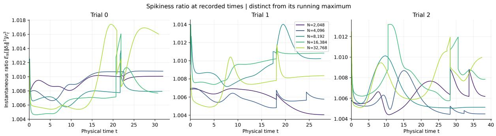  
Figure 4: The instantaneous cubic ratio $s _ { t }$ in eq. (401), with all three trials and five particle counts. Curves end when either system stops; near-zero denominators are omitted. The ratio measures the distribution of paired errors, not particle positions.

Adaptive schedules. All 15 particle systems and three population paths stopped before the cap; the empirical returned objectives ranged from $1 . 1 2 \times 1 0 ^ { - 4 } \mathrm { ~ t o ~ } 1 . 4 1 \times 1 0 ^ { - 4 }$ . Figure 5 illustrates autonomous decisions based on each system’s own $L ^ { 2 } { \mathrm { - g r a d i e n t } }$ test: all $N = 2 0 4 8$ , 4096 systems skip the population’s initial jump, and trial 2 at $N = 1 6 3 8 4$ makes a third attempt without a population counterpart. The resulting diferences in physical jump times can produce temporary same-time discrepancies: at $N = 3 2 7 6 8$ , recorded peaks of $r _ { t }$ range from 0.584 to 0.601. Discrepancies can be much larger at smaller N and are not monotone in $N ,$ despite the near-unit spikiness ratios. These diagnostics complement Theorem 3.1; its guarantee remains for a prescribed common schedule.

Numerical checks and reproduction. Halving the RK4 step preserved all event times and counts; halving the inspection interval preserved counts but shifted some event times by 0.05. The latter changed individual returned objectives by up to $4 . 8 9 \times 1 0 ^ { - 6 } ;$ , so small objective gaps are not used to infer a rate. Code, configurations, exact seeds, and archived scalar records are provided in the accompanying reproducibility bundle.

Independent schedules | circle: passed test; triangle: returned candidate; x: stop Open square: unmatched empirical attempt (independent noise)  
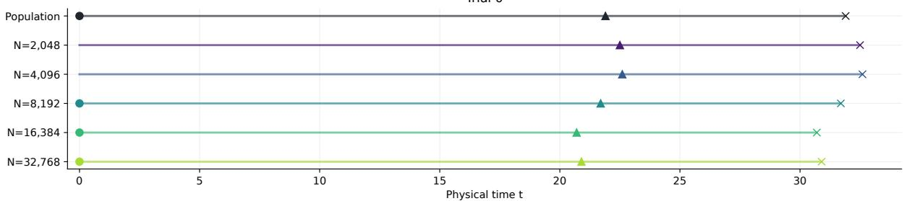

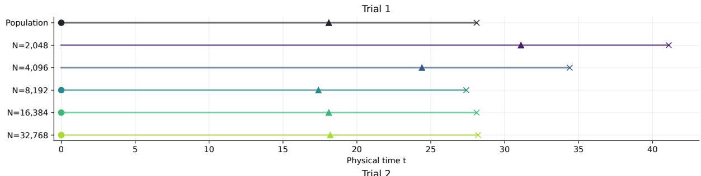

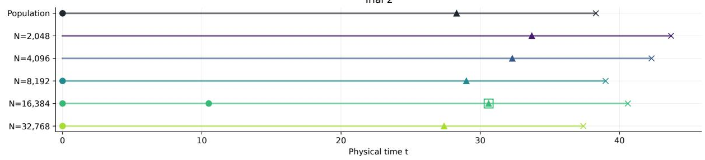  
Figure 5: Independently chosen adaptive schedules, showing every system. Circles mark jumps whose decrease test passes; triangles mark the saved pre-jump candidates returned after a failed test; crosses mark stopping times. The open square marks an unmatched empirical attempt. Coupling by attempt index does not force jump times to coincide.

## C.3 Paired trajectories and objective values

Figure 6 shows the paired error $r _ { t }$ from eq. (401) and the objective gap $| F ( \widehat { \mu } _ { t } ^ { N } ) - F ( \mu _ { t } ) |$ at the same physical time. Figure 7 shows the objective values themselves, using eq. (397), until each system stops. Together they show particle discrepancies and optimization progress under separately triggered jumps.

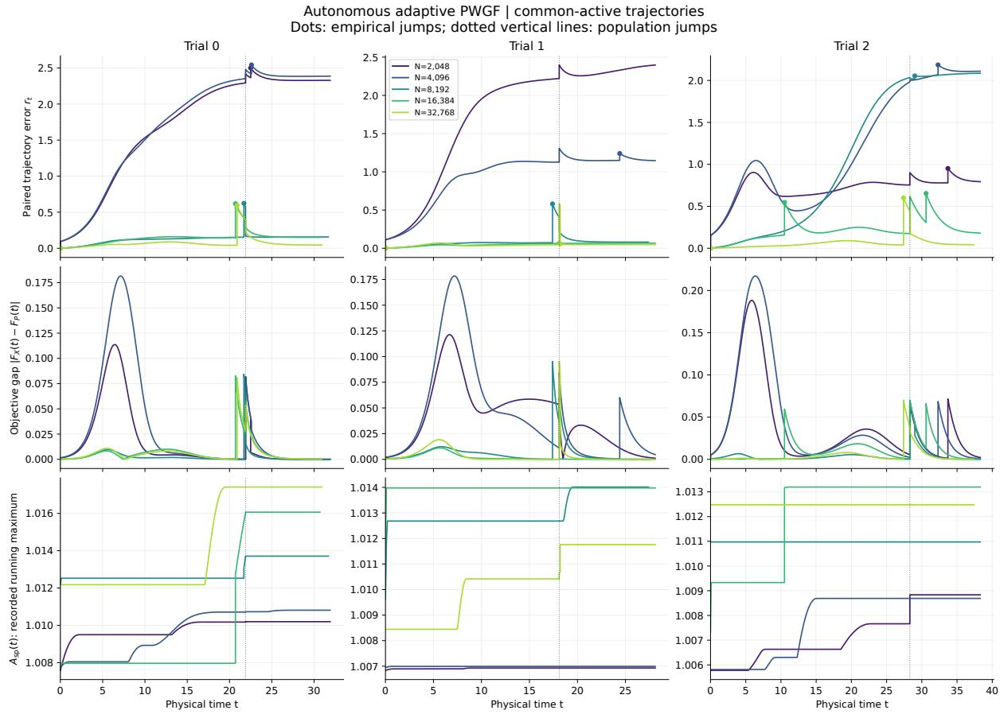  
Figure 6: Common-time diagnostics for all 15 conditions, with one column per trial. Top: paired RMS error $r _ { t }$ . Middle: $| F _ { X } ( t ) - F _ { P } ( t ) |$ , where $F _ { X } ( t ) = F ( \widehat { \mu } _ { t } ^ { N } )$ and $F _ { P } ( t ) = F ( \mu _ { t } )$ . Bottom: the running maximum of the recorded ratio $s _ { t }$ , labeled $A _ { \mathrm { s p } } ( t )$ , rather than its instantaneous value in fig. 4. Dots in the top row mark empirical jumps; dotted vertical lines mark population jumps. Curves end when either system stops; vertical segments connect recorded pre/post-jump values.

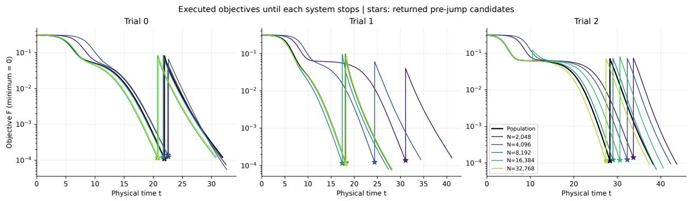  
Figure 7: Objective values $F ( \mu _ { t } )$ (black) and $F ( \widehat { \mu } _ { t } ^ { N } )$ (colored) for every trial and particle count. Each curve continues to that system’s own stopping time. Stars mark the saved pre-jump candidates at their candidate times, rather than the final executed states. The minimum of eq. (397) is zero.