# For Those Who Believe in Faithfulness: Optimizing the Area Under Insertion and Deletion Curves for Ranking Relative Feature Importance

Bjørn Leth Møller, Bulat Ibragimov, Christian Igel

Abstract—The adoption of machine learning for socially relevant tasks requires effective explainable artificial intelligence (XAI) methods to better understand the behavior of machine learning models. Attribution methods are a popular XAI approach in which input-output relationships are characterized by heat maps that reflect the relative importance of input features for a particular prediction. The quality of such maps is often assessed by measuring faithfulness based on the area under insertion and deletion curves, which measures changes in the model output as features are added and removed. In this study, we derive an objective function from this notion of faithfulness and a way to approximate its gradient. We establish the connection between insertion curves and top-k feature selection, which leads to a loss function measuring the quality of attributions. Randomization of the loss allows us to efficiently approximate its gradient. To show the effectiveness of the general approach, we combine the loss function with the neural explanation mask framework. The resulting method, termed Ra-NEM, can be used with any differentiable model without affecting the model’s performance. Experiments demonstrate that Ra-NEM provides accurate attributions robustly and efficiently. Compared to other algorithms, the attributions have not only higher faithfulness but also perform well in terms of other XAI metrics. The high inference speed of Ra-NEM makes the method suitable for online applications. The code is available online.

Index Terms—Explainable AI, Smooth top-k feature selection, Occlusion based explanations

## 1 INTRODUCTION

Explainable AI (XAI) aims to clarify how and why a model produces specific outputs from given inputs. This insight is needed to provide a higher level of transparency and safety in real-world applications [1] and is increasingly emphasized in regulatory frameworks [2]. A wide range of tasks fall under the umbrella of XAI. One of the most fundamental ones is to estimate the importance of individual input features for the model prediction, usually through a feature map, also referred to as an attribution, which assigns to each input feature some importance score. While verification of attribution maps is still an open research question, one quality commonly measured during evaluation is faithfulness, which attempts to quantify how well the attribution aligns with the model’s behavior for a given input-output pair. Faithfulness, in turn, is often assessed through deletion and insertion curves [3], [4], [5]. Introduced in [3], the insertion curve measures changes in the model output as features are added in order of highest importance. A higher area under the curve (AUC) indicates better explanations. Similarly, the deletion curve tracks how much the output changes when the features are removed in reverse order. In this case, a low AUC indicates a good attribution. Although many different heuristics have been proposed to solve the attribution problem [6], none, to our knowledge, has approached it by optimizing the insertion and/or deletion curve directly. Assuming that faithfulness defined based on these curves is a desirable property of an attribution, directly optimizing the area under these curves would be a principled way of generating high-quality attributions. In the following, we present an objective function that can be used to directly optimize the AUCs and an efficient approximation of its gradient that allows for real-time applications. The objective can be combined with other loss terms; however, we empirically show that the objective function alone is sufficient to provide faithful attributions that score high in terms of Average Sensitivity [7] and the Minimal Deletion Set metric [5], passing the MPRT (Model Parameter Randomization Test) [8].

This study (i) establishes a link between top-k feature selection with variable k and the insertion and deletion curves; (ii) states the sample complexity of Monte Carlo approximations of the area under these curves; (iii) proposes a differentiable operator for feature masking depending on the top-k features selected via the “Gumbel-top trick” [9]; (iv) adds the new operator to the Neural Explanation Mask (NEM) framework [10] yielding Ranking-NEM (Ra-NEM), which produces sparse faithful explanations with low latency; and (v) experimentally evaluates Ra-NEM applied to different deep learning architectures for image classification in comparison to state-of-the-art attribution methods, demonstrating that the new approach and performs, on average, superior in terms of faithfulness, inference speed, and robustness.

## 2 RELATED WORK

The attribution of model input-output relations is a wellestablished and growing field. In the following, we provide

a brief overview before explaining the NEM framework in more detail.

## 2.1 Heuristics for solving the attribution problem

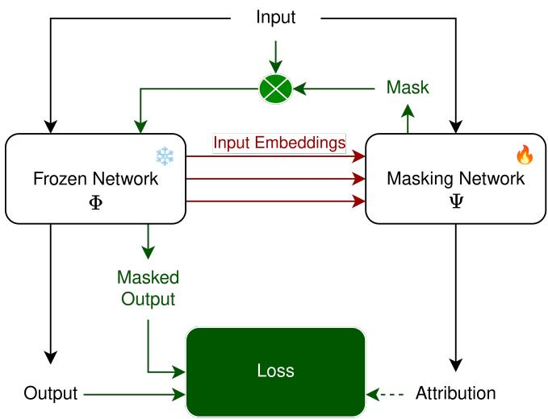  
Fig. 1. The general Neural Explanation Method (NEM) framework’s operation during inference (black and red arrows) and training (black, red, and green arrows). During inference, the input is processed by the frozen network, which generates its output, and the masking network, which produces an attribution (explanation). Depending on the NEM architecture, representations from the frozen network may assist the masking network in generating the attribution. During training, the masking network generates a mask from the attribution. In [10], [11], this mapping is the identity, and in this work it is a differentiable top-k feature selector. The mask is applied to the input and passed through the frozen network to produce a masked output. Both masked and unmasked outputs are used in a loss function to optimize the masking network. Prior work has also incorporated the attribution into the loss.

Many heuristics have been proposed to solve the attribution problem for different modalities such as images, texts, graphs, etc. [12]. The approaches, especially in the context of computer vision, can be roughly divided into two families, occlusion- and gradient-based methods [5]. The latter leverages the gradient of the given model w.r.t. the input to determine the sensitivity of the output to the individual input features. These methods include Saliency [13], GradSHAP [14], GradCAM++ [15], and Integrated Gradients [16]. The low latency of such methods usually comes with low faithfulness, especially for some specific neural architectures such as CNNs [4]. The occlusion-based methods introduce perturbation/occlusion to the input and measure the changes in the output to determine the importance of various features. Examples include RISE [3], Information Bottleneck Attribution (IBA, [17]), and Smooth Pixel Mask [18]. Generally, occlusion-based methods exhibit good faithfulness at the cost of slower inference speed. A notable exception to this rule is the NEMt method [11], an instantiation of the Neural Explanation Mask (NEM) framework [10], which achieves occlusion-based masking at low latency by predicting a mask directly instead of running a costly optimization process for each input as done by other occlusion-based methods. XAI methods can also be categorized according to whether they generate additive feature explanations or set-of-feature explanations [10], [18]. Additive feature explanations provide attributions which rank individual features based on their importance. Examples of such methods include GradCAM [15], RISE [3], and Integrated Gradients [16]. In contrast, set-of-feature explanations identify the minimal subset of features that produce a similar output to the full feature set. Unlike additive explanations, these methods do not rank every feature, making them less suitable for evaluation with deletion and insertion curves. Examples include Smooth Pixel Mask [18], NEMt [11], and Learn2Explain [19]. L2X uses top-k feature selection, employing the Gumbel softmax operator iteratively to identify up to k important features, where k ranges from 4 to 10 in the original paper. To our knowledge, the framework has not been tested for larger values of k.

## 2.2 Neural Explanation Masks

Our approach extends the Neural Explanation Mask (NEM) framework [10]. The idea of NEM is to augment a given differentiable model Φ with an explanation module Ψ that generates a feature attribution $a ~ = ~ \Psi ( x )$ for the model output $y ~ = ~ \Phi ( x ) ;$ see Figure 1 for an overview of the NEM framework. The explanation module Ψ is trained on a corpus of (unlabelled) data. When deployed, providing an explanation corresponds to (simultaneously) evaluating Ψ, which leads to low latency. The models Φ and Ψ are not optimized in tandem, which is why Φ is also called the frozen model. This is in contrast to other occlusionbased methods, which usually need to perform a separate optimization process for each new input to generate an explanation. Different NEM architectures [10], [11] can be derived depending on the architecture of Ψ and how Ψ is integrated into the explained model Φ. Previous work has focused on NEM-U (NEM using U-Net [20]), where Φ and Ψ are viewed as the encoder and decoder of a U-Net architecture, respectively, meaning that Ψ utilizes skip connections to extract intermediate input representations from Φ. It is appealing that the NEM framework does not interfere with training and using Φ, that is, there is no need to adapt the model architecture and no risk of degrading the predictive performance. All current NEM methods require us to choose hyperparameters that specify the trade-off between accuracy and complexity. Furthermore, all previous NEM methods produce a set of important features. They can only determine whether a feature is important or not, but not how important it is compared to others. Thus, no previous NEM methods can be used to reliably determine the k most important features for a given k.

## 3 METHODOLOGY

This section presents our theoretical results and derives an XAI algorithm based on these results. First, we establish the relationship between the insertion and deletion curves and top-k feature selection. This discussion lends itself to an objective function for learning feature attributions. To make the objective tractable, we use Monte Carlo approximation, and to make it differentiable, we employ the “Gumbel top-k trick” for sampling without replacement. Then we show how the Neural Explanation Mask framework can be extended to our new Ranking-NEM (Ra-NEM) architecture using the derived objective function.

## 3.1 Approximating the insertion curve via top-k feature selection

The idea is to generate feature attributions by optimizing the AUC of the corresponding insertion (and/or deletion) curve to maximize the faithfulness of the attribution directly. Let $\boldsymbol { x } \in \mathbb { R } ^ { d }$ be some d-dimensional input (e.g., a flattened image) and $\Phi : \mathbb { R } ^ { d }  \mathbb { R } ^ { c }$ some fixed model with c-dimensional output for which we want to provide explanations. This c-dimensional output could be the logits for c classes but also any other representation learned by $\Phi ,$ in particular some hidden layer embedding in a deep neural network. The set of indices corresponding to the d input features is denoted by $[ d ] = \{ 1 , \dotsc , d \}$ . For a given input $x ,$ a feature attribution is a vector $\boldsymbol { \imath } \in \mathbb { R } ^ { d }$ , where $a _ { i } < a _ { j }$ indicates that the feature i is considered more relevant than the feature $j .$ . Each feature attribution a defines the corresponding feature ranking $\sigma .$ . We describe the ranking by the permutation $\sigma _ { a } : [ d ]  [ d ]$ which orders the features in descending order breaking ties according to some deterministic rule. That is, $\sigma _ { a } ( i ) < \bar { \sigma } _ { a } ( j )$ iff $a _ { i } < a _ { j }$

## 3.1.1 Insertion and deletion curves.

Let ω : $\mathbb { R } ^ { d } \times \mathcal { P } ( [ d ] ) \to \mathbb { R } ^ { d }$ , where P denotes the power set, be some operator responsible for perturbing/masking features in x. The second argument specifies the features that should not be perturbed. For example, the second argument could specify all pixels in an image x that are not replaced by a constant when masking x. We define a function $\delta _ { \Phi } : \mathbb { R } ^ { \breve { d } } \times$ $\mathbb { R } ^ { d } \to [ 0 , 1 ]$ that measures the quality of the perturbed input with respect to the original input and the model. This could be the logit of the predicted class [3] or, in an unsupervised setting, the similarity of latent space representations [10], [21].

The insertion curve is constructed by iteratively adding features to the empty set of features in the order of increasing importance according to some attribution and measuring the difference between the model output of the reduced feature set and the full feature set. We define the insertion curve value at a given number of features i by

$$
c _ { \mathrm { i n s } } ( i , x , \sigma _ { a } ) = \delta _ { \Phi } ( x , \omega ( x , \{ \sigma _ { a } ^ { - 1 } ( j ) | 1 \leq j \leq i \} ) ~ , \nonumber\tag{1}
$$

That is, $c _ { \mathrm { i n s } } ( i , x , \sigma _ { a } )$ measures the similarity of the outputs of Φ given x and the results of adding the most important features according to feature attribution a. The corresponding AUC (area under the curve) is given by

$$
\operatorname { A U C } _ { \mathrm { i n s } } ( x , a ) = \frac { 1 } { d } \sum _ { i = 1 } ^ { d } c _ { \mathrm { i n s } } ( i , x , \sigma _ { a } ) .\tag{2}
$$

We define the complementary deletion curve resulting from iteratively removing features in the order of decreasing relevance according to some attribution as

$$
c _ { \mathrm { d e l } } ( i , x , \sigma _ { a } ) = 1 - \delta _ { \Phi } ( x , \omega ( x , \{ \sigma _ { a } ^ { - 1 } ( j ) | 1 \leq j \leq d - i \} )\tag{3}
$$

and $\mathrm { A U C _ { d e l } }$ accordingly. From $c _ { \mathrm { i n s } } ( i , x , \sigma _ { a } ) = 1 - c _ { \mathrm { d e l } } ( d -$ $i , x , \sigma _ { a } )$ it follows that $\mathrm { A U C } _ { \mathrm { i n s } } ( x , a ) = 1 - \mathrm { A U C } _ { \mathrm { d e l } } ( x , a )$ if the same ω is used for both curves. However, typically different ω operators are used, denoted by $\omega _ { \mathrm { d e l } }$ and $\omega _ { \mathrm { i n s } }$ in the following. In [3], $\omega _ { \mathrm { d e l } } ( x , T ) _ { i } = 0$ and $\omega _ { \mathrm { i n s } } ( x , T ) _ { i } = \mathrm { b l u r } ( x ) _ { i }$ for $i \in$ $[ d ] \setminus T .$ , where blur is a Gaussian smoothing operator (we refer to [3] for a discussion). We follow this standard when computing faithfulness. A third option is random replacement $\omega _ { \mathrm { r n d } } \mathbf { \bar { ( } } x , T ) _ { i } \sim \mathbf { \bar { \mathcal { N } } } ( x )$ for $i \in [ d ] \backslash \dot { T }$ , where ${ \mathcal { N } } ( x )$ is a Gaussian distribution with mean and variance matching the input statistics.

Using the insertion curve criterion, the optimal feature ranking is the permutation $\sigma ^ { * }$

$$
\sigma ^ { * } = \underset { \sigma \in S _ { d } } { \arg \operatorname* { m a x } } \sum _ { i = 1 } ^ { d } c _ { \mathrm { i n s } } ( i , x , \sigma ) ,\tag{4}
$$

where $\textstyle { S _ { d } }$ is the set of all permutations of $[ d ] ,$ , the positive integers up to d. To keep the notation simple, we assume that all arg max operations return a unique element. However, the following considerations also hold if a set of equivalent solutions is returned. They also hold when optimizing the area under the deletion curve or a combination $\mathrm { A U C } _ { \mathrm { i n s } } ( x , a ) - \mathrm { A U C } _ { \mathrm { d e l } } ( x , a )$ (with different choices of ω), which follows from the equivalence of deletion and insertion curves derived above.

The question arises under which conditions $\sigma ^ { * }$ defines the optimal subset of n features in terms of $\delta _ { \Phi }$ for any $n \in [ d ]$ Let the set of the n most important features be defined as

$$
T _ { n } ^ { * } = \underset { T \in \mathcal { P } ( \{ 1 , \dots , d \} ) \wedge | T | = n } { \arg \operatorname* { m a x } } \delta _ { \Phi } ( x , \omega ( x , T ) ) .\tag{5}
$$

Then monotonicity in the set of important features is defined as the property $T _ { n } ^ { * } \subset T _ { n + 1 } ^ { * } .$ This monotonicity is an implication of a common more restrictive assumption in the attribution literature called additive feature attribution [14], which states that any given model output can be approximated by a linear combination of input features.

Assuming monotonicity, there exists a permutation $\sigma _ { n }$ with $\{ \sigma _ { n } ^ { - 1 } ( i ) \bar { | } i = 1 , \ldots , \bar { n } \} = T _ { n } ^ { * }$ . Definition (5) implies $\delta _ { \Phi } ( x , \omega ( x , \{ \sigma ^ { - 1 } ( j ) | 1 \le j \le n \} ) \le \delta _ { \Phi } ( x , \omega ( x , T _ { n } ^ { * } ) )$ for all permutations $\sigma \in S _ { d }$ . Thus, $\sigma _ { n }$ maximizes (2), that is, $\sigma ^ { * } =$ $\sigma _ { n }$ . Therefore, under the monotonicity assumption, we have $T _ { n } ^ { * } = \{ \sigma ^ { * } { } ^ { - 1 } ( i ) | i = 1 , \dots , n \}$ , that is, optimizing the AUC gives the optimal subset of features for any subset size.

## 3.1.2 Monte Carlo approximation.

The optimization problem defined by (4) is typically very high-dimensional in practice, for example, in computer vision tasks where d is the number of pixels in an image. Thus, evaluating the insertion curve at all points during optimization becomes infeasible. Therefore, we consider the Monte Carlo approximation of $\mathrm { { A U C } _ { \mathrm { { i n s } } } }$ given by

$$
\widetilde { \mathrm { A U C } } _ { \mathrm { i n s } } ( x , a ) = \frac { 1 } { \left| \mathcal { I } \right| } \sum _ { i \in \mathcal { I } } c _ { \mathrm { i n s } } ( i , x , \sigma _ { a } ) \ ,\tag{6}
$$

where $\mathcal { I } _ { \mathrm { ~ - ~ } } \subseteq \ [ d ]$ is drawn uniformly at random. We have $\mathbb { E } [ \tilde { \mathrm { A U C } } _ { \mathrm { i n s } } ( x , a ) ] \ = \ \mathrm { A U C } _ { \mathrm { i n s } } ( x , a )$ , where the expectation is over draws of ${ \mathcal { I } } ,$ and accordingly $\sigma ^ { * } \mathbf { \Sigma } = \mathbf { \Sigma }$ arg $\begin{array} { r } { \operatorname* { m a x } _ { \sigma \in \mathcal { S } _ { d } } \mathbb { E } \left[ \widetilde { \mathrm { A U C } } _ { \mathrm { i n s } } ( x , a ) \right] } \end{array}$

## 3.1.3 Bounds on sample complexity.

The sample complexity of the AUC approximation can be bounded as follows:

Theorem 3.1. Given an input x and an attribution a with corresponding permutation $\sigma _ { a } ,$ for randomly drawn indices $\mathcal { I }$ we have for $t > 0$

$$
\begin{array} { r } { P \big [ | \widetilde { \mathrm { A U C } } _ { i n s } ( x , a ) - \mathrm { A U C } _ { i n s } ( x , a ) | > t \big ] \leq 2 e ^ { \frac { - 2 n t ^ { 2 } } { ( 1 - f _ { n } ^ { * } ) ( b - a ) } } } \end{array}\tag{7}
$$

where $\textit { n } = \ | \mathcal { I } | ; \textit { a } =$ min C and $b ~ = ~ \operatorname* { m a x } \mathcal { C } ~ f o r ~ \mathcal { C } ~ =$ $\{ c _ { i n s } ( i , x , a ) | i = 1 , \ldots , d \}$ ; and $f _ { n } ^ { * } = ( n - 1 ) / d .$

Proof. For a fixed input x and an attribution a with corresponding permutation $\sigma _ { a } ,$ we have $\mathrm { A U C _ { i n s } } ( x , a ) = \mu =$ $\begin{array} { r } { \frac { 1 } { d } \sum _ { c \in \mathcal { C } } c . } \end{array}$ Setting $S _ { n } = C _ { 1 } + \cdot \cdot \cdot + C _ { n } ,$ where the $C _ { 1 } , \ldots , C _ { n }$ are n samples drawn uniformly from C without replacement, we have $\widetilde { \mathrm { A U C } } _ { \mathrm { i n s } } ( x , a ) = S _ { n } / n$ . Now we apply a two-sided version of Corollary 1.1 from [22] using $P _ { n } = P [ S _ { n } / n - \mu \geq$ t] and $P _ { n } = P [ \mu - \dot { S } _ { n } / n \geq t ]$ , which completes the proof.

Note that $\delta _ { \Phi }$ does not need to be bounded for the proof. Setting $f _ { n } ^ { * } = 0$ gives an expression that resembles what one would expect from a Hoeffding bound considering independent random variables. However, we cannot simply assume that the $c _ { \mathrm { i n s } } ( i , x , a )$ terms in the AUC calculation are independent. Anyway, the elements in C are fixed given an input x and an attribution a with corresponding permutation $\sigma _ { a } .$ Thus, we consider the problem of drawing without replacement from a set of numbers.

We can also take the variance into account, and, in the same way as above, from the results in [22] we get:

Corollary 3.2. With assumptions and definitions as in Theorem 3.1 and its proof, we have

$$
P \big [ | \widetilde { \mathrm { A U C } } _ { i n s } ( x , a ) - \mathrm { A U C } _ { i n s } ( x , a ) | > t \big ] \leq 2 \frac { ( 1 - f _ { n } ) s ^ { 2 } } { n t ^ { 2 } }\tag{8}
$$

with $\begin{array} { r } { \mu = \frac { 1 } { | \mathcal { C } | } \sum _ { c \in \mathcal { C } } c , s ^ { 2 } = \frac { 1 } { | \mathcal { C } | } \sum _ { c \in \mathcal { C } } ( \mu - c ) ^ { 2 } a n d f _ { n } ^ { * } = ( n - } \end{array}$ $1 ) / ( d - 1 )$

## 3.2 A differentiable loss in terms of top-k feature selection

The first (top) k elements of a feature attribution a are given by to $\mathsf { p } _ { k } ( a ) \overset { \cdot } { = } \{ \sigma _ { a } ^ { - 1 } ( i ) | i = 1 , \ldots , k \}$ , and we use the same notation for the $[ k ]  [ d ]$ mapping $\begin{array} { r } { \mathrm { t o p } _ { k } ( a ) ( i ) = \sigma _ { a } ( i ) } \end{array}$ . We can rewrite (6) as

$$
\widetilde { \mathrm { A U C } } _ { \mathrm { i n s } } ( x , a ) = \frac { 1 } { | \mathcal { T } | } \sum _ { i \in \mathcal { I } } c _ { \mathrm { i n s } } ( i , x , \mathrm { t o p } _ { i } ( a ) ) \enspace .\tag{9}
$$

Instead of optimizing over the space of rankings, we consider the real-valued optimization problem

$$
a ^ { * } = \underset { a \in \mathbb { R } ^ { d } } { \arg \operatorname* { m a x } } \widetilde { \mathrm { A U C } } _ { \mathrm { i n s } } ( x , a ) .\tag{10}
$$

Again, we assume that arg max returns a single solution to keep the notation simple. We have $\sigma ^ { * } =$ arg $\begin{array} { r } { \operatorname* { m a x } _ { \sigma \in S _ { d } } \mathring \mathrm { A U C } _ { \mathrm { i n s } } ( x , a ) = \sigma _ { a * } } \end{array}$ . Plugging in (1), the optimization problem (10) gives rise to the loss function

$$
\mathcal { L } ( a \left| x \right. = - \sum _ { k \in \mathcal { I } } \delta _ { \Phi } ( x , \omega ( x , \mathrm { t o p } _ { k } ( a ) )\tag{11}
$$

to be minimized over $a \in \mathbb { R } ^ { d }$ for a training input $x ,$ where $\mathcal { I }$ is sampled anew in each evaluation of the loss. Thus, instead of improving an attribution by optimizing the AUC of its insertion or deletion curve, we can instead optimize top-k feature selection with uniformly sampled k maximizing δ<sub>Φ</sub>.

Optimizing the AUC directly is a non-differentiable problem. However, in the following we will derive approximate gradients for the rephrased problem. For gradient-based minimization of (11), we need a differentiable approximation of the top-k selection done by ω. Differentiable top-k feature selection is commonly implemented using the Gumbel softmax operator [19], [23]. The Gumbel softmax operator represents a categorical distribution with a continuous and differentiable distribution [24]. However, the Gumbel softmax operator is insufficient for top-k feature selection, as it samples only a single element from the categorical distribution. Previous work in the explainability literature [19] addresses this limitation by applying the operator k times to the network output, producing a set containing at most different k elements. However, this approach becomes computationally infeasible for large $k ,$ since the number of operations scales linearly with k. Alternatively, top-k feature selection can be achieved by the “Gumbel top-k trick” [9]. An ordered sample without replacement from a categorical distribution of size k can be drawn by perturbing the (unnormalized) log-probabilities with values drawn from a standard Gumbel distribution and then selecting the top-k largest elements. Let $a \in \mathbb { R } ^ { d }$ be a feature explanation, as, for example, produced by a neural network that provides an explanation for a given input x. We interpret a as non-normalized log-probabilities that define the discrete probability distribution p over [d] with

$$
p ( i ) = \frac { \exp ( a _ { i } ) } { \sum _ { j \in [ d ] } \exp ( a _ { j } ) } \mathrm { ~ . ~ }\tag{12}
$$

Let $g \in \mathbb { R } ^ { d }$ be a random vector drawn from a standard $d -$ dimensional Gumbel distribution. Then $\mathrm { t o p } _ { k } ( a + g )$ gives an ordered sample of k elements drawn without replacement from the distribution p. For a proof, we refer to [9]. In contrast to iterative applications of the Gumbel softmax, this sampling can be efficiently computed for large $k ,$ making it suitable for high-dimensional data. Thus, (11) becomes

$$
\ell ( a \mid x , g , k ) = - \delta _ { \Phi } ( x , \omega ( x , \mathrm { t o p } _ { k } ( a + g ) )\tag{13}
$$

for a feature attribution a given the input $x ,$ a number of features $k ,$ and a sample $g$ from the standard d-dimensional Gumbel distribution.

In summary, by adopting differentiable top-k feature selection via the Gumbel top-k trick, we are able to create an efficient differentiable approximation to $\omega ,$ which allows us to optimize the loss in (13). Algorithm 1 shows the implementation of the ω operator in pseudocode, details are provided in section C in the supplementary material.

## 3.3 Ra-NEM

The loss function and its approximated gradient computation can be used as an additional term in various attribution algorithms. To show their effectiveness, we evaluate them within the NEM framework without additional loss terms.

```python
def omega_operator(A, x, k, R):
2 # stabilize training
3 A = A - A.logsumexp()
4 # sample Gumbel noise
5 U = torch.rand_like(A)
6 G = -torch.log(-torch.log(U))
7 # Gumbel perturbed sorting
8 A, indices = torch.sort(A + G, descending=True
9 # soft thresholding
10 A = torch.sigmoid(A - A[k])
11 # hard thresholding
12 mask = A - A.detach()
13 # only keep top k elements
14 mask[:k] += 1
15 # reorder mask to original index order
16 M = torch.zeros_like(A)
17 M[indices] = mask
18 # generate perturbed input
19 return x M + R (1 - M)
```

Algorithm 1: Omega operator in Python/PyTorch pseudocode, details are provided in section C in the supplementary material.

The ω operator does not have any trainable parameters and simply selects an ordered subset from a given feature attribution in a differentiable way. We can combine it with NEM-U in a straight-forward way. We feed the explanation produced by Ψ into Algorithm 1. Then we can train Ψ end-toend by gradient-based optimization of (13). That is, for each input x during training, we compute $\textstyle { \frac { \partial } { \partial w } } { \dot { \ell } } ( \Psi ( x ) \mid x , g , k )$ for randomly drawn g and $k ,$ where w denotes the parameters (weights) of Ψ. We refer to this new approach as Ranking-NEM (Ra-NEM), because it ranks all input features via the Ψ output processed by Algorithm 2, which stand in contrast to previous NEM variants. Ra-NEM applies binary masks during training (i.e., M in algorithm 2 is in $\{ 0 , 1 \} ^ { \check { d } } )$ , while previous NEM methods work with continuous masks $m ,$ typically m = a directly, and evaluate Φ on the element-wise product x ⊙ m. This is a crucial difference. While x ⊙ m may be a valid input when processing images and other fixedlength continuous signals, this is not necessarily the case for other modalities, such as sequences of discrete symbols. This makes the Ra-NEM approach more flexible, for example, applicable in natural language processing.

To train a Ra-NEM for supervised classifiers, we follow [3] and set $\delta _ { \Phi }$ in (13) to the probability of the most likely class of the input image:

$$
\delta _ { \Phi } ( x , x ^ { \prime } ) = [ \Phi ( x ^ { \prime } ) ] _ { c } \mathrm { w i t h } c = \arg \operatorname* { m a x } _ { i } \Phi ( x ) _ { i }\tag{14}
$$

During training, for each input $x , \omega$ is chosen uniformly at random to be $\omega _ { \mathrm { i n s } } , \omega _ { \mathrm { d e l } } , \mathrm { o r } \omega _ { \mathrm { r n d } }$ (see subsection 3.1).

## 4 EXPERIMENTS & RESULTS

To evaluate the Ra-NEM method, we performed a series of experiments.

## 4.1 Evaluated architectures and dataset

We applied a diverse set of explanation methods to four deep learning models. Specifically, we studied three convolutionbased architectures, ResNet50 [25], ConvNeXt (small) [26], and VGG16 [27], and one transformer architecture, ViT [28].

All models were sourced from the Timm library [29] and pretrained on the ImageNet [30] training split. We focused on attribution methods for supervised image classifiers [6]. We ran evaluations using 1,000 images sampled from the ImageNet [30] validation data. For training NEMs, we sampled 10,000 images from the same split, discarding images that overlapped with the evaluation dataset.

## 4.2 Baseline methods

To compare our proposed methodology, we evaluated nine explanation methods that included gradient-based and occlusion-based approaches. From gradient-based methods, we considered Saliency [13], Grad-SHAP [14], Grad-CAM++ [15], and Integrated Gradients [16]. From occlusion-based methods, we examined RISE [3], Smooth Pixel Mask [18], Information Bottleneck Attribution (IBA) [17], and the recent NEMt [11]. For IBA, we picked the per-sample variant, optimizing directly on the input image as recommended in the literature to achieve the highest faithfulness. We could not find any work on IBA for transformer-based image architectures and therefore did not generate results for explaining ViT with this method. For the Smooth Pixel Mask, we enforced an area constraint of 10%.

## 4.3 FORgrad

In [4], it has been shown that the poor performance of gradient-based attribution methods applied to CNNs is likely due to the pooling operations leveraged in CNNs. The authors introduce FORgrad, which is a method for improving the faithfulness of gradient based methods by filtering out high frequency noise in the gradient. We add the FORgrad method to the gradient-based methods in our study and add the resulting algorithms to our comparison.

## 4.4 NEM training and post processing

We studied two different NEM architectures, Ra-NEM, and NEMt. All NEM masking networks Ψ were standard U-Net decoder blocks, consistent with previous work [10], [11], to ensure a fair comparison. The trainable neural architectures used for the two methods were identical, which means that the number of trainable parameters was the same. All masking networks were trained for 10 epochs on the training data using the Prodigy optimizer [31] alongside a cosine annealing learn-rate scheduler. In Ra-NEM, we sampled six values of k with replacement for each input x in a batch and optimized for each sampled value, that is, we considered six loss terms 13 for each x. We set $\textstyle \lambda = { \frac { 1 } { 5 0 } }$ in the NEMt loss function. A reproducibility checklist can be found in section D and a hyperparameter study in section B of the supplementary material.

## 4.5 Performance metrics

We compared the different XAI methods using metrics for faithfulness, complexity, and inference time. Faithfulness was assessed using insertion and deletion curves, as is commonly done in the XAI literature [3], [4], [18]. We use the variant proposed by [4]. Specifically, for each attributionimage-model combination, we compute the insertion and deletion curves and calculate the respective AUCs using $\omega _ { \mathrm { d e l } } ( x , T ) _ { i } = 0$ and $\omega _ { \mathrm { i n s } } ( x , T ) _ { i } = \mathrm { b l u \bar { r } } ( x )$ <sub>i</sub> for $i \in [ d ] \setminus \check { T }$ The final faithfulness metric is obtained by subtracting the deletion curve AUC from the insertion curve AUC.

Previous work has shown that measuring faithfulness using deletion and insertion curves can be sensitive to the choice of hyperparameters [32]. This is why we use two different choices of perturbation during our evaluation. To further explore how this might affect our results, we measure how different perturbation choices during faithfulness evaluation lead to different scores.

There exist alternative measures of faithfulness, especially the Minimal Deletion Set metric [5], which measures the smallest perturbation that changes the predicted class of the classifier. Thus, we also studied this metric for the bestperforming methods.

To further compare the attribution methods considered in this study, we measure their robustness to (unimportant) noise using the Average Sensitivity metric [7]. A common sanity check of attribution methods is to measure how much the attribution for the same input changes when the model is distorted by injecting random noise into the layers. We performed this check using a variant of the MPRT (Model Parameter Randomization Test [8]) from the Quantus library [33], where we measure the average spearman rank correlation between the attributions produced by the original model and a model with randomized weights. The full evaluation dataset (1000 images) was used to measure Faithfulness, whereas a subset of 100 images was used to measure Randomization and Robustness due to the metrics being computationally demanding. Finally, we measured the average time in seconds to generate attributions for the full evaluation dataset. Generally, low-latency methods are preferable, as real-time inference may be a requirement in practical applications. All experiments were run on an RTX4090 NVIDIA GPU.

## 4.6 Results

The results of our experiments comparing nine XAI methods are summarized in Table 1, the details are provided in section A of the supplementary material. All differences in faithfulness between Ra-NEM and the other methods in Table 1 are highly statistically significant (two-sided paired Wilcoxon test, $p < 0 . 0 0 1 )$ . In our empirical evaluation, Ra-NEM achieved the highest average faithfulness. It gave the highest faithfulness for the ResNet50, ConvNeXt, and ViT models, while ranking fifth on the VGG16 model.

With respect to Robustness, it ranks first overall indicating noise-resistant explanations. With a low Randomization score (0.051), Ra-NEM proves to be sensitive to the underlying model as desired and thus passes the sanity check.

Ra-NEM and NEMt were the fastest methods, with our implementation of Ra-NEM being the most efficient. The training times for different explained models and both NEM methods are reported in Table 9 in the supplementary material.

In terms of the Minimal Deletion Set metric [5], Ra-NEM also achieves the best score compared to the other highperforming methods, see Table 2.

Visual examples of the various attribution methods are shown in Figure 2 with additional images provided

## TABLE 1

Aggregated results from running different XAI methods on four different models using 1000 samples of the validation split of the ImageNet dataset. The explained models are a ConvNeXt, a ResNet50, a VGG16,

and a ViT. We compared Faithfulness of Ra-NEM with the other methods, and the differences in the table below are statistically highly significant (two-sided paired Wilcoxon rank-sum test, $p < 0 . 0 0 1 )$

Results for each individual model are given in section A in the supplementary material. <sup>†</sup>IBA was only evaluated for the three CNN   
architectures. <sup>‡</sup>Grad-CAM++ was only evaluated for Robustness on the   
three CNNs and NEMt was only evaluated on ViT and ResNet50. Please see section A for further information.

<table><tr><td>Method</td><td>Faith. ↑</td><td>Robust. ↓</td><td>Rand. →0←</td><td>Time ↓</td></tr><tr><td>RISE</td><td>0.422</td><td>0.362</td><td>-0.017</td><td>12.835</td></tr><tr><td>Grad  ${ \mathbf { \boldsymbol { C } } } { \mathbf { \boldsymbol { A } } } { \mathbf { M } } { + + } { \dagger }$ </td><td>0.390</td><td>0.599</td><td>-0.082</td><td>0.013</td></tr><tr><td>Integrated Gradients</td><td>0.374</td><td>1.298</td><td>0.016</td><td>0.092</td></tr><tr><td>Smooth Pixel Mask</td><td>0.386</td><td>0.730</td><td>0.138</td><td>4.672</td></tr><tr><td>Grad-SHAP</td><td>0.343</td><td>1.350</td><td>0.015</td><td>0.014</td></tr><tr><td>IBA†</td><td>0.455</td><td>0.189</td><td>-0.222</td><td>0.240</td></tr><tr><td>Saliency</td><td>0.294</td><td>1.332</td><td>0.075</td><td>0.008</td></tr><tr><td>NEMt‡</td><td>0.423</td><td>0.435</td><td>0.186</td><td>0.005</td></tr><tr><td>Ra-NEM</td><td>0.494</td><td>0.152</td><td>0.051</td><td>0.004</td></tr></table>

TABLE 2

Average ratio of input that has to be perturbed before the prediction of the base model differs from the the original. Lower is better. Perturbation method is zero imputation.
<table><tr><td></td><td>Resnet50</td><td>ConvNeXt</td></tr><tr><td>RISE</td><td>0.242</td><td>0.438</td></tr><tr><td>Integrated Gradients</td><td>0.313</td><td>0.532</td></tr><tr><td>Ra-NEM</td><td>0.168</td><td>0.212</td></tr></table>

in section E in the supplementary material. We provide visual examples of Ra-NEM performing relatively poorly in section F of the supplementary material.

For the CNN-based explained (frozen) models, the occlusion based XAI methods (e.g., RISE) compared favorably to the gradient based approaches (e.g., Integrated Gradients) in our experiments. Adding the FORgrad method indeed improves the faithfulness results of gradient-based methods, as can be seen in Table 3, but not to the extent that they reach the quality of Ra-NEM.

TABLE 3  
Comparing faithfulness on ResNet50 for Ra-NEM and gradient-based methods with and without FORgrad. We can see that FORgrad improves faithfullness at the cost of complexity. Ra-NEM is still outperforming the gradient-based methods even after they have been “repaired” by FORgrad.
<table><tr><td>Method</td><td>Faithfulness ↑</td></tr><tr><td>Grad-SHAP</td><td>0.343</td></tr><tr><td>Grad-SHAP (FORgrad)</td><td>0.354</td></tr><tr><td>Integrated Gradients</td><td>0.374</td></tr><tr><td>Integrated Gradients (FORgrad)</td><td>0.407</td></tr><tr><td>Saliency</td><td>0.294</td></tr><tr><td>Saliency (FORgrad)</td><td>0.308</td></tr><tr><td>Ra-NEM</td><td>0.607</td></tr></table>

The results of our hyperparameter study regarding the role of different perturbation methods are shown in Table 4. The scores are indeed sensitive to the perturbation method, but the ranking appears to be stable across the models.

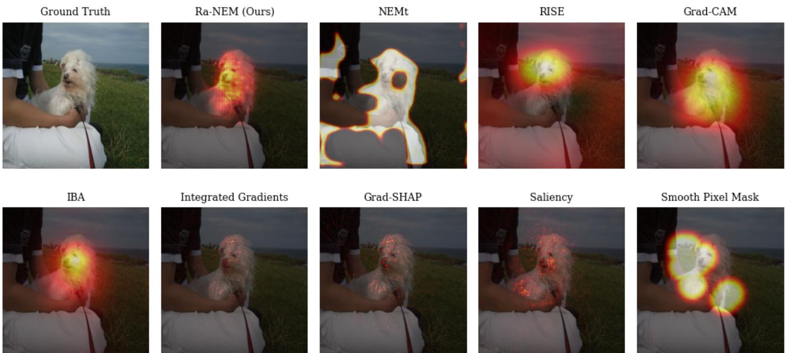  
Fig. 2. Model explanations generated by different XAI methodologies (see appendix for more examples). The explained model is a ResNet50 architecture trained on the training split of the ImageNet dataset. The example image is taken from the ImageNet validation dataset. Compared to other methods, such as RISE and Grad-CAM++, Ra-NEM generates a ranking more closely aligned with the central object (dog), while the others exhibit a circular bias, likely due to smoothing. This may explain the higher faithfulness of Ra-NEM (see section 5).

TABLE 4  
Effect of the choice of perturbation when calculating the deletion/insertion AUC, the shown values are $\mathsf { A U C } _ { \mathsf { i n s } } - \mathsf { A U C } _ { \mathsf { d e l } }$ (ConvNeXt).
<table><tr><td>Method</td><td>Noise</td><td>Zero</td><td>Blur</td></tr><tr><td>RISE</td><td>0.266</td><td>0.267</td><td>0.198</td></tr><tr><td>Integrated Gradients</td><td>0.138</td><td>0.191</td><td>0.160</td></tr><tr><td>Ra-NEM</td><td>0.429</td><td>0.466</td><td>0.261</td></tr></table>

The effect of the number of samples on faithfulness and training times for the Ra-NEM method when explaining a ResNet50 model are shown in Table 11 in the supplementary material. Increasing k can improve faithfulness but also increase training time. The stability of Ra-NEM training is shown in Table 10 in the supplementary material.

## 5 DISCUSSION

We derived a method for generating attributions by optimizing a Monte Carlo estimate of the AUC of the insertion/deletion curve via top-k feature selection with uniformly sampled k during training.

To show the practical relevance of these results, we evaluated them within the NEM framework. Our experiments indicate that the resulting Ra-NEM algorithm is a robust choice to provide faithful attributions as measured by deletion and insertion curve AUC. It has a low latency that allows for real-time applications, is robust to small input perturbations and sensitive to the underlying model.

## 5.1 Faithfulness

In our experiments, Ra-NEM achieved on average the highest faithfulness for all image classifiers. There was some variance in performance between models, but Ra-NEM had the highest faithfulness on three of four models. Ra-NEM gave the best result on the ConvNeXt model, where it improved 0.095 over NEMt ranking second. The worst relative performance of Ra-NEM was on VGG16, where it was 0.139 behind the first place taken by RISE. The strong average performance of Ra-NEM can be attributed to the inconsistent performance of other XAI methods when applied to different models, such as the poor performance of RISE on ViT and ConvNeXt. In contrast, our method gave faithful explanations for all models, even if it was outperformed for some individual models. To understand why our method performs well, it is therefore interesting to explore why the other methods vary in performance.Figure 2 exemplifies that the Ra-NEM attributions were more centered on the object (dog), while other occlusion-based methods have more circular smeared explanations. This is most likely due to smoothing, whether explicitly in the case of IBA [17] and Smooth Pixel Mask [18] or implicitly by RISE [3]. This bias toward spatially cohesive masks can be good for some CNN-based methods such as VGG16 and ResNet50, but it might hamper the ability to explain methods using patching such as ViT and ConvNeXt. Previous work [4] has shown that gradient-based methods tend to exhibit reduced faithfulness when applied to CNN architectures due to the pooling operations. Thus, it could be argued that the good overall performance of Ra-NEM is partly due to not relying on spatial biases or gradients of the explained model. We hypothesize that the most important reason for Ra-NEM not achieving the highest faithfulness in all settings is that, unlike most other methods we compared against, Ra-NEM does not optimize directly on the output when generating attributions after training. Instead, it relies solely on prediction, and therefore can sometimes focus on the wrong areas (see section F in the supplementary material).

## 5.2 Randomization and robustness

Our empirical results indicate that Ra-NEM is the most robust of the studied methods, where robustness against input noise is measured by Average Sensitivity. It even outperforms IBA and Grad-CAM++, which use smoothing to eliminate some of the noise inherent to gradient-based methods. Furthermore, Ra-NEM passed the randomization sanity check, since the MPRT score is close to zero (0.051). This means that the attribution depends on the underlying model mechanics instead of learning some shortcut such as segmenting the object in the image. Since Ra-NEM only has access to the latent representations of the input and not the input itself, this is not surprising.

## 5.3 Time

Ra-NEM was the fastest method for all models, closely followed by NEMt. This is in agreement with previous work on NEM methods [10], [11], which outpaced other XAI methods when deployed. The NEM approaches only need a forward pass through the explained network Φ and the masking network Ψ, whereas the third fastest method Saliency needs to compute the gradient of the explained model. Since the Ψ network is generally smaller than Φ, a forward pass through both Ψ and Φ is faster than a forward and backward pass through Φ.

## 5.4 Ra-NEM and previous NEM methods

Compared to previous NEM algorithms [10], [11], our method offers advantages beyond the reported improved performance results. Specifically, the Ra-NEM feature ranking and masking eliminate the need to specify a trade-off between complexity and accuracy. The binary masking facilitates adaptation to other input modalities, such as text or graphs, where partial occlusion is not well defined (see subsection 3.3). Additionally, the absence of tuning parameters in the loss function simplifies adoption, as there is no need to adjust hyperparameters when Φ is re-trained or the framework is applied in a new setting.

## 5.5 Using the insertion/deletion curve as a target

The insertion/deletion curves are widely considered as important measures of whether an attribution captures the underlying model mechanics in the XAI literature. Therefore, we studied the AUCs of these curves and showed how to efficiently optimize them. It has been pointed out that feature removal metrics are sensitive to the choice of perturbation, how many perturbation steps are taken during feature removal, and whether the order of feature removal is ascending or descending in the attribution values [34]. We mitigate these issues by considering both the insertion and deletion curves, which rely on different perturbation schemes. Furthermore, Ra-NEM uses three different perturbation schemes during training. In addition, Ra-NEM is optimized using a random k during training, which means that it is not optimized with an a priori fixed number of steps. Our results show that these measures indeed lead to a high robustness of Ra-NEM, indicating that the results generalize. Finally, we would like to stress that optimizing the deletion/ insertion curve can be seen as a generalization of the objective of finding a good trade-off between complexity and accuracy, a common way of creating explanations [4], [10], [18], as the optimal insertion/deletion curve is one that has optimal accuracy for a given complexity level as defined by k.

## 5.6 Monotonicity

Given monotonicity, we prove that the stochastic top-k feature selection approximates faithfulness measured via the deletion curve. Monotonicity is arguably unrealistic for many real world models. However, this assumption is not required when applying Ra-NEM in practice. The proposed method is reasonable even if monotonicity does not hold: Our optimization process learns attributions such that, for arbitrary subset sizes, the selected features approximate the original input in terms of model prediction.

Monotonicity is implied by the more restrictive assumption of additive feature attributions used in many attribution methods such as Grad-SHAP [14] and LIME [35]. Evaluating and visualizing any XAI method using a single gradual map of relative feature importance (such as in Figure 2) implicitly assumes monotonicity.

It can be argued that all approaches providing a single attribution map for an input implicitly assume an ordering of the input features, which in turn implies monotonicity, otherwise, different maps for different k must be reported.

## 5.7 Fairness of comparison

Smooth Pixel Mask and NEMt belong to a different category of explanation methods than the other approaches considered in this study, which may introduce bias in direct comparisons [10], [18]. Specifically, these methods are classified as set-offeature explanations, whereas the others fall under additive feature explanations [10]. Set-of-feature explanations identify a minimal set of features sufficient to explain an outcome, but do not rank individual features. In contrast, additive feature explanations assign importance scores to all features, allowing for feature ranking. Comparing these approaches is inherently challenging, as they address different problems [10]. We followed previous works [3], [4], [18] in our evaluation strategy to allow for a direct comparison, but future work should explore whether these results generalize to other domains.

The Ra-NEM method induces an ordinal ranking of the input features, meaning that the absolute values of the elements do not reflect the actual reduction in the classifier, but simply the correct ordering. Some faithfulness criteria such as [36] and [37] basically assume a linear relationship between classifier change and attribution. We have focused on faithfulness metrics that test ordinal relationships.

## 6 CONCLUSIONS

The areas under the insertion/deletion curves are often considered as important measures to evaluate the faithfulness of attribution-based XAI methods. This study contributes to a better conceptual understanding of this approach. We derived the sample complexity of a Monte Carlo approximation of the AUCs and an efficient differentiable objective function that allows one to optimize the AUC directly. These general findings can be used to improve existing XAI methods. We added the new objective function to the NEM approach. This leads to the Ra-NEM algorithm, which performs top-k feature selection and optimizes faithfulness to produce more accurate attributions. In our experiments, Ra-NEM achieved state-of-the-art performance in terms of both faithfulness and robustness as measured by different performance metrics. Its low latency allows for real-time processing. Applications with real-time constraints or that require generating numerous explanations, such as online video analysis, benefit not only from the high accuracy and low latency of Ra-NEM, but also from its resource efficiency. Ra-NEM extends the NEM framework and makes it applicable to a wider range of input modalities, which is an interesting direction for future work.

## REFERENCES

[1] J. Gerlings, A. Shollo, and I. Constantiou, “Reviewing the need for explainable artificial intelligence (xAI),” in Hawaii International Conference on System Sciences (HICSS), 2021. 1

[2] N. C. Chung, H. Chung, H. Lee, L. Brocki, H. Chung, and G. Dyer, “False sense of security in explainable artificial intelligence (XAI),” arXiv preprint arXiv:2405.03820, 2024. 1

[3] V. Petsiuk, A. Das, and K. Saenko, “RISE: Randomized input sampling for explanation of black-box models,” in British Machine Vision Conferece (BMVC), 2018. 1, 2, 3, 5, 7, 8

[4] S. Muzellec, T. Fel, V. Boutin, L. Andeol, R. Vanrullen, and T. Serre,´ “Saliency strikes back: How filtering out high frequencies improves white-box explanations,” in International Conference on Machine Learning (ICML), ser. Proceedings of Machine Learning Research, vol. 235. PMLR, 21–27 Jul 2024, pp. 37 041–37 075. 1, 2, 5, 7, 8

[5] R. C. Fong and A. Vedaldi, “Interpretable explanations of black boxes by meaningful perturbation,” in International Conference on Computer Vision (ICCV), 2017, pp. 3429–3437. 1, 2, 6

[6] K. Abhishek and D. Kamath, “Attribution-based XAI methods in computer vision: A review,” arXiv preprint arXiv:2211.14736, 2022. 1, 5

[7] C.-K. Yeh, C.-Y. Hsieh, A. S. Suggala, D. I. Inouye, and P. Ravikumar, “On the (in)fidelity and sensitivity of explanations,” in Advances in Neural Information Processing Systems (NeurIPS), 2019, pp. 10 967 – 10 978. 1, 6

[8] J. Adebayo, J. Gilmer, M. Muelly, I. Goodfellow, M. Hardt, and B. Kim, “Sanity checks for saliency maps,” in Advances in Neural Information Processing Systems (NeurIPS), 2018, p. 9525–9536. 1, 6

[9] W. Kool, H. Van Hoof, and M. Welling, “Stochastic beams and where to find them: The Gumbel-top-k trick for sampling sequences without replacement,” in International Conference on Machine Learning (ICML). PMLR, 2019, pp. 3499–3508. 1, 4

[10] B. L. Møller, C. Igel, K. K. Wickstrøm, J. Sporring, R. Jenssen, and B. Ibragimov, “Finding NEM-U: Explaining unsupervised representation learning through neural network generated explanation masks,” in International Conference on Machine Learning (ICML), vol. 235. PMLR, 2024, pp. 36 048–36 071. 1, 2, 3, 5, 8

[11] B. L. Møller, S. Amiri, C. Igel, K. K. Wickstrøm, R. Jenssen, M. Keicher, M. F. Azampour, N. Navab, and B. Ibragimov, “NEMt: Fast targeted explanations for medical image models via neural explanation masks,” in Northern Lights Deep Learning Conference 2025. PMLR, 2025. 2, 5, 8

[12] W. Yang, Y. Wei, H. Wei, Y. Chen, G. Huang, X. Li, R. Li, N. Yao, X. Wang, X. Gu et al., “Survey on explainable ai: From approaches, limitations and applications aspects,” Human-Centric Intelligent Systems, vol. 3, no. 3, pp. 161–188, 2023. 2

[13] K. Simonyan, A. Vedaldi, and A. Zisserman, “Deep inside convolutional networks: Visualising image classification models and saliency maps,” in International Conference on Learning Representations (ICLR) Workshop Track Proceedings, 2014. 2, 5

[14] S. M. Lundberg and S.-I. Lee, “A unified approach to interpreting model predictions,” in Advances in Neural Information Processing Systems (NeurIPS), vol. 30, 2017. 2, 3, 5, 8

[15] A. Chattopadhay, A. Sarkar, P. Howlader, and V. N. Balasubramanian, “Grad-cam++: Generalized gradient-based visual explanations for deep convolutional networks,” in IEEE Winter Conference on Applications of Computer Vision (WACV), 2018, pp. 839–847. 2, 5

[16] M. Sundararajan, A. Taly, and Q. Yan, “Axiomatic attribution for deep networks,” in International Conference on Machine Learning (ICML). PMLR, 2017, pp. 3319–3328. 2, 5

[17] K. Schulz, L. Sixt, F. Tombari, and T. Landgraf, “Restricting the flow: Information bottlenecks for attribution,” in International Conference on Learning Representations (ICLR), 2020. 2, 5, 7

[18] R. Fong, M. Patrick, and A. Vedaldi, “Understanding deep networks via extremal perturbations and smooth masks,” in International Conference on Computer Vision (ICCV), 2019, pp. 2950–2958. 2, 5, 7, 8

[19] J. Chen, L. Song, M. Wainwright, and M. Jordan, “Learning to explain: An information-theoretic perspective on model interpretation,” in International Conference on Machine Learning (ICML). PMLR, 2018, pp. 883–892. 2, 4

[20] O. Ronneberger, P. Fischer, and T. Brox, “U-net: Convolutional networks for biomedical image segmentation,” in Medical Image Computing and Computer Assisted Intervention (MICCAI). Springer, 2015, pp. 234–241. 2

[21] K. K. Wickstrøm, D. J. Trosten, S. Løkse, A. Boubekki, K. Ø. Mikalsen, M. C. Kampffmeyer, and R. Jenssen, “RELAX: Representation learning explainability,” International Journal of Computer Vision, vol. 131, no. 6, pp. 1584–1610, 2023. 3

[22] R. J. Serfling, “Probability inequalities for the sum in sampling without replacement,” The Annals of Statistics, vol. 2, no. 1, pp. 39–48, 1974. 4

[23] E. Jang, S. Gu, and B. Poole, “Categorical reparameterization with gumbel-softmax,” in International Conference on Learning Representations (ICLR), 2017. 4

[24] C. J. Maddison, A. Mnih, and Y. W. Teh, “The concrete distribution: A continuous relaxation of discrete random variables,” in International Conference on Learning Representations (ICLR), 2017. 4

[25] K. He, X. Zhang, S. Ren, and J. Sun, “Deep residual learning for image recognition,” in Computer Vision and Pattern Recognition (CVPR), 2016, pp. 770–778. 5

[26] Z. Liu, H. Mao, C.-Y. Wu, C. Feichtenhofer, T. Darrell, and S. Xie, “A convnet for the 2020s,” in Computer Vision and Pattern Recognition (CVPR), 2022, pp. 11 976–11 986. 5

[27] K. Simonyan and A. Zisserman, “Very deep convolutional networks for large-scale image recognition,” in International Conference on Learning Representations (ICLR), 2015. 5

[28] A. Dosovitskiy, L. Beyer, A. Kolesnikov, D. Weissenborn, X. Zhai, T. Unterthiner, M. Dehghani, M. Minderer, G. Heigold, S. Gelly, J. Uszkoreit, and N. Houlsby, “An image is worth 16x16 words: Transformers for image recognition at scale,” in International Conference on Learning Representations (ICLR), 2021. 5

[29] R. Wightman, “Pytorch image models,” https://github.com/ rwightman/pytorch-image-models, 2019. 5

[30] J. Deng, W. Dong, R. Socher, L.-J. Li, K. Li, and L. Fei-Fei, “Imagenet: A large-scale hierarchical image database,” in Computer Vision and Pattern Recognition (CVPR), 2009, pp. 248–255. 5

[31] K. Mishchenko and A. Defazio, “Prodigy: An expeditiously adaptive parameter-free learner,” in International Conference on Machine Learning (ICML), 2024, pp. 35 779–35 804. 5

[32] K. Wickstrøm, M. M.-C. Hohne, and A. Hedstr¨ om, “From flexibility¨ to manipulation: The slippery slope of XAI evaluation,” in European Conference on Computer Vision (ECCV) Workshops, ser. LNCS, vol. 15643. Springer, 2024, pp. 233–250. 6

[33] A. Hedstrom, L. Weber, D. Krakowczyk, D. Bareeva, F. Motzkus,¨ W. Samek, S. Lapuschkin, and M. M.-C. Hohne, “Quantus: An¨ explainable AI toolkit for responsible evaluation of neural network explanations and beyond,” Journal of Machine Learning Research, vol. 24, no. 34, pp. 1–11, 2023. 6

[34] R. Tomsett, D. Harborne, S. Chakraborty, P. Gurram, and A. Preece, “Sanity checks for saliency metrics,” in AAAI Conference on Artificial Intelligence, vol. 34, 2020, pp. 6021–6029. 8

[35] M. T. Ribeiro, S. Singh, and C. Guestrin, ““Why should i trust you” Explaining the predictions of any classifier,” in Knowledge Discovery and Data Mining (KDD), 2016, pp. 1135–1144. 8

[36] U. Bhatt, A. Weller, and J. M. F. Moura, “Evaluating and aggregating feature-based model explanations,” in International Joint Conference on Artificial Intelligence (IJCAI), 2020. 8

[37] M. Ancona, E. Ceolini, A. C. Oztireli, and M. H. Gross, “A unified<sup>¨</sup> view of gradient-based attribution methods for deep neural

networks,” CoRR, vol. abs/1711.06104, 2017. [Online]. Available: http://arxiv.org/abs/1711.06104 8

[38] Y. Bengio, N. Leonard, and A. Courville, “Estimating or prop-´ agating gradients through stochastic neurons for conditional computation,” arXiv preprint arXiv:1308.3432, 2013. 12

## APPENDIX A DETAILED RESULTS

Tables 5 to 8 report the main results for each individual model explained.

## TABLE 5

Metrics from running nine different XAI methods on a ResNet50 architecture using 1000 samples of the validation split of the ImageNet dataset. We compared Faithfulness, Complexity and Sparsity results of Ra-NEM with the other methods, and the differences in the table below, excluding RISE when measuring faithfulness, are statistically highly

significant (two-sided paired Wilcoxon rank-sum test, $p < \dot { 0 } . 0 \dot { 0 } \dot { 1 } )$

<table><tr><td>Method</td><td>Faith. ↑</td><td>Robust. ↓</td><td>Rand. →0←</td><td>Time ↓</td></tr><tr><td>RISE</td><td>0.568</td><td>0.263</td><td>-0.034</td><td>9.235</td></tr><tr><td>Grad-CAM++</td><td>0.484</td><td>0.284</td><td>0.240</td><td>0.009</td></tr><tr><td>Integrated Gradients</td><td>0.397</td><td>1.360</td><td>0.017</td><td>0.046</td></tr><tr><td>Smooth Pixel Mask</td><td>0.436</td><td>0.729</td><td>0.032</td><td>3.349</td></tr><tr><td>Grad-SHAP</td><td>0.389</td><td>1.088</td><td>0.017</td><td>0.008</td></tr><tr><td>IBA</td><td>0.531</td><td>0.184</td><td>-0.068</td><td>0.117</td></tr><tr><td>Saliency</td><td>0.396</td><td>0.893</td><td>0.096</td><td>0.007</td></tr><tr><td>NEMt</td><td>0.505</td><td>0.169</td><td>0.302</td><td>0.006</td></tr><tr><td>Ra-NEM</td><td>0.607</td><td>0.204</td><td>0.091</td><td>0.003</td></tr></table>

## TABLE 6

Metrics from running nine different XAI methods on a ConvNeXt   
architecture using 1000 samples of the validation split of the ImageNet   
dataset. We compared Faithfulness, Complexity and Sparsity results of   
Ra-NEM with the other methods, and the differences in the table below   
are statistically highly significant (two-sided paired Wilcoxon rank-sum test, p < 0.001).

<table><tr><td>Method</td><td>Faith. ↑</td><td>Robust. ↓</td><td>Rand. 草</td><td>Time ↓</td></tr><tr><td>RISE</td><td>0.253</td><td>0.395</td><td>-0.015</td><td>14.203</td></tr><tr><td>Grad-CAM++</td><td>0.321</td><td>0.107</td><td>-0.002</td><td>0.015</td></tr><tr><td>Integrated Gradients</td><td>0.332</td><td>1.756</td><td>0.012</td><td>0.081</td></tr><tr><td>Smooth Pixel Mask</td><td>0.251</td><td>0.744</td><td>0.275</td><td>5.026</td></tr><tr><td>Grad-SHAP</td><td>0.311</td><td>2.073</td><td>0.010</td><td>0.012</td></tr><tr><td>IBA</td><td>0.311</td><td>0.079</td><td>-0.296</td><td>0.486</td></tr><tr><td>Saliency</td><td>0.158</td><td>2.667</td><td>0.008</td><td>0.009</td></tr><tr><td>NEMt</td><td>0.44</td><td>0.532</td><td>0.069</td><td>0.006</td></tr><tr><td>Ra-NEM</td><td>0.468</td><td>0.168</td><td>-0.096</td><td>0.005</td></tr></table>

## TABLE 7

Metrics from running nine different XAI methods on a VGG16 architecture using 1000 samples of the validation split of the ImageNet dataset. We compared Faithfulness, Complexity and Sparsity results of Ra-NEM with the other methods, and the differences in the table below, excluding NEMt when measuring faithfulness, are statistically highly significant (two-sided paired Wilcoxon rank-sum test, p < 0.001).

<table><tr><td>Method</td><td>Faith. ↑</td><td>Robust. ↓</td><td>Rand. →0+</td><td>Time ↓</td></tr><tr><td>RISE</td><td>0.532</td><td>0.354</td><td>-0.017</td><td>16.599</td></tr><tr><td>Grad-CAM++</td><td>0.502</td><td>0.378</td><td>-0.485</td><td>0.013</td></tr><tr><td>Integrated Gradients</td><td>0.313</td><td>0.975</td><td>0.017</td><td>0.115</td></tr><tr><td>Smooth Pixel Mask</td><td>0.474</td><td>0.670</td><td>0.033</td><td>3.873</td></tr><tr><td>Grad-SHAP</td><td>0.31</td><td>1.019</td><td>0.017</td><td>0.018</td></tr><tr><td>IBA</td><td>0.522</td><td>0.305</td><td>-0.301</td><td>0.358</td></tr><tr><td>Saliency</td><td>0.296</td><td>0.923</td><td>0.053</td><td>0.006</td></tr><tr><td>NEMt</td><td>0.304</td><td>0.603</td><td>n/a</td><td>0.004</td></tr><tr><td>Ra-NEM</td><td>0.395</td><td>0.179</td><td>0.182</td><td>0.002</td></tr></table>

TABLE 10

## TABLE 8

Metrics from running nine different XAI methods on a ViT architecture using 1000 samples of the validation split of the ImageNet dataset. We compared Faithfulness, Complexity and Sparsity results of Ra-NEM with the other methods, and the differences in the table below, excluding Integrated Gradients when measuring faithfulness, are statistically highly significant (two-sided paired Wilcoxon rank-sum test, p < 0.001).

<table><tr><td>Method</td><td>Faith. ↑</td><td>Robust. ↓</td><td>Rand. →0←</td><td>Time ↓</td></tr><tr><td>RISE</td><td>0.336</td><td>0.438</td><td>-0.003</td><td>11.303</td></tr><tr><td>Grad-CAM++</td><td>0.254</td><td>1.626</td><td>n/a</td><td>0.012</td></tr><tr><td>Integrated Gradients</td><td>0.456</td><td>1.104</td><td>0.017</td><td>0.124</td></tr><tr><td>Smooth Pixel Mask</td><td>0.384</td><td>0.777</td><td>0.213</td><td>6.441</td></tr><tr><td>Grad-SHAP</td><td>0.362</td><td>1.221</td><td>0.016</td><td>0.017</td></tr><tr><td>IBA</td><td>n/a</td><td>n/a</td><td>n/a</td><td>n/a</td></tr><tr><td>Saliency</td><td>0.325</td><td>0.846</td><td>0.143</td><td>0.009</td></tr><tr><td>NEMt</td><td>0.443</td><td>0.246</td><td>0.042</td><td>0.006</td></tr><tr><td>Ra-NEM</td><td>0.506</td><td>0.058</td><td>0.029</td><td>0.005</td></tr></table>

## APPENDIX B

## TRAINING NEM MODELS

In this section, we include various experimental results dealing with training Ra-NEM models. In Table 9, we explore the upfront training time needed for using Ra-NEM and compare it to NEMt. We can see that Ra-NEM takes longer to train, which is due to the additional samples used to increase the training stability of Ra-NEM.

TABLE 9  
Time spent training NEM models for different explained models. The models are trained for 10 epochs on 10000 images extracted from the validation split of the ImageNet Model.
<table><tr><td>Method</td><td>NEMt (sec.)↓</td><td>Ra-NEM (sec.) ↓</td></tr><tr><td>ResNet50</td><td>335</td><td>700</td></tr><tr><td>ConvNeXt</td><td>360</td><td>869</td></tr><tr><td>VGG16</td><td>437</td><td>980</td></tr><tr><td>ViT</td><td>403</td><td>913</td></tr></table>

Ra-NEM is a trained method; therefore, its performance can potentially vary between training runs. To explore this, we trained a Ra-NEM to explain a ResNet50 multiple times and explored the variability in faithfulness between runs. The training protocol was identical to the one used for the main results. The experimental results can be seen in Table 10. We can see that performance was fairly stable across runs with a maximum difference in faithfulness of 0.021.

Variability in faithfulness for a Ra-NEM explaining a ResNet50 across five runs with the same hyperparameters. The results are very stable.

<table><tr><td>Round</td><td>Faithfulness ↑</td></tr><tr><td>1</td><td>0.602</td></tr><tr><td>2</td><td>0.581</td></tr><tr><td>3</td><td>0.595</td></tr><tr><td>4</td><td>0.597</td></tr><tr><td>5</td><td>0.582</td></tr></table>

To understand the importance of choosing the number k of samples used when training Ra-NEM, we trained a Ra-NEM to explain a ResNet50 model and varied the number of samples used throughout the runs. We subsequently measured training time and faithfulness to explore whether there exists a tradeoff between the two. The results are reported in Table 11, where it can be seen that there is some trade-off between training time and faithfulness, which is controlled via k.

TABLE 11  
The effect of the number of samples on faithfulness and training time for the Ra-NEM method when explaining a ResNet50 model. All hyperparameters except for number of samples are identical across runs. It can be seen that increasing k can improve faithfulness but also increase training time.
<table><tr><td>k</td><td>Training time ↓</td><td>Faithfullness ↑</td></tr><tr><td>1</td><td>252</td><td>0.520</td></tr><tr><td>2</td><td>310</td><td>0.560</td></tr><tr><td>4</td><td>463</td><td>0.596</td></tr><tr><td>6</td><td>700</td><td>0.607</td></tr><tr><td>8</td><td>967</td><td>0.617</td></tr></table>

Finally, to explore the effect of the choice of perturbations during training Ra-NEM, we compare the faithfulness of different Ra-NEM models when using different perturbations. The results are shown in Table 12, where it can be seen that the downstream faithfulness is fairly robust to the choice of perturbation, indicating that the overall method is robust to this hyperparameter choice

TABLE 12  
Impact of Ra-NEM training perturbation choices on validation performance measured by faithfulness (ConvNeXt).
<table><tr><td></td><td>blur</td><td>noise</td><td>zero imputation</td><td>all</td></tr><tr><td>Faithfulness</td><td>0.450</td><td>0.465</td><td>0.464</td><td>0.468</td></tr></table>

## APPENDIX C

## PSEUDOCODE FOR THE OMEGA OPERATOR

The pseudocode in PyTorch style in algorithm 2 shows how we implemented $\omega ( x , \mathrm { t o p } _ { k } ( a + g ) )$ in the loss function. The arguments A, x, k, and R refer to $a , x , k ,$ , and the replacement values are denoted by $R \in \mathbb { R } ^ { d }$ . We use the “Gumbel toptrick” for top-k feature selection. We treat the attribution a as logits. To ensure numerical stability, we normalize the attribution map using a logsumexp operation, which introduces a dependency between the individual feature attributions to prevent divergence. After the noisy top-k selection, we map the attributions to [0, 1] using a sigmoid centered on the k-th attribution value. After that, we apply a hard thresholding mapping the first k attribution values to one and the others to zero. This step is ignored in the gradient computation using the straight-through operator [38]. This is why we perform soft thresholding using a sigmoid to guide the optimization. Essentially, we try to get the masked values close to either zero or one depending on its position relative to the k largest feature value using the differentiable sigmoid function, before we perform the non-differentiable discretization step. Finally, the resulting mask is applied to the original input. The masked-out features are replaced depending on which ω is used, which is determined by the additional R parameter in algorithm 2. For example, $\dot { R } = 0$ yields $\omega = \omega _ { \mathrm { d e l } }$ and $R = \operatorname { b l u r } ( x )$ corresponds to $\omega = \omega _ { \mathrm { i n s } }$

```python
def omega_operator(A, x, k, R):
2 # stabilize training
3 A = A - A.logsumexp()
4 # sample Gumbel noise
5 U = torch.rand_like(A)
6 G = -torch.log(-torch.log(U))
7 # Gumbel perturbed sorting
8 A = A + G
9 A, indices = torch.sort(A, descending=True)
10 # soft thresholding
11 A = A - A[k]
12 A = torch.sigmoid(A)
13 # hard thresholding
14 mask = A - A.detach()
15 # only keep top k elements
16 mask[:k] += 1
17 # reorder mask to original index order
18 M = torch.zeros_like(A)
19 M[indices] = mask
20 # generate perturbed input
21 x_M = x M + R (1 - M)
22 return x_M
```

Algorithm 2: Omega operator in Python/PyTorch pseudocode.

## APPENDIX D

## REPRODUCIBILITY CHECK LIST

Here we provide an overview of the hyperparameter used during the experimental evaluations.

• Temperature: 1 (fixed for the entire training)

• Number of samples (k): 6

Sampling strategy: Divide the range [1, d], where $d =$ 224 × 224 is the number of spatial dimensions, into k uniform bins and sample one value from each bin

• Perturbation masks: Uniformly sampled per batch from

– zero imputation

– noise imputation

– blur imputation

• Noise imputation value: ImageNet-scaled normal noise

• Blur imputation kernel: Gaussian kernel (size 11, σ = 5)

• Explanation post-processing: Min–max normalization

## APPENDIX E

## EXAMPLE IMAGES FOR ALL MODELS

In this section, we show additional randomly selected example images for all models. We refer to the image captions for a qualitative discussion of the results.

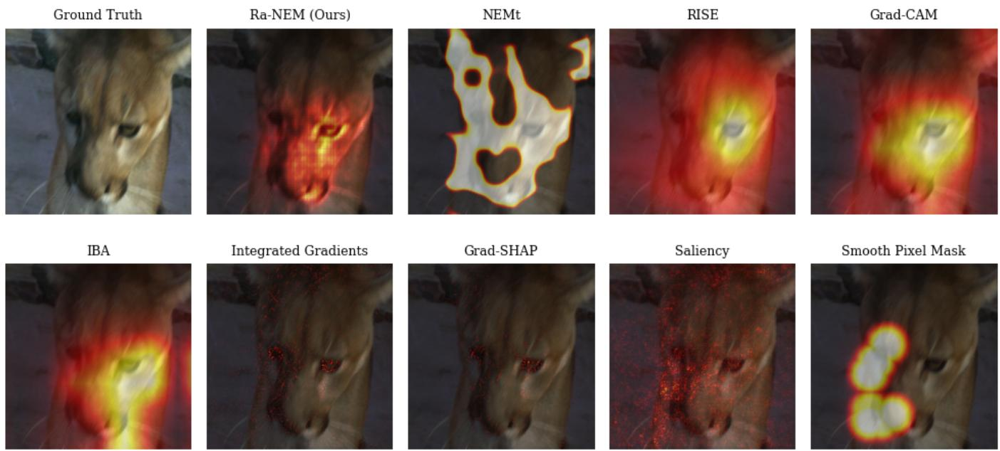  
Fig. 3. Model explanations generated by various different XAI methodologies. The explained model is a ResNet50 architecture trained on the training split of the ImageNet dataset. The example image is taken from the validation split of the ImageNet dataset. Comparing Ra-NEM with other occlusion-based methods, we observe that its finer granularity more precisely reveals specific image features. While all methods highlight the importance of the eye, Ra-NEM identifies only a small region of the eye and its outline as necessary.

## APPENDIX F

## EXAMPLE IMAGES OF POOR RA-NEM PERFOR-MANCE

In the following, we show examples where Ra-NEM performed poorly compared to other methods to understand the limitations of the method. These examples were found by selecting the images for which the faithfulness scores of Ra-NEM were the lowest compared to the average faithfulness of all other methods.

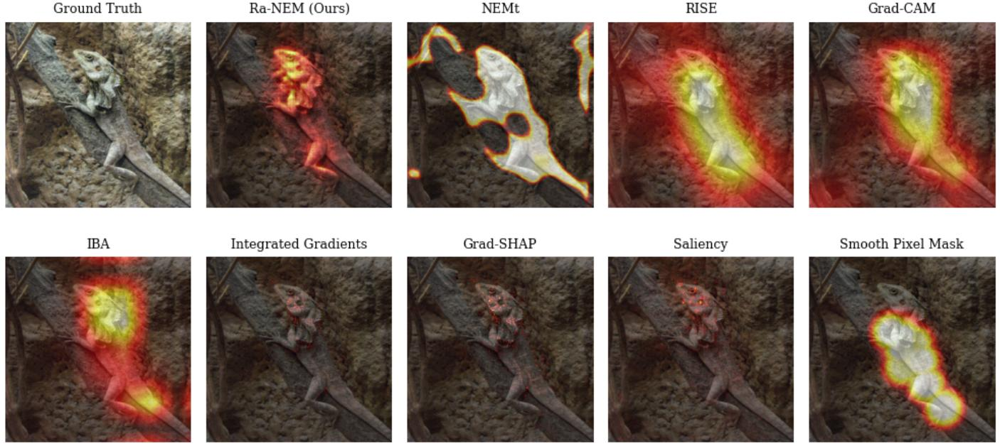  
Fig. 4. Model explanations generated by various different XAI methodologies. The explained model is a ResNet50 architecture trained on the training split of the ImageNet dataset. The example image is taken from the validation split of the ImageNet dataset.

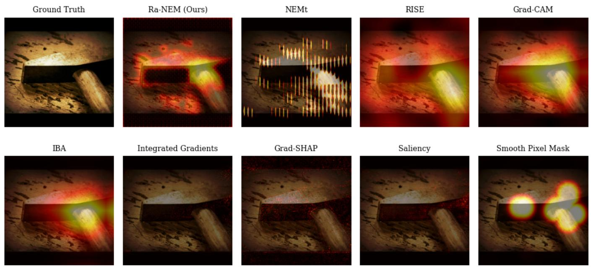  
Fig. 5. Model explanations generated by different XAI methodologies. The explained model is a ConvNeXt architecture trained on the training split of the ImageNet dataset. The example image is taken from the validation split of the ImageNet dataset. Occlusion-based methods generally agree on the area of interest, but only Ra-NEM with its high granularity can outline specific features. For example, it highlights both the shaft of the hammer and the outline of the hammerhead, which indicates that most of the hammerhead is not needed for classification.

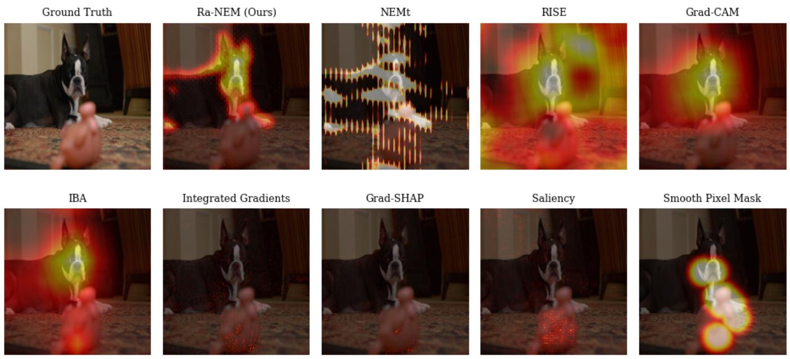  
Fig. 6. Model explanations generated by different XAI methodologies. The explained model is a ConvNeXt architecture trained on the training split of the ImageNet dataset. The example image is taken from the validation split of the ImageNet dataset. It can be seen that all occlusion-based methods agree that the face of the dog is important, but Ra-NEM also emphasizes the ears.

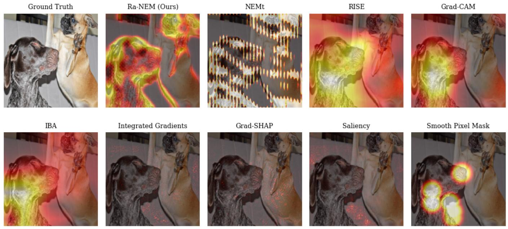  
Fig. 7. Model explanations generated by different XAI methodologies. The explained model is a ConvNeXt architecture trained on the training split of the ImageNet dataset. The example image is taken from the validation split of the ImageNet dataset. This example illustrates Ra-NEM’s ability to discover fine details and as such indicate that the outline of the dog is central to classification, whereas other methods biased toward smooth explanations need to indicate the entire animal to be important.

Ra-NEM (Ours)  
Ground Truth  
RISE  
NEMt  
Ground Truth  
Ra-NEM (Ours)  
NEMt  
RISE  
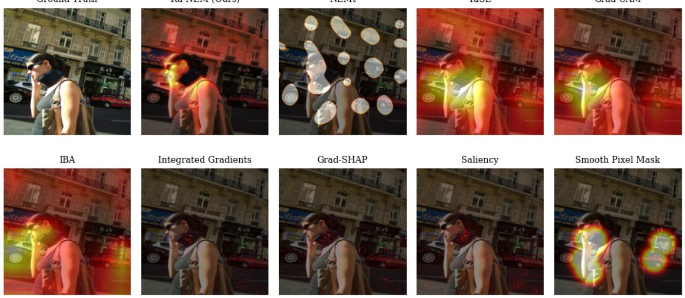  
Fig. 8. Model explanations generated by different XAI methodologies. The explained model is a VGG16 architecture trained on the training split of the ImageNet dataset. The example image is taken from the validation split of the ImageNet dataset. Notably, Ra-NEM excludes the neck brace, whereas the smoothing of the other occlusion based methods somewhat include it as an important feature. Furthermore, it can be seen that the gradient based methods all generally target the neck brace.

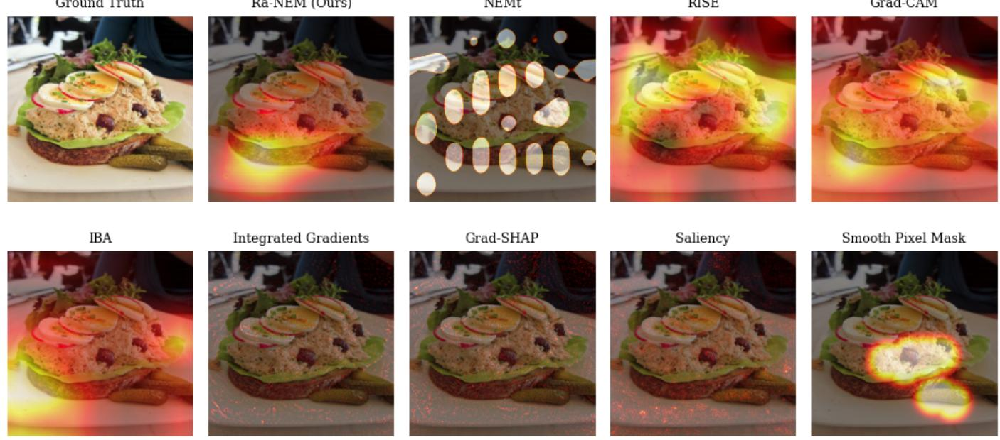  
Fig. 9. Model explanations generated by different XAI methodologies. The explained model is a VGG16 architecture trained on the training split of the ImageNet dataset. The example image is taken from the validation split of the ImageNet dataset.

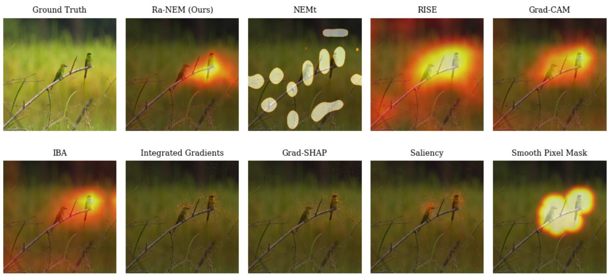  
Fig. 10. Model explanations generated by different XAI methodologies. The explained model is a VGG16 architecture trained on the training split of the ImageNet dataset. The example image is taken from the validation split of the ImageNet dataset.

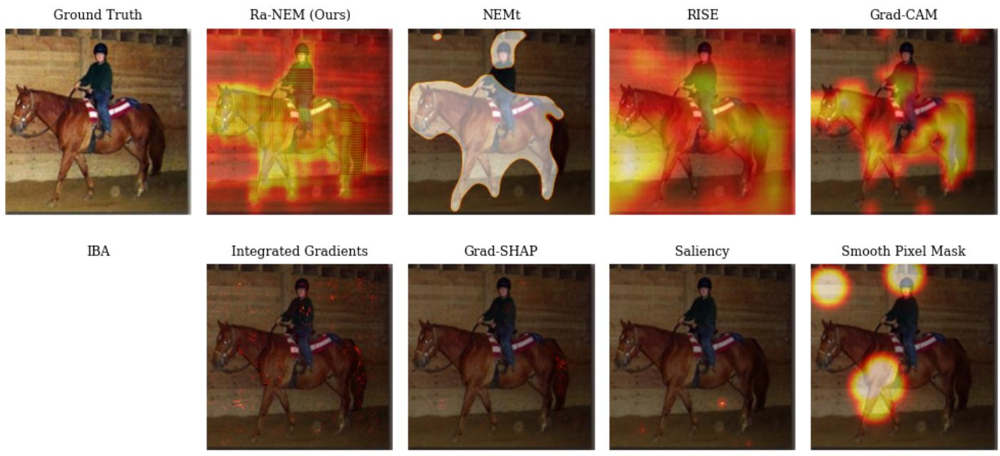  
Fig. 11. Model explanations generated by different XAI methodologies. The explained model is a ViT architecture trained on the training split of the ImageNet dataset. The example image is taken from the validation split of the ImageNet dataset. There is no adaptation of IBA for transformer-based image models, so IBA results have not been generated. This exemplary image illustrates a number of important points. We can see that the methods which leverage smoothing (Grad-CAM++ and RISE) generate attributions that are very scattered over the input, which might be due to an unfortunate combination of the smoothing and how the ViT processes an image. Given the ViT relies on attention mechanisms instead of convolutions, it could be that the architecture’s bias toward spatial cohesion is much lower and therefore enforcing a spatial bias in the attributions might have an adverse effect. Additionally, while Integrated Gradients may achieve high faithfulness, its attributions offer limited interpretability for end users. In contrast, Ra-NEM provides a balanced trade-off between interpretability and faithfulness.

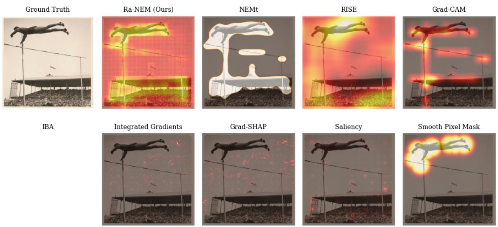  
Fig. 12. Model explanations generated by different XAI methodologies. The explained model is a ViT architecture trained on the training split of the ImageNet dataset. The example image is taken from the validation split of the ImageNet dataset. There is no adaptation of IBA for transformer-based image models, so IBA results have not been generated.

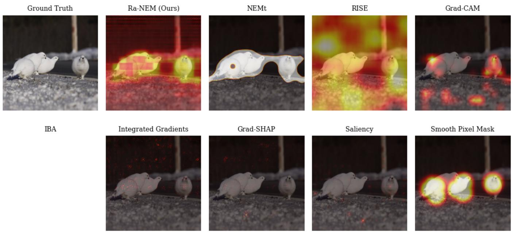  
Fig. 13. Model explanations generated by different XAI methodologies. The explained model is a ViT architecture trained on the training split of the ImageNet dataset. The example image is taken from the validation split of the ImageNet dataset. As there is no adaptation of IBA for transformer-based image models, IBA results have not been generated. This example underpins many of the points already discussed in Figure 11, a.i. the confusion of methods leveraging smoothing and the limited interpretability of Integrated Gradients, despite its higher faithfulness score. Additionally, NEMt occasionally generates very large attributions for the ViT.

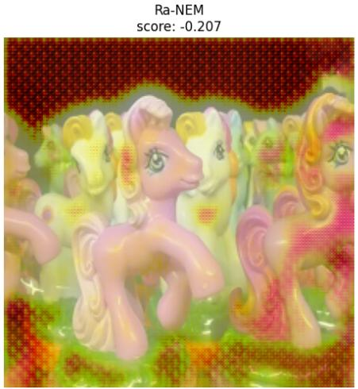

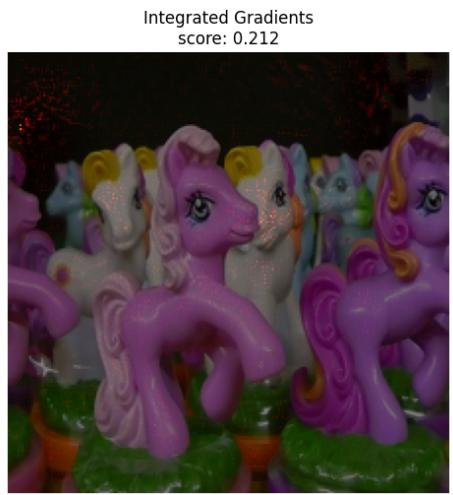

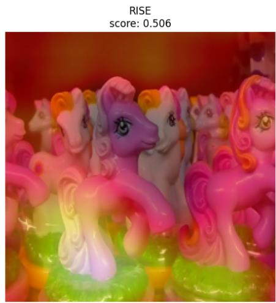

Fig. 14. Example of image from ImageNet test set, where Ra-NEM performs relatively poor compared to other methods. Score is Faithfulness. We include Integrated Gradients and RISE for comparison. The explained model is a ConVNeXt trained on the training split of the ImageNet dataset.  
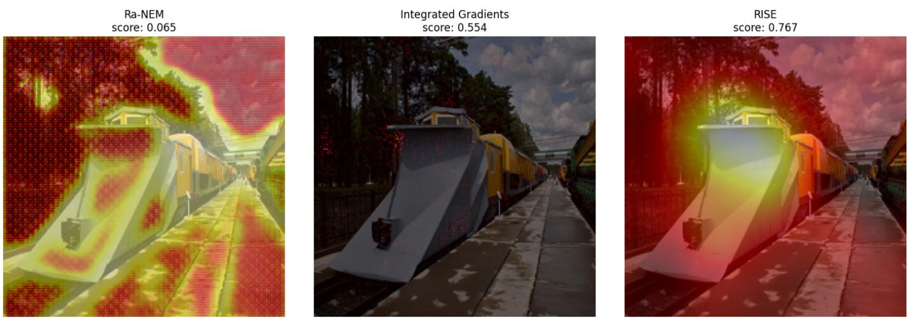

Fig. 15. Example of image from ImageNet test set, where Ra-NEM performs relatively poor compared to other methods. Score is Faithfulness. We include Integrated Gradients and RISE for comparison. The explained model is a ConVNeXt trained on the trainings split of the ImageNet dataset.  
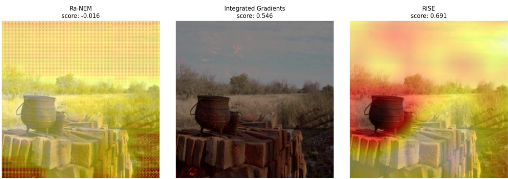  
Fig. 16. Example of image from ImageNet test set, where Ra-NEM performs relatively poor compared to other methods. Score is Faithfulness. We include Integrated Gradients and RISE for comparison. The explained model is a ViT trained on the trainings split of the ImageNet dataset. Here Ra-NEM appears to not properly distinguish between different elements in the images.

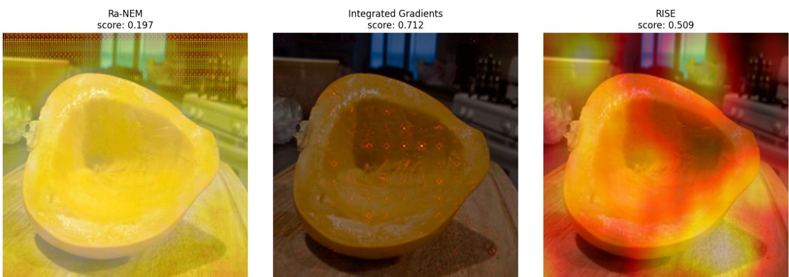  
Fig. 17. Example of image from ImageNet test set, where Ra-NEM performs relatively poor compared to other methods. Score is Faithfulness. We includeIntegrated Gradients and RISE for comparison. The explained model is a ViT trained on the trainings split of the ImageNet dataset. Here Ra-NEM again does not appear to properly distinguish between objects in the image.

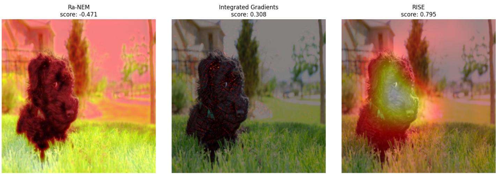  
Fig. 18. Example of image from ImageNet test set, where Ra-NEM performs relatively poor compared to other methods. Score is Faithfulness. We include Integrated Gradients and RISE for comparison. The explained model is a VGG16 trained on the trainings split of the ImageNet dataset. Here it can be seen, that Ra-NEM has switched foreground for background.

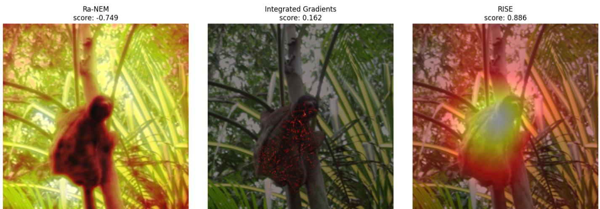  
Fig. 19. Example of image from ImageNet test set, where Ra-NEM performs relatively poor compared to other methods. Score is Faithfulness. We include Integrated Gradients and RISE for comparison. The explained model is a VGG16 trained on the trainings split of the ImageNet dataset. Here it can be seen, that Ra-NEM has again switched foreground for background.

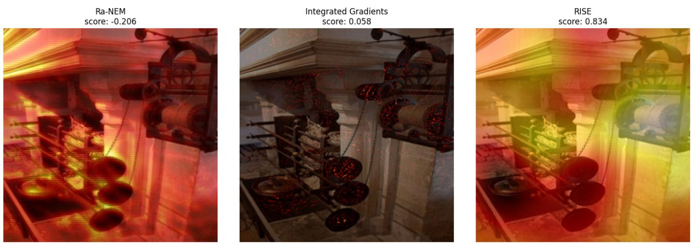  
Fig. 20. Example of image from ImageNet test set, where Ra-NEM performs relatively poor compared to other methods. Score is Faithfulness. We include Integrated Gradients and RISE for comparison. The explained model is a ResNet50 trained on the trainings split of the ImageNet dataset. Here Ra-NEM predicts that the wrong object is the most important.

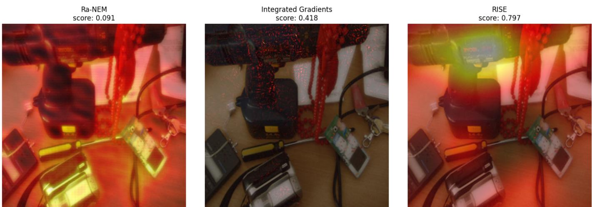  
Fig. 21. Example of image from ImageNet test set, where Ra-NEM performs relatively poor compared to other methods. Score is Faithfulness. We include Integrated Gradients and RISE for comparison. The explained model is a ResNet50 trained on the trainings split of the ImageNet dataset. Here Ra-NEM again focuses on the wrong object in the image.