# Fully Interpretable Minimal Transformers: From Geometry to Algorithm

Raneem Mahajne and Toviah Moldwin

Edmond and Lily Safra Center for Brain Sciences, The Hebrew University of Jerusalem

## Abstract

We present a framework for building and interpreting minimal transformer models. By constraining a transformer’s embedding dimension and head size to 2, we enable full two-dimensional visualization of its internal representations. Embeddings, query/key/value transforms, attention outputs, residual streams, and decision boundaries can all be seen directly. Our central claim is that the learned geometry implies an algorithm; the arrangement of points and boundaries in R<sup>2</sup> can be read as a step-by-step procedure. We train a transformer on a simple task where it must produce the most recently observed even number whenever the ‘+’ operator appears in a sequence of digits. Once trained, we visually walk through every step of the transformer’s computation. We show how the model embeds the tokens and their respective positions in the sequence, transforms them via the Q, K, and V matrices, uses the dot product between the Q and K representations to form the attention matrix, and uses the attention matrix to select values that move the representation of each input token to the region of the domain of the output layer that will correctly predict the next token. We introduce a suite of interpretability visualizations that make the algorithmic interpretation of this procedure explicit. Our framework ofers a pedagogical and experimental testbed to explore how transformers use informational geometry to implement next-token prediction.

## 1. Introduction

Understanding how transformers (Vaswani et al., 2017) process sequences remains a central challenge in mechanistic interpretability. Large-scale models achieve strong performance but their internal representations are high-dimensional and opaque: one can probe attention or activations, but a complete picture of information flow from input to output is often dificult to obtain.

We address this problem with minimal transformers, i.e. models that retain the full structure of a decoder-only transformer, but are constrained to two-dimensional embeddings and head dimension. Every internal state — embeddings, queries, keys, values, attention outputs, residual sums, and pre-softmax logit vectors — exists in R<sup>2</sup>. Dimensionality reduction techniques such as PCA, t-SNE (van der Maaten & Hinton, 2008), or UMAP (McInnes et al., 2018) are thus not required, as the information geometry learned by the model is directly visible in the 2D plane. We can take advantage of this direct visibility to demonstrate how the information geometry of the transformer can be straightforwardly interpreted as an algorithmic procedure in an illustrative task.

## 1.1 Related work

Much of the work in the mechanistic interpretability literature focuses on large language models and tries to interpret attention in terms of linguistic properties (Clark et al., 2019; Vig, 2019; Wang et al., 2022). However, such work rarely traces the full forward pass end-toend in a directly visualizable space; our contribution is a complete geometric walkthrough of a transformer model. Other work takes a more mathematical approach to deconstructing the operations performed by each part of the transformer (Elhage et al., 2021), or indirectly explores how information is represented internally in the transformer model via perturbation experiments or mathematical and model engineering techniques (Elhage et al., 2022; Bricken et al., 2023; Park et al., 2024; Li et al., 2023; Nanda, Lee, & Wattenberg, 2023; Dar et al., 2023). Recent work analyzes vision transformers through the SVD of the query-key matrix, revealing how attention behaves diferently across layers and image regions (Pan et al., 2024).

Many interpretability studies have focused on analyzing how geometric structure in embedding space emerges during training on arithmetic tasks (Nanda et al., 2023; Musat, 2024; Gromov, 2023; Zhong et al., 2023; Welch Labs, 2025; Power et al., 2022; Quirke & Barez, 2024; Liu et al., 2022; Hanna et al., 2023; Stolfo et al., 2023). A diferent approach to interpretability attempts to formalize transformer computations into human-readable languages such as RASP (Weiss et al., 2021; Friedman et al., 2023; Zhou et al., 2024; Lindner et al., 2023).

## 2. Methods

## 2.1 Task Definition

We adopt the “plus-last-even” rule, described below, as our primary task. We chose this task because it is simple enough to be learned by a small transformer model while still illustrating the core attention mechanism of history-based information retrieval.

## 2.1.1 The Plus-Last-Even Task

The task is defined over a vocabulary V of 12 tokens: the integers $\{ 0 , \ldots , 1 0 \}$ and a special operator +. Sequence generation obeys:

• Retrieval rule: If + occurs at position t, the output at t + 1 must be the most recent even integer $x _ { i } \in \{ 0 , 2 , 4 , 6 , 8 , 1 0 \}$ with $i < t$ . (If there is no earlier even number, then any token can be chosen).

• Unconstrained positions: All positions not immediately following + are unconstrained; any token in V may appear. These positions provide context that the model must process without applying the retrieval rule.

$$
\begin{array} { c c c c c c c c c c c c c c c c c c c c c c } { { 5 } } & { { 3 } } & { { 8 } } & { { 7 } } & { { + } } & { { 8 } } & { { 1 0 } } & { { 2 } } & { { 4 } } & { { + } } & { { 4 } } & { { \ldots } } & { { } } & { { } } & { { } } & { { } } & { { } } & { { } } & { { } } & { { } } & { { } } & { { } } & { { } } & { { } } & { { } } & { { } } & { { } } & { { } } & { { } } & { { } } & { { } } & { { } } & { { } } & { { } } & { { } } & { { } } & { { } } & { { } } & { { } } & { { } } & { { } } & { { } } & { { } } & { { } } & { { } } & { { } } & { { } } & { { } } & { { } } & { { } } & { { } } & { { } } & { { } } & { { } { } } & { { } } & { { } { } } & { { } } & { { } { } } & { { } { } } & { { } } & { { } { } } & { { } { } } & { { } { } } & { { } { } } & { { } { } } & { { } { } } & { { } { } } & { { } { } } & { { } { } } & { { } { } } & { { } { } } & { { } { } } & { { } { } } & { { } { } } & { { } { } } & { { } { } } & { { } { } } & { { } { } } & { { } { } } & { { } { } } & { { } { } } & { { } { } } & { { } { } } & { { } { } } & { { } { } } & { { } { } } & { { } { } } & { { } { } } & { { } { } } & { { } { } } &  { } { } & { } { } & { { } } & { { } } & { { } { } } &  \end{array}
$$

$$
\mathrm { 1 a s t ~ \ e v e n ~ = ~ 8 ~ \qquad } \mathrm { 1 a s t ~ \ e v e n ~ = ~ 4 }
$$

Positions not immediately following + are unconstrained — any token may appear. The rule constrains only a fraction of positions; the remainder serve as context. The model must learn to (1) identify when the current position follows the + token, (2) scan backward

through the context to locate the most recent even number, and (3) output that number with high probability. This is a non-trivial attention task: it requires routing information from a variable, content-dependent past position to the present.

## 2.2 Model Architecture

The model is a single-layer, single-head, decoder-only causal transformer — the minimal instance of the GPT-style architecture of Radford et al. (2018), using scaled dot-product self-attention as in Vaswani et al. (2017). The model processes tokens autoregressively: at each position it conditions on the preceding tokens within a fixed context window of $T = 8$ and produces a distribution over the next token. The single transformer block contains one causal self-attention head and a feedforward network (a two-layer MLP applied independently to each position), with a residual connection from the block input to the output of the self-attention sub-layer and a residual connection from the self-attention output to the output of the feedforward sub-layer, followed by a linear language-model head that maps the final hidden state to vocabulary logits (Figure 1). Table 1 lists all hyperparameters.

Table 1: Model hyperparameters.
<table><tr><td>Parameter</td><td>Value</td></tr><tr><td>Nembed</td><td>2</td></tr><tr><td>Block size (T)</td><td>8</td></tr><tr><td>Number of heads</td><td>1</td></tr><tr><td>Head size  $( d _ { k } )$ </td><td>2</td></tr><tr><td>Vocabulary size (V)</td><td>12 (integers 0–10, operator +)</td></tr><tr><td>Feed-forward hidden size</td><td> $1 6 \times n _ { \mathrm { e m b e d } } = 3 2$ </td></tr></table>

Token embedding: $\boldsymbol { X } \in \mathbb { R } ^ { V \times 2 }$ . At position i, the token has id $t _ { i } ;$ we denote its token embedding (the row of X for that token) by $\mathbf { x } _ { i } \in \mathbb { R } ^ { 2 }$

Positional embedding: $P \in \mathbb { R } ^ { T \times 2 }$ ; the embedding of position i is $\mathbf { p } _ { i } \in \mathbb { R } ^ { 2 }$

The combined embedding (input to attention) at position i is

$$
\mathbf { e } _ { i } = \mathbf { x } _ { i } + \mathbf { p } _ { i } .
$$

Self-attention. Let $\mathbf { E } \in \mathbb { R } ^ { T \times n _ { \mathrm { e m b e d } } }$ stack the combined embeddings with row i equal to ${ \mathbf e } _ { i } ^ { \top }$ . Learned projections $W _ { Q } , W _ { K } , W _ { V } \in \mathbb { R } ^ { d _ { k } }$ <sup>×n</sup>embed map each position into head space (here $d _ { k } = n _ { \mathrm { e m b e d } } = 2 )$ . Per position, query, key, and value column vectors are $\mathbf { q } _ { i } = W _ { Q } \mathbf { e } _ { i }$ $\mathbf { k } _ { i } = W _ { K } \mathbf { e } _ { i }$ , and $\mathbf { v } _ { i } = W _ { V } \mathbf { e } _ { i }$ in $\mathbb { R } ^ { d _ { k } }$ . Stacking them as rows gives

$$
\mathbf { Q } = \mathbf { E } W _ { Q } ^ { \top } , \quad \mathbf { K } = \mathbf { E } W _ { K } ^ { \top } , \quad \mathbf { V } = \mathbf { E } W _ { V } ^ { \top } ,
$$

each in $\mathbb { R } ^ { T \times d _ { k } }$ (sequence length × head size): row i of Q, K, and V is ${ \bf q } _ { i } ^ { \top } , { \bf k } _ { i } ^ { \top }$ , and $\mathbf { v } _ { i } ^ { \top }$ , respectively.

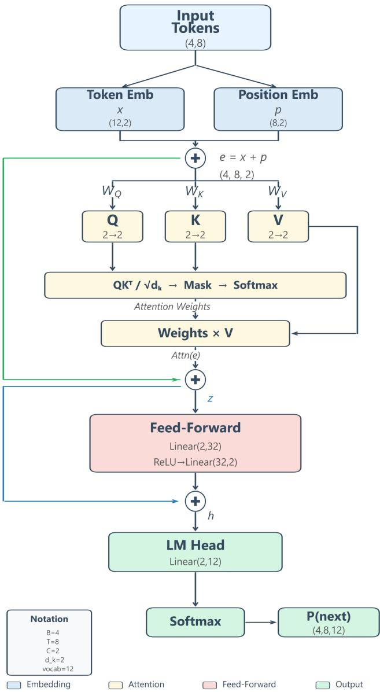  
Figure 1. Architecture of the minimal transformer. Every component operates entirely in $\mathbb { R } ^ { 2 }$

The attention matrix $A \in \mathbb { R } ^ { T \times T }$ is calculated as a row-wise causal softmax of $\mathbf { Q K } ^ { \top } / \sqrt { d _ { k } }$ for each $i , ( A _ { i 1 } , \dots , A _ { i i } ) = \mathrm { s o f t m a x } \big ( ( \mathbf { q } _ { i } ^ { \top } \mathbf { k } _ { 1 } / \sqrt { d _ { k } } , \dots , \mathbf { q } _ { i } ^ { \top } \mathbf { k } _ { i } / \sqrt { d _ { k } } ) \big )$ and $A _ { i j } = 0$ for $j > i$ . We denote row i of A by $\alpha _ { i }$ , and its entries satisfy $\alpha _ { i j } = A _ { i j }$ , where $\alpha _ { i j }$ is the attention weight from position i to position $j$

The attention output at position i, denoted $\mathrm { A t t n } ( \mathbf { e } ) _ { i } \in \mathbb { R } ^ { d _ { k } }$ , combines value rows with A. The product $A \mathbf { V } \in \mathbb { R } ^ { T \times d _ { k } }$ stacks outputs as rows: with $\alpha _ { i }$ the i-th row of A,

$$
\mathrm { A t t n } ( \mathbf { e } ) _ { i } ^ { \top } = ( A \mathbf { V } ) _ { i , : } = \alpha _ { i } \mathbf { V } .
$$

Equivalently, with $\alpha _ { i j } = A _ { i j }$ 2

$$
\mathrm { A t t n } ( \mathbf { e } ) _ { i } = \sum _ { j = 1 } ^ { i } \alpha _ { i j } \mathbf { v } _ { j } .
$$

Thus $\mathrm { A t t n } ( \mathbf { e } ) _ { i }$ is the “message” delivered to position i by the attention mechanism.

First residual. The representation passed to the feedforward block is the sum of the combined embedding and the attention output. We denote this first-residual state by $\mathbf { z } _ { i } \mathbf { : }$

$$
\mathbf { z } _ { i } = \mathbf { e } _ { i } + { \mathrm { A t t n } } ( \mathbf { e } ) _ { i } .
$$

So $\mathbf { z } _ { i }$ is the quantity that is passed into the feedforward network. (Note that the feedforward network itself can be interpreted as a key-value operation over its inputs; see Geva et al., 2021, 2022).

Second residual. The feedforward network (FFN) is applied to ${ \bf z } _ { i } ,$ , and its output is added back to $\mathbf { z } _ { i }$ (the second residual connection). The resulting hidden state passed to the LM head is

$$
\begin{array} { r } { \mathbf { h } _ { i } = \mathbf { z } _ { i } + \mathrm { F F N } ( \mathbf { z } _ { i } ) . } \end{array}
$$

LM head. The LM head produces the next-token distribution from the hidden state $\mathbf { h } _ { i } \colon$

$$
P ( t _ { i + 1 } \mid \mathbf { h } _ { i } ) = \mathrm { s o f t m a x } \left( \mathbf { h } _ { i } W _ { \mathrm { l m } } ^ { \top } + \mathbf { b } \right) ,
$$

where $W _ { \mathrm { l m } } \in \mathbb { R } ^ { V \times 2 }$ and $\mathbf { b } \in \mathbb { R } ^ { V }$

The forward pass can be summarized as:

$$
\begin{array} { c } { \mathbf { e } _ { i } = \mathbf { x } _ { i } + \mathbf { p } _ { i } , } \\ { \mathbf { z } _ { i } = \mathbf { e } _ { i } + \mathrm { A t t n } ( \mathbf { e } ) _ { i } , } \\ { \mathbf { h } _ { i } = \mathbf { z } _ { i } + \mathrm { F F N } ( \mathbf { z } _ { i } ) , } \\ { P ( t _ { i + 1 } \mid \mathbf { h } _ { i } ) = \mathrm { s o f t m a x } \left( \mathbf { h } _ { i } W _ { \mathrm { l m } } ^ { \top } + \mathbf { b } \right) . } \end{array}
$$

## 2.3 Training

Training data consists of 2,000 sequences of length 20–50, generated by the plus-last-even rule. At each position, the next token is drawn as follows. With probability 0.3 the token is +; with probability 0.7 it is a digit chosen uniformly from $\{ 0 , \ldots , 1 0 \}$ . The one exception is the position immediately after +: there the next token is fixed to the most recent even number in the prefix (the rule target). Thus in the training distribution, + has marginal probability 0.3, each digit has marginal probability $0 . 7 / 1 1 \approx 0 . 0 6 4$ , and every position following + is a constrained label.

The model is optimized with AdamW $( \beta _ { 1 } = 0 . 9 , \beta _ { 2 } = 0 . 9 9 9$ , weight decay 10<sup>−2</sup>, PyTorch defaults) using standard next-token cross-entropy loss. Table 2 lists all training hyperparameters. Checkpoints are saved every 100 steps (200 total), enabling the construction of training-evolution animations. In our setup, a full run of 20,000 steps took on the order of 10–15 minutes on a laptop CPU (no GPU).

Table 2: Training hyperparameters.
<table><tr><td>Parameter</td><td>Value</td></tr><tr><td>Optimizer</td><td>AdamW</td></tr><tr><td>Learning rate</td><td>10-3</td></tr><tr><td>Batch size</td><td>8</td></tr><tr><td>Training steps</td><td>20,000</td></tr><tr><td>Evaluation interval</td><td>every 200 steps</td></tr><tr><td>Evaluation iterations</td><td>50 batches</td></tr><tr><td>Checkpoint interval</td><td>every 100 steps</td></tr></table>

## 3. Results

## 3.1 The Model Learns the Rule

We first verify that training succeeds by examining the training data, the model’s own generations, and the learning curve. Figure 2 displays four sample training sequences as heatmaps. At each position we show whether the next-token label is correct (green), wrong (red), or unconstrained (gray). A position is constrained if it immediately follows + (the rule then requires the next token to be the most recent even number); unconstrained positions may have any next token. All constrained positions in the training data are green, verifying the data generator.

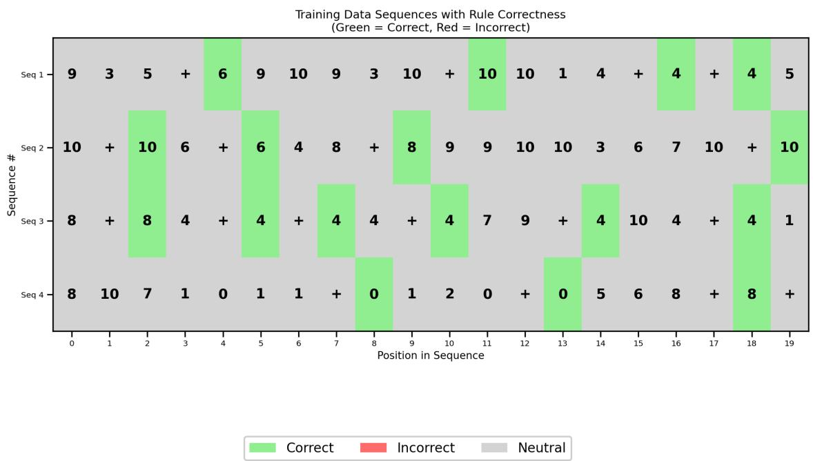  
Figure 2. Sample training sequences as heatmaps. Green: constrained position (immediately after +) with the correct next token (the most recent even number). Gray: unconstrained position (any token is valid).

Figure 3 shows the training dynamics over 20,000 steps. Cross-entropy loss drops steeply in the first \~2,000 steps, then continues to decrease more gradually. Rule error is the fraction of constrained positions (those immediately following +) where the model’s top prediction is wrong; it drops from \~90% (chance for a 12-token vocabulary) to near 0%, indicating that the model has learned the rule. Rule error on held-out batches is our primary quantitative performance metric (Figure 3).

Learning Curve: Loss and Rule Error During Training  
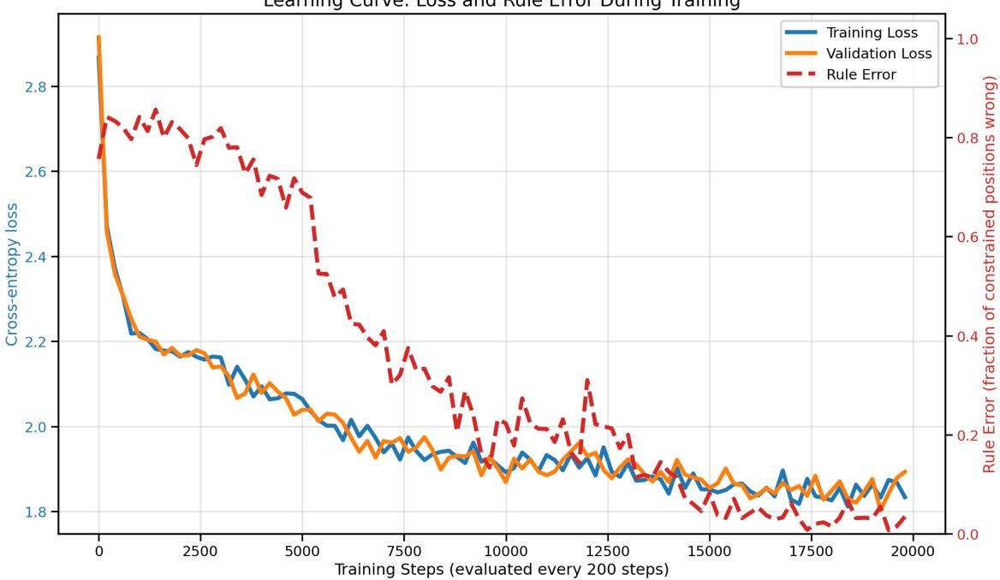  
Figure 3. Training dynamics over 20,000 steps. Left axis: cross-entropy loss. Right axis: rule error — the fraction of constrained positions (tokens immediately following +) where the model’s top predicted token is not the target (the most recent even number). Rule error near 90% is chance level; near 0% indicates the rule is learned.

Figure 4 compares sequences generated by the model before and after training. The same color convention applies: at initialization (step 0), predictions at constrained positions are essentially random — most cells are red. After training, nearly all constrained positions are green: the model reliably outputs the most recent even number after every +. We now proceed to show how the model implements the “plus-last-even” rule.

## 3.2 The Embedding Space: How the Model Encodes Its Vocabulary

The first stage of the transformer maps each input token and position to a 2D vector. Figure 5 reveals that the learned embedding layer has already done significant organizational work before attention is applied. In the token embedding scatter plot (Figure 5a), the six even numbers (0, 2, 4, 6, 8, 10) sit in a spaced formation at the top of the plane, the five odd numbers (1, 3, 5, 7, 9) bunch together in the center of the plane, and the + operator sits far from both groups as an isolated outlier. The model has discovered that the categories relevant to the rule — even numbers, odd numbers, and the operator — should occupy geometrically distinct regions. Moreover, the ‘personal space’ given to the even-digit tokens, as opposed to the bunched formation of the odd tokens, indicates that the distinct identity of the even tokens is more important for solving this task.

(a)  
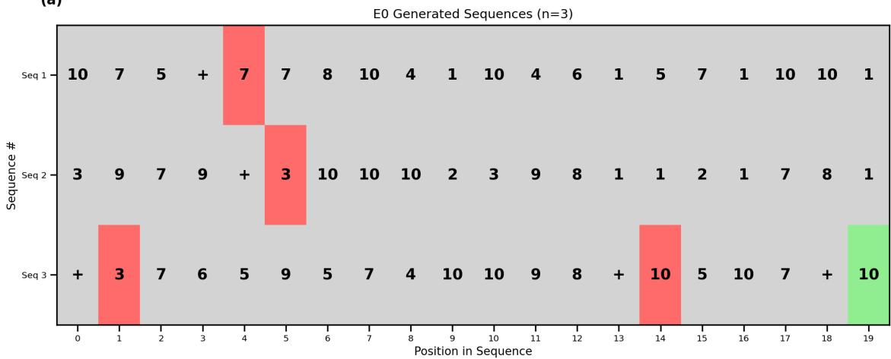  
(b)

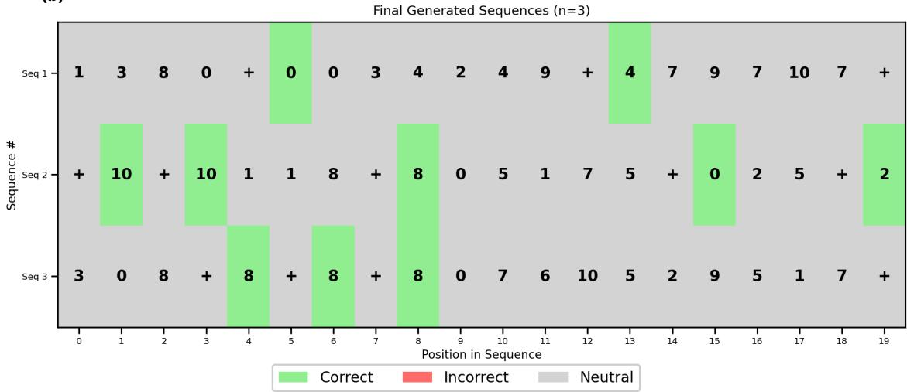  
Figure 4. Model-generated sequences at initialization (top) vs. after training (bottom). Green = correct at constrained positions (after +), red = wrong at constrained positions, gray = unconstrained. Top: at step 0, constrained positions are mostly red (random predictions). Bottom: after training, constrained positions are mostly green (correct “last even” outputs).

The position embeddings (Figure 5b) form a ladder structure, with $\mathbf { p } _ { 0 }$ at the bottom, p<sub>7</sub> at the top, and the other positions arranged in ascending order in between. This orderly arrangement allows the model to encode how far back a token is, which is essential for identifying the most recent even number. When token and position embeddings are summed (Figure 5e), each token fans out into eight copies — one per position — shifted vertically by the position embedding. Because the range of values of the position embeddings is smaller than the range of the token embeddings, the ‘macro’-level geometry of the summed token+position embeddings retains the odd/even/+ organization of the token embeddings, while the ‘micro’-level geometry preserves the ladder structure of the position embeddings.

We emphasize that this geometric structure does not exist at initialization; it is learned. Movie 1 shows the embedding space at every checkpoint across training. At step 0, all points are randomly scattered. Within the first few thousand steps, the + token rapidly migrates away from the number tokens. The even/odd split solidifies between steps 5,000 and 10,000, and the position embedding ladder organizes gradually throughout training.

Token+Position: Raw (all tokens)  
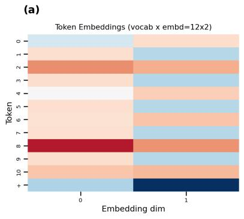

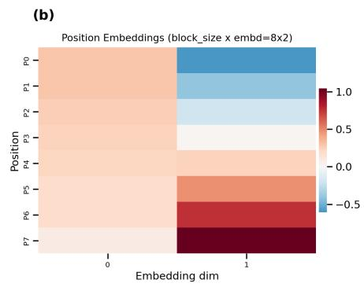

(c)  
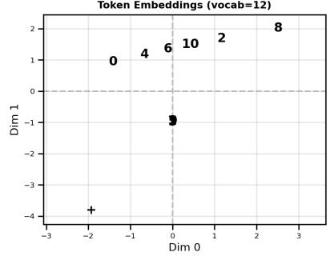  
(e)

(d)  
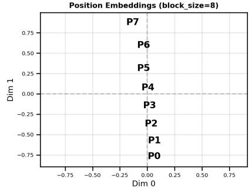

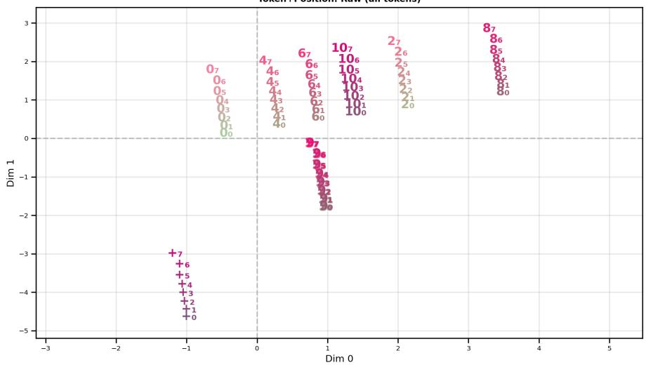  
Figure 5. Learned embeddings. (a) Token embeddings $\mathbf { x } _ { i }$ shown as heatmap. (b) Position embeddings $\mathbf { p } _ { i }$ shown as heatmap. (c) Combined token+position embeddings shown as scatterplot. (d) Positions $\mathbf { p } _ { i }$ shown as scatterplot. (e) Token+position embeddings $\mathbf { e } _ { i }$ shown as scatterplot. Positions are indicated as subscripts next to each token $\mathrm { e . g . \ t _ { 5 } }$ is the + token at position 5.

## 3.3 The Attention Mechanism: Query, Key, and Value Projections

The combined embeddings $\mathbf { e } _ { i }$ alone are not suficient for the model to obey the plus-last-even rule, due to the rule’s conditional structure. The + tokens need to “search back” for the most recent even number to generate the correct answer; simply knowing the token value and its position is not enough to predict the next token. This retrieval process is what motivates the use of the attention mechanism (Vaswani et al., 2017).

To illustrate how the attention mechanism works, consider what happens when the model encounters a + token and needs to retrieve the most recent even number. Each combined embedding $\mathbf { e } _ { i }$ is linearly transformed into three vectors: a query (q), a key (k), and a value (v). For example, when processing $+ _ { 7 }$ (the + token at position $^ { 7 ) }$ , the query vector represents the “search request” asking, “Where is the relevant even number?” Every other position in the sequence, including those with even numbers, supplies its own key and value vectors. The model computes the attention weights for the + token by taking the dot product between its query (q) and every other token’s key (k). This produces a score indicating how strongly the + should attend to each past token—ideally, giving the highest score to the key corresponding to the most recent even number. The value vectors (v) determine what information can actually be retrieved—so the value for the most recent even number carries semantic information about that number, which is then used to generate the correct output after +. In summary: the query and key vectors let the + “look back” specifically for even numbers (and, thanks to position embeddings, for the most recent one), while the value vectors help the model determine exactly which even number should be output.

The model applies three learned linear maps $W _ { Q } , W _ { K } , W _ { V } \in \mathbb { R } ^ { d _ { k } \times n _ { \mathrm { e m b e d } } } \left( \mathrm { h e r e } n _ { \mathrm { e m b e d } } , d _ { k } = 2 \right)$ to every combined embedding $\mathbf { e } _ { i } .$ , producing query, key, and value column vectors in $\mathbb { R } ^ { d _ { k } }$ for a sequence of tokens of length T these form $\mathbf { Q } , \mathbf { K } , \mathbf { V } \in \mathbb { R } ^ { T \times d _ { k } }$ . Figure 6 shows these transformations and their efect. Panel (a) displays the original combined token+position embeddings (all 96 points in embedding space). Panels (b), (c), and (d) show the same points after projection into query space (blue), key space (red), and value space (green).

## 3.4 Who Attends to Whom: The Query–Key Geometry

When the model encounters a +, how does it know to look back and find the most recent even number? The answer lies in the geometry of the query–key space. Figure 7 plots all 96 query vectors (blue) and all 96 key vectors (red) on common axes, so we can directly read of the attention pattern from the spatial relationships.

Figure 7 (Top) makes this geometry visible. The + queries form a tight single-file group well-separated from all digit queries. Even-number keys are concentrated in the region closest to that + cluster, while odd-number keys lie in a distinctly diferent region, far from it. This spatial arrangement is the geometric encoding of the rule’s core requirement that the + token should attend to even numbers and ignore odd numbers.

But the rule demands more than just “attend to even numbers”. It requires attending to the most recent one. This is encoded in the positional spread of each token’s keys. For any given even number, keys at later positions (closer to the query) are arranged so that they are closer to the + queries than keys at earlier positions.

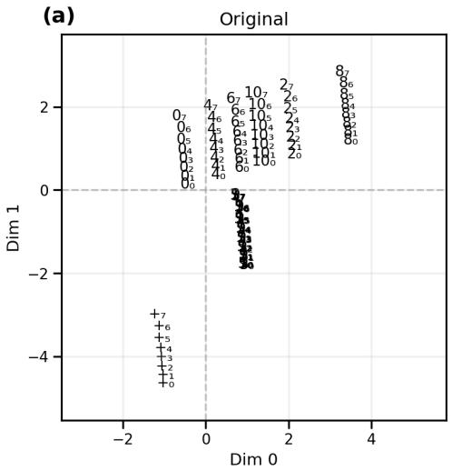

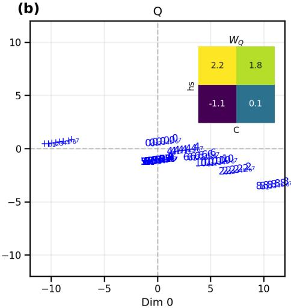

(c)  
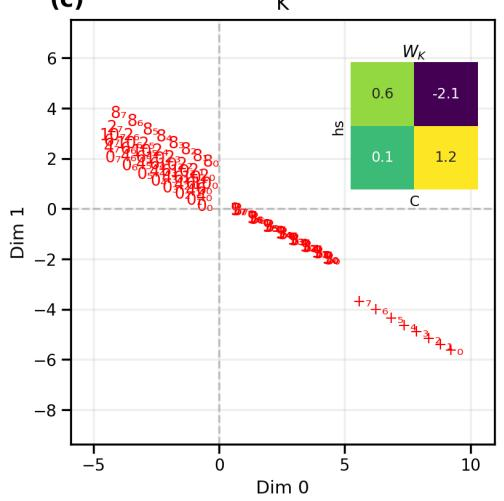  
K

(d)  
V  
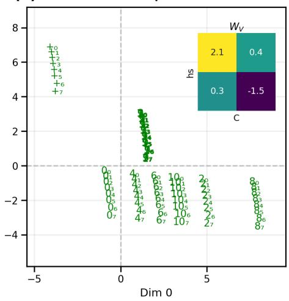  
Figure 6. QKV projections. (a) Original combined token+position embeddings (as in Figure 5e). (b) Query-space (blue), with $W _ { Q }$ inset. (c) Key-space (red), with $W _ { K }$ inset. (d) Value-space (green), with $W _ { V }$ inset. All 96 token+position points in each panel.

If we focus on a single query $+ _ { 5 }$ (+ at position 5), we can see the dot product (green background) between that query and a key at any point in space (Figure 7 Bottom). In principle, the dot product is highest with even numbers at position 7, however, because of the causal masking, queries are only allowed to look at keys that come before it in the sequence, so we have grayed out all keys at position $\geq 5$ (keys at position 5 are also grayed out because if there’s a plus in position 5, no other token could be in position 5). The + query thus acts as a selective filter that picks out even-number keys from the past context, with recency biasing the selection toward the most recent one. Movie 4 reveals how this structure develops over the course of training.

Because Figure 8 is not tied to a specific input sequence, it is not possible to produce a true attention matrix, which would require having only a single token in each position. However, we can calculate the raw query–key scores $Q K ^ { T }$ , i.e. the dot product between every possible query vector and every possible key vector. To focus on the rule-relevant structure, Figure 8 shows only the blocks where the query token is +. Each subplot is an $8 \times 8$ grid: rows index the position of the + query, and columns index the position of the key for the indicated key token. Even-number key blocks score consistently higher than odd-number key blocks, showing that + queries score even keys more strongly across positions. (The full all-query $Q K ^ { T }$ matrix is included in the Supplementary Figures). Moreover, tokens at later positions receive higher dot product scores than tokens at earlier positions. This confirms the observation from Figure 7 that the geometry of the key/query space allows the + tokens to attend to most recent even tokens.

Q and K Embedding Space 96 0 (blue) and 96 K (red)  
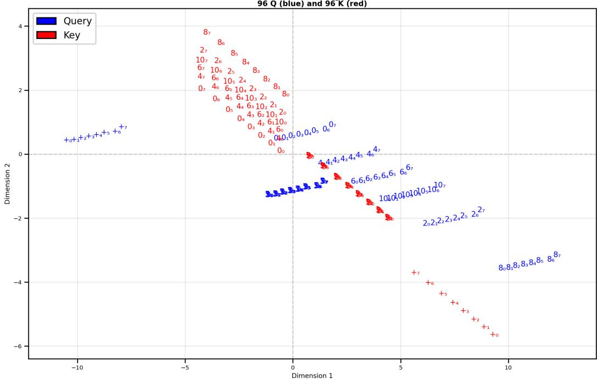

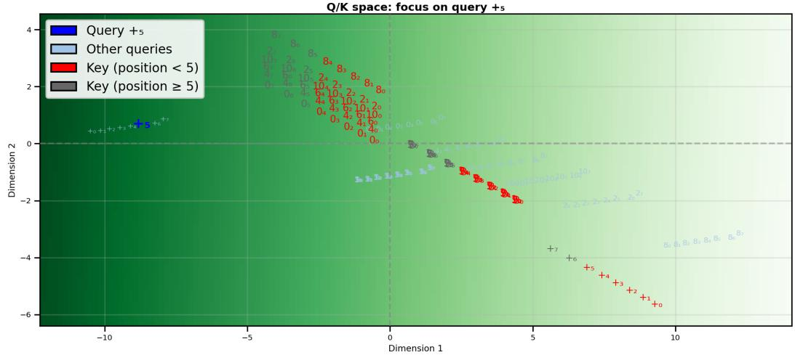  
Figure 7. Query–key geometry in $\mathrm { Q / K }$ space. Top: joint query–key space (blue: queries; red: keys; labels show token and position). Bottom: Focus on the query $+ _ { 5 }$ (blue); background color indicates the dot product of the $+ _ { 5 }$ query with every point in space. Keys with position $\geq 5$ are grayed due to the causal mask.

Query Token '+'Attention to All Key Tokens (Each subplot is an 8×8 attention matrix: Query '+' positions (rows) vs Key positions (columns))

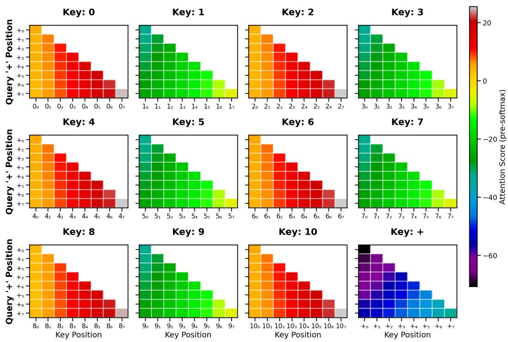  
Figure 8. Pre-softmax query–key scores $Q K ^ { \top }$ , restricted to + queries. Each subplot shows an 8×8 matrix of dot products: + query positions (rows) vs. key positions (columns) for a particular key token.

## 3.5 The Output Landscape: Where Representations Need to Land

Before examining the value transformation, we first characterize the output network through which all information must ultimately pass. This will help us better appreciate the purpose of the values.

The output network (FFN, second residual, and LM head, as defined in §2.2) maps a point $\mathbf { z } _ { i } \in \mathbb { R } ^ { 2 }$ to a probability distribution over the vocabulary to generate the next token. Geometrically, this means that for each possible next token (the digits from 0 to 10 and the + operator), the 2D plane is partitioned into regions with diferent probabilities for predicting that token. (Because of the softmax, the probabilities across all tokens for a particular point in the 2D plane must sum to 1.) Figure 9 makes this partition explicit: each subplot shows the model’s probability for a specific output token across the plane.

The output landscape and the embedding positions co-evolve during training (Movie 2). At initialization, the probability landscape is nearly uniform — no decision boundaries exist. As the model first learns token frequencies, broad regions form. These sharpen progressively into the final configuration where each even number has a well-defined, non-overlapping high-probability region.

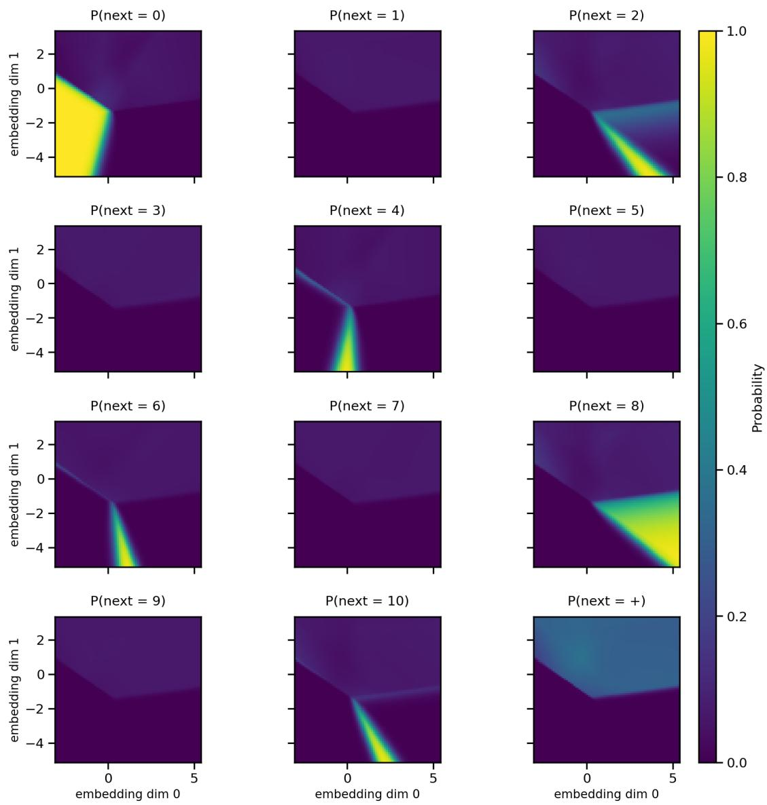  
Figure 9. Output probability landscape (per-unit view). Each subplot shows the softmax probability P(next = token) over the 2D plane for one output token (digits 0–10 and the + operator).

Figure 10 provides a compact summary of the landscape shown in Figure 9. Panel (a) shows the entropy of the output distribution: the upper half-plane has high entropy (many tokens are plausible), while the lower zones have near-zero entropy (a single even number dominates). Panel (b) shows the argmax prediction map: at every point in the plane, the color indicates which token the output network would predict most strongly.

Panels (a) and (b) together reveal a clear functional decomposition of the plane:

1. Indiference region (upper half-plane). No single digit is strongly favored. The + operator unit shows the highest probability here, reflecting the training distribution: + appears with probability 0.3 and can follow any digit, so the model assigns it a high baseline in this unspecialized zone.

2. Strong specific-prediction region (lower half-plane). This area is subdivided into distinct target zones, one for each even integer. In each zone, one even-number unit fires strongly while all others are nearly zero. This region is efectively reserved for the final retrieval of the correct even digit after $\mathrm { a + s i g n }$

Now that we understand how the output network maps a point $\mathbf { z } _ { i }$ to a token prediction, we now consider the individual components of $\mathbf { z } _ { i }$ . Recall that $\mathbf { z } _ { i } = \mathbf { e } _ { i } + { \mathrm { A t t n } } ( \mathbf { e } ) _ { i }$ where $\begin{array} { r } { \mathrm { A t t n } ( \mathbf { e } ) _ { i } = \sum _ { j = 1 } ^ { i } \alpha _ { i j } \mathbf { v } _ { j } } \end{array}$ . In other words, $\mathbf { z } _ { i }$ can be thought of as being the sum of two constituent components, the embedding $\mathbf { e } _ { i } ,$ which is passed via the residual stream, and an attention-weighted sum of values $\mathbf { v } _ { j }$ . It can thus be instructive to see how each of these components, i.e. the embeddings $\mathbf { e } _ { i }$ and the values $\mathbf { v } _ { j }$ , are situated in the plane representing the network’s output.

Panels (c) and (d) of Figure 10 overlay the embeddings $\mathbf { e } _ { i }$ and the values $\mathbf { v } _ { j }$ , respectively, on the argmax map (panel b) to reveal where they sit relative to the output network’s decision regions. In panel (c), the 96 combined embeddings $\mathbf { e } _ { i }$ (12 tokens $\times \ 8$ positions) are plotted. The digit embeddings generally fall in the high-entropy indiference region in the upper half-plane (visible in panel a), where no specific retrieval is triggered. In contrast, all + embeddings land in the lower half-plane — inside the strong prediction region — which provides a geometric head start for the algorithm: the model has already categorized + as requiring an even-number output based on token identity and position alone. However, because the embeddings lack the context of the rest of the string, it can identify the $\mathrm { ^ { 6 6 } t y p e ^ { 9 } }$ of output needed $( { \mathrm { e v e n } } / { \mathrm { o d d } } / + )$ but cannot resolve the specific value. This defines the attention layer’s objective: it must look back to find the most recent even number and produce a value vector that, when added to the residual stream, nudges the representation into the correct even-number target zone.

Panel (d) shows the value-transformed vectors $\mathbf { v } _ { j } = W _ { V } \mathbf { e } _ { j }$ for all 96 combined token+position embeddings, overlaid on the same argmax map. We observe that the ordering of the value vectors on the plane in Figure 10d is the same ordering as the even-digit prediction zones in Figure 10b. This overlay reads $\mathbf { v } _ { j }$ against a landscape whose native input is $\mathbf { z } _ { i } ,$ a technique similar in spirit to the “logit lens” used to probe intermediate layers in large language models (nostalgebraist, 2020; Geva et al., 2021, 2022; Belrose et al., 2023). This illustrates that the purpose of the value vectors is to nudge the embeddings towards a particular zone in order to produce the correct output. However, which value specifically will be chosen depends on the attention matrix which requires a specific sequence. (Per-unit heatmaps with embedding and value overlays are included in the Supplementary Figures.)

## 3.6 Tracing a Sequence Through the Pipeline

The preceding analysis characterized the model’s learned parameters in the abstract — all 96 possible token+position combinations. We now ground this analysis by tracing a single concrete sequence, $\begin{array} { r } { \mathrm { ~ 4 ~ ~ 1 ~ + ~ 4 ~ 6 ~ 9 ~ 5 ~ + ~ } } \end{array}$ , through the complete inference pipeline and verifying that each step works as expected. This sequence ends in a + to illustrate next token prediction. The model’s output for the next token in the sequence should be a 6. Embedding. The embeddings for this sequence are a subset of the total set of token+position embeddings, as there can only be one token in each position. Thus, this sequence uses only 8 out of the 96 total possible token+position combinations. In Figure 11, we show the tokens for this sequence against a backdrop of all 96 possible token+position combinations as shown in Figure 5. As we showed earlier, the even, odd and + token embeddings are separated from each other in the embedding space, and the position of each token in the sequence determines where it appears in the “ladder” structure for that token.

(a)  
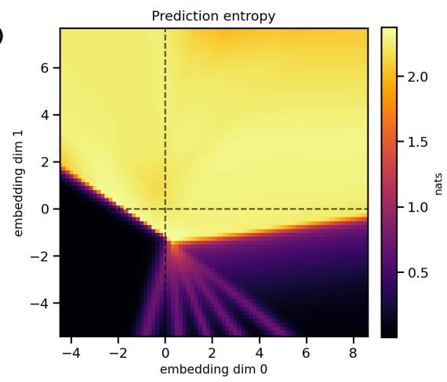

(b)  
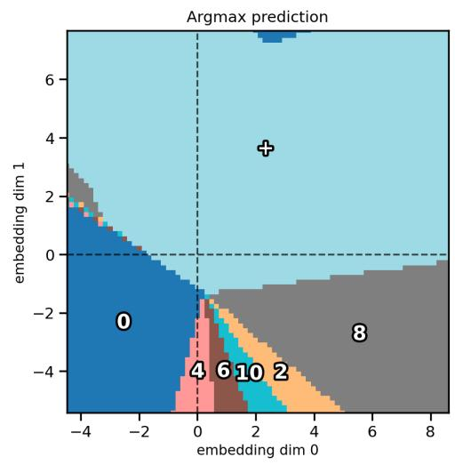

(c)  
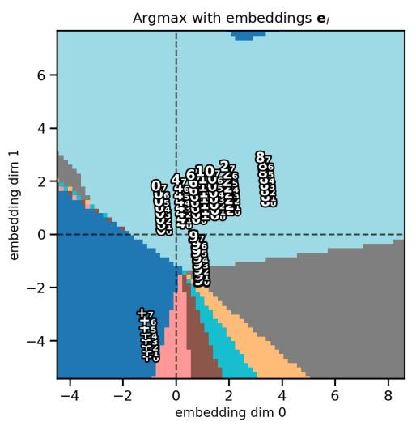

(d)  
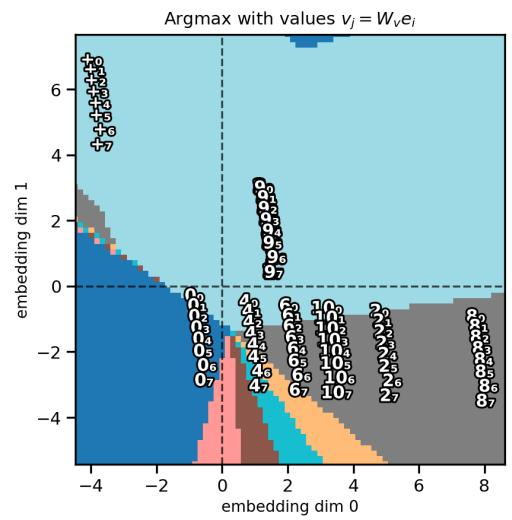

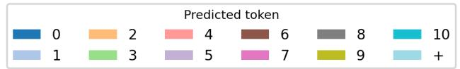  
Figure 10. Output landscape summary (summary of Figure 9). (a) Entropy of the output distribution (nats); high in the indiference region (top half), near zero in even-number target zones (bottom half). (b) Argmax prediction map: color and annotation indicate which token has the highest predicted probability at each point. (c) Argmax map with combined embeddings $\mathbf { e } _ { i }$ overlaid. (d) Argmax map with value-transformed vectors $\mathbf { v } _ { j }$ overlaid.

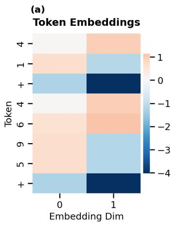  
Sequence Embeddings: 4 1 + 4 6 9 5 +

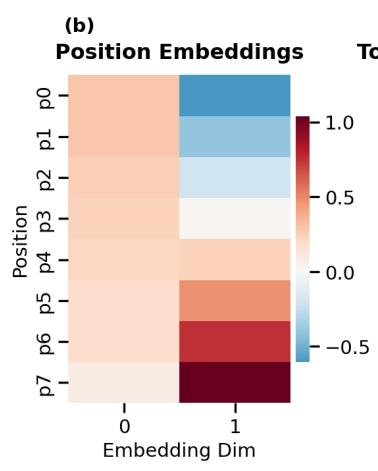

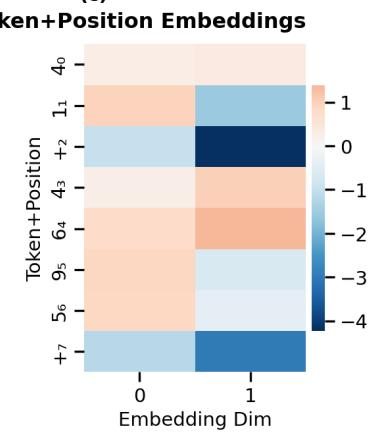

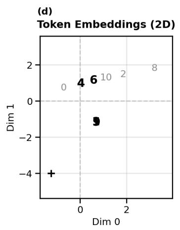

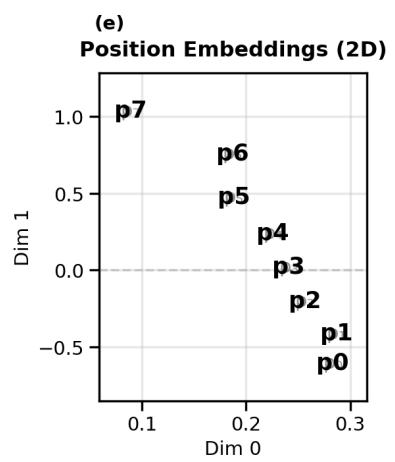

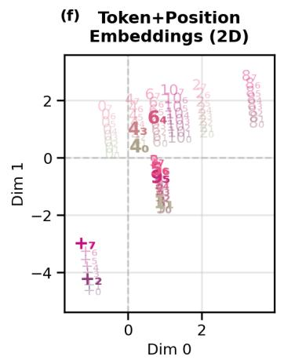  
Figure 11. Embeddings for the demo sequence $ \begin{array} { r } { \ 4 \ \textbf { 1 } + \ 4 \ 6 \ 9 \ \textbf { 5 } + . } \end{array}$ . a-c: Embedding heatmaps for tokens, positions and token+position. d–f: 2D scatter plot views of tokens, positions, and token+position combinations, shown over a backdrop of all possible tokens, positions, and token+position embeddings (light gray).

Attention. The model must compute the attention matrix for this sequence by forming $\mathbf { Q } , \mathbf { K } \in \mathbb { R } ^ { T \times d _ { k } }$ for the T positions and taking dot products between query rows and key rows (i.e. the matrix QK<sup>⊤</sup>). Figure 12 shows the Q and K heatmaps for the representation of the tokens within this sequence, and panel (c) shows these Q and K embeddings on the same scatterplot against a backdrop of all 96 possible queries and keys, as in Figure 7.

For each token within the sequence, the model should compute the dot product between that token’s query and the key of every token in the sequence. To illustrate this, for each query, we show what the dot product with that query would be at an arbitrary point in space. We then overlay the actual keys within our test sequence over this space for each query, making it clear which keys would produce the largest dot product. For each query, we also gray out the keys that come in later positions to show the efect of the causal masking (Figure 13a).

(a)  
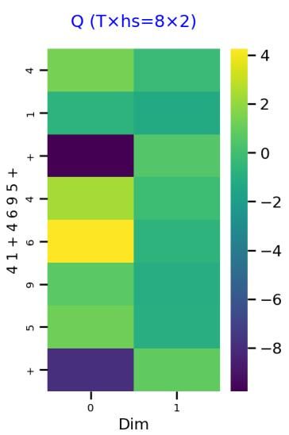

(b)  
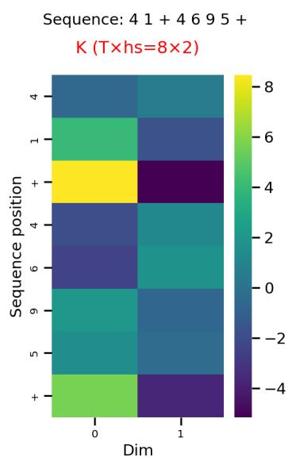

(c)  
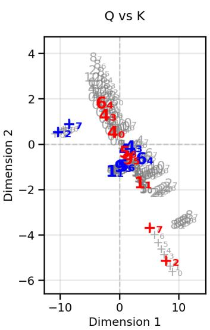  
Figure 12. Q and K for the demo sequence. (a) Q heatmap, (b) K heatmap, (c) scatterplot of queries (blue), and keys (red) for tokens within our test sequence against a backdrop of all 96 possible queries and keys (gray).

It is apparent from these visualizations that once causal masking is applied, the dot product between the query of each + token and the key of the most recent even number relative to that + token, will be the largest for that query relative to other unmasked keys. We can verify this by looking at the heatmap of Figure 13b, which shows the masked query-key dot products. If we look at the rows for the two + tokens that appear in the sequence, each of those rows has the largest value in the column belonging to the most recent even number relative to that + token. Once we generate the final attention matrix via normalization by $\sqrt { d _ { k } }$ and applying softmax, it is clear that the + tokens attend to their respective most recent even numbers (Figure 13c).

Value routing. Now that we have the attention weight matrix A, we need to apply it to the value vectors in order to produce the attention vector for each token $\mathrm { A t t n } ( \mathbf { e } ) _ { i }$ Specifically, the attention vectors are the attention-weighted sum of the value vectors for each token, i.e. $\begin{array} { r } { \mathrm { A t t n } ( \mathbf { e } ) _ { i } = \sum _ { j = 1 } ^ { i } \alpha _ { i j } \mathbf { v } _ { j } } \end{array}$ . We can generate a matrix whose rows are the attention outputs for each position by multiplying the attention weight matrix A (Figure 14A) by the value matrix V (Figure 14B) such that we have $\mathrm { A t t n } ( \mathbf { e } ) _ { i } ^ { \top } = ( A \mathbf { V } ) _ { i , }$ <sub>:</sub> (Figure 14C). We also show the value vectors $\mathbf { v } _ { j }$ (Figure 14D) and attention vectors $\mathrm { A t t n } ( \mathbf { e } ) _ { 1 }$ <sub>i</sub> as scatter plots. The attention weights for each token here efectively select value vectors to be used for the prediction; the attention vectors for the + tokens for example, are basically copies of the value vectors of the most recent even number.

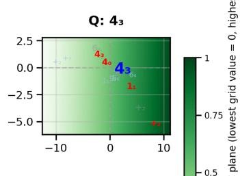

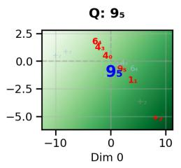

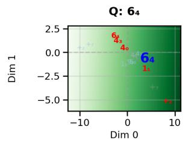

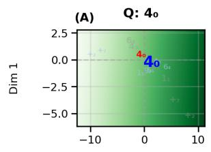  
Dot Product Gradients for Each Query Sequence: 4 1 + 4 6 9 5 +

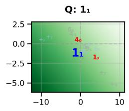

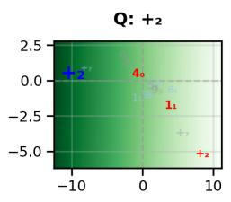

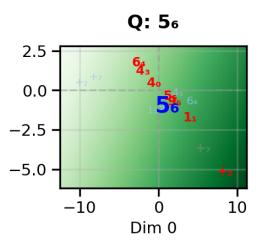

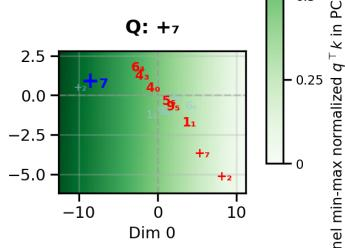

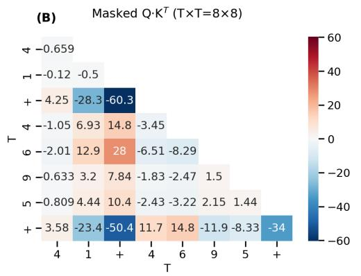

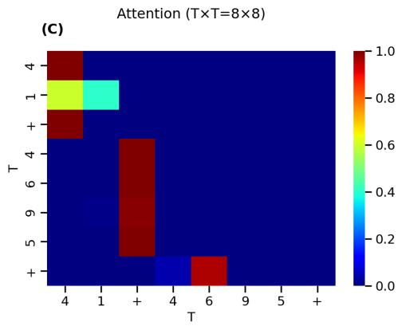  
Figure 13. Attention computation for the demo sequence. (a) The background of each panel displays the dot product of a specific query (blue) in the test sequence with every point in space (green = high, white = low). The unmasked (red) and masked (gray) keys are overlaid on this space to show their dot products with the selected query. (b) The masked $\dot { Q } \cdot \dot { K } ^ { \top }$ matrix, (c) the attention matrix after normalization by $\sqrt { d _ { k } }$ and applying softmax.

Predicting the next token. Now that we have the attention vectors $\mathrm { A t t n } ( \mathbf { e } ) _ { i }$ for each embedding, we are ready to predict the next token for each token in our test sequence. (Actually, a next-token prediction is constructed for each token in the sequence). For the token at position i in the sequence, we first compute $\mathbf { z } _ { i } = \mathbf { e } _ { i } + \mathrm { A t t n } ( \mathbf { e } ) _ { i }$ . In other words, we add the token’s attention vector to its embedding and see where it lands in the output space. We can think of this addition as the original token+position embedding being nudged to the right zone in the output space by the attention vector. By showing the input embeddings, attention vectors, and their sums as both heatmaps and scatter plots on the background of the output prediction space (Figure 15), we observe that the embeddings for all digits are nudged toward the high-entropy region where all tokens are somewhat likely to occur, but the + token is the most likely prediction. The + embeddings, however, are nudged to the regions of the correct predictions for the most recent even number. The + in position 2 correctly predicts that the next number in the sequence should be a 4. The final token in the sequence, the + in position 7, correctly predicts that the next number in the sequence should be a 6, thus demonstrating that the transformer can correctly produce new tokens that are beyond the end of the input sequence.

(e)  
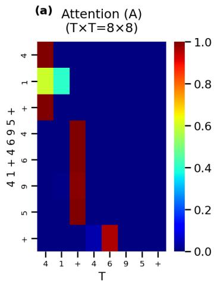  
Sequence: 41 + 46 9 5 +

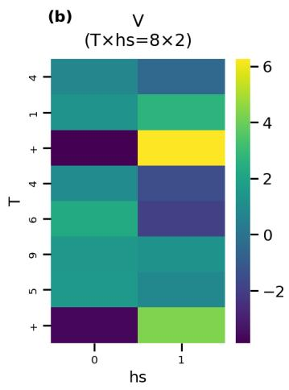

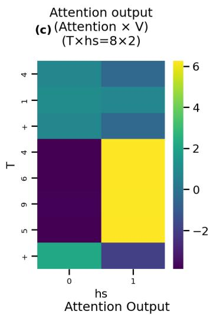

(d)  
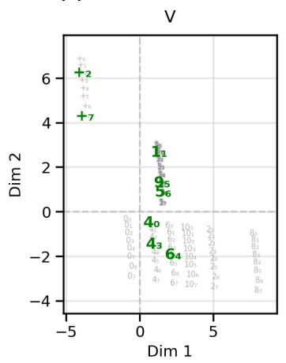

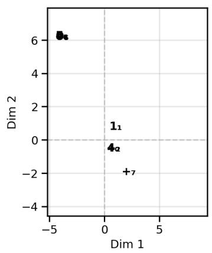  
Figure 14. Values and attention output for the demo sequence. (a) Attention weight matrix as in Figure 13c, (b) Values for each digit shown as heatmaps. (c) Attention outputs shown as heatmaps. (d) Values shown as scatter plot. (e) Attention output shown as scatter plot.

## 4. Geometry as Algorithm: Summary

For the plus-last-even rule, the model’s behavior decomposes into a five-step algorithm.   
Each step corresponds to a specific geometric structure visible in the preceding figures.

1. Encode. Map each (token, position) pair to a 2D point: token embedding $\mathbf { x } _ { i }$ plus position embedding $\mathbf { p } _ { i }$ gives the combined embedding $\mathbf { e } _ { i } = \mathbf { x } _ { i } + \mathbf { p } _ { i }$ . The embedding scatter plots (Figure 5) show this mapping, with even numbers, odd numbers, and + occupying distinct regions.

2. Detect the operator. The query projection $W _ { Q }$ maps the + embedding to a query vector that is geometrically distinct from number queries (Figure 7, top).

Sequence: 4 1 + 4 6 9 5 +  
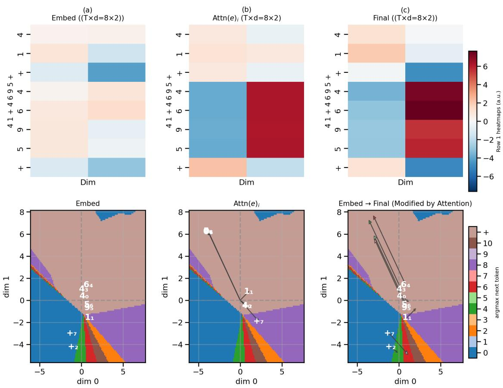  
Figure 15. Predicting the next token by summing the input embeddings and attention vectors. (a) Top: Heatmaps illustrating the 2D values for the input embeddings (e) for each token in the test sequence. Bottom: Input embeddings in the 2D output space, where the background colors represent the most likely next-token prediction. (b) Top: The attention vectors (Attn(e)) Bottom: The attention weights shown as arrows from the origin. (c) Top: The sum of the input embeddings and the attention vectors (z) as heatmap. Bottom: Input embeddings (white annotations) are moved by the attention vectors (arrows) to the correct region for predicting the next token.

3. Retrieve the last even number. The dot product between the + query and all keys (produced by the $W _ { K }$ projection) yields high attention weight for even-digit keys, with recency encoded in the positional component of the key layout. The focused-query analysis (Figure 7, bottom) and full dot product matrix for + queries (Figure 8) make this retrieval pattern explicit; the per-query gradient figure (Figure 13) shows it for the demo sequence.

4. Produce attention vectors. Multiplying the attention matrix A by the value matrix V (generated by the $W _ { V }$ projection) produces a weighted sum of value vectors for each token. For the + tokens, attention selects the value vector of the most recent even-digit position.

5. Use attention vectors to push embeddings into the correct output zone. For each token, the attention vectors are added to the original token+position embedding from the residual in order to nudge that token’s representation now with the context of the other tokens, into the correct zone for the prediction of the next token. In the case of the + tokens, the + embeddings are nudged into the direction of the zone of the most recent even number.

We have thus demonstrated how the representational geometry of the transformer (Vaswani et al., 2017) can be directly interpreted to solve the plus-last-even rule.

## 5. Discussion

Conclusions and implications. By selecting a suficiently simple task, the plus-last-even task, we have shown that it is possible to train a minimal transformer with an embedding size and head size of 2 to near-perfect accuracy. This low dimensionality enables us to inspect the learned internal information geometry of the transformer at every step in the architecture. This approach enables near-complete interpretability of the attention and embedding pathway for this minimal model and task. Rather than only observing what the model predicts, we can trace exactly how the computation is organized inside the network and understand how the algorithm is implemented without the need for dimensionality reduction.

Limitations. The primary limitation of this approach is the representational capacity of the 2D plane. While $\mathbb { R } ^ { 2 }$ is suficient for the 12-token plus-last-even task, it would not be efective for more complex conditional rules, and certainly not for full-fledged AI tasks such as language modeling. Furthermore, this study is restricted to a single-layer, single-head architecture. In deeper models with more attention heads, the interaction between successive residual updates and FFN transformations introduces topological complexities that are harder to interpret as a single-step geometric nudge toward a decision boundary. In addition, our analysis is based on a single trained model and default random seed, a more robust analysis would look at variation in geometric representations across seeds.

Future directions. As noted under Limitations, the plus-last-even task is an artificial task that was chosen for pedagogical purposes to illustrate various facets of the transformer computation. Additional tasks including certain simple mathematical or logical operations can potentially also be solved using our minimal transformer architecture. The internal representations learned when solving diferent tasks can provide further insight into how transformers use information geometry to approach diferent kinds of problems. Moreover, transformers trained on the same tasks but with diferent random seeds can provide insight into what aspects of the information geometry are necessary to solve a task versus what aspects are left up to the model’s “creative discretion”.

Although our work emphasized using 2-dimensional latent spaces for the purpose of direct, lossless visualization, the visualization approaches that we used here can potentially be applied to more complex models if dimensionality reduction techniques are used and steps are taken to isolate the representations at each layer.

Neuroscientists have become increasingly interested in relating the representational geometry of complex perceptions and behaviors in the brain to those found in large language models (e.g., Caucheteux et al., 2021; Hosseini et al., 2024; Sun et al., 2025; Doerig et al., 2025). Our framework allows for the possibility of exploring representational geometry in suficiently simple tasks that can also be used in experimental neuroscience, potentially enabling a direct comparison of neural activity to a transformer’s internal representations.

## 6. Movies

The following animations show the evolution of the model’s learned geometry over the course of training (one frame per checkpoint, 200 frames total). These are available as GIF/MP4 files in plus\_last\_even/plots/learning\_dynamics/ of the code repository (https://github.com/Raneem-mahajne/creating\_transformer/tree/main/plus\_last\_even plots/learning\_dynamics).

<table><tr><td>Movie</td><td>File</td><td>Description</td></tr><tr><td></td><td>Movie 1 01_embeddings_sca tterplots.gif</td><td>Evolution of token, position, and combined embedding scatter plots. The + token separates from numbers first; the even/odd split solidifies by step 5,000–10,000.</td></tr><tr><td></td><td>Movie 2 05_output_heatmap s_with_embeddings ·gif</td><td>Co-evolution of the LM head&#x27;s output probability landscape and embedding positions. Decision boundaries sharpen progressively from a uniform initialization.</td></tr><tr><td></td><td>comprehensive.gif</td><td>Movie 3 02_embedding_qkv_ Specialization of the Q, K, and V subspaces. All three projections are initially identical and develop distinct geometry as training progresses.</td></tr><tr><td></td><td>Movie 4 03_qk_embedding_s pace.gif</td><td>Separation of query and key subspaces. + queries migrate away from number queries; even-number keys align with the + query direction.</td></tr><tr><td></td><td>Movie 5 04_qk_space_plus_ attention.gif</td><td>Evolution of the full attention matrix alongside the Q/K scatter. The +-row entries concentrate on even-number columns over training.</td></tr></table>

## 6.1 Supplementary Figures

Additional static figures in plus\_last\_even/plots/supplementary/ and plus\_last\_eve n/plots/extended/:

<table><tr><td>File</td><td>Description</td></tr><tr><td></td><td>supplementary/0 Comprehensive 3×3 panel: token, position, and combined embeddings; Q/K/V transformed spaces; Q+K overlay; and attention</td></tr><tr><td>7_qkv_overview. png</td><td>output.</td></tr><tr><td></td><td>supplementary/1 Per-sequence attention matrices alongside LM head linear input,</td></tr><tr><td></td><td>4_attention_mat logits, and output probabilities for three demo sequences.</td></tr><tr><td>rix.png</td><td>supplementary/1 Value vectors (original, transformed, residual) for three demo</td></tr><tr><td></td><td>6_value_arrows. sequences, with correctness indicated by green/red markers.</td></tr><tr><td>png</td><td></td></tr><tr><td>_transforms_ext (tokens×positions) for Q, K, and V. ended.png</td><td>extended/08_qkvExtended QKV figure with per-dimension heatmaps</td></tr><tr><td>eatmap.png</td><td>a4/11_qk_ful1_h Full 96×96 pre-softmax query-key score matrix QK (dot products), covering all query tokens and positions vs. all key tokens and positions (no masking/softmax), organized as a 12×12 grid of</td></tr><tr><td>obs_embed.png</td><td>token-token blocks. a4/07_output_pr Per-unit output probability heatmaps with all 96 combined</td></tr><tr><td></td><td>embeddings ei overlaid (token + position labels).</td></tr><tr><td>ty_heatmap_with vectors Wvei overlaid. values.png</td><td>a4/12_probabiliPer-unit output probability heatmaps with all 96 value-transformed</td></tr></table>

## 7. Reproducing the Results

Train and visualize:

python main.py plus\_last\_even

Visualize from an existing checkpoint:

```batch
python main.py plus_last_even --visualize
```

Visualize a specific training step:

```batch
python main.py plus_last_even --visualize --step 5000
```

Generate learning-dynamics videos:

```batch
python main.py plus_last_even --video
python main.py plus_last_even --video-qkv
```

Dependencies: PyTorch, NumPy, Matplotlib, Pillow, imageio.

## Declaration on the use of artificial intelligence

Nearly all code — including the transformer model, training pipeline, and figure/video generation — was produced with Cursor Agent. All training outcomes, figures, and interpretive claims were independently verified by the authors. The first draft of this paper was written by Claude Opus 4.6; the entirety of the draft was thoroughly rewritten, edited, and revised by the authors for factual accuracy, clarity, and language.

## Acknowledgments

We thank Idan Segev for his guidance and support throughout this project. This work received generous support from the Drahi Family Foundation and the Gatsby Charitable Foundation.

## References

• Belrose, N., Ostrovsky, I., McKinney, L., Furman, Z., Smith, L., Halawi, D., Biderman, S., & Steinhardt, J. (2023). Eliciting latent predictions from transformers with the tuned lens. arXiv preprint arXiv:2303.08112. https://arxiv.org/abs/2303.08112

• Bricken, T., Templeton, A., Batson, J., Chen, B., Jermyn, A., et al. (2023). Towards monosemanticity: Decomposing language models with dictionary learning. Transformer Circuits Thread. https://transformer-circuits.pub/2023/monosemantic-features

• Caucheteux, C., Gramfort, A., & King, J.-R. (2021). GPT-2’s activations predict the degree of semantic comprehension in the human brain. bioRxiv. https://doi.org/10.1101/2021.04.20.440622

• Clark, K., Khandelwal, U., Levy, O., & Manning, C. D. (2019). What does BERT look at? An analysis of BERT’s attention. ACL Workshop on BlackboxNLP. https://arxiv.org/abs/1906.04341

• Dar, G., Geva, M., Gupta, A., & Berant, J. (2023). Analyzing transformers in embedding space. ACL, 16124–16170. https://aclanthology.org/2023.acl-long.893/

• Doerig, A., Kietzmann, T. C., Allen, E., et al. (2025). High-level visual representations in the human brain are aligned with large language models. Nature Machine Intelligence, 7, 1220–1234. https://doi.org/10.1038/s42256-025-01072-0

• Elhage, N., Nanda, N., Olsson, C., et al. (2021). A mathematical framework for transformer circuits. Transformer Circuits Thread. https://transformer-circuits.pub/2021/framework/index.html

• Elhage, N., Hume, T., Olsson, C., Schiefer, N., et al. (2022). Toy models of superposition. Transformer Circuits Thread. https://transformer-circuits.pub/2022/toy\_model/index.html

• Friedman, D., Wettig, A., & Chen, D. (2023). Learning Transformer Programs. NeurIPS. https://arxiv.org/abs/2306.01128

• Geva, M., Schuster, R., Berant, J., & Levy, O. (2021). Transformer feed-forward layers are key-value memories. EMNLP, 5484–5495. https://aclanthology.org/2021.emnlp-main.446/

• Geva, M., Caciularu, A., Wang, K., & Goldberg, Y. (2022). Transformer feed-forward layers build predictions by promoting concepts in the vocabulary space. EMNLP, 30–45. https://aclanthology.org/2022.emnlp-main.3/

• Gromov, A. (2023). Grokking modular arithmetic. arXiv preprint arXiv:2301.02679v1. https://arxiv.org/pdf/2301.02679

• Hanna, M., Liu, O., & Variengien, A. (2023). How does GPT-2 compute greater-than?: Interpreting mathematical abilities in a pre-trained language model. NeurIPS. https://arxiv.org/abs/2305.00586

• Hosseini, E. A., Schrimpf, M., Zhang, Y., Bowman, S., Zaslavsky, N., & Fedorenko, E.

(2024). Artificial neural network language models predict human brain responses to language even after a developmentally realistic amount of training. Neurobiology of Language, 5 (1), 43–63. https://doi.org/10.1162/nol\_a\_00137

• Li, K., Hopkins, A. K., Bau, D., Viégas, F., Pfister, H., & Wattenberg, M. (2023). Emergent world representations: Exploring a sequence model trained on a synthetic task. ICLR. https://arxiv.org/abs/2210.13382

• Lindner, D., Kramár, J., Farquhar, S., Rahtz, M., McGrath, T., & Mikulik, V. (2023). Tracr: Compiled transformers as a laboratory for interpretability. NeurIPS. https://arxiv.org/abs/2301.05062

• Liu, Z., Kitouni, O., Nolte, N., Michaud, E. J., Tegmark, M., & Williams, M. (2022). Towards understanding grokking: An efective theory of representation learning. arXiv preprint arXiv:2205.10343v2. https://arxiv.org/pdf/2205.10343

• McInnes, L., Healy, J., & Melville, J. (2018). UMAP: Uniform Manifold Approximation and Projection for Dimension Reduction. arXiv preprint arXiv:1802.03426. https://arxiv.org/abs/1802.03426

• Musat, T. (2024). Clustering and alignment: Understanding the training dynamics in modular addition. arXiv preprint arXiv:2408.09414v2. https://arxiv.org/abs/2408.09414

• Nanda, N., Chan, L., Lieberum, T., Smith, J., & Steinhardt, J. (2023). Progress measures for grokking via mechanistic interpretability. arXiv preprint arXiv:2301.05217v1. https://arxiv.org/pdf/2301.05217v1

• Nanda, N., Lee, A., & Wattenberg, M. (2023). Emergent linear representations in world models of self-supervised sequence models. BlackboxNLP. https://aclanthology.org/2023.blackboxnlp-1.2/

• nostalgebraist. (2020). Interpreting GPT: The logit lens. LessWrong. https://www.lesswrong.com/posts/AcKRB8wDpdaN6v6ru/interpreting-gpt-the-logitlens

• Pan, X., Philip, A., Xie, Z., & Schwartz, O. (2024). Dissecting query-key interaction in vision transformers. NeurIPS, 54595–54631. https://proceedings.neurips.cc/paper\_files/paper/2024/hash/6216515a5e0b3257c49dcb1647e497d1- Abstract.html

• Park, K., Choe, Y. J., & Veitch, V. (2024). The linear representation hypothesis and the geometry of large language models. ICML. https://arxiv.org/abs/2311.03658

• Power, A., Burda, Y., Edwards, H., Babuschkin, I., & Misra, V. (2022). Grokking: Generalization beyond overfitting on small algorithmic datasets. arXiv preprint arXiv:2201.02177. https://arxiv.org/abs/2201.02177

• Quirke, P., & Barez, F. (2024). Understanding addition in transformers. ICLR. https://arxiv.org/abs/2310.13121

• Radford, A., Narasimhan, K., Salimans, T., & Sutskever, I. (2018). Improving language

understanding by generative pre-training. OpenAI. https://cdn.openai.com/researchcovers/language-unsupervised/language\_understanding\_paper.pdf

• Stolfo, A., Belinkov, Y., & Sachan, M. (2023). A mechanistic interpretation of arithmetic reasoning in language models using causal mediation analysis. EMNLP, 7035–7052. https://aclanthology.org/2023.emnlp-main.435/

• Sun, W., Winnubst, J., Natrajan, M., et al. (2025). Learning produces an orthogonalized state machine in the hippocampus. Nature, 640, 165–175. https://doi.org/10.1038/s41586-024-08548-w

• van der Maaten, L. & Hinton, G. (2008). Visualizing data using t-SNE. JMLR, 9, 2579–2605. https://www.jmlr.org/papers/v9/vandermaaten08a.html

• Vaswani, A., Shazeer, N., Parmar, N., Uszkoreit, J., Jones, L., Gomez, A. N., Kaiser, Ł., & Polosukhin, I. (2017). Attention is all you need. Advances in Neural Information Processing Systems, 30. https://arxiv.org/abs/1706.03762

• Vig, J. (2019). A multiscale visualization of attention in the transformer model. ACL System Demonstrations. https://aclanthology.org/P19-3007/

• Wang, K., Variengien, A., Conmy, A., Shlegeris, B., & Steinhardt, J. (2022). Interpretability in the wild: A circuit for indirect object identification in GPT-2 small. ICLR. https://arxiv.org/abs/2211.00593

• Weiss, G., Goldberg, Y., & Yahav, E. (2021). Thinking like transformers. ICML. https://proceedings.mlr.press/v139/weiss21a.html

• Welch Labs. (2025). The most complex model we actually understand [Video]. YouTube. https://www.youtube.com/watch?v=D8GOeCFFby4

• Zhong, Z., Liu, Z., Tegmark, M., & Andreas, J. (2023). The clock and the pizza: Two stories in mechanistic explanation of neural networks. NeurIPS. https://arxiv.org/abs/2306.17844

• Zhou, H., Bradley, A., Littwin, E., Razin, N., Saremi, O., Susskind, J., Bengio, S., & Nakkiran, P. (2024). What algorithms can Transformers learn? A study in length generalization. ICLR. https://arxiv.org/abs/2310.16028