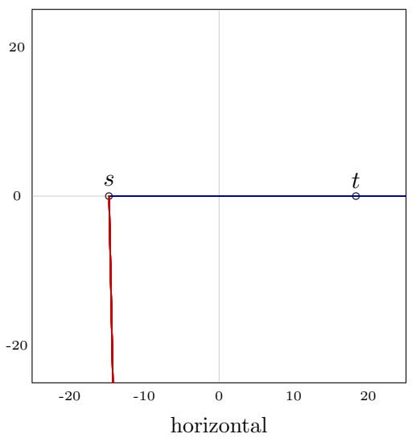
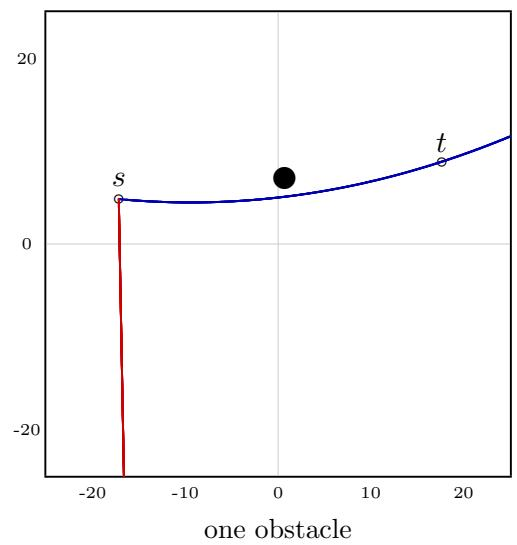

# GAGR-Lab: Evaluating Joint Spatial-Geometric and Analytic Function Reasoning

Jingyao Zhang, Yun Li, Lu Han

7 October 2026

## Abstract

Joint spatial-geometric and analytic function reasoning requires translating a perceived spatial configuration into a symbolic function whose executed curve satisfies geometric constraints. We present GAGR-Lab, a framework for measuring this capability through Cartesian game scenes, explicit function semantics, and authoritative Rust trajectory execution. It distinguishes spatial perception, metric grounding, geometric relations, function interpretation, function construction, and constrained synthesis. We specify four configurable scene-dificulty presets and a prospective 24-cell diagnostic design, while reporting only the subset actually evaluated. A bounded pilot of one hosted model (Llama 3.2 11B Vision Instruct) using two API credentials as execution replicas yields 72 balanced games with 432 attempts, 429 valid provider responses, and no target hits; exploratory ordinary-function prompt variants also fail to hit, while the structured localization interface yields no scoreable outputs. A privileged analytic search control independently succeeds on 600 directional cases from 300 generated scenes, with exact repeatability and 1,200 successful vertical-reflection or translation checks. The framework separates serving reliability, symbolic compliance, and geometric success, and preserves exact model-visible inputs and realized paths. A staged protocol outlines diagnostic calibration, held-out replication, multi-model comparison, and paired robustness tests. The contribution is an operational research framework with an executed pilot and a clearly identified prospective study plan; the full dificulty matrix and comparative model results remain untested.

## 1 Introduction

Spatial geometry and analytic function construction become a joint capability when a model must convert a visible arrangement into a curve that achieves a spatial goal. The model must recover the coordinate frame and relevant entities, represent slopes and spatial constraints, choose a function family, and select coeficients consistent with the intended path. Execution exposes mistakes in that connection: a plausible expression can use the wrong frame, bend excessively, leave its domain, intersect an obstacle, or depart from the world immediately.

We study joint spatial-geometric and analytic function reasoning, also termed grounded analyticgeometric action reasoning: recovering spatial structure from a visible scene, expressing the relevant geometric relationships mathematically, and constructing an executable function whose realized path satisfies a target and spatial constraints. This operational construct concerns the connection between spatial representations and function expressions. It is not established by visual recognition alone, by an admissible formula alone, or by a fluent explanation. Here “analytic function reasoning” refers to interpreting and constructing explicit function expressions under the task grammar, without a claim about complex analysis or formal symbolic proof.

Our current setting is a two-dimensional Cartesian world with alternating function submissions. Each agent receives an image, task instructions, and public outcomes; privileged scene geometry is reserved for measurement unless explicitly supplied as an observation intervention. The goal is a reproducible capability profile across component tasks and controlled dificulty, accompanied by end-to-end trajectory outcomes.

The central research idea is to evaluate the sequence

$$
{ \mathrm { o b s e r v e } }  { \mathrm { l o c a l i z e } }  { \mathrm { r e l a t e } }  { \mathrm { m o d e l } }  { \mathrm { e x e c u t e } }  { \mathrm { e v a l u a t e } }
$$

through a combination of end-to-end behavior and diagnostic interventions. A hit is an end-to-end outcome; a failure alone does not identify a missing subskill. Similarly, expression validity is an interface result, not evidence of spatial competence. We therefore log these stages separately and use exact-coordinate and prompt interventions to investigate candidate bottlenecks.

The contribution has four parts: (i) an operational definition and six-dimensional task decomposition of the joint capability; (ii) parameterized dificulty presets and a staged prospective evaluation protocol; (iii) an auditable visual-to-function interface backed by a modified, pinned Graphwar Rust core, with matched scenes and balanced assignments; and (iv) an executed single-model pilot, exploratory diagnostics, and independent engine controls. The current empirical claim is configuration-specific. The proposed full diagnostic matrix and multi-model study are not completed results, and no precedence claim or comparative leaderboard is inferred from this pilot.

## 2 Related work

MathVista evaluates mathematical reasoning in diverse visual contexts, including geometry and function plots [1]. BLINK emphasizes perception tasks such as spatial correspondence and relativedepth estimation [2]. DynaMath evaluates visual mathematical robustness using programmatically generated question variants [3]. These lines of work motivate both the mathematical grounding construct and the need for controlled variations. Our emphasis is a function’s executed geometric consequences and interaction history rather than answer equivalence on a static question.

PlanBench uses systematic planning domains to evaluate action generation and reasoning about change [4]. Embodied Agent Interface separates decision-making modules and error types [5], while EmbodiedBench evaluates vision-driven agents across several embodied environments [6]. Our domain is substantially simpler: a planar task-space curve, static obstacles, one active unit on each side, and no kinematics or time-dependent control. That restriction ofers interpretable execution and comparatively inexpensive procedural experiments, at the cost of limited external validity.

The execution substrate derives from the Graphwar Rust implementation archived in the project [7]. The upstream identifier is pinned, but the experimental global-coordinate trace and squareworld profile are local modifications. Consequently, the upstream hash alone does not specify the evaluated engine; the local source and executable hashes are part of the experiment archive. The evaluated model is the NVIDIA-hosted Llama 3.2 11B Vision Instruct, whose oficial model documentation supports image-plus-text input and text output [8].

## 3 Task and execution semantics

## 3.1 Scene and action

A scene consists of a bounded Cartesian world W, a shooter $\boldsymbol { s } = \left( x _ { s } , y _ { s } \right)$ , a target $t = ( x _ { t } , y _ { t } )$ with hit radius $r _ { t } ,$ and a collection of static obstacle regions O. An action is one function body $f ( x )$ in the supported expression language. The function variable is the global horizontal coordinate printed on the image, for both sides. The left-side unit traces toward increasing x; the right-side unit traces toward decreasing x.

The engine applies automatic vertical anchoring:

$$
Y _ { f } ( x ) = y _ { s } + f ( x ) - f ( x _ { s } ) .\tag{1}
$$

Thus a constant vertical ofset in f cannot change the shot. If ${ \tilde { f } } = f + c ,$ then $Y _ { \tilde { f } } = Y _ { f }$ . A constant function produces a horizontal path, and a line $f ( x ) = m x$ reaches the target center in an obstacle-free continuous model when

$$
m = { \frac { y _ { t } - y _ { s } } { x _ { t } - x _ { s } } } .\tag{2}
$$

These semantics must be explicit: choosing coeficients for a shooter-local coordinate system while executing them in a global frame changes the trajectory.

The authoritative engine includes launch-radius handling and numerical tracing; the ideal relation above specifies the anchoring law rather than every sample emitted by the tracer. A shot is successful when its executed trajectory enters the opponent’s hit region before terminating. It may terminate on target entry, terrain, world exit, invalid expression, or numerical failure. Numerical validness and geometric success are reported separately.

## 3.2 Strict interface and failure accounting

The model-facing protocol requires a single bare ASCII function body of at most 256 bytes. It specifies the sole variable x, constants π and e, explicit multiplication, the ^ power operator, and supported function names and arities. Equation labels, Markdown, LaTeX, JSON envelopes in ordinary arena turns, prose, and multiple candidates are disallowed. Structured metric diagnostics explicitly use a diferent JSON envelope containing a function string.

A format validator checks the entire visible answer without repairing it. A format failure is rejected before simulation; an engine parse failure remains distinct. Provider errors consume an attempt under the same announced turn policy. We retain raw visible responses and do not silently extract a convenient substring, retry until success, replace a function, or assign an invalid action a zerolength path. Invalid attempts are included in attempts-to-kill, and excluded from averages that are defined over valid trajectories.

## 3.3 Observation and feedback

The baseline observation contains the exact agent-facing raster image, a fixed task prompt, and previous public outcomes. The pixel-plus-coordinate condition receives the same rendering plus exact shooter and target coordinates in the prompt. It does not receive obstacle coordinates or an oracle action. This intervention changes available information and must not be described as an equivalent paraphrase.

The arena includes the immediately preceding trajectory in the next image. The hosted adapter sends a fresh system/user request on each turn, with public outcome history, rather than retaining a persistent conversation containing earlier responses. In alternating play, the preceding trajectory can belong to the opponent. Accordingly, this pilot evaluates behavior with that specific feedback interface; it cannot establish a causal learning benefit from feedback or from persistent agent memory.

## 4 Capability decomposition and dificulty design

## 4.1 What the joint capability requires

The spatial part includes locating entities in a shared frame, estimating distances and directions, and representing target and obstacle constraints. The analytic part includes understanding how a function maps to an anchored path, selecting a suitable family, and setting coeficients and domains. Their combination is tested by whether the realized curve reaches the target while respecting the announced constraints. Multiple functions can succeed, so string agreement with a unique reference formula is not the criterion.

For example, a horizontal target permits a constant function; a displaced target without obstacles admits the slope in Equation 2; an obstructed direct line requires a diferent admissible path, for which Equation 4 supplies one privileged search family. These examples expose increasing structural demands without establishing a psychometrically calibrated ordering for models. A future task suite must separately measure interpretation and synthesis rather than assigning every failed shot to an unspecified reasoning deficit.

## 4.2 Six component tasks

Table 1 defines the proposed component measurements. Ground truth and deterministic execution make their outputs externally checkable. A visible reasoning summary may assist inspection but is not a score for internal reasoning. Endpoint-coordinate assistance partially bypasses localization; it leaves obstacle interpretation and geometry-to-function construction unresolved.

<table><tr><td>Dimension</td><td>Diagnostic question</td><td>Proposed observable score</td></tr><tr><td>Entity perception</td><td>Which objects are shooter, target, and obstacles?</td><td>Entity accuracy; pixel-region error</td></tr><tr><td>Metric grounding</td><td>Where are those objects in world coordinates?</td><td>Coordinate error; scoreable-output coverage</td></tr><tr><td>Geometric relations</td><td>What are their directions, slopes, distances, and blocking relations?</td><td>Numeric error; relation accuracy</td></tr><tr><td>Function to geometry</td><td>What trajectory will a supplied function produce under anchoring?</td><td>Predicted-path error; outcome</td></tr><tr><td>Geometry to function</td><td>Which function realizes specified endpoint relationships?</td><td>accuracy Engine hit; target approach;</td></tr><tr><td>Constrained synthesis</td><td>Which function reaches the target while satisfying obstacle and path constraints?</td><td>validity Hit before collision; clearance; constraint satisfaction</td></tr></table>

Table 1: Proposed component tasks for joint spatial-geometric and analytic function reasoning. Independent component scores are not all available in the current pilot.

## 4.3 Four parameterized dificulty presets

The archived generator implements Easy, Medium, Hard, and Extreme presets (Table 2). They change geometric displacement, obstacle density and scale, and corridor concentration. These are engineering controls on scene generation, not validated measurements of human or model dificulty. Explicit placement ranges, counts, shapes, and sizes can override the defaults; every evaluated scene must therefore be identified by its resolved parameters, not only its preset name. The corridor-width setting below applies to the generator’s even/random corridor modes.

<table><tr><td>Preset</td><td>Player y span</td><td>Obstacles</td><td>Size multiplier</td><td>Corridor half-width</td></tr><tr><td>Easy</td><td>±3</td><td>0-1</td><td>0.80</td><td>4.00</td></tr><tr><td>Medium</td><td>±6</td><td>2-4</td><td>1.00</td><td>3.00</td></tr><tr><td>Hard</td><td>±9</td><td>4-8</td><td>1.25</td><td>2.00</td></tr><tr><td>Extreme</td><td>±11</td><td>6-12</td><td>1.50</td><td>1.25</td></tr></table>

Table 2: Implemented default dificulty controls in world units, except the dimensionless size multiplier. These presets have not been evaluated as a four-level model dificulty sweep in this study.

The proposed diagnostic design crosses the six component tasks with all four presets, yielding 24 task–dificulty cells (Table 3). Cells share procedural scene definitions where possible, with independent held-out seeds and validated scoreable output contracts. Appearance changes, additional coordinate information, and prompt scafolds are separate interventions. They must not be silently folded into the same dificulty label.

<table><tr><td>Component task</td><td>Easy</td><td>Medium</td><td>Hard</td><td>Extreme</td></tr><tr><td>Entity perception</td><td>P</td><td>P</td><td>P</td><td>P</td></tr><tr><td>Metric grounding</td><td>P</td><td>P</td><td>P</td><td>P</td></tr><tr><td>Geometric relations</td><td>P</td><td>P</td><td>P</td><td>P</td></tr><tr><td>Function to geometry</td><td>P</td><td>P</td><td>P</td><td>P</td></tr><tr><td>Geometry to function</td><td>P</td><td>P</td><td>P</td><td>P</td></tr><tr><td>Constrained synthesis</td><td>P</td><td>P</td><td>P</td><td>P</td></tr></table>

Table 3: Prospective 24-cell diagnostic matrix. P means planned, not passed or evaluated. The current custom-profile pilot is reported separately and is not substituted for this matrix.

## 4.4 Current coverage and calibration requirements

The executed horizontal, slanted, and one-circle-obstacle families are foundation tasks: horizontal alignment, relative displacement and slope, and constrained detouring. They use custom resolved settings and must not be relabeled Easy, Medium, and Hard, respectively. Their end-to-end shots jointly engage several dimensions; they are not isolated component measurements. The coordinateassisted condition is a partial diagnostic, the structured localization task yielded no scoreable objects, and function-to-geometry repeatability was checked for the engine rather than independently tested as a model skill.

Before evaluating a dificulty sweep, every accepted scene should pass a reachability check and an independent solution check with an explicitly reported search budget. A grid path certificate alone does not establish that the allowed function grammar can realize that path. Calibration should record endpoint slope, target tolerance, obstacle clearance, and candidate-family success, and perturb one geometric factor at a time. Neither preset names nor privileged-control success establishes minimum necessary function complexity or monotonic model dificulty. Regularity constraints and dynamic fields require separately validated regimes.

## 5 Auditable evaluation and experimental questions

## 5.1 Measurement layers

We report four distinct gates: a visible provider response; compliance with the announced output protocol; a valid authoritative shot; and target entry. Additional measurements include request latency, collision and termination counts, closest target approach, path length, and clearance. For a valid realized trajectory γ, closest approach is

$$
d _ { \operatorname* { m i n } } = \operatorname* { m i n } _ { \boldsymbol { p } \in \gamma } \| \boldsymbol { p } - \boldsymbol { t } \| _ { 2 } - r _ { t } .\tag{3}
$$

It is a sampled geometric metric; success is determined by the engine collision/target checks. Short path length by itself is not desirable: an immediately exiting miss may be shorter than a successful path. Game kill rate, first attempted-shot success, and per-attempt success therefore remain separate outcomes.

Each run preserves resolved configuration, scene ground truth, exact input images and their hashes, full prompts, scrubbed provider request/response metadata, visible output, format validation, engine results, dense trajectory CSVs, privileged overlays, a replay dashboard, and a SHA256 manifest. Image data URLs are omitted from duplicate request archives because the exact PNG is stored separately. Secrets and hidden provider reasoning are not study data. An agent’s optional visible summary is an output to validate, not a direct observation of internal cognition.

## 5.2 Research questions

The broader framework asks four questions. Joint reasoning: can an agent convert spatial geometry into a function that succeeds, and how do outcomes change under pixels, endpoint coordinates, or complete symbolic geometry? Component bottlenecks: can it separately localize, represent relations, predict a function’s path, and synthesize a function from geometry? Dificulty: how do these scores vary with calibrated displacement, obstacle density, clearance, and function constraints? Robustness: are geometry-consistent actions maintained under transformations, appearance changes, semantic prompt variations, and controlled feedback removal?

The executed pilot addresses a subset: interface reliability, end-to-end success with or without exact endpoint coordinates, and balanced side/initiative behavior. Exploratory follow-up varies function examples and the anchoring instruction, and attempts structured target localization. Engine controls establish tested scene feasibility, repeatability, and two geometric transformations. They do not answer the full component, dificulty, or model-comparison questions.

These are configuration-specific questions. A larger benchmark should additionally isolate functionto-trajectory interpretation, geometry-to-function synthesis, obstacle geometry, coordinate-frame equivariance, appearance-only changes, semantically equivalent prompts, and controlled feedback removal. Smoothness limits, fields, dynamic terrain, and external task-space transfer are distinct extensions, not measurements already established by the current pilot.

## 6 Executed protocol

## 6.1 Primary arena pilot

The design crosses three scene families, three random seeds, two observation conditions, and four balanced assignments, giving $3 \times 3 \times 2 \times 4 = 7 2$ games. Each game permits at most six alternating attempts. Both credentials invoke the same model; they are execution replicas, not diferent architectures or independent weight samples. Temperature is zero, top-p is one, and the visible output cap is 128 tokens. Hosted inference can still vary; these settings do not imply deterministic provider output or a pinned backend revision.

The world is the experimental square profile $[ - 2 5 , 2 5 ] ^ { 2 }$ , rendered at $1 0 2 4 \times 1 0 2 4$ pixels with an isotropic unit scale. Shooter and target radii are approximately 0.454545. Horizontal scenes have two units on $y = 0$ with independently sampled horizontal positions. Slanted scenes sample vertical positions with at least two units of vertical separation and no obstacles. One-obstacle scenes add a circle close to the endpoint corridor. Left horizontal positions are sampled in $[ - 2 1 , - 1 3 ]$ and right positions in [13, 21]; nonhorizontal vertical positions are sampled in $[ - 9 , 9 ]$ . The generator rejects unsafe or numerically unreachable layouts.

For every matched scene and observation condition, credential A occupies each side and receives each initiative order. Job order is shufled once with a fixed scheduling seed. Games have isolated engines and agent instances. Four games may be in flight; all model requests share a processwide three-second minimum start interval. We do not sum assumed API quotas across credentials. The local experiment processes share a nine-logical-processor afinity set on a 32-logical-processor machine, bounding their available CPU capacity at 28.125%. This bounds local CPU use; it does not measure the provider’s accelerator allocation.

The primary plan was recorded before its API calls. Prompt diagnostics were added after recurrent quadratic outputs were seen in early primary games, and are therefore explicitly exploratory. The primary configuration was not changed in response to those observations. Three seeds yield only nine family/seed scene blocks; repeated assignments and requests must not be treated as independent scene samples. We report counts and block-level summaries rather than a leaderboard or significance claims.

## 6.2 Exploratory diagnostic battery

The prompt study crosses one seed from each scene family, both sides, both observation modes, both credentials, and three prompt conditions, yielding 72 one-shot requests. The conditions are the canonical instruction, a version removing complete illustrative function examples from both user and system text, and a version adding Equation 1 plus an instruction to select the simplest suitable family. The last condition changes elicitation and is not an equivalent paraphrase. Syntax requirements and fail-closed validation remain explicit in every condition. Matching retains the same input image for a given scene/side/observation/credential tuple.

An additional 36 requests cross all nine primary scenes, both sides, and both credentials in a structured target-localization task. The output includes estimated target coordinates, confidence, a short visible summary, and a function. Localization error is measured against ground truth in world units and normalized by the world diagonal $5 0 { \sqrt { 2 } } .$ . This task changes the output envelope and the prompt; it is not an independent measure of an unobserved internal representation and its function success cannot be directly attributed to localization alone.

## 6.3 Privileged analytic and metamorphic controls

We use the analytic family

$$
f _ { a } ( x ) = m x + a ( x - x _ { s } ) ( x - x _ { t } ) ,\tag{4}
$$

with m from Equation 2. The added quadratic term vanishes at both endpoints. Candidate coeficients are tried in the fixed order $0 , 0 . 0 0 6 , - 0 . 0 0 6 , 0 . 0 1 2 , - 0 . 0 1 2 , 0 . 0 2 5 , - 0 . 0 2 5 , 0 . 0 4 , - 0 . 0 4$ , stopping at the first engine-verified hit. This is a privileged geometry-and-engine-search control, not a fair screenshot-only model competitor or an optimal planner.

Before the primary API pilot, all 18 directional primary-scene controls succeeded and their repeated trajectories matched exactly. An independent ofline battery generates 100 additional seeds per family, giving 300 scenes and 600 directional cases. Every selected hit is repeated and hashed. We then reflect the scene vertically with transformed function $- f _ { a } ( x )$ , and translate all geometry vertically by two units with the same submitted function. Under automatic anchoring the latter operation translates the path without requiring an additive change to $f _ { a }$ . These transformations keep the world profile fixed and test only scenes whose selected hits remain inside it; no general scale or horizontal-reflection result is asserted.

## 7 Results

All 72 games ended as draws without a target hit. Of 432 attempts, 429 returned HTTP 200 (99.31%). Every successful provider response passed the function-format gate (429/429) and authoritative validity check; all 429 valid shots terminated at world exit. The remaining 3 attempts were HTTP 500 provider errors and remained in the denominator. No malformed ordinary function response was repaired or executed.

The successful-request latency median was 1.29 seconds, its 95th percentile was 9.43 seconds, and its maximum was 27.15 seconds. This measures the POST/response interval, excluding queue time. The batch wall time was 21.64 minutes. All 144 observed first agent attempts missed. Both observation modes failed to produce a hit in every one of the nine matched family/seed blocks. Thus no success advantage from endpoint coordinates or either credential was observed on this design; the floor efect prevents a useful strength comparison.

All 429/429 accepted functions began with the unit quadratic term $\tt { x } ^ { \sim } 2 .$ . The most frequent exact body, $\mathbf { x } \hat { } 2 \mathbf { - } 2 0 \mathbf { * } \mathbf { x } \mathbf { + } 2 5$ , appeared 117 times. This visible family concentration is evidence about selected expressions, not a claim about the model’s internal representation.

<table><tr><td>Family</td><td>Input</td><td>Games</td><td>Attempts</td><td>HTTP 200</td><td>Valid</td><td>Hits</td></tr><tr><td>Horizontal</td><td>P</td><td>12</td><td>72</td><td>71</td><td>71</td><td>0</td></tr><tr><td>Horizontal</td><td>P+C</td><td>12</td><td>72</td><td>71</td><td>71</td><td>0</td></tr><tr><td>Slanted</td><td>P</td><td>12</td><td>72</td><td>72</td><td>72</td><td>0</td></tr><tr><td>Slanted</td><td>P+C</td><td>12</td><td>72</td><td>72</td><td>72</td><td>0</td></tr><tr><td>One obstacle</td><td>P</td><td>12</td><td>72</td><td>71</td><td>71</td><td>0</td></tr><tr><td>One obstacle</td><td> $\mathrm { P + C }$ </td><td>12</td><td>72</td><td>72</td><td>72</td><td>0</td></tr></table>

Table 4: Primary pilot counts. P is the pixel condition; P+C adds exact endpoint coordinates. Repeated assignments share scene geometry and are not independent scene samples.

## 7.1 Prompt and localization diagnostics

All 72 ordinary one-shot prompt requests returned HTTP 200 and valid functions, with zero target hits in all three elicitation conditions. Removing the complete solution examples changed the selected bodies but did not restore success. In particular, the pixel-only example-removal condition produced quadratics with additive constants, which execute identically under automatic anchoring. Supplying the anchoring equation also did not produce a successful shot on this small matched set. These tests do not prove which instruction feature caused the underlying failure.

<table><tr><td>One-shot condition</td><td>Requests</td><td>Format valid</td><td>Engine valid</td><td>Hits</td></tr><tr><td>Canonical</td><td>24</td><td>24</td><td>24</td><td>0</td></tr><tr><td>No full examples</td><td>24</td><td>24</td><td>24</td><td>0</td></tr><tr><td>Anchoring equation</td><td>24</td><td>24</td><td>24</td><td>0</td></tr><tr><td>Metric JSON</td><td>36</td><td>0</td><td>0</td><td></td></tr></table>

Table 5: Exploratory diagnostics. Metric JSON actions were rejected before execution, so their hit outcome and localization accuracy are unavailable, not zero.

All 36 structured localization requests returned HTTP 200, but none yielded a complete protocolcompliant JSON decision. Visible outputs included prose and incomplete or absent JSON. No requested target estimate could therefore be scored by the announced parser. We report diagnostic coverage of 0/36 and leave localization accuracy undefined. This is a measurement-interface failure; it cannot be interpreted as zero perception accuracy.

A separate bounded compatibility probe added a response format JSON schema to four of those same requests, preserving their image, prompt, and sampling settings. It returned HTTP 200 in 4/4 calls but produced 0/4 parseable schema-shaped objects. The planned compatibility gate therefore stopped the remaining recovery trials. NVIDIA documents structured generation for VLM NIM endpoints [9], but the observed hosted responses did not enforce the requested object in this probe. This result is scoped to the tested endpoint and requests, rather than a universal claim that the model or NIM cannot support structured generation.

## 7.2 Earlier development evidence

To preserve the project’s experimental history, we retrospectively summarize three earlier archives of completed games in Appendix C. They contain 30 completed games, 435 logged action attempts, and nine recorded target hits. These episodes used diferent requested model identifiers, prompts, token budgets, temperatures, and scene settings, with a historical expression extraction policy. Their counts are not pooled with the current 72-game pilot or its 544 requests. They show recorded successful and unsuccessful platform interactions under earlier configurations, without establishing a controlled model comparison or resolving the cause of the current floor efect.

## 7.3 Execution controls

The independent analytic search succeeds on all 600 directional cases. The straight-line candidate succeeds on 200/200 horizontal and 200/200 slanted cases, and on 0/200 one-obstacle cases. Thus the obstacle family requires a departure from the direct line under these scene settings. The fixed-budget quadratic search succeeds on all 200 obstacle cases. All 600 selected trajectories are byte-identical under repeat execution. The 1,200 transformed shots all hit; the largest absolute

path-length change is approximately $1 . 3 6 \times 1 0 ^ { - 1 2 }$ world units. These checks establish repeatability and the tested metamorphic behavior of the evaluated engine on this battery. They do not establish completeness for arbitrary expressions, layouts, or transformations.
<table><tr><td>Offline family</td><td>Directional cases</td><td>Direct-line hits</td><td>Search-control hits</td></tr><tr><td>Horizontal</td><td>200</td><td>200</td><td>200</td></tr><tr><td>Slanted</td><td>200</td><td>200</td><td>200</td></tr><tr><td>One obstacle</td><td>200</td><td>0</td><td>200</td></tr></table>

Table 6: Independent engine controls. The search uses exact geometry and up to nine engine previews, which the model does not receive. These are execution checks, not inter-agent rankings.

## 8 Interpretation and limitations

The strongest observed separation is between interface compliance and geometric performance: all successful ordinary function outputs are admissible, yet none reaches a target. The positive controls demonstrate a hitting action for the same scenes, and held-out execution checks reduce the likelihood that these failures are solely caused by blocked layouts or nondeterministic tracing. They do not rule out every implementation defect or establish a model-independent benchmark validity theorem.

The coordinate intervention and the two prompt variants leave hit outcomes at the same floor. The example-removal results show that simply deleting the complete sample function is insuficient in this setup. The JSON diagnostic failures also show that a decomposition can be unusable when its output contract is not supported by the observed model–endpoint behavior. Consequently, this study supports careful interface auditing and further elicitation work; it does not justify attributing the end-to-end failure solely to localization, mathematical reasoning, or feedback use.

The main design includes only one hosted model, three seeds, one raster renderer, one language, a fixed grammar contract, and a small obstacle family. The coordinate intervention removes uncertainty about endpoint positions while leaving several other challenges intact: obstacle perception, global-coordinate semantics, function selection, and instruction use. Consequently, a failed coordinate-conditioned shot cannot be assigned to one subskill without further intervention. A difference between prompt conditions shows elicitation sensitivity, not a discovered latent algorithm or a causal explanation of internal computation.

Repetitions share scenes, prompts, and provider infrastructure. The three family blocks generated with a given seed can also share endpoint geometry. Request-level success intervals based on independent Bernoulli sampling would overstate the efective sample size. No meaningful relative strength estimate can be obtained by fitting ratings to two credentials of the same model. Historical runs in the project used other models, prompts, token caps, timeouts, and throttling conditions; they are provenance evidence, not a controlled comparison with this study.

This planar function task does not measure full robotic control. It omits inverse kinematics, dynamics, timing, actuator bounds, self-collision, and partial observability beyond the raster interface. A visual warp is not intrinsic curvature, and a path-cost metric is not a force field. The native Rust pilot uses a Euclidean world with static hard terrain. Extensions must specify their mechanics and validate their constructs before they are reported as results.

## 9 Prospective staged experimental plan

This section records a study plan, not additional observations or a preregistration claim. It is written after the reported pilot. The implemented dificulty presets, partially reusable runners, and planned diagnostic prompts must be distinguished from a fully implemented or completed 24- cell benchmark. Model counts and sample sizes below are illustrative fixed-budget designs to be finalized before new API calls.

## 9.1 Stage 0: execution and interface qualification

Preserve source, prompt, and renderer versions; validate scene solvability; verify repeatable execution; and use balanced side/initiative assignments. The existing ofline controls and arena logs cover parts of this stage. Ordinary-function format compliance passed for the tested model, but the localization JSON contract did not. Before adding localization accuracy to a benchmark report, establish an output interface that yields scoreable estimates and retain failures as diagnostic coverage. Any fallback schema, token budget, or parser change is a separately recorded intervention, not a repaired retrospective answer.

## 9.2 Stage 1: component and dificulty diagnostics

Construct the six tasks in Table 1 across the four presets, with independently scoreable prompts and held-out scenes. An initial plan of 10 scenes per cell and three distinct, verified vision-language models gives $6 \times 4 \times 1 0 \times 3 = 7 2 0$ one-shot requests for one fixed observation/prompt condition. This number excludes qualification calls, added information conditions, and robustness pairs. The complete battery and its model results are not present in the current archive.

Freeze the sampled scenes before evaluation. Report output coverage with every conditional accuracy/error score, and keep scene-generation rejection counts. For synthesis, report first-shot success and validness; for localization and relation tasks, report errors in world units and normalized errors where appropriate. Diagnostic estimates should be compared with end-to-end trajectories without assuming that a diagnostic answer is an observation of the same internal process used during play. Dificulty should be calibrated empirically and by solvability controls before a cross-level capability curve is interpreted.

## 9.3 Stage 2: held-out replication and multi-model arena

The existing expansion wrapper can prepare a 50-seed replication of the current three custom families, two observation conditions, and four assignments: $3 \times 5 0 \times 2 \times 4 = 1 { , } 2 0 0$ games and at most 7,200 attempts for one homogeneous-model replica pairing at the six-turn horizon. This is an executable expansion plan, not a batch already run. It does not implement the entire 24-cell diagnostic design or create distinct models by changing credential labels.

For comparative evaluation, use distinct verified model IDs, align information and prompts, and qualify their output interfaces. With M models and S scenes in each stratum, all pairs require $\bar { 4 } S ( ^ { M } _ { 2 } )$ games per stratum. As an example, three models, 50 seeds, the three current families, and two observation conditions give $3 \times 5 0 \times 2 \times 4 \times { \binom { 3 } { 2 } } = 3 { , } 6 0 0$ games, with at most 21,600 attempts. A four-preset sweep would be a separate, newly calibrated design rather than a relabeling of these three families.

Report per-model and per-stratum hit rates, invalid-action profiles, first-shot success, kill-byattempt curves, and path metrics with their applicable denominators. Scene-level paired diferences and seed-clustered uncertainty should accompany comparisons; repeated turns and swapped assignments are not independent scene samples. Use ratings only if decisive outcomes support them, and retain draws and provider failures. Do not rerun dificult or failed cells selectively.

## 9.4 Stage 3: robustness, information, and feedback interventions

Use smaller matched subsets for exact endpoint or full-geometry assistance, vertical transforms, appearance-only changes, prompt paraphrases, and scafolds. Exact geometry must be supplied without a reference answer or engine-search access. Function-to-path and geometry-to-function tests should both use the announced anchoring rule and finite tracing domain. Horizontal reflection and scaling require verified transformed actions and numerical controls before inclusion.

For feedback tests, compare observations without feedback with the current interface displaying the preceding trajectory and public outcomes on matched scenes. A persistent-conversation condition is a separate experimental factor. Predefine whether previous actions, outcomes, opponent traces, or chat messages are visible, and compare success by attempt without assuming that a later successful shot demonstrates learning. Model-by-prompt sensitivity and appearance consistency should remain separate from information gains.

## 9.5 Stage 4: independently validated extensions

Introduce clearance and trajectory regularity constraints before fields or dynamic obstacles. Each extension must specify its semantics, feasibility control, and new failure modes. External-renderer and independent task-space tests are needed before claiming transfer beyond Graphwar; robotic dynamics and intrinsic non-Euclidean motion remain outside the current results.

The resource policy for new batches can retain four local workers sharing at most 30% of logical CPU capacity and a shared provider-aware request limiter. Local parallelism does not guarantee remote inference capacity, and the illustrative budgets above are not a measurement of provider quota or cost. Expand the canonical condition first, then allocate smaller diagnostic subsets instead of exhaustively crossing every model, prompt, field, and dificulty factor.

## 10 Reproducibility and artifact status

The experiment archive includes primary and exploratory plans, executable runners, frozen Python sources and prompt bank, authoritative bridge provenance, full run records, numerical analysis, and file manifests. The upstream identifier is fd12c9f4df7459c8124046c9df4f864366f3762f; local changes and hashes are archived separately. The bridge and vendored core are subject to their recorded GPL licensing; third-party provenance accompanies the archive. The paper source and local evidence bundle are prepared for author review. No public data repository or arXiv deposit is asserted in this draft, and author metadata must be completed before submission.

The prospective capability/dificulty design is recorded separately from the executed plans. Four scene presets are implemented in the archived generator, while independent prompts, output qualification, and scoring for the full diagnostic matrix remain development tasks. No empty result cells are presented as observations.

AI-assisted preparation. A Codex assistant was used to inspect the project, develop and execute experimental scripts, aggregate archived results, check references, and draft and revise the manuscript. Numerical claims are linked to the retained records. Human authors must review the methods, sources, code, and claims and take responsibility for the final submitted text; the assistant is not an author. Model-visible outputs are archived, without collecting hidden provider reasoning.

## 11 Conclusion

GAGR-Lab operationalizes joint spatial-geometric and analytic function reasoning through the observable consequences of a submitted function. Six component tasks and four parameterized presets organize a prospective capability-and-dificulty profile; trajectory execution supplies the end-to-end criterion. The executed single-model pilot demonstrates that symbolic compliance can coexist with geometric failure, while privileged controls establish solvability for the tested scenes. The staged plan makes the remaining component, dificulty, robustness, and multi-model questions explicit. This early research framework and pilot provide a basis for reproducible expansion, without presenting the proposed full benchmark as an accomplished result.

## References

[1] P. Lu et al. MathVista: Evaluating Mathematical Reasoning of Foundation Models in Visual Contexts. In ICLR, 2024. https://arxiv.org/abs/2310.02255.

[2] X. Fu et al. BLINK: Multimodal Large Language Models Can See but Not Perceive. In ECCV, 2024. https://arxiv.org/abs/2404.12390.

[3] C. Zou et al. DynaMath: A Dynamic Visual Benchmark for Evaluating Mathematical Reasoning Robustness of Vision Language Models. In ICLR, 2025. https://arxiv.org/abs/2411.00836.

[4] K. Valmeekam et al. PlanBench: An Extensible Benchmark for Evaluating Large Language Models on Planning and Reasoning about Change. In NeurIPS Datasets and Benchmarks, 2023. https://arxiv.org/abs/2206.10498.

[5] M. Li et al. Embodied Agent Interface: Benchmarking LLMs for Embodied Decision Making. In NeurIPS Datasets and Benchmarks, 2024. https://arxiv.org/abs/2410.07166.

[6] R. Yang et al. EmbodiedBench: Comprehensive Benchmarking Multi-modal Large Language Models for Vision-Driven Embodied Agents. In ICML, 2025. https://arxiv.org/abs/2502.09560.

[7] Tiendepchai. Graphwar Rust implementation. https://github.com/Tiendepchai/graphwar. Upstream revision and locally modified authority archived with the experiments.

[8] Meta / NVIDIA. Llama 3.2 11B Vision Instruct model documentation. https://docs.api.nvidia.com/nim/reference/meta-llama-3\_2-11b-vision-instruct. Accessed 7 October 2026.

[9] NVIDIA. Structured Generation, NIM for Vision Language Models. https: //docs.nvidia.com/nim/vision-language-models/1.1.1/structured-generation.html. Accessed 7 October 2026.

## A Configuration and inspection checklist

The three primary seeds are 2026100701, 2026100702, and 2026100703. The scheduling seed is 20261007. Ofline controls use seeds 2026101000–2026101099. Exploratory prompt jobs use the first primary seed and scheduling seed 20261008. All primary and one-shot prompt requests use temperature zero, top-p one, and a 128-token cap. Structured metric trials use a 256-token cap. The provider timeout is 60 seconds, and errors remain attempts. Endpoint request starts are separated by at least three seconds within each active battery.

Before an expansion, verify the screenshot actually supplied to each request; compare the prompt and image hashes across matched cells; inspect provider failures separately from format and engine failures; replay representative hits and misses; verify all scheduled jobs have an explicit terminal status; check target-distance and path metrics against the trajectory CSV; and verify manifests. An empty or malformed response is not a zero-length valid path. Request latency excludes waiting in the global request-start limiter; batch wall time includes that waiting.

## B Selected visible outputs and executed paths

Two representative left-side shots from primary seed 2026100701 are shown in Figure 1. Their functions are $\mathbf { x } \hat { } 2 - 2 0 * \mathbf { x } + 2 5 . , \mathbf { x } \hat { } 2 - 2 0 * \mathbf { x } + 2 5$ . The horizontal scene admits the anchored constant function, while the obstacle scene admits a verified endpoint-preserving quadratic detour.

  
Figure 1: Executed model trajectories (red) and privileged analytic controls (blue) on two primary scenes. The model shots exit the world; the controls enter the target. The obstacle is shown in black. Coordinates and trajectories come from the archived scene and authoritative traces, rather than from model explanations. Both panels use the same world scale.

## C Historical experiments and pre-pilot interface checks

This appendix preserves development evidence obtained before the controlled pilot. The selection consists of all completed episode directories in three named legacy cohorts; interrupted runs and a summary-only smoke report are excluded. Counts were reconstructed from both stored game summaries and turn events, and the original per-run manifests verified. Source timestamps and full resolved configurations are preserved in the historical archive.

<table><tr><td>Legacy cohort</td><td>Games</td><td>Attempts</td><td>Engine valid</td><td>Hits</td><td>Draws</td></tr><tr><td>H1</td><td>6</td><td>34</td><td>26</td><td>4</td><td>2</td></tr><tr><td>H2</td><td>12</td><td>180</td><td>141</td><td>4</td><td>8</td></tr><tr><td>H3</td><td>12</td><td>221</td><td>9</td><td>1</td><td>11</td></tr></table>

Table 7: Retrospective legacy counts. Engine valid refers to the historical parser/extraction policy, not the current strict full-response output gate. Rows are descriptive cohorts, not comparable benchmark scores.

H1: minimaxai/minimax-m3 (temperature 1; output cap 64 tokens) and moonshotai/kimi-k3 (temperature 1; output cap 16,384 tokens). The full original cohort directory name is recorded in the evidence metadata.

H2: meta/muse-glimmer-30b (temperature 1; output cap 4,096 tokens) and google/gemma-4-31bit (temperature 1; output cap 1,024 tokens). The full original cohort directory name is recorded in the evidence metadata.

H3: meta/muse-glimmer-30b (temperature 1; output cap 512 tokens) and moonshotai/kimi-k3 (temperature 1; output cap 16,384 tokens). The full original cohort directory name is recorded in the evidence metadata.

The earlier resolved configurations request the Rust backend, a square world profile, 1296-pixel square images, and a Hard preset with a 4–9 obstacle-count override. These difer from the current foundation scenes and 1024-pixel renderer. Model identifiers above are the labels stored in historical requests, not an independent assertion about current catalog availability or backend identity. Exact historical executable and hosted-backend revisions are not newly established by the retrospective archive. Unequal output budgets, prompt versions, extraction, service failures, and assignments confound inter-model comparisons. Recorded hits therefore cannot be presented as improvement over the current model or as a validated cross-dificulty result. API archive files and logged action attempts are counted separately, since the historical archive can contain exchanges beyond scored turns.

A separate pre-pilot strict-interface smoke check on 7 October 2026 used the current Llama model in a fixed horizontal, obstacle-free scene with both credentials and both directions. All 4 requests returned HTTP 200, passed strict-format and engine-validity checks, and missed the target. Response latencies ranged from 0.80 to 1.19 seconds. The archived earlier prompt-calibration responses illustrate why explicit grammar and whole-response validation were introduced. Calibration and development checks were not randomized controls and are excluded from the primary study denominators.