# GLOBAL AVERAGE PRECISION FOR REPRESENTATION LEARNING

Bill Psomas1∗ Mohammad Mahdi2 Michalis Thomas

Danda Pani Paudel2 Giorgos Tolias1 Giorgos Kordopatis-Zilos1∗

1VRG, FEE, Czech Technical University in Prague 2INSAIT, Sofia University “St. Kliment Ohridski”

## ABSTRACT

Standard information retrieval metrics, such as mean Average Precision (mAP), assess performance one query at a time, based on how the similarities between a query and its positives compare against those with its negatives. The same holds for common representation learning losses, such as InfoNCE and per-query AP surrogates. None of them considers whether similarities are comparable across queries, which any system with a single decision threshold relies on. Global Average Precision (gAP) does, by ranking all query–candidate pairs in one list and computing a single AP. We introduce gSAP, a differentiable surrogate of gAP. It needs only a similarity matrix and a binary matrix marking the positive pairs, the same input as existing losses, so it is a drop-in replacement for them and agnostic to the encoder, the modality, and the source of supervision. Since it considers all possible pairwise comparisons in the batch jointly, it also remains trainable at low temperatures, a regime where per-query surrogates run out of gradient. Swapping it into established recipes improves supervised metric learning, cross-modal alignment, and self-supervised pretraining, where, to our knowledge, it is the first ranking loss to replace the community standard InfoNCE in the latter two. Its similarities are more consistent across queries, which drives the gains under a universal threshold. gSAP retrieves up to four times as many positive pairs as the strongest AP surrogate at the same precision, and it degrades the least when queries with no positives in the database are added. Beyond thresholding, models trained with gSAP also learn better representations, with higher transfer, kNN and zero-shot classification accuracy.

## 1 INTRODUCTION

Average Precision (AP) (Schütze et al., 2008) is the standard metric for ranking quality and is reported as mean AP (mAP) over queries across retrieval and recognition tasks (Radenovic et al.´ , 2018; Li et al., 2014; Rolínek et al., 2020). mAP treats each query separately (Figure 1), so the distribution of similarities may vary from query to query. Global Average Precision (gAP) (Perronnin et al., 2009), in contrast, ranks all query–database pairs in a single global list and computes a single AP, i.e. it evaluates all queries jointly. It therefore captures the consistency of similarities across queries as well as ranking quality, and bridges retrieval and detection through a threshold that separates relevant from irrelevant pairs, which is why several benchmarks adopt it (Weyand et al., 2020; Ypsilantis et al., 2021; Douze et al., 2021; Pizzi et al., 2024; Kordopatis-Zilos et al., 2023). gAP is thus the right metric for similarity models and systems operating under a single decision threshold. In Figure 1(b), a per-query surrogate leaves positive and top-negative similarities overlapping across queries, whereas the proposed loss separates them.

Despite its desirable properties, gAP is not used as a training objective, mainly because the ranking at its core is discrete and because it is computed over every pair of the similarity matrix, which is costly when the matrix is large. In this work, we turn gAP into a practical loss for representation learning via pruning negative similarities that do not significantly impact the loss. We derive a smooth surrogate, gSAP, that directly optimizes this global metric. Per-query losses, such as the widely used InfoNCE (Oord et al., 2018) and the existing AP surrogates (Qin et al., 2010; Revaud et al., 2019;

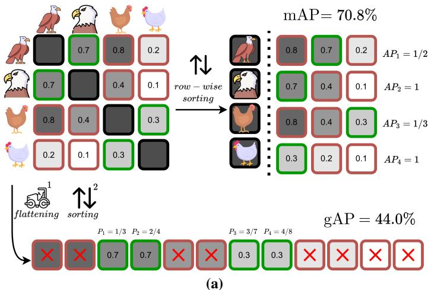

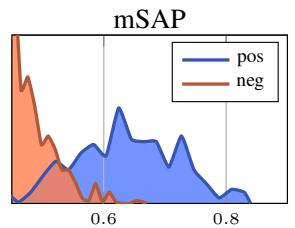

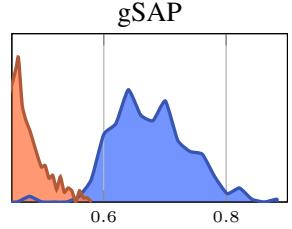  
(b)  
Figure 1: Overview of mAP and gAP and the effect of optimizing their surrogates. (a) Illustration of the metric computation for a batch of images. For mAP, each row of the similarity matrix is treated as an independent query: AP is computed per row after ranking the similarities, and the final score is obtained by averaging across queries. For gAP, all pairwise similarities are first aggregated into a single list, and a single AP value is computed globally. Consequently, mAP evaluates ranking quality per query and is insensitive to how similarities compare across queries, whereas gAP penalizes inconsistencies in similarity distributions across queries. (b) Distribution of positive and top-negative similarities after overfitting a single batch using mSAP (Brown et al., 2020) and the proposed gSAP loss. The proposed loss produces better separation between positive and negative similarities, allowing them to be distinguished by a single global threshold.

Brown et al., 2020; Ramzi et al., 2021), optimize the ranking of each query in isolation and therefore leave the similarity scales of different queries unconstrained. gSAP ranks the whole similarity matrix at once and replaces the loss of any model whose training objective is based on a similarity matrix.

Ranking the whole matrix also eases the trade-off between the fidelity of the surrogate and the flow of its gradient. A small temperature makes the sigmoid follow the step function closely (Qin et al., 2010; Brown et al., 2020), but saturates most comparisons, so their gradients vanish (Ramzi et al., 2021). Since gSAP involves many more comparisons than per-query surrogates, as each positive is compared with every similarity in the batch rather than with its own row only, a sufficient fraction of them remains unsaturated. This allows low temperatures, and thus an accurate AP approximation, without vanishing gradients, which is not possible for the per-query counterparts.

The formulation needs only a similarity matrix and a binary relevance matrix, and is therefore agnostic to the encoders, the modality, and the source of supervision. Relevance marks same-class pairs in supervised metric learning, matching pairs in image–text, video–text, or audio–text alignment, and augmented views of the same sample in self-supervised learning. To our knowledge, gSAP is the first ranking loss to replace InfoNCE in CLIP-style cross-modal and self-supervised training.

We evaluate gSAP by replacing only the loss in established recipes for supervised metric learning, CLIP and CLAP cross-modal alignment, MoCo v3 self-supervised pretraining, and tasks with distractor queries. Across all of them, gSAP improves gAP while remaining competitive in mAP and Recall@k, and outperforms InfoNCE and SigLIP, the two standard cross-modal losses, on every retrieval benchmark. It also yields better representations, as the encoders trained with it reach higher transfer, kNN and zero-shot classification accuracy. The gains come from the consistency across queries, which translates into more matches under a single shared threshold and the smallest loss of gAP when distractor queries are added.

In summary, our contributions are outlined below.

• We advocate gAP as a metric for representation learning, since it captures both ranking quality and the consistency of similarities across queries, which per-query metrics ignore.

• We propose gSAP, a smooth surrogate of gAP and a drop-in replacement for existing losses that keeps gradients alive at temperatures where per-query surrogates saturate, and negative dropping, which scales it to very large batches.

• On supervised, cross-modal (image, text, video, audio), self-supervised, and distractor-query tasks, where gSAP is the first ranking loss to replace InfoNCE, it attains the best gAP on every retrieval benchmark, matches or exceeds the best per-query metrics in nearly all cases, and gains by far the most when one threshold serves all queries.

## 2 RELATED WORK

Representation learning losses differ in how much of the similarity matrix they couple. Pairwise losses score each entry on its own; the contrastive loss (Chopra et al., 2005) with an absolute margin and SigLIP (Zhai et al., 2023) with a bias shared by all pairs impose one global threshold, but at a single operating point. Most losses act per query. Triplet (Schroff et al., 2015) and Multi-Similarity (Wang et al., 2019b) weight pairs relative to each anchor, and proxy losses (Deng et al., 2019; Kim et al., 2020) compare each sample with class proxies. InfoNCE (Oord et al., 2018), standard in vision– language (Radford et al., 2021) and self-supervised (Chen et al., 2021) learning, normalizes each row and column with a softmax; RankCLIP (Zhang et al., 2025) adds listwise ordinal-consistency terms across and within modalities. Ranking surrogates directly optimize per-query AP (Rolínek et al., 2020; Revaud et al., 2019; Brown et al., 2020; Ramzi et al., 2021) or Recall@k (Patel et al., 2022); GlobalAP (Liu et al., 2023), despite its name, extends each query’s list with a memory bank and still averages AP over queries. These surrogates depend only on within-query orderings and are unchanged by any per-query increasing transformation of the similarities, and each directional InfoNCE term is unchanged by a per-query offset in its own direction. None of these terms constrains how similarities compare across queries. Since per-query losses leave this unconstrained, comparable similarities are typically obtained with auxiliary terms (Ramzi et al., 2021; Zhang et al., 2024b; Liu et al., 2022) or post hoc through per-query score normalization (Jégou et al., 2007; Conneau et al., 2017; Pizzi et al., 2022). Batch-wise ranking across groups has also been explored in object detection (Chen et al., 2019), where AP is optimized over all anchors and classes of a batch via gradient approximation. By contrast, our approach trains models by directly optimizing a single surrogate loss that ranks all samples of the batch by their similarities, with every sample acting as a query, and requires neither additional regularization nor post-hoc operations. An extended discussion of related work is provided in Appendix A.

## 3 METHOD

## 3.1 AVERAGE PRECISION

Average Precision (AP) is a standard metric for evaluating the quality of ranking in information retrieval tasks (Schütze et al., 2008). It summarizes the Precision–Recall (PR) curve as the area under the curve, providing a single scalar value.

Let $\textbf { s } = ~ \left[ s _ { 1 } , \ldots , s _ { N } \right]$ denote an unsorted list of scalar similarities between items, and ${ \textbf { y } } =$ $[ y _ { 1 } , \dots , y _ { N } ]$ ], with $y _ { i } \in \{ 0 , 1 \}$ , the corresponding ground-truth labels, where $y _ { i } = 1$ indicates a positive (i.e. same class/semantics) item, and $y _ { i } = 0$ a negative item. We define the index sets of the positive items and of all items as:

$$
{ \mathcal { P } } ( \mathbf { y } ) = \{ i \mid y _ { i } = 1 \} \quad { \mathrm { a n d } } \quad \Omega = \{ 1 , \ldots , N \} .\tag{1}
$$

AP requires ranking the values in s in descending order and is defined as the average of precision values computed at the rank of each positive item as

$$
\mathrm { A P } ( \mathbf { s } , \mathbf { y } ) = \frac { 1 } { | \mathcal { P } ( \mathbf { y } ) | } \sum _ { i \in \mathcal { P } ( \mathbf { y } ) } \mathrm { P } _ { i } ( \mathbf { s } , \mathbf { y } )\tag{2}
$$

Computing precision $\mathrm { P } _ { i }$ related to item i requires counting the number of positives and the number of all items that are ranked before it (Qin et al., 2010). This counting process is performed by comparing $s _ { i }$ with the similarities of all positives and all other items. Precision of item i is given by

$$
\operatorname { P } _ { i } ( \mathbf { s } , \mathbf { y } ) = { \frac { \sum _ { j \in { \mathcal { P } } ( \mathbf { y } ) } h ( s _ { j } - s _ { i } ) } { \sum _ { j \in \Omega } h ( s _ { j } - s _ { i } ) } }\tag{3}
$$

where h is the Heaviside step function:

$$
h ( \Delta s ) = { \left\{ \begin{array} { l l } { 1 } & { \Delta s \geq 0 } \\ { 0 } & { { \mathrm { o t h e r w i s e } } } \end{array} \right. }\tag{4}
$$

AP is optimal, equal to 1, when all positives are ranked before all negatives.

## 3.2 EVALUATION METRICS

Consider a typical retrieval setting with M queries and N database items. The pairwise similarity matrix, comparing each query and database item, and the corresponding ground-truth label matrix are denoted by

$$
S = { \left[ \begin{array} { c c c } { s _ { 1 , 1 } } & { \cdots } & { s _ { 1 , N } } \\ { \vdots } & { \ddots } & { \vdots } \\ { s _ { M , 1 } } & { \cdots } & { s _ { M , N } } \end{array} \right] } \in \mathbb { R } ^ { M \times N } \quad Y = { \left[ \begin{array} { l l l } { y _ { 1 , 1 } } & { \cdots } & { y _ { 1 , N } } \\ { \vdots } & { \ddots } & { \vdots } \\ { y _ { M , 1 } } & { \cdots } & { y _ { M , N } } \end{array} \right] } \in \{ 0 , 1 \} ^ { M \times N } .\tag{5}
$$

Each row of these matrices corresponds to the similarities and labels of a query, with $S _ { i }$ and $Y _ { i }$ denoting the elements of the i-th row related to the i-th query.

mean Average Precision (mAP). mAP evaluates each query independently, in a row-wise fashion, and averages the AP across all queries:

$$
\operatorname { m A P } ( S , Y ) = \frac { 1 } { M } \sum _ { i = 1 } ^ { M } \operatorname { A P } ( S _ { i } , Y _ { i } ) .\tag{6}
$$

This metric evaluates the ranking quality separately per query, treating each query equally. There is no interaction between different queries, hence similarity distributions can vary among rows. This metric can be optimal even when similarities are not comparable across queries, e.g. the similarities of all positives of one row are smaller than all negatives of another row, despite AP being equal to 1 for both rows. Therefore, mAP does not reflect the consistency of similarities across queries.

global Average Precision (gAP). In the case of gAP, the AP is computed only once, considering similarities across all queries jointly. It is defined as:

$$
\operatorname { g A P } ( S , Y ) = \operatorname { A P } ( \operatorname { v e c } ( S ) , \operatorname { v e c } ( Y ) ) ,\tag{7}
$$

where vec : $\mathbb { R } ^ { M \times N } \to \mathbb { R } ^ { M N }$ is the row-wise flattening operation. This metric evaluates the global ranking quality across all queries jointly. Optimal gAP requires all positives, no matter the query, to have larger similarity than all negatives, no matter the query. Therefore, this metric is sensitive to variations in the similarity distribution across queries. It reflects both the ranking quality per query and the consistency of similarities across queries.

## 3.3 SURROGATE LOSSES

Standard AP relies on the discrete Heaviside step function (Eq. (4)) and is, therefore, nondifferentiable, which prevents direct gradient-based optimization. Prior works address this by smoothing the AP metric. Following Brown et al. (2020), we define the smooth surrogate of the binary indicator function as

$$
\tilde { h } ( \Delta s ) = \sigma ( \Delta s / \tau ) = \frac { 1 } { 1 + e ^ { - \Delta s / \tau } } ,\tag{8}
$$

where $\sigma ( \cdot )$ is the sigmoid function, and τ is a temperature parameter controlling smoothness. By using this approximation, the AP loss becomes differentiable and is optimized in an end-to-end manner. It is then straightforward to derive from Eq. (6) the surrogate mAP loss as

$$
\mathcal { L } _ { \mathrm { m S A P } } = 1 - \mathrm { m } \mathrm { \tilde { A } P } ( S , Y ) = 1 - \frac { 1 } { M } \sum _ { i = 1 } ^ { M } \mathrm { \tilde { A P } } ( S _ { i } , Y _ { i } ) ,\tag{9}
$$

where $\tilde { \mathrm { A P } } ( \cdot , \cdot )$ is the AP function implemented with the smooth surrogate from Eq. (8). Similarly, we can derive from Eq. (7) the smooth variant of gAP, called gSAP,

$$
{ \mathcal { L } } _ { \mathrm { g S A P } } = 1 - \operatorname { g } { \tilde { \mathrm { A P } } } ( S , Y ) = 1 - { \tilde { \mathrm { A P } } } ( \operatorname { v e c } ( S ) , \operatorname { v e c } ( Y ) ) .\tag{10}
$$

In that way, we obtain differentiable approximations of the two metrics that can be used to train deep similarity models. Smaller (larger) τ yields a steeper (smoother) sigmoid function and a better (worse) approximation of the exact metric. At the same time, a steep (smooth) sigmoid reaches saturation faster and has a larger (smaller) range where gradients are vanishing, and training is hindered.

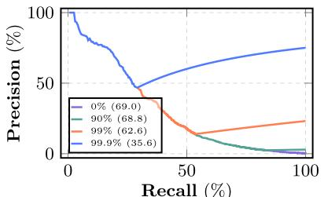

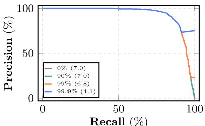  
Figure 2: Analysis of negative dropping. Precision–Recall curve computed on a single training batch using DINOv3 before (left) and after (right) training with varying percentages of lowest negative similarity dropping. The legend shows the drop rate α and the corresponding gSAP loss (in parentheses).

## 3.4 TRAINING WITH GLOBAL AVERAGE PRECISION

Representation learning. Encoders map inputs to a feature space where similarities between samples are estimated via cosine similarity. In the unimodal setting, an image encoder $f _ { \theta } : \mathcal { X }  \mathbb { R } ^ { d }$ maps an image $x _ { i }$ to an ℓ -normalized embedding $\mathbf { x } _ { i } = f _ { \theta } ( x _ { i } )$ , where θ are the learnable parameters. The similarity between two images $x _ { i } , x _ { j }$ with embeddings $\mathbf { x } _ { i } , \mathbf { x } _ { j } \in \mathbb { R } ^ { d }$ is computed as the dot product $s ( \mathbf { x } _ { i } , \mathbf { x } _ { j } ) = \mathbf { x } _ { i } ^ { \top } \mathbf { x } _ { j } ,$ , denoted $s _ { i j }$ . In the multimodal setting, separate encoders map inputs from different modalities into a shared embedding space. Given an image $x _ { i }$ and a text description $t _ { j } ,$ an image encoder $f _ { \theta } : \mathcal { X }  \mathbb { R } ^ { d }$ and a text encoder $g _ { \phi } : T \to \mathbb { R } ^ { d }$ are used to produce ℓ2-normalized embeddings $\mathbf { x } _ { i } = f _ { \theta } ( x _ { i } )$ and $\mathbf { t } _ { j } = g _ { \phi } ( t _ { j } )$ . Cross-modal similarity is computed as $s ( \mathbf { x } _ { i } , \mathbf { t } _ { j } ) = \mathbf { x } _ { i } ^ { \top } \mathbf { t } _ { j }$ Given a batch B of size $B ,$ , we compute the pairwise similarity matrix $S ^ { B } \in \mathbb { R } ^ { B \times B }$ and the corresponding binary label matrix $Y ^ { B } \in \{ 0 , 1 \} ^ { B ^ { \bullet } B }$ indicating whether pairs match. In the unimodal case, $\bar { \boldsymbol { B } } = [ x _ { 1 } , \dots , \bar { x } _ { B } ]$ is a batch of images and $Y ^ { B }$ encodes class matches between image pairs. In the multimodal case, $\dot { \boldsymbol { B } } = [ ( \boldsymbol { x } _ { 1 } , t _ { 1 } ) , \dots , ( \boldsymbol { x } _ { B } , t _ { B } ) ]$ consists of image–text pairs and $Y ^ { B }$ is typically the identity matrix indicating aligned image–text pairs. In the unimodal case, the diagonal entries are removed to avoid trivial self-matches. The models are then trained by optimizing either the mSAP or $\mathsf { g S A P }$ loss using $S ^ { B }$ and $Y ^ { B }$

Negative dropping. The cost of gSAP is linear in the number of pairwise similarities in the batch, and nearly all of them are negatives. The smallest negative similarities are already well separated from the positives and barely affect $\mathrm { g A P }$ . Hence, to reduce computational and memory requirements in gSAP, we drop the fraction $\alpha \in [ 0 \% , 1 0 0 \% ]$ of the smallest negative similarities. Dropping is implemented by removing these similarities, along with their corresponding labels, from the flattened similarity and label vectors used for the loss. All positives are kept, and the optimization focuses on the negatives that still violate the ranking. The rate α trades memory for fidelity to the full loss. Figure 2 shows its effect on the PR curve of a training batch. Removing up to 90% of the negatives only alters the low-precision tail of the curve, and since the loss is the area above the PR curve, a larger α simplifies the optimization and drives the loss towards zero. In practice, large values of α cost minimal performance and under a fixed GPU memory budget they allow larger batches.

## 3.5 ANALYSIS BY SINGLE BATCH OVERFITTING

To better understand the behavior of the surrogate losses during optimization, we conduct a toy experiment in which the model is deliberately overfitted on a single fixed batch, following the protocol of Figure 1(b). For each loss, we optimize the model for 20 iterations at four temperatures $\tau ,$ from the same initialization and on the same batch. Figure 3 tracks the mAP and $\mathrm { g A P }$ on the batch and the average number of unsaturated comparisons per positive. More precisely, a comparison is one term $\tilde { h } ( s _ { j } - s _ { i } )$ of the surrogate of Eq. (3), between a positive $i \in \mathcal { P } ( \mathbf { y } )$ and an item $j \in \Omega$ of the list the loss ranks, i.e. a row of S for mSAP and vec(S) for gSAP. A comparison is unsaturated when $| s _ { j } - s _ { i } | < 4 \tau , i . \epsilon$ . when it still carries non-zero gradient during back-propagation1.

We draw the following conclusions: (i) gSAP improves both metrics, mSAP lags behind in gAP. For $\tau \leq 0 . 0 1$ , where the surrogate approximates its metric, mAP and gAP move together under gSAP, whereas under mSAP gAP trails mAP by a considerable margin, increasingly so as τ decreases. mSAP is insensitive to the cross-query consistency that gAP depends on, so it improves gAP only as a side effect of better per-query rankings. gSAP, on the other hand, ranks the whole batch and moves both, at no cost in mAP, which is clearly above that of mSAP at three of the four temperatures. (ii) gSAP is robust to τ because its positives have more unsaturated comparisons. A small τ makes the surrogate exact but saturates the sigmoid comparisons (Qin et al., 2010; Brown et al., 2020). Empirically, the share of unsaturated comparisons is nearly the same for both losses, about 50%, 4%, 0.4% and 0.04% at the four temperatures at initialization, roughly proportional to τ, and it stays within a factor of two between the losses during training. What differs, by three orders of magnitude, is the number of comparisons per positive that enter the loss. mSAP scores each positive against the $B - 2 \approx 1 0 ^ { 3 }$ other similarities of its row, gSAP against the $B ( B - 1 ) \approx 1 0 ^ { 6 }$ similarities of the whole batch. The bottom row of the figure shows the product of the two, the average number of unsaturated comparisons per positive. $\mathrm { A \bar { t } } \tau = 1 0 ^ { - 4 }$ an mSAP positive has fewer than one, i.e. most positives receive no gradient, and the run stalls well below the other settings. By contrast, a gSAP positive still has more than 150 unsaturated comparisons, every positive keeps a gradient, and the run reaches the same mAP and gAP as at the other values of τ (validated in Figure C). This is why gSAP can operate in the regime of near-exact approximation that mSAP cannot. (iii) ${ \bf A t } \tau = 0 . 1$ both surrogates are poor proxies of their metric. Both runs end well below the others. Gradients are plentiful, but the approximation is loose and the optimization noisy. Even in this regime, gSAP reaches slightly higher values of both metrics. In summary, mSAP suffers more from the trade-off between an accurate approximation of the metric and the difficulty of optimizing it.

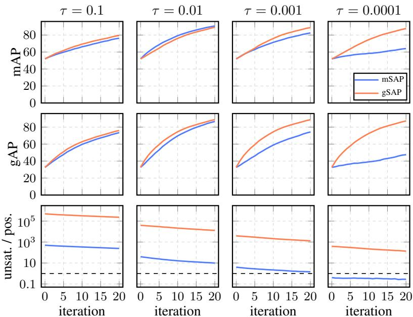  
Figure 3: Loss behavior analysis via single batch overfitting. One SOP training batch (250 classes $\times ~ 4$ images), DINOv3, 20 updates, the same batch and initialization in every panel; columns are temperatures τ, color is the loss (mSAP, gSAP). Top and middle: exact mAP and gAP on the batch, in %. Bottom: average number of unsaturated comparisons per positive $( | \Delta s | / \tau < 4 )$ , i.e. their total count divided by the number of positives, log scale. The dashed line indicates one unsaturated comparison per positive.

## 4 EXPERIMENTS

Cross-modal learning. We study vision–language representation learning by fine-tuning the released OpenAI CLIP ViT-B/32 (Radford et al., 2021). Starting from the pretrained model, we train for 5 additional epochs on the Conceptual 12M (CC12M) (Changpinyo et al., 2021) dataset using three alternative losses: (i) the original CLIP InfoNCE-based loss (Oord et al., 2018), (ii) the SigLIP sigmoid loss (Zhai et al., 2023), and (iii) our gSAP loss. We evaluate these models in zero-shot retrieval and classification. We follow the CLIP benchmark suite (Cherti & Beaumont, 2022), where applicable. Additional experiments with other vision–language models, further evaluation tasks and analyses, as well as experiments for audio–language alignment, are provided in Appendix B.1.

Table 1: Zero-shot retrieval on image datasets. gAP, mAP, and Recall@5 comparison of gSAP with CLIP and SigLIP losses. All models fine-tune the pretrained OpenAI CLIP ViT-B/32 for 5 epochs on CC12M.
<table><tr><td rowspan="2">method</td><td colspan="5">Flickr8k</td><td colspan="5">Flickr30k</td><td colspan="5">MS COCO</td></tr><tr><td>gAP</td><td>mAP t→i</td><td>mAP i→t</td><td>R@5 t→i</td><td>R@5 i→t</td><td>gAP</td><td>mAP t→i</td><td>mAP i→t</td><td>R@5 t→i</td><td>R@5 i→t</td><td>gAP</td><td>mAP t→i</td><td>mAP i→t</td><td>R@5 t→i</td><td>R@5 i→t</td></tr><tr><td>pretrained</td><td>31.0</td><td>65.0</td><td>57.7</td><td>79.2</td><td>92.0</td><td>45.3</td><td>68.7</td><td>62.7</td><td>82.9</td><td>94.0</td><td>13.1</td><td>42.1</td><td>36.7</td><td>55.0</td><td>73.4</td></tr><tr><td>+ CLIP</td><td>41.3</td><td>71.9</td><td>63.5</td><td>85.5</td><td>92.4</td><td>56.1</td><td>75.1</td><td>68.3</td><td>87.6</td><td>94.7</td><td>18.7</td><td>49.6</td><td>41.1</td><td>63.6</td><td>76.9</td></tr><tr><td>+ SigLIP</td><td>43.2</td><td>72.5</td><td>64.6</td><td>86.0</td><td>92.7</td><td>58.5</td><td>76.3</td><td>69.5</td><td>88.5</td><td>95.7</td><td>19.4</td><td>50.6</td><td>41.8</td><td>64.7</td><td>77.5</td></tr><tr><td>+ gSAP</td><td>45.1</td><td>73.2</td><td>65.6</td><td>86.7</td><td>93.3</td><td>59.7</td><td>76.6</td><td>70.5</td><td>88.9</td><td>96.0</td><td>21.4</td><td>51.3</td><td>43.1</td><td>65.3</td><td>79.0</td></tr></table>

Table 2: Zero-shot retrieval on video datasets. gAP and Recall@k comparison. Same setting as Table 1.
<table><tr><td rowspan="3">method</td><td colspan="7">ActivityNet</td><td colspan="7"></td><td colspan="7"></td></tr><tr><td>gAP</td><td></td><td>text→video</td><td></td><td></td><td>video→text</td><td></td><td>gAP</td><td></td><td>text→video</td><td></td><td></td><td>video→text</td><td></td><td>gAP</td><td></td><td>text→video</td><td></td><td>video→text</td><td></td><td></td></tr><tr><td></td><td>R@1</td><td>R@5</td><td>R@10R@1</td><td></td><td>R@5</td><td>R@10</td><td></td><td>R@1</td><td>R@5</td><td></td><td></td><td>R@10 R@1</td><td>R@5</td><td>R@10</td><td></td><td>R@1</td><td>R@5</td><td>R@10 R@1</td><td></td><td>R@5</td><td>R@10</td></tr><tr><td>pretrained</td><td>10.0</td><td>22.4</td><td>49.8</td><td>64.1</td><td>21.3</td><td>49.4</td><td>61.2</td><td>4.1</td><td>14.3</td><td>30.4</td><td>38.9</td><td></td><td>29.4</td><td>51.9</td><td>61.1</td><td>14.5</td><td>32.8</td><td>60.5</td><td>69.9</td><td>51.2</td><td>71.6</td><td>77.8</td></tr><tr><td>+ CLIP</td><td>13.6</td><td>27.7</td><td>61.0</td><td>72.8</td><td>26.7</td><td>57.6</td><td>70.3</td><td>4.1</td><td></td><td>16.2</td><td>33.8</td><td>42.8</td><td>28.0</td><td>49.2</td><td>59.5</td><td>22.0</td><td>38.9</td><td>67.4</td><td>76.9</td><td>50.4</td><td>73.7</td><td>81.8</td></tr><tr><td>+ SigLIP</td><td>13.0</td><td>28.8</td><td>62.0</td><td>74.2</td><td>25.9</td><td>56.0</td><td>69.1</td><td>4.2</td><td></td><td>16.6 34.5</td><td></td><td>43.5</td><td>28.6</td><td>50.9</td><td>61.1</td><td>21.4</td><td>39.8</td><td>67.8</td><td>77.1</td><td>52.3</td><td>73.6</td><td>81.1</td></tr><tr><td>+ gSAP</td><td>14.9</td><td>28.9</td><td>62.2</td><td>74.6</td><td>27.5</td><td>57.8</td><td>70.5</td><td></td><td>4.7</td><td>17.0</td><td>35.0</td><td>44.0</td><td>30.2</td><td>52.3</td><td>62.0</td><td>23.2</td><td>39.9</td><td>68.4</td><td>77.4</td><td>52.7</td><td>73.9</td><td>82.1</td></tr></table>

Table 3: Zero-shot classification on image and video datasets. Top-1, top-5, and mean per-class recall (mR) comparison of gSAP with CLIP (InfoNCE) and SigLIP losses. Same setting as Table 1.
<table><tr><td rowspan="3">method</td><td colspan="10">image datasets</td><td colspan="6">video datasets</td></tr><tr><td colspan="3">IN-1k</td><td colspan="3">IN-V2</td><td colspan="3">IN-R</td><td colspan="3">IN-Sketch</td><td colspan="2">K-400</td><td colspan="2">K-600</td><td colspan="2">K-700</td></tr><tr><td>top-1</td><td>top-5</td><td>mR</td><td>top-1</td><td>top-5</td><td>mR</td><td>top-1</td><td>top-5</td><td>mR</td><td>top-1</td><td>top-5</td><td>mR</td><td>top-1</td><td>top-5</td><td>top-1</td><td>top-5</td><td>top-1</td><td>top-5</td></tr><tr><td>pretrained</td><td>59.6</td><td>86.4</td><td>59.6</td><td>52.9</td><td>80.8</td><td>52.9</td><td>67.0</td><td>87.2</td><td>64.9</td><td>38.9</td><td>66.9</td><td>39.0</td><td>38.4</td><td>64.3</td><td>17.8</td><td>33.1</td><td>27.9</td><td>51.1</td></tr><tr><td>+ CLIP</td><td>60.7</td><td>87.4</td><td>60.7</td><td>53.6</td><td>82.0</td><td>53.6</td><td>68.3</td><td>87.9</td><td>66.8</td><td>42.3</td><td>70.4</td><td>42.3</td><td>39.4</td><td>65.8</td><td>18.6</td><td>34.3</td><td>29.1</td><td>53.5</td></tr><tr><td>+ SigLIP</td><td>61.3</td><td>87.8</td><td>61.3</td><td>54.1</td><td>82.1</td><td>54.2</td><td>69.1</td><td>88.2</td><td>67.8</td><td>43.2</td><td>71.6</td><td>43.3</td><td>39.8</td><td>66.3</td><td>19.0</td><td>34.8</td><td>29.5</td><td>54.1</td></tr><tr><td>+ gSAP</td><td>61.8</td><td>87.9</td><td>61.8</td><td>54.3</td><td>82.5</td><td>54.3</td><td>69.4</td><td>88.3</td><td>68.1</td><td>43.7</td><td>71.7</td><td>43.7</td><td>40.2</td><td>66.5</td><td>19.2</td><td>34.9</td><td>29.8</td><td>54.4</td></tr></table>

Zero-shot retrieval. We evaluate bidirectional retrieval, i.e., text→image/video and image/video→text, on three image datasets, Flickr8k (Hodosh et al., 2013), Flickr30k (Young et al., 2014), and MS COCO Captions (Chen et al., 2015) (Table 1), and three video datasets, ActivityNet (Caba Heilbron et al., 2015), MSR-VTT (Xu et al., 2016), and MSVD (Chen & Dolan, 2011) (Table 2). For image datasets, we report gAP, mAP, and Recall@5; for video datasets, we report gAP and Recall@k. Across all six datasets, gSAP delivers the strongest retrieval performance, with consistent gains over both InfoNCE and SigLIP in every metric and direction.

Zero-shot classification. We evaluate on four image datasets, ImageNet-1k (Deng et al., 2009), ImageNet-V2 (Recht et al., 2019), ImageNet-R (Hendrycks et al., 2021a), and ImageNet-Sketch (Wang et al., 2019a); and three video datasets, Kinetics-400 (Kay et al., 2017), -600 (Carreira et al., 2018), and -700 (Carreira et al., 2019) (Table 3), using the original prompt templates for each dataset. Across all seven datasets, gSAP again provides the most consistent gains, outperforming both InfoNCE and SigLIP in every metric. Beyond these seven datasets, we also evaluate on the full suite of 40 datasets of the benchmark (Cherti & Beaumont, 2022) (37 classification and 3 retrieval), spanning natural, fine-grained, satellite, medical, and synthetic imagery. Aggregating all 108 scores (Table R), gSAP improves on average by +0.49 over InfoNCE and +0.64 over SigLIP, indicating that the benefits of optimizing gAP also translate to improvements in recognition.

Self-supervised learning. In addition, we test whether the benefit survives without labels by following the MoCo v3 (Chen et al., 2021) recipe and replacing InfoNCE by gSAP, with everything else unchanged. Table 4 reports top-1 accuracy of frozen backbones under linear probing (LP) and k-nearest neighbors (kNN). Per-dataset results and settings are in Appendices B.2 and C.2. Three observations follow: (i) The gain carries over to the label-free setting, where gSAP trails only on in-distribution LP at ViT-B. (ii) The gain is consistently larger under kNN, which operates on the learned similarities directly, whereas

Table 4: Image classification with self-supervised pretraining. Top-1 accuracy of models trained with MoCo v3 using InfoNCE or gSAP. Performance of the frozen backbone with linear probing (LP) and k-nearest neighbors (kNN, k=20) on in-distribution (ID, ImageNet-1k), outof-distribution (OOD, mean of ImageNet-V2/-R/-Sketch), transfer learning (ten datasets), and robustness under corruption (ImageNet-C, 75 sets).
<table><tr><td rowspan="2">method</td><td rowspan="2">model</td><td colspan="2">ID</td><td colspan="2">OOD</td><td colspan="2">transfer</td><td colspan="2">robustness</td></tr><tr><td>LP</td><td>kNN</td><td>LP</td><td>kNN</td><td>LP</td><td>kNN</td><td>LP</td><td>kNN</td></tr><tr><td>InfoNCE</td><td>ViT-S</td><td>73.2</td><td>68.4</td><td>38.2</td><td>31.5</td><td>69.8</td><td>61.0</td><td>44.6</td><td>39.4</td></tr><tr><td>gSAP</td><td>ViT-S</td><td>73.5</td><td>70.9</td><td>39.7</td><td>35.4</td><td>73.9</td><td>65.5</td><td>46.3</td><td>44.7</td></tr><tr><td>InfoNCE</td><td>ViT-B</td><td>76.7</td><td>71.4</td><td>42.0</td><td>36.6</td><td>74.8</td><td>62.5</td><td>49.6</td><td>47.0</td></tr><tr><td>gSAP</td><td>ViT-B</td><td>75.6</td><td>72.8</td><td>42.0</td><td>38.1</td><td>77.8</td><td>66.8</td><td>49.7</td><td>48.6</td></tr></table>

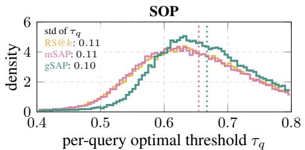

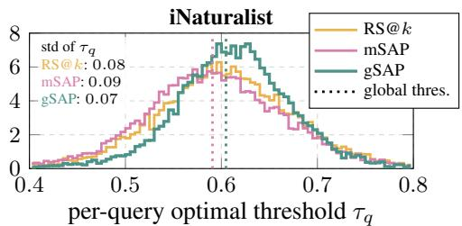  
Figure 4: Per-query optimal thresholds. Distribution of the F1-optimal threshold of each evaluation query. Dotted lines indicate the shared threshold selected on the fitting classes. Standard deviation of $\tau _ { q }$ per loss in the top-left of each panel.

LP fits a new linear map that can absorb a similarity scale that differs from query to query. (iii) The transfer gain is considerable and concentrated on the six fine-grained datasets (Table H), where hard negatives crowd the positives, which is what a single shared threshold penalizes. Furthermore, the same substitution improves music tagging in audio contrastive learning, so gSAP is not tied to a particular modality (Appendix B.2).

Metric learning. We compare gSAP with competing losses on two standard benchmarks, Stanford Online Products (SOP) (Oh Song et al., 2016) and iNaturalist (Van Horn et al., 2018), following the splits and setup of prior work (Brown et al., 2020; Patel et al., 2022). Evaluation settings and implementation details are provided in Appendix C.3.

Comparison with metric learning losses. Table 5 compares gSAP with pairwise (Contrastive (Chopra et al., 2005), Triplet (Schroff et al., 2015), Multi-Similarity (Wang et al., 2019b)), proxy (ArcFace (Deng et al., 2019), Proxy Anchor (Kim et al., 2020)) and ranking losses (the Recall@k surrogate RS@k (Patel et al., 2022), mSAP (Brown et al., 2020)) under fine-tuning of DINOv3 (Siméoni et al., 2025). gSAP achieves the best gAP on both datasets by a clear margin, while its mAP and R@1 remain close to the best. The ranking losses match gSAP on mAP and

Table 5: Metric learning losses comparison. Recall@1 (R@1), mAP and gAP on two datasets. gSAP is compared with ranking, pairwise, and proxy losses. Fine-tuning of DINOv3. No negative dropping is applied.
<table><tr><td rowspan="2">method</td><td colspan="3">SOP</td><td colspan="3">iNaturalist</td></tr><tr><td>R@1</td><td>mAP</td><td>gAP</td><td></td><td>R@1 mAP</td><td> $\mathrm { g A P }$ </td></tr><tr><td>Contrastive</td><td>85.3</td><td>68.4</td><td>53.7</td><td>80.6</td><td>42.1</td><td>28.0</td></tr><tr><td>Triplet</td><td>84.6</td><td>69.1</td><td>50.0</td><td>77.8</td><td>38.6</td><td>18.2</td></tr><tr><td>ArcFace</td><td>82.7</td><td>64.8</td><td>50.3</td><td>80.2</td><td>42.4</td><td>23.0</td></tr><tr><td>Proxy Anchor</td><td>84.7</td><td>67.7</td><td>51.9</td><td>78.7</td><td>40.9</td><td>21.8</td></tr><tr><td>Multi-Similarity</td><td>86.6</td><td>72.0</td><td>57.3</td><td>81.6</td><td>45.2</td><td>29.9</td></tr><tr><td>RS@k</td><td>86.7</td><td>72.5</td><td>56.7</td><td>81.0</td><td>44.5</td><td>26.6</td></tr><tr><td>mSAP</td><td>86.9</td><td>72.9</td><td>57.0</td><td>81.3</td><td>45.4</td><td>27.8</td></tr><tr><td>gSAP</td><td>86.8</td><td>72.9</td><td>58.9</td><td>81.5</td><td>45.5</td><td>31.6</td></tr></table>

R@1, so their lower gAP stems not from worse per-query ranking but from similarity distributions that are less consistent across queries, a property that gAP captures and mAP and R@1 do not. We delve into a theoretical analysis of the losses in Appendix E, in terms of their invariance to per-query similarity and the theoretical best $\mathrm { g A P }$ that can be achieved given the per-query ranking.

Table 6: One threshold for all queries. $\operatorname { F } 1 _ { q }$ is the mean per-query F1 when every query uses its own optimal threshold. $\operatorname { F } 1 _ { g }$ is the same mean when all queries share one threshold, i.e. it is applied globally, selected on the fitting classes. R@P90 is the recall of that shared threshold set for precision 0.90.
<table><tr><td rowspan="2">method</td><td colspan="3">SOP</td><td colspan="3">iNaturalist</td></tr><tr><td> $\operatorname { F } 1 _ { q }$ </td><td> $\operatorname { F } 1 _ { g }$ </td><td>R@P90</td><td> $\operatorname { F } 1 _ { q }$ </td><td> $\operatorname { F } 1 _ { g }$ </td><td>R@P90</td></tr><tr><td>RS@k</td><td>75.8</td><td>57.5</td><td>18.3</td><td>47.7</td><td>35.8</td><td>0.6</td></tr><tr><td>mSAP</td><td>76.2</td><td>57.6</td><td>18.7</td><td>48.5</td><td>36.6</td><td>0.7</td></tr><tr><td>gSAP</td><td>76.2</td><td>59.3</td><td>21.0</td><td>48.7</td><td>38.3</td><td>3.0</td></tr></table>

Consistency and thresholding. Consistency matters wherever one threshold has to serve every query. Table 6 shows this for the three ranking losses, with the test classes split into fitting classes, on which a threshold is selected, and evaluation classes, on which it is applied (Appendix C.3). When each query is allowed its own optimal threshold, the three losses perform on par on both datasets, in line with mAP and R@1, since the decision is then made within each query’s ranking. With a single threshold, selected on the fitting classes and shared by all

evaluation queries, gSAP outperforms both other losses on both datasets. Notably, at a precision of 0.90, it retrieves 12% more matches than mSAP, the second best, on SOP and 4× as many on iNaturalist. Figure 4 indicates the reason for its effectiveness. The per-query optimal thresholds of gSAP are more concentrated around the shared one, so a single value fits more queries. The gap between $\operatorname { F } 1 _ { q }$ and $\operatorname { F } 1 _ { g }$ is the cost of inconsistent similarities, and gSAP reduces it without changing what happens inside each query.

Table 7: Comparison with the metric learning state-of-the-art. Recall@k (R@k) of the vanilla losses as reported in the original papers on two datasets and on two backbones. R50 stands for ResNet50. Dimensionality of the output representations is indicated in the superscript. Best in bold, second best underlined. 4,000 batch size and α=95% drop rate are used.
<table><tr><td rowspan="2">method</td><td rowspan="2"> $\mathbf { a r c h . } ^ { \mathrm { d i m } }$ </td><td colspan="3">SOP</td><td colspan="3">iNaturalist</td></tr><tr><td>R@1</td><td>R@10</td><td>R@100</td><td>R@1</td><td>R@4</td><td>R@16</td></tr><tr><td>Triplet SH (Wu et al., 2017)</td><td> $\mathsf { R 5 0 } ^ { 5 1 2 }$ </td><td>72.7</td><td>86.2</td><td>93.8</td><td>58.1</td><td>75.5</td><td>86.8</td></tr><tr><td>NormSoftmax (Zhai &amp; Wu, 2019)</td><td> $\mathsf { R 5 0 } ^ { 5 1 2 }$ </td><td>78.2</td><td>90.6</td><td>96.2</td><td>1</td><td></td><td></td></tr><tr><td>FastAP (Cakir et al., 2019)</td><td> $\mathsf { R 5 0 } ^ { 5 1 2 }$ </td><td>76.4</td><td>89.0</td><td>95.1</td><td>60.6</td><td>77.0</td><td>87.2</td></tr><tr><td>Blackbox (Rolínek et al., 2020)</td><td> $\mathrm { R } 5 0 ^ { 5 1 2 }$ </td><td>78.6</td><td>90.5</td><td>96.0</td><td>62.9</td><td>79.0</td><td>88.9</td></tr><tr><td>SoftBin (Revaud et al., 2019)</td><td> $\mathsf { R 5 0 } ^ { 5 1 2 }$ </td><td>80.6</td><td>91.3</td><td>96.1</td><td>64.2</td><td>77.1</td><td>82.7</td></tr><tr><td>ProxyNCA (Movshovitz-Attias et al., 2017)</td><td> $\mathsf { R 5 0 } ^ { 5 1 2 }$ </td><td>73.7</td><td></td><td>1</td><td>61.6</td><td>77.4</td><td>87.0</td></tr><tr><td>ProxyNCA++ (Teh et al., 2020)</td><td> $\mathsf { R 5 0 } ^ { 5 1 2 }$ </td><td>80.7</td><td>92.5</td><td>96.7</td><td></td><td></td><td></td></tr><tr><td>SAP (Brown et al., 2020)</td><td> $\mathsf { R 5 0 } ^ { 5 1 2 }$ </td><td>80.1</td><td>91.5</td><td>96.6</td><td>67.2</td><td>81.8</td><td>90.3</td></tr><tr><td>ROADMAP (Ramzi et al., 2021)</td><td> $\mathsf { R 5 0 } ^ { 5 1 2 }$ </td><td>83.1</td><td>92.7</td><td>96.3</td><td>69.1</td><td>83.1</td><td>91.3</td></tr><tr><td>RS@k (Patel et al., 2022)</td><td> $\mathsf { R 5 0 } ^ { 5 1 2 }$ </td><td>82.8</td><td>92.9</td><td>97.0</td><td>71.2</td><td>84.0</td><td>91.3</td></tr><tr><td>HIER (Kim et al., 2023)</td><td> $\mathsf { R 5 0 } ^ { 5 1 2 }$ </td><td>80.2</td><td>91.5</td><td>96.6</td><td>一</td><td></td><td></td></tr><tr><td>Potential Field (Bhatnagar &amp; Ahuja, 2025)</td><td> $\mathsf { R 5 0 } ^ { 5 1 2 }$ </td><td>82.9</td><td>92.5</td><td>96.8</td><td>1</td><td>1</td><td></td></tr><tr><td>gSAP</td><td>R50⁵12</td><td>83.3</td><td>93.2</td><td>97.0</td><td>71.3</td><td>84.1</td><td>91.3</td></tr><tr><td>SAP (Brown et al., 2020)</td><td> $\mathrm { V i T - B } / 1 6 ^ { 5 1 2 }$ </td><td>86.6</td><td>95.4</td><td>98.4</td><td>79.1</td><td>89.0</td><td>94.2</td></tr><tr><td>RS@k (Patel et al., 2022)</td><td> $\mathrm { V i T - B } / 1 6 ^ { 5 1 2 }$ </td><td>88.0</td><td>96.1</td><td>98.6</td><td>83.9</td><td>92.1</td><td>95.9</td></tr><tr><td>gSAP</td><td> $\mathrm { V i T - B } / 1 6 ^ { 5 1 2 }$ </td><td>88.4</td><td>96.3</td><td>98.7</td><td>84.9</td><td>92.8</td><td>96.5</td></tr></table>

Table 8: Tasks with distractor queries. gAP: all queries. $\mathrm { \bf g A P ^ { - } } { } ;$ : distractor queries removed. drop: relative drop (%); lower is better. SN: after score normalization (Pizzi et al., 2022). Best in bold, second best underlined.
<table><tr><td rowspan="2">method</td><td colspan="6">DISC21</td><td colspan="3">Met</td><td colspan="3">ILIAS</td><td colspan="3">WildlifeReID-10k</td></tr><tr><td> $\mathrm { g A P }$ </td><td> $\mathrm { g A P ^ { - } }$ </td><td>drop↓</td><td> $\mathrm { g A P _ { S N } }$ </td><td> $\mathrm { g A P _ { S N } ^ { - } }$ </td><td>drop↓</td><td> $\mathrm { \ g A P }$ </td><td> $\mathrm { g A P ^ { - } }$ </td><td>drop↓</td><td> $\mathrm { g A P }$ </td><td> $\mathrm { g A P ^ { - } }$ </td><td>drop↓</td><td> $\mathrm { \ g A P }$ </td><td> $\mathrm { { g A P } ^ { - } }$ </td><td>drop↓</td></tr><tr><td>baseline</td><td>51.6</td><td>64.6</td><td>20.1</td><td>65.5</td><td>70.1</td><td>6.6</td><td>30.4</td><td>52.9</td><td>42.5</td><td>3.5</td><td>17.1</td><td>79.5</td><td>69.5</td><td>73.9</td><td>6.0</td></tr><tr><td>InfoNCE</td><td>50.2</td><td>66.0</td><td>23.9</td><td>67.5</td><td>73.3</td><td>7.9</td><td>56.2</td><td>72.2</td><td>22.2</td><td>7.4</td><td>22.0</td><td>66.4</td><td>77.1</td><td>80.0</td><td>3.6</td></tr><tr><td>mSAP</td><td>54.5</td><td>68.2</td><td>20.1</td><td>68.0</td><td>73.2</td><td>7.1</td><td>58.3</td><td>73.0</td><td>20.1</td><td>5.6</td><td>19.6</td><td>71.4</td><td>80.2</td><td>82.8</td><td>3.1</td></tr><tr><td>gSAP</td><td>55.9</td><td>69.0</td><td>19.0</td><td>68.5</td><td>73.7</td><td>7.1</td><td>62.8</td><td>73.0</td><td>14.0</td><td>8.7</td><td>22.7</td><td>61.7</td><td>80.9</td><td>83.2</td><td>2.8</td></tr></table>

Comparison with state-of-the-art methods. Table 7 compares gSAP with the state of the art on SOP and iNaturalist using ResNet50 (He et al., 2016) and ViT-B/16 (Dosovitskiy et al., 2021) backbones. For these experiments, we leverage the proposed negative dropping strategy with 95% drop rate, to scale the batch size to 4,000 on a single GPU. gSAP ranks among the state of the art across both datasets and architectures, showing that optimizing the gAP surrogate also yields strong performance on the standard retrieval settings.

Tasks with distractor queries. We finally evaluate on four tasks where a large share of queries are distractor queries, i.e. queries with no relevant item in the database: copy detection (DISC21 (Douze et al., 2021)), instance-level recognition (Met (Ypsilantis et al., 2021)) and retrieval (ILIAS (Kordopatis-Zilos et al., 2025)), and animal re-identification (WildlifeReID-10k (Adam et al., 2025)). These are the settings the proposed loss targets, as they traditionally employ gAP for evaluation. The system must decide with one threshold, shared across queries, whether a match exists at all, so a distractor query is handled correctly only if its negatives fall below the positives of other queries. Per-query metrics ignore distractor queries, since a query without positives has no AP, whereas gAP considers all their negatives. Additional results and settings are in Appendices B.4 and C.4. gSAP attains the best gAP on all four tasks and the smallest drop before score normalization. The gain is mostly cross-query. On Met, mSAP and gSAP are identical without distractors and gSAP is 4.5 gAP ahead with them. SN brings the drops of all losses close together but does not close the gap between mSAP and gSAP on DISC21 for gAP, so a post-hoc correction recovers only part of what training for gAP provides. Finally, the second-best method varies across datasets and settings.

## 5 CONCLUSIONS

We revisit global Average Precision (gAP), which evaluates ranking quality together with the consistency of similarities across queries, and propose gSAP, a differentiable surrogate of it. gSAP operates on the same input as the standard losses of established training recipes, a similarity matrix and its binary relevance labels, and swapping it in, and nothing else, improves supervised metric learning, cross-modal alignment, and self-supervised pretraining, surpassing the well-established InfoNCE where it is the first ranking loss to replace it. Its similarities are more consistent across queries, which pays off whenever one threshold serves all queries. Its cost is quadratic in the batch size, which negative dropping mitigates, and part of the achievable consistency remains unrealized, leaving room for complementary approaches, $e . g .$ learnable post-hoc score normalization (Pizzi et al., 2022).

## REFERENCES

Lukas Adam, Vojtech Cermak, Kostas Papafitsoros, and Lukas Picek. WildlifeReID-10k: Wildlife re-identification dataset with 10k individual animals. In CVPRW, 2025. 9, 30

Takuya Akiba, Shotaro Sano, Toshihiko Yanase, Takeru Ohta, and Masanori Koyama. Optuna: A next-generation hyperparameter optimization framework. In SIGKDD, 2019. 29

Roland Auckenthaler, Michael Carey, and Harvey Lloyd-Thomas. Score normalization for textindependent speaker verification systems. Digital Signal Processing, 2000. 36

Hangbo Bao, Li Dong, Songhao Piao, and Furu Wei. BEiT: BERT pre-training of image transformers. In ICLR, 2022. 19

Andrei Barbu, David Mayo, Julian Alverio, William Luo, Christopher Wang, Dan Gutfreund, Joshua Tenenbaum, and Boris Katz. ObjectNet: A large-scale bias-controlled dataset for pushing the limits of object recognition models. In NeurIPS, 2019. 27

Charles Beattie, Joel Z. Leibo, Denis Teplyashin, Tom Ward, Marcus Wainwright, Heinrich Küttler, Andrew Lefrancq, Simon Green, Victor Valdés, Amir Sadik, Julian Schrittwieser, Keith Anderson, Sarah York, Michael Cant, Adam Cain, Adrian Bolton, Stephen Gaffney, Helen King, Demis Hassabis, Shane Legg, and Stig Petersen. DeepMind Lab. In arXiv, 2016. 27

Shubhang Bhatnagar and Narendra Ahuja. Potential field based deep metric learning. In CVPR, 2025. 9, 18

Daniel Bolya, Po-Yao Huang, Peize Sun, Jang Hyun Cho, Andrea Madotto, Chen Wei, Tengyu Ma, Jiale Zhi, Jathushan Rajasegaran, Hanoona Rasheed, et al. Perception encoder: The best visual embeddings are not at the output of the network. In NeurIPS, 2025. 26, 30

Lukas Bossard, Matthieu Guillaumin, and Luc Van Gool. Food-101 – mining discriminative components with random forests. In ECCV, 2014. 28

Andrew Brown, Weidi Xie, Vicky Kalogeiton, and Andrew Zisserman. Smooth-ap: Smoothing the path towards large-scale image retrieval. In ECCV, 2020. 2, 3, 4, 6, 8, 9, 19, 24, 25, 29

Chris Burges, Tal Shaked, Erin Renshaw, Ari Lazier, Matt Deeds, Nicole Hamilton, and Greg Hullender. Learning to rank using gradient descent. In ICML, 2005. 19

Fabian Caba Heilbron, Victor Escorcia, Bernard Ghanem, and Juan Carlos Niebles. ActivityNet: A large-scale video benchmark for human activity understanding. In CVPR, 2015. 7, 27

Fatih Cakir, Kun He, Xide Xia, Brian Kulis, and Stan Sclaroff. Deep metric learning to rank. In CVPR, 2019. 9, 19

Mathilde Caron, Hugo Touvron, Ishan Misra, Hervé Jégou, Julien Mairal, Piotr Bojanowski, and Armand Joulin. Emerging properties in self-supervised vision transformers. In ICCV, 2021. 19

Joao Carreira, Eric Noland, Andras Banki-Horvath, Chloe Hillier, and Andrew Zisserman. A short note about Kinetics-600. In arXiv, 2018. 7, 27

Joao Carreira, Eric Noland, Chloe Hillier, and Andrew Zisserman. A short note on the Kinetics-700 human action dataset. In arXiv, 2019. 7, 27

Vojtechˇ Cermák, Lukas Picek, Lukáš Adam, and Kostas Papafitsoros. WildlifeDatasets: An open-ˇ source toolkit for animal re-identification. In WACV, 2024. 30

Soravit Changpinyo, Piyush Sharma, Nan Ding, and Radu Soricut. Conceptual 12M: Pushing web-scale image-text pre-training to recognize long-tail visual concepts. In CVPR, 2021. 6, 27

David Chen and William B Dolan. Collecting highly parallel data for paraphrase evaluation. In ACL, 2011. 7, 27

Ke Chen, Xingjian Du, Bilei Zhu, Zejun Ma, Taylor Berg-Kirkpatrick, and Shlomo Dubnov. HTS-AT: A hierarchical token-semantic audio transformer for sound classification and detection. In ICASSP, 2022. 20, 28

Kean Chen, Jianguo Li, Weiyao Lin, John See, Ji Wang, Lingyu Duan, Zhibo Chen, Changwei He, and Junni Zou. Towards accurate one-stage object detection with AP-loss. In CVPR, 2019. 3

Ting Chen, Simon Kornblith, Mohammad Norouzi, and Geoffrey Hinton. A simple framework for contrastive learning of visual representations. In ICML, 2020. 19

Xinlei Chen, Hao Fang, Tsung-Yi Lin, Ramakrishna Vedantam, Saurabh Gupta, Piotr Dollár, and C Lawrence Zitnick. Microsoft COCO captions: Data collection and evaluation server. In arXiv, 2015. 7, 27

Xinlei Chen, Saining Xie, and Kaiming He. An empirical study of training self-supervised vision transformers. In ICCV, 2021. 3, 7, 19, 28

Yuxin Chen, Zongyang Ma, Ziqi Zhang, Zhongang Qi, Chunfeng Yuan, Bing Li, Junfu Pu, Ying Shan, Xiaojuan Qi, and Weiming Hu. How to make cross encoder a good teacher for efficient image-text retrieval? In CVPR, 2024. 18

Gong Cheng, Junwei Han, and Xiaoqiang Lu. Remote sensing image scene classification: Benchmark and state of the art. Proceedings ofthe IEEE, 2017. 27

Mehdi Cherti and Romain Beaumont. CLIP benchmark, 2022. 6, 7, 27, 28, 31

Mehdi Cherti, Romain Beaumont, Ross Wightman, Mitchell Wortsman, Gabriel Ilharco, Cade Gordon, Christoph Schuhmann, Ludwig Schmidt, and Jenia Jitsev. Reproducible scaling laws for contrastive language-image learning. In CVPR, 2023. 27

Sumit Chopra, Raia Hadsell, and Yann LeCun. Learning a similarity metric discriminatively, with application to face verification. In CVPR, 2005. 3, 8, 18

Mircea Cimpoi, Subhransu Maji, Iasonas Kokkinos, Sammy Mohamed, and Andrea Vedaldi. Describing textures in the wild. In CVPR, 2014. 27, 28

Adam Coates, Andrew Y. Ng, and Honglak Lee. An analysis of single-layer networks in unsupervised feature learning. In AISTATS, 2011. 27

Alexis Conneau, Guillaume Lample, Marc’Aurelio Ranzato, Ludovic Denoyer, and Hervé Jégou. Word translation without parallel data. In ICLR, 2017. 3

Jia Deng, Wei Dong, Richard Socher, Li-Jia Li, Kai Li, and Li Fei-Fei. ImageNet: A large-scale hierarchical image database. In CVPR, 2009. 7, 27, 28

Jiankang Deng, Jia Guo, Niannan Xue, and Stefanos Zafeiriou. ArcFace: Additive angular margin loss for deep face recognition. In CVPR, 2019. 3, 8, 18

Alexey Dosovitskiy, Lucas Beyer, Alexander Kolesnikov, Dirk Weissenborn, Xiaohua Zhai, Thomas Unterthiner, Mostafa Dehghani, Matthias Minderer, Georg Heigold, Sylvain Gelly, et al. An image is worth 16x16 words: Transformers for image recognition at scale. In ICLR, 2021. 9, 29

Matthijs Douze, Giorgos Tolias, Ed Pizzi, Zoë Papakipos, Lowik Chanussot, Filip Radenovic, Tomas Jenicek, Maxim Maximov, Laura Leal-Taixé, Ismail Elezi, et al. The 2021 image similarity dataset and challenge. In arXiv, 2021. 1, 9, 30

Konstantinos Drossos, Samuel Lipping, and Tuomas Virtanen. Clotho: An audio captioning dataset. In ICASSP, 2020. 20, 27

Linus Ericsson, Henry Gouk, and Timothy M. Hospedales. How well do self-supervised models transfer? In CVPR, 2021. 29

Aleksandr Ermolov, Leyla Mirvakhabova, Valentin Khrulkov, Nicu Sebe, and Ivan Oseledets. Hyperbolic vision transformers: Combining improvements in metric learning. In CVPR, 2022. 18

Mark Everingham, Luc Van Gool, Christopher K. I. Williams, John Winn, and Andrew Zisserman. The pascal visual object classes (VOC) challenge. IJCV, 2010. 27

Tom Fawcett and Alexandru Niculescu-Mizil. PAV and the ROC convex hull. Machine Learning, 2007. 36

Li Fei-Fei, Rob Fergus, and Pietro Perona. Learning generative visual models from few training examples: An incremental Bayesian approach tested on 101 object categories. In CVPRW, 2004. 27

Andreas Geiger, Philip Lenz, and Raquel Urtasun. Are we ready for autonomous driving? the KITTI vision benchmark suite. In CVPR, 2012. 27

Jort F. Gemmeke, Daniel P. W. Ellis, Dylan Freedman, Aren Jansen, Wade Lawrence, R. Channing Moore, Manoj Plakal, and Marvin Ritter. Audio set: An ontology and human-labeled dataset for audio events. In ICASSP, 2017. 20, 28

Ian J. Goodfellow, Dumitru Erhan, Pierre Luc Carrier, Aaron Courville, Mehdi Mirza, Ben Hamner, Will Cukierski, Yichuan Tang, David Thaler, Dong-Hyun Lee, Yingbo Zhou, Chetan Ramaiah, Fangxiang Feng, Ruifan Li, Xiaojie Wang, Dimitris Athanasakis, John Shawe-Taylor, Maxim Milakov, John Park, Radu Ionescu, Marius Popescu, Cristian Grozea, James Bergstra, Jingjing Xie, Lukasz Romaszko, Bing Xu, Zhang Chuang, and Yoshua Bengio. Challenges in representation learning: A report on three machine learning contests. In ICONIP, 2013. 27

Jean-Bastien Grill, Florian Strub, Florent Altché, Corentin Tallec, Pierre H. Richemond, Elena Buchatskaya, Carl Doersch, Bernardo Avila Pires, Zhaohan Daniel Guo, Mohammad Gheshlaghi Azar, Bilal Piot, Koray Kavukcuoglu, Rémi Munos, and Michal Valko. Bootstrap your own latent: A new approach to self-supervised learning. In NeurIPS, 2020. 19

Chuan Guo, Geoff Pleiss, Yu Sun, and Kilian Q Weinberger. On calibration of modern neural networks. In ICML, 2017. 19

Kaiming He, Xiangyu Zhang, Shaoqing Ren, and Jian Sun. Deep residual learning for image recognition. In CVPR, 2016. 9, 29

Kaiming He, Haoqi Fan, Yuxin Wu, Saining Xie, and Ross Girshick. Momentum contrast for unsupervised visual representation learning. In CVPR, 2020. 19

Kaiming He, Xinlei Chen, Saining Xie, Yanghao Li, Piotr Dollár, and Ross Girshick. Masked autoencoders are scalable vision learners. In CVPR, 2022. 19

Patrick Helber, Benjamin Bischke, Andreas Dengel, and Damian Borth. EuroSAT: A novel dataset and deep learning benchmark for land use and land cover classification. J-STARS, 2019. 27

Dan Hendrycks and Thomas Dietterich. Benchmarking neural network robustness to common corruptions and perturbations. In ICLR, 2019. 22, 28

Dan Hendrycks, Steven Basart, Norman Mu, Saurav Kadavath, Frank Wang, Evan Dorundo, Rahul Desai, Tyler Zhu, Samyak Parajuli, Mike Guo, Dawn Song, Jacob Steinhardt, and Justin Gilmer. The many faces of robustness: A critical analysis of out-of-distribution generalization. In ICCV, 2021a. 7, 27, 28

Dan Hendrycks, Kevin Zhao, Steven Basart, Jacob Steinhardt, and Dawn Song. Natural adversarial examples. In CVPR, 2021b. 27

Micah Hodosh, Peter Young, and Julia Hockenmaier. Framing image description as a ranking task: Data, models and evaluation metrics. JAIR, 2013. 7, 27

Gabriel Ilharco, Mitchell Wortsman, Ross Wightman, Cade Gordon, Nicholas Carlini, Rohan Taori, Achal Dave, Vaishaal Shankar, Hongseok Namkoong, John Miller, Hannaneh Hajishirzi, Ali Farhadi, and Ludwig Schmidt. OpenCLIP, 2021. 27

Kalervo Järvelin and Jaana Kekäläinen. Cumulated gain-based evaluation of IR techniques. TOIS, 2002. 19

Hervé Jégou, Hedi Harzallah, and Cordelia Schmid. A contextual dissimilarity measure for accurate and efficient image search. In CVPR, 2007. 3, 36

Herve Jegou, Matthijs Douze, and Cordelia Schmid. Product quantization for nearest neighbor search. TPAMI, 2010. 19

Justin Johnson, Bharath Hariharan, Laurens van der Maaten, Li Fei-Fei, C. Lawrence Zitnick, and Ross Girshick. CLEVR: A diagnostic dataset for compositional language and elementary visual reasoning. In CVPR, 2017. 27

Kaggle and EyePACS. Diabetic retinopathy detection, 2015. 27

Ioannis Kakogeorgiou, Spyros Gidaris, Bill Psomas, Yannis Avrithis, Andrei Bursuc, Konstantinos Karantzalos, and Nikos Komodakis. What to hide from your students: Attention-guided masked image modeling. In ECCV, 2022. 19

Will Kay, Joao Carreira, Karen Simonyan, Brian Zhang, Chloe Hillier, Sudheendra Vijayanarasimhan, Fabio Viola, Tim Green, Trevor Back, Paul Natsev, et al. The Kinetics human action video dataset. In arXiv, 2017. 7, 27

Chris Dongjoo Kim, Byeongchang Kim, Hyunmin Lee, and Gunhee Kim. AudioCaps: Generating captions for audios in the wild. In NAACL, 2019. 20, 27

Sungyeon Kim, Dongwon Kim, Minsu Cho, and Suha Kwak. Proxy anchor loss for deep metric learning. In CVPR, 2020. 3, 8, 18

Sungyeon Kim, Boseung Jeong, and Suha Kwak. HIER: Metric learning beyond class labels via hierarchical regularization. In CVPR, 2023. 9, 18

Giorgos Kordopatis-Zilos, Giorgos Tolias, Christos Tzelepis, Ioannis Kompatsiaris, Ioannis Patras, and Symeon Papadopoulos. Self-supervised video similarity learning. In CVPRW, 2023. 1

Giorgos Kordopatis-Zilos, Vladan Stojnic, Anna Manko, Pavel Šuma, Nikolaos-Antonios Ypsilantis, ´ Nikos Efthymiadis, Zakaria Laskar, Jiˇrí Matas, Ondˇrej Chum, and Giorgos Tolias. ILIAS: Instancelevel image retrieval at scale. In CVPR, 2025. 9, 30

Simon Kornblith, Jonathon Shlens, and Quoc V. Le. Do better ImageNet models transfer better? In CVPR, 2019. 29

Jonathan Krause, Michael Stark, Jia Deng, and Li Fei-Fei. 3D object representations for fine-grained categorization. In CVPRW, 2013. 27, 28

Alex Krizhevsky. Learning multiple layers of features from tiny images. Technical Report, University of Toronto, 2009. 27, 28

Edith Law, Kris West, Michael I Mandel, Mert Bay, and J Stephen Downie. Evaluation of algorithms using games: The case of music tagging. In ISMIR, 2009. 23, 29

Yann LeCun, Léon Bottou, Yoshua Bengio, and Patrick Haffner. Gradient-based learning applied to document recognition. Proceedings ofthe IEEE, 1998. 27

Yann LeCun, Fu Jie Huang, and Léon Bottou. Learning methods for generic object recognition with invariance to pose and lighting. In CVPR, 2004. 27

Jongpil Lee, Jiyoung Park, Keunhyoung Luke Kim, and Juhan Nam. Sample-level deep convolutional neural networks for music auto-tagging using raw waveforms. In SMC, 2017. 29

Wei Li, Rui Zhao, Tong Xiao, and Xiaogang Wang. DeepReID: Deep filter pairing neural network for person re-identification. In CVPR, 2014. 1

Jiaheng Liu, Zhipeng Yu, Haoyu Qin, Yichao Wu, Ding Liang, Gangming Zhao, and Ke Xu. OneFace: One threshold for all. In ECCV, 2022. 3, 19

Weiyang Liu, Yandong Wen, Zhiding Yu, Ming Li, Bhiksha Raj, and Le Song. SphereFace: Deep hypersphere embedding for face recognition. In CVPR, 2017. 18

Yifei Liu, Yaling Liang, Pengfei Wang, Ziheng Chen, and Changxing Ding. Globalap: Global average precision optimization for person re-identification. Pattern Recognition, 2023. 3, 19

Yinhan Liu, Myle Ott, Naman Goyal, Jingfei Du, Mandar Joshi, Danqi Chen, Omer Levy, Mike Lewis, Luke Zettlemoyer, and Veselin Stoyanov. RoBERTa: A robustly optimized BERT pretraining approach. In arXiv, 2019. 28

Ilya Loshchilov and Frank Hutter. Decoupled weight decay regularization. In ICLR, 2019. 28, 29

Subhransu Maji, Esa Rahtu, Juho Kannala, Matthew Blaschko, and Andrea Vedaldi. Fine-grained visual classification of aircraft. In arXiv, 2013. 27, 28

Loic Matthey, Irina Higgins, Demis Hassabis, and Alexander Lerchner. dSprites: Disentanglement testing sprites dataset, 2017. 27

Yair Movshovitz-Attias, Alexander Toshev, Thomas K Leung, Sergey Ioffe, and Saurabh Singh. No fuss distance metric learning using proxies. In ICCV, 2017. 9, 18

Yuval Netzer, Tao Wang, Adam Coates, Alessandro Bissacco, Bo Wu, and Andrew Y. Ng. Reading digits in natural images with unsupervised feature learning. In NeurIPSW, 2011. 27

Maria-Elena Nilsback and Andrew Zisserman. Automated flower classification over a large number of classes. In ICVGIP, 2008. 27, 28

Hyun Oh Song, Yu Xiang, Stefanie Jegelka, and Silvio Savarese. Deep metric learning via lifted structured feature embedding. In CVPR, 2016. 8, 18, 29

Aaron van den Oord, Yazhe Li, and Oriol Vinyals. Representation learning with contrastive predictive coding. In arXiv, 2018. 1, 3, 6, 28

OpenAI. The Country211 dataset, 2021. 27

Maxime Oquab, Timothée Darcet, Théo Moutakanni, Huy Vo, Marc Szafraniec, Vasil Khalidov, Pierre Fernandez, Daniel Haziza, Francisco Massa, Alaaeldin El-Nouby, et al. DINOv2: Learning robust visual features without supervision. TMLR, 2024. 19

Lasha Otarashvili, Tamilselvan Subramanian, Jason Holmberg, J.J. Levenson, and Charles V. Stewart. Multispecies animal re-id using a large community-curated dataset. In arXiv, 2024. 30

Omkar M. Parkhi, Andrea Vedaldi, Andrew Zisserman, and C. V. Jawahar. Cats and dogs. In CVPR, 2012. 27, 28

Adam Paszke, Sam Gross, Francisco Massa, Adam Lerer, James Bradbury, Gregory Chanan, Trevor Killeen, Zeming Lin, Natalia Gimelshein, Luca Antiga, et al. Pytorch: An imperative style, high-performance deep learning library. In NeurIPS, 2019. 29

Yash Patel, Giorgos Tolias, and Jiˇrí Matas. Recall@k surrogate loss with large batches and similarity mixup. In CVPR, 2022. 3, 8, 9, 19, 24, 29

Florent Perronnin, Yan Liu, and Jean-Michel Renders. A family of contextual measures of similarity between distributions with application to image retrieval. In CVPR, 2009. 1

Karol J. Piczak. ESC: Dataset for environmental sound classification. In ACM Multimedia, 2015. 20, 27

Ed Pizzi, Sreya Dutta Roy, Sugosh Nagavara Ravindra, Priya Goyal, and Matthijs Douze. A selfsupervised descriptor for image copy detection. In CVPR, 2022. 3, 9, 19, 30, 36

Ed Pizzi, Giorgos Kordopatis-Zilos, Hiral Patel, Gheorghe Postelnicu, Sugosh Nagavara Ravindra, Akshay Gupta, Symeon Papadopoulos, Giorgos Tolias, and Matthijs Douze. The 2023 video similarity dataset and challenge. CVIU, 2024. 1

Foster Provost and Tom Fawcett. Robust classification for imprecise environments. Machine Learning, 2001. 36

Qi Qian, Lei Shang, Baigui Sun, Juhua Hu, Hao Li, and Rong Jin. SoftTriple loss: Deep metric learning without triplet sampling. In ICCV, 2019. 18

Tao Qin, Tie-Yan Liu, and Hang Li. A general approximation framework for direct optimization of information retrieval measures. Information retrieval, 2010. 1, 2, 3, 6

Filip Radenovic, Giorgos Tolias, and Ond´ ˇrej Chum. Fine-tuning cnn image retrieval with no human annotation. TPAMI, 2018. 1

Alec Radford, Jong Wook Kim, Chris Hallacy, Aditya Ramesh, Gabriel Goh, Sandhini Agarwal, Girish Sastry, Amanda Askell, Pamela Mishkin, Jack Clark, et al. Learning transferable visual models from natural language supervision. In ICML, 2021. 3, 6, 18, 27, 28

Elias Ramzi, Nicolas Thome, Clément Rambour, Nicolas Audebert, and Xavier Bitot. Robust and decomposable average precision for image retrieval. In NeurIPS, 2021. 2, 3, 5, 9, 19, 25

Elias Ramzi, Nicolas Audebert, Nicolas Thome, Clément Rambour, and Xavier Bitot. Hierarchical average precision training for pertinent image retrieval. In ECCV, 2022. 18

Elias Ramzi, Nicolas Audebert, Clément Rambour, André Araujo, Xavier Bitot, and Nicolas Thome. Optimization of rank losses for image retrieval. TPAMI, 2025. 18

Benjamin Recht, Rebecca Roelofs, Ludwig Schmidt, and Vaishaal Shankar. Do ImageNet classifiers generalize to ImageNet? In ICML, 2019. 7, 27, 28

Jerome Revaud, Jon Almazán, Rafael S Rezende, and Cesar Roberto de Souza. Learning with average precision: Training image retrieval with a listwise loss. In ICCV, 2019. 1, 3, 9, 19, 25, 29

Stephen E Robertson. The probability ranking principle in IR. Journal of Documentation, 1977. 36

Michal Rolínek, Vít Musil, Anselm Paulus, Marin Vlastelica, Claudio Michaelis, and Georg Martius. Optimizing rank-based metrics with blackbox differentiation. In CVPR, 2020. 1, 3, 9, 19, 25

Andrea Rosasco, Stefano Berti, Giulia Pasquale, Damiano Malafronte, Shogo Sato, Hiroyuki Segawa, Tetsugo Inada, and Lorenzo Natale. Concon-chi: Concept-context chimera benchmark for personalized vision-language tasks. In CVPR, 2024. 22

Alexandre Sablayrolles, Matthijs Douze, Cordelia Schmid, and Hervé Jégou. Spreading vectors for similarity search. In ICLR, 2019. 19, 25

Justin Salamon, Christopher Jacoby, and Juan Pablo Bello. A dataset and taxonomy for urban sound research. In ACM Multimedia, 2014. 20, 27

Florian Schroff, Dmitry Kalenichenko, and James Philbin. FaceNet: A unified embedding for face recognition and clustering. In CVPR, 2015. 3, 8, 18

Christoph Schuhmann, Richard Vencu, Romain Beaumont, Robert Kaczmarczyk, Clayton Mullis, Aarush Katta, Theo Coombes, Jenia Jitsev, and Aran Komatsuzaki. LAION-400M: Open dataset of CLIP-filtered 400 million image-text pairs. In arXiv, 2021. 20, 27

Hinrich Schütze, Christopher D Manning, and Prabhakar Raghavan. Introduction to information retrieval. Cambridge University Press Cambridge, 2008. 1, 3

Jeffrey B Sidney. Decomposition algorithms for single-machine sequencing with precedence relations and deferral costs. Operations Research, 1975. 36

Oriane Siméoni, Huy V Vo, Maximilian Seitzer, Federico Baldassarre, Maxime Oquab, Cijo Jose, Vasil Khalidov, Marc Szafraniec, Seungeun Yi, Michaël Ramamonjisoa, et al. DINOv3. In arXiv, 2025. 8, 19, 26, 29

Josef Sivic and Andrew Zisserman. Video Google: A text retrieval approach to object matching in videos. In ICCV, 2003. 19

Richard Socher, Alex Perelygin, Jean Y. Wu, Jason Chuang, Christopher D. Manning, Andrew Y. Ng, and Christopher Potts. Recursive deep models for semantic compositionality over a sentiment treebank. In EMNLP, 2013. 27

Kihyuk Sohn. Improved deep metric learning with multi-class N-pair loss objective. In NeurIPS, 2016. 18

Janne Spijkervet and John Ashley Burgoyne. Contrastive learning of musical representations. In ISMIR, 2021. 19, 23, 29

Johannes Stallkamp, Marc Schlipsing, Jan Salmen, and Christian Igel. The german traffic sign recognition benchmark: A multi-class classification competition. In IJCNN, 2011. 27

Michael Taylor, John Guiver, Stephen Robertson, and Tom Minka. SoftRank: Optimizing non-smooth rank metrics. In WSDM, 2008. 19

Eu Wern Teh, Terrance DeVries, and Graham W Taylor. ProxyNCA++: Revisiting and revitalizing proxy neighborhood component analysis. In ECCV, 2020. 9, 18

Eleni Triantafillou, Richard Zemel, and Raquel Urtasun. Few-shot learning through an information retrieval lens. In NeurIPS, 2017. 19

Michael Tschannen, Alexey Gritsenko, Xiao Wang, Muhammad Ferjad Naeem, Ibrahim Alabdulmohsin, Nikhil Parthasarathy, Talfan Evans, Lucas Beyer, Ye Xia, Basil Mustafa, et al. SigLIP 2: Multilingual vision-language encoders with improved semantic understanding, localization, and dense features. In arXiv, 2025. 18, 26

Grant Van Horn, Oisin Mac Aodha, Yang Song, Yin Cui, Chen Sun, Alex Shepard, Hartwig Adam, Pietro Perona, and Serge Belongie. The iNaturalist species classification and detection dataset. In CVPR, 2018. 8, 29

Bastiaan S. Veeling, Jasper Linmans, Jim Winkens, Taco Cohen, and Max Welling. Rotation equivariant CNNs for digital pathology. In MICCAI, 2018. 27

Andreas Veit and Kimberly Wilber. Improving calibration in deep metric learning with cross-example softmax. In arXiv, 2020. 19

Shashanka Venkataramanan, Bill Psomas, Ewa Kijak, Laurent Amsaleg, Konstantinos Karantzalos, and Yannis Avrithis. It takes two to tango: Mixup for deep metric learning. In ICLR, 2022. 18

Ellen M Voorhees, Dawn M Tice, et al. The TREC-8 question answering track evaluation. In TREC, 1999. 19

Catherine Wah, Steve Branson, Peter Welinder, Pietro Perona, and Serge Belongie. The Caltech-UCSD birds-200-2011 dataset. Technical Report CNS-TR-2011-001, California Institute of Technology, 2011. 28

Haohan Wang, Songwei Ge, Zachary C. Lipton, and Eric P. Xing. Learning robust global representations by penalizing local predictive power. In NeurIPS, 2019a. 7, 27, 28

Xun Wang, Xintong Han, Weilin Huang, Dengke Dong, and Matthew R Scott. Multi-similarity loss with general pair weighting for deep metric learning. In CVPR, 2019b. 3, 8, 18

Tobias Weyand, Andre Araujo, Bingyi Cao, and Jack Sim. Google Landmarks Dataset v2 – a large-scale benchmark for instance-level recognition and retrieval. In CVPR, 2020. 1, 19

Chao-Yuan Wu, Raghavan Manmatha, Alexander J Smola, and Philipp Krahenbuhl. Sampling matters in deep embedding learning. In ICCV, 2017. 9

Yusong Wu, Ke Chen, Tianyu Zhang, Yuchen Hui, Taylor Berg-Kirkpatrick, and Shlomo Dubnov. Large-scale contrastive language-audio pretraining with feature fusion and keyword-to-caption augmentation. In ICASSP, 2023. 18, 20, 28

Jianxiong Xiao, James Hays, Krista A. Ehinger, Aude Oliva, and Antonio Torralba. SUN database: Large-scale scene recognition from abbey to zoo. In CVPR, 2010. 27, 28

Jun Xu, Tao Mei, Ting Yao, and Yong Rui. MSR-VTT: A large video description dataset for bridging video and language. In CVPR, 2016. 7, 27

Peter Young, Alice Lai, Micah Hodosh, and Julia Hockenmaier. From image descriptions to visual denotations: New similarity metrics for semantic inference over event descriptions. TACL, 2014. 7, 27

Nikolaos-Antonios Ypsilantis, Noa Garcia, Guangxing Han, Sarah Ibrahimi, Nanne Van Noord, and Giorgos Tolias. The Met dataset: Instance-level recognition for artworks. In NeurIPS, 2021. 1, 9, 30

Nikolaos-Antonios Ypsilantis, Kaifeng Chen, Bingyi Cao, Mário Lipovský, Pelin Dogan-Schönberger, Grzegorz Makosa, Boris Bluntschli, Mojtaba Seyedhosseini, Ondˇrej Chum, and André Araujo. Towards universal image embeddings: A large-scale dataset and challenge for generic image representations. In ICCV, 2023. 30

Andrew Zhai and Hao-Yu Wu. Classification is a strong baseline for deep metric learning. In BMVC, 2019. 9, 18

Xiaohua Zhai, Basil Mustafa, Alexander Kolesnikov, and Lucas Beyer. Sigmoid loss for language image pre-training. In ICCV, 2023. 3, 6, 18, 28

Qin Zhang, Dongsheng An, Tianjun Xiao, Tong He, Qingming Tang, Ying Nian Wu, Joseph Tighe, and Yifan Xing. Learning for transductive threshold calibration in open-world recognition. In CVPR, 2024a. 19

Qin Zhang, Linghan Xu, Qingming Tang, Jun Fang, Ying Nian Wu, Joe Tighe, and Yifan Xing. Threshold-consistent margin loss for open-world deep metric learning. In ICLR, 2024b. 3, 19, 25

Yiming Zhang, Zhuokai Zhao, Zhaorun Chen, Zhili Feng, Zenghui Ding, and Yining Sun. RankCLIP: Ranking-consistent language-image pretraining. In ICCV, 2025. 3, 18

Jinghao Zhou, Chen Wei, Huiyu Wang, Wei Shen, Cihang Xie, Alan Yuille, and Tao Kong. iBOT: Image BERT pre-training with online tokenizer. In ICLR, 2022. 19

Mu Zhu. Recall, precision and average precision. Department ofStatistics and Actuarial Science, University ofWaterloo, Waterloo, 2004. 19

## APPENDIX

A Extended related work 18   
B Additional results 20   
B.1 Cross-modal learning . 20   
B.2 Self-supervised learning 22   
B.3 Metric learning 24   
B.4 Tasks with distractor queries 25   
C Evaluation settings 27   
C.1 Cross-modal learning 27   
C.2 Self-supervised learning 28   
C.3 Metric learning . 29   
C.4 Tasks with distractor queries 30   
D Detailed results 31   
E Theoretical analysis 34

## A EXTENDED RELATED WORK

Metric learning. Early work employs pairwise and triplet losses, e.g., the contrastive loss (Chopra et al., 2005) and the triplet loss (Schroff et al., 2015), which pull positives together and push negatives beyond a margin. To incorporate more context, listwise (Oh Song et al., 2016) and N-pair (Sohn, 2016) losses sample multiple positives and negatives per anchor, and Multi-Similarity (Wang et al., 2019b) weights all pairs of the batch relative to each anchor. Proxy-based methods reduce complexity by learning class proxies (Movshovitz-Attias et al., 2017; Teh et al., 2020; Kim et al., 2020; Zhai & Wu, 2019) or multiple proxies per class (Qian et al., 2019), while angular-margin losses (Liu et al., 2017; Deng et al., 2019) enforce margin-based separation on the hypersphere. Hierarchical methods (Ramzi et al., 2022; 2025) incorporate error severity into the ranking, while other works train with hyperbolic losses (Ermolov et al., 2022; Kim et al., 2023) or potential fields (Bhatnagar & Ahuja, 2025). Orthogonal to the choice of loss, Metrix (Venkataramanan et al., 2022) brings mixup to metric learning by interpolating both examples and target labels within a generalized formulation of these losses. All these losses sum terms defined per pair, per anchor, or per proxy, whereas gSAP couples all pairs of the batch through a single ranking.

Vision–language alignment. Vision–language pretraining is commonly instantiated with CLIPstyle contrastive learning (Radford et al., 2021), where image–text alignment is optimized via a softmax-normalized loss over in-batch negatives; the same loss underlies audio–language models such as CLAP (Wu et al., 2023). Recent work revisits this design by introducing new losses. RankCLIP (Zhang et al., 2025) extends pairwise contrastive learning to a listwise formulation and enforces both in-modal and cross-modal ordinal ranking consistency, aiming to capture many-to-many relationships between images and texts. SigLIP (Zhai et al., 2023; Tschannen et al., 2025) adopts a pairwise sigmoid loss that removes the need for row-wise normalization; its bias, shared by all pairs, sets one global threshold, but each pair is scored independently at that single operating point. Beyond pretraining, CPRD (Chen et al., 2024) distills cross-encoder knowledge into vision–language encoders by matching the partial order of hard negatives, demonstrating that relative ranking can be more transferable than raw score regression. In this work, we target gAP directly, replacing these row-, column-, or pair-wise losses with a single AP over all image–text or audio–text pairs under a shared threshold.

Self-supervised learning. Contrastive self-supervised learning treats augmented views of the same sample as positives and the other samples of the batch as negatives, and optimizes InfoNCE per anchor in vision (Chen et al., 2020; He et al., 2020; Chen et al., 2021) and audio (Spijkervet & Burgoyne, 2021). Non-contrastive methods avoid negatives altogether, either by self-distillation between a student and a momentum teacher (Grill et al., 2020; Caron et al., 2021) or by masked image modeling, which reconstructs masked patches in pixel (He et al., 2022) or token space (Bao et al., 2022). iBOT (Zhou et al., 2022) combines the two by distilling masked patch tokens from the teacher, and AttMask (Kakogeorgiou et al., 2022) masks the patches the teacher attends to most, making the distillation task harder. DINOv2 (Oquab et al., 2024) and DINOv3 (Siméoni et al., 2025) scale this recipe into general-purpose backbones; DINOv3 is the starting point of our metric learning and distractor-query experiments. gSAP applies to the contrastive family: since the views define the relevance matrix, it replaces InfoNCE with no other change, whereas distillation and reconstruction losses have no similarity matrix over negatives to rank.

Surrogate ranking losses. To better align training with evaluation, recent work proposes differentiable surrogates for ranking metrics. Early approaches smooth NDCG (Taylor et al., 2008) or learn from pairwise preferences (Burges et al., 2005). Several methods approximate AP for optimizing mAP (Triantafillou et al., 2017; Rolínek et al., 2020; Revaud et al., 2019; Cakir et al., 2019; Brown et al., 2020). BlackBox (Rolínek et al., 2020) estimates gradients through sorting via black-box differentiation, while FastAP (Cakir et al., 2019) improves efficiency by quantizing distances into differentiable histograms, reducing the computational cost of AP gradients. Smooth-AP (Brown et al., 2020) further scales AP optimization by applying a sigmoid to similarity differences. ROADMAP (Ramzi et al., 2021) replaces the sigmoid with a different function on positives and negatives, propagating only through the latter. Beyond AP, RS@k (Patel et al., 2022) addresses the non-differentiability of Recall@k with a smooth surrogate. GlobalAP (Liu et al., 2023), despite its name, extends each query’s ranking with a memory bank and still averages AP over queries. Surrogates used in representation learning, however, remain query-centric and do not target global criteria such as gAP, which our loss is designed to optimize.

Similarity consistency and thresholding. Prior work aims to make similarities comparable across queries, classes, or domains, so that one threshold serves all of them; the retrieval literature calls this property cross-query calibration (Pizzi et al., 2022), which is distinct from the calibration of scores as match probabilities (Guo et al., 2017). Consistency can be encouraged during training via modified objectives that incorporate cross-example similarities (Veit & Wilber, 2020), regularizers that constrain pairwise distances within bounds (Ramzi et al., 2021; Zhang et al., 2024b; Liu et al., 2022), or dispersion losses that push nearest negatives apart (Sablayrolles et al., 2019). Beyond training time, similarity scores can be mapped post hoc to a common scale, e.g. by per-query score normalization against a background set (Pizzi et al., 2022), Platt scaling or isotonic regression (Guo et al., 2017), or learned or transductive mapping modules (Zhang et al., 2024a). In contrast, gSAP needs no auxiliary regularizer or post-hoc mapping. By directly optimizing gAP, it encourages similarities that are consistent across queries as a direct effect of the loss, and adding a consistency regularizer on top brings no further gain.

Evaluation metrics. The predominant evaluation is query-centric; mAP (Zhu, 2004) measures the ranking of the relevant samples according to the query, and Recall@k (Jegou et al., 2010) measures the proportion of queries for which at least one positive is ranked in the first k positions. Other metrics are classification-based, e.g. precision, recall, F1-score (Sivic & Zisserman, 2003), and retrievalbased, e.g. normalized discounted cumulative gain (NDCG) (Järvelin & Kekäläinen, 2002), and mean reciprocal rank (MRR) (Voorhees et al., 1999). However, these metrics emphasize per-query top-rank performance and are insensitive to dataset-level retrieval quality. gAP, also reported as micro-AP (µAP) in landmark recognition and copy detection (Weyand et al., 2020; Pizzi et al., 2022), instead aggregates all positive and negative pairs across queries to produce a single global precision–recall curve, effectively casting retrieval as a detection problem under a shared similarity threshold. We therefore adopt gAP as a primary metric and derive a surrogate loss to optimize it directly.

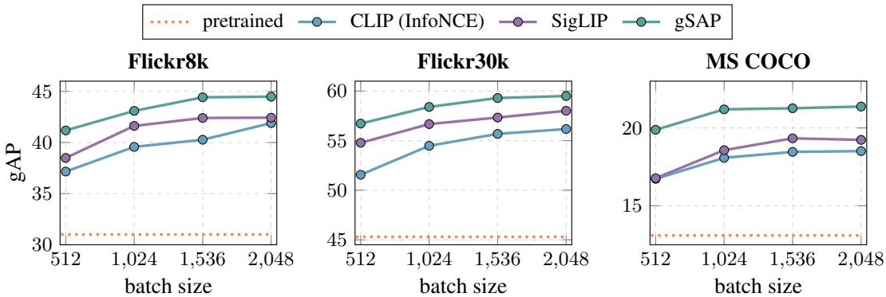  
Figure A: Effect of batch size on zero-shot retrieval gAP. gAP comparison of gSAP with InfoNCE (CLIP) and SigLIP losses for varying batch sizes. All models fine-tune the pretrained OpenAI CLIP ViT-B/32 for 5 epochs on CC12M.

## B ADDITIONAL RESULTS

## B.1 CROSS-MODAL LEARNING

Audio–language. We assess whether the benefits of optimizing gAP extend beyond vision by repeating the protocol in the audio–language domain. We initialize LAION-CLAP (Wu et al., 2023) with an HTS-AT (Chen et al., 2022) base audio encoder that is pretrained on music, speech, and AudioSet (Gemmeke et al., 2017) and finetune for 10 epochs on AudioCaps (Kim et al., 2019) with the same three losses as in the main paper. Table A reports zero-shot audio–text retrieval on the Clotho (Drossos et al., 2020) validation and evaluation splits, together with zero-shot classification on ESC-50 (Piczak, 2015) and Ur-

Table A: Zero-shot retrieval and classification on audio datasets. Recall@1 on Clotho and top-1 accuracy on ESC-50 and UrbanSound8K, comparison of gSAP with the CLIP (InfoNCE) and SigLIP losses. All models fine-tune the pretrained LAION-CLAP HTS-AT base on AudioCaps.
<table><tr><td rowspan="2">method</td><td colspan="2">Clotho val</td><td colspan="2">Clotho eval</td><td colspan="2">classification</td></tr><tr><td>a→t</td><td>t→a</td><td>a→t</td><td>t→a</td><td>ESC</td><td>US8K</td></tr><tr><td>pretrained</td><td>14.3</td><td>13.9</td><td>13.1</td><td>12.4</td><td>90.5</td><td>82.3</td></tr><tr><td>+ CLIP</td><td>16.3</td><td>15.5</td><td>15.2</td><td>15.5</td><td>90.9</td><td>83.3</td></tr><tr><td>+ SigLIP</td><td>16.0</td><td>15.2</td><td>15.0</td><td>14.4</td><td>90.0</td><td>83.3</td></tr><tr><td>+ gSAP</td><td>16.7</td><td>15.9</td><td>15.7</td><td>16.7</td><td>91.7</td><td>83.7</td></tr></table>

banSound8K (Salamon et al., 2014). gSAP outperforms both CLIP and SigLIP on every column, with a clear margin in text-to-audio retrieval on the Clotho evaluation split, while SigLIP falls below the pretrained model on ESC-50.

Vision–language. We extend the vision–language results of Section 4 with the same fine-tuning protocol. We first analyze the effect of batch size and of negative dropping with OpenAI CLIP ViT-B/32, then repeat the zero-shot retrieval and classification evaluations starting from two other models, OpenAI CLIP ViT-B/16 and LAION-400M (Schuhmann et al., 2021) CLIP ViT-B/32, and finally evaluate on an additional task, zero-shot composed image retrieval. gSAP is the best of the three losses in every setting.

Batch size sensitivity. We fine-tune OpenAI CLIP ViT-B/32 on CC12M for 5 epochs with varying batch sizes and compare InfoNCE and SigLIP with gSAP on zero-shot image–text retrieval on Flickr8k, Flickr30k, and MS COCO (Figure A). gSAP achieves the highest gAP on all three datasets at every batch size, with the largest margin at the smallest batch. At 512, it already exceeds InfoNCE trained with a four times larger batch on Flickr30k and MS COCO, so its gain does not rely on large batches.

Negative dropping. Table B evaluates negative dropping on zero-shot retrieval on the three image datasets with OpenAI CLIP ViT-B/32. At the same batch size, gSAP outperforms InfoNCE and SigLIP in every metric on all three datasets. Dropping 95% of the negatives (†) costs at most 0.9 $\mathrm { g A P } ,$ and gSAP still outperforms both losses in gAP. The saved memory allows increasing the batch size from 2,304 to 4,096, which gives the best result in every metric. In contrast, training InfoNCE and SigLIP with the largest batch size that fits in GPU memory (3,072, ∗) improves InfoNCE, which still remains below gSAP at 2,304, and even drops the gAP of SigLIP.

Table B: Zero-shot retrieval with negative dropping on image datasets. gAP, mAP, and Recall@5 comparison of gSAP with InfoNCE (CLIP) and SigLIP losses. All models fine-tune the pretrained OpenAI CLIP ViT-B/32 for 5 epochs on CC12M. †: negative dropping with $\alpha = 9 5 \%$ . ∗: largest batch size that fits in GPU memory.
<table><tr><td rowspan="2">method</td><td rowspan="2">batch</td><td colspan="5">Flickr8k</td><td colspan="5">Flickr30k</td><td colspan="5">MS COCO</td></tr><tr><td> $\mathsf { g A P }$ </td><td>mAP t→i</td><td>mAP i→t</td><td>R@5 t→i</td><td>R@5 i→t</td><td> $\mathrm { \ g A P }$ </td><td>mAP t→i</td><td>mAP i→t</td><td>R@5 t→i</td><td>R@5 i→t</td><td> $\mathsf { g A P }$ </td><td>mAP t→i</td><td>mAP i→t</td><td>R@5 t→i</td><td>R@5 i→t</td></tr><tr><td>pretrained</td><td></td><td>31.0</td><td>65.0</td><td>57.7</td><td>79.2</td><td>92.0</td><td>45.3</td><td>68.7</td><td>62.7</td><td>82.9</td><td>94.0</td><td>13.1</td><td>42.1</td><td>36.7</td><td>55.0</td><td>73.4</td></tr><tr><td>+ CLIP</td><td>2304</td><td>41.3</td><td>71.9</td><td>63.5</td><td>85.5</td><td>92.4</td><td>56.1</td><td>75.1</td><td>68.3</td><td>87.6</td><td>94.7</td><td>18.7</td><td>49.6</td><td>41.1</td><td>63.6</td><td>76.9</td></tr><tr><td>+ SigLIP</td><td>2304</td><td>43.2</td><td>72.5</td><td>64.6</td><td>86.0</td><td>92.7</td><td>58.5</td><td>76.3</td><td>69.5</td><td>88.5</td><td>95.7</td><td>19.4</td><td>50.6</td><td>41.8</td><td>64.7</td><td>77.5</td></tr><tr><td>+ gSAP</td><td>2304</td><td>45.1</td><td>73.2</td><td>65.6</td><td>86.7</td><td>93.3</td><td>59.7</td><td>76.6</td><td>70.5</td><td>88.9</td><td>96.0</td><td>21.4</td><td>51.3</td><td>43.1</td><td>65.3</td><td>79.0</td></tr><tr><td>+ CLIP*</td><td>3072</td><td>42.3</td><td>72.1</td><td>63.9</td><td>85.8</td><td>92.7</td><td>57.0</td><td>75.6</td><td>68.7</td><td>88.1</td><td>95.0</td><td>19.9</td><td>50.0</td><td>41.7</td><td>64.0</td><td>77.7</td></tr><tr><td>+ SigLIP*</td><td>3072</td><td>42.7</td><td>72.5</td><td>64.0</td><td>86.1</td><td>92.4</td><td>57.5</td><td>76.0</td><td>69.0</td><td>88.4</td><td>96.0</td><td>18.7</td><td>50.4</td><td>41.3</td><td>64.4</td><td>77.1</td></tr><tr><td>+ gSAP†</td><td>2304</td><td>44.2</td><td>73.0</td><td>65.6</td><td>86.5</td><td>92.6</td><td>59.2</td><td>76.6</td><td>70.4</td><td>88.6</td><td>96.0</td><td>20.7</td><td>51.2</td><td>42.9</td><td>65.3</td><td>79.0</td></tr><tr><td>+ gSAP† *</td><td>4096</td><td>45.3</td><td>73.6</td><td>66.4</td><td>86.8</td><td>93.6</td><td>59.9</td><td>76.9</td><td>71.0</td><td>89.1</td><td>96.5</td><td>22.3</td><td>51.6</td><td>43.6</td><td>65.6</td><td>79.8</td></tr></table>

Table C: Zero-shot retrieval on image datasets with other backbones and pretraining data. gAP, mAP, and Recall@5 comparison of gSAP with the CLIP (InfoNCE) and SigLIP losses. All models fine-tune the pretrained OpenAI CLIP ViT-B/16 or LAION-400M CLIP ViT-B/32 for 5 epochs on CC12M.
<table><tr><td rowspan="2">method</td><td colspan="5">Flickr8k</td><td colspan="5">Flickr30k</td><td colspan="5">MS COCO</td></tr><tr><td> $\mathrm { g A P }$ </td><td>mAP t→i</td><td>mAP i→t</td><td>R@5 t→i</td><td>R@5 i→t</td><td>gAP</td><td>mAP t→i</td><td>mAP i→t</td><td>R@5 t→i</td><td>R@5 i→t</td><td> $\mathrm { g A P }$ </td><td>mAP t→i</td><td>mAP i→t</td><td>R@5 t→i</td><td>R@5 i→t</td></tr><tr><td colspan="10">OpenAI CLIP ViT-B/16</td><td></td><td></td><td></td><td></td><td></td><td></td></tr><tr><td>pretrained 30.6</td><td></td><td>65.6</td><td>56.8</td><td>80.4</td><td>90.2</td><td>44.7</td><td>69.8</td><td>64.5</td><td>83.2</td><td>94.7</td><td>12.2</td><td>42.3</td><td>37.6</td><td>55.0</td><td>74.0</td></tr><tr><td>+ CLIP</td><td>42.7</td><td>75.3</td><td>66.5</td><td>87.9</td><td>93.8</td><td>61.0</td><td>79.4</td><td>72.9</td><td>90.7</td><td>96.7</td><td>21.7</td><td>52.9</td><td>44.0</td><td>66.4</td><td>79.8</td></tr><tr><td>+ SigLIP</td><td>46.4</td><td>76.2</td><td>67.7</td><td>88.7</td><td>94.4</td><td>64.0</td><td>80.7</td><td>74.5</td><td>91.5</td><td>97.4</td><td>22.7</td><td>53.9</td><td>44.9</td><td>67.4</td><td>80.0</td></tr><tr><td>+ gSAP</td><td>47.3</td><td>76.6</td><td>68.8</td><td>88.7</td><td>94.5</td><td>64.6</td><td>81.1</td><td>74.7</td><td>91.7</td><td>97.7</td><td>24.6</td><td>54.7</td><td>46.0</td><td>68.0</td><td>81.2</td></tr><tr><td colspan="10">LAION-400M CLIP ViT-B/32</td><td></td><td></td><td></td><td></td><td></td><td></td></tr><tr><td>pretrained 38.9</td><td></td><td>67.6</td><td>61.1</td><td>81.4</td><td>91.8</td><td>52.1</td><td>70.5</td><td>64.9</td><td>83.8</td><td>93.7</td><td>17.3</td><td>46.4</td><td>39.4</td><td>60.0</td><td>76.3</td></tr><tr><td>+ CLIP</td><td>38.5</td><td>68.0</td><td>60.1</td><td>82.7</td><td>91.3</td><td>53.7</td><td>72.6</td><td>65.4</td><td>85.4</td><td>93.6</td><td>16.6</td><td>47.7</td><td>39.1</td><td>61.3</td><td>75.0</td></tr><tr><td>+ SigLIP</td><td>39.9</td><td>68.9</td><td>61.4</td><td>83.3</td><td>90.8</td><td>54.5</td><td>73.2</td><td>66.5</td><td>85.9</td><td>93.8</td><td>17.2</td><td>48.5</td><td>39.9</td><td>62.1</td><td>76.1</td></tr><tr><td>+ gSAP</td><td>41.5</td><td>69.7</td><td>62.6</td><td>84.0</td><td>92.2</td><td>55.7</td><td>73.3</td><td>66.6</td><td>86.3</td><td>94.4</td><td>18.5</td><td>49.0</td><td>40.9</td><td>62.6</td><td>77.2</td></tr></table>

Table D: Zero-shot retrieval on video datasets with other backbones and pretraining data. $\mathrm { g A P }$ and Recall@k comparison. Same setting as Table C.
<table><tr><td rowspan="3">method</td><td colspan="7">ActivityNet</td><td rowspan="2"></td><td colspan="7">MSR-VTT</td><td colspan="7">MSVD</td></tr><tr><td rowspan="2"> $\mathrm { g A P }$ </td><td colspan="2">text→video</td><td rowspan="2"></td><td colspan="3">video→text</td><td rowspan="2"></td><td colspan="3">text→video</td><td colspan="3">video→text</td><td rowspan="2"></td><td rowspan="2">text→video</td><td colspan="3"></td><td colspan="3">video→text</td></tr><tr><td>R@1</td><td></td><td>R@5R@10 R@1 R@5 R@10</td><td></td><td></td><td> $\mathrm { g A P }$ </td><td>R@1</td><td>R@5 R@10 R@1</td><td></td><td></td><td>R@5 R@10</td><td> $\mathrm { g A P }$ </td><td>R@1</td><td></td><td>R@5 R@10 R@1</td><td></td><td>R@5 R@10</td><td></td></tr><tr><td colspan="2">OpenAI CLIP ViT-B/16</td><td></td><td></td><td></td><td></td><td></td><td></td><td></td><td></td><td></td><td></td><td></td><td></td><td></td><td></td><td></td><td></td><td></td><td></td><td></td><td></td><td></td></tr><tr><td>pretrained</td><td>11.7</td><td>25.2</td><td>55.4</td><td>69.0</td><td>22.7</td><td>50.0</td><td>62.0</td><td>5.0</td><td>15.6</td><td>32.6</td><td>41.4</td><td>31.8</td><td>52.8</td><td>63.9</td><td>17.1</td><td>36.5</td><td>63.9</td><td></td><td>73.3</td><td>55.0</td><td>74.8</td><td>82.1</td></tr><tr><td>+ CLIP</td><td>14.7</td><td>29.9</td><td>63.6</td><td>76.9</td><td>29.2</td><td>61.4</td><td>73.7</td><td>4.5</td><td>18.2</td><td>36.9</td><td>45.9</td><td>30.2</td><td>52.4</td><td>62.2</td><td>26.3</td><td>42.5</td><td></td><td>70.9</td><td>79.8</td><td>54.9</td><td>76.3</td><td>83.6</td></tr><tr><td>+ SigLIP</td><td>15.3</td><td>31.3</td><td>65.2</td><td>77.6</td><td>29.9</td><td>60.8</td><td>74.0</td><td>4.6</td><td>18.7</td><td>37.5</td><td>46.6</td><td>30.9</td><td>53.6</td><td>63.5</td><td>26.8</td><td>43.2</td><td></td><td>71.2</td><td>80.0</td><td>55.0</td><td>77.1</td><td>85.2</td></tr><tr><td>+ gSAP</td><td>15.6</td><td>31.9</td><td>66.2</td><td>77.7</td><td>30.9</td><td>61.8</td><td>74.1</td><td>5.3</td><td>19.1</td><td>38.1</td><td>47.2</td><td>34.2</td><td>56.2</td><td>65.5</td><td>27.5</td><td>43.5</td><td></td><td>71.7</td><td>80.4</td><td>56.7</td><td>78.3</td><td>85.2</td></tr><tr><td colspan="2">LAION-400M CLIP ViT-B/32</td><td></td><td></td><td></td><td></td><td></td><td></td><td></td><td></td><td></td><td></td><td></td><td></td><td></td><td></td><td></td><td></td><td></td><td></td><td></td><td></td><td></td></tr><tr><td>pretrained</td><td>10.9</td><td>23.7</td><td>49.8</td><td>61.3</td><td>21.4</td><td>49.4</td><td>61.8</td><td>4.2</td><td>13.9</td><td>29.1</td><td>37.4</td><td>28.7</td><td>48.7</td><td>59.3</td><td>15.5</td><td>33.4</td><td></td><td>59.6</td><td>68.6</td><td>47.0</td><td>67.2</td><td>75.7</td></tr><tr><td>+ CLIP</td><td>10.3</td><td>24.2</td><td>54.1</td><td>68.2</td><td>21.7</td><td>51.5</td><td>64.7</td><td>3.1</td><td>14.6</td><td>31.0</td><td>40.1</td><td>22.5</td><td>43.1</td><td>53.1</td><td>19.1</td><td>36.3</td><td></td><td>65.8</td><td>75.1</td><td>47.5</td><td>69.4</td><td>78.7</td></tr><tr><td>+ SigLIP</td><td>10.5</td><td>24.0</td><td>54.2</td><td>68.1</td><td>22.1</td><td>51.7</td><td>65.0</td><td>3.4</td><td>14.9</td><td>31.7</td><td>40.6</td><td>23.8</td><td>45.8</td><td>55.8</td><td>19.7</td><td>37.3</td><td></td><td>66.2</td><td>75.7</td><td>49.0</td><td>69.8</td><td>78.1</td></tr><tr><td>+ gSAP</td><td>11.4</td><td>25.1</td><td>55.2</td><td>68.5</td><td>23.2</td><td>51.9</td><td>65.1</td><td>4.8</td><td>15.4</td><td>32.2</td><td>41.2</td><td>26.3</td><td>47.9</td><td>57.5</td><td>19.7</td><td></td><td>37.6</td><td>66.7</td><td>76.0</td><td>50.1</td><td>72.2</td><td>80.0</td></tr></table>

Table E: Zero-shot composed image retrieval on ConCon-Chi. gAP, mAP, mAP@k, and Recall@k comparison of gSAP with InfoNCE (CLIP) and SigLIP losses. All models fine-tune the pretrained OpenAI CLIP ViT-B/32 (top) or ViT-B/16 (bottom) for 5 epochs on CC12M.
<table><tr><td rowspan="2">method</td><td rowspan="2"></td><td colspan="6">mAP@k</td><td colspan="5">Recall@k</td></tr><tr><td>gAP mAP</td><td>@1</td><td>@5</td><td>@10</td><td>@25</td><td>@50</td><td>@1</td><td>@5</td><td>@10</td><td>@25</td><td>@50</td></tr><tr><td colspan="10">OpenAI CLIP ViT-B/32</td><td></td><td></td><td></td></tr><tr><td>pretrained</td><td>24.6</td><td>20.4</td><td>6.5</td><td>13.9</td><td>16.2</td><td>18.2</td><td>19.1</td><td>6.5</td><td>20.5</td><td>28.5</td><td>42.0</td><td>53.3</td></tr><tr><td>+ CLIP</td><td>30.6</td><td>25.2</td><td>8.7</td><td>17.8</td><td>20.7</td><td>22.9</td><td>23.8</td><td>8.7</td><td>24.4</td><td>34.1</td><td>46.7</td><td>57.4</td></tr><tr><td>+ SigLIP</td><td>31.5</td><td>26.4</td><td>9.1</td><td>18.9</td><td>21.8</td><td>24.1</td><td>25.0</td><td>9.1</td><td>25.7</td><td>35.0</td><td>48.5</td><td>59.6</td></tr><tr><td>+ gSAP</td><td>31.7</td><td>26.9</td><td>9.5</td><td>19.3</td><td>22.3</td><td>24.6</td><td>25.5</td><td>9.5</td><td>26.2</td><td>35.6</td><td>49.2</td><td>60.0</td></tr><tr><td colspan="10">OpenAI CLIP ViT-B/16</td><td></td><td></td><td></td></tr><tr><td>pretrained</td><td>28.6</td><td>24.7</td><td>8.3</td><td>18.0</td><td>20.4</td><td>22.4</td><td>23.3</td><td>8.3</td><td>24.5</td><td>32.6</td><td>45.3</td><td>55.4</td></tr><tr><td>+ CLIP</td><td>36.1</td><td>30.2</td><td>10.2</td><td>22.0</td><td>25.6</td><td>27.9</td><td>28.9</td><td>10.2</td><td>29.0</td><td>39.8</td><td>52.7</td><td>62.8</td></tr><tr><td>+ SigLIP</td><td>37.4</td><td>32.5</td><td>11.0</td><td>24.3</td><td>27.8</td><td>30.2</td><td>31.1</td><td>11.0</td><td>32.0</td><td>42.6</td><td>55.6</td><td>64.8</td></tr><tr><td>+ gSAP</td><td>39.0</td><td>33.4</td><td>11.5</td><td>24.9</td><td>28.8</td><td>31.1</td><td>32.0</td><td>11.5</td><td>32.1</td><td>43.1</td><td>56.1</td><td>65.7</td></tr></table>

Table F: Zero-shot classification on image and video datasets with other backbones and pretraining data. Top-1, top-5, and mean per-class recall (mR) comparison of gSAP with the CLIP (InfoNCE) and SigLIP losses. All models fine-tune the pretrained model in italics for 5 epochs on CC12M.
<table><tr><td rowspan="3">method</td><td colspan="10">image datasets</td><td colspan="6">video datasets</td></tr><tr><td colspan="3">IN-1k</td><td colspan="3">IN-V2</td><td colspan="3">IN-Rendition</td><td colspan="3">IN-Sketch</td><td colspan="2">K-400 K-600</td><td colspan="2">K-700</td></tr><tr><td>top-1</td><td>top-5</td><td>mR</td><td>top-1</td><td>top-5</td><td>mR</td><td>top-1 top-5</td><td>mR</td><td>top-1</td><td>top-5</td><td>mR</td><td>top-1</td><td>top-5</td><td>top-1</td><td>top-5</td><td>top-1 top-5</td></tr><tr><td colspan="10">OpenAI CLIP ViT-B/16</td><td></td><td></td><td></td><td></td><td></td><td></td><td></td></tr><tr><td>pretrained</td><td>64.4 89.7</td><td>64.4</td><td>57.8</td><td>85.0</td><td>57.8</td><td>73.5</td><td>91.0</td><td>71.7</td><td>44.2 72.1</td><td>44.3</td><td>43.4</td><td>69.3</td><td>20.0</td><td>35.8</td><td>32.2</td><td>56.5</td></tr><tr><td>+ CLIP</td><td>65.3 90.7</td><td>65.3</td><td>58.8</td><td>86.1</td><td>58.8</td><td>76.0</td><td>91.9</td><td>74.1 47.2</td><td>75.7</td><td>47.3</td><td>45.0</td><td>71.4</td><td>21.7</td><td>37.3</td><td>33.8</td><td>59.7</td></tr><tr><td>+ SigLIP</td><td>66.3 91.1</td><td>66.3</td><td>59.4</td><td>86.5</td><td>59.5</td><td>77.0</td><td>92.3</td><td>75.5</td><td>48.3 76.8</td><td>48.4</td><td>45.4</td><td>71.4</td><td>21.8</td><td>37.2</td><td>34.5</td><td>59.8</td></tr><tr><td>+ gSAP 66.6</td><td>91.2</td><td>66.6</td><td>60.0</td><td>86.6</td><td>60.1</td><td>77.1</td><td>92.3</td><td>75.5</td><td>49.0</td><td>77.0</td><td>49.0</td><td>45.8 71.9</td><td>22.0</td><td>37.5</td><td>35.0</td><td>60.4</td></tr><tr><td colspan="10">LAION-400M CLIP ViT-B/32</td><td colspan="7"></td></tr><tr><td>pretrained</td><td>60.2 85.9</td><td>60.2</td><td>52.3</td><td>79.4</td><td>52.3</td><td>70.8</td><td>88.6</td><td>69.1</td><td>46.5</td><td>72.6</td><td>46.5</td><td>35.5</td><td>60.0 32.7</td><td>56.7</td><td>25.3</td><td>47.2</td></tr><tr><td>+ CLIP</td><td>59.3 86.0</td><td>59.3</td><td>51.2</td><td>79.8</td><td>51.2</td><td>70.8</td><td>89.0</td><td>69.5</td><td>46.8 74.0</td><td>46.8</td><td>36.3</td><td>61.8</td><td>34.2</td><td>58.7</td><td>26.4</td><td>49.0</td></tr><tr><td>+ SigLIP</td><td>60.9 86.7</td><td>60.9</td><td>52.9</td><td>80.5</td><td>52.9</td><td>71.9</td><td>89.3</td><td>70.7</td><td>48.3</td><td>75.2</td><td>48.4 36.9</td><td>62.2</td><td>34.7</td><td>59.5</td><td>27.2</td><td>50.0</td></tr><tr><td>+ gSAP</td><td>61.0 86.8</td><td>61.0</td><td>53.0</td><td>80.7</td><td>53.1</td><td>72.1</td><td>89.3</td><td>70.9</td><td>48.7</td><td>75.4</td><td>48.8</td><td>37.2 62.6</td><td>35.1</td><td>59.7</td><td>27.4</td><td>50.2</td></tr></table>

Zero-shot retrieval. Tables C and D repeat the image and video retrieval evaluation starting from OpenAI CLIP ViT-B/16 and LAION-400M CLIP ViT-B/32. The ViT-B/32 trends hold: for both models, gSAP is the best or tied-best objective in every metric and direction on every dataset. With ViT-B/16, it doubles the gAP of the pretrained model on MS COCO. The LAION-400M model is harder to improve by fine-tuning on CC12M. gAP drops for InfoNCE on Flickr8k and MS COCO, and both InfoNCE and SigLIP degrade on ActivityNet and MSR-VTT, whereas gSAP improves gAP on all six datasets and is the only loss that improves every image retrieval metric. MSR-VTT is the hardest case. With ViT-B/16, InfoNCE and SigLIP fall below the pretrained model in gAP and video→text R@1, whereas gSAP improves both, outperforming SigLIP by 3.3 R@1. With LAION-400M, no loss recovers the pretrained video→text recall, but gSAP loses the least.

Zero-shot composed image retrieval. Table E reports results on ConCon-Chi (Rosasco et al., 2024), an instance-level composed image retrieval (CIR) benchmark where each query pairs a reference image of a specific object with a text modifier describing the target scene. Following the standard zero-shot CIR protocol, the retrieval score is the product of the image-to-image and text-to-image cosine similarities. All three losses improve over the pretrained model, and gSAP is best in every metric with both backbones; SigLIP stays close with ViT-B/32, but the gap widens with ViT-B/16.

Zero-shot classification. Table F repeats the zero-shot classification evaluation starting from the same two models, on the same four image and three video datasets and with the original prompt templates of each dataset. For both models, gSAP is the best or tied-best loss in every metric on all seven datasets. gSAP outperforms SigLIP by a small margin and InfoNCE by a clearer one. Starting from the LAION-400M checkpoint, InfoNCE even degrades top-1 accuracy of the pretrained model on ImageNet-1k and ImageNet-V2.

## B.2 SELF-SUPERVISED LEARNING

In- and out-of-distribution performance. Table G breaks down the OOD mean. With ViT-S, gSAP is ahead on every set under both probes. With ViT-B, the two models tie under LP, each leading on one shifted set, while gSAP leads on every set under kNN. The OOD ordering follows the in-distribution ordering per probe: the better model in distribution is at least as good under shift, so neither loss trades in-distribution accuracy for robustness.

Transfer learning. Table H shows that the transfer gain comes mostly from fine-grained datasets. On the six sub-category datasets, gSAP is clearly ahead under both probes and at both scales, with the largest margins on Stanford Cars, FGVC Aircraft, and CUB-200, whereas on the four coarse object, scene, and texture sets the two losses are close, with InfoNCE slightly ahead at ViT-B. In fine-grained classes, hard negatives crowd the positives, which is exactly what a single shared threshold penalizes.

Robustness to corruptions. Table I reports ImageNet-C (Hendrycks & Dietterich, 2019) results by corruption family and severity. With ViT-S, gSAP leads under both probes. With ViT-B, the two models tie under LP on every family, while under kNN gSAP leads on every family and severity, by a margin that shrinks as corruptions grow stronger. gSAP also retains a slightly larger share of its clean accuracy under both probes, so its robustness is not merely inherited from higher clean accuracy.

Table G: In- and out-of-distribution classification with self-supervised pretraining. Top-1 accuracy on ImageNet-1k (ID) and three OOD datasets (ImageNet-V2/-R/-Sketch) of MoCo v3 models trained with InfoNCE or gSAP. Linear probing (LP) and kNN on the frozen backbone; LP is trained on ImageNet-1k and applied to every test set without dataset-specific training.
<table><tr><td rowspan="2">backbone probe loss</td><td rowspan="2"></td><td rowspan="2"></td><td>ID</td><td colspan="4">OOD</td></tr><tr><td>IN-1k</td><td>IN-V2</td><td>IN-R</td><td>IN-Sketch</td><td>avg</td></tr><tr><td rowspan="4">ViT-S</td><td rowspan="2">LP</td><td>InfoNCE</td><td>73.2</td><td>61.1</td><td>32.0</td><td>21.3</td><td>38.2</td></tr><tr><td>gSAP</td><td>73.5</td><td>61.9</td><td>34.3</td><td>23.1</td><td>39.7</td></tr><tr><td rowspan="2">kNN</td><td>InfoNCE</td><td>68.4</td><td>54.9</td><td>23.0</td><td>16.5</td><td>31.5</td></tr><tr><td>gSAP</td><td>70.9</td><td>58.4</td><td>27.4</td><td>20.5</td><td>35.4</td></tr><tr><td rowspan="4">ViT-B</td><td rowspan="2">LP</td><td>InfoNCE</td><td>76.7</td><td>65.2</td><td>35.9</td><td>24.9</td><td>42.0</td></tr><tr><td>gSAP</td><td>75.6</td><td>63.9</td><td>35.8</td><td>26.1</td><td>42.0</td></tr><tr><td rowspan="2">kNN</td><td>InfoNCE</td><td>71.4</td><td>58.6</td><td>29.6</td><td>21.8</td><td>36.6</td></tr><tr><td>gSAP</td><td>72.8</td><td>60.4</td><td>29.7</td><td>24.2</td><td>38.1</td></tr></table>

Table H: Transfer learning with self-supervised pretraining. Top-1 accuracy on six fine-grained and four coarse-grained datasets of MoCo v3 models trained with InfoNCE or gSAP. Linear probing (LP) and kNN on the frozen backbone, using each dataset’s own training split.
<table><tr><td rowspan="2">backbone probe loss</td><td rowspan="2"></td><td rowspan="2"></td><td colspan="7">fine-grained (6)</td><td colspan="5">coarse-grained (4)</td><td rowspan="2">all (10)</td></tr><tr><td>Aircraft</td><td>CUB</td><td>Cars</td><td>Pets</td><td>Flowers</td><td>Food</td><td>avg</td><td>C-10</td><td>C-100</td><td>DTD</td><td>SUN</td><td>avg</td></tr><tr><td rowspan="3">ViT-S</td><td rowspan="2">LP</td><td>InfoNCE</td><td>37.6</td><td>64.4</td><td>33.3</td><td>88.3</td><td>88.1</td><td>75.8</td><td>64.6</td><td>93.9</td><td>79.9</td><td>73.3</td><td>63.1</td><td>77.6</td><td>69.8</td></tr><tr><td>gSAP</td><td>45.2</td><td>76.4</td><td>48.3</td><td>91.7</td><td>89.6</td><td>76.2</td><td>71.2</td><td>94.9</td><td>81.0</td><td>73.1</td><td>62.6</td><td>77.9</td><td>73.9</td></tr><tr><td rowspan="2">kNN</td><td rowspan="2">InfoNCE gSAP</td><td>29.3</td><td>47.6</td><td>20.6</td><td>82.3</td><td>78.2</td><td>63.6</td><td>53.6</td><td>92.0</td><td>73.6</td><td>69.3</td><td>53.3</td><td>72.1</td><td>61.0</td></tr><tr><td></td><td>35.1</td><td>65.0 28.5</td><td>88.6</td><td>81.5</td><td>66.0</td><td>60.8</td><td>93.7</td><td></td><td>75.8</td><td>65.7</td><td>55.0</td><td>72.5</td><td>65.5</td></tr><tr><td rowspan="3">ViT-B</td><td rowspan="2">LP</td><td>InfoNCE gSAP</td><td>44.9</td><td>70.5</td><td>49.9</td><td>91.4</td><td>91.5</td><td>79.3</td><td>71.3</td><td>95.3</td><td>83.2</td><td>76.6</td><td>65.7</td><td>80.2</td><td>74.8</td></tr><tr><td></td><td>53.9</td><td>78.9</td><td>64.3</td><td>93.1</td><td>92.9</td><td>78.6</td><td>76.9</td><td>96.0</td><td>82.7</td><td>74.1</td><td>63.5</td><td>79.1</td><td>77.8</td></tr><tr><td rowspan="2">kNN</td><td>InfoNCE</td><td>27.5</td><td>47.4 64.2</td><td>23.1</td><td>84.5</td><td>79.9</td><td>64.6</td><td>54.5</td><td>93.3</td><td>76.2</td><td>72.7</td><td>56.2</td><td>74.6</td><td>62.5</td></tr><tr><td>gSAP</td><td>35.6</td><td></td><td>33.7</td><td>89.9</td><td></td><td>83.6</td><td>66.3</td><td>62.2</td><td>94.8</td><td>77.4</td><td>67.0</td><td>55.8</td><td>73.8</td><td>66.8</td></tr></table>

Table I: Robustness to corruptions with self-supervised pretraining. Top-1 accuracy on ImageNet-C of MoCo v3 models trained with InfoNCE or gSAP, with linear probing (LP, trained on ImageNet-1k) and kNN on the frozen backbone. Corruption families average over their corruptions and the five severities; severities average over the 15 corruptions. rel.: ImageNet-C accuracy as a share of the ImageNet-1k (ID) accuracy.
<table><tr><td rowspan="2">backbone probe loss</td><td rowspan="2"></td><td rowspan="2"></td><td colspan="4">corruption family</td><td colspan="5">severity</td><td rowspan="2"></td><td rowspan="2">rel. (%)</td></tr><tr><td>noise</td><td>blur</td><td>weather digital</td><td></td><td>1</td><td>2</td><td>3</td><td>4 5</td><td>all</td></tr><tr><td rowspan="4">ViT-S</td><td>LP</td><td>InfoNCE</td><td>41.4</td><td>36.2</td><td>46.0</td><td>53.9</td><td>62.1</td><td>53.5</td><td>46.7</td><td>36.2</td><td>24.5</td><td>44.6</td><td>60.9</td></tr><tr><td rowspan="2"></td><td>gSAP</td><td>41.5</td><td>38.5</td><td>48.1</td><td>56.0</td><td>63.9</td><td>55.6</td><td>48.7</td><td>37.9</td><td>25.4</td><td>46.3</td><td>63.0</td></tr><tr><td>InfoNCE</td><td>35.3</td><td>31.2</td><td>40.8</td><td>49.4</td><td>58.2</td><td>49.0</td><td>41.1</td><td>29.9</td><td>18.9</td><td>39.4</td><td>57.7</td></tr><tr><td rowspan="2">kNN</td><td>gSAP</td><td>38.5</td><td>36.7</td><td>46.4</td><td>55.6</td><td>63.1</td><td>54.5</td><td>47.1</td><td>35.7</td><td>23.2</td><td>44.7</td><td></td><td>63.1</td></tr><tr><td>LP</td><td>InfoNCE</td><td>45.5</td><td>41.9</td><td>51.0</td><td>58.9</td><td>66.6</td><td>58.6</td><td>52.0</td><td>41.6</td><td>29.1</td><td>49.6</td><td>64.7</td></tr><tr><td rowspan="2">ViT-B</td><td></td><td>gSAP</td><td>45.7</td><td>42.3</td><td>50.9</td><td>58.7</td><td>66.8</td><td>58.7</td><td>52.1</td><td>41.7</td><td>29.1</td><td>49.7</td><td>65.7</td></tr><tr><td>kNN</td><td>InfoNCE gSAP</td><td>41.9 43.9</td><td>39.6 40.7</td><td>49.3 49.8</td><td>56.1 58.9</td><td>64.1 66.0</td><td>56.4 58.1</td><td>49.6 51.3</td><td>38.7 40.3</td><td>26.3 27.5</td><td>47.0 48.6</td><td>65.9 66.8</td></tr></table>

Audio-based SSL. We also experiment with audio contrastive learning using the CLMR (Spijkervet & Burgoyne, 2021) framework, with the settings of Appendix C.2. Substituting InfoNCE with the proposed loss improves music tagging on MagnaTagATune (Law et al., 2009), as shown in Table J, with the larger gain in PR-AUC. PR-AUC, the area under the precision–recall curve, is the tagging analogue of gAP, as gSAP directly optimizes a closely related objective.

Table J: Music tagging with self-supervised pretraining. ROC-AUC and PR-AUC on MagnaTagATune of CLMR models trained with InfoNCE or gSAP, with linear probing on the frozen encoder.
<table><tr><td>method</td><td>ROC-AUC</td><td>PR-AUC</td></tr><tr><td>InfoNCE</td><td>88.7</td><td>35.6</td></tr><tr><td>gSAP</td><td>89.3</td><td>37.1</td></tr></table>

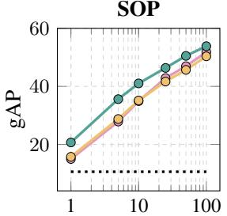

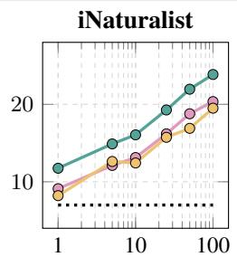

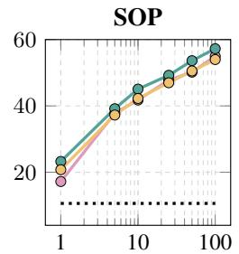

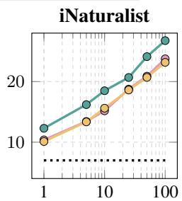

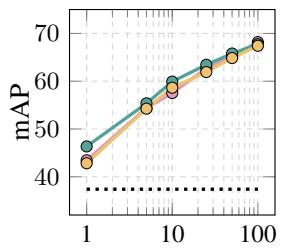  
γ (%)

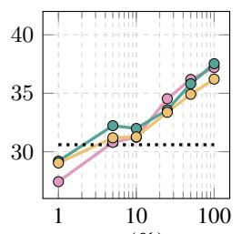  
γ (%)

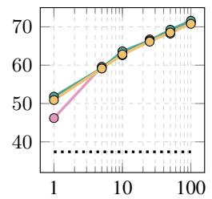  
γ (%)

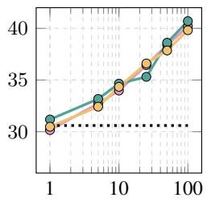  
γ (%)

Figure B: Training with scarce annotated data. $\mathrm { g A P }$ (top) and mAP (bottom) of RS@k, mSAP, and ${ \mathrm { g S A P } }$ on SOP and iNaturalist, fine-tuning DINOv3 under the scarce-data protocol of Appendix $\mathrm { C } . 3 ,$ , which varies the percentage of classes γ and the number of samples per class $\rho \left( \rho { = } 2 \colon \right.$ left pair, $\rho { = } 4 \colon$ right pair). The full training sets have 11,318 (SOP) and 5,690 (iNaturalist) classes. Dotted: pretrained model.  
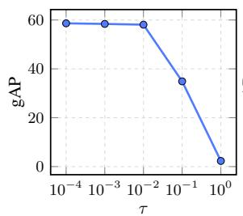  
(a)

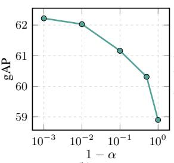  
(b)

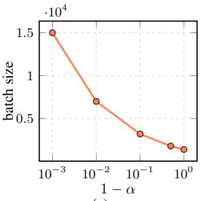  
(c)  
Figure C: Impact of hyper-parameters. (a) $\mathrm { g A P }$ for different temperatures τ , without negative dropping. (b), (c) Impact of negative dropping on $\mathrm { g A P }$ and on the batch size, set to the largest number of images that fits on one H200 GPU. All results on SOP, fine-tuning DINOv3 with full-scale training.

## B.3 METRIC LEARNING

Comparison on limited data settings. We further evaluate the methods in a scarce data regime controlled by two parameters: γ, the percentage of training classes, and $\rho ,$ the number of samples per class. Evaluation settings are described in Appendix C.3. Figure B reports the performance of $\mathrm { g } \mathrm { S A P }$ compared with the other two ranking surrogates (mSAP and RS@k) under different settings. $\mathsf { g S A P }$ is consistently the best in terms of $\mathrm { g A P } ,$ with the largest margins at $\rho { = } 2 ,$ , reaching up to $6 \mathrm { g A P }$ over the second-best method. When training with a small $\gamma , \mathsf { g S A P }$ often surpasses competitors trained with more than twice the data. We attribute this to its formulation over all pairwise similarities, whereas competing losses operate row-wise and observe a single positive per row in this setting. Similarly, for $\rho { = } 4 , \mathsf { g S A P }$ remains the best, and trained models generally surpass the pretrained model, reflecting the benefit of additional annotations and multiple positives per row. The bottom row of the figure shows the mAP results, where all three losses perform similarly, achieving nearly identical mAP scores, in line with the results from the main paper. The pretrained model already has good mAP.

Impact of hyper-parameters. Figure C presents the $\mathrm { g A P }$ performance of the model trained with $\mathsf { g S A P }$ under different settings. Performance is very low for large τ values greater than 0.1; however, it peaks and plateaus as τ decreases below 0.01. Additionally, we assess the impact of the drop rate α on the batch size and, consequently, on performance. It is evident that the larger the batch size that fits in memory, which is determined by the drop rate, the better the performance.

Table K: Combination with similarity-scale regularizers. Recall@1 (R@1), mAP, and gAP when TCM or KoLeo is added to each loss. DINOv3, full-scale training, no negative dropping.
<table><tr><td rowspan="2">regularizer method</td><td rowspan="2"></td><td colspan="3">SOP</td><td colspan="3">iNaturalist</td></tr><tr><td>R@1</td><td>mAP</td><td>gAP</td><td>R@1</td><td>mAP</td><td>gAP</td></tr><tr><td rowspan="2"></td><td>RS@k mSAP</td><td>86.7</td><td>72.5</td><td>56.7</td><td>81.0</td><td>44.5</td><td>26.6</td></tr><tr><td>gSAP</td><td>86.9 86.8</td><td>72.9 72.9</td><td>57.0 58.9</td><td>81.3 81.5</td><td>45.4 45.5</td><td>27.8 31.6</td></tr><tr><td rowspan="2">TCM</td><td>RS@k mSAP</td><td>86.9</td><td>72.6</td><td>57.9</td><td>81.7</td><td>44.9</td><td>30.2</td></tr><tr><td>gSAP</td><td>86.5 87.0</td><td>72.0 72.8</td><td>56.7 58.7</td><td>81.9 81.5</td><td>45.9 45.3</td><td>31.0 31.4</td></tr><tr><td rowspan="2">KoLeo</td><td>RS@k mSAP</td><td>83.5</td><td>66.4</td><td>49.7</td><td>79.9</td><td>41.0</td><td>24.6</td></tr><tr><td>gSAP</td><td>85.3 85.4</td><td>69.9 70.1</td><td>53.6 55.5</td><td>80.5 81.5</td><td>42.5 45.1</td><td>25.9 31.2</td></tr></table>

Table L: AP approximations as mAP or gAP surrogates. Recall@1 (R@1), mAP, and gAP on SOP and iNaturalist. Each AP approximation is optimized as a surrogate of either mAP or gAP; the gAP surrogate with Smooth-AP is gSAP.
<table><tr><td rowspan="2">AP approx.</td><td rowspan="2">surrogate</td><td colspan="2">SOP</td><td rowspan="2"></td><td colspan="2">iNaturalist</td></tr><tr><td>R@1</td><td>mAP gAP</td><td>R@1</td><td>mAP gAP</td></tr><tr><td rowspan="2">SoftBin</td><td>mAP</td><td>87.0</td><td>73.0</td><td>57.3</td><td>81.2</td><td>45.3 27.4</td></tr><tr><td>gAP</td><td>86.7</td><td>72.7</td><td>58.6</td><td>81.3 44.8</td><td>30.6</td></tr><tr><td rowspan="2">BlackBox</td><td>mAP</td><td>86.5</td><td>72.3</td><td>56.6</td><td>80.7</td><td>44.5 26.2</td></tr><tr><td>gAP</td><td>86.4</td><td>72.4</td><td>58.2</td><td>80.7</td><td>44.6 29.5</td></tr><tr><td rowspan="2">ROADMAP</td><td>mAP</td><td>85.5</td><td>70.1</td><td>54.2</td><td>80.5</td><td>44.0 29.5</td></tr><tr><td>gAP</td><td>86.8</td><td>72.6</td><td>58.8</td><td>81.2</td><td>44.9 31.1</td></tr><tr><td rowspan="2">Smooth-AP</td><td>mAP</td><td>86.9</td><td>72.9</td><td>57.0</td><td>81.3</td><td>45.4 27.8</td></tr><tr><td>gAP</td><td>86.8</td><td>72.9</td><td>58.9</td><td>81.5</td><td>45.5 31.6</td></tr></table>

Combination with similarity-scale regularizers. We add two regularizers proposed to constrain the similarity scale, TCM (Zhang et al., 2024b) and KoLeo (Sablayrolles et al., 2019), as auxiliary losses to each ranking loss (Table K). TCM helps in general the per-query losses and brings them closer to gSAP, but not consistently, e.g. performance of mSAP on SOP drops. Also, it adds nothing on top of gSAP, while KoLeo hurts gAP everywhere. TCM constrains the similarity scale across queries, which gSAP already achieves through its loss alone, whereas KoLeo spreads the embeddings apart and does not target this consistency. An explicit regularizer thus recovers part of what gSAP provides, at the price of extra hyper-parameters, and without consistent effectiveness.

Performance with other AP approximations. Table L replaces the default smooth approximation (Brown et al., 2020) with SoftBin (Revaud et al., 2019), BlackBox (Rolínek et al., 2020) and ROADMAP (Ramzi et al., 2021), each implemented both as an mAP and as a gAP surrogate, with its own hyper-parameters tuned based on the values recommended in the original work. Whatever the approximation, the gAP surrogate beats its mAP counterpart in gAP by a clear margin at similar mAP and R@1. The gain therefore comes from ranking the whole similarity matrix at once, not from the particular AP approximation.

Impact of negative dropping. Table M analyzes the effect of negative dropping by varying the drop percentage α. Performance remains remarkably stable even when discarding a large fraction of negatives. In particular, removing up to 99.9% of negatives, reducing their number by three orders of magnitude, has only a marginal impact. Performance degrades only when the remaining negatives become extremely few, suggesting that a minimal number is still necessary for effective training. Increasing the batch size while keeping α = 99% improves gAP, showing that the proposed loss benefits from additional pairwise interactions even when most easy negatives are discarded.

Table M: Negative dropping and batch size. gAP, mAP, and R@1 of gSAP on SOP for different drop rates α, the fraction of the lowest negative similarities dropped during training. A higher drop rate allows a larger batch size on the same GPU, which improves gAP.
<table><tr><td>α</td><td>batch size</td><td>neg sim.</td><td>gAP</td><td>mAP</td><td>R@1</td></tr><tr><td>0%</td><td>1,000</td><td>1M</td><td>58.9</td><td>72.9</td><td>86.8</td></tr><tr><td>90%</td><td>1,000</td><td>100k</td><td>58.9</td><td>72.9</td><td>86.7</td></tr><tr><td>99%</td><td>1,000</td><td>10k</td><td>59.0</td><td>72.8</td><td>86.6</td></tr><tr><td>99.9%</td><td>1,000</td><td>1k</td><td>58.0</td><td>71.9</td><td>86.1</td></tr><tr><td>99.99%</td><td>1,000</td><td>100</td><td>48.0</td><td>62.5</td><td>81.0</td></tr><tr><td>99.999%</td><td>1,000</td><td>10</td><td>40.4</td><td>56.1</td><td>77.5</td></tr><tr><td>99.9999%</td><td>1,000</td><td>1</td><td>27.5</td><td>45.2</td><td>69.7</td></tr><tr><td>99%</td><td>7,000</td><td>500k</td><td>60.0</td><td>72.8</td><td>87.1</td></tr></table>

## B.4 TASKS WITH DISTRACTOR QUERIES

Per-query metrics. Table N reports the per-query metrics of the four tasks with distractor queries, i.e. each benchmark’s own metric, which by construction ignores those queries. All three fine-tuned losses improve over the baseline on every column, and gSAP is best or on par with the best on every column. The three fine-tuned losses differ far less on these measures than in gAP, which points to the consistency across queries as the source of the gAP differences, as discussed in the main paper.

Table N: Per-query metrics of the tasks with distractor queries. Each benchmark’s own metric, which does not depend on the distractor queries. ACC: top-1 accuracy. BAKS: balanced accuracy on known samples. Best in bold, second best underlined.
<table><tr><td rowspan="2">method</td><td>DISC21</td><td>Met</td><td>ILIAS</td><td colspan="2">WildlifeReID-10k</td></tr><tr><td>ACC</td><td>ACC</td><td>mAP</td><td>ACC</td><td>BAKS</td></tr><tr><td>baseline</td><td>71.6</td><td>56.3</td><td>33.2</td><td>79.2</td><td>76.8</td></tr><tr><td>InfoNCE</td><td>75.0</td><td>74.6</td><td>33.3</td><td>84.0</td><td>82.3</td></tr><tr><td>mSAP</td><td>74.6</td><td>74.7</td><td>33.4</td><td>86.3</td><td>84.9</td></tr><tr><td>gSAP</td><td>75.1</td><td>74.5</td><td>34.6</td><td>86.4</td><td>84.8</td></tr></table>

Operating point on DISC21. Table O reports R@P90, the metric of the SSCD benchmark, which is the recall obtained when one threshold, shared by all queries, is set for 90% precision over all query– reference pairs. It is a global rather than a per-query measure, which is why it is not in Table N. Under one threshold, gSAP retrieves the largest share of the copies, ahead of mSAP and well ahead of InfoNCE. SN lifts every loss and closes the gap between the two AP surrogates in terms of R@P90, so a post-hoc correction recovers much of the operating-point gap.

Table O: Recall at 90% precision on DISC21. Share of the true copies retrieved under one global threshold set for 90% precision, without and with score normalization (SN), in %. Same models as Table 8. Best in bold, second best underlined.  
Table P: Open-set recognition on WildlifeReID-10k. A query of an unknown individual has to be rejected. AUROC separates known from unknown queries by their top-1 similarity. The other three columns use one threshold per source dataset, set for a 95% true positive rate on its known queries, and report the true negative rate (TNR) on the unknown queries, and the balanced accuracy on the known (BAKS) and on the unknown (BAUS) queries at that same threshold. All in %. Same models as Table 8. Best in bold, second best underlined.
<table><tr><td rowspan="2">method</td><td rowspan="2">AUROC</td><td colspan="3">at 95% TPR</td></tr><tr><td>TNR</td><td>BAKS</td><td>BAUS</td></tr><tr><td>baseline</td><td>78.9</td><td>28.2</td><td>74.9</td><td>29.0</td></tr><tr><td>InfoNCE</td><td>84.8</td><td>46.8</td><td>79.8</td><td>47.1</td></tr><tr><td>mSAP</td><td>87.4</td><td>53.5</td><td>82.2</td><td>53.0</td></tr><tr><td>gSAP</td><td>88.2</td><td>55.8</td><td>81.9</td><td>55.7</td></tr></table>

<table><tr><td>method</td><td>R@P90</td><td>R@P90SN</td></tr><tr><td>baseline</td><td>23.7</td><td>55.8</td></tr><tr><td>InfoNCE</td><td>21.5</td><td>54.9</td></tr><tr><td>mSAP</td><td>26.4</td><td>57.1</td></tr><tr><td>gSAP</td><td>28.6</td><td>57.1</td></tr></table>

Open-set recognition on WildlifeReID-10k. The queries of unknown individuals in WildlifeReID-10k are the distractor queries of the task, and a deployed system rejects them with a threshold on the similarity to the nearest database image. Table P evaluates this with one threshold per source dataset, set for a 95% true positive rate on its known queries. gSAP separates known from unknown queries best and, at the operating point, rejects the largest share of the unknown queries, well ahead of InfoNCE, while the two AP surrogates are on par on the known queries at the same threshold. gSAP thus gains on the side of the decision that depends on the similarity scale, while matching mSAP on the side that depends on the per-query ranking.

Backbones on ILIAS. Table Q repeats the ILIAS experiment, run with PE-L@336 (Bolya et al., 2025), with two further frozen backbones, DINOv3 ViT-L/16 (Siméoni et al., 2025) and SigLIP2- L/16@512 (Tschannen et al., 2025), under the same protocol. The conclusions from the main paper hold for every backbone. gSAP has the best gAP with and without distractors and also the best mAP, so the gain is tied neither to one backbone nor to gAP alone. With SigLIP2, InfoNCE and gSAP are on par without the distractor queries and gSAP is clearly ahead with them, the same cross-query pattern as on Met. gAP falls sharply once distractor queries are added, for every loss and backbone. Score normalization raises gAP− for two of the three backbones but never raises gAP with distractors, for any loss or backbone. On ILIAS a post-hoc correction thus helps only in the absence of distractor queries. Therefore, score normalization is not a straightforward solution for every task and setting.

Table Q: ILIAS with different backbones. Linear adaptation on frozen features with the protocol of Appendix C.4 for every backbone. mAP: per-query metric of the benchmark. gAP: all queries. $\bar { \mathrm { g A P ^ { - } } }$ : distractor queries removed. SN: after score normalization. Best per backbone in bold, second best underlined.
<table><tr><td>backbone</td><td>method</td><td> $\mathrm { m A P }$ </td><td> $\mathrm { g A P }$ </td><td> $\mathrm { \bf g A P }$ </td><td> $\mathrm { g A P _ { S N } }$ </td><td> $\mathrm { { g A P } _ { S N } ^ { - } }$ </td></tr><tr><td rowspan="4">PE-L@336</td><td>baseline</td><td>33.2</td><td>3.5</td><td>17.1</td><td>2.7</td><td>20.3</td></tr><tr><td>InfoNCE</td><td>33.3</td><td>7.4</td><td>22.0</td><td>5.4</td><td>22.7</td></tr><tr><td>mSAP</td><td>33.4</td><td>5.6</td><td>19.6</td><td>3.9</td><td>21.2</td></tr><tr><td>gSAP</td><td>34.6</td><td>8.7</td><td>22.7</td><td>4.3</td><td>24.4</td></tr><tr><td rowspan="4">DINOv3</td><td>baseline</td><td>28.3</td><td>3.7</td><td>15.0</td><td>0.8</td><td>15.6</td></tr><tr><td>InfoNCE</td><td>28.0</td><td>4.1</td><td>16.5</td><td>1.2</td><td>15.0</td></tr><tr><td>mSAP</td><td>27.0</td><td>3.2</td><td>14.1</td><td>1.3</td><td>13.7</td></tr><tr><td>gSAP</td><td>29.5</td><td>4.5</td><td>17.3</td><td>1.5</td><td>16.4</td></tr><tr><td rowspan="4">SigLIP2-L@512</td><td>baseline</td><td>31.3</td><td>3.8</td><td>17.6</td><td>3.8</td><td>20.9</td></tr><tr><td>InfoNCE</td><td>31.8</td><td>6.1</td><td>21.0</td><td>5.0</td><td>25.7</td></tr><tr><td>mSAP</td><td>31.6</td><td>4.7</td><td>19.3</td><td>4.6</td><td>23.6</td></tr><tr><td>gSAP</td><td>32.8</td><td>7.4</td><td>21.1</td><td>5.2</td><td>26.3</td></tr></table>

## C EVALUATION SETTINGS

## C.1 CROSS-MODAL LEARNING

Datasets. Vision–language. We follow the standard CLIP benchmark suite (Cherti & Beaumont, 2022), covering both cross-modal retrieval and zero-shot recognition across a broad range of domains. For zero-shot retrieval, we evaluate on three image datasets, Flickr8k (Hodosh et al., 2013), Flickr30k (Young et al., 2014), and MS COCO Captions (Chen et al., 2015), and three video datasets, ActivityNet (Caba Heilbron et al., 2015), MSR-VTT (Xu et al., 2016), and MSVD (Chen & Dolan, 2011) (Table 2). For zero-shot classification, the benchmark includes generic object and scene recog nition datasets such as ImageNet-1k (Deng et al., 2009) and its OOD variants ImageNet-V2 (Recht et al., 2019), ImageNet-Sketch (Wang et al., 2019a), ImageNet-A and ImageNet-O (Hendrycks et al., 2021b), and ImageNet-R (Hendrycks et al., 2021a); Caltech101 (Fei-Fei et al., 2004); CIFAR-10 and CIFAR-100 (Krizhevsky, 2009); SUN397 (Xiao et al., 2010); STL10 (Coates et al., 2011); DTD (Cimpoi et al., 2014); FGVC Aircraft (Maji et al., 2013); Flowers-102 (Nilsback & Zisserman, 2008); Oxford-IIIT Pets (Parkhi et al., 2012); Stanford Cars (Krause et al., 2013); GTSRB (Stallkamp et al., 2011); SVHN (Netzer et al., 2011); VOC2007 (Everingham et al., 2010) (single- and multi-label); and FER2013 (Goodfellow et al., 2013). It further includes robustness, bias, and geographic benchmarks such as ObjectNet (Barbu et al., 2019) and Country211 (OpenAI, 2021); remote-sensing datasets such as EuroSAT (Helber et al., 2019) and RESISC45 (Cheng et al., 2017); medical datasets such as Diabetic Retinopathy (Kaggle & EyePACS, 2015) and PatchCamelyon (Veeling et al., 2018); and synthetic or structured reasoning benchmarks such as CLEVR (Johnson et al., 2017), dSprites (Matthey et al., 2017), DeepMind Lab (Beattie et al., 2016), SmallNORB (LeCun et al., 2004), KITTI distance (Geiger et al., 2012), MNIST (LeCun et al., 1998), and Rendered SST2 (Socher et al., 2013; Radford et al., 2021). For benchmarks derived from a common source dataset, such as ImageNet-A/O/R/Sketch or the different attribute splits of CLEVR, dSprites, and SmallNORB, we use the standard task definitions from the CLIP benchmark. Additionally, we evalu ate zero-shot classification on three video datasets, Kinetics-400 (Kay et al., 2017), -600 (Carreira et al., 2018), and -700 (Carreira et al., 2019). Audio–language. We fine-tune on the AudioCaps (Kim et al., 2019) training split (45,178 audio–caption pairs) and evaluate zero-shot on datasets not used for fine-tuning: audio–text retrieval on the Clotho (Drossos et al., 2020) validation (1,045 clips) and evaluation split (1,045 clips), and classification on ESC-50 (Piczak, 2015) (2,000 clips, 50 classes) and UrbanSound8K (Salamon et al., 2014) (8,732 clips, 10 classes).

Implementation details. Vision–language. All experiments are implemented in OpenCLIP (Ilharco et al., 2021; Cherti et al., 2023)2. Our main experiments fine-tune the released OpenAI CLIP ViT-B/32 checkpoint (Radford et al., 2021); in the appendix we additionally fine-tune the OpenAI ViT-B/16 (Radford et al., 2021) and the OpenCLIP ViT-B/32 trained on LAION-400M (Schuhmann et al., 2021; Cherti et al., 2023). Fine-tuning is conducted on CC12M (Changpinyo et al., 2021) (10.97M image–text pairs, one pass per epoch without resampling), for 5 epochs with learning rate $1 0 ^ { - 5 } .$ , 2,000 warm-up steps followed by cosine decay, on 2 H200 GPUs (141 GB each). The global batch size is 1,792 for ViT-B/16 and 2,304 for ViT-B/32. We adopt the default OpenCLIP optimization setup:

AdamW (Loshchilov & Hutter, 2019) with weight decay $0 . 2 , ( \beta _ { 1 } , \beta _ { 2 } ) = ( 0 . 9 , 0 . 9 8 )$ and $\epsilon = 1 0 ^ { - 6 }$ fp16 automatic mixed precision, no gradient clipping, and no gradient accumulation, with the default OpenCLIP image preprocessing at $2 2 4 \times 2 2 4$ . Both image and text encoders are updated jointly, without tower freezing, locking, or architectural changes, and we evaluate the final checkpoint without checkpoint selection. We compare three losses: the original CLIP InfoNCE loss (Oord et al., 2018; Radford et al., 2021), the SigLIP sigmoid loss (Zhai et al., 2023), and our $\mathsf { g S A P }$ loss. In all three, the logit scale is learnable and initialized from the pretrained checkpoint $( t = 1 0 0 )$ ; for SigLIP, the learnable bias is initialized to 0, since CLIP checkpoints do not provide one. For gSAP, we apply our differentiable surrogate to the same gathered, scaled similarity matrix, with $\tau = 1 0 ^ { - 3 }$ and no negative dropping unless stated otherwise. Audio–language. We fine-tune the released LAION-CLAP (Wu et al., 2023)3 checkpoint, which pairs an HTS-AT base audio encoder (Chen et al., 2022) with a RoBERTa text encoder (Liu et al., 2019) and is pretrained on music, speech, and AudioSet (Gemmeke et al., 2017). Both towers are fine-tuned jointly for 10 epochs. Audio is resampled to 48 kHz and cropped or zero-padded to 10 s, without feature fusion. We use AdamW with learning rate $1 0 ^ { - 5 }$ weight decay $0 . 2 \ ' ( \beta _ { 1 } , \beta _ { 2 } ) = ( 0 . 9 , 0 . 9 8 )$ , and $\epsilon = 1 0 ^ { - 6 }$ , 60 warm-up steps followed by cosine decay, gradient clipping at $1 . 0 ,$ bf16 mixed precision, and a global batch size of 1,024. The logit scale is learnable and initialized to $1 / 0 . 0 7 ;$ for SigLIP, the bias is initialized $\mathrm { t o } - 1 0$ . Both domains. In all cases, we use distributed gathering so that the loss is computed from similarities over all samples in the global batch. Reported numbers are the mean over three seeds.

Evaluation protocol. Vision–language. Image benchmarks follow the CLIP benchmark (Cherti & Beaumont, 2022)4 with its default class names and prompt templates. For video, we encode a single frame per video: the frame at 3 s for MSR-VTT, MSVD, and Kinetics, and the temporal midpoint for the much longer ActivityNet videos. Kinetics class embeddings average four action prompts (“a photo of a person {}.”, “a video of a person {}.”, “a photo of people $\{ \} . \ ' , \ r – \mathbfit { a }$ video of {}.”). We use the full MSR-VTT test split (2,990 videos, 59,800 captions), the 436 available MSVD test videos (18,098 captions), and paragraph-to-video retrieval on ActivityNet val\_1, where each of the 1,063 available videos is paired with the concatenation of its captions. Kinetics-400, -600, and -700 are evaluated on their validation sets (19,881, 29,739, and 33,966 clips; 400, 599, and 700 classes). For retrieval we report gAP, i.e., average precision over the flattened query–item similarity matrix, together with Recall@k; for classification, top-1/top-5 accuracy and mean per-class recall. Audio–language. For retrieval, each Clotho clip is paired with its first reference caption, and we report R@1 in both directions against the full gallery. For classification, class embeddings average four prompts (“the sound of $\{ \} ^ { \flat } , \mathbf { \bar { \Sigma } } \mathbf { a }$ sound of $\{  \bar { \} } ^ { , \dag }$ , “an audio recording of $\{ \} ^ { \flat } , \{ \} \}$ sounds”), and we report accuracy over all clips of each dataset.

## C.2 SELF-SUPERVISED LEARNING

Datasets. Pretraining uses ImageNet-1k (Deng et al., 2009) without labels. In-distribution accuracy is measured on the ImageNet-1k validation set; distribution shift on ImageNet-V2 (Recht et al., 2019), ImageNet-R (Hendrycks et al., 2021a) and ImageNet-Sketch (Wang et al., 2019a), reported as their mean; corruption robustness on ImageNet-C (Hendrycks & Dietterich, 2019), 15 corruptions at 5 severities. Transfer uses ten datasets: six fine-grained ones—FGVC Aircraft (Maji et al., 2013), CUB-200 (Wah et al., 2011), Stanford Cars (Krause et al., 2013), Oxford-IIIT Pets (Parkhi et al., 2012), Flowers-102 (Nilsback & Zisserman, 2008) and Food-101 (Bossard et al., 2014)—and four coarse-grained object, scene and texture sets—CIFAR-10 and CIFAR-100 (Krizhevsky, 2009), DTD (Cimpoi et al., 2014) and SUN397 (Xiao et al., 2010).

Implementation details. We take the MoCo v3 (Chen et al., 2021) recipe unchanged5. We train a ViT-S/16 and a ViT-B/16 on ImageNet-1k for 300 epochs with batch size $4 { , } 0 9 6$ and learning rate $4 \cdot 1 0 ^ { - 3 }$ . We replace the InfoNCE loss by gSAP computed over the same gathered query–key similarity matrix, with the positives on the diagonal and temperature $\tau = 0 . 2$ . Nothing else changes: augmentations, momentum encoder, projection and prediction heads, optimizer and schedule are those of the official code. The baselines are the released 300-epoch MoCo v3 checkpoints with their published linear heads. Re-training the official recipe reproduces them to within seed variance.

Evaluation protocol. All numbers are top-1 accuracy on frozen features. Linear probing (LP) on ImageNet-1k, its OOD variants and ImageNet-C uses the official 90-epoch linear head on the CLS features of the frozen backbone (the published MoCo v3 heads for the baselines and heads trained with the identical recipe for gSAP). Every OOD set is classified with the ImageNet-1k head and no dataset-specific training. ImageNet-R covers 200 classes and the softmax is restricted to them. Transfer datasets have no published head, so LP there follows prior work (Kornblith et al., 2019; Ericsson et al., 2021): a linear classifier per dataset on frozen features, with the learning rate and weight decay chosen on a held-out split and the classifier refit on train and validation. Mean of three seeds is reported, with seed standard deviation $\leq 0 . 1 1$ on every set. k-Nearest Neighbors (kNN) is a weighted vote over the k=20 nearest training features, with k fixed and not tuned (cosine similarity, weights exp(s/0.07)) on the full 1.28M-image ImageNet-1k train set, or on each transfer set’s own training split. Neither the choice of k nor of the linear head affects any comparison: k=20 is within 0.15 of every model’s best $k \in \{ 5 , \ldots , 2 0 0 \}$ } with the same model ranking at every k, and the official head is 0.2–0.7 points above a short probe on the same features, again with an identical ranking.

Audio. For audio we follow CLMR (Spijkervet & Burgoyne, 2021) unchanged6: a SampleCNN encoder (Lee et al., 2017) is pretrained on the raw waveforms of MagnaTagATune (Law et al., 2009) with the augmentation chain, batch size, optimizer and schedule of the official code. We replace InfoNCE by gSAP on the same similarity matrix between the two augmented views of a batch, with temperature $\tau = 0 . 0 5$ , and keep every other setting of the InfoNCE run. Evaluation is linear probing on the frozen encoder for the 50 tags of MagnaTagATune, scored by ROC-AUC and PR-AUC. We pretrain three seeds per loss, each with its own probe, and report the mean.

## C.3 METRIC LEARNING

Datasets. We conduct experiments on two widely used datasets: Stanford Online Products (SOP) (Oh Song et al., 2016) and iNaturalist (Van Horn et al., 2018). We follow the dataset split used in prior work (Brown et al., 2020; Patel et al., 2022). SOP consists of products. The training split has 59,551 images from 11,318 classes, and the test split contains 60,502 images from 11,316 classes. iNaturalist consists of natural images of wildlife and plants. The training split has 325,846 images across 5,690 classes, while the test split contains 136,093 images across 2,452 classes. For SOP, all test images serve as queries. Due to the large size of the iNaturalist test set, for mAP and gAP computation, we sample 4 images per test class as queries, resulting in 9,808 queries.

Evaluation protocol. For all runs, we tune hyper-parameters with Optuna (Akiba et al., 2019), optimizing gAP. Tuning on a different metric, i.e. mAP, yields the same results in several verification runs. Specifically, we split the training set into 70% for training and 30% for validation and run 10 trials to search for the learning rate $\bar { \eta ^ { \bullet } } \in [ 1 0 ^ { - 5 } , 5 \cdot 1 0 ^ { - 4 } ]$ and the temperature $\tau \in [ 1 0 ^ { - 4 } , 5 \cdot 1 0 ^ { - 2 } ]$ For the other metric learning losses, we tune their main hyper-parameter and keep the rest fixed to the recommended settings of the original papers, and for the regularizers of Table K we also tune their weight. After tuning, the final model is trained with the selected hyper-parameters on the whole training set and evaluated on the test set. The full process, tuning, training and evaluation, is run for three random seeds.

Implementation details. For the comparison of metric learning losses, we use the ViT-S/16 variant of the DINOv3 (Siméoni et al., 2025) vision encoders. Our implementation is in PyTorch (Paszke et al., 2019) and builds on the open-source repository of Recall@k7. Unless specified otherwise, we use a batch size of 1,000 and a chunk size of 200 for the multi-stage backpropagation of Revaud et al. (2019); Patel et al. (2022). We train for 100 epochs with the AdamW (Loshchilov & Hutter, 2019) optimizer and fix the embedding dimension d to 512 in all experiments. For the comparison with the state of the art, we experiment with ResNet50 (He et al., 2016) and ViT-B/16 (Dosovitskiy et al., 2021), trained for 200 epochs following the implementation details of Patel et al. (2022). Experiments are conducted on Nvidia A100 and H200 GPUs with 40 GB and 141 GB of memory, respectively. Each run is executed on a single GPU.

Thresholding protocol. For Table 6 and Figure 4, the test classes are split in half, identically for every model, into fitting classes, used only to select a threshold, and evaluation classes, on which it is applied. The evaluation queries are the test images of the evaluation classes, and the gallery is the whole test split minus the query. On the fitting classes we select one threshold for maximal F1 and one as the lowest threshold with precision 0.90. $\operatorname { F } 1 _ { g }$ is the mean F1 of the evaluation queries at the first, and R@P90 the recall over all evaluation pairs at the second. $\operatorname { F } 1 _ { q }$ uses the F1-optimal threshold of each evaluation query instead. Thresholds are searched with a step of $5 \times 1 0 ^ { - 4 }$

Scarce-data protocol. For Figure B, we simulate limited annotations. From the training classes with at least 4 samples, we keep a random $\gamma \%$ of the classes and draw $\rho$ images per class, which gives a reduced dataset $\mathcal { D } ^ { \gamma , \rho }$ . Its classes are split into $\mathcal { D } _ { \mathrm { t r a i n } } ^ { \gamma , \rho }$ and $\mathcal { D } _ { \mathrm { v a l } } ^ { \gamma , \rho }$ for hyper-parameter tuning, the model with the best validation performance at the end of training is selected, and the final model is trained with these hyper-parameters on all classes of $\mathcal { D } ^ { \gamma , \rho }$ and evaluated on the full test set. We use $\gamma \in \{ 1 , 5 , 1 0 , 2 5 , 5 \bar { 0 } , \bar { 1 } 0 0 \}$ and $\rho \in \{ 2 , 4 \}$ , and run the whole process with three random seeds for each pair.

## C.4 TASKS WITH DISTRACTOR QUERIES

Datasets. DISC21 (Douze et al., 2021) is an image copy detection benchmark: queries are edited copies of reference images, and the query set is dominated by distractor queries that have no source in the reference set. The Met dataset (Ypsilantis et al., 2021) is instance-level recognition of artworks, where a query is either a photograph of an exhibit in the database or a distractor photograph of no exhibit. ILIAS (Kordopatis-Zilos et al., 2025) is instance-level image retrieval at scale, retrieving images of particular object instances from a database dominated by distractor images. WildlifeReID 10k (Adam et al., 2025) is re-identification of individual animals across many species. Each task keeps the training and evaluation code of its official repository, with only the loss replaced.

Implementation details. Unless tuned on the validation split of a task, $\mathsf { g S A P }$ uses $\tau = 0 . 0 0 1$ and negative dropping with $\alpha = 9 0 \%$ , and every task trains with batches of 4,096 samples. All tuned hyper-parameters are selected by grid search. InfoNCE and mSAP are trained with exactly the same recipes and their hyper-parameters are tuned in the same way. All results are averaged over three random seeds. On DISC21 we follow the SSCD repository8 and fine-tune a DINOv3 ViT-B/16 at 224 px for 30 epochs with AdamW. The absolute learning rate, the temperature τ and the weight λ of the entropy regularizer of SSCD are tuned on the dev queries. On Met we follow the official repository9 and fine-tune a DINOv3 ViT-B/16 at 512 px for 10 epochs with AdamW, one warm-up epoch and cosine decay. The learning rate and the temperature τ are tuned on the validation set, as are the k and the temperature of the kNN classifier, in accordance with the original work. On ILIAS we follow the official repository10 and train a linear adaptation layer on UnED (Ypsilantis et al., 2023), on top of publicly available extracted features. We report PE-L@336 (Bolya et al., 2025) for the main comparison as it achieves the best performance. We follow the default training settings from the original work, with the only difference that we draw four samples per class in every batch. The DINOv3-L and SigLIP2-L@512 runs of Table Q use exactly the same protocol. On WildlifeReID-10k we follow the WildlifeDatasets toolkit (Cermák et al. ˇ , $2 0 2 4 ) ^ { 1 1 }$ and fine-tune a DINOv3 ViT-B/16 at 224 px for 100 epochs with AdamW, learning rate $5 \cdot 1 0 ^ { - 5 }$ and 10 warm-up epochs, again with four samples per class in every batch. Score normalization (SN) (Pizzi et al., 2022) reduces every similarity of a query by β times the mean similarity of the query to its k nearest neighbors in a background database. On DISC21 we use the setting of the original work, $\beta = 1$ and $k = 3$ with the DISC21 training set as background, and on ILIAS $\bar { \beta } = 0 . 4$ and k = 1 with UnED as background.

Baselines. On DISC21 the baseline is the SSCD-large model (Pizzi et al., 2022), on Met the R50-SWSL backbone with a kNN classifier, the best result reported in the original work (Ypsilantis et al., 2021), on ILIAS the method of the original work (Kordopatis-Zilos et al., 2025), and on WildlifeReID-10k MiewID-msv3 (Otarashvili et al., 2024), the reference model of the benchmark.

Metrics. $\mathrm { g A P }$ is computed over all query–database pairs, including those of the distractor queries, and $\mathrm { g A P ^ { - } }$ after removing the distractor queries. The relative drop $( \mathrm { g A P ^ { - } - g A P ) / g A P ^ { - } }$ is the share of $\mathrm { g A P }$ lost to their negatives. Per-query metrics (accuracy, mAP, and the balanced accuracy on known samples, BAKS) are those of each benchmark and ignore the distractor queries. ILIAS has no distractor queries of its own, so we simulate them. Every query retrieves its top-1,000 images, and queries are processed in chunks of 100. For a chunk, $\mathrm { g A P ^ { - } }$ ranks the lists of its queries, and $\mathrm { g A P }$ the lists of all queries restricted to the positives of the chunk’s instances and the YFCC100M distractors, so that every query outside the chunk acts as a distractor query. Both are averaged over the chunks. On WildlifeReID-10k the distractor queries are those of individuals with no image in the database, and we also report open-set metrics, where such a query has to be rejected by a threshold on its top-1 similarity. On DISC21 we also report R@P90, the recall at the global threshold that gives 90% precision.

## D DETAILED RESULTS

Detailed results. Tables R and S report per-dataset zero-shot classification results on the full CLIP benchmark (Cherti & Beaumont, 2022) for ViT-B/32 and ViT-B/16, respectively: top-1, top-5, and mean per-class recall (mR) on 38 tasks (37 classification datasets, with VOC2007 evaluated as singleand multi-label), each averaged over three runs. Results on the three image–text retrieval benchmarks are reported in Tables 1 and C. Fine-tuning with gSAP yields the strongest overall performance on both backbones. Averaged over all 108 classification scores, it improves over the pretrained model, the CLIP InfoNCE loss, and SigLIP by 1.16, 0.49, and 0.64 for ViT-B/32, and by 1.43, 0.65, and 0.77 points for ViT-B/16. On retrieval, the task that gSAP directly optimizes, the gains over the pretrained model and InfoNCE are considerably larger. Where gSAP is not the best, two patterns account for most cases. First, on some datasets fine-tuning on CC12M brings little or no benefit regardless of the loss, and the pretrained model remains competitive $( e . g .$ . ObjectNet, MNIST); the structured dSprites and SmallNORB tasks also stay close to chance level for all models. Second, CLIP or SigLIP occasionally perform slightly better on a specific metric $( e . g .$ . CLEVR distance, Flowers, or Pets), but the differences are typically small. In contrast, cases where gSAP underperforms by a clear margin are rare.

<table><tr><td rowspan="2">dataset</td><td colspan="3">top-1</td><td colspan="3">top-5</td><td colspan="4">mean per-class recall</td></tr><tr><td>Pre. CLIP SigLIP</td><td></td><td>gSAP Pre. CLIP SigLIP</td><td></td><td></td><td></td><td></td><td>gSAPPre. CLIP SigLIPgSAP</td><td></td></tr><tr><td>ImageNet and robustness</td><td></td><td></td><td></td><td></td><td></td><td></td><td></td><td></td><td></td><td></td></tr><tr><td>ImageNet-1k</td><td>59.6 60.7</td><td>61.3</td><td>61.8 54.3</td><td>80.8</td><td>86.4 87.4 82.0</td><td>87.8 82.1</td><td>87.9 82.5</td><td>59.660.7</td><td>61.3 54.2</td><td>61.8 54.3</td></tr><tr><td>ImageNet-V2</td><td>52.9 53.6</td><td>54.1</td><td>43.7</td><td>66.9</td><td>70.4</td><td>71.6</td><td>71.7</td><td>52.9 39.0</td><td>53.6 42.3 43.3</td><td>43.7</td></tr><tr><td>ImageNet-Sketch</td><td>38.9 42.3</td><td>43.2</td><td>27.9</td><td>60.3</td><td>60.0</td><td>60.7</td><td>60.1</td><td>29.4</td><td>29.1</td><td></td></tr><tr><td>ImageNet-A ImageNet-O</td><td>28.1 27.8 44.9 48.1</td><td>28.4 47.8</td><td>48.1</td><td>75.0</td><td>77.6</td><td>78.3</td><td>78.2</td><td>46.1 49.5</td><td>29.4 48.8</td><td>29.0 49.3</td></tr><tr><td>ImageNet-R</td><td>67.068.3</td><td>69.1</td><td>69.4</td><td>87.2</td><td>87.9</td><td>88.2</td><td>88.3</td><td>64.9</td><td>66.8 67.8</td><td>68.1</td></tr><tr><td>ObjectNet</td><td>43.4 42.5</td><td>41.8</td><td>42.2</td><td>69.4</td><td>68.3</td><td>68.3</td><td>68.5</td><td>41.7</td><td>41.6 41.0</td><td>41.3</td></tr><tr><td>Country211</td><td>15.7 15.0</td><td>15.3</td><td>15.7</td><td>37.7</td><td>36.2</td><td>37.0</td><td>37.4</td><td>15.7 15.0</td><td>15.3</td><td>15.7</td></tr><tr><td></td><td></td><td></td><td></td><td></td><td></td><td></td><td></td><td></td><td></td><td>88.0</td></tr><tr><td>Generic objects and scenes Caltech101</td><td>80.5 82.5</td><td>83.0</td><td>83.2</td><td></td><td>94.096.1</td><td>96.1</td><td>96.7</td><td>85.786.6</td><td>87.8</td><td></td></tr><tr><td>CIFAR-10</td><td>86.5 89.3</td><td>89.4</td><td>90.0</td><td>99.2</td><td>99.6</td><td>99.5</td><td>99.7</td><td>86.5 89.4</td><td>89.4</td><td>90.0</td></tr><tr><td>CIFAR-100</td><td>62.4 64.8</td><td>65.8</td><td>66.0</td><td>87.1</td><td>88.3</td><td>89.2</td><td>89.2</td><td>62.4</td><td>64.8 65.8</td><td>66.0</td></tr><tr><td>SUN397</td><td>61.4 64.7</td><td>64.9</td><td>65.9</td><td>89.9</td><td>92.1</td><td>92.3</td><td>92.7</td><td>61.3</td><td>64.6 65.1</td><td>65.5</td></tr><tr><td>STL10</td><td>95.7 96.6</td><td>96.5</td><td>96.9</td><td></td><td>99.8 100.0</td><td>100.0</td><td>100.0</td><td>95.7</td><td>96.6 96.5</td><td>96.9</td></tr><tr><td>DTD</td><td>41.5 44.8</td><td>44.6</td><td>46.0</td><td>73.0</td><td>76.6</td><td>77.3</td><td>77.4</td><td>41.5</td><td>44.7 44.6</td><td>46.0</td></tr><tr><td>FGVC Aircraft</td><td>16.0 13.5</td><td>14.2</td><td>13.6</td><td>42.3 82.7</td><td>41.3</td><td>43.2</td><td>41.8</td><td>16.0</td><td>13.4 14.1</td><td>13.6 58.4 60.1</td></tr><tr><td>Flowers-102</td><td>60.2 59.2</td><td>59.4</td><td>61.2</td><td></td><td>83.7</td><td>84.0</td><td>84.0</td><td>60.4</td><td>57.8</td><td></td></tr><tr><td>Oxford-IIIT Pets</td><td>84.085.5</td><td>85.0</td><td>85.1</td><td>98.0 86.0</td><td>99.3</td><td>99.3</td><td>99.3</td><td>83.7</td><td>85.4</td><td>84.9 84.9 52.6</td></tr><tr><td>Stanford Cars</td><td>51.5 50.8</td><td>52.8</td><td>53.1</td><td>65.1</td><td>87.3</td><td>88.6</td><td>89.1</td><td>51.8</td><td>50.7</td><td>53.0</td></tr><tr><td>GTSRB</td><td>26.630.8</td><td>31.9</td><td>33.6</td><td></td><td>63.8</td><td>65.1</td><td>67.5</td><td>25.9</td><td>27.7 26.8</td><td>30.1</td></tr><tr><td>SVHN</td><td>9.4 23.6</td><td>19.7</td><td>24.6</td><td>61.8</td><td>69.7</td><td>70.7</td><td>72.6</td><td>13.2</td><td>18.7 20.3</td><td>20.6</td></tr><tr><td>VOC2007</td><td>74.1 75.4</td><td>75.1</td><td>76.6</td><td></td><td>95.1 94.2</td><td>93.7</td><td>94.8</td><td>78.2</td><td>79.3 78.9</td><td>79.0</td></tr><tr><td>VOC2007 (multi-label)† FER2013</td><td>†75.1 81.6</td><td>82.1</td><td>80.6 40.6</td><td></td><td></td><td>91.7</td><td>94.6</td><td>35.938.4</td><td>38.8</td><td>37.5</td></tr><tr><td>Remote sensing and medical</td><td>38.9</td><td>41.7</td><td>39.6</td><td></td><td>88.9 93.3</td><td></td><td></td><td></td><td></td><td></td></tr><tr><td>EuroSAT</td><td>45.3 52.4</td><td></td><td>49.8</td><td>52.7</td><td>90.1 88.5</td><td>90.1</td><td>90.6</td><td>44.152.3</td><td></td><td>48.9 52.6</td></tr><tr><td>RESISC45</td><td>50.9 50.7</td><td></td><td>51.0</td><td>50.0 84.5</td><td>84.5</td><td>85.5</td><td>84.8</td><td>51.5</td><td>51.4</td><td>51.7 50.8</td></tr><tr><td>Diabetic Retinopathy</td><td>10.2 20.5</td><td></td><td>18.4 8.0</td><td></td><td></td><td>一</td><td></td><td>21.8</td><td>23.9 21.4</td><td>22.4</td></tr><tr><td>PatchCamelyon</td><td>58.3 55.5</td><td></td><td>53.9 56.3</td><td></td><td></td><td></td><td></td><td>58.3</td><td>55.6 53.9</td><td>56.3</td></tr><tr><td>Synthetic and structured</td><td></td><td></td><td></td><td></td><td></td><td></td><td></td><td></td><td></td><td></td></tr><tr><td>CLEVR (count) CLEVR (distance)</td><td>25.2 19.3</td><td></td><td>18.6</td><td>19.2</td><td>80.770.7</td><td>70.5</td><td>73.0</td><td>24.8</td><td>19.1</td><td>18.3 18.8</td></tr><tr><td></td><td>15.7</td><td>16.5</td><td>15.8</td><td>16.3 92.2</td><td>89.8</td><td>87.5</td><td>94.2</td><td>16.3</td><td>16.1</td><td>16.7 16.6</td></tr><tr><td>dSprites (orientation)</td><td>2.4</td><td>1.9 1.9</td><td>2.1</td><td>10.6</td><td>11.1</td><td>10.5</td><td>11.2</td><td>2.4</td><td>1.9 1.9</td><td>2.1</td></tr><tr><td>dSprites (x position)</td><td>3.4 3.0</td><td>3.3</td><td>3.1</td><td>15.7</td><td>15.4</td><td>16.2</td><td>14.9</td><td>3.4</td><td>3.0 3.2</td><td>3.1</td></tr><tr><td>dSprites (y position)</td><td>3.2 3.2</td><td>3.2</td><td>3.2</td><td>15.6</td><td>15.6</td><td>15.5</td><td>15.4</td><td>3.1</td><td>3.1 3.1</td><td>3.1</td></tr><tr><td>DMLab</td><td>18.5</td><td>17.9</td><td>16.2</td><td>17.5 84.0</td><td>84.0</td><td>82.3</td><td>84.5</td><td>17.0</td><td>17.7 16.6</td><td>17.7</td></tr><tr><td>KITTI (distance)</td><td>22.8 27.5</td><td>24.1</td><td></td><td>26.3 5.8 28.4 27.8</td><td></td><td>28.2</td><td>27.6</td><td>35.7</td><td>34.4 35.8 5.8</td><td>34.1 5.7 5.9</td></tr><tr><td>SmallNORB (azimuth)</td><td>6.6 5.7</td></tr><tr><td></td><td colspan="3">top-1</td><td colspan="3">top-5</td><td colspan="4">mean per-class recall</td></tr><tr><td>dataset</td><td>Pre. CLIP SigLIP</td><td></td><td>gSAP</td><td>Pre.</td><td></td><td>CLIP SigLIP</td><td>gSAP1</td><td>Pre. CLIP SigLIP</td><td></td><td>gSAP</td></tr><tr><td colspan="9">ImageNet and robustness</td></tr><tr><td>ImageNet-1k</td><td>64.4 65.3</td><td>66.3</td><td>66.6</td><td>89.7</td><td>90.7</td><td>91.1</td><td>91.2</td><td>64.465.3</td><td>66.3</td><td>66.6</td></tr><tr><td>ImageNet-V2</td><td>57.8 58.8</td><td>59.4</td><td>60.0</td><td>85.0</td><td>86.1</td><td>86.5</td><td>86.6</td><td>57.8 58.8</td><td>59.5</td><td>60.1</td></tr><tr><td>ImageNet-Sketch</td><td>44.2 47.2</td><td>48.3</td><td>49.0</td><td>72.1</td><td>75.7</td><td>76.8</td><td>77.0</td><td>44.3 347.3</td><td>48.4</td><td>49.0</td></tr><tr><td>ImageNet-A</td><td>44.5 44.3</td><td>44.8</td><td>44.7</td><td>75.3</td><td>76.1</td><td>76.9</td><td>76.9</td><td>43.4 42.7</td><td>43.2</td><td>42.5</td></tr><tr><td>ImageNet-O</td><td>41.041.9</td><td>42.3</td><td>42.6</td><td>67.8</td><td>72.7</td><td>72.8</td><td>73.5</td><td>42.9 43.1</td><td>43.9</td><td>43.9</td></tr><tr><td>ImageNet-R</td><td>73.5 76.0</td><td>77.0</td><td>77.1</td><td>91.0</td><td>91.9</td><td>92.3</td><td>92.3</td><td>71.7 74.1</td><td>75.4</td><td>75.4</td></tr><tr><td>ObjectNet</td><td>54.7 51.6</td><td>51.3</td><td>51.0</td><td>78.3</td><td>76.2</td><td>76.1</td><td>76.3</td><td>52.3 50.6</td><td>50.5</td><td>50.1</td></tr><tr><td>Country211</td><td>20.2 19.5</td><td>20.1</td><td>20.3</td><td>44.5</td><td>44.1</td><td>44.8</td><td>45.0</td><td>20.2 19.5</td><td>20.1</td><td>20.3</td></tr><tr><td colspan="9">Generic objects and scenes</td><td></td></tr><tr><td>Caltech101</td><td>81.7 82.8</td><td></td><td>83.5 84.0</td><td>95.4</td><td>95.7</td><td>96.6</td><td>97.0</td><td>86.988.3</td><td>88.8</td><td>88.5</td></tr><tr><td>CIFAR-10</td><td>88.2 91.7</td><td></td><td>91.2 92.0</td><td>98.9</td><td>99.7</td><td>99.5</td><td>99.7</td><td>88.2 91.7</td><td>91.2</td><td>92.0</td></tr><tr><td>CIFAR-100</td><td>62.0</td><td>68.4</td><td>68.5 70.6</td><td>85.4</td><td>90.2</td><td>90.5</td><td>91.4</td><td>62.0 68.4</td><td>68.5</td><td>70.6</td></tr><tr><td>SUN397</td><td>63.2 64.5</td><td></td><td>65.9</td><td>66.4 91.3</td><td>92.7</td><td>93.5</td><td>93.6</td><td>62.5 65.8</td><td>66.7</td><td>67.5</td></tr><tr><td>STL10</td><td>97.697.7</td><td></td><td>97.6 97.9</td><td></td><td>100.0 100.0</td><td>99.9</td><td>99.9</td><td>97.6 97.7</td><td>97.6</td><td>97.9</td></tr><tr><td>DTD</td><td>40.446.6</td><td></td><td>46.3 47.3</td><td>71.6</td><td>75.5</td><td>76.0</td><td>76.2</td><td>40.4 46.6</td><td>46.3</td><td>47.3</td></tr><tr><td>FGVC Aircraft</td><td>20.0</td><td>17.5</td><td>18.5 19.3</td><td>49.0</td><td>47.3</td><td>49.9</td><td>50.7</td><td>20.0 17.5</td><td>18.5</td><td>19.2</td></tr><tr><td>Flowers-102</td><td>65.3</td><td>62.0</td><td>64.8 65.5</td><td>82.2</td><td>83.5</td><td>84.9</td><td>84.1</td><td>63.9 61.1</td><td>62.7</td><td>64.1</td></tr><tr><td>Oxford-IIIT Pets</td><td>85.2 88.2</td><td>89.7</td><td>89.4</td><td>98.8</td><td>99.5</td><td>99.5</td><td>99.4</td><td>85.0 88.1</td><td>89.7</td><td>89.4</td></tr><tr><td>Stanford Cars</td><td>57.5 57.7</td><td>59.1</td><td>59.9</td><td>91.2</td><td>92.0</td><td>92.2</td><td>92.6</td><td>57.5 57.4</td><td>58.9</td><td>59.7</td></tr><tr><td>GTSRB</td><td>41.1 45.8</td><td>43.5</td><td>46.7</td><td>65.9</td><td>71.7</td><td>72.8</td><td>74.1</td><td>33.8 35.8</td><td>36.8</td><td>38.7</td></tr><tr><td>SVHN</td><td>38.2 29.1</td><td>22.2</td><td>30.4</td><td>77.6</td><td>69.1</td><td>65.6</td><td>73.5</td><td>37.8 29.3</td><td>25.5</td><td>30.0</td></tr><tr><td>VOC2007</td><td>78.0 76.0</td><td>75.7</td><td>75.3</td><td>95.5</td><td>91.4</td><td>92.7</td><td>92.3</td><td>81.0 79.5</td><td>79.1</td><td>80.5</td></tr><tr><td>VOC2007 (multi-label)† 78.5</td><td>83.7</td><td>83.9</td><td>83.9</td><td></td><td></td><td></td><td></td><td></td><td></td><td></td></tr><tr><td>FER2013</td><td>43.647.1</td><td>47.7</td><td>46.9</td><td>96.0</td><td>93.8</td><td>92.0</td><td>92.9</td><td>40.041.5</td><td>43.8</td><td>42.9</td></tr><tr><td colspan="9">Remote sensing and medical</td><td></td><td></td></tr><tr><td>EuroSAT</td><td>43.050.8</td><td></td><td>55.5</td><td>54.9 86.5</td><td>93.4</td><td>94.2</td><td>93.6</td><td>43.349.8</td><td>54.8</td><td>53.5</td></tr><tr><td>RESISC45</td><td>53.5</td><td>56.3</td><td>56.2</td><td>57.7 85.9</td><td>90.2</td><td>89.9</td><td>90.9</td><td>54.1 56.7</td><td></td><td>58.3</td></tr><tr><td>Diabetic Retinopathy</td><td>3.8 52.7</td><td></td><td>28.1 32.5</td><td></td><td></td><td></td><td></td><td>20.2 228.7</td><td>56.6 26.1</td><td>26.1</td></tr><tr><td>PatchCamelyon</td><td>60.2 61.1</td><td></td><td>58.3</td><td></td><td></td><td>一</td><td></td><td>261.1</td><td>52.3</td><td>58.3</td></tr><tr><td>Synthetic and structured</td><td></td><td>52.3</td><td></td><td></td><td></td><td>一</td><td></td><td>60.2</td><td></td><td></td></tr><tr><td>CLEVR (count)</td><td>20.8 19.9</td><td></td><td>19.5</td><td>21.3 79.8</td><td>71.5</td><td>69.4</td><td>76.0</td><td>20.4 19.6</td><td>19.1</td><td>20.9</td></tr><tr><td>CLEVR (distance)</td><td>15.9</td><td>16.1</td><td>15.7</td><td>16.0 80.1</td><td>80.0</td><td>80.1</td><td>80.0</td><td>16.5 17.7</td><td>16.7</td><td>17.3</td></tr><tr><td>dSprites (orientation)</td><td>2.1</td><td>2.7</td><td>2.4</td><td>10.8</td><td>11.8</td><td>13.1</td><td>11.9</td><td>2.0 2.7</td><td>2.4</td><td>2.5</td></tr><tr><td>dSprites (x position)</td><td>3.4</td><td>2.4 3.1</td><td>3.1</td><td>16.4</td><td>15.4</td><td>16.1</td><td>15.4</td><td>3.3 3.0</td><td>3.1</td><td>3.1</td></tr><tr><td>dSprites (y position)</td><td>3.1</td><td>3.1</td><td>3.1</td><td>15.5</td><td>15.6</td><td>16.0</td><td>15.6</td><td>3.1 3.1</td><td>3.1</td><td>3.1</td></tr><tr><td>DMLab</td><td>17.3</td><td>14.8</td><td>14.5</td><td>83.7</td><td>82.7</td><td>82.6</td><td>83.1</td><td>17.4 16.1</td><td>16.4</td><td>15.9 28.4</td></tr><tr><td>KITTI (distance)</td><td>31.6</td><td>14.6 15.0 15.2</td><td>14.3</td><td></td><td></td></tr></table>

Table R: Zero-shot classification on the full CLIP benchmark with ViT-B/32. Top-1, top-5, and mean per-class recall of the pretrained OpenAI CLIP ViT-B/32 (Pre.) and of its fine-tuning on CC12M with the CLIP (InfoNCE), SigLIP, and gSAP losses; mean over three seeds. †Mean average precision in place of top-1. Top-5 is omitted (–) for tasks with five or fewer classes. Averages are taken over the tasks with a value in each group (38, 33, and 37).

Table S: Zero-shot classification on the full CLIP benchmark with ViT-B/16. Top-1, top-5, and mean per-class recall of the pretrained OpenAI CLIP ViT-B/16 (Pre.) and of its fine-tuning on CC12M with the CLIP (InfoNCE), SigLIP, and gSAP losses; mean over three seeds. †Mean average precision in place of top-1. Top-5 is omitted (–) for tasks with five or fewer classes. Averages are taken over the tasks with a value in each group (38, 33, and 37).

## E THEORETICAL ANALYSIS

The per-query rankings of a model fix mAP and Recall@k, but not $\mathrm { g A P , }$ which also depends on how the similarities of different queries are interleaved in the global ranking. Our goal is to find the interleaving that gives the theoretical best gAP given the fixed per-query rankings, and to measure how close each loss comes to it. To make this precise, let G be the group of transformations that apply a different strictly increasing bijection of R to every row of S,

$$
( \psi \cdot S ) _ { i , j } = \psi _ { i } ( s _ { i , j } ) , \qquad \psi = ( \psi _ { 1 } , \ldots , \psi _ { M } ) , \quad \psi _ { i } : \mathbb { R } \to \mathbb { R } { \mathrm { ~ s t r i c t l y ~ i n c r e a s i n g ~ b i j e c t i o n , } } \quad ( 1 1 ) \to ( \psi \cdot S ) _ { i } \to \psi \psi _ { i } ( s _ { i , j } ) .
$$

i.e. a per-query transformation of the similarities that leaves each query’s own ranking untouched. We call the set of all matrices $\psi \cdot S$ with $\psi \in G$ the orbit of S. Its members have the same per-query rankings as $S$ and differ only in how the rows are interleaved.

Lemma 1. Anyfunction ofS that depends only on the ranking within each row takes the same value on every member ofthe orbit ofS. mAP and Recall@k are suchfunctions, whereas $g A P$ is not.

A loss that reads only within-row rankings is thus constant on every orbit and cannot tell one interleaving of the rows from another, which is exactly what gAP varies over. mSAP is such a loss (in the limit $\tau  0 )$ , since it reads only differences of similarities within a row. gSAP, on the other hand, by flattening S, is the minimal change to mSAP that makes the loss depend on the interleaving.

Decomposing gAP into rankings and consistency. By the lemma, gAP depends on the per-query rankings, which fix the orbit of $S ,$ and on the consistency of the similarities across queries, which fixes where on the orbit S lies. The ceiling C(S, Y) is the largest gAP on the orbit of S, i.e. the $\mathrm { g A P }$ the model would reach if its similarities were made perfectly consistent across queries with its per-query rankings unchanged. The efficiency ef $= \mathsf { g A P } / C$ is the share of the ceiling the model actually realizes, and measures how consistent its similarities are across queries. Since $\mathbf { g } \bar { \mathbf { A } } \mathbf { \bar { P } } = \mathbf { e } \mathbf { f } \mathbf { f } \cdot C$ two models can differ in $\mathrm { g A P }$ because their rankings allow different ceilings or because they realize different shares of them. Differencing the product separates the two exactly,

$$
\Delta \mathrm { g A P } = \underbrace { \overline { { \mathrm { e f f } } } \Delta C } _ { \mathrm { r a n k i n g } } + \underbrace { \overline { { C } } \Delta \mathrm { e f f } } _ { \mathrm { c o n s i s t e n c y } } ,\tag{12}
$$

where $\Delta$ is the difference between the two models and bars denote the mean of their values. The ranking term is the part of the difference due to better per-query rankings, i.e. a higher ceiling, at the average efficiency, and the consistency term the part due to more consistent similarities across queries, i.e. a higher efficiency, at the average ceiling. The proof of the lemma and the computation of C follow the results.

Results. In Table T, where $\Delta$ is gSAP minus the loss of the row, the ceiling C of gSAP is within 0.6 points of those of mSAP and RS@k, so the three losses learn rankings that allow the same gAP, and what $\mathsf { g S A P }$ adds is a higher efficiency on both datasets. Accordingly, Eq. (12) attributes its whole gain over mSAP to the consistency term. Among the pairwise and proxy losses, Multi-Similarity has the highest ceiling and, with Contrastive, an efficiency close to that of $\mathrm { g S A P , }$ , whereas the others have ceilings well below it. Contrastive loses mainly on rankings, ArcFace and Proxy Anchor mainly on rankings on SOP but on consistency on iNaturalist, and Triplet has by far the lowest efficiency. Optimizing the global ranking thus buys consistency at no cost in per-query ranking. Nonetheless, even gSAP leaves much of the achievable consistency unrealized, a gap that per-query losses cannot act on, since they are blind to the interleaving of the queries.

Table T: Rankings vs. consistency across queries. $\mathrm { g A P , }$ ceiling C and efficiency ef of the losses of Table 5 on two datasets. rank and cons are the terms of Eq. (12) relative to gSAP on each row, in $\mathrm { g A P }$ points.
<table><tr><td rowspan="2">method</td><td colspan="5">SOP</td><td colspan="5">iNaturalist</td></tr><tr><td> $\mathrm { g A P }$ </td><td>C</td><td>eff</td><td>rank</td><td>cons</td><td>gAP</td><td>C</td><td>eff</td><td>rank</td><td>cons</td></tr><tr><td>Contrastive</td><td>53.7</td><td>76.3</td><td>70.4</td><td>+4.1</td><td>+1.1</td><td>28.0</td><td>48.2</td><td>58.1</td><td>+3.3</td><td>+0.3</td></tr><tr><td>Triplet</td><td>50.0</td><td>78.5</td><td>63.7</td><td>+2.4</td><td>+6.5</td><td>18.2</td><td>47.3</td><td>38.5</td><td>+3.2</td><td>+10.2</td></tr><tr><td>ArcFace</td><td>50.3</td><td>72.8</td><td>69.1</td><td>+6.5</td><td>+2.1</td><td>23.0</td><td>48.9</td><td>47.0</td><td>+2.6</td><td>+6.0</td></tr><tr><td>Proxy Anchor</td><td>51.9</td><td>75.9</td><td>68.4</td><td>+4.3</td><td>+2.7</td><td>21.8</td><td>48.9</td><td>44.6</td><td>+2.5</td><td>+7.3</td></tr><tr><td>Multi-Similarity</td><td>57.3</td><td>80.3</td><td>71.4</td><td>+1.2</td><td>+0.4</td><td>29.9</td><td>51.8</td><td>57.7</td><td>+1.2</td><td>+0.5</td></tr><tr><td>RS@k</td><td>56.7</td><td>81.7</td><td>69.4</td><td>+0.2</td><td>+2.0</td><td>26.6</td><td>53.2</td><td>50.0</td><td>+0.3</td><td>+4.7</td></tr><tr><td>mSAP</td><td>57.0</td><td>82.0</td><td>69.5</td><td>+0.0</td><td>+1.9</td><td>27.8</td><td>54.1</td><td>51.4</td><td>-0.2</td><td>+4.0</td></tr><tr><td>gSAP</td><td>58.9</td><td>82.0</td><td>71.8</td><td></td><td></td><td>31.6</td><td>53.8</td><td>58.7</td><td></td><td></td></tr></table>

Proof of Lemma 1. Let $\psi \in G$ act on row i by $\psi _ { i }$ . Since $\psi _ { i }$ is strictly increasing,

$$
\psi _ { i } ( s _ { i , l } ) \geq \psi _ { i } ( s _ { i , j } ) \iff s _ { i , l } \geq s _ { i , j } , \qquad \mathrm { s o } \qquad h \big ( \psi _ { i } ( s _ { i , l } ) - \psi _ { i } ( s _ { i , j } ) \big ) = h ( s _ { i , l } - s _ { i , j } )
$$

for all $j , l \in \Omega$ , with h the step function of Eq. (4). The precision of Eq. (3) and the $\mathbf { A P }$ of a row are built from such within-row comparisons only, so they take the same value at S and $\psi \cdot S$ , and so does mAP, their average over rows. Recall@k is the fraction of queries with a positive among their k highest similarities,

$$
{ \mathrm { R e c a l l @ } } k ( S , Y ) = \frac { 1 } { M } \sum _ { i = 1 } ^ { M } h \Big ( k - \operatorname* { m i n } _ { j \in \mathcal { P } ( Y _ { i } ) } \sum _ { l \in \Omega } h ( s _ { i , l } - s _ { i , j } ) \Big ) ,\tag{13}
$$

and is again invariant for the same reason. So is any function that reads $S$ only through withinrow comparisons, hence every per-query ranking metric and every loss built from within-row rank estimates.

$\mathrm { g A P }$ is different. It computes $\mathbf { A P }$ on vec(S), so its sums also contain comparisons $h ( s _ { i ^ { \prime } , j ^ { \prime } } - s _ { i , j } )$ between similarities of different queries, $i ^ { \prime } \neq i$ . Since $\psi _ { i }$ and $\psi _ { i ^ { \prime } }$ are chosen independently, there is no guarantee that $h \big ( \psi _ { i ^ { \prime } } ( s _ { i ^ { \prime } , j ^ { \prime } } ) - \mathbf { \bar { \psi } } _ { \psi _ { i } } ( s _ { i , j } ) \big )$ is equal to $h ( s _ { i ^ { \prime } , j ^ { \prime } } - s _ { i , j } )$ . Two examples show that $\mathrm { g A P }$ indeed varies on an orbit.

Example 1. Two queries a and b with one positive and one negative each, $a ^ { + } = 0 . 8 , a ^ { - } = 0 . 3 .$ $b ^ { + } = \bar { 0 . 6 } , b ^ { - } = \bar { 0 . 2 }$ . Keeping row a and shifting row b by $\psi _ { b } ( s ) = s - 0 . 5$ changes the global ranking from

$$
\begin{array} { r l r l r l } { a ^ { + } , b ^ { + } , a ^ { - } , b ^ { - } } & { ( \mathtt { g A P } = 1 ) } & & { \mathfrak { t o } } & & { a ^ { + } , a ^ { - } , b ^ { + } , b ^ { - } } & { \left( \mathtt { g A P } = \frac { 1 } { 2 } \left( 1 + \frac { 2 } { 3 } \right) = 0 . 8 3 3 \right) , } \end{array}
$$

while both per-query rankings, and with them m $\mathbf { A P } = 1$ and Recall@ $1 = 1$ , are unchanged.

Example 2. M queries with N items each, every query having a single positive ranked first in its row, so $\mathbf { m A P } = 1$ on the whole orbit. If every positive is ranked above every negative, $\mathbf { g A P } = 1$ Now stack the rows one below the other, $e . g .$ . by $\psi _ { i } ( s ) = s - 2 ( i - 1 )$ for similarities in $[ - 1 , 1 ]$ , so that the whole of row 1 comes first in the global ranking, then the whole of row 2, and so on. Row i occupies global positions $( i - 1 ) N + 1 \mathrm { t o } i N$ , and its positive, the first item of the row, sits at position $( i - 1 ) N + 1$ . The positives above it are those of rows 1 to $i - 1$ , so the precision at the positive of row i is $i / ( ( i - 1 ) \bar { N } + 1 )$ , and averaging over the M positives gives

$$
\mathrm { g A P } = \frac { 1 } { M } \sum _ { i = 1 } ^ { M } \frac { i } { ( i - 1 ) N + 1 } .
$$

The first term is 1. For $i \geq 2 ,$ , dropping the +1 and using $i / ( i - 1 ) \le 2 \mathrm { g i v e s } i / ( ( i - 1 ) N + 1 ) \le 2 / N$ so the remaining $M - 1$ terms sum to at most $2 ( M - 1 ) / N$ and

$$
\mathrm { g A P } \ \leq \ { \frac { 1 } { M } } { \Big ( } 1 + { \frac { 2 ( M - 1 ) } { N } } { \Big ) } ,
$$

which approaches $1 / M$ as $N \to \infty$ . On this one orbit, $\mathrm { g A P }$ thus ranges from 1 down to about $1 / M$ while mAP stays at 1. □

Computing C. The maps ψ of Eq. (11) keep the order within each row and are otherwise arbitrary, so the global rankings of the members of the orbit of S are exactly the interleavings of the M per-query ranked lists that keep the order within each list, and $C ( S , Y )$ is the largest $\mathrm { g A P }$ over these interleavings. Let query i have $K _ { i } = | \mathcal { P } ( Y _ { i } )$ | positives and let $\begin{array} { r } { \dot { K } = \sum _ { i } K _ { i } } \end{array}$ . As in the denominator of Eq. (3), the rank of a positive $j \in \mathcal { P } ( Y _ { i } )$ within its own list is

$$
\rho _ { i , j } = \sum _ { l \in \Omega } h ( s _ { i , l } - s _ { i , j } ) ,\tag{14}
$$

and the position of a positive entry $t \in { \mathcal { P } } ( { \mathrm { v e c } } ( Y ) )$ in the global list is

$$
\pi _ { t } = \sum _ { t ^ { \prime } = 1 } ^ { M N } h \bigl ( \operatorname { v e c } ( S ) _ { t ^ { \prime } } - \operatorname { v e c } ( S ) _ { t } \bigr ) .\tag{15}
$$

The ranks $\rho$ are fixed on the orbit, whereas the positions π change with the interleaving. Index the positives of query i so that $\rho _ { i , 1 } ~ < ~ \cdots ~ < ~ \rho _ { i , K _ { i } }$ , and all $K$ positives of the matrix so that $\pi _ { 1 } ~ < ~ \cdots ~ < ~ \pi _ { K }$ . Exactly k positives are at or above position $\pi _ { k } ,$ , so the precision at the k-th positive of the global ranking can also be computed as $k / \pi _ { k }$ , and $\begin{array} { r } { \mathrm { g A P } = ( 1 / K ) \sum _ { k = 1 } ^ { K } k / \pi _ { k } } \end{array}$ . C is the maximum of this mean over the interleavings, and we compute it in three steps. An optimal interleaving is built from blocks of each list, the blocks are ordered by a scheduling rule, and C is bounded from both sides, as the rule need not be optimal for $\mathrm { g A P } .$

Blocks. Consider the consecutive negatives immediately before a positive. If some of them come from other queries, moving them to just after the positive keeps the order within every list and raises $\mathrm { g A P } ;$ since that positive moves up and no other positive moves. In an optimal interleaving, the consecutive negatives immediately before a positive all come from the query of that positive, so each list enters as a chain of blocks, where block $j$ of query i consists of the negatives between positives $j - 1$ and $j$ followed by positive $j .$ . Its length is $\rho _ { i , j } - \rho _ { i , j - 1 } ,$ , with $\rho _ { i , 0 } = 0$ , and its density, positives per item, is the reciprocal of its length, since each block holds exactly one positive. The negatives after the last positive of a query go to the end of the global list, below every positive, where they cost nothing.

Ordering the blocks. The blocks of a query must keep their order, so the task is to interleave M chains of blocks, and we use the ratio rule of Sidney $( 1 9 7 5 )$ for it. Along each chain, consecutive blocks are merged into segments until the density is non-increasing along the chain, and the segments of all queries are then ordered by decreasing density, ties kept in chain order. The merging step is the pool-adjacent-violators algorithm (Provost & Fawcett, 2001; Fawcett & Niculescu-Mizil, 2007), and the ordering step is the probability ranking principle (Robertson, 1977) applied to all pairs jointly.

Bounds. Every feasible interleaving has $\mathrm { g A P }$ at most C. The rule gives one, and a second is built greedily, without merging, by appending at each step the densest of the blocks that come next in their chains. We report the larger of their two $\mathrm { g A P }$ values as $C ,$ which can only be too low, and bound how far it is from the true maximum as follows. Take the segments in the order of the rule and pretend that the positives of each segment are spread evenly over its items. Its $\mathrm { g A P }$ is an upper bound on $C ,$ since at every depth it holds at least as many positives as any feasible interleaving and moving positives up can only raise gAP. The true $C$ thus lies between the reported value and this upper bound, whether or not the rule is optimal, and on the full-size runs of Table T the two differ by at most $7 \times 1 0 ^ { - 7 }$ (SOP) and $6 \times 1 0 ^ { - 6 }$ (iNaturalist), far below the 0.1 points at which C is reported.

Checks. We also compared the rule with an exhaustive search over all order-respecting interleavings on instances small enough for it. On 400 random synthetic instances of two to four lists, the rule found the optimum in 382 and the reported value, the better of the rule and the greedy schedule, in 393, with mean deviations from the optimum of $4 \times 1 0 ^ { - 4 }$ and $1 \times 1 0 ^ { - 4 }$ . On 100 instances per dataset of three real query rows truncated to their top 40 items, the rule found the optimum in 99 (SOP) and 82 (iNaturalist) and the reported value in 100 and $^ { 8 6 , }$ with a mean deviation of about $1 0 ^ { - 4 }$ . On the full-size runs the rule never fell below the greedy schedule.

Example. Two queries a and b with six items each. Query a has positives at ranks 1, 2, 6 and b at ranks 2, 3, so their APs are 0.833 and 0.583 and mAP is 0.708 on the whole orbit. The blocks of a have lengths 1, 1, 4 and densities 1, 1, 1 , already non-increasing, so none are merged. The blocks of b have lengths 2, 1 and densities $\scriptstyle { \frac { 1 } { 2 } } , 1$ . The denser block comes second, so the two merge into one segment of density ${ \frac { 2 } { 3 } } .$ . Ordering by density gives the first two blocks of $^ { a , }$ the segment of $b ,$ then the last block of $a , i . e .$ the global list $+ + | - + + | -- +$ followed by the trailing negatives of $b ,$ with positives at positions 1, 2, 4, 5, 9 and

$$
\begin{array} { r } { \mathrm { g A P } = \frac { 1 } { 5 } \left( \frac { 1 } { 1 } + \frac { 2 } { 2 } + \frac { 3 } { 4 } + \frac { 4 } { 5 } + \frac { 5 } { 9 } \right) = 0 . 8 2 1 , } \end{array}
$$

which an exhaustive search over all 924 order-respecting interleavings confirms to be $C .$ Putting the whole list of a before that of b gives positions 1, 2, 6, 8, 9 and $\mathrm { g A P } = 0 . 7 1 1$ , and the list of b first gives 2, 3, 7, 8, 12 and $\mathrm { g A P = 0 . 5 0 2 }$ . All three lie on one orbit, so mAP stays at 0.708 while $\mathrm { g A P }$ ranges from 0.50 to 0.82.

Remark. The maps in G act on the rows independently, so when the queries are themselves database items, as in Table T, the orbit contains asymmetric similarity matrices, which are infeasible with $\ell _ { 2 }$ -normalized embeddings. C is therefore an upper bound on what an embedding could reach, by post-hoc score normalization (Auckenthaler et al., 2000; Jégou et al., 2007; Pizzi et al., 2022) or by a loss on all similarities jointly such as $\mathrm { g S A P , }$ , and it bounds every loss alike.