# A Geometric Approach to Soft Actor-Critic with Zonotopes for Locomotion Learning

P. Roditis1,2,3, P. P. Filntisis1,2, and P. Maragos1,2,3

Abstract— Off-policy actor–critic methods control overestimation bias by taking the minimum of two critics. This uses the same aggregation rule everywhere, regardless of how the critics disagree. We propose GeZo-SAC, which uses auxiliary geometric representations to adapt critic pessimism to the state and action. Alongside its scalar value, each critic predicts a set of generators defining a zonotope. Probing this zonotope along sampled directions provides a geometric width, "subtracted from each critic value as a pessimistic offset, and a measure of disagreement between the two critics, aggregated with log-sumexp. This disagreement controls how the critics are combined, moving from a width-weighted average toward the usual minimum as disagreement increases. At inference, the deployed policy is an unmodified SAC actor, since the generators are used only on the critic side during training.

Across four MuJoCo-v5 locomotion benchmarks and six off-policy baselines, GeZo-SAC achieves the highest mean return on Ant-v5 and Hopper-v5 and remains competitive with other methods on the remaining tasks. Our analysis further shows that GeZo-SAC achieves the lowest average actuator work and action effort per metre among the evaluated methods, while maintaining near-zero measured overestimation frequency across all four environments.

## I. INTRODUCTION

Reinforcement learning (RL) has emerged as a powerful framework for learning control policies for complex robotic systems, enabling agents to acquire locomotion and manipulation skills directly from interaction with their environment. In these settings, reliable value estimation is crucial, as inaccurate predictions of future return can lead to unstable policies, inefficient motions, or unsafe behavior.

Modern off-policy actor–critic algorithms such as SAC achieve strong performance in continuous-control tasks due to their sample efficiency, but their effectiveness depends critically on how the learned Q-function guides policy improvement. In these methods, the critic defines both temporaldifference targets and the gradients that shape actor updates; even modest approximation errors can therefore be amplified, as the actor may preferentially select actions that exploit spurious positive Q errors [1], [2]. This phenomenon can lead to systematic overestimation bias, which can destabilize training and degrade final policy quality [3], [4], [5].

Twin-critic methods mitigate this bias by taking the minimum of two separately parameterized Q predictions, a strategy adopted by both TD3 [4] and SAC [5]. While effective, this uses a fixed aggregation rule based only on the two scalar value estimates. It therefore does not exploit richer structure in how the critics disagree. This motivates using structured critic representations to guide pessimism and aggregation.

We propose a geometry-guided extension of SAC in which each critic predicts, alongside its scalar value, a set of generators defining a state–action-dependent zonotope. Directional support probes provide two signals: a geometric band subtracted from each critic value as a pessimistic offset, and a measure of disagreement between the two critics. This disagreement controls how their pessimistic value estimates are combined, shifting smoothly from a weighted average toward the minimum as disagreement increases.

Our design draws on connections between tropical (maxplus) geometry and piecewise-linear function approximators [6], [7], [8], [9]. Prior work has related ReLU networks to polyhedral and zonotopic representations, and approximation error to distances between the associated geometric objects [10]. Motivated by these connections, we use support functions to probe and compare the learned zonotopes, together with temperature-controlled LSE (log-sumexp) aggregation as a smooth approximation of the largest directional discrepancy.

Our main contributions are as follows:

• We introduce GeZo-SAC, a geometry-guided extension of SAC in which each critic predicts an auxiliary zonotope representation. Directional support probes provide geometric width and disagreement signals that adapt pessimistic value estimates and twin-critic aggregation.

• We evaluate GeZo-SAC against six off-policy baselines on four MuJoCo-v5 locomotion benchmarks. GeZo-SAC achieves the highest mean return on Ant-v5 and Hopper-v5 while remaining competitive with other methods on the remaining tasks.

• We complement return-based evaluation with valueestimation and control-quality diagnostics, including overestimation frequency, critic–return discrepancy, actuator work, action variation, and action effort. GeZo-SAC exhibits near-zero measured overestimation frequency and achieves the lowest average actuator work and action effort per metre among evaluated methods.

## II. RELATED WORK

Overestimation bias and pessimistic value estimation. Overestimation bias arises when function approximation and bootstrapping produce optimistic value errors that the policy can exploit. This phenomenon is closely related to the classic maximization bias identified in value-based methods, where using the same estimator to both select and evaluate actions leads to overestimated targets. Van Hasselt et al. [11] show that DQN suffers from substantial overestimation on Atari and propose Double DQN, which reduces bias by decoupling action selection (online network) from action evaluation (target network). In continuous control, Kuznetsov et al. [2] show that even with common heuristics, inaccurate value estimates can be amplified by policy improvement, degrading stability and performance; they propose Truncated Quantile Critics (TQC), which models a distribution over returns and truncates optimistic quantiles (via an ensemble mixture), providing finer control over overestimation than a simple “take-the-minimum” rule. Generalized Pessimism Learning (GPL) [12] introduces an uncertainty-dependent penalty on critic targets and learns its weight through dual TD-learning, allowing the degree of pessimism to adapt during training. More recently, TDC-λ [13] uses twin distributional critics and selects Bellman targets according to the lowerconfidence score $\mu - \lambda \sigma ,$ , providing explicit control over target conservatism. Conservative Q-Learning (CQL) [14] addresses overestimation in offline reinforcement learning by augmenting the Bellman-error objective with a Q-value regularizer that encourages conservative estimates. Under stated assumptions, the expected policy value under the learned critic lower-bounds the true policy value. This regularization discourages inflated values for actions outside the dataset distribution, reducing the incentive to exploit extrapolation errors. Our method uses support-derived bands and directional disagreement between critic zonotopes for adaptive pessimism. The bands determine value offsets and sampledependent aggregation weights, while support discrepancies determine a minibatch-level mixing coefficient.

Uncertainty-aware exploration and critic aggregation. Optimistic Actor-Critic (OAC) [15] addresses the issue of premature convergence in Soft Actor–Critic by distinguishing between the values used for stable updates and those used for exploration. While it maintains an approximate lower confidence bound (LCB) to provide a conservative estimate for policy improvement, mirroring the overestimation control found in TD3, it introduces an approximate upper confidence bound (UCB) to guide exploration. By shifting the exploration policy toward actions with high epistemic uncertainty, OAC enables more purposeful searching of the state-action space compared to standard Gaussian noise. Complementarily, recent advances in distributional actor–critic methods model the full return distribution in the critic, enabling the use of distributional statistics (e.g., variance) to improve stability and mitigate overestimation bias. For example, Distributional Soft Actor–Critic with Three Refinements introduces twin value distribution learning and variance-aware refinements for more robust critic updates [16]. SUNRISE [17] uses a Q-function ensemble to estimate uncertainty, reweight Bellman backups, and select exploratory actions using upper-confidence estimates. Our approach augments scalar critics with zonotope representations. Their directional supports provide geometric bands and a measure of disagreement between these representations. These quantities control pessimistic value offsets and critic

aggregation.

Tropical geometry and piecewise-linear networks. Charisopoulos and Maragos [7], [8] and Zhang et al. [9] were the first to apply tropical geometry to the study of deep neural networks, establishing a connection between feedforward neural networks with ReLU activations and tropical geometry, proving that such networks are equivalent to families of tropical rational mappings. Furthermore, they demonstrated that the hidden layers of feedforward ReLU networks can be represented using zonotopes, which serve as fundamental building blocks for deeper architectures, and that the decision boundaries of these networks correspond to tropical hypersurfaces. Maragos and Theodosis [6] extended tropical geometrical constructs by utilizing weighted lattices and derived optimal solutions to max-⋆ equations (where ⋆ denotes a binary operation distributive over max) through morphological adjunctions, which serve as projec tions on weighted lattices. By fitting max-⋆ tropical curves and surfaces to data approximating polygonal or polyhedral shapes, they established a link between tropical geometry and piecewise-linear regression optimization [6]. Calafiore et al. [18] introduced a novel class of neural networks called log-sum-exp (LSE) networks, which serve as universal approximators of convex functions. They further showed that difference-LSE networks act as smooth universal approximators of continuous functions over compact convex domains [19]. Both LSE and difference-LSE networks exhibit a close connection to tropical mathematics through the so-called dequantization process, and provide a smooth counterpart to max-type operators that arise naturally in tropical settings. Misiakos et al. [10] and Fotopoulos et al. [20] further showed that, for ReLU networks, approximation error can be related to Hausdorff-type distances between the associated polyhedral objects. Our work draws on these connections in practice: we use learned zonotope generators as geometric representations, directional support functions to compare these representations, and temperaturecontrolled LSE aggregation as a smooth approximation of the maximum discrepancy over sampled directions. These components provide practical mechanisms for adaptive pes simism in reinforcement learning.

## III. METHOD

GeZo-SAC augments each SAC critic with a learned geometric representation and uses disagreement between the two representations to adapt pessimism. Let $s \in \mathbb { R } ^ { D }$ and $a \in \mathbb { R } ^ { A }$ . Critic $i \in \{ 1 , 2 \}$ outputs a scalar $Q _ { i } ( s , a )$ and K generators collected as

$$
G _ { i } ( s , a ) = \left[ g _ { i , 1 } ( s , a ) ^ { \top } \quad \cdots \quad g _ { i , K } ( s , a ) ^ { \top } \right] ^ { \top } \in \mathbb { R } ^ { K \times ( D + 1 ) } .
$$

The generators lie in a fixed auxiliary space $\mathbb { R } ^ { D + 1 }$ , whose dimension sets the capacity of the geometric representation. Conditioning them on both state and action allows the bands and aggregation weights to vary across candidate actions at the same state, providing action-dependent geometric modulation in both the Bellman target and the actor objective. Directional support and band. For $N = 3 2$ random unit directions $U = \{ u _ { n } \} _ { n = 1 } ^ { N } \subset \mathbb { R } ^ { D + 1 }$ , cached and periodically resampled during training, we define

$$
h ( u ; G _ { i } ( s , a ) ) = \sum _ { j = 1 } ^ { K } \left| \langle g _ { i , j } ( s , a ) , u \rangle \right| ,\tag{1}
$$

$$
b _ { i } ( s , a ) = \frac { 1 } { N } \sum _ { n = 1 } ^ { N } h ( u _ { n } ; G _ { i } ( s , a ) ) .\tag{2}
$$

Thus, $b _ { i }$ approximates the zonotope’s average directional support radius.

Generator training signal. Generator-head parameters are trained through a squared-band penalty, a decorrelation penalty on batch-mean generator rows, and a cross-critic band-symmetry penalty, each added to the critic loss with weight $1 0 ^ { - 3 }$

$$
\mathcal { L } _ { \mathrm { b a n d } } = \mathbb { E } _ { \mathcal { B } } [ b _ { i } ( s , a ) ^ { 2 } ] ,\tag{3}
$$

$$
\mathcal { L } _ { \mathrm { d i v } } = \frac { 1 } { K ^ { 2 } } \Vert C ( \bar { G } _ { i } ) - I \Vert _ { F } ^ { 2 } , \qquad \bar { G } _ { i } = \mathbb { E } _ { \mathcal { B } } [ G _ { i } ( s , a ) ] ,\tag{4}
$$

$$
\mathcal { L } _ { \mathrm { s y m m } } = \mathbb { E } _ { \mathcal { B } } [ ( \tilde { b } _ { 1 } - \tilde { b } _ { 2 } ) ^ { 2 } ] ,\tag{5}
$$

where $C ( \cdot )$ is the row-wise cosine-similarity matrix. The generator heads are trained by geometric regularization, with TD learning acting indirectly through the shared trunk.

Band normalization and pessimistic values. Each critic maintains an EMA ${ \bar { b } } _ { i }$ of its batch-mean band. We define

$$
\tilde { b } _ { i } ( s , a ) = \frac { b _ { i } ( s , a ) } { \bar { b } _ { i } + \varepsilon } , \qquad V _ { i } ( s , a ) = Q _ { i } ( s , a ) - \kappa _ { t } \tilde { b } _ { i } ( s , a ) ,
$$

treating the EMA normalizers as constants during differentiation. The effective coefficient $\kappa _ { t }$ is shared between critics and takes the target- or actor-side form defined below.

Band-based actor modulation. For actor updates, we apply a second EMA normalization and compute

$$
\hat { b } _ { i } = \frac { \tilde { b } _ { i } } { \bar { b } _ { i } + \varepsilon } ,
$$

$$
\begin{array} { r } { \hat { b } _ { \mathrm { a v g } } = \frac { 1 } { 2 } ( \hat { b } _ { 1 } + \hat { b } _ { 2 } ) , } \end{array}\tag{6}
$$

$$
\begin{array} { r } { \hat { b } _ { \mathrm { d i f f } } = | \hat { b } _ { 1 } - \hat { b } _ { 2 } | , } \end{array}
$$

$$
u = \frac { \hat { b } _ { \mathrm { a v g } } + \eta \hat { b } _ { \mathrm { d i f f } } } { \bar { s } ( t ) + \varepsilon } ,\tag{7}
$$

$$
c ( t ) = \frac { 1 } { B } \sum _ { m = 1 } ^ { B } \exp [ - \tau _ { c } u ( s _ { m } , a _ { m } ^ { \pi } ) ] , \qquad a _ { m } ^ { \pi } \sim \pi _ { \theta } ( \cdot \mid s _ { m } ) ,\tag{8}
$$

where $\bar { s } ( t )$ is an actor-side EMA of the minibatch mean of $\widehat { b } _ { \mathrm { a v g } } , \eta = 0 . 5$ , and $\tau _ { c } = 1$ . The minibatch scalar $c ( t ) \in [ 0 , 1 ]$ is detached during the actor update.

Width scheduling. Let t denote the number of critic updates. $\lambda _ { \mathrm { b a s e } } ( t )$ is zero for the first $1 0 ^ { 4 }$ updates and increases linearly to $\lambda _ { \mathrm { z o n o } }$ over the next $2 \times 1 0 ^ { 5 }$ updates. We define

$$
\lambda _ { t } ^ { \pi } = \mathrm { c l i p } ( \lambda _ { \mathrm { b a s e } } ( t ) c ( t ) , 0 , \lambda _ { \mathrm { z o n o } } ) ,
$$

$$
\kappa _ { t , m } ^ { \pi } = \lambda _ { t } ^ { \pi } \kappa \beta _ { t , m } ,\tag{9}
$$

$$
\kappa _ { t } ^ { \mathrm { t a r } } = \lambda _ { \mathrm { b a s e } } ( t ) \kappa ,
$$

$$
\beta _ { t , m } \sim \mathrm { B e t a } ( 1 + 4 c ( t ) , 5 - 4 c ( t ) ) .\tag{10}
$$

(11)

During warm-up, the band offsets are zero and the generator penalties are inactive, although geometric aggregation remains active. Actor and target computations use $\kappa _ { t , m } ^ { \pi }$ and $\kappa _ { t } ^ { \mathrm { t a r } }$ , respectively.

Algorithm 1 GeZo-SAC training loop (high-level): pes  
simistic targets with adaptive width.   
Require: Actor $\pi _ { \theta } ,$ , twin critics $\{ Q _ { \phi _ { i } } , G _ { \phi _ { i } } \} _ { i = 1 , 2 } .$ , targets   
$\{ \bar { Q } _ { \bar { \phi } _ { i } } , \bar { G } _ { \bar { \phi } _ { i } } \} _ { i = 1 , 2 } ,$ , buffer $\mathcal { B }$   
1: for each update step do   
2: Sample minibatch; sample $a ^ { \prime } \sim \pi _ { \theta } ( \cdot \mid s ^ { \prime } )$   
3: $V _ { i } \gets \bar { Q } _ { i } ( s ^ { \prime } , a ^ { \prime } ) - \kappa _ { t } ^ { \mathrm { t a r } } \tilde { b } _ { i } ( s ^ { \prime } , a ^ { \prime } )$ // target values   
4: $\rho ^ { \mathrm { t a r } } \gets \exp ( - \beta _ { \mathrm { g e o } } \bar { d } _ { \mathrm { s u p p o r t } } ^ { \mathrm { t a r } } )$ // incl. corner directions   
5: $\begin{array} { r } { V _ { \mathrm { g e o } } ^ { \mathrm { t a r } }  ( 1 - \rho ^ { \mathrm { t a r } } ) \mathrm { m i n } _ { i } V _ { i } + \rho ^ { \mathrm { t a r } } \sum _ { i } w _ { i } V _ { i } } \end{array}$   
6: $y ^ { \smile }  r + \gamma ( 1 - d ) ( V _ { \mathrm { g e o } } ^ { \mathrm { t a r } } - \alpha ( 0 . 5 ) \log \pi _ { \theta } ( a ^ { \prime } \mid s ^ { \prime } ) )$   
7: Update critics; adjust κ via coverage control   
8: if policy update step then   
9: Compute actor-side $\rho ^ { \pi }$ and $V _ { \mathrm { g e o } } ^ { \pi } ( s _ { m } , a _ { \pi , m } )$ using $\kappa _ { t , m } ^ { \pi }$   
10: Update actor and entropy coefficient $\alpha ( \cdot )$   
11: end if   
12: Polyak update targets   
13: end for

Batch-adaptive corner directions. In addition to U, we construct detached directions from the batch-mean differences between corresponding generator rows:

$$
\bar { \Delta } g _ { j } = \frac { 1 } { | \mathcal { B } | } \sum _ { ( s , a ) \in \mathcal { B } } \bigl ( g _ { 1 , j } ( s , a ) - g _ { 2 , j } ( s , a ) \bigr ) ,\tag{12}
$$

$$
u _ { j } ^ { \mathrm { c o r n e r } } = \frac { \bar { \Delta } g _ { j } } { \lvert \lvert \bar { \Delta } g _ { j } \rvert \rvert _ { 2 } } , \qquad \lvert \lvert \bar { \Delta } g _ { j } \rvert \rvert _ { 2 } > \varepsilon .\tag{13}
$$

This produces at most K additional directions, recomputed independently for target and actor evaluations. They are concatenated with the cached probes as

$$
U _ { \rho } = \mathrm { c o n c a t } ( U , U ^ { \mathrm { c o r n e r } } ) ,
$$

with repeated directions retained.

Geometry-aware support disagreement. This construction is applied independently at the two points in training where critic disagreement is needed: at $( s ^ { \prime } , a ^ { \prime } )$ for target computation, and at $( s , a _ { \pi } )$ for the actor update. This yields direction collections $U _ { \rho } ^ { \mathrm { t a r } }$ and $U _ { \rho } ^ { \pi }$ built from the corresponding generators $\bar { G } _ { i } ( s ^ { \prime } , a ^ { \prime } )$ and $G _ { i } { \dot { ( s , a _ { \pi } ) } }$ , respectively. For each sample and direction $u \in U _ { \rho } ^ { ( \cdot ) }$ , where $( \cdot ) \in \{ \operatorname { t a r } , \pi \}$ , define

$$
\Delta ^ { ( \cdot ) } ( u ) = \big | h ( u ; G _ { 1 } ^ { ( \cdot ) } ) - h ( u ; G _ { 2 } ^ { ( \cdot ) } ) \big | ,\tag{14}
$$

$$
\begin{array} { r } { s _ { \mathrm { s c a l e } } ^ { ( \cdot ) } = \frac { 1 } { 2 } \bigl ( \tilde { b } _ { 1 } ^ { ( \cdot ) } + \tilde { b } _ { 2 } ^ { ( \cdot ) } \bigr ) + \varepsilon . } \end{array}\tag{15}
$$

We aggregate disagreement using temperature $\tau _ { d } > 0 $

$$
\boldsymbol { d } _ { \mathrm { s u p p o r t } } ^ { ( \cdot ) } = \tau _ { d } \log \sum _ { \boldsymbol { u } \in \boldsymbol { U } _ { \rho } ^ { ( \cdot ) } } \exp \left( \frac { \boldsymbol { \Delta } ^ { ( \cdot ) } ( \boldsymbol { u } ) } { \tau _ { d } s _ { \mathrm { s c a l e } } ^ { ( \cdot ) } } \right) .
$$

The sum includes every entry in the concatenated direction collection, including repetitions. These per-sample quantities are averaged over the minibatch, yielding $\bar { d } _ { \mathrm { s u p p o r t } } ^ { \mathrm { t a r } }$ and ${ \bar { d } } _ { \mathrm { s u p p o r t } } ^ { \pi } .$ We define

$$
\begin{array} { r } { \rho ^ { ( \cdot ) } = \exp \big ( - \beta _ { \mathrm { g e o } } \bar { d } _ { \mathrm { s u p p o r t } } ^ { ( \cdot ) } \big ) , \qquad \beta _ { \mathrm { g e o } } > 0 . } \end{array}
$$

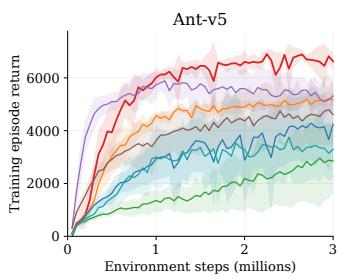

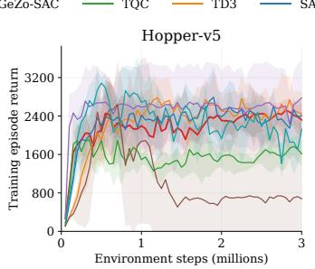

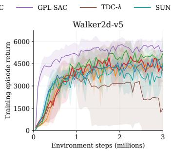

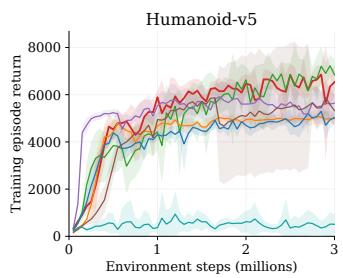  
Fig. 1: Training performance on four MuJoCo-v5 locomotion environments. Learning curves show episodic training returns for Ant-v5, Hopper-v5, Walker2d-v5, and Humanoid-v5. Per-run returns are smoothed and interpolated onto a common environment-step grid. Curves represent the mean over five independent runs $( n = 5 )$ , and shaded regions denote ± one standard deviation across runs. GeZo-SAC leads on Ant-v5 and remains competitive on the other tasks.

Both mixing coefficients are computed without gradient tracking.

Inverse-band critic weighting and geometric aggregation. Given pessimistic value estimates $V _ { 1 } , V _ { 2 }$ , we define inverse-band weights

$$
w _ { i } ( s , a ) = \frac { ( \tilde { b } _ { i } + \varepsilon _ { w } ) ^ { - 1 } } { ( \tilde { b } _ { 1 } + \varepsilon _ { w } ) ^ { - 1 } + ( \tilde { b } _ { 2 } + \varepsilon _ { w } ) ^ { - 1 } } , \qquad \varepsilon _ { w } = 1 0 ^ { - 6 } .
$$

We then form

$$
V _ { \mathrm { w } } ( s , a ) = w _ { 1 } V _ { 1 } + w _ { 2 } V _ { 2 } ,\tag{16}
$$

$$
V _ { \operatorname* { m i n } } ( s , a ) = \operatorname* { m i n } \{ V _ { 1 } , V _ { 2 } \} ,\tag{17}
$$

$$
V _ { \mathrm { g e o } } ^ { \mathrm { ( \cdot ) } } ( s , a ) = ( 1 - \rho ^ { \mathrm { ( \cdot ) } } ) V _ { \mathrm { m i n } } + \rho ^ { \mathrm { ( \cdot ) } } V _ { \mathrm { w } } ,\tag{18}
$$

where $( \cdot ) \in \{ \operatorname { t a r } , \pi \}$ . The coefficient $\rho ^ { \mathrm { t a r } }$ combines the target critics’ pessimistic value estimates at $( s ^ { \prime } , a ^ { \prime } )$ , while $\rho ^ { \pi }$ combines the online critics’ pessimistic value estimates at $( s , a _ { \pi } )$ In each case, the weights use the corresponding normalized bands.

Intuitive example. In a two-dimensional example, each generator defines one direction of a centrally symmetric zonotope, and $h ( u ; G _ { i } )$ measures its radius along probe direction u. Similar supports from the two critics yield small disagreement and favor their weighted average. A large discrepancy in any direction is emphasized by the LSE aggregation, reducing ρ and moving the estimate toward the conservative minimum. Critic targets. Target critics compute $V _ { \mathrm { g e o } } ^ { \mathrm { t a r } } ( s ^ { \prime } , a ^ { \prime } )$ using $\kappa _ { t } ^ { \mathrm { t a r } }$ For $a ^ { \prime } \sim \pi _ { \theta } ( \cdot \mid s ^ { \prime } )$ , the Bellman target is

$$
y = r + \gamma ( 1 - d ) \left[ V _ { \mathrm { g e o } } ^ { \mathrm { t a r } } ( s ^ { \prime } , a ^ { \prime } ) - \alpha ( 0 . 5 ) \log \pi _ { \theta } ( a ^ { \prime } \mid s ^ { \prime } ) \right] .
$$

Here, $d = 1$ for true termination and $d = 0$ otherwise; truncation alone does not stop bootstrapping. The target is computed without gradient tracking.

The base coefficient κ is adapted through empirical target-inclusion control. A center-only target $y _ { \mathrm { c t r } }$ uses the same backup with mini $\bar { Q } _ { \bar { \phi } _ { i } } ( s ^ { \prime } , a ^ { \prime } )$ as its value term. When $\lambda _ { \mathrm { b a s e } } ( t ) > 0$ , the controller measures the fraction of these targets contained in

$$
\frac { Q _ { 1 } ( s , a ) + Q _ { 2 } ( s , a ) } { 2 } \pm \frac { \lambda _ { \mathrm { b a s e } } ( t ) \kappa } { 2 } \big ( \tilde { b } _ { 1 } ( s , a ) + \tilde { b } _ { 2 } ( s , a ) \big ) .
$$

An EMA of this fraction guides the clipped log-space update of κ toward a target inclusion rate of 0.8. This targetinclusion rate is used only to adapt κ and should not be interpreted as statistical coverage of the true policy value.

Additional critic regularization. Each critic loss includes squared penalties on value magnitudes exceeding an adaptive reward-based threshold and on positive TD residuals, weighted by $1 0 ^ { - 4 }$ and $1 0 ^ { - 3 } .$ , respectively.

Actor objective. For each minibatch sample $m ,$ the online critics compute pessimistic value estimates at $\left( s _ { m } , a _ { \pi , m } \right)$ using $\kappa _ { t , m } ^ { \pi } .$ Geometric aggregation with $\rho ^ { \pi }$ produces $V _ { \mathrm { g e o } } ^ { \pi } ( s _ { m } , a _ { \pi , m } )$ . The minibatch actor loss is

$$
J _ { \pi } = \frac { 1 } { B } \sum _ { m = 1 } ^ { B } \left[ \alpha _ { t } ^ { \pi } ( \beta _ { t , m } ) \log \pi _ { \theta } ( a _ { \pi , m } \mid s _ { m } ) - V _ { \mathrm { g e o } } ^ { \pi } ( s _ { m } , a _ { \pi , m } ) \right] ,
$$

where $a _ { \pi , m } \sim \pi _ { \theta } ( \cdot \mid s _ { m } )$ . The actor uses $\alpha _ { t } ^ { \pi } ( \beta ) = e ( t ) \alpha ( \beta )$ with $e ( t ) = 1 . 5$ for $t < 5 \times 1 0 ^ { 3 }$ critic updates and $e ( t ) = 1$ thereafter. The $\beta _ { t , m }$ are sampled conditionally on the modulation scalar $c ( t )$ as defined above. Higher $c ( t )$ increases their conditional mean.

Update schedule. At each learner update, we update the critics and apply Polyak averaging to the target networks. The coverage controller is updated when active. The actor and entropy-coefficient network are updated every second critic update; t indexes critic updates throughout. The actorside quantities $c ( t ) , \lambda _ { t } ^ { \pi } , \beta _ { t , m }$ and $\rho ^ { \pi }$ are recomputed only at policy updates.

Entropy coefficient. A small network $f _ { \psi }$ defines $\alpha ( \beta ) =$ $\exp ( \operatorname { c l i p } ( f _ { \psi } ( \beta ) , - 3 , 2 ) )$ and is optimized using

$$
J _ { \alpha } = - \frac { 1 } { B } \sum _ { m = 1 } ^ { B } \log \alpha ( \beta _ { t , m } ) ( \hat { \ell } _ { m } - A ) , \qquad \hat { \ell } _ { m } = \log \pi _ { \theta } ( a _ { \pi , m } \mid s _ { m } ) .
$$

where the target entropy is −A. The sampled $\beta _ { t , m }$ and policy log-probabilities are treated as constants during this update. Critic targets use $\alpha ( 0 . 5 )$ , whereas actor updates use $\alpha _ { t } ^ { \pi } ( \beta _ { t , m } )$ with the early entropy multiplier defined above.

Algorithm 1 summarizes the training procedure.

## IV. EXPERIMENTS

## A. Experimental Setup

Baselines. We compare GeZo-SAC against six off-policy continuous-control methods: Soft Actor–Critic (SAC) [5],

<table><tr><td>Environment</td><td>GeZo-SAC (ours)</td><td>TQC</td><td>TD3</td><td>SAC</td><td>GPL-SAC</td><td>TDC-λ</td><td>SUNRISE</td></tr><tr><td>Ant-v5</td><td>7.17(0.21)</td><td>4.45(2.05)</td><td>5.77(0.23)</td><td>4.43(1.24)</td><td>6.09(0.52)</td><td>5.39(1.53)</td><td>5.32(0.77)</td></tr><tr><td>Hopper-v5</td><td>3.77(0.11)</td><td>3.44(0.38)</td><td>3.52(0.09)</td><td>3.51(0.17)</td><td>3.38(0.21)</td><td>3.59(0.15)</td><td>3.63(0.08)</td></tr><tr><td>Humanoid-v5</td><td>7.89(0.58)</td><td>8.61(0.25)</td><td>5.23(0.20)</td><td>5.60(0.09)</td><td>6.13(0.66)</td><td>6.85(0.54)</td><td>0.62(0.08)</td></tr><tr><td>Walker2d-v5</td><td>5.74(0.30)</td><td>6.22(0.41)</td><td>4.61(0.52)</td><td>5.25(0.47)</td><td>6.06(0.47)</td><td>4.99(0.85)</td><td>5.79(0.44)</td></tr></table>

TABLE I: Mean evaluation return (in thousands) across five training runs, using the best checkpoint from each run and 300 deterministic evaluation episodes. Parentheses show the sample standard deviation. Bold and underline denote the best and second-best means. GeZo-SAC uses K = 15 in all environments.

<table><tr><td>Method</td><td>Work/m ↓</td><td>Dist. ↑</td><td>TV/m↓</td><td>Effort/m ↓</td><td>Return ↑</td></tr><tr><td>SAC</td><td>1.028</td><td>0.817</td><td>1.266</td><td>1.100</td><td>4.70 (0.32)</td></tr><tr><td>TD3</td><td>1.275</td><td>0.786</td><td>1.951</td><td>1.936</td><td>4.77 (0.16)</td></tr><tr><td>TQC</td><td>1.137</td><td>1.283</td><td>0.941</td><td>0.937</td><td>5.68 (0.51)</td></tr><tr><td>GPL-SAC</td><td>0.934</td><td>0.988</td><td>0.901</td><td>0.926</td><td>5.42 (0.23)</td></tr><tr><td>TDC-λ</td><td>1.068</td><td>1.002</td><td>1.463</td><td>1.441</td><td>5.21 (0.44)</td></tr><tr><td>SUNRISE</td><td>1.176</td><td>0.751</td><td>1.890</td><td>2.551</td><td>3.84 (0.23)</td></tr><tr><td>GeZo-SAC (ours)</td><td>0.878</td><td>1.242</td><td>0.837</td><td>0.763</td><td>6.14 (0.17)</td></tr></table>

TABLE II: Mechanical metrics and return across the four locomotion tasks. Values are averaged across environments; mechanical metrics are normalized within each environment by its median Lower is better for Work/m, TV/m, and Effort/m; higher is better for Distance and return. Bold and underline denote the best and second-best values.

TD3 [4], Truncated Quantile Critics (TQC) [2], Generalized Pessimism Learning (GPL-SAC) [12], Twin Distributional Critics with λ-LCB (TDC-λ) [13], and SUNRISE [17]. We use the same environment and evaluation protocol across methods, while retaining method-specific critic structures and aggregation mechanisms.

Environments. We evaluate Ant-v5, Hopper-v5, Walker2dv5, and Humanoid-v5, four locomotion benchmarks from Gymnasium [21].

Training. All experiments are conducted for $T = 3 \times 1 0 ^ { 6 }$ interaction steps per seed, with a maximum episode length of 1000. To ensure a fair and balanced evaluation, we use the same hyperparameters: discount factor $\gamma = 0 . 9 9$ Polyak averaging coefficient $\tau = 0 . 0 0 5$ , Adam optimizer with learning rate $3 \times 1 0 ^ { - 4 }$ , batch size 256 and buffer size $5 \times 1 0 ^ { 5 }$ Evaluation Setup. For each method, we perform five independent training runs. During training, policies are evaluated every 50 training episodes using 10 deterministic evaluation episodes. For each run, we select the checkpoint achieving the highest mean return in these evaluations. After training, the selected policy is evaluated over 300 deterministic episodes, using reset seeds different from those used for checkpoint selection.

Metrics. Beyond episodic return, we evaluate overestimation frequency, critic–return discrepancy, and mechanical efficiency.

Value diagnostics. Overestimation frequency is measured as $P ( \hat { Q } ( s , a _ { \pi } ) > \mathbf { M } \mathbf { C } ( s ) )$ , where MC(s) is the discounted Monte-Carlo return obtained from the restored simulator state under the deterministic evaluation policy. Lower values indicate less frequent optimistic estimates, but do not by themselves establish greater estimation accuracy. We therefore also report the mean absolute critic–return discrepancy $\mathbb { E } \big [ \big | \hat { Q } ( s , a _ { \pi } ) - \mathbf { M } \mathbf { C } ( s ) \big | \big ]$ over the same subset of states. Mechanical and control metrics. We evaluate locomotion efficiency using absolute actuator work per metre, forward distance, action total variation per metre, and action effort per metre. Let $\tau _ { t }$ and $\dot { q } _ { t }$ denote the generalized actuator force and velocity vectors, and $\mathbf { a } _ { t }$ the policy action at step t. For an episode with forward displacement $\Delta x ,$ we compute

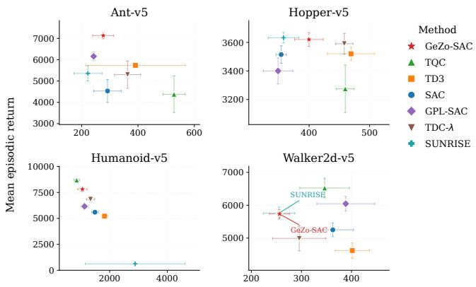  
Mean absolute work per metre, $E _ { \sf a b s } / m$ [J/m]  
Fig. 2: Performance–energy trade-off. Mean episodic return versus mean absolute mechanical work per metre, $E _ { \mathrm { a b s } } / m$ (J/m), across four locomotion tasks. Each marker represents one method; points toward the upper left combine higher return with lower work per metre.

$$
\frac { E _ { \mathrm { a b s } } } { m } = \frac { \sum _ { t = 0 } ^ { T - 1 } \sum _ { d = 1 } ^ { n _ { \nu } } | \tau _ { t } ^ { ( d ) } \dot { q } _ { t } ^ { ( d ) } | \Delta t } { \operatorname* { m a x } \bigl ( | \Delta x | , \varepsilon \bigr ) } ,\tag{19}
$$

$$
\mathrm { T V } / m = \frac { \sum _ { t = 1 } ^ { T - 1 } \| \mathbf { a } _ { t } - \mathbf { a } _ { t - 1 } \| _ { 1 } } { \operatorname* { m a x } ( | \Delta x | , \varepsilon ) } ,\tag{20}
$$

$$
\mathrm { E f f o r t } / m = \frac { \sum _ { t = 0 } ^ { T - 1 } \| \mathbf { a } _ { t } \| _ { 2 } ^ { 2 } \Delta t } { \operatorname* { m a x } ( | \Delta x | , \varepsilon ) } .\tag{21}
$$

Lower values indicate lower mechanical cost, smoother control, and lower action effort, respectively. Forward distance is reported separately. For the cross-environment summary, mechanical metrics are normalized within each environment before averaging across tasks.

## B. Results

Performance and Training Dynamics. Table I shows that GeZo-SAC achieves the highest mean evaluation return on

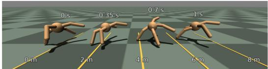

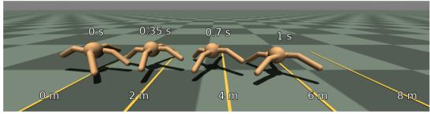

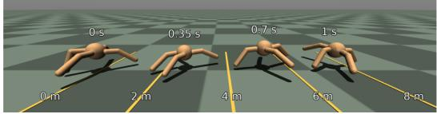

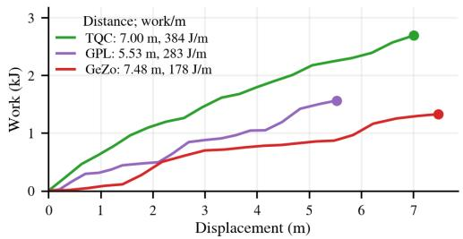  
Fig. 3: Locomotion and mechanical cost on Ant-v5. Top: Overlaid poses of TQC, GPL-SAC, and GeZo-SAC at matched times over a one-second interval, shown at a common spatial scale. Bottom: Cumulative actuator work versus forward displacement over the same interval. GeZo-SAC travels farther while requiring less work per metre in these illustrative rollouts.

Ant-v5 and Hopper-v5, while remaining competitive with the strongest baselines on Humanoid-v5 and Walker2d-v5. All GeZo-SAC results use K = 15 generators across the four environments.

Figure 1 shows different learning patterns across tasks. On Ant-v5, GPL improves fastest initially, but GeZo-SAC overtakes it and remains among the strongest methods later in training. On Hopper-v5, the leading methods show overlapping learning curves, with GeZo-SAC achieving the highest mean return in the selected-checkpoint evaluation. On Humanoid-v5, TQC achieves the highest returns in later training, with GeZo-SAC generally following ahead of the remaining methods. On Walker2d-v5, GeZo-SAC reaches a comparable return range, although its mean curve generally remains below the leading baselines. SUNRISE remains at low returns on Humanoid-v5, while TDC exhibits a marked decline in return on Hopper-v5 and Walker2d-v5.

Mechanical Cost and Control Quality. GeZo-SAC combines the highest average return with the lowest average actuator work, action variation, and action effort per metre (Table II). It also ranks second in forward distance. These cross-task rankings show that its strong returns are accompanied by lower mechanical and action costs per unit of forward progress.

Figure 2 illustrates the trade-offs within each environment.

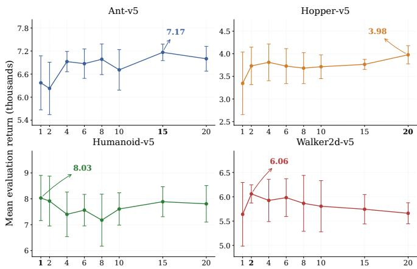  
Fig. 4: Sensitivity to the number of zonotope generators. Curves show mean evaluation return over five training seeds, with shaded regions and error bars indicating ± one standard deviation. Bold labels mark the highest observed mean in each environment.

On Ant-v5, GeZo-SAC achieves the highest return while requiring less work per metre than SAC, TD3, TQC, and TDC. On Humanoid-v5, GeZo-SAC and TQC stand out by combining the highest returns with the lowest work per metre. On Walker2d-v5, GeZo-SAC and SUNRISE achieve similar returns at the lowest work per metre, whereas TQC and GPL obtain higher returns at greater mechanical cost. On Hopper-v5, GeZo-SAC reaches returns comparable to the leading methods, using less work per metre than TD3 and TDC but more than SAC and SUNRISE. The aggregate advantage therefore reflects different trade-offs across tasks, with GeZo-SAC offering particularly favorable combinations of return and mechanical cost on Ant-v5 and Humanoid-v5.

Figure 3 also complements these results with a direct comparison of learned locomotion on Ant-v5. Synchronized poses show the agents’ forward progress, while the work– displacement curves track the associated mechanical cost. Over the illustrated one-second interval, GeZo-SAC travels farther than TQC and GPL-SAC while expending less absolute actuator work, achieving the lowest work per metre of the three displayed rollouts.

## C. Value Estimation and Policy Performance

Figure 5 compares GeZo-SAC with SAC, TD3, TQC, and GPL-SAC using the mean online critic prediction for each method, without the pessimistic adjustments used during training. Metrics are computed over sampled states from the deterministic evaluation policy, and error bars show variability across training seeds.

GeZo-SAC exhibits near-zero measured overestimation frequency across all four environments. On Ant-v5, it combines the highest mean Monte-Carlo return with lower measured overestimation frequency than SAC and TQC. On Hopper-v5, GeZo-SAC, SAC, TD3, and TQC show nearzero measured overestimation frequency, while GPL-SAC has a higher mean frequency. GeZo-SAC attains the highest mean Monte-Carlo return. On Humanoid-v5, TQC achieves a higher return despite more frequent overestimation.

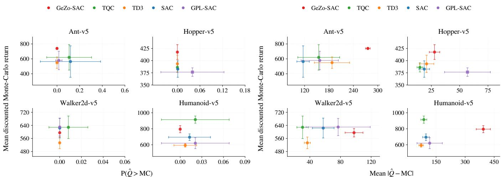  
Fig. 5: Value-estimation diagnostics and policy performance. Comparison of GeZo-SAC, SAC, TD3, TQC, and GPL SAC across four locomotion tasks. Left: measured overestimation frequency $P ( \hat { Q } ( s , a _ { \pi } ) > \mathbf { M } \mathbf { C } ( s ) )$ . Right: mean absolute critic–return discrepancy $\mathbb { E } [ | \hat { Q } ( s , a _ { \pi } ) - \mathbf { M } \mathbf { C } ( s ) | ]$ . The vertical axis shows mean discounted, reward-only Monte-Carlo return under deterministic evaluation. Markers average policy-level metrics across training seeds; horizontal and vertical error bars show ± one sample standard deviation.

The absolute discrepancies reveal a different ordering. GeZo-SAC has the largest mean critic–return discrepancy on Ant-v5, Humanoid-v5, and Walker2d-v5, despite achieving the highest return on Ant-v5 and the second-highest on Humanoid-v5. Absolute agreement with Monte-Carlo returns therefore does not directly predict policy quality. An actionindependent offset, for example, changes absolute value errors without changing action preferences. On Walker2dv5, however, several baselines combine smaller discrepancies with higher returns. These results show that strong policy performance can coexist with substantial critic–return discrepancies.

## D. Ablation: Number of Zonotope Generators

We vary the number of generators $K \in$ {1,2,4,6,8,10,15,20} across all four environments, keeping the remaining hyperparameters fixed and using five independent training seeds per configuration.

Figure 4 shows that the effect of K is task-dependent. Ant-v5 and Hopper-v5 attain their highest mean returns with larger generator sets, at K = 15 and K = 20, respectively. Larger configurations also generally show less variability across seeds on these tasks. In contrast, Humanoid-v5 and Walker2d-v5 achieve their highest mean returns at K = 1 and K = 2, with no consistent benefit from additional generators. Increasing the generator count therefore does not uniformly improve performance. All main comparisons use a shared setting of K = 15 across the four environments.

## E. Ablation: Fixed versus Adaptive Pessimism

We compare fixed κ = 1, near-zero $\kappa = 1 0 ^ { - 6 }$ , and adaptive κ, using K = 15. Each setting is trained for $3 \times 1 0 ^ { 6 }$ environment steps with three independent seeds per environment (Figs. 6–7). In the displayed runs, adaptive κ achieves higher returns on Ant-v5 and Humanoid-v5. Hopper-v5 shows overlapping training curves but the highest final evaluation return with adaptation, whereas near-zero κ performs best on Walker2d-v5. Figure 7 also illustrates the evolution of the adaptive pessimism coefficient on Hopper-v5. Starting from its initial value, the controller decreases κ substantially during early training and subsequently stabilizes at an intermediate level, in contrast to the fixed coefficients used in the ablations.

<table><tr><td>Method</td><td>Act. (M) Crit. (M)</td><td>Train (ms)</td><td>Infer. (ms)</td></tr><tr><td>SAC</td><td>0.101</td><td>0.199</td><td>9.83</td></tr><tr><td>TD3</td><td>0.099</td><td>0.199</td><td>0.181 5.25 0.161</td></tr><tr><td>TQC</td><td>0.101</td><td>0.527 16.90</td><td>0.181</td></tr><tr><td>GPL-SAC</td><td>0.101</td><td>1.656</td><td>41.62 0.662</td></tr><tr><td>TDC-λ</td><td>0.099</td><td>0.231</td><td>6.65 0.153</td></tr><tr><td>SUNRISE</td><td>0.506</td><td>0.993</td><td>55.63 0.900</td></tr><tr><td>GeZo-SAC (ours)</td><td>0.101</td><td>1.133</td><td>15.71 0.181</td></tr></table>

TABLE III: Computational overhead. Parameter counts include the actor and all online critics. Timings calculated on an NVIDIA A100-SXM-80GB.

## F. Computational Cost

Table III compares model size and runtime across methods. GeZo-SAC increases critic capacity relative to SAC, but its training cost remains comparable to TQC and substantially below larger ensemble-based methods such as GPL-SAC and SUNRISE. Importantly, the additional zonotope representation is confined to the critics. The deployed actor therefore has the same architecture and inference latency as SAC, so the extra computational cost is incurred only during training.

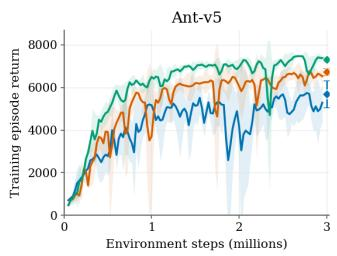

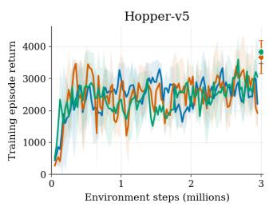

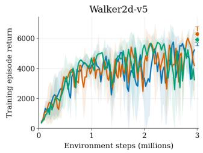

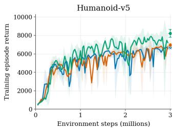  
Fig. 6: Effect of fixed versus adaptive pessimism. Evaluation returns for GeZo-SAC with fixed κ = 1, fixed $\kappa \approx 0 ,$ and the adaptive κ controller across the four locomotion tasks. Curves show the mean over three training runs, with shading indicating ± one sample standard deviation. Diamonds mark the final deterministic evaluation over 300 episodes per policy, with error bars showing the standard deviation across runs.

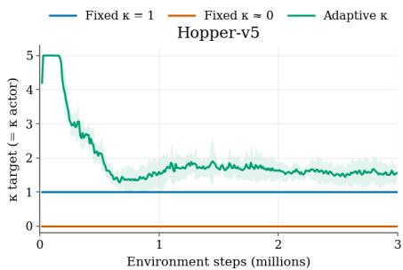  
Fig. 7: Evolution of the adaptive pessimism coefficient on Hopper-v5. The adaptive controller changes κ throughout training, while the two ablated variants keep it fixed. The curve shows the mean across three training seeds, with shading indicating ± one standard deviation.

## V. CONCLUSIONS

We presented GeZo-SAC, which augments SAC’s twin critics with auxiliary zonotope generators whose directional supports provide heuristic geometric bands and a disagreement signal for adapting pessimism and critic aggregation. Across four MuJoCo-v5 tasks, GeZo-SAC achieves the highest mean return on Ant-v5 and Hopper-v5, outperforms SAC and TD3 on every task, and attains the lowest average work and action effort per metre, with near-zero measured overestimation frequency. In the future we also plan to extend and evaluate GeZo-SAC to robotic manipulation tasks.

## REFERENCES

[1] S. Thrun and A. Schwartz, “Issues in using function approximation for reinforcement learning,” in Proceedings of the Fourth Connectionist Models Summer School. Hillsdale, NJ: Lawrence Erlbaum, Dec. 1993.

[2] A. Kuznetsov, P. Shvechikov, A. Grishin, and D. Vetrov, “Controlling overestimation bias with truncated mixture of continuous distributional quantile critics,” in Proceedings of the 37th International Conference on Machine Learning, 2020.

[3] V. Mnih, K. Kavukcuoglu, D. Silver, A. Graves, I. Antonoglou, D. Wierstra, and M. Riedmiller, “Playing atari with deep reinforcement learning,” arXiv preprint arXiv:1312.5602, 2013.

[4] S. Fujimoto, H. van Hoof, and D. Meger, “Addressing function approximation error in actor-critic methods,” in Proceedings of the 35th International Conference on Machine Learning, 2018.

[5] T. Haarnoja, A. Zhou, P. Abbeel, and S. Levine, “Soft actor-critic: Offpolicy maximum entropy deep reinforcement learning with a stochastic actor,” arXiv preprint arXiv:1801.01290, 2018.

[6] P. Maragos and E. Theodosis, “Multivariate tropical regression and piecewise-linear surface fitting,” in Proc. IEEE ICASSP, 2020.

[7] V. Charisopoulos and P. Maragos, “Morphological Perceptrons: Geometry and Training Algorithms,” in Mathematical Morphology and Its Applications to Signal and Image Processing - ISMM 2017, ser. LNCS, J. A. et al., Ed., vol. 10225. Springer, 2017, pp. 3–15.

[8] ——, “A Tropical Approach to Neural Networks with Piecewise Linear Activations,” arXiv:1805.08749, 2018.

[9] X. Zhang, G. Naitzat, and L.-H. Lim, “Tropical geometry of deep neural networks,” in Proceedings of the 35th International Conference on Machine Learning, 2018.

[10] P. Misiakos, G. Smyrnis, G. Retsinas, and P. Maragos, “Neural network approximation based on hausdorff distance of tropical zonotopes,” in International Conference on Learning Representations (ICLR), 2022.

[11] H. van Hasselt, A. Guez, and D. Silver, “Deep reinforcement learning with double q-learning,” arXiv preprint arXiv:1509.06461, 2016. [Online]. Available: https://arxiv.org/abs/1509.06461

[12] E. Cetin and O. Celiktutan, “Learning pessimism for reinforcement learning,” in Proceedings of the AAAI Conference on Artificial Intelligence, vol. 37, no. 6, 2023, pp. 6971–6979.

[13] O. Osman, B. Yalcin Kavus, T. K. Karaca, G. Tulum, and M. A. Karabulut, “Risk sensitive twin distributional critics with a lambda lower confidence bound for continuous control reinforcement learning,” Scientific Reports, vol. 16, p. 6699, 2026.

[14] A. Kumar, A. Zhou, G. Tucker, and S. Levine, “Conservative qlearning for offline reinforcement learning,” in Advances in Neural Information Processing Systems, ser. NeurIPS, 2020.

[15] K. Ciosek, Q. Vuong, R. Loftin, and K. Hofmann, “Better exploration with optimistic actor-critic,” in Advances in Neural Information Processing Systems (NeurIPS), vol. 32, 2019.

[16] J. Duan, W. Wang, L. Xiao, J. Gao, S. E. Li, C. Liu, Y.-Q. Zhang, B. Cheng, and K. Li, “Distributional soft actor-critic with three refinements,” IEEE Transactions on Pattern Analysis and Machine Intelligence, vol. 47, no. 5, pp. 3935–3946, 2025.

[17] K. Lee, M. Laskin, A. Srinivas, and P. Abbeel, “SUNRISE: A simple unified framework for ensemble learning in deep reinforcement learning,” in Proceedings of the 38th International Conference on Machine Learning, vol. 139, 2021, pp. 6131–6141.

[18] G. C. Calafiore, S. Gaubert, and C. Possieri, “Log-sum-exp neural networks and posynomial models for convex and log-log-convex data,” IEEE Transactions on Neural Networks and Learning Systems, 2019.

[19] ——, “A universal approximation result for difference of log-sumexp neural networks,” IEEE Transactions on Neural Networks and Learning Systems, 2020.

[20] K. Fotopoulos, P. Maragos, and P. Misiakos, “TropNNC: Structured neural network compression using tropical geometry,” Transactions on Machine Learning Research, Jun. 2026. [Online]. Available: https://openreview.net/forum?id=u7DRq1icmY

[21] M. Towers, A. Kwiatkowski, J. Terry, J. U. Balis, G. De Cola, T. Deleu, M. Goulão, A. Kallinteris, M. Krimmel, A. KG et al., “Gymnasium: A standard interface for reinforcement learning environments,” arXiv preprint arXiv:2407.17032, 2024.