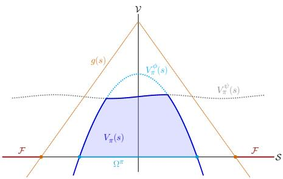
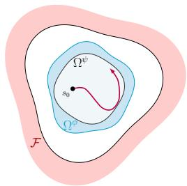
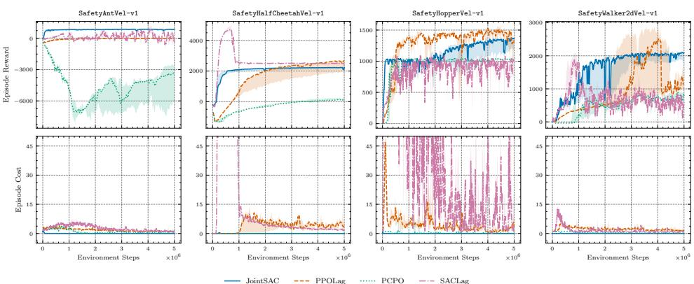
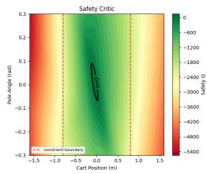
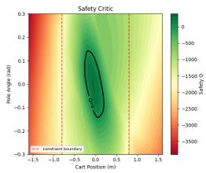
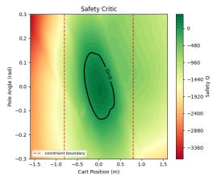
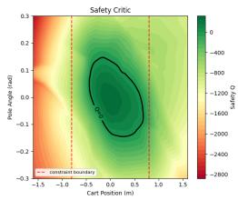
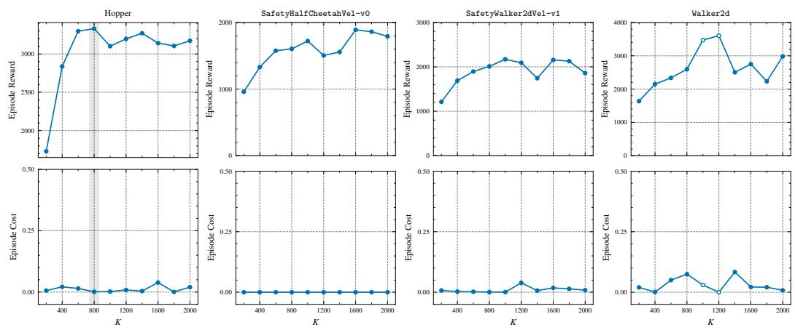
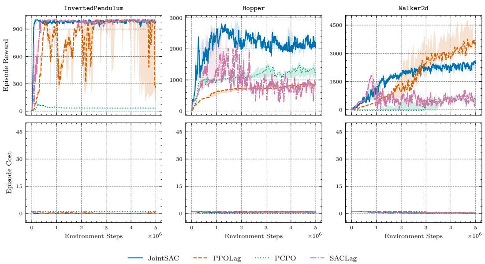
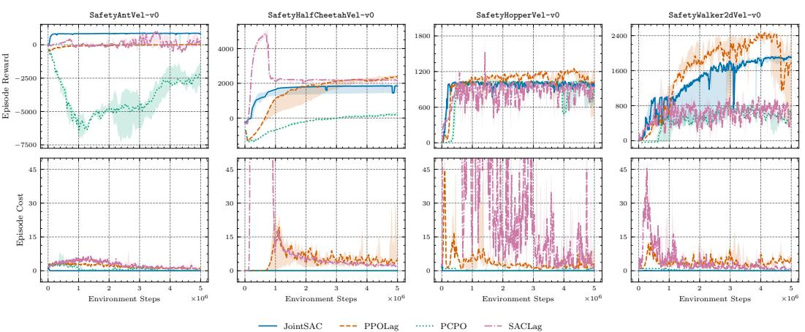

# A UNIFIED BELLMAN OPERATOR FOR SAFETY-CRITICAL REINFORCEMENT LEARNING

Nishanth Arun Rao1,\* Royina Karegoudra Jayanth2,\*

Benjamin Eysenbach2 Jaime Fernández Fisac1

1Department of Electrical and Computer Engineering

2Department of Computer Science

Princeton University

{nr1053, rj5498, eysenbach, jfisac}@princeton.edu

## ABSTRACT

Reinforcement learning in safety-critical domains requires maximizing task performance while strictly adhering to safety constraints. Existing safe reinforcement learning paradigms typically force a trade-off: they either require a priori knowledge to provide strict safety guarantees (e.g., safety filters), or they enable joint learning but only satisfy safety constraints on average. In this work, we propose a novel Bellman operator that unifies performance and safety objectives into a joint value function. We show that temporal difference learning with the joint Bellman operator converges under a two-timescale stochastic approximation framework. On the fast timescale, the safety value of the learning joint policy is estimated, while the joint value is estimated on the slow timescale. Convergence is ensured by formulating the limiting dynamics as an occupation-averaged differential inclusion, and showing that it asymptotically converges to a set of limiting optimal safety-constrained task value functions. Theoretically, once converged, the resulting optimal policy maximizes task return while maintaining safety at all times. Empirical evaluations on continuous control tasks with neural approximations demonstrate stable convergence with near-zero safety violations at test time.

## 1 INTRODUCTION

Biological agents instinctively prioritize safety while mastering diverse tasks to ensure efficient, harm-free exploration. Safe Reinforcement Learning (Safe RL) captures this paradigm, aiming to learn near-optimal policies with strict safety assurances. Existing methods typically formalize this balance either by treating safety as a soft constraint during optimization or by theoretically enforcing hard safety guarantees.

Some of the early works formalized safe RL as a Constrained Markov Decision Process (CMDP), solving safety-constrained optimization problems using Lagrangian relaxation with dual multiplier methods (Altman, 1999; García & Fernández, 2015; Ray et al., 2019), with subsequent extensions via trust-region projections (Achiam et al., 2017; Yang et al., 2020; Xu et al., 2021; Milosevic et al., 2025), state-augmentation (Sootla et al., 2022), and offline distribution shaping (Yao et al., 2024). While these model-free techniques jointly optimize task performance and safety, they inherently bound expected cumulative costs, yielding only probabilistic safety guarantees. Conversely, model-based methods achieve strict safety via predictive rollouts, epigraph formulation of the value function (for deterministic control problems), or by strictly avoiding unsafe future sets (Huang et al., 2024; Jayant & Bhatnagar, 2022; Pfrommer et al., 2022; Altarovici et al., 2013). However, they suffer from compounding model biases and computational overhead to infer safe actions in real-time, particularly in environments with complex or unmodeled dynamics. Motivated by these tradeoffs, we seek a model-free approach that strictly adheres to safety specifications while optimizing task performance.

Some of the control-theoretic approaches that rigorously hard-guarantee safety are based on Hamilton-Jacobi (HJ) reachability analysis, casting safety and reach-avoid problems as zero-sum differential games (Isaacs, 1965; Mitchell et al., 2005). While deep RL techniques have enabled tractable neural solutions for the time-discounted HJI avoid/reach-avoid Bellman operators for safety analysis (Fisac et al., 2019; Hsu et al., 2021; Bajcsy et al., 2019), it is not immediately obvious how these technique can be extended to generic tasks specified by dense, continuous reward functions. Consequently, a dominant paradigm employs a decoupled approach, where an a priori learned task-oblivious safety filter preemptively intercepts and projects nominal unsafe task actions onto a plausible safe set (Bui et al., 2021; Hsu et al., 2024; Nguyen et al., 2024; Cai et al., 2025; Banerjee et al., 2024). However, these switch-type interventions only occur near the boundary, causing erratic, jittery interventions when a safety-oblivious task policy persistently tries to exit the boundary. This is seldom desirable, especially in human-in-the-loop scenarios (Oh et al., 2025).

Recent offlinefeasibility-guided models instead utilize diffusion, flow-matching, or world-models to approximate the largest feasible region using HJ-reachability and steer task-driven actions to strictly lie within the safe envelope (Zheng et al., 2024; Tayal et al., 2026; Cao et al., 2025). However, they either introduce iterative online inference latency or rely on post-hoc distillation that weakens strict safety guarantees. Alternatively, using precomputed safety value functions as Control Barrier Functions (Q-CBF) (Hsu et al., 2024; Lu et al., 2025; Oh et al., 2025; 2026) avoids planning latency, but necessitates computing action projections online. Additionally, relying on external projections introduces action aliasing, which can be detrimental (Markgraf et al., 2026). If the safe action set is known a priori, neural-based methods such as (Suttle et al., 2024) can hard-guarantee safety; we instead assume no access to an oracle safe action set and learn from data. Thus, a growing subset of literature advocates for unified architectures that embed safety directly into the policy (Gu et al., 2024a;b; Cen et al., 2024). Yet, jointly optimizing rewards and costs frequently destabilizes learning due to gradient conflicts, necessitating algorithmic workarounds like gradient manipulation and explicit latent decoupling (Gu et al., 2024a;b; Kim et al., 2025; Cen et al., 2024; Yang et al., 2025).

In this paper, we combine safety and task objectives directly at the value-function level, rather than at the policy level, and jointly optimize safety-constrained task performance using a single joint policy via a novel, joint Bellman operator under adversarial disturbances. Our contributions are:

Unified Formulation: We propose a robust Bellman operator and derive the corresponding objective function from robust optimal stopping theory. We propose a two-timescale stochastic approximation framework that enables learning of its fixed point, the joint valuefunction.

Theoretical Safety and Optimality Guarantees: We prove forward invariance of the safe set under the joint policy, and show convergence to the optimal robust task performance within the safe set.

Empirical Validation: We conduct experiments using neural approximations on a set of continuous control tasks from the Gymnasium and SafetyGymnasium suites under adversarial disturbances, demonstrating stable training convergence and near-zero safety violations during evaluation.

## 2 PRELIMINARIES

This section introduces key definitions, followed by preliminaries on Constrained Markov Decision Processes and Hamilton-Jacobi safety analysis. Refer to Appendix A for more details.

## 2.1 DEFINITIONS AND NOTATIONS

We consider a discounted MDP with finite state, action and disturbance spaces: $S \subset \mathbb { R } ^ { n } , { \mathcal { A } } \subset \mathbb { R } ^ { m }$ and $\mathcal { D } \subset \mathbb { R } ^ { l }$ respectively, with the transition kernel $P ( \cdot | s , a , d ) \in \Delta ( S )$ . A deterministic joint policy $\pi = ( \mu , \nu )$ pairs the mappings $\mu : { \mathcal { S } }  A$ and $\nu : \mathcal { S } \times \mathcal { A }  \mathcal { D }$ , yielding $\pi ( s ) = ( \mu ( s ) , \nu ( s , \mu ( s ) ) )$ The reward and the safety margin are given by $r : \mathcal { S } \times \mathcal { A } \times \mathcal { D }  [ \bar { 0 } , R _ { \mathrm { m a x } } ] , \ddot { R } _ { \mathrm { m a x } } > 0 \mathrm { ~ w . l . o . g ~ }$ and $g : \mathcal { S }  [ - G _ { \mathrm { m i n } } , G _ { \mathrm { m a x } } ]$ , with $G _ { \mathrm { m i n } } , G _ { \mathrm { m a x } } > 0$ respectively. We subsume the extended class-$\kappa _ { e }$ scaling function $\beta ( \cdot )$ into $g ( s )$ to align with task return scales (unless stated otherwise). The constraint set is ${ \mathcal { F } } ^ { c } : = \{ s \in { \mathcal { S } } : { \dot { g } } ( s ) \geq { \bar { 0 } } \}$ , complementing the failure set ${ \mathcal F } .$ The viability kernel $\Omega \subseteq { \mathcal { F } } ^ { c }$ is the subset of states from which a control policy exists that can keep the agent away from the failure set $\mathcal { F }$ for all times, regardless of the adversarial disturbance. Finally, the value and action-value function spaces are defined as $\mathcal { V } : = \mathbb { R } ^ { | \boldsymbol { S } | }$ and $Q : = \mathbb { R } ^ { | S | | A | | D | }$ , equipped with the supremum norm $\| \cdot \| _ { \infty }$

## 2.2 CONSTRAINED MARKOV DECISION PROCESSES

A Constrained Markov Decision Process (CMDP) (Altman, 1999) extends an MDP by introducing auxiliary costs to encode safety constraints. It is defined by the tuple $\mathcal { M } = ( \mathcal { S } , \mathcal { A } , \mathcal { P } , r , c , \gamma , \mu _ { 0 } )$ where r and c are the task reward and constraint cost functions, respectively, $\gamma \in [ 0 , 1 )$ is the discount factor, and $\mu _ { 0 } : { \mathcal { S } }  [ 0 , 1 ]$ denotes the initial state distribution. For a stochastic policy $\pi : S  \Delta ( { \mathcal { A } } )$ , let $J _ { r } ( \pi )$ and $\dot { J } _ { c } ( \bar { \pi } )$ denote the expected discounted cumulative return and cost. The CMDP objective seeks an optimal policy that maximizes returns subject to a predefined safety threshold $d \in \mathbb { R }$ , typically solved via Lagrangian relaxation, yielding an equivalent unconstrained min-max saddle-point problem: min $\begin{array} { r } { \lambda \ge 0 \operatorname* { m a x } _ { \pi \in \Pi } \left( J _ { r } ( \pi ) - \dot { \lambda } ( J _ { c } ( \pi ) - d ) \right) } \end{array}$ , where $\lambda \geq 0$ is the Lagrange multiplier and Π is the set of stationary stochastic policies. More details can be found in (Altman, 1999; Achiam et al., 2017; Tessler et al., 2019; Stooke et al., 2020).

## 2.3 HAMILTON-JACOBI SAFETY ANALYSIS

Hamilton-Jacobi (HJ) reachability analysis seeks to find the safe set $\Omega \subseteq { \mathcal { F } } ^ { c }$ (Mitchell et al., 2005). Formulated as a zero-sum differential game, the robust safety value function is $V ^ { \phi } ( s ) =$ infN[d] sup inf $t \geq 0 \ g ( \xi _ { s _ { 0 } } ^ { a , \mathcal { N } [ d ] } ( t ) )$ , where $\xi _ { s _ { 0 } } ^ { \pmb { a } , \mathcal { N } [ \pmb { d } ] } ( \cdot )$ denotes the trajectory starting at $s _ { 0 }$ and evolving according to the control and disturbance trajectories $( \pmb { a } , \mathcal { N } [ \pmb { d } ] )$ , with [d] the set of non-anticipative disturbance strategies (Evans & Souganidis, 1983; Fisac et al., 2018). By Dynamic Programming, $V ( s )$ is the unique viscosity solution to the Hamilton-Jacobi-Isaacs (HJI) variational inequality. As the corresponding infinite-horizon Bellman operator does not induce a contraction mapping, (Fisac et al., 2019) introduces a discount factor $\gamma \in \mathsf { \Gamma } ( 0 , 1 )$ to enable TD-learning, resulting in the time-discounted robust Bellman equation under stochastic dynamics $V ( s ) = { \bar { ( } } 1 - \gamma ) g ( { \bar { s } } ) +$ γ min $\begin{array} { r } { \left\{ g ( s ) , \operatorname* { m a x } _ { a \in \mathcal { A } } \operatorname* { m i n } _ { d \in \mathcal { D } } \mathbb { E } _ { s ^ { \prime } \sim p ( \cdot | s , a , d ) } [ V ( s ^ { \prime } ) ] \right\} } \end{array}$ More details can be found in (Mitchell et al., 2005; Fisac et al., 2019; 2018; Evans & Souganidis, 1983).

## 3 LEARNING SAFETY-CONSTRAINED TASK ACTION-VALUE FUNCTION

This section presents our unified formulation to learn a joint safety-constrained task value function. We show that the corresponding joint Bellman operator induces a contraction mapping when the auxiliary safety value function is held fixed. We further see that the coupled system possesses a discontinuity due to changing joint greedy policies, and discuss its resolution.

## 3.1 THE JOINT FORMULATION

For clarity, we first introduce the joint Bellman equation to intuit its formulation. In the presence of adversarial disturbances, the time-discounted task action-value function $Q ^ { \psi }$ purely corresponding to task return maximization can be extended to the following robust stochastic equation:

$$
Q ^ { \mathrm { t a s k } } ( s , a , d ) = r ( s , a , d ) + \gamma \operatorname * { \mathbb { E } } _ { s ^ { \prime } \sim p ( \cdot \vert s , a , d ) } \left[ \operatorname* { m a x } _ { a ^ { \prime } \in A d ^ { \prime } \in \mathcal { D } } Q ^ { \mathrm { t a s k } } ( s ^ { \prime } , a ^ { \prime } , d ^ { \prime } ) \right]\tag{1}
$$

Next, consider the time-discounted safety value function, as introduced in (Fisac et al., 2019). We’d like to use this value function to instead assess the safety values of some given policy $\pi : = ( \mu , \nu )$ yielding the following safe action-value function evaluated π:

$$
\begin{array} { r } { Q _ { \pi } ^ { \phi } ( s , a , d ) = ( 1 - \gamma ) g ( s ) + \gamma \operatorname* { m i n } \left\{ g ( s ) , \underset { s ^ { \prime } \sim p ( \cdot \mid s , a , d ) } { \mathbb { E } } \left[ \underset { a ^ { \prime } \in \mu ( s ^ { \prime } ) } { \operatorname* { m a x } } \underset { d ^ { \prime } \in \nu ( s ^ { \prime } , a ^ { \prime } ) } { \operatorname* { m i n } } Q _ { \pi } ^ { \phi } ( s ^ { \prime } , a ^ { \prime } , d ^ { \prime } ) \right] \right\} } \end{array}\tag{2}
$$

We can use $Q _ { \pi } ^ { \phi }$ to cap the further accrual of task rewards, i.e., truncate task accrual for the policy π when the corresponding task action-value goes above $Q _ { \pi } ^ { \phi }$ , enabling the agent to instead optimize task performance subject to safety. Since $\gamma$ serves as the probability ofepisode continuation, by the notion of principled time-discounting Fisac et al. (2019), we can combine Eq. 2 with Eq. 1, yielding the stochastic time-discounted joint action-valuefunction as follows:

$$
\begin{array} { r l r } {  { Q ( s , a , d ) = ( 1 - \gamma ) \operatorname* { m i n } \{ r ( s , a , d ) , g ( s ) \} } } \\ & { } & { + \gamma \operatorname* { m i n } \{ r ( s , a , d ) + \sum _ { s ^ { \prime } \sim p ( \cdot \vert s , a , d ) } ^ { \mathbb { E } } [ \operatorname* { m a x } _ { a ^ { \prime } \in A } \operatorname* { m i n } Q ( s ^ { \prime } , a ^ { \prime } , d ^ { \prime } ) ] , Q _ { \pi } ^ { \phi } ( s , a , d ) \} } \end{array}\tag{3}
$$

where, with probability $1 - \gamma$ , the agent receives the reward min $\{ r ( s , a , d ) , g ( s ) \}$ , or continues with probability $\gamma$ . The corresponding maximin joint policy $\pi : = ( \mu , \nu )$ is defined through a measurable selection as:

$$
\mu ( s ) : = \underset { a \in \mathcal { A } } { \arg \operatorname* { m a x } } \underset { d \in \mathcal { D } } { \operatorname* { m i n } } Q ( s , a , d ) , \qquad \nu ( s , \mu ( s ) ) : = \underset { d \in \mathcal { D } } { \arg \operatorname* { m i n } } Q ( s , \mu ( s ) , d )\tag{4}
$$

Here, the disturbance gets the advantage of observing the controller’s action, while the controller must optimize for the adversarial disturbance. Note that we do not assume $Q _ { \pi } ^ { \phi }$ to be given; instead, $Q _ { \pi } ^ { \phi }$ is learned alongside $Q ,$ estimating the safety values of the joint policy $\pi$ . Note the coupling: the joint policy $\pi$ is derived from the joint value $Q .$ , which is evaluated by $\dot { Q } _ { \pi } ^ { \phi }$ , whose values in turn update $Q$ . Next, we show that the safety and joint Bellman operators are contractions given a fixed policy and fixed safety value, respectively. The joint value function is conceptualized in $\mathrm { F i g . ~ 1 }$

## 3.2 SAFETY ACTION-VALUE OF THE JOINT POLICY

Given a joint policy $\pi ,$ , the safety Bellman operator $T _ { \pi } ^ { \phi } : \mathcal { Q }  \mathcal { Q }$ corresponding to Eq. 2 is defined

$$
\mathcal { T } _ { \pi } ^ { \phi } [ Q ^ { \phi } ] ( s , a , d ) = ( 1 - \gamma ) g ( s ) + \gamma \operatorname* { m i n } \{ g ( s ) , \underset { s ^ { \prime } \sim p ( \cdot \vert s , a , d ) } { \mathbb { E } } [ \operatorname* { m a x } _ { a ^ { \prime } \in \mu ( s ^ { \prime } ) } \operatorname* { m i n } _ { d ^ { \prime } \in \nu ( s ^ { \prime } , a ^ { \prime } ) } Q ^ { \phi } ( s ^ { \prime } , a ^ { \prime } , d ^ { \prime } ) ] \}\tag{5}
$$

Note that $\nu ( \cdot , a ^ { \prime } )$ refers to the specific sample $a ^ { \prime }$ drawn from $\mu ( \cdot )$ by the ma $\mathrm { X } _ { a ^ { \prime } \in \mu }$ operation.

Proposition 1 (Contraction Mapping of $\mathcal { T } _ { \pi } ^ { \phi } )$ . For any arbitrary fixed joint policy π, the timediscounted Bellman operator defined in $E q . ~ 5$ induces a γ-contraction mapping under the supremum norm. That $i s , f o r$ a given discount factor $\gamma \in \ [ 0 , 1 )$ , and any $Q _ { \pi } ^ { \phi } , \widetilde { Q } _ { \pi } ^ { \phi } \in \mathcal { Q } ,$ , we have $\begin{array} { r } { \left. \mathcal { T } _ { \pi } ^ { \phi } \left[ Q _ { \pi } ^ { \phi } \right] - \mathcal { T } _ { \pi } ^ { \phi } \left[ \widetilde { Q } _ { \pi } ^ { \phi } \right] \right. _ { \infty } \leq \gamma \left. Q _ { \pi } ^ { \phi } - \widetilde { Q } _ { \pi } ^ { \phi } \right. _ { \infty } . } \end{array}$ . (Proof in Appendix B.1)

Hence, there exists a unique fixed point, $Q _ { \pi } ^ { \phi }$ , which we call the safety action-value of the fixed joint policy $\pi .$ . The corresponding safety value function is obtained as $\begin{array} { r } { V _ { \pi } ^ { \phi } ( \bar { s } ) = \operatorname* { m a x } _ { a \in \mu } \operatorname* { m i n } _ { d \in \nu } Q _ { \pi } ^ { \phi } ( s , a , d ) } \end{array}$ The set $\Omega ^ { \pi } = \{ s \in { \mathcal S } : V _ { \pi } ^ { \phi } ( s ) \geq 0 \}$ is then the safe set ofpolicy π (under $\gamma  1$ as discussed in Fisac et al. $( \mathsf { 2 0 1 9 } ) \mathsf { i . e . }$ ., the set of all states from which the joint policy π keeps the agent safe. Note that, in general, $\Omega ^ { \pi } \subseteq \Omega$ , where the maximal robust safe set, Ω, (viability kernel) is given by $\Omega = \{ s \in S : \exists \mu$ such that $\forall \nu , V _ { ( \mu , \nu ) } ^ { \phi } ( s ) \geq 0 \}$

## 3.3 JOINT ACTION-VALUE FUNCTION

Next, for any fixed safety action-value function, $Y \in \mathcal { Q } .$ , the joint Bellman operator $\mathcal { T } _ { Y } : \mathcal { Q }  \mathcal { Q }$ corresponding to Eq. 3 is given by:

$$
\mathcal { T } _ { Y } [ Q ] ( s , a , d ) = ( 1 - \gamma ) m ( s , a , d ) + \gamma \operatorname* { m i n } \Bigl \{ r ( s , a , d ) + \underset { s ^ { \prime } \sim p ( \cdot \vert s , a , d ) } { \mathbb { E } } \left[ V _ { Q } ( s ^ { \prime } ) \right] , Y ( s , a , d ) \Bigr \} .\tag{6}
$$

where $m ( s , a , d ) = \operatorname* { m i n } \{ r ( s , a , d ) , g ( s ) \}$ and $\begin{array} { r } { V _ { Q } ( s ) = \operatorname* { m a x } _ { a \in \mathcal { A } } \operatorname* { m i n } _ { d \in \mathcal { D } } Q ( s , a , d ) } \end{array}$

Proposition 2 (Contraction Mapping of $\tau _ { Y } ) .$ . For any arbitrary, fixed $Y \in \mathcal { Q } ,$ , the Bellman operator defined in $E q .$ . 6 induces a γ-contraction mapping under the supremum norm. That is, for a given discount factor $\gamma \in \ [ 0 , 1 )$ , and any $Q , \widetilde { Q } \in \mathcal { Q } ,$ , we have $\begin{array} { r } { \left. \bar { T _ { Y } } [ Q ] - \bar { T _ { Y } } [ \widetilde { Q } ] \right. _ { \infty } \leq \gamma \left. Q - \bar { \widetilde { Q } } \right. _ { \infty } } \end{array}$ (Proof in Appendix B.2)

Thus, for a fixed safety action-value function $Y$ , there exists a unique fixed point $Q _ { Y }$ of the joint Bellman operator.

## 3.4 OBJECTIVE FUNCTION OF JOINT ACTION-VALUE FUNCTION

Given the value functions $( Q , Y )$ , we derive the joint objectivefunction from robust optimal stopping theory to provide a principled interpretation of the joint value function. To this end, we first define the task-optimizing and safety-maximizing regions, as illustrated in Fig. 1. For a given joint action-value function $q ,$ safety critic $y$ and the joint policy $\pi = ( \mu , \nu )$ , let $V _ { q } ^ { \psi } ( s ) : =$ $r ( s , \mu ( s ) , \nu ( s , \mu ( s ) ) ) + \mathbb { E } [ V _ { q } ( s ^ { \prime } ) ]$ , where $V _ { q } ( s ) = \operatorname* { m a x } _ { a } \operatorname* { m i n } _ { d } q ( s , a , d )$ . Define the safety value function $V _ { \pi } ^ { \phi } ( s ) : = Q _ { \pi } ^ { \phi } ( s , \mu ( s ) , \nu ( s , \mu ( s ) )$

  
Figure 1: (Left) The Joint Value function is conceptualized as a 2D figure, with the state-space indicated on the x-axis, and joint values on the y-axis. (Right) The corresponding regions within the safe set $\Omega ^ { \pi }$ are depicted. The locus of points where $V _ { \pi } ^ { \phi } \overset { = } - V _ { \pi } ^ { \psi }$ indicates the boundary between $\Omega ^ { \phi }$ and $\Omega ^ { \psi }$ as defined in Definition 1. Trajectories must stay within $\Omega ^ { \psi }$ to maximize episodic return.

Definition 1 (Task and safety optimizing regions). The region where the task value function is strictly lower than the safe value function is defined as the task-optimizing region: $\begin{array} { r l } { \Omega ^ { \psi } } & { { } = } \end{array}$ $\{ s \in \mathcal { S } \mid V _ { q } ^ { \psi } ( s ) < V _ { \pi } ^ { \phi } ( s ) \}$ . The region where the task value function is greater than the safe value function is defined as the safety-optimizing region: $\Omega ^ { \phi } = \left\{ s \in { \cal S } \ \big | \ V _ { q } ^ { \psi } ( s ) \geq V _ { \pi } ^ { \phi } ( s ) \right\}$

Theorem 1 (Objective Function). Given a Borel-measurable safety maximizing region, $\Omega ^ { \phi } \in B ( S )$ define thefirst switching time $\tau : \mathcal { W }  \{ 0 , \cdot \cdot \cdot , T \}$ as $\tau = \operatorname* { i n f } \check { \{ k \in \{ 0 , \cdots , \check { T } \} : s _ { k } \in \Omega ^ { \phi } \} }$ , where T is the time horizon and inf $\emptyset = T ( \bar { T }  \infty f \acute { o } t$ r infinite horizon setting). Let $\Lambda _ { k }$ be the set of stopping times τ bounded by time horizon $k , i . e . , 0 \leq \tau \leq k$ . Let ω be trajectories sampled using the joint policy as $a _ { t } , d _ { t } \sim \pi ( s _ { t } )$ , with the dynamics $s _ { t + 1 } \sim p ( \cdot | s _ { t } , a _ { t } , d _ { t } )$ . Then, the corresponding joint objectivefunction that the joint policy maximizes is given by: (Proofin Appendix B.3)

$$
J ( \pi ) : = \operatorname* { i n f } _ { \tau \in \Lambda _ { T } } \mathbb { E } _ { \omega \sim \pi } \left[ \sum _ { t = 0 } ^ { \tau - 1 } \gamma ^ { t } r ( s _ { t } , a _ { t } , d _ { t } ) + \gamma ^ { \tau } \left( \underbrace { \left( 1 - \gamma \right) \operatorname* { m i n } \{ r ( s _ { \tau } , a _ { \tau } , d _ { \tau } ) , g ( s _ { \tau } ) \} + \gamma V _ { Y } ^ { \phi } ( s _ { \tau } ) } _ { : = J _ { \tau } } \right) \Bigg | s _ { 0 } = s \right]\tag{7}
$$

Intuitively, the stopping time $\tau \in \Lambda _ { T }$ serves as a safety inspector: once the trajectory leaves $\Omega ^ { \psi }$ , the further accrual of expected return is replaced by the terminal safety value $J _ { \tau }$ (dominated by $V _ { Y } ^ { \phi }$ as $\gamma  1 )$ . Hence, task performance can be optimized as long as the trajectory remains inside $\Omega ^ { \psi }$ . We next analyze the coupled evolution of the safety and joint value functions.

## 3.5 COUPLED FIXED POINT

Let $\pi _ { Q } = ( \mu _ { Q } , \nu _ { Q } )$ ) be the maximin policy derived from $Q .$ , as in Eq. 4. Since the map $Q \mapsto \pi _ { Q }$ is generally discontinuous, small perturbations of $Q$ can change the argmax/argmin completely. The optimal solution we seek is a pair $( Q ^ { * } , Y ^ { * } )$ satisfying $Y ^ { \ast } = Q _ { \pi _ { 0 } \ast } ^ { \phi } , \quad Q ^ { \ast } \stackrel {  } { = } \pi _ { Y ^ { \ast } } Q ^ { \ast }$ . This is a coupled system: the safety critic $Y ^ { * }$ equals the safety value of the greedy policy of $Q ^ { * }$ , and $Q ^ { * }$ is the fixed point of its own Bellman operator, “truncated” by $Y ^ { * }$ . Thus, in the iteration $\dot { Q } _ { k + 1 } = { \cal T } _ { Q _ { \pi _ { Q _ { k } } } ^ { \phi } } ( \dot { Q } _ { k } )$ , the composition $Q \mapsto { \dot { T } } _ { Q _ { \pi _ { Q } } ^ { \phi } } ( Q )$ is not guaranteed to induce a contraction by our current analysis, as $Q _ { \pi _ { Q } } ^ { \phi }$ can change discontinuously due the discontinuous mapping $Q \mapsto \pi _ { Q }$ This motivates a two-timescale stochastic approximation learning framework in Section 4, where the joint and safety value functions are learned on separate timescales.

## 4 TWO-TIMESCALE STOCHASTIC APPROXIMATION

In this section, we analyze the coupled learning dynamics in finite/tabular settings. For clarity, we present a synchronous update analysis here, under which every state-action-disturbance coordinate is updated at each iteration; extension to asynchronous settings is discussed in Appendix B.8. Let $\hat { \mathcal { T } } _ { n + 1 , { \pi _ { Q } } _ { r } } ^ { \phi }$ and $\hat { \mathcal { T } } _ { n + 1 , Y }$ denote the stochastic estimators of the Bellman targets, with $\pi _ { Q _ { n } } \in \Pi ( Q _ { n } )$

where for $q \in \mathcal { Q } , \Pi ( q )$ denotes the finite correspondence of the maximin policies:

$$
\Pi ( q ) : = \left\{ ( \mu , \nu ) : \mu ( s ) \in \mathop { \mathrm { a r g } } _ { a } \operatorname* { m a x } _ { d } q ( s , a , d ) , \nu ( s , \mu ( s ) ) \in \mathop { \mathrm { a r g } } _ { d } \operatorname* { m i n } q ( s , \mu ( s ) , d ) \right\}\tag{8}
$$

Assumption 1 (Conditional unbiasedness and Martingale-difference noise (Tsitsiklis & Van Roy, 1997)). Let $\{ \mathcal { H } _ { n } \} _ { n \ge 0 }$ denote the filtration generated by the learning history up to iteration n. Then,

$$
\begin{array} { r } { \mathbb { E } \left[ \hat { \mathcal { T } } _ { n + 1 , \pi _ { Q _ { n } } } ^ { \phi } [ Y _ { n } ] \Big | \mathcal { H } _ { n } \right] = \mathcal { T } _ { \pi _ { Q _ { n } } } ^ { \phi } [ Y _ { n } ] , \quad \mathbb { E } \left[ \hat { \mathcal { T } } _ { n + 1 , Y _ { n } } [ Q _ { n } ] \Big | \mathcal { H } _ { n } \right] = \mathcal { T } _ { Y _ { n } } [ Q _ { n } ] } \end{array}\tag{9}
$$

Assumption 2 (Step-size conditions (Robbins & Monro, 1951)). The step-sizes, $\alpha _ { n } , \beta _ { n } \in ( 0 , 1 ]$ satisfy Robbins-Monro conditions: $\begin{array} { r c l } { ~ } & { ~ \sum _ { n = 0 } ^ { \infty } \alpha _ { n } } & { = } & { \sum _ { n = 0 } ^ { \infty } \beta _ { n } } & { = } \end{array}$ , $\textstyle \sum _ { n = 0 } ^ { \infty } ( \alpha _ { n } ^ { 2 } + \beta _ { n } ^ { 2 } ) < \infty$ $\begin{array} { r } { \operatorname* { l i m } _ { n \to \infty } \alpha _ { n } \to 0 , \operatorname* { l i m } _ { n \to \infty } \beta _ { n } \to 0 , } \end{array}$ , and additionally, lim $_ { n \to \infty } \alpha _ { n } / \beta _ { n } = 0$

Additionally, the total martingale noise is assumed to have uniformly bounded conditional variance under bounded iterates. Next, under Temporal difference learning, the bootstrapped updates with step-size sequences $\{ \alpha _ { n } \} , \{ \beta _ { n } \}$ are given by:

$$
Y _ { n + 1 } = Y _ { n } + \beta _ { n } \left[ \hat { \cal T } _ { n + 1 , { \pi } { \varrho } _ { n } } ^ { \phi } [ Y _ { n } ] - Y _ { n } + \xi _ { n + 1 } ^ { \phi } \right] , \quad { \cal Q } _ { n + 1 } = { \cal Q } _ { n } + \alpha _ { n } \left[ \hat { \cal T } _ { n + 1 , { Y } _ { n } } [ { \cal Q } _ { n } ] - { \cal Q } _ { n } + \xi _ { n + 1 } \right]\tag{10}
$$

where $\xi _ { n + 1 } ^ { \phi }$ and $\xi _ { n + 1 }$ are martingale difference perturbations (Borkar, 2009), with $\mathbb { E } [ \xi _ { n + 1 } ^ { \phi } | \mathcal { H } _ { n } ] =$ $\mathbb { E } [ \xi _ { n + 1 } | \mathcal { \ddot { H } } _ { n } ] = 0$ . As the map $Q \mapsto Y _ { \pi _ { O } }$ need not be continuous or Lipschitz, the standard twotimescale stochastic approximation need not apply. Thus, we analyze the fast timescale recursion as a stochastic recursive inclusion in Section 4.1 using the set-valued two-timescaleframework $( \mathrm { Y a j i } \ \&$ Bhatnagar, 2020; Borkar, 2023).

## 4.1 FAST TIMESCALE: SAFETY CRITIC TRACKING

Under Assumption 2, even with a quasi-static $Q _ { n } .$ , at the switching time, two or more policies can have ties in Eq. 8, but can have different safety-critic evaluations. This motivates a set-valued fast tracking analysis. To characterize the asymptotic behavior of the discrete TD recursion, let $h _ { \pi } ( y ) : = \bar { \mathcal { T } } _ { \pi } ^ { \phi } [ y ] \bar { - } y$ denote the limiting dynamics induced by Assumption 2 for each $\pi \in \Pi ( q )$ . Thus, for a given $q \in \mathcal { Q }$ , the limiting differential inclusion is given by:

$$
{ \dot { y } } ( t ) \in \Psi ( q , y ( t ) ) , \quad { \mathrm { w i t h ~ } } \Psi ( q , y ) : = { \overline { { \operatorname { c o n v } } } } \{ h _ { \pi } ( y ) : \pi \in \Pi ( q ) \}\tag{11}
$$

where conv denotes a closed convex hull of a set. Next, let $\Lambda ( q ) : = \{ y ( 0 ) : y : \mathbb { R } \ \to$ is a bounded complete solution of Eq. 11

Lemma 1 (Set-valued fast timescale tracking). Under Assumptions 1-2, suppose the iterates are almost surely bounded. Then,

1. for every quasi-static $q , E q . \ I I$ admits a nonempty compact global attracting set $\Lambda ( q ) ,$ ;

2. $q \mapsto \Lambda ( q )$ is upper semicontinuous; and

3. the coupled iterates satisfy dist $( ( Y _ { n } , Q _ { n } ) , \mathrm { G r } \Lambda ) \  \ 0$ almost surely, where $\mathrm { G r } \Lambda : =$ $\{ ( y , q ) : y \in \Lambda ( q ) \}$ is the graph of Λ. (Proof in Appendix B.4)

Note that when there are no ties, $\Pi ( q ) = \{ \pi _ { q } \}$ , and Eq. 11 reduces to an ODE, and $\Lambda ( q ) = \{ Y _ { \pi _ { q } } \}$ recovering the usual single-policy fast timescale behavior locally.

## 4.2 SLOW TIMESCALE: AVERAGED DIFFERENTIAL INCLUSION

Section 4.1 shows that the coupled iterates asymptotically approach the graph of the compact global attractor $\Lambda ( q )$ for some quasi-static $q .$ . In this section, we show that the slow recursion is governed by a differential inclusion obtained by averaging over admissible occupation measures associated with the equilibrated fast time-scale dynamics. For $y \in \mathcal { V }$ and $q \in \mathcal { Q }$ , define the slow-timescale Bellman residual map to be $G ( y , q ) : = \dot { \mathcal { T } } _ { y } [ q ] - q$ . Next, following (Yaji & Bhatnagar, 2020), let $\mathfrak { D } ( q )$ denote the set of admissible limiting occupation measures describing the equilibrated fast time-scale dynamics at some $q ;$ in particular, every $\mathbb { P } \in \mathfrak { D } ( q )$ is supported on $\Lambda ( q )$ . The corresponding averaged slow-timescale residual is given by:

$$
\overline { { G } } ( q ) : = \left\{ \int _ { \Lambda ( q ) } G ( y , q ) \mathbb { P } ( d y ) \ : \ \mathbb { P } \in \mathfrak { D } ( q ) \right\}\tag{12}
$$

Note that when $\Lambda ( q ) = \{ y _ { \pi _ { q } } \} , \mathfrak { D } ( q ) = \{ \delta _ { y _ { \pi _ { q } } } \}$ , and thus, $\overline { { { G } } } ( q ) = \{ G ( y _ { \pi _ { q } } , q ) \}$ . The integral in Eq. 12 captures the long-run average effect of the equilibrated fast timescale behavior in y on the slow-timescale variable $q .$

Theorem 2 (Slow-timescale differential-inclusion limit). Let $\overline { { Q } } ( \cdot )$ denote the continuous affine interpolation of $\left\{ Q _ { n } \right\}$ on the slow-timescale. Under Assumptions ${ \cal I } { \bf - } { \cal 2 } _ { ; }$ , Lemma 1, and almost surely bounded iterates $\{ ( Y _ { n } , Q _ { n } ) \} , \overline { { { Q } } } ( \cdot )$ is almost surely an asymptotic pseudotrajectory of the averaged differential inclusion $\dot { q } ( t ) \in \overline { { G } } ( q ( t ) )$ . Consequently, its ω-limit set $\mathcal { U } : = \omega ( \overline { { Q } } )$ is a nonempty compact invariant internally chain-transitive set of the limiting differential-inclusion dynamics. (Proof in Appendix B.5)

## 5 SAFE CONFIGURATION SET AND FORWARD INVARIANCE

Having established the limiting dynamics of the discrete TD learning iterates, we now show that these dynamics preserve the safety certificate: the set of joint action-value functions whose induced policy is everywhere safe is forward invariant, so a configuration that certifies safety cannot evolve into one that does not.

Definition 2 (Kernel-preserving actions). An action is kernel-preserving at state s, if it keeps the next state inside the viability kernel against every disturbance $\bar { \mathcal { A } } ^ { \Omega } ( s ) : = \bar { \{ } a \in \mathcal { A } : P ( s ^ { \prime } \in \mathring \Omega | s , a , d ) =$ $1 \quad \forall d \in { \mathcal { D } } \}$ , where $\kappa , \epsilon _ { 0 } > 0$ without loss of generality.

Definition 3 (Index Sets and Relaxed Constraint Sets). For each state $s \in \Omega$ and each action a $\notin \mathcal { A } ^ { \Omega } ( s )$ , fix a disturbance $\hat { d } ( s , a ) \in \mathcal { D }$ with $P ( s ^ { \prime } \notin \Omega | s , a , \hat { d } ( s , a ) ) > 0 .$ . Then the index sets are defined as follows: ${ \mathcal { Z } } : = \{ ( s , a , d ) : s \in \Omega , a \in { \mathcal { A } } ^ { \Omega } ( s ) , d \in { \mathcal { D } } \} a n d { \mathcal { I } } : = \{ ( s , a , { \hat { d } } ( s , a ) ) : s \in { \mathcal { A } } ^ { \Omega } ( s ) , d \in { \mathcal { D } } \} a n d { \mathcal { I } } : = : = \{ ( s , a , { \hat { d } } ( s , a ) ) : s \in { \mathcal { A } } ^ { \Omega } ( s ) , d \in { \mathcal { D } } \} .$ $\Omega , a \notin \mathcal { A } ^ { \Omega } ( s ) \}$ . Let $\mathcal { C } _ { \epsilon } : = \{ q \in \mathcal { Q } : q ( x ) \geq - \epsilon \forall x \in \mathcal { T } , q ( x ) \leq - \kappa + \epsilon \forall x \in \mathcal { T } \}$ denote the relaxed constraint set, $f o r \epsilon \geq 0 i . e . , \mathcal { C } _ { \epsilon }$ relaxes each defining inequality of $\quad \mathcal { C } _ { 0 } b y \epsilon .$

Definition 4 (Safe Configuration Set). The safe configuration set is defined as the set of joint Q-functions whose induced policy is kernel-preserving:

$$
\mathcal { Q } _ { c f g } : = \mathcal { C } _ { 0 } = \{ q \in \mathcal { Q } : q ( x ) \geq 0 \forall x \in \mathcal { Z } , q ( x ) \leq - \kappa \forall x \in \mathcal { I } \}\tag{13}
$$

Next, let $\rho ( q ) : = \mathrm { d i s t } ( q , \mathcal { Q } _ { \mathrm { c f g } } )$ denote the distance to the set $\mathcal { Q } _ { \mathrm { c f g } }$ . Details on the geometry of the set is provided in Appendix $\mathrm { \bar { B } } . 6 . 1$ . Throughout, we take $\epsilon _ { 0 } \in ( 0 , \bar { \kappa } / 2 )$ , which ensures that the two families of constraints remain strictly separated on all of $\mathcal { C } _ { \epsilon _ { 0 } }$ . As the coupled iterates approach the graph of $\Lambda ( \cdot )$ , safety certification (both positive and negative) must hold throughout $\Lambda ( q )$

Assumption 3 (Negative Certification of the fast attractor). $\exists \sigma _ { \Lambda } > 0$ , such that, at unit margin scale, $y ( x ) \ \leq \ - \sigma _ { \Lambda } \forall x \in { \mathcal { I } } , y \in \Lambda _ { 1 } ( q ) , q \in { \mathcal { C } } _ { \epsilon _ { 0 } }$

The corresponding condition on $\mathcal { T }$ is preserved in the fast inclusion, and hence, the certificate holds throughout $\Lambda ( q )$ . Note that $\Pi ( q )$ is greedy with respect to q and is hence independent of margin scale, and the safety Bellman operator of Eq. 5 is positively homogeneous of degree one in the margin, i.e., $\Lambda _ { K } ( q ) = K \dot { \Lambda } _ { 1 } ( q )$ . Let the Assumption 3 hold and let $\Theta : = ( ( 1 - \gamma ) R _ { \mathrm { m a x } } + \kappa ) / \gamma$ . Then, for every $\begin{array} { r } { K \ge \underline { { K } } : = \frac { ( 1 - \gamma ) R _ { \operatorname* { m a x } } + \kappa } { \gamma \sigma _ { \Lambda } } } \end{array}$ , one has $y ( x ) \leq - \Theta$ for all $x \in \mathcal { I }$ , all $y \in \Lambda ( q )$ , and all $q \in \mathcal { C } _ { \epsilon _ { 0 } } . \mathrm { H } \mathcal { I } = \emptyset$ the bound on K and the conclusion hold trivially. (Proof in Appendix B.6)

Theorem 3 (Forward invariance and exponential attraction). Let Assumption 3 hold and let $K \geq \underline { { K } }$ . If $\rho ( q ( 0 ) ) < \epsilon _ { 0 } ,$ , then every solution of ${ \dot { q } } ( t ) \in { \overline { { G } } } ( q ( t ) ) ,$ satisfies $\rho ( q ( t ) ) \ \leq \ \rho ( q ( 0 ) ) e ^ { - ( 1 - \gamma ) t } \quad \forall \ t \geq 0 .$ In particular, $i f q ( 0 ) \in \mathcal { Q } _ { c f g }$ then $q ( t ) \in \mathcal { Q } _ { c f g } \ \forall \ t \geq 0$ , and $\mathcal { Q } _ { c f g }$ is exponentially attracting with basin containing the open neighbourhood $\{ q : \rho ( \bar { q } ) < \epsilon _ { 0 } \}$ . (Proofin Appendix B.6)

We next check that membership in $\mathcal { Q } _ { \mathrm { c f g } }$ certifies safety of the induced policy.

Corollary 1 (Safety of the induced policy). Let $q ( 0 ) \in \mathcal { Q } _ { c f g }$ . Then at every $t \geq 0$ the induced policy $\pi _ { q ( t ) }$ satisfies in $\mathrm { f } _ { s \in \Omega } V _ { \pi _ { q ( t ) } } ^ { \phi } ( s ) \geq 0$ from any $s _ { 0 } \in \Omega ,$ , the state trajectory generated by $\mu _ { q ( t ) }$ remains in Ω almost surely, for all time and against every disturbance sequence. (Proof in Appendix B.6)

## 6 CONVERGENCE TO OPTIMAL SAFETY-CONSTRAINED TASK PERFORMANCE

Forward invariance ensures that the agent eventually learns a policy that is guaranteed to be safe. In this section, we show that the system not only remains safe but also maximizes task performance in the safe set.

Definition 5 (Optimal safety-constrained task value function). Let $\mathcal { Q } _ { \Omega } : = \mathbb { R } ^ { \mathcal { T } } = \{ \mathfrak { q } : \mathcal { T }  \mathbb { R } \}$ denote the restricted action-value space on the index set . Define the robust safety-constrained task Bellman operator $\tau _ { \Omega } : \mathcal { Q } _ { \Omega } \to \mathcal { Q } _ { \Omega } .$

$$
\mathcal { T } _ { \Omega } [ \mathfrak { q } ] ( s , a , d ) = r ( s , a , d ) + \gamma \mathbb { E } \left[ \operatorname* { m a x } _ { a ^ { \prime } \in A ^ { \Omega } ( s ^ { \prime } ) } \operatorname* { m i n } _ { d ^ { \prime } \in \mathcal { D } } \mathfrak { q } ( s ^ { \prime } , a ^ { \prime } , d ^ { \prime } ) \right] , \quad ( s , a , d ) \in \mathcal { D } .\tag{14}
$$

Note that since $A ^ { \Omega } ( s ) ~ \neq ~ \emptyset$ for $s \in \Omega ,$ by contraction, $\tau _ { \Omega } [ \cdot ]$ has a unique fixed point $Q _ { \Omega } ^ { * } = \tau _ { \Omega } Q _ { \Omega } ^ { * } ,$ , and thus, the optimal safety-constrained task value function is given by $V _ { \Omega } ^ { * } ( s ) =$ $\mathrm { m a x } _ { a \in A ^ { \Omega } ( s ) }$ min $\iota _ { d \in \mathcal { D } } Q _ { \Omega } ^ { * } ( s , a , d )$ , which is the maximum expected return that a safe policy can accrue $b y$ keeping the agent in Ω. Moreover, let $\mathcal { Q } ^ { * } : = \{ \boldsymbol { q } \in \mathcal { Q } _ { \mathrm { c f g } } : q | _ { \mathcal { T } } = Q _ { \Omega } ^ { * } \}$ . Thus, every $q \in \mathcal { Q } ^ { * } \subseteq \mathcal { Q }$ corresponds to a policy that is safe and attains the maximal possible return among all safe policies.

Let $Q _ { \pi } ^ { \phi , 1 }$ denote the safety critic obtained by scaling the margin $g ( \cdot )$ by $K = 1$ . By homogeneity, $Q _ { \pi } ^ { \phi } : \stackrel { \cdot \cdot } { = } Q _ { \pi } ^ { \phi , K } = K Q _ { \pi } ^ { \phi , 1 }$ . Next, let $\delta _ { \Omega } : = \mathrm { i n f } _ { q \in \mathcal { Q } _ { \mathrm { c f g } } } \mathrm { m i n } _ { \pi \in \Pi ( q ) }$ min $\ : \mathrm { ~  ~ \bar { ~ } { ~ \psi ~ } ~ } _ { \ast } \in \Omega \ : V _ { \pi } ^ { \phi , 1 } \ : > \ : \mathrm { ~ \bar { ~ } { ~ 0 ~ } ~ }$ represent the margin of the safe policy that comes closest to ∂Ω.

Theorem 4 (Convergence to optimal safety-constrained task performance). Let the sufficient margin scale $K ^ { * }$ be defined as $\begin{array} { r } { K ^ { * } : = \frac { R _ { \mathrm { m a x } } + \overline { { V } } } { \delta _ { \Omega } } = \frac { ( 2 - \gamma ) R _ { \mathrm { m a x } } } { ( 1 - \gamma ) \delta _ { \Omega } } } \end{array}$ , with $\begin{array} { r } { \overline { { V } } : = \frac { R _ { \operatorname* { m a x } } } { 1 - \gamma } } \end{array}$ . Let $\mathcal { U } \subset \{ q : \rho ( q ) < \epsilon _ { 0 } \}$ Then, under Theorems $2 \cdot 3 ,$ almost surely bounded iterates $( Y _ { n } , Q _ { n } )$ and $K \ge K ^ { * } \ge \underline { { K } } , \delta _ { \Omega } > 0 \mathrm { , }$ every internally chain-transitive set ofthe averaged slow-timescale differential inclusion contained in $\mathcal { Q } _ { \mathrm { c f g } }$ is a subset of $\mathcal { Q } ^ { \ast } \colon \mathcal { U } \subseteq \mathcal { Q } ^ { \ast } : = \{ q \in \mathcal { Q } _ { \mathrm { c f g } } : q | _ { \mathcal { T } } = Q _ { \Omega } ^ { \ast } \}$ , and thus, dist $( Q _ { n } , \mathcal { Q } ^ { * } )  0$ almost surely. Moreover, on the averaged slow-timescale residual on kernel-preserving coordinates is given by $\overline { { G } } ( q ) \vert _ { \mathcal { I } } = \{ \mathcal { T } _ { \Omega } [ q \vert _ { \mathcal { I } } ] - q \vert _ { \mathcal { I } } \}$ . Thus, every corresponding limiting controller attains the optimal task value $V _ { \Omega } ^ { * }$ on Ω while selecting only kernel-preserving actions. (Proofin Appendix B.7).

The sufficient margin scale $K ^ { * }$ ensures that the safety truncation is never active when $\delta _ { \Omega } ~ > ~ 0$ Consequently, if $\delta _ { \Omega } \ \to \ 0 ,$ , then $K ^ { * }  \infty ; \mathrm { i f } \delta _ { \Omega } = 0$ , Theorem 4 no longer guarantees convergence to the optimal safety-constrained task value for any finite $K ,$ , motivating a finite- $K$ characterization. Let $\Gamma _ { \Omega }$ be the set of kernel-preserving controller policies, and for $\zeta \geq 0$ , define $V _ { \Omega , \zeta } ^ { * } ( s ) : = \operatorname* { s u p } _ { \mu \in \Gamma _ { \Omega , \zeta } } \operatorname* { i n f } _ { \nu } V _ { \mu , \nu } ^ { \psi } ( s )$ and $\begin{array} { r } { \Gamma _ { \Omega , \zeta } : = \Big \{ \mu \in \Gamma _ { \Omega } : \operatorname* { i n f } _ { \nu } \operatorname* { i n f } _ { s \in \Omega } V _ { ( \mu , \nu ) } ^ { \phi , 1 } ( s ) \geq \zeta \Big \} } \end{array}$ . Let $\Delta _ { \mathrm { m a r g } } ( \zeta ) : = \| V _ { \Omega } ^ { * } - V _ { \Omega , \zeta } ^ { * } \| _ { \infty }$ , and let $V _ { K } ^ { * }$ denote the optimal joint value of Eq. 3 over kernelpreserving controllers, for some finite $K \geq \underline { { K } }$

Theorem 5 (Finite-K characterization). Define $\begin{array} { r } { \zeta _ { K } : = \frac { R _ { \mathrm { { m a x } } } + \overline { { V } } } { K } = \frac { ( 2 - \gamma ) R _ { \mathrm { { m a x } } } } { ( 1 - \gamma ) K } } \end{array}$ . Assume there exists ζ such that $\Gamma _ { \Omega , \zeta _ { \cal K } } \neq \emptyset$ for all $0 < \zeta _ { K } < \overline { { \zeta } }$ (sufficiently large K). Then, $0 \leq V _ { \Omega } ^ { \ast } ( s ) - V _ { K } ^ { \ast } ( s ) \leq$ $\bar { \Delta } _ { \mathrm { m a r g } } ( \zeta _ { K } )$ for $s \in \Omega$ . Hence, $i f \Delta _ { \mathrm { m a r g } } ( \zeta ) \to 0$ as $\zeta \downarrow 0 ,$ , then $V _ { K } ^ { * } \to V _ { \Omega } ^ { * }$ as $K  \infty$ . (Proof in Appendix B.7).

Thus, when $\delta _ { \Omega } > 0 .$ , with sufficiently large, finite-K, the tabular two-timescale recursion converges to the optimal safety-constrained task value; when $\delta _ { \Omega } = 0$ , the finite-K optimality gap vanishes as $K  \infty$

## 7 EXPERIMENTS

In this section, we perform empirical evaluations on our proposed framework, where we choose to answer the following questions: (1) Does the two-timescale learning achieve stable convergence on continuous-control tasks via neural approximations? (2) How does our joint policy compare against CMDP baselines in maintaining near-zero violations during evaluation without sacrificing task performance? (3) How does the learned safe set dynamically expand during training?

Appendix C.1 discusses the exact tabular DP solution of the joint Bellman equation on a discrete double integrator, with comparisons to projection and safety-filtering baselines. Here, we instead discuss the results of scaling the optimal joint policy to high-dimensional continuous spaces where exact dynamic programming is intractable. To this end, we introduce JointSAC: a deep RL approximation that closely follows the ISAACS framework (Hsu et al., 2023) (built on SAC (Haarnoja et al., 2018)). Controller and disturbance policies are trained using gradient descent-ascent finite timescale separation (τ-GDA) (Fiez & Ratliff, 2021).

## 7.1 EXPERIMENTAL SETUP

We benchmark our framework on high-dimensional continuous control tasks in MuJoCo (Todorov et al., 2012), utilizing three Gymnasium locomotion environments (Towers et al., 2026) and eight SafeVelocity environments from SafetyGymnasium (Ji et al., 2023). We augment the environment with an adversarial disturbance that actively attacks the agent to either violate safety constraints or to prevent liveness.

  
Figure 2: Training performance across 5 seeds (mean  standard deviation). The top row indicates episodic returns, while the bottom row indicates episodic costs as training progresses. JointSAC demonstrates stable convergence with near-zero episode costs.

Baselines: We compare our method against least-restrictive safety filters (LRSF), and three wellestablished CMDP baselines. We specifically select these CMDP baselines, as they represent the two dominant paradigms of model-free Safe RL: Lagrangian dual-descent (PPOLag, SACLag) and trust-region projections PCPO from omnisafe (Ji et al., 2024). Additional experiments and details can be found in Appendix C (including the safe set expansion); an ablation of episode return/cost as K varies can be found in Appendix C.4.

## 7.2 MAIN RESULTS

Fig. 2 illustrates training curves across four SafeVelocity (v1) environments (5 seeds). JointSAC demonstrates stable convergence to high task rewards with near-zero costs, whereas baselines exhibit higher variance, with only a subset that meets the permissible cost threshold (d = 0). Table 1 summarizes final rollout evaluations (300 evaluations per training seed, totaling 1, 500 distinct eval seeds). Across all 11 environments, JointSAC maintains near-zero violations (with maximum cost of 0.03 0.08 on Hopper-v4), while baselines exhibit inconsistent, sometimes, major cost violations (PCPO walks backwards on SafetyAntVel). Overall, JointSAC yields stable, high task performance while enforcing near-zero safety violations.

Table 1: Evaluation Metrics on Adversarial Environments with values indicating mean standard deviation across 5 training seeds and 300 rollouts each (totalling 1, 500 evals). Results indicate that JointSAC (Ours) has near-zero costs (maximum of 0.03  0.08 on only Hopper-v4).
<table><tr><td></td><td colspan="5">Reward</td><td colspan="5">Cost</td></tr><tr><td>Environment</td><td>JointSAC (Ours)</td><td>Safety Filter (LRSF)</td><td>PCPO</td><td>PPO-Lag</td><td>SAC-Lag</td><td>JointSAC (Ours)</td><td>Safety Filter (LRSF)</td><td>PCPO</td><td>PPO-Lag</td><td>SAC-Lag</td></tr><tr><td>Hopper-v4</td><td>3266.89 ± 103.80</td><td>1169.92 ± 326.17</td><td>1373.82 ± 303.63</td><td>1074.26 ± 562.70</td><td>754.89 ± 495.76</td><td>0.03 ± 0.08</td><td>0.00 ± 0.00</td><td>0.00 ± 0.00</td><td>0.97 ± 0.07</td><td>0.40 ± 0.54</td></tr><tr><td>InvertedPendulum-v4</td><td>999.43 ± 1.28</td><td>1000.00 ± 0.00</td><td>34.77 ± 4.93</td><td>506.30 ± 464.77</td><td>1000.00 ± 0.00</td><td>0.00 ± 0.00</td><td>0.00 ± 0.00</td><td>1.00 ± 0.00</td><td>0.60 ± 0.55</td><td>0.00 ± 0.00</td></tr><tr><td>Walker2d-v4</td><td>2869.59 ± 319.83</td><td>973.26 ± 3.10</td><td>849.93 ± 94.91</td><td>3962.76 ± 1138.50</td><td>700.85 ± 357.47</td><td>0.00 ± 0.00</td><td>0.00 ± 0.00</td><td>0.01 ± 0.01</td><td>0.25 ± 0.42</td><td>0.27 ± 0.39</td></tr><tr><td>SafetyAntVel-v0</td><td>941.08 ± 8.26</td><td>674.19 ± 127.31</td><td>-1509.56 ± 1724.06</td><td> $\overline { { 1 1 2 . 6 6 \pm 2 3 0 . 8 6 } }$ </td><td> $\overline { { 1 2 5 1 . 7 4 \pm 5 6 2 . 7 8 } }$ </td><td>0.00 ± 0.00</td><td>0.05 ± 0.04</td><td>0.04 ± 0.07</td><td>0.89 ± 0.38</td><td>0.12 ± 0.12</td></tr><tr><td>SafetyAntVel-v1</td><td>940.70 ± 9.06</td><td>632.65 ± 62.56</td><td>−2915.70 ± 2404.71</td><td>62.72 ± 103.62</td><td>582.13 ± 963.46</td><td>0.00 ± 0.00</td><td>0.00 ± 0.00</td><td>0.38 ± 0.47</td><td>1.03 ± 0.15</td><td>0.97 ± 1.18</td></tr><tr><td>SafetyHalfCheetahVel-v0</td><td>1783.42 ± 292.07</td><td>986.44 ± 76.15</td><td>453.22 ± 247.44</td><td>2214.42 ± 656.13</td><td>2255.89 ± 100.72</td><td>0.00 ± 0.00</td><td>0.01 ± 0.01</td><td>0.01 ± 0.02</td><td>152.87 ± 341.14</td><td>0.15 ± 0.34</td></tr><tr><td>SafetyHalfCheetahVel-v1</td><td>2238.10 ± 107.59</td><td>1152.01 ± 110.50</td><td>422.09 ± 204.15</td><td>2295.79 ± 725.03</td><td>1686.74 ± 1505.66</td><td>0.00 ± 0.00</td><td>0.00 ± 0.00</td><td>0.00 ± 0.00</td><td>0.36 ± 0.59</td><td>0.47 ± 0.68</td></tr><tr><td>SafetyHopperVel-v0</td><td>1056.06 ± 0.50</td><td>974.38 ± 24.15</td><td>936.84 ± 269.07</td><td>1016.16 ± 375.81</td><td>1045.57 ± 61.95</td><td>0.00 ± 0.00</td><td>0.00 ± 0.00</td><td>0.90 ± 1.99</td><td>1.38 ± 1.95</td><td>17.06 ± 32.27</td></tr><tr><td>SafetyHopperVel-v1</td><td>1329.36 ± 89.75</td><td>1001.40 ± 13.29</td><td>1039.24 ± 8.99</td><td>1274.01 ± 557.27</td><td>1027.49 ± 18.75</td><td>0.02 ± 0.03</td><td>0.00 ± 0.00</td><td>0.01 ± 0.02</td><td>4.11 ± 8.84</td><td>0.00 ± 0.00</td></tr><tr><td>SafetyWalker2dVel-v0</td><td>1842.44 ± 309.17</td><td>547.07 ± 138.62</td><td>640.29 ± 352.84</td><td>1583.43 ± 1248.16</td><td>462.38 ± 353.09</td><td>0.01 ± 0.01</td><td>0.35 ± 0.33</td><td>0.22 ± 0.36</td><td>1.56 ± 1.48</td><td>0.76 ± 0.61</td></tr><tr><td>SafetyWalker2dVel-v1</td><td>2056.53 ± 332.37</td><td>575.99 ± 131.44</td><td>828.76 ± 141.58</td><td>1178.47 ± 1061.40</td><td>433.04 ± 366.89</td><td>0.02 ± 0.04</td><td>0.21 ± 0.19</td><td>0.11 ± 0.14</td><td>1.52 ± 1.52</td><td>0.60 ± 0.46</td></tr></table>

## 8 CONCLUSION AND LIMITATIONS

In this paper, we present a novel robust Bellman operator that jointly enables safety-constrained task optimization. We propose a two-timescale stochastic approximation algorithm to compute its fixed point and prove theoretical convergence to a set of optimal safety-constrained task value functions. The optimal joint policy theoretically guarantees safety while maximizing task returns. To scale the computation of the optimal fixed point to continuous-control tasks with a high-dimensional state space, we propose JointSAC. Empirical evaluations demonstrate that the neural approximation yields stable, low-variance training, while achieving near-zero safety violations.

Limitations. Firstly, while our theoretical analysis ensures strict safety, scaling to high-dimensional continuous spaces necessitates neural approximations, violating strict forward invariance. Secondly, theoretical convergence relies on a heavily scaled safety margin $( K \geq K ^ { * } )$ . This can introduce numerical instabilities; in practice, K needs to be heuristically tuned as high as practically possible. Finally, our approach assumes well-defined, continuous safety margins under full state observability, which are often difficult to perfectly specify in unstructured real-world environments.

## 9 ACKNOWLEDGMENT

We thank members of the Safe Robotics Lab for their insightful discussion and comments on our work. This work was made possible through the use of computational resources and support provided by Princeton Research Computing. Generative AI tools were used for grammar and spelling checks, word choice, rephrasing, and assistance with editing code and launching experiments.

## REFERENCES

Joshua Achiam, David Held, Aviv Tamar, and Pieter Abbeel. Constrained policy optimization. In Proceedings of the 34th International Conference on Machine Learning - Volume 70, ICML’17, pp. 22–31. JMLR.org, 2017.

Alekh Agarwal, Nan Jiang, Sham M Kakade, and Wen Sun. Reinforcement learning: Theory and algorithms. CS Dept., UW Seattle, Seattle, WA, USA, Tech. Rep, 32:96, 2019.

Erick Trevino Aguilar. T-systems and the lower snell envelope, 2009. URL https://arxiv. org/abs/0902.4245.

Albert Altarovici, Olivier Bokanowski, and Hasnaa Zidani. A general hamilton-jacobi framework for non-linear state-constrained control problems. ESAIM: Control, Optimisation and Calculus of Variations, 19(2):337–357, 2013.

Eitan Altman. Constrained Markov Decision Processes. Chapman and Hall/CRC, 1999.

Jean-Pierre Aubin and Arrigo Cellina. Differential Inclusions: Set-Valued Maps and Viability Theory. Grundlehren der mathematischen Wissenschaften. Springer Berlin Heidelberg, 2012. ISBN 9783642695124. URL https://books.google.com/books?id=rVnsCAAAQBAJ.

Andrea Bajcsy, Somil Bansal, Eli Bronstein, Varun Tolani, and Claire J. Tomlin. An efficient reachability-based framework for provably safe autonomous navigation in unknown environments. In 2019 IEEE 58th Conference on Decision and Control (CDC), pp. 1758–1765, 2019. doi: 10.1109/CDC40024.2019.9030133.

Stefan Banach. Sur les opérations dans les ensembles abstraits et leur application aux équations intégrales. Fundamenta mathematicae, 3(1):133–181, 1922.

Arko Banerjee, Kia Rahmani, Joydeep Biswas, and Isil Dillig. Dynamic model predictive shielding for provably safe reinforcement learning. In The Thirty-eighth Annual Conference on Neural Information Processing Systems, 2024. URL https://openreview.net/forum?id= x2zY4hZcmg.

Richard Bellman. Dynamic Programming. Princeton University Press, Princeton, NJ, 1957.

Michel Benaïm and Morris W Hirsch. Asymptotic pseudotrajectories and chain recurrent flows, with applications. Journal ofDynamics and Differential Equations, 8(1):141–176, 1996.

Michel Benaïm, Josef Hofbauer, and Sylvain Sorin. Stochastic approximations and differential inclusions. SIAM Journal on Control and Optimization, 44(1):328–348, 2005. doi: 10.1137/ S0363012904439301.

Vivek S Borkar. Stochastic Approximation: A Dynamical Systems Viewpoint. Texts and Readings in Mathematics. Hindustan Book Agency, 2009. ISBN 9789386279385. URL https://books. google.com/books?id=t\_JdDwAAQBAJ.

Vivek S. Borkar. Stochastic Approximation: A Dynamical Systems Viewpoint, volume 48 of Texts and Readings in Mathematics. Springer Singapore, 2nd edition, 2023. doi: 10.1007/ 978-981-99-8277-6.

Minh Bui, Michael Lu, Reza Hojabr, Mo Chen, and Arrvindh Shriraman. Real-time hamiltonjacobi reachability analysis of autonomous system with an fpga. In 2021 IEEE/RSJ International Conference on Intelligent Robots and Systems (IROS), pp. 1666–1673. IEEE, 2021.

Kaitong Cai, Jusheng zhang, Jing Yang, and Keze Wang. Guardian: Decoupling exploration from safety in reinforcement learning, 2025. URL https://openreview.net/forum?id= e9T6ZZFRZl.

Chenyang Cao, Yucheng Xin, Silang Wu, Longxiang He, Zichen Yan, Junbo Tan, and Xueqian Wang. FOSP: Fine-tuning offline safe policy through world models. In The Thirteenth International Conference on Learning Representations, 2025. URL https://openreview.net/forum? id=dbuFJg7eaw.

Zhepeng Cen, Yihang Yao, Zuxin Liu, and Ding Zhao. Feasibility consistent representation learning for safe reinforcement learning. In Ruslan Salakhutdinov, Zico Kolter, Katherine Heller, Adrian Weller, Nuria Oliver, Jonathan Scarlett, and Felix Berkenkamp (eds.), Proceedings of the 41st International Conference on Machine Learning, volume 235 of Proceedings of Machine Learning Research, pp. 6002–6019. PMLR, 21–27 Jul 2024. URL https://proceedings.mlr. press/v235/cen24b.html.

Lawrence C. Evans and Panagiotis E. Souganidis. Differential games and representation formulas for solutions of hamilton-jacobi-isaacs equations. Indiana University Mathematics Journal, 33: 773–797, 1983. URL https://api.semanticscholar.org/CorpusID:118892068.

Tanner Fiez and Lillian J Ratliff. Local convergence analysis of gradient descent ascent with finite timescale separation. In International Conference on Learning Representations, 2021.

Jaime F Fisac, Anayo K Akametalu, Melanie N Zeilinger, Shahab Kaynama, Jeremy Gillula, and Claire J Tomlin. A general safety framework for learning-based control in uncertain robotic systems. IEEE Transactions on Automatic Control, 64(7):2737–2752, 2018.

Jaime F Fisac, Neil F Lugovoy, Vicenç Rubies-Royo, Shromona Ghosh, and Claire J Tomlin. Bridging hamilton-jacobi safety analysis and reinforcement learning. In 2019 International Conference on Robotics and Automation (ICRA), pp. 8550–8556. IEEE, 2019.

Fernando García and Fernando Fernández. A comprehensive survey on safe reinforcement learning. Journal ofMachine Learning Research, 16(42):1437–1480, 2015.

Shangding Gu, Bilgehan Sel, Yuhao Ding, Lu Wang, Qingwei Lin, Ming Jin, and Alois Knoll. Balance reward and safety optimization for safe reinforcement learning: A perspective of gradient manipulation. In Proceedings of the Thirty-Eighth AAAI Conference on Artificial Intelligence and Thirty-Sixth Conference on Innovative Applications ofArtificial Intelligence and Fourteenth Symposium on Educational Advances in Artificial Intelligence, AAAI’24/IAAI’24/EAAI’24. AAAI Press, 2024a. ISBN 978-1-57735-887-9. doi: 10.1609/aaai.v38i19.30102. URL https://doi. org/10.1609/aaai.v38i19.30102.

Shangding Gu, Laixi Shi, Yuhao Ding, Alois Knoll, Costas Spanos, Adam Wierman, and Ming Jin. Enhancing efficiency of safe reinforcement learning via sample manipulation. In The Thirtyeighth Annual Conference on Neural Information Processing Systems, 2024b. URL https: //openreview.net/forum?id=oPFjhl6DpR.

Tuomas Haarnoja, Aurick Zhou, Pieter Abbeel, and Sergey Levine. Soft actor-critic: Off-policy maximum entropy deep reinforcement learning with a stochastic actor. In International Conference on Machine Learning, volume 80 of Proceedings ofMachine Learning Research, pp. 1861–1870. PMLR, 2018.

Kai-Chieh Hsu, Vicenç Rubies-Royo, Claire J. Tomlin, and Jaime F. Fisac. Safety and liveness guarantees through reach-avoid reinforcement learning. In Proceedings ofRobotics: Science and Systems, Held Virtually, July 2021. doi: 10.15607/RSS.2021.XVII.077.

Kai-Chieh Hsu, Duy Phuong Nguyen, and Jaime Fernàndez Fisac. Isaacs: Iterative soft adversarial actor-critic for safety. In Nikolai Matni, Manfred Morari, and George J. Pappas (eds.), Proceedings of the 5th Annual Learning for Dynamics and Control Conference, volume 211 of Proceedings of Machine Learning Research. PMLR, 15–16 Jun 2023. URL https://proceedings.mlr. press/v211/hsu23a.html.

Kai-Chieh Hsu, Haimin Hu, and Jaime F. Fisac. The safety filter: A unified view of safety-critical control in autonomous systems. Annual Review ofControl, Robotics, and Autonomous Systems, 7: 47–72, 2024.

Weidong Huang, Jiaming Ji, Borong Zhang, Chunhe Xia, and Yaodong Yang. Safedreamer: Safe reinforcement learning with world models. In The Twelfth International Conference on Learning Representations, 2024. URL https://openreview.net/forum?id=tsE5HLYtYg.

Rufus Isaacs. Differential Games: A Mathematical Theory with Applications to Warfare and Pursuit, Control and Optimization. John Wiley & Sons, 1965.

Ashish Kumar Jayant and Shalabh Bhatnagar. Model-based safe deep reinforcement learning via a constrained proximal policy optimization algorithm. In Proceedings ofthe 36th International Conference on Neural Information Processing Systems, NIPS ’22, Red Hook, NY, USA, 2022. Curran Associates Inc. ISBN 9781713871088.

Jiaming Ji, Borong Zhang, Jiayi Zhou, Xuehai Pan, Weidong Huang, Ruiyang Sun, Yiran Geng, Yifan Zhong, Josef Dai, and Yaodong Yang. Safety gymnasium: A unified safe reinforcement learning benchmark. In Thirty-seventh Conference on Neural Information Processing Systems Datasets and Benchmarks Track, 2023. URL https://openreview.net/forum?id=WZmlxIuIGR.

Jiaming Ji, Jiayi Zhou, Borong Zhang, Juntao Dai, Xuehai Pan, Ruiyang Sun, Weidong Huang, Yiran Geng, Mickel Liu, and Yaodong Yang. Omnisafe: An infrastructure for accelerating safe reinforcement learning research. Journal ofMachine Learning Research, 25(285):1–6, 2024.

Dohyeong Kim, Mineui Hong, Jeongho Park, and Songhwai Oh. Conflict-averse gradient aggregation for constrained multi-objective reinforcement learning. In The Thirteenth International Conference on Learning Representations, 2025. URL https://openreview.net/forum? id=ogXkmugNZw.

Michael Lu, Jashanraj Gosain, Luna Sang, and Mo Chen. Safe learning in the real world via adaptive shielding with hamilton-jacobi reachability. In Necmiye Ozay, Laura Balzano, Dimitra Panagou, and Alessandro Abate (eds.), Proceedings ofthe 7th Annual Learningfor Dynamics &amp; Control Conference, volume 283 of Proceedings ofMachine Learning Research, pp. 1257–1270. PMLR, 04–06 Jun 2025. URL https://proceedings.mlr.press/v283/lu25a.html.

Hannah Markgraf, Shambhuraj Sawant, Hanna Krasowski, Lukas Schäfer, Sebastien Gros, and Matthias Althoff. Safe reinforcement learning using action projection: Safeguard the policy or the environment? Transactions on Machine Learning Research, 2026. ISSN 2835-8856. URL https://openreview.net/forum?id=DDrGSEYxGU. Expert Certification.

Nikola Milosevic, Johannes Müller, and Nico Scherf. Embedding safety into RL: A new take on trust region methods. In Forty-second International Conference on Machine Learning, 2025. URL https://openreview.net/forum?id=4zRb89SbzG.

Ian M. Mitchell, Alexandre M. Bayen, and Claire J. Tomlin. A time-dependent Hamilton–Jacobi formulation of reachable sets for continuous dynamic games. IEEE Transactions on Automatic Control, 50(7):947–957, 2005.

Duy P. Nguyen, Kai-Chieh Hsu, Wenhao Yu, Jie Tan, and Jaime Fernández Fisac. Gameplay filters: Robust zero-shot safety through adversarial imagination. In 8th Annual Conference on Robot Learning, 2024. URL https://openreview.net/forum?id=Ke5xrnBFAR.

Donggeon David Oh, Justin Lidard, Haimin Hu, Himani Sinhmar, Elle Lazarski, Deepak Gopinath, Emily S Sumner, Jonathan A DeCastro, Guy Rosman, Naomi Ehrich Leonard, and Jaime Fernández Fisac. Safety with agency: Human-centered safety filter with application to ai-assisted motorsports. In Robotics: Science and Systems, 2025.

Donggeon David Oh, Duy P Nguyen, Haimin Hu, and Jaime Fernández Fisac. Synthesis and deployment of maximal robust control barrier functions through adversarial reinforcement learning. arXiv preprint arXiv:2604.13192, 2026.

Steven Perkins and David S Leslie. Asynchronous stochastic approximation with differential inclusions. Stochastic Systems, 2(2):409–446, 2013.

Samuel Pfrommer, Tanmay Gautam, Alec Zhou, and Somayeh Sojoudi. Safe reinforcement learning with chance-constrained model predictive control. In Learning for Dynamics and Control Conference, pp. 291–303. PMLR, 2022.

Lerrel Pinto, James Davidson, Rahul Sukthankar, and Abhinav Gupta. Robust adversarial reinforcement learning. In International conference on machine learning, pp. 2817–2826. PMLR, 2017.

Arunselvan Ramaswamy and Shalabh Bhatnagar. Stochastic recursive inclusion in two timescales with an application to the lagrangian dual problem. Stochastics, 88(8):1173–1187, 2016. doi: 10.1080/17442508.2016.1215450. URL https://doi.org/10.1080/17442508.2016. 1215450.

Alex Ray, Joshua Achiam, and Dario Amodei. Benchmarking safe exploration in deep reinforcement learning. Technical report, OpenAI, 2019. URL https://cdn.openai.com/ safexp-short.pdf.

Herbert Robbins and Sutton Monro. A Stochastic Approximation Method. The Annals of Mathematical Statistics, 22(3):400 – 407, 1951. doi: 10.1214/aoms/1177729586. URL https: //doi.org/10.1214/aoms/1177729586.

Aivar Sootla, Alexander I Cowen-Rivers, Taher Jafferjee, Ziyan Wang, David H Mguni, Jun Wang, and Haitham Ammar. Sauté rl: Almost surely safe reinforcement learning using state augmentation. In International Conference on Machine Learning, pp. 20423–20443. PMLR, 2022.

Adam Stooke, Joshua Achiam, and Pieter Abbeel. Responsive safety in reinforcement learning by pid lagrangian methods. In Proceedings of the 37th International Conference on Machine Learning, ICML’20. JMLR.org, 2020.

Wesley Suttle, Vipul Kumar Sharma, Krishna Chaitanya Kosaraju, Sivaranjani Seetharaman, Ji Liu, Vijay Gupta, and Brian M Sadler. Sampling-based safe reinforcement learning for nonlinear dynamical systems. In International Conference on Artificial Intelligence and Statistics, pp. 4420–4428. PMLR, 2024.

Richard S. Sutton and Andrew G. Barto. Reinforcement Learning: An Introduction. The MIT Press, Cambridge, MA, 1998.

Mumuksh Tayal, Manan Tayal, and Ravi Prakash. Safe flow q-learning: Offline safe reinforcement learning with reachability-based flow policies, 2026. URL https://arxiv.org/abs/2603. 15136.

Chen Tessler, Daniel J. Mankowitz, and Shie Mannor. Reward constrained policy optimization. In International Conference on Learning Representations, 2019. URL https://openreview. net/forum?id=SkfrvsA9FX.

Emanuel Todorov, Tom Erez, and Yuval Tassa. Mujoco: A physics engine for model-based control. In 2012 IEEE/RSJ international conference on intelligent robots and systems, pp. 5026–5033. IEEE, 2012.

Mark Towers, Ariel Kwiatkowski, John U. Balis, Gianluca De Cola, Tristan Deleu, Manuel Goulão, Kallinteris Andreas, Markus Krimmel, Arjun KG, Rodrigo De Lazcano Perez-Vicente, J K Terry, Andrea Pierré, Sander V Schulhoff, Jun Jet Tai, Hannah Tan, and Omar G. Younis. Gymnasium: A standard interface for reinforcement learning environments. In The Thirty-ninth Annual Conference on Neural Information Processing Systems Datasets and Benchmarks Track, 2026. URL https: //openreview.net/forum?id=qPMLvJxtPK.

J.N. Tsitsiklis and B. Van Roy. An analysis of temporal-difference learning with function approximation. IEEE Transactions on Automatic Control, 42(5):674–690, 1997. doi: 10.1109/9.580874.

Tengyu Xu, Yingbin Liang, and Guanghui Lan. Crpo: A new approach for safe reinforcement learning with convergence guarantee. In International Conference on Machine Learning, pp. 11480–11491. PMLR, 2021.

Vinayaka G. Yaji and Shalabh Bhatnagar. Stochastic recursive inclusions in two timescales with nonadditive iterate-dependent markov noise. Math. Oper. Res., 45(4):1405–1444, November 2020. ISSN 0364-765X. doi: 10.1287/moor.2019.1037. URL https://doi.org/10.1287/moor. 2019.1037.

Tsung-Yen Yang, Justinian Rosca, Karthik Narasimhan, and Peter J. Ramadge. Projection-based constrained policy optimization. In International Conference on Learning Representations, 2020. URL https://openreview.net/forum?id=rke3TJrtPS.

Zhihe Yang, Yunjian Xu, and Yang Zhang. Q-supervised contrastive representation: A state decoupling framework for safe offline reinforcement learning. In Forty-second International Conference on Machine Learning, 2025. URL https://openreview.net/forum?id= hsoyRfvMGu.

Yihang Yao, Zhepeng Cen, Wenhao Ding, Haohong Lin, Shiqi Liu, Tingnan Zhang, Wenhao Yu, and Ding Zhao. OASIS: Conditional distribution shaping for offline safe reinforcement learning. In The Thirty-eighth Annual Conference on Neural Information Processing Systems, 2024. URL https://openreview.net/forum?id=3uDEmsf3Jf.

Yinan Zheng, Jianxiong Li, Dongjie Yu, Yujie Yang, Shengbo Eben Li, Xianyuan Zhan, and Jingjing Liu. Safe offline reinforcement learning with feasibility-guided diffusion model. In The Twelfth International Conference on Learning Representations, 2024. URL https://openreview. net/forum?id=j5JvZCaDM0.

## A PRELIMINARIES

In this section, we extend Sec. 2 to provide definitions of some of the notations and concepts used in the paper, followed by brief preliminaries on Reinforcement Learning, Differential Inclusions, Asymptotic Pseudotrajectories, Internally Chain-Transitive Sets, Constrained Markov Decision Processes, and Hamilton-Jacobi Reachability analysis.

## A.1 DEFINITIONS AND NOTATIONS

Definition 6. (State, Action, and Disturbance Spaces) We consider a discounted MDP withfinite state, action and disturbance spaces: $\mathcal { S } \subset \mathbb { R } ^ { n } , \mathcal { A } \overset { \cdot } { \subset } \mathbb { R } ^ { m }$ , and $\mathcal { D } \subset \mathbb { R } ^ { l }$ respectively, with the transition kernel $P ( \cdot | s , a , d ) \in \Delta ( \bar { s } )$

Definition 7. (Reward, Safety Margin, and the Viability Kernel) The reward and the safety margin are given by $r : \mathcal { S } \times \mathcal { A } \times \mathcal { D }  [ 0 , \bar { R } _ { m a x } ] , R _ { m a x } > 0 ,$ , and $g : \mathcal { S }  [ - G _ { m i n } , G _ { m a x } ]$ , with $\bar { G } _ { m i n } , G _ { m a x } >$ 0 respectively. We subsume the extended class- $\mathcal { K } _ { e }$ scaling function $\beta ( \cdot )$ into $g ( s )$ to align with task return scales (unless stated otherwise). The constraint set is ${ \mathcal { F } } ^ { c } : = \{ s \ \in { \mathcal { S } } : g ( s ) \geq 0 \}$ complementing thefailure set . The viability kernel $\Omega \subseteq { \mathcal { F } } ^ { c }$ is the subset ofstatesfrom which a control policy exists that can keep the agent away from the failure set  for all times, regardless of the adversarial disturbance.

Definition 8. (Action and Disturbance Policies) A deterministic joint policy $\pi = ( \mu , \nu )$ pairs the mappings $\mu : { \mathcal { S } }  A$ and $\nu : \mathcal { S } \times \mathcal { A }  \mathcal { D } ,$ , yielding $\pi ( s ) = ( \mu ( s ) , \nu ( s , \mu ( s ) ) )$ .

Definition 9. (Value and Action-Value Functions) the value and action-valuefunction spaces are defined as $\mathcal { V } : = \mathbb { R } ^ { | \boldsymbol { S } | }$ and $Q : = \mathbb { R } ^ { | S | | A | | D | }$ , equipped with the supremum norm $\| \cdot \| _ { \infty } .$

## A.2 REINFORCEMENT LEARNING

Reinforcement Learning (RL) (Sutton & Barto, 1998; Agarwal et al., 2019) consists of data-driven methods enabling agents to compute approximations of the optimal value function and/or optimal policy to an optimal control problem. In RL, the objective is to maximize the expected cumulative sum of rewards over a finite horizon $T _ { \ast }$ , or the expected discounted cumulative sum in the infinite horizon setting. Accordingly, the general form of the objective function without disturbances is written as

$$
J ( \pi ) : = \underset { \omega \sim \pi } { \mathbb { E } } \left[ \sum _ { t = 0 } ^ { \infty } \gamma ^ { t } r ( s _ { t } , a _ { t } ) \Bigg | s _ { 0 } \sim \mu _ { 0 } \right]\tag{15}
$$

where $\omega$ denotes a sampled trajectory $\omega = ( s _ { 0 } , a _ { 0 } , s _ { 1 } , a _ { 1 } , . . . )$ generated by the policy $\pi$ and $\mu _ { 0 } : { \mathcal { S } }  [ 0 , 1 ]$ denotes the initial state distribution. Considering stochastic dynamics, the dynamic programming principle associated with the action-value function $Q : \mathcal { S } \times \overset { \cdot } { \mathcal { A } }  \mathbb { R }$ representing the maximum expected cumulative discounted reward takes the form of a discrete-time Bellman equation (Bellman, 1957)

$$
Q ( s , a ) = r ( s , a ) + \gamma \mathbb { E } _ { s ^ { \prime } \sim p ( \cdot \mid s , a ) } \left[ \operatorname* { m a x } _ { a ^ { \prime } \in \mathcal { A } } Q ( s ^ { \prime } , a ^ { \prime } ) \right]\tag{16}
$$

For any $Q \in \mathcal { Q }$ , the Bellman operator $\mathcal { T } _ { \mathcal { M } } : \mathcal { Q }  \mathcal { Q }$ associated with $\operatorname { E q }$ . 16 is defined as:

$$
\mathcal { T } [ Q ] ( s , a ) : = r ( s , a ) + \gamma \mathbb { E } _ { s ^ { \prime } \sim p ( \cdot \mid s , a ) } \left[ \operatorname* { m a x } _ { a ^ { \prime } \in \mathcal { A } } Q ( s ^ { \prime } , a ^ { \prime } ) \right]\tag{17}
$$

The Bellman operator defined in Eq. 17 is a contraction mapping on $\mathcal { Q }$ (under the $L _ { \infty }$ norm). By the Banach Fixed-Point Theorem (Banach, 1922), this implies that iteratively applying $\tau _ { \mathcal { M } }$ to any initial action-value function $Q$ converges to a unique fixed point $Q ^ { * }$ , which is the solution to Eq. 16. This theoretical guarantee underpins modern Deep RL, justifying the use of neural networks to approximate this fixed point in high-dimensional state spaces.

## A.3 DIFFERENTIAL INCLUSIONS, ASYMPTOTIC PSEUDOTRAJECTORIES, AND INTERNALLY CHAIN-TRANSITIVE SETS

Let $E = \mathbb { R } ^ { d }$ be equipped with the supremum norm $\| \cdot \| _ { \infty }$ . Consider a set-valued map $\Psi : E \Longrightarrow E$ Ψ is Marchaud if it is upper semicontinuous, has nonempty compact convex values, and has at most linear growth. Under these conditions, the differential inclusion

$$
{ \dot { x } } ( t ) \in \Psi ( x ( t ) )\tag{18}
$$

admits absolutely continuous solutions from every initial condition (Aubin & Cellina, 2012; Benaïm et al., 2005). Since solutions need not be unique, Eq. 18 induces a set-valued dynamical system $\Phi _ { t } ( x ) : = \{ z ( t ) : z ( 0 ) = x , \dot { z } ( \tau ) \in \Psi ( z ( \tau ) ) \ \mathrm { a . e . } \}$

Definition 10. (Asymptotic Pseudotrajectory (Benaïm & Hirsch, 1996)) Let $\Phi _ { t }$ denote the set-valued flow of Eq. 18. A continuous function $y : [ 0 , \infty )  E$ is an asymptotic pseudotrajectory (APT) ofΦ, if for every $T > 0 ,$

$$
\operatorname* { l i m } _ { t \to \infty } \operatorname* { s u p } _ { 0 \leq h \leq T } \operatorname { d i s t } \left( y ( t + h ) , \Phi _ { h } \left( x ( t ) \right) \right) = 0\tag{19}
$$

Definition 11. (Internally Chain-Transitive Set (Benaïm et al., 2005)) A compact invariant set $A \subseteq E$ is internally chain-transitive (ICT), iffor any $a , b \in A$ and any $\epsilon > 0 , T > 0$ , there exist points $a = x _ { 0 } , x _ { 1 } , \ldots , x _ { k } = b$ in A and times $t _ { 1 } , \dots , t _ { k } \geq T$ such that

$$
\mathrm { d i s t } \left( \Phi _ { t _ { i } } \left( x _ { i - 1 } \right) , x _ { i } \right) < \epsilon \qquad i = 1 , \ldots , k\tag{20}
$$

Theorem 6. (Limit set ofa bounded APT (Benaïm et al., 2005)) Let Ψ satisfy the preceding conditions, and let $y : [ 0 , \infty )  E$ be a bounded APT o $f { \dot { x } } ( t ) \in \Psi ( x ( t ) ) ,$ ). Then, its ω-limit set:

$$
\omega ( y ) = \bigcap _ { t \geq 0 } { \overline { { \{ y ( s ) : s \geq t \} } } }\tag{21}
$$

is a non-empty, compact, invariant and internally chain-transitive set-valued dynamics $\Phi$

In the two-timescale setting considered in this work, the required APT property is obtained from the stochastic recursive inclusion framework of (Yaji & Bhatnagar, 2020): after the “equilibration” of the fast timescale, the slow-timescale Bellman residual is averaged w.r.t admissible limiting occupation measures of the quasi-static fast timescale dynamics, yielding the averaged differential inclusion in Theorem 2.

## A.4 CONSTRAINED MARKOV DECISION PROCESSES

A Constrained Markov Decision Process (CMDP) (Altman, 1999) extends the standard Markov Decision Process (MDP) framework by introducing auxiliary cost functions that encode safety constraints and perhaps, resource limitations. Formally, a CMDP is defined by the tuple $\mathcal { M } =$ $( \mathcal { S } , \mathcal { A } , \mathcal { P } , r , c , \gamma , \mu _ { 0 } )$ , where $s$ denotes the state space, $\mathcal { A }$ denotes the action space, $\begin{array} { r } { \dot { \mathcal { P } } : S { \times } \dot { \mathcal { A } }  \Delta ( S ) } \end{array}$ defines the transition dynamics, $r : S \times \mathcal { A } $ R denotes the task reward function, $c : S \times \mathcal { A } $ R denotes the constraint cost function, $\gamma \in [ 0 , 1 )$ ) denotes the discount factor and $\mu _ { 0 } : { \mathcal { S } }  [ 0 , 1 ]$ denotes the initial state distribution.

Let $\pi : S  \Delta ( { \mathcal { A } } )$ denote a stochastic policy, with the corresponding expected discounted cumulative return $J _ { r } ( \pi )$ and expected discounted cumulative cost $J _ { c } ( \pi )$ being defined as:

$$
J _ { r } ( \pi ) : = \mathbb { E } _ { \omega \sim \pi } \left[ \sum _ { t = 0 } ^ { \infty } \gamma ^ { t } r ( s _ { t } , a _ { t } ) \Bigg | s _ { 0 } \sim \mu _ { 0 } \right] , \quad J _ { c } ( \pi ) : = \mathbb { E } _ { \omega \sim \pi } \left[ \sum _ { t = 0 } ^ { \infty } \gamma ^ { t } c ( s _ { t } , a _ { t } ) \Bigg | s _ { 0 } \sim \mu _ { 0 } \right]\tag{22}
$$

where $\omega = ( s _ { 0 } , a _ { 0 } , s _ { 1 } , a _ { 1 } , . . . )$ denotes a trajectory generated by the policy π, with $s _ { 0 } ~ \in ~ \mu _ { 0 } .$ $a _ { t } \sim \pi ( \cdot | s _ { t } )$ , and $s _ { t + 1 } \sim \mathcal { P } ( \cdot | s _ { t } , a _ { t } )$ . Then, the objective in a CMDP is to find an optimal policy $\pi ^ { * }$ that maximizes the expected return, while ensuring that the cost remains below a predefined safety threshold $d \in \mathbb { R }$

$$
\operatorname* { m a x } _ { \pi \in \Pi } J _ { r } ( \pi ) \quad \mathrm { s . t . } \quad J _ { c } ( \pi ) \leq d\tag{23}
$$

where Π is the set of all stationary stochastic policies. To solve this constrained optimization problem, a standard approach is to employ the Lagrangian relaxation by introducing a dual variable $\lambda \geq 0$ (Lagrange multiplier). One can then obtain the unconstrained Lagrangian function, and the resulting min-max saddle-point problem:

$$
\operatorname* { m i n } _ { \lambda \geq 0 } \operatorname* { m a x } _ { \pi \in \Pi } \mathcal L ( \pi , \lambda ) , \quad \mathrm { w h e r e } \quad \mathcal L ( \pi , \lambda ) : = J _ { r } ( \pi ) - \lambda ( J _ { c } ( \pi ) - d )\tag{24}
$$

Under Slater’s condition (assuming that at least one strictly safe policy exists, where $J _ { c } ( \pi ) \le d )$ strong duality holds, and optimizing this unconstrained minimax objective is equivalent to solving the primal CMDP. More details can be found in seminal works on CMDPs(Altman, 1999; Achiam et al., 2017; Tessler et al., 2019; Stooke et al., 2020).

## A.5 HAMILTON-JACOBI SAFETY ANALYSIS

Consider a continuous-time dynamical system $\dot { s } ( t ) = f ( s ( t ) , a ( t ) , d ( t ) )$ , where $s \in \mathcal S , a \in \mathcal A$ and $d \in \mathcal { D }$ as in Definition 2.1. We assume that the specification of a failure set is given by a margin function $l : S  \mathbb { R }$ such that ${ \mathcal { F } } ^ { c } : = \{ s : g ( s ) \geq 0 \}$ . The goal of safety analysis is then to determine the safe set $\Omega \subseteq { \mathcal { F } } ^ { c } \subseteq { \mathcal { S } }$ which is the set of all initial states from which there exists a control policy that can keep the system away from the failure set ${ \mathcal { F } } _ { : }$ , at all times, regardless of the adversarial disturbance (Mitchell et al., 2005). This is formalized as a zero-sum differential game, yielding the robust safety value function $V ( s ) { \mathrm { : } }$

$$
V ( s ) = \operatorname* { i n f } _ { \mathcal { N } [ \pmb { d } ] ( \cdot ) } \operatorname* { s u p } _ { \pmb { a } ( . ) } \operatorname* { i n f } _ { t \geq 0 } g \left( \xi _ { s _ { 0 } } ^ { \pmb { a } , \mathcal { N } [ \pmb { d } ] } ( t ) \right)\tag{25}
$$

where $\xi _ { s _ { 0 } } ^ { \pmb { a } , \mathcal { N } [ \pmb { d } ] } ( \cdot )$ denotes the trajectory starting at the state $s _ { 0 } ,$ and evolving according to the control and disturbance trajectories $( \bar { \mathbf { a } } , \bar { \mathcal { N } } [ \bar { d } ] )$ , with $\mathcal { N } [ \pmb { d } ] ( \cdot )$ is defined to be the set of non-anticipative strategies for the disturbance, as defined in Evans & Souganidis (1983) and Fisac et al. (2018). By the principle of Dynamic Programming, $V ( s )$ is the unique viscosity solution to the Hamilton-Jacobi-Isaacs (HJI) variational inequality:

$$
0 = \operatorname* { m i n } \left\{ g ( s ) - V ( s , t ) , { \frac { \partial V } { \partial t } } ( s , t ) + \operatorname* { m a x } _ { a \in { \mathcal { A } } } \operatorname* { m i n } _ { d \in \mathcal { D } } \nabla _ { s } V ^ { \top } ( s , t ) f ( s , a , d ) \right\}\tag{26}
$$

where $V ( s , T ) = g ( s ) , \forall s \in \mathcal { S } , t \in [ 0 , T ]$ . In the infinite-horizon $T \to \infty$ case, $V ( s , t )$ becomes independent of t as long as there exists a nonempty safe set. Under stochastic dynamics, one can obtain the infinite-horizon Bellman equation as:

$$
V ( s ) = \operatorname* { m i n } \left\{ g ( s ) , \operatorname* { m a x } _ { a \in \mathcal { A } } \operatorname* { m i n } _ { d \in \mathcal { D } } \mathbb { E } _ { s ^ { \prime } \sim p ( \cdot | s , a , d ) } \left[ V ( s ^ { \prime } ) \right] \right\}\tag{26}
$$

where $s ^ { \prime } \sim p ( \cdot | s , a , d ) \iff s ^ { \prime } = s + f ( s , a , d ) \Delta t + \varepsilon _ { t }$ . However, the Bellman operator that governs Eq. 26 doesn’t induce a contraction mapping in the space of safe value functions. To leverage techniques from TD-learning and deep RL, Fisac et al. (2019) introduces a discount factor $\gamma \in ( 0 , 1 )$ that ensures contraction on the space of value functions. This results in the following time-discounted Bellman equation:

$$
V ( s ) = ( 1 - \gamma ) g ( s ) + \gamma \operatorname* { m i n } \left\{ g ( s ) , \operatorname* { m a x } _ { a \in \mathcal { A } } \operatorname* { m i n } _ { d \in \mathcal { D } } \mathbb { E } _ { s ^ { \prime } \sim p ( \cdot \mid s , a , d ) } \left[ V ( s ^ { \prime } ) \right] \right\}\tag{27}
$$

For more details, please refer to prior work(Evans & Souganidis, 1983; Mitchell et al., 2005; Fisac et al., 2018; 2019).

## B PROOFS OF THEORETICAL RESULTS

In this section, we provide detailed proofs and remarks on the theoretical results in Sec. 3, Sec. 3.4, Sec. 4, Sec. 5, and Sec. 6.

## B.1 SAFETY ACTION-VALUE OF THE JOINT POLICY (SEC. 3.2)

Given a joint policy π, the safety Bellman equation is defined as:

$$
\begin{array} { r } { Q _ { \pi } ^ { \phi } ( s , a , d ) = ( 1 - \gamma ) g ( s ) + \gamma \operatorname* { m i n } \left\{ g ( s ) , \underset { s ^ { \prime } \sim p ( \cdot \mid s , a , d ) } { \mathbb { E } } \left[ \underset { a ^ { \prime } \in \mu ( s ^ { \prime } ) } { \operatorname* { m a x } } \underset { d ^ { \prime } \in \nu ( s ^ { \prime } , a ^ { \prime } ) } { \operatorname* { m i n } } Q _ { \pi } ^ { \phi } ( s ^ { \prime } , a ^ { \prime } , d ^ { \prime } ) \right] \right\} } \end{array}\tag{2}
$$

Note that $\nu ( \cdot , a ^ { \prime } )$ refers to the specific sample $a ^ { \prime }$ drawn from $\mu ( \cdot )$ by the $\operatorname* { m a x } _ { a ^ { \prime } \in \mu }$ operation. The corresponding safety Bellman operator $T _ { \pi } ^ { \phi } : \mathcal { Q }  \mathcal { Q }$ is defined as:

$$
\mathcal { T } _ { \pi } ^ { \phi } [ Q _ { \pi } ^ { \phi } ] ( s , a , d ) = ( 1 - \gamma ) g ( s ) + \gamma \operatorname* { m i n } \left\{ g ( s ) , \underset { s ^ { \prime } \sim p ( \cdot \vert s , a , d ) } { \mathbb { E } } \left[ \operatorname* { m a x } _ { a ^ { \prime } \in \mu ( s ^ { \prime } ) } \operatorname* { m i n } _ { d ^ { \prime } \in \nu ( s ^ { \prime } , a ^ { \prime } ) } Q _ { \pi } ^ { \phi } ( s ^ { \prime } , a ^ { \prime } , d ^ { \prime } ) \right] \right\}\tag{5}
$$

Proposition 1 (Contraction Mapping of $\mathcal { T } _ { \pi } ^ { \phi } )$ . For any arbitrary fixed joint policy π, the timediscounted Bellman operator defined in $E q . ~ 5$ induces a γ-contraction mapping under the supremum norm. That is, for a given discount factor $\gamma \in \ [ 0 , 1 )$ , and any $Q _ { \pi } ^ { \phi } , \widetilde { Q } _ { \pi } ^ { \phi } \in \mathcal { Q } ,$ , we have $\left. \mathcal { T } _ { \pi } ^ { \phi } \left[ Q _ { \pi } ^ { \phi } \right] - \mathcal { T } _ { \pi } ^ { \phi } \left[ \widetilde { Q } _ { \pi } ^ { \phi } \right] \right. _ { \infty } \leq \gamma \left. Q _ { \pi } ^ { \phi } - \widetilde { Q } _ { \pi } ^ { \phi } \right. _ { \infty }$ . (Proof in Appendix B.1)

Proof. It will suffice to show for all tuples $( s , a , d ) \in \mathcal { S } \times \mathcal { A } \times \mathcal { D }$

$$
\begin{array} { r } { \left| \mathcal { T } _ { \pi } ^ { \phi } \left[ Q _ { \pi } ^ { \phi } \right] ( s , a , d ) - \mathcal { T } _ { \pi } ^ { \phi } [ \widetilde { Q } _ { \pi } ^ { \phi } ] ( s , a , d ) \right| \leq \gamma \left\| Q _ { \pi } ^ { \phi } - \widetilde { Q } _ { \pi } ^ { \phi } \right\| _ { \infty } . } \end{array}
$$

$$
\begin{array} { r l } { T _ { \pi } ^ { \phi } \left[ Q _ { \pi } ^ { \phi } \right] ( s , a , d ) - T _ { \pi } ^ { \phi } [ \widetilde { Q } _ { \pi } ^ { \phi } ] ( s , a , d ) \Bigg | = \Bigg | ( 1 - \gamma ) g ( s ) } & { } \\ & { \qquad + \gamma \operatorname* { m i n } \Bigg \{ g ( s ) , \underset { s ^ { \prime } \sim p ( \cdot \vert s , a , d ) } { \mathbb { E } } \Bigg [ \underset { a ^ { \prime } \in \mathcal { Y } ( s ^ { \prime } ) } { \operatorname* { m a x } } \underset { d ^ { \prime } \in \mathcal { Y } ( s ^ { \prime } , a ^ { \prime } ) } { \operatorname* { m i n } } Q _ { \pi } ^ { \phi } ( s ^ { \prime } , a ^ { \prime } , d ^ { \prime } ) \Bigg ] \Bigg \} - ( 1 - \gamma ) g ( s ) } \\ & { - \gamma \operatorname* { m i n } \Bigg \{ g ( s ) , \underset { s ^ { \prime } \sim p ( \cdot \vert s , a , d ) } { \mathbb { E } } \Bigg [ \underset { a ^ { \prime } \in \mathcal { Y } ( s ^ { \prime } ) } { \operatorname* { m a x } } \underset { d ^ { \prime } \in \mathcal { Y } ( s ^ { \prime } ) } { \operatorname* { m i n } } \underset { d ^ { \prime } \in \mathcal { Y } ( s ^ { \prime } , a ^ { \prime } ) } { \operatorname* { m i n } } \Bigg ] \Bigg \} \Bigg | } \\ & { = \Bigg | \gamma \operatorname* { m i n } \Bigg \{ g ( s ) , \underset { s ^ { \prime } \sim p ( \cdot \vert s , a , d ) } { \mathbb { E } } \Bigg [ \underset { a ^ { \prime } \in \mathcal { Y } ( s ^ { \prime } ) } { \operatorname* { m a x } } \underset { d ^ { \prime } \in \mathcal { Y } ( s ^ { \prime } ) } { \operatorname* { m i n } } \underset { d ^ { \prime } \in \mathcal { Y } ( s ^ { \prime } , a ^ { \prime } ) } { \operatorname* { m i n } } Q _ { \pi } ^ { \phi } ( s ^ { \prime } , a ^ { \prime } , d ^ { \prime } ) \Bigg ] \Bigg \} } \\ &  - \gamma \operatorname* { m i n } \Bigg \{ g ( s  \end{array}
$$

Observing that min $\{ b , a \} - \operatorname* { m i n } { \{ c , a \} } | \leq | b - c | \forall a , b , c \in \mathbb { R } ,$

$$
\begin{array} { r l } & { \left| { \cal T } _ { \pi } ^ { \phi } \left[ Q _ { \pi } ^ { \phi } \right] ( s , a , d ) - { \cal T } _ { \pi } ^ { \phi } [ \widetilde { Q } _ { \pi } ^ { \phi } ] ( s , a , d ) \right| } \\ & { \qquad \leq \gamma \biggr | _ { s ^ { \prime } \sim p ( \cdot \vert s , a , d ) } \left[ \underset { a ^ { \prime } \in \mu ( s ^ { \prime } ) } { \operatorname* { m a x } } \underset { d ^ { \prime } \in \nu ( s ^ { \prime } , a ^ { \prime } ) } { \operatorname* { m i n } } Q _ { \pi } ^ { \phi } ( s ^ { \prime } , a ^ { \prime } , d ^ { \prime } ) - \underset { a ^ { \prime } \in \mu ( s ^ { \prime } ) } { \operatorname* { m a x } } \underset { d ^ { \prime } \in \nu ( s ^ { \prime } , a ^ { \prime } ) } { \operatorname* { m i n } } \widetilde { Q } _ { \pi } ^ { \phi } ( s ^ { \prime } , a ^ { \prime } , d ^ { \prime } ) \right] \biggr | } \\ & { \qquad \mathrm { ( A p p l y i n g ~ f e n s e n s ` ~ i n e q u a l i t y ) } } \\ & { \qquad \leq \gamma _ { s ^ { \prime } \sim p ( \cdot \vert s , a , d ) } \left[ \underset { a ^ { \prime } \in \mu ( s ^ { \prime } ) } { \operatorname* { m a x } } \underset { d ^ { \prime } \in \nu ( s ^ { \prime } , a ^ { \prime } ) } { \operatorname* { m i n } } Q _ { \pi } ^ { \phi } ( s ^ { \prime } , a ^ { \prime } , d ^ { \prime } ) - \underset { a ^ { \prime } \in \mu ( s ^ { \prime } ) } { \operatorname* { m a x } } \underset { d ^ { \prime } \in \nu ( s ^ { \prime } , a ^ { \prime } ) } { \operatorname* { m i n } } \widetilde { Q } _ { \pi } ^ { \phi } ( s ^ { \prime } , a ^ { \prime } , d ^ { \prime } ) \right] \biggr | } \end{array}
$$

Without loss of generality, let the first min-max term on the right-hand side be the larger one, and denote by $a ^ { * }$ a maximizer of this term. Then, we have:

$$
\left| { \cal T } _ { \pi } ^ { \phi } \left[ Q _ { \pi } ^ { \phi } \right] ( s , a , d ) - { \cal T } _ { \pi } ^ { \phi } [ \widetilde Q _ { \pi } ^ { \phi } ] ( s , a , d ) \right| \leq { \gamma \sum _ { s ^ { \prime } \sim p ( \cdot \vert s , a , d ) } \mathbb { E } \left[ \left. \operatorname* { m i n } _ { d ^ { \prime } \in \nu ( s ^ { \prime } , a ^ { \prime } ) } Q _ { \pi } ^ { \phi } ( s ^ { \prime } , a ^ { * } , d ^ { \prime } ) - \operatorname* { m i n } _ { d ^ { \prime } \in \nu ( s ^ { \prime } , a ^ { \prime } ) } \widetilde Q _ { \pi } ^ { \phi } ( s ^ { \prime } , a ^ { * } , d ) \right. \right] }
$$

Similarly, let $d ^ { * }$ be a minimizer of the second, smaller term.

$$
\begin{array} { r l r } & { } & { \left| { \mathcal T } _ { \pi } ^ { \phi } \left[ Q _ { \pi } ^ { \phi } \right] ( s , a , d ) - { \mathcal T } _ { \pi } ^ { \phi } [ \widetilde { Q } _ { \pi } ^ { \phi } ] ( s , a , d ) \right| \leq { \gamma } \underset { s ^ { \prime } \sim p ( \cdot \vert s , a , d ) } { \mathbb E } \bigg [ \bigg | Q _ { \pi } ^ { \phi } ( s ^ { \prime } , a ^ { * } , d ^ { * } ) - \widetilde { Q } _ { \pi } ^ { \phi } ( s ^ { \prime } , a ^ { * } , d ^ { * } ) \bigg | \bigg ] } \\ & { } & { \leq \gamma \underset { s ^ { \prime } \sim 4 } { \operatorname* { s u p } } \underset { a ^ { \prime } \sim 4 d ^ { \prime } \in { \mathcal D } } { \operatorname* { m a x } } \bigg | Q _ { \pi } ^ { \phi } ( s ^ { \prime } , a ^ { \prime } , d ^ { \prime } ) - \widetilde { Q } _ { \pi } ^ { \phi } ( s ^ { \prime } , a ^ { \prime } , d ^ { \prime } ) \bigg | } \\ & { } & { = \gamma \left\| Q _ { \pi } ^ { \phi } - \widetilde { Q } _ { \pi } ^ { \phi } \right\| _ { \infty } } \end{array}
$$

## B.2 JOINT ACTION-VALUE FUNCTION (SEC. 3.3)

For any fixed safety action-value function, $Y \in \mathcal { Q }$ , the joint Bellman operator $\mathcal { T } _ { Y } : \mathcal { Q }  \mathcal { Q }$ is given by:

$$
\mathcal { T } _ { Y } [ Q ] ( s , a , d ) = ( 1 - \gamma ) m ( s , a , d ) + \gamma \operatorname* { m i n } \Bigl \{ r ( s , a , d ) + \underset { s ^ { \prime } \sim p ( \cdot \vert s , a , d ) } { \mathbb { E } } \left[ V _ { Q } ( s ^ { \prime } ) \right] , Y ( s , a , d ) \Bigr \} .\tag{6}
$$

where $m ( s , a , d ) = \operatorname* { m i n } \{ r ( s , a , d ) , g ( s ) \}$ and $V _ { Q } ( s ) = \operatorname* { m a x } _ { a \in \mathcal { A } }$ mind∈D Q(s, a, d).

Proposition 2 (Contraction Mapping of $\mathcal { T } _ { Y } )$ . For any arbitrary, fixed $Y \in \mathcal { Q } ,$ , the Bellman operator defined in Eq. 6 induces a γ-contraction mapping under the supremum norm. That is,for a given discount factor $\gamma \in [ 0 , 1 )$ , and any $Q , \widetilde { Q } \in \mathcal { Q } ,$ , we have $\begin{array} { r } { \left. \bar { T _ { Y } } [ Q ] - \bar { T _ { Y } } [ \tilde { Q } ] \right. _ { \infty } \leq \gamma \left. Q - \bar { \tilde { Q } } \right. _ { \infty } . } \end{array}$ (Proofin Appendix B.2)

Proof. It will suffice to show for all tuples $( s , a , d ) \in \mathcal { S } \times \mathcal { A } \times \mathcal { D } , \bigg | \mathcal { T } _ { Y } \left[ Q \right] ( s , a , d ) - \mathcal { T } _ { Y } [ \widetilde { Q } ] ( s , a , d ) \bigg |$ $\leq \gamma \left. Q - { \widetilde { Q } } \right. _ { \infty }$ . We have:

$$
\begin{array} { r l } & { | T _ { Y } [ \boldsymbol { Q } ] ( s , a , d ) - T _ { Y } [ \tilde { \boldsymbol { Q } } ] ( s , a , d ) | = | ( 1 - \gamma ) m ( s , a , d )  } \\ & { \qquad + \gamma \operatorname* { m i n } \{ r ( s , a , d ) + \underset { s ^ { \prime } \sim p ( \cdot \vert s , a , d ) } { \overset { \mathbb { E } } { \longrightarrow } } [ \underset { a ^ { \prime } \in A } { \operatorname* { m a x } } \boldsymbol { \operatorname* { m i n } } Q ( s ^ { \prime } , a ^ { \prime } , d ^ { \prime } ) ] , Y ( s , a , d ) \} - ( 1 - \gamma ) m ( s , a , d ) } \\ & { \qquad - \gamma \operatorname* { m i n } \{ r ( s , a , d ) + \underset { s ^ { \prime } \sim p ( \cdot \vert s , a , d ) } { \overset { \mathbb { E } } { \longrightarrow } } [ \underset { a ^ { \prime } \in A } { \operatorname* { m a x } } \frac { \mathrm { m i n } } { \omega } \tilde { Q } ( s ^ { \prime } , a ^ { \prime } , d ^ { \prime } ) ] , Y ( s , a , d ) \} | } \\ & { \qquad = | \gamma \operatorname* { m i n } \{ r ( s , a , d ) + \underset { s ^ { \prime } \sim p ( \cdot \vert s , a , d ) } { \overset { \mathbb { E } } { \longrightarrow } } [ \underset { a ^ { \prime } \in A } { \operatorname* { m a x } } \frac { \mathrm { m i n } } { \omega } Q ( s ^ { \prime } , a ^ { \prime } , d ^ { \prime } ) ] , Y ( s , a , d ) \}  } \\ & { \qquad - \gamma \operatorname* { m i n } \{ r ( s , a , d ) + \underset { s ^ { \prime } \sim p ( \cdot \vert s , a , d ) } { \overset { \mathbb { E } } { \longrightarrow } } [ \underset { a ^ { \prime } \in A } { \operatorname* { m a x } } \tilde { Q } ( s ^ { \prime } , a ^ { \prime } , d ^ { \prime } ) ] , Y ( s , a , d ) \} | } \end{array}
$$

Observing that min $\{ b , a \} - \operatorname* { m i n } { \{ c , a \} } | \leq | b - c | \forall a , b , c \in \mathbb { R } ,$

$$
\begin{array} { r l } & { \mathcal { T } _ { Y } [ Q ] ( s , a , d ) - \mathcal { T } _ { Y } [ \widetilde { Q } ] ( s , a , d ) \Bigg | \leq \gamma \Bigg | r ( s , a , d ) + \underset { s ^ { \prime } \sim p ( \cdot \vert s , a , d ) } { \mathbb { E } } [ \underset { a ^ { \prime } \in A } { \operatorname* { m a x } }  \underset { d ^ { \prime } \in \mathcal { D } } { \operatorname* { m i n } } Q ( s ^ { \prime } , a ^ { \prime } , d ^ { \prime } ) ]  } \\ & { \qquad - r ( s , a , d ) - \underset { s ^ { \prime } \sim p ( \cdot \vert s , a , d ) } { \mathbb { E } } [ \underset { a ^ { \prime } \in A } { \operatorname* { m a x } } \underset { d ^ { \prime } \in \mathcal { D } } { \operatorname* { m i n } } \widetilde { Q } ( s ^ { \prime } , a ^ { \prime } , d ^ { \prime } ) ] \Bigg | } \\ & { \quad \quad = \gamma \Bigg | _ { s ^ { \prime } \sim p ( \cdot \vert s , a , d ) } [ \underset { a ^ { \prime } \in A } { \operatorname* { m a x } } \underset { d ^ { \prime } \in \mathcal { D } } { \operatorname* { m i n } } Q ( s ^ { \prime } , a ^ { \prime } , d ^ { \prime } ) ] - \underset { s ^ { \prime } \sim p ( \cdot \vert s , a , d ) } { \mathbb { E } } [ \underset { a ^ { \prime } \in A } { \operatorname* { m a x } }  \underset { d ^ { \prime } \in \mathcal { D } } { \operatorname* { m i n } } \widetilde { Q } ( s ^ { \prime } , a ^ { \prime } , d ^ { \prime } ) ]  \Bigg | } \\ &  \quad \quad = \gamma \Bigg | _ { s ^ { \prime } \sim p ( \cdot \vert s , a , d ) } [ \underset { a ^ { \prime } \in A } { \operatorname* { m a x } } \underset { d ^ { \prime } \in \mathcal { D } } { \operatorname* { m i n } } Q ( s ^ { \prime } , a ^ { \prime } , d ^ { \prime } ) - \underset { a ^ { \prime } \in A } { \operatorname* { m a x } } \underset  d ^ { \prime } \in \mathcal  \end{array}
$$

(Applying Jensen’s inequality)

$$
\leq \gamma \mathop { \mathbb { E } } _ { s ^ { \prime } \sim p ( \cdot | s , a , d ) } ^ { \mathbb { E } } \left[ \left| \operatorname* { m a x } _ { a ^ { \prime } \in A d ^ { \prime } \in \mathcal { D } } Q ( s ^ { \prime } , a ^ { \prime } , d ^ { \prime } ) - \operatorname* { m a x } _ { a ^ { \prime } \in A d ^ { \prime } \in \mathcal { D } } \operatorname* { m i n } _ { \widetilde { Q } ( s ^ { \prime } , a ^ { \prime } , d ^ { \prime } ) } \right| \right]
$$

Without loss of generality, let the first min-max term on the right-hand side be the larger one, and denote by $a ^ { * }$ a maximizer of this term. Then, we have:

$$
\left| { \cal T } _ { Y } \left[ { \cal Q } \right] ( s , a , d ) - { \cal T } _ { Y } [ \widetilde { \cal Q } ] ( s , a , d ) \right| \leq { \gamma \sum _ { \substack { s ^ { \prime } \sim p ( \cdot \vert s , a , d ) } } { \mathbb { E } } \left[ \left. \operatorname* { m i n } _ { d ^ { \prime } \in \mathcal { D } } { Q } ( s ^ { \prime } , a ^ { * } , d ^ { \prime } ) - \operatorname* { m i n } _ { d ^ { \prime } \in \mathcal { D } } \widetilde { Q } ( s ^ { \prime } , a ^ { * } , d ^ { \prime } ) \right. \right] }
$$

Similarly, let $d ^ { * }$ be a minimizer of the second, smaller term.

$$
\begin{array} { r l } & { \bigg | { \mathcal T } _ { Y } \left[ { \boldsymbol Q } \right] ( s , a , d ) - { \mathcal T } _ { Y } [ \widetilde { \boldsymbol Q } ] ( s , a , d ) \bigg | \leq \gamma \underset { s ^ { \prime } \sim p ( \cdot \vert s , a , d ) } { \mathbb E } \bigg [ \bigg | { \boldsymbol Q } ( s ^ { \prime } , a ^ { * } , d ^ { * } ) - \widetilde { \boldsymbol Q } ( s ^ { \prime } , a ^ { * } , d ^ { * } ) \bigg | \bigg ] } \\ & { \qquad \leq \gamma \underset { s ^ { \prime } } { \operatorname* { s u p } } \underset { a ^ { \prime } \in A d ^ { \prime } \in \mathcal { D } } { \operatorname* { m a x } } \bigg | Q ( s ^ { \prime } , a ^ { \prime } , d ^ { \prime } ) - \widetilde { Q } ( s ^ { \prime } , a ^ { \prime } , d ^ { \prime } ) \bigg | = \gamma \left\| { \boldsymbol Q } - \widetilde { \boldsymbol Q } \right\| _ { \infty } } \end{array}
$$

## B.3 OBJECTIVE FUNCTION OF JOINT ACTION-VALUE FUNCTION (SEC. 3.4)

In this section, we derive the objective function from robust optimal stopping theory to provide a principled theoretical interpretation of the joint value function. To this end, we first prove supporting Lemmas.

Lemma 2. (Global upper bound and non-negativity of ${ \bf \nabla } ^ { \cdot } Q _ { \pi } ^ { \phi }$ under Joint Trajectory Evaluation) For all $( s , a , d ) \in \mathcal { S } \times \mathcal { A } \times \bar { \mathcal { D } }$ and all greedy joint policies π, $Q _ { \pi } ^ { \ddot { \phi } } ( s , a , d ) \leq g ( s )$ independent ofthe policy evaluated. Consequently,for all states within thefailure set, $s \in { \mathcal { F } } , Q _ { \pi ^ { a } , \pi ^ { d } } ^ { s a f e } ( s , a , d ) < 0$ , where the failure set is defined as the set ${ \mathcal { F } } = \{ s \in { \mathcal { S } } : g ( s ) < 0 \}$

Proof. By definition,

$$
\begin{array} { r } { Q _ { \pi } ^ { \phi } ( s , a , d ) = ( 1 - \gamma ) g ( s ) + \gamma \operatorname* { m i n } \left\{ g ( s ) , \underset { s ^ { \prime } \sim p ( \cdot \vert s , a , d ) } { \mathbb { E } } \left[ \underset { a ^ { \prime } \in \mu ( s ^ { \prime } ) } { \operatorname* { m a x } } \underset { d ^ { \prime } \in \nu ( s ^ { \prime } , a ^ { \prime } ) } { \operatorname* { m i n } } Q _ { \pi } ^ { \phi } ( s ^ { \prime } , a ^ { \prime } , d ^ { \prime } ) \right] \right\} } \end{array}
$$

Noting that min $\{ x , y \} \leq x , Q _ { \pi } ^ { \phi } ( s , a , d ) \leq ( 1 - \gamma ) g ( s ) + \gamma g ( s ) = g ( s )$ . For all states $s \in { \mathcal { F } } _ { : }$ , by definition, $g ( s ) < 0$ . Furthermore, applying our previous result gives us $Q _ { \pi } ^ { \phi } ( s , a , d ) < 0$ . Finally, noting that $g ( s )$ is independent of $\pi ,$ completes the proof. □

Remark 1. As seen in Lemma $^ { 2 , }$ the upper bound of ${ \bf \partial } ^ { * } Q _ { \pi } ^ { \phi }$ relies solely on the minimum operator in the safety Bellman equation. Therefore, it holds universallyfor any arbitrary policy and does not require that the policy be greedy with respect to safety Q-function.

Remark 2. A positive immediate margin $( g ( s ) > 0 )$ does not guarantee viability. In inevitable failure states (unsafe states) where no safe policy exists, the long-term safety value correctly captures thisfuture inevitablefailure by evaluating to $\dot { Q } _ { \pi } ^ { \phi } ( s , a , d ) < 0$ . Note that Lemma 2 only provides a global upper bound and does not impose a lower bound, allowing $Q _ { \pi } ^ { \phi } ( s , a , d )$ to reflect the unsafe states.

Definition 1 (Task and safety optimizing regions). The region where the task value function is strictly lower than the safe value function is defined as the task-optimizing region: $\begin{array} { r l } { \Omega ^ { \psi } } & { { } = } \end{array}$ $\{ s \in \mathcal { S } \mid V _ { q } ^ { \psi } ( s ) < V _ { \pi } ^ { \phi } ( s ) \}$ . The region where the task valuefunction is greater than the safe value function is defined as the safety-optimizing region: $\Omega ^ { \phi } = \left\{ s \in { \cal S } \ \big | \ V _ { q } ^ { \psi } ( s ) \geq V _ { \pi } ^ { \phi } ( s ) \right\}$

Lemma 3. (First Switching time as valid stopping time) Let $( \mathcal { W } , \mathcal { G } , \mathbb { P } )$ be a probability space and let $( s _ { k } ) _ { k = 0 } ^ { T }$ be a stochastic process taking values in a measurable state space $( S , B ( S ) )$ ). Let $\mathbb { F } = ( \mathcal { G } _ { k } ) _ { k = 0 } ^ { T }$ be the naturalfiltration where $\mathcal { G } _ { k } = \sigma ( s _ { 0 } , \ldots , s _ { k } )$ . Given a Borel-measurable safety maximizing region, $\Omega ^ { \phi } \in B ( S )$ , define the first switching time $\tau : \mathcal { W }  \{ 0 , \cdot \cdot \cdot , T \}$ as:

$$
\tau = \operatorname* { i n f } \{ k \in \{ 0 , \cdots , T \} : s _ { k } \in \Omega ^ { \phi } \}
$$

where $T$ is the time horizon $( T  \infty f o r$ infinite horizon setting) and inf $\varnothing = T$ . Then the first switching time, τ, is a stopping time with respect to F.

Proof. τ is a stopping time if and only if for every $k \in \{ 0 , \cdots , T \}$ , the set of $\{ \tau \le k \} \in \mathcal G _ { k }$ . We start by observing that the event $\{ \tau \leq k \}$ is equivalent to union of all events where the trajectory switched the first time from task optimizing region to safety maximizing region, $\{ \tau \leq k \} = \bigcup _ { i = 0 } ^ { k } \{ s _ { j } \in \Omega ^ { \phi } \}$ Noting that the state $s _ { j }$ is $\mathcal { G } _ { j }$ -measurable by definition of natural filtration, $\{ s _ { j } \in \Omega ^ { \phi } \} \in \mathcal G _ { j }$ because $\Omega ^ { \phi }$ is a Borel set in ${ \mathcal { S } } .$ . Moreover, we have $\{ s _ { j } \in \Omega ^ { \phi } \} \in \mathcal G _ { k }$ due to monotonicity of filtration $( \mathrm { i . e . }$ $\mathcal { G } _ { j } \subseteq \mathcal { G } _ { k } \forall j \leq k )$ . Finally, because σ-algebras are closed under finite union, we get $\{ \tau \le k \} \in \mathcal G _ { k }$ This concludes the proof that τ is a valid stopping time. □

## Remark 3. (Reduction ofthe Joint Action-Value Function to Only Task Action-Value Function Prior to Switching)

Prior to thefirst switching time τ, the trajectory remains entirely within the task optimizing region $\Omega ^ { \psi }$ . In this region, by definition, $V _ { q } ^ { \psi } ( s ) \stackrel { } { = } r _ { \pi } ( s ) + \mathbb { E } [ V _ { q } ( s ^ { \prime } ) ] \stackrel { } { < } V _ { \pi } ^ { \phi } ( s )$ . Furthermore, recalling from Lemma $^ 2$ that the safety value is globally bounded by the immediate margin, and the fact that, since the successor state remains in the domain $V _ { q } ( s ^ { \prime } ) \geq 0 ,$ , we have the strict ordering $r _ { \pi } ( s ) \leq V _ { \pi } ^ { \psi } ( s ) < V _ { \pi } ^ { \phi } ( s ) \leq g ( s )$ . This implies, $r ( s , a ) < g ( s )$ . Consequently, $V _ { q } ( s ) = ( 1 -$ $\gamma ) r _ { \pi } ( s ) + \gamma V _ { q } ^ { \psi } ( s ) = r _ { \pi } ( s ) + \gamma \mathbb { E } [ V _ { q } ( s ^ { \prime } ) ]$ ].This ensures that before entering the safety-maximizing region, the joint formulation evaluates only the task objective while remaining implicitly upperbounded by $g ( s )$

Let the cumulative return from time $\begin{array} { r l r } { t } & { { } = } & { 0 . } \end{array}$ , evaluated at a stopping time $\tau$ be given by $\begin{array} { r l r } { { \mathcal R } _ { \tau } } & { : = } & { \sum _ { t = 0 } ^ { \tau - 1 } \gamma ^ { t } r ( s _ { t } ) + \gamma ^ { \tau } \left( ( 1 - \gamma ) \operatorname* { m i n } \{ r ( s _ { \tau } ) , g ( s _ { \tau } ) \} + \gamma V _ { Y } ^ { \phi } ( s _ { \tau } ) \right) } \end{array}$ , where $V _ { Y } ^ { \phi } ( s _ { \tau } ) ~ =$ $Y ( s _ { \tau } , \mu ( s ) , \nu ( s , \mu ( s ) ) )$ . For a process observed from the next state $s _ { 1 }$ (which we will alias as $s _ { 0 } ^ { \prime } )$ , let $\tau ^ { \prime }$ denote a stopping time. Then the cumulative return from $t \ = \ 1$ is defined as : $\begin{array} { r l } & { \mathcal { R } _ { \tau } ^ { \prime } : = \sum _ { t = 0 } ^ { \tau ^ { \prime } - 1 } \gamma ^ { t } r ( s _ { t } ^ { \prime } ) + \gamma ^ { \tau ^ { \prime } } \left( ( 1 - \gamma ) \operatorname* { m i n } \{ r ( s _ { \tau ^ { \prime } } ^ { \prime } ) , g ( s _ { \tau ^ { \prime } } ^ { \prime } ) \} + \gamma V _ { Y } ^ { \phi } ( s _ { \tau ^ { \prime } } ^ { \prime } ) \right) } \end{array}$ . Then, consider the following lemma:

Lemma 4. Let $\Lambda _ { k }$ be the set of stopping times τ bounded by time horizon k, i.e., $0 \leq \tau \leq k .$ Let $\mathcal { R } _ { \tau } = ( \mathcal { R } _ { t } ) _ { t \leq \tau }$ be the stochastic process representing the cumulative discounted reward. Let $V _ { Q _ { k } } ( s _ { 1 } )$ be the value function evaluated at the next state $s _ { 1 }$ , defined as the optimal stopping problem $\begin{array} { r } { V _ { Q _ { k } } ^ { \smile } ( s _ { 1 } ) : = \operatorname* { i n f } _ { \tau ^ { \prime } \in \Lambda _ { k } } \bar { \mathbb { E } } _ { \omega } \left[ \mathcal { R } _ { \tau ^ { \prime } } ^ { \prime } | s _ { 0 } ^ { \prime } = s _ { 1 } \right] } \end{array}$ . Then thefollowing equality holds, evaluatedfrom $\textstyle s _ { 0 } = s .$

$$
r ( s ) + \gamma \operatorname * { \mathbb { E } } _ { \omega ( s _ { 1 } ) } \left[ V _ { Q _ { k } } ( s _ { 1 } ) | s _ { 0 } = s \right] = \operatorname* { i n f } _ { \tau \in \Lambda _ { k + 1 } , \tau \geq 1 } \operatorname * { \mathbb { E } } _ { \omega } [ \mathcal { R } _ { \tau } | s _ { 0 } = s ]
$$

where $\omega ( s _ { 1 } )$ denotes the $s _ { 1 }$ element of the trajectory ω.

Proof. We will prove this by showing inequality in both directions. We first prove:

$$
r ( s ) + \gamma \operatorname * { \mathbb { E } } _ { \omega ( s _ { 1 } ) } \left[ V _ { Q _ { k } } ( s _ { 1 } ) | s _ { 0 } = s \right] \geq \operatorname* { i n f } _ { \tau \in \Lambda _ { k + 1 } , \tau \geq 1 } \operatorname * { \mathbb { E } } _ { \omega } [ \mathcal { R } _ { \tau } | s _ { 0 } = s ]
$$

To prove the above inequality, we will construct a global stopping time by pasting together ϵ-optimal local stopping times.

1. Fix an arbitrarily small $\epsilon > 0$ . For every realization z of the state $s _ { 1 }$ , there exists a valid stopping time $\tau _ { z } ^ { \prime } \in \Lambda _ { k }$ such that its expected value is ϵ-close to the optimal value $V _ { Q _ { k } } ( z )$ $\mathrm { i . e . , } \mathbf { \tilde { E } } _ { \omega } [ \mathcal { R } _ { \tau _ { \sim } ^ { \prime } } ^ { \prime } | s _ { 0 } ^ { \prime } = z ] \leq V _ { Q _ { k } } ( z ) + \epsilon$

2. Define a global candidate stopping time $\tau ^ { * } \in \Lambda _ { k + 1 }$ by waiting one step and then executing $\tau _ { z } ^ { \prime } , \mathrm { i . e . , } \tau ^ { \bar { * } } : = 1 + \tau _ { z } ^ { \prime }$ . By the recursive definition of cumulative return, $\bar { \mathcal { R } } _ { \tau ^ { * } } = r ( s ) + \gamma \mathcal { R } _ { \tau _ { z } ^ { \prime } } ^ { \prime }$

3. We now invoke Lemma 2.8 in Aguilar (2009) (Stability under Pasting, from optimal robust stopping time theory), which states that the set of stopping times is closed under such concatenation. Since $\tau _ { z } ^ { \prime }$ depends on the history after $t = 1$ , the constructed variable $\tau ^ { * }$ is non-anticipative and is a valid stopping time in $\Lambda _ { k + 1 }$ with $\tau ^ { * } \geq 1$

4. The global infimum over $\Lambda _ { k + 1 }$ must be less than or equal to the expectation of the specific candidate:

$$
\operatorname* { i n f } _ { \tau \in \Lambda _ { k + 1 } , \tau \geq 1 } \mathbb { E } _ { \omega } [ \mathcal { R } _ { \tau } | s _ { 0 } = s ] \leq \underline { { \mathbb { E } } } _ { \omega } [ \mathcal { R } _ { \tau ^ { * } } | s _ { 0 } = s ]
$$

5. Finally, applying the Law of Iterated Expectations and our ϵ-bound yields:

$$
\begin{array} { r } { \operatorname* { i n f } _ { \tau \in \Lambda _ { k + 1 } , \tau \geq 1 } \mathbb { E } _ { \omega } [ \mathcal { R } _ { \tau } | s _ { 0 } = s ] \leq \underset { \omega ( s _ { 1 } ) } { \mathbb { E } } \left[ r ( s ) + \gamma \mathbb { E } _ { \omega } [ \mathcal { R } _ { \tau _ { s _ { 1 } } ^ { \prime } } ^ { \prime } | s _ { 0 } ^ { \prime } = s _ { 1 } ] \right] } \\ { \leq \underset { \omega ( s _ { 1 } ) } { \mathbb { E } } \left[ r ( s ) + \gamma \left( V _ { Q _ { k } } ( s _ { 1 } ) + \epsilon \right) \right] } \\ { = r ( s ) + \gamma \underset { \omega ( s _ { 1 } ) } { \mathbb { E } } \left[ V _ { Q _ { k } } ( s _ { 1 } ) \right] + \gamma \epsilon } \end{array}
$$

Since this inequality holds for any arbitrary small $\epsilon > 0$ , letting $\epsilon  0$ yields the first direction. Next, we prove the opposite direction:

$$
r ( s ) + \gamma \operatorname * { \mathbb { E } } _ { \omega ( s _ { 1 } ) } \left[ V _ { Q _ { k } } ( s _ { 1 } ) | s _ { 0 } = s \right] \leq \operatorname* { i n f } _ { \tau \in \Lambda _ { k + 1 } , \tau \geq 1 } \operatorname * { \mathbb { E } } _ { \omega } [ \mathcal { R } _ { \tau } | s _ { 0 } = s ]
$$

1. Let $\tau \in \Lambda _ { k + 1 }$ be any arbitrary global stopping time with $\tau \geq 1$

2. Conditioning on the first transition $s _ { 1 } = z$ , the remainder of the trajectory induces a local stopping time $\tau _ { z } ^ { \prime } = \tau - 1$ . The induced stopping time satisfies $\dot { 0 } \leq \tau _ { z } ^ { \dot { \prime } } \leq k$ , and thus, $\tau _ { z } ^ { \prime } \in \Lambda _ { k }$

3. By the definition of value function as an infimum over $\Lambda _ { k }$ , we have $\mathbb { E } _ { \omega } [ \mathcal { R } _ { \tau _ { * } ^ { \prime } } ^ { \prime } | s _ { 0 } ^ { \prime } = z ] \geq$ $V _ { Q _ { k } } ( z )$

4. . Using Law of Iterated Expectations,

$$
\begin{array} { r l } & { \underset { \omega } { \mathbb { E } } \left[ \mathcal { R } _ { \tau } \vert s _ { 0 } = s \right] = r ( s ) + \gamma \underset { \omega ( s _ { 1 } ) } { \mathbb { E } } \left[ \mathbb { E } _ { \omega } \left[ \mathcal { R } _ { \tau _ { s _ { 1 } } ^ { \prime } } ^ { \prime } \middle | s _ { 0 } ^ { \prime } = s _ { 1 } \right] \right] } \\ & { \qquad \quad \geq r ( s ) + \gamma \underset { \omega ( s _ { 1 } ) } { \mathbb { E } } \left[ V _ { Q _ { k } } ( s _ { 1 } ) \right] } \end{array}
$$

5. Finally, since this inequality holds for any arbitrary $\tau \in \Lambda _ { k + 1 } , ~ ( \tau \geq 1 )$ ), it must hold for the infimum over all such $\tau ,$ completing the proof.

Remark 4. (On Non-Anticipativity) The invocation ofLemma 2.8 in Aguilar (2009) guarantees that our constructed variable $\tau ^ { * }$ uses only current information, since the specific local stopping time $\tau _ { z } ^ { \prime }$ is solely determined by the realization ofstate $s _ { 1 }$ observed at time $t = 1 .$ . Lemma 4 justifies the interchange ofthe infimum and expectation operators. Intuitively, it proves that the optimal value of the global stopping time is equivalent to the expectation of local optimal values of the local stopping times.

Theorem 7. (Objective Function for a fixed trajectory) Let $\omega = \left( s _ { 0 } , s _ { 1 } , \cdots , s _ { T } \right)$ be a trajectory generated by action policy, $\mu ( s )$ , and disturbance policy $\nu ( s , \mu ( s ) )$ , with associated rewards $r ( s _ { t } )$ Here, T denotes the time horizon. Then the objective function that the joint action-value function optimizes is given by:

$$
J ( s ) : = \operatorname* { i n f } _ { \tau \in \Lambda _ { T } } \mathbb { E } \left[ \sum _ { t = 0 } ^ { \tau - 1 } \gamma ^ { t } r ( s _ { t } ) + \gamma ^ { \tau } \left( ( 1 - \gamma ) \operatorname* { m i n } \{ r ( s _ { \tau } ) , g ( s _ { \tau } ) \} + \gamma V _ { Y } ^ { \phi } ( s _ { \tau } ) \right) \bigg | s _ { 0 } = s \right]
$$

Proof. We begin by observing that the first switching time $\tau$ from target optimizing region to safety maximizing region is a valid stopping time (Refer to Lemma 3). We prove the theorem by induction on the time horizon $T .$

1. Base Case $( T = 1 ) \colon$ Consider a time horizon $T = 1$ . The set of valid stopping times is given by $\Lambda _ { 1 } = \{ 0 , 1 \}$ . When $\tau = 0$ , the initial state $s _ { 0 } \in \Omega ^ { \phi }$ and the trajectory is terminated immediately, yielding the return $\mathcal { R } _ { 0 } = ( 1 - \gamma )$ min $\{ r ( s _ { 0 } ) , g ( s _ { 0 } ) \} + \gamma V _ { Y } ^ { \phi } ( s _ { 0 } )$ . When $\tau = 1$ the agent takes one step and is stopped and thus, the next state $s _ { 1 } \in \Omega ^ { \phi }$ , with $s _ { 0 } \in \Omega ^ { \psi }$ This yields the expected return $\mathbb { E } [ \bar { \mathcal { R } } _ { 1 } ] = r ( s _ { 0 } ) + \gamma \mathbb { E } _ { \omega ( s _ { 1 } ) } [ ( 1 - \gamma )$ ) min $\{ r ( s _ { 1 } ) , g ( s _ { 1 } ) \} +$ $\gamma V _ { Y } ^ { \phi } ( s _ { 1 } ) | s _ { 0 } = s ]$ . As the value function is the infimum over $\Lambda _ { 1 }$ , it evaluates to the minimum of these two choices:

$$
\begin{array} { c } { { V _ { Q _ { 1 } } ( s ) = \displaystyle \operatorname* { m i n } \Biggl \{ ( 1 - \gamma ) \operatorname* { m i n } \{ r ( s _ { 0 } ) , g ( s _ { 0 } ) \} + \gamma V _ { Y } ^ { \phi } ( s _ { 0 } ) , } } \\ { { r ( s _ { 0 } ) + \gamma \mathbb { E } _ { \omega ( s _ { 1 } ) } [ ( 1 - \gamma ) \operatorname* { m i n } \{ r ( s _ { 1 } ) , g ( s _ { 1 } ) \} + \gamma V _ { Y } ^ { \phi } ( s _ { 1 } ) | s _ { 0 } = s ] \Biggr \} } } \end{array}
$$

Since the minimum is equivalent to the infimum over the set of valid stopping times $\tau \in \Lambda _ { 1 }$ we have $\begin{array} { r } { V _ { Q _ { 1 } } ( s ) = \operatorname* { i n f } _ { \tau \in \Lambda _ { 1 } } \mathbb { E } _ { \omega } [ \mathcal { R } _ { \tau } | s _ { 0 } = s ] } \end{array}$

2. Induction Hypothesis $( T = k ) \colon$ : Assume for a time horizon $T = k$ , the value function is given by:

$$
V _ { Q _ { k } } ( s ) = \operatorname* { i n f } _ { \tau \in \Lambda _ { k } } \mathbb { E } [ \mathcal { R } _ { \tau } | s _ { 0 } = s ]
$$

3. Inductive Step $( T = k + 1 )$ : Consider the time horizon $T = k + 1$ . According to the Bellman equation, the value at the current state is the minimum of stopping immediately

$( \tau = 0 )$ or continuing for one step and behaving optimally thereafter (which is horizon k starting at t = 1):

$$
\begin{array} { r } { V _ { Q _ { k + 1 } } ( s ) = \operatorname* { m i n } \Biggl \{ ( 1 - \gamma ) \operatorname* { m i n } \{ r ( s _ { 0 } ) , g ( s _ { 0 } ) \} + \gamma V _ { Y } ^ { \phi } ( s _ { 0 } ) , } \\ { r ( s _ { 0 } ) + \gamma \mathbb { E } _ { \omega ( s _ { 1 } ) } [ V _ { Q _ { k } } ( s _ { 1 } ) | s _ { 0 } = s ] \Biggr \} } \end{array}
$$

Applying Lemma 4 to the above yields:

$$
V _ { Q _ { k + 1 } } ( s ) = \operatorname* { m i n } \Biggl \{ ( 1 - \gamma ) \operatorname* { m i n } \{ r ( s _ { 0 } ) , g ( s _ { 0 } ) \} + \gamma V _ { Y } ^ { \phi } ( s _ { 0 } ) , \operatorname* { i n f } _ { \tau \in \Lambda _ { k + 1 } , \tau \geq 1 } \mathbb { E } _ { \omega } [ \mathcal { R } _ { \tau } | s _ { 0 } = s ] \Biggr \}
$$

Finally, observing that the first term is exactly the return $\mathcal { R } _ { 0 }$ corresponding to the case where $\tau = 0$ the outer minimum operator simplifies into the infimum over the strict subset $\tau \geq 1$ , yielding an infimum over the entire domain $0 \leq \tau \leq k + 1 $

$$
\begin{array} { r l r } {  { V _ { Q _ { k + 1 } } ( s ) = \operatorname* { i n f } _ { \tau \in \Lambda _ { k + 1 } } \mathbb { E } _ { \omega } [ \mathcal { R } _ { \tau } | s _ { 0 } = s ] } } \\ & { = \operatorname* { i n f } _ { \tau \in \Lambda _ { T } } \mathbb { E } [ \sum _ { t = 0 } ^ { \tau - 1 } \gamma ^ { t } r ( s _ { t } ) + \gamma ^ { \tau } ( ( 1 - \gamma ) \operatorname* { m i n } \{ r ( s _ { \tau } ) , g ( s _ { \tau } ) \} + \gamma V _ { Y } ^ { \phi } ( s _ { \tau } ) ) \bigg | s _ { 0 } = s ] } \end{array}
$$

Theorem 1 (Objective Function). Given a Borel-measurable safety maximizing region, $\Omega ^ { \phi } \in B ( S )$ define thefirst switching time $\tau : \mathcal { W }  \{ 0 , \cdot \cdot \cdot , T \}$ as τ = inf $\{ k \in \{ 0 , \cdots , \bar { T } \} : \bar { s } _ { k } \in \Omega ^ { \phi } \}$ , where T is the time horizon and inf $\varnothing = T ( { \hat { T } } \to \infty .$ for infinite horizon setting). Let $\Lambda _ { k }$ be the set of stopping times τ bounded by time horizon k, i.e., $0 \leq \tau \leq k .$ Let ω be trajectories sampled using the joint policy as $a _ { t } , d _ { t } \sim \pi ( s _ { t } )$ , with the dynamics $s _ { t + 1 } \sim p \big ( \cdot | s _ { t } , a _ { t } , d _ { t } \big )$ . Then, the corresponding joint objective function that the joint policy maximizes is given by: (Proof in Appendix B.3)

$$
J ( \pi ) : = \operatorname* { i n f } _ { \tau \in \Lambda _ { T } } \mathbb { E } _ { \omega \sim \pi } \left[ \sum _ { t = 0 } ^ { \tau - 1 } \gamma ^ { t } r ( s _ { t } , a _ { t } , d _ { t } ) + \gamma ^ { \tau } \left( \underbrace { \left( 1 - \gamma \right) \operatorname* { m i n } \{ r ( s _ { \tau } , a _ { \tau } , d _ { \tau } ) , g ( s _ { \tau } ) \} + \gamma V _ { Y } ^ { \phi } ( s _ { \tau } ) } _ { : = J _ { \tau } } \right) \Bigg | s _ { 0 } = s \right]\tag{7}
$$

Proof. This follows directly from Theorem 7. Without loss of generality, the Theorem used statebased rewards $r ( s _ { t } )$ in the main proof for notational simplicity. The extension to state-action-based rewards $r ( s _ { t } , a _ { t } , \dot { d } _ { t } )$ holds because the expectation is taken over the distribution of trajectories.

Remark 5 (Boundary Condition Without Joint Actions). When the stopping time τ occurs such that no subsequent action is executed at the terminal state $s _ { \tau }$ , the state-action-disturbance reward $r ( s _ { \tau } , a _ { \tau } , d _ { \tau } )$ is not accrued. Consequently, the terminal condition collapses entirely to the safety valuefunction, evaluating to $( 1 - \gamma ) g ( s _ { \tau } ) + \gamma V _ { Y } ^ { \phi } ( s _ { \tau } )$ , with no contributionfrom the task reward.

## B.4 FAST TIMESCALE: SAFETY CRITIC TRACKING (SEC. 4.1)

Assumption 1 (Conditional unbiasedness and Martingale-difference noise (Tsitsiklis & Van Roy, 1997)). Let $\{ \mathcal { H } _ { n } \} _ { n \ge 0 }$ denote thefiltration generated by the learning history up to iteration n. Then,

$$
\begin{array} { r } { \mathbb { E } \left[ \hat { T } _ { n + 1 , \pi _ { Q _ { n } } } ^ { \phi } [ Y _ { n } ] \Big | \mathcal { H } _ { n } \right] = \mathcal { T } _ { \pi _ { Q _ { n } } } ^ { \phi } [ Y _ { n } ] , \quad \mathbb { E } \left[ \hat { T } _ { n + 1 , Y _ { n } } [ Q _ { n } ] \Big | \mathcal { H } _ { n } \right] = \mathcal { T } _ { Y _ { n } } [ Q _ { n } ] } \end{array}\tag{9}
$$

Assumption 2 (Step-size conditions (Robbins & Monro, 1951)). The step-sizes, $\alpha _ { n } , \beta _ { n } \in ( 0 , 1 ]$ satisfy Robbins-Monro conditions: $\begin{array} { r } { \sum _ { n = 0 } ^ { \infty } \alpha _ { n } \ = \ \sum _ { n = 0 } ^ { \infty } \beta _ { n } \ = \ \infty , \ \sum _ { n = 0 } ^ { \infty } ( \alpha _ { n } ^ { 2 } + \beta _ { n } ^ { 2 } ) \ < \ \infty , } \end{array}$ $\begin{array} { r } { \operatorname* { l i m } _ { n \to \infty } \alpha _ { n } \to 0 , \operatorname* { l i m } _ { n \to \infty } \beta _ { n } \to 0 , } \end{array}$ and additionally, li $\begin{array} { r } { { 1 } _ { n \to \infty } \alpha _ { n } / \beta _ { n } = 0 . } \end{array}$

The updates with step-size sequences $\{ \alpha _ { n } \} , \{ \beta _ { n } \}$ are given by:

$$
Y _ { n + 1 } = Y _ { n } + \beta _ { n } \left[ \hat { T } _ { n + 1 , \pi _ { Q _ { n } } } ^ { \phi } [ Y _ { n } ] - Y _ { n } + \xi _ { n + 1 } ^ { \phi } \right]\tag{28}
$$

$$
Q _ { n + 1 } = Q _ { n } + \alpha _ { n } \left[ \hat { \mathcal { T } } _ { n + 1 , Y _ { n } } [ Q _ { n } ] - Q _ { n } + \xi _ { n + 1 } \right]\tag{29}
$$

where $\xi _ { n + 1 } ^ { \phi }$ and $\xi _ { n + 1 }$ are martingale difference perturbations (Borkar, 2009), with $\mathbb { E } [ \xi _ { n + 1 } ^ { \phi } | \mathcal { H } _ { n } ] =$ $\mathbb { E } [ \xi _ { n + 1 } | \mathcal { \ddot { H } } _ { n } ] = 0$ . As the map $\bar { Q } \mapsto Y _ { \pi _ { Q } }$ need not be continuous or Lipschitz, the standard twotimescale stochastic approximation need not apply. Thus, we analyze the fast timescale recursion as a stochastic recursive inclusion in Section 4.1 using the set-valued two-timescaleframework (Yaji & Bhatnagar, 2020; Borkar, 2023).

Lemma 1 (Set-valued fast timescale tracking). Under Assumptions 1-2, suppose the iterates are almost surely bounded. Then,

1. for every quasi-static $q , E q . \ I I$ admits a nonempty compact global attracting set $\Lambda ( q ) _ { i }$

2. $q \mapsto \Lambda ( q )$ is upper semicontinuous; and

3. the coupled iterates satisfy dist $( ( Y _ { n } , Q _ { n } ) , \mathrm { G r } \Lambda ) \  \ 0$ almost surely, where $\mathrm { G r } \Lambda : =$ $\{ ( y , q ) : y \in \Lambda ( q ) \}$ is the graph of Λ. (Proof in Appendix B.4)

Proof. We first establish some properties of the fast timescale differential inclusion.

\- Let $y \in \mathcal { y } \subseteq \mathbb { R } ^ { | S | | \mathcal { A } | | D | }$ | denote the fast timescale safety critic with the limiting dynamics $h _ { \pi } ( y ) : = \mathcal { T } _ { \pi } ^ { \phi } [ y ] - y$ . Here, π is quasi-static, as induced by the quasi-static joint critic $q \in \mathcal { Q }$ Thus, note that for any $y \in \mathcal { V }$ , the operator ${ \mathcal { T } } _ { \pi } ^ { \phi } [ y ]$ induces a γ-contraction, as discussed in Section 3.2, and thus possesses a unique fixed point.

\- Next, note that, since $s , A , \mathcal { D }$ are finite, $\Pi ( q )$ is finite and nonempty for every q. For a given $q ,$ any action that is not maximin-greedy at q has a strictly positive gap from the maximum, and any disturbance that is not minimizing on some greedy action has a strictly positive gap from the minimum. Consequently, there exists $\vartheta ( q ) > 0$ such that $\| q ^ { \prime } - q \| _ { \infty } < \vartheta ( q )$ , which implies that $\Pi ( q ^ { \prime } ) \subseteq \Pi ( q )$ . Hence, $\Pi ( \cdot )$ is upper semicontinuous. Moreover, by continuity of $h _ { \pi } ( \cdot )$ , the map $\Psi ( \cdot , \cdot )$ (as defined in Eq. 11) is Marchaud, since it has nonempty compact convex values, and is upper semicontinuous with at most linear growth.

\- Let $\overline { { { g } } } _ { K } : = K$ max $_ { s \in { \mathcal { S } } } | g ( s ) |$ with $B : = [ - \overline { { { g } } } _ { K } , \overline { { { g } } } _ { K } ] ^ { | S | | A | | D | }$ . Note that if $y \in B ,$ , then $- \overline { { g } } _ { K } \le \mathbb { E } \left[ y ( s , \pi ( s ) \right] \le \overline { { g } } _ { K } .$ . Hence, ${ \mathcal { T } } _ { \pi } ^ { \phi } [ B ] \subseteq B , \forall \pi$ . By convexity, B is forward invariant for the differential inclusion $\dot { y } \in \Psi ( q , y )$ . Moreover, any solution to the differential inclusion can be represented almost everywhere as:

$$
\dot { y } ( t ) = \sum _ { \pi \in \Pi ( q ) } \lambda _ { \pi } ( t ) \left( \mathcal { T } _ { \pi } ^ { \phi } [ y ( t ) ] - y ( t ) \right) , \quad \mathrm { w i t h } \ \lambda _ { \pi } ( t ) \ge 0 , \sum _ { \pi } \lambda _ { \pi } ( t ) = 1\tag{30}
$$

Next, let $y ( \cdot ) , z ( \cdot )$ be two trajectories with the same weight $\lambda _ { \pi } ( \cdot )$ , and let $e ( t ) : = y ( t ) - z ( t )$ Let $I ( t ) : = \{ i : | e _ { i } ( t ) | = \| e ( t ) \| _ { \infty } \}$ be the coordinate set on which $| e ( t ) |$ achieves the supremum norm. For the supremum norm, the upper Dini derivative satisfies:

$$
\mathbb { D } ^ { + } \| e ( t ) \| _ { \infty } \le \operatorname* { m a x } _ { i \in I ( t ) } \operatorname { s g n } ( e _ { i } ( t ) ) { \dot { e } } ( t )\tag{31a}
$$

$$
\begin{array} { r } { \implies \mathbb { D } ^ { + } \| y ( t ) - z ( t ) \| _ { \infty } \le - ( 1 - \gamma ) \| y ( t ) - z ( t ) \| _ { \infty } ~ ( \mathrm { b y ~ } \gamma \mathrm { - c o n t r a c t i o n ~ o f ~ } T _ { \pi } ^ { \phi } ) } \end{array}\tag{31b}
$$

$$
\therefore \| y ( t ) - z ( t ) \| _ { \infty } \leq e ^ { - ( 1 - \gamma ) ( t - s ) } \| y ( s ) - z ( s ) \| _ { \infty } { \mathrm { ~ ( b y ~ G r i o n w a l l ) } }\tag{31c}
$$

Thus, choosing $z ( \cdot ) \in B$ and the fact that ${ \mathcal { T } } _ { \pi } ^ { \phi } [ B ] \subseteq B$ shows that every fast timescale trajectory $y ( \cdot )$ (driven by the same weights $\lambda _ { \pi } )$ for a quasi-static q is attracted to the bounded set $B .$

1. Since $\Psi ( q , \cdot )$ is a Marchaud map, the differential inclusion for a quasi-static q admits solutions from every initial condition. As the compact set B is forward invariant, and globally attracting, the limiting dynamics $y ( \cdot )$ admit a nonempty compact global attracting set $\Lambda ( \dot { q } ) \subseteq B$ (Benaïm et al., 2005).

2. Let $q _ { m } \to q$ and let $y _ { m } \in \Lambda ( q _ { m } )$ with $y _ { m } \to y$ . Note that for sufficiently large m, $\Pi ( q _ { m } ) \subseteq$ $\Pi ( q )$ , and thus, $\Psi ( q _ { m } , \cdot ) \subseteq \Psi ( q , \cdot )$ . Next, for any given y, $, \ \{ h _ { \pi } ( y ) : \pi \in \Pi ( q _ { m } ) \} \ \subseteq$ $\{ h _ { \pi } ( y ) : \pi \in \Pi ( q ) \}$ . Since the convex hull preserves set inclusions, $\Psi ( q _ { m } , y ) \subseteq \Psi ( q , y )$ for every y, and thus, every complete solution of $q _ { m }$ -differential inclusion is also a complete solution of the q-differential inclusion. Consequently, $\Lambda ( q _ { m } ) \subseteq \Lambda ( q )$ for sufficiently large m. Moreover, since $\Lambda ( q )$ is closed, $y \in \Lambda ( q )$ , and thus GrΛ is closed. This implies that the map $q \mapsto \Lambda ( q )$ is upper semicontinuous.

3. Finally, under Assumptions 1-2 and by the two-timescale stochastic recursive inclusion framework (Yaji & Bhatnagar, 2020; Ramaswamy & Bhatnagar, 2016), the limit set of the coupled iterates satisfies $\omega ( Y , Q ) \subseteq { \mathrm { G r } } \Lambda$ a.s. Since the iterates are bounded and $\operatorname { G r } \Lambda$ is closed,

$$
\operatorname { d i s t } \left( ( Y _ { n } , Q _ { n } ) , \operatorname { G r } \Lambda \right) \to 0 \quad { \mathrm { a . s . } } ,\tag{32}
$$

Remark 6. (The Quasi-Static Joint Critic) Intuitively, Lemma 1 guarantees that the safety critic learns muchfaster than the joint critic. This implies that the joint critic is provided with an accurate estimate ofits corresponding policy’s safety evaluation before it updates its estimate and changes the policy.

## B.5 SLOW TIMESCALE: AVERAGED DIFFERENTIAL INCLUSION (SEC. 4.2)

Section 4.1 shows that the coupled iterates asymptotically approach the graph of the compact, globally attracting set $\Lambda ( q )$ for some quasi-static q. By Assumption 2, the slow-timescale iterate $Q _ { n }$ remains quasi-static while the fast timescale dynamics evolve. Thus, the increments of $Q _ { n }$ depend on the long-run average of $G ( Y _ { n } , Q _ { n } )$ . These averages are encoded by the occupation measures in $\mathfrak { D } ( q )$ leading to the set-valued $\overline { { G } } ( q )$ in Eq. 12.

Theorem 2 (Slow-timescale differential-inclusion limit). Let $\overline { { Q } } ( \cdot )$ denote the continuous affine interpolation of $\left\{ Q _ { n } \right\}$ on the slow-timescale. Under Assumptions ${ \cal I } { \bf - } { \cal 2 } _ { ; }$ , Lemma 1, and almost surely bounded iterates $\{ ( Y _ { n } , Q _ { n } ) \} , \overline { { { Q } } } ( \cdot )$ is almost surely an asymptotic pseudotrajectory ofthe averaged differential inclusion $\dot { q } ( t ) \in \overline { { G } } ( q ( t ) )$ . Consequently, its ω-limit set $\mathcal { U } : = \omega ( \overline { { Q } } )$ is a nonempty compact invariant internally chain-transitive set of the limiting differential-inclusion dynamics. (Proof in Appendix B.5)

Proof. Let $M _ { n + 1 } : = \hat { \mathcal { T } } _ { n + 1 , Y _ { n } } [ Q _ { n } ] - \mathcal { T } _ { Y _ { n } } [ Q _ { n } ] + \xi _ { n + 1 }$ be the total martingale-difference error (error due to the stochastic Bellman target and additional perturbation noise). Then, Eq. 29 can be written as:

$$
Q _ { n + 1 } : = Q _ { n } + \alpha _ { n } \left[ G ( Y _ { n } , Q _ { n } ) + M _ { n + 1 } \right] , \quad { \mathrm { w h e r e ~ } } G ( y , q ) : = { \mathcal { T } } _ { y } [ q ] - q\tag{33}
$$

1. In the finite tabular setting, G is continuous in both arguments; $\begin{array} { r l } { V _ { q } ( s ) } & { { } = } \end{array}$ ma $\mathrm { x } _ { a } \operatorname* { m i n } _ { d } q ( s , a , d )$ is a 1-Lipschitz map in $q ,$ and $x \mapsto$ min , x is 1-Lipschitz map. Consequently,

$$
\| G ( y , q ) - G ( y ^ { \prime } , q ^ { \prime } ) \| _ { \infty } \leq \gamma \| y - y ^ { \prime } \| _ { \infty } + ( 1 + \gamma ) \| q - q ^ { \prime } \| _ { \infty }\tag{34}
$$

Thus, $G ( \cdot , \cdot )$ is continuous and has at most linear growth.

2. Next, let $\mathfrak { D } ( q )$ denote the admissible limiting occupation measure set, appearing in the twotimescale stochastic recursive inclusion theorem of (Yaji & Bhatnagar, 2020); these measures account for the long-run fast timescale behavior at a given $q ;$ the slow-timescale differential inclusion is then formed through probability-measure averaging (Yaji & Bhatnagar, 2020):

$$
\overline { { G } } ( q ) = \left\{ \int _ { \Lambda ( q ) } G ( y , q ) \mathbb { P } ( \mathrm { d } y ) : \mathbb { P } \in \mathfrak { D } ( q ) \right\}\tag{35}
$$

3. Next, by Assumptions 1-2, the accumulated noise on the slow-timescale vanishes on every finite time-window:

$$
\operatorname* { l i m } _ { n \to \infty } \operatorname* { s u p } _ { m \geq n \colon \sum _ { k = n } ^ { m } \alpha _ { k } \leq T } \left\| \sum _ { k = n } ^ { m } \alpha _ { k } M _ { k + 1 } \right\| _ { \infty } = 0 \quad \mathrm { a . s . }\tag{36}
$$

for every $T > 0$ . Hence, by the slow-timescale APT result of $( \mathrm { Y a j i } \ \&$ Bhatnagar, 2020), the continuous affine interpolation $\overline { { Q } } ( \cdot )$ is almost surely an asymptotic pseudotrajectory of $\dot { q } ( t ) \in \overline { { G } } ( q ( t ) )$ . Finally, by assumption, the iterates are almost surely bounded, and thus, by the limit-set theorem for bounded asymptotic pseudotrajectories (Benaïm et al., $2 0 0 5 ) , \dot { \mathcal { U } } : = \omega ( \overline { { \mathcal { Q } } } )$ is nonempty, compact, invariant and internally chain transitive for the differential inclusion ${ \dot { q } } \in { \overline { { G } } } ( q )$

## B.6 SAFE CONFIGURATION SET AND FORWARD INVARIANCE $\left( { \mathrm { S E C . ~ } } 5 \right)$

The state, action and disturbance spaces are finite, so the action-value space $\mathcal { Q } = \mathcal { B } ( \mathcal { S } \times \mathcal { A } \times \mathcal { D } )$ is identified with $\mathbb { R } ^ { N } , N = | \boldsymbol { S } \times \dot { \boldsymbol { A } } \times \boldsymbol { \mathcal { D } } |$ , and the limiting dynamics are an inclusion in finite dimension. The extended class- ${ \mathcal { \kappa } } _ { e }$ function is written explicitly as $K g ( s )$ , since the margin scale affects the bounds. We write $\left\| \cdot \right\| _ { \infty }$ for the supremum-norm. Recalling also that the reward function is $r : \mathcal { S } \times \mathcal { A } \times \mathcal { D }  [ 0 , R _ { \mathrm { m a x } } ]$ and $\widetilde \Omega \subseteq \mathcal { F } ^ { c } = \overline { { \{ s : g ( s ) > 0 \} } }$

For a fixed critic $y \in \mathcal { Q } ,$ , let $\mathcal { T } _ { y } [ q ]$ denote the joint Bellman operator of Eq. 6, and for policy π let ${ \mathcal { T } } _ { \pi } ^ { \phi } [ y ]$ denote the safety Bellman operator of Eq. 5.

Definition 2 (Kernel-preserving actions). An action is kernel-preserving at state s, if it keeps the next state inside the viability kernel against every disturbance $\dot { \mathcal { A } } ^ { \Omega } ( s ) : = \check { \{ } a  \in \mathcal { A } : P ( s ^ { \prime } \in \mathring { \Omega } | s , a , d ) =$ $1 \quad \forall d \in { \mathcal { D } } \}$ , where $\kappa , \epsilon _ { 0 } > 0$ without loss ofgenerality.

Since Ω is the set of states from which a control policy exists keeping the agent safe at all times regardless of the adversarial disturbances, taking $a = \mu ( s )$ for such a policy shows $\mathcal { A } ^ { \Omega } ( s ) \neq \emptyset \ \forall s \in$ Ω. This is a property of the viability kernel. Since the transition kernel is stochastic, the kernel preservation is almost sure, and the safety conclusions are almost surely with respect to the transition randomness.

Definition 3 (Index Sets and Relaxed Constraint Sets). For each state $s \in \Omega$ and each action $a \notin \mathcal { A } ^ { \Omega } ( s ) , \mathcal { \mathit { \hat { \mathcal { \Lambda } } } } \alpha c$ disturbance $\hat { d } ( s , a ) \in \mathcal { D }$ with $P ( s ^ { \prime } \notin \Omega | s , a , \hat { d } ( s , a ) ) > 0 .$ . Then the index sets are defined as follows: ${ \mathcal { T } } : = \{ ( s , a , d ) : s \in \Omega , a \in { \mathcal { A } } ^ { \Omega } ( s ) , d \in { \mathcal { D } } \}$ and $\mathcal { I } : = \{ ( s , a , \hat { d } ( s , a ) ) : s \in$ $\Omega , a \notin \mathcal { A } ^ { \Omega } ( s ) \}$ . Let $\mathcal { C } _ { \epsilon } : = \{ q \in Q : q ( x ) \geq - \epsilon \forall x \in \mathbb { Z } , q ( x ) \leq - \kappa + \epsilon \forall x \in \mathcal { T } \}$ denote the relaxed constraint set,for $\epsilon \geq 0 i . e . , \mathcal { C } _ { \epsilon }$ relaxes each defining inequality of by ϵ.

The index sets are determined by the transition kernel and by Ω; they depend on neither q nor any policy. Throughout we take $\kappa > 0$ and $\epsilon _ { 0 } \in ( 0 , \kappa / 2 )$ . The upper bound on $\epsilon _ { \mathrm { 0 } }$ ensures the two families of constraints remain strictly separated on all of $\mathcal { C } _ { \epsilon _ { 0 } }$

We fix a deterministic Borel-measurable selection in Eq. 4: we choose a single action $\mu _ { q } ( s )$ from the maximizers of min $\boldsymbol { q } ( s , \cdot , d )$ , and a single disturbance $\nu _ { q } ( s , \mu _ { q } ( s ) )$ from the minimizers of $q ( s , \mu _ { q } ( s ) , \cdot )$ . Existence of such selections is guaranteed by the Kuratowski-Ryll-Nardzewski theorem. Fixing the selection makes $q \mapsto \pi _ { q }$ single-valued but not continuous; this is why fast timescale is analyzed through $\Pi ( q )$ and $\Lambda ( q )$ rather than through a single equilibrium map, and why the slow limit is the inclusion Eq. 37.

$$
\dot { q } ( t ) \in \overline { { G } } ( q ( t ) )\tag{37}
$$

One might expect a condition of the form m $\Pi _ { d } q ( s , a , d ) ~ \leq ~ - \kappa$ for kernel-exiting $^ { a ; }$ but the disturbance attaining the inner minimum of $q$ need not be the one under which the action leaves the kernel (the truncation bound in Lemma 10 is available only for the latter). Fixing $\hat { d }$ removes the mismatch while still yielding mi $\mathrm { n } _ { d } q ( s , a , d ) \leq q ( s , a , \hat { d } ( s , a ) ) \leq - \kappa$

Definition 4 (Safe Configuration Set). The safe configuration set is defined as the set of joint Q-functions whose induced policy is kernel-preserving:

$$
\mathcal { Q } _ { c f g } : = \mathcal { C } _ { 0 } = \{ q \in \mathcal { Q } : q ( x ) \geq 0 \forall x \in \mathcal { Z } , q ( x ) \leq - \kappa \forall x \in \mathcal { I } \}\tag{13}
$$

The intuition is as follows: the lower bound states that the joint action value has not underestimated kernel-preserving actions, and the upper bound states that it has not overestimated actions that leave the kernel. We now define the distance to the safe configuration set as $\rho ( q ) : = \mathrm { d i s t } ( q , \mathcal { Q } _ { \mathrm { c f g } } )$ , the supremum-norm distance.

## B.6.1 GEOMETRY OF THE SAFE CONFIGURATION SET

Lemma 5 (Structure of $\mathcal { C } _ { \epsilon } ) . ~ ( i ) \mathcal { T } \cap \mathcal { T } = \emptyset$ and $\mathcal { Q } _ { c f g } \neq \emptyset ( i i )$ Every $\mathcal { C } _ { \epsilon }$ is a closed convex polyhedron. (iii) For every q,

$$
\rho ( q ) = \operatorname* { m a x } \left\{ \operatorname* { m a x } _ { x \in \mathcal { T } } ( - q ( x ) ) _ { + } \ , \ \operatorname* { m a x } _ { x \in \mathcal { T } } ( q ( x ) + \kappa ) _ { + } \right\}
$$

and consequently $C _ { \epsilon } = \{ q : \rho ( q ) \leq \epsilon \}$

Proof. (i) A triple of has $a \in \mathcal { A } ^ { \Omega } ( s )$ and a triple of $\mathcal { I }$ has $a \notin { \mathcal { A } } ^ { \Omega } ( s )$ , so the index sets are disjoint. Next, set $q ( x ) = 0 \mathrm { o n } x \in \mathbb { Z } , q ( x ) = - \kappa \mathrm { o n } x \in \mathcal { I }$ and arbitrary values elsewhere, therefore this point lies in ${ \mathcal { Q } } _ { \mathrm { c f g } }$

(ii) Each condition is a closed half-space of the form $\{ q : \pm q ( x ) \leq \beta \}$ , and a finite intersection of half-spaces is a closed convex polyhedron.

(iii) Let $p \in \mathcal { Q } _ { \mathrm { c f g } }$ . We first check if the distance $\| q - p \| _ { \infty }$ is at least the asserted quantity. For $x \in \mathcal { T }$ with $q ( x ) < 0$ we have $p ( x ) \geq 0$ , hence $\| q ( x ) - p ( x ) \| _ { \infty } \geq - q ( x )$ ; for $x \in \mathcal { I }$ with $q ( x ) > - \kappa$ we have $p ( x ) \leq - \kappa .$ , hence $\| q ( x ) - p ( x ) \| _ { \infty } \geq q ( x ) + \bar { \kappa }$ . Thus $\| q - p \| _ { \infty }$ is at least the asserted quantity. Conversely, the coordinatewise clip defined by $p ( x ) = \operatorname* { m a x } ( q ( \bar { x } ) , 0 )$ on $x \in \mathbb { Z } .$ $p ( x ) = \operatorname* { m i n } ( q ( x ) , - \kappa )$ on $x \in \mathcal { I }$ and $p ( x ) = q ( x )$ on the remaining coordinates belongs to $\mathcal { Q } _ { \mathrm { c f g } }$ and attains it. Comparison with the defining inequalities of $\mathcal { C } _ { \epsilon }$ gives the last claim. 口

The intuition is that $\mathcal { Q } _ { \mathrm { c f g } }$ is a box: its constraints are coordinate-separated, so its metric projection is a clip and its distance function has a closed form. By Lemma 5(iii), the family $\mathcal { C } _ { \epsilon }$ is precisely the family of enlargements of ${ \mathcal { Q } } _ { \mathrm { c f g } }$

Lemma 6 (Regularity of the distance). Under the supremum norm, for any convex $C \subseteq \mathbb { R } ^ { N }$ , the function $d i s t ( \cdot , \bar { C } )$ is convex and 1-Lipschitz.

Proof. For convexity: Given $q , q ^ { \prime } \in \mathcal { Q } , \lambda \in [ 0 , 1 ]$ and $\eta \ > \ 0 .$ , choose $p , p ^ { \prime } \in C$ with $\| q - p \| _ { \infty } \leq \mathrm { d i s t } ( q , C ) + \eta$ and similarly for $p ^ { \prime }$ . By convexity of $C , \lambda p + ( 1 - \lambda ) \bar { p ^ { \prime } } \in C$ . Then, applying to distance function, dist $\begin{array} { r } { ( \lambda q + ( \bar { 1 } - \lambda ) \bar { q } ^ { \prime } , C \dot { ) } \leq \| ( \lambda q + ( 1 - \lambda ) \bar { q } ^ { \prime } ) - ( \lambda p + ( 1 - \lambda ) p ^ { \prime } ) \| _ { \infty } \overset { \cdot } { = } } \end{array}$ $\begin{array} { r } { \| \lambda ( q - p ) + ( 1 - \lambda ) ( q ^ { \prime } - p ^ { \prime } ) \| _ { \infty } \leq \lambda \mathrm { d i s t } ( q , C ) + ( 1 - \lambda ) \mathrm { d i s t } ( q ^ { \prime } , C ) + \eta } \end{array}$ . Then taking $\eta  0$ , gives us the claim of convexity. For 1-Lipschitz: As dis $\begin{array} { r } { \dot { \left( q , C \right) } \leq \| q - p \| _ { \infty } \leq \| q - q ^ { \prime } \| _ { \infty } + \| q ^ { \prime } - p \| _ { \infty } \forall p \in C } \end{array}$ , taking the infimum over p and exchanging q and q′ yields $\begin{array} { r } { | \mathrm { d i s i } ( q , C ) - \mathrm { d i s t } ( q ^ { \prime } , C ) | \leq \| q - q ^ { \prime } \| _ { \infty } . } \end{array}$ □

Lemma 7 (Convex distance decay). Let $C \subseteq \mathbb { R } ^ { N }$ be closed, convex and nonempty, $\rho _ { C } : = d i s t ( \cdot , C )$ be the supremum-norm, $\theta \in [ 0 , 1 ) , R \in ( 0 , \infty ]$ , and $\Phi : \mathbb { R } ^ { \dot { N } }  \mathbb { R } ^ { N }$ be a set-valued map. Suppose thatfor every x with $\rho _ { C } ( x ) < R ,$ every $v \in \Phi ( x )$ has the form $v = z - x$ with $\rho _ { C } ( z ) \leq \theta \rho _ { C } ( x )$ Then every absolutely continuous $x ( \cdot )$ with $x ( t ) \in \Phi ( x ( t ) )$ ) almost everywhere and $\rho _ { C } ( x ( 0 ) ) < R$ satisfies

$$
\rho _ { C } ( { \boldsymbol { x } } ( t ) ) \leq \rho _ { C } ( { \boldsymbol { x } } ( 0 ) ) e ^ { - ( 1 - \theta ) t } \quad \forall t \geq 0
$$

Proof. Let $u ( t ) : = \rho _ { C } ( x ( t ) )$ . Since $\rho _ { C }$ is 1-Lipschitz (Lemma 6), u is absolutely continuous and hence differentiable almost everywhere. Let $t ^ { \bar { * } } : = \operatorname* { s u p } \{ \tau \geq 0 : u ( t ) < R \forall t \leq \tau \}$ . Notice that as $u ( 0 ) < R$ and u is continuous, $t ^ { * } > 0$ . Consider $t < t ^ { * }$ at which u is differentiable and fix $v : = { \dot { x } } ( t )$ such that $v = z - x ( t )$ with $\rho _ { C } ( z ) \leq \theta u ( t )$ . For $h \in ( 0 , 1 )$ , absolute continuity gives $x ( t + h ) = x ( t ) + h v + o ( h )$ . By the Lipschitz property, we get,

$$
u ( t + h ) \leq \rho _ { C } ( x ( t ) + h v ) + o ( h ) = \rho _ { C } ( ( 1 - h ) x ( t ) + h z ) + o ( h )
$$

Convexity of $\rho _ { C }$ gives us,

$$
u ( t + h ) \leq ( 1 - h ) u ( t ) + h \rho _ { C } ( z ) + o ( h ) \leq ( 1 - h ) u ( t ) + h \theta u ( t ) + o ( h )
$$

Dividing by h and letting $h  0$ yields us $\dot { u } ( t ) \le - ( 1 - \theta ) u ( t )$ almost everywhere on $[ 0 , t ^ { * } )$ so Grönwall’s inequality gives us $u ( t ) \ \leq \ u ( 0 ) e ^ { - ( 1 - \theta ) t }$ . In particular u is non-increasing, so

$u ( t ) \leq u ( 0 ) < R . { \mathrm { ~ I f ~ } } t ^ { * } < \infty$ , continuity gives us $u ( t ^ { * } ) \leq u ( 0 ) < R$ and hence $u < R$ on neighbourhood of $t ^ { * }$ , contradicting the definition of $t ^ { * }$ as a supremum. Therefore $t ^ { * } = \infty$ □

Lemma 8 (Selection gap). Let $0 \le \epsilon \le \epsilon _ { 0 }$ and $q \in \mathcal { C } _ { \epsilon }$ . Then,

$$
\operatorname* { m a x } _ { a \in \mathcal { A } ^ { \Omega } ( s ) } \operatorname* { m i n } _ { d } q ( s , a , d ) - \operatorname* { m a x } _ { a \notin \mathcal { A } ^ { \Omega } ( s ) } \operatorname* { m i n } _ { d } q ( s , a , d ) \ge \kappa - 2 \epsilon > 0 \forall s \in \Omega
$$

and consequently every maximin greedy policy $\pi = ( \mu , \nu ) \in \Pi _ { q }$ satisfies $\mu ( s ) \in { \mathcal { A } } ^ { \Omega } ( s )$ . For $q \in \mathcal { Q } _ { c f g } ,$ , the gap is atleast κ.

Proof. Noting that $\mathcal { A } ^ { \Omega } ( s ) \neq \emptyset \forall s \in \Omega$ , so the first maximin is not over an empty set. For $a \in \mathcal { A } ^ { \Omega } ( s )$ we have $( s , a , d ) \in \mathcal { T } \forall \ d \in \mathcal { D }$ , by definitions of kernel-preserving action set and index set. Therefore, mind $q ( s , a , d ) \geq - \epsilon .$ . We now consider two cases for the second maximin

• If $\begin{array} { r l r } { \mathcal { A } ^ { \Omega } ( s ) } & { { } = } & { \mathcal { A } , } \end{array}$ , then the second maximin is over an empty set and so $\begin{array} { r } { \operatorname* { m a x } _ { a \notin \mathcal { A } ^ { \Omega } ( s ) } \operatorname* { m i n } _ { d } q ( s , a , d ) = - \infty } \end{array}$ by convention. Hence, the claims of the lemma immediately follow.

• If $\mathcal { A } ^ { \Omega } ( s ) \neq \mathcal { A } ,$ , for a $\notin \mathcal { A } ^ { \Omega } ( s )$ , the triple $( s , a , \hat { d } ( s , a ) ) \in \mathcal { I }$ by definition of $\mathcal { I }$ . Hence, mind $\mathbf { \Phi } _ {  q ( s , a , d ) } \le q ( s , a , \hat { d } ( s , a ) ) \le - \kappa + \epsilon$ and the gap is therefore at least $\kappa - 2 \epsilon$ . Noting that this selection gap of $\kappa - 2 \epsilon$ is strictly positive since $\epsilon < \epsilon _ { 0 } < \kappa / 2$ completes the proof.

Lemma 8 depends only on the coordinate inequalities definition $\mathcal { C } _ { \epsilon } .$ , and does not depend on any property of the critic. This is what allows us to use this in the proof of forward invariance without creating circular dependency. Note that this is stated for the whole family $\mathcal { C } _ { \epsilon }$ and $\forall \pi \in \Pi _ { q }$ because the lemma applies to arbitrary greedy branch and at configurations in $\mathcal { C } _ { \epsilon _ { 0 } }$ rather than only in $\mathcal { C } _ { 0 } . \mathrm { ~ A ~ }$ further consequence is that on ${ \mathcal { Q } } _ { \mathrm { c f g } }$ no tie between kernel-preserving and kernel-exiting action can arise, so choice of tie-breaking rule in the selection convention does not affect the following safety conclusions.

## B.6.2 SAFETY CERTIFICATION OF THE FAST ATTRACTOR

As the coupled iterated approach the graph of $\Lambda ( \cdot ) , \operatorname { G r } \Lambda$ , rather than a single critic, safety certification (both positive and negative) must hold throughout $\Lambda ( q )$ , uniformly over $q \in \mathcal { C } _ { \epsilon _ { 0 } }$ . For $\sigma > 0$ , we define the certificate as,

$$
\mathcal { V } _ { \sigma } = \{ y \in \mathcal { Q } : y ( x ) \geq 0 \forall x \in \mathcal { T } , y ( x ) \leq - \sigma \forall x \in \mathcal { J } \} ,
$$

a closed convex polyhedron by Lemma 5(ii).

Only the negative half of the certificate that constrains the safety critic on kernel-exiting triples is assumed as follows.

Assumption 3 (Negative Certification of the fast attractor). $\exists \sigma _ { \Lambda } > 0$ , such that, at unit margin scale, $y ( x ) \ \leq \ - \sigma _ { \Lambda } \forall x \in { \mathcal { I } } , y \in \Lambda _ { 1 } ( q ) , q \in { \mathcal { C } } _ { \epsilon _ { 0 } } .$

The corresponding condition on $\mathcal { T }$ is not assumed because it is preserved by every branch of the fast inclusion (proved in the following lemma and corollary) and therefore the certificate holds throughout $\Lambda ( q )$

Lemma 9 (Branchwise absorption of the positive constraints). Let $q \in \mathcal { C } _ { \epsilon _ { 0 } }$ and $\pi = ( \mu , \nu ) \in \Pi ( q )$ $H y ( x ) \geq 0 \forall x \in \mathbb { Z } ,$ , then ${ \mathcal { T } } _ { \pi } ^ { \phi } [ y ] ( x ) \geq 0 { \dot { \forall } } x \in { \mathcal { T } }$

Proof. Let $x = ( s , a , d ) \in \mathcal { T }$ . Since $s \in \Omega \subseteq { \mathcal { F } } ^ { c }$ , we have $K g ( s ) > 0$ by definition of the scaled safety margin function. As $a \in \mathcal { A } ^ { \Omega } ( s )$ , every successor state $\dot { \mathbf { \Omega } } _ { s ^ { \prime } } \in \Omega \ \dot { \forall } \ d \in \mathcal { D }$ . By Lemma $8 ,$ $\mu ( s ^ { \prime } ) ^ { \prime } \in \mathcal { A } ^ { \tilde { \Omega } } ( s ^ { \prime } ) \implies ( s ^ { \prime } , \mu ( s ^ { \prime } ) , \nu ( s ^ { \prime } , \mu ( s ^ { \prime } ) ) ) \overset { , } { \in } \mathcal { T } \implies y ( s ^ { \prime } , \mu ( s ^ { \prime } ) , \nu ( s ^ { \prime } , \mu ( s ^ { \prime } ) ) ) \overset { , } { \geq } 0$ . Hence, $\mathbb { E } _ { s ^ { \prime } } [ y ( \cdot ) ] \geq 0$ . Now, substituting these inequalities in the safety Bellman equation, Eq. 5, we get

$$
\begin{array} { r } { \mathcal { T } _ { \pi } ^ { \phi } [ y ] ( x ) = ( 1 - \gamma ) K g ( s ) + \gamma \operatorname* { m i n } \{ K g ( s ) , \mathbb { E } _ { s ^ { \prime } } [ y ( \cdot ) ] \} \geq 0 } \end{array}
$$

Corollary 2 (Positive certification). For every $q \in \mathcal { C } _ { \epsilon _ { 0 } }$ and every $y \in \Lambda _ { 1 } ( q ) , y ( x ) \geq 0 \forall x \in \mathcal { T }$ Together with Assumption 3 this gives $\Lambda _ { 1 } ( q ) \subseteq \mathcal { Y } _ { \sigma _ { \Lambda } }$

Proof. Let $\mathcal { P } : = \{ y : y ( x ) \ge 0 \ \forall \ x \in \mathcal { T } \}$ , a closed convex polyhedron, and let $\rho _ { \mathcal { P } }$ denote the supremum-norm distance to $\mathcal { P }$

1. As in Lemma $5 , \rho _ { \mathcal { P } } ( y ) = \mathrm { m a x } _ { x \in \mathcal { T } } ( - y ( x ) ) _ { + }$ . If y violates the constraints of $\mathcal { P }$ by at most $\epsilon \geq 0 .$ , then ${ \mathcal { T } } _ { \pi } ^ { \phi } [ y ] ( x ) \geq \gamma \operatorname* { m i n } \{ K g ( s ) , - \epsilon \} \geq - \gamma \epsilon \forall x \in { \mathbb { Z } } , \ \pi \in \Pi ( q )$ as in Lemma 9. This implies $\rho _ { \mathcal P } ( \mathcal T _ { \pi } ^ { \phi } [ y ] ) \le \gamma \rho _ { \mathcal P } ( y )$

2. Next, every element of $\Psi ( q , y )$ has the form $w - y$ with $\rho _ { \mathcal P } ( w ) \le \gamma \rho _ { \mathcal P } ( y )$ , because of convexity of the relaxation of . Lemma 7 therefore applies, with $C = \mathcal { P } , \theta = \gamma$ , and $R = \infty$ , at every y.

3. For $y \in \Lambda _ { 1 } ( q )$ , by Eq. 11 there is a bounded complete solution $y ( \cdot )$ of $\dot { y } \in \Psi ( q , y )$ with $y ( 0 ) = y$ , and by shift invariance $y ( s ) \in \Lambda _ { 1 } ( q ) \forall s \in \mathbb { R }$

4. Noting that $\Lambda _ { 1 } ( q )$ is compact and $\rho \mathbf { \mathcal { P } }$ is continuous, we get $\begin{array} { r } { M : = \operatorname* { m a x } _ { w \in \Lambda _ { 1 } ( q ) } \rho _ { \mathcal { P } } ( w ) } \end{array}$ is finite and $\rho _ { \mathcal { P } } ( y ( - t ) ) \le M \forall t > 0$

5. Applying Lemma 7 on interval $[ - t , 0 ]$ with initial point of $y ( - t )$ , we get,

$$
\rho _ { \mathcal { P } } ( y ( 0 ) ) \leq \rho _ { \mathcal { P } } ( y ( - t ) ) e ^ { - ( 1 - \gamma ) t } \forall \ : t > 0
$$

6. Taking the limit of $t \to \infty$ , we get, $\rho _ { \mathcal P } ( y ( 0 ) ) = 0$ and $\mathcal { P }$ is closed. Hence, $y \in { \mathcal { P } }$

Remark 7 (On the selection of $\hat { d }$ and index sets). The selection $\hat { d }$ is unconstrained, and can be made to satisfy Assumption ${ 3 ; }$ this assumption is a condition on the existence ofa suitable selection; however, it is not a condition on every kernel-exiting disturbance. Enlarging  to contain every kernel-exiting triple would shrink $\mathcal { Q } _ { c f g }$ and strengthen Assumption 3 without improving any conclusion, since Lemma 8 requires only mi $\begin{array} { r } { \boldsymbol { 1 } _ { d } \bar { q } ( s , a , d ) \le - \kappa , } \end{array}$ which a single coordinate already delivers.

Remark 8 (Only the condition on is assumed). We now want to reason whether the Corollary 2 extends to . Towards this end, let usfirst consider $x = ( s , a , \hat { d } ( s , a ) ) \in \mathcal { I } ,$ , where $s \in \Omega$ by definition of index set. This means $K g ( s ) > 0$ and hence substituting in Eq. 5, we get $( 1 - \gamma ) K g ( s ) > 0$ ${ \cal I } f { \cal T } _ { \pi } ^ { \phi } [ y ] ( x ) \leq - \sigma$ , then $\mathbb { E } _ { s ^ { \prime } } [ y ( \cdot ) ] \le K g ( s )$ and $\begin{array} { r } { \mathbb { E } _ { s ^ { \prime } } [ y ( \cdot ) ] \leq \frac { - \sigma + ( 1 - \gamma ) K g ( s ) } { \gamma } } \end{array}$ . This second term of minimum in Eq. 5 is controlled by the values of $y ( x ^ { \prime } )$ , where $x ^ { \prime } = ( s ^ { \prime } , \cdot , \cdot )$ and $s ^ { \prime } \notin \Omega ,$ , at successor states outside of Ω. Note that the index sets,  and $\mathcal { I }$ do not provide any information on the value ofy at such successor states outside ofΩ. Hence, we get a structural asymmetry: positive certification propagates since kernel-preserving action keeps every successor in Ω where we have the constraints, whereas negative certification must propagate into a region where nothing has been assumed. Certifying the condition on J therefore requires the Assumption 3 and Corollary 2 cannot extend to $\mathcal { I }$

Proposition 3 (Margin Separation). Let Assumption 3 hold and set $\Theta : = ( ( 1 - \gamma ) R _ { m a x } + \kappa ) / \gamma$ . Then, for every

$$
K \ge \underline { { K } } : = \frac { ( 1 - \gamma ) R _ { m a x } + \kappa } { \gamma \sigma _ { \Lambda } }\tag{38}
$$

one has $y ( x ) \leq - \Theta$ for all $x \in \mathcal { I }$ , all $y \in \Lambda ( q )$ , and all $q \in \mathcal { C } _ { \epsilon _ { 0 } } . \ H f \mathcal { I } = \emptyset$ the bound on K and the conclusion holds trivially.

Proof. 1. The safety Bellman operator is positively homogeneous of degree one in the marginreplacing g by $K g ( s )$ and $Q ^ { \grave { \phi } }$ by $K Q ^ { \dot { \phi } }$ leaves the $\mathrm { E q . } \bar { 5 }$ invariant for all $K > 0$

$\Pi ( q )$ is greedy with respect to q and is therefore independent of the positive margin scale.

3. Noting that positive scaling commutes with the closed convex hull and graph completion, $\Psi _ { K } ( \bar { q , } K y ) \dot { = } K \Psi _ { 1 } ( q , y )$

4. $y ( \cdot )$ is a bounded complete solution at unit scale if and only if $K y ( \cdot )$ is a complete solution at positive scale $K$

5. Taking time zero values in Eq. 11, gives us $\Lambda _ { K } ( q ) = K \Lambda _ { 1 } ( q )$

6. By Assumption 3, every $y _ { 1 } \in \Lambda _ { 1 } ( q )$ satisfies $y _ { 1 } ( x ) \leq - \sigma _ { \Lambda } \forall x \in \mathcal { T }$

7. Similarly, for every $y = K y _ { 1 } \in \Lambda _ { K } ( q )$ satisfies $y ( x ) \leq - K \sigma \leq - \Theta$ whenever $K \sigma \geq \Theta$ which is the stated bound.

Note only the Assumption 3 interacts with K. The condition on obtained in Corollary 2 is positive scale-invariant, that is, multiplying by $K > 0$ does not change the sign.

## B.6.3 UNIFORM VIOLATION CONTRACTION

Lemma 10 (Target Bounds). Let $0 \le \epsilon \le \epsilon _ { 0 } , q \in \mathcal { C } _ { \epsilon }$ , and $y \in \Lambda ( q )$ . Then $( i ) \ : T _ { y } [ q ] ( x ) \leq - \kappa \ : f o r$ every $x \in \mathcal { I }$ , and $( i i ) T _ { y } [ q ] ( x ) \ge - \gamma \epsilon f o r$ every $x \in \mathcal { Z }$

Proof. (i) Let $x = ( s , a , d ) \in \mathcal { I }$ . Bounding each min in Eq. 6 by one of its arguments and using $m ( s , a , d ) = \operatorname* { m i n } \{ r , K g ( s ) \} \leq r \leq R _ { \operatorname* { m a x } } .$

$$
T _ { y } [ q ] ( x ) = ( 1 - \gamma ) m ( s , a , d ) + \gamma \operatorname* { m i n } \{ r + \mathbb { E } [ V _ { q } ( s ^ { \prime } ) ] , y ( x ) \} \leq ( 1 - \gamma ) R _ { \operatorname* { m a x } } + \gamma y ( x ) .
$$

Since $q \in \mathcal { C } _ { \epsilon _ { 0 } } \mathrm { a n d } y \in \Lambda ( q )$ , Proposition 3 gives $y ( x ) \leq - \Theta , \operatorname { s o } T _ { y } [ q ] ( x ) \leq ( 1 - \gamma ) R _ { \operatorname* { m a x } } - \gamma \Theta = - \kappa$ (again using definition of Θ as defined in Proposition 3). The bound depends only on $R _ { \mathrm { m a x } } , \gamma$ and Θ, and is therefore uniform in q and in $y \in \Lambda ( q )$

(ii) Let $x = ( s , a , d ) \in \mathcal { T }$ . Since $s \in \Omega \subseteq F ^ { c }$ we have $g ( s ) > 0$ , and $r \geq 0$ , so $m ( s , a , d ) \geq 0$ and the first term of Eq. 6 is non-negative. For the continuation term, $a \in \mathcal { A } ^ { \Omega } ( s )$ , so every successor $s ^ { \prime }$ lies in $\Omega - \mathfrak { z }$ gainst every disturbance, not only the one appearing in $x . { \mathrm { ~ A s ~ } } s ^ { \prime } \in \Omega$ , the set $\begin{array} { r } { A ^ { \Omega } ( s ^ { \prime } ) \neq \emptyset ; } \end{array}$ fix $a ^ { + } \in \mathcal { A } ^ { \widetilde { \Omega } } ( s ^ { \prime } )$ . Since contains every disturbance coordinate, $( s ^ { \prime } , a ^ { + } , d ^ { \prime } ) \in \mathbb { Z }$ for all $d ^ { \prime } \in \dot { D }$ , and $q \in \mathcal { C } _ { \epsilon }$ gives $\dot { q } ( s ^ { \prime } , a ^ { + } , d ^ { \prime } ) \ge - \epsilon$ for each such $d ^ { \prime }$ . Hence

$$
V _ { q } ( s ^ { \prime } ) = \operatorname* { m a x } _ { a ^ { \prime } } \operatorname* { m i n } _ { d ^ { \prime } } q ( s ^ { \prime } , a ^ { \prime } , d ^ { \prime } ) \geq \operatorname* { m i n } _ { d ^ { \prime } } q ( s ^ { \prime } , a ^ { + } , d ^ { \prime } ) \geq - \epsilon
$$

the first inequality because a maximum over $a ^ { \prime }$ is at least the value at the particular action $a ^ { + }$ Therefore $r \dot { + } E [ \dot { V _ { q } } ( s ^ { \prime } ) ] \ge - \epsilon$ , while $y ( x ) \geq 0$ by Corollary 2 on . Since min $\{ X , Y \} \ge \operatorname* { m i n } \{ x , y \}$ whenever $X \geq x$ and $Y \geq y ,$

$$
T _ { y } [ q ] ( x ) \geq ( 1 - \gamma ) \cdot 0 + \gamma \cdot \operatorname* { m i n } \{ - \epsilon , 0 \} = - \gamma \epsilon
$$

Part (ii) of the above proof never identifies which action the greedy policy of Eq. 4 selects at $s ^ { \prime } ,$ , nor which disturbance is applied there: it requires only that some kernel-preserving action exist at $s ^ { \prime }$ and carry value at least ϵ. This is why the lower constraints propagate without any hypothesis on the disturbance policy, whereas the upper constraints require Assumption 3 on $\mathcal { I }$

Corollary 3 (The joint operator contracts the violation). For $0 \leq \epsilon \leq \epsilon _ { 0 }$ and every $y \in \Lambda ( q )$ $T _ { y } [ { \mathcal { C } } _ { \epsilon } ] \subseteq { \mathcal { C } } _ { \gamma \epsilon }$

Proof. Let $q \in \mathcal { C } _ { \epsilon }$ and $y \in \Lambda ( q )$ . Lemma 10(ii) gives $T _ { y } [ q ] ( x ) \geq - \gamma \epsilon$ for $x \in \mathcal { Z }$ , and Lemma 10(i) gives $T _ { y } [ q ] ( x ) \leq - \kappa \leq - \kappa + \gamma \epsilon$ for $x \in \mathcal { I }$ . These are precisely the defining inequalities of $\mathcal { C } _ { \gamma \epsilon }$ .

This is the property on which the invariance argument depends on: the joint Bellman operator maps each relaxed constraint set into a smaller one, uniformly over the critics in the fast attractor. It is not a consequence of Proposition 2, which holds the safety action-value fixed. Here, the critic ranges over $\bar { \Lambda ( q ) }$ while $q$ itself moves and the composed map $q \mapsto T _ { \mathbf { Y } _ { q } } [ q ]$ need not induce a contraction. Corollary 3 asserts the weaker but sufficient property that the operator contracts the distance to $\mathcal { Q } _ { \mathrm { c f g } } ^ { } .$

We now proceed to transfer the property from the individual operators to their occupation-measure average in the next section of the proof.

## B.6.4 AVERAGING OVER THE FAST ATTRACTOR PRESERVES THE VIOLATION CONTRACTION

Lemma 11 (Averaging preserves the violation contraction). Let $\rho ( q ) = \epsilon < \epsilon _ { 0 }$ . Then every v $\in \overline { { G } } ( q )$ has theform $v = z - q w i t h z \in \mathcal { C } _ { \gamma \epsilon }$ ϵ

Proof. 1. By Eq. 12, there is a probability measure, $\mathbb { P } \in \mathfrak { D } ( q )$ supported on $\Lambda ( q )$ with

$$
v = \int _ { \Lambda ( q ) } ( T _ { y } [ q ] - q ) \mathbb { P } ( d y ) = \int _ { \Lambda ( q ) } T _ { y } [ q ] \mathbb { P } ( d y ) - \int _ { \Lambda ( q ) } q \mathbb { P } ( d y ) = \left( \int _ { \Lambda ( q ) } T _ { y } [ q ] \mathbb { P } ( d y ) \right) - q \int _ { \Lambda ( q ) } q \mathbb { P } ( d y ) \mathrm { d } y .
$$

2. Comparing this to $v = z - q$ , gives us that $\begin{array} { r } { z = \int _ { \Lambda ( q ) } T _ { y } [ q ] \mathbb { P } ( d y ) } \end{array}$ . In words, z is the averaged target.

3. From Corollary 3, we know $T _ { y } [ q ] \in \mathcal { C } _ { \gamma \epsilon }$ for every $y \in \Lambda ( q )$

4. From Lemma 5(ii), we know that $\mathcal { C } _ { \gamma \epsilon }$ is closed and convex. By extension, the averaged target $z \in \mathcal { C } _ { \gamma \epsilon } .$

Averaging over occupation measures still preserves the violation contraction because of the convexity of $\mathcal { C } _ { \epsilon } ,$ , since conv $( \mathcal { C } _ { \epsilon } ) = \mathcal { C } _ { \epsilon }$

## B.6.5 FORWARD INVARIANCE

Theorem 3 (Forward invariance and exponential attraction). Let Assumption 3 hold and let $K \geq \underline { { K } }$ . If $\rho ( q ( 0 ) ) < \epsilon _ { 0 } ,$ , then every solution $o f { \dot { q } } ( t ) \in { \overline { { G } } } ( q ( t ) )$ satisfies $\rho ( q ( t ) ) \ \leq \ \rho ( q ( 0 ) ) e ^ { - ( 1 - \gamma ) t } \quad \forall \ t \geq 0 .$ In particular, $i f q ( 0 ) \in \mathcal { Q } _ { c f g }$ then $q ( t ) \in \mathcal { Q } _ { c f g } \forall t \geq 0 ,$ , and $\mathcal { Q } _ { c f g }$ is exponentially attracting with basin containing the open neighbourhood $\{ q : \rho ( \bar { q } ) < \epsilon _ { 0 } \}$ . (Proofin Appendix B.6)

Proof. 1. Solutions of $\operatorname { E q } . 3 7$ are by definition absolutely continuous functions of time satisfying ${ \dot { q } } ( t ) \in { \overline { { G } } } ( q ( t ) )$ ) for almost every t.

2. Such solutions exist because $\overline { G }$ is upper semicontinuous with nonempty compact convex values, Λ is nonempty, compact and upper semicontinuous by Lemma 1 and the barycentre map preserves these properties.

3. By Lemma 11, for every q with $\rho ( q ) < \epsilon _ { 0 }$ each $v \in \overline { { G } } ( q )$ has the form $v = z - q$ with $z \in \mathcal { C } _ { \gamma \rho ( q ) }$

4. By Lemma $5 ( \mathrm { i i i } ) , \rho ( z ) \leq \gamma \rho ( q )$

5. The hypothesis of Lemma 7 therefore holds with $C = \mathcal { Q } _ { \mathrm { c f g } } , \theta = \gamma$ and $R = \epsilon _ { 0 }$ . Since $\rho ( q ( 0 ) ) < \epsilon _ { 0 }$ , applying Lemma 7, yielding:

$$
\rho ( q ( t ) ) \ \leq \ \rho ( q ( 0 ) ) e ^ { - ( 1 - \gamma ) t } \quad \forall \ t \geq 0 .\tag{39}
$$

6. If $q ( 0 ) \in \mathcal { Q } _ { \mathrm { c f g } }$ then $\rho ( q ( 0 ) ) = 0$ , so $\rho \equiv 0$ and $q ( t ) \in \mathcal { Q } _ { \mathrm { c f g } } \ \forall \ t$ by Lemma 5(iii). The exponential attractivity statement is the bound in Eq. 39.

## B.6.6 THE SAFE CONFIGURATION SET CERTIFIES SAFETY

Lemma 12 (Robust invariance of Ω). Let $q \in \mathcal { Q } _ { c f g }$ . Then (i) infs∈Ω $V _ { \pi _ { q } } ^ { \phi } ( s ) \geq 0 ;$ and (ii) for every $s _ { 0 } \in \Omega$ and every disturbance sequence in , the state trajectory generated by $\mu _ { q }$ satisfies $\mathbb { P } ( s _ { t } \in \Omega \forall t \geq 0 ) = 1$

Proof. We will first prove Part(i) below.

1. The fixed point $Q _ { \pi _ { q } } ^ { \phi }$ of the safety Bellman operator ${ \mathcal { T } } _ { \pi _ { q } } ^ { \phi }$ satisfies ${ \mathcal { T } } _ { \pi _ { q } } ^ { \phi } [ Q _ { \pi _ { q } } ^ { \phi } ] - Q _ { \pi _ { q } } ^ { \phi } = 0 \in$ $\Psi ( q , Q _ { \pi _ { q } } ^ { \phi } )$ by Eq. 11.

2. So $Q _ { \pi _ { q } } ^ { \phi }$ is an equilibrium of the frozen inclusion. Therefore, by the second consequence of Eq. $1 1 , Q _ { \pi _ { q } } ^ { \phi } \in \Lambda ( q )$

3. Now, applying Corollary 2, gives us $Q _ { \pi _ { q } } ^ { \phi } ( x ) \geq 0 \forall x \in \mathcal { T } .$

4. By Lemma $8 , \mu _ { q } ( s ) \in \mathcal { A } ^ { \Omega } ( s )$ and therefore $( s , \mu _ { q } ( s ) , \nu _ { q } ( s , \mu _ { q } ( s ) ) ) \in \mathcal { T } \forall \nu _ { q } ( s , \mu _ { q } ( s ) ) \in$ $\mathcal { D } .$

5. Noting that $\mu _ { q }$ and $\nu _ { q }$ are deterministic, the maximum and minimum in the definition of the safety value function is over singletons, giving us

$$
V _ { \pi _ { q } } ^ { \phi } = \operatorname* { m a x } _ { a \in \mu _ { q } ( s ) } \operatorname* { m i n } _ { d \in \nu _ { q } ( s , \mu _ { q } ( s ) ) } Q _ { \pi _ { q } } ^ { \phi } ( s , a , d ) = Q _ { \pi _ { q } } ^ { \phi } ( s , \mu _ { q } ( s ) , \nu _ { q } ( s , \mu _ { q } ( s ) ) ) \geq 0
$$

6. As the above reasoning holds $\forall \ : s \in \Omega$ , taking infimum over Ω, yields, inf $\mathsf { s e a } V _ { \pi _ { q } } ^ { \phi } \ge 0$

We will next prove Part(ii). Let $E _ { t } : = \{ s _ { t } \in \Omega \}$ . We show $\mathbb { P } ( E _ { t } ) = 1$ for every t by induction.

1. $\mathbb { P } ( E _ { 0 } ) = 1$ by hypothesis.

2. Suppose $\mathbb { P } ( E _ { t } ) = 1$ . On $E _ { t }$ , Lemma 8 gives $\mu _ { q } ( s _ { t } ) \in \mathcal { A } ^ { \Omega } ( s _ { t } )$ , so by the definition of $\mathcal { A } ^ { \Omega }$ $\mathbb { P } ( s _ { t + 1 } \in \Omega \mid s _ { t } , \mu _ { q } ( s _ { t } ) , d ) = 1 \ \forall \ d \in \mathcal { D }$ ; taking expectations over $\dot { E } _ { t }$ yields $\mathbb { P } ( E _ { t + 1 } ) = 1$ whichever disturbance is applied.

3. Since the time index is discrete, $\begin{array} { r } { \left\{ s _ { t } \in \Omega \forall t \geq 0 \right\} = \bigcap _ { t > 0 } E _ { t } } \end{array}$ is a countable intersection of probability-one events and therefore has probability one.

Corollary 1 (Safety of the induced policy). Let $q ( 0 ) \in \mathcal { Q } _ { c f g }$ . Then at every $t \geq 0$ the induced policy $\pi _ { q ( t ) }$ satisfies in $: \ L _ { s \in \Omega } V _ { \pi _ { q ( t ) } } ^ { \phi } ( s ) \geq 0$ from any $s _ { 0 } \in \Omega ,$ , the state trajectory generated by $\mu _ { q ( t ) }$ remains in Ω almost surely, for all time and against every disturbance sequence. (Proof in Appendix B.6)

Proof. From Theorem 3, we get $q ( t ) \in \mathcal { Q } _ { \mathrm { c f g } } \ \forall \ t \ \geq 0$ because $q ( 0 ) \in \mathcal { Q } _ { \mathrm { c f g } }$ . Finally, applying Lemma 12 at $q = q ( t )$ , both assertions follow. □

Remark 9 (Scope). Corollary 1 concerns the trajectory generated by the policy induced at a given configuration. Safety throughout training would additionally require safe initialization together with a safe exploration mechanism, neither of which is assumed here.

Remark 10 (Intuition for the Geometric Argument). The drift pointsfrom the current configuration toward an average ofits Bellman images under the critics in $\bar { \Lambda ( q ) }$ , each ofwhich lies closer to $\mathcal { Q } _ { c f g }$ by the factor γ. A step along the drift is therefore a chordfrom q into $\mathcal { C } _ { \gamma \rho \left( q \right) }$ , and convexity ofthe distancefunction converts this into decay of ${ \bf \dot { \rho } } _ { \rho } .$ Forward invariance is thus a statement about convex geometry.

## B.7 CONVERGENCE TO OPTIMAL SAFETY-CONSTRAINED TASK PERFORMANCE (SEC. 6)

Definition 5 (Optimal safety-constrained task value function). Let $\mathcal { Q } _ { \Omega } : = \mathbb { R } ^ { \mathcal { T } } = \{ \mathfrak { q } : \mathcal { T }  \mathbb { R } \}$ denote the restricted action-value space on the index set . Define the robust safety-constrained task Bellman operator $\tau _ { \Omega } : \mathcal { Q } _ { \Omega } \to \mathcal { Q } _ { \Omega } .$

$$
\mathcal { T } _ { \Omega } [ \mathfrak { q } ] ( s , a , d ) = r ( s , a , d ) + \gamma \mathbb { E } \left[ \operatorname* { m a x } _ { a ^ { \prime } \in A ^ { \Omega } ( s ^ { \prime } ) } \operatorname* { m i n } _ { d ^ { \prime } \in \mathcal { D } } \mathfrak { q } ( s ^ { \prime } , a ^ { \prime } , d ^ { \prime } ) \right] , \quad ( s , a , d ) \in \mathcal { D } .\tag{14}
$$

Note that since $A ^ { \Omega } ( s ) ~ \neq ~ \emptyset$ for $s \in \Omega$ , by contraction, $\tau _ { \Omega } [ \cdot ]$ has a unique fixed point $Q _ { \Omega } ^ { * } = \tau _ { \Omega } Q _ { \Omega } ^ { * }$ , and thus, the optimal safety-constrained task value function is given by $V _ { \Omega } ^ { * } ( s ) =$ $\operatorname* { m a x } _ { a \in A ^ { \Omega } ( s ) }$ mind∈D $Q _ { \Omega } ^ { * } ( s , a , d )$ , which is the maximum expected return that a safe policy can accrue by keeping the agent in Ω. Moreover, let $\mathcal { Q } ^ { * } : = \{ q \in \mathcal { Q } _ { \mathrm { c f g } } : q | _ { \mathbb { Z } } = Q _ { \Omega } ^ { * } \}$ . Thus, every $q \in \mathcal { Q } ^ { * } \subseteq \mathcal { Q }$ corresponds to a policy that is safe and attains the maximal possible return among all safe policies.

Let $Q _ { \pi } ^ { \phi , 1 }$ denote the safety critic obtained by scaling the margin $g ( \cdot )$ by $K = 1$ . By homogeneity, $Q _ { \pi } ^ { \phi } : \stackrel { \cdot \cdot } { = } Q _ { \pi } ^ { \phi , K } = K Q _ { \pi } ^ { \phi , 1 }$ . Next, let $\delta _ { \Omega } : = \mathrm { i n f } _ { q \in \mathcal { Q } _ { \mathrm { c f g } } } \mathrm { m i n } _ { \pi \in \Pi ( q ) }$ min $s { \in } \Omega ~ V _ { \pi } ^ { \phi , 1 } ~ > ~ 0$ represent the lowest safety value (represents the closest a safe policy ever comes to ∂Ω).

Theorem 4 (Convergence to optimal safety-constrained task performance). Let the sufficient margin scale $K ^ { * }$ be defined as $\begin{array} { r } { K ^ { * } : = \frac { R _ { \mathrm { m a x } } + \overline { { V } } } { \delta _ { \Omega } } = \frac { ( 2 - \gamma ) R _ { \mathrm { m a x } } } { ( 1 - \gamma ) \delta _ { \Omega } } } \end{array}$ , with $\begin{array} { r } { \overline { { V } } : = \frac { R _ { \operatorname* { m a x } } } { 1 - \gamma } } \end{array}$ . Let $\mathcal { U } \subset \{ q : \rho ( q ) < \epsilon _ { 0 } \}$ Then, under Theorems $2 \cdot 3 ,$ almost surely bounded iterates $( Y _ { n } , Q _ { n } )$ ) and $K \ge K ^ { * } \ge \underline { { K } } , \delta _ { \Omega } > 0 \mathrm { , }$ every internally chain-transitive set ofthe averaged slow-timescale differential inclusion contained in $\mathcal { Q } _ { \mathrm { c f g } }$ is a subset of $\mathcal { Q } ^ { \ast } \colon \mathcal { U } \subseteq \mathcal { Q } ^ { \ast } : = \{ q \in \mathcal { Q } _ { \mathrm { c f g } } : q | _ { \mathcal { T } } = Q _ { \Omega } ^ { \ast } \}$ , and thus, dist $( Q _ { n } , \mathcal { Q } ^ { * } )  0$ almost surely. Moreover, on the averaged slow-timescale residual on kernel-preserving coordinates is given by $\overline { { G } } ( q ) \vert _ { \mathcal { I } } = \{ \mathcal { T } _ { \Omega } [ q \vert _ { \mathcal { I } } ] - q \vert _ { \mathcal { I } } \}$ . Thus, every corresponding limiting controller attains the optimal task value $V _ { \Omega } ^ { * }$ on Ω while selecting only kernel-preserving actions. (Proofin Appendix B.7).

Proof. For any $q _ { 0 } \in \mathcal { U } ,$ , since is compact and $\mathcal { U } \subseteq \{ q : \rho ( q ) < \epsilon _ { 0 } \}$ , applying Theorem 3 yields $\mathcal { U } \subseteq \mathcal { Q } _ { \mathrm { c f g } }$ . Then, $\mathcal { U } \subseteq \mathcal { Q } _ { \mathrm { c f g } }$ is a compact invariant set of the averaged slow-timescale differential inclusion $\dot { q } ( t ) \in \overline { { G } } ( q ( t ) ) ,$ ). We will first prove that $\boldsymbol { \mathcal { U } } \subseteq \mathcal { Q } ^ { * }$

1. By definition of $\delta _ { \Omega } .$ , for every $q \in \mathcal { Q } _ { \mathrm { c f g } } ,$ , every $\pi \in \Pi ( q )$ , and every $s \in \Omega$ , we have $V _ { \pi } ^ { \phi , 1 } ( s ) \geq \delta _ { \Omega }$ , and thus, $g ( s ) \geq \delta _ { \Omega }$ for $s \in \Omega$ . We will now show that every $y \in \Lambda ( q )$ satisfies $y ( x _ { i } ) \ge K \delta _ { \Omega }$ for $x _ { i } \in \mathcal { Z }$

Define $\begin{array} { r } { \zeta ( y ) : = \operatorname* { m a x } _ { x _ { i } \in { \mathcal { I } } } { ( K \delta _ { \Omega } - y ( x _ { i } ) ) ^ { + } } } \end{array}$ which, by definition gives $y ( x _ { i } ) \ge K \delta _ { \Omega } - \zeta ( y )$ Next, note that, since $x _ { i } = ( s , a , d ) \in \mathcal { T }$ , by definition, $s \in \Omega$ , and $a \in A ^ { \Omega } ( s )$ , which implies that $P ( s ^ { \prime } \in \Omega \mid s , a , d ) = 1$ . Thus, almost surely, $\mathbb { E } [ y ( s ^ { \prime } , \pi ( s ^ { \prime } ) ) ] \ge K \dot { \delta } _ { \Omega } - \zeta ( y )$ Applying the above facts to the safety Bellman operator yields:

$$
\begin{array} { r } { \mathcal { T } _ { \pi } ^ { \phi } [ y ] ( x _ { i } ) = ( 1 - \gamma ) K g ( s ) + \gamma \operatorname* { m i n } \left\{ K g ( s ) , \mathbb { E } [ y ( s ^ { \prime } , \pi ( s ^ { \prime } ) ) ] \right\} } \end{array}\tag{40a}
$$

$$
\ge ( 1 - \gamma ) K g ( s ) + \gamma ( K \delta _ { \Omega } - \zeta ( y ) )\tag{40b}
$$

$$
= K \delta _ { \Omega } - \gamma \zeta ( y )\tag{40c}
$$

Since this holds for all policies $\pi \in \Pi ( q )$ , every convex combination has the same lower bound. Next, under Assumption 2, the induced limiting fast timescale dynamics is given by $\dot { y } ( x _ { i } ) = \mathcal { T } _ { \pi } ^ { \phi } [ y ] ( x _ { i } ) - y ( x _ { i } )$ . Plugging the above result yields $\dot { y } ( x _ { i } ) \geq \mathbf { \bar { ( 1 - \gamma ) } } \zeta ( \overline { { y } } )$ . Next, let $\begin{array} { r } { E ( t ) : = \{ x _ { i } \in { \mathbb Z } : x _ { i } = \arg \operatorname* { m a x } _ { x _ { i } \in { \mathbb Z } } K \delta _ { \Omega } - y ( x _ { i } ) ( t ) \} } \end{array}$ . On these coordinates, the upper Dini derivative satisfies:

$$
\mathbb { D } ^ { + } \zeta ( y ( t ) ) \le \operatorname* { m a x } _ { i \in E ( t ) } \mathbb { D } ^ { + } \left( K \delta _ { \Omega } - y ( x _ { i } ) ( t ) \right) ^ { + }\tag{41a}
$$

$$
\leq - ( 1 - \gamma ) \zeta ( y ( t ) )\tag{41b}
$$

$$
\therefore \ \zeta ( y ( t ) ) \leq e ^ { - ( 1 - \gamma ) ( t - s ) } \zeta ( y ( s ) ) , \ t \geq s \quad ( \mathrm { B y \ G r { \vec { o } } n w a l l } )\tag{41c}
$$

For contradiction, assume $\zeta ( y ( 0 ) ) > 0$ , which yields $\zeta ( y ( s ) ) \geq e ^ { ( 1 - \gamma ) ( 0 - s ) } \zeta ( y ( 0 ) )$ . As $s \to - \infty$ (since $s < t ) , \zeta ( y ( s ) ) \to \infty$ which is a contradiction, since $y ( \cdot )$ is bounded, and thus, $\zeta ( y ( \cdot ) )$ must also be bounded. Thus, $\zeta ( y ( 0 ) ) = 0$ , and since $y ( 0 )$ is an arbitrary point of $\Lambda ( q )$ , we must have $y ( x _ { i } ) \ge K \delta _ { \Omega }$ , for all $x _ { i } \in \mathcal { Z }$ and for all $y \in \Lambda ( q )$ .

2. Next, let $\begin{array} { r } { \overline { { V } } : = \frac { R _ { \operatorname* { m a x } } } { 1 - \gamma } } \end{array}$ be the maximum task return possible. For a quasi-static $q \in \mathcal { U } , y \in \Lambda ( q )$ and $x _ { i } = ( s , a , d ) \in \mathbb { Z }$ , since $K ^ { * } \geq K$ , we have:

$$
K g ( s ) \geq K \delta _ { \Omega } \geq R _ { \operatorname* { m a x } } + \overline { { V } } \geq R _ { \operatorname* { m a x } } \geq r ( x _ { i } )\tag{42}
$$

which implies that the safety truncation is inactive. Moreover, we showed above that $y ( x _ { i } ) \ge \bar { K } \delta _ { \Omega }$ , and thus, the joint Bellman operator of Eq. 6 reduces to:

$$
\begin{array} { r } { \mathcal { T } _ { y } [ q ] ( x _ { i } ) = r ( x _ { i } ) + \gamma \mathbb { E } \left[ V _ { q } ( s ^ { \prime } ) \right] } \end{array}\tag{43}
$$

Since $a \in A ^ { \Omega } ( s ) , s ^ { \prime } \in \Omega$ almost surely; moreover, since $q \in \mathcal { Q } _ { \mathrm { c f g } }$ implies that every maximin greedy controller action at $s ^ { \prime } \in { \dot { \Omega } }$ is kernel preserving, we have:

$$
V _ { q } ( s ^ { \prime } ) = \operatorname* { m a x } _ { a \in A ^ { \Omega } ( s ) } \operatorname* { m i n } _ { d ^ { \prime } \in \mathcal { D } } q ( s ^ { \prime } , a ^ { \prime } , d ^ { \prime } )\tag{44}
$$

thus, yielding Eq. 14. Consequently, with ${ \mathfrak { q } } = q | _ { \mathbb { Z } } .$ , we have:

$$
G ( y , q ) | _ { \mathcal { T } } = \mathcal { T } _ { \Omega } [ { \mathfrak { q } } ] - { \mathfrak { q } } \quad \forall y \in \Lambda ( q )\tag{45}
$$

Averaging over any $\mathbb { P } \in \mathfrak { D } ( q ) \mathrm { : }$ yields:

(46)

$$
\overline { { G } } ( \boldsymbol { q } ) | _ { \mathcal { T } } = \left\{ \mathcal { T } _ { \Omega } [ \boldsymbol { q } | _ { \mathcal { T } } ] - \boldsymbol { q } | _ { \mathcal { T } } \right\} , \quad \boldsymbol { q } \in \mathcal { U }\tag{47}
$$

3. Next, note that the operator $\tau _ { \Omega }$ is a γ-contraction in the supremum norm:

$$
\left. \mathcal { T } _ { \Omega } [ \mathfrak { q } ] - \mathcal { T } _ { \Omega } [ \mathfrak { q } ^ { \prime } ] \right. _ { \infty } \leq \gamma \left. \mathfrak { q } - \mathfrak { q } ^ { \prime } \right. _ { \infty }\tag{48}
$$

and thus, possesses a unique fixed point $Q _ { \Omega } ^ { * }$ . Moreover, let $q ( \cdot )$ be any complete solution contained in . Let ${ \mathfrak { q } } ( t ) : = q ( t ) | _ { \mathbb { Z } }$ . Then, by Eq. $4 7 , \dot { \mathfrak { q } } ( t ) = \dot { \mathcal { T } } _ { \Omega } [ \mathfrak { q } ( t ) ] ^ { - } \mathfrak { q } ( t )$ . Now, since ${ \mathcal { T } } _ { \Omega } [ Q _ { \Omega } ^ { * } ] = Q _ { \Omega } ^ { * }$ , its contraction yields:

$$
\begin{array} { r } { \mathbb { D } ^ { + } \left\| \mathfrak { q } ( t ) - Q _ { \Omega } ^ { * } \right\| _ { \infty } \leq - ( 1 - \gamma ) \left\| \mathfrak { q } ( t ) - Q _ { \Omega } ^ { * } \right\| _ { \infty } } \end{array}\tag{49}
$$

If ${ \mathfrak { q } } ( 0 ) \not = Q _ { \Omega } ^ { * }$ , then by Grönwall:

$$
\| { \mathfrak { q } } ( 0 ) - Q _ { \Omega } ^ { * } \| _ { \infty } \leq e ^ { - ( 1 - \gamma ) ( 0 - s ) } \| { \mathfrak { q } } ( s ) - Q _ { \Omega } ^ { * } \| _ { \infty } , \quad s < t = 0\tag{50}
$$

which contradicts the compactness of . Thus, $q | _ { \mathcal { I } } = Q _ { \Omega } ^ { * }$ for all $q \in { \mathcal { U } } .$ Moreover, since $\mathcal { U } \subseteq \mathcal { Q } _ { \mathrm { c f g } }$ , we have

$$
\mathcal { U } \subseteq \{ q \in \mathcal { Q } _ { \mathrm { c f g } } : q | _ { \mathbb { Z } } = Q _ { \Omega } ^ { * } \} = \mathcal { Q } ^ { * }\tag{51}
$$

4. Finally, by Theorem 2, the slow-timescale continuous affine interpolation $\overline { { Q } } ( \cdot )$ has a nonempty compact invariant internally chain-transitive ω-limit set. Moreover, by Theorem 3, this limit set lies in $\mathcal { Q } _ { \mathrm { c f g } } .$ . Hence, by the previous argument, we have almost surely $\omega ( \overline { { Q } } ) \subseteq \mathcal { Q } ^ { * }$ . Since the iterates $\left\{ Q _ { n } \right\}$ are almost surely bounded, and $\mathcal { Q } ^ { \ast }$ is closed, every subsequential limit of $\left\{ Q _ { n } \right\}$ belongs to $\mathcal { Q } ^ { \ast }$ . Hence,

$$
\mathrm { d i s t } ( Q _ { n } , Q ^ { * } )  0 \mathrm { ~ a . s . }\tag{52}
$$

Thus, every corresponding limiting controller attains the optimal task value $V _ { \Omega } ^ { * }$ on Ω while selecting only kernel-preserving actions. 口

Intuitively, the sufficient margin scale $K ^ { * }$ scales the safety critic just enough $( \mathrm { i . e . }$ , based on $\delta _ { \Omega } )$ to ensure that the safety truncation is never active (as illustrated in Fig. 1). Consequently, if $\delta _ { \Omega } \to 0$ i.e., if the safe policy approaches ∂Ω arbitrarily closely, then $K ^ { * } \to \infty . \mathrm { I f } \delta _ { \Omega } = 0$ , Theorem 4 no longer guarantees convergence to the optimal safety-constrained task value for any finite $K ;$ ; we can characterize the resulting finite-K conservatism as follows. Let $\Gamma _ { \Omega }$ be the set of kernel-preserving controller policies, and for $\zeta \geq 0$ , define:

$$
\Gamma _ { \Omega , \zeta } : = \left\{ \mu \in \Gamma _ { \Omega } : \operatorname* { i n f } _ { \nu } \operatorname* { i n f } _ { s \in \Omega } V _ { ( \mu , \nu ) } ^ { \phi , 1 } ( s ) \geq \zeta \right\} \qquad V _ { \Omega , \zeta } ^ { * } ( s ) : = \operatorname* { s u p } _ { \mu \in \Gamma _ { \Omega , \zeta } } \operatorname* { i n f } _ { \nu } V _ { \mu , \nu } ^ { \psi } ( s )\tag{53}
$$

Let $\Delta _ { \mathrm { m a r g } } ( \zeta ) : = \| V _ { \Omega } ^ { * } - V _ { \Omega , \zeta } ^ { * } \| _ { \infty }$ , and let $V _ { K } ^ { * }$ denote the optimal joint value of Eq. 3 over kernelpreserving controllers, for some finite $K \geq \underline { { K } }$

Theorem 5 (Finite-K characterization). Define $\begin{array} { r } { \zeta _ { K } : = \frac { R _ { \mathrm { { m a x } } } + \overline { { V } } } { K } = \frac { ( 2 - \gamma ) R _ { \mathrm { { m a x } } } } { ( 1 - \gamma ) K } } \end{array}$ . Assume there exists ζ such that $\Gamma _ { \Omega , \zeta _ { \cal K } } \neq \emptyset$ for all $0 < \zeta _ { K } < \overline { { \zeta } }$ (sufficiently large K). Then, $0 \leq V _ { \Omega } ^ { \ast } ( s ) - V _ { K } ^ { \ast } ( s ) \leq$ $\Delta _ { \mathrm { m a r g } } ( \zeta _ { K } ) f o r \ : s \in \Omega$ . Hence, $i f \Delta _ { \mathrm { m a r g } } ( \zeta ) \stackrel { . } { \to } \bar { 0 } a s \zeta \downarrow 0 ,$ , then $V _ { K } ^ { * } \to V _ { \Omega } ^ { * }$ as $K $ . (Proof in Appendix B.7).

Proof. For a given policy $\pi = ( \mu , \nu )$ , let $V _ { \mu , \nu } ^ { K }$ denote the unique fixed point of the finite-K joint Bellman equation of Eq. 6, written as:

$$
\begin{array} { r } { \mathcal { T } _ { V _ { \mu , \nu } ^ { \phi , 1 } } [ v ] ( s ) = ( 1 - \gamma ) \operatorname* { m i n } \{ r _ { \mu , \nu } ( s ) , K g ( s ) \} + \gamma \operatorname* { m i n } \left\{ r _ { \mu , \nu } ( s ) + \mathbb { E } [ v ( s ^ { \prime } ) ] , K V _ { \mu , \nu } ^ { \phi , 1 } ( s ) \right\} } \end{array}\tag{54}
$$

Define $\begin{array} { r } { V _ { K } ^ { * } ( s ) : = \operatorname* { s u p } _ { \mu \in \Gamma _ { \Omega } } \operatorname* { i n f } _ { \nu } V _ { \mu , \nu } ^ { K } ( s ) } \end{array}$ . Then, we have the following:

1. Let $\mathcal { T } _ { \mu , \nu } ^ { \psi } [ v ] ( s ) : = r _ { \mu , \nu } ( s ) + \gamma \mathbb { E } [ v ( s ^ { \prime } ) ]$ be the task Bellman operator of Eq. 1. Note that by definition of min $\{ \cdot \}$ , we have $\tau _ { V _ { \mu , \nu } ^ { \phi , 1 } } [ v ] \leq \mathcal { T } _ { \mu , \nu } ^ { \psi } [ v ]$ ; taking $\operatorname { i n f } _ { \nu }$ and $\operatorname { s u p } _ { \mu \in \Gamma \Omega }$ on both sides yield:

$$
V _ { K } ^ { * } ( s ) \leq \operatorname* { s u p } _ { \mu \in \Gamma _ { \Omega } } \operatorname* { i n f } _ { \nu } V _ { \mu , \nu } ^ { \psi } ( s ) = V _ { \Omega } ^ { * } ( s ) .\tag{55}
$$

Thus, finite-K truncation can only decrease the task return obtained by the agent.

2. Next, define:

$$
K ^ { * } : = \frac { R _ { \mathrm { m a x } } + \overline { { V } } } { \delta _ { \Omega } } = \frac { ( 2 - \gamma ) R _ { \mathrm { m a x } } } { ( 1 - \gamma ) \delta _ { \Omega } } , \qquad \overline { { V } } : = \frac { R _ { \mathrm { m a x } } } { 1 - \gamma }\tag{56}
$$

Next, note that, for $\mu _ { \zeta _ { K } } \in \Gamma _ { \Omega , \zeta _ { K } } , V _ { \mu _ { \zeta _ { K } } , \nu } ^ { K } = V _ { \mu _ { \zeta _ { K } , \nu } } ^ { \psi }$ i.e., if the controller $\mu$ is uniformly $" \zeta _ { K }$ units" away from $\partial \Omega$ , scaling by K prevents safety truncation to be active. This argument follows analogously from Eq. 56 and Eq. 42. Then, the following holds:

$$
V _ { K } ^ { * } ( s ) = \operatorname* { s u p } _ { \mu \in \Gamma _ { \Omega } } \operatorname* { i n f } _ { \nu } V _ { \mu , \nu } ^ { K } ( s )\tag{57a}
$$

$$
\ge \operatorname* { s u p } _ { \mu \in \Gamma _ { \Omega , \zeta _ { K } } } \operatorname* { i n f } _ { \nu } V _ { \mu , \nu } ^ { K } ( s ) \quad { \mathrm { ( f i n i t e - } } K { \mathrm { ~ s u b o p t i m a l i t y ) } }\tag{57b}
$$

$$
= \operatorname* { s u p } _ { \mu \in \Gamma \cap \Omega , \zeta _ { K } } \operatorname* { i n f } _ { \nu } V _ { \mu _ { \zeta _ { K } } , \nu } ^ { \psi } ( s )\tag{57c}
$$

$$
= V _ { \Omega , \zeta _ { K } } ^ { * } ( s )\tag{57d}
$$

Combining the above inequalities, we have:

$$
V _ { \Omega , \zeta _ { K } } ^ { \ast } ( s ) \leq V _ { K } ^ { \ast } ( s ) \leq V _ { \Omega } ^ { \ast } ( s )\tag{58a}
$$

$$
\implies 0 \leq V _ { \Omega } ^ { * } ( s ) - V _ { K } ^ { * } ( s ) \leq V _ { \Omega } ^ { * } - V _ { \Omega , \zeta _ { K } } ^ { * } ( s )\tag{58b}
$$

$$
\leq \Delta _ { \mathrm { m a r g } } ( \zeta _ { K } )\tag{58c}
$$

3. Finally, as $\begin{array} { r } { K  \infty , \zeta _ { K } = \frac { R _ { \mathrm { m a x } } + \overline { { V } } } { K }  0 } \end{array}$ , and thus, if $\Delta _ { \mathrm { m a r g } } ( \zeta ) \to 0 \mathrm { a s } \zeta \downarrow 0$ , then:

$$
\left\| V _ { \Omega } ^ { * } - V _ { K } ^ { * } \right\| _ { \infty } \leq \Delta _ { \operatorname* { m a r g } } ( \zeta _ { K } ) \to 0 \implies V _ { K } ^ { * } \to V _ { \Omega } ^ { * }
$$

uniformly on Ω

(59)

4. To characterize $\overline { { G } } ( \cdot )$ in this regime, consider the following analysis. For some $q \in \mathcal { Q } _ { \mathrm { c f g } }$ , let $q = q | _ { \mathcal { I } }$ with $x _ { i } = ( s , a , d ) \in \mathbb { Z }$ . Since $q \in \mathcal { Q } _ { \mathrm { c f g } } ,$ we have $\mathcal { T } _ { \Omega } [ \dot { \boldsymbol { \varphi } } ] ( \boldsymbol { x } _ { i } ) = r ( \boldsymbol { x } _ { i } ) \dot { + } \gamma \mathbb { E } [ V _ { q } ^ { \top } ( \boldsymbol { s } ^ { \prime } ) ]$ Then, using the property min $\{ a , b \} = a - [ a - b ] ^ { + }$ , we have:

$$
\mathcal { T } _ { y } [ q ] ( x _ { i } ) = ( 1 - \gamma ) \operatorname* { m i n } \{ r ( x _ { i } ) , K g ( s ) \} + \gamma \operatorname* { m i n } \{ r ( x _ { i } ) + \mathbb { E } [ V _ { q } ( s ^ { \prime } ) ] , y ( x _ { i } ) \}\tag{60a}
$$

$$
= { \cal T } _ { \Omega } [ \varphi ] ( x _ { i } ) - ( 1 - \gamma ) \left[ r ( x _ { i } ) - K g ( s ) \right] ^ { + } - \gamma \left[ r ( x _ { i } ) + \mathbb { E } [ V _ { q } ( s ^ { \prime } ) ] - y ( x _ { i } ) \right] ^ { + }\tag{60b}
$$

Hence, the slow-timescale Bellman residual is given by:

$$
G _ { K } ( y , q ) | _ { \mathcal { T } } = \mathcal { T } _ { \Omega } [ q ] - q - e _ { K } ( y , q )\tag{61a}
$$

$$
\begin{array} { r } { \mathrm { w h e r e } , \quad e _ { K } ( y , q ) : = ( 1 - \gamma ) \left[ r ( x _ { i } ) - K g ( s ) \right] ^ { + } + \gamma \left[ r ( x _ { i } ) + \mathbb { E } [ V _ { q } ( s ^ { \prime } ) ] - y ( x _ { i } ) \right] ^ { + } . } \end{array}\tag{61b}
$$

Averaging over an admissible occupation measure yields:

$$
\overline { { G } } _ { K } ( \boldsymbol { q } ) | _ { \mathcal { T } } = \left\{ \mathcal { T } _ { \Omega } [ \boldsymbol { q } ] - \boldsymbol { q } - e _ { K } ^ { \mathbb { P } } ( \boldsymbol { q } ) : \mathbb { P } \in \mathfrak { D } _ { K } ( \boldsymbol { q } ) \right\}\tag{62a}
$$

$$
\mathrm { w i t h } e _ { K } ^ { \frac { \mathbb { P } } { \alpha } } ( q ) : = ( 1 - \gamma ) \left[ r ( x _ { i } ) - K g ( s ) \right] ^ { + } + \gamma \int _ { \Lambda _ { K } ( q ) } \left[ r ( x _ { i } ) + \mathbb { E } [ V _ { q } ( s ^ { \prime } ) ] - y ( x _ { i } ) \right] ^ { + } \mathbb { P } ( d y )\tag{62b}
$$

Note that when $\delta _ { \Omega } > 0$ i.e., when $K \geq K ^ { * }$ , we have $y ( x _ { i } ) \geq r ( x _ { i } ) + \mathbb { E } [ V _ { q } ( s ^ { \prime } ) ]$ with $K g ( s ) \geq r ( x _ { i } )$ , yielding $e _ { K } ( y , q ) = e _ { K } ^ { \mathbb { P } } ( q ) = 0$ , resulting in $\overline { { G } } ( q ) \big | _ { \mathcal { Z } } = \{ \mathcal { T } _ { \Omega } [ q | _ { \mathcal { Z } } ] - q | _ { \mathcal { Z } } \}$

## B.8 EXTENSION TO ASYNCHRONOUS SETTINGS

In this section, we discuss how our proposed framework extends to asynchronous coordinate updates using the asynchronous stochastic-approximation construction of (Perkins & Leslie, 2013). Let $\mathcal { E } _ { Q }$ and $\mathcal { E } _ { Y }$ denote the finite coordinate sets of joint and safety critics; at iteration $n ,$ only subsets $E _ { n } ^ { Q } \subseteq \mathcal { E } _ { Q }$ and $E _ { n } ^ { Y } \subseteq { \mathcal { E } } _ { Y }$ need to be updated. For each coordinate $\boldsymbol { x } \in \mathcal { S } \times \boldsymbol { \mathcal { A } } \times \mathcal { D }$ , let:

$$
N _ { n } ^ { Q } ( x ) : = \sum _ { k = 1 } ^ { n } \mathbb { 1 } _ { \left\{ x \in E _ { k } ^ { Q } \right\} } , \quad N _ { n } ^ { Y } ( x ) : = \sum _ { k = 1 } ^ { n } \mathbb { 1 } _ { \left\{ x \in E _ { k } ^ { Y } \right\} }\tag{63}
$$

be its local update counters, with corresponding local step sizes $\alpha _ { N _ { n } ^ { Q } ( x ) }$ and $\beta _ { N _ { n } ^ { Y } \left( x \right) }$ respectively. We assume the standard asynchronous regularity conditions of (Perkins & Leslie, 2013):

\- update process is recurrent so that every coordinate gets a uniformly asymptotic fraction of updates,

\- the local step-size sequences satisfy the required regularity and noise conditions,

\- the effective two-timescale separation is preserved.

Then, there exists $\epsilon _ { Q } , \epsilon _ { Y } > 0$ such that the effective relative update rates belong to:

$$
\mathfrak { M } _ { \epsilon _ { Q } } ^ { m } : = \{ M = \mathrm { d i a g } ( \lambda _ { 1 } , \ldots , \lambda _ { m } ) : \lambda _ { i } \in [ \epsilon _ { Q } , 1 ] \} \quad \mathrm { w i t h } \ \epsilon = \epsilon _ { Q } \mathrm { o r } \epsilon _ { Y }\tag{64}
$$

Consequently, the limiting mean fields get premultiplied by positive diagonal rescaling matrices. In particular, for a quasi-static $q ,$ the fast-timescale differential inclusion becomes:

$$
\dot { y } ( t ) \in \mathfrak { M } _ { \epsilon _ { Y } } ^ { | \mathcal { E } _ { Y } | } \Psi ( q , y ( t ) ) : = \Big \{ M h _ { \pi } : M \in \mathfrak { M } _ { \epsilon _ { Y } } ^ { | \mathcal { E } _ { Y } | } , h _ { \pi } ( y ( t ) ) \in \Psi ( q , y ( t ) ) \Big \}\tag{65}
$$

and its globally attracting set replaces $\Lambda ( q )$ in the two-timescale analysis. The corresponding slowtimescale limiting field is obtained analogously by averaging the diagonally rescaled Bellman residual over the admissible occupation measures.

Note that this rescaling (due to asynchronity) does not alter any qualitative conclusions made in the synchronous setting. As every diagonal entry is positive, the coordinatewise inequalities retain their sign, with only their contraction rates being reduced at most by the corresponding $\epsilon _ { Q } , \epsilon _ { Y }$ factors. For instance, Eq. 41b and Eq. 49 become:

$$
\begin{array} { r } { \mathbb { D } ^ { + } \zeta ( y ( t ) ) \leq - \epsilon _ { Y } \left( 1 - \gamma \right) \zeta ( y ( t ) ) , \qquad \mathbb { D } ^ { + } \| \mathfrak { q } ( t ) - Q _ { \Omega } ^ { * } \| _ { \infty } \leq - \epsilon _ { Q } ( 1 - \gamma ) \| \mathfrak { q } ( t ) - Q _ { \Omega } ^ { * } \| _ { \infty } } \end{array}\tag{66}
$$

Hence, the asynchronous extension preserves the limiting safety and optimality results; only the effective convergence rates alter.

## C ADDITIONAL EXPERIMENTAL DETAILS AND RESULTS

In this section, we provide more details of Sec. 7, where we choose to answer the following questions: (1) Does the proposed two-timescale learningframework achieve stable convergence on continuouscontrol tasks with TD bootstrapping via deep neural approximations? (2) How does ourjoint policy perform against well-established CMDP-based Safe RL benchmarks, particularly concerning its ability to achieve near-zero violations during evaluation without sacrificing task performance? (3) How does the set ofsafe states under thejoint policy dynamically expand during the learning process?

While our theoretical analysis establishes that the joint policy corresponding to the exact fixed point of $Y ^ { * } = Q _ { \pi _ { 0 ^ { * } } } ^ { \phi } , \quad Q ^ { * } = \pi _ { Y ^ { * } } Q ^ { * }$ hard-guarantees safety and optimal safety-constrained task performance within the safe set, computing it using exact Dynamic Programming solutions is seldom feasible for high-dimensional continuous state spaces; hence, to scale our framework, we adopt techniques from deep RL to obtain neural approximations to our joint value function and policy. In particular, we closely follow the ISAACS framework (Hsu et al., 2023) with gradient descent-ascent finite timescale separation (τ-GDA) Fiez & Ratliff (2021) (between the adversarial disturbance and controller), built on the Soft Actor-Critic algorithm (Haarnoja et al., 2018), and call it JointSAC.

## C.1 LOW-DIMENSIONAL TABULAR EXPERIMENT

In this subsection, we consider a low-dimensional dynamical system, namely the double integrator, and provide exact computation of the Joint Value function using tabular Dynamic Programming. Double-integrator System: We consider a deterministic double integrator with state $\boldsymbol { z } = ( x , v )$ and control a:

$$
v ^ { + } = v + \Delta t a \qquad x ^ { + } = x + \Delta t v ^ { + } \qquad | a | \leq 1 .\tag{67}
$$

The safety margin is defined as $g ( x , v ) = 1 - | x |$ , so the system must remain in $| x | < 1$ . The state domain is given by the box $x \in [ - 2 . 5 , 2 . 5 ] , v \in [ - 3 , 3 ]$ . The system is rewarded for moving to $x _ { g } = 1 . 2$ , with the reward signal:

$$
r ( x , v , a ) = \exp \left( - \frac { | x - x _ { g } | ^ { 2 } } { \sigma _ { x } ^ { 2 } } - \frac { v ^ { 2 } } { \sigma _ { v } ^ { 2 } } - \lambda _ { a } | a | ^ { 2 } \right) \in ( 0 , 1 ] ,\tag{68}
$$

where $\sigma _ { x } = 0 . 8 , \sigma _ { v } = 1 . 0$ indicate the bump width of the reward signal over $x _ { g } = 1 . 2 , v _ { g } = 0$ respectively, and $\lambda _ { a } = 1 .$ 0 denotes the cost on control effort. Thus, the task encourages exiting the right boundary, while safety requires braking early enough to remain inside $| x | < 1$

Discretization: We use $\Delta x = 0 . 0 1 , \Delta v = 0 . 0 5 , \Delta a = 0 . 2 5$ , and $\Delta t = 0 . 2$ , yielding 60,379 states and 9 actions. All value functions and policies are computed by full tabular dynamic programming to numerical convergence, with no neural network approximations.

Safe set Ω and admissible actions: $A _ { \Omega } ( z ) { \mathrm { : } }$ : For reference, the continuous-time safe set of the disturbance-free double integrator is

$$
\Omega _ { \mathrm { c t } } = \left\{ ( x , v ) : | x | \leq 1 , \quad \left| x + { \frac { v | v | } { 2 } } \right| \leq 1 \right\} .\tag{69}
$$

The experiment itself uses the exact kernel $\Omega _ { h }$ of the discretized dynamics. It is computed by finite backward reachability:

$$
S _ { 0 } = z : g ( z ) > 0 , \qquad S _ { k + 1 } = S _ { k } \cap \left\{ z : \exists a \in A , \ f _ { h } ( z , a ) \in S _ { k } \right\} .\tag{70}
$$

Because the state space is finite, this sequence terminates at its greatest fixed point $\Omega _ { h }$ . The admissible action set is then

$$
A _ { \Omega _ { h } } ( z ) = \left\{ a \in A : f _ { h } ( z , a ) \in \Omega _ { h } \right\} ,\tag{71}
$$

which is nonempty for every $z \in \Omega _ { h }$ by construction.

Decoupled baselines: We independently compute an unconstrained task critic $Q _ { \mathrm { t a s k } }$ and a taskoblivious optimal safety critic $Q _ { \mathrm { s a f e } } ^ { \ast }$ . We compare against three runtime compositions:

1. A “hard mask”:

$$
\mu _ { \mathrm { m a s k } } ( z ) \in \operatorname { a r g m a x } _ { a : Q _ { \mathrm { s a f e } } ^ { * } ( z , a ) \geq 0 } Q _ { \mathrm { t a s k } } ( z , a ) .\tag{72}
$$

We verify exhaustively that

$$
\{ a : Q _ { \mathrm { s a f e } } ^ { * } ( z , a ) \geq 0 \} = A _ { \Omega _ { h } } ( z )\tag{73}
$$

for every viable state-action pair. Hence, any performance difference is caused by the ranking of admissible actions, not by an inaccurate safety critic or a mismatched feasible set.

2. A least-restrictive filter, which executes the unconstrained greedy action when it is admissible and otherwise switches to arg max $Q _ { \mathrm { s a f e } } ^ { * } ( z , a )$

3. A nearest-safe-action, Q-CBF-style projection, which selects the admissible action closest to the unconstrained greedy action.

The oracle value $Q ^ { * }$ is obtained by directly running value iteration, restricted to $A _ { \Omega _ { h } } ( z )$ (unlike the hard mask, where $Q _ { \mathrm { t a s k } }$ is first obtained).

Computation of the joint value: On the fast timescale (inner loop), we compute Eq. (5) in the paper for a given joint value function (and its joint policy $\pi _ { Q _ { k } } )$ until convergence, and on the slow timescale (outer loop), we compute Eq. (6) in the paper, given the previously converged safety critic $Y _ { k }$ . This implements the two-timescale separation corresponding to $\alpha _ { n } / \beta _ { n }  0$

The following table provides optimality gap characterization (mean, median, max, and violations) for each method, where the optimality gap is defined as

$$
\Delta = V _ { \Omega _ { h } } ^ { * } - V ^ { \mathrm { m e t h o d } } ( z ) :\tag{74}
$$

<table><tr><td>Policy</td><td>Mean</td><td>Median</td><td>Max</td><td>Violations</td></tr><tr><td>Oracle</td><td>0</td><td>0</td><td>0</td><td>0</td></tr><tr><td>Hard mask</td><td>0.301</td><td>0.304</td><td>0.507</td><td>0</td></tr><tr><td>Q-CBF</td><td>0.301</td><td>0.304</td><td>0.507</td><td>0</td></tr><tr><td>Least-restrictive</td><td>0.452</td><td>0.442</td><td>0.820</td><td>0</td></tr><tr><td>Joint  $( K = 2 \times 1 0 ^ { 4 } )$ </td><td>0</td><td>0</td><td>0</td><td>0</td></tr><tr><td>Joint  $\dot { ( } K = 1 \times 1 0 ^ { 4 } \dot { ) }$ </td><td>0.541</td><td>0.5366</td><td>3.0394</td><td>0</td></tr><tr><td>Joint  $\left( K = 5 \times 1 0 ^ { 3 } \right)$ </td><td>1.1076</td><td>1.1</td><td>3.5627</td><td>0</td></tr><tr><td>Joint  $( K = 1 \times 1 0 ^ { 3 } )$ </td><td>5.6149</td><td>5.6476</td><td>11.2038</td><td>0</td></tr></table>

We see that an exact runtime composition of independently computed reward and safety critics is already near-optimal. Our joint framework recovers the viability-restricted optimum at a large margin scale (K). The improvement over the hard mask and the least-restrictive filter is likely due to propagating the policy-conditioned safety truncation backward through the Bellman updates; earlier actions are ranked according to their safety-constrained evaluation (conditional on overcoming finite-K conservatism).

## C.2 SAFE SET EXPANSION

Since the safety value function $V _ { \pi } ^ { \phi }$ evaluates the reward-maximizing joint policy π, in theory, the safe set $\lbrace s : V _ { \pi } ^ { \phi } ( s ) { \bar { > } } 0 \rbrace$ expands in the direction of maximum task return, before asymptotically reaching the maximal safe set. We demonstrate this on InvertedPendulum-v4, rewarding positive cart velocity within 0.8m limits. Thus, the agent slides towards the positive x-limit, after which it stays there, balancing the pole. The safe set expansion towards 0.8m during training is illustrated in Fig. 3.

  
Figure 3: Safe set expands initially in the direction of high rewards during training (InvertedPendulum-v4 rewarded for positive cart velocity), before converging to the maximal safe set. Constraint boundary (red dotted line) and 0-level set of safety critic (black line) are visualized.

## C.3 CONTINUOUS CONTROL EXPERIMENTAL SETUP

We evaluate our proposed framework across a suite of high-dimensional continuous control tasks implemented in the MuJoCo simulator (Todorov et al., 2012), utilizing environments from both Gymnasium (Towers et al., 2026) and SafetyGymnasium (Ji et al., 2023). The primary objective in all tasks is to maximize returns while strictly satisfying safety constraints at all times.

Simulation Tasks We consider three locomotion environments from Gymnasium MuJoCo suite (Towers et al., 2026) and eight single agent environments from the SafeVelocity suite from Safety-Gymnasium(Ji et al., 2023).

1. Gymnasium (Liveness constraints): Here, safety is implicitly defined by the environment’s liveness bounds, which mandate postural stability to avoid premature episode termination while moving forward. To rigorously test the safety guarantees of our formulation, we augment the environment with a physical adversary. The adversary applies continuous bounded disturbances directly to the agent’s torso. Thus, while the controller attempts to safely maximize forward locomotion, the adversary actively seeks to destabilize the agent and prematurely terminate the episode.

2. SafeVelocity (Conflicting Objectives): To evaluate our framework under explicitly conflicting reward-cost signals, we utilize the SafeVelocity suite of SafetyGymnasium. Here, agents receive monotonically increasing rewards for forward velocity, but incur safety violations if they exceed a predefined safety limit. As with standard Gymnasium tasks, we subject these agents to adversarial torso disturbances, causing the agent to either prematurely terminate (violating liveness bounds) or push the agent over the speed limits.

Baselines We compare our method against a safety filter baseline (least-restrictive safety filter) and three well-established CMDP baselines. We specifically select these CMDP baselines, as they represent the two dominant paradigms of model-free Safe RL: Lagrangian dual-descent and trust-region projections:

1. Safety Filters (LRSF): Safety filters (Hsu et al., 2024; Fisac et al., 2019) serve as the standard Hamilton-Jacobi-reachability-based baseline, where a task-oblivious safety value function (often termed a “safety critic”) is learned for an entire operational design domain (ODD), where the constraint set (and hence its complement, the failure set) is often encoded by a margin function. Given any safety-oblivious task policy, one can query for the safety of its actions (by querying the safety-action value function). If the action is deemed unsafe, only then does the filter intervene by choosing a greedy action w.r.t. the safety-action value function. Hence, this style of intervention is called least-restrictive (LR-safety filters).

2. Projection-based Constrained Policy Optimization (PCPO): PCPO (Yang et al., 2020) serves as the standard projection-based baseline, employing a two-step trust region framework. It first optimizes the reward advantage function subject to a Kullback-Leibler (KL) divergence constraint, ignoring safety entirely. In the second step, it explicitly projects this intermediate policy onto a feasible safe set. To preserve task performance, this projection minimizes either an $L ^ { 2 }$ norm or a KL-divergence distance penalty with a second-order Taylor expansion.

3. PPO-Lagrangian (PPOLag): Ray et al. (2019); Ji et al. (2024) combine the Lagrangian multiplier approach with Proximal Policy Optimization (PPO) to obtain PPOLag. It enforces safety bounds using dynamic penalty coefficients, solving the equivalent min-max optimization problem via alternating gradient ascent on the reward objective and dual gradient descent on the constraint violation costs.

4. SAC-Lagrangian (SACLag): This baseline (SACLag) (Ray et al., 2019; Ji et al., 2024) is conceptually identical to PPOLag, but replaces the underlying architecture with Soft-Actor Critic (Haarnoja et al., 2018).

Robust Adversarial Integration: To incorporate adversarial disturbances, we modify all baselines into adversarial zero-sum formulations using the principles of Robust Adversarial RL (Pinto et al., 2017). We introduce a secondary adversarial disturbance $\nu ( s ^ { \prime } , a ^ { \prime } )$ that can observe the controller’s actions $a ^ { \prime } \in \mu ( s ^ { \prime } )$ and injects adversarial bounded perturbations into the environment dynamics. This yields robust versions of all three baselines, where the controller seeks to maximize the dynamic Lagrangian objective (maximize rewards, minimize violation costs), while the adversarial disturbance actively attacks and minimizes it.

Metrics We use cumulative Episodic Return and Episodic Cost tracked across training to evaluate stable convergence. We also use cumulative reward and episode cost as the evaluation metrics. For Lagrangian-based methods, a permissive cost violation threshold of d = 0 is allowed. We take safety as the primary criterion for evaluations, and pursue higher rewards on the basis of meeting safety requirements.

Compute We train our algorithms on a slurm cluster with a single Nvidia L40, 48GB of VRAM. Each run takes 4 CPU cores. We implement the code in PyTorch, and all experiments take up to 4 days to fully train for 5M timesteps.

## Hyperparameters

• We choose seeds 5 training seeds: [0, 5, 10, 15, 20] as the algorithms in SafetyGymnasium have been reported to be stable on these seeds.

• We tune the scaling of the margin function $\beta ( g ( s ) ) = K \cdot g ( s )$ based on the maximum task return possible for each environment. Additionally, we pick the maximum value of K such that there are no safety violations / algorithmic instabilities. Specifically, we choose the following:

1. Hopper-v4: 800.0

2. Walker2d-v4: 1200.0

3. InvertedPendulum-v4: 200.0

4. SafetyWalker2dVelocity: 1200.0

5. SafetyHopperVelocity: 800.0

6. SafetyHalfCheetahVelocity: 1200.0

7. SafetyAntVelocity: 1200.0

We pick the disturbance magnitude (applied to the torso) that is meaningfully challenging to the agent. Any higher value resulted in high safety violations for all algorithms:

1. InvertedPendulum-v4: 5.0

2. Walker2d-v4: 30.0

3. Hopper2d-v4: 7.5

4. SafetyWalker2dVelocity: 25.0

5. SafetyHopperVelocity: 5.0

6. SafetyHalfCheetahVelocity: 20.0

7. SafetyAntVelocity: 2.5

• For For JointSAC, we use a safety-critic learning rate of $1 . 0 \times 1 0 ^ { - 3 }$ , a joint-critic learning rate of $5 \times 1 0 ^ { - 4 }$ , a controller actor learning rate of $1 \times 1 0 ^ { - 4 }$ , a disturbance learning rate of $5 \times 1 0 ^ { - 4 }$ , and autotune alpha (entropy term) with a learning rate of $5 \times 1 0 ^ { - 4 }$ . We implement timescale separation through the critic learning rates: the joint critic is updated at half the learning rate of the safety critic, with both critics updated at every step (this led to stable training while completing in reasonable amount of time, requiring around 5M training steps; polyak averaging $\dot { ( \tau = 5 \times 1 0 ^ { - 3 } ) }$ is used only for the target networks of both critics. Finally, we use different discount factors γ for the joint Bellman equation and $\widetilde { \gamma }$ for the safety Bellman equation; we anneal γe from 0.85 to $\gamma = 0 . 9 9$ while training progresses, as discussed in (Fisac et al., 2019).

## C.4 MARGIN SCALE K VARIATION

We perform an ablation experiment on the variation of episode rewards and cost as K increases progressively (in steps of 200, from K = 200 to K = 2000). Results are illustrated in Fig. 4 for 4 environments - Hopper, Walker2d (from Gymnasium suite), and SafetyHalfCheetah, SafetyWalker2d (from SafetyGymnasium suite). Training was conducted on 5 seeds, and each training seed was evaluated for 300 unique episodes, totaling 1, 500 unique evaluation episodes.

The general trend agrees with our previous discussion in Sections 4-6: scaling K generally improves episode reward (as the region Ωψ increases), while safety is generally preserved, with small variations. However, one can also observe that increasing K too much may lead to training instabilities (as seen in Walker2d environment).

## C.5 ADDITIONAL RESULTS

The training curves for 5 seeds on:

• three locomotion tasks from Gymnasium suite incorporating adversarial disturbance is presented in Fig. 5

• eight single agent environments from SafeVelocity (v0) suite from Safety-Gymnasium incorporating adversarial disturbance is presented in Fig. 6

  
Figure 4: Figure shows variation of episode reward and episode cost as K increases from 200 to 2000. While episode reward generally tends to increase with an increase in K, scaling beyond a point can introduce training instabilities with neural approximations, as seen with Walker2d environment.

These results align with the results presented in Sec. 7.2. Throughout training, JointSAC demonstrates stable convergence to high task rewards, while consistently incurring near-zero episode costs. A single cost violation incurs +1 penalty each timestep. The baseline methods exhibit higher variance, with only a subset of them reliably converging below the permissible cost threshold (d = 0).

For evaluations, we perform 300 rollout evaluations for each of the 5 training seeds (totaling 1, 500 distinct episodes per environment), with results summarized in Table 1. Results indicate that JointSAC maintains near-zero costs across all 11 environments (maximum of $0 . 0 3 \pm 0 . 0 8$ on the Hopper-v4 adversarial environment), while the baseline exhibits varied cost violations, occasionally achieving high episode costs for some environments and staying below the permissible cost violation for others. Overall, it is seen that JointSAC yields stable performance while maintaining near-zero violations.

  
Figure 5: Training performance across 5 seeds (mean standard deviation) on three locomotion tasks from Gymnasium suite with adversarial disturbances. The top row indicates episodic returns, while the bottom row indicates episodic costs as training progresses. JointSAC demonstrates stable convergence with near-zero episode costs on two out of three tasks. A single cost violation incurs +1 penalty each timestep.

  
Figure 6: Training performance across 5 seeds (mean standard deviation) on eight single agent environments from SafeVelocity (v0) suite from SafetyGymnasium with adversarial disturbances. The top two rows indicate episodic returns, while the bottom two rows indicate episodic costs as training progresses. JointSAC demonstrates stable convergence with near-zero episode costs.