# A structure-preserving neural density functional for the ions of a polymer electrolyte

Liyao Lyu∗a,b,c

aSchool of Artificial Intelligence and Data Science, University of Science and Technology of China, Hefei, Anhui, China bSuzhou Institute for Advanced Research, University of Science and Technology of China, Suzhou, Jiangsu, China cSuzhou Big Data & AI Research and Engineering Center, Suzhou, Jiangsu, China

## Abstract

Predicting the structure and response of inhomogeneous polymer electrolytes requires a description of ion correlations that retains molecular-scale accuracy while remaining transferable across spatial scales and geometries. We develop a neural density functional for electrolytes that preserves spatial symmetries, thermodynamic integrability and the Noether identities, with perfect screening recovered in stable, noncritical bulk states. Its nonlinear density dependence captures the concentration-dependent correlations missed by a pair closure, including a crossover from enhanced to suppressed long-wavelength number fluctuations at strong coupling. The functional describes density profiles at an untrained salt concentration and predicts bulk structure factors and the long-wavelength number response. Trained solely on planar density and internal-force profiles from molecular dynamics, the functional predicts ionic structure in larger domains and in two-dimensional external fields. On the same ion data, it is more accurate than three other neural density-functional architectures and keeps its accuracy with a quarter of the training runs, where the errors of the best alternative grow by about two thirds. The spatial transferability provides a necessary foundation for connecting molecular correlations to continuum predictions at larger scales.

Keywords: classical density functional theory | polymer electrolytes | many-body ion correlations | machine learning | force matching

## 1 Introduction

Salt-doped polymers are attractive solid electrolytes for lithium batteries, ofering improved safety and mechanical stability ove liquid electrolytes [1, 2]. Their performance, however, is dificult to predict, because adding salt increases the number of charge carriers but also changes ion correlations [3–6]: ions pair and cluster as the concentration grows [7–9], and measured cation transference numbers can even become negative [10]. At equilibrium, these correlations shape the ion distributions and density fluctuations. Describing these correlations is challenging because they arise on two length scales: in low-permittivity polymers the Bjerrum length can span several monomer diameters, while packing and solvation introduce correlations at shorter range. A theory of these correlations must therefore go beyond the Coulomb mean field and remain applicable as concentration and external fields vary. Molecular simulations capture such correlations accurately, and data-driven coarse-graining extends their time scales [11], but they remain limited to small domains of simple geometry. This calls for a continuum theory that retains their molecular fidelity while extending to the larger scales and more complex geometries of inhomogeneous electrolytes.

Classical density functional theory provides such a framework [12, 13]. A free-energy functional determines the equilibrium ion distributions through its first functional derivative and the bulk correlations through its second. The excess part of this functional is unknown, however, and has to be approximated. For electrolytes, analytical approximations combine fundamental measure theory for ion packing [14, 15] with electrostatic correlation terms based on the mean spherical approximation or a reference fluid [16–19]. These functionals are built on charged hard-sphere reference systems and do not include the solvation of ions by polymer chains. Theories of ion-containing polymers include this solvation through Born and self-energy terms [20–22] and treat ion correlations through liquid-state closures [23], each within its own analytical approximation.

Neural approaches instead learn the excess part from simulation data, either through the one-body direct correlation functions or as the excess free energy itself [24–26]. Local learning of the one-body correlations describes inhomogeneous fluids accurately, even in planar domains far larger than those used for training [24]. With a separate treatment of the long-range electrostatics it extends to ionic mixtures [25], and with machine-learned interatomic potentials to molecular liquids from first principles [27]. The learned correlations, however, are not guaranteed to derive from a free-energy functional, and they respect no spatial symmetry beyond translations on the training grid. Both properties matter. They make the predictions satisfy exact relations of statistical mechanics: pair correlations are symmetric, free-energy diferences do not depend on the integration path, and the total internal force vanishes. They also restrict the functional to a narrower set of admissible forms, so that it can be learned from less data [28] and generalizes more reliably to unseen conditions.

Recent work has begun to build some of these properties in. Learning the free energy directly ensures integrability [26], and an equivariant formulation developed concurrently with the present work extends this approach by incorporating the spatial symmetries of a cubic grid [29]. The parameters of both are defined on a fixed grid, and both were developed for simple fluids without long-range electrostatics. Closest in form to the present work are learned functionals of weighted densities [30–32]. In particular, Kelley et al. [31] formulate a rotationally invariant scalar functional with smooth reciprocal-space kernels. It is trained on free energies and their functional derivatives, which for a molecular fluid require thermodynamic integration, and has been demonstrated for one-dimensional inhomogeneities. Thus, none of these approaches combines integrability, continuous spatial symmetry and long-range electrostatics in a functional that is learned from canonical simulations without free-energy or chemical-potential labels and transfers to other geometries independently of its training grid (Table 1)

In this paper, we construct a neural functional for the ions of a coarse-grained salt-doped polymer melt [6] (Fig. 1). The Coulomb interaction is kept analytically, and the remaining correlations are represented by a scalar functional of the cation and anion densities alone. This learned part is built from radial convolution kernels and a pointwise neural network, both defined in continuous space rather than on a grid. The chemical potentials are functional derivatives of the same scalar free-energy functional, so free-energy diferences between density profiles do not depend on the integration path. The functional is invariant under all translations, rotations, and reflections. Therefore, the total internal force and torque vanish, as the Noether identities require [33]. Because the Coulomb term is explicit and the learned kernels are short ranged, the small-wavenumber charge correlations satisfy the perfect-screening sum rules [34] in stable, noncritical bulk states. Since no parameter refers to a grid or a box size, the trained functional can be evaluated in domains of other sizes and geometries.

We train this functional by matching species-resolved internal force densities measured in canonical molecular dynamics under static planar external potentials. The first Yvon–Born–Green equation connects these force densities to gradients of the interaction chemical potentials generated by the functional. This force-based supervision difers from fitting bulk pair correlations [26], fitting free energies obtained by thermodynamic integration [31], enforcing local chemical-potential balance [29, 35], matching the time evolution of density fields [36], or fitting measure-dependent forces to particle trajectories [37]. The spatially constant chemica potentials drop out on taking the gradient, so the loss constrains the functional across inhomogeneous ionic environments without chemical-potential labels. Neither bulk structure factors nor the associated number susceptibility enters the force-matching loss, making them tests of the learned free-energy curvature beyond the fitted forces.

We study two electrostatic coupling strengths, with Bjerrum lengths of about 8 and 30 monomer diameters. At both, the functional trained on planar profiles predicts ionic structure in larger boxes and under external potentials that vary in two directions. The same functional describes density profiles at an untrained salt concentration and predicts bulk structure factors and the long-wavelength number response. Its nonlinear density dependence captures concentration-dependent efective ion correlations missed by a fixed quadratic pair closure, including the crossover from enhanced to suppressed long-wavelength number fluctuations at strong coupling. Trained on the same ion data, it is more accurate than three other neural architectures and keeps its accuracy with a quarter of the training runs, where the errors of the best alternative grow by about two thirds, while retaining its built-in structural identities.

Table 1. Structural guarantees and transferability of the learned functionals compared in this work, in their original formulations. ✓, guaranteed by construction (first four rows) or demonstrated without retraining (last three rows); N, verified numerically but not built in; G, holds only for the symmetry operations of the grid; ✗, neither built in nor reported.
<table><tr><td></td><td colspan="2">Learned  $c ^ { ( 1 ) }$ </td><td colspan="2">Learned  $F _ { \mathrm { e x } }$ </td><td></td></tr><tr><td>Property</td><td>Sammüller et al. [24]</td><td>Bui–Cox [25]</td><td>Dijkman et al. [26]</td><td>Cheng [29]</td><td>This work</td></tr><tr><td>Integrability</td><td>N</td><td>x</td><td>√</td><td>√</td><td>√</td></tr><tr><td>Spatial symmetries</td><td>G</td><td>G</td><td>x</td><td>G</td><td>√</td></tr><tr><td>Noether force/torque identities</td><td>N</td><td>x</td><td>x</td><td>x</td><td>√</td></tr><tr><td>Long-range electrostatics</td><td>x</td><td>√</td><td>x</td><td>x</td><td>√</td></tr><tr><td>Larger domains</td><td>√</td><td>√</td><td>x</td><td>√</td><td>√</td></tr><tr><td>Nonplanar geometries</td><td>x</td><td>x</td><td>x</td><td>√</td><td>√</td></tr><tr><td>Grid-independent parameters</td><td>x</td><td>x</td><td>x</td><td>x</td><td>√</td></tr></table>

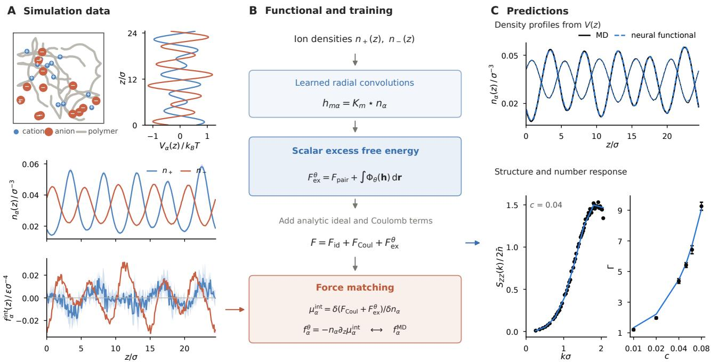  
Figure 1. A learned density functional for the ions of a salt-doped polymer melt. (A) Molecular dynamics under a planar external potentia provides ion densities $n _ { \pm } ( z )$ and internal force densities $f _ { \pm } ^ { \mathrm { i n t } } ( z )$ . (B) The excess free energy is parameterized by radial kernels and a pointwise neural network and trained by matching internal force densities to MD; the ideal-gas and Coulomb contributions are included analytically. (C) Predicted density profiles for a held-out run, bulk charge structure, and number response at the smallest nonzero wavenumber, compared with MD.

## 2 Theory

## 2.1 Free-energy formulation

We consider a salt dissolved in a polymer melt. Treating the polymer implicitly, the ions are described by their number-density profiles $n _ { \alpha } ( \mathbf { r } )$ , with $\alpha \in \{ + , - \}$ , collected in $\mathbf { n } = ( n _ { + } , n _ { - } )$ . Within classical density functional theory, these profiles are governed by the intrinsic free-energy functional

$$
F [ { \bf n } ] = F _ { \mathrm { i d } } [ { \bf n } ] + F _ { \mathrm { C o u l } } [ { \bf n } ] + F _ { \mathrm { e x } } [ { \bf n } ] ,\tag{1}
$$

where $\begin{array} { r } { F _ { \mathrm { i d } } [ { \bf n } ] = k _ { B } T \sum _ { \alpha } \int \mathrm { d } { \bf r } n _ { \alpha } ( { \bf r } ) \big [ \ln \left( \Lambda ^ { 3 } n _ { \alpha } ( { \bf r } ) \right) - 1 \big ] } \end{array}$ is the ideal-gas part, with thermal energy $k _ { B } T$ and thermal wavelength Λ, and $F _ { \mathrm { C o u l } } [ { \bf n } ] = \textstyle \frac { 1 } { 2 } \iint$ dr $\begin{array} { r } { \mathrm { d } \mathbf { r } ^ { \prime } \frac { \rho _ { Z } ( \mathbf { r } ) \rho _ { Z } ( \mathbf { r } ^ { \prime } ) } { 4 \pi \varepsilon _ { 0 } \varepsilon _ { r } | \mathbf { r } - \mathbf { r } ^ { \prime } | } } \end{array}$ is the Coulomb mean-field energy of the charge density $\begin{array} { r } { \rho _ { Z } ( \mathbf { r } ) = \sum _ { \alpha } e _ { \alpha } n _ { \alpha } ( \mathbf { r } ) } \end{array}$ . The ionic charges are $e _ { \alpha } = z _ { \alpha } e$ , with valences $\dot { z _ { \pm } } = \pm 1$ and elementary charge $e , \varepsilon _ { 0 }$ is the vacuum permittivity and $\varepsilon _ { r }$ the uniform relative permittivity of the medium. The excess part $F _ { \mathrm { e x } } [ \mathbf { n } ]$ contains all correlations beyond the ideal gas and the Coulomb mean field and is the unknown component of the theory. With the polymer integrated out, � is the intrinsic free energy of the ions in a melt that stays in equilibrium with their densities, so the response of the chains to the ions is part of $F _ { \mathrm { e x } }$ . The functional therefore refers to one host state and coupling strength, here the melt of 30-bead chains at $k _ { B } T = \epsilon$ and zero pressure at a given $\varepsilon _ { r } .$ , and to the salt concentrations covered by the training data, 0.01 to 0.08 ion pairs per monomer, over which the melt volume adjusts to the sal content.

In external potentials $V _ { \alpha } ( \mathbf { r } )$ , the equilibrium profiles minimize $\begin{array} { r } { F + \sum _ { \alpha } \int \mathrm { d } \mathbf { r } V _ { \alpha } n _ { \alpha } } \end{array}$ at fixed particle numbers, which gives the Euler–Lagrange equations

$$
k _ { B } T \ln \bigl [ \Lambda ^ { 3 } n _ { \alpha } ( \mathbf { r } ) \bigr ] + e _ { \alpha } \phi ( \mathbf { r } ) + \mu _ { \alpha } ^ { \mathrm { e x } } ( \mathbf { r } ; [ \mathbf { n } ] ) + V _ { \alpha } ( \mathbf { r } ) = \mu _ { \alpha } .\tag{2}
$$

The first three terms are the functional derivatives of $F _ { \mathrm { i d } } , F _ { \mathrm { C o u l } }$ and $F _ { \mathrm { e x } }$ respectively. The mean electrostatic potential $\phi$ satisfies Poisson’s equation, $- \nabla ^ { 2 } \phi = \rho _ { Z } / ( \varepsilon _ { 0 } \varepsilon _ { r } )$ , the excess chemical potential is $\mu _ { \alpha } ^ { \mathrm { e x } } = \delta F _ { \mathrm { e x } } / \delta n _ { \alpha } ( \mathbf { r } )$ , and the chemical potentials $\mu _ { \alpha }$ are the Lagrange multipliers that fix the particle numbers.

Taking the gradient of Eq. 2 and combining it with the equilibrium force balance, the first equation of the Yvon–Born–Green hierarchy (derivation in Supplementary Information, section S2.2), gives

$$
\mathbf { f } _ { \alpha } ( \mathbf { r } ) = - n _ { \alpha } ( \mathbf { r } ) \nabla \mu _ { \alpha } ^ { \mathrm { i n t } } ( \mathbf { r } ; [ \mathbf { n } ] ) , \qquad \mu _ { \alpha } ^ { \mathrm { i n t } } = e _ { \alpha } \phi + \mu _ { \alpha } ^ { \mathrm { e x } } ,\tag{3}
$$

where ${ \bf f } _ { \alpha } ( { \bf r } )$ is the equilibrium internal force density exerted on ions of species � by the other ions and the polymer monomers, excluding the external force. Eq. 3 therefore relates a quantity sampled directly from the interaction forces in molecular dynamics to the functional, without chemical-potential labels. Since only the gradient of $\mu _ { \alpha } ^ { \mathrm { i n t } }$ enters, force matching determines $F _ { \mathrm { e x } }$ only up to terms linear in the particle numbers $\begin{array} { r } { N _ { \alpha } = \int \mathrm { d } \mathbf { r } n _ { \alpha } } \end{array}$ , which shift $\mu _ { \alpha }$ by constants.

## 2.2 The neural functional

We parameterize the excess free energy as

$$
\begin{array} { l } { { \displaystyle F _ { \mathrm { e x } } ^ { \theta } [ { \bf n } ] = \frac { 1 } { 2 } \sum _ { \alpha \beta } \iint \mathrm { d } { \bf r } \mathrm { d } { \bf r } ^ { \prime } n _ { \alpha } ( { \bf r } ) u _ { \alpha \beta } ( | { \bf r } - { \bf r } ^ { \prime } | ) n _ { \beta } ( { \bf r } ^ { \prime } ) } } \\ { { \displaystyle ~ + \int \mathrm { d } { \bf r } \Phi _ { \theta } \big ( { \bf h } ( { \bf r } ) \big ) } , } \end{array}\tag{4}
$$

where $\alpha , \beta$ denotes the species, $u _ { \alpha \beta } = u _ { \beta \alpha }$ are radial pair kernels and the neural network Φ $\nu _ { \theta }$ is evaluated pointwise on the vector $\mathbf { h } ( \mathbf { r } )$ of weighted densities of both ionic species,

$$
h _ { m \alpha } ( \mathbf { r } ) = ( K _ { m } \star n _ { \alpha } ) ( \mathbf { r } ) .
$$

Here ★ denotes convolution, and the learned radial kernels $K _ { m }$ probe the density profiles over multiple length scales. The first term is quadratic in the densities, with density-independent kernels, while the second term makes the efective correlations depend nonlinearly on the surrounding densities. Because the kernels are continuous functions of distance and $\Phi _ { \theta }$ acts pointwise, the functional is defined in continuous space: its parameters refer to no grid or box, and a discretization enters only when it is evaluated. The trainable parameters � comprise the weights and biases of $\Phi _ { \theta } .$ , the parameters defining the radial kernels $K _ { m }$ , and the coeficients defining the pair kernels $u _ { \alpha \beta }$

## 2.3 Properties of the neural functional

With the excess part of Eq. 4, the functional � of Eq. 1 has the following properties by construction (proofs in Supplementary Information, section S1).

First, because the network represents the scalar $F _ { \mathrm { e x } }$ rather than the excess chemical potentials, the relation $\mu _ { \alpha } ^ { \mathrm { e x } } = \delta F _ { \mathrm { e x } } / \delta n _ { \alpha }$ holds exactly. The Hessian of $F _ { \mathrm { e x } }$ , which gives the pair direct correlation functions, is therefore symmetric, and excess free-energy diferences between density profiles do not depend on the integration path.

Second, � is invariant under translations, rotations, and reflections, because all kernels are radial and $\Phi _ { \theta }$ acts pointwise. Since the internal force densities of Eq. 3 derive from this invariant scalar functional, Noether’s theorem turns the invariance into global identities [33]: for any admissible density profile, the total internal force and torque vanish after integration over space and summation over species.

Third, the functional satisfies the perfect-screening sum rules in stable, noncritical homogeneous bulk states. The explici Coulomb term fixes the small-wavenumber charge response, while the short-ranged learned contribution has a finite limit as $k  0$ For an electroneutral monovalent electrolyte, this gives

$$
\frac { S _ { Z Z } ( k ) } { 2 \bar { n } } = \frac { k ^ { 2 } } { \kappa _ { D } ^ { 2 } } + O ( k ^ { 4 } ) , \qquad \kappa _ { D } ^ { 2 } = 8 \pi l _ { B } \bar { n } ,\tag{5}
$$

where $S _ { Z Z } ( k )$ is the charge structure factor per unit volume, $\bar { n } = \bar { n } _ { + } = \bar { n } .$ is the salt number density, $\kappa _ { D }$ is the Debye wavenumber, and $l _ { B } = e ^ { 2 } / ( 4 \pi \varepsilon _ { 0 } \varepsilon _ { r } k _ { B } T )$ is the Bjerrum length. The vanishing constant term and the $k ^ { 2 }$ coeficient encode the electroneutrality and Stillinger–Lovett second-moment conditions, respectively [34].

## 2.4 Training by force matching

We train $F _ { \mathrm { e x } } ^ { \theta }$ by matching Eq. 3 to ion-density and internal force-density profiles from canonical molecular dynamics under static external potentials. For each run �, we evaluate the right-hand side of Eq. 3 with $F _ { \mathrm { e x } } ^ { \theta }$ on the sampled density profiles to obtain $\mathbf { f } _ { r \alpha } ^ { \theta }$ . For the planar profiles used here, we denote the force-density residual along � in bin � by $\Delta _ { r \alpha i } = f _ { r \alpha } ^ { \mathrm { M D } } ( z _ { i } ) - f _ { r \alpha } ^ { \theta } ( z _ { i } )$ . The parameters minimize the weighted squared residuals and the weighted squared Fourier amplitudes of the residuals,

$$
\begin{array} { l } { \displaystyle \mathcal { L } ( \theta ) = \sum _ { r \alpha } \sum _ { i = 1 } ^ { N _ { r } } { w _ { r \alpha i } \Delta _ { r \alpha i } ^ { 2 } } } \\ { \displaystyle + \sum _ { r \alpha } \bar { w } _ { r \alpha } \sum _ { m = 1 } ^ { \lfloor N _ { r } / 2 \rfloor } { \frac { 2 } { N _ { r } } \frac { | \widehat { \Delta } _ { r \alpha } ( k _ { m } ) | ^ { 2 } } { ( k _ { m } \sigma ) ^ { 2 } } } , } \end{array}\tag{6}
$$

where $N _ { r }$ is the number of spatial bins and $\widehat { \Delta } _ { r \alpha } ( k _ { m } )$ is the unnormalized discrete Fourier transform of the residual at wavenumber $k _ { m } = 2 \pi m / L _ { r }$ , with box length $L _ { r }$

The first term weights each bin by the inverse variance of the MD estimate, $w _ { r \alpha i } = 1 / ( s _ { r \alpha i } ^ { 2 } + \bar { s } _ { r \alpha } ^ { 2 } )$ , where $s _ { r \alpha i }$ is the standard error and $\bar { s } _ { r \alpha }$ its median over the bins of the run. The second term compensates for the factor � by which Eq. 3 suppresses long-wavelength errors of $\mu _ { \alpha } ^ { \mathrm { { e x } } }$ in the force density; each run enters it with its mean bin weight $\begin{array} { r } { \bar { w } _ { r \alpha } = N _ { r } ^ { - 1 } \sum _ { i } w _ { r \alpha i } \left( M e t h o d s \right) } \end{array}$

## 3 Methods

## 3.1 Molecular dynamics

We simulate the coarse-grained model of Tsamopoulos and Wang [6]: 400 chains of 30 beads joined by FENE bonds [38], with 120 to 960 cation–anion pairs for $c = 0 . 0 1$ to 0.08. Both ions interact with the monomers through the solvation potential of Hall and coworkers [5], of strength 4.33 $k _ { B } T$ and range 5�. Electrostatics uses PPPM [39] with dielectric constant 7.5 or 2. All runs use LAMMPS [40] with a Nosé–Hoover thermostat [41, 42] at $k _ { B } T = \epsilon$ and a time step of 0.005�. Each state point is equilibrated at zero pressure and then simulated at the mean volume (Supplementary Information, section S2.1).

## 3.2 External potentials and profiles

The potentials $V _ { \pm } ( z ) = V _ { N } ( z ) \pm \psi ( z )$ consist of a part $V _ { N }$ that acts equally on both species and a part � that acts with opposite signs, like an applied electrostatic potential. They belong to four families that cover diferent length scales: Fourier series with wavenumbers $k _ { m } = 2 \pi m / L$ for $m = 3$ to 6, the same series with additional modes up to $m = 2 0$ , periodic arrays of Gaussian wells, and long-wavelength modes with $m = 1$ and 2. Each run is equilibrated in the field for $6 \times 1 0 ^ { 3 }$ to $4 \times 1 0 ^ { 4 }$ � and then sampled for $3 . 7 \times 1 0 ^ { 4 } \mathrm { t o } 2 . 0 \times 1 0 ^ { 5 } \tau$ , longer at higher concentration. Density and internal force density profiles are recorded on 0.1� bins, with standard errors estimated from eight consecutive blocks of each trajectory.

## 3.3 Neural functional and training

The pair kernels and the weighted densities in Eq. 4 are built from six learned radial kernels $K _ { m } ( r ) = B _ { m } ( r ) [ 1 + g _ { m } ( r ) ]$ , where $B _ { m }$ are normalized Gaussians of widths 0.25 to 1� and � is a perceptron of � with two hidden layers of 32 units and six outputs. The pair kernels are parameterized as $\begin{array} { r } { u _ { \alpha \beta } ( r ) = \sum _ { m } a _ { \alpha \beta m } K _ { m } ( r ) } \end{array}$ , with learned coeficients $a _ { \alpha \beta m } = a _ { \beta \alpha m }$ $\Phi _ { \theta }$ is a perceptron with two hidden layers of 128 units that acts on the 12 weighted densities. Both networks use softplus activations, and the functional has 19,641 parameters. The pair closure is the same functional without $\Phi _ { \theta }$ , which leaves 1,336 parameters. We minimize the loss with AdamW [43] (learning rate $1 0 ^ { - 3 }$ with cosine decay, weight decay $1 0 ^ { - 5 } )$ for at most 4000 steps, with early stopping on the validation residual (Supplementary Information, section S2.2), and keep the parameters with the lowest validation residual. In the loss of Eq. 6, the median floor $\bar { s } _ { r \alpha }$ prevents bins with very small error bars from dominating the first term. In the second term, the division by $( k _ { m } \sigma ) ^ { 2 }$ ofsets the factor � that the gradient in Eq. 3 places on an error of $\mu _ { \alpha } ^ { \mathrm { { e x } } }$ at wavenumber �; the Fourier amplitudes are not resolved by bin, so each run is weighted by the mean of its bin weights.

## 3.4 Other learned functionals

For the comparison in Table 2, we adapt three published forms to the two ion species and the analytic Coulomb term and train them with the same data, splits and force-matching loss as our functional. The one-body network [24, 25] is a single perceptron with two hidden layers of 128 units that maps the densities of both species within ±3� of a point to $\mu _ { + } ^ { \mathrm { e x } }$ and $\mu _ { - } ^ { \mathrm { e x } }$ at that point. The lattice free energy [29] uses $O _ { h }$ -invariant products of Cartesian density moments on 0.5� voxels. Moments are resolved by species, and invariants are formed within and across species. For planar profiles, the densities are averaged onto the voxels, the sums over lateral stencil ofsets are evaluated exactly, and the free energy is averaged over the registrations of the lattice with the profile. The window is chosen by the validation residual, which favors $\pm 3 \sigma$ over ±6�, and the stencil radius is that of the original, 1.5� (Supplementary Information, section S4.2). The convolutional free energy [26] passes the two densities, as input channels, through six periodic dilated convolutions (kernel 3, dilation 2, 16 to 64 channels), each followed by average pooling, and a linear read-out; all layers use softplus activations. The Lennard-Jones benchmark is the truncated and shifted fluid of ref. [29] $( r _ { c } = 2 . 5 \sigma , T = 1 . 5 )$ in a cubic box of side $2 4 \sigma$ . Training uses the densities $\rho \sigma ^ { 3 } = 0 . 1 , 0 . 2 , 0 . 4 , 0 . 6$ and 0.7, each with 22 planar potentials, and the density 0.5 is held out.

## 4 Results

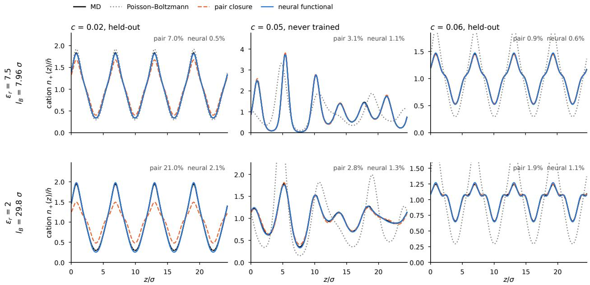  
Figure 2. Density profiles predicted for runs excluded from parameter fitting, at two coupling strengths. Top row: $\varepsilon _ { r } = 7 . 5 ( l _ { B } = 7 . 9 6 \sigma ) \mathrm { ; }$ ; bottom row: $\varepsilon _ { r } = 2 ( l _ { B } = 2 9 . 8 \sigma )$ ). Columns: a periodic array of neutral Gaussian wells at $c = 0 . 0 2$ , the strongest well at the untrained concentration $c = 0 . 0 5$ , and a periodic array of Gaussian wells at $c = 0 . 0 6$ . Cation densities relative to the mean; black curves and bands show MD averages and ±2 standard errors estimated from eight blocks. Poisson–Boltzmann theory (dotted), the pair closure (dashed) and the neural functiona (solid) are obtained by solving the canonical Euler–Lagrange equation under the applied potential. Numbers give the relative $L _ { 2 }$ error of each profile, averaged over cations and anions.

## 4.1 Density profiles and concentration transfer

We apply the method to a coarse-grained model of a salt-doped polymer melt [6]. The melt contains 400 bead–spring chains, each comprising 30 monomers of diameter �. The cation and anion diameters are 0.4� and 1.6�, respectively, and both species are solvated by the monomers. The interaction potentials and model parameters are specified in Supplementary Information, section S2.1. We study two coupling strengths: at a dielectric constant of $\varepsilon _ { r } = 7 . 5 $ , the Bjerrum length is $l _ { B } = 7 . 9 6 \sigma ; \mathrm { a t } \varepsilon _ { r } = 2$ , it is $l _ { B } = 2 9 . 8 \sigma$ , nearly four times as large. At each dielectric constant, we simulate five salt concentrations, $c = 0 . 0 1 , 0 . 0 2 , 0 . 0 4 , 0 . 0 6 .$ and 0.08 cations per monomer, under static planar potentials $V _ { \alpha } ( z )$ acting on the ions. These potentials include superpositions of Fourier modes, periodic arrays of Gaussian wells, and modes with wavelengths equal to the box length, with amplitudes of up to a few $k _ { B } T$ . We train on 71 runs at $\varepsilon _ { r } = 7 . 5 $ and 82 at $\varepsilon _ { r } = 2$ and hold out four runs at each concentration for testing (Supplementary

Information, section S2.1). The test set consists of these 20 held-out runs and 22 additional runs at $c = 0 . 0 5$ , a concentration excluded from training.

We test the learned functional by solving Eq. 2 to predict equilibrium density profiles for the held-out runs (Fig. 2). We compare with two reference functionals. Poisson–Boltzmann theory is the mean-field limit $F _ { \mathrm { e x } } = 0$ . The pair closure serves as a quadratic reference: it keeps only the first term of Eq. 4, with density-independent kernels fitted to the same training data. Across all tes runs, the mean relative $L _ { 2 }$ errors of the neural functional are 1.2% at $\varepsilon _ { r } = 7 . 5$ and 2.0% at $\varepsilon _ { r } = 2 .$ , compared with 3.0% and 5.7% for the pair closure and 25% and 23% for Poisson–Boltzmann theory. At the untrained concentration $c = 0 . 0 5$ , the mean relative $L _ { 2 }$ errors are 0.85% and 0.98%, respectively. Much of this gap arises because one density-independent kernel has to describe all concentrations. $\mathrm { A t } \varepsilon _ { r } = 7 . 5 ,$ , a pair closure fitted at $c = 0 . 0 4$ alone yields a profile error of 1.9% at that concentration, against about 3% for the jointly fitted closure and 1.0% for the neural functional (Supplementary Information, section S3.1). The efective correlations therefore depend on concentration, which we analyze below.

## 4.2 Transfer across domain sizes and geometries

Because its parameters refer to no grid or box, the trained functional can be evaluated in larger domains without changing its parameters. We test transfer to a box twice the training length using an aperiodic potential containing a mode at half the smalles training wavenumber (Fig. 3A). At both dielectric constants, the profile errors are 0.8% to 1.6%, against 2.4% to 6.2% for the pair closure. In a box four times the training length, a single mode at a quarter of the smallest training wavenumber gives profile errors of 0.5% to 1.3%, against 0.8% to 2.5% for the pair closure (Supplementary Information, section S4.1).

The training profiles vary only along one direction, but the functional is defined for general three-dimensional densities. We therefore apply six potentials that vary in � and � at $c = 0 . 0 4$ : four periodic ones, including square lattices of rods and wavevectors oblique to the box axes, and two aperiodic ones that combine oblique plane waves with irregularly placed Gaussian wells and barriers (Fig. 3 B and C). For the aperiodic potentials, the relative profile errors of the predicted density maps are 1.8–3.1%, at the level of the MD noise of 1.7–3.0%, against 3.6–5.5% for the pair closure and 31–62% for Poisson–Boltzmann theory. For the periodic potentials, the errors are $0 . 6 { - } 3 . 7 \%$ , against 2.4–7.6% for the pair closure (Supplementary Information, section S4.1).

## 4.3 Bulk correlations and number response

In a uniform bulk state, density fluctuations are determined by the Hessian of the free energy, a quantity not used in training. We define the Fourier-space excess kernel as

$$
W _ { \alpha \beta } ( k ) = \int \mathrm { d } \mathbf { r } e ^ { - i \mathbf { k } \cdot \mathbf { r } } \left. \frac { \delta ^ { 2 } F _ { \mathrm { e x } } } { \delta n _ { \alpha } ( \mathbf { r } ) \delta n _ { \beta } ( \mathbf { 0 } ) } \right| _ { \mathbf { n } = ( \bar { n } _ { + } , \bar { n } _ { - } ) } .
$$

Including the ideal-gas and Coulomb contributions, the Ornstein–Zernike relation gives

$$
S ( k ) ^ { - 1 } = \bar { N } ^ { - 1 } + \frac { 4 \pi l _ { B } } { k ^ { 2 } } { \bf z } { \bf z } ^ { \top } + \frac { W ( k ) } { k _ { B } T } ,\tag{7}
$$

where $S _ { \alpha \beta } ( k )$ are the partial structure factors per unit volume. Here $\bar { N } = \mathrm { d i a g } ( \bar { n } _ { + } , \bar { n } _ { - } )$ contains the bulk densities, and ${ \bf z } = ( 1 , - 1 ) ^ { \top }$ is the valence vector.

Projecting �(�) onto the charge and number-density channels gives

$$
S _ { Z Z } ( k ) = { \bf z } ^ { \top } S ( k ) { \bf z } , \qquad S _ { N N } ( k ) = { \bf q } ^ { \top } S ( k ) { \bf q } ,
$$

where $\mathbf { q } = ( 1 , 1 ) ^ { \top } . ~ \mathrm { A t } ~ \varepsilon _ { r } = 7 . 5$ and $c = 0 . 0 2$ to 0.08, the neural functional reproduces the zero-field MD charge and number structure factors with relative root-mean-square errors of 2.7–4.1% and $2 . 4 \substack { - 3 . 6 \% }$ , respectively, over $0 . 2 5 \leq k \sigma \leq 2 . 1 ( \mathrm { F i g . ~ } 4 A$ and $B ) . \mathrm { A t } \varepsilon _ { r } = 2$ , the corresponding errors are 2.7–4.5% and 2.6–5.3%; the values at $c = 0 . 0 1$ are listed in Supplementary Information, section S3.1.

We quantify the long-wavelength number response by $\Gamma ( k ) = 2 \bar { n } / S _ { N N } ( k )$ , which equals 1 for an ideal solution. In the finite simulation box, we report $\Gamma ( k _ { 1 } )$ at the smallest wavenumber $k _ { 1 } = { 2 \pi } / { L } . { \mathrm { ~ A t ~ } } \varepsilon _ { r } = 2$ , the MD estimate rises from $0 . 4 2 \pm 0 . 0 7$ at $c = 0 . 0 1$ to $1 1 . 1 \pm 0 . 8$ at $c = 0 . 0 8 \ ( \mathrm { F i g . ~ } 4 D )$ , describing enhanced number fluctuations at low concentration and suppressed fluctuations at high concentration. The neural functional reproduces this concentration dependence at both dielectric constants, whereas the pair closure gives $\Gamma ( k _ { 1 } ) > 1$ at all concentrations at $\varepsilon _ { r } = 2$ and misses the enhanced fluctuations.

A Density profile in a larger box  
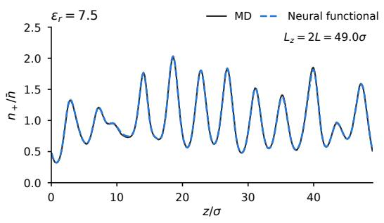

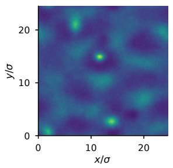

C Neural functional  
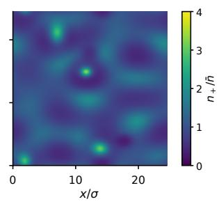

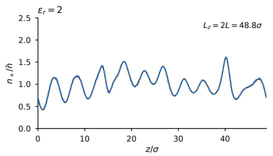

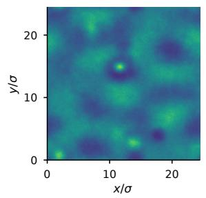

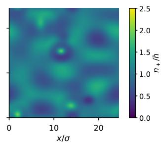  
Figure 3. Generalization to larger boxes and nonplanar density fields at $c = 0 . 0 4$ . Rows correspond to $\varepsilon _ { r } = 7 . 5$ and 2. (A) Cation density profiles in a box twice the training length under an aperiodic potential. Black curves and gray bands show MD averages and ±2 standard errors; blue dashed curves show the neural-functional prediction. (B, C) MD and predicted cation densities under an aperiodic two-dimensional potential of oblique plane waves and irregularly placed Gaussian wells and barriers, using a shared color scale within each row. All predictions use parameters trained on planar profiles in the original box.

To identify which correlations contribute most of the concentration dependence of $\Gamma ( k _ { 1 } )$ , including the crossover at $\varepsilon _ { r } = 2 ,$ we return to Eq. 7. At small wavenumbers, its Coulomb term strongly suppresses charge fluctuations, so the number channel nearly decouples and

$$
\Gamma ( k _ { 1 } ) \simeq 1 + \frac { \bar { n } } { 2 k _ { B } T } { \bf q } ^ { \top } { \cal W } ( k _ { 1 } ) { \bf q } ,\tag{8}
$$

where $\mathbf { q } ^ { \mathsf { T } } W \mathbf { q } = W _ { + + } + W _ { -- } + 2 W _ { + - }$ is the excess kernel in the number channel. Number fluctuations are therefore enhanced when $\mathbf { q } ^ { \mathsf { T } } W \mathbf { q } < 0$ , and suppressed when $\mathbf { q } ^ { \mathsf { T } } W \mathbf { q } > 0 .$ A fixed quadratic pair closure has a density-independent $W ( k )$ , so $\Gamma ( k _ { 1 } ) - 1$ keeps its sign at all concentrations. The neural term instead allows $W ( k )$ to vary with the surrounding ion densities. The number-channel kernel inferred from zero-field MD changes sign with concentration at $\varepsilon _ { r } = 2$ , and the neural functional reproduces its concentration dependence at both dielectric constants (Fig. 5).

## 4.4 Comparison of learned architectures

We compare our functional with three published architectures: a one-body network that predicts excess chemical potentials directly from local density windows [24, 25], a convolutional free energy that maps the whole planar profile to a free energy [26], and a lattice free energy built from Cartesian moments of local density environments [29]. These forms difer in the structural properties guaranteed by their original formulations (Table 1). To test whether the diferences afect predictive performance, we adapt each architecture to the two ion species and train it with the force-matching loss, data and splits of our functional. The comparison therefore tests the architectures under one training protocol, not the published methods with their own data and training targets (Methods and Supplementary Information, section S4.2). We use the present ionic system, where every form is given the same analytic Coulomb term as our functional, and, as a control, the truncated Lennard-Jones fluid of ref. [29], a one-component uncharged fluid of the kind for which these forms were developed. The forms are trained on the full training set and on about a quarter of it (Table 2).

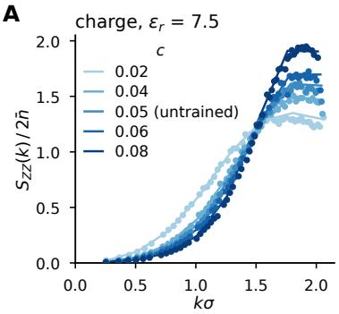

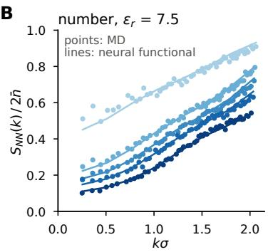

C  
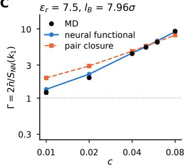

D  
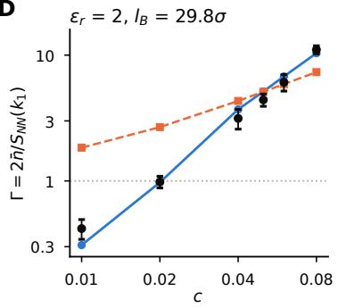  
Figure 4. Bulk structure and long-wavelength number response. (A, B) Normalized charge and number structure factors at $\varepsilon _ { r } = 7 . 5 $ and $c = 0 . 0 2$ to 0.08. Points show zero-field MD results averaged over �-shells; curves show predictions from Eq. 7. (C, D) Finite-wavenumber response factor $\Gamma ( k _ { 1 } ) = 2 \bar { n } / S _ { N N } ( k _ { 1 } )$ at $\varepsilon _ { r } = 7 . 5 $ and 2. Solid curves show the neural functional and dashed curves the pair closure. The dotted line marks the ideal value $\Gamma = 1 .$ . Neither quantity enters the force-matching loss.

A  
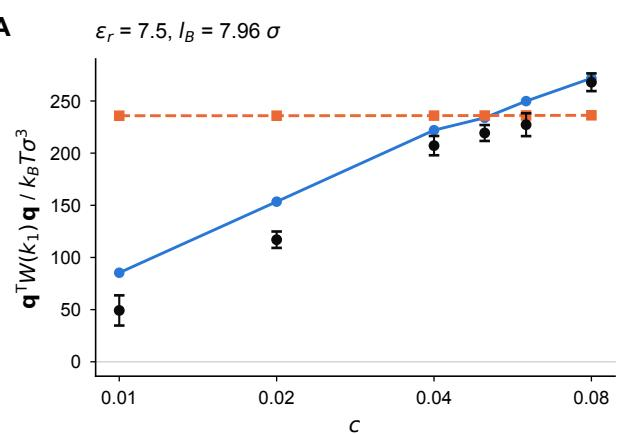

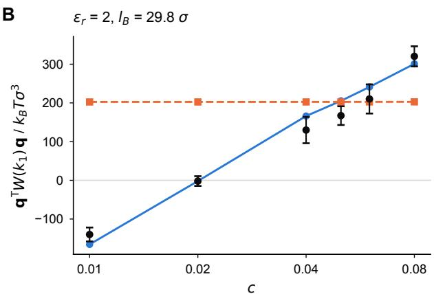  
Figure 5. Concentration dependence of efective correlations. Combined correlation kernel $\mathbf { q } ^ { \mathsf { T } } W ( k _ { 1 } ) \mathbf { q }$ versus concentration at $\varepsilon _ { r } = 7 . 5 \left( A \right)$ and 2 (B). Points show estimates from zero-field MD (Supplementary Information, section S3.2); solid curves show the neural functional and dashed curves the pair closure.

On the ions, our functional has the lowest held-out errors with the full training set, 1.50% and 3.11% at $\varepsilon _ { r } = 7 . 5 $ and 2, followed by the one-body network with 1.75% and 3.41%. The margin widens when the training set is reduced to a quarter. Our errors change little, to 1.55% and 3.56%, whereas those of the one-body network grow by about two thirds, to 3.00% and 5.55%, and 3 of its 20 held-out solutions at $\varepsilon _ { r } = 7 . 5$ no longer converge (Supplementary Information, section S4.3). With a quarter of the runs, our functional is thus as accurate as the one-body network trained on all of them. The lattice free energy is less accurate, with 2.97% and 7.16% on the full training set, and its Euler–Lagrange iteration fails for 4 of the 42 test runs at $\varepsilon _ { r } = 7 . 5$ and for 10 at $\varepsilon _ { r } = 2$ , either by not converging or by collapsing onto a narrow density spike. The Lennard-Jones control at $T = 1 . 5$ gives the same ordering: our error is 0.27% with all runs and 0.30% with a quarter, about half that of the best alternative in each case (0.54% and 0.70%). The convolutional free energy, trained here by force matching on inhomogeneous profiles rather than by the pair-correlation matching of the original work, rarely yields a converged Euler–Lagrange solution in either system (Table 2 and Supplementary Information, section S4.4), so we do not rank it. These results are consistent with built-in integrability and symmetry reducing what must be learned from data.

The structural checks on the MD profiles show the diferences of Table 1 in the adapted implementations (Table 2). The one-body network has net-force errors of up to $1 4 \% ,$ Jacobian asymmetries of up to 55% and path-dependent free-energy diferences of up to 1%. The two free-energy baselines have symmetric Hessians, but their net-force errors reach $7 \times 1 0 ^ { - 4 }$ and 6%, since the Noether identity is not guaranteed without invariance under continuous translations. Our functional has a maximum net-force erro of $2 \times 1 0 ^ { - 6 }$ , with a symmetric Hessian and path-independent free-energy diferences to numerical precision. On the same profiles resampled to 0.05� and 0.2� grids, its chemical potentials change by less than $1 0 ^ { - 4 }$ , those of the one-body network and the lattice free energy by 62–79%, and the convolutional free energy cannot be evaluated (Supplementary Information, section S4.3).

## 5 Discussion

We construct a neural density functional for the ions of a salt-doped polymer melt that combines, by construction, integrability, continuous spatial symmetry, the Noether identities and an explicit treatment of long-range electrostatics, with parameters that refer to no grid. The neural functionals compared here each provide only some of these properties (Table 1). Trained only on planar force densities, the same functional predicts ionic structure in larger boxes and in fields that vary in two directions, describes an untrained salt concentration, and recovers bulk structure factors and the long-wavelength number response. Its nonlinear density dependence captures the concentration dependence of the efective ion correlations, including the sign change of the number-channel kernel at strong coupling, which a density-independent pair kernel cannot represent.

A natural next step is to apply the functional to transport. Although the functional describes equilibrium, it supplies the chemical potentials whose gradients drive ion fluxes in stochastic and dynamical density functional theories [44, 45]. Combined with a validated mobility model, it could predict conductivity and salt difusion that include the ion correlations learned here. Such mobilities can themselves be learned from molecular dynamics [36]. The range of validity out of equilibrium is set by how close the unresolved degrees of freedom remain to their equilibrium distribution [46]. We also plan to apply the functional a electrode interfaces, where its three-dimensional, grid-independent form can be used once the boundary conditions and the polymer environment are specified.

Table 2. Profile errors and structural checks of the adapted baselines, our functional and the pair closure. Profile errors are mean relative $L _ { 2 }$ errors (%) as in Fig. 2; the statistical errors of the MD profiles are about 1%. “Quarter” denotes training on a quarter of the runs. Means exclude failed solutions (footnotes). Entries in parentheses are errors of the final iterates of Euler–Lagrange iterations that mostly did not converge (footnote �). Structural checks give maxima on the MD profiles of the ions: relative net internal force, Hessian asymmetry and path dependence of the free energy (Supplementary Information, section S4.3).
<table><tr><td></td><td></td><td colspan="2">Lennard-Jones</td><td colspan="6">lons</td><td colspan="3">Structural checks</td></tr><tr><td></td><td></td><td></td><td></td><td colspan="2">held-out</td><td colspan="2">c = 0.05</td><td colspan="2">quarter</td><td colspan="3"></td></tr><tr><td>Form</td><td>Parameters</td><td>all</td><td>quarter</td><td> $\varepsilon _ { r } = 7 . 5 $ </td><td>2</td><td>7.5</td><td>2</td><td>7.5</td><td>2</td><td>Force</td><td>Hessian</td><td>Path</td></tr><tr><td>Neural functional (this work)</td><td>19,641</td><td>0.27</td><td>0.30</td><td>1.50</td><td>3.11</td><td>0.85</td><td>0.98</td><td>1.55</td><td>3.56</td><td> $2 \times 1 0 ^ { - 6 }$ </td><td> $3 \times 1 0 ^ { - 1 6 }$ </td><td> $2 \times 1 0 ^ { - 1 2 }$ </td></tr><tr><td>One-body network  $[ 2 4 , 2 5 ] ^ { a }$ </td><td>32,514</td><td>0.64</td><td>0.70</td><td>1.75</td><td>3.41</td><td>1.01</td><td>0.85</td><td>3.00</td><td>5.55</td><td>0.14</td><td>0.55</td><td>0.009</td></tr><tr><td>Lattice free energy  $[ 2 9 ] ^ { b }$ </td><td>23,828</td><td>0.54</td><td>0.80</td><td>2.97</td><td>7.16</td><td>2.06</td><td>2.72</td><td></td><td></td><td> $4 . 5 3 \ : \ : \ : 6 . 3 1 \ : \ : 7 \times 1 0 ^ { - 4 }$ </td><td> $2 \times 1 0 ^ { - 1 6 }$ </td><td> $7 \times 1 0 ^ { - 8 }$ </td></tr><tr><td>Convolutional free energy [26]c</td><td>24,321</td><td>(2.03)</td><td>(3.20)</td><td>(13.8)</td><td>(15.1)</td><td>(16.1)</td><td>(16.2)</td><td></td><td>一</td><td>0.06</td><td> $1 0 ^ { - 1 6 }$ </td><td> $1 0 ^ { - 1 5 }$ </td></tr><tr><td>Pair closure</td><td>1,336</td><td>12.1</td><td>一</td><td>4.21</td><td>8.78</td><td>1.85</td><td>2.81</td><td>一</td><td>一</td><td></td><td>exact</td><td></td></tr></table>

�With a quarter of the runs, it fails to converge for 3 of the 20 held-out ion runs at $\varepsilon _ { r } = 7 . 5$ and for 1 of the 41 Lennard-Jones runs. �Trained on all runs, it fails for 4 of the 42 ion test runs at $\varepsilon _ { r } = 7 . 5 ( 3 $ not converged, 1 collapsed) and for 10 at $\varepsilon _ { r } = 2$ (6 not converged, 4 collapsed); trained on a quarter of the runs, it fails for 2 and 7 of the 20 held-out runs at $\varepsilon _ { r } = 7 . 5 $ and 2, respectively. �Trained on all runs, it converges for 5 of the 42 ion test runs at $\varepsilon _ { r } = 7 . 5 ,$ for none at $\varepsilon _ { r } = 2 ,$ and for 7 of the 41 Lennard-Jones runs; it is not trained on a quarter of the ion runs.

## Data Availability

The project repository is https://github.com/Lyuliyao/NDFT-polymer-electrolyte. It contains analysis and training code, processed molecular-dynamics profiles, model configurations, saved metrics and selected trained parameters.

## References

[1] Daniel T Hallinan Jr and Nitash P Balsara. Polymer electrolytes. Annual review ofmaterials research, 43(1):503–525, 2013.

[2] Vera Bocharova and Alexei P Sokolov. Perspectives for polymer electrolytes: a view from fundamentals of ionic conductivity. Macromolecules, 53(11):4141–4157, 2020.

[3] Chang Yun Son and Zhen-Gang Wang. Ion transport in small-molecule and polymer electrolytes. The Journal ofChemical Physics, 153 (10):100903, 2020.

[4] Kara D Fong, Julian Self, Bryan D McCloskey, and Kristin A Persson. Ion correlations and their impact on transport in polymer-based electrolytes. Macromolecules, 54(6):2575–2591, 2021.

[5] Kuan-Hsuan Shen and Lisa M Hall. Ion conductivity and correlations in model salt-doped polymers: Efects of interaction strength and concentration. Macromolecules, 53(10):3655–3668, 2020.

[6] Alexandros J Tsamopoulos and Zhen-Gang Wang. Ion conductivity in salt-doped polymers: combined efects of temperature and salt concentration. ACS Macro Letters, 13(3):322–327, 2024.

[7] Oleg Borodin and Grant D Smith. Mechanism of ion transport in amorphous poly (ethylene oxide)/litfsi from molecular dynamics simulations. Macromolecules, 39(4):1620–1629, 2006.

[8] Nicola Molinari, Jonathan P Mailoa, and Boris Kozinsky. Efect of salt concentration on ion clustering and transport in polymer solid electrolytes: a molecular dynamics study of peo–litfsi. Chemistry ofMaterials, 30(18):6298–6306, 2018.

[9] Arthur France-Lanord and Jefrey C Grossman. Correlations from ion pairing and the nernst-einstein equation. Physical review letters, 122 (13):136001, 2019.

[10] Danielle M Pesko, Ksenia Timachova, Rajashree Bhattacharya, Mackensie C Smith, Irune Villaluenga, John Newman, and Nitash P Balsara. Negative transference numbers in poly (ethylene oxide)-based electrolytes. Journal of The Electrochemical Society, 164(11):E3569–E3575, 2017.

[11] Liyao Lyu and Huan Lei. Construction of coarse-grained molecular dynamics with many-body non-markovian memory. Physical Review Letters, 131(17):177301, 2023.

[12] Robert Evans. The nature of the liquid-vapour interface and other topics in the statistical mechanics of non-uniform, classical fluids. Advances in physics, 28(2):143–200, 1979.

[13] Jean-Pierre Hansen and Ian R McDonald. Theory of simple liquids: with applications to soft matter. Elsevier, 2013.

[14] Yaakov Rosenfeld. Free-energy model for the inhomogeneous hard-sphere fluid mixture and density-functional theory of freezing. Physical review letters, 63(9):980, 1989.

[15] Roland Roth. Fundamental measure theory for hard-sphere mixtures: a review. Journal ofPhysics: Condensed Matter, 22(6):063102, 2010.

[16] Yaakov Rosenfeld. Free energy model for inhomogeneous fluid mixtures: Yukawa-charged hard spheres, general interactions, and plasmas. The Journal ofchemical physics, 98(10):8126–8148, 1993.

[17] Dirk Gillespie, Wolfgang Nonner, and Robert S Eisenberg. Coupling poisson–nernst–planck and density functional theory to calculate ion flux. Journal ofPhysics: Condensed Matter, 14(46):12129–12145, 2002.

[18] Andreas Härtel. Structure of electric double layers in capacitive systems and to what extent (classical) density functional theory describes it. Journal ofPhysics: Condensed Matter, 29(42):423002, 2017.

[19] Jian Jiang, Valeriy V Ginzburg, and Zhen-Gang Wang. Density functional theory for charged fluids. Soft Matter, 14(28):5878–5887, 2018.

[20] Zhen-Gang Wang. Fluctuation in electrolyte solutions: The self energy. Physical Review E—Statistical, Nonlinear, and Soft Matter Physics, 81(2):021501, 2010.

[21] Issei Nakamura, Nitash P Balsara, and Zhen-Gang Wang. Thermodynamics of ion-containing polymer blends and block copolymers. Physical review letters, 107(19):198301, 2011.

[22] Issei Nakamura and Zhen-Gang Wang. Salt-doped block copolymers: ion distribution, domain spacing and efective � parameter. Sof Matter, 8(36):9356–9367, 2012.

[23] Charles E Sing, Jos W Zwanikken, and Monica Olvera de la Cruz. Electrostatic control of block copolymer morphology. Nature materials, 13(7):694–698, 2014.

[24] Florian Sammüller, Sophie Hermann, Daniel de Las Heras, and Matthias Schmidt. Neural functional theory for inhomogeneous fluids: Fundamentals and applications. Proceedings ofthe National Academy ofSciences, 120(50):e2312484120, 2023.

[25] Anna T Bui and Stephen J Cox. Learning classical density functionals for ionic fluids. Physical Review Letters, 134(14):148001, 2025.

[26] Jacobus Dijkman, Marjolein Dijkstra, René Van Roij, Max Welling, Jan-Willem van de Meent, and Bernd Ensing. Learning neural free-energy functionals with pair-correlation matching. Physical Review Letters, 134(5):056103, 2025.

[27] Anna T Bui and Stephen J Cox. A unified machine-learning framework for ab initio multiscale modeling of liquids. Proceedings ofthe National Academy ofSciences, 123(30):e2610049123, 2026.

[28] Simon Batzner, Albert Musaelian, Lixin Sun, Mario Geiger, Jonathan P Mailoa, Mordechai Kornbluth, Nicola Molinari, Tess E Smidt, and Boris Kozinsky. E (3)-equivariant graph neural networks for data-eficient and accurate interatomic potentials. Nature communications, 13 (1):2453, 2022.

[29] Bingqing Cheng. Equivariant learning of a transferable three-dimensional classical density functional. arXiv preprint arXiv:2608.13506, 2026.

[30] Lin Shang-Chun and Martin Oettel. A classical density functional from machine learning and a convolutional neural network. SciPos Physics, 6(2):025, 2019.

[31] Michelle M Kelley, Joshua Quinton, Kamron Fazel, Nima Karimitari, Christopher Sutton, and Ravishankar Sundararaman. Bridging electronic and classical density-functional theory using universal machine-learned functional approximations. The Journal of Chemical Physics, 161(14), 2024.

[32] Felix Glitsch, Jens Weimar, and Martin Oettel. Neural density functional theory in higher dimensions with convolutional layers. Physical Review E, 111(5):055305, 2025.

[33] Sophie Hermann and Matthias Schmidt. Noether’s theorem in statistical mechanics. Communications Physics, 4(1):176, 2021.

[34] Frank H Stillinger Jr and Ronald Lovett. General restriction on the distribution of ions in electrolytes. The Journal ofChemical Physics, 49 (5):1991–1994, 1968.

[35] Florian Sammüller and Matthias Schmidt. Determining the chemical potential via universal density functional learning. Physical Review Letters, 136(6):068202, 2026.

[36] Mengyi Chen, Peichen Zhong, Zihan Zhang, and Qianxiao Li. Learning ab initio phase-field models. arXiv preprint arXiv:2610.01432, 2026.

[37] Liyao Lyu, Xinyue Yu, and Hayden Schaefer. Mvnn: A measure-valued neural network for learning mckean-vlasov dynamics from particle data. Journal ofComputational Physics, 569:115467, 2027. ISSN 0021-9991.

[38] Kurt Kremer and Gary S. Grest. Dynamics of entangled linear polymer melts: A molecular-dynamics simulation. J. Chem. Phys., 92: 5057–5086, 1990. doi: 10.1063/1.458541.

[39] Roger W Hockney and James W Eastwood. Computer simulation using particles. crc Press, 2021.

[40] Aidan P Thompson, H Metin Aktulga, Richard Berger, Dan S Bolintineanu, W Michael Brown, Paul S Crozier, Pieter J In’t Veld, Axel Kohlmeyer, Stan G Moore, Trung Dac Nguyen, et al. Lammps-a flexible simulation tool for particle-based materials modeling at the atomic, meso, and continuum scales. Computer physics communications, 271:108171, 2022.

[41] Shuichi Nosé. A unified formulation of the constant temperature molecular dynamics methods. The Journal ofchemical physics, 81(1): 511–519, 1984.

[42] William G Hoover. Canonical dynamics: Equilibrium phase-space distributions. Physical review A, 31(3):1695, 1985.

[43] Ilya Loshchilov and Frank Hutter. Decoupled weight decay regularization. In International Conference on Learning Representations, 2019.

[44] David S Dean. Langevin equation for the density of a system of interacting langevin processes. Journal ofPhysics A: Mathematical and General, 29(24):L613–L617, 1996.

[45] Yael Avni, Ram M Adar, David Andelman, and Henri Orland. Conductivity of concentrated electrolytes. Physical Review Letters, 128(9): 098002, 2022.

[46] Liyao Lyu and Huan Lei. On the generalization ability of coarse-grained molecular dynamics models for nonequilibrium processes. Multiscale Modeling & Simulation, 23(2):816–837, 2025.

## Supplementary Information

# A structure-preserving neural density functional for the ions of a polymer electrolyte

## S1. Properties that hold by construction

The ions are described by their number densities $n _ { \alpha } ( { \bf r } ) , \alpha \in \{ + , - \}$ , collected in $\mathbf { n } = \left( n _ { + } , n _ { - } \right)$ , with valences $z _ { \pm } = \pm 1$ . Energies are in units of $k _ { B } T$ and charges in units of �. The free energy of the main text is

$$
F [ { \bf n } ] = F _ { \mathrm { i a } } [ { \bf n } ] + F _ { \mathrm { C o u l } } [ { \bf n } ] + F _ { \mathrm { e x t } } ^ { \theta } [ { \bf n } ] , \qquad F _ { \mathrm { i a } } = \sum _ { \alpha } \int \mathrm { d } ^ { 3 } r n _ { \alpha } \big [ \ln ( n _ { \alpha } \Lambda ^ { 3 } ) - 1 \big ] , \qquad F _ { \mathrm { C o u l } } = \frac { l _ { B } } { 2 } \iint \mathrm { d } ^ { 3 } r \mathrm { d } ^ { 3 } r ^ { \prime } \frac { \rho _ { Z } ( { \bf r } ) \rho _ { Z } ( { \bf r ^ { \prime } } ) } { | { \bf r - r ^ { \prime } } | } ,\tag{S1}
$$

with $\begin{array} { r } { \rho _ { Z } = \sum _ { \alpha } z _ { \alpha } n _ { \alpha } } \end{array}$ the charge density in units of $e ,$ and the neural functional is

$$
F _ { \mathrm { e x } } ^ { \theta } [ { \bf n } ] = \frac { 1 } { 2 } \sum _ { \alpha \beta } \iint \mathrm { d } ^ { 3 } r \mathrm { d } ^ { 3 } r ^ { \prime } n _ { \alpha } ( { \bf r } ) u _ { \alpha \beta } ( | { \bf r } - { \bf r } ^ { \prime } | ) n _ { \beta } ( { \bf r } ^ { \prime } ) + \int \mathrm { d } ^ { 3 } r \Phi _ { \theta } ( { \bf h } ( { \bf r } ) ) , \qquad h _ { m \alpha } = K _ { m } \star n _ { \alpha } ,\tag{S2}
$$

with symmetric pair kernels $\begin{array} { r } { { u } _ { \alpha \beta } = { u } _ { \beta \alpha } = \sum _ { m } { a } _ { \alpha \beta m } K _ { m } . } \end{array}$ The radial kernels have the form $K _ { m } ( r ) = B _ { m } ( r ) [ 1 + g _ { m } ( r ) ]$ , where $B _ { m } ( r ) =$ $( 2 \pi s _ { m } ^ { 2 } ) ^ { - 3 / 2 } \exp [ - r ^ { 2 } / ( 2 s _ { m } ^ { 2 } ) ]$ are normalized Gaussians with six widths from 0.25� to 1�, and � is a smooth learned function of $r / \sigma$ . For bounded $g _ { m } ,$ , the Gaussian envelope ensures that $K _ { m } ( r ) \to 0 { \mathrm { a s } } r \to \infty$ . The same decay holds for the at-most-linear growth of the softplus networks used here. The kernels $K _ { m }$ and $u _ { \alpha \beta }$ are therefore integrable with finite radial moments. Their Fourier transforms are real, even, smooth functions of �, with $\tilde { K } _ { m } ( k ) = \tilde { K } _ { m } ( 0 ) + O ( \dot { k } ^ { 2 } )$ and $\tilde { u } _ { \alpha \beta } ( k ) = \tilde { u } _ { \alpha \beta } ( 0 ) + O ( k ^ { 2 } )$

For numerical evaluation, the radial Fourier integral is truncated at 5� and computed by midpoint quadrature with spacing 0.01�:

$$
\tilde { K } _ { m } ( k ) = 4 \pi \int _ { 0 } ^ { \infty } r ^ { 2 } K _ { m } ( r ) \frac { \sin ( k r ) } { k r } \mathrm { d } r \simeq 4 \pi \int _ { 0 } ^ { 5 \sigma } r ^ { 2 } K _ { m } ( r ) \frac { \sin ( k r ) } { k r } \mathrm { d } r ,
$$

where sin $( k r ) / ( k r )$ is evaluated by its limiting value 1 at $k = 0$ . In planar geometry, the weighted densities are evaluated as products in Fourier space, $\tilde { h } _ { m \alpha } ( k ) = \tilde { K } _ { m } ( k ) \tilde { n } _ { \alpha } ( k )$

The pointwise map $\Phi _ { \theta }$ is a multilayer perceptron with smooth softplus activations and a linear output, so it is twice continuously diferentiable and has no explicit dependence on position or direction. As in the main text, � denotes all learned parameters: the coeficients $a _ { \alpha \beta m }$ and the weights of $\Phi _ { \theta }$ and $g .$ . We write $\mu _ { \alpha } ^ { \mathrm { i n t } } = \delta ( F _ { \mathrm { C o u l } } + F _ { \mathrm { e x } } ^ { \theta } ) / \delta n _ { a }$ for the interaction chemical potential and $\mathbf { f } _ { \alpha } ^ { \mathrm { i n t } } = - n _ { \alpha } \nabla \mu _ { \alpha } ^ { \mathrm { i n t } }$ for the internal force density. With $\Phi _ { m \alpha } = \partial \Phi _ { \theta } / \partial h _ { m \alpha }$ and $\Phi _ { m \alpha , m ^ { \prime } \beta } = \partial ^ { 2 } \Phi _ { \theta } / \partial h _ { m \alpha } \partial h _ { m ^ { \prime } \beta }$ evaluated at $\mathbf { h } ( \mathbf { r } )$ , and since a radial kernel is its own adjoint under convolution, the first and second derivatives of the many-body term are

$$
\frac { \delta } { \delta n _ { \alpha } ( { \bf r } ) } \int \Phi _ { \theta } ( { \bf h } ) = \sum _ { m } \left( K _ { m } \star \Phi _ { m \alpha } \right) ( { \bf r } ) , \qquad \frac { \delta ^ { 2 } } { \delta n _ { \alpha } ( { \bf r } ) \delta n _ { \beta } ( { \bf r ^ { \prime } } ) } \int \Phi _ { \theta } ( { \bf h } ) = \sum _ { m n ^ { \prime } } \int \mathrm { d } ^ { 3 } r ^ { \prime \prime } K _ { m } ( | { \bf r - r ^ { \prime } } | ) \Phi _ { m \alpha , m ^ { \prime } \beta } ( { \bf r ^ { \prime \prime } } ) K _ { m ^ { \prime } } ( | { \bf r ^ { \prime \prime } - r ^ { \prime } } | ) .\tag{S3}
$$

At uniform density the Hessian $H _ { m \alpha , m ^ { \prime } \beta } = \Phi _ { m \alpha , m ^ { \prime } \beta }$ is a constant symmetric matrix, and the bulk kernel of the excess functional is

$$
W _ { \alpha \beta } ( k ) = \tilde { u } _ { \alpha \beta } ( k ) + \sum _ { m m ^ { \prime } } \tilde { K } _ { m } ( k ) H _ { m \alpha , m ^ { \prime } \beta } \tilde { K } _ { m ^ { \prime } } ( k ) .\tag{S4}
$$

Proposition 1 (translation and rotation covariance). Let $\boldsymbol { \tau } = ( R , \mathbf { a } )$ with $R \in O ( 3 )$ act on points by $\boldsymbol { \tau } \mathbf { r } = R \mathbf { r } + \mathbf { a }$ and on densities by $( T _ { \tau } \mathbf { n } ) _ { \alpha } ( \mathbf { r } ) = n _ { \alpha } ( \tau ^ { - 1 } \mathbf { r } )$ . For every such transformation compatible with the domain and every density field specified above:

$$
\mathrm { ~ i ~ } F _ { \mathrm { C o u l } } [ T _ { \tau } \mathbf { n } ] + F _ { \mathrm { e x } } ^ { \theta } [ T _ { \tau } \mathbf { n } ] = F _ { \mathrm { C o u l } } [ \mathbf { n } ] + F _ { \mathrm { e x } } ^ { \theta } [ \mathbf { n } ] ,
$$

ii $\mu _ { \alpha } ^ { \mathrm { i n t } } [ T _ { \tau } \mathbf { n } ] ( \tau \mathbf { r } ) = \mu _ { \alpha } ^ { \mathrm { i n t } } [ \mathbf { n } ] ( \mathbf { r } ) ,$

iii ${ \bf f } _ { \alpha } ^ { \mathrm { i n t } } [ T _ { \tau } { \bf n } ] ( \tau { \bf r } ) = R { \bf f } _ { \alpha } ^ { \mathrm { i n t } } [ { \bf n } ] ( { \bf r } )$

Proof. The weighted densities are scalar fields: substituting $\mathbf { r } = \tau \mathbf { x } , \mathbf { r } ^ { \prime } = \tau \mathbf { s }$ in

$$
\begin{array} { l } { { \displaystyle h _ { m a x } [ T _ { \tau } { \bf n } ] ( { \bf r } ) = \int K _ { m } ( | { \bf r - r ^ { \prime } } | ) \left( T _ { \tau } { \bf n } \right) _ { \alpha } ( { \bf r ^ { \prime } } ) \mathrm { d } ^ { 3 } r ^ { \prime } = \int K _ { m } ( | { \bf r - r ^ { \prime } } | ) n _ { \alpha } ( \tau ^ { - 1 } { \bf r ^ { \prime } } ) \mathrm { d } ^ { 3 } r ^ { \prime } } \ ~ } \\ { { \displaystyle ~ = \int K _ { m } ( | \tau { \bf x - r s } | ) n _ { \alpha } ( { \bf s } ) \mathrm { d } ^ { 3 } { \bf s } = \int K _ { m } ( | { \bf x - s } | ) n _ { \alpha } ( { \bf s } ) \mathrm { d } ^ { 3 } { \bf s } = h _ { m \alpha } [ { \bf n } ] ( { \bf x } ) = h _ { m \alpha } [ { \bf n } ] ( \tau ^ { - 1 } { \bf r } ) } , } \end{array}
$$

where $\mathrm { d } ^ { 3 } r ^ { \prime } = | \operatorname* { d e t } R | \mathrm { d } ^ { 3 } s = \mathrm { d } ^ { 3 } s$ . Since $\Phi _ { \theta }$ has no explicit dependence on position, the covariance of the weighted densities and the substitution $\mathbf { r } = \tau \mathbf { s }$ give

$$
\begin{array} { l } { \displaystyle \int \mathrm { d } ^ { 3 } r \Phi _ { \theta } \big ( \mathbf { h } [ T _ { \tau } \mathbf { n } ] ( \mathbf { r } ) \big ) = \int \mathrm { d } ^ { 3 } r \Phi _ { \theta } \big ( \mathbf { h } [ \mathbf { n } ] ( \tau ^ { - 1 } \mathbf { r } ) \big ) } \\ { \displaystyle = \int \mathrm { d } ^ { 3 } s \Phi _ { \theta } \big ( \mathbf { h } [ \mathbf { n } ] ( \mathbf { s } ) \big ) . } \end{array}
$$

Thus the many-body term is invariant. The pair term and $F _ { \mathrm { C o u l } }$ are double integrals of radial kernels and are invariant by the same two substitutions.   
This is (i).

Applying (i) to $\mathbf { n } + \epsilon \pmb { \eta }$ and using the linearity of $T _ { \tau }$ gives

$$
\begin{array} { r l } & { F _ { \mathrm { C o u l } } [ T _ { \tau } \mathbf n + \epsilon T _ { \tau } \pmb \eta ] + F _ { \mathrm { e x } } ^ { \theta } [ T _ { \tau } \mathbf n + \epsilon T _ { \tau } \pmb \eta ] } \\ & { ~ = F _ { \mathrm { C o u l } } [ \mathbf n + \epsilon \pmb \eta ] + F _ { \mathrm { e x } } ^ { \theta } [ \mathbf n + \epsilon \pmb \eta ] . } \end{array}
$$

Diferentiating with respect to � at $\epsilon = 0$ yields

$$
\sum _ { \alpha } \int \mathrm { d } ^ { 3 } r \mu _ { \alpha } ^ { \mathrm { i n t } } [ T _ { \tau } { \bf n } ] ( { \bf r } ) \eta _ { \alpha } ( \tau ^ { - 1 } { \bf r } ) = \sum _ { \alpha } \int \mathrm { d } ^ { 3 } s \mu _ { \alpha } ^ { \mathrm { i n t } } [ { \bf n } ] ( { \bf s } ) \eta _ { \alpha } ( { \bf s } ) .
$$

Substituting $\mathbf { r } = \tau \mathbf { s }$ on the left-hand side and rearranging, we obtain

$$
\sum _ { \alpha } \int \mathrm { d } ^ { 3 } s \Big [ \mu _ { \alpha } ^ { \mathrm { i n t } } [ T _ { \tau } { \bf n } ] ( \tau { \bf s } ) - \mu _ { \alpha } ^ { \mathrm { i n t } } [ { \bf n } ] ( { \bf s } ) \Big ] \eta _ { \alpha } ( { \bf s } ) = 0 .
$$

Since this holds for every perturbation $\pmb { \eta } ,$

$$
\mu _ { \alpha } ^ { \mathrm { i n t } } [ T _ { \tau } \mathbf { n } ] ( \tau \mathbf { r } ) = \mu _ { \alpha } ^ { \mathrm { i n t } } [ \mathbf { n } ] ( \mathbf { r } ) ,
$$

which proves (ii).

By (ii) and the chain rule, $\nabla \mu _ { \alpha } ^ { \mathrm { i n t } } [ T _ { \tau } \mathbf { n } ] ( \mathbf { r } ) = R ( \nabla \mu _ { \alpha } ^ { \mathrm { i n t } } [ \mathbf { n } ] ) ( \tau ^ { - 1 } \mathbf { r } )$ . Multiplying by $- ( T _ { \tau } \mathbf { n } ) _ { \alpha } ( \mathbf { r } )$ gives (iii).

The proof includes reflections. No equivariant architecture is needed, because the covariance of the force follows from the invariance of one scalar.

Proposition 2 (integrability). For every density field specified above,

$$
\frac { \delta \mu _ { \alpha } ^ { \mathrm { i n t } } ( \mathbf { r } ) } { \delta n _ { \beta } ( \mathbf { r } ^ { \prime } ) } = \frac { \delta \mu _ { \beta } ^ { \mathrm { i n t } } ( \mathbf { r } ^ { \prime } ) } { \delta n _ { \alpha } ( \mathbf { r } ) } ,\tag{S5}
$$

so the direct correlation functions satisfy $c _ { \alpha \beta } ( \mathbf { r } , \mathbf { r } ^ { \prime } ) = c _ { \beta \alpha } ( \mathbf { r } ^ { \prime } , \mathbf { r } )$ , and in the bulk $W _ { \alpha \beta } ( k ) = W _ { \beta \alpha } ( k )$ is real and depends on |k| only. Proof. Since $\Phi _ { \theta }$ is twice continuously diferentiable,

$$
\Phi _ { m \alpha , m ^ { \prime } \beta } ( \mathbf { r } ^ { \prime \prime } ) = \Phi _ { m ^ { \prime } \beta , m \alpha } ( \mathbf { r } ^ { \prime \prime } ) .
$$

Using Eq. S3, the symmetry of the many-body Hessian follows explicitly:

$$
\begin{array} { l } { { \displaystyle \frac { \delta ^ { 2 } } { \delta n _ { \alpha } ( { \bf r } ) \delta n _ { \beta } ( { \bf r ^ { \prime } } ) } \int \mathrm { d } ^ { 3 } s \Phi _ { \theta } \big ( { \bf h } ( { \bf s } ) \big ) } \ ~ } \\ { { \displaystyle ~ = \sum _ { m m ^ { \prime } } \int \mathrm { d } ^ { 3 } r ^ { \prime \prime } { \cal K } _ { m } \big ( \big | { \bf r } - { \bf r } ^ { \prime \prime } \big | \big ) \Phi _ { m \alpha , m ^ { \prime } \beta } \big ( { \bf r } ^ { \prime \prime } \big ) { \cal K } _ { m ^ { \prime } } \big ( \big | { \bf r } ^ { \prime \prime } - { \bf r } ^ { \prime } \big | \big ) } \ ~ } \\ { { \displaystyle ~ = \sum _ { m m ^ { \prime } } \int \mathrm { d } ^ { 3 } r ^ { \prime \prime } { \cal K } _ { m ^ { \prime } } \big ( \big | { \bf r } ^ { \prime } - { \bf r } ^ { \prime \prime } \big | \big ) \Phi _ { m ^ { \prime } \beta , m \alpha } \big ( { \bf r } ^ { \prime \prime } \big ) { \cal K } _ { m } \big ( \big | { \bf r } ^ { \prime \prime } - { \bf r } \big | \big ) } \ ~ } \\ { { \displaystyle ~ = \frac { \delta ^ { 2 } } { \delta n _ { \beta } ( { \bf r } ^ { \prime } ) \delta n _ { \alpha } ( { \bf r } ) } \int \mathrm { d } ^ { 3 } s \Phi _ { \theta } \big ( { \bf h } ( { \bf s } ) \big ) , } \ ~ } \end{array}
$$

where the last equality follows by relabelling $m  m ^ { \prime }$

The pair and Coulomb contributions to the interaction Hessian are also symmetric:

$$
u _ { \alpha \beta } ( | \mathbf { r } - \mathbf { r } ^ { \prime } | ) = u _ { \beta \alpha } ( | \mathbf { r } ^ { \prime } - \mathbf { r } | ) , \qquad \frac { l _ { B } z _ { \alpha } z _ { \beta } } { | \mathbf { r } - \mathbf { r } ^ { \prime } | } = \frac { l _ { B } z _ { \beta } z _ { \alpha } } { | \mathbf { r } ^ { \prime } - \mathbf { r } | } .
$$

Combining these contributions gives

$$
\frac { \delta \mu _ { \alpha } ^ { \mathrm { i n t } } ( \mathbf { r } ) } { \delta n _ { \beta } ( \mathbf { r } ^ { \prime } ) } = \frac { \delta \mu _ { \beta } ^ { \mathrm { i n t } } ( \mathbf { r } ^ { \prime } ) } { \delta n _ { \alpha } ( \mathbf { r } ) } .
$$

In a uniform state, $H _ { m \alpha , m ^ { \prime } \beta } = H _ { m ^ { \prime } \beta , m \alpha }$ , so Eq. S4 gives

$$
\begin{array} { l } { { { \cal W } _ { \beta \alpha } ( k ) = \displaystyle \tilde { u } _ { \beta \alpha } ( k ) + \sum _ { m m ^ { \prime } } \tilde { K } _ { m } ( k ) { \cal H } _ { m \beta , m ^ { \prime } \alpha } \tilde { K } _ { m ^ { \prime } } ( k ) } } \\ { { ~ = \tilde { u } _ { \alpha \beta } ( k ) + \sum _ { m m ^ { \prime } } \tilde { K } _ { m ^ { \prime } } ( k ) { \cal H } _ { m ^ { \prime } \beta , m \alpha } \tilde { K } _ { m } ( k ) } } \\ { { { } ~ = \tilde { u } _ { \alpha \beta } ( k ) + \displaystyle \sum _ { m m ^ { \prime } } \tilde { K } _ { m } ( k ) { \cal H } _ { m \alpha , m ^ { \prime } \beta } \tilde { K } _ { m ^ { \prime } } ( k ) } } \\ { { ~ = { \cal W } _ { \alpha \beta } ( k ) . } } \end{array}
$$

The Fourier transforms of the real radial kernels are real and depend only on $k = | \mathbf { k } |$ ; hence the same holds for $W _ { \alpha \beta } ( k )$

Lemma (Helmholtz condition). A family $\psi _ { \alpha } [ \mathbf { n } ] ( \mathbf { r } )$ on a convex set of densities is a functional gradient, $\psi _ { \alpha } = \delta F / \delta n _ { \alpha }$ , if and only if $\delta \psi _ { \alpha } ( \mathbf { r } ) / \delta n _ { \beta } ( \mathbf { r } ^ { \prime } ) = \delta \psi _ { \beta } ( \mathbf { r } ^ { \prime } ) / \delta n _ { \alpha } ( \mathbf { r } )$ . In that case, with ${ \bf n } _ { \lambda } = { \bf n } _ { 0 } + \lambda ( { \bf n } - { \bf n } _ { 0 } )$

$$
F [ { \boldsymbol { \mathbf { n } } } ] = F [ { \boldsymbol { \mathbf { n } } } _ { 0 } ] + \int _ { 0 } ^ { 1 } \mathrm { d } \lambda \sum _ { \alpha } \int \mathrm { d } ^ { 3 } r \psi _ { \alpha } [ { \boldsymbol { \mathbf { n } } } _ { \lambda } ] ( { \boldsymbol { \mathbf { r } } } ) \left( n _ { \alpha } - n _ { 0 , \alpha } \right) ( { \boldsymbol { \mathbf { r } } } ) ,\tag{S6}
$$

independent of the path.

Proof. Necessity follows from the symmetry of second derivatives: if $\psi _ { \alpha } = \delta F / \delta n _ { \alpha }$ , then

$$
{ \frac { \delta \psi _ { \alpha } ( \mathbf { r } ) } { \delta n _ { \beta } ( \mathbf { r ^ { \prime } } ) } } = { \frac { \delta ^ { 2 } F } { \delta n _ { \beta } ( \mathbf { r ^ { \prime } } ) \delta n _ { \alpha } ( \mathbf { r } ) } } = { \frac { \delta ^ { 2 } F } { \delta n _ { \alpha } ( \mathbf { r } ) \delta n _ { \beta } ( \mathbf { r ^ { \prime } } ) } } = { \frac { \delta \psi _ { \beta } ( \mathbf { r ^ { \prime } } ) } { \delta n _ { \alpha } ( \mathbf { r } ) } } .
$$

For suficiency, keep ${ \bf n } _ { 0 }$ fixed and define $F$ by Eq. S6, with $\mathbf { n } _ { \lambda } = \mathbf { n } _ { 0 } + \lambda ( \mathbf { n } - \mathbf { n } _ { 0 } )$ . Since

$$
\frac { \delta n _ { \lambda , \alpha } ( \mathbf { r } ) } { \delta n _ { \beta } ( \mathbf { r } ^ { \prime } ) } = \lambda \delta _ { \alpha \beta } \delta ( \mathbf { r } - \mathbf { r } ^ { \prime } ) ,
$$

functional diferentiation gives

$$
\begin{array} { r l r } { \displaystyle \frac { \delta F } { \delta n _ { \beta } ( { \bf r ^ { \prime } } ) } = \int _ { 0 } ^ { 1 } \mathrm { d } \lambda [ \psi _ { \beta } [ { \bf n } _ { \lambda } ] ( { \bf r ^ { \prime } } )  } & { } & \\ { \displaystyle  + \lambda \sum _ { \alpha } \int \mathrm { d } ^ { 3 } r \frac { \delta \psi _ { \alpha } [ { \bf n } ] ( { \bf r } ) } { \delta n _ { \beta } ( { \bf r ^ { \prime } } ) }  _ { { \bf n } = { \bf n } _ { \lambda } } ( n _ { \alpha } - n _ { 0 , \alpha } ) ( { \bf r } ) ] . } \end{array}
$$

By the assumed symmetry,

$$
\left. \frac { \delta \psi _ { \alpha } [ { \bf n } ] ( { \bf r } ) } { \delta n _ { \beta } ( { \bf r ^ { \prime } } ) } \right| _ { { \bf n } = { \bf n } _ { \lambda } } = \left. \frac { \delta \psi _ { \beta } [ { \bf n } ] ( { \bf r ^ { \prime } } ) } { \delta n _ { \alpha } ( { \bf r } ) } \right| _ { { \bf n } = { \bf n } _ { \lambda } } .
$$

Moreover, the chain rule along $\mathbf { n } _ { \lambda }$ gives

$$
\frac { \partial } { \partial \lambda } \psi _ { \beta } [ { \bf n } _ { \lambda } ] ( { \bf r ^ { \prime } } ) = \sum _ { \alpha } \int \mathrm { d } ^ { 3 } r \left. \frac { \delta \psi _ { \beta } [ { \bf n } ] ( { \bf r ^ { \prime } } ) } { \delta n _ { \alpha } ( { \bf r } ) } \right| _ { { \bf n } = { \bf n } _ { \lambda } } \left( n _ { \alpha } - n _ { 0 , \alpha } \right) ( { \bf r } ) .
$$

Combining these identities, we obtain

$$
\begin{array} { l } { { \displaystyle \frac { \delta F } { \delta n _ { \beta } ( { \bf { r } ^ { \prime } } ) } = \int _ { 0 } ^ { 1 } \mathrm { d } \lambda \left[ \psi _ { \beta } [ { \bf { n } } _ { \lambda } ] ( { \bf { r } ^ { \prime } } ) + \lambda \frac { \partial } { \partial \lambda } \psi _ { \beta } [ { \bf { n } } _ { \lambda } ] ( { \bf { r } ^ { \prime } } ) \right] } \ ~ } \\ { { \displaystyle ~ = \int _ { 0 } ^ { 1 } \mathrm { d } \lambda \frac { \partial } { \partial \lambda } \left[ \lambda \psi _ { \beta } [ { \bf { n } } _ { \lambda } ] ( { \bf { r } ^ { \prime } } ) \right] } \ ~ } \\ { { \displaystyle ~ = \left[ \lambda \psi _ { \beta } [ { \bf { n } } _ { \lambda } ] ( { \bf { r } ^ { \prime } } ) \right] _ { 0 } ^ { 1 } = \psi _ { \beta } [ { \bf { n } } ] ( { \bf { r } ^ { \prime } } ) } . } \end{array}
$$

Thus $\psi _ { \alpha } = \delta F / \delta n _ { \alpha }$ , and its line integral along any smooth path between two densities equals the diference in � at the endpoints, establishing path independence. □

Eq. S6 is the functional line integration used by neural functionals that learn the one-body direct correlation function $c ^ { ( 1 ) } = - \delta F _ { \mathrm { e x } } / \delta n$ directly. Such a network has no reason to satisfy the Helmholtz condition exactly, and the value of Eq. S6 then depends on the path. The scalar form of Eq. 4 satisfies it identically.

Proposition 3 (Noether sum rules). For every density field specified above, in or out of equilibrium:

i $\begin{array} { r } { \sum _ { \alpha } \int \mathbf { f } _ { \alpha } ^ { \mathrm { i n t } } \mathrm { d } ^ { 3 } r = 0 , } \end{array}$

ii on $\begin{array} { r } { \mathbb { R } ^ { 3 } , \sum _ { \alpha } \int \mathbf { r } \times \mathbf { f } _ { \alpha } ^ { \mathrm { i n t } } \mathrm { d } ^ { 3 } r = 0 , } \end{array}$

Proof. We use the Einstein summation convention for Cartesian indices.

(i) For a translation by a,

$$
( T _ { \mathbf { a } } \mathbf { n } ) _ { \alpha } ( \mathbf { r } ) = n _ { \alpha } ( \mathbf { r } - \mathbf { a } ) , \qquad \left. { \frac { \partial ( T _ { \mathbf { a } } \mathbf { n } ) _ { \alpha } ( \mathbf { r } ) } { \partial a _ { p } } } \right| _ { \mathbf { a } = 0 } = - \partial _ { p } n _ { \alpha } ( \mathbf { r } ) .
$$

Diferentiating Proposition 1(i) with respect to $a _ { p }$ gives

$$
\begin{array} { l } { { \displaystyle 0 = \left. \frac { \partial } { \partial a _ { p } } \left( F _ { \mathrm { C o u l } } [ T _ { \bf a } { \bf n } ] + F _ { \mathrm { c a } } ^ { \theta } [ T _ { \bf a } { \bf n } ] \right) \right. _ { { \bf a } = 0 } } } \\ { { \displaystyle ~ = - \sum _ { \alpha } \int _ { \alpha } \mathrm { d } ^ { 3 } r \mu _ { \alpha } ^ { \mathrm { i n t } } ( { \bf r } ) \partial _ { p } n _ { \alpha } ( { \bf r } ) } } \\ { { \displaystyle ~ = \sum _ { \alpha } \int _ { \alpha } \mathrm { d } ^ { 3 } r n _ { \alpha } ( { \bf r } ) \partial _ { p } \mu _ { \alpha } ^ { \mathrm { i n t } } ( { \bf r } ) } } \\ { { \displaystyle ~ = - \sum _ { \alpha } \int _ { \alpha } \mathrm { d } ^ { 3 } r f _ { \alpha , p } ^ { \mathrm { i n t } } ( { \bf r } ) } . } \end{array}
$$

Since this holds for each Cartesian component,

$$
\sum _ { \alpha } \int \mathrm { d } ^ { 3 } r \mathbf { f } _ { \alpha } ^ { \mathrm { i n t } } ( \mathbf { r } ) = 0 .
$$

(ii) $\mathrm { O n } \mathbb { R } ^ { 3 }$ , let $\tau _ { \vartheta }$ be a rotation by angle � about the unit vector ${ \hat { \omega } } .$ Then

$$
\left. \frac { \partial ( T _ { \tau _ { \vartheta } } \mathbf { n } ) _ { \alpha } ( \mathbf { r } ) } { \partial \vartheta } \right| _ { \vartheta = 0 } = - ( \hat { \omega } \times \mathbf { r } ) \cdot \nabla n _ { \alpha } ( \mathbf { r } ) .
$$

Using rotational invariance and $\nabla \cdot \left( { \hat { \boldsymbol { \omega } } } \times \mathbf { r } \right) = 0$ , integration by parts gives

$$
\begin{array} { l } { { \displaystyle 0 = \left. \frac { \partial } { \partial \vartheta } \big ( F _ { \mathrm { C o u l } } [ T _ { \tau \vartheta } { \bf n } ] + F _ { \mathrm { e x } } ^ { \theta } [ T _ { \tau \vartheta } { \bf n } ] \big ) \right. _ { \vartheta = 0 } } } \\ { ~ = - \displaystyle \sum _ { \alpha } \int \mathrm { d } ^ { 3 } r \mu _ { \alpha } ^ { \mathrm { i n t } } ( \hat { \omega } \times { \bf r } ) \cdot \nabla n _ { \alpha } } \\ { ~ = \displaystyle \sum _ { \alpha } \int \mathrm { d } ^ { 3 } r n _ { \alpha } ( \hat { \omega } \times { \bf r } ) \cdot \nabla \mu _ { \alpha } ^ { \mathrm { i n t } } } \\ { ~ = - \hat { \omega } \cdot \displaystyle \sum _ { \alpha } \int \mathrm { d } ^ { 3 } r { \bf r } \times { \bf f } _ { \alpha } ^ { \mathrm { i n t } } . } \end{array}
$$

Since �ˆ is arbitrary,

$$
\sum _ { \alpha } \int \mathrm { d } ^ { 3 } r \mathbf { r } \times \mathbf { f } _ { \alpha } ^ { \mathrm { i n t } } = 0 .
$$

The screening sum rules follow from the bulk linear response of the same functional. For a uniform stationary state with densities $\bar { n } _ { \alpha } ,$ write $\bar { N } = \mathrm { d i a g } ( \bar { n } _ { + } , \bar { n } _ { - } )$ and ${ \bf z } = ( 1 , - 1 ) ^ { \top }$ . Linearizing the Euler–Lagrange equation ln $n _ { \alpha } + \mu _ { \alpha } ^ { \mathrm { i n t } } + V _ { \alpha } = \mathrm { c o n s t } _ { \alpha }$ and Fourier transforming gives $[ \bar { N } ^ { - 1 } + ( 4 \pi l _ { B } / k ^ { 2 } ) \mathbf { z } \mathbf { z } ^ { \mathsf { T } } + W ( k ) ] \delta \tilde { \mathbf { n } } ( \mathbf { k } ) = - \delta \tilde { \mathbf { V } } ( \mathbf { k } )$ for $k \neq 0$ . Thus the response matrix defined by $\delta \tilde { \mathbf { n } } = - S ( k ) \delta \tilde { \mathbf { V } }$ satisfies

$$
S ( k ) ^ { - 1 } = \bar { N } ^ { - 1 } + \frac { 4 \pi l _ { B } } { k ^ { 2 } } { \bf z } { \bf z } ^ { \top } + { \cal W } ( k ) .\tag{S7}
$$

This is the Ornstein–Zernike relation $S ^ { - 1 } = \bar { N } ^ { - 1 } - c ,$ with $\boldsymbol c = - ( 4 \pi l _ { B } / k ^ { 2 } ) \mathbf z \mathbf z ^ { \mathsf { T } } - W$ . For a stable uniform state, the fluctuation-response relation identifies $S ( k )$ as the structure factor, $S _ { \alpha \beta } ( k ) = V ^ { - 1 } \langle \delta \tilde { n } _ { \alpha } ( { \bf k } ) \delta \tilde { n } _ { \beta } ( { \bf - k } ) \rangle$ . The explicit Coulomb term and the regular small-� behavior of $W ( k )$ yield the following screening identities.

Proposition 4 (perfect-screening sum rules). Let $A ( k ) = \bar { N } ^ { - 1 } + W ( k )$ be the short-range part of $S ( k ) ^ { - 1 }$ in Eq. S7. If $A ( 0 )$ is invertible and $s _ { 0 } = \mathbf { z } ^ { \mathsf { T } } A ( 0 ) ^ { - 1 } \mathbf { z } \neq 0$ , then for every learned �

$$
\frac { S _ { Z Z } ( k ) } { 2 \bar { n } } = \frac { k ^ { 2 } } { \kappa _ { D } ^ { 2 } } + O ( k ^ { 4 } ) , \qquad { \bf a } ^ { \top } S ( k ) { \bf z } = O ( k ^ { 2 } ) \mathrm { f o r e v e r y f i x e d } { \bf a } ,\tag{S8}
$$

where $S _ { Z Z } = \mathbf { z } ^ { \intercal } S \mathbf { z }$ is the charge structure factor, $\bar { n } _ { + } = \bar { n } _ { - } = \bar { n }$ and $\begin{array} { r } { \kappa _ { D } ^ { 2 } = 4 \pi l _ { B } \sum _ { \alpha } \bar { n } _ { \alpha } z _ { \alpha } ^ { 2 } = 8 \pi l _ { B } \bar { n } . } \end{array}$

Proof. By the small-� expansions of the radial kernels and $\operatorname { E q } .$ . S4,

$$
W ( k ) = W ( 0 ) + O ( k ^ { 2 } ) , \qquad A ( k ) = A ( 0 ) + O ( k ^ { 2 } ) .
$$

Since �(0) is invertible, �(�) remains invertible for suficiently small $k ,$ with

$$
A ( k ) ^ { - 1 } = A ( 0 ) ^ { - 1 } + O ( k ^ { 2 } ) .
$$

Consequently,

$$
\begin{array} { r } { s ( k ) \equiv \mathbf { z } ^ { \mathsf { T } } A ( k ) ^ { - 1 } \mathbf { z } = s _ { 0 } + O ( k ^ { 2 } ) , \qquad s _ { 0 } = \mathbf { z } ^ { \mathsf { T } } A ( 0 ) ^ { - 1 } \mathbf { z } \neq 0 . } \end{array}
$$

Equation S7 can be written as

$$
S ( k ) ^ { - 1 } = A ( k ) + \frac { 4 \pi l _ { B } } { k ^ { 2 } } \mathbf { z } \mathbf { z } ^ { \mathsf { T } } .
$$

Applying the Sherman–Morrison formula gives

$$
\begin{array} { l } { { S ( k ) = A ( k ) ^ { - 1 } - \frac { ( 4 \pi l _ { B } / k ^ { 2 } ) A ( k ) ^ { - 1 } { \bf z } { \bf z } ^ { \top } A ( k ) ^ { - 1 } } { 1 + ( 4 \pi l _ { B } / k ^ { 2 } ) s ( k ) } } } \\ { { \mathrm { } } } \\ { { { } = A ( k ) ^ { - 1 } - \frac { A ( k ) ^ { - 1 } { \bf z } { \bf z } ^ { \top } A ( k ) ^ { - 1 } } { s ( k ) + k ^ { 2 } / ( 4 \pi l _ { B } ) } . } } \end{array}
$$

The denominator is nonzero for suficiently small � because it tends to $s _ { 0 } \neq 0 .$

Contracting with z on both sides yields

$$
\begin{array} { l } { S _ { Z Z } ( k ) = { \bf z } ^ { \top } S ( k ) { \bf z } } \\ { \ = s ( k ) - \displaystyle \frac { s ( k ) ^ { 2 } } { s ( k ) + k ^ { 2 } / ( 4 \pi l _ { B } ) } } \\ { \ = \displaystyle \frac { k ^ { 2 } } { 4 \pi l _ { B } } \displaystyle \frac { s ( k ) } { s ( k ) + k ^ { 2 } / ( 4 \pi l _ { B } ) } } \\ { \ = \displaystyle \frac { k ^ { 2 } } { 4 \pi l _ { B } } \left[ 1 + \displaystyle \frac { k ^ { 2 } } { 4 \pi l _ { B } s ( k ) } \right] ^ { - 1 } . } \end{array}
$$

Since $s ( k ) = s _ { 0 } + O ( k ^ { 2 } )$ and $s _ { 0 } \neq 0 ,$

$$
{ \frac { k ^ { 2 } } { 4 \pi l _ { B } s ( k ) } } = { \frac { k ^ { 2 } } { 4 \pi l _ { B } s _ { 0 } } } + O ( k ^ { 4 } ) .
$$

Expanding the reciprocal therefore gives

$$
\begin{array} { c } { { S _ { Z Z } ( k ) = \displaystyle \frac { k ^ { 2 } } { 4 \pi l _ { B } } \left[ 1 - \displaystyle \frac { k ^ { 2 } } { 4 \pi l _ { B } s _ { 0 } } + { \cal O } ( k ^ { 4 } ) \right] } } \\ { { = \displaystyle \frac { k ^ { 2 } } { 4 \pi l _ { B } } - \displaystyle \frac { k ^ { 4 } } { ( 4 \pi l _ { B } ) ^ { 2 } s _ { 0 } } + { \cal O } ( k ^ { 6 } ) . } } \end{array}
$$

Using $\kappa _ { D } ^ { 2 } = 8 \pi l _ { B } \bar { n } .$ , we obtain

$$
{ \frac { S _ { Z Z } ( k ) } { 2 \bar { n } } } = { \frac { k ^ { 2 } } { \kappa _ { D } ^ { 2 } } } + { \cal O } ( k ^ { 4 } ) .
$$

For any fixed vector a, the same inverse formula gives

$$
\begin{array} { r l } & { \mathbf { a } ^ { \mathsf { T } } S ( k ) \mathbf { z } = \mathbf { a } ^ { \mathsf { T } } A ( k ) ^ { - 1 } \mathbf { z } - \frac { \left[ \mathbf { a } ^ { \mathsf { T } } A ( k ) ^ { - 1 } \mathbf { z } \right] s ( k ) } { s ( k ) + k ^ { 2 } / ( 4 \pi l _ { B } ) } } \\ & { \quad \quad \quad = \frac { k ^ { 2 } } { 4 \pi l _ { B } } \frac { \mathbf { a } ^ { \mathsf { T } } A ( k ) ^ { - 1 } \mathbf { z } } { s ( k ) + k ^ { 2 } / ( 4 \pi l _ { B } ) } . } \end{array}
$$

Finally,

so

$$
\mathbf { a } ^ { \mathsf { T } } A ( k ) ^ { - 1 } \mathbf { z } = \mathbf { a } ^ { \mathsf { T } } A ( 0 ) ^ { - 1 } \mathbf { z } + O ( k ^ { 2 } ) , \qquad { \frac { 1 } { s ( k ) + k ^ { 2 } / ( 4 \pi l _ { B } ) } } = { \frac { 1 } { s _ { 0 } } } + O ( k ^ { 2 } ) ,
$$

$$
\mathbf { a } ^ { \mathsf { T } } S ( k ) \mathbf { z } = { \frac { k ^ { 2 } } { 4 \pi l _ { B } s _ { 0 } } } \mathbf { a } ^ { \mathsf { T } } A ( 0 ) ^ { - 1 } \mathbf { z } + O ( k ^ { 4 } ) = O ( k ^ { 2 } ) .
$$

This proves both screening identities.

The leading $k ^ { 2 }$ coeficient is the Stillinger–Lovett second-moment condition [1]. It is fixed by the explicit Coulomb term, while short-range correlations enter at order $k ^ { 4 }$

## S2. Data, force matching and prediction

## S2.1 Model and data

The molecular dynamics model and simulation protocol are described in the main text. The additional interaction parameters are the FENE bond constants $K = 3 0 \epsilon / \sigma ^ { 2 }$ and $R _ { 0 } = 1 . 5 \sigma$ , the Lennard-Jones mixing rule $\sigma _ { i j } = ( \sigma _ { i } + \sigma _ { j } ) / 2$ , and a 2� cutof for monomer pairs. Interactions involving ions are purely repulsive apart from electrostatics and the ion–monomer solvation potential [2, 3],

$$
U _ { \mathrm { s o l v } } ( r ) = - S \left[ \left( \frac { \sigma } { r } \right) ^ { 4 } - \left( \frac { \sigma } { r _ { c } } \right) ^ { 4 } \right] , \qquad r \leq r _ { c } ,
$$

with $S = 4 . 3 3 \epsilon , r _ { c } = 5 \sigma$ and $\epsilon = k _ { B } T$ . Each concentration is equilibrated at zero pressure and sampled at its mean volume. The two dielectric constants use the same interaction parameters apart from electrostatics. Four runs at each training concentration are held out, covering the diferent potential families, and three further runs are used for validation. Densities and internal force densities are recorded on 0.1� bins. Profile uncertainties use eight time blocks. Internal-force blocks are formed as $f _ { b } ^ { \mathrm { i n t } } = f _ { b } ^ { \mathrm { t o t } } - f _ { b } ^ { \mathrm { e x t } }$ before computing their standard error.

## S2.2 Force matching

Let R denote all particle coordinates and dR the corresponding configurational measure. The normalized canonical distribution is

$$
P ( \mathbf { R } ) = Z ^ { - 1 } \exp \left[ - \frac { 1 } { k _ { B } T } \left( U _ { \mathrm { i n t } } ( \mathbf { R } ) + \sum _ { \alpha } \sum _ { j \in \alpha } V _ { \alpha } ( \mathbf { r } _ { j } ) \right) \right] ,
$$

and the one-body density is

$$
n _ { \alpha } ( \mathbf { r } ) = \left. \sum _ { j \in \alpha } \delta ( \mathbf { r } - \mathbf { r } _ { j } ) \right. = \sum _ { j \in \alpha } \int \mathrm { d } \mathbf { R } P ( \mathbf { R } ) \delta ( \mathbf { r } - \mathbf { r } _ { j } ) .
$$

Using $\nabla _ { \mathbf { r } } \delta ( \mathbf { r } - \mathbf { r } _ { j } ) = - \nabla _ { j } \delta ( \mathbf { r } - \mathbf { r } _ { j } )$ and integrating by parts over $\mathbf { r } _ { j } ,$ we obtain

$$
\begin{array} { l } { { \displaystyle \nabla n _ { \alpha } ( { \bf r } ) = \sum _ { j \in \alpha } \int \mathrm { d } { \bf R } { \cal P } ( { \bf R } ) \nabla _ { \bf r } \delta ( { \bf r } - { \bf r } _ { j } ) } \ ~ } \\ { { \displaystyle ~ = - \sum _ { j \in \alpha } \int \mathrm { d } { \bf R } { \cal P } ( { \bf R } ) \nabla _ { j } \delta ( { \bf r } - { \bf r } _ { j } ) } \ ~ } \\ { { \displaystyle ~ = \sum _ { j \in \alpha } \int \mathrm { d } { \bf R } \delta ( { \bf r } - { \bf r } _ { j } ) \nabla _ { j } { \cal P } ( { \bf R } ) } . } \end{array}
$$

The boundary term vanishes for periodic boundaries (with the periodic delta function), or for suficiently decaying distributions. For $j \in \alpha ,$

$$
\nabla _ { j } P ( \mathbf { R } ) = - \frac { P ( \mathbf { R } ) } { k _ { B } T } \left[ \nabla _ { j } U _ { \mathrm { i n t } } ( \mathbf { R } ) + \nabla _ { j } V _ { \alpha } ( \mathbf { r } _ { j } ) \right] .
$$

Substitution therefore gives

$$
\begin{array} { l } { { \displaystyle k _ { B } T \nabla n _ { \alpha } ( { \bf r } ) = - \left. \sum _ { j \in \alpha } \delta ( { \bf r } - { \bf r } _ { j } ) \nabla _ { j } U _ { \mathrm { i n t } } \right. } } \\ { { \displaystyle ~ - \left. \sum _ { j \in \alpha } \delta ( { \bf r } - { \bf r } _ { j } ) \nabla _ { j } V _ { \alpha } ( { \bf r } _ { j } ) \right. . } } \end{array}
$$

Since the delta function fixes $\mathbf { r } _ { j } = \mathbf { r } .$

$$
\left. \sum _ { j \in \alpha } \delta ( \mathbf { r } - \mathbf { r } _ { j } ) \nabla _ { j } V _ { \alpha } ( \mathbf { r } _ { j } ) \right. = n _ { \alpha } ( \mathbf { r } ) \nabla V _ { \alpha } ( \mathbf { r } ) .
$$

Defining the internal force density by

$$
\mathbf { f } _ { \alpha } ^ { \mathrm { i n t } } ( \mathbf { r } ) = - \left. \sum _ { j \in \alpha } \delta ( \mathbf { r } - \mathbf { r } _ { j } ) \nabla _ { j } U _ { \mathrm { i n t } } \right. ,
$$

we recover the local force balance [4, 5],

$$
k _ { B } T \nabla n _ { \alpha } ( \mathbf { r } ) = \mathbf { f } _ { \alpha } ^ { \mathrm { i n t } } ( \mathbf { r } ) - n _ { \alpha } ( \mathbf { r } ) \nabla V _ { \alpha } ( \mathbf { r } ) .\tag{S9}
$$

Taking the gradient of the Euler–Lagrange equation and using Eq. S9 yields ${ \bf f } _ { \alpha } ^ { \mathrm { i n t } } = - n _ { \alpha } \nabla ( e _ { \alpha } \phi + \mu _ { \alpha } ^ { \mathrm { e x } } )$ , the force-matching relation of the main text.

The six Gaussian envelope widths are 0.250, 0.330, 0.435, 0.574, 0.758 and 1.000�. The pointwise network receives $h _ { m \alpha } / n _ { \mathrm { r e f } }$ , with $n _ { \mathrm { r e f } } = 0 . 0 2 \sigma ^ { - 3 }$ , and its output contributes $n _ { \mathrm { r e f } } \int \Phi _ { \theta }$ dr to the free energy. Other architecture parameters are given in the main text. The kernel range and activation were selected using only the validation profiles at $\varepsilon _ { r } = 2$

Training uses full batches and the AdamW schedule specified in the main text, with the learning rate decaying to $1 0 ^ { - 5 }$ over at most 4000 steps. Validation is evaluated every 20 steps. Early stopping uses a patience of 1000 steps after at least 200 steps, and the best validation parameters are retained. Table S1 compares training with and without the Fourier term, using the same architecture and data splits. The Fourier term modestly improves the long-wavelength amplitudes and leaves the profile errors unchanged; the change in $\Gamma ( k _ { 1 } )$ is within the MD uncertainty.

Table S1. Loss ablation with and without the Fourier term weighted by $( k \sigma ) ^ { - 2 } .$ . The amplitude ratio is the predicted over MD amplitude of the $k _ { 1 }$ mode summed over the six long-wavelength training runs at $c = 0 . 0 4$ . At this concentration, MD gives $\Gamma ( k _ { 1 } ) = 4 . 3 8 \pm 0 . 1 5$ and $3 . 1 4 \pm 0 . 5 6$ at $\varepsilon _ { r } = 7 . 5$ and 2, respectively. The last two columns give the amplitude deficit $1 0 0 \times ( 1 - A _ { \mathrm { m o d e l } } / A _ { \mathrm { M D } } )$ of the driven mode of the cation density in boxes two and four times the training length, where this mode has wavenumber $k _ { 1 } / 2$ and $k _ { 1 } / 4 ,$ , respectively (section S4.1). Values before and after the slash correspond to neutral $( \psi = 0 )$ and mixed neutral/charged $( V _ { N } \neq 0 , \psi \neq 0 )$ external potentials, respectively.

<table><tr><td> $\varepsilon _ { r }$ </td><td>Fourier term</td><td>Ratio at  $k _ { 1 }$ </td><td>Γ(k1)</td><td>Profile (%)</td><td> $k _ { 1 } / 2$  (%)</td><td> $k _ { 1 } / 4 ( \% )$ </td></tr><tr><td>7.5</td><td>without</td><td>0.95</td><td>4.56</td><td>1.45</td><td>18/ 8</td><td>13/8</td></tr><tr><td>7.5</td><td>with</td><td>0.96</td><td>4.47</td><td>1.50</td><td>16/6</td><td>11/6</td></tr><tr><td>2</td><td>without</td><td>0.87</td><td>3.85</td><td>3.09</td><td>11 / 10</td><td>15/17</td></tr><tr><td>2</td><td>with</td><td>0.92</td><td>3.70</td><td>3.11</td><td>717</td><td>12/14</td></tr></table>

## S2.3 Predictions and uncertainty

At fixed particle numbers, the predicted planar profiles satisfy

$$
n _ { \alpha } ( z ) = N _ { \alpha } \frac { e ^ { - u _ { \alpha } ( z ) } } { A \int _ { 0 } ^ { L } e ^ { - u _ { \alpha } ( z ^ { \prime } ) } \mathrm { d } z ^ { \prime } } , \qquad u _ { \alpha } = V _ { \alpha } + e _ { \alpha } \phi [ \mathbf { n } ] + \mu _ { \alpha } ^ { \mathrm { e x } } [ \mathbf { n } ] ,\tag{S10}
$$

where $A$ is the cross-sectional area. The chemical potentials enforcing particle numbers drop out. We solve for $u _ { \alpha }$ using Anderson acceleration with history eight and mixing parameter 0.1 [6, 7]. The charge residual is preconditioned by $k ^ { 2 } / ( k ^ { 2 } + \kappa _ { D } ^ { 2 } ) [ 8 ]$ . Convergence requires the maximum density change divided by $\bar { n }$ to be below $1 0 ^ { - 6 }$ . Profile errors are $\| n _ { \alpha } ^ { \mathrm { p r e d } } - n _ { \alpha } ^ { \mathrm { M D } } \| _ { 2 } / \| n _ { \alpha } ^ { \mathrm { M D } } \| _ { 2 }$ , averaged over runs.

The bulk kernel $W _ { \alpha \beta } ( k )$ follows by automatic diferentiation of $\mu _ { \alpha } ^ { \mathrm { { e x } } }$ at uniform density along a one-bin perturbation of species $\beta ,$ followed by Fourier transformation. Equation $^ { \mathrm { ~ S 7 } }$ gives �(�). The neural functionals used for the main results have no negative eigenvalues of $S ( k ) ^ { - 1 }$ at the sampled concentrations and wavenumbers of a box eight times longer than the simulation box.

MD structure factors are obtained from zero-field runs. For each frame, we compute the microscopic Fourier densities

$$
\tilde { n } _ { \alpha } ( \mathbf { k } , t ) = \sum _ { j \in \alpha } e ^ { - i \mathbf { k } \cdot \mathbf { r } _ { j } ( t ) } , \qquad \mathbf { k } = \frac { 2 \pi } { L } \mathbf { m } , \quad \mathbf { m } \in \mathbb { Z } ^ { 3 } .
$$

For the homogeneous system at nonzero wavevectors, $\langle \tilde { n } _ { \alpha } ( \mathbf { k } , t ) \rangle = 0$ . The number structure factor is therefore

$$
S _ { N N } ( k ) = \frac { 1 } { V } \left. \left| \tilde { n } _ { + } ( { \bf k } , t ) + \tilde { n } _ { - } ( { \bf k } , t ) \right| ^ { 2 } \right. _ { t , | { \bf k } | = k } ,
$$

where $V = L ^ { 3 }$ and the average is over time and wavevector directions with the same magnitude. The charge structure factor $S _ { Z Z } ( k )$ is defined in the same way from $\tilde { n } _ { + } ( \mathbf { k } , t ) - \tilde { n } _ { - } ( \mathbf { k } , t )$ . The uncertainty of $\Gamma ( k _ { 1 } ) = 2 \bar { n } / S _ { N N } ( k _ { 1 } )$ is a standard error from time blocks, corrected for the autocorrelation time. $\mathrm { A t } \varepsilon _ { r } = 7 . 5 , \Gamma ( k _ { 1 } )$ and its uncertainty are obtained from nine independent runs at each concentration; at $\varepsilon _ { r } = 2$ , from a single run.

## S3. Predictive accuracy and many-body correlations

## S3.1 Predictions across concentrations

Table S2 collects the concentration-resolved force residuals and profile errors at both dielectric constants. The force residual $\chi ^ { 2 }$ is the first term of the force-matching loss of the main text, averaged over bins, species and runs. With these weights, a model that reproduces the MD forces exactly would give $\chi ^ { 2 } \approx 0 . 5$ . Table S3 gives the corresponding bulk structure-factor errors and finite-wavenumber number response. The lowest concentration at strong coupling is the least accurate state for the number structure factor. The representative profiles and structure factors are shown in the main text.

Table S2. Predictions by concentration. Force residual $\chi ^ { 2 }$ and relative profile error in percent (cation / anion), averaged over held-out runs. At $c = 0 . 0 5$ all 22 runs are untrained.
<table><tr><td> $\varepsilon _ { r }$ </td><td>C</td><td> ${ \mathsf { N F } } \chi ^ { 2 }$ </td><td>NF profile (%)</td><td> $\mathsf { P a i r } \chi ^ { 2 }$ </td><td>Pair profile (%)</td></tr><tr><td>7.5</td><td>0.01</td><td>0.559</td><td>3.5 / 2.7</td><td>1.82</td><td>5.7 / 8.6</td></tr><tr><td>7.5</td><td>0.02</td><td>0.574</td><td>1.8 / 1.4</td><td>3.25</td><td>4.9 /7.4</td></tr><tr><td>7.5</td><td>0.04</td><td>0.573</td><td>1.2 / 0.8</td><td>2.12</td><td>2.7 / 3.2</td></tr><tr><td>7.5</td><td>0.05</td><td>0.606</td><td>1.0 / 0.7</td><td>1.67</td><td>2.0 / 1.7</td></tr><tr><td>7.5</td><td>0.06</td><td>0.615</td><td>0.9 / 0.6</td><td>0.82</td><td>1.5 /1.0</td></tr><tr><td>7.5</td><td>0.08</td><td>0.837</td><td>1.4 / 0.8</td><td>2.94</td><td>5.2 / 1.9</td></tr><tr><td>2</td><td>0.01</td><td>0.693</td><td>9.2 / 8.9</td><td>6.28</td><td>14.9 / 15.7</td></tr><tr><td>2</td><td>0.02</td><td>0.618</td><td>2.8 / 2.6</td><td>20.50</td><td>14.9 / 15.8</td></tr><tr><td>2</td><td>0.04</td><td>2.559</td><td>1.6 /2.3</td><td>20.21</td><td>6.6 / 7.1</td></tr><tr><td>2</td><td>0.05</td><td>0.748</td><td>1.0 / 0.9</td><td>5.62</td><td>2.1 / 3.5</td></tr><tr><td>2</td><td>0.06</td><td>0.865</td><td>1.1 / 0.9</td><td>2.42</td><td>1.0 / 2.9</td></tr><tr><td>2</td><td>0.08</td><td>1.154</td><td>1.3 / 0.5</td><td>19.88</td><td>3.7 / 5.2</td></tr></table>

Table S3. Bulk predictions at both dielectric constants. Structure-factor errors are relative rms deviations in percent over the MD wavevectors up to $k = 2 . 1 \sigma ^ { - 1 }$ , shown as neural functional / pair closure. $\Gamma = 2 \hat { n } / S _ { N N } ( k _ { 1 } )$ uses the MD uncertainty procedure of section S2.3.
<table><tr><td> $\varepsilon _ { r }$ </td><td>C</td><td> $S _ { Z Z }$  error</td><td> $S _ { N N }$  error</td><td>Γ MD</td><td>I NF</td><td>Γ pair</td></tr><tr><td>7.5</td><td>0.01</td><td>4.8 / 12.2</td><td>6.7 / 18.0</td><td> $1 . 2 0 \pm 0 . 0 6$ </td><td>1.34</td><td>1.96</td></tr><tr><td>7.5</td><td>0.02</td><td>4.1 / 12.6</td><td>3.6 / 16.1</td><td> $1 . 9 7 \pm 0 . 0 7$ </td><td>2.22</td><td>2.91</td></tr><tr><td>7.5</td><td>0.04</td><td>2.7 / 7.8</td><td>2.6 / 8.4</td><td> $4 . 3 8 \pm 0 . 1 5$ </td><td>4.47</td><td>4.76</td></tr><tr><td>7.5</td><td>0.05</td><td>3.6 / 5.2</td><td>2.8 / 4.3</td><td> $5 . 4 2 \pm 0 . 1 5$ </td><td>5.53</td><td>5.65</td></tr><tr><td>7.5</td><td>0.06</td><td>3.8 / 4.7</td><td>2.8 / 3.4</td><td> $6 . 4 2 \pm 0 . 2 6$ </td><td>6.73</td><td>6.51</td></tr><tr><td>7.5</td><td>0.08</td><td>3.9 / 13.0</td><td>2.4 / 13.5</td><td> $9 . 2 6 \pm 0 . 2 6$ </td><td>9.08</td><td>8.12</td></tr><tr><td>2</td><td>0.01</td><td>9.9 / 22.1</td><td>25.6 / 52.2</td><td> $0 . 4 2 \pm 0 . 0 7$ </td><td>0.31</td><td>1.84</td></tr><tr><td>2</td><td>0.02</td><td>4.5 /31.6</td><td>5.3 / 38.3</td><td> $0 . 9 8 \pm 0 . 1 0$ </td><td>0.97</td><td>2.68</td></tr><tr><td>2</td><td>0.04</td><td>2.7 / 30.1</td><td>2.6 / 18.7</td><td> $3 . 1 4 \pm 0 . 5 6$ </td><td>3.70</td><td>4.32</td></tr><tr><td>2</td><td>0.05</td><td>3.5 / 23.8</td><td>2.7 / 8.1</td><td> $4 . 4 1 \pm 0 . 4 9$ </td><td>5.14</td><td>5.12</td></tr><tr><td>2</td><td>0.06</td><td>2.7 / 15.3</td><td>3.1 / 7.7</td><td> $6 . 0 9 \pm 0 . 9 1$ </td><td>6.77</td><td>5.88</td></tr><tr><td>2</td><td>0.08</td><td>2.7 / 10.4</td><td>2.8 / 42.1</td><td> $1 1 . 0 5 \pm 0 . 8 1$ </td><td>10.36</td><td>7.33</td></tr></table>

A pair closure can reproduce profiles at a single concentration but cannot adjust its bulk kernel with density. $\mathrm { A t } \varepsilon _ { r } = 7 . 5 ,$ , fitting only $c = 0 . 0 4$ gives a held-out residual of 0.70 and cation/anion profile errors of 2.5/1.3%. Its held-out residual rises to 1.30 when $c = 0 . 0 1$ and 0.02 are added, to 1.55 after adding $c = 0 . 0 6$ , and to 2.19 after adding $c = 0 . 0 8$ . This comparison motivates the density-dependent correlations of the neural functional.

## S3.2 Number response

For $\bar { n } _ { + } = \bar { n } _ { - } = \bar { n }$ , write the regular part of $S ^ { - 1 }$ in the orthonormal number and charge basis, ${ \bf e } _ { N } = ( 1 , 1 ) ^ { \top } / \sqrt { 2 }$ and $\mathbf { e } _ { Z } = { ( 1 , - 1 ) } ^ { \mathsf { T } } / { \sqrt { 2 } }$ . In the energy units of section S1,

$$
\begin{array} { r l r l r l r } { A _ { N N } = \bar { n } ^ { - 1 } + \frac { 1 } { 2 } ( W _ { + + } + W _ { -- } + 2 W _ { + - } ) , } & { } & { A _ { Z Z } = \bar { n } ^ { - 1 } + \frac { 1 } { 2 } ( W _ { + + } + W _ { -- } - 2 W _ { + - } ) , } & { } & { A _ { N Z } = \frac { 1 } { 2 } ( W _ { + + } - W _ { -- } ) . } \end{array}
$$

Inverting Eq. S7 gives

$$
\Gamma ( k ) \equiv \frac { 2 \bar { n } } { S _ { N N } ( k ) } = 1 + \frac { \bar { n } } { 2 } \sum _ { \alpha \beta } W _ { \alpha \beta } ( k ) - \frac { \bar { n } A _ { N Z } ^ { 2 } } { A _ { Z Z } + 8 \pi l _ { B } / k ^ { 2 } } .\tag{S11}
$$

The last term accounts for coupling between number and charge fluctuations. It vanishes as $k  0$ and contributes 1–4% of Γ at $k _ { 1 }$ in the reported models. Neglecting that correction yields the MD estimate used in the main text,

$$
\mathbf { q } ^ { \mathsf { T } } W ( k _ { 1 } ) \mathbf { q } \simeq { \frac { 2 [ \Gamma ( k _ { 1 } ) - 1 ] } { \bar { n } } } , \qquad \mathbf { q } = ( 1 , 1 ) ^ { \mathsf { T } } .
$$

Multiplying by $k _ { B } T$ restores energy units.

## S4. Transfer and comparisons with other functionals

## S4.1 Larger boxes and nonplanar densities

At $c = 0 . 0 4$ and both dielectric constants, we test transfer without retraining using the models trained on planar profiles. The tests include four aperiodic potentials absent from training, applied in a box twice the training length. They combine irregular Gaussian wells and barriers with Fourier modes at and between the training wavenumbers, with amplitudes within the trained range. Two contain no wavelength longer than the training box. The other two add a mode at $k _ { 1 } / 2$ with a peak-to-peak amplitude of $1 k _ { B } T .$ , in the neutral part alone or in the neutral and charged parts. The neural functional reproduces the density profiles with relative $L _ { 2 }$ errors of 1.4–1.6% without the long mode and 0.8–1.6% with it, compared with 2.4–6.2% for the pair closure.

In a box four times the training length, a single mode at $k _ { 1 } / 4$ is applied in the neutral part alone or in the neutral and charged parts (Table S4). The amplitude deficit is $1 - A _ { \mathrm { m o d e l } } / A _ { \mathrm { M D } }$ , where � is the amplitude of the driven mode of the cation density and the MD value is the long-time limit of a relaxation fit to its time series.

Table S4. Box four times the training length: relative profile errors and amplitude deficits of the driven $k _ { 1 } / 4$ mode (both in %), shown as neural functional / pair closure.
<table><tr><td> $\varepsilon _ { r }$ </td><td>potential</td><td>Profile error</td><td>Amplitude deficit</td></tr><tr><td>7.5</td><td>neutral</td><td>0.80 / 1.09</td><td>11 /15</td></tr><tr><td>7.5</td><td>neutral and charged</td><td>0.55 / 0.81</td><td>6/11</td></tr><tr><td>2</td><td>neutral</td><td>1.21 / 2.41</td><td>12/23</td></tr><tr><td>2</td><td>neutral and charged</td><td>1.31 / 2.51</td><td>14 / 25</td></tr></table>

Six potentials varying in � and � test transfer beyond planar geometry: an egg carton, neutral and charged Gaussian rods on a square lattice, a checkerboard with oblique wavevectors, and two aperiodic potentials. Aperiodic I combines six irregularly placed Gaussian wells and barriers and two oblique plane waves in the neutral part with three charged Gaussian wells. Aperiodic II combines three oblique plane waves and three Gaussian barriers with four irregularly placed charged wells. All amplitudes remain within the trained range. Single bins of the MD maps carry a sampling noise of $5 \mathrm { - } 6 \% ,$ so Table S5 reports the relative profile error on the Fourier modes that MD resolves, those with amplitudes above three standard errors, together with the MD noise level of the same quantity. On the aperiodic potentials, the neural functional reaches this noise level with errors of 1.8–3.1% against noise levels of 1.7–3.0%, while the pair closure errs by 3.6–5.5% and Poisson–Boltzmann theory by 31–62%. On the periodic potentials, its errors are 0.6–3.7%, against 2.4–7.6% for the pair closure. The largest error occurs for the charged rods at $\varepsilon _ { r } = 2 , 3 . 7 \%$ against 5.0% for the pair closure.

Table S5. Two-dimensional potentials at $c = 0 . 0 4 \mathrm { { : } }$ : relative profile errors (%) of the density maps predicted by the functionals trained on plana profiles. As for the planar profiles, the error is $\| n _ { \alpha } ^ { \mathrm { p r e d } } - n _ { \alpha } ^ { \mathrm { M D } } \| _ { 2 } / \| n _ { \alpha } ^ { \mathrm { M D } } \| _ { 2 }$ , averaged over cations and anions. It is evaluated on the Fourier modes of the maps that MD resolves, those with amplitudes above three standard errors (their number for both species is given), because single bins of the MD maps carry a sampling noise of 5–6%. The last column gives the MD noise level of the same quantity; an error at this level means agreement within the MD precision.
<table><tr><td> $\varepsilon _ { r }$ </td><td>potential</td><td>resolved modes</td><td>neural functional</td><td>pair closure</td><td>PB</td><td>MD noise</td></tr><tr><td>7.5</td><td>egg carton</td><td>32</td><td>1.0</td><td>3.5</td><td>40</td><td>1.0</td></tr><tr><td rowspan="10">2</td><td>neutral rods</td><td>115</td><td>2.1</td><td>3.7</td><td>68</td><td>1.3</td></tr><tr><td>charged rods</td><td>102</td><td>1.3</td><td>2.4</td><td>26</td><td>1.2</td></tr><tr><td>checkerboard</td><td>54</td><td>1.2</td><td>2.9</td><td>42</td><td>1.1</td></tr><tr><td>aperiodic I</td><td>327</td><td>3.1</td><td>3.6</td><td>61</td><td>3.0</td></tr><tr><td>aperiodic II</td><td>218</td><td>3.0</td><td>4.1</td><td>33</td><td>2.6</td></tr><tr><td>egg carton</td><td>10</td><td>0.6</td><td>6.4</td><td>33</td><td>0.4</td></tr><tr><td>neutral rods</td><td>114</td><td>2.2</td><td>5.4</td><td>70</td><td>1.1</td></tr><tr><td>charged rods</td><td>96</td><td>3.7</td><td>5.0</td><td>15</td><td>1.0</td></tr><tr><td>checkerboard</td><td>20</td><td>1.3</td><td>7.6</td><td>34</td><td>0.6</td></tr><tr><td>aperiodic I</td><td>235</td><td>2.4</td><td>4.3</td><td>62</td><td>2.3</td></tr><tr><td></td><td>aperiodic II</td><td>154</td><td>1.8</td><td>5.5</td><td>31</td><td>1.7</td></tr></table>

## S4.2 Original formulations, adaptations and comparison protocol

Table 1 of the main text refers to the original formulations. The one-body networks of refs. [9, 10] apply a single network to a sliding window of a planar density profile on a fixed grid. They are therefore equivariant under translations by the grid spacing and can be applied to planar domains larger than their training boxes. Ref. [9] includes mirror symmetry only through data augmentation and verifies the thermal Noether sum rules and the symmetry of the pair direct correlation function numerically. Ref. [10] trains separate networks for cations and anions, so their cross derivatives need not coincide, and verifies the contact theorem instead. The convolutional free energy of ref. [11] applies average pooling after each layer to an input of fixed length, which breaks invariance under lattice translations and ties the model to the training box and grid. Ref. [12] builds invariance under the cubic point group $O _ { h }$ into finite-range environments on a fixed voxel grid and demonstrates transfer to larger cells and three-dimensional geometries at unchanged grid spacing. For the present functional, the guarantees hold for the continuous formulation (section S1); their finite-grid residuals are reported in section S4.3, and transfer to larger boxes and nonplanar densities in section S4.1.

Common protocol. Each adapted form replaces only the excess free energy $F _ { \mathrm { e x } }$ of our functional or, for the one-body network, its excess chemical potentials $\mu _ { \alpha } ^ { \mathrm { { e x } } }$ . Its input is the density profile on the 0.1� bins of the MD data, continued periodically and divided by $n _ { \mathrm { r e f } } = 0 . 0 2 \sigma ^ { - 3 }$ $( 0 . 4 \sigma ^ { - 3 }$ for the Lennard-Jones fluid). For the ions, the Coulomb mean field $F _ { \mathrm { C o u l } }$ is kept analytic, as in our functional, so each network represents only the excess part. All forms are trained with the force-matching loss, optimizer, step budget and model selection of our functional, on the same splits (71 training runs at $\varepsilon _ { r } = 7 . 5 $ and 82 at $\varepsilon _ { r } = 2 )$ . The comparison therefore tests the architectures under one training protocol, not the published methods with their own data and training targets.

One-body network. Refs. [9, 10] fit the one-body direct correlation function $c _ { 1 } = - \mu ^ { \mathrm { e x } } / k _ { B } T$ , obtained from grand-canonical simulations at known chemical potential, with a perceptron that acts on a window of the density profile. In ref. [9], the window spans ±2.56� at a resolution of 0.01� (513 inputs) and the perceptron has three hidden layers of 512 units with smooth activations. Ref. [10] adds the long-range electrostatics through local molecular field theory. Our adaptation maps the cation and anion densities in a window of ±3� around $z , 2 \times 6 1$ values, to both excess chemical potentials $\mu _ { \theta , + } ^ { \mathrm { e x } } ( z )$ and $\mu _ { \theta _ { } - } ^ { \mathrm { e x } } ( z )$ with a single perceptron instead of one network per species. The perceptron has two hidden layers of 128 units with SiLU activations (32,514 parameters). The two outputs share hidden features, but ${ \partial \mu _ { \theta _ { * } + } ^ { \mathrm { e x } } } / { \partial n _ { - } }$ and $\partial \mu _ { \theta _ { + } - } ^ { \mathrm { e x } } / \partial n _ { + }$ + are not constrained to agree. The output enters force matching only through the force density $- n _ { \alpha } \partial _ { z } ( e _ { \alpha } \phi + \mu _ { \theta . \alpha } ^ { \mathrm { e x } } ) .$ , so canonical data withou chemical-potential labels sufice. A window of $\pm 6 \sigma$ (47,874 parameters) gives a validation residual 4% and 40% larger at $\varepsilon _ { r } = 7 . 5 $ and $^ { 2 , }$ , and about ten times larger for the Lennard-Jones fluid.

Lattice free energy. Ref. [12] writes the excess free energy of a one-component fluid on a cubic grid of spacing $\Delta L = 0 . 5 \sigma$ and voxel volume $\Delta V = \Delta L ^ { 3 }$ as $\begin{array} { r } { F _ { \mathrm { e x } } = \Delta V \sum _ { g } \rho _ { g } \left[ a _ { \mathrm { l o c } } ( \rho _ { g } ) + a _ { \mathrm { C A C E } } ( \rho _ { g } , { \bf B } _ { g } ) \right] } \end{array}$ . The features $\mathbf { B } _ { g }$ are built from the Cartesian moments $\begin{array} { r } { A _ { \mathbf { l } } ( g ) = \sum _ { \mathbf { q } } \rho _ { g + \mathbf { q } } q _ { x } ^ { l _ { x } } q _ { y } ^ { l _ { y } } q _ { z } ^ { l _ { z } } } \end{array}$ with $| \mathbf { l } | \leq 3 .$ , summed with unit weight over the 122 nonzero integer ofsets with $| \mathbf { q } | \le 3$ . Products of up to two moments, averaged over the 48 elements of $O _ { h }$ , give 15 invariants. Both read-outs have hidden layers of 32 and 16 SiLU units and also take the temperature $( 1 , 7 6 2$ parameters in total). We form the moments separately for cations and anions. The first-order invariants of each species and the second-order invariants within and across species, averaged over $O _ { h }$ and with vanishing and duplicate forms removed, give 47 invariants (15 for one species, as in the original). Both read-outs have one output per species, and $F _ { \mathrm { e x } } = A \Delta z \sum _ { i } \sum _ { \alpha } \bar { n } _ { \alpha } ( z _ { i } ) a _ { \alpha } ( z _ { i } )$ , where � is the cross-sectional area and $\Delta z$ the bin width. The voxel density $\bar { n } _ { \alpha } ( z _ { i } )$ is the average of the profile over the five bins (0.5�) centred on bin �. For a planar density, the lateral sums in the moments reduce to fixed weights, $\begin{array} { r } { A _ { \mathbf { l } } ^ { \alpha } ( z _ { i } ) = \sum _ { q _ { z } } C _ { \mathbf { l } } ( q _ { z } ) \bar { n } _ { \alpha } ( z _ { i } + q _ { z } \Delta L ) } \end{array}$ with $\begin{array} { r } { C _ { \bf l } ( q _ { z } ) = \sum _ { q _ { x } , q _ { y } } q _ { x } ^ { l _ { x } } q _ { y } ^ { l _ { y } } q _ { z } ^ { l _ { z } } } \end{array}$ over the stencil, which are evaluated exactly; six of the 47 invariants (two of the 15) then vanish identically. Every bin is a voxel centre, so $F _ { \mathrm { e x } }$ averages the lattice free energy over the registrations of the lattice on the bin grid and is invariant under translations by one bin. Densities are divided by $n _ { \mathrm { r e f } } ,$ each invariant by its root-mean-square value over the training profiles, and temperature is not an input. The read-out $a _ { \mathrm { C A C E } }$ is widened to two hidden layers of 128 units, the width of our read-out, while $a _ { \mathrm { l o c } }$ keeps 32 and 16 (23,828 parameters). The excess chemical potentials $\mu _ { \alpha } ^ { \mathrm { e x } } = \delta F _ { \mathrm { e x } } / \delta n _ { a }$ follow by automatic diferentiation and are trained by force matching. We keep the stencil radius of the original, 1.5�. A radius of 3�, with the same invariants and number of parameters, raises the validation residual sevenfold at $\varepsilon _ { r } = 7 . 5$ and 27-fold for the Lennard-Jones fluid. At $\varepsilon _ { r } = 2 $ , it lowers the validation residual by about a quarter and the mean held-out profile error from 7.2% to 5.2%, but the Euler–Lagrange solution fails for 15 instead of 10 of the 42 test runs.

Convolutional free energy. Ref. [11] represents the excess free energy of a one-component fluid on 320 grid points $( \Delta z = \sigma / 3 2 )$ by six periodic dilated convolutions (kernel size 3, dilation 2, channels 16, 16, 32, 32, 64, 64), each followed by average pooling over two points, and a scalar output. Its stated size of about 24,400 parameters implies a linear read-out of the flattened final feature map, 64 channels at five positions; the activation is not specified. The network is trained by pair-correlation matching: rows of its Hessian are fitted to the laterally integrated direct correlation functions of bulk grand-canonical simulations, together with an ofset term for the first derivative. We keep the convolution and pooling stack. The input has two channels, $n _ { \mathrm { + } } / n _ { \mathrm { r e f } }$ and $n _ { - } / n _ { \mathrm { r e f } }$ (one for the Lennard-Jones fluid), padding is periodic and the activations are softplus. Pooling drops an odd last point, so six poolings leave three positions for any grid of 192 to 255 bins, which covers all boxes here (243 to 250 bins for the ions, 240 for the Lennard-Jones fluid). A linear layer maps the $3 \times 6 4$ final features to $F _ { \mathrm { e x } }$ (24,321 parameters). The network is trained by force matching on the inhomogeneous profiles instead of by pair-correlation matching on bulk data.

Lennard-Jonesfluid. The truncated and shifted fluid has $r _ { c } = 2 . 5 \sigma , T = 1 . 5$ and $L = 2 4 \sigma$ . It has a single species and no Coulomb term, so each form takes one density; the forms then have 18,861 (ours), 24,577 (one-body network), 19,426 (lattice free energy) and 24,273 (convolutional free energy) parameters. The planar potentials use the same families as the ion data, 22 per density. One run each at 0.5 and $0 . 6 \sigma ^ { - 3 }$ violates the force balance $k _ { B } T \partial _ { z } n = f ^ { \mathrm { e x t } } + f ^ { \mathrm { i n t } }$ beyond its sampling error and is discarded. At the trained densities 0.1, 0.2, 0.4, 0.6 and $0 . 7 \sigma ^ { - 3 }$ , four runs per density are held out and three are used for validation, which leaves 74 training runs; the 21 runs at $0 . 5 \sigma ^ { - 3 }$ are never trained. This comparison tests the adapted implementations on a simple fluid, but does not isolate the cause of their diferent performance on the ions.

## S4.3 Data eficiency and structural consistency

Table S6 reports nested, stratified fractions of the ion training data, with validation and test runs fixed. The comparison in the main text uses these same fits.

Table S6. Data eficiency on the ions. Mean relative profile errors (%) of the held-out runs / of the runs at the untrained concentration $c = 0 . 0 5 ,$ for the training fractions shown. Means exclude Euler–Lagrange solutions that do not converge or collapse onto a density spike (error above 50%). The one-body window is ±3� and the lattice stencil radius is 1.5�.
<table><tr><td> $\varepsilon _ { r }$ </td><td>Training fraction</td><td>Neural functional</td><td>One-body network</td><td>Lattice free energy</td></tr><tr><td>7.5</td><td>0.25</td><td>1.55 / 0.92</td><td> $3 . 0 0 / 2 . 1 8$ </td><td>4.53 / 3.98</td></tr><tr><td>7.5</td><td>0.5</td><td>1.48 / 0.84</td><td> $2 . 0 9 / 1 . 2 7$ </td><td>3.72 / 3.32</td></tr><tr><td>7.5</td><td>1</td><td>1.50 / 0.85</td><td> $1 . 7 5 / 1 . 0 1$ </td><td>2.97 / 2.06</td></tr><tr><td>2</td><td>0.25</td><td> $3 . 5 6 / 1 . 2 8 $ </td><td> $5 . 5 5 / 1 . 9 6$ </td><td>6.31 / 5.12</td></tr><tr><td>2</td><td>0.5</td><td> $3 . 4 5 / 1 . 0 2 $ </td><td> $4 . 9 5 / 1 . 2 4 $ </td><td>6.00 / 2.54</td></tr><tr><td>2</td><td>1</td><td>3.11 / 0.98</td><td> $3 . 4 1 ~ / ~ 0 . 8 5$ </td><td>7.16 / 2.72</td></tr></table>

Structural errors in Table S7 are evaluated on the MD profiles. The relative net internal force is $\textstyle | \sum _ { \alpha } \int f _ { \alpha } ^ { \mathrm { i n t } } \mathrm { d } z | / \sum _ { \alpha } \int | f _ { \alpha } ^ { \mathrm { i n t } } |$ d�, including Coulomb forces. Integrability is tested by $\| J - J ^ { \mathsf { T } } \| / \| J \|$ for $J = \partial \mu ^ { \mathrm { e x } } / \partial n$ . Reflection error is $\| \mu [ R n ] - R \mu [ n ] \| / \| \mu - \langle \mu \rangle \|$ , with $R : z \mapsto - z .$ Path dependence is $| \hat { \phi } \mu ^ { \mathrm { e x } } \cdot \mathrm { d } n | / \Sigma$ |legs| on closed paths $\bar { n }  n _ { 1 }  n _ { 2 } $ �¯ through held-out profiles. The continuum identities of section S1 and their finite-grid residuals are distinct from predictive accuracy.

Grid independence is tested by evaluating each form, with unchanged parameters, on the test profiles resampled by band-limited interpolation from the 0.1� bins to grids of 0.05� and 0.2�. The rms change of $\mu _ { \theta } ^ { \mathrm { e x } }$ relative to its variation over the box, averaged over the 42 test runs of each $\varepsilon _ { r } ,$ , is below $1 0 ^ { - 9 }$ on the finer and $3 \times 1 0 ^ { - 6 }$ on the coarser grid for the neural functional (maxima $1 0 ^ { - 8 }$ and $5 \times 1 0 ^ { - 5 } )$ , and below $1 0 ^ { - 1 3 }$ and $1 0 ^ { - 6 }$ for the pair closure. The one-body network changes by $6 5 \mathrm { - } 7 9 \%$ and the lattice free energy by $6 2 \mathrm { - } 7 7 \% ,$ because their window and voxel are fixed numbers of bins; the convolutional free energy cannot be evaluated, because its read-out fixes the number of grid points.

Table S7. Structural errors for the selected implementations. Values are maxima over runs and state points. Parentheses give arithmetic means over runs where available.
<table><tr><td>Form</td><td> $\varepsilon _ { r }$ </td><td>Net force</td><td>Jacobian asymmetry</td><td>Reflection</td><td>Path dependence</td></tr><tr><td>Neural functional</td><td>7.5</td><td> $1 0 ^ { - 7 } ( 1 0 ^ { - 9 } )$ </td><td> $2 \times 1 0 ^ { - 1 6 } ( 2 \times 1 0 ^ { - 1 6 } )$ </td><td> $1 0 ^ { - 1 4 }$ </td><td> $2 \times 1 0 ^ { - 1 4 }$ </td></tr><tr><td>Neural functional</td><td>2</td><td> $2 \times 1 0 ^ { - 6 } ( 1 0 ^ { - 8 } )$ </td><td> $3 \times 1 0 ^ { - 1 6 } ( 2 \times 1 0 ^ { - 1 6 } )$ </td><td> $2 \times 1 0 ^ { - 1 4 }$ </td><td> $2 \times 1 0 ^ { - 1 2 }$ </td></tr><tr><td>One-body network</td><td>7.5</td><td> $0 . 1 4 \ ( 0 . 0 0 8 )$ </td><td> $0 . 5 5 \left( 0 . 3 1 \right)$ </td><td>0.38</td><td>0.008</td></tr><tr><td>One-body network</td><td>2</td><td> $0 . 0 8 \ ( 0 . 0 0 5 )$ </td><td> $0 . 4 6 \ ( 0 . 2 5 )$ </td><td>0.16</td><td>0.009</td></tr><tr><td>Lattice free energy</td><td>7.5</td><td> $7 \times 1 0 ^ { - 4 } ( 7 \times 1 0 ^ { - 6 } )$ </td><td> $2 \times 1 0 ^ { - 1 6 } ( 2 \times 1 0 ^ { - 1 6 } )$ </td><td> $4 \times 1 0 ^ { - 1 5 }$ </td><td> $2 \times 1 0 ^ { - 1 0 }$ </td></tr><tr><td>Lattice free energy</td><td>2</td><td> $2 \times 1 0 ^ { - 5 } \ : ( 3 \times 1 0 ^ { - 7 } )$ </td><td> $2 \times 1 0 ^ { - 1 6 } ( 1 0 ^ { - 1 6 } )$ </td><td> $1 0 ^ { - 1 4 }$ </td><td> $7 \times 1 0 ^ { - 8 }$ </td></tr></table>

## S4.4 Convolutional free-energy baseline

Table S8 compares the convolutional free energy of section S4.2 with our functional, both trained by force matching on the same data. Its scalar output preserves integrability, but pooling and the read-out break translation and reflection invariance, so its bulk Hessian is not diagonal in � and a bulk structure factor is not uniquely defined. The convolutional form has larger force residuals, and few of its Euler–Lagrange solutions converge. Since the original work trains this architecture by pair-correlation matching on bulk data, these results characterize the architecture under force matching, not the published method.

Table S8. Force-matching comparison of the neural and convolutional free energies. Structure-factor errors are the largest relative rms errors across $c = 0 . 0 2 { - } 0 . 0 8 \left( S _ { Z Z } / S _ { N N } \right)$ . Profile errors in parentheses are those of final iterates that mostly did not converge.
<table><tr><td> $\varepsilon _ { r }$ </td><td>Form</td><td>Held-out  $\chi ^ { 2 }$ </td><td>Profile (%)</td><td>EL converged</td><td>S(k) error (%)</td></tr><tr><td>7.5</td><td>neural functional</td><td>0.63</td><td>1.50</td><td>42/42</td><td>4.1 / 3.6</td></tr><tr><td>7.5</td><td>convolutional</td><td>83.4</td><td>(13.8)</td><td>5/42</td><td></td></tr><tr><td>2</td><td>neural functional</td><td>1.18</td><td>3.11</td><td>42/42</td><td>4.5 / 5.3</td></tr><tr><td>2</td><td>convolutional</td><td>97.0</td><td>(15.1)</td><td>0/42</td><td>一</td></tr></table>

Convolutional profile errors include Euler–Lagrange iterations that did not converge. EL counts cover all 42 test runs.

## Supplementary References

[1] Frank H Stillinger Jr and Ronald Lovett. General restriction on the distribution of ions in electrolytes. The Journal ofChemical Physics, 49 (5):1991–1994, 1968.

[2] Alexandros J Tsamopoulos and Zhen-Gang Wang. Ion conductivity in salt-doped polymers: combined efects of temperature and salt concentration. ACS Macro Letters, 13(3):322–327, 2024.

[3] Kuan-Hsuan Shen and Lisa M Hall. Ion conductivity and correlations in model salt-doped polymers: Efects of interaction strength and concentration. Macromolecules, 53(10):3655–3668, 2020.

[4] Salomée M Tschopp, Florian Sammüller, Sophie Hermann, Matthias Schmidt, and Joseph M Brader. Force density functional theory in-and out-of-equilibrium. Physical Review E, 106(1):014115, 2022.

[5] Jean-Pierre Hansen and Ian R McDonald. Theory ofsimple liquids: with applications to soft matter. Elsevier, 2013.

[6] Donald G Anderson. Iterative procedures for nonlinear integral equations. Journal ofthe ACM (JACM), 12(4):547–560, 1965.

[7] Homer F Walker and Peng Ni. Anderson acceleration for fixed-point iterations. SIAM Journal on Numerical Analysis, 49(4):1715–1735, 2011.

[9] Florian Sammüller, Sophie Hermann, Daniel de Las Heras, and Matthias Schmidt. Neural functional theory for inhomogeneous fluids: Fundamentals and applications. Proceedings ofthe National Academy ofSciences, 120(50):e2312484120, 2023.

[8] GP Kerker. Eficient iteration scheme for self-consistent pseudopotential calculations. Physical Review B, 23(6):3082, 1981.

[10] Anna T Bui and Stephen J Cox. Learning classical density functionals for ionic fluids. Physical Review Letters, 134(14):148001, 2025.

[11] Jacobus Dijkman, Marjolein Dijkstra, René Van Roij, Max Welling, Jan-Willem van de Meent, and Bernd Ensing. Learning neural free-energy functionals with pair-correlation matching. Physical Review Letters, 134(5):056103, 2025.

[12] Bingqing Cheng. Equivariant learning of a transferable three-dimensional classical density functional. arXiv preprint arXiv:2608.13506, 2026.