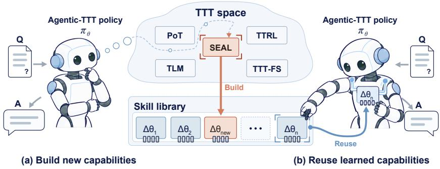
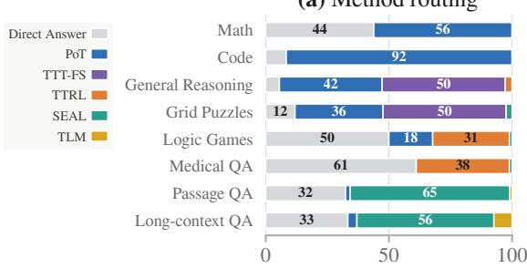
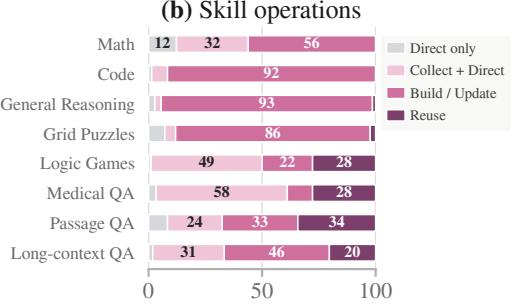
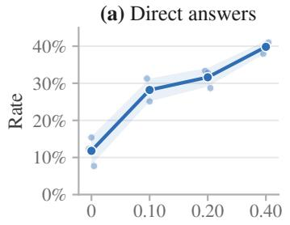
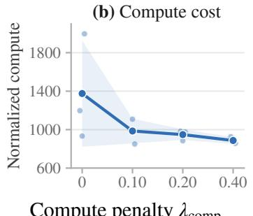
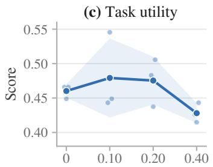
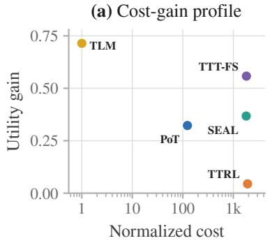
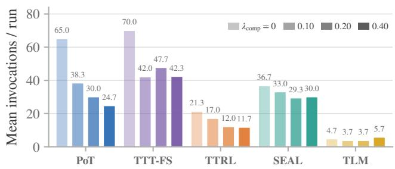
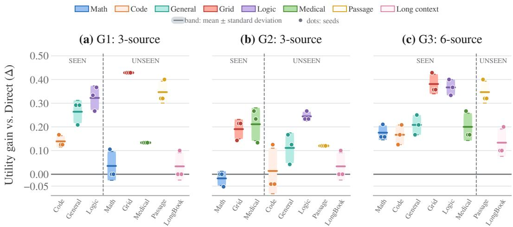

# AGENTIC-TTT: TRAINING TEST-TIME POLICY FOR TEST-TIME TRAINING

Jiahao Lu Mohan Kankanhall

NUS AI Institute

National University of Singapore

jiahao.lu@u.nus.edu dcsmsk@nus.edu.sg

## ABSTRACT

Test-time training (TTT) adapts an LLM’s parameters using signals derived from test inputs, and can make striking improvements in pre-specified settings such as IMO competitions or designated open problems. By turning deployment experience into parameter updates, TTT provides a direct mechanism for model-level self-improvement. Yet TTT is not universally beneficial: each TTT algorithm works in different settings, and applying an ill-suited method could waste testtime compute or even damage model performance. Therefore, such parameterlevel self-improvement requires agency: the model must decide when TTT is warranted, which algorithm to invoke, and whether an existing skill can be reused. To fill this gap, we introduce Agentic-TTT, which learns a test-time policy to govern those decisions. Agentic-TTT turns TTT procedures into callable tools, treats accumulated skills as an evolving deployment environment, and trains its policy using the observed utility gains from its decisions. On our benchmark, Agentic-TTT nearly doubles the utility over the backbone model, learns to trade off utility against compute, and generalizes to domains unseen during training. Together, these results point toward autonomous self-improvement: models that can decide how to learn from their own deployment experience.

## 1 INTRODUCTION

In 1945, von Neumann proposed the stored-program architecture, enabling self-modifying code: programs that rewrite their own instructions based on runtime data (Von Neumann, 1945). Alan Turing later recognized a deeper promise in such self-modification, arguing that “the possibility of letting the machine alter its own instructions provides the mechanism for learning from experience” (Turing, 1986). Eight decades later, neural networks have acquired remarkable abilities to perceive, generate, and reason, yet their parameters are typically frozen after deployment. Data encountered during deployment can shape the model’s computation, but ordinarily leaves its parameters and thus its parameterized capabilities unchanged. What would it take for a neural model to continue growing its own capabilities after deployment?

A prominent line of modern self-improving agents carries this vision forward at the level of the surrounding system. Through reflection and memory, these agents distill past interactions into textual lessons that guide subsequent decisions (Shinn et al., 2023; Zhao et al., 2024). They can also evolve their prompts, search over entire agentic workflows, and accumulate executable skills for reuse across tasks (Fernando et al., 2024; Zhang et al., 2025a; Wang et al., 2024). Although these mechanisms genuinely improve the agent as a whole, the self-improvement largely resides in the scaffold around the model, including its context, control flow, and external action repertoire; the model parameters themselves remain unchanged.

Other self-evolving systems update model parameters through self-generated tasks and trajectories, but organize this learning before deployment (Hu et al., 2025b; Zhao et al., 2026). Test-time training (TTT) moves parameter adaptation into deployment itself, using signals derived from test inputs to update model weights (Zuo et al., 2025; Zweiger et al., 2025; Akyürek et al., 2025; Yuksekgonul et al., 2026), enabling model-level self-improvement from deployment experience. TTT has achieved striking results in pre-specified settings, including AlphaProof’s silver-medal IMO performance (Hubert et al., 2025) and TTT-Discover’s advances on open scientific problems (Yuksekgonul et al., 2026).

Yet these methods typically assume the deployer has already identified both the capability to acquire and the procedure for acquiring it. In open-world deployment, where the test distribution is heterogeneous and unpredictable, an ill-suited TTT procedure can waste substantial test-time compute and may even underperform the frozen model. Realizing deployment-time capability growth therefore requires agency: deciding whether a query warrants adaptation, whether a capability acquired earlier already suffices, and which TTT method can best convert test-time compute into utility gain. To our knowledge, this model-level agency over TTT remains unexplored in open-ended LLM deployment. We fill this gap with Agentic-TTT, which turns TTT procedures into model-invokable tools and trains a test-time policy to govern their use.

Agentic-TTT formulates this agency as sequential decision-making over a stream of test queries. At a high level, given a query and the current skill library, the policy decides whether to answer with the frozen model, reuse an existing skill, or acquire a new capability through a selected TTT method. Each TTT invocation produces an isolated LoRA skill over the frozen backbone (Hu et al., 2022). Storing these skills in a persistent library expands the options available to future queries, making the skill library an evolving capability environment. We train the policy to maximize utility gain over the frozen model while accounting for test-time computation. Agentic-TTT thereby turns the model from a passive target of adaptation into an active agent of self-improvement.

We evaluate Agentic-TTT on a heterogeneous query stream drawn from eleven benchmark families across eight domains. We deliberately enrich the benchmark so that most queries exhibit TTT benefits during screening, allowing us to compare how effectively different policies exploit these adaptation opportunities. The reported gains therefore characterize this curated evaluation setting. The evaluated fixed-method baselines show uneven benefits and can degrade performance in some do mains. In contrast, Agentic-TTT nearly doubles Qwen2.5-7B’s overall utility over direct inference, with positive gains in every evaluated domain. The policy also supports controllable utility-compute trade-offs and retains substantial gains on domains excluded from policy training. Improvements persist with the stronger Qwen2.5-14B backbone.

Taken together, our work reframes test-time training from a fixed adaptation procedure into a problem of learned agency over deployment-time self-improvement. Agentic-TTT realizes this agency through a test-time policy that governs when and how to build or reuse parameter-space skills during deployment. Across a diverse suite of test domains, the learned policy nearly doubles overall utility over direct inference, delivers positive gains in every evaluated domain, supports controllable utility-compute trade-offs, and generalizes its TTT decisions to unseen data sources. These results suggest that the next frontier of TTT lies not in a single universal adaptation rule, but in models that learn when and how to draw on a diverse portfolio of TTT methods for self-improvement.

  
Figure 1: Agentic-TTT learns to govern self-improvement at test time: a learned policy decides when and how to (a) build or (b) reuse parameterized skills through test-time training.

## 2 AGENTIC TEST-TIME TRAINING

## 2.1 PROBLEM FORMULATION

Test-time training (TTT) offers the potential for self-improvement at deployment, but realizing such potential requires knowing which adaptation, if any, is appropriate for each test query. Agentic-TTT provides this missing agency: it learns when and how to build new capabilities through TTT, and when to improve an answer by creating or reusing TTT skills.

We formalize this agency as sequential decision-making over a stream of test queries $x _ { 1 } , \ldots , x _ { T }$ Some TTT methods can adapt from a single query when it contains sufficient training material. For example, SEAL (Zweiger et al., 2025) learns from a bundled document, whereas TTTfewshot (Akyürek et al., 2025) adapts from few-shot demonstrations. By contrast, a multi-query method such as TTRL (Zuo et al., 2025) aggregates self-consistency signals across multiple samedomain queries. To support such methods, the environment maintains adaptation pools $\mathcal { P } _ { t }$ . Each pool $\boldsymbol \rho \in \mathcal P _ { t }$ stores a collection of compatible queries, together with any bundled material needed for adaptation, until they can be used jointly in a TTT run. The base model remains frozen throughout. Whether produced from a single query or an adaptation pool, each adaptation is represented as a LoRA adapter and stored as a reusable parametric skill s in the skill library $\mathcal { L } _ { t } .$ . Each skill s is accompanied by a natural-language description of its learned capability, allowing the policy to assess its relevance to future queries. The pools and library persist across queries and shape subsequent decisions, forming the cross-query state $S _ { t } = ( \mathcal { L } _ { t } , \dot { \mathcal { P } } _ { t } )$ before processing each $x _ { t }$ . Processing $x _ { t }$ may update either adaptation pools or skill library, and the resulting evolved state $S _ { t + 1 }$ is carried forward to $x _ { t + 1 }$

Processing a query may require a sequence of actions over multiple interaction turns. At each turn $k ,$ the policy selects one of four primitive actions:

$$
a _ { t , k } \in \mathcal { A } = \{ \operatorname { A S S I G N } ( \rho ) , \operatorname { A D A P T } ( m , \rho ) , \operatorname { L O A D } ( s ) , \operatorname { G E N E R A T E } \} ,\tag{1}
$$

where ASSIGN adds adaptation material from $x _ { t }$ to pool $\rho ,$ ADAPT applies TTT method m to pool $\rho$ and produces a skill, LOAD mounts an existing skill $s$ , whereas GENERATE produces the final answer and terminates the interaction. To select $\boldsymbol { a } _ { t , k }$ , the policy conditions on the current query, the cross-query state, and the preceding interaction history. We denote this context by $\mathit { c } _ { t , k }$ . The policy first generates a reasoning trace $z _ { t , k }$ and then selects the action $a _ { t , k }$ conditioned on that reasoning. We denote the complete sequence of reasoning traces, actions, and environment feedback by $\tau _ { t }$ and its prefix before turn k by $\tau _ { t , < k }$ . After executing $\boldsymbol { a } _ { t , k }$ , the environment appends its feedback to $\tau _ { t , < k + 1 }$ . Formally,

$$
c _ { t , k } = \left( x _ { t } , S _ { t } , \tau _ { t , < k } \right) , \qquad z _ { t , k } \sim \pi _ { \theta } \left( \cdot \mid c _ { t , k } \right) , \qquad a _ { t , k } \sim \pi _ { \theta } \left( \cdot \mid c _ { t , k } , z _ { t , k } \right) .\tag{2}
$$

$U ( \tau _ { t } )$ denote the utility of the final answer, and let $C ( \tau _ { t } )$ denote the computation cost modeling of the trajectory, which may include policy reasoning, TTT actions and final answer generation. We compare each trajectory with direct inference with the frozen base model $\tau _ { t } ^ { \mathrm { G E N E R A T E } }$ , and define the base-relative return as:

$$
R ( \tau _ { t } ) = \left[ U ( \tau _ { t } ) - U \big ( \tau _ { t } ^ { \mathrm { G E N E R A T E } } \big ) \right] - \lambda \left[ C ( \tau _ { t } ) - C \big ( \tau _ { t } ^ { \mathrm { G E N E R A T E } } \big ) \right] ,\tag{3}
$$

where $\lambda \geq 0$ controls the trade-off between answer quality and computation. An agentic trajectory is therefore beneficial only when its utility improvement justifies its additional cost. Agentic-TTT therefore seeks a policy $\pi _ { \theta ^ { \star } }$ that maximizes the expected cumulative return when deployed over a query stream:

$$
\theta ^ { \star } = \arg \operatorname* { m a x } _ { \theta } \mathbb { E } _ { \pi _ { \theta } } \left[ \sum _ { t = 1 } ^ { T } R ( \tau _ { t } ) \right] .\tag{4}
$$

## 2.2 LEARNING THE AGENTIC-TTT POLICY

Learning the Agentic-TTT policy directly from outcome rewards poses a cold-start problem. Since the initial policy is unfamiliar with the execution protocol, it may rarely sample valid trajectories, leaving little useful signal for reinforcement learning. We therefore train the policy in two stages. Guidance distillation policy learning first establishes reliable interaction and a useful prior over TTT decisions. Building on this behavioral foundation, outcome-driven reinforcement learning further maximizes the measured utility gain of each trajectory while penalizing its computation cost.

## 2.2.1 GUIDANCE DISTILLATION POLICY LEARNING

Since the base model has never been exposed to our execution harness, appropriate action sequences may initially have negligible probability. When the policy is unlikely to sample a valid action sequence, the correct behavior remains almost invisible to reward-based learning and cannot be effectively reinforced. We address this cold-start issue by Guidance Distillation Policy Learning.

We collect SFT demonstrations through hint-guided rollout collection. For each training query $x _ { t }$ , heuristic rules propose a sequence of turn-level gold actions $a _ { t , k } ^ { \star }$ , which we retain only after empirical TTT evaluation confirms its predicted benefit. At each turn, a context-specific hint $h _ { t , k }$ identifies the next gold action and explains why it is appropriate. The initial policy $\pi _ { \theta _ { 0 } }$ then samples its own reasoning and action:

$$
\left( z _ { t , k } , a _ { t , k } \right) \sim \pi _ { \theta _ { 0 } } \left( \cdot \mid c _ { t , k } , h _ { t , k } \right) , \qquad \mathrm { r e t a i n o n l y i f } a _ { t , k } = a _ { t , k } ^ { \star } .\tag{5}
$$

After each accepted action is executed, its environment feedback enters $\scriptstyle c _ { t , k + 1 }$ , and a new hint guides the next turn until the trajectory terminates. Each rationale $z _ { t , k }$ is thus generated on-policy by $\pi _ { \theta _ { 0 } }$ itself, rather than imposing an external teacher’s reasoning style.

After collection, we remove all hints and construct $\mathcal { D } _ { \mathrm { S F T } }$ from all the turn-level triples $( c _ { t , k } , z _ { t , k } , a _ { t , k } ^ { \star } )$ Tokens in $\boldsymbol { c } _ { t , k }$ serve only as the conditioning context and are masked from the loss, so supervision applies only to the self-generated rationale $z _ { t , k }$ and the gold action block $a _ { t , k } ^ { \star } .$ The action block $a _ { t , k } ^ { \star }$ must follow a canonical harness-defined format that is unfamiliar to the initial policy yet crucial for reliable execution. Under a uniform token-averaged objective, longer rationales would dilute the learning signal assigned to the action tokens; therefore, we optimize the following role-weighted SFT objective:

$$
\begin{array} { r } { \mathcal { L } _ { \mathrm { S F T } } ( \theta ) = - \mathbb { E } _ { \mathcal { D } _ { \mathrm { S F T } } } \left[ \omega _ { z } \log \pi _ { \theta } \left( z _ { t , k } \middle \vert c _ { t , k } \right) + \omega _ { a } \log \pi _ { \theta } \left( a _ { t , k } ^ { \star } \middle \vert c _ { t , k } , z _ { t , k } \right) \right] , } \end{array}\tag{6}
$$

We set $\omega _ { z } = 1$ and $\omega _ { a } = 4 ,$ , giving action tokens stronger supervision guidance than rationale tokens.   
Minimizing this objective yields $\pi _ { \boldsymbol { \theta } _ { \mathrm { S F T } } }$ , which initializes outcome-driven reinforcement learning.

## 2.2.2 OUTCOME-DRIVEN REINFORCEMENT LEARNING

We initialize $\pi _ { \theta }$ from $\pi _ { \boldsymbol { \theta } _ { \mathrm { S F T } } }$ and refine it through outcome-driven reinforcement learning. By optimizing multi-turn trajectory outcomes directly, the policy learns when the utility gain from TTT justifies its cost and when direct generation is preferable.

Since deployment-time self-improvement depends on capabilities accumulated across queries, we train the policy in a streaming environment. When processing $x _ { t }$ , the policy observes a cross-query state $S _ { t }$ shaped by the training events that precede it. At the beginning of each epoch, we reset the skill library and adaptation pools and reshuffle the training queries subject to prerequisite-order constraints. This exposes each query to varied cross-query states and reduces overfitting to fixed $( x _ { t } , S _ { t } )$ ) pairs. When a training event $( x _ { t } , S _ { t } )$ is reached, we snapshot $S _ { t }$ and independently sample G complete trajectories:

$$
\tau _ { t } ^ { ( g ) } \sim \pi _ { \theta } \left( \cdot \mid x _ { t } , S _ { t } \right) , \qquad g = 1 , \ldots , G .
$$

These rollouts provide local counterfactual outcomes from the same state snapshot and are rolled back after evaluation and optimization. The training stream instead advances by executing the annotated gold action sequence for $x _ { t } .$ , producing a single valid successor state $S _ { t + 1 }$ . Oracle stream advancement therefore determines only the cross-query states on which RL is trained; at deployment, the policy advances the stream autonomously.

For each sampled rollout $\tau = \tau _ { t } ^ { ( g ) }$ , we set the reward as the base-relative return

$$
\begin{array} { r } { R ( \tau ) = \Delta U ( \tau ) - \lambda _ { \mathrm { c o m p } } \Delta C ( \tau ) - \lambda _ { \mathrm { i n v } } P _ { \mathrm { i n v } } ( \tau ) , } \\ { \mathrm { w h e r e } \Delta U ( \tau ) : = U ( \tau ) - U \left( \tau ^ { \mathrm { G E N E R A T E } } \right) , } \\ { \Delta C ( \tau ) : = C ( \tau ) - C \left( \tau ^ { \mathrm { G E N E R A T E } } \right) . } \end{array}\tag{7}
$$

Here, $\tau ^ { \mathrm { G E N E R A T E } }$ denotes the direct answer trajectory from the frozen base model without ASSIGN, ADAPT, or LOAD actions. The cost model C and coefficient $\lambda _ { \mathrm { c o m p } }$ are instantiated according to the desired utility-compute trade-off, with the exact configurations specified in the experimental setup. $P _ { \mathrm { i n v } } ( \tau )$ is a graded penalty for invalid actions. We observe that the policy may perform invalid actions such as invoking nonexistent skills or attempting adaptation before its prerequisites are satisfied. The environment rejects such actions with an error message, but neither terminates the rollout nor changes its state. Consequently, a rollout may repeatedly take invalid actions while leaving both its final utility and its modeled adaptation cost unchanged. Therefore, we introduce $P _ { \mathrm { i n v } } ( \tau )$ to provide a direct and dense learning signal that favors clean and valid trajectories reaching the same outcome more efficiently. We keep this penalty small and capped so that it shapes execution without overwhelming the utility signal or discouraging the use of TTT actions. Specifically, $P _ { \mathrm { i n v } }$ adds 0.5 for each rejected action, with its total capped at 2.0; we set $\lambda _ { \mathrm { i n v } } ~ = ~ 0 . 1 5$ through all experiments unless otherwise specified.

Within each rollout group, we compute the mean-centered advantage following Dr. GRPO (Liu et al., 2025b). We omit group standard-deviation normalization to preserve the magnitude of reward differences, and avoid implicitly reweighting queries by reward variance:

$$
A _ { t } ^ { ( g ) } = R \left( \tau _ { t } ^ { ( g ) } \right) - \frac { 1 } { G } \sum _ { j = 1 } ^ { G } R \left( \tau _ { t } ^ { ( j ) } \right) .\tag{8}
$$

Using $A _ { t } ^ { ( g ) }$ , we optimize the standard clipped GRPO objective over policy-generated reasoning and action tokens with a KL regularizer:

$$
\mathcal { L } _ { \mathrm { R L } } ( \theta ) = - \mathbb { E } _ { t , g , i } \left[ \operatorname* { m i n } \left( \rho _ { t , g , i } ( \theta ) A _ { t } ^ { ( g ) } , \operatorname { c l i p } \left( \rho _ { t , g , i } ( \theta ) , 1 - \epsilon , 1 + \epsilon \right) A _ { t } ^ { ( g ) } \right) \right] + \beta \mathcal { L } _ { \mathrm { K L } } ( \theta ) ,\tag{9}
$$

where $\rho _ { t , g , i }$ is the probability ratio between the current and rollout policies for the i-th generated token, and ${ \mathcal { L } } _ { \mathrm { K I } }$ regularizes the policy toward the frozen base distribution.

Together, the two training stages produce a policy that can reliably decide whether and how to use TTT. Guidance distillation first makes valid TTT trajectories executable and likely to be sampled, while outcome-driven reinforcement learning calibrates these decisions using utility gains, computation costs, and invalid-action penalties.

## 3 EXPERIMENTS

In this section, we ask whether Agentic-TTT can achieve self-improvement through learned agency over TTT skills; whether its inference-time compute can be controlled; and whether the learned policy transfers beyond the training distributions.

Data and evaluation. Our dataset covers eight domains drawn from 11 benchmark families. Guidance distillation uses 2,072 turn-level examples from 177 trajectories, and reinforcement learning uses a stream of 187 training inputs. Evaluation follows a fixed sequential stream containing 176 held-out scored queries, starting with an empty skill library. Library state is not shared across training or evaluation runs. Overall utility is the mean binary score assigned by task-specific automatic verifiers. Appendix B details the data sources, splits, stream construction, and scoring rules.

Implementation. Unless otherwise specified, we use Qwen2.5-7B-Instruct (Hui et al., 2024) with five TTT methods: POT (Jiao et al., 2026), TTT-FS (Akyürek et al., 2025), TTRL (Zuo et al., 2025), SEAL (Zweiger et al., 2025), and TLM (Hu et al., 2025a). The policy and TTT skills use separate LoRAs; final-answer decoding disables the policy LoRA and receives only the original query. Both policy and answer decoding are greedy at evaluation. For trained policies, we report the mean and sample standard deviation over three independent training runs, evaluating each checkpoint once. Harness and optimization details appear in Appendices C and D.

## 3.1 MAIN RESULTS: AGENTIC-TTT LEARNS WHEN AND HOW TO APPLY TTT

We compare all methods using the same backbone LLM and execution environment. DIRECT AN-SWER answers without any TTT, while PROMPTED uses the same Agentic-TTT prompt instruction but without any policy training. ALWAYS-TLM, ALWAYS-SEAL, and ALWAYS-TTRL each use a fixed adaptation method. SEMANTIC ROUTER selects a method from annotated training examples retrieved by query-embedding similarity. Within our training pipeline, SFT-ONLY shows the result only after guidance distillation training, whereas SFT+RL completes both training stages. ORACLE executes annotation-derived action sequences for skill construction and reuse, with methods selected through offline empirical profiling. It serves as a non-deployable reference, not a strict upper bound.

Table 1: Main results on Qwen2.5-7B. Task rows report absolute utility for Direct Answer and mean changes relative to it for all other methods; Overall reports absolute utility. ± denotes the sample standard deviation over three training runs, and boldface marks the best non-oracle result.
<table><tr><td rowspan="2"></td><td rowspan="2">Absolute score</td><td colspan="8">Relative score (∆ vs. Direct Answer)</td></tr><tr><td colspan="4">Baselines</td><td colspan="2">Our training</td><td>|Reference</td></tr><tr><td>Evaluation task</td><td>Direct Answer</td><td>Prompted</td><td>Semantic Router</td><td>Always TLM</td><td>Always SEAL</td><td>Always TTRL</td><td>SFT only</td><td>SFT+RL (Ours)</td><td>Oracle</td></tr><tr><td>Math</td><td>0.526</td><td>-0.018</td><td>-0.053</td><td>0.000</td><td>-0.368</td><td>+0.105</td><td>0.000</td><td>+0.175</td><td>+0.281</td></tr><tr><td>Code</td><td>0.250</td><td>-0.042</td><td>+0.042</td><td>0.000</td><td>-0.236</td><td>-0.042</td><td>+0.042+0.167</td><td></td><td>+0.403</td></tr><tr><td>General Reasoning</td><td>0.167</td><td>-0.014</td><td>+0.138</td><td>0.000</td><td>-0.028</td><td>0.000</td><td>+0.083+0.208</td><td></td><td>+0.472</td></tr><tr><td>Grid Puzzles</td><td>0.000</td><td>+0.024</td><td>+0.310</td><td>0.000</td><td>+0.048</td><td>0.000</td><td></td><td>+0.214 +0.381</td><td>+0.357</td></tr><tr><td>Logic Games</td><td>0.367</td><td>+0.011</td><td>+0.156</td><td>0.000</td><td>0.000</td><td>+0.233</td><td></td><td>+0.133+0.367</td><td>+0.300</td></tr><tr><td>Medical QA</td><td>0.400</td><td>+0.089</td><td>+0.100</td><td>+0.022</td><td>+0.022</td><td>+0.167</td><td></td><td>+0.133 +0.200</td><td>+0.333</td></tr><tr><td>Passage QA</td><td>0.040</td><td>+0.027</td><td>+0.027</td><td>0.000</td><td>+0.427</td><td>+0.040</td><td>+0.240</td><td>+0.347</td><td>+0.453</td></tr><tr><td>Long-context QA</td><td>0.100</td><td>+0.033</td><td>0.000</td><td>+0.767</td><td>+0.100</td><td>0.000</td><td>+0.100</td><td>+0.133</td><td>+0.767</td></tr><tr><td>Overall (abs.)</td><td>0.256</td><td>0.271 ±0.003</td><td>0.347 ±0.020</td><td>0.260 ±0.003</td><td>0.248 ±0.029</td><td>0.335 ±0.038</td><td>0.375 ±0.010</td><td>0.510 ±0.012</td><td>0.650 ±0.061</td></tr></table>

Table 1 shows that Agentic-TTT increases overall utility from 0.256 to 0.510, with positive gains in all eight domains. Fixed-method benefits vary substantially across domains: for example, ALWAYS-SEAL improves Passage QA but degrades mathematics and code generation. Prompting and embedding-based routing provide smaller overall gains, reaching 0.271 and 0.347, respectively. Within our training pipeline, guidance distillation raises utility to 0.375, and outcome-driven RL further improves it to 0.510, demonstrating additional benefit from optimizing measured trajectory outcomes. Agentic-TTT also exceeds the annotation-derived ORACLE on Grid Puzzles and Logic Games, showing that the learned policy can discover more effective adaptation decisions than the prescribed reference actions.

Figure 2 reveals how the learned policy manages TTT across tasks. As shown in Figure 2(a), the policy does not follow a rigid routing strategy, but instead selects from a diverse portfolio of TTT methods, while retaining the option to answer with the frozen backbone. Across three evaluation runs, Agentic-TTT converts 141 incorrect direct answers into correct ones, while reversing only 7 correct direct answers, yielding a help-to-harm ratio of approximately 20:1. Figure 2(b) further shows that the policy learns more than method routing alone. Across the three runs, it answers 100 queries using previously constructed skills; these reuse decisions help on 61 queries and harm only one relative to Direct Answer. Loading these skills requires no additional adaptation, allowing their construction cost to be amortized across subsequent queries.

(a) Method routing  
  
Share of stream events (%)

(b) Skill operations  
  
Share of stream events (%)  
Figure 2: Agentic-TTT learns task-dependent method routing and skill operations. (a) Distribution of TTT methods for each response. (b) Distribution of skill operations for each input.

Compute penalty $\lambda _ { \mathrm { c o m p } }$  




  
Figure 3: Compute penalties steer the policy toward selective adaptation. We vary the compute penalty $\lambda _ { \mathrm { c o m p } }$ and report (a) the direct-answer rate, (b) normalized adaptation compute, and (c) task utility. Dots show 3 individual runs, lines and bands show their means and standard deviation.

## 3.2 TRAINING AGENTIC-TTT TO BALANCE UTILITY AND COMPUTE

To study whether Agentic-TTT can explicitly control its adaptation compute, we train a family of policies with compute penalties $\lambda _ { \mathrm { c o m p } } \overset { \cdot } { \in } \lbrace 0 , 0 . 1 , 0 . 2 , 0 . 4 \rbrace$ . For each TTT method $m ,$ we measure the FLOPs required for one successful adaptation, and normalize them by the FLOPs of one direct answer, yielding a method-specific normalized cost $c _ { m }$ . During guidance distillation, we retain a TTT trajectory only when its empirical utility gain amortized over expected future reuse, justifies its compute cost $\lambda _ { \mathrm { c o m p } } \log _ { 1 0 } ( 1 + c _ { m } )$ ; otherwise, we use a direct-answer trajectory. During RL, we subtract the same cost term from the sequence-level advantage. The setting $\lambda _ { \mathrm { c o m p } } = 0$ therefore serves as a compute-unconstrained, utility-only reference under the same training pipeline.

Figure 3 shows a clear behavioral response to the compute penalty. As $\lambda _ { \mathrm { c o m p } }$ increases from 0 to 0.4, the mean direct-answer rate rises monotonically from 11.8% to 39.8%, while normalized adaptation compute decreases from 1375.5 to 886.9, a reduction of 35.5%. Interestingly, moderate penalties like $\bar { \lambda _ { \mathrm { c o m p } } } = 0 . 1$ and 0.2, yield particularly favorable trade-offs: they reduce compute by approximately 30% while achieving higher mean utility than $\lambda _ { \mathrm { c o m p } } = 0$ . This suggests that without an explicit compute cost, the policy may overuse TTT and become less selective about when adaptation is beneficial.

Figure 4 examines how this compute reduction is distributed across TTT methods. As shown in Figure 4(a), different TTT methods have markedly different cost-gain profiles. For example, TTRL incurs a high adaptation cost but a marginal utility gain, whereas TLM lies at the other extreme. Importantly, these utility gains are measured only on the training distributions matched to each method. When a method is applied to unsuitable inputs, its realized gain may be substantially smaller or even negative. Figure 4(b) shows that, under stronger compute penalties, the policy selectively reduces costly methods with limited expected benefit. TTRL usage nearly halves, decreasing from 21.3 to 11.7 invocations, whereas TLM usage increases slightly. This shift is consistent with the policy reallocating adaptation toward less expensive methods. These method-specific shifts show that Agentic-TTT learns a benefit-aware allocation of adaptation compute, rather than merely suppressing TTT uniformly.



(b) Method invocations  
  
Figure 4: Compute penalties selectively reallocate TTT method use. (a) Normalized adaptation cost and mean training-set utility gain for each TTT method. (b) Average number of method invocations per evaluation run. Colors identify TTT methods, while darker shades indicate larger $\lambda _ { \mathrm { c o m p } } .$

## 3.3 EXTRAPOLATING TTT AGENCY TO UNSEEN DATA SOURCES

  
Figure 5: Generalization beyond policy-training domains. We report utility gains for policies trained on G1 (Code, General Reasoning, and Logic Games), G2 (Math, Grid Puzzles, and Medical QA), or their union G3. Passage and LongBook QA are unseen by all 3 groups. Bands and dots show the mean ± std and individual results over three training runs.

Since test inputs may often fall outside the training distribution and cannot be fully anticipated, the learned TTT agency must generalize beyond data sources observed during training. To evaluate this capability, we construct three source-restricted training regimes. G1 is trained only on Code, General Reasoning, and Logic Games, whereas G2 is trained only on Math, Grid Puzzles, and Medical QA. G3 is trained on the union of these six domains. For each regime, the excluded domains are absent from both guidance distillation and reinforcement learning. Passage QA and LongBook are additionally withheld from all three regimes, providing a common set of jointly unseen domains. We evaluate every trained policy on the same complete eight-domain suite and report its utility gain relative to Direct Answer within each domain.

Figure 5 shows that the learned TTT agency is not confined to the data sources used for policy training. For both G1 and G2, the gains on held-out domains are broadly comparable to those on domains seen during training. In some cases, transfer is particularly strong: G1 achieves its largest improvement on Grid Puzzles, despite never observing this domain during training. Finally, G3 performs best on Passage and LongBook QA, which are unseen by all three policies, suggesting that greater diversity in the training sources supports stronger extrapolation to entirely new domains. Overall, Agentic-TTT learns transferable principles for selecting and managing TTT skills, rather than merely memorizing source-specific action patterns.

## 3.4 GENERALIZATION ACROSS MODEL FAMILIES AND SCALES

We evaluate Llama-3.1-8B and GLM-4-9B to assess generality across model families, and Qwen2.5- 14B to assess gains with a stronger backbone. Each policy is compared against baselines using the same backbone, with all other settings identical to the main experiments.

Cross-model family. Agentic-TTT improves overall utility by 0.254 on Qwen-7B, 0.136 on Llama-8B, and 0.142 on GLM-9B, substantially outperforming prompting alone. This confirms that the learned TTT agency is not specific to Qwen2.5. However, the gains are model-dependent: Llama degrades on mathematics and code, while GLM degrades on Logic Games and Long-context

(a) Overall utility
<table><tr><td colspan="2"></td><td colspan="2">Absolute Utility gain vs. Direct</td></tr><tr><td>Base model</td><td>Direct</td><td>Prompted</td><td>Ours</td></tr><tr><td>Llama-8B</td><td>.284</td><td>+.063</td><td> $\mathbf { + . 1 3 6 }$ </td></tr><tr><td>GLM-9B</td><td>.341</td><td>.000</td><td> $+ . 1 4 2$ </td></tr><tr><td>Qwen-7B</td><td>.256</td><td>+.015</td><td>+.254</td></tr><tr><td>Qwen-14B</td><td>.432</td><td> $- . 1 3 6$ </td><td> $\mathbf { + . 1 8 9 }$ </td></tr></table>

(b) Per-domain utility gain of our policy
<table><tr><td rowspan="2"></td><td colspan="6">Utility gain vs. Direct</td></tr><tr><td></td><td></td><td>Base model Math Code Gen. Grid Logic Med. Pass. Book</td><td></td><td></td><td></td></tr><tr><td>Llama-8B</td><td></td><td></td><td> $- . 1 0 5 - . 0 4 2 . 0 0 0 + . 2 1 4 + . 2 3 3 + . 1 6 7 + . 4 4 0 + . 1 0 0$ </td><td></td><td></td><td></td></tr><tr><td>GLM-9B</td><td></td><td></td><td> $+ . 2 1 1 \ + . 0 4 2 \ + . 2 9 2 \ + . 2 8 6 \ - . 0 3 3 \ \quad . 0 0 0 \ + . 4 8 0 \ - . 2 0 0$ </td><td></td><td></td><td></td></tr><tr><td>Qwen-7B</td><td></td><td></td><td></td><td> $+ . 1 7 5 + . 1 6 7 + . 2 0 8 + . 3 8 1 + . 3 6 7 + . 2 0 0 + . 3 4 7 + . 1 3 3$ </td><td></td><td></td></tr><tr><td>Qwen-14B</td><td></td><td></td><td> $+ . 1 5 8 \ + . 2 2 2 \ + . 2 5 0 \ + . 4 0 5 \ - . 0 4 4 \ - . 0 7 8 \ + . 6 5 3 \ + . 0 6 7$ </td><td></td><td></td><td></td></tr></table>

Table 2: Generalization across model families and scales. Direct reports the absolute utility of each backbone; Prompted and Ours report utility gains relative to Direct Answer. Panel (a) reports overall utility, while panel (b) reports the per-domain gains of our learned policy.

QA. These failures indicate that the policy does not always abstain from TTT when direct answering would be more reliable, leaving room for better backbone-aware decision making.

Cross-model size. The gains also persist as the backbone becomes stronger. Qwen-14B already achieves 0.432 utility through direct answering, yet Agentic-TTT provides a further gain of 0.189, raising its overall utility to 0.621. Its improvement profile differs from that of Qwen-7B, suggesting that stronger models retain different capability gaps. However, negative gains on Logic Games and Medical QA highlight the need for better calibration of adaptation decisions on stronger backbones.

## 3.5 ABLATION STUDIES

## 3.5.1 ACTION-TOKEN SUPERVISION DURING SFT

We compare $\omega _ { a } ~ = ~ 1$ and 4, and apply the same subsequent RL recipe to both checkpoints. In Table 3, invalid actions are generated action blocks that fail parsing or action-schema validation. Increasing $\omega _ { a }$ from 1 to 4 improves final utility by 0.046 and reduces the invalid-action rate from 4.08% to 1.72%. Thus, upweighting the relatively sparse action tokens can increase action reliability and translate into better downstream utility.

Table 3: SFT action-token supervision.
<table><tr><td> $\omega _ { a }$ </td><td>Utility ↑</td><td>Invalid actions (%) ↓</td></tr><tr><td>1</td><td> $0 . 4 6 4 \pm 0 . 0 1 7$ </td><td> $4 . 0 8 \pm 1 . 3 0$ </td></tr><tr><td>4 (ours)</td><td> $\mathbf { 0 . 5 1 0 \pm 0 . 0 1 2 }$ </td><td> ${ \bf 1 . 7 2 \pm 0 . 5 5 }$ </td></tr></table>

Table 4: RL invalid-action penalty.
<table><tr><td> $\lambda _ { \mathrm { i n v } }$ </td><td>Utility ↑</td><td>Budget exhausted (%)↓</td></tr><tr><td>0</td><td> $0 . 4 6 7 \pm 0 . 0 2 7$ </td><td> $2 1 . 2 0 \pm 0 . 5 9$ </td></tr><tr><td>0.15 (ours)</td><td> $\mathbf { 0 . 5 1 0 \pm 0 . 0 1 2 }$ </td><td> ${ \bf 1 3 . 3 3 \pm 2 . 0 7 }$ </td></tr></table>

## 3.5.2 INVALID ACTION PENALTY IN RL

We compare RL training with and without the invalid-action penalty. The budget-exhaustion rate in Table 4 is the fraction of trajectories that consume their entire 6 action budget. Setting $\lambda _ { \mathrm { i n v } } = 0 . 1 5$ improves utility by 0.043 and reduces budget exhaustion by 7.87 percentage points. The penalty therefore helps the policy avoid unproductive action sequences and preserve its finite action budget for completing the task.

## 4 CONCLUSION

Our results suggest that enabling neural models to grow after deployment requires more than the ability to update their parameters; it requires agency over those updates. Agentic-TTT provides this agency through a learned test-time policy that manages heterogeneous TTT procedures and reusable parameter-space skills across a stream of queries. Experiments show that no fixed TTT method is broadly effective, whereas Agentic-TTT nearly doubles utility over direct inference, balances utility against compute, and transfers to domains unseen during training. Taken together, this work reframes TTT from a fixed adaptation procedure into a learned decision process, pointing toward models that can decide how to learn from their own deployment experience.

## REFERENCES

Emre Can Acikgoz, Cheng Qian, Heng Ji, Dilek Hakkani-Tür, and Gokhan Tur. Self-improving llm agents at test-time. arXiv preprint arXiv:2510.07841, 2025.

AI-MO. aimo-validation-amc. Hugging Face dataset, 2024. URL https://huggingface. co/datasets/AI-MO/aimo-validation-amc.

Ekin Akyürek, Mehul Damani, Adam Zweiger, Linlu Qiu, Han Guo, Jyothish Pari, Yoon Kim, and Jacob Andreas. The surprising effectiveness of test-time training for few-shot learning. In International Conference on Machine Learning, pp. 942–963. PMLR, 2025.

Jacob Austin, Augustus Odena, Maxwell Nye, Maarten Bosma, Henryk Michalewski, David Dohan, Ellen Jiang, Carrie Cai, Michael Terry, Quoc Le, et al. Program synthesis with large language models. arXiv preprint arXiv:2108.07732, 2021.

Ryo Bertolissi, Jonas Hübotter, Ido Hakimi, and Andreas Krause. Local mixtures of experts: Essentially free test-time training via model merging. In Second Conference on Language Modeling. OpenReview, 2025.

Rujikorn Charakorn, Edoardo Cetin, Yujin Tang, and Robert Tjarko Lange. Text-to-lora: Instant transformer adaption. In International Conference on Machine Learning, pp. 7485–7514. PMLR, 2025.

François Chollet. On the measure of intelligence. arXiv preprint arXiv:1911.01547, 2019.

Akash Dhasade, Anne-Marie Kermarrec, Igor Pavlovic, Diana Petrescu, Rafael Pires, Mathis Randl, and Martijn de Vos. Effective lora adapter routing using task representations. arXiv preprint arXiv:2601.21795, 2026.

Yi Duan, Ying Liu, Zirui Tang, Haodong Chen, Jun Zhou, Yumou Liu, Bangrui Xu, Yukai Wu, Sidi Chen, Yuhan Zhou, et al. The last ai built by humans: Toward genuine recursive selfimprovement. arXiv preprint arXiv:2609.11873, 2026.

Kevin Ellis, Catherine Wong, Maxwell Nye, Mathias Sablé-Meyer, Lucas Morales, Luke Hewitt, Luc Cary, Armando Solar-Lezama, and Joshua B Tenenbaum. Dreamcoder: Bootstrapping inductive program synthesis with wake-sleep library learning. In Proceedings of the 42nd acm sigplan international conference on programming language design and implementation, pp. 835– 850, 2021.

Guhao Feng, Shengjie Luo, Kai Hua, Ge Zhang, Wenhao Huang, Di He, and Tianle Cai. In-place test-time training. In The Fourteenth International Conference on Learning Representations, 2026. URL https://openreview.net/forum?id=dTWfCLSoyl.

Chrisantha Fernando, Dylan Banarse, Henryk Michalewski, Simon Osindero, and Tim Rocktäschel. Promptbreeder: self-referential self-improvement via prompt evolution. In Proceedings of the 41st International Conference on Machine Learning, pp. 13481–13544, 2024.

Taesik Gong, Yewon Kim, Taeckyung Lee, Sorn Chottananurak, and Sung-Ju Lee. Sotta: Robust test-time adaptation on noisy data streams. Advances in Neural Information Processing Systems, 36:14070–14093, 2023.

Gabriel Grand, Lio Wong, Maddy Bowers, Theo X Olausson, Muxin Liu, Joshua B Tenenbaum, and Jacob Andreas. Lilo: Learning interpretable libraries by compressing and documenting code. In International Conference on Learning Representations, volume 2024, pp. 30399–30446, 2024.

Edward J Hu, Yelong Shen, Phillip Wallis, Zeyuan Allen-Zhu, Yuanzhi Li, Shean Wang, Liang Wang, Weizhu Chen, et al. Lora: Low-rank adaptation of large language models. Iclr, 1(2):3, 2022.

Jinwu Hu, Zitian Zhang, Guohao Chen, Xutao Wen, Chao Shuai, Wei Luo, Bin Xiao, Yuanqing Li, and Mingkui Tan. Test-time learning for large language models. In International Conference on Machine Learning, pp. 24823–24849. PMLR, 2025a.

Mengkang Hu, Pu Zhao, Can Xu, Qingfeng Sun, Jian-Guang Lou, Qingwei Lin, Ping Luo, and Saravan Rajmohan. Agentgen: Enhancing planning abilities for large language model based agent via environment and task generation. In Proceedings ofthe 31st ACM SIGKDD Conference on Knowledge Discovery and Data Mining V. 1, pp. 496–507, 2025b.

Chengsong Huang, Qian Liu, Bill Yuchen Lin, Tianyu Pang, Chao Du, and Min Lin. Lorahub: Efficient cross-task generalization via dynamic lora composition. In First Conference on Language Modeling, 2024a.

Shaohan Huang, Furu Wei, et al. Mixture of lora experts. In International Conference on Learning Representations, volume 2024, pp. 47302–47318, 2024b.

Thomas Hubert, Rishi Mehta, Laurent Sartran, Miklós Z Horváth, Goran Žužic, Eric Wieser, Aja´ Huang, Julian Schrittwieser, Yannick Schroecker, Hussain Masoom, et al. Olympiad-level formal mathematical reasoning with reinforcement learning. Nature, pp. 1–3, 2025.

Jonas Hübotter, Leander Diaz-Bone, Ido Hakimi, Andreas Krause, and Moritz Hardt. Learning on the job: Test-time curricula for targeted reinforcement learning. arXiv preprint arXiv:2510.04786, 2025.

Binyuan Hui, Jian Yang, Zeyu Cui, Jiaxi Yang, Dayiheng Liu, Lei Zhang, Tianyu Liu, Jiajun Zhang, Bowen Yu, Keming Lu, et al. Qwen2. 5-coder technical report. arXiv preprint arXiv:2409.12186, 2024.

Naman Jain, Alex Gu, Wen-Ding Li, Fanjia Yan, Tianjun Zhang, Sida Wang, Armando Solar-Lezama, Koushik Sen, and Ion Stoica. Livecodebench: Holistic and contamination free evaluation of large language models for code. In International Conference on Learning Representations, volume 2025, pp. 58791–58831, 2025.

Zhengbo Jiao, Hongyu Xian, Qinglong Wang, Yunpu Ma, Zhebo Wang, Zifan Zhang, Dezhang Kong, and Meng Han. Policy of thoughts: Scaling llm reasoning via test-time policy evolution. arXiv preprint arXiv:2601.20379, 2026.

Dengchun Li, Yingzi Ma, Naizheng Wang, Zhengmao Ye, Zhiyuan Cheng, Yinghao Tang, Yan Zhang, Lei Duan, Jie Zuo, Cal Yang, et al. Mixlora: Enhancing large language models finetuning with lora-based mixture of experts. arXiv preprint arXiv:2404.15159, 2024.

Hunter Lightman, Vineet Kosaraju, Yuri Burda, Harrison Edwards, Bowen Baker, Teddy Lee, Jan Leike, John Schulman, Ilya Sutskever, and Karl Cobbe. Let’s verify step by step. In International Conference on Learning Representations, volume 2024, pp. 39578–39601, 2024.

Jia Liu, ChangYi He, YingQiao Lin, MingMin Yang, FeiYang Shen, and ShaoGuo Liu. Ettrl: Balancing exploration and exploitation in llm test-time reinforcement learning via entropy mechanism. arXiv preprint arXiv:2508.11356, 2025a.

Zichen Liu, Changyu Chen, Wenjun Li, Penghui Qi, Tianyu Pang, Chao Du, Wee Sun Lee, and Min Lin. Understanding r1-zero-like training: A critical perspective. In Second Conference on Language Modeling, 2025b.

Maxwell-Jia. AIME 2024 Dataset. Hugging Face dataset, 2024. URL https://huggingface. co/datasets/Maxwell-Jia/AIME\_2024.

Mohammad Mahdi Moradi, Hossam Amer, Sudhir Mudur, Weiwei Zhang, Yang Liu, and Walid Ahmed. Continuous self-improvement of large language models by test-time training with verifier-driven sample selection. In AI That Keeps Up: NeurIPS 2025 Workshop on Continual and Compatible Foundation Model Updates, 2025. URL https://openreview.net/forum? id=6ahliSpvQ0.

Shuaicheng Niu, Jiaxiang Wu, Yifan Zhang, Yaofo Chen, Shijian Zheng, Peilin Zhao, and Mingkui Tan. Efficient test-time model adaptation without forgetting. In International conference on machine learning, pp. 16888–16905. PMLR, 2022.

Shuaicheng Niu, Jiaxiang Wu, Yifan Zhang, Zhiquan Wen, Yaofo Chen, Peilin Zhao, and Mingkui Tan. Towards stable test-time adaptation in dynamic wild world. In The Eleventh International Conference on Learning Representations, 2023.

Oleksiy Ostapenko, Pau Rodriguez, Massimo Caccia, and Laurent Charlin. Continual learning via local module composition. Advances in Neural Information Processing Systems, 34:30298– 30312, 2021.

Oleksiy Ostapenko, Zhan Su, Edoardo Ponti, Laurent Charlin, Nicolas Le Roux, Lucas Caccia, and Alessandro Sordoni. Towards modular llms by building and reusing a library of loras. In International Conference on Machine Learning, pp. 38885–38904. PMLR, 2024.

Ankit Pal, Logesh Kumar Umapathi, and Malaikannan Sankarasubbu. Medmcqa: A large-scale multi-subject multi-choice dataset for medical domain question answering. In Conference on health, inference, and learning, pp. 248–260. PMLR, 2022.

Jonas Pfeiffer, Aishwarya Kamath, Andreas Rücklé, Kyunghyun Cho, and Iryna Gurevych. Adapterfusion: Non-destructive task composition for transfer learning. In Proceedings of the 16th conference of the European chapter of the association for computational linguistics: main volume, pp. 487–503, 2021.

Pranav Rajpurkar, Jian Zhang, Konstantin Lopyrev, and Percy Liang. Squad: 100,000+ questions for machine comprehension of text. In Proceedings of the 2016 conference on empirical methods in natural language processing, pp. 2383–2392, 2016.

Andrei A Rusu, Neil C Rabinowitz, Guillaume Desjardins, Hubert Soyer, James Kirkpatrick, Koray Kavukcuoglu, Razvan Pascanu, and Raia Hadsell. Progressive neural networks. arXiv preprint arXiv:1606.04671, 2016.

Pavan C Shekar and Ashwanth Krishnan. Adaptive minds: Empowering agents with lora-as-tools. arXiv preprint arXiv:2510.15416, 2025.

Noah Shinn, Federico Cassano, Ashwin Gopinath, Karthik Narasimhan, and Shunyu Yao. Reflexion: Language agents with verbal reinforcement learning. Advances in neural information processing systems, 36:8634–8652, 2023.

Yu Sun, Xinhao Li, Karan Dalal, Jiarui Xu, Arjun Vikram, Genghan Zhang, Yann Dubois, Xinlei Chen, Xiaolong Wang, Sanmi Koyejo, et al. Learning to (learn at test time): Rnns with expressive hidden states. In International Conference on Machine Learning, pp. 57503–57522. PMLR, 2025.

Mirac Suzgun, Nathan Scales, Nathanael Schärli, Sebastian Gehrmann, Yi Tay, Hyung Won Chung, Aakanksha Chowdhery, Quoc Le, Ed H Chi, Denny Zhou, et al. Challenging big-bench tasks and whether chain-of-thought can solve them. In Findings of the Association for Computational Linguistics: ACL 2023, pp. 13003–13051, 2023.

Arnuv Tandon, Karan Dalal, Xinhao Li, Daniel Koceja, Marcel Rød, Sam Buchanan, Xiaolong Wang, Jure Leskovec, Sanmi Koyejo, Tatsunori Hashimoto, et al. End-to-end test-time training for long context. arXiv preprint arXiv:2512.23675, 2025.

Alan M. Turing. Lecture to the London Mathematical Society, 20 February 1947. In B. E. Carpenter and R. W. Doran (eds.), A. M. Turing’s ACE Report of1946 and Other Papers. MIT Press, 1986.

Georgios Tziafas and Hamidreza Kasaei. Lifelong robot library learning: Bootstrapping composable and generalizable skills for embodied control with language models. In 2024 IEEE International Conference on Robotics and Automation (ICRA), pp. 515–522. IEEE, 2024.

John Von Neumann. First draft of a report on the EDVAC. Technical report, Moore School of Electrical Engineering, University of Pennsylvania, 1945.

Weikang Wan, Yifeng Zhu, Rutav Shah, and Yuke Zhu. Lotus: Continual imitation learning for robot manipulation through unsupervised skill discovery. In 2024 IEEE International Conference on Robotics and Automation (ICRA), pp. 537–544. IEEE, 2024.

Guanzhi Wang, Yuqi Xie, Yunfan Jiang, Ajay Mandlekar, Chaowei Xiao, Yuke Zhu, Linxi Fan, and Anima Anandkumar. Voyager: An open-ended embodied agent with large language models. Transactions on Machine Learning Research, 2024. ISSN 2835-8856. URL https: //openreview.net/forum?id=ehfRiF0R3a.

Huiyi Wang, Haodong Lu, Lina Yao, and Dong Gong. Self-expansion of pre-trained models with mixture of adapters for continual learning. In Proceedings of the Computer Vision and Pattern Recognition Conference, pp. 10087–10098, 2025a.

Jiongxiao Wang, Qiaojing Yan, Yawei Wang, Yijun Tian, Soumya Smruti Mishra, Zhichao Xu, Megha Gandhi, Panpan Xu, and Lin Lee Cheong. Reinforcement learning for self-improving agent with skill library. In Proceedings of the 64th Annual Meeting of the Association for Computational Linguistics (Volume 1: Long Papers), pp. 1529–1550, 2026.

Zora Zhiruo Wang, Apurva Gandhi, Graham Neubig, and Daniel Fried. Inducing programmatic skills for agentic tasks. In Second Conference on Language Modeling, 2025b.

Jiacheng Wei, Faguo Wu, and Xiao Zhang. A lightweight framework for trigger-guided lora-based self-adaptation in llms. arXiv preprint arXiv:2509.05385, 2025a.

Xiwen Wei, Guihong Li, and Radu Marculescu. Online-lora: Task-free online continual learning via low rank adaptation. In 2025 IEEE/CVF Winter Conference on Applications of Computer Vision (WACV), pp. 6634–6645. IEEE, 2025b.

Jaehong Yoon, Eunho Yang, Jeongtae Lee, and Sung Ju Hwang. Lifelong learning with dynamically expandable networks. In 6th International Conference on Learning Representations, ICLR 2018, 2018.

Mert Yuksekgonul, Daniel Koceja, Xinhao Li, Federico Bianchi, Jed McCaleb, Xiaolong Wang, Jan Kautz, Yejin Choi, James Zou, Carlos Guestrin, et al. Learning to discover at test time. arXiv preprint arXiv:2601.16175, 2026.

Jiayi Zhang, Jinyu Xiang, Zhaoyang Yu, Fengwei Teng, Xionghui Chen, Jiaqi Chen, Mingchen Zhuge, Xin Cheng, Sirui Hong, Jinlin Wang, et al. Aflow: Automating agentic workflow generation. In International Conference on Learning Representations, volume 2025, pp. 34040–34077, 2025a.

Tianyuan Zhang, Sai Bi, Yicong Hong, Kai Zhang, Fujun Luan, Songlin Yang, Kalyan Sunkavalli, William T Freeman, and Hao Tan. Test-time training done right. arXiv preprint arXiv:2505.23884, 2025b.

Xinrong Zhang, Yingfa Chen, Shengding Hu, Zihang Xu, Junhao Chen, Moo Hao, Xu Han, Zhen Thai, Shuo Wang, Zhiyuan Liu, et al. ∞Bench: Extending long context evaluation beyond 100k tokens. In Proceedings of the 62nd Annual Meeting of the Association for Computational Linguistics (Volume 1: Long Papers), pp. 15262–15277, 2024.

Andrew Zhao, Daniel Huang, Quentin Xu, Matthieu Lin, Yong-Jin Liu, and Gao Huang. Expel: Llm agents are experiential learners. In Proceedings ofthe AAAI Conference on Artificial Intelligence, volume 38, pp. 19632–19642, 2024.

Andrew Zhao, Yiran Wu, Tong Wu, Quentin Xu, Yang Yue, Matthieu Lin, Shenzhi Wang, Qingyun Wu, Zilong Zheng, and Gao Huang. Absolute zero: Reinforced self-play reasoning with zero data. Advances in Neural Information Processing Systems, 38:105816–105879, 2026.

Boyuan Zheng, Michael Y Fatemi, Xiaolong Jin, Zora Zhiruo Wang, Apurva Gandhi, Yueqi Song, Yu Gu, Jayanth Srinivasa, Gaowen Liu, Graham Neubig, et al. Skillweaver: Web agents can self-improve by discovering and honing skills. arXiv preprint arXiv:2504.07079, 2025.

Wanjun Zhong, Ruixiang Cui, Yiduo Guo, Yaobo Liang, Shuai Lu, Yanlin Wang, Amin Saied, Weizhu Chen, and Nan Duan. Agieval: A human-centric benchmark for evaluating foundation models. In Findings of the association for computational linguistics: NAACL 2024, pp. 2299– 2314, 2024.

Yuxin Zuo, Kaiyan Zhang, Li Sheng, Shang Qu, Ganqu Cui, Xuekai Zhu, Haozhan Li, Yuchen Zhang, Xinwei Long, Ermo Hua, et al. Ttrl: Test-time reinforcement learning. In The Thirtyninth Annual Conference on Neural Information Processing Systems, 2025.

Adam Zweiger, Jyothish Pari, Han Guo, Yoon Kim, and Pulkit Agrawal. Self-adapting language models. In The Thirty-ninth Annual Conference on Neural Information Processing Systems, 2025.

## APPENDIX

The appendix is organized as follows. Section A reviews related work. Section B details benchmark construction. Section C provides detailed training implementations and configurations. Section D describes the execution harness and prompting configuration. Section E discusses the limitations of this work and outlines future research directions.

## A RELATED WORK

## A.1 TEST-TIME TRAINING FOR LANGUAGE MODELS

Test-time training(TTT) methods adapt LLMs during inference using signals derived from test inputs. These signals include majority-vote pseudo-labels for reinforcement learning in TTRL (Zuo et al., 2025), model-generated self-edits in SEAL (Zweiger et al., 2025), input perplexity in TLM (Hu et al., 2025a), leave-one-out reconstruction of few-shot demonstrations (Akyürek et al., 2025) and more. Per-problem iterative search and adaptation in TTT-Discover (Yuksekgonul et al., 2026) and auxiliary RL training in AlphaProof (Hubert et al., 2025) have provided super-human level open scientific and mathematical problem solving. Related work further improves task-level adaptation through verifier-guided sample selection, targeted test-time curricula, and exploration aware reinforcement learning (Moradi et al., 2025; Hübotter et al., 2025; Liu et al., 2025a).

While these methods show strong empirical gains within a pre-specified task or evaluation settings like IMO competition (Hubert et al., 2025), in an open-world deployment, the assumption typically fails: live workloads contain free-form, unpredictable and highly diverse queries which cannot be assumed in advance. Previous work have proposed selective test-time adaptation which filters uninformative samples within a fixed domain (primarily in computer vision) (Niu et al., 2022; 2023; Gong et al., 2023), In contrast, heterogeneous LLM workloads require higher-level autonomy: whether to enhance the model with TTT or just answer with the frozen base model, which TTT method to invoke, and whether an existing adaptation already suffices. To our knowledge, no prior work on LLM test-time training has jointly addressed these gap.

A separate line of TTT uses test-time updated fast weights as internal memory for long-context modeling, often integrating this mechanism into the model architecture or pretraining scheme (Sun et al., 2025; Zhang et al., 2025b; Feng et al., 2026; Tandon et al., 2025). This complementary line falls outside our scope: fast-weight TTT designs the model’s memory substrate, whereas Agentic-TTT governs the deployment-time acquisition and reuse of capabilities in post-trained LLMs.

## A.2 MODULAR ADAPTERS AND SELF-EXPANDING NETWORKS

Modular adapters store specialized capabilities in parameter modules while keeping the base model frozen (Hu et al., 2022; Pfeiffer et al., 2021). Prior work builds libraries of such adapters and selects, routes, or composes them for different tasks (Huang et al., 2024a; Ostapenko et al., 2024; Shekar & Krishnan, 2025; Bertolissi et al., 2025; Dhasade et al., 2026). Related approaches organize adapters as learned mixtures or generate them from task descriptions (Huang et al., 2024b; Li et al., 2024; Charakorn et al., 2025). These studies make model capabilities modular and reusable, but generally assume that the adapter pool or its generation mechanism is established before deployment.

Self-expanding networks tackle new tasks or distribution shifts by adding specialized modules rather than repeatedly overwriting a shared parameter state (Rusu et al., 2016; Yoon et al., 2018; Ostapenko et al., 2021; Wang et al., 2025a). Recent online and test-time adaptation methods bring this expansion into deployment (Moradi et al., 2025; Wei et al., 2025b; Acikgoz et al., 2025). However, module creation is typically governed by predefined task boundaries or fixed adaptation rules; for example, SAGE (Wei et al., 2025a) triggers LoRA construction when reasoning failures are detected. Agentic-TTT instead turns test-time training into an agentic capability-management problem: the LLM policy not only selects among existing capabilities, but also decides when and how to expand a persistent skill library, thereby reshaping the capability space available to its future decisions.

## A.3 SELF-IMPROVING AGENTS

Self-improving agents turn experience into reusable skills that can be stored, retrieved and applied across tasks. These skills take diverse forms, including program and code libraries (Ellis et al., 2021; Grand et al., 2024), executable or text-described procedures (Wang et al., 2024; Zheng et al., 2025), and reusable robot policies (Wan et al., 2024; Tziafas & Kasaei, 2024). Recent systems go beyond accumulating skills to induce and verify them online, or to train agents to generate and use a growing skill library (Wang et al., 2025b; 2026). Agentic-TTT extends this paradigm to parameterspace skills: heterogeneous TTT methods create isolated LoRA adaptations, while a learned LLM policy governs their construction and reuse over a frozen base model, supporting self-improvement during deployment (Duan et al., 2026).

## B BENCHMARK AND DATA CONSTRUCTION

## B.1 DATASET COMPOSITION AND STREAM CONSTRUCTION

Our main experiments cover eight domains drawn from eleven benchmark families. The dataset contains 229 training queries, 45 development queries, and 176 test queries. The training split provides the pool from which subsets are drawn for guidance distillation and reinforcement learning. Guidance distillation uses 2,072 supervised turns collected from rollouts of training queries. We use the development split for validation and hyperparameter selection during policy training. Development queries are excluded from SFT and RL updates for the main policy. LSAT-AR and MedMCQA provide sequential workloads for TTRL, where the policy can accumulate related queries, construct an adaptation, and reuse it on subsequent queries. For each of these two domains, we construct one 30-query sequence for training and another for testing. Each sequence contains 16 initial queries for collecting adaptation data, followed by 14 queries for assessing skill reuse. For MedMCQA, the training and test sequences are drawn from Pathology and Dental, respectively.

Table 5: Dataset composition across the eight domains. Counts refer to queries in each split, excluding document presentation events.
<table><tr><td>Domain</td><td>Dataset</td><td>Train queries</td><td>Dev queries</td><td>Test queries</td></tr><tr><td rowspan="3">Math</td><td>MATH-500 (Lightman et al., 2024)</td><td>25</td><td>3</td><td>17</td></tr><tr><td>AMC (AI-MO, 2024)</td><td>4</td><td>1</td><td>1</td></tr><tr><td>AIME 2024 (Maxwell-Jia, 2024)</td><td>1</td><td>0</td><td>1</td></tr><tr><td rowspan="3">Code</td><td>LiveCodeBench v5 (Jain et al., 2025)</td><td>10</td><td>5</td><td>6</td></tr><tr><td>LiveCodeBench v6 (Jain et al., 2025)</td><td>13</td><td>2</td><td>7</td></tr><tr><td>MBPP (Austin et al., 2021)</td><td>12</td><td>3</td><td>11</td></tr><tr><td>General reasoning</td><td>BBH (Suzgun et al., 2023)</td><td>36</td><td>10</td><td>24</td></tr><tr><td>Abstract reasoning</td><td>ARC (Chollet, 2019)</td><td>19</td><td>6</td><td>14</td></tr><tr><td>Logical reasoning</td><td>LSAT-AR (Zhong et al., 2024)</td><td>30</td><td>0</td><td>30</td></tr><tr><td>Medical QA</td><td>MedMCQA (Pal et al., 2022)</td><td>30</td><td>0</td><td>30</td></tr><tr><td>Document QA</td><td>SQuAD (Rajpurkar et al., 2016)</td><td>34</td><td>11</td><td>25</td></tr><tr><td>Long-context QA</td><td>InfiniteBench LongBook (Zhang et al., 2024)</td><td>15</td><td>4</td><td>10</td></tr><tr><td colspan="2">Total</td><td>229</td><td>45</td><td>176</td></tr></table>

Code verification. MBPP and LiveCodeBench queries include public test cases in their problem statements: three per query for MBPP and two to four for LiveCodeBench. When PoT is selected, these public tests provide execution feedback to guide test-time search. For final evaluation, we augment the public tests with 12 additional cases per query which are withheld from public test cases, drawn from MBPP+ for MBPP and from the hidden test suite for LiveCodeBench. A solution receives a utility score of one only if it passes every test in the combined suite, and zero otherwise. This separation provides a stricter assessment of code correctness and reduces the risk of overfitting to public test examples.

Document-based tasks. These tasks evaluate the acquisition and reuse of document knowledge as parametric memory. A motivating workload involves multiple queries about the same reference material, such as a book, a research paper, or technical documentation. A reusable adaptation can retain knowledge beyond the current context and support subsequent queries, creating an opportunity to amortize adaptation cost across repeated use. We therefore separate document ingestion from question answering and omit the original text from the answer-generation context. This provides a controlled setting for evaluating whether the policy can construct useful document skills and select them for later questions. For SQuAD, this follows the knowledge-incorporation setting of Zweiger et al. (2025). The selected SQuAD subset contains 70 queries associated with 31 passages, averaging 2.26 queries per passage. LongBook extends this evaluation to longer reference material, containing 29 queries associated with 25 books, averaging 1.16 queries per book. We partition these sources into training, development and test splits at the document level, keeping each passage or book and all its associated queries in the same split. Neither document identifiers nor document texts overlap across splits. This separation tests generalization to unseen documents and prevents direct memorization of document-specific routing sequences for the evaluation documents during policy training. Each document defines a sequence beginning with an unscored ingestion event, followed by its associated questions. During RL training, we randomize the interleaving of groups while preserving the order within each group. This ensures that each document arrives before any of its associated questions and preserves the accumulation-before-reuse order of the TTRL sequences. The same ordering constraints apply to evaluation. The evaluation stream therefore contains 19 document events (11 passages and 8 books) in addition to the 176 scored queries, giving 195 events in total. During document ingestion, the policy can archive material and construct adaptations for subsequent questions. These document events receive no task-accuracy score and are excluded from the utility denominator; overall utility is computed over the 176 scored queries. Any adaptation performed during document ingestion still incurs computational cost.

## B.2 BENCHMARK SCOPE AND IMPLICATIONS

Distributional bias and evaluation scope. Queries with observed adaptation benefits constitute a majority of both our training and test splits, accounting for approximately 65% of the curated benchmark overall. This composition deliberately differs from the source distributions. For comparison, only 35 of the 500 queries in the complete MATH-500 dataset (7.0%) satisfy our high-gain criterion under the PoT reference procedure with Qwen2.5-7B-Instruct. The prevalence of beneficial adaptation depends on the backbone, data, TTT method, and computation budget. We deliberately enrich both training and evaluation with beneficial cases to provide substantial improvement opportunities and examine how effectively TTT agency can exploit them. The resulting gains therefore characterize this curated setting and should not be interpreted as expected gains under the original source distributions.

Influence on adaptation behavior. The prevalence of beneficial queries also shapes the policy’s learning incentives. Our training distribution frequently rewards appropriate adaptation and skill reuse, encouraging more frequent use of TTT. Under a distribution with fewer beneficial opportunities, the same cost-sensitive objective favors more conservative behavior, concentrating TTT on queries for which adaptation offers positive expected net returns. The desired behavior remains conditional: the policy should learn where adaptation is worthwhile from the outcomes observed during training. Our pipeline prescribes no fixed adaptation frequency; the learned behavior is shaped by the observed trade-off between adaptation benefits and costs under the training distribution.

Verifiability of TTT benefits. Our benchmark prioritizes tasks with explicit reference answers or executable tests. Fixed scoring rules reduce ambiguity in measuring adaptation gains and support reliable utility estimates without relying on LLM judges. At deployment, reference answers are generally unavailable, and task-provided checks can verify outcomes only within their coverage. Without ground truth or a reliable verifier, we cannot directly confirm whether TTT helped on an individual query. The policy therefore draws on training experience to select actions with positive expected returns on similar deployment queries. This is a general challenge for TTT without outcome feedback, and resolving it falls outside the scope of this work.

Applicability to frontier models. Given constraints on access to model weights and training resources, our benchmark targets the evaluated backbones and is not designed to assess TTT agency in frontier models. Evaluating TTT agency in such models calls for substantially harder benchmarks at their capability boundaries, where direct inference leaves meaningful room for improvement. The underlying decision problem remains relevant: whenever TTT can resolve otherwise unsuccessful tasks at an acceptable cost, there is value in learning to identify those tasks and select an effective adaptation procedure. Extending this evaluation therefore requires new measurements on workloads tailored to the target model. Such workloads could include challenging mathematical, scientific, and engineering tasks, potentially extending to open research problems with independently verifiable outcomes. The benchmark must evolve with model capabilities, while the objective of learning conditional TTT decisions remains applicable.

## C DETAILS OF POLICY TRAINING

Training and evaluation settings. Unless otherwise specified, we use Qwen2.5-7B-Instruct (Hui et al., 2024) with a rank-16 policy LoRA. Both training stages optimize only the policy LoRA using AdamW, while keeping the backbone frozen. Guidance distillation runs for two epochs with learning rate $1 0 ^ { - 5 }$ and batch size 32. Reasoning and action tokens receive loss weights $\omega _ { z } ~ = ~ 1$ and $\omega _ { a } = 4 ,$ respectively, and the summed weighted loss is divided by 64 to set the gradient scale. Reinforcement learning starts from the distilled checkpoint and runs for three epochs with learning rate $5 \times 1 0 ^ { - 6 }$ . Each rollout group contains $G = 8$ trajectories sampled at temperature 0.9. We use a GRPO clipping parameter of 0.2, a KL coefficient of 0.02, and gradient accumulation over three rollout groups. An event is retired after all trajectories in one group reach its measured reward bound, with revisit probability 0.05. The default cost per successful adaptation is 0.1, and the invalid-action penalty coefficient is 0.15. At evaluation time, both policy generation and final-answer decoding are greedy. For trained policies, we report the mean and sample standard deviation over three independent training runs, evaluating each checkpoint once.

TTT methods. We equip Agentic-TTT with five TTT methods covering different adaptation signals and temporal granularities. POT (Jiao et al., 2026) performs per-query search and online adaptation using execution feedback or answer agreement. TTT-FS (Akyürek et al., 2025) converts in-context demonstrations into a task-specific adapter through leave-one-out augmentation. TTRL (Zuo et al., 2025) performs reinforcement learning over accumulated related queries using majority-vote pseudo-labels. SEAL (Zweiger et al., 2025) generates self-edits from input text and distills them into an adapter. TLM (Hu et al., 2025a) directly minimizes language-modeling loss on the input text. Table 7 summarizes their required materials, training signals, and hyperparameter settings.

Caching TTT outcomes. TTT adaptation is computationally expensive, and the same adaptation configuration may recur across training epochs. We therefore cache its measured outcomes. For each newly encountered configuration, we perform three independent TTT runs, evaluate the resulting adapters, and cache their mean utility gain as an estimate of the expected gain. Subsequent occurrences reuse this estimate instead of repeating the adaptation. This reduces training overhead and mitigates reward variability caused by stochastic TTT optimization.

Training cost. We train on a single NVIDIA H200 GPU and use vLLM to accelerate inference wherever supported. Without TTT caching, a training run with a 7B backbone takes approximately 11 GPU-hours.

## D DETAILS OF EXECUTION HARNESS

## D.1 POLICY INTERACTION AND EXECUTION

Policy reasoning and answer generation. The harness maintains separate contexts for policy interaction and answer generation. The policy context contains the current query, a relevance-ranked view of the adaptation pools and available skills, and the interaction history accumulated within the current query. At each turn, the frozen backbone equipped with the learned policy LoRA generates a reasoning trace followed by a structured action. The harness executes the action and, for a nonterminal action, appends its feedback and an updated state snapshot to the conversation. The policy then continues from this expanded context, retaining its previous reasoning, actions, and observations.

For final-answer decoding, the harness disables the policy LoRA and uses the frozen backbone either without an adapter or with the selected skill LoRA, as specified by the action sequence. The answer-generation context contains only the original query; it excludes the policy reasoning, ac tion history, and environment observations. The resulting response is submitted as the final answer, terminating the interaction for that query.

Action protocol and execution constraints. Each policy turn emits one structured action following its reasoning trace. Table 6 summarizes the action arguments, execution effects, and preconditions. Only GENERATE terminates the interaction; the other actions return observations that inform the policy’s next decision. Each query allows at most six policy turns and one successful adaptation. Parsing errors, unmet preconditions, and recoverable execution failures are reported through observations, allowing the policy to revise its action. Every policy turn consumes the turn budget, including rejected actions and policy-issued retries, whereas a rejected ADAPT does not consume the adaptation allowance. If the turn budget is exhausted before the policy submits an answer, the harness forces direct answer generation with the frozen backbone and no skill adapter.

Table 6: Harness action interface.
<table><tr><td>Action</td><td>Arguments</td><td>Effect</td><td>Preconditions</td></tr><tr><td>ASSIGN</td><td>payload</td><td>pool_key; optional Archives the current query and The pool key must be permitted supplied material in the specified for the query; referenced mate- pool, creating it if necessary.</td><td>rial must be available.</td></tr><tr><td>ADAPT</td><td>ments</td><td>method, pool_key; Trains or updates the pool&#x27;s skill The pool must exist, satisfy the method-specific argu- adapter and makes it active.</td><td>method&#x27;s input and sample re- quirements, and have an avail- able adaptation allowance.</td></tr><tr><td>LOAD</td><td>skill_id</td><td>tive, replacing any previously ac- existing skill adapter. tive adapter.</td><td>Makes the specified adapter ac- The identifier must refer to an</td></tr><tr><td>GENERATE use_skill</td><td></td><td>minates the interaction. Uses the required. active skill if requested and avail- able; otherwise uses the frozen backbone.</td><td>Submits the final answer and ter- No prior adaptation or loading is</td></tr></table>

TTT execution. The policy provides method-specific payloads through structured actions. The harness parses each ADAPT action block, retrieves the inputs from the specified pool, and executes the requested TTT method. Table 7 summarizes the required materials, training signals, and hyperparameter settings.

## D.2 POOLS, SKILLS, AND RETRIEVAL

Pool construction. The policy decides whether to archive the current query based on its content, the relevance of the visible pools, and the material available for adaptation. To perform ASSIGN, it specifies a pool name and a structured payload. The harness constructs pool names from a query-type prefix and a descriptor or identifier derived from the input. For example, mcq-medical-4opt encodes the multiple-choice format, a rule-derived domain label, and the number of options, The resulting name is shown to the policy and validated when processing ASSIGN.

Skill lifecycle and representation. Each pool retains its archived samples and at most one current skill adapter. The first successful ADAPT creates this adapter. For incremental re-adaptation, the harness warm-starts from the existing adapter and trains on newly accumulated samples together with up to eight randomly selected replay samples. The updated adapter replaces its predecessor, while the archived samples remain in the pool. Pools and stored adapters persist across queries. Each visible pool entry shows its name, material excerpts, total and unconsumed sample counts, and training state, along with the adapter ID and TTT method when available. The training state indicates whether the pool is untrained, up-to-date, or growing with additional unconsumed samples. A growing pool’s existing adapter remains available for reuse until the policy requests another adaptation.

Table 7: TTT execution configurations. LoRA settings report rank r, scaling parameter α, and dropout d. QV denotes the query and value projections; Attn denotes all four attention projections; MLP denotes the gate, up, and down projections.
<table><tr><td>Method</td><td>Required Material</td><td>Training signal</td><td>Hyperparameter settings</td><td>LoRA (r, α, d)</td></tr><tr><td>PoT</td><td>Query text; optional executable tests.</td><td>Reinforcement learning from execution feedback or answer agreement.</td><td>Up to 8 search expansions, 3 children per expansion, maximum depth 8; learning rate Attn. 10−4, 3 PPO epochs per update.</td><td>(8, 16, 0);</td></tr><tr><td>TTT-FS</td><td>In-context demonstrations.</td><td>Supervised reconstruc- tion through demonstra- tion augmentation.</td><td>Up to 250 augmentation per query; 2 training epochs, batch size 2, learning rate 10 4</td><td>(128, 16, 0); QV + MLP.</td></tr><tr><td>TTRL</td><td>A pool of queries.</td><td>compatible Reinforcement learn- ing from majority-vote pseudo-labels.</td><td>Minimum pool size 16; 16 rollouts per query, 8 retained for optimization; 4 epochs, prompt Attn. batch size 4, learning rate 10−4</td><td>(16, 32, 0.05);</td></tr><tr><td>SEAL</td><td>Input text.</td><td>Supervised learning from generated self-edits.</td><td>5 self-edits; 10 training epochs, batch size 1, learning rate 10 3</td><td>(32, 64, 0); QV.</td></tr><tr><td>TLM</td><td>Input text.</td><td>Perplexity-weighted next-token prediction.</td><td>One update per 512-token chunks; log- perplexity threshold —3, learning rate 2 × Àttn + MLP. 10−4</td><td>(16, 32, 0.05);</td></tr></table>

Relevance-based retrieval. The harness ranks pools using semantic embeddings and BM25 lexical matching over query text and material excerpts. For each pool, semantic similarities are aggregated over its most relevant samples and rescaled to obtain the displayed relevance score. The semantic and lexical rankings are then combined to select the top-k pools presented to the policy, limiting the context overhead as the skill library grows. We set k = 8 in our experiments.

## D.3 PROMPT TEMPLATES

Policy and observation templates. The following system prompt specifies the policy’s role, the available actions and TTT methods, and the required response format. This is the system prompt we consistently used in our model training and the prompted baseline.

Policy system prompt   
You are a test-time policy controller for test-time training (TTT): you decide when and   
how to train yourself -- the frozen base model -- at test time, so that each incoming   
query is answered as well as possible. Each query is shown to you as CURRENT QUERY in the   
user message, together with a snapshot of your SKILLS; you decide, turn by turn, how to   
produce its answer.   
A Skill is a sample pool (queries filed into it) plus the LoRA adapter that TTT (the   
\`adapt\` action) trains on those samples. The adapter is created the first time the Skill   
is adapted; before that the Skill holds samples only.   
The snapshot lists Skills most-relevant-first, each with a relevance score \`rel\` and a   
training state:   
- \`untrained\` -- samples but no adapter yet (adapt to create one).   
- \`up-to-date\` -- its adapter covers all its samples (loadable).   
- \`growing\` -- new samples have arrived since the last adapt; the adapter stays   
loadable, and the new samples fold in at the next re-adapt.   
A trained Skill's line also names its loadable adapter id and method. Judge a Skill's fit   
for the current query from its name, its content stamps (materials / pooled queries), its   
score, and its state.   
Growing vs starting Skills:   
- Each Skill has ONE adapter. Incremental re-adaptation is warm-started on the existing   
adapter using newly accumulated samples and replay samples. The updated adapter replaces   
the existing one.

If a TTT method needs structured input, pass it via \`assign\_to\_pool\`'s \`payload\`. To   
store the CURRENT query's own material, write the literal value "<VERBATIM\_QUERY>" and   
the harness fills in the query's source material exactly: \`"payload": {"demos":   
"<VERBATIM\_QUERY>"}\` for demonstrations, or \`"payload": {"context": "<VERBATIM\_QUERY>",   
"title": "<short title you write>"}\` for context text. If the query carries no such   
material, the assign is refused with an explanation. Write payload content explicitly   
when storing a subset or something other than the query's own material.   
Adapt floors: each batch method has ONE sample floor -- a FIRST adapt is refused until the   
Skill holds that many samples, and a RE-adapt is refused until that many NEW samples have   
accumulated since the last adapt. The numbers are in the method list below, and the Skill   
listing shows live progress. Below a floor, keep buffering related queries and answer   
meanwhile with what exists -- the Skill's already-trained adapter, or the base model.   
pot also produces a candidate answer during adaptation: its search keeps the best attempt   
it found, and generation with that adapter returns the stored attempt for the same query.   
Operating rules:   
- generate ENDS the query: its output is the final answer. Take any assign\_to\_pool /   
load / adapt actions before it; when nothing better remains, generate.   
- assign\_to\_pool only files the current query for a possible future adapt -- it does not   
answer the query.   
- If an adapt is refused, do not retry it unchanged; use the feedback to revise your   
next action.   
You have at most 6 turns per query.   
- The Skill listing comes only from observations; never invent or restate it.   
You can take these actions, one per turn:   
<sub>\*</sub> assign\_to\_pool {"pool\_key": str, "payload": {..}?}   
File the CURRENT query into the Skill named \`pool\_key\` (created if new), so related   
queries accumulate for a future adapt. Optional \`payload\` carries structured material   
from the query. Does NOT answer the current query -- the query is answered only when   
you call generate.   
<sub>\*</sub> adapt {"method": str, "pool\_key": str, "vote\_signal": str?, "options": [..]?,   
"pattern": str?}   
Run TTT \`method\` over Skill \`pool\_key\` to train or update its adapter from its   
samples, then auto-load it. Some methods need extra args (see the method list). An   
infeasible adapt is REFUSED; use the refusal message to revise your next action.   
load {"skill\_id": str}   
Set the active adapter to a stored Skill's adapter by its id (arg keyed \`skill\_id\`;   
single slot; may be called again to swap).   
generate {"use\_skill": bool}   
Produce the answer to the current query and END it -- this is the TERMINAL action; its   
output is submitted as the final answer. use\_skill=true requests the active LoRA;   
false answers with the bare base. Take any assign\_to\_pool / load / adapt actions   
BEFORE generating.   
TTT methods available to \`adapt\`:   
- pot [per\_query]: Repeatedly drafts candidate solutions, evaluates them using execution   
feedback or answer agreement, and learns from that feedback before drafting again.   
Optional executable tests are supplied through payload {"tests": [...]}.   
- seal [per\_query]: Generates self-edits from the supplied input text and trains a LoRA   
on the generated material. REQUIRES each query to carry \`context\`; an optional \`title\`   
accompanies the text.   
- tlm [per\_query]: Trains a LoRA directly on pooled input text using next-token   
prediction, without answer labels. Chunking of long inputs is automatic.   
- ttrl [batch; floor 16]: Trains using reinforcement learning from majority-vote   
pseudo-labels generated over pooled queries. A first adapt needs at least 16 samples; a   
re-adapt needs at least 16 NEW samples since the last adapt. REQUIRES \`vote\_signal\`   
specifying the answer extraction rule: numeric | multiple\_choice | short\_answer | regex.   
regex also requires \`pattern\`; multiple\_choice may take \`options\`.   
- ttt\_few\_shot [per\_query]: Builds a LoRA through leave-one-out augmentation of   
input-output demonstrations. REQUIRES \`payload.demos\`, supplied as [{"input": ...,   
"output": ...}, ...] or using "target" instead of "output" for text-answer tasks.   
Format -- EVERY turn, no exceptions: first reason inside <think>...</think> -- weigh your   
options (can the base model answer this directly? is a listed Skill worth loading? does   
any TTT method fit, and on what input?) -- then end the turn with EXACTLY one line:   
ACTION: {"action": "<name>", "args": { ... }}   
This holds for every action on a query, not just the first: an ACTION line with no <think>   
block before it is a format error.

TTT-specific prompts and input construction. The following templates specify the internal prompts and training-input formats of the TTT methods. Braced fields denote substituted content, and role labels indicate message boundaries. TTRL samples responses directly from the queries stored in the pool, without adding a method-specific instruction. TLM trains directly on the input text or its chunks, without an additional generation prompt.

```ini
SEAL: self-edit generation and training text
[System]
You are an assistant tasked with analyzing the provided passage and
producing a list of implications derived directly or indirectly
from the content.
[User]
Passage:
{title}
{context}
Generated self-edits are split into segments. Each segment is prefixed with the title to form a training
sequence. The original passage is also included as training text.
[Self-edit training sequence]
{title}
{self_edit_segment}
[Original-passage training sequence]
{title}
{context}
```

PoT: candidate generation and revision

Each search expansion uses a single user message. The initial message contains the problem; a revision message additionally includes the parent candidate and its feedback.

[Code: initial user message]   
You are an expert Python programmer. Solve the following problem.   
{problem}   
{test\_instruction}   
Think briefly, then give the final solution in a single \`\`\`python code block.   
[Code: test\_instruction when tests are displayed]   
Your solution must be a complete, self-contained Python program   
that passes these tests:   
\`\`\`python   
{tests}   
[Code: test\_instruction when tests are not displayed]   
Write a complete, self-contained solution.   
[Code: revision user message]   
{initial\_code\_message}   
A previous attempt was:   
\`\`\`python   
{previous\_code}   
Execution feedback:   
{execution\_feedback}   
Fix the issues and give a corrected, complete solution in a single   
\`\`\`python code block.   
[Math: initial user message]   
{problem}   
Please reason step by step, and put your final answer within \boxed{}.   
[Math: revision user message]   
{initial\_math\_message}   
A previous attempt is shown below.

{previous\_answer}   
{feedback} Carefully re-derive the solution from scratch, check each   
step, and put your final answer within \boxed{}.   
[Math: feedback when an answer is extracted]   
Independent attempts at this problem disagree, so this answer   
(\boxed{{previous\_answer}}) may be wrong.   
[Math: feedback when no answer is extracted]   
The attempt produced no \boxed{} answer.   
Code feedback reports test results or execution errors. Mathematics uses answer agreement to assign   
rewards.

## TTT-FS: demonstration-based training inputs

Training examples are constructed by holding out a demonstration and using the remaining demonstrations   
as context. The held-out output supplies the supervised target, and prompt tokens are masked from the   
training loss. Text demonstrations are reordered; grid demonstrations additionally undergo augmentation.   
Ellipses below denote repeated demonstration pairs.   
[Text tasks: user message]   
Solve the last problem. Follow the format of the examples and respond   
with ONLY the final answer, no explanation.   
{input\_1}   
Answer: {target\_1}   
{input\_2}   
Answer: {target\_2}   
{held\_out\_input}   
Answer:   
[Text tasks: assistant target]   
{held\_out\_target}   
[Grid tasks: system message]   
Figure out the underlying transformation in the following examples   
and apply it to the test case. Here are some examples from this   
transformation, your answer must follow the format.   
The input-output grids are provided as python arrays:   
{input\_grid\_1} -> {output\_grid\_1}#   
{input\_grid\_2} -> {output\_grid\_2}#   
[Grid tasks: user message]   
{held\_out\_input\_grid} ->   
[Grid tasks: assistant target]   
{held\_out\_output\_grid}#

Hinted collection templates. During guided rollout collection, the policy receives a hint specifying the next target action and explaining its execution. The first-turn hint is appended to the current query, while subsequent hints are appended to the corresponding observations. The first box provides the shared wrappers and action descriptions. For the first turn, the wrapper contains one rationale from the second box; for compute-aware direct-generation examples, a rationale from the third box replaces the regular rationale. Later turns use the shorter wrapper, with a state or cost reminder when applicable. An exact action block accompanies the action description. Target actions and guidance variants are selected from the training annotations. Query excerpts come from the current input; pool names, adapter identifiers, and sample counts are filled from the target action and current harness state. All collection hints are removed from the policy input prefixes when constructing SFT examples and are absent during evaluation.

Collection hints: shared format   
[First-turn wrapper]   
<COLLECTION\_HINT>: Here is the guidance for this query. <RATIONALE> In <think>, reason   
ONLY about the next test-time-training action and why it is appropriate; do NOT solve or   
answer the question itself, since answer generation is handled separately. Explain the   
target action in your own words using this guidance and the current observation. Do not   
quote the collection hint. Then <FIRST\_ACTION\_DESCRIPTION>.   
[Subsequent-turn wrapper]   
<COLLECTION\_HINT>: Next, <NEXT\_ACTION\_DESCRIPTION>. <STATE\_OR\_COST\_REMINDER>   
[Action description: assign to a new pool]   
File this query into a new pool named "<POOL\_KEY>", carrying the required material in the   
payload.   
[Action description: assign to an existing pool]   
File this query into the existing pool "<POOL\_KEY>", carrying any required material in the   
payload.   
[Action description: adapt]   
Train the pool "<POOL\_KEY>" with method "<METHOD>".   
[Action description: load]   
Load the trained adapter "<SKILL\_ID>".   
[Action description: generate with a skill]   
Answer using the active skill adapter.   
[Action description: direct generation]   
Answer directly with the base model.   
[Exact-action suffix, appended to either wrapper]   
Commit EXACTLY the following action, preserving its arguments and any material-reference   
placeholders. Do not add arguments:   
ACTION: <ACTION\_JSON>

## Collection hints: regular guidance

## [BUILD: TTT-FS]

The query includes input-output demonstrations. The target sequence builds a skill with ttt\_few\_shot, which uses these demonstrations for leave-one-out training. The order of actions matters: FIRST assign the query with the demonstrations in payload {"demos": ...}, so the pool contains the training material. Only AFTER the assign do I adapt with ttt\_few\_shot on that pool, and then answer using the resulting skill.

## [BUILD: TTRL] [BUILD: TTRL]

Filing this query brings the pool to <N\_AFTER\_ASSIGN> samples, meeting TTRL's minimum of 16. TTRL trains over pooled queries using reinforcement learning from majority-vote pseudo-labels. The target sequence files this sample, adapts the pool with TTRL, and answers with the resulting skill.

[BUILD: PoT]   
PoT searches over candidate solutions, obtains execution feedback or answer-agreement signals, and updates the model before generating further candidates. The target sequence files the query and any supplied executable tests, invokes PoT, and then generates the answer.

## [REUSE: TTRL] [REUSE: TTRL]

The pool already has a trained adapter, which remains available for loading as new samples accumulate. The target sequence has two steps before answering: FIRST file this query into the pool, THEN load its trained adapter. Filing the query does not itself retrain the adapter.

[ACCUMULATE]   
After filing this query, the pool will contain <N\_AFTER\_ASSIGN> samples, below TTRL's minimum of 16. The target sequence archives the query and answers with the base model for now. Archiving retains material for possible later adaptation; it does not itself train a skill. [State reminder: sample requirements]   
A first TTRL adaptation requires at least 16 samples. Re-adaptation requires at least 16 NEW samples since the previous adaptation. Distinguish total samples from new samples when reading the observation. Adaptation is an explicit action and does not occur automatically when a threshold is reached. [State reminder: loading]   
A skill can be loaded because its trained adapter exists. Its sample count does not determine whether that existing adapter is loadable.

[Subsequent-turn format reminder]   
Keep <think> to a few sentences about the next action. Do not solve the question itself.   
Close </think>, then emit the ACTION line exactly once.

Collection hints: compute-aware direct generation   
[DIRECT: no expected gain]   
The query asks about: "<QUERY\_EXCERPT>". For this collection example, adaptation is not   
expected to improve the answer. Training a new adapter would add computation without an   
expected benefit, so the target is to answer directly with the base model.   
[DIRECT: marginal expected gain]   
The query asks about: "<QUERY\_EXCERPT>". Adaptation might provide a small improvement, but   
training an adapter incurs additional computation. Under the intended compute trade-off,   
the expected benefit across its anticipated uses does not justify that expense. The target   
is to answer directly with the base model.   
[DIRECT: corresponding skill not built]   
The query asks about: "<QUERY\_EXCERPT>". The corresponding skill has not been built in the   
current trajectory. Building it now would incur additional training computation for   
limited expected benefit under the intended compute trade-off. The target is to answer   
directly with the base model.   
[Replacement rationale when the target TTRL pool remains below its sample floor]   
After filing this query, the pool will contain <N\_AFTER\_ASSIGN> samples, below the 16   
required for TTRL. This adaptation is therefore unavailable at the current step. The   
target sequence retains the query in the pool and answers directly with the base model.   
[Addition when the target sequence begins with assign]   
Two steps: FIRST file this query into the specified pool, THEN answer directly with the   
base model, with no adaptation in between. Filing stores the query but does not perform   
TTT.   
[Shared state reminder]   
Describe the pools and adapters as shown in the current observation. Do not claim that an   
adapter is active, newly trained, or updated unless the action history supports that   
claim. Filing a query does not create or update an adapter. Do not deny the existence of   
skills shown in the observation.   
[Subsequent-turn reminder before direct generation]   
Answer with the base model using use\_skill=false. If the relevant adaptation is below its   
sample floor, acknowledge that constraint. Otherwise, explain the expected benefit and   
computation trade-off supplied by the collection guidance. Do not infer that other visible   
skills are unusable merely because they were trained on different queries.

## E LIMITATIONS AND DISCUSSIONS

In this section, we discuss the limitations of this work and highlight opportunities for future research.

Benchmark selection and distribution dependence. Our benchmark deliberately enriches queries with observed TTT benefits to evaluate how effectively the proposed pipeline can train a policy to exploit adaptation opportunities. This outcome-based selection limits the generality of the reported gains. On workloads where beneficial adaptation is rare or yields only modest improvements, the achievable aggregate gains may be substantially smaller, and the performance gap over competing baselines may narrow or disappear. Our results therefore do not establish a consistent advantage across arbitrary deployment distributions. The potential benefit of TTT agency is constrained by the available TTT methods, their suitability for the target workload, the backbone’s remaining improvement headroom, and the computation budget. Policy learning can help realize this potential through appropriate adaptation and reuse decisions, but cannot guarantee gains where no TTT method can provide useful improvement.

Cross-query credit assignment. Our RL stage optimizes query-level returns, while the training stream advances through annotated gold actions. Equation equation 4 therefore specifies the deployment objective, which is not directly optimized over complete streams during training. Sample accumulation and skill construction for future reuse are primarily supported by the priors established through heuristic-guided SFT, while RL refines decisions using current-query outcomes. Although RL rollouts are sampled from the policy, their initial library and pool states are generated by gold action histories. This creates a mismatch with autonomous deployment, where earlier policy deci sions determine subsequent states, and can introduce exposure bias. Learning across queries requires addressing delayed credit assignment: the benefit of collecting material or constructing a skill may emerge much later, and a single successful answer may depend on several earlier decisions. Attributing such benefits to the contributing actions is a central challenge. We leave training on autonomous streams with explicit cross-query credit assignment to future work. Such training could improve both long-term utility and robustness to states arising from the policy’s own decisions.

Safety and reversibility. TTRL’s model-generated pseudo-labels may reinforce incorrect predictions, and a shared skill library may propagate errors or become a target for poisoning through adaptation material. Our design provides a degree of containment: each skill is an isolated LoRA adapter, and the pretrained backbone remains frozen. A harmful skill can therefore be disabled or removed independently, without reverting the backbone or unrelated adapters. Compared with continual full-parameter updates, this separation makes harmful parameter changes easier to isolate and roll back. However, reversibility does not prevent harmful outputs while a compromised skill is active or undo their downstream consequences. Detecting poisoned skills and assessing robustness under adversarial adaptation remain important directions for future work.