# AMBIENT DISCRETE DIFFUSION:USING THE WRONG DATA AT THE RIGHT TIME FORDATA EFFICIENT LEARNING

Julian Kleutgens1,2,3, Mauricio Tec2, Claudio Battiloro2, Francesca Dominici2, Giannis Daras3

1 ETH Zürich, 2 Harvard University, 3 MIT

## ABSTRACT

We introduce RefineMix, a framework for training discrete diffusion models under severe data scarcity, a common constraint in scientific applications. RefineMix uses out-of-distribution data at selected diffusion times to improve generalization without biasing the sampling distribution. Although this strategy has been explored in continuous diffusion, discrete diffusion presents a distinct challenge: unlike Gaussian noise, masking preserves domain information in surviving tokens, limiting the use of related data at high noise levels. At low noise levels, however, the domains’ effectively disjoint supports become an advantage, allowing the model to learn from both in-domain and out-of-distribution data without biasing the sampler. We formalize these intuitions and provide a theoretical analysis for the proposed method. Experimentally, across five domain-shift settings, RefineMix matches or outperforms in-domain finetuning and data mixing. For protein sequence generation, finetuning with just 197 in-domain examples nearly doubles the fraction of generated proteins that are simultaneously novel, foldable, and in-family compared to standard finetuning.

## 1 INTRODUCTION

Discrete diffusion modeling has recently gained significant research traction due to its potential for faster sampling compared to the autoregressive paradigm (Song et al., 2025; Labs et al., 2025). It has already been successfully applied to language modeling (Austin et al., 2023; Lou et al., 2024; Sahoo et al., 2024; Shi et al., 2025; Ou et al., 2025; Sahoo et al., 2025a;b), molecules (Lee et al., 2025) and graphs (Liu et al., 2023) among other modalities. Beyond the potential for fast sampling, recent evidence (Ni et al., 2025; Gao et al., 2025; Prabhudesai et al., 2025) suggests that discrete diffusion models might be more data-efficient than their autoregressive counterparts. However, the performance and the generalization capabilities of the final model still depend on the amount of available training data points (Kaplan et al., 2020; Hoffmann et al., 2022). For certain application domains, data is scarce, which limits our ability to train effective models. The problem of developing techniques for training discrete diffusion models in data-challenging settings remains underexplored.

For continuous diffusion and autoregressive models, the standard solution in data-challenging set tings is to augment the data pool by borrowing samples from related domains with wider sample availability. A common practice is to insert related data at a fixed, uniform rate during training, a technique known as data-mixing (Albalak et al., 2023). Data-mixing improves upon training on target data alone, but also biases the learned distribution. An alternative solution to data-mixing is to pre-train on all the available data and then finetune to the target domain. This finetuning approach is prone to overfitting issues that must be controlled by carefully tuning the learning rate, the number of parameters to be finetuned, and the duration of the finetuning. For continuous diffusion, more rig orous techniques for training generative models with limited and out-of-distribution samples have been developed (Daras et al., 2025b;a; 2023; Aali et al., 2025; Hosseintabar et al., 2025; Rodríguez-Muñoz et al., 2026; Lu et al., 2026; Kawar et al., 2023; Aali et al., 2023; Modi et al., 2025; Park et al., 2025; Matsuzaki et al., 2026; Lu et al., 2025; Rozet et al., 2024; Bai et al., 2025; Zhang et al., 2025; Tewari et al., 2023; Wei et al., 2026). One key idea, proposed in Ambient Diffusion Omni (Daras et al., 2025b), is to use out-of-distribution samples only for certain diffusion times, leveraging the fact that noise contracts distributional differences and hence even out-of-distribution samples can be useful for learning in the high-noise regime, while images that agree with the target locally can also be used at low noise. These techniques have not been explored in the context of discrete diffusion.

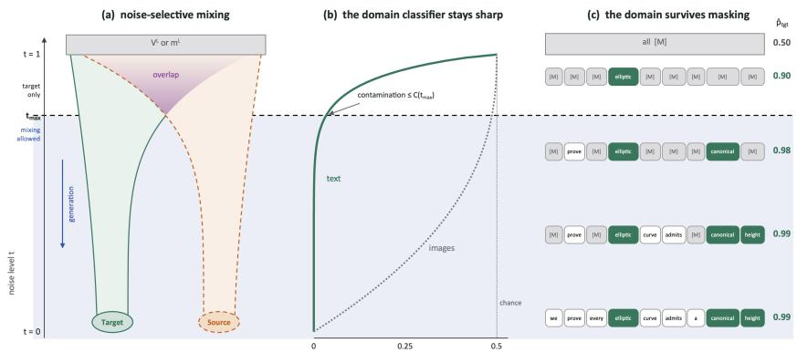  
Figure 1: Noise-selective mixing. (a) Noising widens the target (green) and source (orange) distributions until both reach the prior π at $t = 1$ . They overlap (purple) only at high noise, so RefineMix admits source data only below the cutoff $t _ { \mathrm { m a x } }$ (blue). (b) How well a classifier tells the domains apart, against the noise level: for text (solid), it stays sharp until almost every token is masked and for images under Gaussian noise (dotted), it goes blind early. (c) Why text stays separable: masked sequences at decreasing noise (top to bottom), with the classifier’s probability of the target. A single target-specific token (green) settles the domain, whereas shared tokens (white) add little.

In this paper, we rigorously study the problem of training discrete diffusion models in datachallenging regimes. Our central insight is that, contrary to continuous diffusion, in discrete diffusion for textual data, the noising mechanism is not an effective way to erase distribution shifts. Instead, two observations motivate our strategy. First, we observe that even under extreme token masking, different domains remain separable due to the existence of domain-specific tokens. Second, at low noise, different domains do not have any shared data distributional support, and hence, training on data from both domains does not hurt the denoising capabilities on the target domain. On the contrary, if the domains share some local structure, data-mixing at low noise can improve learning on the target domain without introducing sampling biases.

These insights lead to RefineMix, a simple framework for training discrete diffusion models in data-scarce domains by leveraging out-of-distribution data without biasing the sampling distribution. RefineMix uses data only from the target domain in the high-noise regime and data from both domains in the low-noise regime. Notably, unlike in continuous diffusion, where imperfect data can also be used at high noise (Daras et al., 2025b), in discrete diffusion the related data can only be used at low noise. We justify this design in two steps. First, we prove that sampling stays on target as long as a classifier can still tell the domains apart at the cutoff. Second, we characterize the best cutoff, which trades the structure that the domains share, and that the related data can therefore teach, against the bias it introduces.

Backing the theory with empirical results, we show that RefineMix matches or outperforms finetuning, data mixing, and conditional training on five domain pairs. We further use RefineMix to adapt pretrained diffusion language models of up to 7B parameters to scarce domains, outperforming fine-tuning approaches. Finally, we show that the method is not limited to text and we move our interest to modeling protein sequences. We use RefineMix to finetune a diffusion protein model to a family of 197 proteins and we nearly double the fraction of generated sequences that are new, fold, and belong to the family.

## 2 BACKGROUND

A diffusion model corrupts clean data with a forward process and learns to reverse it. In discrete diffusion (Austin et al., 2023), each token is a one-hot vector $\mathbf z \in \mathcal V$ over a vocabulary of size N.

We write $\operatorname { C a t } ( \cdot ; \mathbf { u } )$ for the categorical distribution with probability vector u in the simplex $\Delta ^ { N - 1 }$ whose vertices form V. The forward process mixes the clean token with a fixed prior $\pmb { \pi } \in \Delta ^ { N - 1 }$

$$
p ( \mathbf { z } _ { t } \mid \mathbf { z } _ { 0 } ) = \operatorname { C a t } \bigl ( \mathbf { z } _ { t } ; \alpha _ { t } \mathbf { z } _ { 0 } + \left( 1 - \alpha _ { t } \right) \pi \bigr ) ,\tag{1}
$$

where $\alpha _ { t }$ decreases from $\alpha _ { 0 } = 1$ to $\alpha _ { 1 } = 0 ,$ so that ${ \bf z } _ { 1 } \sim \mathrm { C a t } ( \pi )$ carries no information about z (Appendix D gives the underlying Markov chain). The masked kernel takes $\pi = \mathbf { m }$ , the onehot vector of a [MASK] token (Sahoo et al., 2024; Shi et al., 2025), and the uniform kernel takes $\pi = { \bf 1 } / N$ (Austin et al., 2023; Lou et al., 2024; Schiff et al., 2025; Sahoo et al., 2025a). A network ${ \bf x } _ { \theta } ( { \bf z } _ { t } ) ^ { \prime } \in \mathrm { ~ } \Delta ^ { N - 1 }$ predicts the clean token, and the reverse step plugs it into the posterior of the forward process, $p _ { \theta } ( \mathbf { z } _ { s } \mid \mathbf { z } _ { t } ) : = p ( \mathbf { z } _ { s } \mid \mathbf { z } _ { t } , \mathbf { z } _ { 0 } = \mathbf { x } _ { \theta } ( \mathbf { z } _ { t } ) )$ for $s < t .$ Training minimizes the negative ELBO (NELBO), a sum of per-step KL divergences over a grid of T steps $\bar { s } ( i ) < t ( i )$

$$
\mathcal { L } _ { \mathrm { d i f f u s i o n } } = \sum _ { i = 1 } ^ { T } \mathbb { E } \Big [ D _ { \mathrm { K L } } \big ( p ( \mathbf { z } _ { s ( i ) } \mid \mathbf { z } _ { t ( i ) } , \mathbf { z } _ { 0 } ) \big \Vert p _ { \theta } ( \mathbf { z } _ { s ( i ) } \mid \mathbf { z } _ { t ( i ) } ) \big ) \Big ] .\tag{2}
$$

Sequences. So far we have used the notation of tokens, but most categorical domains consist of sequences of tokens. A clean sequence $x _ { 0 } = [ \mathbf { z } _ { 0 } ^ { 1 } , \ldots , \mathbf { z } _ { 0 } ^ { L } ]$ is noised token by token, so $p ( x _ { t } \mid x _ { 0 } ) =$ $\textstyle \prod _ { \ell } p ( \mathbf { z } _ { t } ^ { \ell } \mid \mathbf { z } _ { 0 } ^ { \ell } )$ , and throughout, x denotes sequences and z tokens. The network sees the whole noised sequence and predicts every clean token, and the loss equation 2 is summed over positions.

Problem definition. We study the setting where we are given a few samples from a target domain and abundant samples from a source domain. Formally, we are given a small set of $N _ { T }$ samples from the desired target distribution $p$ and $N _ { S } \gg N _ { T }$ samples from a distinct source distribution q. Throughout, we use $\hat { p }$ and $\hat { q }$ to denote the empirical distributions. We use $\begin{array} { r } { p _ { t } ( x _ { t } ) = \sum _ { x _ { 0 } } p ( x _ { t } \mid } \end{array}$ $X _ { 0 } = x _ { 0 } ) p ( x _ { 0 } )$ to denote the noisy distribution of the target domain at diffusion time t and similarly $q _ { t } ( x _ { t } )$ for the source domain distribution at time t. To avoid notation clutter, we use $p ( x _ { t } )$ and $p _ { t } ( x _ { t } )$ interchangeably.

## 3 REFINEMIX METHOD AND THEORETICAL JUSTIFICATION

In this Section, we introduce our RefineMix algorithm, we develop intuition around it, and finally we provide a theoretical justification for the proposed method under certain distributional assumptions.

Setup and baseline algorithms. As discussed in the Introduction, training on the target data alone leads to poor performance due to overfitting. Merging both corpora and training on all the data avoids overfitting but biases the learned distribution, as the trained discrete diffusion can produce source text as readily as target text. The other standard option, pre-training on everything and then finetuning on the target-only data, achieves a middle ground between overfitting and biased sampling that is in practice controlled by carefully tuning several hyperparameters such as the learning rate and the duration of the finetuning.

## 3.1 THE REFINEMIX ALGORITHM

RefineMix improves over these baselines by deciding, at each noise level, whether to mix the training data. Recall that a standard training step of discrete diffusion picks a clean sequence, noises it to a random level $t ,$ and trains the network to denoise it with the loss equation 2. RefineMix deviates from this implementation by changing the pool of sentences that we can sample from based on t. Below a cutoff $t _ { \mathrm { m a x } } .$ , the sequence comes from the source with probability λ and from the target otherwise, and above it, only from the target. Algorithm 1 defines the whole method. We remark that the schedule, the loss, the network, and the sampler remain as in regular discrete diffusion training.

Building intuition I: why mixing at high-noise levels hurts. To build some intuition for the algorithm, it is useful to think of how the model behaves at inference time. During generation, the time flows backwards: from pure noise down to clean text. If two domains have different vocabularies (e.g. domain specific tokens), the appearance of a single such token during the early inference steps fully controls the domain at which the rest of the generation will arrive. Hence, RefineMix trains at high noise using only the target domain data to ensure that only the target domain will be generated.

Algorithm 1 RefineMix training step   
Require: target samples $\hat { p } ,$ source samples ${ \hat { q } } ,$ cutoff $t _ { \mathrm { m a x } } ,$ source rate λ, denoiser $\mathbf { x } _ { \theta }$   
1: draw $t \sim \mathcal { U } ( 0 , 1 )$   
2: draw $x _ { 0 } \sim \lambda \hat { q } + ( 1 - \lambda ) \hat { p } \operatorname { i f } t \leq t _ { \operatorname* { m a x } } ,$ else $x _ { 0 } \sim \hat { p }$   
3: noise $x _ { 0 } \ \mathrm { t o } \ x _ { t } \sim p ( x _ { t } \mid x _ { 0 } )$   
4: take a gradient step on the loss equation $2$ at level t

Building intuition II: why mixing at low-noise levels helps. After a certain diffusion time, which we call $t _ { \mathrm { m a x } } ,$ with high probability a target-specific token has appeared and hence there is no risk of drifting from the target domain. Hence, for the remaining steps, using a model trained on data from both domains is harmless. If anything, if the two domains share any local or latent structure, weight sharing enables synergistic learning in such times. Figure 1b,c visualizes this analysis.

Building intuition III: discrete vs continuous diffusion. It is useful to contrast what happens in discrete diffusion over text with continuous diffusion over images, where ambient diffusion uses noisy data only at high noise, with a modified loss (Daras et al., 2024). If the image distributions differ in their high frequencies, due to the spectral power law of natural images, Gaussian noise will quickly erase their differences so at high noise the two distributions become indistinguishable (Daras et al., 2025b). Masking and scrambling do not erase the domain of a text because a single domainspecific token can give away the origin of the sentence. The rest of this section makes the intuition precise. Theorem 1 determines what mixing costs in sampling, and Section 3.4 shows what it costs in likelihood and what it can gain.

## 3.2 THEORETICAL JUSTIFICATION

We now make this intuition precise by separating the effect of mixing into what it can cost and gain.

What mixing can cost. The main risk of mixing is that the model samples from the wrong domain. Given a noised sequence, the mixed denoiser must implicitly decide whether it is completing a source or a target sequence, so the cost of mixing reduces to a binary classification problem. We analyze this problem for the population distributions and determine the probability of generating a source sequence (Theorem 1). This result identifies which cutoffs are safe during inference.

What mixing can gain. At the population level, mixing cannot help: the target denoiser is already exact, since it is learned from infinitely many target samples. Any benefit must therefore come from finite data. We thus work with the empirical distributions and compare a model trained on the $N _ { T }$ target samples alone with one that also uses the $N _ { S }$ source samples. Assuming that the source can teach what the domains share, Theorem 4 derives what this help is worth and what it costs.

Setup. To analyze Algorithm 1, we rewrite it in the notation of Section 2. Below the cutoff, the algorithm draws a source sequence with probability λ and a target sequence otherwise, so it trains on the mixture $m ( x _ { 0 } ) = \lambda q ( \bar { x } _ { 0 } ) + ( 1 - \bar { \lambda ) } p ( x _ { 0 } )$ . Because both domains share the forward process, the noised mixture is $n ( x _ { t } ) = \lambda q ( x _ { t } ) + ( 1 - \lambda ) p ( x _ { t } )$ , and Bayes’ rule gives the mixed denoiser $m ( x _ { 0 } \mid x _ { t } ) = p ( x _ { t } \mid x _ { 0 } ) { \ ' } m ( x _ { 0 } ) / { \ ' } m ( x _ { t } )$ . The denoiser of RefineMix is therefore

$$
p _ { \mathrm { R e f i n e M i x } } ( x _ { 0 } \mid x _ { t } ) = { \left\{ { m ( x _ { 0 } \mid x _ { t } ) , \quad t \leq t _ { \operatorname* { m a x } } , } \right. }\tag{3}
$$

Finally, we assume that the two domains are distinct, meaning that no sequence can come from both: $p ( x _ { 0 } ) q ( x _ { 0 } ) = 0$ for every $x _ { 0 }$ . Since $p$ and $q$ are population distributions, this describes an ideal model; the trained network approximates it.

## 3.3 WHAT MIXING CAN COST

With the denoiser of RefineMix written down, we can ask what mixing costs. We now determine how often RefineMix generates a sample from the wrong domain. The result rests on one observation: to complete a noised sequence, the mixed denoiser must first infer which domain the sequence came from. We make this precise with a classifier that makes this inference and two facts about it. First, the mixed denoiser follows the classifier. Second, the domains are distinct and only the target denoiser acts above the cutoff, so the mixed denoiser always starts from a noised target sequence. Together, these facts imply that the cost of mixing equals how often the classifier mistakes such a sequence for a source sequence (Theorem 1).

Classifier. Since the mixed denoiser must infer the domain, we define a classifier $c ( x _ { t } ) \mathrm { . }$ : given a noised sequence $x _ { t }$ from either domain, it predicts which domain the sequence came from. We label the source $y = 1$ and the target $y = 0$ , so that under the mixture m the label has prior $\mathbb { P } ( y = 1 ) = \lambda$ By Bayes’ rule, the probability that $x _ { t }$ came from the source is:

$$
c ( x _ { t } ) : = \mathbb { P } ( y = 1 \mid x _ { t } ) = { \frac { \mathbb { P } ( x _ { t } \mid y = 1 ) \mathbb { P } ( y = 1 ) } { \mathbb { P } ( x _ { t } ) } } = { \frac { \lambda q ( x _ { t } ) } { m ( x _ { t } ) } } .\tag{4}
$$

Fact 1: the mixed denoiser follows the classifier. With the classifier defined, we can split up the mixed denoiser. By applying Bayes’ rule, the mixed denoiser is:

$$
m ( x _ { 0 } \mid x _ { t } ) = c ( x _ { t } ) q ( x _ { 0 } \mid x _ { t } ) + { \bigl ( } 1 - c ( x _ { t } ) { \bigr ) } p ( x _ { 0 } \mid x _ { t } ) .\tag{5}
$$

In effect, the mixed denoiser first classifies a noised sequence and then denoises it as a source sequence with probability $c ( x _ { t } )$ and as a target sequence with probability $1 - c ( x _ { t } )$ . What remains is what it outputs on a target sequence, and which sequences it receives.

Fact 2: distinct domains and a target-only start. Fact 1 tells us how the mixed denoiser completes any sequence. To turn it into the probability of generating source text, we need two more things: what it outputs and what it receives. First, the mixed denoiser outputs a source sequence with probability exactly $c ( x _ { t } )$ . This follows from equation 5, because the domains are distinct, $p ( x _ { 0 } ) q ( x _ { 0 } ) = 0$ , so only the source denoiser can produce a source sequence. Second, the mixed denoiser always receives a noised target sequence, $x _ { t _ { \mathrm { m a x } } } \sim p ( x _ { t _ { \mathrm { m a x } } } )$ , because only the target denoiser acts above the cutoff. Together, RefineMix generates a source sequence with probability $\mathbb { E } _ { x \sim p ( x _ { t _ { \operatorname* { m a x } } } ) } [ c ( x ) ]$ ], which Theorem 1 expresses through the overlap C.

Theorem 1 (RefineMix generates domain-pure sequences). Let the domains be distinct, $p ( x _ { 0 } ) q ( x _ { 0 } ) = 0$ for every $x _ { 0 } ,$ let $A = \{ x _ { 0 } : q ( x _ { 0 } ) > 0 \}$ be the set of source sequences, and let RefineMix use the denoiser equation 3. Define the overlap

$$
C ( t ) : = \mathbb { E } _ { x \sim q ( x _ { t } ) } \big [ 1 - c ( x ) \big ] ,\tag{6}
$$

the average probability that the classifier assigns to the target when shown a noised source sequence. Then, under either kernel, masked or uniform, the sequence $\scriptstyle { \hat { x } } _ { 0 }$ that RefineMix generates from pure noise is a source sequence with probability

$$
\mathbb { P } ( \hat { x } _ { 0 } \in A ) = \frac { \lambda } { 1 - \lambda } C ( t _ { \operatorname* { m a x } } ) \le \frac { \lambda } { 1 - \lambda } C ( t ^ { \prime } ) ~ f o r e \nu e r y t ^ { \prime } \ge t _ { \operatorname* { m a x } } .\tag{7}
$$

Reading the theorem. The theorem reduces the cost of mixing to a single quantity, the overlap, and to know which cutoffs are safe, we need to know how it grows with noise. The overlap $C ( t )$ measures how often the classifier mistakes a noised source sequence for a target one. In Figure 1a, it is the purple overlap of the two noised domains. Since noising only removes evidence and never adds it, this overlap only grows with t (Lemma 5). Hence, any level $t ^ { \bar { \prime } } \geq t _ { \operatorname* { m a x } }$ also bounds the cost. In one sentence: as long as the classifier can still tell the domains apart at the cutoff, RefineMix rarely generates samples from the wrong domain. For text, the classifier stays sharp until almost every token is masked (Intuition III), which leaves a large range of safe cutoffs. Figure 6 shows this in practice: a trained classifier, which can only be less accurate than the optimal one, separates the domains almost up to $t = 1$ . The theorem tells us which cutoffs are safe, but not which one is best.

## 3.4 WHAT MIXING CAN GAIN

In this section, we show what the benefit of mixing is for the estimated denoiser, compared to training on the target data alone. Since the target denoiser is already exact at the population level, we move to the empirical setting, where the denoiser is learned from finite data. For the source to help, the two domains must share something. Since the domains are distinct, no sequence of one domain occurs in the other, so what they share cannot be the sequences themselves. To make this precise, we let each sequence be generated from a latent variable and assume that the step from content to sequence, which we call the realization, is shared across domains. In text, for example, this means that both domains follow the same rules of syntax, agreement, and subword spelling. We further assume that, for learning the shared factor, a source sequence is as informative as a target sequence. From these two assumptions, we derive what the source is worth and what it costs: the gain it brings below the cutoff is traded against a price that is paid once, at the cutoff (Theorem 4).

Latent content. To make precise what the domains share, we let each sequence arise in two steps: a domain first picks a content $v ,$ and a realization $r ( x _ { 0 } \mid v )$ , which is shared across the domains.

Assumption 2 (Shared realization). Each clean sequence $x _ { 0 }$ determines its content $v ,$ that $i s ,$ what the text is about, and both domains realize content in tokens in the same way: $p ( x _ { 0 } ) =$ $\textstyle \sum _ { v } p ( v ) r ( x _ { 0 } \mid v )$ and $\begin{array} { r } { q ( x _ { 0 } ) = \sum _ { v } q ( v ) r ( x _ { 0 } \mid v ) } \end{array}$

Hence the domains differ only in the content they use, and since they are distinct, $p ( v )$ and $q ( v )$ have disjoint supports. Next, we show how this split appears in the denoiser.

The denoiser splits. To see which part of the denoiser the source can improve, we apply the latent content to it. The noised realization $r ( x _ { t } \mid v )$ is also shared between the domains, because the forward process is shared. By Bayes’ rule, the denoiser splits into two factors,

$$
p ( x _ { 0 } \mid x _ { t } ) = \sum _ { v } { \underbrace { p ( v \mid x _ { t } ) } _ { \mathrm { s p e c i f i c } } } \underbrace { r ( x _ { 0 } \mid x _ { t } , v ) } _ { \mathrm { s h a r e d } } ,\tag{8}
$$

The same holds for $q$ and $m$ . The two factors decide the prediction at different noise levels. The first, specific factor $p ( v \mid x _ { t } )$ infers the content from the noised sequence, and it dominates at high noise, because there almost nothing is visible, $p ( v \mid x _ { t } )  p ( v )$ as $t \to 1$ , and the model has to fall back on the content distribution of the domain. The second, shared factor $r ( x _ { 0 } \mid x _ { t } , v )$ writes out the clean sequence given the content, and it is all that matters at low noise, because there the visible tokens already reveal the content, $p ( v \mid x _ { t } )  \delta _ { v ( x _ { 0 } ) }$ as $t  0 ,$ , and the model only has to fill in the missing tokens. Since this factor is the same for both domains, the source can help to learn it.

What each model learns. We have now seen at which noise level each factor decides the prediction, and we turn to how each factor is learned. By the chain rule of the KL divergence (Appendix E.2), the error of a trained denoiser splits into the error of the specific factor and the error of the shared factor. The specific factor can only be learned from the $\hat { N _ { T } }$ target samples. In contrast, the shared factor is the same for both domains, so below the cutoff it is learned from both corpora. We therefore assume that the shared factor learned from the source carries over to the target.

Assumption 3 (Rate and transfer). Let the shared factor be learned from N samples, where source and target samples count equally. Then its error at level t satisfies $\dot { e _ { N } } ( t ) = e ( t ) \dot { / } N + o ( 1 / N )$ for a nonnegative, integrable error per sample $e ,$ where

$$
\begin{array} { r } { \begin{array} { r } { e _ { N } ( t ) : = \mathbb { E } \mathbb { E } _ { x _ { t } \sim p ( x _ { t } ) } \mathbb { E } _ { v \sim p ( v \mid x _ { t } ) } D _ { \mathrm { K L } } \big ( r ( \cdot \mid x _ { t } , v ) \big \| \hat { r } _ { N } \big ( \cdot \mid x _ { t } , v \big ) \big ) . } \end{array} } \end{array}
$$

Assumption 3 lets source and target samples count equally. Since Algorithm 1 uses both domains below the cutoff, we need to know how many equally weighted samples it learns the shared factor from. Weighting each target sample by $( 1 - \dot { \lambda } ) / \dot { N } _ { T }$ and each source sample by $\lambda / N _ { S }$ , the effective sample size of Kish (1965) gives $N _ { \mathrm { e f f } } : = \left\lceil ( 1 - \lambda ) ^ { 2 } / N _ { T } + \lambda ^ { 2 } / N _ { S } \right\rceil ^ { - 1 }$ , which equals $N _ { T } + N _ { S }$ for $\lambda = \rho : = N _ { S } / ( N _ { T } + N _ { S } )$

Having seen where the source helps, we now compare the two trained models, target-only training and RefineMix. For this, we need a measure of how good a model is, the gain, and the price of mixing; as the measure, we use the NELBO on the target. Writing $\ell _ { \theta } ( x _ { 0 } , t )$ for the level-t term of the loss equation $^ { 2 , }$ and $\widehat { \theta } _ { 0 }$ and $\widehat { \theta } _ { t _ { \mathrm { m a x } } }$ for the models trained by Algorithm 1 at cutoff 0 (target only) and at cutoff $t _ { \mathrm { m a x } }$ (RefineMix), the target NELBO and the gain are

$$
L _ { p } ( \theta ) : = \int _ { 0 } ^ { 1 } \mathbb { E } _ { x _ { 0 } \sim p } \ell _ { \theta } ( x _ { 0 } , t ) d t , \qquad \Delta ( t _ { \mathrm { m a x } } ) : = \mathbb { E } \big [ L _ { p } ( \hat { \theta } _ { 0 } ) \big ] - \mathbb { E } \big [ L _ { p } ( \hat { \theta } _ { t _ { \mathrm { m a x } } } ) \big ] ,\tag{9}
$$

where the expectation is over the training samples, so that $\Delta > 0$ exactly when RefineMix beats target-only training. The price is given by $B ( \bar { t } _ { \mathrm { { m a x } } } ) : = \mathbb { E } _ { x \sim p ( x _ { t _ { \mathrm { m a x } } } ) } \big [ D _ { \mathrm { K L } } \big ( p ( v \mid x ) \| m ( v \mid x ) \big ) \big ]$ the bias that the source introduces into the specific factor; it is governed by the same classifier as Theorem 1 (Appendix E.2). With the gain and the price defined, we can state how the two trade off.

<table><tr><td>Pair (src → tgt)</td><td>Tgt. tokens</td><td></td><td>Fine-tune Data Mixing Conditional</td><td></td><td>RefineMix  $\left( { { t _ { \operatorname* { m a x } } } } \right)$ </td></tr><tr><td>Math → Stat</td><td>12.96M</td><td> $1 9 . 9 2 \pm 0 . 0 1$ </td><td> $1 9 . 6 1 \pm 0 . 0 1$ </td><td> $1 9 . 1 0 \pm 0 . 0 0$ </td><td> ${ \bf 1 8 . 2 9 \pm 0 . 0 1 }$  (0.7)</td></tr><tr><td>Physics → Hep-Ex</td><td>4.71M</td><td> $7 . 4 9 \pm 0 . 0 2$ </td><td> $7 . 1 7 \pm 0 . 0 1$ </td><td> $7 . 0 9 \pm 0 . 0 1$ </td><td> ${ \bf 6 . 7 1 \pm 0 . 0 2 }$  (0.8)</td></tr><tr><td>cc_news → Hep-Ex</td><td>4.71M</td><td> $8 . 0 4 \pm 0 . 0 5$ </td><td> $8 . 0 5 \pm 0 . 0 1$ </td><td> $1 1 . 2 8 \pm 0 . 0 1$ </td><td> ${ \bf 7 . 3 9 \pm 0 . 0 1 }$  (0.8)</td></tr><tr><td>cc_news → Textiles</td><td>1.17M</td><td> $2 0 . 4 0 \pm 0 . 0 4$ </td><td> $1 9 . 7 3 \pm 0 . 1 2$ </td><td> $3 0 . 1 2 \pm 1 . 1 9$ </td><td> ${ \bf 1 9 . 7 0 \pm 0 . 0 6 }$  (0.9)</td></tr><tr><td>Patents-G → AG News</td><td>5.67M</td><td> $2 8 . 0 2 \pm 0 . 1 5$ </td><td> $3 1 . 5 5 \pm 0 . 1 6$ </td><td> $2 9 . 5 5 \pm 0 . 0 4$ </td><td> ${ \bf 2 7 . 4 7 \pm 0 . 0 2 \ ( 0 . 2 ) }$ </td></tr></table>

Table 1: RefineMix beats the baselines when adapting a source-pretrained model. Target validation perplexity (lower is better) after a source checkpoint (masked kernel, three seeds). Fine-tuning uses the target data alone, data mixing adds the source at every noise level, the conditional model adds it with a domain label, and RefineMix adds it only below $t _ { \mathrm { m a x } }$

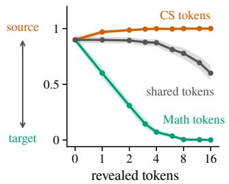  
(a) Few tokens settle the domain.

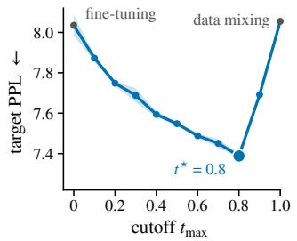

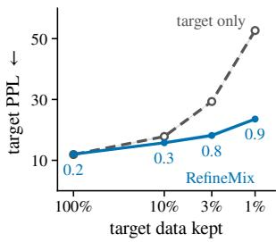  
(b) Best cutoff lies in between.  
(c) Scarcer target, larger gain.  
Figure 2: Testing the theory (masked kernel, three seeds). (a) CS → Math. A fully mixed model completes a noised sequence with n revealed tokens from CS, Math, or both. (b) cc\_news → Hep-Ex, from the source checkpoint. Target validation perplexity against the cutoff, whose endpoints are fine-tuning and data mixing. (c) CS → Math, from scratch. Target validation perplexity against the fraction of the target corpus kept, for target-only training and RefineMix at its best cutoff.

Theorem 4 (Shared realization learned against price paid). Let the domains be distinct, let Assumptions 2 and 3 hold, and use either kernel. Then

$$
\Delta ( t _ { \mathrm { m a x } } ) = \underbrace { \bigg ( \frac { 1 } { N _ { T } } - \frac { 1 } { N _ { \mathrm { e f f } } } \bigg ) \int _ { 0 } ^ { t _ { \mathrm { m a x } } } e ( t ) d t } _ { g a i n } - \underbrace { B ( t _ { \mathrm { m a x } } ) } _ { p r i c e } + h . o . ,\tag{10}
$$

where h.o. collects terms ofhigher order in $1 / N _ { T }$ . Moreover, the best cutofft⋆, the largest maximizer of the leading terms, is nonincreasing in $N _ { T }$

Reading the theorem. The theorem states under the assumptions that the gain of RefineMix is a trade-off between the shared realization that is learned from the source and the bias that the source introduces into the content. The two terms depend on the cutoff in opposite ways. The first term accrues at every admitted level and scales with $\bar { 1 } / N _ { T } - 1 / N _ { \mathrm { e f f } }$ , which measures how badly the target needs the source. ${ \mathrm { S o } } ,$ it is large when $N _ { T }$ is small. In contrast, the bias stays small while the visible tokens still reveal the content, and it grows only at high noise, where the content becomes hard to infer. Hence the best cutoff sits where the two meet, and it moves in two ways. It rises as the target corpus shrinks. We also expect it to fall for domains that share fewer writing rules.

Reading the best cutoff from two models. The theorem tells us how the best cutoff moves: it rises as the target shrinks, and falls when the domains share fewer rules. It does not tell us where the best cutoff is, because e(t) cannot be measured directly. However, we can read the trade-off directly from two models: the fully pooled model and the target-only model. On held-out target text, we compare their level-t losses through the loss gap $g ( t ) : = \mathsf { \bar { \ell } } _ { m } ( t ) - \mathsf { \bar { \ell } } _ { p } ( t )$ . Where $g < 0 .$ , the source teaches more than it costs, and where $g > 0 ,$ , the price has taken over. If each noise level were learned separately, then $\begin{array} { r } { \Delta ( t _ { \mathrm { m a x } } ) = - \int _ { 0 } ^ { t _ { \mathrm { m a x } } } g ( t ) d t } \end{array}$ , and the best cutoff would be the level at which $g$ turns positive. In our experiments, the loss gap indeed points to a good cutoff, but it requires training the pooled model to convergence. Alternatively, one can find the cutoff by sweeping over several values.

<table><tr><td>Model</td><td>Target</td><td>Fine-tuning</td><td>Data mixing</td><td>LoRA</td><td>RefineMix  $( t _ { \operatorname* { m a x } } )$ </td></tr><tr><td rowspan="3">MDLM 130M (Sahoo et al., 2024)</td><td>Lean/mathlib</td><td> $3 . 2 8 9 { \scriptstyle \pm 0 . 0 1 0 }$ </td><td>3.439</td><td> $3 . 7 7 5 { \scriptstyle \pm 0 . 0 0 7 }$ </td><td> $3 . 2 3 4 { \scriptstyle \pm 0 . 0 0 3 \ ( 0 . 2 ) }$ </td></tr><tr><td>Rare disease</td><td> $1 5 . 7 0 3 { \scriptstyle \pm 0 . 0 3 3 }$ </td><td>15.770</td><td> $1 8 . 8 5 9 { \scriptstyle \pm 0 . 1 1 7 }$ </td><td> $1 4 . 9 3 3 { \scriptstyle \pm 0 . 0 1 6 \ ( 0 . 4 ) }$ </td></tr><tr><td>ChemRxiv</td><td> $1 8 . 7 3 9 { \scriptstyle \pm 0 . 0 0 2 }$ </td><td>20.260</td><td> $2 5 . 2 4 8 { \scriptstyle \pm 0 . 1 6 4 }$ </td><td> ${ \bf 1 8 . 0 4 8 { \scriptstyle \pm 0 . 0 1 7 } } \left( 0 . 4 \right)$ </td></tr><tr><td rowspan="3">SEDD 424M (Lou et al., 2024)</td><td>Lean/mathlib</td><td> $3 . 0 2 7 { \scriptstyle \pm 0 . 0 0 4 }$ </td><td>3.147</td><td> $3 . 3 1 4 { \scriptstyle \pm 0 . 0 1 3 }$ </td><td> $\mathbf { 2 . 9 8 7 { \scriptstyle \pm 0 . 0 0 5 } }$  (0.3)</td></tr><tr><td>Rare disease</td><td> $1 4 . 0 7 2 { \scriptstyle \pm 0 . 0 0 2 }$ </td><td>13.720</td><td> $1 5 . 4 7 3 { \scriptstyle \pm 0 . 0 0 9 }$ </td><td> ${ \bf 1 3 . 2 7 5 { \scriptstyle \pm 0 . 0 5 5 } }$  (0.5)</td></tr><tr><td>ChemRxiv</td><td> $1 6 . 5 8 8 { \scriptstyle \pm 0 . 0 3 1 }$ </td><td>17.340</td><td> $1 9 . 6 5 9 { \scriptstyle \pm 0 . 1 2 6 }$ </td><td> $\mathbf { 1 5 . 9 1 5 } { \scriptstyle \pm 0 . 0 5 5 }$  (0.4)</td></tr><tr><td rowspan="3">SMDM 1.1B (Nie et al., 2025)</td><td>Lean/mathlib</td><td> $2 . 9 9 1 { \scriptstyle \pm 0 . 0 1 6 }$ </td><td>2.941</td><td> $3 . 1 8 0 { \scriptstyle \pm 0 . 0 1 4 }$ </td><td> ${ \bf 2 . 9 4 1 { \pm } 0 . 0 0 7 \ ( 0 . 7 ) }$ </td></tr><tr><td>Rare disease</td><td> $8 . 4 8 8 { \scriptstyle \pm 0 . 0 0 9 }$ </td><td>8.808</td><td> $8 . 6 2 9 { \scriptstyle \pm 0 . 0 3 1 }$ </td><td> ${ \bf 8 . 2 5 0 } \pm 0 . 0 2 8 \ ( 0 . 6 )$ </td></tr><tr><td>ChemRxiv</td><td> $1 1 . 0 2 2 { \scriptstyle \pm 0 . 0 2 9 }$ </td><td>11.570</td><td> $1 1 . 5 4 1 { \scriptstyle \pm 0 . 0 0 4 }$ </td><td> ${ \bf 1 0 . 6 4 9 { \scriptstyle \pm 0 . 0 1 9 } } \left( 0 . 5 \right)$ </td></tr><tr><td rowspan="3">DiffuLLaMA 7B* (Gong et al., 2025)</td><td>Lean/mathlib</td><td> $2 . 9 7 0 { \scriptstyle \pm 0 . 0 1 3 }$ </td><td>3.512</td><td></td><td> $2 . 9 4 0 { \scriptstyle \pm 0 . 0 0 7 \ ( 0 . 4 ) }$ </td></tr><tr><td>Rare disease</td><td> $8 . 5 1 3 { \scriptstyle \pm 0 . 0 2 4 }$ </td><td>9.203</td><td></td><td> ${ \bf 8 . 2 8 7 \pm 0 . 0 1 2 \ ( 0 . 5 ) }$ </td></tr><tr><td>ChemRxiv</td><td> $1 0 . 6 6 1 { \scriptstyle \pm 0 . 0 0 2 }$ </td><td>12.730</td><td></td><td> ${ \bf 1 0 . 4 7 1 { \scriptstyle \pm 0 . 0 0 1 \ ( 0 . 4 ) } }$ </td></tr></table>

Table 2: RefineMix adapts pretrained diffusion language models to scarce domains. Target validation perplexity (lower is better). LoRA (rank 16) fine-tunes on the target alone. Mean ± std. over three seeds (data mixing: one). ∗DiffuLLaMA uses LoRA (rank 64) in every column.

<table><tr><td></td><td>Family</td><td>Folds</td><td></td><td>Novel | All three</td></tr><tr><td>Real peroxiredoxins (ceiling)</td><td> $9 4 . 0 { \pm } 0 . 8 $ </td><td> $9 8 . 2 { \pm } 0 . 9 $ </td><td> $7 8 . 1 \pm 6 . 8$ </td><td> $7 5 . 1 \pm 5 . 7$ </td></tr><tr><td>Fine-tuning</td><td> $5 1 . 8 { \pm } 5 . 0 $ </td><td> $3 7 . 5 { \pm } 4 . 6 $ </td><td> $9 9 . 0 { \pm } 0 . 3 $ </td><td> $3 5 . 8 { \pm } 4 . 6 $ </td></tr><tr><td>Data mixing</td><td> $3 6 . 2 \pm 2 . 2$ </td><td> $3 5 . 7 \pm 2 . 2$ </td><td> $9 8 . 7 \pm 0 . 2 $ </td><td> $3 2 . 9 { \pm } 2 . 2 $ </td></tr><tr><td>RefineMix  $( { t _ { \operatorname* { m a x } } } = 0 . 7 )$ </td><td> $7 9 . 8 { \pm } 2 . 4 $ </td><td> $7 4 . 3 { \pm } 2 . 9$ </td><td> $8 9 . 8 { \pm } 1 . 8 $ </td><td> ${ \bf 6 3 . 3 \pm 2 . 0 }$ </td></tr><tr><td>Generic UniRef50 (floor)</td><td>0.0</td><td>65.1</td><td>100.0</td><td>0.0</td></tr></table>

Table 3: RefineMix writes new, folding members of a protein family from 197 examples. Percentage of sequences generated by DPLM-650M that pass each test of Section 4; All three counts sequences that pass all tests at once. Real held-out peroxiredoxins and generic proteins mark the ceiling and the floor. Mean ± standard deviation over three train–test splits, each with three seeds.

## 4 EXPERIMENTS

In the previous section, we introduced our algorithm RefineMix. It only changes which data the model sees at each noise level, so it can be implemented as a data loader. Hence it works on top of any architecture, at any stage of training, and with either kernel, masked or uniform. In this section, we show that RefineMix works in practice and test the predictions of the theory. First, we compare RefineMix to the standard baselines across domain pairs. Second, we run ablations in controlled settings: we show how much revealed target content keeps sampling on target (Theorem 1), and how performance changes over the cutoff and the target size (Theorem 4). Third, we adapt publicly available diffusion language models to new domains. Finally, we adapt a pretrained protein diffusion model to generate a specific protein family from only a few examples.

Experiment Set up. For the first part of the experiments, the comparison to the baselines and the ablations, we use source–target pairs from arXiv abstracts (arXiv.org submitters, 2024), CC-News (Hamborg et al., 2017), BIGPATENT (Sharma et al., 2019), and AG News (Zhang et al., 2015). Every run uses the same 139M-parameter DiT denoiser, trained identically. We evaluate the models by their target validation perplexity, because it is the quantity that the gain ∆ measures (Theorem 4). Since a mixed model can reach a high likelihood on the target domain and still write source text, we add two more metrics in Appendix B.3. There we report the generation frontier, the generative perplexity of the samples against their diversity over a sweep of sampling temperatures, and the fraction of generated samples that belong to the target domain. We report three seeds per setting, we choose the cutoff sweep start with the loss gap g(t) of Section 3.4, and set $\lambda = 0 . 9$

Comparison to baselines. With the data and the model set up, we turn to the setting that is common in practice: a model is pretrained on the source, and one wants to fine-tune it on a smaller target corpus. We show that RefineMix beats this recipe, as well as the other standard baselines. For each pair and seed, we start from the same source-pretrained checkpoint and train a second stage in four ways: on the target data alone (fine-tuning), on both corpora at every noise level (data mixing), on both corpora with a domain label (conditional), and with RefineMix.

Table 1 shows that RefineMix reaches the lowest or equal target perplexity on every pair. The best cutoff varies with the distance between the domains: it lies between 0.7 and 0.9 for close pairs and drops to 0.2 for Patents- ${ \mathbf { } } G \to { \mathbf { A } } G$ News. RefineMix beats fine-tuning because fine-tuning on the small target corpus overwrites what pretraining learned, whereas RefineMix keeps this knowledge below the cutoff (Figure 8). Finally, Appendix B.3 shows that the samples of RefineMix stay on target and reach a better generation frontier than fine-tuning.

Ablations. The comparison shows that RefineMix works, and we now test the theory with one experiment per prediction. First, a few revealed target tokens should keep sampling on target (Theorem 1). To test this, we take a fully mixed model $( \bar { t } _ { \operatorname* { m a x } } = 1 )$ on CS → Math with 1% of the target, and reveal n tokens of a noised sequence before sampling starts. With nothing revealed, the model writes source text at its training rate λ, whereas about four revealed target tokens turn it to the target domain, and shared tokens change nothing (Figure 2a; Appendix F tests the theorem). Second, admitting the source at more noise levels helps, because the model learns more of what the domain share, and hurts, because the source pulls the model toward its own domain (Theorem 4). The harm grows only at high noise and eventually outgrows the help, the best cutoff lies between fine-tuning and data mixing. The perplexity is indeed lowest at $t ^ { \star } = 0 . 8$ , and every cutoff beats both fine-tuning $( { t _ { \operatorname* { m a x } } } = 0 )$ and data mixing $( t _ { \operatorname* { m a x } } = 1 )$ (Figure 2b). Third, the help from the source should matter more when the target is small (Theorem 4). On CS → Math, as we shrink the target from 100% to 1%, RefineMix goes from a small improvement to more than halving the target-only perplexity (Figure 2c). Appendix B.1 repeats these experiments under the uniform kernel (Figure 3).

Adapting pretrained models. The experiments above confirm the theory in controlled settings with our own 139M model. In practice, however, one rarely trains a base model and instead adapts a publicly available one to a desired domain. We therefore adapt four pretrained diffusion language models, from 130M to 7B parameters, to three scarce targets, using fractions of their publicly available pretraining corpora as the source. Since RefineMix only changes the data loader, it applies to every model unchanged, and it beats fine-tuning in all twelve settings (Table 2), whereas LoRA, which trains fewer parameters, does worse than full fine-tuning, consistent with the observation that LoRA is suboptimal for diffusion language models (Wang et al., 2026). Appendix C compares the generation frontiers of RefineMix and the baselines.

Proteins. So far, all our data domains were text. The same data scarcity problem arises for proteins. Imagine for example, trying to model a certain family of proteins with a limited number of known protein members. To study this problem, we test whether RefineMix can be used to finetune the large pretrained protein model DPLM-650M (Wang et al., 2024) to produce new members of peroxiredoxins, a family of antioxidant enzymes. UniProt lists 83,921 peroxiredoxins, but only 274 of them are curated by hand (The UniProt Consortium, 2023), and after removing duplicates, 237 remain, so the scarcity here is real rather than simulated. We use 197 of them as the target and generic UniRef50 proteins as the source, from which we remove every peroxiredoxin cluster. We split by sequence cluster, so that no test sequence is identical to a training sequence, which would otherwise reward memorization. After training, we generate 256 sequences with the checkpoint of lowest validation perplexity. A generated sequence counts only if it passes three tests at once: it belongs to the family (HMMER (Eddy, 2011) matches it to a Pfam profile of peroxiredoxins (Mistry et al., 2021)), it folds (ESMFold pLDDT > 70 (Lin et al., 2023)), and it is new (below 90% identity to every training sequence). RefineMix produces roughly two times as many such sequences as fine-tuning, which overfits quickly on such a small dataset (Table 3). Data mixing, in contrast, fails already in the Family column: by Theorem 1, its samples come from the source at rate λ, and since we removed every peroxiredoxin cluster from the source, these samples cannot pass the family test.

Conclusion Discrete noise, unlike Gaussian noise on images, does not erase the domain of a text. Therefore, out-of-domain data belongs only at low noise, whereas continuous diffusion can also use imperfect data at high noise. We therefore introduced RefineMix, which admits source data only below a cutoff. The method only changes the data loader, so it works on any architecture, at any stage of training, and with either kernel. Our theory shows why sampling stays in the target domain as long as a classifier can still tell the domains apart at the cutoff, and that the best cutoff balances what the source teaches against the bias it introduces at high noise. Across domain pairs, RefineMix beats data mixing, conditional training, LoRA, and full fine-tuning, and it also improves pretrained models from 130M to 7B parameters and a protein family. Its main limitations are that the cutoff must still be chosen, by a sweep or from two trained models, and that our theory describes an ideal model rather than the trained network. This leaves room for future work: a cheap diagnostic that predicts the cutoff before training, and for cutoffs chosen per sample rather than one for the whole corpus.

## AI USE STATEMENT

In this work, we used generative AI tools for assistance with paper writing, editing figures, developing the mathematical theorems and proofs, implementing parts of the method and conducting the experiments. We have not used generative AI tools for conceptualization of the project, results interpretation and developing the structure and the narrative of the paper. We have reviewed all AIassisted work. In particular, we reviewed the code, the proofs, all the paper edits and parsing of the results of the experiments. The authors fully understand and take ownership of all the materials presented in this work. We take responsibility for the final content of this work, including text, claims or artifacts produced with the aid of generative AI.

## REFERENCES

Asad Aali, Marius Arvinte, Sidharth Kumar, and Jonathan I. Tamir. Solving inverse problems with score-based generative priors learned from noisy data. In 2023 57th Asilomar Conference on Signals, Systems, and Computers, pp. 837–843. IEEE, October 2023. doi: 10.1109/ieeeconf59524.2023.10477042. URL http://dx.doi.org/10.1109/ IEEECONF59524.2023.10477042.

Asad Aali, Giannis Daras, Brett Levac, Sidharth Kumar, Alex Dimakis, and Jon Tamir. Ambient diffusion posterior sampling: Solving inverse problems with diffusion models trained on corrupted data. In The Thirteenth International Conference on Learning Representations, 2025. URL https://openreview.net/forum?id=qeXcMutEZY.

Alon Albalak, Liangming Pan, Colin Raffel, and William Yang Wang. Efficient online data mixing for language model pre-training, 2023. URL https://arxiv.org/abs/2312.02406.

arXiv.org submitters. arxiv dataset, 2024. URL https://www.kaggle.com/dsv/7548853.

Jacob Austin, Daniel D. Johnson, Jonathan Ho, Daniel Tarlow, and Rianne van den Berg. Structured denoising diffusion models in discrete state-spaces, 2023. URL https://arxiv.org/abs/ 2107.03006.

Weimin Bai, Yifei Wang, Wenzheng Chen, and He Sun. An expectation-maximization algorithm for training clean diffusion models from corrupted observations. In Proceedings ofthe 38th International Conference on Neural Information Processing Systems, NIPS ’24, Red Hook, NY, USA, 2025. Curran Associates Inc. ISBN 9798331314385.

Shai Ben-David, John Blitzer, Koby Crammer, Alex Kulesza, Fernando Pereira, and Jennifer Wortman Vaughan. A theory of learning from different domains. Machine Learning, 79(1–2):151–175, 2010. doi: 10.1007/s10994-009-5152-4.

Giannis Daras, Kulin Shah, Yuval Dagan, Aravind Gollakota, Alex Dimakis, and Adam Klivans. Ambient diffusion: Learning clean distributions from corrupted data. In A. Oh, T. Naumann, A. Globerson, K. Saenko, M. Hardt, and S. Levine (eds.), Advances in Neural Information Processing Systems, volume 36, pp. 288–313. Curran Associates, Inc., 2023. URL https://proceedings.neurips.cc/paper\_files/paper/2023/ file/012af729c5d14d279581fc8a5db975a1-Paper-Conference.pdf.

Giannis Daras, Alexandros G. Dimakis, and Constantinos Daskalakis. Consistent diffusion meets tweedie: training exact ambient diffusion models with noisy data. In Proceedings of the 41st International Conference on Machine Learning, ICML’24. JMLR.org, 2024.

Giannis Daras, Yeshwanth Cherapanamjeri, and Constantinos Costis Daskalakis. How much is a noisy image worth? data scaling laws for ambient diffusion. In The Thirteenth International Conference on Learning Representations, 2025a. URL https://openreview.net/forum? id=qZwtPEw2qN.

Giannis Daras, Adrian Rodriguez-Munoz, Adam Klivans, Antonio Torralba, and Constantinos Daskalakis. Ambient diffusion omni: Training good models with bad data, 2025b. URL https://arxiv.org/abs/2506.10038.

Sean R. Eddy. Accelerated profile HMM searches. PLoS Computational Biology, 7(10):e1002195, 2011.

Zitian Gao, Haoming Luo, Lynx Chen, Jason Klein Liu, Ran Tao, Joey Zhou, and Bryan Dai. What makes diffusion language models super data learners? arXiv preprint arXiv:2510.04071, 2025.

Shansan Gong, Shivam Agarwal, Yizhe Zhang, Jiacheng Ye, Lin Zheng, Mukai Li, Chenxin An, Peilin Zhao, Wei Bi, Jiawei Han, Hao Peng, and Lingpeng Kong. Scaling diffusion language models via adaptation from autoregressive models. In The Thirteenth International Conference on Learning Representations, 2025. URL https://openreview.net/forum?id= j1tSLYKwg8.

Suchin Gururangan, Ana Marasovic, Swabha Swayamdipta, Kyle Lo, Iz Beltagy, Doug Downey,´ and Noah A. Smith. Don’t stop pretraining: Adapt language models to domains and tasks. In Proceedings of the 58th Annual Meeting of the Association for Computational Linguistics, 2020.

Felix Hamborg, Norman Meuschke, Corinna Breitinger, and Bela Gipp. news-please: A generic news crawler and extractor. In Proceedings of the 15th International Symposium of Information Science, pp. 218–223, 2017.

Jonathan Ho and Tim Salimans. Classifier-free diffusion guidance. arXiv preprint arXiv:2207.12598, 2022.

Jordan Hoffmann, Sebastian Borgeaud, Arthur Mensch, Elena Buchatskaya, Trevor Cai, Eliza Rutherford, Diego de Las Casas, Lisa Anne Hendricks, Johannes Welbl, Aidan Clark, Tom Hennigan, Eric Noland, Katie Millican, George van den Driessche, Bogdan Damoc, Aurelia Guy, Simon Osindero, Karen Simonyan, Erich Elsen, Jack W. Rae, Oriol Vinyals, and Laurent Sifre. Training compute-optimal large language models, 2022. URL https://arxiv.org/abs/ 2203.15556.

Danial Hosseintabar, Fan Chen, Giannis Daras, Antonio Torralba, and Constantinos Daskalakis. Diffem: Learning from corrupted data with diffusion models via expectation maximization. arXiv preprint arXiv:2510.12691, 2025.

Jared Kaplan, Sam McCandlish, Tom Henighan, Tom B. Brown, Benjamin Chess, Rewon Child, Scott Gray, Alec Radford, Jeffrey Wu, and Dario Amodei. Scaling laws for neural language models, 2020. URL https://arxiv.org/abs/2001.08361.

Bahjat Kawar, Noam Elata, Tomer Michaeli, and Michael Elad. Gsure-based diffusion model training with corrupted data. arXiv preprint arXiv:2305.13128, 2023.

Leslie Kish. Survey Sampling. John Wiley & Sons, New York, 1965.

Julian Kleutgens, Claudio Battiloro, Lingkai Kong, Benjamin Grewe, Francesca Dominici, and Mauricio Tec. Guided transfer learning for discrete diffusion models, 2026. URL https: //arxiv.org/abs/2512.10877.

Inception Labs, Samar Khanna, Siddhant Kharbanda, Shufan Li, Harshit Varma, Eric Wang, Sawyer Birnbaum, Ziyang Luo, Yanis Miraoui, Akash Palrecha, et al. Mercury: Ultra-fast language models based on diffusion. arXiv preprint arXiv:2506.17298, 2025.

Seul Lee, Karsten Kreis, Srimukh Prasad Veccham, Meng Liu, Danny Reidenbach, Yuxing Peng, Saee Paliwal, Weili Nie, and Arash Vahdat. GenMol: A drug discovery generalist with discrete diffusion. arXiv preprint arXiv:2501.06158, 2025.

Zeming Lin, Halil Akin, Roshan Rao, Brian Hie, Zhongkai Zhu, Wenting Lu, Nikita Smetanin, Robert Verkuil, Ori Kabeli, Yaniv Shmueli, Allan dos Santos Costa, Maryam Fazel-Zarandi, Tom Sercu, Salvatore Candido, and Alexander Rives. Evolutionary-scale prediction of atomic-level protein structure with a language model. Science, 379(6637):1123–1130, 2023. doi: 10.1126/ science.ade2574.

Chengyi Liu, Wenqi Fan, Yunqing Liu, Jiatong Li, Hang Li, Hui Liu, Jiliang Tang, and Qing Li. Generative diffusion models on graphs: Methods and applications. arXiv preprint arXiv:2302.02591, 2023.

Qian Liu, Xiaosen Zheng, Niklas Muennighoff, Guangtao Zeng, Longxu Dou, Tianyu Pang, Jing Jiang, and Min Lin. RegMix: Data mixture as regression for language model pre-training. In The Thirteenth International Conference on Learning Representations, 2025. URL https: //openreview.net/forum?id=5BjQOUXq7i.

Aaron Lou, Chenlin Meng, and Stefano Ermon. Discrete diffusion modeling by estimating the ratios of the data distribution, 2024. URL https://arxiv.org/abs/2310.16834.

Haoye Lu, Qifan Wu, and Yaoliang Yu. Stochastic forward–backward deconvolution: Training diffusion models with finite noisy datasets. In Forty-second International Conference on Machine Learning, 2025. URL https://openreview.net/forum?id=WrWqv3mpQx.

Haoye Lu, Yaoliang Yu, and Darren Lo. Sfbd-omni: Bridge models for lossy measurement restoration with limited clean samples, 2026. URL https://arxiv.org/abs/2512.17051.

Yuta Matsuzaki, Seiichi Uchida, and Shumpei Takezaki. Score: Clean image generation from diffusion models trained on noisy images. arXiv preprint arXiv:2604.09436, 2026.

Jaina Mistry, Sara Chuguransky, Lowri Williams, Matloob Qureshi, Gustavo A. Salazar, Erik L. L. Sonnhammer, Silvio C. E. Tosatto, Lisanna Paladin, Shriya Raj, Lorna J. Richardson, Robert D. Finn, and Alex Bateman. Pfam: The protein families database in 2021. Nucleic Acids Research, 49(D1):D412–D419, 2021. doi: 10.1093/nar/gkaa913.

Chirag Modi, Jiequn Han, Eric Vanden-Eijnden, and Joan Bruna. Generative modeling from blackbox corruptions via self-consistent stochastic interpolants. arXiv preprint arXiv:2512.10857, 2025.

Jinjie Ni, Qian Liu, Longxu Dou, Chao Du, Zili Wang, Hang Yan, Tianyu Pang, and Michael Qizhe Shieh. Diffusion language models are super data learners. arXiv preprint arXiv:2511.03276, 2025.

Shen Nie, Fengqi Zhu, Chao Du, Tianyu Pang, Qian Liu, Guangtao Zeng, Min Lin, and Chongxuan Li. Scaling up masked diffusion models on text. In International Conference on Learning Representations, 2025.

Hunter Nisonoff, Junhao Xiong, Stephan Allenspach, and Jennifer Listgarten. Unlocking guidance for discrete state-space diffusion and flow models. In The Thirteenth International Conference on Learning Representations, 2025. URL https://openreview.net/forum?id= XsgHl54yO7.

Jingyang Ou, Shen Nie, Kaiwen Xue, Fengqi Zhu, Jiacheng Sun, Zhenguo Li, and Chongxuan Li. Your absorbing discrete diffusion secretly models the conditional distributions of clean data, 2025. URL https://arxiv.org/abs/2406.03736.

Yidong Ouyang, Liyan Xie, Hongyuan Zha, and Guang Cheng. Transfer learning for diffusion models. In Advances in Neural Information Processing Systems, volume 37, 2024. arXiv:2405.16876.

Chicago Y Park, Shirin Shoushtari, Hongyu An, and Ulugbek S Kamilov. Measurement score-based diffusion model. arXiv preprint arXiv:2505.11853, 2025.

William Peebles and Saining Xie. Scalable diffusion models with transformers, 2023. URL https: //arxiv.org/abs/2212.09748.

Mihir Prabhudesai, Mengning Wu, Amir Zadeh, Katerina Fragkiadaki, and Deepak Pathak. Diffusion beats autoregressive in data-constrained settings, 2025. URL https://arxiv.org/ abs/2507.15857.

Adrián Rodríguez-Muñoz, William Daspit, Adam Klivans, Antonio Torralba, Constantinos Daskalakis, and Giannis Daras. Ambient dataloops: Generative models for dataset refinement. arXiv preprint arXiv:2601.15417, 2026.

François Rozet, Gérôme Andry, Francois Lanusse, and Gilles Louppe. Learning diffusion priors from observations by expectation maximization. In The Thirty-eighth Annual Conference on Neural Information Processing Systems, 2024. URL https://openreview.net/forum? id=7v88Fh6iSM.

Marco Saerens, Patrice Latinne, and Christine Decaestecker. Adjusting the outputs of a classifier to new a priori probabilities: A simple procedure. Neural Computation, 14(1):21–41, 2002. doi: 10.1162/089976602753284446.

Subham Sekhar Sahoo, Marianne Arriola, Yair Schiff, Aaron Gokaslan, Edgar Marroquin, Justin T Chiu, Alexander Rush, and Volodymyr Kuleshov. Simple and effective masked diffusion language models, 2024. URL https://arxiv.org/abs/2406.07524.

Subham Sekhar Sahoo, Justin Deschenaux, Aaron Gokaslan, Guanghan Wang, Justin T. Chiu, and Volodymyr Kuleshov. The diffusion duality. In Forty-second International Conference on Machine Learning, 2025a. URL https://openreview.net/forum?id=9P9Y8FOSOk.

Subham Sekhar Sahoo, Zhihan Yang, Yash Akhauri, Johnna Liu, Deepansha Singh, Zhoujun Cheng, Zhengzhong Liu, Eric Xing, John Thickstun, and Arash Vahdat. Esoteric language models. arXiv preprint arXiv:2506.01928, 2025b.

Yair Schiff, Subham Sekhar Sahoo, Hao Phung, Guanghan Wang, Sam Boshar, Hugo Dalla-torre, Bernardo P. de Almeida, Alexander Rush, Thomas Pierrot, and Volodymyr Kuleshov. Simple guidance mechanisms for discrete diffusion models, 2025. URL https://arxiv.org/abs/ 2412.10193.

Eva Sharma, Chen Li, and Lu Wang. BIGPATENT: A large-scale dataset for abstractive and coherent summarization. In Proceedings of the 57th Annual Meeting of the Association for Computational Linguistics, pp. 2204–2213, 2019.

Jiaxin Shi, Kehang Han, Zhe Wang, Arnaud Doucet, and Michalis K. Titsias. Simplified and generalized masked diffusion for discrete data, 2025. URL https://arxiv.org/abs/2406. 04329.

Yuxuan Song, Zheng Zhang, Cheng Luo, Pengyang Gao, Fan Xia, Hao Luo, Zheng Li, Yuehang Yang, Hongli Yu, Xingwei Qu, et al. Seed diffusion: A large-scale diffusion language model with high-speed inference. arXiv preprint arXiv:2508.02193, 2025.

Ayush Tewari, Tianwei Yin, George Cazenavette, Semon Rezchikov, Josh Tenenbaum, Frédo Durand, Bill Freeman, and Vincent Sitzmann. Diffusion with forward models: Solving stochastic inverse problems without direct supervision. Advances in Neural Information Processing Systems, 36:12349–12362, 2023.

The UniProt Consortium. UniProt: the universal protein knowledgebase in 2023. Nucleic Acids Research, 51(D1):D523–D531, 2023. doi: 10.1093/nar/gkac1052.

Chenyu Wang, Masatoshi Uehara, Yichun He, Amy Wang, Tommaso Biancalani, Avantika Lal, Tommi Jaakkola, Sergey Levine, Hanchen Wang, and Aviv Regev. Fine-tuning discrete diffusion models via reward optimization with applications to dna and protein design, 2025. URL https: //arxiv.org/abs/2410.13643.

Shuaidi Wang, Zhan Zhuang, Ruping Huang, and Yu Zhang. Nara: Noise-aware lora for parameterefficient fine-tuning of diffusion llms, 2026. URL https://arxiv.org/abs/2605. 29716.

Xinyou Wang, Zaixiang Zheng, Fei Ye, Dongyu Xue, Shujian Huang, and Quanquan Gu. Diffusion language models are versatile protein learners. In Proceedings of the 41st International Conference on Machine Learning, volume 235 of Proceedings of Machine Learning Research, pp. 52309–52333. PMLR, 2024. URL https://proceedings.mlr.press/ v235/wang24ct.html.

Adam Wei, Nicholas Pfaff, Thomas Cohn, Arif Kerem Dayı, Constantinos Daskalakis, Giannis Daras, and Russ Tedrake. Ambient diffusion policy: Imitation learning from suboptimal data in robotics. arXiv preprint arXiv:2606.12365, 2026.

Sang Michael Xie, Hieu Pham, Xuanyi Dong, Nan Du, Hanxiao Liu, Yifeng Lu, Percy Liang, Quoc V. Le, Tengyu Ma, and Adams Wei Yu. DoReMi: Optimizing data mixtures speeds up language model pretraining. In Advances in Neural Information Processing Systems, volume 36, 2023.

Jiacheng Ye, Zhihui Xie, Lin Zheng, Jiahui Gao, Zirui Wu, Xin Jiang, Zhenguo Li, and Lingpeng Kong. Dream 7b: Diffusion large language models. arXiv preprint arXiv:2508.15487, 2025.

Xiang Zhang, Junbo Zhao, and Yann LeCun. Character-level convolutional networks for text classification. In Advances in Neural Information Processing Systems, volume 28, 2015.

Yasi Zhang, Tianyu Chen, Zhendong Wang, Ying Nian Wu, Mingyuan Zhou, and Oscar Leong. Restoration score distillation: From corrupted diffusion pretraining to one-step high-quality generation. arXiv preprint arXiv:2505.13377, 2025.

Siyan Zhao, Devaansh Gupta, Qinqing Zheng, and Aditya Grover. d1: Scaling reasoning in diffusion large language models via reinforcement learning. arXiv preprint arXiv:2504.12216, 2025.

Fengqi Zhu, Rongzhen Wang, Shen Nie, Xiaolu Zhang, Chunwei Wu, Jun Hu, Jun Zhou, Jianfei Chen, Yankai Lin, Ji-Rong Wen, et al. LLaDA 1.5: Variance-reduced preference optimization for large language diffusion models. arXiv preprint arXiv:2505.19223, 2025.

## CONTENTS AND APPENDIX

1 Introduction 1   
2 Background 2   
3 RefineMix Method and Theoretical Justification 3   
3.1 The RefineMix algorithm . 3   
3.2 Theoretical Justification . 4   
3.3 What Mixing Can Cost 4   
3.4 What Mixing Can Gain . 5   
4 Experiments 8   
A Related Work 16   
B Experimental details 16   
B.1 Results under the uniform kernel . 18   
B.2 Ablation of the source rate 19   
B.3 Additional results for §4: RefineMix against fine-tuning . 19   
B.4 Where the source helps, and what fine-tuning forgets 20   
C Samples of the adapted pretrained models 21   
D Posteriors and losses for the two kernels 24   
E Proofs 24   
E.1 Proof of Theorem 1 24   
E.2 Proof of Theorem 4 26   
F Testing Theorem 1 directly 27

## A RELATED WORK

Discrete diffusion language models and how they are adapted. Discrete diffusion language models now train at the scale of autoregressive models (Labs et al., 2025; Song et al., 2025). The models in this paper belong to the interpolating family, with an absorbing-state or a uniform-state kernel (Austin et al., 2023; Lou et al., 2024; Sahoo et al., 2024; Shi et al., 2025; Schiff et al., 2025; Sahoo et al., 2025a). When unique tokens are scarce, these models use a fixed corpus better than autoregressive models do (Ni et al., 2025; Prabhudesai et al., 2025; Gao et al., 2025), but these studies repeat one corpus rather than borrow from a related one. Existing ways to bring outside knowledge into a diffusion model act only after its training data is fixed. They convert the weights of a pretrained autoregressive model (Gong et al., 2025; Ye et al., 2025), post-train a pretrained diffusion model toward a task or a reward (Zhao et al., 2025; Zhu et al., 2025; Wang et al., 2025), adapt its parameters to the noise level (Wang et al., 2026), or steer a fixed model at sampling time with a classifier or a learned ratio (Nisonoff et al., 2025; Schiff et al., 2025). Closest to our setting, guided transfer learning freezes a source denoiser and trains a small ratio network on the target (Kleutgens et al., 2026), as transfer-guided diffusion does for images (Ouyang et al., 2024). None of these methods changes which data the diffusion objective is trained on at each noise level, which is exactly what RefineMix does.

Data mixing for a scarce domain. For autoregressive language models, the usual remedies for a domain with little text are to continue pretraining on the in-domain text that exists (Gururangan et al., 2020), or to pool it with related corpora. The pooling proportions are then chosen by a proxy model (Xie et al., 2023), adapted online (Albalak et al., 2023), or fitted from the loss of small mixtures (Liu et al., 2025). Domain adaptation theory explains why pooling helps and when it hurts: the added source samples lower the variance of the estimate, while the distance between the domains sets the bias (Ben-David et al., 2010). To keep the domains apart at generation time, the pooled model is often conditioned on a domain label (Ho & Salimans, 2022). All of these methods, however, give each corpus one proportion for the whole run. In continuous diffusion, ambient diffusion (Daras et al., 2024) uses noisy samples only above their own noise level, with a loss modified for that noise. RefineMix does the opposite, as it uses samples of another domain unaltered, with the standard loss, and only below a cutoff. Ambient Diffusion Omni (Daras et al., 2025b) adds a low-noise regime closer to ours, in which out-of-distribution images are used unaltered up to the level at which a classifier can no longer tell their crops from target crops. RefineMix uses the opposite criterion. It admits the source up to the level at which a classifier can still tell the domains apart, which is what keeps sampling on target (Theorem 1). Hence, for discrete diffusion, where masking does not erase the domain, only the low-noise regime carries over, and with the opposite criterion.

## B EXPERIMENTAL DETAILS

This section lists what is needed to rerun the experiments of Section 4: the setup shared by all text experiments, and what each experiment adds to it.

Data. Text is tokenized with bert-base-uncased $( | \mathcal { V } | = 3 0 , 5 2 2 )$ , whose [MASK] token serves as the absorbing state. The documents of a corpus are concatenated with [CLS] between them and cut into non-overlapping 512-token blocks ([CLS], 510 text tokens, [CLS]) without padding, after a 90/10 train–validation split by document (seed 42). The data is listed in Table 4 with the resulting sizes.

Model and training. All text models use the same DiT denoiser (Peebles & Xie, 2023) with 139.3M parameters: 12 blocks, hidden size 768, 12 attention heads, MLP width 3,072, rotary position embeddings, dropout 0.1, and adaLN conditioning on the noise level. The masked kernel uses the SUBS parameterization (Sahoo et al., 2024), a log-linear schedule $( \epsilon = 1 0 ^ { - 3 } )$ , and the continuous-time NELBO with $t \sim \mathcal { U } [ 1 0 ^ { - 3 } , 1 ]$ . We train with AdamW $( \beta = ( 0 . 9 , 0 . 9 9 9 ) , \epsilon = 1 0 ^ { - 8 }$ no weight decay) at a constant learning rate of $3 \times 1 0 ^ { - 4 }$ after 2,500 linear warm-up steps, with gradient clipping at 1.0, bf16, and 256 blocks per step (64 per micro-batch, 4 accumulation steps) on one NVIDIA RTX PRO 6000 or B200. We keep an exponential moving average (EMA) of the weights with decay 0.9999 and use it for all validation and sampling. Data mixing and RefineMix share one data loader: each item pairs a target block with a source block, draws t per item, and trains on the source block with probability $\lambda = 0 . 9 \mathrm { i f } t \le t _ { \mathrm { m a x } }$ and on the target block otherwise, with equal loss weights; data mixing is $t _ { \mathrm { m a x } } = 1$ . Every setting uses seeds 1, 2, and 3.

<table><tr><td>Corpus</td><td>Tokenizer</td><td>Tokens</td></tr><tr><td>arXiv Math arXiv Stat arXiv Physics arXiv Hep-Ex arXiv CS CC-News Patents-G Textiles AG News</td><td>bert-base-uncased (our 139M DiT)</td><td>103.2M 14.4M 46.5M 5.3M 193.1M 373.5M 35.9M 1.3M 6.3M</td></tr><tr><td>OpenWebText Lean/mathlib Rare disease ChemRxiv</td><td>GPT-2 (MDLM, SEDD)</td><td>113.3M 2.8M 3.0M 7.6M</td></tr><tr><td>SlimPajama-6B Lean/mathlib</td><td>LLaMA-2 (SMDM, DiffuLLaMA)</td><td>133.9M 2.6M</td></tr><tr><td>Rare disease ChemRxiv</td><td></td><td>3.5M 8.7M</td></tr></table>

Table 4: Corpora, in tokens of the listed tokenizer. The upper block serves our 139M model (Table 1 and Figure 2), the lower two the pretrained models of Table 2. Of the two web corpora we use only one parquet file each of OpenWebText (100,173 documents) and of DKYoon/SlimPajama-6B. Figure 2c keeps 100% down to 1% of the Math training data.

Evaluation. We report the target validation perplexity, the exponential of the per-token NELBO on the full target validation split. Validation during training uses a single pass and only selects checkpoints.

Comparison to baselines (Table 1). In the first stage, we train one source-only model per pair from scratch, for at most 30k steps or 12 hours, and keep the checkpoint with the lowest source validation perplexity. The second stage loads the weights and the EMA and restarts the optimizer and the warm-up. The conditional model adds a zero-initialized embedding for three labels (source, target, none) to the noise-level conditioning, trains on the labelled union of both corpora with label dropout 0.1, and is sampled with the target label. To choose t⋆, we start where the loss gap g(t) turns positive and move in steps of 0.1 with seed 1 until both neighbours are worse; seeds 2 and 3 then use this cutoff.

Revealed tokens (Figure 2a). We train three fully mixed models on CS → Math from scratch. To form the token groups, we score candidate words, whole words of at least three letters that are not stopwords and occur at least 100 times in at least 10 validation blocks, by their weighted log-odds between the two domains under an informative Dirichlet prior. Math and CS tokens are the 300 candidates with the largest z-scores towards each domain, and shared tokens are the 300 candidates above the 60th frequency percentile with the smallest log-odds difference. For each group, we take 256 Math validation blocks with at least 16 tokens of the group, mask every position except the first n of these 16 tokens, with $n \in \{ 0 , 1 , 2 , 3 , 4 , 6 , 8 , 1 2 , 1 6 \}$ , and sample a completion with 1,000 ancestral steps at temperature 1, starting at $t = ( 5 1 2 - n ) \mathrm { / 5 1 2 }$ . A domain classifier scores each completion. Each point averages 256 completions per model over the three models.

Cutoff sweep (Figure 2b). We run the second stage of cc\_news → Hep-Ex with the protocol above at every $t _ { \mathrm { m a x } } \in \{ \bar { 0 } , 0 . 1 , \dots , 1 . 0 \}$ with three seeds. The uniform-kernel version (Appendix B.1) uses a DUO model (Sahoo et al., 2025a).

Target size (Figure 2c). We train on CS → Math from scratch under both kernels, with all CS blocks and 100%, 10%, 3%, or 1% of the Math training blocks. Target-only training and RefineMix train for exactly 30k steps without early stopping, with three seeds each. We do the same for the uniform kernel.

Pretrained models (Table 2). We adapt MDLM (130M) and SEDD (424M), pretrained on Open-WebText, and SMDM (1.1B) and DiffuLLaMA (7B), pretrained on SlimPajama, with a public sample of the respective pretraining corpus as the source (Table 4). Each target is split 90/10 by document. Every run starts from the public weights with a fresh optimizer and EMA and otherwise follows the training setup above. DiffuLLaMA trains LoRA adapters (rank 64, $\alpha = 1 2 8 )$ in every column, and the LoRA column uses rank 16, $\alpha = 3 2$ . Each run stops when its target validation perplexity stops improving or at its step cap, and we keep the best checkpoint. We search the cutoff in steps of 0.1 starting where $g ( t )$ turns positive until both neighbours are worse, and report the validation perplexity with three seeds.

Proteins (Table 3). The target is the peroxiredoxin family: 237 reviewed Swiss-Prot sequences (median 198 residues) in 118 UniRef50 clusters. We split by whole cluster, three times with disjoint held-out sets, each with 197 to 200 training and 37 to 40 held-out sequences (about 39k training tokens). The source is UniRef50, capped at 500,000 sequences drawn round-robin across shards, since the dump is sorted by length, with all 102 peroxiredoxin clusters removed. Every run starts from DPLM-650M, uses the ESM-2 vocabulary $( | \bar { \nu } | = 3 3 )$ with one sequence per 512-token block, three folds, and three seeds. For the cutoff, we sweep over 0.3, 0.5 and 0.7. From the checkpoint with the lowest validation perplexity, we generate 256 sequences in 256 denoising steps, with lengths drawn from the training distribution. A sequence counts as Family if hmmsearch hits PF00578, PF08534, or PF10417 at the profile’s gathering threshold (26.0, 26.6, 21.1 bits), Folds if its mean ESMFold pLDDT exceeds 70, and Novel if MMseqs2 finds no training sequence of its fold above 90% identity; All three is the per-sample intersection.

## B.1 RESULTS UNDER THE UNIFORM KERNEL

The main text uses the masked kernel. Here we repeat the comparison on cc\_news → Hep-Ex and the three ablations under the uniform kernel, and the conclusions are unchanged. RefineMix again reaches the lowest target perplexity (Table 5), a few revealed target tokens keep sampling on target, and the best cutoff lies between the two baselines and rises as the target shrinks (Figure 3).

<table><tr><td>Pair (src → tgt) Tgt. tokens Fine-tune Data mixing Conditional RefineMix</td><td></td><td></td><td></td><td></td><td> $\left( { { t _ { \operatorname* { m a x } } } } \right)$ </td></tr><tr><td> $\mathrm { c c \_ n e w s } \to \mathrm { H e p \mathrm { - } E x }$ </td><td>4.71M</td><td> $8 . 4 9 \pm 0 . 0 3$ </td><td> $8 . 7 6 \pm 0 . 0 2$ </td><td> $1 2 . 2 9 ^ { \dagger }$ </td><td> ${ 7 . 9 6 \pm 0 . 0 1 ( 0 . 7 ) }$ </td></tr></table>

Table 5: Comparison to baselines under the uniform kernel. Target validation perplexity, same setting as Table 1. Mean ± standard deviation over three seeds; †one seed.

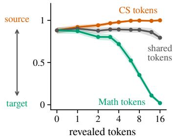  
(a) More tokens settle the domain.

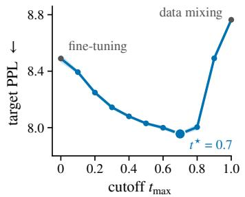  
(b) The best cutoff lies in between.

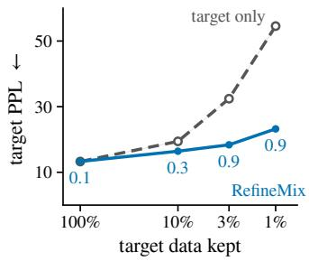  
(c) Scarcer target, larger gain.  
Figure 3: The three predictions of the theory under the uniform kernel (three seeds). Same experiments as Figure 2; in (b), the source checkpoint is a DUO model of the same size, trained on same datasets.

## B.2 ABLATION OF THE SOURCE RATE

So far, we have chosen the cutoff and fixed the source rate at $\lambda = 0 . 9$ . Besides the cutoff, Algorithm 1 has one more hyperparameter: the source rate λ, the probability that a training item below the cutoff is a source sample. To check whether $\lambda = 0 . 9$ is a good choice, we sweep λ on CS → Math with 1% of the target, trained from scratch at cutoff $t _ { \mathrm { m a x } } = 0 . 9$ , and measure both the target validation perplexity and the on-target rate of the samples at temperature 1.0 (Figure 4). On this pair, $\lambda = 0 . 9$ reaches the lowest target validation perplexity, and the samples stay on target also at higher source rates.

The sweep above tunes λ for RefineMix. For data mixing, however, λ plays a different role, because data mixing is the endpoint $t _ { \mathrm { m a x } } = 1$ of RefineMix, just as fine-tuning is the endpoint $t _ { \mathrm { m a x } } = 0 .$ We therefore have to decide how to treat λ for this baseline, and why to compare to it at all. By Theorem 1, the samples of data mixing come from the source at rate λ, so any λ that keeps it on target also removes most of the source data, and we do not tune it. We still compare to data mixing, because it admits the source at every noise level and hence shows how much the source can improve the target likelihood. Since this likelihood says nothing about which domain the samples come from, we report its perplexity together with the on-target rate of its samples (Appendix B.3).

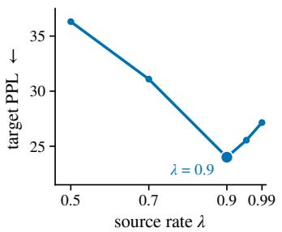  
(a) $\lambda = 0 . 9$ gives the lowest perplexity.

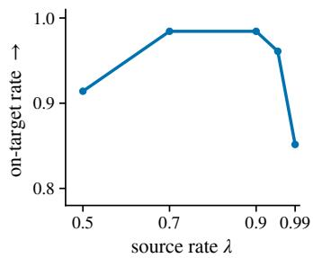  
(b) Samples stay mostly on target.  
Figure 4: Ablation of the source rate $\lambda \ { ( \mathbf { C S } \ \to \ \mathbf { M a t h } } .$ , 1% of the target, trained from scratch, masked kernel, one seed). (a) Target validation perplexity against λ. (b) On-target rate, the fraction of samples that the domain classifier assigns to the target, at sampling temperature 1.0, against λ.

## B.3 ADDITIONAL RESULTS FOR §4: REFINEMIX AGAINST FINE-TUNING

This section collects the two supporting results for Table 1. Figure 5 scores the generated samples of the same models, and Figure 8 measures what each model retains of the source checkpoint it started from. Figure 6 shows how well a domain classifier separates the domains at each noise level.

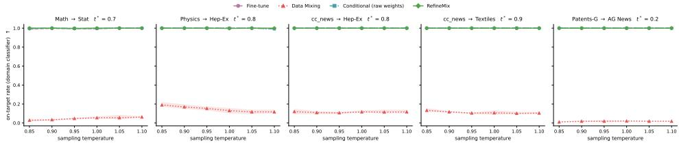  
(a) On-target rate against sampling temperature, all four models.

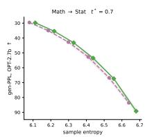

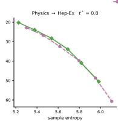

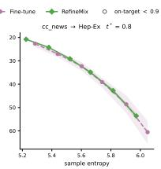

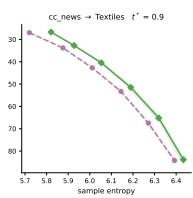  
(b) Generative perplexity against sample entropy, fine-tuning and RefineMix.

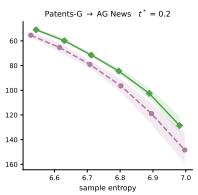

Figure 5: Samples generated by the models of Table 1. For each of the five source–target pairs, all models start from the same source-pretrained checkpoint and are adapted to the target (masked kernel, mean over three seeds). We sample from pure noise over a sweep of sampling temperatures. (a) On-target rate: the fraction of samples that a domain classifier assigns to the target, against the sampling temperature, for fine-tuning, data mixing, the conditional model, and RefineMix. RefineMix stays on target at every temperature. (b) Generation frontier: generative perplexity of the samples, scored by OPT-2.7B, against their entropy, for fine-tuning and RefineMix. Perplexity is inverted, so up and to the right means more fluent and more diverse samples, and the dashed line marks real target text. The RefineMix frontier matches or lies above fine-tuning on every pair.

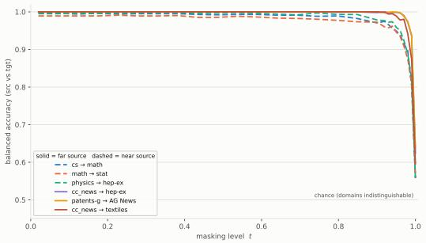  
(a) Masking kernel.

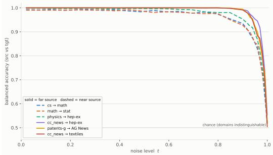  
(b) Uniform kernel.  
Figure 6: Domains stay separable almost to $t = 1$ . Balanced accuracy of the domain classifier $c _ { t }$ vs. noise level t, six source–target pairs of our text experiments; chance is 0.5. Solid = far source, dashed = near. $c _ { t }$ is a DDiT-style time-conditioned transformer (256 hidden, 4 blocks, 4 heads, attention-mean pooling) under the log-linear schedule, whose corrupted fraction is linear in t; 4000 steps, batch 64, lr $3 \times 1 0 ^ { - 4 }$ with cosine decay and 10% warmup, no label smoothing. The two panels differ only in the corruption kernel.

## B.4 WHERE THE SOURCE HELPS, AND WHAT FINE-TUNING FORGETS

Table 1 shows that RefineMix beats fine-tuning on every pair. Here we look inside the models to see why, noise level by noise level, and answer two questions: at which levels does the source help the target, and what does fine-tuning lose that RefineMix keeps?

For the first question, we compare data mixing with fine-tuning through the loss gap $g ( t )$ of Section 3.4, measured on held-out target text (Figure 7). Where $g ( t ) < 0 .$ , adding the source improves the target at level t, and where $g ( t ) > 0$ , the price of mixing has taken over. On the two arXiv pairs, g turns positive almost exactly at the chosen cutoff, and on cc\_news → Textiles it stays near or below zero, matching its high cutoff. On the two remaining pairs, the loss gap is only a rough guide: it turns positive too early on cc\_news → Hep-Ex, and on Patents-G → AG News it is positive everywhere, although RefineMix at 0.2 still beats fine-tuning.

For the second question, we measure how much of the source knowledge each model keeps, by comparing its per-level cross-entropy on held-out source text with that of the shared source checkpoint (Figure 8). Fine-tuning ends above the checkpoint on every pair and at every noise level: the small target corpus overwrites what pretraining learned, most at low and middle noise, where the denoiser predicts tokens from a rich context. RefineMix, in contrast, stays at or slightly below the checkpoint below its cutoff, and moves away only above it, where the source is no longer admitted. Hence the two models differ exactly where the schedule says they should. Since only final checkpoints were kept, these curves show how much is lost, not when.

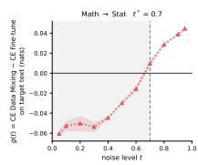

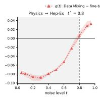

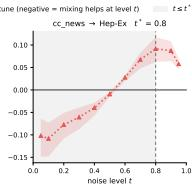

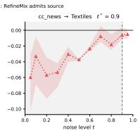

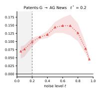  
Figure 7: Where the source helps the target. For each pair of Table 1, data mixing and fine-tuning start from the same source-pretrained checkpoint (masked kernel, mean over three seeds). We plot the loss gap g(t), the per-level cross-entropy of data mixing minus that of fine-tuning, on held-out target text. Below zero, the source improves the target at that noise level; above zero, the price of mixing has taken over. On the arXiv pairs, the gap turns positive at the chosen cutoff; elsewhere, it is a rough guide.

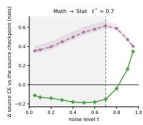

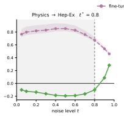

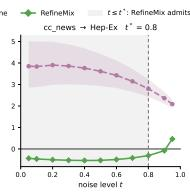

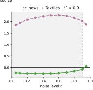

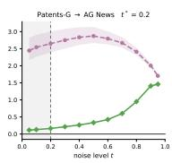  
Figure 8: RefineMix keeps what the source checkpoint knows. For each pair of Table 1, finetuning and RefineMix start from the same source-pretrained checkpoint (masked kernel, mean over three seeds). We plot the change in per-level cross-entropy on held-out source text between the checkpoint and the end of training; positive values mean that source knowledge was lost. The dashed line marks the cutoff of RefineMix, and the shaded region is where it admits the source. Fine-tuning loses source knowledge at every level, whereas RefineMix keeps it below the cutoff and moves away only above it.

## C SAMPLES OF THE ADAPTED PRETRAINED MODELS

Table 2 compares the models by their target perplexity. Since a model can fit target text and still write source text, we also sample from each adapted model and check what it writes. For this, we draw samples from pure noise over a sweep of sampling temperatures, and measure both whether they belong to the target domain (Figure 10) and how fluent and diverse they are (Figure 9).

Sample quality vs diversity (EMA weights; points = temperature 0.85 … 1.1, 128 samples each) Fine-tuning RefineMix on-target < 0.9  
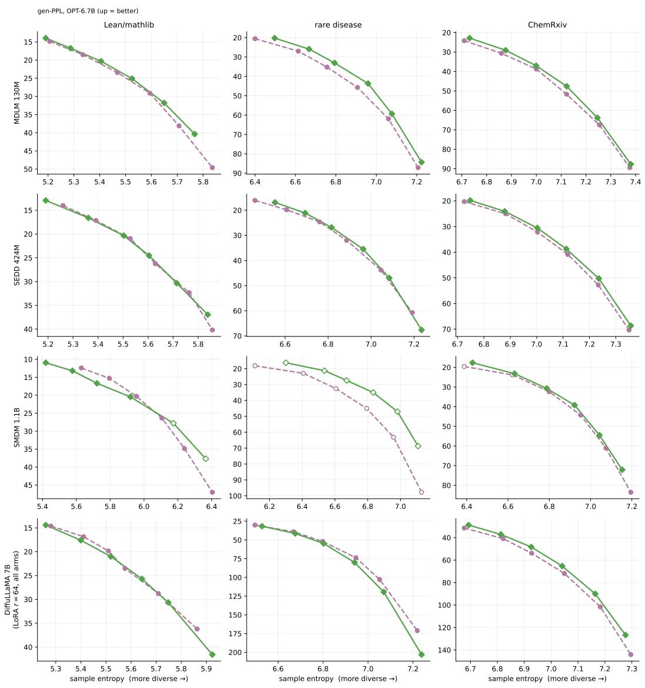  
Figure 9: Generation frontiers of the adapted models of Table 2. Each of the four pretrained models is adapted to each of the three targets, and we sample from pure noise over a sweep of sampling temperatures (mean over three seeds). We plot the generative perplexity of the samples, scored by OPT-2.7B, against their entropy, for fine-tuning and RefineMix. Perplexity is inverted, so up and to the right means more fluent and more diverse samples, and the dashed line marks real target text.

Domain-classifier on-target rate vs sampling temperature (EMA weights, 128 samples per point) Data mixing LoRA (r= 16) Fine-tuning RefineMix  
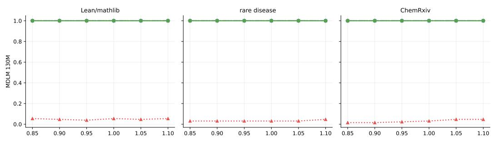

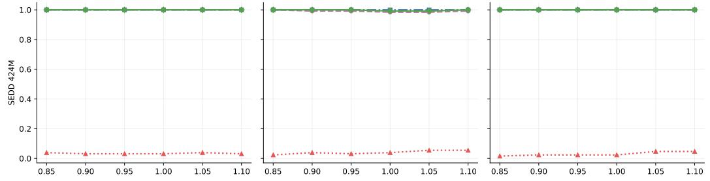

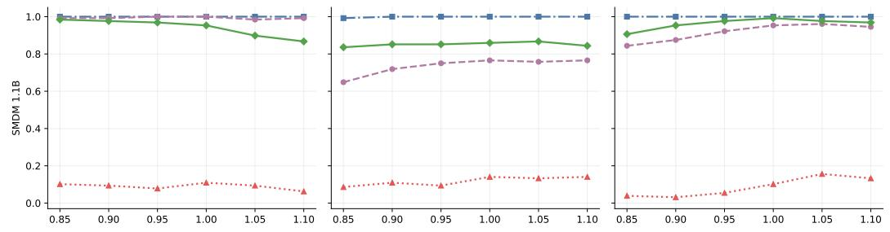

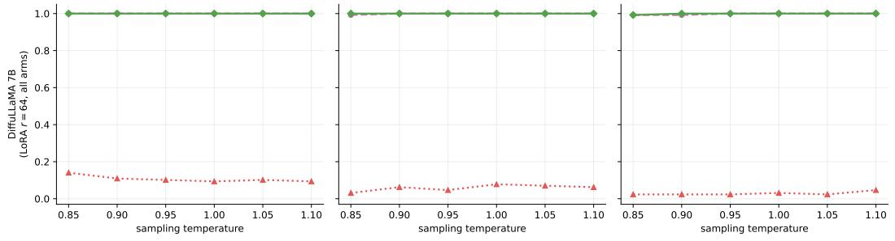  
Figure 10: The adapted models of Table 2 stay on target. Each of the four pretrained models is adapted to each of the three targets, and we sample from pure noise over a sweep of sampling temperatures (mean over three seeds). We plot the on-target rate, the fraction of samples that a domain classifier assigns to the target rather than the source, against the sampling temperature, for all methods.

## D POSTERIORS AND LOSSES FOR THE TWO KERNELS

The marginals equation 1 arise from a Markov chain that, between times $s < t ,$ , keeps a token with probability $\alpha _ { t | s } : = \alpha _ { t } / \alpha _ { s }$ and otherwise resamples it from π. Let 1 be the all-ones vector and $\langle \cdot , \cdot \rangle$ and $\odot$ the inner and Hadamard products. Both kernels share the posterior of the forward process, obtained from this chain by Bayes’ rule,

$$
p ( \mathbf { z } _ { s } \mid \mathbf { z } _ { t } , \mathbf { z } _ { 0 } ) = \operatorname { C a t } \left( \mathbf { z } _ { s } ; \frac { \left[ \alpha _ { t \mid s } \mathbf { z } _ { t } + ( 1 - \alpha _ { t \mid s } ) \langle \mathbf { z } _ { t } , \pi \rangle \mathbf { 1 } \right] \odot \left[ \alpha _ { s } \mathbf { z } _ { 0 } + ( 1 - \alpha _ { s } ) \pi \right] } { \alpha _ { t } \langle \mathbf { z } _ { t } , \mathbf { z } _ { 0 } \rangle + ( 1 - \alpha _ { t } ) \langle \mathbf { z } _ { t } , \pi \rangle } \right) ,\tag{11}
$$

and in each case the KL in equation 2 simplifies.

Masked (absorbing-state) diffusion. With $\pi = \mathbf { m }$ the posterior is

$$
p ( \mathbf { z } _ { s } \mid \mathbf { z } _ { t } , \mathbf { z } _ { 0 } ) = \left\{ \begin{array} { l l } { \mathrm { C a t } ( \mathbf { z } _ { s } ; \mathbf { z } _ { t } ) , } & { \mathrm { i f ~ } \mathbf { z } _ { t } \neq \mathbf { m } , } \\ { \mathrm { C a t } \Bigg ( \mathbf { z } _ { s } ; \frac { \left( 1 - \alpha _ { s } \right) \mathbf { m } + \left( \alpha _ { s } - \alpha _ { t } \right) \mathbf { z } _ { 0 } } { 1 - \alpha _ { t } } \Bigg ) , } & { \mathrm { i f ~ } \mathbf { z } _ { t } = \mathbf { m } , } \end{array} \right.\tag{12}
$$

so an unmasked token is carried over unchanged and a masked one is revealed with probability $( \alpha _ { s } - \alpha _ { t } ) / ( 1 - \alpha _ { t } )$ . Constraining $\mathbf { x } _ { \theta }$ to place no mass on [MASK] and to copy unmasked tokens, the KL in equation 2 becomes a weighted cross-entropy: it vanishes at unmasked positions and equals $\begin{array} { r } { \frac { \alpha _ { s ( i ) } - \alpha _ { t ( i ) } } { 1 - \alpha _ { t ( i ) } } \big ( - \log \langle \mathbf { x } _ { \theta } \big ( \mathbf { z } _ { t ( i ) } \big ) , \mathbf { z } _ { 0 } \rangle \big ) } \end{array}$ at masked ones (Sahoo et al., 2024; Shi et al., 2025). In continuous time this is

$$
\mathcal { L } _ { \mathrm { m a s k e d } } = \mathbb { E } _ { t \sim \mathcal { U } ( 0 , 1 ) } \mathbb { E } _ { q } \left[ \frac { \alpha _ { t } ^ { \prime } } { 1 - \alpha _ { t } } \sum _ { \ell : \mathbf { z } _ { t } ^ { \ell } = \mathbf { m } } \log \langle \mathbf { x } _ { \theta } ( \mathbf { z } _ { t } ) ^ { \ell } , \mathbf { z } _ { 0 } ^ { \ell } \rangle \right] ,\tag{13}
$$

the objective used in all our experiments.

Uniform-state diffusion. With $\pi = { \bf 1 } / N$ no state is absorbing and the posterior is (Lou et al., 2024; Schiff et al., 2025; Sahoo et al., 2025a)

$$
p ( \mathbf { z } _ { s } \mid \mathbf { z } _ { t } , \mathbf { z } _ { 0 } ) = \operatorname { C a t } \left( \mathbf { z } _ { s } ; \frac { N \alpha _ { t } \mathbf { z } _ { t } \odot \mathbf { z } _ { 0 } + ( \alpha _ { t \mid s } - \alpha _ { t } ) \mathbf { z } _ { t } + ( \alpha _ { s } - \alpha _ { t } ) \mathbf { z } _ { 0 } + ( 1 - \alpha _ { t \mid s } ) ( 1 - \alpha _ { s } ) \frac { 1 } { N } } { N \alpha _ { t } \left. \mathbf { z } _ { t } , \mathbf { z } _ { 0 } \right. + 1 - \alpha _ { t } } \right) ,\tag{14}
$$

which places mass on the current token, on the clean token, and uniformly on all others. Here the KL does not collapse to a cross-entropy on a subset of positions, since every position carries signal, and it is evaluated in full at all L positions (Schiff et al., 2025; Sahoo et al., 2025a).

## E PROOFS

Both proofs concern the ideal model of Section 3.2: every denoiser is an exact distribution over whole sequences, and $t _ { \mathrm { m a x } }$ lies on the time grid $0 = t _ { 0 } < t _ { 1 } < \cdot \cdot \cdot < t _ { K } = 1$ of the sampler. As in Section $^ { 2 , }$ a reverse step with denoiser D is

$$
D ( x _ { t _ { i - 1 } } \mid x _ { t _ { i } } ) = \sum _ { x _ { 0 } } p ( x _ { t _ { i - 1 } } \mid x _ { t _ { i } } , x _ { 0 } ) D ( x _ { 0 } \mid x _ { t _ { i } } ) ,\tag{15}
$$

which, since the forward process is Markov, is the exact reverse step of the forward chain started at $D .$

## E.1 PROOF OF THEOREM 1

Theorem 1 (RefineMix generates domain-pure sequences). Let the domains be distinct, $p ( x _ { 0 } ) q ( x _ { 0 } ) = 0$ for every $x _ { 0 } ,$ let $A = \{ x _ { 0 } : q ( x _ { 0 } ) > 0 \}$ be the set of source sequences, and let RefineMix use the denoiser equation 3. Define the overlap

$$
C ( t ) : = \mathbb { E } _ { x \sim q ( x _ { t } ) } \big [ 1 - c ( x ) \big ] ,\tag{6}
$$

the average probability that the classifier assigns to the target when shown a noised source sequence. Then, under either kernel, masked or uniform, the sequence $\scriptstyle { \hat { x } } _ { 0 }$ that RefineMix generates from pure noise is a source sequence with probability

$$
\mathbb { P } ( \hat { x } _ { 0 } \in A ) = \frac { \lambda } { 1 - \lambda } C ( t _ { \operatorname* { m a x } } ) \le \frac { \lambda } { 1 - \lambda } C ( t ^ { \prime } ) ~ f o r e \nu e r y t ^ { \prime } \ge t _ { \operatorname* { m a x } } .\tag{7}
$$

Proof. Classifier. By Bayes’ rule, with $m ( x ) = \lambda q ( x ) + ( 1 - \lambda ) p ( x )$ at any level,

$$
c ( x ) = \frac { \lambda q ( x ) } { m ( x ) } , \qquad 1 - c ( x ) = \frac { ( 1 - \lambda ) p ( x ) } { m ( x ) } .\tag{16}
$$

Fact 1. Since $q ( x _ { t } \mid x _ { 0 } ) = p ( x _ { t } \mid x _ { 0 } )$

$$
m ( x _ { 0 } \mid x _ { t } ) = { \frac { p ( x _ { t } \mid x _ { 0 } ) \left[ \lambda q ( x _ { 0 } ) + ( 1 - \lambda ) p ( x _ { 0 } ) \right] } { m ( x _ { t } ) } } = { \frac { \lambda q ( x _ { t } ) } { m ( x _ { t } ) } } \cdot { \frac { p ( x _ { t } \mid x _ { 0 } ) q ( x _ { 0 } ) } { q ( x _ { t } ) } } + { \frac { ( 1 - \lambda ) p ( x _ { t } ) } { m ( x _ { t } ) } } \cdot { \frac { p ( x _ { t } \mid x _ { 0 } ) p ( x _ { 0 } ) } { p ( x _ { t } ) } }
$$

Fact 2. Output. Since $p ( x _ { 0 } ) q ( x _ { 0 } ) = 0$ , we have p(A) = 0 and $q ( A ) = 1$ , so by Fact 1

$$
\sum _ { x _ { 0 } \in A } m ( x _ { 0 } \mid x _ { t } ) = c ( x _ { t } ) \underbrace { \sum _ { x _ { 0 } \in A } q ( x _ { 0 } \mid x _ { t } ) } _ { = 1 } + \bigl ( 1 - c ( x _ { t } ) \bigr ) \underbrace { \sum _ { x _ { 0 } \in A } p ( x _ { 0 } \mid x _ { t } ) } _ { = 0 } = c ( x _ { t } ) .\tag{17}
$$

Below the cutoff $t _ { k } = t _ { \operatorname* { m a x } } ,$ the sampler composes the steps equation 15 with $D = m$ , the exact reverse steps of the chain started at $m ,$ , so

$$
\sum _ { x _ { t _ { 1 } } , . . . , x _ { t _ { k - 1 } } } \prod _ { i = 1 } ^ { k } m ( x _ { t _ { i - 1 } } \mid x _ { t _ { i } } ) = m ( x _ { 0 } \mid x _ { t _ { k } } ) .
$$

Input. Since $\begin{array} { r } { \alpha _ { 1 } = 0 , p ( x _ { 1 } \mid x _ { 0 } ) = \prod _ { \ell } \mathrm { C a t } ( \mathbf { z } _ { 1 } ^ { \ell } ; \boldsymbol { \pi } ) } \end{array}$ for every $x _ { 0 }$ , so the sampler starts at $x _ { 1 } \sim p ( x _ { 1 } )$ Above the cutoff, every step equation 15 with $D = p$ preserves the target marginal,

$$
\sum _ { x _ { t _ { i } } } p ( x _ { t _ { i - 1 } } \mid x _ { t _ { i } } ) p ( x _ { t _ { i } } ) = p ( x _ { t _ { i - 1 } } ) , \qquad i > k ,
$$

so by induction $x _ { t _ { \operatorname* { m a x } } } \sim p ( x _ { t _ { \operatorname* { m a x } } } )$

Theorem. Combining input, composition and output with equation 16, with x at level $t _ { \mathrm { m a x } }$

$$
\begin{array} { r l } & { \mathbb { P } ( \hat { x } _ { 0 } \in A ) = \displaystyle \sum _ { x } p ( x ) \sum _ { x _ { 0 } \in A } m ( x _ { 0 } \mid x ) = \displaystyle \sum _ { x } p ( x ) c ( x ) = \displaystyle \sum _ { x } p ( x ) \frac { \lambda q ( x ) } { m ( x ) } = \frac { \lambda } { 1 - \lambda } \sum _ { x } q ( x ) \frac { ( 1 - \lambda ) p ( x ) } { m ( x ) } } \\ & { \qquad = \displaystyle \frac { \lambda } { 1 - \lambda } \sum _ { x } q ( x ) \left( 1 - c ( x ) \right) = \displaystyle \frac { \lambda } { 1 - \lambda } C ( t _ { \mathrm { m a x } } ) \leq \frac { \lambda } { 1 - \lambda } C ( t ^ { \prime } ) \qquad \mathrm { f o r ~ e v e r y ~ } t ^ { \prime } \geq t _ { \mathrm { m a x } } , } \end{array}
$$

where the inequality is Lemma 5. No step depends on π, so the result holds for both kernels.

Lemma 5. The overlap C(t) is nondecreasing in t.

Proof. By equation 16, $\begin{array} { r } { C ( t ) = \sum _ { x } h \big ( q ( x ) , p ( x ) \big ) } \end{array}$ with x at level t and

$$
h ( a , b ) = \frac { ( 1 - \lambda ) a b } { \lambda a + ( 1 - \lambda ) b } = ( 1 - \lambda ) \Bigl ( \frac { \lambda } { b } + \frac { 1 - \lambda } { a } \Bigr ) ^ { - 1 } ,
$$

which is $( 1 - \lambda )$ times a weighted harmonic mean, hence concave and positively homogeneous, hence superadditive. For $t \leq \bar { t ^ { \prime } }$ , both marginals pass through the same forward kernel $K ( y \mid x ) =$ $p ( x _ { t ^ { \prime } } = y \mid x _ { t } = x )$ , so

$$
C ( t ^ { \prime } ) = \sum _ { y } h \Big ( \sum _ { x } K ( y \mid x ) q ( x ) , \sum _ { x } K ( y \mid x ) p ( x ) \Big ) \geq \sum _ { y } \sum _ { x } K ( y \mid x ) h \big ( q ( x ) , p ( x ) \big ) = C ( t ) .
$$

## E.2 PROOF OF THEOREM 4

As in Section 3.4, each noise level is learned separately, a trained denoiser has the split form equation 8 with a learned specific factor and a learned shared factor, and h.o. collects terms of order $o ( 1 / N _ { T } )$ . Sums over $x _ { 0 }$ with content v run over $\{ x _ { 0 } : v ( x _ { 0 } ) = v \}$

Proof. Latent content. Since $x _ { 0 }$ determines $v , r ( x _ { 0 } \mid v ) = 0$ for v $\neq v ( x _ { 0 } )$ , so $p ( x _ { 0 } ) = p ( v ) r ( x _ { 0 } \mid$ v) with $v ~ = ~ v ( x _ { 0 } )$ , and the same for $q .$ If $p ( v ) q ( v ) \ > \ 0 .$ , every x with $r ( x _ { 0 } \mid v ) > 0$ has $p ( x _ { 0 } ) q ( x _ { 0 } ) > 0$ , which the distinct domains exclude. Hence $p ( v ) q ( v ) = 0$

The denoiser splits. With $v = v ( x _ { 0 } )$ and $\begin{array} { r } { r ( x _ { t } \mid v ) = \sum _ { x _ { 0 } } p ( x _ { t } \mid x _ { 0 } ) r ( x _ { 0 } \mid v ) } \end{array}$ , Bayes’ rule gives

$$
p ( x _ { 0 } \mid x _ { t } ) = { \frac { p ( x _ { t } \mid x _ { 0 } ) p ( v ) r ( x _ { 0 } \mid v ) } { p ( x _ { t } ) } } = \underbrace { { \frac { p ( v ) r ( x _ { t } \mid v ) } { p ( x _ { t } ) } } } _ { p ( v \mid x _ { t } ) } \underbrace { { \frac { p ( x _ { t } \mid x _ { 0 } ) r ( x _ { 0 } \mid v ) } { r ( x _ { t } \mid v ) } } } _ { r ( x _ { 0 } \mid x _ { t } , v ) } ,
$$

and the same for $q$ and $m .$ , with $q ( v )$ and $m ( v ) = \lambda q ( v ) + ( 1 - \lambda ) p ( v )$ ; the second factor does not depend on the domain. Since $\begin{array} { r } { r ( x _ { 1 } \mid v ) = \prod _ { \ell } \mathrm { C a t } ( \mathbf { z } _ { 1 } ^ { \ell } ; \pmb { \pi } ) } \end{array}$ for every $v ,$ and $p ( x _ { t } \mid x _ { 0 } ) = \mathcal { H } \{ x _ { t } = x _ { 0 } \}$ at $t = 0$ , we have $p ( v \mid x _ { 1 } ) = p ( v )$ and $p ( v \mid x _ { 0 } ) = \delta _ { v ( x _ { 0 } ) }$ . Summing Fact 1 over the $x _ { 0 }$ with content $v ,$ and using $q ( v \mid x _ { t } ) = 0$ for every target content,

$$
m ( v \mid x _ { t } ) = c ( x _ { t } ) q ( v \mid x _ { t } ) + \left( 1 - c ( x _ { t } ) \right) p ( v \mid x _ { t } ) = \left( 1 - c ( x _ { t } ) \right) p ( v \mid x _ { t } ) , \qquad p ( v ) > 0 .\tag{18}
$$

What each model learns. For a denoiser $D ( x _ { 0 } \mid x _ { t } ) = S ( v \mid x _ { t } ) R ( x _ { 0 } \mid x _ { t } , v )$ with $v = v ( x _ { 0 } )$ , the chain rule of the KL divergence gives

$$
\begin{array} { r l } & { D _ { \mathrm { K L } } \big ( p ( x _ { 0 } \mid x _ { t } ) \| D ( x _ { 0 } \mid x _ { t } ) \big ) = \underset { x _ { 0 } } { \sum } p ( x _ { 0 } \mid x _ { t } ) \log \frac { p ( v \mid x _ { t } ) r ( x _ { 0 } \mid x _ { t } , v ) } { S ( v \mid x _ { t } ) R ( x _ { 0 } \mid x _ { t } , v ) } } \\ & { \qquad = \underbrace { D _ { \mathrm { K L } } \big ( p ( v \mid x _ { t } ) \| S ( v \mid x _ { t } ) \big ) } _ { \mathrm { s p e c i f i c } } + \underbrace { \mathbb { E } _ { v \sim p ( v \mid x _ { t } ) } D _ { \mathrm { K L } } \big ( r ( x _ { 0 } \mid x _ { t } , v ) \| R ( x _ { 0 } \mid x _ { t } , v ) \big ) } _ { \mathrm { s h a r e d } } . } \end{array}\tag{19}
$$

Effective sample size. Below the cutoff, each target sample has weight $w _ { i } = ( 1 - \lambda ) / N _ { T }$ and each source sample $\begin{array} { r } { w _ { i } = \lambda / N _ { S } , \mathrm { s o } \sum _ { i } w _ { i } = 1 } \end{array}$ and

$$
N _ { \mathrm { e f f } } = \frac { \left( \sum _ { i } w _ { i } \right) ^ { 2 } } { \sum _ { i } w _ { i } ^ { 2 } } = \Big [ \frac { ( 1 - \lambda ) ^ { 2 } } { N _ { T } } + \frac { \lambda ^ { 2 } } { N _ { S } } \Big ] ^ { - 1 } , \qquad \lambda = \rho : \ \frac { N _ { T } } { \big ( N _ { T } + N _ { S } \big ) ^ { 2 } } + \frac { N _ { S } } { \big ( N _ { T } + N _ { S } \big ) ^ { 2 } } = \frac { 1 } { N _ { T } + N _ { S } } .
$$

Since $N _ { S } \geq N _ { T } , 1 / N _ { \mathrm { e f f } } \leq \left( ( 1 - \lambda ) ^ { 2 } + \lambda ^ { 2 } \right) / N _ { T } \leq 1 / N _ { T }$ , so $o ( 1 / N _ { \mathrm { e f f } } ) = o ( 1 / N _ { T } )$ . For a weighted maximum-likelihood fit $\begin{array} { r } { \hat { \phi } = \arg \operatorname* { m a x } _ { \phi } \sum _ { i } } \end{array}$ wi log $r _ { \phi } ( x _ { 0 } ^ { i } \mid x _ { t } ^ { i } , v ^ { i } )$ in which every sample carries the same Fisher information I (Assumption $3 ) .$ , the sandwich formula gives

$$
\mathrm { C o v } ( \hat { \phi } ) \approx \Big ( \sum _ { i } w _ { i } I \Big ) ^ { - 1 } \Big ( \sum _ { i } w _ { i } ^ { 2 } I \Big ) \Big ( \sum _ { i } w _ { i } I \Big ) ^ { - 1 } = \frac { I ^ { - 1 } } { N _ { \mathrm { e f f } } } , \qquad \mathbb { E } D _ { \mathrm { K L } } \big ( r _ { \phi } \| r _ { \hat { \phi } } \big ) \approx \frac { 1 } { 2 } \operatorname { t r } \big ( I \mathrm { C o v } ( \hat { \phi } ) \big ) = \frac { \operatorname { d i m } \phi } { 2 N _ { \mathrm { e f f } } } .
$$

Price. The price needs no assumption on transfer. Since $L _ { p }$ is the NELBO, $L _ { p } ( \theta ) - L _ { p } ( p )$ is the KL divergence between the forward path of the target and the reverse path of θ. The reverse paths of p and pRefineMix agree above $t _ { \mathrm { m a x } } ,$ and below it both fill in $x _ { t _ { 1 } } , \ldots , x _ { t _ { k - 1 } }$ with the same forward bridge $p ( \cdot \mid x _ { 0 } , x _ { t _ { \operatorname* { m a x } } } )$ , so only x0 remains. On target sequences, Fact 1 gives $m ( x _ { 0 } \mid x ) =$ $\left( 1 - c ( x ) \right) p ( x _ { 0 } \mid x )$ , hence, with $x \sim p ( x _ { \mathrm { { t _ { \mathrm { m a x } } } } } )$

$$
\begin{array} { r l r l } & { L _ { p } ( p _ { \mathrm { R e i n e M i x } } ) - L _ { p } ( p ) = \mathbb { E } D _ { \mathrm { K L } } \big ( p ( x _ { 0 } \mid x ) \| m ( x _ { 0 } \mid x ) \big ) } & & { \mathrm { ( o n l y ~ } x _ { 0 } \mathrm { ~ r e m a i n s ) } } \\ & { = \mathbb { E } \big [ - \log \big ( 1 - c ( x ) \big ) \big ] } & & { \mathrm { ( F a c t ~ 1 : ~ } m ( x _ { 0 } \mid x ) = ( 1 - c ( x ) ) p ( x _ { 0 } \mid x ) \big ) } \\ & { = \mathbb { E } D _ { \mathrm { K L } } \big ( p ( v \mid x ) \| m ( v \mid x ) \big ) } & & { \mathrm { ( b y ~ e q u a t i o n ~ 1 8 ) } } \\ & { = B ( t _ { \mathrm { m a x } } ) } & & { \mathrm { ( d e f i n i t i o n ~ o f ~ } B ) } \\ & { = - \log ( 1 - \lambda ) - D _ { \mathrm { K L } } \big ( p ( x _ { t _ { \mathrm { m a x } } } ) \| m ( x _ { t _ { \mathrm { m a x } } } ) \big ) } & & { \mathrm { ( b y ~ e q u a t i o n ~ 1 6 ) } } \\ & { \geq \mathbb { E } \big [ c ( x ) \big ] } & & { \mathrm { ( - l o g ( 1 -  { c } ) \geq c ) } } \\ & { = \mathbb { P } ( \hat { x } _ { 0 } \in A ) } & & { \mathrm { ( T h e o r e m ~ 1 ) } . } \end{array}
$$

Hence the price is governed by the same classifier as Theorem 1, and it bounds its cost. By the data-processing inequality, $D _ { \mathrm { K L } } ( p ( x _ { t } ) \parallel m ( x _ { t } ) )$ ) is nonincreasing in t, so B is nondecreasing, from $B ( 0 ) { \bf \bar { \Psi } } = { \bf \Phi } 0 .$ , since m $( x _ { 0 } ) = ( 1 - \lambda ) p ( x _ { 0 } )$ on target sequences, to $B ( 1 ) = - \log ( 1 - \lambda )$ , since $p ( { \dot { x } } _ { 1 } ) = m ( x _ { 1 } )$ . Only the Markov forward process shared by both domains is used, so the price holds for both kernels.

Gain. Let $\theta _ { \tau } ^ { * }$ be the population model at cutoff τ, so $\theta _ { 0 } ^ { * } = p$ and $\theta _ { t _ { \operatorname* { m a x } } } ^ { * } = p _ { \mathrm { R e f i n e M i x } } .$ . By equation 19, the error of a trained denoiser splits into the error of its specific factor and of its shared factor. The specific factor is learned from the same $N _ { T }$ target samples in both models, so its error $s ( t )$ is the same for $\tau = 0$ and $\tau = t _ { \operatorname* { m a x } } ;$ by Assumption $^ { 3 , }$ the shared factor has error $e ( t ) / N + o ( 1 / \dot { N } )$ , with $N = N _ { \mathrm { e f f } }$ for $t \leq \tau$ and $N = N _ { T }$ otherwise. Hence

$$
\mathbb { E } \big [ L _ { p } ( \hat { \theta } _ { \tau } ) \big ] = L _ { p } ( \theta _ { \tau } ^ { * } ) + \int _ { 0 } ^ { 1 } s ( t ) d t + \int _ { 0 } ^ { \tau } \frac { e ( t ) } { N _ { \mathrm { e f f } } } d t + \int _ { \tau } ^ { 1 } \frac { e ( t ) } { N _ { T } } d t + o \Big ( \frac { 1 } { N _ { T } } \Big ) ,
$$

and subtracting $\tau = t _ { \mathrm { m a x } }$ from $\tau = 0$ , with $L _ { p } ( \theta _ { t _ { \operatorname* { m a x } } } ^ { * } ) - L _ { p } ( \theta _ { 0 } ^ { * } ) = B ( t _ { \operatorname* { m a x } } )$ from the price,

$$
\Delta ( t _ { \mathrm { m a x } } ) = \Bigl ( \frac { 1 } { N _ { T } } - \frac { 1 } { N _ { \mathrm { e f f } } } \Bigr ) \int _ { 0 } ^ { t _ { \mathrm { m a x } } } e ( t ) d t - B ( t _ { \mathrm { m a x } } ) + o \Bigl ( \frac { 1 } { N _ { T } } \Bigr ) .
$$

Best cutoff. Write $\kappa = 1 / N _ { T } - 1 / N _ { \mathrm { e f f } } = \lambda ( 2 - \lambda ) / N _ { T } - \lambda ^ { 2 } / N _ { S }$ , which decreases in $N _ { T }$ , and $\begin{array} { r } { F _ { \kappa } ( t ) = \kappa \int _ { 0 } ^ { t } e - B ( t ) } \end{array}$ , which is continuous on $[ 0 , 1 ]$ , so its largest maximizer $t _ { \kappa } ^ { \star }$ exists. Let $\kappa _ { 1 } > \kappa _ { 2 }$ and suppose ${ { t } _ { 2 } } = { { t } _ { \kappa _ { 2 } } ^ { \star } } > { { t } _ { 1 } } = { { t } _ { \kappa _ { 1 } } ^ { \star } }$ . Since $e \geq 0$

$$
F _ { \kappa _ { 1 } } ( t _ { 2 } ) - F _ { \kappa _ { 1 } } ( t _ { 1 } ) = \kappa _ { 1 } \int _ { t _ { 1 } } ^ { t _ { 2 } } e - \bigl ( B ( t _ { 2 } ) - B ( t _ { 1 } ) \bigr ) \geq \kappa _ { 2 } \int _ { t _ { 1 } } ^ { t _ { 2 } } e - \bigl ( B ( t _ { 2 } ) - B ( t _ { 1 } ) \bigr ) = F _ { \kappa _ { 2 } } ( t _ { 2 } ) - F _ { \kappa _ { 2 } } ( t _ { 1 } ) \geq 0 ,
$$

so $t _ { 2 }$ also maximizes $F _ { \kappa _ { 1 } }$ , which contradicts $t _ { 1 }$ being the largest maximizer. Hence $t ^ { \star }$ is nondecreasing in $\kappa ,$ and so nonincreasing in $N _ { T }$ . The argument uses no property of $B ,$ so this holds for any price that does not depend on $\breve { N } _ { T }$

## F TESTING THEOREM 1 DIRECTLY

Theorem 1 rests on one identity, Fact 2 of Section 3.3: on every noised sequence x, the mixed denoiser writes a source sequence with probability exactly $c ( x )$ . In this section, we test this identity on a trained model. For this, it is useful to take the model that is most likely to drift, a fully mixed model on $\mathbf { C S } $ Math with $\lambda = 0 . 9$ and 1% of the target, and to hand it noised sequences whose content we control. For each n, we reveal n target-specific tokens, mask the rest, and draw 256 such noised sequences $x ^ { ( j ) }$ per seed, 768 over the three seeds. We then compare two quantities: how often the model completes $x ^ { ( j ) }$ as a source sequence, and the source probability $c ( \boldsymbol { x } ^ { ( j ) } )$ that the classifier assigns to it. By Fact 2, the two should agree.

From the theorem to the plotted curves. Neither quantity can be computed exactly, so we estimate both with a domain classifier. We train this classifier balanced, with prior $\mu \ = \ { \frac { 1 } { 2 } }$ , since a 9:1 imbalance would leave the target class poorly resolved, which is exactly where the test must be sharp. Hence we shift its output to the prior λ of the mixture before it estimates c:

$$
\sum _ { x _ { 0 } \in A } m ( x _ { 0 } \mid x ) = c ( x )\tag{Fact 2}
$$

$$
c ( x ) = \frac { \lambda q ( x ) } { m ( x ) }
$$

(by equation 4)

$$
\hat { c } ^ { \mu } ( x ) = \frac { \mu q ( x ) } { \mu q ( x ) + ( 1 - \mu ) p ( x ) }
$$

$$
\frac { q ( x ) } { p ( x ) } = \frac { 1 - \mu } { \mu } \cdot \frac { \hat { c } ^ { \mu } ( x ) } { 1 - \hat { c } ^ { \mu } ( x ) }
$$

(classifier output, prior µ)

$$
{ \frac { c ( x ) } { 1 - c ( x ) } } = { \frac { \lambda } { 1 - \lambda } } \cdot { \frac { q ( x ) } { p ( x ) } } = { \frac { \lambda } { 1 - \lambda } } \cdot { \frac { 1 - \mu } { \mu } } \cdot { \frac { { \hat { c } } ^ { \mu } ( x ) } { 1 - { \hat { c } } ^ { \mu } ( x ) } } \qquad { \mathrm { ( o d d s ~ o f ~ e q u a t i o n ~ } } 4 { \mathrm { ) } }
$$

(solve for the likelihood ratio)

$$
\begin{array} { l l } { { \displaystyle \overbrace { \mathrm { i n p u t } } ^ { \mathrm { f o s } } = \frac { 1 } { 7 6 8 } \sum _ { j = 1 } ^ { 7 6 8 } c \big ( x ^ { ( j ) } \big ) } } & { { \mathrm { ( c l a s s i f i e r ~ o n ~ t h e ~ n o i s e d ~ i n p u t ) } } } \\ { { \displaystyle \overbrace { \mathrm { o u t p u t } } ^ { \mathrm { o u t } } = \frac { 1 } { 7 6 8 } \sum _ { j = 1 } ^ { 7 6 8 } \hat { c } ^ { \mu } \big ( \hat { x } _ { 0 } ^ { ( j ) } \big ) \approx \frac { 1 } { 7 6 8 } \sum _ { j = 1 } ^ { 7 6 8 } \sum _ { \boldsymbol { x } _ { 0 } \in A } m \big ( { \boldsymbol { x } } _ { 0 } \mid x ^ { ( j ) } \big ) } } & { { \mathrm { ( c l a s s i f i e r ~ o n ~ t h e ~ c o m p l e t i o n ) } } } \end{array}\tag{20}
$$

Here $\hat { x } _ { 0 } ^ { ( j ) } \sim m ( \cdot \mid x ^ { ( j ) } )$ is the completion of $x ^ { ( j ) }$ , and the classifier’s score on the clean completion serves as a soft indicator of $\hat { x } _ { 0 } ^ { ( j ) } \in A$ . Averaged over noised target sequences instead of a fixed $n ,$ the input side is exactly the probability of Theorem 1, $\begin{array} { r } { \mathbb { E } _ { x \sim p ( x _ { t } ) } [ c ( x ) ] = \frac { \lambda } { 1 - \lambda } C ( t ) } \end{array}$

Why the input side is an upper bound. Theorem 1 is an equality for the optimal classifier $c ,$ but we can only estimate c with a trained classifier cˆ, which sees less. If cˆ is calibrated, it overestimates the source rate on noised target sequences, $\mathbb { E } _ { x \sim p ( x _ { t } ) } [ c ( x ) ] \ \leq \ \mathbb { E } _ { x \sim p ( x _ { t } ) } [ \hat { c } ( x ) ]$ . This follows from Jensen’s inequality: writing $p ( x ) = ( 1 - c ( x ) ) m \dot { ( x ) } \dot { / } ( 1 - \lambda )$ , both sides become expectations under m of the concave function $u ( 1 - u )$ , at c and at $\dot { \hat { c } } = \dot { \mathbb { E } } _ { m } [ c | \hat { c } ]$ . Hence we expect the input curve to lie at or above the output curve, and to touch it where the classifier is certain.

Reading the plot. Under masking, both curves start near λ when nothing is revealed and separate as soon as target tokens appear. The generated curve falls fastest: four revealed target tokens bring it close to zero, and from eight on the model no longer writes source text. The upper bound falls more slowly, because the trained classifier still hedges where the sampler has already committed, and the gap is widest between two and four tokens. Under uniform noise, both curves stay near λ for the first token, and the generated curve needs twelve to sixteen tokens to reach zero, because scrambled tokens hide which positions carry evidence, so the upper bound is also looser. The only point at which the generated curve lies above the upper bound is masking with nothing revealed. There the optimal classifier equals λ exactly, so the gap reflects the error of the trained classifier, not a violation of the theorem. Hence the generated curve stays below the upper bound, as Theorem 1 predicts, and the gap between them is the price of a classifier that sees less than the optimal one.

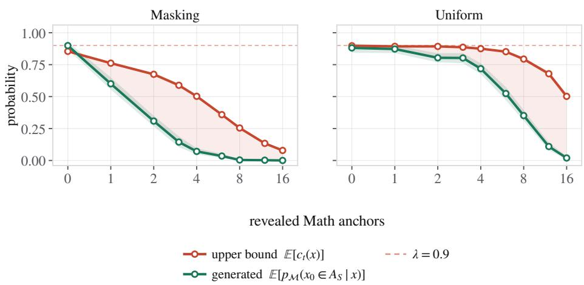  
Figure 11: Testing Theorem 1 directly (CS → Math, three seeds). A fully mixed model $( \lambda = 0 . 9 ;$ 1% of the target) completes noised sequences in which n target-specific tokens are revealed and the rest is masked. We plot two estimates of how often a completion is source text, against n: the classifier’s source probability of the noised input, shifted to the prior λ equation 20, and the classifier’s score of the completion. By Theorem 1, the two agree for the optimal classifier; a trained classifier makes the input side an upper bound. Bands are bootstrap intervals over 256 samples per 3 seeds; the dashed line marks $\lambda = 0 . 9$