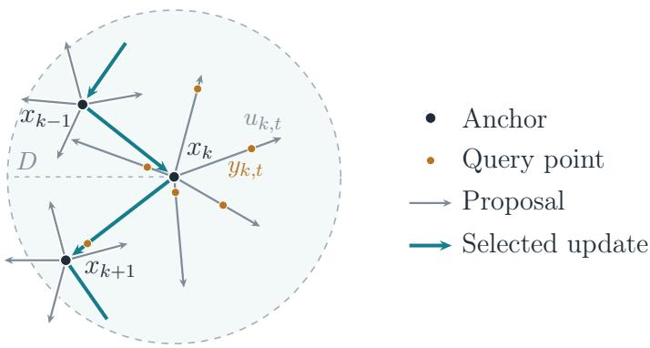
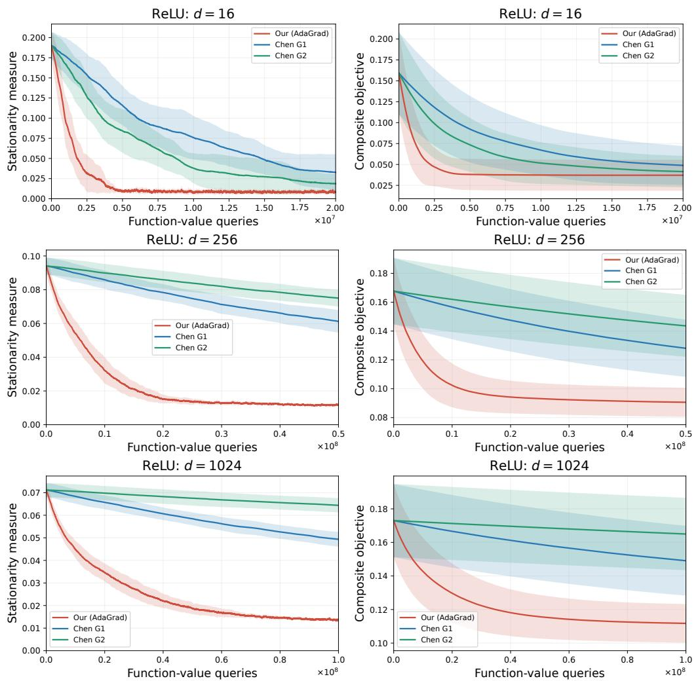
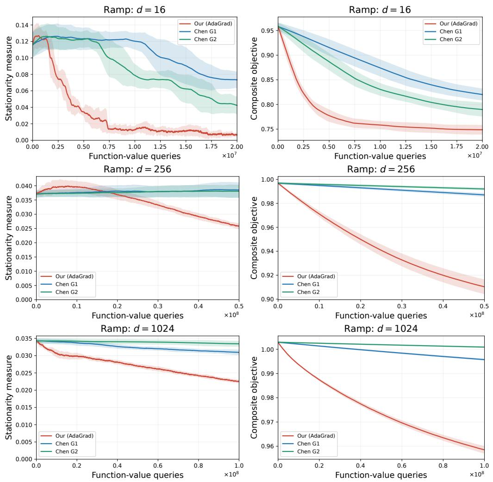

# Composite Online-to-Nonconvex Conversion with Optimal Oracle Complexity

Mingyi Li∗ Taira Tsuchiya† Kenji Yamanishi‡

October 8, 2026

## Abstract

We consider stochastic nonsmooth nonconvex composite optimization, which includes several important problems such as constrained optimization and the regularized training of neural networks. The objective is the sum of a possibly nonsmooth nonconvex Lipschitz function and a convex regularizer, and the function is accessed through stochastic gradients or function values. The goal is to find a point that satisfies a Goldstein-type stationarity condition designed for composite objectives. To our knowledge, no oracle complexity bound for this setting is known under first-order access, and existing complexities under zeroth-order access are suboptimal. To handle this issue, we employ the framework of online-to-nonconvex conversion, which chooses update directions by an online learner and is known to achieve optimal rates for noncomposite problems. We extend the framework to our composite scenario by introducing new losses for the learner, which contain the re ularizer itself rather than its linearization and for which a variant of online mirror descent achieves low regret. We show that the resulting algorithm finds such a point with $O ( \delta ^ { - 1 } \varepsilon ^ { - 3 } )$ stochastic gradient queries or $O ( d \delta ^ { - 1 } \varepsilon ^ { - 3 } )$ function-value queries, where δ is the Goldstein radius, ε is the stationarity tolerance, and d is the dimension. These rates match the optimal ones for noncomposite nonsmooth nonconvex optimization, demonstrating that the additional convex regularizer does not worsen the oracle complexity. We also give rates for the smooth case and present numerical experiments.

## 1 Introduction

We consider stochastic nonsmooth nonconvex composite optimization,

$$
\operatorname* { m i n } _ { x \in \mathbb { R } ^ { d } } \{ \Phi ( x ) : = f ( x ) + h ( x ) \} , \ f ( x ) : = \mathbb { E } _ { \xi } [ F ( x , \xi ) ] ,\tag{1}
$$

where ξ is a random vector, $f \colon  { \mathbb { R } ^ { d } } \to  { \mathbb { R } }$ is locally Lipschitz and may be nonconvex and nonsmooth, and $h \colon \mathbb { R } ^ { d }  \mathbb { R } \cup \{ + \infty \}$ is a proper closed convex function. We study both first-order access to f through stochastic gradients and zeroth-order access through stochastic function values.

Composite optimization includes important problem classes such as ℓ1-regularized optimization, nuclearnorm-regularized optimization, and constrained optimization (Tibshirani, 1996; Mazumder et al., 2010; Parikh and Boyd, 2014). Most existing convergence analyses of composite optimization assume that f is smooth, that is, ∇f is Lipschitz continuous (Nesterov, 2013; Ghadimi et al., 2016). In this smooth setting, stochastic first-order and zeroth-order methods find an ε-stationary point of the objective Φ with $O ( \varepsilon ^ { - 4 } )$ stochastic gradient queries and $O ( d \varepsilon ^ { - 4 } )$ function-value queries, respectively (Ghadimi et al., 2016), where ε is the stationarity tolerance. In many applications, however, $f$ is nonsmooth, as in support vector machines with the hinge loss (Cortes and Vapnik, 1995; Shalev-Shwartz et al., 2011) and the regularized training of neural networks with ReLU activations (Krizhevsky et al., 2012; Wang et al., 2022).

Table 1: Oracle complexity for finding a $( \gamma , \delta , \varepsilon )$ -PGSP (see Definition 3.3), which reduces to $( \delta , \varepsilon )$ -Goldstein stationarity when $h = 0$ . The bounds show the dependence on d, δ, and $\varepsilon$ for $\delta , \varepsilon \in ( 0 , 1 ]$
<table><tr><td>Reference</td><td>Problem class</td><td>Oracle</td><td>Complexity</td></tr><tr><td>Cutkosky et al. (2023)</td><td> $h = 0$ </td><td>First-order</td><td> $O ( \delta ^ { - 1 } \varepsilon ^ { - 3 } )$ </td></tr><tr><td>Kornowski and Shamir (2024)</td><td> $h = 0$ </td><td>Zeroth-order</td><td> ${ \cal O } ( d \delta ^ { - 1 } \varepsilon ^ { - 3 } )$ </td></tr><tr><td>Chen et al. (2025, Theorem 2)</td><td>Composite</td><td>Zeroth-order (minibatch)</td><td> $O ( d ^ { 3 / 2 } \delta ^ { - 1 } \varepsilon ^ { - 4 } )$ </td></tr><tr><td>Chen et al. (2025, Theorem 3)</td><td>Composite</td><td>Zeroth-order (variance reduction)</td><td> ${ \cal O } \dot { ( d ^ { 3 / 2 } \delta ^ { - 1 } \varepsilon ^ { - 3 } ) }$ </td></tr><tr><td>Pougkakiotis and Kalogerias (2026)</td><td>Composite</td><td>Zeroth-order</td><td> $O ( d ^ { 3 / 2 } \delta ^ { - 1 } \varepsilon ^ { - 4 } )$ </td></tr><tr><td>This work (Theorem 4.4)</td><td>Composite</td><td>First-order</td><td> $O ( \delta ^ { - 1 } \varepsilon ^ { - 3 } )$ </td></tr><tr><td>This work (Theorem 4.6)</td><td>Composite</td><td>Zeroth-order</td><td> $O ( d \delta ^ { - 1 } \varepsilon ^ { - 3 } )$ </td></tr></table>

With zeroth-order access, Liu et al. (2024b) study nonsmooth nonconvex optimization over compact convex sets, and Chen et al. (2025) extend this setting to composite objectives. Their algorithms require $O ( d ^ { 3 / 2 } \delta ^ { - 1 } \varepsilon ^ { - 4 } )$ function-value queries with minibatch estimation to find proximal Goldstein stationary points (PGSPs; see Definition 3.3), a Goldstein-type stationarity condition for composite objectives, where $\delta$ is the Goldstein radius and d is the dimension. Incorporating variance reduction further improves the bound to $O ( d ^ { 3 / 2 } \delta ^ { - 1 } \varepsilon ^ { - 3 } )$ To our knowledge, no stochastic first-order complexity bound for PGSPs is known for general Lipschitz nonconvex $f$ and proper closed convex h.

In the noncomposite setting where $h = 0 ,$ the seminal framework of online-to-nonconvex conversion (O2NC), which chooses update directions by online learning, allows us to obtain the optimal $O ( \delta ^ { - 1 } \varepsilon ^ { - 3 } )$ stochastic gradient query complexity (Cutkosky et al., 2023) and $O ( d \delta ^ { - 1 } \varepsilon ^ { - 3 } )$ function-value query complexity (Kornowski and Shamir, 2024). Both rates are attained without variance reduction, and the zeroth-order bound is linear in d. This raises the following question:

Can simplefirst-order and zeroth-order methods attain these oracle complexitiesfor nonsmooth nonconvex composite optimization?

## 1.1 Contributions of this paper

We answer this question afirmatively with a new conversion from online regret to proximal Goldstein stationarity. The resulting method, Composite O2NC, finds a PGSP with $O ( \delta ^ { - 1 } \varepsilon ^ { - 3 } )$ stochastic gradient queries or $O ( d \delta ^ { - 1 } \varepsilon ^ { - 3 } )$ function-value queries.

Both versions attain these rates without variance reduction (Theorems 4.4 and 4.6). To our knowledge, our zeroth-order method is the first to find PGSPs for general nonsmooth nonconvex composite optimization with function-value query complexity linear in $d ,$ improving the $d ^ { 3 / 2 }$ dependence of Chen et al. (2025). For $h = 0$ the first-order rate matches the joint lower bound in δ and ε (Cutkosk et al., 2023), while the zeroth-order rate is optimal in each of $d , \delta ,$ and $\varepsilon$ individually (Kornowski and Shamir, 2024).1 Since PGSP reduces to

Goldstein stationarity when $h = 0$ , these lower bounds also apply to our composite problem class, and our rates are optimal in the same sense. Table 1 summarizes the results.

Our method modifies the losses given to the online learner in O2NC. In O2NC, the online learner selects update directions based on the linear losses $u \mapsto \langle g _ { t } , u \rangle$ , where $g _ { t }$ is an unbiased stochastic gradient of $f$ at a query point (Cutkosky et al., 2023). This framework does not apply to $\Phi = f + h$ directl , because Φ need not be locally Lipschitz when $h$ takes the value +∞. Moreover, linearizing $h$ ignores the structure of $h ,$ which is known exactly.

To deal with this, we ive the learner the losses $\ell _ { t } ( u ) = \langle g _ { t } , u \rangle + h ( x + u ) - h ( x )$ , where $x \in$ dom h is the current point. The term $h ( x + u ) - h ( x )$ lets the learner account for the regularizer or constraint when choosing a direction. For these losses, composite objective mirror descent (COMID; Duchi et al. 2010) attains the same regret bound as for linear losses, and our conversion turns this regret bound into a PGSP guarantee (Lemma 4.2). For zeroth-order access, we use two-point gradient estimates of a smoothed version of $f$ and transfer the resulting guarantee to $f + h$ using the smoothing result of Kornowski and Shamir (2024).

Our guarantee holds for every proximal parameter $\gamma > 0$ simultaneously, and neither the algorithm nor its oracle complexity depends on $\gamma .$ . Existing guarantees hold for particular values of $\gamma ,$ which is chosen as an update step size $( e . g .$ ., Ghadimi et al. 2016; Reddi et al. 2016; Pham et al. 2020; Chen et al. 2025). In contrast, our algorithm returns $x + u ^ { * }$ , where $u ^ { * }$ minimizes the averaged online loss over the feasible directions at the selected anchor $x ,$ and this point satisfies the PGSP guarantee for every $\gamma > 0$ (Lemma 4.2). Thus $\gamma$ is used only to state the stationarity condition.

When $f$ is smooth, we show that Composite O2NC with an optimistic online learner finds an ε-stationary point using $O ( \varepsilon ^ { - 4 } )$ stochastic gradient queries or $O ( d \varepsilon ^ { - 4 } )$ function-value queries (Theorems 5.3 and 5.4). These rates match existing bounds under the stochastic oracle, and with deterministic gradients our result recovers the $O ( \varepsilon ^ { - 2 } )$ proximal-gradient rate (Ghadimi et al., 2016) (Table 2 in Appendix C.1).

Numerical experiments on nonsmooth composite problems show that Composite O2NC attains smaller values of both the stationarit measure and the objective than the zeroth-order methods of Chen et al. (2025) for the same number of function-value queries (Section 6).

## 2 Related work

Composite optimization. Proximal-gradient methods are the standard approach to composite optimization (Nesterov, 2013; Parikh and Boyd, 2014). Accelerated methods include FISTA for convex objectives (Beck and Teboulle, 2009) and extensions to nonconvex objectives (Li and Lin, 2015; Ghadimi and Lan, 2016; Li et al., 2017). For smooth nonconvex $f ,$ minibatch proximal-gradient methods attain $O ( \varepsilon ^ { - 4 } )$ stochastic gradient query complexity (Ghadimi et al., 2016). Other convergence analyses rely on the Kurdyka–Łojasiewicz property (Attouch et al., 2013; Bolte et al., 2014).

With additional smoothness assumptions on the component or sample gradients, variance-reduced methods further improve stochastic gradient query complexity. Representative methods include ProxSVRG and its variants (Xiao and Zhang, 2014; Nitanda, 2014; Reddi et al., 2016; Li and Li, 2018), as well as ProxSAGA (Reddi et al., 2016). For stochastic expectation problems, ProxSpiderBoost (Wang et al., 2019), ProxSARAH (Pham et al., 2020), and hybrid SARAH-SGD methods (Tran-Dinh et al., 2022) attain $O ( \varepsilon ^ { - 3 } )$ stochastic gradient query complexity under bounded variance and additional smoothness conditions on the sample gradients.

Extensions to nonsmooth $f$ have also been widely studied. Under weak convexity, stochastic first-order (Davis and Grimmer, 2019; Davis and Drusvyatskiy, 2019) and zeroth-order (Pougkakiotis and Kalogerias, 2023) methods provide Moreau-envelope stationarity guarantees. For functional constraints with Lipschitz objective and constraint functions, Jia and Grimmer (2025) establish Fritz–John and KKT guarantees under weak convexity, while Grimmer and Jia (2025) obtain Goldstein-type counterparts without weak convexity using deterministic first-order oracles. The latter setting overlaps with ours for convex constraints, but we also handle composite objectives with convex regularizers using more general stochastic first-order oracles.

For smooth finite-sum composite problems, zeroth-order variants of ProxSVRG, ProxSAGA, and SPIDER replace gradients in the corresponding first-order methods with function-value estimates (Huang et al., 2019; Kazemi and Wang, 2024). Beyond the weakly convex setting discussed above, Liu et al. (2024b) study nonsmooth objectives over compact convex sets, and Chen et al. (2025) extend this setting to composite objectives. Their minibatch and variance-reduced methods find proximal Goldstein stationary points using ${ \cal O } ( d ^ { 3 / 2 } \delta ^ { - 1 } \varepsilon ^ { - 4 } )$ and $O ( d ^ { 3 / 2 } \delta ^ { - 1 } \varepsilon ^ { - 3 } )$ function-value queries, respectively. Pougkakiotis and Kalogerias (2026) also study nonsmooth nonconvex composite objectives using inexact function-value queries. Their Moreauenvelope guarantee can be converted into a proximal Goldstein stationarity guarantee with $O ( d ^ { 3 / 2 } \delta ^ { - 1 } \varepsilon ^ { - 4 } )$ function-value query complexity (see Appendix D). For this proximal Goldstein criterion, our zeroth-order method improves all of these bounds to $O ( d \delta ^ { - 1 } \varepsilon ^ { - 3 } )$ , which is linear in d, without variance reduction.

Online-to-nonconvex conversion. The online-to-nonconvex conversion (O2NC) framework was introduced by Cutkosky et al. (2023) for stochastic nonsmooth nonconvex optimization. It converts online regret bounds into Goldstein stationarity guarantees with optimal stochastic gradient query complexity. Kornowski and Shamir (2024) combine the O2NC conversion with randomized smoothing to obtain a bound linear in the dimension in the zeroth-order setting.

Double optimism further improves the guarantees when both the gradient and Hessian are Lipschitz (Patitucci et al., 2026). Random scaling and discounted regret connect O2NC to momentum (Zhang and Cutkosky, 2024) and Adam with model exponential moving averages (Ahn and Cutkosky, 2024). The broader online-learning perspective also explains Adam through online learning of updates (Ahn et al., 2024) and yields guarantees for schedule-free SGD (Ahn et al., 2025).

For deterministic smooth objectives, Cutkosky et al. (2023) recover the optimal gradient query complexity using optimistic online learners. Using momentum within discounted O2NC, Li and Tsuchiya (2026) also attain the optimal $O ( \varepsilon ^ { - 2 } )$ gradient query complexity for deterministic smooth objectives without an optimistic online learner, using a regret decomposition based on momentum. Other extensions handle heavy-tailed gradient noise (Liu et al., 2024a; Liu, 2026) and remove auxiliary random interpolation or scaling under weak convexity (Ji and Yuan, 2026). O2NC has also been applied to nonsmooth objectives on Riemannian manifolds (Sahinoglu et al., 2025), decentralized stochastic optimization (Sahinoglu and Shahrampour, 2024), and linearl constrained bilevel o timization (Kornowski et al., 2024).

We extend O2NC using composite online losses that retain h without linearization. Regret bounds from composite objective mirror descent (Duchi et al., 2010) then yield proximal Goldstein stationarity, even when h takes the value +∞.

## 3 Preliminaries

This section states the assumptions on the objective and the stochastic oracle and introduces the Goldstein-type stationarity measure used in our analysis.

Throughout, we write $\lVert \cdot \rVert$ and $\langle \cdot , \cdot \rangle$ for the Euclidean norm and inner product on $\mathbb { R } ^ { d } , \mathbb { B } ( x , r ) : = \{ y \in$ $\mathbb { R } ^ { d } \colon \| y - x \| \leq r \}$ for the closed Euclidean ball, $\mathbb { S } ^ { d - 1 }$ for the unit sphere, Unif(S) for the uniform distribution on a set $S ,$ and $[ n ] : = \{ 1 , \dots , n \}$ for a positive integer n. For a convex function $h ,$ , we write dom h and $\partial h$ for its efective domain and subdiferential.

## 3.1 Problem setting

We consider the stochastic nonsmooth nonconvex composite optimization problem formulated in (1). We assume that $\Delta : = \Phi ( x _ { 1 } ) - \mathrm { i n f } _ { x } \Phi ( x ) < \infty$ , where $x _ { 1 }$ is the initial point. We study two oracle models for $f .$ Under first-order access, a query at a point $\boldsymbol { y } \in \mathbb { R } ^ { d }$ returns a stochastic gradient of $f$ at $y .$ . Under zeroth-order access, a query at $y$ returns the function value $F ( y , \xi )$ for a sample $\xi ,$ where the same sample can be used at two points as in the two-point feedback model (Agarwal et al., 2010; Ghadimi and Lan, 2013; Duchi et al., 2015; Shamir, 2017; Kornowski and Shamir, 2024). We impose the following assumptions on the objective and the first-order oracle, following Cutkosky et al. (2023).

Assumption 3.1. The function $f$ is diferentiable. For some $\sigma \geq 0$ and $G > 0$ , a query to the oracle at any point $\boldsymbol { y } \in \mathbb { R } ^ { d }$ is independent of the preceding history and returns a stochastic gradient $g$ satisfying 0 $\mathrm { i } ) \mathbb { E } [ g \mid y ] = \nabla f ( y ) , ( \mathrm { i i } ) \mathbb { E } [ \| g - \nabla f ( y ) \| ^ { 2 } \mid y ] \leq \sigma ^ { 2 }$ , and $( \operatorname { i i i } ) \mathbb { E } [ \| g \| ^ { 2 } \mid y ] \leq G ^ { 2 }$

Since $f$ is locally Lipschitz, its diferentiability implies that f is well-behaved (Cutkosky et al., 2023, Proposition 2), that is, $\begin{array} { r } { f ( y ) - f ( x ) = \int _ { 0 } ^ { 1 } \langle \nabla f \big ( x + t ( y - x ) \big ) } \end{array}$ , y − x⟩ dt for all $x , y \in \mathbb { R } ^ { d }$

When $f$ is not diferentiable, we replace it by $f _ { \rho } ( x ) : = \mathbb { E } _ { z \sim \mathsf { U n i f } ( \mathbb { B } ( 0 , 1 ) ) } [ f ( x + \rho z ) ]$ with a smoothing radius $\rho >$ 0 and carry out the analysis on $f _ { \rho } + h$ . Then $f _ { \rho }$ is diferentiable with $\nabla f _ { \rho } ( x ) = \mathbb { E } _ { z \sim \mathsf { U n i f } ( \mathbb { B } ( 0 , 1 ) ) } [ \nabla f ( x + \rho z ) ]$ where $f$ is diferentiable at $x + \rho z$ almost surely, and a stochastic gradient of $f$ at $x + \rho z$ is a stochastic gradient of $f _ { \rho }$ at x with the same second-moment bound (Cutkosky et al., 2023, Proposition 2). Moreover, if $f$ is L-Lipschitz, it holds that $| f _ { \rho } ( x ) - f ( x ) | \leq \rho L$ for every $\boldsymbol { x } \in \mathbb { R } ^ { d }$ . Stationarity guarantees for $f _ { \rho } + h$ are transferred to the objective $f + h$ by Lemma 3.4, with the Goldstein radius enlarged by $\rho .$

For zeroth-order access, we replace Assumption 3.1 with the following assumption on the sample functions, following Kornowski and Shamir (2024).

Assumption 3.2. For any ξ, the function $F ( \cdot , \xi )$ is $L ( \xi ) { \mathrm { - I } }$ ipschitz, where $\mathbb { E } _ { \xi } \big [ L ( \xi ) ^ { 2 } \big ] \leq L _ { 0 } ^ { 2 } .$

## 3.2 Goldstein-type stationarity

Here, we first define the Goldstein subdiferential and then use it to define proximal Goldstein stationary points for the composite objective $f + h$ , following Chen et al. (2025). For a locally Lipschitz $f ,$ the Clarke generalized directional derivative is $\begin{array} { r } { f ^ { \circ } ( x ; v ) : = \operatorname* { l i m } \operatorname* { s u p } _ { y \to x , t \downarrow 0 } \frac { f ( y + t v ) - f ( y ) } { t } } \end{array}$ and the Clarke subdiferential is $\partial f ( \boldsymbol { x } ) : = \big \{ g \in \mathbb { R } ^ { d } \colon \langle g , v \rangle \leq f ^ { \circ } ( \boldsymbol { x } ; v )$ for all $v \in \mathbb { R } ^ { d } \}$ (Clarke, 1990). Then, for $\delta \geq 0$ , define the Goldstein δ-subdiferential (Goldstein, 1977) by

$$
\partial _ { \delta } f ( x ) : = \mathrm { c o n v } \Bigg \{ \bigcup _ { y \in \mathbb { B } ( x , \delta ) } \partial f ( y ) \Bigg \} .
$$

We next define the proximal operator and the proximal-gradient mapping (Nesterov, 2013; Parikh and Boyd, 2014; Ghadimi et al., 2016). For $\gamma > 0 , z \in \mathbb { R } ^ { d }$ , x ∈ dom h, and $\boldsymbol { g } \in \mathbb { R } ^ { d }$ , the proximal operator of $h ,$ $\mathrm { p r o x } _ { \gamma h } ( z )$ , is defined as

$$
\operatorname { p r o x } _ { \gamma h } ( z ) : = \arg \operatorname* { m i n } _ { y \in \mathbb { R } ^ { d } } \bigg \{ h ( y ) + \frac { 1 } { 2 \gamma } \| y - z \| ^ { 2 } \bigg \} ,\tag{2}
$$

and the proximal-gradient mapping $G _ { \gamma h } ( x , g )$ as

$$
G _ { \gamma h } ( x , g ) : = \frac { 1 } { \gamma } \big ( x - \mathrm { p r o x } _ { \gamma h } ( x - \gamma g ) \big ) .\tag{3}
$$

Note that the minimizer in (2) is unique since $\begin{array} { r } { h ( y ) + \frac { 1 } { 2 \gamma } \lVert y - z \rVert ^ { 2 } } \end{array}$ is strongly convex.

We use the following extension of Goldstein stationarity to composite objectives $f + h$ (Chen et al., 2025).

Definition 3.3 (PGSP, Chen et al. 2025). A point x is said to be a $( \gamma , \delta , \varepsilon )$ -proximal Goldstein stationary point (PGSP) if

$$
\operatorname* { m i n } _ { g \in \partial _ { \delta } f ( x ) } \| G _ { \gamma h } ( x , g ) \| \leq \varepsilon .\tag{4}
$$

This relates to other stationarity conditions as follows:

(i) In (noncomposite) nonsmooth nonconvex optimization, $h = 0$ gives $G _ { \gamma h } ( x , g ) = g .$ . Thus, (4) is the $( \delta , \varepsilon )$ -Goldstein stationarity condition dist $( 0 , \partial _ { \delta } f ( x ) ) \leq \varepsilon .$ , independently of γ (Zhang et al., 2020).

(ii) In smooth nonconvex optimization, where $\nabla f$ is $L _ { \mathrm { 1 } ^ { - } } \mathrm { I }$ Lipschitz continuous, we have $\partial f ( x ) = \{ \nabla f ( x ) \}$ In this case, $\| G _ { \gamma h } ( x , \nabla f ( x ) ) \|$ for a fixed $\gamma > 0$ is the standard stationarity measure (Nesterov, 2013; Ghadimi et al., 2016), and we call $x \in$ dom h an ε-stationary point of Φ if $\| G _ { \gamma h } ( x , \nabla f ( x ) ) \| \leq \varepsilon .$ . As shown by Chen et al. (2025, Proposition 2), $\mathrm { ~ a ~ } ( \gamma , \varepsilon / ( 2 L _ { 1 } ) , \varepsilon / 2 )$ -PGSP is an ε-stationary point of $\Phi _ { ; }$ and conversely, an ε-stationary point of $\Phi$ is a $( \gamma , \delta , \varepsilon ) \ – \mathrm { P G S P }$ for every $\delta \geq 0$

(iii) In constrained nonsmooth nonconvex optimization, where h in (1) is zero on Ω and $+ \infty$ outside it, the operator $\operatorname { p r o x } _ { \gamma h }$ becomes the Euclidean projection onto Ω, and Definition 3.3 coincides with the $( \gamma , \delta , \varepsilon )$ -generalized Goldstein stationarity condition of Liu et al. (2024b, Definition 4.2).

(iv) In weakly convex optimization, stationarity is commonly measured by the gradient norm of the Moreau envelope, which also relates to PGSP. For the smoothed composite objective $\Phi _ { \delta } = f _ { \delta } + h$ , let $L _ { \delta }$ be a Lipschitz constant of $\nabla f _ { \delta }$ and choose $0 < \gamma < 1 / L _ { \delta }$ . A point x satisfying $\| \nabla e _ { \gamma } \Phi _ { \delta } ( x ) \| \le \varepsilon$ is a $( \gamma , \delta , ( 1 + \gamma L _ { \delta } ) \varepsilon ) – \mathrm { P G S P }$ , where $e _ { \gamma } \Phi _ { \delta }$ denotes the Moreau envelope of $\Phi _ { \delta }$ (see Proposition D.1 in Appendix D).

For random outputs, stationarity guarantees bound the expected value of the corresponding residual.

The following lemma transfers a PGSP guarantee from the smoothed objective $f _ { \rho } + h$ to $f + h$ by increasing the Goldstein radius by $\rho ,$ and directly follows from Kornowski and Shamir (2024, Lemma 4).

Lemma 3.4. For any $\rho , \nu \geq 0$ and any x, $\partial _ { \nu } f _ { \rho } ( x ) \subseteq \partial _ { \rho + \nu } f ( x )$ . Consequently, for any $\gamma > 0 ,$ , if x is a $( \gamma , \nu , \varepsilon ) – P G S P$ for $f _ { \rho } + h _ { \cdot }$ , then it is a $( \gamma , \rho + \nu , \varepsilon ) – P G S P f o r \ f + h$

This lemma lets us analyze the diferentiable function $f _ { \rho }$ even when $f$ is nonsmooth and transfer the resulting guarantee to $f + h$ at any target $\delta \geq \rho + \nu$

## 4 Composite O2NC

This section establishes our conversion framework, composite online-to-nonconvex conversion (Composite O2NC), and provides the oracle complexity guarantees for the first-order and zeroth-order setting.

## 4.1 Proposed conversion framework

Here we provide Composite O2NC, summarized in Algorithm 1 and illustrated in Figure 1. The versions with first-order access and zeroth-order access difer only in the query oracle $\mathsf { Q }$ used in Line 6. In what follows, we

Algorithm 1: Composite O2NC   
Require: initial point $x _ { 1 } \in$ dom $h ,$ radius $D > 0 ,$ block length $T ,$ , number of blocks $K ,$ , query oracle $\mathsf { Q } ,$   
online learner.   
1 for $k = 1 , \ldots , K$ do   
2 Initialize the online learner.   
3 for $t = 1 , \dots , T$ do   
4 Online learner outputs $u _ { k , t } \in \mathcal { U } _ { D } ( x _ { k } )$   
5 Draw $s _ { k , t } \sim \mathsf { U n i f } [ 0 , 1 ]$ and set $y _ { k , t } = x _ { k } + s _ { k , t } u _ { k , t } .$   
6 Obtain $g _ { k , t }$ using the available oracle:   
7 (i) First-order access: $g _ { k , t } = \mathsf Q _ { \mathrm { f o } } ( y _ { k , t } )$ , satisfying Assumption 3.1.   
8 (ii) Zeroth-order access: $g _ { k , t } = \mathsf { Q } _ { \mathsf { z o } } ( y _ { k , t } ) = \widehat { g } _ { \rho } ( y _ { k , t } ; \xi , w )$ , defined in (9).   
9 Give the learner the convex loss in (5): $\ell _ { k , t } ( u ) = \langle g _ { k , t } , u \rangle + h ( x _ { k } + u ) - h ( x _ { k } )$   
10 Define $\begin{array} { r } { \bar { g } _ { k } = T ^ { - 1 } \sum _ { t = 1 } ^ { T } g _ { k , t } . } \end{array}$   
11 Draw $I _ { k } \sim \mathsf { U n i f } \{ 1 , \dots , T \}$ independently and set $x _ { k + 1 } = x _ { k } + u _ { k , I _ { k } }$   
12 Draw R ∼ Unif $\{ 1 , \ldots , K \}$ independently.   
13 Shift the selected anchor by $u _ { R } ^ { * } \in \arg$ min $\mathop { \cdot u } \in \mathcal { U } _ { D } ( x _ { R } )  { \left\{ \left. { \bar { g } } _ { R } , u \right. + h ( x _ { R } + u ) - h ( x _ { R } ) \right\} } $   
Return: the shifted point $y _ { R } = x _ { R } + u _ { R } ^ { * } .$

describe Algorithm 1 in detail.

The al orithm runs K blocks of T rounds, and in each block $k \in [ K ]$ the u date is centered at an anchor $x _ { k } . ~ \mathrm { A t }$ each anchor, an online learner chooses a direction $u _ { k , t }$ from $\mathcal { U } _ { D } ( x _ { k } ) : = \left\{ u \in \mathbb { R } ^ { d } \colon \| u \| \leq D , x _ { k } + u \in \mathrm { d o m } h \right\}$ in each round t (Line 4). The algorithm then draws $s _ { k , t } \sim \mathsf { U n i f } [ 0 , 1 ]$ , sets $y _ { k , t } = x _ { k } + s _ { k , t } u _ { k , t }$ , and queries $g _ { k , t } = \mathsf Q ( y _ { k , t } )$ (Lines 5 and 6). With first-order access, Q returns an unbiased stochastic gradient of $f$ at $y _ { k , t } ,$ as in Assumption 3.1. With zeroth-order access, Q uses function values at two nearby points to construct an unbiased estimator o $\nabla f _ { \rho } ( y _ { k , t } )$ , as defined in (9). The algorithm then gives the learner the loss

$$
\ell _ { k , t } ( u ) = \langle g _ { k , t } , u \rangle + h ( x _ { k } + u ) - h ( x _ { k } ) ,\tag{5}
$$

as in Line 9. This loss is convex in u since $h$ is convex.

Let $\mathcal { F } _ { k , t }$ denote the history before $s _ { k , t }$ is drawn, which determines $u _ { k , t }$ . Suppose that $\mathbb { E } [ g _ { k , t } \mid y _ { k , t } ] = \nabla f ( y _ { k , t } )$ which holds under first-order access by Assumption 3.1 and under zeroth-order access with $f _ { \rho }$ in place of $f$ (Section 4.3). Then, the conditional expectation of the loss can be rewritten as

$$
\begin{array} { l l } { \mathbb { E } [ \ell _ { k , t } ( u _ { k , t } ) \mid \mathcal { F } _ { k , t } ] = \displaystyle \int _ { 0 } ^ { 1 } \langle \nabla f ( x _ { k } + s u _ { k , t } ) , u _ { k , t } \rangle \mathrm { d } s + h ( x _ { k } + u _ { k , t } ) - h ( x _ { k } ) } \\ { \displaystyle \qquad = \Phi ( x _ { k } + u _ { k , t } ) - \Phi ( x _ { k } ) , } \end{array}\tag{6}
$$

where the first equality follows from the unbiasedness of $g _ { k , t }$ and $s _ { k , t } \sim \mathsf { U n i f } [ 0 , 1 ]$ , and the second equality from the well-behavedness of $f .$

After $T$ rounds, the algorithm draws $I _ { k }$ independently and uniformly from $\{ 1 , \ldots , T \}$ and sets $x _ { k + 1 } =$ $x _ { k } + u _ { k , I _ { k } }$ (Line 11). Due to this update rule, averaging over $I _ { k }$ and using (6) gives

$$
\mathbb { E } [ \Phi ( x _ { k + 1 } ) - \Phi ( x _ { k } ) ] = \mathbb { E } \left[ \frac { 1 } { T } \sum _ { t = 1 } ^ { T } \ell _ { k , t } ( u _ { k , t } ) \right] .
$$

Figure 1: Query points and iterate updates in Composite O2NC. Each anchor (black dot) is fixed for T rounds.   
The dashed circle denotes $\mathbb { B } ( x _ { k } , D )$ .

Thus, we can estimate the function diference $\Phi ( x _ { k } + u _ { k , t } ) - \Phi ( x _ { k } )$ by the cumulative loss based on (5), which is connected to the regret as we will see below.

After the K blocks, the algorithm draws R uniformly from $[ K ]$ (Line 12) and returns the shifted point $y _ { R } = x _ { R } + u _ { R } ^ { * } ,$ where $u _ { R } ^ { * }$ is the minimizer in Line 13. The analyses in Sections 4.2 and 4.3 establish PGSP guarantees at the returned point $y _ { R }$

We measure the online learner’s performance in block k by comparing its cumulative loss with that of the best fixed direction in $\mathcal { U } _ { D } ( x _ { k } )$ . We use a common upper bound $R _ { T }$ on this expected regret over all blocks in [K] to state the guarantees below,

$$
\mathbb { E } \left[ \sum _ { t = 1 } ^ { T } \ell _ { k , t } ( u _ { k , t } ) - \operatorname* { m i n } _ { u \in \mathcal { U } _ { D } ( x _ { k } ) } \sum _ { t = 1 } ^ { T } \ell _ { k , t } ( u ) \right] \leq R _ { T } .\tag{7}
$$

Euclidean composite objective mirror descent (COMID) (Duchi et al., 2010, Theorem 2) achieves the following bound on $R _ { T }$ .

Theorem 4.1. Suppose that $\mathbb { E } \big [ \| g _ { k , t } \| ^ { 2 } \mid y _ { k , t } \big ] \le G ^ { 2 }$ for every k, t. Then, COMID achieves $R _ { T } \leq 2 D G { \sqrt { T } } .$ To relate the best fixed loss in (7) to PGSP, we define the local composite gap for $x \in$ dom h, $\boldsymbol { g } \in \mathbb { R } ^ { d }$ , and $D > 0$ by

$$
\mathcal { C } _ { D } ( x , g ) : = - \frac { 1 } { D } \operatorname* { m i n } _ { u \in \mathcal { U } _ { D } ( x ) } \{ \langle g , u \rangle + h ( x + u ) - h ( x ) \} .
$$

It is nonnegative since $u = 0 \in \mathcal { U } _ { D } ( x )$ gives the value 0. Let $\begin{array} { r } { \bar { g } _ { k } : = T ^ { - 1 } \sum _ { t = 1 } ^ { T } g _ { k , t } } \end{array}$ be the average of the gradient estimates returned in block k, as in Line 10. Then the best fixed average loss is expressed in terms of the local composite gap $\mathcal { C } _ { D } ( x , g )$ as follows:

$$
\begin{array} { l } { \displaystyle \frac { 1 } { T } \operatorname* { m i n } _ { u \in \mathcal { U } _ { D } ( x _ { k } ) } \sum _ { t = 1 } ^ { T } \ell _ { k , t } ( u ) = \operatorname* { m i n } _ { u \in \mathcal { U } _ { D } ( x _ { k } ) } \{ \langle \bar { g } _ { k } , u \rangle + h ( x _ { k } + u ) - h ( x _ { k } ) \} } \\ { = - D \mathcal { C } _ { D } ( x _ { k } , \bar { g } _ { k } ) . } \end{array}\tag{8}
$$

At Line 13, Algorithm 1 minimizes the local composite model around the selected anchor $x _ { R }$ and returns the shifted point $y _ { R }$ . This shift allows us to obtain the convergence guarantee to the PGSP simultaneously for every $\gamma > 0$ , as the following lemma shows.

Lemma 4.2. Fix $x \in$ dom h, $D \ > \ 0 .$ , and $\nu \geq 2 D$ . Let $g \ \in \ \partial _ { D } f ( x )$ and $\widehat { \boldsymbol { g } } _ { \mathbf { \lambda } } \in \mathbb { R } ^ { d }$ . Let $u ^ { * } \in$ arg $\begin{array} { r } { \operatorname* { m i n } _ { u \in \mathcal { U } _ { D } ( x ) } \{ \langle \widehat { g } , u \rangle + h ( x + u ) - h ( x ) \} } \end{array}$ } and let $y = x + u ^ { * }$ . Then, for every $\gamma > 0 ;$

$$
\operatorname* { m i n } _ { v \in \partial _ { \nu } f ( y ) } \| G _ { \gamma h } ( y , v ) \| \leq \mathcal { C } _ { D } ( x , \widehat { g } ) + \| g - \widehat { g } \| .
$$

As discussed in the introduction, existing approaches (Nesterov, 2013; Parikh and Boyd, 2014; Ghadimi et al., 2016; Chen et al., 2025) use the parameter of the proximal map as an update step size. By contrast, our algorithm does not require tuning γ, and the complexity for finding a PGSP is independent of $\gamma$

## 4.2 First-order complexity

We first analyze Algorithm 1 with first-order access to $f ,$ setting $\mathsf Q = \mathsf Q _ { \mathrm { f o } }$ , where $\mathsf Q _ { \mathrm { f o } } ( y )$ calls the stochastic gradient oracle of Assumption 3.1 at $y .$

Let $\begin{array} { r } { \widetilde { g } _ { k } : = T ^ { - 1 } \sum _ { t = 1 } ^ { T } \nabla f ( y _ { k , t } ) } \end{array}$ be the average gradient in block $k .$ Since all query points lie in $\mathbb { B } ( x _ { k } , D )$ , we have $\widetilde { g } _ { k } \in \partial _ { D } f ( x _ { k } )$ . By Lemma 4.2, it sufices to upper bound the local composite gap $\mathcal { C } _ { D } ( x _ { R } , \bar { g } _ { R } )$ and the gradient estimation error $\| \bar { g } _ { R } - \widetilde { g } _ { R } \|$ . The following lemma gives these bounds.

Lemma 4.3. Suppose that f is well-behaved and that the oracle satisfies conditions (i) and (ii) of Assumption 3.1. Ifan online learner satisfies (7), then

$$
\mathbb { E } [ \mathcal { C } _ { D } ( x _ { R } , \bar { g } _ { R } ) ] \leq \frac { \Delta } { D K } + \frac { R _ { T } } { D T } , \quad \mathbb { E } [ \| \bar { g } _ { R } - \widetilde { g } _ { R } \| ] \leq \frac { \sigma } { \sqrt { T } } .
$$

Proof. By (7) and (8), we have

$$
D \mathbb { E } [ \mathcal { C } _ { D } ( x _ { k } , \bar { g } _ { k } ) ] \leq \frac { R _ { T } } { T } - \mathbb { E } \Bigg [ \frac { 1 } { T } \sum _ { t = 1 } ^ { T } \ell _ { k , t } ( u _ { k , t } ) \Bigg ] = \frac { R _ { T } } { T } + \mathbb { E } [ \Phi ( x _ { k } ) - \Phi ( x _ { k + 1 } ) ] ,
$$

where the last inequality uses (6). Summing over $k \in [ K ]$ and using $R \sim \mathsf { U n i f } \{ 1 , \dots , K \}$ gives

$$
\mathbb { E } [ \mathcal { C } _ { D } ( x _ { R } , \bar { g } _ { R } ) ] \le \frac { R _ { T } } { D T } + \frac { \Phi ( x _ { 1 } ) - \mathbb { E } [ \Phi ( x _ { K + 1 } ) ] } { D K } \le \frac { R _ { T } } { D T } + \frac { \Delta } { D K } ,
$$

which completes the proof of the first statement.

For the second statement, by Jensen’s inequality,

$$
\mathbb { E } [ \| \bar { g } _ { R } - \widetilde { g } _ { R } \| ] \le \sqrt { \mathbb { E } [ \| \bar { g } _ { R } - \widetilde { g } _ { R } \| ^ { 2 } ] } = \sqrt { \frac { 1 } { K T ^ { 2 } } \sum _ { k = 1 } ^ { K } \sum _ { t = 1 } ^ { T } \mathbb { E } [ \| g _ { k , t } - \nabla f ( y _ { k , t } ) \| ^ { 2 } ] } \le \frac { \sigma } { \sqrt { T } } ,
$$

where the equality follows from $R \sim \mathsf { U n i f } \{ 1 , \dots , K \}$ and the conditional unbiasedness of $g _ { k , t }$ for $\nabla f ( y _ { k , t } )$ removes the cross terms, and the last inequality follows from the variance bound in Assumption 3.1. □

Combining Lemmas 4.2 and 4.3 with the COMID regret bound in Theorem 4.1 gives the following stochastic gradient query complexity.

Theorem 4.4. Suppose that Assumption 3.1 holds, fix $\delta > 0$ and $0 < \varepsilon \le$ min $\{ G + \sigma , \Delta / \delta \}$ , and let $D = \delta / 2 , T = \operatorname* { m a x } \{ 1 , \lceil 4 ( 2 G + \sigma ) ^ { 2 } / \varepsilon ^ { 2 } \rceil \}$ , and $K = \mathrm { m a x } \{ 1 , \lceil 2 \Delta / ( D \varepsilon ) \rceil \}$ . Then Algorithm 1 with the COMID learner ofTheorem 4.1 and $\mathsf Q = \mathsf Q _ { \mathrm { f o } }$ outputs $y _ { R }$ that is a $( \gamma , \delta , \varepsilon ) – P G S P$ in expectation for every $\gamma > 0 ,$ , using $\begin{array} { r } { O \left( \frac { \Delta ( G + \sigma ) ^ { 2 } } { \delta \varepsilon ^ { 3 } } \right) } \end{array}$ stochastic gradient queries.

This bound matches the $O ( \delta ^ { - 1 } \varepsilon ^ { - 3 } )$ complexity of Cutkosky et al. (2023) for $h = 0$ . Since $h = 0$ is a special case of our setting, their joint lower bound $\Omega ( \delta ^ { - 1 } \varepsilon ^ { - 3 } )$ also applies to our composite problem class, establishing optimal dependence on δ and ε.

Proof. Since $\widetilde { g } _ { R } \in \partial _ { D } f ( x _ { R } )$ and $\delta = 2 D$ , using Lemma 4.2 with $x = x _ { R } , g = \widetilde { g } _ { R }$ , and $\widehat { \boldsymbol { g } } = \bar { \boldsymbol { g } } _ { R }$ gives, for every $\gamma > 0$

$$
\begin{array} { r l } & { \mathbb { E } \bigg [ \underset { g \in \partial \delta f ( y _ { R } ) } { \operatorname* { m i n } } \| G _ { \gamma h } ( y _ { R } , g ) \| \bigg ] \leq \mathbb { E } [ \mathcal { C } _ { D } ( x _ { R } , \bar { g } _ { R } ) + \| \bar { g } _ { R } - \widetilde { g } _ { R } \| ] } \\ & { \quad \quad \quad \quad \quad \quad \quad \leq \frac { \Delta } { D K } + \frac { R _ { T } } { D T } + \frac { \sigma } { \sqrt { T } } } \\ & { \quad \quad \quad \quad \quad \leq \frac { \Delta } { D K } + \frac { 2 G + \sigma } { \sqrt { T } } \leq \frac { \varepsilon } { 2 } + \frac { \varepsilon } { 2 } = \varepsilon , } \end{array}
$$

where the second inequality follows from Lemma 4.3 and the third inequality uses $R _ { T } \leq 2 D G \sqrt { T }$ from Theorem 4.1. Since $\varepsilon \le \Delta / \delta$ and $\varepsilon \leq G + \sigma$ , the parameter choices give $K = { O } \left( { \Delta } / { ( \delta \varepsilon ) } \right)$ and $T =$ $O \big ( ( G + \sigma ) ^ { 2 } / \varepsilon ^ { 2 } \big )$ . Their product $K T$ gives the stated number of stochastic gradient queries, which completes the proof. □

## 4.3 Zeroth-order complexity

Here, we analyze Algorithm 1 with zeroth-order access under Assumption 3.2. Following Kornowski and Shamir (2024), we apply the algorithm to $\Phi _ { \rho } : = f _ { \rho } + h$ , where $f _ { \rho }$ is the uniformly smoothed function in Section 3.1 with radius $\rho > 0$ . Write $\Delta _ { \rho } : = \Phi _ { \rho } ( x _ { 1 } ) - \mathrm { i n f } _ { x } \Phi _ { \rho } ( x )$ for its initial gap.

At each query point y, draw independent samples $\xi$ and $w \sim \mathsf { U n i f } ( \mathbb { S } ^ { d - 1 } )$ , and set $\mathsf Q _ { \mathrm { z o } } ( y ) : = \widehat { g } _ { \rho } ( y ; \xi , w )$ where

$$
\widehat { g } _ { \rho } ( y ; \xi , w ) : = \frac { d } { 2 \rho } ( F ( y + \rho w , \xi ) - F ( y - \rho w , \xi ) ) w .\tag{9}
$$

Each estimator call uses two function-value queries. The following lemma gives the mean and a second-moment bound for this estimator.

Lemma 4.5. Under Assumption 3.2, set $G _ { \mathrm { z o } } : = 4 ( 2 \pi ) ^ { 1 / 4 } L _ { 0 } \sqrt { d } .$ . Then f is L0-Lipschitz, and for every $\boldsymbol { y } \in \mathbb { R } ^ { d } .$ the estimator (9) satisfies

$$
\mathbb { E } _ { \xi , w } [ \widehat { g } _ { \rho } ( y ; \xi , w ) \mid y ] = \nabla f _ { \rho } ( y ) ,\tag{10}
$$

$$
\begin{array} { r } { \mathbb { E } _ { \xi , w } \left[ \| \widehat { g } _ { \rho } ( y ; \xi , w ) \| ^ { 2 } \mid y \right] \leq G _ { \mathrm { z o } } ^ { 2 } . } \end{array}\tag{11}
$$

Consequently, $\mathsf { Q } _ { \mathrm { z o } }$ satisfies Assumption 3.1 for $f _ { \rho }$ with $G = \sigma = G _ { \mathrm { z o } }$

Using the argument of Theorem 4.4 for $\Phi _ { \rho }$ and Lemma 3.4 gives the guarantee for $f + h$ stated below.

Theorem 4.6. Suppose that Assumption 3.2 holds, fix $\delta > 0$ and $0 < \varepsilon \le L _ { 0 } ,$ , and let $D = \rho = \delta / 3$ $T = \mathrm { m a x } \{ 1 , \left\lceil 5 7 6 \sqrt { 2 \pi } d L _ { 0 } ^ { 2 } / \varepsilon ^ { 2 } \right\rceil \}$ , and $K = \mathrm { m a x } \{ 1 , \lceil 2 ( \Delta + \delta L _ { 0 } ) / ( D \varepsilon ) \rceil \}$ . Then Algorithm 1 with the COMID learner ofTheorem 4.1 and $\mathsf Q = \mathsf Q _ { \mathrm { z o } }$ outputs $y _ { R }$ that is $a \left( \gamma , \delta , \varepsilon \right) \ – P G S P$ in expectation for every $\gamma > 0$ , using $O \left( \frac { d L _ { 0 } ^ { 2 } ( \Delta + \delta L _ { 0 } ) } { \delta \varepsilon ^ { 3 } } \right)$ function-value queries.

This bound improves on the $O ( d ^ { 3 / 2 } \delta ^ { - 1 } \varepsilon ^ { - 4 } )$ and $O ( d ^ { 3 / 2 } \delta ^ { - 1 } \varepsilon ^ { - 3 } )$ complexities obtained by Chen et al. (2025) with minibatch estimation and variance reduction, respectively. It also improves on the $O ( d ^ { 3 / 2 } \delta ^ { - 1 } \varepsilon ^ { - 4 } )$

function-value query complexity for PGSPs obtained from Pougkakiotis and Kalogerias (2026) under the oracle conditions detailed in Appendix D. It matches the $O ( d \delta ^ { - 1 } \varepsilon ^ { - 3 } )$ complexity of Kornowski and Shamir (2024) for $h = 0$ and is optimal in each of $d , \delta ,$ , and ε individually.

## 5 Smooth setting

This section derives oracle complexity bounds for finding an ε-stationary point of Φ when f is smooth. In particular, this section assumes that $f$ is $L _ { \mathrm { 1 } } \mathrm { - s m o o t h } .$ , that is, $\| \nabla f ( x ) - \nabla f ( y ) \| \leq L _ { 1 } \| x - y \|$ for all $x , y \in \mathbb { R } ^ { d }$ The proofs of this section are deferred to Appendix C.2.

The proximal-gradient mapping $G _ { \gamma h } ( x , \nabla f ( x ) )$ is commonly used to define ε-stationarity for smooth com posite objectives (Nesterov, 2013; Ghadimi et al., 2016), as in Section 3. The following lemma relates ε-stationarity to the PGSP condition.

Lemma 5.1. When f is $L _ { 1 }$ -smooth, for every $x \in$ dom $h , \gamma > 0 .$ , and $\delta \geq 0$ , it holds that $\| G _ { \gamma h } ( x , \nabla f ( x ) ) \| \leq$ $\begin{array} { r } { \operatorname* { m i n } _ { g \in \partial _ { \delta } f ( x ) } \| G _ { \gamma h } ( x , g ) \| + L _ { 1 } \delta . } \end{array}$

Combining Lemma 5.1 and Theorem 4.4 with $\delta = \varepsilon / ( 2 L _ { 1 } ) \operatorname { g i v e s } O ( \varepsilon ^ { - 4 } )$ stochastic gradient query complexity for finding an ε-stationary point of Φ.

To obtain a sharper rate in the deterministic case $\sigma = 0$ , we incorporate the idea of optimistic online mirror descent (Chiang et al., 2012; Rakhlin and Sridharan, 2013) into COMID (see Appendix A for the update and the proof). The optimistic COMID learner uses the previous stochastic gradient as a hint. To initialize the hint in each block, let $g _ { k , 0 }$ be an independent stochastic gradient queried at $x _ { k }$ . Since the query points in each block lie in $\mathbb { B } ( x _ { k } , D )$ , smoothness and the variance bound give $\mathbb { E } \big [ \| g _ { k , t } - g _ { k , t - 1 } \| ^ { 2 } \big ] \leq 1 2 ( L _ { 1 } D + \sigma ) ^ { 2 }$ . Using this bound in the regret analysis yields the following guarantee without the second-moment bound in condition (iii) of Assumption 3.1.

Theorem 5.2. Suppose that f is $L _ { 1 }$ -smooth and that conditions (i) and (ii) ofAssumption 3.1 hold. Then, optimistic COMID achieves $R _ { T } \leq 2 \sqrt { 3 } ( L _ { 1 } D + \sigma ) D \sqrt { T }$

Note that optimistic COMID is not limited to the smooth setting: the guarantee of Theorem 4.4 also holds with this learner in the nonsmooth setting.

We now derive smooth counterparts of Theorems 4.4 and 4.6 for first-order and zeroth-order access.

Theorem 5.3. Suppose that f is L1-smooth and that the oracle satisfies conditions (i) and (ii) ofAssumption 3.1, $\mathit { f i x } \varepsilon > 0 ,$ , and let $D = \varepsilon / ( 1 2 L _ { 1 } ) , T = \operatorname* { m a x } \{ 1 , \lceil 4 0 0 \sigma ^ { 2 } / \varepsilon ^ { 2 } \rceil \}$ , and $K = \mathrm { m a x } \{ 1 , \lceil 4 8 L _ { 1 } \Delta / \varepsilon ^ { 2 } \rceil \}$ . Then Algorithm 1 with the optimistic COMID learner ofTheorem 5.2 and $\mathsf Q = \mathsf Q _ { \mathrm { f o } }$ outputs a point yR that is an ε- stationary point of Φ for every $\gamma > 0 ,$ , that is, $\mathbb { E } [ \| G _ { \gamma h } ( y _ { R } , \nabla f ( y _ { R } ) ) \| ] \le \varepsilon ,$ , using $\begin{array} { r } { O \Big ( \operatorname* { m a x } \Big \{ \frac { L _ { 1 } \Delta } { \varepsilon ^ { 2 } } , \frac { \sigma ^ { 2 } } { \varepsilon ^ { 2 } } , \frac { L _ { 1 } \Delta \sigma ^ { 2 } } { \varepsilon ^ { 4 } } \Big \} \Big ) } \end{array}$ stochastic gradient queries.

In the deterministic case $\sigma = 0$ , Theorem 5.3 uses $O ( L _ { 1 } \Delta / \varepsilon ^ { 2 } )$ gradient queries to find an ε-stationary point of Φ. The com lexit in Theorem 5.3 matches that of roximal stochastic radient methods (Ghadimi et al., 2016). Its $\sigma ^ { 2 } \varepsilon ^ { - 4 }$ de endence also matches the lower bound for unbiased bounded-variance oracles, even when $h = 0 ( \mathrm { A r j e v a n i }$ et al., 2023). Table 2 in Appendix C.1 summarizes these comparisons.

Theorem 5.4. Suppose that Assumption 3.2 holds and that f is $L _ { 1 }$ -smooth,fix $\varepsilon > 0 ,$ , and let $\rho = \varepsilon / ( 2 L _ { 1 } )$ $D = \varepsilon / ( 2 4 L _ { 1 } ) , T = \operatorname* { m a x } \{ 1 , \left\lceil 1 6 0 0 G _ { \mathrm { z o } } ^ { 2 } / \varepsilon ^ { 2 } \right\rceil \}$ , and $K = \lceil 1 9 2 L _ { 1 } \Delta / \varepsilon ^ { 2 } + 4 8 \rceil$ , where $G _ { \mathrm { z o } } = 4 ( 2 \pi ) ^ { 1 / 4 } L _ { 0 } \sqrt { d }$ as in Lemma 4.5. Then Algorithm 1 with the optimistic COMID learner ofTheorem 5.2 and $\mathsf Q = \mathsf Q _ { \mathrm { z o } }$ outputs a point y that is an ε-stationary point of Φ for every $\gamma > 0$ , that is, $\mathbb { E } [ \| G _ { \gamma h } ( y _ { R } , \nabla f ( y _ { R } ) ) \| ] \le \varepsilon$ , using $\begin{array} { r } { O \Big ( \operatorname* { m a x } \Big \{ \frac { L _ { 1 } \Delta } { \varepsilon ^ { 2 } } , \frac { d L _ { 0 } ^ { 2 } } { \varepsilon ^ { 2 } } , \frac { d L _ { 0 } ^ { 2 } L _ { 1 } \Delta } { \varepsilon ^ { 4 } } \Big \} \Big ) } \end{array}$ function-value queries.

  
Figure 2: Stationarity measure mi $1 _ { g \in \partial _ { \delta } f ( x ) } \| G _ { \gamma h } ( x , g ) \|$ (left) and objective values (right) for absolute loss for ReLU regression at d = 16 (top), d = 256 (middle), and $d = 1 0 2 4$ (bottom). Curves and shaded bands show means and one standard deviation over ten trials.

The leading term in Theorem 5.4 is $O ( d L _ { 0 } ^ { 2 } L _ { 1 } \Delta \varepsilon ^ { - 4 } )$ for finding an ε-stationary point of Φ. This has the same $d \varepsilon ^ { - 4 }$ dependence as the bound for smooth composite objectives in Ghadimi et al. (2016, Corollary 8).

## 6 Numerical experiments

To validate our theoretical results, we evaluate the query eficiency of Composite O2NC on nonsmooth nonconvex composite problems. We conduct zeroth-order experiments on absolute loss for ReLU regression at $d \in \{ 1 6 , 2 5 6 , 1 0 2 4 \}$ , with $\ell _ { 1 }$ and $\ell _ { 2 }$ regularization and box constraints. We compare Composite O2NC with the minibatch (option G1) and variance-reduced (option G2) methods of Chen et al. (2025), using the same data and initialization for all methods within each trial. The objective and all experimental parameters are in Appendix E.

Figure 2 plots the stationarity measure and composite objective value against the number of function-value queries. We evaluate stationarity using a numerical upper bound on the measure with δ = 0.01 and γ = 1. Across all three dimensions, Composite O2NC outperforms the other methods in terms of both the stationarity measure and the composite objective value. Additional results for ramp loss are given in Appendix E.

## AI use statement

We used GPT-5.5, GPT-5.6-Sol, GPT-6.1-Sol, and Claude Opus 5.5 to assist with proof development and checking, literature searches, and editing. We reviewed all AI-assisted work and take responsibility for the paper.

## Acknowledgements

TT is supported by JSPS KAKENHI Grant Number JP26K21297 and JST BOOST Grant Number JP-MJBY25D4, KY is partially supported by JSPS KAKENHI Grant Number JP24H00703.

## References

Alekh Agarwal, Ofer Dekel, and Lin Xiao. Optimal algorithms for online convex optimization with multi-point bandit feedback. In Proceedings of the 23rd Conference on Learning Theory, pages 28–40, 2010. 5

Kwangjun Ahn and Ashok Cutkosky. Adam with model exponential moving average is efective for nonconvex optimization. In Advances in Neural Information Processing Systems, volume 37, pages 94909–94933, 2024. 4

Kwangjun Ahn, Zhiyu Zhang, Yunbum Kook, and Yan Dai. Understanding Adam optimizer via online learning of updates: Adam is FTRL in disguise. In Proceedings ofthe 41st International Conference on Machine Learning, volume 235, pages 619–640, 2024. 4

Kwan jun Ahn, Ga ik Ma ak an, and Ashok Cutkosk . General framework for online-to-nonconvex con version: Schedule-free SGD is also efective for nonconvex optimization. In Proceedings of the 42nd International Conference on Machine Learning, volume 267, pages 772–795, 2025. 4

Yossi Arjevani, Yair Carmon, John C. Duchi, Dylan J. Foster, Nathan Srebro, and Blake Woodworth. Lower bounds for non-convex stochastic optimization. Mathematical Programming, 199(1–2):165–214, 2023. 11

Hedy Attouch, Jérôme Bolte, and Benar Fux Svaiter. Convergence of descent methods for semi-algebraic and tame problems: Proximal algorithms, forward–backward splitting, and regularized Gauss–Seidel methods. Mathematical Programming, 137:91–129, 2013. 3

Amir Beck and Marc Teboulle. A fast iterative shrinkage-thresholding algorithm for linear inverse problems. SIAM Journal on Imaging Sciences, 2(1):183–202, 2009. 3

Jérôme Bolte, Shoham Sabach, and Marc Teboulle. Proximal alternating linearized minimization for nonconvex and nonsmooth problems. Mathematical Programming, 146(1–2):459–494, 2014. 3

Ziyi Chen, Peiran Yu, and Heng Huang. Zeroth-order methods for stochastic nonconvex nonsmooth composite optimization. arXiv preprint arXiv:2510.04446, 2025. 2, 3, 4, 5, 6, 9, 10, 12, 27

Chao-Kai Chiang, Tianbao Yang, Chia-Jung Lee, Mehrdad Mahdavi, Chi-Jen Lu, Rong Jin, and Shenghuo Zhu.

Online optimization with gradual variations. In Proceedings of the 25th Annual Conference on Learning Theory, volume 23, pages 6.1–6.20, 2012. 11

Frank H. Clarke. Optimization and Nonsmooth Analysis, volume 5. Society for Industrial and Applied Mathematics, 1990. 5

Corinna Cortes and Vladimir Vapnik. Support-vector networks. Machine Learning, 20:273–297, 1995. 2

Ashok Cutkosky, Harsh Mehta, and Francesco Orabona. Optimal stochastic non-smooth non-convex optimiza tion through online-to-non-convex conversion. In Proceedings ofthe 40th International Conference on Machine Learning, volume 202, pages 6643–6670, 2023. 2, 3, 4, 5, 10

Damek Davis and Dmitriy Drusvyatskiy. Stochastic model-based minimization of weakly convex functions. SIAM Journal on Optimization, 29(1):207–239, 2019. 4

Damek Davis and Benjamin Grimmer. Proximally guided stochastic subgradient method for nonsmooth, nonconvex problems. SIAM Journal on Optimization, 29(3):1908–1930, 2019. 3

John Duchi, Elad Hazan, and Yoram Singer. Adaptive subgradient methods for online learning and stochastic optimization. Journal ofMachine Learning Research, 12(61):2121–2159, 2011. 27

John C. Duchi, Shai Shalev-Shwartz, Yoram Singer, and Ambuj Tewari. Composite objective mirror descent. In Proceedings ofthe 23rd Annual Conference on Learning Theory, pages 14–26, 2010. 3, 4, 8, 18

John C. Duchi, Michael I. Jordan, Martin J. Wainwright, and Andre Wibisono. Optimal rates for zero-order convex optimization: The power of two function evaluations. IEEE Transactions on Information Theory, 61 (5):2788–2806, 2015. 5

Saeed Ghadimi and Guanghui Lan. Stochastic first- and zeroth-order methods for nonconvex stochastic programming. SIAM Journal on Optimization, 23(4):2341–2368, 2013. 5

Saeed Ghadimi and Guanghui Lan. Accelerated gradient methods for nonconvex nonlinear and stochastic programming. Mathematical Programming, 156:59–99, 2016. 3

Saeed Ghadimi, Guanghui Lan, and Hongchao Zhang. Mini-batch stochastic approximation methods for nonconvex stochastic composite optimization. Mathematical Programming, 155(1–2):267–305, 2016. 1, 2, 3, 5, 6, 9, 11, 12, 23

A. A. Goldstein. Optimization of Lipschitz continuous functions. Mathematical Programming, 13(1):14–22, 1977. 5

Benjamin Grimmer and Zhichao Jia. Goldstein stationarity in Lipschitz constrained optimization. Optimization Letters, 19(2):425–435, 2025. 4

Feihu Huang, Bin Gu, Zhouyuan Huo, Songcan Chen, and Heng Huang. Faster gradient-free proximal stochastic methods for nonconvex nonsmooth optimization. In Proceedings ofthe AAAI Conference on Artificial Intelligence, volume 33, pages 1503–1510, 2019. 4

Fanfan Ji and Xiao-Tong Yuan. Derandomized online-to-non-convex conversion for stochastic weakly convex optimization. In International Conference on Learning Representations, pages 125389–125414, 2026. 4

Zhichao Jia and Benjamin Grimmer. First-order methods for nonsmooth nonconvex functional constrained optimization with or without Slater points. SIAM Journal on Optimization, 35(2):1300–1329, 2025. 4

Ehsan Kazemi and Liqiang Wang. Eficient zeroth-order proximal stochastic method for nonconvex nonsmooth

black-box problems. Machine Learning, 113:97–120, 2024. 4

Guy Kornowski and Ohad Shamir. An algorithm with optimal dimension-dependence for zero-order nonsmooth nonconvex stochastic optimization. Journal of Machine Learning Research, 25(122):1–14, 2024. 2, 3, 4, 5, 6, 10, 11, 22

Guy Kornowski, Swati Padmanabhan, Kai Wang, Jimmy Zhang, and Suvrit Sra. First-order methods for linearly constrained bilevel optimization. In Advances in Neural Information Processing Systems, volume 37, pages 141417–141460, 2024. 4

Alex Krizhevsky, Ilya Sutskever, and Geofrey E. Hinton. ImageNet classification with deep convolutional neural networks. In Advances in Neural Information Processing Systems, volume 25, 2012. 2

Huan Li and Zhouchen Lin. Accelerated proximal gradient methods for nonconvex programming. In Advances in Neural Information Processing Systems, volume 28, 2015. 3

Mingyi Li and Taira Tsuchiya. Muon with finite Newton–Schulz: The smoothing benefit in nonsmooth nonconvex optimization. arXiv preprint arXiv:2608.26288, 2026. 4

Qunwei Li, Yi Zhou, Yingbin Liang, and Pramod K. Varshney. Convergence analysis of proximal gradient with momentum for nonconvex optimization. In Proceedings of the 34th International Conference on Machine Learning, volume 70, pages 2111–2119, 2017. 3

Zhize Li and Jian Li. A simple proximal stochastic gradient method for nonsmooth nonconvex optimization. In Advances in Neural Information Processing Systems, volume 31, 2018. 3

Langqi Liu, Yibo Wang, and Lijun Zhang. High-probability bound for non-smooth non-convex stochastic optimization with heavy tails. In Proceedings of the 41st International Conference on Machine Learning, volume 235, pages 32122–32138, 2024a. 4

Zhuanghua Liu, Cheng Chen, Luo Luo, and Bryan Kian Hsiang Low. Zeroth-order methods for constrained nonconvex nonsmooth stochastic optimization. In Proceedings of the 41st International Conference on Machine Learning, volume 235, pages 30842–30872, 2024b. 2, 4, 6

Zijian Liu. Online convex optimization with heavy tails: Old algorithms, new regrets, and applications. In Proceedings of the 37th International Conference on Algorithmic Learning Theory, volume 313, pages 1–47, 2026. 4

Rahul Mazumder, Trevor Hastie, and Robert Tibshirani. Spectral regularization algorithms for learning large incomplete matrices. Journal ofMachine Learning Research, 11(80):2287–2322, 2010. 1

Yurii Nesterov. Gradient methods for minimizing composite functions. Mathematical Programming, 140(1): 125–161, 2013. 1, 3, 5, 6, 9, 11, 23

Atsushi Nitanda. Stochastic proximal gradient descent with acceleration techniques. In Advances in Neural Information Processing Systems, volume 27, 2014. 3

Neal Parikh and Stephen Boyd. Proximal algorithms. Foundations and Trends in Optimization, 1(3):127–239, 2014. 1, 3, 5, 9

Francisco Patitucci, Ruichen Jiang, and Aryan Mokhtari. Improving online-to-nonconvex conversion for smooth optimization via double optimism. In International Conference on Learning Representations, pages 26553–26581, 2026. 4

Nhan H. Pham, Lam M. Nguyen, Dzung T. Phan, and Quoc Tran-Dinh. ProxSARAH: An eficient algorithmic

framework for stochastic composite nonconvex optimization. Journal of Machine Learning Research, 21 (110):1–48, 2020. 3, 23

Spyridon Pougkakiotis and Dionysis Kalogerias. A zeroth-order proximal stochastic gradient method for weakly convex stochastic optimization. SIAM Journal on Scientific Computing, 45(5):A2679–A2702, 2023. 4

Spyridon Pougkakiotis and Dionysis Kalogerias. Inexact zeroth-order nonsmooth and nonconvex stochastic composite optimization and applications. Journal ofNonlinear and Variational Analysis, 10(2):287–311, 2026. 2 4 11 24 25

Alexander Rakhlin and Karthik Sridharan. Online learning with predictable sequences. In Proceedings of the 26th Annual Conference on Learning Theory, volume 30, pages 993–1019, 2013. 11

Sashank J. Reddi Suvrit Sra Barnabás Póczos and Alexander J. Smola. Proximal stochastic methods for nonsmooth nonconvex finite-sum optimization. In Advances in Neural Information Processing Systems, volume 29, 2016. 3

Emre Sahinoglu and Shahin Shahrampour. An online optimization perspective on first-order and zero-order decentralized nonsmooth nonconvex stochastic optimization. In Proceedings of the 41st International Conference on Machine Learning, volume 235, pages 43043–43059, 2024. 4

Emre Sahinoglu, Youbang Sun, and Shahin Shahrampour. Finite-time analysis of stochastic nonconvex nonsmooth optimization on the Riemannian manifolds. In Advances in Neural Information Processing Systems, volume 38, pages 134166–134186, 2025. 4

Shai Shalev-Shwartz, Yoram Singer, Nathan Srebro, and Andrew Cotter. Pegasos: Primal estimated subgradient solver for SVM. Mathematical Programming, 127:3–30, 2011. 2

Ohad Shamir. An optimal algorithm for bandit and zero-order convex optimization with two-point feedback. Journal ofMachine Learning Research, 18(52):1–11, 2017. 5

Robert Tibshirani. Regression shrinkage and selection via the Lasso. Journal ofthe Royal Statistical Society: Series B (Methodological), 58(1):267–288, 1996. 1

Quoc Tran-Dinh, Nhan H. Pham, Dzung T. Phan, and Lam M. Nguyen. A hybrid stochastic optimization framework for composite nonconvex optimization. Mathematical Programming, 191:1005–1071, 2022. 3, 23

Yifei Wang, Jonathan Lacotte, and Mert Pilanci. The hidden convex optimization landscape of regularized two-layer ReLU networks: An exact characterization of optimal solutions. In International Conference on Learning Representations, 2022. 2

Zhe Wang, Kaiyi Ji, Yi Zhou, Yingbin Liang, and Vahid Tarokh. SpiderBoost and momentum: Faster variance reduction algorithms. In Advances in Neural Information Processing Systems, volume 32, 2019. 3, 23

Lin Xiao and Tong Zhang. A proximal stochastic gradient method with progressive variance reduction. SIAM Journal on Optimization, 24(4):2057–2075, 2014. 3

Haihan Zhang, Wendao Wu, Chenheng Zhang, Yanyi Li, Chunyuan Zheng, Cong Fang, Haoxuan Li, and Zhouchen Lin. Joint lower bounds for zeroth-order nonconvex optimization on Euclidean balls. arXiv preprint arXiv:2610.00275, 2026. 2

Jingzhao Zhang, Hongzhou Lin, Stefanie Jegelka, Suvrit Sra, and Ali Jadbabaie. Complexity of finding

stationary points of nonconvex nonsmooth functions. In Proceedings of the 37th International Conference on Machine Learning, volume 119, pages 11173–11182, 2020. 6

Qinzi Zhang and Ashok Cutkosky. Random scaling and momentum for non-smooth non-convex optimization. In Proceedings of the 41st International Conference on Machine Learning, volume 235, pages 58780–58799, 2024. 4

## A Deferred proofs of the regret bounds for COMID

We describe how composite objective mirror descent (COMID) and optimistic COMID generate the directions $u _ { k , t }$ using (12) and (15), respectively, and prove their regret bounds.

Proof of Theorem 4.1. Fix a block k and apply Duchi et al. (2010), in their notation, with

$$
\Omega = \mathcal { U } _ { D } ( x _ { k } ) , \qquad f _ { k , t } ( u ) = \langle g _ { k , t } , u \rangle , \qquad r _ { k } ( u ) = h ( x _ { k } + u ) - \operatorname* { m i n } _ { v \in \mathcal { U } _ { D } ( x _ { k } ) } h ( x _ { k } + v ) .
$$

Initialize $u _ { k , 1 } \in \arg \operatorname* { m i n } _ { v \in \mathcal { U } _ { D } ( x _ { k } ) } h ( x _ { k } + v )$ , so that $r _ { k } ( u ) \ge 0$ for all u and $r _ { k } ( u _ { k , 1 } ) = 0$ . Using the Euclidean Bregman divergence, the COMID update (Duchi et al., 2010, Eq. (3)) specializes to

$$
u _ { k , t + 1 } \in \underset { u \in \mathcal { U } _ { D } ( x _ { k } ) } { \arg \operatorname* { m i n } } \biggl \{ \frac { 1 } { 2 } \| u - u _ { k , t } \| ^ { 2 } + \eta ( \langle g _ { k , t } , u \rangle + h ( x _ { k } + u ) - h ( x _ { k } ) ) \biggr \} ,
$$

where $\eta > 0$ is the step size. Then, by the definition of $\ell _ { k , t }$ in (5),

$$
u _ { k , t + 1 } \in \underset { u \in \mathcal { U } _ { D } ( x _ { k } ) } { \arg \operatorname* { m i n } } \bigg \{ \frac { 1 } { 2 } \| u - u _ { k , t } \| ^ { 2 } + \eta \ell _ { k , t } ( u ) \bigg \} .\tag{12}
$$

For any $u \in \mathcal { U } _ { D } ( x _ { k } )$ , Theorem 2 of Duchi et al. (2010) now gives

$$
\begin{array} { r l r } {  { \sum _ { t = 1 } ^ { T } \ell _ { k , t } ( u _ { k , t } ) - \sum _ { t = 1 } ^ { T } \ell _ { k , t } ( u ) = \sum _ { t = 1 } ^ { T } ( f _ { k , t } ( u _ { k , t } ) + r _ { k } ( u _ { k , t } ) - f _ { k , t } ( u ) - r _ { k } ( u ) ) } } \\ & { } & { \leq \frac { \| u - u _ { k , 1 } \| ^ { 2 } } { 2 \eta } + r _ { k } ( u _ { k , 1 } ) + \frac { \eta } { 2 } \displaystyle \sum _ { t = 1 } ^ { T } \| g _ { k , t } \| ^ { 2 } . } \end{array}\tag{13}
$$

Taking the minimum over $u ,$ then expectation, and using $\| u - u _ { k , 1 } \| \leq 2 D$ and the assumed moment bound gives

$$
\mathbb { E } \Bigg [ \sum _ { t = 1 } ^ { T } \ell _ { k , t } ( u _ { k , t } ) - \operatorname* { m i n } _ { u \in \mathcal { U } _ { D } ( x _ { k } ) } \sum _ { t = 1 } ^ { T } \ell _ { k , t } ( u ) \Bigg ] \leq \frac { 2 D ^ { 2 } } { \eta } + \frac { \eta T G ^ { 2 } } { 2 } .
$$

Choosing $\eta = 2 D / ( G \sqrt { T } )$ makes the right-hand side $2 D G \sqrt { T }$ , which completes the proof.

ProofofTheorem 5.2. Fix a block k and set $r _ { k } ( u ) : = h ( x _ { k } + u ) - h ( x _ { k } )$ . Let $g _ { k , 0 }$ be an independent stochastic gradient queried at $x _ { k }$ . For a step size $\eta > 0$ , initialize $v _ { k , 1 } = 0$ and

$$
u _ { k , 1 } \in \underset { u \in \mathcal { U } _ { D } ( x _ { k } ) } { \arg \operatorname* { m i n } } \bigg \{ \frac { 1 } { 2 } \| u \| ^ { 2 } + \eta ( \langle g _ { k , 0 } , u \rangle + r _ { k } ( u ) ) \bigg \} .
$$

We use $g _ { k , t }$ as the hint vector for round $t + 1$ and apply the COMID update (12) in the proof of Theorem 4.1 as follows

$$
v _ { k , t + 1 } \in \underset { u \in \mathcal { U } _ { D } ( x _ { k } ) } { \arg \operatorname* { m i n } } \bigg \{ \frac { 1 } { 2 } \| u - v _ { k , t } \| ^ { 2 } + \eta \ell _ { k , t } ( u ) \bigg \} ,\tag{14}
$$

$$
u _ { k , t + 1 } \in \underset { u \in \mathcal { U } _ { D } ( x _ { k } ) } { \arg \operatorname* { m i n } } \bigg \{ \frac { 1 } { 2 } \| u - v _ { k , t + 1 } \| ^ { 2 } + \eta ( \langle g _ { k , t } , u \rangle + r _ { k } ( u ) ) \bigg \} .\tag{15}
$$

For any $u \in \mathcal { U } _ { D } ( x _ { k } )$ , we have

$$
\begin{array} { r l } & { \ell _ { k , t } ( u _ { k , t } ) - \ell _ { k , t } ( u ) = \ell _ { k , t } ( v _ { k , t + 1 } ) - \ell _ { k , t } ( u ) + \ell _ { k , t } ( u _ { k , t } ) - \ell _ { k , t } ( v _ { k , t + 1 } ) } \\ & { \qquad = \ell _ { k , t } ( v _ { k , t + 1 } ) - \ell _ { k , t } ( u ) + \langle g _ { k , t } , u _ { k , t } - v _ { k , t + 1 } \rangle + r _ { k } ( u _ { k , t } ) - r _ { k } ( v _ { k , t + 1 } ) } \\ & { \qquad = \ell _ { k , t } ( v _ { k , t + 1 } ) - \ell _ { k , t } ( u ) + \langle g _ { k , t - 1 } , u _ { k , t } - v _ { k , t + 1 } \rangle } \\ & { \qquad + r _ { k } ( u _ { k , t } ) - r _ { k } ( v _ { k , t + 1 } ) + \langle g _ { k , t } - g _ { k , t - 1 } , u _ { k , t } - v _ { k , t + 1 } \rangle . } \end{array}\tag{16}
$$

To bound this diference, we derive the optimality conditions. For any $w \in \mathcal { U } _ { D } ( x _ { k } )$ and $0 < \lambda \leq 1$ , let $w _ { \lambda } = v _ { k , t + 1 } + \lambda ( w - v _ { k , t + 1 } ) \in \mathcal { U } _ { D } ( x _ { k } )$ . Then, we have

$$
\begin{array} { r l } & { 0 \leq \displaystyle \frac 1 2 \| w _ { \lambda } - v _ { k , t } \| ^ { 2 } - \frac 1 2 \| v _ { k , t + 1 } - v _ { k , t } \| ^ { 2 } + \eta ( \ell _ { k , t } ( w _ { \lambda } ) - \ell _ { k , t } ( v _ { k , t + 1 } ) ) } \\ & { \quad = \lambda \langle v _ { k , t + 1 } - v _ { k , t } , w - v _ { k , t + 1 } \rangle + \displaystyle \frac { \lambda ^ { 2 } } { 2 } \| w - v _ { k , t + 1 } \| ^ { 2 } + \eta ( \ell _ { k , t } ( w _ { \lambda } ) - \ell _ { k , t } ( v _ { k , t + 1 } ) ) } \\ & { \quad \leq \lambda \langle v _ { k , t + 1 } - v _ { k , t } , w - v _ { k , t + 1 } \rangle + \displaystyle \frac { \lambda ^ { 2 } } { 2 } \| w - v _ { k , t + 1 } \| ^ { 2 } + \eta \lambda ( \ell _ { k , t } ( w ) - \ell _ { k , t } ( v _ { k , t + 1 } ) ) , } \end{array}
$$

where the first inequality follows from (14) and the last inequality follows from convexity of $\ell _ { k , t }$ , which gives $\ell _ { k , t } ( w _ { \lambda } ) \leq ( 1 - \lambda ) \ell _ { k , t } ( v _ { k , t + 1 } ) + \lambda \ell _ { k , t } ( w )$ . Dividing by λ and letting $\lambda \downarrow 0 .$ , we obtain

$$
0 \leq \langle v _ { k , t + 1 } - v _ { k , t } , w - v _ { k , t + 1 } \rangle + \eta ( \ell _ { k , t } ( w ) - \ell _ { k , t } ( v _ { k , t + 1 } ) ) .\tag{17}
$$

Similarly, applying this argument to (15) gives

$$
0 \leq \langle u _ { k , t } - v _ { k , t } , w - u _ { k , t } \rangle + \eta ( \langle g _ { k , t - 1 } , w - u _ { k , t } \rangle + r _ { k } ( w ) - r _ { k } ( u _ { k , t } ) ) .\tag{18}
$$

Thus, (17) and (18) give

$$
\ell _ { k , t } ( v _ { k , t + 1 } ) - \ell _ { k , t } ( u ) \leq \frac { \langle v _ { k , t } - v _ { k , t + 1 } , v _ { k , t + 1 } - u \rangle } { \eta } = \frac { \| u - v _ { k , t } \| ^ { 2 } - \| u - v _ { k , t + 1 } \| ^ { 2 } - \| v _ { k , t + 1 } - v _ { k , t } \| ^ { 2 } } { 2 \eta }
$$

and

$$
\begin{array} { r l } & { \langle g _ { k , t - 1 } , u _ { k , t } - v _ { k , t + 1 } \rangle + r _ { k } ( u _ { k , t } ) - r _ { k } ( v _ { k , t + 1 } ) \leq \frac { \langle v _ { k , t } - u _ { k , t } , u _ { k , t } - v _ { k , t + 1 } \rangle } { \eta } } \\ & { \qquad = \frac { \| v _ { k , t + 1 } - v _ { k , t } \| ^ { 2 } - \| u _ { k , t } - v _ { k , t + 1 } \| ^ { 2 } - \| u _ { k , t } - v _ { k , t } \| ^ { 2 } } { 2 \eta } . } \end{array}
$$

Substituting these bounds into (16) gives

$$
\begin{array} { r l r } { \ell _ { k , t } ( u _ { k , t } ) - \ell _ { k , t } ( u ) \le \frac { \| u - v _ { k , t } \| ^ { 2 } - \| u - v _ { k , t + 1 } \| ^ { 2 } - \| v _ { k , t + 1 } - v _ { k , t } \| ^ { 2 } } { 2 \eta } } \\ & { } & { \qquad + \frac { \| v _ { k , t + 1 } - v _ { k , t } \| ^ { 2 } - \| u _ { k , t } - v _ { k , t + 1 } \| ^ { 2 } - \| u _ { k , t } - v _ { k , t } \| ^ { 2 } } { 2 \eta } } \\ & { } & { \qquad + \left. g _ { k , t } - g _ { k , t - 1 } , u _ { k , t } - v _ { k , t + 1 } \right. } \\ & { } & { \qquad \le \frac { \| u - v _ { k , t } \| ^ { 2 } - \| u - v _ { k , t + 1 } \| ^ { 2 } } { 2 \eta } - \frac { \| u _ { k , t } - v _ { k , t + 1 } \| ^ { 2 } + \| u _ { k , t } - v _ { k , t } \| ^ { 2 } } { 2 \eta } } \\ & { } & { \qquad + \frac { \eta } { 2 } \| g _ { k , t } - g _ { k , t - 1 } \| ^ { 2 } + \frac { \| u _ { k , t } - v _ { k , t + 1 } \| ^ { 2 } } { 2 \eta } \qquad \mathrm { ( b y ~ Y o u n g ' s ~ i n e q u a l i t y ) } } \end{array}
$$

$$
\begin{array} { l } { \displaystyle = \frac { \| \boldsymbol { u } - \boldsymbol { v } _ { k , t } \| ^ { 2 } - \| \boldsymbol { u } - \boldsymbol { v } _ { k , t + 1 } \| ^ { 2 } } { 2 \eta } - \frac { \| \boldsymbol { u } _ { k , t } - \boldsymbol { v } _ { k , t } \| ^ { 2 } } { 2 \eta } + \frac { \eta } { 2 } \| \boldsymbol { g } _ { k , t } - \boldsymbol { g } _ { k , t - 1 } \| ^ { 2 } } \\ { \displaystyle \le \frac { \| \boldsymbol { u } - \boldsymbol { v } _ { k , t } \| ^ { 2 } - \| \boldsymbol { u } - \boldsymbol { v } _ { k , t + 1 } \| ^ { 2 } } { 2 \eta } + \frac { \eta } { 2 } \| \boldsymbol { g } _ { k , t } - \boldsymbol { g } _ { k , t - 1 } \| ^ { 2 } . } \end{array}
$$

Summing over t and using $\lVert u \rVert \leq D$ yields

$$
\sum _ { t = 1 } ^ { T } \ell _ { k , t } ( u _ { k , t } ) - \sum _ { t = 1 } ^ { T } \ell _ { k , t } ( u ) \leq \frac { D ^ { 2 } } { 2 \eta } + \frac { \eta } { 2 } \sum _ { t = 1 } ^ { T } \lVert g _ { k , t } - g _ { k , t - 1 } \rVert ^ { 2 } .\tag{19}
$$

With the convention $y _ { k , 0 } = x _ { k }$ , we have for all $t \geq 1$

$$
\begin{array} { r l } & { \mathbb { E } [ \| g _ { k , t } - g _ { k , t - 1 } \| ^ { 2 } ] } \\ & { = \mathbb { E } \big [ \| ( g _ { k , t } - \nabla f ( y _ { k , t } ) ) + ( \nabla f ( y _ { k , t } ) - \nabla f ( y _ { k , t - 1 } ) ) + ( \nabla f ( y _ { k , t - 1 } ) - g _ { k , t - 1 } ) \| ^ { 2 } \big ] } \\ & { \leq 3 \mathbb { E } \big [ \| g _ { k , t } - \nabla f ( y _ { k , t } ) \| ^ { 2 } \big ] + 3 \mathbb { E } \big [ \| \nabla f ( y _ { k , t } ) - \nabla f ( y _ { k , t - 1 } ) \| ^ { 2 } \big ] + 3 \mathbb { E } \big [ \| g _ { k , t - 1 } - \nabla f ( y _ { k , t - 1 } ) \| ^ { 2 } \big ] } \\ & { \leq 6 \sigma ^ { 2 } + 3 L _ { 1 } ^ { 2 } \mathbb { E } \big [ \| y _ { k , t } - y _ { k , t - 1 } \| ^ { 2 } \big ] } \\ & { \leq 1 2 L _ { 1 } ^ { 2 } D ^ { 2 } + 6 \sigma ^ { 2 } \leq 1 2 ( L _ { 1 } D + \sigma ) ^ { 2 } , } \end{array}
$$

where the second inequality uses the $L _ { 1 }$ -smoothness of f and condition (ii) of Assumption 3.1.

This bound and (19) give

$$
R _ { T } \leq \frac { D ^ { 2 } } { 2 \eta } + \frac { \eta } { 2 } \sum _ { t = 1 } ^ { T } \mathbb { E } \big [ \| g _ { k , t } - g _ { k , t - 1 } \| ^ { 2 } \big ] \leq \frac { D ^ { 2 } } { 2 \eta } + 6 \eta T ( L _ { 1 } D + \sigma ) ^ { 2 } .
$$

Choosing $\eta = D / ( 2 \sqrt { 3 T } ( L _ { 1 } D + \sigma ) )$ then gives $R _ { T } \leq 2 \sqrt { 3 } ( L _ { 1 } D + \sigma ) D \sqrt { T } .$

## B Deferred proofs for Section 4

We prove Lemmas 4.2 and 4.5 and Theorem 4.6 in this section.

Lemma B.1. For $x \in$ dom h, $g \in \mathbb { R } ^ { d } , \gamma > 0 .$ , and every $s \in \partial h ( x ) , \| G _ { \gamma h } ( x , g ) \| \leq \| g + s \|$

Proof of Lemma B.1. By (2), $\mathrm { p r o x } _ { \gamma h } ( x - \gamma g )$ minimizes $\begin{array} { r } { h ( v ) + \frac { 1 } { 2 \gamma } \| v - ( x - \gamma g ) \| ^ { 2 } } \end{array}$ over $v \in \mathbb { R } ^ { d }$ . Therefore, its first-order optimality condition is

$$
0 \in \partial h \bigl ( \operatorname { p r o x } _ { \gamma h } ( x - \gamma g ) \bigr ) + \frac { 1 } { \gamma } \bigl ( \operatorname { p r o x } _ { \gamma h } ( x - \gamma g ) - x + \gamma g \bigr ) .
$$

By (3), the second term is $- G _ { \gamma h } ( x , g ) + g$ . Hence

$$
G _ { \gamma h } ( x , g ) - g \in \partial h \big ( \mathrm { p r o x } _ { \gamma h } ( x - \gamma g ) \big ) .
$$

Since $s \in \partial h ( x )$ , the two subgradient inequalities are

$$
\begin{array} { r l } & { h \big ( \mathrm { p r o x } _ { \gamma h } ( x - \gamma g ) \big ) \geq h ( x ) + \big \langle s , \mathrm { p r o x } _ { \gamma h } ( x - \gamma g ) - x \big \rangle , } \\ & { \qquad h ( x ) \geq h \big ( \mathrm { p r o x } _ { \gamma h } ( x - \gamma g ) \big ) + \big \langle G _ { \gamma h } ( x , g ) - g , x - \mathrm { p r o x } _ { \gamma h } ( x - \gamma g ) \big \rangle . } \end{array}
$$

Adding them gives

$$
\begin{array} { r l } & { 0 \leq \big \langle G _ { \gamma h } ( x , g ) - g - s , \mathrm { p r o x } _ { \gamma h } ( x - \gamma g ) - x \big \rangle } \\ & { \quad = - \gamma \big \langle G _ { \gamma h } ( x , g ) - g - s , G _ { \gamma h } ( x , g ) \big \rangle , } \end{array}
$$

where the equality follows from (3). Therefore,

$$
\| G _ { \gamma h } ( x , g ) \| ^ { 2 } \leq \langle g + s , G _ { \gamma h } ( x , g ) \rangle \leq \| g + s \| \| G _ { \gamma h } ( x , g ) \| .
$$

$\mathrm { I f } \ \| G _ { \gamma h } ( x , g ) \| > 0$ , division by this norm completes the proof. Otherwise, the claim is immediate. □

Lemma B.2. Fix $x \in$ dom h, $\begin{array} { r } { g \in \mathbb { R } ^ { d } , } \end{array}$ , and $D > 0$ . Let $u ^ { * }$ be a minimizer of $\langle g , u \rangle + h ( x + u ) - h ( x )$ over $u \in \mathcal { U } _ { D } ( x )$ , and let $y = x + u ^ { * }$ . Then, for any $\gamma > 0 , \| G _ { \gamma h } ( y , g ) \| \leq \mathcal { C } _ { D } ( x , g )$

ProofofLemma B.2. The Lagrangian for $\| u \| ^ { 2 } / 2 \le D ^ { 2 } / 2$ gives some $\lambda \geq 0$ such that

$$
0 \in g + \partial h ( x + u ^ { * } ) + \lambda u ^ { * } , \qquad \lambda \big ( \| u ^ { * } \| ^ { 2 } - D ^ { 2 } \big ) = 0 .
$$

Since $y = x + u ^ { * }$ , there exists $s ^ { * } \in \partial h ( y )$ such that

$$
g + s ^ { * } + \lambda ( y - x ) = 0 , \qquad \lambda ( \lVert y - x \rVert - D ) = 0 .
$$

These conditions imply

$$
\langle g + s ^ { * } , y - x \rangle = - \lambda \| y - x \| ^ { 2 } = - D \lambda \| y - x \| = - D \| g + s ^ { * } \| .\tag{20}
$$

The subgradient inequality $h ( y ) - h ( x ) \leq \langle s ^ { * } , y - x \rangle$ and $u ^ { * } = y - x$ give

$$
\begin{array} { l } { \displaystyle \mathcal { C } _ { D } ( \boldsymbol { x } , \boldsymbol { g } ) = - \frac { 1 } { D } ( \langle \boldsymbol { g } , \boldsymbol { u } ^ { * } \rangle + h ( \boldsymbol { y } ) - h ( \boldsymbol { x } ) ) } \\ { \displaystyle \ge - \frac { 1 } { D } \langle \boldsymbol { g } + \boldsymbol { s } ^ { * } , \boldsymbol { y } - \boldsymbol { x } \rangle } \\ { \displaystyle = \| \boldsymbol { g } + \boldsymbol { s } ^ { * } \| } \\ { \displaystyle \ge \| \boldsymbol { G } _ { \gamma h } ( \boldsymbol { y } , \boldsymbol { g } ) \| , } \end{array}\tag{by (20)}
$$

where the last inequality follows from Lemma B.1.

Proof of Lemma 4.2. Since $\| y - x \| \leq D$ and $\nu \geq 2 D , \mathbb { B } ( x , D ) \subseteq \mathbb { B } ( y , 2 D ) \subseteq \mathbb { B } ( y , \nu )$ and $g \in \partial _ { D } f ( x ) \subseteq$ $\partial _ { \nu } f ( \boldsymbol { y } )$ . Then, by (3),

$$
\begin{array} { l l } { \displaystyle \| G _ { \gamma h } ( y , g ) - G _ { \gamma h } ( y , \widehat g ) \| = \frac { 1 } { \gamma } \big \| \mathrm { p r o x } _ { \gamma h } ( y - \gamma \widehat g ) - \mathrm { p r o x } _ { \gamma h } ( y - \gamma g ) \big \| } \\ { \displaystyle \leq \frac { 1 } { \gamma } \| ( y - \gamma \widehat g ) - ( y - \gamma g ) \| } \\ { \displaystyle = \| g - \widehat g \| } \end{array}\tag{21}
$$

where the inequality follows from the nonexpansiveness of proxγh.

Therefore, we have

$$
\begin{array} { r l } { \underset { v \in \partial _ { \nu } f ( y ) } { \operatorname* { m i n } } \lVert G _ { \gamma h } ( y , v ) \rVert \leq \lVert G _ { \gamma h } ( y , g ) \rVert } & { } \\ { } & { \leq \lVert G _ { \gamma h } ( y , \widehat g ) \rVert + \lVert g - \widehat g \rVert } \\ { } & { \leq { \mathcal C } _ { D } ( x , \widehat g ) + \lVert g - \widehat g \rVert . } \end{array}\tag{by (21)}
$$

(by Lemma B.2)

Proof of Lemma 4.5. By Jensen’s and the Cauchy–Schwarz inequalities and Assumption 3.2, for all $x , y ,$ , we have

$$
| f ( x ) - f ( y ) | \leq \mathbb { E } _ { \xi } [ | F ( x , \xi ) - F ( y , \xi ) | ] \leq \mathbb { E } _ { \xi } [ L ( \xi ) ] \| x - y \| \leq L _ { 0 } \| x - y \| .
$$

The claims in (10) and (11) follow directly from Kornowski and Shamir (2024, Lemma 7).

ProofofTheorem 4.6. We use the proof of Theorem 4.4 for $f _ { \rho } + h$ with target Goldstein radius $2 D$ , then use Lemma 3.4. By Lemma 4.5, f is $L _ { 0 } – \mathbf { L }$ ipschitz and $| f _ { \rho } ( x ) - f ( x ) | \leq \rho L _ { 0 }$ for every x. Thus

$$
\Delta _ { \rho } \leq \Delta + 2 \rho L _ { 0 } \leq \Delta + \delta L _ { 0 } .
$$

With $G = \sigma = G _ { \mathrm { z o } }$ from Lemma 4.5, the choices in Theorem 4.6 satisfy

$$
T \geq \frac { 4 ( 2 G _ { \mathrm { z o } } + G _ { \mathrm { z o } } ) ^ { 2 } } { \varepsilon ^ { 2 } } , K \geq \frac { 2 \Delta _ { \rho } } { D \varepsilon } .
$$

Consequently, the proof of Theorem 4.4 gives

$$
\mathbb { E } \bigg [ \operatorname* { m i n } _ { \substack { g \in \partial _ { 2 D } f _ { \rho } ( y _ { R } ) } } \big \| G _ { \gamma h } ( y _ { R } , g ) \big \| \bigg ] \leq \varepsilon
$$

for every $\gamma > 0$ . Since $\rho + 2 D = \delta \quad$ , Lemma 3.4 implies $\partial _ { 2 D } f _ { \rho } ( y _ { R } ) \subseteq \partial _ { \delta } f ( y _ { R } )$ , proving the PGSP guarantee. The resulting number of function-value queries is

$$
N = 2 K T = O \bigg ( \frac { d L _ { 0 } ^ { 2 } ( \Delta + \delta L _ { 0 } ) } { \delta \varepsilon ^ { 3 } } \bigg ) .
$$

## C Comparison and deferred proofs for Section 5

## C.1 Comparison with existing bounds

Table 2 compares Theorems 5.3 and 5.4 with existing oracle complexity bounds for finding an ε-stationary point of $\Phi = f + h$ with $L _ { 1 } .$ -smooth $f ,$ that is, a point x with $\mathbb { E } [ \| G _ { \gamma h } ( x , \nabla f ( x ) ) \| ] \le \varepsilon$ . Bounds stated for $\mathbb { E } \big [ \| G _ { \gamma h } ( x , \nabla f ( x ) ) \| ^ { 2 } \big ] \ \leq \ \varepsilon ^ { 2 }$ in the original papers imply this condition by Jensen’s inequality. The existing bounds hold for the step size $\gamma$ used by the respective method, whereas our bounds hold for every $\gamma > 0$ . Mean-squared smoothness refers to the condition $\mathbb { E } _ { \xi } \big [ \| \nabla F ( x , \xi ) - \nabla F ( y , \xi ) \| ^ { 2 } \big ] \le L ^ { 2 } \| x - y \| ^ { 2 }$ for all $x , y \in \mathbb { R } ^ { d }$ , which is stronger than the smoothness of $f$

Table 2: Oracle complexity for finding an ε-stationary point of $\Phi = f + h$ with $L _ { 1 }$ -smooth $f .$ The bounds show the dependence on d and ε.
<table><tr><td>Reference</td><td>Oracle</td><td>Access</td><td>Assumption on the oracle</td><td>Complexity</td></tr><tr><td>Nesterov (2013); Ghadimi et al. (2016)</td><td>Deterministic</td><td>First-order</td><td></td><td> $O ( \varepsilon ^ { - 2 } )$ </td></tr><tr><td>Ghadimi et al. (2016)</td><td>Stochastic</td><td>First-order</td><td>Bounded variance</td><td> $O ( \varepsilon ^ { - 4 } )$ </td></tr><tr><td>Wang et al. (2019); Pham et al. (2020);</td><td>Stochastic</td><td>First-order</td><td>Bounded variance,</td><td> $O ( \varepsilon ^ { - 3 } )$ </td></tr><tr><td>Tran-Dinh et al. (2022) Ghadimi et al. (2016)</td><td>Stochastic</td><td>Zeroth-order</td><td>mean-squared smoothness Each  $F ( \cdot , \xi )$  is smooth</td><td> $O ( d \varepsilon ^ { - 4 } )$ </td></tr><tr><td>This work (Theorem 5.3)</td><td>Deterministic</td><td>First-order</td><td></td><td> $O ( \varepsilon ^ { - 2 } )$ </td></tr><tr><td>This work (Theorem 5.3)</td><td>Stochastic</td><td>First-order</td><td>Bounded variance</td><td> $O ( \varepsilon ^ { - 4 } )$ </td></tr><tr><td>This work (Theorem 5.4)</td><td>Stochastic</td><td>Zeroth-order</td><td>Each  $F ( \cdot , \xi )$  is Lipschitz</td><td> $O ( d \varepsilon ^ { - 4 } )$ </td></tr></table>

## C.2 Deferred proofs

We prove Lemma 5.1 and the oracle complexity results from Section $5 .$

ProofofLemma 5.1. For every $g \in \partial _ { \delta } f ( x )$ , (21) and the $L _ { 1 }$ -smoothness of $f$ give

$$
\begin{array} { r } { \| G _ { \gamma h } ( x , \nabla f ( x ) ) \| \le \| G _ { \gamma h } ( x , g ) \| + \| \nabla f ( x ) - g \| \le \| G _ { \gamma h } ( x , g ) \| + L _ { 1 } \delta . } \end{array}
$$

Taking the minimum over $g \in \partial _ { \delta } f ( x )$ completes the proof.

Proof of Theorem 5.3. Combining Lemmas 4.2 and 4.3, Lemma 5.1 with $\delta = 2 D$ , for every $\gamma > 0$

$$
\begin{array} { r l r } {  { \mathbb { E } [ \| G _ { \gamma h } ( y _ { R } , \nabla f ( y _ { R } ) ) \| ] \leq \frac { \Delta } { D K } + \frac { R _ { T } } { D T } + \frac { \sigma } { \sqrt { T } } + 2 L _ { 1 } D } } \\ & { } & { \leq \frac { \Delta } { D K } + 2 L _ { 1 } D + \frac { 2 \sqrt { 3 } ( L _ { 1 } D + \sigma ) + \sigma } { \sqrt { T } } } \\ & { } & { \leq \frac { \Delta } { D K } + 6 L _ { 1 } D + \frac { 5 \sigma } { \sqrt { T } } . } \end{array}\tag{by Theorem 5.2}
$$

By the parameter choices in Theorem 5.3, $6 L _ { 1 } D = \varepsilon / 2 , \Delta / ( D K ) \le \varepsilon / 4$ , and $5 \sigma / \sqrt { T } \ \leq \ \varepsilon / 4$ gives $\mathbb { E } [ \| G _ { \gamma h } ( y _ { R } , \nabla f ( y _ { R } ) ) \| ] \le \varepsilon$ . The number of stochastic gradient queries is

$$
\begin{array} { r } { N = K ( T + 1 ) = O \bigg ( \operatorname* { m a x } \bigg \{ \cfrac { L _ { 1 } \Delta } { \varepsilon ^ { 2 } } , \cfrac { \sigma ^ { 2 } } { \varepsilon ^ { 2 } } , \cfrac { L _ { 1 } \Delta \sigma ^ { 2 } } { \varepsilon ^ { 4 } } \bigg \} \bigg ) . } \end{array}
$$

Proof of Theorem 5.4. By $\nabla f _ { \rho } ( x ) = \mathbb { E } _ { z \sim \mathsf { U n i f } ( \mathbb { B } ( 0 , 1 ) ) } [ \nabla f ( x + \rho z ) ]$ , we have

$$
\begin{array} { r l } & { \| \nabla f _ { \rho } ( x ) - \nabla f _ { \rho } ( y ) \| \leq \mathbb { E } _ { z } [ \| \nabla f ( x + \rho z ) - \nabla f ( y + \rho z ) \| ] \leq L _ { 1 } \| x - y \| , } \\ & { \| \nabla f _ { \rho } ( x ) - \nabla f ( x ) \| \leq \mathbb { E } _ { z } [ \| \nabla f ( x + \rho z ) - \nabla f ( x ) \| ] \leq L _ { 1 } \rho , } \end{array}
$$

where both bounds use the $L _ { 1 }$ -smoothness of $f$ and the second uses $\| z \| \leq 1$ . Since $\mathbb { E } _ { z } [ z ] = 0$ , the quadratic Taylor bound gives

$$
| f _ { \rho } ( x ) - f ( x ) | = | \mathbb { E } _ { z } [ f ( x + \rho z ) - f ( x ) - \rho \langle \nabla f ( x ) , z \rangle ] | \leq \frac { L _ { 1 } \rho ^ { 2 } } { 2 } \mathbb { E } _ { z } \big [ \| z \| ^ { 2 } \big ] \leq \frac { L _ { 1 } \rho ^ { 2 } } { 2 } .
$$

Thus the initial gap satisfies

$$
\Delta _ { \rho } \leq \Delta + L _ { 1 } \rho ^ { 2 } = \Delta + \frac { \varepsilon ^ { 2 } } { 4 L _ { 1 } } .
$$

With $\sigma = G _ { \mathrm { z o } }$ from Lemma 4.5, the choices in Theorem 5.4 satisfy

$$
T \geq \frac { 1 6 0 0 G _ { \mathrm { z o } } ^ { 2 } } { \varepsilon ^ { 2 } } , \qquad K \geq \frac { 1 9 2 L _ { 1 } \Delta } { \varepsilon ^ { 2 } } + 4 8 \geq \frac { 1 9 2 L _ { 1 } \Delta _ { \rho } } { \varepsilon ^ { 2 } } .
$$

Consequently, the proof of Theorem 5.3 gives, for every $\gamma > 0$

$$
\begin{array} { r l r } & {  { \mathbb { E } [ \| G _ { \gamma h } ( y _ { R } , \nabla f _ { \rho } ( y _ { R } ) ) \| ] \le \frac { \Delta _ { \rho } } { D K } + 6 L _ { 1 } D + \frac { 5 G _ { \mathrm { z o } } } { \sqrt { T } } } } \\ & { } & { \le \displaystyle \frac { \varepsilon } { 8 } + \frac { \varepsilon } { 4 } + \frac { \varepsilon } { 8 } = \frac { \varepsilon } { 2 } . \qquad } \end{array}
$$

Using (21) and the gradient bias bound above, we obtain

$$
\begin{array} { r l } & { \mathbb { E } [ \| G _ { \gamma h } ( y _ { R } , \nabla f ( y _ { R } ) ) \| ] \le \mathbb { E } [ \| G _ { \gamma h } ( y _ { R } , \nabla f _ { \rho } ( y _ { R } ) ) \| ] + \mathbb { E } [ \| \nabla f _ { \rho } ( y _ { R } ) - \nabla f ( y _ { R } ) \| ] } \\ & { \qquad \le \frac { \varepsilon } { 2 } + L _ { 1 } \rho = \varepsilon . } \end{array}
$$

Each block uses $2 ( T + 1 )$ function-value queries, so

$$
\begin{array} { r } { N = 2 K ( T + 1 ) \le 2 \bigg ( 4 9 + \frac { 1 9 2 L _ { 1 } \Delta } { \varepsilon ^ { 2 } } \bigg ) \bigg ( 2 + \frac { 1 6 0 0 G _ { \mathrm { z o } } ^ { 2 } } { \varepsilon ^ { 2 } } \bigg ) } \\ { = O \bigg ( \operatorname* { m a x } \bigg \{ \frac { L _ { 1 } \Delta } { \varepsilon ^ { 2 } } , \frac { d L _ { 0 } ^ { 2 } } { \varepsilon ^ { 2 } } , \frac { d L _ { 0 } ^ { 2 } L _ { 1 } \Delta } { \varepsilon ^ { 4 } } \bigg \} \bigg ) , } \end{array}
$$

where the last equality uses $G _ { \mathrm { z o } } ^ { 2 } = 1 6 \sqrt { 2 \pi } d L _ { 0 } ^ { 2 }$ . This completes the proof.

## D Relation between Moreau-envelope stationarity and PGSP

Let $L _ { \delta } > 0$ be a Lipschitz constant of $\nabla f _ { \delta }$ . For $0 < \gamma < 1 / L _ { \delta }$ , the Moreau envelope of $\Phi _ { \delta } = f _ { \delta } + h$ is

$$
e _ { \gamma } \Phi _ { \delta } ( x ) : = \operatorname* { m i n } _ { z \in \mathbb { R } ^ { d } } \biggl \{ \Phi _ { \delta } ( z ) + \frac { \| z - x \| ^ { 2 } } { 2 \gamma } \biggr \} .
$$

Following Pougkakiotis and Kalogerias (2026, Definition 3.1), a point $x \in$ dom $h$ is an ε-stationary point of $\Phi _ { \delta }$ in the Moreau-envelope sense if $\| \nabla e _ { \gamma } \Phi _ { \delta } ( x ) \| \le \varepsilon$

Proposition D.1. For $0 < \gamma < 1 / L _ { \delta }$ and $x \in$ dom $h ,$

$$
( 1 - \gamma L _ { \delta } ) \| \nabla e _ { \gamma } \Phi _ { \delta } ( x ) \| \le \| G _ { \gamma h } ( x , \nabla f _ { \delta } ( x ) ) \| \le ( 1 + \gamma L _ { \delta } ) \| \nabla e _ { \gamma } \Phi _ { \delta } ( x ) \| ,\tag{22}
$$

$$
\operatorname* { m i n } _ { g \in \partial _ { \delta } f ( x ) } \| G _ { \gamma h } ( x , g ) \| \leq ( 1 + \gamma L _ { \delta } ) \| \nabla e _ { \gamma } \Phi _ { \delta } ( x ) \| .\tag{23}
$$

Thus, every ε-stationary point of $\Phi _ { \delta }$ in the Moreau-envelope sense is a $( \gamma , \delta , ( 1 + \gamma L _ { \delta } ) \varepsilon ) – P G S P$ of the original objective $\Phi = f + h$

Proof. The $\begin{array} { r } { L _ { \delta ^ { - } } \mathbf { I } } \end{array}$ Lipschitz continuity of $\nabla f _ { \delta }$ and convexity of $h$ imply that $\Phi _ { \delta }$ is $L _ { \delta }$ -weakly convex. Thus, the minimization defining $e _ { \gamma } \Phi _ { \delta } ( x )$ is strongly convex and has a unique minimizer $z ,$ with

$$
\nabla e _ { \gamma } \Phi _ { \delta } ( x ) = \frac { x - z } { \gamma } .
$$

The optimality condition for z is

$$
0 \in \nabla f _ { \delta } ( z ) + \partial h ( z ) + \frac { z - x } { \gamma } = \partial h ( z ) + \frac { z - ( x - \gamma \nabla f _ { \delta } ( z ) ) } { \gamma } .
$$

Hence, by (2),

$$
z = \mathrm { p r o x } _ { \gamma h } ( \boldsymbol { x } - \gamma \nabla f _ { \delta } ( z ) ) .
$$

Using (3) and (21) and the $L _ { \delta }$ -Lipschitz continuity of $\nabla f _ { \delta }$ , we obtain

$$
\begin{array} { r l } { \| G _ { \gamma h } ( x , \nabla f _ { \delta } ( x ) ) - \nabla e _ { \gamma } \Phi _ { \delta } ( x ) \| = \| G _ { \gamma h } ( x , \nabla f _ { \delta } ( x ) ) - G _ { \gamma h } ( x , \nabla f _ { \delta } ( z ) ) \| } & { } \\ { \le \| \nabla f _ { \delta } ( x ) - \nabla f _ { \delta } ( z ) \| } & { } \\ { \le L _ { \delta } \| x - z \| = \gamma L _ { \delta } \| \nabla e _ { \gamma } \Phi _ { \delta } ( x ) \| . } \end{array}
$$

Thus, (22) follows from the triangle inequalities, and (23) follows from $\nabla f _ { \delta } ( x ) \in \partial _ { \delta } f ( x )$ by Lemma 3.4.

For exact sampled function values, Pougkakiotis and Kalogerias (2026, Theorem 4.1) attain $\mathbb { E } \big [ \| \nabla e _ { \gamma } \Phi _ { \delta } ( X ) \| ^ { 2 } \big ] \leq$ $\varepsilon ^ { 2 }$ for their output X using $O ( d ^ { 3 / 2 } \delta ^ { - 1 } \varepsilon ^ { - 4 } )$ function-value queries, with $L _ { \delta } = c L _ { 0 } \sqrt { d } / \delta$ and $\gamma = ( 2 L _ { \delta } ) ^ { - 1 }$ where $c > 0$ is a universal constant. Since $\gamma L _ { \delta } = 1 / 2$ , (23) and Jensen’s inequality give

$$
\begin{array} { r l } & { \mathbb { E } \bigg [ \underset { g \in \partial _ { \delta } f ( X ) } { \operatorname* { m i n } } \| G _ { \gamma h } ( X , g ) \| \bigg ] \leq \frac { 3 } { 2 } \mathbb { E } [ \| \nabla e _ { \gamma } \Phi _ { \delta } ( X ) \| ] } \\ & { \qquad \leq \frac { 3 } { 2 } \sqrt { \mathbb { E } [ \| \nabla e _ { \gamma } \Phi _ { \delta } ( X ) \| ^ { 2 } ] } \leq \frac { 3 } { 2 } \varepsilon . } \end{array}
$$

Thus, the same number of function-value queries yields $\iota \left( \gamma , \delta , 3 \varepsilon / 2 \right) \mathrm { - P G S P }$

## E Experimental details

This section provides the experimental details of Section 6.

Problem setting. For the experiments, we use absolute loss for ReLU regression and ramp loss with $n = 5 1 2$ and $d \in \{ 1 6 , 2 5 6 , 1 0 2 4 \}$ . The losses and common regularizer are

$$
f _ { \mathrm { R e L U } } ( W ) = \frac { 1 } { n } \sum _ { i = 1 } ^ { n } \Biggl | \sum _ { j = 1 } ^ { \sqrt { d } } v _ { j } \operatorname* { m a x } \{ 0 , \langle W _ { j } , a _ { i } \rangle \} - b _ { i } \Biggr | ,
$$

$$
f _ { \mathrm { R a m p } } ( x ) = \frac { 1 } { n } \sum _ { i = 1 } ^ { n } \operatorname* { m i n } \{ 1 , \operatorname* { m a x } \{ 0 , 1 - b _ { i } \langle a _ { i } , x \rangle \} \} ,
$$

$$
h ( x ) = \frac { 0 . 0 2 } { \sqrt { d } } \lVert x \rVert _ { 1 } + \frac { 0 . 0 1 } { 2 } \lVert x \rVert ^ { 2 } + \mathbb { 1 } _ { [ - 0 . 5 , 0 . 5 ] ^ { d } } ( x ) .
$$

  
Figure 3: Stationarity measure $\begin{array} { r } { \operatorname* { m i n } _ { g \in \partial _ { \delta } f ( x ) } \| G _ { \gamma h } ( x , g ) | } \end{array}$ (left) and composite objective values (right) for ramp loss at d = 16 (top), d = 256 (middle), and $d = 1 0 2 4$ (bottom). Curves and shaded bands show means and one standard deviation over ten trials.

Both problems have objective $\Phi = f + h$ . Both sample losses are 1-Lipschitz. The indicator function $\mathbb { 1 } _ { C }$ takes the value 0 on C and +∞ outside C. For absolute loss for ReLU regression, $x = \operatorname { v e c } ( W )$ with $W \in \mathbb { R } ^ { \sqrt { d } \times \sqrt { d } }$ and fixed output weights $v _ { j } = ( - 1 ) ^ { j - 1 } / d ^ { 1 / 4 }$ , without biases.

For data generation, $a _ { i }$ are normalized Gaussian vectors with norm at most 1. We draw the entries of $\bar { W }$ and w¯ uniformly from $[ - 0 . 8 , 0 . 8 ]$ , then zero each entry of W¯ independently with probability $1 / 2$ and a randomly chosen half of the entries of w¯. For absolute loss for ReLU regression, we set $\begin{array} { r } { b _ { i } = \sum _ { j = 1 } ^ { \sqrt { d } } v _ { j } } \end{array}$ max $\{ 0 , \langle \bar { W } _ { j } , a _ { i } \rangle \} +$ $\xi _ { i } ,$ , where $\xi _ { i }$ are independent and uniform on [−0.02, 0.02]. For ramp loss, we set $b _ { i } = \mathrm { s i g n } ( \langle a _ { i } , \bar { w } \rangle )$ and independently flip each sign with probability 0.1. Each dataset is fixed during optimization. Initial points are sampled by normalizing Gaussian vectors to norm 0.5. We evaluate Composite O2NC at its current anchor after each block and Chen’s methods at their latest completed iterates. We use a numerical upper bound on the stationarity measure mi $\mathrm { a } _ { g \in \partial _ { \delta } f ( x ) } \| G _ { \gamma h } ( x , g ) \|$ with $\gamma = 1$ and the composite objective value as evaluation measures. Evaluation queries are excluded from the query counts.

Algorithm parameters. We fix $\delta = 0 . 0 1$ and set the block length of Composite O2NC to $T = 2 5 0 0$ . For Chen’s methods, the batch sizes are $B = 2 5 0 0$ for G1 and $B _ { 0 } = 2 5 0 0 , B _ { 1 } = 5 0$ for G2, with refresh period $p = 5 0$ . For Composite O2NC, we set $D = \rho = \delta / 3$ . We use an adaptive step size like AdaGrad (Duchi et al., 2011) based on the COMID regret bound in (13),

$$
\eta _ { k , t } = \frac { \sqrt { 2 } D } { \sqrt { 1 + \sum _ { s = 1 } ^ { t } \lVert g _ { k , s } \rVert ^ { 2 } } } .
$$

This step size gives $R _ { T } = O ( D G { \sqrt { T } } )$ , retaining the order of the function-value query complexity in The-orem 4.6. For Chen’s methods, we set $G = c = 1$ and use the theoretical step sizes $\begin{array} { r } { \gamma _ { \mathrm { G 1 } } ~ = ~ \frac { \delta } { \sqrt { d } } } \end{array}$ and $\begin{array} { r } { \gamma _ { \mathrm { G 2 } } = \frac { \delta } { 2 ( d + \sqrt { d } ) } } \end{array}$ from Chen et al. (2025, Theorems 2 and 3). The experiments were conducted using Python 3.12 on an Apple M1 Pro with 8 CPU cores and 16 GB of memory. For ramp loss, Figure 3 likewise shows lower mean composite objective values for Composite O2NC over the course of optimization at all three dimensions. Its mean stationarity measure also becomes lower than those of both Chen methods as optimization proceeds.

Computational cost and limitations. In our algorithm, the online learner solves convex subproblems at each round. The update rules are given by (12) and (15) with fixed learning rates or by their variants with adaptive learning rates. Compared with minibatch methods, our algorithm incurs computational overhead from solving convex subproblems more frequently. Reducing computational costs and tuning learning rates for practical use are interesting directions. Since our main focus is improving oracle complexity, we leave them for future work.