Darahaas Nallagatla Auburn University

Pan He Auburn University

## Abstract

Time-series foundation models (TSFMs) have achieved strong forecasting performance across domains. However, most adaptation methods remain static. Existing all-in-one methods learn a single set of dataset-level parameter updates and apply the same adapted model to every input. As a result, they cannot adapt the model parameters to the temporal patterns, seasonality and dynamics of each input time series. This limits their ability to produce forecasts that are tailored to heterogeneous inputs. To address this limitation, we propose AdaCast, a conditional parameter generation framework for timeseries forecasting. AdaCast uses a generator to produce input-specific low-rank parameter updates for a frozen pretrained TSFM. These updates adapt the model to each input during both training and inference. Across six public benchmarks, AdaCast consistently outperforms static adaptation baseline in indomain forecasting and improves zero-shot generalization to held-out datasets across domains. These results demonstrate that conditional parameter generation provides an effective approach for adaptive forecasting.

## 1 INTRODUCTION

Time-series foundation models (TSFMs) have supported broad real-world applications, including energy demand prediction, trafic management, financial forecasting, and health monitoring (Guo et al., 2026; Alonso and Franklin, 2026; Yanes-Pulido and Rodrigues, 2026). However, the heterogeneity of such time-series data—spanning diverse temporal dynamics, domain-specific seasonal patterns, and complex inter-variable dependencies—continues to pose a fundamental challenge to developing robust and general izable forecasting methods (Wang et al., 2026).

Recent years have seen a major shift from taskspecific forecasting models to large foundation models pretrained on massive and heterogeneous time-series datasets. Models such as Chronos (Ansari et al., 2024), TimesFM (Das et al., 2024), and Moirai (Woo et al., 2024) show that a single pretrained backbone can support zero-shot forecasting and eficient fine-tuning across diverse domains. This shift reduces the need for domain-specific model design and enables more unified and transferable time-series representations.

In essence, all-in-one TSFM approaches learn a single set of dataset-level parameter updates and apply the same adapted model to every input. However, heterogeneous time series may require diferent forecasting behaviors, causing optimization to favor shared patterns while underrepresenting domain- and instancespecific features (Ha et al., 2017; Tencent HY Team, 2026; Jacob et al., 2026). This issue may be amplified under distribution shift, where test inputs may require diferent temporal filters, dependency structures, or extrapolation strategies compared to training inputs. The key limitation is therefore not only model capacity, but also the lack of a mechanism that adapts model parameters to each input under distribution shift.

To address this limitation, we propose AdaCast, a conditional parameter generation framework for timeseries forecasting. Unlike existing all-in-one TSFM methods (Ansari et al., 2024; Das et al., 2024; Ekambaram et al., 2024; Goswami et al., 2024; Woo et al., 2024), AdaCast derives an input-specific feature and uses it to generate lightweight parameter updates for a frozen TSFM backbone. This design allows the model to adjust its forecasting behavior on the fly to the dynamics of each input. Inspired by functional memory (Tencent HY Team, 2026; Jacob et al., 2026), Ada-Cast replaces a single compromise update with inputconditioned updates and extends hypernetwork-based adaptation from localized forecasting modules to scal able, cross-domain adaptation of TSFMs.

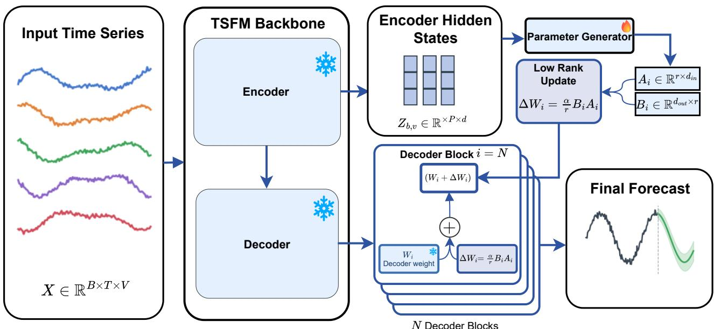  
Figure 1: Overview of the AdaCast architecture. Each univariate series $\mathbf { X } _ { b , v }$ in the input batch is passed through the frozen backbone encoder, whose hidden states $\mathbf { Z } _ { b , v }$ serve as the conditioning representation. The parameter generator takes this representation as its condition and emits a pair of low-rank matrices for every targeted module in every decoder block. Each pair forms the low-rank update for that module, and together they constitute the instance-specific update. These updates are injected additively into the corresponding frozen decoder weights, leaving the pretrained parameters unchanged and yielding the instance-adapted backbone, which produces the final forecast.

## 1.1 Contributions

Our contributions are summarized as follows:

1. Input-conditioned TSFM adaptation under distribution shift. Existing TSFM adaptation methods typically learn a single set of parameter updates and apply the same adapted model to heterogeneous inputs. We instead formulate TSFM adap tation as an input-conditioned problem, where parameter updates are generated for each time series according to its temporal characteristics. This formulation allows the model to better accommodate heterogeneous inputs and distribution shifts at inference time.

2. Conditional parameter generation for TSFMs. We introduce AdaCast, a conditional parameter generation framework that augments a frozen Chronos-Bolt backbone (Ansari et al., 2024) with a lightweight parameter generator. For each input time series, AdaCast derives an input-specific representation and generates low-rank parameter updates that customize the forecasting model to the current input. This enables per-instance adaptation during both training and inference.

3. Strong in-domain and cross-domain forecasting. We evaluate AdaCast on six benchmarks spanning energy, exchange-rate, and weather forecasting. AdaCast consistently outperforms zeroshot Chronos and static adaptation baselines in in-domain settings and achieves strong zero-shot generalization across domains. These comprehensive experiments demonstrate the efectiveness of AdaCast for adaptive forecasting.

## 2 RELATED WORK

Time Series Forecasting. Long-term forecasting has progressed from Transformer-based models with decomposition (Wu et al., 2021) or specialized attention (Zhou et al., 2021; Liu et al., 2022; Zhou et al., 2022), to patch-based and linear models (Nie et al., 2023; Zeng et al., 2023), and more recent convolutional and mixing architectures (Wu et al., 2023; Wang et al., 2024). These models perform well in-domain but are typically trained separately for each dataset and have limited zero-shot transfer. Each new domain therefore requires suficient training data which is impractical when data are scarce or new series appear frequently.

Time Series Foundation Models. TSFMs, such as Chronos and Chronos-Bolt (Ansari et al., 2024), TimesFM (Das et al., 2024), Moirai (Woo et al., 2024), MOMENT (Goswami et al., 2024), and TTM (Ekambaram et al., 2024), pretrain a shared backbone on large heterogeneous corpora for zero-shot forecasting. Domain adaptation typically relies on full fine-tuning or dataset-level LoRA (Hu et al., 2022), which produces a fixed parameter set shared across all inputs. Yet even within a single dataset, individual series can difer substantially; for example, the load profiles of residential and industrial electricity customers follow diferent daily and weekly patterns. A single adapter must average over this heterogeneity, so it may not fully capture the temporal patterns, seasonality, and dynamics of each individual series.

Instance-Specific Conditioning. A single set of weights must serve series with very diferent trends, seasonalities, and dynamics, so many methods inject instance-specific information at inference time. Retrieval-based methods fetch similar historical series or segments and fuse them with the input (Han et al., 2025; Ning et al., 2025; Zhou et al., 2026). Multimodal methods add side information such as text or images (Wu et al., 2026; Wang et al., 2025). Covariateaware methods condition on exogenous or knownfuture variables (Ansari et al., 2025; Khwaja et al., 2026). Despite their diferences, all of these act on the input or activation side: they supply extra context while the network weights stay fixed, so the weights are shared across instances and only the inputs difer. They also depend on external information that is often unavailable. This leaves open a complementary route: conditioning the weights themselves.

Conditional Parameter Generation. Conditioning the weights is the premise of hypernetworks (Ha et al., 2017), which generate model parameters from a conditioning signal. In time series forecasting, prior work has used them to generate forecasting parameters (Lee et al., 2022; Savchenko and Kachan, 2026) or to improve robustness under distribution shift (Duan et al., 2023). However, these methods typically condition on channel identities or distribution-level statistics rather than on the individual input series, and target relatively small, task-specific models. Beyond time series, HY-WU (Tencent HY Team, 2026) applies conditional parameter generation to text-guided image editing, and COPRA (Jacob et al., 2026) to vision-language-model-based video anomaly detection. These works show that generated parameters can adapt a model to each input, but this has not been explored for TSFMs. AdaCast fills this gap by generating input-specific LoRA updates for a frozen TSFM backbone, using only the input series.

## 3 METHOD

## 3.1 Problem Definition

Let $\textbf { X } \in \ \mathbb { R } ^ { B \times T \times V }$ denote a batch of multivariate time series, where B is the batch size, $T$ is the input sequence length, and V is the number of variables. Given $\mathbf { X } ,$ the goal is to predict the next H time steps, $\mathbf { Y } \in \overset { \cdot } { \mathbb { R } } ^ { B \times H \times V }$ , where H denotes the forecasting horizon. We use Chronos-Bolt (Ansari et al., 2024), a pretrained T5-based (Rafel et al., 2020) forecasting model, as the backbone $f _ { \theta } ,$ , where θ denotes its model parameters. Following the channel-independent strategy used by Chronos-Bolt, each variable is forecast independently.

Specifically, for sample $b \in \{ 1 , \ldots , B \}$ and variable $v \in$ $\{ 1 , \ldots , V \}$ , we extract the univariate history $\mathbf { x } _ { b , v } ~ =$ $\mathbf { X } _ { b , : , v } \in \mathbb { R } ^ { T }$ . The backbone produces forecasts for $Q$ quantile levels over the next H steps:

$$
\hat { \mathbf { q } } _ { b , v } = f _ { \theta } ( \mathbf { x } _ { b , v } ) \in \mathbb { R } ^ { Q \times H } ,\tag{1}
$$

where $Q$ is the number of predicted quantiles. Stacking the forecasts over all samples and variables gives $\hat { \mathbf { Q } } \in$ $\mathbb { R } ^ { B \times Q \times H \times V }$ . For point forecasting, we use the median (0.5 quantile) forecast (Ansari et al., 2024; Ning et al., 2025; Woo et al., 2024), yielding $\hat { \mathbf { Y } } \in \mathbb { R } ^ { B \times H \times \bar { V } }$

## 3.2 Overview

AdaCast adapts a pretrained TSFM on a per-instance basis, overcoming a key limitation of static adaptation methods that apply the same learned update to all inputs. Given the univariate input series $\mathbf { x } _ { b , v }$ and a pretrained forecasting backbone $f _ { \theta } .$ . A conventional static adaptation method learns a single global parameter update $\Delta \theta _ { \mathrm { s t a t i c } }$ and predicts

$$
\hat { \mathbf { q } } _ { b , v } = f _ { \theta + \Delta \theta _ { \mathrm { s t a t i c } } } \left( \mathbf { x } _ { b , v } \right) .\tag{2}
$$

After training, $\Delta \theta _ { \mathrm { s t a t i c } }$ is fixed and shared across all input series. During training, this update is learned from gradients produced by many time series. These series can difer in sampling frequency, seasonality, temporal dynamics, and statistical properties. Therefore, the learned update must capture diverse patterns that are useful across heterogeneous inputs. This can produce a general compromise rather than an update that is specialized for each input series.

Instead, AdaCast replaces the shared global update with an input-conditioned update. For each univariate input series, it computes

$$
\Delta \theta _ { b , v } = \mathcal { G } _ { \phi } ( \mathrm { E n c } _ { \theta } ( \mathbf { x } _ { b , v } ) ) , \qquad \hat { \mathbf { q } } _ { b , v } = f _ { \theta + \Delta \theta _ { b , v } } ( \mathbf { x } _ { b , v } ) ,\tag{3}
$$

where Encθ is the frozen encoder of the pretrained backbone. The function $\mathcal { G } _ { \phi }$ is a parameter generator with trainable parameters $\phi .$ . The encoder maps $\mathbf { x } _ { b , v }$ to a latent representation of the input series. The generator then uses this representation to produce the input-specific update $\Delta \theta _ { b , v }$

Unlike the global update in Eq. $( 2 ) , \Delta \theta _ { b , v }$ is specific to each input series. This allows AdaCast to adapt the backbone to the characteristics of each input. The pretrained backbone parameters θ remain frozen during training, and only the generator parameters ϕ are optimized. This design keeps the adaptation lightweight while allowing the efective model parameters to vary across inputs.

## 3.3 Conditional Parameter Generation

The parameter generator $\mathcal { G } _ { \phi }$ is a Transformer that maps the conditioning sequence ${ \bf Z } _ { b , v } ~ = ~ \mathrm { E n c } _ { \theta } ( { \bf x } _ { b , v } )$ to input-specific LoRA parameters for the frozen decoder. Following (Tencent HY Team, 2026; Jacob et al., 2026), the generator represents the LoRA parameters of each adapted module as a set of latent parameter tokens. The LoRA matrices are partitioned along the channel dimension into local segments. Each token has shape $\boldsymbol { r } \times d _ { s e g }$ , where r is the LoRA rank and $d _ { s e g }$ denotes the size of a local channel segment. Thus, each token represents a local part of the LoRA parameters while retaining all r rank components. The tokens are organized by decoder block, adapted mod ule, and channel segment. This organization preserves the structural location of each token in the backbone.

The initial parameter tokens are learnable and shared across all input series. They therefore provide a common structural template for parameter generation. For each input $\mathbf { x } _ { b , v }$ , the conditioning sequence $\mathbf { Z } _ { b , v }$ modifies this shared template. In each generator block, the parameter tokens cross-attend to $\mathbf { Z } _ { b , v }$ . This operation incorporates information from the current input into the parameter tokens. As the tokens pass through the generator blocks, they are progressively refined into an input-specific parameter representation.

Following (Tencent HY Team, 2026; Jacob et al., 2026), the generator applies self-attention in two factorized passes. Intra-layer attention connects parameter tokens from adapted modules within the same decoder block. Inter-layer attention connects structurally corresponding tokens across decoder blocks. Together, these passes model parameter dependencies within and across decoder layers. After the final generator block, the refined tokens are separated according to whether they belong to the LoRA A or B matrices. Separate projection heads map the corresponding tokens to parameter values. The projected tokens are then detokenized and assembled into the modulespecific A and B matrices.

## 3.4 LoRA Injection and Initialization

We apply input-specific LoRA updates to the same set of projection modules M in all N frozen decoder blocks. For block $i \in \{ 1 , \ldots , N \}$ and module $m \in \mathcal { M }$ let $\mathbf { W } ^ { ( i , m ) } \in \mathbb { R } ^ { d _ { \mathrm { o u t } } ^ { ( i , m ) } \times \bar { d } _ { \mathrm { i n } } ^ { ( i , m ) } }$ denote the frozen weight matrix. Here, $d _ { \mathrm { i n } } ^ { ( i , m ) }$ and $d _ { \mathrm { o u t } } ^ { ( i , m ) }$ are the module’s input and output dimensions. For each input series $\mathbf { x } _ { b , v } ,$ the generator produces

$$
\mathbf { A } _ { b , v } ^ { ( i , m ) } \in \mathbb { R } ^ { r \times d _ { \mathrm { i n } } ^ { ( i , m ) } } , \qquad \mathbf { B } _ { b , v } ^ { ( i , m ) } \in \mathbb { R } ^ { d _ { \mathrm { o u t } } ^ { ( i , m ) } \times r } ,
$$

where b indexes batch samples, v indexes variables, and r is the LoRA rank. The weight update and effective weight are

$$
\Delta \mathbf { W } _ { b , v } ^ { ( i , m ) } = \frac { \alpha } { r } \mathbf { B } _ { b , v } ^ { ( i , m ) } \mathbf { A } _ { b , v } ^ { ( i , m ) } ,\tag{4}
$$

$$
\widetilde { \mathbf { W } } _ { b , v } ^ { ( i , m ) } = \mathbf { W } ^ { ( i , m ) } + \Delta \mathbf { W } _ { b , v } ^ { ( i , m ) } .\tag{5}
$$

Following LoRA (Hu et al., 2022), we initialize the weights and any bias of the B output head to zero. The initial update is therefore zero, preserving the backbone’s pretrained forecasting behavior. With nonzero A factors, the B head can receive gradients at initialization. As its weights become nonzero, gradients can also reach earlier generator layers.

The generated updates are used only for the current forward pass and cleared afterward. We optimize only the generator parameters ϕ; all pretrained backbone parameters remain frozen.

## 3.5 End-to-End Training

We train AdaCast end-to-end by optimizing only the generator parameters ϕ. All backbone parameters $\theta ,$ including those of the conditioning encoder, remain frozen. For each input series $\mathbf { x } _ { b , v }$ , the adapted backbone predicts Q quantiles over a forecast horizon of H steps:

$$
\begin{array} { r } { \hat { \mathbf { q } } _ { b , v } = f _ { \theta + \Delta \theta _ { b , v } } ( \mathbf { x } _ { b , v } ) \in \mathbb { R } ^ { Q \times H } , } \end{array}\tag{6}
$$

where $\Delta \theta _ { b , v }$ is the input-specific update produced by the generator. The entry $\hat { q } _ { b , v } ^ { ( j , h ) }$ denotes the predicted value at quantile level $q _ { j } \in ( 0 , 1 )$ and forecast step h.

For quantile level $q _ { j }$ , target value $y ,$ and predicted value ˆq, we use the scaled quantile loss

$$
\ell _ { q _ { j } } ( y , \hat { q } ) = \left\{ \begin{array} { l l } { 2 q _ { j } \left( y - \hat { q } \right) } & { \mathrm { i f ~ } y > \hat { q } , } \\ { 2 ( 1 - q _ { j } ) \left( \hat { q } - y \right) } & { \mathrm { o t h e r w i s e } . } \end{array} \right.\tag{7}
$$

Table 1: Zero-shot forecasting (T=512, H=64). Best and second-best results are bold and underlined, respectively. “—” indicates that zero-shot results are not reported because the evaluation dataset was included in the backbone’s pretraining data (e.g., Weather). AdaCast achieves the best MSE and MAE on five of six datasets and the lowest average error, reducing average MSE by 1.0% over static LoRA and 2.3% over the frozen backbone in zero-shot setting.
<table><tr><td></td><td colspan="2">AdaCast(Ours)</td><td colspan="2">Chronos-BoltB LoRA</td><td colspan="2">Chronos-BoltB</td><td colspan="2">MOMENT</td><td colspan="2">TTMB</td><td colspan="2">MoiraiB</td><td colspan="2">TimesFM</td></tr><tr><td>Dataset</td><td>MSE</td><td>MAE</td><td>MSE</td><td>MAE</td><td>MSE</td><td>MAE</td><td>MSE</td><td>MAE</td><td>MSE</td><td>MAE</td><td>MSE</td><td>MAE</td><td>MSE</td><td>MAE</td></tr><tr><td>ETTh1</td><td>0.3593</td><td>0.3635</td><td>0.3569</td><td>0.3633</td><td>0.3616</td><td>0.3650</td><td>0.3920</td><td>0.4110</td><td>0.3619</td><td>0.3710</td><td>0.3686</td><td>0.3835</td><td>0.4254</td><td>0.3825</td></tr><tr><td>ETTh2</td><td>0.2450</td><td>0.2979</td><td>0.2491</td><td>0.2988</td><td>0.2517</td><td>0.2992</td><td>0.2742</td><td>0.3327</td><td>0.2531</td><td>0.3032</td><td>0.2547</td><td>0.3053</td><td>0.2894</td><td>0.3233</td></tr><tr><td>ETTm1</td><td>0.3017</td><td>0.3143</td><td>0.3057</td><td>0.3169</td><td>0.3109</td><td>0.3185</td><td>0.3506</td><td>0.3824</td><td>0.3152</td><td>0.3248</td><td>0.5399</td><td>0.4322</td><td>0.3321</td><td>0.3326</td></tr><tr><td>ETTm2</td><td>0.1485</td><td>0.2228</td><td>0.1493</td><td>0.2232</td><td>0.1487</td><td>0.2236</td><td>0.1703</td><td>0.2579</td><td>0.1511</td><td>0.2405</td><td>0.1958</td><td>0.2687</td><td>0.1703</td><td>0.2552</td></tr><tr><td>Weather</td><td>0.1491</td><td>0.1789</td><td>0.1515</td><td>0.1816</td><td>0.1525</td><td>0.1825</td><td>0.1801</td><td>0.2384</td><td>0.1543</td><td>0.1893</td><td>0.1711</td><td>0.1912</td><td></td><td></td></tr><tr><td>Exchange</td><td>0.0594</td><td>0.1683</td><td>0.0633</td><td>0.1732</td><td>0.0673</td><td>0.1780</td><td>0.0979</td><td>0.2059</td><td>0.0657</td><td>0.1725</td><td>0.0663</td><td>0.1720</td><td>0.0695</td><td>0.1802</td></tr><tr><td>Average</td><td>0.2105</td><td>0.2576</td><td>0.2126</td><td>0.2595</td><td>0.2155</td><td>0.2611</td><td>0.2442</td><td>0.3047</td><td>0.2169</td><td>0.2669</td><td>0.2661</td><td>0.2922</td><td></td><td></td></tr></table>

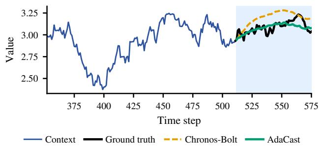

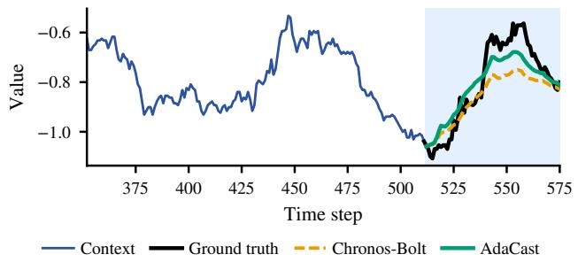  
Figure 2: Qualitative forecasting examples with context length $T = 5 1 2$ and forecast horizon $H = 6 4$ . Each panel shows the observed context, ground-truth future, frozen Chronos-Bol $\mathrm { , } _ { \mathrm { B } }$ forecast, and AdaCast forecast.

The training objective averages over B batch samples, V variables, and Q quantile levels as:

$$
\mathcal { L } = \frac { 1 } { B V Q } \sum _ { b = 1 } ^ { B } \sum _ { v = 1 } ^ { V } \sum _ { h = 1 } ^ { H } \sum _ { j = 1 } ^ { Q } \ell _ { q _ { j } } \left( \mathbf { Y } _ { b , h , v } , \hat { q } _ { b , v } ^ { ( j , h ) } \right) ,\tag{8}
$$

where $\mathbf { Y } _ { b , h , v }$ is the target value for sample b, variable v, and forecast step h. Gradients from L propagate through the adapted decoder and generated LoRA factors to update $\phi .$

## 4 EXPERIMENTS

Our experiments address four questions. (1) Zeroshot accuracy: Does AdaCast improve forecasts on datasets excluded from generator pretraining? (2) Input-specific conditioning: Does conditional parameter generation outperform static LoRA, and do the gains depend on matching each input with its generated update? (3) Design sensitivity: Which decoder segments contribute to adaptation, and how does the LoRA rank afect performance? (4) Backbone transfer: Do the benefits extend beyond Chronos-Bolt to other backbones? We first describe the experimental setup, then examine the questions through baseline comparisons, controlled interventions, and sensitivity analyses across multiple datasets.

## 4.1 Experimental Setup

Training and evaluation settings. For zero-shot evaluation, we train the generator on an external corpus without using target datasets. For in-domain evaluation, we train it on each target dataset’s train ing split. In both settings, the backbone remains frozen, and the generator produces input-specific updates from the context at inference.

Datasets. We build the generator pretraining corpus from GiftEvalPretrain (Aksu et al., 2024), excluding ETT, Weather, and Exchange. Each variable is treated as an independent univariate series. We extract approximately five million windows with T = 512 context observations and H = 64 target observations, then globally shufle them.

We evaluate on six benchmarks that cover diferent domains and sampling intervals. The four ETT datasets record electricity transformer temperatures over two years: ETTh1 and ETTh2 use hourly observations, whereas ETTm1 and ETTm2 use 15-minute observations (Zhou et al., 2021). Weather contains 21 meteorological indicators recorded at a German weather station every 10 minutes over one year (Wu et al., 2021). Exchange contains daily exchange rates for eight countries from 1990 to 2016 (Lai et al., 2018). We use the standard chronological training, validation, and test splits (Nie et al., 2023). All experiments use context length $T = 5 1 2$ and forecast horizon $H = 6 4$

Evaluation metrics. We report mean squared error (MSE) and mean absolute error (MAE), averaged across variables. For quantile forecasts, we use the predicted median (0.5 quantile). Lower values are better.

Baselines. We compare AdaCast with five pretrained TSFMs: Chronos-Bolt (Ansari et al., 2024), MOMENT (Goswami et al., 2024), $\mathrm { T T M _ { B } }$ (Ekambaram et al., 2024), MoiraiB (Woo et al., 2024), and TimesFM (Das et al., 2024). Their zero-shot results are taken from (Ning et al., 2025) under the same evaluation protocol. Frozen Chronos-Bolt is the direct backbone reference: it forecasts without generated parameter updates.

We also train a static LoRA baseline on the same GiftEvalPretrain corpus used for AdaCast. This baseline learns one shared adapter for the frozen Chronos-BoltB backbone. The comparison tests whether conditional generation provides gains beyond adaptation on the same external data. For the in-domain comparison, we train static LoRA separately on each target dataset’s training split.

Implementation details. AdaCast uses the frozen amazon/chronos-bolt-base backbone. Only the parameter generator $\mathcal { G } _ { \phi }$ is optimized. The generator contains $N _ { \mathrm { p g } }$ Transformer blocks with hidden dimension $d _ { \mathrm { p g } } = 7 6 8$ . We use $N _ { \mathrm { p g } } = 8$ for zero-shot experiments and $N _ { \mathrm { p g } } = 1$ for in-domain experiments. Unless otherwise stated, the LoRA rank is $r = 3 2$ and the scaling parameter is $\alpha = 1 2 8$ . We adapt the same target projection modules in all $N = 1 2$ decoder blocks. We train with AdamW using learning rate $\eta = 1 0 ^ { - 7 }$ and batch size $B = 3 2$ . In-domain hyperparameters are selected on the validation split. Unless otherwise stated, experiments use a random seed of 1. The zero-shot input– update pairing experiment reports averages over seeds {1, 43, 2021}. Experiments run on four NVIDIA RTX PRO 6000 GPUs.

## 4.2 Zero-Shot Forecasting Results

We first test whether generator pretraining improves forecasting on datasets excluded from its training corpus. Table 1 compares AdaCast with other TSFMs and the corpus-trained static LoRA baseline.

AdaCast achieves the lowest MSE and MAE on five of the six datasets: ETTh2, ETTm1, ETTm2, Weather, and Exchange. It also achieves the lowest average errors, with MSE of 0.2105 and MAE of 0.2576. Compared with the frozen pretrained baselines, AdaCast improves both metrics on all six datasets. Relative to its own frozen backbone, Chronos-BoltB, it reduces average MSE by 2.3%. Figure 2 provides example forecasts for comparison with the frozen backbone.

Table 2: In-domain conditional generation versus static adaptation. All methods use Chronos-Bolt . Static LoRA and AdaCast use $r = 3 2$ and $\alpha = 1 2 8 ;$ AdaCast uses $N _ { \mathrm { p g } } = 1$ . Each cell reports $\mathrm { M S E / M A E }$ Bold marks the best result. At the same rank and scaling, AdaCast outperforms both the frozen backbone and static LoRA.
<table><tr><td>Dataset</td><td>Frozen Backbone</td><td>Static LoRA</td><td>AdaCast</td></tr><tr><td>ETTh1</td><td>0.3616 /0.3650</td><td>0.3505 /0.3610</td><td>0.3431 /0.3594</td></tr><tr><td>ETTh2</td><td>0.2517/0.2992</td><td>0.2412/0.2997</td><td>0.2370 /0.2919</td></tr><tr><td>ETTm1</td><td>0.3109/0.3185</td><td>0.2840/0.3155</td><td>0.2603/0.3040</td></tr><tr><td>ETTm2</td><td>0.1487/0.2236</td><td>0.1401/0.2171</td><td>0.1385/0.2160</td></tr></table>

## 4.3 Input-specific Conditioning

Instance-conditioned versus static adaptation. We next test whether input-conditioned adaptation improves in-domain forecasting over a single shared LoRA adapter. We compare three models on the four ETT datasets: frozen Chronos-Bolt , in-domain static LoRA, and in-domain AdaCast. Static LoRA learns one fixed pair of factors (A, B) per target module and applies it to all inputs. AdaCast instead generates these factors from each input series’ representation during both training and inference. This allows the updates to reflect the temporal characteristics of individual series rather than remain fixed.

Both methods are trained on each target dataset’s training split using the same frozen backbone. They adapt the same projection modules in all 12 decoder blocks, with LoRA rank r = 32 and scaling parameter $\alpha = 1 2 8$ . Static LoRA learns shared updates, whereas AdaCast generates input-specific updates. AdaCast uses a one-block generator $( N _ { \mathrm { p g } } \ = \ 1 )$ with learning rate $\eta = 1 0 ^ { - 7 }$

Table 2 shows that AdaCast achieves lower MSE and MAE than both static LoRA and the frozen backbone on all four datasets. The largest MSE reduction over static LoRA occurs on ETTm1. The same trend holds on Weather and Exchange, where AdaCast again outperforms static LoRA on both metrics (Table 6 in Appendix). These results support conditional generation under matched LoRA configurations.

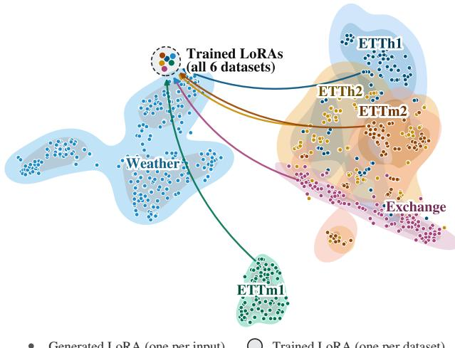  
Figure 3: Joint t-SNE visualization of LoRA parameters across six datasets. Static adaptation contributes one adapter per dataset; AdaCast contributes one adapter per sampled input. Generated LoRAs cover a wide region of parameter space and are organized by dataset: each input receives its own update. Trained LoRAs are fixed points: every input from a dataset receives the same update. Each arrow marks the LoRA gap between a dataset’s trained LoRA and the generated LoRAs for the same dataset.

However, AdaCast introduces a trainable generator. The next experiment therefore tests the value of inputspecific pairing without changing the trained model.

Figure 3 provides a qualitative view of the adapter parameters. We flatten six static adapters, one trained per dataset, and AdaCast adapters generated for inputs from the same datasets. We then embed the vectors jointly with t-SNE. The generated adapters form dataset-specific groups in this projection, whereas the six static adapters appear close together.

Does the input–update pairing matter? We test whether AdaCast benefits from matching each input with its own generated LoRA update. At inference, we replace each input’s update with one generated for a diferent, randomly selected input from the same test set. The trained generator, backbone, and test inputs remain unchanged; only the input–update pairing changes. If updates are largely interchangeable within a dataset, shufling should have little efect on accuracy. Table 3 compares matched and shufled updates.

In-domain, shufling increases MSE on all six datasets. Average MSE rises from 0.1936 to 0.1977, with the largest increases on ETTh2 (+0.0079) and ETTm1 (+0.0063). These results support a benefit from matching inputs with their generated updates. The zero-shot efect is smaller. Shufling increases MSE on five datasets and slightly decreases it on ETTm1. Average MSE rises from 0.2099 to 0.2111, indicating a smaller benefit from correct pairing.

Table 3: Efect of shufling generated LoRA updates across test inputs. Entries report MSE. ∆ is shuffled MSE minus matched MSE; positive values indicate higher error after shufling. Shufling increases average error in both settings, suggesting that AdaCast benefits from updates matched to each input.
<table><tr><td></td><td colspan="3">Zero-shot</td><td colspan="3">In-domain</td></tr><tr><td>Dataset</td><td>Matched</td><td>Shuffled</td><td> $\Delta$ </td><td>Matched</td><td>Shuffled</td><td>∆</td></tr><tr><td>ETTh1</td><td>0.3582</td><td>0.3594</td><td>+0.0012</td><td>0.3431</td><td>0.3450</td><td>+0.0019</td></tr><tr><td>ETTh2</td><td>0.2442</td><td>0.2478</td><td>+0.0036</td><td>0.2370</td><td>0.2449</td><td>+0.0079</td></tr><tr><td>ETTm1</td><td>0.3008</td><td>0.3005</td><td>-0.0003</td><td>0.2603</td><td>0.2666</td><td>+0.0063</td></tr><tr><td>ETTm2</td><td>0.1481</td><td>0.1494</td><td>+0.0013</td><td>0.1385</td><td>0.1401</td><td>+0.0016</td></tr><tr><td>Weather</td><td>0.1490</td><td>0.1491</td><td>+0.0001</td><td>0.1255</td><td>0.1295</td><td>+0.0040</td></tr><tr><td>Exchange</td><td>0.0591</td><td>0.0601</td><td>+0.0010</td><td>0.0571</td><td>0.0602</td><td>+0.0031</td></tr><tr><td>Average</td><td>0.2099</td><td>0.2111</td><td>+0.0012</td><td>0.1936</td><td>0.1977</td><td>+0.0041</td></tr></table>

Table 4: Efect of disabling LoRA updates in one decoder segment. Segments 1, 2, and 3 contain blocks 1–4, 5–8, and 9–12, respectively. Results use the indomain setting. Each cell reports MSE / MAE. Bold marks the largest error among the segment-disabled configurations. Disabling updates in any segment increases error, suggesting that all decoder segments contribute to AdaCast’s gains.
<table><tr><td></td><td colspan="3">Segment Disabled</td><td>Full</td></tr><tr><td>Dataset</td><td>Seg 1</td><td>Seg 2</td><td>Seg 3</td><td>AdaCast</td></tr><tr><td>ETTh1</td><td>0.3510 / 0.3617</td><td>0.3460 / 0.3596</td><td>0.3491 / 0.3603</td><td>0.3431 / 0.3594</td></tr><tr><td>ETTh2</td><td>0.2432 / 0.2946</td><td>0.2416/0.2940</td><td>0.2377/0.2923</td><td>0.2370/0.2919</td></tr><tr><td>ETTm1</td><td>0.2957/0.3132</td><td>0.2751/0.3056</td><td>0.2747/0.3064</td><td>0.2603/0.3040</td></tr><tr><td>ETTm2</td><td>0.1447 / 0.2202</td><td>0.1400/0.2168</td><td>0.1403/0.2168</td><td>0.1385/0.2160</td></tr></table>

## 4.4 Contributions of Decoder Segments

We divide the 12 decoder blocks into three equal segments and disable LoRA updates in one segment at a time. The other segments remain adapted, and all backbone weights stay frozen.

Disabling any segment increases both metrics on all four datasets (Table 4). Removing early-segment updates causes the largest degradation. All tested configurations still outperform the frozen backbone (Table 2), indicating that adaptation remains beneficial with one segment disabled.

## 4.5 Sensitivity to LoRA Rank

We evaluate LoRA ranks $r \in \{ 1 6 , 3 2 , 6 4 , 1 2 8 \}$ in the zero-shot setting. All configurations use $N _ { \mathrm { p g } } ~ = ~ 8 ,$ learning rate $\eta ~ = ~ 1 0 ^ { - 7 }$ , and the same five-millionwindow pretraining corpus.

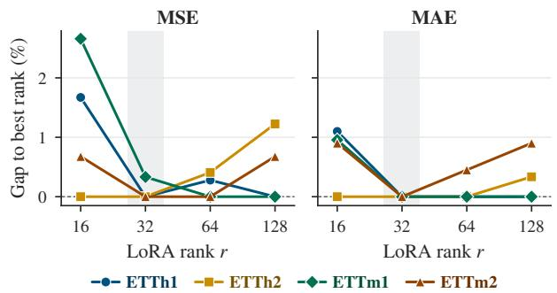  
Figure 4: Sensitivity of zero-shot forecasting to LoRA rank. Curves show each dataset’s relative error gap (%) to its best tested rank: MSE (left) and MAE (right). Zero indicates the best result, including ties. The shaded band marks the default rank r = 32.

Figure 4 shows that $r = 1 6$ underperforms compared to the higher ranks on ETTh1 and ETTm1. Among $r \in \{ 3 2 , 6 4 , 1 2 8 \}$ , reported MSE diferences are at most 0.003, with no consistently best rank. The default $r \ = \ 3 2$ matches or nearly matches the lowest MSE on each dataset while requiring fewer generated parameters than $r = 6 4 \ \mathrm { o r } \ r = 1 2 8$

## 4.6 Extension to a Decoder-Only Backbone

We apply AdaCast to TimesFM 2.5 (Das et al., 2024) to test its efectiveness beyond Chronos-Bolt. Because TimesFM has no separate encoder, we extract the conditioning sequence from its final decoder hidden states: ${ \bf Z } _ { b , v } = f _ { \theta } ^ { ( L ) } ( { \bf x } _ { b , v } ) \in \mathbb { R } ^ { P \times d _ { \mathrm { t f m } } }$ , where $f _ { \theta } ^ { ( L ) }$ returns the hidden states of the final decoder layer, P is the number of context representation tokens, and $d _ { \mathrm { t f m } }$ is the hidden dimension. TimesFM uses causal attention, so each token attends only to the tokens before it, only after the entire context has been processed does the final layer hold representations that reflect the full input. The generator produces $\Delta \theta _ { b , v } = \mathcal G _ { \phi } ( \mathbf { Z } _ { b , v } )$ , and a second backbone pass applies these updates to produce the forecast. Inference therefore requires two backbone passes, in addition to the generator computation. The second pass is necessary because the generated updates modify layers that precede the final layer, while $\mathbf { Z } _ { b , v }$ is available only after the full pass completes; the updates therefore cannot be applied within the pass that produces them.

We evaluate both zero-shot and in-domain generator training using the settings in Section 4.1. Table 5 compares the adapted models with frozen TimesFM 2.5.

Both AdaCast variants reduce MSE on all six datasets. Average MSE decreases from 0.2195 to 0.2112 with zero-shot adaptation and 0.2008 with in-domain adaptation. In-domain adaptation also lowers average MAE from 0.2626 to 0.2574, whereas zero-shot adaptation slightly increases it to 0.2628. Thus, AdaCast’s MSE gains extend to a second backbone, although zero-shot MAE gains remain mixed.

Table 5: AdaCast on TimesFM 2.5 $( T = 5 1 2 ,$ H = 64). Cells report MSE / MAE. Bold marks the best result for each metric. AdaCast transfers to a second backbone, lowering MSE over frozen TimesFM 2.5 on every dataset in both settings. Average MSE drops by 3.8% in zero-shot and 8.5% in-domain.
<table><tr><td></td><td></td><td colspan="2">AdaCast-TimesFM 2.5</td></tr><tr><td>Dataset</td><td>Frozen TimesFM 2.5</td><td>Zero-shot</td><td>In-domain</td></tr><tr><td>ETTh1</td><td>0.3734/0.3729</td><td>0.3628/0.3766</td><td>0.3475/0.3656</td></tr><tr><td>ETTh2</td><td>0.2792/0.3151</td><td>0.2610/0.3132</td><td>0.2548 /0.3069</td></tr><tr><td>ETTm1</td><td>0.2988 /0.3186</td><td>0.2874/0.3175</td><td>0.2764/ /0.3150</td></tr><tr><td>ETTm2</td><td>0.1574/0.2295</td><td>0.1534/0.2301</td><td>0.1410 /0.2228</td></tr><tr><td>Weather</td><td>0.1430/ 0.1686</td><td>0.1403/0.1689</td><td>0.1289 /0.1694</td></tr><tr><td>Exchange</td><td>0.0651/0.1710</td><td>0.0621 /0.1706</td><td>0.0559 /0.1644</td></tr><tr><td>Average</td><td>0.2195 /0.2626</td><td>0.2112 /0.2628</td><td>0.2008 /0.2574</td></tr></table>

## 5 CONCLUSION AND DISCUSSION

We introduced AdaCast, which generates inputconditioned low-rank updates for a frozen forecasting backbone without test-time optimization. Experiments on six benchmarks show improved zeroshot forecasting over frozen Chronos-Bolt, while indomain comparisons show gains over static LoRA. The MSE improvements extend to the decoder-only TimesFM 2.5 backbone as well. Shufling generated updates increases average error in both settings, supporting a benefit from matching each input with its own update. The larger efect in the tested indomain configuration suggests stronger reliance on correct pairing. However, diferences in generator depth prevent attributing this contrast solely to the training regime. Decoder ablations show the greatest sensitivity to removing early-block updates, while the rank study supports r = 32 as a practical choice.

Several questions remain. AdaCast is an univariate model, leaving cross-variate conditioning unexplored. The greater sensitivity to early-block updates also requires further study. In addition, the TimesFM implementation incurs an extra backbone pass. Future work will explore cross-variate conditioning, clarify the role of decoder depth, strengthen input-specific adaptation on unseen domains, and reduce inference overhead. Overall, these results support conditional parameter generation as a promising to shared static adaptation for time-series forecasting.

## References

Aksu, T., Woo, G., Liu, J., Liu, X., Liu, C., Savarese, S., Xiong, C., and Sahoo, D. (2024). Gift-eval: A benchmark for general time series forecasting model evaluation. arxiv preprint arxiv:2410.10393.

Alonso, M. N. I. and Franklin, R. P. (2026). Pretrained time-series foundation models for financial return forecasting.

Ansari, A. F., Shchur, O., K¨uken, J., Auer, A., Han, B., Mercado, P., Rangapuram, S. S., Shen, H., Stella, L., Zhang, X., Goswami, M., Kapoor, S., Maddix, D. C., Guerron, P., Hu, T., Yin, J., Erickson, N., Desai, P. M., Wang, H., Rangwala, H., Karypis, G., Wang, Y., and Bohlke-Schneider, M. (2025). Chronos-2: From univariate to universal forecasting.

Ansari, A. F., Stella, L., Turkmen, C., Zhang, X., Mercado, P., Shen, H., Shchur, O., Rangapuram, S. S., Arango, S. P., Kapoor, S., Schulz, J., Nigro, L., Seeger, M., Salinas, D., Gasthaus, J., and Januschowski, T. (2024). Chronos: Learning the language of time series. Transactions on Machine Learning Research.

Das, A., Kong, W., Leach, A., Mathur, S. K., Sen, R., and Yu, R. (2024). A decoder-only foundation model for time-series forecasting. In Proceedings of the 41st International Conference on Machine Learning (ICML).

Duan, W., He, X., Zhou, L., Thiele, L., and Rao, H. (2023). Combating distribution shift for accurate time series forecasting via hypernetworks. In 28th International Conference on Parallel and Distributed Systems (ICPADS), pages 900–907.

Ekambaram, V., Jati, A., Nguyen, N., Sinthong, P., and Kalagnanam, J. (2024). Tiny time mixers (TTMs): Fast pre-trained models for enhanced zero/few-shot forecasting of multivariate time series. Advances in Neural Information Processing Systems (NeurIPS).

Gao, L., la Tour, T. D., Tillman, H., Goh, G., Troll, R., Radford, A., Sutskever, I., Leike, J., and Wu, J. (2024). Scaling and evaluating sparse autoencoders.

Goswami, M., Szafer, K., Choudhry, A., Cai, Y., Li, S., and Dubrawski, A. (2024). MOMENT: A family of open time-series foundation models. In Proceedings of the 41st International Conference on Machine Learning (ICML).

Guo, Q., Zhao, B., Song, M., and Zhong, G. (2026). A survey of deep learning for time series forecasting: Taxonomy, analysis and future directions. IEEE Transactions on Knowledge and Data Engineering, 38(5):2541–2560.

Ha, D., Dai, A., and Le, Q. V. (2017). Hypernetworks. In International Conference on Learning Representations (ICLR).

Han, S., Lee, S., Cha, M., Arik, S. O., and Yoon, J. (2025). Retrieval augmented time series forecasting. arXiv preprint arXiv:2505.04163.

Hu, E. J., Shen, Y., Wallis, P., Allen-Zhu, Z., Li, Y., Wang, S., Wang, L., and Chen, W. (2022). LoRA: Low-rank adaptation of large language models. In International Conference on Learning Representations (ICLR).

Jacob, D. C., Liu, X., Wang, K., and He, P. (2026). Copra: Conditional parameter adaptation with reinforcement learning for video anomaly detection. In Advances in Neural Information Processing Systems. arXiv:2605.15325.

Khwaja, E., Lettieri, C., Woo, G., Belouadah, E., Cenac, M., Jarry, G., Paquin, E., Zhao, X., Zhukov, V., Abou-Amal, O., Liu, C., Talwalkar, A., and Asker, D. (2026). Toto 2.0: Time series forecasting enters the scaling era.

Lai, G., Chang, W.-C., Yang, Y., and Liu, H. (2018). Modeling long- and short-term temporal patterns with deep neural networks. In Proceedings of the 41st International ACM SIGIR Conference, pages 95–104.

Lee, J., Kim, C., Lee, G., Lim, H., Choi, J., Lee, K., Lee, D., Hong, S., and Park, N. (2022). Time series forecasting with hypernetworks generating parameters in advance. arXiv preprint arXiv:2211.12034.

Liu, Y., Wu, H., Wang, J., and Long, M. (2022). Nonstationary transformers: Exploring the stationarity in time series forecasting. In Advances in Neural Information Processing Systems (NeurIPS), volume 35, pages 9881–9893.

Mishra, A. (2026). Dissecting Chronos: Sparse autoencoders reveal causal feature hierarchies in time series foundation models.

Nie, Y., Nguyen, N. H., Sinthong, P., and Kalagnanam, J. (2023). A time series is worth 64 words: Long-term forecasting with transformers. In International Conference on Learning Representations (ICLR).

Ning, K., Pan, Z., Liu, Y., Jiang, Y., Zhang, J. Y., Rasul, K., Schneider, A., Ma, L., Nevmyvaka, Y., and Song, D. (2025). Ts-rag: Retrieval-augmented generation based time series foundation models are stronger zero-shot forecaster.

Rafel, C., Shazeer, N., Roberts, A., Lee, K., Narang, S., Matena, M., Zhou, Y., Li, W., and Liu, P. J. (2020). Exploring the limits of transfer learning with a unified text-to-text transformer. Journal of Machine Learning Research, 21(140):1–67.

Savchenko, A. and Kachan, O. (2026). HN-MVTS: Hypernetwork-based multivariate time series forecasting. In Proceedings of the AAAI Conference on Artificial Intelligence.

Templeton, A., Conerly, T., Marcus, J., Lindsey, J., Bricken, T., Chen, B., Pearce, A., Citro, C., Ameisen, E., Jones, A., Cunningham, H., Turner, N. L., McDougall, C., MacDiarmid, M., Tamkin, A., Durmus, E., Hume, T., Mosconi, F., Freeman, C. D., Sumers, T. R., Rees, E., Batson, J., Jermyn, A., Carter, S., Olah, C., and Henighan, T. (2024). Scaling monosemanticity: Extracting interpretable features from Claude 3 Sonnet. Transformer Circuits Thread. Published May 21, 2024.

Tencent HY Team (2026). HY-WU (part I): An extensible functional neural memory framework and an instantiation in text-guided image editing. Technical Report.

Wang, C., Qi, Q., Wang, J., Sun, H., Zhuang, Z., Wu, J., Zhang, L., and Liao, J. (2025). ChatTime: A unified multimodal time series foundation model bridging numerical and textual data. In Proceedings of the AAAI Conference on Artificial Intelligence, volume 39, pages 12694–12702.

Wang, S., Wu, H., Shi, X., Hu, T., Luo, H., Ma, L., Zhang, J. Y., and Zhou, J. (2024). TimeMixer: Decomposable multiscale mixing for time series forecasting. In International Conference on Learning Representations (ICLR).

Wang, Y., Wu, H., Dong, J., Liu, Y., Wang, C., Long, M., and Wang, J. (2026). Deep time series models: A comprehensive survey and benchmark. IEEE Transactions on Pattern Analysis and Machine Intelligence, pages 1–20.

Woo, G., Liu, C., Kumar, A., Xiong, C., Savarese, S., and Sahoo, D. (2024). Unified training of universal time series forecasting transformers. In Proceedings of the 41st International Conference on Machine Learning (ICML), pages 53140–53164.

Wu, H., Hu, T., Liu, Y., Zhou, H., Wang, J., and Long, M. (2023). TimesNet: Temporal 2D-variation modeling for general time series analysis. In International Conference on Learning Representations (ICLR).

Wu, H., Xu, J., Wang, J., and Long, M. (2021). Autoformer: Decomposition transformers with Auto-Correlation for long-term series forecasting. In Advances in Neural Information Processing Systems (NeurIPS), volume 34, pages 22419–22430.

Wu, X., Jin, J., Qiu, W., Chen, P., Shu, Y., Yang, B., and Guo, C. (2026). Aurora: Towards universal generative multimodal time series forecasting. In ICLR.

Yanes-Pulido, J. and Rodrigues, F. (2026). Time series foundation models as strong baselines in transportation forecasting: A large-scale benchmark analysis.

Zeng, A., Chen, M., Zhang, L., and Xu, Q. (2023). Are transformers efective for time series forecasting? In Proceedings of the AAAI Conference on Artificial Intelligence, pages 11121–11128.

Zhou, H., Zhang, S., Peng, J., Zhang, S., Li, J., Xiong, H., and Zhang, W. (2021). Informer: Beyond eficient transformer for long sequence time-series forecasting. In Proceedings of the AAAI Conference on Artificial Intelligence, pages 11106–11115.

Zhou, S., Sch¨oner, H., Wu, Z., Fouch´e, E., Wilson, I., and Wang, S. (2026). Stationarity-aware retrievalaugmented time series forecasting.

Zhou, T., Ma, Z., Wen, Q., Wang, X., Sun, L., and Jin, R. (2022). FEDformer: Frequency enhanced decomposed transformer for long-term series forecasting. In Proceedings of the 39th International Conference on Machine Learning (ICML), pages 27268–27286.

## A DATASET STATISTICS

We evaluate AdaCast on six publicly available time series forecasting benchmarks spanning energy, meteorological, and financial domains. Table 6 reports the exact statistics for each dataset, where C and T denote the number of channels (variates) and total timesteps, respectively, and $( N _ { \mathrm { t r a i n } } , N _ { \mathrm { v a l } } , N _ { \mathrm { t e s t } } )$ denotes the corresponding split sizes.

Table 6: Statistics of evaluation datasets.
<table><tr><td>Dataset</td><td>C</td><td>T</td><td> $( N _ { \mathrm { t r a i n } } , N _ { \mathrm { v a l } } , N _ { \mathrm { t e s t } } )$ </td></tr><tr><td>ETTh1</td><td>7</td><td>17,420</td><td>(8065, 2817, 2817)</td></tr><tr><td>ETTh2</td><td>7</td><td>17,420</td><td>(8065, 2817, 2817)</td></tr><tr><td>ETTm1</td><td>7</td><td>69,680</td><td>(33985, 11457, 11457)</td></tr><tr><td>ETTm2</td><td>7</td><td>69,680</td><td>(33985, 11457, 11457)</td></tr><tr><td>Exchange Rate</td><td>8</td><td>7,588</td><td>(4736, 697, 1454)</td></tr><tr><td>Weather</td><td>21</td><td>52,696</td><td>(36312, 5207, 10476)</td></tr></table>

## B BASELINE METHODS

We compare AdaCast against six publicly available time series foundation models, evaluated Zeroshot without any dataset-specific fine-tuning. These baselines span five distinct architectural families: tokenized autoregressive transformers, patch-based direct-forecasting transformers, maskedreconstruction encoder transformers, an MLP-Mixer model with no self-attention, and a decoder-only causal transformer.

Chronos (Base) Ansari et al. (2024). The original Chronos formulation casts forecasting as a language modeling problem: the input series is scaled and quantized into a fixed discrete vocabulary, and a T5-based encoder-decoder is trained with a standard cross-entropy objective over this vocabulary, identically to a text-based LLM. At inference time, future trajectories are sampled autoregressively, token by token, from the learned categorical distribution, and multiple sampled trajectories are aggregated to form a probabilistic forecast.

Chronos-Bolt (Base) Ansari et al. (2024). Chronos-Bolt retains the same T5 encoder-decoder backbone as Chronos but replaces token-level quantization with patch-based tokenization: the historical context is chunked into patches, embedded, and passed through the encoder, after which the decoder directly regresses multiple quantile levels for the entire forecast horizon in a single forward pass rather than decoding autoregressively. This direct multi-step formulation is also the backbone adapted by AdaCast.

Table 7: Training cost of static LoRA and AdaCast on the frozen Chronos-Bolt backbone, single NVIDIA RTX PRO 6000 (T=512, H=64, r=32, α=128). Perseries time is epoch time divided by the number of univariate series processed per epoch.
<table><tr><td></td><td>Static LoRA</td><td>AdaCast</td></tr><tr><td>Frozen backbone params Trainable params Trainable fraction</td><td>205,292,928 7,667,712</td><td>205,292,928 12,864,000 5.90%</td></tr><tr><td>Batch size</td><td>3.60% 32</td><td>32</td></tr><tr><td>Time per univariate series (ms)</td><td></td><td></td></tr><tr><td>ETTh1</td><td>0.39</td><td>12.22</td></tr><tr><td>ETTh2</td><td>0.40</td><td>12.24</td></tr><tr><td>ETTm1</td><td></td><td></td></tr><tr><td>ETTm2</td><td>0.39</td><td>12.20</td></tr><tr><td></td><td>0.39</td><td>12.19</td></tr><tr><td>Weather</td><td>0.30</td><td>12.27</td></tr><tr><td>Exchange</td><td>0.39</td><td>12.07</td></tr><tr><td>Wall-clock per epoch</td><td></td><td></td></tr><tr><td>ETTh1</td><td>22s</td><td>690 s</td></tr><tr><td>ETTm1</td><td>93s</td><td>2,903 s</td></tr><tr><td>Weather</td><td>229 s</td><td>8,958 s</td></tr></table>

Table 8: Inference cost on ETTh1 (T=512, H=64, batch size 32, 224 univariate series per batch, single GPU).
<table><tr><td></td><td>Chronos-Bolt</td><td>Static LoRA</td><td>AdaCast</td></tr><tr><td>Trainable params</td><td>0</td><td>7,667,712</td><td>12,864,000</td></tr><tr><td>Time per series (ms)</td><td>0.21</td><td>0.23</td><td>2.60</td></tr><tr><td>Throughput (series/s)</td><td>4,680</td><td>4,396</td><td>384</td></tr><tr><td>Peak memory (GB)</td><td>1.49</td><td>1.52</td><td>21.6</td></tr></table>

MOMENT Goswami et al. (2024). MOMENT uses only the encoder stack of a T5-style architecture, pretrained via a masked-reconstruction objective: the input series is divided into patches, a random subset of patch embeddings is replaced with a learnable mask token, and the model is trained to reconstruct the original values through a lightweight reconstruction head. Since this pretraining objective is reconstructive rather than forecasting-native, MOMENT is evaluated through its publicly released forecasting head built on top of the pretrained encoder, rather than through autoregressive or direct quantile decoding as in the other baselines.

TTM-B Ekambaram et al. (2024). Tiny Time Mixers (TTM) departs from the transformer family entirely, built instead from lightweight TSMixer blocks that mix information across the patch, time, and channel dimensions using only MLP layers and gated attention, with no self-attention. TTM is pretrained on public multi-resolution time series corpora using adaptive patching and resolution-prefix tuning to remain extremely lightweight while transferring across sampling frequencies.

Moirai (Base) Woo et al. (2024). Moirai is a masked-encoder-only transformer designed for universal forecasting across arbitrary numbers of variates and sampling frequencies. It introduces any-variate attention, which flattens a multivariate series into a single sequence and uses a binary attention bias together with rotary position embeddings to let the model attend flexibly across variates without a fixed channel ordering, along with multi-patch-size input and output projections to support cross-frequency inputs. The output head parameterizes a mixture distribution over future values rather than a fixed quantile set.

TimesFM Das et al. (2024). TimesFM is a decoder-only transformer using causal self-attention, where the input context is broken into non-overlapping patches and processed through a residual MLP block before entering the transformer stack. Unlike standard autoregressive language models, TimesFM is trained with an output patch length longer than its input patch length, allowing it to predict a block of future steps per decoding pass and substantially reducing the number of autoregressive iterations needed for longhorizon forecasts.

## C EVALUATION

## C.1 Multi-Seed Evaluation

To assess run-to-run variability, we repeat pretraining and evaluation with three seeds, {1, 43, 2021}, holding all other settings fixed $( N _ { \mathrm { p g } } = 8 , r = 3 2 , \alpha = 1 2 8 .$ $\eta = 1 e - 7$ , and the same 5M-window GiftEvalPretrain corpus). Table 9 reports the mean and standard deviation over the three runs, alongside the frozen Chronos-$\mathrm { B o l t } _ { B }$ backbone, which is deterministic at inference and therefore has no seed variation.

## C.2 In-domain Evaluation

We report in-domain results on all six benchmarks. Both methods use the same frozen Chronos-Bolt backbone and the same adapter configuration $( r \ = \ 3 2$ $\alpha = 1 2 8 .$ , all 12 decoder layers, $N _ { \mathrm { p g } } = 1 )$ ; the only diference is whether the LoRA matrices are learned once per dataset or generated per input instance. The static LoRA baseline uses $\eta = 1 \times 1 0 ^ { - 5 }$ , selected from $\{ 1 e - 5 , 1 e - 6 , 1 e - 7 \}$ on the validation split of each target dataset. Both methods train for up to 10 epochs with early stopping (patience 3) on validation loss.

Table 9: Multi-seed Zeroshot forecasting results $( T { = } 5 1 2 , \ H { = } 6 4 )$ . AdaCast entries are mean ± standard deviation over seeds {1, 43, 2021}. Each cell reports MSE and MAE.
<table><tr><td></td><td colspan="2">AdaCast (Zero-shot)</td><td colspan="2">Chronos-Bolt B</td></tr><tr><td>Dataset</td><td>MSE</td><td>MAE</td><td>MSE</td><td>MAE</td></tr><tr><td>ETTh1</td><td> $0 . 3 5 8 2 \pm 0 . 0 0 1 0$ </td><td> $0 . 3 6 3 5 \pm 0 . 0 0 0 2$ </td><td>0.3616</td><td>0.3650</td></tr><tr><td>ETTh2</td><td> $0 . 2 4 4 2 \pm 0 . 0 0 0 9$ </td><td> $0 . 2 9 6 8 \pm 0 . 0 0 1 0$ </td><td>0.2517</td><td>0.2992</td></tr><tr><td>ETTm1</td><td> $0 . 3 0 0 8 \pm 0 . 0 0 1 1$ </td><td> $0 . 3 1 3 4 \pm 0 . 0 0 0 9$ </td><td>0.3109</td><td>0.3185</td></tr><tr><td>ETTm2</td><td> $0 . 1 4 8 1 \pm 0 . 0 0 0 5$ </td><td> $0 . 2 2 2 6 \pm 0 . 0 0 0 2$ </td><td>0.1487</td><td>0.2236</td></tr><tr><td>Weather</td><td> $0 . 1 4 9 0 \pm 0 . 0 0 0 2$ </td><td> $0 . 1 7 7 3 \pm 0 . 0 0 1 9$ </td><td>0.1525</td><td>0.1825</td></tr><tr><td>Exchange</td><td> $0 . 0 5 9 1 \pm 0 . 0 0 0 3$ </td><td> $0 . 1 6 7 5 \pm 0 . 0 0 0 8$ </td><td>0.0673</td><td>0.1780</td></tr><tr><td>Average</td><td>0.2099</td><td> $0 . 2 5 6 9$ </td><td>0.2155</td><td>0.2611</td></tr></table>

AdaCast outperforms static adaptation on both metrics across all six datasets. The margin is largest on ETTm1 (8.3% MSE) and smallest on ETTm2 (1.1%). Averaged across benchmarks, instance-conditioned generation reduces MSE by 3.4% and MAE by 2.0% relative to a single shared adapter trained on the same target dataset.

## C.3 Evaluation on Longer Forecast Horizons

Setting. All experiments in the main paper use a fixed context length of $T = 5 1 2$ and prediction horizon $H = 6 4$ matching the native horizon Chronos-Bolt’s decoder is trained to produce in a single forward pass. To assess how AdaCast’s adaptation behaves at longer horizons, we additionally evaluate at $T = 5 1 2$ with $H \in \{ 6 4 , 9 6 , 1 9 2 , 3 3 6 \}$ across three configurations: Chronos-BoltB Zero-shot, AdaCast (In-domain), and AdaCast (Zeroshot).

Rolling forecast for $H > 6 4 .$ . Since the backbone’s decoder is natively trained to emit quantile predictions only for its trained horizon of 64 steps, horizons beyond this require an autoregressive extension at inference time. We adopt the rolling-forecast strategy used by TS-RAG (Ning et al., 2025)

## C.4 Generator Depth

We ablate the number of generator blocks, $N _ { \mathrm { p g } } \in$ {1, 4, 8, 16}, holding $r = 3 2 , \alpha = 1 2 8 , \eta = 1 e - 7 ,$ and the pretraining corpus fixed. Table 10 reports zeroshot results.

Generator depth has little efect on four of the six datasets. On ETTh1, ETTh2, ETTm1, and ETTm2 the full range across $N _ { \mathrm { p g } }$ is at most 0.0009 MSE, comparable to the seed-to-seed standard deviations reported in Table 9, so these diferences are not distinguishable from run-to-run variation. Exchange is the clear exception: MSE decreases monotonically from 0.0654 at $N _ { \mathrm { p g } } ~ = ~ 1$ to 0.0591 at $N _ { \mathrm { p g } } ~ = ~ 1 6$ a range twenty times the corresponding seed spread, and Weather MAE follows the same monotone pattern (0.1891 → 0.1785). In both cases the improvement is largely exhausted by $N _ { \mathrm { p g } } = 8 .$ , with $N _ { \mathrm { p g } } = 1 6$ ofering no further gain at twice the generator parameters. We therefore adopt $N _ { \mathrm { p g } } = 8$ for zeroshot pretraining.

Table 10: Efect of generator depth $N _ { \mathrm { p g } }$ on Zeroshot performance (T=512, H=64, r=32). Each cell reports MSE/MAE. $N _ { \mathrm { p g } } = 8$ is the configuration used for all Zeroshot results in the main paper.
<table><tr><td>Dataset</td><td> $N _ { \mathrm { p g } } { = } 1$ </td><td colspan="2"> $N _ { \mathrm { p g } } { = } 4$ </td><td colspan="2"> $N _ { \mathrm { p g } } { = } 8$ </td><td colspan="2"> $N _ { \mathrm { p g } } { = } 1 6$ </td></tr><tr><td>ETTh1</td><td>0.3602</td><td>0.3634 0.3601</td><td>0.3638</td><td>0.3593</td><td>0.3635</td><td>0.3598</td><td>0.3638</td></tr><tr><td>ETTh2</td><td>0.2444</td><td>0.2972</td><td>0.2452 0.2981</td><td>0.2450</td><td>0.2979</td><td>0.2450</td><td>0.2977</td></tr><tr><td>ETTm1</td><td>0.3021</td><td>0.3145</td><td>0.3025 0.3149</td><td>0.3017</td><td>0.3143</td><td>0.3024</td><td>0.3144</td></tr><tr><td>ETTm2</td><td>0.1484</td><td>0.2239</td><td>0.1483</td><td>0.2244 0.1485</td><td>0.2228</td><td>0.1490</td><td>0.2247</td></tr><tr><td>Weather</td><td>0.1501</td><td>0.1891</td><td>0.1497</td><td>0.1824 0.1491</td><td>0.1789</td><td>0.1492</td><td>0.1785</td></tr><tr><td>Exchange</td><td>0.0654</td><td>0.1701</td><td>0.0644</td><td>0.1697</td><td>0.0594 0.1683</td><td>0.0591</td><td>0.1683</td></tr><tr><td>Average</td><td>0.2118</td><td>0.2597</td><td>0.2117 /</td><td>0.2589</td><td>0.2105 0.2576</td><td>0.2108</td><td>0.2579</td></tr></table>

Table 11: In-domain comparison of static LoRA and AdaCast across all six benchmarks (T=512, H=64, $r { = } 3 2 , \alpha { = } 1 2 8 , N _ { \mathrm { p g } } { = } 1 )$ . Each cell reports MSE / MAE. Bold indicates the better result.
<table><tr><td>Dataset</td><td>Chronos-Bolt LoRA</td><td>AdaCast</td></tr><tr><td>ETTh1</td><td>0.3505 0.3610</td><td>0.3431 0.3594</td></tr><tr><td>ETTh2</td><td>0.2412 0.2997</td><td>0.2370 0.2919</td></tr><tr><td>ETTm1</td><td>0.2840 0.3155</td><td>0.2603 0.3040</td></tr><tr><td>ETTm2</td><td>0.1401 0.2171</td><td>0.1385 0.2160</td></tr><tr><td>Weather</td><td>0.1301 0.1592</td><td>0.1255 0.1544</td></tr><tr><td>Exchange</td><td>0.0591 0.1670</td><td>0.0571 0.1650</td></tr><tr><td>Average</td><td>0.2008 0.2533</td><td>0.1936 0.2485</td></tr></table>

## D SPARSE-FEATURE SENSITIVITY AND DECODER-REGION ADAPTATION

We examine whether decoder blocks that are sensitive to representation perturbations are also efective locations for AdaCast’s generated updates. For each ETT dataset and each of the 12 frozen Chronos-Bolt decoder blocks, we train a separate TopK sparse autoencoder (SAE) Mishra (2026); Gao et al. (2024); Templeton et al. (2024) using activations collected only from the corresponding training split. We then ablate individual SAE features, measure the resulting change in forecast quality, and compare the resulting sensitivity profile with the performance of AdaCast when generated updates are restricted to diferent decoder regions. Section D.1 describes the SAE protocol, Sections D.2–D.4 report reconstruction quality and intervention efects, and Section D.5 relates these efects to decoder-region adaptation.

Table 12: Intervention statistics for decoder blocks 9– 11. All quantities except +frac are changes in approximate CRPS, in units of 10−3. “Rec.” is the reconstruction-only control; $^ { \mathrm { \sc ~ 4 6 } } { \mathrm { A d j . } } ^ { \mathrm { \sc ~ 5 } }$ is the median minus reconstruction control. Mean, standard deviation, and maximum are over the 64 ablated features.
<table><tr><td></td><td></td><td>Blk +frac</td><td>Med.</td><td>Mean</td><td>Std.</td><td>Max.</td><td>Rec. Adj.</td><td></td></tr><tr><td rowspan="3">ETTh1</td><td>9</td><td>0.84</td><td>1.02</td><td>1.87</td><td>2.28</td><td>12.0</td><td>-0.34</td><td>1.36</td></tr><tr><td>10</td><td>1.00</td><td>10.9</td><td>10.8</td><td>5.76</td><td>41.9</td><td>1.22</td><td>9.69</td></tr><tr><td>11</td><td>1.00</td><td>25.8</td><td>29.5</td><td>16.2</td><td>98.9</td><td>3.82</td><td>21.9</td></tr><tr><td rowspan="3">ETTh2</td><td>9</td><td>0.88</td><td>1.18</td><td>1.51</td><td>2.38</td><td>18.1</td><td>-0.08</td><td>1.26</td></tr><tr><td>10</td><td>1.00</td><td>6.87</td><td>7.60</td><td>3.86</td><td>20.8</td><td>0.13</td><td>6.75</td></tr><tr><td>11</td><td>1.00</td><td>20.8</td><td>41.3</td><td>140</td><td>1149</td><td>0.95</td><td>19.9</td></tr><tr><td rowspan="3">ETTm1</td><td>9</td><td>0.94</td><td>1.35</td><td>2.66</td><td>3.19</td><td>12.5</td><td>0.06</td><td>1.29</td></tr><tr><td>10</td><td>1.00</td><td>7.59</td><td>11.9</td><td>16.3</td><td>101</td><td>0.11</td><td>7.48</td></tr><tr><td>11</td><td>1.00</td><td>21.0</td><td>22.8</td><td>10.8</td><td>53.4</td><td>0.30</td><td>20.7</td></tr><tr><td rowspan="3">ETTm2</td><td>9</td><td>0.92</td><td>0.71</td><td>1.64</td><td>2.20</td><td>10.6</td><td>0.00</td><td>0.71</td></tr><tr><td>10</td><td>1.00</td><td>5.97</td><td>8.26</td><td>9.48</td><td>60.5</td><td>0.11</td><td>5.86</td></tr><tr><td>11</td><td>1.00</td><td>16.9</td><td>16.9</td><td>8.39</td><td>37.4</td><td>0.24</td><td>16.6</td></tr></table>

## D.1 SAE Training Protocol

Activation collection. For each of the four ETT datasets, we use only the standard chronological training split and construct context–target windows with context length $T = 5 1 2$ and prediction horizon H = 64. Each variable presented to Chronos-Bolt is treated as an independent univariate series. The Chronos-Bolt Base backbone is placed in evaluation mode and remains frozen throughout the experiment. For each of its 12 decoder blocks, we collect the first tensor returned by the block, corresponding to its output hidden state $\mathbf { h } \in \mathbb { R } ^ { d }$ . Activations are flattened over forecasting examples and decoder positions, and a separate SAE is trained for every dataset–block pair.

Table 13: Zeroshot forecasting results for extended forecasting horizons (MSE).
<table><tr><td>Horizon</td><td>Methods</td><td>ETTh1</td><td>ETTh2</td><td>ETTm1</td><td>ETTm2</td><td>Weather</td><td>Exchange</td></tr><tr><td rowspan="3">64</td><td>Chronos Zeroshot</td><td>0.3616</td><td>0.2517</td><td>0.3109</td><td>0.1487</td><td>0.1525</td><td>0.0673</td></tr><tr><td>AdaCast (In-domain)</td><td>0.3431</td><td>0.2370</td><td>0.2603</td><td>0.1385</td><td>0.1255</td><td>0.0571</td></tr><tr><td>AdaCast (Zero-shot)</td><td>0.3593</td><td>0.2450</td><td>0.3017</td><td>0.1485</td><td>0.1491</td><td>0.0594</td></tr><tr><td rowspan="3">96</td><td>Chronos Zeroshot</td><td>0.3859</td><td>0.2899</td><td>0.3323</td><td>0.1779</td><td>0.1777</td><td>0.0993</td></tr><tr><td>AdaCast (In-domain)</td><td>0.3691</td><td>0.2739</td><td>0.2891</td><td>0.1672</td><td>0.1459</td><td>0.0870</td></tr><tr><td>AdaCast (Zero-shot)</td><td>0.3798</td><td>0.2789</td><td>0.3259</td><td>0.1781</td><td>0.1763</td><td>0.0918</td></tr><tr><td rowspan="3">192</td><td>Chronos Zeroshot</td><td>0.4446</td><td>0.3603</td><td>0.3838</td><td>0.2515</td><td>0.2244</td><td>0.1926</td></tr><tr><td>AdaCast (In-domain)</td><td>0.4233</td><td>0.3462</td><td>0.3447</td><td>0.2336</td><td>0.1932</td><td>0.1738</td></tr><tr><td>AdaCast (Zero-shot)</td><td>0.4380</td><td>0.3547</td><td>0.3853</td><td>0.2486</td><td>0.2310</td><td>0.1850</td></tr><tr><td rowspan="3">336</td><td>Chronos Zeroshot</td><td>0.4850</td><td>0.4045</td><td>0.4374</td><td>0.3177</td><td>0.2838</td><td>0.3437</td></tr><tr><td>AdaCast (In-domain)</td><td>0.4437</td><td>0.3740</td><td>0.3859</td><td>0.2893</td><td>0.2452</td><td>0.3059</td></tr><tr><td>AdaCast (Zero-shot)</td><td>0.4771</td><td>0.4029</td><td>0.4249</td><td>0.3203</td><td>0.2733</td><td>0.3339</td></tr></table>

TopK SAE parameterization. Before encoding, each block’s activations are rescaled using

$$
s = \frac { \sqrt { d } } { \mathbb { E } _ { i } [ \| \mathbf { h } _ { i } \| _ { 2 } ] } , \qquad \widetilde { \mathbf { h } } = s \mathbf { h } .\tag{9}
$$

The encoder is

$$
{ \bf z } = \mathrm { T o p K } _ { K } \left( \mathrm { R e L U } \left( W _ { \mathrm { e n c } } ( \widetilde { \bf h } - { \bf b } _ { \mathrm { p r e } } ) + { \bf b } _ { \mathrm { l a t } } \right) \right) ,\tag{10}
$$

and the reconstruction in the scaled activation space is

$$
\widehat { \widetilde { \mathbf { h } } } = W _ { \mathrm { d e c } } \mathbf { z } + \mathbf { b } _ { \mathrm { p r e } } , \qquad \widehat { \mathbf { h } } = \frac { \widehat { \widetilde { \mathbf { h } } } } { s } .\tag{11}
$$

The latent width is $d _ { \mathrm { S A E } } ~ = ~ 3 0 7 2 .$ , and the largest $K = 6 4$ nonnegative latent coordinates are retained for each hidden state. The decoder is initialized from the transpose of the encoder, after which the two matrices are optimized independently. Decoder columns are constrained to unit norm by projecting out their parallel-gradient components and renormalizing them after every optimization step. The full configuration is listed in Table 14.

SAE optimization. The primary SAE objective is the mean-squared reconstruction error in the scaled activation space,

$$
\mathcal { L } _ { \mathrm { r e c o n } } = \frac { 1 } { N d } \sum _ { i = 1 } ^ { N } \left\| \widetilde { \mathbf { h } } _ { i } - \widehat { \widetilde { \mathbf { h } } } _ { i } \right\| _ { 2 } ^ { 2 } .\tag{12}
$$

To reduce dead latents, a feature is marked dead after remaining inactive for 10% of the optimization run. When dead features are present, up to 96 dead latents are additionally trained to reconstruct the detached residual $\widetilde { \mathbf { h } } - \widehat { \widetilde { \mathbf { h } } }$ with weight 1/32. The total loss is therefore

$$
\mathcal { L } _ { \mathrm { S A E } } = \mathcal { L } _ { \mathrm { r e c o n } } + \frac { 1 } { 3 2 } \mathcal { L } _ { \mathrm { a u x } } ,\tag{13}
$$

where $\mathcal { L } _ { \mathrm { a u x } } ~ = ~ 0$ when no latent satisfies the dead feature criterion.

Table 14: SAE configuration used for every dataset– block pair. The backbone is frozen, and only the SAE parameters are optimized.
<table><tr><td>Setting</td><td>Value</td></tr><tr><td>Backbone</td><td>Chronos-Bolt Base</td></tr><tr><td>Decoder blocks</td><td>0, . . . , 11</td></tr><tr><td>Latent width  $d _ { \mathrm { S A E } }$ </td><td>3072</td></tr><tr><td>TopK sparsity K Auxiliary TopK width</td><td>64</td></tr><tr><td>Optimizer</td><td>96 Adam,  $\beta _ { 1 } = 0 . 9 , \beta _ { 2 } = 0 . 9 9 9$ </td></tr><tr><td>Learning rate</td><td>3 × 10 -4</td></tr><tr><td>Schedule</td><td>Cosine annealing</td></tr><tr><td>Training epochs</td><td>5</td></tr><tr><td>Batch size</td><td>32 activation vectors</td></tr><tr><td>Auxiliary-loss weight</td><td>1/32</td></tr><tr><td>Dead-feature threshold</td><td></td></tr><tr><td></td><td>10% of optimization steps</td></tr><tr><td>Gradient clipping</td><td>1.0</td></tr><tr><td>Feature interventions</td><td>Top 64 by mean activation</td></tr></table>

## D.2 Reconstruction Quality

Reconstruction quality is measured on up to 4096 randomly sampled training activation vectors using the fraction of variance unexplained,

$$
\mathrm { F V U } = \frac { \sum _ { i } \left\| \widetilde { \mathbf { h } } _ { i } - \widehat { \widetilde { \mathbf { h } } } _ { i } \right\| _ { 2 } ^ { 2 } } { \sum _ { i } \left\| \widetilde { \mathbf { h } } _ { i } - \overline { { \widetilde { \mathbf { h } } } } \right\| _ { 2 } ^ { 2 } } , \qquad \mathrm { F V E } = 1 - \mathrm { F V U } ,\tag{14}
$$

where $\begin{array} { r } { \overline { { \widetilde { \mathbf { h } } } } = \frac { 1 } { N } \sum _ { i = 1 } ^ { N } \widetilde { \mathbf { h } } _ { i } } \end{array}$ . Because the scaling factor s is shared within a dataset–block pair, it cancels from the FVU ratio.

Figure 5 reports FVE for every dataset–block pair. On ETTh1, FVE ranges from 0.934 to 0.961 across decoder blocks, and on ETTm1 from 0.963 to 0.980. The SAEs therefore retain most of the variance in the original block activations, so feature-level interventions operate on a representation that closely approximates the original hidden state.

## D.3 Feature Interventions and Sign Statistic

Feature ranking and ablation. For each trained SAE, features are ranked by their mean latent activation over all collected training activations,

$$
a _ { j } = \frac { 1 } { N } \sum _ { i = 1 } ^ { N } z _ { i j } ,\tag{15}
$$

where inactive entries are included as zeros. We retain the 64 highest-ranked features and ablate them individually. For feature $j ,$ the intervention is

$$
z _ { j }  0 .\tag{16}
$$

The intervened latent vector is decoded through Equation 11, and the reconstructed hidden state is patched into the corresponding frozen decoder block. Both feature ranking and intervention evaluation use the chronological training split; the experiment therefore measures within-distribution perturbation sensitivity rather than held-out SAE generalization.

Forecast-quality change. For every feature intervention, we compute

$$
\Delta \widehat { \mathrm { C R P S } } _ { j } = \widehat { \mathrm { C R P S } } _ { \mathrm { p a t c h } ( j ) } - \widehat { \mathrm { C R P S } } _ { \mathrm { o r i g i n a l } } ,\tag{17}
$$

where the nine quantiles produced by Chronos-Bolt are evaluated using

$$
\widehat { \mathrm { C R P S } } = \frac { 2 } { 9 } \sum _ { \tau \in \{ 0 . 1 , . . . , 0 . 9 \} } \mathrm { Q L } _ { \tau } ( \widehat { y } _ { \tau } , y ) .\tag{18}
$$

The quantile loss is averaged over all evaluated windows and forecast steps. Equation 18 is a finitequantile approximation and does not characterize the predictive distribution outside the 0.1 and 0.9 quantile boundaries.

Sign statistic. We summarize the 64 interventions at each block by

$$
+ \mathrm { f r a c } = \frac { 1 } { 6 4 } \sum _ { j = 1 } ^ { 6 4 } \mathbb { I } \left[ \Delta \widehat { \mathrm { C R P S } } _ { j } > 0 \right] ,\tag{19}
$$

the fraction of feature removals that increase approximate CRPS. Across all four ETT datasets, +frac = 1.00 at blocks 10 and 11, meaning that every one of the 64 tested high-activation feature removals degrades the forecast. At block 9, +frac ranges from 0.844 to 0.938, while earlier blocks exhibit lower and more variable values (Figure 6).

## D.4 Intervention Magnitude and Reconstruction-Only Control

Because +frac discards efect magnitude, we additionally report the mean, median, standard deviation, and maximum of the 64 $\Delta \widehat { \mathrm { C R P S } } _ { j }$ values for every block.

Reconstruction-only control. Encoding and decoding a hidden state can alter the forecast even when no feature is removed. We therefore perform a reconstruction-only intervention in which the TopK latent representation is decoded and patched without zeroing any latent coordinate:

$$
\Delta \widehat { \mathrm { C R P S } } _ { \mathrm { r e c o n } } = \widehat { \mathrm { C R P S } } _ { \mathrm { r e c o n s t r u c t e d } } - \widehat { \mathrm { C R P S } } _ { \mathrm { o r i g i n a l } } .\tag{20}
$$

This value is computed independently for every dataset–block pair. For a direct magnitude comparison, we also report the reconstruction-adjusted median

$$
\Delta \widehat { \mathrm { C R P S } } _ { \mathrm { a d j } } = \mathrm { m e d i a n } _ { j } \left( \Delta \widehat { \mathrm { C R P S } } _ { j } \right) - \Delta \widehat { \mathrm { C R P S } } _ { \mathrm { r e c o n } } .\tag{21}
$$

This diference is a descriptive control-adjusted statistic, not an additive decomposition of the intervention efect. We prefer it to a ratio because ratios become unstable when the reconstruction-only control is close to zero.

Results. The magnitude analysis is consistent with the sign pattern in Figure 6 (Figures 7 and 8). Across datasets, the raw median intervention efect is small and of mixed sign through most of blocks 0–8, becomes consistently positive at block 9, and increases sharply at blocks 10–11.

The reconstruction-only controls are substantially smaller than the late-block intervention medians. After subtracting the corresponding control, the median efect ranges from 0.00586 to 0.00969 at block 10 and from 0.01664 to 0.02193 at block 11. Equivalently, the absolute median intervention at blocks 10–11 is between 6.7 and 70.8 times the absolute reconstructiononly change. The late-block increase therefore cannot be explained by SAE reconstruction error alone. Together, the sign and magnitude analyses identify blocks 10–11 as the most perturbation-sensitive region under the tested SAE intervention.

## D.5 Perturbation Sensitivity versus Adaptation Utility

We next ask whether the most perturbation-sensitive region is also the most useful location for AdaCast’s generated LoRA updates. Table 15 compares full Ada-Cast, the best tested contiguous restricted region, and a restriction to blocks 9–11, which covers the sensitivity peak. On all four datasets, restricting the parameter generator to blocks 9–11 still improves over zero-shot Chronos-Bolt but is weaker than the best restricted region in both MSE and MAE. This reveals a consistent mismatch between perturbation sensitivity and adaptation utility: the representations whose disruption most frequently degrades the frozen model are not necessarily the most efective locations for generated parameter updates.

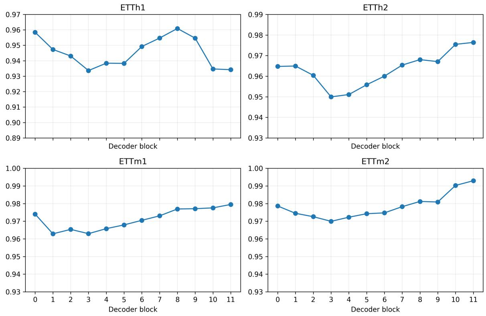  
Figure 5: Fraction of variance explained (FVE = 1 − FVU) by the TopK SAE trained at each Chronos-Bolt decoder block. A separate SAE is trained for every dataset–block pair using activations from the corresponding chronological training split.

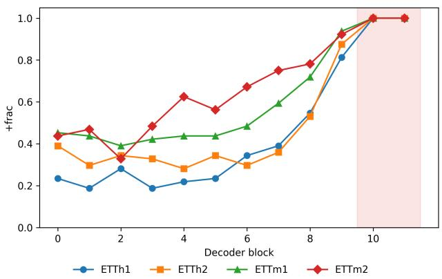  
Figure 6: Fraction of the Top-64 SAE-feature ablations that increase approximate CRPS (+frac, Equation 19) at each Chronos-Bolt decoder block. All four datasets reach +frac = 1.00 at blocks 10–11.

Table 15: Decoder-region adaptation on the ETT datasets. “Best restricted” denotes the best tested contiguous region, shown in brackets. Blocks 9–11 cover the sensitivity peak identified by the SAE diagnostic. Each entry reports MSE/MAE.
<table><tr><td>Dataset</td><td>Chronos-Bolt Zero-shot</td><td>Full AdaCast</td><td>Best restricted</td><td>Blocks 9-11</td></tr><tr><td>ETTh1</td><td>0.3616/0.3650</td><td>0.3431/0.3594</td><td>0.3453/0.3584 [0–3]</td><td>0.3506/0.3620</td></tr><tr><td>ETTh2</td><td>0.2517/0.2992</td><td>0.2370/0.2919</td><td>0.2364/0.2919 [6−9]</td><td>0.2394/0.2949</td></tr><tr><td>ETTm1</td><td>0.3109/0.3185</td><td>0.2603/0.3040</td><td>0.2621/0.3043 [0−8]</td><td>0.2798/0.3084</td></tr><tr><td>ETTm2</td><td>0.1487/0.2236</td><td>0.1385/0.2160</td><td>0.1375/0.2156 [0–3]</td><td>0.1409/0.2182</td></tr></table>

One plausible explanation is that the final blocks form a task-specialized region close to the forecasting head. Updates introduced there directly afect the predicted quantiles and undergo little subsequent processing by frozen decoder layers. Updates applied to earlier or middle blocks, in contrast, can be transformed by downstream frozen blocks before reaching the forecasting head. High SAE-based sensitivity may therefore indicate limited tolerance to imperfect updates.

ETTm1, Sample 1

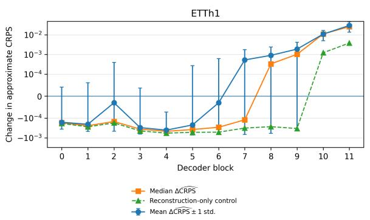

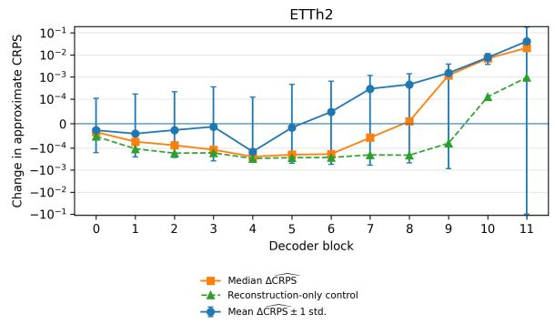

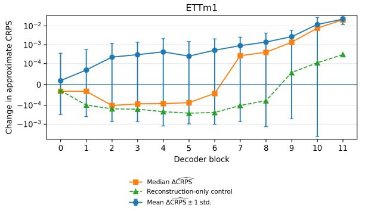

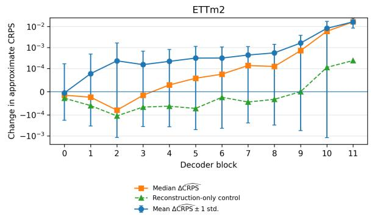

Figure 7: Magnitude of the Top-64 SAE-feature interventions across decoder depth. Points show the mean and median $\Delta \widehat { \mathrm { C R P S } }$ values; error bars show one standard deviation across the 64 individually ablated features. The dashed curve is the reconstruction-only control from Equation 20.  
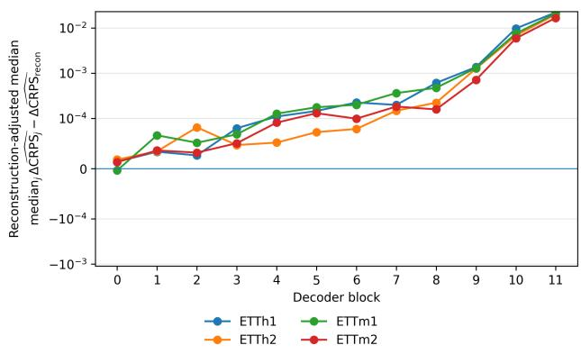  
Figure 8: Reconstruction-adjusted median intervention efect from Equation 21. Values remain close to zero in early blocks and increase sharply in blocks 9– 11 across all four datasets.

## E ADDITIONAL QUALITATIVE FORECASTING RESULTS

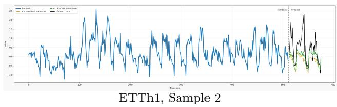

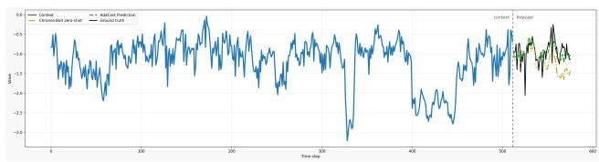

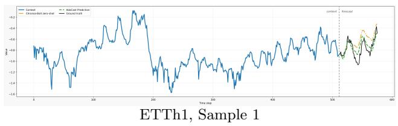

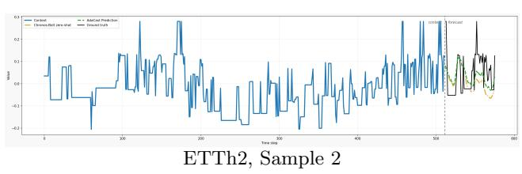

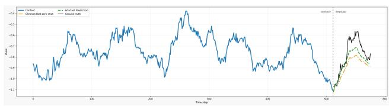

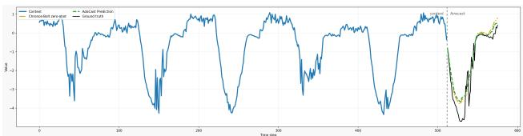  
ETTm1, Sample 2

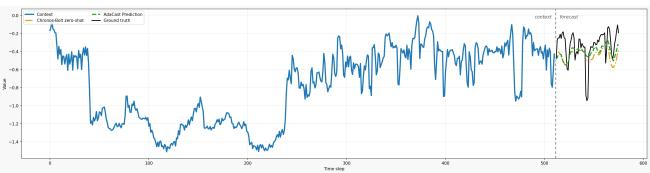  
ETTm2, Sample 1

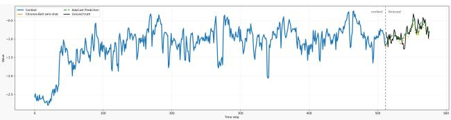  
ETTm2, Sample 2

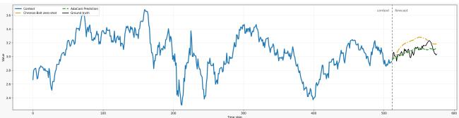  
Exchange, Sample 1

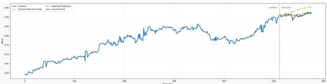  
Exchange, Sample 2

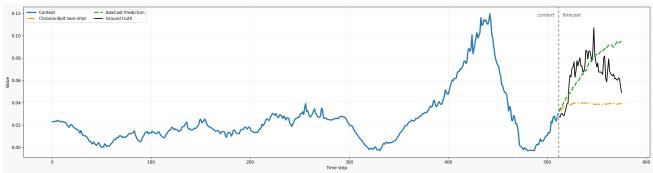  
Weather, Sample 1

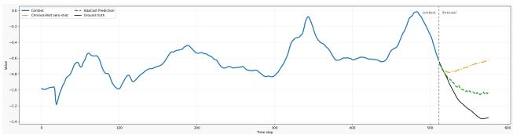  
Weather, Sample 2