# Accelerating Non-Smooth and Heavy-Tailed Sampling

Pervez Ali∗ Xiaoyu Wang† Yingli Wang‡ Lingjiong Zhu§

October 9, 2026

## Abstract

Anchored Langevin dynamics (ALD) is useful for non-smooth sampling where the density of the target distribution is possibly non-diferentiable and heavy-tailed; reflected anchored Langevin dynamics (RALD) can sample possibly non-diferentiable target density on a constrained domain. In this paper, we propose and study non-reversible anchored Langevin dynamics (NALD) for sampling possibly non-diferentiable and heavy-tailed target density in the Euclidean space and the non-reversible reflected anchored Langevin dynamics (NRALD) for sampling possibly non-diferentiable target density in the constrained space. Our construction adds a circulation drift generated by a possibly state-dependent divergence-free skew-symmetric matrix field and a stream potential. It preserves the target distribution without requiring derivatives of target density, admits a random-time-change representation, and applies both on the whole Euclidean space and on bounded domains with normal reflection. By breaking reversibility, we show that NALD and NRALD can converge to their target distributions faster than their reversible counterparts via finite-time non-asymptotic convergence analysis, a large deviations analysis and asymptotic variance reduction. Numerical experiments demonstrate the eficiency of the proposed algorithms.

Keywords: Non-reversible, anchored Langevin dynamics, non-smooth sampling, heavy-tailed sampling, reflected difusion, large deviations, asymptotic variance

## 1 Introduction

Let E be either $\mathbb { R } ^ { d }$ or the closure of a bounded domain $K \subset \mathbb { R } ^ { d }$ , and consider the problem of sampling

$$
\pi ( d x ) = Z ^ { - 1 } e ^ { - U ( x ) } d x , \qquad Z = \int _ { E } e ^ { - U ( x ) } d x < \infty .\tag{1.1}
$$

Such problems arise in many applications such as Bayesian learning problems in machine learning [Gelman et al., 1995, Stuart, 2010, Andrieu et al., 2003, Teh et al., 2016, G¨urb¨uzbalaban et al., 2021, G¨urb¨uzbalaban et al., 2024b].

Langevin algorithms are popular Markov chain Monte Carlo (MCMC) methods for solving the sampling problem (1.1). When $E = \mathbb { R } ^ { d }$ in (1.1), the most classical Langevin algorithm for sampling

(1.1), the Unajudsted Langevin Algorithm (ULA), is based on the discretization of the overdamped Langevin dynamics [Dalalyan, 2017, Durmus and Moulines, 2017, Dalalyan and Karagulyan, 2019, Raginsky et al., 2017]:

$$
d X _ { t } = - \nabla U ( X _ { t } ) d t + \sqrt { 2 } d W _ { t } ,\tag{1.2}
$$

where $W _ { t }$ is a standard d-dimensional Brownian motion, and it is known that under mild conditions, the overdamped Langevin dynamics (1.2) admits the target distribution (1.1) with $E = \mathbb { R } ^ { d }$ as the unique invariant distribution [Chiang et al., 1987, Holley et al., 1989].

The overdamped Langevin dynamics (1.2) requires evaluations of ∇U and may therefore be unavailable when U is non-smooth. Several approaches replace the non-smooth target by a differentiable surrogate. These include smoothing through parametrized exponential families [Zhou and Hu, 2014], Moreau–Yoshida envelope (MYE) and proximal constructions [Durmus et al., 2018, Goldman et al., 2022, Mou et al., 2022, Salim and Richtarik, 2020]. Other envelopes such as the forward-backward envelope to approximate a non-smooth potential with a smooth one can also be used [Eftekhari et al., 2023]. When the potential function U is non-diferentiable but convex, Durmus et al. [2019], Habring et al. [2024] provide an alternative; but they are restrictive to the convex setting. By approximating U by convolving it with a Gaussian kernel, Gaussian smoothing method [Nesterov and Spokoiny, 2017, Chatterji et al., 2020] provide another alternative. Such methods have produced useful algorithms and nonasymptotic guarantees, particularly under convexity, but they alter the drift through a regularization or approximation of the original potential. For nondiferentiable target distributions, zeroth-order Langevin algorithms can also be employed. These methods approximate first-order information based on the evaluations of the target function U using finite-diferences [Roy et al., 2022, Dwivedi et al., 2019]. Such an approach can be beneficial in some settings when the gradients do not exist or when they are hard to compute. However, zeroth-order methods are typically slower than first-order methods, as their gradient estimates tend to be noisier. Piecewise-deterministic Markov processes (PDMPs) such as the bouncy particle and zig-zag samplers do not sufer from bias due to discretization; they can be applied to target distributions that are diferentiable almost everywhere [Deligiannidis et al., 2019, Durmus et al., 2020, Bierkens et al., 2019], and in practice, may be preferable to MYE-based methods—particularly when the MYE is dificult to compute or not well-defined [Goldman et al., 2022]. However, PDMPs may encounter computational dificulties in high dimensions; event-time simulations can be demanding, and their performance can be sensitive to the availability of tight event-rate bounds [Goldman et al., 2022].

Anchored Langevin dynamics (ALD) [G¨urb¨uzbalaban et al., 2025] takes a diferent, probabilistic route. It introduces a diferentiable reference potential $U _ { 0 }$ and the state-dependent speed

$$
a ( x ) : = e ^ { U ( x ) - U _ { 0 } ( x ) } ,\tag{1.3}
$$

such that the anchored Langevin dynamics (ALD) satisfies the SDE [G¨urb¨uzbalaban et al., 2025]:

$$
d X _ { t } = - a ( X _ { t } ) \nabla U _ { 0 } ( X _ { t } ) d t + \sqrt { 2 a ( X _ { t } ) } d W _ { t } ,\tag{1.4}
$$

and it was proved in G¨urb¨uzbalaban et al. [2025] that (1.4) preserves the Gibbs distribution (1.1) as an invariant distribution when $E = \mathbb { R } ^ { d }$ . The infinitesimal generator of (1.4) is given by

$$
\begin{array} { r } { \mathcal { S } f : = a \left( \Delta f - \nabla U _ { 0 } \cdot \nabla f \right) = \pi ^ { - 1 } \nabla \cdot \left( \pi a \nabla f \right) . } \end{array}\tag{1.5}
$$

Thus, the target potential U enters through function evaluations in $^ { a , }$ whereas the drift uses the gradient of the reference potential. The divergence-form identity in (1.5) shows that S is selfadjoint in $L ^ { 2 } ( \pi )$ . The same construction can be combined with normal reflection to sample a target supported on a constrained domain; this reflected anchored difusion has recently been studied in Tu et al. [2026].

The anchored Langevin dynamics in (1.4) only requires the diferentiability of $U _ { 0 }$ , not the target potential U. As a result, (1.4) provides an alternative method for non-smooth sampling where the target density is not necessarily diferentiable. Moreover, it is known that the overdamped Langevin dynamics (1.2) can be ineficient and slow for sampling heavy-tailed distributions [Roberts and Tweedie, 1996]. Sampling from target distributions with heavy tails—where the negative logdensity $U ( x )$ grows sublinearly—presents unique challenges for standard sampling algorithms and the literature is quite limited. To address this, several algorithmic modifications have been proposed [Kamatani, 2017, Belomestny and Iosipoi, 2021, Bell et al., 2024]; however, these approaches rely on Metropolis steps, which can be expensive for some applications involving high dimensionality and large datasets [Welling and Teh, 2011]. He et al. [2024b] develops zeroth- and first-order Langevin algorithms for heavy-tailed distributions whose potentials satisfy weighted Poincar´e inequalities, including Student-t distributions. In related work, He et al. [2024a] characterize the class of heavy-tailed densities for which polynomial-order complexity guarantees can be obtained when the Unadjusted Langevin Algorithm is applied to suitably transformed versions of the target. The anchored Langevin dynamics and the discretized algorithms in G¨urb¨uzbalaban et al. [2025] provided a complementary approach to sampling heavy-tailed distributions. It was shown in G¨urb¨uzbalaban et al. [2025] that anchored Langevin dynamics can converge to a heavy-tailed target distribution exponentially fast in time; hence, it provides a unified approach for sampling both non-smooth and heavy-tailed distributions.

Constrained sampling has gained a lot of interest in recent years. Projected Langevin Monte Carlo (PLMC) algorithms were analyzed first for log-concave targets and subsequently in stochastic and nonconvex settings [Bubeck et al., 2015, 2018, Lamperski, 2021, Zheng and Lamperski, 2022], which are based on the discretization of the reflected Langevin dynamics (RLD):

$$
d X _ { t } = - \nabla U ( X _ { t } ) d t + \sqrt { 2 } d W _ { t } - n ( X _ { t } ) d L _ { t } ,\tag{1.6}
$$

where $W _ { t }$ is a standard d-dimensional Brownian motion, the term $n ( X _ { t } )$ is the outward unit normal vector when $X _ { t } \in \partial K$ and − $\ b { \mathscr { n } } ( X _ { t } ) d L _ { t }$ reflects the process on the boundary to ensure $X _ { t } \in K$ for every t given that $X _ { 0 } \in K$ . In particular, $\begin{array} { r l r } { \mathrm { ~ } } & { { } } & { - \int _ { 0 } ^ { t } n ( X _ { s } ) d L _ { s } } \end{array}$ is a bounded variation reflection process, where $L _ { t }$ is nondecreasing and finite for every t, and $d L _ { t }$ is supported on $\{ t : X _ { t } \in \partial K \}$ . It is proved in Bubeck et al. [2015] that the RLD (1.6) converges to the target distribution (1.1) with $E = K$ as $t \to \infty$

Other approaches for constrained sampling include proximal methods [Brosse et al., 2017, Salim and Richtarik, 2020, Islam and Zhu, 2026], mirrored Langevin dynamics [Hsieh et al., 2018, Chewi et al., 2020, Zhang et al., 2020, Li et al., 2022, Ahn and Chewi, 2021], and penalty-based or replicaexchange constructions [G¨urb¨uzbalaban et al., 2024a, Zheng et al., 2024]. Nonreversible constrained difusions with skew reflection were introduced in Du et al. [2025]. More recently, Wang et al. [2026] showed that a state-dependent skew field satisfying $J ( x ) n ( x ) = 0$ on the boundary restores ordinary normal reflection and yields both large-deviation and asymptotic-variance acceleration. To sample (1.1) for $E = K$ with a possibly non-diferentiable $U ( x )$ , Tu et al. [2026] proposed and studied reflected anchored Langevin dynamics (RALD):

$$
d X _ { t } = - a ( X _ { t } ) \nabla U _ { 0 } ( X _ { t } ) d t + \sqrt { 2 a ( X _ { t } ) } d W _ { t } - n ( X _ { t } ) d L _ { t } ,\tag{1.7}
$$

where $U _ { 0 } : \mathbb { R } ^ { d } $ R plays the role as an anchored reference potential, $W _ { t }$ is a standard d-dimensional Brownian motion, the term $n ( X _ { t } )$ is the outward unit normal vector when $X _ { t } \in \partial K$ and $- n ( X _ { t } ) d L _ { t }$ reflects the process on the boundary to ensure $X _ { t } \in K$ for every t given that $X _ { 0 } \in K$ . In particular, $\textstyle - \int _ { 0 } ^ { t } n ( X _ { s } ) d L _ { s }$ is a bounded variation reflection process, where $L _ { t }$ is nondecreasing and finite for every t, and $d L _ { t }$ is supported on $\{ t : X _ { t } \in \partial K \}$

In the literature, it is known that in the setting of unconstrained sampling, by breaking reversibility, a non-reversible Langevin dynamics, where an skew-symmetric matrix is added, can converge to the target distribution faster on the Euclidean space $\mathbb { R } ^ { d }$ . This phenomenon is well understood through non-asymptotic convergence analysis; see e.g. Hwang et al. [1993, 2005], Rey-Bellet and Spiliopoulos [2015], Hu et al. [2020], Gao et al. [2020]. The improvement has also been studied through spectral and nonasymptotic convergence [Leli\`evre et al., 2013, Gao et al., 2020, Hu et al., 2020], the level-two large-deviation rate function [Rey-Bellet and Spiliopoulos, 2015], and the asymptotic variance of ergodic averages [Duncan et al., 2016]. Weighted-topology large deviations for unbounded difusions provide the coercive framework needed beyond compact state spaces [Ferr´e and Stoltz, 2020, Yao et al., 2025]. Recently, this idea also inspired the study of nonreversible Langevin algorithms in constrained sampling. Non-reversible skew-reflected Langevin dynamics (SRNLD) was proposed and studied in Du et al. [2025] where an anti-symmetric matrix $J$ is added to the dynamics, that can accelerate the convergence of constrained sampling. However, how to choose the anti-symmetric matrix J in practice is a challenging problem. Very recently, Wang et al. [2026] showed acceleration for constrained sampling through the lens of large deviations and asymptotic variance for SRNLD under the additional constraint that $J ( x ) n ( x ) = 0$ , where $n ( x )$ is the outward unit normal vector. For the examples of ball constraint, and more generally the constrained domains characterized by the sub-level sets that include smoothed $\ell _ { p }$ balls as special cases, the explicit construction of $J ( x )$ was provided in Wang et al. [2026]. Indeed, under this additional condition, skew-reflection becomes a normal reflection. Extensive numerical experiments using both synthetic and real data in Wang et al. [2026] demonstrated superior performance for the choice of J that satisfies this additional condition.

In G¨urb¨uzbalaban et al. [2025], it was proved that anchored Langevin dynamics is reversible. In addition, Tu et al. [2026] proved that reflected anchored Langevin dynamics is also reversible. Therefore, it motivates us to ask the question whether by breaking reversibility, one can accelerate the convergence of anchored and reflected anchored Langevin dynamics for sampling not necessarily diferentiable target. In this paper, we will give positive answer to this question by proposing and studying non-reversible anchored Langevin dynamics (NALD) for unconstrained sampling and nonreversible reflected anchored Langevin dynamics (NRALD) for constrained sampling.

Our main contributions are as follows.

1. We introduce non-reversible anchored Langevin dynamics (NALD) on $\mathbb { R } ^ { d }$ and its normally reflected counterpart, non-reversible reflected anchored Langevin dynamics (NRALD), on bounded domains. Both preserve the given target distributions as the invariant distributions on $\mathbb { R } ^ { d }$ and the bounded domain respectively (Theorem 2.5) and arise as random time changes of nonreversible difusions associated with the reference potential $U _ { 0 }$ (Proposition 2.7). The current construction includes divergence-free state-dependent skew tensors as well as constant matrices. On a constrained domain, we identify two mechanisms for retaining ordinary normal reflection: a stream potential with constant boundary trace, or a state-dependent tensor satisfying $J ( x ) n ( x ) = 0$ . We explain the two-dimensional degeneracy of the latter condition and give a three-dimensional cross-product construction (Lemma 2.3 and Remark 2.4). The stream mechanism remains nontrivial when $U _ { 0 }$ is constant (Remark 2.6), while Proposition 2.2 places both mechanisms in the same divergence-free current framework.

2. We obtain finite-time non-asymptotic convergence guarantees in total variation (TV) distance and show that by breaking reversibility, NALD and NRALD can converge to the target distributions faster than their reversible counterparts (Theorem 3.2 and Theorem 3.3).

3. In order to better quantify the acceleration, we establish a level-two large deviation principle under standard compact-state assumptions (Theorem 4.2) or under weighted Witten–Lyapunov assumptions on $\mathbb { R } ^ { d }$ (Proposition 4.7 and Theorem 4.9). If $\displaystyle d \nu = e ^ { v } d \pi$ , then the rate function has the decomposition (Theorem 4.2 and Theorem 4.9):

$$
\mathcal { T } _ { \alpha } ( \nu ) = \frac { 1 } { 4 } \int _ { E } a | \nabla v | ^ { 2 } d \nu + \frac { \alpha ^ { 2 } } { 4 } \left\| \mathcal { A } v \right\| _ { H _ { a } ^ { - 1 } ( \nu ) } ^ { 2 } .\tag{1.8}
$$

Consequently ${ \mathcal { T } } _ { \alpha } \ \geq \ { \mathcal { T } } _ { 0 }$ , with a transparent strictness criterion. Hence, the non-reversible dynamics is more concentrated around the target distribution which justifies the acceleration.

4. In addition, we study asymptotic variance to quantify the acceleration. Under the assumption of a weighted Poincar´e inequality, we prove that for every centered observable $g \in L ^ { 2 } ( \pi )$ (Theorem 5.1): $\sigma _ { g , \alpha } ^ { 2 } \le \sigma _ { g , 0 } ^ { 2 }$ . Equality holds precisely when the reversible Poisson solution is not moved by the circulation, under the operator assumptions stated below.

5. For the q-parametrized heavy-tailed family of [G¨urb¨uzbalaban et al., 2025, Theorem 3], the same Foster–Lyapunov estimate yields a weighted Poincar´e inequality when $r \geq 0$ . When $r > 0$ , tangency of the circulation yields the principal coercive Lyapunov estimate for the large deviation principle (LDP). We verify the remaining Witten–Lyapunov conditions for a Student-t specialization (Proposition 6.1). For this same superquadratic model, we prove the strong sector condition by separating radial and angular derivatives, thereby obtaining both LDP (Corollary 6.2) and asymptotic-variance acceleration (Corollary 6.5). We also give an explicitly solvable quadratic-clock example (Proposition 6.7).

6. Our experiments show that breaking reversibility accelerates the anchored Langevin algorithms which confirms the theory (Section 7). NALD (7.1) with the skew-symmetric matrix $J _ { a }$ (7.12) reaches the noise floor on the heavy-tailed target with the MCP regularizer (7.6) in about 1.8 times fewer iterates, NRALD (7.2) with the state-dependent skew-symmetric matrix $J _ { s }$ in (2.26) speeds up convergence to the constrained Laplace targets by a factor of up to 1.85. In constrained Bayesian logistic regression experiment, NRALD (7.2) reaches a given accuracy faster on both synthetic and real data.

The rest of the paper is organized as follows. Section 2 introduces the dynamics and proves invariance and the time-change representation. Section 3 presents finite-time non-asymptotic convergence analysis. Section 4 studies empirical-measure large deviations. The asymptotic variance comparison is developed in Section 5. Explicit unconstrained and reflected constructions are given in Section 6. Numerical experiments are presented in Section 7. Finally, we conclude in Section 8.

## 2 Main Results

We aim to design non-reversible anchored Langevin dynamics in both unconstrained and constrained settings that can accelerate the convergence to the target distributions. A first attempt would replace $\nabla U _ { 0 }$ by $( I _ { d } + \alpha J ) \nabla U _ { 0 }$ , where J is a constant skew-symmetric matrix. This is a valid and useful special case, but it becomes reversible when $U _ { 0 }$ is constant in the constrained setting. The latter is precisely the choice that produces the simplest zeroth-order anchored sampler on a compact domain. We therefore use a more general circulation construction. Let $J ( x )$ be a possibly state-dependent skew-symmetric matrix field satisfying $\nabla \cdot J = 0$ , and let ψ be a stream potential. Define

$$
c ( \boldsymbol { x } ) : = e ^ { U ( \boldsymbol { x } ) } J ( \boldsymbol { x } ) \nabla \psi ( \boldsymbol { x } ) .\tag{2.1}
$$

Since $\pi c = Z ^ { - 1 } J \nabla \psi$ , we have

$$
\nabla \cdot ( \pi c ) = Z ^ { - 1 } \sum _ { i = 1 } ^ { d } \sum _ { j = 1 } ^ { d } [ ( \partial _ { i } J _ { i j } ) ( \partial _ { j } \psi ) + J _ { i j } \partial _ { i j } \psi ] = 0 .\tag{2.2}
$$

The first term vanishes because $\nabla \cdot J = 0$ , while the second vanishes because J is skew-symmetric and $\nabla ^ { 2 } \psi$ is symmetric. On a bounded domain we additionally choose $\psi$ so that c is tangential at the boundary. The resulting infinitesimal generator is

$$
\mathcal { L } _ { \alpha } = \mathcal S + \alpha \mathcal A , \qquad \mathcal { S } f : = a \left( \Delta f - \nabla U _ { 0 } \cdot \nabla f \right) = \pi ^ { - 1 } \nabla \cdot ( \pi a \nabla f ) , \qquad \mathcal { A } f : = c \cdot \nabla f ,\tag{2.3}
$$

where $\boldsymbol { s }$ is symmetric and $\mathcal { A }$ is anti-symmetric on their natural common core in $L ^ { 2 } ( \pi )$ This common form structure is the link between the unconstrained and reflected parts of the paper. The stronger skew-adjoint statement needed for the variance comparison is established below for the sandwiched operator (5.3).

Throughout the paper, $d \geq 2$ and $\alpha \in \mathbb { R }$ controls the strength of the nonreversible perturbation. Let $J \in \mathsf { \Gamma } C ^ { 1 } ( E ; \mathbb { R } ^ { d \times d } )$ be a possibly state-dependent matrix field. For clarity, we interpret its divergence columnwise:

$$
( \nabla \cdot J ) _ { j } : = \sum _ { i = 1 } ^ { d } \partial _ { i } J _ { i j } , \qquad j = 1 , \ldots , d .\tag{2.4}
$$

Our general assumptions on J are

$$
J ( x ) ^ { \top } = - J ( x ) , \qquad \nabla \cdot J ( x ) = 0 .\tag{2.5}
$$

When $J ( x )$ is independent of $x ,$ we simply write J and refer to it as the constant-matrix case. This specialization is used in the unconstrained Student analysis and in the explicit examples.

## 2.1 Unconstrained dynamics

Let $E = \mathbb { R } ^ { d }$ . We assume that U is locally Lipschitz, $U _ { 0 } \in C ^ { 2 } ( \mathbb { R } ^ { d } ) , \psi \in C ^ { 2 } ( \mathbb { R } ^ { d } )$ , and that J satisfies (2.5). Set

$$
\begin{array} { r } { a ( x ) : = e ^ { ( U - U _ { 0 } ) ( x ) } , \qquad c ( x ) : = e ^ { U ( x ) } J ( x ) \nabla \psi ( x ) , \qquad b _ { \alpha } ( x ) : = - a ( x ) \nabla U _ { 0 } ( x ) + \alpha c ( x ) . } \end{array}\tag{2.6}
$$

We propose the non-reversible anchored Langevin dynamics (NALD) as:

$$
d X _ { t } = b _ { \alpha } ( X _ { t } ) d t + { \sqrt { 2 a ( X _ { t } ) } } d W _ { t } .\tag{2.7}
$$

Assumption 2.1 (Local regularity and well-posedness). The functions a and $b _ { \alpha }$ are locally Lipschitz, $a ( x ) > 0$ for every $\boldsymbol { x } \in \mathbb { R } ^ { d }$ , and the solution of (2.7) is nonexplosive. Whenever irreducibility is invoked, the difusion is also assumed to be topologically irreducible.

Notice that (2.7) does not require the everywhere existence of ∇U. The special choice

$$
\psi = e ^ { - U _ { 0 } }\tag{2.8}
$$

gives $\begin{array} { r } { c ( { x } ) = - a ( { x } ) J ( { x } ) \nabla U _ { 0 } ( { x } ) } \end{array}$ and hence (2.7) becomes:

$$
d X _ { t } = - a ( X _ { t } ) \left( I _ { d } + \alpha J ( X _ { t } ) \right) \nabla U _ { 0 } ( X _ { t } ) d t + { \sqrt { 2 a ( X _ { t } ) } } d W _ { t } ,\tag{2.9}
$$

which is the most direct anti-symmetric perturbation of anchored Langevin dynamics.

## 2.2 Divergence-free state-dependent skew fields

Here E may be either $\mathbb { R } ^ { d }$ or ${ \overline { { K } } } .$ , as appropriate. The assumptions in (2.5) ensure that the general matrix field $J ( x )$ produces a divergence-free weighted current. For a skew-symmetric matrix field, vanishing column divergence is equivalent, up to sign, to vanishing row divergence.

Proposition 2.2 (State-dependent stream currents). Let $J \in C ^ { 1 } ( E ; \mathbb { R } ^ { d \times d } )$ satisfy (2.5). For $\psi \in C ^ { 2 } ( E )$ , the current c in (2.6) satisfies $\nabla \cdot ( \pi c ) = 0$ . Consequently, whenever the corresponding difusion is well posed and, in the reflected case, $c { \cdot } n = 0$ , all the invariance and form-anti-symmetry conclusions of Theorem 2.5 hold for the general state-dependent model.

In particular, the canonical choice $\psi = e ^ { - U _ { 0 } }$ gives

$$
d X _ { t } = - a ( X _ { t } ) \left( I _ { d } + \alpha J ( X _ { t } ) \right) \nabla U _ { 0 } ( X _ { t } ) d t + { \sqrt { 2 a ( X _ { t } ) } } d W _ { t } .\tag{2.10}
$$

On $\overline { { K } }$ , the ordinary normal reflection term $- n ( X _ { t } ) d L _ { t }$ is added.

Proof. Since $\pi c = Z ^ { - 1 } J \nabla \psi$ , we have

$$
\nabla \cdot ( \pi c ) = Z ^ { - 1 } \sum _ { i = 1 } ^ { d } \sum _ { j = 1 } ^ { d } ( \partial _ { i } J _ { i j } ) ( \partial _ { j } \psi ) + Z ^ { - 1 } \sum _ { i = 1 } ^ { d } \sum _ { j = 1 } ^ { d } J _ { i j } \partial _ { i j } \psi = 0 .
$$

The first sum vanishes by (2.4)– (2.5), and the second is zero because a skew-symmetric matrix is orthogonal in the Frobenius inner product to the symmetric Hessian. The remaining conclusions follow by the integration-by-parts argument of Theorem 2.5. Finally,

$$
e ^ { U } J \nabla \left( e ^ { - U _ { 0 } } \right) = - e ^ { U } e ^ { - U _ { 0 } } J \nabla U _ { 0 } = - a J \nabla U _ { 0 } ,
$$

which proves (2.10).

## 2.3 Normally reflected dynamics

Let $K \subset \mathbb { R } ^ { d }$ be a bounded connected domain with suficiently smooth boundary, and write $n ( x )$ for the outward unit normal at $x \in \partial K$ . We impose the zero-flux condition:

$$
c ( x ) \cdot n ( x ) = 0 , \qquad x \in \partial K .\tag{2.11}
$$

We propose the non-reversible reflected anchored Langevin dynamics (NRALD) as:

$$
d X _ { t } = b _ { \alpha } ( X _ { t } ) d t + { \sqrt { 2 a ( X _ { t } ) } } d W _ { t } - n ( X _ { t } ) d L _ { t } , \qquad X _ { t } \in { \overline { { K } } } ,\tag{2.12}
$$

where $L _ { t }$ is nondecreasing and $d L _ { t }$ is supported on $\{ t : X _ { t } \in \partial K \}$ . The infinitesimal generator has the Neumann domain

$$
{ \mathcal { D } } _ { N } : = \left\{ f \in C ^ { 2 } ( { \overline { { K } } } ) : \nabla f \cdot n = 0 { \mathrm { ~ o n ~ } } \partial K \right\} .\tag{2.13}
$$

We write

$$
\mathcal { D } _ { N , + } : = \left\{ u \in \mathcal { D } _ { N } : u > 0 \mathrm { o n } \overline { { K } } \right\}\tag{2.14}
$$

for its strictly positive cone. No oblique reflection is needed.

The boundary condition (2.11) can be enforced either through the stream potential or directly through a state-dependent skew tensor. The latter mechanism is the normal-reflection condition used in Wang et al. [2026].

Lemma 2.3 (Two normal-reflection mechanisms). Let $J : \overline { { K } }  \mathbb { R } ^ { d \times d }$ be pointwise skew-symmetric and set $c = e ^ { U } J \nabla \psi$ . Either one of the following conditions is suficient for $c \cdot n = 0$ on $\partial K$ :

(i) $\psi$ is constant on every connected component of ∂K;

(ii) $J ( x ) n ( x ) = 0$ for every $x \in \partial K$

Proof. Under (i), all tangential derivatives of ψ vanish, so $\nabla \psi$ is parallel to n and $n ^ { \top } J \nabla \psi = 0$ Under (ii), skew-symmetry gives $n ^ { \top } J \nabla \psi = - ( J n ) \cdot \nabla \psi = 0$ □

Remark 2.4 (Dimension dependence of $J n = 0 )$ . The tensor boundary mechanism admits natural nontrivial constructions from dimension three onward.

(i) In $d = 2 ,$ every skew tensor has the form

$$
J ( x ) = j ( x ) \left( \begin{array} { c c } { { 0 } } & { { - 1 } } \\ { { 1 } } & { { 0 } } \end{array} \right) .
$$

Condition $\nabla \cdot J = 0$ forces $\nabla j = 0$ , while $J n = 0$ at any boundary point then forces $j = 0$ . Thus the simultaneous conditions in Proposition 2.2 and Lemma $2 . 3 ( \mathrm { i i } )$ give only the trivial tensor in two dimensions.

(ii) In $d = 3$ , let

$$
J ( x ) v = \nabla \phi ( x ) \times v .\tag{2.15}
$$

Then J is skew-symmetric and $\nabla \cdot J = \operatorname { c u r l } ( \nabla \phi ) = 0$ . If ϕ is constant on $\partial K$ , then $\nabla \phi$ is normal to the boundary and hence $J n = 0$ . On a ball, the choice $\phi ( x ) = \left| x \right| ^ { 2 } / 2$ gives $J ( x ) v = x \times v$

(iii) On higher-dimensional balls, further examples follow by embedding such $3 \times 3$ blocks. More precisely, fix a triple of coordinate indices $I = \{ i _ { 1 } , i _ { 2 } , i _ { 3 } \}$ , let $P _ { I } : \mathbb { R } ^ { d }  \mathbb { R } ^ { 3 }$ be the corresponding coordinate projection, and define

$$
J _ { I } ( x ) v : = P _ { I } ^ { \top } \left( ( P _ { I } x ) \times ( P _ { I } v ) \right) .\tag{2.16}
$$

Then $J _ { I } ( x )$ is skew-symmetric, and a componentwise calculation with the three-dimensional Levi– Civita tensor gives

$$
\nabla \cdot \boldsymbol { J } _ { I } = 0 , \qquad J _ { I } ( x ) x = P _ { I } ^ { \top } \left( ( P _ { I } x ) \times ( P _ { I } x ) \right) = 0 .
$$

Consequently, on $\partial B _ { R } ( 0 )$ , where $n ( x ) = x / R _ { \ast }$ , one has $J _ { I } ( x ) n ( x ) = 0$ . Any finite linear combination of tensors of the form $( 2 . 1 6 )$ has the same three properties and provides a nontrivial construction in every dimension $d \geq 3$ . Notice, however, that this particular construction annihilates a radial $\nabla U _ { 0 } ;$ the constant-J Student construction and the more general stream choice therefore remain essential.

## 2.4 Sublevel-set constraints and normal reflection

Let $\rho \in C ^ { 2 } (  { \mathbb { R } } ^ { d } )$ and suppose

$$
K = \{ x : \rho ( x ) < 0 \} , \qquad \nabla \rho ( x ) \neq 0 \quad \mathrm { o n } \ \partial K .\tag{2.17}
$$

Choose $\psi = \rho _ { \mathrm { \scriptscriptstyle { \mathscr { O } } } }$ . Since $\psi = 0$ on $\partial K$ , Lemma 2.3 shows that

$$
c ( \boldsymbol { x } ) = e ^ { U ( \boldsymbol { x } ) } J ( \boldsymbol { x } ) \nabla \rho ( \boldsymbol { x } )\tag{2.18}
$$

is tangent to the boundary. Thus (2.12) preserves the target on K with ordinary normal reflection for any reference potential $U _ { 0 }$ satisfying the regularity assumptions.

For a ball $K = B ( 0 , R )$ , take

$$
\rho ( x ) = \frac { 1 } { 2 } \left( | x | ^ { 2 } - R ^ { 2 } \right) .
$$

Then $c ( x ) = e ^ { U ( x ) } J ( x ) x$ is an angular drift. In particular, for the constant anchor $U _ { 0 } \equiv 0$ , the sampler is

$$
d X _ { t } = \alpha e ^ { U ( X _ { t } ) } J ( X _ { t } ) X _ { t } d t + { \sqrt { 2 e ^ { U ( X _ { t } ) } } } d W _ { t } - n ( X _ { t } ) d L _ { t } .\tag{2.19}
$$

It is genuinely nonreversible and uses U only through function values. Equation (2.19) separates the two mechanisms clearly: the state-dependent noise corrects the target density, while the angular current breaks detailed balance without altering that density.

## 2.5 Constraint sets and skew tensors

The constraint sets and the state-dependent skew tensors below follow the construction of Wang et al. [2026], we define everything explicitly for the present setting. We consider two constraint sets. The first is the centered ball

$$
K _ { r } = \left\{ x \in \mathbb { R } ^ { d } : \| x \| _ { 2 } ^ { 2 } \leq r \right\} , \qquad n ( x ) = \frac { x } { \| x \| _ { 2 } } \mathrm { f o r } \ x \in \partial K _ { r } ,\tag{2.20}
$$

with $r = 1$ . The second is a smoothed $\ell _ { 1 }$ ball: for $\varepsilon > 0$ and $\Lambda > d \varepsilon$ ，

$$
K = \left\{ x \in \mathbb { R } ^ { d } : g _ { \varepsilon } ( x ) \leq \Lambda \right\} , \qquad g _ { \varepsilon } ( x ) : = \sum _ { i = 1 } ^ { d } \big ( x _ { i } ^ { 2 } + \varepsilon ^ { 2 } \big ) ^ { 1 / 2 } ,\tag{2.21}
$$

which is the sublevel set (2.17) with $\rho = g _ { \varepsilon } - \Lambda$ . Since $\begin{array} { r } { \operatorname* { m i n } _ { x } g _ { \varepsilon } ( x ) = d \varepsilon < \Lambda } \end{array}$ is attained only at $x = 0 \in K ^ { \circ }$ , we have $\nabla g _ { \varepsilon } ( x ) \neq 0$ on $\partial K = \{ g _ { \varepsilon } = \Lambda \}$ , and the outward unit normal is

$$
n ( x ) = \frac { \nabla g _ { \varepsilon } ( x ) } { \| \nabla g _ { \varepsilon } ( x ) \| _ { 2 } } , \qquad \partial _ { i } g _ { \varepsilon } ( x ) = \frac { x _ { i } } { \sqrt { x _ { i } ^ { 2 } + \varepsilon ^ { 2 } } } , \quad i = 1 , \dots , d .\tag{2.22}
$$

This is the case $p = 1$ of the smoothed $\ell _ { p }$ ball $\left\{ x : \textstyle \sum _ { i = 1 } ^ { d } ( x _ { i } ^ { 2 } + \varepsilon ^ { 2 } ) ^ { p / 2 } \leq \Lambda \right\}$ . As $\varepsilon \to 0$ the entries of the tensor below behave like $\mathrm { s i g n } ( x _ { i } ) | x _ { i } | ^ { p - 1 }$ , which is $C ^ { 1 }$ only for $p \geq 2 ;$ for $p = 1$ a strictly positive smoothing parameter $\varepsilon$ is therefore needed for J to be $C ^ { 1 }$

On both sets we use the block cross-product construction, let $\phi \in C ^ { \infty } (  { \mathbb { R } } ^ { d } )$ be a potential that is constant on ∂K. Write $d = 3 m$ and, for $\ell = 1 , \ldots , m$ , let $( a _ { \ell } , b _ { \ell } , c _ { \ell } ) : = ( 3 \ell - 2 , 3 \ell - 1 , 3 \ell )$ and define the block axial vector

$$
\begin{array} { r } { k ^ { ( \ell ) } ( x ) : = s _ { \ell } \left( \begin{array} { l } { \partial _ { a _ { \ell } } \phi ( x ) } \\ { \partial _ { b _ { \ell } } \phi ( x ) } \\ { \partial _ { c _ { \ell } } \phi ( x ) } \end{array} \right) , \qquad s _ { \ell } \neq 0 . } \end{array}\tag{2.23}
$$

Let $J ^ { ( \ell ) } ( x )$ be the $d \times d$ matrix whose only nonzero entries form the $3 \times 3$ block on the rows and columns $\{ a _ { \ell } , b _ { \ell } , c _ { \ell } \}$

$$
\Big [ J ^ { ( \ell ) } ( x ) \Big ] _ { \{ a _ { \ell } , b _ { \ell } , c _ { \ell } \} \times \{ a _ { \ell } , b _ { \ell } , c _ { \ell } \} } = \left( \begin{array} { c c c } { 0 } & { - k _ { 3 } ^ { ( \ell ) } ( x ) } & { k _ { 2 } ^ { ( \ell ) } ( x ) } \\ { k _ { 3 } ^ { ( \ell ) } ( x ) } & { 0 } & { - k _ { 1 } ^ { ( \ell ) } ( x ) } \\ { - k _ { 2 } ^ { ( \ell ) } ( x ) } & { k _ { 1 } ^ { ( \ell ) } ( x ) } & { 0 } \end{array} \right) ,\tag{2.24}
$$

i.e. $J ^ { ( \ell ) } ( x ) v = P _ { I _ { \ell } } ^ { \top } \left( k ^ { ( \ell ) } ( x ) \times P _ { I _ { \ell } } v \right)$ with $I _ { \ell } = \{ a _ { \ell } , b _ { \ell } , c _ { \ell } \}$ , and set

$$
J ( x ) : = \sum _ { \ell = 1 } ^ { m } J ^ { ( \ell ) } ( x ) = \left( \begin{array} { c c c c c } { J ^ { ( 1 ) } ( x _ { 1 : 3 } ) } & { 0 _ { 3 \times 3 } } & { \cdots } & { 0 _ { 3 \times 3 } } \\ { 0 _ { 3 \times 3 } } & { J ^ { ( 2 ) } ( x _ { 4 : 6 } ) } & { \cdots } & { 0 _ { 3 \times 3 } } \\ { \vdots } & { \vdots } & { \ddots } & { \vdots } \\ { 0 _ { 3 \times 3 } } & { 0 _ { 3 \times 3 } } & { \cdots } & { J ^ { ( m ) } ( x _ { 3 m - 2 : 3 m } ) } \end{array} \right) ,\tag{2.25}
$$

where $0 _ { 3 \times 3 }$ is the $3 \times 3$ zero matrix. $( \mathrm { I f } ~ d \not \equiv 0$ (mod 3), the remaining one or two coordinates are left without a block, which does not afect the properties below.) The two constraint sets correspond to two choices of $\phi .$

## 2.5.1 Ball constraint

Take $\begin{array} { r } { \phi ( x ) = \frac { 1 } { 2 } \| x \| _ { 2 } ^ { 2 } } \end{array}$ , so that $\phi \equiv r / 2$ on $\partial K _ { r }$ and $k ^ { ( \ell ) } ( x ) = s _ { \ell } x _ { I _ { \ell } }$ . With $d = 9$ this is

$$
J _ { s } ( x ) = \left( \begin{array} { c c c } { J ^ { ( 1 ) } ( x _ { 1 } , x _ { 2 } , x _ { 3 } ) } & { 0 _ { 3 \times 3 } } & { 0 _ { 3 \times 3 } } \\ { 0 _ { 3 \times 3 } } & { J ^ { ( 2 ) } ( x _ { 4 } , x _ { 5 } , x _ { 6 } ) } & { 0 _ { 3 \times 3 } } \\ { 0 _ { 3 \times 3 } } & { 0 _ { 3 \times 3 } } & { J ^ { ( 3 ) } ( x _ { 7 } , x _ { 8 } , x _ { 9 } ) } \end{array} \right) ,\tag{2.26}
$$

with

$$
J ^ { ( 1 ) } ( x _ { 1 } , x _ { 2 } , x _ { 3 } ) = \left( \begin{array} { c c c } { { 0 } } & { { - s _ { 1 } x _ { 3 } } } & { { s _ { 1 } x _ { 2 } } } \\ { { s _ { 1 } x _ { 3 } } } & { { 0 } } & { { - s _ { 1 } x _ { 1 } } } \\ { { - s _ { 1 } x _ { 2 } } } & { { s _ { 1 } x _ { 1 } } } & { { 0 } } \end{array} \right) ,\tag{2.27}
$$

and $J ^ { ( 2 ) } , J ^ { ( 3 ) }$ are obtained by replacing $( s _ { 1 } ; x _ { 1 } , x _ { 2 } , x _ { 3 } )$ with $( s _ { 2 } ; x _ { 4 } , x _ { 5 } , x _ { 6 } )$ and $( s _ { 3 } ; x _ { 7 } , x _ { 8 } , x _ { 9 } )$ , respectively.

## 2.5.2 Smoothed $\ell _ { 1 }$ ball constraint

Take $\phi ( x ) = \Lambda - g _ { \varepsilon } ( x )$ , so that $\phi \equiv 0$ on ∂K and, by (2.22),

$$
k ^ { ( \ell ) } ( x ) = - s _ { \ell } \left( { x _ { a _ { \ell } } } / { \sqrt { x _ { a _ { \ell } } ^ { 2 } + \varepsilon ^ { 2 } } } \right) ,\tag{2.28}
$$

i.e. minus the scaled block gradient of $g _ { \varepsilon }$ (the soft-sign of $x _ { I _ { \ell } } )$ . With $d = 9$ the resulting tensor is

$$
J _ { g } ( x ) = \left( \begin{array} { c c c } { { J _ { g } ^ { ( 1 ) } ( x _ { 1 } , x _ { 2 } , x _ { 3 } ) } } & { { 0 _ { 3 \times 3 } } } & { { 0 _ { 3 \times 3 } } } \\ { { 0 _ { 3 \times 3 } } } & { { J _ { g } ^ { ( 2 ) } ( x _ { 4 } , x _ { 5 } , x _ { 6 } ) } } & { { 0 _ { 3 \times 3 } } } \\ { { 0 _ { 3 \times 3 } } } & { { 0 _ { 3 \times 3 } } } & { { J _ { g } ^ { ( 3 ) } ( x _ { 7 } , x _ { 8 } , x _ { 9 } ) } } \end{array} \right) ,\tag{2.29}
$$

with

$$
J _ { g } ^ { ( 1 ) } ( x _ { 1 } , x _ { 2 } , x _ { 3 } ) = s _ { 1 } \left( \begin{array} { c c c } { { 0 } } & { { \displaystyle \frac { x _ { 3 } } { \sqrt { x _ { 3 } ^ { 2 } + \varepsilon ^ { 2 } } } } } & { { - \displaystyle \frac { x _ { 2 } } { \sqrt { x _ { 2 } ^ { 2 } + \varepsilon ^ { 2 } } } } } \\ { { - \displaystyle \frac { x _ { 3 } } { \sqrt { x _ { 3 } ^ { 2 } + \varepsilon ^ { 2 } } } } } & { { 0 } } & { { \displaystyle \frac { x _ { 1 } } { \sqrt { x _ { 1 } ^ { 2 } + \varepsilon ^ { 2 } } } } } \\ { { \displaystyle \frac { x _ { 2 } } { \sqrt { x _ { 2 } ^ { 2 } + \varepsilon ^ { 2 } } } } } & { { - \displaystyle \frac { x _ { 1 } } { \sqrt { x _ { 1 } ^ { 2 } + \varepsilon ^ { 2 } } } } } & { { 0 } } \end{array} \right) ,\tag{2.30}
$$

and again $J _ { g } ^ { ( 2 ) } , J _ { g } ^ { ( 3 ) }$ are obtained by substituting $( s _ { 2 } ; x _ { 4 } , x _ { 5 } , x _ { 6 } )$ and $( s _ { 3 } ; x _ { 7 } , x _ { 8 } , x _ { 9 } )$

Both tensors satisfy the requirements of our framework:

1. Regularity and skew-symmetry. Each block (2.24) is the cross-product matrix of $k ^ { ( \ell ) }$ , hence skew-symmetric, and $k ^ { ( \ell ) } \in C ^ { \infty }$ because $\phi \in C ^ { \infty }$ (for the smoothed $\ell _ { 1 }$ ball this uses $\varepsilon > 0 )$ . Thus $J \in C ^ { \infty } ( K ; \mathbb { R } ^ { d \times d } )$ and $J ^ { \top } = - J$

2. Boundary condition $J ( x ) n ( x ) = 0$ . Since ϕ is constant on $\partial K$ , its gradient is normal there: $\nabla \phi ( x ) = \| x \| _ { 2 } n ( x )$ on $\partial K _ { r }$ and $\nabla \phi ( x ) = - \| \nabla g _ { \varepsilon } ( x ) \| _ { 2 } n ( x )$ on (2.21). Hence $k ^ { ( \ell ) } ( x ) \parallel P _ { I _ { \ell } } n ( x )$ for every ℓ, the cross product $k ^ { ( \ell ) } ( x ) \times P _ { I _ { \ell } } n ( x )$ vanishes, and $\begin{array} { r } { J ( x ) n ( x ) = \sum _ { \ell } J ^ { ( \ell ) } ( x ) n ( x ) = 0 } \end{array}$ on ∂K. (On the ball one has in fact $J _ { s } ( x ) x = 0$ for every $x \in \mathbb { R } ^ { d } . )$

3. Divergence-free. With $( a , b , c ) = ( a _ { \ell } , b _ { \ell } , c _ { \ell } )$ and $\boldsymbol { k } = ( k _ { 1 } , k _ { 2 } , k _ { 3 } ) ^ { \top } = s _ { \ell } ( \partial _ { a } \phi , \partial _ { b } \phi , \partial _ { c } \phi ) ^ { \top }$ , the nonzero entries of $J ^ { ( \ell ) }$ are $J _ { a b } = - k _ { 3 } , J _ { a c } = k _ { 2 } , J _ { b c } = - k _ { 1 }$ and their negatives, so that

$$
\Big ( \nabla \cdot \boldsymbol { J } ^ { ( \ell ) } \Big ) _ { a } = \partial _ { b } J _ { a b } + \partial _ { c } J _ { a c } = - \partial _ { b } k _ { 3 } + \partial _ { c } k _ { 2 } = s _ { \ell } \big ( - \partial _ { b } \partial _ { c } \phi + \partial _ { c } \partial _ { b } \phi \big ) = 0 ,
$$

and likewise $\left( \nabla \cdot J ^ { ( \ell ) } \right) _ { b } = \left( \nabla \cdot J ^ { ( \ell ) } \right) _ { c } = 0$ , while the remaining components vanish trivially. Summing over ℓ gives $\begin{array} { r } { \overleftarrow { \nabla } \cdot J = 0 } \end{array}$

The scales $s _ { 1 } , s _ { 2 } , s _ { 3 }$ can be chosen independently; in our experiments we take $ s _ { 1 } = s _ { 2 } = s _ { 3 } = : s .$ Finally, both domains have $C ^ { \infty }$ boundary, a is Lipschitz with $a \in [ e ^ { - ( d - 1 ) \lambda \delta } , 1 ]$ , and the drift $- a ( I _ { d } + \alpha J ) \nabla U _ { 0 }$ is Lipschitz on $K ,$ so Assumption 4.1 holds and Theorems 4.2 and 4.9 and Corollary 4.4 apply to the continuous-time dynamics with either tensor.

## 2.6 Invariance and nonreversibility

The infinitesimal generator of either (2.7) or (2.12) is

$$
\mathcal { L } _ { \alpha } f = S f + \alpha \mathcal { A } f ,\tag{2.31}
$$

where

$$
S f = a ( \Delta f - \nabla U _ { 0 } \cdot \nabla f ) = \pi ^ { - 1 } \nabla \cdot ( \pi a \nabla f ) , \qquad \mathcal { A } f = c \cdot \nabla f .\tag{2.32}
$$

In the unconstrained case all integrations by parts below are understood first for compactly supported test functions and then extended by closure.

Theorem 2.5 (Invariant measure and operator decomposition). Assume that (2.7), or respectively (2.12), is well posed. In the reflected case assume (2.11). Then π in (1.1) is invariant. Moreover, for $f , g$ in a common core in $L ^ { 2 } ( \pi )$ ，

$$
\langle f , S g \rangle = \langle S f , g \rangle , \qquad \langle f , A g \rangle = - \langle A f , g \rangle , \qquad \langle f , \mathcal { L } _ { \alpha } g \rangle = \langle ( S - \alpha { \mathcal A } ) f , g \rangle .\tag{2.33}
$$

Consequently, whenever α $\neq 0$ and c is not identically zero, the process is nonreversible. If its semigroup is strong Feller and topologically irreducible, π is its unique invariant probability measure.

Proof. The identities $\pi a = Z ^ { - 1 } e ^ { - U _ { 0 } }$ and $\pi c = Z ^ { - 1 } J ( x ) \nabla \psi$ , together with Proposition 2.2, imply

$$
\nabla \cdot \left( \pi a \nabla f \right) = \pi S f , \qquad \nabla \cdot \left( \pi c \right) = 0 .\tag{2.34}
$$

For smooth $f , g$ , integration by parts gives

$$
\int _ { E } f S g d \pi = - \int _ { E } a \nabla f \cdot \nabla g d \pi = \int _ { E } g S f d \pi .\tag{2.35}
$$

In the reflected case the boundary term vanishes by the Neumann condition. Similarly, using (2.34),

$$
\int _ { E } f A g d \pi = - \int _ { E } g A f d \pi .\tag{2.36}
$$

The boundary term in (2.36) vanishes by (2.11). Taking $f = 1$ proves invariance. The remaining claims follow from (2.35)–(2.36) and standard irreducibility arguments. □

Remark 2.6 (Why the general stream construction is useful). For the canonical choice (2.8), the anti-symmetric drift vanishes when $U _ { 0 }$ is constant. In contrast, the general construction (2.6) remains nontrivial for $U _ { 0 } \equiv c _ { 0 } \mathrm { : }$ one may choose any nonconstant stream potential satisfying the boundary or decay conditions. This distinction is essential for zeroth-order anchored samplers.

## 2.7 Random time change

The anchored construction is most transparent as a state-dependent change of clock. Define the reference non-reversible Langevin dynamics on $E = \mathbb { R } ^ { d }$ :

$$
\begin{array} { r } { d Z _ { s } = \left[ - \nabla U _ { 0 } ( Z _ { s } ) + \alpha e ^ { U _ { 0 } ( Z _ { s } ) } J ( Z _ { s } ) \nabla \psi ( Z _ { s } ) \right] d s + \sqrt { 2 } d W _ { s } , } \end{array}\tag{2.37}
$$

and the non-reversible reflected Langevin dynamics on $E = K$ with the same normal reflection term as in (2.12):

$$
\begin{array} { r } { d Z _ { s } = \left[ - \nabla U _ { 0 } ( Z _ { s } ) + \alpha e ^ { U _ { 0 } ( Z _ { s } ) } J ( Z _ { s } ) \nabla \psi ( Z _ { s } ) \right] d s + \sqrt { 2 } d W _ { s } - n ( Z _ { s } ) d L _ { s } . } \end{array}\tag{2.38}
$$

When $\begin{array} { r } { Z _ { 0 } : = \int _ { E } e ^ { - U _ { 0 } ( x ) } d x < \infty } \end{array}$ , the invariant probability measure is

$$
\pi _ { 0 } ( d x ) = Z _ { 0 } ^ { - 1 } e ^ { - U _ { 0 } ( x ) } d x .\tag{2.39}
$$

The measure $\pi _ { 0 } , x \in \mathbb { E }$ is invariant for (2.37) when $E = \mathbb { R } ^ { d }$ and for (2.38) when $E = K$ . We have the following random-time change representation.

Proposition 2.7 (Random-time change representation). Let

$$
T _ { s } = \int _ { 0 } ^ { s } \frac { d r } { a ( Z _ { r } ) } , \qquad \tau _ { t } = \operatorname* { i n f } \{ s \ge 0 : T _ { s } > t \} .\tag{2.40}
$$

Assume $T _ { s } \to \infty$ almost surely. Then $X _ { t } = Z _ { \tau _ { t } }$ has infinitesimal generator ${ \mathcal { L } } _ { \alpha }$ in (2.31), and hence solves (2.7) or (2.12) up to the standard identification of the time-changed Brownian motion and boundary regulator. Its invariant measure satisfies

$$
\pi ( d x ) \ : \propto ( a ( x ) ) ^ { - 1 } e ^ { - U _ { 0 } ( x ) } d x = e ^ { - U ( x ) } d x .\tag{2.41}
$$

Proof. The infinitesimal generator of (2.37) is

$$
\begin{array} { r } { \widetilde { \mathcal { L } } _ { \alpha } f = \Delta f - \nabla U _ { 0 } \cdot \nabla f + \alpha e ^ { U _ { 0 } } J ( x ) \nabla \psi \cdot \nabla f . } \end{array}
$$

The inverse additive-functional time change in (2.40) multiplies this infinitesimal generator by a. Since $a e ^ { U _ { 0 } } = e ^ { U }$ , we obtain (2.32). The invariant measure of a time change with infinitesimal generator $a \tilde { \mathcal { L } } _ { \alpha }$ is obtained by multiplying the invariant speed measure by $a ^ { - 1 }$ . This gives (2.41) whether or not $Z _ { 0 }$ is finite. □

Remark 2.8. The condition $T _ { s } $ ∞ as $s \to \infty$ , which ensures that the inverse clock $\tau _ { t }$ is finite for every t, is automatic in the common positive-recurrent case. If $Z _ { 0 } < \infty$ and the reference difusion is ergodic, then the ergodic theorem gives

$$
\frac { T _ { s } } { s } \longrightarrow \int _ { E } a ^ { - 1 } d \pi _ { 0 } = \frac { Z } { Z _ { 0 } } > 0 \qquad \mathrm { a s ~ } s  \infty , \quad \mathrm { a l m o s t ~ s u r e l y } .
$$

In particular, this applies on the compact reflected domain and to the Student family in Corollary 6.2.

## 3 Non-Asymptotic Convergence Analysis

Next, let us study the convergence speed of the continuous-time process NALD $X _ { t }$ in (2.7) and NRALD $X _ { t }$ in (2.12) to their invariant distributions. Before we proceed, let us introduce two notions of non-asymptotic convergence bound here.

First, we let $\lambda _ { \alpha }$ be the spectral gap of $\mathcal { L }$ in $L ^ { 2 } ( \pi )$ . That is,

$$
\int _ { E } \left( \mathbb { E } ^ { x } \left[ f ( X _ { t } ) \right] - \pi ( f ) \right) ^ { 2 } \pi ( x ) d x = \| P _ { t } f - \pi ( f ) \| ^ { 2 } \leq C _ { \alpha } \| f - \pi ( f ) \| ^ { 2 } e ^ { - 2 \lambda _ { \alpha } t } ,\tag{3.1}
$$

for some constant $C _ { \alpha } .$ . In particular, $\lambda _ { 0 }$ denotes the spectral gap when $\alpha = 0$ , i.e. the case of the anchored Langevin dynamics. We assume the existence of the spectral gap of $\mathcal { L }$ when $\alpha = 0$ , i.e. it is positive.

## Assumption 3.1. Assume that $\lambda _ { 0 } > 0$

It is worth noting that the existence of a spectral gap can be derived from the logarithmic Sobolev inequality, as discussed in Bakry et al. [2013]. Furthermore, the logarithmic Sobolev inequality itself can be established under the weaker condition of the existence of a Lyapunov function for the difusion generator [Bakry et al., 2008a, Cattiaux et al., 2010]. Explicit lower bounds for the logarithmic Sobolev inequality in convex bounded domain have been explored in works such as Wang [1997].

Next, we introduce the rate of convergence of $p ( t , x , y )$ , the transition probability density of $X _ { t } ,$ to the Gibbs distribution π in the variational norm, which is equivalent to the total variation $( \mathrm { T V } )$ distance up to a $1 / 2$ factor. Let us define:

$$
\rho _ { \alpha } : = \operatorname* { s u p } \left\{ \rho : \int _ { E } | p ( t , x , y ) - \pi ( y ) | d y \leq g ( x ) e ^ { - \rho t } \right\} ,\tag{3.2}
$$

for some $g ( x )$ that may depend on $J .$ In particular, $\rho _ { 0 }$ denotes the case when $\alpha = 0$ , i.e. the case of the anchored Langevin dynamics.

Before we proceed, let us introduce the Dirichlet form:

$$
\mathcal { E } ( f , f ) : = - \int _ { E } f \mathcal { L } f d \pi = \int _ { E } a \| \nabla f \| ^ { 2 } d \pi .\tag{3.3}
$$

We will obtain a non-asymptotic bound for the convergence of the distribution of $X _ { t }$ to the invariant distribution $\pi$ in total variation (TV) distance.

## 3.1 Unconstrained case

Next, we consider the unconstrained case $E = \mathbb { R } ^ { d }$ . We have the following finite-time non-asymptotic convergence guarantees in the TV distance.

Theorem 3.2. Let $E = \mathbb { R } ^ { d }$ and suppose Assumptions 2.1 and 3.1 hold. There exists some locally bounded function $g ( x )$ such that for any $X _ { 0 } = x \in \mathbb { R } ^ { d } $

$$
\mathrm { T V } ( \mathrm { L a w } ( X _ { t } ) , \pi ) \leq g ( x ) e ^ { - \rho _ { \alpha } t } ,\tag{3.4}
$$

where $\rho _ { \alpha } \geq \rho _ { 0 } > 0$

Proof. We adapt the proof of [Hwang et al., 2005, Theorems 4–5] to the locally uniformly elliptic infinitesimal generator $\mathcal { L } _ { \alpha } = a \Delta + b _ { \alpha } \cdot \nabla$ . Write

$$
q _ { t } ( x , y ) : = \frac { p ( t , x , y ) } { \pi ( y ) } .
$$

For $t \geq 1$ , the Chapman–Kolmogorov equation and the adjoint semigroup give

$$
\begin{array} { r l } { \displaystyle \int _ { \mathbb { R } ^ { d } } \left. q _ { t } ( x , y ) - 1 \right. \pi ( y ) d y = \displaystyle \int _ { \mathbb { R } ^ { d } } \left. P _ { t - 1 } ^ { \ast } \left( q _ { 1 } ( x , \cdot ) - 1 \right) ( y ) \right. \pi ( y ) d y } & { } \\ { \displaystyle \leq \left. P _ { t - 1 } ^ { \ast } \left( q _ { 1 } ( x , \cdot ) - 1 \right) \right. _ { L ^ { 2 } ( \pi ) } } & { } \\ { \displaystyle \leq C _ { \alpha } e ^ { - \lambda _ { \alpha } ( t - 1 ) } \left. q _ { 1 } ( x , \cdot ) - 1 \right. _ { L ^ { 2 } ( \pi ) } . } \end{array}\tag{3.5}
$$

Here the last step uses the fact that $P _ { t }$ and $P _ { t } ^ { * }$ have the same $L ^ { 2 } ( \pi )$ operator norm on the mean-zero subspace.

It remains to justify that the last norm is finite and locally bounded in x. Under Assumption 2.1, a is bounded above and away from zero on every compact set and $b _ { \alpha }$ is locally bounded. The local parabolic Harnack inequality used in [Hwang et al., 2005, Theorem 4] therefore applies to ${ \mathcal { L } } _ { \alpha }$ . It yields a locally bounded function $H _ { \alpha }$ such that

$$
\operatorname* { s u p } _ { y \in \mathbb { R } ^ { d } } q _ { 1 } ( x , y ) \leq H _ { \alpha } ( x ) .\tag{3.6}
$$

Since $\textstyle \int _ { \mathbb { R } ^ { d } } q _ { 1 } ( x , y ) \pi ( y ) d y = 1$ , we obtain

$$
\int _ { \mathbb { R } ^ { d } } \left( q _ { 1 } ( x , y ) \right) ^ { 2 } \pi ( y ) d y \leq H _ { \alpha } ( x ) ,
$$

so the prefactor in (3.5) is locally bounded. This proves $\rho _ { \alpha } \geq \lambda _ { \alpha }$ . The Dirichlet-form argument of Lemma 3.4, which does not use compactness of the state space, gives $\lambda _ { \alpha } \geq \lambda _ { 0 }$

For the reversible process, the function furnished by (3.5) is locally bounded and hence belongs to $L _ { \mathrm { l o c } } ^ { 1 } ( \pi )$ . The compactly supported test-function argument of [Hwang et al., 2005, Theorem 5] then gives the reverse comparison $\rho _ { 0 } \leq \lambda _ { 0 }$ . Together with the preceding inequality for $\alpha = 0$ , this yields $\rho _ { 0 } = \lambda _ { 0 }$ , and hence

$$
\rho _ { \alpha } \geq \lambda _ { \alpha } \geq \lambda _ { 0 } = \rho _ { 0 } > 0 .
$$

This completes the proof.

## 3.2 Constrained case

Next, we consider the constrained case $E = K$ . We have the following finite-time non-asymptotic convergence guarantees in the TV distance.

Theorem 3.3. Let $E = K$ . There exists some constant $\kappa > 0$ such that for any $X _ { 0 } = x \in K$

$$
\mathrm { T V } ( \mathrm { L a w } ( X _ { t } ) , \pi ) \leq { K e ^ { - \rho _ { \alpha } t } } ,\tag{3.7}
$$

where $\rho _ { \alpha } \geq \rho _ { 0 } > 0$

Theorem 3.3 is inspired by the result for the convergence of non-reversible Langevin dynamics for the unconstrained case in Hwang et al. [2005] and the convergence of non-reversible skew-reflected Langevin dynamics for the constrained domain in Du et al. [2025]. Since our K is bounded, we are able to obtain a convergence bound in Theorem 3.3 uniformly in the initial starting point $X _ { 0 } = x \in K$ . To prove Theorem 3.3, we will establish a sequence of technical lemmas.

Lemma 3.4. $\lambda _ { \alpha } \geq \lambda _ { 0 }$

Proof. We follow the similar argument as in the proof of Theorem 1 in Hwang et al. [2005] for the unconstrained case. If $f \in { \mathcal { D } } ( { \mathcal { L } } )$ , then $f \in { \mathcal { D } } ( { \mathcal { E } } )$ and

$$
\mathcal { E } ( f , f ) = - \int _ { E } ( \mathcal { L } f ) f d \pi ,\tag{3.8}
$$

(see page 124 in Stannat [1999] and (3.3)), where $\mathcal { E } ( \cdot , \cdot )$ is the Dirichlet form in (3.3). For any f with $\| f \| = 1$ and $\pi ( f ) = 0$ , let $h ( t ) : = \| P _ { t } f \| ^ { 2 }$ . Then $h ( 0 ) = 1$ and by (3.8), we have

$$
h ^ { \prime } ( t ) = 2 \int _ { E } ( \mathcal { L } P _ { t } f ) ( P _ { t } f ) d \pi \leq - 2 \mathcal { E } ( P _ { t } f , P _ { t } f ) \leq - 2 \lambda _ { 0 } h ( t ) .\tag{3.9}
$$

This implies that the operator norm $\| P _ { t } \|$ in the space $\{ f : f \in L ^ { 2 } ( \pi ) , \pi ( f ) = 0 \}$ is less than or equal to $e ^ { - \lambda _ { 0 } t }$ . Hence, $\lambda _ { \alpha } \geq \lambda _ { 0 }$ . This completes the proof. □

Note that Lemma 3.4 applies to both constrained and unconstrained case, and in the proof of Lemma 3.4, one can take either $E = K$ or $E = \mathbb { R } ^ { d }$ . Next, we show the following lemma.

Lemma 3.5. There exists some constant $\kappa > 0$ such that for any $X _ { 0 } = x \in K$

$$
\mathrm { T V } ( \mathrm { L a w } ( X _ { t } ) , \pi ) \leq { K e ^ { - \rho _ { \alpha } t } } ,\tag{3.10}
$$

where $\rho _ { \alpha } \geq \lambda _ { \alpha }$

Proof. The proof is inspired by that of Theorem 4 in Hwang et al. [2005] for the unconstrained case. Let $p _ { t } ( x , y ) : = p ( t , x , y ) / \pi ( y )$ for any $x , y \in K$ , where $p ( t , x , y )$ denotes the probability density function for $X _ { t }$ given that $X _ { 0 } = x \in K$ . By the definition of the TV distance, we have

$$
\mathrm { T V } ( \mathrm { L a w } ( X _ { t } ) , \pi ) = \int _ { K } | p ( t , x , y ) - \pi ( y ) | d y = \int _ { K } | p _ { t } ( x , y ) - 1 | \pi ( y ) d y .\tag{3.11}
$$

By letting $p _ { t } ^ { * } ( \cdot , \cdot )$ denote the adjoint process, we can compute that for any $t \geq 1$ 2

$$
\int _ { K } | p _ { t } ( x , y ) - 1 | \pi ( y ) d y = \int _ { K } \left| \int _ { K } \left( p _ { 1 } ( x , z ) p _ { t - 1 } ( z , y ) - 1 \right) \pi ( z ) d z \right| \pi ( y ) d y
$$

$$
\begin{array} { r l } & { \displaystyle = \int _ { K }  \displaystyle \int _ { K } ( p _ { 1 } ( x , z ) p _ { t - 1 } ^ { * } ( y , z ) - 1 ) \pi ( z ) d z  \pi ( y ) d y } \\ & { \displaystyle = \int _ { K }  \displaystyle \int _ { K } p _ { t - 1 } ^ { * } ( y , z ) p _ { 1 } ( x , z ) \pi ( z ) d z - \displaystyle \int _ { K } p _ { 1 } ( x , z ) \pi ( z ) d z  \pi ( y ) d y } \\ & { \displaystyle = \int _ { K }  P _ { t - 1 } ^ { * } ( p _ { 1 } ( x , \cdot ) ) ( y ) - \pi ( p _ { 1 } ( x , \cdot ) )  \pi ( y ) d y } \\ & { \le \displaystyle ( \int _ { K }  P _ { t - 1 } ^ { * } ( p _ { 1 } ( x , \cdot ) ) ( y ) - \pi ( p _ { 1 } ( x , \cdot ) )  ^ { 2 } \pi ( y ) d y ) ^ { 1 / 2 } } \\ & { \displaystyle \le C   p _ { 1 } ( x , \cdot ) - 1  e ^ { - \lambda _ { \alpha } t } , } \end{array}
$$

where we used Cauchy-Schwarz inequality and $C$ is some constant. By applying the regularity estimates for oblique parabolic equations from Lieberman [1990], we conclude that $p _ { 1 } ( x , \cdot )$ is H¨older continuous on K. Consequently, $p _ { 1 } ( x , \cdot ) \in L ^ { 2 } ( \pi )$ , and thus, the final inequality holds. This also establishes that $\rho _ { \alpha } \geq \lambda _ { \alpha }$ □

Next, we show that $\lambda _ { 0 } = \rho _ { 0 }$

Lemma 3.6. $\lambda _ { 0 } = \rho _ { 0 }$

Proof. The proof is inspired by that of Theorem 5 in Hwang et al. [2005] for the unconstrained case. When $J = 0 , X _ { t }$ is reversible and $P _ { t }$ is self-adjoint in $L ^ { 2 } ( \pi )$ . Given $f$ with $\pi ( f ) = 0$ and $f \in C ^ { \infty }$ , we have

$$
\begin{array} { r l } {  { \| P _ { t } f \| ^ { 2 } = \pi ( f P _ { 2 t } f ) } } \\ & { = \int _ { K } f ( x ) ( \int _ { K } ( p _ { 2 t } ( x , y ) - 1 ) f ( y ) \pi ( y ) d y ) \pi ( x ) d x } \\ & { \le \underset { x \in K } { \operatorname* { s u p } } \| f ( x ) \| ^ { 2 } \int _ { K } \int _ { K } | p _ { 2 t } ( x , y ) - 1 | \pi ( y ) d y \pi ( x ) d x } \\ & { \le \underset { x \in K } { \operatorname* { s u p } } \| f ( x ) \| ^ { 2 } \int _ { K } K e ^ { - 2 \rho t } \pi ( x ) d x } \\ & { = \underset { x \in K } { \operatorname* { s u p } } \| f ( x ) \| ^ { 2 } K e ^ { - 2 \rho t } , } \end{array}
$$

where we applied Lemma 3.5.

By Lemma 2.2. in R¨ockner and Wang [2001], for $s \leq t$ and $\pi ( f ^ { 2 } ) = 1$ ，

$$
\| P _ { s } f \| ^ { 2 } \leq \left( \| P _ { t } f \| ^ { 2 } \right) ^ { s / t } \leq \left( \operatorname* { s u p } _ { x \in K } \| f ( x ) \| ^ { 2 } \mathcal { K } \right) ^ { s / t } e ^ { - 2 \rho _ { 0 } s } ,\tag{3.12}
$$

which implies

$$
h ( s ) \leq \bigg ( \operatorname* { s u p } _ { x \in K } \| f ( x ) \| ^ { 2 } \mathcal { K } \bigg ) ^ { s / t } e ^ { - 2 \rho _ { 0 } s } ,\tag{3.13}
$$

where $h ( t ) : = \| P _ { t } f \| ^ { 2 }$ . Since $h ( 0 ) = 1$ , the equality holds at $s = 0$ in (3.13). By taking derivative in (3.13) with respect to s and letting $s = 0$ , we get

$$
- 2 \mathcal { E } ( f , f ) \leq \frac { 1 } { t } \log \left( \operatorname* { s u p } _ { x \in K } \| f ( x ) \| ^ { 2 } \mathcal { K } \right) - 2 \rho _ { 0 } ,\tag{3.14}
$$

where $\mathcal { E } ( f , f )$ is the Dirichlet form (3.3), and we used the fact that $h ^ { \prime } ( 0 ) = - 2 \mathcal { E } ( f , f )$ . By letting $t  \infty ,$ , we have

$$
\mathcal { E } ( f , f ) \ge \rho _ { 0 } .\tag{3.15}
$$

This completes the proof.

Now, we are finally ready to prove Theorem 3.3.

Proof of Theorem 3.3. It follows from Lemma 3.5 that there exists some constant $\kappa > 0$ such that for any $X _ { 0 } = x \in K$ 2

$$
\mathrm { T V } ( \mathrm { L a w } ( X _ { t } ) , \pi ) \leq { K e } ^ { - \rho _ { \alpha } t } ,\tag{3.16}
$$

where $\rho _ { \alpha } \geq \lambda _ { \alpha }$ . We recall from Lemma 3.4 that $\lambda _ { \alpha } \geq \lambda _ { 0 }$ and from Lemma 3.6 that $\lambda _ { 0 } = \rho _ { 0 }$ . Hence, we conclude that $\rho _ { \alpha } \geq \lambda _ { \alpha } \geq \lambda _ { 0 } = \rho _ { 0 } > 0$ , where we also used $\lambda _ { 0 } > 0$ from Assumption 3.1. The proof is complete. □

## 4 Large Deviations of the Empirical Measure

In this section, we study the acceleration of non-reversible anchored Langevin dynamics (NALD) and non-reversible reflected anchored Langevin dynamics (NRALD) through the lens of large deviations analysis. For a trajectory of either anchored difusion, define its empirical measure

$$
L _ { t } = \frac { 1 } { t } \int _ { 0 } ^ { t } \delta _ { X _ { s } } d s .\tag{4.1}
$$

This section compares the large deviations of $\mathbb { P } ( L _ { t } \in \cdot )$ for $\alpha \neq 0$ with those of the reversible anchored process $\alpha = 0$ . Informally, $\mathbb { P } ( L _ { t } \ \in \ \cdot )$ satisfies a large deviation principle with rate function $I ( \cdot )$ if for any probability measure ν supported on $E , \mathbb { P } ( L _ { t } \approx \nu ) = e ^ { - t { \cal I } ( \nu ) + o ( t ) }$ , as $t \to \infty$ where $I ( \nu ) \geq 0$ and $I ( \nu ) = 0$ if and only if $\nu = \pi$ . In other words, when $\nu \neq \pi , \mathbb { P } ( L _ { t } \approx \nu )$ is exponentially small as time $t  \infty$ , and the rate function $I ( \nu )$ characterizes how small this probability is. This suggests the larger the value of the rate function, the smaller the probability the empirical measure deviates away from the invariant distribution, and hence one expects faster convergence. Formally, a sequence of Borel probability measures $\mathbb { P } _ { t }$ on a polish space X is said to satisfy a large deviation principle (LDP) in with speed t and rate function $I : \mathcal { X }  [ 0 , \infty ]$ if I is non-negative, lower semicontinuous and for any measurable set A, we have

$$
- \operatorname* { i n f } _ { \nu \in A ^ { \circ } } I ( \nu ) \leq \operatorname* { l i m i n f } _ { t \to \infty } \frac { 1 } { t } \log \mathbb { P } _ { t } ( A ) \leq \operatorname* { l i m s u p } _ { t \to \infty } \frac { 1 } { t } \log \mathbb { P } _ { t } ( A ) \leq - \operatorname* { i n f } _ { \nu \in \bar { A } } I ( \nu ) ,\tag{4.2}
$$

where $A ^ { \circ }$ denotes the interior of A and A¯ its closure. We will specify the underlying space $\mathcal { X }$ and its topology for the constrained case $E = K$ and unconstrained case $E = \mathbb { R } ^ { d }$ carefully in the following analysis. We refer to Varadhan [1984], Dembo and Zeitouni [1998] for a general theory and applications of large deviations.

We begin with the compact reflected setting, where the existence of the level-two large deviation principle follows from standard Donsker–Varadhan theory [Donsker and Varadhan, 1975, Dembo and Zeitouni, 1998]. We then state an unconstrained version under the weighted-topology assumptions of Ferr´e and Stoltz [2020], Yao et al. [2025].

## 4.1 Weighted Sobolev seminorms

Let $\nu \in { \mathcal { P } } ( E )$ . For any smooth function h, define

$$
\| h \| _ { H _ { a } ^ { 1 } ( \nu ) } ^ { 2 } : = \int _ { E } a \left| \nabla h \right| ^ { 2 } d \nu .\tag{4.3}
$$

For a distribution q which annihilates constants, define the dual seminorm

$$
\left\| q \right\| _ { H _ { a } ^ { - 1 } ( \nu ) } ^ { 2 } : = \operatorname* { s u p } _ { h } \left\{ 2 \int _ { E } h q d \nu - \int _ { E } a \left| \nabla h \right| ^ { 2 } d \nu \right\} ,\tag{4.4}
$$

where the supremum is taken over a core of smooth functions, followed by closure. When $q = A v$ the pairing in (4.4) is interpreted weakly.

## 4.2 The compact reflected case

We use the following regularity assumptions for a direct spectral formulation.

Assumption 4.1 (Compact reflected setting). The domain K is bounded and connected, $\partial K \in$ $C ^ { 2 , \delta }$ for some $\delta \in ( 0 , 1 )$ , and the coeficients of $\mathcal { L } _ { \alpha }$ are $C ^ { \delta }$ up to the boundary. The function a is bounded above and below by positive constants, $c \cdot n = 0$ on $\partial K$ , and the reflected difusion is well posed.

Under Assumption 4.1, the empirical measure satisfies a large deviation principle, and the rate function can be decomposed as the sum of the rate function of the reversible part and a non-negative term, which implies acceleration.

Theorem 4.2 (Constrained LDP and Rate-function decomposition). Suppose Assumption 4.1 holds. Then, $( L _ { t } ) _ { t \geq 0 }$ satisfies an $L D P$ on $\mathcal { P } ( \overline { { K } } )$ equipped with the weak topology with speed t and rate function

$$
{ \mathcal { T } } _ { \alpha } ( \nu ) : = - \operatorname* { i n f } _ { u \in { \mathcal { D } } _ { N , + } } \int _ { K } { \frac { { \mathcal { L } } _ { \alpha } u } { u } } d \nu .\tag{4.5}
$$

Here $\mathcal { D } _ { N , + }$ is the positive Neumann core defined in (2.13)–(2.14). Let $\nu = e ^ { v } \pi$ be a probability measure such that $v \in H _ { a } ^ { 1 } ( \nu )$ and $\mathscr { A } v \in H _ { a } ^ { - 1 } ( \nu )$ . Then,

$$
\mathcal { T } _ { \alpha } ( \nu ) = \frac { 1 } { 4 } \int _ { K } a | \nabla v | ^ { 2 } d \nu + \frac { \alpha ^ { 2 } } { 4 } \left\| \mathcal { A } v \right\| _ { H _ { a } ^ { - 1 } ( \nu ) } ^ { 2 } .\tag{4.6}
$$

In particular,

$$
\mathcal { T } _ { \alpha } ( \nu ) \geq \mathcal { I } _ { 0 } ( \nu ) : = \frac { 1 } { 4 } \int _ { K } a | \nabla v | ^ { 2 } ~ d \nu ,\tag{4.7}
$$

with strict inequality whenever Av is nonzero in $H _ { a } ^ { - 1 } ( \nu )$

Proof. We adapt the argument of [Wang et al., 2026, Theorem 7 and Proposition 9] for nonreversible reflected Langevin dynamics on a compact domain. For each $V \in C ( { \overline { { K } } } )$ , the Feynman– Kac semigroup generated by $\mathcal { L } _ { \alpha } + V$ is strongly positive and compact. Its principal eigenvalue $\lambda _ { \alpha } ( V )$ is finite, convex, and Gˆateaux diferentiable. The G¨artner–Ellis argument in Wang et al. [2026] therefore gives the level-two LDP; exponential tightness is automatic because $\mathcal { P } ( \overline { { K } } )$ is compact.

The proof in Wang et al. [2026] is written for unit difusivity and a skew perturbation of the drift. Here uniform ellipticity and normal Neumann reflection give the same compactness and positivity properties, while the more general current c has exactly the two properties used in the integration by parts: $\nabla \cdot ( \pi c ) = 0$ and $c \cdot n = 0$ . Thus the proof of Proposition 9 in Wang et al. [2026] carries over with the carr´e du champ $\Gamma ( f ) = a | \nabla f | ^ { 2 }$ , yielding

$$
{ \mathcal { T } } _ { \alpha } ( \nu ) = - \operatorname* { i n f } _ { u \in { \mathcal { D } } _ { N , + } } \int _ { K } { \frac { { \mathcal { L } } _ { \alpha } u } { u } } d \nu .\tag{4.8}
$$

Write $u = e ^ { \phi }$ . Since $\mathcal { A }$ is first order and the carr´e du champ of $\boldsymbol { s }$ is $a \left| \nabla \phi \right| ^ { 2 }$

$$
\frac { \mathcal { L } _ { \alpha } e ^ { \phi } } { e ^ { \phi } } = \mathcal { L } _ { \alpha } \phi + a \left| \nabla \phi \right| ^ { 2 } .\tag{4.9}
$$

Using $d \nu = e ^ { v } d \pi$ , symmetry of $s ,$ , and anti-symmetry of ${ \mathcal { A } } ,$ we obtain

$$
- \int _ { K } { S } \phi d \nu = \int _ { K } { a } \nabla \phi \cdot \nabla { v } d \nu ,\tag{4.10}
$$

and

$$
- \int _ { K } { \mathcal { A } } \phi d \nu = \int _ { K } \phi { \mathcal { A } } v d \nu .\tag{4.11}
$$

Moreover,

$$
\int _ { K } v { \mathcal { A } } v d \nu = 0 .\tag{4.12}
$$

Indeed, choose the antiderivative $F ( r ) = ( r - 1 ) e ^ { r }$ , for which $F ^ { \prime } ( r ) = r e ^ { r }$ . Since $\displaystyle d \nu = e ^ { v } d \pi$ and A is a first-order derivation,

$$
\int _ { K } v { \mathcal { A } } v d \nu = \int _ { K } v e ^ { v } { \mathcal { A } } v d \pi = \int _ { K } { \mathcal { A } } ( F ( v ) ) d \pi = 0 ,
$$

where the last equality follows from the invariance of $\pi$ under A.

Substituting (4.9)–(4.11) into (4.5), and setting $\phi = v / 2 + h$ , gives

$$
\begin{array} { l } { { \displaystyle { \mathcal T } _ { \alpha } ( \boldsymbol { \nu } ) = \frac { 1 } { 4 } \int _ { K } a | \nabla \boldsymbol { v } | ^ { 2 } d \boldsymbol { \nu } + \operatorname* { s u p } _ { h } \left\{ \alpha \int _ { K } h A v d \boldsymbol { \nu } - \int _ { K } a | \nabla h | ^ { 2 } d \boldsymbol { \nu } \right\} } } \\ { { \displaystyle ~ = \frac { 1 } { 4 } \int _ { K } a | \nabla \boldsymbol { v } | ^ { 2 } d \boldsymbol { \nu } + \frac { \alpha ^ { 2 } } { 4 } \left\| \boldsymbol { A } \boldsymbol { v } \right\| _ { H _ { a } ^ { - 1 } ( \boldsymbol { \nu } ) } ^ { 2 } } , } \end{array}\tag{4.13}
$$

where the second equality follows by rescaling h in (4.4). This proves the result.

Remark 4.3 (Lower-semicontinuous extension). The Donsker–Varadhan functional extends beyond the regular class considered in Theorem 4.2 through lower semicontinuous relaxation on the extended generator domain; see [Ferr´e and Stoltz, 2020, Theorem 3.3]. The explicit decomposition (4.6), however, is asserted here only for measures $\nu = e ^ { v } \pi$ satisfying the regularity assumptions of the theorem.

For an observable $^ { g , }$ define the contraction of the rate function by

$$
\mathcal { T } _ { \alpha , g } ( z ) : = \operatorname* { i n f } \left\{ \mathcal { T } _ { \alpha } ( \nu ) : \nu \in \mathcal { P } ( K ) , \int _ { K } g d \nu = z \right\} .\tag{4.14}
$$

The pointwise ordering of the level-two rate functions is preserved under this contraction. Hence the same circulation that accelerates occupation-measure concentration also improves the largedeviation rate for every continuous ergodic observable.

Corollary 4.4 (Occupation-measure acceleration). Under the assumptions of Theorem $4 . 2 ,$ let g be continuous on K. Then

$$
\begin{array} { r } { \mathcal { T } _ { \alpha , g } ( z ) \geq \mathcal { T } \phantom { } _ { 0 , g } ( z ) , } \end{array}\tag{4.15}
$$

for every z for which the constraint set is nonempty. The inequality is strict $i f$ every minimizer $\nu = e ^ { v } \pi$ of the reversible contraction at z satisfies Av $\neq 0$ in $H _ { a } ^ { - 1 } ( \nu )$

Proof. Set

$$
C _ { z } : = \left\{ \nu \in \mathcal { P } ( K ) : \int _ { K } g d \nu = z \right\} , \qquad m _ { \alpha } : = \operatorname* { i n f } _ { \nu \in C _ { z } } \mathcal { T } _ { \alpha } ( \nu ) .
$$

Because $g$ is continuous, $C _ { z }$ is closed. Equation (4.7) gives

$$
m _ { \alpha } = \operatorname* { i n f } _ { \nu \in C _ { z } } \mathcal { T } _ { \alpha } ( \nu ) \geq \operatorname* { i n f } _ { \nu \in C _ { z } } \mathcal { T } _ { 0 } ( \nu ) = m _ { 0 } .
$$

For strictness, suppose instead that $m _ { \alpha } = m _ { 0 }$ . Goodness of $\mathcal { T } _ { \alpha }$ and closedness of $C _ { z }$ give a minimizer $\nu _ { \alpha } \in C _ { z }$ . Hence,

$$
m _ { 0 } \leq \mathcal { I } _ { 0 } ( \nu _ { \alpha } ) \leq \mathcal { I } _ { \alpha } ( \nu _ { \alpha } ) = m _ { \alpha } = m _ { 0 } .
$$

Thus, $\nu _ { \alpha }$ is also a minimizer of the reversible contraction, and (4.6) forces $\mathcal { A } v _ { \alpha } = 0$ in $H _ { a } ^ { - 1 } ( \nu _ { \alpha } )$ when $d \nu _ { \alpha } = e ^ { v _ { \alpha } } d \pi$ . This contradicts the stated strictness condition and proves the claim. □

Remark 4.5. The comparison (4.7) concerns concentration of long-time occupation measures and ergodic averages. It does not, by itself, imply a pointwise ordering of finite-time total variation or Wasserstein distances.

## 4.3 The unconstrained case

On $\mathbb { R } ^ { d }$ , exponential tightness is no longer automatic. We formulate assumptions in a form adapted from the weighted-topology framework of Ferr´e and Stoltz [2020].

Assumption 4.6 (Unconstrained setting). We assume the following holds.

(i) The drift $b _ { \alpha }$ and the difusion coeficient ${ \sqrt { 2 a } } I _ { d }$ are smooth and, together with all their derivatives, have at most polynomial growth. The H¨ormander bracket condition holds: the Lie algebra generated by the difusion vector fields $\sqrt { 2 a } \partial _ { 1 } , \ldots , \sqrt { 2 a } \partial _ { d }$ and their iterated brackets with the drift spans $\mathbb { R } ^ { d }$ at every point [H¨ormander, 1967].

(ii) For every $x , y \in \mathbb { R } ^ { d }$ and $T > 0$ , there is a control $u \in L ^ { 2 } ( [ 0 , T ] ; \mathbb { R } ^ { d } )$ for which the controlled equation

$$
\dot { z } _ { t } = b _ { \alpha } ( z _ { t } ) + \sqrt { 2 a ( z _ { t } ) } u _ { t } , \qquad z _ { 0 } = x ,
$$

has a solution satisfying $z _ { T } = y$

(iii) There exist $\mathcal { W } , \overline { { \mathcal { W } } } \in C ^ { 2 } ( \mathbb { R } ^ { d } ; [ 1 , \infty ) )$ such that W has compact level sets and

$$
\Psi _ { \alpha } : = - \frac { \mathcal { L } _ { \alpha } \mathcal { W } } { \mathcal { W } }\tag{4.16}
$$

has compact level sets. Moreover, for constants $C _ { 1 } > 0$ and $C _ { 2 } \in \mathbb { R }$

$$
\overline { { \mathscr { W } } } ^ { 2 } \leq C _ { 1 } \mathscr { W } , \qquad \Psi _ { \alpha } \asymp - \frac { \mathscr { L } _ { \alpha } \overline { { \mathscr { W } } } } { \overline { { \mathscr { W } } } } , \qquad - 2 \frac { \mathscr { L } _ { \alpha } \overline { { \mathscr { W } } } } { \overline { { \mathscr { W } } } } \leq \Psi _ { \alpha } + C _ { 2 } .\tag{4.17}
$$

Here $f \asymp g$ means equivalence up to positive multiplicative and additive constants.

(iv) The function $\kappa \in C ^ { \infty } (  { \mathbb { R } } ^ { d } ; [ 1 , \infty ) )$ has at most polynomial growth together with its derivatives and satisfies

$$
{ \frac { \kappa ( x ) } { \Psi _ { \alpha } ( x ) } } \longrightarrow 0 \qquad \mathrm { a s } | x |  \infty .
$$

It is either bounded, or has compact level sets and satisfies

$$
\begin{array} { r } { \mathcal { L } _ { \alpha } ( \kappa \mathcal { W } ) \leq C _ { 3 } \kappa \mathcal { W } , } \end{array}\tag{4.18}
$$

for some $C _ { 3 } \in \mathbb { R }$

The preceding hypotheses are tailored to the weighted-topology theorem but can be cumbersome to check directly. The next proposition gives a concrete set of standard ellipticity and dissipativity conditions that verifies all four items for the canonical current.

Proposition 4.7 (A suficient condition for the unconstrained LDP assumptions). Consider the canonical perturbation $\psi = e ^ { - U _ { 0 } }$ . Suppose, after an irrelevant additive shift, that $U _ { 0 } \geq 0$ and that:

(i) $U _ { 0 } \in C ^ { \infty } ( \mathbb { R } ^ { d } )$ , all its derivatives have at most polynomial growth, $\nabla U _ { 0 }$ is globally Lipschitz, and there are $m > 0$ and $b \geq 0$ such that

$$
x \cdot \nabla U _ { 0 } ( x ) \geq m | x | ^ { 2 } - b ;\tag{4.19}
$$

(ii) $a \in C ^ { \infty } (  { \mathbb { R } } ^ { d } )$ , its derivatives have at most polynomial growth, and

$$
0 < a _ { - } \leq a ( x ) \leq a _ { + } < \infty ;\tag{4.20}
$$

(iii) J is a smooth pointwise skew-symmetric divergence-free matrix field whose derivatives have at most polynomial growth.

Then Assumption 4.6 holds with the bounded weight $\kappa = 1$

Proof. For the canonical perturbation,

$$
\begin{array} { r } { \mathcal { L } _ { \alpha } = a \left( \Delta - ( I _ { d } + \alpha J ) \nabla U _ { 0 } \cdot \nabla \right) . } \end{array}
$$

The coeficient assumptions give the required polynomial growth. By (4.20), the difusion coeficient has full rank everywhere: the vector fields $\sqrt { 2 a } \partial _ { 1 } , \ldots , \sqrt { 2 a } \partial _ { d }$ already span $\mathbb { R } ^ { d }$ without taking brackets. Thus the H¨ormander condition in Assumption 4.6(i) holds; see H¨ormander [1967].

To verify item (ii), fix $x , y \in \mathbb { R } ^ { d }$ and $T > 0$ , and choose a $C ^ { 1 }$ path $\gamma : [ 0 , T ]  \mathbb { R } ^ { d }$ with $\gamma _ { 0 } = x$ and $\gamma _ { T } = y$ . Define

$$
u _ { t } = \frac { \dot { \gamma } _ { t } - b _ { \alpha } ( \gamma _ { t } ) } { \sqrt { 2 a ( \gamma _ { t } ) } } .\tag{4.21}
$$

The image of $\gamma$ is compact and $a$ is bounded away from zero there, so $u \in L ^ { 2 } ( [ 0 , T ] ; \mathbb { R } ^ { d } )$ . We can re-write (4.21) as

$$
b _ { \alpha } ( \gamma _ { t } ) + \sqrt { 2 a ( \gamma _ { t } ) } u _ { t } = \dot { \gamma } _ { t } .
$$

Hence $z _ { t } ~ = ~ \gamma _ { t }$ solves the controlled equation, starts from $x ,$ and reaches $y$ at time $T ,$ , which is precisely the controllability required in Assumption 4.6(ii).

Condition (4.19) implies both that $U _ { 0 }$ has compact level sets and that

$$
| \nabla U _ { 0 } ( x ) | \geq m | x | - { \frac { b } { | x | } } \longrightarrow \infty \qquad \mathrm { a s } | x | \to \infty .
$$

Choose $\eta \in ( 0 , 1 )$ and then $\varepsilon > 0$ suficiently small that

$$
2 \varepsilon < \eta , \qquad 2 \varepsilon ( 1 - \varepsilon ) < \eta ( 1 - \eta ) ,
$$

and set

$$
{ \mathcal W } = e ^ { \eta U _ { 0 } } , \qquad { \overline { { { \mathcal W } } } } = e ^ { \varepsilon U _ { 0 } } .
$$

Skew-symmetry gives $\mathcal { A } U _ { 0 } = 0$ , and hence

$$
- \frac { \mathcal { L } _ { \alpha } e ^ { r U _ { 0 } } } { e ^ { r U _ { 0 } } } = a r \left\{ \left( 1 - r \right) \left| \nabla U _ { 0 } \right| ^ { 2 } - \Delta U _ { 0 } \right\} , \qquad r \in ( 0 , 1 ) .\tag{4.22}
$$

Since $\nabla U _ { 0 }$ is globally Lipschitz, $\Delta U _ { 0 }$ is bounded. Equations (4.20) and (4.22) therefore show that $\Psi _ { \alpha }$ has compact level sets and that

$$
\Psi _ { \alpha } \asymp - \frac { \mathscr { L } _ { \alpha } \overline { { \mathscr { W } } } } { \overline { { \mathscr { W } } } } \asymp | \nabla U _ { 0 } | ^ { 2 } .
$$

The choice $2 \varepsilon < \eta$ gives $\overline { { \mathcal { W } } } ^ { 2 } \leq \mathcal { W }$ , while the second inequality in the choice of $\varepsilon ,$ together with boundedness of $a \Delta U _ { 0 }$ , gives

$$
- 2 \frac { \mathcal { L } _ { \alpha } \overline { { \mathcal { W } } } } { \overline { { \mathcal { W } } } } \leq \Psi _ { \alpha } + C _ { 2 } ,
$$

for some $C _ { 2 } \ \in \ \mathbb { R }$ . Finally, $\kappa ~ = ~ 1$ is bounded and $1 / \Psi _ { \alpha } ( x )  0 \mathrm { a s } | x |  \infty$ . All parts of Assumption 4.6 follow. □

Remark 4.8. The suficient condition is stated in terms of the diferentiable anchor $U _ { 0 }$ , rather than the possibly non-diferentiable target potential U. Even when U is diferentiable, dissipativity of U and boundedness of $a = e ^ { U - U _ { 0 } }$ alone do not control $\nabla U _ { 0 } = \nabla U - \nabla$ log a. If one instead assumes a suitable sublinear bound on ∇ log a, dissipativity of U transfers to (4.19).

For any measurable weight $w : \mathbb { R } ^ { d }  [ 1 , \infty )$ , let

$$
B _ { w } ^ { \infty } : = \left\{ f { \mathrm { ~ m e a s u r a b l e : ~ } } \operatorname* { s u p } _ { x \in \mathbb { R } ^ { d } } { \frac { | f ( x ) | } { w ( x ) } } < \infty \right\} .
$$

Let $\tau ^ { \kappa }$ denote the topology of convergence against all functions in $B _ { \kappa } ^ { \infty }$ , and let

$$
\mathcal { P } _ { \kappa } ( \mathbb { R } ^ { d } ) : = \left\{ \nu \in \mathcal { P } ( \mathbb { R } ^ { d } ) : \int _ { \mathbb { R } ^ { d } } \kappa d \nu < \infty \right\} .
$$

Let $\mathcal { D } ( \mathcal { L } _ { \alpha } )$ denote the extended generator domain on $B _ { \mathcal { W } } ^ { \infty }$ : a function $u \in B _ { \mathcal { W } } ^ { \infty }$ belongs to this domain if there is a measurable $\phi ,$ denoted by ${ \mathcal { L } } _ { \alpha } u$ , such that

$$
\int _ { 0 } ^ { t } P _ { s } | \phi | ( x ) d s < \infty , \qquad P _ { t } u ( x ) = u ( x ) + \int _ { 0 } ^ { t } P _ { s } \phi ( x ) d s ,
$$

for every $\boldsymbol { x } \in \mathbb { R } ^ { d }$ and $t \geq 0$ . Following [Ferr´e and Stoltz, 2020, Proposition 3], define the positive generalized domain

$$
\mathcal { D } ^ { + } ( \mathcal { L } _ { \alpha } ) : = \left\{ u \in \mathcal { D } ( \mathcal { L } _ { \alpha } ) \cap C ^ { 0 } ( \mathbb { R } ^ { d } ) : u > 0 , \ - \frac { \mathcal { L } _ { \alpha } u } { u } \in B _ { \kappa } ^ { \infty } \right\} .\tag{4.23}
$$

With the weighted topology and the appropriate positive generator domain now fixed, the empiricalmeasure LDP and the irreversible comparison can be stated without compactness.

Theorem 4.9 (Unconstrained LDP and comparison). Suppose Assumption 4.6 holds. Then $( L _ { t } ) _ { t \geq 0 }$ satisfies an LDP on $\mathcal { P } _ { \kappa } ( \mathbb { R } ^ { d } )$ equipped with $\tau ^ { \kappa }$ with the rate function as the Donsker–Varadhan functional

$$
{ \mathcal { T } } _ { \alpha } ( \nu ) = - \operatorname* { i n f } _ { u \in { \mathcal { D } } ^ { + } ( { \mathcal { L } } _ { \alpha } ) } \int _ { \mathbb { R } ^ { d } } { \frac { { \mathcal { L } } _ { \alpha } u } { u } } d \nu .\tag{4.24}
$$

For every regular $\nu = e ^ { v } \pi \in \mathcal { P } _ { \kappa } ( \mathbb { R } ^ { d } )$

$$
\mathcal { I } _ { \alpha } ( \nu ) = \frac { 1 } { 4 } \int _ { \mathbb { R } ^ { d } } a | \nabla v | ^ { 2 } d \nu + \frac { \alpha ^ { 2 } } { 4 } \left\| \mathscr { A } v \right\| _ { H _ { a } ^ { - 1 } ( \nu ) } ^ { 2 } \geq \mathcal { I } _ { 0 } ( \nu ) .\tag{4.25}
$$

Proof. The LDP and the Donsker–Varadhan representation follow from the weighted-topology theorem under Assumption 4.6; see [Ferr´e and Stoltz, 2020, Theorem 1 and Proposition 3] and Yao et al. [2025]. In particular, Proposition 3 gives precisely the generalized domain (4.23), so no boundary condition is imposed on $\mathbb { R } ^ { d }$ . The symmetric–anti-symmetric decomposition is the variable-difusivity specialization of [Ferr´e and Stoltz, 2020, Theorem $2 ]$ : its symmetric carr´e du champ is $a \left| \nabla f \right| ^ { 2 }$ and its anti-symmetric part is $\alpha \mathcal { A }$ . For the regular measures stated in the theorem, the integration-by-parts calculation in the proof of Theorem 4.2 therefore gives (4.25). □

The canonical perturbation has the advantage that it frequently inherits the Lyapunov structure of the reversible anchored difusion.

Proposition 4.10 (Transfer of Lyapunov functions). Choose $\psi = e ^ { - U _ { 0 } }$ , so that

$$
\begin{array} { r } { \boldsymbol { \mathcal { A } } = - \boldsymbol { a } J ( \boldsymbol { x } ) \nabla U _ { 0 } \cdot \nabla . } \end{array}\tag{4.26}
$$

$I f \mathcal { W } = F ( U _ { 0 } )$ for a diferentiable function $F ,$ then

$$
\mathcal { A W } = 0 , \qquad \mathcal { L } _ { \alpha } \mathcal { W } = \mathcal { S } \mathcal { W } .\tag{4.27}
$$

Consequently, every Witten–Lyapunov estimate based on such a W is uniform in α.

Proof. The chain rule gives

$$
\nabla { \mathcal { W } } = F ^ { \prime } ( U _ { 0 } ) \nabla U _ { 0 } .
$$

Using (4.26) and the identity $z ^ { \top } J ( x ) z = 0$ for every skew-symmetric matrix $J ( x )$ , we obtain

$$
\mathcal { A W } = - a F ^ { \prime } ( U _ { 0 } ) ( J ( x ) \nabla U _ { 0 } ) \cdot \nabla U _ { 0 } = 0 .
$$

Since $\textstyle { \mathcal { L } } _ { \alpha } = S + \alpha { \mathcal { A } }$ , it follows that $\mathcal { L } _ { \alpha } \mathcal { W } = \mathcal { S } \mathcal { W }$ for every α. More precisely,

$$
\Psi _ { \alpha } : = - \frac { { \mathcal { L } } _ { \alpha } \mathcal { W } } { \mathcal { W } } = - \frac { S \mathcal { W } } { \mathcal { W } } = : \Psi _ { 0 } .
$$

Hence $\Psi _ { \alpha }$ and $\Psi _ { 0 }$ have identical level sets. If the auxiliary function also has the form ${ \overline { { \mathcal { W } } } } = { \overline { { F } } } ( U _ { 0 } )$ the same calculation gives

$$
\cdot \frac { { \mathcal { L } } _ { \alpha } \overline { { \mathcal { W } } } } { \overline { { \mathcal { W } } } } = - \frac { S \overline { { \mathcal { W } } } } { \overline { { \mathcal { W } } } } .
$$

Consequently, the compact-level-set condition (4.16) and the three inequalities in (4.17) hold for ${ \mathcal { L } } _ { \alpha }$ if and only if they hold for S, with the same constants $C _ { 1 }$ and $C _ { 2 }$ □

## 5 Asymptotic Variance Reduction

In this section, we further study the acceleration of non-reversible anchored Langevin dynamics (NALD) and non-reversible reflected anchored Langevin dynamics (NRALD) through the lens of asymptotic variance reduction. Let $L _ { 0 } ^ { 2 } ( \pi )$ be the mean-zero subspace of $L ^ { 2 } ( \pi )$ . We assume that there exists a constant $C _ { a } \in ( 0 , \infty )$ such that the weighted Poincar´e inequality

$$
\operatorname { V a r } _ { \pi } ( f ) \leq C _ { a } \int _ { E } a \left| \nabla f \right| ^ { 2 } d \pi .\tag{5.1}
$$

On a compact connected domain, (5.1) follows from uniform bounds on a and the usual Poincar´e inequality. In the unconstrained setting it is the natural coercivity condition for anchored dynamics and can hold for polynomial-tailed π when a grows at infinity.

Set

$$
\kappa : = - { \cal S }\tag{5.2}
$$

on $L _ { 0 } ^ { 2 } ( \pi )$ . By (5.1), K is strictly positive and has a bounded inverse. We assume that

$$
\mathcal { G } = { { \ K } ^ { - 1 / 2 } } \mathcal { A } { { \ K } ^ { - 1 / 2 } }\tag{5.3}
$$

is a densely defined skew-adjoint operator. A convenient suficient condition, standard in the theory of non-symmetric Dirichlet forms [Ma and R¨ockner, 1992, Chapter I], is the strong sector bound

$$
\left| \langle A f , h \rangle _ { L ^ { 2 } ( \pi ) } \right| \le C _ { \mathrm { s e c } } \left( \int _ { E } a | \nabla f | ^ { 2 } d \pi \right) ^ { 1 / 2 } \left( \int _ { E } a | \nabla h | ^ { 2 } d \pi \right) ^ { 1 / 2 }\tag{5.4}
$$

on a common form core. It is called a sector condition because it controls the anti-symmetric bilinear form by the product of the symmetric Dirichlet-energy norms. In particular, it makes (5.3) a bounded skew-adjoint extension. For a centered observable g, let

$$
\overline { { g } } _ { t } = \frac { 1 } { t } \int _ { 0 } ^ { t } g ( X _ { s } ) d s .\tag{5.5}
$$

When the Poisson equation − ${ \mathcal { L } } _ { \alpha } \phi = g$ admits a solution in the form domain, the standard Poissonequation martingale approximation [Duncan et al., 2016, Pavliotis, 2014] gives the central limit theorem

$$
\sqrt { t } \overline { { { g } } } _ { t } \implies \mathcal { N } \left( 0 , \sigma _ { g , \alpha } ^ { 2 } \right) ,\tag{5.6}
$$

in distribution as $t \to \infty$ , where

$$
\sigma _ { g , \alpha } ^ { 2 } = 2 \left. g , ( - \mathcal { L } _ { \alpha } ) ^ { - 1 } g \right. _ { L ^ { 2 } ( \pi ) } .\tag{5.7}
$$

The Green–Kubo formula [Duncan et al., 2016, Section 3.2, Eq. (28)] reduces the variance comparison to an operator inequality for the resolvent. Skew-adjointness then makes the efect of the circulation explicit and identifies exactly when the improvement is strict.

Theorem 5.1 (Asymptotic variance reduction). Assume (5.1), the skew-adjointness of (5.3), and the validity of (5.6). Then, for every $g \in L _ { 0 } ^ { 2 } ( \pi )$ ,

$$
\sigma _ { g , \alpha } ^ { 2 } = 2 \left. { \cal K } ^ { - 1 / 2 } g , \left( I _ { d } - \alpha ^ { 2 } { \mathcal G } ^ { 2 } \right) ^ { - 1 } { \cal K } ^ { - 1 / 2 } g \right. _ { L ^ { 2 } ( \pi ) } \le 2 \left. g , { \cal K } ^ { - 1 } g \right. _ { L ^ { 2 } ( \pi ) } = \sigma _ { g , 0 } ^ { 2 } .\tag{5.8}
$$

If α $\neq 0$ , the inequality is strict precisely when

$$
\mathcal { G } \mathcal { K } ^ { - 1 / 2 } g \neq 0 .\tag{5.9}
$$

When ${ \mathcal { K } } ^ { - 1 } g \in { \mathcal { D } } ( { \mathcal { A } } )$ , this is equivalent to $\mathcal { A } \mathcal { K } ^ { - 1 } g \neq 0$

Proof. Since $- \mathscr { L } _ { \alpha } = \mathscr { K } - \alpha \mathscr { A }$

$$
( - \mathcal { L } _ { \alpha } ) ^ { - 1 } = { \ o { K } } ^ { - 1 / 2 } ( I _ { d } - \alpha \mathcal { G } ) ^ { - 1 } { \ o { K } } ^ { - 1 / 2 } .\tag{5.10}
$$

Because $\mathcal { G } ^ { \ast } = - \mathcal { G }$ , the symmetric part of the middle resolvent is

$$
{ \frac { 1 } { 2 } } \left[ ( I _ { d } - \alpha \mathcal { G } ) ^ { - 1 } + ( I _ { d } + \alpha \mathcal { G } ) ^ { - 1 } \right] = \left( I _ { d } - \alpha ^ { 2 } \mathcal { G } ^ { 2 } \right) ^ { - 1 } .\tag{5.11}
$$

The operator $- \mathcal { G } ^ { 2 }$ is nonnegative, and hence $\left( I _ { d } - \alpha ^ { 2 } \mathcal { G } ^ { 2 } \right) ^ { - 1 } \preceq I _ { d }$ . Equations (5.7)–(5.11) give (5.8). For $\alpha \neq 0$ , equality holds exactly when $\mathcal { K } ^ { - 1 / 2 } g \in \ker \mathcal { G }$ , which proves (5.9). □

On a compact reflected domain, the abstract coercivity and sector hypotheses can be verified directly from the ordinary Poincar´e inequality and bounded coeficients. The next corollary therefore turns the operator comparison into an unconditional statement under Assumption 4.1.

Corollary 5.2 (Compact reflected variance reduction). Under Assumption 4.1, the weighted Poincar´e and strong sector conditions hold. Consequently, the stationary reflected difusion satisfies the central limit theorem and (5.8) for every $g \in L _ { 0 } ^ { 2 } ( \pi )$ . In particular, its asymptotic variance cannot increase when the tangential circulation is added.

Proof. Let $C _ { P }$ be the ordinary Poincar´e constant of $( K , \pi )$ and let $a _ { \mathrm { m i n } } : = \operatorname* { i n f } _ { x \in K } a ( x ) > 0$ . Then

$$
\operatorname { V a r } _ { \pi } ( f ) \leq C _ { P } \int _ { K } | \nabla f | ^ { 2 } d \pi \leq { \frac { C _ { P } } { a _ { \operatorname* { m i n } } } } \int _ { K } a | \nabla f | ^ { 2 } d \pi ,\tag{5.12}
$$

which proves (5.1). Since $\textstyle \int _ { K } { \mathcal { A } } f d \pi = 0$ , we also have

$$
\begin{array} { r l } & { \left| \langle A f , h \rangle _ { L ^ { 2 } ( \pi ) } \right| = \displaystyle \left| \int _ { K } ( c \cdot \nabla f ) ( h - \pi ( h ) ) d \pi \right| } \\ & { \qquad \le \displaystyle \left\| \frac { | c | ^ { 2 } } { a } \right\| _ { L ^ { \infty } ( K ) } ^ { 1 / 2 } \left( \displaystyle \int _ { K } a | \nabla f | ^ { 2 } d \pi \right) ^ { 1 / 2 } \| h - \pi ( h ) \| _ { L ^ { 2 } ( \pi ) } } \\ & { \qquad \le \displaystyle \left( \frac { C _ { P } } { a _ { \operatorname* { m i n } } } \left\| \frac { | c | ^ { 2 } } { a } \right\| _ { L ^ { \infty } ( K ) } \right) ^ { 1 / 2 } \left( \displaystyle \int _ { K } a | \nabla f | ^ { 2 } d \pi \right) ^ { 1 / 2 } \left( \displaystyle \int _ { K } a | \nabla h | ^ { 2 } d \pi \right) ^ { 1 / 2 } . } \end{array}
$$

This is (5.4).

For $g \in L _ { 0 } ^ { 2 } ( \pi )$ , coercivity and the sector bound give a unique weak Poisson solution $u \ =$ $( - \mathcal { L } _ { \alpha } ) ^ { - 1 } g$ in the mean-zero form domain. Itˆo’s formula, the Neumann condition, and stationarity yield

$$
\int _ { 0 } ^ { t } g ( X _ { s } ) d s = u ( X _ { 0 } ) - u ( X _ { t } ) + M _ { t } , \qquad \langle M \rangle _ { t } = 2 \int _ { 0 } ^ { t } a ( X _ { s } ) | \nabla u ( X _ { s } ) | ^ { 2 } d s .\tag{5.13}
$$

The boundary term vanishes because $\partial _ { n } u \ : = \ : 0$ . The endpoint term in (5.13), divided by ${ \sqrt { t } } ,$ converges to zero in $L ^ { 2 }$ . The ergodic theorem [Pavliotis, 2014, Chapter 4] is used to identify the limiting quadratic variation:

$$
{ \frac { \langle M \rangle _ { t } } { t } } = { \frac { 2 } { t } } \int _ { 0 } ^ { t } a ( X _ { s } ) | \nabla u ( X _ { s } ) | ^ { 2 } \ d s \longrightarrow 2 \int _ { K } a | \nabla u | ^ { 2 } \ d \pi ,
$$

almost surely as $t \to \infty$ . The continuous-martingale central limit theorem [Ethier and Kurtz, 1986, Theorem 7.1.4] then yields that

$$
\frac { M _ { t } } { \sqrt { t } } \Longrightarrow { \cal N } \left( 0 , 2 \int _ { \cal K } a \left| \nabla u \right| ^ { 2 } d \pi \right) ,
$$

in distribution as $t \to \infty$

Finally, anti-symmetry of A gives

$$
\int _ { K } a | \nabla u | ^ { 2 } d \pi = \langle u , - \mathcal { L } _ { \alpha } u \rangle _ { L ^ { 2 } ( \pi ) } = \langle g , u \rangle _ { L ^ { 2 } ( \pi ) } .
$$

Thus (5.6) and (5.7) hold; see also Duncan et al. [2016], Wang et al. [2026]. The conclusion follows from Theorem 5.1. □

The preceding compact argument depends only on a divergence-free tangential current, not on a constant skew matrix. Therefore, it applies directly to the state-dependent stream construction introduced in Proposition 2.2.

Corollary 5.3 (Compact acceleration with a state-dependent tensor). Assume the domain, coefficient regularity, ellipticity, and well-posedness requirements of Assumption 4.1, and set

$$
c = e ^ { U } J ( x ) \nabla \psi ,
$$

where $J \in C ^ { 1 } ( \overline { { K } } ; \mathbb R ^ { d \times d } )$ satisfies (2.5). Suppose either condition of Lemma 2.3 holds, so that Assumption $\it 4 . 1$ is satisfied. Then the reflected difusion has invariant measure π, its empiricalmeasure rate function satisfies $( 4 . 6 ) \ - ( 4 . 7 )$ , and every $g \in L _ { 0 } ^ { 2 } ( \pi )$ satisfies the central limit theorem:

$$
\sqrt { t } \overline { { { g } } } _ { t } \Longrightarrow { \cal N } \left( 0 , \sigma _ { g , \alpha } ^ { 2 } \right) ,
$$

in distribution as $t \to \infty$ , where

$$
\sigma _ { g , \alpha } ^ { 2 } \leq \sigma _ { g , 0 } ^ { 2 } .
$$

The strictness criteria are respectively Av $\neq 0$ in $H _ { a } ^ { - 1 } ( \nu )$ and $\mathcal { G K } ^ { - 1 / 2 } g \neq 0$

Proof. Proposition 2.2 gives

$$
\nabla \cdot ( \pi c ) = Z ^ { - 1 } \nabla \cdot ( J \nabla \psi ) = 0 .
$$

Indeed, the term involving $\nabla \cdot J$ vanishes by (2.5), and the contraction of the skew-symmetric matrix J with the symmetric Hessian $\nabla ^ { 2 } \psi$ is zero. Lemma 2.3 gives $c \cdot n = 0$ on $\partial K$ . Consequently,

$$
\int _ { K } A f d \pi = \int _ { K } c \cdot \nabla f d \pi = 0 , \qquad \langle f , A h \rangle _ { L ^ { 2 } ( \pi ) } = - \langle A f , h \rangle _ { L ^ { 2 } ( \pi ) } ,
$$

with no boundary contribution. Thus Theorem 2.5 gives invariance of $\pi ,$ , and Assumption 4.1 permits application of Theorem 4.2.

Moreover, compactness and coeficient regularity imply $a _ { \operatorname* { m i n } } > 0$ and $\| c \| _ { L ^ { \infty } ( K ) } < \infty$ . The calculation in the proof of Corollary 5.2 therefore proves the strong sector bound with

$$
C _ { \mathrm { s e c } } ^ { 2 } \leq \frac { C _ { P } } { a _ { \mathrm { m i n } } } \left\| \frac { | c | ^ { 2 } } { a } \right\| _ { L ^ { \infty } ( K ) } .
$$

Corollary 5.2 now gives the central limit theorem and variance comparison, while the strictness statements follow respectively from (4.6) and (5.9). □

If G is compact, Theorem 5.1 yields a more explicit spectral formula. Suppose $\mathcal { G } e _ { j } = \mathrm { i } \lambda _ { j } e _ { j }$ , and decompose

$$
\qquad K ^ { - 1 / 2 } g = h _ { 0 } + \sum _ { j \geq 1 } h _ { j } e _ { j } , \qquad h _ { 0 } \in \ker \mathcal { G } .
$$

Then

$$
\sigma _ { g , \alpha } ^ { 2 } = 2 \left\| h _ { 0 } \right\| _ { L ^ { 2 } ( \pi ) } ^ { 2 } + 2 \sum _ { j \geq 1 } \frac { | h _ { j } | ^ { 2 } } { 1 + \alpha ^ { 2 } \lambda _ { j } ^ { 2 } } .\tag{5.14}
$$

Thus, increasing |α| damps precisely those components of the reversible Poisson solution which are moved by the circulation.

Remark 5.4. Continuous-time variance reduction does not automatically imply a reduction per unit of computation. Large |α| makes an explicit discretization stif and may require a smaller stepsize. Therefore, for the numerical comparisons in Section 7, we use a fixed number of evaluations of $U$ $\nabla U _ { 0 }$ , and $\nabla \psi$ , and report both discretization bias and efective sample size.

Remark 5.5. A constant shift $U _ { 0 } \mapsto U _ { 0 } + C$ multiplies a and hence the entire reversible infinitesimal generator by $e ^ { - C }$ . Both the level-two rate function and the inverse asymptotic variance scale with this clock speed. To compare diferent anchors, one should fix a normalization such as $\textstyle \int _ { E } a d \pi = 1$ a prescribed average quadratic variation, or an explicit computational budget. The comparisons in Theorems 4.2 and 5.1 avoid this ambiguity because a is held fixed while only the anti-symmetric strength α varies.

## 6 Explicit Constructions and Examples

## 6.1 The anchored heavy-tailed class

Throughout this subsection, we specialize the general matrix field to the constant-matrix case: $J ( x ) \equiv J$ for a fixed nonzero skew-symmetric matrix J.

The general heavy-tailed family needed here is already present in [G¨urb¨uzbalaban et al., 2025, Theorem 3]. We record it in our notation and isolate the extra point needed for the empirical measure LDP. Let $q : \mathbb { R } ^ { d }  [ 1 , \infty )$ be suficiently smooth and suppose, for some $\beta > 0$ , that

$$
Z _ { q } : = \int _ { \mathbb { R } ^ { d } } \left( q ( x ) \right) ^ { - ( \beta + 1 ) } d x < \infty .\tag{6.1}
$$

Assume that there are $c _ { 0 } , c _ { 1 } > 0$ and $r > - 1$ such that

$$
d q ( x ) - \beta x \cdot \nabla q ( x ) \leq - c _ { 0 } | x | ^ { 2 + r } + c _ { 1 } , \qquad x \in \mathbb { R } ^ { d } .\tag{6.2}
$$

The choice

$$
U _ { 0 } = \beta \log q , \qquad U = ( \beta + 1 ) \log q\tag{6.3}
$$

gives $a = q$ . Hence, the canonical nonreversible anchored difusion is

$$
d X _ { t } = - \beta ( I _ { d } + \alpha J ) \nabla q ( X _ { t } ) d t + \sqrt { 2 q ( X _ { t } ) } d W _ { t } ,\tag{6.4}
$$

and its candidate invariant density is $Z _ { q } ^ { - 1 } q ^ { - ( \beta + 1 ) }$

The following proposition explains exactly which conclusions follow directly from (6.1) and (6.2). The auxiliary Witten–Lyapunov requirements (4.16)–(4.17) in Assumption 4.6 are checked separately for the Student family below.

Proposition 6.1 (Heavy-tail verification). Suppose the local regularity conditions needed for the difusion and (6.1)–(6.2) hold and the anti-symmetric flow is tangent to the Euclidean level sets,

$$
x \cdot J \nabla q ( x ) = 0 , \qquad x \in \mathbb { R } ^ { d } .\tag{6.5}
$$

Then the difusion (6.4) is nonexplosive and has the unique invariant probability measure

$$
\pi _ { q } ( d x ) = Z _ { q } ^ { - 1 } \left( q ( x ) \right) ^ { - ( \beta + 1 ) } d x .\tag{6.6}
$$

Moreover:

(i) if $r \geq 0$ , the symmetric anchored infinitesimal generator satisfies a weighted Poincar´e inequality

$$
\operatorname { V a r } _ { \pi _ { q } } ( f ) \leq C _ { q } \int _ { \mathbb { R } ^ { d } } q \left| \nabla f \right| ^ { 2 } d \pi _ { q } ;\tag{6.7}
$$

(ii) if $r > 0$ , the principal coercive condition in Assumption 4.6 holds with $\mathcal { W } ( x ) = 1 + | x | ^ { 2 }$ . It permits $\kappa = 1$ , and more generally every admissible weight $\kappa = o ( 1 + | x | ^ { r } )$ . If the auxiliary condition (4.17) and the coeficient assumptions are also satisfied, Theorem 4.9 gives the rate-function acceleration.

Proof. The substitution (6.3) in the reversible anchored infinitesimal generator gives

$$
\begin{array} { r } { S = q \Delta - \beta \nabla q \cdot \nabla , } \end{array}
$$

and the canonical perturbation is $\mathcal { A } = - \beta J \nabla q \cdot \nabla$ . Thus $\textstyle { \mathcal { L } } _ { \alpha } = S + \alpha { \mathcal { A } }$ is precisely the infinitesimal generator of (6.4). The divergence-form calculation in Theorem 2.5 proves invariance of (6.6); local ellipticity, irreducibility, and the Lyapunov estimate below give nonexplosion and uniqueness.

For $\mathcal { W } ( x ) = 1 + | x | ^ { 2 }$ , condition (6.5) yields

$$
\begin{array} { r l } & { \mathcal { L } _ { \alpha } \mathcal { W } = 2 \left( d q - \beta x \cdot \nabla q - \alpha \beta x \cdot J \nabla q \right) } \\ & { \qquad = 2 \left( d q - \beta x \cdot \nabla q \right) \leq - 2 c _ { 0 } \left| x \right| ^ { 2 + r } + 2 c _ { 1 } . } \end{array}\tag{6.8}
$$

For $r \geq 0 ,$ the right-hand side is bounded above by $- \lambda \mathcal { W } + b \mathbf { 1 } _ { C }$ for a compact set C. The standard Lyapunov–Poincar´e criterion [Bakry et al., 2008a, Theorem 1.4 and Section 2] can be seen directly from the ground-state inequality

$$
\int _ { \mathbb { R } ^ { d } } \left( - \frac { \mathscr { S } \mathcal { W } } { \mathscr { W } } \right) f ^ { 2 } d \pi _ { q } \leq \int _ { \mathbb { R } ^ { d } } q | \nabla f | ^ { 2 } d \pi _ { q } .\tag{6.9}
$$

Indeed, integration by parts gives

$$
\int _ { \mathbb { R } ^ { d } } q \nabla \mathcal { W } \cdot \nabla \left( \frac { f ^ { 2 } } { \mathcal { W } } \right) d \pi _ { q } = \int _ { \mathbb { R } ^ { d } } q \left( 2 \frac { f } { \mathcal { W } } \nabla f \cdot \nabla \mathcal { W } - \frac { f ^ { 2 } } { \mathcal { W } ^ { 2 } } \left| \nabla \mathcal { W } \right| ^ { 2 } \right) d \pi _ { q } ,
$$

and the right-hand side is bounded above by the Dirichlet energy in (6.9). Combining this inequality with $\begin{array} { r } { { S } \mathcal { W } \leq - \lambda \mathcal { W } + b \mathbf { 1 } _ { C } } \end{array}$ controls $\textstyle \int _ { C ^ { c } } f ^ { 2 } d \pi _ { q }$ by the Dirichlet energy and the $L ^ { 2 }$ mass on C. The local Poincar´e inequality on C, together with $\pi _ { q } ( f ) = 0$ , controls the latter term; the usual enlargementand-absorption argument therefore gives (6.7). See Bakry et al. [2008b] for this Lyapunov–Poincar´e patching argument.

If $r > 0$ , (6.8) also gives

$$
\Psi _ { \alpha } ( x ) = - \frac { { \mathcal { L } } _ { \alpha } { \mathcal { W } } ( x ) } { { \mathcal { W } } ( x ) } \geq \frac { 2 c _ { 0 } | x | ^ { 2 + r } - 2 c _ { 1 } } { { 1 + | x | ^ { 2 } } } \longrightarrow \infty \qquad \mathrm { a s } \ | x |  \infty .\tag{6.10}
$$

Thus, $\Psi _ { \alpha }$ has compact level sets and $\kappa / \Psi _ { \alpha }  0$ for each $\kappa = o ( 1 + | x | ^ { r } )$ , proving the claimed principal coercive estimate. □

Condition (6.5) is automatic when $q$ is radial, since a skew-symmetric matrix satisfies $\langle x , J x \rangle =$ 0. For an ellipsoidal $q$ it holds, after centering, whenever $J$ is compatible with the shape matrix; alternatively, one may use a stream potential whose current is tangent to the selected Lyapunov level sets.

Corollary 6.2 (A Student-t family in the LDP regime). Let $\vartheta > 2$ be the degrees of freedom and choose

$$
1 < \zeta < \frac { \vartheta } { 2 } , \qquad s ( x ) = 1 + \frac { \left| x \right| ^ { 2 } } { \vartheta } , \qquad q _ { \zeta } ( x ) = ( s ( x ) ) ^ { \zeta } , \qquad \beta = \frac { d + \vartheta } { 2 \zeta } - 1 .\tag{6.11}
$$

Then (6.4) becomes

$$
d X _ { t } = - \frac { 2 \beta \zeta } { \vartheta } \left( s ( X _ { t } ) \right) ^ { \zeta - 1 } ( I _ { d } + \alpha J ) X _ { t } d t + \sqrt { 2 } \left( s ( X _ { t } ) \right) ^ { \zeta / 2 } d W _ { t } ,\tag{6.12}
$$

and has the centered isotropic Student-t density

$$
\pi _ { \vartheta } ( x ) \propto \left( 1 + \frac { | x | ^ { 2 } } { \vartheta } \right) ^ { - ( d + \vartheta ) / 2 } .\tag{6.13}
$$

For every constant skew-symmetric J, the empirical measures of (6.12) satisfy Theorem $4 . 9 ,$ , and the associated symmetric infinitesimal generator satisfies (6.7).

Proof. The identity $\zeta ( \beta + 1 ) = ( d + \vartheta ) / 2$ proves (6.13). A direct calculation gives

$$
d q _ { \zeta } - \beta x \cdot \nabla q _ { \zeta } = s ^ { \zeta - 1 } \left[ ( 2 \zeta - \vartheta ) s + d + \vartheta - 2 \zeta \right] .\tag{6.14}
$$

Since $2 \zeta - \vartheta < 0$ , this is bounded above by $- c _ { 0 } \left| x \right| ^ { 2 \zeta } + c _ { 1 }$ . Hence (6.2) holds with $r = 2 \zeta - 2 > 0$ Moreover, $\nabla q _ { \zeta }$ is parallel to x, so (6.5) holds for every skew-symmetric J. Proposition 6.1 gives (6.7) and the principal Lyapunov estimate.

It remains to verify all parts of Assumption 4.6. The drift and difusion coeficients in (6.12) are smooth and have polynomially growing derivatives. Since $s ^ { \zeta / 2 } > 0$ , ellipticity gives the H¨ormander condition; invertibility of the difusion coeficient gives controllability by following any smooth path between two prescribed points. To verify (4.16)–(4.17) in Assumption 4.6, set

$$
\begin{array} { r } { V ( x ) = 1 + \log s ( x ) . } \end{array}
$$

Then V and $| \sqrt { 2 q _ { \zeta } } \nabla V |$ have compact level sets because

$$
q _ { \zeta } | \nabla V | ^ { 2 } = \frac { 4 } { \vartheta } s ^ { \zeta - 2 } ( s - 1 ) \asymp s ^ { \zeta - 1 } .\tag{6.15}
$$

Moreover $\mathcal { A } V = 0$ , and, for every $\delta \in ( 0 , 1 )$

$$
\begin{array} { r l } & { - \mathcal { L } _ { \alpha } V - \delta q _ { \zeta } \left. \nabla V \right. ^ { 2 } = q _ { \zeta } \left[ \left( \beta \zeta - \delta \right) \left. \nabla V \right. ^ { 2 } - \Delta V \right] } \\ & { \qquad = \frac { s ^ { \zeta - 2 } } { \vartheta } \left[ 4 ( \beta \zeta + 1 - \delta ) ( s - 1 ) - 2 d s \right] \asymp s ^ { \zeta - 1 } . } \end{array}\tag{6.16}
$$

Indeed, the coeficient of $s ^ { \zeta - 1 }$ in (6.16) is

$$
4 ( \beta \zeta + 1 - \delta ) - 2 d = 2 ( \vartheta - 2 \zeta + 2 - 2 \delta ) > 0 .
$$

The nonlinear criterion of [Ferr´e and Stoltz, 2020, Proposition 2.9], applied with $\mathscr { W } = e ^ { \eta V }$ and $\overline { { \mathcal { W } } } = e ^ { \varepsilon V }$ for suficiently small $0 < \varepsilon < \eta / 2$ , now gives (4.16)– (4.17), with $\Psi _ { \alpha } \asymp s ^ { \zeta - 1 }$ The bounded choice $\kappa = 1$ falls under the bounded-weight alternative. Thus all parts of Assumption 4.6 hold, and Theorem 4.9 completes the proof. □

For the superquadratic Student clocks, the remaining input for the variance theorem is a strong sector estimate. A pointwise coeficient bound is unavailable, but the current is purely angular, so the spherical Poincar´e inequality supplies the required form bound.

Proposition 6.3 (Strong sector bound for Student clocks). Under the hypotheses of Corollary 6.2, and with $d \geq 2$ , let

$$
\mathcal { E } _ { \zeta } ( f , f ) : = \int _ { \mathbb { R } ^ { d } } q _ { \zeta } | \nabla f | ^ { 2 } d \pi _ { \vartheta } .
$$

Then, for all $f , h \in C _ { c } ^ { \infty } ( \mathbb { R } ^ { d } )$ ，

$$
\Big | \langle A f , h \rangle _ { L ^ { 2 } ( \pi _ { \vartheta } ) } \Big | \leq \frac { 2 \beta \zeta \left\| J \right\| _ { \mathrm { o p } } } { \sqrt { d - 1 } } \left( \mathcal { E } _ { \zeta } ( f , f ) \right) ^ { 1 / 2 } \left( \mathcal { E } _ { \zeta } ( h , h ) \right) ^ { 1 / 2 } .\tag{6.17}
$$

Consequently, the canonical form realization of

$$
\mathcal { G } = { { \ K } ^ { - 1 / 2 } } \mathcal { A } { { \ K } ^ { - 1 / 2 } }
$$

has a unique bounded skew-adjoint extension to $L _ { 0 } ^ { 2 } ( \pi _ { \vartheta } )$ , with the operator norm satisfying

$$
\left\| \mathcal { G } \right\| _ { \mathrm { o p } } \leq \frac { 2 \beta \zeta \left\| J \right\| _ { \mathrm { o p } } } { \sqrt { d - 1 } } .
$$

Proof. Write $x = r \theta$ with $r > 0$ and $\theta \in \mathbb { S } ^ { d - 1 }$ , and let dω be the surface measure on $\mathbb { S } ^ { d - 1 }$ . Since $J \theta$ is tangent to the sphere,

$$
J x \cdot \nabla f ( r \theta ) = J \theta \cdot \nabla _ { \mathbb { S } } f ( r \theta ) = : D _ { J } f ( r , \theta ) .\tag{6.18}
$$

The vector field $J \theta$ is divergence-free on the sphere: indeed, $\operatorname { d i v } _ { \mathbb { S } } ( J \theta ) = \operatorname { t r } J - \theta ^ { \top } J \theta = 0$ . Hence

$$
\int _ { \mathbb { S } ^ { d - 1 } } D _ { J } f ( r , \theta ) d \omega ( \theta ) = 0 .
$$

$\overline { { h } } ( r )$ denotes the spherical mean of $h ( r , \cdot )$ , the sharp Poincar´e inequality on $\mathbb { S } ^ { d - 1 }$ is

$$
\int _ { \mathbb { S } ^ { d - 1 } } \left| h - \overline { { h } } \right| ^ { 2 } d \omega \leq \frac { 1 } { d - 1 } \int _ { \mathbb { S } ^ { d - 1 } } | \nabla _ { \mathbb { S } } h | ^ { 2 } d \omega .\tag{6.19}
$$

Here $d - 1$ is the first nonzero eigenvalue of $- \Delta _ { \mathbb { S } ^ { d - 1 } } ;$ see, for example, Bakry et al. [2013]. Combining (6.19) with $| D _ { J } f | \leq \| J \| _ { \mathrm { o p } } | \nabla _ { \mathbb { S } } f |$ gives

$$
\left| \int _ { \mathbb { S } ^ { d - 1 } } D _ { J } f h d \omega \right| = \left| \int _ { \mathbb { S } ^ { d - 1 } } D _ { J } f \left( h - \overline { { h } } \right) d \omega \right| \leq \frac { \left\| J \right\| _ { \mathrm { o p } } } { \sqrt { d - 1 } } \left\| \nabla _ { \mathbb { S } } f \right\| _ { L ^ { 2 } \left( d \omega \right) } \left\| \nabla _ { \mathbb { S } } h \right\| _ { L ^ { 2 } \left( d \omega \right) } .\tag{6.20}
$$

Let $p _ { \vartheta } ( r )$ denote the radial density factor of $\pi _ { \vartheta }$ , so that $d \pi _ { \vartheta } = p _ { \vartheta } ( r ) r ^ { d - 1 }$ drdω. Since

$$
\mathcal { A } = - \frac { 2 \beta \zeta } { \vartheta } s ^ { \zeta - 1 } D _ { J } ,
$$

and

$$
s ^ { \zeta - 1 } = \frac { r ^ { 2 } } { s } \frac { s ^ { \zeta } } { r ^ { 2 } } \leq \vartheta \frac { s ^ { \zeta } } { r ^ { 2 } } ,\tag{6.21}
$$

integration of (6.20) in $r ,$ followed by Cauchy–Schwarz inequality, yields

$$
\begin{array} { l } { \displaystyle  \mathcal { A } f , h  _ { L ^ { 2 } ( \pi _ { \vartheta } ) } \Big | \leq \frac { 2 \beta \zeta \| J \| _ { \mathrm { p p } } } { \sqrt { d - 1 } } ( \int _ { 0 } ^ { \infty } p _ { \vartheta } r ^ { d - 1 } \frac { s ^ { \zeta } } { r ^ { 2 } } \| \nabla _ { \mathbb { S } } f \| _ { L ^ { 2 } ( d \omega ) } ^ { 2 } d r ) ^ { 1 / 2 } } \\ { \displaystyle  \cdot ( \int _ { 0 } ^ { \infty } p _ { \vartheta } r ^ { d - 1 } \frac { s ^ { \zeta } } { r ^ { 2 } } \| \nabla _ { \mathbb { S } } h \| _ { L ^ { 2 } ( d \omega ) } ^ { 2 } d r ) ^ { 1 / 2 } } \\ { \leq \frac { 2 \beta \zeta \| J \| _ { \mathrm { p p } } } { \sqrt { d - 1 } } ( \mathcal { E } _ { \zeta } ( f , f ) ) ^ { 1 / 2 } ( \mathcal { E } _ { \zeta } ( h , h ) ) ^ { 1 / 2 } . } \end{array}
$$

This proves (6.17).

By the weighted Poincar´e inequality (6.7), $\kappa ^ { - 1 / 2 }$ is bounded from $L _ { 0 } ^ { 2 } ( \pi _ { \vartheta } )$ into the form domain and

$$
\mathcal { E } _ { \zeta } \left( { \mathcal { K } } ^ { - 1 / 2 } u , { \mathcal { K } } ^ { - 1 / 2 } u \right) = \| u \| _ { L ^ { 2 } ( \pi _ { \vartheta } ) } ^ { 2 } .
$$

The anti-symmetric form $( f , h ) \mapsto \langle \mathcal { A } f , h \rangle$ therefore extends continuously to the full form domain. Pulling it back by $\kappa ^ { - 1 / 2 }$ defines $\mathcal { G }$ as a bounded operator on all of $L _ { 0 } ^ { 2 } ( \pi _ { \vartheta } )$ . Integration by parts on the compactly supported core gives $\langle \mathcal { A } f , h \rangle = - \left. f , \mathcal { A } h \right.$ ; density and continuity then give $\mathcal { G } ^ { * } = - \mathcal { G }$ after extension. Uniqueness follows from density of the form core. □

Remark 6.4. For $\zeta > 1$ , the usual suficient estimate based on $| c | ^ { 2 } / q _ { \zeta }$ is unavailable, since

$$
\frac { | c ( x ) | ^ { 2 } } { q _ { \zeta } ( x ) } = \left( \frac { 2 \beta \zeta } { \vartheta } \right) ^ { 2 } ( s ( x ) ) ^ { \zeta - 2 } | J x | ^ { 2 } \asymp | x | ^ { 2 \zeta - 2 } ,
$$

along directions not in ker J. Proposition 6.3 works because the current is purely angular: its spherical mean vanishes, and the spherical spectral gap controls the remaining angular transport by the angular part of the Dirichlet energy. Thus the form-sector estimate remains uniform even though the corresponding pointwise coeficient is unbounded.

Combining this angular sector estimate with the weighted Poincar´e inequality verifies all operator hypotheses of Theorem 5.1. This yields variance reduction for the same superquadratic Student model for which the weighted-topology LDP was proved above.

Corollary 6.5 (Variance reduction for superquadratic Student clocks). Under Corollary $6 . 2 ,$ with $d \geq 2 ,$ , the stationary difusion (6.12) satisfies the central limit theorem and Theorem 5.1 for every $g \in L _ { 0 } ^ { 2 } ( \pi _ { \vartheta } )$ . Hence

$$
\sigma _ { g , \alpha } ^ { 2 } \leq \sigma _ { g , 0 } ^ { 2 } .\tag{6.22}
$$

If α ̸= 0 and $g _ { u } ( x ) = u ^ { \top } x$ with $J u \ne 0$ , then the inequality in (6.22) is strict.

Proof. The weighted Poincar´e inequality follows from Proposition 6.1(i), while Proposition 6.3 supplies the strong sector condition (6.17) and skew-adjointness of $\mathcal { G }$ . Together with (6.7), this bound controls the anti-symmetric form by the symmetric Dirichlet-energy norm and gives the Poisson-equation martingale approximation [Duncan et al., 2016]. The approximation therefore gives the stationary central limit theorem, and Theorem 5.1 proves (6.22).

For strictness, rotational invariance of K and uniqueness of its inverse imply that

$$
{ \ K } ^ { - 1 } g _ { u } ( x ) = \varphi ( | x | ) u ^ { \top } x\tag{6.23}
$$

for a nonzero radial function $\varphi .$ Since $\langle J x , x \rangle = 0$

$$
\mathcal { A } \mathcal { K } ^ { - 1 } g _ { u } ( x ) = - \frac { 2 \beta \zeta } { \vartheta } ( s ( x ) ) ^ { \zeta - 1 } \varphi ( | x | ) u ^ { \top } J x ,\tag{6.24}
$$

which is nonzero as a form functional whenever $J u \ne 0$ . Indeed, by (6.24), one may choose a compact radial annulus on which $\varphi$ is nonzero on a set of positive radial measure and approximate the right-hand side of (6.24) by compactly supported smooth test functions. Hence $\mathcal { G } \mathcal { K } ^ { - 1 / 2 } g _ { u } \neq 0$ 7 and the strictness criterion in Theorem 5.1 completes the proof. □

Remark 6.6. The original heavy-tail theorem [G¨urb¨uzbalaban et al., 2025, Theorems 2–3] proves invariance for $r > - 1$ and exponential ergodicity for $r \geq 0$ . These statements do not by themselves prove the weighted-topology empirical-measure $\mathrm { L D P }$ used here. At the quadratic-clock endpoint $\zeta = 1$ , one has $r = 0$ and $- { \mathcal { L } } _ { \alpha } { \mathcal { W } } / { \mathcal { W } }$ remains of constant order at infinity, rather than tending to infinity. Thus Proposition $6 . 1 ( \mathrm { i } )$ still supplies the coercivity needed for the asymptotic-variance comparison, but our Witten–Lyapunov proof of the LDP requires the strict choice $\zeta > 1$ . For $\zeta > 1$ , Corollaries 6.2 and 6.5 give both notions of acceleration for the same Student-t target. The quadratic-clock example below remains useful because its linear-observable variance can be evaluated in closed form.

## 6.2 A polynomial-tailed example with explicit variance

We give an example in which the anchored difusion has a heavy-tailed invariant measure but the nonreversible drift and the asymptotic variance of linear observables are explicit. Let $d \geq 2$ , let $\beta > d / 2$ , and set

$$
q ( x ) = 1 + | x | ^ { 2 } , \qquad U _ { 0 } ( x ) = \beta \log q ( x ) , \qquad U ( x ) = ( \beta + 1 ) \log q ( x ) ,\tag{6.25}
$$

where $J \in \mathbb { R } ^ { d \times d }$ is any fixed skew-symmetric matrix. Then $a = q$ and the canonical stream potential $\psi = e ^ { - U _ { 0 } }$ gives

$$
d X _ { t } = - 2 \beta ( I _ { d } + \alpha J ) X _ { t } d t + \sqrt { 2 \left( 1 + | X _ { t } | ^ { 2 } \right) } d W _ { t } .\tag{6.26}
$$

Its invariant density is

$$
\pi _ { \beta , d } ( x ) \propto \Big ( 1 + | x | ^ { 2 } \Big ) ^ { - ( \beta + 1 ) } .\tag{6.27}
$$

Since

$$
d q - \beta x \cdot \nabla q = d - \left( 2 \beta - d \right) \left| x \right| ^ { 2 } ,
$$

condition (6.2) holds with $r = 0$ , so Proposition 6.1(i) gives the weighted Poincar´e inequality. The sector condition is also automatic in this example. Indeed,

$$
\| A f \| _ { L ^ { 2 } ( \pi _ { \beta , d } ) } ^ { 2 } = 4 \beta ^ { 2 } \int _ { \mathbb { R } ^ { d } } | J x \cdot \nabla f | ^ { 2 } d \pi _ { \beta , d } \leq 4 \beta ^ { 2 } \left\| J \right\| _ { \mathrm { o p } } ^ { 2 } \int _ { \mathbb { R } ^ { d } } \left( 1 + | x | ^ { 2 } \right) | \nabla f | ^ { 2 } d \pi _ { \beta , d } .\tag{6.28}
$$

Combining (6.28) with the weighted Poincar´e inequality yields (5.4).

For the quadratic clock, the drift closes on linear observables. The conditional mean and Green– Kubo integral can therefore be evaluated explicitly, giving a closed-form version of the general variance comparison.

Proposition 6.7 (Exact reduction for linear observables). For $g _ { u } ( x ) = u ^ { \top } x , u \in \mathbb { R } ^ { d }$

$$
\sigma _ { u , \alpha } ^ { 2 } = \frac { 1 } { \beta ( 2 \beta - d ) } u ^ { \top } \left( I _ { d } - \alpha ^ { 2 } J ^ { 2 } \right) ^ { - 1 } u \le \frac { | u | ^ { 2 } } { \beta ( 2 \beta - d ) } = \sigma _ { u , 0 } ^ { 2 } .\tag{6.29}
$$

For α $\neq 0$ , the inequality is strict $i f$ and only if Ju $\neq 0$ . If d is even and J is an orthogonal complex structure, so that $J ^ { 2 } = - I _ { d }$ , then

$$
\frac { \sigma _ { u , \alpha } ^ { 2 } } { \sigma _ { u , 0 } ^ { 2 } } = \frac { 1 } { 1 + \alpha ^ { 2 } } .\tag{6.30}
$$

In particular, such a J is obtained by taking a block diagonal matrix with $d / 2$ copies of

$$
J _ { 2 } = { \binom { 0 } { 1 } } \quad { \binom { - 1 } { 0 } } \cdotp
$$

Proof. Rotational symmetry and a beta-integral give

$$
\int _ { \mathbb { R } ^ { d } } \boldsymbol { x } \boldsymbol { x } ^ { \top } \boldsymbol { \pi } _ { \beta , d } ( d \boldsymbol { x } ) = \frac { 1 } { 2 \beta - d } I _ { d } .\tag{6.31}
$$

The conditional mean of (6.26) is

$$
\mathbb { E } [ X _ { t } \mid X _ { 0 } = x ] = e ^ { - 2 \beta ( I _ { d } + \alpha J ) t } x .\tag{6.32}
$$

Using (6.31)–(6.32) in the Green–Kubo formula

$$
\sigma _ { g , \alpha } ^ { 2 } = 2 \int _ { 0 } ^ { \infty } \langle g , P _ { t } g \rangle _ { L ^ { 2 } ( \pi _ { \beta , d } ) } d t = 2 \left. g , ( - { \mathcal { L } } _ { \alpha } ) ^ { - 1 } g \right. _ { L ^ { 2 } ( \pi _ { \beta , d } ) } ,
$$

which is (5.7) (see also Duncan et al. [2016], Pavliotis [2014]), we obtain

$$
\begin{array} { l } { { \displaystyle \sigma _ { u , \alpha } ^ { 2 } = 2 \int _ { 0 } ^ { \infty } \mathbb { E } _ { \pi _ { \beta , d } } [ g _ { u } ( X _ { 0 } ) g _ { u } ( X _ { t } ) ] d t } \ ~ } \\ { { \displaystyle ~ = \frac { 1 } { \beta ( 2 \beta - d ) } u ^ { \top } ( I _ { d } - \alpha J ) ^ { - 1 } u = \frac { 1 } { \beta ( 2 \beta - d ) } u ^ { \top } \left( I _ { d } - \alpha ^ { 2 } J ^ { 2 } \right) ^ { - 1 } u . } } \end{array}
$$

To justify the last equality, note that $J ^ { \top } = - J$ and hence

$$
\left[ ( I _ { d } - \alpha J ) ^ { - 1 } \right] ^ { \top } = ( I _ { d } + \alpha J ) ^ { - 1 } .
$$

The anti-symmetric part of a real matrix does not contribute to its quadratic form. Therefore,

$$
\boldsymbol u ^ { \top } ( I _ { d } - \alpha J ) ^ { - 1 } \boldsymbol u = \frac 1 2 \boldsymbol u ^ { \top } \left[ ( I _ { d } - \alpha J ) ^ { - 1 } + ( I _ { d } + \alpha J ) ^ { - 1 } \right] \boldsymbol u = \boldsymbol u ^ { \top } \left( I _ { d } - \alpha ^ { 2 } J ^ { 2 } \right) ^ { - 1 } \boldsymbol u ,
$$

where the second equality follows from

$$
\begin{array} { r } { ( I _ { d } - \alpha J ) ^ { - 1 } = \left( I _ { d } + \alpha J \right) \left( I _ { d } - \alpha ^ { 2 } J ^ { 2 } \right) ^ { - 1 } , \qquad ( I _ { d } + \alpha J ) ^ { - 1 } = \left( I _ { d } - \alpha J \right) \left( I _ { d } - \alpha ^ { 2 } J ^ { 2 } \right) ^ { - 1 } . } \end{array}
$$

Since $- J ^ { 2 }$ is positive semidefinite, $\left( I _ { d } - \alpha ^ { 2 } J ^ { 2 } \right) ^ { - 1 } \preceq I _ { d } .$ , with equality on a vector u exactly when $\alpha J u = 0$ . This proves (6.29); the special case $\dot { J } ^ { 2 } = - I _ { d }$ gives (6.30). □

Remark 6.8. When d is odd, every skew-symmetric J has a nontrivial kernel. The formula (6.29) shows that the variance is unchanged in directions in ker J and is strictly reduced in every direction u with $J u \ne 0$

Remark 6.9. The reversible difusion associated directly with the polynomial-tailed density (6.27) need not possess a standard spectral gap. In contrast, the anchored Dirichlet form contains the growing weight $a ( x ) = 1 + \left| x \right| ^ { 2 }$ , which is the appropriate setting for a weighted Poincar´e inequality. This illustrates why the coercivity condition (5.1), rather than an unweighted inequality, is natural here.

## 7 Numerical Experiments

The Euler-Maruyama discretization of (2.7) is

$$
x _ { k + 1 } = x _ { k } - \eta a ( x _ { k } ) \nabla U _ { 0 } ( x _ { k } ) + \eta a e ^ { U ( x _ { k } ) } J ( x _ { k } ) \nabla \psi ( x _ { k } ) + \sqrt { 2 \eta a ( x _ { k } ) } \xi _ { k + 1 } ,\tag{7.1}
$$

where $\xi _ { k }$ are independent standard Gaussian vectors. On a convex constrained domain, the corresponding projected scheme is

$$
x _ { k + 1 } = \Pi _ { K } \left( x _ { k } - \eta a ( x _ { k } ) \nabla U _ { 0 } ( x _ { k } ) + \eta \alpha e ^ { U ( x _ { k } ) } J ( x _ { k } ) \nabla \psi ( x _ { k } ) + \sqrt { 2 \eta a ( x _ { k } ) } \xi _ { k + 1 } \right) ,\tag{7.2}
$$

where $\begin{array} { r } { \Pi _ { K } ( x ) : = \arg \operatorname* { m i n } _ { y \in \bar { K } } \| y - x \| } \end{array}$ . In our numerical examples, U always takes the form:

$$
U ( x ) = f ( x ) + g ( x ) ,\tag{7.3}
$$

where $f ( x )$ is diferentiable but $g ( x )$ is not. We construct the anchored reference potential as

$$
U _ { 0 } ( x ) = f ( x ) + g _ { 0 } ( x ) ,\tag{7.4}
$$

where $g _ { 0 } ( x )$ is a smoothed version of $g ( x )$ such as the Gaussian smoothing as considered in G¨urb¨uzbalaban et al. [2025].

## 7.1 Unconstrained sampling

## 7.1.1 A heavy-tailed target with a non-smooth regularizer

We conduct numerical experiments on a target that is both heavy-tailed and non-smooth, built from the anchored heavy-tailed family of Section 6 in the quadratic-clock case and the minimax concave penalty (MCP) regularizer (see e.g. Zhang [2010]). Let

$$
\pi ( x ) \propto \left( q ( x ) \right) ^ { - ( \beta + 1 ) } e ^ { - g ( x ) } , \qquad q ( x ) : = 1 + \frac { 1 } { \nu } x ^ { \top } \Sigma ^ { - 1 } x , \qquad \beta : = \frac { d + \nu } { 2 } - 1 ,\tag{7.5}
$$

where $q ^ { - ( \beta + 1 ) }$ is, up to normalization, the density of the multivariate Student-t distribution in $\mathbb { R } ^ { d }$ with ν degrees of freedom and scale matrix $\Sigma .$ and

$$
g ( x ) : = \sum _ { i = 1 } ^ { d } p _ { \lambda } ( x _ { i } ) , \qquad p _ { \lambda } ( x ) : = \left\{ \begin{array} { l l } { \displaystyle \lambda | x | - \frac { x ^ { 2 } } { 2 \gamma } , } & { | x | \leq \gamma \lambda , } \\ { \displaystyle \frac { \gamma \lambda ^ { 2 } } { 2 } , } & { | x | > \gamma \lambda , } \end{array} \right.\tag{7.6}
$$

is the minimax concave penalty (MCP) with regularization parameter $\lambda > 0$ and scaling parameter $\gamma > 1$ . Thus $U = f + g$ with $f = ( \beta + 1 )$ log q smooth and g non-diferentiable on the coordinate hyperplanes $\{ x _ { i } = 0 \}$ . We take $d = 3 , \nu = 6 , \Sigma = \mathrm { d i a g } ( 1 0 ^ { - 2 } , 1 0 ^ { - 1 } , 1 )$ , so that the Student-t part is anisotropic with condition number $\kappa = 1 0 0$ , and $\lambda = 1 , \gamma = 2$ . Since $0 \leq g \leq d \gamma \lambda ^ { 2 } / 2$ is bounded, the target keeps the polynomial tails of the Student-t distribution: only the moments of order below ν are finite, and $\begin{array} { r } { \nabla \dot { f } ( x ) = \frac { 2 ( \beta + 1 ) } { \nu } \Sigma ^ { - 1 } x / q ( x ) } \end{array}$ vanishes at infinity, which is the regime in which the overdamped Langevin dynamics (1.2) loses its restoring force and is known to converge slowly. At the same time ∇U does not exist on $\{ x _ { i } = 0 \}$ , where $g$ has its cusps, so (1.2) cannot be used without smoothing. Following Section 6.1 and (7.4) we take

$$
U _ { 0 } = \beta \log q + g _ { 0 } , \qquad U = ( \beta + 1 ) \log q + g , \qquad a = e ^ { U - U _ { 0 } } = q e ^ { g - g _ { 0 } } ,\tag{7.7}
$$

where $\begin{array} { r } { g _ { 0 } ( x ) = \sum _ { i = 1 } ^ { d } p _ { \lambda } ^ { \varepsilon } ( x _ { i } ) } \end{array}$ is the deterministic smoothing of $g$ used in G¨urb¨uzbalaban et al. [2025],

$$
\begin{array} { r } { p _ { \lambda } ^ { \varepsilon } ( t ) : = \left\{ \begin{array} { l l } { \lambda \sqrt { t ^ { 2 } + \varepsilon ^ { 2 } } - \frac { \lambda t ^ { 2 } } { 2 \sqrt { \gamma ^ { 2 } \lambda ^ { 2 } + \varepsilon ^ { 2 } } } , } & { | t | \leq \gamma \lambda , } \\ { \frac { \lambda ( \gamma ^ { 2 } \lambda ^ { 2 } + 2 \varepsilon ^ { 2 } ) } { 2 \sqrt { \gamma ^ { 2 } \lambda ^ { 2 } + \varepsilon ^ { 2 } } } , } & { | t | > \gamma \lambda , } \end{array} \right. } \end{array}\tag{7.8}
$$

with $\varepsilon > 0$ (we take $\varepsilon = 0 . 1 )$ . The function $p _ { \lambda } ^ { \varepsilon }$ is continuously diferentiable, with

$$
( p _ { \lambda } ^ { \varepsilon } ) ^ { \prime } ( t ) = \left\{ \begin{array} { l l } { \lambda t \left( \displaystyle \frac { 1 } { \sqrt { t ^ { 2 } + \varepsilon ^ { 2 } } } - \displaystyle \frac { 1 } { \sqrt { \gamma ^ { 2 } \lambda ^ { 2 } + \varepsilon ^ { 2 } } } \right) , } & { | t | \leq \gamma \lambda , } \\ { 0 , } & { | t | > \gamma \lambda , } \end{array} \right.\tag{7.9}
$$

which is bounded by $\lambda ,$ Lipschitz (with constant at most $\lambda / \varepsilon )$ , has the sign of t and vanishes for $| t | > \gamma \lambda$ , and $p _ { \lambda } ^ { \varepsilon } \to p _ { \lambda }$ uniformly as $\varepsilon  0$ . A direct computation shows that $t \mapsto p _ { \lambda } ^ { \varepsilon } ( t ) - p _ { \lambda } ( t )$ is positive, even, and non-increasing in |t| on $[ 0 , \gamma \lambda ]$ , so that $0 < p _ { \lambda } ^ { \varepsilon } - p _ { \lambda } \leq p _ { \lambda } ^ { \varepsilon } ( 0 ) - p _ { \lambda } ( 0 ) = \lambda \varepsilon$ , and therefore

$$
e ^ { - d \lambda \varepsilon } q ( x ) \leq a ( x ) \leq q ( x ) ,\tag{7.10}
$$

so that the anchored clock is, up to a factor in [0.74, 1], the quadratic clock $a = q$ of the family of Section 6.1 with $r = 0$ and $\zeta = 1$ and a scale matrix Σ in place of the identity. Since $\nabla U _ { 0 } =$ $\begin{array} { r } { \frac { 2 \beta } { \nu } \Sigma ^ { - 1 } x / q + \nabla g _ { 0 } } \end{array}$ , for a constant skew-symmetric matrix J the NRALD (6.12) reads

$$
d X _ { t } = - e ^ { g ( X _ { t } ) - g _ { 0 } ( X _ { t } ) } \left( I _ { d } + \alpha J \right) \left( \frac { 2 \beta } { \nu } \Sigma ^ { - 1 } X _ { t } + q ( X _ { t } ) \nabla g _ { 0 } ( X _ { t } ) \right) d t + \sqrt { 2 a ( X _ { t } ) } d W _ { t } ,\tag{7.11}
$$

with $\partial _ { i } g _ { 0 } ( x ) = ( p _ { \lambda } ^ { \varepsilon } ) ^ { \prime } ( x _ { i } )$ . In the absence of the regularizer $( \lambda = 0 )$ the two factors of $q$ cancel and the drift is linear, $\begin{array} { r } { - \frac { 2 \beta } { \nu } ( I _ { d } + \alpha J ) \Sigma ^ { - 1 } X _ { t } ; } \end{array}$ the regularizer adds the term $q \nabla g _ { 0 }$ , whose i-th component has the sign of $x _ { i }$ and vanishes for $| x _ { i } | > \gamma \lambda$ . The heavy tails of $\pi$ are produced entirely by the state-dependent clock in the difusion coeficient, and only the smooth anchor $U _ { 0 }$ is diferentiated; the non-smooth target $U$ enters through function evaluations in $a .$ In our experiments, we take the constant skew-symmmetric matrix $J = J _ { a }$ as:

$$
J _ { a } = \left( \begin{array} { l l l } { { 0 } } & { { 0 } } & { { a } } \\ { { 0 } } & { { 0 } } & { { 0 } } \\ { { - a } } & { { 0 } } & { { 0 } } \end{array} \right) .\tag{7.12}
$$

Figure 1 shows the two curves for the two initial distributions. During the first three hundred iterates the non-reversible chain is slightly behind, since its step size is smaller and the ramp $\theta _ { k }$ is still switching the skew term on. Once the skew term is active, the non-reversible chain converges faster: starting from $\mathcal { N } ( 0 , 1 0 I _ { d } )$ , the 2-Wasserstein distance falls below 0.5 after 568 iterates for NRALD against 794 for the reversible chain and at iterate 1000 the distance is 0.12 against 0.37. Starting from the uniform distribution the numbers are 508 against 794, and 0.13 against 0.32 at iterate 1000, so the picture does not depend on the initial distribution. The number of iterates needed to reach twice the noise floor is therefore reduced by a factor of 1.95 (Gaussian start) and 1.74 (uniform start), and the physical time kη by a factor of 3.7 and 3.3 once the smaller step size of the non-reversible chain is taken into account. Both chains then fluctuate at the same level, $\mathrm { W _ { 2 } } \approx 0 . 0 5 7$ , which is the noise level of the two-sample estimator (its floor is 0.064), in agreement with the fact that they share the invariant distribution π. We stress that the gain is obtained although the target is heavy-tailed, anisotropic and non-diferentiable: the anchored construction replaces the vanishing gradient of f and the non-existent gradient of $g$ by the gradient of the smooth anchor $U _ { 0 }$ , whose leading part is linear, and the constant skew-symmetric matrix $J _ { a }$ from (7.12) then accelerates this linear part in the same way as for a Gaussian target, while the state-dependent clock a restores the correct heavy-tailed, non-smooth target.

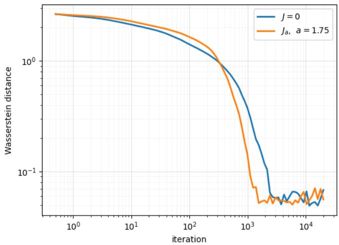

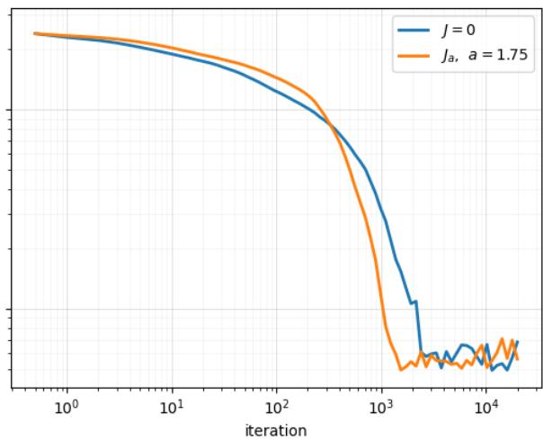  
Figure 1: 2-Wasserstein distance between the particle distribution and an exact sample of the target (7.5) with the MCP regularizer (7.6), as a function of the iterate on logarithmic axes, for the reversible anchored Langevin algorithm $( \alpha = 0 )$ and $\mathrm { N R A L D }$ with the constant skew-symmetric matrix $J _ { a } ~ ( \alpha = 1 , a = 1 . 7 5 )$ , averaged over 5 replications of $N = 5 0 0 0$ particles, from the initial distributions $\mathcal { N } ( 0 , 1 0 I _ { d } )$ (left) and $\mathcal { U } ( - 5 , 5 ) ^ { d } ~ \mathrm { ( r i g h t ) }$

## 7.2 Constrained sampling

## 7.2.1 Truncated elliptical and ℓ1-Laplace distributions

We test NRALD (2.12) on two non-smooth targets restricted to a ball and $\ell _ { 1 }$ . Since exact samples of these targets are available, so that the convergence of the algorithms can be measured directly by the $\mathcal { W } _ { 1 }$ distance to the target rather than by a downstream accuracy. Let

$$
\Sigma : = { \cal D } C { \cal D } , \qquad { \cal D } = \mathrm { d i a g } ( 0 . 5 , 1 , 2 ) , \qquad C _ { i i } = 1 , \quad C _ { i j } = 0 . 6 \ ( i \ne j ) ,\tag{7.13}
$$

so that $\Sigma$ has eigenvalues 0.131, 0.595 and 4.525 , let L be its lower-triangular Cholesky factor, $\Sigma =$ $L L ^ { \top }$ , and write $y : = L ^ { - 1 } x$ for the whitened coordinates. The two targets are $\pi ( x ) \propto e ^ { - U ( x ) } \mathbf { 1 } _ { K } ( x )$ with

$$
\mathrm { T a r g e t \ ( A ) } \quad U ( x ) = \left\| L ^ { - 1 } x \right\| _ { 2 } = \left( x ^ { \top } \Sigma ^ { - 1 } x \right) ^ { 1 / 2 } ,\tag{7.14}
$$

$$
\mathrm { T a r g e t \ ( B ) } \quad U ( x ) = \left\| L ^ { - 1 } x \right\| _ { 1 } = \sum _ { i = 1 } ^ { 3 } \left| ( L ^ { - 1 } x ) _ { i } \right| ,\tag{7.15}
$$

and

$$
K = \left\{ x \in \mathbb { R } ^ { 3 } : \| x \| _ { 2 } \leq R \right\} , \qquad R = { \frac { 1 } { 2 } } ,\tag{7.16}
$$

i.e. the centered ball (2.20) with $\textstyle r = R ^ { 2 } = { \frac { 1 } { 4 } }$ . The potential of (7.14) is Lipschitz and smooth except at the origin, where it has a conical singularity, while that of (7.15) is Lipschitz and nondiferentiable on the three planes $\{ ( L ^ { - 1 } x ) _ { i } = 0 \}$ through the origin; in both cases ∇U fails to exist exactly where the density is largest. The constraint is severe: only 2.0% of target (A) in (7.14) and 4.5% of target (B) in (7.15) of the mass of the unconstrained distributions lies in K, and the restricted targets are close to the uniform distribution on K. Whatever acceleration is observed below in Figure 2 is therefore due to the interaction of the circulation with the constraint and with the non-smooth core, not to an elongated target.

Following G¨urb¨uzbalaban et al. [2025] we take as anchor the deterministic smoothing of U in the whitened coordinates,

$$
\begin{array} { r l } { \mathrm { ( A ) } } & { { } U _ { 0 } ( { \boldsymbol { x } } ) = \sqrt { \left\| { \boldsymbol { L } } ^ { - 1 } { \boldsymbol { x } } \right\| _ { 2 } ^ { 2 } + \delta ^ { 2 } } , } \end{array}\tag{B}
$$

$$
U _ { 0 } ( x ) = \sum _ { i = 1 } ^ { 3 } \sqrt { \left( L ^ { - 1 } x \right) _ { i } ^ { 2 } + \delta ^ { 2 } } ,\tag{7.17}
$$

with $\delta = 0 . 1$ , which is $C ^ { \infty }$ with

(A)

$$
\nabla U _ { 0 } ( x ) = \frac { L ^ { - \top } y } { \sqrt { \| y \| _ { 2 } ^ { 2 } + \delta ^ { 2 } } } ,\tag{B}
$$

$$
\nabla U _ { 0 } ( x ) = L ^ { - \top } \left( \frac { y _ { i } } { \sqrt { y _ { i } ^ { 2 } + \delta ^ { 2 } } } \right) _ { i = 1 } ^ { 3 } ,\tag{7.18}
$$

so that $\| \nabla U _ { 0 } \| _ { 2 } \le \| L ^ { - 1 } \| _ { 2 } = 2 . 7 7$ in case (A) and $\| \nabla U _ { 0 } \| _ { 2 } \le \sqrt { 3 } \| L ^ { - 1 } \| _ { 2 } = 4 . 7 9$ in case (B). Since $0 < \sqrt { t ^ { 2 } + \delta ^ { 2 } } - | t | \leq \delta$ , the clock satisfies

$$
a ( x ) = e ^ { U ( x ) - U _ { 0 } ( x ) } \in [ e ^ { - \delta } , 1 ) = [ 0 . 9 0 5 , 1 ) ~ \mathrm { ( A ) } , \qquad a ( x ) \in [ e ^ { - 3 \delta } , 1 ) = [ 0 . 7 4 1 , 1 ) ]\tag{B),}
$$

(7.19)

and it is Lipschitz on K because U is Lipschitz and $U _ { 0 }$ is smooth. Only $U _ { 0 }$ is diferentiated; the non-smooth U enters through function evaluations in a.

We run the projected scheme (7.2) with the state-dependent skew-symmetric matrix $J = J _ { s }$ from (2.26), the projection $\Pi _ { K } ( z ) = z \operatorname* { m i n } \{ 1 , R / \| z \| _ { 2 } \}$ and, for all schemes, the same step size $\eta = 5 \times 1 0 ^ { - 4 }$ and the same number of iterates, 5000, so that the reversible and non-reversible chains use the same number of evaluations of U and $\nabla U _ { 0 }$ and difer only by one cross product per iterate. We propagate N = 5000 independent walkers, all started at the boundary point $x _ { 0 } = \Pi _ { K } ( 0 . 5 , 0 . 5 , 0 . 5 ) = ( 1 , 1 , 1 ) / ( 2 \sqrt { 3 } )$ , and repeat the experiment over 8 independent replicas. Exact samples of π are obtained by rejection: we draw from the unconstrained law of (7.14) and (7.15) and keep the draws that fall in K. As a measure of convergence we use, every 25 iterates, the $\mathcal { W } _ { 1 }$ distance between the empirical distribution of the walkers and that of 5000 exact samples in each coordinate, averaged over the three coordinates,

$$
\mathcal { W } _ { 1 } ( k ) : = \frac { 1 } { 3 } \sum _ { i = 1 } ^ { 3 } \mathcal { W } _ { 1 } \big ( \hat { \mu } _ { k , i } , \hat { \pi } _ { i } \big ) ,\tag{7.20}
$$

and we report its mean over the replicas. Being a two-sample quantity, (7.20) does not vanish for a perfect sampler: between two independent exact samples of size 5000 it equals 0.0050 for (7.14) and 0.0043 for (7.15) on average, which we call the floor. For each replica and each $m \in \{ 3 , 5 \}$ we record the number of iterates $\tau _ { m }$ after which $\mathcal { W } _ { 1 } ( k )$ stays below m times the floor, and we report the mean of $\tau _ { m }$ over the replicas with a bootstrap 95% interval, as well as the ratio of the mean $\tau _ { m }$ of the reversible chain to that of the non-reversible one.

Figure 2 shows that NRALD with $J _ { s }$ (2.26) converges faster than the reversible projected anchored Langevin algorithm on both targets, and that the gain grows with s. On target (A)

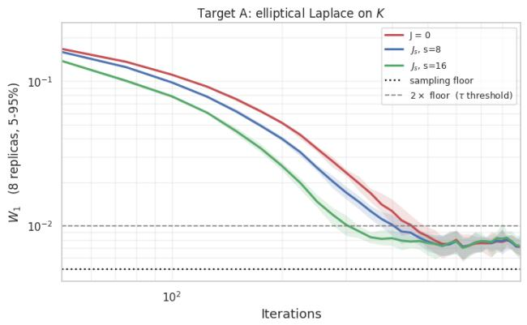

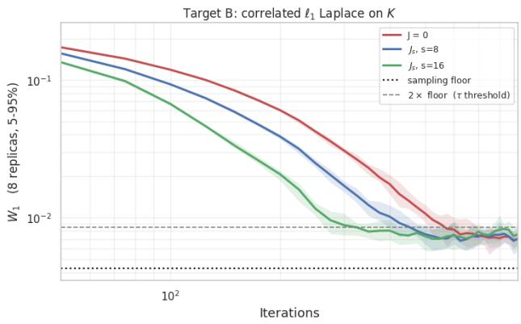  
Figure 2: $\mathcal { W } _ { 1 }$ distance (7.20) between the walkers and an exact sample of the target, averaged over 8 replicas, as a function of the iterate on logarithmic axes, for the reversible projected anchored Langevin algorithm $( \alpha = 0 )$ and NRALD with the tensor $J _ { s }$ in (2.26) with $s = 8$ and $s = 1 6$ $( \alpha = 1 )$ , for the targets (A) (7.14) (left) and (B) (7.15) (right) on the ball (7.16). The dotted line is the two-sample floor and the dashed line is 3×floor, the threshold of $\tau _ { 3 }$

Target A: elliptical Laplace on K — the target inside K, and how each scheme fills it  
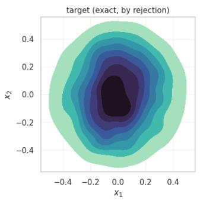

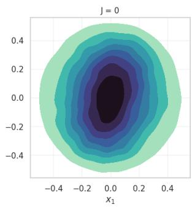

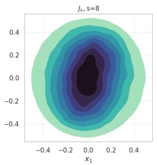

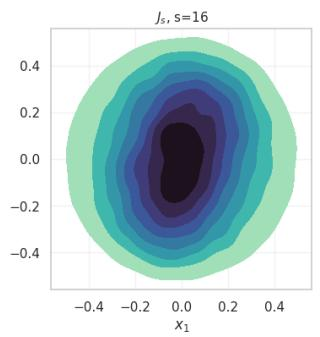  
Figure 3: Visualized density plots of the first two coordinates $( x _ { 1 } , x _ { 2 } )$ for target (A), $U ( x ) =$ $\| L ^ { - 1 } x \| _ { 2 }$ in (7.14), restricted to the ball K in (7.16). From left to right: 5000 exact samples of the target obtained by rejection, and the walkers of the reversible projected anchored Langevin algorithm $( J = 0 )$ and of NRALD with $J _ { s }$ in (2.26) for $s = 8$ and $s = 1 6$ after 5000 iterates with $\eta = 5 \times 1 0 ^ { - 4 }$ (8 replicas of 5000 walkers), shown as kernel density estimates with the same contour levels.

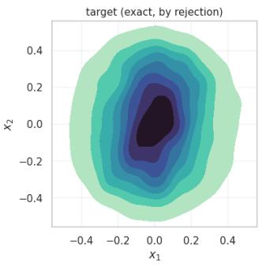

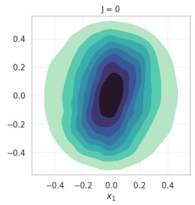

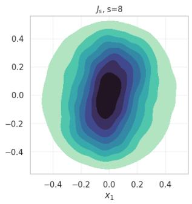

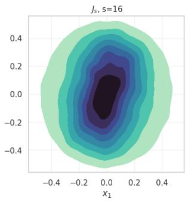  
Figure 4: Visualized density plots of the first two coordinates $( x _ { 1 } , x _ { 2 } )$ for target (B), $U ( x ) =$ $\| L ^ { - 1 } x \| _ { 1 }$ in (7.15), restricted to the ball K in (7.16). From left to right: 5000 exact samples of the target obtained by rejection, and the walkers of the reversible projected anchored Langevin algorithm $( J = 0 )$ and of NRALD with $J _ { s }$ in (2.26) for $s = 8$ and $s = 1 6$ after 5000 iterates with $\eta = 5 \times 1 0 ^ { - 4 }$ (8 replicas of 5000 walkers), shown as kernel density estimates with the same contour levels.

(7.14), $\mathcal { W } _ { 1 }$ after 100, 200 and 300 iterates is 0.111, 0.052 and 0.023 for the reversible chain, 0.098, 0.040 and 0.017 for $s = 8 .$ , and 0.079, 0.026 and 0.010 for $s = 1 6 ;$ ; on target (B) the corresponding values are 0.119, 0.060, 0.031, then 0.093, 0.039, 0.017, and 0.067, 0.021, 0.009. The number of iterates needed to reach 3×floor drops from 381 to 338 $( s = 8 )$ and 259 $( s \ : = \ : 1 6 )$ on (A), and from 469 to 369 and 253 on (B). Doubling s roughly doubles the gain, and the gain is larger for target (B), whose potential is non-smooth on three planes, than for target (A), whose potential is non-smooth only at the origin. Once converged, all schemes settle at the same stationary level. The stationary $\mathcal { W } _ { 1 }$ is 0.0075 for the three schemes on $\mathrm { ( A ) }$ and 0.0070, 0.0069 and 0.0074 on (B), within one bootstrap interval of each other. Figures 3 and 4 confirm this visually: after 5000 iterates the $( x _ { 1 } , x _ { 2 } )$ marginals of the three schemes are indistinguishable from that of the exact sample, including the tilted core of target (B). This is what the theory predicts. The tensor $J _ { s }$ preserves $\pi ,$ and since it is tangential it adds no normal component to the step near $\partial K$ , so it leaves the projection error of the scheme unchanged.

## 7.2.2 Bayesian logistic regression: Synthetic data

We test NRALD (2.12) on a binary classification synthetic problem whose target is not diferentiable. Suppose we can access a dataset $Z = \{ z _ { j } \} _ { j = 1 } ^ { n } , z _ { j } = ( X _ { j } , y _ { j } )$ , where $X _ { j } \in \mathbb { R } ^ { d }$ are the features and $y _ { j } \in \{ 0 , 1 \}$ the labels, and assume that, conditionally on the features and on the regression coeficients $\boldsymbol { \beta } \in \mathbb { R } ^ { d }$ , the labels are independent with

$$
\mathbb { P } \left( y _ { j } = 1 \mid X _ { j } , \beta \right) = \frac { 1 } { 1 + e ^ { - \beta ^ { \top } X _ { j } } } .\tag{7.21}
$$

The first coordinate of every $X _ { j }$ equals 1, so $\beta _ { 1 }$ is an intercept, and we write $\beta = \left( \beta _ { 1 } , \beta _ { 2 : d } \right)$ . The prior on $\beta$ is the product of a Gaussian ${ \mathcal { N } } ( 0 , \sigma ^ { 2 } )$ on the intercept, a Laplace (LASSO) prior with parameter $\lambda > 0$ on the slopes, and the indicator of a compact set $K \subset \mathbb { R } ^ { d }$ . The target is therefore $\pi ( \beta ) \propto e ^ { - U ( \beta ) } \mathbf { 1 } _ { K } ( \beta )$ with $U = f + g$ of the form (7.3), where

$$
f ( { \boldsymbol { \beta } } ) : = \sum _ { j = 1 } ^ { n } \left[ \log \left( 1 + e ^ { { \boldsymbol { \beta } } ^ { \top } { \boldsymbol { X } } _ { j } } \right) - y _ { j } { \boldsymbol { \beta } } ^ { \top } { \boldsymbol { X } } _ { j } \right] + { \frac { \beta _ { 1 } ^ { 2 } } { 2 \sigma ^ { 2 } } } , \qquad g ( { \boldsymbol { \beta } } ) : = \lambda \sum _ { i = 2 } ^ { d } | \beta _ { i } | .\tag{7.22}
$$

Here $f$ is convex and $C ^ { \infty }$ , whereas g is the LASSO regularizer restricted to the slopes: it is convex and Lipschitz but not diferentiable on the coordinate hyperplanes $\{ \beta _ { i } = 0 \} , i = 2 , \ldots , d .$ , which is precisely where a sparse posterior puts its mass. Hence $U$ is locally Lipschitz but ∇U does not exist on a set of positive π-probability (near which the chain spends most of its time), and the reflected Langevin dynamics (1.6) cannot be used. Following (7.4), we take the anchor $U _ { 0 } = f + g _ { 0 }$ with

$$
g _ { 0 } ( \beta ) : = \lambda \sum _ { i = 2 } ^ { d } \sqrt { \beta _ { i } ^ { 2 } + \delta ^ { 2 } } , \qquad a ( \beta ) = e ^ { U ( \beta ) - U _ { 0 } ( \beta ) } = e ^ { g ( \beta ) - g _ { 0 } ( \beta ) } \in \left[ e ^ { - ( d - 1 ) \lambda \delta } , 1 \right] ,\tag{7.23}
$$

for a small $\delta > 0$ . Only $U _ { 0 }$ is diferentiated; the target $U$ enters through function evaluations in the clock a. Consider the following example of $d = 9$ , where the first coordinate of $X _ { j }$ is the intercept. We first generate $n = 2 0 0 0$ synthetic data by the following model

$$
X _ { j } = \left( 1 , \tilde { X } _ { j } \right) , \quad \tilde { X } _ { j } \sim \mathcal { N } \left( 0 , \Sigma \right) , \quad p _ { j } \sim \mathcal { U } ( 0 , 1 ) , \quad y _ { j } = \left\{ \begin{array} { l l } { 1 } & { \mathrm { i f } \ p _ { j } \leq \frac { 1 } { 1 + e ^ { - \beta _ { * } ^ { \top } X _ { j } } } } \\ { 0 } & { \mathrm { o t h e r w i s e } } \end{array} \right. ,\tag{7.24}
$$

where $\mathcal { U } ( 0 , 1 )$ stands for the uniform distribution on $[ 0 , 1 ] , \beta _ { * } \in \mathbb { R } ^ { 9 }$ is the true coeficient vector, and $\Sigma \in \mathbb { R } ^ { 8 \times 8 }$ is block diagonal. In (7.22)–(7.23) we take $\lambda = 2 , \sigma = 5$ and $\delta = 0 . 0 2 .$ , and $\nabla U _ { 0 }$ is computed over the full training set. Then we implement the scheme (7.2) with 1000 iterates, initialized from the uniform distribution on K, and repeat it over $R = 1 0 0$ independent replicates, where the reversible $( \alpha = 0 )$ and non-reversible $( \alpha = 1 )$ chains of a replicate share the same initia point and the same Gaussian increments. For the constrained Bayesian logistic regression, it is not practical for us to compute the $\mathcal { W } _ { 1 }$ distance between the approximated Gibbs distribution and the empirical distribution. Hence, for such a binary classification problem, we use the accuracy of the current iterate $\beta _ { k }$ over the training set and the test set to measure the goodness of the convergence performance.

In the experiment with the ball constraint set in (2.20) with $r = 1$ , we choose the skew-symmetric matrix $J _ { s } ( x )$ in (2.26) with $s = 1 6 .$ , ramped up linearly from 0 over the first 20 iterates, and the step size $\eta = 3 \times 1 0 ^ { - 6 }$ , for the non-reversible anchored Langevin algorithm shown by the red solid line. We use 20% of the whole dataset as the test set. The mean and standard deviation of the accuracy distribution over the $R = 1 0 0$ replicates are shown in Figure 5.

Under the same setting, we consider the smoothed $\ell _ { 1 }$ ball constraint in (2.21) with $\varepsilon = 0 . 2$ and $\Lambda = 7 . 4$ in this synthetic data example, the scaling parameter $s = 4$ for $J _ { g } ( x )$ defined in (2.29), and the step size $\eta = 7 \times 1 0 ^ { - 6 }$ . We obtain Figure 6.

We observe that the non-reversible anchored Langevin algorithm, with $J _ { s } ( x )$ in the red line in Figure 5 and with $J _ { g } ( x )$ in the red line in Figure 6, requires fewer iterations to achieve the same level of accuracy on the test set and exhibits more stable sampling behavior comparing to the reversible anchored Langevin algorithm in the blue dashed line. In particular, after 100 iterates the mean test accuracy is 0.72 versus 0.56 for the smoothed $\ell _ { 1 }$ ball constraint and 0.68 versus 0.58 for the ball constraint, while both algorithms reach the same accuracy level by 1000 iterates, in agreement with the fact that they share the same invariant distribution.

## 7.2.3 Bayesian logistic regression: Real data

In this section, we consider the constrained Bayesian logistic regression problem on the MAGIC Gamma Telescope dataset1 and the Titanic dataset2. The Telescope dataset contains $n = 1 9 0 2 0$ samples with 10 features, describing the registration of high energy gamma particles in a groundbased atmospheric Cherenkov gamma telescope using the imaging technique, and the goal is to classify each event as a gamma or a hadron shower. We append one identically zero feature so that, with the intercept, the dimension $d = 1 2$ is a multiple of 3 and matches the block structure of $J _ { s } ( x )$ and $J _ { g } ( x )$ ; the coeficient of this feature is pulled to zero by the LASSO term and plays no role in the predictions. The Titanic dataset contains 891 samples with 11 attributes describing the passengers, and the goal is to predict whether a passenger survived or not. Some of the attributes are irrelevant to our goal or mostly missing, namely the passenger identifier, the name, the ticket number and the cabin, and we discard them. We keep the remaining seven attributes, namely the passenger class, the sex, the age (with the 177 missing values replaced by the median age), the number of siblings and spouses aboard, the number of parents and children aboard, the fare $( \mathrm { a s ~ l o g } ( 1 + \mathrm { f a r e } ) )$ ) and the port of embarkation; the last one is categorical with three levels and is encoded by two indicator variables. We thus obtain a dataset containing $n = 8 9 1$ labeled samples with 8 feature columns, so that $d = 9$ with the intercept. For both datasets we use 20% of the whole dataset as the test set, stratified by label, and we standardize the features by the mean and standard deviation of the training set.

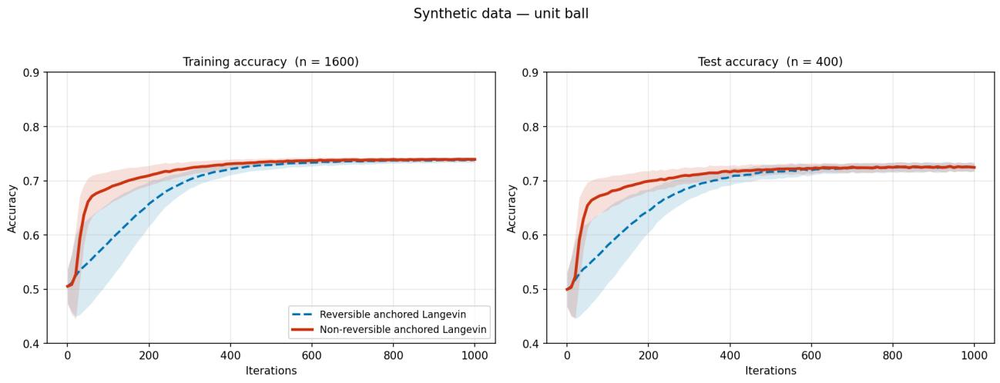  
Figure 5: Accuracy over the training set and the test set for the synthetic data. The red part (solid line) denotes the mean and standard deviation of the non-reversible anchored Langevin algorithm with $J _ { s } ( x ) \ ( \alpha = 1 )$ and the blue part (dashed line) denotes the mean and standard deviation of the reversible anchored Langevin algorithm (α = 0).

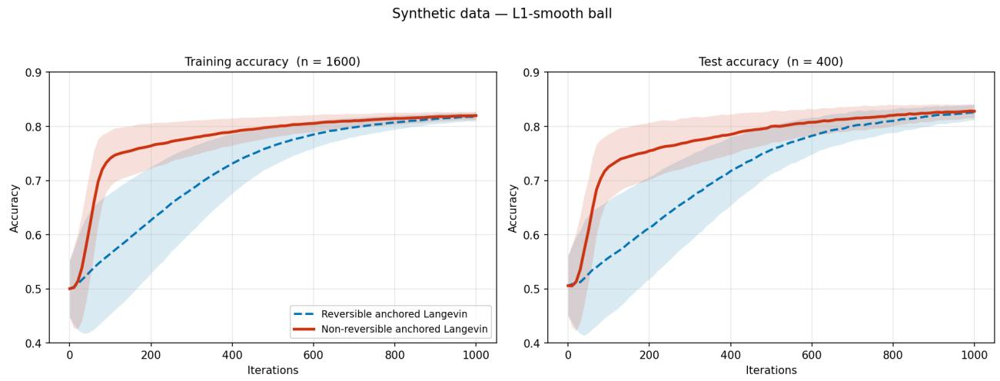  
Figure 6: Accuracy over the training set and the test set for the synthetic data. The red part (solid line) denotes the mean and standard deviation of the non-reversible anchored Langevin algorithm with $J _ { g } ( x ) \ ( \alpha = 1 )$ and the blue part (dashed line) denotes the mean and standard deviation of the reversible anchored Langevin algorithm (α = 0).

In (7.22)–(7.23) we take $\lambda = 2 , \sigma = 5$ and $\delta = 0 . 0 2$ as before, and $\nabla U _ { 0 }$ is computed over the full training set. For the ball constraint set $K _ { r = 1 }$ in (2.20), all features are rescaled by a common factor so that the pilot coeficient vector has Euclidean norm 0.8 and lies inside $K _ { r = 1 } ;$ for the smoothed $\ell _ { 1 }$ ball constraint set in (2.21) we take $\varepsilon = 0 . 2$ and $\Lambda = d \varepsilon + \| \hat { \beta } \| _ { 1 } + 1$ , where $\hat { \beta }$ is the pilot coeficient vector in the transformed coordinates. For both datasets, we initialize the reversible $( \alpha = 0 )$ and non-reversible $( \alpha = 1 )$ anchored Langevin algorithms with the uniform distribution on K, run $R = 1 0 0$ independent replicates in which the two chains of a replicate share the same initial point and the same Gaussian increments, and report the mean and standard deviation over the replicates of the accuracy of the current iterate $\beta _ { k }$ over the training set and the test set.

In the experiment of using the Telescope dataset with a centered ball constraint set, we take the constraint set as the centered ball $K _ { r = 1 } \subset \mathbb { R } ^ { 1 2 }$ defined in (2.20), and we set the step size $\eta = 2 \times 1 0 ^ { - 7 }$ and implement the two algorithms for 1500 iterates, where we choose the skew-symmetric matrix as $J _ { s } ( x )$ defined in (2.26) with $s = 1 6$ for the non-reversible anchored Langevin algorithm shown by the red solid line. Figure 7 reports the accuracy of the two algorithms over the training set and the test set. In the experiment of using the Telescope dataset with the smoothed $\ell _ { 1 }$ ball constraint set defined in (2.21), we choose the skew-symmetric matrix as $J _ { g } ( x )$ defined in (2.29) with $s = 8 .$ the step size $\eta = 2 \times 1 0 ^ { - 6 }$ , and implement the two algorithms for 1000 iterates to obtain Figure 8.

For the Titanic data, we first consider the constraint set as the centered ball $K _ { r = 1 } \subset \mathbb { R } ^ { 9 }$ , and we set the step size $\eta = 1 . 4 \times 1 0 ^ { - 6 }$ and implement the two algorithms for 2000 iterates, where we choose the skew-symmetric matrix as $J _ { s } ( x )$ defined in (2.26) with $s = 1 2$ , ramped up linearly from 0 over the first 10 iterates, for the non-reversible anchored Langevin algorithm shown by the red solid line. Figure 9 reports the accuracy level of the two algorithms over the training and test sets. Taking the constraint set as the smoothed $\ell _ { 1 }$ ball constraint set defined in (2.21), we choose the skew-symmetric matrix as $J _ { g } ( x )$ defined in (2.29) with $s = 8$ , the step size $\eta = 7 \times 1 0 ^ { - 6 }$ , and implement the two algorithms for 3000 iterates to obtain Figure 10.

From Figure 7 and Figure 8 for the Telescope dataset, and Figure 9 and Figure 10 for the Titanic dataset, we can conclude that the non-reversible anchored Langevin algorithm (2.12), with either $J _ { s } ( x ) \ \mathrm { o r } \ J _ { g } ( x )$ , consistently attains a given level of classification accuracy with fewer iterates than the reversible anchored Langevin algorithm (1.7) on both datasets, which indicates a faster convergence rate. On the Telescope dataset, the mean test accuracy after 50 iterates is 0.71 versus 0.55 with the ball constraint and 0.75 versus 0.59 with the smoothed $\ell _ { 1 }$ ball constraint; on the Titanic dataset, after 150 iterates it is 0.72 versus 0.58 with the ball constraint and 0.73 versus 0.54 with the smoothed $\ell _ { 1 }$ ball constraint. The non-reversible algorithm also exhibits a much smaller spread across replicates during the transient. By the end of each run both algorithms have reached the accuracy of the Bayesian logistic regression fit and agree with each other to within 0.005, in agreement with the fact that they share the same invariant distribution.

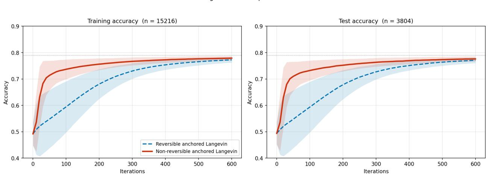  
Figure 7: Accuracy over the training set and the test set for the Telescope dataset over the unit ball. The red part (solid line) denotes the mean and standard deviation of the non-reversible anchored Langevin algorithm with $J _ { s } ( x ) \ ( \alpha = 1 )$ , the blue part (dashed line) denotes the mean and standard deviation of the reversible anchored Langevin algorithm $( \alpha = 0 )$ , and the grey dotted line is the test accuracy of the Bayesian logistic regression fit.

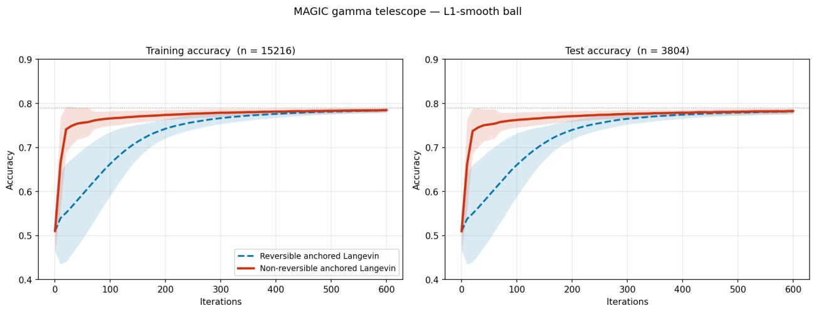  
Figure 8: Accuracy over the training set and the test set for the Telescope dataset over the smoothed $l _ { 1 }$ ball. The red part (solid line) denotes the mean and standard deviation of the non-reversible anchored Langevin algorithm with $J _ { g } ( x ) \ ( \alpha = 1 )$ , the blue part (dashed line) denotes the mean and standard deviation of the reversible anchored Langevin algorithm $( \alpha = 0 )$ , and the grey dotted line is the test accuracy of the Bayesian logistic regression fit.

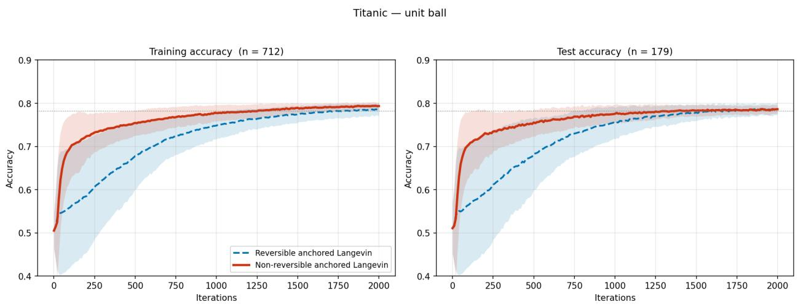  
Figure 9: Accuracy over the training set and the test set for the Titanic dataset over the unit ball. The red part (solid line) denotes the mean and standard deviation of the non-reversible anchored Langevin algorithm with $J _ { s } ( x ) \ ( \alpha = 1 )$ , the blue part (dashed line) denotes the mean and standard deviation of the reversible anchored Langevin algorithm $( \alpha = 0 )$ , and the grey dotted line is the test accuracy of the Bayesian logistic regression fit.

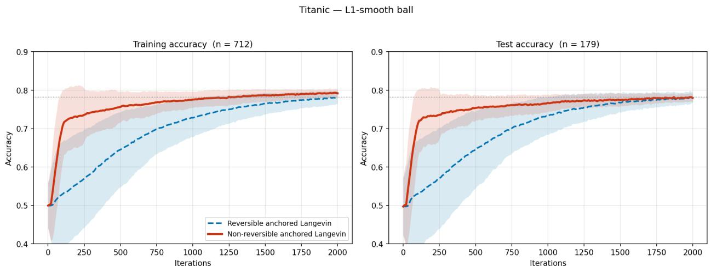  
Figure 10: Accuracy over the training set and the test set for the Titanic dataset over smoothed $l _ { 1 }$ ball. The red part (solid line) denotes the mean and standard deviation of the non-reversible anchored Langevin algorithm with $J _ { g } ( x ) \ ( \alpha = 1 )$ , the blue part (dashed line) denotes the mean and standard deviation of the reversible anchored Langevin algorithm (α = 0), and the grey dotted line is the test accuracy of the Bayesian logistic regression fit.

## 8 Conclusion

In this paper, we introduced non-reversible anchored Langevin dynamics (NALD) on the whole Euclidean space and its normally reflected counterpart, non-reversible reflected anchored Langevin dynamics (NRALD), on a bounded domain. Both dynamics combine a diferentiable reference potential with a state-dependent clock while allowing the target potential itself to be non-diferentiable. We constructed the nonreversible perturbation through a divergence-free weighted current, proved invariance of the target distribution, and identified the dynamics as random time changes of nonreversible reference difusions. We then quantified the resulting acceleration at three complementary levels. We established finite-time total-variation convergence bounds, proved level-two empiricalmeasure large deviation principles and an explicit nonnegative decomposition of the irreversible rate function, and showed that the asymptotic variance of stationary ergodic averages decreases under the anti-symmetric perturbation. The assumptions required on unbounded state spaces were verified for a class of heavy-tailed anchored difusions, including a superquadratic Student-t model, and an exactly solvable quadratic-clock example illustrated the variance reduction for linear observables. Numerical experiments are provided to illustrate the performance of our proposed algorithms.

It will be interesting to obtain non-asymptotic convergence guarantees for the algorithms based on the discretization of the continuous-time NALD for unconstrained sampling and NRALD for constrained sampling in the paper. The analysis can be challenging due to the state-dependent difusion coeficient in NALD and NRALD as well as the presence of reflections in NRALD. This will be left for future investigations.

## References

Kwangjun Ahn and Sinho Chewi. Eficient constrained sampling via the mirror-Langevin algorithm. In Advances in Neural Information Processing Systems (NeurIPS), volume 34, pages 28405– 28418. Curran Associates, Inc., 2021.

Christophe Andrieu, Nando De Freitas, Arnaud Doucet, and Michael I Jordan. An introduction to MCMC for machine learning. Machine Learning, 50(1):5–43, 2003.

Dominique Bakry, Franck Barthe, Patrick Cattiaux, and Arnaud Guillin. A simple proof of the Poincar´e inequality for a large class of probability measures. Electronic Communications in Probability, 13:60–66, 2008a.

Dominique Bakry, Patrick Cattiaux, and Arnaud Guillin. Rate of convergence for ergodic continuous Markov processes: Lyapunov versus Poincar´e. Journal of Functional Analysis, 254(3): 727–759, 2008b.

Dominique Bakry, Ivan Gentil, and Michel Ledoux. Analysis and Geometry of Markov Difusion Operators, volume 348. Springer, Cham, 2013.

Cameron Bell, Krzystof Latuszy´nski, and Gareth O Roberts. Adaptive stereographic MCMC. arXiv preprint arXiv:2408.11780, 2024.

Denis Belomestny and Leonid Iosipoi. Fourier transform MCMC, heavy-tailed distributions, and geometric ergodicity. Mathematics and Computers in Simulation, 181:351–363, 2021.

Joris Bierkens, Gareth O Roberts, and Pierre-Andr´e Zitt. Ergodicity of the zigzag process. The Annals of Applied Probability, 29(4):2266–2301, 2019.

Nicolas Brosse, Alain Durmus, Eric Moulines, and Marcelo Pereyra. Sampling from a log-concave ´ distribution with compact support with proximal Langevin Monte Carlo. In Proceedings of the 2017 Conference on Learning Theory, volume 65, pages 319–342. PMLR, 2017.

Sebastien Bubeck, Ronen Eldan, and Joseph Lehec. Finite-time analysis of projected Langevin Monte Carlo. In Advances in Neural Information Processing Systems, volume 28. Curran Associates, Inc., 2015.

S´ebastien Bubeck, Ronen Eldan, and Joseph Lehec. Sampling from a log-concave distribution with projected Langevin Monte Carlo. Discrete & Computational Geometry, 59(4):757–783, 2018.

Patrick Cattiaux, Arnaud Guillin, and Li-Ming Wu. A note on Talagrand’s transportation inequality and logarithmic Sobolev inequality. Probability Theory and Related Fields, 148:285–304, 2010.

Niladri Chatterji, Jelena Diakonikolas, Michael I. Jordan, and Peter Bartlett. Langevin Monte Carlo without smoothness. In Proceedings of the Twenty Third International Conference on Artificial Intelligence and Statistics, volume 108 of Proceedings of Machine Learning Research, pages 1716–1726, 26–28 Aug 2020.

Sinho Chewi, Thibaut Le Gouic, Cheng Lu, Tyler Maunu, Philippe Rigollet, and Austin Stromme. Exponential ergodicity of mirror-Langevin difusions. In Advances in Neural Information Processing Systems (NeurIPS), volume 33, pages 19573–19585. Curran Associates, Inc., 2020.

Tzuu-Shuh Chiang, Chii-Ruey Hwang, and Shuenn Jyi Sheu. Difusion for global optimization in Rn. SIAM Journal on Control and Optimization, 25(3):737–753, 1987.

Arnak S Dalalyan. Theoretical guarantees for approximate sampling from smooth and log-concave densities. Journal of the Royal Statistical Society: Series B (Statistical Methodology), 79(3): 651–676, 2017.

Arnak S. Dalalyan and Avetik G. Karagulyan. User-friendly guarantees for the Langevin Monte Carlo with inaccurate gradient. Stochastic Processes and their Applications, 129(12):5278–5311, 2019.

George Deligiannidis, Alexandre Bouchard-Cˆot´e, and Arnaud Doucet. Exponential ergodicity of the bouncy particle sampler. Annals of Statistics, 47(3):1268–1287, 2019.

Amir Dembo and Ofer Zeitouni. Large Deviations Techniques and Applications. Springer, New York, 2nd edition, 1998.

Monroe D. Donsker and Srinivasa R. S. Varadhan. Asymptotic evaluation of certain Markov process expectations for large time. I. Communications on Pure and Applied Mathematics, 28(1):1–47, 1975.

Hengrong Du, Qi Feng, Changwei Tu, Xiaoyu Wang, and Lingjiong Zhu. Non-reversible Langevin algorithms for constrained sampling. arXiv:2501.11743, 2025.

Andrew B. Duncan, Tony Leli\`evre, and Grigorios A. Pavliotis. Variance reduction using nonreversible Langevin samplers. Journal of Statistical Physics, 163(3):457–491, 2016.

Alain Durmus and Eric Moulines. Non-asymptotic convergence analysis for the Unadjusted Langevin Algorithm. Annals of Applied Probability, 27(3):1551–1587, 2017.

Alain Durmus, Eric Moulines, and Marcelo Pereyra. Eficient Bayesian computation by proximal ´ Markov Chain Monte Carlo: When Langevin meets Moreau. SIAM Journal on Imaging Sciences, 11(1):473–506, 2018.

Alain Durmus, Szymon Majewski, and Blazej Miasojedow. Analysis of Langevin Monte Carlo via convex optimization. Journal of Machine Learning Research, 20(1):2666–2711, 2019.

Alain Durmus, Arnaud Guillin, and Pierre Monmarch´e. Geometric ergodicity of the bouncy particle sampler. The Annals of Applied Probability, 30(5):2069–2098, 2020.

Raaz Dwivedi, Yuansi Chen, Martin J Wainwright, and Bin Yu. Log-concave sampling: Metropolis-Hastings algorithms are fast. Journal of Machine Learning Research, 20(183):1–42, 2019.

Armin Eftekhari, Luis Vargas, and Konstantinos C. Zygalakis. The forward–backward envelope for sampling with the overdamped Langevin algorithm. Statistics and Computing, 33(85):1–24, 2023.

Stewart N. Ethier and Thomas G. Kurtz. Markov Processes: Characterization and Convergence. Wiley Series in Probability and Mathematical Statistics. Wiley, New York, 1986.

Gr´egoire Ferr´e and Gabriel Stoltz. Large deviations of empirical measures of difusions in weighted topologies. Electronic Journal of Probability, 25(121):1–52, 2020.

Xuefeng Gao, Mert G¨urb¨uzbalaban, and Lingjiong Zhu. Breaking reversibility accelerates Langevin dynamics for global non-convex optimization. In Advances in Neural Information Processing Systems (NeurIPS), volume 33. Curran Associates, Inc., 2020.

Andrew Gelman, John B Carlin, Hal S Stern, and Donald B Rubin. Bayesian Data Analysis. Chapman & Hall/CRC Press, 1995.

Jacob Vorstrup Goldman, Torben Sell, and Sumeetpal Sidhu Singh. Gradient-based Markov chain Monte Carlo for Bayesian inference with non-diferentiable priors. Journal of the American Statistical Association, 117(540):2182–2193, 2022.

Mert G¨urb¨uzbalaban, Xuefeng Gao, Yunhan Hu, and Lingjiong Zhu. Decentralized stochastic gradient Langevin dynamics and Hamiltonian Monte Carlo. Journal of Machine Learning Research, 22(239):1–69, 2021.

Mert G¨urb¨uzbalaban, Yuanhan Hu, and Lingjiong Zhu. Penalized overdamped and underdamped Langevin Monte Carlo algorithms for constrained sampling. Journal of Machine Learning Research, 25(263):1–67, 2024a.

Mert G¨urb¨uzbalaban, Mohammad Rafiqul Islam, Xiaoyu Wang, and Lingjiong Zhu. Generalized EXTRA stochastic gradient Langevin dynamics. arXiv preprint arXiv:2412.01993, 2024b.

Mert G¨urb¨uzbalaban, Hoang M. Nguyen, Xicheng Zhang, and Lingjiong Zhu. Anchored Langevin algorithms. arXiv:2509.19455, 2025.

Andreas Habring, Martin Holler, and Thomas Pock. Subgradient Langevin methods for sampling from nonsmooth potentials. SIAM Journal on Mathematics of Data Science, 6(4):897–925, 2024.

Ye He, Krishnakumar Balasubramanian, and Murat A. Erdogdu. An analysis of transformed Unadjusted Langevin Algorithm for heavy-tailed sampling. IEEE Transactions on Information Theory, 70(1):571–593, 2024a.

Ye He, Tyler Farghly, Krishnakumar Balasubramanian, and Murat A. Erdogdu. Mean-square analysis of discretized Itˆo difusions for heavy-tailed sampling. Journal of Machine Learning Research, 25(43):1–44, 2024b.

Richard A Holley, Shigeo Kusuoka, and Daniel W Stroock. Asymptotics of the spectral gap with applications to the theory of simulated annealing. Journal of Functional Analysis, 83(2):333–347, 1989.

Lars H¨ormander. Hypoelliptic second order diferential equations. Acta Mathematica, 119:147–171, 1967.

Ya-Ping Hsieh, Ali Kavis, Paul Rolland, and Volkan Cevher. Mirrored Langevin dynamics. In Advances in Neural Information Processing Systems, volume 31. Curran Associates, Inc., 2018.

Yuanhan Hu, Xiaoyu Wang, Xuefeng Gao, G¨urb¨uzbalaban, and Lingjiong Zhu. Non-convex stochastic optimization via non-reversible stochastic gradient Langevin dynamics. arXiv:2004.02823, 2020. 45 pages.

Chii-Ruey Hwang, Shu-Yin Hwang-Ma, and Shuenn-Jyi Sheu. Accelerating Gaussian difusions. Annals of Applied Probability, 3:897–913, 1993.

Chii-Ruey Hwang, Shu-Yin Hwang-Ma, and Shuenn-Jyi Sheu. Accelerating difusions. Annals of Applied Probability, 15:1433–1444, 2005.

Mohammad Rafiqul Islam and Lingjiong Zhu. Decentralized proximal stochastic gradient Langevin dynamics. arXiv:2605.00723, 2026.

Kenichi Kamatani. Ergodicity of Markov chain Monte Carlo with reversible proposal. Journal of Applied Probability, 54(2):638–654, 2017.

Andrew Lamperski. Projected stochastic gradient Langevin algorithms for constrained sampling and non-convex learning. In Conference on Learning Theory, volume 134, pages 2891–2937. PMLR, 2021.

Tony Leli\`evre, Francis Nier, and Grigorios A Pavliotis. Optimal non-reversible linear drift for the convergence to equilibrium of a difusion. Journal of Statistical Physics, 152(2):237–274, Jul 2013.

Ruilin Li, Molei Tao, Santosh S. Vempala, and Andre Wibisono. The mirror Langevin algorithm converges with vanishing bias. In Sanjoy Dasgupta and Nika Haghtalab, editors, Proceedings of The 33rd International Conference on Algorithmic Learning Theory, volume 167, pages 718–742. PMLR, 2022.

Gary A Lieberman. On the H¨older gradient estimate for solutions of nonlinear elliptic and parabolic oblique boundary value problems. Communications in Partial Diferential Equations, 15(4):515– 523, 1990.

Zhi-Ming Ma and Michael R¨ockner. Introduction to the Theory of (Non-Symmetric) Dirichlet Forms. Universitext. Springer, Berlin, 1992.

Wenlong Mou, Nicolas Flammarion, Martin J. Wainwright, and Peter L. Bartlett. An eficient sampling algorithm for non-smooth composite potentials. Journal of Machine Learning Research, 23(233):1–50, 2022.

Yurii Nesterov and Vladimir Spokoiny. Random gradient-free minimization of convex functions. Foundations of Computational Mathematics, 17(2):527–566, 2017.

Grigorios A. Pavliotis. Stochastic Processes and Applications: Difusion Processes, the Fokker– Planck and Langevin Equations, volume 60 of Texts in Applied Mathematics. Springer, New York, 2014.

Maxim Raginsky, Alexander Rakhlin, and Matus Telgarsky. Non-convex learning via stochastic gradient Langevin dynamics: a nonasymptotic analysis. In Proceedings of the 2017 Conference on Learning Theory, volume 65, pages 1674–1703. PMLR, 2017.

Luc Rey-Bellet and Konstantinos Spiliopoulos. Irreversible Langevin samplers and variance reduction: A large deviations approach. Nonlinearity, 28(7):2081–2103, 2015.

Gareth O Roberts and Richard L Tweedie. Exponential convergence of Langevin distributions and their discrete approximations. Bernoulli, 2(4):341–363, 1996.

Michael R¨ockner and Feng-Yu Wang. Weak Poincar´e inequalities and L2-convergence rates of Markov semigroups. Journal of Functional Analysis, 185:546–603, 2001.

Abhishek Roy, Lingqing Shen, Krishnakumar Balasubramanian, and Saeed Ghadimi. Stochastic zeroth-order discretizations of Langevin difusions for Bayesian inference. Bernoulli, 28(3):1810– 1834, 2022.

Adil Salim and Peter Richtarik. Primal dual interpretation of the proximal stochastic gradient Langevin algorithm. In Advances in Neural Information Processing Systems, volume 33, pages 3786–3796. Curran Associates, Inc., 2020.

Wilhelm Stannat. (Nonsymmetric) Dirichlet operators on L1: existence, uniqueness and associated Markov processes. Annali della Scuola Normale Superiore di Pisa-Classe di Scienze, 28(1):99– 140, 1999.

Andrew M Stuart. Inverse problems: A Bayesian perspective. Acta Numerica, 19:451–559, 2010.

Yee Whye Teh, Alexandre H Thiery, and Sebastian J Vollmer. Consistency and fluctuations for stochastic gradient Langevin dynamics. The Journal of Machine Learning Research, 17(1):193– 225, 2016.

Changwei Tu, Xiaoyu Wang, Yingli Wang, Xicheng Zhang, and Lingjiong Zhu. Reflected anchored Langevin algorithms. arXiv:2610.09522, 2026.

S. R. Srinivasa Varadhan. Large Deviations and Applications. SIAM, Philadelphia, 1984.

Feng-Yu Wang. On estimation of the logarithmic Sobolev constant and gradient estimates of heat semigroups. Probability Theory and Related Fields, 108:87–101, 1997.

Yingli Wang, Changwei Tu, Xiaoyu Wang, and Lingjiong Zhu. Accelerating constrained sampling: A large deviations approach. Journal of Machine Learning Research, 27(118):1–61, 2026.

Max Welling and Yee Whye Teh. Bayesian learning via stochastic gradient Langevin dynamics. In Proceedings of the 28th International Conference on Machine Learning (ICML-11), pages 681–688, 2011.

Nian Yao, Pervez Ali, Xihua Tao, and Lingjiong Zhu. Accelerating Langevin Monte Carlo sampling: A large deviations analysis. arXiv:2503.19066, 2025.

Cun-Hui Zhang. Nearly unbiased variable selection under minimax concave penalty. Annals of Statistics, 38(2):894–942, 2010.

Kelvin Shuangjian Zhang, Gabriel Peyr´e, Jalal Fadili, and Marcelo Pereyra. Wasserstein control of mirror Langevin Monte Carlo. In Conference on Learning Theory, volume 125, pages 3814–3841. PMLR, 2020.

Haoyang Zheng, Hengrong Du, Qi Feng, Wei Deng, and Guang Lin. Constrained exploration via reflected replica exchange stochastic gradient Langevin dynamics. In Proceedings of the 41st International Conference on Machine Learning, volume 235, pages 61321–61348. PMLR, 2024.

Yuping Zheng and Andrew Lamperski. Constrained Langevin algorithms with L-mixing external random variables. In Advances in Neural Information Processing Systems (NeurIPS), volume 35, pages 20511–20521. Curran Associates, Inc., 2022.

Enlu Zhou and Jiaqiao Hu. Gradient-based adaptive stochastic search for non-diferentiable optimization. IEEE Transactions on Automatic Control, 59(7):1818–1832, 2014.