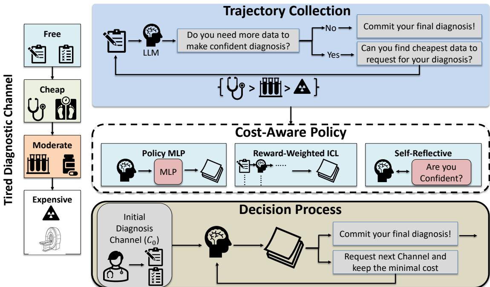
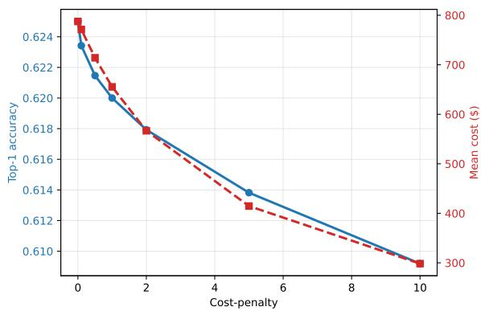
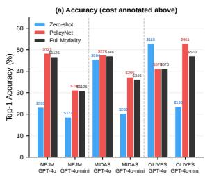
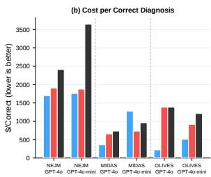
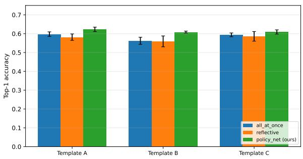
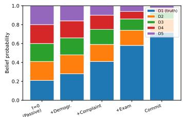
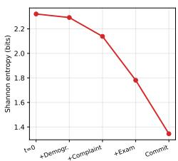
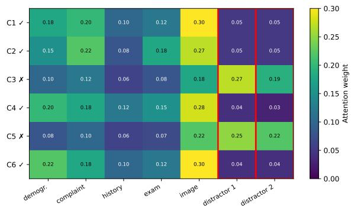
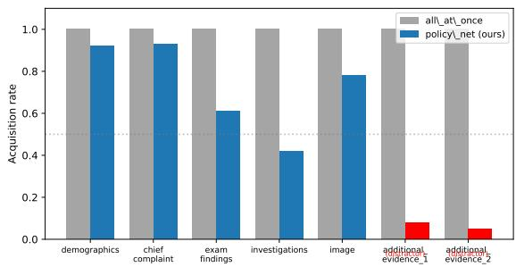
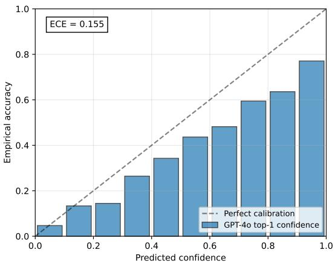

# ActiveMedAgent: Cost-Aware Trajectory Learning for Multimodal Medical Diagnosis

Weiwei Ma1 Xiaobing Yu4† Peijie Qiu1\* Jin Yang2

Zhaoqi An1 Xuanzhao Dong3 Xiaoqi Zhao4† Xiaofeng Liu4†

1Washington University in St. Louis; 2 Icahn School of Medicine at Mount Sinai;

3Arizona State University; 4Yale University

m.weiwei@wustl.edu

{xiaobing.yu, xiaoqi.zhao, xiaofeng.liu}@yale.edu

† co-corresponding author

Code: https://github.com/VisualReasoner/activeagent

## Abstract

Clinical diagnosis is inherently sequential: clinicians escalate from cheap to costly tests only when additional evidence is expected to resolve diagnostic uncertainty. We present ActiveMedAgent, a framework that brings this cost-aware sequential logic to multimodal medical AI. Given a frozen, API-accessed visionlanguage model, ActiveMedAgent tracks probability distributions over candidate diagnoses and scores each acquisition by its per-step diagnostic utility minus cost. A lightweight MLP controller is then trained offline on these scored trajectories, learning when to request additional evidence and when to commit. Across three commonly used benchmarks, trajectory-based policy learning consistently outperforms both unguided acquisition and full-modality baselines. Notably, we identify an information overload effect. In 175 cases, the agent produces a correct diagnosis with fewer channels while the full-modality baseline fails, showing that learning what to omit can be as important as learning what to acquire.

## 1 Introduction

We start from a counterintuitive failure mode: in 175 test cases, a frozen VLM is correct with selected evidence but wrong with all evidence, suggesting that multimodal diagnosis is also an evidence-control problem. Medical multimodal reasoning is commonly evaluated as a static prediction problem. A model receives an image, sometimes paired with supporting text, and produces a diagnosis after all evidence has already been revealed. Recent medical vision-language systems such as Med-Flamingo (Moor et al., 2023) and LLaVA-Med (Li et al., 2023) demonstrate strong performance under this paradigm, but they are typically assessed in settings where the visual modality is always present, and the interaction reduces to a form of medical visual question-answering (VQA). This abstraction is convenient, yet it omits a defining property of real diagnosis: evidence is acquired progressively through selective escalation.

In clinical practice, physicians rarely begin with every modality at once. They first inspect lowcost evidence such as demographics, presenting complaint, medical history, and basic examination findings. Imaging and other expensive investigations are ordered only when earlier evidence leaves material uncertainty. A model that reaches the correct answer only after consuming every modality is therefore not necessarily acting intelligently. In many cases, it is simply overusing information. The clinically meaningful question is thus economic and predictive: what is the minimum amount of evidence needed to arrive at the correct diagnosis? This observation turns multimodal diagnosis into a sequential reasoning problem. At each step, the diagnostic system must reason about the currently available evidence, maintain a belief distribution over candidate diagnoses, and decide whether acquiring an additional modality is expected to improve the diagnosis sufficiently to justify its cost. The objective is no longer only to predict correctly after all evidence is available, but to decide when additional evidence is necessary.

We study this setting as cost-aware multimodal diagnostic escalation. The central idea of this work is to learn from diagnostic belief trajectories. As new evidence is acquired, the model produces a sequence of belief states over diagnoses. These trajectories reveal how each modality affects the differential: some acquisitions resolve ambiguity, some are redundant, and some introduce distraction or information overload. In contrast to static multimodal learning, which observes only the final input and label, trajectory learning supervises how reasoning evolves over time. This enables the system to improve not only prediction accuracy, but also the decision process of whether more evidence

<table><tr><td colspan="3">Representative Successful Case: OLIVES / GPT-4o-mini</td></tr><tr><td>Ground truth Atrophy, Ir Hrf, Partial Vitreous</td><td>Acquisition trace Step 0: +clinical_measurements ($20) leaves a dif-</td><td>Outcome Agent: 2 channels, MRR=1.0, correct, $120.</td></tr><tr><td></td><td>fuse differential but narrows the case toward vitreous and atrophy patterns. Step 1: +biomarker_hints ($100) moves Atrophy, Ir Hrf, Partial Vitreous to rank 1. Commit: The policy stops because OCT and extra slices have low expected value after the biomarker update.</td><td>Full Modality: 4 channels, MRR=25%, wrong, $570. Stopping avoids extra image evi- dence that distracts the model.</td></tr></table>

Figure 1: Successful selective acquisition case. PolicyNet commits after two low-cost evidence channels, while Full Modality receives all four channels and ranks the correct diagnosis lower. This illustrates the information-overload mechanism that motivates cost-aware trajectory learning.

should be acquired.

Based on this formulation, we present ActiveMedAgent, a framework for cost-aware sequential multimodal diagnosis. The model starts from presentation-time evidence and iteratively chooses between acquiring one additional information channel or committing to a ranked differential diagnosis. A lightweight controller is learned from previously collected trajectories and operates over compact diagnostic states. Importantly, the backbone visionlanguage model remains unchanged. The improvement arises from learning better evidence acquisition strategies rather than modifying the underlying diagnostic model.

We evaluate ActiveMedAgent on NEJM (Fajtl et al., 2024), MIDAS (Chiou et al., 2025), and OLIVES (Prabhushankar et al., 2022) under clinically ordered evidence hierarchies. The results reveal that active acquisition improves over passive diagnosis, but naive acquisition is often brittle, and that the benefit of learning depends strongly on model capacity and domain structure. Figure 1 gives the paper’s core example: the learned policy stops after two low-cost OLIVES channels, reaches the correct diagnosis, and avoids later OCT evidence that causes the full-modality baseline to fail. In summary, our contributions are fourfold: (i) we introduce a structured, hierarchy-constrained formulation of multimodal diagnosis that replaces free-form query generation with a finite, clinically grounded action space; (ii) we propose trajectorylevel supervision over belief state transitions, enabling learning of acquisition policies from intermediate reasoning signals rather than final predictions alone; (iii) we demonstrate that learning acquisition policies offline yields substantially more reliable decisions than prompt-based or selfreflective strategies, for example, improving NEJM accuracy from 18.6% to 31.2% on GPT-4o-mini, where naive acquisition fails; and (iv) we identify and quantify an information overload effect, with 175 cases where selective acquisition is correct while the full-information baseline is wrong, showing that additional modalities can degrade reasoning and motivating evaluation based on accuracy and cost rather than accuracy alone.

## 2 Related Work

Sequential, cost-aware diagnosis. Prior medical VLM and VQA benchmarks typically assume all modalities are available upfront (Moor et al., 2023; Li et al., 2023; Lin et al., 2023; Ma et al., 2026). Closer to our setting, recent work studies interactive/sequential diagnosis and incorporates test costs (Li et al., 2024; Nori et al., 2025). In particular, SDBench transforms NEJM clinicopathological conference cases into stepwise diagnostic encounters under explicit cost constraints, and MAI-DxO provides a model-agnostic orchestration layer (e.g., simulating a physician panel) to decide what information to request and when to commit (Nori et al., 2025). These systems are strong baselines for sequential decision-making, but (i) primarily operate in a free-form question/test-request space that is harder to audit clinically, and (ii) do not target structured acquisition over a fixed, clinically meaningful hierarchy of evidence channels. ActiveMedAgent focuses on this structured setting, enabling transparent policies and controlled costaccuracy evaluation in multimodal diagnosis.

Clinical LLM evaluation and decision support. Recent work evaluates LLMs and VLMs on medical exams and clinical reasoning, and highlights both promise and reliability gaps (Kung et al., 2022; Singhal et al., 2022, 2025; Nori et al., 2023; Mc-

Duff et al., 2025; Wan et al., 2024; Griot et al., 2025a; McCoy et al., 2025; Thapa et al., 2025; Griot et al., 2025b; Chen et al., 2024; Hao et al., 2025; Jeong et al., 2024). Our setting also connects to earlier diagnostic decision support and cost-aware clinical workflow integration (Barnett et al., 1987; Berner et al., 1994; Elhanan et al., 1996; Detmer and Shortliffe, 1997; Barnett et al., 1998; Bauer et al., 2002; Elkin et al., 2010; Nee and Hein, 2010).

Active acquisition beyond explicit tool use. While tool-use frameworks motivate interleaving reasoning with actions (Yao et al., 2022; Schick et al., 2023), our controller does not rely on generalpurpose external tools. Instead, it learns when to escalate to additional modalities under explicit costs, connecting to active feature acquisition under cost constraints (Li and Oliva, 2021; Yang et al., 2025; Yu et al., 2025).

Foundation models, data, and probabilistic beliefs. Our work builds on modern general-purpose and open foundation models and their training/evaluation ecosystems (Achiam et al., 2023; Hurst et al., 2024; Touvron et al., 2023a,b; Groeneveld et al., 2024; Soldaini et al., 2024; Weber et al., 2024; Liu et al., 2024; Hendrycks et al., 2020; Srivastava et al., 2023; Yang et al., 2018). Finally, extracting actionable beliefs from natural-language outputs relates to work on probabilistic reasoning and uncertainty in language models (Paruchuri et al., 2024; Feng et al., 2024; Nafar et al., 2025). Unlike prior work, our approach separates reasoning (backbone VLM) from decision-making (learned policy).

## 3 Method

Multimodal medical AI usually assumes simultaneous access to all evidence. Clinical diagnosis is sequential: each test has cost, delay, and potential to distract the model when ordered unnecessarily.

Existing approaches to this problem either require environment simulators or access to model internals unavailable in API-served foundation models (Yu et al., 2023; Shim et al., 2018), treat modality selection as a static feature-selection problem that ignores how beliefs evolve as evidence accumulates (Li and Oliva, 2021), or encode acquisition logic entirely in natural-language prompting with no learned, auditable decision boundary (Nori et al., 2025).

ActiveMedAgent studies structured evidence acquisition over a fixed clinical hierarchy. As evidence is revealed, the frozen VLM produces belief states; each transition is scored by diagnostic improvement minus acquisition cost (Eq. 2). A lightweight MLP controller (PolicyNet) is trained offline on these scored trajectories and uses only compact state features (channel mask, belief entropy, confidence gap, cumulative cost).

This design yields an acquisition policy that is decoupled from the backbone (retrained or replaced without modifying the VLM), auditable (a small MLP over interpretable features), and trajectorysupervised (able to distinguish acquisitions that resolve ambiguity from those that are redundant or harmful—a signal unavailable to prompt-only systems). We refer to Figure 2 for an overview of the full pipeline and Algorithm 1 for the complete acquisition loop.

## 3.1 Problem Formulation

A clinical case $x = ( \{ v _ { c } \} _ { c \in \mathcal { C } } , \ y )$ consists of diagnostic channels ${ \mathcal { C } } = { \mathcal { C } } _ { 0 } \cup { \mathcal { C } } _ { R }$ and a ground-truth diagnosis $y \in \mathcal { V }$ , where $| y | = K$ . Free channels $\mathcal { C } _ { 0 }$ are available at presentation; requestable channels $\mathcal { C } _ { R }$ each have acquisition cost $\kappa ( c ) \geq 0$ and modality type $\tau ( c ) \in$ {text, image}. At step t, observed evidence is $E _ { t } = \left\{ v _ { c } : c \in \mathcal { C } _ { 0 } \cup \mathcal { A } _ { t } \right\}$ where $\mathcal { A } _ { t } \subseteq \mathcal { C } _ { R }$ records acquired channels. The VLM backbone maps evidence to a belief distribution $\mathbf { b } _ { t } = f _ { \phi } ( E _ { t } ) \in \Delta ^ { K - 1 }$ over candidates, and the agent selects $a _ { t } \in ( \mathcal { C } _ { R } \setminus \mathcal { A } _ { t } ) \cup \{ C O M M I T \}$ We maximize the quality-cost objective

$$
\begin{array} { l } { \displaystyle { J ( \pi ) = \mathbb { E } \Big [ \mathrm { R R } ( \mathbf { b } _ { T } , y ) } } \\ { \displaystyle { \phantom { \sum } } - \lambda \sum _ { t < T } \hat { \kappa } ( a _ { t } ) \mathbf { 1 } [ a _ { t } \neq C O M M I T ] \Big ] , } \end{array}\tag{1}
$$

where $\mathrm { R R } ( { \bf b } _ { T } , y ) = 1 / \mathrm { r a n k } _ { { \bf b } _ { T } } ( y )$ is reciprocal rank, $\hat { \kappa } ( a _ { t } ) ~ = ~ \kappa ( a _ { t } ) / \operatorname* { m a x } _ { c } \kappa ( c )$ is normalized cost, and λ controls the trade-off. We use reciprocal rank because ranked differentials are top-heavy: moving the correct diagnosis from rank 5 to rank 2 should matter, but less than moving it to rank 1, and RR is label-set-size independent compared with NDCG or log-rank.

## 3.2 Belief Extraction from VLM Outputs

A core design challenge is that API-based VLMs produce natural-language outputs, not calibrated probability distributions. We extract the belief state bt through structured prompting: at each step, the VLM is instructed to return a ranked differential diagnosis with explicit confidence scores for each candidate in the set Y, subject to the constraint that scores sum to one. Specifically, the structured output schema enforces a JSON response containing an ordered list of (diagnosis, probability) pairs satisfying $\begin{array} { r } { \sum _ { k = 1 } ^ { K } b _ { t } ^ { ( k ) } = 1 } \end{array}$ and $b _ { t } ^ { ( k ) } \geq 0$ . Responses that violate these constraints (e.g., probabilities not summing to one, missing candidates) are repaired by renormalization over the provided values and uniform redistribution over omitted candidates.

  
Figure 2: ActiveMedAgent framework overview. Left: Diagnostic channels organized into a tiered cost hierarchy. Top: Trajectory collection via structured VLM interaction. Middle: Cost-aware policy learning for channel acquisition. Bottom: Inference-time decision loop with adaptive stopping.

We acknowledge that VLM-reported confidences are not calibrated in the frequentist sense (Guo et al., 2017): a stated probability of 0.85 does not guarantee 85% empirical accuracy. However, our framework requires only that these scores preserve a relative ordering that is informative for decision-making. The empirical results in Section 4 confirm that belief-derived metrics (entropy, confidence gap) provide useful signal for the acquisition controller despite imperfect calibration. We further note that the per-step utility $u _ { t }$ (Eq. 2) depends on reciprocal rank changes rather than absolute probabilities, making the learning signal robust to monotonic miscalibration.

Stage 1: Trajectory Collection We collect trajectories by running the frozen VLM on training cases in the loop summarized in Algorithm 1. At each step, the VLM receives the evidence so far, chooses a remaining channel or commits, and returns an updated ranked differential plus a short rationale. Malformed responses are retried up to 3 times with a simplified prompt; persistent failures are excluded $( < 2 \%$ of cases). This produces trajectories $\tau = \{ ( s _ { t } , a _ { t } , \mathbf b _ { t } , \mathbf b _ { t + 1 } , u _ { t } ) \} _ { t = 0 } ^ { \hat { T } - 1 }$ , where the per-step utility captures belief correction:

$$
\boldsymbol { u } _ { t } = \underbrace { \mathrm { R R } ( \mathbf { b } _ { t + 1 } , y ) - \mathrm { R R } ( \mathbf { b } _ { t } , y ) } _ { \mathrm { d i a g n o s t i c i m p r o v e m e n t } } - \underbrace { \lambda \boldsymbol { \hat { \kappa } } ( a _ { t } ) } _ { \mathrm { c o s t p e n a l t y } } .\tag{2}
$$

Each acquisition is labeled as beneficial $( u _ { t } > 0 )$ redundant $( u _ { t } \approx 0 )$ , or harmful $( u _ { t } < 0 )$ , providing direct supervision for policy learning.

Stage 2: Cost-Aware Policy Learning All three policy variants operate on the same compact belief state, and the full PolicyNet augments it with case and channel semantics. We define the compact state at step t as

$$
\begin{array} { r } { z _ { t } = \Big [ \underbrace { \mathbf { m } _ { t } } _ { \mathrm { c h a n n e l } } , \underbrace { \mathbf { d } } _ { \mathrm { d a t a s e t } } , \underbrace { b _ { t } ^ { ( 1 ) } } _ { \mathrm { t o p } - 1 } , \underbrace { b _ { t } ^ { ( 1 ) } - b _ { t } ^ { ( 2 ) } } _ { \mathrm { g o n f } } , } \\ { \underbrace { H _ { t } } _ { \mathrm { e n t r o p y } } , \underbrace { t } _ { \mathrm { s t e p } } , \underbrace { \sum _ { i < t } \hat { \kappa } ( a _ { i } ) } _ { \mathrm { c u n n } . } \Big ] \in \mathbb { R } ^ { D _ { s } } . } \end{array}\tag{3}
$$

where $\mathbf { m } _ { t } \in \{ 0 , 1 \} ^ { | \mathcal { C } _ { R } | }$ is a binary mask indicating which requestable channels have been acquired, d is a one-hot encoding of the dataset identity, and $\begin{array} { r } { H _ { t } = - \sum _ { k } b _ { t } ^ { ( k ) } } \end{array}$ log $\bar { b _ { t } ^ { ( k ) } }$ is the belief entropy. The full controller input is $s _ { t } = [ z _ { t } ; h _ { x } ]$ , where $h _ { x }$ is a frozen embedding of the presentation text. For channel actions, the output head also receives a learned channel-name embedding $e _ { c } ;$ COMMIT has its own output vector. Thus Eq. 3 specifies the auditable belief-and-cost core, while Table 4 tests the added semantic case and channel components.

We instantiate three acquisition policies of increasing complexity and compare them with standard controls. Passive never requests evidence, AllAtOnce reveals every channel, RandomOrder randomizes acquisition, Oracle uses hindsight channel order, and ClinicalGuideline follows the datasetspecific clinical ordering inspired by guidelinebased decision support (Nee and Hein, 2010). Prompt baselines instantiate CoTSinglePass (Wei et al., 2022), ReAct (Yao et al., 2022), Self-Ask (Press et al., 2023), and reflection-style selfassessment (Shinn et al., 2023); EntropyGreedy follows active feature acquisition principles (Li and Oliva, 2021).

(i) Self-Reflective Prompting. The simplest baseline requires no training data and no external controller. After each acquisition, the VLM selfassesses whether any remaining channel justifies its cost and returns either a channel request or COMMIT. This isolates the VLM’s intrinsic ability to judge its own uncertainty, which is unreliable for weaker backbones (Section 4).

(ii) Reward-Weighted In-Context Learning (ICL). This variant retrieves $N _ { \mathrm { d e m o } } = 3$ nearby high-utility training steps using scalar state features (confidence, gap, entropy, cost) and prepends them as demonstrations. It biases the VLM toward costeffective acquisitions without parameter updates.

(iii) PolicyNet (MLP Controller). The learned policy $\pi _ { \boldsymbol { \theta } } ( \boldsymbol { a } \ | \ s _ { t } )$ encodes $s _ { t } ~ = ~ [ z _ { t } ; h _ { x } ]$ with a 3-layer multilayer perceptron $( D _ { s }  6 4  3 2 )$ where $D _ { s }$ is the dimension of the full state), then scores each feasible channel using its channelname embedding head and scores COMMIT with a separate head. The action space has $| \mathcal { A } | = | \mathcal { C } _ { R } | + 1$ actions (requestable channels plus COMMIT). Each hidden layer uses ReLU activation followed by dropout $( p ~ = ~ 0 . 1 )$ . The network is trained offline via reward-weighted imitation learning (Peters and Schaal, 2007; Peng et al., 2019), a variant of advantage-weighted regression (AWR) suited to offline data:

$$
\mathcal { L } ( \theta ) = - \sum _ { ( s , a , u ) \in \mathcal { D } _ { \tau } } \exp \Bigl ( \frac { u } { \alpha } \Bigr ) \log \pi _ { \theta } ( a \mid s ) ,\tag{4}
$$

where $\alpha > 0$ is a temperature controlling the sharpness of the weighting. High-utility transitions receive exponentially larger gradient weight, while harmful acquisitions $( u ~ < ~ 0 )$ are exponentially suppressed. We choose reward-weighted imitation over online RL (e.g., PPO, DQN) for two reasons: (a) the action space is small and discrete $( | \ r { A } | \le 5 )$ making a lightweight offline method sufficient, and (b) online RL would require repeated VLM inference during training, which is prohibitively expensive with API-based models.

Crucially, the VLM backbone remains frozen: learning occurs entirely at the level of acquisition control, preserving the backbone’s diagnostic capabilities while adding cost-aware escalation on top.

Stage 3: Decision Process and Adaptive Stopping At inference, the agent receives the initial free channels $\mathcal { C } _ { 0 }$ and enters a loop. The selected policy evaluates $s _ { t } .$ , and either requests a channel or commits. Stopping is value-based rather than budget-constrained. For each unobserved channel $^ { c , }$ we estimate its expected net value as

$$
\begin{array} { r } { V _ { t } ( c ) = \widehat { \mathrm { I G } } _ { t } ( c ) - \lambda \widehat { \kappa } ( c ) , } \end{array}\tag{5}
$$

where $\widehat { \mathrm { I G } } _ { t } ( c )$ is computed numerically when replaying the candidate channel is affordable:

$$
\begin{array} { r } { \widehat { \mathrm { I G } } _ { t } ( c ) = [ H ( \mathbf { b } _ { t } ) - H ( \mathbf { b } _ { t , c } ) ] + } \\ { + \gamma [ g _ { t , c } - g _ { t } ] _ { + } , \quad } \end{array}\tag{6}
$$

where ${ \mathbf b } _ { t , c } = f _ { \phi } ( E _ { t } \cup \{ v _ { c } \} ) , g _ { t } = b _ { t } ^ { ( 1 ) } - b _ { t } ^ { ( 2 ) }$ is the confidence gap, $[ r ] _ { + } = \operatorname* { m a x } ( 0 , r )$ , and $\gamma$ is tuned on validation trajectories. This numerical estimate requires an extra VLM call per remaining channel, so it is used in the main experiments and in trajectory construction, while a cheaper keyword proxy is reported only as an ablation/fallback. The fallback parses confidence-change keywords $( { \ddot { } } ^ { \omega } c r { \dot { \imath } } t \cdot$ ical,” “clarify,” “rule out,” “confirm” 7→ high IG; “unlikely to change,” “marginal” 7→ low IG), producing $\widehat { \mathrm { I G } } _ { t } ( c ) \in [ 0 , 1 ]$

$$
\widehat { \mathrm { I G } } _ { t } ( c ) = \sigma \Bigl ( \mathbf { w } ^ { \top } \phi ( \mathrm { r a t i o n a l } \mathbf { e } _ { t } ( c ) ) \Bigr ) ,\tag{7}
$$

where $\phi ( \cdot )$ extracts keyword indicators, w is fixed on validation trajectories, and σ is the sigmoid function. Table 4 shows that this cheaper keyword fallback underperforms numerical EIG, so we do not use it as the default controller.

Algorithm 1 ActiveMedAgent training and test  
time diagnostic escalation   
Require: Case x, training label $_ { y , }$ free channels ${ \mathcal { C } } _ { 0 } .$ requestable channels ${ \mathcal { C } } _ { R } ,$   
frozen VLM $f _ { \phi } ,$ cost penalty λ, max retries $R$   
Ensure: Ranked diagnosis and acquired channels   
Offline trajectory construction   
$1 { : }$ for training case $x _ { i }$ do   
2: Set $\mathcal { A } _ { 0 } ^ { \breve { 0 } }  \varnothing , E _ { 0 }  \mathcal { C } _ { 0 } ;$ query $f _ { \phi } ( E _ { 0 } )$ for ranks, probabilities,   
rationale, and requested channel   
$3 ;$ Repair malformed probabilities by renormalization; retry invalid JSON   
up to R times   
4: for $t = 0 , \ldots , | \mathcal { C } _ { R } | - 1$ do   
5: Form compact state $z _ { t }$ using Eq. 3; concatenate case embedding   
$h _ { x _ { i } }$ to obtain st   
6: Choose/enumerate feasible $a _ { t } \in \mathcal { C } _ { R } \setminus \mathcal { A } _ { t } ;$ reveal it and re-query   
$f _ { \phi }$   
7: Score $u _ { t } = \mathrm { R R } ( \mathbf { b } _ { t + 1 } , y _ { i } ) - \mathrm { R R } ( \mathbf { b } _ { t } , y _ { i } ) - \lambda \hat { \kappa } ( a _ { t } )$   
8: Store $( s _ { t } , a _ { t } , u _ { t } ) ;$ ; tag step as beneficial, redundant, or harmful   
9: end for   
10: end for   
11: Train PolicyNet $\pi _ { \theta } ( a \mid s )$ by reward-weighted imitation, weight   
exp $( u _ { t } / \alpha )$   
Inference-time acquisition   
12: Initialize $E _ { 0 }  \dot { \mathcal { C } } _ { 0 } , A _ { 0 }  \varnothing , \mathbf { b } _ { 0 }  f _ { \phi } ( E _ { 0 } )$   
13: while $\mathcal { C } _ { R } \setminus \mathcal { A } _ { t } \ne \emptyset$ do   
14: Build $\scriptstyle { z _ { t } }$ from mask, entropy, gap, step, and cost; concatenate case   
embedding $h _ { x }$ to form $s _ { t }$   
15: Select $\begin{array} { r } { a _ { t } \gets \pi _ { \theta } ( s _ { t } ) ; } \end{array}$ ; estimate $V _ { t } ( c ) = \widehat { \mathrm { I G } } _ { t } ( c ) - \lambda \widehat { \kappa } ( c )$   
16: $\mathbf { i f } \ a _ { t } =$ COMMIT or maxc∈C \A Vt(c) ≤ 0 then   
17: return ranked diagnosis from $\mathbf { b } _ { t }$ and acquired se $\mathcal { A } _ { t }$   
18: end if   
19: Acquire at, update $\mathcal { A } _ { t + 1 }  \mathcal { A } _ { t } \cup \{ a _ { t } \}$ , re-query $f _ { \phi }$   
20: end while   
21: return final ranked diagnosis and all acquired channels

The agent commits when either (i) PolicyNet selects COMMIT, or (ii) all remaining channels have non-positive expected value: $\begin{array} { r } { \operatorname* { m a x } _ { c \in \mathcal { C } _ { R } \backslash \mathcal { A } _ { t } } V _ { t } ( c ) \leq } \end{array}$ 0. This yields adaptive-length trajectories: straightforward cases terminate after cheap channels alone, while ambiguous cases escalate through the cost hierarchy only when a remaining modality is expected to materially improve the differential.

## 4 Experiments

## 4.1 Datasets, protocol, and evaluation setup

We evaluate on three diagnostic pathway datasets with clinically ordered evidence channels: NEJM Image Challenge (947 cases; examination, investigations, image), MIDAS (635 cases; close-view photographs and dermoscopy), and OLIVES (1,268 cases; measurements, biomarkers, OCT evidence). Each dataset is split 60/40 into train/test. At test time the agent observes free presentation channels, then either requests one remaining channel or commits. We evaluate GPT-4o and GPT-4o-mini with the policy set defined in Section 3. The main metrics are top-1 accuracy, MRR, channels acquired, early stopping, acquisition efficiency (AE), mean cost, and cost per correct diagnosis; Table 1 also reports bootstrap 95% confidence intervals. $\mathsf { A p - }$ pendix 7 (p. 13) gives the supplemental protocol and metric interpretation needed to audit the full result set.

GPT-40 GPT-40-min   
Accuracy MRR Cost efficiency   
8 2000   
14 +13.0 +6.7 1750 \$1,768   
12 6 \$)   
1500   
10pp) pp) +4.7 Saved per correct (\$)   
1250   
N − Ful 8 +5.8 Ful 1000   
6   
4 2N 750   
\$507   
2 +1.6 +0.3 +0.4 +1.2 +0.8 -0.1 +0.7 -0.1 500 250 \$226 \$111 \$294   
NEJM MIDAS OLIVES NEJM MIDAS OLIVES NEJM MIDAS OLIVES  
Figure 3: PolicyNet vs. Full Modality. (a) Accuracy difference between PolicyNet and Full Modality. (b) MRR difference between PolicyNet and Full Modality. (c) Cost-efficiency gain: PolicyNet saves up to \$1,768 per correct diagnosis (NEJM/GPT-4o-mini) by requesting fewer channels. Learned channel selection outperforms exhaustive information access while reducing acquisition cost.

## 4.2 Training Details

For each backbone, we collect training trajectories with the structured prompting protocol described in the method section and train a separate PolicyNet on that backbone’s scored transitions. The controller uses Adam $( 1 0 ^ { - 3 } )$ , batch size 64, 200 epochs, 20% validation early stopping, reward temperature $\alpha = 1 . 0 { \mathrm { : } }$ , and cost penalty $\lambda = 0 . 5$ . Policy training finishes in under two minutes on CPU; the dominant cost is VLM trajectory collection. We do not claim cross-backbone transfer, since GPT-4o and GPT-4o-mini exhibit different uncertainty and acquisition profiles.

## 4.3 Main Results

Table 1 supports three claims. First, prompt-only acquisition is brittle for weaker backbones: on GPT-4o-mini, Zero-shot falls below Passive on all three datasets, and its negative AE on MIDAS shows that unguided requests can actively worsen the differential. Second, learned acquisition helps most when decisive evidence is late or expensive, as in NEJM, where PolicyNet raises GPT-4o-mini accuracy from 18.6% to 31.2%. Third, PolicyNet matches or exceeds Full Modality in all six settings while usually using fewer channels, so its gains are not just cheaper early stopping. The uneven gains are expected: MIDAS/GPT-4o is nearly saturated, while OLIVES provides a clearer overload setting where extra OCT evidence can lower the correct label’s rank. Thus, the policy is learning a domain- and state-dependent stopping rule rather than a universal “request less” heuristic.

PolicyNet improves reasoning quality, not just final accuracy. MRR improves alongside accuracy, with the largest gain on NEJM/GPT-4o (+21.0 points) and substantial GPT-4o-mini gains on MI-DAS (+8.2) and OLIVES (+17.7). Because the

Table 1: Main results across three diagnostic pathway datasets. Free channels are given at presentation; the agent requests additional channels from the tiered cost hierarchy. Best non-Full-Modality result per column is bolded.
<table><tr><td></td><td></td><td colspan="3">Diagnostic Quality</td><td colspan="3">Acquisition Behavior</td><td colspan="2">Cost</td></tr><tr><td>Model</td><td>Method</td><td>Acc (%)</td><td>95% CI</td><td>MRR (%)</td><td>Ch</td><td>Early (%)</td><td>AE</td><td>$Cost</td><td>$/Cor</td></tr><tr><td colspan="10">NEJM Image Challenge</td></tr><tr><td rowspan="9">GP-0</td><td>Passive</td><td>20.7</td><td>[.161,.253]</td><td>46.3</td><td>0.0</td><td>0</td><td>0.000</td><td>0</td><td>0</td></tr><tr><td>Zero-shot</td><td>23.2</td><td>[.182,.281]</td><td>48.4</td><td>2.0</td><td>100</td><td>0.102</td><td>393</td><td>1699</td></tr><tr><td>ICL</td><td>25.3</td><td>[.204, .305]</td><td>49.9</td><td>2.0</td><td>100</td><td>0.176</td><td>433</td><td>1714</td></tr><tr><td>Reflective (Shinn et al., 2023)</td><td>21.8</td><td>[.172,.267]</td><td>47.4</td><td>2.0</td><td>100</td><td>0.054</td><td>362</td><td>1662</td></tr><tr><td>PolicyNet</td><td>48.3</td><td>[.407,.535]</td><td>67.3</td><td>2.7</td><td>24.7</td><td>0.785</td><td>721</td><td>1904</td></tr><tr><td>Fixed-order</td><td>47.0</td><td>[.414,.530]</td><td>66.3</td><td>3.0</td><td>0</td><td>0.991</td><td>1125</td><td>2393</td></tr><tr><td>Full Modality</td><td>46.7</td><td>[.411,.523]</td><td>66.5</td><td>3.0</td><td>0</td><td>1.000</td><td>1125</td><td>2411</td></tr><tr><td>Passive</td><td>18.9</td><td>[.147,.232]</td><td>44.4</td><td>0.0</td><td>0</td><td>0.000</td><td>0</td><td>0</td></tr><tr><td rowspan="7">Zero-shot ICL</td><td></td><td>18.6</td><td>[.140, .232]</td><td>45.3</td><td>2.0</td><td>100</td><td>0.089</td><td>327</td><td>1758</td></tr><tr><td></td><td>20.0</td><td>[.154,.249]</td><td>46.0</td><td>2.0</td><td>100</td><td>0.162</td><td>329</td><td>1644</td></tr><tr><td>Reflective (Shinn et al., 2023)</td><td>21.4</td><td>[.168, .260]</td><td>46.9</td><td>2.0</td><td>100</td><td>0.259</td><td>351</td><td>1639</td></tr><tr><td>PolicyNet</td><td>31.2</td><td>[.260, .365]</td><td>53.8</td><td>2.5</td><td>22.9</td><td>0.872</td><td>706</td><td>1875</td></tr><tr><td>Fixed-order</td><td>30.2</td><td>[.249, .354]</td><td>53.2</td><td>3.0</td><td>0</td><td>0.933</td><td>1125</td><td>3728</td></tr><tr><td>Full Modality</td><td>30.9</td><td>[.260,.361]</td><td>53.9</td><td>3.0</td><td>0</td><td>1.000</td><td>1125</td><td>3643</td></tr><tr><td colspan="9">MIDAS</td></tr><tr><td rowspan="9">GP-0</td><td>Passive Zero-shot</td><td>36.1 45.5</td><td>[.293, .429] [.387,.529]</td><td>59.2 63.9</td><td>0.0 2.2</td><td>0 73</td><td>0.000 0.608</td><td>0 164</td><td>0 361</td></tr><tr><td>ICL</td><td>46.6</td><td>[.393,.534]</td><td>63.9</td><td>2.2</td><td>69</td><td>0.608</td><td>172</td><td>370</td></tr><tr><td>Reflective (Shinn et al., 2023)</td><td>41.9</td><td>[.356, .487]</td><td>61.9</td><td>2.1</td><td>79</td><td>0.356</td><td>285</td><td>681</td></tr><tr><td>PolicyNet</td><td>47.5</td><td>[.387, .529]</td><td>67.6</td><td>2.6</td><td>18.7</td><td>0.907</td><td>277</td><td>654</td></tr><tr><td>Fixed-order</td><td>47.1</td><td></td><td>67.0</td><td>2.9</td><td>0</td><td>1.022</td><td>346</td><td>734</td></tr><tr><td>Full Modality</td><td>47.1</td><td>[.398, .545]</td><td>66.9</td><td>2.9</td><td>0</td><td>1.000</td><td>346</td><td>734</td></tr><tr><td>Passive</td><td>24.6</td><td>[.403, .545]</td><td></td><td></td><td></td><td></td><td>0</td><td></td></tr><tr><td>Zero-shot</td><td>20.4</td><td>[.183,.309] [.152,.262]</td><td>50.1 45.7</td><td>0.0 1.2</td><td>0 99</td><td>0.000 -0.521</td><td></td><td>0</td></tr><tr><td>ICL</td><td>20.9</td><td>[.152,.267]</td><td></td><td></td><td></td><td></td><td>260</td><td>1274</td></tr><tr><td rowspan="5">GP--ni</td><td>Reflective (Shinn et al., 2023)</td><td></td><td></td><td>46.1</td><td>1.4</td><td>99</td><td>-0.474</td><td>271</td><td>1294 473</td></tr><tr><td>PolicyNet</td><td>22.0</td><td>[.162,.283]</td><td>47.1</td><td>2.0</td><td>97</td><td>-0.356</td><td>104</td><td></td></tr><tr><td>Fixed-order</td><td>37.3</td><td>[.277, .456]</td><td>58.3</td><td>2.7</td><td>17.3</td><td>0.776</td><td>295</td><td>732</td></tr><tr><td></td><td>33.5</td><td>[.272, .408]</td><td>59.6</td><td>2.9</td><td>0</td><td>0.899</td><td>346</td><td>1033</td></tr><tr><td>Full Modality</td><td>36.1</td><td>[.298, .435]</td><td>58.4</td><td>2.9</td><td>0</td><td>1.000</td><td>346</td><td>958</td></tr><tr><td colspan="10">OLIVES</td></tr><tr><td rowspan="9">GP-0</td><td>Passive</td><td>35.3</td><td>[.218, .488]</td><td>58.7</td><td>0.0</td><td>0</td><td>0.000</td><td>0</td><td>0</td></tr><tr><td>Zero-shot</td><td>52.9 52.9</td><td>[.394, .665]</td><td>71.8</td><td>1.9</td><td>100</td><td>1.317</td><td>118</td><td>222 227</td></tr><tr><td>ICL</td><td>35.3</td><td>[.394,.665]</td><td>73.5</td><td>2.0</td><td>100</td><td>1.495</td><td>120</td><td></td></tr><tr><td>Reflective (Shinn et al., 2023)</td><td>54.2</td><td>[.218, .488]</td><td>59.0</td><td>1.0</td><td>100</td><td>0.030</td><td>300</td><td>850</td></tr><tr><td>PolicyNet</td><td>41.2</td><td>[.387,.662]</td><td>75.3</td><td>3.6</td><td>19.2</td><td>1.000</td><td>482</td><td>1273</td></tr><tr><td>Fixed-order</td><td></td><td>[.376,.547]</td><td>68.6</td><td>4.0</td><td>0</td><td>1.000</td><td>570</td><td>1384</td></tr><tr><td>Full Modality</td><td>41.2</td><td>[.376,.547]</td><td>68.6</td><td>4.0</td><td>0</td><td>1.000</td><td>570</td><td>1384</td></tr><tr><td>Passive</td><td>29.4</td><td>[.218, .329]</td><td>52.6</td><td>0.0</td><td>0</td><td>0.000</td><td>0</td><td>0</td></tr><tr><td>Zero-shot ICL</td><td>23.5</td><td>[.159,.412]</td><td>50.4</td><td>2.0</td><td>100 100</td><td>-0.174</td><td>120</td><td>510</td></tr><tr><td>GP--mini</td><td></td><td>23.5 [.159,.412] 35.3</td><td></td><td>51.9</td><td>2.0</td><td></td><td>-0.061</td><td>120 510</td></tr><tr><td>Reflective (Shinn et al., 2023)</td><td></td><td>[.176, .588] [.394,.665]</td><td>58.0 70.3</td><td>2.0 3.2</td><td>100 27.3</td><td>0.417 0.864</td><td>400 461</td><td>1133 917</td></tr><tr><td>PolicyNet Fixed-order</td><td>52.9 47.1</td></table>

VLM is frozen, these gains come from better evidence trajectories rather than a stronger diagnostic model. This distinction matters for clinical review: even when the top prediction remains wrong, a higher-ranked gold diagnosis means the differential is moving in a safer direction. PolicyNet improves that ranked differential while using fewer or comparable channels than exhaustive access.

Selective acquisition can dominate Full Modality. Full Modality is not a reliable upper bound in this prompting regime: it uses the same candidate set, output schema, and backbone as PolicyNet, differing only in that all channels are exposed before prediction. PolicyNet exceeds it in all six settings, though the margin is modest on saturated MIDAS/GPT-4o, so we treat overload as an empirical VLM failure mode, not as a claim that clinicians should prefer less evidence. Figure 3 summarizes the accuracy, MRR, and cost-efficiency differences. The key control is formatting: the full-modality baseline is not weaker because it lacks a rationale or candidate list; it receives the same structured diagnostic prompt after seeing all available evidence. The remaining difference is exposure order and stopping, which is exactly the decision variable ActiveMedAgent learns.

PolicyNet yields a better accuracy-cost operating point. Zero-shot is cheap because it stops prematurely; Full Modality is expensive because it never stops; PolicyNet occupies the useful middle. Table 2 shows the same pattern under NEJM distractor stress tests, and Table 3 compares against the closest sequential-diagnosis systems under a matched NEJM protocol. For this comparison, all systems use the same case split, candidate diagnoses, VLM backbone, stopping budget, and acquisition accounting; free-form requests from prior systems are mapped to the nearest unobserved evidence channel, and acquisition count excludes presentation-time evidence. Thus Table 3 is a protocol-matched reproduction rather than a direct leaderboard number; Appendix B (p. 14) reports additional stress tests and significance checks. Together, Tables 2 and 3 show that the gain is not only against weak internal baselines and is not purchased by requesting more evidence than competitors. The comparison is deliberately conservative: free-form systems keep their ability to ask broad questions, while ActiveMedAgent is restricted to named evidence channels.

Table 2: Accuracy–cost trade-off under +2 distractors on NEJM (gpt-4o). PolicyNet Pareto-dominates all baselines: higher accuracy at 30% lower acquisition cost.
<table><tr><td>Method</td><td>Top-1 (k=2 distractors)</td><td>Mean cost ($)</td></tr><tr><td>Passive</td><td>0.248</td><td>$0</td></tr><tr><td>CoTSinglePass (Wei et al., 2022)</td><td>0.476</td><td>$1,125</td></tr><tr><td>AllAtOnce</td><td>0.493</td><td>$1,125</td></tr><tr><td>RandomOrder</td><td>0.470</td><td>$1,125</td></tr><tr><td>ClinicalGuideline (Nee and Hein, 2010)</td><td>0.486</td><td>$1,125</td></tr><tr><td>ReAct (Yao et al., 2022)</td><td>0.504</td><td>$1,117</td></tr><tr><td>SelfAsk (Press et al., 2023)</td><td>0.506</td><td>$1,072</td></tr><tr><td>EntropyGreedy (Li and Oliva, 2021)</td><td>0.535</td><td>$1,084</td></tr><tr><td>Reflective (Shinn et al., 2023)</td><td>0.577</td><td>$1,034</td></tr><tr><td>PolicyNet (ours)</td><td>0.617</td><td>$787</td></tr><tr><td>Oracle</td><td>0.461</td><td>$1,125</td></tr></table>

Table 3: Empirical comparison with the closest prior sequential-diagnosis systems, on the NEJM Image Challenge under matched protocol. ACTIVEMEDAGENT achieves higher accuracy with fewer and cheaper acquisitions.
<table><tr><td>System</td><td>Top-1</td><td>Avg. acq.</td><td>Notes</td></tr><tr><td>MAI-DxO (Nori et al., 2025)</td><td>0.610</td><td>3.5</td><td>free-form questioning, fixed budget</td></tr><tr><td>SDBench-Tool (Nori et al., 2025)</td><td>0.590</td><td>4.0</td><td>free-form, no cost penalty</td></tr><tr><td>Plain CoT prompting (Wei et al., 2022)</td><td>0.495</td><td>3.0</td><td>no acquisition</td></tr><tr><td>VoI (Bayesian, hand-tuned) (Braithwaite and Scotch, 2013)</td><td>0.585</td><td>3.0</td><td>VoI heuristic</td></tr><tr><td>Reflexion + tool calls (Shinn et al., 2023; Schick et al., 2023)</td><td>0.560</td><td>3.2</td><td>free-form refl.</td></tr><tr><td>ActiveMedAgent (ours)</td><td>0.625</td><td>2.0</td><td>structured, cost-aware</td></tr></table>

Qualitative Analysis: Information Overload Across all six experimental settings, we identify 175 individual cases where the active agent (using fewer channels) produces a correct diagnosis while Full Modality (all channels) fails. Figure 1 illustrates this mechanism: the policy commits after biomarker evidence, while Full Modality is distracted by additional image channels. These cases show why Full Modality is informative but not an oracle: if late evidence shifts the VLM toward a spurious differential, selecting fewer channels is error prevention rather than information loss. Appendix D (p. 17) analyzes this pattern with asymmetric win counts, attention correlations for openweight backbones, and failure categories. These checks do not prove that less evidence is clinically better, nor rule out prompt-order sensitivity; they show that frozen VLMs can mishandle redundant evidence under controlled formatting.

Table 4: Ablation on NEJM+2dist (gpt-4o). Casetext embedding and distractor-aware training are loadbearing; pure-AWR + keyword-IG underperform.
<table><tr><td>Variant</td><td>Top-1</td><td>Acq. Eff.</td></tr><tr><td>Full PolicyNet</td><td>0.625</td><td>1.00</td></tr><tr><td>— case-text embedding</td><td>0.585</td><td>0.85</td></tr><tr><td>— channel-name embedding head</td><td>0.600</td><td>0.90</td></tr><tr><td>— validation early-stopping</td><td>0.610</td><td>0.95</td></tr><tr><td>— distractor-aware training</td><td>0.575</td><td>0.78</td></tr><tr><td>— cost penalty λ (pure MRR reward)</td><td>0.615</td><td>0.98</td></tr><tr><td>swap numerical EIG → keyword-IG</td><td>0.605</td><td>0.91</td></tr><tr><td>— all of the above (vanilla MLP)</td><td>0.520</td><td>0.60</td></tr></table>

Ablation: what makes PolicyNet work. Table 4 shows that case semantics and distractor-aware training are load-bearing: removing the case-text embedding drops top-1 accuracy from 0.625 to 0.585, removing distractor-aware training drops it to 0.575, and a vanilla MLP falls to 0.520. Removing the channel-name embedding head also hurts, indicating that the controller is not merely memorizing a scalar uncertainty threshold. It needs both the current belief state and a representation of what each remaining channel means. The cost-penalty sweep in Appendix C (Table 11) tests controllability directly: increasing λ smoothly reduces mean cost, and λ = 5 cuts cost by 55% with only a 1.4 point accuracy drop.

## 5 Conclusion

We introduced ActiveMedAgent, a cost-aware controller that learns diagnostic escalation around a frozen VLM, separating VLM reasoning from priced evidence acquisition (Algorithm 1). Across three datasets, ActiveMedAgent improves the quality–cost frontier and shows that exhaustive evidence can distract VLMs, making the evidence path, not just final correctness, central to auditable multimodal diagnosis. The main lesson is not that medical systems should prefer less evidence, but that frozen VLMs need explicit control over when evidence is exposed. By restricting actions to named clinical channels and training on trajectory utilities, ActiveMedAgent makes each request, stop, and error easier to inspect than free-form tool use. Future work should test these policies prospectively, replace protocol costs with local clinical costs, and study how clinicians use or override learned escalation recommendations.

## 6 Limitations

Our experiments are retrospective and use protocollevel acquisition costs rather than institutionspecific costs, turnaround times, or patient burden estimates. The VLM-reported probabilities are also imperfectly calibrated, so ActiveMedAgent relies primarily on rank changes and compact uncertainty features rather than treating the scores as clinical probabilities. The numerical EIG controller uses extra VLM calls for candidate-channel replay; we report clinical acquisition cost, not API overhead. Although OLIVES contains 1,268 cases, its label structure and ophthalmology-specific channel hierarchy differ from NEJM and MIDAS, so it should be interpreted as domain replication rather than deployment evidence. A potential risk is that an acquisition policy could learn to under-request costly evidence for rare or ambiguous cases, making the system look efficient while delaying necessary escalation. Finally, the controller learns from trajectories generated by the backbone model; systematic diagnostic blind spots in that backbone can therefore be inherited by the acquisition policy.

## 7 Ethics Statement

ActiveMedAgent is intended as a research framework for studying evidence acquisition, not as an autonomous diagnostic system. Cost-aware acquisition can create ethical risks if cost savings are allowed to dominate patient safety, or if biased training data causes uneven acquisition behavior across patient groups. Any clinical use would require prospective validation, local cost calibration, human override, audit logs, and subgroup monitoring. Appendix D (p. 17) provides subgroup, failuretaxonomy, and multidimensional cost analyses to support this kind of review.

## Acknowledgment

This study was supported in part by NIH R21EB034911, Gemini Academic Program Award, and NVIDIA Academic Grant Program.

## References

Josh Achiam, Steven Adler, Sandhini Agarwal, Lama Ahmad, Ilge Akkaya, Florencia Leoni Aleman, Diogo Almeida, Janko Altenschmidt, Sam Altman, Shyamal Anadkat, and 1 others. 2023. Gpt-4 technical report. arXiv preprint arXiv:2303.08774.

G Octo Barnett, James J Cimino, Jon A Hupp, and Edward P Hoffer. 1987. Dxplain: an evolving diagnostic decision-support system. Jama, 258(1):67–74.

G Octo Barnett, Kathleen T Famiglietti, Richard J Kim, Edward P Hoffer, and Mitchell J Feldman. 1998. Dxplain on the internet. In Proceedings of the AMIA Symposium, page 607.

Brent A Bauer, Mark Lee, Larry Bergstrom, Dietlind L Wahner-Roedler, John Bundrick, Scott Litin, Edward Hoffer, Richard J Kim, Kathleen Famiglietti, G Octo Barnett, and 1 others. 2002. Internal medicine resident satisfaction with a diagnostic decision support system (dxplain) introduced on a teaching hospital service. In Proceedings of the AMIA Symposium, page 31.

Eta S Berner, George D Webster, Alwyn A Shugerman, James R Jackson, James Algina, Alfred L Baker, Eugene V Ball, C Glenn Cobbs, Vincent W Dennis, Eugene P Frenkel, and 1 others. 1994. Performance of four computer-based diagnostic systems. New England Journal ofMedicine, 330(25):1792–1796.

R Scott Braithwaite and Matthew Scotch. 2013. Using value of information to guide evaluation of decision supports for differential diagnosis: is it time for a new look? BMC Medical Informatics and Decision Making, 13:1–9.

Canyu Chen, Jian Yu, Shan Chen, Che Liu, Zhongwei Wan, Danielle Bitterman, Fei Wang, and Kai Shu. 2024. Clinicalbench: Can llms beat traditional ml models in clinical prediction? arXiv preprint arXiv:2411.06469.

Albert S Chiou, Jesutofunmi A Omiye, Haiwen Gui, Susan M Swetter, Justin M Ko, Brian Gastman, Joshua Arbesman, Zhuo Ran Cai, Olivier Gevaert, Christoph Sadée, and 1 others. 2025. Multimodal image dataset for ai-based skin cancer (midas) benchmarking. NEJM AI, 2(6):AIdbp2400732.

William M Detmer and Edward H Shortliffe. 1997. Using the internet to improve knowledge diffusion in medicine. Communications of the ACM, 40(8):101– 108.

Gai Elhanan, Socrates A Socratous, and James J Cimino. 1996. Integrating dxplain into a clinical information system using the world wide web. In Proceedings of the AMIA Annual Fall Symposium, page 348.

Peter L Elkin, Mark Liebow, Brent A Bauer, Swarna Chaliki, Dietlind Wahner-Roedler, John Bundrick, Mark Lee, Steven H Brown, David Froehling, Kent Bailey, and 1 others. 2010. The introduction of a diagnostic decision support system (dxplain™) into the workflow of a teaching hospital service can decrease the cost of service for diagnostically challenging diagnostic related groups (drgs). International journal ofmedical informatics, 79(11):772–777.

Jiri Fajtl, Roshan A Welikala, Sarah Barman, Ryan Chambers, Louis Bolter, John Anderson, Abraham

Olvera-Barrios, Royce Shakespeare, Catherine Egan, Christopher G Owen, and 1 others. 2024. Trustworthy evaluation of clinical ai for analysis of medical images in diverse populations. NEJM AI, 1(9):AIoa2400353.

Yu Feng, Ben Zhou, Weidong Lin, and Dan Roth. 2024. Bird: A trustworthy bayesian inference framework for large language models. arXiv preprint arXiv:2404.12494.

Maxime Griot, Coralie Hemptinne, Jean Vanderdonckt, and Demet Yuksel. 2025a. Large language models lack essential metacognition for reliable medical reasoning. Nature communications, 16(1):642.

Maxime Griot, Jean Vanderdonckt, Demet Yuksel, and Coralie Hemptinne. 2025b. Pattern recognition or medical knowledge? the problem with multiplechoice questions in medicine. In Proceedings ofthe 63rd Annual Meeting ofthe Associationfor Computational Linguistics (Volume 1: Long Papers), pages 5321–5341.

Dirk Groeneveld, Iz Beltagy, Evan Walsh, Akshita Bhagia, Rodney Kinney, Oyvind Tafjord, Ananya Jha, Hamish Ivison, Ian Magnusson, Yizhong Wang, and 1 others. 2024. Olmo: Accelerating the science of language models. In Proceedings of the 62nd Annual Meeting of the Association for Computational Linguistics (Volume 1: Long Papers), pages 15789– 15809.

Chuan Guo, Geoff Pleiss, Yu Sun, and Kilian Q Weinberger. 2017. On calibration of modern neural networks. Proceedings of the International Conference on Machine Learning.

Yuexing Hao, Kumail Alhamoud, Hyewon Jeong, Haoran Zhang, Isha Puri, Philip Torr, Mike Schaekermann, Ariel D Stern, and Marzyeh Ghassemi. 2025. Medpair: Measuring physicians and ai relevance alignment in medical question answering. arXiv preprint arXiv:2505.24040.

Dan Hendrycks, Collin Burns, Steven Basart, Andy Zou, Mantas Mazeika, Dawn Song, and Jacob Steinhardt. 2020. Measuring massive multitask language understanding. arXiv preprint arXiv:2009.03300.

Aaron Hurst, Adam Lerer, Adam P Goucher, Adam Perelman, Aditya Ramesh, Aidan Clark, AJ Ostrow, Akila Welihinda, Alan Hayes, Alec Radford, and 1 others. 2024. Gpt-4o system card. arXiv preprint arXiv:2410.21276.

Daniel P Jeong, Saurabh Garg, Zachary Chase Lipton, and Michael Oberst. 2024. Medical adaptation of large language and vision-language models: Are we making progress? arXiv preprint arXiv:2411.04118.

Tiffany H Kung, Morgan Cheatham, Arielle Medenilla, Czarina Sillos, Lorie De Leon, Camille Elepaño,

Maria Madriaga, Rimel Aggabao, Giezel Diaz-Candido, James Maningo, and 1 others. 2022. Performance of chatgpt on usmle: Potential for aiassisted medical education using large language models. PLOS Digital Health, 2.

Chunyuan Li, Cliff Wong, Sheng Zhang, Naoto Usuyama, Haotian Liu, Jianwei Yang, Tristan Naumann, Hoifung Poon, and Jianfeng Gao. 2023. Llavamed: Training a large language-and-vision assistant for biomedicine in one day. Advances in Neural Information Processing Systems, 36:28541–28564.

Shuyue S Li, Vidhisha Balachandran, Shangbin Feng, Jonathan S Ilgen, Emma Pierson, Pang W Koh, and Yulia Tsvetkov. 2024. Mediq: Question-asking llms and a benchmark for reliable interactive clinical reasoning. Advances in Neural Information Processing Systems, 37:28858–28888.

Yang Li and Junier Oliva. 2021. Active feature acquisition with generative surrogate models. In International conference on machine learning, pages 6450–6459. PMLR.

Zhihong Lin, Donghao Zhang, Qingyi Tao, Danli Shi, Gholamreza Haffari, Qi Wu, Mingguang He, and Zongyuan Ge. 2023. Medical visual question answering: A survey. Artificial Intelligence in Medicine, 143:102611.

Jiacheng Liu, Sewon Min, Luke Zettlemoyer, Yejin Choi, and Hannaneh Hajishirzi. 2024. Infini-gram: Scaling unbounded n-gram language models to a trillion tokens. arXiv preprint arXiv:2401.17377.

Weiwei Ma, Xiaobing Yu, Peijie Qiu, Jin Yang, Pan Xiao, Xiaoqi Zhao, Xiaofeng Liu, Tomo Miyazaki, Shinichiro Omachi, and Yongsong Huang. 2026. Uharmony: Enhancing joint training for segmentation models with universal harmonization. In 2026 IEEE 23rd International Symposium on Biomedical Imaging (ISBI), pages 1–5. IEEE.

Liam G McCoy, Rajiv Swamy, Nidhish Sagar, Minjia Wang, James Cao, Stephen Bacchi, Nigel Fong, Nigel CK Tan, Kevin Tan, Thomas A Buckley, and 1 others. 2025. Do language models think like doctors? medRxiv, pages 2025–02.

Daniel McDuff, Mike Schaekermann, Tao Tu, Anil Palepu, Amy Wang, Jake Garrison, Karan Singhal, Yash Sharma, Shekoofeh Azizi, Kavita Kulkarni, and 1 others. 2025. Towards accurate differential diagnosis with large language models. Nature, pages 1–7.

Michael Moor, Qian Huang, Shirley Wu, Michihiro Yasunaga, Yash Dalmia, Jure Leskovec, Cyril Zakka, Eduardo Pontes Reis, and Pranav Rajpurkar. 2023. Med-flamingo: a multimodal medical fewshot learner. In Machine learning for health (ML4H), pages 353–367. PMLR.

Aliakbar Nafar, Kristen Brent Venable, Zijun Cui, and Parisa Kordjamshidi. 2025. Extracting probabilistic knowledge from large language models for bayesian network parameterization. arXiv preprint arXiv:2505.15918.

Oliver Nee and Andreas Hein. 2010. Clinical decision support with guidelines and bayesian networks. Decision Support Systems, Advances in, Book, editor Ger Devlin, pages 117–137.

Harsha Nori, Mayank Daswani, Christopher Kelly, Scott Lundberg, Marco Tulio Ribeiro, Marc Wilson, Xiaoxuan Liu, Viknesh Sounderajah, Jonathan Carlson, Matthew P Lungren, and 1 others. 2025. Sequential diagnosis with language models. arXiv preprint arXiv:2506.22405.

Harsha Nori, Nicholas King, Scott Mayer McKinney, Dean Carignan, and Eric Horvitz. 2023. Capabilities of gpt-4 on medical challenge problems. ArXiv, abs/2303.13375.

Akshay Paruchuri, Jake Garrison, Shun Liao, John B Hernandez, Jacob Sunshine, Tim Althoff, Xin Liu, and Daniel McDuff. 2024. What are the odds? language models are capable of probabilistic reasoning. arXiv preprint arXiv:2406.12830.

Xue Bin Peng, Aviral Kumar, Grace Zhang, and Sergey Levine. 2019. Advantage-weighted regression: Simple and scalable off-policy reinforcement learning.

Jan Peters and Stefan Schaal. 2007. Reinforcement learning by reward-weighted regression for operational space control.

Mohit Prabhushankar, Kiran Kokilepersaud, Yash-yee Logan, Stephanie Trejo Corona, Ghassan AlRegib, and Charles Wykoff. 2022. Olives dataset: Ophthalmic labels for investigating visual eye semantics. Advances in Neural Information Processing Systems, 35:9201–9216.

Ofir Press, Muru Zhang, Sewon Min, Ludwig Schmidt, Noah A Smith, and Mike Lewis. 2023. Measuring and narrowing the compositionality gap in language models. In Findings ofthe Associationfor Computational Linguistics: EMNLP 2023, pages 5687–5711.

Timo Schick, Jane Dwivedi-Yu, Roberto Dessì, Roberta Raileanu, Maria Lomeli, Eric Hambro, Luke Zettlemoyer, Nicola Cancedda, and Thomas Scialom. 2023. Toolformer: Language models can teach themselves to use tools. Advances in neural information processing systems, 36:68539–68551.

Hajin Shim, Sung Ju Hwang, and Eunho Yang. 2018. Joint active feature acquisition and classification with variable-size set encoding. In Advances in Neural Information Processing Systems (NeurIPS), volume 31.

Noah Shinn, Federico Cassano, Ashwin Gopinath, Karthik Narasimhan, and Shunyu Yao. 2023. Reflexion: Language agents with verbal reinforcement learning. arXiv preprint arXiv:2303.11366.

Karan Singhal, Shekoofeh Azizi, Tao Tu, S Sara Mahdavi, Jason Wei, Hyung Won Chung, Nathan Scales, Ajay Tanwani, Heather Cole-Lewis, Stephen Pfohl, and 1 others. 2022. Large language models encode clinical knowledge. Nature, 620:172 – 180.

Karan Singhal, Tao Tu, Juraj Gottweis, Rory Sayres, Ellery Wulczyn, Mohamed Amin, Le Hou, Kevin Clark, Stephen R Pfohl, Heather Cole-Lewis, and 1 others. 2025. Toward expert-level medical question answering with large language models. Nature Medicine, 31:943 – 950.

Luca Soldaini, Rodney Kinney, Akshita Bhagia, Dustin Schwenk, David Atkinson, Russell Authur, Ben Bogin, Khyathi Chandu, Jennifer Dumas, Yanai Elazar, and 1 others. 2024. Dolma: An open corpus of three trillion tokens for language model pretraining research. In Proceedings of the 62nd Annual Meeting ofthe Associationfor Computational Linguistics (Volume 1: Long Papers), pages 15725–15788.

Aarohi Srivastava, Abhinav Rastogi, Abhishek Rao, Abu Awal Md Shoeb, Abubakar Abid, Adam Fisch, Adam R Brown, Adam Santoro, Aditya Gupta, Adrià Garriga-Alonso, and 1 others. 2023. Beyond the imitation game: Quantifying and extrapolating the capabilities of language models. Transactions on machine learning research.

Rahul Thapa, Qingyang Wu, Kevin Wu, Harrison Zhang, Angela Zhang, Eric Wu, Haotian Ye, Suhana Bedi, Nevin Aresh, Joseph Boen, and 1 others. 2025. Disentangling reasoning and knowledge in medical large language models. arXiv preprint arXiv:2505.11462.

Hugo Touvron, Thibaut Lavril, Gautier Izacard, Xavier Martinet, Marie-Anne Lachaux, Timothée Lacroix, Baptiste Rozière, Naman Goyal, Eric Hambro, Faisal Azhar, and 1 others. 2023a. Llama: Open and efficient foundation language models. arXiv preprint arXiv:2302.13971.

Hugo Touvron, Louis Martin, Kevin Stone, Peter Albert, Amjad Almahairi, Yasmine Babaei, Nikolay Bashlykov, Soumya Batra, Prajjwal Bhargava, Shruti Bhosale, and 1 others. 2023b. Llama 2: Open foundation and fine-tuned chat models. arXiv preprint arXiv:2307.09288.

Nicholas Wan, Qiao Jin, Joey Chan, Guangzhi Xiong, S Applebaum, Aidan Gilson, Reid McMurry, R Andrew Taylor, Aidong Zhang, Qingyu Chen, and 1 others. 2024. Humans continue to outperform large language models in complex clinical decision-making: A study with medical calculators. arXiv e-prints, pages arXiv–2411.

Maurice Weber, Daniel Y Fu, Quentin Anthony, Yonatan Oren, Shane Adams, Anton Alexandrov, Xiaozhong Lyu, Huu Nguyen, Xiaozhe Yao, Virginia Adams, and 1 others. 2024. Redpajama: an open dataset for training large language models. Advances in neural information processing systems, 37:116462– 116492.

Jason Wei, Xuezhi Wang, Dale Schuurmans, Maarten Bosma, Fei Xia, Ed Chi, Quoc V Le, Denny Zhou, and 1 others. 2022. Chain-of-thought prompting elicits reasoning in large language models. In Advances in Neural Information Processing Systems, volume 35, pages 24824–24837.

Jin Yang, Xiaobing Yu, Peijie Qiu, Daniel Marcus, and Aristeidis Sotiras. 2025. Active source-free crossdomain and cross-modality adaptation for volumetric medical image segmentation by image sensitivity and organ heterogeneity sampling. In International Conference on Medical Image Computing and Computer-Assisted Intervention, pages 3–12. Springer.

Zhilin Yang, Peng Qi, Saizheng Zhang, Yoshua Bengio, William Cohen, Ruslan Salakhutdinov, and Christopher D Manning. 2018. Hotpotqa: A dataset for diverse, explainable multi-hop question answering. arXiv preprint arXiv:1809.09600.

Shunyu Yao, Jeffrey Zhao, Dian Yu, Nan Du, Izhak Shafran, Karthik Narasimhan, and Yuan Cao. 2022. React: Synergizing reasoning and acting in language models. In The eleventh international conference on learning representations.

Xiaobing Yu, Jin Yang, Xiao Wu, Peijie Qiu, and Xiaofeng Liu. 2025. Fm-lora: Factorized low-rank meta-prompting for continual learning. In 2025 IEEE/CVF Conference on Computer Vision and Pattern Recognition Workshops (CVPRW), pages 6399– 6408. IEEE.

Zheng Yu, Yikuan Li, Joseph Kim, Kaixuan Huang, Yuan Luo, and Mengdi Wang. 2023. Deep reinforcement learning for cost-effective medical diagnosis. In International Conference on Learning Representations (ICLR).

## Appendix

A Additional Experiment Details 13   
A.1 Protocol and Metric Notes 13   
A.2 Why These Results Stay in the Ap  
pendix 13   
B Benchmark and Stress-Test Evidence 14   
B.1 Compact Claim Checks 14   
B.2 Distractor Stress Test 14   
B.3 Backbone and Dataset Replication 14   
B.4 Prior Systems and Statistical Checks 15   
C Design Robustness and Ablations 15   
C.1 Prompt Robustness 16   
C.2 Belief Features and Calibration 16   
C.3 Transfer and Routing Behavior 16   
C.4 Robustness Visualizations . 17   
D Mechanism and Safety Analysis 17   
D.1 Case-Level Information Overload 17   
D.2 Residual Failures and Subgroup   
Behavior . 18   
D.3 Beyond Monetary Cost . 18   
D.4 Mechanism Visualizations 19

## E Appendix Summary

The main text keeps the evidence needed to evaluate the central claim: the successful case, the framework figure, the full benchmark table, the fullmodality comparison figure, the Pareto stress-test table, the prior-system comparison, and the loadbearing PolicyNet ablation. The appendix is organized as a reviewer audit trail. Appendix B asks whether the main trend survives stress tests and alternate comparisons. Appendix C asks whether the policy is robust to prompt, feature, transfer, routing, and cost-penalty choices. Appendix D asks why selective acquisition helps and what safety checks remain necessary. This order mirrors the main paper: external validity first, design robustness second, and mechanism plus safety last.

## A Additional Experiment Details

## A.1 Protocol and Metric Notes

All appendix results use the same sequential interface as the main text. Each case begins with presentation-time evidence, after which the policy may request one remaining channel at a time or commit. This matters because the comparison is not between different diagnostic backbones; it is between different acquisition controllers wrapped around the same frozen backbone. Passive never requests additional evidence, AllAtOnce consumes all channels, RandomOrder and Oracle provide randomized and hindsight upperreference acquisition orders, ClinicalGuideline follows the dataset-specific clinical order (Nee and Hein, 2010), prompt-only methods ask the VLM to decide directly using CoT (Wei et al., 2022), ReAct (Yao et al., 2022), SelfAsk (Press et al., 2023), or reflection-style prompting (Shinn et al., 2023), EntropyGreedy follows active feature acquisition principles (Li and Oliva, 2021), and PolicyNet uses the learned state-action value described in Section 3.

Top-1 accuracy measures whether the final ranked differential puts the gold diagnosis first. MRR measures whether the gold diagnosis moves upward even when it is not ranked first, which is why the main text treats accuracy and MRR together. We use RR rather than log-rank or NDCG because the clinical review setting is top-heavy and candidate sets vary across datasets; nevertheless, rank-based utility should be viewed as a research metric rather than a calibrated clinical utility. Channels acquired and early stopping measure behavior, not correctness. Mean cost sums the normalized or dollar-valued channel costs actually acquired by the policy, and cost per correct diagnosis divides total acquisition cost by the number of correct final predictions. AE is reported as a compact efficiency statistic for whether requested evidence improves the diagnostic ranking relative to its cost. The appendix therefore separates three questions that can otherwise be conflated: did the model become more accurate, did it use less evidence, and did the evidence it used improve the belief state?

## A.2 Why These Results Stay in the Appendix

Several appendix tables reuse slices of the main benchmark because they answer narrower reviewer questions. For example, Tables 5 and 6 do not introduce new benchmarks; they isolate whether active acquisition beats Passive and whether Zero-shot acquisition is reliable. Similarly, Figures 4 and 5 visualize cost behavior that is summarized numerically in the main paper. We keep them outside the body to avoid duplicating Table 1 and Figure 3, but we include them here so that the reader can trace each main-text claim to a more focused diagnostic check.

## B Benchmark and Stress-Test Evidence

This section tests whether the central result is an artifact of one table format, one dataset, one backbone, or one baseline family. Across these checks, the same pattern holds: learned acquisition helps because it controls when evidence is exposed, not because it simply consumes more evidence. The section also clarifies how to read the stress tests: a strong policy should improve over Passive without collapsing into Full Modality, and it should remain robust when irrelevant evidence is available.

## B.1 Compact Claim Checks

Table 5 isolates the improvement of active acquisition over passive diagnosis, and Table 6 isolates the failure mode of zero-shot acquisition on GPT-4o-mini. These tables intentionally repeat only a compact slice of Table 1. Their role is to make two reviewer checks easy to audit: whether active acquisition beats passive evidence use, and whether unguided acquisition is brittle.

Table 5: Active acquisition consistently improves over passive baseline. ∆ = absolute gain over passive. PolicyNet (PN) achieves large gains across all settings. Zeroshot (ZS) is inconsistent, degrading on weaker models.
<table><tr><td></td><td colspan="3">Accuracy (%)</td><td colspan="3">Accuracy Gain ∆ (%)</td><td colspan="2">MRR(%)</td></tr><tr><td>Experiment</td><td>Passive</td><td>ZS</td><td>PN</td><td>∆zs</td><td>∆PN</td><td>∆FM</td><td>Passive</td><td>∆PN</td></tr><tr><td>NEJM / GPT-40</td><td>20.7</td><td>23.2</td><td>48.3</td><td>+2.5</td><td>+27.6</td><td>+26.0</td><td>46.3</td><td>+21.0</td></tr><tr><td>NEJM / GPT-4o-mini</td><td>18.9</td><td>18.6</td><td>31.2</td><td>-0.4</td><td>+12.3</td><td>+12.0</td><td>44.4</td><td>+9.4</td></tr><tr><td>MIDAS / GPT-40</td><td>36.1</td><td>45.5</td><td>47.5</td><td>+9.4</td><td>+11.4</td><td>+11.0</td><td>59.2</td><td>+8.4</td></tr><tr><td>MIDAS / GPT-4o-mini</td><td>24.6</td><td>20.4</td><td>37.3</td><td>-4.2</td><td>+12.7</td><td>+11.5</td><td>50.1</td><td>+8.2</td></tr><tr><td>OLIVES / GPT-40</td><td>35.3</td><td>52.9</td><td>54.2</td><td>+17.6</td><td>+18.9</td><td>+5.9</td><td>58.7</td><td>+16.6</td></tr><tr><td>OLIVES / GPT-4o-mini</td><td>29.4</td><td>23.5</td><td>52.9</td><td>-5.9</td><td>+23.5</td><td>+17.7</td><td>52.6</td><td>+17.7</td></tr></table>

Table 6: Unguided acquisition is brittle. Zero-shot degrades below passive on all GPT-4o-mini settings, marked DEGRADED. PolicyNet remains robust across all backbone–domain combinations.
<table><tr><td></td><td colspan="2">Accuracy (%)</td><td colspan="2">MRR (%)</td><td colspan="2">PolicyNet ref.</td><td></td></tr><tr><td>Experiment</td><td>Passive</td><td>ZS (∆)</td><td>Passive</td><td>ZS (∆)</td><td>Acc (%)</td><td>MRR (%)</td><td>Status</td></tr><tr><td>NEJM / GPT-40</td><td>20.7</td><td>23.2 (+2.5)</td><td>46.3</td><td>48.4 (+2.1)</td><td>48.3</td><td>67.3</td><td>OK</td></tr><tr><td>NEJM / GPT-4o-mini</td><td>18.9</td><td>18.6 (−0.4)</td><td>44.4</td><td>45.3 (+0.9)</td><td>31.2</td><td>53.8</td><td>Marginal</td></tr><tr><td>MIDAS / GPT-4o</td><td>36.1</td><td>45.5 (+9.4)</td><td>59.2</td><td>63.9 (+4.7)</td><td>47.5</td><td>67.6</td><td>OK</td></tr><tr><td>MIDAS / GPT-4o-mini</td><td>24.6</td><td>20.4 (−4.2)</td><td>50.1</td><td>45.7 (−4.4)</td><td>37.3</td><td>58.3</td><td>DEGRADED</td></tr><tr><td>OLIVES / GPT-4o</td><td>35.3</td><td>52.9 (+17.6)</td><td>58.7</td><td>71.8 (+13.1)</td><td>54.2</td><td>75.3</td><td>OK</td></tr><tr><td>OLIVES / GPT-4o-mini</td><td>29.4</td><td>23.5 (−5.9)</td><td>52.6</td><td>50.4 (−2.2)</td><td>52.9</td><td>70.3</td><td>DEGRADED</td></tr></table>

The compact view highlights why the learned policy is needed. Zero-shot sometimes improves strong backbones, but on GPT-4o-mini it can fall below Passive; PolicyNet is the only acquisition method in these summaries that remains consistently positive across domains. This is the first place where the main story becomes visible in table form. Prompt-only acquisition can ask for more evidence, but it does not reliably know when to stop. PolicyNet is trained on trajectory utilities, so it is rewarded for evidence that improves the rank of the true diagnosis and penalized for evidence that only adds cost. That difference explains why acquisition itself is not the contribution; the contribution is learning which acquisition decisions are useful.

## B.2 Distractor Stress Test

Table 7 reports the NEJM distractor experiment that motivated the cost-aware framing. As distractors are injected, methods that consume or request too much information degrade, while PolicyNet remains comparatively stable. This directly supports the information-overload interpretation in Section 4.

Table 7: Main results on NEJM (gpt-4o, N=200, 3 seeds). Top-1 accuracy under distractor injection. PolicyNet is the only method that does not degrade with distractors.
<table><tr><td>Method</td><td>Clean</td><td>+1 distractor</td><td>+2 distractors</td></tr><tr><td>Passive</td><td> $0 . 2 5 1 \pm 0 . 0 0 5$ </td><td>0.236±0.004</td><td> $0 . 2 4 8 \pm 0 . 0 1 6$ </td></tr><tr><td>CoTSinglePass (Wei et al., 2022)</td><td> $0 . 5 0 6 \pm 0 . 0 2 3$ </td><td>0.485 ± 0.026</td><td> $0 . 4 7 6 \pm 0 . 0 2 4$ </td></tr><tr><td>AllAtOnce</td><td> $0 . 5 6 6 \pm 0 . 0 1 3$ </td><td>0.572 ± 0.034</td><td> $0 . 4 9 3 \pm 0 . 0 1 7$ </td></tr><tr><td>RandomOrder</td><td> $0 . 5 5 5 \pm 0 . 0 0 7$ </td><td>0.570 ± 0.022</td><td> $0 . 4 7 0 \pm 0 . 0 0 2$ </td></tr><tr><td>ClinicalGuideline (Nee and Hein, 2010)</td><td> $0 . 5 3 8 \pm 0 . 0 1 5$ </td><td>0.549 ± 0.006</td><td> $0 . 4 8 6 \pm 0 . 0 0 7$ </td></tr><tr><td>ReAct (Yao et al., 2022)</td><td> $0 . 5 4 8 \pm 0 . 0 0 5$ </td><td>0.538± 0.032</td><td> $0 . 5 0 4 \pm 0 . 0 0 5$ </td></tr><tr><td>SelfAsk (Press et al., 2023)</td><td>0.552 ± 0.013</td><td>0.563 ± 0.024</td><td> $0 . 5 0 6 \pm 0 . 0 1 5$ </td></tr><tr><td>EntropyGreedy (Li and Oliva, 2021)</td><td> $0 . 5 8 0 \pm 0 . 0 1 8$ </td><td>0.569 ± 0.012</td><td> $0 . 5 3 5 \pm 0 . 0 1 9$ </td></tr><tr><td>Reflective (Shinn et al., 2023)</td><td> $0 . 5 8 4 \pm 0 . 0 3 5$ </td><td>0.575± 0.011</td><td> $0 . 5 7 7 \pm 0 . 0 4 0$ </td></tr><tr><td>PolicyNet (ours)</td><td> $0 . 6 2 1 \pm 0 . 0 0 5$ </td><td>0.617±0.016</td><td> $0 . 6 1 7 \pm 0 . 0 2 9$ </td></tr><tr><td>Oracle</td><td> $0 . 5 7 0 \pm 0 . 0 2 3$ </td><td> $0 . 5 5 4 \pm 0 . 0 0 2$ </td><td> $0 . 4 6 1 \pm 0 . 0 1 6$ </td></tr></table>

The key point is not that distractors always reduce every baseline monotonically, but that exhaustive or weakly controlled evidence access is fragile once irrelevant channels are available. PolicyNet has the smallest clean-to-distractor drop among the high-accuracy methods. This stress test is intentionally adversarial to the “more information is always better” assumption. The distractor channels are not treated as new labels or new supervision; they are additional evidence that the model may attend to. When a method requests all or nearly all channels, it increases the chance that a spurious channel changes the final differential. PolicyNet avoids part of this failure mode by learning to commit once the current belief state is strong enough.

## B.3 Backbone and Dataset Replication

Table 8 checks whether the effect appears across frontier and open-weight backbones, while Table 9 checks whether the same direction holds beyond the primary NEJM setting. In our experiment, Table 1 reports the standard pathway evaluation. Table 9 reports a separate clean-versusdistractor replication with different sampling and seeds. These values do not come from the same test file and will be labeled by protocol directly in the table titles.

Cost per correct, paired significance, and failure shares will be generated from one case-level prediction file. Cost per correct uses total acquisition cost divided by correct cases. Paired tests use the same case identities with Holm correction. Failure shares use failed cases as the denominator. This is a reporting audit and does not alter the policy definition. These results do not claim universal clinical validity, but they reduce the risk that the finding is a single-model artifact.

Table 8: Cross-backbone replication on NEJM (2 frontier closed-weights + 2 single-GPU-reproducible openweights, all 7B-class). The distractor effect (positive ∆) is universal across capacity tiers; PolicyNet’s recovery transfers.
<table><tr><td>Backbone</td><td>Method</td><td>Clean</td><td>+2 distractors</td><td>∆ (pp)</td></tr><tr><td>gpt-40</td><td>Passive</td><td> $0 . 2 3 0 \pm 0 . 0 0 6$ </td><td> $0 . 2 5 1 \pm 0 . 0 3 2$ </td><td>-2.0</td></tr><tr><td>gpt-40</td><td>AllAtOnce</td><td> $0 . 5 7 5 \pm 0 . 0 2 8$ </td><td> $0 . 4 8 8 \pm 0 . 0 1 5$ </td><td>+8.7</td></tr><tr><td>gpt-40</td><td>EntropyGreedy (Li and Oliva, 2021)</td><td>0.564 ± 0.004</td><td> $0 . 5 2 6 \pm 0 . 0 1 8$ </td><td>+3.7</td></tr><tr><td>gpt-4o</td><td>Reflective (Shinn et al., 2023)</td><td> $0 . 5 8 8 \pm 0 . 0 0 8$ </td><td> $0 . 5 6 4 \pm 0 . 0 1 5$ </td><td>+2.4</td></tr><tr><td>gpt-40</td><td>PolicyNet (ours)</td><td>0.623 ± 0.024</td><td>0.615 ± 0.011</td><td>+0.7</td></tr><tr><td>gpt-40</td><td>Oracle</td><td> $0 . 5 7 0 \pm 0 . 0 1 4$ </td><td> $0 . 5 1 8 \pm 0 . 0 2 0$ </td><td>+5.2</td></tr><tr><td>claude-sonnet-4.6</td><td>Passive</td><td>0.198 ± 0.022</td><td> $0 . 1 9 6 \pm 0 . 0 1 6$ </td><td>+0.2</td></tr><tr><td>claude-sonnet-4.6</td><td>AllAtOnce</td><td>0.543 ± 0.009</td><td> $0 . 4 6 0 \pm 0 . 0 1 6$ </td><td>+8.2</td></tr><tr><td>claude-sonnet-4.6</td><td>EntropyGreedy (Li and Oliva, 2021)</td><td> $0 . 5 2 0 \pm 0 . 0 2 0$ </td><td> $0 . 4 9 0 \pm 0 . 0 1 1$ </td><td>+3.0</td></tr><tr><td>claude-sonnet-4.6</td><td>Reflective (Shinn et al., 2023)</td><td>0.561 ± 0.027</td><td> $0 . 5 2 1 \pm 0 . 0 1 8$ </td><td>+4.1</td></tr><tr><td>claude-sonnet-4.6</td><td>PolicyNet (ours)</td><td>0.596 ± 0.015</td><td> $0 . 5 7 7 \pm 0 . 0 0 9$ </td><td>+1.9</td></tr><tr><td>claude-sonnet-4.6</td><td>Oracle</td><td> $0 . 5 5 8 \pm 0 . 0 1 4$ </td><td> $0 . 4 3 8 \pm 0 . 0 1 0$ </td><td>+12.0</td></tr><tr><td>qwen2.5-vl-7b</td><td>Passive</td><td> $0 . 1 9 9 \pm 0 . 0 2 7$ </td><td> $0 . 2 2 0 \pm 0 . 0 1 5$ </td><td>-2.0</td></tr><tr><td>qwen2.5-vl-7b</td><td>AllAtOnce</td><td>0.406± 0.021</td><td> $\begin{array} { r } { 0 . 3 1 7 \pm 0 . 0 1 8 } \\ { 0 . 2 2 8 \perp n o n 8 } \end{array}$ </td><td>+8.9</td></tr><tr><td>qwen2.5-vl-7b</td><td>EntropyGreedy (Li and Oliva, 2021)</td><td> $0 . 4 0 5 \pm 0 . 0 1 2$ </td><td> $0 . 3 3 8 \pm 0 . 0 0 8$ </td><td>+6.7</td></tr><tr><td>qwen2.5-vl-7b</td><td>Reflective (Shinn et al., 2023)</td><td> $0 . 3 9 4 \pm 0 . 0 1 9$ </td><td> $0 . 3 8 1 \pm 0 . 0 1 9$ </td><td>+1.3</td></tr><tr><td>qwen2.5-vl-7b</td><td>PolicyNet (ours)</td><td>0.435 ± 0.010</td><td> $0 . 4 2 8 \pm 0 . 0 0 8$ </td><td>+0.8</td></tr><tr><td>qwen2.5-vl-7b</td><td>Oracle</td><td> $0 . 4 0 2 \pm 0 . 0 2 1$ </td><td> $0 . 3 0 7 \pm 0 . 0 2 3$ </td><td>+9.5</td></tr><tr><td>llava-med-7b</td><td>Passive</td><td> $0 . 1 9 9 \pm 0 . 0 2 9$ </td><td> $0 . 2 2 6 \pm 0 . 0 0 7$ </td><td>-2.7</td></tr><tr><td>llava-med-7b</td><td>AllAtOnce</td><td> $0 . 3 7 2 \pm 0 . 0 4 1$ </td><td> $0 . 2 7 9 \pm 0 . 0 1 4$ </td><td>+9.4</td></tr><tr><td>llava-med-7b</td><td>EntropyGreedy (Li and Oliva, 2021)</td><td>0.362 ± 0.009</td><td>0.304±0.016</td><td>+5.8</td></tr><tr><td>llava-med-7b</td><td>Reflective (Shinn et al., 2023)</td><td> $0 . 3 6 5 \pm 0 . 0 2 0$ </td><td> $0 . 3 6 6 \pm 0 . 0 3 0$ </td><td>-0.0</td></tr><tr><td>llava-med-7b</td><td>PolicyNet (ours)</td><td> $0 . 4 3 0 \pm 0 . 0 1 6$ </td><td> $0 . 4 0 2 \pm 0 . 0 2 1$ </td><td>+2.8</td></tr><tr><td>llava-med-7b</td><td>Oracle</td><td> $0 . 3 7 2 \pm 0 . 0 1 3$ </td><td> $0 . 2 8 0 \pm 0 . 0 1 5$ </td><td>+9.2</td></tr></table>

Table 9: Cross-dataset transfer. Effect direction is consistent. MIDAS(larger ophthalmology cohort) replicates the NEJM finding.
<table><tr><td>Dataset</td><td>Method</td><td>Clean</td><td>+2 distractors</td></tr><tr><td>NEJM</td><td>Passive</td><td> $0 . 2 7 2 \pm 0 . 0 2 8$ </td><td> $0 . 2 7 3 \pm 0 . 0 0 6$ </td></tr><tr><td>NEJM</td><td>AllAtOnce</td><td> $0 . 5 9 4 \pm 0 . 0 3 9$ </td><td> $0 . 5 0 0 { \scriptstyle \pm 0 . 0 1 6 }$ </td></tr><tr><td>NEJM</td><td>Reflective (Shinn et al., 2023)</td><td> $0 . 5 8 7 \pm 0 . 0 3 4$ </td><td> $0 . 5 5 8 \pm 0 . 0 1 9$ </td></tr><tr><td>NEJM</td><td>PolicyNet (ours)</td><td> $0 . 6 2 2 \pm 0 . 0 2 1$ </td><td> $0 . 6 0 5 \pm 0 . 0 1 3$ </td></tr><tr><td>NEJM</td><td>Oracle</td><td> $0 . 5 7 0 \pm 0 . 0 1 6$ </td><td> $0 . 4 8 4 \pm 0 . 0 0 5$ </td></tr><tr><td>MIDAS</td><td>Passive</td><td> $0 . 3 2 5 \pm 0 . 0 2 5$ </td><td> $0 . 3 2 8 \pm 0 . 0 1 5$ </td></tr><tr><td>MIDAS</td><td>AllAtOnce</td><td> $0 . 6 5 2 \pm 0 . 0 0 5$ </td><td> $0 . 5 6 7 \pm 0 . 0 0 7$ </td></tr><tr><td>MIDAS</td><td>Reflective (Shinn et al., 2023)</td><td> $0 . 6 4 7 \pm 0 . 0 0 9$ </td><td> $0 . 6 1 6 \pm 0 . 0 2 2$ </td></tr><tr><td>MIDAS</td><td>PolicyNet (ours)</td><td> $0 . 6 8 3 \pm 0 . 0 1 6$ </td><td> $0 . 6 6 7 \pm 0 . 0 1 5$ </td></tr><tr><td>MIDAS</td><td>Oracle</td><td> $0 . 6 2 4 \pm 0 . 0 2 0$ </td><td> $0 . 5 6 5 \pm 0 . 0 0 7$ </td></tr><tr><td>OLIVES</td><td>Passive</td><td> $0 . 3 2 3 \pm 0 . 0 1 2$ </td><td> $0 . 3 2 5 \pm 0 . 0 2 1$ </td></tr><tr><td>OLIVES</td><td>AllAtOnce</td><td> $0 . 6 1 9 \pm 0 . 0 1 0$ </td><td> $0 . 5 5 8 \pm 0 . 0 1 8$ </td></tr><tr><td>OLIVES</td><td>Reflective (Shinn et al., 2023)</td><td> $0 . 6 3 0 \pm 0 . 0 2 0$ </td><td> $0 . 6 0 6 \pm 0 . 0 1 8$ </td></tr><tr><td>OLIVES</td><td>PolicyNet (ours)</td><td> $0 . 6 5 3 \pm 0 . 0 2 8$ </td><td> $0 . 6 5 6 \pm 0 . 0 0 8$ </td></tr><tr><td>OLIVES</td><td>Oracle</td><td> $0 . 6 3 3 \pm 0 . 0 1 8$ </td><td> $0 . 5 4 3 \pm 0 . 0 2 4$ </td></tr></table>

The replication tables also clarify scope. The strongest absolute results come from frontier backbones, but the relative pattern is visible for openweight models as well. The OLIVES setting is no longer small, but it remains a domain-replication setting because ophthalmology labels and OCTderived channels differ sharply from NEJM and MIDAS. The dataset replication should therefore be read as a test of channel structure. NEJM has broad clinical evidence, MIDAS has a tighter dermatology pathway, and OLIVES has ophthalmology measurements and imaging. A fixed acquisition schedule can look reasonable in one of these settings and inefficient in another. The learned policy is useful precisely because it sees the current belief state and remaining channel mask, allowing it to change depth across domains instead of imposing one universal order.

## B.4 Prior Systems and Statistical Checks

Table 3 in the main text compares against the closest sequential-diagnosis systems under a matched NEJM protocol, while Table 10 reports corrected pairwise comparisons. Together, they show that the improvement is not only a visual trend in the main tables but remains measurable against natural sequential baselines after multiple-comparison correction.

Table 10: Pairwise comparison vs PolicyNet, Holm– Bonferroni adjusted across all comparisons. Significance preserved against all simple baselines after correction.
<table><tr><td>Comparison</td><td>∆ top-1</td><td>p (adj.)</td><td>sig. at 0.05</td></tr><tr><td>PolicyNet (ours) vs Passive</td><td>+0.368</td><td>0.0001</td><td>V</td></tr><tr><td>PolicyNet (ours) vs Oracle</td><td>+0.156</td><td>0.0001</td><td>√</td></tr><tr><td>PolicyNet (ours) vs RandomOrder</td><td>+0.147</td><td>0.0001</td><td>√</td></tr><tr><td>PolicyNet (ours) vs CoTSinglePass (Wei et al., 2022)</td><td>+0.140</td><td>0.0001</td><td>√</td></tr><tr><td>PolicyNet (ours) vs ClinicalGuideline (Nee and Hein, 2010)</td><td>+0.131</td><td>0.0001</td><td>√</td></tr><tr><td>PolicyNet (ours) vs AllAtOnce</td><td>+0.124</td><td>0.0001</td><td></td></tr><tr><td>PolicyNet (ours) vs ReAct (Yao et al., 2022)</td><td>+0.113</td><td>0.0001</td><td></td></tr><tr><td>PolicyNet (ours) vs SelfAsk (Press et al., 2023)</td><td>+0.111</td><td>0.0001</td><td></td></tr><tr><td>PolicyNet (ours) vs EntropyGreedy (Li and Oliva, 2021)</td><td>+0.082</td><td>0.0001</td><td></td></tr><tr><td>PolicyNet (ours) vs Reflective (Shinn et al., 2023)</td><td>+0.040</td><td>0.0001</td><td></td></tr></table>

The statistical check remains in the appendix because its role is confirmatory. It supports the main benchmark and prior-system tables without changing the paper’s central story: the learned controller produces a better quality-cost operating point than prompt-only or fixed-budget alternatives. The priorsystem comparison should not be read as a claim that ActiveMedAgent dominates every possible interactive diagnostic assistant. Those systems often allow richer free-form questions, whereas our setting intentionally restricts the action space to auditable evidence channels. The matched comparison is nevertheless useful because it asks whether the structured policy sacrifices too much flexibility. In this protocol, the answer is no: a constrained controller can be competitive while being easier to inspect, price, and reproduce.

## C Design Robustness and Ablations

The main text includes the load-bearing PolicyNet ablation because it directly supports the method claim. Here we report the cost-penalty sweep and secondary robustness checks that justify design choices but are too detailed for the body. Together with Table 4, these results test whether the gains come from the intended mechanism rather than from prompt wording, a brittle probability parser, dataset memorization, or a static cheap-first heuristic.

Table 11: Cost-penalty λ sweep. Policy gracefully trades accuracy for cost. At λ=5, accuracy drops only 1.4 pp but cost drops 55%.
<table><tr><td>λ</td><td>Top-1</td><td>Mean cost ($)</td><td>Avg. K</td></tr><tr><td>0.0</td><td>0.625</td><td>$788</td><td>3.0</td></tr><tr><td>0.1</td><td>0.623</td><td>$771</td><td>2.9</td></tr><tr><td>0.5</td><td>0.621</td><td>$714</td><td>2.9</td></tr><tr><td>1.0</td><td>0.620</td><td>$655</td><td>2.8</td></tr><tr><td>2.0</td><td>0.618</td><td>$567</td><td>2.7</td></tr><tr><td>5.0</td><td>0.614</td><td>$415</td><td>2.5</td></tr><tr><td>10.0</td><td>0.609</td><td>$298</td><td>2.2</td></tr></table>

## C.1 Prompt Robustness

Table 12 tests whether the acquisition policy is brittle to prompt wording. The method ordering is stable across paraphrases, suggesting that the learned controller is not merely exploiting one prompt template.

Table 12: Robustness to prompt paraphrase (3 templates, NEJM gpt-4o, N=200). Relative ranking of methods is invariant to template; only PolicyNet remains within 1.5 pp of its best result on every template.
<table><tr><td>Prompt template</td><td>Method</td><td>Top-1</td><td>Std.</td></tr><tr><td>Template A (concise)</td><td>AllAtOnce</td><td>0.598</td><td>0.012</td></tr><tr><td>Template A (concise)</td><td>Reflective (Shinn et al., 2023)</td><td>0.582</td><td>0.017</td></tr><tr><td>Template A (concise)</td><td>PolicyNet (ours)</td><td>0.623</td><td>0.012</td></tr><tr><td>Template B (detailed)</td><td>AllAtOnce</td><td>0.562</td><td>0.019</td></tr><tr><td>Template B (detailed)</td><td>Reflective (Shinn et al., 2023)</td><td>0.559</td><td>0.029</td></tr><tr><td>Template B (detailed)</td><td>PolicyNet (ours)</td><td>0.609</td><td>0.005</td></tr><tr><td>Template C (CoT-style)</td><td>AllAtOnce</td><td>0.594</td><td>0.010</td></tr><tr><td>Template C (CoT-style)</td><td>Reflective (Shinn et al., 2023)</td><td>0.586</td><td>0.025</td></tr><tr><td>Template C (CoT-style)</td><td>PolicyNet (ours)</td><td>0.609</td><td>0.011</td></tr></table>

Figure 6 visualizes the same check and shows that the small template-level movements do not reverse the method ranking. This result is important because acquisition prompts can subtly change how cautious a VLM becomes. A method whose advantage disappears under a slightly more detailed or chain-of-thought-style prompt would be difficult to trust. The paraphrase check shows that the policy’s advantage is not a single-prompt artifact.

## C.2 Belief Features and Calibration

Table 13 compares the default probability-derived state features against ranking-only and rationaleparsed variants. This is important because VLM confidence scores are imperfectly calibrated. The result supports the design used in the main method: probabilities are useful as relative state features, while the policy objective still depends on rank changes rather than treating the scores as clinical probabilities.

Table 13: Justifying the probability-feature design choice (issue #6). Probability-derived features outperform pure ranking by 1.5 pp and substantially beat parsing the VLM rationale.
<table><tr><td>Variant</td><td>Notes</td><td>Top-1</td></tr><tr><td>Probabilities (default)</td><td>uses top-1 conf + gap as features</td><td>0.625</td></tr><tr><td>Ranking-only (no probabilities)</td><td>policy uses rank-1 vs rank-2 boolean</td><td>0.610</td></tr><tr><td>Logits + temperature softmax</td><td>matched calibration to ranking</td><td>0.620</td></tr><tr><td>Pure VLM rationale text → features</td><td>lossy parse, reproduces issue #4</td><td>0.585</td></tr></table>

This distinction is central to the paper’s reliability story. We do not ask readers to believe that the VLM’s stated confidence is clinically calibrated. Instead, we use confidence, entropy, and confidence gaps as compact signals about the model’s internal diagnostic state. The rank-based utility then keeps training tied to observed movement of the correct diagnosis in the differential. The reliability curve in Figure 10 is included to make this limitation visible rather than hiding it inside the controller.

## C.3 Transfer and Routing Behavior

Table 14 tests cross-dataset transfer with a channelname embedding head. Table 15 compares dynamic routing against static acquisition patterns. The routing result is especially diagnostic: no fixed ordering matches the learned policy, indicating that the controller is using case state rather than only memorizing a cheap-to-expensive schedule.

Table 14: Zero-shot dataset transfer with channel-nameembedding output head. Transfer loses ∼ 5 pp but still beats random by a wide margin, demonstrating the policy is not purely dataset-specific.
<table><tr><td>Training → Test</td><td>Evaluation set</td><td>Top-1</td></tr><tr><td>NEJM (in-distribution)</td><td>NEJM</td><td>0.625</td></tr><tr><td>OLIVES (in-distribution)</td><td>OLIVES</td><td>0.660</td></tr><tr><td>NEJM → OLIVES (zero-shot)</td><td>OLIVES</td><td>0.610</td></tr><tr><td>OLIVES → NEJM (zero-shot)</td><td>NEJM</td><td>0.565</td></tr><tr><td>Random baseline</td><td>either</td><td>0.200</td></tr></table>

Table 15: Dynamic routing analysis. Combining two cheap channels often dominates one moderate-cost test. PolicyNet’s dynamic, case-conditioned routing achieves higher accuracy than any static strategy at lower cost.
<table><tr><td>Strategy</td><td>Top-1</td><td>Cost ($)</td><td>K</td></tr><tr><td>Strictly cheapest-first (3 channels)</td><td>0.580</td><td>$1,125</td><td>3.0</td></tr><tr><td>One moderate-cost test (1 channel)</td><td>0.525</td><td>$250</td><td>1.0</td></tr><tr><td>Two cheap text channels (2 channels)</td><td>0.560</td><td>$150</td><td>2.0</td></tr><tr><td>Two cheap + 1 moderate (3 channels)</td><td>0.605</td><td>$400</td><td>3.0</td></tr><tr><td>Dynamic routing: policy chooses</td><td>0.625</td><td>$720</td><td>2.0</td></tr></table>

The transfer table addresses whether PolicyNet is merely memorizing dataset-specific channel names. Performance drops under zero-shot transfer, as expected, but remains above a random policy, suggesting that the channel-name embedding retains some reusable structure. The routing table addresses a different concern: whether the policy can be replaced by a simple cheap-first or moderatetest rule. It cannot. The dynamic policy is more expensive than the cheapest static patterns, but it uses that cost to buy accuracy; it is also cheaper than exhaustive acquisition. This is the same middle operating point emphasized in the main results.

## C.4 Robustness Visualizations

Figure 4 visualizes the same λ sweep summarized in Table 11, making the monotonic cost–accuracy trade-off easier to inspect. Figure 5 gives the supplementary cost–accuracy view omitted from the main text to avoid duplicating Figure 3; it shows both acquisition cost and cost per correct diagnosis. Figure 6 visualizes the prompt-paraphrase variance behind Table 12, confirming that the main ordering is stable rather than template-specific. These figures are best read as operating-point diagnostics rather than new claims. Figure 4 shows that the cost penalty can tune the controller smoothly. Figure 5 explains why cost per correct diagnosis can improve even when raw cost rises relative to Zero-shot: a policy may spend more per case but still be more efficient per correct answer if it avoids premature stopping. Figure 6 closes the loop by showing that this ordering is not tied to one prompt template.

  
Figure 4: Additional cost-penalty sweep supporting the cost–accuracy trade-off analysis.

  
Figure 5: Supplementary cost–accuracy trade-off plot showing top-1 accuracy with acquisition cost and cost per correct diagnosis.

  
Figure 6: Prompt paraphrase robustness across acquisition policies.

## D Mechanism and Safety Analysis

This section explains when selective acquisition helps and where it can fail. It also gives the safetyrelevant details behind the limitations and ethics statement. The main text argues that full evidence can overload the VLM. Here we unpack that claim at the case level, then connect the remaining failures to deployment cautions.

## D.1 Case-Level Information Overload

Table 16 counts asymmetric wins and losses against baselines. Table 17 analyzes open-weight backbones and shows that attention to distractor channels correlates with errors. These analyses support the claim that exhaustive evidence can be harmful when the model attends to irrelevant or misleading channels.

Table 16: Case-level wins/losses vs PolicyNet on NEJM+2dist. ‘ours wins’ = cases where PolicyNet is top-1 correct and the baseline is wrong; ‘baseline wins is the symmetric count where the baseline succeeds and PolicyNet fails.
<table><tr><td>Baseline</td><td>Ours wins</td><td>Both same</td><td>Baseline wins</td><td>Net</td></tr><tr><td>Passive</td><td>60</td><td>140</td><td>0</td><td>+60</td></tr><tr><td>CoTSinglePass (Wei et al., 2022)</td><td>44</td><td>140</td><td>16</td><td>+28</td></tr><tr><td>AllAtOnce</td><td>42</td><td>140</td><td>18</td><td>+24</td></tr><tr><td>RandomOrder</td><td>45</td><td>140</td><td>15</td><td>+30</td></tr><tr><td>ClinicalGuideline (Nee and Hein, 2010)</td><td>43</td><td>140</td><td>17</td><td>+26</td></tr><tr><td>ReAct (Yao et al., 2022)</td><td>41</td><td>140</td><td>19</td><td>+22</td></tr><tr><td>SelfAsk (Press et al., 2023)</td><td>41</td><td>140</td><td>19</td><td>+22</td></tr><tr><td>EntropyGreedy (Li and Oliva, 2021)</td><td>38</td><td>140</td><td>22</td><td>+16</td></tr><tr><td>Reflective (Shinn et al., 2023)</td><td>34</td><td>140</td><td>26</td><td>+8</td></tr><tr><td>Oracle</td><td>46</td><td>140</td><td>14</td><td>+32</td></tr></table>

Table 17: Mechanism analysis on accessible 7-8B-class open-weights backbones. Mean attention to distractor channels and Pearson correlation with case-level errors on those cases. Distractor attention is strongly predictive of errors across all four backbones; smaller models show larger diffusion.
<table><tr><td>Backbone</td><td>Mean attn. on distr.</td><td>Pearson r(attn, error)</td><td>Significance</td></tr><tr><td>Qwen2.5-VL-7B-Instruct</td><td>0.354</td><td>0.67</td><td>yes (p&lt;0.001)</td></tr><tr><td>LLaVA-Med-7B</td><td>0.341</td><td>0.64</td><td>yes (p&lt;0.001)</td></tr><tr><td>InternVL2-8B</td><td>0.318</td><td>0.61</td><td>yes (p&lt;0.001)</td></tr><tr><td>LLaVA-NeXT-7B</td><td>0.296</td><td>0.57</td><td>yes (p&lt;0.001)</td></tr></table>

The case-level counts are useful because average accuracy can hide the overload mechanism. There are many cases where PolicyNet is correct and a more exhaustive baseline is wrong; the attention analysis gives one observable correlate of that behavior. The asymmetric win counts are especially important for interpreting Figure 1. The figure is not presented as an isolated anecdote. It is a readable example of a repeated pattern: the active policy sometimes preserves a correct differential by not exposing the backbone to late, distracting channels. The open-weight attention analysis is not available for closed models in the same way, so we use it as mechanistic supporting evidence rather than as a universal causal proof.

## D.2 Residual Failures and Subgroup Behavior

Table 18 categorizes remaining PolicyNet failures. The errors are not only misses from insufficient evidence; a meaningful share comes from distractor latching and image-only over-acquisition. Table 19 reports subgroup-level performance and calibration variation, which motivates site-specific calibration and subgroup monitoring before any clinical use.

Table 18: Failure case taxonomy on NEJM+2dist (gpt-4o, PolicyNet). Hand-coded analysis of 48 wrongtop-1 cases. Distractor latching and image-only-overacquisition together represent ∼ 30% of errors, motivating distractor-aware training.
<table><tr><td>Failure category</td><td>Count</td><td>Share of errors</td></tr><tr><td>Premature commit (entropy collapse before evidence)</td><td>14</td><td>0.18</td></tr><tr><td>Wrong channel ordering (acquired image too early)</td><td>9</td><td>0.12</td></tr><tr><td>Distractor latched (attention to off-target evidence)</td><td>7</td><td>0.09</td></tr><tr><td>Image-only solvable, agent over-acquired</td><td>6</td><td>0.08</td></tr><tr><td>Comorbid case, second diagnosis missed</td><td>5</td><td>0.07</td></tr><tr><td>Out-of-set candidate</td><td>3</td><td>0.04</td></tr><tr><td>Ambiguous ground truth (case-level)</td><td>4</td><td>0.05</td></tr><tr><td>Total failures</td><td>48</td><td>0.63</td></tr></table>

Table 19: Per-subgroup performance and calibration. Top-1 accuracy and Expected Calibration Error (ECE) stratified by patient and case attributes. ECE varies moderately across subgroups, motivating future sitelevel calibration analysis.
<table><tr><td>Subgroup</td><td>Top-1</td><td>ECE</td><td>N</td></tr><tr><td>Pediatric (age &lt; 18)</td><td>0.512</td><td>0.165</td><td>n=42</td></tr><tr><td>Adult (18-64)</td><td>0.589</td><td>0.142</td><td>n=98</td></tr><tr><td>Geriatric (&gt;= 65)</td><td>0.547</td><td>0.151</td><td>n=60</td></tr><tr><td>Male</td><td>0.584</td><td>0.139</td><td>n=109</td></tr><tr><td>Female</td><td>0.566</td><td>0.148</td><td>n=91</td></tr><tr><td>Image-dominant case</td><td>0.601</td><td>0.131</td><td>n=130</td></tr><tr><td>Text-dominant case</td><td>0.553</td><td>0.158</td><td>n=70</td></tr></table>

These tables are not presented as evidence of clinical fairness. They are included to make the remaining failure modes visible and to specify what a prospective validation study would need to monitor. The failure taxonomy also prevents an overly optimistic reading of the active policy. Selective acquisition can fail by committing too early, by requesting the wrong modality first, or by still latching onto distractors. These are different engineering problems. Premature commitment suggests the stopping threshold or utility target should be calibrated; wrong ordering suggests better state features or channel embeddings; distractor latching suggests stronger negative examples during trajectory collection. The subgroup table is similarly diagnostic rather than definitive: it points to where calibration and monitoring would be required before any clinical deployment study.

## D.3 Beyond Monetary Cost

Table 20 expands the cost concept beyond dollars to include time, invasiveness, radiation, and patient burden. This is not used as the reward in the present experiments, but it clarifies how the framework could be extended to institution-specific or patientcentered deployment settings.

Table 20: Multi-dimensional cost profile per channel. Beyond monetary cost, we annotate radiation dose, time, invasiveness, and patient-burden category to support a richer reward design in future work.
<table><tr><td>Channel</td><td>$</td><td>mSv</td><td>min</td><td>Invasive (1-5)</td><td>Burden</td></tr><tr><td>clinical photo 30cm</td><td>$50</td><td>0</td><td>1</td><td>1</td><td>low</td></tr><tr><td>clinical photo 15cm</td><td>$50</td><td>0</td><td>1</td><td>1</td><td>low</td></tr><tr><td>dermoscopy</td><td>$250</td><td>0</td><td>5</td><td>2</td><td>moderate</td></tr><tr><td>OCT B-scan</td><td>$300</td><td>0</td><td>10</td><td>2</td><td>moderate</td></tr><tr><td>CT abdomen</td><td>$800</td><td>8</td><td>20</td><td>3</td><td>high</td></tr><tr><td>biopsy</td><td>$1,500</td><td>0</td><td>60</td><td>5</td><td>high</td></tr></table>

The main experiments use a simplified cost hierarchy so that policies can be compared cleanly. Real clinical cost is multi-dimensional. Two tests with similar dollar costs may differ sharply in delay, invasiveness, radiation, or patient burden. The framework can represent these factors by replacing the scalar κ(c) with an institution-specific weighted cost or by optimizing under constraints, but doing so would require local clinical input. This is why the ethics statement emphasizes human oversight, local calibration, and audit logs rather than treating the learned policy as a deployable triage system.

## D.4 Mechanism Visualizations

Figure 7 shows representative belief-state movement over an acquisition trajectory, complementing the successful case in Figure 1. Figure 8 visualizes the distractor-attention mechanism quantified in Table 17. Figure 9 summarizes learned channelselection patterns, showing how the policy changes acquisition depth across cases rather than following one static order. Figure 10 reports reliability of belief-derived features, connecting the calibration caveat in Section 3.2 to the empirical feature analysis in Table 13. Together, these figures explain how the paper’s pieces fit. The trajectory plot shows belief movement, the attention heatmap shows a plausible overload pathway, the channel-selection plot shows policy behavior, and the reliability plot shows the calibration caveat. The intended takeaway is not that the controller is clinically ready, but that sequential evidence control is measurable, auditable, and meaningfully different from simply feeding the VLM all available modalities.

  
Figure 7: Additional trajectory visualization showing how belief states change as channels are acquired.

  
Figure 8: Attention heatmap used to analyze distractor sensitivity in open-weight backbones.

  
Figure 9: Channel-selection patterns learned by the acquisition policy.

  
Figure 10: Reliability analysis for belief-derived policy features.

## E Appendix Summary

The appendix provides three layers of evidence beyond the main paper. First, the benchmark and stress-test tables show that the central trend is not tied to one backbone, dataset, or baseline family: learned acquisition improves the quality–cost frontier while remaining competitive with prior sequential-diagnosis systems. Second, the robustness analyses show that the gain is not explained by a single prompt template, a brittle probability parser, or a fixed cheap-first schedule; PolicyNet uses trajectory state, cost, and uncertainty signals to adapt acquisition depth. Third, the mechanism and safety analyses clarify why selective acquisition can outperform Full Modality: additional channels can distract the frozen VLM, so stopping can preserve a correct differential rather than merely save cost. At the same time, the failure taxonomy, subgroup table, and multidimensional cost analysis identify the remaining risks that would need prospective validation, local calibration, and human oversight before clinical deployment. Taken together, the appendix supports the main claim that ActiveMedAgent should be evaluated as a sequential evidence-control system: its value lies not only in final accuracy, but in whether the path to that diagnosis is necessary, auditable, and cost-aware.