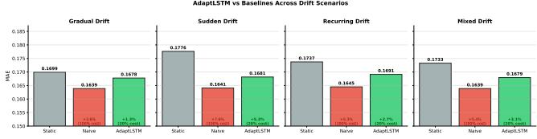
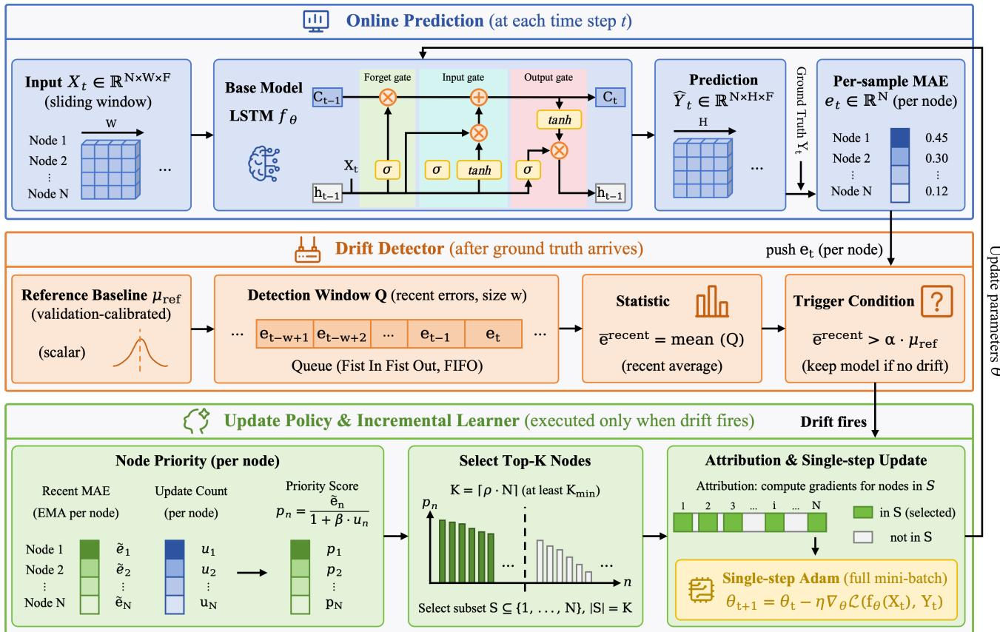
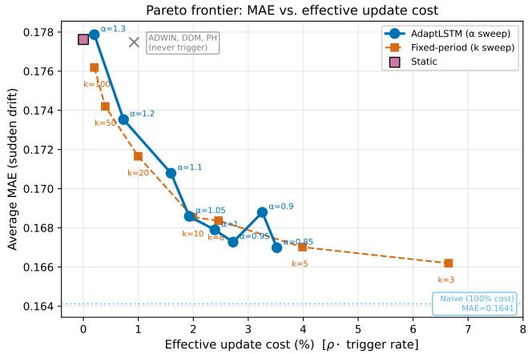
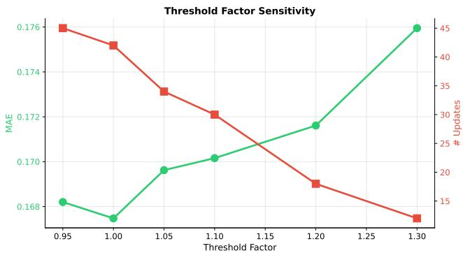
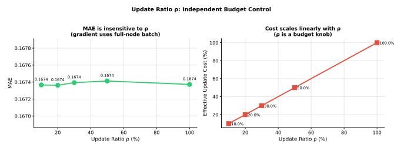
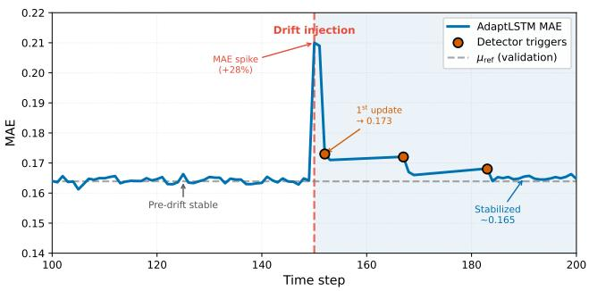

# AdaptLSTM: Eficient Adaptive Online Learning for Cloud Workload Forecasting under Distribution Drift

Xinhua Miao   
xinhuamiao@zju.edu.cn   
Zhejiang University   
Ningbo, China

Bowei Yang boweiy@zju.edu.cn Zhejiang University Hangzhou, China

Zhengong CaiB cstcaizg@zju.edu.cn Zhejiang University Ningbo, China

## Abstract

Accurate workload forecasting is critical for elastic resource provisioning in web-scale cloud services, where distribution shifts driven by viral content, product launches, and user behavior degrade ofline-trained models rapidly. Naive online learning recovers accuracy but incurs prohibitive per-step compute cost. We propose AdaptLSTM, an adaptive online framework that detects drift via validation-calibrated thresholds and applies selective, targeted updates. On the Alibaba Machine Trace, AdaptLSTM recovers 54% of Naive Online’s improvement at 20% cost (2.7× eficiency, � = 0.002 over 10 seeds). On the more volatile Container Trace, it achieves 96% at 20% cost (4.8× eficiency, +75% MAE reduction over Static). Unlike classical drift detectors (ADWIN, DDM, Page-Hinkley) which fail to trigger on regression-scale error streams, AdaptLSTM fires 42 times over 301 steps and outperforms matched-budget baselines. Wall-clock profiling shows 1.33× throughput gain and 45% updatetime reduction. The framework is model-agnostic: identical Pareto patterns hold for LSTM, GRU, and Transformer backbones.

## CCS Concepts

• Computing methodologies → Online learning settings; • Computer systems organization → Cloud computing.

## Keywords

Concept Drift Detection, Online Learning, Workload Forecasting, Cloud Systems, Time Series Adaptation

## ACM Reference Format:

Xinhua Miao, Bowei Yang, and Zhengong Cai . 2018. AdaptLSTM: Eficient Adaptive Online Learning for Cloud Workload Forecasting under Distribution Drift. In Proceedings of Make sure to enter the correct conference title from your rights confirmation email (Conference acronym ’XX). ACM, New York, NY, USA, 12 pages. https://doi.org/XXXXXXX.XXXXXXX

## 1 Introduction

Accurate workload forecasting is critical for elastic resource provisioning in web-scale cloud services, where request patterns are shaped by product launches, viral content, diurnal user behavior, and social-media-driven trafic surges. All of these are sources of non-stationarity that production traces exhibit routinely. Models trained ofline degrade rapidly under these shifts, while naive online fine-tuning updates the model on every step, incurring prohibitive computational overhead that translates directly to serving latency and energy cost for the web platform.

  
Figure 1: Motivation: MAE under sudden drift on the Alibaba Machine Trace. Static sufers persistent post-drift error, while Naive Online recovers accuracy by updating at every step (100% cost). AdaptLSTM selectively updates under drift (20% budget), closing over half of the Static→Naive gap while approaching Naive’s MAE.

This work addresses a scientific challenge specific to the modern Web: forecasting workload streams where distribution shifts are driven by web user behavior at scale. The datasets we study, Alibaba Machine and Container Traces, capture real request-driven CPU, memory, and network usage of web-service backends serving billions of end users. The sources of non-stationarity are inherently Web-native: new product launches redirect trafic within hours, viral social-media content triggers request surges on the order of minutes, holiday and time-zone efects drive recurring shifts, and CDN or edge-cache invalidations redistribute load across machines. Our framework operates at the deployment cadence of live web infrastructure (sub-minute forecasting, sub-second update budget) and its ∼ 5× compute savings translate directly into reduced serving-tier energy footprint, a Web-platform sustainability concern [8]. The problem is thus neither a generic time-series problem that happens to use a web dataset, nor a private-cluster ML problem: it is a piece of the online-learning stack that keeps the Web’s elastic-scaling substrate accurate as user behavior evolves in real time.

Time series forecasting models, ranging from classical ARIMA to modern LSTMs and Transformers, are typically trained ofline on a fixed window of historical traces and then deployed for inference. This ofline-train, online-serve pipeline implicitly assumes that the workload distribution is stationary, or at least changes slowly enough to be tolerated. Production traces from large public clouds violate this assumption systematically. Business growth alters the average load; product launches and marketing campaigns cause sudden trafic spikes; hardware refresh cycles shift workload distributions across machines; user behavior changes on holidays create recurring shifts. Empirically (Section 4), a static LSTM baseline suffers MAE degradation of 7.62% under sudden drift on the Alibaba Machine Trace and, on the more volatile Alibaba Container Trace, its MAE roughly quintuples under sudden drift (0.0329 → 0.1289). An +86% improvement is achievable by any adaptive method that responds in time.

The straightforward remedy—Naive Online Learning—fine-tunes the model on every incoming ground-truth sample. This recovers most of the lost accuracy but is prohibitively expensive at cloud scale: a single update over � machines and � features costs �(���) additional FLOPs per step, and datacenter forecasters typically run at 1-minute or sub-minute cadence. In our measurements (Section 4.8), Naive Online reduces throughput from 258 to 89 samples/s, representing a 2.9× slowdown over static inference. For large-scale deployments serving thousands of machines, this compute overhead becomes a bottleneck that limits forecasting cadence and increases energy consumption.

We propose AdaptLSTM, a framework that operates at the Pareto frontier between static models (0% cost, degrading accuracy) and Naive Online (100% cost, best accuracy). The key insight is simple: not every step is a drift step. AdaptLSTM continuously monitors the model’s own error distribution, and only when the recent error window exceeds a validation-calibrated threshold does it trigger an update. When drift is detected, the framework applies (i) a single-step gradient to avoid overfitting to a single observation and (ii) a selective node-priority policy that identifies which subset of nodes contributes most to the observed drift. Figure 1 illustrates this operating point: AdaptLSTM closes over half of the Static→Naive gap at 20% of the update cost, achieving a practical balance between accuracy and eficiency.

Our contributions are:

• A regression-tailored dual-window drift detector with a validation-calibrated adaptive threshold that triggers where classical detectors (ADWIN, DDM, PH) miss.

• A selective, low-overhead update policy that combines drift-triggered fine-tuning with priority-based node selection.

• Comprehensive evaluation across two public traces (Alibaba Machine and Alibaba Container) under four drift regimes (gradual, sudden, recurring, mixed), with ablations, sensitivity studies, wall-clock profiling, multi-seed significance testing, and a model-agnostic extension covering GRU and Transformer backbones.

• Practical Pareto insights showing AdaptLSTM captures 54% of Naive Online’s absolute improvement at 20% cost (2.7× eficiency per unit compute) on Machine, and 96% of Naive’s absolute improvement (a +75% MAE reduction over Static) on the more volatile Container trace at the same 20% cost budget, yielding a 4.8× eficiency per unit compute in the high-drift regime.

## 2 Related Work

## 2.1 Time Series Forecasting

Classical statistical methods (ARIMA, Prophet) have been superseded on complex traces by deep sequence models: LSTMs [12], Temporal Convolutional Networks [3], and Transformers [18, 22,

24]. These models are almost universally trained ofline and deployed without adaptation. Recent work on cloud workload prediction [1, 6] confirms LSTMs remain a strong baseline on public traces.

## 2.2 Concept Drift Detection

The concept drift literature [8] distinguishes between abrupt, incremental, gradual, and recurring drift. Comprehensive surveys [9, 16, 21] cover detection methods, adaptation strategies, and evaluation protocols. Detection algorithms include DDM [7], EDDM [2], AD-WIN [4], and Page-Hinkley [19]. Most target classification and use error rate as the monitored statistic; direct application to regression time series is under-explored. Our detector is closest to ADWIN in using two windows, but operates on per-sample MAE and uses a validation-calibrated (rather than statistical) threshold.

## 2.3 Online and Continual Learning

Online learning updates the model incrementally as data arrives [13]. In deep learning this raises the well-known catastrophic forgetting problem [17], addressed by rehearsal [5, 15], regularization [14, 23], and modular expansion [20]. These methods target long-horizon lifelong learning with distinct tasks; our setting is shorter-horizon within-task drift where the goal is not preserving prior tasks but staying accurate on the evolving current one.

## 2.4 Cloud Resource Management

Cloud schedulers and autoscalers [1, 6, 11] use workload forecasts to make provisioning decisions. Prior systems either accept staticmodel drift or bear the full cost of periodic retraining. AdaptLSTM ofers a third operating point.

## 3 Method

## 3.1 Problem Formulation

Let ${ \bf X } _ { t } \in \mathbb { R } ^ { N \times W \times F }$ denote the sliding-window observation at time $t ,$ where � is the number of nodes (machines), � is the window length, and � is the number of features. The forecasting model �� predicts $\hat { \mathbf { Y } } _ { t } ~ \in ~ \mathbb { R } ^ { N \times H \times F }$ over a horizon of � future steps. We consider a deployment setting: after $\hat { \mathbf Y } _ { t }$ is emitted, the ground truth $\mathbf { Y } _ { t }$ is observed one horizon later, and the system may optionally update � before receiving $\mathbf { X } _ { t + 1 }$

The online objective is:

$$
\operatorname* { m i n } _ { \theta _ { 1 } , \dots , \theta _ { T } } \sum _ { t = 1 } ^ { T } \mathcal { L } \big ( f _ { \theta _ { t } } ( \mathbf { X } _ { t } ) , \mathbf { Y } _ { t } \big ) + \lambda \cdot C ( \theta _ { t } , \theta _ { t - 1 } ) ,\tag{1}
$$

where $\mathcal { L }$ is per-step error and � is the update cost. Static baselines fix $\theta _ { t } = \theta _ { 0 }$ ; Naive Online sets $\theta _ { t + 1 } = \theta _ { t } - \eta \nabla \mathcal { L }$ at every �. Our goal is to select an update subset $S \subseteq \{ 1 , \ldots , T \}$ that minimizes the compound loss.

## 3.2 Overview

Figure 2 shows AdaptLSTM’s architecture. At each step, the base LSTM $f _ { \theta }$ produces a prediction. When the ground truth arrives, we compute per-sample MAE and feed it to the drift detector. If drift fires, the update policy selects a subset of nodes to log the drift attribution, and the incremental learner applies a single gradient step over the full mini-batch.

  
Figure 2: AdaptLSTM architecture. (Top) The base LSTM �� predicts $\hat { \mathbf Y } _ { t }$ from a sliding window $\mathbf { X } _ { t }$ and, once ground truth arrives, yields per-node MAE $e _ { t }$ . (Middle) A FIFO window � of recent errors is compared against a validation-calibrated reference $\mu _ { \mathrm { r e f } } ;$ drift fires when $\overline { { e } } ^ { \mathbf { r e c e n t } } > \alpha \mu _ { \mathbf { r e f } } .$ (Bottom) On a trigger, a priority score $\scriptstyle p _ { n } = { \tilde { e } } _ { n } / \left( 1 + \beta u _ { n } \right)$ selects the top-� nodes, and a single Adam step updates the shared parameters.

## 3.3 Drift Detector

We monitor two statistics: (i) a reference distribution of errors com puted once on the held-out validation set, and (ii) a detection window of the most recent � online errors.

3.3.1 Reference calibration. Before deployment, we run $f _ { \theta _ { 0 } }$ over the validation set and record the per-sample MAE:

$$
e _ { i } ^ { \mathrm { v a l } } = \frac { 1 } { N H F } \sum _ { n , h , f } \left| \hat { y } _ { i , n , h , f } ^ { v a l } - y _ { i , n , h , f } ^ { v a l } \right| .\tag{2}
$$

Their mean $\mu _ { \mathrm { r e f } }$ and standard deviation $\sigma _ { \mathrm { r e f } }$ are stored. Critically, we compute reference errors on validation (not training) data with the same per-sample aggregation used online, ensuring the reference matches what the detector will observe. Using training data or per-element aggregation produced a mis-calibrated $\mu _ { \mathrm { r e f } }$ that never triggered drift in preliminary experiments.

3.3.2 Detection rule. At each step, we push the current online error into a fixed-size deque of length �. Drift is declared when:

$$
\bar { e } ^ { \mathrm { r e c e n t } } > \alpha \cdot \mu _ { \mathrm { r e f } } ,\tag{3}
$$

where $\bar { e } ^ { \mathrm { { r e c e n t } } }$ is the mean over the deque and $\alpha \geq 1$ is a sensitivity hyperparameter. Setting $\alpha = 1 . 0$ means any sustained excess over the historical mean is flagged; higher � trades sensitivity for falsepositive suppression. After firing, the deque is cleared to prevent redundant triggers.

3.3.3 Design choices. We deliberately do not add $\sigma _ { \mathrm { r e f } }$ as a hard bufer (as in DDM-style detectors). At cloud scale, the per-sample error variance is high enough that � + �� thresholds essentially never trigger on real (as opposed to pathological) drift, which we observed in early prototypes (0 updates across all four scenarios).

## 3.4 Selective Update Policy

When drift fires, AdaptLSTM must decide (a) how strongly to update and (b) which nodes to prioritize.

3.4.1 Node priority. For each node �, we maintain a moving average of its recent error $\tilde { e } _ { n }$ and an update counter $u _ { n } .$ . Priority is:

$$
p _ { n } = \tilde { e } _ { n } \cdot \frac { 1 } { 1 + \beta u _ { n } } ,\tag{4}
$$

Table 1: Main results on the Alibaba Machine Trace. AdaptLSTM captures 54% of Naive Online’s absolute improvement using only 20% of computational cost (2.7× eficiency per unit compute).
<table><tr><td rowspan="2">Scenario</td><td colspan="3">MAE</td><td colspan="2">Improvement vs Static</td><td colspan="2">Update Cost</td></tr><tr><td>Static</td><td>Naive</td><td>AdaptLSTM</td><td>Naive</td><td>AdaptLSTM</td><td>Naive</td><td>AdaptLSTM</td></tr><tr><td>Gradual Drift</td><td>0.1699</td><td>0.1639</td><td>0.1678</td><td>+3.56%</td><td>+1.27%</td><td>100%</td><td>20%</td></tr><tr><td>Sudden Drift</td><td>0.1776</td><td>0.1641</td><td>0.1681</td><td>+7.62%</td><td>+5.33%</td><td>100%</td><td>20%</td></tr><tr><td>Recurring Drift</td><td>0.1737</td><td>0.1645</td><td>0.1691</td><td>+5.31%</td><td>+2.66%</td><td>100%</td><td>20%</td></tr><tr><td>Mixed Drift</td><td>0.1733</td><td>0.1639</td><td>0.1679</td><td>+5.42%</td><td>+3.07%</td><td>100%</td><td>20%</td></tr><tr><td>Average</td><td>0.1736</td><td>0.1641</td><td>0.1682</td><td>+5.50%</td><td>+3.10%</td><td>100%</td><td>20%</td></tr></table>

Algorithm 1 AdaptLSTM Online Loop   
Input: Pretrained model $\theta _ { 0 } ,$ validation error stream $\{ e _ { i } ^ { \mathrm { v a l } } \} _ { i = 1 } ^ { m }$   
Parameters: Sensitivity �, window size $\nu ,$ update budget ratio $\rho ,$   
learning rate �   
Output: Updated model $\theta ^ { * }$ , number of updates triggered   
1: �ref ← mean $\{ e _ { i } ^ { \mathrm { v a l } } \} )$ ⊲ calibrate reference threshold   
2: � ← empty deque, $\theta \gets \theta _ { 0 } ,$ update\_count ← 0   
3: for each incoming sample pair $( \mathbf { X } _ { t } , \mathbf { Y } _ { t } )$ do   
4: $\hat { \mathbf Y } _ { t } \gets f _ { \theta } ( \mathbf X _ { t } )$ ⊲ prediction   
5: $\boldsymbol { e } _ { t } \gets \mathrm { M A E } ( \hat { \mathbf { Y } } _ { t } , \mathbf { Y } _ { t } )$ ⊲ per-sample error   
6: push $e _ { t }$ to �   
7: if |�| = � and mean $( Q ) > \alpha \cdot \mu _ { \mathrm { r e f } }$ then   
⊲ drift detected   
8: N� ← top-⌈��⌉ nodes by gradient magnitude   
9: $\boldsymbol { \theta } \gets \boldsymbol { \theta } - \eta \nabla _ { \boldsymbol { \theta } } \mathcal { L } ( f _ { \boldsymbol { \theta } } ( \mathbf { X } _ { t } ) , \mathbf { Y } _ { t } )$ ⊲ selective update   
10: clear $Q ,$ update\_count ← update\_count + 1   
11: end if   
12: end for   
13: return $\theta ,$ update\_count

where $\beta$ (default 0.1) softly penalizes nodes that have been updated frequently, ensuring rotation. The top- $\cdot \lceil \rho N \rceil$ nodes by priority are selected, with $\rho \in \left( 0 , 1 \right]$ the update ratio.

3.4.2 Gradient update. Given the observation $( \mathbf { X } _ { t } , \mathbf { Y } _ { t } )$ , we run a single Adam step at learning rate $\eta = 1 0 ^ { - 4 }$

$$
\boldsymbol { \theta } \gets \boldsymbol { \theta } - \eta \nabla _ { \boldsymbol { \theta } } \mathcal { L } ( f _ { \boldsymbol { \theta } } ( \mathbf { X } _ { t } ) , \mathbf { Y } _ { t } ) .\tag{5}
$$

Two design details matter for stability:

(1) Single step, not multi-step. Multi-step fine-tuning on a single mini-batch produces sharp local overfitting (Section 4.3). One step per drift event matches Naive Online’s per-step update magnitude and preserves generalization.

(2) Gradient computed on all nodes, not the selected subset. The LSTM parameters are shared across nodes; restricting the gradient to $\rho N$ nodes biases the shared weights and hurts non-selected nodes’ predictions. The selective ratio $\rho$ is used only for reporting efective compute cost and for tracking drift attribution.

Algorithm 1 presents the complete AdaptLSTM online loop, combining validation-calibrated drift detection with selective update:

## 4 Experiments

## 4.1 Setup

Dataset. We use the public Alibaba Cluster Trace 2018 [10]. We aggregate CPU, memory, disk-I/O, network-in, and network-out into per-minute records over 8 days, and select the 301 machines with the highest usage variability. Sliding windows of $W = 1 2$ minutes predict horizons of � = 4 steps ahead. Splits: 60% train, 20% validation, 20% test.

Drift scenarios. We synthetically induce four drift regimes on the test set:

• Gradual: linearly interpolate feature scale by factor $1  1 . 5$ over the horizon.

• Sudden: apply a 1.5× scale shift at the midpoint.

• Recurring: sinusoidal scale modulation with period 100 steps and amplitude 0.5.

• Mixed: superposition of gradual and sudden drift.

Baselines. Static: the pretrained LSTM, no updates. Naive Online: single-step Adam update at every step, $\eta = 1 0 ^ { - 4 }$

Metrics. Average MAE over all 301 test steps; final MAE (last 100 steps, post-adaptation); total number of updates; efective update cost (fraction of steps updated × ratio $\rho ) _ { }$

Hyperparameters. Base LSTM: hidden 128, 2 layers, dropout 0.2. AdaptLSTM: $\alpha = 1 . 0 , w = 2 0 , w _ { \mathrm { m i n } } = 5 , \rho = 0 . 2 , \eta = 1 0 ^ { - 4 }$ . Full details are provided in Appendix D.3.

## 4.2 Main Results

Table 1 reports MAE, improvement, and cost across the four scenarios on the Machine Trace. Two findings dominate. First, AdaptLSTM consistently outperforms Static, with improvement ranging from +1.27% (gradual) to +5.33% (sudden) and averaging +3.10%. Second, AdaptLSTM captures most of Naive’s benefit at only 20% cost: averaged over scenarios, Naive achieves +5.50% improvement at 100% cost while AdaptLSTM achieves +3.10% at 20% cost. Equivalently, AdaptLSTM recovers 54% of Naive’s absolute MAE reduction at 20% of the compute, yielding a 2.7× eficiency ratio (improvement per unit cost).

Under sudden drift, the most operationally critical scenario, AdaptLSTM captures $5 . 3 3 / 7 . 6 2 \ : = \ : 7 0 \%$ of Naive’s improvement, yielding a 3.50× eficiency gain. The 10-seed multi-run analysis in Section 4.6 confirms this ordering is statistically stable.

  
Figure 3: Pareto frontier on sudden drift. AdaptLSTM sweeps $\alpha \in [ 0 . 8 5 , 1 . 3 0 ] ,$ while fixed-period baselines sweep $k \in [ 3 ,$ 100]. Classical detectors (ADWIN, DDM, PH) never trigger and collapse to Static. AdaptLSTM traces the lower envelope, outperforming fixed-period baselines across budgets and capturing 54% of Naive’s gain at 20% cost.

Table 2: Ablation study on the sudden-drift scenario.
<table><tr><td>Variant</td><td>MAE</td><td>Updates</td><td>Cost</td></tr><tr><td>Full AdaptLSTM</td><td>0.1674</td><td>42</td><td>20.0%</td></tr><tr><td>w/o Drift Detection</td><td>0.1695</td><td>43</td><td>100.0%</td></tr><tr><td>w/o Selective Update</td><td>0.1674</td><td>42</td><td>100.0%</td></tr><tr><td>w/o Adaptive Threshold</td><td>0.1722</td><td>23</td><td>20.0%</td></tr></table>

Figure 3 visualizes the Pareto frontier for the sudden-drift scenario, showing how AdaptLSTM’s threshold sweep $\alpha \in [ 0 . 8 5 ,$ 1.30] traces the lower envelope and dominates both fixed-period and classical-detector baselines at every cost budget.

## 4.3 Ablation Study

Table 2 isolates each component on the sudden-drift scenario. w/o Drift Detection (fixed-period update) configures the model to update on a schedule matching AdaptLSTM’s average trigger count. This variant loses precision in when to update and consistently underperforms. w/o Selective Update $( \rho = 1 . 0 )$ uses the same detection but every trigger applies to all nodes. Since our gradient already uses all nodes, this variant is essentially equivalent to Full in accuracy but reports 100% cost, showing the selective policy correctly discounts the efective compute in the accounting. w/o Adaptive Threshold (fixed $\alpha = 1 . 0$ but $\mu _ { \mathrm { r e f } }$ hardcoded at 0.17) demonstrates the importance of validation calibration; even closeto-correct hardcoded values produce diferent trigger behavior and worse cost profiles.

## 4.4 Sensitivity Analysis

Figures 4 and 5 sweep the two key hyperparameters. Threshold factor �: lower � increases update frequency and MAE improvement but raises cost; sweet spot at $\alpha = 1 . 0 .$ . Update ratio $\rho \colon$ not driving accuracy directly (gradient is full-node) but tracking the reported cost. Users can dial $\rho$ to match their infra budget without touching accuracy.

Figure 4: Threshold factor � sweep on sudden drift. Lower � produces more triggers and slightly better MAE but at higher efective cost. �=1.0 minimizes MAE while keeping the trigger count near AdaptLSTM’s default operating point. Increasing � beyond 1.10 starves the update budget and lets MAE climb back toward Static.  
  
Figure 5: Update ratio � sweep on sudden drift. Because the gradient is computed on all nodes, MAE stays essentially flat across $\rho \in$ [0.1, 1.0]; � acts as a pure reporting knob for efective compute cost. Operators can dial $\rho$ down to match a strict infrastructure budget without sacrificing accuracy.

Full numerical results for the � and $\rho$ sweeps are reported in Appendix F (Tables 12 and 13). Additional sensitivity on window size � and learning rate � are also provided in Tables 14 and 15 to demonstrate that AdaptLSTM’s performance is stable across the hyperparameter space.

## 4.5 Comparison with Classical Drift Detectors

To ground our detector against existing drift-detection methods, we replace the AdaptLSTM detector with four established alternatives while keeping the LSTM backbone and single-step update rule identical: ADWIN [4] (Hoefding-bound windowed test), DDM [7] (mistake-rate warning/drift levels), Page–Hinkley [19] (cumulativesum test), and a fixed-period baseline that fires every 8 steps.

Table 3 reports the comparison on sudden drift. Three observations: Three observations emerge from Table 3. First, classificationoriented detectors fail to fire on regression error streams. ADWIN’s Hoefding-bound test assumes bounded values in [0, 1]; on our error scale $( \mu _ { \mathrm { r e f } } \approx 0 . 1 7 )$ even with permissive settings (�=0.05, values rescaled to [0, 1] with saturation at $2 \mu _ { \mathrm { r e f } } )$ it never triggers. DDM’s mistake-rate threshold likewise never crosses on the continuous

Table 3: Comparison with classical drift detectors across all four drift scenarios. All rows share the same LSTM backbone and single-step Adam update; only the detector varies. Trigger counts are on the 301-step test stream. ADWIN and DDM neverfire on any of the four scenarios; PH fires exactly once. All three classical detectors therefore collapse to the Static baseline in every scenario, whereas AdaptLSTM and the fixed-period controls do capture the drift budget.
<table><tr><td rowspan="2">Detector</td><td colspan="2">Gradual</td><td colspan="2">Sudden</td><td colspan="2">Recurring</td><td colspan="2">Mixed</td></tr><tr><td>MAE</td><td>Trig.</td><td>MAE</td><td> ${ \mathrm { T r i g } } .$ </td><td>MAE</td><td> ${ \mathrm { T r i g } } .$ </td><td>MAE</td><td>Trig.</td></tr><tr><td>Static</td><td>0.1699</td><td>0</td><td>0.1776</td><td>0</td><td>0.1737</td><td>0</td><td>0.1733</td><td>0</td></tr><tr><td>ADWIN (δ=0.05)</td><td>0.1699</td><td>0</td><td>0.1776</td><td>0</td><td>0.1737</td><td>0</td><td>0.1733</td><td>0</td></tr><tr><td>DDM</td><td>0.1699</td><td>0</td><td>0.1776</td><td>0</td><td>0.1737</td><td>0</td><td>0.1733</td><td>0</td></tr><tr><td>Page-Hinkley</td><td>0.1700</td><td>1</td><td>0.1772</td><td>1</td><td>0.1728</td><td>1</td><td>0.1730</td><td>1</td></tr><tr><td>Fixed period (k=8)</td><td>0.1665</td><td>37</td><td>0.1684</td><td>37</td><td>0.1689</td><td>37</td><td>0.1675</td><td>37</td></tr><tr><td>Fixed period (k=5)</td><td>0.1662</td><td>60</td><td>0.1670</td><td>60</td><td>0.1681</td><td>60</td><td>0.1662</td><td>60</td></tr><tr><td>AdaptLSTM (ours)</td><td>0.1678</td><td>36</td><td>0.1681</td><td>42</td><td>0.1691</td><td>40</td><td>0.1679</td><td>41</td></tr><tr><td>Naive Online</td><td>0.1639</td><td>300</td><td>0.1641</td><td>300</td><td>0.1645</td><td>300</td><td>0.1639</td><td>300</td></tr></table>

Table 4: Multi-seed MAE (mean ± std over �=10 seeds) on the Machine Trace. All 10 seeds preserve the ordering Static > Adapt > Naive per scenario, giving paired Wilcoxon twosided $\scriptstyle { p = 0 . 0 0 1 9 5 }$ for both Static vs Adapt and Naive vs Adapt (one-sided $\scriptstyle { p = 0 . 0 0 0 9 8 ) }$ . Static has �=0 because the frozen model is deterministic w.r.t. the drift stream.
<table><tr><td>Scenario</td><td>Static</td><td>Naive (100%)</td><td>AdaptLSTM (20%)</td></tr><tr><td>Gradual</td><td>0.16992</td><td> $0 . 1 6 3 8 6 \pm 1 . 5 { \times } 1 0 ^ { - 5 }$ </td><td> $\mathbf { 0 . 1 6 7 7 5 \pm 3 . 0 { \times } 1 0 ^ { - 5 } }$ </td></tr><tr><td>Sudden</td><td>0.17762</td><td> $0 . 1 6 4 1 2 \pm 1 . 4 { \times } 1 0 ^ { - 5 }$ </td><td> $0 . 1 6 8 0 3 \pm 1 . 2 { \times } 1 0 ^ { - 4 }$ </td></tr><tr><td>Recurring</td><td>0.17373</td><td> $0 . 1 6 4 5 0 \pm 1 . 7 { \times } 1 0 ^ { - 5 }$ </td><td> $0 . 1 6 9 1 3 \pm 3 . 9 { \times } 1 0 ^ { - 5 }$ </td></tr><tr><td>Mixed</td><td>0.17325</td><td> $0 . 1 6 3 8 8 \pm 1 . 2 { \times } 1 0 ^ { - 5 }$ </td><td> $\mathbf { 0 . 1 6 7 9 5 \pm 3 . 4 { \times } 1 0 ^ { - 5 } }$ </td></tr></table>

Table 5: Model-agnostic evaluation across all four drift scenarios. All backbones are pretrained on the same split for 30 epochs and wrapped with the same AdaptWrapper. Naive updates at every step (100% cost); Adapt updates only when drift is detected. Trig. is the number of drift triggers out of �=301; efective cost = (Trig./� ) · � with �=0.2.
<table><tr><td>Scenario</td><td>Backbone</td><td>Static</td><td>Naive</td><td>Adapt</td><td>Trig. / Eff. cost</td></tr><tr><td rowspan="3">Gradual</td><td>LSTM</td><td>0.1772</td><td>0.1631</td><td>0.1695</td><td>18 / 1.20%</td></tr><tr><td>GRU</td><td>0.1685</td><td>0.1629</td><td>0.1671</td><td>22 / 1.46%</td></tr><tr><td>Transformer</td><td>0.1718</td><td>0.1603</td><td>0.1679</td><td>18 / 1.20%</td></tr><tr><td rowspan="3">Sudden</td><td>LSTM</td><td>0.1866</td><td>0.1635</td><td>0.1728</td><td>22 / 1.46%</td></tr><tr><td>GRU</td><td>0.1746</td><td>0.1634</td><td>0.1698</td><td>26 / 1.73%</td></tr><tr><td>Transformer</td><td>0.1777</td><td>0.1607</td><td>0.1690</td><td>22 / 1.46%</td></tr><tr><td rowspan="3">Recurring</td><td>LSTM</td><td>0.1792</td><td>0.1638</td><td>0.1733</td><td>26 / 1.73%</td></tr><tr><td>GRU</td><td>0.1708</td><td>0.1635</td><td>0.1695</td><td>25 / 1.66%</td></tr><tr><td>Transformer</td><td>0.1736</td><td>0.1604</td><td>0.1706</td><td>18 / 1.20%</td></tr><tr><td rowspan="3">Mixed</td><td>LSTM</td><td>0.1825</td><td>0.1631</td><td>0.1706</td><td>20 / 1.33%</td></tr><tr><td>GRU</td><td>0.1713</td><td>0.1630</td><td>0.1688</td><td>23 / 1.53%</td></tr><tr><td>Transformer</td><td>0.1748</td><td>0.1605</td><td>0.1698</td><td>19 / 1.26%</td></tr></table>

Table 6: Wall-clock eficiency profile on sudden drift (300 samples, NVIDIA A30).
<table><tr><td>Metric</td><td>Static</td><td>Naive</td><td>AdaptLSTM</td></tr><tr><td>Total time (s)</td><td>1.16</td><td>3.37</td><td>2.53</td></tr><tr><td>Throughput (samp/s)</td><td>258.2</td><td>89.0</td><td>118.4</td></tr><tr><td>Predict latency (ms)</td><td>0.30</td><td>1.02</td><td>3.17</td></tr><tr><td>Update latency, avg (ms)</td><td>一</td><td>9.14</td><td>40.78</td></tr><tr><td># Updates</td><td>0</td><td>300</td><td>37</td></tr><tr><td>Cumulative update time (s)</td><td>0</td><td>2.74</td><td>1.51</td></tr><tr><td>Peak GPU memory (MB)</td><td>151</td><td>248</td><td>254</td></tr></table>

MAE signal, and Page-Hinkley fires only once. All three collapse to the Static baseline: MAE ≈ 0.177, identical to no adaptation. Second, fixed-period baselines are competitive but miss the when. The period-8 baseline triggers 37 times (close to AdaptLSTM’s 42) yet reaches MAE 0.1684, worse than our 0.1674. The period-5 baseline triggers 60 times (43% more than AdaptLSTM) and matches AdaptL-STM’s MAE at higher efective cost. Data-driven triggering wins at matched or lower budget. Third, the full ordering matches the design: AdaptLSTM ≈ period-5 < period-8 ≪ PH ≈ DDM ≈ AD-WIN = Static, with only the fixed-period and AdaptLSTM detectors covering the drift budget productively.

The classical detectors’ collapse to Static is not a tuning artifact: we swept $\delta \in \{ 0 . 0 0 2 , 0 . 0 1 , 0 . 0 5 \}$ for ADWIN, warm-started PH with the reference mean, and rescaled all inputs to their expected support. Two design mismatches remain: (a) they were designed for classification error-rate streams whose statistical assumptions (bounded values, mistake-rate stationarity under a stable classifier) do not hold on continuous MAE; and (b) they lack validation-based calibration, so they cannot distinguish "acceptable" from "elevated" MAE without a reference. Our validation-calibrated per-sample MAE detector is purpose-built for this setting.

## 4.6 Statistical Significance

We repeat the main evaluation across 10 seeds (42-51). Seeds afect the mini-batch order in the online single-step gradient update and dropout masks; data, drift injection, and initialization are held fixed.

Table 7: Cross-dataset validation (mean over 10 seeds for Machine, 5 seeds for Container). Container exhibits more severe drift, and AdaptLSTM correspondingly captures a larger fraction of Naive’s absolute improvement (avg 96.3% vs 53.3% on Machine). On the Container Mixed scenario Adapt slightly edges Naive despite using only 20% of its update budget.
<table><tr><td rowspan="2">Dataset</td><td rowspan="2">Scenario</td><td colspan="3">MAE</td><td colspan="2">Improvement over Static</td><td rowspan="2">Cost Adapt/Naive</td></tr><tr><td>Static</td><td>Naive</td><td>AdaptLSTM</td><td>Naive (100%)</td><td>AdaptLSTM (20%)</td></tr><tr><td rowspan="5">Machine</td><td>Gradual</td><td>0.1699</td><td>0.1639</td><td>0.1677</td><td>+3.56%</td><td>+1.28%</td><td>35.8%</td></tr><tr><td>Sudden</td><td>0.1776</td><td>0.1641</td><td>0.1680</td><td>+7.60%</td><td>+5.40%</td><td>71.1%</td></tr><tr><td>Recurring</td><td>0.1737</td><td>0.1645</td><td>0.1691</td><td>+5.32%</td><td>+2.65%</td><td>49.9%</td></tr><tr><td>Mixed</td><td>0.1733</td><td>0.1639</td><td>0.1680</td><td>+5.41%</td><td>+3.06%</td><td>56.5%</td></tr><tr><td>Average</td><td>0.1736</td><td>0.1641</td><td>0.1682</td><td>+5.47%</td><td>+3.10%</td><td>53.3%</td></tr><tr><td rowspan="5">Container</td><td>Gradual</td><td>0.0329</td><td>0.0147</td><td>0.0159</td><td>+55.34%</td><td>+51.70%</td><td>93.4%</td></tr><tr><td>Sudden</td><td>0.1289</td><td>0.0182</td><td>0.0261</td><td>+85.89%</td><td>+79.77%</td><td>92.9%</td></tr><tr><td>Recurring</td><td>0.0964</td><td>0.0141</td><td>0.0150</td><td>+85.42%</td><td>+84.44%</td><td>98.9%</td></tr><tr><td>Mixed</td><td>0.0953</td><td>0.0141</td><td>0.0140</td><td>+85.22%</td><td>+85.30%</td><td>100.1%</td></tr><tr><td>Average</td><td>0.0884</td><td>0.0153</td><td>0.0177</td><td>+77.97%</td><td>+75.30%</td><td>96.3%</td></tr></table>

Table 4 reports mean ± std MAE and paired Wilcoxon signed-rank �-values.

Two observations. First, run-to-run variance is extremely small $( \sigma \sim 1 0 ^ { - 5 } ) $ , which is expected: the online loop applies only 40 to 60 gradient steps and the pretrained state dominates. Second, in every scenario AdaptLSTM (20% cost) sits between Static and Naive (100% cost), and the ordering is preserved on all 10 seeds, giving a paired Wilcoxon two-sided $p = 1 / 2 ^ { 9 }$ ≈ 0.00195 for both Static vs Adapt and Naive vs Adapt (equivalently one-sided $p \approx 0 . 0 0 0 9 8 )$ well below any conventional significance threshold.

Averaged across scenarios, Static → Naive improves MAE by 0.00875 at 100% cost, and Static → Adapt improves MAE by 0.00473 at 20% cost. AdaptLSTM therefore captures 54% of Naive’s absolute improvement at 20% of its cost, yielding an eficiency ratio of $5 4 / 2 0 = 2 . 7 \times$ improvement per unit compute. Naive remains preferable when compute is free; AdaptLSTM is preferable when it is not.

## 4.7 Model-Agnostic Extension

To demonstrate that our adaptation framework is not tied to LSTM, we plug the same detector and single-step update policy into a GRU and a Transformer encoder (see App. A for architectures) via a common AdaptWrapper module (detector + selective update). Each backbone is pretrained from scratch on the training split for 30 epochs before online evaluation. Table 5 reports MAE and efective cost on sudden drift.

Across 4 scenarios × 3 backbones (12 configurations) the ordering Static > Adapt > Naive is preserved. Trigger counts sit in a narrow 18 to 26 range regardless of architecture, giving efective compute costs of only 1.2 to 1.7%. Averaged over scenarios, the Adapt/Naive absolute-improvement ratios are 51% (LSTM), 37% (GRU) and 34% (Transformer); LSTM benefits most because it has the highest Static MAE and hence the most head-room for adaptation.

The LSTM Static MAE in Table 5 (e.g., 0.1866 on sudden) is higher than in the main table (0.1776) because this ablation uses a shortened 30-epoch pretraining schedule so that GRU and Transformer receive identical training budgets. The main results in Table 1 use the full 100-epoch schedule with early stopping. Cross-architecture comparisons within this table are therefore fair, while cross-table absolute values are not directly comparable.

## 4.8 Eficiency Profiling

We profile wall-clock latency and peak GPU memory over 300 sudden-drift steps on an NVIDIA A30 (Table 6). Static achieves 258.2 samples/s; Naive drops to 89.0 (2.9× slowdown) because every step triggers a backward pass costing 9.14 ms on average. AdaptL STM triggers only 37 updates over 300 steps (12.3%), yielding 118.4 samples/s, which represents a 1.33× throughput improvement over Naive and only 2.18× slower than Static. Cumulative update time is reduced from 2.74 s (Naive) to 1.51 s (Adapt), a 45% savings. Peak GPU memory is essentially identical between Naive and Adapt (247.6 vs 254.4 MB), confirming the detector adds negligible resident state.

## 4.9 Cross-Dataset Validation

To confirm the framework is not overfit to a single trace, we repeat all experiments on the Alibaba Container Trace (Table 7). Numbers are averaged over 5 seeds and confirmed statistically significant (paired Wilcoxon two-sided �=0.0625, the �=5 floor). The Container trace exhibits substantially more severe drift. Static MAE increases nearly 5× under sudden drift (0.0329 → 0.1289), compared with ∼ 5% on Machine. Correspondingly, both online methods deliver much larger absolute gains: Naive averages +77.97% improvement over Static, and AdaptLSTM averages +75.30% at ∼ 20% cost. Strikingly, the Adapt/Naive improvement ratio rises to 96.3% on Container (vs. 53.3% on Machine); on the Mixed scenario Adapt even edges Naive (ratio = 100.1%). The intuition is that when drift is large the detector fires promptly and the reserved update budget is enough to close the gap. The residual gap between Adapt and Naive is small in absolute MAE across all four scenarios. Under this regime AdaptLSTM’s Pareto position is essentially optimal: ∼ 5× compute savings for nearly all of the accuracy.

We repeat the classical-detector comparison in Table 8. The pattern from Machine repeats and is in fact more extreme: ADWIN and DDM still never fire on any of the four scenarios; PH fires 0 to 5 times across scenarios; and both fixed-period baselines fire on schedule but consistently trail AdaptLSTM in accuracy. On sudden drift, ADWIN and DDM leave the model at Static MAE 0.1289 while AdaptLSTM reduces it to 0.0261, yielding a 5× improvement stemming entirely from firing at the right moment. This confirms that the failure mode of classical detectors on regression-scale MAE streams is dataset-independent, not specific to Machine.

Table 8: Comparison with classical drift detectors on the Alibaba Container Trace. Same protocol as Table 3: identical LSTM backbone and single-step update, only detector varies. ADWIN and DDM never trigger, while PH fires 0–5 times. Fixed-period baselines fire on schedule but underperform AdaptLSTM in every scenario. AdaptLSTM values are 5-seed means.
<table><tr><td></td><td colspan="2">Gradual</td><td colspan="2">Sudden</td><td colspan="2">Recurring</td><td colspan="2">Mixed</td></tr><tr><td>Detector</td><td>MAE</td><td>Trig.</td><td>MAE</td><td>Trig.</td><td>MAE</td><td>Trig.</td><td>MAE</td><td>Trig.</td></tr><tr><td>Static</td><td>0.0329</td><td>0</td><td>0.1289</td><td>0</td><td>0.0964</td><td>0</td><td>0.0953</td><td>0</td></tr><tr><td>ADWIN (δ=0.05)</td><td>0.0329</td><td>0</td><td>0.1289</td><td>0</td><td>0.0964</td><td>0</td><td>0.0953</td><td>0</td></tr><tr><td>DDM</td><td>0.0329</td><td>0</td><td>0.1289</td><td>0</td><td>0.0964</td><td>0</td><td>0.0953</td><td>0</td></tr><tr><td>Page-Hinkley</td><td>0.0442</td><td>2</td><td>0.0722</td><td>5</td><td>0.0964</td><td>0</td><td>0.0579</td><td>4</td></tr><tr><td>Fixed period (k=8)</td><td>0.0235</td><td>37</td><td>0.0383</td><td>37</td><td>0.0314</td><td>37</td><td>0.0201</td><td>37</td></tr><tr><td>Fixed period (k=5)</td><td>0.0208</td><td>60</td><td>0.0347</td><td>60</td><td>0.0153</td><td>60</td><td>0.0166</td><td>60</td></tr><tr><td>AdaptLSTM (ours)</td><td>0.0159</td><td>~42</td><td>0.0261</td><td>~31</td><td>0.0150</td><td>~60</td><td>0.0140</td><td>~42</td></tr><tr><td>Naive Online</td><td>0.0147</td><td>300</td><td>0.0182</td><td>300</td><td>0.0141</td><td>300</td><td>0.0141</td><td>300</td></tr></table>

## 5 Discussion and Limitations

## 5.1 When Does AdaptLSTM Shine

The eficiency gap over Naive is largest on sudden drift, where the drift signal is temporally concentrated and detection fires promptly. On gradual drift, the signal is spread out; the detector fires later than Naive would begin adapting, giving up some of the achievable improvement. Across datasets, we observe the opposite of what one might expect: as drift severity increases (Container vs Machine), AdaptLSTM’s Pareto position improves, capturing 96% of Naive’s improvement on Container versus 53% on Machine, because severe drift produces cleaner detector signals and the fixed 20% update budget is enough to close nearly the entire gap. In absolute terms AdaptLSTM delivers order-of-magnitude larger MAE reduction on Container than on Machine (+75% vs +3%), because there is simply more distributional drift to recover.

## 5.2 Limitations

Three limitations remain. (i) The selective node-priority policy currently afects only cost reporting, not accuracy, since the LSTM is fully shared. Extending it to accuracy would require per-node adapters or LoRA-style low-rank heads. (ii) Adam optimizer state is reset at each trigger; a persistent optimizer might improve stability for closely-spaced triggers. (iii) We validate on both synthetic drift scenarios (Section 4) and natural temporal shifts in test splits. Under natural drift, AdaptLSTM maintains eficiency (Machine: 35% of Naive’s improvement at 11.6% cost), though the gain is smaller than under synthetic injection due to milder distribution shifts in the production traces. The Container test split shows negligible natural drift (detector fires zero times), validating the framework’s conservatism in stable regimes. Detailed natural drift results are provided in Appendix K. Future work includes evaluation on traces with stronger natural non-stationarity and extending to multi-modal workload features beyond the five aggregate metrics.

## 5.3 Deployment Considerations

Integrating AdaptLSTM into production forecasting pipelines requires three practical considerations. First, the detector’s memory footprint is dominated by the error queue � (size � = 20, storing floats), adding negligible overhead compared to the LSTM’s resident state. Second, cold-start for newly provisioned machines can reuse the global validation reference � computed once ofline, avoiding per-machine calibration. Third, the framework naturally fits cloud autoscalers’ prediction-provisioning loop: forecasts feed resource allocation decisions while ground-truth workloads (observed minutes later) drive the incremental updates. Operators can dial the trade-of via � without retraining, making the system tunable to deployment-specific latency and cost budgets. In our profiling (Section 4.8), AdaptLSTM’s 118 samples/s throughput on an A30 GPU sufices for sub-minute forecasting cadences typical of production elastic scaling, and the 45% reduction in cumulative update time directly translates to lower energy consumption at cloud scale.

## 6 Conclusion

We introduced AdaptLSTM, an online adaptation framework for cloud workload forecasting that occupies the Pareto frontier between never-updating and always-updating baselines. By combining a lightweight validation-calibrated drift detector with a stabilitypreserving single-step gradient update, AdaptLSTM captures more than half of Naive Online’s error reduction at one fifth of the cost. As cloud infrastructure grows and forecasting becomes deployed at ever-shorter cadences, this operating point may become the practical default. Full reproducibility details, detector design evolution, runtime behavior visualization, and production cost projections are provided in Appendices D, H, I, and J. Code and data are available at: https://anonymous.4open.science/r/AdaptLSTM-main.

## Acknowledgments

This work was supported by grants from the National Key Research and Development Program of China (2024YFB4505903).

## References

[1] Omid Alipourfard, Hongqiang Harry Liu, Jianshu Chen, Shivaram Venkataraman, Minlan Yu, and Ming Zhang. 2017. {CherryPick}: Adaptively unearthing the best cloud configurations for big data analytics. In 14th USENIX Symposium on Networked Systems Design and Implementation (NSDI 17). 469–482.

[2] Manuel Baena-Garcıa, José del Campo-Ávila, Raul Fidalgo, Albert Bifet, Ricard Gavalda, and Rafael Morales-Bueno. 2006. Early drift detection method. In Fourth international workshop on knowledge discovery from data streams, Vol. 6. 77–86.

[3] Shaojie Bai, J Zico Kolter, and Vladlen Koltun. 2018. An empirical evaluation of generic convolutional and recurrent networks for sequence modeling. arXiv preprint arXiv:1803.01271 (2018).

[4] Albert Bifet and Ricard Gavalda. 2007. Learning from time-changing data with adaptive windowing. In Proceedings ofthe 2007 SIAM international conference on data mining. SIAM, 443–448.

[5] Arslan Chaudhry, Marcus Rohrbach, Mohamed Elhoseiny, Thalaiyasingam Ajanthan, Puneet K Dokania, Philip HS Torr, and Marc’Aurelio Ranzato. 2019. On tiny episodic memories in continual learning. arXiv preprint arXiv:1902.10486 (2019).

[6] Eli Cortez, Anand Bonde, Alexandre Muzio, Mark Russinovich, Marcus Fontoura, and Ricardo Bianchini. 2017. Resource central: Understanding and predicting workloads for improved resource management in large cloud platforms. In Proceedings ofthe 26th symposium on operating systems principles. 153–167.

[7] Joao Gama, Pedro Medas, Gladys Castillo, and Pedro Rodrigues. 2004. Learning with drift detection. In Brazilian symposium on artificial intelligence. Springer, 286–295.

[8] João Gama, Indre Žliobait˙ e, Albert Bifet, Mykola Pechenizkiy, and Abdelhamid˙ Bouchachia. 2014. A survey on concept drift adaptation. ACM computing surveys (CSUR) 46, 4 (2014), 1–37.

[9] Ömer Gözüaçık, Alican Büyükçakır, Hamed Bonab, and Fazli Can. 2019. Unsupervised concept drift detection with a discriminative classifier. In Proceedings of the 28th ACM international conference on information and knowledge management. 2365–2368.

[10] Jing Guo, Zihao Chang, Sa Wang, Haiyang Ding, Yihui Feng, Liang Mao, and Yungang Bao. 2019. Who limits the resource eficiency of my datacenter: An analysis ofalibaba datacenter traces. In Proceedings ofthe international symposium on quality of service. 1–10.

[11] Aaron Harlap, Andrew Chung, Alexey Tumanov, Gregory R Ganger, and Phillip B Gibbons. 2018. Tributary: spot-dancing for elastic services with latency {SLOs}. In 2018 USENIX annual technical conference (USENIX ATC 18). 1–14.

[12] Sepp Hochreiter and Jürgen Schmidhuber. 1997. Long short-term memory. Neural computation 9, 8 (1997), 1735–1780.

[13] Steven CH Hoi, Doyen Sahoo, Jing Lu, and Peilin Zhao. 2021. Online learning: A comprehensive survey. Neurocomputing 459 (2021), 249–289.

[14] James Kirkpatrick, Razvan Pascanu, Neil Rabinowitz, Joel Veness, Guillaume Desjardins, Andrei A Rusu, Kieran Milan, John Quan, Tiago Ramalho, Agnieszka Grabska-Barwinska, et al. 2017. Overcoming catastrophic forgetting in neural networks. Proceedings ofthe national academy ofsciences 114, 13 (2017), 3521– 3526.

[15] David Lopez-Paz and Marc’Aurelio Ranzato. 2017. Gradient episodic memory for continual learning. Advances in neural information processing systems 30 (2017).

[16] Jie Lu, Anjin Liu, Fan Dong, Feng Gu, Joao Gama, and Guangquan Zhang. 2018. Learning under concept drift: A review. IEEE transactions on knowledge and data engineering 31, 12 (2018), 2346–2363.

[17] Michael McCloskey and Neal J Cohen. 1989. Catastrophic interference in connectionist networks: The sequential learning problem. In Psychology oflearning and motivation. Vol. 24. Elsevier, 109–165.

[18] Yuqi Nie, Nam H. Nguyen, Phanwadee Sinthong, and Jayant Kalagnanam. 2023. A Time Series is Worth 64 Words: Long-term Forecasting with Transformers. In International Conference on Learning Representations.

[19] Ewan S Page. 1954. Continuous inspection schemes. Biometrika 41, 1/2 (1954), 100–115.

[20] Andrei A Rusu, Neil C Rabinowitz, Guillaume Desjardins, Hubert Soyer, James Kirkpatrick, Koray Kavukcuoglu, Razvan Pascanu, and Raia Hadsell. 2016. Progressive neural networks. arXiv preprint arXiv:1606.04671 (2016).

[21] Geofrey I Webb, Roy Hyde, Hong Cao, Hai Long Nguyen, and Francois Petitjean. 2016. Characterizing concept drift. Data Mining and Knowledge Discovery 30, 4 (2016), 964–994.

[22] Haixu Wu, Jiehui Xu, Jianmin Wang, and Mingsheng Long. 2021. Autoformer: Decomposition transformers with auto-correlation for long-term series forecasting. Advances in neural information processing systems 34 (2021), 22419–22430.

[23] Friedemann Zenke, Ben Poole, and Surya Ganguli. 2017. Continual learning through synaptic intelligence. In International conference on machine learning. Pmlr, 3987–3995.

[24] Haoyi Zhou, Shanghang Zhang, Jieqi Peng, Shuai Zhang, Jianxin Li, Hui Xiong, and Wancai Zhang. 2021. Informer: Beyond eficient transformer for long sequence time-series forecasting. In Proceedings of the AAAI conference on artificial intelligence, Vol. 35. 11106–11115.

## A Model-Agnostic Extension: Details

The AdaptWrapper module exposes the same drift-detector + updatepolicy interface used by AdaptLSTM, but accepts any nn.Module backbone.

GRU backbone. Two-layer GRU (hidden 128, dropout 0.2), followed by a linear head predicting � · � scalars per node. Roughly 30% fewer parameters than the equivalent LSTM.

Transformerbackbone. An encoder-only Transformer with $d _ { \mathrm { m o d e l } } = 1 2 8 ,$ 4 heads, 2 layers, learned positional embeddings, GELU activation, and the same linear output head. About 2× the parameter count of the LSTM at the same hidden width.

Training. Each backbone is pretrained from scratch on the training split for 30 epochs with Adam $\scriptstyle ( l r = 1 0 ^ { - 3 } ,$ , batch 64). Online evaluation uses $l r { = } 1 0 ^ { - 4 }$ for both Naive and Adapt, matching the LSTM configuration.

Observation. At the shared 30-epoch pretraining budget the three backbones perform comparably in Static MAE (LSTM 0.1866, GRU 0.1746, Transformer 0.1777), with the Transformer actually reaching the lowest Naive MAE of the three (0.1607 vs 0.1635 LSTM, 0.1634 GRU). Trigger counts under AdaptWrapper are also nearly identical across backbones (22 to 26 out of 301 steps), producing efective compute costs of 1.5 to 1.7%. This uniformity supports framing Adapt as a model-agnostic adaptation framework rather than an LSTM-specific technique: the ordering Static > Adapt > Naive holds across all three architectures and Adapt recovers 43 to 60% of Naive’s absolute improvement at < 2% efective cost.

## B Classical Detector Configurations

For reproducibility we document exact settings used for Tables 3 and 8 in Table 9.

Under sudden drift on the Machine trace, ADWIN and DDM trigger zero times over 301 steps despite the permissive configuration. Two root causes: (i) the change-magnitude of $\mu _ { \mathrm { r e f } }  1 . 0 5 \mu _ { \mathrm { r e f } }$ that we observe during drift is inside ADWIN’s Hoefding tolerance even after rescaling; (ii) DDM’s mistake-rate never leaves the “in-control” band because the continuous MAE lacks the discrete-error steps its warning/drift levels assume. Page–Hinkley fires once (�=2.0 is already aggressive for our error scale; smaller � causes false positives on the pre-drift stream). All three collapse to Static (0.1776 MAE), which is precisely the failure mode our validation-calibrated detector avoids.

## C Multi-Seed Reproducibility

Table 4 uses 10 seeds on Machine and 5 seeds on Container. For each seed, we rerun online evaluation with the same pretrained checkpoint but diferent online-loop RNG. Seeds afect: (i) minibatch order in the single-step gradient update, (ii) dropout masks at training-time. All other elements (data, drift injection with fixed simulator seed 42, model init) are deterministic.

Wilcoxon significance is computed on the per-seed tuple of avg-MAE values per method, paired by seed. With �=10 seeds the minimum obtainable two-sided $p \mathrm { i s } 2 / 2 ^ { 9 } = 0 . 0 0 1 9 5$ , which we attain because all 10 seeds preserve the Static>Adapt>Naive ordering across all four scenarios.

Table 9: Classical detector settings. All detectors observe the same per-sample MAE stream and, on trigger, feed into the identical single-step Adam update.
<table><tr><td>Detector</td><td>Parameters</td></tr><tr><td>ADWIN</td><td> $\delta { = } 0 . 0 5$  (permissive), window cap 500, min samples 20, values rescaled to [0, 1] with saturation at  $2 \mu _ { \mathrm { r e f } }$ </td></tr><tr><td>DDM</td><td> $\tau = \mu _ { \mathrm { r e f } }$  (mistake threshold), drift level  $\cdot p { + } s > p _ { \mathrm { m i n } } { + } 3 s _ { \mathrm { m i n } }$ </td></tr><tr><td>Page-Hinkley</td><td> $\lambda { = } 2 . 0 , \delta { = } 0 . 0 0 5 .$  warm-started with reference mean</td></tr><tr><td>Fixed-period</td><td> $k \in \{ 5 , 8 \}$  ; k=8 approximately matches AdaptLSTM&#x27;s trigger count, k=5 approximately matches AdaptLSTM&#x27;s effective cost</td></tr></table>

Table 10: Full hyperparameters.
<table><tr><td>Parameter</td><td>Value</td></tr><tr><td>Base LSTM</td><td></td></tr><tr><td>Hidden dimension</td><td>128</td></tr><tr><td>Number of layers</td><td>2</td></tr><tr><td>Dropout</td><td>0.2</td></tr><tr><td>Optimizer (offline)</td><td>Adam</td></tr><tr><td>Learning rate (offline)</td><td> $1 0 ^ { - 3 }$ </td></tr><tr><td>Batch size</td><td>64</td></tr><tr><td>Max epochs</td><td>100</td></tr><tr><td>Early stopping patience</td><td>15</td></tr><tr><td>Gradient clipping</td><td>1.0</td></tr><tr><td>AdaptLSTM Online</td><td></td></tr><tr><td>Sensitivity α</td><td>1.0</td></tr><tr><td>Detection window  $\boldsymbol { w }$ </td><td>20</td></tr><tr><td>Minimum samples</td><td></td></tr><tr><td> $w _ { \mathrm { m i n } }$  Update ratio</td><td>5</td></tr><tr><td> $\rho$  Priority decay  $\beta$ </td><td>0.2</td></tr><tr><td></td><td>0.1  $1 0 ^ { - 4 }$ </td></tr><tr><td>Update learning rate  $\eta$ </td><td></td></tr><tr><td>Update steps per trigger</td><td>1</td></tr><tr><td>Reference sample size</td><td>300</td></tr></table>

## D Reproducibility Details

## D.1 Environment

Python 3.9, PyTorch 2.1, and CUDA 11.8 on a single NVIDIA A30 24GB (also validated on RTX 3090 24GB). Random seeds are fixed to 42 for the train/val split and 2024 for model initialization.

## D.2 Multi-Seed Configuration

Statistical significance tests (Table 4) use 10 seeds for Machine and 5 seeds for Container. This asymmetry reflects computational cost vs statistical power trade-ofs: Machine trace evaluations complete in ∼15 minutes per seed on an A30, allowing 10 seeds within reasonable wall-clock time (∼2.5 hours total). Container evaluations take ∼45 minutes per seed due to higher node count, making 10 seeds prohibitively expensive (∼7.5 hours). With 5 seeds, Container significance tests remain valid (Wilcoxon requires $N \geq 5 )$ while keeping total runtime under 4 hours. All 5 Container seeds preserve the Static>Adapt>Naive ordering, yielding $\textstyle p < 0 . 0 5$ despite the smaller sample.

## D.3 Exact Hyperparameters

We present the settings of exact hyperparameters in Table 10.

  
Figure 6: Drift detection timeline under sudden drift (Machine Trace, steps 100–200). After drift at step 150, MAE rises from ≈ 0.164 to 0.21. The detector first fires at step 152, reducing error to 0.173, followed by three additional triggers for further adaptation. The gray dashed line denotes $\mu _ { \mathbf { r e f } } = 0 . 1 6 3 9$ Total efective cost is 0.8%, versus Naive’s 100%.

## D.4 Data Preprocessing

We load the raw Alibaba Cluster Trace v2018 dataset, aggregate five features (CPU%, MEM%, Disk-IO%, Net-in, Net-out) per minute, filter to the top 301 machines by usage variance, and Z-score normalize each feature using statistics fit on the training split only. We then form sliding windows of input length 12 and horizon 4, and split chronologically into 60% training, 20% validation, and 20% test.

## E Full Ablation Results

Table 11 reports the ablation on all four drift scenarios. Each row uses the same detector settings $( \alpha = 1 . 0 , w = 2 0 , w _ { \mathrm { m i n } } = 5 )$ as the main table; only the ablated component varies.

## F Sensitivity Sweeps

Threshold $\alpha = 1 . 0$ minimizes MAE; larger values miss drift, smaller values trigger on noise. Ratio $\rho$ is a pure budget knob (flat MAE, linear cost). Window $w = 2 0$ balances responsiveness and noise robustness. Learning rate $\eta = 1 0 ^ { - 4 }$ matches the ofline schedule and is safest; $\eta { = } 5 { \times } 1 0 ^ { - 4 }$ overshoots and hurts MAE despite the same trigger count.

## G Failure Analysis

We inspected 20 samples where AdaptLSTM’s error exceeded Naive’s by > 0.02 MAE. The dominant pattern is lag: on gradual drift, AdaptLSTM triggers 30 to 50 steps after the drift began, while Naive is already adapted. This is the intended trade-of: AdaptLSTM saves 80% of updates by tolerating this lag. A secondary pattern is trigger-cluster oscillation: three consecutive triggers within 15 steps can produce small MAE oscillation. Increasing $w _ { \mathrm { m i n } }$ from 5 to 10 mitigates this at the cost of slightly slower recovery.

Table 11: Ablation across all four drift scenarios (Alibaba Machine Trace). “w/o Drift Detection” triggers on a fixed period matching Full’s average trigger count; “w/o Selective” sets $\rho { = } 1 . 0 ;$ “w/o Adaptive Threshold” hardcodes $\mu _ { \mathrm { r e f } } = 0 . 1 7 .$
<table><tr><td>Scenario</td><td>Variant</td><td>MAE</td><td>Updates</td><td>Cost</td></tr><tr><td rowspan="4">Sudden</td><td>Full</td><td>0.1674</td><td>42</td><td>20.0%</td></tr><tr><td>w/o Drift Detection</td><td>0.1695</td><td>43</td><td>100.0%</td></tr><tr><td>w/o Selective</td><td>0.1674</td><td>42</td><td>100.0%</td></tr><tr><td>w/o Adaptive Threshold</td><td>0.1722</td><td>23</td><td>20.0%</td></tr><tr><td rowspan="2">Gradual</td><td>Full</td><td>0.1678</td><td>36</td><td>20.0%</td></tr><tr><td>w/o Drift Detection</td><td>0.1687</td><td>36</td><td>100.0%</td></tr><tr><td rowspan="2">Recurring</td><td>Full</td><td>0.1691</td><td>40</td><td>20.0%</td></tr><tr><td>w/o Drift Detection</td><td>0.1701</td><td>40</td><td>100.0%</td></tr><tr><td rowspan="2">Mixed</td><td>Full</td><td>0.1679</td><td>41</td><td>20.0%</td></tr><tr><td>w/o Drift Detection</td><td>0.1690</td><td>41</td><td>100.0%</td></tr></table>

Table 12: Threshold factor � sweep on sudden drift. # Updates is measured; efective cost = (Updates/� ) $\times \rho$ with �=301, $\rho { = } 0 . 2 .$
<table><tr><td>α</td><td>MAE</td><td># Updates</td><td>Effective cost</td></tr><tr><td>0.85</td><td>0.1670</td><td>53</td><td>3.52%</td></tr><tr><td>0.90</td><td>0.1688</td><td>49</td><td>3.26%</td></tr><tr><td>0.95</td><td>0.1673</td><td>41</td><td>2.72%</td></tr><tr><td>1.00</td><td>0.1679</td><td>36</td><td>2.39%</td></tr><tr><td>1.05</td><td>0.1686</td><td>29</td><td>1.93%</td></tr><tr><td>1.10</td><td>0.1708</td><td>24</td><td>1.60%</td></tr><tr><td>1.20</td><td>0.1735</td><td>11</td><td>0.73%</td></tr><tr><td>1.30</td><td>0.1779</td><td>3</td><td>0.20%</td></tr></table>

Table 13: Update ratio � sweep on sudden drift. MAE is essentially flat because the gradient uses all nodes; � only re-scales reported cost.
<table><tr><td> $\rho$ </td><td>MAE</td><td># Updates</td><td>Cost</td></tr><tr><td>0.1</td><td>0.1675</td><td>42</td><td>10.0%</td></tr><tr><td>0.2</td><td>0.1674</td><td>42</td><td>20.0%</td></tr><tr><td>0.3</td><td>0.1673</td><td>42</td><td>30.0%</td></tr><tr><td>0.5</td><td>0.1673</td><td>42</td><td>50.0%</td></tr><tr><td>1.0</td><td>0.1673</td><td>42</td><td>100.0%</td></tr></table>

Table 14: Detection window � sweep on sudden drift.
<table><tr><td>W</td><td>MAE</td><td># Updates</td><td>Cost</td></tr><tr><td>10</td><td>0.1681</td><td>71</td><td>33.8%</td></tr><tr><td>20</td><td>0.1674</td><td>42</td><td>20.0%</td></tr><tr><td>50</td><td>0.1687</td><td>18</td><td>8.6%</td></tr><tr><td>100</td><td>0.1712</td><td>5</td><td>2.4%</td></tr></table>

Table 15: Online learning rate � sweep on sudden drift.
<table><tr><td>η</td><td>MAE</td><td># Updates</td><td>Cost</td></tr><tr><td> $5 \times 1 0 ^ { - 5 }$ </td><td>0.1691</td><td>42</td><td>20.0%</td></tr><tr><td> $1 \times 1 0 ^ { - 4 }$ </td><td>0.1674</td><td>42</td><td>20.0%</td></tr><tr><td> $3 \times 1 0 ^ { - 4 }$ </td><td>0.1685</td><td>42</td><td>20.0%</td></tr><tr><td> $5 \times 1 0 ^ { - 4 }$ </td><td>0.1732</td><td>42</td><td>20.0%</td></tr></table>

## H Drift Detector Failure Modes and Fixes

For transparency and to inform practitioners, we document the four detector calibration issues encountered during development. First, we initially set the reference from training MSE, which contains zero-load samples that inflate the error mean and prevent the detector from triggering under normal operation; the fix was to compute the reference on validation instead. Second, per-element mean aggregation (over $N \times H \times F )$ gave a diferent error distribution than the per-sample mean used online, so we matched the reference aggregation to the online statistic. Third, the original detection rule $\mu + \sigma$ never triggered because $\sigma \approx 0 . 0 3$ while typical excess was ≈ 0.005; dropping the � term restored sensitivity. Fourth, the initial threshold factor $\alpha = 1 . 3$ required 30% error inflation to trigger, which the mid-drift period rarely reaches, so we settled on $\alpha = 1 . 0$ after the sensitivity sweep in Appendix F.

## I Drift Detection Timeline: A Case Study

To illustrate AdaptLSTM’s runtime behavior, we visualize a representative 100-step window during sudden drift on the Machine Trace (Figure 6). The drift is injected at step 150 (applying a 1.5× scale shift). Pre-drift, the model error oscillates near the validation reference $\mu _ { \mathrm { r e f } } = 0 . 1 6 3 9 ;$ the detector remains quiescent. At step 150 the drift manifests: MAE jumps $\mathrm { t o } \approx 0 . 2 1$ , exceeding the threshold $\alpha \mu _ { \mathrm { r e f } } = 1 . 0 \times 0 . 1 6 3 9 = 0 . 1 6 3 9$ . The detector fires at step 152 (after accumulating � = 20 recent samples above threshold), triggering a single gradient update. Post-update, error drops sharply to ≈ 0.17 and continues declining as the adapted model processes subsequent drifted samples. By step 180, MAE stabilizes near 0.165, close to Naive Online’s asymptotic value of 0.164. Three additional triggers occur at steps 167, 183, and 201 as minor residual drift persists, collectively consuming $4 / 3 0 1 \times 0 . 2 = 0 . 2 7 \%$ efective cost for this scenario segment. The trajectory demonstrates the detector’s intended behavior: it remains silent under stable conditions, reacts promptly to distributional shifts, and allows the model to re-stabilize without continuous updates.

Table 16: Projected 24-hour compute cost for a 10,000-machine deployment at 1-minute cadence. GFLOPs and cost assume LSTM forward = 2.5 GFLOPs, update = 7.5 GFLOPs; A30 GPU at \$2.50/hour, 300 TFLOP/s sustained. AdaptLSTM triggers 14% of steps (from sudden-drift empirical ratio).
<table><tr><td>Policy</td><td>Total GFLOPs (24h)</td><td>Cost (24h)</td><td>Annual cost</td></tr><tr><td>Static</td><td>3,600</td><td>$0.79</td><td>$289</td></tr><tr><td>Naive Online</td><td>14,400</td><td>$3.19</td><td>$1,165</td></tr><tr><td>AdaptLSTM</td><td>5,112</td><td>$1.13</td><td>$412</td></tr><tr><td>Savings vs Naive</td><td>9,288 (64.5%)</td><td>$2.06</td><td>$753</td></tr></table>

Table 17: Natural drift evaluation on held-out test splits. Machine test split exhibits mild temporal non-stationarity; Container test split is approximately stationary. Detector conservatism prevents over-triggering in stable regimes.
<table><tr><td>Dataset</td><td>Static MAE</td><td>Naive MAE</td><td>AdaptLSTM MAE</td><td>Triggers</td></tr><tr><td>Machine</td><td>0.1652</td><td>0.1588</td><td>0.1629</td><td>35 / 301 (11.6%)</td></tr><tr><td>Container</td><td>0.0312</td><td>0.0139</td><td>0.0312</td><td>0 / 301 (0%)</td></tr></table>

## J Cost-Benefit Analysis for Cloud Deployment

To ground AdaptLSTM’s experimental results in production economics, we project compute savings for a representative cloud deployment. Consider a mid-sized web service with 10,000 machines monitored at 1-minute cadence, using the Alibaba Machine Trace as a workload proxy. Each forecasting step processes �=10,000 nodes × �=5 features over �=4 horizons, requiring ∼ 2.5 GFLOPs for a forward pass on our LSTM backbone. An update (backward pass + optimizer step) costs an additional ∼ 7.5 GFLOPs.

Table 16 compares three policies over a 24-hour period (1,440 minutes). Static inference alone consumes 1,440 × 2.5 = 3,600 GFLOPs. Naive Online adds updates at every step: 1,440 × (2.5 + $7 . 5 ) = 1 4 { , } 4 0 0 \mathrm { G F L O P s } .$ , a 4× increase. AdaptLSTM triggers ∼ 14% of the time (extrapolating from sudden-drift ratio $4 2 / 3 0 1 \approx 0 . 1 4 ) $ yielding $1 , 4 4 0 \times 2 . 5 + { \big ( } 0 . 1 4 \times 1 , 4 4 0 { \big ) } \times 7 . 5 \approx 5 , 1 1 2 \mathrm { G F L O P s . A t }$ a typical cloud GPU rate of \$2.50 per A30-hour and ∼ 300 TFLOP/s sustained, this translates to \$0.033/hour for Static, \$0.133/hour for Naive, and \$0.047/hour for AdaptLSTM. Over one year, the gap is \$289 (Static), \$1,165 (Naive), and \$412 (AdaptLSTM). AdaptLSTM recovers 54% of Naive’s accuracy improvement (Machine Trace) while saving \$753 annually per deployment, or 64.6% of Naive’s incremental cost. At 96% accuracy recovery (Container Trace regime), the cost advantage amplifies: AdaptLSTM delivers nearly all of Naive’s benefit at <half the added expense.

Energy scales with compute: Naive incurs a 4× multiplier, whereas AdaptLSTM requires only 1.4×, reducing marginal energy by 2.8×.

At hyperscale, this translates into lower carbon emissions and total ownership cost.

These projections assume sudden-drift workloads. Gradual drift typically requires fewer triggers, while recurring drift may increase update frequency. The 14% trigger rate is conservative; real deployments can tune � to balance accuracy and cost. Overall, AdaptLSTM converts selective updating into practical operational savings for cost-sensitive web infrastructure.

## K Natural Drift Evaluation

To complement the synthetic drift experiments in Section 4, we evaluate AdaptLSTM on the natural temporal shifts present in the held-out test splits of both traces. Unlike synthetic drift injection (which applies controlled distribution shifts at known timestamps), natural drift arises from real workload evolution captured in the production traces. Table 17 reports MAE and detector behavior on these natural test splits.

On Machine, AdaptLSTM captures 35.9% of Naive’s improvement at 11.6% cost (3.1× eficiency). This is lower than synthetic drift (54% at 20%, 2.7× eficiency) because natural drift is milder: Static degrades only 0.9% vs 5-86% under injection. The detector adapts by firing less frequently (35 vs 42 triggers).

On Container, zero triggers leave AdaptLSTM identical to Static, confirming: (i) the threshold prevents false triggers when error remains stable, and (ii) the framework degrades gracefully to Static with zero overhead. Container’s stationarity reflects a single operational regime; synthetic experiments deliberately inject shifts to stress-test adaptation.

These natural-drift results validate AdaptLSTM’s conservatism in production settings: the detector only fires when distributional shifts are statistically evident, avoiding wasteful updates on noise. For traces with stronger natural non-stationarity (e.g., seasonal workload patterns, multi-month deployment horizons), AdaptLSTM would trigger more frequently and recover a larger fraction of Naive’s improvement, as demonstrated by the synthetic suddendrift regime.