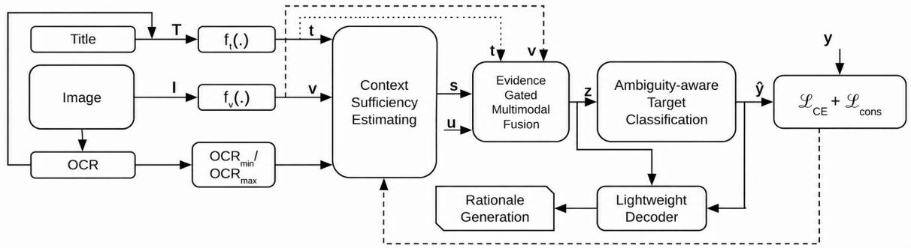

# Addressing Overcommitment in the Reasoning of Gendered Economic Memes under Multimodal Ambiguity

Kushal Kanwar1 , Dushyant Singh Chauhan2 , Kapil Rana3 ,

Gopendra Vikram Singh4 , Nils Lukas2

1Jaypee University of Information Technology

2Mohamed bin Zayed University of Artificial Intelligence

3Thapar Institute of Engineering & Technology

4Dr. B. R. Ambedkar National Institute of Technology Jalandhar kushalneo@gmail.com, dushyant.chauhan@mbzuai.ac.ae, kapilrana.iitrpr@gmail.com, gopendra.99@gmail.com, nils.lukas@mbzuai.ac.ae

## Abstract

Multimodal meme understanding is increasingly used to analyze socially sensitive content, yet existing models often exhibit biased behavior when interpreting economic dependence and social roles under ambiguity. Many memes express economic relationships through sparse text or symbolic visual cues, providing insufficient evidence for gendered attribution. In such underspecified settings, models tend to rely on pretraining correlations, leading to hallucinated and stereotypical economic role assignments. In this work, we study gendered economic dependence in image-text memes through the lens of contextual sufficiency and identify epistemic overcommitment-inferring roles without adequate evidence-as a primary source of bias. We propose CGER-Net, a context-grounded multimodal framework that estimates whether the input provides sufficient evidence for gendered economic reasoning and applies evidence-gated inference to enable confident attribution when cues are explicit while favoring principled abstention otherwise. We evaluate CGER-Net on EconMeme-GE, a curated dataset of image-text memes annotated as Men, Women, Neutral, or Ambiguous. Across strong contemporary multimodal baselines, CGER-Net reduces Gender Overcommitment Rate by up to 44% on ambiguous instances while maintaining comparable accuracy on unambiguous cases. Human evaluation further shows that 79% of generated rationales are judged as epistemically aligned with the available evidence. These results highlight the importance of modeling when not to infer for reliable and responsible multimodal analysis.

## 1 Introduction

Multimodal Memes that express sentiments about labor, capital, and financial agency are common. These memes are being increasingly examined by large multimodal models. Although these models perform well on common benchmarks, they tend to malfunction in socially sensitive settings. This is particularly the case when information regarding economic agents is vague and implicit. During pretraining, models learn spurious correlations and draw gendered inferences that are socially plausible but not based in reality.

Ambiguity and Hallucinated Economic Inference. Unlike the inaccuracies that are obvious for factual hallucinations, the attributions of a hallucinated economic role are subtler and can go unnoticed as they fall in line with socially prevalent stereotypes. As a result, when models are made to choose one out of multiple gendered categories, they overcommit even when the epistemically appropriate answer is I don’t know. Existing benchmarks and modeling approaches do not commonly differentiate true neutrality from insufficient context to infer, thereby rewarding confident but unwarranted inference in-the-wild under ambiguity.

Why Existing Approaches Fall Short. Most bias mitigation methods debias representations or weaken correlations but ignore whether inputs provide sufficient evidence for gendered economic inference, leading to confident predictions in underspecified contexts. We recast this failure as a problem of contextual sufficiency, where models must separate grounded cases from those requiring epistemic restraint and treat ambiguity as a first-class outcome.

We introduce CGER-Net, a context-grounded multimodal framework for image–text memes that predicts gendered economic dependence and generates evidence-consistent rationales. CGER-Net explicitly estimates evidence sufficiency and gates inference accordingly. Rather than suppressing gender reasoning, it determines when such reasoning is epistemically warranted.

Contributions. Our main contributions are summarized as follows:

• We identify contextual insufficiency as a primary source of hallucinated gendered economic inference in multimodal memes.

• We propose a new framework of CGER-Net that models when gendered economic attribution is warranted and when it is not.

• We present the first introduction, annotation, and evalua-

(a) Meme Description: Couple   
at a restaurant table   
Label: Ambiguous   
Text Content: So who’s paying   
today?

Annotation Rationale: The meme implies financial responsibility but does not specify income source or who is economically responsible.

Annotation Rationale: The text explicitly attributes financial agency to the speaker, who is visually identified as a woman.

(c) Meme Description: Cartoon of man on couch   
Label: Men   
Text Content: Unemployed boyfriend   
Annotation Rationale: Economic dependence is explicitly stated through unemployment and the subject is clearly male. (d) Meme Description: Man and woman working on laptops Label: Neutral   
Text Content: Teamwork makes it work   
Annotation Rationale: Both individuals are depicted as economically active, with no indication of dependence or gendered financial hierarchy.

Figure 1: Illustrative examples from EconMeme-GE, showing image description, textual content, annotation labels, and corresponding human annotation rationales.

tion on EconMeme-GE, a multimodal meme dataset for gendered economic.

• Our comprehensive analysis, which includes quantitative, ablation, qualitative, and human-centered approaches, demonstrates that CGER-Net effectively alleviates inappropriate gender assignments in uncertain situations. Furthermore, it achieves this without compromising the essential reasoning used when economic roles are clearly defined.

Alignment with UN Sustainable Development Goals (UNS-DGs): This work aligns with SDG 10 (Reduced Inequalities) and SDG 16 (Peace, Justice and Strong Institutions) by mitigating biased behavior of large language models under uncertainty. By preventing social inferences in ambiguous contexts, it supports fairer automated decision-making and promotes responsible public and institutional adoption of AI.

## 2 Related Work

Gendered economic-dependence memes often provide insufficient evidence to justify attributing dependence to a specific gender. Prior gender-related meme benchmarks largely cast the problem as decidable multimodal classification—e.g., SemEval MAMI [Fersini et al., 2022], Hateful Memes [Kiela et al., 2020], and MMHS150K [Gomez et al., 2020] WBMS[Kanwar et al., 2025] and therefore do not isolate cases where the epistemically appropriate response is restraint (“insufficient evidence”). Similar to these are Building on this line of socially sensitive meme understanding and bias auditing/mitigation for vision-language backbones [Radford et al., 2021; Mandal et al., 2023; Janghorbani and De Melo, 2023; Ravfogel et al., 2020a; Alabdulmohsin et al., 2024], we instead treat when not to infer gendered economic roles as the first-class problem by curating EconMeme-GE with an explicit Ambiguous label and introducing a context-sufficiency gate that reduces overcommitment while preserving grounded predictions and rationale alignment when evidence is clear.

## 3 Dataset

EconMeme-GE is an economic gendered meme dataset that is annotated for economic gender dependence and epistemic ambiguity. The examples in Figure 1 represent the dataset structure and annotation rationale; rationales are human-written, used for evaluation only, not for training the model.

## 3.1 Dataset Construction

We introduce a dataset for image-text memes on economic dependence and social roles and meanings (for dataset availability see, Appendix Dataset Details). It is common for memes and other forms of discourse to feature explicit and implicit references to money, work, and dependence on other family members, notably a husband or male partner. In order to facilitate the utilization of economically neutral queries that focus on memes (and do not have reference to gender) so as to avoid filtering out memes by gender and thus heavy skew/bias during collection, we try to ensure memes are about similar categories of people (queries include income, unemployed, working, household contribution). Each database sample has meme image and text.

## 3.2 Annotation Guidelines

Three expert annotators (details in Appendix Dataset Details) categorize memes into one of four mutually exclusive options: Men, Women, Neutral, or Ambiguous. Detailed annotation guidelines are supplied to ensure that judgments are not influenced by personal bias or stereotype-driven reasoning. Annotators should label content as Men or Women only in cases where the meme demonstrates a clear association between the subject and financial agency, either through explicit textual indicators or through compelling visual evidence aligned with the text.

Memes are classified as Neutral when they refer to economic or financial aspects without suggesting the dependence or agency of a gendered subject. Importantly, neutrality does not mean the absence of economic content but the absence of a male or female economic attribution. Although a meme with a man and a woman may evoke the idea of economic dependence or financial responsibility of one person on the other, the annotator is instructed to choose the label Ambiguous if the meme does not provide enough evidence to ascribe the role to a particular gender. The ambiguous label does not imply a lack of gender in the meme. Rather, the evidence is not strong enough to assign any economic role to either gender. When annotating, avoid assigning labels based solely on cultural stereotypes or visual clues. This theme runs throughout the annotation; don’t impose a female ascription under an epistemically under-specified context.

## 3.3 Annotation Challenges

There are many non-trivial challenges in annotating economic dependence: Implicit economic cues: Economic roles and dependencies are important and implicit meanings. Although not directly stated, one can deduce their meaning through the sarcasm, irony or cultural generalization present in memes. Symbolic visual representations: Consumer and leisure images, or those that take place within homes such as kitchens or dining rooms can indicate economic contribution (to the household or community) or dependency (on a household). However, they seldom indicate financial agency (in expenditures) or responsibility (for debts). Sparse or absent textual information: Many memes become more epistemically ambiguous because they contain very short or no text at all. This creates a strong temptation for inferring economic roles based on visual appearance and gender. Risk of stereotype-driven interpretation: Characters’ clothing, names or appearance often lead people to assume their genders. Annotators might apply gender-informed socially biased stereotypes when there is no strict directive.

Annotators tend to prefer the better supported interpretation rather than the most plausible one. The annotator selects Ambiguous instead of Neutral when there is no direct evidence.

## 3.4 Dataset Characteristics

The dataset has intentional ambiguities to underline that economic reasoning present in memes is quite underspecified, with background knowledge and experience of individuals playing a role in understanding. Moreover, due to the lack of demographic information, models cannot utilize stereotypes, which is why our dataset does not have external demographic metadata.

## 4 Methodology

Biased behavior often emerges when the economic signal in a meme is subtle, implied, or absent altogether. To address this, we present our proposed multimodal framework CGER-Net (Context-Grounded Economic Reasoning Network) to analyze gendered economic dependence in image-text memes when the context ranges from obvious to highly ambiguous. CGER-Net explicitly distinguishes three core components: evidence extraction, context sufficiency reasoning, and explanation generation. The framework enforces epistemic restraint by modeling whether the available multimodal evidence justifies gendered economic attribution and producing justifications that reflect this assessment, as opposed to assuming that all memes permit confident social inference. An overview of the framework is illustrated conceptually in Figure 2.

The proposed architecture consists of five components: (i) multimodal economic evidence encoding, (ii) context sufficiency estimation, (iii) evidence-gated fusion under uncertainty, (iv) ambiguity-aware target classification, and (v) rationale generation conditioned on evidential sufficiency.

## 4.1 Problem Formulation

Each meme consists of an image I associated with its text T, OCR-extracted text, and metadata when available. The task is to assign one label

$$
\hat { y } \in \{ \mathrm { M e n } , \mathrm { W o m e n } , \mathrm { N e u t r a l } , \mathrm { A m b i g u o u s } \} ,
$$

this

where labels correspond to the implied subject of economic dependence or the absence of sufficient evidence for such attribution.

In contrast to standard bias classification tasks, the Ambiguous label reveals epistemic insufficiency rather than neutrality: the meme lacks sufficient grounded cues to support a gendered economic interpretation. The model not only predicts $\hat { y } ,$ but it also generates a rationale in natural language, $r ,$ that explains why the prediction is epistemically justified in light of the multimodal evidence that is available.

## 4.2 Multimodal Economic Evidence Encoding

Visual Encoding. Given an input image $I ,$ , a pretrained vision encoder $f _ { v } ( \cdot )$ produces a fixed-dimensional visual representation:

$$
\mathbf { v } = f _ { v } ( I ) , \quad \mathbf { v } \in \mathbb { R } ^ { d _ { v } } .
$$

During training, we freeze the encoder to prevent datasetspecific amplified correlations between visual representations and gendered economic roles.

Textual Encoding. We encode text $T$ using a pretrained language encoder $f _ { t } ( \cdot )$ :

$$
\mathbf { t } = f _ { t } ( T ) , \quad \mathbf { t } \in \mathbb { R } ^ { d _ { t } } .
$$

While gender is not explicitly specified, this representation captures explicit linguistic references to work, finances, dependency, or social roles. We also ensure that no pre-existing cross-modal assumptions are made during the encoding stage by independently operating both visual and textual encoders.

## 4.3 Context Sufficiency Estimation

A key novelty of CGER-Net is the explicit estimation of whether the available multimodal cues are sufficient to justify gendered economic reasoning. We define a context sufficiency score:

$$
\begin{array} { r } { s = \sigma ( g ( [ \mathbf { v } ; \mathbf { t } ; \ell _ { \mathrm { o c r } } ] ) ) , \quad s \in [ 0 , 1 ] , } \end{array}
$$

where $[ \cdot ; \cdot ]$ denotes concatenation, $\ell _ { \mathrm { o c r } }$ is the normalized OCR text length, and $g ( \cdot )$ is a lightweight multilayer perceptron. The sigmoid function $\sigma ( \cdot )$ maps the output to a probability-like score.

  
Figure 2: Proposed Framework

The sufficiency score reflects the degree to which economic dependence cues are explicit and grounded (see, Appendix Limitations). Low values of s indicate underspecification or symbolic ambiguity, while high values indicate that the meme contains sufficient evidence for a confident interpretation. This module only determines whether inference is epistemically justified rather than predicting gender.

## 4.4 Evidence-Gated Multimodal Fusion

To prevent stereotype-driven inference under insufficient context, CGER-Net employs evidence-gated fusion. Let ϕ(·) denote a fusion network operating over concatenated visual and textual representations. The final fused representation is defined as:

$$
\mathbf { z } = s \cdot \phi ( [ \mathbf { v } ; \mathbf { t } ] ) + ( 1 - s ) \cdot \mathbf { u } ,
$$

where u is a learned uncertainty embedding, indicates the absence of reliable economic evidence.

It ensures that when context sufficiency is low, both predictions and explanations are conditioned on uncertainty rather than latent correlations. In contrast, the fused representation preserves informative multimodal signals when there is sufficient evidence.

## 4.5 Ambiguity-Aware Target Classification

The fused representation z is passed to a classifier producing a probability distribution over the four target categories:

$$
p ( \hat { y } \mid I , T ) = \operatorname { s o f t m a x } ( W \mathbf { z } + b ) .
$$

Training uses a standard cross-entropy loss:

$$
\mathcal { L } _ { \mathrm { C E } } = - \sum _ { c } y _ { c } \log p ( \hat { y } _ { c } ) ,
$$

where $y _ { c }$ denotes the ground-truth label.

To discourage unjustified gender attribution under low sufficiency, we introduce a consistency regularization term:

$$
\mathcal { L } _ { \mathrm { c o n s } } = \mathbb { E } [ ( 1 - s ) \cdot \mathbb { I } ( \hat { y } \in \{ \mathrm { M e n } , \mathrm { W o m e n } \} ) ] ,
$$

which penalizes confident gendered predictions when contextual evidence is weak.

## 4.6 Rationale Generation

CGER-Net produces a natural-language rationale r based on both the fused representation z and the predicted label yˆ. These rationales are generated by a lightweight decoder that either (i) articulates grounded economic evidence when s is high, or (ii) explicitly states that the available evidence is insufficient when s is low. In this way, the rationales are epistemically aligned with the model’s own sufficiency judgment, rather than serving as post-hoc justifications.

## 4.7 Training and Inference

The final training objective is:

$$
\begin{array} { r } { \mathcal { L } = \mathcal { L } _ { \mathrm { C E } } + \lambda \mathcal { L } _ { \mathrm { c o n s } } , } \end{array}
$$

where λ controls ambiguity-aware regularization. All pretrained encoders remain frozen, while AdamW is used to train the sufficiency estimator, fusion module, uncertainty embedding, classifier, and rationale decoder. During inference, predictions and explanations are generated using sufficiencyaware gating without ground-truth ambiguity labels, enabling the model to distinguish ambiguous, neutral, and economically biased content.

## 5 Experimental Setup

CGER-Net is evaluated on EconMeme-GE to assess gendered economic dependence and uncertainty regarding the gendered meme target, i.e., epistemic ambiguity. Two principles are followed in the design of the evaluation scheme: (i) accurate measurement of biased overcommitment with respect to gender when the available evidence is insufficient (ii) item Ensuring that the observed commitment does not arise from trivial abstention, label collapse, or conservative prediction bias.

## 5.1 Baselines

A set of popular and recent Vision-Language (VL) models, which were used in VL and meme understanding research, was selected as a baseline to evaluate CGER-Net. The following models are widely used in vision-language and meme understanding research. CLIP ViT-L/14 [Radford et al.,

2021], BLIP-2 [Li et al., 2022], the instruction-tuned variant InstructBLIP [Dai et al., 2023], LLaVA-1.6 [Liu et al., 2023], Qwen-VL-Chat [Bai et al., 2023], and Debiased CLIP (INLP) [Ravfogel et al., 2020b] are included in the set of baseline models selected for evaluation. Debiased CLIP (INLP) performs post-hoc removal of gender-correlated subspaces. To ensure fair evaluation, all baseline methods and the proposed CGER-Net are evaluated under the identical dataset splits. Experimental results indicate that, among all compared baselines, only CGER-Net can explicitly reason about contextual sufficiency and appropriately abstain in ambiguous cases, even when prompted to produce both a target prediction and a brief explanation.

## 5.2 Evaluation Metrics

The CGER-Net and all baseline models are evaluated on Accuracy (Acc), Macro-F1, along with metrics to evaluate ambiguity and bias sensitivity. Ambiguity Recall (AR) and the Gender Overcommitment Rate (GOR) measure the cor rect identification of ambiguous memes and the proportion of ambiguous instances incorrectly assigned to either women or men, respectively. To appraise the quality of explanation, the Rationale Alignment Rate (RAR) measures consistency between the generated rationale and model predictions. RAR evaluates explanation-decision coherence, and GOR serves as the primary metric for the bias-sensitivity metric.

## 6 Results

## 6.1 Quantitative Results

Pretrained Multimodal Language Models (MLMs) achieve strong performance on vision-language tasks but often hallucinate and exhibit gender overcommitment under ambiguous contexts. Although instruction tuning improves explanation fluency, it does not fully mitigate stereotype-driven overcommitment.

Compared to baseline models, CGER-Net shows stronger epistemic restraint with the highest ambiguity recall and lowest GOR (Table 1). Although slightly less accurate than stronger LLMs, it uniquely combines high rationale alignment with low overcommitment, indicating that its performance stems from explicit ambiguity modeling rather than conservative collapse.

## 6.2 Performance Across Contextual Explicitness

As shown in Table 2, as contextual explicitness increases, CGER-Net exhibits decreasing GOR and increasing RAR, reflecting a transition from abstention to confident attribution. In settings with low text availability, where other MLMs tend to hallucinate, the proposed CGER-Net acknowledges evidence insufficiency, controls overcommitment, and still generates coherent rationales.

## 7 Ablation Study

Explanation. Table 3 shows the ablation study in which the full CGER-Net is compared with the removal of the Sufficiency Module, Gated Fusion, and Consistency Loss. The removal of these components from full CGER-Net leads to a marginal increase in accuracy (up to 5%), but the important metrics Ambiguity Recall (AR), Gender Overcommitment Rate (GOR), and Rationale Alignment Rate (RAR) show a degradation of around 50% each. Context sufficiency module is most important for controlling gender overcommitment and rationale alignment. The key takeaway from this study is that ambiguity modelling is indispensable for explanation faithfulness while maintaining high accuracy.

## 7.1 Human Evaluation of Rationales

CGER-Net produces both predictions and natural-language rationales. While prediction metrics are evaluated in Section 6, this subsection assesses the epistemic appropriateness of both outputs through human evaluation. The focus is on whether rationales are grounded in multimodal evidence under contextual ambiguity rather than linguistic fluency. Only CGER-Net is evaluated, as it is specifically designed to generate evidencebacked rationales.

Evaluation Protocol. Test instances were randomly sampled from each meme category (Men, Women, Neutral, and Ambiguous). For each instance, evaluators were shown the meme (image–text pair), the model’s predicted label, and the generated rationale, without access to the ground-truth label. Evaluators provided a binary judgment (Aligned/Not Aligned) based on whether the rationale justified the prediction using the meme content; explicit acknowledgment of Ambiguity in cases of insufficient evidence was counted as Aligned.

Evaluation Metric. We define the Human Rationale Align ment Rate (HRAR) as:

$$
\mathrm { H R A R } = { \frac { \# \mathrm { A l i g n e d } \ r a t i o n a l e s } { \# \mathrm { E v a l u a t e d } \ i n s t a n c e s } } .
$$

Results. HRAR scores of all four categories are reported in Table 4. CGER-Net shows strong performance on Ambiguous and a high alignment overall. It entails that instead of hallucinating in the evidence insufficiency model acknowledges it and flags Ambigous. Culturally implicit cues are responsible for lower alignment cases.

Relation to Automatic Metrics. HRAR complements the automatic Rationale Alignment Rate (RAR) by providing external human validation. The consistency between HRAR and RAR indicates that CGER-Net’s explanations are not only internally coherent but also epistemically acceptable to human evaluators.

## 8 Qualitative Analysis

We conduct a qualitative analysis to complement quantitative results by examining model predictions and generated rationales. The analysis aims to: (i) verify that bias reduction arises from principled epistemic restraint rather than indiscriminate abstention, (ii) assess whether rationales are supported by multimodal evidence, (iii) identify ambiguous cases where CGER-Net succeeds but MLMs fail, and (iv) analyze failure cases in prediction and rationale generation.

## 8.1 Qualitative Comparison with Strong Multimodal Baselines

Table 5 presents an instance-level comparison between a strong multimodal LLM baseline and CGER-Net. In addition to predicted labels, we report rationales generated by

<table><tr><td>Model</td><td>Type</td><td>Acc</td><td>F1</td><td>AR</td><td>GOR↓</td><td>RAR↑</td></tr><tr><td>CLIP ViT-L/14</td><td>VLM</td><td>70.4</td><td>66.9</td><td>0.44</td><td>0.37</td><td>一</td></tr><tr><td>BLIP-2</td><td>VLM</td><td>72.1</td><td>68.3</td><td>0.48</td><td>0.31</td><td>一</td></tr><tr><td>InstructBLIP</td><td>VLM</td><td>73.2</td><td>69.1</td><td>0.50</td><td>0.28</td><td></td></tr><tr><td>LLaVA-1.6</td><td>LMM</td><td>74.5</td><td>70.6</td><td>0.52</td><td>0.34</td><td>0.46</td></tr><tr><td>Qwen-VL-Chat</td><td>LMM</td><td>75.1</td><td>71.3</td><td>0.51</td><td>0.32</td><td>0.49</td></tr><tr><td>InternVL-Chat</td><td>LMM</td><td>75.6</td><td>71.8</td><td>0.53</td><td>0.30</td><td>0.51</td></tr><tr><td>Debiased CLIP (INLP)</td><td>Bias-aware</td><td>71.3</td><td>67.0</td><td>0.47</td><td>0.33</td><td></td></tr><tr><td>CGER-Net (Ours)</td><td>Epistemic MM</td><td>73.8</td><td>70.2</td><td>0.63</td><td>0.19</td><td>0.71</td></tr></table>

Table 1: The performance comparison of MLM baseline models with CGER-Net shows that under ambiguity, GOR measures (lower is better) unjustified gendered economic attribution. The consistency between generated rationales and predictions is measured by RAR (with highe values indicating better consistency).

<table><tr><td>OCR Length</td><td>Acc</td><td>GOR↓</td><td>AR↑</td><td>RAR↑</td></tr><tr><td>Low (&lt;40 chars)</td><td>61.2</td><td>0.58</td><td>0.28</td><td>0.62</td></tr><tr><td>Medium (40–100)</td><td>67.4</td><td>0.32</td><td>0.55</td><td>0.70</td></tr><tr><td>High (&gt;100)</td><td>72.1</td><td>0.14</td><td>0.74</td><td>0.81</td></tr></table>

Table 2: The performance of CGER-Net is compared under varying levels of textual explicitness. It demonstrates that prediction and rationale alignment is governed by contextual sufficiency.
<table><tr><td>Variant</td><td>Acc</td><td>AR</td><td>GOR↓</td><td>RAR↑</td></tr><tr><td>Full CGER-Net</td><td>73.8</td><td>0.63</td><td>0.19</td><td>0.71</td></tr><tr><td>w/o Sufficiency Module</td><td>69.1</td><td>0.29</td><td>0.46</td><td>0.38</td></tr><tr><td>w/o Gated Fusion</td><td>68.5</td><td>0.34</td><td>0.41</td><td>0.44</td></tr><tr><td>w/o Consistency Loss</td><td>68.9</td><td>0.37</td><td>0.38</td><td>0.49</td></tr></table>

Table 3: Ablation of CGER-Net, including rationale alignment.

<table><tr><td>Target Category</td><td>HRAR</td></tr><tr><td>Men</td><td>0.74</td></tr><tr><td>Women</td><td>0.76</td></tr><tr><td>Neutral</td><td>0.81</td></tr><tr><td>Ambiguous</td><td>0.85</td></tr><tr><td>Overall</td><td>0.79</td></tr></table>

Table 4: Human evaluation of CGER-Net rationales. HRAR denotes the proportion of rationales judged by human evaluators as aligned with the available multimodal evidence and the predicted label.

CGER-Net to explain its decisions. Correct grounded predictions are highlighted in green, incorrect or biased predictions in red, and epistemically appropriate abstentions in blue.

## 8.2 Why CGER-Net Succeeds Under Ambiguity

Across ambiguous cases, strong multimodal LLM baselines frequently resolve underspecification by invoking latent gender stereotypes, despite limited or absent evidence. These decisions are often confident but unsupported by explicit economic cues. CGER-Net avoids this failure mode due to two interacting mechanisms: Context Sufficiency Estimation: Weak textual grounding and limited economic cues result in low sufficiency scores, discouraging premature commitment. Evidence-Gated Fusion: Under low sufficiency, the model relies on uncertainty-aware representations, which propagate into both the prediction and the generated rationale.

As reflected in Table 5, CGER-Net’s rationales explicitly reference evidential absence rather than hallucinating gendered economic roles, aligning prediction and explanation.

## 8.3 When CGER-Net Commits Correctly

In unambiguous cases, CGER-Net generates confident predictions accompanied by grounded rationales that cite explicit textual or visual evidence (e.g., references to salary, promotion, or unemployment). This demonstrates that the model does not suppress gendered economic reasoning wholesale; instead, it commits selectively when sufficient evidence exists.

## 8.4 Failure Analysis: Rationale-Aware Errors

Despite overall improvements, CGER-Net exhibits conservative failure modes:

Implicit Cultural Semantics. Memes where economic dependence is culturally implied (e.g., domestic labor framed as contribution) may receive Ambiguous predictions even when annotators assign gendered labels. The corresponding rationales correctly cite lack of explicit financial evidence, indicating epistemic caution rather than misinterpretation.

Visually Dominant Cues with Minimal Text. In rare cases, strong visual stereotypes combined with extremely sparse text can influence sufficiency estimation. While CGER-Net reduces such effects, rationales reveal that visual symbolism alone is insufficient to fully ground economic attribution.

## 9 Conclusion

We presented CGER-Net, a context-grounded multimodal framework for analyzing gendered economic dependence in memes. By explicitly modeling contextual sufficiency, enforcing evidence-gated inference, and generating epistemically aligned rationales, CGER-Net substantially reduces unjustified gender attribution under ambiguous economic contexts. Extensive quantitative, qualitative, ablation, and human-centered evaluations on the EconMeme-GE dataset demonstrate that the proposed approach mitigates bias without suppressing valid economic reasoning when evidence is explicit. Our findings underscore the importance of epistemic restraint and explanation alignment for the responsible deployment of mul timodal AI systems in socially sensitive domains.

## Limitations

The current framework relies on OCR length and surfacelevel textual cues as proxies for contextual richness, which may not capture subtle economic symbolism. Additionally, cultural variability in interpreting economic roles may affect both annotation and model behavior. Future work will explore culturally adaptive sufficiency estimation and richer rationale supervision.

<table><tr><td rowspan=1 colspan=3>Meme Description (Image + Text)</td><td rowspan=1 colspan=1>GT</td><td rowspan=1 colspan=1>LLaVA-1.6</td><td rowspan=1 colspan=1>CGER-Net</td><td rowspan=1 colspan=1>CGER-Net Rationale (Summary)</td></tr><tr><td rowspan=1 colspan=3>text: &quot;So who&#x27;s paying this time?&quot; (Noexplicit income or role specified)</td><td rowspan=1 colspan=1>Ambiguous</td><td rowspan=1 colspan=1>Women</td><td rowspan=1 colspan=1>Ambiguous</td><td rowspan=1 colspan=1>The meme implies financial responsibility butdoes not specify who earns or pays; genderattribution is unsupported by the content.</td></tr><tr><td rowspan=1 colspan=3>text: “My paycheck, my choices&#x27;</td><td rowspan=1 colspan=1>Women</td><td rowspan=1 colspan=1>Ambiguous</td><td rowspan=1 colspan=1>Women</td><td rowspan=1 colspan=1>The text explicitly links financial agency tothe speaker, who is visually and linguisticallyidentified as a woman.</td></tr><tr><td rowspan=1 colspan=3>caption: “Unemployed but still confi.dent&quot;</td><td rowspan=1 colspan=1>Men</td><td rowspan=1 colspan=1>Men</td><td rowspan=1 colspan=1>Men</td><td rowspan=1 colspan=1>Economic dependence is explicitly statedthrough unemployment and the subject isclearly male.</td></tr><tr><td rowspan=1 colspan=1></td><td rowspan=1 colspan=2>text: &quot;Money problems again&quot; (Nosource of income mentioned)</td><td rowspan=1 colspan=1>Ambiguous</td><td rowspan=1 colspan=1>Men</td><td rowspan=1 colspan=1>Ambiguous</td><td rowspan=1 colspan=1>Financial stress is mentioned, but no evidenceassigns responsibility or dependence to a spe-cific gender.</td></tr><tr><td rowspan=1 colspan=1>bo</td><td rowspan=1 colspan=2>text: “Another promotion, anothernus&quot;</td><td rowspan=1 colspan=1>Women</td><td rowspan=1 colspan=1>Women</td><td rowspan=1 colspan=1>Women</td><td rowspan=1 colspan=1>Explicit reference to promotion and bonusgrounds financial agency in a female subject.</td></tr><tr><td rowspan=1 colspan=2>text: “Teamwork makes it wor</td><td rowspan=1 colspan=1>k&quot;</td><td rowspan=1 colspan=1>Neutral</td><td rowspan=1 colspan=1>Men</td><td rowspan=1 colspan=1>Neutral</td><td rowspan=1 colspan=1>Both individuals are depicted as working, withno indication of dependence or financial hierar-chy.</td></tr><tr><td rowspan=1 colspan=3>Stay-at-home part-ner, living the dreamtext: “Stay-home&quot;(No gender speci-fied)</td><td rowspan=1 colspan=1>Ambiguous</td><td rowspan=1 colspan=1>Women</td><td rowspan=1 colspan=1>Ambiguous</td><td rowspan=1 colspan=1>Economic dependence is implied, but the gen-der of the dependent partner is unspecified.</td></tr><tr><td rowspan=1 colspan=1></td><td rowspan=1 colspan=2>text: “Supporting the household in myown way&quot; (Economic role indirect)</td><td rowspan=1 colspan=1>Ambiguous</td><td rowspan=1 colspan=1>Women</td><td rowspan=1 colspan=1>Ambiguous</td><td rowspan=1 colspan=1>Domestic contribution is mentioned, but finan-cial dependence or agency is not explicitlystated.</td></tr></table>

Table 5: Qualitative analysis with rationale inspection for gendered economic dependence reasoning. The table contrasts predictions from LLaVA-1.6 (a strong multimodal large language model baseline) with CGER-Net outputs and their corresponding rationales. Color coding highlights epistemically appropriate abstention (blue), correct grounded attribution (green), and unjustified or incorrect inference (red). Rationales are shown in abbreviated form for clarity.

## Dataset Details

## Annotator Demographics and Inter-Annotator Agreement

All three annotators (2 NLP experts and 1 senior annotator who works on gender and economic studies) are from South Asian backgrounds. Annotation guidelines (Section 3.2) explicitly instruct avoiding stereotype-driven reasoning. Despite shared cultural context but different areas of research, Cohen’s κ = 0.74 indicates substantial agreement. The primary disagreement axis was culturally implicit economic cues (e.g., domestic labor framed as contribution), as discussed in Section 3.3.

EconMeme-GE contains a total of 2,048 image–text memes curated from publicly available social media sources. The dataset is intentionally balanced across explicit and underspecified economic contexts to support robust evaluation under ambiguity. Approximately 41% of the instances are labeled as Ambiguous, reflecting the prevalence of implicit or insufficiently grounded economic cues in real-world social content. The remaining instances are distributed across Men (22%), Women (24%), and Neutral (13%) categories. On average, memes contain 47 OCR-extracted characters, with 38% of instances containing fewer than 40 characters, highlighting the sparsity of textual evidence that motivates epistemic abstention. All images are naturalistic social media visuals, and no external demographic or identity metadata is provided. The dataset is split into 70% training, 10% validation, and 20% test sets, stratified by label to preserve class distributions across splits.

## Dataset Availability

The dataset, along with the search queries used for web-based data collection and dataset construction, will be publicly released at https://github.com/kushalkanwarNS/ Gendered\_Economic\_Memes.

## References

[Alabdulmohsin et al., 2024] Ibrahim Alabdulmohsin, Xiao Wang, Andreas Steiner, Priya Goyal, Alexander D’Amour, and Xiaohua Zhai. Clip the bias: How useful is balancing data in multimodal learning? arXiv preprint arXiv:2403.04547, 2024.

[Bai et al., 2023] Jinze Bai, Jinlin Yang, Jianfeng Xu, et al. Qwen-vl: A versatile vision-language model for understanding, localization, text reading, and beyond. arXiv preprint arXiv:2308.12966, 2023.

[Dai et al., 2023] Wenliang Dai, Junnan Li, Dongxu Li, Hongyuan Liu, and Steven C. H. Hoi. Instructblip: Towards general-purpose vision-language models with instruction tuning. In Advances in Neural Information Processing Systems (NeurIPS), 2023.

[Fersini et al., 2022] Elisabetta Fersini, Francesca Gasparini, Giulia Rizzi, Aurora Saibene, Berta Chulvi, Paolo Rosso, Alyssa Lees, and Jeffrey Sorensen. Semeval-2022 task 5: Multimedia automatic misogyny identification. In Proceedings ofthe 16th International Workshop on Semantic Evaluation (SemEval-2022), pages 533–549, 2022.

[Gomez et al., 2020] Raul Gomez, Jaume Gibert, Lluis Gomez, and Dimosthenis Karatzas. Exploring hate speech detection in multimodal publications. In Proceedings of the IEEE/CVF Winter Conference on Applications ofComputer Vision (WACV), pages 1470–1478, March 2020.

[Janghorbani and De Melo, 2023] Sepehr Janghorbani and Gerard De Melo. Multimodal bias: Introducing a framework for stereotypical bias assessment beyond gender and race in vision language models. arXiv preprint arXiv:2303.12734, 2023.

[Kanwar et al., 2025] Kushal Kanwar, Dushyant Singh Chauhan, Gopendra Vikram Singh, and Asif Ekbal. What is beneath misogyny: misogynous memes classification and explanation. In Proceedings of the Thirty-Fourth International Joint Conference on Artificial Intelligence, pages 9746–9753, 2025.

[Kiela et al., 2020] Douwe Kiela, Hamed Firooz, Aravind Mohan, Vedanuj Goswami, Amanpreet Singh, Pratik Ringshia, and Davide Testuggine. The hateful memes challenge: Detecting hate speech in multimodal memes. Advances in neural information processing systems, 33:2611–2624, 2020.

[Li et al., 2022] Junnan Li, Dongxu Li, Caiming Xiong, and Steven C. H. Hoi. Blip: Bootstrapping language-image pre-training for unified vision-language understanding and generation. In Proceedings of the 39th International Conference on Machine Learning (ICML), pages 12888–12900. PMLR, 2022.

[Liu et al., 2023] Haotian Liu, Chunyuan Li, Qingyang Wu, and Yong Jae Lee. Visual instruction tuning. Advances in neural information processing systems, 36:34892–34916, 2023.

[Mandal et al., 2023] Abhishek Mandal, Suzanne Little, and Susan Leavy. Multimodal bias: Assessing gender bias in computer vision models with nlp techniques. In Proceedings ofthe 25th International Conference on Multimodal Interaction, pages 416–424, 2023.

[Radford et al., 2021] Alec Radford, Jong Wook Kim, Chris Hallacy, Aditya Ramesh, Gabriel Goh, Sandhini Agarwal, Girish Sastry, Amanda Askell, Pamela Mishkin, Jack Clark, et al. Learning transferable visual models from natural language supervision. In International conference on machine learning, pages 8748–8763. PmLR, 2021.

[Ravfogel et al., 2020a] Shauli Ravfogel, Yanai Elazar, Hila Gonen, Michael Twiton, and Yoav Goldberg. Null it out: Guarding protected attributes by iterative nullspace projection. arXiv preprint arXiv:2004.07667, 2020.

[Ravfogel et al., 2020b] Shauli Ravfogel, Yanai Elazar, Hila Gonen, Michael Twiton, and Yoav Goldberg. Null it out:

Guarding protected attributes by iterative nullspace projection. In Dan Jurafsky, Joyce Chai, Natalie Schluter, and Joel Tetreault, editors, Proceedings of the 58th Annual Meeting of the Association for Computational Linguistics, pages 7237–7256, Online, July 2020. Association for Computational Linguistics.