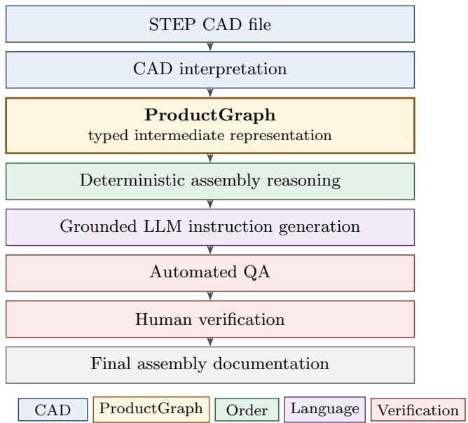
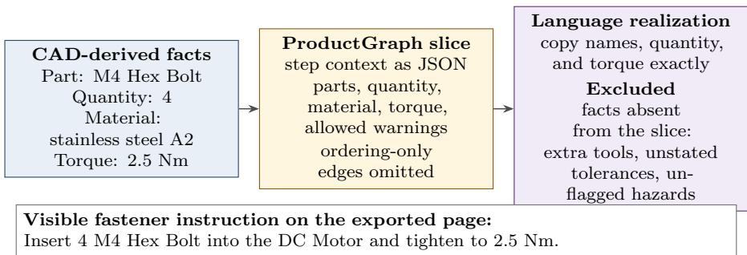
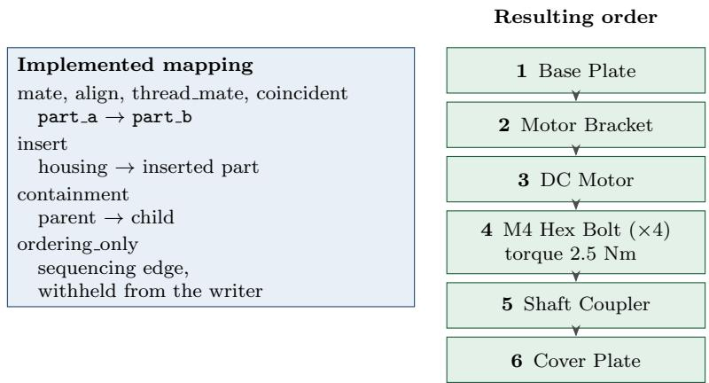
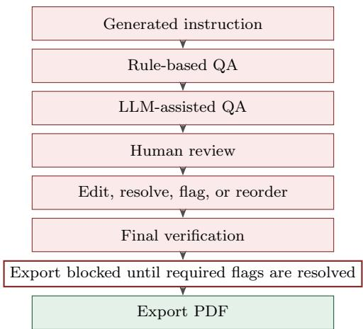
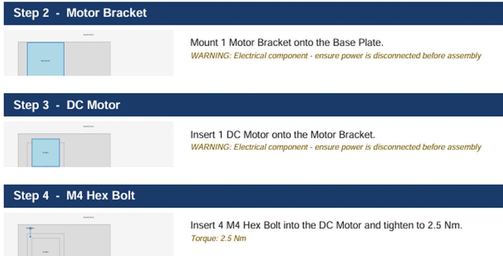
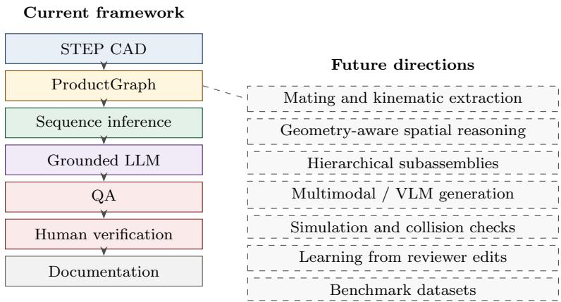

# Automated Assembly Instruction Generation from CAD Models Using Grounded Large Language Models: A Human-in-the-Loop Framework

Aaron D’Souza1, Mohammed Azeez Khan2, Ashutosh Mishra1, Arshaan Khan3, Neha K. Nair4, Amar Kumar Behera5

1 Department of Electronics and Communication Engineering, National Institute of Technology Warangal, India 2 Department of Computer Science and Engineering, National Institute of Technology Warangal, India

3 Department of Computer Science and Engineering, Nawab Shah Alam Khan College of Engineering and Technology, Hyderabad, India

4 Department of Physics, National Institute of Technology Warangal, India

5 Department of Design, Indian Institute of Technology Kanpur, Kanpur, India

## Abstract

Assembly documentation is a downstream manufacturing artifact that is still usually authored by interpreting CAD models by hand. Structured product data and large language models are both available, yet studies of CAD interpretation, assembly sequence planning, instruction writing, and human oversight have largely proceeded separately. This paper formulates CAD-grounded assembly instruction generation: the production of natural-language assembly procedures constrained by structured engineering information extracted from CAD models. The proposed framework maps a STEP assembly to a typed ProductGraph intermediate representation, derives a precedence order by deterministic topological sorting, realizes each step as language conditioned only on selected graph context, attaches per-step visual documentation, and applies rule-based and model-assisted checks. PDF export remains disabled until a human reviewer resolves every quality flag. The case study establishes endto-end feasibility on a built-in six-part reference assembly: the pipeline preserves a reported assembly order and carries quantity, material, and torque into an exported manual page. Generalization and geometric validation remain open empirical questions. The contribution is an architecture that separates engineering state, deterministic reasoning, grounded language realization, verification, and human release.

Keywords: assembly instruction generation; CAD models; STEP; large language models; grounded generation; human-in-the-loop; assembly sequence planning; manufacturing documentation; intelligent manufacturing.

## 1 Introduction

Assembly documentation tells a person how to realize a designed product. It sits downstream of engineering definition: part identity, quantity, material, mating intent, and process limits such as torque are decided during design, while the manual is still commonly written afterwards by a technical author. Model-based enterprise work has argued that a digital thread should let downstream activities reuse the engineering model rather than reinterpreting drawings [1, 2]. Assembly instructions are one such activity. They remain expensive to author, easy to leave inconsistent across product families, and easy to detach from a revised CAD model.

STEP, the ISO 10303 exchange standard, already carries assembly structure and geometry between CAD systems [2]. Classical assembly-sequence research uses that information, or an equivalent liaison model, to search for feasible orders [3–6]. Separately, recent language-model studies generate instruction text for manual assembly, cognitive assistance, and augmented-reality authoring [7–11]. A third line extracts CAD properties with retrieval-augmented generation or uses language models to synthesize CAD geometry itself [12, 13]. Reviews of industrial foundation models and of human-in-the-loop manufacturing treat language models as components that still require verification and human authority [14, 15].

The research question is how structured information extracted from CAD models can be transformed into grounded assembly instructions while deterministic engineering reasoning and human accountability remain in the loop. Unconstrained generation can state part names, quantities, torques, and safety conditions that the engineering record does not support. Opendomain factuality checks document that failure mode [16–18]. An engineering source of record is a stronger control: the facts authorized for a sentence should be selected before the sentence is written.

The framework answers that question by separating engineering state, deterministic reasoning, language realization, verification, and human release. CAD interpretation builds a typed ProductGraph. Deterministic graph reasoning proposes an assembly order from the constraints stored there. A language model then realizes each step from a graph slice and from rules that require exact names, quantities, and torque values and that admit only safety statements already flagged. Visual documentation, automated review, and a human export gate follow. We use the term CAD-grounded assembly instruction generation for this framing: natural-language assembly procedures constrained by structured engineering information extracted from CAD models.

Prior studies address CAD extraction, sequence planning, instruction generation, augmentedreality authoring, and human oversight as neighbouring problems. The contribution is the architecture that keeps those functions in one documentation workflow. A proof-of-concept on a six-part reference assembly shows that the workflow can be executed end to end. Section 2 places the architecture in the literature, and Section 8 states the empirical questions that remain open.

The contributions are:

1. A CAD-grounded architecture for transforming STEP assembly information into structured assembly documentation.

2. A typed ProductGraph intermediate representation that separates engineering-information extraction from natural-language generation.

3. A hybrid reasoning architecture that combines deterministic assembly-sequence inference with grounded language-model instruction generation.

4. A verification architecture that combines deterministic quality rules, language-modelassisted review, and mandatory human approval before document export.

5. An end-to-end proof-of-concept implementation and case study that demonstrates feasibility and identifies unresolved research problems.

Topological sorting is the ordering mechanism inside that architecture. Llama 3.3 70B is the language-model instantiation used in the case study.

## 2 Related Work

## 2.1 Model-Based Product and Assembly Representation

Product data standards exist so that geometry and product structure can move between authoring and downstream systems. Pratt’s introduction to ISO 10303 describes STEP as the standard mechanism for that exchange [2]. Hedberg and colleagues tested a digital thread in which a model-based definition is reused for manufacturing and inspection, and they documented where current industrial hand-ofs still break [1]. Assembly documentation is one of those hand-ofs: the model contains product structure, while the manual is still a separately authored artifact.

Earlier assembly research therefore built explicit representations of what may be joined, and in what order. De Fazio and Whitney generated mechanical assembly sequences from liaison and precedence information [3]. Homem de Mello and Sanderson represented alternative plans with AND/OR graphs [4]. Wang and colleagues later organized assembly-relevant product information in a three-level semantic model and used it in an interactive planning system, so that planning could consult function, structure, and part relations rather than geometry alone [19]. The ProductGraph in this paper is in that lineage of intermediate engineering representations. Its specific role is to carry parts, constraints, a bill of materials, geometry summaries, and per-step documentation state from CAD interpretation to grounded generation.

## 2.2 CAD-Based Assembly Sequence Planning

Assembly sequence generation has been reviewed as a combinatorial problem with geometric, mechanical, and precedence constraints, including CAD-integrated variants [6]. Path planning is a related but distinct question: Ghandi and Masehian taxonomize assembly and disassembly path planning, whose output is a collision-aware motion rather than an instruction manual [20]. Pan, Smith, and Smith take a STEP file, derive interference relations along principal directions, and search with a genetic algorithm for sequences with few reorientations [5]. That line of work establishes that STEP geometry can drive sequence planning without manual re-entry of every liaison.

The architecture in this paper uses a lighter ordering step suited to documentation. It builds a directed precedence graph from constraint records associated with the assembly and computes one topological order [21]. The case-study order is the unique order of the constraints stored for the reference assembly. Geometric interference and path planning remain complementary validators (Section 8).

## 2.3 LLM-Based Assembly Instruction Generation

Language models are already being tested as authors of assembly text. Meyer and colleagues examine their potential for generating assembly instructions [7]. Jiang and colleagues generate helicopter-subassembly instructions by retrieving a prior standard procedure with hierarchical pruning and then revising process factors with a language-model and retrieval pipeline over an assembly-instruction knowledge graph [8]. Kelm and colleagues generate standardized instruction text for cognitive assistance from Methods-Time Measurement analyses, with model fine-tuning and automatic warnings, and they score outputs with BLEU and METEOR [9]. Jonek, Gerlach, and Manns generate instructions from an assembly design with a ChatGPT-based retrieval pipeline and score contextual correctness of component order, operation, and position on 50 simulated variants [10]. Lin and colleagues author augmented-reality assembly programs from point-cloud demonstrations and use a language model to produce the accompanying instruction text [11].

These studies establish instruction generation as an active problem, and they start from diferent inputs: process knowledge and case reuse [8], predetermined-time analyses [9], an assembly design with retrieval [10], or a human demonstration aimed at augmented reality [11]. The workflow in this paper starts from a STEP-derived ProductGraph and keeps ordering outside the language model.

## 2.4 LLMs for CAD and Engineering Workflows

A neighbouring body of work connects language models to CAD systems. Kurscheid and colleagues extract information from native CAD assemblies into a predefined schema by planning, drafting, and repairing CAD-API calls with retrieval over documentation [12]. Their target is structured extraction. Daareyni and colleagues study the opposite direction: a language model writes OpenSCAD scripts from text, image, and voice input, with syntax checking and a feedback loop, as a design-to-manufacturing aid [13]. Zhao and colleagues review industrial foundation models across the manufacturing lifecycle and identify prompting, fine-tuning, and retrieval-augmented generation as recurring mechanisms [14].

The present framework consumes an existing STEP assembly and emits documentation. CAD interpretation fills the ProductGraph; the language model receives a step slice of that graph. Geometry synthesis and API-call generation are neighbouring uses of language models, with diferent inputs and outputs.

## 2.5 Grounded and Verifiable Generation

Retrieval-augmented generation conditions a model on retrieved passages for knowledge-intensive tasks [22]. TruthfulQA, FActScore, and SelfCheckGPT instead measure or detect unsupported statements in generated text [16–18]. Those results motivate the grounding rules used here. The prototype conditions each writing call on a ProductGraph slice rather than on a retrieved document corpus. Each call receives one JSON object: step index, part records, mating constraints other than ordering-only links, and safety flags already attached to the step. The instruction rules require imperative wording, a single sentence, exact part names, exact quantities when present, exact torque when present, and no safety advice beyond explicit flags. Section 6 inspects the exported page against that contract.

## 2.6 Human-in-the-Loop Manufacturing AI

Sadeqi Bajestani, Mun, and Kim review language models in smart manufacturing with an emphasis on human roles, trust, and validation. Their synthesis places human oversight together with cyber-physical context and explicit verification, because model output is not self-certifying for industrial use [15]. The same stance is appropriate for assembly documentation. A wrong torque or a missed isolation warning is an engineering defect, not only a fluency defect.

The framework therefore treats human approval as an architectural control. Reviewers can edit text, reorder steps, resolve automated flags, and add their own flags. Export of the PDF is withheld until required flags are cleared. The model proposes language, and a person remains accountable for the released artifact.

## 2.7 Research Gap

Table 1 compares the studies above on the functions that the framework tries to keep together. Cells describe the primary reported emphasis of each paper. A dash means the function is not part of what that paper reports, not that the authors asserted an impossibility.

Table 1: Placement of the proposed framework relative to related work. “Gate” means a reported control that blocks release until a person resolves review items. Dashes mark functions that are not the reported contribution of that study.
<table><tr><td>Study</td><td>CAD</td><td>Order</td><td>Text</td><td>Ground.</td><td>Visual</td><td>Gate</td></tr><tr><td>Pan et al. [5]</td><td>STEP</td><td>GA</td><td></td><td></td><td></td><td></td></tr><tr><td>Wang et al. [19]</td><td>CAD</td><td>Interactive</td><td></td><td>Semantic</td><td></td><td></td></tr><tr><td>Jiang et al. [8]</td><td></td><td>Case reuse</td><td>LLM</td><td>KG/RAG</td><td></td><td></td></tr><tr><td>Kelm et al. [9]</td><td></td><td></td><td>LLM</td><td>MTM text</td><td>Assist.</td><td></td></tr><tr><td>Jonek et al. [10]</td><td>Design</td><td>RAG eval.</td><td>LLM</td><td>RAG</td><td>Sim. eval.</td><td></td></tr><tr><td>Lin et al. [11]</td><td>Demo./3D</td><td>Demo.</td><td>LLM</td><td>Demo.</td><td>AR</td><td></td></tr><tr><td>Kurscheid et al. [12]</td><td>Native CAD</td><td></td><td></td><td>RAG</td><td></td><td></td></tr><tr><td>This framework</td><td>STEP tree</td><td>Toposort</td><td>LLM </td><td>Graph slice</td><td>Step view</td><td>Yes</td></tr></table>

The gap is integrative. CAD and STEP assembly planning produces feasible orders and stops before a manual [5, 6]. Structured CAD extraction returns properties without writing assembly steps [12, 19]. LLM instruction generation produces language from process data, designs, or demonstrations [7–10]. Augmented-reality authoring starts from a human demonstration [11]. Human-in-the-loop manufacturing research argues for verification of model output [15]. This paper connects those functions in one CAD-grounded documentation workflow: a ProductGraph filled from STEP-derived structure, a deterministic order, grounded generation, step visuals, automated checks, and a human release gate.

## 3 Problem Formulation

Definition 1 (CAD-grounded assembly instruction generation). CAD-grounded assembly instruction generation is the generation of natural-language assembly procedures constrained by structured engineering information extracted from CAD models. The language model realizes wording. The extracted structure remains the source of engineering facts.

Let an assembly input extracted from a CAD model be

$$
S = ( P , C , M , G ) ,\tag{1}
$$

where P is the set of parts, C is the set of constraint records, M is assembly metadata, and G is the geometric information retained by the prototype. In the present implementation, G consists of axis-aligned bounding boxes and the parent–child links of the assembly tree. Kinematic mates remain an open input to this representation (Section 8).

The documentation artifact is

$$
D = ( B , O , I , V , Q ) ,\tag{2}
$$

where B is the bill of materials, O is an assembly ordering, I is the sequence of natural-language instructions, $V$ is the set of per-step visuals, and $Q$ is the set of quality and safety annotations, including human edits retained at export.

The framework implements a composition

$$
D = \Gamma _ { \mathrm { H } } \circ \Gamma _ { \mathrm { Q } } \circ \Gamma _ { \mathrm { V } } \circ \Gamma _ { \mathrm { L } } \circ \Gamma _ { 0 } \circ \Gamma _ { \mathrm { S } } ( S ) .\tag{3}
$$

$\Gamma _ { \mathrm { S } }$ interprets the CAD input into a ProductGraph. $\Gamma _ { \mathrm { O } }$ computes a precedence order and records ambiguity. $\Gamma _ { \mathrm { { L } } }$ realizes each step as one sentence from a graph slice. $\Gamma _ { \mathrm { V } }$ attaches a diagram. $\Gamma _ { \mathrm { Q } }$ adds automated flags. $\Gamma _ { \mathrm { H } }$ is the human review map: text, order, and flags may change, and export is defined only when required flags are resolved. Equation (3) is the architectural factorization of the implemented pipeline.

Two failure conditions follow directly. If the precedence graph contains a directed cycle, no topological order satisfies every constraint, and the emitted sequence is a diagnostic fallback. If a sentence states a part, quantity, torque, material, or safety condition absent from the step slice and its flags, the sentence violates the grounding contract. The prototype records both conditions: a cycle is logged as an inconsistency, and a sentence is grounded only against its step slice.

## 4 Proposed Framework

## 4.1 Overall Architecture

Figure 1 shows the framework as an information flow from a STEP file to a released manual. What the architecture contributes is the boundary between those roles: product state stays in the graph, order stays deterministic, language stays a realization of a slice, and release stays human. A change of language model therefore does not redefine the product structure, and a change of ordering algorithm does not require the model to rediscover part names. Diagram rendering and automated review are non-blocking in the prototype: their failures are logged and flagged. Failure to interpret the CAD input or to produce an ordering aborts the run. The shared state at every boundary is the ProductGraph.

  
Figure 1: Overview of the CAD-grounded assembly instruction generation framework. STEP-derived engineering information is written into a typed ProductGraph, ordered by deterministic assembly reasoning, realized as grounded instructions, and released only after automated checks and human verification. Gold marks the ProductGraph. The remaining shades distinguish CAD input, ordering, language realization, and verification.

## 4.2 ProductGraph Intermediate Representation

The ProductGraph is the typed record corresponding to S in Eq. (1), extended with the documentation fields of D as later stages fill them. Table 2 lists the fields implemented in the prototype. Parts carry name, instance label, parent assembly, material, part number, and a six-degree-of-freedom bounding box. Constraints carry a type in {mate, align, insert, thread mate, containment, ordering only} and an optional torque. Each assembly step stores the parts and constraints it addresses, an ambiguity bit, the generated sentence, a diagram path, and quality flags.

Table 2: ProductGraph fields used as the contract between pipeline stages.
<table><tr><td>Field</td><td>Type</td><td>Role</td></tr><tr><td>parts</td><td>list of parts</td><td>Identity, material, quantity, bounding box</td></tr><tr><td>constraints</td><td>list of constraints</td><td>Precedence and optional torque</td></tr><tr><td>bom</td><td>list of entries</td><td>Aggregated bill of materials</td></tr><tr><td>assembly_steps</td><td>list of steps</td><td>Order, sentence, diagram, flags</td></tr><tr><td>metadata</td><td>dictionary</td><td>Job and pipeline metadata</td></tr></table>

The ProductGraph is a typed intermediate representation in the lineage of Section 2.1, used here as an engineering-state contract. It is the grounding boundary the language model may not cross, the traceability layer from a sentence back to a field, and the modular interface at which CAD interpretation and language generation can be replaced independently. Schema validation rejects malformed stage outputs before they propagate. Deterministic stages read constraints without parsing prose. The writing stage receives a slice rather than the CAD file. The graph is serialized to JSON per job, so a review session can resume from stored state.

Facts travel from the CAD-derived record into the ProductGraph, then into the selected step context, then into constrained generation. Ordering-only constraints may influence O and are omitted from the writing context, so a sequencing edge stays out of the sentence. Figure 2 shows that path for the fastener step of the reference assembly.

  
Figure 2: Grounding path for the fastener step of the reference assembly. Structured fields enter a step-specific ProductGraph slice. The language-realization rules permit those fields and exclude facts the slice does not contain. The sentence is the fastener instruction visible on the exported manual page, which preserves quantity and torque.

## 4.3 CAD Interpretation

When the CadQuery binding to the Open CASCADE kernel is available, interpretation loads the STEP assembly and walks the shape tree. For each node it records the STEP product label, the bounding box, and the parent–child link as a containment constraint. Repeated names are aggregated in the bill of materials. The case study in Section 6 uses the built-in six-part reference assembly that the interpreter substitutes when that geometric stack is unavailable, so the reported run exercises ordering, wording, review, and export on a known product graph.

Constraint types in the data model are mate, align, insert, threaded mate, containment, and ordering-only. The interpreter records the types associated with the assembly structure it maintains. Bounding boxes summarize extent for the schematic. Reading kinematic mates from STEP remains an open input to this stage (Section 8).

## 4.4 Assembly Sequence Inference

Sequence inference builds a directed graph on parts. An edge A → B means that part A is ordered before part B. In the implemented mapping, mate, align, thread mate, and coincident links orient part a before part b; insert orients the housing before the inserted part; containment orients the parent before the child; and ordering only adds a sequencing edge that is withheld from the writer.

The order itself is Kahn’s topological sort [21]. If several nodes have indegree zero at the same iteration, they are marked ambiguous and the ambiguity bit is carried into review. The algorithm still emits a total order; the flag tells a reviewer that the constraints did not force a unique next part. Algorithm 1 states the procedure, including the cycle case.

Algorithm 1 Precedence ordering implemented for the ProductGraph. Ambiguity is flagged.   
A cyclic graph is reported as inconsistent; the breadth-first fallback is diagnostic and does not   
certify a feasible assembly sequence.   
Require: directed precedence graph $G = ( V , E )$   
1: if G contains a directed cycle then   
2: record an unresolved constraint inconsistency   
3: return a breadth-first order as a diagnostic fallback   
4: end if   
5: R ← {v ∈ V | indegree(v) = 0}   
6: while R ̸= ∅ do   
7: if |R| > 1 then   
8: mark every node in R as ambiguous   
9: end if   
10: select one node u ∈ R, append u to the order, and remove it   
11: decrease indegrees of successors and update R   
12: end while   
13: return the order

A directed cycle means the stored constraints cannot be jointly satisfied by any total order. The breadth-first listing is retained as a diagnostic so the inconsistency is visible; it is not treated as a repaired sequence. The scientific point of the stage is that ordering remains a deterministic function of C, inspectable without asking the language model which part comes first.

Figure 3 places that mapping beside the unique topological order reported for the reference assembly. The fastener node carries the torque stored on its constraint record.

  
Figure 3: Implemented precedence for the six-part reference assembly. The left panel is the mapping from constraint categories to directed edges. The right panel is the unique topological order returned by Kahn’s algorithm; arrows follow that order, and the fastener record stores a torque of 2.5 Nm. The interpreter does not parse STEP AP214 kinematic mates, so the figure does not assign a kinematic type to each arrow.

## 4.5 Grounded Instruction Generation

Generation is a language-realization layer. One model call is issued per step, so a failure on one step does not erase the others. The call contains the step number, the step count, the participating parts with name, quantity, part number, and material, the mating constraints, and any safety warnings already stored. The system rules fix the contract: imperative language; one sentence; no fact absent from the payload; exact torque when a torque is present; exact quantity when a quantity is present; no safety statement beyond an explicit flag; part names copied as given.

The fastener step of the reference assembly, shown in Fig. 2, carries the part name M4 Hex Bolt, quantity 4, material stainless steel A2, and torque 2.5 Nm in its stored context. The exported manual page realizes the quantity and the torque explicitly. The same rules exclude tools, tolerances, and warnings that the step context does not contain. Responses are cached by a SHA-256 fingerprint of the step context, which makes a repeated run with the same slice reproducible at the level of the stored model output.

The model used in the prototype is Llama 3.3 70B, called through the Groq API. That choice instantiates $\Gamma _ { \mathrm { { L } } }$ . Any model that accepts the same slice and the same prohibitions can occupy the layer. The case study uses this one instantiation.

## 4.6 Visual Documentation

Each step can carry an image in V. The preferred renderer imports the STEP file into a headless Blender session, ofsets the active parts by 50 mm along z, and renders a 1200 × 900 image with the Cycles path tracer. If Blender is absent, a Pillow fallback draws a two-dimensional schematic from bounding-box coordinates, highlights the active part, and can place a warning band on the figure. The case-study page in Fig. 5 uses the Pillow schematic. It communicates step identity, the active part, and, where present, a warning or torque cue.

## 4.7 Automated QA

Automated review has two tiers. The deterministic tier matches part names against patterns. Fastener terms (bolt, screw, nut) raise a missing-torque flag when no torque is stored. Electrical terms (motor, battery, cable) append an electrical-isolation warning. Sharp-edge and pressure patterns append the corresponding warnings. These rules are lexical: they match part names, and a name that contains a trigger substring receives the associated warning.

The second tier sends the sentence, part names, and existing warnings back to the same model family and requests a JSON review in four categories: missing safety information, ambiguous language, missing part references, and inconsistent quantities. FActScore and SelfCheckGPT define post-hoc checks on generated text [17, 18]. The two tiers here apply name patterns and a structured review prompt, and both feed the human gate. Release remains a human decision.

## 4.8 Human-in-the-Loop Verification

Figure 4 shows the release path. After both automated tiers, a reviewer may edit a sentence, resolve a flag, add a free-text flag, or reorder steps. The edited order replaces the inferred order at export. The bill of materials remains available as a table. The export operation is disabled until required flags are resolved. That gate is the operational meaning of $\Gamma _ { \mathrm { H } }$ in Eq. (3): documentation D is released only from a reviewed state. The design follows the broader argument that language-model output in manufacturing should remain subject to human validation [15].

  
Figure 4: Human-in-the-loop verification path. Deterministic rules and a model-assisted review attach flags to each generated instruction. A reviewer may edit, resolve, flag, or reorder. PDF export stays closed until the required flags are resolved.

## 5 Implementation

The prototype is a sequential pipeline around the ProductGraph, with a web review client. Table 3 maps framework stages to components. These choices make the case study reproducible as software. They are instantiations, not the research claims in Section 1.

Table 3: Mapping from framework stages to the proof-of-concept implementation.
<table><tr><td>Stage</td><td>Component</td><td>Instantiation</td></tr><tr><td>Γs</td><td>CAD parser</td><td>CadQuery/OCCT, or the reference assembly</td></tr><tr><td>State</td><td>ProductGraph</td><td>Pydantic schema; JSON in SQLite</td></tr><tr><td>Γo</td><td>Sequence stage</td><td>NetworkX; Algorithm 1</td></tr><tr><td>Γv</td><td>Diagram stage</td><td>Blender/Cycles, else Pillow</td></tr><tr><td>ΓL</td><td>Writer stage</td><td>Llama 3.3 70B via Groq; SHA-256 cache</td></tr><tr><td>ΓQ</td><td>QA stage</td><td>Regex rules, then a JSON model review</td></tr><tr><td>ΓH</td><td>Review client</td><td>Next.js; Jinja2 and WeasyPrint export</td></tr><tr><td>Service</td><td>API</td><td>FastAPI; one SQLite record per job</td></tr></table>

The service stores each ProductGraph as JSON, so the review client can reload a job. The client polls until the pipeline finishes, then presents editable steps, a diagram thumbnail, flags, and the bill of materials. Export calls a server endpoint that fills an HTML template and prints a multi-page PDF containing the bill of materials, steps, diagrams, safety notes, and document metadata. Container packaging is provided with Docker Compose. None of these service details changes the contract in Eqs. (1)–(3).

## 6 Proof-of-Concept Case Study

The case study executes the framework on the built-in reference assembly: six parts, eight constraints, and one torque-specified fastener constraint. Parsing uses that reference assembly, and the diagrams use the Pillow fallback. The sections below report what that single run produced.

## 6.1 End-to-End Pipeline Execution

The pipeline returns a bill of materials, a total order, one instruction per step, a schematic, quality annotations, and a PDF after flags are cleared. Figure 5 shows the exported bands for the motor bracket, the DC motor, and the fastener. Each band contains a step title, a schematic, and an instruction. The motor-related bands carry an electrical warning; the fastener band carries a 2.5 Nm torque callout. The base-plate band on the same export states quantity one and the material aluminium 6061. The shaft coupler and cover plate belong to the reported order and lie outside this crop.

  
Figure 5: Exported manual bands for the motor bracket, the DC motor, and the fastener of the reference assembly, taken from the stored PDF page and rendered with the schematic fallback. Each band shows the instruction. The motor-related bands also show the electrical warning, and the fastener band shows the 2.5 Nm torque callout.

## 6.2 Assembly Sequence Inference

The reference constraint graph is reported as a directed acyclic graph with no ambiguous group. Kahn’s algorithm yields

$$
\begin{array} { r l r } & { } & { \mathrm { B a s e ~ P l a t e } \to \mathrm { M o t o r ~ B r a c k e t } \to \mathrm { D C ~ M o t o r } \to } \\ & { } & { \mathrm { M 4 ~ H e x ~ B o l t ~ ( \times 4 ) } \to \mathrm { S h a f t ~ C o u p l e r } \to \mathrm { C o v e r ~ P l a t e } . } \end{array}
$$

The order agrees with the precedence stored for this assembly: the base precedes the bracket, the motor precedes the bolts that secure it, and the coupler precedes the cover. The graph has a single ready node at each step, so the reported order is unique. Agreement here is with the stored constraint graph of this assembly.

## 6.3 Instruction Grounding

Qualitatively, the generated instructions preserve the reference part names and do not introduce foreign components in the inspected steps. Step 1 names one base plate and the material aluminium 6061. Step 2 names the motor bracket. Step 3 names the DC motor. Step 4 names four M4 hex bolts.

## 6.4 Quantity and Torque Preservation

The fastener context specifies quantity 4 and torque 2.5 Nm. The exported sentence states both, with a separate torque callout. The base-plate sentence states quantity one and the material stored for that part.

## 6.5 QA Behavior

The electrical-name rule fires for the DC motor step. The exported page shows the warning “Electrical component — ensure power is disconnected before assembly,” and the same warning appears on the motor-bracket step because the bracket name contains the matched substring. The example shows how a lexical rule can attach a warning to a part name rather than to a verified electrical role, which is why the human gate remains in the release path. The fastener step already stores 2.5 Nm, so the page shows the torque callout rather than a missing-torque flag. The model-assisted pass added no further flags on this run.

## 6.6 Human Review Workflow

The review client supports inline edits, drag reordering, resolution of existing flags, and addition of human-authored flags. Export stays disabled until required flags are resolved. Figure 5 is an export produced after that condition was met.

## 6.7 Pipeline Latency

Table 4 records approximate wall-clock times on one laptop (Intel Core i7, 16 GB RAM) with remote model calls. Parsing and ordering are negligible for this graph. Schematic rendering and the twelve model calls dominate. End-to-end time for this assembly is on the order of half a minute.

Table 4: Approximate pipeline latency for the six-part reference assembly on one laptop, using referenceassembly parsing, the Pillow schematic renderer, and remote model calls. Ranges reflect observed run-to-run variation, not a confidence interval.
<table><tr><td>Stage</td><td>Wall-clock time</td></tr><tr><td>CAD parsing (reference assembly)</td><td>&lt; 0.1 s</td></tr><tr><td>Sequence inference</td><td>&lt; 0.1 s</td></tr><tr><td>Diagram rendering (Pillow)</td><td>~3-5 s</td></tr><tr><td>Instruction writing (6 calls)</td><td>~8-15 s</td></tr><tr><td>QA review (6 calls)</td><td>~8-15 s</td></tr><tr><td>Total</td><td>~20-35 s</td></tr></table>

## 7 Discussion

The case study shows that a small electromechanical assembly can be carried from a structured product record to a reviewable PDF without asking a language model to invent the order. The useful result is architectural. Product identity, quantity, material, and torque live in the ProductGraph. Ordering is a function of explicit edges. Wording is a constrained rendering of a slice. Release depends on a person. Each of those statements can be inspected in the prototype, and each fails independently when its own assumptions fail.

An intermediate representation is what makes the inspection possible. If the model received an opaque CAD file and returned a manual, a reviewer could not point to the field that authorized a torque or a warning. The ProductGraph gives validation, a stable interface between stages, deterministic processing, a grounding payload, traceability from sentence to field, and a boundary at which the language model can be replaced. Those properties are available even though the present geometric payload is only a bounding box and a tree.

Deterministic ordering stays beside the language model because precedence is a constraintsatisfaction question. The model can phrase “insert the motor into the bracket.” The stored edges decide whether that sentence may be step three. Keeping Kahn’s procedure, ambiguity flags, and the cycle warning outside the model makes ordering errors legible. The cycle fallback is the illustrative case: a breadth-first listing keeps the software moving, and the log must say that the listing does not satisfy the constraints.

The language model is therefore a realization layer. It chooses imperative English for facts it is given. The prototype’s rules are an engineering attempt to keep it in that role. They are prompt constraints, not a formal guarantee. A model can still violate them. Human verification is the control that matches the consequence of that residual risk. Assembly documentation can specify torque and isolation; releasing it automatically would transfer accountability to a component that does not own the product definition [15]. The gate is intentionally stricter than a suggestion list.

Section 8 collects the empirical questions this case study leaves open, including unseen CAD, geometric validation, and the electrical status of lexical warnings.

The same factorization applies to other documents that restate an engineering model, such as inspection plans, torque sheets, or service procedures. What transfers is the separation of authorized facts, a deterministic transform, grounded realization, and a human release gate.

Model independence follows from the same boundary. $\Gamma _ { \mathrm { { L } } }$ is specified by its input slice and its prohibitions. Llama 3.3 70B is the instantiation used in the case study.

## 8 Limitations and Open Research Problems

Figure 6 separates the implemented path from the extensions that would make the case study a broader empirical test. The items below are the research agenda. Each names a limit of the present pipeline and the capability that would address it.

  
Figure 6: Implemented framework and open research directions. Solid boxes are stages exercised by the prototype. Dashed boxes are proposed extensions, and the dashed link indicates where richer CAD interpretation would enter the ProductGraph.

## 8.1 Mating and kinematic constraint extraction

The interpreter records labels, bounding boxes, and containment. Reading kinematic mates from STEP would give C relations that are currently supplied with the assembly structure. That extraction is the first open input to ΓS.

## 8.2 Geometry-aware spatial reasoning

Bounding boxes locate a schematic. Insertion direction, contact, and stable pose are the geometric relations still needed in G before spatial phrases in I can be grounded in the step slice.

## 8.3 Hierarchical subassembly preservation

The pipeline flattens parts to one level even when the tree records parents. A motor that is itself a subassembly should become a section, not six siblings of the housing. Hierarchical O and D are open even though parent identifiers already exist on parts.

## 8.4 Multimodal instruction generation

The writer sees JSON. Conditioning a vision-language model on the graph slice and the step image [11] is a natural extension when the image is a view of the same ProductGraph.

## 8.5 Safety-aware engineering verification

Name patterns attach warnings and notice missing torques, and they also fire on incidental substrings, as the motor-bracket warning shows. A safety verifier would consult standards, electrical connectivity, tool access, and stored process limits. In the present pipeline, Q directs human attention.

## 8.6 Human feedback and continuous improvement

Review edits are applied to the exported job and are not retained as a training or retrieval corpus. Closing that loop could adapt wording to an organization’s style. It could also reinforce a reviewer’s mistake. Any learning step needs the same grounding contract as $\Gamma _ { \mathrm { { L } } }$ , with the ProductGraph still authoritative.

## 8.7 Benchmark datasets

A transferable score needs published STEP assemblies, authorized precedence, bills of materials, torque and material fields, and expert instructions, with atomic grounding errors [17] reported beside order validity. Jonek et al. already score sequence, operation, and position on designed variants [10]; a CAD-grounded benchmark would add the ProductGraph fields those scores do not see.

## 8.8 Simulation and collision-aware validation

Path-planning and STEP-based interference methods already decide whether parts can move into place [5, 20]. Using them as a validator on O, before language realization, would separate an acyclic constraint graph from a collision-aware order.

## 9 Future Directions

The dashed region of Fig. 6 is the research agenda of Section 8, ordered by where each extension would enter the pipeline. Richer interpretation would populate C and G before ordering. Hierarchical structure would change the shape of O and of the manual. Multimodal realization would change $\Gamma _ { \mathrm { { L } } }$ without changing the source of facts. Simulation would accept or reject an order before a sentence is trusted. Reviewer edits and public benchmarks would change how the framework is evaluated and, later, how prompts or models are selected.

Two further interface-level extensions fit the same boundary. A target-language parameter belongs inside $\Gamma _ { \mathrm { { L } } } ,$ because the facts remain in the graph and only the realization language changes. Learned proposals of missing constraint types belong upstream of $\Gamma _ { \mathrm { O } }$ and remain hypotheses until a person or a geometric check accepts them.

## 10 Conclusion

Assembly documentation can be treated as a grounded transformation of CAD-derived product structure. The contribution is an architecture that separates engineering state, deterministic reasoning, language realization, verification, and human release. The ProductGraph is the contract among those roles: CAD interpretation fills it, ordering reads it, the language model realizes a slice of it, and a reviewer approves the result before export.

On a six-part reference assembly the prototype preserves the reported order and carries quantity and torque into an exported page, in well under a minute on the recorded configuration. The same run shows a lexical safety rule attaching an electrical warning to a bracket whose name matches a pattern. Mating extraction, geometric reasoning, hierarchy, multimodal grounding, safety verification, learning from edits, public benchmarks, and collision checks are the open problems that follow from that scope.

## References

[1] Hedberg, T.D. Jr., Lubell, J., Fischer, L., Maggiano, L., Barnard Feeney, A.: Testing the digital thread in support of model-based manufacturing and inspection. Journal of Computing and Information Science in Engineering 16(2), 021001 (2016) 10.1115/1. 4032697

[2] Pratt, M.J.: Introduction to ISO 10303—the STEP standard for product data exchange. Journal of Computing and Information Science in Engineering 1(1), 102–103 (2001) 10. 1115/1.1354995

[3] De Fazio, T.L., Whitney, D.E.: Simplified generation of all mechanical assembly sequences. IEEE Journal on Robotics and Automation 3(6), 640–658 (1987) 10.1109/JRA.1987. 1087132

[4] Mello, L.S., Sanderson, A.C.: AND/OR graph representation of assembly plans. IEEE Transactions on Robotics and Automation 6(2), 188–199 (1990) 10.1109/70.54734

[5] Pan, C., Smith, S.S., Smith, G.C.: Automatic assembly sequence planning from STEP CAD files. International Journal of Computer Integrated Manufacturing 19(8), 775–783 (2006) 10.1080/09511920500399425

[6] Bahubalendruni, M.V.A.R., Biswal, B.B.: A review on assembly sequence generation and its automation. Proceedings of the Institution of Mechanical Engineers, Part C: Journal of Mechanical Engineering Science 230(5), 824–838 (2016) 10.1177/0954406215584633

[7] Meyer, F., Freitag, L., Hinrichsen, S., Niggemann, O.: Potentials of large language models for generating assembly instructions. In: 2024 IEEE 29th International Conference on Emerging Technologies and Factory Automation (ETFA), pp. 1–8 (2024). 10.1109/ETFA61755.2024. 10710806

[8] Jiang, M., Guo, Y., Huang, S., Pu, J.: Generating the assembly instructions of helicopter subassemblies using the hierarchical pruning strategy and large language model. Journal of Industrial Information Integration 42, 100723 (2024) 10.1016/j.jii.2024.100723

[9] Kelm, B., Haas, P.H., Jochum, S., Margies, L., M¨uller, R.: Enhancing assembly instruction generation for cognitive assistance systems with large language models. Procedia CIRP 134, 7–12 (2025) 10.1016/j.procir.2025.03.010

[10] Jonek, M., Gerlach, A., Manns, M.: LLM-based design process for manual assembly. Procedia CIRP 136, 1033–1038 (2025) 10.1016/j.procir.2025.08.175

[11] Lin, J., Wang, J., Feng, P., Zhang, X., Yu, D., Zhang, J.: AI-aided automated AR-assisted assembly instruction authoring and generation method. Journal of Manufacturing Systems 83, 405–423 (2025) 10.1016/j.jmsy.2025.08.019

[12] Kurscheid, S., Reichelt, C., Geng, P., Tanz, L., Eder, D., Daub, R.: Extracting information from CAD assemblies using large language models and retrieval-augmented generation. Procedia CIRP 146, 343–348 (2026) 10.1016/j.procir.2026.03.195

[13] Daareyni, A., Martikkala, A., Mokhtarian, H., Flores Ituarte, I.: Generative AI meets CAD: enhancing engineering design to manufacturing processes with large language models. The International Journal of Advanced Manufacturing Technology (2025) 10.1007/s00170-025-15830-2

[14] Zhao, S., Liu, S., Jiang, Y., Zhao, B., Lv, Y., Zhang, J., Wang, L., Zhong, R.Y.: Industrial foundation models (IFMs) for intelligent manufacturing: a systematic review. Journal of Manufacturing Systems 82, 420–448 (2025) 10.1016/j.jmsy.2025.06.011

[15] Sadeqi Bajestani, M., Mun, D., Kim, D.B.: Human-in-the-loop and large language models in smart manufacturing: current applications, challenges, and perspectives. Journal of Manufacturing Systems 86, 913–941 (2026) 10.1016/j.jmsy.2026.04.027

[16] Lin, S., Hilton, J., Evans, O.: TruthfulQA: measuring how models mimic human falsehoods. In: Proceedings of the 60th Annual Meeting of the Association for Computational Linguistics (Volume 1: Long Papers), pp. 3214–3252 (2022). 10.18653/v1/2022.acl-long.229

[17] Min, S., Krishna, K., Lyu, X., Lewis, M., Yih, W.-t., Koh, P.W., Iyyer, M., Zettlemoyer, L., Hajishirzi, H.: FActScore: fine-grained atomic evaluation of factual precision in long form text generation. In: Proceedings of the 2023 Conference on Empirical Methods in Natural Language Processing, pp. 12076–12100 (2023). 10.18653/v1/2023.emnlp-main.741

[18] Manakul, P., Liusie, A., Gales, M.J.F.: SelfCheckGPT: zero-resource black-box hallucination detection for generative large language models. In: Proceedings of the 2023 Conference on Empirical Methods in Natural Language Processing, pp. 9004–9017 (2023). 10.18653/v1/ 2023.emnlp-main.557

[19] Wang, H., Xiang, D., Duan, G., Zhang, L.: Assembly planning based on semantic modeling approach. Computers in Industry 58(3), 227–239 (2007) 10.1016/j.compind.2006.05.002

[20] Ghandi, S., Masehian, E.: Review and taxonomies of assembly and disassembly path planning problems and approaches. Computer-Aided Design 67–68, 58–86 (2015) 10.1016/ j.cad.2015.05.001

[21] Kahn, A.B.: Topological sorting of large networks. Communications of the ACM 5(11), 558–562 (1962) 10.1145/368996.369025

[22] Lewis, P., Perez, E., Piktus, A., Petroni, F., Karpukhin, V., Goyal, N., K¨uttler, H., Lewis, M., Yih, W.-t., Rockt¨aschel, T., Riedel, S., Kiela, D.: Retrieval-augmented generation for knowledge-intensive NLP tasks. In: Advances in Neural Information Processing Systems, vol. 33, pp. 9459–9474 (2020)