# BATCH BEFORE YOU LIFT: SCALABLE TOPOLOGICAL DEEP LEARNING ON LARGE GRAPHS

David Leko1,∗ Luka Benic´2,3,\* Guillermo Bernárdez4

Nina Miolane4 Olga Fink1 Lev Telyatnikov5

1IMOS Lab, EPFL, Lausanne, Switzerland 2Ruder Boškovi ¯ c Institute, Zagreb, Croatia ´ 3University of Zagreb, Zagreb, Croatia 4UC Santa Barbara, Santa Barbara, USA 5Capital One†

## ABSTRACT

Topological Deep Learning extends graph-based learning to higher-order domains, such as hypergraphs, cellular, and simplicial complexes. These domains are typically constructed from patterns in an input graph through a process of graph lifting. Full-domain training constructs and stores the complete lifted representation before model execution. On large and dense datasets like Reddit (233k nodes and 57.3M edges), this global materialization becomes a severe computational bottleneck, often rendering training infeasible. To address this limitation, we introduce Cluster-TNN, a domain-agnostic framework that avoids this bottleneck by lifting locally instead. After partitioning the input graph during preprocessing, at runtime Cluster-TNN dynamically samples groups of node clusters, reconstructs their induced subgraphs to form mini-batches, and applies the chosen lifting within each mini-batch. Retaining all edges among sampled nodes preserves the connectivity needed to construct higher-order structures across clusters, producing topological mini-batches that existing Topological Neural Networks can process directly. Across 21 matched comparisons with full-graph execution, Cluster-TNN reduces peak GPU memory in every configuration, by 83.2% on average while maintaining competitive predictive performance. Notably, such a reduction enables, to our knowledge, the first training of multiple different higherorder Topological Neural Networks on large datasets such as Reddit and OGBN Products. These results establish Cluster-TNN as a general strategy for scaling Topological Deep Learning beyond the limitations of global domain construction.

## 1 INTRODUCTION

Graphs are a dominant representation for relational learning: nodes encode entities and edges encode pairwise relations. Graph Neural Networks (GNNs) learn on such structures across diverse machine learning tasks (Kipf & Welling, 2017; Hamilton et al., 2017a; Gilmer et al., 2017; Bronstein et al., 2021; Corso et al., 2024). However, many systems involve multi-way interactions, such as coauthorship groups, molecular rings, or many-body couplings, that pairwise graphs cannot represent explicitly. Topological Deep Learning (TDL) extends relational learning to higher-order domains, such as hypergraphs, cellular, and simplicial complexes, on which Topological Neural Networks (TNNs) operate (Papamarkou et al., 2024; Hajij et al., 2023; Papillon et al., 2024). By explicitly representing higher-order relations, these domains provide complementary inductive biases for systems whose structure extends beyond pairwise connectivity.

However, scalability in higher-order domains remains a central challenge for TDL (Papamarkou et al. (2024), Open Problem 6). For graph-supported data, a lifting maps patterns in the input graph, such as neighbourhoods, cliques, or cycles, to explicit higher-order elements and their incidence relations. This lifting determines both which higher-order relations become available to the model and the size of the resulting computational domain. Because the number of lifted elements depends on graph connectivity rather than node count alone, the lifted domain can be orders of magnitude larger than the input graph. For example, the Reddit dataset has approximately 233k nodes and 57.3M edges, yet clique-complex lifting produces approximately 8.36B simplicial 2-cells (filled triangles). Enumerating these elements, their features, and their incidence relations may exceed available memory before training begins, making full-domain construction a scalability bottleneck.

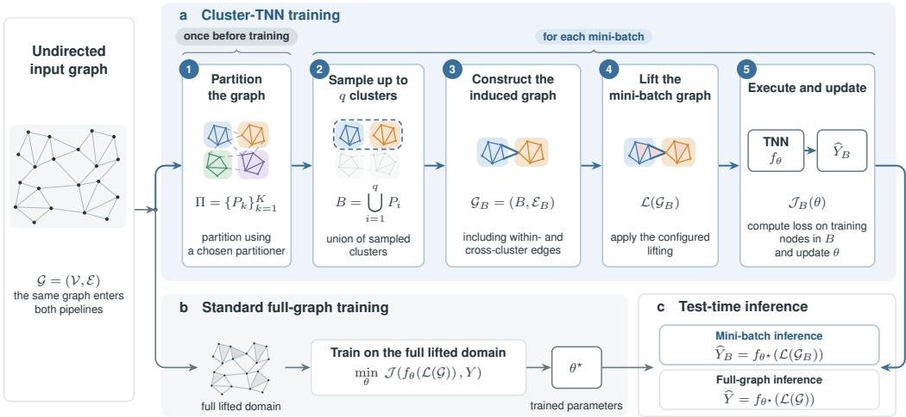  
Figure 1: Comparison of Cluster-TNN training (ours) and standard full-graph TDL training. Both workflows start from the same featured undirected graph. a Cluster-TNN partitions the graph once per run and at each training step samples up to q clusters, reconstructs their induced subgraph, and performs lifting and model execution only on the resulting mini-batch. b Standard full-graph training instead constructs and processes the complete lifted domain throughout training. c Trained models support both mini-batch and full-graph inference.

Existing mini-batching strategies do not fully address this bottleneck because they typically intervene only after the higher-order domain has been constructed. Sampling or partitioning an already lifted hypergraph, simplicial complex, or cell complex can reduce the memory required by individual forward and backward passes, but it would still assume that the complete set of higher-order elements and their connectivity can be enumerated or materialized beforehand. Consequently, minibatched model execution may remain infeasible when the preceding lifting operation exceeds the available computational resources. Moreover, batching a lifted representation generally requires domain-specific procedures, limiting reuse across liftings and TNN architectures.

On the other hand, performing mini-batching before lifting could address both limitations: it would restrict lifting to the data required for the current optimization step and perform batching on the graph shared by the different higher-order constructions. However, this change in execution order introduces a structural challenge: if graph partitions are lifted independently, edges crossing partition boundaries are omitted. Consequently, higher-order structures supported by nodes in different partitions, including neighborhood hyperedges, cliques, and cycles, may disappear from the training data. Independently lifting small graph fragments can therefore reduce computational cost at the expense of systematically altering the higher-order domain observed by the model.

We address this gap by introducing Cluster-TNN, a batch-before-lift strategy that avoids full-domain materialization while preserving all original edges among the sampled nodes. As illustrated in Figure 1, Cluster-TNN partitions the graph once into disjoint node clusters and samples a group of clusters at each optimization step. The proposed workflow then reconstructs the subgraph induced by the combined nodes of these clusters, and retains every original edge among its nodes, also including edges between clusters. Lastly, Cluster-TNN applies the requested lifting only to this reconstructed graph mini-batch and passes the resulting higher-order domain directly to a TNN.

Induced-subgraph reconstruction is central to the approach: unlike lifting each sampled cluster independently, it restores the edges connecting jointly sampled clusters. Under lifting compatibility (Sec. 3.3), a higher-order structure can therefore be recovered whenever all of its supporting nodes occur in the same batch. By recombining clusters across epochs, Cluster-TNN provides repeated opportunities to observe higher-order structures spanning different clusters.

Contributions. The main features and contributions of our work include:

• Batch-before-lift strategy. We introduce Cluster-TNN, a general strategy for scaling TDL beyond the limits imposed by global topology materialization. The same batching mechanism supports different graph-to-higher-order liftings and existing TNN architectures, which we evaluate on Reddit and OGBN Products.

• Cross-cluster structural recovery of Cluster-TNN. We characterize higher-order structural recovery under repeated cluster recombination (Sec. 3.3) and report empirical measurements of observable hyperedges, cellular 2-cells, and simplicial 2-cells (Figure 2 and Appendix C.13).

• Scalability-computation trade-off via extensive evaluation. We empirically quantify the tradeoff introduced by batch-before-lift in terms of full-graph preprocessing feasibility and cost, peak CPU and GPU memory, training time and predictive performance. In particular, across 21 matched model-dataset comparisons, Cluster-TNN reduces peak GPU memory in every setting by 83.2% on average, while maintaining competitive predictive performance.

• Reusable open-source integration. We implement Cluster-TNN in TopoBench (Telyatnikov et al., 2025a), reusing existing liftings and models across different higher-order domains without requiring architecture-specific modifications. Code is available in our anonymous repository.

## 2 RELATED WORK

Higher-order domains, liftings, and TDL software. Evaluating TNNs on graph datasets requires constructing the higher-order domain on which the model operates, making the lifting it self part of the model evaluation. Hypergraph benchmarks show that lifting choice affects predictive performance, with no single lifting dominating across the evaluated settings (Montagna et al., 2026). TopoX (Hajij et al., 2024) provides topological data structures and neural operators, while TopoBench (Telyatnikov et al., 2025a) integrates datasets, liftings, and models within a common benchmarking framework. This standardization supports comparisons across hypergraph, cellular, and simplicial architectures. However, Telyatnikov et al. (2025a) report out-of-memory errors during clique and cycle lifting on graphs with fewer than 25 000 nodes. Thus, even at this scale, full-domain construction can exhaust available memory before model training begins.

Scalability methods for higher-order learning. Existing approaches reduce model-execution costs. FastHGNN (Lu & Ng, 2024) and Telyatnikov et al. (2025b) subsample preconstructed hypergraphs, while Topo-MLP (Ramamurthy et al., 2023) accelerates simplicial inference by removing explicit message passing. TopoMamba (Montagna et al., 2025) introduces architecture-specific neighbourhood batching using node-to-cell incidence relations. SaNN (Gurugubelli & Chepuri, 2024) precomputes simplicial feature aggregations. HOPSE (Bernárdez et al., 2025) precomputes positional and structural encodings through Hasse graph decompositions for message-passing-free learning. These methods operate on constructed higher-order domains, leaving a complementary objective: limiting domain construction across lifting families while retaining existing TNNs.

Graph mini-batching as the methodological foundation. GNN methods restrict computation through neighbourhood sampling with GraphSAGE (Hamilton et al., 2017b), layer-wise importance sampling with FastGCN (Chen et al., 2018), or subgraph sampling with GraphSAINT (Zeng et al., 2020). Cluster-GCN (Chiang et al., 2019) partitions the graph’s nodes into disjoint clusters and forms mini-batches from one or more clusters, retaining all edges among the selected nodes, including those connecting different clusters. For graph-supported TDL, preserving this connectivity has an additional significance: missing edges can prevent higher-order structures from being constructed, even when all their supporting nodes are present.

## 3 METHODS

Cluster-TNN moves mini-batching before higher-order domain construction. At each training step, we group up to q graph clusters, reconstruct their induced subgraph, and apply the selected lifting only to that subgraph. Retaining all original edges among the sampled nodes provides the connectivity needed to construct higher-order structures spanning jointly sampled clusters. A TNN for the selected higher-order domain then processes the lifted mini-batch. This execution order makes mini-batching control both domain construction and model execution across higher-order domains, without materializing the full lifted domain.

## 3.1 MINI-BATCH CONSTRUCTION AND LIFTING

Let $\mathcal { G } = ( \mathcal { V } , \mathcal { E } , F \mathcal { V } , F \mathcal { \varepsilon } )$ denote a graph with node set $\nu ,$ edge set $\mathcal { E } ,$ and corresponding feature maps $F _ { \mathcal { V } }$ and $F _ { \mathcal { E } }$ . Following the multi-cluster batching scheme of Cluster-GCN (Chiang et al., 2019), we first partition V into K disjoint clusters $\Pi = \{ P _ { 1 } , \ldots , P _ { K } \}$ , with $\textstyle \mathcal { V } = \bigcup _ { k = 1 } ^ { K } P _ { k }$ . We compute this partition using METIS (Karypis & Kumar, 1998) or random partitioning and keep it fixed throughout the run (Figure 1a, step 1). At the beginning of each training epoch, Cluster-TNN randomly groups clusters containing at least one training node, referred to as active clusters, into mini-batches of at most q clusters (see step 2). Mini-batch validation and testing similarly use only clusters containing validation and test nodes, respectively. For a group $Z ,$ the mini-batch node set is $\textstyle B = \bigcup _ { k \in Z } P _ { k }$ , from which we extract the induced subgraph $\bar { \mathcal { G } _ { B } } = \bar { ( B , \mathcal { E } _ { B } ) }$ with $\mathcal { E } _ { B } = \{ ( u , v ) \in $ $\mathcal { E } : u , v \ \in \ B \}$ . Node features, labels, split masks, and edge features are restricted accordingly. Thus, $\mathcal { G } _ { B }$ preserves all edges among co-sampled clusters, including inter-cluster edges (step 3). The selected lifting L maps $\mathcal { G } _ { B }$ to higher-order domains required by the TNN, constructing higher-order elements and their features from the connectivity of $\mathcal { G } _ { B }$ (step 4, Appendix A.2.1). The TNN then processes $\mathcal { L } ( \mathcal { G } _ { B } )$ through the same interface used for full-domain execution (step 5), enabling a unified workflow across hypergraph, cellular, and simplicial domains. In contrast, standard fullgraph execution processes the entire lifted object ${ \mathcal { L } } ( { \mathcal { G } } )$ (Figure 1b).

Algorithm 1 Cluster-TNN   
Require: Featured graph G, node labels $Y ,$   
lifting ${ \mathcal { L } } ,$ number of clusters $K ,$ , maxi  
mum clusters per mini-batch q   
Ensure: Trained parameters θ   
1: Partition V into K clusters   
2: for each training step do   
3: Take at most q active clusters   
4: Form mini-batch node set $B$   
5: Construct induced subgraph GB   
6: Lift the mini-batch: $\mathcal { L } ( \mathcal { G } _ { B } )$   
7: Compute $\mathcal { I } _ { B } ( \boldsymbol { \theta } )$   
8: Take an optimizer step on $\mathcal { I } _ { B } ( \boldsymbol { \theta } )$   
9: end for

Algorithm 1 summarizes the Cluster-TNN training protocol. The training objective and inference protocols are detailed in Sec. 3.2. The workflow applies when the selected graph-to-domain lifting can be evaluated on an induced graph and the downstream TNN can process the variablesize lifted domains through the same interface used for the full-domain execution. For node classification, the model must also produce predictions for the target nodes contained in each mini-batch. Architectures that require operators or state defined on the complete lifted domain require additional adaptation, whereas datasets provided natively as higher-order domains require batching directly in that domain rather than the graph-first construction considered here (see Appendix B.7).

## 3.2 TRAINING AND INFERENCE

Let Y denote the labels available for the training nodes $\mathcal { V } _ { \mathrm { t r a i n } } \subseteq \mathcal { V } ,$ , and let $f _ { \theta }$ denote the model with parameters θ. For each mini-batch, we evaluate the node-classification loss on training nodes contained in B, given by

$$
\mathcal { I } _ { B } ( \theta ) = \frac { 1 } { \left| B \cap \mathcal { V } _ { \mathrm { t r a i n } } \right| } \sum _ { v \in B \cap \mathcal { V } _ { \mathrm { t r a i n } } } \ell \left( f _ { \theta } \left( \mathcal { L } ( \mathcal { G } _ { B } ) \right) _ { v } , Y _ { v } \right) ,
$$

where $\ell ( \cdot , \cdot )$ denotes the cross-entropy loss between the model predictions and the ground truth. Since the loader uses only active train clusters, each mini-batch contains supervised nodes. Each lifted mini-batch produces one optimization step, regardless of the number of supervised nodes.

At inference, the model can operate on one cluster grouping, average predictions across several independent groupings, or, when memory permits, materialize the full lifted graph. We refer to these modes as single-pass mini-batch, ensemble mini-batch, andfull-graph inference, respectively.

The primary partitioned results use ensemble mini-batch inference with ten independent cluster recombinations, whereas the inference ablation compares all three modes (Sec. 4.4).

## 3.3 THEORETICAL GUARANTEES

Each mini-batch is lifted from the subgraph induced by its sampled clusters (Sec. 3.1). A structure from the full lifted graph cannot appear unless all its supporting nodes are included. This section establishes which higher-order structures Cluster-TNN can recover without full-domain lifting and quantifies how repeated recombination of all partition clusters increases their coverage.

A structure can be recovered only if its supporting clusters fit within one mini-batch. Let $S ^ { * }$ denote the finite set of structures produced by lifting the full graph. For a structure $s \in S ^ { * }$ , its cluster span $c _ { s }$ counts the clusters containing its supporting nodes. For example, a triangle whose vertices lie in three different clusters requires all three clusters to appear in the same mini-batch. We assume lifting compatibility: a full-graph structure appears in a lifted mini-batch exactly when that mini-batch contains all its supporting nodes (Definition 7). Under this assumption, structures with $c _ { s } \leq q$ can be recovered, whereas structures with $c _ { s } > q$ cannot appear in a mini-batch containing q clusters. We call the former structures q-observable and define $S _ { q } ^ { * } = \{ s \in S ^ { * } : c _ { s } \leq q \}$

Cumulative recovery under cluster recombination. A structure need not appear in every epoch to be observed over the course of training. Independent cluster recombinations provide repeated opportunities for its supporting clusters to occur together. The following result quantifies both its finite-epoch recovery probability and the limiting recovery of the observable structure set. Consider a finite graph with a fixed partition into $K$ clusters. At each epoch, independently draw a uniform random permutation of all K clusters and divide it into groups of $q$ clusters. Assume $q \ | \ K$ and lifting compatibility. For a full-graph structure s spanning $c _ { s }$ clusters, its per-epoch recovery probability is $\begin{array} { r } { p _ { s } = \binom { q - 1 } { c _ { s } - 1 } \Big / \binom { K - 1 } { c _ { s } - 1 } } \end{array}$ when $c _ { s } \leq q .$ , and $p _ { s } = 0$ otherwise. After $T$ epochs, the probability that s has been observed at least once is $1 - ( 1 - \overset { \cdot } { p _ { s } } ) ^ { T }$ . Consequently, the probability that every structure in $S _ { q } ^ { * }$ has been observed approaches one as $T \to \infty$ $\mathrm { ~ I f ~ } q \ge \operatorname* { m a x } _ { s \in S ^ { * } } c _ { s } .$ , this gives cumulative recovery of the global structure set $S ^ { * }$

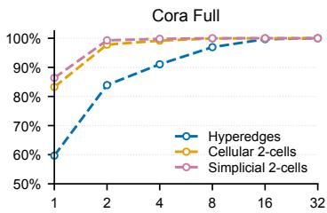

When split-specific batching excludes inactive clusters, structures involving nodes from those clusters cannot be recovered (Appendix C). The per-epoch probability and cumulativerecovery proofs are given in Appendix C.2-C.4. Recovery is cumulative: different structures may be observed across minibatches and epochs, without materializing the complete lifted domain. For models that exchange messages between incident cells, recovering the relevant cells and incidences makes the direct messages available (Appendix C.9-C.11).

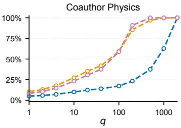  
Figure 2: Structural support recovery as a function of $q .$ Cora Full uses $\begin{array} { r l r } { K } & { { } = } & { 3 2 } \end{array}$ and Coauthor Physics $K = 2 0 0 0$ . Curves show means over ten independent reshuffling runs. See $\mathsf { A p - }$ pendix C.13.1 for more details.

Larger mini-batches expand what can be recovered, while additional epochs provide repeated opportunities. A structure spanning more than $q$ clusters cannot be recovered regardless of the number of epochs. Increasing q can make more structures observable and increase their recovery probabilities. Figure 2 reports the fraction of reference structures whose supporting nodes are jointly sampled within 200 epochs. For cellular references, this does not imply identical local cycle-basis recovery. $\mathbf { A t } \ q \ = \ 4 .$ , this fraction exceeds 99% for both cellular and simplicial 2-cells on Cora Full. On Coauthor Physics at $q \ = \ 1 0 0$ , the corresponding fractions are only 59.3% for cellular and 58.9% for simplicial supports, although each individual reference 2-cell could fit within a minibatch of this size. Fitting within a mini-batch therefore does not ensure that the required clusters are sampled together. Complete neighborhood hyperedges reach only 62.8% recovery even at $q =$ 1 000. Their slower recovery under these partitions is consistent with larger cluster spans: triangles and retained cycles involve three and at most nine nodes, respectively, whereas a neighborhood hyperedge includes its center and all its neighbors. These larger supports can span more clusters, reducing their joint-sampling probability. See Appendix C.3 and C.6 for more details.

Repeated recombination motivates ensemble inference. A single cluster grouping can omit higher-order structures that involve a target node, even when those structures are observable. Independent recombinations provide further opportunities to include their supporting nodes. This motivates averaging predictions from the same trained model over several independently sampled cluster groupings, without materializing the full lifted domain (Sec. 3.2). Ensemble inference achieves a higher mean test metric than single-pass inference in all 21 reported model-dataset comparisons (Table 2). These results support using additional mini-batch inference passes to improve predictive performance while retaining the memory benefits of processing one lifted mini-batch at a time.

## 4 EVALUATION

We evaluate whether batch-before-lift enables larger-scale TNN training and examine its computational costs, predictive performance, and structural recovery through three questions:

Q1: Scalability and computational trade-offs. Can Cluster-TNN enable training of topological models when full-domain construction or model execution exceeds available resources, and how does it affect preprocessing time, peak CPU/GPU memory, training time, and end-to-end runtime?

Q2: Predictive performance. How does Cluster-TNN compare with full-graph execution in predictive performance on the matched benchmarks, and how do higher-order models trained with Cluster-TNN compare with the GCN baseline on Reddit and OGBN Products?

Q3: Structural recovery and design choices. How do mini-batch size and repeated cluster recombination influence structural recovery, and how do partitioning, cross-cluster edge retention, and inference strategy affect predictive performance?

## 4.1 EXPERIMENTAL SETUP

Datasets. We evaluate Cluster-TNN on six node-classification benchmarks spanning diverse appli cation domains, and covering three experimental regimes:

• Controlled full-domain regime includes Questions (Platonov et al., 2023) (48 921 nodes), Amazon Ratings (Platonov et al., 2023) (24 492), and Cora Full (Bojchevski & Günnemann, 2018) (19 793), characterized by low mean degree (6.28-7.60) and limited lifting expansion (≤ 2.60 cellular and ≤ 4.52 simplicial 2-cells/node).

• Intermediate-density regime is represented by Coauthor Physics (Shchur et al., 2019) (34,493 nodes, mean degree 14.38, 13.58 simplicial 2-cells/node).

• Large-scale regime comprises Reddit (Hamilton et al., 2017b) (232 965 nodes) and OGBN Products (Hu et al., 2020) (2 449 029 nodes), both containing approximately 60M edges. These datasets expose complementary scaling regimes: Reddit combines high connectivity (mean degree 491.99) with substantial structural expansion (174.20 cellular and 35 886.67 simplicial 2-cells/node), whereas OGBN Products primarily stresses node capacity at moderate expansion (mean degree 50.52, 13.98 cellular and 253.60 simplicial 2-cells/node).

Models. We compare a graph-based GCN model (Kipf & Welling, 2017) with representative higher-order models from three domains: hypergraph models EDHNN (Wang et al., 2023) and UniGNN (Huang & Yang, 2021), cellular models CWN (Bodnar et al., 2021) and TopoTune (Papillon et al., 2025), and simplicial models SCN (Ebli et al., 2020) and SCCNN (Yang & Isufi, 2023). Following TopoBench’s projected-sum feature lifting (Telyatnikov et al., 2025a), we retain input node features. We sum member-node features for hyperedges and successively sum incident lowerrank features for cellular and simplicial elements (Appendix A.2.1).

Setup. For all Cluster-TNN experiments, we use the same mini-batch lifting workflow across models, removing differences from model-specific batching implementations. We tune the full-graph and partitioned training settings separately and use the same generated random node splits across models and settings1 and report test performance as mean ± standard deviation. The controlled full-domain regime enables direct comparison between full-graph and Cluster-TNN training. For the intermediate-density and large-scale regimes, full-domain execution of at least one higher-order TNN exceeds the available resources. Therefore, we evaluate those regimes using Cluster-TNN training. Appendix B provides a detailed analysis of the resulting resource requirements, including contributions from structural expansion, feature storage, and model-required operators.

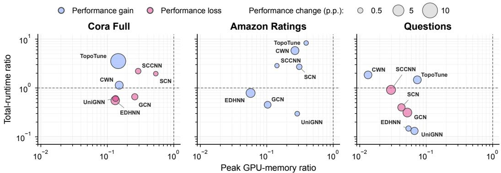  
Figure 3: Cluster-TNN reduces peak GPU memory across all model-dataset pairs. Each circle represents one model, positioned by the mean ratios of Cluster-TNN to full-graph peak GPU memory and total runtime across five seeds. Moving left indicates memory savings, whereas moving down indicates shorter runtime. The lower-left region marks improvements in both measures. Marker size represents the absolute test-performance difference in percentage points, and color distinguishes performance gains from losses. Dashed lines mark parity with full-graph execution.

## 4.2 COMPUTATIONAL EFFICIENCY

To address Q1, we primarily evaluate the memory savings enabled by Cluster-TNN execution, while also reporting its effects on preprocessing cost and total runtime. In the controlled full-domain regime Cluster-TNN reduces run-wide peak GPU memory in all 21 comparisons with full-graph execution, with a mean reduction of 83.2% and a median reduction of 86.7%. Comparison-level reductions range from 46.4% to 98.7%, based on the reported means across five seeds (Figure 3 and Table 8). Furthermore, Figure 5 separates CPU preprocessing peaks from GPU training and evaluation peaks. For CWN on Cora Full, for example, mean peak GPU memory decreases from 24.1 to 3.7 GB (Table 8). A separate experiment with model hyperparameters fixed shows that processing a smaller fraction of clusters per mini-batch, $q / K$ , reduces peak GPU memory during training and validation (Figure 9, Appendix D). Batching can therefore control memory requirements without reducing model size.

Memory savings are particularly important for computationally expensive topological configurations, where full-domain preprocessing can itself exceed practical memory budgets. On Reddit, storing full-graph simplicial features alone is estimated to require 20.3 TB (Table 4). Full-graph preprocessing for TopoTune takes 6 965.2 s and reaches 480.1 GB peak CPU memory (Table 5). With $K = 7 0 0 0$ partitions selected by hyperparameter optimization (Table 14), Cluster-TNN preprocessing takes 500.4 s (Table 6), and run-wide peak CPU memory is 11.81 GB (Table 9).

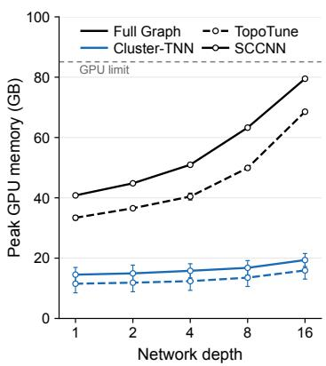  
Figure 4: GPU memory scaling on Cora Full with 512 hidden channels for $K \ : = \ : 6 4$ and $q = 8$ . Peak GPU memory is reported as mean ± standard deviation across five seeds. Network depth counts TopoTune blocks and SCCNN layers.

At a fixed width of 512 hidden channels, peak GPU memory grows substantially more slowly with network depth under Cluster-TNN for both TopoTune and SCCNN (Figure 4). At depth 16, their mean peaks remain below 20 GB, compared with approximately 69–80 GB for full-graph execution, showing that the memory advantage extends to deeper architectures.

Table 1: Test performance under full-graph and Cluster-TNN settings. We report AUROC for Questions and accuracy for all other datasets. Cluster-TNN uses ten-recombination ensemble mini-batch inference, whereas full-graph runs use full-graph inference. Values are mean ± sample standard deviation across five seeds. Boldface indicates best-performing model for each setting.
<table><tr><td rowspan="2">Model</td><td colspan="2">Cora Full</td><td colspan="2">Amazon Ratings</td><td colspan="2">Questions</td><td>Coauthor Physics</td><td>Reddit</td><td>OGBN Products</td></tr><tr><td>Full-graph</td><td>Cluster-TNN</td><td>Full-graph</td><td>Cluster-TNN</td><td>Full-graph</td><td>Cluster-TNN</td><td>Cluster-TNN</td><td></td><td>Cluster-TNN Cluster-TNN</td></tr><tr><td>GCN</td><td>70.18 ± 0.42</td><td> $6 9 . 1 9 \pm 0 . 6 6$ </td><td> $4 8 . 2 9 \pm 1 . 3 1$ </td><td>49.62 ± 0.96</td><td> $7 6 . 6 9 \pm 1 . 1 8$ </td><td> $7 3 . 8 3 \pm 2 . 0 1$ </td><td>96.68 ± 0.08</td><td> ${ \bf 9 2 . 6 2 \pm 0 . 1 0 }$ </td><td> $8 5 . 8 1 \pm 0 . 0 4$ </td></tr><tr><td>EDHNN</td><td> $6 9 . 7 4 \pm 0 . 8 9$ </td><td> $6 7 . 0 6 \pm 1 . 1 9$ </td><td> $4 8 . 4 1 \pm 1 . 1 8$ </td><td> ${ \bf 5 1 . 4 1 \pm 0 . 7 2 }$ </td><td> $7 5 . 7 3 \pm 0 . 9 2$ </td><td> ${ \bf 7 6 . 2 3 \pm 1 . 0 5 }$ </td><td> $9 6 . 3 1 \pm 0 . 3 2$ </td><td> $9 2 . 1 7 \pm 0 . 7 3$ </td><td> $8 6 . 5 1 \pm 0 . 2 5$ </td></tr><tr><td>UniGNN</td><td> $6 8 . 4 4 \pm 0 . 7 9$ </td><td> $6 7 . 6 1 \pm 0 . 5 6$ </td><td> $4 7 . 0 5 \pm 1 . 7 6$ </td><td> $4 7 . 2 4 \pm 0 . 7 0$ </td><td> $6 9 . 4 4 \pm 1 . 6 8$ </td><td> $7 1 . 0 9 \pm 0 . 9 8$ </td><td> $9 4 . 9 7 \pm 0 . 3 7$ </td><td> $9 1 . 2 8 \pm 0 . 1 6$ </td><td> $8 5 . 8 7 \pm 0 . 0 7$ </td></tr><tr><td>CWN</td><td> $6 0 . 5 0 \pm 0 . 6 0$ </td><td> $6 2 . 6 6 \pm 1 . 1 1$ </td><td> $4 4 . 0 7 \pm 0 . 6 4$ </td><td> $4 6 . 2 5 \pm 0 . 6 7$ </td><td> $6 8 . 2 1 \pm 3 . 4 8$ </td><td> $7 0 . 2 0 \pm 0 . 8 8$ </td><td> $9 5 . 8 0 \pm 0 . 2 4$ </td><td> $9 1 . 2 9 \pm 0 . 1 8$ </td><td> $8 3 . 9 3 \pm 0 . 0 6$ </td></tr><tr><td>TopoTune</td><td> $4 6 . 4 0 \pm 0 . 4 7$ </td><td> $5 6 . 4 5 \pm 1 . 4 2$ </td><td> $4 3 . 1 8 \pm 1 . 0 3$ </td><td> $4 3 . 2 7 \pm 0 . 6 8$ </td><td> $7 1 . 5 3 \pm 1 . 7 3$ </td><td> $7 3 . 6 1 \pm 1 . 8 8$ </td><td> $9 5 . 2 2 \pm 0 . 2 0$ </td><td> $8 9 . 5 5 \pm 0 . 0 9$ </td><td> $8 3 . 7 9 \pm 0 . 5 5$ </td></tr><tr><td>SCN</td><td> $7 0 . 4 5 \pm 0 . 3 5$ </td><td> ${ \bf 7 0 . 3 2 \pm 0 . 4 6 }$ </td><td> $5 0 . 0 8 \pm 0 . 3 6$ </td><td> $5 0 . 6 5 \pm 0 . 6 4$ </td><td> $7 4 . 7 7 \pm 1 . 3 4$ </td><td> $7 3 . 0 4 \pm 1 . 8 4$ </td><td> $9 6 . 2 2 \pm 0 . 2 2$ </td><td> $9 1 . 8 0 \pm 0 . 1 3$ </td><td> $8 7 . 0 3 \pm 0 . 0 5$ </td></tr><tr><td>SCCNN</td><td> ${ \bf 7 0 . 8 1 \pm 0 . 5 8 }$ </td><td> $7 0 . 2 0 \pm 0 . 2 9$ </td><td> ${ \bf 5 1 . 2 0 \pm 1 . 1 0 }$ </td><td> $5 1 . 2 4 \pm 0 . 7 9$ </td><td> ${ \bf 7 7 . 1 4 \pm 0 . 9 9 }$ </td><td> $7 4 . 1 0 \pm 1 . 8 5$ </td><td> $9 6 . 0 0 \pm 0 . 2 5$ </td><td> $9 2 . 4 5 \pm 0 . 2 5$ </td><td> ${ \bf 8 8 . 6 3 \pm 0 . 0 5 }$ </td></tr></table>

Across the 21 matched comparisons, preprocessing time decreases in 16, increases in four, and remains unchanged in one. Among 16 reductions, the mean is 53.9% and median 53.1%, including the graph-partitioning cost (Table 6).

For EDHNN on Questions, mean training time decreases from 203.1 to 19.5 s and total runtime from 208.8 to 30.4 s, an 85.4% reduction, while mean test AUROC increases from 75.73 to 76.23 (Tables 1 and 6). Training time, including periodic validation, decreases in 12 of 21 matched comparisons. Total runtime decreases in 11, with a median reduction of 55.6%, and increases in 10, with a median increase of 136.9% (Table 6). For CWN on Cora Full, training time falls by 14.7%, but final evaluation rises from 14.6 to 272.4 s, increasing total runtime by 12.4%. Final evaluation includes ensemble inference over ten independent cluster recombinations, together with batch construction and lifting. Its additional cost can therefore outweigh training-time savings. Appendix B.5.1 defines each runtime component and how percentage changes are aggregated across matched configurations.

## 4.3 FEASIBILITY AND PREDICTIVE PERFORMANCE

Table 1 addresses the feasibility aspect of Q1 and the predictive-performance comparison in Q2. It compares Cluster-TNN and full-graph training to assess whether Cluster-TNN preserves predictive performance while enabling larger-scale training where full-graph execution is not possible.

Across 21 model-dataset pairs for which results are available under both training settings, Cluster-TNN training achieves a higher reported mean of the corresponding test metric in 13 comparisons, while full-graph training performs better in the remaining eight. On Cora Full, partitioned training yields a slightly better result for CWN and a notably better result for TopoTune compared with full-graph training. On Amazon Ratings, partitioned training achieves better results for all seven evaluated models, with particularly pronounced differences for EDHNN and CWN. Similarly, on Questions, partitioned training yields better performance for four of the evaluated models. Across all three datasets, a higher-order TNN achieves the highest mean test metric under both full-graph and partitioned training. These results highlight two observations. First, they demonstrate the potential benefits of higher-order models over the GCN baseline on these datasets. Second, Cluster-TNN achieves higher mean test metrics than full-graph training across multiple model-dataset pairs.

On Coauthor Physics, representing the intermediate-density regime, the six higher-order models achieve mean accuracies of 94.97–96.31%, compared with 96.68% for GCN. Experiments in the large-scale regime further demonstrate the practical advantages of Cluster-TNN. The workflow enables, to our knowledge, the first memory-efficient training of multiple higher-order TNN models on datasets at this scale. On Reddit, we successfully train higher-order TNNs across different domains while achieving accuracies comparable to the GCN baseline. On OGBN Products, SCCNN reaches 88.63% accuracy, compared with 85.81% for GCN. Both hypergraph models and SCN also achieve higher means than GCN, whereas the cellular models do not. These differences motivate comparing higher-order representations across datasets, a task enabled at scale by the common Cluster-TNN workflow. Tables 1, 6, and 9 report predictive results and resource requirements.

Table 2: Partitioning and inference ablations (shaded columns). Partitioner compares METIS with random partitioning, and Edges compares preserving with removing cross-cluster edges. Ensemble and Full-graph compare the respective inference protocols with single-pass mini-batch inference. Entries report mean paired differences in test performance (percentage points) over five seeds.
<table><tr><td></td><td colspan="4">Cora Full</td><td colspan="4">Amazon Ratings</td><td colspan="4">Questions</td></tr><tr><td>Model</td><td>Partitioner</td><td>Edges</td><td></td><td>Ensemble Full-graph</td><td>Partitioner</td><td>Edges</td><td>Ensemble Full-graph</td><td></td><td>Partitioner</td><td>Edges</td><td></td><td>Ensemble Full-graph</td></tr><tr><td>GCN</td><td>+0.98</td><td>+0.08</td><td>+2.51</td><td>+3.44</td><td>+2.24</td><td>+0.25</td><td>+0.05</td><td>+0.08</td><td>+0.52</td><td>+0.99</td><td>+0.65</td><td>+2.71</td></tr><tr><td>EDHNN</td><td>+6.28</td><td>+1.72</td><td>+1.55</td><td>+2.59</td><td>+2.88</td><td>-0.44</td><td>+0.45</td><td>+0.33</td><td>+1.25</td><td>+1.04</td><td>+0.42</td><td>+0.22</td></tr><tr><td>UniGNN</td><td>+6.45</td><td>+0.63</td><td>+0.04</td><td>+0.30</td><td>+2.47</td><td>-0.43</td><td>+0.33</td><td>+0.34</td><td>-1.01</td><td>+1.10</td><td>+1.35</td><td>+0.99</td></tr><tr><td>CWN</td><td>+1.91</td><td>+0.66</td><td>+2.57</td><td>+5.37</td><td>+0.18</td><td>+0.23</td><td>+0.10</td><td>+0.08</td><td>-0.09</td><td>+0.56</td><td>+0.14</td><td>+0.15</td></tr><tr><td>TopoTune</td><td>-3.86</td><td>+10.01</td><td>+4.65</td><td>+4.75</td><td>-2.40</td><td>+0.41</td><td>+1.56</td><td>+0.48</td><td>+1.15</td><td>+1.49</td><td>+0.30</td><td>-0.58</td></tr><tr><td>SCN</td><td>+1.78</td><td>+0.42</td><td>+1.27</td><td>+1.78</td><td>+2.51</td><td>+0.27</td><td>+0.71</td><td>+0.76</td><td>-0.61</td><td>+1.27</td><td>+0.34</td><td>+1.54</td></tr><tr><td>SCCNN</td><td>+5.32</td><td>+0.84</td><td>+1.40</td><td>+2.22</td><td>+2.99</td><td>+0.20</td><td>+0.31</td><td>+0.51</td><td>-0.18</td><td>+1.07</td><td>+1.37</td><td>+2.16</td></tr></table>

## 4.4 ABLATION STUDIES

For Q3, the structural analysis distinguishes structures that can fit in a mini-batch from those whose supporting nodes are jointly sampled within a finite epoch budget (Figure 2 and Appendix C.13.1). Table 2 complements this analysis with predictive ablations of partitioning, cross-cluster edge retention, and inference strategy (Sec. 3.2) on the three controlled benchmarks.

Partitioning method. METIS yields the higher mean test metric in 15 of 21 comparisons, including six of seven models on both Cora Full and Amazon Ratings, but only three on Questions (Table 2). Its predictive advantage therefore depends on the model and dataset. In GNN experiments, random node sampling can outperform Cluster-GCN and full-graph training (Wang et al., 2026).

Cross-cluster edges. Preserving cross-cluster edges yields the higher mean test metric in 19 of 21 comparisons, with the largest difference of 10.01 percentage points for TopoTune on Cora Full. These results support retaining the full induced connectivity among co-sampled clusters.

Inference strategy. Ensemble mini-batch inference yields a higher mean test metric than a single pass in all 21 comparisons, with gains from 0.04 to 4.65 percentage points. Full-graph inference improves on a single pass in 20 comparisons. These results support repeated inference across sam pled contexts without full-domain materialization. These gains require additional inference passes, whose computational cost is included in the runtime comparison for Q1.

## 5 CONCLUSIONS AND DISCUSSION

We introduced Cluster-TNN, a batch-before-lift workflow for graph-supported TDL that constructs higher-order domains and executes TNNs within mini-batches. This work aims to make higherorder learning scalable across domains while reusing existing liftings and architectures. Across 21 matched full-graph comparisons, Cluster-TNN reduces peak GPU memory by 83.2% on average while retaining competitive predictive performance. It also enables training of six higher-order mod els on Reddit and OGBN Products, extending TDL beyond the limits of global domain construction. Our structural analysis characterizes how mini-batch size constrains recoverable structures and how cluster recombination provides further opportunities to encounter them. Ensemble inference also achieves a higher mean test metric than single-pass inference in all 21 controlled comparisons.

Limitations. Structural recovery does not establish equivalence to full-graph predictions or gradients. Its role in the ensemble gains remains unresolved. Repeated lifting and ensemble inference can increase runtime despite lower peak memory. We evaluate selected liftings for graph-supported node classification, without establishing which representation best suits each dataset and model.

Future outlook. Extending to native higher-order data requires batching their given cells and incidence relations. Selective caching could reduce repeated construction, but its storage and recombination trade-offs require evaluation. The changing model rankings across datasets motivate studying lifting and batching jointly, assessing whether broader structural context improves prediction enough to justify its construction and inference costs under fixed memory and end-to-end runtime budgets.

## AUTHOR CONTRIBUTIONS

D.L. and L.B. led the development of the project, including code implementation and the design, execution, and analysis of the final experiments. G.B. and L.T. conceived the initial research idea and coordinated the project. The idea was further developed by D.L., L.B., G.B., and L.T. D.L. and L.B. derived the main theoretical results, with contributions from L.T. L.T. also contributed substantially to the analysis of the final experiments. D.L., L.B., and L.T. jointly led the writing and revision of the manuscript. G.B. made substantial contributions to the experimental work and to the writing and revision of the manuscript. N.M. and O.F. provided infrastructure and project support and contributed to manuscript editing.

## ACKNOWLEDGMENTS

This work grew out of the research activities of the Topological Intelligence team. We thank members of its community for helpful discussions and feedback.

L.B. acknowledges financial support from the European Regional Development Fund for the project ‘Materials for clean energy, advanced sensors and quantum technologies’ (Grant No. PK.1.1.10.0002). G. B. and N. M. acknowledge partial support from NSF grant 2602079, the Noyce foundation, and Arlequin AI.

## REFERENCES

Takuya Akiba, Shotaro Sano, Toshihiko Yanase, Takeru Ohta, and Masanori Koyama. Optuna: A Next-generation Hyperparameter Optimization Framework. In Proceedings of the 25th ACM SIGKDD International Conference on Knowledge Discovery and Data Mining, pp. 2623–2631. Association for Computing Machinery, 2019. doi: 10.1145/3292500.3330701. URL https: //doi.org/10.1145/3292500.3330701.

Guillermo Bernárdez, Marco Montagna, Louis Van Langendonck, Martin Carrasco, Amirreza Akbari, Louisa Cornelis, Mathilde Papillon, Pere Barlet-Ros, Nina Miolane, and Lev Telyatnikov. HOPSE: Scalable Higher-Order Positional and Structural Encoder for Combinatorial Representations, 2025. URL https://arxiv.org/abs/2505.15405.

Cristian Bodnar, Fabrizio Frasca, Nina Otter, Yu Guang Wang, Pietro Liò, Guido Montúfar, and Michael Bronstein. Weisfeiler and Lehman Go Cellular: CW Networks. In Advances in Neural Information Processing Systems, volume 34, pp. 2625–2640, 2021. URL https://proceedings.neurips.cc/paper/2021/hash/ 157792e4abb490f99dbd738483e0d2d4-Abstract.html.

Aleksandar Bojchevski and Stephan Günnemann. Deep Gaussian Embedding of Graphs: Unsupervised Inductive Learning via Ranking. In International Conference on Learning Representations, 2018. URL https://openreview.net/forum?id=r1ZdKJ-0W.

Michael M. Bronstein, Joan Bruna, Taco Cohen, and Petar Velickovi ˇ c. Geometric Deep Learning:´ Grids, Groups, Graphs, Geodesics, and Gauges, 2021. URL https://arxiv.org/abs/ 2104.13478.

Jie Chen, Tengfei Ma, and Cao Xiao. FastGCN: Fast Learning with Graph Convolutional Networks via Importance Sampling. In International Conference on Learning Representations, 2018. URL https://openreview.net/forum?id=rytstxWAW.

Wei-Lin Chiang, Xuanqing Liu, Si Si, Yang Li, Samy Bengio, and Cho-Jui Hsieh. Cluster-GCN: An Efficient Algorithm for Training Deep and Large Graph Convolutional Networks. In Proceedings ofthe 25th ACM SIGKDD International Conference on Knowledge Discovery and Data Mining, pp. 257–266, 2019. doi: 10.1145/3292500.3330925. URL https://doi.org/10.1145/ 3292500.3330925.

Gabriele Corso, Hannes Stark, Stefanie Jegelka, Tommi Jaakkola, and Regina Barzilay. Graph neural networks. Nature Reviews Methods Primers, 4(17), 2024. doi: 10.1038/s43586-024-00294-7. URL https://doi.org/10.1038/s43586-024-00294-7.

Stefania Ebli, Michaël Defferrard, and Gard Spreemann. Simplicial Neural Networks. In NeurIPS 2020 Workshop on Topological Data Analysis and Beyond, 2020. URL https: //openreview.net/forum?id=nPCt39DVIfk.

Justin Gilmer, Samuel S. Schoenholz, Patrick F. Riley, Oriol Vinyals, and George E. Dahl. Neural Message Passing for Quantum Chemistry. In Proceedings of the 34th International Conference on Machine Learning, volume 70 of Proceedings of Machine Learning Research, pp. 1263–1272. PMLR, 06–11 Aug 2017. URL https://proceedings.mlr.press/v70/ gilmer17a.html.

Sravanthi Gurugubelli and Sundeep Prabhakar Chepuri. SaNN: Simple Yet Powerful Simplicialaware Neural Networks. In The Twelfth International Conference on Learning Representations, 2024. URL https://openreview.net/forum?id=eUgS9Ig8JG.

Mustafa Hajij, Ghada Zamzmi, Theodore Papamarkou, Nina Miolane, Aldo Guzmán-Sáenz, Karthikeyan Natesan Ramamurthy, Tolga Birdal, Tamal K. Dey, Soham Mukherjee, Shreyas N. Samaga, Neal Livesay, Robin Walters, Paul Rosen, and Michael T. Schaub. Topological Deep Learning: Going Beyond Graph Data, 2023. URL https://arxiv.org/abs/2206. 00606.

Mustafa Hajij, Mathilde Papillon, Florian Frantzen, Jens Agerberg, Ibrahem AlJabea, Rubén Ballester, Claudio Battiloro, Guillermo Bernárdez, Tolga Birdal, Aiden Brent, Peter Chin, Sergio Escalera, Simone Fiorellino, Odin Hoff Gardaa, Gurusankar Gopalakrishnan, Devendra Govil, Josef Hoppe, Maneel Reddy Karri, Jude Khouja, Manuel Lecha, Neal Livesay, Jan Meißner, Soham Mukherjee, Alexander Nikitin, Theodore Papamarkou, Jaro Prílepok, Karthikeyan Natesan Ramamurthy, Paul Rosen, Aldo Guzmán-Sáenz, Alessandro Salatiello, Shreyas N. Samaga, Simone Scardapane, Michael T. Schaub, Luca Scofano, Indro Spinelli, Lev Telyatnikov, Quang Truong, Robin Walters, Maosheng Yang, Olga Zaghen, Ghada Zamzmi, Ali Zia, and Nina Miolane. TopoX: A Suite of Python Packages for Machine Learning on Topological Domains. Journal ofMachine Learning Research, 25(374):1–8, 2024. URL http://jmlr.org/papers/ v25/24-0110.html.

William L. Hamilton, Rex Ying, and Jure Leskovec. Representation Learning on Graphs: Methods and Applications. IEEE Data Eng. Bull., 40:52–74, 2017a. URL https://api. semanticscholar.org/CorpusID:3215337.

William L. Hamilton, Rex Ying, and Jure Leskovec. Inductive Representation Learning on Large Graphs. In Advances in Neural Information Processing Systems, 2017b. doi: 10.48550/arXiv. 1706.02216. URL https://arxiv.org/abs/1706.02216.

Weihua Hu, Matthias Fey, Marinka Zitnik, Yuxiao Dong, Hongyu Ren, Bowen Liu, Michele Catasta, and Jure Leskovec. Open Graph Benchmark: Datasets for Machine Learning on Graphs. In Advances in Neural Information Processing Systems, volume 33, pp. 22118–22133. Curran Associates, Inc., 2020. URL https://proceedings.neurips.cc/paper\_files/ paper/2020/file/fb60d411a5c5b72b2e7d3527cfc84fd0-Paper.pdf.

Jing Huang and Jie Yang. UniGNN: a Unified Framework for Graph and Hypergraph Neural Networks. In Proceedings of the Thirtieth International Joint Conference on Artificial Intelligence, pp. 2563–2569, 2021. doi: 10.24963/ijcai.2021/353. URL https://www.ijcai.org/ proceedings/2021/353.

George Karypis and Vipin Kumar. A Fast and High Quality Multilevel Scheme for Partitioning Irregular Graphs. SIAM Journal on Scientific Computing, 20(1):359–392, 1998. doi: 10.1137/ S1064827595287997. URL https://doi.org/10.1137/S1064827595287997.

Thomas N. Kipf and Max Welling. Semi-Supervised Classification with Graph Convolutional Networks. In International Conference on Learning Representations, 2017. URL https: //openreview.net/forum?id=SJU4ayYgl.

Fengcheng Lu and Michael Kwok-Po Ng. FastHGNN: A New Sampling Technique for Learning with Hypergraph Neural Networks. ACM Trans. Knowl. Discov. Data, 18(8), July 2024. ISSN 1556-4681. doi: 10.1145/3663670. URL https://doi.org/10.1145/3663670.

Marco Montagna, Simone Scardapane, and Lev Telyatnikov. Topological deep learning with statespace models: A mamba approach for simplicial complexes. In 2025 International Joint Conference on Neural Networks (IJCNN), pp. 1–8. IEEE, 2025.

Marco Montagna, Simone Scardapane, and Lev Telyatnikov. Lift me up: the impact of liftings on hypergraph neural networks. In ICLR 2026 Workshop on Geometry-grounded Representation Learning and Generative Modeling, 2026. URL https://openreview.net/forum?id= uwT8CbsD5J.

Theodore Papamarkou, Tolga Birdal, Michael Bronstein, Gunnar Carlsson, Justin Curry, Yue Gao, Mustafa Hajij, Roland Kwitt, Pietro Liò, Paolo Di Lorenzo, Vasileios Maroulas, Nina Miolane, Farzana Nasrin, Karthikeyan Natesan Ramamurthy, Bastian Rieck, Simone Scardapane, Michael T. Schaub, Petar Velickoviˇ c, Bei Wang, Yusu Wang, Guo-Wei Wei, and Ghada Za-´ mzmi. Position: Topological Deep Learning is the New Frontier for Relational Learning. In Proceedings of the 41st International Conference on Machine Learning, volume 235 of Proceedings of Machine Learning Research, pp. 39529–39555. PMLR, 2024. URL https: //proceedings.mlr.press/v235/papamarkou24a.html.

Mathilde Papillon, Sophia Sanborn, Mustafa Hajij, and Nina Miolane. Architectures of Topological Deep Learning: A Survey of Message-Passing Topological Neural Networks, 2024. URL https://arxiv.org/abs/2304.10031.

Mathilde Papillon, Guillermo Bernárdez, Claudio Battiloro, and Nina Miolane. TopoTune: A Framework for Generalized Combinatorial Complex Neural Networks. In Proceedings of the 42nd International Conference on Machine Learning, volume 267 of Proceedings of Machine Learning Research, pp. 47924–47952. PMLR, 2025. URL https://proceedings.mlr. press/v267/papillon25a.html.

Keith Paton. An Algorithm for Finding a Fundamental Set of Cycles of a Graph. Communications of the ACM, 12(9):514–518, sep 1969. doi: 10.1145/363219.363232. URL https://doi. org/10.1145/363219.363232.

Oleg Platonov, Denis Kuznedelev, Michael Diskin, Artem Babenko, and Liudmila Prokhorenkova. A Critical Look at the Evaluation of GNNs Under Heterophily: Are We Really Making Progress? In The Eleventh International Conference on Learning Representations, 2023. URL https: //openreview.net/forum?id=tJbbQfw-5wv.

Karthikeyan Natesan Ramamurthy, Aldo Guzmán-Sáenz, and Mustafa Hajij. Topo-MLP : A Simplicial Network Without Message Passing, 2023. URL https://arxiv.org/abs/2312. 11862.

Bastian Rieck. Have Graph – Will Lift? The Case for Higher-Order Benchmarks, 2026. URL https://arxiv.org/abs/2605.07397.

Oleksandr Shchur, Maximilian Mumme, Aleksandar Bojchevski, and Stephan Günnemann. Pitfalls of Graph Neural Network Evaluation, 2019. URL https://arxiv.org/abs/1811. 05868.

Lev Telyatnikov, Guillermo Bernardez, Marco Montagna, Mustafa Hajij, Martin Carrasco, Pavlo Vasylenko, Mathilde Papillon, Ghada Zamzmi, Michael T Schaub, Jonas Verhellen, Pavel Snopov, Bertran Miquel-Oliver, Manel Gil-Sorribes, Alexis Molina, Victor Guallar, Theodore Long, Julian Suk, Patryk Rygiel, Alexander V Nikitin, Giordan Escalona, Michael Banf, Dominik Filipiak, Liliya Imasheva, Max Schattauer, Alvaro L. Martinez, Halley Fritze, Marissa Masden, Valentina Sánchez, Manuel Lecha, Andrea Cavallo, Claudio Battiloro, Matthew Piekenbrock, Mauricio Tec, George Dasoulas, Nina Miolane, Simone Scardapane, and Theodore Papamarkou. TopoBench: A Framework for Benchmarking Topological Deep Learning. Journal of Data-centric Machine Learning Research, 2025a. URL https://openreview.net/forum?id=07sTzyEVtY.

Lev Telyatnikov, Maria Sofia Bucarelli, Guillermo Bernardez, Olga Zaghen, Simone Scardapane, and Pietro Lio. Hypergraph Neural Networks through the Lens of Message Passing: A Common Perspective to Homophily and Architecture Design. Transactions on Machine Learning Research, 2025b. ISSN 2835-8856. URL https://openreview.net/forum?id=8rxtL0kZnX.

Clement Wang, Antoine Vialle, Robin Vaysse, and Thomas Bonald. Implicit Regularization of Mini-Batch Training in Graph Neural Networks, 2026. URL https://arxiv.org/abs/2605. 22480.

Peihao Wang, Shenghao Yang, Yunyu Liu, Zhangyang Wang, and Pan Li. Equivariant Hypergraph Diffusion Neural Operators. In The Eleventh International Conference on Learning Representations, 2023. URL https://openreview.net/forum?id=RiTjKoscnNd.

Shuhei Watanabe. Tree-Structured Parzen Estimator: Understanding Its Algorithm Components and Their Roles for Better Empirical Performance. arXiv preprint arXiv:2304.11127, 2023. doi: 10.48550/arXiv.2304.11127. URL https://arxiv.org/abs/2304.11127.

Maosheng Yang and Elvin Isufi. Convolutional Learning on Simplicial Complexes, 2023. URL https://arxiv.org/abs/2301.11163.

Hanqing Zeng, Hongkuan Zhou, Ajitesh Srivastava, Rajgopal Kannan, and Viktor Prasanna. Graph-SAINT: Graph sampling based inductive learning method. In International Conference on Learning Representations, 2020. URL https://openreview.net/forum?id=BJe8pkHFwS.

Reproducibility statement 15   
AI use statement 15   
Ethics statement 15   
Notation guide 15   
A Featured topological domains and lifting maps 15   
A.1 Featured topological domains . 15   
A.2 Lifting maps 16   
A.2.1 Lifting maps used in the experiments 17   
B Practical scalability of graph-supported TDL: bottlenecks and solution paths 18   
B.1 Pipeline view of graph-supported TDL scalability 18   
B.2 Representation growth: from structure to storage 18   
B.2.1 Lifting-specific mechanisms of structural expansion 18   
B.2.2 Benchmark scale regimes and coverage 19   
B.2.3 Static feature-matrix storage 20   
B.3 Full-domain CPU preprocessing: construction time and memory 21   
B.4 Phase-specific memory during preprocessing and TNN execution 22   
B.5 End-to-end cost . 24   
B.5.1 End-to-end runtime 24   
B.5.2 Run-wide peak memory 26   
B.6 Structural exposure and statistical efficiency 28   
B.7 Solution paths and practical guidance 29   
C Structural reconstruction . 30   
C.1 Setup and notation 30   
C.2 Per-epoch recovery probability 31   
C.3 Repeated structural exposure 32   
C.4 Cumulative recovery probability 33   
C.5 Structural coverage convergence 33   
C.6 Repeated-exposure structural coverage 34   
C.7 Mean structural exposure rate 35   
C.8 Exposure epoch distribution 35   
C.9 Direct-incidence message availability . 37   
C.10 Repeated direct-incidence message exposure 38   
C.11 Layerwise incidence aggregation 39   
C.12 Cumulative recovery entropy 40   
C.13 Empirical analysis of structural recovery 41   
C.13.1 Structural recovery across datasets 41   
C.13.2 Recovery across epochs on Cora Full 43   
D Additional results . 44   
E Experimental protocol and hyperparameter optimization 45

## REPRODUCIBILITY STATEMENT

Sections 3.1 and 3.2 describe mini-batch construction, training, and inference. Appendix A.2.1 specifies the evaluated liftings, and Appendix E reports the experimental protocol, hyperparameter search spaces, and selected configurations. Appendix C.13.1 describes the structural-recovery experiments. Experiments were conducted on a Linux machine equipped with dual AMD EPYC 7543 processors, 64 physical CPU cores, 1 TB of system memory, and 8 NVIDIA A100 GPUs, each with 80 GiB of GPU memory. To facilitate reproducibility, we make our code implementation available at https://anonymous.4open.science/r/cluster-tnn-233C/.

## AI USE STATEMENT

In this work, AI assistance was used as a supplementary tool during the research and writing process. Specifically, AI tools were used to polish and improve the clarity, grammar, and organization of the manuscript, identify and locate potentially relevant related work, assist in drafting and restructuring selected sections, and improve the presentation and exposition of some mathematical proofs. All AI-assisted content was reviewed, revised, and verified by the authors, who remain responsible for the accuracy, originality, interpretation, and final presentation of the work. AI tools were not used as a substitute for the authors’ scientific judgment, experimental analysis, or verification of the reported results.

## ETHICS STATEMENT

The work presented in this paper aims to advance the field of Topological Deep Learning. While it may have broader societal implications, we do not identify any that warrant specific discussion here.

## NOTATION GUIDE

The table collects the symbols used across multiple appendix sections. Symbols introduced only inside individual proofs remain local to those proofs.

<table><tr><td>Symbol</td><td>Description</td></tr><tr><td> $\mathcal { G } = ( \mathcal { V } , \mathcal { E } , F _ { \mathcal { V } } , F _ { \mathcal { E } } )$ </td><td>Featured input graph used by the evaluated liftings.</td></tr><tr><td> $\boldsymbol { \mathcal { T } } = ( \boldsymbol { \mathcal { X } } , \boldsymbol { F } )$ </td><td>Featured topological domain.</td></tr><tr><td> $\mathcal { X } _ { r } , F _ { r } , \mathbf { X } _ { r } , d _ { r }$ </td><td>Rank-r elements, feature map, feature matrix, and feature width, respectively.</td></tr><tr><td> $\mathcal { L } , \mathcal { L } _ { S } , \mathcal { L } _ { F }$ </td><td>Complete lifting and its structural and feature components, respectively.</td></tr><tr><td> $\mathbf { B } _ { r , r + 1 } , \mathbf { H }$ </td><td>Incidence matrix between ranks r and  $r + 1$  , and node-hyperedge incidence matrix, respectively.</td></tr><tr><td>K</td><td>Total number of clusters in the fixed graph partition.</td></tr><tr><td> $\Pi = \{ P _ { k } \} _ { k = 1 } ^ { K }$ </td><td>Fixed partition of the graph nodes.</td></tr><tr><td> $q , Z , B , \mathcal { G } _ { B }$ </td><td>q is the number of clusters per mini-batch. Z is a set of cluster indices,  $\begin{array} { r } { \bar { \boldsymbol { B } } = \bigcup _ { k \in Z } P _ { k } } \end{array}$  is the resulting node set, and  $\mathcal { G } _ { B }$  is the graph induced by B.</td></tr></table>

## A FEATURED TOPOLOGICAL DOMAINS AND LIFTING MAPS

We adopt the featured-domain and lifting formalism of TopoBench (Telyatnikov et al., 2025a), restricting the presentation to the objects used in this study. The input to every lifting is a featured graph, and the output is a featured graph, hypergraph, simplicial complex, or cell complex.

## A.1 FEATURED TOPOLOGICAL DOMAINS

Definition 1 (Featured graph). A featured graph is a tuple

$$
\mathcal { G } = ( \mathcal { V } , \mathcal { E } , F _ { \mathcal { V } } , F _ { \mathcal { E } } ) , \qquad F _ { \mathcal { V } } : \mathcal { V } \to \mathbb { R } ^ { d _ { \mathcal { V } } } , \qquad F _ { \mathcal { E } } : \mathcal { E } \to \mathbb { R } ^ { d _ { \mathcal { E } } } .
$$

Here, $( \nu , \mathcal { E } )$ specifies the underlying graph, with V being the set of nodes and E the set of edges. While $F _ { \mathcal { V } }$ and $F _ { \mathcal { E } }$ assign the node and edge features, respectively. We omit $F _ { \mathcal { E } }$ when the edge features are not available.

Topological domains. A topological domain is a discrete representation of a system in terms of its constituent elements and the relations among them. Beyond pairwise graph edges, these relations may connect several nodes or organize elements through containment, incidence, or boundary relations. The term therefore provides a common language for graphs and their higher-order generalizations (Hajij et al., 2023; Papillon et al., 2024; Telyatnikov et al., 2025a).

Higher-order domains. We consider three families of higher-order domains. Hypergraphs represent set-type relations by allowing a hyperedge to connect any number of nodes, without imposing a hierarchy among hyperedges. Simplicial complexes add a strict part-whole hierarchy in which every simplex contains all of its lower-dimensional faces. Cell complexes retain a boundary-based hierarchy but admit non-simplicial cells, including polygonal faces that can represent graph cycles directly (Hajij et al., 2023; Papillon et al., 2024; Telyatnikov et al., 2025a).

Definition 2 (Hypergraph). Let $\mathcal { P } ( \nu )$ denote the power set of a non-empty node set V. A hypergraph on V is a pair $\bar { H } \bar { = } \bar { ( } \mathcal { V } , \mathcal { E } _ { H } )$ , where ${ \mathcal { E } } _ { H } \subseteq { \mathcal { P } } ( \mathcal { V } ) { \big \langle } \{ \emptyset \}$ .

Definition 3 (Simplicial complex). A simplicial complex on a non-empty node set V is a pair $S =$ $( \nu , \mathcal { X } )$ , where ${ \mathcal { X } } \subseteq { \mathcal { P } } ( \gamma ) \setminus \{ { \dot { \varnothing } } \}$ and

$$
\sigma \in { \mathcal { X } } , \quad \varnothing \neq \tau \subseteq \sigma \quad \Longrightarrow \quad \tau \in { \mathcal { X } } .
$$

The elements of X are called simplices.

Definition 4 (Cell complex). A regular cell complex is a topological space S partitioned into cells $\{ x _ { \alpha } \} _ { \alpha \in P _ { S } }$ , where $P _ { S }$ is an index set, such that:

$$
\begin{array} { r } { I . \ S = \bigcup _ { \alpha \in P _ { S } } \operatorname { i n t } ( x _ { \alpha } ) . } \end{array}
$$

2. for every $\alpha \in P _ { S }$ , the interior of $x _ { \alpha }$ is homeomorphic to $\mathbb { R } ^ { n _ { o } }$ for some $n _ { \alpha } \in \mathbb { Z } _ { \ge 0 } ,$ , and $n _ { \alpha }$ is the dimension $o f x _ { \alpha }$

3. the boundary of each cell is a union of finitely many cells of strictly lower dimension.

The experimental liftings instantiate these domains using node neighbourhoods as hyperedges, cliques as simplicial cells, and graph cycles as cellular 2-cells, as detailed in Appendix A.2.1.

Definition 5 (Featured topological domain). Let $\boldsymbol { \mathcal { T } } = ( \boldsymbol { \mathcal { X } } , \boldsymbol { F } )$ , where X is a topological domain, and

$$
F = \{ F _ { r } \} _ { r \geq 0 } , \qquad F _ { r } : \mathcal { X } _ { r } \to \mathbb { R } ^ { d _ { r } }
$$

assignsfeature vectors to its rank-r elements. For hypergraphs thefeature maps instead distinguish nodes and hyperedges.

## A.2 LIFTING MAPS

Definition 6 (Lifting between featured topological domains). Let $\mathcal { T } _ { \mathrm { s r c } } = ( \mathcal { X } _ { \mathrm { s r c } } , F _ { \mathrm { s r c } } )$ be thefeatured source domain and $\bar { \mathcal { T } } _ { \mathrm { t g t } } = ( \mathcal { X } _ { \mathrm { t g t } } , F _ { \mathrm { t g t } } )$ the featured target domain. A lifting $\mathcal { L } : \mathcal { T } _ { \mathrm { s r c } }  \mathcal { T } _ { \mathrm { t g t } }$ consists of a structural map $\mathcal { L } _ { S }$ and a feature map $\mathcal { L } _ { F } .$

$$
\begin{array} { r } { \chi _ { \mathrm { t g t } } = \mathcal { L } _ { S } ( \mathcal { X } _ { \mathrm { s r c } } , F _ { \mathrm { s r c } } ) , \qquad F _ { \mathrm { t g t } } = \mathcal { L } _ { F } ( \mathcal { X } _ { \mathrm { s r c } } , F _ { \mathrm { s r c } } ) , \qquad \mathcal { L } ( \mathcal { T } _ { \mathrm { s r c } } ) = \mathcal { T } _ { \mathrm { t g t } } . } \end{array}\tag{1}
$$

The structural map constructs the elements and incidence relations of $\mathcal { X } _ { \mathrm { t g t } }$ , while the feature map transfers or constructs theirfeatures $F _ { \mathrm { t g t } }$

This definition follows the lifting formalism of TopoBench (Telyatnikov et al., 2025a). In our experiments, $\mathcal { T } _ { \mathrm { s r c } }$ is a featured graph and $\mathcal { T } _ { \mathrm { t g t } }$ is the representation required by the model. For example, the clique-complex lifting constructs simplicial cells from graph cliques and assigns features to the resulting elements. All structural liftings used in this study derive the target domain from graph connectivity.

For $B \subseteq \nu$ , the featured graph provided to a mini-batch lifting is

$$
\begin{array} { r } { \mathcal G _ { B } = \left( B , \mathcal E _ { B } , F \nu | _ { B } , F \varepsilon | _ { \mathcal E _ { B } } \right) , \qquad \mathcal E _ { B } = \{ ( u , v ) \in \mathcal E : u , v \in B \} , } \end{array}
$$

with the edge-feature term omitted when unavailable. During mini-batch training and inference, the workflow constructs ${ \mathcal { L } } ( { \mathcal { G } } _ { B } )$ directly without first materializing ${ \mathcal { L } } ( { \mathcal { G } } )$

## A.2.1 LIFTING MAPS USED IN THE EXPERIMENTS

The experiments instantiate each lifting on a featured graph $\mathcal { G } = ( \mathcal { V } , \mathcal { E } , F _ { \mathcal { V } } , F _ { \mathcal { E } } )$ . We first specify its structural component $\mathcal { L } _ { S }$ . The identity lifting preserves the input features, whereas the higherorder liftings use a common feature map that assigns features to the constructed elements. Each construction applies to either the full graph or an induced mini-batch graph, with $\mathcal { G } _ { B }$ substituted for G. The lifting-specific scale parameters and their experimental values are stated below.

Identity graph lifting. The identity lifting preserves the graph and its features,

$$
{ \mathcal { L } } _ { \mathrm { i d } } ( { \mathcal { G } } ) = { \mathcal { G } } .
$$

We use it with GCN.

k-hop neighbourhood hypergraph lifting. The k-hop lifting assigns a hyperedge to the closed k-hop neighbourhood of each node (Telyatnikov et al., 2025a). For an integer $k \geq 1$ and a node $v \in \nu$ , define

$$
N _ { \mathcal { G } } ^ { ( k ) } [ v ] = \{ u \in \mathcal { V } : \mathrm { d i s t } _ { \mathcal { G } } ( u , v ) \leq k \} ,
$$

where $\mathrm { d i s t } _ { \mathscr G }$ denotes shortest-path distance in ${ \mathcal { G } } .$ . The resulting node-indexed hyperedge family and structural lifting are

$$
{ \mathcal E } _ { H } ^ { ( k ) } = \left( e _ { v } \right) _ { v \in \mathcal { V } } , \qquad e _ { v } = N _ { \mathcal { G } } ^ { ( k ) } [ v ] , \qquad { \mathcal L } _ { S , k } ^ { \mathrm { h y p e r g r a p h } } ( \mathcal { G } ) = \left( \mathcal { V } , \mathcal { E } _ { H } ^ { ( k ) } \right) .
$$

The center-node index is retained, so the implementation creates exactly one incidence-matrix column per node even when two indexed hyperedges have identical memberships. The parameter k determines the graph radius represented by each hyperedge. We set $k = 1$ and use this lifting with EDHNN and UniGNN.

Cycle-basis cell lifting. Cycle-based cellular liftings attach 2-cells along selected graph $\mathrm { c y - }$ cles (Bodnar et al., 2021; Telyatnikov et al., 2025a). Let $B ( { \mathcal { G } } )$ denote a fundamental cycle basis obtained using Paton’s algorithm (Paton, 1969). For a maximum cycle length $\ell _ { \mathrm { m a x } }$ , we retain

$$
\mathcal { B } _ { \le \ell _ { \mathrm { m a x } } } ( \mathcal { G } ) = \{ c \in \mathcal { B } ( \mathcal { G } ) : | c | \le \ell _ { \mathrm { m a x } } \} .
$$

Attaching one 2-cell along each retained cycle gives

$$
\begin{array} { r } { \mathcal { L } _ { S , \ell _ { \mathrm { m a x } } } ^ { \mathrm { c e l l } } ( \mathcal { G } ) = ( \mathcal { C } _ { 0 } , \mathcal { C } _ { 1 } , \mathcal { C } _ { 2 } ) , \qquad \mathcal { C } _ { 0 } = \mathcal { V } , \qquad \mathcal { C } _ { 1 } = \mathcal { E } , \qquad \mathcal { C } _ { 2 } = \mathcal { B } _ { \le \ell _ { \mathrm { m a x } } } ( \mathcal { G } ) . } \end{array}
$$

We set $\ell _ { \mathrm { m a x } } = 9$ and use this lifting with CWN and TopoTune.

Clique-complex lifting. The clique-complex lifting maps every clique of size $r + 1$ to an $r \mathrm { - }$ simplex (Bodnar et al., 2021; Telyatnikov et al., 2025a). For a maximum simplex dimension $d _ { \operatorname* { m a x } } ,$ define the truncated clique complex

$$
\mathrm { C l } _ { \le d _ { \operatorname* { m a x } } } ( \mathcal { G } ) = \{ \emptyset \neq \sigma \subseteq \mathcal { V } : | \sigma | \le d _ { \operatorname* { m a x } } + 1 , ( u , v ) \in \mathcal { E } \mathrm { ~ f o r ~ a l l ~ d i s t i n c t } u , v \in \sigma \}
$$

The corresponding structural lifting is

$$
\mathcal { L } _ { S , d _ { \operatorname* { m a x } } } ^ { \mathrm { s i m p l i c i a l } } ( \mathcal { G } ) = ( \mathcal { V } , \mathrm { C l } _ { \le d _ { \operatorname* { m a x } } } ( \mathcal { G } ) ) .
$$

We set $d _ { \operatorname* { m a x } } = 2$ , yielding nodes, edges, and filled triangles. We use this lifting with SCN and SCCNN.

Feature lifting. The preceding maps specify the structural component $\mathcal { L } _ { S }$ of each lifting. In the experiments, the common feature component $\mathcal { L } _ { F }$ retains existing features and constructs missing higher-rank features by summing over incident lower-rank elements (Telyatnikov et al., 2025a). For a ranked domain, let $\mathbf { B } _ { r , r + 1 }$ be the incidence matrix between rank-r and rank-(r + 1) elements. The feature assignment from $\mathbf { X } _ { r }$ to ${ \mathbf { X } } _ { r + 1 }$ is

$$
\mathbf { X } _ { r + 1 } = \left| \mathbf { B } _ { r , r + 1 } \right| ^ { \mathsf { T } } \mathbf { X } _ { r } .
$$

The absolute value removes orientation signs, and the operation is applied successively across ranks. For a hypergraph with node-hyperedge incidence matrix H, the corresponding assignment is ${ \bf { X } } _ { H } =$ $| \mathbf { H } | ^ { \mathsf { T } } \mathbf { X } _ { 0 } ^ { \mathsf { \bar { T } } }$ , where $\mathbf { X } _ { 0 }$ is the input node-feature matrix. Each new element therefore receives the sum of the features on its incident source elements. The feature assignment does not alter the structure produced by $\mathcal { L } _ { S }$

## B PRACTICAL SCALABILITY OF GRAPH-SUPPORTED TDL: BOTTLENECKS AND SOLUTION PATHS

## B.1 PIPELINE VIEW OF GRAPH-SUPPORTED TDL SCALABILITY

The scalability of graph-supported TDL depends on the entire computational pipeline, not only on the TNN architecture. The input graph must first be lifted by identifying higher-order structures and constructing their feature matrices and connectivity operators. In the evaluated implementation, the constructed representation is held in CPU memory and transferred to the GPU as needed for training or inference. A bottleneck at any one of these stages can make an otherwise efficient architecture impractical.

Where these costs occur depends on the execution regime. Full-domain execution constructs the topology and lifts features once during preprocessing, then reuses the complete lifted representation throughout training and evaluation. Cluster-TNN instead partitions the graph during preprocessing and reconstructs and lifts individual induced graph mini-batches during training and inference. This shift trades full-domain storage for repeated local construction and therefore changes preprocessing, execution time, and memory jointly. Both regimes use the same parameterized lifting procedure and structural restrictions. Applying that procedure to induced subgraphs, however, need not produce the restriction of the full-domain lift.

We use the notation introduced in Appendix A. For a lifting $\mathcal { L } = ( \mathcal { L } _ { S } , \mathcal { L } _ { F } )$ , the stored representation depends on the number of generated elements $| { \mathcal { X } } _ { r } | ,$ , the number of entries in its incidence or neighbourhood operators, and the feature width $d _ { r }$ at each rank. The structural counts in Table 3 determine the number of feature rows. The feature widths convert those row counts into the storage estimates in Table 4. Table 5 distinguishes models that request different operators from the same lifted domain.

## B.2 REPRESENTATION GROWTH: FROM STRUCTURE TO STORAGE

Structural expansion and feature storage are related but distinct. We first explain how liftings create higher-order structures and represent their connectivity (Sec. B.2.1). We then compare the structural characteristics of the benchmarks and their lifted domains (Sec. B.2.2). Finally, we combine these structural counts with feature dimensions to estimate feature-matrix storage (Sec. B.2.3).

## B.2.1 LIFTING-SPECIFIC MECHANISMS OF STRUCTURAL EXPANSION

Different liftings can produce very different numbers of higher-order structures from the same graph. The connectivity information also varies, including node memberships in hyperedges and the edges forming cell boundaries. We illustrate these sources of growth using the neighbourhood-hypergraph, cycle-based cellular, and clique-complex liftings used in our experiments, which are TopoBench’s default graph mappings to the corresponding domains.

Neighbourhood-hypergraph lifting. For the evaluated k = 1 neighbourhood-hypergraph lifting, each node defines one indexed hyperedge containing its closed one-hop neighbourhood. The number of hyperedges is therefore exactly |V| for every dataset and provides no additional distinction beyond the node count. Connectivity nevertheless determines the incidence size. Across all neighbourhood hyperedges, the lifting stores $| \nu | + 2 | \mathcal { E } |$ node-hyperedge memberships, corresponding to an average hyperedge size of $1 + 2 | \mathcal { E } | / | \dot { \mathcal { V } } |$

Cycle-based cellular lifting. The cycle-based cellular lifting first computes a fundamental cycle basis and retains cycles of length at most $\ell _ { \mathrm { m a x } } = 9$ , attaching one cellular 2-cell along every retained cycle. Each retained cycle contributes one 2-cell and one nonzero entry in the edge-cell incidence matrix for each edge on its boundary. Its storage requirements therefore depend on both the number and lengths of the retained cycles. The retained cycle basis can also change when the lifting is recomputed on an induced subgraph, as discussed in Appendix ${ \mathrm { C } } . 1 3 . { ^ 2 }$

Clique-complex lifting. The clique-complex lifting fills every graph triangle with a simplicial 2- cell. Triangle-rich graphs can therefore produce far more 2-cells than input nodes or edges. In the stored representation, each generated 2-cell contributes one feature-vector row and three nonzero entries to the edge-cell incidence matrix, one for each boundary edge.

## B.2.2 BENCHMARK SCALE REGIMES AND COVERAGE

Table 3 reports the numbers of input nodes and edges, together with the numbers of 2-cells generated by the cellular and simplicial liftings.3 Mean node degree, calculated as $2 | \mathcal { E } | / | \nu |$ , describes how many neighbours an input node has on average. It distinguishes graphs with similar edge counts but substantially different node counts.

For each lifting, the Per node column divides the total number of generated 2-cells by the numbe of input nodes. This shows how large the generated 2-cell set is relative to the original node set. The absolute counts describe the size of the lifted domain, while these ratios allow us to compare structural expansion across graphs of different sizes. They are ratios of total counts, not counts of the cells incident to an average node.

Table 3: Structural characteristics of the input graphs and their lifted domains. The edge column counts each undirected relation once, and mean node degree is derived as $2 | \mathcal { E } | / | \nu |$ . Per-node values are the corresponding 2-cell counts divided by the number of input nodes. Cellular 2-cells are retained basis cycles of length at most nine, whereas simplicial 2-cells are filled graph triangles.
<table><tr><td rowspan="2">Dataset</td><td colspan="3">Input graph</td><td colspan="2">Cellular 2-cells</td><td colspan="2">Simplicial 2-cells</td></tr><tr><td>Nodes</td><td>Edges</td><td>Mean node degree</td><td>Count</td><td>Per node</td><td>Count</td><td>Per node</td></tr><tr><td>Questions</td><td>48 921</td><td>153 540</td><td>6.28</td><td>24405</td><td>0.50</td><td>110 209</td><td>2.25</td></tr><tr><td>Amazon Ratings</td><td>24492</td><td>93 050</td><td>7.60</td><td>63 667</td><td>2.60</td><td>110765</td><td>4.52</td></tr><tr><td>Cora Full</td><td>19793</td><td>63421</td><td>6.41</td><td>24306</td><td>1.23</td><td>48 386</td><td>2.44</td></tr><tr><td>Coauthor Physics</td><td>34493</td><td>247962</td><td>14.38</td><td>102152</td><td>2.96</td><td>468 550</td><td>13.58</td></tr><tr><td>Reddit</td><td>232 965</td><td>57 307 946</td><td>491.99</td><td>40 582 059</td><td>174.20</td><td>8 360 338 411</td><td>35886.67</td></tr><tr><td>OGBN Products</td><td>2449 029</td><td>61 859 140</td><td>50.52</td><td>34 226 557</td><td>13.98</td><td>621 082120</td><td>253.60</td></tr></table>

Input and lifted scale regimes. Questions, Amazon Ratings, and Cora Full have mean node degrees between 6.28 and 7.60. Coauthor Physics reaches 14.38 and produces 13.58 simplicial 2-cells per node, placing it between the smaller controlled benchmarks and the two scalability-oriented cases.

Reddit and OGBN Products expose complementary scalability regimes. OGBN Products contains approximately 10.5× more nodes, yet the two graphs have comparable edge counts. Reddit consequently has a mean node degree of 491.99, compared with 50.52 for OGBN Products. The higherorder constructions also differ in their expansion. Reddit contains 174.20 cellular and 35886.67 simplicial 2-cells per node, whereas OGBN Products contains 13.98 and 253.60, respectively. These datasets therefore contrast greater higher-order expansion per node with a substantially larger input node count at comparable edge counts.

Why the benchmarks are complementary. The same progression gives the datasets complementary experimental roles. Questions, Amazon Ratings, and Cora Full support controlled comparisons between full-domain and Cluster-TNN partitioned execution because every evaluated lifting can be constructed on the complete graph. Coauthor Physics represents an intermediate case in which a moderate node count already produces substantially greater higher-order expansion. Reddit and OGBN Products extend the suite to graphs with tens of millions of edges and contrasting node counts. Together, these datasets support controlled comparisons with full-domain execution and allow us to examine how graph size, connectivity, and lifting-induced structural expansion affect computational cost.

The benchmarks also cover distinct application domains and relation semantics. Questions and Reddit represent online interactions, although Questions connects users through question-answer activity and Reddit connects posts through shared commenters (Platonov et al., 2023; Hamilton et al., 2017b). Cora Full and Coauthor Physics represent scientific-information networks through citation and coauthorship relations (Bojchevski & Günnemann, 2018; Shchur et al., 2019). Amazon Ratings and OGBN Products represent product co-purchasing networks at different scales (Platonov et al., 2023; Hu et al., 2020). Together, these datasets expose the pipeline to graph structures generated by different relational processes while keeping the downstream task fixed as node classification.

## B.2.3 STATIC FEATURE-MATRIX STORAGE

Here, static feature-matrix storage denotes the persistent rank-wise input feature matrices of the full lifted domain. It excludes incidence tensors, derived operators, temporary construction objects, activations, gradients, and optimizer state.

Feature width provides a further source of variation across the benchmarks. Cora Full and Coauthor Physics have input widths of 8 710 and 8 415, respectively, compared with 602 for Reddit and 100 for OGBN Products. Their wider features increase storage per generated element, so a smaller graph need not have a proportionally smaller feature-storage requirement.

The memory required for the rank-wise feature matrices follows directly from the structural counts. At rank r, the feature matrix contains $| \mathcal { X } _ { r } |$ rows and $d _ { r }$ values per row. We assume single-precision floating-point storage (float32), which requires four bytes per value. Storing the feature matrices through rank two therefore requires

$$
M _ { \mathrm { { f e a t u r e s } } } = 4 \left( | { \mathcal { X } } _ { 0 } | d _ { 0 } + | { \mathcal { X } } _ { 1 } | d _ { 1 } + | { \mathcal { X } } _ { 2 } | d _ { 2 } \right) { \mathrm { b y t e s } } .\tag{2}
$$

For these estimates, each generated element receives a feature vector with the dataset’s input feature width, consistent with the feature assignment described in Appendix A.2.1. For cellular and simplicial domains, this gives $d _ { 0 } = d _ { 1 } = d _ { 2 }$ and $M _ { \mathrm { f e a t u r e s } } = 4 \dot { d _ { 0 } } \dot { \sum } _ { r } | \mathcal { X } _ { r } |$ |. For hypergraphs, we count the node and hyperedge feature matrices. Table 4 uses the structural counts in Table 3. Other numerical precisions may be appropriate depending on the features and numerical requirements. For unchanged matrix dimensions, storage scales directly with the number of bytes per value. These estimates account only for input feature matrices, not total preprocessing or training memory.

For OGBN Products, substituting $d _ { 0 } = d _ { 1 } = d _ { 2 } = 1 0 0$ and the structural counts from Table 3 into Eq. (2) gives 39.414 GB for the cellular feature matrices and 274.156 GB for the simplicial feature matrices.

For Reddit, the cellular calculation is explicit:

$$
\begin{array} { r } { M _ { \mathrm { f e a t u r e s } } ^ { \mathrm { c e l l } } = 4 \times 6 0 2 \times \left( 2 3 2 9 6 5 + 5 7 3 0 7 9 4 6 + 4 0 5 8 2 0 5 9 \right) } \\ { = 2 3 6 2 8 0 1 1 1 7 6 0 \ : \mathrm { b y t e s } \approx 2 3 6 . 2 8 0 \ : \mathrm { G B } . } \end{array}\tag{3}
$$

Replacing the cycle-cell count with Reddit’s 8.36B simplicial 2-cells in the same calculation gives the 20.270 TB simplicial estimate reported in Table 4. Thus, before adding sparse incidence tensors or any neural-network state, the feature matrices alone can require hundreds of gigabytes for the

Table 4: Estimated memory required to store the float32 input feature matrices of each full-domain lifting. Values use the input feature dimension of each dataset. Observed preprocessing memory is reported in Table 5.
<table><tr><td>Dataset</td><td>Input width  $d _ { 0 }$ </td><td>k = 1 hypergraph</td><td>Cycle cell complex</td><td>Clique simplicial complex</td></tr><tr><td>Questions</td><td>301</td><td>0.118 GB</td><td>0.273 GB</td><td>0.376 GB</td></tr><tr><td>Amazon Ratings</td><td>300</td><td>0.059 GB</td><td>0.217 GB</td><td>0.274 GB</td></tr><tr><td>Cora Full</td><td>8710</td><td>1.379 GB</td><td>3.746 GB</td><td>4.585 GB</td></tr><tr><td>Coauthor Physics</td><td>8415</td><td>2.322 GB</td><td>12.946 GB</td><td>25.279 GB</td></tr><tr><td>Reddit</td><td>602</td><td>1.122 GB</td><td>236.280 GB</td><td>20.270 TB</td></tr><tr><td>OGBN Products</td><td>100</td><td>1.959 GB</td><td>39.414 GB</td><td>274.156 GB</td></tr></table>

cellular lifting and tens of terabytes for the simplicial lifting. This estimate results from storing a 602-dimensional float32 feature vector for every node, edge, and generated higher-order element.

## B.3 FULL-DOMAIN CPU PREPROCESSING: CONSTRUCTION TIME AND MEMORY

The analytical estimate above accounts only for persistent rank-wise feature matrices. The evaluated implementation stores incidence relations sparsely and constructs only the additional operators requested by a model.4 Cellular models may derive adjacency or Laplacian operators from cell incidences, while simplicial models may derive Laplacians from simplicial incidences. Full-domain preprocessing can therefore hold incidence matrices, derived operators, temporary construction objects, and implementation overhead in memory at the same time. We measure peak CPU memory as the largest resident-set size (RSS) sampled for the main Python process during full-domain preprocessing. It should be interpreted as the largest sampled resident-memory footprint of the main process, rather than as the size of any single tensor. Sampling may miss short-lived peaks and does not include memory held exclusively by child processes. Table 5 reports the available measurements for the evaluated dataset-lifting-model configurations.

Table 5: Available full-graph preprocessing time and peak CPU memory measurements for the evaluated dataset-lifting-model configurations. Models are distinguished because they may request different operators from the same lifted domain. Values are reported as the mean ± standard deviation across five runs. Memory usage is reported in decimal GB.
<table><tr><td>Dataset</td><td>Lifting</td><td>Model</td><td>Additional operators</td><td>Preprocessing time (s)</td><td>Peak CPU memory (GB)</td></tr><tr><td>Amazon Ratings</td><td>k = 1 neighbourhood</td><td>EDHNN</td><td>None beyond the node-hyperedge incidence</td><td> $0 . 4 2 \pm 0 . 0 7$ </td><td> $1 . 0 0 \pm 0 . 0 1$ </td></tr><tr><td>Amazon Ratings</td><td>hypergraph k = 1 neighbourhood</td><td>UniGNN</td><td>None beyond the node-hyperedge incidence</td><td> $0 . 3 9 \pm 0 . 0 2$ </td><td> $1 . 0 1 \pm 0 . 0 1$ </td></tr><tr><td>Amazon Ratings</td><td>hypergraph Cycle-basis cell</td><td>CWN</td><td>Rank-1 upper adjacency</td><td> $5 . 7 \pm 0 . 2$ </td><td> $1 . 3 8 \pm 0 . 0 0$ </td></tr><tr><td>Amazon Ratings</td><td>Cycle-basis cell</td><td>TopoTune</td><td>Rank-1 and two-hop rank-0 upper adjacencies</td><td> $8 . 5 \pm 0 . 2$ </td><td> $1 . 3 9 \pm 0 . 0 2$ </td></tr><tr><td>Amazon Ratings</td><td>Dimension-2 clique complex</td><td>SCN</td><td>None beyond the rank-1 and rank-2 incidences</td><td> $4 . 3 \pm 0 . 3$ </td><td> $1 . 4 4 \pm 0 . 0 0$ </td></tr><tr><td>Amazon Ratings</td><td>Dimension-2 clique complex</td><td>SCCNN</td><td>None beyond the rank-1 and rank-2 incidences</td><td> $4 . 3 \pm 0 . 3$ </td><td> $1 . 4 4 \pm 0 . 0 0$ </td></tr><tr><td>Questions</td><td>k = 1 neighbourhood hypergraph</td><td>EDHNN</td><td>None beyond the node-hyperedge incidence</td><td> $0 . 6 3 \pm 0 . 0 9$ </td><td> $1 . 0 9 \pm 0 . 0 2$ </td></tr><tr><td>Questions</td><td>k = 1 neighbourhood</td><td>UniGNN</td><td>None beyond the node-hyperedge incidence</td><td> $0 . 6 1 \pm 0 . 0 5$ </td><td> $1 . 1 0 \pm 0 . 0 3$ </td></tr><tr><td>Questions</td><td>hypergraph Cycle-basis cell</td><td>CWN</td><td>Rank-1 upper adjacency</td><td> $6 . 1 \pm 0 . 1$ </td><td> $1 . 5 2 \pm 0 . 0 8$ </td></tr><tr><td>Questions</td><td>Cycle-basis cell</td><td>TopoTune</td><td>Rank-1 and two-hop rank-0 upper adjacencies</td><td> $7 . 3 \pm 0 . 4$ </td><td> $1 . 5 1 \pm 0 . 0 7$ </td></tr><tr><td>Questions</td><td>Dimension-2 clique complex</td><td>SCN</td><td>None beyond the rank-1 and rank-2 incidences</td><td> $6 . 2 \pm 0 . 3$ </td><td> $1 . 6 7 \pm 0 . 0 3$ </td></tr><tr><td>Questions</td><td>Dimension-2 clique complex</td><td>SCCNN</td><td>None beyond the rank-1 and rank-2 incidences</td><td> $6 . 2 \pm 0 . 4$ </td><td> $1 . 6 5 \pm 0 . 0 6$ </td></tr><tr><td>Cora Full</td><td>k = 1 neighbourhood</td><td>EDHNN</td><td>None beyond the node-hyperedge incidence</td><td> $3 . 3 \pm 0 . 1$ </td><td> $2 . 9 8 \pm 0 . 0 0$ </td></tr><tr><td>Cora Full</td><td>hypergraph k = 1 neighbourhood</td><td>UniGNN</td><td>None beyond the node-hyperedge incidence</td><td> $3 . 4 \pm 0 . 1$ </td><td> $2 . 9 8 \pm 0 . 0 0$ </td></tr><tr><td>Cora Full</td><td>hypergraph Cycle-basis cell</td><td>CWN</td><td>Rank-1 upper adjacency</td><td> $1 2 . 7 \pm 1 . 5$ </td><td> $6 . 1 4 \pm 0 . 0 1$ </td></tr><tr><td>Cora Full</td><td>Cycle-basis cell</td><td>TopoTune</td><td>Rank-1 and two-hop rank-0 upper adjacencies</td><td> $1 3 . 6 \pm 0 . 7$ </td><td> $6 . 1 4 \pm 0 . 0 1$ </td></tr><tr><td>Cora Full</td><td>Dimension-2 clique</td><td>SCN</td><td>None beyond the rank-1 and rank-2</td><td> $1 3 . 7 \pm 0 . 7$ </td><td>7.28 ± 0.01</td></tr><tr><td>Cora Full</td><td>complex Dimension-2 clique</td><td>SCCNN</td><td>incidences None beyond the rank-1 and rank-2</td><td> $1 4 . 8 \pm 3 . 3$ </td><td> $7 . 2 8 \pm 0 . 0 1$ </td></tr><tr><td>Coauthor Physics</td><td>complex k = 1 neighbourhood</td><td>EDHNN</td><td>incidences None beyond the node-hyperedge incidence</td><td> $6 . 2 \pm 0 . 7$ </td><td> $4 . 4 8 \pm 0 . 0 1$ </td></tr><tr><td>Coauthor Physics</td><td>hypergraph k = 1 neighbourhood</td><td>UniGNN</td><td>None beyond the node-hyperedge incidence</td><td> $6 . 5 \pm 0 . 8$ </td><td>4.48 ± 0.01</td></tr><tr><td>Coauthor Physics</td><td>hypergraph Cycle-basis cell</td><td>CWN</td><td>Rank-1 upper adjacency</td><td>51.0 ± 9.3</td><td>19.79 ± 0.01</td></tr><tr><td>Coauthor Physics</td><td>Cycle-basis cell</td><td>TopoTune</td><td>Rank-1 and two-hop rank-0 upper</td><td> $5 5 . 3 \pm 7 . 0$ </td><td> $1 9 . 7 9 \pm 0 . 0 1$ </td></tr><tr><td>Coauthor Physics</td><td>Dimension-2 clique</td><td>SCN</td><td>adjacencies None beyond the rank-1 and rank-2</td><td> $7 5 . 9 \pm 5 . 6$ </td><td> $4 2 . 4 2 \pm 0 . 0 2$ </td></tr><tr><td>Coauthor Physics</td><td>complex Dimension-2 clique</td><td>SCCNN</td><td>incidences None beyond the rank-1 and rank-2</td><td> $7 7 . 3 \pm 5 . 3$ </td><td> $4 2 . 4 2 \pm 0 . 0 1$ </td></tr><tr><td>Reddit</td><td>complex k = 1 neighbourhood</td><td>EDHNN</td><td>incidences None beyond the node-hyperedge incidence</td><td> $1 3 7 . 7 \pm 7 . 6$ </td><td> $2 0 . 7 7 \pm 0 . 0 8$ </td></tr><tr><td>Reddit</td><td>hypergraph k = 1 neighbourhood</td><td>UniGNN</td><td>None beyond the node-hyperedge incidence</td><td>136.9 ± 6.9</td><td>20.79 ± 0.12</td></tr><tr><td>Reddit</td><td>hypergraph Cycle-basis cell</td><td>CWN</td><td>Rank-1 upper adjacency</td><td>4684.8 ± 304.8</td><td></td></tr><tr><td>Reddit</td><td>Cycle-basis cell</td><td>TopoTune</td><td>Rank-1 and two-hop rank-0 upper</td><td>6965.2 ± 682.4</td><td>479.96 ± 0.12 480.06 ± 0.01</td></tr><tr><td>Reddit</td><td>Dimension-2 clique</td><td>SCN</td><td>adjacencies None beyond the rank-1 and rank-2</td><td>OOM</td><td>OOM</td></tr><tr><td>Reddit</td><td>complex Dimension-2 clique</td><td>SCCNN</td><td>incidences None beyond the rank-1 and rank-2</td><td>OOM</td><td>OOM</td></tr></table>

For OGBN Products, the higher-order structures can be constructed, but retaining their complete feature matrices exceeds the available CPU RAM in the affected full-graph configurations. Even if this preprocessing bottleneck were overcome, full-graph training is expected to exceed the available GPU memory. We therefore report partitioned results with Cluster-TNN, while omitting incomplete full-graph preprocessing measurements from Table 5.

Reddit full-domain bottlenecks. For Reddit, Eq. (3) predicts 236.280 GB for the cellular feature matrices alone, before accounting for incidence matrices, model-requested operators, and temporary allocations. Across five runs, CWN preprocessing takes 4684.8 ± 304.8 s and reaches a peak CPU memory usage of 479.96 ± 0.12 GB.

Storing the full Reddit simplicial input feature matrices at the original feature width in float32 would require an estimated 20.270 TB (Table 4).

## B.4 PHASE-SPECIFIC MEMORY DURING PREPROCESSING AND TNN EXECUTION

The following paired analyses focus on Questions, Amazon Ratings, and Cora Full, the three controlled benchmarks with complete full-graph and Cluster-TNN measurements across all seven evaluated models. Together, they provide 21 matched model-dataset comparisons. Each execution setting uses its independently selected hyperparameters, as reported in Appendix E. These comparisons therefore characterize the resource requirements and predictive performance of the tuned configurations.

Successfully constructing a lifted full domain does not imply that the complete representation can be processed by a TNN in one optimization step. A TNN layer may update several ranks and retain intermediate messages for backpropagation. For example, an edge representation can receive separate messages from incident nodes and 2-cells. These intermediate tensors add to the GPU memory required by the input features and connectivity operators.

Figure 5 places preprocessing CPU-memory peaks alongside training and evaluation GPU-memory peaks for all seven evaluated models, complementing the joint memory-runtime comparison in Figure 3.

For the depth-scaling experiment in Figure 4, peak reserved GPU memory is measured over five seeds, with each run lasting three epochs. This experiment uses 512 hidden channels, K = 64, and q = 8.

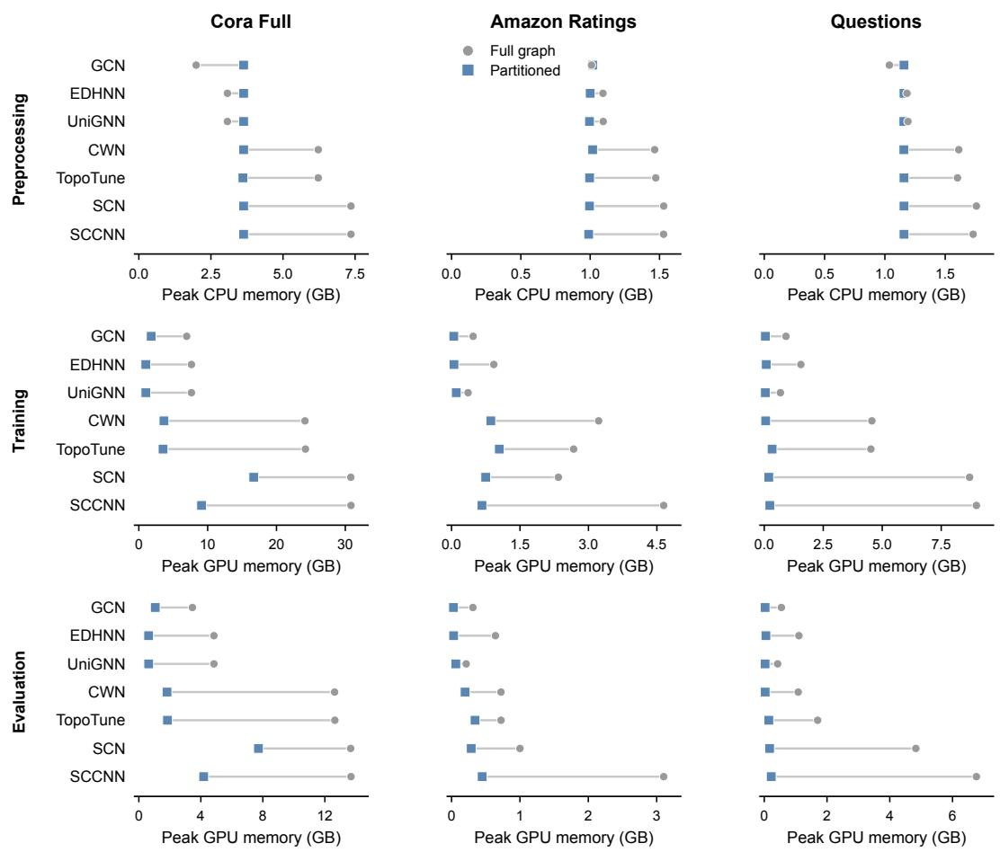  
Figure 5: Cluster-TNN consistently reduces peak GPU memory during training and evaluation, whereas preprocessing memory varies by configuration and can increase when partition construction exceeds the cost of full-graph lifting. Values are means across five seeds.

Across the displayed comparisons, Cluster-TNN execution lowers peak GPU memory during both training and evaluation, whereas preprocessing CPU memory varies by configuration. These phasespecific measurements locate where memory pressure occurs. The next subsection reports elapsed time and peak CPU and GPU memory over a complete run.

## B.5 END-TO-END COST

End-to-end scalability has two distinct empirical dimensions: elapsed time across workflow phases and the peak CPU and GPU memory reached anywhere during a run. We report them separately because Cluster-TNN execution can reduce peak memory while increasing repeated lifting, validation, or inference time.

## B.5.1 END-TO-END RUNTIME

An end-to-end comparison must account for when each method incurs its costs. Full-domain execution constructs the lifted domain once before training, whereas Cluster-TNN constructs the graph partition once and lifts mini-batches repeatedly. Table 6 reports preprocessing, training including validation passes, final validation and test inference, and total runtime for the 21 matched modeldataset comparisons, together with partitioned-only results on Coauthor Physics, Reddit, and OGBN Products. Table 5 reports the separate full-domain preprocessing measurements.

Table 6: End-to-end runtime in seconds under full-graph and Cluster-TNN settings. Preprocessing, training, and final evaluation are reported separately. Training is the complete fit call, including periodic validation. Final evaluation spans the end of fitting through checkpoint validation and test inference. Total is the sum of these non-overlapping components. For Cluster-TNN inference, we use the ensemble protocol and average predictions over ten cluster recombinations. Values are mean ± sample standard deviation in seconds across five seeds.
<table><tr><td rowspan="2">Dataset</td><td rowspan="2">Model</td><td rowspan="2">Setting</td><td rowspan="2">K</td><td rowspan="2">q</td><td rowspan="2">Preprocessing</td><td rowspan="2">Train</td><td rowspan="2">Final evaluation</td><td rowspan="2">Total</td></tr><tr><td></td></tr><tr><td rowspan="12">Cora Full</td><td>GCN</td><td>Full-graph</td><td></td><td></td><td>4.0 ± 2.5</td><td>222.3 ± 57.4</td><td>3.4 ± 0.2</td><td>229.7 ± 57.5</td></tr><tr><td></td><td>Cluster-TNN</td><td>32</td><td>8</td><td>11.2 ± 1.1</td><td>83.7 ± 8.8</td><td>47.2 ± 0.5</td><td>142.1 ± 8.8</td></tr><tr><td>EDHNN</td><td>Full-graph</td><td></td><td>2</td><td>8.0 ± 0.8</td><td>438.7 ± 114.3</td><td>7.2 ± 0.3</td><td>453.9 ± 113.8</td></tr><tr><td></td><td>Cluster-TNN</td><td>32</td><td>4</td><td>11.2 ± 1.1</td><td>180.5 ± 40.3</td><td>48.7 ± 0.9</td><td>240.3 ± 40.4</td></tr><tr><td>UniGNN</td><td>Full-graph</td><td></td><td>一</td><td>8.4 ± 0.6</td><td>343.8 ± 71.9</td><td>7.1 ± 0.1</td><td>359.3 ± 71.8</td></tr><tr><td></td><td>Cluster-TNN</td><td>32</td><td>4</td><td>11.2 ± 1.1</td><td>150.7 ± 21.9</td><td>50.4 ± 1.0</td><td>212.2 ± 22.3</td></tr><tr><td>CWN</td><td>Full-graph</td><td></td><td>，</td><td>18.7 ± 1.8</td><td>909.6 ± 117.6</td><td>14.6 ± 0.5</td><td>942.8 ± 118.9</td></tr><tr><td></td><td>Cluster-TNN</td><td>32</td><td>4</td><td>11.2 ± 1.1</td><td>776.2 ± 134.2</td><td>272.4 ± 8.9</td><td>1059.8 ± 135.7</td></tr><tr><td>TopoTune</td><td>Full-graph</td><td></td><td>-</td><td>19.4 ± 1.4</td><td>401.1 ± 53.1</td><td>14.4 ± 0.4</td><td>434.9 ± 51.9</td></tr><tr><td></td><td>Cluster-TNN</td><td>64</td><td>8</td><td>11.4 ± 2.0</td><td>1211.6 ± 316.8</td><td>312.7 ± 10.6</td><td>1535.8 ± 309.1</td></tr><tr><td>SCN</td><td>Full-graph</td><td></td><td></td><td>22.0 ± 4.2</td><td>473.5 ± 97.5</td><td>17.0 ± 0.9</td><td>512.5 ± 100.7</td></tr><tr><td rowspan="3">SCCNN</td><td>Cluster-TNN</td><td>32</td><td>16</td><td>11.2 ± 1.1</td><td>562.9 ± 37.0</td><td>405.2 ± 25.6</td><td>979.3 ± 38.4</td></tr><tr><td></td><td>Full-graph</td><td>- 1</td><td>21.6 ± 0.9</td><td>458.9 ± 22.7</td><td>17.3 ± 0.8</td><td>497.9 ± 22.6</td></tr><tr><td></td><td>Cluster-TNN</td><td>32</td><td>8</td><td>11.2 ± 1.1</td><td>627.1 ± 118.0</td><td>455.6 ± 64.4</td><td>1093.9 ± 173.4</td></tr><tr><td rowspan="20">Amazon Ratings</td><td>GCN</td><td>Full-graph</td><td></td><td>-</td><td>2.6 ± 0.8</td><td>81.3 ± 16.6</td><td>1.3 ± 0.2</td><td>85.2 ± 15.8</td></tr><tr><td>EDHNN</td><td>Cluster-TNN</td><td>64</td><td>4</td><td>2.6 ± 0.9</td><td>29.0 ± 8.7</td><td>6.2 ± 0.4</td><td>37.8 ± 8.9</td></tr><tr><td></td><td>Full-graph</td><td></td><td>1</td><td>3.4 ± 0.3</td><td>143.9 ± 40.5</td><td>1.5 ± 0.1</td><td>148.8 ± 40.3</td></tr><tr><td>UniGNN</td><td>Cluster-TNN</td><td>128</td><td>4</td><td>1.8 ± 0.1</td><td>100.5 ± 23.0</td><td>12.9 ± 2.7</td><td>115.3 ± 24.6</td></tr><tr><td></td><td>Full-graph</td><td></td><td>= 8</td><td>3.5 ± 0.2</td><td>119.7 ± 54.2</td><td>1.6 ± 0.0</td><td>124.8 ± 54.1</td></tr><tr><td>CWN</td><td>Cluster-TNN Full-graph</td><td>32</td><td></td><td>1.8 ± 0.2</td><td>26.8 ± 6.8</td><td>6.0 ± 0.2 2.3 ± 0.1</td><td>34.7 ± 6.9</td></tr><tr><td></td><td>Cluster-TNN</td><td>-</td><td>= 16</td><td>10.6 ± 1.6</td><td>150.7 ± 19.5</td><td></td><td>163.5 ± 19.2</td></tr><tr><td>TopoTune</td><td></td><td>64</td><td></td><td>2.6 ± 0.9</td><td>849.4 ± 112.4</td><td>84.0 ± 8.9</td><td>936.1 ± 105.9</td></tr><tr><td></td><td>Full-graph</td><td></td><td>-</td><td>13.4 ± 1.3</td><td>68.3 ± 11.9</td><td>2.4 ± 0.2</td><td>84.1 ± 12.4</td></tr><tr><td>SCN</td><td>Cluster-TNN</td><td>32</td><td>8</td><td>1.8 ± 0.2</td><td>561.2 ± 108.0</td><td>120.7 ± 10.3</td><td>683.7 ± 112.1</td></tr><tr><td></td><td>Full-graph</td><td></td><td>-</td><td>7.6 ± 0.3</td><td>240.0 ± 41.4</td><td>2.4 ± 0.1</td><td>250.0 ± 41.5</td></tr><tr><td>SCCNN</td><td>Cluster-TNN</td><td>32</td><td>8</td><td>1.8 ± 0.2</td><td>572.4 ± 180.9</td><td>61.2 ± 3.2</td><td>635.4 ± 180.0</td></tr><tr><td></td><td>Full-graph</td><td></td><td>一</td><td>7.7 ± 0.3</td><td>209.5 ± 47.8</td><td>2.3 ± 0.1</td><td>219.5 ± 47.8</td></tr><tr><td></td><td>Cluster-TNN</td><td>32</td><td>4</td><td>1.8 ± 0.2</td><td>525.1 ± 89.3</td><td>76.4 ± 5.2</td><td>603.3 ± 93.8</td></tr><tr><td rowspan="20">Questions</td><td>GCN</td><td>Full-graph</td><td></td><td></td><td>4.6 ± 2.1</td><td>164.5 ± 29.2</td><td>1.3 ± 0.1</td><td>170.4 ± 28.9</td></tr><tr><td></td><td>Cluster-TNN</td><td>500</td><td>20</td><td>3.8 ± 0.4</td><td>42.0 ± 8.9</td><td>7.0 ± 0.1</td><td>52.9 ± 9.1</td></tr><tr><td>EDHNN</td><td>Full-graph</td><td></td><td></td><td>4.0 ± 0.5</td><td>203.1 ± 42.2</td><td>1.7 ± 0.1</td><td>208.8 ± 42.4</td></tr><tr><td></td><td>Cluster-TNN</td><td>500</td><td>50</td><td>3.8 ± 0.4</td><td>19.5 ± 4.7</td><td>7.1 ± 0.2</td><td>30.4 ± 5.0</td></tr><tr><td>UniGNN</td><td>Full-graph</td><td></td><td></td><td>3.8 ± 0.3</td><td>260.0 ± 10.0</td><td>1.7 ± 0.1</td><td>265.5 ± 10.2</td></tr><tr><td></td><td>Cluster-TNN</td><td>1000</td><td>40</td><td>4.2 ± 0.1</td><td>23.2 ± 11.6</td><td>7.3 ± 0.2</td><td>34.8 ± 11.6</td></tr><tr><td>CWN</td><td>Full-graph</td><td></td><td></td><td>9.8 ± 0.4</td><td>68.4 ± 23.6</td><td>2.5 ± 0.1</td><td>80.7 ± 23.8</td></tr><tr><td></td><td>Cluster-TNN</td><td>1000</td><td>40</td><td>4.2 ± 0.1</td><td>116.4 ± 31.1</td><td>22.8 ± 0.4</td><td>143.4 ± 30.9</td></tr><tr><td>TopoTune</td><td>Full-graph</td><td></td><td></td><td>12.1 ± 1.9</td><td>170.3 ± 21.6</td><td>2.8 ± 0.2</td><td>185.2 ± 20.8</td></tr><tr><td>SCN</td><td>Cluster-TNN</td><td>500</td><td>50</td><td>3.8 ± 0.4</td><td>226.6 ± 61.0</td><td>32.9 ± 1.0</td><td>263.4 ± 61.0</td></tr><tr><td></td><td>Full-graph</td><td></td><td>1</td><td>10.2 ± 0.3</td><td>378.6 ± 119.1</td><td>2.8 ± 0.1</td><td>391.6 ± 119.1</td></tr><tr><td>SCCNN</td><td>Cluster-TNN</td><td>500</td><td>50</td><td>3.8 ± 0.4</td><td>107.6 ± 9.8</td><td>30.6 ± 1.5</td><td>142.0 ± 11.2</td></tr><tr><td></td><td>Full-graph</td><td></td><td></td><td>10.2 ± 0.5</td><td>131.8 ± 14.5</td><td>2.9 ± 0.2</td><td>144.9 ± 14.7</td></tr><tr><td></td><td>Cluster-TNN</td><td>500</td><td>30</td><td>3.8 ± 0.4</td><td>91.5 ± 9.9</td><td>36.1 ± 1.5</td><td>131.5 ± 10.5</td></tr></table>

Continued on next page

<table><tr><td>Dataset</td><td>Model</td><td>Setting</td><td>K</td><td>q</td><td>Preprocessing</td><td>Train</td><td>Final evaluation</td><td>Total</td></tr><tr><td rowspan="7">Coauthor Physics</td><td>GCN</td><td>Cluster-TNN</td><td>500</td><td>20</td><td> $1 0 . 4 \pm 1 . 1$ </td><td> $1 2 6 . 2 \pm 5 2 . 2$ </td><td> $9 1 . 4 \pm 1 . 4$ </td><td> $2 2 8 . 1 \pm 5 1 . 4$ </td></tr><tr><td>EDHNN</td><td>Cluster-TNN</td><td>2000</td><td>30</td><td> $1 1 . 2 \pm 0 . 1$ </td><td> $2 8 4 . 2 \pm 5 6 . 8$ </td><td> $5 5 . 3 \pm 9 . 1$ </td><td> $3 5 0 . 6 \pm 6 1 . 6$ </td></tr><tr><td>UniGNN</td><td>Cluster-TNN</td><td>2000</td><td>20</td><td> $1 1 . 2 \pm 0 . 1$ </td><td> $2 5 8 . 4 \pm 5 2 . 6$ </td><td> $4 2 . 9 \pm 2 . 2$ </td><td> $3 1 2 . 5 \pm 5 2 . 7$ </td></tr><tr><td>CWN</td><td>Cluster-TNN</td><td>2000</td><td>20</td><td> $1 1 . 2 \pm 0 . 1$ </td><td> $3 1 6 . 7 \pm 1 1 4 . 0$ </td><td> $8 0 . 3 \pm 6 . 6$ </td><td> $4 0 8 . 2 \pm 1 1 0 . 9$ </td></tr><tr><td>TopoTune</td><td>Cluster-TNN</td><td>2000</td><td>20</td><td> $1 1 . 2 \pm 0 . 1$ </td><td> $2 6 3 . 4 \pm 3 8 . 4$ </td><td> $8 6 . 3 \pm 6 . 3$ </td><td> $3 6 0 . 9 \pm 3 2 . 9$ </td></tr><tr><td>SCN</td><td>Cluster-TNN</td><td>2000</td><td>20</td><td> $1 1 . 2 \pm 0 . 1$ </td><td> $3 3 9 . 0 \pm 1 1 3 . 2$ </td><td> $9 6 . 8 \pm 7 . 0$ </td><td> $4 4 7 . 0 \pm 1 1 1 . 2$ </td></tr><tr><td>SCCNN</td><td>Cluster-TNN</td><td>2000</td><td>20</td><td> $1 1 . 2 \pm 0 . 1$ </td><td> $5 9 9 . 8 \pm 2 1 5 . 2$ </td><td> $1 6 1 . 3 \pm 1 7 . 6$ </td><td> $7 7 2 . 2 \pm 2 1 1 . 1$ </td></tr><tr><td rowspan="7">Reddit</td><td>GCN</td><td>Cluster-TNN</td><td>7000</td><td>25</td><td> $5 0 0 . 4 \pm 3 . 7$ </td><td> $4 4 9 . 7 \pm 6 1 . 9$ </td><td> $1 0 6 . 3 \pm 3 . 1$ </td><td> $1 0 5 6 \pm 6 2$ </td></tr><tr><td>EDHNN</td><td>Cluster-TNN</td><td>7000</td><td>20</td><td> $5 0 0 . 4 \pm 3 . 7$ </td><td> $1 1 6 5 \pm 2 5 5$ </td><td> $1 7 0 . 8 \pm 4 . 6$ </td><td> $1 8 3 6 \pm 2 5 3$ </td></tr><tr><td>UniGNN</td><td>Cluster-TNN</td><td>7000</td><td>25</td><td> $5 0 0 . 4 \pm 3 . 7$ </td><td> $9 6 7 . 1 \pm 2 0 8 . 2$ </td><td> $1 1 6 . 8 \pm 3 . 4$ </td><td> $1 5 8 4 \pm 2 0 2$ </td></tr><tr><td>CWN</td><td>Cluster-TNN</td><td>7000</td><td>20</td><td> $5 0 0 . 4 \pm 3 . 7$ </td><td> $2 7 1 4 8 \pm 1 7 0 3$ </td><td> $1 6 5 9 \pm 2 6$ </td><td> $2 9 3 0 7 \pm 1 7 0 3$ </td></tr><tr><td>TopoTune</td><td>Cluster-TNN</td><td>7000</td><td>20</td><td> $5 0 0 . 4 \pm 3 . 7$ </td><td> $1 8 6 9 6 \pm 2 8 3 4$ </td><td> $2 6 1 7 \pm 3 5$ </td><td> $2 1 8 1 3 \pm 2 8 5 8$ </td></tr><tr><td>SCN</td><td>Cluster-TNN</td><td>7000</td><td>25</td><td> $5 0 0 . 4 \pm 3 . 7$ </td><td> $2 6 8 9 7 \pm 9 8 1$ </td><td> $4 3 4 2 \pm 9 5$ </td><td> $3 1 7 3 9 \pm 9 5 0$ </td></tr><tr><td>SCCNN</td><td>Cluster-TNN</td><td>7000</td><td>20</td><td> $5 0 0 . 4 \pm 3 . 7$ </td><td> $2 8 5 7 1 \pm 8 7 1 4$ </td><td> $5 1 4 5 \pm 1 2 8$ </td><td> $3 4 2 1 7 \pm 8 6 5 9$ </td></tr><tr><td rowspan="7">OGBN Products</td><td>GCN</td><td>Cluster-TNN</td><td>15000</td><td>25</td><td> $2 4 5 . 2 \pm 5 . 6$ </td><td> $3 6 6 5 \pm 1 5 3$ </td><td> $2 7 2 9 \pm 2 4$ </td><td> $6 6 3 9 \pm 1 6 1$ </td></tr><tr><td>EDHNN</td><td>Cluster-TNN</td><td>20 000</td><td>25</td><td> $2 6 3 . 7 \pm 3 . 5$ </td><td> $4 1 6 9 \pm 1 0 1 9$ </td><td> $3 2 2 9 \pm 1 8$ </td><td> $7 6 6 2 \pm 1 0 1 0$ </td></tr><tr><td>UniGNN</td><td>Cluster-TNN</td><td>15000</td><td>20</td><td> $2 4 5 . 2 \pm 5 . 6$ </td><td> $5 1 7 0 \pm 1 9 5$ </td><td> $2 6 9 1 \pm 1 0$ </td><td> $8 1 0 6 \pm 2 0 2$ </td></tr><tr><td>CWN</td><td>Cluster-TNN</td><td>15000</td><td>20</td><td> $2 4 5 . 2 \pm 5 . 6$ </td><td> $2 3 4 3 8 9 \pm 1 9 9 7$ </td><td> $1 7 0 5 7 \pm 1 4 0$ </td><td> $2 5 1 6 9 1 \pm 2 0 4 2$ </td></tr><tr><td>TopoTune</td><td>Cluster-TNN</td><td>15000</td><td>25</td><td> $2 4 5 . 2 \pm 5 . 6$ </td><td> $2 0 7 7 1 1 \pm 6 3 8 9 2$ </td><td> $2 5 2 1 5 \pm 3 9 8$ </td><td> $2 3 3 1 7 2 \pm 6 3 5 3 0$ </td></tr><tr><td>SCN</td><td>Cluster-TNN</td><td>15000</td><td>20</td><td> $2 4 5 . 2 \pm 5 . 6$ </td><td> $2 7 5 9 5 5 \pm 3 7 8 1$ </td><td> $2 3 4 0 5 \pm 1 1 0 6$ </td><td> $2 9 9 6 0 5 \pm 3 2 8 7$ </td></tr><tr><td>SCCNN</td><td>Cluster-TNN</td><td>15000</td><td>20</td><td> $2 4 5 . 2 \pm 5 . 6$ </td><td> $3 4 5 1 7 6 \pm 3 3 9 2$ </td><td> $1 9 8 5 1 \pm 4 9 1$ </td><td> $3 6 5 2 7 2 \pm 3 4 0 7$ </td></tr></table>

For configuration i, let $\bar { t } _ { i } ^ { \mathrm { F G } }$ and $\bar { t } _ { i } ^ { \mathrm { P } }$ denote the mean total runtimes under full-graph and partitioned execution reported in Table 6. Its relative change is $\Delta _ { i } = ( \bar { t } _ { i } ^ { \mathrm { P } } - \bar { t } _ { i } ^ { \mathrm { F G } } ) / \bar { t } _ { i } ^ { \mathrm { F G } } \times \bar { 1 } 0 0 \%$ , with negative values indicating reductions. We calculate changes in individual runtime components analogously. The reported means and medians give each configuration equal weight within the relevant subset.

The preprocessing component is shorter under Cluster-TNN partitioned execution in 16 comparisons, longer in four, and unchanged in one. Among the 16 decreases, the mean and median reductions are 53.9% and 53.1%. Among the four increases, the mean and median increases are 66.0% and 36.7%. These partitioned preprocessing measurements include the one-off graph-partitioning cost. Training time is lower in 12 comparisons by 60.2% on average (median 63.3%) and higher in nine by 203.9% on average (median 138.5%). Mean total runtime is lower for all matched GCN and hypergraph configurations, higher for all cellular configurations, and lower for simplicial configurations only on Questions. This pattern describes the evaluated configurations rather than an intrinsic runtime ordering of the domains.

To complement these comparison-level summaries, Table 7 pools mean total runtimes within each subset. For a set of matched configurations I, the pooled relative change is

$$
\Delta _ { \mathrm { p o o l e d } } ( \mathbb { Z } ) = \frac { \sum _ { i \in \mathcal { T } } \bar { t } _ { i } ^ { \mathrm { P } } - \sum _ { i \in \mathcal { Z } } \bar { t } _ { i } ^ { \mathrm { F G } } } { \sum _ { i \in \mathcal { T } } \bar { t } _ { i } ^ { \mathrm { F G } } } \times 1 0 0 \%
$$

This aggregate weights each configuration’s relative change by its full-graph runtime. Across the matched benchmark suite, the additional runtime of slower configurations outweighs the savings of faster configurations. It describes the evaluated suite’s combined runtime rather than the change fo a typical configuration.

Table 7: Pooled total-runtime changes calculated from the configuration-level means in Table 6. Each sum combines the five-seed mean total runtime of the configurations in the indicated subset. Subsets are defined by the direction of the total-runtime change. Partitioned-only configurations are excluded.
<table><tr><td>Subset</td><td>Count</td><td>Full-graph sum (s)</td><td>Cluster-TNN sum (s)</td><td>Pooled change</td></tr><tr><td>Shorter partitioned runtime</td><td>11</td><td>2582.9</td><td>1174.0</td><td>-54.5%</td></tr><tr><td>Longer partitioned runtime</td><td>10</td><td>3371.1</td><td>7934.1</td><td>+135.4%</td></tr><tr><td>All matched configurations</td><td>21</td><td>5954.0</td><td>9108.1</td><td>+53.0%</td></tr></table>

CWN on Cora Full illustrates why training time and total runtime must be distinguished. Under partitioned execution, mean training time, including periodic validation, decreases from 909.6 to 776.2 seconds, a reduction of $1 4 . 7 \%$ . However, final evaluation increases from 14.6 to 272.4 seconds, resulting in a 12.4% increase in total runtime. In this configuration, the additional evaluation cost outweighs the training-time reduction.

Across the 21 matched comparisons, final evaluation is longer under partitioned execution in every case, with a median partitioned-to-full-graph time ratio of 11.75×. These measurements include checkpoint validation and test inference, using ten-recombination ensemble mini-batch inference for Cluster-TNN. This measured difference includes both repeated evaluation and batch-construction costs. It is not an intrinsic lower bound for partitioned inference.

Validation caching convention. In these experiments, we do not cache lifted validation batches. We reconstruct and lift each validation batch online. We include validation-batch construction costs in the training component for validation during fitting and in the final-evaluation component for checkpoint validation. Final evaluation includes checkpoint validation and test inference.

## B.5.2 RUN-WIDE PEAK MEMORY

Unlike Table 5, which isolates full-domain preprocessing, Table 8 and 9 report peak CPU and GPU memory over the complete execution of each full-graph and Cluster-TNN run. CPU memory is the maximum sampled RSS of the main Python process, while GPU memory is the maximum CUDA memory allocated by the process.

Table 8: Run-wide peak CPU and GPU memory under full-graph and Cluster-TNN execution. Values are mean ± sample standard deviation in decimal GB across five seeds. CPU values are mainprocess RSS peaks. GPU values are CUDA allocated-memory peaks.
<table><tr><td colspan="4"></td><td colspan="2">Full-graph</td><td colspan="2">Cluster-TNN</td></tr><tr><td>Dataset</td><td>Model</td><td>K</td><td>q</td><td>Peak CPU memory (GB)</td><td>Peak GPU memory (GB)</td><td>Peak CPU memory (GB)</td><td>Peak GPU memory (GB)</td></tr><tr><td rowspan="7">Cora Full</td><td>GCN</td><td>32</td><td>8</td><td> $2 . 9 6 \pm 0 . 0 1$ </td><td> $6 . 9 5 \pm 0 . 0 0$ </td><td> $3 . 6 4 \pm 0 . 0 3$ </td><td> $1 . 8 0 \pm 0 . 0 1$ </td></tr><tr><td>EDHNN</td><td>32</td><td>4</td><td> $3 . 6 8 \pm 0 . 0 2$ </td><td> $7 . 6 5 \pm 0 . 0 0$ </td><td> $3 . 6 4 \pm 0 . 0 3$ </td><td> $1 . 0 1 \pm 0 . 0 0$ </td></tr><tr><td>UniGNN</td><td>32</td><td>4</td><td> $3 . 7 1 \pm 0 . 0 1$ </td><td> $7 . 6 5 \pm 0 . 0 0$ </td><td> $3 . 6 4 \pm 0 . 0 3$ </td><td> $1 . 0 2 \pm 0 . 0 0$ </td></tr><tr><td>CWN</td><td>32</td><td>4</td><td> $7 . 6 3 \pm 0 . 0 1$ </td><td> $2 4 . 1 4 \pm 0 . 0 0$ </td><td> $3 . 8 9 \pm 0 . 0 7$ </td><td> $3 . 6 5 \pm 0 . 0 9$ </td></tr><tr><td>TopoTune</td><td>64</td><td>8</td><td> $7 . 6 1 \pm 0 . 0 3$ </td><td> $2 4 . 2 1 \pm 0 . 0 0$ </td><td> $3 . 9 8 \pm 0 . 1 2$ </td><td> $3 . 5 3 \pm 0 . 0 9$ </td></tr><tr><td>SCN</td><td>32</td><td>16</td><td> $8 . 4 7 \pm 0 . 0 2$ </td><td> $3 0 . 6 1 \pm 0 . 0 0$ </td><td> $8 . 3 3 \pm 0 . 0 6$ </td><td> $1 6 . 4 2 \pm 0 . 2 3$ </td></tr><tr><td>SCCNN</td><td>32</td><td>8</td><td> $8 . 4 7 \pm 0 . 0 3$ </td><td> $3 0 . 6 2 \pm 0 . 0 0$ </td><td> $5 . 7 4 \pm 0 . 0 5$ </td><td> $8 . 9 2 \pm 0 . 2 6$ </td></tr><tr><td rowspan="7">Amazon Ratings</td><td>GCN</td><td>64</td><td>4</td><td> $1 . 6 0 \pm 0 . 0 1$ </td><td> $0 . 4 7 \pm 0 . 0 0$ </td><td> $1 . 6 6 \pm 0 . 0 1$ </td><td> $0 . 0 5 \pm 0 . 0 0$ </td></tr><tr><td>EDHNN</td><td>128</td><td>4</td><td> $1 . 6 6 \pm 0 . 0 1$ </td><td> $0 . 9 3 \pm 0 . 0 0$ </td><td> $1 . 6 8 \pm 0 . 0 1$ </td><td> $0 . 0 5 \pm 0 . 0 0$ </td></tr><tr><td>UniGNN</td><td>32</td><td>8</td><td> $1 . 6 6 \pm 0 . 0 1$ </td><td> $0 . 3 6 \pm 0 . 0 0$ </td><td> $1 . 7 2 \pm 0 . 0 2$ </td><td> $0 . 1 0 \pm 0 . 0 0$ </td></tr><tr><td>CWN</td><td>64</td><td>16</td><td> $2 . 0 1 \pm 0 . 0 1$ </td><td> $3 . 2 2 \pm 0 . 0 0$ </td><td> $2 . 0 0 \pm 0 . 0 2$ </td><td> $0 . 8 6 \pm 0 . 0 1$ </td></tr><tr><td>TopoTune</td><td>32</td><td>8</td><td> $2 . 0 3 \pm 0 . 0 2$ </td><td> $2 . 6 8 \pm 0 . 0 0$ </td><td> $2 . 1 9 \pm 0 . 0 1$ </td><td> $1 . 0 5 \pm 0 . 0 1$ </td></tr><tr><td>SCN</td><td>32</td><td>8</td><td> $2 . 1 1 \pm 0 . 0 0$ </td><td> $2 . 1 0 \pm 0 . 0 0$ </td><td> $2 . 0 6 \pm 0 . 0 4$ </td><td> $0 . 6 5 \pm 0 . 0 0$ </td></tr><tr><td>SCCNN</td><td>32</td><td>4</td><td> $2 . 1 3 \pm 0 . 0 1$ </td><td> $4 . 3 8 \pm 0 . 0 0$ </td><td> $2 . 1 6 \pm 0 . 0 2$ </td><td> $0 . 6 2 \pm 0 . 0 0$ </td></tr><tr><td rowspan="7">Questions</td><td>GCN</td><td>500</td><td>20</td><td> $1 . 7 0 \pm 0 . 0 1$ </td><td> $0 . 9 2 \pm 0 . 0 0$ </td><td> $1 . 6 9 \pm 0 . 0 2$ </td><td> $0 . 0 5 \pm 0 . 0 0$ </td></tr><tr><td>EDHNN</td><td>500</td><td>50</td><td> $1 . 7 6 \pm 0 . 0 1$ </td><td> $1 . 5 5 \pm 0 . 0 0$ </td><td> $1 . 7 3 \pm 0 . 0 1$ </td><td> $0 . 0 8 \pm 0 . 0 0$ </td></tr><tr><td>UniGNN</td><td>1000</td><td>40</td><td> $1 . 7 6 \pm 0 . 0 1$ </td><td> $0 . 6 9 \pm 0 . 0 0$ </td><td> $1 . 7 2 \pm 0 . 0 1$ </td><td> $0 . 0 5 \pm 0 . 0 0$ </td></tr><tr><td>CWN</td><td>1000</td><td>40</td><td> $2 . 2 5 \pm 0 . 0 3$ </td><td> $4 . 5 6 \pm 0 . 0 0$ </td><td> $1 . 7 3 \pm 0 . 0 1$ </td><td> $0 . 0 6 \pm 0 . 0 0$ </td></tr><tr><td>TopoTune</td><td>500</td><td>50</td><td> $2 . 2 7 \pm 0 . 0 1$ </td><td> $4 . 5 2 \pm 0 . 0 0$ </td><td> $1 . 8 7 \pm 0 . 0 2$ </td><td> $0 . 3 3 \pm 0 . 0 1$ </td></tr><tr><td>SCN</td><td>500</td><td>50</td><td> $2 . 3 1 \pm 0 . 0 2$ </td><td> $3 . 4 0 \pm 0 . 0 0$ </td><td> $1 . 8 1 \pm 0 . 0 2$ </td><td> $0 . 1 4 \pm 0 . 0 0$ </td></tr><tr><td>SCCNN</td><td>500</td><td>30</td><td> $2 . 3 0 \pm 0 . 0 1$ </td><td> $6 . 1 0 \pm 0 . 0 0$ </td><td> $1 . 8 8 \pm 0 . 0 1$ </td><td> $0 . 1 8 \pm 0 . 0 0$ </td></tr></table>

Across the 21 matched full-graph and partitioned comparisons in Table 8, run-wide peak CPU memory is lower under partitioned execution in 15 comparisons by 14.8% on average (median 2.4%) and higher in six by 6.8% on average (median 3.7%). CPU memory therefore varies by configuration rather than exhibiting the uniform decrease observed for GPU memory. Peak GPU memory is lower in all 21 comparisons by 83.2% on average (median 86.7%).

Table 9: Cluster-TNN run-wide peak memory on Coauthor Physics, Reddit, and OGBN Products, using the measurement definitions of Table 8. CPU values are main-process RSS peaks. GPU values are CUDA allocated-memory peaks. Both are reported in decimal GB.
<table><tr><td>Dataset</td><td>Model</td><td>K</td><td>q</td><td>Peak CPU memory (GB)</td><td>Peak GPU memory (GB)</td></tr><tr><td rowspan="7">Coauthor Physics</td><td>GCN</td><td>500</td><td>20</td><td> $6 . 6 8 \pm 0 . 0 3$ </td><td> $0 . 5 1 \pm 0 . 0 0$ </td></tr><tr><td>EDHNN</td><td>2000</td><td>30</td><td> $6 . 0 7 \pm 0 . 0 5$ </td><td> $0 . 2 4 \pm 0 . 0 0$ </td></tr><tr><td>UniGNN</td><td>2000</td><td>20</td><td> $6 . 0 7 \pm 0 . 0 5$ </td><td> $0 . 1 6 \pm 0 . 0 0$ </td></tr><tr><td>CWN</td><td>2000</td><td>20</td><td> $6 . 0 7 \pm 0 . 0 5$ </td><td> $0 . 3 8 \pm 0 . 0 1$ </td></tr><tr><td>TopoTune</td><td>2000</td><td>20</td><td> $6 . 0 7 \pm 0 . 0 5$ </td><td> $0 . 3 8 \pm 0 . 0 1$ </td></tr><tr><td>SCN</td><td>2000</td><td>20</td><td> $6 . 0 7 \pm 0 . 0 5$ </td><td> $0 . 6 7 \pm 0 . 0 5$ </td></tr><tr><td>SCCNN</td><td>2000</td><td>20</td><td> $6 . 0 7 \pm 0 . 0 5$ </td><td> $0 . 7 2 \pm 0 . 0 4$ </td></tr><tr><td rowspan="7">Reddit</td><td>GCN</td><td>7000</td><td>25</td><td> $1 1 . 8 1 \pm 0 . 0 2$ </td><td> $0 . 0 7 \pm 0 . 0 0$ </td></tr><tr><td>EDHNN</td><td>7000</td><td>20</td><td> $1 1 . 8 1 \pm 0 . 0 2$ </td><td> $0 . 1 3 \pm 0 . 0 1$ </td></tr><tr><td>UniGNN</td><td>7000</td><td>25</td><td> $1 1 . 8 1 \pm 0 . 0 2$ </td><td> $0 . 0 4 \pm 0 . 0 0$ </td></tr><tr><td>CWN</td><td>7000</td><td>20</td><td> $1 1 . 8 1 \pm 0 . 0 2$ </td><td> $0 . 5 1 \pm 0 . 0 4$ </td></tr><tr><td>TopoTune</td><td>7000</td><td>20</td><td> $1 1 . 8 1 \pm 0 . 0 2$ </td><td> $0 . 5 7 \pm 0 . 0 4$ </td></tr><tr><td>SCN</td><td>7000</td><td>25</td><td> $1 1 . 8 1 \pm 0 . 0 2$ </td><td> $6 . 8 4 \pm 1 . 9 1$ </td></tr><tr><td>SCCNN</td><td>7000</td><td>20</td><td> $1 1 . 8 1 \pm 0 . 0 2$ </td><td> $7 . 4 5 \pm 2 . 4 7$ </td></tr><tr><td rowspan="7">OGBN Products</td><td>GCN</td><td>15000</td><td>25</td><td> $1 2 . 8 8 \pm 0 . 0 2$ </td><td> $0 . 1 9 \pm 0 . 0 0$ </td></tr><tr><td>EDHNN</td><td>20 000</td><td>25</td><td> $1 3 . 1 9 \pm 0 . 0 2$ </td><td> $0 . 3 8 \pm 0 . 0 1$ </td></tr><tr><td>UniGNN</td><td>15000</td><td>20</td><td> $1 2 . 8 7 \pm 0 . 0 2$ </td><td> $0 . 0 5 \pm 0 . 0 0$ </td></tr><tr><td>CWN</td><td>15000</td><td>20</td><td> $1 2 . 8 7 \pm 0 . 0 2$ </td><td> $1 . 4 5 \pm 0 . 0 2$ </td></tr><tr><td>TopoTune</td><td>15000</td><td>25</td><td> $1 2 . 8 7 \pm 0 . 0 2$ </td><td> $1 . 4 6 \pm 0 . 0 2$ </td></tr><tr><td> $\mathsf { S C N }$ </td><td>15000</td><td>20</td><td> $1 2 . 8 7 \pm 0 . 0 2$ </td><td> $5 . 4 2 \pm 0 . 5 2$ </td></tr><tr><td>SCCNN</td><td>15000</td><td>20</td><td> $1 2 . 8 7 \pm 0 . 0 2$ </td><td> $1 1 . 9 4 \pm 1 . 1 0$ </td></tr></table>

Table 9 extends the measurements to Coauthor Physics, Reddit, and OGBN Products, reporting absolute memory requirements where matched full-graph results are unavailable. The larger-dataset results show that large input graphs can be processed with modest GPU memory requirements under Cluster-TNN execution. On Reddit, mean peak GPU memory ranges from 0.04 GB for UniGNN to 7.45 GB for SCCNN. On OGBN Products, TopoTune and SCN have mean peaks of 1.46 and 5.42 GB, respectively. Memory requirements therefore depend strongly on the sampled graph context and model configuration, rather than input graph size alone.

## B.6 STRUCTURAL EXPOSURE AND STATISTICAL EFFICIENCY

Memory savings are only one consequence of batch-before-lift execution. Because each update is formed from an induced graph batch, the method also changes which full-graph structures can occur together and how often the model encounters them. We refer to this availability across cluster recombinations as structural exposure.

An epoch under Cluster-TNN visits all active training clusters once and groups them into minibatches of at most q clusters. Its number of optimization steps is therefore the number of active clusters divided into groups of size at most q. The theory in Appendix C considers the simplified case in which all $K$ clusters are active and $q \mid K$ , giving exactly $M = K / q$ steps. Increasing q uses more memory per mini-batch but can expose more cross-cluster higher-order structures. Consequently, equal epoch counts need not represent equal update counts, wall-clock time, or structural information.

The recovery theory describes when structures and messages are available. It does not establish convergence to the model trained on the full lifted domain. We therefore assess statistical efficiency through validation trajectories, optimization steps, and test performance. The primary validation metric selects the checkpoint for each run. Test predictions from that checkpoint use full-graph inference for full-graph setting and ten-recombination ensemble inference for Cluster-TNN setting.

Table 10 and 11 summarize each validation trajectory by the checkpoint attaining the best primary validation metric. For each run, we associate this checkpoint with its completed optimizer-step count and its final test result.

Table 10: Statistical-efficiency for full-graph and Cluster-TNN training. $E ^ { * }$ is the epoch selected by the validation metric, and $U ^ { * }$ is the number of optimizer updates completed at that checkpoint. Validation and test results are reported. The metric is accuracy for Cora Full and Amazon Ratings and AUROC for Questions. Full-graph uses one full-domain test pass, whereas Cluster-TNN uses the ten-pass ensemble protocol. Each entry is the mean ± sample standard deviation across five seeds.
<table><tr><td></td><td></td><td></td><td></td><td colspan="4">Full-graph</td><td colspan="5">Cluster-TNN</td></tr><tr><td>Dataset</td><td>Model</td><td>K</td><td>q</td><td> $E ^ { * }$ </td><td> $U ^ { * }$ </td><td></td><td>Val.</td><td>Test</td><td> $E ^ { * }$ </td><td> $U ^ { * }$ </td><td>Val.</td><td>Test</td></tr><tr><td rowspan="7">Cora Full</td><td>GCN</td><td>32</td><td>8</td><td> $9 4 \pm 3 0$ </td><td> $9 4 \pm 3 0 $ </td><td> $7 0 . 0 2 \pm 1 . 2 3$ </td><td> $7 0 . 1 8 \pm 0 . 4 2$ </td><td> $4 4 \pm 1 0$ </td><td> $1 7 6 \pm 3 9$ </td><td></td><td> $6 8 . 4 2 \pm 1 . 6 3$ </td><td> $6 9 . 1 9 \pm 0 . 6 6$ </td></tr><tr><td>EDHNN</td><td>32</td><td>4</td><td> $8 2 \pm 2 9$ </td><td> $8 2 \pm 2 9$ </td><td> $7 0 . 0 7 \pm 0 . 9 7$ </td><td> $6 9 . 7 4 \pm 0 . 8 9$ </td><td></td><td> $5 9 \pm 1 9$ </td><td> $4 7 2 \pm 1 5 3$ </td><td> $6 6 . 8 9 \pm 1 . 1 5$ </td><td> $6 7 . 0 6 \pm 1 . 1 9$ </td></tr><tr><td>UniGNN</td><td>32</td><td>4</td><td> $5 8 \pm 1 8$ </td><td> $5 8 \pm 1 8$ </td><td> $6 8 . 9 2 \pm 1 . 3 2$ </td><td> $6 8 . 4 4 \pm 0 . 7 9$ </td><td></td><td> $4 4 \pm 1 0$ </td><td> $3 5 2 \pm 8 2$ </td><td> $6 7 . 4 3 \pm 1 . 2 3$ </td><td> $6 7 . 6 1 \pm 0 . 5 6$ </td></tr><tr><td>CWN</td><td>32</td><td>4</td><td> $8 3 \pm 1 2$ </td><td> $8 3 \pm 1 2$ </td><td> $6 1 . 2 9 \pm 0 . 8 2$ </td><td> $6 0 . 5 0 \pm 0 . 6 0$ </td><td></td><td> $5 7 \pm 3$ </td><td> $4 5 6 \pm 2 2$ </td><td> $6 2 . 3 7 \pm 1 . 0 4$ </td><td> $6 2 . 6 6 \pm 1 . 1 1$ </td></tr><tr><td>TopoTune</td><td>64</td><td>8</td><td> $2 2 \pm 6$ </td><td> $2 2 \pm 6$ </td><td> $4 6 . 8 7 \pm 0 . 6 2$ </td><td></td><td> $4 6 . 4 0 \pm 0 . 4 7$ </td><td> $6 7 \pm 2 1$ </td><td> $5 3 6 \pm 1 7 1$ </td><td> $5 5 . 9 2 \pm 0 . 9 2$ </td><td> $5 6 . 4 5 \pm 1 . 4 2$ </td></tr><tr><td>SCN</td><td>32</td><td>16</td><td> $2 3 \pm 1 0$ </td><td> $2 3 \pm 1 0$ </td><td> $7 0 . 8 1 \pm 0 . 5 3$ </td><td></td><td> $7 0 . 4 5 \pm 0 . 3 5$ </td><td> $1 4 \pm 2$ </td><td> $2 8 \pm 5$ </td><td> $7 0 . 0 1 \pm 0 . 8 2$ </td><td> $7 0 . 3 2 \pm 0 . 4 6$ </td></tr><tr><td>SCCNN</td><td>32</td><td>8</td><td> $2 1 \pm 2$ </td><td> $2 1 \pm 2$ </td><td> $7 1 . 1 9 \pm 0 . 7 1$ </td><td></td><td> $7 0 . 8 1 \pm 0 . 5 8$ </td><td> $1 9 \pm 1 1$ </td><td> $7 6 \pm 4 3$ </td><td> $6 9 . 5 2 \pm 0 . 9 5$ </td><td> $7 0 . 2 0 \pm 0 . 2 9$ </td></tr><tr><td rowspan="7">Amazon Ratings</td><td>GCN</td><td>64</td><td>4</td><td> $1 2 0 \pm 2 9$ </td><td> $1 2 0 \pm 2 9$ </td><td> $4 9 . 3 6 \pm 1 . 3 9$ </td><td> $4 8 . 2 9 \pm 1 . 3 1$ </td><td> $7 5 \pm 3 1$ </td><td> $1 2 0 0 \pm 4 9 3$ </td><td> $4 9 . 7 0 \pm 1 . 0 3$ </td><td></td><td> $4 9 . 6 2 \pm 0 . 9 6$ </td></tr><tr><td>EDHNN</td><td>128</td><td>4</td><td> $1 8 1 \pm 5 8$ </td><td> $1 8 1 \pm 5 8$ </td><td> $4 8 . 8 6 \pm 1 . 0 8$ </td><td> $4 8 . 4 1 \pm 1 . 1 8$ </td><td> $1 3 4 \pm 2 9$ </td><td></td><td> $4 2 8 8 \pm 9 3 6$ </td><td> $5 1 . 7 1 \pm 1 . 2 1$ </td><td> $5 1 . 4 1 \pm 0 . 7 2$ </td></tr><tr><td>UniGNN</td><td>32</td><td>8</td><td> $1 5 1 \pm 8 2$ </td><td> $1 5 1 \pm 8 2$ </td><td> $4 7 . 3 5 \pm 1 . 3 2$ </td><td> $4 7 . 0 5 \pm 1 . 7 6$ </td><td></td><td> $6 9 \pm 2 0$ </td><td> $2 7 6 \pm 8 2$ </td><td> $4 7 . 4 5 \pm 0 . 9 5$ </td><td> $4 7 . 2 4 \pm 0 . 7 0$ </td></tr><tr><td>CWN</td><td>64</td><td>16</td><td> $1 0 6 \pm 2 0$ </td><td> $1 0 6 \pm 2 0$ </td><td> $4 5 . 1 3 \pm 1 . 0 2$ </td><td></td><td> $4 4 . 0 7 \pm 0 . 6 4$ </td><td> $7 8 \pm 1 4$ </td><td> $3 1 2 \pm 5 8$ </td><td> $4 6 . 6 3 \pm 0 . 9 7$ </td><td> $4 6 . 2 5 \pm 0 . 6 7$ </td></tr><tr><td>TopoTune</td><td>32</td><td>8</td><td> $3 2 \pm 1 0$ </td><td> $3 2 \pm 1 0$ </td><td> $4 3 . 4 1 \pm 1 . 0 0$ </td><td></td><td> $4 3 . 1 8 \pm 1 . 0 3$ </td><td> $2 1 \pm 9$ </td><td> $8 4 \pm 3 6$ </td><td> $4 3 . 6 0 \pm 0 . 8 5$ </td><td> $4 3 . 2 7 \pm 0 . 6 8$ </td></tr><tr><td>SCN</td><td>32</td><td>8</td><td> $1 7 4 \pm 3 7$ </td><td>174 ± 37</td><td> $5 0 . 3 6 \pm 0 . 7 4$ </td><td></td><td> $5 0 . 0 8 \pm 0 . 3 6$ </td><td> $7 8 \pm 3 4$ </td><td> $3 1 2 \pm 1 3 7$ </td><td> $5 0 . 9 9 \pm 1 . 0 1$ </td><td> $5 0 . 6 5 \pm 0 . 6 4$ </td></tr><tr><td>SCCNN</td><td>32</td><td>4</td><td> $1 4 1 \pm 3 7$ </td><td> $1 4 1 \pm 3 7$ </td><td></td><td> $5 1 . 3 3 \pm 0 . 8 3$ </td><td> $5 1 . 2 0 \pm 1 . 1 0$ </td><td> $6 7 \pm 1 0$ </td><td> $5 3 6 \pm 8 3$ </td><td> $5 1 . 4 5 \pm 0 . 7 1$ </td><td> $5 1 . 2 4 \pm 0 . 7 9$ </td></tr><tr><td rowspan="7">Questions</td><td>GCN</td><td>500 20</td><td></td><td> $2 5 4 \pm 5 0$ </td><td> $2 5 4 \pm 5 0$ </td><td> $7 6 . 3 2 \pm 1 . 2 5$ </td><td> $7 6 . 6 9 \pm 1 . 1 8$ </td><td> $9 8 \pm 3 0 $ </td><td> $2 4 5 0 \pm 7 4 8$ </td><td></td><td> $7 2 . 8 5 \pm 1 . 6 6$ </td><td> $7 3 . 8 3 \pm 2 . 0 1$ </td></tr><tr><td>EDHNN</td><td>500</td><td>50</td><td> $2 1 1 \pm 5 2$ </td><td> $2 1 1 \pm 5 2$ </td><td> $7 6 . 5 4 \pm 1 . 2 7$ </td><td></td><td> $7 5 . 7 3 \pm 0 . 9 2$ </td><td> $4 2 \pm 2 0$ </td><td> $4 2 0 \pm 1 9 6$ </td><td> $7 5 . 7 8 \pm 1 . 0 1$ </td><td> $7 6 . 2 3 \pm 1 . 0 5$ </td></tr><tr><td>UniGNN</td><td>1000</td><td>40</td><td> $3 0 0 \pm 0$ </td><td> $3 0 0 \pm 0$ </td><td> $7 0 . 4 1 \pm 1 . 4 1$ </td><td></td><td> $6 9 . 4 4 \pm 1 . 6 8$ </td><td> $2 7 \pm 2 8$ </td><td> $6 7 5 \pm 6 9 4$ </td><td> $7 1 . 2 5 \pm 1 . 5 8$ </td><td> $7 1 . 0 9 \pm 0 . 9 8$ </td></tr><tr><td>CWN</td><td>1000</td><td>40</td><td> $2 6 \pm 1 8$ </td><td> $2 6 \pm 1 8$ </td><td></td><td> $6 8 . 5 6 \pm 2 . 5 6$ </td><td> $6 8 . 2 1 \pm 3 . 4 8$ </td><td> $2 7 \pm 1 4$ </td><td> $6 7 5 \pm 3 6 0$ </td><td> $7 1 . 6 2 \pm 0 . 9 9$ </td><td> $7 0 . 2 0 \pm 0 . 8 8$ </td></tr><tr><td>TopoTune</td><td>500 50</td><td></td><td> $9 5 \pm 1 7$ </td><td> $9 5 \pm 1 7$ </td><td> $6 9 . 9 8 \pm 1 . 8 8$ </td><td></td><td> $7 1 . 5 3 \pm 1 . 7 3$ </td><td> $5 4 \pm 2 2$ </td><td> $5 4 0 \pm 2 2 2$ </td><td> $7 1 . 9 7 \pm 1 . 9 0 $ </td><td> $7 3 . 6 1 \pm 1 . 8 8$ </td></tr><tr><td>SCN</td><td>500 50</td><td></td><td> $2 3 6 \pm 9 0$ </td><td> $2 3 6 \pm 9 0$ </td><td> $7 3 . 9 6 \pm 1 . 2 9$ </td><td></td><td> $7 4 . 7 7 \pm 1 . 3 4$ </td><td> $1 1 \pm 2$ </td><td> $1 1 0 \pm 2 2$ </td><td> $7 1 . 9 6 \pm 1 . 2 6$ </td><td> $7 3 . 0 4 \pm 1 . 8 4$ </td></tr><tr><td>SCCNN</td><td>500 30</td><td></td><td> $5 6 \pm 8$ </td><td></td><td> $5 6 \pm 8$ </td><td> $7 6 . 2 6 \pm 1 . 1 5$ </td><td> $7 7 . 1 4 \pm 0 . 9 9$ </td><td> $6 \pm 2$ </td><td> $1 0 2 \pm 3 8$ </td><td> $7 3 . 1 3 \pm 1 . 5 0$ </td><td> $7 4 . 1 0 \pm 1 . 8 5$ </td></tr></table>

Based on the reported means, partitioned training reaches the selected checkpoint in fewer epochs in 19 of 21 comparisons, but uses more optimizer updates in 20. Because a partitioned epoch contains multiple updates, epoch counts alone do not establish greater optimization efficiency. They should be interpreted alongside optimizer updates, elapsed time, and predictive performance.

Table 11: Cluster-TNN statistical efficiency on Coauthor Physics, Reddit, and OGBN Products, using the checkpoint and inference definitions of Table 10. $E ^ { * }$ is the selected epoch, $U ^ { * }$ the completed optimizer updates, and validation and test scores are accuracies (%).
<table><tr><td>Dataset</td><td>Model</td><td>K</td><td>q</td><td> $E ^ { * }$ </td><td> $U ^ { * }$ </td><td>Val.</td><td>Test</td></tr><tr><td rowspan="7">Coauthor Physics</td><td>GCN</td><td>500</td><td>20</td><td> $3 9 \pm 2 7$ </td><td> $9 7 5 \pm 6 8 1$ </td><td> $9 6 . 3 2 \pm 0 . 1 2$ </td><td> $9 6 . 6 8 \pm 0 . 0 8$ </td></tr><tr><td>EDHNN</td><td>2000</td><td>30</td><td> $5 8 \pm 2 0$ </td><td> $3 8 8 6 \pm 1 3 3 2$ </td><td> $9 6 . 1 3 \pm 0 . 1 1$ </td><td> $9 6 . 3 1 \pm 0 . 3 2$ </td></tr><tr><td>UniGNN</td><td>2000</td><td>20</td><td> $6 8 \pm 1 7$ </td><td> $6 8 0 0 \pm 1 6 8 1$ </td><td> $9 4 . 6 6 \pm 0 . 1 9$ </td><td> $9 4 . 9 7 \pm 0 . 3 7$ </td></tr><tr><td>CWN</td><td>2000</td><td>20</td><td> $3 4 \pm 2 4$ </td><td> $3 4 0 0 \pm 2 4 3 4$ </td><td> $9 5 . 6 9 \pm 0 . 1 0$ </td><td> $9 5 . 8 0 \pm 0 . 2 4$ </td></tr><tr><td>TopoTune</td><td>2000</td><td>20</td><td> $1 8 \pm 7$ </td><td> $1 8 0 0 \pm 6 7 1$ </td><td> $9 4 . 7 0 \pm 0 . 2 7$ </td><td> $9 5 . 2 2 \pm 0 . 2 0$ </td></tr><tr><td>SCN</td><td>2000</td><td>20</td><td> $3 2 \pm 2 0$ </td><td> $3 2 0 0 \pm 1 9 5 6$ </td><td> $9 5 . 8 4 \pm 0 . 2 0$ </td><td> $9 6 . 2 2 \pm 0 . 2 2$ </td></tr><tr><td>SCCNN</td><td>2000</td><td>20</td><td> $6 0 \pm 3 5$ </td><td> $6 0 0 0 \pm 3 5 0 0$ </td><td> $9 5 . 8 4 \pm 0 . 3 1$ </td><td> $9 6 . 0 0 \pm 0 . 2 5$ </td></tr><tr><td rowspan="7">Reddit</td><td>GCN</td><td>7000</td><td>25</td><td> $6 2 \pm 8$ </td><td> $1 7 3 6 0 \pm 2 1 2 3$ </td><td> $9 2 . 4 2 \pm 0 . 1 5$ </td><td> $9 2 . 6 2 \pm 0 . 1 0$ </td></tr><tr><td>EDHNN</td><td>7000</td><td>20</td><td> $1 3 4 \pm 4 0$ </td><td>46900 ± 14076</td><td>91.73 ± 0.75</td><td> $9 2 . 1 7 \pm 0 . 7 3$ </td></tr><tr><td>UniGNN</td><td>7000</td><td>25</td><td> $1 0 8 \pm 3 7$ </td><td>30240 ± 10458</td><td>90.73 ± 0.11</td><td> $9 1 . 2 8 \pm 0 . 1 6$ </td></tr><tr><td>CWN</td><td>7000</td><td>20</td><td>113 ± 8</td><td>39550 ± 2654</td><td>91.02 ± 0.19</td><td> $9 1 . 2 9 \pm 0 . 1 8$ </td></tr><tr><td>TopoTune</td><td>7000</td><td>20</td><td> $3 3 \pm 8$ </td><td> $1 1 5 5 0 \pm 2 9 2 8$ </td><td> $8 9 . 1 2 \pm 0 . 1 4$ </td><td> $8 9 . 5 5 \pm 0 . 0 9$ </td></tr><tr><td>SCN</td><td>7000</td><td>25</td><td> $5 6 \pm 2$ </td><td> $1 5 6 8 0 \pm 6 2 6$ </td><td> $9 1 . 4 4 \pm 0 . 1 4$ </td><td> $9 1 . 8 0 \pm 0 . 1 3$ </td></tr><tr><td>SCCNN</td><td>7000</td><td>20</td><td> $6 5 \pm 2 9$ </td><td> $2 2 7 5 0 \pm 9 9 7 7$ </td><td> $9 2 . 1 6 \pm 0 . 1 9$ </td><td> $9 2 . 4 5 \pm 0 . 2 5$ </td></tr><tr><td rowspan="7">OGBN Products</td><td>GCN</td><td>15000</td><td>25</td><td> $1 2 8 \pm 3$ </td><td> $7 6 8 0 0 \pm 1 6 4 3$ </td><td> $8 5 . 5 0 \pm 0 . 0 8$ </td><td> $8 5 . 8 1 \pm 0 . 0 4$ </td></tr><tr><td>EDHNN</td><td>20 000</td><td>25</td><td> $9 5 \pm 2 8$ </td><td> $7 6 0 0 0 \pm 2 2 6 2 7$ </td><td> $8 6 . 2 7 \pm 0 . 2 8$ </td><td> $8 6 . 5 1 \pm 0 . 2 5$ </td></tr><tr><td>UniGNN</td><td>15000</td><td>20</td><td> $1 2 5 \pm 1 1$ </td><td> $9 3 7 5 0 \pm 8 3 8 5$ </td><td> $8 5 . 6 1 \pm 0 . 0 8$ </td><td> $8 5 . 8 7 \pm 0 . 0 7$ </td></tr><tr><td>CWN</td><td>15000</td><td>20</td><td> $1 2 8 \pm 3$ </td><td> $9 6 0 0 0 \pm 2 0 5 4$ </td><td> $8 3 . 4 3 \pm 0 . 0 9$ </td><td> $8 3 . 9 3 \pm 0 . 0 6$ </td></tr><tr><td>TopoTune</td><td>15000</td><td>25</td><td> $6 1 \pm 2 2$ </td><td> $3 6 6 0 0 \pm 1 3 3 1 5$ </td><td> $8 3 . 0 9 \pm 0 . 4 8$ </td><td> $8 3 . 7 9 \pm 0 . 5 5$ </td></tr><tr><td>SCN</td><td>15000</td><td>20</td><td> $1 2 7 \pm 3$ </td><td> $9 5 2 5 0 \pm 2 0 5 4$ </td><td> $8 6 . 5 7 \pm 0 . 0 6$ </td><td> $8 7 . 0 3 \pm 0 . 0 5$ </td></tr><tr><td>SCCNN</td><td>15000</td><td>20</td><td>167 ± 3</td><td>125250 ± 2054</td><td>88.14 ± 0.04</td><td> $8 8 . 6 3 \pm 0 . 0 5$ </td></tr></table>

## B.7 SOLUTION PATHS AND PRACTICAL GUIDANCE

The measurements above show a phase-specific trade-off rather than a uniform reduction in computational cost. Partitioned execution lowers peak GPU memory in all 21 direct comparisons, while preprocessing time, training time, and run-wide CPU memory change in both directions across configurations. Final evaluation is longer under the evaluated ten-recombination protocol, and statistical outcomes vary by dataset and model. A suitable remedy must therefore be matched to the stage that constitutes the binding bottleneck.

Alternative solution paths. Different remedies address different stages of the workflow. Restrict ing neighbourhood radius, simplex dimension, or retained cycle length can reduce the number of retained higher-order elements or incidences, but may discard useful structure. For the evaluated neighbourhood lifting, reducing the radius changes membership volume rather than the fixed count of one indexed hyperedge per node. For the evaluated cycle lifting, the length cap filters retained cells after a complete cycle basis is computed, so it need not reduce basis-construction time or temporary memory. Reducing feature width or numerical precision lowers feature storage. Computing higher-order features when needed can avoid retaining their complete matrices, but introduces repeated computation and does not by itself remove the need to provide the required connectivity.

When full-domain construction exceeds CPU memory, batch-before-lift, distributed construction, or out-of-core processing address the construction stage in different ways. Distributed construction spreads work and allocations across workers, while out-of-core processing moves part of the representation to secondary storage. Neither reduces the representation itself. When the domain can be constructed but model execution exceeds GPU memory, sampling within the higher-order domain becomes a viable alternative. When repeated local lifting dominates runtime, caching a fixed set of lifted batches can reduce reconstruction work at the cost of storage and a fixed collection of cluster combinations.

Published lift-then-batch methods provide concrete examples in the hypergraph setting. Telyatnikov et al. (Telyatnikov et al., 2025b) sample hyperedges and then nodes within the sampled hyperedges, while FastHGNN (Lu & Ng, 2024) performs layer-wise node and hyperedge sampling. These methods reduce model-execution cost after a hypergraph is available, but do not address the cost of constructing a lifted domain from a source graph. They also do not directly specify how to sample simplicial or cellular domains while preserving the face or boundary relations used by those models.

Batch-before-lift: scope and trade-offs. Batch-before-lift instead limits how much of the source graph is presented to the lifting and the TNN at one time. It is operationally applicable to graph-tohigher-order liftings that can be evaluated on induced subgraphs. This condition does not guarantee that locally lifted structures coincide with restrictions of the full-domain lift. For non-compatible liftings, local recomputation can alter the selected structures in addition to omitting structures whose supporting nodes do not appear together. Its principal costs are therefore repeated local lifting and reduced or altered structural exposure. The number of clusters grouped into a mini-batch controls part of this trade-off: larger batches can expose more cross-cluster structure, but require more CPU and GPU memory. Lift-then-batch methods address a complementary setting, particularly when data are observed natively as higher-order domains, but require sampling rules that preserve the relations used by the target hypergraph, simplicial, or cellular model. Standardized, intrinsically higherorder benchmark datasets remain comparatively scarce (Papamarkou et al., 2024; Rieck, 2026). Our implementation realizes batch-before-lift through TopoBench’s existing dataset, lifting, and model interfaces.

Reporting guidance. At minimum, scalable graph-supported TDL studies should report liftinginduced structural growth, phase-wise time and peak memory with the device and measurement scope identified, end-to-end runtime, and predictive results. Where applicable, they should also report partition and mini-batch parameters, caching and inference protocols, the number of cluster recombinations, and optimizer updates. Together, these quantities distinguish whether a method reduces the representation itself, constructs it incrementally or on demand, limits only the model input, or trades repeated computation against storage. The realized memory savings and structural exposure depend on the dataset and lifting, as well as method-specific choices such as the partition, total number of clusters, mini-batch grouping, and number of recombinations. Appendix C next states the compatibility assumptions and formalizes the structural-exposure side of this trade-off.

## C STRUCTURAL RECONSTRUCTION

This appendix analyzes which full-graph structures Cluster-TNN workflow recovers, how often it exposes them, and when their direct-incidence messages are available. The graph partition is fixed, and the only randomness comes from independently reshuffling its cluster indices at each epoch. Throughout the paper, K denotes the total number of clusters in this partition. The implementation retains only clusters containing at least one target node from the current split (Sec. 3.1). For example, a cluster containing validation or test nodes but no training nodes is inactive for training. The number of active clusters can therefore be smaller than K. The analysis below assumes that all K partition clusters participate in recombination. For notational simplicity, we assume $q \mid K$ , so every minibatch contains exactly q clusters. This removes a possible smaller remainder mini-batch without changing the qualitative conclusions. The following results state the compatibility assumptions required for structural recovery, repeated exposure, and direct-message availability.

The recovery analysis assumes compatibility with induced subgraphs, as formalized in Definition 7. This condition holds for the identity lifting, the evaluated k-hop neighbourhood liftings, and the clique-complex lifting. It can fail for the cycle-basis lifting because restricting the graph can change the selected basis. The cycle-basis recovery probabilities therefore require stable basis membership. Appendix C.13 examines this condition empirically on Cora Full dataset.

## C.1 SETUP AND NOTATION

Because features do not affect structural recovery, let $\mathcal { G } = ( \nu , \mathcal { E } )$ denote the underlying undirected graph. Let

$$
\Pi = \{ P _ { 1 } , \dots , P _ { K } \}
$$

be the fixed partition of $\nu$ into $K$ clusters considered in this analysis. We write $[ K ] = \{ 1 , \ldots , K \}$ and use $q \leq K$ clusters per mini-batch. Under the divisibility assumption above, each epoch contains $M = K / q$ mini-batches.

At each epoch $t \in \{ 1 , \ldots , T \}$ , we independently draw a uniformly random permutation of $[ K ]$ . We divide the permutation into the mini-batch index sets

$$
\mathcal { Z } ^ { ( t ) } = \{ Z _ { 1 } ^ { ( t ) } , \ldots , Z _ { M } ^ { ( t ) } \} , \qquad Z _ { i } ^ { ( t ) } \subseteq [ K ] , \qquad | Z _ { i } ^ { ( t ) } | = q .
$$

For each mini-batch index set $Z _ { i } ^ { ( t ) }$ , we define the induced mini-batch graph

$$
\mathcal { G } _ { i } ^ { ( t ) } = \big ( \mathcal { V } _ { i } ^ { ( t ) } , \mathcal { E } _ { i } ^ { ( t ) } \big ) , \qquad \mathcal { V } _ { i } ^ { ( t ) } = \bigcup _ { k \in \cal Z _ { i } ^ { ( t ) } } P _ { k } , \qquad \mathcal { E } _ { i } ^ { ( t ) } = \{ ( u , v ) \in \mathcal { E } : u , v \in \mathcal { V } _ { i } ^ { ( t ) } \} .
$$

Thus, $\mathcal { G } _ { i } ^ { ( t ) }$ is the graph induced by the mini-batch node set $B = \mathcal { V } _ { i } ^ { ( t ) }$

Let $\mathcal { L } _ { S }$ be a deterministic structural lifting from graphs to a chosen topological domain. Let S denote the set of possible topological structures. For any graph $\mathcal { G }$ , we write $\operatorname { S t r } ( { \mathcal { L } } _ { S } ( { \mathcal { G } } ) ) \subseteq S$ for the structures in the resulting lifted domain. The set observed in epoch t is

$$
S ^ { ( t ) } = \bigcup _ { i = 1 } ^ { M } \mathrm { S t r } \left( \mathcal { L } _ { S } \left( \mathcal { G } _ { i } ^ { ( t ) } \right) \right) ~ .\tag{4}
$$

The cumulative observed set of structures after T epochs is ${ \widehat { S } } _ { T } = \bigcup _ { t = 1 } ^ { T } S ^ { ( t ) } ,$

The global structure set is $S ^ { * } = \mathrm { S t r } \left( \mathcal { L } _ { S } \left( \mathcal { G } \right) \right)$ , obtained by lifting the full graph. We assume that ${ \mathcal { G } } ,$ and hence $S ^ { * }$ , is finite. Mini-batch lifting may also produce structures outside $S ^ { * }$ . We therefore define the observed global structures as

$$
\widehat { S } _ { T } ^ { * } = \widehat { S } _ { T } \cap S ^ { * } .
$$

Thus, the recovery analysis only tracks global structures and ignores mini-batch-local artifacts.

For $s \in S ^ { * }$ , given its vertex set $\nu _ { s } \subseteq \nu$ , we define its partition-index support as

$$
I _ { s } = \{ i \in [ K ] : P _ { i } \cap \mathcal { V } _ { s } \neq \emptyset \}
$$

and its cluster span $c _ { s } ~ = ~ | I _ { s } |$ as the number of clusters that s intersects. Since every structure contains at least one vertex, we have $c _ { s } \geq 1$ . A structure with $c _ { s } ~ = ~ 1$ is fully contained in one cluster.

Definition 7 (Lifting compatibility). The lifting map is compatible with induced subgraphs if the following equivalence holds for every $s \in S ^ { * }$ and every $Z _ { i } ^ { ( t ) }$ . The global structure s appears in the lifted mini-batch exactly when that mini-batch contains all its supporting cluster indices:

$$
s \in \mathrm { S t r } \left( \mathcal { L } _ { S } \left( \mathcal { G } _ { i } ^ { ( t ) } \right) \right) \iff I _ { s } \subseteq Z _ { i } ^ { ( t ) } .
$$

## C.2 PER-EPOCH RECOVERY PROBABILITY

We first compute the probability that a fixed global structure $s \in S ^ { * }$ is recovered during one epoch. By Definition 7, all indices in $I _ { s }$ must occur in the same mini-batch. Thus, recovery depends on the cluster span $c _ { s } = | I _ { s } |$ . It is impossible when $c _ { s } \ > \ q$ and becomes a combinatorial co-occurrence event when $c _ { s } \leq q .$

Let

$$
p _ { s } ^ { ( t ) } = \mathbb { P } \left( s \in S ^ { ( t ) } \right)
$$

denote this per-epoch recovery probability. Since the reshuffling distribution is identical across epochs, $p _ { s } ^ { ( t ) }$ does not depend on t, and we write $p _ { s }$

Lemma 1 (Per-epoch recovery probability). For any global structure $s \in S ^ { * }$

$$
p _ { s } = \left\{ \begin{array} { l l } { \displaystyle \frac { \binom { q - 1 } { c _ { s } - 1 } } { \binom { K - 1 } { c _ { s } - 1 } } , } & { c _ { s } \leq q , } \\ { 0 , } & { c _ { s } > q . } \end{array} \right.
$$

Proof. If $c _ { s } \ > \ q$ , no mini-batch can contain all $c _ { s }$ supporting cluster indices, so $p _ { s } ~ = ~ 0$ . Now suppose $c _ { s } \leq q$ . Fix $k \in { \cal I } _ { s }$ , and let $Z ^ { ( t ) } ( k )$ be its unique mini-batch in epoch t. Under a uniform shuffle, the other $q - 1$ members of $Z ^ { ( t ) } ( k )$ form a uniformly random subset of $[ K ] \backslash \{ k \}$ . Recovery requires this subset to contain the fixed set $I _ { s } \setminus \{ k \}$ . Therefore,

$$
p _ { s } = { \frac { { \binom { K - c _ { s } } { q - c _ { s } } } } { { \binom { K - 1 } { q - 1 } } } } = { \frac { { \binom { q - 1 } { c _ { s } - 1 } } } { { \binom { K - 1 } { c _ { s } - 1 } } } } .
$$

Structures contained in one cluster are recovered every epoch. When $q < K$ , the recovery probabil ity decreases with cluster span, and structures with $c _ { s } > q$ remain unobservable.

## C.3 REPEATED STRUCTURAL EXPOSURE

Per-epoch recovery determines whether a structure is available during one epoch. To track repeated availability, for each $s \in S ^ { * }$ we define the exposure indicator

$$
X _ { s } ^ { ( t ) } = \mathbf { 1 } \{ s \in S ^ { ( t ) } \} ,\tag{5}
$$

where $\mathbf { 1 } \{ \cdot \}$ denotes the indicator function, and the number of epochs in which s has been observed by epoch T,

$$
N _ { s } ( T ) = \sum _ { t = 1 } ^ { T } X _ { s } ^ { ( t ) } .\tag{6}
$$

The mini-batches partition the K clusters in each epoch. A compatible global structure can therefore occur in at most one mini-batch per epoch. Thus, $N _ { s } ( T )$ counts both exposure epochs and the corresponding optimization steps containing s.

Proposition 1 (Repeated structural exposure). Under independent epoch reshuffling and lifting compatibility,for everyfixed $s \in S ^ { * }$

$$
X _ { s } ^ { ( t ) } \overset { \mathrm { i . i . d . } } { \sim } \mathrm { B e r n o u l l i } ( p _ { s } ) , \qquad N _ { s } ( T ) \sim \mathrm { B i n o m i a l } ( T , p _ { s } ) .\tag{7}
$$

Consequently,

$$
\mathbb { E } [ N _ { s } ( T ) ] = T p _ { s } , \qquad \mathrm { V a r } [ N _ { s } ( T ) ] = T p _ { s } ( 1 - p _ { s } ) ,\tag{8}
$$

and

$$
\frac { N _ { s } ( T ) } { T } \longrightarrow p _ { s } a l m o s t s u r e l y a s T  \infty .\tag{9}
$$

Proof. By Lemma 1, each $X _ { s } ^ { ( t ) }$ is Bernoulli with success probability $p _ { s }$ . It is a function of the permutation drawn in epoch t. Independent and identically distributed epoch permutations therefore produce independent and identically distributed exposure indicators. Their sum is binomial, giving Eq. (7) and the moments in Eq. (8). Eq. (9) follows from the strong law of large numbers. □

Proposition 1 gives $p _ { s }$ two interpretations. It is the one-epoch recovery probability and the asymptotic fraction of epochs containing s. If $c _ { s } = 1$ , then $\bar { N _ { s } ( T ) } = T$ almost surely. If $c _ { s } \ > \ q ,$ , then $N _ { s } ( T ) = 0$ almost surely. When $q < K$ , structures with $1 < c _ { s } \le q$ remain observable but occur less frequently than structures contained in one cluster.

Since every epoch contains $M = K / q$ optimization steps, Eq. (9) also gives the asymptotic fraction of all training steps in which s is present:

$$
{ \frac { N _ { s } ( T ) } { M T } } \longrightarrow { \frac { p _ { s } } { M } } \qquad \mathrm { a l m o s t s u r e l y a s } T  \infty .\tag{10}
$$

The distinction is important: $p _ { s }$ is a per-epoch exposure probability, whereas $p _ { s } / M$ is the corresponding frequency among optimization steps.

Remark 1 (Dependence between structures). Proposition 1 concerns one fixed structure across epochs. Exposure indicators for different structures within an epoch are generally dependent because they share the same cluster grouping. None of the expectations below require independence between structures.

## C.4 CUMULATIVE RECOVERY PROBABILITY

Cumulative recovery records whether a global structure has been exposed at least once by epoch T. For every $s \in S ^ { * }$ , this event is equivalent to

$$
\{ s \in \widehat { S } _ { T } ^ { * } \} = \{ N _ { s } ( T ) \geq 1 \} .
$$

By Proposition 1, the probability that s remains unobserved after T epochs is

$$
\begin{array} { r } { \mathbb { P } \left( s \notin \widehat { S } _ { T } ^ { * } \right) = \mathbb { P } \left( N _ { s } ( T ) = 0 \right) = ( 1 - p _ { s } ) ^ { T } . } \end{array}
$$

Hence,

$$
\begin{array} { r } { \mathbb { P } \left( s \in \widehat { S } _ { T } ^ { * } \right) = 1 - ( 1 - p _ { s } ) ^ { T } . } \end{array}\tag{11}
$$

Theorem 1 (Recovery in probability of the q-observable structure set). For every $s \in S ^ { * }$

$$
\operatorname* { l i m } _ { T \to \infty } \mathbb { P } \left( s \in \widehat { S } _ { T } ^ { * } \right) = \left\{ 1 , \quad c _ { s } \leq q , \right.
$$

Consequently, with

$$
S _ { q } ^ { * } = \left\{ s \in S ^ { * } : c _ { s } \leq q \right\} ,
$$

we have $\mathbb { P } ( \widehat { S } _ { T } ^ { * } = S _ { q } ^ { * } )  1$ . In particular, $i f q \ge \operatorname* { m a x } _ { s \in S ^ { * } } c _ { s } ,$ then $\mathbb { P } ( \widehat { S } _ { T } ^ { * } = S ^ { * } )  1$

Proof. If $c _ { s } \ > \ q _ { \mathrm { \scriptsize { : } } }$ , then Lemma 1 gives $p _ { s } = 0$ , and Eq. (11) gives $\mathbb { P } ( s \in \widehat { S } _ { T } ^ { * } ) = 0$ for all T. If $c _ { s } \leq q$ , then $p _ { s } > 0$ , so $( 1 - p _ { s } ) ^ { T } \to 0$ and Eq. (11) gives $\mathbb { P } ( s \in \widehat { S } _ { T } ^ { * } )  1$

Structures in $S ^ { * } \backslash S _ { q } ^ { * }$ are never observed with q clusters per mini-batch. Thus, $\widehat { S } _ { T } ^ { * } \subseteq S _ { q } ^ { * }$ for every T. Since $S _ { q } ^ { * }$ is finite, the union bound gives

$$
\mathbb { P } \left( \widehat { S } _ { T } ^ { * } \neq S _ { q } ^ { * } \right) = \mathbb { P } \big ( \bigcup _ { s \in S _ { q } ^ { * } } \{ s \notin \widehat { S } _ { T } ^ { * } \} \big ) \leq \sum _ { s \in S _ { q } ^ { * } } \mathbb { P } \left( s \notin \widehat { S } _ { T } ^ { * } \right) = \sum _ { s \in S _ { q } ^ { * } } ( 1 - p _ { s } ) ^ { T } .
$$

The right-hand side tends to zero as $T \to \infty$ , so $\mathbb { P } ( \widehat { S } _ { T } ^ { * } = S _ { q } ^ { * } )  1$ . If $q \geq \operatorname* { m a x } _ { s \in S ^ { * } } c _ { s }$ , then $S _ { q } ^ { * } = S ^ { * }$ which gives the full-recovery claim. □

## C.5 STRUCTURAL COVERAGE CONVERGENCE

We now aggregate the per-structure recovery probabilities into a global coverage quantity. The realized structural coverage after T epochs is the random variable

$$
R _ { q , T } = \frac { \left| \widehat { S } _ { T } ^ { * } \right| } { \left| S ^ { * } \right| } = \frac 1 { \left| S ^ { * } \right| } \sum _ { s \in S _ { q } ^ { * } } \mathbf { 1 } \{ s \in \widehat { S } _ { T } ^ { * } \} \ .\tag{12}
$$

Thus, $R _ { q , T }$ is the fraction of global structures recovered by epoch T. Its expectation defines the corresponding deterministic coverage curve. By linearity of expectation and Eq. (11),

$$
\mathbb { E } [ R _ { q , T } ] = \frac { 1 } { \lvert S ^ { * } \rvert } \sum _ { s \in S _ { q } ^ { * } } \mathbb { P } \left( s \in \widehat { S } _ { T } ^ { * } \right) = \frac { 1 } { \lvert S ^ { * } \rvert } \sum _ { s \in S _ { q } ^ { * } } \left( 1 - \left( 1 - p _ { s } \right) ^ { T } \right) .\tag{13}
$$

Proposition 2 (Expected structural coverage convergence). We have

$$
\operatorname* { l i m } _ { T \to \infty } \mathbb { E } [ R _ { q , T } ] = \frac { \left| S _ { q } ^ { * } \right| } { \left| S ^ { * } \right| } .
$$

In particular, $i f q \ge \operatorname* { m a x } _ { s \in S ^ { * } } c _ { s } ,$ , then $\operatorname* { l i m } _ { T \to \infty } \mathbb { E } [ R _ { q , T } ] = 1$

Proof. Since $S ^ { * }$ is finite, we can pass the limit through the finite sum in Eq. (13):

$$
\operatorname* { l i m } _ { T \to \infty } \mathbb { E } [ R _ { q , T } ] = \frac { 1 } { \left| S ^ { * } \right| } \sum _ { s \in S _ { q } ^ { * } } \operatorname* { l i m } _ { T \to \infty } \left( 1 - \left( 1 - p _ { s } \right) ^ { T } \right) .
$$

For $s \in S _ { q } ^ { * }$ , Lemma 1 gives $p _ { s } > 0$ , so the corresponding limit is 1. Therefore,

$$
\operatorname* { l i m } _ { T \to \infty } \mathbb { E } [ R _ { q , T } ] = \frac { 1 } { | S ^ { * } | } \sum _ { s \in S _ { q } ^ { * } } 1 = \frac { | S _ { q } ^ { * } | } { | S ^ { * } | } .
$$

If $q \geq \operatorname* { m a x } _ { s \in S ^ { * } } c _ { s }$ , then $S _ { q } ^ { * } = S ^ { * }$ , which gives the full-coverage claim.

## C.6 REPEATED-EXPOSURE STRUCTURAL COVERAGE

One-exposure coverage does not distinguish structures observed once from those observed repeatedly. For a threshold $m \in \{ 1 , \ldots , T \}$ , define the realized m-exposure structural coverage as

$$
R _ { q , T } ^ { ( m ) } = \frac { 1 } { | S ^ { * } | } \sum _ { s \in S ^ { * } } \mathbf { 1 } \{ N _ { s } ( T ) \geq m \} = \frac { 1 } { | S ^ { * } | } \sum _ { s \in S _ { q } ^ { * } } \mathbf { 1 } \{ N _ { s } ( T ) \geq m \} .\tag{14}
$$

The second equality follows because $N _ { s } ( T ) = 0$ almost surely for $s \not \in S _ { q } ^ { * }$ . Moreover,

$$
R _ { q , T } ^ { ( 1 ) } = R _ { q , T } ,\tag{15}
$$

Thus, cumulative structural coverage is the case $m = 1$

Proposition 3 (Expected repeated-exposure coverage). For every $m \in \{ 1 , \ldots , T \}$

$$
\mathbb { E } \left[ R _ { q , T } ^ { ( m ) } \right] = \frac { 1 } { | S ^ { * } | } \sum _ { s \in S _ { q } ^ { * } } \left[ 1 - \sum _ { j = 0 } ^ { m - 1 } { \binom { T } { j } } p _ { s } ^ { j } ( 1 - p _ { s } ) ^ { T - j } \right] .\tag{16}
$$

Proof. By linearity of expectation,

$$
\mathbb { E } \left[ R _ { q , T } ^ { ( m ) } \right] = \frac { 1 } { | S ^ { * } | } \sum _ { s \in S _ { q } ^ { * } } \mathbb { P } \left( N _ { s } ( T ) \geq m \right) .
$$

Proposition 1 gives $N _ { s } ( T ) \sim$ Binomial $( T , p _ { s } )$ . Complementing the events $N _ { s } ( T ) = j$ for $j \in$ $\{ 0 , \ldots , m - 1 \}$ gives Eq. (16). Independence between different structures is not required. □

For a fixed partition, define the cluster-span counts and span-specific recovery probabilities as

$$
n _ { c } = | \{ s \in S ^ { * } : c _ { s } = c \} | , \qquad p _ { c } ( q ) = \left\{ \begin{array} { l l } { \frac { \binom { q - 1 } { c - 1 } } { \binom { K - 1 } { c - 1 } } , } & { c \leq q , } \\ { 0 , } & { c > q . } \end{array} \right.\tag{17}
$$

Since $p _ { s } = p _ { c _ { s } } ( q )$ , grouping Eq. (16) by cluster span gives

$$
\mathbb { E } \left[ { R } _ { q , T } ^ { ( m ) } \right] = \frac { 1 } { \left| S ^ { * } \right| } \sum _ { c = 1 } ^ { q } n _ { c } \left[ 1 - \sum _ { j = 0 } ^ { m - 1 } \binom { T } { j } p _ { c } ( q ) ^ { j } \left( 1 - p _ { c } ( q ) \right) ^ { T - j } \right] \mathrm { ~ . ~ }\tag{18}
$$

For $m = 1$ , Eq. (18) reduces to the expected cumulative coverage in Eq. (13).

Corollary 1 (Fixed-threshold coverage convergence). For every fixed $m \geq 1$

$$
R _ { q , T } ^ { ( m ) } \longrightarrow \frac { | S _ { q } ^ { * } | } { | S ^ { * } | } \qquad a l m o s t s u r e l y a s T  \infty .\tag{19}
$$

Consequently,

$$
\operatorname* { l i m } _ { T \to \infty } \mathbb { E } \left[ R _ { q , T } ^ { ( m ) } \right] = \frac { | S _ { q } ^ { * } | } { | S ^ { * } | } .
$$

Proof. Every $s \in S _ { q } ^ { * }$ has $p _ { s } > 0$ . Eq. (9) therefore implies $N _ { s } ( T ) \to \infty$ almost surely. Hence, $\mathbf { 1 } \{ N _ { s } ( T ) \geq m \}  1$ almost surely for each fixed $m .$ . Structures outside $S _ { q } ^ { * }$ have zero exposure, and $S _ { q } ^ { * }$ is finite. Eq. (14) then gives the almost-sure limit. Bounded convergence gives the corresponding expectation because $0 \leq R _ { q , T } ^ { ( m ) } \leq 1$ □

At finite T, exposure differs across cluster spans because the expected count is $T p _ { c } ( q )$

## C.7 MEAN STRUCTURAL EXPOSURE RATE

Thresholded coverage discards differences beyond its prescribed number of exposures. We therefore define the realized mean structural exposure rate as

$$
\Phi _ { q , T } = \frac { 1 } { | S ^ { * } | } \sum _ { s \in S ^ { * } } \frac { N _ { s } ( T ) } { T } .\tag{20}
$$

Equivalently, $\Phi _ { q , T }$ is the fraction of structure-epoch pairs in which the corresponding global structure is available.

Proposition 4 (Mean structural exposure rate). For every $T \geq 1$ ,

$$
\mathbb { E } [ \Phi _ { q , T } ] = \Phi _ { q } : = \frac { 1 } { | S ^ { * } | } \sum _ { s \in S ^ { * } } p _ { s } = \frac { 1 } { | S ^ { * } | } \sum _ { c = 1 } ^ { q } n _ { c } p _ { c } ( q ) \mathrm { . }\tag{21}
$$

Moreover,

$$
\Phi _ { q , T } \longrightarrow \Phi _ { q } a l m o s t s u r e l y a s T  \infty . \nonumber\tag{22}
$$

Proof. Eq. (8) gives $\mathbb { E } [ N _ { s } ( T ) / T ] = p _ { s }$ . Linearity of expectation and grouping by cluster span give Eq. (21). For each $s \in S ^ { * }$ , Eq. (9) gives $N _ { s } ( T ) \dot { / } T  \mathsf { \bar { p } } _ { s }$ almost surely. Averaging over the finite set $S ^ { * }$ gives Eq. (22). □

Unlike fixed-threshold coverage, $\Phi _ { q }$ retains span-dependent exposure imbalance as thresholded coverage approaches its limit. Since each epoch contains M optimization steps, the corresponding average frequency among training steps is

$$
\frac { 1 } { | S ^ { * } | } \sum _ { s \in S ^ { * } } \frac { N _ { s } ( T ) } { M T } = \frac { \Phi _ { q , T } } { M } \longrightarrow \frac { \Phi _ { q } } { M } \qquad \mathrm { a l m o s t ~ s u r e l y } .\tag{23}
$$

These quantities alone describe structural availability. They do not determine optimization behavior or predictive performance.

## C.8 EXPOSURE EPOCH DISTRIBUTION

The exposure count also identifies when a structure accumulates a prescribed number of exposures. For $m \geq 1$ , define the epoch of the m-th exposure as

$$
T _ { s } ^ { ( m ) } = \operatorname* { i n f } \{ t \in \mathbb { N } : N _ { s } ( t ) \geq m \} ,\tag{24}
$$

with the convention that the infimum of the empty set is ∞.

Proposition 5 (Epoch of the m-th structural exposure). $H 0 \mathrm { ~ < ~ } p _ { s } \mathrm { ~ < ~ } 1$ , then $T _ { s } ^ { ( m ) }$ follows the negative-binomial distribution

$$
\mathbb { P } \left( T _ { s } ^ { ( m ) } = \ell \right) = \binom { \ell - 1 } { m - 1 } p _ { s } ^ { m } ( 1 - p _ { s } ) ^ { \ell - m } , \qquad \ell = m , m + 1 , \ldots .\tag{25}
$$

$I f p _ { s } = 1$ , then $T _ { s } ^ { ( m ) }$ = m almost surely. For every $p _ { s } > 0 ,$ , its expectation and variance are

$$
\mathbb { E } \left[ T _ { s } ^ { ( m ) } \right] = \frac { m } { p _ { s } } , \qquad \mathrm { V a r } \left[ T _ { s } ^ { ( m ) } \right] = \frac { m ( 1 - p _ { s } ) } { p _ { s } ^ { 2 } } .\tag{26}
$$

$I f p _ { s } = 0$ , then $T _ { s } ^ { ( m ) } = \infty$ almost surely.

Proof. Let $X _ { s } ^ { ( t ) } = \mathbf { 1 } \{ s \in S ^ { ( t ) } \}$ denote the exposure indicator of structure s at epoch t, which forms an i.i.d. sequence of Bernoull $\mathrm { i } ( p _ { s } )$ random variables. Let $\begin{array} { r } { N _ { s } ( t ) = \sum _ { i = 1 } ^ { t } X _ { s } ^ { ( i ) } } \end{array}$ be the cumulative exposure count up to epoch t.

Case 1: $0 < p _ { s } < 1$ . For any integer $\ell \geq m ,$ , the event $T _ { s } ^ { ( m ) } = \ell$ indicates that the m-th exposure of structure s occurs precisely at epoch $\ell .$ This occurs if and only if structure s is exposed exactly $m - 1$ times in the first $\ell - 1$ epochs and is exposed again at epoch ℓ:

$$
\{ T _ { s } ^ { ( m ) } = \ell \} = \{ N _ { s } ( \ell - 1 ) = m - 1 \} \cap \{ X _ { s } ^ { ( \ell ) } = 1 \} .
$$

Because epoch reshufflings are independent, $N _ { s } ( \ell - 1 )$ and $X _ { s } ^ { ( \ell ) }$ are independent random variables. Using $N _ { s } \bar { ( \ell - 1 ) } \sim$ Binomia $1 ( \ell - 1 , p _ { s } )$ , we evaluate:

$$
\begin{array} { r l } & { \mathbb { P } \left( T _ { s } ^ { ( m ) } = \ell \right) = \mathbb { P } \left( N _ { s } ( \ell - 1 ) = m - 1 \right) \cdot \mathbb { P } \left( X _ { s } ^ { ( \ell ) } = 1 \right) } \\ & { \qquad = \left[ { \binom { \ell - 1 } { m - 1 } } p _ { s } ^ { m - 1 } ( 1 - p _ { s } ) ^ { ( \ell - 1 ) - ( m - 1 ) } \right] \cdot p _ { s } } \\ & { \qquad = { \binom { \ell - 1 } { m - 1 } } p _ { s } ^ { m } ( 1 - p _ { s } ) ^ { \ell - m } , \qquad \ell = m , m + 1 , \ldots , } \end{array}
$$

which establishes Eq. (25).

To derive the moments in Eq. (26), we represent $T _ { s } ^ { ( m ) }$ as the sum of m inter-arrival waiting times:

$$
T _ { s } ^ { ( m ) } = \sum _ { k = 1 } ^ { m } W _ { k } ,
$$

where $W _ { k }$ represents the number of epochs elapsed between the $( k - 1 )$ -th and k-th exposure of structure s. By the memoryless property of independent Bernoulli trials, $W _ { 1 } , W _ { 2 } , \dots , W _ { m }$ are independent and identically distributed Geometric random variables on $\{ 1 , 2 , \ldots \}$ with success probability $p _ { s }$

$$
\mathbb { P } ( W _ { k } = w ) = ( 1 - p _ { s } ) ^ { w - 1 } p _ { s } , \qquad w \in \{ 1 , 2 , \ldots \} .
$$

First, applying linearity of expectation gives $\mathbb { E } \left[ T _ { s } ^ { ( m ) } \right] = \sum _ { k = 1 } ^ { m } \mathbb { E } [ W _ { k } ]$ . Setting $\overline { { p } } _ { s } = 1 - p _ { s } $ , we compute the expectation of an individual waiting time $\mathbb { E } [ W _ { k } ] \colon$

$$
\begin{array} { r l r } {  { \mathbb { E } [ W _ { k } ] = \sum _ { w = 1 } ^ { \infty } w ( 1 - p _ { s } ) ^ { w - 1 } p _ { s } = p _ { s } \sum _ { w = 1 } ^ { \infty } w \overline { { p } } _ { s } ^ { w - 1 } } } \\ & { } & { = p _ { s } \frac { \mathrm { d } } { \mathrm { d } \overline { { p } } _ { s } } ( \sum _ { w = 0 } ^ { \infty } \overline { { p } } _ { s } ^ { w } ) = p _ { s } \frac { \mathrm { d } } { \mathrm { d } \overline { { p } } _ { s } } ( \frac { 1 } { 1 - \overline { { p } } _ { s } } ) = p _ { s } \cdot \frac { 1 } { ( 1 - \overline { { p } } _ { s } ) ^ { 2 } } = \frac { p _ { s } } { p _ { s } ^ { 2 } } = \frac { 1 } { p _ { s } } . } \end{array}
$$

Summing over the m independent inter-arrival periods yields:

$$
\mathbb { E } \left[ T _ { s } ^ { ( m ) } \right] = \sum _ { k = 1 } ^ { m } \mathbb { E } [ W _ { k } ] = \sum _ { k = 1 } ^ { m } \frac { 1 } { p _ { s } } = \frac { m } { p _ { s } } .
$$

Second, for the variance of the finite sum, we expand:

$$
\operatorname { V a r } \left[ T _ { s } ^ { ( m ) } \right] = \sum _ { k = 1 } ^ { m } \operatorname { V a r } ( W _ { k } ) + 2 \sum _ { 1 \leq i < j \leq m } \operatorname { C o v } ( W _ { i } , W _ { j } ) .
$$

Because the epoch trials determining each $W _ { k }$ are stochastically independent across disjoint epoch intervals, all pairwise covariances vanish $( \mathrm { C o v } ( W _ { i } , W _ { j } ) \ = 0 $ for $i \neq j )$ . Thus we have, Var $\left[ T _ { s } ^ { ( m ) } \right] = \sum _ { k = 1 } ^ { m } \operatorname { V a r } ( W _ { k } )$

To determine $\operatorname { V a r } ( W _ { k } ) = \mathbb { E } [ W _ { k } ^ { 2 } ] - ( \mathbb { E } [ W _ { k } ] ) ^ { 2 }$ , we first evaluate the second factorial moment:

$$
\begin{array} { r l } {  { \mathbb { E } [ W _ { k } ( W _ { k } - 1 ) ] = \sum _ { w = 2 } ^ { \infty } w ( w - 1 ) ( 1 - p _ { s } ) ^ { w - 1 } p _ { s } = p _ { s } \overline { { p } } _ { s } \sum _ { w = 2 } ^ { \infty } w ( w - 1 ) \overline { { p } } _ { s } ^ { w - 2 } } } \\ & { \qquad = p _ { s } \overline { { p } } _ { s } \frac { \mathrm { d } ^ { 2 } } { \mathrm { d } \overline { { p } } _ { s } ^ { 2 } } ( \frac { 1 } { 1 - \overline { { p } } _ { s } } ) = p _ { s } \overline { { p } } _ { s } \cdot \frac { 2 } { ( 1 - \overline { { p } } _ { s } ) ^ { 3 } } = \frac { 2 p _ { s } ( 1 - p _ { s } ) } { p _ { s } ^ { 3 } } = \frac { 2 ( 1 - p _ { s } ) } { p _ { s } ^ { 2 } } . } \end{array}
$$

The second raw moment is therefore:

$$
\mathbb { E } [ W _ { k } ^ { 2 } ] = \mathbb { E } [ W _ { k } ( W _ { k } - 1 ) ] + \mathbb { E } [ W _ { k } ] = \frac { 2 ( 1 - p _ { s } ) } { p _ { s } ^ { 2 } } + \frac { 1 } { p _ { s } } = \frac { 2 - p _ { s } } { p _ { s } ^ { 2 } } ,
$$

which yields the single-variable variance:

$$
\operatorname { V a r } ( W _ { k } ) = { \frac { 2 - p _ { s } } { p _ { s } ^ { 2 } } } - { \frac { 1 } { p _ { s } ^ { 2 } } } = { \frac { 1 - p _ { s } } { p _ { s } ^ { 2 } } } .
$$

Summing across m independent variables completes the variance expression in Eq. (26):

$$
\mathrm { V a r } \left[ T _ { s } ^ { ( m ) } \right] = \sum _ { k = 1 } ^ { m } \mathrm { V a r } ( W _ { k } ) = \sum _ { k = 1 } ^ { m } \frac { 1 - p _ { s } } { p _ { s } ^ { 2 } } = \frac { m ( 1 - p _ { s } ) } { p _ { s } ^ { 2 } } .
$$

Case 2: $p _ { s } = 1$ . If $p _ { s } = 1$ , then $X _ { s } ^ { ( t ) } = 1$ almost surely for all $t \in \mathbb { N } ,$ , so $N _ { s } ( t ) = t$ almost surely. The stopping condition $N _ { s } ( t ) \geq$ m simplifies to $t \geq m ,$ , yielding $T _ { s } ^ { ( m ) } = m$ almost surely. Substituting $p _ { s } = 1$ into Eq. (26) confirms $\mathbb { E } \left[ T _ { s } ^ { ( m ) } \right] =$ m and Var $\left[ T _ { s } ^ { ( m ) } \right] = 0 .$

Case 3: $p _ { s } = 0 .$ . If $p _ { s } = 0 .$ , Proposition 1 gives $N _ { s } ( T ) = 0$ almost surely for all $T \in \mathbb { N }$ . Since m $\geq 1$ , the exposure threshold is never satisfied, meaning $\{ t \in \mathbb { N } : N _ { s } ( t ) \geq \dot { m } \} = \varnothing$ almost surely. By convention, inf $\emptyset = \infty , \operatorname { s o } T _ { s } ^ { ( m ) } = \infty$ almost surely. □

The expected exposure epoch characterizes how cluster span affects the timing of repeated structural exposure. A one-cluster structure reaches its m-th exposure at epoch m. When $q < K ,$ , observable structures with larger spans reach the same threshold later on average. Structures with $c _ { s } > q$ never reach it.

## C.9 DIRECT-INCIDENCE MESSAGE AVAILABILITY

Structural exposure affects message passing through the incidences available in each lifted minibatch. Write $\tau \prec \sigma$ for a direct incidence satisfying $\smash { \ v { V } _ { \tau } \subseteq \ v { V } _ { \sigma } }$ . We call τ the lower structure and σ the higher structure. A model may pass messages in either or both directions. We denote these directed instances by $\mu _ { \tau \to \sigma }$ and $\mu _ { \sigma \to \tau }$

Definition 8 (Direct-incidence message compatibility). A direct-incidence message rule is compatible with mini-batch lifting ifthefollowing condition holdsfor every global direct incidence $\tau \prec \sigma .$ Each direction used by the model is available exactly when the lifted mini-batch contains the higher structure σ. Equivalently,for $\mu \in \{ \mu _ { \tau  \sigma } , \mu _ { \sigma  \tau } \}$

$$
\{ \mu \mathrm { i s ~ a v a i l a b l e ~ i n ~ m i n i \mathrm { - } b a t c h ~ } i \mathrm { ~ o f ~ } \mathrm { e p o c h } \ t \} \iff I _ { \sigma } \subseteq Z _ { i } ^ { ( t ) } \ .
$$

This condition isolates structural availability. It does not require the numerical value of a message to remain unchanged when it is computed on a mini-batch.

For a directed message µ associated with $\tau \prec \sigma .$ , define its per-epoch availability indicator as

$$
J _ { \mu } ^ { ( t ) } = { \bf 1 } \{ \mu \mathrm { i s \ a v a i l a b l e \ i n \ e p o c h \ } t \} .\tag{27}
$$

The inclusion $\smash { \ v { V } _ { \tau } \subseteq \ v { V } _ { \sigma } }$ implies $I _ { \tau } \subseteq I _ { \sigma }$ . Definitions 7 and 8 therefore give

$$
J _ { \mu } ^ { ( t ) } = X _ { \sigma } ^ { ( t ) } \qquad \mathrm { f o r ~ e i t h e r ~ m e s s a g e ~ d i r e c t i o n . }\tag{28}
$$

Thus, the unconditional availability of either directed message is governed by the cluster span of its higher endpoint.

For target updates, the relevant quantity is conditional message availability. Let $b ( \mu ) \in \{ \tau , \sigma \}$ denote the target of $\mu .$ For any target with $p _ { b ( \mu ) } > 0$ , define

$$
\alpha _ { \mu \vert b ( \mu ) } = \mathbb { P } \left( J _ { \mu } ^ { ( t ) } = 1 \mid X _ { b ( \mu ) } ^ { ( t ) } = 1 \right) .\tag{29}
$$

Proposition 6 (Conditional availability of a direct-incidence message). Let $\tau \prec \sigma . \ I f c _ { \sigma } \leq q ,$ , then a lower-to-higher message satisfies

$$
\alpha _ { \mu _ { \tau \to \sigma } | \sigma } = 1 .\tag{30}
$$

$H c _ { \tau } \leq q ,$ , then a higher-to-lower message satisfies

$$
\alpha _ { \mu _ { \sigma \to \tau } | \tau } = \frac { p _ { \sigma } } { p _ { \tau } } = \left\{ \begin{array} { l l } { \displaystyle \frac { \binom { q - c _ { \tau } } { c _ { \sigma } - c _ { \tau } } } { \binom { K - c _ { \tau } } { c _ { \sigma } - c _ { \tau } } } , } & { c _ { \sigma } \leq q , } \\ { 0 , } & { c _ { \sigma } > q . } \end{array} \right.\tag{31}
$$

Proof. $\operatorname { E q . } \left( 2 8 \right)$ shows that either directed message is available exactly when $\sigma$ is recovered. For the lower-to-higher direction, target recovery and message availability are the same event. This gives Eq. (30).

For the higher-to-lower direction, $I _ { \tau } \subseteq I _ { \sigma }$ implies $\{ X _ { \sigma } ^ { ( t ) } = 1 \} \subseteq \{ X _ { \tau } ^ { ( t ) } = 1 \}$ . Hence,

$$
\alpha _ { \mu _ { \sigma \to \tau } | \tau } = \mathbb { P } \left( X _ { \sigma } ^ { ( t ) } = 1 \mid X _ { \tau } ^ { ( t ) } = 1 \right) = \frac { p _ { \sigma } } { p _ { \tau } } .
$$

Conditional on recovery of $\tau ,$ the other $q - c _ { \tau }$ batch members form a uniform subset of the $K - c _ { \tau }$ clusters outside $I _ { \tau }$ . Message availability requires this subset to contain the fixed set $I _ { \sigma } \backslash I _ { \tau }$ . When $c _ { \sigma } \leq q ,$ , its conditional probability is

$$
\frac { \binom { K - c _ { \sigma } } { q - c _ { \sigma } } } { \binom { K - c _ { \tau } } { q - c _ { \tau } } } = \frac { \binom { q - c _ { \tau } } { c _ { \sigma } - c _ { \tau } } } { \binom { K - c _ { \tau } } { c _ { \sigma } - c _ { \tau } } } .
$$

If $c _ { \sigma } > q .$ , the higher structure and its incident message are unavailable.

The two directions have the same unconditional availability but different conditional availability. Every directly incident lower-to-higher message is present when σ is updated. A higher-to-lower message is present only when the additional clusters supporting σ accompany $I _ { \tau }$ . The asymmetry therefore comes from the target-update event, not from a direction-dependent sampling rule.

## C.10 REPEATED DIRECT-INCIDENCE MESSAGE EXPOSURE

For a directed message $\mu$ associated with $\tau \prec \sigma ,$ , define its exposure count by

$$
N _ { \mu } ( T ) = \sum _ { t = 1 } ^ { T } J _ { \mu } ^ { ( t ) } .\tag{32}
$$

Proposition 7 (Repeated direct-incidence message exposure). Assume independent epoch reshuffling and both compatibility conditions. Either direction ofa direct-incidence message then satisfies

$$
N _ { \mu } ( T ) = N _ { \sigma } ( T ) \sim \mathrm { B i n o m i a l } ( T , p _ { \sigma } ) .\tag{33}
$$

Let $b = b ( \mu )$ be an observable target, so that $p _ { b } > 0 .$ . For every n with $\mathbb { P } ( N _ { b } ( T ) = n ) > 0$

$$
N _ { \mu } ( T ) \mid N _ { b } ( T ) = n \sim \mathrm { B i n o m i a l } \left( n , \alpha _ { \mu \mid b } \right) .\tag{34}
$$

Consequently,

$$
\begin{array} { r } { { } \mathbb { E } \left[ N _ { \mu } ( T ) \mid N _ { b } ( T ) = n \right] = n \alpha _ { \mu \mid b } , \qquad \mathrm { V a r } \left[ N _ { \mu } ( T ) \mid N _ { b } ( T ) = n \right] = n \alpha _ { \mu \mid b } \left( 1 - \alpha _ { \mu \mid b } \right) , } \end{array}\tag{35}
$$

and

$$
\frac { N _ { \mu } ( T ) } { N _ { b } ( T ) } \longrightarrow \alpha _ { \mu \vert b } a l m o s t s u r e l y a s T  \infty . \nonumber\tag{36}
$$

The ratio in $E q . \ ( 3 6 )$ is considered once $N _ { b } ( T ) > 0 ,$ , which occurs eventually almost surely.

Proof. By direct-incidence message compatibility,

$$
J _ { \mu } ^ { ( t ) } = X _ { \sigma } ^ { ( t ) }
$$

for every epoch $t ,$ where $X _ { \sigma } ^ { ( t ) }$ indicates that the higher structure σ is recovered. Hence

$$
N _ { \mu } ( T ) = \sum _ { t = 1 } ^ { T } J _ { \mu } ^ { ( t ) } = \sum _ { t = 1 } ^ { T } X _ { \sigma } ^ { ( t ) } = N _ { \sigma } ( T ) \ .
$$

Under independent epoch reshuffling, the variables $X _ { \sigma } ^ { ( t ) }$ are i.i.d. Bernoull $\mathrm { i } ( p _ { \sigma } )$ . Therefore

$$
N _ { \mu } ( T ) = N _ { \sigma } ( T ) \sim \mathrm { B i n o m i a l } ( T , p _ { \sigma } ) .
$$

Now let $b = b ( \mu )$ be the target and assume $p _ { b } ~ > ~ 0$ . Since message availability implies target availability,

$$
\mathbb { P } \Big ( J _ { \mu } ^ { ( t ) } = 1 \mid X _ { b } ^ { ( t ) } = 1 \Big ) = \frac { p _ { \sigma } } { p _ { b } } = : \alpha _ { \mu \mid b } .
$$

Since message availability implies target availability, each epoch belongs to one of three categories. Their probabilities are $p _ { \sigma } , p _ { b } - p _ { \sigma }$ , and $1 - p _ { b }$ . These categories correspond to target with message, target without message, and absent target. They are independent and identically distributed across epochs. Conditional on $N _ { b } ( T ) = n .$ , the n epochs in which the target is present therefore contain a binomial number of message exposures:

$$
N _ { \mu } ( T ) \mid N _ { b } ( T ) = n \sim \mathrm { B i n o m i a l } ( n , \alpha _ { \mu \mid b } ) .
$$

Thus

$$
\mathbb { E } [ N _ { \mu } ( T ) \mid N _ { b } ( T ) = n ] = n \alpha _ { \mu \mid b } ,
$$

and

$$
\mathrm { V a r } ( N _ { \mu } ( T ) \mid N _ { b } ( T ) = n ) = n \alpha _ { \mu \mid b } ( 1 - \alpha _ { \mu \mid b } ) .
$$

Finally, by the strong law of large numbers we have

$$
\frac { N _ { \mu } ( T ) } { T } \to p _ { \sigma } , \frac { N _ { b } ( T ) } { T } \to p _ { b } \qquad \mathrm { a l m o s t ~ s u r e l y ~ a s ~ } T \to \infty .
$$

Since $p _ { b } > 0$

$$
{ \frac { N _ { \mu } ( T ) } { N _ { b } ( T ) } } = { \frac { N _ { \mu } ( T ) / T } { N _ { b } ( T ) / T } } \to { \frac { p _ { \sigma } } { p _ { b } } } = \alpha _ { \mu | b } \qquad \mathrm { a l m o s t ~ s u r e l y ~ a s ~ } T \to \infty .
$$

The conditional rate $\alpha _ { \mu \vert b }$ is the asymptotic fraction of updates of b that can include $\mu .$ . It equals one for lower-to-higher messages. For higher-to-lower messages, it depends on the additional cluster span of the higher structure. It may remain small even when the lower target is updated frequently.

## C.11 LAYERWISE INCIDENCE AGGREGATION

The availability probabilities yield a layerwise consequence. Let ${ \mathcal { M } } _ { \mathrm { i n c } } ( b )$ contain the full-domain direct-incidence messages entering an observable target b. Fix a layer ℓ, its inputs, its parameters, and every message coefficient. Let $\mathbf { m } _ { \mu } ^ { ( \ell ) }$ be the resulting full-domain contribution of $\mu \in \mathcal { M } _ { \mathrm { i n c } } ( b )$ The additive direct-incidence component of the full-domain pre-activation is

$$
\mathbf { z } _ { b , \mathrm { i n c } } ^ { ( \ell + 1 ) } = \sum _ { \mu \in \mathcal { M } _ { \mathrm { i n c } } ( b ) } \mathbf { m } _ { \mu } ^ { ( \ell ) } .\tag{37}
$$

When $b$ is recovered in epoch $t ,$ define the availability-masked component as

$$
\widehat { \mathbf { z } } _ { b , \mathrm { i n c } } ^ { ( \ell + 1 , t ) } = \sum _ { \mu \in \mathcal { M } _ { \mathrm { i n c } } ( b ) } J _ { \mu } ^ { ( t ) } \mathbf { m } _ { \mu } ^ { ( \ell ) } .\tag{38}
$$

Proposition 8 (Expected direct-incidence aggregation). Under the fixed-input availability mask above,

$$
\mathbb { E } \left[ \widehat { \mathbf { z } } _ { b , \mathrm { i n c } } ^ { ( \ell + 1 , t ) } \mid X _ { b } ^ { ( t ) } = 1 \right] = \sum _ { \mu \in \mathcal { M } _ { \mathrm { i n c } } ( b ) } \alpha _ { \mu | b } \mathbf { m } _ { \mu } ^ { ( \ell ) } .\tag{39}
$$

Therefore, the conditional mean aggregation discrepancy satisfies

$$
\mathbf { z } _ { b , \mathrm { i n c } } ^ { ( \ell + 1 ) } - \mathbb { E } \left[ \widehat { \mathbf { z } } _ { b , \mathrm { i n c } } ^ { ( \ell + 1 , t ) } \mid X _ { b } ^ { ( t ) } = 1 \right] = \sum _ { \mu \in \mathcal { M } _ { \mathrm { i n c } } ( b ) } \left( 1 - \alpha _ { \mu \mid b } \right) \mathbf { m } _ { \mu } ^ { ( \ell ) } ,\tag{40}
$$

and, for any norm,

$$
\left\| \mathbf { z } _ { b , \mathrm { i n c } } ^ { ( \ell + 1 ) } - \mathbb { E } \left[ \widehat { \mathbf { z } } _ { b , \mathrm { i n c } } ^ { ( \ell + 1 , t ) } \mid X _ { b } ^ { ( t ) } = 1 \right] \right\| \leq \sum _ { \mu \in \mathcal { M } _ { \mathrm { i n c } } ( b ) } \left( 1 - \alpha _ { \mu \mid b } \right) \left\| \mathbf { m } _ { \mu } ^ { ( \ell ) } \right\| .\tag{41}
$$

Proof. Conditional linearity of expectation and Eq. (29) give

$$
\mathbb { E } \left[ J _ { \mu } ^ { ( t ) } \mathbf { m } _ { \mu } ^ { ( \ell ) } \mid X _ { b } ^ { ( t ) } = 1 \right] = \alpha _ { \mu \mid b } \mathbf { m } _ { \mu } ^ { ( \ell ) }
$$

for each incoming message. Summing proves Eq. (39). Subtraction from Eq. (37) gives Eq. (40).   
The triangle inequality gives Eq. (41). Independence between incident messages is not required.

For lower-to-higher aggregation into σ, every direct boundary message has unit availability whenever σ is updated. For higher-to-lower aggregation into τ, Eq. (31) scales each coface contribution in conditional expectation. The coefficient reduction depends on the extra clusters required by that coface. Vector cancellation prevents these coefficients from implying a monotone change in aggregate norm. Eq. (39)-(41) instead characterize the conditional mean and bound its discrepancy.

This result is deliberately layerwise. Batch-dependent degree, incidence, Hodge, or attention normalization can change numerical message values. Representations produced by earlier sampled layers also depend on the mini-batch. Nonlinear updates prevent the expectation from passing directly through later layers. The proposition isolates structural availability at fixed inputs and parameters. It does not establish unbiasedness or convergence of the complete nonlinear network. Same-rank messages mediated by incidence paths or Hodge products require a separate witness-level analysis and are not covered here.

## C.12 CUMULATIVE RECOVERY ENTROPY

We associate an entropy with the event that an observable global structure has appeared by epoch T. Recall that

$$
S _ { q } ^ { * } = \{ s \in S ^ { * } : c _ { s } \leq q \}
$$

is the set of global structures whose cluster span fits within a mini-batch of size q. For each $s \in S _ { q } ^ { * }$ define the cumulative recovery indicator

$$
{ \cal Y } _ { s } ^ { ( T ) } = \mathbf { 1 } \{ s \in \widehat { S } _ { T } ^ { * } \} .
$$

By Eq. (11),

$$
Y _ { s } ^ { ( T ) } \sim \mathrm { B e r n o u l l i } ( \rho _ { s } ( T ) ) , \qquad \rho _ { s } ( T ) = \mathbb { P } \left( s \in \widehat { S } _ { T } ^ { * } \right) = 1 - ( 1 - p _ { s } ) ^ { T } .
$$

Let

$$
h ( x ) = - x \ln x - ( 1 - x ) \ln ( 1 - x )
$$

denote the Bernoulli entropy in nats, with 0 ln $0 = 0$ . Since ${ Y _ { s } ^ { ( T ) } }$ has success probability $\rho _ { s } ( T )$ , its entropy is $h ( \rho _ { s } ( T ) )$ . We define the aggregate marginal cumulative recovery entropy as

$$
H _ { q , T } = \frac { 1 } { | S ^ { * } | } \sum _ { s \in S _ { q } ^ { * } } h \left( \rho _ { s } ( T ) \right) .\tag{42}
$$

Equivalently, the normalization assigns zero entropy to unobservable structures because their recovery events have probability zero.

Proposition 9 (Cumulative recovery entropy convergence). The aggregate marginal cumulative recovery entropy satisfies

$$
H _ { q , T } \to 0 \qquad a s \qquad T \to \infty .
$$

Proof. For every $s \in S _ { q } ^ { * }$ , Lemma 1 gives $p _ { s } > 0 .$ . Hence

$$
\rho _ { s } ( T ) = 1 - ( 1 - p _ { s } ) ^ { T } \to 1 \qquad \mathrm { a s } \qquad T \to \infty .
$$

The function $h$ is continuous on $[ 0 , 1 ]$ and satisfies $h ( 1 ) = 0$ . Hence, $h ( \rho _ { s } ( T ) ) \to 0$ for every $s \in S _ { q } ^ { * }$ . Summing over the finite set $\bigl | S _ { q } ^ { * }$ gives $H _ { q , T } \to 0$ □

Thus, the marginal recovery uncertainty of every structure in $S _ { q } ^ { * }$ vanishes with increasing T. Theorem 1 also gives joint recovery of $S _ { q } ^ { * }$ with probability tending to one. Full recovery occurs when $S _ { q } ^ { * } = S ^ { * }$ , equivalently when $q \geq \operatorname* { m a x } _ { s \in S ^ { * } } c _ { s }$

## C.13 EMPIRICAL ANALYSIS OF STRUCTURAL RECOVERY

## C.13.1 STRUCTURAL RECOVERY ACROSS DATASETS

Experimental setup. A full-graph structure can fit within some group of q clusters if its cluster span satisfies $c _ { s } \leq q ,$ giving the observable fraction $| S _ { q } ^ { * } | / | S ^ { * } | .$ Figures 2 and 6 instead measure how many structures’ supporting nodes actually appear together within 200 epochs, with the latter extending the comparison to all four datasets. We fix one METIS partition per dataset, using $K =$ 32 for Cora Full and Amazon Ratings, $K \ : = \ : 5 0 0$ for Questions, and $K \ : = \ : 2 0 0 0$ for Coauthor Physics. At each epoch, we independently reshuffle all clusters and group them into mini-batches of $q$ clusters. For each structure, we record whether all its supporting nodes occur together in at least one mini-batch by epoch 200. We divide the number of such structures by the total number of full-graph reference structures in the corresponding family, and report the mean and sample standard deviation over ten independent reshuffling runs for each q. No model is trained in this diagnostic.

The reference families comprise one centre-indexed neighbourhood hyperedge per node, cellular 2-cells from a fixed full-graph cycle basis with cycle length at most nine, and simplicial 2-cells corresponding to graph triangles. Membership-identical neighbourhood hyperedges retain their centre identities. The cellular curve measures joint sampling of a reference cycle’s nodes, not whether recomputing a cycle basis on the induced mini-batch selects the identical cycle. A graph can admit multiple cycle bases, and changing the node or neighbour traversal order can change the basis selected by the lifting, even without changing the graph. Each partition and reference family remains fixed as q varies, so the results characterize the evaluated graph-lifting-partition configurations.

At $q = 1$ , reshuffling cannot change which nodes occur together, so support recovery is determined entirely by structures contained within individual clusters. $\operatorname { A t } q = K$ , all nodes occur in one batch and support recovery is necessarily complete. Both endpoint values are reached after the first epoch.

Cora Full and Amazon Ratings. Most cellular and simplicial 2-cells already lie within individual clusters under these partitions. $\operatorname { A t } q = 1$ , the recovered fractions are 83.3% and 86.4% on Cora Full, and 97.7% and 99.0% on Amazon Ratings, respectively. Neighbourhood hyperedges have lower initial recovery, 59.7% and 90.0%. Increasing q closes much of the remaining gap. $\mathbf { A t } \ q \ = \ 4$ recovery exceeds 99% for both 2-cell families on Cora Full and for all three families on Amazon Ratings. Cora Full neighbourhood hyperedges reach 91.1% at the same value. Thus, these partitions preserve much of the reference structure within single clusters, while recombination exposes additional structures crossing cluster boundaries.

Questions and Coauthor Physics. These configurations exhibit a larger gap between observability in principle and recovery within a finite number of epochs. On Questions at $q = 2 0$ , all cellular and simplicial 2-cells are observable, yet only 22.0% and 31.9% of their supports are encountered by epoch 200, respectively. On Coauthor Physics at $q = 1 0 0$ , only 59.3% of cellular and 58.9% of simplicial supports are encountered by epoch 200, although each individual reference 2-cell could fit within a mini-batch of this size. Having enough clusters in a mini-batch to accommodate a structure does not ensure that its particular supporting clusters are sampled together within the available epochs. Larger groups increase these opportunities. On Questions at $q = 1 0 0$ , simplicial recovery exceeds 99.9%, while cellular recovery is 64.0%. On Coauthor Physics at $q = 5 0 0$ , the corresponding fractions exceed 99.9% and reach 97.0%.

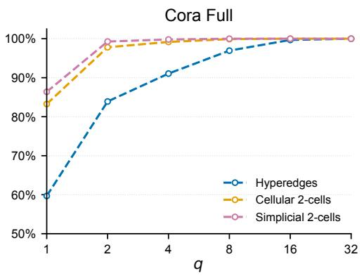

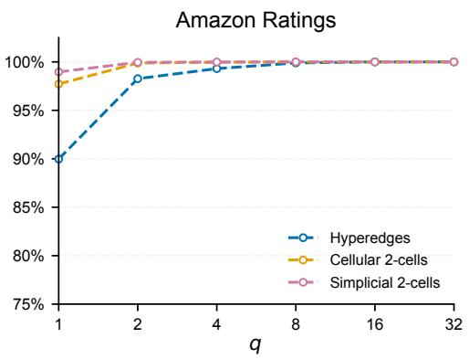

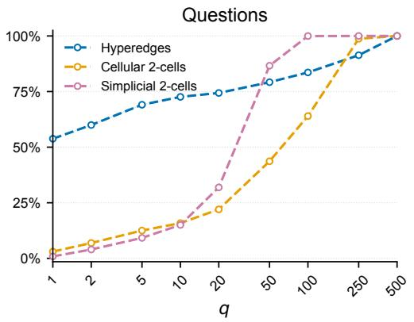

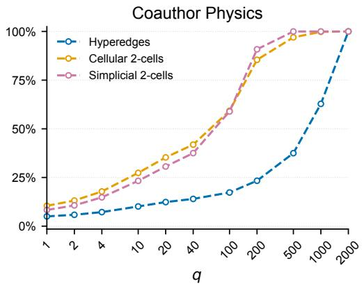  
Figure 6: Fraction of full-graph reference structures whose supporting nodes appear together in at least one mini-batch within 200 epochs, as a function of the number of clusters per mini-batch q. Panels show Cora Full and Amazon Ratings $( K = 3 2 , \mathrm { t o p ~ r o w } )$ , Questions $( K = 5 0 0$ , bottom left), and Coauthor Physics $( K = 2 0 0 0$ , bottom right). Each dataset uses one fixed METIS partition. Curves show means over ten independent reshuffling runs. Shading indicates ±1 standard deviation, generally narrower than the plotted lines. Cellular recovery refers to the supporting nodes of fixed full-graph cycle-basis cells, not their selection by a recomputed local basis. Vertical scales begin at 50% for Cora Full, 75% for Amazon Ratings, and 0% for the other datasets.

Differences between higher-order domains. The lifting definitions help explain why the three families respond differently to recombination. Each simplicial 2-cell contains three nodes, and each retained cellular 2-cell contains at most nine. A neighbourhood hyperedge contains its centre and all its neighbours, with no corresponding fixed size limit. Its complete support can therefore span many more clusters, making joint sampling less likely. On Coauthor Physics at $q = 1 0 0 0$ , both 2-cell families exceed 99.8% recovery, whereas neighbourhood hyperedges reach 62.8%. However, neighbourhood hyperedges are not uniformly harder to recover. On Questions at $q = 1 , 5 3 . 8 \%$ of neighbourhood hyperedges lie within individual clusters, compared with 3.0% of cellular and 0.9% of simplicial 2-cells. Both support size and its distribution across the partition matter. Low recovery of complete neighbourhoods also does not imply an absence of local hypergraph structure, because lifting a mini-batch constructs hyperedges from the neighbors present. Likewise, a batch-local cycle basis can contain cells different from the full-graph references.

Implications for repeated sampling. Addressing the structural component of Q3, the finite-epoch results distinguish structures that can become available from those encountered within a given sampling horizon. This distinction motivates considering both mini-batch size and repeated sampling when assessing structural exposure. Ensemble inference similarly evaluates nodes under several independently sampled cluster groupings. Table 2 provides complementary predictive evidence, with ensemble inference achieving a higher mean test metric than single-pass inference in all 21 reported model-dataset comparisons. These results support evaluating multiple structural contexts, but do not establish that recovery of full-graph reference structures explains the predictive improvement.

## C.13.2 RECOVERY ACROSS EPOCHS ON CORA FULL

For liftings compatible with induced subgraphs, the span counts $n _ { c }$ and probabilities $p _ { c } ( q )$ from Eq. (17) give the expected one-exposure coverage

$$
\mathbb { E } [ R _ { q , T } ] = \frac { 1 } { | S ^ { * } | } \sum _ { c = 1 } ^ { q } n _ { c } \left( 1 - \left( 1 - p _ { c } ( q ) \right) ^ { T } \right) .\tag{43}
$$

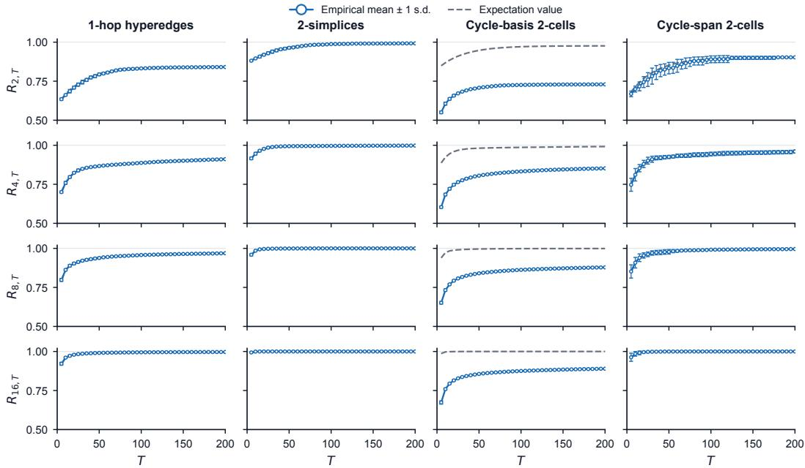  
Figure 7: Comparison of empirical and analytical structural recovery on Cora Full with $K = 3 2$ and $q \in \{ 2 , 4 , 8 , 1 6 \}$ . Empirical coverage is shown as the mean ±1 sample standard deviation across ten independent runs and compared with the analytical coverage from Eq. (43) over 200 epochs.

We also evaluate the aggregate marginal entropy of cumulative support availability from the same span counts:

$$
H _ { q , T } = \frac { 1 } { | S ^ { * } | } \sum _ { c = 1 } ^ { q } n _ { c } h \left( 1 - ( 1 - p _ { c } ( q ) ) ^ { T } \right) ,\tag{44}
$$

where $h$ is the Bernoulli entropy defined in Sec. C.12. Eq. (18) provides the corresponding expression for any exposure threshold $m \in \{ 1 , \ldots , T \}$

We evaluate Cora Full using one fixed METIS partition with $K = 3 2$ and mini-batches of $q \in$ {2, 4, 8, 16} clusters. For each q, we simulate ten independent cluster-reshuffling sequences, each lasting 200 epochs and using a different seed. The reference families comprise center-indexed 1-hop hyperedges, graph triangles, full-graph cycle-basis cells of length at most nine, and cycle-span cells. The cycle-basis lifting need not satisfy the compatibility condition in Definition $7 { : }$ recomputing a basis can omit a reference cycle even when its complete support is present. We therefore include the cycle-span family as a compatible reference for testing the support-based recovery prediction. This family comprises all distinct undirected simple cycles of lengths three to eight. Each cycle appears in an induced mini-batch whenever all its supporting clusters occur together, independently of any basis selection. We count recovery exactly by grouping cycles with the same supporting cluster set. For cycle-basis cells, we instead record whether the recomputed mini-batch basis selects each full-graph reference cycle. The expanded family is used only in this structural diagnostic. CWN and TopoTune retain the cycle-basis lifting described in Appendix A.2.1.

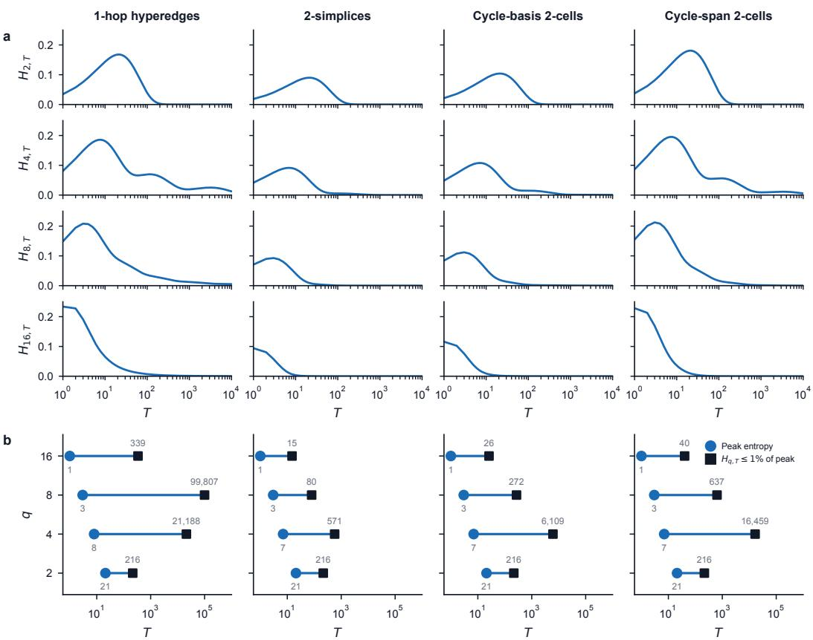  
Figure 8: Analytical entropy of cumulative support availability on Cora Full $( K = 3 2 )$ . a Eq. (44) for $T \leq 1 0 ^ { 4 }$ . b Blue circles mark peak epochs, while black squares mark the final crossing below 1% of peak entropy.

Figure 7 compares cumulative empirical recovery with Eq. (43) for these reference families. Empirical means agree closely with the prediction for 1-hop hyperedges, triangles, and expanded cycles. Cycle-basis recovery falls below the support-based prediction because restricting the graph can change which cycles the basis selects.

Figure 8 evaluates Eq. (44) analytically from each reference family’s fixed cluster-span histogram, normalized by the total number of reference structures. It measures the average marginal uncertainty about whether each reference structure’s complete support has appeared together by epoch T. For cycle-basis cells, support availability does not guarantee selection by a recomputed local basis. Their entropy curves therefore describe support availability rather than the actual basis recovery measured in Figure 7.

We define the decay epoch as the earliest epoch after the entropy peak from which entropy remains at or below 1% of its maximum. Both the peak and decay epochs are analytical quantities, including beyond the 200-epoch sampling horizon. They do not measure training convergence.

## D ADDITIONAL RESULTS

GPU memory across partition configurations. Figure 9 examines how partition granularity and mini-batch size affect peak GPU memory on Cora Full, Amazon Ratings, and Questions. We evaluate $K \in \{ 3 2 , 6 4 , 1 2 8 , 2 5 6 \}$ with $q / K \stackrel { < } { \in } \{ 0 . 1 2 5 , 0 . 2 5 , 0 . 5 , 0 . 7 5 \}$ . For each model-dataset pair, we fix the model hyperparameters to the configuration selected for Cluster-TNN training and use the same settings for the full-graph baseline. We report peak CUDA allocated memory across training and validation in decimal GB. The measurements characterize memory sensitivity to K and q at fixed model hyperparameters.

On Cora Full, peak GPU memory increases with the sampled cluster fraction across all seven models. $\operatorname { A t } q / K = 0 . 1 2 5 .$ , Cluster-TNN reduces peak memory by 85.4-88.7% relative to the corresponding full-graph baseline across the four partition counts. At $q / K = 0 . 7 5$ , these reductions narrow to 24.7-29.7%. For SCCNN with $K = 3 2$ , increasing q from 4 to 24 raises peak memory from 4.08 to 22.05 GB, compared with 30.58 GB for full-graph execution. Amazon Ratings and Questions exhibit the same qualitative trend. These results illustrate how Cluster-TNN can be configured through K and q to balance GPU memory use and the amount of graph context processed per mini-batch.
<table><tr><td rowspan=1 colspan=1>GCN</td><td rowspan=1 colspan=1>0.9</td><td rowspan=1 colspan=1>1.8</td><td rowspan=1 colspan=1>3.5</td><td rowspan=1 colspan=1>5.2</td><td rowspan=1 colspan=1>0.9</td><td rowspan=1 colspan=1>1.8</td><td rowspan=1 colspan=1>3.5</td><td rowspan=1 colspan=1>5.2</td><td rowspan=1 colspan=1>0.9</td><td rowspan=1 colspan=1>1.8</td><td rowspan=1 colspan=1>3.5</td><td rowspan=1 colspan=1>5.2</td><td rowspan=1 colspan=1>0.9</td><td rowspan=1 colspan=1>1.8</td><td rowspan=1 colspan=1>3.5</td><td rowspan=1 colspan=1>5.2</td><td rowspan=1 colspan=1>6.9</td><td rowspan=1 colspan=1></td><td></td><td></td></tr><tr><td rowspan=1 colspan=1>EDHNN</td><td rowspan=1 colspan=1>1.0</td><td rowspan=1 colspan=1>1.9</td><td rowspan=1 colspan=1>3.8</td><td rowspan=1 colspan=1>5.7</td><td rowspan=1 colspan=1>1.0</td><td rowspan=1 colspan=1>1.9</td><td rowspan=1 colspan=1>3.8</td><td rowspan=1 colspan=1>5.7</td><td rowspan=1 colspan=1>1.0</td><td rowspan=1 colspan=1>1.9</td><td rowspan=1 colspan=1>3.8</td><td rowspan=1 colspan=1>5.7</td><td rowspan=1 colspan=1>1.0</td><td rowspan=1 colspan=1>1.9</td><td rowspan=1 colspan=1>3.8</td><td rowspan=1 colspan=1>5.7</td><td rowspan=1 colspan=1>7.6</td><td rowspan=1 colspan=1></td><td></td><td></td></tr><tr><td rowspan=1 colspan=1>UniGNN</td><td rowspan=1 colspan=1>1.0</td><td rowspan=1 colspan=1>2.0</td><td rowspan=1 colspan=1>3.8</td><td rowspan=1 colspan=1>5.7</td><td rowspan=1 colspan=1>1.0</td><td rowspan=1 colspan=1>1.9</td><td rowspan=1 colspan=1>3.8</td><td rowspan=1 colspan=1>5.7</td><td rowspan=1 colspan=1>1.0</td><td rowspan=1 colspan=1>2.0</td><td rowspan=1 colspan=1>3.8</td><td rowspan=1 colspan=1>5.7</td><td rowspan=1 colspan=1>1.0</td><td rowspan=1 colspan=1>2.0</td><td rowspan=1 colspan=1>3.9</td><td rowspan=1 colspan=1>5.7</td><td rowspan=1 colspan=1>7.6</td><td rowspan=2 colspan=2></td><td></td></tr><tr><td rowspan=1 colspan=1>CWN</td><td rowspan=1 colspan=1>3.0</td><td rowspan=1 colspan=1>5.6</td><td rowspan=1 colspan=1>11.4</td><td rowspan=1 colspan=1>17.2</td><td rowspan=1 colspan=1>3.2</td><td rowspan=1 colspan=1>5.7</td><td rowspan=1 colspan=1>11.2</td><td rowspan=1 colspan=1>17.1</td><td rowspan=1 colspan=1>2.9</td><td rowspan=1 colspan=1>5.3</td><td rowspan=1 colspan=1>11.0</td><td rowspan=1 colspan=1>17.0</td><td rowspan=1 colspan=1>2.8</td><td rowspan=1 colspan=1>5.4</td><td rowspan=1 colspan=1>10.5</td><td rowspan=1 colspan=1>17.3</td><td rowspan=1 colspan=1>24.1</td><td></td></tr><tr><td rowspan=1 colspan=1>TopoTune</td><td rowspan=1 colspan=1>3.1</td><td rowspan=1 colspan=1>5.7</td><td rowspan=1 colspan=1>11.5</td><td rowspan=1 colspan=1>17.2</td><td rowspan=1 colspan=1>3.3</td><td rowspan=1 colspan=1>5.8</td><td rowspan=1 colspan=1>11.2</td><td rowspan=1 colspan=1>17.2</td><td rowspan=1 colspan=1>2.9</td><td rowspan=1 colspan=1>5.4</td><td rowspan=1 colspan=1>11.0</td><td rowspan=1 colspan=1>17.1</td><td rowspan=1 colspan=1>2.9</td><td rowspan=1 colspan=1>5.4</td><td rowspan=1 colspan=1>10.6</td><td rowspan=1 colspan=1>17.3</td><td rowspan=1 colspan=1>24.2</td><td rowspan=3 colspan=2></td><td></td></tr><tr><td rowspan=1 colspan=1>SCN</td><td rowspan=1 colspan=1>4.1</td><td rowspan=1 colspan=1>7.2</td><td rowspan=1 colspan=1>14.6</td><td rowspan=1 colspan=1>22.0</td><td rowspan=1 colspan=1>4.5</td><td rowspan=1 colspan=1>7.3</td><td rowspan=1 colspan=1>14.2</td><td rowspan=1 colspan=1>21.5</td><td rowspan=1 colspan=1>4.0</td><td rowspan=1 colspan=1>6.7</td><td rowspan=1 colspan=1>13.7</td><td rowspan=1 colspan=1>21.8</td><td rowspan=1 colspan=1>3.4</td><td rowspan=1 colspan=1>6.4</td><td rowspan=1 colspan=1>13.2</td><td rowspan=1 colspan=1>21.6</td><td rowspan=1 colspan=1>30.6</td><td></td></tr><tr><td rowspan=1 colspan=1>SCCNN</td><td rowspan=1 colspan=1>4.1</td><td rowspan=1 colspan=1>7.2</td><td rowspan=1 colspan=1>14.6</td><td rowspan=1 colspan=1>22.0</td><td rowspan=1 colspan=1>4.5</td><td rowspan=1 colspan=1>7.3</td><td rowspan=1 colspan=1>14.2</td><td rowspan=1 colspan=1>21.5</td><td rowspan=1 colspan=1>4.0</td><td rowspan=1 colspan=1>6.7</td><td rowspan=1 colspan=1>13.7</td><td rowspan=1 colspan=1>21.8</td><td rowspan=1 colspan=1>3.4</td><td rowspan=1 colspan=1>6.4</td><td rowspan=1 colspan=1>13.2</td><td rowspan=1 colspan=1>21.6</td><td rowspan=1 colspan=1>30.6</td><td></td></tr><tr><td rowspan=1 colspan=1></td><td rowspan=1 colspan=1></td><td rowspan=1 colspan=1></td><td rowspan=1 colspan=1></td><td rowspan=1 colspan=1></td><td rowspan=1 colspan=1></td><td rowspan=1 colspan=1></td><td rowspan=4 colspan=1></td><td rowspan=4 colspan=1></td><td rowspan=4 colspan=2></td><td rowspan=4 colspan=1></td><td rowspan=1 colspan=1></td><td></td><td></td><td></td><td></td><td></td><td></td><td></td><td></td></tr><tr><td rowspan=3 colspan=1>A</td><td rowspan=3 colspan=1>mazon</td><td></td><td></td><td></td><td></td><td></td><td></td><td></td><td></td><td></td><td></td><td></td><td></td><td></td><td></td></tr><tr><td></td><td></td><td></td><td></td><td></td><td></td><td rowspan=2 colspan=1></td><td rowspan=2 colspan=1></td><td rowspan=2 colspan=1></td><td rowspan=2 colspan=1></td><td rowspan=2 colspan=1></td><td rowspan=2 colspan=2></td><td></td></tr><tr><td rowspan=1 colspan=1>Ratin</td><td rowspan=1 colspan=1>gs</td><td rowspan=1 colspan=1></td><td rowspan=1 colspan=1></td><td rowspan=1 colspan=1></td><td rowspan=1 colspan=1></td><td></td></tr><tr><td rowspan=1 colspan=1>GCN</td><td rowspan=1 colspan=1>0.1</td><td rowspan=1 colspan=1>0.1</td><td rowspan=1 colspan=1>0.3</td><td rowspan=1 colspan=1>0.4</td><td rowspan=1 colspan=1>0.1</td><td rowspan=1 colspan=1>0.1</td><td rowspan=1 colspan=1>0.3</td><td rowspan=1 colspan=1>0.4</td><td rowspan=1 colspan=1>0.1</td><td rowspan=1 colspan=1>0.1</td><td rowspan=1 colspan=1>0.3</td><td rowspan=1 colspan=1>0.4</td><td rowspan=1 colspan=1>0.1</td><td rowspan=1 colspan=1>0.1</td><td rowspan=1 colspan=1>0.3</td><td rowspan=1 colspan=1>0.4</td><td rowspan=1 colspan=1>0.5</td><td rowspan=7 colspan=2></td><td></td></tr><tr><td rowspan=1 colspan=1>EDHNN</td><td rowspan=1 colspan=1>0.1</td><td rowspan=1 colspan=1>0.3</td><td rowspan=1 colspan=1>0.5</td><td rowspan=1 colspan=1>0.7</td><td rowspan=1 colspan=1>0.1</td><td rowspan=1 colspan=1>0.3</td><td rowspan=1 colspan=1>0.5</td><td rowspan=1 colspan=1>0.7</td><td rowspan=1 colspan=1>0.1</td><td rowspan=1 colspan=1>0.3</td><td rowspan=1 colspan=1>0.5</td><td rowspan=1 colspan=1>0.7</td><td rowspan=1 colspan=1>0.1</td><td rowspan=1 colspan=1>0.3</td><td rowspan=1 colspan=1>0.5</td><td rowspan=1 colspan=1>0.7</td><td rowspan=1 colspan=1>0.9</td><td></td></tr><tr><td rowspan=1 colspan=1>UniGNN</td><td rowspan=1 colspan=1>0.1</td><td rowspan=1 colspan=1>0.1</td><td rowspan=1 colspan=1>0.2</td><td rowspan=1 colspan=1>0.3</td><td rowspan=1 colspan=1>0.1</td><td rowspan=1 colspan=1>0.1</td><td rowspan=1 colspan=1>0.2</td><td rowspan=1 colspan=1>0.3</td><td rowspan=1 colspan=1>0.1</td><td rowspan=1 colspan=1>0.1</td><td rowspan=1 colspan=1>0.2</td><td rowspan=1 colspan=1>0.3</td><td rowspan=1 colspan=1>0.1</td><td rowspan=1 colspan=1>0.1</td><td rowspan=1 colspan=1>0.2</td><td rowspan=1 colspan=1>0.3</td><td rowspan=1 colspan=1>0.4</td><td></td></tr><tr><td rowspan=1 colspan=1>CWN</td><td rowspan=1 colspan=1>0.4</td><td rowspan=1 colspan=1>0.8</td><td rowspan=1 colspan=1>1.6</td><td rowspan=1 colspan=1>2.4</td><td rowspan=1 colspan=1>0.4</td><td rowspan=1 colspan=1>0.8</td><td rowspan=1 colspan=1>1.6</td><td rowspan=1 colspan=1>2.4</td><td rowspan=1 colspan=1>0.4</td><td rowspan=1 colspan=1>0.8</td><td rowspan=1 colspan=1>1.6</td><td rowspan=1 colspan=1>2.4</td><td rowspan=1 colspan=1>0.4</td><td rowspan=1 colspan=1>0.8</td><td rowspan=1 colspan=1>1.6</td><td rowspan=1 colspan=1>2.4</td><td rowspan=1 colspan=1>3.2</td><td></td></tr><tr><td rowspan=1 colspan=1>TopoTune</td><td rowspan=1 colspan=1>0.5</td><td rowspan=1 colspan=1>1.0</td><td rowspan=1 colspan=1>2.0</td><td rowspan=1 colspan=1>3.0</td><td rowspan=1 colspan=1>0.5</td><td rowspan=1 colspan=1>1.0</td><td rowspan=1 colspan=1>2.0</td><td rowspan=1 colspan=1>2.9</td><td rowspan=1 colspan=1>0.5</td><td rowspan=1 colspan=1>1.0</td><td rowspan=1 colspan=1>2.0</td><td rowspan=1 colspan=1>2.9</td><td rowspan=1 colspan=1>0.5</td><td rowspan=1 colspan=1>1.0</td><td rowspan=1 colspan=1>2.0</td><td rowspan=1 colspan=1>2.9</td><td rowspan=1 colspan=1>3.9</td><td></td></tr><tr><td rowspan=1 colspan=1>SCN</td><td rowspan=1 colspan=1>0.3</td><td rowspan=1 colspan=1>0.6</td><td rowspan=1 colspan=1>1.2</td><td rowspan=1 colspan=1>1.8</td><td rowspan=1 colspan=1>0.3</td><td rowspan=1 colspan=1>0.6</td><td rowspan=1 colspan=1>1.2</td><td rowspan=1 colspan=1>1.8</td><td rowspan=1 colspan=1>0.3</td><td rowspan=1 colspan=1>0.6</td><td rowspan=1 colspan=1>1.2</td><td rowspan=1 colspan=1>1.8</td><td rowspan=1 colspan=1>0.3</td><td rowspan=1 colspan=1>0.6</td><td rowspan=1 colspan=1>1.2</td><td rowspan=1 colspan=1>1.8</td><td rowspan=1 colspan=1>2.4</td><td></td></tr><tr><td rowspan=1 colspan=1>SCCNN</td><td rowspan=1 colspan=1>0.6</td><td rowspan=1 colspan=1>1.1</td><td rowspan=1 colspan=1>2.2</td><td rowspan=1 colspan=1>3.3</td><td rowspan=1 colspan=1>0.6</td><td rowspan=1 colspan=1>1.1</td><td rowspan=1 colspan=1>2.2</td><td rowspan=1 colspan=1>3.2</td><td rowspan=1 colspan=1>0.6</td><td rowspan=1 colspan=1>1.1</td><td rowspan=1 colspan=1>2.2</td><td rowspan=1 colspan=1>3.3</td><td rowspan=1 colspan=1>0.6</td><td rowspan=1 colspan=1>1.1</td><td rowspan=1 colspan=1>2.2</td><td rowspan=1 colspan=1>3.2</td><td rowspan=1 colspan=1>4.4</td><td></td></tr><tr><td rowspan=2 colspan=1></td><td rowspan=2 colspan=1>Questi</td><td rowspan=2 colspan=1>ons</td><td rowspan=2 colspan=1></td><td rowspan=2 colspan=1></td><td rowspan=2 colspan=1></td><td rowspan=2 colspan=1></td><td rowspan=2 colspan=1></td><td rowspan=2 colspan=1></td><td rowspan=1 colspan=1></td><td rowspan=1 colspan=1></td><td rowspan=1 colspan=1></td><td rowspan=1 colspan=1></td><td rowspan=1 colspan=1></td><td rowspan=1 colspan=1></td><td rowspan=1 colspan=1></td><td rowspan=1 colspan=1></td><td rowspan=1 colspan=1></td><td rowspan=2 colspan=2></td><td></td></tr><tr><td rowspan=1 colspan=1></td><td rowspan=1 colspan=1></td><td rowspan=1 colspan=1></td><td rowspan=1 colspan=1></td><td rowspan=1 colspan=1></td><td rowspan=1 colspan=1></td><td rowspan=1 colspan=1></td><td rowspan=1 colspan=1></td><td rowspan=1 colspan=1></td><td></td></tr><tr><td rowspan=1 colspan=1>GCN</td><td rowspan=1 colspan=1>0.1</td><td rowspan=1 colspan=1>0.2</td><td rowspan=1 colspan=1>0.4</td><td rowspan=1 colspan=1>0.6</td><td rowspan=1 colspan=1>0.1</td><td rowspan=1 colspan=1>0.2</td><td rowspan=1 colspan=1>0.4</td><td rowspan=1 colspan=1>0.6</td><td rowspan=1 colspan=1>0.1</td><td rowspan=1 colspan=1>0.2</td><td rowspan=1 colspan=1>0.4</td><td rowspan=1 colspan=1>0.7</td><td rowspan=1 colspan=1>0.1</td><td rowspan=1 colspan=1>0.2</td><td rowspan=1 colspan=1>0.4</td><td rowspan=1 colspan=1>0.7</td><td rowspan=1 colspan=1>0.9</td><td rowspan=2 colspan=2></td><td></td></tr><tr><td rowspan=1 colspan=1>EDHNN</td><td rowspan=1 colspan=1>0.1</td><td rowspan=1 colspan=1>0.2</td><td rowspan=1 colspan=1>0.4</td><td rowspan=1 colspan=1>0.5</td><td rowspan=1 colspan=1>0.1</td><td rowspan=1 colspan=1>0.2</td><td rowspan=1 colspan=1>0.4</td><td rowspan=1 colspan=1>0.5</td><td rowspan=1 colspan=1>0.1</td><td rowspan=1 colspan=1>0.2</td><td rowspan=1 colspan=1>0.4</td><td rowspan=1 colspan=1>0.5</td><td rowspan=1 colspan=1>0.1</td><td rowspan=1 colspan=1>0.2</td><td rowspan=1 colspan=1>0.4</td><td rowspan=1 colspan=1>0.5</td><td rowspan=1 colspan=1>0.7</td><td></td></tr><tr><td rowspan=1 colspan=1>UniGNN</td><td rowspan=1 colspan=1>0.1</td><td rowspan=1 colspan=1>0.2</td><td rowspan=1 colspan=1>0.4</td><td rowspan=1 colspan=1>0.5</td><td rowspan=1 colspan=1>0.1</td><td rowspan=1 colspan=1>0.2</td><td rowspan=1 colspan=1>0.4</td><td rowspan=1 colspan=1>0.5</td><td rowspan=1 colspan=1>0.1</td><td rowspan=1 colspan=1>0.2</td><td rowspan=1 colspan=1>0.4</td><td rowspan=1 colspan=1>0.5</td><td rowspan=1 colspan=1>0.1</td><td rowspan=1 colspan=1>0.2</td><td rowspan=1 colspan=1>0.4</td><td rowspan=1 colspan=1>0.5</td><td rowspan=1 colspan=1>0.7</td><td rowspan=1 colspan=2></td><td></td></tr><tr><td rowspan=1 colspan=1>CWN</td><td rowspan=1 colspan=1>0.3</td><td rowspan=1 colspan=1>0.4</td><td rowspan=1 colspan=1>0.9</td><td rowspan=1 colspan=1>1.4</td><td rowspan=1 colspan=1>0.2</td><td rowspan=1 colspan=1>0.4</td><td rowspan=1 colspan=1>0.9</td><td rowspan=1 colspan=1>1.5</td><td rowspan=1 colspan=1>0.2</td><td rowspan=1 colspan=1>0.4</td><td rowspan=1 colspan=1>0.9</td><td rowspan=1 colspan=1>1.6</td><td rowspan=1 colspan=1>0.2</td><td rowspan=1 colspan=1>0.4</td><td rowspan=1 colspan=1>0.9</td><td rowspan=1 colspan=1>1.5</td><td rowspan=1 colspan=1>2.3</td><td rowspan=1 colspan=2></td><td rowspan=5 colspan=1>GB20</td></tr><tr><td rowspan=1 colspan=1>TopoTune</td><td rowspan=1 colspan=1>0.6</td><td rowspan=1 colspan=1>1.0</td><td rowspan=1 colspan=1>2.1</td><td rowspan=1 colspan=1>3.2</td><td rowspan=1 colspan=1>0.5</td><td rowspan=1 colspan=1>0.9</td><td rowspan=1 colspan=1>2.0</td><td rowspan=1 colspan=1>3.4</td><td rowspan=1 colspan=1>0.4</td><td rowspan=1 colspan=1>0.9</td><td rowspan=1 colspan=1>2.1</td><td rowspan=1 colspan=1>3.6</td><td rowspan=1 colspan=1>0.4</td><td rowspan=1 colspan=1>0.8</td><td rowspan=1 colspan=1>2.0</td><td rowspan=1 colspan=1>3.4</td><td rowspan=1 colspan=1>5.2</td><td rowspan=2 colspan=2></td></tr><tr><td rowspan=1 colspan=1>SCN</td><td rowspan=1 colspan=1>0.3</td><td rowspan=1 colspan=1>0.4</td><td rowspan=1 colspan=1>1.0</td><td rowspan=1 colspan=1>1.5</td><td rowspan=1 colspan=1>0.2</td><td rowspan=1 colspan=1>0.4</td><td rowspan=1 colspan=1>0.9</td><td rowspan=1 colspan=1>1.6</td><td rowspan=1 colspan=1>0.2</td><td rowspan=1 colspan=1>0.4</td><td rowspan=1 colspan=1>0.9</td><td rowspan=1 colspan=1>1.7</td><td rowspan=1 colspan=1>0.2</td><td rowspan=1 colspan=1>0.4</td><td rowspan=1 colspan=1>0.9</td><td rowspan=1 colspan=1>1.7</td><td rowspan=1 colspan=1>2.7</td></tr><tr><td rowspan=1 colspan=1>SCCNN</td><td rowspan=1 colspan=1>0.6</td><td rowspan=1 colspan=1>1.0</td><td rowspan=1 colspan=1>2.1</td><td rowspan=1 colspan=1>3.3</td><td rowspan=1 colspan=1>0.5</td><td rowspan=1 colspan=1>0.8</td><td rowspan=1 colspan=1>2.0</td><td rowspan=1 colspan=1>3.5</td><td rowspan=1 colspan=1>0.41</td><td rowspan=1 colspan=1>0.8</td><td rowspan=1 colspan=1>2.0</td><td rowspan=1 colspan=1>3.8</td><td rowspan=1 colspan=1>0.3</td><td rowspan=1 colspan=1>0.7</td><td rowspan=1 colspan=1>1.9</td><td rowspan=1 colspan=1>3.8</td><td rowspan=1 colspan=1>6.1</td><td rowspan=1 colspan=2></td></tr><tr><td rowspan=1 colspan=1></td><td rowspan=1 colspan=1>q=412.5%</td><td rowspan=1 colspan=1>q=825%</td><td rowspan=1 colspan=1>q=1650%</td><td rowspan=1 colspan=1>q=2475%</td><td rowspan=1 colspan=1>q=812.5%</td><td rowspan=1 colspan=1>q=1625%</td><td rowspan=1 colspan=1>q=3250%</td><td rowspan=1 colspan=1>q=4875%</td><td rowspan=1 colspan=1>q=1612.5%</td><td rowspan=1 colspan=1>q=3225%</td><td rowspan=1 colspan=1>q=6450%</td><td rowspan=1 colspan=1>q=96</td><td rowspan=1 colspan=1>q=3212.5%</td><td rowspan=1 colspan=1>q=6425%</td><td rowspan=1 colspan=1>q=12850%</td><td rowspan=1 colspan=1>q=19275%</td><td rowspan=1 colspan=1>100%</td><td rowspan=1 colspan=2></td></tr></table>

Figure 9: Peak GPU memory under Cluster-TNN and full-graph execution on three datasets. Rows correspond to models, while columns vary the number of partitions K and clusters per mini-batch q, with percentages indicating $q / K$ . The rightmost column shows the full-graph baseline. Each dataset has a separate color scale.

## E EXPERIMENTAL PROTOCOL AND HYPERPARAMETER OPTIMIZATION

Dataset splits and random seeds. Our predictive-performance experiments use transductive node classification with generated, non-stratified random node splits rather than predefined public splits. The training/validation/test proportions are 70%/15%/15% for Cora Full, Coauthor Physics, and OGBN Products, and 50%/25%/25% for Amazon Ratings, Questions, and Reddit. For each dataset, we generate ten random splits with a fixed seed of 42 and use split seeds 0, 1, 2, 3, 4 for final evaluation. The same splits are used across models and between full-graph and Cluster-TNN execution wherever both are evaluated. For run s, the corresponding seed also controls model initialization, stochastic training, and cluster recombinations during partitioned training and inference. Thus, variation across the five runs reflects both data-split and model-training randomness.

Search objective and procedure. We optimize each model-dataset pair separately for full-graph and Cluster-TNN partitioned training using Optuna’s TPESampler (Akiba et al., 2019; Watanabe, 2023). Each trial maximizes the best validation metric attained during training. Test data are not evaluated during hyperparameter optimization. Dataset-specific metrics are listed in Table 12. Graph and lifted-domain structural counts are reported separately in Table 3.

Each study comprises 100 trials for Questions, Amazon Ratings, Cora Full, and Coauthor Physics, 50 trials for Reddit, and 30 trials for OGBN Products. The first ten trials use random sampling, after which the sampler uses previous trial outcomes to guide subsequent choices. Search trials run for at most 300 epochs, with validation every five epochs and early stopping after five validation checks without improvement.

Table 12: Dataset tasks, input feature dimensions, and class counts. Structural counts are reported separately in Table 3.
<table><tr><td>Dataset</td><td>Metric</td><td>Input feature dimension</td><td>Classes</td></tr><tr><td>Cora Full</td><td>Accuracy</td><td>8710</td><td>70</td></tr><tr><td>Amazon Ratings</td><td>Accuracy</td><td>300</td><td>5</td></tr><tr><td>Questions</td><td>AUROĆ</td><td>301</td><td>2</td></tr><tr><td>Coauthor Physics</td><td>Accuracy</td><td>8415</td><td>5</td></tr><tr><td>Reddit</td><td>Accuracy</td><td>602</td><td>41</td></tr><tr><td>OGBN Products</td><td>Accuracy</td><td>100</td><td>47</td></tr></table>

Model hyperparameters. The model search varies optimization step size, regularization, and representation width. Learning rates are selected from $\{ 1 0 ^ { - 5 } , 1 0 ^ { - 4 } , 1 \dot { 0 } ^ { - 3 } , 1 0 ^ { - \dot { 2 } } \}$ , covering several orders of magnitude. Weight decay is selected from $\left\{ 0 , 1 0 ^ { - 5 } , 1 0 ^ { - 4 } , 1 0 ^ { - 3 } \right\}$ , allowing comparison between no weight decay and different regularization strengths. We search encoder widths of {32, 64, 128} channels to vary representation capacity and the memory occupied by hidden features during model execution.

Projection dropout is selected from {0, 0.1, 0.2, 0.3}. For GCN, EDHNN, and TopoTune, we additionally search backbone dropout in {0, 0.2, 0.5}. Both dropout spaces include a setting without dropout. These model search spaces are shared across datasets and between full-graph and Cluster-TNN training wherever the corresponding parameter applies.

Partition hyperparameters. For partitioned training, we jointly optimize the number of graph partitions K and the number of clusters combined into each training mini-batch q. Increasing K produces smaller clusters on average. For a fixed partition, increasing q expands the sampled graph context and allows higher-order structures spanning more clusters to be recovered, but can also increase lifting and model-execution costs. Searching both parameters allows validation-based selection among different partition granularities and amounts of graph context.

Table 13 lists the dataset-specific candidate sets. Within each dataset, all models use the same K, q search space.

Table 13: Dataset-specific partition search spaces. K denotes the total number of graph partitions, and q denotes the number of clusters combined into one training mini-batch. These parameters are optimized jointly with the model hyperparameters.
<table><tr><td>Dataset</td><td>Candidate K values</td><td>Candidate q values</td></tr><tr><td>Questions</td><td>{500, 1 000, 1 500, 2 000}</td><td>{20, 30, 40, 50}</td></tr><tr><td>Amazon Ratings</td><td>{32, 64, 128, 256}</td><td>{4, 8, 16, 32}</td></tr><tr><td>Cora Full</td><td>{32, 64, 128, 256}</td><td>{4, 8, 16, 32}</td></tr><tr><td>Coauthor Physics</td><td>{500, 1 000, 1 500, 2 000}</td><td>{20, 30, 40, 50}</td></tr><tr><td>Reddit</td><td>{7 000, 10 000}</td><td>{20, 25}</td></tr><tr><td>OGBN Products</td><td>{15 000, 20 000}</td><td>{20, 25}</td></tr></table>

With the same number of partitions K, a graph containing more nodes has more nodes per cluster on average. Combining q clusters can therefore produce very different mini-batch sizes across datasets. Connectivity further determines how many higher-order cells the lifting constructs from those nodes. These differences affect the time and memory required to construct and process each mini-batch.

We selected the dataset-specific candidate ranges through preliminary runs assessing the memory required for mini-batch lifting and model execution.

Selected configurations and final evaluation. Table 14 reports the selected hyperparameters. Final evaluations use five seeds. For OGBN Products, final training runs for at most 130 epochs, with validation every five epochs and early stopping after two validation checks without improvement. For final training and evaluation, validation and test mini-batches use the selected training q, as reported in Table 14. Test predictions for P are obtained using ensemble inference with ten independent cluster recombinations.

Table 14: Selected hyperparameters for full-graph and Cluster-TNN training. Shading denotes parameters that do not apply to the corresponding model or protocol.
<table><tr><td>Dataset</td><td>Protocol</td><td>Learning Weight Rate</td><td>Decay</td><td>Hidden Channels</td><td>Projection Dropout</td><td>K</td><td></td><td>q Dropout</td></tr><tr><td colspan="9">GCN</td></tr><tr><td>Questions</td><td>Full-graph</td><td>10⁻²</td><td> $1 0 ^ { - 4 }$ </td><td>128</td><td>0.3</td><td></td><td></td><td>0.5</td></tr><tr><td></td><td>Cluster-TNN</td><td>10⁻4</td><td>0</td><td>128</td><td>0.2</td><td>500 20</td><td></td><td>0.2</td></tr><tr><td>Amazon Ratings</td><td>Full-graph Cluster-TNN</td><td>10-2 10-2</td><td> $1 0 ^ { - 3 }$  10⁻4</td><td>128 128</td><td>0 0.3</td><td></td><td></td><td>0 0</td></tr><tr><td>Cora Full</td><td>Full-graph</td><td>10-3</td><td>10-5</td><td>128</td><td>0.3</td><td>64</td><td>4</td><td>0</td></tr><tr><td></td><td>Cluster-TNN</td><td>10-3</td><td>10−5</td><td>128</td><td>0.3</td><td>32</td><td>8</td><td>0</td></tr><tr><td>Coauthor Physics Cluster-TNN</td><td></td><td>10-2</td><td> $1 0 ^ { - 4 }$ </td><td>64</td><td>0.3</td><td>500</td><td>20</td><td>0.2</td></tr><tr><td>Reddit</td><td>Cluster-TNN</td><td>10-4</td><td>10-4</td><td>128</td><td>0.2</td><td>7000</td><td>25</td><td>0.2</td></tr><tr><td>OGBN Products</td><td>Cluster-TNN</td><td>10⁻4</td><td> $1 0 ^ { - 4 }$ </td><td>128</td><td>0.1</td><td>15000 25</td><td></td><td>0.2</td></tr><tr><td colspan="9">EDHNN</td></tr><tr><td>Questions</td><td>Full-graph</td><td>10⁻3 10⁻2</td><td> $1 0 ^ { - 3 }$   $1 0 ^ { - 3 }$ </td><td>128</td><td>0</td><td></td><td></td><td>0.5</td></tr><tr><td>Amazon Ratings</td><td>Cluster-TNN Full-graph</td><td> $1 0 ^ { - 3 }$ </td><td>10⁻3</td><td>32</td><td>0.2</td><td>500 50</td><td></td><td>0</td></tr><tr><td></td><td>Cluster-TNN</td><td>10-3</td><td>10⁻4</td><td>128 128</td><td>0.1</td><td></td><td></td><td>0 0</td></tr><tr><td>Cora Full</td><td>Full-graph</td><td>10-3</td><td>10⁻3</td><td>128</td><td>0.3</td><td>128</td><td>4</td><td>0</td></tr><tr><td></td><td>Cluster-TNN</td><td>10⁻2</td><td>10-4</td><td></td><td>0.3</td><td></td><td></td><td>0.2</td></tr><tr><td>Coauthor Physics Cluster-TNN</td><td></td><td>10-2</td><td></td><td>64</td><td>0.2</td><td>32</td><td>4</td><td></td></tr><tr><td></td><td></td><td>10-2</td><td>0</td><td>128</td><td>0.2</td><td>200030</td><td></td><td>0.5</td></tr><tr><td>Reddit OGBN Products</td><td>Cluster-TNN</td><td>10-3</td><td>10-4</td><td>128</td><td>0.3</td><td>7000</td><td>20</td><td>0.2</td></tr><tr><td>Cluster-TNN</td><td></td><td></td><td>10⁻4</td><td>128</td><td>0.1</td><td>20 000 25</td><td></td><td>0.2</td></tr><tr><td colspan="9">UniGNN</td></tr><tr><td>Questions</td><td>Full-graph</td><td>10⁻2 10⁻3</td><td>0  $1 0 ^ { - 3 }$ </td><td>32</td><td>0</td><td></td><td></td><td></td></tr><tr><td>Amazon Ratings</td><td>Cluster-TNN Full-graph</td><td>10-2</td><td>10-3</td><td>128 128</td><td>0 0</td><td>100040</td><td></td><td></td></tr><tr><td></td><td>Cluster-TNN</td><td>10-2</td><td>10-4</td><td>64</td><td>0</td><td></td><td>8</td><td></td></tr><tr><td>Cora Full</td><td>Full-graph</td><td>10-3</td><td>10-4</td><td>128</td><td>0.3</td><td>32</td><td></td><td></td></tr><tr><td></td><td>Cluster-TNN</td><td>10-4</td><td>10⁻4</td><td>128</td><td>0.1</td><td>32</td><td></td><td></td></tr><tr><td>Coauthor Physics Cluster-TNN</td><td></td><td>10-2</td><td>10⁻5</td><td>32</td><td>0.2</td><td>200020</td><td>4</td><td></td></tr><tr><td>Reddit</td><td>Cluster-TNN</td><td>10 -3</td><td>10⁻3</td><td>64</td><td></td><td></td><td></td><td></td></tr><tr><td>OGBN Products</td><td>Cluster-TNN</td><td>10⁻⁴</td><td> $1 0 ^ { - 4 }$ </td><td></td><td>0.3</td><td>7000</td><td>25</td><td></td></tr><tr><td></td><td></td><td></td><td>CWN</td><td>128</td><td>0</td><td>15000 20</td><td></td><td></td></tr><tr><td colspan="9"></td></tr><tr><td>Questions</td><td>Full-graph</td><td>10⁻2 10⁻2</td><td>10⁻3</td><td>128</td><td>0.3</td><td></td><td></td><td></td></tr><tr><td>Amazon Ratings</td><td>Cluster-TNN</td><td>10⁻2</td><td>10-3</td><td>32</td><td>0.3</td><td>1000 40</td><td></td><td></td></tr><tr><td></td><td>Full-graph</td><td></td><td>10⁻3</td><td>128</td><td>0.3</td><td></td><td></td><td></td></tr><tr><td>Cora Full</td><td>Cluster-TNN</td><td>10-2 10-2</td><td>10-3</td><td>128</td><td>0.2</td><td>64 16</td><td></td><td></td></tr><tr><td></td><td>Full-graph</td><td>10⁻2</td><td>10-3</td><td>64</td><td>0.3</td><td></td><td></td><td></td></tr><tr><td>Coauthor Physics Cluster-TNN</td><td>Cluster-TNN</td><td></td><td>10-3</td><td>32</td><td>0.3</td><td>32</td><td>4</td><td></td></tr><tr><td></td><td></td><td>10⁻2</td><td>0</td><td>32</td><td>0.2</td><td>200020</td><td></td><td></td></tr><tr><td>Reddit</td><td>Cluster-TNN</td><td>10-2</td><td>10⁻4</td><td>64</td><td>0.3</td><td>7000</td><td>20</td><td></td></tr><tr><td>OGBN Products</td><td>Cluster-TNN</td><td>10⁻4</td><td>10⁻4</td><td>128</td><td>0</td><td>15000 20</td><td></td><td></td></tr></table>

Continued on next page

Table 14 continued
<table><tr><td>Dataset</td><td>Protocol</td><td>Learning Rate</td><td>Weight Decay</td><td>Hidden Channels</td><td>Projection Dropout</td><td>K</td><td>q Dropout</td></tr><tr><td colspan="8">TopoTune</td></tr><tr><td>Questions</td><td>Full-graph</td><td> $1 0 ^ { - 2 }$ </td><td> $1 0 ^ { - 5 }$ </td><td>128</td><td>0.1</td><td></td><td>0</td></tr><tr><td></td><td>Cluster-TNN</td><td> $1 0 ^ { - 2 }$ </td><td> $1 0 ^ { - 3 }$ </td><td>128</td><td>0.3</td><td>500 50</td><td>0.2</td></tr><tr><td>Amazon Ratings</td><td>Full-graph</td><td> $1 0 ^ { - 2 }$ </td><td> $1 0 ^ { - 5 }$ </td><td>64</td><td>0.1</td><td></td><td>0.2</td></tr><tr><td>Cora Full</td><td>Cluster-TNN</td><td> $1 0 ^ { - 2 }$ </td><td> $1 0 ^ { - 5 }$ </td><td>128</td><td>0</td><td>32 8</td><td>0.5</td></tr><tr><td></td><td>Full-graph</td><td> $1 0 ^ { - 2 }$ </td><td> $1 0 ^ { - 3 }$ </td><td>128</td><td>0.2</td><td>8</td><td>0.2</td></tr><tr><td></td><td>Cluster-TNN</td><td> $1 0 ^ { - 2 }$ </td><td> $1 0 ^ { - 3 }$ </td><td>128</td><td>0.2</td><td>64</td><td>0.5</td></tr><tr><td>Coauthor Physics Cluster-TNN</td><td></td><td> $1 0 ^ { - 3 }$ </td><td> $1 0 ^ { - 3 }$ </td><td>32</td><td>0.3</td><td>2000 20</td><td>0.5</td></tr><tr><td>Reddit</td><td>Cluster-TNN</td><td> $1 0 ^ { - 3 }$ </td><td> $1 0 ^ { - 4 }$ </td><td>64</td><td>0.2</td><td>7000 20</td><td>0.2</td></tr><tr><td>OGBN Products</td><td>Cluster-TNN</td><td> $1 0 ^ { - 3 }$ </td><td> $1 0 ^ { - 5 }$ </td><td>64</td><td>0.2</td><td>15000 25</td><td>0.5</td></tr><tr><td colspan="8"> $\mathbf { s c N }$ </td></tr><tr><td>Questions</td><td>Full-graph</td><td> $1 0 ^ { - 2 }$ </td><td> $1 0 ^ { - 4 }$ </td><td>128</td><td>0.3</td><td></td><td></td></tr><tr><td></td><td>Cluster-TNN</td><td> $1 0 ^ { - 3 }$ </td><td> $1 0 ^ { - 3 }$ </td><td>64</td><td>0.1</td><td>500 50</td><td></td></tr><tr><td>Amazon Ratings</td><td>Full-graph</td><td> $1 0 ^ { - 2 }$ </td><td>0</td><td>64</td><td>0.3</td><td></td><td></td></tr><tr><td></td><td>Cluster-TNN</td><td> $1 0 ^ { - 3 }$ </td><td>0</td><td>128</td><td>0.2</td><td>32 8</td><td></td></tr><tr><td>Cora Full</td><td>Full-graph</td><td> $1 0 ^ { - 3 }$ </td><td> $1 0 ^ { - 3 }$ </td><td>128</td><td>0.3</td><td></td><td></td></tr><tr><td></td><td>Cluster-TNN</td><td> $1 0 ^ { - 3 }$ </td><td> $1 0 ^ { - 4 }$ </td><td>128</td><td>0.3</td><td>32 16</td><td></td></tr><tr><td>Coauthor Physics Cluster-TNN</td><td></td><td> $1 0 ^ { - 2 }$ </td><td>0</td><td>32</td><td>0.3</td><td>200020</td><td></td></tr><tr><td>Reddit</td><td>Cluster-TNN</td><td> $1 0 ^ { - 3 }$ </td><td> $1 0 ^ { - 3 }$ </td><td>64</td><td>0.3</td><td>700025</td><td></td></tr><tr><td>OGBN Products</td><td>Cluster-TNN</td><td> $1 0 ^ { - 4 }$ </td><td> $1 0 ^ { - 4 }$ </td><td>128</td><td>0</td><td>15000 20</td><td></td></tr><tr><td colspan="8">SCCNN</td></tr><tr><td>Questions</td><td>Full-graph</td><td> $1 0 ^ { - 3 }$ </td><td> $1 0 ^ { - 5 }$ </td><td>128</td><td>0.1</td><td></td><td></td></tr><tr><td></td><td>Cluster-TNN</td><td> $1 0 ^ { - 3 }$ </td><td> $1 0 ^ { - 5 }$ </td><td>128</td><td>0.3</td><td>500 30</td><td></td></tr><tr><td>Amazon Ratings</td><td>Full-graph</td><td> $1 0 ^ { - 3 }$ </td><td>0</td><td>128</td><td>0.3</td><td></td><td></td></tr><tr><td>Cora Full</td><td>Cluster-TNN</td><td> $1 0 ^ { - 3 }$ </td><td> $1 0 ^ { - 3 }$ </td><td>128</td><td>0.2</td><td>32 4</td><td></td></tr><tr><td></td><td>Full-graph</td><td> $1 0 ^ { - 3 }$ </td><td> $1 0 ^ { - 3 }$ </td><td>128</td><td>0.3</td><td></td><td></td></tr><tr><td></td><td>Cluster-TNN</td><td> $1 0 ^ { - 3 }$ </td><td> $1 0 ^ { - 3 }$ </td><td>128</td><td>0.1</td><td>32 8</td><td></td></tr><tr><td></td><td>Coauthor Physics Cluster-TNN</td><td> $1 0 ^ { - 2 }$ </td><td>0</td><td>128</td><td>0.3</td><td>200020</td><td></td></tr><tr><td>Reddit</td><td>Cluster-TNN</td><td> $1 0 ^ { - 3 }$ </td><td> $1 0 ^ { - 3 }$ </td><td>64</td><td>0.3</td><td>7000 20</td><td></td></tr><tr><td>OGBN Products</td><td>Cluster-TNN</td><td> $1 0 ^ { - 4 }$ </td><td> $1 0 ^ { - 4 }$ </td><td>128</td><td>0</td><td>15000 20</td><td></td></tr></table>