# BEST OF BOTH WORLDS IN FEDERATED LSA: SPEEDUP WHEN POSSIBLE, PERSONALIZATION ALWAYS

Safwan Labbi<sup>1</sup>, Paul Mangold<sup>1</sup>, Eric Moulines<sup>2,3</sup>

<sup>1</sup> CMAP, CNRS, École Polytechnique, Institut Polytechnique de Paris, 91120 Palaiseau, France

<sup>2</sup> Mohamed bin Zayed University of Artificial Intelligence, UAE

<sup>3</sup> LRE EPITA , 94270 Le Kremlin-Bicêtre, France

{safwan.labbi, paul.mangold}@polytechnique.edu eric.moulines@mbzuai.ac.ae

## ABSTRACT

We study personalized federated linear stochastic approximation (LSA), a framework which notably encompass personalized temporal difference learning. In this setting, heterogeneous agents collaborate to solve distinct linear fixed-point equations, each corresponding to an agent-specific learning problem. A central open question in personalized learning is whether a single method can adapt to an unknown level of heterogeneity by converging to each agent’s personalized solution in all regimes while achieving a linear speedup in the number of agents when their learning problems are sufficiently similar. We answer this question affirmatively by introducing PF-LSA, a minimalist algorithm that mixes each agent’s local stochastic update with the average update across agents, at no additional computational cost relative to standard federated methods. We prove that PF-LSA achieves best-of-both-worlds guarantees without any prior knowledge on the level of heterogeneity. Our analysis is based on a sharp decomposition of the error into consensus and disagreement components. The consensus error decays rapidly, whereas the disagreement error decays more slowly but becomes negligible in low-heterogeneity regimes.

## 1 INTRODUCTION

Linear stochastic approximation (LSA) is a fundamental problem in stochastic optimization, where the goal is to solve a system of linear equations whose coefficients are only available through stochastic estimates. It encompasses problems from optimization (Robbins & Monro, 1951; Défossez & Bach, 2015), control and telecommunications (Benveniste et al., 1990; Borkar & Borkar, 2008), and reinforcement learning (Tsitsiklis & Van Roy, 1996; Sutton & Barto, 2018). In the presence of noise, solving LSA problems generally requires a large number of samples (Bhandari et al., 2018). This may quickly become impractical in real-world settings where data collection is costly or distributed across multiple sources.

Federated stochastic approximation (Doan et al., 2019) has been developed as a way of improving the sample efficiency of stochastic approximation through collaboration. The promise of this paradigm is to accelerate the training by allowing agents to benefit from the experience of other agents. This provides a natural way of reducing overall sample complexity. Most federated approaches, such as Federated Averaging (FedAvg) (McMahan et al., 2017), rely on averaging local updates to learn a single shared model. While this is effective when agents are homogeneous, the performance can degrade significantly in the presence of heterogeneity across agents, where one model cannot perfectly fit all agents (Kairouz et al., 2021; Zhao et al., 2018).

To address this limitation, a growing body of work has focused on personalized federated learning, where the goal is to exploit data from other agents while still learning agent-specific solutions. Many approaches rely on structural assumptions to capture similarities between agents, such as clustering (Sattler et al., 2020), multi-task learning formulations (Smith et al., 2017; Mansour et al., 2020), or regularization-based methods (Li et al., 2020; T Dinh et al., 2020). While effective in certain regimes, these methods typically depend on prior assumptions about the structure of heterogeneity. More recent approaches aim to promote collaboration among sufficiently similar agents, but they rely on prior knowledge of inter-agent similarities, which is unavailable in practice (Philippenko et al., 2025).

In this work, we take a different perspective and propose a surprisingly simple approach. Instead of attempting to identify which agents should collaborate, we allow all agents to share information through a lightweight mixing of their stochastic updates. This approach is inspired by a form of inclusionism, where every contribution is accepted on the premise that useful ones will ultimately dominate less effective ones over time. To this end, we introduce PF-LSA (Personalized Federated Linear Stochastic Approximation), where agents use a linear combination of their own update together with the averaged update of all agents. Crucially, this is done without any consideration on the (non-)homogeneity of the agents. The algorithm is thus very minimalist, as it simply combines local updates with their global average, without imposing any explicit structure on agent similarity.

We show that, despite its simplicity, this approach is effectively able to exploit all available data while preserving personalization. Our contributions are summarized as follows:

• We introduce PF-LSA, a novel personalized federated method which mixes updates across all agents, interpolating between fully local learning and classical federated averaging (McMahan et al., 2017), with the relative importance of each part being determined by a single hyperparameter.

• We show that PF-LSA converges to the optimal solution of each individual agent, ensuring full personalization even when incorporating global information from other agents.

• We derive non-asymptotic convergence rates based on a decomposition into consensus and disagreement components. The consensus error decreases rapidly, while the disagreement term decreases more slowly but is smaller in more homogeneous settings.

• We show that, under mild heterogeneity, PF-LSA enables each agent to achieve a linear speedup.

Our results demonstrate that a minimal mixing strategy is sufficient to achieve the best of both worlds: full personalization together with the benefits of collaboration, without relying on restrictive assumptions about agent similarity. We first discuss related work in Section 2, and give context on LSA in Section 3. Then, we introduce our method and analyze it in Section 4. We then instantiate these results for TD learning in Section 5. Section 6 studies the numerical behaviour of our method. Finally, we conclude and discuss perspectives in Section 7.

## 2 RELATED WORK

Federated LSA and Federated Reinforcement Learning. Single-agent Linear Stochastic Approximation (LSA) has been widely studied (Robbins & Monro, 1951; Tsitsiklis & Van Roy, 1996; Bhandari et al., 2018). Federated approaches for LSA have also been proposed, generally with the aim of learning a single shared solution from multiple agents’ data. Standard FedAvg (McMahan et al., 2017; Kairouz et al., 2021) extends to LSA by averaging local updates. In heterogeneous settings, FedAvg can diverge or bias the solution (Zhao et al., 2018), and local training methods with heterogeneity bias correction still optimize a common global objective. Recent work (Khodadadian et al., 2022; Wang et al., 2024; Labbi et al., 2025; 2026; Mangold et al., 2025) considers multiple agents collecting data under possibly different environments. For example, Khodadadian et al. (2022) propose federated versions of TD and Q-learning and prove linear convergence speedups in the number of agents under Markovian noise. Wang et al. (2024) study federated TD learning with heterogeneous environments, aggregating local updates to converge to the optimal value function of the mixture environment. Similarly, Mangold et al. (Mangold et al., 2024) analyze the FedLSA algorithm (a FedAvg-like method for linear fixed-point problems) and propose SCAFFLSA, which uses control variates to reduce client drift and achieve faster communication complexity. These federated LSA/RL methods demonstrate that multiple agents can accelerate learning (Khodadadian et al., 2022; Wang et al., 2024). However, they target a single global or mixture solution and do not address the fully personalized case. In short, existing federated LSA approaches focus on global objectives (or mixture objectives) and either ignore or correct heterogeneity in complex ways. By contrast, PF-LSA is designed to converge to each agent’s own solution, while still attaining a linear speedup through simple gradient mixing.

Personalized Federated Learning. Personalized federated learning departs from federated averaging (FedAvg) by learning models adapted to each agent. A common approach is multi-task learning, where agents have related but distinct objectives. Smith et al. (2017); Mansour et al. (2020) formulate a problem where each agent learns its own model while sharing information through a shared representation or regularizer. A second approach is cluster-based, assuming that clients can be partitioned into clusters with similar data distributions; for instance, clustered FL (Sattler et al., 2020) alternates between grouping clients and training cluster-specific models. Other approaches, such as (Li et al., 2020; T Dinh et al., 2020) add personalization terms to standard federated optimization, optimizing a global model plus a personalization part, controlling the trade-off between the two with regularizers. These methods improve over FedAvg in non-IID settings (Zhao et al., 2018; Kairouz et al., 2021), but they rely on additional assumptions: multi-task and clustering approaches assume either low-rank/latent structure or well-separated client clusters (Smith et al., 2017; Sattler et al., 2020), which may not hold in practice. Regularization-based methods (e.g. (Li et al., 2020; T Dinh et al., 2020)) still implicitly optimize a global objective and generally require tuning of penalty hyperparameters. More recent approaches propose control-variate-style methods that allow each agent to converge to its own local solution, but require knowledge of pairwise agent data-distribution ratios, which are unavailable in practice (Zhang & Azizan, 2025). In contrast, our approach does not require such assumptions and simply aggregates updates from all agents, resulting in a remarkably simple algorithm.

## 3 BACKGROUND ON PERSONALIZED FEDERATED LINEAR STOCHASTIC APPROXIMATION

In personalized federated linear stochastic approximation, we consider a set of N agents, each of which has its own individual system of linear equations. The goal is to solve for each system individually, aiming to find a $\theta _ { c } ^ { \star }$ for each agent $c \in [ \bar { N } ]$ such that

$$
\bar { \mathbf { A } } _ { c } \theta _ { c } ^ { \star } = \bar { \mathbf { b } } _ { c } \ ,
$$

where for $c \in [ N ] , \bar { \mathbf { A } } _ { c } \in \mathbb { R } ^ { d \times d } , \bar { \mathbf { b } } _ { c } \in \mathbb { R } ^ { d }$ . Note that due to differences in each agent’s local problem, the values of $\bar { \mathbf { A } } _ { c } ^ { \ , } \mathbf { s }$ and $\bar { \mathbf { b } } _ { c } \mathbf { \bar { s } }$ can be different from each other. Following prior work on $\bar { \mathrm { L S A } }$ , we assume that each $\bar { \mathbf { A } } _ { c }$ satisfies the following contraction condition Mou et al. (2020).

A1. There exist $a > 0 , \eta _ { \infty } > 0$ , such that $\eta _ { \infty } a \le 1 / 2$ , and for $\eta \in ( 0 ; \eta _ { \infty } ) , c \in [ N ] , u \in \mathbb R ^ { d }$ , it holds for $Z _ { 0 } ^ { c } \sim \pi _ { c } ,$ that $\mathbb { E } ^ { 1 / 2 } \big [ \| ( \mathrm { I } - \eta \mathbf { A } _ { c } ( Z _ { 0 } ^ { c } ) ) u \| ^ { 2 } \big ] \leq ( 1 - \eta a ) \| u \|$

Under this assumption, there is a unique solution $\theta _ { c } ^ { \star }$ for each linear system. In personalized federated $\mathrm { L S A }$ , neither matrices $\bar { \mathbf { A } } _ { c }$ nor vectors $\mathbf { b } _ { c }$ are observed directly. Instead, each agent $c \in \left[ N \right]$ has access to its own observation sequence $( Z _ { k } ^ { c } ) _ { k \in \mathbb { N } }$ , which are independent across agents. Agent c obtains estimates $\{ ( \mathbf { A } _ { c } ( Z _ { k } ^ { c } ) , \mathbf { b } _ { c } ( Z _ { k } ^ { c } ) ) \} _ { k \in \mathbb { N } }$ of $\bar { \mathbf { A } } _ { c }$ and $\bar { \mathbf { b } } _ { c } ,$ where $\mathbf { A } _ { c } : Z \to \mathbb { R } ^ { d \times d }$ and $\mathbf { b } _ { c } : Z \to \mathbb { R } ^ { d }$ are two measurable functions. We also define the error of estimation of $\bar { \mathbf { A } } _ { c }$ and $\bar { \mathbf { b } } _ { c }$ as $\bar { \mathbf { b } } _ { c } ( z ) = \mathbf { b } _ { c } ( z ) - \bar { \mathbf { b } } _ { c }$ $\bar { \mathbf { A } } _ { c } ( z ) = \mathbf { A } _ { c } ( z ) - \bar { \mathbf { A } } _ { c }$ . This allows us to measure the noise at local solutions as

$$
\varepsilon _ { c } ( z ) = \widetilde { \mathbf { A } } _ { c } ( z ) \theta _ { c } ^ { \star } - \widetilde { \mathbf { b } } _ { c } ( z ) , \quad \Sigma _ { c } ^ { \varepsilon } = \int _ { \mathbb { Z } } \varepsilon _ { c } ( z ) \varepsilon _ { c } ( z ) ^ { \top } \mathrm { d } \pi _ { c } ( z ) ,
$$

which are finite whenever the following assumption on $\{ Z _ { c } ^ { t } \} _ { t \ge 0 }$ holds.

A2. For each agent $c , ( Z _ { c } ^ { k } ) _ { \underline { { k } } \in \mathbb { N } }$ are i.i.d. random variables with values in $( Z , { \mathcal { Z } } )$ and distribution $\pi _ { c }$ satisfying $\mathbb { E } _ { \pi _ { c } } [ \bar { \mathbf { A } } _ { c } ( Z _ { c } ^ { k } ) ] = \bar { \mathbf { A } } _ { c } ^ { - }$ and $\mathbb { E } _ { \pi _ { c } } [ \mathbf { b } ( Z _ { c } ^ { k } ) ] = \bar { \mathbf { b } } _ { c } ,$ and we assume

$$
\mathrm { C } _ { \mathbf { A } } = \operatorname* { m a x } _ { c \in [ N ] } \Big \{ \operatorname* { m a x } \Big ( \operatorname* { s u p } _ { z \in \mathbb { Z } } \| \mathbf { A } _ { c } ( z ) \| , \operatorname* { s u p } _ { z \in \mathbb { Z } } \| \tilde { \mathbf { A } } _ { c } ( z ) \| \Big ) \Big \} < \infty , \quad \operatorname* { m a x } _ { c \in [ N ] } \mathbb { E } [ \left\| \varepsilon _ { c } ( Z _ { c } ^ { 1 } ) \right\| ^ { 2 } ] < \infty .
$$

This assumption will allow us to carefully track the impact of the noise in the computations. Finally, we define the following quantities, which measure the stochasticity and heterogeneity of the problem,

$$
\bar { \sigma } _ { \varepsilon } ^ { 2 } = \frac { 1 } { N } \sum _ { c = 1 } ^ { N } \mathrm { T r } ( \Sigma _ { c } ^ { \varepsilon } ) \ , \quad \zeta = \operatorname* { m a x } _ { c \in N } \left\| \bar { \mathbf { A } } _ { c } - \bar { \mathbf { A } } \right\| \ , \quad \Delta _ { \star } = \frac { 1 } { N } \sum _ { c = 1 } ^ { N } \| \theta _ { c } ^ { \star } - \frac { 1 } { N } \sum _ { c ^ { \prime } = 1 } ^ { N } \theta _ { c ^ { \prime } } ^ { \star } \| ^ { 2 } \ .\tag{1}
$$

which we will use in our analysis to track noisy updates and to quantify the impact of heterogeneity.

```latex
Algorithm 1 PF-LSA: Personalized Federated Linear Stochastic Approximation
Input: $\eta > 0 ; 0 < \beta < 1 ; T , N > 0 ; \theta _ { 1 } ^ { 0 } , \dots , \theta _ { N } ^ { 0 } \in \mathbb { R } ^ { d }$
for $t = 0$ to $T - 1$ do
for $c = 1$ to N do
Receive $Z _ { c } ^ { t + 1 }$ , compute: $\begin{array} { r } { \mathrm { g } _ { c } ^ { Z _ { c } ^ { t + 1 } } ( \theta _ { c } ^ { t } ) { = } \mathbf { A } _ { c } ( Z _ { c } ^ { t + 1 } ) { \theta } _ { c } ^ { t } { - } \mathbf { b } _ { c } ( Z _ { c } ^ { t + 1 } ) } \end{array}$ and send it to the central server
end for
Server computes $\begin{array} { r } { \mathrm { g } _ { \mathrm { m i x } } ^ { t } = \frac { 1 } { N } \sum _ { c ^ { \prime } = 1 } ^ { N } \mathrm { g } _ { c } ^ { Z _ { c ^ { \prime } } ^ { t + 1 } } ( \theta _ { c ^ { \prime } } ^ { t } ) } \end{array}$ and broadcasts it to all agents
for $c = 1$ to N do
Agent updates its model: $\theta _ { c } ^ { t + 1 } = \theta _ { c } ^ { t } - \eta \beta \mathbf { g } _ { c } ^ { Z _ { c } ^ { t + 1 } } ( \theta _ { c } ^ { t } ) - \eta ( 1 - \beta ) \mathbf { g } _ { \mathrm { m i x } } ^ { t }$
end for
end for
Return $\{ \theta _ { c } ^ { T } \} _ { c = 1 } ^ { N }$
```

## 4 THE PF-LSA ALGORITHM

We now introduce and analyze PF-LSA, a new algorithm designed to solve the personalized federated LSA problem. At each round $t \geq 0$ , every agent $c \in [ N ]$ maintains a local parameter $\theta _ { c } ^ { t }$ and receives a fresh observation $Z _ { c } ^ { t + 1 }$ . Using this observation, the agent computes the local stochastic update $\mathbf { A } _ { c } ( Z _ { c } ^ { t + 1 } ) { \boldsymbol { \theta } } _ { c } ^ { t } - \mathbf { b } _ { c } ( Z _ { c } ^ { t + 1 } )$ , and sends it to the central server. The server then averages the local updates and broadcasts the resulting global update back to all agents. Each agent combines this averaged update with its own local update through the mixing parameter $\beta \in ( 0 , 1 )$ , leading to the recursion

$$
\begin{array} { r } { \theta _ { c } ^ { t + 1 } = \theta _ { c } ^ { t } - \eta \beta \left( \mathbf { A } _ { c } ( Z _ { c } ^ { t + 1 } ) \theta _ { c } ^ { t } - \mathbf { b } _ { c } ( Z _ { c } ^ { t + 1 } ) \right) - \frac { \eta ( 1 - \beta ) } { N } \sum _ { c ^ { \prime } = 1 } ^ { N } \left( \mathbf { A } _ { c ^ { \prime } } ( Z _ { c ^ { \prime } } ^ { t + 1 } ) \theta _ { c ^ { \prime } } ^ { t } - \mathbf { b } _ { c ^ { \prime } } ( Z _ { c ^ { \prime } } ^ { t + 1 } ) \right) \ . } \end{array}
$$

The parameter $\beta$ controls the relative importance of the local update in comparison with the global update: the first term favors local learning, while the second term enables collaboration by incorporating information from all agents. We give the pseudo-code of PF-LSA in Algorithm 1.

Next, in Section 4.1, we motivate the mixing mechanism by showing that the limit point of PF-LSA is the collection of local solutions, ensuring personalization. We then derive non-asymptotic rates in Section 4.2: a Lyapunov argument first gives a general but slow rate, which we then refine through a consensus/disagreement decomposition of the error, uncovering a faster convergence rate for the consensus. These results show that, for any positive mixing parameter, PF-LSA converges to the true local solutions, and that in suitable heterogeneous regimes it achieves personalization together with a linear speed-up from collaboration.

## 4.1 PF-LSA ’S LIMIT POINTS ARE THE SOLUTIONS OF INDIVIDUAL SYSTEMS

To establish the limit point of the PF-LSA algorithm, we identify the set of parameters that cancels out the deterministic update of the algorithm. By definition, any limit point of this algorithm $( \theta _ { 1 } ^ { \infty } , \dots , \theta _ { N } ^ { \infty } )$ must be a fixed-point, meaning that they must satisfy the stationary conditions

$$
\begin{array} { r l } & { \theta _ { c } ^ { \infty } = \theta _ { c } ^ { \infty } - \eta \beta \bar { \mathbf { A } } _ { c } ( \theta _ { c } ^ { \infty } - \theta _ { c } ^ { \star } ) - \frac { \eta ( 1 - \beta ) } { N } \sum _ { c ^ { \prime } = 1 } ^ { N } \bar { \mathbf { A } } _ { c ^ { \prime } } ( \theta _ { c ^ { \prime } } ^ { \infty } - \theta _ { c ^ { \prime } } ^ { \star } ) \ , \quad \forall c \in [ N ] \ . } \end{array}\tag{2}
$$

Solving these equations gives the following result, which shows that if PF-LSA converges, then its limit must coincide with each agent’s optimal solution.

Theorem 4.1. Let $\{ \theta _ { c } ^ { t } : c \in [ N ] , t \geq 0 \}$ be the sequence ofparameters ofthe PF-LSA algorithm with deterministic updat $e s , \eta \leq \bar { \eta } _ { \infty } a n d 0 < \beta \leq 1 .$ . Additionally assume that there exists $( \theta _ { 1 } ^ { \infty } , \dots , \theta _ { N } ^ { \infty } )$ such that $( \theta _ { 1 } ^ { t } , \cdot \cdot \cdot , \theta _ { N } ^ { t } ) \xrightarrow [ t \to \infty ] { \cdot } ( \theta _ { 1 } ^ { \infty } , \cdot \cdot \cdot , \theta _ { N } ^ { \infty } )$ . Then,for all $\dot { \boldsymbol { c } } \in [ N ]$ , we have that

$$
\operatorname * { l i m } _ { t \to \infty } \theta _ { c } ^ { t } = \theta _ { c } ^ { \star } .
$$

Proof. The proof follows from solving (2). Indeed, averaging (2) over all the agents gives $\begin{array} { r } { \sum _ { c ^ { \prime } = 1 } ^ { N } \bar { \mathbf { A } } _ { c ^ { \prime } } ( \theta _ { c ^ { \prime } } ^ { \infty } - \theta _ { c ^ { \prime } } ^ { \star } ) = \mathbf { 0 } } \end{array}$ . Plugging in the previous identity in (2) gives $\bar { \mathbf { A } } _ { c } ( \theta _ { c } ^ { \infty } - \theta _ { c } ^ { \star } ) = \mathbf { 0 }$ and the result follows from the uniqueness of the solution of the linear system $\bar { \mathbf { A } } _ { c } \theta _ { c } ^ { \infty } = \bar { \mathbf { b } } _ { c }$ □

This theorem highlights the core idea behind PF-LSA: as long as $\beta > 0$ , meaning that local parameters are given a slightly increased importance compared to the others, each agent converges to its individual solution. Notably, this holds for any value of $\beta ,$ , highlighting the very different behavior of the method in the cases $\beta = 0$ and $\beta > 0 .$ , and the fact that, as $\beta \doteq 0 , \mathsf { P F - L S A }$ does not boil down to FedAvg. This phenomenon will allow us to choose very small values of $\beta ,$ which will be helpful for controlling the variance of the updates. Importantly, this will allow PF-LSA to achieve linear speed-up, and fast convergence, which we study in the remaining part of this section.

## 4.2 NON-ASYMPTOTIC CONVERGENCE RATES

Lyapunov. We now establish a non-asymptotic convergence rate of the PF-LSA algorithm. Precisely, we start by proving that PF-LSA converges towards each agent’s personalized solution by analyzing a Lyapunov function tailored to the algorithm’s updates. For any $\lambda > 0$ , we define

$$
\begin{array} { r } { \Phi _ { \lambda } ^ { t } = \mathbb { E } \left[ \| \frac { 1 } { N } \sum _ { c ^ { \prime } = 1 } ^ { N } ( \theta _ { c ^ { \prime } } ^ { t } - \theta _ { c ^ { \prime } } ^ { \star } ) \| ^ { 2 } + \beta \lambda \frac { 1 } { N } \sum _ { c = 1 } ^ { N } \| \theta _ { c } ^ { t } - \theta _ { c } ^ { \star } - \frac { 1 } { N } \sum _ { c ^ { \prime } = 1 } ^ { N } ( \theta _ { c ^ { \prime } } ^ { t } - \theta _ { c ^ { \prime } } ^ { \star } ) \| ^ { 2 } \right] . } \end{array}
$$

This Lyapunov function considers the agents’ local iterates by splitting the error into two parts: a consensus part, controlling the average of errors $\begin{array} { r l } { } & { { } \frac { 1 } { N } \sum _ { c ^ { \prime } = 1 } ^ { N } ( \theta _ { c ^ { \prime } } ^ { t } - \dot { \theta } _ { c ^ { \prime } } ^ { \star } ) } \end{array}$ and a disagreement part, which controls the difference between agents’ local error and averaged error. Next, we show that, under suitable conditions on $\lambda ,$ the Lyapunov function contracts and converges to zero.

Theorem 4.2. Assume A1 and A2. Let $0 < \beta \le 1$ , and let $\begin{array} { r } { \eta \in \left( 0 , \operatorname* { m i n } \left\{ \eta _ { \infty } , \frac { a } { 1 6 \mathrm { C } _ { \mathbf { A } } ^ { 2 } } \right\} \right) } \end{array}$ . For any $0 < \lambda \leq 1$ such that $\begin{array} { r } { ( 1 - \lambda ) \zeta \leq \frac { a \sqrt \lambda } { 2 } } \end{array}$ , and $\frac { \eta \mathrm { C } _ { \mathbf { A } } ^ { 2 } } { a }$ max $\begin{array} { r } { \frac { \{ \beta , \lambda \} } { \lambda } \le \frac { 1 } { 6 } } \end{array}$ , we have for every $t \geq 0$ that

$$
\begin{array} { r } { \mathbb { E } \left[ \Phi _ { \lambda } ^ { t } \right] \leq ( 1 - \eta \beta a ) ^ { t } \Phi _ { \lambda } ^ { 0 } + \frac { 2 \eta } { a } \left[ \beta \left( 1 - \frac { 1 } { N } \right) + \frac { \lambda } { N } \right] \bar { \sigma } _ { \varepsilon } ^ { 2 } . } \end{array}
$$

The conditions on λ can always be satisfied: for instance, setting $\lambda = \operatorname* { m i n } \{ 1$ , max $\{ 4 \frac { \zeta ^ { 2 } } { a ^ { 2 } } , 6 \frac { \eta \beta \mathbf { C } _ { \mathbf { A } } ^ { 2 } } { a } \} \}$ satisfies both conditions. The previous bound shows that PF-LSA indeed converges toward each agent’s individualized solution for any level of heterogeneity. Although this result alone is not sufficient to establish linear speedup, this result provides a crucial ingredient for establishing linear speedup. Indeed, it allows us to control the disagreement component, which we combine with a refined analysis of the consensus dynamics below to derive sharper convergence guarantees and establish linear speedup in low-heterogeneity regimes.

Refined Convergence Bound. To better capture the dynamics of PF-LSA, we decompose the average MSE over agents into the consensus component $\check { e } ^ { \check { t } }$ and the disagreement component $D ^ { t }$

$$
\begin{array} { r } { e _ { c } ^ { t } = \theta _ { c } ^ { t } - \theta _ { c } ^ { \star } , \quad \bar { e } ^ { t } = \frac { 1 } { N } \sum _ { c = 1 } ^ { N } \theta _ { c } ^ { t } - \theta _ { c } ^ { \star } , \quad d _ { c } ^ { t } = ( \theta _ { c } ^ { t } - \theta _ { c } ^ { \star } ) - \bar { e } ^ { t } , \quad D ^ { t } = \frac { 1 } { N } \sum _ { c = 1 } ^ { N } \| d _ { c } ^ { t } \| _ { 2 } ^ { 2 } . } \end{array}
$$

Subsequently, we show that this decomposition reveals the two-clock structure of $\mathsf { P F - L S A : }$ a fast consensus clock and a slow disagreement clock. Next, we derive a recursion on the consensus mode.

Lemma 4.3 (Fast average recursion). Assume A1 and A2. Let $\begin{array} { r } { \eta \in \left( 0 , \operatorname* { m i n } \left\{ \eta _ { \infty } , \frac { a } { 1 6 \mathrm { C } _ { \mathbf { A } } ^ { 2 } } \right\} \right) } \end{array}$ , and $0 < \beta \leq 1 ,$ for every $t \geq 0 _ { i }$ , we have

$$
\begin{array} { r } { \mathbb { E } \left[ \| \bar { e } ^ { t + 1 } \| _ { 2 } ^ { 2 } \mid \mathcal { F } ^ { t } \right] \le ( 1 - \eta a ) \| \bar { e } ^ { t } \| _ { 2 } ^ { 2 } + \left( 2 \eta ^ { 2 } \mathrm { C } _ { \mathbf { A } } ^ { 2 } + \frac { 4 \eta \zeta ^ { 2 } } { a } \right) D ^ { t } + \frac { 2 \eta ^ { 2 } } { N } \bar { \sigma } _ { \varepsilon } ^ { 2 } . } \end{array}
$$

The first term in Lemma $4 . 3 , ( 1 - \eta a ) ^ { t } \| \bar { e } ^ { 0 } \| _ { 2 } ^ { 2 }$ , corresponds to the consensus dynamics and contracts at the same rate as the initial error-forgetting term in single-agent LSA. Moreover, the variance term is of order $\eta \bar { \sigma } _ { \varepsilon } ^ { 2 } / ( a N )$ , showing a linear variance reduction in the number of agents. The remaining term $( 2 \eta ^ { 2 } \mathrm { C } _ { \bf A } ^ { 2 } + \frac { 4 \eta \zeta ^ { 2 } } { a } ) D ^ { t }$ is the price paid for personalization and heterogeneity. This term measures how much the consensus is perturbed by disagreement and by heterogeneity of the local operators. By combining this recursion with Theorem 4.2, we derive the following bound on the average MSE.

Theorem 4.4 (Unified all-heterogeneity bound). Assume A1 and A2. Let $\begin{array} { r } { \eta \in \left( 0 , \operatorname* { m i n } \left\{ \eta _ { \infty } , \frac { a } { 1 6 \mathrm { C } _ { \mathbf { A } } ^ { 2 } } \right\} \right) } \end{array}$ and $0 < \beta \leq 1$ . For any $\lambda > 0$ such that $\begin{array} { r } { ( 1 - \lambda ) \zeta \leq \frac { a \sqrt \lambda } { 2 } } \end{array}$ , and $\frac { \eta \mathrm { C } _ { \mathbf { A } } ^ { 2 } } { a } \frac { \operatorname* { m a x } \{ \beta , \lambda \} } { \lambda } \le \frac { 1 } { 6 } , \dot { f o r }$ every $t \geq 0 _ { i }$

$$
\begin{array} { r } { \frac { 1 } { N } \displaystyle \sum _ { c = 1 } ^ { N } \mathbb { E } \| e _ { c } ^ { t } \| _ { 2 } ^ { 2 } \lesssim ( 1 - \eta a ) ^ { t } \| \bar { e } ^ { 0 } \| _ { 2 } ^ { 2 } + [ 1 + \frac { \zeta ^ { 2 } } { a ^ { 2 } } ] ( 1 - \frac { \eta \beta a } { 2 } ) ^ { t } ( D ^ { 0 } + \beta \lambda \| \bar { e } ^ { 0 } \| _ { 2 } ^ { 2 } ) + \frac { 2 \eta } { a } ( 1 + \frac { \zeta ^ { 2 } } { a ^ { 2 } } ) [ \beta + \frac { 1 } { N } ] \bar { \sigma } _ { c } ^ { 2 } . } \end{array}
$$

Theorem 4.4 makes the two-clock structure of PF-LSA explicit: a fast consensus clock $( 1 - \eta a ) ^ { t }$ and a slower personalization clock $( 1 - \eta \beta a / 2 ) ^ { t }$ . When heterogeneity is large, the slow mode dominates and ${ \mathsf { P F } } { \mathsf { \bot S A } }$ recovers the single-agent LSA rate; when heterogeneity is small, the slow mode becomes negligible and the variance reduction $( \beta + 1 / N )$ enables a linear speedup while preserving personalization. To characterize more precisely the convergence guarantees in different heterogeneity regimes, we instantiate the bound with the following explicit admissible choice of λ: $\lambda = \operatorname* { m i n } \left\{ 1 \right.$ , max $\{ 4 \frac { \zeta ^ { 2 } } { a ^ { 2 } } , 6 \frac { \eta \beta \mathrm { C } _ { \mathbf { A } } ^ { 2 } } { a } \} \}$ , which allows us to characterize more precisely when collaboration is beneficial.

Low-Heterogeneity Regime. We first consider the regime in which the local operators are sufficiently similar, that is $\zeta ^ { 2 } < a ^ { 2 } / 4$ . In this case, the admissible choice of λ introduced above does not saturate at 1. Instantiating Theorem 4.4 with this choice of λ yields the following simplified bound.

Corollary 4.5 (Low-heterogeneity regime). Assume A 1, A 2 and assume that $\zeta ^ { 2 } < a ^ { 2 } / 4$ . Let $\begin{array} { r } { \eta \in \left( 0 , \operatorname* { m i n } \left\{ \eta _ { \infty } , \frac { a } { 1 6 \mathrm { C } _ { \mathbf { A } } ^ { 2 } } \right\} \right) } \end{array}$ , Then, for every $0 < \beta \leq 1$ and every $t \geq 0 ,$

$$
\begin{array} { r } { \frac { 1 } { N } \displaystyle \sum _ { c = 1 } ^ { N } \mathbb { E } \| e _ { c } ^ { t } \| _ { 2 } ^ { 2 } \lesssim ( 1 - \eta a ) ^ { t } \| \bar { e } ^ { 0 } \| _ { 2 } ^ { 2 } + ( 1 - \frac { \eta \beta a } { 2 } ) ^ { t } [ D ^ { 0 } + \beta \frac { \zeta ^ { 2 } } { a ^ { 2 } } \| \bar { e } ^ { 0 } \| _ { 2 } ^ { 2 } ] + \frac { \eta } { a } ( \beta + \frac { 1 } { N } ) \bar { \sigma } _ { \varepsilon } ^ { 2 } + \frac { \eta \beta ^ { 2 } \mathrm { C } _ { \mathbf { A } } ^ { 2 } } { a } \| \bar { e } ^ { 0 } \| _ { 2 } ^ { 2 } . } \end{array}
$$

The resulting bound highlights the favorable effect of low heterogeneity. The fast consensus component still contracts at rate $( 1 - \eta a ) ^ { t }$ , while the amplitude of the slow personalization component is controlled by $D ^ { 0 } + \beta \frac { \zeta ^ { 2 } } { a ^ { 2 } } \| \bar { e } ^ { 0 } \| _ { 2 } ^ { 2 }$ . Hence, when the local operators are sufficiently similar and the discrepancy between the agents’ optimal solutions is negligible compared with the initial consensus error, PF-LSA can simultaneously achieve personalization and linear speedup. We formalize this favorable regime in the following result.

Corollary 4.6 (Sample complexity in the low-heterogeneity regime). Assume A 1, A 2 and $\mathbf { \Gamma } _ { a , \mathbf { S } - }$ sume that $\zeta ^ { 2 } ~ < ~ a ^ { 2 ^ { \frac { 1 } { } } } / 4 .$ Let $\epsilon > 0$ and choose $\beta \ \doteq \ 1 / \bar { N }$ and the step size such that $\eta \ \leq$ min $\left\{ \eta _ { \infty } , \frac { a } { 1 6 \mathrm { C } _ { \mathbf { A } } ^ { 2 } } , \frac { a N \epsilon } { 1 4 4 \bar { \sigma } _ { \varepsilon } ^ { 2 } } , \frac { a N ^ { 2 } \epsilon } { 9 6 \mathrm { C } _ { \mathbf { A } } ^ { 2 } \parallel \bar { e } ^ { 0 } \parallel _ { 2 } ^ { 2 } } \right\}$ . Then PF-LSA satisfies $\begin{array} { r } { \frac { 1 } { N } \sum _ { c = 1 } ^ { N } \mathbb { E } \| e _ { c } ^ { T } \| _ { 2 } ^ { 2 } \le \epsilon } \end{array}$ provided

$$
\begin{array} { r } { T \gtrsim \frac { 1 } { a } \operatorname* { m a x } \left\{ \frac { 1 } { \eta _ { \infty } } , \frac { \mathrm { C } _ { \Delta } ^ { 2 } } { a } , \frac { \bar { \sigma } _ { \epsilon } ^ { 2 } } { a N \epsilon } , \frac { \mathrm { C } _ { \Delta } ^ { 2 } } { a N ^ { 2 } \epsilon } \right\} \operatorname* { m a x } \left\{ \log \left( \frac { \| \bar { \epsilon } ^ { 0 } \| _ { 2 } ^ { 2 } } { \epsilon } \right) , N \log \left( \left( D ^ { 0 } + \frac { \zeta ^ { 2 } } { a ^ { 2 } N } \| \bar { e } ^ { 0 } \| _ { 2 } ^ { 2 } \right) / \epsilon \right) \right\} } \end{array}
$$

This corollary shows that, when the heterogeneity level ζ is small and the initial disagreement $D ^ { 0 }$ which coincides with $\Delta ,$ when all agents have the same initialization and quantifies the average dispersion of the local optimal solutions around their mean, is negligible compared with the initial consensus error, that is when N log $\begin{array} { r } { \left( \left( D ^ { 0 } + \frac { \zeta ^ { 2 } } { a ^ { 2 } N } \| \bar { e } ^ { 0 } \| _ { 2 } ^ { 2 } \right) / \epsilon \right) \le \log \left( \frac { \| \bar { e } ^ { 0 } \| _ { 2 } ^ { 2 } } { \epsilon } \right) } \end{array}$ , PF-LSA, achieves a

sample complexity of order $\widetilde { \mathcal { O } } ( 1 / ( N \epsilon ) )$ ).This highlights a key property of PF-LSA: when the local problems are sufficiently similar relative to the common initial error, the algorithm simultaneously achieves personalization and a linear speedup in the number ofagents. Intuitively, in this regime, the agents’ updates remain sufficiently aligned for collaboration to reduce the effective variance, while the local component of the algorithm still drives each agent toward its own individualized solution. Importantly, this behavior emerges without any tuning of the mixing parameter and arises automatically whenever the problem lies in this favorable regime.

High-Heterogeneity Regime. We now consider the complementary regime in which the local operators are significantly different. In this case, the admissible choice of λ introduced above saturates at $\lambda = 1$ . Instantiating Theorem 4.4 with $\lambda = 1$ yields the following result.

Corollary 4.7 (High-heterogeneity regime). Assume A 1, A 2 and assume that $\zeta ^ { 2 } \geq a ^ { 2 } / 4 .$ . Let $\begin{array} { r } { \eta \in \left( 0 , \operatorname* { m i n } \left\{ \eta _ { \infty } , \frac { a } { 1 6 \mathrm { C } _ { \mathbf { A } } ^ { 2 } } \right\} \right) } \end{array}$ . Then, for every $0 < \beta \leq 1$ and every $t \geq 0 ,$ it holds that

$$
\begin{array} { r } { \frac { 1 } { N } \sum _ { c = 1 } ^ { N } \mathbb { E } \| e _ { c } ^ { t } \| _ { 2 } ^ { 2 } \lesssim ( 1 - \eta a ) ^ { t } \| \bar { e } ^ { 0 } \| _ { 2 } ^ { 2 } + \frac { \zeta ^ { 2 } } { a ^ { 2 } } \left( 1 - \frac { \eta \beta a } { 2 } \right) ^ { t } \left( D ^ { 0 } + \beta \| \bar { e } ^ { 0 } \| _ { 2 } ^ { 2 } \right) + \frac { \zeta ^ { 2 } } { a ^ { 2 } } \cdot \frac { \eta } { a } \left[ \beta + \frac { 1 } { N } \right] \bar { \sigma } _ { \varepsilon } ^ { 2 } . } \end{array}
$$

The above bound makes explicit what changes in the highly heterogeneous regime. The fast consensus component still contracts at rate $( 1 - \eta a ) ^ { t }$ . However, the slow personalization component, $\begin{array} { c } { { \frac { \zeta ^ { 2 } } { a ^ { 2 } } \left( 1 - \frac { \eta \beta a } { 2 } \right) ^ { t } \left( D ^ { 0 } + \beta \| \bar { e } ^ { 0 } \| _ { 2 } ^ { 2 } \right) } } \end{array}$ , is no longer negligible. Thus, unlike in the low-heterogeneity regime, collaboration does not necessarily translate into a linear improvement of the overall convergence rate. Importantly, however, this slower dynamics is precisely what allows each agent to keep adapting toward its own individualized solution. Hence, even under arbitrarily large heterogeneity, $P F / S A$ retains personalization. The corresponding sample-complexity guarantee is given next.

Corollary 4.8 (Sample complexity in the high-heterogeneity regime). Assume A1, A2 and assume that $\zeta ^ { 2 } \geq a ^ { 2 } / 4$ . Let ϵ > 0 and choose the step size such that $\eta \leq$ min $\left\{ \eta _ { \infty } , \frac { a } { 1 6 \mathrm { C } _ { \bf A } ^ { 2 } } , \frac { a ^ { 3 } N \epsilon } { 1 6 8 \zeta ^ { 2 } \bar { \sigma } _ { \varepsilon } ^ { 2 } } \right\}$ and set $\beta = 1 / N$ . Then PF-LSA achieves $\begin{array} { r } { \frac { 1 } { N } \sum _ { c = 1 } ^ { N } \mathbb { E } \| e _ { c } ^ { T } \| _ { 2 } ^ { 2 } \le \epsilon } \end{array}$ provided

$$
\begin{array} { r } { T \gtrsim \frac { 1 } { a } \operatorname* { m a x } \left\{ \frac { 1 } { \eta _ { \infty } } , \frac { \mathrm { C } _ { \Lambda } ^ { 2 } } { a } , \frac { \zeta ^ { 2 } \bar { \sigma } _ { \varepsilon } ^ { 2 } } { a ^ { 3 } N \epsilon } \right\} \operatorname* { m a x } \left\{ \log \left( \frac { \| \bar { \varphi } ^ { 0 } \| _ { 2 } ^ { 2 } } { \epsilon } \right) , N \log \left( \zeta ^ { 2 } \left( D ^ { 0 } + N ^ { - 1 } \| \bar { e } ^ { 0 } \| _ { 2 } ^ { 2 } \right) / ( a ^ { 2 } \epsilon ) \right) \right\} . } \end{array}
$$

This result illustrates the other side of the best-of-both-worlds behavior. Setting $\beta = 1 / N$ still yields a $1 / N$ reduction in the stochastic variance term. However, the personalization dynamics now evolves on the slower time scale $1 - { \textstyle \frac { \eta a } { 2 N } }$ , which introduces a factor N in the transient complexity. Consequently, the variance reduction obtained through collaboration can be offset by the slower personalization clock. This behavior is natural: when agents are highly heterogeneous, one cannot expect collaboration to accelerate the learning process, since their local learning problems are substantially different. In such a regime, the best one can reasonably expect is to recover the statistical complexity of independent learning, that $\widetilde { \mathcal { O } } ( 1 / \epsilon )$ which is the case for PF-LSA. Thus, even when heterogeneity is large, PF-LSA falls back to the statistical rate ofindividualized learning while still preserving convergence toward each agent’s own solution.

These results establish the desired best-of-both-worlds behavior of PF-LSA: when the agents are sufficiently similar, collaboration yields linear speedup; when they are highly heterogeneous, this speedup disappear, but personalization is preserved and the algorithm recovers the statistical behavior of single-agent learning, without requiring any prior knowledge of the heterogeneity level.

## 5 APPLICATION TO PERSONALIZED FEDERATED TD LEARNING

Background on TD Learning. In this section, we instantiate our results on Personalized Federated LSA for Personalized Federated Temporal Difference (TD) learning. Consider N Markov Decision Processes $\{ ( S , \mathcal { A } , \mathbb { P } _ { c } ^ { \mathrm { M D P } } , r _ { c } , \gamma ) \} _ { c \in [ N ] }$ with shared state space $s ,$ action space ${ \mathcal { A } } ,$ and discounting factor $\gamma \in ( 0 , 1 )$ . Each agent $c \in [ N ]$ has its own transition kernel $\mathbb { P } _ { c } ^ { \mathrm { M D P } }$ , where $\mathbb { P } _ { c } ^ { \mathrm { M D P } } ( \cdot | s , a )$ specifies the transition probability from state s upon taking action a for this specific agent, as well as its own reward function $r _ { c } : S \times \mathcal { A }  [ 0 , 1 ]$

In Personalized Federated TD learning, each agent uses its own policy $\pi _ { c }$ and aims to estimate its local value function. The goal is to approximate $V _ { c } ^ { \pi _ { c } }$ , defined as, for $s \in S$ and $c \in [ N ]$

$$
\begin{array} { r } { V _ { c } ^ { \pi _ { c } } ( s ) = \mathbb { E } \Big [ \sum _ { k = 0 } ^ { \infty } \gamma ^ { k } r _ { c } ( S _ { c } ^ { k } , A _ { c } ^ { k } ) \Big ] ~ , ~ \mathrm { w i t h } ~ S _ { c } ^ { 0 } = s , A _ { c } ^ { k } \sim \pi _ { c } ( \cdot | S _ { c } ^ { k } ) , ~ \mathrm { a n d } ~ S _ { c } ^ { k } \sim \mathbb { P } _ { c } ^ { \mathrm { M D P } } ( \cdot | S _ { c } ^ { k } , A _ { c } ^ { k } ) } \end{array}
$$

In the following, we aim to approximate $V _ { c } ^ { \pi _ { c } } ( s )$ as a linear combination of features built using a mapping $\varphi : \mathcal { S }  \mathbb { R } ^ { d }$ . Formally, we look for $\theta \in \mathbb { R } ^ { d }$ such that the function $\hat { \mathcal { V } } _ { \boldsymbol { \theta } } ( s ) = \varphi ^ { \top } ( s ) \boldsymbol { \theta }$ properly estimates the true value. For $c \in \left[ N \right]$ , we denote by $\mu _ { c }$ the invariant distribution over S induced by $\pi _ { c }$ and the transition kernel $\mathbb { P } _ { c } ^ { \mathrm { M D P } }$ of agent c. Our goal is to find a parameter $\theta _ { c } ^ { \star }$ which is defined as the unique solution to the projected Bellman equation, see Tsitsiklis & Van Roy (1997), which defines the best linear approximation of $V _ { c } ^ { \pi _ { c } }$ . This can be seen as a LSA problem (Patil et al., 2023; Wang et al., 2023), viewing the local optimum $\theta _ { c } ^ { \star }$ as the solution of the system $\bar { \mathbf { A } } _ { c } \theta _ { c } ^ { \star } = \bar { \mathbf { b } } _ { c }$ , where

$$
\bar { \mathbf { A } } _ { c } = \mathbb { E } _ { s \sim \mu _ { c } , s ^ { \prime } \sim P _ { c } ^ { \pi c } ( \cdot | s ) } [ \phi ( s ) \{ \phi ( s ) - \gamma \phi ( s ^ { \prime } ) \} ^ { \top } ] , \quad \mathrm { a n d } \quad \bar { \mathbf { b } } _ { c } = \mathbb { E } _ { s \sim \mu _ { c } , a \sim \pi _ { c } ( \cdot | s ) } [ \phi ( s ) r _ { c } ( s , a ) ] .
$$

In practice, when computing value functions, the tuples $\{ ( S _ { c } ^ { t } , A _ { c } ^ { t } , S _ { c } ^ { t + 1 } ) \}$ <sub>N</sub> are sampled i.i.d. TD 1. $( S _ { c } ^ { t } , A _ { c } ^ { t } , S _ { c } ^ { t + 1 } )$ are generated i.i.d. with $S _ { c } ^ { t } \sim \mu _ { c } , A _ { c } ^ { t } \sim \pi _ { c } ( \cdot | S _ { c } ^ { t } ) , S _ { c } ^ { t + 1 } \sim \mathbb { P } _ { c } ^ { M D P } ( \cdot | S _ { c } ^ { t } , A _ { c } ^ { t } )$

The generative model assumption TD 1 is common in TD learning (Dalal et al., 2018; Li et al., 2024; Patil et al., 2023; Samsonov et al., 2024). We also require the following assumption on the feature design matrix $\Sigma _ { c } ^ { \varphi } = \mathbb { E } _ { \mu ^ { c } } [ \varphi ( S _ { c } ^ { 0 } ) \varphi ( S _ { c } ^ { 0 } ) ^ { \top } ] \in \mathbb { R } ^ { d \times d }$

TD 2. Matrices $\Sigma _ { c } ^ { \varphi }$ are non-degenerate with the minimal eigenvalue $\begin{array} { r } { \nu = \operatorname* { m i n } _ { c \in [ N ] } \lambda _ { \operatorname* { m i n } } ( \Sigma _ { c } ^ { \varphi } ) > 0 } \end{array}$ Moreover, thefeature mapping $\varphi ( \cdot )$ satisfies $\begin{array} { r } { \operatorname* { s u p } _ { s \in \mathcal { S } } \| \varphi ( s ) \| \leq 1 } \end{array}$

This assumption ensures the uniqueness of the optimal parameter $\theta _ { c } ^ { \star }$ . Under TD 1 and TD 2 we check that the Personalized Federated LSA assumptions A1, and A2 hold with the following values.

Claim 5.1. Assume TD 1 and TD 2. Then the sequence of TD(0) updates satisfies A2 and A1 with

$$
\begin{array} { r } { \mathbf { C _ { A } } = 1 + \gamma \mathrm { ~ , ~ } \operatorname { T r } ( \Sigma _ { c } ^ { \varepsilon } ) \leq 2 ( 1 + \gamma ) ^ { 2 } \left( \Vert \theta _ { c } ^ { \star } \Vert ^ { 2 } + 1 \right) \mathrm { ~ , ~ } a = \frac { ( 1 - \gamma ) \nu } { 2 } \mathrm { ~ , ~ } \eta _ { \infty } = \frac { ( 1 - \gamma ) } { 4 } \mathrm { ~ . ~ } } \end{array}
$$

We refer to Mangold et al. (2024) for a proof of this claim.

Application of PF-LSA to TD learning. We can now instantiate the results of Section 4.2 in the setting of personalized TD learning. In particular, we derive two sample-complexity guarantees corresponding to the low- and high-heterogeneity regimes, determined by the level of heterogeneity of the local operators $\zeta _ { \mathrm { T D } }$

Corollary 5.2 (Sample complexity of personalized federated TD: low-heterogeneity regime). Assume TD 1 and TD 2, and suppose that $\zeta _ { \mathrm { T D } } ^ { 2 } < ( 1 - \gamma ) ^ { 2 } \nu ^ { 2 } / 1 6$ , and set $\beta = 1 / \bar { N }$ $L e t \epsilon > 0$ and choose the step size such that

$$
\begin{array} { r } { \eta \leq \operatorname* { m i n } \left. \frac { 1 - \gamma } { 4 } , \frac { ( 1 - \gamma ) \nu } { 3 2 ( 1 + \gamma ) ^ { 2 } } , \frac { ( 1 - \gamma ) \nu N \epsilon } { 2 8 8 \bar { \sigma } _ { \varepsilon , \mathrm { T D } } ^ { 2 } } , \frac { ( 1 - \gamma ) \nu N ^ { 2 } \epsilon } { 1 9 2 ( 1 + \gamma ) ^ { 2 } \| \bar { e } ^ { 0 } \| _ { 2 } ^ { 2 } } \right. . } \end{array}
$$

Then PF-LSA satisfies $\begin{array} { r } { \frac { 1 } { N } \sum _ { c = 1 } ^ { N } \mathbb { E } \| \theta _ { c } ^ { T } - \theta _ { c } ^ { \star } \| _ { 2 } ^ { 2 } \leq \epsilon } \end{array}$ , provided

$$
\begin{array} { r l } & { T \gtrsim \frac { 1 } { ( 1 - \gamma ) \nu } \operatorname* { m a x } \left\{ \frac { 1 } { 1 - \gamma } , \frac { ( 1 + \gamma ) ^ { 2 } } { ( 1 - \gamma ) \nu } , \frac { \overline { { \sigma } } _ { \varepsilon , \mathrm { T D } } ^ { 2 } } { ( 1 - \gamma ) \nu \cdot \gamma } , \frac { ( 1 + \gamma ) ^ { 2 } \| \bar { \epsilon } ^ { 0 } \| _ { 2 } ^ { 2 } } { ( 1 - \gamma ) \nu \cdot \nabla ^ { 2 } \epsilon } \right\} } \\ & { \qquad \times \operatorname* { m a x } \left\{ \log \left( \frac { \| \bar { \epsilon } ^ { 0 } \| _ { 2 } ^ { 2 } } { \epsilon } \right) , N \log \left( ( D ^ { 0 } + \frac { \zeta _ { \mathrm { T D } } ^ { 2 } } { ( 1 - \gamma ) ^ { 2 } \nu ^ { 2 } N } \| \bar { \epsilon } ^ { 0 } \| _ { 2 } ^ { 2 } ) / \epsilon \right) \right\} . } \end{array}
$$

The low-heterogeneity condition takes a particularly interpretable form in TD learning: $\zeta _ { \mathrm { T D } } <$ $\frac { ( 1 - \gamma ) \nu } { 4 }$ . Hence, shorter effective horizons (larger $1 - \gamma )$ and better-conditioned feature representations (larger ν) allow for greater heterogeneity while remaining in the favorable regime. Moreover, the previous result shows that when the initial disagreement is negligible relative to the initial consensus error, PF-LSA achieves the desired linear-speedup rate $\widetilde { \mathcal { O } } ( 1 / ( N \epsilon ) )$ while still converging to each agent’s personalized TD solution. We now turn to the complementary high-heterogeneity regime.

Corollary 5.3 (Sample and communication complexity of personalized federated TD: high-heterogeneity regime). Assume TD 1 and TD 2, and suppose that $\zeta _ { \mathrm { T D } } ^ { 2 } \geq ( 1 - \gamma ) ^ { 2 } \nu ^ { 2 } / 1 6$ , and set $\bar { \beta } = 1 / N$ Let $\epsilon > 0$ and choose the step size such that

$$
\begin{array} { r } { \eta \leq \operatorname* { m i n } \left. \frac { 1 - \gamma } { 4 } , \frac { ( 1 - \gamma ) \nu } { 3 2 ( 1 + \gamma ) ^ { 2 } } , \frac { ( 1 - \gamma ) ^ { 3 } \nu ^ { 3 } N \epsilon } { 1 3 4 4 \zeta _ { \mathrm { T D } } ^ { 2 } \bar { \sigma } _ { \varepsilon , \mathrm { T D } } ^ { 2 } } \right. . } \end{array}
$$

Then PF-LSA satisfies $\begin{array} { r } { \frac { 1 } { N } \sum _ { c = 1 } ^ { N } \mathbb { E } \| \theta _ { c } ^ { T } - \theta _ { c } ^ { \star } \| _ { 2 } ^ { 2 } \leq \epsilon , } \end{array}$ provided

$$
\begin{array} { r } { T \gtrsim \frac { 1 } { ( 1 - \gamma ) \nu } \operatorname* { m a x } \left\{ \frac { 1 } { 1 - \gamma } , \frac { ( 1 + \gamma ) ^ { 2 } } { ( 1 - \gamma ) \nu } , \frac { \zeta _ { \mathrm { T D } } ^ { 2 } \sigma _ { c , \mathrm { T D } } ^ { 2 } } { ( 1 - \gamma ) ^ { 3 } \nu ^ { 3 } N \epsilon } \right\} \operatorname* { m a x } \left\{ \log \left( \frac { \| \bar { \varphi } ^ { 0 } \| _ { 2 } ^ { 2 } } { \epsilon } \right) , N \log \left( \frac { \zeta _ { \mathrm { T D } } ^ { 2 } \left( D ^ { 0 } + \frac { 1 } { N } \| \bar { e } ^ { 0 } \| _ { 2 } ^ { 2 } \right) } { ( 1 - \gamma ) ^ { 2 } \nu ^ { 2 } \epsilon } \right) \right\} . } \end{array}
$$

The high-heterogeneity result illustrates the second side of the best-of-both-worlds behavior. Even when the local TD problems are substantially different, PF-LSA still estimates each agent’s local value function to any desired precision, while recovering the same $\widetilde { \mathcal { O } } ( 1 / \epsilon )$ dependence on the target accuracy as independent TD learning.

## 6 NUMERICAL EXPERIMENTS

In this section, we demonstrate the performance of PF-LSA under varying levels of heterogeneity. We consider the Garnet problem (Archibald et al., 1995; Geist et al., 2014), with $n = 1 0$ states embedded in $d = 5$ dimensions, $a = 1 0$ actions, and each state is linked to $b = 3$ others in the transition kernel. We aim to estimate the value function of the policy that chooses actions uniformly at random, in homogeneous and heterogeneous setups. The experiments were conducted on a machine equipped with a 13th Gen Intel(R) Core(TM) i9-13900H CPU running at 2.60 GHz.

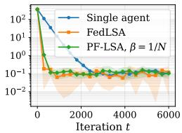  
(a) ζ<sub>ker</sub> = 0, ζ<sub>rew</sub> = 0

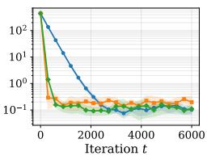  
(b) $\zeta _ { \mathrm { k e r } } = 0 ,$ ζ<sub>rew</sub> = 0.1

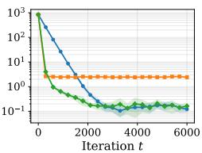  
(c) $\zeta _ { \mathrm { k e r } } = 0 ,$ , ζ<sub>rew</sub> = 0.5

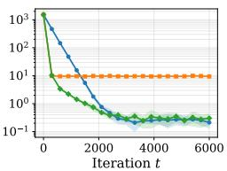  
(d) $\zeta _ { \mathrm { k e r } } = 0 ,$ $\zeta _ { \mathrm { r e w } } = 1$

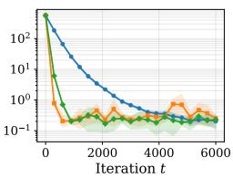  
(e) $\zeta _ { \mathrm { k e r } } = 1 , \zeta _ { \mathrm { r e w } } = 0$

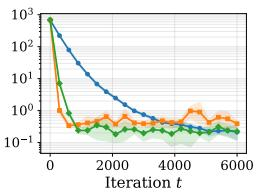  
(f) ζ<sub>ker</sub> = 1, ζ<sub>rew</sub> = 0.1

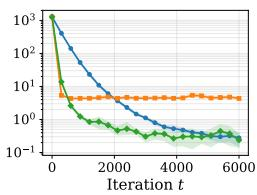  
(g) ζ<sub>ker</sub> = 1, ζ<sub>rew</sub> = 0.5

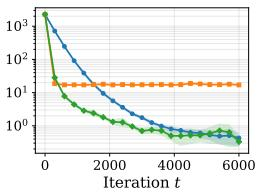  
(h) $\zeta _ { \mathrm { k e r } } = 1 , \zeta _ { \mathrm { r e w } } = 1$  
Figure 1: Average MSE over agents $\begin{array} { r } { \frac { 1 } { N } \sum _ { c = 1 } ^ { N } \left\| \theta _ { c } ^ { t } - \theta _ { c } ^ { \star } \right\| _ { 2 } ^ { 2 } } \end{array}$ as a function of the number of iterations for PF-LSA, FedLSA, and Single agent $\mathrm { L S A }$ applied to personalized federated TD(0) under varying levels of heterogeneity of the transition kernels $\zeta _ { \mathrm { k e r } }$ and rewards $\zeta _ { \mathrm { r e w } } .$ , for a fixed number of agents $N = 1 0 .$ . The step-size used for Single agent LSA is $\eta = 0 . 2$ , for $P F \bot S A .$ , we use $\eta = 0 . 2 \times N / 2$ and for FedLSA, we use $\eta = 0 . 2 \times N$ . For each algorithm, we report the average MSE over agents and variance over 5 runs.

PF-LSA properly handles heterogeneity. Figure 1 shows that PF-LSA remains stable and converges towards the personalized solutions across all considered levels of heterogeneity. When the agents are homogeneous, all methods converge to comparable limiting errors, although PF-LSA reaches this regime much faster than Single agent LSA. As the reward heterogeneity $\zeta _ { \mathrm { r e w } }$ increases, FedLSA no longer converges to the personalized solutions and instead plateaus at a large error, reflecting the bias induced by learning a single global model. This effect is especially visible for $\zeta _ { \mathrm { r e w } } \in \{ 0 . 5 , 1 \}$ , where the error of FedLSA remains several orders of magnitude above that of PF-LSA. By contrast, PF-LSA keeps a low final error even in the most heterogeneous settings.

PF-LSA successfully accelerates the learning process. Compared with Single agent LSA, PF-LSA consistently reaches the low-error regime in significantly fewer iterations. This acceleration is already visible in the homogeneous setting and persists under both reward and transition-kernel heterogeneity. The improvement comes from the gradient-mixing mechanism, which allows each agent to benefit from the stochastic updates collected by all agents, thereby reducing the effective variance of the update. This is consistent with our theoretical prediction that, for $\bar { \beta } = 1 / N$ , the averaged component of the dynamics enjoys a linear speed-up in the number of agents. Empirically, PF-LSA typically matches or improves upon the final accuracy of Single agent LSA while requiring substantially fewer iterations to reach the same error level.

PF-LSA achieves the best of both worlds between FedLSA and single agent learning. The experiments highlight the complementary limitations of the two baselines. Single agent LSA is fully personalized, but it does not exploit the samples collected by the other agents and therefore converges slowly. On the other hand, FedLSA benefits from collaboration and can converge quickly in nearly homogeneous settings, but it learns a shared solution and becomes biased when the agents are heterogeneous. PF-LSA combines the advantages of both approaches: it uses global information through the averaged update, which accelerates learning, while retaining a local update component, which guarantees convergence to each agent’s own solution. The results in Figure 1 therefore support the main message of the paper: a minimal gradient-mixing mechanism is sufficient to obtain fast collaborative learning without sacrificing personalization.

## 7 CONCLUSION AND PERSPECTIVES

We introduce PF-LSA, a minimalist federated algorithm for personalized LSA, that relies on a lightweight mixing of local updates. Remarkably, PF-LSA finds agent-specific optimal solutions without imposing any assumptions on the heterogeneity level, as is typical in federated learning. Our theoretical analysis establishes that PF-LSA achieves true personalization while still benefiting from collaboration across the network. These theoretical results build upon a precise non-asymptotic characterization of the error, which we decompose into "consensus" , that is shared by all agents and "disagreement". We identify regimes in which this simple mechanism yields a linear speed-up over isolated learning. In particular, we show that collaboration is most effective when heterogeneity remains controlled, allowing information sharing to accelerate convergence while still guaranteeing convergence to each agent’s optimal solution. Our work primarily aims to highlight the remarkable property of a very simple combination of local and global updates. Extending the present results beyond i.i.d. noise to Markovian settings would be an important step toward applications in reinforcement learning and temporal difference learning. More broadly, future work could explore algorithmic enhancements such as warm-start strategies to reduce early-stage disagreement and preconditioning methods to mitigate operator heterogeneity.

## ACKNOWLEDGEMENTS

The work of S. Labbi, and P. Mangold has been supported by Technology Innovation Institute (TII), project Fed2Learn. The work of E. Moulines has been partly funded by the European Union (ERC-2022-SYG-OCEAN-101071601). Views and opinions expressed are however those of the author(s) only and do not necessarily reflect those of the European Union or the European Research Council Executive Agency. Neither the European Union nor the granting authority can be held responsible for them.

## REFERENCES

TW Archibald, KIM McKinnon, and LC Thomas. On the generation of markov decision processes. Journal ofthe Operational Research Society, 46(3):354–361, 1995.

A. Benveniste, M. Métivier, and P. Priouret. Adaptive Algorithms and Stochastic Approximations. Applications of mathematics. Springer-Verlag, 1990. ISBN 9783540528944. URL https: //books.google.fr/books?id=vtuovgEACAAJ.

J. Bhandari, D. Russo, and R. Singal. A finite time analysis of temporal difference learning with linear function approximation. In Conference On Learning Theory, pp. 1691–1692, 2018.

Vivek S Borkar and Vivek S Borkar. Stochastic approximation: a dynamical systems viewpoint, volume 100. Springer, 2008.

G. Dalal, Balázs Szörényi, G. Thoppe, and S. Mannor. Finite sample analyses for TD(0) with function approximation. In Thirty-Second AAAI Conference on Artificial Intelligence, 2018.

Alexandre Défossez and Francis Bach. Averaged least-mean-squares: Bias-variance trade-offs and optimal sampling distributions. In Artificial Intelligence and Statistics, pp. 205–213. PMLR, 2015.

Thinh Doan, Siva Maguluri, and Justin Romberg. Finite-Time Analysis of Distributed TD(0) with Linear Function Approximation on Multi-Agent Reinforcement Learning. In Proceedings of the 36th International Conference on Machine Learning, pp. 1626–1635. PMLR, May 2019. URL https://proceedings.mlr.press/v97/doan19a.html. ISSN: 2640-3498.

Matthieu Geist, Bruno Scherrer, et al. Off-policy learning with eligibility traces: a survey. J. Mach. Learn. Res., 15(1):289–333, 2014.

Peter Kairouz, H Brendan McMahan, Brendan Avent, Aurélien Bellet, Mehdi Bennis, Arjun Nitin Bhagoji, Kallista Bonawitz, Zachary Charles, Graham Cormode, Rachel Cummings, et al. Advances and open problems in federated learning. Foundations and Trends® in Machine Learning, 14(1–2):1–210, 2021.

Sajad Khodadadian, Pranay Sharma, Gauri Joshi, and Siva Theja Maguluri. Federated reinforcement learning: Linear speedup under markovian sampling. In International Conference on Machine Learning, pp. 10997–11057. PMLR, 2022.

Safwan Labbi, Daniil Tiapkin, Lorenzo Mancini, Paul Mangold, and Eric Moulines. Federated ucbvi: Communication-efficient federated regret minimization with heterogeneous agents. In Yingzhen Li, Stephan Mandt, Shipra Agrawal, and Emtiyaz Khan (eds.), Proceedings ofThe 28th International Conference on Artificial Intelligence and Statistics, volume 258 of Proceedings of Machine Learning Research, pp. 1315–1323. PMLR, 03–05 May 2025. URL https:// proceedings.mlr.press/v258/labbi25a.html.

Safwan Labbi, Paul Mangold, Daniil Tiapkin, and Eric Moulines. On global convergence rates for federated softmax policy gradient under heterogeneousenvironments. In Emtiyaz Khan, Yingzhen Li, Arno Solin, and Aaditya Ramdas (eds.), Proceedings ofThe 29th International Conference on Artificial Intelligence and Statistics, volume 300 of Proceedings ofMachine Learning Research, pp. 4960–4968. PMLR, 02–05 May 2026. URL https://proceedings.mlr.press/v300/ labbi26a.html.

Gen Li, Weichen Wu, Yuejie Chi, Cong Ma, Alessandro Rinaldo, and Yuting Wei. High-probability sample complexities for policy evaluation with linear function approximation. IEEE Transactions on Information Theory, 70(8):5969–5999, 2024. doi: 10.1109/TIT.2024.3394685.

Tian Li, Anit Kumar Sahu, Ameet Talwalkar, and Virginia Smith. Federated learning: Challenges, methods, and future directions. IEEE signal processing magazine, 37(3):50–60, 2020.

Paul Mangold, Sergey Samsonov, Safwan Labbi, Ilya Levin, Reda Alami, Alexey Naumov, and Eric Moulines. Scafflsa: Taming heterogeneity in federated linear stochastic approximation and td learning. Advances in Neural Information Processing Systems (NeurIPS), 37, 2024.

Paul Mangold, Eloà se Berthier, and Eric Moulines. Convergence guarantees for federated sarsa with local training and heterogeneous agents. arXiv preprint arXiv:2512.17688, 2025.

Yishay Mansour, Mehryar Mohri, Jae Ro, and Ananda Theertha Suresh. Three approaches for personalization with applications to federated learning. arXiv preprint arXiv:2002.10619, 2020.

Brendan McMahan, Eider Moore, Daniel Ramage, Seth Hampson, and Blaise Aguera y Arcas. Communication-efficient learning of deep networks from decentralized data. In Artificial intelligence and statistics, pp. 1273–1282. PMLR, 2017.

Wenlong Mou, Chris Junchi Li, Martin J Wainwright, Peter L Bartlett, and Michael I Jordan. On linear stochastic approximation: Fine-grained Polyak-Ruppert and non-asymptotic concentration. In Conference on Learning Theory, pp. 2947–2997. PMLR, 2020.

Gandharv Patil, LA Prashanth, Dheeraj Nagaraj, and Doina Precup. Finite time analysis of temporal difference learning with linear function approximation: Tail averaging and regularisation. In International Conference on Artificial Intelligence and Statistics, pp. 5438–5448. PMLR, 2023.

Constantin Philippenko, Batiste Le Bars, Kevin Scaman, and Laurent MassouliÊ. Adaptive collaboration for online personalized distributed learning with heterogeneous clients. arXiv preprint arXiv:2507.06844, 2025.

Herbert Robbins and Sutton Monro. A stochastic approximation method. The annals ofmathematical statistics, pp. 400–407, 1951.

Sergey Samsonov, Daniil Tiapkin, Alexey Naumov, and Eric Moulines. Improved High-Probability Bounds for the Temporal Difference Learning Algorithm via Exponential Stability. In Shipra Agrawal and Aaron Roth (eds.), Proceedings ofThirty Seventh Conference on Learning Theory, volume 247 of Proceedings of Machine Learning Research, pp. 4511–4547. PMLR, 30 Jun–03 Jul 2024. URL https://proceedings.mlr.press/v247/samsonov24a.html.

Felix Sattler, Klaus-Robert Müller, and Wojciech Samek. Clustered federated learning: Modelagnostic distributed multitask optimization under privacy constraints. IEEE transactions on neural networks and learning systems, 32(8):3710–3722, 2020.

Virginia Smith, Chao-Kai Chiang, Maziar Sanjabi, and Ameet S Talwalkar. Federated multi-task learning. Advances in neural information processing systems, 30, 2017.

Richard S Sutton and Andrew G Barto. Reinforcement Learning: An Introduction. MIT Press, 2018.

Canh T Dinh, Nguyen Tran, and Josh Nguyen. Personalized federated learning with moreau envelopes. Advances in neural information processing systems, 33:21394–21405, 2020.

J. N. Tsitsiklis and B. Van Roy. An analysis of temporal-difference learning with function approximation. IEEE Transactions on Automatic Control, 42(5):674–690, May 1997. ISSN 2334-3303. doi: 10.1109/9.580874.

John Tsitsiklis and Benjamin Van Roy. Analysis of temporal-diffference learning with function approximation. Advances in neural information processing systems, 9, 1996.

Han Wang, Aritra Mitra, Hamed Hassani, George J Pappas, and James Anderson. Federated temporal difference learning with linear function approximation under environmental heterogeneity. arXiv preprint arXiv:2302.02212, 2023.

Han Wang, Aritra Mitra, Hamed Hassani, George J. Pappas, and James Anderson. Federated TD learning with linear function approximation under environmental heterogeneity. Transactions on Machine Learning Research, 2024. ISSN 2835-8856. URL https://openreview.net/ forum?id=hdQspgyFrk.

Chenyu Zhang and Navid Azizan. Personalized collaborative learning with affinity-based variance reduction. arXiv preprint arXiv:2510.16232, 2025.

Yue Zhao, Meng Li, Liangzhen Lai, Naveen Suda, Damon Civin, and Vikas Chandra. Federated learning with non-iid data. arXiv preprint arXiv:1806.00582, 2018.

## A CONVERGENCE OF A LYAPUNOV FUNCTION

In this appendix, we denote the errors and disagreement as follows:

$$
e _ { c } ^ { t } : = \theta _ { c } ^ { t } - \theta _ { c } ^ { \star } , \quad \bar { e } ^ { t } : = \frac { 1 } { N } \sum _ { c = 1 } ^ { N } e _ { c } ^ { t } , \quad d _ { c } ^ { t } : = e _ { c } ^ { t } - \bar { e } ^ { t } , \quad D ^ { t } : = \frac { 1 } { N } \sum _ { c = 1 } ^ { N } \| d _ { c } ^ { t } \| ^ { 2 } .
$$

We also introduce the short-hand notations for the noise variables

$$
\varepsilon _ { c } ^ { t + 1 } = \varepsilon _ { c } ( Z _ { c } ^ { t + 1 } ) , \quad \bar { \varepsilon } ^ { t + 1 } = \frac { 1 } { N } \sum _ { c = 1 } ^ { N } \varepsilon _ { c } ^ { t + 1 } , \quad \widetilde { \varepsilon } _ { c } ^ { t + 1 } = \bar { \varepsilon } ^ { t + 1 } - \varepsilon _ { c } ^ { t + 1 } ,
$$

as well as

$$
{ \bf A } _ { c } ^ { t + 1 } = { \bf A } _ { c } ( Z _ { c } ^ { t + 1 } ) \mathrm {  ~ \bf ~ b } _ { c } ^ { t + 1 } = { \bf b } _ { c } ( Z _ { c } ^ { t + 1 } ) \mathrm {  ~ \bf ~ \delta ~ }
$$

and define the filtration $\{ \mathcal { F } ^ { t } \} _ { t \geq 0 }$ that contains all randomness up to time t.

$$
\mathcal { F } ^ { t } : = \sigma \Big ( Z _ { c } ^ { p } : p \in \{ 1 , \dots , t \} , c \in [ N ] \Big ) ,
$$

The following lemma explicits the recursion on the individual error and the disagreement.

Theorem A.1. Assume A1 and A2. Let $0 < \beta \leq 1$ , let

$$
\eta \in \left( 0 , \operatorname* { m i n } \left\{ \eta _ { \infty } , \frac { a } { 1 6 \mathrm { C } _ { \bf A } ^ { 2 } } \right\} \right) ,
$$

and let $0 < \lambda \leq 1$ satisfy

$$
( 1 - \lambda ) \zeta \leq \frac { a \sqrt \lambda } 2 , \quad \frac { \eta \mathrm { C } _ { \bf A } ^ { 2 } } { a } \frac { \operatorname* { m a x } \{ \beta , \lambda \} } { \lambda } \leq \frac 1 6 .\tag{3}
$$

Then, for every $t \geq 0 ,$

$$
\mathbb { E } \left[ { D } ^ { t + 1 } + \beta \lambda \| \bar { e } ^ { t + 1 } \| _ { 2 } ^ { 2 } \right] \leq ( 1 - \eta \beta a ) \mathbb { E } \left[ { D } ^ { t } + \beta \lambda \| \bar { e } ^ { t } \| _ { 2 } ^ { 2 } \right] + 2 \eta ^ { 2 } \left[ \beta ^ { 2 } \left( 1 - \frac { 1 } { N } \right) + \frac { \beta \lambda } { N } \right] \bar { \sigma } _ { \varepsilon } ^ { 2 } .\tag{4}
$$

Proof. The average-error and disagreement recursions are

$$
\begin{array} { r l } & { \bar { e } ^ { t + 1 } = \bar { e } ^ { t } - \displaystyle \frac { \eta } { N } \sum _ { c = 1 } ^ { N } \left( \mathbf { A } _ { c } ^ { t + 1 } e _ { c } ^ { t } + \varepsilon _ { c } ^ { t + 1 } \right) , } \\ & { d _ { c } ^ { t + 1 } = d _ { c } ^ { t } - \eta \beta \left[ \mathbf { A } _ { c } ^ { t + 1 } e _ { c } ^ { t } + \varepsilon _ { c } ^ { t + 1 } - \displaystyle \frac { 1 } { N } \sum _ { c ^ { \prime } = 1 } ^ { N } \left( \mathbf { A } _ { c ^ { \prime } } ^ { t + 1 } e _ { c ^ { \prime } } ^ { t } + \varepsilon _ { c ^ { \prime } } ^ { t + 1 } \right) \right] . } \end{array}\tag{5}
$$

Squaring (5), averaging over $c \in [ N ]$ , and using $\textstyle \sum _ { c = 1 } ^ { N } d _ { c } ^ { t } = 0$ gives

$$
\begin{array} { r l } & { \displaystyle { D ^ { t + 1 } = D ^ { t } - \frac { 2 \eta \beta } { N } \sum _ { c = 1 } ^ { N } \left. d _ { c } ^ { t } , \mathbf { A } _ { c } ^ { t + 1 } e _ { c } ^ { t } + \varepsilon _ { c } ^ { t + 1 } \right. } } \\ & { \displaystyle { + \frac { \eta ^ { 2 } \beta ^ { 2 } } { N } \sum _ { c = 1 } ^ { N } \left\| \mathbf { A } _ { c } ^ { t + 1 } e _ { c } ^ { t } + \varepsilon _ { c } ^ { t + 1 } - \frac { 1 } { N } \sum _ { c ^ { \prime } = 1 } ^ { N } \left( \mathbf { A } _ { c ^ { \prime } } ^ { t + 1 } e _ { c ^ { \prime } } ^ { t } + \varepsilon _ { c ^ { \prime } } ^ { t + 1 } \right) \right\| _ { 2 } ^ { 2 } } . } \end{array}\tag{6}
$$

Indeed, the term involving the empirical average in the linear part vanishes, since

$$
\sum _ { c = 1 } ^ { N } \left. d _ { c } ^ { t } , \frac { 1 } { N } \sum _ { c ^ { \prime } = 1 } ^ { N } \left( \mathbf { A } _ { c ^ { \prime } } ^ { t + 1 } e _ { c ^ { \prime } } ^ { t } + \varepsilon _ { c ^ { \prime } } ^ { t + 1 } \right) \right. = \left. \sum _ { c = 1 } ^ { N } d _ { c } ^ { t } , \frac { 1 } { N } \sum _ { c ^ { \prime } = 1 } ^ { N } \left( \mathbf { A } _ { c ^ { \prime } } ^ { t + 1 } e _ { c ^ { \prime } } ^ { t } + \varepsilon _ { c ^ { \prime } } ^ { t + 1 } \right) \right. = 0 .
$$

Likewise,

$$
\beta \lambda \| \bar { e } ^ { t + 1 } \| _ { 2 } ^ { 2 } = \beta \lambda \| \bar { e } ^ { t } \| _ { 2 } ^ { 2 } - 2 \eta \beta \lambda \left. \bar { e } ^ { t } , \frac { 1 } { N } \sum _ { c = 1 } ^ { N } \left( \mathbf { A } _ { c } ^ { t + 1 } e _ { c } ^ { t } + \varepsilon _ { c } ^ { t + 1 } \right) \right.
$$

$$
+ \eta ^ { 2 } \beta \lambda \left\| \frac { 1 } { N } \sum _ { c = 1 } ^ { N } \left( \mathbf { A } _ { c } ^ { t + 1 } e _ { c } ^ { t } + \varepsilon _ { c } ^ { t + 1 } \right) \right\| _ { 2 } ^ { 2 } .\tag{7}
$$

By A2,

$$
\mathbb { E } \left[ \mathbf { A } _ { c } ^ { t + 1 } e _ { c } ^ { t } + \varepsilon _ { c } ^ { t + 1 } \Big | \mathcal { F } ^ { t } \right] = \bar { \mathbf { A } } _ { c } e _ { c } ^ { t } .
$$

Therefore, taking conditional expectations in (6) and (7), we obtain

$$
\begin{array} { r l } { \mathbb { E } [  D ^ { ( t + 1 } + \beta \lambda \| \hat { e } ^ { t + 1 } \| _ { 2 } ^ { t } ] \mathcal { F } ^ { t } | = D ^ { t } + \beta \lambda \| \hat { e } ^ { t } \| _ { 2 } ^ { 2 } } & { } \\ & { \quad + \underbrace { \eta \beta [ \displaystyle \frac { 1 } { N } \sum _ { \ell = 1 } ^ { N }  d _ { \ell } ^ { t } , \bar { \mathbf { A } } _ { \ell } e _ { \ell } ^ { t }  + \lambda  \bar { e } ^ { t } , \frac { 1 } { N } \sum _ { \ell = 1 } ^ { N } \bar { \mathbf { A } } _ { \ell } e _ { \ell } ^ { t }  ] } _ { ( \mathrm { A } ) } } \\ & { \quad + \underbrace { \eta ^ { 2 } \mathbb { E } [ \displaystyle \frac { \beta ^ { 2 } } { N } \sum _ { \ell = 1 } ^ { N } \| \mathbf { A } _ { \ell } ^ { t + 1 } e _ { \ell } ^ { t } + \bar { e } _ { \ell } ^ { t + 1 } - \frac { 1 } { N } \sum _ { \ell = 1 } ^ { N } ( \mathbf { A } _ { \ell } ^ { t + 1 } e _ { \ell } ^ { t } + \bar { e } _ { \ell } ^ { t + 1 } ) \| _ { 2 } ^ { 2 } ] \mathcal { F } ^ { t } ] } _ { ( \mathrm { R } ) } } \\ & { \quad + \underbrace { \eta ^ { 2 } \beta \lambda \mathbb { E } \Bigg [ \| \displaystyle \frac { 1 } { N } \sum _ { \ell = 1 } ^ { N } ( \mathbf { A } _ { \ell } ^ { t + 1 } e _ { \ell } ^ { t } + \bar { e } _ { \ell } ^ { t + 1 } ) \| _ { 2 } ^ { 2 } \Bigg | \mathcal { F } ^ { t } \Bigg ] } _ { ( \mathrm { R } ) } . } \end{array}
$$

Bounding (A). By definition of the disagreement, $d _ { c } ^ { t } = e _ { c } ^ { t } - \bar { e } ^ { t }$ , and hence $\bar { e } ^ { t } = e _ { c } ^ { t } - d _ { c } ^ { t }$ . Therefore, by linearity of the inner product,

$$
\begin{array} { r l } & { \left. \bar { e } ^ { t } , \displaystyle \frac { 1 } { N } \sum _ { c = 1 } ^ { N } \bar { \mathbf { A } } _ { c } e _ { c } ^ { t } \right. = \displaystyle \frac { 1 } { N } \sum _ { c = 1 } ^ { N } \left. e _ { c } ^ { t } - d _ { c } ^ { t } , \bar { \mathbf { A } } _ { c } e _ { c } ^ { t } \right. } \\ & { \qquad = \displaystyle \frac { 1 } { N } \sum _ { c = 1 } ^ { N } \left. e _ { c } ^ { t } , \bar { \mathbf { A } } _ { c } e _ { c } ^ { t } \right. - \displaystyle \frac { 1 } { N } \sum _ { c = 1 } ^ { N } \left. d _ { c } ^ { t } , \bar { \mathbf { A } } _ { c } e _ { c } ^ { t } \right. . } \end{array}
$$

Substituting this identity into (A) and collecting the coefficients of $\begin{array} { r } { N ^ { - 1 } \sum _ { c } \langle d _ { c } ^ { t } , \bar { \mathbf { A } } _ { c } e _ { c } ^ { t } \rangle } \end{array}$ yields

$$
( \mathbf { A } ) = - 2 \eta \beta \left[ \underbrace { \lambda \frac { 1 } { N } \sum _ { c = 1 } ^ { N } \big \langle e _ { c } ^ { t } , \bar { \mathbf { A } } _ { c } e _ { c } ^ { t } \big \rangle } _ { ( \mathbf { A 1 } ) } + ( 1 - \lambda ) \underbrace { \frac { 1 } { N } \sum _ { c = 1 } ^ { N } \big \langle d _ { c } ^ { t } , \bar { \mathbf { A } } _ { c } e _ { c } ^ { t } \big \rangle } _ { ( \mathbf { A 2 } ) } \right] .
$$

Using Lemma D.3, we obtain the following bound on (A1)

$$
( \mathbf { A 1 } ) = \frac { 1 } { N } \sum _ { c = 1 } ^ { N } \left. e _ { c } ^ { t } , \bar { \mathbf { A } } _ { c } e _ { c } ^ { t } \right. \geq \frac { a } { N } \sum _ { c = 1 } ^ { N } \| e _ { c } ^ { t } \| _ { 2 } ^ { 2 } = a \left( \| \bar { e } ^ { t } \| _ { 2 } ^ { 2 } + D ^ { t } \right) .\tag{9}
$$

Since $\textstyle \sum _ { c } d _ { c } ^ { t } = 0$ and $e _ { c } ^ { t } = \bar { e } ^ { t } + d _ { c } ^ { t }$ , we can decompose (A2) as

$$
( \mathbf { A } \mathbf { 2 } ) = \frac { 1 } { N } \sum _ { c = 1 } ^ { N } \left. d _ { c } ^ { t } , \bar { \mathbf { A } } _ { c } e _ { c } ^ { t } \right. = \frac { 1 } { N } \sum _ { c = 1 } ^ { N } \left. d _ { c } ^ { t } , \bar { \mathbf { A } } _ { c } d _ { c } ^ { t } \right. + \frac { 1 } { N } \sum _ { c = 1 } ^ { N } \left. d _ { c } ^ { t } , ( \bar { \mathbf { A } } _ { c } - \bar { \mathbf { A } } ) \bar { e } ^ { t } \right. .
$$

Using Lemma D.3 and Cauchy-Schwartz inequality, we obtain the following bound on (A2)

$$
\begin{array} { l } { { \displaystyle ( { \bf A 2 } ) = \frac { 1 } { N } \sum _ { c = 1 } ^ { N } \left. { d _ { c } ^ { t } , \bar { \bf A } _ { c } e _ { c } ^ { t } } \right. \geq a D ^ { t } - \frac { 1 } { N } \sum _ { c = 1 } ^ { N } \| { d _ { c } ^ { t } } \| _ { 2 } \left\| \bar { \bf A } _ { c } - \frac { 1 } { N } \sum _ { c ^ { \prime } = 1 } ^ { N } \bar { \bf A } _ { c ^ { \prime } } \right\| \left\| \bar { e } ^ { t } \right\| _ { 2 } } } \\ { { \displaystyle \qquad = a D ^ { t } - \zeta \| \bar { e } ^ { t } \| _ { 2 } \sqrt { D ^ { t } } , } } \end{array}\tag{10}
$$

where the last equality follows from the definition of $\zeta ,$ see (1). Combining (9) and (10), the expression inside the square brackets in $( \mathbf { A } )$ is bounded from below by

$$
a \lambda \| \bar { e } ^ { t } \| _ { 2 } ^ { 2 } + a D ^ { t } - ( 1 - \lambda ) \zeta \| \bar { e } ^ { t } \| _ { 2 } \sqrt { D ^ { t } } .
$$

By the first condition in (3),

$$
( 1 - \lambda ) \zeta \| \bar { e } ^ { t } \| _ { 2 } \sqrt { D ^ { t } } \leq \frac { a \sqrt { \lambda } } { 2 } \| \bar { e } ^ { t } \| _ { 2 } \sqrt { D ^ { t } } \leq \frac { a } { 4 } \left( \lambda \| \bar { e } ^ { t } \| _ { 2 } ^ { 2 } + D ^ { t } \right) ,
$$

where the second inequality follows from Young’s inequality. Consequently,

$$
a \lambda \| \bar { e } ^ { t } \| _ { 2 } ^ { 2 } + a D ^ { t } - ( 1 - \lambda ) \zeta \| \bar { e } ^ { t } \| _ { 2 } \sqrt { D ^ { t } } \geq \frac { 3 a } { 4 } \left( \lambda \| \bar { e } ^ { t } \| _ { 2 } ^ { 2 } + D ^ { t } \right) ,
$$

and therefore

$$
\mathbf { \rho } ( \mathbf { A } ) \leq - \frac { 3 } { 2 } \eta \beta a \left( \lambda \| \bar { e } ^ { t } \| _ { 2 } ^ { 2 } + D ^ { t } \right) .\tag{11}
$$

Bounding (B). Applying the variance decomposition around the conditional mean yields

$$
\begin{array} { r l } & { ( \mathbb { B } ) = \eta ^ { \nu } \mathbb { E } \Bigg [ \Bigg | \frac { \beta ^ { 2 } } { N } \underset { \longrightarrow \infty } { \overset { N } { \sum } } \Bigg | \mathbb { A } _ { x ^ { \prime } } ^ { \nu } \mathrm { e } _ { i ^ { \prime } } ^ { \nu } + \frac { \nu ^ { \prime } } { N ^ { \prime } } - \frac { 1 } { N } \underset { \longrightarrow \infty } { \overset { N } { \sum } } \big ( ( \lambda _ { x ^ { \prime } } ^ { \nu - 1 } \mathrm { e } _ { i ^ { \prime } } ^ { \nu } + \lambda _ { x ^ { \prime } } ^ { \nu + 1 } ) \big ) \Bigg | \Bigg ] ^ { 2 } \Bigg | \mathcal { F } \Bigg | } \\ & { \quad + \eta ^ { 2 } \mathrm { i } \eta \Bigg \} \mathbb { E } \Bigg [ \Bigg | \frac { 1 } { N } \underset { \longrightarrow \infty } { \overset { N } { \sum } } \big ( ( \lambda _ { x ^ { \prime } } ^ { \nu + 1 } \mathrm { e } _ { i ^ { \prime } } ^ { \nu } + \lambda _ { x ^ { \prime } } ^ { \nu + 1 } ) \big ) \Bigg | \Bigg | _ { 2 } \Bigg | \mathcal { F } \Bigg | } \\ & { \quad - \eta ^ { \nu } \mathbb { E } \Bigg [ \Bigg | \frac { \beta ^ { 2 } } { N } \underset { \longrightarrow \infty } { \overset { N } { \sum } } \Bigg | \mathbb { A } _ { x ^ { \prime } } \mathrm { e } _ { i ^ { \prime } } ^ { \nu } - \frac { 1 } { N } \underset { \longrightarrow \infty } { \overset { N } { \sum } } \lambda _ { x ^ { \prime } } \epsilon _ { i ^ { \prime } } ^ { \nu } \Bigg | \Bigg | \mathcal { F } \Bigg | + \eta ^ { 2 } \mathrm { i } \eta \mathrm { A } _ { x ^ { \prime } } \Bigg [ \Bigg | \frac { 1 } { N } \underset { \longrightarrow \infty } { \overset { N } { \sum } } \lambda _ { x ^ { \prime } } \epsilon _ { i ^ { \prime } } ^ { \nu } \Bigg | \Bigg | \mathcal { F } \Bigg ] } \\ &  \quad \underset { \longrightarrow \infty }  \ \end{array}
$$

\- Bounding (B1). Using the identity

$$
\frac { 1 } { N } \sum _ { c = 1 } ^ { N } \left\| x _ { c } - \frac { 1 } { N } \sum _ { c ^ { \prime } = 1 } ^ { N } x _ { c ^ { \prime } } \right\| _ { 2 } ^ { 2 } = \frac { 1 } { N } \sum _ { c = 1 } ^ { N } \left\| x _ { c } \right\| _ { 2 } ^ { 2 } - \left\| \frac { 1 } { N } \sum _ { c = 1 } ^ { N } x _ { c } \right\| _ { 2 } ^ { 2 } ,\tag{12}
$$

with $x _ { c } = \bar { \mathbf { A } } _ { c } e _ { c } ^ { t }$ , we obtain

$$
\begin{array} { l } { { \displaystyle \frac { \beta ^ { 2 } } { N } \sum _ { c = 1 } ^ { N } \left\| \bar { \mathbf { A } } _ { c } e _ { c } ^ { t } - \frac { 1 } { N } \sum _ { c ^ { \prime } = 1 } ^ { N } \bar { \mathbf { A } } _ { c ^ { \prime } } e _ { c ^ { \prime } } ^ { t } \right\| _ { 2 } ^ { 2 } + \beta \lambda \left\| \frac { 1 } { N } \sum _ { c = 1 } ^ { N } \bar { \mathbf { A } } _ { c } e _ { c } ^ { t } \right\| _ { 2 } ^ { 2 } } } \\ { { \displaystyle = \frac { \beta ^ { 2 } } { N } \sum _ { c = 1 } ^ { N } \| \bar { \mathbf { A } } _ { c } e _ { c } ^ { t } \| _ { 2 } ^ { 2 } + ( \beta \lambda - \beta ^ { 2 } ) \left\| \frac { 1 } { N } \sum _ { c = 1 } ^ { N } \bar { \mathbf { A } } _ { c } e _ { c } ^ { t } \right\| _ { 2 } ^ { 2 } . } } \end{array}
$$

If $\lambda \leq \beta ,$ the second term on the right-hand side is non-positive, and therefore

$$
\frac { \beta ^ { 2 } } { N } \sum _ { c = 1 } ^ { N } \| \bar { \mathbf { A } } _ { c } e _ { c } ^ { t } \| _ { 2 } ^ { 2 } + ( \beta \lambda - \beta ^ { 2 } ) \left\| \frac { 1 } { N } \sum _ { c = 1 } ^ { N } \bar { \mathbf { A } } _ { c } e _ { c } ^ { t } \right\| _ { 2 } ^ { 2 } \leq \frac { \beta ^ { 2 } } { N } \sum _ { c = 1 } ^ { N } \| \bar { \mathbf { A } } _ { c } e _ { c } ^ { t } \| _ { 2 } ^ { 2 } .
$$

If $\lambda > \beta .$ , Jensen’s inequality gives

$$
\left\| \frac { 1 } { N } \sum _ { c = 1 } ^ { N } \bar { \mathbf { A } } _ { c } e _ { c } ^ { t } \right\| _ { 2 } ^ { 2 } \leq \frac { 1 } { N } \sum _ { c = 1 } ^ { N } \| \bar { \mathbf { A } } _ { c } e _ { c } ^ { t } \| _ { 2 } ^ { 2 } ,
$$

and hence

$$
\frac { \beta ^ { 2 } } { N } \sum _ { c = 1 } ^ { N } \| \bar { \mathbf { A } } _ { c } e _ { c } ^ { t } \| _ { 2 } ^ { 2 } + ( \beta \lambda - \beta ^ { 2 } ) \left\| \frac { 1 } { N } \sum _ { c = 1 } ^ { N } \bar { \mathbf { A } } _ { c } e _ { c } ^ { t } \right\| _ { 2 } ^ { 2 } \leq \frac { \beta \lambda } { N } \sum _ { c = 1 } ^ { N } \| \bar { \mathbf { A } } _ { c } e _ { c } ^ { t } \| _ { 2 } ^ { 2 } .
$$

Thus, in both cases,

$$
\begin{array} { r } { ( { \bf B 1 } ) \le \eta ^ { 2 } \beta \operatorname* { m a x } \{ \beta , \lambda \} { \bf C } _ { \bf A } ^ { 2 } \left( \| \bar { e } ^ { t } \| _ { 2 } ^ { 2 } + D ^ { t } \right) . } \end{array}\tag{13}
$$

\- Bounding (B1) + (B3). Applying (12) with $x _ { c } = ( \mathbf { A } _ { c } ^ { t + 1 } - \bar { \mathbf { A } } _ { c } ) e _ { c } ^ { t } + \varepsilon _ { c } ^ { t + 1 }$ gives

$$
\begin{array} { r l } & { ( { \mathbf B } ^ { 2 } ) + ( { \mathbf B } \mathbf { 3 } ) } \\ & { \quad = \eta ^ { 2 } \mathbb { E } \left[ \frac { \beta ^ { 2 } } { N } \displaystyle \sum _ { c = 1 } ^ { N } \left\| ( \mathbf { A } _ { c } ^ { t + 1 } - \bar { \mathbf { A } } _ { c } ) e _ { c } ^ { t } + \varepsilon _ { c } ^ { t + 1 } - \frac { 1 } { N } \displaystyle \sum _ { c = 1 } ^ { N } \left( ( \mathbf { A } _ { c } ^ { t + 1 } - \bar { \mathbf { A } } _ { c } ) e _ { c } ^ { t } + \varepsilon _ { c } ^ { t + 1 } \right) \right\| _ { 2 } ^ { 2 } \right] \mathcal { F } ^ { t } \Bigg ] } \\ & { \quad + \eta ^ { 2 } \beta \lambda \mathbb { E } \left[ \left\| \frac { 1 } { N } \displaystyle \sum _ { c = 1 } ^ { N } \left( ( \mathbf { A } _ { c } ^ { t + 1 } - \bar { \mathbf { A } } _ { c } ) e _ { c } ^ { t } + \varepsilon _ { c } ^ { t + 1 } \right) \right\| _ { 2 } ^ { 2 } \right] \mathcal { F } ^ { t } \Bigg ] } \\ & { \quad = \frac { \eta ^ { 2 } \beta ^ { 2 } } { N } \mathbb { E } \left[ \displaystyle \sum _ { c = 1 } ^ { N } \| ( \mathbf { A } _ { c } ^ { t + 1 } - \bar { \mathbf { A } } _ { c } ) e _ { c } ^ { t } + \varepsilon _ { c } ^ { t + 1 } \| _ { 2 } ^ { 2 } \right] \mathcal { F } ^ { t } \Bigg ] } \\ & { \quad + \ : \forall ^ { 2 } ( \beta \lambda - \beta ^ { 2 } ) \mathbb { E } \left[ \left\| \frac { 1 } { N } \displaystyle \sum _ { c = 1 } ^ { N } ( \mathbf { A } _ { c } ^ { t + 1 } - \bar { \mathbf { A } } _ { c } ) e _ { c } ^ { t } + \varepsilon _ { c } ^ { t + 1 } \right\| _ { 2 } ^ { 2 } \right] \mathcal { F } ^ { t } \Bigg ] } \end{array}
$$

By independence of the noise across agents, we obtain

$$
( \mathbf { B } 2 ) + ( \mathbf { B } \mathbf { 3 } ) = \eta ^ { 2 } \left[ \beta ^ { 2 } + \frac { \beta \lambda - \beta ^ { 2 } } { N } \right] \frac { 1 } { N } \mathbb { E } \Bigg [ \sum _ { c = 1 } ^ { N } \lVert ( \mathbf { A } _ { c } ^ { t + 1 } - \bar { \mathbf { A } } _ { c } ) e _ { c } ^ { t } + \varepsilon _ { c } ^ { t + 1 } \rVert _ { 2 } ^ { 2 } \Bigg | \mathcal { F } ^ { t } \Bigg ] ~ .\tag{14}
$$

Moreover, by Young’s inequality and A2, we have

$$
\begin{array} { r l } { \displaystyle \frac { 1 } { N } \sum _ { c = 1 } ^ { N } \mathbb { E } \left[ \left\| ( \mathbf { A } _ { c } ^ { t + 1 } - \bar { \mathbf { A } } _ { c } ) e _ { c } ^ { t } + \varepsilon _ { c } ^ { t + 1 } \right\| _ { 2 } ^ { 2 } \Big | \mathcal { F } ^ { t } \right] \leq \displaystyle \frac { 2 } { N } \sum _ { c = 1 } ^ { N } \mathbb { E } \left[ \left\| ( \mathbf { A } _ { c } ^ { t + 1 } - \bar { \mathbf { A } } _ { c } ) e _ { c } ^ { t } \right\| _ { 2 } ^ { 2 } \Big | \mathcal { F } ^ { t } \right] + 2 \bar { \sigma } _ { \varepsilon } ^ { 2 } } & { } \\ { \leq \displaystyle \frac { 2 \mathrm { C } _ { \mathbf { A } } ^ { 2 } } { N } \sum _ { c = 1 } ^ { N } \| e _ { c } ^ { t } \| _ { 2 } ^ { 2 } + 2 \bar { \sigma } _ { \varepsilon } ^ { 2 } } & { } \\ { = 2 \mathrm { C } _ { \mathbf { A } } ^ { 2 } \left( \| \bar { e } ^ { t } \| _ { 2 } ^ { 2 } + D ^ { t } \right) + 2 \bar { \sigma } _ { \varepsilon } ^ { 2 } . } \end{array}
$$

where in the last equality we used $\begin{array} { r } { \frac { 1 } { N } \sum _ { c = 1 } ^ { N } \| e _ { c } ^ { t } \| _ { 2 } ^ { 2 } = \| \bar { e } ^ { t } \| _ { 2 } ^ { 2 } + D ^ { t } } \end{array}$ . Plugging in the previous bound in (14) yields

$$
( \mathbf { B 2 } ) + ( \mathbf { B 3 } ) \leq \eta ^ { 2 } \left[ \beta ^ { 2 } + \frac { \beta \lambda - \beta ^ { 2 } } { N } \right] \left( 2 \mathrm { C } _ { \mathbf { A } } ^ { 2 } \left( \| \bar { e } ^ { t } \| _ { 2 } ^ { 2 } + D ^ { t } \right) + 2 \bar { \sigma } _ { \varepsilon } ^ { 2 } \right)
$$

Furthermore, as

$$
\left[ \beta ^ { 2 } + \frac { \beta \lambda - \beta ^ { 2 } } { N } \right] = \beta \left[ \left( 1 - \frac { 1 } { N } \right) \beta + \frac { \lambda } { N } \right] \leq \beta \operatorname* { m a x } \{ \beta , \lambda \} ,
$$

we get

$$
\left( { \bf B 2 } \right) + \left( { \bf B 3 } \right) \le 2 \eta ^ { 2 } \beta \operatorname* { m a x } \{ \beta , \lambda \} \mathrm { C } _ { \bf A } ^ { 2 } \left( \| \bar { e } ^ { t } \| _ { 2 } ^ { 2 } + D ^ { t } \right) + 2 \eta ^ { 2 } \left[ \beta ^ { 2 } \left( 1 - \frac { 1 } { N } \right) + \frac { \beta \lambda } { N } \right] \bar { \sigma } _ { \varepsilon } ^ { 2 } .
$$

Combining the previous bound with (13), we obtain

$$
\mathbf { \Phi } ( \mathbf { B } ) \le 3 \eta ^ { 2 } \beta \operatorname* { m a x } \{ \beta , \lambda \} \mathrm { C } _ { \mathbf { A } } ^ { 2 } \left( \| { \bar { e } } ^ { t } \| _ { 2 } ^ { 2 } + D ^ { t } \right) + 2 \eta ^ { 2 } \left[ \beta ^ { 2 } \left( 1 - \frac { 1 } { N } \right) + \frac { \beta \lambda } { N } \right] { \bar { \sigma } } _ { \varepsilon } ^ { 2 } .\tag{15}
$$

Since $0 < \lambda \leq 1$

$$
\| \bar { e } ^ { t } \| _ { 2 } ^ { 2 } + D ^ { t } \leq \lambda ^ { - 1 } \left( \lambda \| \bar { e } ^ { t } \| _ { 2 } ^ { 2 } + D ^ { t } \right) .
$$

Hence

$$
3 \eta ^ { 2 } \beta \operatorname* { m a x } \{ \beta , \lambda \} \mathrm C _ { \mathbf { A } } ^ { 2 } \left( \| \bar { e } ^ { t } \| _ { 2 } ^ { 2 } + D ^ { t } \right) \le 3 \eta ^ { 2 } \beta \frac { \operatorname* { m a x } \{ \beta , \lambda \} } { \lambda } \mathrm C _ { \mathbf { A } } ^ { 2 } \left( \lambda \| \bar { e } ^ { t } \| _ { 2 } ^ { 2 } + D ^ { t } \right) .
$$

By the second condition in (3),

$$
\frac { \eta \mathrm { C } _ { \mathbf { A } } ^ { 2 } } { a } \frac { \operatorname* { m a x } \{ \beta , \lambda \} } { \lambda } \leq \frac { 1 } { 6 } ,
$$

so that

$$
3 \eta ^ { 2 } \beta \operatorname* { m a x } \{ \beta , \lambda \} \mathrm { C } _ { \mathbf { A } } ^ { 2 } \left( \| \bar { e } ^ { t } \| _ { 2 } ^ { 2 } + D ^ { t } \right) \le \frac { \eta \beta a } { 2 } \left( \lambda \| \bar { e } ^ { t } \| _ { 2 } ^ { 2 } + D ^ { t } \right) .\tag{16}
$$

Substituting (11), (15), and (16) into (8) yields

$$
\begin{array} { r l } & { \mathbb { E } \left[ D ^ { t + 1 } + \beta \lambda \| \bar { e } ^ { t + 1 } \| _ { 2 } ^ { 2 } \middle | \mathcal { F } ^ { t } \right] \leq D ^ { t } + \beta \lambda \| \bar { e } ^ { t } \| _ { 2 } ^ { 2 } - \frac { 3 } { 2 } \eta \beta a \left( \lambda \| \bar { e } ^ { t } \| _ { 2 } ^ { 2 } + D ^ { t } \right) } \\ & { \qquad + \displaystyle \frac { 1 } { 2 } \eta \beta a \left( \lambda \| \bar { e } ^ { t } \| _ { 2 } ^ { 2 } + D ^ { t } \right) } \\ & { \qquad + 2 \eta ^ { 2 } \left[ \beta ^ { 2 } \left( 1 - \frac { 1 } { N } \right) + \frac { \beta \lambda } { N } \right] \bar { \sigma } _ { \varepsilon } ^ { 2 } } \\ & { \qquad = D ^ { t } + \beta \lambda \| \bar { e } ^ { t } \| _ { 2 } ^ { 2 } - \eta \beta a \left( \lambda \| \bar { e } ^ { t } \| _ { 2 } ^ { 2 } + D ^ { t } \right) } \\ & { \qquad + 2 \eta ^ { 2 } \left[ \beta ^ { 2 } \left( 1 - \frac { 1 } { N } \right) + \frac { \beta \lambda } { N } \right] \bar { \sigma } _ { \varepsilon } ^ { 2 } . } \end{array}\tag{17}
$$

Finally, since $0 < \beta \leq 1$

$$
\begin{array} { r } { \lambda \| \bar { e } ^ { t } \| _ { 2 } ^ { 2 } + D ^ { t } \geq \beta \lambda \| \bar { e } ^ { t } \| _ { 2 } ^ { 2 } + D ^ { t } . } \end{array}
$$

Applying this inequality to (17) gives

$$
\mathbb { E } \left[ { D } ^ { t + 1 } + \beta \lambda \| \bar { e } ^ { t + 1 } \| _ { 2 } ^ { 2 } \middle | \mathcal { F } ^ { t } \right] \leq \left( 1 - \eta \beta a \right) \left( { D } ^ { t } + \beta \lambda \| \bar { e } ^ { t } \| _ { 2 } ^ { 2 } \right) + 2 \eta ^ { 2 } \left[ \beta ^ { 2 } \left( 1 - \frac { 1 } { N } \right) + \frac { \beta \lambda } { N } \right] \bar { \sigma } _ { \varepsilon } ^ { 2 } .
$$

Taking total expectations proves (4).

The following Lemma shows that the condition on λ can always be met.

Lemma A.2. Assume $0 < \beta \leq 1$ , and η $\leq \frac { a } { 1 6 \mathrm { C } _ { \mathbf { A } } ^ { 2 } }$ . Then the conditions

$$
( 1 - \lambda ) \zeta \leq { \frac { a { \sqrt { \lambda } } } { 2 } } , \qquad { \frac { \eta \mathrm { C } _ { \mathbf { A } } ^ { 2 } } { a } } { \frac { \operatorname* { m a x } \{ \beta , \lambda \} } { \lambda } } \leq { \frac { 1 } { 6 } }\tag{18}
$$

are satisfied with thefollowing choice ofλ

$$
\lambda = \operatorname* { m i n } \left\{ 1 , \ : \operatorname { m a x } \left\{ 4 \frac { \zeta ^ { 2 } } { a ^ { 2 } } , \ : 6 \frac { \eta \beta \mathrm { C } _ { \bf A } ^ { 2 } } { a } \right\} \right\}\tag{19}
$$

Proof. We distinguish two cases.

First, suppose that the minimum in (19) is attained at 1, so that $\lambda = 1$ . Then the first condition in (18) holds trivially since

$$
( 1 - \lambda ) \zeta = 0 .
$$

Moreover, since $0 < \beta \leq 1 = \lambda$

$$
\frac { \operatorname* { m a x } \{ \beta , \lambda \} } { \lambda } = 1 .
$$

Therefore, using the step-size condition,

$$
\frac { \eta \mathrm { C } _ { \mathbf { A } } ^ { 2 } } { a } \frac { \operatorname* { m a x } \{ \beta , \lambda \} } { \lambda } = \frac { \eta \mathrm { C } _ { \mathbf { A } } ^ { 2 } } { a } \leq \frac { 1 } { 1 6 } \leq \frac { 1 } { 6 } .
$$

Hence both conditions are satisfied.

Suppose now that the minimum in (19) is strictly smaller than 1. Then

$$
\lambda = \operatorname* { m a x } \left\{ 4 \frac { \zeta ^ { 2 } } { a ^ { 2 } } , \ : 6 \frac { \eta \beta { \bf C _ { A } ^ { 2 } } } { a } \right\} .
$$

In particular,

$$
\lambda \geq 4 \frac { \zeta ^ { 2 } } { a ^ { 2 } } ,
$$

and hence

$$
{ \sqrt { \lambda } } \geq { \frac { 2 \zeta } { a } } .
$$

It follows that

$$
{ \frac { a { \sqrt { \lambda } } } { 2 } } \geq \zeta .
$$

Since $0 < \lambda \leq 1$

$$
( 1 - \lambda ) \zeta \leq \zeta \leq { \frac { a { \sqrt { \lambda } } } { 2 } } ,
$$

which proves the first condition in (18).

It remains to verify the second condition. If $\lambda \geq \beta .$ , then

$$
\frac { \operatorname* { m a x } \{ \beta , \lambda \} } { \lambda } = 1 ,
$$

and therefore

$$
\frac { \eta \mathrm { C } _ { \mathbf { A } } ^ { 2 } } { a } \frac { \operatorname* { m a x } \{ \beta , \lambda \} } { \lambda } = \frac { \eta \mathrm { C } _ { \mathbf { A } } ^ { 2 } } { a } \leq \frac { 1 } { 1 6 } \leq \frac { 1 } { 6 } .
$$

If instead $\lambda < \beta ,$ , then max $\left\{ \beta , \lambda \right\} = \beta .$ . Furthermore, by (19),

$$
\lambda \geq 6 \frac { \eta \beta \mathrm { C } _ { \mathbf { A } } ^ { 2 } } { a } .
$$

Consequently,

$$
\frac { \eta \mathrm { C } _ { \mathbf { A } } ^ { 2 } } { a } \frac { \operatorname* { m a x } \{ \beta , \lambda \} } { \lambda } = \frac { \eta \mathrm { C } _ { \mathbf { A } } ^ { 2 } } { a } \frac { \beta } { \lambda } \leq \frac { 1 } { 6 } .
$$

Thus both conditions in (18) hold in all cases.

Corollary A.3. Under the assumptions of Theorem A.1, for every $t \geq 0$

$$
\mathbb { E } \left[ D ^ { t } + \beta \lambda \| \bar { e } ^ { t } \| _ { 2 } ^ { 2 } \right] \leq ( 1 - \eta \beta a ) ^ { t } \left( D ^ { 0 } + \beta \lambda \| \bar { e } ^ { 0 } \| _ { 2 } ^ { 2 } \right) + \frac { 2 \eta } { a } \left[ \beta \left( 1 - \frac { 1 } { N } \right) + \frac { \lambda } { N } \right] \bar { \sigma } _ { \varepsilon } ^ { 2 } .
$$

Proof. Unrolling the recursion in Theorem A.1 concludes the proof.

We now couple the weighted energy with the fast average recursion.

## B A TIGHTER ANALYSIS OF PF-LSA THROUGH CONSENSUS/DISAGREEMENTANALYSIS

Lemma B.1 (Fast average recursion). Under the assumptions and step-size condition of Theorem A.1, for every $t \geq 0$

$$
\mathbb { E } \left[ \Vert \bar { e } ^ { t + 1 } \Vert _ { 2 } ^ { 2 } \mid \mathcal { F } ^ { t } \right] \leq ( 1 - \eta a ) \Vert \bar { e } ^ { t } \Vert _ { 2 } ^ { 2 } + \left( 2 \eta ^ { 2 } \mathrm { C } _ { \mathbf { A } } ^ { 2 } + \frac { 4 \eta \zeta ^ { 2 } } { a } \right) D ^ { t } + \frac { 2 \eta ^ { 2 } } { N } \bar { \sigma } _ { \varepsilon } ^ { 2 } .
$$

Proof. Conditionally on $\mathcal { F } ^ { t }$ , the average-error recursion gives

$$
\begin{array} { r l } & { \mathbb { E } \left[ \| \bar { e } ^ { t + 1 } \| _ { 2 } ^ { 2 } \mid \mathcal { F } ^ { t } \right] \leq \| \bar { e } ^ { t } \| _ { 2 } ^ { 2 } - 2 \eta \left. \bar { e } ^ { t } , \frac { 1 } { N } \sum _ { c = 1 } ^ { N } \bar { \mathbf { A } } _ { c } e _ { c } ^ { t } \right. } \\ & { \qquad + \ 2 \eta ^ { 2 } \mathrm { C } _ { \mathbf { A } } ^ { 2 } \frac { 1 } { N } \sum _ { c = 1 } ^ { N } \| e _ { c } ^ { t } \| _ { 2 } ^ { 2 } + \frac { 2 \eta ^ { 2 } } { N } \bar { \sigma } _ { \varepsilon } ^ { 2 } . } \end{array}\tag{20}
$$

The last term uses conditional centering and cross-agent independence. Since $\textstyle \sum _ { c } d _ { c } ^ { t } = 0$

$$
\frac { 1 } { N } \sum _ { c } \bar { \mathbf { A } } _ { c } e _ { c } ^ { t } = \bar { \mathbf { A } } \bar { e } ^ { t } + \frac { 1 } { N } \sum _ { c } ( \bar { \mathbf { A } } _ { c } - \bar { \mathbf { A } } ) d _ { c } ^ { t } .
$$

Jensen’s inequality and A1 imply

$$
\begin{array} { r } { \| \bar { e } ^ { t } \| _ { 2 } ^ { 2 } - 2 \eta \langle \bar { e } ^ { t } , \bar { \mathbf { A } } \bar { e } ^ { t } \rangle \leq ( 1 - \eta a ) ^ { 2 } \| \bar { e } ^ { t } \| _ { 2 } ^ { 2 } . } \end{array}
$$

The remaining deterministic cross-term is bounded by

$$
2 \eta \zeta \| \bar { e } ^ { t } \| _ { 2 } \sqrt { D ^ { t } } \leq \frac { \eta a } { 4 } \| \bar { e } ^ { t } \| _ { 2 } ^ { 2 } + \frac { 4 \eta \zeta ^ { 2 } } { a } D ^ { t } .
$$

Finally, $\begin{array} { r } { N ^ { - 1 } \sum _ { c } \| e _ { c } ^ { t } \| _ { 2 } ^ { 2 } = \| \bar { e } ^ { t } \| _ { 2 } ^ { 2 } + D ^ { t } } \end{array}$ , and the step-size condition gives

$$
( 1 - \eta a ) ^ { 2 } + \frac { \eta a } { 4 } + 2 \eta ^ { 2 } \mathrm { C } _ { \bf A } ^ { 2 } \leq 1 - \eta a .
$$

Substitution in (20) proves the lemma.

Theorem B.2 (Unified all-heterogeneity bound). Under the assumptions and step-size condition of Theorem A.1, let $0 < \beta \leq 1$ and let $0 < \lambda \leq 1$ satisfy (3). Then,for every $t \geq 0 _ { i }$

$$
\begin{array} { c } { \displaystyle \frac { 1 } { N } \sum _ { c = 1 } ^ { N } \mathbb { E } \| e _ { c } ^ { t } \| _ { 2 } ^ { 2 } \leq ( 1 - \eta a ) ^ { t } \| \bar { e } ^ { 0 } \| _ { 2 } ^ { 2 } + \left[ 2 + \displaystyle \frac { 8 \zeta ^ { 2 } } { a ^ { 2 } } \right] \left( 1 - \displaystyle \frac { \eta \beta a } { 2 } \right) ^ { t } \times \left( D ^ { 0 } + \beta \lambda \| \bar { e } ^ { 0 } \| _ { 2 } ^ { 2 } \right) } \\ { \displaystyle + \displaystyle \frac { 2 \eta } { a N } \bar { \sigma } _ { \varepsilon } ^ { 2 } + \displaystyle \frac { 2 \eta } { a } \left( 2 + 4 \displaystyle \frac { \zeta ^ { 2 } } { a ^ { 2 } } \right) \left[ \beta \left( 1 - \displaystyle \frac { 1 } { N } \right) + \displaystyle \frac { \lambda } { N } \right] \bar { \sigma } _ { \varepsilon } ^ { 2 } . } \end{array}\tag{21}
$$

Proof. Taking total expectations in Lemma B.1 gives

$$
\mathbb { E } \| \bar { e } ^ { t + 1 } \| _ { 2 } ^ { 2 } \leq ( 1 - \eta a ) \mathbb { E } \| \bar { e } ^ { t } \| _ { 2 } ^ { 2 } + \eta a \left( 4 \frac { \zeta ^ { 2 } } { a ^ { 2 } } + 2 \frac { \eta \mathbb { C } _ { \mathbf { A } } ^ { 2 } } { a } \right) \mathbb { E } [ D ^ { t } ] + \frac { 2 \eta ^ { 2 } } { N } \bar { \sigma } _ { \varepsilon } ^ { 2 } .\tag{22}
$$

We next control the disagreement term using Corollary A.3. We have

$$
\mathbb { E } [ D ^ { t } ] \leq \mathbb { E } \left[ D ^ { t } + \beta \lambda \| \hat { e } ^ { t } \| _ { 2 } ^ { 2 } \right] \leq ( 1 - \eta \beta a ) ^ { t } \left( D ^ { 0 } + \beta \lambda \| \hat { e } ^ { 0 } \| _ { 2 } ^ { 2 } \right) + \frac { 2 \eta } { a } \left[ \beta \left( 1 - \frac { 1 } { N } \right) + \frac { \lambda } { N } \right] \hat { \sigma } _ { \varepsilon } ^ { 2 } .
$$

Since

$$
0 < 1 - \eta \beta a \leq 1 - \frac { \eta \beta a } { 2 } < 1 ,
$$

we can relax this bound to

$$
\mathbb { E } [ D ^ { t } ] \leq \left( 1 - \frac { \eta \beta a } { 2 } \right) ^ { t } \left( D ^ { 0 } + \beta \lambda \| \bar { e } ^ { 0 } \| _ { 2 } ^ { 2 } \right) + \frac { 2 \eta } { a } \left[ \beta \left( 1 - \frac { 1 } { N } \right) + \frac { \lambda } { N } \right] \bar { \sigma } _ { \varepsilon } ^ { 2 } .\tag{23}
$$

We now unroll (22). Iterating the recursion from 0 to t − 1 gives

$$
\begin{array} { r l } & { \displaystyle \mathbb { E } \| \bar { e } ^ { t } \| _ { 2 } ^ { 2 } \leq ( 1 - \eta a ) ^ { t } \| \bar { e } ^ { 0 } \| _ { 2 } ^ { 2 } + \eta a \left( 4 \frac { \zeta ^ { 2 } } { a ^ { 2 } } + 2 \frac { \eta \mathrm { C } _ { \mathbf { A } } ^ { 2 } } { a } \right) \sum _ { j = 0 } ^ { t - 1 } ( 1 - \eta a ) ^ { t - 1 - j } \mathbb { E } [ D ^ { j } ] } \\ & { \quad \quad \quad + \displaystyle \frac { 2 \eta ^ { 2 } } { N } \sum _ { j = 0 } ^ { t - 1 } ( 1 - \eta a ) ^ { t - 1 - j } \bar { \sigma } _ { \varepsilon } ^ { 2 } . } \end{array}\tag{24}
$$

Substituting (23) into (24) yields

$$
\begin{array} { r l } & { \mathbb { E } \| \bar { e } ^ { t } \| _ { 2 } ^ { 2 } \leq ( 1 - \eta a ) ^ { t } \| \bar { e } ^ { 0 } \| _ { 2 } ^ { 2 } + \eta a \left( 4 \frac { \zeta ^ { 2 } } { a ^ { 2 } } + 2 \frac { \eta C _ { A } ^ { 2 } } { a } \right) \left( D ^ { 0 } + \beta \lambda \| \bar { e } ^ { 0 } \| _ { 2 } ^ { 2 } \right) } \\ & { \qquad \times \displaystyle \sum _ { j = 0 } ^ { t - 1 } ( 1 - \eta a ) ^ { t - 1 - j } \left( 1 - \frac { \eta \beta a } { 2 } \right) ^ { j } } \\ & { \qquad + 2 \eta ^ { 2 } \left( 4 \frac { \zeta ^ { 2 } } { a ^ { 2 } } + 2 \frac { \eta C _ { A } ^ { 2 } } { a } \right) \left[ \beta \left( 1 - \frac { 1 } { N } \right) + \frac { \lambda } { N } \right] \bar { \sigma } _ { e } ^ { 2 } \times \displaystyle \sum _ { j = 0 } ^ { t - 1 } ( 1 - \eta a ) ^ { t - 1 - j } } \\ & { \qquad + \displaystyle \frac { 2 \eta ^ { 2 } } { N } \displaystyle \sum _ { j = 0 } ^ { t - 1 } ( 1 - \eta a ) ^ { t - 1 - j } \bar { \sigma } _ { e } ^ { 2 } . } \end{array}\tag{25}
$$

We now bound the two geometric sums. Using Lemma D.1, we have

$$
\begin{array} { r l } { \displaystyle \sum _ { j = 0 } ^ { t - 1 } ( 1 - \eta a ) ^ { t - 1 - j } \left( 1 - \frac { \eta \beta a } { 2 } \right) ^ { j } = \frac { \left( 1 - \frac { \eta \beta a } { 2 } \right) ^ { t } - ( 1 - \eta a ) ^ { t } } { \left( 1 - \frac { \eta \beta a } { 2 } \right) - \left( 1 - \eta a \right) } } & { } \\ { = \frac { \left( 1 - \frac { \eta \beta a } { 2 } \right) ^ { t } - ( 1 - \eta a ) ^ { t } } { \eta a \left( 1 - \frac { \beta } { 2 } \right) } } & { } \\ { \leq \frac { \left( 1 - \frac { \eta \beta a } { 2 } \right) ^ { t } } { \eta a \left( 1 - \frac { \beta } { 2 } \right) } \leq \frac { 2 \left( 1 - \frac { \eta \beta a } { 2 } \right) ^ { t } } { \eta a } . } \end{array}\tag{26}
$$

For the remaining geometric sums,

$$
\sum _ { j = 0 } ^ { t - 1 } ( 1 - \eta a ) ^ { t - 1 - j } = \sum _ { j = 0 } ^ { t - 1 } ( 1 - \eta a ) ^ { j } \leq \frac { 1 } { \eta a } .\tag{27}
$$

Substituting (26) and (27) into (25), we obtain

$$
\begin{array} { r l } & { \displaystyle { \mathbb { E } \| \bar { e } ^ { t } \| _ { 2 } ^ { 2 } } \leq ( 1 - \eta a ) ^ { t } \| \bar { e } ^ { 0 } \| _ { 2 } ^ { 2 } + ( 8 \zeta ^ { 2 } / a ^ { 2 } + 4 \eta \mathrm { C } _ { \mathbf { A } } ^ { 2 } / a ) \left( 1 - \frac { \eta \beta a } { 2 } \right) ^ { t } \times \left( D ^ { 0 } + \beta \lambda \| \bar { e } ^ { 0 } \| _ { 2 } ^ { 2 } \right) } \\ & { \quad \quad \quad \quad + \displaystyle \frac { 2 \eta } { a } \left( 4 \frac { \zeta ^ { 2 } } { a ^ { 2 } } + 2 \frac { \eta \mathrm { C } _ { \mathbf { A } } ^ { 2 } } { a } \right) \left[ \beta \left( 1 - \frac { 1 } { N } \right) + \frac { \lambda } { N } \right] \bar { \sigma } _ { \varepsilon } ^ { 2 } + \frac { 2 \eta } { a N } \bar { \sigma } _ { \varepsilon } ^ { 2 } . } \end{array}\tag{28}
$$

Finally, the consensus–disagreement decomposition gives

$$
\frac { 1 } { N } \sum _ { c = 1 } ^ { N } \mathbb { E } \| e _ { c } ^ { t } \| _ { 2 } ^ { 2 } = \mathbb { E } \| \bar { e } ^ { t } \| _ { 2 } ^ { 2 } + \mathbb { E } [ D ^ { t } ] .
$$

Combining (23) with (28) gives

$$
\frac { 1 } { N } \sum _ { c = 1 } ^ { N } \mathbb { E } \| e _ { c } ^ { t } \| _ { 2 } ^ { 2 } \leq ( 1 - \eta a ) ^ { t } \| \bar { e } ^ { 0 } \| _ { 2 } ^ { 2 } + \left[ 1 + \frac { 8 \zeta ^ { 2 } } { a ^ { 2 } } + \frac { 4 \eta \mathbf { C } _ { \mathbf { A } } ^ { 2 } } { a } \right] \left( 1 - \frac { \eta \beta a } { 2 } \right) ^ { t } \times \left( D ^ { 0 } + \beta \lambda \| \bar { e } ^ { 0 } \| _ { 2 } ^ { 2 } \right)
$$

$$
+ \frac { 2 \eta } { a N } \bar { \sigma } _ { \varepsilon } ^ { 2 } + \frac { 2 \eta } { a } \left( 1 + 4 \frac { \zeta ^ { 2 } } { a ^ { 2 } } + 2 \frac { \eta \mathrm { C _ { A } ^ { 2 } } } { a } \right) \left[ \beta \left( 1 - \frac { 1 } { N } \right) + \frac { \lambda } { N } \right] \bar { \sigma } _ { \varepsilon } ^ { 2 } .
$$

Finally, using that $\eta \leq a / 1 6 \mathrm { C } _ { \mathbf { A } } ^ { 2 }$ proves (21)

From the previous bound, we can deduce the following two corollaries, corresponding respectively to the high- and low-heterogeneity regimes.

Corollary B.3 (High-heterogeneity regime). Under the assumptions and step-size condition of Theorem B.2, assume that $\zeta ^ { 2 } \geq a ^ { 2 } / 4 .$ . Then, for every $0 < \beta \leq 1$ and every $t \geq 0$

$$
\frac { 1 } { N } \sum _ { c = 1 } ^ { N } \mathbb { E } \| e _ { c } ^ { t } \| _ { 2 } ^ { 2 } \leq ( 1 - \eta a ) ^ { t } \| \bar { e } ^ { 0 } \| _ { 2 } ^ { 2 } + 1 6 \frac { \zeta ^ { 2 } } { a ^ { 2 } } \left( 1 - \frac { \eta \beta a } { 2 } \right) ^ { t } \left( D ^ { 0 } + \beta \| \bar { e } ^ { 0 } \| _ { 2 } ^ { 2 } \right) + \frac { \zeta ^ { 2 } } { a ^ { 2 } } \cdot \frac { \eta } { a } \left[ 2 4 \beta + \frac { 3 2 } { N } \right] \bar { \sigma } _ { \varepsilon } ^ { 2 } .
$$

Proof. By Lemma A.2, we may choose

$$
\lambda = \operatorname* { m i n } \left\{ 1 , \ : \operatorname* { m a x } \left\{ 4 \frac { \zeta ^ { 2 } } { a ^ { 2 } } , 6 \frac { \eta \beta { \bf C _ { A } ^ { 2 } } } { a } \right\} \right\} .
$$

Since $\zeta ^ { 2 } \geq a ^ { 2 } / 4$ , we have $4 \zeta ^ { 2 } / a ^ { 2 } \geq 1$ , and therefore $\lambda = 1$ . Applying Theorem B.2 with $\lambda = 1$ gives

$$
\begin{array} { r l r } & { \displaystyle \frac { 1 } { N } \sum _ { c = 1 } ^ { N } \mathbb { E } \| e _ { c } ^ { t } \| _ { 2 } ^ { 2 } \leq ( 1 - \eta a ) ^ { t } \| \bar { e } ^ { 0 } \| _ { 2 } ^ { 2 } + \left( 2 + 8 \frac { \zeta ^ { 2 } } { a ^ { 2 } } \right) \left( 1 - \frac { \eta \beta a } { 2 } \right) ^ { t } \left( D ^ { 0 } + \beta \| \bar { e } ^ { 0 } \| _ { 2 } ^ { 2 } \right) } & \\ & { \quad \quad \quad \quad + \displaystyle \frac { 2 \eta } { a N } \bar { \sigma } _ { \varepsilon } ^ { 2 } + \frac { 2 \eta } { a } \left( 2 + 4 \frac { \zeta ^ { 2 } } { a ^ { 2 } } \right) \left[ \beta \left( 1 - \frac { 1 } { N } \right) + \frac { 1 } { N } \right] \bar { \sigma } _ { \varepsilon } ^ { 2 } . } & \end{array}\tag{29}
$$

We now simplify the two coefficients. Since $\zeta ^ { 2 } / a ^ { 2 } \geq 1 / 4$ , we have $2 + 8 \zeta ^ { 2 } / a ^ { 2 } \leq 1 6 \zeta ^ { 2 } / a ^ { 2 }$ . For the noise term, using $1 - 1 / N \le 1$ , we obtain

$$
\frac { 2 \eta } { a N } + \frac { 2 \eta } { a } \left( 2 + 4 \frac { \zeta ^ { 2 } } { a ^ { 2 } } \right) \left[ \beta \left( 1 - \frac { 1 } { N } \right) + \frac { 1 } { N } \right] \leq \frac { \eta } { a } \left[ \left( 4 + 8 \frac { \zeta ^ { 2 } } { a ^ { 2 } } \right) \beta + \frac { 6 + 8 \zeta ^ { 2 } / a ^ { 2 } } { N } \right] .
$$

Again, since $\zeta ^ { 2 } / a ^ { 2 } \geq 1 / 4$

$$
4 + 8 { \frac { \zeta ^ { 2 } } { a ^ { 2 } } } \leq 2 4 { \frac { \zeta ^ { 2 } } { a ^ { 2 } } } \ , \quad 6 + 8 { \frac { \zeta ^ { 2 } } { a ^ { 2 } } } \leq 3 2 { \frac { \zeta ^ { 2 } } { a ^ { 2 } } } .
$$

Consequently,

$$
\frac { 2 \eta } { a N } + \frac { 2 \eta } { a } \left( 2 + 4 \frac { \zeta ^ { 2 } } { a ^ { 2 } } \right) \left[ \beta \left( 1 - \frac { 1 } { N } \right) + \frac { 1 } { N } \right] \leq \frac { \zeta ^ { 2 } } { a ^ { 2 } } \cdot \frac { \eta } { a } \left[ 2 4 \beta + \frac { 3 2 } { N } \right] .
$$

Combining this inequality with (B) in (29) proves the result

Corollary B.4 (Low-heterogeneity regime). Under the assumptions and step-size condition of Theorem B.2, assume that $\zeta ^ { 2 } < a ^ { 2 } \check { / } 4$ . Then, for every $0 < \beta \leq 1$ and every $t \geq 0$

$$
\begin{array} { r l } & { \displaystyle \frac { 1 } { N } \sum _ { c = 1 } ^ { N } \mathbb { E } \| e _ { c } ^ { t } \| _ { 2 } ^ { 2 } \leq ( 1 - \eta a ) ^ { t } \| \bar { e } ^ { 0 } \| _ { 2 } ^ { 2 } + 4 \left( 1 - \frac { \eta \beta a } { 2 } \right) ^ { t } \left[ D ^ { 0 } + 4 \beta \frac { \zeta ^ { 2 } } { a ^ { 2 } } \| \bar { e } ^ { 0 } \| _ { 2 } ^ { 2 } \right] } \\ & { \quad \quad \quad \quad \quad \quad \quad + \displaystyle \frac { 6 \eta } { a } \left[ \beta + \frac { 5 } { N } \right] \bar { \sigma } _ { \varepsilon } ^ { 2 } + 2 4 \frac { \eta \beta ^ { 2 } \mathbf { C } _ { \mathbf { A } } ^ { 2 } } { a } \| \bar { e } ^ { 0 } \| _ { 2 } ^ { 2 } . } \end{array}\tag{30}
$$

Proof. Since $\zeta ^ { 2 } < a ^ { 2 } / 4$ , we have $4 \zeta ^ { 2 } / a ^ { 2 } < 1$ . Moreover, by the step-size condition and $0 < \beta \leq 1$

$$
6 \frac { { \eta } \beta { \mathrm { C } } _ { \mathrm { { A } } } ^ { 2 } } { a } \leq \frac 6 { 1 6 } = \frac 3 8 < 1 .
$$

Hence the condition on λ in Lemma A.2 becomes

$$
\lambda = \operatorname* { m a x } \left\{ 4 \frac { \zeta ^ { 2 } } { a ^ { 2 } } , 6 \frac { \eta \beta { \bf C } _ { \bf A } ^ { 2 } } { a } \right\} .
$$

In particular,

$$
\lambda \leq 4 \frac { \zeta ^ { 2 } } { a ^ { 2 } } + 6 \frac { \eta \beta \mathrm { C } _ { \mathbf { A } } ^ { 2 } } { a } .\tag{31}
$$

Since $\zeta ^ { 2 } / a ^ { 2 } < 1 / 4$ , we also have

$$
2 + 8 \frac { \zeta ^ { 2 } } { a ^ { 2 } } \leq 4 , \qquad 2 + 4 \frac { \zeta ^ { 2 } } { a ^ { 2 } } \leq 3 .\tag{32}
$$

We first control the transient term in Theorem B.2. Using (31) and (32),

$$
\begin{array} { r l } & { \Biggl ( 2 + 8 \frac { \zeta ^ { 2 } } { a ^ { 2 } } \Biggr ) \Biggl ( 1 - \frac { \eta \beta a } { 2 } \Biggr ) ^ { t } \bigl ( D ^ { 0 } + \beta \lambda \| \bar { e } ^ { 0 } \| _ { 2 } ^ { 2 } \bigr ) } \\ & { \qquad \leq 4 \left( 1 - \frac { \eta \beta a } { 2 } \right) ^ { t } \Biggl [ D ^ { 0 } + 4 \beta \frac { \zeta ^ { 2 } } { a ^ { 2 } } \| \bar { e } ^ { 0 } \| _ { 2 } ^ { 2 } + 6 \frac { \eta \beta ^ { 2 } \mathrm { C } _ { \mathbf { A } } ^ { 2 } } { a } \| \bar { e } ^ { 0 } \| _ { 2 } ^ { 2 } \Biggr ] } \\ & { \qquad = 4 \left( 1 - \frac { \eta \beta a } { 2 } \right) ^ { t } \left[ D ^ { 0 } + 4 \beta \frac { \zeta ^ { 2 } } { a ^ { 2 } } \| \bar { e } ^ { 0 } \| _ { 2 } ^ { 2 } \right] + 2 4 \frac { \eta \beta ^ { 2 } \mathrm { C } _ { \mathbf { A } } ^ { 2 } } { a } \left( 1 - \frac { \eta \beta a } { 2 } \right) ^ { t } \| \bar { e } ^ { 0 } \| _ { 2 } ^ { 2 } } \\ & { \qquad \leq 4 \left( 1 - \frac { \eta \beta a } { 2 } \right) ^ { t } \left[ D ^ { 0 } + 4 \beta \frac { \zeta ^ { 2 } } { a ^ { 2 } } \| \bar { e } ^ { 0 } \| _ { 2 } ^ { 2 } \right] + 2 4 \frac { \eta \beta ^ { 2 } \mathrm { C } _ { \mathbf { A } } ^ { 2 } } { a } \| \bar { e } ^ { 0 } \| _ { 2 } ^ { 2 } , } \end{array}\tag{33}
$$

where the last inequality uses $( 1 - \eta \beta a / 2 ) ^ { t } \leq 1$

It remains to control the noise terms. From $( 3 2 ) , \lambda < 1$ , and $1 - 1 / N \le 1$

$$
\begin{array} { c } { \displaystyle { \frac { 2 \eta } { a N } + \frac { 2 \eta } { a } \left( 2 + 4 \frac { \zeta ^ { 2 } } { a ^ { 2 } } \right) \left[ \beta \left( 1 - \frac { 1 } { N } \right) + \frac { \lambda } { N } \right] \leq \frac { 2 \eta } { a N } + \frac { 6 \eta } { a } \left[ \beta + \frac { 1 } { N } \right] } } \\ { \displaystyle { = \frac { 6 \eta } { a } \beta + \frac { 8 \eta } { a N } } } \\ { \displaystyle { \leq \frac { 6 \eta } { a } \left[ \beta + \frac { 5 } { N } \right] } . } \end{array}\tag{34}
$$

Substituting (33) and (34) into Theorem B.2 proves (30).

Corollary B.5 (Sample complexity in the low-heterogeneity regime). Under the assumptions of Theorem $B . 4 ,$ assume that $\textstyle \zeta ^ { 2 } < { \frac { a ^ { 2 } } { 4 } }$ , and set $\begin{array} { r } { \beta = \frac { 1 } { N } } \end{array}$ . Let $\epsilon > 0$ and choose the step size such that

$$
\eta \leq \operatorname* { m i n } \left\{ \eta _ { \infty } , \frac { a } { 1 6 \mathrm { C } _ { \mathbf { A } } ^ { 2 } } , \frac { a N \epsilon } { 1 4 4 \bar { \sigma } _ { \varepsilon } ^ { 2 } } , \frac { a N ^ { 2 } \epsilon } { 9 6 \mathrm { C } _ { \mathbf { A } } ^ { 2 } \Vert \bar { e } ^ { 0 } \Vert _ { 2 } ^ { 2 } } \right\} .\tag{35}
$$

Then PF-LSA satisfies

$$
\frac { 1 } { N } \sum _ { c = 1 } ^ { N } \mathbb { E } \| e _ { c } ^ { T } \| _ { 2 } ^ { 2 } \leq \epsilon
$$

provided

$$
\begin{array} { r l } & { T \geq \frac { 1 } { a } \operatorname* { m a x } \Bigg \{ \frac { 1 } { \eta _ { \infty } } , \frac { 1 6 \mathrm { { C } } _ { \mathbf { A } } ^ { 2 } } { a } , \frac { 1 4 4 \bar { \sigma } _ { \varepsilon } ^ { 2 } } { a N \epsilon } , \frac { 9 6 \mathrm { { C } } _ { \mathbf { A } } ^ { 2 } \| \bar { e } ^ { 0 } \| _ { 2 } ^ { 2 } } { a N ^ { 2 } \epsilon } \Bigg \} } \\ & { \qquad \times \operatorname* { m a x } \Bigg \{ \log \left( \frac { 4 \| \bar { e } ^ { 0 } \| _ { 2 } ^ { 2 } } { \epsilon } \right) , 2 N \log \left( \frac { 1 6 \left( D ^ { 0 } + \frac { 4 \zeta ^ { 2 } } { a ^ { 2 } N } \| \bar { e } ^ { 0 } \| _ { 2 } ^ { 2 } \right) } { \epsilon } \right) \Bigg \} . } \end{array}\tag{36}
$$

Proof. Setting $\beta = 1 / N$ in Theorem B.4 gives

$$
\frac { 1 } { N } \sum _ { c = 1 } ^ { N } \mathbb { E } \| e _ { c } ^ { t } \| _ { 2 } ^ { 2 } \leq ( 1 - \eta a ) ^ { t } \| \bar { e } ^ { 0 } \| _ { 2 } ^ { 2 } + 4 \left( 1 - \frac { \eta a } { 2 N } \right) ^ { t } \left[ D ^ { 0 } + \frac { 4 \zeta ^ { 2 } } { a ^ { 2 } N } \| \bar { e } ^ { 0 } \| _ { 2 } ^ { 2 } \right] + \frac { 3 6 \eta } { a N } \bar { \sigma } _ { \varepsilon } ^ { 2 } + \frac { 2 4 \eta \mathbb { C } _ { \Lambda } ^ { 2 } } { a N ^ { 2 } } \| \bar { e } ^ { 0 } \| _ { 2 } ^ { 2 } .
$$

We require each of the four terms on the right-hand side to be at most $\epsilon / 4 .$ . First, the two non-vanishing terms are bounded by $\epsilon / 4$ whenever

$$
\frac { 3 6 \eta } { a N } \bar { \sigma } _ { \varepsilon } ^ { 2 } \leq \frac { \epsilon } { 4 } , \quad \frac { 2 4 \eta \mathrm { C _ { A } ^ { 2 } } } { a N ^ { 2 } } \| \bar { e } ^ { 0 } \| _ { 2 } ^ { 2 } \leq \frac { \epsilon } { 4 } .
$$

These two conditions are respectively equivalent to

$$
\eta \leq \frac { a N \epsilon } { 1 4 4 \bar { \sigma } _ { \varepsilon } ^ { 2 } } , \qquad \eta \leq \frac { a N ^ { 2 } \epsilon } { 9 6 \mathrm { C } _ { \mathbf { A } } ^ { 2 } \parallel \bar { e } ^ { 0 } \parallel _ { 2 } ^ { 2 } } .
$$

Combining them with the original step-size condition gives (35).

It remains to control the two transient terms. Using $1 - x \leq e ^ { - x }$ , we have

$$
( 1 - \eta a ) ^ { T } \| \bar { e } ^ { 0 } \| _ { 2 } ^ { 2 } \leq e ^ { - \eta a T } \| \bar { e } ^ { 0 } \| _ { 2 } ^ { 2 } .
$$

Thus, the first term is at most $\epsilon / 4$ provided

$$
T \geq \frac { 1 } { \eta a } \log \left( \frac { 4 \| \bar { e } ^ { 0 } \| _ { 2 } ^ { 2 } } { \epsilon } \right) .\tag{37}
$$

Similarly,

$$
4 \left( 1 - \frac { \eta a } { 2 N } \right) ^ { T } \left[ D ^ { 0 } + \frac { 4 \zeta ^ { 2 } } { a ^ { 2 } N } \| \bar { e } ^ { 0 } \| _ { 2 } ^ { 2 } \right] \leq 4 \exp \left( - \frac { \eta a T } { 2 N } \right) \left[ D ^ { 0 } + \frac { 4 \zeta ^ { 2 } } { a ^ { 2 } N } \| \bar { e } ^ { 0 } \| _ { 2 } ^ { 2 } \right] .
$$

Hence the second transient term is at most $\epsilon / 4$ whenever

$$
T \geq \frac { 2 N } { \eta a } \log \left( \frac { 1 6 \left( D ^ { 0 } + \frac { 4 \zeta ^ { 2 } } { a ^ { 2 } N } \| \bar { e } ^ { 0 } \| _ { 2 } ^ { 2 } \right) } { \epsilon } \right) .\tag{38}
$$

Combining (35), (37), and (38) gives (36) which concludes the proof.

Corollary B.6 (Sample complexity in the high-heterogeneity regime). Under the assumptions of Theorem $B . 3 ,$ assume that $\textstyle \zeta ^ { 2 } \geq { \frac { a ^ { 2 } } { 4 } }$ , and set $\begin{array} { r } { \beta = \frac { 1 } { N } } \end{array}$ . Let $\epsilon > 0$ and assume that

$$
\eta \leq \operatorname* { m i n } \left\{ \eta _ { \infty } , \frac { a } { 1 6 \mathrm { C } _ { \mathbf { A } } ^ { 2 } } , \frac { a ^ { 3 } N \epsilon } { 1 6 8 \zeta ^ { 2 } \bar { \sigma } _ { \varepsilon } ^ { 2 } } \right\} .\tag{39}
$$

Then PF-LSA achieves

$$
\frac { 1 } { N } \sum _ { c = 1 } ^ { N } \mathbb { E } \| e _ { c } ^ { T } \| _ { 2 } ^ { 2 } \leq \epsilon
$$

provided

$$
\begin{array} { r l } & { T \geq \frac { 1 } { a } \operatorname* { m a x } \left\{ \frac { 1 } { \eta _ { \infty } } , \frac { 1 6 \mathrm { C } _ { \mathbf { A } } ^ { 2 } } { a } , \frac { 1 6 8 \zeta ^ { 2 } \bar { \sigma } _ { \varepsilon } ^ { 2 } } { a ^ { 3 } N \epsilon } \right\} \operatorname* { m a x } \Bigg \{ \log \left( \frac { 3 \| \bar { e } ^ { 0 } \| _ { 2 } ^ { 2 } } { \epsilon } \right) , } \\ & { \qquad 2 N \log \left( \frac { 4 8 \zeta ^ { 2 } \left( D ^ { 0 } + N ^ { - 1 } \| \bar { e } ^ { 0 } \| _ { 2 } ^ { 2 } \right) } { a ^ { 2 } \epsilon } \right) \Bigg \} . } \end{array}
$$

Proof. Setting $\beta = 1 / N$ in Theorem B.3 gives

$$
\frac { 1 } { N } \sum _ { c = 1 } ^ { N } \mathbb { E } \| e _ { c } ^ { t } \| _ { 2 } ^ { 2 } \leq ( 1 - \eta a ) ^ { t } \| \bar { e } ^ { 0 } \| _ { 2 } ^ { 2 } + 1 6 \frac { \zeta ^ { 2 } } { a ^ { 2 } } \left( 1 - \frac { \eta a } { 2 N } \right) ^ { t } \left( D ^ { 0 } + \frac { 1 } { N } \| \bar { e } ^ { 0 } \| _ { 2 } ^ { 2 } \right) + \frac { 5 6 \eta \zeta ^ { 2 } } { a ^ { 3 } N } \bar { \sigma } _ { \varepsilon } ^ { 2 } .\tag{40}
$$

Indeed,

$$
{ \frac { \zeta ^ { 2 } } { a ^ { 2 } } } \cdot { \frac { \eta } { a } } \left[ 2 4 \beta + { \frac { 3 2 } { N } } \right] = { \frac { 5 6 \eta \zeta ^ { 2 } } { a ^ { 3 } N } } .
$$

To guarantee an accuracy ϵ, we require each of the three terms on the right-hand side of (40) to be at most $\epsilon / 3$

We first control the non-vanishing variance term. The condition

$$
\frac { 5 6 \eta \zeta ^ { 2 } } { a ^ { 3 } N } \bar { \sigma } _ { \varepsilon } ^ { 2 } \leq \frac \epsilon 3
$$

is equivalent to

$$
\eta \leq \frac { a ^ { 3 } N \epsilon } { 1 6 8 \zeta ^ { 2 } \bar { \sigma } _ { \varepsilon } ^ { 2 } } .
$$

Combining this requirement with the original step-size condition gives (39).

It remains to control the two transient terms. Since $1 - x \leq e ^ { - x }$

$$
( 1 - \eta a ) ^ { T } \| \bar { e } ^ { 0 } \| _ { 2 } ^ { 2 } \leq e ^ { - \eta a T } \| \bar { e } ^ { 0 } \| _ { 2 } ^ { 2 } .
$$

Thus, the first transient term is at most $\epsilon / 3$ whenever

$$
T \geq \frac { 1 } { \eta a } \log \left( \frac { 3 \| \bar { e } ^ { 0 } \| _ { 2 } ^ { 2 } } { \epsilon } \right) .\tag{41}
$$

Similarly,

$$
1 6 \frac { \zeta ^ { 2 } } { a ^ { 2 } } \left( 1 - \frac { \eta a } { 2 N } \right) ^ { T } \left( D ^ { 0 } + \frac { 1 } { N } \| \bar { e } ^ { 0 } \| _ { 2 } ^ { 2 } \right) \leq 1 6 \frac { \zeta ^ { 2 } } { a ^ { 2 } } \exp \left( - \frac { \eta a T } { 2 N } \right) \left( D ^ { 0 } + \frac { 1 } { N } \| \bar { e } ^ { 0 } \| _ { 2 } ^ { 2 } \right) .
$$

Therefore, this term is at most $\epsilon / 3$ whenever

$$
T \geq \frac { 2 N } { \eta a } \log \left( \frac { 4 8 \zeta ^ { 2 } \left( D ^ { 0 } + N ^ { - 1 } \| \bar { e } ^ { 0 } \| _ { 2 } ^ { 2 } \right) } { a ^ { 2 } \epsilon } \right) .\tag{42}
$$

Combining (39), (41), and (42) concludes the proof.

## C APPLICATION TO PERSONALIZED FEDERATED TD-LEARNING

We now specialize the preceding results to personalized federated TD learning. Recall that, for each agent $c \in [ N ]$ , the local projected Bellman equation can be written as

$$
\bar { A } _ { c } \theta _ { c } ^ { \star } = \bar { b } _ { c } ,
$$

where

$$
\bar { A } _ { c } = \mathbb { E } _ { s \sim \mu _ { c } , s ^ { \prime } \sim P ^ { \pi , c } ( \cdot | s ) } \left[ \phi ( s ) \{ \phi ( s ) - \gamma \phi ( s ^ { \prime } ) \} ^ { \top } \right] , \qquad \bar { b } _ { c } = \mathbb { E } _ { s \sim \mu _ { c } , a \sim \pi ( \cdot | s ) } \left[ \phi ( s ) r _ { c } ( s , a ) \right] .
$$

We denote

$$
\bar { A } = \frac { 1 } { N } \sum _ { c = 1 } ^ { N } \bar { A } _ { c } , \qquad \zeta _ { \mathrm { T D } } : = \operatorname* { m a x } _ { c \in [ N ] } \| \bar { A } _ { c } - \bar { A } \| ,
$$

and

$$
\bar { \sigma } _ { \varepsilon , \mathrm { T D } } ^ { 2 } : = \frac { 1 } { N } \sum _ { c = 1 } ^ { N } \mathrm { T r } ( ( ) \Sigma _ { c } ^ { \varepsilon } ) .
$$

Under TD 1 and TD 2, Claim 5.1 gives

$$
\bar { \sigma } _ { \varepsilon , \mathrm { T D } } ^ { 2 } \leq 2 ( 1 + \gamma ) ^ { 2 } \left( 1 + \frac { 1 } { N } \sum _ { c = 1 } ^ { N } \| \theta _ { c } ^ { \star } \| _ { 2 } ^ { 2 } \right) .
$$

Corollary C.1 (Personalized federated TD: high-heterogeneity regime). Assume TD 1 and TD 2. Let

$$
\eta \in \left( 0 , \operatorname* { m i n } \left\{ \frac { 1 - \gamma } { 4 } , \frac { ( 1 - \gamma ) \nu } { 3 2 ( 1 + \gamma ) ^ { 2 } } \right\} \right) ,
$$

and let $0 < \beta \leq 1$ . Assume that $\zeta _ { \mathrm { T D } } ^ { 2 } \geq ( 1 - \gamma ) ^ { 2 } \nu ^ { 2 } / 1 6$ . Then, for every $t \geq 0 ,$

$$
\begin{array} { r l } { \displaystyle \frac { 1 } { N } \sum _ { c = 1 } ^ { N } \mathbb { E } \| \theta _ { c } ^ { t } - \theta _ { c } ^ { \star } \| _ { 2 } ^ { 2 } \leq \bigg ( 1 - \frac { \eta ( 1 - \gamma ) \nu } { 2 } \bigg ) ^ { t } \| \bar { e } ^ { 0 } \| _ { 2 } ^ { 2 } } & { } \\ { + \frac { 6 4 \zeta _ { \mathrm { T D } } ^ { 2 } } { ( 1 - \gamma ) ^ { 2 } \nu ^ { 2 } } \left( 1 - \frac { \eta \beta ( 1 - \gamma ) \nu } { 4 } \right) ^ { t } \big ( D ^ { 0 } + \beta \| \bar { e } ^ { 0 } \| _ { 2 } ^ { 2 } \big ) } & { } \\ { + \frac { \eta \zeta _ { \mathrm { T D } } ^ { 2 } } { ( 1 - \gamma ) ^ { 3 } \nu ^ { 3 } } \left( 1 9 2 \beta + \frac { 2 5 6 } { N } \right) \bar { \sigma } _ { \varepsilon , \mathrm { T D } } ^ { 2 } . } \end{array}
$$

Corollary C.2 (Personalized federated TD: low-heterogeneity regime). Assume TD 1 and TD 2. Let

$$
\eta \in \left( 0 , \operatorname* { m i n } \left\{ \frac { 1 - \gamma } { 4 } , \frac { ( 1 - \gamma ) \nu } { 3 2 ( 1 + \gamma ) ^ { 2 } } \right\} \right) ,
$$

and let $0 < \beta \leq 1$ . Assume that $\zeta _ { \mathrm { T D } } ^ { 2 } < ( 1 - \gamma ) ^ { 2 } \nu ^ { 2 } / 1 6$ . Then, for every $t \geq 0 ,$

$$
\begin{array} { r l } & { \displaystyle \frac { 1 } { N } \sum _ { c = 1 } ^ { N } \mathbb { E } \| \theta _ { c } ^ { t } - \theta _ { c } ^ { \star } \| _ { 2 } ^ { 2 } \leq \left( 1 - \frac { \eta ( 1 - \gamma ) \nu } { 2 } \right) ^ { t } \| \bar { e } ^ { 0 } \| _ { 2 } ^ { 2 } } \\ & { \quad \quad \quad \quad \quad + 4 \left( 1 - \frac { \eta \beta ( 1 - \gamma ) \nu } { 4 } \right) ^ { t } \left[ D ^ { 0 } + \frac { 1 6 \beta \zeta _ { \mathrm { T D } } ^ { 2 } } { ( 1 - \gamma ) ^ { 2 } \nu ^ { 2 } } \| \bar { e } ^ { 0 } \| _ { 2 } ^ { 2 } \right] } \\ & { \quad \quad \quad \quad \quad \quad + \frac { 1 2 \eta } { ( 1 - \gamma ) \nu } \left( \beta + \frac { 5 } { N } \right) \bar { \sigma } _ { \varepsilon , \mathrm { T D } } ^ { 2 } + \frac { 4 8 \eta \beta ^ { 2 } ( 1 + \gamma ) ^ { 2 } } { ( 1 - \gamma ) \nu } \| \bar { e } ^ { 0 } \| _ { 2 } ^ { 2 } . } \end{array}
$$

Corollary C.3 (Sample complexity of personalized federated TD: low-heterogeneity regime). Assume TD 1 and TD 2, and suppose that $\zeta _ { \mathrm { T D } } ^ { 2 } < ( 1 - \gamma ) ^ { 2 } \nu ^ { 2 } / 1 6$ , and set $\beta = 1 / N$ . Let $\epsilon > 0$ and choose the step size such that

$$
\eta \leq \operatorname* { m i n } \left\{ \frac { 1 - \gamma } { 4 } , \frac { ( 1 - \gamma ) \nu } { 3 2 ( 1 + \gamma ) ^ { 2 } } , \frac { ( 1 - \gamma ) \nu N \epsilon } { 2 8 8 \bar { \sigma } _ { \varepsilon , \mathrm { T D } } ^ { 2 } } , \frac { ( 1 - \gamma ) \nu N ^ { 2 } \epsilon } { 1 9 2 ( 1 + \gamma ) ^ { 2 } \| \bar { e } ^ { 0 } \| _ { 2 } ^ { 2 } } \right\} .
$$

Then PF-LSA satisfies

$$
\frac { 1 } { N } \sum _ { c = 1 } ^ { N } \mathbb { E } \| \theta _ { c } ^ { T } - \theta _ { c } ^ { \star } \| _ { 2 } ^ { 2 } \leq \epsilon
$$

provided

$$
\begin{array} { r l } & { T \gtrsim \frac { 2 } { ( 1 - \gamma ) \nu } \operatorname* { m a x } \Bigg \{ \frac { 4 } { 1 - \gamma } , \frac { 3 2 ( 1 + \gamma ) ^ { 2 } } { ( 1 - \gamma ) \nu } , \frac { 2 8 8 \bar { \sigma } _ { \varepsilon , \mathrm { T D } } ^ { 2 } } { ( 1 - \gamma ) \nu N \epsilon } , \frac { 1 9 2 ( 1 + \gamma ) ^ { 2 } \| \bar { e } ^ { 0 } \| _ { 2 } ^ { 2 } } { ( 1 - \gamma ) \nu N ^ { 2 } \epsilon } \Bigg \} } \\ & { \qquad \times \operatorname* { m a x } \Bigg \{ \log \left( \frac { 4 \| \bar { e } ^ { 0 } \| _ { 2 } ^ { 2 } } { \epsilon } \right) , 2 N \log \left( \frac { 1 6 \left( D ^ { 0 } + \frac { 1 6 \zeta _ { \mathrm { T D } } ^ { 2 } } { ( 1 - \gamma ) ^ { 2 } \nu ^ { 2 } N } \| \bar { e } ^ { 0 } \| _ { 2 } ^ { 2 } \right) } { \epsilon } \right) \Bigg \} . } \end{array}
$$

Corollary C.4 (Sample and communication complexity of personalized federated TD: high-heterogeneity regime). Assume TD 1 and TD 2, and suppose that $\zeta _ { \mathrm { T D } } ^ { \dot { 2 } } \geq ( 1 - \gamma ) ^ { 2 } \nu ^ { 2 } / 1 6 ,$ , and set $\bar { \beta } = 1 / N$ $L e t \epsilon > 0$ and choose the step size such that

$$
\eta \leq \operatorname* { m i n } \left\{ \frac { 1 - \gamma } { 4 } , \frac { ( 1 - \gamma ) \nu } { 3 2 ( 1 + \gamma ) ^ { 2 } } , \frac { ( 1 - \gamma ) ^ { 3 } \nu ^ { 3 } N \epsilon } { 1 3 4 4 \zeta _ { \mathrm { T D } } ^ { 2 } \bar { \sigma } _ { \varepsilon , \mathrm { T D } } ^ { 2 } } \right\} .
$$

Then PF-LSA satisfies

$$
\frac { 1 } { N } \sum _ { c = 1 } ^ { N } \mathbb { E } \| \theta _ { c } ^ { T } - \theta _ { c } ^ { \star } \| _ { 2 } ^ { 2 } \leq \epsilon
$$

provided

$$
\begin{array} { r l } & { T \gtrsim \frac { 2 } { ( 1 - \gamma ) \nu } \operatorname* { m a x } \left\{ \frac { 4 } { 1 - \gamma } , \frac { 3 2 ( 1 + \gamma ) ^ { 2 } } { ( 1 - \gamma ) \nu } , \frac { 1 3 4 4 \zeta _ { \mathrm { T D } } ^ { 2 } \bar { \sigma } _ { \varepsilon , \mathrm { T D } } ^ { 2 } } { ( 1 - \gamma ) ^ { 3 } \nu ^ { 3 } N \epsilon } \right\} } \\ & { \qquad \times \operatorname* { m a x } \left\{ \log \left( \frac { 3 \| \bar { e } ^ { 0 } \| _ { 2 } ^ { 2 } } { \epsilon } \right) , 2 N \log \left( \frac { 1 9 2 \zeta _ { \mathrm { T D } } ^ { 2 } \left( D ^ { 0 } + \frac { 1 } { N } \| \bar { e } ^ { 0 } \| _ { 2 } ^ { 2 } \right) } { ( 1 - \gamma ) ^ { 2 } \nu ^ { 2 } \epsilon } \right) \right\} . } \end{array}
$$

## D TECHNICAL LEMMAS

Lemma D.1. Let $x , y \in \mathbb { R }$ with $x \neq y ,$ and let $t \in \mathbb { N }$ . Then

$$
\sum _ { k = 0 } ^ { t } x ^ { k } y ^ { t - k } = \frac { x ^ { t + 1 } - y ^ { t + 1 } } { x - y } .
$$

Proof. We write

$$
( x - y ) \sum _ { k = 0 } ^ { t } x ^ { k } y ^ { t - k } = \sum _ { k = 0 } ^ { t } x ^ { k + 1 } y ^ { t - k } - \sum _ { k = 0 } ^ { t } x ^ { k } y ^ { t + 1 - k } .
$$

Reindexing the first sum yields

$$
\sum _ { k = 0 } ^ { t } x ^ { k + 1 } y ^ { t - k } = \sum _ { k = 1 } ^ { t + 1 } x ^ { k } y ^ { t + 1 - k } .
$$

Therefore,

$$
( x - y ) \sum _ { k = 0 } ^ { t } x ^ { k } y ^ { t - k } = \sum _ { k = 1 } ^ { t + 1 } x ^ { k } y ^ { t + 1 - k } - \sum _ { k = 0 } ^ { t } x ^ { k } y ^ { t + 1 - k } = x ^ { t + 1 } - y ^ { t + 1 } .
$$

Dividing by $x - y$ concludes the proof

Lemma D.2. Let $( x _ { c } ) _ { c = 1 } ^ { N }$ , and $( y _ { c } ) c _ { c = 1 } ^ { N }$ be N vectors of $\mathbb { R } ^ { d } .$ . Denote $\bar { x } _ { N } = ( 1 / N ) \sum _ { c = 1 } ^ { N } x _ { c }$ and $\bar { y } _ { N } = ( 1 / N ) \sum _ { c = 1 } ^ { N } y _ { c }$ . Then,

$$
N \| \bar { x } _ { N } - \bar { y } _ { N } \| ^ { 2 } = \sum _ { c = 1 } ^ { N } \| x _ { c } - y _ { c } \| ^ { 2 } - \sum _ { c = 1 } ^ { N } \| x _ { c } - \bar { x } _ { N } - \big ( y _ { c } - \bar { y } _ { N } \big ) \| ^ { 2 }
$$

Proof. Define $\mathbf { x } = [ x _ { 1 } ^ { \top } , \ldots , x _ { N } ^ { \top } ] ^ { \top }$ and $\mathrm { y } = [ y _ { 1 } ^ { \top } , \ldots , y _ { N } ^ { \top } ] ^ { \top } \in \mathbb { R } ^ { N d }$ . Define by P the orthogonal projector on

$$
\mathcal { E } = \left\{ \mathbf { x } \in \mathbb { R } ^ { N d } : \mathbf { x } = [ x ^ { \top } , \ldots , x ^ { \top } ] ^ { \top } , x \in \mathbb { R } ^ { d } \right\} .
$$

We show that $\mathrm { P x } = [ \bar { x } _ { N } ^ { \top } , \ldots , \bar { x } _ { N } ^ { \top } ] ^ { \top }$ . Note indeed that for any $\mathbf { z } = [ z ^ { \top } , \dots , z ^ { \top } ] ^ { \top } \in \mathcal { E }$ , we get (with a slight abuse of notations, $\langle \cdot , \cdot \rangle$ denotes the scalar product in $\mathbb { R } ^ { N d }$ and $\mathbb { R } ^ { d } )$

$$
\langle \mathrm { x } - \mathrm { P x } , \mathrm { z } \rangle = \sum _ { c = 1 } ^ { N } \{ \langle x _ { c } , z \rangle - \langle \bar { x } _ { N } , z \rangle \} = 0 .
$$

The proof follows from Pythagoras identity which shows that

$$
\| \operatorname { P x } - \operatorname { P y } \| ^ { 2 } = \| \operatorname { x } - \operatorname { y } \| ^ { 2 } - \| ( \operatorname { x } - \operatorname { P x } ) - ( \operatorname { y } - \operatorname { P y } ) \| ^ { 2 } )
$$

Lemma D.3. Assume A1 and A2. For any $c \in [ N ]$ , and $x \in \mathbb { R } ^ { d }$ , and $\eta \in ( 0 , \eta _ { \infty } )$ , it holds that

$$
\langle x , \bar { \mathbf { A } } _ { c } x \rangle \geq a \| x \| ^ { 2 } .
$$


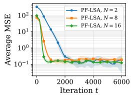

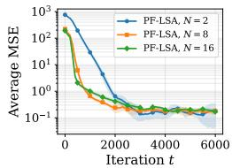

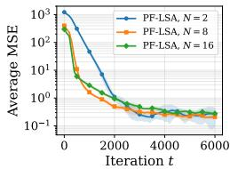  
(a) $\zeta _ { \mathrm { k e r } } = 0 , \zeta _ { \mathrm { r e w } } = 0$ (b) $\zeta _ { \mathrm { k e r } } { = } 0 . 0 1$ $\zeta _ { \mathrm { r e w } } { = } 0 . 0 1$ (c) $\zeta _ { \mathrm { k e r } } = 0 . 5 .$ $\zeta _ { \mathrm { r e w } } = 0 . 5$ (d) $\zeta _ { \mathrm { k e r } } = 0 . 9 ,$ $\zeta _ { \mathrm { r e w } } = 0 . 9$

Figure 2: Average MSE across agents, $\begin{array} { r } { \frac { 1 } { N } \sum _ { c = 1 } ^ { N } \big \| \theta _ { c } ^ { t } - \theta _ { c } ^ { \star } \big \| _ { 2 } ^ { 2 } , } \end{array}$ as a function of the number of iterations for PF-LSAwith $N \in \{ 2 , 8 , 1 6 \}$ , under increasing levels of transition-kernel heterogeneity $\zeta _ { \mathrm { k e r } }$ and reward heterogeneity $\zeta _ { \mathrm { r e w } }$ . The step size is set to $\eta = 0 . 2 \times N / 2$ . Each curve reports the average MSE over agents, with variability computed over 5 independent runs. Consistent with our theoretical results, increasing the number of agents yields a substantial acceleration in low-heterogeneity regimes, while the benefit of collaboration progressively diminishes as heterogeneity increases.

Proof. For any $c \in [ N ] , u \in \mathbb { R } ^ { d }$ , and $0 < \eta ^ { \prime } < \eta _ { \infty }$ , A1 gives

$$
\begin{array} { r } { \mathbb { E } \left[ \left. ( I - \eta ^ { \prime } \mathbf { A } _ { c } ^ { t + 1 } ) u \right. _ { 2 } ^ { 2 } \right] \leq ( 1 - \eta ^ { \prime } a ) ^ { 2 } \Vert u \Vert _ { 2 } ^ { 2 } . } \end{array}
$$

Expanding both sides and using $\mathbb { E } [ \mathbf { A } _ { c } ^ { t + 1 } ] = \bar { \mathbf { A } } _ { c }$ gives

$$
\| u \| _ { 2 } ^ { 2 } - 2 \eta ^ { \prime } \langle u , \bar { \mathbf { A } } _ { c } u \rangle + \eta ^ { \prime 2 } \mathbb { E } \left[ \| \mathbf { A } _ { c } ^ { t + 1 } u \| _ { 2 } ^ { 2 } \right] \leq \left( 1 - 2 \eta ^ { \prime } a + \eta ^ { \prime 2 } a ^ { 2 } \right) \| u \| _ { 2 } ^ { 2 } .
$$

After cancelling $\lVert u \rVert _ { 2 } ^ { 2 }$ , dividing by $2 \eta ^ { \prime }$ , and rearranging,

$$
\langle u , \bar { \mathbf { A } } _ { c } u \rangle \geq a \| u \| _ { 2 } ^ { 2 } + \frac { \eta ^ { \prime } } { 2 } \left( \mathbb { E } \left[ \| \mathbf { A } _ { c } ^ { t + 1 } u \| _ { 2 } ^ { 2 } \right] - a ^ { 2 } \| u \| _ { 2 } ^ { 2 } \right) .
$$

Letting $\eta ^ { \prime } \to 0$ concludes the proof.

## E ADDITIONAL EXPERIMENTS

We complement the experiments of Section 6 by investigating directly the effect of the number of agents on the convergence speed of PF-LSA. In particular, our theoretical results predict that, in the low-heterogeneity regime, PF-LSA achieve a linear speedup in the number of agents while still converging toward each agent’s personalized solution. We therefore compare the performance of PF-LSAfor $N \in \{ 2 , 8 , 1 6 \}$ under increasing levels of transition-kernel and reward heterogeneity.

Figure 2 shows the average MSE across agents as a function of the number of iterations. We use $\eta = 0 . 1 \times N$ and set $\beta = \bar { 1 } / N$ , in accordance with our theoretical results.

Increasing the number of agents accelerates convergence under low heterogeneity. In the homogeneous setting (Figure 2(a)), increasing the number of agents leads to a substantial acceleration of convergence. In particular, $N = 1 6$ reaches the low-error regime considerably earlier than $N = 8$ which itself converges faster than $N = 2$ . The same behavior remains clearly visible under very mild heterogeneity (Figure 2(b)). This is consistent with our theoretical prediction that, when the agents’ local problems are sufficiently similar, averaging information across agents reduces the effective stochastic variance and allows PF-LSA to benefit from a speedup that scales with the number of agents.

PF-LSApreserves personalization across all heterogeneity levels. As the heterogeneity increases, the separation between the curves corresponding to different values of N becomes progressively smaller. For moderate heterogeneity (Figure 2(c)), using more agents still improves the transient convergence behavior, but the gain is significantly weaker than in the nearly homogeneous cases. Under strong heterogeneity (Figure 2(d)), the three curves become much closer, and increasing the number of agents provides only a limited acceleration. However, in all cases, the method successfully converges to each agent’s personalized solution.

Overall, Figure 2 provides empirical evidence for the best-of-both-worlds behavior predicted by our theory: PF-LSAbenefits increasingly from additional agents when collaboration is useful, while converging to each agent’s personalized solution across all heterogeneity levels.