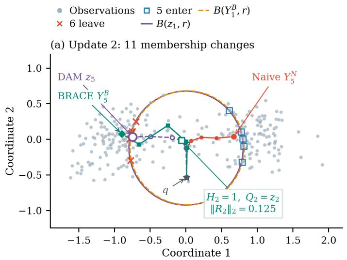
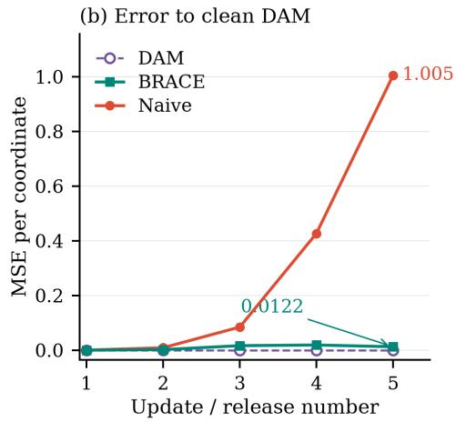
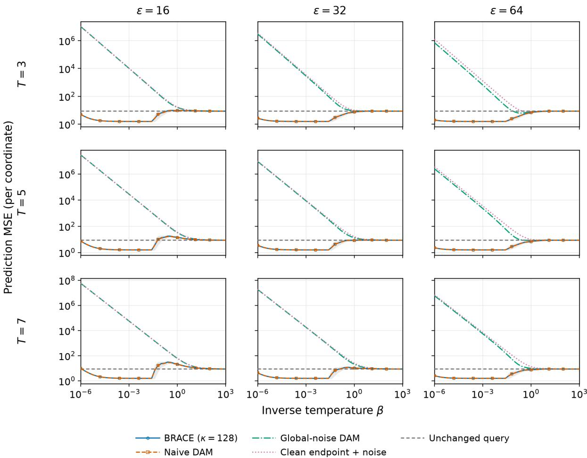
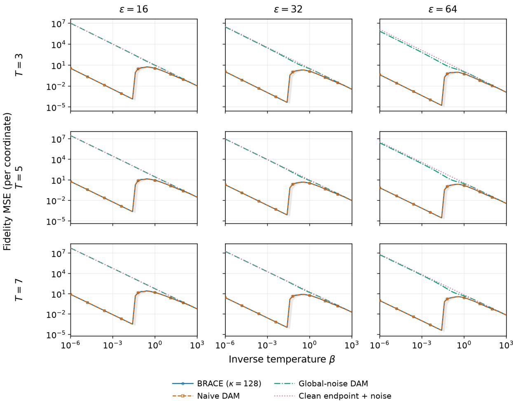
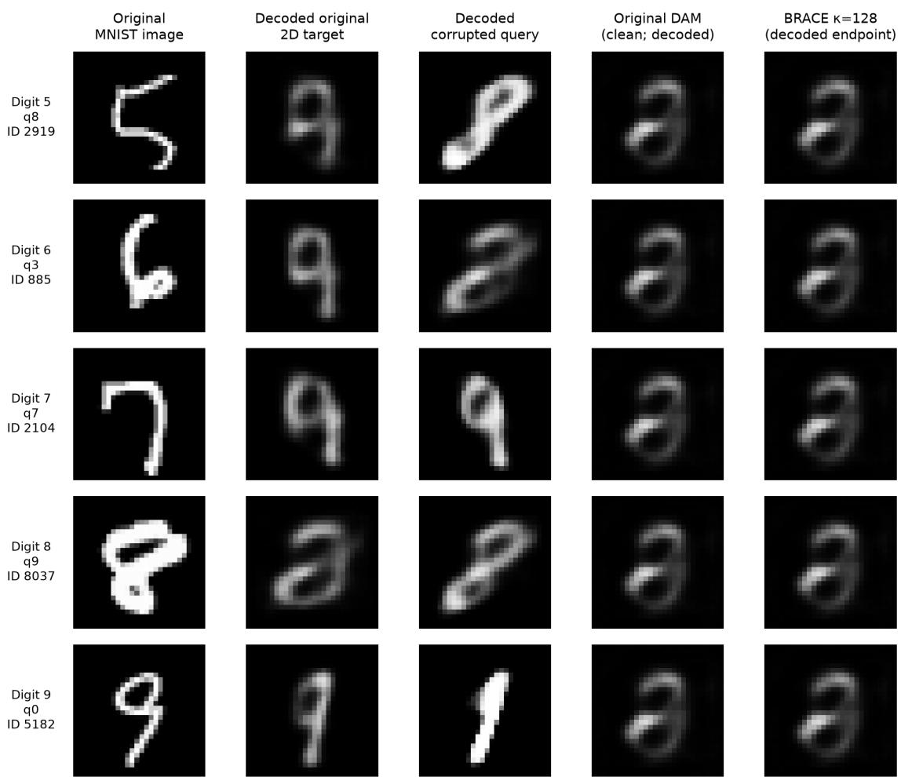

# BRACE: Diferential Privacy for Dense Associative Memory with LSR Energy

Chang Qu

Department of Mathematics and Statistics, University of Ottawa

Zhaoyang Shi∗

Center for Applied Mathematics, Fudan University

## Abstract

Dense associative memory (DAM) provides an energy-based framework for memory retrieval with close connections to attention mechanisms in modern artificial intelligence. Despite growing interest in diferential privacy for AI, the privacy of DAM retrieval dynamics remains relatively unexplored. In this paper, we develop a diferential privacy framework for log-sum-ReLU (LSR) dense associative memory, whose finite-support retrieval dynamics pose distinctive challenges for privacypreserving computation. We propose the Boundary-Responsive Adaptive Correction Evolution (BRACE) algorithm, a diferentially private retrieval mechanism for LSR-DAM that adaptively corrects boundary-sensitive perturbations to control their cumulative efect over the retrieval trajectory. In theory, we prove that our method is minimax optimal by deriving dimension-independent terminal and fulltrajectory retrieval error rates, with optimal dependence on the inverse temperature and, in the growing-horizon regime, the retrieval horizon. We further establish central limit theorems that enable uncertainty quantification for private retrieval by

characterizing its asymptotic distribution and the additional variability introduced by privacy. Numerical experiments compare our proposed method with baseline diferential privacy approaches and evaluate its retrieval accuracy. Together, our results provide a theoretical foundation for optimal privacy-preserving retrieval and uncertainty quantification in energy-based associative memory systems.

Keywords: Diferential privacy, Associative Memory, Log-sum-ReLU energy

## 1 Introduction

Diferential privacy (DP) has become a fundamental framework for enabling privacypreserving machine learning (Dwork et al., 2006; Dwork and Roth, 2014; Abadi et al., 2016; Ponomareva et al., 2023), particularly in modern artificial intelligence systems that increasingly rely on sensitive and personalized data (Yu et al., 2022; Lin et al., 2024; Sander et al., 2024). With the emergence of memory-augmented AI systems, such as MemGPT (Packer et al., 2023), LongMem (Wang et al., 2023), and other memoryenhanced LLM architectures (Schuurmans, 2023), protecting stored information and re trieval processes becomes increasingly important. Recently, dense associative memory (DAM) has emerged as an energy-based framework for memory storage and retrieval, with close connections to modern AI systems, including attention mechanisms and memoryaugmented architectures (Ramsauer et al., 2021; Krotov and Hopfield, 2021; Hoover et al., 2023). However, despite extensive progress on DP for machine learning models, the privacy of DAM retrieval dynamics remains largely unexplored. This challenge is particularly relevant in applications involving sensitive memories, such as medical record retrieval (Wang et al., 2026), personalized LLM memory modules (Packer et al., 2023), and user-specific AI assistants (Yuan et al., 2023). Therefore, developing principled DP mechanisms for DAM retrieval is essential for trustworthy memory-based AI systems.

Among existing DAM formulations, the log-sum-exponential (LSE) energy has been the dominant choice (Ramsauer et al., 2021; Krotov and Hopfield, 2016) due to its close connection with Transformer attention. LSE-DAM performs retrieval through smooth similarity-based weighting of memories, but faces an inherent trade-of between memorization and generalization. Recently, the log-sum-ReLU (LSR) energy was introduced as a compact-support alternative to LSE-DAM to improve this trade-of (Hoover et al., 2025; Santos et al., 2026). By replacing exponential interactions with compactly supported interactions, LSR-DAM enables localized retrieval and distinct memory properties. However, this finite-support mechanism introduces a fundamental challenge for DP. Unlike LSE-DAM, where retrieval weights vary smoothly, LSR-DAM relies on a hard retrieval boundary that determines the active memory set. Privacy perturbations can therefore trigger boundary switching, causing discontinuous changes in the retrieval operator and errors that accumulate over iterative retrieval. As a result, existing DP approaches based on smooth perturbation analysis cannot be directly applied. This motivates the following fundamental question:

How can we design a diferentially private retrieval mechanism for LSR-DAM that adaptively corrects boundary-induced instability while achieving accurate and theoretically optimal retrieval?

In this paper, we answer this question by proposing BRACE (Boundary-Responsive Adaptive Correction Evolution), the first DP framework specifically designed for LSR DAM. BRACE separates privacy perturbations from retrieval instability by identifying memory points whose membership changes under noisy retrieval and applying an adaptive correction before injecting calibrated DP noise. This boundary-aware design enables stable private retrieval while preserving the compact-support dynamics of LSR-DAM.

Our contributions are summarized as follows:

1. We formulate the first DP framework for LSR-DAM and propose BRACE, which resolves the boundary instability uniquely induced by compact-support associative memory retrieval.

2. We establish rigorous theoretical guarantees for BRACE, including diferential privacy and minimax-optimal retrieval error bounds, and demonstrate its superiority over commonly used DP baselines through experiments.

3. We develop a CLT-based uncertainty quantification framework for private LSR-DAM retrieval, providing principled characterization of privacy-induced uncertainty in energy-based AI systems.

By establishing diferential privacy for LSR-DAM, our work not only advances privacypreserving associative memory systems, but also enables secure memory-augmented AI architectures for applications involving sensitive and personalized information.

## 2 Preliminaries and Problem Setup

Let n, d ∈ N and write $[ n ] = \{ 1 , \dots , n \}$ . For a sequence $( Y _ { s } )$ , write

$$
Y _ { < t } = ( Y _ { 0 } , \ldots , Y _ { t - 1 } ) ,
$$

and use $y _ { < t }$ for a fixed realization of this history. We write $\mathbf { 1 } \{ \cdot \}$ for the indicator function and $I _ { k }$ for the $k \times k$ identity matrix. Let $D = ( X _ { 1 } , \ldots , X _ { n } ) \in ( \mathbb { R } ^ { d } ) ^ { n }$ be the private memory bank. The initial query $q \in \mathbb { R } ^ { d }$ , retrieval radius $r > 0$ , and horizon $T \geq 1$ are public. Throughout, $\| \cdot \|$ is the Euclidean norm.

Dense associative memory (DAM) retrieves patterns by iterating an energy-based update. For inverse temperature $\beta > 0$ , the log-sum-exponential (LSE) energy and update are

$$
\begin{array} { c } { \displaystyle E _ { \mathrm { L S E } } ( z ; D ) = - \frac { 1 } { \beta } \log \left( \sum _ { i = 1 } ^ { n } e ^ { \beta z ^ { \top } X _ { i } } \right) , } \\ { \displaystyle z _ { t + 1 } = \frac { \sum _ { i = 1 } ^ { n } e ^ { \beta z _ { t } ^ { \top } X _ { i } } X _ { i } } { \sum _ { i = 1 } ^ { n } e ^ { \beta z _ { t } ^ { \top } X _ { i } } } . } \end{array}
$$

The log-sum-ReLU (LSR) energy replaces exponential interactions with compactly supported interactions:

$$
\begin{array} { c } { \displaystyle E _ { \mathrm { L S R } } ( z ; D ) = - \log \left( \sum _ { i = 1 } ^ { n } ( r ^ { 2 } - \| X _ { i } - z \| ^ { 2 } ) _ { + } \right) , } \\ { \displaystyle ( a ) _ { + } = \operatorname* { m a x } \{ a , 0 \} , \qquad r : = \sqrt { \frac { 2 } { \beta } } . } \end{array}
$$

Unlike the global LSE update, LSR retrieval averages only memories within radius r. This

compact support yields bounded movement and finite fixed-center sensitivity without clipping or globally bounded memory vectors, and the sensitivity decreases with the local active count. The trade-of is boundary discontinuity, which motivates BRACE.

Definition 1 (Central diferential privacy (Dwork and Roth, 2014)). A mechanism $M ( D ) = ( Y _ { 1 } , \ldots , Y _ { T } ) \in ( \mathbb { R } ^ { d } ) ^ { T }$ is centrally $( \varepsilon , \delta )$ -diferentially private (DP) if

$$
\begin{array} { r } { \displaystyle \operatorname* { s u p } _ { D , D ^ { \prime } : d _ { H } ( D , D ^ { \prime } ) = 1 } \displaystyle \operatorname* { s u p } _ { A \subseteq ( \mathbb { R } ^ { d } ) ^ { T } } \Big \{ \mathbb { P } \{ M ( D ) \in A \} } \\ { \displaystyle - e ^ { \varepsilon } \mathbb { P } \{ M ( D ^ { \prime } ) \in A \} \Big \} \leq \delta . } \end{array}
$$

where $d _ { H }$ counts difering records and the second supremum is over measurable sets A. Write $D \sim D ^ { \prime }$ when $d _ { H } ( D , D ^ { \prime } ) \leq 1$ . The mechanism accesses the full bank and releases only $M ( D )$

Definition 2 (Local and smooth sensitivity (Nissim et al., 2007)). For a query $f :$ $( \mathbb { R } ^ { d } ) ^ { n } \to \mathbb { R } ^ { d }$ , define

$$
\mathrm { L S } _ { f } ( D ) = \operatorname* { s u p } _ { D ^ { \prime } \sim D } \| f ( D ) - f ( D ^ { \prime } ) \| .
$$

Given a function $L _ { f }$ satisfying $L _ { f } ( B ) \ge \mathrm { L S } _ { f } ( B )$ for every bank $B ,$ and a parameter $\gamma > 0$ define its smooth envelope by $\begin{array} { r } { \mathsf { S } _ { \gamma } [ L _ { f } ] ( D ) = \operatorname* { s u p } _ { B \in ( \mathbb { R } ^ { d } ) ^ { n } } e ^ { - \gamma d _ { H } ( D , B ) } L _ { f } ( B ) } \end{array}$ , It satisfies

$$
\mathrm { L S } _ { f } ( D ) \leq { \mathsf { S } } _ { \gamma } [ L _ { f } ] ( D ) ,
$$

$$
\mathsf { S } _ { \gamma } [ L _ { f } ] ( D ) \le e ^ { \gamma } \mathsf { S } _ { \gamma } [ L _ { f } ] ( D ^ { \prime } ) , \qquad D \sim D ^ { \prime } .
$$

For $L _ { f } = \mathrm { L S } _ { f }$ , this is the $\gamma \mathrm { . }$ -smooth sensitivity.

## 3 Challenges in LSR-DP: Boundary Instability

## 3.1 Retrieval Setup

For any memory bank $B = ( B _ { 1 } , \ldots , B _ { n } ) \in ( \mathbb { R } ^ { d } ) ^ { n }$ , define

$$
I ( B , z ) = \{ i \in [ n ] : \| B _ { i } - z \| \leq r \} ,
$$

and

$$
\Phi _ { B } ( z ) = \left\{ \begin{array} { l l } { \displaystyle \frac { 1 } { | I ( B , z ) | } \sum _ { i \in I ( B , z ) } B _ { i } , } & { \displaystyle I ( B , z ) \neq \emptyset , } \\ { z , } & { \displaystyle I ( B , z ) = \emptyset . } \end{array} \right.
$$

For the observed private bank $D = ( X _ { 1 } , \ldots , X _ { n } )$ , we write $I ( D , z )$ and $\Phi _ { D } ( z )$ . The clean trajectory is $z _ { 0 } = q$ and $z _ { t } = \Phi _ { D } ( z _ { t - 1 } )$ for $t = 1 , \dots , T$ . The update satisfies

$$
\| \Phi _ { D } ( z ) - z \| \leq r , \qquad \| z _ { t } - z _ { t - 1 } \| \leq r , \qquad \| z _ { t } - q \| \leq t r .
$$

Now in the following section, we will present why doing DP for LSR energy will face a fundamentally dificulty challenge compared to LSE energy.

## 3.2 Privacy-Induced Boundary Instability

The most significant feature about DP in LSR energy is: The LSR update is not merely an average but an average of a subset of the bank fundamentally diferent than the existing literature studying DP for sample mean or DP for LSE energy. This leads to a central challenge: a small change in the current state can change the active set and produce an order-r retrieval jump, leading to a substantially large cumulative error after DP. To see this, for the naive recursion

$$
Y _ { 0 } ^ { \mathrm { n a i v e } } = q , \qquad Y _ { t } ^ { \mathrm { n a i v e } } = \Phi _ { D } ( Y _ { t - 1 } ^ { \mathrm { n a i v e } } ) + \xi _ { t } ,
$$

the error is

$$
Y _ { t } ^ { \mathrm { n a i v e } } - z _ { t } = \Phi _ { D } ( Y _ { t - 1 } ^ { \mathrm { n a i v e } } ) - \Phi _ { D } ( z _ { t - 1 } ) + \xi _ { t } .
$$

This term can remain nonzero for arbitrarily small preceding state error; privacy calibration of $\xi _ { t }$ alone does not control it. The following proposition formally illustrates this phenomenon due to the discontinuity of the update map $\Phi _ { D }$

Proposition 1 (Boundary jump). Fix $D , z$ and suppose $X _ { j }$ is the unique record satisfying $\| X _ { j } - z \| = r . \ S e t \ z _ { h } = z - h r ^ { - 1 } ( X _ { j } - z )$ . For all suficiently small $h > 0 , I ( D , z _ { h } ) =$

$I ( D , z ) \backslash \{ j \}$ , and

$$
\begin{array} { l l } { \displaystyle \operatorname* { l i m } _ { h \downarrow 0 } \big ( \Phi _ { D } ( z _ { h } ) - \Phi _ { D } ( z ) \big ) } \\ { \displaystyle = \left\{ \begin{array} { l l } { \displaystyle z - X _ { j } , } & { I ( D , z ) = \{ j \} } \\ { \displaystyle \frac { 1 } { | I ( D , z ) | } \left( \frac { \sum _ { i \in I ( D , z _ { h } ) } X _ { i } } { | I ( D , z _ { h } ) | } - X _ { j } \right) , } & { | I ( D , z ) | \geq 2 . } \end{array} \right. } \end{array}
$$

If this limit is nonzero, then

$$
\frac { \| \Phi _ { D } ( z _ { h } ) - \Phi _ { D } ( z ) \| } { \| z _ { h } - z \| } \longrightarrow \infty ,
$$

since $\| z _ { h } - z \| = h \to 0$ while the numerator converges to a nonzero constant. Hence $\Phi _ { D }$ is not locally Lipschitz at $z ,$ and in particular is not uniformly Lipschitz in its state argument.

This boundary instability presents a central challenge in LSR-DP and it motivates our proposed method in the following section.

## 4 Proposed Method: BRACE

BRACE keeps the clean trajectory $( z _ { t } ) _ { t = 0 } ^ { T }$ internal and releases only $( Y _ { t } ) _ { t = 1 } ^ { T }$ . Initialize $z _ { 0 } = Y _ { 0 } = q$ . For $t = 1 , \dots , T$ , perform the following steps. Let $\gamma _ { t } > 0$ and $( \varepsilon _ { t } , \delta _ { t } )$ be public calibration parameters. For every fixed history $y _ { < t } , \ \nu _ { t } \big ( \cdot ; \overline { { \Delta } } _ { t } , \gamma _ { t } , \varepsilon _ { t } , \delta _ { t } \big )$ denotes a centered noise law calibrated so that the conditional mechanism ${ \cal M } ( D ) = Q _ { t } ( D ; y _ { < t } ) + \xi _ { t }$ is $( \varepsilon _ { t } , \delta _ { t } ) – \mathrm { D P }$

Step 1: Compute retrieval updates. Set

$$
\begin{array} { r l } & { I _ { t } = I ( D , z _ { t - 1 } ) , \qquad J _ { t } = I ( D , Y _ { t - 1 } ) , } \\ & { } \\ & { z _ { t } = \Phi _ { D } ( z _ { t - 1 } ) , \qquad a _ { t } = \Phi _ { D } ( Y _ { t - 1 } ) . } \end{array}
$$

Step 2: Compute the correction. We choose $R _ { t } \in \mathbb { R } ^ { d }$ by a publicly specified mea-

surable rule applied to $( D , Y _ { < t } )$ before drawing $\xi _ { t }$ . For the selected rule, set

$$
\begin{array} { r l } & { R _ { t } } \\ & { = \left\{ \begin{array} { l l } { \displaystyle \sum _ { i \in I _ { t } \backslash J _ { t } } ( X _ { i } - a _ { t } ) - \sum _ { i \in J _ { t } \backslash I _ { t } } ( X _ { i } - a _ { t } ) } , \right.} & { I _ { t } \neq \emptyset , } \\ { \displaystyle | I _ { t } | } & { I _ { t } = \emptyset . } \end{array}   \end{array}\tag{1}
$$

Step 3: Activate the correction. Construct $H _ { t } \in \{ 0 , 1 \}$ as a public measurable function of $( D , Y _ { < t } )$ . With a threshold hyperparameter $\kappa > 0$ , compute

$$
H _ { t } = \mathbf { 1 } \{ \| R _ { t } \| ^ { 2 } > \kappa T r ^ { 2 } \} .\tag{2}
$$

Step 4: Project the corrected query. Set

$$
Q _ { t } = \Pi _ { \overline { { B } } _ { 2 } ( Y _ { t - 1 } , r ) } \big ( a _ { t } + H _ { t } R _ { t } \big ) ,
$$

where Π denotes Euclidean projection onto the closed ball $\overline { { B } } _ { 2 } ( Y _ { t - 1 } , r )$

Step 5: Compute the sensitivity scale. For a bank B and fixed history $y _ { < t }$ , the local sensitivity of the complete query is

$$
\operatorname* { s u p } _ { B ^ { \prime } \sim B } \| Q _ { t } ( B ; y _ { < t } ) - Q _ { t } ( B ^ { \prime } ; y _ { < t } ) \| .
$$

We construct an upper bound $L _ { t } ( B ; y _ { < t } )$ as follows. If $H _ { s } ( B ^ { \prime } ; y _ { < s } ) = 0$ for all $s \leq t$ and all $B ^ { \prime }$ with $d _ { H } ( B , B ^ { \prime } ) \leq 1$ , set

$$
L _ { t } ( B ; y _ { < t } ) = \frac { 2 r } { \operatorname* { m a x } \{ 1 , | I ( B , y _ { t - 1 } ) | \} } .
$$

Otherwise, run CorrectedCountSearch. For each $j \in [ n ]$ and replacement $x \in \mathbb { R } ^ { d }$ let $B ^ { \prime } = B ^ { j  x }$ and recompute Steps 1–4 recursively under $B ^ { \prime }$ with $y _ { < t }$ fixed. Propagate

all clean and released memberships, using

$$
\beta _ { s } ^ { I } = \mathbf { 1 } \{ \| x - z _ { s - 1 } ( B ^ { \prime } ) \| \leq r \} ,
$$

$$
\beta _ { s } ^ { J } = \mathbf { 1 } \{ \| x - y _ { s - 1 } \| \leq r \} .
$$

Enumerate the corresponding membership, activation, and projection branches and retain only feasible branches. Set

$$
\begin{array} { r l } & { L _ { t } ( B ; y _ { < t } ) } \\ & { = \underset { j \in [ n ] , x \in \mathbb { R } ^ { d } } { \operatorname* { s u p } }  Q _ { t } ( B ; y _ { < t } ) - Q _ { t } ( B ^ { j  x } ; y _ { < t } )  . } \end{array}
$$

Then set $\begin{array} { r } { \widehat { m } _ { t } = \frac { 2 r } { \overline { { \Delta } } _ { t } ( D ; y _ { < t } ) } } \end{array}$ , where

$$
\overline { { \Delta } } _ { t } ( D ; y _ { < t } ) = \operatorname* { m a x } \left\{ \frac { 2 r } { n } , { \cal S } _ { \gamma _ { t } } [ L _ { t } ( \cdot ; y _ { < t } ) ] \left( D \right) \right\} .
$$

Step 6: Add noise, project, and release. Draw

$$
\xi _ { t } \sim \nu _ { t } \big ( \cdot ; \overline { { \Delta } } _ { t } , \gamma _ { t } , \varepsilon _ { t } , \delta _ { t } \big ) ,
$$

and set

$$
\widetilde { Y } _ { t } = Q _ { t } + \xi _ { t } , \qquad Y _ { t } = \Pi _ { \overline { { B } } _ { 2 } ( q , ( t + 1 ) r ) } ( \widetilde { Y } _ { t } ) .
$$

Release $Y _ { t }$ and use it in the next iteration. Select $\varepsilon > 0$ and $0 < \delta < 1$ , and choose the public smoothing parameters according to (8). Set

$$
\xi _ { t } \sim \mathcal { N } \Bigg ( 0 , \frac { T \overline { { \Delta } } _ { t } ^ { 2 } } { 2 \rho _ { \varepsilon , \delta } } I _ { d } \Bigg ) ~ ,
$$

where $\rho _ { \varepsilon , \delta } = \left( \sqrt { \log ( 1 / \delta ) + \varepsilon } - \sqrt { \log ( 1 / \delta ) } \right) ^ { 2 }$ . The complete algorithm is shown in Algorithm 1.

Remark 1 (Activation, sensitivity, and localization). Activation. The threshold κ controls how often correction is activated. For the selected rule, $\| Q _ { t } - z _ { t } \| ^ { 2 } \leq \operatorname* { m a x } \{ \kappa T r ^ { 2 } , \| Y _ { t - 1 } - $

Algorithm 1: Selected BRACE retrieval   
Input: Private bank $D ;$ public $q , r , T , \kappa ;$ privacy parameters $\varepsilon > 0 , \delta \in ( 0 , 1 ) ;$   
smoothing parameters $( \gamma _ { t } ) _ { t = 1 } ^ { T }$ satisfying (8).   
Output: Released trajectory $( Y _ { 1 } , \ldots , Y _ { T } )$   
$z _ { 0 } \gets q , Y _ { 0 } \gets q ;$   
$\rho _ { \varepsilon , \delta } \gets \Big ( \sqrt { \log ( 1 / \delta ) + \varepsilon } - \sqrt { \log ( 1 / \delta ) } \Big ) ^ { 2 } ;$   
for $t = 1 , \dots , T$ do   
$I _ { t } \gets I ( D , z _ { t - 1 } ) , J _ { t } \gets I ( D , Y _ { t - 1 } ) ;$   
$z _ { t } \gets \Phi _ { D } ( z _ { t - 1 } ) , a _ { t } \gets \Phi _ { D } ( Y _ { t - 1 } ) ;$   
$R _ { t } \gets z _ { t } - a _ { t } ;$   
$H _ { t } \gets \mathbf { 1 } \{ \| R _ { t } \| ^ { 2 } > \kappa T r ^ { 2 } \} ;$   
$Q _ { t } \gets \Pi _ { \overline { { B } } _ { 2 } ( Y _ { t - 1 } , r ) } ( a _ { t } + H _ { t } R _ { t } )$ ;   
Construct $L _ { t } ( \cdot ; Y _ { < t } )$ and compute $\mathsf { S } _ { \gamma _ { t } } [ L _ { t } ( \cdot ; Y _ { < t } ) ] ( D )$   
$\overline { { \Delta } } _ { t } \gets \operatorname* { m a x } \left\{ \frac { 2 r } { n } , { \sf S } _ { \gamma _ { t } } [ L _ { t } ( \cdot ; Y _ { < t } ) ] ( D ) \right\}$   
$\widehat { m } _ { t } \gets \frac { 2 r } { \overline { { \Delta } } _ { t } } ;$   
Draw $\xi _ { t } \sim \mathcal { N } \Bigg ( 0 , \frac { T \overline { { \Delta } } _ { t } ^ { 2 } } { 2 \rho _ { \varepsilon , \delta } } I _ { d } \Bigg )$ ;   
$\widetilde { Y } _ { t } \gets Q _ { t } + \xi _ { t } ;$   
$Y _ { t } \gets \Pi _ { \overline { { B } } _ { 2 } ( q , ( t + 1 ) r ) } ( \widetilde { Y } _ { t } ) ;$   
Release $Y _ { t } ;$   
return $( Y _ { 1 } , \ldots , Y _ { T } )$

$z _ { t - 1 } \| ^ { 2 } \}$ . Larger κ gives fewer activations and lower search complexity, but permits a larger residual error.

Localization. The replacement search may be restricted to $\overline { { B } } _ { 2 } ( q , t r ) \cup \bigcup _ { s = 1 } ^ { t } \overline { { B } } _ { 2 } ( y _ { s - 1 } , r )$ together with one outside representative for each replacement index.

Sensitivity. Since $\begin{array} { r } { L _ { t } ( B ; y _ { < t } ) \le 2 r , \ \frac { 2 r } { n } \le \overline { { \Delta } } _ { t } ( D ; y _ { < t } ) \le 2 r , \qquad 1 \le \widehat { m } _ { t } \le n } \end{array}$ . Here $\Delta _ { t }$ is a smooth upper bound on the local sensitivity of $Q _ { t }$ , and $\widehat { m } _ { t } = 2 r / \overline { { \Delta } } _ { t }$ is an efective sensitivity count rather than an active-set size.

## 5 Theoretical Results

## 5.1 DP Guarantee of BRACE

For the released trajectory $M ( D ) = ( Y _ { 1 } , \dots , Y _ { T } )$ , define $\begin{array} { r } { \delta _ { \mathrm { H S } } ( \varepsilon ) = \operatorname* { s u p } _ { D \sim D ^ { \prime } } D _ { e ^ { \varepsilon } } ( \mathcal { L } ( M ( D ) ) \| \mathcal { L } ( M ( D ^ { \prime } ) ) ) } \end{array}$

Theorem 2 (Central diferential privacy of BRACE). For each t, conditional on every fixed released history $Y _ { < t } = y _ { < t }$ , suppose the noise law $\xi _ { t } \sim \nu _ { t } ( \cdot ; \overline { { \Delta } } _ { t } , \gamma _ { t } , \varepsilon _ { t } , \delta _ { t } )$ is calibrated so that $Q _ { t } ( D ; y _ { < t } ) + \xi _ { t }$ is $( \varepsilon _ { t } , \delta _ { t } )$ -diferentially private whenever the sensitivity of $Q _ { t } ( \cdot ; y _ { < t } )$ is bounded by $\overline { { \Delta } } _ { t }$ . If the privacy accountant satisfies

$$
\sum _ { t = 1 } ^ { T } \varepsilon _ { t } \leq \varepsilon , \qquad \sum _ { t = 1 } ^ { T } \delta _ { t } \leq \delta ,
$$

then Algorithm 1 is centrally $( \varepsilon , \delta )$ -diferentially private. Thus, any conditionally calibrated noise law together with a valid composition accountant yields an $( \varepsilon , \delta ) { \mathcal { - } } D P B R A C E$ trajectory.

## 5.2 Terminal and Maximum-Path Minimax Risk

Let $\mathcal { P } _ { \mathrm { a l l } }$ denote the class of all probability laws on $\mathbb { R } ^ { d }$ . Throughout this subsection, $\mathbb { E } _ { D \sim P ^ { n } , M }$ denotes expectation jointly over the i.i.d. sample $D \ \sim \ P ^ { n }$ and the internal randomness of the mechanism M, conditional on the public parameters $( q , r , T )$ . For nonnegative $a , b ,$ write $a \asymp b$ when each is bounded by a finite positive constant times the other, with the dependence of the constants specified below. For $M ( D ) = ( Y _ { 1 } , \dots , Y _ { T } )$ 2 define

$$
\mathcal { R } _ { T } ( M ) = \operatorname* { s u p } _ { P \in \mathcal { P } _ { \mathrm { a l l } } } \mathbb { E } _ { D \sim P ^ { n } , M } \lVert Y _ { T } - z _ { T } ( D ) \rVert ^ { 2 } ,
$$

$$
\mathcal { R } _ { \operatorname* { m a x } , T } ( M ) = \operatorname* { s u p } _ { P \in \mathcal { P } _ { \mathrm { a l l } } } \mathbb { E } _ { D \sim P ^ { n } , M } \operatorname* { m a x } _ { 1 \leq t \leq T } \Vert Y _ { t } - z _ { t } ( D ) \Vert ^ { 2 } .
$$

Their minimax risks are

$$
\mathcal { R } _ { T } ^ { \star } ( \varepsilon , \delta ) = \operatorname* { i n f } _ { M : ( \varepsilon , \delta ) \ J \mathrm { { D P } } } \mathcal { R } _ { T } ( M ) ,
$$

$$
\mathcal { R } _ { \operatorname* { m a x } , T } ^ { \star } ( \varepsilon , \delta ) = \operatorname* { i n f } _ { M : ( \varepsilon , \delta ) \ – \mathrm { D P } } \mathcal { R } _ { \operatorname* { m a x } , T } ( M ) .
$$

The terminal risk measures the final retrieval error, whereas the maximum-path risk controls all released states. The output projection gives a bound uniform in the memory size and dimension.

Theorem 3 (Minimax-rate optimality). Let M be a centrally $( \varepsilon , \delta ) \ – D P$ BRACE mecha-

nism with the output projection in Step $\delta ,$ where $\varepsilon \geq 0$ and $0 \leq \delta < 1$

(i) Fixed horizon. For fixed T, ε, δ,

$$
\mathcal { R } _ { T } ( M ) \asymp \mathcal { R } _ { T } ^ { \star } ( \varepsilon , \delta ) \asymp r ^ { 2 } ,
$$

$$
\mathcal { R } _ { \operatorname* { m a x } , T } ( M ) \asymp \mathcal { R } _ { \operatorname* { m a x } , T } ^ { \star } ( \varepsilon , \delta ) \asymp r ^ { 2 } .
$$

The comparison constants may depend on $( T , \varepsilon , \delta )$ but are independent of $n , d , r$

(ii) Growing horizon. In the region

$$
T \geq 2 , \qquad n \geq 2 ^ { T + 2 } - 3 ,\tag{3}
$$

for fixed $\varepsilon , \delta _ { i }$

$$
\begin{array} { r } { \mathcal { R } _ { T } ( M ) \asymp \mathcal { R } _ { T } ^ { \star } ( \varepsilon , \delta ) \asymp T ^ { 2 } r ^ { 2 } , } \end{array}
$$

$$
\mathcal { R } _ { \operatorname* { m a x } , T } ( M ) \asymp \mathcal { R } _ { \operatorname* { m a x } , T } ^ { \star } ( \varepsilon , \delta ) \asymp T ^ { 2 } r ^ { 2 } .
$$

The comparison constants may depend on $( \varepsilon , \delta )$ but are independent of $n , d , T , r$

Remark 2. For fixed $T _ { \ast }$ , increasing n cannot improve the worst-case rate over $\mathcal { P } _ { \mathrm { a l l } }$ , and BRACE achieves this optimal $r ^ { 2 }$ rate. The same rate holds for the stronger full-trajectory loss, showing that releasing and controlling the whole path does not worsen the minimax order. When $T$ grows, the matching $T ^ { 2 } r ^ { 2 }$ upper and lower bounds show that BRACE also has the optimal dependence on the retrieval horizon in the long-chain regime.

## 5.3 Trajectory Central Limit Theorems for BRACE

Throughout this subsection, let $D _ { n } = ( X _ { 1 } , . . . , X _ { n } ) \sim P ^ { n }$ for a fixed law $P ,$ with $q , d , T , r$ fixed as $n  \infty$ . Write $\xi _ { n , t }$ for the privacy noise at iteration t for sample size n. Convergence is under the joint law of the data and mechanism randomness. For $X \sim P$ 2 define

$$
\bar { z } _ { 0 } = q , \qquad p _ { t } = P ( \| X - \bar { z } _ { t - 1 } \| \leq r ) ,
$$

and, whenever $p _ { t } > 0$

$$
\bar { z } _ { t } = \frac { \mathbb { E } [ X \mathbf { 1 } \{ \left. X - \bar { z } _ { t - 1 } \right. \leq r \} ] } { p _ { t } } .
$$

For vectors $V _ { 1 } , \dots , V _ { T } \in \mathbb { R } ^ { d }$ , write

$$
V _ { 1 : T } = ( V _ { 1 } ^ { \top } , \ldots , V _ { T } ^ { \top } ) ^ { \top } \in \mathbb { R } ^ { d T } .
$$

Assumption 1 (First-order BRACE conditions). There exist random vectors $C _ { t } , \xi _ { t } \in \mathbb { R } ^ { d }$ $t = 1 , \dots , T$ , such that:

(i) Jointly over $t = 1 , \dots , T$

$$
\sqrt { n } \left( z _ { n , t } - a _ { n , t } - H _ { n , t } R _ { n , t } \right) \Longrightarrow C _ { t } .
$$

(ii)

$$
\sqrt { n } \operatorname* { m a x } _ { 1 \leq t \leq T } \Vert Q _ { n , t } - ( a _ { n , t } + H _ { n , t } R _ { n , t } ) \Vert \xrightarrow { P } 0 .
$$

(iii) Jointly over $t = 1 , \dots , T$

$$
\sqrt { n } \xi _ { n , t } \Longrightarrow \xi _ { t } ,
$$

where $\mathbb { E } \xi _ { t } = 0$ , and the convergence in (i) and (iii) is joint.

Condition (i) controls the residual correction error at the root-n scale, Condition (ii) requires the pre-noise projection to have no first-order efect, and Condition (iii) characterizes the first-order contribution of the privacy noise. These are local asymptotic conditions and do not require global smoothness of the retrieval map.

Theorem 4 (Trajectory CLT for BRACE). Under Assumption $^ { 1 , }$

$$
\sqrt { n } \left( Y _ { n , 1 : T } - z _ { n , 1 : T } \right) \Longrightarrow - C _ { 1 : T } + \xi _ { 1 : T } .
$$

$I f \left( C _ { 1 : T } , \xi _ { 1 : T } \right)$ is jointly Gaussian, then

$$
\sqrt { n } \left( Y _ { n , 1 : T } - z _ { n , 1 : T } \right) \Longrightarrow { \cal N } _ { d T } ( - \mathbb { E } C _ { 1 : T } ,
$$

$$
\mathrm { C o v } \big ( { - } C _ { 1 : T } + \xi _ { 1 : T } \big ) \big ) .
$$

Remark 3. Cross-time dependence. The theorem gives a joint limit for the entire released trajectory rather than only the terminal state. Hence the limiting distribution captures the dependence of retrieval errors across diferent iterations.

Finite-sample and asymptotic guarantees. The minimax result provides finitesample worst-case control of the retrieval error, whereas Theorem 4 characterizes its first-order distribution as $n  \infty$ . Together, they describe both the magnitude of the error and its asymptotic uncertainty.

Error decomposition. The limit $- C _ { 1 : T } + \xi _ { 1 : T }$ separates the two first-order sources of error: $C _ { 1 : T }$ represents the residual correction error, while $\xi _ { 1 : T }$ represents the limiting contribution of the privacy noise.

Theorem 5 (Efect of the efective count). For the Gaussian noise in Step $\delta ,$ let $\varepsilon > 0$ and $\delta \in ( 0 , 1 )$ be fixed as $n \to \infty$ . Since

$$
\overline { { \Delta } } _ { n , t } = \frac { 2 r } { \widehat { m } _ { n , t } } ,
$$

conditional on $( D _ { n } , Y _ { < t } )$ 2

$$
\sqrt { n } \xi _ { n , t } \sim \mathcal { N } \bigg ( 0 , \frac { 2 T r ^ { 2 } } { \rho _ { \varepsilon , \delta } } \frac { n } { \widehat { m } _ { n , t } ^ { 2 } } I _ { d } \bigg ) .
$$

Consequently, for each fixed $t _ { i }$

$$
\begin{array} { r } { \sqrt { n } \xi _ { n , t } \left\{ \begin{array} { l l } { \underline { { P } } _ { \mathbf { \lambda } } 0 , } & { \frac { \widehat { m } _ { n , t } } { \sqrt { n } } \xrightarrow { P } \infty , } \\ { \implies N \bigg ( 0 , \frac { 2 T r ^ { 2 } \ell _ { t } ^ { 2 } } { \rho _ { \varepsilon , \delta } } I _ { d } \bigg ) , } & { \frac { \sqrt { n } } { \widehat { m } _ { n , t } } \xrightarrow { P } \ell _ { t } \in ( 0 , \infty ) , } \\ { i s \ n o t \ t i g h t , } & { \frac { \widehat { m } _ { n , t } } { \sqrt { n } } \xrightarrow { P } 0 . } \end{array} \right. } \end{array}
$$

Thus $\widehat { \boldsymbol { m } } _ { n , t }$ of order $\sqrt { n }$ is the transition regime in which the privacy noise contributes at the root-n scale.

Moreover, if

$$
\frac { \widehat { m } _ { n , t } } { n } \overset { P } {  } c _ { t } > 0 ,
$$

then

$$
\sqrt { n } \xi _ { n , t } \stackrel { P } {  } 0 , \qquad n \xi _ { n , t } \Longrightarrow { \cal N } \biggl ( 0 , \frac { 2 T r ^ { 2 } } { \rho _ { \varepsilon , \delta } c _ { t } ^ { 2 } } I _ { d } \biggr ) .
$$

Remark 4. The efective count $\widehat { m } _ { n , t } = 2 r / \overline { { \Delta } } _ { n , t }$ summarizes the sensitivity scale of BRACE. Theorem 5 determines exactly when privacy noise contributes to the first-order trajectory limit: $\widehat { m } _ { n , t } \asymp \sqrt { n }$ is the transition between asymptotically negligible, first-order, and nontight privacy noise at the root-n scale.

Corollary 1 (Selected active-set BRACE). Suppose $p _ { t } > 0$ for every $t \leq T$ and P has a continuous Lebesgue density in a neighborhood of each sphere

$$
\{ x : \| x - { \bar { z } } _ { t - 1 } \| = r \} .
$$

With $\kappa , \gamma _ { 1 } , . . . , \gamma _ { T } , \varepsilon > 0$ and $\delta \in ( 0 , 1 )$ fixed, Algorithm 1 satisfies Assumption 1 with $C _ { t } = 0$ and $\xi _ { t } = 0$ for every t. Consequently,

$$
\sqrt { n } ( Y _ { n , 1 : T } - z _ { n , 1 : T } ) \stackrel { P } {  } 0 .
$$

Remark 5 (Dimension dependence). For the Gaussian implementation, $\mathbb { E } [ \| \xi _ { n , t } \| ^ { 2 } \mid D _ { n } , Y _ { < t } ] =$ $d T \overline { { \Delta } } _ { n , t } ^ { 2 } / ( 2 \rho _ { \varepsilon , \delta } )$ , so the unprojected noise energy scales with d. However, the final projection gives max $_ { t \leq T } \Vert Y _ { n , t } - z _ { n , t } \Vert ^ { 2 } \leq ( 2 T + 1 ) ^ { 2 } r ^ { 2 }$ , and hence the minimax bounds in Theorem 3 are dimension independent.

## 6 Experiments

## 6.1 Synthetic Data: Boundary-Induced Mode Switching

We first illustrate the boundary instability in Proposition 1. We generate $n = 2 5 6 ~ \mathrm { m e m o } -$ ries in $\mathbb { R } ^ { 2 }$ from a three-component Gaussian mixture with two dominant modes centered at $( \pm 1 , 0 ) ^ { \top }$ and a broader central component connecting them. We compare noiseless DAM, Naive DAM, and BRACE with $r = 0 . 8 \ ( \beta = 3 . 1 2 5 )$ , $T = 5$ , and $( \varepsilon , \delta ) = ( 1 2 8 , 1 0 ^ { - 5 } )$ . The same Gaussian innovations are used for the two noisy methods. This experiment aims to illustrate the boundary instability phenomenon in LSR-DP and demonstrates the necessity for a boundary correction DP method which motivates our BRACE.

<table><tr><td rowspan=1 colspan=1>Algorithm 1 diagnostic</td><td rowspan=1 colspan=1>t=1</td><td rowspan=1 colspan=1>t=2</td><td rowspan=1 colspan=1>t=3</td><td rowspan=1 colspan=1>t=4</td><td rowspan=1 colspan=1>t=5</td></tr><tr><td rowspan=1 colspan=1>DAM count m</td><td rowspan=1 colspan=1>41</td><td rowspan=1 colspan=1>67</td><td rowspan=1 colspan=1>78</td><td rowspan=1 colspan=1>96</td><td rowspan=1 colspan=1>124</td></tr><tr><td rowspan=1 colspan=1>BRACE / Naive $m _ { t } ^ { B } / m _ { t } ^ { N }$ </td><td rowspan=1 colspan=1>41 / 41</td><td rowspan=1 colspan=1>66/ 6</td><td rowspan=1 colspan=1>75 /80</td><td rowspan=1 colspan=1>93 / 80</td><td rowspan=1 colspan=1>131 /103</td></tr><tr><td rowspan=1 colspan=1>Activation Ht</td><td rowspan=1 colspan=1>0</td><td rowspan=1 colspan=1>1</td><td rowspan=1 colspan=1>1</td><td rowspan=1 colspan=1>1</td><td rowspan=1 colspan=1>1</td></tr><tr><td rowspan=1 colspan=1>Computed∥Rt∥2</td><td rowspan=1 colspan=1>0.000</td><td rowspan=1 colspan=1>0.125</td><td rowspan=1 colspan=1>0.186</td><td rowspan=1 colspan=1>0.060</td><td rowspan=1 colspan=1>0.102</td></tr><tr><td rowspan=1 colspan=1>Effective count mt</td><td rowspan=1 colspan=1>41.000</td><td rowspan=1 colspan=1>7.438</td><td rowspan=1 colspan=1>2.919</td><td rowspan=1 colspan=1>1.471</td><td rowspan=1 colspan=1>1.704</td></tr></table>

Figure 1: Synthetic boundary instability. Left: retrieval trajectories of noiseless DAM, Naive DAM, and BRACE. Right: per-coordinate squared error relative to noiseless DAM.

Main results. Figure 1 shows that the first perturbation has norm only 0.01443, but at update 2 it changes 11 gate memberships: six memories leave the clean gate and five enter the released gate, although the gate size changes only from 67 to 66. The resulting correction has norm $\| R _ { 2 } \| = 0 . 1 2 5 1 0$ and BRACE activates from update 2 onward. Naive DAM subsequently moves toward the opposite mode: its per-coordinate squared error increases from 0.08445 at update 3 to 0.42699 at update 4 and 1.00503 at update 5, whereas the final BRACE error is 0.01222. This behavior agrees with Proposition 1: a small perturbation of the state can change the active set and produce a much larger change in the next retrieval update. BRACE corrects this boundary-induced displacement before the next privacy perturbation is added.

  
Figure 2: Prediction MSE against uncorrupted query features. Crosses denote unresolved BRACE sensitivity calculations.

## 6.2 MNIST retrieval with strong query corruption

We use two PCA coordinates of a frozen ten-dimensional VAE trained on 50,000 MNIST images, with a bank of $n = 1 0 0 0$ images and $Q = 2 5 6$ evaluation queries. Each method starts from the strongly corrupted feature

$$
q _ { i } = x _ { i } + 3 u _ { i } , \qquad u _ { i } \sim { \mathcal { N } } ( 0 , I _ { 2 } ) ,
$$

with the same corruption across methods. We average 32 paired noise repetitions and vary $\beta \in [ 1 0 ^ { - 6 } , 1 0 0 0 ] , T \in \{ 3 , 5 , 7 \}$ , and $\varepsilon \in \{ 1 6 , 3 2 , 6 4 \}$ , with $\delta = 1 0 ^ { - 5 }$ and $r = \sqrt { 2 / \beta }$ . We report prediction MSE relative to the uncorrupted feature $x _ { i }$ and fidelity MSE relative to the noiseless DAM endpoint $z _ { i , T }$ . Shading gives pointwise 95% query-bootstrap intervals.

We compare BRACE with $\kappa = 1 2 8$ , Naive DAM, global-noise DAM, and clean endpoint plus Gaussian noise. BRACE uses the smooth sensitivity certificate $\overline { { \Delta } } _ { t }$ , while Naive DAM uses the direct count scale $2 r / \operatorname* { m a x } \{ 1 , m _ { t } \}$ and global-noise DAM uses $2 r$ The iterative methods add Gaussian noise with standard deviation $\Delta _ { t } \sqrt { T / ( 2 \rho ) }$ , where $\rho = \left( \sqrt { \log ( 1 / \delta ) + \varepsilon } - \sqrt { \log ( 1 / \delta ) } \right) ^ { 2 }$ . The clean-endpoint baseline releases only $z _ { T }$ with one Gaussian perturbation calibrated to the bound $2 T r$

  
Figure 3: Endpoint fidelity to noiseless DAM. Crosses denote unresolved BRACE sensitivity calculations.

Main result. Here the best setting refers to the evaluated $\beta$ giving the smallest prediction MSE. BRACE achieves its minimum prediction MSE 1.582963 at $\beta = 0 . 0 2 5 1 1 9$ 7 $T = 3$ , and $\varepsilon = 6 4$ , compared with 8.759678 for the corrupted input and 1.582947 for noiseless DAM. Thus BRACE reduces the initial prediction error by 81.9% and nearly matches noiseless retrieval. Naive DAM attains the same measured minimum, whereas the minima of global-noise DAM and clean-endpoint noise are 6.327462 and 7.870764, respectively. Since $r = \sqrt { 2 / \beta }$ , increasing $\beta$ reduces the number of memories in each gate.

Interestingly, we also observed that for small $\beta _ { ; }$ , the gate contains most or all memories, so retrieval approaches the bank mean; decreasing $\beta$ further mainly increases privacy noise. At intermediate $\beta$ , smaller active counts increase the sensitivity scale and can produce the nonmonotone fidelity behavior. For large $\beta ,$ , gates are often empty, so both retrieval movement and privacy noise vanish and the output remains close to the corrupted query.

Handwritten reconstructions. Figure 4 provides a visual illustration at the best observed BRACE setting. BRACE closely follows noiseless DAM, while the reconstructions also show that low feature-space MSE does not necessarily imply recovery of the original individual digit.

## 7 Conclusion and Limitation

We developed a comprehensive framework for privacy-preserving retrieval of LSR-DAM, establishing formal privacy guarantees, utility bounds, and minimax optimality results. By tackling the boundary instability, one fundamental challenge in this problem, we propose the BRACE method. Our theory characterizes the efects of local retrieval, sensitivity smoothing, and privacy noise, and provides a principled understanding of the resulting privacy-utility trade-of. Experiments demonstrate that the proposed method achieves consistently better prediction performance than competing approaches, while supporting the theoretical findings and showing the practical benefits of local retrieval. Moreover, as with any retrieval-based private mechanism, the practical performance depends on the underlying data geometry and the choice of retrieval scale. In regimes where local neighborhoods are intrinsically sparse, the benefits of retrieval may naturally diminish. The sensitivity estimation also introduces additional computation, reflecting the cost of obtaining tighter data-dependent privacy guarantees. These considerations primarily concern the operating regime and implementation eficiency rather than the validity of the theoretical guarantees. Future work may further improve computational

# SD=3 stress test: best observed BRACE handwritten comparison K=128 β=0.02511886 T=3 ε=64 δ=1e-05 repetition=0

Selected mean feature prediction MSE=1.582963; activated corrections: 0/24,576

  
First saved evaluation example of each digit. selected by label alone: repetition 0. Every decoded state uses the same frozen PCA2→VAE10 decoder; inverse PCA retains two coordinates and discards eight. Original DAM is the noiseless endpoint from the same corrupted query. The setting is best observed among resolved κ=128 evaluation cases, not development-selected. The saved run contains 0 activated corrections across 24,576 updates. No correction activates, so this gallery does not demonstrate an active-correction benefit

Figure 4: Handwritten examples at the best observed BRACE setting $( \kappa = 1 2 8 , \beta =$ 0.025119, T = 3, ε = 64).

eficiency and develop more adaptive choices of the retrieval scale.

## AI use statement

In this work, we used generative AI tools to assist with proof writing, code debugging, literature search and language editing. We have not used generative AI tools for brainstorming research ideas, problem formulation, algorithm design, finding theoretical insights, and experimental design. The rest of the required disclosure tasks are not applicable to this work. We have reviewed all AI-assisted work. For example, LLM-generated code was verified and tested for correctness by two authors; all LLM-assisted proofs were checked line by line by the authors. We take responsibility for the final content of this work, including text, claims, or artifacts produced with the aid of generative AI.

## References

Mart´ın Abadi, Andy Chu, Ian Goodfellow, H. Brendan McMahan, Ilya Mironov, Kunal Talwar, and Li Zhang. Deep Learning with Diferential Privacy. In Proceedings of the 2016 ACM SIGSAC Conference on Computer and Communications Security, pp. 308–318. ACM, 2016. DOI: https://doi.org/10.1145/2976749.2978318.

Borja Balle, Gilles Barthe, Marco Gaboardi, Justin Hsu, and Tetsuya Sato. Hypothesis Testing Interpretations and R´enyi Diferential Privacy. In Proceedings of the Twenty Third International Conference on Artificial Intelligence and Statistics, volume 108, pp. 2496–2506. PMLR, 2020. https://proceedings.mlr.press/v108/balle20a.html.

Borja Balle, Gilles Barthe, and Marco Gaboardi. Privacy Profiles and Amplification by Subsampling. Journal of Privacy and Confidentiality, 10(1), 2020. DOI: https: //doi.org/10.29012/JPC.726.

Saugata Basu, Richard Pollack, and Marie-Fran¸coise Roy. Algorithms in Real Algebraic Geometry. Algorithms and Computation in Mathematics, volume 10. Second edition. Springer, 2006. DOI: https://doi.org/10.1007/3-540-33099-2.

Cynthia Dwork, Frank McSherry, Kobbi Nissim, and Adam Smith. Calibrating Noise to Sensitivity in Private Data Analysis. In Theory of Cryptography: Third Theory of Cryptography Conference (TCC 2006), Lecture Notes in Computer Science, volume 3876, pp. 265–284. Springer, 2006. DOI: https://doi.org/10.1007/11681878\_14.

Cynthia Dwork, and Aaron Roth. The Algorithmic Foundations of Diferential Privacy.

Foundations and Trends in Theoretical Computer Science, 9(3–4):211–407, 2014. DOI: https://doi.org/10.1561/0400000042.

Benjamin Hoover, Yuchen Liang, Bao Pham, Rameswar Panda, Hendrik Strobelt, Duen Horng Chau, Mohammed Zaki, and Dmitry Krotov. Energy Transformer. In Advances in Neural Information Processing Systems, volume 36, pp. 27532–27559. 2023. DOI: https://doi.org/10.52202/075280-1197.

Benjamin Hoover, Zhaoyang Shi, Krishnakumar Balasubramanian, Dmitry Krotov, and Parikshit Ram. Dense Associative Memory with Epanechnikov Energy. In Advances in Neural Information Processing Systems, volume 38, pp. 131166–131193. 2025. DOI: https://doi.org/10.52202/085713-3947.

Palak Jain, Sofya Raskhodnikova, Satchit Sivakumar, and Adam Smith. The Price of Diferential Privacy under Continual Observation. In Proceedings of the 40th International Conference on Machine Learning, volume 202, pp. 14654–14678. PMLR, 2023. https://proceedings.mlr.press/v202/jain23b.html.

Diederik P. Kingma and Max Welling. Auto-Encoding Variational Bayes. In International Conference on Learning Representations, 2014. https://arxiv.org/abs/1312.6114.

Dmitry Krotov, and John J. Hopfield. Dense Associative Memory for Pattern Recognition. In Advances in Neural Information Processing Systems, volume 29, pp. 1172–1180. 2016. https://arxiv.org/abs/1606.01164.

Dmitry Krotov, and John J. Hopfield. Large Associative Memory Problem in Neurobiology and Machine Learning. In International Conference on Learning Representations. 2021. https://arxiv.org/abs/2008.06996.

Yann LeCun, L´eon Bottou, Yoshua Bengio, and Patrick Hafner. Gradient-Based Learning Applied to Document Recognition. Proceedings of the IEEE, 86(11):2278–2324, 1998. DOI: https://doi.org/10.1109/5.726791.

Zinan Lin, Sivakanth Gopi, Janardhan Kulkarni, Harsha Nori, and Sergey Yekhanin. Diferentially Private Synthetic Data via Foundation Model APIs 1: Images. In International Conference on Learning Representations. 2024. https://arxiv.org/abs/ 2305.15560.

Ilya Mironov. R´enyi Diferential Privacy. In 2017 IEEE 30th Computer Security Foundations Symposium (CSF), pp. 263–275. IEEE, 2017. DOI: https://doi.org/10.1109/ CSF.2017.11.

Kobbi Nissim, Sofya Raskhodnikova, and Adam Smith. Smooth Sensitivity and Sampling in Private Data Analysis. In Proceedings of the 39th Annual ACM Symposium on Theory of Computing, pp. 75–84. ACM, 2007. DOI: https://doi.org/10.1145/ 1250790.1250803.

Charles Packer, Sarah Wooders, Kevin Lin, Vivian Fang, Shishir G. Patil, Ion Stoica, and Joseph E. Gonzalez. MemGPT: Towards LLMs as Operating Systems. arXiv:2310.08560, 2023. DOI: https://doi.org/10.48550/arXiv.2310.08560.

Natalia Ponomareva, Hussein Hazimeh, Alex Kurakin, Zheng Xu, Carson Denison, H. Brendan McMahan, Sergei Vassilvitskii, Steve Chien, and Abhradeep Thakurta. How to DP-fy ML: A Practical Guide to Machine Learning with Diferential Privacy. Journal of Artificial Intelligence Research, 77:1113–1201, 2023. DOI: https://doi.org/10. 1613/jair.1.14649.

Hubert Ramsauer, Bernhard Sch¨afl, Johannes Lehner, Philipp Seidl, Michael Widrich, Thomas Adler, Lukas Gruber, Markus Holzleitner, Milena Pavlovi´c, Geir Kjetil Sandve, Victor Greif, David Kreil, Michael Kopp, G¨unter Klambauer, Johannes Brandstetter, and Sepp Hochreiter. Hopfield Networks Is All You Need. In International Conference on Learning Representations. 2021. https://arxiv.org/abs/2008.02217.

Tom Sander, Yaodong Yu, Maziar Sanjabi, Alain Oliviero Durmus, Yi Ma, Kamalika Chaudhuri, and Chuan Guo. Diferentially Private Representation Learning via Image Captioning. In Proceedings of the 41st International Conference on Machine Learning, volume 235, pp. 43255–43275. PMLR, 2024. https://proceedings.mlr.press/v235/ sander24b.html.

Saul Santos, Nuno Gon¸calves, Daniel C. McNamee, Marcos Treviso, and Andr´e F. T. Martins. Sparse Attention as Compact Kernel Regression. arXiv:2601.22766, 2026. DOI: https://doi.org/10.48550/arXiv.2601.22766.

Dale Schuurmans. Memory Augmented Large Language Models Are Computationally Universal. arXiv:2301.04589, 2023. DOI: https://doi.org/10.48550/arXiv.2301. 04589.

Aad W. van der Vaart. Asymptotic Statistics. Cambridge Series in Statistical and Probabilistic Mathematics, volume 3. Cambridge University Press, 1998. DOI: https: //doi.org/10.1017/CBO9780511802256.

Weizhi Wang, Li Dong, Hao Cheng, Xiaodong Liu, Xifeng Yan, Jianfeng Gao, and Furu Wei. Augmenting Language Models with Long-Term Memory. In Advances in Neural Information Processing Systems, volume 36, pp. 74530–74543. 2023. DOI: https: //doi.org/10.52202/075280-3259.

Xiao Wang, Fuling Wang, Haowen Wang, Bo Jiang, Chuanfu Li, Yaowei Wang, Yonghong Tian, and Jin Tang. Activating Associative Disease-Aware Vision Token Memory for LLM-Based X-Ray Report Generation. IEEE Transactions on Medical Imaging, 45(2):583–595, 2026. Published online in 2025; issue publication February 2026. DOI: https://doi.org/10.1109/TMI.2025.3603416.

David Williams. Probability with Martingales. Cambridge University Press, 1991. DOI: https://doi.org/10.1017/CBO9780511813658.

Da Yu, Saurabh Naik, Arturs Backurs, Sivakanth Gopi, Huseyin A. Inan, Gautam Kamath, Janardhan Kulkarni, Yin Tat Lee, Andre Manoel, Lukas Wutschitz, Sergey Yekhanin, and Huishuai Zhang. Diferentially Private Fine-tuning of Language Models. In International Conference on Learning Representations. 2022. https://arxiv. org/abs/2110.06500.

Ruifeng Yuan, Shichao Sun, Yongqi Li, Zili Wang, Ziqiang Cao, and Wenjie Li. Personalized Large Language Model Assistant with Evolving Conditional Memory. arXiv:2312.17257, 2023. DOI: https://doi.org/10.48550/arXiv.2312.17257.

This supplementary contains proofs of all theoretical results, experiment implement details and computational complexity.

## A Proof of Proposition 1

Proof. By definition,

$$
\left\| z _ { h } - z \right\| = h , \qquad \left\| X _ { j } - z _ { h } \right\| = r + h .
$$

For $i \neq j , \| X _ { i } - z \| \neq r$ . By continuity, for all small $h > 0$

$$
I ( D , z _ { h } ) = I ( D , z ) \setminus \{ j \} .
$$

If $I ( D , z ) = \{ j \}$ , then

$$
\Phi _ { D } ( z _ { h } ) - \Phi _ { D } ( z ) = z _ { h } - X _ { j } \longrightarrow z - X _ { j } .
$$

For $m = | I ( D , z ) | \geq 2$

$$
\begin{array} { c l } { { \Phi _ { D } ( z _ { h } ) - \Phi _ { D } ( z ) = \displaystyle \frac { \sum _ { i \in I ( D , z ) \backslash \{ j \} } X _ { i } } { m - 1 } - \displaystyle \frac { X _ { j } + \sum _ { i \in I ( D , z ) \backslash \{ j \} } X _ { i } } { m } } } \\ { { = \displaystyle \frac { 1 } { m } \left( \displaystyle \frac { \sum _ { i \in I ( D , z ) \backslash \{ j \} } X _ { i } } { m - 1 } - X _ { j } \right) . } } \end{array}
$$

For a nonzero limit,

$$
\frac { \| \Phi _ { D } ( z _ { h } ) - \Phi _ { D } ( z ) \| } { \| z _ { h } - z \| } = \frac { \| \Phi _ { D } ( z _ { h } ) - \Phi _ { D } ( z ) \| } { h } \longrightarrow \infty .
$$

# B Proofs for the BRACE construction

## B.1 Movement and fixed-center sensitivity

Proof. By convexity, $\Phi _ { D } ( y ) \in \overline { { B } } _ { 2 } ( y , r )$ , also for an empty gate. The triangle inequality gives

$$
\| \Phi _ { D } ( y ) - y \| \leq r , \qquad \| z _ { t } - z _ { t - 1 } \| \leq r , \qquad \| z _ { t } - q \| \leq t r .
$$

Fix $D ^ { \prime } = D ^ { j  x }$ and $m = | I ( D , y ) |$ . For $m = 0 , \| \Phi _ { D ^ { \prime } } ( y ) - \Phi _ { D } ( y ) \| \le r$ . For $m \geq$ 1, an inactive-to-inactive replacement leaves $\Phi _ { D } ( y )$ unchanged. For an active-to-active replacement,

$$
\Phi _ { D ^ { \prime } } ( y ) - \Phi _ { D } ( y ) = \frac { x - X _ { j } } { m } , \qquad \| x - X _ { j } \| \leq 2 r .
$$

For removal with $m \geq 2$ ，

$$
\Phi _ { D } ( y ) - \Phi _ { D ^ { \prime } } ( y ) = \frac { 1 } { m } \left( X _ { j } - \frac { \sum _ { i \in I ( D , y ) \backslash \{ j \} } X _ { i } } { m - 1 } \right) ,
$$

with norm at most $2 r / m$ . For $m = 1$ , removal changes the output by at most r. For entry,

$$
\Phi _ { D ^ { \prime } } ( y ) - \Phi _ { D } ( y ) = \frac { x - \Phi _ { D } ( y ) } { m + 1 } ,
$$

with norm at most $2 r / ( m + 1 ) \le 2 r / m$ . Thus

$$
\mathrm { L S } _ { \Phi . ( y ) } ( D ) \leq \frac { 2 r } { \operatorname* { m a x } \{ 1 , | I ( D , y ) | \} } \leq 2 r .\tag{4}
$$

## B.2 Selected correction and activation bound

Proof. For $I _ { t } \neq \emptyset$ ，

$$
\begin{array} { r l } {  { \sum _ { i \in I _ { t } \backslash J _ { t } } ( X _ { i } - a _ { t } ) - \sum _ { i \in J _ { t } \backslash I _ { t } } ( X _ { i } - a _ { t } ) } } \\ & { \quad = \sum _ { i \in I _ { t } } ( X _ { i } - a _ { t } ) - \sum _ { i \in J _ { t } } ( X _ { i } - a _ { t } ) = | I _ { t } | ( z _ { t } - a _ { t } ) . } \end{array}
$$

Here $\begin{array} { r } { \sum _ { i \in J _ { t } } ( X _ { i } - a _ { t } ) = 0 } \end{array}$ , also for $J _ { t } = \emptyset$ . For $I _ { t } = \emptyset , z _ { t } = z _ { t - 1 }$ . Thus $R _ { t } = z _ { t } - a _ { t }$ in both cases.

For $H _ { t } = 0 , a _ { t } \in \overline { { B } } _ { 2 } ( Y _ { t - 1 } , r )$ and $Q _ { t } = a _ { t }$ , so

$$
\lVert Q _ { t } - z _ { t } \rVert ^ { 2 } = \lVert R _ { t } \rVert ^ { 2 } \leq \kappa T r ^ { 2 } .
$$

For $H _ { t } = 1 , a _ { t } + H _ { t } R _ { t } = z _ { t }$ , so

$$
\begin{array} { r l } & { \left\| Q _ { t } - z _ { t } \right\| = ( \left\| z _ { t } - Y _ { t - 1 } \right\| - r ) _ { + } } \\ & { \qquad \leq \left( \left\| z _ { t } - z _ { t - 1 } \right\| + \left\| z _ { t - 1 } - Y _ { t - 1 } \right\| - r \right) _ { + } } \\ & { \qquad \leq \left\| z _ { t - 1 } - Y _ { t - 1 } \right\| . } \end{array}
$$

Thus

$$
\begin{array} { r } { \| Q _ { t } - z _ { t } \| ^ { 2 } \leq \operatorname* { m a x } \lbrace \kappa T r ^ { 2 } , \| Y _ { t - 1 } - z _ { t - 1 } \| ^ { 2 } \rbrace . } \end{array}
$$

## B.3 Replacement branches, localization, and raw sensitivity

Proof. Fix $B , j \in [ n ]$ , and $y _ { < t }$ . Set $B _ { j } ^ { \prime } = x$ and $B _ { i } ^ { \prime } = B _ { i }$ for $i \neq j$ . Primes denote BRACE on $B ^ { \prime } = B ^ { j  x }$ at the fixed history.

For $s \leq t$ , enumerate $I _ { s } ^ { \prime } , J _ { s } ^ { \prime } \subseteq [ n ] , H _ { s } ^ { \prime } \in \{ 0 , 1 \}$ , and both projection cases. Set $z _ { 0 } ^ { \prime } = q$ and require

$$
\begin{array} { r l } { i \in { \it I _ { s } ^ { \prime } } \Longleftrightarrow } & { \lfloor \boldsymbol { D _ { t } ^ { \prime } } - \boldsymbol { z } _ { s - 1 } ^ { \prime } \rfloor ^ { 2 } \leq \tau ^ { 2 } , } \\ { i \in { \it I _ { s } ^ { \prime } } \Longleftrightarrow } & { \lfloor \boldsymbol { D _ { t } ^ { \prime } } - \boldsymbol { y } _ { s - 1 } \rfloor ^ { 2 } \leq \tau ^ { 2 } , } \\ { \boldsymbol { x } _ { s } ^ { \prime } = } & { \{ \lfloor \boldsymbol { I _ { s } ^ { \prime } } \rfloor ^ { - 1 } \sum _ { s \in \mathcal { G } _ { s } ^ { \prime } } B _ { s } ^ { \prime } , \quad { \it I _ { s } ^ { \prime } } \mathcal { G } \varnothing ,  } \\ & {   \begin{array} { r l r } { \boldsymbol { x } _ { s } ^ { \prime } = } & { \boldsymbol { I _ { s } ^ { \prime } } } & \\ { \boldsymbol { x } _ { s - 1 } ^ { \prime } , } & & { \boldsymbol { I _ { s } ^ { \prime } } = \varnothing , } \\ { \boldsymbol { x } _ { s } ^ { \prime } = } & { \{ | \boldsymbol { J _ { s } ^ { \prime } } | ^ { - 1 } \sum _ { s \in \mathcal { H } _ { s } ^ { \prime } } B _ { s } ^ { \prime } , \quad { \it J _ { s } ^ { \prime } }  } & \\ { \quad } & {  \boldsymbol { J _ { s } ^ { \prime } } = \varnothing ,  } \end{array}  } \\ { \boldsymbol { R _ { s } ^ { \prime } } = } & { \mathcal { I } _ { s } - \boldsymbol { a } _ { s } ^ { \prime } , \qquad \boldsymbol { H _ { s } ^ { \prime } } = 1 , \{ | \boldsymbol { R _ { s } ^ { \prime } } | ^ { 2 } \succ \delta { \it I _ { s } ^ { \prime } } ^ { \prime } \} . } \end{array}
$$

Inside the projection ball, require

$$
\begin{array} { r } { \| a _ { s } ^ { \prime } + H _ { s } ^ { \prime } R _ { s } ^ { \prime } - y _ { s - 1 } \| ^ { 2 } \leq r ^ { 2 } , \qquad Q _ { s } ^ { \prime } = a _ { s } ^ { \prime } + H _ { s } ^ { \prime } R _ { s } ^ { \prime } . } \end{array}
$$

Outside, use $\eta _ { s } > r$ and require

$$
\eta _ { s } ^ { 2 } = \| a _ { s } ^ { \prime } + H _ { s } ^ { \prime } R _ { s } ^ { \prime } - y _ { s - 1 } \| ^ { 2 } ,
$$

$$
\eta _ { s } ( Q _ { s } ^ { \prime } - y _ { s - 1 } ) = r ( a _ { s } ^ { \prime } + H _ { s } ^ { \prime } R _ { s } ^ { \prime } - y _ { s - 1 } ) .
$$

These polynomial constraints include all records at every step.

Every replacement satisfies a branch. Conversely, the constraints and $z _ { 0 } ^ { \prime } = q$ determine $( z _ { s } ^ { \prime } , a _ { s } ^ { \prime } , R _ { s } ^ { \prime } , H _ { s } ^ { \prime } , Q _ { s } ^ { \prime } )$ by induction. Hence, whenever CorrectedCountSearch is used, the branch supremum equals the complete-query local sensitivity.

If x is in a clean gate at $s \leq t$

$$
\| x - q \| \leq \| x - z _ { s - 1 } ^ { \prime } \| + \| z _ { s - 1 } ^ { \prime } - q \| \leq s r \leq t r .
$$

A released gate requires $x \in \overline { { B } } _ { 2 } ( y _ { s - 1 } , r )$ . Outside

$$
\overline { { B } } _ { 2 } ( q , t r ) \cup \bigcup _ { s = 1 } ^ { t } \overline { { B } } _ { 2 } ( y _ { s - 1 } , r ) ,
$$

all gates exclude x. For fixed $j$ , these replacements give the same averages and recursion.   
One outside representative sufices.

Both queries lie in $\overline { { B } } _ { 2 } ( y _ { t - 1 } , r )$ , so

$$
\| Q _ { t } ( B ; y _ { < t } ) - Q _ { t } ( B ^ { \prime } ; y _ { < t } ) \| \le 2 r .
$$

Under the nonactivation condition in Step 5, use (4); otherwise, use the branch supremum. Thus

$$
\mathrm { L S } _ { Q _ { t } ( \cdot ; y _ { < t } ) } ( B ) \leq L _ { t } ( B ; y _ { < t } ) \leq 2 r .\tag{5}
$$

Computational complexity. Let

$$
s _ { 1 } < \cdot \cdot \cdot < s _ { K _ { t } } \leq t , \qquad s _ { K _ { t } + 1 } = t + 1 ,
$$

be the activated correction times. Before $s _ { 1 }$ , no correction branch search is needed. At the kth activation, the cumulative neighboring-query discrepancy is restricted to

$$
\overline { { B } } _ { 2 } ( 0 , 2 r k ) .
$$

Let $G _ { k }$ be the number of feasible gate cells retained at activation k. The number of branch-propagation operations is bounded by

$$
\sum _ { k = 1 } ^ { K _ { t } } ( s _ { k + 1 } - s _ { k } ) \prod _ { \ell = 1 } ^ { k } G _ { \ell } \leq ( t - s _ { 1 } + 1 ) \prod _ { k = 1 } ^ { K _ { t } } G _ { k } .
$$

If $K _ { t } = 0$ , no branch search is required. Thus the branch complexity depends on the number of activated corrections, rather than branching over the full bank at every iteration.

## B.4 Smooth domination and measurability

Proof. By (5) and the envelope term $B = D$

$$
\mathrm { L S } _ { Q _ { t } ( \cdot ; y < t ) } ( D ) \leq L _ { t } ( D ; y _ { < t } ) \leq { \sf S } _ { \gamma _ { t } } [ L _ { t } ] ( D ) .
$$

Every envelope term is at most $2 r$ . For $D \sim D ^ { \prime }$ , the Hamming triangle inequality gives

$$
e ^ { - \gamma _ { t } d _ { H } ( D , B ) } L _ { t } ( B ; y _ { < t } ) \leq e ^ { \gamma _ { t } } e ^ { - \gamma _ { t } d _ { H } ( D ^ { \prime } , B ) } L _ { t } ( B ; y _ { < t } ) .
$$

Take suprema and include the floor $2 r / n \colon$

$$
\begin{array} { c } { { \displaystyle \displaystyle \frac { 2 r } { n } \le \overline { { { \Delta } } } _ { t } ( D ; y _ { < t } ) \le 2 r , } } \\ { { \displaystyle \overline { { { \Delta } } } _ { t } ( D ; y _ { < t } ) \le e ^ { \gamma _ { t } } \overline { { { \Delta } } } _ { t } ( D ^ { \prime } ; y _ { < t } ) , } } \end{array}\tag{6}
$$

$$
1 \leq \widehat { m } _ { t } \leq n .
$$

For $c \geq 0$

$$
a \leq e ^ { \gamma _ { t } } b \quad \Longrightarrow \quad \operatorname* { m a x } \{ c , a \} \leq e ^ { \gamma _ { t } } \operatorname* { m a x } \{ c , b \} .
$$

The branch graphs form a finite semialgebraic union. By quantifier elimination (Basu et al., 2006), $Q _ { t }$ and the all-neighbor nonactivation condition are semialgebraic.

For $u \geq 0$ , local sensitivity exceeds u exactly when a replacement satisfies

$$
\| Q _ { t } ( B ; y _ { < t } ) - Q _ { t } ( B ^ { \prime } ; y _ { < t } ) \| ^ { 2 } > u ^ { 2 } .
$$

Quantifier elimination makes this relation semialgebraic. The count branch is also semialgebraic, so $L _ { t }$ is Borel measurable.

Also,

$$
\mathsf { S } _ { \gamma _ { t } } [ L _ { t } ] ( D ) = \operatorname* { m a x } _ { 0 \leq k \leq n } e ^ { - \gamma _ { t } k } \operatorname* { s u p } _ { d _ { H } ( D , B ) \leq k } L _ { t } ( B ; y _ { < t } ) .\tag{7}
$$

For $d _ { H } ( D , B ) = j \leq k , e ^ { - \gamma _ { t } k } L _ { t } ( B ) \leq e ^ { - \gamma _ { t } j } L _ { t } ( B )$ ; take $k = j$ for the reverse bound. Each supremum has semialgebraic strict superlevel sets by quantifier elimination. Finite maxima and fixed weights preserve Borel measurability. For real-algebraic inputs, quantifier elimination and bisection on $[ 0 , 4 r ^ { 2 } ]$ give certified bounds for the required suprema.

## C Proof of Theorem 2

Proof. For fixed $y _ { < t }$ and Borel A, define the release kernel

$$
\begin{array} { r } { K _ { t } ^ { D } ( A \mid y _ { < t } ) = \mathbb { P } \big \{ \Pi _ { \overline { B } _ { 2 } ( q , ( t + 1 ) r ) } \big ( Q _ { t } ( D ; y _ { < t } ) + \xi _ { t } \big ) \in A \big \} . } \end{array}
$$

Apply conditional DP to the preimage of A under the public projection.

Fix ordered neighbors $D , D ^ { \prime }$ . Set

$$
\begin{array} { r }  \mu _ { t } ( { \cdot }  { | \ : y _ { < t } ) = \frac { 1 } { 2 } \big ( K _ { t } ^ { D } ( \cdot  { | \ : y _ { < t } ) + K _ { t } ^ { D ^ { \prime } } ( \cdot  { | \ : y _ { < t } ) } \big ) , } } \end{array}
$$

The standard Borel spaces admit jointly measurable densities $k _ { t } ^ { D } , k _ { t } ^ { D ^ { \prime } }$ relative to $\mu _ { t }$ . Conditional DP gives

$$
\int ( k _ { t } ^ { D } - e ^ { \varepsilon _ { t } } k _ { t } ^ { D ^ { \prime } } ) _ { + } d \mu _ { t } \leq \delta _ { t } .
$$

Set $\widetilde { k } _ { t } = \operatorname* { m i n } \{ k _ { t } ^ { D } , e ^ { \varepsilon _ { t } } k _ { t } ^ { D ^ { \prime } } \}$ . Then $\begin{array} { r } { \int \widetilde { k } _ { t } d \mu _ { t } \geq 1 - \delta _ { t } } \end{array}$ . With

$$
\mu ( d y _ { 1 : T } ) = \prod _ { t = 1 } ^ { T } \mu _ { t } ( d y _ { t } \mid y _ { < t } )
$$

defined by iterated integration and $y _ { 0 } = q$ , backward integration gives

$$
\int \prod _ { t = 1 } ^ { T } \widetilde { k } _ { t } d \mu \geq \prod _ { t = 1 } ^ { T } ( 1 - \delta _ { t } ) \geq 1 - \sum _ { t = 1 } ^ { T } \delta _ { t } .
$$

$$
\prod _ { t = 1 } ^ { T } \widetilde { k } _ { t } \leq \prod _ { t = 1 } ^ { T } k _ { t } ^ { D } , \qquad \prod _ { t = 1 } ^ { T } \widetilde { k } _ { t } \leq e ^ { \sum _ { t } \varepsilon _ { t } } \prod _ { t = 1 } ^ { T } k _ { t } ^ { D ^ { \prime } } .
$$

For every measurable A,

$$
\begin{array} { l } { \mathbb { P } \{ M ( D ) \in A \} \leq e ^ { \sum _ { t } \varepsilon _ { t } } \mathbb { P } \{ M ( D ^ { \prime } ) \in A \} + \displaystyle \sum _ { t } \delta _ { t } } \\ { \leq e ^ { \varepsilon } \mathbb { P } \{ M ( D ^ { \prime } ) \in A \} + \delta . } \end{array}
$$

This holds for all ordered neighbors (Dwork and Roth, 2014).

## C.1 Exact deficit for the released trajectory

Proof. For probability measures $P , Q$ , define

$$
D _ { e ^ { \varepsilon } } ( P \| Q ) = \operatorname* { s u p } _ { A { \mathrm { ~ m e a s u r a b l e } } } \{ P ( A ) - e ^ { \varepsilon } Q ( A ) \} .
$$

The transcript densities relative to $\mu$ are $\textstyle \prod _ { t } k _ { t } ^ { D }$ and $\Pi _ { t } k _ { t } ^ { D ^ { \prime } }$ . Taking the positive set gives

$$
\delta _ { \mathrm { H S } } ( \varepsilon ) = \operatorname* { s u p } _ { D \sim D ^ { \prime } } \int \left( \prod _ { t = 1 } ^ { T } k _ { t } ^ { D } - e ^ { \varepsilon } \prod _ { t = 1 } ^ { T } k _ { t } ^ { D ^ { \prime } } \right) _ { + } d \mu .
$$

Thus $M$ is $( \varepsilon , \delta ) – \mathrm { D P }$ exactly when $\delta _ { \mathrm { H S } } ( \varepsilon ) \leq \delta$ . The measure $\mu$ includes projection boundary mass. □

## C.2 Gaussian calibration in Step 6

Proof. Let $\varepsilon > 0 , 0 < \delta < 1$ , and set

$$
\alpha = 1 + \sqrt { \frac { \log ( 1 / \delta ) } { \rho _ { \varepsilon , \delta } } } > 1 .
$$

Choose

$$
\begin{array} { r l } & { 0 < \gamma _ { t } \leq \operatorname* { m i n } \left\{ \displaystyle \frac { 1 } { 4 } , \frac { 1 } { 8 ( \alpha - 1 ) } \right\} , } \\ & { \qquad \gamma _ { t } \leq \displaystyle \frac { \alpha \log \alpha - ( \alpha - 1 ) \log ( \alpha - 1 ) } { ( \alpha - 1 ) \{ 8 \alpha ( \alpha - 1 ) \rho _ { \varepsilon , \delta } + 5 T d \} } . } \end{array}\tag{8}
$$

For densities $p , p ^ { \prime }$ under a common measure, define

$$
D _ { \alpha } ( p \| p ^ { \prime } ) = \frac { 1 } { \alpha - 1 } \log \int p ^ { \alpha } ( p ^ { \prime } ) ^ { 1 - \alpha } .
$$

Take $D _ { \alpha } = \infty$ if absolute continuity or integrability fails. A uniform conditional bound $\eta _ { t }$ gives

$$
{ \mathbb { E } _ { D ^ { \prime } } } \bigg [ \bigg ( \frac { k _ { t } ^ { D } ( Y _ { t } \mid Y _ { < t } ) } { k _ { t } ^ { D ^ { \prime } } ( Y _ { t } \mid Y _ { < t } ) } \bigg ) ^ { \alpha } \bigg | \ Y _ { < t } \bigg ] \le e ^ { ( \alpha - 1 ) \eta _ { t } } .
$$

Backward integration bounds the transcript divergence by $\textstyle \sum _ { t } \eta _ { t }$ (Mironov, 2017).

For $a > 0$

$$
\operatorname* { s u p } _ { u > a } \frac { u - a } { u ^ { \alpha } } = \frac { ( \alpha - 1 ) ^ { \alpha - 1 } } { \alpha ^ { \alpha } a ^ { \alpha - 1 } } ,
$$

The derivative is $u ^ { - \alpha - 1 } [ \alpha a - ( \alpha - 1 ) u ]$ . Set $a = e ^ { \varepsilon }$ and integrate:

$$
D _ { e ^ { \varepsilon } } ( p \| p ^ { \prime } ) \leq \frac { ( \alpha - 1 ) ^ { \alpha - 1 } } { \alpha ^ { \alpha } } e ^ { ( \alpha - 1 ) ( D _ { \alpha } ( p \| p ^ { \prime } ) - \varepsilon ) } .\tag{9}
$$

See Balle et al. (2020).

For Gaussian densities with means $u , u ^ { \prime }$ and variances $\sigma ^ { 2 } I _ { d } , \sigma ^ { \prime 2 } I _ { d }$ , set $v = \sigma ^ { 2 } / \sigma ^ { \prime 2 }$ Completing the square gives, for $\alpha - ( \alpha - 1 ) v > 0$

$$
\begin{array} { r } { \displaystyle \int p ^ { \alpha } ( p ^ { \prime } ) ^ { 1 - \alpha } = v ^ { - d ( \alpha - 1 ) / 2 } [ \alpha - ( \alpha - 1 ) v ] ^ { - d / 2 } } \\ { \displaystyle \times \exp \left. \frac { \alpha ( \alpha - 1 ) \| u - u ^ { \prime } \| ^ { 2 } } { 2 \sigma ^ { \prime 2 } [ \alpha - ( \alpha - 1 ) v ] } \right. . } \end{array}
$$

Under $y = u + \sigma x$ , the quadratic coeficient is $- [ \alpha - ( \alpha - 1 ) v ] / 2 ;$ the integral is infinite otherwise. Taking logarithms gives

$$
\begin{array} { l } { { \displaystyle D _ { \alpha } \big ( { \cal N } ( u , \sigma ^ { 2 } I _ { d } ) \big \| { \cal N } ( u ^ { \prime } , \sigma ^ { \prime 2 } I _ { d } ) \big ) } } \\ { { \displaystyle ~ = \frac { \alpha \| u - u ^ { \prime } \| ^ { 2 } } { 2 \sigma ^ { \prime 2 } [ \alpha - ( \alpha - 1 ) v ] } - \frac { d } { 2 } \log v } } \\ { { \displaystyle ~ - \frac { d } { 2 ( \alpha - 1 ) } \log [ \alpha - ( \alpha - 1 ) v ] } . } \end{array}\tag{10}
$$

Fix neighbors and a history. Let $s , s ^ { \prime }$ be their certificates and $u , u ^ { \prime }$ their queries. By (6),

$$
\| u - u ^ { \prime } \| \leq \operatorname* { m i n } \{ s , s ^ { \prime } \} , \qquad e ^ { - \gamma _ { t } } \leq s / s ^ { \prime } \leq e ^ { \gamma _ { t } } .
$$

Using $\sigma ^ { 2 } = T s ^ { 2 } / ( 2 \rho _ { \varepsilon , \delta } )$ and $\sigma ^ { \prime 2 } = T s ^ { \prime 2 } / ( 2 \rho _ { \varepsilon , \delta } )$ , (10) is at most

$$
\begin{array} { l } { \displaystyle \frac { \alpha \rho _ { \varepsilon , \delta } / T } { 1 - ( \alpha - 1 ) ( e ^ { 2 \gamma _ { t } } - 1 ) } + d \gamma _ { t } } \\ { \displaystyle - \frac { d } { 2 ( \alpha - 1 ) } \log \{ 1 - ( \alpha - 1 ) ( e ^ { 2 \gamma _ { t } } - 1 ) \} . } \end{array}
$$

Here $\| u - u ^ { \prime } \| \leq s ^ { \prime } , v \leq e ^ { 2 \gamma _ { t } }$ , and $| \log v | \le 2 \gamma _ { t }$

For $0 \leq \gamma \leq 1 / 4$

$$
e ^ { 2 \gamma } - 1 = \int _ { 0 } ^ { \gamma } 2 e ^ { 2 x } d x \leq 4 \gamma .
$$

By (8),

$$
0 \leq ( \alpha - 1 ) ( e ^ { 2 \gamma _ { t } } - 1 ) \leq { \frac { 1 } { 2 } } .
$$

Using $( 1 - x ) ^ { - 1 } \leq 1 + 2 x { \mathrm { ~ a n d ~ } } - \log ( 1 - x ) \leq 2 x { \mathrm { ~ f o r ~ } } 0 \leq x \leq 1 / 2$ , the divergence is at

most

$$
\frac { \alpha \rho _ { \varepsilon , \delta } } { T } + \left\{ \frac { 8 \alpha ( \alpha - 1 ) \rho _ { \varepsilon , \delta } } { T } + 5 d \right\} \gamma _ { t } .
$$

The projected likelihood ratio is the conditional mean of the input ratio. Jensen’s inequality for $x ^ { \alpha }$ gives the same divergence bound.

Composition and (8) bound the transcript divergence by

$$
\alpha \rho _ { \varepsilon , \delta } + \frac { \alpha \log \alpha - ( \alpha - 1 ) \log ( \alpha - 1 ) } { \alpha - 1 } .
$$

By definition,

$$
\varepsilon = \rho _ { \varepsilon , \delta } + 2 \sqrt { \rho _ { \varepsilon , \delta } \log ( 1 / \delta ) } ,
$$

$$
( \alpha - 1 ) ( \alpha \rho _ { \varepsilon , \delta } - \varepsilon ) = - \log ( 1 / \delta ) .
$$

Equation (9) gives

$$
\delta _ { \mathrm { H S } } ( \varepsilon ) \leq e ^ { - \log ( 1 / \delta ) } = \delta .
$$

For per-step budgets, use $T = 1$ and $( \varepsilon _ { t } , \delta _ { t } )$ above. Variance $\overline { { \Delta } } _ { t } ^ { 2 } / ( 2 \rho _ { \varepsilon _ { t } , \delta _ { t } } )$ and the corresponding smoothing bound give conditional DP; apply Theorem 2. □

## D Proof of Theorem 3

Proof. Output-projection bound. By Appendix B.1, $z _ { t } \in \overline { { B } } _ { 2 } ( q , t r )$ . Projection is nonexpansive, so

$$
\lVert Y _ { t } - z _ { t } \rVert \leq \lVert \widetilde { Y } _ { t } - z _ { t } \rVert .
$$

The triangle inequality gives

$$
\| Y _ { t } - z _ { t } \| \leq \| Y _ { t } - q \| + \| z _ { t } - q \| \leq ( 2 t + 1 ) r .
$$

Thus, for every bank and noise draw,

$$
\begin{array} { r l } & { \| Y _ { t } - z _ { t } \| \leq \operatorname* { m i n } \{ \| \widetilde { Y } _ { t } - z _ { t } \| , ( 2 t + 1 ) r \} , } \\ & { \quad \mathcal { R } _ { T } ( M ) \leq \mathcal { R } _ { \operatorname* { m a x } , T } ( M ) \leq ( 2 T + 1 ) ^ { 2 } r ^ { 2 } . } \end{array}\tag{11}
$$

Complete-neighbor lower bound. Let $K _ { x } , x \in \overline { { B } } _ { 2 } ( q , r )$ , be measurable kernels with

$$
K _ { x } ( A ) \leq e ^ { \varepsilon } K _ { x ^ { \prime } } ( A ) + \delta \qquad { \mathrm { f o r ~ e v e r y ~ } } x , x ^ { \prime } , A .
$$

Write

$$
\mathcal { R } = \operatorname* { s u p } _ { x \in \overline { { B } } _ { 2 } ( q , r ) } \int \| u - x \| ^ { 2 } K _ { x } ( d u ) .
$$

We may assume $\mathcal { R } < \infty$ . If $\mathcal { R } = 0$ , all outputs equal $x ,$ contradicting $\delta < 1$ . Set

$$
h = { \sqrt { \frac { 2 \mathcal { R } } { 1 - \delta } } } .
$$

If $h \geq r / 4$ , then $\mathcal { R } \geq ( 1 - \delta ) r ^ { 2 } / 3 2$

For $\textit { h } < \textit { r } / 4$ , translate $q$ to zero. Fix a unit vector $e _ { 1 }$ and $x _ { 0 } ~ = ~ - r e _ { 1 } / 2$ . For $x \in \overline { { B } } _ { 2 } ( r e _ { 1 } / 2 , r / 4 )$ , Markov and DP give

$$
\begin{array} { c } { { \displaystyle K _ { x } ( \overline { { B } } _ { 2 } ( x , h ) ) \geq 1 - \frac { \mathcal { R } } { h ^ { 2 } } = 1 - \frac { 1 - \delta } { 2 } , } } \\ { { \displaystyle K _ { x _ { 0 } } ( \overline { { B } } _ { 2 } ( x , h ) ) \geq e ^ { - \varepsilon } \big ( K _ { x } ( \overline { { B } } _ { 2 } ( x , h ) ) - \delta \big ) } } \\ { { \displaystyle \geq \frac { 1 - \delta } { 2 } e ^ { - \varepsilon } . } } \end{array}
$$

Here $\| u - x \| \leq h$ implies $\lVert u - x _ { 0 } \rVert > r / 2$ . Let $V _ { d }$ be the unit-ball volume. By Tonelli and Markov,

$$
\begin{array} { r l r } {  { V _ { d } ( r / 4 ) ^ { d } \frac { 1 - \delta } { 2 } e ^ { - \varepsilon } \le \int _ { \overline { { B } } _ { 2 } ( r e _ { 1 } / 2 , r / 4 ) } K _ { x _ { 0 } } ( \overline { { B } } _ { 2 } ( x , h ) ) d x } } \\ & { } & \\ & { } & { \le V _ { d } h ^ { d } K _ { x _ { 0 } } \{ u : \| u - x _ { 0 } \| \ge r / 2 \} } \\ & { } & { \le V _ { d } h ^ { d } \frac { 4 \mathcal { R } } { r ^ { 2 } } . \qquad } \end{array}
$$

Cancel $V _ { d }$ and substitute $h \colon$

$$
\mathcal { R } ^ { ( d + 2 ) / 2 } \geq 2 ^ { - 3 - 5 d / 2 } r ^ { d + 2 } ( 1 - \delta ) ^ { ( d + 2 ) / 2 } e ^ { - \varepsilon } .
$$

Using $( 5 d + 6 ) / ( d + 2 ) \leq 5$ , both cases give

$$
\operatorname* { s u p } _ { x } \int \| u - x \| ^ { 2 } K _ { x } ( d u ) \geq \frac { 1 - \delta } { 3 2 } r ^ { 2 } e ^ { - 2 \varepsilon / ( d + 2 ) } .\tag{12}
$$

IID rare-record lower bound. Fix a unit vector $e _ { 1 }$ and $b = q + 4 r e _ { 1 }$ . Let $D _ { i , x }$ contain $x \in \overline { { B } } _ { 2 } ( q , r )$ at position i and b elsewhere. Since $\| b - x \| \geq 3 r$

$$
z _ { t } ( D _ { i , x } ) = x \qquad ( t \geq 1 ) .
$$

Let $K _ { i , x }$ be the terminal-output law of a private mechanism on $D _ { i , x } ,$ , and $K _ { x } = n ^ { - 1 } \textstyle \sum _ { i } K _ { i , x }$ Since $D _ { i , x } \sim D _ { i , x ^ { \prime } ; }$ terminal post-processing and averaging give the DP condition in (12).

Write $\delta _ { x }$ for the point mass at x. For $n \geq 2$ , take

$$
P _ { x } = ( 1 - 1 / n ) \delta _ { b } + ( 1 / n ) \delta _ { x } .
$$

Exactly one x has probability $( 1 - 1 / n ) ^ { n - 1 }$ and uniform position. Thus

$$
\mathbb { E } _ { D \sim P _ { x } ^ { n } , M } \Vert Y _ { T } - z _ { T } ( D ) \Vert ^ { 2 } \geq ( 1 - 1 / n ) ^ { n - 1 } \int \Vert u - x \Vert ^ { 2 } K _ { x } ( d u ) .
$$

For $0 < u < 1$

$$
\log ( 1 - u ) = - \int _ { 0 } ^ { u } \frac { d s } { 1 - s } \geq - \frac { u } { 1 - u } ,
$$

Thus $( 1 - 1 / n ) ^ { n - 1 } \geq e ^ { - 1 }$ . Apply (12), take ${ \mathrm { s u p } } _ { x } ,$ then inf $\dot { \mathbf { \Omega } } _ { M }$

$$
\mathcal { R } _ { T } ^ { \star } ( \varepsilon , \delta ) \geq \frac { 1 - \delta } { 3 2 e } r ^ { 2 } e ^ { - 2 \varepsilon / ( d + 2 ) } \geq \frac { 1 - \delta } { 3 2 e } r ^ { 2 } e ^ { - 2 \varepsilon / 3 } .\tag{13}
$$

Here $d \geq 1$ and $\varepsilon \geq 0$ . For $n = 1$ , use $P _ { x } = \delta _ { x }$ . Since terminal loss is at most maximumpath loss, the latter has the same lower bound.

Long-chain hard family. Suppose $T \geq 2$ and $n \geq 2 ^ { T + 2 } - 3$ . Set

$$
x _ { j } = q + { \frac { ( j + 1 ) r } { 2 } } e _ { 1 } , 1 \leq j \leq T + 1 ,
$$

$$
x _ { * } = x _ { 1 } = q + r e _ { 1 } ,
$$

$$
P _ { 0 } \{ x _ { j } \} = \frac { 2 ^ { j } } { n - 1 } , \qquad 2 \leq j \leq T + 1 .
$$

Put the remaining mass at $q + ( T + 3 ) r e _ { 1 }$ ; this is valid since

$$
\sum _ { j = 2 } ^ { T + 1 } 2 ^ { j } = 2 ^ { T + 2 } - 4 \leq n - 1 .
$$

All background records lie outside the initial gate, so $z _ { t } ~ = ~ q$ without a trigger. The movement bound excludes the remote point through time $T$

Draw n IID records from

$$
P _ { 1 } = ( 1 - 1 / n ) P _ { 0 } + ( 1 / n ) \delta _ { x _ { * } } ,
$$

and condition on one trigger. Let $N _ { j }$ count background records at $x _ { j }$ , and set $N _ { 1 } = 1$ Under this conditional law, define

$$
E = \{ N _ { 3 } > 1 \} \cap \bigcap _ { s = 3 } ^ { T } \{ N _ { s + 1 } > N _ { s - 1 } + 2 N _ { s - 2 } \} ,
$$

For $T = 2$ , omit the indexed intersection. Only the trigger is initially active, $\operatorname { s o } z _ { 1 } = x _ { 1 }$ and

$$
z _ { 2 } - x _ { 2 } = \frac { r } { 2 } \frac { N _ { 3 } - 1 } { 1 + N _ { 2 } + N _ { 3 } } e _ { 1 } .
$$

On $E , z _ { 2 }$ is strictly between $x _ { 2 } , x _ { 3 }$ . If $z _ { s - 1 }$ is strictly between $x _ { s - 1 } , x _ { s }$ , its gate contains only $x _ { s - 2 } , x _ { s - 1 } , x _ { s } , x _ { s + 1 }$ , giving

$$
z _ { s } - x _ { s } = \frac { r } { 2 } \frac { N _ { s + 1 } - N _ { s - 1 } - 2 N _ { s - 2 } } { N _ { s - 2 } + N _ { s - 1 } + N _ { s } + N _ { s + 1 } } e _ { 1 } .
$$

On $E ,$ the numerator is positive and $N _ { s } > 0$ by the preceding count inequality. Thus $z _ { s }$ is strictly between $x _ { s } , x _ { s + 1 }$ . Induction gives

$$
\| z _ { T } - q \| > { \frac { ( T + 1 ) r } { 2 } } \geq { \frac { T r } { 2 } } \qquad { \mathrm { o n ~ } } E .
$$

By the multinomial law,

$$
\mathbb { E } \prod _ { j = 2 } ^ { T + 1 } u _ { j } ^ { N _ { j } } = \left\{ 1 + \frac { 1 } { n - 1 } \sum _ { j = 2 } ^ { T + 1 } 2 ^ { j } ( u _ { j } - 1 ) \right\} ^ { n - 1 } .
$$

By Markov,

$$
\begin{array} { c } { \displaystyle \mathbb { P } ( N _ { 3 } \leq 1 ) \leq 2 \mathbb { E } 2 ^ { - N _ { 3 } } = 2 \left( 1 - \frac { 4 } { n - 1 } \right) ^ { n - 1 } \leq 2 e ^ { - 4 } , } \\ { \displaystyle \mathbb { P } ( N _ { 4 } \leq N _ { 2 } + 2 ) \leq 4 \mathbb { E } 2 ^ { N _ { 2 } - N _ { 4 } } = 4 \left( 1 - \frac { 4 } { n - 1 } \right) ^ { n - 1 } \leq 4 e ^ { - 4 } , } \end{array}
$$

The second line requires $T \geq 3$ . For $s \geq 4$ , apply Markov to $( 3 / 4 ) ^ { N _ { s + 1 } - N _ { s - 1 } - 2 N _ { s - 2 } }$

$$
\begin{array} { r l r } {  { \mathbb { P } ( N _ { s + 1 } - N _ { s - 1 } - 2 N _ { s - 2 } \leq 0 ) \leq ( 1 - \frac { 5 2 ^ { s - 2 } } { 9 ( n - 1 ) } ) ^ { n - 1 } } } \\ & { } & \\ & { } & { \leq e ^ { - 5 2 ^ { s - 2 } / 9 } , } \end{array}
$$

because

$$
2 ^ { s + 1 } ( - 1 / 4 ) + 2 ^ { s - 1 } ( 1 / 3 ) + 2 ^ { s - 2 } ( 7 / 9 ) = - 5 2 ^ { s - 2 } / 9 .
$$

The union bound, omitting absent terms for $T = 2 , 3$ , gives

$$
\begin{array} { l } { \displaystyle \mathbb { P } ( E ^ { c } ) \leq 6 e ^ { - 4 } + \sum _ { k = 0 } ^ { \infty } e ^ { - ( 2 0 / 9 ) 2 ^ { k } } } \\ { \displaystyle \qquad \leq 6 e ^ { - 4 } + \sum _ { k = 0 } ^ { \infty } e ^ { - ( 2 0 / 9 ) ( k + 1 ) } } \\ { \displaystyle \qquad = 6 e ^ { - 4 } + \frac { 1 } { e ^ { 2 0 / 9 } - 1 } < \frac { 1 } { 4 } . } \end{array}
$$

Thus $\mathbb { P } ( \| z _ { T } - q \| \geq T r / 2 ) \geq 3 / 4$ under the conditional law.

Private-mechanism lower bound. Take M with $\mathcal { R } _ { T } ( M ) < \infty$ . Draw n IID background records to form $D _ { 0 } ;$ replace a uniformly chosen row by $x _ { * }$ to form $D _ { 1 }$ . Then $D _ { 0 } \sim P _ { 0 } ^ { n } , D _ { 0 } \sim D _ { 1 }$ , and $D _ { 1 }$ has the law of $P _ { 1 } ^ { n }$ conditional on one trigger. That event has probability

$$
( 1 - 1 / n ) ^ { n - 1 } \geq e ^ { - 1 } .
$$

Restrict this coupling to $\| z _ { T } ( D _ { 1 } ) - q \| \geq T r / 2$ . Append the terminal-output kernel on $D _ { i }$ to obtain measures $\mu _ { i }$ on

$$
\Omega = ( \mathbb R ^ { d } ) ^ { n } \times ( \mathbb R ^ { d } ) ^ { n } \times \mathbb R ^ { d } ,
$$

with common mass at least $3 / 4$ . Integrating DP over sections gives

$$
\mu _ { 1 } ( A ) - e ^ { \varepsilon } \mu _ { 0 } ( A ) \leq \delta \mu _ { 1 } ( \Omega ) \qquad ( A \subseteq \Omega { \mathrm { ~ m e a s u r a b l e } } ) .
$$

With $k _ { i } = d \mu _ { i } / d ( \mu _ { 0 } + \mu _ { 1 } )$ , define

$$
d \nu = \operatorname* { m i n } \{ k _ { 1 } , e ^ { \varepsilon } k _ { 0 } \} d ( \mu _ { 0 } + \mu _ { 1 } ) .
$$

Taking positive parts gives

$$
\begin{array} { c } { \displaystyle \nu ( \Omega ) = \mu _ { 1 } ( \Omega ) - \int ( k _ { 1 } - e ^ { \varepsilon } k _ { 0 } ) _ { + } d ( \mu _ { 0 } + \mu _ { 1 } ) } \\ { \displaystyle \geq ( 1 - \delta ) \mu _ { 1 } ( \Omega ) \geq \frac 3 4 ( 1 - \delta ) . } \end{array}
$$

Also $\nu \leq \mu _ { 1 } , \nu \leq e ^ { \varepsilon } \mu _ { 0 }$ , and on its support

$$
\frac { T r } { 2 } \leq \| y - q \| + \| y - z _ { T } ( D _ { 1 } ) \| .
$$

Since $z _ { T } ( D _ { 0 } ) = q$ , the two risks are bounded by $\mathcal { R } _ { T } ( M )$ and $e R _ { T } ( M )$ . By Minkowski,

$$
\begin{array} { r l r } {  { \frac { T r } { 2 } \sqrt { \frac { 3 } { 4 } ( 1 - \delta ) } \le ( \int \| y - q \| ^ { 2 } d \nu ) ^ { 1 / 2 } + ( \int \| y - z _ { T } ( D _ { 1 } ) \| ^ { 2 } d \nu ) ^ { 1 / 2 } } } \\ & { } & { \le \big ( e ^ { \varepsilon / 2 } + \sqrt e \big ) \sqrt { { \mathcal R } _ { T } ( M ) } . } \end{array}
$$

Square and take in $\mathrm { f } _ { M }$ :

$$
\mathcal { R } _ { T } ^ { \star } ( \varepsilon , \delta ) \geq \frac { 3 ( 1 - \delta ) } { 1 6 ( e ^ { \varepsilon / 2 } + \sqrt { e } ) ^ { 2 } } T ^ { 2 } r ^ { 2 } .\tag{14}
$$

The bound also holds for infinite risk and for maximum-path risk.

Conclusion. By DP, M belongs to both minimax classes. Equations (11) and (13) give

$$
\begin{array} { r l } & { \displaystyle \frac { ( 1 - \delta ) e ^ { - 2 \varepsilon / 3 } } { 3 2 e } r ^ { 2 } \le \mathcal { R } _ { T } ^ { \star } ( \varepsilon , \delta ) \le \mathcal { R } _ { T } ( M ) \le ( 2 T + 1 ) ^ { 2 } r ^ { 2 } , } \\ & { \displaystyle \frac { ( 1 - \delta ) e ^ { - 2 \varepsilon / 3 } } { 3 2 e } r ^ { 2 } \le \mathcal { R } _ { \operatorname* { m a x } , T } ^ { \star } ( \varepsilon , \delta ) \le \mathcal { R } _ { \operatorname* { m a x } , T } ( M ) \le ( 2 T + 1 ) ^ { 2 } r ^ { 2 } . } \end{array}
$$

The constants are independent of $n , d , r$ . In (3), use (14) and $( 2 T + 1 ) ^ { 2 } \leq 9 T ^ { 2 }$

$$
\begin{array} { r l } & { \frac { 3 ( 1 - \delta ) T ^ { 2 } r ^ { 2 } } { 1 6 ( e ^ { \varepsilon / 2 } + \sqrt { e } ) ^ { 2 } } \le \mathcal { R } _ { T } ^ { \star } ( \varepsilon , \delta ) \le \mathcal { R } _ { T } ( M ) \le 9 T ^ { 2 } r ^ { 2 } , } \\ & { \frac { 3 ( 1 - \delta ) T ^ { 2 } r ^ { 2 } } { 1 6 ( e ^ { \varepsilon / 2 } + \sqrt { e } ) ^ { 2 } } \le \mathcal { R } _ { \operatorname* { m a x } , T } ^ { \star } ( \varepsilon , \delta ) \le \mathcal { R } _ { \operatorname* { m a x } , T } ( M ) \le 9 T ^ { 2 } r ^ { 2 } . } \end{array}
$$

These constants depend only on $\varepsilon , \delta$

## E Proof of Theorem 4

Proof. By $\widetilde { Y } _ { n , t } = Q _ { n , t } + \xi _ { n , t }$

$$
\begin{array} { r l } & { \sqrt { n } \left( \widetilde { Y } _ { n , t } - z _ { n , t } \right) = - \sqrt { n } \left( z _ { n , t } - a _ { n , t } - H _ { n , t } R _ { n , t } \right) } \\ & { ~ + ~ \sqrt { n } \left\{ Q _ { n , t } - \left( a _ { n , t } + H _ { n , t } R _ { n , t } \right) \right\} + \sqrt { n } \xi _ { n , t } . } \end{array}
$$

By Assumption 1, fixed T, and Slutsky,

$$
\sqrt { n } \left( \widetilde { Y } _ { n , 1 : T } - z _ { n , 1 : T } \right) \Longrightarrow - C _ { 1 : T } + \xi _ { 1 : T } .
$$

Thus max $t \le T \left\| \widetilde { Y } _ { n , t } - z _ { n , t } \right\| = O _ { P } ( n ^ { - 1 / 2 } )$

If this maximum is less than $r ,$

$$
\lVert \widetilde { Y } _ { n , t } - q \rVert \leq \lVert \widetilde { Y } _ { n , t } - z _ { n , t } \rVert + \lVert z _ { n , t } - q \rVert < ( t + 1 ) r .
$$

Thus

$$
\begin{array} { r l } & { \mathbb { P } \{ Y _ { n , 1 : T } \neq \widetilde { Y } _ { n , 1 : T } \} \le \mathbb { P } \bigg \{ \underset { t \le T } { \operatorname* { m a x } } \| \widetilde { Y } _ { n , t } - z _ { n , t } \| \ge r \bigg \} } \\ & { \qquad \longrightarrow 0 . } \end{array}
$$

For every $\eta > 0$

$$
\begin{array} { r } { \mathbb { P } \Big ( \sqrt { n } \left. Y _ { n , 1 : T } - \widetilde { Y } _ { n , 1 : T } \right. > \eta \Big ) \leq \mathbb { P } ( Y _ { n , 1 : T } \neq \widetilde { Y } _ { n , 1 : T } ) \longrightarrow 0 . } \end{array}
$$

Slutsky gives the same limit for $Y _ { n , 1 : T }$

Under joint Gaussianity, $- C _ { 1 : T } + \xi _ { 1 : T }$ is Gaussian with mean and covariance

$$
- \mathbb { E } C _ { 1 : T } , \qquad \mathrm { C o v } ( - C _ { 1 : T } + \xi _ { 1 : T } ) ,
$$

since $\mathbb { E } \xi _ { 1 : T } = 0$

## F Proof of Theorem 5

Proof. Write $Y _ { n , < t } = ( q , Y _ { n , 1 } , \dots , Y _ { n , t - 1 } )$ . Step 6 and $\overline { { \Delta } } _ { n , t } = 2 r / \widehat { m } _ { n , t }$ give

$$
\sqrt { n } \xi _ { n , t } \mid ( D _ { n } , Y _ { n , < t } ) \sim \mathcal { N } \bigg ( 0 , \frac { 2 T r ^ { 2 } } { \rho _ { \varepsilon , \delta } } \frac { n } { \widehat { m } _ { n , t } ^ { 2 } } I _ { d } \bigg ) .
$$

For $u \in \mathbb { R } ^ { d }$

$$
\mathbb { E } \left[ e ^ { i \sqrt { n } u ^ { \top } \xi _ { n , t } } \ | \ D _ { n } , Y _ { n , < t } \right] = \exp \left\{ - \frac { T r ^ { 2 } } { \rho _ { \varepsilon , \delta } } \frac { n } { \widehat { m } _ { n , t } ^ { 2 } } \| u \| ^ { 2 } \right\} .
$$

If $\sqrt { n } / \widehat { m } _ { n , t } \stackrel { P } {  } \ell _ { t } \in [ 0 , \infty )$ , this converges in probability to

$$
\exp \left\{ - \frac { T r ^ { 2 } \ell _ { t } ^ { 2 } } { \rho _ { \varepsilon , \delta } } \Vert u \Vert ^ { 2 } \right\} .
$$

The right side is bounded by one. Taking expectations and applying L´evy’s theorem gives

$$
\sqrt { n } \xi _ { n , t } \Longrightarrow { \cal N } \bigg ( 0 , \frac { 2 T r ^ { 2 } \ell _ { t } ^ { 2 } } { \rho _ { \varepsilon , \delta } } I _ { d } \bigg ) .
$$

For $\ell _ { t } = 0 , \sqrt { n } \xi _ { n , t } \overset { P } {  } 0$

Let $F _ { \chi _ { d } ^ { 2 } }$ be the $\chi _ { d } ^ { 2 }$ distribution function. For $K > 0$

$$
\mathbb { P } \big ( \| \sqrt { n } \xi _ { n , t } \| \leq K \mid D _ { n } , Y _ { n , < t } \big ) = F _ { \chi _ { d } ^ { 2 } } \Big ( \frac { \rho _ { \varepsilon , \delta } K ^ { 2 } } { 2 T r ^ { 2 } } \frac { \widehat { m } _ { n , t } ^ { 2 } } { n } \Big ) .
$$

If $\widehat { m } _ { n , t } / \sqrt { n } \stackrel { P } {  } 0$ , continuity at zero and $0 \leq F _ { \chi _ { d } ^ { 2 } } \leq 1$ give

$$
\mathbb { P } \{ \| { \sqrt { n } } \xi _ { n , t } \| \leq K \} \longrightarrow 0 .
$$

Thus $\| \sqrt { n } \xi _ { n , t } \| \overset { P } { \to } \infty$ , so the sequence is not tight.

If $\widehat { m } _ { n , t } / n \stackrel { P } {  } c _ { t } > 0$

$$
\frac { n } { \widehat { m } _ { n , t } } \stackrel { P } {  } \frac { 1 } { c _ { t } } , \qquad \frac { \sqrt { n } } { \widehat { m } _ { n , t } } \stackrel { P } {  } 0 .
$$

Thus $\sqrt { n } \xi _ { n , t } \overset { P } {  } 0$ . The same argument with $n ^ { 2 } / \widehat { m } _ { n , t } ^ { 2 } \overset { P } {  } c _ { t } ^ { - 2 }$ gives

$$
n \xi _ { n , t } \Longrightarrow \mathcal { N } \bigg ( 0 , \frac { 2 T r ^ { 2 } } { \rho _ { \varepsilon , \delta } c _ { t } ^ { 2 } } I _ { d } \bigg ) .
$$

## G Proof of Corollary 1

Proof. For measurable $f ,$ write

$$
P f = \mathbb { E } f ( X ) , \qquad P _ { n } f = { \frac { 1 } { n } } \sum _ { i = 1 } ^ { n } f ( X _ { i } ) , \qquad \mathbb { G } _ { n } f = { \sqrt { n } } ( P _ { n } - P ) f .
$$

Define

$$
g _ { y } ( x ) = { \bf 1 } \{ \| x - y \| \leq r \} , \qquad p ( y ) = P g _ { y } , \qquad \Phi _ { P } ( y ) = \frac { P ( X g _ { y } ) } { p ( y ) }
$$

for $p ( y ) > 0$ . Then $p ( \bar { z } _ { t - 1 } ) = p _ { t } , \Phi _ { P } ( \bar { z } _ { t - 1 } ) = \bar { z } _ { t }$ , and $\| \bar { z } _ { t } - q \| \leq t r$ by induction.

The continuous density is bounded near each compact boundary sphere. For small fixed $a > 0$ , set

$$
U _ { t } = \overline { { B } } _ { 2 } \big ( \bar { z } _ { t - 1 } , a \big ) , \qquad U = \bigcup _ { t = 1 } ^ { T } U _ { t } .
$$

For $y , u \in U _ { t }$ , the gate diference lies in an annular shell of thickness $\| y - u \|$ . Its volume and the density bound give

$$
P \big ( \overline { { B } } _ { 2 } ( y , r ) \triangle \overline { { B } } _ { 2 } ( u , r ) \big ) \le C \| y - u \| .
$$

All positive constants below are independent of n. For small enough $a , p _ { t } > 0$ gives

$$
\begin{array} { c } { \displaystyle { \operatorname* { i n f } _ { y \in U } p ( y ) \geq 2 c > 0 , } } \\ { \displaystyle { } } \\ { \displaystyle { \left| p ( y ) - p ( u ) \right| + \| \Phi _ { P } ( y ) - \Phi _ { P } ( u ) \| \leq C \| y - u \| , \qquad y , u \in U _ { t } . } } \end{array}\tag{15}
$$

For $\Phi _ { P } .$ , use the gate-diference bound, positive denominators, and $\| X \| \leq \| q \| + T r + a$ inside the gates.

The classes $\{ g _ { y } : y \in U \}$ and $\{ x _ { j } g _ { y } : y \in U \} , 1 \leq j \leq d .$ are bounded VC-type classes. By van der Vaart (1998, Chapter 19),

$$
\operatorname* { s u p } _ { y \in U } \bigl \{ | \mathbb { G } _ { n } g _ { y } | + \| \mathbb { G } _ { n } ( X g _ { y } ) \| \bigr \} = O _ { P } ( 1 ) .\tag{16}
$$

Also,

$$
\begin{array} { r l r } { \quad P [ ( g _ { y } - g _ { u } ) ^ { 2 } ] \le C \| y - u \| , } & { { } } & { } \\ { \quad P [ X _ { j } ^ { 2 } ( g _ { y } - g _ { u } ) ^ { 2 } ] \le C \| y - u \| , } & { { } } & { y , u \in U _ { t } . } \end{array}
$$

By (16), in $\complement _ { y \in U } P _ { n } g _ { y } \geq c$ with probability tending to one. On this event,

$$
\sqrt { n } \{ \Phi _ { D _ { n } } ( y ) - \Phi _ { P } ( y ) \} = \frac { \mathbb { G } _ { n } ( X g _ { y } ) - \Phi _ { P } ( y ) \mathbb { G } _ { n } g _ { y } } { P _ { n } g _ { y } } .
$$

For $y _ { n } , u _ { n } \stackrel { P } {  } \bar { z } _ { t - 1 }$ , stochastic equicontinuity and (15) give

$$
\sqrt { n } \big [ \Phi _ { D _ { n } } ( y _ { n } ) - \Phi _ { P } ( y _ { n } ) - \Phi _ { D _ { n } } ( u _ { n } ) + \Phi _ { P } ( u _ { n } ) \big ] \stackrel { P } {  } 0 .\tag{17}
$$

For $n \geq 2$ , set

$$
k _ { n } = \left\lceil \frac { 2 \log n } { \operatorname* { m i n } _ { 1 \leq s \leq T } \gamma _ { s } } \right\rceil .
$$

Then $k _ { n } \ = \ O ( \log n )$ and eventually $k _ { n } + 1 \leq n$ . Write $\begin{array} { r } { P _ { B } f = n ^ { - 1 } \sum _ { i } f ( B _ { i } ) } \end{array}$ . For $d _ { H } ( D _ { n } , B ) \leq k _ { n } + 1$ , bounded gated functions give

$$
\begin{array} { c } { \displaystyle \operatorname* { s u p } _ { y \in { U } } | P _ { B } g _ { y } - P _ { n } g _ { y } | \leq \frac { k _ { n } + 1 } { n } , } \\ { \displaystyle \operatorname* { s u p } _ { y \in { U } } \vert P _ { B } ( X g _ { y } ) - P _ { n } ( X g _ { y } ) \vert \vert \leq C \frac { k _ { n } + 1 } { n } . } \end{array}
$$

By (16) and the positive denominators,

$$
\operatorname* { s u p } _ { d _ { H } ( D _ { n } , B ) \leq k _ { n } + 1 } \operatorname* { s u p } _ { y \in U } \left\| \Phi _ { B } ( y ) - \Phi _ { P } ( y ) \right\| = O _ { P } ( n ^ { - 1 / 2 } + k _ { n } / n ) = O _ { P } ( n ^ { - 1 / 2 } ) .\tag{18}
$$

Start from $z _ { 0 } ( B ) = \bar { z } _ { 0 } = q$ . For $z _ { s - 1 } ( B ) \in U _ { s }$ 7

$$
\begin{array} { r } { \| z _ { s } ( B ) - \bar { z } _ { s } \| \le \operatorname* { s u p } _ { y \in U _ { s } } \| \Phi _ { B } ( y ) - \Phi _ { P } ( y ) \| } \\ { + C \| z _ { s - 1 } ( B ) - \bar { z } _ { s - 1 } \| . } \end{array}
$$

Induction over fixed $T .$ , using (18), keeps the centers in $U _ { s }$ with probability tending to one and gives

$$
\operatorname* { s u p } _ { d _ { H } ( D _ { n } , B ) \leq k _ { n } + 1 } \operatorname* { m a x } _ { 0 \leq s \leq T } \| z _ { s } ( B ) - \bar { z } _ { s } \| = O _ { P } ( n ^ { - 1 / 2 } ) .\tag{19}
$$

Induct on $t ,$ starting from $Y _ { n , 0 } = \bar { z } _ { 0 } = q$ . Suppose $Y _ { n , s } - \bar { z } _ { s } = O _ { P } ( n ^ { - 1 / 2 } )$ for $s < t$ . Using $R _ { s } ( B ) = z _ { s } ( B ) - \Phi _ { B } \left( Y _ { n , s - 1 } \right)$ and (15)–(19),

$$
\operatorname* { s u p } _ { d _ { H } ( D _ { n } , B ) \leq k _ { n } + 1 } \operatorname* { m a x } _ { 1 \leq s \leq t } \| R _ { s } ( B ; Y _ { n , < s } ) \| = O _ { P } ( n ^ { - 1 / 2 } ) .
$$

Since $\kappa T r ^ { 2 } > 0$ is fixed, with probability tending to one,

$$
H _ { s } ( B ; Y _ { n , < s } ) = 0 \qquad ( d _ { H } ( D _ { n } , B ) \leq k _ { n } + 1 , 1 \leq s \leq t ) .
$$

The uniform count bound also gives, with probability tending to one,

$$
| I ( B , Y _ { n , s - 1 } ) | \geq c n \qquad ( d _ { H } ( D _ { n } , B ) \leq k _ { n } + 1 , \ 1 \leq s \leq t ) .
$$

Every neighbor of a bank within distance $k _ { n }$ lies within distance $k _ { n } + 1$ . Step 5 then gives

$$
\operatorname* { s u p } _ { d _ { H } ( D _ { n } , B ) \leq k _ { n } } L _ { t } ( B ; Y _ { n , < t } ) \leq \frac { 2 r } { c n } .
$$

For more distant banks, $L _ { t } \leq 2 r$ . Splitting the envelope gives, with probability tending to one,

$$
\begin{array} { c } { \displaystyle \overline { { \Delta } } _ { n , t } \leq \operatorname* { m a x } \left\{ \frac { 2 r } { n } , \frac { 2 r } { c n } , 2 r e ^ { - \gamma _ { t } k _ { n } } \right\} } \\ { \leq \displaystyle \frac { C } { n } , } \end{array}
$$

since $e ^ { - \gamma _ { t } k _ { n } } \leq n ^ { - 2 }$ . Thus $\overline { { \Delta } } _ { n , t } = O _ { P } ( n ^ { - 1 } )$

By Step 6,

$$
\mathbb { E } [ \| \xi _ { n , t } \| ^ { 2 } \mid D _ { n } , Y _ { n , c t } ] = \frac { d T \overline { { \Delta } } _ { n , t } ^ { 2 } } { 2 \rho _ { \varepsilon , \delta } } .
$$

For $K , b > 0$ , conditional Markov gives

$$
\mathbb { P } ( n \| \xi _ { n , t } \| > b ) \le \mathbb { P } ( n \overline { { \Delta } } _ { n , t } > K ) + \frac { d T K ^ { 2 } } { 2 \rho _ { \varepsilon , \delta } b ^ { 2 } } .
$$

Thus $\xi _ { n , t } = O _ { P } ( n ^ { - 1 } )$ . With probability tending to one, $H _ { n , t } = 0$ and $Q _ { n , t } = \Phi _ { D _ { n } } ( Y _ { n , t - 1 } )$ By (15) and (18),

$$
\begin{array} { r l } & { \| Q _ { n , t } - \bar { z } _ { t } \| \leq \| \Phi _ { D _ { n } } ( Y _ { n , t - 1 } ) - \Phi _ { P } ( Y _ { n , t - 1 } ) \| } \\ & { \qquad + C \| Y _ { n , t - 1 } - \bar { z } _ { t - 1 } \| = O _ { P } ( n ^ { - 1 / 2 } ) . } \end{array}
$$

Since $\bar { z } _ { t }$ is in the output ball, nonexpansiveness gives

$$
\| Y _ { n , t } - \bar { z } _ { t } \| \leq \| Q _ { n , t } + \xi _ { n , t } - \bar { z } _ { t } \| = O _ { P } ( n ^ { - 1 / 2 } ) .
$$

Induction and fixed T give

$$
\begin{array} { r l } { \mathbb { P } \{ H _ { n , t } = 0 \mathrm { ~ f o r ~ a l l ~ } t \leq T \} \longrightarrow 1 , } & { } \\ { \underset { t \leq T } { \operatorname* { m a x } } \overline { { \Delta } } _ { n , t } = O _ { P } \big ( n ^ { - 1 } \big ) , } \\ { \underset { t \leq T } { \operatorname* { m a x } } \big \Vert \xi _ { n , t } \big \Vert = O _ { P } \big ( n ^ { - 1 } \big ) . } \end{array}\tag{20}
$$

Induct from $Y _ { n , 0 } = z _ { n , 0 } = q$ . Both preceding centers converge to $\bar { z } _ { t - 1 }$ . Equation (17) gives

$$
\sqrt { n } \left( a _ { n , t } - z _ { n , t } \right) = \sqrt { n } \big \{ \Phi _ { P } ( Y _ { n , t - 1 } ) - \Phi _ { P } ( z _ { n , t - 1 } ) \big \} + o _ { P } ( 1 ) .
$$

By local Lipschitz continuity and induction, this is $o _ { P } ( 1 )$ , so $\sqrt { n } R _ { n , t } \stackrel { P } {  } 0$ . Equation (20) gives $Q _ { n , t } = a _ { n , t }$ with probability tending to one and $\sqrt { n } \xi _ { n , t } \overset { P } {  } 0$ . By nonexpansiveness,

$$
\sqrt { n } \| Y _ { n , t } - z _ { n , t } \| \leq \sqrt { n } \| Q _ { n , t } - z _ { n , t } \| + \sqrt { n } \| \xi _ { n , t } \| \overset { P } {  } 0 .
$$

Also,

$$
{ \sqrt { n } } \left( z _ { n , t } - a _ { n , t } - H _ { n , t } R _ { n , t } \right) = { \sqrt { n } } \left( 1 - H _ { n , t } \right) R _ { n , t } { \stackrel { P } { \to } } 0 .
$$

By (20),

$$
\begin{array} { r l r } {  { \mathbb P \biggl ( \sqrt { n } \underset { t \leq T } { \operatorname* { m a x } } \| Q _ { n , t } - ( a _ { n , t } + H _ { n , t } R _ { n , t } ) \| > \eta \biggr ) } } \\ & { } & \\ & { } & { \leq \mathbb P \{ H _ { n , t } = 1 \mathrm { ~ f o r ~ s o m e ~ } t \leq T \} \longrightarrow 0 , \qquad \eta > 0 . } \end{array}
$$

Together with $\begin{array} { r } { \sqrt { n } \operatorname* { m a x } _ { t \leq T } \| \xi _ { n , t } \| \overset { P } { \longrightarrow } 0 } \end{array}$ , this proves Assumption 1 with $C _ { t } = \xi _ { t } = 0$ . Joint convergence follows from fixed T. □

## G.1 MNIST reproducibility details

Code and data. The supplementary archive brace mnist reproducibility.zip contains the code, package versions, reproduction commands, VAE checkpoint, PCA features, data splits, corrupted queries, Gaussian draws, and reported results. The training script downloads MNIST and checks the files.

Training and settings. Pixel values are divided by 255. With seed 20271006, we use 50,000 training images, a disjoint 1,000-image memory bank, 128 development images, and 256 test queries. The VAE uses a 784–400 encoder, ten-dimensional mean and logvariance heads, and a 10–400–784 decoder. Training uses Adam with learning rate $1 0 ^ { - 3 }$ batch size 256, and 15 epochs. The loss is binary cross-entropy plus KL divergence, with KL weight min $( 1 , e / 3 )$ at epoch e. PCA is fitted to the training posterior means without

whitening.

Retrieval uses seed 202610063, $q _ { i } = x _ { i } + 3 u _ { i }$ with $u _ { i } \sim \mathcal { N } ( 0 , I _ { 2 } )$ , and 32 noise repetitions. The same starts and standard Gaussian draws are used across methods. We use

$$
\beta \in \{ 1 0 ^ { j / 5 } : j = - 3 0 , \ldots , 1 5 \} \cup \{ 1 2 . 7 4 2 7 , 2 0 . 6 9 1 4 \} , \qquad T \in \{ 3 , 5 , 7 \} , \quad \varepsilon \in \{ 1 6 , 3 2 , 6 4 \} ,
$$

with $\delta = 1 0 ^ { - 5 } , r = \sqrt { 2 / \beta } , \kappa = 1 2 8 , \mathrm { a n d } \gamma = 0 . 2 5 .$

Metrics and confidence intervals. For $Q = 2 5 6 , R = 3 2$ , and $d = 2$

$$
\widehat { E } ( a ) = \frac { 1 } { Q R d } \sum _ { i = 1 } ^ { Q } \sum _ { j = 1 } ^ { R } \| Y _ { T } ^ { ( i , j ) } - a _ { i } \| ^ { 2 } .
$$

Prediction MSE uses $a _ { i } = x _ { i } $ , while fidelity MSE uses $a _ { i } = z _ { i , T }$ . Pointwise 95% intervals use 512 query-cluster bootstrap resamples. Repetitions are averaged within each query, queries are resampled with replacement, and the 2.5th and 97.5th percentiles are reported.