# Bayesian Optimisation under State-Preservation Constraints

Gabriel Diaz-Aylwin Lancaster University, UK g.diaz-aylwin@lancaster.ac.uk

Omkar Myatra UK Atomic Energy Authority omkar.myatra@ukaea.uk

David Moulton UK Atomic Energy Authority david.moulton@ukaea.uk

David S. Leslie Lancaster University, UK d.leslie@lancaster.ac.uk

Vignesh Gopakumar UK Atomic Energy Authority vignesh.gopakumar@ukaea.uk

Lorenzo Zanisi UK Atomic Energy Authority lorenzo.zanisi@ukaea.uk

Henry B. Moss Lancaster University, UK henry.moss@lancaster.ac.uk

## Abstract

In many engineering design problems, the objective and constraints depend on the state: the solution of a PDE determined by the design parameters. We consider improving a design while holding selected state observables near trusted values, which we call state preservation constraints. Constrained Bayesian optimisation handles these with a learnt feasibility model, but struggles with this problem’s highly anisotropic feasible set. Our central idea is to pre-compute the set of controls whose linearised constraint response stays within tolerance, thereby pulling back the state-space constraint into design space. This linearisation defines an ellipsoid from which we can eficiently draw a large number of well-spread candidates. The underlying linear response map is refined online, and the ellipsoid is rebuilt accordingly. We demonstrate the method end-to-end on our key application - tokamak divertor optimisation under plasma-boundary preservation.

## 1 INTRODUCTION

There is a rich history of applying optimisation techniques to engineering design (Forrester, S´obester, and Keane 2008). Often, we rely on legacy, nondiferentiable codebases to evaluate expensive objective functions (Lam et al. 2018; Du et al. 2023).

Bayesian optimisation (BO) is the natural tool for this regime, using a probabilistic surrogate to allocate a limited evaluation budget towards promising designs. This framework has been applied to aerospace, structural and accelerator design (Lam et al. 2018; Duris et al. 2020; Røstum, Gros, and Aas-Jakobsen 2025).

In practical engineering design, however, designs typically evolve from an established baseline. Any improvements must then preserve the baseline’s desirable properties: an aerofoil re-profiled for lower drag must produce the lift the aircraft was sized for (Jameson, Martinelli, and Pierce 1998) and a blade reshaped for eficiency must admit the mass flow the engine was matched to (Pierret and Van den Braembussche 1999). Here, checking a candidate design requires a full solve, ruling out simple rejection sampling. The standard remedy in Bayesian optimisation is to learn a surrogate of the constraint function from evaluations, and use this to guide subsequent experimentation (Schonlau, Welch, and Jones 1998; Gardner et al. 2014; Gel bart, Snoek, and R. P. Adams 2014). However, preservation constraints are a poor fit for this approach. The preserved quantities are typically highly, and unevenly, sensitive to the design parameters, making the feasible set a thin ellipsoid occupying a vanishing fraction of the design space (Fig. 1a). Most proposed candidates are therefore infeasible, and the surrogate must resolve this geometry from a handful of expensive scalar observations.

In this work, we instead introduce a classical construction from nonlinear programming into constrained BO: we precompute the first-order approximation of the feasible set and adopt it as a constraint-aware proposal geometry for the Bayesian optimisation loop. This ellipsoidal region is available in closed form, and millions of well-spread candidates can be drawn from it at negligible cost (Fig. 1b). We additionally refine its defining linear response map online by regression and rebuild the region accordingly. Hence, at the cost of extracting a single Jacobian, we pre-compute and refine the geometry a purely data-driven method must spend its budget learning.

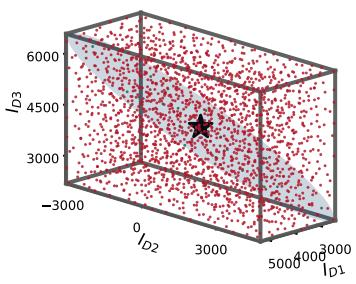  
(a)

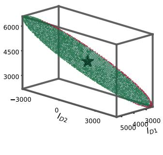  
(b)

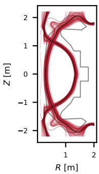  
(c)

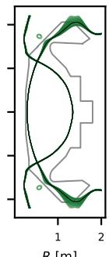  
(d)

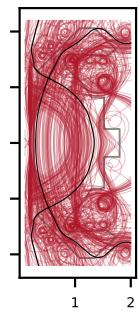  
(e)

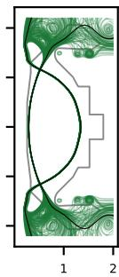  
(f)  
Figure 1: Left: (a) uniform samples across coil-current design variables X and (b) well-spread samples from the linearised feasible region E, restricted to the D1, D2, D3 coils for presentation. Points feasible under the LCFS preservation constraint (desired fixed central region) are green, infeasible red. The starred point is our baseline solution. Right: (c, d) the resulting PDE solutions of the sampled design variables superposed on the baseline solution (black) corresponding to the designs in (a) and (b). This is a vertical slice of a tokamak reactor torus. (e, f) the same construction over the full $d = 1 0$ current domain, showing how tightly E constrains the LCFS. Adopting E as the proposal geometry within BO is the essence of our method.

Our primary application is divertor design for tokamak fusion reactors — a critical problem plagued by expensive numerical physics simulations. We seek to optimise a divertor’s magnetic geometry for improved heat-exhaust performance while preserving the plasma boundary of a baseline equilibrium, known as the last closed flux surface (LCFS). This ensures the reactor’s confinement properties are preserved (Fig. 1c-f and Fig. 2). Recent work applies Bayesian optimisation in this setting, using connection length as a performance proxy and learning core preservation as a constraint (Nunn et al. 2025). We instead incorporate preservation directly into the proposal geometry, demonstrating substantial gains in sample eficiency over standard constrained-BO baselines, with ablations showing that the proposal geometry is the principal source of the improvement.

## 2 BACKGROUND

Bayesian optimisation. We wish to maximise an objective function $f : \mathcal { X } $ R. We assume that $f$ is expensive to evaluate and derivative-free, making sam ple eficiency our primary concern. Bayesian optimisation addresses this setting by sequentially constructing a probabilistic surrogate over the n already observed evaluations $\mathcal { D } _ { n }$ . Gaussian processes (GPs) are widely used as surrogate models, providing a closedform posterior predictive distribution for $f ( x ) \mid { \mathcal { D } } _ { n }$ (Rasmussen and Williams 2005).

Each surrogate model is then used to choose the next evaluation, as selected by maximising an acquisition function defined on this posterior. Acquisition functions balance regions of high predicted objective value against those of high uncertainty, e.g. we can use the expected improvement (EI) (Jones, Schonlau, and Welch 1998) over the score of the current best location (the incumbent) $f _ { n } ^ { \star } : = \operatorname* { m a x } _ { i \leq n } f ( x _ { i } )$ , given by;

$$
\mathrm { E I } _ { n } ( x ) : = \mathbb { E } _ { f ( x ) \mid \mathcal { D } _ { n } } [ \operatorname* { m a x } ( f ( x ) - f _ { n } ^ { \star } , 0 ) \ ] .
$$

Constrained Bayesian optimisation. Suppose feasibility is defined by constraints $c _ { j } ( x ) \leq 0$ . Standard constrained BO places probabilistic surrogates on the constraints and incorporates feasibility through the acquisition function; for example, constrained expected improvement takes the form

$$
\mathrm { c E I } _ { n } ( x ) = \mathrm { E I } _ { n } ( x ) \prod _ { j } P _ { c _ { j } ( x ) | \mathcal { D } _ { n } } [ c _ { j } ( x ) \leq 0 ] ,
$$

with the feasibility probability obtained from the learnt constraint models (Schonlau, Welch, and Jones 1998; Gardner et al. 2014; Gelbart, Snoek, and R. P. Adams 2014). Alternatives use informationtheoretic acquisitions or penalty-based formulations (Hern´andez-Lobato et al. 2015; Lu and Paulson 2022). In all cases, feasibility is judged by a learnt constraint surrogate (Eriksson and Poloczek 2021), while the initial design and candidate generation remain over the ambient domain. We show that for state preservation constraints these surrogates are often poor: the feasible set is thin and anisotropic, and a few expensive evaluations are not enough to resolve its boundary.

Multi-objective Bayesian optimisation. In multi-objective BO (MOBO) it is common to replace seeking scalar improvements in the current best solution by instead seeking improvements over the problem’s Pareto front — the set of optimal tradeofs between the multiple objectives. The resulting acquisition function is the Expected Hyper-Volume Improvement (EHVI) of Emmerich, Giannakoglou, and Naujoks 2006, implemented eficiently by Daulton, Balandat, and Bakshy 2020.

Local feasible-set approximations. In this work, rather than learning feasibility pointwise, we will approximate the feasible set directly as a geometric object. This is a classical technique in constrained optimisation, however, this has yet to be fully explored in BO. For example, sequential quadratic programming combines a local quadratic model of the objective with linearised constraints; trust-region variants limit steps to a neighbourhood where these approximations remain reliable (Nocedal and Wright 2006) and derivative-free methods such as COBYLA construct local linear models of the constraints from function evaluations (Powell 1994). We adapt these ideas from the nonlinear-programming literature and use the local linearised feasible region to provide candidate proposals within a Bayesian optimisation loop. We further update this approximation of the feasible region online, using data observations.

Optimising under the simulator constraint. One could avoid learning the constraint altogether and maximise the acquisition function subject to the simulator-defined feasibility directly, making the inner loop a PDE-constrained optimisation (Hinze et al. 2008). We do not — this approach only makes sense when checking feasibility is significantly cheaper than evaluating the objective. Furthermore, gradients may in principle be obtained by finite diferences or adjoint methods, but, here, neither is straightforward. Finally, gradient-based optimisation of the resulting non-convex acquisition function is typically local, leaving performance sensitive to initialisation — the dificulty our proposal geometry addresses.

## 3 CONSTRAINT-AWARE CANDIDATE GENERATION

Let $x \in \mathcal { X } \subset \mathbb { R } ^ { d }$ denote a design and let $\psi ( x )$ denote the corresponding system state produced by an

expensive simulator. We seek to optimise an objective $F ( \psi ( x ) )$ ) while preserving a selected observable $C ( \psi ( x ) )$ relative to a baseline design $x _ { 0 }$

We define feasibility by

$$
\| C ( \psi ( x ) ) - C ( \psi ( x _ { 0 } ) ) \| _ { G } \leq \tau ,
$$

where $\| \cdot \| _ { G }$ is a norm on the observable space and $\tau > 0$ is a prescribed tolerance. Writing

$$
v ( x ) : = \| C ( \psi ( x ) ) - C ( \psi ( x _ { 0 } ) ) \| _ { G } ,
$$

for the constraint violation. Our optimisation problem is therefore

$$
x ^ { \star } \in \mathop { \arg \operatorname* { m a x } } _ { x \in \mathcal { X } } F ( \psi ( x ) ) \quad \mathrm { s u b j e c t ~ t o } \quad v ( x ) \leq \tau .
$$

## 3.1 The linearised feasible region

The essence of our method is to approximate the feasible set to first order and use this approximation as the proposal geometry for Bayesian optimisation.

Around the baseline design $x _ { 0 } .$ , a first-order expansion gives

$$
C ( \psi ( x _ { 0 } + \delta x ) ) = C ( \psi ( x _ { 0 } ) ) + J \delta x + O ( \| \delta x \| ^ { 2 } ) .
$$

Where the Jacobian $J : = D ( C \circ \psi ) ( x _ { 0 } )$ . Hence

$$
C ( \psi ( x _ { 0 } + \delta x ) ) - C ( \psi ( x _ { 0 } ) ) \approx J \delta x ,
$$

and therefore

$$
v ( x _ { 0 } + \delta x ) ^ { 2 } \approx \lVert J \delta x \rVert _ { G } ^ { 2 } = \delta x ^ { \top } J ^ { \top } G J \delta x .
$$

Writing $M : = J ^ { \top } G J ,$ the first-order approximation to the preservation constraint $v ( x _ { 0 } + \delta x ) \le \tau$ becomes the linearised feasible region

$$
\begin{array} { r } { E : = \left\{ x _ { 0 } + \delta x : \delta x ^ { \top } M \delta x \leq \tau ^ { 2 } \right\} . } \end{array}
$$

We use $E \cap { \mathcal { X } }$ as the proposal geometry for the Bayesian optimisation loop. The intersection keeps the region bounded when M is singular.

This construction admits a geometric interpretation. The inner product G measures changes in the observable space, while J pulls this structure back to design space through

$$
M = J ^ { \top } G J .
$$

Thus E consists of design perturbations whose predicted first-order observable displacement is bounded by τ .

## 3.2 Ray-based intersection sampling and maximin filtering

At each stage of the optimisation we draw candidates from E ∩ B, where E is the linearised feasible region and B is either the engineering domain $\mathcal { X }$ or the current objective-focused trust region. Because $E$ may be highly anisotropic, naive box sampling can give poor coverage. We therefore generate a large candidate pool by ray-based sampling within $E \cap B .$ , using analytic intersections with the ellipsoidal and box boundaries, and then greedily retain a well-spread subset using a maximin criterion (Johnson, Moore, and Ylvisaker 1990). This procedure allows very large candidate pools to be generated cheaply; implementation details are given in Appendix C.

## 3.3 Online refinement

The initial response map

$$
J = D ( C \circ \psi ) ( x _ { 0 } )
$$

describes the infinitesimal change in the observable around the baseline. As the optimisation explores finite displacements from $x _ { 0 } .$ , nonlinear efects cause this local diferential to become an imperfect predictor of the observed change $C ( \psi ( x ) ) - C ( \psi ( x _ { 0 } ) )$ .

Every simulator evaluation, however, provides additional information about this response at no extra solver cost. Writing

$$
\delta x _ { i } : = x _ { i } - x _ { 0 } , \qquad \delta C _ { i } : = C ( \psi ( x _ { i } ) ) - C ( \psi ( x _ { 0 } ) ) ,
$$

each evaluated design supplies a displacement pair $( \delta x _ { i } , \delta C _ { i } )$ satisfying approximately

$$
\delta C _ { i } \approx \widehat { J } \delta x _ { i } .
$$

We therefore refit the linear response map $\widehat { J }$ by least squares over the pairs observed so far, including the initial finite-diference probes. The proposal geometry is then updated through

$$
\widehat { M } = \widehat { J } ^ { \top } G \widehat { J } , \qquad E = \left\{ x _ { 0 } + \delta x : \delta x ^ { \top } \widehat { M } \delta x \leq \tau ^ { 2 } \right\} .
$$

Thus the finite-diference Jacobian supplies an initial proposal geometry before BO has collected data, while subsequent evaluations continually adapt that geometry to the finite-scale behaviour encountered by the search.

## 3.4 Feasibility beyond the linearisation

Due to linearisation error, the edges of our feasible region will contain some infeasible points. To handle these, we use a learnt feasibility model to weight the

acquisition. Rather than model the scalar violation, we model the change in the observable, $\delta C ( x )$ and take its norm:

$$
\delta C ( x ) = \hat { J } \delta x + \sum _ { j = 1 } ^ { K } a _ { j } ( x ) \phi _ { j } ,
$$

where $\hat { J }$ is the online-refit linear response map from which $E$ is built, $\{ \phi _ { j } \}$ are the leading K modes of an uncentred proper orthogonal decomposition of the residual fields $\delta C _ { i } - \hat { J } \delta x _ { i }$ and the $a _ { j }$ are zeromean GPs on the mode coeficients, learning what is missed by the linearisation (Kennedy and O’Hagan 2001). Since $\delta C ( x )$ is Gaussian under this model, $\| \delta C ( x ) \| _ { G } ^ { 2 }$ is a quadratic form of a Gaussian vector and $\mathbb { P } [ \| \bar { \delta } C ( x ) \| _ { G } \leq \tau ]$ is a generalised $\chi ^ { 2 }$ tail, which we approximate by moment matching.

We refer to this model as our field model, since $C$ is field-valued. The construction — a low-rank basis for the field with GPs on its coeficients — is standard for functional outputs (Higdon et al. 2008; Guo and Hesthaven 2018) and, as we show in Section $5 ,$ outperforms fitting a scalar GP directly on $\| \delta C ( x ) \| _ { G }$

## 4 DIVERTOR OPTIMISATION

We now explain our key application of divertor optimisation, as summarised in Fig. 2.

Design x. Tokamak fusion reactors confine a high temperature plasma with a magnetic cage of helical field lines. This magnetic field is induced by current flowing through external coils and through the plasma itself. The poloidal field coils shape the confined plasma and the divertor geometry. We take as design $x = I$ , the poloidal field coil currents, and later $x =$ $( I , R , Z )$ with their positions.

State $\psi .$ Under axisymmetry, the divergence-free magnetic field admits a scalar representation in terms of a single function: $\psi ( R , Z ) - \mathrm { t h e }$ poloidal magnetic flux function and constitutes our state. The level sets of $\psi$ define magnetic flux surfaces. At ideal MHD equilibrium, both the pressure and toroidal field function are constant on flux surfaces and the force-balance equation reduces to the Grad-Shafranov equation

$$
\Delta ^ { \star } \psi = - \mu _ { 0 } R ^ { 2 } p ^ { \prime } ( \psi ) - F ( \psi ) F ^ { \prime } ( \psi ) ,
$$

where

$$
\Delta ^ { \star } = R \frac { \partial } { \partial R } \left( \frac { 1 } { R } \frac { \partial } { \partial R } \right) + \frac { \partial ^ { 2 } } { \partial Z ^ { 2 } }
$$

is the Grad-Shafranov operator. In this work, we use FreeGSNKE (Amorisco et al. 2024), to solve the free-boundary Grad–Shafranov equation (GSE). The

R [m]

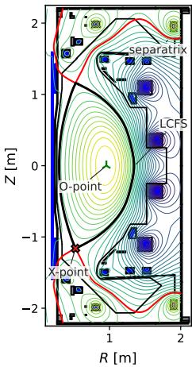  
(a)

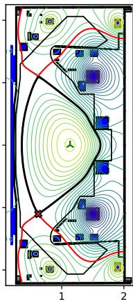  
(b)

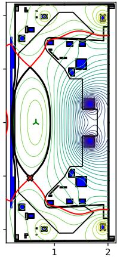  
(c)  
Figure 2: (a) A reconstructed super-X equilibrium from MAST-U shot 53349. We take this equilibrium as our baseline (starting design). (b, c) Random current perturbations (within known MAST-U PF coil bounds) demonstrating the sensitivity of the LCFS (black traced contour). The centre of the black boxes denotes coil location. We will be optimising the current strengths (and later the coil locations) in order to get desirable properties of the separatrix (red contour line), whilst attempting to preserve the LCFS at its baseline shape.

GSE takes as inputs the currents and positions of the poloidal field coils and returns the poloidal flux function over the full spatial domain. Example such equilibria are plotted in Figure 2.

Constraint C. Charged particles follow magnetic field lines. The field lines arising from solving the GSE may be open, so the charged particles can interact with material surfaces, or closed, when they are confined. The boundary between closed and open field lines is known as the separatrix. On this flux surface, the point(s) where the poloidal magnetic field goes to zero is called the X-point. The last closed flux surface (LCFS) (Figure 2) is the outermost closed magnetic flux surface. The shape of this closed curve is chosen to optimise plasma confinement and stability requirements and therefore acts as our observable C.

For a smooth curve, first-order shape changes are described by normal displacement (Michor and Mumford 2006; Sokolowski and Zolesio 1992). Let $\Gamma _ { 0 }$ denote the baseline LCFS. We represent the change to the perturbed LCFS Γ(x) by $\delta C ( x ) \in \mathbb { R } ^ { N }$ , whose entries are signed normal displacements measured at N equally spaced arclength locations on $\Gamma _ { 0 }$ (construction in $\mathrm { A p } \cdot$ pendix B).

Finite diferences with respect to the design variables

give the response map

$$
J = D ( C \circ \psi ) ( x _ { 0 } ) \in \mathbb { R } ^ { N \times d } ,
$$

a matrix whose jth column is the LCFS normaldisplacement field produced by a small perturbation of design variable $x _ { j }$ . We measure preservation by the RMS normal displacement,

$$
\begin{array} { l } { \displaystyle \boldsymbol { v } ( \boldsymbol { x } ) : = \| \delta C ( \boldsymbol { x } ) \| _ { G } = \left( \frac { 1 } { N } \delta C ( \boldsymbol { x } ) ^ { \top } \delta C ( \boldsymbol { x } ) \right) ^ { 1 / 2 } , } \\ { \| \boldsymbol { y } \| _ { G } : = \left( \boldsymbol { y } ^ { \top } G \boldsymbol { y } \right) ^ { 1 / 2 } , \quad \mathrm { i . e . ~ } G = \frac { 1 } { N } I . } \end{array}
$$

Objective F. A fusion plasma is not a closed system – charged particles and heat continuously escape the confined core and intersect material surfaces on the tokamak wall. In reactor-scale tokamaks, such unmitigated exhaust heat loads far exceed the engineering limits of any practical plasma-facing material (Kotschenreuther et al. 2007). To manage this, tokamaks employ a dedicated region known as the divertor. The central objective of the divertor is to achieve and control a detached plasma regime, characterised by suficiently strong power and momentum losses that the plasma cools and begins to recombine before reaching the divertor target. The result is a large reduction of the parallel heat flux incident on material surfaces.

We minimise the detachment-threshold impurity fraction, $c _ { z } \colon$ the impurity fraction required for detachment onset at the divertor target, at fixed upstream conditions. Lowering this threshold makes detachment easier to access and widens the operating window (Lipschultz, Parra, and Hutchinson 2016). We compute this objective using the reduced divertor model FusionDLS (Cowley et al. 2022; Kryjak et al. 2026).

## 4.1 Related work in Fusion Research

We note that considering the linearised coil-toboundary response is a well-studied construct in tokamak magnetic control. Virtual circuits use it to vary one geometric shape parameter while holding the others fixed (McArdle, Pangione, and Kochan 2020; Anand et al. 2024). We use the same principle to construct a search region rather than control directions. Relaxing the response’s null space to a region would require a norm on shape parameter changes, instead, we use the $L ^ { 2 }$ norm of the LCFS normal displacement.

Two additional constructions for holding the core fixed appear in the literature and we present them below. However, in both, note that constraint approximations are controlled coarsely by a discrete parameter that sacrifices approximation quality for degrees of freedom. In contrast, our norm-based constraint decouples LCFS resolution from design dimension: we are able to resolve the LCFS at $\mathcal { O } ( 1 0 ^ { 4 } )$ points while retaining all d design directions, with τ controlling the allowed displacement.

1. Bardsley, Baker, and Vincent (2024) preserve the core approximately by matching the leading spherical-harmonic coeficients of $\psi _ { \mathrm { m a c h i n e } }$ to their baseline values. These coeficients are linear in coil currents, so admissible current changes lie in the null space of the resulting constraint matrix. Each additional harmonic tightens preservation at the cost of a degree of freedom, with no intermediate settings available. The approximation is also conservative as the constraint fixes the field throughout a source-free ball containing the plasma rather than directly preserving the LCFS.

2. Marsden (2026) place conditions on the machine flux at sampled points along the separatrix to define a linear system whose null space supplies simulated-annealing proposals that satisfy the constraints. However, the exactness is only enforced pointwise, with the boundary pinned at a set number of chosen points and unconstrained between them.

## 5 EXPERIMENTS

Experimental protocol. All experiments start from the same MAST-U-like baseline equilibrium with LCFS-displacement tolerance $\tau = 0 . 5$ cm. We first optimise d = 10 paired coil currents, then jointly optimise currents and positions $( d \ : = \ : 3 0 )$ , and finally consider an additional objective function. Evaluation budgets are 1,000 (currents-only) and 1,500 (joint), with 50 and 100 initial designs respectively. Constructing the initial response map requires an additional 2d finite-diference solves. We report 50 seeds per run, each on 4 CPU cores with 16 GB and 40 GB of memory for d = 10 and d = 30. See Appendix A.

Shared implementation details. We compare our proposed algorithm with a variant of the previous application of BO to divertor optimisation (Nunn et al. 2025) (henceforth, the competitor). These two methods difer principally (see Appendix A) in candidate generation and feasibility modelling — Nunn et al. 2025 attempt to learn core preservation (with a Mat´ern-5/2 GP on the scalar violation v(x)) whereas we approximate the feasible set directly as a geometric object (details below). For both methods, objectives are modeled with zero-mean GPs with ARD Mat´ern-$5 / 2$ kernels, fit by maximum likelihood. Candidates are ranked by feasibility-weighted expected improvement, $\mathrm { E I } ( x ) { \times } P [ v ( x ) \leq \tau ]$ relative to the best observed feasible value. The highest-ranked candidates initialise L-BFGS-B refinement of this acquisition. Both methods deploy the Trust-Region BO (TuRBO) of Eriksson, Pearce, et al. 2019 to localise search and modelling to an adaptively sized neighbourhood B of the incumbent. Upon trust-region convergence, the objective $\mathrm { G P }$ is reset and a fresh initial design is drawn.

Our algorithm. The primary contribution of our paper is the continually updating candidate proposal geometry: the initial design and candidate pools are drawn from the linearised feasible region E of §3. At each iteration, we draw $1 0 ^ { 5 }$ candidates from E ∩ B using ray-based sampling and apply maximin filtering. Acquisition may leave $E ,$ with feasibility assessed by the field model of §3.4, using $K = 5$ modes. After each step, we refit Jˆ on all observed pairs, rebuild E, and update surrogates and trust regions, see Algorithm 1.

Algorithm 1 Constrained BO with linearised pro  
posal geometry (# initial designs $N _ { i n i t } , \#$ steps T)   
1: Solve $\psi _ { 0 } = \psi ( x _ { 0 } )$   
2: Estimate Jˆ by finite diferences (2d solves)   
$3 \colon E \gets \{ x _ { 0 } + \delta x : \delta x ^ { \top } \hat { J } ^ { \top } G \hat { J } \delta x \leq \tau ^ { 2 } \} ; \quad B \gets \mathcal { X }$   
4: Sample Ninit points from $E \cap { \mathcal { X } } ;$ evaluate $F , \delta C$   
5: Refit ${ \hat { J } } , E ,$ and surrogate models   
6: for $t = 1 , \dots , T$ do   
7: Sample candidates from $E \cap B ;$   
8: Maximin filter candidates; rank by $\mathrm { E I P } [ v \leq \tau ]$   
9: Refine top candidates with $\mathrm { L - B F G S  – B } ;$ select x∗   
10: Evaluate $\dot { \mathbf { \nabla } } F ( \psi ( x ^ { * } ) ) , \delta C ( x ^ { * } )$   
11: Refit Jˆ, E, and surrogate models   
12: Update, rescale, and recentre TuRBO region B   
13: if $| B | < L _ { \mathrm { m i n } }$ then   
14: Restart objective GP   
15: Sample $N _ { \mathrm { i n i t } }$ points from $E \cap { \mathcal { X } } ;$ evaluate F   
16: Initialise new TurBO region B   
17: end if   
18: end for   
19: return best feasible design

## 5.1 Experiment 1: currents only (d=10)

We first consider the task of optimising currents to minimise the detachment-threshold impurity fraction. Results are presented in Figure 3 and Table 1, alongside a set of ablations on our method (A1-A8) and the competitor (C1-C8) to separate the efects of proposal geometry, feasibility modelling, online refinement and the box trust region. These results show substantial gains over the existing method and raise the following observations.

Our proposal geometry is the principal source of improvement. Most of the performance gain is

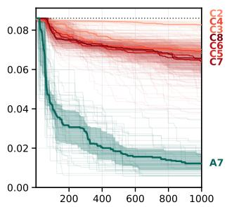  
(a)

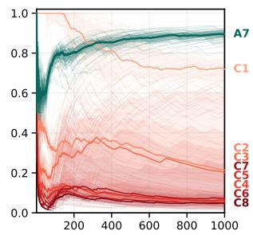  
(b)

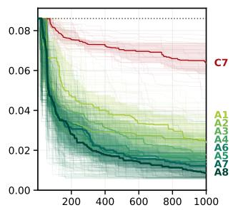  
(c)

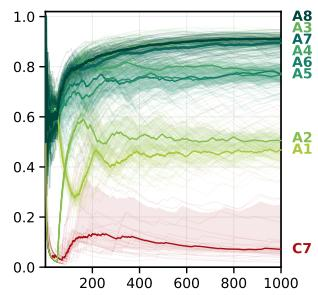  
(d)

Figure 3: Currents-only (d = 10), 1000 evaluations. Median (bold), IQR (band) and every individual seed (faint). (a),(c) y-axis is best feasible c ; the dotted line is the baseline c = 0.086. (b),(d) y-axis is cumulative feasible fraction. (a),(b) our method (A7) against the full competitor sweep C1–C8 over its trust-region size L. (c),(d) the best competitor setting (C7) against every ablation A1–A8. Identifiers and colours are shared across all four panels and with Table 1.
<table><tr><td></td><td>Run</td><td>median cz</td><td>IQR</td><td>median feas.</td><td>IQR</td></tr><tr><td>C1</td><td>competitor, L = 0.001</td><td>0.0827</td><td>[0.0787, 0.0837]</td><td>0.720</td><td>[0.646, 0.768]</td></tr><tr><td>C2</td><td>competitor, L = 0.005</td><td>0.0702</td><td>[0.0665, 0.0728]</td><td>0.214</td><td>[0.155, 0.619]</td></tr><tr><td>C3</td><td>competitor, L = 0.01</td><td>0.0683</td><td>[0.0651, 0.0723]</td><td>0.203</td><td>[0.083, 0.398]</td></tr><tr><td>C4</td><td>competitor, L = 0.015</td><td>0.0692</td><td>[0.0653, 0.0717]</td><td>0.057</td><td>[0.045, 0.103]</td></tr><tr><td>C5</td><td>competitor, L = 0.02</td><td>0.0646</td><td>[0.0563, 0.0722]</td><td>0.064</td><td>[0.039, 0.321]</td></tr><tr><td>C6</td><td>competitor, L = 0.025</td><td>0.0655</td><td>[0.0622, 0.0696]</td><td>0.049</td><td>[0.033, 0.091]</td></tr><tr><td>C7</td><td>competitor, L = 0.03</td><td>0.0636</td><td>[0.0582, 0.0726]</td><td>0.071</td><td>[0.053, 0.251]</td></tr><tr><td>C8</td><td>competitor, L = 0.035</td><td>0.0657</td><td>[0.0577, 0.0702]</td><td>0.047</td><td>[0.034, 0.093]</td></tr><tr><td>A1</td><td>scalar GP, unconfined</td><td>0.0244</td><td>[0.0209, 0.0334]</td><td>0.468</td><td>[0.429, 0.503]</td></tr><tr><td>A2</td><td>box proposals</td><td>0.0238</td><td>[0.0137, 0.0283]</td><td>0.506</td><td>[0.469, 0.525]</td></tr><tr><td>A3</td><td>geometry only</td><td>0.0178</td><td>[0.0120, 0.0244]</td><td>0.908</td><td>[0.877, 0.929]</td></tr><tr><td>A4</td><td>frozen map</td><td>0.0155</td><td>[0.0110, 0.0203]</td><td>0.774</td><td>[0.748, 0.815]</td></tr><tr><td>A5</td><td>scalar GP, confined</td><td>0.0140</td><td>[0.0099, 0.0198]</td><td>0.769</td><td>[0.734, 0.800]</td></tr><tr><td>A6</td><td>hard gate</td><td>0.0142</td><td>[0.0106, 0.0186]</td><td>0.772</td><td>[0.736, 0.800]</td></tr><tr><td>A7</td><td>full</td><td>0.0122</td><td>[0.0090, 0.0171]</td><td>0.895</td><td>[0.876, 0.908]</td></tr><tr><td>A8</td><td>no box</td><td>0.0087</td><td>[0.0069, 0.0134]</td><td>0.911</td><td>[0.895, 0.920]</td></tr></table>

Table 1: Final performance at 1000 evaluations. Identifiers match Fig. 3; the box defines the ablation.

A1 proposals from E; competitor’s scalar GP; acquisition optimiser can leave E   
A2 competitor’s box proposals (L = 0.03, as C7); our field model (mean J δxˆ )   
A3 proposals from E ∩ B; no objective or constraint surrogate; random selection   
A4 A7 with Jˆ frozen at the finite-diference Jacobian   
A5 A1 with the optimiser held inside E   
A6 A5 with the scalar GP removed; E alone decides feasibility   
A7 the full algorithm 1   
A8 A7 with the box trust region removed

already obtained once this geometry is used for proposals. A3 uses no surrogate of any kind (sampling randomly from E∩B), yet reaches a median final c of 0.018 at 90.8% feasibility — 3.6× better than the best competitor setting. It also outperforms both methods that adopt only one of our other components: the field model with box proposals (A2) and the scalar GP with proposals from E but unconfined acquisition refinement (A1).

Online refinement is important for maintaining feasibility. Online refitting is primarily a feasibility correction as the local linearisation degrades. Freezing the response map (A4) costs roughly 12% feasibility with no significant objective efect.

The field model allows us to safely leave the linearised region. While unconstrained refinement under the scalar GP gives 47% feasibility (A1), hard confinement to E raises it to 77% (A5, A6). Adding the field model and letting L-BFGS refinement leave E improves this further to 89.5% (A7). These excursions, however, buy a minimal amount of objective improvement: A5 to A7 moves the median cZ by a couple percentage points from the baseline, pointing again to the geometry as the key driver.

Trust regions are critical for the competitor, but not for us. Removing trust regions (A8) does not hurt our algorithm, and here even improves it, but makes the competitor a non-starter — sampling and acquisition optimisation over the full engineering bounds yield almost no feasible points and many equilibrium-solver failures. Moreover, even when using trust regions within the competitor, the initial side length of the trust region must be carefully chosen to be small enough to find feasible designs, but large enough to permit useful optimisation. We sweep eight initial side lengths L (C1–C8) and see that larger L buys progress at the cost of feasibility – once $L \ \geq$ 0.015, feasibility falls to below 8% and progress stalls at cZ ≈ 0.065. Every competitor setting is markedly less sample eficient and has worse cumulative feasibility than our method (A7/A8) – we reach a median final $c _ { Z }$ of 0.012, 5.2× better than the best competitor setting, while keeping 89.5% of its evaluations feasible.

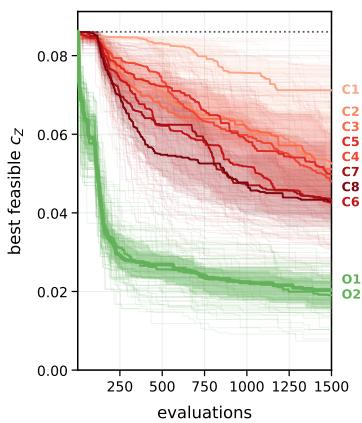  
(a)

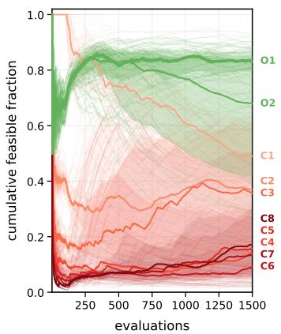  
(b)

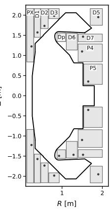  
(c)

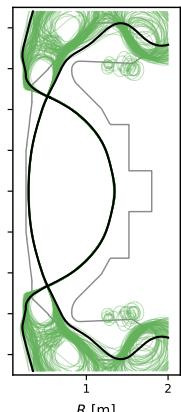  
(d)

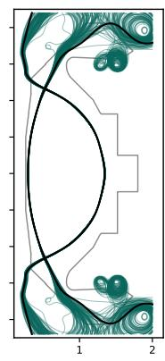  
(e)  
Figure 4: Left: Currents and position combined optimisation plots: (a) best cZ-so-far and (b) cumulative feasibility, vs our competitor method (C1-C8) . O1: joint with box trust region, O2: without. Right: (c) An illustration of the position bounds, (d) our optimal feasible separatrices from the combined optimisation and (e) from our currents-only optimisations.

## 5.2 Experiment 2: include positions (d=30)

So far, the design variables have been the PF-coil currents alone. We now extend the control vector to include coil positions, $x = ( I , R , Z ) \in \mathbb { R } ^ { d _ { I } + 2 d _ { R } }$ . This combined optimisation stresses our method as its control to LCFS perturbation response is much more nonlinear than with currents-only. Each control is normalised by its engineering bounds, and the response map J is computed in these normalised coordinates. The bilinear structure of the equilibrium response to positions, and the coordinate transformation it motivates, are deferred to Appendix D. Fig. 4 shows that our method is markedly more sample-eficient than the competitor, achieving a 2.1× lower detachment threshold at the same evaluation budget. While our method is robust to trust region removal (O1-2), the competitor remains sensitive to trust region setup (C1-8).

Online refinement is critical as we increase nonlinearity Coil positions enter the equilibrium more nonlinearly than currents. With positions included, the frozen linearisation’s median violation-prediction error is 1.07 cm, exceeding the 0.5 cm tolerance. On line refitting reduces the one-step-ahead (held-out) median prediction error to 0.031 cm, allowing us to retain 83.3% feasibility despite stronger nonlinearity.

## 5.3 Extension 3: an additional objective

The focus of our paper is on the handling of preservation constraints, and our exact same machinery can also be applied to multi-objective Bayesian optimisation by swapping EI with EHVI. Following Cowley et al. (2022), we seek to jointly optimise with respect to two key quantities that govern the controllability of a detachment front: connection length $L _ { c }$ (field-line distance from midplane to target) and total flux expansion (ratio of field strength at the $\mathrm { X } -$ point to that at the target). Fig. 5 demonstrates efective MOBO, finding dense Pareto fronts for both the currents-only (blue) and currents and positions (red) MOBO. We do not run a competitor here, as this would require a nontrivial multi-objective trust-region. The point of this demonstration is to show that our proposal geometry is indiferent to the choice of acquisition function.

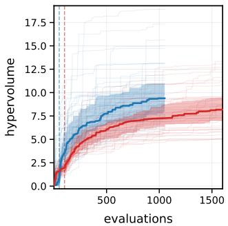  
(a)

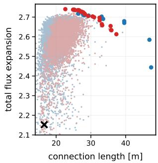  
(b)  
Figure 5: Left: HV plots from currents-only MOBO and currents and positions MOBO. Right: The corresponding connection length and total flux expansion pareto plots. Red are the joint MOBO results, blue the currents-only. The $ { \mathrm { ^ 6 x } } ^ { \prime }$ is our baseline equilibrium and the HV anchor.

## 6 CONCLUSION

Preservation constraints admit a thin, anisotropic feasible set that is expensive to learn but cheap to compute. Here, uniform sampling of the d = 10 current box yielded no feasible designs in 1,000 solves (Fig. 1e). Thus, a data-driven method must locate the set from scalar observations that almost never land inside it. We get around this by precomputing its first-order approximation from 2d solves and refining it online. On the divertor optimisation problem, using this geometry to propose candidate designs inside a Bayesian optimisation loop reaches a median detachment threshold 5–7× below the best competitor in the currents-only problem while holding ∼ 90% of evaluations within a 0.5 cm boundary tolerance.

We believe our approach provides a general framework for the Bayesian optimisation of trusted engineering designs under tightly constrained state variation. Fu ture work will apply our method to other key problems in heavily-constrained and high-cost engineering, like radio-frequency cavity (Wang et al. 2026) and stellarator (Packman, Riva, and Rodriguez-Fernandez 2025) design. Moreover, as our experiments show on MOBO, the proposed BO module is self-contained and can be easily plugged into orthogonal BO advances, including batch (Gonz´alez et al. 2016), multi-fidelity (Snoek, Larochelle, and R. Adams 2012), multi-task (Moss, Leslie, and Rayson 2020) and high-dimensional (Doumont et al. 2025) BO, as well as BO under riskadversity (Picheny et al. 2022).

## REFERENCES

Amorisco, N. C. et al. (2024). “FreeGSNKE: A Python-based dynamic free-boundary toroidal plasma equilibrium solver”. In: Physics of Plasmas 31.4, p. 042517. doi: 10.1063/5.0188467.

Anand, H. et al. (July 2024). “Real-time plasma equilibrium reconstruction and shape control for the MAST Upgrade tokamak”. In: Nuclear Fusion 64.8, p. 086051. doi: 10.1088/1741-4326/ad5c80. url: https://doi.org/10.1088/1741- 4326/ ad5c80.

Bardsley, O P, J L Baker, and C Vincent (Mar. 2024). “Decoupled magnetic control of spherical tokamak divertors via vacuum harmonic constraints”. In: Plasma Physics and Controlled Fusion 66.5, p. 055006. doi: 10.1088/1361-6587/ad319d. url: https://doi.org/10.1088/1361-6587/ad319d.

Cowley, C. et al. (July 2022). “Optimizing detachment control using the magnetic configuration of divertors”. English. In: Nuclear Fusion 62.8. © EU-RATOM 2022. issn: 0029-5515. doi: 10 . 1088 / 1741-4326/ac7a4c.

Daulton, Samuel, Maximilian Balandat, and Eytan Bakshy (2020). “Diferentiable expected hypervolume improvement for parallel multi-objective Bayesian optimization”. In: Proceedings of the 34th International Conference on Neural Information Processing Systems. NIPS ’20. Vancouver, BC, Canada: Curran Associates Inc. isbn: 9781713829546.

Doumont, Colin et al. (2025). “We Still Don’t Understand High-Dimensional Bayesian Optimization”. In: arXiv preprint arXiv:2512.00170.

Du, Xianping et al. (2023). “A radial-basis function mesh morphing and Bayesian optimization framework for vehicle crashworthiness design”. In: Structural and Multidisciplinary Optimization 66.3. doi: 10.1007/s00158-023-03496-x.

Duris, J. et al. (2020). “Bayesian Optimization of a Free-Electron Laser”. In: Physical Review Letters 124.12, p. 124801. doi: 10.1103/PhysRevLett. 124.124801.

Emmerich, M. T.M., K. C. Giannakoglou, and B. Naujoks (Aug. 2006). “Single- and multiobjective evolutionary optimization assisted by Gaussian random field metamodels”. In: Trans. Evol. Comp 10.4, pp. 421–439. issn: 1089-778X. doi: 10.1109/ TEVC.2005.859463. url: https://doi.org/10. 1109/TEVC.2005.859463.

Eriksson, David, Michael Pearce, et al. (2019). “Scalable Global Optimization via Local Bayesian Optimization”. In: Advances in Neural Information Processing Systems. Ed. by H. Wallach et al. Vol. 32. Curran Associates, Inc. url: https : / / proceedings . neurips . cc / paper \_ files / paper / 2019 / file / 6c990b7aca7bc7058f5e98ea909e924b - Paper . pdf.

Eriksson, David and Matthias Poloczek (Apr. 2021). “Scalable Constrained Bayesian Optimization”. In: Proceedings of The 24th International Conference on Artificial Intelligence and Statistics. Ed. by Arindam Banerjee and Kenji Fukumizu. Vol. 130. Proceedings of Machine Learning Re-

search. PMLR, pp. 730–738. url: https : / / proceedings . mlr . press / v130 / eriksson21a . html.

Forrester, Alexander I. J., Andr´as S´obester, and Andy J. Keane (2008). Engineering Design via Surrogate Modelling: A Practical Guide. Wiley. isbn: 9780470770801. doi: 10.1002/9780470770801.

Gardner, Jacob R. et al. (2014). “Bayesian optimization with inequality constraints”. In: Proceedings of the 31st International Conference on International Conference on Machine Learning - Volume 32. ICML’14. Beijing, China: JMLR.org, II–937–II– 945.

Gelbart, Michael A., Jasper Snoek, and Ryan P. Adams (2014). “Bayesian optimization with unknown constraints”. English (US). In: Uncertainty in Artificial Intelligence - Proceedings of the 30th Conference, UAI 2014. Ed. by {Nevin L.} Zhang and Jin Tian. Uncertainty in Artificial Intelligence - Proceedings of the 30th Conference, UAI 2014. 30th Conference on Uncertainty in Artificial Intelligence, UAI 2014 ; Conference date: 23-07-2014 Through 27-07-2014. AUAI Press, pp. 250–259.

Gonz´alez, Javier et al. (2016). “Batch Bayesian optimization via local penalization”. In: Artificial intelligence and statistics. PMLR, pp. 648–657.

Guo, Mengwu and Jan S. Hesthaven (2018). “Reduced Order Modeling for Nonlinear Structural Analysis Using Gaussian Process Regression”. In: Computer Methods in Applied Mechanics and Engineering 341, pp. 807–826. doi: 10.1016/j.cma.2018. 07.017.

Hern´andez-Lobato, Jos´e Miguel et al. (2015). “Predictive entropy search for Bayesian optimization with unknown constraints”. In: Proceedings of the 32nd International Conference on Machine Learning - Volume 37. ICML’15. Lille, France: JMLR.org, pp. 1699–1707.

Higdon, Dave et al. (2008). “Computer Model Calibration Using High-Dimensional Output”. In: Journal of the American Statistical Association 103.482, pp. 570–583. doi: 10.1198/016214507000000888.

Hinze, Michael et al. (2008). Optimization with PDE Constraints. Springer.

Jameson, Antony, Luigi Martinelli, and Niles A. Pierce (1998). “Optimum aerodynamic design using the Navier–Stokes equations”. In: Theoretical and Computational Fluid Dynamics 10.1–4, pp. 213–237. doi: 10.1007/s001620050060.

Johnson, M. E., L. M. Moore, and D. Ylvisaker (1990). “Minimax and Maximin Distance Designs”. In: Journal of Statistical Planning and Inference 26.2, pp. 131–148.

Jones, Donald R., Matthias Schonlau, and William J. Welch (Dec. 1, 1998). “Eficient Global Optimization of Expensive Black-Box Functions”. In: Journal of Global Optimization 13.4, pp. 455–492. doi: 10.1023/A:1008306431147. url: https://doi. org/10.1023/A:1008306431147.

Kennedy, Marc C. and Anthony O’Hagan (Sept. 2001). “Bayesian Calibration of Computer Models”. In: Journal of the Royal Statistical Society Series B: Statistical Methodology 63.3, pp. 425–464. issn: 1369-7412. doi: 10 . 1111 / 1467 - 9868 . 00294. eprint: https : / / academic . oup . com / jrsssb / article- pdf/63/3/425/49590547/jrsssb\_63\_ 3\_425.pdf. url: https://doi.org/10.1111/ 1467-9868.00294.

Kotschenreuther, M. et al. (2007). “On Heat Loading, Novel Divertors and Fusion Reactors”. In: Physics of Plasmas 14.7, p. 072502. doi: 10 . 1063 / 1 . 2739422.

Kryjak, Mike et al. (2026). “DLS-Extended: a reduced model to assess the impact of impurity radiation location on optimal magnetic geometry choices for the STEP divertor”. In: Nuclear Fusion. url: http : / / iopscience . iop . org / article / 10 . 1088/1741-4326/aea0ec.

Lam, R´emi et al. (2018). “Advances in Bayesian Optimization with Applications in Aerospace Engineering”. In: 2018 AIAA Non-Deterministic Approaches Conference. American Institute of Aeronautics and Astronautics. doi: 10.2514/6.2018- 1656.

Lipschultz, Bruce, Felix I. Parra, and Ian H. Hutchinson (Apr. 2016). “Sensitivity of detachment extent to magnetic configuration and external parameters”. In: Nuclear Fusion 56.5, p. 056007. doi: 10.1088/0029-5515/56/5/056007. url: https: //doi.org/10.1088/0029-5515/56/5/056007.

Lu, Congwen and Joel A. Paulson (2022). “No-Regret Bayesian Optimization with Unknown Equality and Inequality Constraints using Exact Penalty Functions”. In: IFAC-PapersOnLine 55.7. 13th IFAC Symposium on Dynamics and Control of Process Systems, including Biosystems DYCOPS 2022, pp. 895–902. issn: 2405-8963. doi: https://doi. org / 10 . 1016 / j . ifacol . 2022 . 07 . 558. url: https : / / www . sciencedirect . com / science / article/pii/S2405896322009648.

Marsden, Chris (2026). FORGE: FORGE Optimises Reactor Geometries to improve Exhaust. Version 1.0.1. url: https : / / github . com / FORGExhaust/FORGE.

McArdle, Graham, Luigi Pangione, and Martin Kochan (2020). “The MAST Upgrade plasma control system”. In: Fusion Engineering and Design 159, p. 111764. issn: 0920-3796. doi: https : / / doi . org / 10 . 1016 / j . fusengdes . 2020 . 111764. url: https://www.sciencedirect.com/ science/article/pii/S0920379620303124.

Michor, Peter W. and David Mumford (2006). “Riemannian geometries on spaces of plane curves”. eng. In: Journal of the European Mathematical Society 008.1, pp. 1–48. url: http://eudml.org/ doc/277745.

Moss, Henry B, David S Leslie, and Paul Rayson (2020). “Mumbo: Multi-task max-value bayesian optimization”. In: Joint European Conference on Machine Learning and Knowledge Discovery in Databases. Springer, pp. 447–462.

Nocedal, Jorge and Stephen J. Wright (2006). Numerical optimization. 2. ed. Springer series in operations research and financial engineering. New York, NY: Springer. XXII, 664. isbn: 978-0-387-30303-1. url: http : / / gso . gbv . de / DB = 2 . 1 / CMD ? ACT = SRCHA&SRT=YOP&IKT=1016&TRM=ppn+502988711& sourceid=fbw\_bibsonomy.

Nunn, Timothy et al. (July 2025). “Bayesian optimization of poloidal field coil positions in tokamaks”. In: Physics of Plasmas 32.7, p. 072507. issn: 1070- 664X. doi: 10.1063/5.0272085. eprint: https: //pubs.aip.org/aip/pop/article- pdf/doi/ 10 . 1063 / 5 . 0272085 / 20606824 / 072507 \_ 1 \_ 5 . 0272085.pdf. url: https://doi.org/10.1063/ 5.0272085.

Packman, Sam, Nicolo Riva, and Pablo Rodriguez-Fernandez (2025). “Bayesian methods for magnetic and mechanical optimization of superconducting magnets for fusion”. In: Journal of Fusion Energy 44.1, p. 19.

Picheny, Victor et al. (2022). “Bayesian quantile and expectile optimisation”. In: Uncertainty in Artificial Intelligence. PMLR, pp. 1623–1633.

Pierret, S. and R. A. Van den Braembussche (1999). “Turbomachinery blade design using a Navier– Stokes solver and artificial neural network”. In: Journal of Turbomachinery 121.2, pp. 326–332. doi: 10.1115/1.2841318.

Powell, M. J. D. (1994). “A Direct Search Optimization Method That Models the Objective and Constraint Functions by Linear Interpolation”. In: doi: 10.1007/978-94-015-8330-5\_4.

Rasmussen, Carl Edward and Christopher K. I. Williams (Nov. 2005). Gaussian Processes for Machine Learning. The MIT Press. isbn: 9780262256834. doi: 10.7551/mitpress/3206. 001 . 0001. eprint: https : / / direct . mit . edu / book- pdf/2514321/book\_9780262256834.pdf. url: https : / / doi . org / 10 . 7551 / mitpress / 3206.001.0001.

Røstum, Heine, Sebastien Gros, and Ketil Aas-Jakobsen (2025). “Constrained Bayesian optimization for engineering bridge design”. In: Structural and Multidisciplinary Optimization 68.1. doi: 10. 1007/s00158-024-03951-3.

Schonlau, Matthias, William J. Welch, and Donald R. Jones (1998). “Global versus local search in constrained optimization of computer models”. In: url: https : / / api . semanticscholar . org / CorpusID:58806889.

Snoek, Jasper, Hugo Larochelle, and Ryan Adams (2012). “Practical bayesian optimization of machine learning algorithms”. In: Advances in neural information processing systems 25.

Sokolowski, Jan and Jean-Paul Zolesio (1992). Introduction to Shape Optimization. Shape Sensitivity Analysis. Vol. 16. Springer Series in Computational Mathematics. Berlin, Heidelberg: Springer. isbn: 978-3-540-54177-6. doi: 10 . 1007 / 978 - 3 - 642 - 58106-9.

Wang, Yanhong et al. (2026). “Multiobjective Bayesian optimization for the shape design of rf cavity in particle accelerators”. In: Physical Review Accelerators and Beams 29.3, p. 034601.

## Appendix

## A HYPERPARAMETERS

Table 2 lists every numerical setting used in the experiments.

Table 2: Experimental settings for the currents-only (d = 10) and joint currents-and-positions (d = 30) problems.
<table><tr><td></td><td>currents</td><td>joint</td></tr><tr><td>Problem</td><td>10</td><td></td></tr><tr><td>dimension d</td><td></td><td>30</td></tr><tr><td>tolerance τ [cm]</td><td>0.5</td><td></td></tr><tr><td>leg truncation margin [m]</td><td>0.1</td><td></td></tr><tr><td>shot / index current bounds [A]</td><td>53349 / 120 PX ±6000, P4/P5 ±14400, D1–D3 ±8000,</td><td></td></tr><tr><td>Budget</td><td>Dp ±6400, D5 ±4000, D6 ±3200, D7 ±4800</td><td></td></tr><tr><td>Ninit</td><td>50</td><td>100</td></tr><tr><td>matched-comparison budget</td><td>1000</td><td>1500</td></tr><tr><td>FD Jacobian solves (not counted)</td><td>20</td><td>60</td></tr><tr><td>seeds (ours / per competitor L)</td><td>50 / 30</td><td>50 / 30</td></tr><tr><td>Candidates</td><td></td><td></td></tr><tr><td>initial pool</td><td> $2 \times 1 0 ^ { 5 }$ </td><td></td></tr><tr><td>per-iteration pool</td><td>10⁵</td><td></td></tr><tr><td>L-BFGS-B refinements per iteration</td><td>2</td><td></td></tr><tr><td>Surrogates</td><td></td><td></td></tr><tr><td>kernel</td><td>ARD Matérn-5/2, MLE</td><td></td></tr><tr><td>hyperparameter refit interval [iters]</td><td>10</td><td></td></tr><tr><td>POD modes K</td><td>5</td><td></td></tr><tr><td>weight of FD probes in map regression</td><td>1.0 (same as an evaluation)</td><td></td></tr><tr><td>Box trust region (ours)</td><td></td><td></td></tr><tr><td>initial / minimum length</td><td></td><td></td></tr><tr><td>expand factor / successes</td><td> $^ { 1 . 0 / 1 0 ^ { - 3 } } _ { \ 2 . 0 / \ 2 }$ </td><td></td></tr><tr><td></td><td></td><td></td></tr><tr><td>shrink factor / failures axis scaling</td><td>0.5 / 10 objective GP ARD lengthscales</td><td>0.5 / 20</td></tr><tr><td>Competitor</td><td></td><td></td></tr><tr><td>initial length (swept, C1–C8)</td><td>{0.001, 0.005, 0.01, 0.015, 0.02, 0.025, 0.03, 0.035}</td><td></td></tr><tr><td>minimum length</td><td>10⁻⁴</td><td></td></tr><tr><td>initial design</td><td>50 (Sobol, in box, incl. baseline)</td><td>100</td></tr><tr><td>expand / shrink successes, failures</td><td>3 / 10</td><td></td></tr><tr><td>acquisition candidates</td><td>2000 Sobol, 10 L-BFGS-B restarts</td><td></td></tr></table>

## B MEASURING THE LCFS DISPLACEMENT

The baseline LCFS is the contour $\psi _ { 0 } = \psi _ { X }$ , with divertor legs truncated 10 cm beyond the X-point. To discretise this, we resample uniformly in arclength to $1 0 ^ { 4 }$ points $p _ { k }$ and compute their outward unit normals $\hat { n } _ { k }$ by finite diferences.

For an equilibrium ψ with poloidal magnetic flux $\psi _ { X } ^ { \prime }$ at the X-point, we compute $\delta C _ { k }$ as the root t nearest 0 of $\psi ( p _ { k } + t \hat { n } _ { k } ) = \psi _ { X } ^ { \prime }$ . This is precisely a point on the perturbed separatrix along the direction normal to our point on the LCFS. We set this to 1 m if no such root exists within 1 m.

$^ { J , }$ then, is the central diference of δC with FD steps of 100 A for currents and 2 cm for positions (2d solves).   
Vertices with no root at these FD probes are dropped, leaving $N \approx 1 0 ^ { 4 }$ rows used throughout.

## C SAMPLING DETAILS

Each candidate is a point $o + t u$ on a ray with origin $o \in E \cap B$ , direction u and length t. We need to pick a origins of the ray and sample over their directions and lengths.

Origins. We use the baseline $x _ { 0 }$ (the ellipsoid centre) and the incumbent $x _ { \mathrm { b e s t } }$ , whichever lie in $E \cap B ,$ , splitting candidates evenly between them. If neither does, we use, in order:

• the incumbent under the region snapshot that proposed it;

• the point 0.999 of the way from $x _ { 0 }$ to the boundary of $E$ towards $x _ { \mathrm { b e s t } } .$ , if it lies in $B ;$

• or $x _ { 0 }$ but sampling $E \cap \mathcal { X }$ for that iteration – that is, we drop the box trust region entirely for this iteration.

Directions. To sample directions, we split evenly into two cases.

Let $M = V \Lambda V ^ { \top }$ be the eigendecomposition of the metric M. For our first half, we sample uniformly in the ellipsoid induced by the constraint pullback, a sphere in M. We take direction samples: $u = V \Lambda ^ { - 1 / 2 } y ,$ , with $y = z / \| z \| \ \mathrm { a n d } \ z \sim \mathcal { N } ( 0 , I _ { d } )$ , so that y is uniform on the unit sphere. Since the eigenvalues of M span roughly ten orders of magnitude, these directions concentrate along its small-eigenvalue eigenvectors, the coil combinations that barely move the LCFS.

The other half are uniform Euclidean directions, which cover the remaining directions.

Lengths. Each ray is truncated at $t _ { \mathrm { m a x } } = \mathrm { m i n } ( t _ { E } , t _ { B } )$ , where $t _ { E }$ is the positive root of $\begin{array} { r } { ( o - x _ { 0 } + t u ) ^ { \top } M ( o - x _ { 0 } + t u ) = } \end{array}$ $\tau ^ { 2 }$ and $t _ { B }$ the exit time from B. We draw $t \sim \mathrm { U } ( 0 , t _ { \mathrm { m a x } } )$ , and reduce the pool by greedy maximin.

This sampling scheme is heuristic and exact splits between the origins and direction samples will depend on the preservation constraints. It is very fast and parallelisable, however, so we can provide good coverage after down-sampling by maximin.

## D BILINEAR STRUCTURE OF THE EQUILIBRIUM RESPONSE

The coil (machine) contribution to the flux is linear in the coil currents,

$$
\psi _ { \mathrm { c o i l } } ( r ) = \sum _ { j } I _ { j } G ( r ; p _ { j } ) , \qquad p _ { j } = ( R _ { j } , Z _ { j } ) ,
$$

where G denotes the Green’s function and $p _ { j }$ the position of coil $j .$

Perturbing about a reference configuration $( I ^ { 0 } , p ^ { 0 } )$ gives, for coil $j ,$

$$
\delta \psi _ { j } = G _ { j } ^ { 0 } \delta I _ { j } + I _ { j } ^ { 0 } \nabla _ { p } G _ { j } ^ { 0 } \cdot \delta p _ { j } + \delta I _ { j } \nabla _ { p } G _ { j } ^ { 0 } \cdot \delta p _ { j } + { \cal O } ( \| \delta p _ { j } \| ^ { 2 } ) ,
$$

with $G _ { i } ^ { 0 } : = G ( r ; p _ { i } ^ { 0 } )$ . The first two terms are linear, while the third couples current and position perturbations through the product $\delta I _ { j } \delta p _ { j }$

Writing $I _ { j } = I _ { j } ^ { 0 } + \delta I _ { j }$ , the last two terms combine to $\nabla _ { p } G _ { j } ^ { 0 } \cdot \boldsymbol { m } _ { j }$ with the flux moment $m _ { j } : = I _ { j } \delta p _ { j }$ , so

$$
\delta \psi _ { j } = G _ { j } ^ { 0 } \delta I _ { j } + \nabla _ { p } G _ { j } ^ { 0 } \cdot m _ { j } + { \mathcal O } ( \| \delta p _ { j } \| ^ { 2 } )
$$

is linear in $c = ( \delta I , m )$

For the joint problem, J and $E$ are built in the coordinates c and mapped back to x (regularised for small $| I _ { j } | )$ The refit of $\widehat { J }$ regresses $\delta C _ { i }$ on $c ( x _ { i } )$ , while the remaining surrogates stay in x.