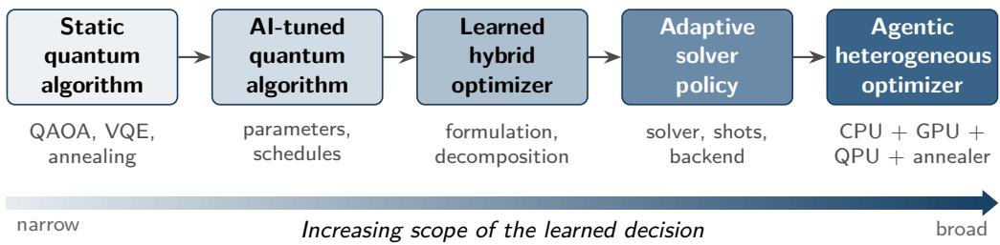
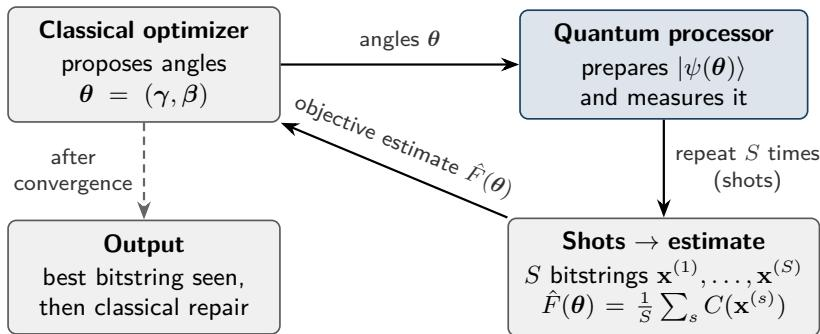
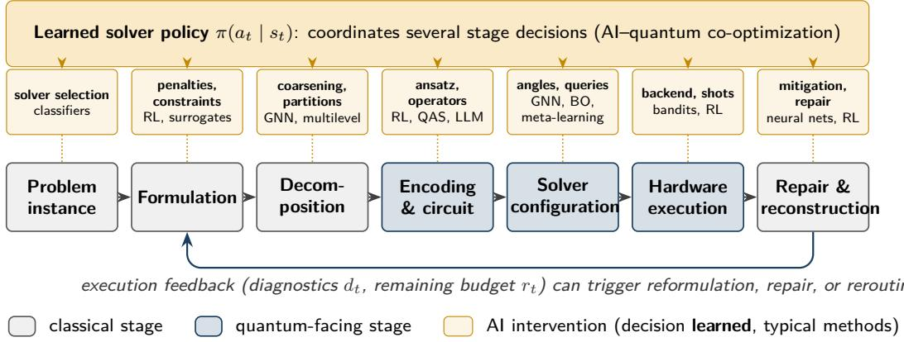
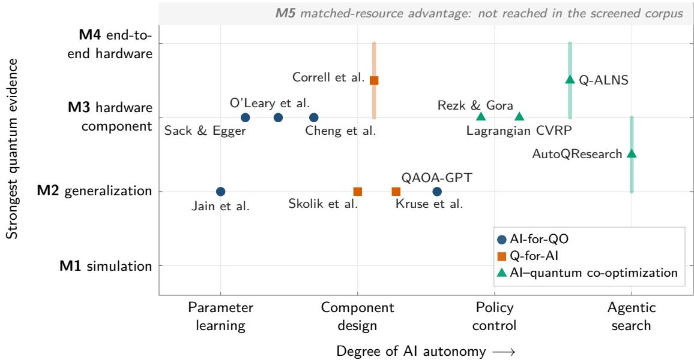
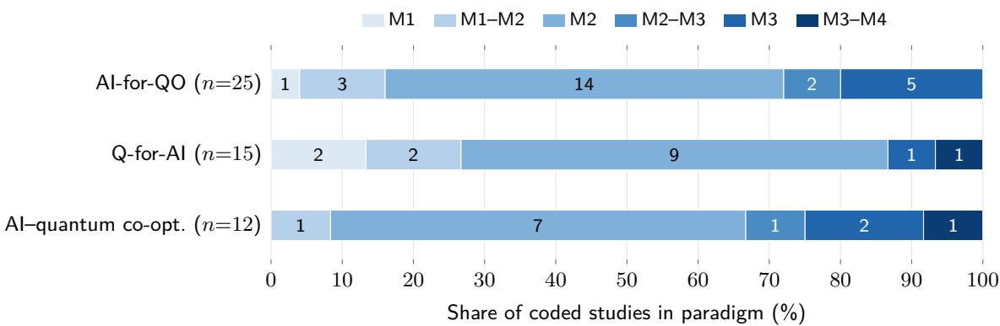

# Beyond QAOA: A Review of AI and Quantum Computing for Adaptive Combinatorial Optimization

Hoong Chuin Lau

School of Computing and Information Systems, Singapore Management University, Singapore

Near-term quantum approaches to combinatorial optimization are constraine by qubit counts, circuit fidelity, sampling cost, calibration drift, and the difficulty of encoding constraints. In parallel, machine learning is increasingly used to configure and control quantum optimization workflows. We call such workflows adaptive: decisions that are conventionally fixed in advance, from formulation and penalties to shot budgets, backends, and whether to invoke a quantum processor at all, are instead made by learned policies that respond to the instance, the progress of the solve, or the state of the hardware. This review examines that intersection through three paradigms: AI for quantum optimization, quantum for AI-driven optimization, and AI–quantum co-optimization. Rather than organizing the literature by application, we organize it by the decision being learned, from parameter initialization, query selection, and circuit design, through formulation, constraint handling, decomposition, and sampling, to hardware execution, solver selection, and solver-policy control. A structured review of 119 papers, 67 of them coded in detail, shows that the evidence is considerably stronger for AI-assisted quantum optimization than for the reverse direction. Learning already reduces quantum evaluations, improves initialization, supports decomposition and penalty control, mitigates noise, and informs execution choices, whereas evidence that quantum computation improves learned optimizers remains largely confined to small-scale simulation. Coding the evidence core on fixed categories also shows thin experimental controls: 25 of 57 studies include no classical baseline, the quantum contribution is fully isolated in 10 of the 24 studies where an ablation applies, and the median experiment uses 17 qubits. We introduce an M0–M5 evidence hierarchy that separates simulation, generalization, hardware validation, end-to-end execution, and matched-resource practical advantage, and we find no broadly convincing result at the highest level in the screened corpus. We argue that scaling is increasingly a systems problem: the question is not only whether a problem fits on a quantum processor, but how classical and quantum resources should be allocated across the optimization process. The review is aimed at researchers in quantum computing, machine learning, and operations research; two short primers make it accessible to readers from either side.

## 1 Introduction

Combinatorial optimization underpins planning and allocation decisions in logistics, transportation, supply chains, telecommunications, manufacturing, healthcare, and public-sector operations. Problems such as the traveling salesman problem (TSP), the capacitated vehicle routing problem (CVRP), maximum independent set (MIS), MaxCut, the quadratic assignment problem (QAP), and the multidimensional knapsack problem (MDKP) remain dificult despite substantial progress in mathematical programming, approximation algorithms, constraint programming, local search, metaheuristics, and learning-based optimization.

Quantum computing adds a diferent computational substrate to this landscape. Nearterm variational gate-based methods, namely the Quantum Approximate Optimization Algorithm (QAOA) [1, 2], the Variational Quantum Eigensolver (VQE) [3], and Quantum Random Access Optimization (QRAO) [4], together with quantum annealing [5, 6] and analog optimization, have motivated a large literature on discrete optimization. Existing reviews already cover the algorithmic and complexity-theoretic foundations in depth [7, 8]. They also make a point that is central to this review: problem hardness does not by itself imply useful quantum computation, and meaningful evaluation must account for the resources required to obtain a solution.

Our focus is narrower. We ask how AI changes the design and operation of quantum combinatorial optimization, and where quantum computation changes an AI-based optimizer. The question arises because practical workflows are rarely a single quantum call. A problem may be reformulated and decomposed classically, mapped to one or more quantum subproblems, executed under a sampling budget, repaired by classical optimization, and reconfigured as diagnostics become available.

In many hybrid workflows, performance depends as much on the decisions made around the quantum processing unit (QPU) as on the quantum routine itself. These decisions include the choice of formulation and penalties, decomposition, initialization, circuit structure, measurement allocation, backend selection, and whether to use a quantum routine at all. Many of them can be posed as learning or sequential decision problems. Treating them explicitly also changes how results should be interpreted: reducing QPU calls, improving feasibility, or selecting a better backend is useful even when no quantum advantage has been established.

We use adaptive in this sense. An adaptive pipeline is one in which decisions that are conventionally fixed in advance (formulation, penalties, decomposition, circuit structure, shot budget, backend, and whether to invoke a QPU at all) are made by learned policies that respond to the instance, the progress of the solve, or the state of the hardware. This is broader than the use of the term in specific algorithms such as adaptive variants of QAOA and VQE, which grow the circuit during optimization. Most current work adapts a single such decision; the review traces the move toward pipelines that adapt several, without implying that fully adaptive solvers already exist.

We organize the literature into three paradigms. AI for Quantum Optimization (AIfor-QO) uses AI to improve a component of a quantum or hybrid quantum optimization pipeline. Quantum for AI-Driven Optimization (Q-for-AI) uses quantum computation as part of a learned model or policy for combinatorial optimization. AI–Quantum Co-Optimization uses AI to coordinate several interacting decisions across a heterogeneous optimization system. The three categories make diferent empirical claims. Predicting QAOA parameters concerns the configuration of a quantum optimizer; using an equivariant quantum circuit as a routing policy concerns the learned model itself; and choosing between classical and quantum repair concerns resource allocation.

Across the literature, the object being learned has widened over time. Early work learns parameters for a fixed circuit; later work learns circuit structure, formulation or decomposition choices, and execution settings; and recent systems begin to learn conditional

  
Figure 1: Increasing scope of learned decisions in quantum combinatorial optimization. Each stage widens what is learned (labels below each box), from a fixed quantum algorithm to policies that allocate work across heterogeneous classical and quantum resources.

solver policies over classical and quantum actions. Figure 1 summarizes this progression.   
It is a descriptive view of the literature, not a claim that all methods follow the same path.

The argument of the review follows from this view. If the decisions made around the QPU matter as much as the quantum routine, the most consequential of them is whether to call the QPU at all, a choice we refer to as selective quantum use. We show that learning already improves many of these decisions (Sections 5 to 7); that the evidence behind each paradigm is real but shallow, and that its limits are set more by the whole system than by qubit counts (Section 9); and that selective quantum use is both the principle shared by the most informative recent systems and the open problem whose resolution would most strengthen the evidence (Sections 7.3 and 11.2).

## Contributions. This review makes four contributions:

1. It introduces a pipeline taxonomy that classifies work by the optimization decision being learned (Section 4).

2. It separates AI-for-QO, Q-for-AI, and AI–Quantum Co-Optimization and compares the strength of evidence across the three (Sections 5 to 7).

3. It proposes an M0–M5 evidence hierarchy that distinguishes simulation, generalization, hardware validation, end-to-end execution, and matched-resource practical advantage (Section 9).

4. It develops benchmarking principles and research priorities around selective quantum use, strong classical baselines, resource accounting, and cross-problem generalization (Sections 10 and 11).

## 1.1 Summary of Main Findings

For readers who want the conclusions first, the main findings are as follows.

• The evidence is asymmetric. AI-for-QO has the largest body of hardware-grounded results: learned initialization, query-eficient parameter search, noise mitigation, annealing-schedule design, and hardware-aware execution. Seven of the 25 AI-for-QO studies coded in detail reach at least the M2–M3 level. Q-for-AI is less mature: 13 of 15 coded studies remain at M1–M2. Most Q-for-AI studies (9 of 15) do compare against a classical learned model, but only 5 replace the quantum layer with a classical one at matched size, and only 2 execute on physical hardware (Section 9.1).

• Experimental controls are thin. Of the 57 non-survey core studies, 25 include no classical baseline of any kind and 19 compare against a strong heuristic or exact solver. The quantum contribution is fully isolated in 10 of the 24 studies where an ablation applies. Experiments are small (median 17 qubits; 27 of 42 studies at 20 qubits or fewer), and only 15 of 57 studies report the number of quantum evaluations or QPU calls (Section 10.3).

• No study reaches matched-resource practical advantage. The screened corpus contains no broadly convincing M5 result in any paradigm. Reported benefits are typically reductions in quantum resources or improvements over other quantum baselines, which are useful but distinct from quantum advantage.

• Constraints, not qubit count alone, limit scaling. Penalty conditioning, slack variables, sparse feasible subspaces, transpiled two-qubit gate counts, and shot budgets often dominate performance on constrained problems (Section 9.2).

• Selective quantum use is emerging as a design principle. The most informative recent systems allow a learned controller to decline quantum execution when its expected marginal value does not justify its cost (Sections 7.3 and 11.2).

The main limitations are that the field is moving quickly, much of the 2025–2026 literature consists of preprints, and reported metrics are too heterogeneous for a quantitative metaanalysis (Section 3.4). The maturity levels record what has been demonstrated, not the scientific quality of individual studies.

Reading guide. The review has three parts. The first sets up the foundations: Section 2 provides two short primers, one on quantum optimization for readers from AI and operations research and one on the learning methods used in this literature for readers from quantum computing, and Section 3 positions the review and describes how the literature was collected and coded. The second part surveys the literature through the pipeline taxonomy of Section 4: Sections 5 to 7 cover the three paradigms, and Section 8 cuts across them by problem family. The third part assesses the evidence: Section 9 grades what has been demonstrated and explains why it stalls, Section 10 turns the gaps into benchmarking principles, and Section 11 states the open problems and the outlook for the field.

## 2 Background

This section introduces the concepts used in the rest of the review. The first six subsections are written for readers without a quantum background and emphasize what each concept means operationally (what goes in, what comes out, and what it costs) rather than the underlying physics. Section 2.7 serves the opposite audience by summarizing the learning methods that recur in the literature. Table 1 at the end of the section summarizes the quantum vocabulary.

## 2.1 From Combinatorial Problems to QUBO and Ising Models

Almost all quantum optimization methods in this review accept problems in a single canonical form: the quadratic unconstrained binary optimization (QUBO) problem

$$
\operatorname* { m i n } _ { \mathbf { x } \in \{ 0 , 1 \} ^ { n } } \ C ( \mathbf { x } ) = \mathbf { x } ^ { \top } Q \mathbf { x } = \sum _ { i } Q _ { i i } x _ { i } + \sum _ { i < j } ( Q _ { i j } + Q _ { j i } ) x _ { i } x _ { j } ,\tag{1}
$$

where $Q \in \mathbb { R } ^ { n \times n }$ and we use $x _ { i } ^ { 2 } = x _ { i }$ for binary variables. (Bold x denotes a binary decision vector; plain x in Section 7 denotes a problem instance.) The same problem can be written in terms of spins $z _ { i } \in \{ - 1 , + 1 \}$ via the substitution $x _ { i } = ( 1 - z _ { i } ) / 2$ , which yields an Ising model

$$
C ( { \bf z } ) = \sum _ { i } h _ { i } z _ { i } + \sum _ { i < j } J _ { i j } z _ { i } z _ { j } + \mathrm { c o n s t . }\tag{2}
$$

The two forms are equivalent, and Ising formulations are known for many NP-hard problems [9]. MaxCut illustrates why it is the standard benchmark: for a graph $G = ( V , E )$ the number of edges cut by the partition encoded in z is $\textstyle \sum _ { ( i , j ) \in E } ( 1 - z _ { i } z _ { j } ) / 2$ , which is already in Ising form with no constraints.

Most operational problems are constrained, and QUBO has no constraints. Constraints are therefore typically moved into the objective as penalties. An equality constraint $A \mathbf { x } = \mathbf { b }$ becomes

$$
\operatorname* { m i n } _ { \mathbf { x } \in \{ 0 , 1 \} ^ { n } } \ f ( \mathbf { x } ) + \lambda \| A \mathbf { x } - \mathbf { b } \| _ { 2 } ^ { 2 } ,\tag{3}
$$

for a penalty weight $\lambda > 0$ that must be large enough to make violations unattractive but not so large that it swamps the objective. An inequality constraint such as a knapsack capacity $\mathbf { w } ^ { \top } \mathbf { x } \leq W$ is usually converted to an equality by adding binary slack variables, which consume additional qubits. These are exactly the formulation decisions discussed in Section 5.4: the penalty weight, the slack encoding, and the resulting number of variables directly determine how hard the problem is for the quantum device. In the standard mapping, each binary variable occupies one qubit, so a TSP on n cities with the usual positionbased encoding needs $n ^ { 2 }$ qubits before any further constraint handling. An alternative to penalties is to restrict the dynamics to the feasible subspace using constraint-preserving mixers [2], at the cost of more complex circuits.

## 2.2 Qubits, Measurement, and Shots

A register of n qubits can be prepared in a superposition that assigns a complex amplitude $\alpha _ { \mathbf { x } }$ to each of the $2 ^ { n }$ computational-basis states (bitstrings) x. For the purposes of this review, the essential fact is what happens at the end: measuring the register in the computational basis returns a single bitstring, drawn at random with probability $| \alpha _ { \mathbf { x } } | ^ { 2 }$ . A quantum optimizer is therefore best thought of as a programmable sampler over candidate solutions. Each preparation and measurement is called a shot. Quantities such as the expected cost

$$
F = \mathbb { E } _ { { \mathbf { x } } \sim | \alpha | ^ { 2 } } [ C ( { \mathbf { x } } ) ] \approx \hat { F } = \frac { 1 } { S } \sum _ { s = 1 } ^ { S } C ( { \mathbf { x } } ^ { ( s ) } )\tag{4}
$$

must be estimated from S shots, with a statistical error that shrinks only as $O ( 1 / \sqrt { S } )$ This is why shot budgets, and the allocation of shots across calls, appear throughout the review as first-class resources (Sections 5.2 and 7.4).

On gate-based devices, a computation is specified as a circuit: a sequence of one- and two-qubit operations (gates) applied to the register. The depth of a circuit is the number of sequential gate layers. Physical devices connect only certain pairs of qubits, so a circuit is transpiled (compiled) onto the hardware, which typically inserts extra two-qubit gates to move information between non-adjacent qubits. Two-qubit gates are typically the dominant source of error on current hardware, so the transpiled two-qubit gate count, rather than the number of logical variables, is often what limits the problems that can be run usefully (Section 9.2). Current devices are described as noisy intermediate-scale quantum (NISQ)

hardware [10, 11]: they typically ofer tens to a few hundred usable qubits, lack full error correction, and produce outputs that approach uniform noise as circuits grow deeper.

## 2.3 Quantum Annealing

Quantum annealing [5] is the quantum counterpart of simulated annealing. Where simulated annealing escapes local minima using thermal fluctuations that are gradually reduced, quantum annealing uses quantum fluctuations. The device implements a time-dependent Hamiltonian

$$
H ( s ) = \left( 1 - s \right) H _ { M } + s H _ { C } , \qquad s = t / T \in [ 0 , 1 ] ,\tag{5}
$$

that interpolates over an anneal time $T$ from a mixer Hamiltonian $\begin{array} { r } { H _ { M } = - \sum _ { i } X _ { i } } \end{array}$ , whose ground state is the uniform superposition over all bitstrings $( X _ { i }$ is the Pauli-X, or bit-flip, operator on qubit i), to a problem Hamiltonian $H _ { C }$ , which is diagonal in the computational basis and whose ground state encodes the optimal solution of Equation (2). The adiabatic theorem guarantees that a suficiently slow interpolation ends in the ground state of $H _ { C }$ [6]. The required anneal time grows as the minimum spectral gap along the path shrinks (in the simplest analyses, roughly as the inverse square of that gap), and the gap can close rapidly for hard instances. Practical anneals are therefore fast and return a distribution of good but not necessarily optimal bitstrings, and many runs (reads) are taken, as with shots. Commercial annealers, such as those from D-Wave, are analog devices with thousands of qubits but sparse connectivity, so each logical variable is usually represented by a chain of physical qubits found by minor embedding. The schedule $s ( t )$ , the embedding, and the chain strength are all tunable, which makes them natural targets for learning (Section 5.6).

## 2.4 The Quantum Approximate Optimization Algorithm

QAOA [1] can be understood as a discretized, parameterized version of annealing that runs on gate-based hardware. Starting from the uniform superposition $| + \rangle ^ { \otimes n }$ , it alternately applies the problem and mixer operators p times:

$$
| \psi ( \gamma , \beta ) \rangle = \prod _ { \ell = 1 } ^ { p } e ^ { - i \beta _ { \ell } H _ { M } } e ^ { - i \gamma _ { \ell } H _ { C } } | + \rangle ^ { \otimes n } , \qquad H _ { M } = \sum _ { i = 1 } ^ { n } X _ { i } ,\tag{6}
$$

where the product is applied with $\ell = 1$ first. The mixer is the same as in Equation (5) up to a sign, which does not matter here because the angles $\beta _ { \ell }$ can take either sign. The $2 p$ real angles $\theta \ : = \ : ( \gamma , \beta )$ are the algorithm’s only free parameters, and $p$ is called the depth or number of layers. The angles are chosen to optimize (for a minimization problem, minimize) the expected cost $F ( { \pmb \theta } ) = \langle \psi ( { \pmb \theta } ) | H _ { C } | \psi ( { \pmb \theta } ) \rangle$ ⟩, which is the quantity estimated by shots in Equation (4). Solution quality is commonly reported as the approximation ratio $r = F ( \pmb { \theta } ) / C ^ { \star }$ for maximization problems such as MaxCut, where $C ^ { \star }$ is the optimal value.

The optimization of θ is carried out by a classical optimizer in a hybrid loop (Figure 2): the optimizer proposes angles, the quantum processor prepares the state and returns $S$ samples, the sample mean is fed back, and the process repeats. From a classical perspective, QAOA is therefore a randomized heuristic with $2 p$ tunable parameters whose objective can be evaluated only through noisy, costly sampling. This viewpoint explains why so much of the AI-for-QO literature (Sections 5.1 and 5.2) focuses on predicting good angles or reducing the number of evaluations: each loop iteration consumes QPU time and shots. As $p  \infty$ , QAOA can approximate an adiabatic evolution and therefore reach the optimum [1], but larger p means deeper circuits and more noise. At low depth, QAOA performance is also subject to structural limitations [12], and good angles often follow regular patterns across instances [13], which is the empirical basis for parameter transfer.

  
Figure 2: The hybrid variational loop used by QAOA and other variational quantum algorithms. The quantum processor acts as a parameterized sampler; all optimization of the parameters happens classically, using objective estimates obtained from S shots.

Variants used in this review. Several variants recur in later sections. The Variational Quantum Eigensolver (VQE) [3] uses the same loop with a diferent, often hardwareeficient, circuit template (an ansatz) instead of the alternating structure of Equation (6). CVaR objectives [14] replace the sample mean in Equation (4) with the mean of the best α-fraction of samples, which better reflects the goal of finding one good solution rather than a good average. Recursive QAOA [12] uses QAOA output to fix or correlate variables one at a time, shrinking the problem. Warm-started QAOA initializes the state or mixer from a classical relaxation [15]. Quantum Random Access Optimization (QRAO) [4] encodes several binary variables into each qubit, reducing the qubit count at the price of a more complex decoding (rounding) step. More generally, these methods belong to the family of variational quantum algorithms (VQAs): parameterized circuits trained by classical optimizers [16].

## 2.5 Parameterized Quantum Circuits as Learning Models

The same parameterized circuits can be used as machine-learning models rather than as optimizers. A parameterized quantum circuit (PQC), sometimes called a quantum neural network (QNN), encodes an input (for example, a graph) into the circuit, applies trainable gates, and reads out measured expectation values as features, scores, or action probabilities. In the Q-for-AI work of Section 6, such circuits replace components of a classical policy network, for example the attention layer of a routing model. Equivariant circuits are designed so that relabeling the nodes of the input graph relabels the output in the same way, mirroring the symmetry built into graph neural networks.

## 2.6 Trainability, Noise, and Quantum Advantage

Two considerations shape how results should be read. First, the training landscapes of many parameterized circuits exhibit barren plateaus: gradients concentrate exponentially in the number of qubits [17], so neither gradient-based nor learned optimizers can make progress without good initialization or restricted circuit structure (Section 5.7). Hardware noise can induce a similar flattening [18]. Second, quantum advantage has a precise meaning in this review: a quantum method outperforms the best available classical method on a well-defined task under comparable resources. Neither running on quantum hardware nor outperforming another quantum method establishes advantage. This distinction motivates the M5 level of the evidence hierarchy (Section 9) and the requirement for matched classical baselines (Section 10.3).

## 2.7 Learning Methods for the Quantum Reader

The AI methods in this literature fall into a small number of families. Each is characterized here by what it takes as input and what it outputs.

• Supervised learning and graph neural networks (GNNs). A model is trained on solved examples to map an input to a prediction. GNNs operate on graphs by repeatedly aggregating information from each node’s neighbours; because the aggregation does not depend on node labels, the predictions are permutation-equivariant. In this literature, GNNs map a problem graph to predicted QAOA angles, to a coarsened graph, or to features used for solver selection.

• Bayesian optimization (BO) and surrogate models. A probabilistic model, often a Gaussian process, approximates an expensive objective from a few evaluations, and an acquisition function chooses the next point to evaluate. BO is designed for settings with tens to hundreds of evaluations, which matches the cost of querying a QPU.

• Reinforcement learning (RL). An agent interacts with an environment modelled as a Markov decision process with states, actions, and rewards, and learns a policy π(a | s) that maximizes expected cumulative reward. Deep Q-networks (DQNs) learn the value of each action; policy-gradient methods learn π directly. RL is used for sequential decisions such as circuit construction, penalty updates, shot allocation, and choosing between classical and quantum repair.

• Bandits. A single-step special case of RL in which the learner repeatedly chooses among options (for example, backends or configurations) and balances exploring uncertain options against exploiting good ones.

• Meta-learning and transfer learning. Models are trained across many instances so that knowledge carries over to new instances with little or no additional optimization. This is the basis of amortized parameter prediction (Section 5.1).

• Neural combinatorial optimization (NCO). Learned policies, typically attention-based networks trained by RL, construct solutions to problems such as the TSP or vehicle routing step by step. These are the natural classical baselines for the Q-for-AI work of Section 6.

• Large language model (LLM) agents. Language models that propose code or configuration changes, which are then evaluated by an external harness. In this literature they are used to search over circuit designs and solver policies (Section 7.4).

## 3 Scope and Review Methodology

This section positions the review against existing reviews, describes how the literature was collected, screened, and coded, and states the research questions that organize the rest of the paper.

## 3.1 Relationship to Existing Reviews

Abbas et al. [7] provide the broadest recent foundation for quantum optimization, spanning complexity, exact and approximate methods, heuristics, mixed-integer optimization, hardware, and benchmarking. Blekos et al. [8] focus more specifically on QAOA and its variants. Gemeinhardt et al. [19] systematically map quantum combinatorial optimization in the NISQ era, while Yarkoni et al. [20] review quantum annealing for industrial applications.

Table 1: Glossary of quantum-computing terms used in this review, with the closest classical analogy.
<table><tr><td>Term</td><td>Meaning in this review</td><td>Classical analogy</td></tr><tr><td>Qubit</td><td>Quantum bit; one per binary decision variable in Binary variable a standard QUBO mapping</td><td></td></tr><tr><td>QUBO / Ising</td><td>Unconstrained quadratic objective over binary or Quadratic 0–1 program ±1 variables (Equations (1) and (2))</td><td></td></tr><tr><td>Hamiltonian</td><td>Operator whose energy encodes an objective; Hc Objective function encodes the cost</td><td></td></tr><tr><td>Shot</td><td>One preparation and measurement, returning one One random sample</td><td></td></tr><tr><td>Circuit depth</td><td>bitstring Number of sequential gate layers</td><td>Sequential steps</td></tr><tr><td>Two-qubit gate</td><td>Interaction between two qubits; main error source</td><td>Costly, error-prone operation</td></tr><tr><td>Transpilation</td><td>Compiling a circuit to a device&#x27;s connectivity and gate set</td><td>Compilation to target hardware</td></tr><tr><td>QPU</td><td>Quantum processing unit, usually accessed remotely</td><td>Accelerator (GPU)</td></tr><tr><td>NISQ</td><td>Noisy intermediate-scale quantum hardware without full error correction</td><td>Unreliable, small accelerator</td></tr><tr><td>Annealing schedule</td><td>Time profile s(t) of the interpolation in</td><td>Cooling schedule</td></tr><tr><td></td><td>Equation (5) Minor embedding Mapping each logical variable to a chain of</td><td>Graph embedding</td></tr><tr><td>Ansatz</td><td>physical qubits Fixed circuit template with trainable parameters</td><td>Model architecture</td></tr><tr><td>QAOA depth p</td><td>Number of alternating problem/mixer layers</td><td>Number of heuristic</td></tr><tr><td>Barren plateau</td><td>Exponentially vanishing gradients in large circuits Vanishing gradients</td><td>iterations</td></tr><tr><td>Quantum advantage</td><td>Outperforming the best classical method under comparable resources</td><td>State of the art under matched budget</td></tr></table>

A second adjacent literature concerns AI for quantum computing in general. Alexeev et al. [21] survey AI across the quantum stack, including control, circuit synthesis, characterization, error correction, and post-processing. Quantum architecture search is mature enough to have dedicated reviews [22], and variational quantum algorithms and their trainability are covered comprehensively by Cerezo et al. [16]. Bharti et al. [11] review near-term algorithms more broadly, including variational, annealing-inspired, and quantum machine-learning methods and the error-mitigation and benchmarking practices that accompany them.

The present review is deliberately narrower in application domain but broader in workflow. Its unit of analysis is the complete combinatorial-optimization process: what is learned, where the quantum component enters, what resources are consumed, and what the experiments actually establish. Table 2 positions this scope against the closest reviews. The aim is not to repeat QAOA taxonomies or generic AI-for-quantum surveys, but to examine learning across the optimization pipeline and to grade the evidence for each claim.

Table 2: Positioning relative to the closest review literature.
<table><tr><td>Review</td><td>Primary scope</td><td>AI interventions</td><td>Q-for- AI</td><td>Workflow/ evidence synthesis</td></tr><tr><td>Abbas et al. [7]</td><td>Quantum optimization broadly</td><td>Limited / distributed</td><td>No</td><td>Complexity, algorithms, benchmarking</td></tr><tr><td>Blekos et al. [8]</td><td>QAOA and variants</td><td>Parameter / variant coverage</td><td>No</td><td>Algorithm-centric</td></tr><tr><td>Gemeinhardt et al. [19]</td><td>NISQ combinatorial optimization</td><td>Incidental</td><td>No</td><td>Systematic mapping by problems and methods</td></tr><tr><td>Alexeev et al. [21]</td><td>AI across the quantum stack</td><td>Broad AI-for-quantum</td><td>Limited</td><td>Quantum-stack- centric</td></tr><tr><td>Martyniuk et al. [22]</td><td>Quantum architecture search</td><td>Circuit architecture</td><td>No</td><td>Search-space/ strategy taxonomy</td></tr><tr><td>This review</td><td>AI × Quantum for combinatorial optimization</td><td>Parameters through solver policies</td><td>Yes</td><td>Pipeline taxonomy + M0-M5 evidence hierarchy</td></tr></table>

## 3.2 Search, Screening, and Coding

We followed a structured literature-review protocol with a cut-of date of 6 October 2026. Searches were run with Undermind (https://www.undermind.ai), an AI-assisted semantic literature-search tool. Three broad searches targeted (i) AI for quantum optimization, (ii) quantum for AI-driven optimization, and (iii) surveys and frontier taxonomies. They returned 179, 61, and 207 candidate records, respectively, before deduplication; the sets overlap, so the counts are not additive. We then ran problem-centered searches for routing, MIS/MaxCut, knapsack/MDKP, QAP/assignment, and scheduling. After deduplication and eligibility screening, 119 papers were retained in the reference corpus, of which 67 form an evidence core that was coded in detail and used for the comparative synthesis. The coding scheme is given in Section A.

Candidate papers were first screened by title and abstract, and central claims were checked against the full text where available. Earlier studies were retained when they established a method or category used by later work; the main emphasis is on 2022– 2026. Because terminology is inconsistent across AI, quantum computing, and operations research (OR), semantic retrieval was preferred to a narrow keyword-only query.

Coding used two tiers (Section A). The first tier records descriptive fields for every core study: problem class, AI and quantum methods, pipeline intervention, learned object, training and test regimes, problem size, claimed benefit, the strongest conclusion supported by the experiments, and an M0–M5 maturity level (Section 9) based on demonstrated evidence rather than perceived scientific quality. The second tier codes four evidence fields with fixed categories, so that the counts reported in this review can be reproduced: (F1) the strongest classical non-learned baseline used as a competitor (none, simple, strong, or exact); (F2) whether a classical learned baseline is included; (F3) whether the contribution of the quantum component is isolated by a classical replacement (yes, partial, no, or not applicable when the quantum routine is itself the object of study); and (F4) scale and resources: maximum qubits overall and on hardware, hardware type, and whether shots and quantum evaluations are reported. Second-tier fields distinguish not reported (the paper was read and the information is absent) from not checked (the full text was unavailable). All 57 non-survey core studies were coded from the full text. One study first selected for the evidence core, a quantum Q-learning model for the CVRP published in a 2024 IEEE symposium, was moved to the reference corpus because its full text could not be obtained; the core counts above exclude it.

Inclusion criteria. A study was included in the analytical core if (a) AI materially changed the configuration or operation of a quantum optimizer; (b) quantum computation materially changed a learned optimizer or policy; (c) AI coordinated multiple classical and quantum decisions; or (d) the study provided essential review or methodological background.

Exclusion criteria. We excluded ordinary QAOA, VQE, or annealing studies without substantive learning; generic quantum machine learning (QML) papers without combinatorialoptimization content; quantum-inspired classical methods unless needed for comparison; and studies in which “learning” merely denoted the use of a conventional numerical optimizer inside a standard VQA loop.

## 3.3 Research Questions

The review addresses seven research questions:

RQ1 Where does AI intervene in the quantum combinatorial-optimization pipeline?

RQ2 What does the AI component learn: parameters, representations, circuits, formulations, decompositions, resources, or policies?

RQ3 What benefit is demonstrated: quality, feasibility, generalization, QPU calls, shots, qubits, depth, runtime, robustness, or cost?

RQ4 What transfers across instances, sizes, graph families, problem classes, noise regimes, and hardware?

RQ5 Where does quantum computation materially improve AI-based combinatorial optimization?

RQ6 How strong is the evidence, given classical baselines, matched budgets, noise, shots, hardware, held-out testing, and ablations?

RQ7 Is the literature moving toward autonomous hybrid optimization, or merely adding AI components to otherwise static pipelines?

RQ1 and RQ2 are answered by the pipeline taxonomy (Section 4) and the survey of the three paradigms (Sections 5 to 7); RQ3 and RQ4 by those sections together with the problem-centered synthesis (Section 8); RQ5 and RQ6 by the evidence assessment (Section 9); and RQ7 by the co-optimization section and the outlook (Sections 7 and 11.7).

## 3.4 Threats to Validity and Review Limitations

This review is broad but is not a formal meta-analysis. The literature is moving quickly, especially in 2026; preprints can change before archival publication, and the reported metrics are too heterogeneous for pooled efect estimates. Semantic search may also underrepresent adjacent work that uses diferent terminology. We therefore separate the broad reference corpus from the evidence core, use explicit inclusion boundaries, and verify central claims against full text where possible. Maturity levels and the evidence fields were assigned by a single coder following the rules in Section A. First-pass values for the four evidence fields were drafted with the assistance of an AI tool (Claude, Anthropic) from the open full texts; every value was then checked by the author against the paper and corrected where necessary. The author takes full responsibility for the coding and the conclusions. Borderline maturity cases are recorded as ranges rather than forced into one level. Absence of reported evidence is not treated as evidence of failure, and maturity labels indicate only what has been demonstrated.

  
Figure 3: Pipeline view of AI intervention points and execution feedback. Each stage carries the decision that is learned and the AI methods typically used (Table 3). Component-level methods (AI-for-QO) act on a single stage; co-optimization methods learn a policy that coordinates several stages, conditioned on execution feedback.

## 4 A Pipeline Taxonomy for AI × Quantum Combinatorial Optimization

We represent a heterogeneous optimization workflow as a sequence that runs from the problem instance through formulation, decomposition, encoding, solver configuration, and hardware execution to repair and reconstruction. AI can intervene at every stage, and execution feedback can close the loop (Figure 3). This pipeline view is more discriminating than an application taxonomy because two papers solving the same MaxCut instance may make fundamentally diferent claims: one predicts parameters, another designs circuits, and a third decides whether quantum execution should occur at all. Table 3 lists, for each stage, the decision learned, the typical AI methods, the quantum component afected, and the primary metric.

The taxonomy organizes the next four sections. Section 5 covers methods that learn a single stage of Table 3 while the others stay fixed. Section 6 covers the reverse direction, in which the quantum circuit is part of the learned model rather than a stage that the model configures. Section 7 covers policies that span several stages, the last row of the table. Section 8 then reorganizes the same literature by problem family.

## 5 AI for Quantum Optimization

AI-for-QO methods learn one stage of the pipeline in Table 3 while holding the others fixed. We follow the order of the pipeline: first parameters and queries, then circuit structure, formulation, and decomposition, then execution-level decisions, and finally the trainability

Table 3: Pipeline taxonomy: the decision learned at each stage, typical AI methods, the quantum component afected, and the primary evaluation metric.
<table><tr><td>Pipeline stage</td><td>Decision learned</td><td>Typical AI methods</td><td>Quantum component</td><td>Primary metric</td></tr><tr><td>Parameter initialization</td><td>QAOA/VQA angles</td><td>GNNs, meta-learning,</td><td>QAOA/VQA</td><td>calls, convergence, quality</td></tr><tr><td>Query control</td><td>next parameter</td><td>clustering, diffusion Bayesian</td><td>QAOA/VQA</td><td>evaluations, shots</td></tr><tr><td>Circuit /</td><td>point</td><td>optimization, online surrogates RL, differentiable</td><td>QAOA/VQA</td><td>depth, calls,</td></tr><tr><td>ansatz design Formulation/</td><td>operators, gates, depth, topology</td><td>NAS, transform- ers/LLMs RL, learned</td><td></td><td>quality feasibility, qubits,</td></tr><tr><td>penalties Reduction/</td><td>QUBO coefficients, constraints</td><td>surrogates, GNNs</td><td>QUBO for VQE, QAOA, annealing</td><td>gap</td></tr><tr><td>decomposition</td><td>subgraphs, variables, subproblems</td><td>GNNs, multilevel learning, RL</td><td>local quantum subproblems</td><td>scale, gap, width</td></tr><tr><td>Sampling / measurement Error</td><td>shots, CVaR level, recursion budget</td><td>RL, adaptive control</td><td>measurement loop</td><td>shots, confidence</td></tr><tr><td>mitigation</td><td>corrected samples/estimates</td><td>neural models, regressors</td><td>noisy QPU output</td><td>TVD, sample quality</td></tr><tr><td>Hardware execution</td><td>backend, embedding, layout</td><td>classifiers, bandits, RL</td><td>QPU/annealer</td><td>fidelity, runtime</td></tr><tr><td>Solver selection</td><td>classical vs. quantum; solver</td><td>supervised ML, algorithm</td><td>solver portfolio</td><td>selection accuracy, total cost</td></tr><tr><td>Solver-policy control</td><td>family conditional multi-stage action</td><td>selection RL, bandits, LLM agents</td><td>complete</td><td>end-to-end utility</td></tr></table>

Abbreviations: GNN, graph neural network; RL, reinforcement learning; NAS, neural architecture search; LLM, large language model; QUBO, quadratic unconstrained binary optimization; CVaR, conditional value-at-risk; TVD, total variation distance.

limits that bound all of them. The usual comparator in this literature is the unassisted quantum routine, such as random initialization or a default schedule, which shapes what the evidence can establish (Section 9.1).

## 5.1 Parameter Prediction, Transfer, and Amortized Optimization

Parameter optimization is one of the earliest and most mature AI-for-QO targets. It is motivated by the observation that good QAOA angles concentrate and follow regular patterns across related instances [13]. Khairy et al. [23] formulate QAOA parameter optimization as a learning problem, using reinforcement learning and generative modeling so that knowledge from training instances can be reused on unseen instances. Jain et al. [24] use graph neural networks to warm-start QAOA for MaxCut and report transfer across instances and to larger graphs. Moussa et al. [25] use unsupervised clustering and graph representations to identify good parameters without repeatedly optimizing them from scratch, and Falla et al. [26] learn graph embeddings to identify donor instances for parameter transfer.

More recent work extends this direction through transfer learning [27], conditional difusion models [28], and graph-conditioned initialization models such as QSeer [29].

These methods mainly change the cost structure of variational optimization. Instead of re-optimizing a circuit from scratch for every instance, part of the search cost is paid once during training and reused later. For N instances, the total cost of a learned approach is

$$
C _ { \mathrm { t o t a l } } ( N ) = C _ { \mathrm { t r a i n } } + N C _ { \mathrm { i n f e r } } ,\tag{7}
$$

where $C _ { \mathrm { t r a i n } }$ is the one-of cost of training the predictor (including any quantum evaluations used to generate training targets) and $C _ { \mathrm { i n f e r } }$ is the per-instance cost of prediction plus any residual fine-tuning. Compared with a per-instance optimizer of cost $C _ { \mathrm { o p t } }$ , learning pays of only once

$$
N > N ^ { \star } = \frac { C _ { \mathrm { t r a i n } } } { C _ { \mathrm { o p t } } - C _ { \mathrm { i n f e r } } } , \qquad C _ { \mathrm { o p t } } > C _ { \mathrm { i n f e r } } .\tag{8}
$$

Approximation quality should therefore be read together with the number of circuit evaluations and the cost of learning the predictor; the break-even number of instances $N ^ { \star }$ is a natural quantity to report (Section 10.4).

## 5.2 Query-Eficient Quantum Optimization

Cheng et al. [30] introduce double adaptive-region Bayesian optimization for QAOA and demonstrate faster, more stable parameter search than standard optimizers, including a proof of concept on superconducting hardware. O’Leary et al. [31] push the idea further with online surrogate learning that requires no upfront surrogate training. They demonstrate query-eficient optimization on a 127-qubit Ising problem and transfer the learned parameters to still larger systems.

The main measurable benefit in these studies is a reduction in quantum evaluations. A learned surrogate can be useful even if the final solver has no end-to-end quantum advantage, because QPU evaluations are scarce and costly. For that reason, the number of hardware calls and shots should be treated as primary experimental outcomes rather than implementation details.

## 5.3 Circuit and Ansatz Design

Quantum architecture search (QAS) generalizes AI assistance from continuous parameter tuning to discrete circuit design. Diferentiable quantum architecture search [32], QuantumDARTS [33], RL-based circuit design [34], RL-assisted recursive QAOA [35], and later architecture-search systems demonstrate that gate sequences, operator pools, depth, and connectivity can themselves be learned. QAOA-GPT [36] trains a transformer to generate circuit structures and parameters conditioned on problem representations.

These methods can reduce search cost, but that result should be separated from the stronger claim of discovering a new quantum algorithm. A model that reproduces or assembles efective circuit structures accelerates search without necessarily discovering anything new. Circuit imitation, search acceleration, and algorithm discovery are diferent claims and should be evaluated separately.

## 5.4 Formulation, Constraints, and Penalties

Constrained combinatorial optimization exposes weaknesses that are largely hidden by unconstrained MaxCut benchmarks. Penalty coeficients can overwhelm the objective, auxiliary slack variables can inflate the qubit requirement, and feasible solutions may form an exponentially small fraction of the computational basis. Ayanzadeh et al. [37] demonstrate adaptive penalty adjustment on a D-Wave system. More recent work applies learning to QUBO penalty calibration, graph reduction, and constraint-aware preprocessing [38].

A related line of work, comprising constraint-preserving mixers [2], feasibility-preserving encodings [39], qubit-eficient relaxations [4, 40], and slack-free penalties [41, 42], is not always AI-driven, but it identifies the decisions that a learned controller may eventually need to make. The underlying trade-ofs are between qubit count, feasible-state density, coeficient ranges, circuit depth, and sampling dificulty. These structural choices matter before any parameter-learning method is applied.

## 5.5 Reduction and Decomposition

Available quantum hardware is far smaller than many industrial optimization models, so multilevel and decomposition methods are used to create bounded quantum subproblems. MLQAOA [43] uses graph learning to accelerate a multilevel hybrid solver, while Rezk and Gora [38] combine GNN-guided graph coarsening with adaptive penalties for the CVRP with time windows (CVRPTW) on a quantum annealer. Sharma and Lau [44] use Lagrangian decomposition to create bounded knapsack subproblems within the CVRP and couple this with learned multiplier control and hardware-aware execution decisions.

Once decomposition is introduced, scalability depends on both the size of the quantum subproblems and the classical coordination required between them. The question is no longer simply whether the full model fits on a QPU, but which part of the model should be sent to the QPU, how large that subproblem should be, and when the coordination overhead outweighs any benefit. These choices are instance- and hardware-dependent.

## 5.6 Noise Mitigation, Hardware Selection, and Solver Selection

Sack and Egger [45] use machine-learning-based error mitigation to execute QAOA on nonplanar graphs of up to 40 qubits, demonstrating that learned post-processing can recover a meaningful optimization signal from deep compiled circuits. Related hardware-aware work includes Bayesian design of annealing schedules [46], transferable annealing protocols on neutral-atom processors [47], and reinforcement-learning approaches to minor embedding for quantum annealing [48]. Hardware selection is the next logical layer: if several processors, embeddings, or backends are available, their relative value depends on the subproblem, circuit, calibration state, queue, and latency.

Moussa et al. [49] formulate the explicit “to quantum or not to quantum” problem as algorithm selection. Volpe et al. [50] learn to select among quantum solvers and settings over hundreds of QUBO instances, while Thelen and Mauerer [51] predict algorithm tradeofs under non-functional requirements. These studies mark the point at which AI begins to allocate computing resources rather than only tune a quantum component.

## 5.7 Trainability Limits: Barren Plateaus and Noise

Learning does not remove the trainability limits of variational quantum circuits. Barren plateaus can make gradients exponentially small in relevant circuit regimes [16, 17], and hardware noise can itself induce concentration of the objective landscape [18]. Ragone et al. [52] relate barren-plateau behavior to the dimension and structure of the circuit’s dynamical Lie algebra. These results matter for AI-for-QO because parameter transfer, architecture search, and query-eficient optimization all act on a landscape whose trainability may already be structurally limited.

The practical implication is modest but important. AI can avoid poor initializations, restrict the search space, or reduce the number of evaluations, but such improvements should not be interpreted as evidence that barren plateaus have been eliminated. Trainability remains a property to measure and report.

All the methods in this section use learning to improve a quantum optimizer. The next section reverses the direction and asks whether quantum computation can improve a learned optimizer.

## 6 Quantum for AI-Driven Combinatorial Optimization

We use a stricter definition for the reverse direction. A method counts as Q-for-AI only when quantum computation changes the learned model, policy, representation, or inference process used by an AI method for combinatorial optimization. Ordinary QAOA or VQE that directly optimizes a QUBO is not Q-for-AI.

## 6.1 Quantum Neural Combinatorial Optimization and Equivariant Policies

Building on parametrized quantum policies for reinforcement learning [53], Sanches et al. [54] replace selected attention components in a reinforcement-learning routing model with short quantum circuits and show competitive performance in small VRP settings. Skolik et al. [55] introduce permutation-equivariant quantum circuits for learning on weighted graphs and apply them to neural combinatorial optimization for the TSP. Subsequent routing studies explore quantum graph-attention policies [56] and hybrid quantum–classical neural routing models [57]. These architectures are of interest because symmetry and parameter sharing can reduce the number of trainable parameters and, in some settings, make it less dependent on problem size.

Any benefit in this setting must arise from the representation or inductive bias of the quantum model, since the quantum circuit is part of the learned policy rather than a direct optimizer. Current results support compact parameterizations and symmetry-aware architectures in selected settings, but they do not yet show consistent end-to-end routing gains over strong classical neural combinatorial optimizers.

## 6.2 Hamiltonian-Based Quantum Reinforcement Learning

Kruse et al. [58] construct quantum reinforcement learning (QRL) architectures from problem Hamiltonians and test them on MaxCut, unit commitment, and knapsack. The models can train better than selected quantum baselines, but the experiments are simulation-based and do not establish an advantage over modern classical learned optimization. Outperforming another quantum ansatz supports a claim about model design, but not a claim of practical quantum advantage.

## 6.3 Quantum Attention, QAP Learning, and Contextual Optimization

Correll et al. [59] embed quantum neural layers in an attention-based logistics model and execute small inference components on hardware. The study is valuable because it demonstrates a genuine architectural substitution, but the cost of quantum execution is high and the industrial problem must be aggressively decomposed. Ye et al. [60] formulate QAPrelated constrained optimization as a quantum learning problem, moving from per-instance optimization toward amortized prediction across instances.

Lee and Kwon [61] make this distinction especially explicit for contextual combinatorial optimization. Their end-to-end quantum learning model embeds contextual information into a QAOA-style phase separator and jointly trains the classical context encoder and the quantum parameters. Across small MaxCut, QAP, and matching problems, the method uses far fewer trainable parameters than selected classical decision-focused baselines. Yet the experiments are limited to 16- and 25-variable simulations, with no physical-QPU evaluation. The evidence therefore supports parameter eficiency and architectural feasibility, not practical quantum advantage.

## 6.4 Model Generalization Versus System Generalization

Model-level transfer can degrade once finite-shot sampling, transpilation, and device noise are introduced: an equivariant quantum policy may transfer across graph sizes in ideal simulation yet lose that ability on hardware. Sharma and Lau [62] diagnose this gap for cross-size transfer in quantum reinforcement learning for the TSP, while work on quantum generative models asks whether unseen valid or high-quality samples can still be generated [63, 64] and whether such models can enhance combinatorial search [65]. We therefore distinguish six kinds of transfer: across instances, sizes, topologies, problem families, noise regimes, and hardware. The distinction returns when the evidence is graded (Section 9.1), because most Q-for-AI results establish the first kinds of transfer but not the last two.

Both AI-for-QO and Q-for-AI change one component of the optimizer: the configuration of a quantum routine, or the model inside a learned policy. The next section turns to systems in which learning coordinates several components at once.

## 7 AI–Quantum Co-Optimization: From Components to Solver Policies

Some recent systems do not fit a one-directional AI-for-QO or Q-for-AI classification, because learning coordinates several interacting decisions in the optimization process. We refer to these systems as AI–Quantum Co-Optimization. A convenient abstraction describes the solver as a sequential decision process with state $s _ { t }$ , action $a _ { t }$ , and a system-level objective. At decision step t, the state is

$$
s _ { t } = ( x , \ h _ { t } , \ d _ { t } , \ r _ { t } ) ,\tag{9}
$$

where $x$ is the problem instance, $h _ { t }$ the search history (incumbent solutions and objective trajectory), $d _ { t }$ the execution diagnostics $( \mathrm { e . g . }$ , calibration data, noise estimates, and feasible-sample rates), and $r _ { t }$ the remaining resource budget. The action

$$
a _ { t } = ( f _ { t } , \ g _ { t } , \ e _ { t } , \ q _ { t } , \ \theta _ { t } , \ b _ { t } )\tag{10}
$$

jointly specifies the formulation $f _ { t }$ (including penalty weights), the decomposition or subproblem $g _ { t } ,$ the encoding $\boldsymbol { e } _ { t } ,$ the solver choice $q _ { t }$ (quantum or classical, and which algorithm), the solver parameters $\theta _ { t } { \mathrm { ( e . g . , ~ Q A O A } }$ angles), and the backend and sampling budget $b _ { t }$ . A policy $\pi ( \boldsymbol { a } _ { t } \mid \boldsymbol { s } _ { t } )$ is then evaluated by the system-level objective

$$
J ( \pi ) = \mathbb { E } _ { x \sim \mathcal { D } , \tau \sim \pi } \big [ - \lambda _ { 1 } \Delta - \lambda _ { 2 } T - \lambda _ { 3 } N _ { \mathrm { Q P U } } - \lambda _ { 4 } N _ { \mathrm { s h o t s } } - \lambda _ { 5 } V \big ] , \qquad \pi ^ { \star } \in \arg \operatorname* { m a x } _ { \pi } J ( \pi ) ,\tag{11}
$$

where the expectation is over instances drawn from a distribution D and over solver trajectories τ generated by $\pi ; \Delta$ is the optimality gap of the returned solution, T the total wall-clock time, $N _ { \mathrm { Q P U } }$ the number of QPU calls (or annealer submissions), $N _ { \mathrm { s h o t s } }$ the total number of shots, and V the residual constraint violation. The weights $\lambda _ { 1 } , . . . , \lambda _ { 5 } \geq 0$ encode the relative price of quality, time, quantum access, sampling, and infeasibility.

In this notation, a static pipeline is a fixed action sequence, and most AI-for-QO methods learn a single component of $a _ { t }$ (for example, $\theta _ { t } )$ while holding the others fixed. Co-optimization learns several components jointly and conditions them on the evolving state.

## 7.1 Solver Selection and Resource Routing

Moussa et al. [49] provide an early example: a classifier predicts whether QAOA or a classical method is preferable for a MaxCut instance. Volpe et al. [50] extend the idea to solver selection over a larger QUBO corpus. In these systems, quantum computation is one option in an algorithm portfolio, selected conditionally on instance or execution features; in the notation above, qt becomes a learned decision.

## 7.2 Learning Problem Structure and Optimization Dynamics

MLQAOA, graph-shrinking methods, and learned decomposition extend orchestration upstream by learning the problem structure presented to the QPU [43, 66]. Hybrid CVRP methods by Sharma and Lau use reinforcement learning to adapt augmented-Lagrangian or Lagrangian controls while bounded quantum subproblems are solved inside an OR decomposition [67]. A later architecture adds contextual selection of quantum execution configurations [44]. The decisions are coupled: multiplier updates alter the subproblem structure (gt), which changes quantum dificulty, which in turn should afect execution decisions $\left( b _ { t } \right)$

## 7.3 Selective Quantum Local Search

The study of Moosavi and Farooq [68] is informative because the controller can reject quantum repair and select a classical operator instead. A deep Q-network chooses among classical repair operators and shallow quantum circuits using features of the current repair state and predicted hardware reliability. Quantum actions are masked when the reduced problem is too large or unreliable.

In their experiments, at least one quantum action is admissible in only about 16% of reduced repair contexts, and classical repair is better on average even within that subset. Quantum-enabled repair nevertheless improves final outcomes in some matched-budget regimes. These results support selective quantum invocation, not general quantum superiority: quantum repair acts as a scarce heuristic resource whose use is determined by the learned controller.

## 7.4 Resource-Aware Automation and Agentic Policy Search

The QuaST Decision Tree [69] provides a modular automation architecture spanning modeling, encoding, algorithm selection, hyperparameters, execution, and interpretation. Its recommendation layer estimates whether candidate variational configurations are likely to exceed a classical disadvantage boundary and can route infeasible configurations away from quantum execution. Related resource-control work includes reinforcement-learning-based adaptive shot allocation for recursive QAOA [70] and joint learned graph partitioning with QAOA initialization [66]. These systems embody an important design principle: an intelligent quantum optimizer must also know when not to use quantum computation.

AutoQResearch [71] moves the abstraction one level higher. An LLM-based agent proposes modifications within a constrained solver-policy space, while a fixed evaluation harness determines whether the changes improve performance. A staged scout–promote– confirm procedure separates rapid exploration from stronger confirmation. The object of optimization is therefore a conditional solver policy π rather than only a parameter vector. Current evidence should not be described as autonomous algorithm discovery, because the search space and evaluation protocol remain externally specified, but it is a genuine transition toward closed-loop solver-policy search.

## 7.5 Boundary Cases

We reserve the co-optimization label for methods in which multiple solver decisions are adapted jointly or sequentially. DQAOA-GPT [72], for example, generates circuits for decomposed subproblems, but the decomposition itself is random rather than learned jointly with circuit generation. We therefore classify it as AI-assisted circuit synthesis inside a distributed framework rather than as co-optimization.

Sections 5 and 6 and this section are organized by what is learned. The next section reorganizes the same literature by problem family, which shows where the methods have been tested and where the gaps lie.

## 8 Problem-Centered Synthesis

Table 4 summarizes, for each major problem family, why it matters, the dominant AI– quantum approaches, the main bottleneck, and the principal research opportunity. The subsections below discuss each family in turn.

## 8.1 MaxCut and MIS

MaxCut remains the dominant methodological testbed because it has a simple Ising form and abundant benchmarks. It has enabled controlled studies of parameter prediction, transfer, Bayesian optimization, architecture search, and noise mitigation. Its weakness is precisely that it under-represents the feasibility and modeling dificulties that dominate constrained OR problems. MIS and clique problems are more revealing because feasibility, recursion, and compression become central [12, 35, 73].

## 8.2 TSP and VRP

Routing makes the case against monolithic quantum optimization. Standard formulations require $O ( n ^ { 2 } )$ binary variables for n cities or customers before capacity, fleet, or timewindow constraints are added. The strongest AI–quantum routing work therefore emphasizes sequential policies, decomposition, learned assignment, local repair, and resourceaware execution [44, 55, 68]. The emerging architecture is modular rather than monolithic.

## 8.3 Knapsack and MDKP

Knapsack-type models expose inequality-constraint issues while remaining compact enough for controlled experiments. They support comparisons among slack variables, custom penalties, QRAO, qubit-eficient encodings, and learned constraint control [40–42, 58]. They also reveal a key systems trade-of: fewer qubits do not automatically imply lower total computational cost if measurement, decoding, or repair becomes harder.

Table 4: Problem-centered synthesis of AI–quantum approaches by problem family.
<table><tr><td>Problem family</td><td>Why it matters</td><td>Dominant AI-quantum approaches</td><td>Main bottleneck</td><td>Research opportunity</td></tr><tr><td>MaxCut</td><td>clean benchmark; extensive QAOA literature</td><td>parameter transfer, BO, QAS, error mitigation</td><td>benchmark saturation; no hard constraints</td><td>cross-topology and hardware transfer</td></tr><tr><td>MIS/ clique</td><td>constraint- sensitive graph structure</td><td>recursive policies, QAOA/QRAO, learned graph</td><td>feasibility— compression trade-offs</td><td>adaptive encoding and resource allocation</td></tr><tr><td>TSP</td><td>canonical sequential CO</td><td>models equivariant QRL, quantum attention</td><td>all-to-all interactions; shot sensitivity</td><td>hardware-aware learned routing policies</td></tr><tr><td>CVRP/ VRP</td><td>realistic constrained routing</td><td>decomposition, RL control, quantum local repair</td><td>O(n2) formulations; capacity and time windows</td><td>selective quantum subproblems and repair</td></tr><tr><td>Knapsack / MDKP</td><td>compact but constraint-rich</td><td>QRAO, slack-free penalties, Hamiltonian QRL</td><td>inequality encoding; feasible sampling</td><td>adaptive penalty and compression selection</td></tr><tr><td>QAP / assignment</td><td>bridge between QUBO and learned prediction</td><td>QNNs, end-to-end quantum learning</td><td>dense coupling; sparse feasible states</td><td>amortized prediction vs. per-instance solve</td></tr><tr><td>Scheduling</td><td>high industrial relevance</td><td>QAS, QUBO/VQA hybrids</td><td>temporal and resource constraints</td><td>stronger orchestration benchmarks</td></tr></table>

Abbreviations: BO, Bayesian optimization; CO, combinatorial optimization; QNN, quantum neural network; n, number of customers or cities.

## 8.4 QAP, Assignment, and Contextual Optimization

Assignment connects direct QUBO optimization with quantum machine learning. The same problem family can be attacked per instance with a variational optimizer or amortized across instances with a trained quantum predictor [60, 61]. This makes it especially useful for separating optimization advantage from learning advantage.

## 8.5 Scheduling and Resource Allocation

Scheduling is still under-represented relative to graph optimization, but it is important for external validity. Diferentiable quantum architecture search has already been studied for job-shop scheduling [74], and the broader quantum-scheduling literature is now large enough to support dedicated reviews [75]. Temporal precedence, resource coupling, and feasibility structure difer sharply from MaxCut, making scheduling a natural stress test for claims that an AI–quantum method generalizes across combinatorial problem classes.

Across the problem families, the same pattern recurs: methods are developed and validated on small instances, often of unconstrained problems, and the constrained problems with the greatest operational value are where the evidence is thinnest. This raises the question of how strong the evidence actually is, which the next section addresses.

Table 5: The M0–M5 evidence-maturity hierarchy. Each level records what a study demonstrates, not its scientific quality.
<table><tr><td>Level</td><td>Evidence requirement</td><td>Establishes</td><td>Does not establish</td></tr><tr><td>M0</td><td>conceptual mechanism or architecture</td><td>plausibility</td><td>empirical effectiveness</td></tr><tr><td>M1</td><td>ideal statevector or exact simulation</td><td>proof of concept</td><td>noise robustness or scaling</td></tr><tr><td>M2</td><td>held-out, cross-size, cross-topology, or cross-problem tests</td><td>some generalization</td><td>hardware viability</td></tr><tr><td>M3</td><td>realistic noise or physical-QPU validation of a material component</td><td>component</td><td>hardware relevance of that end-to-end system benefit</td></tr><tr><td>M4</td><td>complete hybrid workflow with physical quantum execution</td><td>operational hardware integration</td><td>practical superiority</td></tr><tr><td>M5</td><td>matched-resource comparison against strong classical and static-hybrid alternatives</td><td>practical system advantage in the tested regime</td><td>asymptotic quantum advantage, unless separately proven</td></tr></table>

## 9 Evidence Maturity: What Has Actually Been Demonstrated?

Sections 5 to 8 described what each line of work does. This section asks what it has demonstrated. It grades every study in the evidence core on the M0–M5 hierarchy, compares the three paradigms, and then explains why the evidence stalls where it does.

The literature uses terms such as scaling, generalization, hardware demonstration, and advantage inconsistently. We use the M0–M5 hierarchy in Table 5 only to record the strongest evidence demonstrated by a study. It is not a ranking of scientific quality: a theoretical paper may remain at M1, while an engineering integration study may reach M3 or M4. Where the evidence straddles two levels (for example, a hardware result for only part of the workflow), the matrix records a range such as M3–M4.

## 9.1 The Asymmetry of the Literature

Figure 4 places representative studies by the scope of their AI component and the strength of their quantum evidence, and Figure 5 summarizes the maturity distribution of the full evidence core by paradigm. Three observations stand out.

The largest body of hardware-grounded evidence is on the AI-for-QO side. Studies have reduced QPU evaluations, transferred parameters, mitigated noise, adapted annealing schedules [46, 47], and incorporated hardware-aware execution. Seven of the 25 coded AIfor-QO studies reach at least M2–M3. These results are practically relevant even without quantum advantage because they reduce QPU evaluations, improve robustness, or lower execution overhead. Their natural comparator is the unassisted quantum routine (random or heuristic initialization, a default schedule), and 18 of the 25 AI-for-QO studies include no classical solver at all. That is appropriate for the question they ask, but it means they show that learning makes quantum optimization cheaper, not that the resulting pipeline is competitive with classical optimization.

Q-for-AI, in contrast, is less mature. Existing work shows that quantum policies can encode symmetry, reduce parameter counts, and generalize across selected instance distributions, and 13 of the 15 coded studies remain at M1–M2. Classical learned baselines are common: 9 of the 15 Q-for-AI studies include one. The gap lies elsewhere. Only 5 of the 15 studies where an ablation applies replace the quantum layer with a classical layer of matched size, so the quantum contribution is often confounded with diferences in architecture or parameter count; training and inference budgets are rarely matched; and only 2 studies execute on physical hardware, among them the partially hardware-executed logistics model of Correll et al. [59]. The evidence is therefore stronger for architecture and inductive bias than for practical superiority.

  
Figure 4: Degree of AI autonomy versus the strongest quantum evidence reported by representative studies. Vertical positions are the maturity levels coded in the evidence matrix (Section A); translucent bars mark studies coded as a range (e.g., M3–M4), with the marker at the midpoint. Horizontal positions are qualitative. Marker shape and colour indicate the paradigm.

Co-optimization is the smallest and most recent category. Credible examples now exist in solver selection, learned decomposition, shot allocation, selective local quantum search, and policy-level automation, and half of the coded studies include hardware-grounded components. However, the screened corpus does not contain a broadly convincing M5 result in any paradigm.

## 9.2 Why the Evidence Stalls: Scaling as a Systems Problem

The asymmetry above has a common cause. The experiments behind it are small: the median study uses 17 qubits, 27 of the 42 studies that state a qubit count use 20 or fewer, only 5 exceed 100, and 16 of the 57 non-survey studies execute any part of the workflow on physical hardware. It is tempting to read this as a qubit-count problem that larger devices will solve. The reviewed studies suggest otherwise. They expose several bottlenecks besides qubit count: two-qubit gate counts and transpiled depth, shot budgets, feasible-state density, penalty conditioning, QPU calls and latency, classical repair, and the trainability of the variational objective (Sections 2.2 and 5.7).

These quantities interact, especially for constrained problems. A qubit-eficient encoding can make a larger instance representable while making decoding or repair harder; a slack-free penalty can save auxiliary qubits while changing the objective landscape; and decomposition can cap quantum width while increasing coordination overhead (Sections 5.4 and 5.5). Real-hardware benchmarking across MDKP, MIS, QAP, and market-share problems illustrates the point [76]: qubit-eficient methods extend the range of executable instances, yet dense constraints and compiled two-qubit gate counts push circuits into a noise-dominated regime, and in QAP feasible states are so sparse that successful circuit execution does not imply useful feasible sampling.

  
Figure 5: Distribution of evidence maturity within each paradigm for the evidence core, using the coding described in Section A. Bar segments show the share of studies at each level; numbers inside segments are study counts. Background reviews (10), structural precursors (4), and one benchmark study are omitted. No study is coded at M0, M4, or M5.

Two consequences follow for the rest of the review. First, moving a result from M3 to M4 or M5 requires accounting for the whole system rather than the quantum routine alone, so benchmarks must report system-level resources and isolate the quantum contribution (Section 10). Second, when the cost of a quantum call depends on so many interacting factors, deciding whether a call is worth making becomes a central design problem: the problem of selective quantum use taken up in Section 11.2.

## 10 Benchmarking Principles for AI × Quantum Optimization

The principles below follow from the gaps identified in Sections 9.1 and 9.2. Each states what an experiment should report and, where the evidence fields allow it, how far current practice falls short.

## 10.1 Report System-Level Resources

At a minimum, experiments should report solution quality, feasibility, total runtime, QPU calls, shots, physical and logical qubits, transpiled depth, two-qubit gate count, training cost, and the hardware and noise regime. Cloud latency and monetary cost should be included when material. Energy should be reported only when directly measured or credibly estimated. Table 6 consolidates these expectations into a checklist. Current practice falls well short of it. Among the 57 core studies whose resources could be coded, 19 state the shot or sample budget, 13 use exact expectation values, and 24 do not report shots at all; only 15 report the number of quantum evaluations or QPU calls, and 10 report both.

Table 6: Minimum reporting checklist for AI × Quantum optimization experiments.
<table><tr><td>Dimension</td><td>Minimum reporting expectation</td></tr><tr><td>Solution quality</td><td>gap or approximation ratio; best-case and distributional performance</td></tr><tr><td>Feasibility</td><td>feasible-sample rate; constraint violation; repair</td></tr><tr><td>Quantum resources</td><td>qubits; two-qubit gates; depth</td></tr><tr><td>Sampling</td><td>shots per call; total shots; allocation policy</td></tr><tr><td>Invocation cost</td><td>QPU calls or annealer submissions</td></tr><tr><td>Time Learning</td><td>training; classical compute; QPU execution; queue time where material train/validation/test split; number of training instances; model size;</td></tr><tr><td></td><td>break-even N*</td></tr><tr><td>Generalization</td><td>instance; size; topology; problem; noise; hardware</td></tr><tr><td>Baselines</td><td>strong OR, heuristic, and ML baselines; static-hybrid ablations</td></tr><tr><td>Hardware</td><td>device; compilation; calibration and noise; mitigation</td></tr><tr><td>Reproducibility</td><td>code; seeds; instances or data; hyperparameters</td></tr><tr><td>Cost</td><td>monetary and/or energy cost, only where credibly measured</td></tr></table>

## 10.2 Separate Hybrid-System Benefit from Quantum Contribution

A hybrid solver can improve on a baseline even when its quantum component contributes little. Evaluation should therefore answer two separate questions: does the complete system improve on relevant baselines, and does the quantum component make a measurable marginal contribution? The first does not imply the second.

## 10.3 Use Strong Baselines and Matched Decision Budgets

A QRL model should be compared against modern classical learned optimization, not only against another quantum model. A routing system should include credible OR and heuristic baselines, such as state-of-the-art exact solvers (e.g., Gurobi) and highly tuned heuristics (e.g., LKH-3). If a quantum repair receives additional sampling budget, the classical alternative should receive a meaningful matched compute or evaluation budget. Ablations should isolate the contributions of the learned component and of the quantum component separately. In the evidence core, 25 of 57 studies include no classical baseline of any kind, 19 include a strong heuristic or exact solver as a competitor, and 11 include a classical learned baseline. Where a quantum ablation applies, 10 of 24 studies run a full ablation, 9 a partial one, and 5 none.

## 10.4 Account for Amortization and Generalization

Learning cost matters when a model is reused across instances. Papers should report the break-even number of instances $N ^ { \star }$ in Equation (8) where it can be estimated. Generalization claims should also state the tested transition explicitly: new instances, larger sizes, new topologies, new problem families, new noise regimes, or new hardware.

## 11 Open Problems and Outlook

The preceding sections identify where the evidence is thin. This section turns each gap into an open problem. For each problem we state the gap and where it is documented, a concrete question, and the kind of study, expressed in terms of the evidence hierarchy of

Table 5, that would settle it. We close with an outlook on how the field has developed and where it is heading.

## 11.1 Learning Formulations, Not Only Parameters

Gap. Most AI-for-QO work targets QAOA angles (Sections 5.1 and 5.2), yet on constrained problems the formulation, including penalty weights, slack encodings, compression, and decomposition, often determines performance before any angle is chosen (Sections 5.4 and 9.2).

Question. Can a learned controller that selects the formulation jointly with the circuit parameters improve the feasible-sample rate and the optimality gap at fixed qubit and shot budgets, compared with tuning the parameters of a fixed formulation?

Evidence that would settle it. Cross-problem tests at M2, followed by hardware validation at M3, with an ablation that freezes the formulation so that the contribution of formulation learning can be isolated.

## 11.2 Learning When Not to Use a QPU

Gap. This is the thread that runs through the review. The cost of a quantum call depends on many interacting factors (Section 9.2), yet only a few systems allow the controller to decline quantum execution, and the clearest evidence comes from a single study (Section 7.3). Most pipelines still send every eligible subproblem to the QPU.

Question. Near-term systems should treat quantum calls as costly actions. At a decision state $s ,$ the relevant quantity is the expected marginal value of quantum execution relative to a classical alternative, after accounting for shots, latency, and reliability:

$$
\Delta U _ { \mathsf { Q } } ( s ) = \mathbb { E } \big [ U ( s ^ { \prime } ) \mid s , a = \mathsf { Q } \big ] - \mathbb { E } \big [ U ( s ^ { \prime } ) \mid s , a = \mathsf { C } \big ] - c _ { \mathsf { Q } } ( s ) ,\tag{12}
$$

where $a = \mathsf Q$ and $a = \mathsf C$ denote the quantum and classical actions, $s ^ { \prime }$ is the resulting solver state, U is a utility consistent with the objective in Equation (11), and $c _ { \mathsf { Q } } ( s ) \geq 0$ is the incremental cost of quantum execution (shots, latency, queueing, and reliability risk). The quantum action is preferred only when $\Delta U _ { \mathsf { Q } } ( s ) > 0$ . The open question is whether $\Delta U _ { \mathsf { Q } } ( s )$ can be predicted reliably from cheap diagnostics, such as subproblem size, feasible-state density, and calibration data, before the QPU is called.

Evidence that would settle it. An M4 workflow in which the learned invocation policy is compared, under matched total budgets, against both an always-classical and an alwaysquantum variant. The study should report how often the quantum action is chosen and its marginal contribution to the final result (Section 10.2).

## 11.3 Closing the Gap Between Model and System Generalization

Gap. Thirteen of the 15 coded Q-for-AI studies remain at M1–M2 (Figure 5), and transfer that holds in ideal simulation can degrade under finite shots, transpilation, and noise (Section 6.4).

Question. Do the parameter savings of symmetry-aware quantum policies survive on hardware, and do they outperform classical neural combinatorial optimizers with a matched parameter count and training compute?

Evidence that would settle it. Cross-size tests on physical hardware (M3) against a matched classical neural baseline, reporting the training cost of both models and the break-even point of Equation (8).

## 11.4 Moving Beyond MaxCut

Gap. Much of the controlled evidence comes from MaxCut, which has no hard constraints (Section 8.1). Routing, assignment, scheduling, and knapsack problems bring sparse feasibility, repair, and stochasticity, and are where operational value would lie (Table 4).

Question. Do parameter-transfer and initialization methods developed on MaxCut carry over to problems with sparse feasible subspaces? More generally, which constraint structures admit useful quantum subproblems, when is compression preferable to decomposition, and which diagnostics predict a useful quantum repair?

Evidence that would settle it. Cross-problem studies at M2 or above that report feasibility metrics alongside solution quality, so that claims of generality are tested against problem classes with diferent constraint structure.

## 11.5 Shared Environments for Evaluating Orchestration

Gap. No study in the screened corpus reaches M5. One reason is that there is no shared environment in which hybrid policies can be compared against strong classical solvers under matched resources; each study builds its own (Sections 9.1 and 10).

Question. Can the community agree on benchmark environments that expose several problem families, strong classical solvers, multiple quantum algorithms and backends (including noisy emulators), and explicit resource budgets, so that the learning task is the orchestration policy π of Equation (11) rather than a single circuit?

Evidence that would settle it. Such environments are a precondition for M5 claims.   
Results reported in them should follow the checklist in Table 6.

## 11.6 Trustworthy Agentic Experimentation

Gap. LLM-guided search over solver policies has begun to appear (Section 7.4), but automated search can overfit its evaluation harness in ways that are hard to detect.

Question. What controls are needed before results produced by agentic search can be trusted? At a minimum: fixed evaluation harnesses, separate search and held-out instance sets, explicit search budgets, replay of winning candidates, independent confirmation, provenance for every solver modification, and ablations that identify which change produced the gain.

Evidence that would settle it. Gains that persist on held-out instances and in independent replications, with the search budget reported alongside the result.

## 11.7 Outlook

Read as a whole, the literature has moved through a sequence of questions. Early studies asked how feasibility can be preserved and how constrained problems can be represented without excessive penalties or auxiliary variables, through constraint-preserving mixers [2], feasibility-preserving encodings [39], qubit-eficient relaxations [4, 40], and slack-free penalties [41]. Hardware studies then showed that fitting a model into the available qubits is not suficient, because noise, compilation, and sparse feasible states determine whether execution is useful [45, 76]; this motivated decomposition and learned preprocessing [38, 43]. Subsequent work learned optimization controls and resource allocation: solver selection [49, 50], adaptive penalty, multiplier, and repair choices [37, 67, 68], and automation that rejects unfavorable quantum configurations [69]. The most recent systems learn poli cies conditioned on the current solver state, through adaptive shot allocation [70], joint partitioning and initialization [66], and LLM-guided circuit generation and policy search [71, 72]. The underlying question is therefore no longer only “which quantum algorithm?” but “which formulation, subproblem, solver, and resource should be used at this point in the search?” The open problems above are the steps needed to answer it with evidence at the level of M4 and M5 rather than M1 and M2.

## 12 Conclusion

Quantum combinatorial optimization is no longer only a question of choosing a quantum algorithm for a fixed problem representation. AI adds decisions about how the algorithm is initialized and configured; quantum machine learning asks whether quantum models can improve learned optimizers; and co-optimization extends the problem to the allocation of classical and quantum resources over time.

The three directions are not equally mature. AI-for-QO already has credible evidence in parameter transfer, query-eficient search, circuit synthesis, graph reduction, penalty adaptation, noise mitigation, and hardware-aware execution. Q-for-AI remains more exploratory: results support architectural feasibility, symmetry, compact parameterization, and limited generalization, but rarely practical superiority over strong classical learned optimization. Co-optimization is beginning to connect solver selection, decomposition, shot allocation, local quantum search, hardware-aware control, and policy search.

The evidence in all three is shallower than the volume of work suggests, and its limits are set by the whole system rather than by qubit counts alone. For near-term systems, therefore, selective QPU use is a more realistic objective than routing every eligible subproblem to quantum hardware. A well-designed hybrid optimizer should be able to recognize when a QPU is unlikely to help and choose a classical alternative. Progress beyond QAOA will therefore depend on whether hybrid systems can identify the subproblems and execution regimes in which the marginal value of quantum computation exceeds its additional cost. Seen this way, the field is moving along a trajectory from

quantum algorithm −→ AI-assisted quantum algorithm −→ adaptive hybrid solver −→ heterogeneous solver policy.

## Data Availability

Section A defines the fields used to code each study and the rules for assigning maturity levels. The coded data, with one row per paper for all 119 papers in the reference corpus and full coding for the 67 papers in the evidence core, is available as a spreadsheet accompanying this article (Beyond\_QAOA\_Supplementary\_Evidence\_Matrix.xlsx). Its Evidence Coding sheet holds the four evidence fields for each study with the passage of the paper that supports each value, and its Counts sheet computes every count reported in the text from those entries. All counts and maturity levels reported in the text and figures can be reproduced from it.

## Acknowledgments

The author used an AI assistant (Claude, Anthropic) for language editing, LaTeX preparation, and first-pass extraction of evidence-matrix entries. All content was reviewed and verified by the author.

## References

[1] E. Farhi, J. Goldstone, and S. Gutmann. “A quantum approximate optimization algorithm” (2014). arXiv:1411.4028.

[2] S. Hadfield, Z. Wang, B. O’Gorman, E. G. Riefel, D. Venturelli, and R. Biswas. “From the quantum approximate optimization algorithm to a quantum alternating operator ansatz”. Algorithms 12, 34 (2019).

[3] A. Peruzzo et al. “A variational eigenvalue solver on a photonic quantum processor”. Nature Communications 5, 4213 (2014).

[4] B. Fuller et al. “Approximate solutions of combinatorial problems via quantum relaxations” (2021). arXiv:2111.03167.

[5] T. Kadowaki and H. Nishimori. “Quantum annealing in the transverse Ising model”. Physical Review E 58, 5355 (1998).

[6] T. Albash and D. A. Lidar. “Adiabatic quantum computation”. Reviews of Modern Physics 90, 015002 (2018).

[7] A. Abbas et al. “Challenges and opportunities in quantum optimization”. Nature Reviews Physics (2024).

[8] K. Blekos et al. “A review on quantum approximate optimization algorithm and its variants”. Physics Reports (2024).

[9] A. Lucas. “Ising formulations of many NP problems”. Frontiers in Physics 2, 5 (2014).

[10] J. Preskill. “Quantum computing in the NISQ era and beyond”. Quantum 2, 79 (2018).

[11] K. Bharti, A. Cervera-Lierta, T. H. Kyaw, T. Haug, S. Alperin-Lea, A. Anand, M. Degroote, H. Heimonen, J. S. Kottmann, T. Menke, W.-K. Mok, S. Sim, L.-C. Kwek, and A. Aspuru-Guzik. “Noisy intermediate-scale quantum algorithms”. Reviews of Modern Physics 94, 015004 (2022).

[12] S. Bravyi, A. Kliesch, R. Koenig, and E. Tang. “Obstacles to variational quantum optimization from symmetry protection”. Physical Review Letters 125, 260505 (2020).

[13] L. Zhou, S.-T. Wang, S. Choi, H. Pichler, and M. D. Lukin. “Quantum approximate optimization algorithm: Performance, mechanism, and implementation on near-term devices”. Physical Review X 10, 021067 (2020).

[14] P. Kl. Barkoutsos, G. Nannicini, A. Robert, I. Tavernelli, and S. Woerner. “Improving variational quantum optimization using CVaR”. Quantum 4, 256 (2020).

[15] D. J. Egger, J. Mareček, and S. Woerner. “Warm-starting quantum optimization”. Quantum 5, 479 (2021).

[16] M. Cerezo et al. “Variational quantum algorithms”. Nature Reviews Physics (2021).

[17] J. R. McClean, S. Boixo, V. N. Smelyanskiy, R. Babbush, and H. Neven. “Barren plateaus in quantum neural network training landscapes”. Nature Communications 9, 4812 (2018).

[18] S. Wang et al. “Noise-induced barren plateaus in variational quantum algorithms”. Nature Communications (2021).

[19] F. Gemeinhardt et al. “Quantum combinatorial optimization in the NISQ era: A systematic mapping study”. ACM Computing Surveys (2023).

[20] S. Yarkoni et al. “Quantum annealing for industry applications: introduction and review”. Reports on Progress in Physics (2022).

[21] Y. Alexeev et al. “Artificial intelligence for quantum computing”. Nature Communications (2025).

[22] D. Martyniuk, J. Jung, and A. Paschke. “Quantum architecture search: A survey”. In Proceedings of the IEEE International Conference on Quantum Computing and Engineering (QCE). (2024).

[23] S. Khairy et al. “Learning to optimize variational quantum circuits to solve combinatorial problems”. In Proceedings of the AAAI Conference on Artificial Intelligence. (2020).

[24] N. Jain, B. Coyle, E. Kashefi, and N. Kumar. “Graph neural network initialisation of quantum approximate optimisation”. Quantum (2022).

[25] C. Moussa et al. “Unsupervised strategies for identifying optimal parameters in quantum approximate optimization algorithm”. EPJ Quantum Technology (2022).

[26] J. Falla, Q. Langfitt, Y. Alexeev, and I. Safro. “Graph representation learning for parameter transferability in quantum approximate optimization algorithm”. Quantum Machine Intelligence (2024).

[27] J. A. Montañez-Barrera, D. Willsch, and K. Michielsen. “Transfer learning of optimal QAOA parameters in combinatorial optimization”. Quantum Information Processing (2025).

[28] F. Meng et al. “Conditional difusion-based parameter generation for quantum approximate optimization algorithm”. EPJ Quantum Technology (2025).

[29] L. Jiang, C. Zhang, and F.-J. Chen. “QSeer: A quantum-inspired graph neural network for parameter initialization in quantum approximate optimization algorithm circuits”. In Proceedings of the IEEE International Conference on Quantum Computing and Engineering (QCE). (2025).

[30] L. Cheng, Y.-Q. Chen, S.-X. Zhang, and S. Zhang. “Quantum approximate optimization via learning-based adaptive optimization”. Communications Physics (2024).

[31] T. O’Leary et al. “Eficient online quantum circuit learning with no upfront training”. Communications Physics (2025).

[32] S.-X. Zhang et al. “Diferentiable quantum architecture search”. Quantum Science and Technology (2022).

[33] W. Wu et al. “QuantumDARTS: Diferentiable quantum architecture search for variational quantum algorithms”. In Proceedings of the International Conference on Machine Learning (ICML). (2023).

[34] S. Fodera et al. “Reinforcement learning for variational quantum circuits design” (2024). arXiv:2409.05475.

[35] Y. J. Patel, S. Jerbi, T. Bäck, and V. Dunjko. “Reinforcement learning assisted recursive QAOA”. EPJ Quantum Technology (2023).

[36] I. Tyagin et al. “QAOA-GPT: Eficient generation of adaptive and regular quantum approximate optimization algorithm circuits”. In Proceedings of the IEEE International Conference on Quantum Computing and Engineering (QCE). (2025).

[37] R. Ayanzadeh, M. Halem, and T. Finin. “Reinforcement quantum annealing: A hybrid quantum learning automata”. Scientific Reports (2020).

[38] Y. K. Rezk and P. Gora. “GNN-guided graph coarsening and adaptive QUBO penalties for the capacitated vehicle routing problem with time windows on a quantum annealer” (2026). arXiv:2609.04593.

[39] N. Xie et al. “A feasibility-preserved quantum approximate solver for the capacitated vehicle routing problem”. Quantum Information Processing (2024).

[40] M. Sharma, Y. Jin, H. C. Lau, and R. Raymond. “Quantum relaxation for solving multiple knapsack problems”. In Proceedings of the IEEE International Conference on Quantum Computing and Engineering (QCE). (2024).

[41] X.-W. Lee and H. C. Lau. “Implementing slack-free custom penalty function for QUBO on gate-based quantum computers”. In Proceedings of the IEEE International Conference on Quantum Computing and Engineering (QCE). (2025).

[42] X.-W. Lee and H. C. Lau. “CVaR-assisted custom penalty function for constrained optimization” (2026). arXiv:2604.20088.

[43] B. G. Bach, J. Falla, and I. Safro. “MLQAOA: Graph learning accelerated hybrid quantum-classical multilevel QAOA”. In Proceedings of the IEEE International Conference on Quantum Computing and Engineering (QCE). (2024).

[44] M. Sharma and H. C. Lau. “Routing in Lagrangian space: Qubit-scalable CVRP via knapsack decomposition and noise-aware quantum execution” (2026). arXiv:2604.22194.

[45] S. H. Sack and D. J. Egger. “Large-scale quantum approximate optimization on nonplanar graphs with machine learning noise mitigation”. Physical Review Research (2024).

[46] J. R. Finžgar et al. “Designing quantum annealing schedules using Bayesian optimization”. Physical Review Research (2024).

[47] L. Leclerc et al. “Implementing transferable annealing protocols for combinatorial optimization on neutral-atom quantum processors: A case study on smart charging of electric vehicles”. Physical Review A (2025).

[48] R. Nembrini, M. Ferrari Dacrema, and P. Cremonesi. “Minor embedding for quantum annealing with reinforcement learning”. Quantum Machine Intelligence (2026).

[49] C. Moussa, H. Calandra, and V. Dunjko. “To quantum or not to quantum: towards algorithm selection in near-term quantum optimization”. Quantum Science and Technology (2020).

[50] D. Volpe et al. “A predictive approach for selecting the best quantum solver for an optimization problem”. In Proceedings of the IEEE International Conference on Quantum Computing and Engineering (QCE). (2024).

[51] S. Thelen and W. Mauerer. “Predict and conquer: Navigating algorithm trade-ofs with quantum design automation”. In Proceedings of the IEEE International Conference on Quantum Computing and Engineering (QCE). (2025).

[52] M. Ragone et al. “A Lie algebraic theory of barren plateaus for deep parameterized quantum circuits”. Nature Communications (2024).

[53] S. Jerbi et al. “Parametrized quantum policies for reinforcement learning”. In Advances in Neural Information Processing Systems (NeurIPS). (2021). arXiv:2103.05577.

[54] F. Sanches et al. “Short quantum circuits in reinforcement learning policies for the vehicle routing problem”. Physical Review A (2022).

[55] A. Skolik et al. “Equivariant quantum circuits for learning on weighted graphs”. npj Quantum Information (2023).

[56] T.-G. Le et al. “Vehicle routing problems via quantum graph attention network deep reinforcement learning” (2025). arXiv:2511.15175.

[57] M. Ritt et al. “A hybrid quantum-classical neural network for learning to route” (2026). arXiv:2609.00489.

[58] G. Kruse et al. “Hamiltonian-based quantum reinforcement learning for neural combinatorial optimization”. In Proceedings of the IEEE International Conference on Quantum Computing and Engineering (QCE). (2024).

[59] R. R. Correll et al. “Quantum neural networks for a supply chain logistics application”. Advanced Quantum Technologies (2022).

[60] X. Ye, G. Yan, and J. Yan. “Towards quantum machine learning for constrained combinatorial optimization: a quantum QAP solver”. In Proceedings of the International Conference on Machine Learning (ICML). (2023). url: https://proceedings.mlr. press/v202/ye23g.html.

[61] J. Lee and C. Kwon. “Quantum end-to-end learning for contextual combinatorial optimization” (2026). arXiv:2605.20222.

[62] M. Sharma and H. C. Lau. “Diagnosing simulation and hardware barriers to cross-size transfer in equivariant quantum reinforcement learning” (2025). arXiv:2510.14533.

[63] K. Gili et al. “Do quantum circuit Born machines generalize?”. Quantum Science and Technology (2023).

[64] K. Gili, M. Mauri, and A. Perdomo-Ortiz. “Generalization metrics for practical quantum advantage in generative models”. Physical Review Applied (2024).

[65] J. Alcazar et al. “Enhancing combinatorial optimization with classical and quantum generative models”. Nature Communications (2024).

[66] Z.-B. Zheng, J.-H. Wu, and S.-C. Liu. “Neural QAOA2: Diferentiable joint graph partitioning and parameter initialization for quantum combinatorial optimization”. In Proceedings of the International Conference on Machine Learning (ICML). (2026). arXiv:2605.13072.

[67] M. Sharma and H. C. Lau. “Hybrid learning and optimization methods for solving capacitated vehicle routing problem”. In Proceedings of the AAAI 2026 Workshop on Quantum Computing and Artificial Intelligence. Volume 2872 of Communications in Computer and Information Science, pages 18–33. Springer (2026). arXiv:2509.15262.

[68] F. Moosavi and B. Farooq. “RL-guided quantum-ALNS for constrained VRP” (2026). arXiv:2607.07550.

[69] B. Poggel, L. Tokuhiro, G. Kruse, and J. M. Lorenz. “The QuaST decision tree: Achieving automation with data-based recommendations” (2026). arXiv:2605.18539.

[70] E. Lee and S. Kim. “Adaptive shot allocation for recursive QAOA via reinforcement learning” (2026). arXiv:2605.26544.

[71] M. Sharma and H. C. Lau. “AutoQResearch: LLM-guided closed-loop policy search for adaptive variational quantum optimization”. In Proceedings of the IEEE International Conference on Quantum Computing and Engineering (QCE). (2026). arXiv:2604.24283.

[72] S. Kim et al. “DQAOA-GPT: AI-accelerated distributed quantum optimization for combinatorial problems”. In Proceedings of the IEEE International Conference on Quantum Computing and Engineering (QCE). (2026). arXiv:2607.20225.

[73] T. Duneau, C. Krawchuk, and A. Pearson. “Compositional quantum heuristics for max-clique detection” (2026). arXiv:2605.07611.

[74] Y. Sun et al. “Diferentiable quantum architecture search for job shop scheduling problem”. In Proceedings of the IEEE International Conference on Acoustics, Speech and Signal Processing (ICASSP). (2024).

[75] T. Werner and F. Ullinger. “Quantum algorithms for scheduling problems: a survey”. EPJ Quantum Technology (2026).

[76] M. Sharma and H. C. Lau. “From circuits to hardware: benchmarking standard and qubit-eficient quantum optimization on real hardware”. Quantum Science and Technology 11, 045029 (2026).

## A Evidence-Matrix Coding Scheme

Table 7 specifies the coding scheme for the evidence matrix. Each core study occupies one row. The scheme has two tiers. Tier 1 fields are descriptive and are recorded where the paper provides them; they support the qualitative synthesis and the M0–M5 maturity assignments. Tier 2 fields (F1–F4) use fixed categories and are coded for every non-survey core study, so that every count in the text can be recomputed. For Tier 2, not reported means that the paper was read and the information is absent, and not checked means that the full text was unavailable; studies that are not checked on a field are excluded from that field’s denominator. The coded matrix accompanies the article as a spreadsheet (see Data Availability).

Table 7: Evidence-matrix fields and coding rules.
<table><tr><td>Field</td><td>Definition / coding rule</td><td>Typical values / notes</td><td></td></tr><tr><td colspan="4">Tier 1: descriptive fields (recorded where available)</td></tr><tr><td>Citation key</td><td>Short unique identifier used consistently in the review and the supplementary matrix.</td><td>e.g., Jai21, Ole25, Sha26c</td><td rowspan="4"></td></tr><tr><td>Year</td><td>Publication year; for preprints, the version year used at the review cut-off.</td><td>2019–2026 in current corpus</td></tr><tr><td>Problem family</td><td>Primary combinatorial optimization problem(s), e.g., MaxCut, MIS, TSP, CVRP/VRP, MDKP/knapsack, QAP/assignment, scheduling.</td><td>One or more problem tags</td></tr><tr><td>Paradigm</td><td>AI-for-QO, Q-for-AI, or AI–Quantum Co-Optimization. Boundary cases may receive a secondary tag, but one primary classification is</td><td>AI-for-QO / Q-for-AI AI-Quantum Co-Optimization</td></tr><tr><td>AI method</td><td>assigned. Learning or AI mechanism used, e.g., GNN, reinforcement learning, Bayesian optimization, surrogate learning, transformer/LLM, diffusion</td><td>GNN, RL, BO, surrogate, LLM, bandit, etc.</td><td></td></tr><tr><td>Quantum method</td><td>model, classifier, contextual bandit. Quantum component, e.g., QAOA, VQE, QRAO, quantum annealing, neutral-atom optimization, parameterized quantum</td><td>etc.</td><td>QAOA, VQE, QRAO, annealer, PQC/QNN,</td></tr><tr><td>Pipeline intervention</td><td>circuit/QNN, equivariant quantum circuit. Where AI intervenes: parameter initialization, query control, circuit/ansatz design, formulation/penalties, reduction/decomposition, sampling, error mitigation, hardware execution, solver selection, or solver-policy control.</td><td>One primary tags allowed</td><td>intervention; secondary</td></tr></table>

Table 7 continued
<table><tr><td>Field</td><td>Definition / coding rule</td><td>Typical values / notes</td></tr><tr><td>Learned object</td><td>What is learned or predicted: parameters, donor instance, circuit structure, penalty, decomposition, shot budget, backend, solver</td><td>Angles, circuit, penalty, partition, shots, backend, policy, etc.</td></tr><tr><td>Training regime</td><td>choice, repair action, or conditional solver policy Per-instance optimization, offline supervised learning, RL interaction, meta-learning, transfer learning, zero-/few-shot generation, or other</td><td>Per-instance/ amortized / transfer / zero-shot, etc.</td></tr><tr><td>Test generalization regime</td><td>Whether evaluation is in-distribution, held-out instance, cross-size, cross-topology, cross-problem, cross-noise, or cross-hardware.</td><td>Instance / size topology / problem/ noise / hardware</td></tr><tr><td>Problem size</td><td>Number of vertices, variables, customers, jobs, or another natural problem-size measure used in the study.</td><td>Natural domain scale, with mapping to binary variables</td></tr><tr><td>Execution environment</td><td>Ideal statevector, shot-based simulation, noisy simulation/emulation, or named physical device. Whether the contribution of the AI component</td><td>Device class is coded in F4c Yes / No / Partial, with</td></tr><tr><td>AI ablation</td><td>is isolated by removing or replacing it; summarize the relevant ablation. Feasible-sample rate, violation magnitude, repair</td><td>result</td></tr><tr><td>Feasibility metric</td><td>rate, or other measure of constraint satisfaction, if applicable.</td><td>N/A for unconstrained problems</td></tr><tr><td>Solution-quality metric</td><td>Optimality gap, approximation ratio, objective value, regret, reward, or a problem-specific solution-quality measure.</td><td>Gap, approximation ratio, regret, objective, reward</td></tr><tr><td>Runtime / cost</td><td>Training time, classical compute, QPU execution, wall-clock time, queue latency, cloud monetary cost, or energy where credibly measured.</td><td>Separate training, inference, and QPU time where possible</td></tr><tr><td>Hardware robustness</td><td>Evidence under realistic noise, calibration variation, compilation, or physical hardware, including sensitivity across devices if tested.</td><td>Ideal only / noisy physical QPU/ multi-device</td></tr><tr><td>Reproducibility</td><td>Availability of code, data or instance generator, seeds, hyperparameters, and sufficient implementation details.</td><td>Code / data / seeds / hyperparameters</td></tr><tr><td>Claimed benefit</td><td>Benefit stated by the authors, recorded without endorsement.</td><td>Author-stated claim</td></tr><tr><td>Evidence- supported conclusion</td><td>What the reported experiments actually establish after considering baselines, resource matching, generalization, and hardware conditions.</td><td>Reviewer-coded synthesis statement</td></tr><tr><td>Maturity level</td><td>Highest M0–M5 evidence level directly supported: M0 conceptual; M1 ideal simulation; M2 generalization; M3 hardware or noisy component validation; M4 end-to-end hardware-grounded workflow; M5</td><td>M0–M5; ranges (e.g., M2–M3) where evidence straddles levels</td></tr><tr><td>F1 Strongest classical non-learned baseline</td><td>Strongest classical solver that does not learn, reported as a competitor on the same instances. Quantum-only comparators do not count. An exact solver used only to compute the optimum for an approximation ratio is not a competitor.</td><td>None / Simple (greedy, random, default local search) / Strong (Goemans-Williamson, tuned SA or tabu, LKH, OR-Tools) / Exact</td></tr><tr><td>F2 Classical learned baseline</td><td>A classical learned model (NN, GNN, RL, neural Yes / No CO, classical surrogate) that solves the same</td><td>(MILP, branch and bound)</td></tr><tr><td>F3 Quantum ablation</td><td>task and is reported as a competitor. Whether the quantum component is replaced by a classical counterpart and the results compared. Partial: compared, but without matched size or budget, or only in some experiments.</td><td>Yes / Partial / No / N/A (quantum routine is the object of study, e.g., parameter prediction, circuit</td></tr><tr><td>F4a Max qubits</td><td>Largest qubit count in any experiment (logical</td><td>design, schedules) Integer / not reported</td></tr><tr><td>F4b Max qubits on hardware</td><td>qubits; problem variables for annealing). Largest qubit count executed on a physical device. Device calibration data or noise models</td><td>Integer; 0 if simulation only</td></tr><tr><td>F4c Hardware type</td><td>do not count. Device class used for physical execution.</td><td>Gate-based QPU/ annealer / neutral-atom</td></tr><tr><td>F4d Shots</td><td>Whether the shot or sample budget per evaluation is stated.</td><td>or analog / multiple / none Reported / exact expectation / not reported / not</td></tr><tr><td>F4e Quantum evaluations</td><td>Whether the number of objective evaluations, circuit executions, or QPU submissions is stated.</td><td>applicable Reported / not reported / not applicable</td></tr></table>

Tier 2: evidence fields (fixed categories, coded for every non-survey core study)