# Bi-FORK: Generative Modeling of High-Dimensional Bifurcating Systems

Anna Zimmel∗ 1 Fleur Hendriks∗ 2 3 4 Markus Holzleitner1 Florian Sestak1 Martin Weichselbaumer1 Vlado Menkovski† 4 Johannes Brandstetter† 1 5 Equal contribution as first authors, † Equal contribution as last authors 1ELLIS Unit, LIT AI Lab, Institute for Machine Learning, JKU Linz 2Department of Mechanical Engineering, Eindhoven University of Technology 3DIFFER – Dutch Institute for Fundamental Energy Research 4Department of Mathematics and Computer Science, Eindhoven University of Technology 5Mistral, Paris zimmel@ml.jku.at, f.hendriks@differ.nl

## Abstract

Bifurcations are ubiquitous in physical systems, from structural buckling to fluid and climate dynamics, yet they remain largely unexplored in deep learning. At a symmetry-breaking bifurcation, a single input admits multiple equally valid solutions, violating the one-to-one assumption underlying most learned physical surrogates. We introduce Bi-FORK, a generative framework for learning these one-to-many solution maps in high-dimensional systems. Bi-FORK generates complete trajectories through latent flow matching, preserving space and time coherence, and uses repulsion-guided sampling to recover distinct solution branches in a single amortized pass. We evaluate Bi-FORK on buckling beams, mechanical metamaterials, and Allen-Cahn phase separation, spanning continuous, discrete, and field-valued bifurcations with discretizations up to 260,000 points. Bi-FORK recovers the multimodal solution structure while scaling several orders of magnitude beyond prior approaches, opening generative modeling to high-dimensional bifurcating physical systems.

## 1 Introduction

Bifurcations are fundamental to nonlinear physical systems and occur across structural mechanics, fluid dynamics, climate dynamics, and phase-transition phenomena [49, 54, 47]. A bifurcation is a qualitative change in the number or stability of solutions as a control parameter varies. When a bifurcation breaks a symmetry, it produces a one-to-many mapping from control parameter to system response: multiple, equally valid solutions rather than one. For example, a compressed column is stable up to a critical load, then bifurcates into symmetric buckled branches [7]. Classical numerical methods, including finite-element and finite-volume methods, can compute these solutions accurately. However, for high-dimensional systems, recovering the full bifurcation structure requires stability and mode analyses together with repeated continuation or deflation solves [10, 18], which is computationally expensive. Therefore, machine learning (ML) methods are an attractive alternative as they amortize the cost of building the training set over the many fast evaluations of unseen system conditions [1, 3, 4, 20, 55].

However, because the system is one-to-many, training discriminative ML models averages over the solution space and, as a consequence, produces nonphysical predictions [50, 36, 46]. This has motivated the development of probabilistic methods based on GANs, diffusion models, and more recently flow matching, typically framed around uncertainty or the loss of fine-scale structure [19, 60, 12]. Most probabilistic physical surrogates model epistemic or unresolved uncertainty; symmetry-breaking bifurcations instead produce genuinely multiple, equally valid solutions structured by the system’s symmetry. Only a few recent approaches treat the bifurcation structure directly as the cause of solution multiplicity [17, 44, 61, 30, 25, 48]. Nevertheless, these approaches recover systems of at most a few hundred degrees of freedom with small, known, discrete symmetry groups.

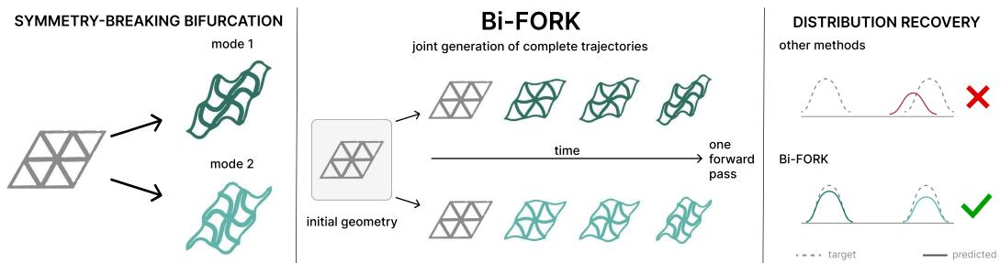  
Figure 1: Learning bifurcating solution distributions. Left: Symmetry breaking results in multiple valid trajectories for the same control parameter and initial state. Center: Latent flow matching jointly samples trajectories and resolves distinct branches in one forward pass. Right: Unlike modeaveraging baselines, Bi-FORK recovers the target distribution.

The main challenge. Scaling to larger systems is challenging because recovering a bifurcating distribution requires every part of the system to agree on which branch it is realizing in both space and time. A beam buckling to the left at one end and right at the other is an invalid solution, as is a beam that first buckles to the left and then suddenly switches to buckling to the right halfway through a trajectory. Moreover, bifurcations are typically rare events in trajectories. Training a frame-by-frame autoregressive model to produce trajectories would face significant challenge of capturing this key aspect of the system’s behavior while being underrepresented in the training data. Predicting the full trajectory allows the model to instead represent the branch choice globally in latent space, for all steps and elements at the same time. Mesh-based GNN surrogates communicate through local message passing, making such global coordination increasingly difficult as systems grow due to oversmoothing and oversquashing [43, 13, 11, 5].

Evaluation is similarly nontrivial. Pointwise metrics such as rank histograms and CRPS [23, 19, 28, 42, 39] assess pointwise calibration but cannot determine whether samples are coherent trajectories, while best-of-K scores ignore most of the predicted distribution. Generic two-sample distances can detect mode collapse but become difficult to estimate in high dimensions and do not exploit the symmetry structure of bifurcating solutions [26, 9].

We address these challenges with Bi-FORK: Bifurcation Flow-matching Over Repulsion-guided Kinematics, a latent flow-matching framework for symmetry-breaking bifurcations (see Figure 1). Bi-FORK generates full trajectories jointly, keeping branch choices consistent across space and time rather than learning them through local transitions. Because full-resolution execution is intractable, flow matching operates in a compact latent space, decoupling global coordination from discretization. Although compression can average modes, branch identity dominates trajectory variance and is therefore preserved by the reconstruction objective without supervision. At inference, particle guidance [58, 14] repels concurrent samples, acting as a parallelized analog of classical deflation [10, 18] to recover distinct solutions. We assess the resulting distribution by matching predictions to their nearest ground truth and, per input, measuring orbit coverage under the relevant symmetry group via the Jensen-Shannon divergence, thereby detecting regime collapse and quantifying coverage of the underlying distribution.

We evaluate the approach on three symmetry-breaking bifurcation problems: buckling beams, buckling mechanical metamaterials, and phase separation described by Allen-Cahn. These systems cover two- and three-dimensional grid- and mesh-based problems, various symmetry groups (both discrete and continuous), trajectories of 32 to 200 timesteps, and discretizations from a handful of points to 260,000. To our knowledge, this is the first demonstration of solution distribution recovery for one-to-many problems at that scale, and we show that our method outperforms existing approaches in both accuracy and efficiency.

Our contributions are:

1. A latent flow-matching framework that models whole trajectories, making branch coherence structural, and scales several orders of magnitude beyond prior work.

2. A particle-guidance sampling mechanism recovering multiple distinct solutions in one amortized pass, as a parallel analog of deflation.

3. Diagnostics based on symmetry-orbit matching and per-input Jensen-Shannon divergence that detect regime collapse and extend distributional verification to continuous and infinite symmetry groups.

## 2 A Blueprint for Bifurcating Regimes

## 2.1 Bifurcation Systems

Recall that a bifurcation is the loss of uniqueness of a stable equilibrium as a control parameter crosses a critical value, with buckling as the canonical mechanical example [37, 6, 30].

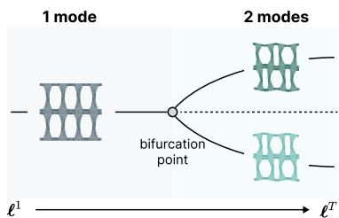

Setting. We represent trajectories as either point clouds or scalar fields on a regular grid. In both cases, $\dot { \mathbf { M } } ^ { t } \in \mathbb { R } ^ { N \times C }$ denotes the modeled response at $N$ spatial locations and timestep $t \in \{ 1 , \ldots , T \}$ , and $\mathbf { M } ^ { 1 : T } \in \mathbb { R } ^ { \bar { T } \times N \times C }$ forms the complete response trajectory. For point clouds, the N locations are material points with reference coordinates ${ \bf X } ^ { 1 } \in \mathbb { R } ^ { N \times D }$ , where $D \in \{ 2 , 3 \}$ . The response $\mathbf { M } ^ { t }$ is their displacement or microfluctuation field, so $C = D ;$ deformed coordinates $\mathbf { X } ^ { t }$ are recovered from $\mathbf { X } ^ { 1 }$ and $\mathbf { M } ^ { t }$ using the prescribed loading and dataset-specific kinematics. For regular-grid data, the dataset-specific kinematics. For regular-grid data, the $N$ locatic scalar field itself, so scalar field itself, so $C = 1$

Figure 2: Exemplary pitchfork bifurcation for the buckling metamaterials use case with increasing control protocol $\ell$

locations are fixed grid sites and $\mathbf { M } ^ { t }$ is the

Datasets. We consider three physical systems: (i) Beam3D models a slender beam that is compressed from one end until it buckles in arbitrary directions. (ii) Mechanical Metamaterials captures the buckling behavior of 2D porous materials with different periodic patterns, leading to distinct stable shapes. (iii) Allen-Cahn describes how a mixture separates into different phases over time, with a shared homogeneous initial state that evolves into several possible stable configurations.

Modes as a symmetry orbit. A problem instance is a condition ${ \bf c } = ( { \bf X } ^ { 1 } , \pmb { \ell } ) ;$ a reference geometry together with a control protocol $\mathbf { \dot { \boldsymbol { \ell } } } = ( \ell ^ { 1 } , \dots , \ell ^ { T } )$ that is fixed in advance and not influenced by the system’s response. The set of all feasible conditions we denote by $\mathcal { C } .$ . For the mechanical metamaterials datasets, for example, $\ell$ is a quasi-static loading schedule generated by a single terminal load $( \mathbf { F } ^ { t }$ interpolating toward $\mathbf { F } ^ { T } )$ , and the index t enumerates states and load increments simultaneously: Mt is the equilibrium microfluctuation response to the input $\ell ^ { t }$ (see Figure 2).

For Allen-Cahn, the protocol is constant, $\ell ^ { t } \equiv ( \epsilon , \mu )$ , where ϵ is a length scale and $\mu$ determines local phase structure. The systems are multistable: under a fixed condition, several physically distinct outcomes—modes—are admissible. We denote their mode set by $\mathcal { M } _ { \mathbf { c } } ^ { ~ 1 }$ , and write $\mathcal { \bar { M } } _ { \mathbf { c } } ^ { t }$ for the set of their responses at timestep t. Symmetry organizes this set: with

$$
G _ { \mathbf { c } } = \left\{ { g \mid g \cdot \mathbf { c } = \mathbf { c } } \right\}\tag{1}
$$

the symmetry group of the condition, any response M yields further solutions $g \cdot \mathbf { M } ,$ , so the mode set contains full orbits,

$$
G _ { \mathbf { c } } \cdot \mathbf { M } _ { \mathbf { c } } ^ { t } \subseteq \mathcal { M } _ { \mathbf { c } } ^ { t } , \qquad H _ { \mathbf { c } } ^ { t } = \{ g \in G _ { \mathbf { c } } \mid g \cdot \mathbf { M } _ { \mathbf { c } } ^ { t } = \mathbf { M } _ { \mathbf { c } } ^ { t } \} ,\tag{2}
$$

where $\mathbf { M } _ { \mathbf { c } } ^ { t }$ is a representative response and $H _ { \mathbf { c } } ^ { t }$ its isotropy subgroup; each orbit is isomorphic to $G _ { \mathbf { c } } / H _ { \mathbf { c } } ^ { t }$ with size $[ G _ { \mathbf { c } } : H _ { \mathbf { c } } ^ { t } ]$ . For Beam3D and the mechanical metamaterials, the inclusion is an

Table 1: Symmetry structure per dataset: group $G _ { \mathbf { c } }$ of the condition, isotropy $H _ { \mathbf { c } }$ of an output state, resulting mode set $\mathcal { M } _ { \mathbf { c } } \cong G _ { \mathbf { c } } ^ { \star } / H _ { \mathbf { c } }$ (union of orbits for Allen-Cahn).
<table><tr><td>Dataset</td><td> $G _ { \mathbf { c } }$ </td><td> $H _ { \mathbf { c } }$ </td><td> $\mathcal { M } _ { \mathbf { c } }$ </td><td> $| \mathcal { M } _ { \bf c } |$ </td></tr><tr><td>Beam3D</td><td> ${ \mathrm { O } } ( 2 )$ </td><td> $\mathbb { Z } _ { 2 }$ </td><td>circle of directions φ</td><td>8</td></tr><tr><td>Metamaterials Allen-Cahn</td><td>wallpaper subgroup fixing l domain syms  $\times \{ u \mapsto \pm u \}$ </td><td>pattern stabilizer morphology symmetries</td><td>translated patterns orbits of morphologies</td><td>1,2,4 varies</td></tr></table>

equality (a single orbit); for Allen-Cahn, the mode set is a union of orbits, one per morphology. Table 1 instantiates $G _ { \mathbf { c } } , H _ { \mathbf { c } } ,$ and $\mathcal { M } _ { \mathbf { c } }$ per dataset; note e.g. the beam, where $G _ { \mathbf { c } } = \mathrm { O } ( 2 )$ and the buckled state retains one reflection, giving the circular orbit $\mathrm { O ( 2 ) } / \mathbb { Z } _ { 2 } \cong \mathrm { S O ( 2 ) }$

Bifurcation time. We define the bifurcation time as the first step at which the solution loses symmetry,

$$
t _ { b } = \operatorname* { m i n } \{ t \in \{ 2 , \ldots , T \} \mid H _ { \mathbf { c } } ^ { t } \subsetneq H _ { \mathbf { c } } ^ { t - 1 } \} .\tag{3}
$$

In practice, we estimate $t _ { b }$ as the first step at which trajectories under the same condition separate beyond a small threshold. This also accommodates Allen-Cahn, where all trajectories share the same homogeneous initial state but macroscopic modes emerge only later. The choice of representation, the practical estimator, and secondary bifurcations are discussed in Appendix B. Probabilistically, $t _ { b }$ marks the onset of distinct branches in the distribution of outcomes conditioned on the context c at timestep t, connecting physical symmetry breaking to the need for distribution-valued prediction.

Three regimes of multimodality. Our datasets span discrete $( | \mathcal { M } _ { \mathbf { c } } | \in \{ 1 , 2 , 4 \}$ , mechanical metamaterials of 29), continuous $( | \mathcal { M } _ { \bf c } | = \infty$ , Beam3D), and field-valued (Allen-Cahn) mode sets; see Appendix C.

## 2.2 Learning task

Given a condition c, the task is to learn the conditional distribution over all feasible trajectories

$$
p \big ( \mathbf { M } ^ { 1 : T } \mid \mathbf { c } \big ) ,\tag{4}
$$

where the support of the target distribution is the mode set $M _ { \mathbf { c } } .$ The training datasets differ in their coverage of this support: the mechanical metamaterials enumerate all modes per condition, whereas Beam3D and Allen-Cahn provide samples from the mode set. We assume unknown perturbations that push the system toward one solution within an orbit have no preferred direction. Under thi assumption, the condition’s symmetry implies that modes within an orbit are equally likely, so for single-orbit datasets the target is uniform over $\mathcal { M } _ { \mathbf { c } }$ . Unlike standard trajectory prediction, the mapping from c to the system evolution is one-to-many: multiple physically valid trajectories arise under the same condition. During inference, the model receives c and generates one or more trajectory samples from a learned distribution $p _ { \theta _ { \mathrm { f l o w } } } ( \mathbf { M } ^ { 1 : T } \mid \mathbf { c } )$

## 2.3 Modeling

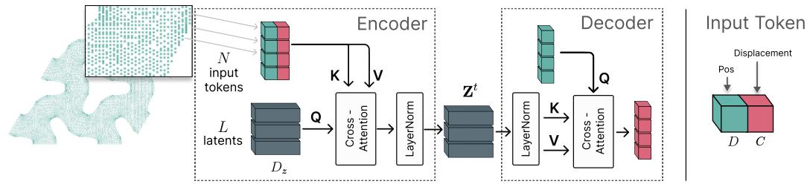  
Figure 3: Encoder-decoder structure for point cloud datasets. Input tokens (reference positions $\mathbf { X } ^ { 1 }$ and displacements) are encoded into latent representation by cross-attending to L learned latent query tokens. The decoder reconstructs the displacements conditioned on the reference positions.

Autoencoder. We adopt a Perceiver-style cross-attention architecture [33, 3, 51] for all point cloud datasets. For each timestep t, the encoder maps the reference configuration $\mathbf { X } ^ { 1 }$ and response field $\mathbf { M } ^ { t }$ to $L$ latent tokens of dimension $D _ { z } , \mathrm { i . e . , } \dot { \mathbf { Z } ^ { t } } \in \mathbb { R } ^ { L \times D _ { z } }$ , using cross-attention with learned latent queries, followed by self-attention on the latent set. Importantly, the decoder reconstructs Mt by querying these tokens at the fixed reference positions $\mathbf { X } ^ { 1 }$ . Thus, the latent representation $\mathbf { Z } ^ { t }$ encodes all timestep-dependent states, while spatial reconstruction is always anchored to the same reference geometry $\mathbf { \bar { X } } ^ { 1 }$ . This enables the independent analysis and prediction of latent trajectories $\{ \mathbf { Z } ^ { t } \} _ { t = 1 } ^ { T }$ which can then be decoded at the reference positions to recover Mt. For regular grid datasets, we use a 3D Vision Transformer (ViT) [16, 45], detailed in the respective section (Section 3.3).

Latent flow matching. For the approximator, we draw inspiration from the flow-based model framework in [51]. Given $T _ { \mathrm { o b s } }$ known states $\mathbf { Z } ^ { 1 : T _ { \mathrm { o b s } } }$ and the condition $\mathbf { c } ,$ it generates the remaining states $\mathbf { Z } ^ { T _ { \mathrm { o b s } } + 1 : T }$ . The flow-based model then learns a path between noise and data. Let $\mathbf { Z } _ { 1 } : = \mathbf { Z } ^ { 1 : T } \in$ $\mathbb { R } ^ { T \times L \times D _ { z } }$ z be the true latent trajectory and ${ \pmb \xi } \sim \mathcal { N } ( 0 , I )$ be noise. For every $\tau \in [ 0 , 1 ]$ , a probability path is specified by

$$
{ \bf Z } _ { \tau } = \tau { \bf Z } _ { 1 } + ( 1 - \tau ) \boldsymbol { \xi } ,\tag{5}
$$

such that pure noise is obtained with $\tau = 0 ,$ , and the true trajectory at $\tau = 1$ . We train a network with parameters $\theta _ { \mathrm { f l o w } }$ to reverse the applied corruption: given the noised trajectory, the flow time $\tau ,$ observed states and the control protocol, the clean trajectory is predicted by

$$
\begin{array} { r } { f _ { \theta _ { \mathrm { f l o w } } } : ( \mathbf { Z } _ { \tau } , \tau , \mathbf { Z } ^ { 1 : T _ { \mathrm { o b s } } } , \mathbf { c } ) \mapsto \widehat { \mathbf { Z } } _ { 1 } \in \mathbb { R } ^ { T \times L \times D _ { z } } . } \end{array}\tag{6}
$$

We adapt the standard flow matching approach through optimal transport-based coupling of in-batch pairs to minimize the path length between the noise and data distributions [57]. Additionally, we require the model to predict the bifurcation point, represented by a binary mask $\widehat { \mathbf { b } } \in \{ 0 , 1 \} ^ { T }$ . At inference, $\widehat { \mathbf { Z } } _ { 1 }$ is recovered by solving the probability-flow ODE associated with Eq. 5, starting from pure noise.

All timestep-dependent information for the prediction is expressed by $\mathbf { Z } _ { \tau }$ and its conditioning signals. The formulation is model agnostic to the specific network architecture and training procedure used for $f _ { \theta _ { \mathrm { f l o w } } }$ (see Appendix D.1 for details).

Inference using particle guidance. Due to the multimodal nature of the problem, the control protocol and initial state do not determine which mode the system settles into, e.g., the orbit coordinate (e.g. the buckling direction $\phi )$ is left free by c. While the generative model predicts a single valid mode rather than averaging across them, sampling alone does not control the distribution over modes.

We address this at inference with an approach inspired by particle guidance [14]. Rather than drawing $K$ trajectories independently, we sample K candidate trajectories $\mathbf { Z } _ { \tau } ^ { ( 1 ) } , \ldots , \mathbf { Z } _ { \tau } ^ { ( K ) }$ in a shared batch and integrate the probability-flow ODE for all of them jointly, leaving $f _ { \theta _ { \mathrm { f l o w } } }$ unmodified from training. To maintain diversity, we add an inter-sample repulsion term to the velocity field at each step (Figure 4).

Each $\widehat { \mathbf { Z } } _ { 1 } ^ { ( k ) }$ and its ordinary velocity field are computed independently via Eq. 6, as at training time. We additionally compute a repulsive term restricted to bifurcationrelevant frames, elected by the shared predicted mask $\widehat { \mathbf { b } } \in \{ 0 , 1 \} ^ { T }$ , where $\widehat { b } ^ { t } = 1$ indicates a predicted postbifurcation frame. For each trajectory, the predicted values at these frames are masked and flattened into a single point; pairwise distances between trajectories points are weighted by a Gaussian RBF kernel with bandwidth set to the median pairwise distance. Each

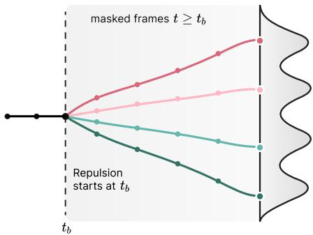  
Figure 4: Particle guidance during sampling. Trajectories evolve identically up to bifurcation point $t _ { b }$ . From $t _ { b }$ , the repulsion term acts on the masked frames $t \geq t _ { b }$ , pushing the K trajectories apart, yielding a multimodal distribution.

trajectory’s displacement $\mathrm { f o r c e } ^ { ( k ) }$ is the resulting kernel-weighted average of unit vectors pointing away from its neighbors, so trajectories that are similar at the bifurcation frames are pushed apart while already-distinct trajectories barely interact. The repulsive displacement modifies the velocity field $\widehat { v } _ { \theta _ { \mathrm { f l o w } } } = ( \widehat { \mathbf { Z } } _ { 1 } - \mathbf { Z } _ { \tau } ) / ( 1 - \tau )$ of the probability-flow ODE for sample k. Schematically,

$$
\widehat { v } ^ { ( k ) } = w _ { \mathrm { v e l } } \widehat { v } _ { \theta _ { \mathrm { f l o w } } } \big ( \mathbf { Z } _ { \tau } ^ { ( k ) } , \tau \big ) + w _ { \mathrm { r e p } } \widehat { \mathbf { b } } \odot \mathrm { f o r c e } ^ { ( k ) } ,\tag{7}
$$

where $w _ { \mathrm { v e l } }$ weights the model velocity, $w _ { \mathrm { r e p } }$ controls repulsion strength, and $\widehat { \mathbf { b } }$ selects the predicted post-bifurcation frames. The mask is broadcast over latent tokens and channels. This simplified expression omits the time-dependent scaling and normalization which we describe in Appendix D.5.

As a result, all K trajectories are integrated jointly rather than independently: at likely branch points, samples that would otherwise collapse onto the same mode are pushed apart, so the sample set spreads across distinct branches instead of concentrating on one.

## 2.4 Metrics

Evaluating generative models of bifurcating dynamical systems requires metrics that jointly capture trajectory-level precision and the distributional fidelity of predicted mode probabilities. Standard metrics such as MSE are inadequate in this setting, as they neither reflect the multimodal structure of the output space nor penalize mode collapse. We adopt two complementary metrics, adapted to systems with $| \mathbf { \dot { M } _ { c } } | \in \{ \dot { 1 } , 2 , 4 \} \ \mathrm { o r } \ | \mathbf { \mathcal { M } _ { c } } | = \overset { \cdot } { \infty }$ responses depending on the condition c.

Mode Conditioned MAE (MCon-MAE) quantifies trajectory-level precision. For each condition $\mathbf { c } ,$ we draw K samples from the model and assign each to its nearest ground-truth mode by Euclidean distance. MCon-MAE is the resulting reconstruction error, averaged over samples and conditions:

$$
\operatorname { M C o n - M A E } = \frac { 1 } { \left| \mathscr { C } \right| } \sum _ { \mathbf { c } \in \mathscr { C } } \frac { 1 } { K } \sum _ { k = 1 } ^ { K } \operatorname* { m e a n } \\Bigl ( \left| \widehat { \mathbf { X } } _ { \mathbf { c } } ^ { ( k ) } - \mathbf { X } _ { \mathbf { c } , m _ { * } ^ { ( k ) } } \right| \Bigr )\tag{8}
$$

(k) $\mathbf { \sigma } _ { m \in \mathcal { M } _ { \mathbf { c } } } \left\| \widehat { \mathbf { X } } _ { \mathbf { c } } ^ { ( k ) } - \mathbf { X } _ { \mathbf { c } , m } \right\| _ { F } ^ { 2 }$ with mode assignment m⋆ = arg min , where ${ \mathbf { X } } _ { \mathbf { c } , m }$ highlights the dependence on the condition c and mode m. We further report the Jensen-Shannon divergence (JSD) between the predicted and ground-truth mode distributions, estimated from K samples drawn at inference for each condition. This measures the extent to which a model represents each outcome with the correct relative frequency, rather than favoring a subset of modes.

## 3 Experiments

## 3.1 Beam3D

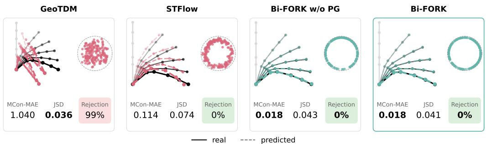  
Figure 5: Beam3D result comparison. Each panel shows an evaluated method, with an illustrative sample (colored) plotted over the actual trajectory (black). Their endpoints are shown against the full population and the ideal uniform dashed circle. Metrics are aggregated over all Beam3D test conditions using five random seeds.

Bifurcating System and Learning Task. The 3D buckling beam dataset represents multiple slender beams with a geometry $\mathbf { X } ^ { 1 }$ , which varies between data points, under axial compression. Each beam is fixed at one end with an incrementally increasing downward displacement d at the other. The input condition is therefore ${ \bf c } = ( { \bf X } ^ { 1 } , \boldsymbol { \ell } )$ . Below a critical threshold, the beam stays in axial compression. Beyond the threshold, the rotational symmetry breaks: the axisymmetric state remains an equilibrium but is no longer stable, and the beam buckles in an azimuthal direction $\phi \in [ 0 , 2 \pi ]$ yielding a continuous $S O ( \bar { 2 } )$ orbit of solutions. Given the condition c, the model is required to predict a representative set of K trajectories $\{ \widehat { \mathbf { X } } ^ { ( k ) } \} _ { k = 1 } ^ { K }$ , sampled from this continuous orbit.

Modeling. To model the bifurcating system, we use the architecture described in Section 2.3. In addition to tip displacement, we input per-node rotational stiffness and element-level attributes, including stiffness and length. At inference, we use particle guidance to distribute the samples more evenly over the admissible post-buckling manifold $\mathcal { M } _ { \mathbf { c } }$ . We additionally evaluate Bi-FORK without particle guidance; we denote this variant Bi-FORK w/o PG. We sample 180 times to estimate the distribution accuracy. Details on the chosen architecture parameters, such as latent dimension or hidden size, are provided in Appendix D.

Metrics. In addition to the metrics described in Section 2.4, we report the rejection rate (%): the fraction of generated trials whose mean Euclidean displacement from their matched mode exceeds a threshold. MCon-MAE and JSD are computed over all generated trials, including those that would have been rejected by the threshold.

Results. Bifurcating dynamical systems are naturally formulated as interacting particle systems, motivating models that operate on sets of arbitrary size without retraining. We compare against two such baselines: GeoTDM [27] and STFlow [8]. Figure 5 reports the MCon-MAE, JSD and rejection rate on the held-out test dataset. Among the models, GeoTDM achieves the lowest JSD due to its built-in equivariance, but rejects 99% of its samples, with the worst MCon-MAE. STFlow reduces the trajectory rejection rate while maintaining low error and JSD values. Notably, Bi-FORK substantially improves MCon-MAE with a 0% trajectory rejection rate and achieves a highly competitive JSD, actually closing the gap with the equivariant GeoTDM model. Visual inspection of the end-point distributions (Figure 5) confirms the quantitative findings: GeoTDM’s samples cluster off the target circle manifold, and STFlow samples are scattered noisily around it. Both Bi-FORK w/o PG and Bi-FORK trace the target manifold accurately. Table 11 summarizes performance across five random seeds, reporting the mean and standard deviation.

We also compare inference runtime, shown in Table 15. Bi-FORK offers significant runtime advantages over graph-based baselines. It generates 180 samples for a single condition in 3.95 seconds, making it approximately 18× faster than STFlow and 1,966× faster than GeoTDM.

## 3.2 Mechanical Metamaterials

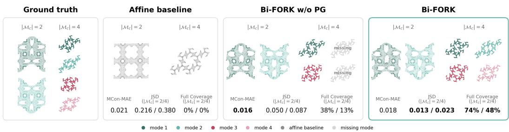  
Figure 6: Mechanical metamaterials result comparison. Ground truth modes and generated samples are shown for representative conditions with $| { \mathcal M } _ { \bf c } | = 2$ and $| { \mathcal { M } } _ { \bf c } | = 4$ buckling modes. Colors indicate the mapped ground-truth mode; missing modes are shown in gray. Affine baseline results in mean prediction. Reported MCon-MAE is averaged over the full test set, while JSD and full coverage are reported for $| \mathcal { M } _ { \mathbf { c } } | \in \{ 2 , 4 \}$ . Metrics reported over five random seeds on the test dataset.

Bifurcating System and Learning Task. The dataset of Hendriks et al. [29] contains buckling trajectories of periodic porous metamaterials spanning all 17 wallpaper groups. Depending on geometry and loading, symmetry breaking produces 1, 2, or 4 translation-related solutions, i.e., $| \mathcal { M } _ { \mathbf { c } } | \in \mathsf { \bar { \{ 1 , 2 , 4 \} } }$ : one mode when no observable symmetry breaking occurs, and two or four modes after isotropy reduction, with four modes potentially arising after a secondary bifurcation.

The condition is therefore ${ \bf c } = ( { \bf X } ^ { 1 } , \boldsymbol { \ell } )$ with $\boldsymbol { \ell } ^ { t } = \mathbf { F } ^ { t } ,$ , with $\mathbf { F } ^ { t }$ the applied macroscopic deformation gradient at time t. Since $\mathbf { F } ^ { t }$ is known, the predicted $\{ \widehat { \mathbf { M } } ^ { t } \} _ { t = 1 } ^ { T }$ are the microfluctuation fields instead of the full deformation field. The deformed coordinates are then reconstructed as $\widehat { \mathbf { X } } ^ { t } = \mathbf { X } ^ { 1 } ( \mathbf { F } ^ { t } ) ^ { \top } + \widehat { \mathbf { M } } ^ { t }$ Unlike the beam, the mode distribution here is discrete: the model must predict the correct number of modes for a given condition, because it should generate each physically plausible branch in $\mathcal { M } _ { \mathbf { c } }$

Modeling. Following the architecture in Section 2.3, we use the first frame as the conditioning frame for each geometry. Additionally, we add node type information and the crystallographic group. Inference is executed similarly to the Beam3D dataset, with one difference for Bi-FORK: when no bifurcation time point is detected $( | \mathcal { M } _ { \mathbf { c } } | = 1 )$ , the sampling algorithm discards the repulsive term in the diffusion process. In this setting, we sample 16 times to estimate the potential distribution for each condition.

Metrics. We employ the metrics from Section 2.4. Additionally, we report coverage $( \% )$ , defined as the percentage of conditions for which every ground-truth mode is represented by a valid generated sample. We report JSD and coverage only for cases with $| \mathcal { M } _ { \bf c } | \in \{ 2 , \overline { { 4 } } \}$ . MCon-MAE and JSD are computed over all generated trials, including those that would have been rejected by the threshold.

Results. GeoTDM and STFlow were not viable baselines for this problem setting because by default, both rely on a fully connected graph, which is infeasible with thousands of nodes. They can also use sparse connectivity based on a distance threshold, but then they would need a number of message-passing steps equal to the graph diameter to achieve all-to-all communica-

Table 2: Mode distributions of the two illustrated geometries in Figure 6 with $| \mathcal { M } _ { \mathbf { c } } | \in \{ 2 , 4 \}$ . Each row aggregates five seeds, with $K = 1 6$ samples per seed.
<table><tr><td>Sample</td><td>Method</td><td>K</td><td>Mode 1</td><td>Mode 2</td><td>Mode 3</td><td>Mode 4</td></tr><tr><td rowspan="2">2 modes</td><td>Bi-FORK w/o PG</td><td>16</td><td>80.0%</td><td>20.0%</td><td>一</td><td></td></tr><tr><td>Bi-FORK</td><td>16</td><td>56.2%</td><td>43.8%</td><td>一</td><td>一</td></tr><tr><td rowspan="2">4 modes</td><td>Bi-FORK w/o PG</td><td>16</td><td>18.2%</td><td>0.0%</td><td>72.7%</td><td>9.1%</td></tr><tr><td>Bi-FORK</td><td>16</td><td>23.2%</td><td>15.4%</td><td>36.3%</td><td>25.1%</td></tr></table>

tion, which is infeasible too. On Beam3D (⩽ 11 nodes for $T = 2 0 0 )$ , both models showed no improvement and, being GNN-based, were already slow to train and sample from, requiring up to three orders of magnitude more inference time than Bi-FORK (Table 15). With roughly 160× more nodes per timestep and all timesteps processed jointly (Section 1), both models become computationally infeasible. We therefore compare against the affine baseline, which propagates $\mathbf { X } ^ { 1 }$ using only the deformation gradient. Figure 6 shows that Bi-FORK w/o PG already improves over the affine baseline in accuracy and in distributional coverage: the per-mode JSD shows that it recovers multiple modes rather than collapsing to a mean prediction. With the full potential of our method, we further improve coverage, retrieving all four modes in roughly 50% of the sampled test cases. Table 12 provides the quantitative summary, including standard deviation. Table 2 shows the diversity improvement for the plotted samples with two and four modes, producing a nearly uniform distribution with Bi-FORK.

Finally, we ablate the bifurcation head on Beam3D and mechanical metamaterials. The results in Table 14 show that the learned bifurcation masks are predicted accurately on both datasets.

## 3.3 Allen-Cahn

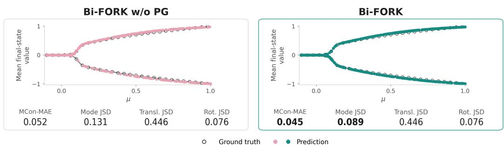  
Figure 7: Allen-Cahn result comparison. Ground truth (black open circles) and predictions (teal and pink circles) are shown across a parameter sweep $\mu \in [ - 0 . 1 , 1 . 0 ]$ at fixed $\epsilon = 0 . 1$ . The vertical axis shows the final-frame mean value. We evaluate metrics on the test dataset and average over five random seeds; lower values indicate better performance.

Bifurcating System and Learning Task. The 3D Allen-Cahn dataset describes the evolution of a phase-field variable governed by the Allen-Cahn equation, which models phase separation in binary mixtures on a periodic domain. Because all trajectories share the same initial homogeneous state, the condition is only $\mathbf { c } = ( \epsilon , \mu )$ , which is fixed over time. This initial state is invariant to $G _ { \mathbf { c } } ,$ which contains phase exchange $\iota \mapsto - u$ , periodic translations and the cubic point group. The initial state can evolve into many patterns, which can be symmetry-related through $G _ { \mathbf { c } }$ or morphologically distinct. The number of morphologically distinct modes rises as $\epsilon ^ { - 3 }$ : shrinking ϵ opens more unstable directions.

Modeling. Given Allen-Cahn’s grid structure, the first stage uses a ViT instead of the Perceiverstyle encoder. The periodic scalar field is compressed into a compact spatial-latent-token grid. Implementation details are in Appendix D. The second stage follows Section 2.3. As input conditions, we only use the physical parameters ϵ and $\mu ;$ since the full trajectory is generated starting at $t = 1$ , no additional conditioning frame is needed. The output is the full scalar-field rollout. We apply symmetry aware augmentations (periodic translations and sign flips) that match the domain’s periodicity and point-group structure. At inference, the sampling follows the previously described pipeline, with one exception: we apply particle guidance at every valid frame by setting $\widehat { b } ^ { t } = 1$ throughout the sampling process. Therefore, we do not train a bifurcation classification head for this problem setting.

Metrics. We extend the metrics described in Section 2.4 to the Allen-Cahn solution space. A raw distance between a generated field and any single reference is uninformative when the reference could equally be shifted, reflected, rotated, or sign-inverted and still represent the same solution. We therefore first match each generated trial to the closest branch among a predefined set of ground-truth solutions using an FFT-based descriptor invariant to these symmetries, then align it to that branch via an exhaustive search over the point group. Full implementation details are given in Appendix D.8.

Estimating the JSD on the joint distribution over (branch, rotoreflection, shift) is infeasible, as the number of possible combinations exceeds the number of available samples. We therefore split the JSD metrics into three separate components: mode-coverage JSD over the predefined solutions (including their sign-inverted counterparts); a translation JSD that similarly fixes a branch and tests whether the recovered periodic shift is uniform; and a rotoreflection JSD that fixes a single matched branch and tests whether the recovered rotations and reflections relative to it are uniform. MCon-MAE compares the full predicted trajectory with its relaxed counterpart, obtained by a Gauss–Newton projection onto the Allen–Cahn PDE. It thus measures the distance to a physically valid solution rather than to precomputed references.

Results. Figure 7 summarizes the results, and Table 13 reports the mean and standard deviation over five seeds. Bi-FORK reduces the MCon-MAE from 0.052 (without particle guidance) to 0.045, showing that the generated trajectories require smaller corrections to satisfy the PDE. It also lowers the mode JSD from 0.131 to 0.089, reflecting improved coverage of the solution branches. The translation and rotoreflection JSDs are identical for both variants. To illustrate mode coverage, we fix $\epsilon = 0 . 1$ and vary only $\mu .$ . Without particle guidance, the model samples mostly from the positive branch and misses several solutions on the negative branch. Bi-FORK samples both branches with similar density over the full range of $\mu .$ . Figure 8 shows samples from both methods next to the ground truth. Even when the samples differ, they showcase valid solutions.

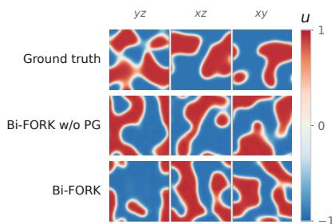  
Figure 8: Visual comparison of ground truth vs predicted samples for $\mu = 0 . 8 6$ and $\epsilon = 0 . 0 9 4$

## 4 Discussion

Limitations. Our experiments show that Bi-FORK applies to a diverse set of bifurcating systems; however, some limitations remain. First, particle guidance can trade accuracy for diversity: the repulsion acts on all samples, including those already in the same valid mode, and can push them off the solution manifold. Second, the Allen–Cahn evaluation is necessarily incomplete. The full distribution over morphologies is unavailable, so the mode-coverage JSD relies on four simulated realizations per condition and their sign flips. In addition, separate JSDs for modes, translations, and rotoreflections do not guarantee coverage of the joint distribution. Third, although symmetry is central to the problem, the model learns it from data and augmentation rather than enforcing it architecturally.

Conclusion. We introduce Bi-FORK, a framework for learning symmetry-breaking bifurcations. It maps solution multiplicity via symmetry orbits and bifurcation time. The task is framed as learning a conditional distribution over complete trajectories using latent flow matching and particle guidance. We evaluate models using symmetry-aware metrics that detect mode collapse. Across buckling beams, mechanical metamaterials, and Allen-Cahn phase separation, Bi-FORK recovers multimodal solutions at discretizations up to 260,000 points, several orders of magnitude beyond prior work. Because no existing stochastic method scales to this size, we evaluate the largest systems against a deterministic affine baseline and our own ablations. Ultimately, this opens generative modeling to large-scale bifurcating physical systems.

## Acknowledgments

We wish to thank Andreas Fürst for helpful discussions and feedback. The ELLIS Unit Linz, the LIT AI Lab, the Institute for Machine Learning, are supported by the Federal State Upper Austria. We thank the European Union’s Horizon Europe research and innovation programme under grant agreement number 101214398 (ELLIOT) and the Austrian Science Fund (FWF) 10.55776/COE12. We thank Audi AG, Silicon Austria Labs (SAL), Merck Healthcare KGaA, GLS (Univ. Waterloo), TÜV Holding GmbH, Software Competence Center Hagenberg GmbH, dSPACE GmbH, TRUMPF SE + Co. KG. We thank the projects FWF AIRI FG 9-N (10.55776/FG9), AI4GreenHeatingGrids (FFG-899943), FWF Bilateral Artificial Intelligence (10.55776/COE12).

## AI use statement

In this work, we used generative AI tools for three tasks requiring disclosure: implementing methods, cleaning and reformatting datasets, and formulating mathematical claims, where AI served only as a source of inspiration. We used Codex to implement the baseline methods and supporting evaluation code in Section 3; two authors reviewed, verified, and tested this code, and we implemented our proposed method ourselves. We used Codex and Claude to clean and reformat the datasets and checked the processed data against the original sources. Codex and Claude also offered ideas for the mathematical claims in Section 2, but the final claims were formulated and verified by the authors. We have not used generative AI tools to generate synthetic datasets; to develop the problem setting, problem framing, or proposed architecture; to propose or refine hypotheses; to design or give feedback on experiments; or to interpret results. Translation and qualitative or thematic data analysis are not applicable to this work.

Additionally, we used generative AI tools to identify relevant literature, to polish the manuscript for readability, and to make cosmetic improvements to figures. We did not use them for other recommended-disclosure tasks such as drafting text, suggesting hyperparameters, identifying research gaps, formatting references, or proposing a title. We have reviewed all AI-assisted work: suggested papers were read by the authors before being cited, text edits were checked to ensure that the technical content and claims were unchanged, and figure edits were limited to styling, with the underlying numbers never modified by AI. We take responsibility for the final content of this work, including text, claims, and artifacts produced with the aid of generative AI.

## Reproducibility statement

We provide a detailed description of the datasets, including the evaluation splits used, in Appendix C. Appendix D also elaborates on the model architecture, training pipeline, loss functions, and hyperparameters for each dataset. Additionally we provide a detailed overview on the evaluation pipeline for each dataset in Appendix D.7 for Beam3D and mechanical metamaterials, and in Appendix D.8 for the Allen-Cahn dataset. The code is available at: https://github.com/ml-jku/Bi-FORK.

## References

[1] Josh Abramson, Jonas Adler, Jack Dunger, Richard Evans, Tim Green, Alexander Pritzel, Olaf Ronneberger, Lindsay Willmore, Andrew J Ballard, Joshua Bambrick, et al. Accurate structure prediction of biomolecular interactions with alphafold 3. Nature, 630(8016):493–500, 2024.

[2] Michael Albergo, Nicholas M Boffi, and Eric Vanden-Eijnden. Stochastic interpolants: A unifying framework for flows and diffusions. Journal ofMachine Learning Research, 26(209):1–80, 2025.

[3] Benedikt Alkin, Andreas Fürst, Simon Schmid, Lukas Gruber, Markus Holzleitner, and Johannes Brandstetter. Universal physics transformers: A framework for efficiently scaling neural operators. Advances in Neural Information Processing Systems, 37:25152–25194, 2024.

[4] Benedikt Alkin, Maurits Bleeker, Richard Kurle, Tobias Kronlachner, Reinhard Sonnleitner, Matthias Dorfer, and Johannes Brandstetter. Ab-upt: Scaling neural cfd surrogates for high-fidelity automotive aerodynamics simulations via anchored-branched universal physics transformers. Transactions on Machine Learning Research, 2025.

[5] Uri Alon and Eran Yahav. On the bottleneck of graph neural networks and its practical implications. International Conference on Learning Representations, 2021.

[6] Stuart S. Antman. Nonlinear Problems of Elasticity, volume 107 of Applied Mathematical Sciences. Springer, New York, 2 edition, 2005.

[7] Zdenek P Bažant and Luigi Cedolin.ˇ Stability of structures: elastic, inelastic, fracture, and damage theories. Courier Corporation, 2003.

[8] Kiet Bennema ten Brinke, Koen Minartz, and Vlado Menkovski. Stflow: Data-coupled flow matching for geometric trajectory simulation. In International conference on machine learning. PMLR, 2026.

[9] Sebastian Bischoff, Alana Darcher, Michael Deistler, Richard Gao, Franziska Gerken, Manuel Gloeckler, Lisa Haxel, Jaivardhan Kapoor, Janne K Lappalainen, Jakob H Macke, et al. A practical guide to sample based statistical distances for evaluating generative models in science. Transactions on Machine Learning Research, 2024.

[10] Kenneth M Brow and William B Gearhart. Deflation techniques for the calculation of further solutions of a nonlinear system. Numerische Mathematik, 16(4):334–342, 1971.

[11] Chen Cai and Yusu Wang. A note on over-smoothing for graph neural networks. arXiv preprint arXiv:2006.13318, 2020.

[12] Giovanni Calzolari and Wei Liu. Accelerating large eddy simulations of urban airflow with generative adversarial networks. Building and Environment, 286:113622, 2025.

[13] Deli Chen, Yankai Lin, Wei Li, Peng Li, Jie Zhou, and Xu Sun. Measuring and relieving the over-smoothing problem for graph neural networks from the topological view. In Proceedings of the AAAI conference on artificial intelligence, volume 34, pages 3438–3445, 2020.

[14] Gabriele Corso, Yilun Xu, Valentin De Bortoli, Regina Barzilay, and Tommi Jaakkola. Particle guidance: non-iid diverse sampling with diffusion models. In International Conference on Learning Representations, volume 2024, pages 22480–22507, 2024.

[15] Michael G. Crandall and Paul H. Rabinowitz. Bifurcation from simple eigenvalues. Journal of Functional Analysis, 8(2):321–340, 1971.

[16] Alexey Dosovitskiy, Lucas Beyer, Alexander Kolesnikov, Dirk Weissenborn, Xiaohua Zhai, Thomas Unterthiner, Mostafa Dehghani, Matthias Minderer, Georg Heigold, Sylvain Gelly, et al. An image is worth 16x16 words: Transformers for image recognition at scale. International Conference on Learning Representations, 2021.

[17] Gianluca Fabiani, Francesco Calabrò, Lucia Russo, and Constantinos Siettos. Numerical solution and bifurcation analysis of nonlinear partial differential equations with extreme learning machines. Journal of Scientific Computing, 89(2):44, 2021.

[18] Patrick E Farrell, A Birkisson, and Simon W Funke. Deflation techniques for finding distinct solutions of nonlinear partial differential equations. SIAM Journal on Scientific Computing, 37(4):A2026–A2045, 2015.

[19] Zhihan Gao, Xingjian Shi, Boran Han, Hao Wang, Xiaoyong Jin, Danielle Maddix, Yi Zhu, Mu Li, and Yuyang Bernie Wang. Prediff: Precipitation nowcasting with latent diffusion models. Advances in Neural Information Processing Systems, 36:78621–78656, 2023.

[20] Matteo Giacomini and Pedro Díez. Surrogates for physics-based and data-driven modelling of parametric systems: Review and new perspectives. Archives ofComputational Methods in Engineering, 33:8519–8551, 2026.

[21] Martin Golubitsky and Ian Stewart. The Symmetry Perspective: From Equilibrium to Chaos in Phase Space and Physical Space, volume 200 of Progress in Mathematics. Birkhäuser, Basel, 2002.

[22] Martin Golubitsky, Ian Stewart, and David G. Schaeffer. Singularities and Groups in Bifurcation Theory, Volume II, volume 69 of Applied Mathematical Sciences. Springer, New York, 1988.

[23] Peter Grönquist, Chengyuan Yao, Tal Ben-Nun, Nikoli Dryden, Peter Dueben, Shigang Li, and Torsten Hoefler. Deep learning for post-processing ensemble weather forecasts. Philosophical Transactions ofthe Royal Society A: Mathematical, Physical and Engineering Sciences, 379(2194):20200092, 2021.

[24] John Guckenheimer and Philip Holmes. Nonlinear Oscillations, Dynamical Systems, and Bifurcations of Vector Fields, volume 42 of Applied Mathematical Sciences. Springer, New York, 1983.

[25] Leonardo Ferreira Guilhoto, Akshat Kaushal, and Paris Perdikaris. Multimodal scientific learning beyond diffusions and flows. arXiv preprint arXiv:2602.00960, 2026.

[26] Thomas M Hamill. Interpretation of rank histograms for verifying ensemble forecasts. Monthly Weather Review, 129(3):550–560, 2001.

[27] Jiaqi Han, Minkai Xu, Aaron Lou, Haotian Ye, and Stefano Ermon. Geometric trajectory diffusion models. Advances in Neural Information Processing Systems, 37:25628–25662, 2024.

[28] Shuangshuang He, Hongli Liang, Yuanting Zhang, and Xingyuan Yuan. Skillful high-resolution ensemble precipitation forecasting with an integrated deep learning framework. arXiv preprint arXiv:2501.02905, 2025.

[29] Fleur Hendriks, Vlado Menkovski, Martin Doškáˇr, Marc GD Geers, Kevin Verbeek, and Ondˇrej Rokoš. Wallpaper group-based mechanical metamaterials: Dataset including mechanical responses. Scientific Data, 12:1880, 2025.

[30] Fleur Hendriks, Ondˇrej Rokoš, Martin Doškáˇr, Marc GD Geers, and Vlado Menkovski. Equivariant flow matching for symmetry-breaking bifurcation problems. arXiv preprint arXiv:2509.03340, 2025.

[31] Dan Hendrycks and Kevin Gimpel. Gaussian error linear units (gelus). arXiv preprint arXiv:1606.08415, 2016.

[32] Jonathan Ho, Ajay Jain, and Pieter Abbeel. Denoising diffusion probabilistic models. Advances in neural information processing systems, 33:6840–6851, 2020.

[33] Andrew Jaegle, Felix Gimeno, Andrew Brock, Andrew Zisserman, Oriol Vinyals, and Joao Carreira. Perceiver: General perception with iterative attention. In International conference on machine learning, pages 4651–4664. PMLR, 2021.

[34] Hansjörg Kielhöfer. Bifurcation Theory: An Introduction with Applications to Partial Differential Equations, volume 156 of Applied Mathematical Sciences. Springer, New York, 2 edition, 2012.

[35] Leon Klein, Andreas Krämer, and Frank Noé. Equivariant flow matching. Advances in Neural Information Processing Systems, 36:59886–59910, 2023.

[36] Dmitrii Kochkov, Janni Yuval, Ian Langmore, Peter Norgaard, Jamie Smith, Griffin Mooers, Milan Klöwer, James Lottes, Stephan Rasp, Peter Düben, et al. Neural general circulation models for weather and climate. Nature, 632(8027):1060–1066, 2024.

[37] Warner T. Koiter. On the Stability of Elastic Equilibrium. PhD thesis, Delft University of Technology, 1945. English translation NASA TT F-10833 (1967) / AFFDL-TR-70-25 (1970).

[38] Yuri A. Kuznetsov. Elements ofApplied Bifurcation Theory, volume 112 of Applied Mathematical Sciences. Springer, New York, 3 edition, 2004.

[39] Erik Larsson, Joel Oskarsson, Tomas Landelius, and Fredrik Lindsten. Crps-lam: Probabilistic regional weather forecasting with continuous ranked probability score. arXiv preprint arXiv:2510.09484, 2026.

[40] Ilya Loshchilov and Frank Hutter. Decoupled weight decay regularization. International Conference on Learning Representations, 2019.

[41] Nanye Ma, Mark Goldstein, Michael S Albergo, Nicholas M Boffi, Eric Vanden-Eijnden, and Saining Xie. Sit: Exploring flow and diffusion-based generative models with scalable interpolant transformers. In European Conference on Computer Vision, pages 23–40. Springer, 2024.

[42] Ankur Mahesh, William Collins, Boris Bonev, Noah Brenowitz, Yair Cohen, Joshua Elms, Peter Harrington, Karthik Kashinath, Thorsten Kurth, Joshua North, et al. Huge ensembles part i: Design of ensemble weather forecasts using spherical fourier neural operators. Geoscientific Model Development, 18:5575–5603, 2025.

[43] Kenta Oono and Taiji Suzuki. Graph neural networks exponentially lose expressive power for node classification. International Conference on Learning Representations, 2020.

[44] Federico Pichi, Francesco Ballarin, Gianluigi Rozza, and Jan S Hesthaven. An artificial neural network approach to bifurcating phenomena in computational fluid dynamics. Computers & Fluids, 254:105813, 2023.

[45] Chinmay Prabhakar, Hongwei Li, Jiancheng Yang, Suprosanna Shit, Benedikt Wiestler, and Bjoern Menze. Vit-ae++: improving vision transformer autoencoder for self-supervised medical image representations. In Medical Imaging with Deep Learning, pages 666–679. PMLR, 2024.

[46] Ilan Price, Alvaro Sanchez-Gonzalez, Ferran Alet, Tom R Andersson, Andrew El-Kadi, Dominic Masters, Timo Ewalds, Jacklynn Stott, Shakir Mohamed, Peter Battaglia, et al. Probabilistic weather forecasting with machine learning. Nature, 637(8044):84–90, 2025.

[47] Max Rietkerk, Robbin Bastiaansen, Swarnendu Banerjee, Johan van de Koppel, Mara Baudena, and Arjen Doelman. Evasion of tipping in complex systems through spatial pattern formation. Science, 374(6564): eabj0359, 2021.

[48] Ignacio Romero and Michael Ortiz. A note on data-driven methods for mechanical problems with non-unique solutions. Meccanica, 61(1):26, 2026.

[49] David Ruelle and Floris Takens. On the nature of turbulence. Les rencontres physiciens-mathématiciens de Strasbourg-RCP25, 12:1–44, 1971.

[50] Christian Rupprecht, Iro Laina, Robert DiPietro, Maximilian Baust, Federico Tombari, Nassir Navab, and Gregory D Hager. Learning in an uncertain world: Representing ambiguity through multiple hypotheses. In 2017 IEEE international conference on computer vision (ICCV), pages 3611–3620. IEEE, 2017.

[51] Florian Sestak, Artur P. Toshev, Andreas Fürst, Günter Klambauer, Andreas Mayr, and Johannes Brandstet ter. Lam-SLide: Latent space modeling of spatial dynamical systems via linked entities. In The Thirty-ninth Annual Conference on Neural Information Processing Systems, 2025.

[52] Rüdiger Seydel. Practical Bifurcation and Stability Analysis, volume 5 of Interdisciplinary Applied Mathematics. Springer, New York, 3 edition, 2010.

[53] Jiaming Song, Chenlin Meng, and Stefano Ermon. Denoising diffusion implicit models. International Conference on Learning Representations, 2021.

[54] Will Steffen, Johan Rockström, Katherine Richardson, Timothy M Lenton, Carl Folke, Diana Liverman, Colin P Summerhayes, Anthony D Barnosky, Sarah E Cornell, Michel Crucifix, et al. Trajectories of the earth system in the anthropocene. Proceedings ofthe national academy ofsciences, 115(33):8252–8259, 2018.

[55] Haocheng Tang, Liang Shi, Ya-Shi Zhang, Xixian Liu, Jian Tang, and Jiarui Lu. Learning structure, energy, and dynamics: A survey of artificial intelligence for protein dynamics. arXiv preprint arXiv:2604.25244, 2026.

[56] J. M. T. Thompson and G. W. Hunt. A General Theory of Elastic Stability. Wiley, London, 1973.

[57] Alexander Tong, Kilian Fatras, Nikolay Malkin, Guillaume Huguet, Yanlei Zhang, Jarrid Rector-Brooks, Guy Wolf, and Yoshua Bengio. Improving and generalizing flow-based generative models with minibatch optimal transport. Transactions on Machine Learning Research, 2024.

[58] Thomas Unterthiner, Bernhard Nessler, Calvin Seward, Günter Klambauer, Martin Heusel, Hubert Ramsauer, and Sepp Hochreiter. Coulomb gans: Provably optimal nash equilibria via potential fields. International Conference on Learning Representations, 2018.

[59] Ashish Vaswani, Noam Shazeer, Niki Parmar, Jakob Uszkoreit, Llion Jones, Aidan N Gomez, Łukasz Kaiser, and Illia Polosukhin. Attention is all you need. Advances in neural information processing systems, 30, 2017.

[60] Donggeun Yoon, Minseok Seo, Doyi Kim, Yeji Choi, and Donghyeon Cho. Probabilistic weather forecasting with deterministic guidance-based diffusion model. pages 108–124, 2025.

[61] Zongren Zou, Zhicheng Wang, and George Em Karniadakis. Learning and discovering multiple solutions using physics-informed neural networks with random initialization and deep ensemble. Proceedings ofthe Royal Society A, 481(2325):20250205, 2025.

A Notation 15   
B Additional bifurcation context 16   
C Datasets 16   
C.1 Beam3D . 16   
C.2 Mechanical Metamaterials 18   
C.3 Allen-Cahn Dataset 19   
D Experimental Details 20   
D.1 Architecture 20   
D.2 Implementation Details 21   
D.3 Training 21   
D.4 Loss Function 22   
D.5 Adaptations to particle guidance 22   
D.6 Hyperparameters 23   
D.7 Evaluation Details: Beam3D and Metamaterials . 23   
D.8 Evaluation Details: Allen-Cahn . 24   
E Results 24   
E.1 Quantitative results 24   
E.2 Ablations 26   
E.3 Qualitative Results 27

## A Notation

The notation used throughout the paper is summarized in Table 3.

Table 3: Overview of used symbols and notations. Superscripts t index trajectory frames, subscripts τ flow time, and parenthesized superscripts (k) generated samples. Dataset-specific quantities are defined where they are used (Sections 3 and C).
<table><tr><td>Symbol</td><td>Meaning</td><td>Space</td></tr><tr><td colspan="3">Data and trajectories</td></tr><tr><td> $N , n$ </td><td>number of spatial locations (nodes); node index</td><td>N</td></tr><tr><td> $T , t$ </td><td>number of timesteps; timestep index</td><td>N</td></tr><tr><td> $D , C$ </td><td>spatial dimension; channels of the response</td><td> $\{ 2 , 3 \} , \{ 1 , D \}$ </td></tr><tr><td> $\mathbf { X } ^ { 1 } , \mathbf { X } ^ { t }$ </td><td>reference geometry; deformed coordinates at timestep t</td><td> ${ \dot { \mathbb { R } } } ^ { { \dot { N } } \times { \dot { D } } }$ </td></tr><tr><td> $\mathbf { M } ^ { t }$ </td><td>response (signal field) at timestep t</td><td> $\mathbb { R } ^ { N \times C }$ </td></tr><tr><td> $\mathbf { M } ^ { 1 : T }$ </td><td> $( \mathbf { M } ^ { 1 } , \dots , \hat { \mathbf { M } ^ { T } } )$  response trajectory</td><td> $\mathbb { R } ^ { T \times N \times C }$ </td></tr><tr><td colspan="3">Conditions, modes, and symmetry</td></tr><tr><td> $\mathbf { c } , { \mathcal { C } }$   $\ell$ </td><td>condition  $( \mathbf { X } ^ { 1 } , \pmb { \ell } ) , \mathrm { o r } ( \epsilon , \mu )$  for Allen-Cahn; set of conditions  $( \ell ^ { 1 } , \dots , \ell ^ { T } )$ </td><td></td></tr><tr><td> $\mathcal { M } _ { \mathbf { c } } , \mathcal { M } _ { \mathbf { c } } ^ { t }$ </td><td>control protocol (loading schedule) mode set (admissible trajectories); responses at timestep t</td><td> $C \mathbb { R } ^ { T \times N \times C }$ </td></tr><tr><td> $G _ { \mathbf { c } }$ </td><td>symmetry group of the condition</td><td></td></tr><tr><td> $\mathbf { M } _ { \mathbf { c } } ^ { t }$ </td><td>representative response at timestep t</td><td> $\in \mathcal { M } _ { \mathbf { c } } ^ { t }$ </td></tr><tr><td> $H _ { \mathbf { c } } ^ { t }$   $t _ { b }$ </td><td>isotropy subgroup of  $\mathbf { M } _ { \mathbf { c } } ^ { t }$ </td><td> $\leq G _ { \mathbf { c } }$   $\{ 2 , \ldots , T \} \cup \{ \infty \}$ </td></tr><tr><td></td><td>bifurcation time: first strict decrease of  $H _ { \mathbf { c } } ^ { t }$  (∞ if none)</td><td></td></tr><tr><td colspan="3"> $D i s t r i b u t i o n s$   $p ( \mathbf { M } ^ { 1 : T } \mid \mathbf { c } )$ </td></tr><tr><td> $p _ { \theta _ { \mathrm { f l o w } } } ( \mathbf { M } ^ { 1 : T } \mid \mathbf { c } )$ </td><td>ground-truth distribution of trajectories, supported on  $\mathcal { M } _ { \mathbf { c } }$  learned distribution (latent flow model, decoded)</td><td></td></tr><tr><td></td><td></td><td></td></tr><tr><td colspan="3">Latent representation encoder</td></tr><tr><td> $\mathcal { E } _ { \phi _ { \mathrm { e n c } } } , \mathcal { D } _ { \phi _ { \mathrm { d e c } } }$ </td><td> $( \mathbf { X } ^ { 1 } , \mathbf { M } ^ { t } ) \mapsto \mathbf { Z } ^ { t } ;$  decoder  $( \mathbf { Z } ^ { t } , \mathbf { X } ^ { 1 } ) \mapsto { \widehat { \mathbf { M } } } ^ { t }$ </td><td></td></tr><tr><td>Zt</td><td>latent state at timestep t</td><td> $\mathbb { R } ^ { L \times D _ { z } }$ </td></tr><tr><td> $L , D _ { z }$ </td><td>number of latent tokens; token dimension</td><td>N</td></tr><tr><td colspan="3">Latent flow matching</td></tr><tr><td> $\tau$ </td><td>flow time (0: noise, 1: data)</td><td> $\lceil 0 , 1 \rceil$ </td></tr><tr><td> $\mathbf { Z } _ { 1 }$ </td><td>clean latent trajectory  $\mathbf { Z } ^ { 1 : T }$ </td><td> $\mathbf { \mathbb { R } } ^ { T \times L \times D _ { z } }$ </td></tr><tr><td> $\pmb { \xi }$ </td><td>Gaussian noise</td><td> $\mathcal { N } ( 0 , I )$ </td></tr><tr><td> $\mathbf { Z } _ { \tau }$ </td><td>noisy latent trajectory  $\tau { \bf Z } _ { 1 } + ( 1 - \tau ) \pmb { \xi }$ </td><td> $\mathbb { R } ^ { \vec { T } \times \vec { L } \times D _ { z } }$ </td></tr><tr><td> $T _ { \mathrm { o b s } }$ </td><td>number of observed (conditioning) frames</td><td> $\{ 0 , \ldots , T \}$ </td></tr><tr><td> $f _ { \theta _ { \mathrm { f l o w } } } , \theta _ { \mathrm { f l o w } }$ </td><td>predictor  $( \mathbf { Z } _ { \tau } , \tau , \mathbf { Z } ^ { 1 : T _ { \mathrm { o b s } } } , \mathbf { c } ) \mapsto \widehat { \mathbf { Z } } _ { 1 }$  ; its parameters</td><td></td></tr><tr><td> $\widehat { \mathbf { Z } } _ { 1 }$ </td><td>predicted clean latent trajectory</td><td> $\mathbb { R } ^ { T \times L \times D _ { z } }$ </td></tr><tr><td> $\widehat { v } _ { \theta _ { \mathrm { f l o w } } }$ </td><td>velocity field of the probability-flow ODE, induced by  $\widehat { \mathbf { Z } } _ { 1 }$ </td><td> $\mathbb { R } ^ { T \times L \times D _ { z } }$ </td></tr><tr><td colspan="3">Sampling and particle guidance</td></tr><tr><td> $K , k$ </td><td>number of jointly generated samples; sample index</td><td>N</td></tr><tr><td> $\mathbf { Z } _ { \tau } ^ { ( k ) }$ </td><td>latent state of sample k</td><td> $\mathbb { R } ^ { T \times L \times D _ { z } }$ </td></tr><tr><td> $p ^ { t } , \widehat { \mathbf { b } }$ </td><td> $\widehat { b } ^ { t } = \mathbb { 1 } [ p ^ { t } \geq 1 / 2 ]$  predicted post-bifurcation probability; mask</td><td> $[ 0 , 1 ] , \{ 0 , 1 \} ^ { T }$ </td></tr><tr><td> $\operatorname { \dot { f } o r c e } ^ { ( k ) }$ </td><td></td><td> $\bf \check { \mathbb { R } } ^ { \check { T } \times \check { L } \times \check { D } _ { z } }$ </td></tr><tr><td></td><td>repulsive force on sample k</td><td> $\mathbb { R } _ { \geq 0 }$ </td></tr><tr><td> $w _ { \mathrm { v e l } } , w _ { \mathrm { r e p } }$   $\widehat { \boldsymbol { v } } ^ { ( k ) }$ </td><td>weights of model velocity and repulsion guided velocity of sample k</td><td> $\mathbb { R } ^ { \mathbf { \bar { \pi } } \times L \times D _ { z } }$ </td></tr><tr><td colspan="3">Training and evaluation</td></tr><tr><td> $\mathcal { L } _ { \mathrm { r e c } } , \mathcal { L } _ { \mathrm { f l o w } } , \mathcal { L } _ { \mathrm { b i f } }$ </td><td>reconstruction, latent-flow, and bifurcation losses</td><td></td></tr><tr><td> $\boldsymbol { b } ^ { t } , \boldsymbol { r } ^ { t }$ </td><td>bifurcation label  $\mathbb { 1 } [ t \geq t _ { b } ] ;$  valid-frame indicator</td><td>{0, 1}</td></tr><tr><td> $\widehat { \mathbf { X } } _ { \mathbf { c } } ^ { ( k ) } , \mathbf { X } _ { \mathbf { c } , m }$ </td><td>generated trajectory k; ground-truth trajectory of mode m</td><td></td></tr><tr><td> $m _ { \star } ^ { ( k ) }$ </td><td>ground-truth mode matched to sample k</td><td></td></tr><tr><td> $\mathbf { M C o n - M A E , J S D }$ </td><td>mode-conditioned MAE; Jensen-Shannon divergence</td><td> $\mathbb { R } _ { \geq 0 }$ </td></tr></table>

## B Additional bifurcation context

Estimating the bifurcation time. In the datasets, $t _ { b }$ is obtained from simulated trajectories rather than from the isotropy subgroups directly. For two trajectories $i , j$ under the same condition, we compute the pairwise divergence $\mathrm { d } _ { i j } ^ { t } = \lVert \dot { \mathbf { M } } _ { i } ^ { t } - \mathbf { M } _ { j } ^ { t } \rVert$ (the load-prescribed part cancels) and take the first timestep at which it exceeds a small threshold $\vartheta > 0$ . Before the bifurcation, the equilibrium is unique and $G _ { \mathbf { c } } { \mathrm { - i n v a r i a n t } } .$ so all trajectories coincide; afterwards, trajectories on distinct branches separate. For the quasi-static datasets, this estimate therefore recovers $t _ { b }$ up to the resolution $\vartheta .$ . For Allen-Cahn, where small noise perturbs the shared homogeneous initial state, it marks the onset of macroscopic domain formation.

Non-bifurcating conditions. If no timestep satisfies $H _ { \mathbf { c } } ^ { t } \subsetneq H _ { \mathbf { c } } ^ { t - 1 }$ , the condition admits a single mode, and we set $t _ { b } : = \infty$ . The bifurcation labels are then $b ^ { t } = \mathbb { 1 } [ t \geq t _ { b } ] \equiv 0 .$ , and the estimator above detects no separation. Accordingly, the bifurcation head is trained to predict $\widehat { \mathbf { b } } = \mathbf { 0 }$ for such conditions, which deactivates the repulsion term in Eq. 7.

Secondary bifurcations. A loading path can exhibit several isotropy drops $t _ { b } ^ { ( 1 ) } < t _ { b } ^ { ( 2 ) } < \cdots$ i.e., hierarchical bifurcations; the four-mode metamaterials arise from two such drops (Figure 10b). Throughout, $t _ { b }$ denotes the first one.

Choice of representative. The definition of $t _ { b }$ in Section 2.1 refers to a representative response $\mathbf { M } _ { \mathbf { c } } ^ { t }$ at every timestep. Two responses on the same orbit have conjugate isotropy subgroups, $H _ { g \cdot \mathbf { M } } =$ $g H _ { \mathbf { M } } g ^ { - 1 }$ for $g \in G _ { \mathbf { c } } .$ , and conjugate subgroups are in general not nested. The inclusion $H _ { \mathbf { c } } ^ { t } \subseteq \mathbf { \check { H } } _ { \mathbf { c } } ^ { t - 1 }$ is therefore to be read along a single trajectory: $\mathbf { M } _ { \mathbf { c } } ^ { t }$ denotes frame t of one fixed admissible trajectory $\mathbf { M } _ { \mathbf { c } } ^ { 1 : T } \in \mathcal { M } _ { \mathbf { c } }$ . With this convention, $t _ { b }$ does not depend on the trajectory chosen. Replacing $\mathbf { M } _ { \mathbf { c } } ^ { 1 : \check { T } }$ by $\mathbf { \bar { \boldsymbol { g } } } \cdot \mathbf { M _ { c } ^ { 1 : T } } = \left( g \cdot \mathbf { M _ { c } ^ { 1 } } , \ldots , g \cdot \mathbf { M _ { c } ^ { T } } \right)$ conjugates every $H _ { \mathbf { c } } ^ { t }$ by the same $^ { g ; }$ conjugation by a fixed element preserves inclusions and their strictness, so the first timestep at which $\check { H } _ { \mathbf { c } } ^ { t } \subsetneq H _ { \mathbf { c } } ^ { t - 1 }$ holds is unchanged. For Allen-Cahn, where $\mathcal { M } _ { \mathbf { c } }$ is a union of orbits, this defines $t _ { b }$ per orbit; the estimator above applies unchanged.

Bifurcation, not chaos. Unlike chaotic systems, where nearby trajectories diverge exponentially and long-run outcomes are unpredictable [49, 24], multistable systems branch into a small, structured set of symmetry-related outcomes. This makes the problem well posed for learning: the target is a multimodal distribution over a few valid branches, not an unpredictable attractor.

Relation to bifurcation theory. For the mechanical datasets, t counts load increments, so the “bifurcation time” is really a bifurcation load: the classical setting of equilibrium bifurcation theory, where a solution branch splits once the equilibrium stops being unique—mechanically, where the tangent stiffness matrix becomes singular [37, 56, 6, 15, 34, 52]. In symmetric problems, the new equilibria have strictly less symmetry and appear in symmetry-related copies, which is exactly the isotropy reduction defining $t _ { b }$ in Section 2.1 and the content of equivariant bifurcation theory [22, 21]. Allen-Cahn is instead genuinely time-dependent and covered by the dynamical version of the theory [24, 38]. We consider the generic supercritical scenario in which branches grow continuously out of the symmetric state; sudden jumps (subcritical or imperfect buckling) are out of scope.

## C Datasets

## C.1 Beam3D

The dataset describes a 3D beam-buckling process, containing simulations with 3 to 11 nodes. In the problem setting, the beam is fixed at the base and aligned along the z-axis in its undeformed state, with a specified downward displacement applied incrementally to the tip. This displacement sequence is the control protocol $\ell = ( \ell ^ { 1 } , \ldots , \ell ^ { \dot { T } } )$ in the condition $\mathbf { \bar { c } } = ( \mathbf { X } ^ { 1 } , \mathbf { \bar { \theta } } )$ . Below a critical displacement threshold, the beam undergoes pure axial compression; beyond it, the system loses stability and deflects in any direction $\phi$ drawn uniformly from [0, 2π] in the x-y-plane. As every deflection direction is equally probable, the system admits $| \mathcal { M } _ { \bf c } | \doteq \infty$ distinct post-buckling modes under identical loading.

Dataset generation. The beam contains $N _ { \mathrm { s e g } }$ compressible elements, each characterized by a reference length $L _ { i } ^ { \mathrm { b e a m } }$ , axial stiffness $k _ { i } ^ { \mathrm { a x } }$ , and rotational spring constant $k _ { i } ^ { \mathrm { r o t } }$ resisting bending between neighboring elements. The mechanical state is parametrized by axial strains $e _ { i } = \ln ( L _ { i } ^ { \mathrm { d e f } } / L _ { i } ^ { \mathrm { b e a m } } )$ where $L _ { i } ^ { \mathrm { d e f } }$ is the deformed element length, and $q _ { i }$ represents the bending angle from the vertical. The resulting node positions are expressed relative to the reference geometry as the displacement trajectory $\{ \bar { \mathbf { M } } ^ { t } \} _ { t = 1 } ^ { T }$ used by the model. Equilibrium configurations minimize the strain energy

$$
E _ { \mathrm { b e a m } } ( \mathbf { q } , \mathbf { e } ) = \frac { 1 } { 2 } \left[ k _ { 1 } ^ { \mathrm { r o t } } q _ { 1 } ^ { 2 } + \sum _ { i = 2 } ^ { N _ { \mathrm { s e g } } } { k _ { i } ^ { \mathrm { r o t } } \left( q _ { i } - q _ { i - 1 } \right) ^ { 2 } } \right] + \frac { 1 } { 2 } \sum _ { i = 1 } ^ { N _ { \mathrm { s e g } } } { L _ { i } ^ { \mathrm { b e a m } } k _ { i } ^ { \mathrm { a x } } e _ { i } ^ { 2 } }\tag{9}
$$

subject to $\begin{array} { r } { d = \sum _ { i = 1 } ^ { N _ { \mathrm { s e g } } } L _ { i } ^ { \mathrm { b e a m } } [ 1 - \exp ( e _ { i } ) } \end{array}$ cos $q _ { i } ]$ , enforced via a Lagrange multiplier. The dataset contains 997 trajectories of up to $T = 2 0 0$ timesteps, simulated to full deflection $d ,$ with system parameters $N _ { \mathrm { s e g } } , L _ { i } ^ { \mathrm { b e a m } } , k _ { i } ^ { \mathrm { r o t } } , k _ { i } ^ { \mathrm { a x } }$ , and $\phi$ sampled across instances. The sampling distributions are summarized in Table 4.

Table 4: Sampling distributions across used parameters.
<table><tr><td>Parameter</td><td>Range</td><td>Add. Information</td></tr><tr><td> $N _ { \mathrm { s e g } }$ </td><td>3-11 nodes (2–10 segments)</td><td>per trajectory</td></tr><tr><td> $L _ { i } ^ { \mathrm { b e a m } }$ </td><td>log-uniform[0.5, 2.0]</td><td>per segment</td></tr><tr><td> $k _ { i } ^ { \mathrm { a x } }$ </td><td>log-uniform[0.5, 2.0]</td><td>per segment</td></tr><tr><td> $k _ { i } ^ { \mathrm { r o t } }$ </td><td>log-uniform[0.5, 2.0]</td><td>per node</td></tr><tr><td> $\phi$ </td><td>uniform on [0, 2π)</td><td>per trajectory</td></tr></table>

The dataset is well-suited to our analysis since the buckling direction $\phi$ is continuous, yielding infinitely many symmetry-related modes under the same loading condition.

Examples. Figure 9 visualizes representative 3D beam trajectories for increasing node counts, showing how the initially vertical beam progressively buckles into different directions over time.

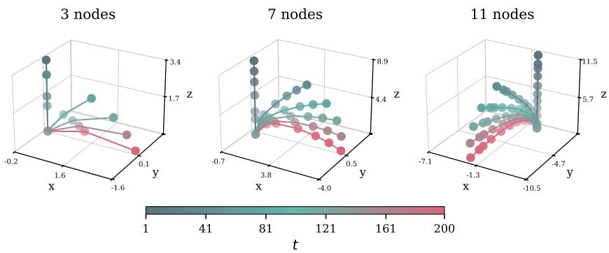  
Figure 9: Example trajectories from the 3D beam dataset with different buckling directions ϕ for diverse node counts over timestep t.

Dataset Split. Table 5 illustrates the distribution across different data splits. We consider a single sample per condition in the table, whereas during training the full range of buckling directions, $\phi \in [ 0 , 2 \pi ]$ , is applied across the dataset.

Table 5: Summary of 3D beam dataset splits.
<table><tr><td>Split</td><td>Trajectories</td><td>Share (%)</td></tr><tr><td>Training</td><td>697</td><td>70</td></tr><tr><td>Validation</td><td>150</td><td>15</td></tr><tr><td>Test</td><td>150</td><td>15</td></tr><tr><td>Total</td><td>997</td><td>100</td></tr></table>

## C.2 Mechanical Metamaterials

For the second problem setting, we use the publicly available dataset of Hendriks et al. [29]2. It represents buckling trajectories of 2D porous elastic metamaterials, covering all 17 wallpaper groups. Each geometry is simulated on a $2 \times 2$ representative volume element under 12 loading paths, giving 12,240 trajectories from 1,020 geometries, with mesh sizes between 1,000 - 36,000 per timestep. In our notation, the prescribed loading path is the control protocol $\ell ;$ for this dataset each increment is a known deformation gradient, $\boldsymbol { \ell } ^ { t } = \mathbf { F } ^ { t }$ . The trajectories contain up to $T = 3 2$ timesteps, but can terminate earlier if the system runs into contact and reaches a steady state.

For the underlying dataset the deformed configuration at timestep t is obtained by combining the macroscopic deformation with the displacement field Mt:

$$
\mathbf { X } ^ { t } = \mathbf { X } ^ { 1 } ( \mathbf { F } ^ { t } ) ^ { \top } + \mathbf { M } ^ { t } .\tag{10}
$$

The deformation gradient is constructed by linearly interpolating from the identity matrix I to a prescribed terminal deformation gradient $\dot { \mathbf { F } _ { T } }$

$$
\mathbf { F } ^ { t } = \mathbf { I } + \frac { t - 1 } { T - 1 } ( \mathbf { F } _ { T } - \mathbf { I } ) , \quad t \in \{ 1 , \ldots , T \} .\tag{11}
$$

The dataset is well-suited to our analysis because geometries can end in $| \mathcal { M } _ { \mathbf { c } } | \in \{ 1 , 2 , 4 \}$ distinct post-buckling modes under the same condition. Before bifurcation, symmetry-related modes should remain close in latent space; after bifurcation, the model must represent distinct modes without losing their shared trajectory-level structure.

Examples. Figure 10 summarizes two examples of the metamaterials dataset with distinct modes. Figure 10a shows a trajectory with 2 modes. The starting configuration and the last timestep before buckling are displayed on the left in gray. Under progressive loading, the structure branches into two distinct post-buckling configurations: modes 1 and 2, which, in this case, are mirror reflections of one another. Both modes are shown at two successive timesteps, capturing how the transformed pattern becomes more pronounced with increasing load.

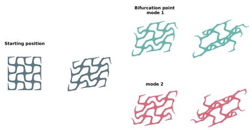  
(a) Example trajectory with one bifurcation point resulting in two modes.

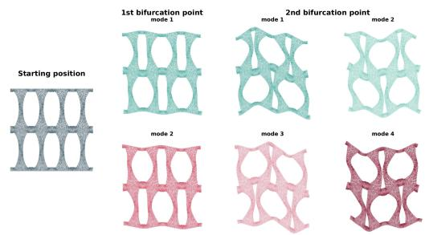  
(b) Example trajectory with two bifurcation points resulting in four modes.  
Figure 10: Example mechanical metamaterials trajectories with distinct post-buckling mode structures.

Figure 10b shows a trajectory with 4 modes. Starting from the undeformed configuration on the left, the structure first reaches a bifurcation point where two modes emerge. By moving toward the terminal deformation gradient ${ \bf { F } } _ { T }$ , a second bifurcation point is reached, resulting in four distinct modes. This hierarchical branching behavior demonstrates how repeated symmetry-breaking events can generate increasingly varied deformed configurations from a single initial geometry.

Dataset Split To prevent leakage between subsets, we split the data by geometry: each of the 1,020 geometries is assigned to exactly one of the training, validation, or test sets. All 12 loading paths of a geometry are kept together in the same subset, so no test geometry is seen during training. We provide a detailed overview of the training, validation, and test split in Table 6 and their mode distributions. Overall, the validation and test data share a similar number of modes across categories.

Table 6: Summary of dataset splits.
<table><tr><td>Split</td><td>1 mode</td><td>2 modes</td><td>4 modes</td><td>Trajectories</td><td>Share (%)</td></tr><tr><td>Training</td><td>6,529</td><td>1,777</td><td>262</td><td>8,568</td><td>70</td></tr><tr><td>Validation</td><td>1,408</td><td>377</td><td>51</td><td>1,836</td><td>15</td></tr><tr><td>Test</td><td>1,391</td><td>354</td><td>91</td><td>1,836</td><td>15</td></tr><tr><td>Total</td><td>9,328</td><td>2,508</td><td>404</td><td>12,240</td><td>100</td></tr></table>

## C.3 Allen-Cahn Dataset

The Allen-Cahn dataset describes phase separation in a three-dimensional periodic domain Ω, see Figure 11. The state is a scalar phase field u(x, t) : $\Omega \times [ 0 , 5 0 ]  \mathbb { R }$ governed by

$$
{ \frac { \partial u } { \partial t } } = \epsilon ^ { 2 } \nabla ^ { 2 } u - \left( u ^ { 3 } - \mu u \right) .\tag{12}
$$

Here, ϵ sets the characteristic width and smoothness of the interfaces, and $\mu$ determines the local phase structure. For $\mu > 0 ;$ , small perturbations of the mixed state grow and form spatial domains approaching $u = \pm { \sqrt { \mu } } . \mathrm { \ A }$ small subset of the data uses $\mu < 0 .$ , a non-separating regime in which the homogeneous state is stable. We discretize u on an $N _ { x } \times N _ { y } \times N _ { z }$ grid and denote the discrete state at timestep t by $\mathbf { u } ^ { t } \in \mathbb { R } ^ { N _ { x } \times N _ { y } \times N _ { z } }$

Dataset generation. We generated 1,000 parameter conditions on $\mathrm { ~ a ~ } ~ 6 4 ^ { 3 }$ grid over the periodic domain $[ 0 , 2 \pi ] ^ { 3 } .$ For every condition, ϵ was sampled log-uniformly as $\epsilon =$ $1 0 ^ { z }$ with $\begin{array} { r l r l r l r l r l } { z } & { \sim } & { \mathcal { U } ( \mathrm { ~ - 1 . 5 , ~ \bar { ~ } { - 1 . 0 } } ) , } & { \mathrm { i . e . } } & { \mathrm { ~ \bar { ~ } { ~ \epsilon ~ } ~ } } & { \in } & { [ 1 0 ^ { - 1 . 5 } , 1 0 ^ { - 1 } ] } & { \mathrm { ~ \bar { ~ } { ~ \approx ~ } ~ } } & { [ 0 . \bar { 0 } 3 1 6 , 0 . 1 ] . } \end{array} \cdot \mathrm { ~ { O f } ~ }$ the sampled $\mu$ values, 98% were drawn uniformly from [0.05, 1.0] and 2% from [−0.1, 0].

All trajectories start from the same homogeneous state $u ^ { 0 } ( { \bf x } ) \equiv 0$ . However, because this state is a valid solution but unstable, uniform random noise with an amplitude of 0.1 is added to the initial state in order to perturb it away from the unstable all-zero solution. The equation is integrated for $5 { , } 0 0 0$ steps with $\Delta t = 0 . 0 1$ , using a semi-implicit Fourier-spectral scheme: the nonlinear reaction term is evaluated explicitly, whereas the diffusion term is solved implicitly by pointwise division in Fourier space. Periodic boundary conditions are applied along all three axes. The initial state and every 100th integration step are retained, giving $T = 5 1$ snapshots per trajectory over the time interval [0, 50]. Consequently, the stored phase-field tensor before splitting has shape $4 , 0 0 0 \times 5 1 \times 6 4 \times 6 4 \times \mathrm { \bar { 6 } } 4$

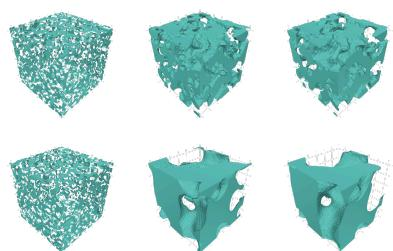  
Figure 11: Allen-Cahn example for two distinct $\epsilon , \mu$ settings.

Modes. For Allen-Cahn the control protocol is constant, $\ell ^ { t } \equiv ( \epsilon , \mu )$ . For each sampled $( \epsilon , \mu )$ condition, four trajectories were simulated from the shared homogeneous initial state. These trajectories share the same physical parameters and provide samples of different phase-separation morphologies under the same condition c. In addition, the Allen-Cahn equation is invariant under the analytic transformation $u \mapsto - u$ . Applying this sign flip to each realization provides its phase-exchanged counterpart, yielding eight candidate modes per condition (four simulated realizations and their four sign-reversed counterparts).

Dataset Split. The data are split at the level of parameter conditions rather than individual trajectories. Thus, all four trajectories belonging to the same $( \epsilon , \mu )$ pair remain in the same subset, preventing information leakage between training and evaluation. The conditions were shuffled and divided into 70% training, 15% validation, and 15% test data, as summarized in Table 7.

Table 7: Summary of the Allen-Cahn dataset splits. Each condition contains four simulated trajectories and up to eight modes after analytic sign augmentation.
<table><tr><td>Split</td><td>Conditions</td><td>Simulated trajectories</td><td>Candidate modes</td><td>Share (%)</td></tr><tr><td>Training</td><td>700</td><td>2,800</td><td>5,600</td><td>70</td></tr><tr><td>Validation</td><td>150</td><td>600</td><td>1,200</td><td>15</td></tr><tr><td>Test</td><td>150</td><td>600</td><td>1,200</td><td>15</td></tr><tr><td>Total</td><td>1,000</td><td>4,000</td><td>8,000</td><td>100</td></tr></table>

## D Experimental Details

## D.1 Architecture

Autoencoder. The encoder $\mathcal { E } _ { \phi _ { \mathrm { e n c } } }$ and decoder $\mathcal { D } _ { \phi _ { \mathrm { d e c } } }$ form a Perceiver-style cross-attention autoencoder [33, 3, 51] for the 2D mechanical metamaterials and Beam3D datasets. The encoder maps N node points into a fixed, learned latent array of L tokens. The decoder reconstructs per-point deformations via cross-attention from positional queries. All nonlinear activations are GELU [31], and we additionally embed input and query positions via the sine-cosine position embedding from transformers [59]. A schematic of the architecture is provided in Figure 3; dataset-specific autoencoder hyperparameters are listed in Table 8.

The Allen-Cahn Autoencoder uses a 3D Vision Transformer (ViT3D). The encoder patchifies the input voxel grid to $8 \times 8 \times 8$ patches, which are run through self-attention/MLP transformer blocks to get a 4 $\times 4 \times$ 4 latent representation. The decoder mirrors the encoder where the latent representation is upsampled to the original voxel grid.

We ensure latent stability by normalizing the physical fields and conditioning parameters using dataset-specific statistics, while layer normalization is used throughout the attention-based encoders and latent flow network. This stabilizes the latent representations without introducing an additional variational regularization term.

Flow Matching Model. We employ a two-stage latent flow matching model. In the first stage, an encoder maps each physical state to a compact latent representation

$$
\mathbf { Z } ^ { t } = \mathcal { E } _ { \phi _ { \mathrm { e n c } } } ( \mathbf { X } ^ { 1 } , \mathbf { M } ^ { t } ) ,\tag{13}
$$

while a decoder reconstructs the original state.

The latent representation of a complete trajectory is

$$
\mathbf { Z } _ { 1 } : = \left( \mathbf { Z } ^ { 1 } , \ldots , \mathbf { Z } ^ { T } \right) \in \mathbb { R } ^ { T \times L \times D _ { z } } .\tag{14}
$$

In the second stage, the autoencoder is frozen and a Scalable Interpolant Transformer (SiT) [41, 2] is trained to model the distribution of latent trajectories. A Gaussian sample ${ \pmb \xi } \sim \mathcal { N } ( 0 , I )$ is coupled to each data trajectory. At a randomly sampled flow time $\tau \in [ 0 , 1 ]$ , the interpolated latent state is

$$
{ \bf Z } _ { \tau } = \alpha _ { \tau } { \bf Z } _ { 1 } + \sigma _ { \tau } { \pmb \xi } ,\tag{15}
$$

where Beam3D and the mechanical metamaterials use the generalized variance-preserving (GVP) [41] path with $\begin{array} { r } { \alpha _ { \tau } = \sin ( \frac { 1 } { 2 } \pi \tau ) } \end{array}$ and $\begin{array} { r } { \sigma _ { \tau } = \cos ( \frac { 1 } { 2 } \pi \tau ) } \end{array}$ , and Allen-Cahn uses the linear path with $\alpha _ { \tau } = \tau$ and $\sigma _ { \tau } = 1 - \tau$ . Moreover, Eq. 5 in the main text shows the linear path. For a general path, the velocity field of Eq. 7 is $\widehat { v } _ { \theta _ { \mathrm { f l o w } } } = \dot { \alpha } _ { \tau } \widehat { \mathbf { Z } } _ { 1 } + \dot { \sigma } _ { \tau } \bigl ( \mathbf { Z } _ { \tau } - \alpha _ { \tau } \widehat { \mathbf { Z } } _ { 1 } \bigr ) / \sigma _ { \tau }$ , which reduces to $( \widehat { \mathbf { Z } } _ { 1 } - \mathbf { Z } _ { \tau } ) / ( 1 - \tau )$ for the linear path. The configured models directly estimate the clean latent trajectory,

$$
\widehat { \bf Z } _ { 1 } = f _ { \theta _ { \mathrm { f l o w } } } ( { \bf Z } _ { \tau } , \tau , { \bf Z } ^ { 1 : T _ { \mathrm { o b s } } } , { \bf c } ) .\tag{16}
$$

The predicted latent trajectory is mapped back to the physical signal using the frozen decoder:

$$
\widehat { \mathbf { M } } ^ { t } = \mathcal { D } _ { \phi _ { \mathrm { d e c } } } \left( \widehat { \mathbf { Z } } _ { 1 } ^ { t } , \mathbf { X } ^ { 1 } \right) .\tag{17}
$$

## D.2 Implementation Details

Beam3D For Beam3D, each state contains the three-dimensional displacement field of the beam. The Perceiver encoder represents a state using six latent tokens of dimension 128, producing a fixed-size representation that is independent of the number of mesh nodes. The flow model is conditioned on the prescribed scalar tip displacement and observes the initial trajectory frame in the standard configuration. Because the direction of beam buckling is rotationally symmetric, random azimuthal rotations are applied during training to expose the model to the complete SO(2) orbit of equivalent buckling directions.

Mechanical Metamaterials Each mechanical metamaterial state is represented by a two-dimensional nodal displacement field together with the node positions, node $\mathrm { t y p e s , }$ and wallpaper-group information. A Perceiver autoencoder compresses each state into 128 latent tokens of dimension 128. The flow model is conditioned on the prescribed $2 \times 2$ deformation gradient, represented as a fourdimensional vector. We group solution branches belonging to the same physical condition during training, and restrict optimal-transport coupling to samples within the same group. This encourages consistent matching between alternative bifurcation modes without coupling trajectories generated under different physical conditions.

Allen–Cahn Each Allen–Cahn state is a scalar phase field defined on a periodic $6 4 ^ { 3 }$ grid. A threedimensional vision transformer divides the field into volumetric patches and encodes them into a structured latent grid. The flow model is conditioned on the physical parameters $( \epsilon , \mu )$ . Temporal and spatial rotary embeddings allow the transformer to distinguish both trajectory time and spatial latenttoken position. The implementation supports periodic translations, sign inversion, axis reflections, and axis permutations as symmetry-preserving transformations of the Allen–Cahn system.

## D.3 Training

Training is divided into two stages: (i) autoencoder training and (ii) latent flow training. The first stage involves training the autoencoder to reconstruct individual physical states. The encoder $\mathcal { E }$ and decoder D are jointly optimized to reconstruct individual physical states. Invalid or padded spatial elements are excluded from the reconstruction objective. The second stage involves training the latent flow model to learn the distribution of latent trajectories. The pretrained autoencoder is frozen, and only the SiT flow model and physical-parameter conditioner are optimized. Gaussian noise with the same shape as the latent trajectory is sampled and paired with the data using either independent coupling or a Hungarian optimal-transport assignment based on latent-space squared distance. When mode groups are available, the assignment is restricted to trajectories belonging to the same physical condition.

For clean-trajectory prediction, the flow time is sampled according to $\tau \sim \mathcal { U } ( \tau _ { \mathrm { m i n } } , 1 - \tau _ { \mathrm { m i n } } ) , \tau _ { \mathrm { m i n } } =$ $1 0 ^ { - 3 }$

The interpolated latent trajectory $\mathbf { Z } _ { \tau }$ , flow time τ , control protocol, and observed-frame condition are then passed to the model. Invalid physical timesteps are replaced by zero before coupling and are excluded from both attention and loss computation.

The standard conditional models observe the first trajectory frame. The Allen–Cahn transfer configuration uses unconditional generation by setting the number of observed frames to zero.

Optimization. The second-stage models are optimized with AdamW [40]. The standard learning rate is $1 0 ^ { - 4 }$ , with cosine learning-rate decay for the mechanical metamaterial and standard Allen–Cahn models and a constant learning rate for Beam3D. Gradient norms are clipped at 1, and optimizer updates containing non-finite gradients are skipped. Training is step-based. Checkpoints are selected using the validation loss, with additional checkpoints maintained for generation metrics such as mode coverage.

Data augmentation. No generic spatial augmentation is applied to the mechanical metamaterial trajectories because their geometric, node-type, and wallpaper-group information is explicitly repre sented. Beam3D trajectories are randomly rotated around the longitudinal beam axis, reflecting the continuous rotational symmetry of the buckling problem. Allen–Cahn augmentation can combine periodic translations, sign inversion, axis reflection, and axis permutation. Each transformation is applied consistently to all frames of a trajectory to preserve its temporal dynamics.

## D.4 Loss Function

The first-stage reconstruction model and the second-stage latent flow model are optimized separately.

Reconstruction loss. For a physical signal $\mathbf { M } \in \mathbb { R } ^ { N \times C }$ and its reconstruction $\widehat { \bf M }$ , the first-stage reconstruction loss is the mean squared error over nodes:

$$
\mathcal { L } _ { \mathrm { r e c } } = \frac { 1 } { N } \sum _ { n = 1 } ^ { N } \lVert \widehat { \mathbf { m } } _ { n } - \mathbf { m } _ { n } \rVert _ { 2 } ^ { 2 } .\tag{18}
$$

Here, $\mathbf { m } _ { n }$ and $\widehat { \mathbf { m } } _ { n }$ denote the signal and its reconstruction at node $n .$ Padded or invalid nodes, where present, are excluded from both the sum and the count $N .$ . For Metamaterials, $\mathbf { m } _ { n } \in \mathbb { R } ^ { 2 }$ is the nodal displacement. For Beam3D, $\mathbf { m } _ { n } \in \mathbb { R } ^ { 3 }$ is the three-dimensional nodal displacement. For Allen-Cahn, $\mathbf { m } _ { n } \in \mathbb { R }$ is the scalar phase-field value.

Latent flow loss The principal second-stage objective is the frame-masked mean-squared error between the predicted and target latent trajectories. With

$$
\widehat { \mathbf { Z } } _ { 1 } = f _ { \theta _ { \mathrm { f l o w } } } \left( \mathbf { Z } _ { \tau } , \tau , \mathbf { Z } ^ { 1 : T _ { \mathrm { o b s } } } , \mathbf { c } \right) ,\tag{19}
$$

the loss is

$$
\mathcal { L } _ { \mathrm { { f l o w } } } = \frac { \displaystyle \sum _ { t = 1 } ^ { T } \boldsymbol { r } ^ { t } \left\| \widehat { \mathbf { Z } } _ { 1 } ^ { t } - \mathbf { Z } _ { 1 } ^ { t } \right\| _ { F } ^ { 2 } } { L D _ { z } \displaystyle \sum _ { t = 1 } ^ { T } \boldsymbol { r } ^ { t } } .\tag{20}
$$

Here, τ denotes flow time and t indexes trajectory frames. The tensors $\widehat { \mathbf { Z } } _ { 1 } ^ { t } , \mathbf { Z } _ { 1 } ^ { t } \in \mathbb { R } ^ { L \times D _ { z } }$ are the predicted and target clean latents at frame t, respectively. The indicator $r ^ { t } \in [ 0 , \dot { 1 } ]$ specifies whether frame t contributes to the loss. The denominator normalizes the squared error by the total number of latent entries across contributing frames.

Bifurcation classification loss. The Metamaterial and Beam3D models optionally include a temporal attention head that predicts whether each trajectory frame lies before or after bifurcation. The head is trained using masked binary cross-entropy:

$$
\mathcal { L } _ { \mathrm { b i f } } = - \frac { \sum _ { t = 1 } ^ { T } r ^ { t } \left[ b ^ { t } \log p ^ { t } + ( 1 - b ^ { t } ) \log ( 1 - p ^ { t } ) \right] } { \sum _ { t = 1 } ^ { T } r ^ { t } } .\tag{21}
$$

Here, $p ^ { t }$ is the predicted post-bifurcation probability, $b ^ { t }$ is the corresponding ground-truth target, and $\widehat { b } ^ { t } = \mathbb { 1 } [ p ^ { t } \geq 1 / 2 ]$ is its binary prediction.

The complete second-stage objective is

$$
\begin{array} { r } { \mathcal { L } = \mathcal { L } _ { \mathrm { f l o w } } + \lambda _ { \mathrm { b i f } } \mathcal { L } _ { \mathrm { b i f } } . } \end{array}\tag{22}
$$

The standard Allen–Cahn model does not use the auxiliary classification head and is optimized only using ${ \mathcal { L } } _ { \mathrm { { f o w } } }$

## D.5 Adaptations to particle guidance

In their notation, Corso et al. [14] add the gradient of a joint cross-particle potential to the reversediffusion drift. They evaluate this interaction on the noisy state $x _ { \tau }$ . We make four adaptations for our latent data-prediction model.

Denoised interaction. We compute repulsion on the estimate $\widehat { \mathbf { Z } } _ { 1 } ^ { ( k ) }$ . It is restricted by the shared predicted mask $\widehat { \mathbf { b } }$ in Eq. 7, which is computed once before guidance begins and held fixed throughout guided sampling. The original method computes it directly on $x _ { \tau }$ . We scale the resulting displacement by $( \sigma _ { \tau } ^ { 2 } + \delta ) ^ { - 1 }$ before adding it to the velocity update in $\operatorname { E q . 7 } ;$ the constant $\delta > 0$ prevents divergence as $\sigma _ { \tau }  0$ . The interaction strength therefore follows the model’s denoising confidence.

Normalized force. The original force is an unnormalized gradient of a scalar potential. Our force is a kernel-weighted average of unit pairwise directions. We divide by the total kernel mass $\textstyle \sum _ { j } k _ { i j }$ This keeps its scale stable as the number and weight of neighboring particles change.

Self-interaction. For a translation-invariant kernel, the original self term has zero gradient and vanishes. Our self term is excluded from the numerator because its direction is undefined. It remains in the normalizing denominator and therefore damps the interaction.

Frame and time gating. The original potential acts on the full particle state with a generic coefficient. We apply repulsion only to the predicted bifurcation selected by $\widehat { \mathbf { b } } = 1$ . It is zero elsewhere. We use the bounded schedule $\gamma ( \tau ) = \operatorname* { m a x } ( \tau ^ { \kappa } , \gamma _ { \operatorname* { m i n } } )$ . The schedule strengthens toward the data endpoint and never switches off. Here $\kappa > 0$ is the schedule exponent and $\gamma _ { \operatorname* { m i n } } \in ( 0 , 1 ]$ is its floor; $w _ { \mathrm { r e p } }$ is the global repulsion weight. No additional per-frame weight is used beyond bb.

The bandwidth uses a median heuristic over squared, dimension-scaled pairwise distances. This choice follows the synthetic-experiment code released with Corso et al. [14]. Their paper leaves the kernel and bandwidth domain-specific and does not prescribe a general formula. We provide the latent-flow and guidance-schedule hyperparameters used for the reported models in Table 9.

## D.6 Hyperparameters

Table 8: Hyperparameters of the autoencoder (first stage) used to produce the reported outputs, per dataset.
<table><tr><td>Parameter</td><td>Beam3D</td><td>Metamaterials</td><td>Allen-Cahn</td></tr><tr><td>Architecture</td><td>Perceiver AE</td><td>Perceiver AE</td><td>ViT3D + spatial token bottleneck</td></tr><tr><td>Params</td><td>1.7 × 10⁶</td><td>1.7 × 10⁶</td><td>6.1 × 10⁶</td></tr><tr><td>Input shape</td><td>node states (N × C)</td><td>point set (17 groups, 8 node types)</td><td>64×64× 64×1 voxel grid</td></tr><tr><td>Patch size</td><td></td><td></td><td>8×8×8 (512 tokens)</td></tr><tr><td>Latent shape  $( L \times D _ { z } )$ </td><td>6 × 128</td><td>128 × 128</td><td>4×4×4 (64 × 384)</td></tr><tr><td>Encoder blocks (cross/self-attn)</td><td>1/1</td><td>1/1</td><td>ViT depth 6 (heads 6, embed 192)</td></tr><tr><td>Decoder blocks (cross/self-attn)</td><td>1/1</td><td>1/1</td><td>ViT depth 4 (heads 6, embed 192)</td></tr><tr><td>Head dims (enc cross/latent/dec cross/latent)</td><td>16/16/16/16</td><td>16/16/16/16</td><td></td></tr><tr><td>Heads (enc cross/latent/dec cross/latent)</td><td>32/16/32/16</td><td>32/16/32/16</td><td>6 (enc) / 6 (dec)</td></tr><tr><td>Decoder query width</td><td>160</td><td>160</td><td></td></tr><tr><td>Activation</td><td>GELU</td><td>GELU</td><td>GELU</td></tr><tr><td>Dropout (latent / query)</td><td>0.0 / 0.05</td><td>0.0 / 0.05</td><td>0.0 (encoder)</td></tr><tr><td>Loss</td><td>masked MSE</td><td>masked MSE</td><td>masked MSE</td></tr><tr><td>Optimizer</td><td>AdamW 10⁻4</td><td>AdamW</td><td>AdamW</td></tr><tr><td>Learning rate</td><td></td><td>10⁻4</td><td>2 × 10− -4</td></tr><tr><td>Weight decay</td><td>0.0</td><td>0.01</td><td>0.01</td></tr><tr><td>Scheduler</td><td>Cosine (eta_min 10−6)</td><td> $\mathrm { C o s i n e ~ ( e t a \_ m i n ~ } 1 . 5 \times 1 0 ^ { - 5 } )$ </td><td>none</td></tr><tr><td>Gradient norm clipping</td><td>1.0</td><td>1.0</td><td>1.0</td></tr><tr><td>Batch size</td><td>128</td><td>128</td><td>128</td></tr><tr><td>Precision</td><td>bf16-mixed</td><td>bf16-mixed</td><td>bf16-mixed</td></tr></table>

Table 9: Hyperparameters of the latent-space (second-stage) flow model used to produce the reported outputs, per dataset.
<table><tr><td>Parameter</td><td>Beam3D</td><td>Metamaterials</td><td>Allen-Cahn</td></tr><tr><td>Params (non-AE)</td><td> $7 . 1 \times 1 0 ^ { 6 }$ </td><td> $1 7 . 2 \times 1 0 ^ { 6 }$ </td><td>31.8 × 10⁶</td></tr><tr><td>in_dim / cond_dim</td><td> $1 2 8 / 1 2 8$ </td><td>128 /128</td><td>384/192</td></tr><tr><td>Hidden size</td><td>256</td><td>512</td><td>512</td></tr><tr><td>Depth</td><td>5</td><td>4</td><td>8</td></tr><tr><td>Heads</td><td>8</td><td>16</td><td>16</td></tr><tr><td>MLP ratio</td><td>2.0</td><td>2.0</td><td>2.0</td></tr><tr><td>Bifurcation head</td><td> $\mathrm { a t t e n t i o n } , \lambda _ { \mathrm { b i f } } { = } 0 . 1$ </td><td> $\mathrm { a t t e n t i o n } , \lambda _ { \mathrm { b i f } } { = } 0 . 1$ </td><td>none</td></tr><tr><td>Conditioner (in/dim/hidden)</td><td> $1 / 1 2 8 / 5 1 2$ </td><td>4 / 128 / 256</td><td>2 / 192 / 512 linear / data</td></tr><tr><td>Transport path / target Sampler</td><td>GVP / data  $\mathrm { D D I M } , \eta { = } 0 . 0$ </td><td>GVP / data</td><td></td></tr><tr><td></td><td></td><td>DDIM, η=0.0 (eval η=1.0)</td><td>DDIM, η=0.0 (eval η=1.0)</td></tr><tr><td>Loss</td><td>flow MSE (frame-masked)</td><td>flow MSE (frame-masked)</td><td>flow MSE (frame-masked)</td></tr><tr><td>Optimizer</td><td>AdamW</td><td>AdamW</td><td>AdamW</td></tr><tr><td>Learning rate</td><td>10−4</td><td>10-4</td><td>3 × 10 -5</td></tr><tr><td>Weight decay</td><td>0.0</td><td>0.01</td><td>0.01</td></tr><tr><td>Scheduler</td><td>none</td><td>Cosine (eta_min 10⁻</td><td>Cosine (Tmax =500k, eta_min 10 5)</td></tr><tr><td>Batch size Precision</td><td>64</td><td>16</td><td>8</td></tr><tr><td></td><td>bf16-mixed</td><td>bf16-mixed</td><td>fp32</td></tr><tr><td>PG settings  $( w _ { \mathrm { v e l } } / w _ { \mathrm { r e p } } / \kappa )$ </td><td>1.0 / 1.0 / 0.0</td><td> $1 . 0 / 5 0 / 0 . 2 5$ </td><td>1.0 / 75 / 0.025</td></tr></table>

## D.7 Evaluation Details: Beam3D and Metamaterials

We apply a mode-aware evaluation pipeline with task-specific adaptations to the underlying mode set. For discrete-mode settings, we match generated rollouts to their nearest ground-truth mode using a nearest-mode distance. For metamaterials, this uses an absolute distance threshold of 0.1 over the whole trajectory. We compute the mean absolute error over the whole trajectory and sample 16 trajectories per condition, using 50 integration steps. For both Beam3D and Allen-Cahn, the mode space is continuous. Rollouts for the Beam3D dataset are therefore evaluated by binning the buckling azimuth and matching against the nearest orbit member with a relative-distance rejection criterion. We reject a generated trajectory if its relative distance to the matched orbit member exceeds 50% of its ground-truth displacement magnitude. Here we sample 180 trials with fewer integration steps (10 steps, DDIM [53]), and compare against GeoTDM (1000 steps, DDPM [32]) and STFlow (10 steps, Euler integration) using the same number of evaluation samples.

## D.8 Evaluation Details: Allen-Cahn

The Allen-Cahn dataset dynamics are invariant under periodic translations, sign flips and point-group symmetries of the cubic domain, making pointwise comparison to a single reference rollout not meaningful. We evaluate in two steps: (i) each generated sample is matched to a ground-truth branch using canonical alignment, (ii) and three different JSD metrics test distributional uniformity over the possible orbit operations.

Matching. For a generated field M, we compute the time-averaged radial power spectrum $S ( \mathbf { M } )$ as the magnitude of the 3D FFT at each timestep, binned by integer radial frequency and averaged over time. This value is invariant to translation and the octahedral point group, making it suitable for identifying the best mode independent of orientation and shift. The matched branch is $m _ { \star } ^ { ( k ) } =$ arg ma $\mathrm { x } _ { m }$ cos\_sim $\left( S ( \mathbf { M } ^ { ( k ) } ) , S ( \bar { \mathbf { R } } ^ { ( m ) } ) \right)$ , where $\mathbf { R } ^ { ( m ) }$ is the selected ground-truth reference for branch m. We count sign-inverted counterparts separately for mode-coverage JSD, but disregard sign for translation and rotoreflection JSD. Given $m _ { \star } ^ { ( k ) }$ , we recover translation and orientation by an exhaustive search over the 48-element octahedral group $G _ { \mathrm { o c t } }$ (axis reflections and permutations). For each $g \in G _ { \mathrm { o c t } }$ , we apply $g$ to the sample’s mean field and phase-correlate it against the matched mode’s mean field using the normalized cross-power spectrum. The peak location gives the best periodic shift, and the height gives an alignment score. We only keep the $g _ { \star }$ with the highest peak, resulting in one match result $( \bar { m } _ { \star } ^ { ( k ) } , \psi _ { \star } ^ { ( k ) } , \bar { g } _ { \star } ^ { ( k ) } )$ per sample, where $\psi _ { \star } ^ { ( k ) } \in \mathbb { Z } _ { 6 4 } ^ { 3 }$ is the optimal periodic grid shift. The approach mirrors the alignment step in [35]. In contrast to that work, and because the symmetry group is small and finite, the exact minimum is found directly rather than approximated.

MCon-MAE. For each generated rollout $\widehat { \mathbf { M } } ^ { ( k ) }$ , let $\widehat { { \bf M } } ^ { \mathrm { r e l } , ( k ) }$ be its Gauss–Newton relaxation onto an Allen-Cahn PDE-consistent trajectory. We compute

$$
\mathbf { M C o n - M A E } = \frac { 1 } { K } \sum _ { k = 1 } ^ { K } \operatorname* { m e a n } \biggr ( \biggr | \widehat { \mathbf { M } } ^ { \mathrm { r e l } , ( k ) } - \widehat { \mathbf { M } } ^ { ( k ) } \biggr | \biggr ) ,\tag{23}
$$

This dataset-specific metric compares each raw generation with its own relaxed projection; no saved reference rollout, matched branch, or branch label enters the calculation. It is therefore distinct from the nearest-reference MCon-MAE in Eq. 8.

JSD Metrics. Each JSD metric evaluates one component of the matching approach above over K trials. The results are then aggregated into a categorical distribution, and we compute the Jensen-Shannon divergence against the uniform distribution, as summarized in Table 10.

Sampling. To estimate the distribution over the large number of potential solutions, we sample 100 times for each condition $\mathbf { c } ,$ using 30 denoising steps.

## E Results

## E.1 Quantitative results

We present a summary of our results for all three datasets in the tables below. We divide the results into two sections: an overview of the JSD and the MCon-MAE results. Section 3 explains additional metrics, which we include for each dataset. For the JSD tables, we also incorporate upper and lower bounds as references. The upper bound represents total mode collapse, while the lower bound reflects the expected JSD when sampling from a random uniform distribution. For all tables, we used five different evaluation seeds.

Table 10: Summary of the Allen-Cahn JSD metrics, including their categories and tests.
<table><tr><td>Metric</td><td>Categories</td><td>Tests</td></tr><tr><td>Mode Coverage JSD</td><td>mapping to  $\mathcal { M } _ { \mathbf { c } }$  ground truth branches</td><td>Are all solution branches reached equally often?</td></tr><tr><td>Translation JSD</td><td>grid shifts, coarsened to 8 bins per axis  $( 8 ^ { \overset { \cdot } { 3 } } = 5 1 2 )$ </td><td>Given one ground truth sample, how often are periodic shifts re- covered?</td></tr><tr><td>Rotoreflection JSD</td><td>48 octahedral elements</td><td>Given one ground truth sam- ple, is the recovered orienta- tion/reflection uniform?</td></tr></table>

## Beam3D

Table 11: Beam3D prediction performance. Lower MCon-MAE, JSD, and rejection rate indicate better reconstruction accuracy, better agreement with the target mode distribution, and fewer physically invalid rollouts. (mean ± std over five evaluation seeds)  
(a) JSD  
(b) MCon-MAE and rejection rate
<table><tr><td>Method</td><td>JSD</td></tr><tr><td>GeoTDM STFlow</td><td> $\mathbf { 0 . 0 3 6 \pm 0 . 0 0 1 }$   $0 . 0 7 4 \pm 0 . 0 0 1$ </td></tr><tr><td>Bi-FORK w/o PG Bi-FORK</td><td> $0 . 0 4 3 \pm 0 . 0 0 3$   $0 . 0 4 1 \pm 0 . 0 0 1$ </td></tr><tr><td>Upper bound* Lower bound* **</td><td>0.644 0.040</td></tr></table>

<table><tr><td>Method</td><td>MCon-MAE</td><td>Rejection</td></tr><tr><td>GeoTDM STFlow</td><td> $1 . 0 4 0 \pm 0 . 0 0 1$   $0 . 1 1 4 \pm 0 . 0 0 0$ </td><td> $9 9 . 2 \pm 0 . 0$   $0 . 5 \pm 0 . 1$ </td></tr><tr><td>Bi-FORK w/o PG</td><td> $0 . 0 1 8 \pm 0 . 0 0 1$ </td><td> $0 . 1 \pm 0 . 1$ </td></tr><tr><td>Bi-FORK</td><td> $\mathbf { 0 . 0 1 8 \pm 0 . 0 0 0 }$ </td><td> $< \bf 0 . 0 1$ </td></tr></table>

assuming total mode collapse, ∗∗ expected JSD when sampling from a random uniform distribution

Metamaterials For the dataset Bi-FORK achieves JSD values below the lower-bound reference. This reference represents the expected JSD for a finite set of independent samples from the uniform target distribution, rather than a strict lower bound. Particle guidance can create dependence between samples that promotes low-discrepancy sampling, leading to more balanced mode frequencies and JSD values below the reference. Full coverage requires a valid sample for every mode; JSD includes all generated samples.

Table 12: Result comparison of Bi-FORK (including w/o particle guidance) against the affine baseline, evaluated with MCon-MAE, JSD, and coverage for each mode count. (mean ± std over five evaluation seeds)  
(a) JSD  
(b) MCon-MAE and full coverage
<table><tr><td rowspan="2">Method</td><td colspan="3">JSD</td></tr><tr><td> $| \mathcal { M } _ { \bf c } | = 1$ </td><td> $| { \mathcal { M } } _ { \bf c } | = 2$ </td><td> $| { \mathcal { M } } _ { \bf c } | = 4$ </td></tr><tr><td>Affine Baseline</td><td>0.000</td><td>0.216</td><td>0.380</td></tr><tr><td>Bi-FORK w/o PG</td><td>0.000 ± 0.000</td><td> $0 . 0 5 0 \pm 0 . 0 0 2$ </td><td> $0 . 0 8 7 \pm 0 . 0 0 8$ </td></tr><tr><td>Bi-FORK</td><td>0.000 ± 0.000</td><td> $\mathbf { 0 . 0 1 3 \pm 0 . 0 0 1 }$ </td><td> $\mathbf { 0 . 0 2 3 \pm 0 . 0 0 2 }$ </td></tr><tr><td>Upper bound*</td><td>0</td><td>0.216</td><td>0.380</td></tr><tr><td>Lower bound**</td><td>0</td><td>0.008</td><td>0.027</td></tr></table>

∗ assuming total mode collapse, ∗∗ expected JSD when sampling from a random uniform distribution

<table><tr><td rowspan="2">Method</td><td rowspan="2">MCon-MAE</td><td colspan="2">Full Coverage %</td></tr><tr><td> $| { \mathcal { M } } _ { \bf c } | = 2$ </td><td> $| { \mathcal { M } } _ { \bf c } | = 4$ </td></tr><tr><td>Affine Baseline</td><td>0.021</td><td>0</td><td>0</td></tr><tr><td>Bi-FORK w/o PG</td><td> $\mathbf { 0 . 0 1 6 \pm 0 . 0 0 0 }$ </td><td> $3 8 \pm 0 . 9$ </td><td> $1 3 \pm 3 . 4$ </td></tr><tr><td>Bi-FORK</td><td> $0 . 0 1 8 \pm 0 . 0 0 0$ </td><td> $7 4 \pm 1 . 0$ </td><td> $4 8 \pm 3 . 7$ </td></tr></table>

## Allen-Cahn

Table 13: Result comparison of Bi-FORK (including w/o particle guidance), evaluated with relaxed MCon-MAE and three JSD metrics. (mean ± std over five evaluation seeds)  
(a) JSD  
(b) MCon-MAE
<table><tr><td>Method</td><td>Mean JSD JSD</td><td>Mode-Coverage JSD</td><td>Translation JSD</td><td>Rotoreflection JSD</td></tr><tr><td rowspan="2">Bi-FORK w/o PG Bi-FORK</td><td> $0 . 2 1 7 \pm 0 . 0 0 4$ </td><td> $0 . 1 3 1 \pm 0 . 0 1 0$ </td><td> $0 . 4 4 6 \pm 0 . 0 0 0$ </td><td> $0 . 0 7 6 \pm 0 . 0 0 1$ </td></tr><tr><td> $\mathbf { 0 . 2 0 4 \pm 0 . 0 0 1 }$ </td><td> $\mathbf { 0 . 0 8 9 \pm 0 . 0 0 1 }$ </td><td> $0 . 4 4 6 \pm 0 . 0 0 0$ </td><td> $0 . 0 7 6 \pm 0 . 0 0 2$ </td></tr><tr><td rowspan="2">Upper bound* Lower bound**</td><td></td><td>0.497</td><td>0.686</td><td>0.642</td></tr><tr><td></td><td>0.009</td><td>0.446</td><td>0.076</td></tr></table>

<table><tr><td>Method</td><td>MCon-MAE</td></tr><tr><td>Bi-FORK w/o PG</td><td> $0 . 0 5 1 5 \pm 0 . 0 0 1$ </td></tr><tr><td>Bi-FORK</td><td> $\mathbf { 0 . 0 4 5 3 \pm 0 . 0 0 0 }$ </td></tr></table>

assuming total mode collapse,  expected JSD when sampling from a random uniform distribution

## E.2 Ablations

Bifurcation Head Prediction Accuracy. To effectively use particle guidance, we predict a bifurcation mask corresponding to the bifurcation time point. We assess the accuracy of the predicted masks on the Beam3D and mechanical metamaterials datasets. The Allen-Cahn method does not use a bifurcation head. Instead, we set the guidance mask to $\widehat { b } ^ { t } = 1$ for every valid frame, allowing guidance throughout the trajectory. We compare the results based on accuracy, precision, recall, F1 score, and balanced accuracy, as shown in Table 14.

Table 14: Bifurcation-head classification on the complete test splits. Reporting the mean and standard deviation over five seeds.
<table><tr><td>Dataset</td><td>Accuracy</td><td>Precision</td><td>Recall</td><td>F1</td><td>Balanced acc.</td></tr><tr><td>Beam3D</td><td> $0 . 9 8 9 \pm 0 . 0 0 0$ </td><td> $0 . 9 8 8 \pm 0 . 0 0 0$ </td><td> $1 . 0 0 0 \pm 0 . 0 0 0$ </td><td> $0 . 9 9 4 \pm 0 . 0 0 0$ </td><td> $0 . 9 5 0 \pm 0 . 0 0 1$ </td></tr><tr><td>Metamaterials</td><td> $0 . 9 7 0 \pm 0 . 0 0 0$ </td><td> $0 . 9 4 0 \pm 0 . 0 0 2$ </td><td> $0 . 8 7 1 \pm 0 . 0 0 2$ </td><td> $0 . 9 0 4 \pm 0 . 0 0 2$ </td><td> $0 . 9 3 0 \pm 0 . 0 0 1$ </td></tr></table>

Wall Time. We analyze the wall time of each tested method on the Beam3D dataset. For the underlying experiments, we used a B300 SXM6 with 288 GB evaluated on one input condition over four random draws. We summarize the resulting times in Table 15.

Table 15: Wall-clock time taken to generate 180 samples of the Beam3D dataset over four random seeds.
<table><tr><td>Method</td><td>Samples</td><td>Conditions</td><td>Seconds Taken</td></tr><tr><td>GeoTDM</td><td>180</td><td>1</td><td>7766.36</td></tr><tr><td>STFlow</td><td>180</td><td>1</td><td>72.32</td></tr><tr><td>Bi-FORK w/o PG</td><td>180</td><td>1</td><td>2.94</td></tr><tr><td>Bi-FORK</td><td>180</td><td>1</td><td>3.95</td></tr></table>

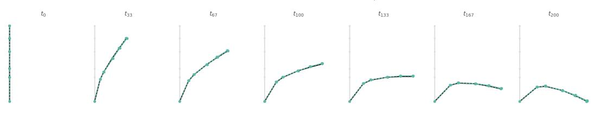

## E.3 Qualitative Results

Beam3D.

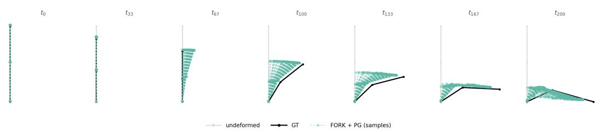

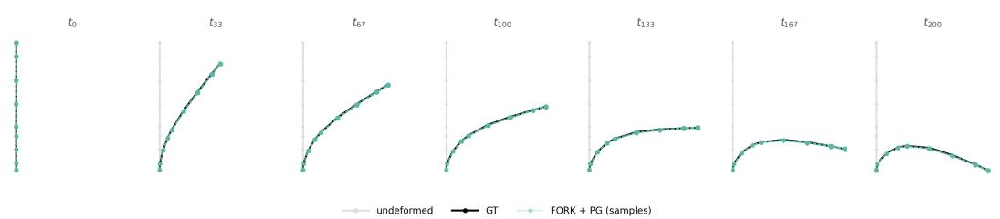

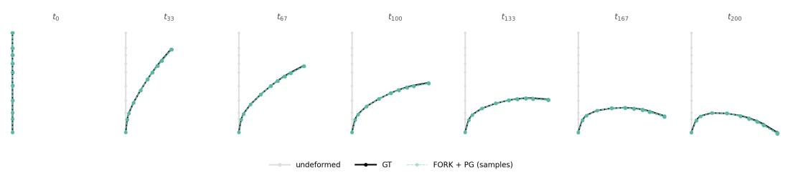  
Figure 12: Beam bending process: showing predicted (green) vs actual (black) trajectory evolution for 180 samples. Node count ranging from 3 to 11 nodes

## Allen-Cahn

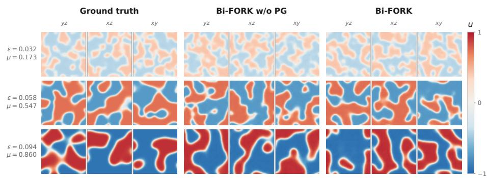  
Figure 13: Sample comparison for increasing µ and ϵ, showcasing the diversity of potential solutions compared to the ground truth.

Mechanical Metamaterials.

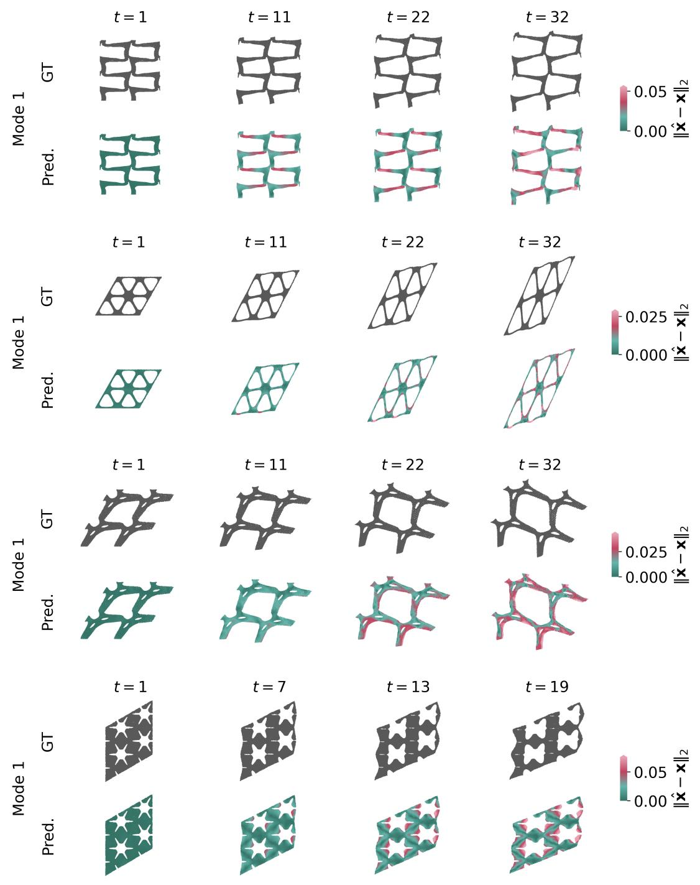  
Figure 14: Visualization of one-mode samples generated by Bi-FORK with K = 16. The ground truth is compared with the closest predicted mode.

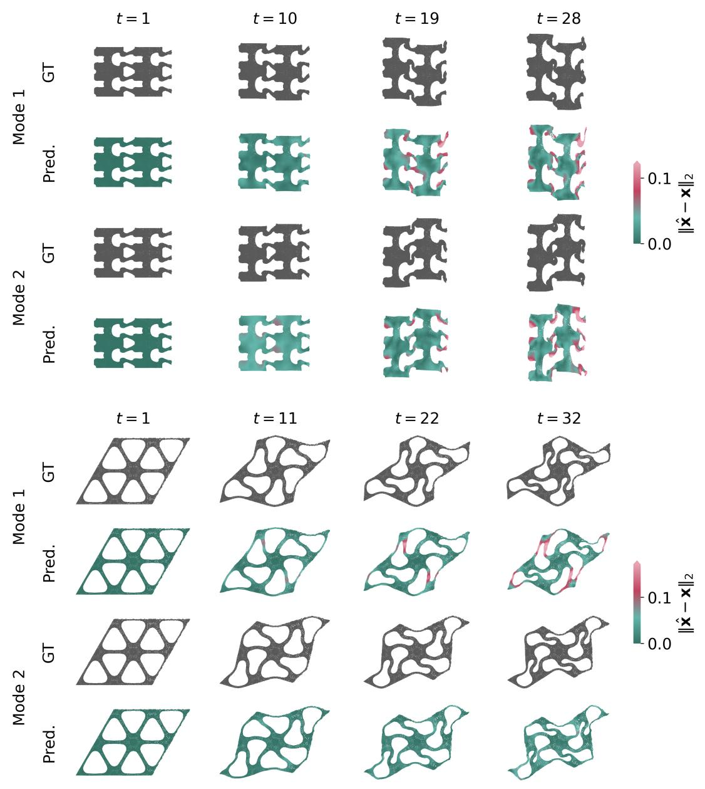  
Figure 15: Visualization of two-mode samples generated by Bi-FORK with K = 16. The ground truth is compared with the closest predicted mode.

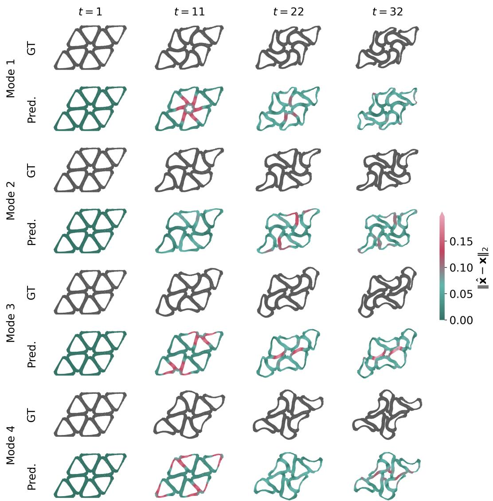  
Figure 16: Visualization of a four-mode sample generated by Bi-FORK with K = 16. The ground truth is compared with the closest predicted mode.