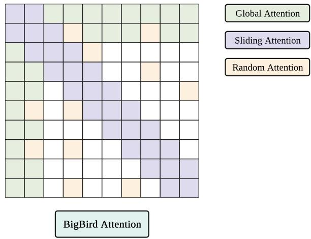
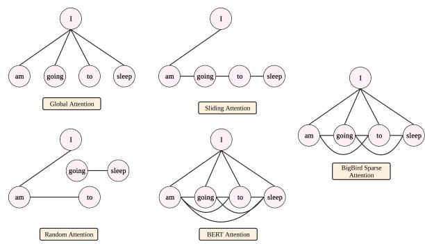
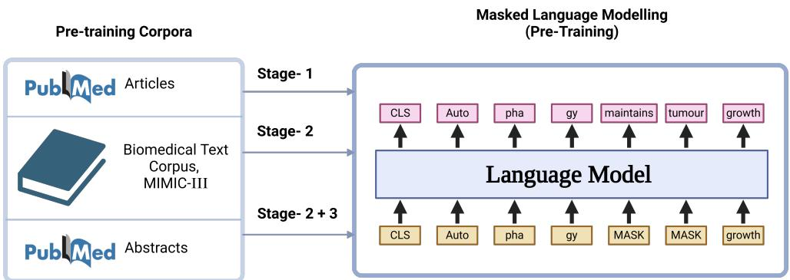
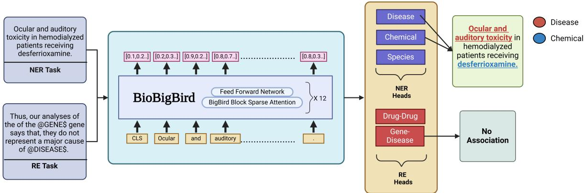

# BioBigBird: A Sparse Attention Model for Long-Range Dependency Processing in Biomedical Text

Roshan Balaji, Pavan Kumar S, Vasudev Gupta, Sreejith N, Keerthana Sridhar, Nirav Bhatt Wadhwani School of Data Science and AI, Indian Institute of Technology Madras, Chennai, India

## Abstract

While domain-specific Large Language Models (LLMs) have encoded vast biomedical knowledge, their limited context windows often hinder a deep understanding of nuanced relationships within and across texts. To address this limitation, we introduce BioBigBird, a bidirectional language model pre-trained on extensive biomedical literature and clinical data, specifically designed to handle long-range dependencies. BioBigBird leverages a sparse attention mechanism to process sequences up to 4096 tokens, and its training incorporates a multi-stage process to mitigate noise from the large-scale pre-training corpus. We further enhance its performance by employing a multitask learning (MTL) framework that jointly optimizes for Named Entity Recognition and Relation Extraction. Comprehensive evaluations on the BLURB benchmark reveal that our MTLenhanced BioBigBird achieves highly competitive results against state-of-the-art models. Our work contributes an effective methodology for developing powerful, long-context language models for specialized domains, demonstrating the value of extended sequence processing for complex text analysis. Our models are publicly available at https://huggingface.co/ collections/bisectgroup/biobigbird.

## 1 Introduction

The field of biomedicine is characterised by a massive and ever-growing volume of unstructured text, from millions of publications in repositories like PubMed (National Center for Biotechnology Information, 2011) to detailed clinical narratives in electronic health records (Johnson et al., 2016). Effectively harnessing this data requires advanced text-mining tools. Core to this endeavour are the tasks of Biomedical Named Entity Recognition (BioNER) and Relation Extraction (BioRE), which automatically identify key entities (e.g., genes, diseases, drugs) and the relationships between them.

These tasks are foundational for building structured knowledge bases, accelerating research, and discovering novel insights from the vast body of literature (Wang et al., 2023).

The advent of the Transformer architecture (Vaswani et al., 2017) and pre-trained language models like BERT (Devlin et al., 2018) has revolutionised Natural Language Processing (NLP). By learning deep bidirectional representations of text, these models achieve state-of-the-art performance on a wide range of tasks after fine-tuning. However, their success comes with a critical limitation: the self-attention mechanism at their core has a computational and memory complexity that is quadratic to the input sequence length (O(n2)). The sequence complexity restricts models like BERT to short contexts, typically 512 tokens. Consequently, input must be truncated or segmented when applied to full-text articles or lengthy clinical summaries, leading to a loss of long-range contextual information and suboptimal performance on downstream tasks.

Two key research directions have emerged to address these challenges. First, work by Gu et al. (2021) has demonstrated that pre-training language models from scratch on domain-specific corpora (e.g., biomedical text) significantly outperforms continually training a general-domain model. Their introduction of the BLURB benchmark has been instrumental in tracking progress in biomedical language understanding. Second, models like Big-Bird (Zaheer et al., 2020) have been proposed to overcome the sequence length limitation. BigBird utilises a sparse attention mechanism that reduces the complexity from quadratic to linear, enabling the processing of sequences up to 4096 tokens or longer, making it possible to analyse entire documents without truncation.

Building on these advances, this paper introduces BioBigBird, a biomedical language model designed to address the challenges of domainspecificity and long-range context holistically. Our approach makes two primary contributions. First, we employ a multi-stage curriculum learning strategy for pre-training. We begin training with shorter sequences (512 tokens) to efficiently learn fundamental linguistic patterns and stabilise the model, before graduating to longer sequences (up to 4096 tokens) to capture complex, long-range dependencies. This staged approach, which preserves optimiser states across stages, is more computationally efficient and effective than training on long sequences from the outset.

Second, to maximise performance on biomedical tasks, we integrate a multi-task learning (MTL) framework for fine-tuning. As different BioNER and BioRE datasets are often annotated for distinct entity and relation types, MTL allows a single model to learn from multiple datasets simultaneously. MTL encourages the model to learn shared, generalisable representations, improving performance and data efficiency, a principle shown to be effective in prior work (Crichton and Pyysalo, 2017; Wang et al., 2018).

In summary, our contributions are:

• The development and public release of Bio-BigBird,1 a new long-sequence language model pre-trained from scratch on a comprehensive biomedical and clinical text corpus.

• A demonstration of an effective and efficient multi-stage curriculum for pre-training longcontext models in a specialised domain.

• The integration of a multi-task learning framework to synergistically improve performance on diverse BioNER and BioRE tasks.

• A comprehensive evaluation on the BLURB benchmark, showing that BioBigBird achieves highly competitive results compared to existing state-of-the-art models.

## 2 Background and Related Work

## 2.1 Domain-Specific Pre-Training

In natural language processing, domain-specific pre-training is an approach to improve the performance of models within specialized domains (Gu et al., 2021). Our research focused on the biomedical field, where we aimed to optimize the model’s understanding of complex language structures and domain-specific terminologies. To achieve this, we utilized biomedical corpora. The resulting model is expected to perform better and be more applicable to tasks within the biomedical domain. Our study showcases the effectiveness of this targeted approach in improving the model’s domain-specific capabilities.

## 2.2 BigBird Attention Mechanism

The attention mechanism calculates the attention weights by applying a softmax function to the scaled dot-product of the query and key matrices. These attention weights are multiplied by the value matrix to obtain the final output.

In this work, we employed the BigBird architecture, a transformer-based model known for efficiently handling longer sequences. The architecture’s key feature is its ability to capture long-range dependencies by processing the input sequence in chunks, thereby reducing the computational complexity of the model. Our BigBird model consisted of 12 transformer layers, each with 768 hidden units and 12 attention heads, resulting in ≈113M trainable parameters. This design ensured that our model could capture complex patterns in biomedical literature, which often span long sequences and require processing vast amounts of data. The selection of the BigBird architecture was a crucial factor in developing a high-performing domain-specific language model.

The attention mechanism is described as follows:

$$
{ \mathrm { A t t e n t i o n } } ( \mathbf { Q } , \mathbf { K } , \mathbf { V } ) = { \mathrm { s o f t m a x } } \left( { \frac { \mathbf { Q } \mathbf { K } ^ { \top } } { \sqrt { d _ { k } } } } \right) \mathbf { V }\tag{1}
$$

where Q, K, and V are the query, key, and value matrices, consisting of queries and keys of dimension $d _ { k }$ and values of dimension $d _ { v }$ . Each element in $\mathbf { Q }$ is mapped to an element in K with a value in $\mathbf { V } .$

The key and value matrices are selected based on the global, sliding, and random connections as shown in Figure 1.

We explain the BigBird architecture in the following sections.

## 2.2.1 Global Attention

In global attention, each query attends to all the other tokens in the sequence and is attended to by all the tokens. Figure 1 corresponds to the global attention mechanism, wherein the first, second, and last tokens are considered global tokens. The computational complexity is O(n).

  
Figure 1: Attention mechanism used in BigBird. The white colour indicates the absence of attention. Random, global, and sliding connections are combined to compute the attention scores for longer sequences efficiently.

  
Figure 2: The comparison of BERT and BigBird attention mechanisms.

## 2.2.2 Sliding Attention

In sliding attention, each query attends to its neighbouring tokens. This can be implemented by copying the sequence of key tokens two times and shifting every element to the right in one of the copies and to the left in the other. The final attention score can be computed by multiplying query sequence vectors by these three sequences. The computational complexity is O(n).

## 2.2.3 Random Attention

In random attention, each query token attends to a few random tokens. This means the model randomly gathers some tokens and computes their attention score. The computational complexity is $O ( n )$

## 2.2.4 Graph Theory View

BigBird attention can be understood with graph theory. Figure 2 shows global, sliding, and random connections in the graph theory. Each node corresponds to a token, and each line represents the attention score. If no connection is made between two tokens, then the attention score is assumed to be 0.

When the model needs to share information between two nodes (or tokens), information can travel across various other nodes in the path since all the nodes are not directly connected in a single layer. For example, suppose the model needs to associate ‘going’ with ‘sleep’. In that case, if only sliding attention is present, the flow of information among those two tokens can be defined by the path: going → to → sleep (i.e., it will have to travel over one other token). Hence, we may need multiple layers to capture the entire sequence of information. BERT attention can capture this in a single layer. If we introduce some global tokens, information can travel via the path: going → I → sleep (which is shorter). If we introduce random connections, it can travel via going → sleep. With the help of random connections and global connections, information can travel rapidly (with just a few layers) from one token to the next.

If we have many global tokens, we may not need random connections since there will be multiple short paths through which information can travel.

## 2.3 Masked Language Modelling

We utilized a Masked Language Modeling (MLM) approach, as described by Devlin et al. (2018), to pre-train the BioBigBird model. This approach helps the model understand a language’s syntactic structures better. MLM is a fundamental technique used in natural language processing. It involves masking a percentage of tokens in a given text and asking the model to predict the masked tokens based on contextual information from the surrounding words. The MLM objective enables the representation to fuse the left and the right context, which allows us to pre-train a deep bidirectional Transformer. This contributes to developing a robust and context-aware language model for improved performance in downstream natural language processing tasks.

  
Figure 3: Overview of our approach BioBigBird: We collect documents related to the biomedical corpora and use a three-stage approach to pre-train the language model using masked language modelling.

Table 1: Statistics of the pre-training datasets.
<table><tr><td>Dataset</td><td></td><td>Disk Space # Samples # Tokens</td><td></td></tr><tr><td>PubMed Articles</td><td>80 GB</td><td>2.3 M</td><td>10 B</td></tr><tr><td>PubMed Abstracts</td><td>31 GB</td><td>42 M</td><td>10 B</td></tr><tr><td>MIMIC-III</td><td>3.5 GB</td><td>2M</td><td>2B</td></tr></table>

Table 2: Statistics of the PubMed articles before and after pre-processing.

## 3 Methodology

<table><tr><td>Dataset</td><td>Disk Space</td><td># Samples</td></tr><tr><td>Raw Articles</td><td>300 GB</td><td>4.7 M</td></tr><tr><td>Pre-processed Articles</td><td>80 GB</td><td>2.3 M</td></tr></table>

## 3.1 Pre-training Corpus

## 3.2 Multi-Stage Pre-training Strategy

The datasets used to pre-train BioBigBird are from PubMed and MIMIC-III. PubMed is a database of abstracts and references in the biomedical field. All the abstracts available in the database till 2021 are collected for model pre-training. The freely available articles are also collected for the same. MIMIC-III is a freely available critical care database. It contains de-identified electronic health records of over 40,000 patients who were admitted to the intensive care units of Beth Israel Deaconess Medical Center between 2001 and 2012. The statistics of the datasets are shown in Tables 1 and 2. We applied a rigorous pre-processing pipeline to the PubMed articles corpus. To ensure content quality, we retained only articles that contained both an introduction and a conclusion section and had a minimum length of 512 tokens. We further refined the dataset by removing duplicate articles, figures, tables, and any lines where more than 70% of the characters were numeric. For the final training data, we used only the textual content from the introduction and conclusion sections, truncating any documents longer than 4096 tokens.

Pre-training a language model on a large corpus of text is crucial for effectively performing downstream tasks. In this study, we pre-trained our model on an extensive corpus of the biomedical literature, including PubMed full articles and clinical data such as MIMIC-III, using a multi-stage pre-training approach as shown in Figure 3. Our model underwent three stages of pre-training, with each stage designed to enhance the model’s ability to capture complex patterns in biomedical language. In stage 1, we pre-trained on PubMed full articles up to a sequence length of 4096, enabling our model to learn long-range dependencies in the biomedical literature. In stage 2, we continued pretraining the model from stage 1 on MIMIC-III and PubMed abstracts up to a sequence length of 1024, which allowed our model to capture variations in language and terminology across different domains. Finally, in stage 3, we continued pre-training the model from stage 2 on PubMed abstracts up to a sequence length of 512, further refining the model’s ability to understand the language of biomedical research articles. Each pre-training stage was carried out for a specific number of steps, with stage 1 taking 1.89M steps, stage 2 taking 1.37M steps, and stage 3 taking 1.5M steps. This multi-stage pretraining approach equipped our model with a deep understanding of biomedical literature’s complex structures and relationships, making it well-suited for downstream biomedical language understanding tasks.

## 3.3 Fine-tuning Strategies

The Named Entity Recognition (NER) problem involves analyzing a sentence with multiple tokens $[ t _ { 1 } , t _ { 2 } , \ldots , t _ { n } ]$ and predicting whether each token belongs to the categories B, I, or O. Here, B signifies the beginning of an entity, I indicates being inside an entity, and O denotes being outside any entity. The goal is to assign these labels to each token.

The relation extraction (RE) problem is a task that identifies and classifies relationships between entities mentioned in the text. The nature of these relationships is determined by the specific entities mentioned within the text.

## 3.3.1 Single-Task Fine-tuning

A common strategy for fine-tuning models for NER and RE involves a single-task approach. In this method, separate models are fine-tuned for each specific entity type, as annotated datasets usually have only one or a few types of entities mentioned. The single-task model has a straightforward architecture, where the output from a pre-trained model is fed into a classification output layer. In the context of RE, the output from the pre-trained model is in the form of pooled output. On the other hand, for NER, the output is at the token level. The following are the definitions of loss functions for NER and RE in single-task settings.

Let $D _ { \mathrm { N E R } }$ be a NER dataset with n training texts, each having length $L .$ The loss function LNER is defined as follows:

$$
\begin{array} { l } { { \displaystyle { \cal D } _ { \mathrm { N E R } } = \{ ( t o k e n _ { i } , y _ { i } ) _ { j } \} , \quad \forall j \in \{ 1 , \dots , n \} } } \\ { { \displaystyle \quad \quad } } \\ { { \displaystyle { \cal L } _ { \mathrm { N E R } } = - \sum _ { j = 1 } ^ { n } \sum _ { i = 1 } ^ { L } \log P ( \hat { y } _ { i } ) } } \end{array}
$$

where $P ( \hat { y } _ { i } )$ represents the model’s predicted probability for the correct class $y _ { i }$ of each token.

Let $D _ { \mathrm { R E } }$ be a RE dataset with n training texts. The loss function $L _ { \mathrm { R E } }$ is defined as follows:

$$
\begin{array} { c } { { \displaystyle D _ { \mathrm { R E } } = \{ ( t e x t , y ) _ { j } \} , \quad \forall j \in \{ 1 , \dots , n \} } } \\ { { \displaystyle L _ { \mathrm { R E } } = - \sum _ { i = 1 } ^ { n } \log P ( \hat { y } _ { i } ) } } \end{array}
$$

where $P ( \hat { y } _ { i } )$ represents the probability assigned by the model to the correct class $y _ { i }$ for each text during classification.

For each task, separate models are trained using appropriate loss functions.

## 3.3.2 Multi-task Fine-tuning

This research addresses NER and RE challenges by proposing a multi-task learning framework that simultaneously tackles both tasks. The proposed method extends the multi-task learning paradigm to the sub-tasks within NER and RE. For example, some of the various tasks involved are disease entity recognition, chemical entity recognition, drug-drug relation extraction, chemical-disease relation extraction, etc. The primary goal is to enhance the overall performance of NER and RE by leveraging shared representation learning.

An important characteristic of the BioNER and BioRE tasks is the limited availability of supervised training data. We propose a multi-task learning approach to address this problem by training models on datasets with different entity types and relationships while sharing parameters. We hypothesize that the proposed approach can make more efficient use of the data and encourage the models to learn representations of words and characters (shared between multiple corpora) more effectively and generalize.

We define the multi-task setting as follows. Assume that we have E datasets $\left( D _ { e } , \ e \in \ \mathsf { \Gamma } \right)$ $\{ 1 , \ldots , E \} )$ for the NER task, each consisting of various entities like disease, chemicals, protein, etc. Each dataset consists of $n _ { e }$ training texts, with length $L$ . We define the loss function in the NER task $L _ { \mathrm { n e r } }$ as follows:

$$
\begin{array} { c } { \displaystyle { D _ { e } = \big \{ \big ( t o k e n _ { i } , y _ { i } \big ) _ { j } \big \} , \quad \forall j \in \big \{ 1 , \dots , n _ { e } \big \} } } \\ { \displaystyle { L _ { \mathrm { n e r } } = - \sum _ { e = 1 } ^ { E } \sum _ { j = 1 } ^ { n _ { e } } \sum _ { i = 1 } ^ { L } \log P ( \hat { y } _ { i } ) } } \end{array}
$$

where $P ( \hat { y } _ { i } )$ represents the model’s assigned probability for the correct class $y _ { i }$ of each token. The higher this probability, the lower the loss.

Now, for relation extraction, we have R datasets $( D _ { r } , r \in \{ 1 , \ldots , R \} )$ , each consisting of $n _ { r }$ sentences with entities mentioned. Each dataset has relations between two entities. We define each dataset and loss function in the RE task as follows:

$$
\begin{array} { c } { { D _ { r } = \{ ( t e x t , y ) _ { j } \} , \quad \forall j \in \{ 1 , \dots , n _ { r } \} } } \\ { { \ } } \\ { { L _ { \mathrm { r e } } = - \displaystyle \sum _ { r = 1 } ^ { R } \sum _ { i = 1 } ^ { n _ { r } } \log P ( \hat { y } _ { i } ) } } \end{array}
$$

where $P ( \hat { y } _ { i } )$ represents the probability assigned by the model to the correct class $y _ { i }$ for each text during classification.

Table 3: Biomedical named entity recognition datasets.
<table><tr><td>Dataset</td><td>Entity Type</td></tr><tr><td>NCBI Disease (Doğan et al., 2014)</td><td>Disease</td></tr><tr><td>BC5CDR (Li et al., 2016)</td><td>Disease</td></tr><tr><td>BC5CDR (Li et al., 2016)</td><td>Drug/Chem.</td></tr><tr><td>BC4CHEMD (Krallinger et al., 2014) Drug/Chem.</td><td></td></tr><tr><td>BC2GM (Smith et al., 2008)</td><td>Gene</td></tr><tr><td>JNLPBA (Collier and Kim, 2004)</td><td>Biological Molecules</td></tr><tr><td>LINNAEUS (Gerner et al., 2010)</td><td>Species</td></tr><tr><td>Species-800 (Pafilis et al., 2013)</td><td>Species</td></tr></table>

Table 4: Biomedical relation extraction datasets.
<table><tr><td>Dataset</td><td>Entity Type</td></tr><tr><td>GAD (Bravo et al., 2015)</td><td>Gene-disease</td></tr><tr><td>DDI (Herrero-Zazo et al., 2013)</td><td>Drug-drug</td></tr><tr><td>ChemProt (Krallinger et al., 2017) Protein-chemical</td><td></td></tr></table>

Finally, the overall loss function in the multi-task setting is defined as follows:

$$
L _ { \mathrm { o v e r a l l } } = L _ { \mathrm { n e r } } + L _ { \mathrm { r e } }
$$

The model’s architecture, as illustrated in Figure 4, uses a transformer-based encoder. We have tried all three stages of BioBigBird to investigate its performance. Each task has its own classification head in the model. Token-level outputs are extracted for the NER task, which are subsequently directed toward a corresponding entity head for classification. For the RE task, an average pooling operation is applied to the outputs, and the pooled representations are fed into a relation extraction head depending on the entities present in the input.

## 4 Experimental Setup

## 4.1 Datasets

Tables 3 and 4 present the details of the datasets used to train our model, encompassing both the BLURB benchmark and some additional datasets for NER and RE tasks. In the following paragraphs, we provide descriptions of each dataset.

BC5CDR The dataset addresses gaps in existing biomedical datasets, offering comprehensive annotations for chemical-disease entities, crucial for enhancing text-mining systems in drug discovery and biocuration. The corpus comprises 1,500 PubMed articles with 4,409 annotated chemicals, 5,818 diseases, and 3,116 chemical-disease interactions.

NCBI-Disease The NCBI disease corpus, comprising 793 PubMed abstracts, offers rich disease annotations. The corpus, with 6,892 mentions, is valuable for advancing biomedical natural language processing.

BC4CHEMD BC4CHEMD is a dataset consisting of 10,000 PubMed abstracts, totaling 84,355 chemical entity mentions.

BC2GM BC2GM is a dataset used for the BioCreative II gene mention tagging task. It contains 20,000 sentences from abstracts of biomedical publications and is annotated with 24,583 mentions of the names of genes and related entities.

JNLPBA JNLPBA is the dataset for the Joint Workshop on NLP in Biomedicine and its Application Shared task. The GENIA Project was organized based on the annotations of the GENIA Term corpus and consists of 2,404 publication abstracts. It is widely used for evaluating multi-class biomedical entity taggers.

LINNAEUS The LINNAEUS corpus comprises 100 randomly selected full-text documents from the PMCOA document set. Each instance of species terms has been annotated manually in this corpus.

Species-800 Species-800 is a corpus for species entities. It comprises 800 PubMed abstracts that contain identified organism mentions.

GAD The Gene Associations Database (GAD) compiles gene-disease associations from genetic association studies. It is a valuable resource for researchers exploring the genetic basis of diseases.

DDI The DDI dataset focuses on drug-drug relations, which are crucial for patient safety and cost-effective healthcare. The DDI extraction 2013 corpus is a collection of 792 texts selected from the DrugBank database and 233 other Medline abstracts.

ChemProt The ChemProt dataset comprises 1,820 PubMed abstracts featuring chemical-protein interactions annotated by domain experts, utilized in the BioCreative VI text mining shared task.

## 4.2 Implementation Details

Our BioBigBird model is based on the Flax implementation of BigBird from the HuggingFace Transformers library (Wolf et al., 2019). To prepare our data, we first trained a custom text tokenizer on the PubMed articles corpus, creating a vocabulary of 32,000 tokens. The entire pre-training process was conducted for 15 days on a single TPU v2-8, during which the model was trained on a total of 22 billion tokens.

  
Figure 4: Overview of our multi-task architecture: we fine-tune the BioBigBird model using this method.

For downstream NER and RE tasks, the Bio-BigBird encoder generates a 768-dimensional embedding for each token. This output serves as the shared input for all task-specific heads. For NER tasks, the token embeddings are passed to a classification head consisting of a single 768-unit hidden layer with ReLU activation. For RE tasks, we first apply an average pooling operation to the token embeddings to create a single 768-dimensional representation for the sequence, which is then fed into a similar classification head.

During multi-task training, batches were constructed with a mix of examples from all NER and RE tasks. All fine-tuning experiments were conducted on three GeForce GTX 1080 Ti GPUs, using the Adam optimizer with a learning rate of 2×10−5 and an epsilon of $1 0 ^ { - 8 }$ for parameter updates.

## 4.3 Evaluation

BioBigBird’s performance is evaluated on the BLURB benchmark. It is a dataset to evaluate NLP models on six tasks: 1) NER, 2) PICO annotations, 3) relation extraction, 4) document classification, 5) sentence similarity, and 6) question answering. The named entities used for model performance evaluation are chemicals (BC5-chem), diseases (BC5-disease, NCBI-disease), gene mentions (BC2GM) and terms related to molecular biology (JNLPBA). PICO annotations are annotations of texts in abstracts such as the Patient population enrolled, the Interventions studied and to what they were Compared, and the Outcomes measured (the ‘PICO’ elements). Relation extractions used in this study are chemical-protein interaction (ChemProt), Gene-Disease association (GAD), and Drug-Disease interaction (DDI). The document classification task assigns the documents to the relevant classes. This study’s categories are hallmarks of cancer taxonomy (HoC). The sentence similarity task determines the semantic similarity between the sentences (BIOSSES). Question-answering tasks evaluate the model’s performance in answering the given input of the question (PubMed QA, BioASQ).

## 5 Results

## 5.1 Single-task Fine-Tuning

The pre-trained BioBigBird model was fine-tuned on the BLURB benchmark, a widely used benchmark for evaluating biomedical language understanding tasks. To achieve optimal performance, hyperparameters were tuned separately for each downstream task. The fine-tuning process helped the model to adapt to the specific nuances of the tasks and further improve its performance.

Our approach resulted in a highly competitive model outperforming many state-of-the-art models, including the widely-used PubMedBERT and BioLinkBERT (Yasunaga et al., 2022) (see Table 5). Specifically, our final model achieved an average F1 score of 85.55 on Named Entity Recognition (NER), an accuracy of 71.91 on question answering, a Pearson correlation of 93.51 on sentence similarity, and a Micro F1 score of 89.7 on document classification. Our approach outperforms the existing models in EBM PICO, GAD (genedisease relationships), drug-drug interactions, and document classification. It shows that the complete article information helps improve long-range dependency.

Table 5: Comparison of performance of pre-trained models on the BLURB benchmark.
<table><tr><td></td><td>PubMedBERT (Gu et al., 2021) Base (110 M)</td><td>BioLinkBERT (Yasunaga et al., 2022) Base (110 M)</td><td>BioLinkBERT (Yasunaga et al., 2022) Large (340 M)</td><td>BioBigBird Stage 3 (113 M)</td></tr><tr><td>BC5-chem (Li et al., 2016)</td><td>93.33</td><td>93.75</td><td>94.04</td><td>94.06</td></tr><tr><td>BC5-disease (Li et al., 2016)</td><td>85.62</td><td>86.10</td><td>86.39</td><td>85.18</td></tr><tr><td>NCBI-disease (Doğan et al., 2014)</td><td>87.82</td><td>88.18</td><td>88.76</td><td>85.59</td></tr><tr><td>BC2GM (Smith et al., 2008)</td><td>84.52</td><td>84.90</td><td>85.18</td><td>84.37</td></tr><tr><td>JNLPBA (Collier and Kim, 2004)</td><td>80.06</td><td>79.03</td><td>80.06</td><td>78.55</td></tr><tr><td>EBM PICO (Nye et al., 2018)</td><td>73.38</td><td>73.97</td><td>74.19</td><td>94.6</td></tr><tr><td>ChemProt (Krallinger et al., 2017)</td><td>77.24</td><td>77.57</td><td>79.98</td><td>74.45</td></tr><tr><td>GAD (Bravo et al., 2015)</td><td>82.36</td><td>84.39</td><td>84.90</td><td>88.93</td></tr><tr><td>DDI (Herrero-Zazo et al., 2013)</td><td>82.34</td><td>82.72</td><td>83.35</td><td>87.33</td></tr><tr><td>HoC (Baker et al., 2016)</td><td>82.32</td><td>84.35</td><td>84.87</td><td>89.70</td></tr><tr><td>BIOSSES (Soğancioğlu et al., 2017)</td><td>92.30</td><td>93.25</td><td>93.63</td><td>93.51</td></tr><tr><td>PubMed QA (Jin et al., 2019)</td><td>55.84</td><td>70.20</td><td>72.18</td><td>59.82</td></tr><tr><td>BioASQ (Nentidis et al., 2020)</td><td>87.56</td><td>91.43</td><td>94.82</td><td>84.00</td></tr><tr><td>BLURB Score</td><td>81.10</td><td>83.39</td><td>84.30</td><td>86.46</td></tr></table>

Table 6: Comparison of performance of multi-task BioBigBird for NER and RE tasks.
<table><tr><td></td><td>PubMedBERT (Gu et al., 2021) Base (110 M)</td><td>BioLinkBERT (Yasunaga et al., 2022) Base (110 M)</td><td>BioLinkBERT (Yasunaga et al., 2022) Large (340 M)</td><td>BERN-2 (Sung et al., 2022) (365 M)</td><td>BioBigBird Stage 3 (113 M)</td><td>BioBigBird MT-Stage 3 (120 M)</td></tr><tr><td>BC5-chem (Li et al., 2016)</td><td>93.33</td><td>93.75</td><td>94.04</td><td>N/A</td><td>94.06</td><td>95.07</td></tr><tr><td>BC5-disease (Li et al., 2016)</td><td>85.62</td><td>86.10</td><td>86.39</td><td>N/A</td><td>85.18</td><td>90.36</td></tr><tr><td>NCBI-disease (Doğan et al., 2014)</td><td>87.82</td><td>88.18</td><td>88.76</td><td>88.6</td><td>85.59</td><td>93.67</td></tr><tr><td>BC2GM (Smith et al., 2008)</td><td>84.52</td><td>84.90</td><td>85.18</td><td>83.7</td><td>84.37</td><td>91.85</td></tr><tr><td>JNLPBA (Collier and Kim, 2004)</td><td>80.06</td><td>79.03</td><td>80.06</td><td>78.40</td><td>78.55</td><td>77.40</td></tr><tr><td>BC4CHEMD (Krallinger et al., 2014)</td><td>N/A</td><td>N/A</td><td>N/A</td><td>92.8</td><td>N/A</td><td>95.01</td></tr><tr><td>LINNAEUS (Gerner et al., 2010)</td><td>N/A</td><td>N/A</td><td>N/A</td><td>92.7</td><td>N/A</td><td>83.74</td></tr><tr><td>Species-800 (Pafilis et al., 2013)</td><td>N/A</td><td>N/A</td><td>N/A</td><td>N/A</td><td>N/A</td><td>86.00</td></tr><tr><td>ChemProt (Krallinger et al., 2017)</td><td>77.24</td><td>77.57</td><td>79.98</td><td>N/A</td><td>74.45</td><td>89.38</td></tr><tr><td>GAD (Bravo et al., 2015)</td><td>82.36</td><td>84.39</td><td>84.90</td><td>N/A</td><td>88.93</td><td>78.08</td></tr><tr><td>DDI (Herrero-Zazo et al., 2013)</td><td>82.34</td><td>82.72</td><td>83.35</td><td>N/A</td><td>87.33</td><td>93.47</td></tr></table>

## 5.2 Multi-task Fine-Tuning

The pre-trained BioBigBird model was fine-tuned using a multi-task framework to improve its performance in NER and RE tasks. We report the results for stage-3 BioBigBird, which performed the best, on the BLURB benchmark (Gu et al., 2021) (see Table 6).

This approach resulted in a highly accurate model beating state-of-the-art models. The model achieves the best score on all datasets except three: JNLPBA, LINNAEUS, and GAD. The model obtained additional training data by employing multitask fine-tuning, leading to improved generalization capabilities. Multi-task model performance is substantially higher in NER datasets like BC5- Chem, BC5-disease, NCBI-disease, BC2GM and RE datasets like ChemProt and DDI. The multi-task system performs better than single-task fine-tuning on most datasets, making it a promising approach for enhanced fine-tuning.

## 6 Conclusions

We propose using BigBird, a transformer-based language model, for natural language processing tasks in the biomedical domain. BigBird is designed to efficiently handle long input sequences using a block sparse attention mechanism, which reduces the quadratic dependency on sequence length to linear. To evaluate the performance of BigBird on these tasks, we pre-train the model on a large dataset of biomedical articles, similar to PubMed-BERT, but using the full articles rather than just the abstracts. Pre-training the model on a large dataset of full biomedical articles, rather than just the abstracts, can lead to an improvement in performance because of providing more context for the model through longer sequences during training. Overall, BigBird has the potential to be a valuable tool for researchers in the biomedical field. Its ability to effectively process long sequences and achieve superior performance on a range of natural language processing tasks makes it an attractive choice for various applications in this domain.

We also introduce a multi-task approach for finetuning NER and RE tasks. This approach maximizes the utilization of annotated data within the domain. The shared representation learning enhances the overall model performance. Additionally, it offers a unified model capable of addressing different NER and RE tasks, eliminating the cumbersome process of training and saving a model for each task.

## Limitations

The usage of PubMed articles for pre-training, although rich in information content, may introduce noise in the fine-tuning stage where the typical sequence length is below 1024.

## Ethical Considerations

BioBigBird is trained on the same corpora as existing language models. The model might reflect toxic behaviour and biases such as race, gender and demography.

## References

Simon Baker, Ilona Silins, Yufan Guo, Imran Ali, Johan Högberg, Ulla Stenius, and Anna Korhonen. 2016. Automatic semantic classification of scientific literature according to the hallmarks of cancer. Bioinformatics, 32(3):432–440.

Àlex Bravo, Janet Piñero, Núria Queralt-Rosinach, Michael Rautschka, and Laura I Furlong. 2015. Extraction of relations between genes and diseases from text and large-scale data analysis: implications for translational research. BMC bioinformatics, 16:1–17.

Nigel Collier and Jin-Dong Kim. 2004. Introduction to the bio-entity recognition task at JNLPBA. In Proceedings of the International Joint Workshop on Natural Language Processing in Biomedicine and its Applications (NLPBA/BioNLP), pages 73–78.

GKO Crichton and S Pyysalo. 2017. Code supporting: A neural network multi-task learning approach to biomedical named entity recognition.

Jacob Devlin, Ming-Wei Chang, Kenton Lee, and Kristina Toutanova. 2018. BERT: Pre-training of deep bidirectional transformers for language understanding. arXiv preprint.

Rezarta Islamaj Dogan, Robert Leaman, and Zhiyong˘ Lu. 2014. NCBI disease corpus: a resource for disease name recognition and concept normalization. Journal ofbiomedical informatics, 47:1–10.

Martin Gerner, Goran Nenadic, and Casey M Bergman. 2010. LINNAEUS: A species name identification system for biomedical literature. BMC Bioinformatics, 11(1):85.

Yu Gu, Robert Tinn, Hao Cheng, Michael Lucas, Naoto Usuyama, Xiaodong Liu, Tristan Naumann, Jianfeng Gao, and Hoifung Poon. 2021. Domain-specific language model pretraining for biomedical natural language processing. ACM Transactions on Computing for Healthcare, 3(1):1–23.

María Herrero-Zazo, Isabel Segura-Bedmar, Paloma Martínez, and Thierry Declerck. 2013. The DDI corpus: An annotated corpus with pharmacological substances and drug–drug interactions. Journal of biomedical informatics, 46(5):914–920.

Qiao Jin, Bhuwan Dhingra, Zhengping Liu, William W Cohen, and Xinghua Lu. 2019. PubMedQA: A dataset for biomedical research question answering. arXiv preprint arXiv:1909.06146.

Alistair EW Johnson, Tom J Pollard, Lu Shen, Li-wei H Lehman, Mengling Feng, Mohammad Ghassemi, Benjamin Moody, Peter Szolovits, Leo Anthony Celi, and Roger G Mark. 2016. MIMIC-III, a freely accessible critical care database. Scientific data, 3(1):1–9.

Martin Krallinger, Obdulia Rabal, Saber A Akhondi, Martın Pérez Pérez, Jesús Santamaría, Gael Pérez Rodríguez, Georgios Tsatsaronis, Ander Intxaurrondo, José Antonio López, Umesh Nandal, and 1 others. 2017. Overview of the BioCreative VI chemicalprotein interaction track. In Proceedings of the sixth BioCreative challenge evaluation workshop, volume 1, pages 141–146.

Martin Krallinger and 1 others. 2014. The CHEMD-NER corpus of chemicals and drugs and its annotation principles. J Cheminform.

Jiao Li, Yueping Sun, Robin J Johnson, Daniela Sciaky, Chih-Hsuan Wei, Robert Leaman, Allan Peter Davis, Carolyn J Mattingly, Thomas C Wiegers, and Zhiyong Lu. 2016. BioCreative V CDR task corpus: a resource for chemical disease relation extraction. Database, 2016.

National Center for Biotechnology Information. 2011. PubMed help.

Anastasios Nentidis, Konstantinos Bougiatiotis, Anastasia Krithara, and Georgios Paliouras. 2020. Results of the seventh edition of the BioASQ challenge. In Machine Learning and Knowledge Discovery in Databases: International Workshops of ECML PKDD 2019, Würzburg, Germany, September 16–20, 2019, Proceedings, Part II, pages 553–568. Springer.

Benjamin Nye, Junyi Jessy Li, Roma Patel, Yinfei Yang, Iain J Marshall, Ani Nenkova, and Byron C Wallace. 2018. A corpus with multi-level annotations of patients, interventions and outcomes to support language processing for medical literature. In Proceedings ofthe conference. Associationfor Computational Linguistics. Meeting, volume 2018, page 197. NIH Public Access.

Evangelos Pafilis, Sune P Frankild, Lucia Fanini, Sarah Faulwetter, Christina Pavloudi, Aikaterini Vasileiadou, Christos Arvanitidis, and Lars Juhl Jensen. 2013. The SPECIES and ORGANISMS resources for fast and accurate identification of taxonomic names in text. PloS one, 8(6):e65390.

Larry Smith, Lorraine K Tanabe, Cheng-Ju Kuo, I Chung, Chun-Nan Hsu, Yu-Shi Lin, Roman Klinger, Christoph M Friedrich, Kuzman Ganchev, Manabu Torii, and 1 others. 2008. Overview of BioCreative II gene mention recognition. Genome biology, 9(2):1– 19.

Gizem Sogancıo˘ glu, Hakime Öztürk, and Arzucan˘ Özgür. 2017. BIOSSES: a semantic sentence similarity estimation system for the biomedical domain. Bioinformatics, 33(14):i49–i58.

Mujeen Sung, Minbyul Jeong, Yonghwa Choi, Donghyeon Kim, Jinhyuk Lee, and Jaewoo Kang. 2022. BERN2: an advanced neural biomedical named entity recognition and normalization tool. Bioinformatics, 38(20):4837–4839.

Ashish Vaswani, Noam Shazeer, Niki Parmar, Jakob Uszkoreit, Llion Jones, Aidan N. Gomez, Lukasz Kaiser, and Illia Polosukhin. 2017. Attention is all you need. arXiv preprint.

Benyou Wang, Qianqian Xie, Jiahuan Pei, Zhihong Chen, Prayag Tiwari, Zhao Li, and Jie Fu. 2023. Pretrained language models in biomedical domain: A systematic survey. ACM Computing Surveys, 56(3):1– 52.

Xuan Wang, Yu Zhang, Xiang Ren, Yuhao Zhang, Marinka Zitnik, Jingbo Shang, Curtis Langlotz, and Jiawei Han. 2018. Cross-type biomedical named entity recognition with deep multi-task learning. Bioinformatics, 35(10):1745–1752.

Thomas Wolf, Lysandre Debut, Victor Sanh, Julien Chaumond, Clement Delangue, Anthony Moi, Pierric Cistac, Tim Rault, Rémi Louf, Morgan Funtowicz, and 1 others. 2019. HuggingFace’s transformers: State-of-the-art natural language processing. arXiv preprint arXiv:1910.03771.

Michihiro Yasunaga, Jure Leskovec, and Percy Liang. 2022. LinkBERT: Pretraining language models with document links. In Proceedings of the 60th Annual Meeting of the Association for Computational Linguistics (Volume 1: Long Papers), pages 8003–8016.

Manzil Zaheer, Guru Guruganesh, Avinava Dubey, Joshua Ainslie, Chris Alberti, Santiago Ontanon,

Philip Pham, Anirudh Ravula, Qifan Wang, Li Yang, and Amr Ahmed. 2020. Big Bird: Transformers for longer sequences. arXiv preprint arXiv:2007.14062.