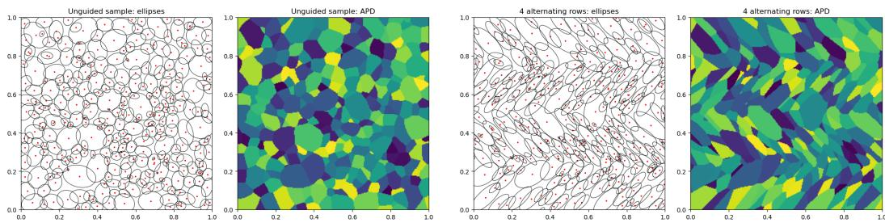
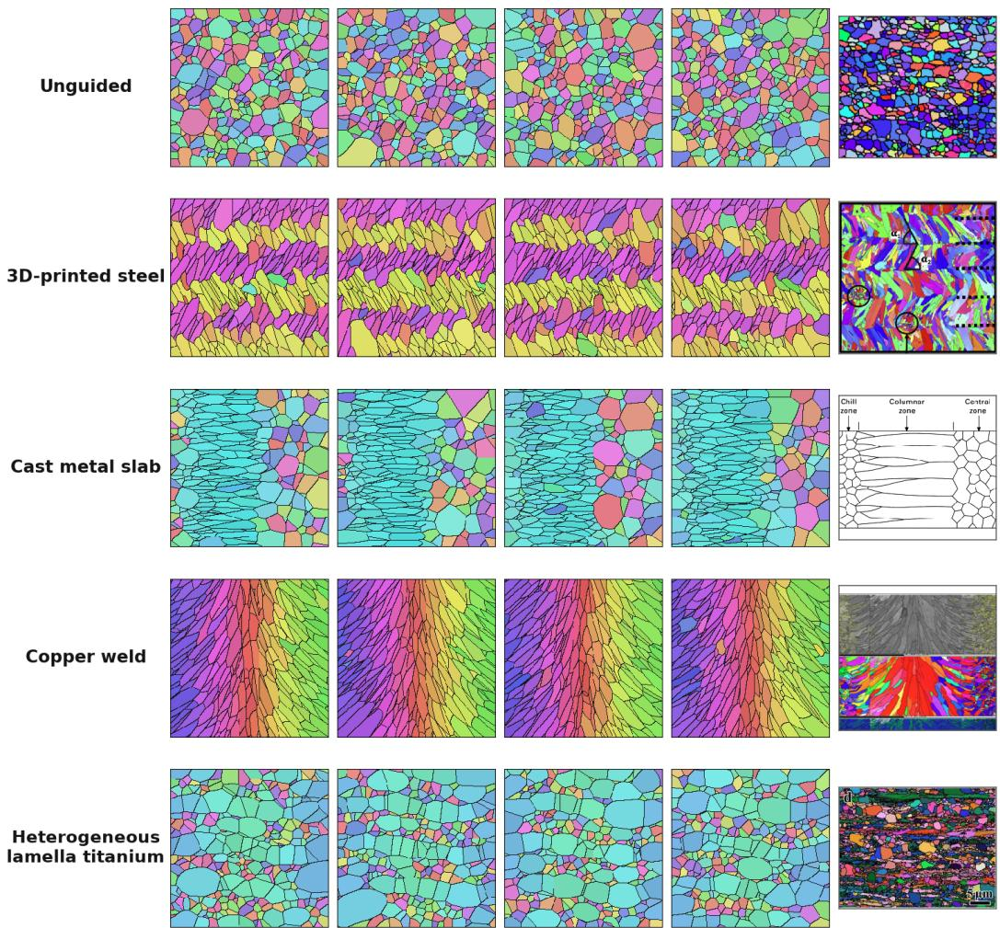

# C4-Equivariant Flow Matching on Anisotropic Power-Diagram Graphs for Microstructure Generation

Dawid Lipinski, Jixiang Qing, Henry Moss

School of Mathematical Sciences

Lancaster University

Lancaster, LA1 4YF, United Kingdom

{d.a.lipinski, j.qing, henry.moss}@lancaster.ac.uk

## Abstract

Acquiring realistic microstructure data through Electron Backscatter Diffraction (EBSD) is costly and time consuming, often relying on specialised equipment. As microstructures strongly influence material properties, generating realistic samples is essential for modelling the behaviour of polycrystalline materials. We introduce a generative model for synthesising realistic polycrystalline microstructures using flow matching and graph neural networks. By representing microstructures as anisotropic power diagrams, our model learns a compact geometric parametrisation and can render generated samples at arbitrary pixel resolution. A C4-equivariant architecture incorporates rotational symmetry directly into the model, ensuring that rotations of the input noise produce corresponding rotations of the generated microstructure. We also demonstrate how training-free guidance can be used to generate complex microstructures, based on user defined objective function. In particular, we generate microstructures resembling a copper weld, cast metal slab, 3D-printed stainless steel and heterogeneous lamella titanium.

## 1 Introduction

The properties of polycrystalline materials depend strongly on the geometry and spatial arrangement of their grains. Representative microstructures are therefore essential for modelling material behaviour and studying structure–property relationships. Although Electron Backscatter Diffraction (EBSD) [11] provides detailed experimental measurements, acquiring large and diverse datasets is costly and time-consuming. Synthetic microstructures are consequently widely used in computational materials science, with approaches ranging from tessellation-based methods to learned generative models [4, 2, 5, 12]. Learning directly from EBSD-derived images remains challenging because the available data are often limited, noisy, and too large to process as complete samples. Moreover, many existing approaches offer limited control over global characteristics of the synthesised samples, such as collective grain alignment or spatial patterns extending across the entire microstructure [2, 5].

Voronoi and power diagrams provide compact geometric representations of polycrystalline microstructures, but their ability to represent anisotropic grains and curved boundaries is limited [4]. Anisotropic power diagrams (APDs) augment ordinary power diagrams with grain-specific anisotropy, allowing directionally dependent grain geometries while retaining a compact parametric representation, while recent GPU-accelerated methods enable them to be fitted and generated efficiently [2]. Existing APD generation methods prescribe selected grain statistics but do not learn a generative distribution over complete grain configurations or directly model spatial dependencies [2]. Furthermore, control over global characteristics is typically limited to statistics specified a priori by the sampling procedure.

  
Figure 1: Unguided (left) and guided (right) samples generated by our model from the same initial noise. Each panel shows the ellipse representation on the left and the corresponding APD tessellation on the right. Guidance encourages four horizontal bands with alternating grain orientations of $+ 4 5 ^ { \circ }$ and $- 4 5 ^ { \circ }$ , resembling a microstructure pattern in 3D-printed stainless steel.

Our main contributions are:

1. We formulate polycrystalline microstructure generation as flow matching over the compact geometric parameters of an anisotropic power diagram. Each grain is represented by its position in $[ 0 , 1 ] ^ { 2 }$ and an ellipse-based parametrisation of its anisotropy; see Figure 1 for illustration. This resolution-independent representation supports variable grain counts and allows generated microstructures to be rendered at arbitrary pixel resolution.

2. We introduce a graph-based, $C _ { 4 }$ -equivariant architecture that models dependencies between grains and ensures consistent generative behaviour under rotations by multiples of $9 0 ^ { \circ }$

3. We introduce a training-free guidance framework for controlling generated microstructures through user-defined differentiable objectives. Without retraining, the framework can impose complex, spatially varying global structure, enabling the generation of diverse morphologies, including examples qualitatively inspired by copper welds, cast metal slabs, 3D-printed stainless steel and heterogeneous lamella titanium; see Figure 2. The code can be found at: https://github.com/DawidLipin/Flow\_APDs

## 2 Background

Anisotropic power diagrams. We define an anisotropy matrix $A \in \mathbb { R } ^ { 2 \times 2 }$ as a symmetric positivedefinite matrix, inducing the anisotropic norm $\| x \| _ { A } : = { \sqrt { x ^ { \top } } }$ Ax. Let $D = \{ ( x _ { i } , A _ { i } , w _ { i } ) \} _ { i = 1 } ^ { N }$ , where $x _ { i } \in [ 0 , 1 ] ^ { 2 }$ is a seed point, $A _ { i } \in \mathbb { R } ^ { 2 \times 2 }$ is an anisotropy matrix, $w _ { i } \in \mathbb { R }$ is a scalar weight, and $N$ is the number of regions. For each $i \in \{ 1 , \ldots , N \}$ , we define

$$
L _ { i } : = \left\{ x \in [ 0 , 1 ] ^ { 2 } : \| x - x _ { i } \| _ { A _ { i } } ^ { 2 } - w _ { i } \leq \| x - x _ { j } \| _ { A _ { j } } ^ { 2 } - w _ { j } \quad \forall j \in \{ 1 , \ldots , N \} \right\} .
$$

The regions $\{ L _ { i } \} _ { i = 1 } ^ { N }$ form a tessellation of $[ 0 , 1 ] ^ { 2 }$ , which we refer to as an anisotropic power diagram $\left( \mathsf { A P D } \right)$ . See Figure 1 for an illustration. Intuitively, each triple $( x _ { i } , A _ { i } , w _ { i } )$ determines one region of the tessellation. The seed $x _ { i }$ specifies its location, while $A _ { i }$ determines the associated anisotropic distance. In particular, the unit ball of $\left\| \cdot \right\| _ { A _ { i } }$ is an ellipse centred at $x _ { i }$ . The weight $w _ { i }$ controls the relative influence of the seed and therefore affects the size of the resulting region.

We associate each region with a target area $v _ { i } > 0$ , where $\begin{array} { r } { \sum _ { i = 1 } ^ { N } v _ { i } = 1 } \end{array}$ . An APD is optimal with respect to the target areas $V = \left\{ v _ { i } \right\} _ { i = 1 } ^ { N } { \mathrm { i f } } \left| L _ { i } \right| = v _ { i }$ for all $i ,$ where $| L _ { i } |$ denotes the area of region $L _ { i }$ . For fixed seed positions $x _ { i }$ , anisotropy matrices $A _ { i }$ , and target areas $v _ { i }$ , the weights $w _ { i }$ can be obtained by solving an optimal transport problem [2] so that the regions satisfy the prescribed areas. This construction allows arbitrary target tessellations to be approximated by optimising the APD parameters $\{ ( x _ { i } , A _ { i } , w _ { i } ) \} _ { i = 1 } ^ { N }$ such that the induced regions $L _ { i }$ match the target regions.

Flow matching. Flow matching trains a continuous normalising flow to transport samples from a simple source distribution $p _ { 0 }$ , typically Gaussian noise, to a target data distribution $p _ { 1 } \ [ 6 ]$ . The transformation is defined by the ordinary differential equation

$$
\frac { \mathrm { d } { \mathbf { z } } _ { t } } { \mathrm { d } t } = v _ { \theta } ( { \mathbf { z } } _ { t } , t ) , \qquad { \mathbf { z } } _ { 0 } \sim p _ { 0 } ,
$$

where $v _ { \theta }$ is a vector field constructed using a neural network. For the linear conditional path ${ \bf z } _ { t } = ( 1 - t ) { \bf z } _ { 0 } + t { \bf z } _ { 1 }$ with $t \sim \mathcal { U } ( 0 , 1 )$ and the corresponding target velocity given by ${ \bf z } _ { 1 } - { \bf z } _ { 0 }$ , this gives the simulation-free training objective

$$
\mathcal { L } _ { \mathrm { F M } } ( \theta ) = \mathbb { E } \Big [ \| v _ { \theta } ( \mathbf { z } _ { t } , t ) - ( \mathbf { z } _ { 1 } - \mathbf { z } _ { 0 } ) \| _ { 2 } ^ { 2 } \Big ] .
$$

Samples are generated by numerically integrating the learned vector field from $t = 0 \mathrm { t o } t = 1$ . In our setting, $\mathbf { z } _ { t }$ contains the APD parameters of all grains and $v _ { \theta }$ is parametrised by a graph neural network.

Training-free guidance. Following gradient-based guidance methods for diffusion and flow models [3, 14], we bias generation toward a differentiable objective $\mathcal { I }$ by instead sampling

$$
p _ { 1 } ^ { \mathcal { I } } ( \mathbf { z } _ { 1 } ) \propto p _ { 1 } ( \mathbf { z } _ { 1 } ) \exp [ - \beta \mathcal { I } ( \mathbf { z } _ { 1 } ) ] ,
$$

where $\beta$ controls the guidance strength. At time t, we estimate the terminal state by ${ \widehat { \mathbf { z } } } _ { 1 } = \mathbf { z } _ { t } + ( 1 - { \frac { } { } }$ $t ) v _ { \theta } ( { \bf z } _ { t } , t )$ and modify the velocity as

$$
\widetilde { v } _ { \theta } ( \mathbf { z } _ { t } , t ) = v _ { \theta } ( \mathbf { z } _ { t } , t ) - s ( t ) \beta \nabla _ { \mathbf { z } _ { t } } \mathcal { I } ( \widehat { \mathbf { z } } _ { 1 } ) ,
$$

where $s ( t )$ is a time-dependent schedule. The model parameters remain fixed, enabling training-free control through arbitrary differentiable APD objectives.

## 3 Equivariant flow matching on APDs

Directly modelling EBSD images is computationally expensive, as individual samples may contain millions of pixels, while generating realistic microstructures requires preserving their underlying geometric structure. We address these challenges by representing microstructures compactly as APDs and using an equivariant graph architecture that enforces consistent behaviour under rotations.

Microstructure representation. We represent a microstructure with N grains by $\begin{array} { r l } { \mathbf { z } } & { { } = } \end{array}$ $\{ ( x _ { i } , a _ { i } , w _ { i } ) \} _ { i = 1 } ^ { N }$ , where $x _ { i } \in [ 0 , 1 ] ^ { 2 }$ is the seed position, $w _ { i } \in \mathbb { R }$ its power weight, and $a _ { i } \in \mathbb { R } ^ { 2 }$ parametrises its anisotropy. This compact APD representation is independent of raster resolution and regularises small pixel-level segmentation artefacts. Details of the reparametrisation $A _ { i } \to a _ { i }$ are given in Appendix B.

Equivariant graph architecture. We represent each APD as a graph whose nodes are $\{ ( x _ { i } , a _ { i } , w _ { i } ) \} _ { i = 1 } ^ { N }$ , and whose directed edges $e _ { i , j } \in \mathbb { R } ^ { 1 5 }$ connect each source $x _ { i }$ node to its k nearest neighbours $x _ { j }$ . The invariant edge features supplied to the message-passing network are

$$
\begin{array} { r } { \phi _ { i j } = \left[ \Vert d _ { i j } \Vert ^ { 2 } , w _ { i } , w _ { j } , \Vert a _ { i } \Vert ^ { 2 } , \Vert a _ { j } \Vert ^ { 2 } , a _ { i } ^ { \top } a _ { j } , a _ { i } \times a _ { j } , a _ { i } ^ { \top } \rho ( d _ { i j } ) , a _ { j } ^ { \top } \rho ( d _ { i j } ) , b ( x _ { i } ) , b ( x _ { j } ) \right] \in \mathbb { R } ^ { 1 5 } , } \end{array}
$$

where $d _ { i j } = x _ { i } - x _ { j }$ and, for $u = ( u _ { 1 } , u _ { 2 } )$ and $\boldsymbol { v } = ( v _ { 1 } , v _ { 2 } )$ , we define $u \times v = u _ { 1 } v _ { 2 } - u _ { 2 } v _ { 1 }$ $\rho ( u ) = ( u _ { 1 } ^ { 2 } - u _ { 2 } ^ { 2 } , 2 u _ { 1 } u _ { 2 } )$ , and $b ( u ) = ( u _ { 1 } ^ { 2 } u _ { 2 } ^ { 2 } , u _ { 1 } ^ { 2 } + u _ { 2 } ^ { 2 } , u _ { 1 } ^ { 4 } + u _ { 2 } ^ { 4 } )$ encodes position relative to the square boundary while remaining $C _ { 4 }$ -invariant. These features are processed by message-passing layers conditioned on the flow time t, with aggregation ensuring permutation equivariance. The output head predicts $C _ { 4 }$ -invariant scalar coefficients multiplying geometric bases that transform equivariantly under 90◦ rotations; see Appendix C for details. Hence, for any $9 0 ^ { \circ }$ rotation R, we have $v _ { \theta } ( R \mathbf { z } , t ) = R v _ { \theta } ( \mathbf { z } , t )$ , so rotating the initial state produces the correspondingly rotated generated APD.

## 4 Experiments

Experimental setup. We trained a model with three message-passing layers, a latent dimension of 256, and $k = 1 6$ nearest neighbours. The training set contained 12,000 synthetic APDs with between 100 and 500 grains, generated using PyAPD [2]. The model was trained for 100 epochs, using the AdamW optimiser [7]. The code is available at: https: $/ / { \tt g i }$ thub.com/DawidLipin/Flow\_APDs

Training-free guidance. Following the convention in Section 2, for each APD channel $c \in \{ x , a , w \}$ we use

$$
\widetilde v _ { \theta , c } = v _ { \theta , c } - s ( t ) \sum _ { k } \lambda _ { k , c } \frac { \nabla _ { z _ { t , c } } \mathcal { I } _ { k } ( \widehat { \mathbf { z } } _ { 1 } ) } { \operatorname* { m a x } \bigl ( \mathrm { R M S } ( \nabla _ { z _ { t , c } } \mathcal { I } _ { k } ) , \epsilon \bigr ) } ,
$$

  
Figure 2: Each row shows training-free guidance of synthetic polycrystalline microstructures. The first four columns show independent samples generated by the same pretrained model, while the rightmost column presents representative experimental microstructures for qualitative comparison. The real examples are taken from (top to bottom): Buze et al. [2], Balit et al. [1], Reed-Hill [8], Savolainen et al. [10], Wu et al. [13]

where RMS stands for root mean square, $\epsilon = 1 0 ^ { - 8 }$ ensures numerical stability, and $\lambda _ { k , c }$ independently controls the effect of objective $k$ on generator positions, anisotropies, and power weights. The gradients are obtained by backpropagating both through the objective and $v _ { \theta } .$ . Normalising each gradient separately prevents its numerical scale from determining its influence. We use a cosine ramp s(t), with no guidance over the first 10% of the trajectory and recompute the neighbourhood graph as the generator positions evolve.

The four columns in Figure 2 are independent samples from the same pretrained model, using various guidance functions. Other objectives can also be used depending on the application. The 3D-printed example imposes elongated grains with alternating layer-wise directions; the cast slab combines spatially varying shape, relative grain weight, and generator-density targets for chill, columnar, and central zones; the weld objective prescribes a smoothly varying inward growth field; and the heterogeneous-lamella objective places a high-weight coarse population in wavy bands while the surrounding smaller grains remain approximately equiaxed. These objectives constrain only selected statistics, leaving the pretrained flow to determine the remaining local geometry. The guidance objectives from top to bottom are

$$
\begin{array} { r l } & { \mathcal { T } _ { \mathrm { l a y e r } } = \frac { \sum _ { i } \mathtt { s g } \left( | \ell _ { i } | \right) \rVert a _ { i } - a ^ { \star } \left( \theta _ { i } ^ { \mathrm { l a y } } , 5 . 5 \right) \rVert _ { 2 } ^ { 2 } } { \sum _ { i } \mathtt { s g } \left( | \ell _ { i } | \right) } , \quad \ell _ { i } = \operatorname { t a n h } ( 1 2 \sin ( 6 \pi y _ { i } ) ) , \quad \theta _ { i } ^ { \mathrm { l a y } } = 9 0 ^ { \circ } + 3 5 ^ { \circ } \ell _ { i } , } \\ & { \mathcal { T } _ { \mathrm { c a s t } } = \left( \left. \| a _ { i } - a _ { i } ^ { \mathrm { c a s t } } \| _ { 2 } ^ { 2 } \right. , \ \mathrm { C M S E } ( w , q ^ { \mathrm { c a s t } } ) , \left. [ x _ { i } ( i ) - \tau _ { i } ] ^ { 2 } \right. \right) , } \\ & { \mathcal { T } _ { \mathrm { w e l d } } = \left. \| a _ { i } - a ^ { \star } ( \theta _ { i } ^ { \mathrm { w e l d } } , 5 . 5 ) \| _ { 2 } ^ { 2 } \right. , \quad \theta _ { i } ^ { \mathrm { w e l d } } = { \mathrm { a t a n } } 2 ( 0 . 6 2 , 1 . 9 ( 0 . 5 - x _ { i } ) ) , } \\ & { \mathcal { T } _ { \mathrm { h l } } = \left( - \langle \log p _ { i } \rangle c - \langle \log ( 1 - p _ { i } ) \rangle _ { \mathcal { F } } , \ \mathrm { S M S E } ( w , q ^ { \mathrm { h l } } ) , \ \left. \| a _ { i } - a _ { i } ^ { \mathrm { b a n d } } \| _ { 2 } ^ { 2 } \right. _ { \mathcal { F } } + \left. \| \sigma _ { a } a _ { i } \| _ { 2 } ^ { 2 } \right. _ { \mathcal { F } } \right) . } \end{array}
$$

where for compactness, we write $\begin{array} { r } { a ^ { \star } ( \theta , r ) = - \frac { \log r } { \sigma _ { a } } \bigl ( \cos ( 2 \theta ) , \sin ( 2 \theta ) \bigr ) , \langle f _ { i } \rangle _ { \mathcal { S } } = \frac { 1 } { | \mathcal { S } | } \sum _ { i \in \mathcal { S } } f _ { i } } \end{array}$ , sg for the stop-gradient, and CMSE and SMSE for the centred and sorted MSE respectively. For the cast $\mathrm { o b j e c t i v e } , a _ { i } ^ { \mathrm { c a s t } } , q _ { i } ^ { \mathrm { c a s t } }$ , and $\tau _ { i }$ prescribe the cast-slab shape, relative-weight, and generator-density profiles. For the heterogeneous-lamella objective, C and $\mathcal { F }$ are the coarse and fine populations, $p _ { i }$ is the band-membership target, $q _ { i } ^ { \mathrm { h l } }$ is a two-level relative-weight target, and $a _ { i } ^ { \mathrm { b a n \hat { d } } }$ aligns coarse grains with the local band tangent. Components of vector-valued objectives are differentiated and RMS-normalised separately. Their precise definitions and all guidance strengths are given in Appendix A. We selected the target parameters and guidance strengths manually to obtain qualitative agreement with the representative experimental microstructures. These values need not be optimal and, for a given application, may instead be specified using domain knowledge, tuned against an application-specific validation criterion, or estimated from real data.

## 5 Discussion

The model is currently trained only on synthetic APDs, so fidelity to higher-order experimental statistics remains unvalidated; strong or conflicting guidance may also leave the learned distribution. Future work will aim to evaluate and fine-tune the model on EBSD data, incorporate crystallographic orientation, and extend the representation to three-dimensional microstructures. Exploring alternative guidance objectives, particularly those based on physics-informed loss functions, is also a promising direction for future research.

## References

[1] Yanis Balit, Eric Charkaluk, and Andrei Constantinescu. Digital image correlation for microstructural analysis of deformation pattern in additively manufactured 316L thin walls. Additive Manufacturing, 31:100862, January 2020. ISSN 22148604. doi: 10. 1016/j.addma.2019.100862. URL https://linkinghub.elsevier.com/retrieve/pii/ S2214860419305469.

[2] M. Buze, J. Feydy, S. M. Roper, K. Sedighiani, and D. P. Bourne. Anisotropic power diagrams for polycrystal modelling: Efficient generation of curved grains via optimal transport. Computational Materials Science, 245:113317, October 2024. ISSN 0927-0256. doi: 10.1016/j.commatsci.2024.113317. URL https://www.sciencedirect.com/science/ article/pii/S092702562400538X.

[3] Hyungjin Chung, Jeongsol Kim, Michael Thompson Mccann, Marc Louis Klasky, and Jong Chul Ye. Diffusion Posterior Sampling for General Noisy Inverse Problems. September 2022. URL https://openreview.net/forum?id=OnD9zGAGT0k.

[4] Karim Hitti. Direct numerical simulation ofcomplex Representative Volume Elements (RVEs): Generation, Resolution and Homogenization. Doctoral thesis / PhD thesis, École Nationale Supérieure des Mines de Paris, 2011. NNT: 2011ENMP0054 HAL ID: pastel-00667428.

[5] Sterley Labady, Youssef Mesri, Daniel Pino Munoz, Baptiste Flipon, and Marc Bernacki. InfinityEBSD : Metrics-Guided Infinite-Size EBSD Map Generation With Diffusion Models, December 2025. URL http://arxiv.org/abs/2512.17859. arXiv:2512.17859 [condmat.mtrl-sci].

[6] Yaron Lipman, Ricky T. Q. Chen, Heli Ben-Hamu, Maximilian Nickel, and Matthew Le. Flow Matching for Generative Modeling. In The Eleventh International Conference on Learning Representations, 2023. URL https://openreview.net/forum?id=PqvMRDCJT9t.

[7] Ilya Loshchilov and Frank Hutter. Decoupled Weight Decay Regularization. September 2018. URL https://openreview.net/forum?id=Bkg6RiCqY7.

[8] Robert E. Reed-Hill. Physical Metallurgy Principles. D. Van Nostrand Company, New York, 2nd edition, 1973.

[9] Victor Garcia Satorras, Emiel Hoogeboom, and Max Welling. E(n) Equivariant Graph Neural Networks, February 2022. URL http://arxiv.org/abs/2102.09844. arXiv:2102.09844 [cs.LG].

[10] Kati Savolainen, Tapio Saukkonen, and Hannu Hänninen. Localization of Plastic Deformation in Copper Canisters for Spent Nuclear Fuel. World Journal ofNuclear Science and Technology, 2(1):16–22, December 2011. doi: 10.4236/wjnst.2012.21003. URL https://www.scirp. net/journal/paperinformation?paperid=16567.

[11] Adam J. Schwartz, Mukul Kumar, Brent L. Adams, and David P. Field, editors. Electron Backscatter Diffraction in Materials Science. Springer US, Boston, MA, 2009. ISBN 978-0- 387-88135-5 978-0-387-88136-2. doi: 10.1007/978-0-387-88136-2. URL https://link. springer.com/10.1007/978-0-387-88136-2.

[12] Samwel Sekwao, Jason Iaconis, Claudio Girotto, Martin Roetteler, Minwoo Kang, Donghwi Kim, Seunghyo Noh, Woomin Kyoung, and Kyujin Shin. End-to-End Demonstration of Quantum Generative Adversarial Networks for Steel Microstructure Image Augmentation on a Trapped-Ion Quantum Computer. April 2025.

[13] Xiaolei Wu, Muxin Yang, Fuping Yuan, Guilin Wu, Yujie Wei, Xiaoxu Huang, and Yuntian Zhu. Heterogeneous lamella structure unites ultrafine-grain strength with coarse-grain ductility. Proceedings of the National Academy of Sciences, 112(47):14501–14505, November 2015. doi: 10.1073/pnas.1517193112. URL https://www.pnas.org/doi/abs/10.1073/pnas. 1517193112.

[14] Haotian Ye, Haowei Lin, Jiaqi Han, Minkai Xu, Sheng Liu, Yitao Liang, Jianzhu Ma, James Zou, and Stefano Ermon. TFG: Unified Training-Free Guidance for Diffusion Models. November 2024. URL https://openreview.net/forum?id=N8YbGX98vc.

## A Guidance objectives and sampling details

This section gives the complete objectives and sampling settings used to produce Figure 2. Experimental reference images are used only for qualitative comparison and do not enter any objective.

Coordinates and common notation. The flow operates in normalised coordinates. To distinguish model and physical coordinates, let $\widetilde { x } _ { i } \in { \mathbb { R } } ^ { 2 }$ denote a normalised generator position and let

$$
( x _ { i } , y _ { i } ) = \frac { \widetilde { x } _ { i } } { 2 } + \left( \frac { 1 } { 2 } , \frac { 1 } { 2 } \right)
$$

be the corresponding position in the physical coordinate system. Data endpoints lie in $[ 0 , 1 ] ^ { 2 }$ , but this affine map is applied without clipping to intermediate terminal estimates, which can temporarily leave the domain. In the equations below, all spatial target fields use $( x _ { i } , y _ { i } )$ , whereas $a _ { i } \in \mathbf { \mathbb { R } } ^ { 2 }$ and $w _ { i } \in$ R denote the normalised anisotropy and weight channels. The physical log-anisotropy is $\sigma _ { a } a _ { i } ,$ where $\sigma _ { a }$ is the scalar anisotropy scale measured on the training set. The normalised spin–2 encoding of a grain whose visible long axis has angle θ and axis ratio $r \geq 1$ is

$$
a ^ { \star } ( \theta , r ) = - { \frac { \log r } { \sigma _ { a } } } { \big ( } \cos ( 2 \theta ) , \sin ( 2 \theta ) { \big ) } .
$$

Thus $a ^ { \star } ( \theta + \pi , r ) = a ^ { \star } ( \theta , r )$ and $a ^ { \star } ( \theta , 1 ) = 0$ , as required for unoriented grain axes and equiaxed grains, respectively. Angles are in radians unless a degree symbol is shown.

We use

$$
\langle f _ { i } \rangle _ { S } = \frac { 1 } { | S | } \sum _ { i \in S } f _ { i } , \qquad \langle f _ { i } \rangle = \frac { 1 } { N } \sum _ { i = 1 } ^ { N } f _ { i } .
$$

For a non-negative pairwise kernel $K _ { i j }$ , we also write

$$
\langle H _ { i j } \rangle _ { K } = \frac { \sum _ { i \neq j } K _ { i j } H _ { i j } } { \sum _ { i \neq j } K _ { i j } } .
$$

For scalar vectors $u , v \in \mathbb { R } ^ { N }$ , define

$$
\mathrm { C M S E } ( u , v ) = \frac { 1 } { N } \sum _ { i = 1 } ^ { N } \left[ ( u _ { i } - \bar { u } ) - ( v _ { i } - \bar { v } ) \right] ^ { 2 } ,
$$

$$
\mathrm { S M S E } ( u , v ) = \frac { 1 } { N } \sum _ { i = 1 } ^ { N } \left[ ( u - \bar { u } ) _ { ( i ) } - ( v - \bar { v } ) _ { ( i ) } \right] ^ { 2 } ,
$$

where ${ \bar { u } } = N ^ { - 1 } \sum _ { i } u _ { i }$ , and $( \cdot ) _ { ( i ) }$ denotes the ith order statistic. CMSE constrains relative APD weights without fixing their irrelevant additive gauge; SMSE also removes dependence on grain labels. For the two anisotropy components, the implementation uses the componentwise mean-squared error

$$
\operatorname { M S E } _ { a } ( u , v ; \mathcal { S } ) = \frac { 1 } { 2 | \mathcal { S } | } \sum _ { i \in \mathcal { S } } \| u _ { i } - v _ { i } \| _ { 2 } ^ { 2 } .
$$

The factor $1 / 2$ simply averages over the two anisotropy components. Global positive rescalings of an individual objective have no effect after the gradient normalisation described below.

Endpoint guidance and numerical integration. At time t, the model gives the first-order terminal estimate

$$
\widehat { \mathbf { z } } _ { 1 } ( \mathbf { z } _ { t } ) = \mathbf { z } _ { t } + ( 1 - t ) v _ { \theta } ( \mathbf { z } _ { t } , t ) .
$$

For objective $\mathcal { T } _ { k }$ and state channel $c \in \{ x , a , w \}$ , let

$$
g _ { k , c } = \nabla _ { z _ { t , c } } \mathcal { J } _ { k } ( \widehat { \mathbf { z } } _ { 1 } ( \mathbf { z } _ { t } ) ) , \qquad \operatorname { R M S } ( g _ { k , c } ) = \left( \frac { 1 } { D _ { c } } \sum _ { j = 1 } ^ { D _ { c } } g _ { k , c , j } ^ { 2 } \right) ^ { 1 / 2 } ,
$$

where $D _ { c }$ is the number of scalar entries in channel c. Gradients pass through both the objective and vθ in the terminal estimate. The guided velocity is

$$
\widetilde v _ { \theta , c } = v _ { \theta , c } - s ( t ) \sum _ { k } \lambda _ { k , c } \odot \frac { g _ { k , c } } { \operatorname* { m a x } \{ \mathrm { R M S } ( g _ { k , c } ) , 1 0 ^ { - 8 } \} } ,
$$

where $\odot$ denotes componentwise multiplication. A scalar $\lambda _ { k , c }$ is broadcast over a channel, while $\lambda _ { k , x } = ( \lambda _ { x } ^ { ( 1 ) } , \lambda _ { x } ^ { ( 2 ) } )$ permits different horizontal and vertical position strengths. Each objective– channel pair is RMS-normalised separately before the corrections are summed. The scalar strength $\beta$ in Section 2 is therefore absorbed into the experimentally used $\lambda _ { k , c } .$ . Table 1 provides the specific guidance strengths used.

The schedule has a 10% unguided warm-up followed by a cosine ramp,

$$
s ( t ) = \left\{ \begin{array} { l l } { 0 , } & { 0 \leq t \leq t _ { 0 } , } \\ { \displaystyle { \frac { 1 } { 2 } } \left[ 1 - \cos \left( \pi \frac { t - t _ { 0 } } { 1 - t _ { 0 } } \right) \right] , } & { t _ { 0 } < t \leq 1 , } \end{array} \right. \qquad t _ { 0 } = 0 . 1 0 .
$$

All samples in the figure use $N = 3 0 0$ generators, $k = 1 6$ nearest neighbours, and $K = 6 0$ Euler steps with $t _ { n } = n / K$ and

$$
{ \bf z } _ { n + 1 } = { \bf z } _ { n } + \frac { 1 } { K } \widetilde { v } _ { \theta } ( { \bf z } _ { n } , t _ { n } ) .
$$

Each normalised channel of the base state is sampled independently from a standard Gaussian. The four generated columns use random seeds 117, 237, 377, and 527, respectively; within a column, every row starts from the same base state. The k-nearest-neighbour graph is recomputed after every step as generator positions evolve. The updated state is detached before the next step, so the method differentiates through the current terminal estimate but not through the complete integration history. Neighbour selection is discrete: gradients pass through the network evaluated on the current edge set, but not through the choice of the k nearest neighbours. The unguided row uses an empty objective set, for which $\widetilde { v } _ { \theta } = v _ { \theta }$

Layered 3D-printed structure. The smooth layer signal, target direction, and confidence are

$$
\ell _ { i } = \operatorname { t a n h } ( 1 2 \sin ( 6 \pi y _ { i } ) ) , \qquad \theta _ { i } ^ { \mathrm { l a y } } = 9 0 ^ { \circ } + 3 5 ^ { \circ } \ell _ { i } , \qquad c _ { i } = \operatorname { s g } ( | \ell _ { i } | ) ,
$$

where sg denotes stop-gradient. The signal alternates sign across six horizontal layers. The confidence removes the ambiguous orientation at layer interfaces, while detaching it prevents grains from reducing the loss merely by moving towards an interface. The objective is

$$
\mathcal { T } _ { \mathrm { l a y e r } } = \frac { \sum _ { i = 1 } ^ { N } c _ { i } \frac { 1 } { 2 } \| a _ { i } - a ^ { \star } ( \theta _ { i } ^ { \mathrm { l a y } } , 5 . 5 ) \| _ { 2 } ^ { 2 } } { \sum _ { i = 1 } ^ { N } c _ { i } } .
$$

Cast slab. Let $b _ { \mathrm { c h } } = 0 . 1 1$ and $b _ { \mathrm { c o } } = 0 . 5 8$ denote the ends of the chill and columnar regions. Smooth transitions between the chill, columnar, and core zones are constructed from

$$
\begin{array} { r l } & { u _ { i } = \mathrm { s i g m o i d } \big ( 4 5 \big ( x _ { i } - b _ { \mathrm { c h } } \big ) \big ) , ~ v _ { i } = \mathrm { s i g m o i d } \big ( 4 5 \big ( x _ { i } - b _ { \mathrm { c o } } \big ) \big ) , } \\ & { \rho _ { i } = \mathrm { c l i p } \bigg ( \displaystyle \frac { x _ { i } - b _ { \mathrm { c h } } } { b _ { \mathrm { c o } } - b _ { \mathrm { c h } } } , 0 , 1 \bigg ) . } \end{array}
$$

Writing

$$
D _ { i } = ( 1 - u _ { i } ) + u _ { i } ( 1 - v _ { i } ) + v _ { i } ,
$$

the normalised zone memberships are

$$
( m _ { i } ^ { \mathrm { c h } } , m _ { i } ^ { \mathrm { c o l } } , m _ { i } ^ { \mathrm { c o r e } } ) = \frac { ( 1 - u _ { i } , u _ { i } ( 1 - v _ { i } ) , v _ { i } ) } { D _ { i } } .
$$

The chill and core targets are equiaxed. In the columnar region the target is horizontal and its axis ratio increases from 2.2 to 9.2:

$$
a _ { i } ^ { \mathrm { c a s t } } = m _ { i } ^ { \mathrm { c o l } } a ^ { \star } ( 0 ^ { \circ } , 2 . 2 + 7 \rho _ { i } ) .
$$

The relative-weight target is

$$
q _ { i } ^ { \mathrm { c a s t } } = - 1 . 2 m _ { i } ^ { \mathrm { c h } } + ( - 0 . 2 + \rho _ { i } ) m _ { i } ^ { \mathrm { c o l } } + 1 . 4 m _ { i } ^ { \mathrm { c o r e } } .
$$

Finally, the generator-density target assigns fractions $f _ { \mathrm { c h } } = 0 . 3 4 , f _ { \mathrm { c o l } } = 0 . 4 8$ , and $f _ { \mathrm { c o r e } } = 0 . 1 8$ to the three zones. Let

$$
s _ { i } = \frac { i - \frac { 1 } { 2 } } { N } , \qquad f _ { \mathrm { c c } } = f _ { \mathrm { c h } } + f _ { \mathrm { c o l } } = 0 . 8 2 ,
$$

and define the piecewise-uniform quantile function

$$
\tau ( s ) = \left\{ \begin{array} { l l } { b _ { \mathrm { c h } } s / f _ { \mathrm { c h } } , } & { 0 \leq s < f _ { \mathrm { c h } } , } \\ { b _ { \mathrm { c h } } + ( b _ { \mathrm { c o } } - b _ { \mathrm { c h } } ) ( s - f _ { \mathrm { c h } } ) / f _ { \mathrm { c o l } } , } & { f _ { \mathrm { c h } } \leq s < f _ { \mathrm { c c } } , } \\ { b _ { \mathrm { c o } } + ( 1 - b _ { \mathrm { c o } } ) ( s - f _ { \mathrm { c c } } ) / f _ { \mathrm { c o r e } } , } & { f _ { \mathrm { c c } } \leq s \leq 1 . } \end{array} \right.
$$

With $\boldsymbol { x } _ { ( i ) }$ the sorted physical horizontal coordinates, the three independently guided cast objectives are

$$
\mathcal { T } _ { \mathrm { c a s t } } = \left( \frac { 1 } { 2 N } \sum _ { i = 1 } ^ { N } \lVert a _ { i } - a _ { i } ^ { \mathrm { c a s t } } \rVert _ { 2 } ^ { 2 } , ~ \mathrm { C M S E } ( w , q ^ { \mathrm { c a s t } } ) , ~ \frac { 1 } { N } \sum _ { i = 1 } ^ { N } [ x _ { ( i ) } - \tau ( s _ { i } ) ] ^ { 2 } \right) .
$$

Because $a _ { i } ^ { \mathrm { { c a s t } } }$ and $q _ { i } ^ { \mathrm { c a s t } }$ depend on position, their objectives may guide both position and their corresponding APD channel.

Weld structure. The target vector field and its unoriented long-axis angle are

$$
d _ { i } = \bigl ( 1 . 9 ( 0 . 5 - x _ { i } ) , 0 . 6 2 \bigr ) , \qquad \theta _ { i } ^ { \mathrm { w e l d } } = \mathrm { a t a n 2 } ( 0 . 6 2 , 1 . 9 ( 0 . 5 - x _ { i } ) ) .
$$

The field points obliquely inward from either side and becomes vertical at the centreline. Only its angle is needed by the objective:

$$
\mathcal { T } _ { \mathrm { w e l d } } = \frac { 1 } { 2 N } \sum _ { i = 1 } ^ { N } \left. a _ { i } - a ^ { \star } ( \theta _ { i } ^ { \mathrm { w e l d } } , 5 . 5 ) \right. _ { 2 } ^ { 2 } .
$$

Although $d _ { i }$ makes the construction intuitive, it is used mathematically through $\theta _ { i } ^ { \mathrm { w e l d } } = \mathrm { a r g } ( d _ { i } )$

<table><tr><td>Objective  $\mathcal { T } _ { k }$ </td><td> $\lambda _ { k , x }$ </td><td> $\lambda _ { k , a }$ </td><td> $\lambda _ { k , w }$ </td></tr><tr><td>Layer orientation</td><td>(0,0.03)</td><td>18</td><td>0</td></tr><tr><td>Cast shape</td><td>(0.02,0)</td><td>16</td><td>0</td></tr><tr><td>Cast relative weight</td><td>(0.02, 0)</td><td>0</td><td>0.30</td></tr><tr><td>Cast generator density</td><td>(0.25,0)</td><td>0</td><td>0</td></tr><tr><td>Weld orientation</td><td>0.02</td><td>18</td><td>0</td></tr><tr><td>Lamella topology</td><td>(0.04, 0.26)</td><td>0</td><td>0</td></tr><tr><td>Lamella shape</td><td>0</td><td>7</td><td>0</td></tr><tr><td>Lamella relative weight</td><td>0</td><td>0</td><td>0.36</td></tr></table>

Table 1: Guidance strengths used for Figure 2. An ordered pair gives horizontal and vertical position strengths; a scalar position strength is applied to both components. Since each gradient is RMSnormalised before scaling, the values specify correction magnitudes in normalised model coordinates.

Heterogeneous-lamella structure. Let

$$
N _ { \mathscr { C } } = \mathrm { r o u n d } ( 0 . 2 2 N ) , \qquad N _ { \mathscr { F } } = N - N _ { \mathscr { C } } .
$$

At each endpoint estimate, C contains the $N _ { \mathcal { C } }$ largest centred weights and $\mathcal { F } = \left\{ 1 , \ldots , N \right\} \backslash \mathcal { C } .$ . The partition is discrete; gradients are computed conditional on the roles selected at that step.

Four wavy bands are represented by

$$
\begin{array} { r l } & { \quad h ( x ) = 0 . 0 3 5 \sin ( 2 \pi x ) , } \\ & { \quad p _ { i } = \mathrm { s i g m o i d } [ 1 8 \left( \cos ( 8 \pi [ y _ { i } - h ( x _ { i } ) ] ) - \cos ( 0 . 2 2 \pi ) \right) ] , } \\ & { \quad \theta _ { i } ^ { \mathrm { b a n d } } = \mathrm { a t a n } 2 ( h ^ { \prime } ( x _ { i } ) , 1 ) = \mathrm { a t a n } 2 ( 0 . 0 7 \pi \cos ( 2 \pi x _ { i } ) , 1 ) . } \end{array}
$$

The threshold $\cos ( 0 . 2 2 \pi )$ makes the high-probability portion of each period approximately match the $2 2 \%$ coarse fraction. For numerical stability the logarithms use $\widehat { p } _ { i } \stackrel { \cdot } { = } \mathrm { c l i p } ( p _ { i } , 1 0 ^ { - 6 } , 1 - \stackrel { \cdot } { 1 } 0 ^ { - 6 } )$

The zero-mean two-level relative-weight target is

$$
\begin{array} { r } { q _ { i } ^ { \mathrm { h l } } = \left\{ \begin{array} { l l } { 1 . 5 5 , \quad } & { i \in { \mathcal C } , } \\ { - 1 . 5 5 N _ { { \mathcal C } } / N _ { { \mathcal F } } , } & { i \in { \mathcal F } . } \end{array} \right. } \end{array}
$$

The topology, relative-weight, and shape objectives are

$$
\mathcal { T } _ { \mathrm { h l , t o p } } = - \langle \log \widehat { p } _ { i } \rangle _ { \mathcal { C } } - \langle \log ( 1 - \widehat { p } _ { i } ) \rangle _ { \mathcal { F } } ,
$$

$$
\mathcal { T } _ { \mathrm { h l , w e i g h t } } = \mathrm { S M S E } ( w , q ^ { \mathrm { h l } } ) ,
$$

$$
\mathcal { T } _ { \mathrm { h l , s h a p e } } = \frac { 1 } { 2 N _ { C } } \sum _ { i \in \mathcal { C } } \big \| a _ { i } - a ^ { \star } ( \theta _ { i } ^ { \mathrm { b a n d } } , 1 . 6 ) \big \| _ { 2 } ^ { 2 } + \frac { 1 } { N _ { \mathcal { F } } } \sum _ { i \in \mathcal { F } } \| \sigma _ { a } a _ { i } \| _ { 2 } ^ { 2 } .
$$

The cross-entropy places the current coarse population in the bands, SMSE maintains separated coarse and fine weight populations without fixing grain labels, and the shape term weakly aligns coarse grains with the local band tangent while driving fine grains towards equiaxed shapes.

These objectives constrain only selected APD statistics. All unconstrained features continue to be determined by the pretrained flow. Consequently, the method provides approximate trainingfree control rather than exact sampling from a conditional distribution, and sufficiently strong or conflicting objectives may move samples away from the learned data manifold.

## B Anisotropy matrix parametrisation

The anisotropy matrix $A _ { i }$ defining each grain must be symmetric positive definite (SPD). Directly predicting the entries of $A _ { i }$ with an unconstrained neural network would not preserve this constraint and could therefore produce parameters that do not define a valid anisotropic norm. We instead construct an unconstrained, reversible parametrisation in which any network output corresponds to a valid anisotropy matrix.

Since $A _ { i }$ is SPD, its matrix logarithm

$$
S _ { i } = \log A _ { i } = Q _ { i } \log ( \Lambda _ { i } ) Q _ { i } ^ { \top }
$$

is real and symmetric, where

$$
A _ { i } = Q _ { i } \Lambda _ { i } Q _ { i } ^ { \top }
$$

is the eigendecomposition of $A _ { i } .$ . Conversely, exponentiating any real symmetric matrix produces an SPD matrix.

We additionally separate anisotropic shape from isotropic scale by constraining

$$
\operatorname* { d e t } A _ { i } = 1 .
$$

The overall size of the corresponding grain is controlled separately through the APD weights, while this constraint allows $A _ { i }$ to represent only anisotropic shape. Using the identity

$$
\operatorname { t r } ( \log A _ { i } ) = \log \operatorname* { d e t } A _ { i } ,
$$

the unit-determinant constraint implies

$$
\operatorname { t r } ( S _ { i } ) = 0 .
$$

Hence $S _ { i }$ is a symmetric trace-free $2 \times 2$ matrix and can be written using only two unconstrained scalars,

$$
S _ { i } = \left( \begin{array} { c c } { a _ { i , 1 } } & { a _ { i , 2 } } \\ { a _ { i , 2 } } & { - a _ { i , 1 } } \end{array} \right) , \qquad a _ { i } = ( a _ { i , 1 } , a _ { i , 2 } ) \in \mathbb { R } ^ { 2 } .
$$

The inverse transformation is simply

$$
A _ { i } = \exp ( S _ { i } ) .
$$

Since the exponential of a symmetric matrix is SPD and

$$
\operatorname* { d e t } ( \exp S _ { i } ) = \exp ( \operatorname { t r } S _ { i } ) = 1 ,
$$

every $a _ { i } \in \mathbb { R } ^ { 2 }$ corresponds to a valid unit-determinant anisotropy matrix. The network can therefore predict $a _ { i }$ without constraints while validity of the resulting APD parametrisation is preserved by construction.

This representation also gives a simple transformation rule under rotations. If R is a rotation of the spatial domain, then

$$
A _ { i } ^ { \prime } = R A _ { i } R ^ { \top } \qquad \Longrightarrow \qquad S _ { i } ^ { \prime } = R S _ { i } R ^ { \top } .
$$

For a $9 0 °$ rotation, this gives

$$
a _ { i } ^ { \prime } = - a _ { i } ,
$$

while a $1 8 0 ^ { \circ }$ rotation leaves $a _ { i }$ unchanged. This transformation law is used in the construction of the $C _ { 4 }$ -equivariant velocity field below.

## C C4-equivariant model updates

Before training, the APD parameters are transformed to numerically convenient coordinates. Seed positions originally defined on $[ 0 , 1 ] ^ { 2 }$ are mapped to

$$
\begin{array} { r } { \widetilde { x } _ { i } = 2 x _ { i } - 1 \in [ - 1 , 1 ] ^ { 2 } . } \end{array}
$$

Besides placing the positional variables on a scale comparable to the Gaussian source distribution, this centres the square domain at the origin. Consequently, rotations about the centre of the physical domain act linearly in the transformed coordinates,

$$
\widetilde { x } _ { i } \mapsto R \widetilde { x } _ { i } , \qquad R \in C _ { 4 } .
$$

The scalar APD weights are standardised using statistics computed from the training set,

$$
\widetilde { w } _ { i } = \frac { w _ { i } - \mu _ { w } } { \sigma _ { w } } .
$$

Since the weights are invariant under spatial rotations, this transformation does not affect their $C _ { 4 }$ transformation law.

The anisotropy parameters $a _ { i }$ are left centred at the origin so that their transformation law under $C _ { 4 }$ remains $a _ { i } \mapsto - a _ { i }$ for a $9 0 °$ rotation. The source state at $t = 0$ is sampled from a Gaussian distribution. Generated states are transformed back to the original APD parametrisation before

rasterisation. For notational simplicity, we omit tildes for normalised quantities throughout this section.

Our objective is to construct a velocity field satisfying

$$
v _ { \theta } ( R \mathbf { z } , t ) = R v _ { \theta } ( \mathbf { z } , t )
$$

for every rotation $R \in C _ { 4 }$ , where $C _ { 4 }$ contains rotations by multiples of $9 0 ^ { \circ }$ . Here the action of $R$ on z includes the corresponding transformations of grain positions and anisotropy parameters, while the scalar weights $w _ { i }$ remain invariant.

A standard multilayer perceptron does not in general preserve equivariance when applied directly to orientation-dependent geometric quantities. Drawing inspiration from Satorras et al. [9], we therefore separate the update into two components. First, the message-passing network operates on $C _ { 4 }$ -invariant scalar features and predicts invariant scalar coefficients. Second, these coefficients multiply fixed geometric basis vectors with known transformation properties. The learned part of the model therefore determines the magnitude of each contribution, while the geometric bases determine how that contribution transforms under rotation.

For each directed edge $\boldsymbol { e } = \left( s , r \right)$ , connecting sender s to receiver r, define the displacement

$$
d _ { e } = x _ { r } - x _ { s }
$$

and the quadratic map

$$
\rho ( d _ { e } ) = \big ( d _ { e , 1 } ^ { 2 } - d _ { e , 2 } ^ { 2 } , 2 d _ { e , 1 } d _ { e , 2 } \big ) .
$$

For a two-dimensional vector $a = ( a _ { 1 } , a _ { 2 } )$ , we also define

$$
a ^ { \perp } = ( - a _ { 2 } , a _ { 1 } ) .
$$

The message-passing network receives invariant geometric information associated with each edge given by

$$
\begin{array} { r } { \phi _ { e } = \left[ \| d _ { e } \| ^ { 2 } , w _ { s } , w _ { r } , \| a _ { s } \| ^ { 2 } , \| a _ { r } \| ^ { 2 } , a _ { s } ^ { \top } a _ { r } , a _ { s } \times a _ { r } , a _ { s } ^ { \top } \rho ( d _ { s r } ) , a _ { r } ^ { \top } \rho ( d _ { s r } ) , b ( x _ { s } ) , b ( x _ { r } ) \right] \in \mathbb { R } ^ { 1 5 } , } \end{array}
$$

where for $u = ( u _ { 1 } , u _ { 2 } )$ and $\boldsymbol { v } = ( v _ { 1 } , v _ { 2 } )$ , we define $u \times v = u _ { 1 } v _ { 2 } - u _ { 2 } v _ { 1 }$ , and $\rho ( u ) = ( u _ { 1 } ^ { 2 } -$ $u _ { 2 } ^ { 2 } , 2 u _ { 1 } u _ { 2 } ) ;$ while $b ( u ) \overset { \prime } { = } ( u _ { 1 } ^ { 2 } u _ { 2 } ^ { 2 } , u _ { 1 } ^ { 2 } + u _ { 2 } ^ { 2 } , u _ { 1 } ^ { 4 } + u _ { 2 } ^ { 4 } )$ encodes position relative to the square boundary while remaining $C _ { 4 }$ -invariant.

From the resulting edge representation, the output head predicts eleven invariant scalar coefficients,

$$
\alpha _ { e , 1 } , \ldots , \alpha _ { e , 4 } , \qquad \beta _ { e , 1 } , \ldots , \beta _ { e , 6 } , \qquad \omega _ { e } .
$$

An additional invariant attention score is normalised over the incoming edges of each receiver to obtain $\gamma _ { e }$ . The attention weight allows the model to control the relative contribution of neighbouring grains while preserving equivariance.

The contribution of edge e to the positional velocity is

$$
m _ { e } ^ { x } = \gamma _ { e } \left( \alpha _ { e , 1 } d _ { e } + \alpha _ { e , 2 } x _ { s } + \alpha _ { e , 3 } S _ { s } d _ { e } + \alpha _ { e , 4 } S _ { r } d _ { e } \right) .
$$

Here $S _ { i }$ are the symmetric trace-free $2 \times 2$ matrices, as in Appendix B. The vectors

$$
d _ { e } , \qquad x _ { s } , \qquad S _ { s } d _ { e } , \qquad S _ { r } d _ { e }
$$

transform in the same way as spatial positions under $C _ { 4 }$ . Since their coefficients and $\gamma _ { e }$ are invariant, $m _ { e } ^ { x }$ transforms equivariantly under rotations.

The contribution to the anisotropy velocity is

$$
m _ { e } ^ { a } = \gamma _ { e } \left( \beta _ { e , 1 } a _ { s } + \beta _ { e , 2 } a _ { r } + \beta _ { e , 3 } \rho ( d _ { e } ) + \beta _ { e , 4 } a _ { s } ^ { \perp } + \beta _ { e , 5 } a _ { r } ^ { \perp } + \beta _ { e , 6 } \rho ( d _ { e } ) ^ { \perp } \right) .
$$

These bases transform according to the same representation as the anisotropy parameters. In particular, under a $9 0 °$ spatial rotation,

$$
a _ { i } \mapsto - a _ { i }
$$

and

$$
\rho ( R d _ { e } ) = - \rho ( d _ { e } ) .
$$

The perpendicular quantities transform in the same way. Hence $m _ { e } ^ { a }$ has the required transformation law for an anisotropy velocity.

Finally, since the APD weight $w _ { i }$ is rotationally invariant, its edge contribution is simply

$$
m _ { e } ^ { w } = \gamma _ { e } \omega _ { e } .
$$

The node velocities are obtained by aggregating all incoming edge contributions,

$$
v _ { x _ { r } } = \sum _ { e : r ( e ) = r } m _ { e } ^ { x } , \qquad v _ { a _ { r } } = \sum _ { e : r ( e ) = r } m _ { e } ^ { a } , \qquad v _ { w _ { r } } = \sum _ { e : r ( e ) = r } m _ { e } ^ { w } .
$$

Summation preserves the transformation properties of the individual messages. Since all learned coefficients are functions only of $C _ { 4 }$ -invariant features, while each geometric basis transforms according to the required representation, the complete vector field satisfies

$$
v _ { \theta } ( R \mathbf { z } , t ) = R v _ { \theta } ( \mathbf { z } , t ) , \qquad R \in C _ { 4 } .
$$

Consequently, numerical integration of the flow preserves this equivariance: rotating the initial state by any multiple of $9 0 °$ produces the corresponding rotation of the generated APD.