# CAN JEV BE YOUR Q OR POLICY IN REINFORCEMENT LEARNING?

Yi Ma<sup>1</sup>, Tianpei Yang<sup>2</sup>, Yaodong Yang<sup>3</sup>, Weixun Wang<sup>4</sup>, Hongyao Tang<sup>5</sup> <sup>1</sup>Shanxi University, <sup>2</sup>Nanjing University, <sup>3</sup>The Chinese University of Hong Kong, <sup>4</sup>Independent Researcher, <sup>5</sup>Tianjin University

mayi@sxu.edu.cn,tianpei.yang@nju.edu.cn,yydapple@gmail.com, wxwang@tju.edu.cn,tanghongyao@tju.edu.cn

## ABSTRACT

Foundation models supply reinforcement learning (RL) with priors that mitigate its longstanding weaknesses in sample efficiency and transfer, but their token-bytoken generation makes queries sequential and costly. Jev, a recently released decision model, generates nothing and returns calibrated, typed answers in a single forward pass. Existing work studies foundation models in RL either as models to be trained or as generators to be prompted, and Jev belongs to neither category, having so far served only as a black box in single domains. How well such a model decides on its own in RL environments, and how it can improve RL as a component of training, therefore remain unaddressed. To this end, in this paper we first examine the requirements that the objects of an RL system place on the answers they consume, and establish that Jev can fulfill all of them except the cardinal use of a value function. The remaining objects form positions that admit several roles each. We then construct algorithms that employ Jev at three of these positions, as a reference policy, an exploration judge, and a replay rater, to improve sample efficiency, exploration, and learning performance. Across nine MiniGrid tasks and three Atari games, training with Jev outperforms a standard RL learner, including where the learner makes no progress alone, while the model itself remains untrained. To our knowledge, we present the first use of Jev within the RL learning process and establish a frozen decision model as a usable component of RL training, inviting further exploration of how Jev and other advanced decision models can improve RL.

## 1 INTRODUCTION

Foundation models bring strong generalization and deep priors from large-scale pre-training (Yang et al., 2023), addressing reinforcement learning’s longstanding weaknesses in sample efficiency and transfer (Ma et al., 2024; Rocamonde et al., 2024). These models, however, share a design assumption: they generate text token by token. Querying such a model is therefore a sequential act, whose cost scales with the length of the answer and with the number of questions put to it. Jev (TypeSafe AI, 2026a), a recently released decision model, discards that assumption and generates nothing. Given a text description of a situation together with a set of typed questions, it returns typed answers in a single forward pass: a choice over a declared set of options, a point on an ordered rubric, or a probability.

The difference is not only one of cost. Jev’s answers are calibrated and confined to the spaces its questions declare. These properties fall outside the assumptions of existing work, which studies foundation models in RL either as models to be trained (Chen et al., 2021; Feng et al., 2024) or as generators to be prompted (Yao et al., 2023b;a). Jev belongs to neither category. Where Jev has been applied, it has served as a black box in single domains such as crash-narrative coding, radiology, and video quality (Rafe & Das, 2026; Huang et al., 2026; Robitza, 2026; Ma et al., 2026; Wu & Lim, 2026b), and the open-source work built on it consists largely of zero-shot demonstrations. The most systematic evaluation to date is confined to text classification (Ibrahim & Zaki, 2026). What remains unasked is what a decision model of this kind can be in RL:

1 How well does Jev decide when its answers are executed directly?

2 How can Jev improve RL as a component of training?

In this paper, we answer these questions in two steps. We first ask how Jev’s function form maps onto the four objects an RL system needs: a policy, a value, a reward, and a transition model. Each object performs certain operations on its answers, and Jev can fill it when those operations are defined on one of its three answer forms. Only the cardinal use of a value function falls outside, since its update performs arithmetic on the answer. The objects it can fill group into the positions it can occupy, and each position admits several roles. We build algorithms on three of these positions: (1) learning from scratch is sample-inefficient, and Jev serves as a reference policy that guides the learning of the RL policy; (2) uniform exploration is wasteful when rewards are sparse, and Jev judges when to explore and which experience to encourage; (3) uniform replay allocates its updates to uninformative transitions, and Jev rates how much each stored transition is worth learning from. Across the three, we ask how far a frozen decision model can improve the sample efficiency of a standard RL learner, the experience it collects, and the performance it reaches.

In our experiments, we use nine MiniGrid tasks (Chevalier-Boisvert et al., 2023) and three Atari games (Bellemare et al., 2013). We first characterize what Jev can do as a decision maker under the inputs our methods supply and compare it with Qwen3-8B (Qwen Team, 2025) under a matched information interface, so that the comparison measures how each model uses the evidence rather than how much it is given. We then follow the three channels above to test whether that capability transfers to a learner with its own observations and training dynamics, each against its counterpart under a fixed interaction budget.

The main contributions of this work are summarized below:

• We formally examine Jev as a candidate for the functions an RL learner needs, and propose the four positions it can occupy, together with the roles within them.

• We build algorithms for RL with Jev from three perspectives, using it as a reference policy, an exploration judge, and a replay rater, aiming to improve sample efficiency, exploration, and learning performance.

• To our knowledge, this is the first use of Jev in the RL learning process, and we demonstrate its efficacy across nine MiniGrid tasks and three Atari games, including where the learner cannot progress alone.

## 2 BACKGROUND

## 2.1 RELATED WORK

Foundation Models for RL Foundation models are increasingly woven into reinforcement learning. Early work used them as policies, generating actions autoregressively from return and history (Chen et al., 2021) or interleaving reasoning with acting in text environments (Yao et al., 2023b). The scope has since widened (Cao et al., 2025): LLMs design reward functions by writing and evolving code (Ma et al., 2024), supply reward signals from vision-language feedback (Rocamonde et al., 2024; Wang et al., 2024), guide exploration with world knowledge (Bougie & Watanabe, 2025), and act as teachers whose guidance is distilled into a smaller learner (Zhou et al., 2024; Klissarov et al., 2025). A smaller body of work asks whether foundation models can supply value or policy priors directly (Yan et al., 2025; Zhang et al., 2024), though such priors have so far been demonstrated in text-based decision making rather than in continuous control or pixel-based benchmarks.

Querying a generative model for these roles is expensive in one of two ways: the reward and planning lineages consume many sequential generations per decision, roughly eighty per task in Ma et al. (2024), while the policy lineage consumes a single autoregressive pass whose cost grows with context length. Jev, by contrast, answers a batch of typed questions in one fixed-cost forward pass. In this paper, we explore to what degree such a model can play any of these roles in RL.

Jev and Its Applications Jev is a general-purpose decision model in essence. Given a text description of a situation and typed questions, it returns typed answers in one forward pass, generating no text. TypeSafe AI describes its training procedure, RLCD, as an alternative to RLHF and RLVR (TypeSafe AI, 2026b). Applications of Jev have followed quickly but narrowly. It has been used as a black box within a single domain at a time: coding crash narratives (Rafe & Das, 2026), scoring radiology reports (Huang et al., 2026) and video quality (Robitza, 2026), selecting actions in a realtime strategy game (Ma et al., 2026), and gating a stronger model’s decisions (Wu & Lim, 2026b). The surrounding open-source ecosystem consists largely of zero-shot demonstrations. The most systematic evaluation of a decision model to date spans eighteen text-classification tasks against nineteen LLM baselines (Ibrahim & Zaki, 2026).

None of this work measures Jev on a sequential decision, and none places it inside a learning loop. Its capability boundary in RL is therefore unmapped, and its potential as a component of training untested. This paper addresses both: we first develop a framework that determines which RL roles a closed decision model can occupy, and then test its predictions on classic control.

## 2.2 PRELIMINARIES AND NOTATION

Reinforcement Learning We consider an RL agent interacting with a Markov decision process $\boldsymbol { M } \ : = \ : ( S , A , P , r , \gamma )$ with state space $S ,$ action space $A ,$ transition kernel $P ( s ^ { \prime } \mid s , a )$ , reward function $r ,$ and discount factor $\gamma \in [ 0 , 1 )$ . The agent’s policy $\pi : S \to \Delta ( A )$ induces the actionvalue function $\begin{array} { r } { Q ^ { \pi } ( s , a ) = \mathbb { E } _ { \pi } \big [ \sum _ { t > 0 } \gamma ^ { t } r _ { t } \ \mid \ s _ { 0 } = \ s , a _ { 0 } = \ a \big ] } \end{array}$ and the value function $V ^ { \pi } ( s ) =$ $\mathbb { E } _ { a \sim \pi ( s ) } [ Q ^ { \pi } ( s , a ) ]$ . The learning objective is to find a policy maximizing $J ( \pi ) = \mathbb { E } _ { s _ { 0 } \sim \rho } [ V ^ { \pi } ( s _ { 0 } ) ]$ where $\rho$ is the initial state distribution; we write $\pi ^ { \star }$ and $\grave { Q } ^ { \star }$ for the optimal policy and its action-value function (Sutton & Barto, 2018).

The Jev Model Jev is a closed decision model (TypeSafe AI, 2026a). Let U denote the space of typed questions and X the space of texts describing a situation<sup>1</sup>, the context against which a question is posed. A question declares its own answer space $\mathcal { \partial } _ { u }$ . We write $\chi _ { Y } \subseteq { \bar { \mathcal { X } } }$ for the situations that describe an element of $Y ,$ , so that a question about a state takes a situation in $\chi _ { S }$ . A choice question names a finite set $C$ of options and answers in $\Delta ( C ) ;$ ; a score question names an ordered rubric and answers with a point on it; a noul question asserts a proposition and answers with a probability in [0, 1]. A request pairs a question $u \in \mathcal { U }$ with a situation $x \in \mathcal { X }$ and returns an answer in $\mathcal { \partial } _ { u }$

Note that the question u selects the function computed, as the same situation posed under different questions yields different functions. We write

$$
f _ { u } : \mathcal { X } \to \mathcal { V } _ { u } , \qquad f _ { u } ( x ) = \mathrm { J e v } ( u , x ) ,\tag{1}
$$

and work with $f _ { u }$ throughout. Since the model is closed, the role it plays is determined entirely by which function is selected: Jev can act as a policy when the question asks which action to take, and as a Q function when the question asks how good an action is.

In fact, a request may carry several questions at the same time, and they are answered independently of one another. We formalize with a single question per call, so that each role corresponds to one function. The remaining interface details, such as option and rubric limits, context budget, latency, and cost, are deferred to Appendix A.

## 3 JEV AS A DECISION MAKER: ITS ROLES IN RL

In this section, we first examine what an RL system requires of a function approximator, and which of those requirements Jev’s answer forms can meet. We then group the objects that survive into the positions Jev can occupy.

## 3.1 WHAT IT TAKES TO FULFILL A ROLE IN RL

An RL system asks four things of a function approximator: to choose actions $( \pi : S \to \Delta ( A ) )$ ), to value state-action pairs $( Q : S \times A \to \mathbb { R } )$ , to reward states $( R : S  \mathbb { R } )$ , and to predict next states $( P : S \times A \to \Delta ( { \bar { S } } ) )$ . All four take a state-like input and return a number or a distribution, and each of Jev’s three answer forms (i.e., choice, score, and noul) can be fitted to these shapes, since a point on a rubric is a number and a choice over options is a distribution. Therefore, what separates the roles is how the functions they represent, with specific descriptions by the question u work in RL, and a function fills a role when the operations that role applies to its answers are defined.

Reward is the least demanding of the four. It enters the objective as a sum of terms, so it needs one scale shared across states, and a score question on a fixed rubric supplies it. A policy needs a distribution over the action set, and a transition model one over the state space; a choice question supplies both whenever those sets are finite. The value function is the most demanding. Its target r+ $\gamma \operatorname* { m a x } _ { a ^ { \prime } } Q ( s ^ { \prime } , a ^ { \prime } )$ adds a reward to a value and discounts the sum, and the update fits the prediction to the result, so the answer has to be a number on a cardinal scale, where intervals are comparable, and a unit is fixed. A score answer is not, because it is a point on an ordered rubric, which fixes an order but not the distance between levels. A value can therefore be ranked but not added, multiplied, or averaged. The ordinal use of a value survives; the cardinal use does not. Table 1 shows the requirements and the verdicts.

Among the four objects, only the cardinal use of a value function is excluded. The others are admitted subject to conditions the question itself states, namely a declared finite action set for a policy, a declared finite state space for a transition model, and one shared rubric for a reward.

Table 1: The answer form required of each object and the verdict.
<table><tr><td>Object</td><td>Answer Form</td><td>Verdict</td></tr><tr><td>R</td><td>one scale over states</td><td>usable</td></tr><tr><td>π</td><td>distribution over A</td><td>usable, A finite</td></tr><tr><td>P</td><td>distribution over S</td><td>usable, S finite</td></tr><tr><td>Q, cardinal</td><td>arithmetic</td><td>excluded</td></tr><tr><td>Q, ordinal</td><td>an order</td><td>usable as a ranker</td></tr></table>

## 3.2 THE ROLES JEV CAN PLAY

Each of the four objects in the previous subsection corresponds to a family of questions, and hence to a function $f _ { u } : { \bar { \mathcal { X } } } _ { Y } \to { \mathcal { Y } } _ { u }$ of the situation. We merge roles whose functions coincide in both domain and answer space into a single position. The four positions are as follows.

• Jev as Policy. $f _ { u _ { \pi } } : \mathcal { X } _ { S }  \Delta ( C )$ , where C is a finite set of choices named by the question. When C is the action set, Jev fills it as an execution policy that acts online, or as a teacher or expert that labels states offline. The position is available whenever the choice set can be declared.

• Jev as Score Rater. $f _ { u } : \mathcal { X } _ { S } \to \mathcal { Y } _ { u }$ , a score question that places a state, or a candidate named by the question, on an ordered rubric. The same answer can be read in two ways. Read through its order alone, it yields a Q rank over actions or states that can be used for learning. Read as a scale shared by every query, it is a score function that can supply reward, shaping, exploration bonuses, or credit assignment.

• Jev as Meta Regulator. $f _ { u } : \mathcal { X }  [ 0 , 1 ]$ , a noul question that asserts a proposition and returns its probability. The answer does not enter the MDP as an action, a reward, or a value; it decides whether something happens, such as exploring at the current state, consulting a stronger model, or handing control to a human. The proposition may concern the learning process itself, so the situation is not always one the environment produced.

• Jev as Transition. $f _ { u _ { P } } : \mathcal { X } _ { S \times A } \to \Delta ( S )$ , a choice question over a declared finite state set. Jev fills it as a transition model (or world model), available for finite S and for short rollouts only, since each answer becomes the next question’s input and its errors accumulate.

Each of these positions carries a different signal into the learning process, and the next section builds on the first three. The transition position is set aside for now, since it constrains the state space rather than the signal the learner receives.

## 4 JEV FOR RL: ALGORITHMS

Since Jev can function at the four positions and manifest as different roles as presented above, it has the potential to enhance RL in many ways. In this section, we propose concrete algorithms that put it in these roles along three lines (Figure 1): (1) Jev serves as a policy reference that guides the RL policy learning in Sec. 4.1; (2) Jev shapes exploration through a gate and novelty bonuses in Sec. 4.2; (3) Jev sets the replay priorities of stored experiences for better learning in Sec. 4.3. We defer the experimental evaluation of these algorithms to Sec. 5, and further discussion of RL with Jev to Sec. 6.

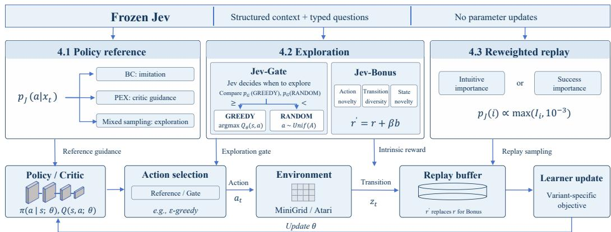  
Figure 1: The framework structure of Jev for RL.

## 4.1 RL WITH JEV REFERENCE

Classic RL learns from scratch, which is widely known to be sample-inefficient. Introducing an extrinsic prior reference is one major way to address this point. Imitation learning trains the student to reproduce a reference’s actions (Pomerleau, 1991; Ross et al., 2011; Hussein et al., 2017); policy guidance keeps the reference available and lets the student decide when to follow it (Zhang et al., 2023). Here, we take the Jev model as the reference, instantiating the two algorithms as Jev-BC and Jev-PEX, which use the Jev as Policy position of Sec. 3.2 with the legal actions declared as the option set of a choice question.

Let $s _ { t }$ be the agent’s observation and $x _ { t }$ the structured input available to Jev. The reference question asks which legal action is optimal for the current scene and task, returning $p _ { J } ( a \mid x _ { t } ) = f _ { u _ { \mathrm { a c t } } } ( x _ { t } ) _ { a }$ for $f _ { u _ { \mathrm { a c t } } } : \mathcal { X } _ { S } \mathbf { \bar { \to } } \Delta ( A )$ , with $a _ { J } = \arg \operatorname* { m a x } _ { a } p _ { J } ( a \mid x _ { t } )$

Jev-BC. The most direct use of the answer is to reproduce it, storing the reference label with each collected observation and minimizing ${ \mathcal { L } } _ { \mathrm { J e v - B C } } ( \theta ) = - \mathbb { E } _ { ( s _ { t } , a _ { J } ) \sim \mathcal { D } } \log \pi _ { \theta } ( a _ { J } \ | \ s _ { t } )$ . The objective is imitation alone, so the measurement is how much reference behaviour the student can capture.

Jev-PEX. Jev-PEX instead lets the learner assess that choice, adapting policy expansion (Zhang et al., 2023) with the reference in place of its fixed offline policy. The minimum of two critics weighs the reference against a student proposal,

$$
P ( c \mid s _ { t } , x _ { t } ) = \frac { \exp ( \eta Q _ { \operatorname* { m i n } } ( s _ { t } , a _ { c } ) ) } { \sum _ { c ^ { \prime } \in \{ J , \pi \} } \exp ( \eta Q _ { \operatorname* { m i n } } ( s _ { t } , a _ { c ^ { \prime } } ) ) } , \qquad c \in \{ J , \pi \} , \quad \eta = 1 0 ,\tag{2}
$$

and each actor update selects a composite action from Eq. 2 and the stored label. The critic, not the reference, decides utility on the task’s return scale.

Jev-Mixed Sampling. A third use bypasses actor training. We keep DQN’s action rule and its schedule $\epsilon _ { t } ,$ but the action drawn with probability $\epsilon _ { t }$ comes from the reference rather than from a uniform draw, being either its preference $a _ { J }$ (Jev action) or a sample $a \sim p _ { J } ( \cdot \mid x _ { t } )$ (Jev probability); the actor then learns from the environment’s reward alone.

The reference is never updated in any of the three uses, and none of them requires an offline dataset or a pretrained student. Its influence reaches the learner only through the queries made at the states the learner visits.

## 4.2 RL WITH JEV EXPLORATION

Learning from scratch in sparse reward settings is extremely difficult, and random exploration does not provide informative experience. Existing exploration methods introduce intrinsic bonuses based on visitation counts (Bellemare et al., 2016) or prediction errors (Pathak et al., 2017; Burda et al., 2019) to encourage potentially valuable exploration. Here, we take the Jev model as an external exploration judge, using the task description and interaction history to inform when to explore and what experience to encourage. Specifically, we instantiate two uses: Jev-Gate and $J e \nu  – B o n u s$ , which use the Jev as Meta Regulator and Jev as Score Rater positions of Sec. 3.2, respectively.

Jev-Gate. The most direct use of the judgment is to decide whether to follow the policy’s greedy action or explore. The gate question receives the current scene, the greedy action and its Q-values, the update count, and an experience history $H _ { t }$ . Writing these inputs as $x _ { t } ^ { G }$ , the question returns $p _ { G } ( \cdot ) \dot { } = f _ { u _ { \mathrm { g a t e } } } ( x _ { t } ^ { G } )$ , with GREEDY, RANDOM declared as the option set of a $_ { \mathrm { c h o \ i c e } }$ question. We take arg max<sub>a</sub> $Q _ { \theta } ( s _ { t } , a )$ when $p _ { G } ( \mathrm { G R E E D Y } ) \geq p _ { G } ( \mathrm { R A N D O M } )$ and $a \sim \operatorname { U n i f } ( A )$ otherwise. Jev-Gate replaces ϵ-greedy and decides when to explore, while the exploratory action remains uniformly sampled.

Jev-Bonus. A second use of Jev for exploration is to assign intrinsic bonuses to experience. The novelty question asks how unfamiliar the experience is, using a history $H _ { t }$ maintained for that query type, with the query’s own past inputs and cumulative visitation counts. Its answer is a choice over $\mathcal { L } = \{ \mathrm { z e r o } $ , low, medium, high, very\_high, unknown} with values $v = ( 0 , . 2 5 , . 5 , . 7 5 , 1 , 0 )$ we convert the returned distribution into $\begin{array} { r } { \dot { R } _ { J } ( \bar { z } ; u ) = \sum _ { \ell \in \mathcal { L } } v _ { \ell } f _ { u } ( z ) _ { \ell } \in [ 0 , 1 ] } \end{array}$ , where u asks about evidence z. We instantiate three variants according to what the question evaluates:

$$
\begin{array} { r l } & { b _ { t } ^ { \mathrm { a c t } } = R _ { J } ( ( \boldsymbol { x } _ { t } , \boldsymbol { a } _ { t } , H _ { t } ) ; \boldsymbol { u } _ { \mathrm { a c t - n o v } } ) , } \\ & { b _ { t } ^ { \mathrm { t r a n s } } = R _ { J } ( ( \boldsymbol { x } _ { t } , \boldsymbol { a } _ { t } , \boldsymbol { x } _ { t + 1 } , \boldsymbol { r } _ { t } , H _ { t } ) ; \boldsymbol { u } _ { \mathrm { d i v } } ) , } \\ & { b _ { t } ^ { \mathrm { s t a t e } } = R _ { J } ( ( \boldsymbol { x } _ { t + 1 } , H _ { t } ) ; \boldsymbol { u } _ { \mathrm { s t a t e - n o v } } ) . } \end{array}\tag{3}
$$

The action bonus judges the novelty of the executed action. The transition bonus instead judges the realized transition, with the observed reward as context. The state bonus judges the reached state novelty given its visitation history. Each variant adds its bonus to the environment reward as $r _ { t } ^ { \prime } = r _ { t } + { \bar { \beta } } b _ { t }$ . We store the bonus with the transition and reuse it during replay. Only the executed action’s rating enters training; the bonuses do not select among candidate actions. Tables 4 and 6 specify the instructions and memory used by each question.

These bonuses are auxiliary training objectives, not potential-based rewards with a policy-invariance guarantee, so their empirical value depends on both the content and the scale of the induced bonus.

## 4.3 RL WITH JEV-REWEIGHTED REPLAY

Beyond guiding exploration, Jev can also judge which collected experience to learn from. Uniform replay gives all stored transitions the same sampling probability (Lin, 1992), although their usefulness for learning may differ. Prioritized experience replay assigns higher probabilities to transitions with larger TD errors (Schaul et al., 2016). Here, we take the Jev model as an external importance judge, using the task description and replay context to inform which transitions deserve more updates. We instantiate this use as Jev-Reweighted Replay, which uses the Jev as Score Rater position of Sec. 3.2, and keep both the action rule and the task reward unchanged so that only the replay distribution moves.

For a stored transition $z _ { i } = ( s _ { i } , a _ { i } , r _ { i } , s _ { i } ^ { \prime } , d _ { i } )$ , Jev receives its structured before/after description $\tilde { z } _ { i }$ together with the current replay evidence $B _ { t }$ . Its rating becomes the sampling probability directly,

$$
I _ { i } = R _ { J } ( ( \tilde { z } _ { i } , B _ { t } ) ; u _ { \mathrm { i m p } } ) , \qquad P _ { J } ( i ) = \frac { \operatorname * { m a x } ( I _ { i } , 1 0 ^ { - 3 } ) } { \sum _ { j \in \mathcal { D } } \operatorname * { m a x } ( I _ { j } , 1 0 ^ { - 3 } ) } ,\tag{4}
$$

where the floor retains support for every stored transition.

Jev-Reweighted Replay. We instantiate two variants according to how importance is judged. Intuitive importance asks for a transition’s learning importance without prescribing what makes it important, and success importance asks for its contribution to the final task objective, including prerequisites and informative failures. Both receive the same inputs, so only the instruction differs (Table 5). New transitions are rated on insertion, and up to eight stored transitions are re-rated every 100 environment steps using the current replay context. The critic minimizes its squared TD loss on batches drawn from $P _ { J }$ . In addition, no importance-sampling correction is applied, so the ratings deliberately change how transitions contribute to the expected training loss. A judgment can carry useful task information and still allocate updates poorly for the learner’s current needs.

A fourth channel, subgoal selection, asks for a judgment whose completion requires a sequence of actions rather than a single transition. We examine it separately in Appendix E.

## 5 EXPERIMENTS

We evaluate Jev in two steps: first as a decision maker, then as a component of learning. RQ1– RQ2 examine direct control and its dependence on the information interface; RQ3–RQ5 follow the three channels of Sec. 4: policy reference, exploration, and replay. Subgoal guidance is examined separately in Appendix E.

Experimental setup. We use nine MiniGrid tasks: DoorKey at three sizes, Empty, FourRooms, two MultiRoom variants, SimpleCrossing, and LavaGap, and three Atari games: Seaquest, Freeway, and SpaceInvaders. MiniGrid students use MLPs over native local observations; Atari students use CNNs over four stacked grayscale frames. Implementations build on CleanRL (Huang et al., 2022), with DQN as the common task baseline and TD-error prioritized experience replay (PER) (Schaul et al., 2016) as an additional replay baseline. Jev remains frozen and receives structured observation descriptions, task rules, and query-specific history. These inputs may carry information unavailable to the student. FourRooms and MultiRoom-N4 action queries additionally include observed-map memory and engineered navigation features. Configurations and input examples appear in Appendices C and F. Main results measure success at 10k MiniGrid steps and native return at 50k Atari decisions, with four emulator frames per decision. Learned policies are evaluated without Jev or auxiliary rewards on 50 fixed MiniGrid seeds or five fixed Atari seeds. Learning results report means and SEM across three training seeds; fixed-experience diagnostics use 100 evaluation seeds. Appendix C provides learning curves and detailed protocols.

## 5.1 RQ1: HOW CAPABLE IS JEV AS A ZERO-SHOT POLICY?

We compare Jev with Qwen3-8B under the same structured-input pipeline, task questions, legalaction descriptions, and evaluation seeds. Qwen uses non-thinking, temperature-zero decoding constrained to a JSON action label; Jev executes its most probable action. FourRooms and MultiRoom-N4 use the shared full-navigation interface. Jev matches or exceeds the tested Qwen configuration on all nine MiniGrid tasks, whereas Atari comparisons are mixed (Figure 2). The LavaGap action audit further shows useful discrimination between goal and hazard cues, although direct-policy success varies across tasks. Thus, reliable local choices and reliable completion of a long-horizon task remain different achievements.

Jev Qwen3-8B (non-thinking)

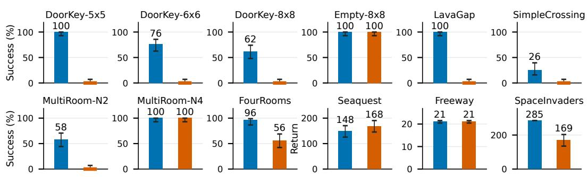  
Figure 2: Direct control with matched structured inputs. Jev and non-thinking Qwen3-8B use the same evaluation seeds and task-specific input construction. MiniGrid: success on 50 episodes with 95% Wilson intervals. Atari: mean native return over five complete games with SEM. A colored horizontal stroke denotes zero successes. FourRooms and MultiRoom-N4 use the full-navigation input; the other tasks use their direct-Jev input interface.

Finding 1. Jev supplies a useful zero-shot action prior, but not a uniformly reliable controller. Its local decision capability motivates its use in learning without establishing reliable completion of a long-horizon task.

Table 2: Task-dependent contribution of engineered navigation. Pure-Jev performance over 50 paired environment seeds. Episode length is averaged over instances solved in both conditions.
<table><tr><td></td><td colspan="2">Success (%)</td><td colspan="2">Episode length</td></tr><tr><td>Environment</td><td>With navigation</td><td>Without navigation</td><td>With navigation</td><td>Without navigation</td></tr><tr><td>DoorKey-8×8</td><td>100</td><td>100</td><td>17.2</td><td>25.6</td></tr><tr><td>MultiRoom-N2</td><td>100</td><td>90</td><td>6.6</td><td>11.2</td></tr><tr><td>FourRooms</td><td>96</td><td>40</td><td>21.7</td><td>31.3</td></tr><tr><td>MultiRoom-N4</td><td>100</td><td>38</td><td>32.9</td><td>59.2</td></tr></table>

## 5.2 RQ2: HOW MUCH DOES THE INFORMATION INTERFACE MATTER?

We keep Jev fixed and remove candidate routes, path distances, and progress/priority hints on four tasks, retaining identical observational memory and task rules. This isolates navigation features rather than memory itself. DoorKey-8×8 and MultiRoom-N2 use shared-memory prompts distinct from the local-input comparison in RQ1. Removing these features sharply reduces success on FourRooms and MultiRoom-N4, while DoorKey-8×8 and MultiRoom-N2 remain largely solvable (Table 2). Routes also lengthen on jointly solved instances.

Finding 2. The relevant capability is the model’s decision under a specified information interface. High success with engineered navigation features demonstrates use of supplied route structure, not its independent discovery by Jev.

## 5.3 RQ3: CAN JEV GUIDE POLICY LEARNING?

We compare Jev-BC, Jev-PEX, and Jev-Mixed Sampling, which use the action prior for imitation, critic-mediated guidance, and experience collection, respectively. Pure-Jev evaluations use the corresponding reference-method inputs. These uses improve learning on multiple tasks, including settings where DQN remains unsuccessful within the budget (Figure 3). Their ranking nevertheless varies: Seaquest benefits more from reference-guided collection than from imitation. We also find teacher–student agreement on fixed logged states increases substantially during training (Figure 9 in Appendix D), especially when the goal is visible. The student acquires local action knowledge without necessarily reproducing the teacher’s behavior over an entire task.

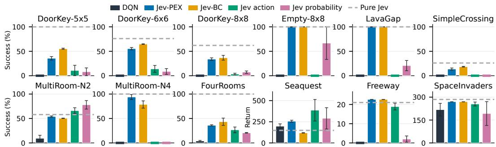  
Figure 3: RL with Jev Reference. Endpoint performance on all twelve environments: MiniGrid at 10k steps (success percentage) and Atari at 50k decisions (return). Error bars are SEM across training seeds. A colored horizontal stroke denotes a measured zero. Hatched bars show independent pure-Jev evaluations without training-seed error bars.

Finding 3. Jev’s frozen action prior can improve policy learning and sometimes enable students to outperform direct Jev control. The teacher thus provides guidance rather than a performance ceiling, with the gains depending on how its prior is integrated into learning.

## 5.4 RQ4: CAN JEV IMPROVE EXPLORATION?

Jev-Gate and the three Jev-Bonus variants improve selected tasks without asking Jev to choose a task-preferred action, but no tested configuration is uniformly best (Figure 4). We separate the contributions of collected experience and auxiliary reward through two fixed-experience controls.

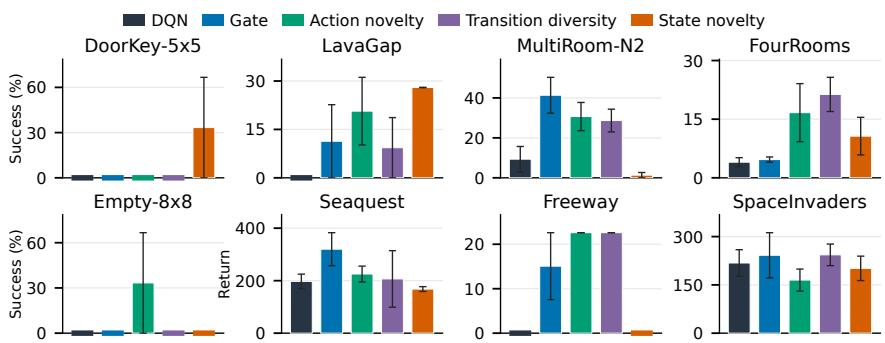  
Figure 4: RL with Jev Exploration. MiniGrid 10k and Atari 50k endpoints, mean±SEM across three training seeds. Tasks with zero performance for all four methods are omitted.

First, we retrain identical learners on each method’s recorded experience using only environment rewards. State-novelty data improves LavaGap learning despite having the same mean spatial coverage as DQN data (Figure 10 in Appendix D). Part of the exploration gain therefore survives removal of the auxiliary reward and lies in the learning opportunities present in the collected experience. Second, we fix the experience and replace each Jev state score with the mean for its visitation bin and 2k-step collection window. Original scores outperform these group means on two of three tasks (Figure 11 in Appendix D). This identifies useful reward distinctions beyond the coarse count summary, rather than a general advantage over count-based exploration.

Finding 4. Jev can collect more useful experience, not just expand coverage. Its state-dependent bonuses add reward information beyond coarse visitation summaries.

## 5.5 RQ5: CAN JEV IMPROVE REPLAY?

We compare replay guided by Jev’s intuitive and success-oriented ratings with uniform replay and PER, keeping DQN’s action rule and task reward unchanged. Jev improves selected tasks but does not consistently outperform PER, and several tasks remain unsolved within the budget (Figure 5). To isolate replay effects from changes in data collection, we fix each sampler’s experience and rating history. We compare the original weights with uniform replay and a reward-class control that averages weights separately for positive- and non-positive-reward transitions. This preserves each class’s total sampling probability but treats transitions equally within each class, testing whether Jev helps beyond identifying rewarded transitions. On MultiRoom-N2, intuitive weights outperform both controls; success-oriented weights, tested on separately collected data, outperform the rewardclass control but underperform uniform replay (Figure 12 in Appendix D). Thus, Jev can improve replay beyond simply favoring rewarded transitions, but following its ratings is not always better than uniform sampling.

Finding 5. Jev helps select useful experience for replay, but success-oriented ratings do not consistently outperform intuitive ratings.

## 6 CONCLUSION

We examined which RL roles Jev can fulfill and developed algorithms that use the frozen model as a policy reference, exploration judge, and replay rater. Experiments on nine MiniGrid tasks and three Atari games show that these uses can improve early learning, sometimes enabling students to outperform direct Jev control while acting independently at evaluation. These benefits depend on the task, information interface, and how Jev’s judgments enter learning. Our findings demonstrate that a decision model need not be a reliable standalone controller to improve RL training, motivating guidance that adapts to the learner’s needs.

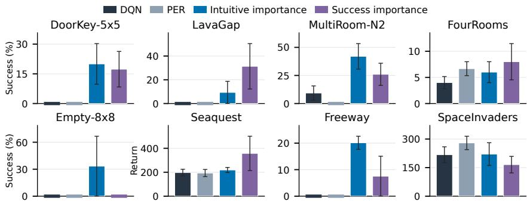  
Figure 5: RL with Jev-Reweighted Replay. MiniGrid 10k and Atari 50k endpoints, mean±SEM across three training seeds. Tasks with zero performance for all four methods are omitted.

## REPRODUCIBILITY STATEMENT

Appendix C specifies evaluation seeds, budgets, learner settings, and fixed-experience controls. Ap pendix F documents query instructions, answer choices, state representations, and memory. The accompanying source files contain the figure inputs and plotting scripts. Direct-model trajectories are retained for observation and action replay checks. Jev results are tied to the recorded API version and input construction.

## ETHICS STATEMENT

Our experiments are confined to MiniGrid and Atari environments. Jev’s judgments are task- and input-dependent, and improved benchmark performance does not establish the safety of learned policies in real-world settings. Any safety-critical application should undergo independent evaluation, with appropriate safeguards and human oversight.

## AI USE STATEMENT

AI coding and language tools assisted with experiment implementation and manuscript polishing. Jev and Qwen3-8B are also experimental subjects; their roles and evaluation interfaces are specified separately in Secs. 4 and 5.

## REFERENCES

Marc G. Bellemare, Yavar Naddaf, Joel Veness, and Michael Bowling. The Arcade Learning Environment: An evaluation platform for general agents. Journal ofArtificial Intelligence Research, 47:253–279, 2013. doi: 10.1613/jair.3912.

Marc G. Bellemare, Sriram Srinivasan, Georg Ostrovski, Tom Schaul, David Saxton, and Rémi Munos. Unifying count-based exploration and intrinsic motivation. In Advances in Neural Information Processing Systems, pp. 1471–1479, 2016.

Nicolas Bougie and Narimasa Watanabe. Exploring beyond curiosity rewards: Language-driven exploration in RL. In Proceedings of the 16th Asian Conference on Machine Learning, volume 260 of Proceedings ofMachine Learning Research, pp. 127–142. PMLR, 2025.

Yuri Burda, Harrison Edwards, Amos Storkey, and Oleg Klimov. Exploration by random network distillation. In International Conference on Learning Representations, 2019.

Yuji Cao, Huan Zhao, Yuheng Cheng, Ting Shu, Yue Chen, Guolong Liu, Gaoqi Liang, Junhua Zhao, Jinyue Yan, and Yun Li. Survey on large language model-enhanced reinforcement learning: Concept, taxonomy, and methods. IEEE Transactions on Neural Networks and Learning Systems, 36(6):9737–9757, 2025. arXiv:2404.00282.

Lili Chen, Kevin Lu, Aravind Rajeswaran, Kimin Lee, Aditya Grover, Michael Laskin, Pieter Abbeel, Aravind Srinivas, and Igor Mordatch. Decision Transformer: Reinforcement learning via sequence modeling. In Advances in Neural Information Processing Systems, volume 34, pp. 15084–15097, 2021.

Zehua Cheng, Wei Dai, and Jiahao Sun. this-that-model-1.0: A typed decision model that decides in 30 ms, for a millionth of a cent. arXiv preprint arXiv:2609.23886, 2026.

Maxime Chevalier-Boisvert, Bolun Dai, Mark Towers, Rodrigo Perez-Vicente, Lucas Willems, Salem Lahlou, Suman Pal, Pablo Samuel Castro, and Jordan Terry. Minigrid & Miniworld: Modular & customizable reinforcement learning environments for goal-oriented tasks. In Advances in Neural Information Processing Systems, volume 36, 2023. URL https://arxiv.org/ abs/2306.13831. Datasets and Benchmarks Track.

Boyuan Deng, Shuyi Fan, Hongyang Zhang, and Xinhong Xie. Jev for scientific decisions: Evaluating semantic choices and their consequences. arXiv preprint arXiv:2609.24965, 2026.

Xidong Feng, Bo Liu, Yan Song, Haotian Fu, Ziyu Wan, Girish A. Koushik, Zhiyuan Hu, Mengyue Yang, Ying Wen, and Jun Wang. Natural language reinforcement learning. arXiv preprint arXiv:2411.14251, 2024.

Jiaju Huang, Hao Yang, Xinyu Ma, Xinglong Liang, Kunyan Cai, Junqiang Ma, Shaobin Chen, Yue Sun, and Tao Tan. Can Jev judge radiology reports? evaluating a System One Model for clinical factuality. arXiv preprint arXiv:2609.27607, 2026.

Shengyi Huang, Rousslan Fernand Julien Dossa, Chang Ye, Jeff Braga, Dipam Chakraborty, Kinal Mehta, and João G. M. Araújo. CleanRL: High-quality single-file implementations of deep reinforcement learning algorithms. Journal of Machine Learning Research, 23(274):1–18, 2022. URL https://jmlr.org/papers/v23/21-1342.html.

Ahmed Hussein, Mohamed Medhat Gaber, Eyad Elyan, and Chrisina Jayne. Imitation learning: A survey of learning methods. ACM Computing Surveys, 50(2):21:1–21:35, 2017.

Hazem Ibrahim and Yasir Zaki. Evaluating decision models for text annotation in computational social science. arXiv preprint arXiv:2609.24574, 2026.

Dongming Jiang, Yi Li, and Bingzhe Li. Jev-Mem: System-One-Controlled agentic memory for efficient AI agents. arXiv preprint arXiv:2609.23986, 2026.

Martin Klissarov, Mikael Henaff, Roberta Raileanu, Shagun Sodhani, Pascal Vincent, Amy Zhang, Pierre-Luc Bacon, Doina Precup, Marlos C. Machado, and Pierluca D’Oro. MaestroMotif: Skill design from artificial intelligence feedback. In International Conference on Learning Representations, 2025. arXiv:2412.08542.

Delong Li, Xu Wang, Haochen Gong, Rui Lang, and Guangsheng Yu. Fast intent-driven service orchestration with Jev for 6G edge networks. arXiv preprint arXiv:2609.23136, 2026a.

Delong Li, Xu Wang, Haochen Gong, Rui Lang, and Guangsheng Yu. Replacing large language models with Jev decision models for low-latency edge service orchestration. arXiv preprint arXiv:2609.22753, 2026b.

Hengyu Li. KITE: Scaling Jev population experiments with sparse flagship calibration. arXiv preprint arXiv:2609.27535, 2026.

Yubo Li, Yidi Miao, Ramayya Krishnan, and Rema Padman. JEV-as-a-judge: Accept when confident, escalate when unsure. arXiv preprint arXiv:2609.26550, 2026c.

Long-Ji Lin. Self-improving reactive agents based on reinforcement learning, planning and teaching. Machine Learning, 8(3–4):293–321, 1992.

Weiyu Ma, Liangbing Zhao, Yongcheng Zeng, and Jian Zhao. JEV-Star: Fast, low-cost StarCraft II control with language-model planning. arXiv preprint arXiv:2609.27331, 2026.

Yecheng Jason Ma, William Liang, Guanzhi Wang, De-An Huang, Osbert Bastani, Dinesh Jayaraman, Yuke Zhu, Linxi Fan, and Anima Anandkumar. Eureka: Human-level reward design via coding large language models. In International Conference on Learning Representations, 2024.

Deepak Pathak, Pulkit Agrawal, Alexei A. Efros, and Trevor Darrell. Curiosity-driven exploration by self-supervised prediction. In Proceedings of the 34th International Conference on Machine Learning, volume 70 of Proceedings of Machine Learning Research, pp. 2778–2787, 2017.

Dean A. Pomerleau. Efficient training of artificial neural networks for autonomous navigation. Neural Computation, 3(1):88–97, 1991. doi: 10.1162/neco.1991.3.1.88.

Qwen Team. Qwen3 technical report. arXiv preprint arXiv:2505.09388, 2025.

Amir Rafe and Subasish Das. Calibrated decisions at scale: Converting police crash narratives into probabilistic crash variables with a System One Model (Jev). arXiv preprint arXiv:2609.24052, 2026.

Simiao Ren, Kidus Zewde, Xingyu Shen, Yuchen Zhou, Dennis Ng, Ankit Raj, Tommy Duong, Yuxin Zhang, and Neo Tiangratanakul. Open-Jev judgments on CallScreenBench: Calibrated one-pass scam screening with a small language model. arXiv preprint arXiv:2609.23959, 2026.

Werner Robitza. JEVQA - video quality from metadata, bitstream, and pixel features with a generalpurpose decision model. arXiv preprint arXiv:2609.24395, 2026.

Juan Rocamonde, Victoriano Montesinos, Elvis Nava, Ethan Perez, and David Lindner. Visionlanguage models are zero-shot reward models for reinforcement learning. In International Conference on Learning Representations, 2024.

Stéphane Ross, Geoffrey J. Gordon, and J. Andrew Bagnell. A reduction of imitation learning and structured prediction to no-regret online learning. In Proceedings of the 14th International Conference on Artificial Intelligence and Statistics (AISTATS), volume 15 of Proceedings of Machine Learning Research, pp. 627–635, 2011.

Tom Schaul, John Quan, Ioannis Antonoglou, and David Silver. Prioritized experience replay. In International Conference on Learning Representations, 2016. URL https://arxiv.org/ abs/1511.05952.

John Schulman, Filip Wolski, Prafulla Dhariwal, Alec Radford, and Oleg Klimov. Proximal policy optimization algorithms. arXiv preprint arXiv:1707.06347, 2017.

Yu Sun, Junhao Xu, Jiajia Shi, and Zijin Yang. Type-safe is not error-free: A constrained decision head follows the option name, not the rubric bound to it. arXiv preprint arXiv:2609.26758, 2026.

Richard S. Sutton and Andrew G. Barto. Reinforcement Learning: An Introduction. MIT Press, 2 edition, 2018.

TypeSafe AI. TypeSafe AI documentation. https://docs.typesafe.ai/, 2026a.

TypeSafe AI. Introducing System One models & Jev. TypeSafe AI blog, https://typesafe. ai/blog/introducing-system-one-models-and-jev, 2026b. Vendor material; no peer-reviewed description of RLCD exists.

Yufei Wang, Zhanyi Sun, Jesse Zhang, Zhou Xian, Erdem Biyik, David Held, and Zackory Erickson. RL-VLM-F: Reinforcement learning from vision language foundation model feedback. In Proceedings ofthe 41st International Conference on Machine Learning, volume 235 of Proceedings ofMachine Learning Research, pp. 51484–51501. PMLR, 2024.

Tiantong Wu and Wei Yang Bryan Lim. Decision hijacking: Prompt injection attacks on Jev’s typed probabilistic decisions. arXiv preprint arXiv:2609.28613, 2026a.

Tiantong Wu and Wei Yang Bryan Lim. REFLEX with Jev for efficient selective control in LLM agents. arXiv preprint arXiv:2609.26532, 2026b.

Xue Yan, Yan Song, Xidong Feng, Mengyue Yang, Haifeng Zhang, Haitham Bou Ammar, and Jun Wang. Efficient reinforcement learning with large language model priors. In International Conference on Learning Representations, 2025. arXiv:2410.07927.

Sherry Yang, Ofir Nachum, Yilun Du, Jason Wei, Pieter Abbeel, and Dale Schuurmans. Foundation models for decision making: Problems, methods, and opportunities. arXiv preprint arXiv:2303.04129, 2023.

Shunyu Yao, Dian Yu, Jeffrey Zhao, Izhak Shafran, Thomas L. Griffiths, Yuan Cao, and Karthik Narasimhan. Tree of thoughts: Deliberate problem solving with large language models. In Advances in Neural Information Processing Systems, volume 36, 2023a.

Shunyu Yao, Jeffrey Zhao, Dian Yu, Nan Du, Izhak Shafran, Karthik Narasimhan, and Yuan Cao. ReAct: Synergizing reasoning and acting in language models. In International Conference on Learning Representations, 2023b.

Weiwei Ye, Hangchen Liu, and Renhe Jiang. NumericJev: Jev-like LLM numerical decoding with multiway decision trees. arXiv preprint arXiv:2609.28587, 2026.

Guanxu Yu and Yuhang Yao. Visual Jev: Accurate and efficient decisions from shared visual context. arXiv preprint arXiv:2609.25845, 2026.

Fan Zhang, Yankai Chen, Zhuohan Xie, Yixi Zhou, Sijia Peng, Lei Fan, Xinhua Ji, Cunyuan Zheng, Huangyong Shan, Philip S. Yu, Xue Liu, Yu Chen, Preslav Nakov, and Songwei He. Same scores, different decisions: Evaluating JEV and language models for legal document understanding. arXiv preprint arXiv:2609.27678, 2026.

Haichao Zhang, Wei Xu, and Haonan Yu. Policy expansion for bridging offline-to-online reinforcement learning. In International Conference on Learning Representations, 2023. URL https://arxiv.org/abs/2302.00935.

Shenao Zhang, Sirui Zheng, Shuqi Ke, Zhihan Liu, Wanxin Jin, Jianbo Yuan, Yingxiang Yang, Hongxia Yang, and Zhaoran Wang. How can LLM guide RL? a value-based approach. arXiv preprint arXiv:2402.16181, 2024.

Zihao Zhou, Bin Hu, Chenyang Zhao, Pu Zhang, and Bin Liu. Large language model as a policy teacher for training reinforcement learning agents. In Proceedings of the Thirty-Third International Joint Conference on Artificial Intelligence (IJCAI), pp. 5671–5679, 2024. arXiv:2311.13373.

## Appendix Contents

A Jev: Experimental Interface 15   
B Jev: An Early Literature Snapshot 15   
C Experimental Details and Learning Curves 15   
D Analysis Experiments 17   
E Jev for Subgoal Guidance 19   
E.1 Channel 19   
E.2 Results 20   
F Structured Input Examples 22

## A JEV: EXPERIMENTAL INTERFACE

The experiments use jev-1.13.0 as a fixed external decision model. Table 3 records the interface settings used in this study. These are experimental configurations, rather than measurements of the API’s maximum capacity or vendor-reported performance.

Table 3: Interface choices used in the experiments.
<table><tr><td>Component</td><td>Experimental setting</td></tr><tr><td>API model identifier</td><td>jev-1.13.0</td></tr><tr><td>Query primitive</td><td>choice</td></tr><tr><td>MiniGrid action options</td><td>Seven native primitive actions</td></tr><tr><td>Atari action options</td><td>Seaquest 18; Freeway 3; SpaceInvaders 6</td></tr><tr><td>Exploration-gate options</td><td>GREEDY, RANDOM</td></tr><tr><td>Rating options</td><td>Five ordered levels and unknown</td></tr><tr><td>Rating values</td><td>0, .25, .5, .75, 1; unknown contributes zero</td></tr><tr><td>Subgoal options</td><td>Observed, task-specific candidate milestones</td></tr></table>

Action preference and numerical rating use the same output primitive with different questions. In a rating query, the expectation in the rating of Sec. 4.2 can fall between rubric levels. Its numerical spacing comes from our assigned auxiliary scale, not from calibration to task returns. A question about action quality, a question about novelty, and a question about replay importance therefore require distinct instructions even when all return probabilities over named options. Full query dis tinctions and state examples are in Appendix F.

## B JEV: AN EARLY LITERATURE SNAPSHOT

This appendix groups the additional Jev-related work cited in our bibliography by application. It provides context for the decision-model interface rather than a quantitative comparison with the control experiments in Sec. 5.

Documents and text. Coding of police crash narratives (Rafe & Das, 2026), clinical factuality in radiology reports (Huang et al., 2026), semantic relation selection in scientific workflows (Deng et al., 2026), and legal contract understanding (Zhang et al., 2026).

Agent and system infrastructure. A control plane for agent memory (Jiang et al., 2026), selective control of a stronger model (Wu & Lim, 2026b), and intent interpretation for service orchestration in edge networks (Li et al., 2026a;b).

Simulation and annotation infrastructure. Million-agent population simulation that queries the model once per unique state (Li, 2026), and one-pass scam-call screening (Ren et al., 2026).

Evaluation. A multi-task comparison against nineteen language models (Ibrahim & Zaki, 2026), a judge cascade with confidence-based escalation (Li et al., 2026c), a study showing that rebinding option names to fixed rubrics flips or reverses decisions (Sun et al., 2026), and prompt-injection attacks on typed probabilistic decisions (Wu & Lim, 2026a).

Several further papers use the typed-decision interface without evaluating Jev itself: shared visual context encoding (Yu & Yao, 2026), training-free numeric decoding (Ye et al., 2026), and a competing open decision model that reports Jev as a baseline (Cheng et al., 2026).

These applications motivate studying decisions as reusable components in agent systems. Our experiments examine a complementary question: how a fixed model’s judgments affect a separately trained RL learner through explicitly defined channels.

## C EXPERIMENTAL DETAILS AND LEARNING CURVES

Evaluation and uncertainty. MiniGrid evaluations use seeds 700000–700049 and a greedy student. Atari uses seeds 700000–700004 and the student’s ϵ = .01 evaluation policy. Rewards in every evaluation are the native task rewards, without the auxiliary training bonus. Jev-PEX/Jev-BC use five training seeds for Seaquest, DoorKey-5/8, MultiRoom-N2, SimpleCrossing, and LavaGap, and three elsewhere; the other plotted learning methods use three. Error bars and shaded bands are SEM over training seeds, not uncertainty over individual evaluation episodes. Fixed-experience analyses use 100 evaluation seeds, 900000–900099, and three data/training seeds.

Input construction. MiniGrid teachers receive descriptions derived from native local observations. DoorKey inputs identify key/door state and interaction rules; LavaGap describes lava and safe movement; room-navigation inputs describe passages and doors. FourRooms and MultiRoom-N4 action teachers additionally retain observed-map memory and engineered route advice. The state-novelty query omits those action proposals and uses the local observation, visit counts, and bounded observation history. Table 6 distinguishes recent-state and recent-transition records from cumulative counts, including their lengths and reset rules. Atari descriptions use RGB-detected objects and estimated motion: oxygen, divers and enemies for Seaquest; vehicles and the chicken for Freeway; and the cannon, aliens, projectiles and shields for SpaceInvaders. MiniGrid has seven native actions; Seaquest, Freeway and SpaceInvaders have 18, 3 and 6, respectively. The recorded MiniGrid-MultiRoom-N4-S5 registration generates six rooms with a 120-step limit; we retain the experiment identifier as its short label.

These input adapters are also the common basis of the model comparison. The vLLM service identifies its deployed model as Qwen3-8B. We serialize the same structured situation, question, and legal-action descriptions used by Jev, and request a JSON action label with temperature zero, a 48-token output limit, and thinking disabled. The comparison covers nine MiniGrid environments (seeds 700000–700049) and three Atari games (seeds 700000–700004), with the same native episode limits for both models. MiniGrid has seven primitive choices; Atari retains each game’s original action set. Stored Qwen trajectories are replayed to verify every observation, reconstructed input, action mapping, reward, and termination.

To vary the input rather than the model, the navigation ablation uses a shared raw-memory prompt in both arms; its full control is distinct from the original direct-policy prompt in the main reference figure. The four-task ablation uses 50 paired seeds per task. DoorKey-8 adds observed-map routes to keys, usable doors, goals, and frontiers; the no-navigation arm retains identical task rules and raw memory. MultiRoom-N2 uses two-room rules with the same route construction as MultiRoom-N4. Native limits remain 640 actions for DoorKey-8 and 40 for MultiRoom-N2. The added 200 episodes pass stepwise replay verification of observations, query payloads, actions, and returns. Exact addedtask input examples are included with the source data.

Learning and scoring. MiniGrid DQN variants use an MLP, batch size 128, learning rate $2 . 5 \times 1 0 ^ { - 4 }$ , discount .99, and one update per ten environment steps. Atari DQN variants use a convolutional learner and one update per four decisions. Jev-PEX and Jev-BC use actor learners with MLPs for MiniGrid and CNNs for Atari; DQN is their common task baseline. The DQN-based exploration and sampling variants retain the corresponding base learner and change the designated intervention. Jev-BC uses the imitation loss of Sec. 4.1. Jev-PEX fits two critics to $\bar { r } + \gamma ( 1 - d ) \bar { V } ( o ^ { \prime } )$ fits V by expectile regression $( \tau = . 7 )$ to the minimum target-critic value of the recorded action, and uses fresh composite-policy actions for its actor update. Target critics use Polyak coefficient .005. The displayed action/transition bonuses use $\beta \ \stackrel { \textstyle - } { = } \ . 0 1$ , except FourRooms for both scores and DoorKey-8 for action novelty, which use .1; state novelty uses .1. The coefficient and trainingbudget comparisons are reported as task-specific configurations rather than a single universal setting.

To isolate which part of the learning procedure creates an observed gain, the fixed-experience interventions retain this learner and change one source of supervision at a time. The data-quality analysis trains on the first 10k chronological transitions from each source with bonuses removed. Reward-label comparisons instead keep the experience fixed and alter only its scores. Visitation bins are 0, 1, 2, 3–4, 5–9, 10–19, 20–49, 50+, crossed with 2k collection windows; the bin-mean control uses the recorded Jev means. Sampling analyses retain the original rating history and change replay probabilities. All these diagnostic fits use 899 gradient updates. Original state-score models were checked against their stored 10k weights before the interventions. Source data for the bonus collection diagnostic use $\beta ~ = ~ . 1$ Spatial coverage counts newly reached layout–position pairs in reconstructed trajectories; layout identity avoids merging equal coordinates in different maps. The count-group control preserves group means, while reward-class replay controls preserve total sampling weight per reward class. Neither averaging operation preserves within-group variance. For replay interventions, the recorded rating/refresh sequence is retained, so the diagnostic changes sampling without re-querying Jev on the altered history.

Learning curves. Figures 6–8 supplement the main endpoint comparisons. All categories share the same DQN source. Seaquest Jev-PEX/Jev-BC values at 50k are linearly interpolated within each training seed from 40k and 60k evaluations. Other missing endpoints are not filled by extrapolation. The MiniGrid axes stop at 10k and Atari axes at 50k, matching the main figures.

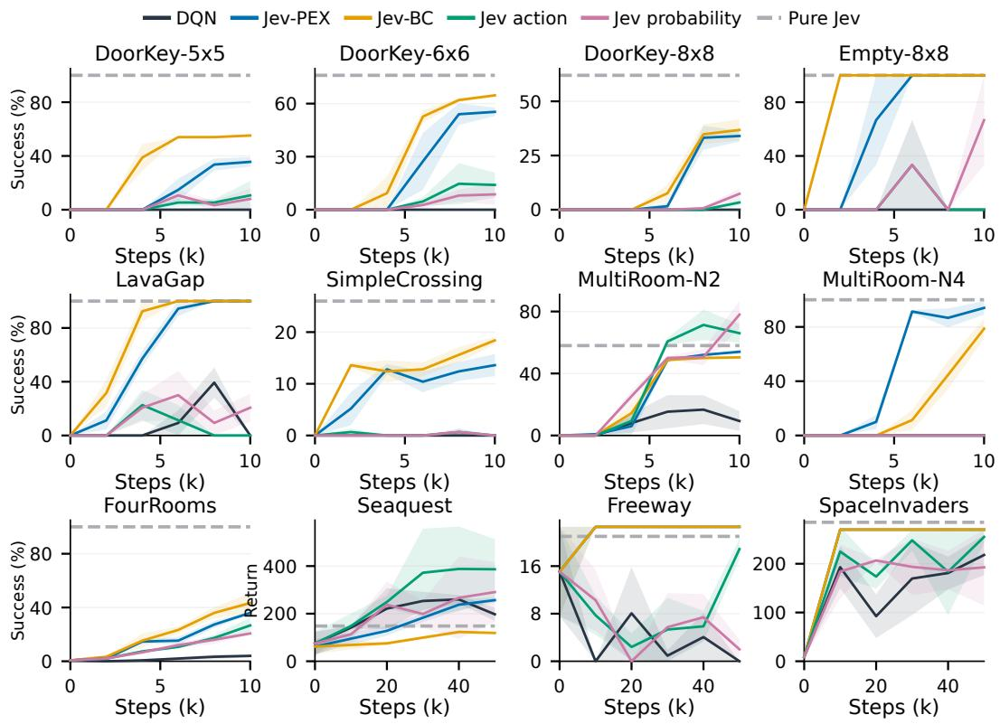  
Figure 6: Reference-method learning curves, mean±SEM. The horizontal dashed line is the independently evaluated pure-Jev policy; it has no training-step dependence.

## D ANALYSIS EXPERIMENTS

We examine whether the students acquire Jev’s action preferences by measuring agreement on fixed logged request states after 10k training steps. Figure 9 shows substantial agreement for both Jev-BC and Jev-PEX, with Jev-PEX agreeing more often on both tasks. Nevertheless, both students remain below direct Jev control on FourRooms (Figure 3). The students therefore absorb considerable local action knowledge without necessarily matching the teacher’s task performance. Action agreement and episode success measure different aspects of transfer: reproducing individual decisions does not guarantee successful execution over an entire episode.

To isolate the value of collected experience, we retrain identical learners on the first 10k transitions from DQN and each Jev-Bonus variant, removing all auxiliary rewards and matching learner settings and sampling indices. Figure 10 shows higher mean success with Jev-collected data on FourRooms and LavaGap, but mixed results on MultiRoom-N2. In particular, state-novelty data improves LavaGap learning despite having the same mean spatial coverage as DQN data. Thus, part of Jev’s exploration benefit lies in collecting more useful experience, rather than simply visiting more locations or changing the training reward.

We hold experience fixed and compare three reward assignments: the original Jev state bonuses, bonuses averaged within each visitation bin and 2k-step collection window, and environment reward

DQN PER Intuitive importance Success importance alone. Averaging preserves each group’s mean bonus but removes differences among observations within the group. Figure 11 shows that the original scores yield higher mean success than the averaged scores on LavaGap and DoorKey-5×5, while both perform similarly on FourRooms. These results indicate that Jev’s finer state-dependent distinctions can improve learning beyond the tested visitation summary, although the additional benefit is task-dependent.

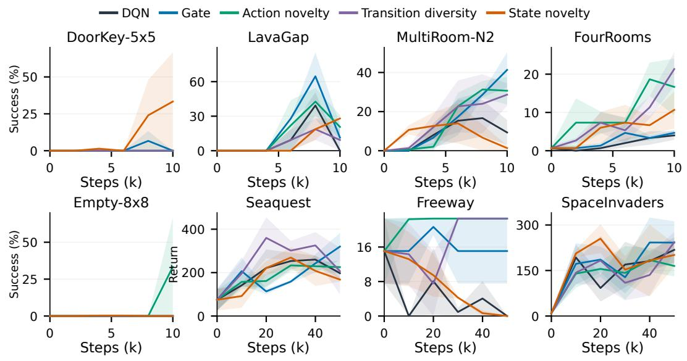

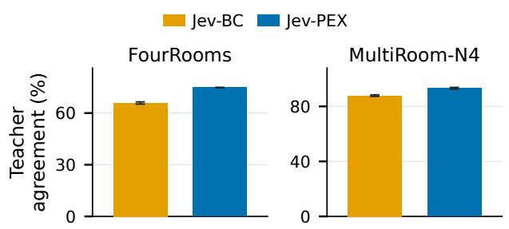

Figure 7: Exploration learning curves on the selected tasks, mean±SEM. Curves end at their last available common evaluation node.  
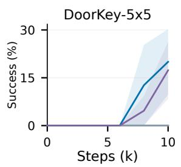

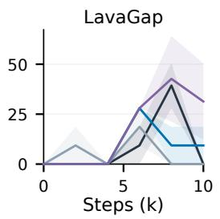

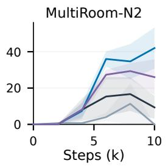

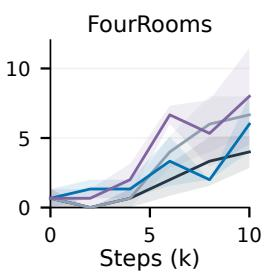

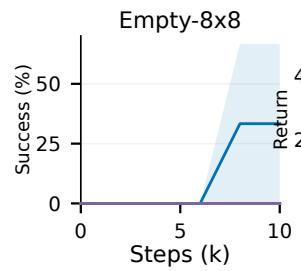

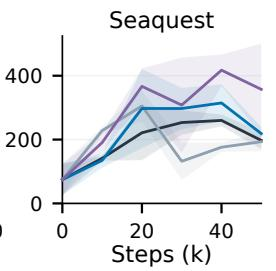

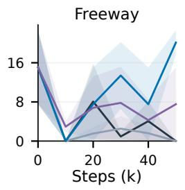

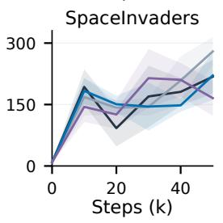  
Figure 8: Replay-sampling learning curves on the selected tasks, mean±SEM.  
Figure 9: Teacher-action absorption at 10k. Agreement on fixed logged request states, averaged over three student seeds. Error bars show SEM.

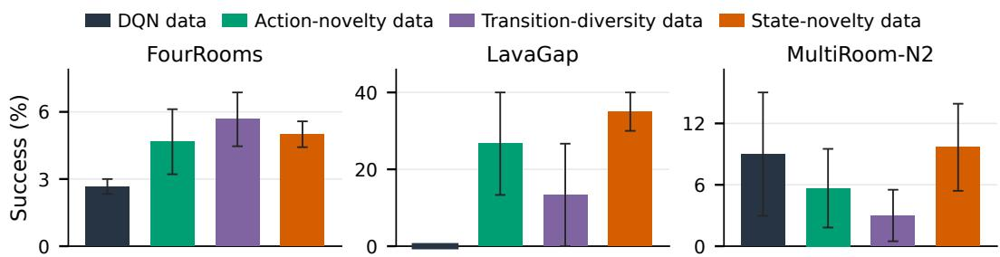  
Figure 10: Data quality separated from shaping. All learners use only environment reward on their respective fixed 10k experience streams, with matched learner settings and sampling indices. Evaluation uses 100 environment seeds; bars show mean±SEM over three data/training seeds.

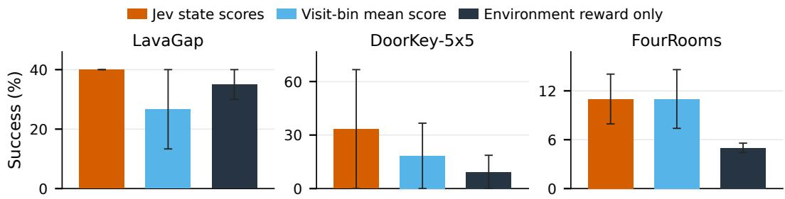  
Figure 11: State-dependent reward information on fixed experience. The bin-mean control replaces scores with their average within 2k-step collection windows and visitation bins. Original and bin-mean scores have matched overall means but different fine-grained allocations. Bars show mean±SEM across three seeds; each fitted learner is evaluated on 100 episodes.

We fix each sampler’s experience and rating history, then compare Jev weights with uniform replay and weights averaged separately within positive- and non-positive-reward classes. This control preserves each class’s total sampling probability while treating its transitions equally. Figure 12 shows that intuitive weights outperform both controls on MultiRoom-N2. Success-oriented weights, evaluated on separately collected data, outperform the reward-class control but underperform uniform replay on the same task. On LavaGap, success-oriented weights yield the highest mean success, although variability across seeds is large. Jev can therefore improve replay by distinguishing useful transitions beyond their immediate rewards, but following its ratings is not consistently better than sampling uniformly.

## E JEV FOR SUBGOAL GUIDANCE

This appendix reports a fourth channel, subgoal selection, in which the same model is asked to guide behavior toward an event that requires several actions to complete. We report it here rather than in the main text because it did not yield gains under the shared protocol, and because its diagnostics bear on a different requirement than the three channels in Sec. 4.

## E.1 CHANNEL

The channels in Sec. 4 attach judgments to actions, states, or transitions. Subgoal selection asks whether the same model can also guide behavior toward an event that requires several actions to complete. For MiniGrid, the adapter constructs a finite candidate set $\mathcal { G } _ { t }$ from observed objects and connectivity: for example, obtaining a key, opening a door, traversing a passage, or reaching the goal. The query supplies these candidates, observed-map information, prerequisites, and previous attempts. Jev selects

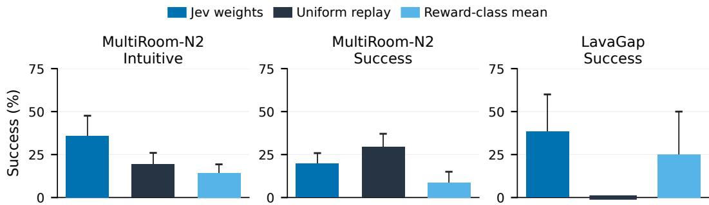  
Figure 12: Sampling-weight analysis on fixed experience. Intuitive and success-oriented ratings are evaluated separately, using the same learner and original environment reward. Reward-class means preserve total preference for positive-reward transitions while removing within-class weight differences. Bars show mean±SEM across three seeds; each learner is evaluated on 100 episodes.

$$
g _ { t } = \arg \operatorname* { m a x } _ { g \in \mathcal { G } _ { t } } f _ { u _ { \mathrm { g o a l } } } ( x _ { t } , H _ { t } ) _ { g } .\tag{5}
$$

The selected milestone determines an auxiliary completion reward:

$$
r _ { t } ^ { \prime } = r _ { t } + \alpha \mathbf { 1 } \{ \mathrm { f i r s t e l i g i b l e c o m p l e t i o n o f } g _ { t } \} , \qquad \alpha = . 0 2 5 .\tag{6}
$$

The cumulative bonus is capped at .1 per episode. An environment-side check determines completion; the selector is queried again after completion, timeout, or prolonged lack of progress. Repeating a completed milestone earns no further reward, although an interaction can remain a selectable prerequisite when needed again, as after dropping a key.

In this primary MiniGrid comparison, the student still selects primitive actions from its ordinary observation and does not receive $g _ { t }$ as an additional input. Thus, the intervention is milestone-based reward guidance rather than a learned hierarchy of goal-conditioned options. Uniform and rulebased selectors share the same candidate set and reward mechanism with Jev. Additional diagnostics change the controller input or provide denser progress rewards. This separation lets us examine two requirements for effective guidance: a goal must be useful for the task, and its completion must deliver a learnable signal to the current controller.

## E.2 RESULTS

The channels in Sec. 4 guide choices whose consequences enter learning through an action or transition. A selected subgoal demands more: the controller must produce a sequence that reaches it before the auxiliary reward can be earned. We first test whether meaningful milestones alone provide effective guidance. In DoorKey-8×8 and FourRooms, DQN, uniform goal selection, Jev goal selection, and the rule selector all finish at zero success after 20k steps in the single-seed diagnostic with corrected candidate eligibility and one-time rewards. FourRooms briefly reaches 10% with Jev at 8k, but the gain does not persist. Rule-based variants with progress rewards or explicit goal inputs also finish at zero. These controls locate a difficulty shared by the tested milestone-reward channels, rather than a failure unique to Jev’s ranking.

The sparse milestone reward may be difficult to obtain from a controller learning from scratch. To examine goal selection after shared low-level pretraining, a separate Atari diagnostic uses 50k steps of that pretraining and 50k subsequent student steps. Jev probabilities, weighted toward less frequently completed goals, yield 382.7 on Seaquest versus 345.3 for uniform goals, but 17.2 on Freeway versus 19.7. Thus the 100k-interaction protocol also gives mixed evidence for choosing goals semantically, even with a pretrained controller.

Mixed returns alone do not show whether the chosen goals produce usable reward events. Historical Montezuma’s Revenge runs let us inspect this part of the mechanism directly. The controller is image-only PPO+RND (Schulman et al., 2017; Burda et al., 2019); Jev selects landmarks whose completion provides auxiliary reward. In the common 12M-decision training prefix, pooled across three seeds, 77.1% of goal selections are allocated to obtaining the key. That goal is selected 481,153 times and completed only twice. Overall selected-goal completion is 0.36%, compared with 1.98% for uniform selection at the same reward coefficient. Selecting a valuable eventual objective repeat edly therefore produces very little realized supervision. These are recorded goal-selection events, including reuse of cached Jev answers, rather than distinct API calls. The historical query supplies the visual scene and task rules, but not measured success rates for the current controller. Its preference for the key therefore captures task importance without explicit evidence of present attainability.

The missing property is effective temporal guidance: a useful selector must connect task prerequisites to milestones the current controller can achieve within its execution horizon. Our subgoal channel does not obtain that property reliably from Jev. The rule controls and completion audit further show why correctly naming the key or door is insufficient evidence of long-horizon planning ability. Across the tested systems, local action and experience judgments are easier to turn into learning gains than milestone preferences whose value depends on an executable sequence.

## F STRUCTURED INPUT EXAMPLES

The cards below give one short example for each environment and input setting. Each card first shows a concrete scene, then examples from each method’s own logged request. Different rows may therefore describe different moments. Current, before/after, and reached denote the actual scene fields included in that query, not only visit counts. Long object lists and histories are abbreviated; field paths are shortened for readability. Tables 4 and 5 separate the shared conventions from each method’s question, evidence and output. The cards then give environment-specific values. Table 6 specifies which recent states or transitions are supplied, their maximum lengths, and whether they survive an episode reset. Matching fields in two rows do not imply matching questions: replay importance is one explicit example.

Shared request structure and answer scale   
Each request has a state and a questions object. A question contains instructions and named   
answer criteria. The environment cards below supply example state fields; the tables here show   
what Jev is asked to do with them. Quoted sentences are excerpts from recorded MiniGrid instructions;   
Atari queries use the corresponding game facts and action meanings. Bold blue text marks the operative   
difference between queries.   
The three novelty bonuses and both importance scores share the ordered choices zero, low,   
medium, high, very\_high, unknown, mapped to 0, .25, .5, .75, 1, 0. Each question returns its   
own distribution over these levels; its expected numerical value is the score. A rating is not a probability   
of selecting a primitive action.

<table><tr><td colspan="3">Exploration: what question changes?</td></tr><tr><td>Method</td><td>Evidence and output</td><td>Instruction excerpt and distinction</td></tr><tr><td>Gate</td><td>Before acting: current scene, GREEDY or RANDOM.</td><td>“Choose whether to exploit this learner's CUR- action effects, experience his- RENT greedy action or explore with a uniformly tory, and student's greedy random legal action NOW."“You do not choose action / Q-values. Output: the primitive action." The answer selects a control</td></tr><tr><td>Action novelty</td><td>Before acting: current scene, comes. Output: one rating per action.</td><td>branch, not a teacher action or reward. “Independently rate the EXPECTED novelty of the candidate action effects, per- controllable situation or action-effect information action counts and past out- that would result from this particular action after one native MiniGrid action." The score predicts an out- come; only the executed action's score becomes a</td></tr><tr><td>versity</td><td>Transition di- After acting: before state, lifetime experience counts. 1</td><td>bonus. “Rate the ACTUAL contribution of this observed executed action, actual after transition to the diversity of controllable experi- state, observed reward and ences in THIS training run." “Judge what actually happened, not what this action might have achieved."</td></tr><tr><td>State novelty</td><td>Output: one rating. After acting: reached obser- vation and state-visit history fore/after pair is supplied.</td><td>The realized transition is the object being scored. “Rate the novelty of the CANDIDATE OB- SERVED STATE relative to states previously ob- only. Output: one rating. No served in THIS training run." “Only judge the state, action, reward, Q-value or be- not an action, transition, expected outcome, reward desirability or task success."</td></tr><tr><td colspan="3">Shared novelty instruction. Judge unfamiliar controllable experience relative to this run, rather than desirability or action quality. Familiar loops, passive visual changes, deaths and resets do not earn novelty. Counts persist across episodes; limited recent history is not proof that an outcome is unseen. The action- novelty time horizon uses one native action in MiniGrid and the corresponding decision transition in Atari.</td></tr><tr><td colspan="3">Reference, replay sampling, and subgoals</td></tr><tr><td colspan="3">Shared replay instruction. Both importance variants receive the same transition and buffer_evidence. Their common prefix is: “Assess this OBSERVED transition for replay learn- ing. You do not select an action or modify rewards." The instruction below changes the criterion, not the input fields, rating options, or conversion from score to replay priority. Setting Instruction excerpt and use of the answer</td></tr><tr><td>Action reference</td><td colspan="2">"Which single action should the agent execute NEXT to reach the goal?" The state describes the scene, task rules and immediate action effects; options are legal actions. Jev-BC, Jev-PEX, Jev action, and Jev probability sampling use this action-preference question. Their downstream use of the answer</td></tr><tr><td>Intuitive importance</td><td colspan="2">differs. "How important is this experience to replay for learning this task? Use your own judgment of importance." The score directly sets replay priority; no particular type of importance is specified.</td></tr><tr><td>Success importance</td><td colspan="2">“Judge ONLY its contribution to learning HOW TO ACHIEVE THE FI- NAL TASK OBJECTIVE." “Prioritize evidenced prerequisites, bottleneck interactions, meaningful progress, successful completion, and informative</td></tr><tr><td>Subgoal selection</td><td colspan="2">contrasts that help explain how completion/high task return becomes pos- sible." Zero immediate reward can still be important. “Select ONE candidate subgoal that is useful for eventually completing the mission and feasible for the current learner to explore next." “You choose a target, not a primitive action or a route." The input adds observed candi- dates, prerequisites and previous attempts. Completing the selected mile- stone triggers the auxiliary reward.</td></tr></table>

Table 4: Exploration query comparison. The queries derive from the same environment observations, but each method exposes only the evidence listed in its row. The three bonuses share a rating scale, not a common question.

Table 5: Other query settings. In particular, identical replay state examples do not imply identical questions: the two importance variants differ in the highlighted criterion.

Shared action and coordinate conventions   
MiniGrid uses turn\_left, turn\_right, move\_forward, pick\_up, drop,   
toggle\_door, done; their physical meanings accompany action queries. Relative object co  
ordinates are (cells\_forward, cells\_right) in the agent’s view. Atari coordinates are   
RGB screen pixels, with x increasing right and y increasing down; legal action sets appear in each   
environment card. DQN, PER and rule/uniform-goal controls make no Jev query. Reward-coefficient   
and update-frequency variants reuse the same query. The cards show abbreviated state values; use the   
method’s table row above to identify its instruction.

<table><tr><td colspan="3">Memory supplied to Jev: contents, length, and reset scope</td></tr><tr><td>Query</td><td>Records included in the prompt</td><td>Counts and reset scope</td></tr><tr><td>Gate / action nov- elty</td><td>Up to 16 recent transitions: coarse before sit- Visits, action attempts and out- uation, action, coarse after situation, reward come counts accumulate over the and boundary flag. For each candidate action, training run. The recent trace and up to 3 most frequent observed outcomes, 32-transition window clear at a with counts. A separate 32-transition window new complete game/episode; life-</td><td></td></tr><tr><td>Transition diversity</td><td>contributes a distinct-situation count. The same recent-16 trace and per-action top- Adds lifetime counts of match- 3 outcomes, plus the actual candidate&#x27;s be- ing transitions and visits to the fore/after scene and action.</td><td>time counts remain. reached situation. The candidate is scored before updating its tran-</td></tr><tr><td>State novelty</td><td>Up to 16 recent states and 3 most-visited Both recent history and lifetime states, each with its lifetime visit count. Min- counts persist across resets. The iGrid records contain the full local 7 × 7 view candidate&#x27;s previous-visit count and compass; Atari history records contain is read before adding it. Recent coarse player/resource situations. No ac- entries may repeat: they are ob- tions or rewards are included.</td><td>sition/action/outcome counts. servations, not a list of unique</td></tr><tr><td>Replay importance</td><td>Up to 12 recent observed transitions, with Matching counts describe the before/after situations, action, reward and ter- current replay buffer; eviction mination flags; matching counts, outcome removes counts and the candidate counts and the candidate&#x27;s replay count.</td><td>states. is excluded. The recent trace persists across episodes and is a chronological record, not a fresh</td></tr><tr><td colspan="3">sample of the buffer. The bounded lists are actual evidence in the query, not a recurrent hidden state of Jev. Each decision is made from a fresh request. “Not present in the recent list&quot; does not mean “never visited&quot;: the accompanying counts summarize a larger experience history. Atari coarse states bin controlled-player position in 16-pixel cells; Seaquest additionally includes oxygen, carried-diver icons and surface status. MiniGrid identity uses the local observation and compass, excluding elapsed time. These are observation</td></tr></table>

Table 6: The memory interface differs across exploration and sampling methods. Short state/transition lists and cumulative counts are distinct inputs.

<table><tr><td>Navigation memory is a different input</td></tr><tr><td>FourRooms and MultiRoom-N4 action queries additionally use within-episode observed-map memory: cells reconstructed from past local views, the relative agent pose and its visit count, and the last eight action/movement records. Observed candidate targets and route costs are derived from that map. This memory clears on reset. It is distinct from the recent-state lists and lifetime experience counts used by the exploration bonuses. The navigation ablation removes candidate routes and their progress/detour evidence while retaining the observational memory specified in the ablation interface.</td></tr></table>

DoorKey-5x5   
Task information. Collect the matching key, unlock the door, then enter the goal.   
Action choices. The seven MiniGrid actions above.   
Concrete scene (action-query example). {"ahead": "wall", "left": "empty",   
"right": "empty", "carrying": "yellow\_key", "visible": [["yellow\_   
locked\_door", 1, -1]]}   
? ? ? ? ? ? ?   
? ? ? ? ? ? ?   
? ? ? ? ? ? ?   
? ? ? ? ? ? ? The complete native 7 × 7 view for this example. Rows run top to bottom;   
? ? ? ? ? ? ? the agent occupies row 6, column 3 (zero-based), facing row 5. The agent   
? W D W W W ? cell encodes its carried object. ?: unseen; .: empty; W: wall; K: key; D:   
? W . K . W ? door; G: goal; L: lava. Colors and door status are retained in the actual   
request.

```jsonl
DoorKey-5x5 — method-specific state examples
Action reference {"current": {"ahead": "wall", "carrying":
"yellow_key", "visible": [["yellow_locked_door",
1, -1]]}}
Gate {"current": {"ahead": "wall", "carrying":
"nothing", "visible": [["yellow_locked_door",
1, 1], ["yellow_key", 0, 2]]}, "greedy_action":
"done", "learner_updates": 0, "current_situation_
visits": 2}
Action novelty {"current": {"ahead": "wall", "carrying":
"nothing", "visible": [["yellow_locked_door",
1, 1], ["yellow_key", 0, 2]]}, "action_to_rate":
"turn_left", "attempts_in_current_situation": 0,
"current_situation_visits": 2}
Transition diversity {"before": {"ahead": "wall", "carrying":
"nothing", "visible": [["yellow_locked_door", 1,
1], ["yellow_key", 0, 2]]}, "after": {"ahead":
"wall", "carrying": "nothing", "visible": []},
"action": "turn_left", "reward": 0.0, "previous_
transition_count": 0, "after_previous_visits": 7}
State novelty {"reached": {"compass": "south", "row5":
["unseen", "unseen", "wall", "wall", "wall",
"unseen", "unseen"]}, "candidate_previous_visits":
8, "recent_state_example": {"state": {"compass":
"east", "row5": ["wall", "yellow_locked_door",
"wall", "wall", "wall", "unseen", "unseen"]},
"lifetime_visits": 1}}
Replay input (shared) {"before": {"ahead": "wall", "carrying":
"nothing", "visible": []}, "after": {"ahead":
"wall", "carrying": "nothing", "visible": []},
"action": "pick_up", "reward": 0.0, "matching_
transitions": 0, "goal_entry": false}
```

DoorKey-6x6   
Task information. Collect the matching key, unlock the door, then enter the goal.   
Action choices. The seven MiniGrid actions above.   
Concrete scene (action-query example). {"ahead": "yellow\_key", "left": "wall",   
"right": "wall", "carrying": "nothing", "visible": [["yellow\_key",   
1, 0], ["goal", 1, 3]]}   
? ? ? ? ? ? ?   
? ? ? ? ? ? ?   
? ? ? ? ? ? ?   
? ? ? ? ? ? ? The complete native 7 × 7 view for this example. Rows run top to bottom;   
? ? W W W W W the agent occupies row 6, column 3 (zero-based), facing row 5. The agent   
? ? W K . . G cell encodes its carried object. ?: unseen; .: empty; W: wall; K: key; D:   
? ? W . W ? ? door; G: goal; L: lava. Colors and door status are retained in the actual   
request.

DoorKey-6x6 — method-specific state examples   
Jev-BC / Jev-PEX {"current": {"ahead": "yellow\_key", "carrying":   
"nothing", "visible": [["yellow\_key", 1, 0],   
["goal", 1, 3]]}}   
Jev action / probability {"current": {"ahead": "empty", "carrying":   
"nothing", "visible": [["yellow\_key", 1, -1],   
["yellow\_locked\_door", 0, -2]]}}   
Gate {"current": {"ahead": "wall", "carrying":   
"nothing", "visible": [["yellow\_key", 0, 3]]},   
"greedy\_action": "done", "learner\_updates": 0,   
"current\_situation\_visits": 7}   
Action novelty {"current": {"ahead": "wall", "carrying":   
"nothing", "visible": [["yellow\_key", 0, 3]]},   
"action\_to\_rate": "turn\_left", "attempts\_in\_   
current\_situation": 1, "current\_situation\_visits":   
7}   
Transition diversity {"before": {"ahead": "wall", "carrying":   
"nothing", "visible": [["yellow\_key", 0,   
3]]}, "after": {"ahead": "wall", "carrying":   
"nothing", "visible": []}, "action": "turn\_left",   
"reward": 0.0, "previous\_transition\_count": 1,   
"after\_previous\_visits": 8}   
Replay input (shared) {"before": {"ahead": "wall", "carrying":   
"nothing", "visible": []}, "after": {"ahead":   
"wall", "carrying": "nothing", "visible": []},   
"action": "pick\_up", "reward": 0.0, "matching\_   
transitions": 0, "goal\_entry": false}

DoorKey-8x8   
Task information. Collect the matching key, unlock the door, then enter the goal.   
Action choices. The seven MiniGrid actions above.   
Concrete scene (action-query example). {"ahead": "yellow\_key", "left": "wall",   
"right": "empty", "carrying": "nothing", "visible": [["yellow\_   
key", 1, 0]]}   
? ? ? ? ? ? ?   
? ? ? ? ? ?   
? ? W W W W W   
? ? W The complete native 7 × 7 view for this example. Rows run top to bottom;   
? W the agent occupies row 6, column 3 (zero-based), facing row 5. The agent   
? ? W K cell encodes its carried object. ?: unseen; .: empty; W: wall; K: key; D:   
? ? W . door; G: goal; L: lava. Colors and door status are retained in the actual   
request.

## DoorKey-8x8 — method-specific state examples

```jsonl
Jev-BC / Jev-PEX {"current": {"ahead": "yellow_key", "carrying":
"nothing", "visible": [["yellow_key", 1, 0]]}}
Jev action / probability {"current": {"ahead": "empty", "carrying":
"nothing", "visible": [["yellow_key", 1, -1]]}}
Gate {"current": {"ahead": "wall", "carrying":
"nothing", "visible": []}, "greedy_action":
"done", "learner_updates": 0, "current_situation_
visits": 7}
Action novelty {"current": {"ahead": "empty", "carrying":
"nothing", "visible": [["yellow_locked_door", 2,
2]]}, "action_to_rate": "turn_left", "attempts_in_
current_situation": 0, "current_situation_visits":
1}
Transition diversity {"before": {"ahead": "wall", "carrying":
"nothing", "visible": []}, "after": {"ahead":
"wall", "carrying": "nothing", "visible": []},
"action": "turn_left", "reward": 0.0, "previous_
transition_count": 1, "after_previous_visits": 8}
Replay input (shared) {"before": {"ahead": "wall", "carrying":
"nothing", "visible": []}, "after": {"ahead":
"wall", "carrying": "nothing", "visible": []},
"action": "pick_up", "reward": 0.0, "matching_
transitions": 0, "goal_entry": false}
Subgoal {"current": {"ahead": "empty", "left": "empty",
"right": "empty", "carrying": "nothing",
"visible": [["yellow_key", 1, -1]]}, "kind":
"collect_key", "object": "yellow_key", "reward_
eligible": true, "completed_before": false}
```

## Empty-8x8

Task information. Navigate to the green goal using the native partial view.   
Action choices. The seven MiniGrid actions above.   
Concrete scene (action-query example). {"ahead": "empty", "left": "wall",   
"right": "empty", "carrying": "nothing", "visible": []}   
W W W W W W W   
W W W W W W W   
W W W W W W W   
W W W W W W W The complete native 7 × 7 view for this example. Rows run top to bottom;   
W W W the agent occupies row 6, column 3 (zero-based), facing row 5. The agent   
W W W cell encodes its carried object. ?: unseen; .: empty; W: wall; K: key; D:   
W W W door; G: goal; L: lava. Colors and door status are retained in the actual   
request.

## Empty-8x8 — method-specific state examples

Jev-BC / Jev-PEX {"current": {"ahead": "empty", "carrying":   
"nothing", "visible": []}}   
Jev action / probability {"current": {"ahead": "empty", "carrying":   
"nothing", "visible": [["goal", 4, 0]]}}   
Gate {"current": {"ahead": "wall", "carrying":   
"nothing", "visible": []}, "greedy\_action":   
"done", "learner\_updates": 0, "current\_situation\_   
visits": 7}   
Action novelty {"current": {"ahead": "wall", "carrying":   
"nothing", "visible": []}, "action\_to\_rate":   
"turn\_left", "attempts\_in\_current\_situation": 1,   
"current\_situation\_visits": 7}   
Transition diversity {"before": {"ahead": "wall", "carrying":   
"nothing", "visible": []}, "after": {"ahead":   
"wall", "carrying": "nothing", "visible": []},   
"action": "turn\_left", "reward": 0.0, "previous\_   
transition\_count": 1, "after\_previous\_visits": 8}   
Replay input (shared) {"before": {"ahead": "wall", "carrying":   
"nothing", "visible": []}, "after": {"ahead":   
"wall", "carrying": "nothing", "visible": []},   
"action": "pick\_up", "reward": 0.0, "matching\_   
transitions": 0, "goal\_entry": false}

LavaGap   
Task information. Find the safe gap; stepping into lava ends the episode.   
Action choices. The seven MiniGrid actions above.   
Concrete scene (action-query example). {"ahead": "empty", "left": "lava",   
"right": "wall", "carrying": "nothing", "visible": [["goal", 2,   
-2], ["lava", 2, -1]]}   
? ? ? ? ? ? ?   
? ? ? ? ? ? ?   
? ? ? ? ? ? ?   
W W W W W ? ? The complete native 7 × 7 view for this example. Rows run top to bottom;   
W G L . W ? ? the agent occupies row 6, column 3 (zero-based), facing row 5. The agent   
W . . . W ? ? cell encodes its carried object. ?: unseen; .: empty; W: wall; K: key; D:   
W . L . W ? ? door; G: goal; L: lava. Colors and door status are retained in the actual   
request.

## LavaGap — method-specific state examples

```jsonl
Jev-BC / Jev-PEX {"current": {"ahead": "empty", "carrying":
"nothing", "visible": [["goal", 2, -2], ["lava",
2, -1]]}}
Jev action / probability {"current": {"ahead": "empty", "carrying":
"nothing", "visible": [["goal", 2, 2], ["lava",
1, 1]]}}
Gate {"current": {"ahead": "wall", "carrying":
"nothing", "visible": [["lava", 0, 1]]}, "greedy_
action": "done", "learner_updates": 0, "current_
situation_visits": 7}
Action novelty {"current": {"ahead": "wall", "carrying":
"nothing", "visible": [["lava", 0, 1]]}, "action_
to_rate": "turn_left", "attempts_in_current_
situation": 1, "current_situation_visits": 7}
Transition diversity {"before": {"ahead": "wall", "carrying":
"nothing", "visible": [["lava", 0, 1]]}, "after":
{"ahead": "wall", "carrying": "nothing",
"visible": []}, "action": "turn_left", "reward":
0.0, "previous_transition_count": 1, "after_
previous_visits": 8}
State novelty {"reached": {"compass": "north", "row5":
["unseen", "unseen", "wall", "wall", "wall",
"wall", "wall"]}, "candidate_previous_visits": 8,
"recent_state_example": {"state": {"compass":
"west", "row5": ["wall", "wall", "wall", "wall",
"wall", "unseen", "unseen"]}, "lifetime_visits":
1}}
Replay input (shared) {"before": {"ahead": "wall", "carrying":
"nothing", "visible": []}, "after": {"ahead":
"wall", "carrying": "nothing", "visible": []},
"action": "pick_up", "reward": 0.0, "matching_
transitions": 0, "goal_entry": false}
```

## SimpleCrossing

Task information. Find openings through the barriers and reach the green goal.   
Action choices. The seven MiniGrid actions above.   
Concrete scene (action-query example). {"ahead": "empty", "left": "wall",   
"right": "wall", "carrying": "nothing", "visible": []}   
? ? ? ? ? ? ?   
? ? ? ? ?   
? ? ? ? ? ?   
W W W W W ? ? The complete native 7 × 7 view for this example. Rows run top to bottom;   
. W ? ? the agent occupies row 6, column 3 (zero-based), facing row 5. The agent   
? ? W W ? ? cell encodes its carried object. ?: unseen; .: empty; W: wall; K: key; D:   
? ? W . W ? ? door; G: goal; L: lava. Colors and door status are retained in the actual   
request.

## SimpleCrossing — method-specific state examples

```jsonl
Action reference {"current": {"ahead": "empty", "carrying":
"nothing", "visible": []}}
Gate {"current": {"ahead": "wall", "carrying":
"nothing", "visible": []}, "greedy_action":
"done", "learner_updates": 0, "current_situation_
visits": 7}
Action novelty {"current": {"ahead": "wall", "carrying":
"nothing", "visible": []}, "action_to_rate":
"turn_left", "attempts_in_current_situation": 1,
"current_situation_visits": 7}
Transition diversity {"before": {"ahead": "wall", "carrying":
"nothing", "visible": []}, "after": {"ahead":
"wall", "carrying": "nothing", "visible": []},
"action": "turn_left", "reward": 0.0, "previous_
transition_count": 1, "after_previous_visits": 8}
Replay input (shared) {"before": {"ahead": "wall", "carrying":
"nothing", "visible": []}, "after": {"ahead":
"wall", "carrying": "nothing", "visible": []},
"action": "pick_up", "reward": 0.0, "matching_
transitions": 0, "goal_entry": false}
```

## MultiRoom-N2-S4

Task information. Open encountered doors and navigate through rooms to the goal.   
Action choices. The seven MiniGrid actions above.   
Concrete scene (action-query example). {"ahead": "wall", "left": "wall",   
"right": "empty", "carrying": "nothing", "visible": []}   
? ? ? ? ? ? ?   
? ? ? ? ?   
? ? ? ? ? ? ?   
? ? ? ? ? ? ? The complete native 7 × 7 view for this example. Rows run top to bottom;   
? ? ? ? the agent occupies row 6, column 3 (zero-based), facing row 5. The agent   
? ? W W W W ? cell encodes its carried object. ?: unseen; .: empty; W: wall; K: key; D:   
? ? W . . W ? door; G: goal; L: lava. Colors and door status are retained in the actual   
request.

## MultiRoom-N2-S4 — method-specific state examples

Jev-BC / Jev-PEX {"current": {"ahead": "wall", "carrying":   
"nothing", "visible": []}}   
Jev action / probability {"current": {"ahead": "wall", "carrying":   
"nothing", "visible": [["red\_closed\_door", 0,   
1]]}}   
Gate {"current": {"ahead": "empty", "carrying":   
"nothing", "visible": []}, "greedy\_action":   
"done", "learner\_updates": 0, "current\_situation\_   
visits": 2}   
Action novelty {"current": {"ahead": "empty", "carrying":   
"nothing", "visible": []}, "action\_to\_rate":   
"turn\_left", "attempts\_in\_current\_situation": 0,   
"current\_situation\_visits": 2}   
Transition diversity {"before": {"ahead": "empty", "carrying":   
"nothing", "visible": []}, "after": {"ahead":   
"wall", "carrying": "nothing", "visible":   
[["blue\_closed\_door", 0, -1]]}, "action": "turn\_   
left", "reward": 0.0, "previous\_transition\_count":   
0, "after\_previous\_visits": 7}   
State novelty {"reached": {"compass": "west", "row5":   
["unseen", "unseen", "blue\_closed\_door", "empty",   
"empty", "wall", "unseen"]}, "candidate\_previous\_   
visits": 8, "recent\_state\_example": {"state":   
{"compass": "south", "row5": ["unseen", "unseen",   
"wall", "wall", "blue\_closed\_door", "wall",   
"unseen"]}, "lifetime\_visits": 1}}   
Replay input (shared) {"before": {"ahead": "wall", "carrying":   
"nothing", "visible": [["blue\_closed\_door", 0,   
-1]]}, "after": {"ahead": "wall", "carrying":   
"nothing", "visible": [["blue\_closed\_door",   
0, -1]]}, "action": "pick\_up", "reward": 0.0,   
"matching\_transitions": 0, "goal\_entry": false}

```jsonl
MultiRoom-N4-S5
Task information. Navigate through rooms; observed-map memory and candidate paths are supplied.
Action choices. The seven MiniGrid actions above.
Concrete scene (action-query example). {"ahead": "purple_open_door", "left":
"empty", "right": "wall", "carrying": "nothing", "visible":
[["blue_closed_door", 5, -1], ["purple_open_door", 1, 0]]}
? ? ? ? ? ? ?
? W D W W W ?
? W . . W ?
? W . W ? The complete native 7 × 7 view for this example. Rows run top to bottom;
? W . . W ? the agent occupies row 6, column 3 (zero-based), facing row 5. The agent
W W W D W ? ? cell encodes its carried object. ?: unseen; .: empty; W: wall; K: key; D:
W . . . W ? ? door; G: goal; L: lava. Colors and door status are retained in the actual
request.
Observed-map candidate. {"kind": "door", "object": "grey_open_door",
"cells_forward": -3, "cells_right": -1, "currently_visible":
false, "minimum_primitive_actions_on_observed_map": 6, "relative_
map_xy": [0, -2], "times_entered": 1, "id": "candidate_0"}
```

```jsonl
MultiRoom-N4-S5 — method-specific state examples
Jev-BC / Jev-PEX {"current": {"ahead": "purple_open_door",
"carrying": "nothing", "visible": [["blue_closed_
door", 5, -1], ["purple_open_door", 1, 0]]}}
Jev action / probability {"current": {"ahead": "wall", "carrying":
"nothing", "visible": [["blue_closed_door", 0,
3]]}}
Gate {"current": {"ahead": "empty", "carrying":
"nothing", "visible": [["yellow_closed_door", 2,
0]]}, "greedy_action": "done", "learner_updates":
0, "current_situation_visits": 2}
Action novelty {"current": {"ahead": "empty", "carrying":
"nothing", "visible": [["yellow_closed_door", 2,
0]]}, "action_to_rate": "turn_left", "attempts_in_
current_situation": 0, "current_situation_visits":
2}
Transition diversity {"before": {"ahead": "empty", "carrying":
"nothing", "visible": [["yellow_closed_door",
2, 0]]}, "after": {"ahead": "wall", "carrying":
"nothing", "visible": [["yellow_closed_door",
0, 2]]}, "action": "turn_left", "reward": 0.0,
"previous_transition_count": 0, "after_previous_
visits": 6}
Replay input (shared) {"before": {"ahead": "wall", "carrying":
"nothing", "visible": [["yellow_closed_door",
0, 2]]}, "after": {"ahead": "wall", "carrying":
"nothing", "visible": [["yellow_closed_door",
0, 2]]}, "action": "pick_up", "reward": 0.0,
"matching_transitions": 0, "goal_entry": false}
Navigation: full {"observed_memory": "retained", "navigation_
candidates": "supplied", "path_distance":
"supplied"}
Navigation: removed {"observed_memory": "retained", "navigation_
candidates": "removed", "path_distance":
"removed"}
```

FourRooms   
Task information. Navigate through wall gaps, not doors; observed-map memory and candidate paths   
are supplied.   
Action choices. The seven MiniGrid actions above.   
Concrete scene (action-query example). {"ahead": "empty", "left": "empty",   
"right": "empty", "carrying": "nothing", "visible": []}   
W   
W   
W .   
W W W W The complete native 7 × 7 view for this example. Rows run top to bottom;   
W the agent occupies row 6, column 3 (zero-based), facing row 5. The agent   
W cell encodes its carried object. ?: unseen; .: empty; W: wall; K: key; D:   
door; G: goal; L: lava. Colors and door status are retained in the actual   
request.   
Observed-map candidate. {"kind": "observed\_narrow\_passage", "object":   
"empty", "cells\_forward": 0, "cells\_right": -1, "currently\_   
visible": true, "minimum\_primitive\_actions\_on\_observed\_map": 2,   
"relative\_map\_xy": [3, -6], "times\_entered": 0, "id": "candidate\_   
0"}

FourRooms — method-specific state examples

```jsonl
Action reference {"current": {"ahead": "empty", "carrying":
"nothing", "visible": []}}
Gate {"current": {"ahead": "empty", "carrying":
"nothing", "visible": []}, "greedy_action":
"done", "learner_updates": 0, "current_situation_
visits": 2}
Action novelty {"current": {"ahead": "empty", "carrying":
"nothing", "visible": []}, "action_to_rate":
"turn_left", "attempts_in_current_situation": 0,
"current_situation_visits": 1}
Transition diversity {"before": {"ahead": "empty", "carrying":
"nothing", "visible": []}, "after": {"ahead":
"empty", "carrying": "nothing", "visible": []},
"action": "turn_right", "reward": 0.0, "previous_
transition_count": 0, "after_previous_visits": 8}
State novelty {"reached": {"compass": "south", "row5":
["empty", "empty", "empty", "empty", "empty",
"empty", "wall"]}, "candidate_previous_visits": 8,
"recent_state_example": {"state": {"compass":
"east", "row5": ["empty", "empty", "empty",
"empty", "empty", "empty", "wall"]}, "lifetime_
visits": 1}}
Replay input (shared) {"before": {"ahead": "empty", "carrying":
"nothing", "visible": []}, "after": {"ahead":
"empty", "carrying": "nothing", "visible": []},
"action": "pick_up", "reward": 0.0, "matching_
transitions": 0, "goal_entry": false}
Subgoal {"current": {"ahead": "empty", "left": "empty",
"right": "empty", "carrying": "nothing",
"visible": []}, "kind": "visit_frontier",
"object": "empty", "reward_eligible": true,
"completed_before": false}
Navigation: full {"observed_memory": "retained", "navigation_
candidates": "supplied", "path_distance":
"supplied"}
Navigation: removed {"observed_memory": "retained", "navigation_
candidates": "removed", "path_distance":
"removed"}
```

Seaquest   
Task information. Manage oxygen, rescue divers and avoid enemies; surfacing replenishes oxygen.   
Action choices. NOOP, FIRE, UP, RIGHT, LEFT, DOWN, UPRIGHT, UPLEFT, DOWNRIGHT,   
DOWNLEFT, UPFIRE, RIGHTFIRE, LEFTFIRE, DOWNFIRE, UPRIGHTFIRE, UPLEFTFIRE,   
DOWNRIGHTFIRE, DOWNLEFTFIRE.   
Concrete scene (action-query example). {"player\_center": [84.0, 49.5],   
"object": "Player", "bbox": [76, 46, 16, 7], "oxygen\_fraction":   
0.746, "diver\_icons": 0}   
{"category": "Player", "bbox": [76, 46, 16, 7], "estimated\_   
displacement\_previous\_four\_frames": [0.0, 0.0]}   
{"category": "OxygenBar", "bbox": [49, 170, 47, 5], "estimated\_   
displacement\_previous\_four\_frames": [1.0, 0.0]}   
RGB detections include object categories, boxes and estimated motion; this is a scene excerpt, not an   
exhaustive detection list. A missing detection does not establish absence.

Seaquest — method-specific state examples

```jsonl
Action reference {"current": {"player_center": [84.0, 49.5],
"oxygen_fraction": 0.746, "diver_icons": 0}}
Gate {"current": {"player_center": [84.0, 49.5],
"oxygen_fraction": 0.619, "diver_icons": 0},
"greedy_action": "DOWNFIRE", "learner_updates":
0, "current_situation_visits": 4}
Action novelty {"current": {"player_center": [84.0, 49.5],
"oxygen_fraction": 0.619, "diver_icons": 0},
"action_to_rate": "NOOP", "attempts_in_current_
situation": 0, "current_situation_visits": 4}
Transition diversity {"before": {"player_center": [84.0, 49.5],
"oxygen_fraction": 0.619, "diver_icons": 0},
"after": {"player_center": [84.0, 49.5], "oxygen_
fraction": 0.651, "diver_icons": 0}, "action":
"UP", "reward": 0.0, "previous_transition_count":
0, "after_previous_visits": 4}
State novelty {"reached": {"coarse_situation": {"game":
"Seaquest", "player_region": [5, 3], "oxygen_
band": 3, "diver_icons": 0, "surface": true}},
"candidate_previous_visits": 0, "recent_state_
example": {"state": {"diver_icons": 0, "game":
"Seaquest", "oxygen_band": 2, "player_region":
[5, 3], "surface": true}, "lifetime_visits": 8}}
Replay input (shared) {"before": {"player_center": [84.0, 49.5],
"oxygen_fraction": 0.397, "diver_icons": 0},
"after": {"player_center": [84.0, 49.5], "oxygen_
fraction": 0.429, "diver_icons": 0}, "action":
"UPFIRE", "reward": 0.0, "matching_transitions":
0, "goal_entry": false}
Subgoal {"current": {"player_center": [23.0, 90.0],
"object": "Player", "bbox": [9, 85, 28, 10],
"oxygen_fraction": 0.937, "diver_icons": 1},
"candidate_goals": ["dive_deep", "carry_
two", "surface_with_diver"], "recent_attempts":
[{"goal": "dive_mid", "success": true, "steps":
44}]}
```

## Freeway

Task information. Move the left chicken to the top; cars push it backward on collision.   
Action choices. NOOP, UP, DOWN.   
Concrete scene (action-query example). {"object": "player\_chicken", "bbox":   
[44, 155, 6, 8]}   
{"category": "player\_chicken", "bbox": [44, 155, 6, 8], "estimated\_   
displacement\_previous\_four\_frames": [-0.5, -4.0]}   
{"category": "car\_lane\_8", "bbox": [19, 156, 8, 8], "estimated\_   
displacement\_previous\_four\_frames": [1.0, 0.0]}   
RGB detections include object categories, boxes and estimated motion; this is a scene excerpt, not an   
exhaustive detection list. A missing detection does not establish absence.

## Freeway — method-specific state examples

```jsonl
Jev-BC / Jev-PEX {"current": {"object": "player_chicken", "bbox":
[44, 155, 6, 8]}}
Jev action / probability {"current": {"player_center": [47.0, 133.5]}}
Gate {"current": {"player_center": [47.0, 183.0]},
"greedy_action": "UP", "learner_updates": 0,
"current_situation_visits": 17}
Action novelty {"current": {"player_center": [47.0, 183.0]},
"action_to_rate": "NOOP", "attempts_in_current_
situation": 3, "current_situation_visits": 17}
Transition diversity {"before": {"player_center": [47.0, 183.0]},
"after": {"player_center": [47.0, 183.0]},
"action": "NOOP", "reward": 0.0, "previous_
transition_count": 3, "after_previous_visits":
17}
State novelty {"reached": {"coarse_situation": {"game":
"Freeway", "player_region": [2, 11]}}, "candidate
previous_visits": 17, "recent_state_example":
{"state": {"game": "Freeway", "player_region":
[2, 11]}, "lifetime_visits": 17}}
Replay input (shared) {"before": {"player_center": [47.0, 183.0]},
"after": {"player_center": [47.5, 179.0]},
"action": "UP", "reward": 0.0, "matching_
transitions": 4, "goal_entry": false}
Subgoal {"current": {"player_center": [47.0, 191.0],
"object": "player_chicken", "bbox": [44, 187,
6, 8]}, "candidate_goals": ["reach_y116", "reach_
y68", "cross"], "recent_attempts": [{"goal":
"reach_y164", "success": true, "steps": 9}]}
```

## SpaceInvaders

Task information. Move the cannon, shoot aliens and avoid incoming projectiles.   
Action choices. NOOP, FIRE, RIGHT, LEFT, RIGHTFIRE, LEFTFIRE.   
Concrete scene (action-query example). {"object": "player", "bbox": [34, 185,   
7, 10]}   
{"category": "player", "bbox": [34, 185, 7, 10]}   
{"category": "alien", "bbox": [23, 31, 8, 10], "observed\_   
displacement\_previous\_four\_frames": [1.0, 0.0]}   
{"category": "shield", "bbox": [42, 157, 8, 18], "observed\_   
displacement\_previous\_four\_frames": [0.0, 0.0]}   
RGB detections include object categories, boxes and estimated motion; this is a scene excerpt, not an   
exhaustive detection list. A missing detection does not establish absence.

## SpaceInvaders — method-specific state examples

```jsonl
Action reference {"current": {"object": "player", "bbox": [34,
185, 7, 10]}}
Gate {"current": {"object": "alien", "bbox": [22,
31, 8, 10]}, "greedy_action": "LEFT", "learner_
updates": 0, "current_situation_visits": 9}
Action novelty {"current": {"object": "alien", "bbox": [22, 31,
8, 10]}, "action_to_rate": "NOOP", "attempts_in_
current_situation": 1, "current_situation_visits":
9}
Transition diversity {"before": {"object": "alien", "bbox": [22, 31,
8, 10]}, "after": {"object": "alien", "bbox":
[22, 31, 8, 10]}, "action": "NOOP", "reward":
0.0, "previous_transition_count": 0, "after_
previous_visits": 9}
State novelty {"reached": {"coarse_situation": {"game":
"SpaceInvaders", "player_region": [2, 11]}},
"candidate_previous_visits": 8, "recent_state_
example": {"state": {"game": "SpaceInvaders",
"player_region": "unknown"}, "lifetime_visits":
9}}
Replay input (shared) {"before": {"object": "alien", "bbox": [22,
31, 8, 10]}, "after": {"player_center": [37.5,
190.0]}, "action": "LEFT", "reward": 0.0,
"matching_transitions": 0, "goal_entry": false}
```

## Montezuma’s Revenge: image PPO+RND subgoals

The query supplies RGB-derived regions, visible key/inventory evidence, first-room geometry and explicit death rules. It asks for a milestone; the image-only PPO+RND controller chooses primitive actions. State example. {"player\_x\_interval": [80, 95], "player\_feet\_y\_interval": [128, 143], "floor\_key\_detected": true, "key\_inventory": "unknown\_ or\_not\_confirmed", "skull\_region": "center"}   
Candidate example. {"collect\_key": "Obtain a visually confirmed key HUD icon; proximity alone is insufficient.", "central\_middle": "Reach landmark x=80, feet\_y=136 with stable position and survive."}   
Other candidate landmarks. right\_middle, right\_floor, left\_floor, left\_middle, central\_upper, left\_door\_approach, right\_door\_approach.   
Rule excerpt. A visible floor key is not carried inventory. A locked door requires the key. Lethal creatures, pits and long unsupported falls can lose a life; use ladders or rope for controlled descent.

## Pure Jev and the matched Qwen interface

Pure Jev uses the corresponding action description and executes its most likely action. Qwen receives the same structured state, task question and legal-action descriptions, serialized as its user message. For example, the response schema requires {"action": "move\_forward"} with the value restricted to the seven legal MiniGrid labels; this illustrates the format, not a fixed action. Qwen uses model=qwen3-8b, temperature zero, a 48-token limit and thinking disabled. Its system instruction is: “Select one legal action using only the supplied situation, question, and option descriptions. Return a JSON object with the single key action. Do not output explanations.” FourRooms and MultiRoom-N4 use the full-navigation setting above. DoorKey-5/8, Empty, LavaGap, MultiRoom-N2 and SimpleCrossing use their corresponding direct-Jev local-observation setting.